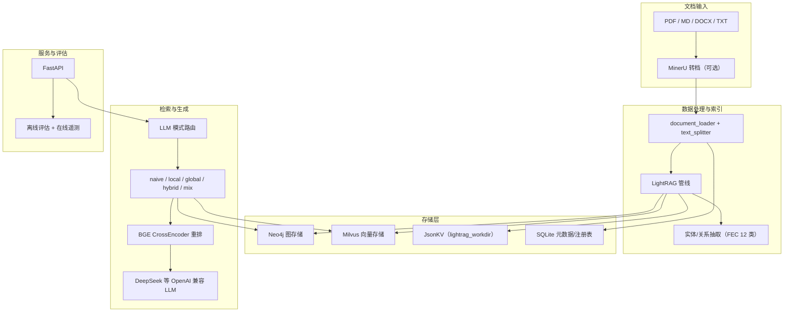

# RAG-FEC：面向 FEC 领域的生产级 Graph RAG 系统

本项目聚焦于 **LightRAG + Neo4j + Milvus** 的知识图谱增强检索（KG-RAG），面向 **前向纠错编码（FEC）** 领域文献与教材，提供文档解析、图谱构建、多模式检索、智能路由、增量更新、离线/在线评估与 FastAPI 服务，适合科研文献问答与领域知识库构建。

> 灵感来源于 GraphRAG 与 LightRAG 的轻量图谱方案，在 FEC 专业语料上做了实体类型、关系优化与评估体系的领域化落地。

## 系统架构




**技术栈概要**


| 组件        | 选型                                            | 说明                                       |
| --------- | --------------------------------------------- | ---------------------------------------- |
| 图谱 RAG 框架 | [LightRAG](https://github.com/HKUDS/LightRAG) | `Neo4JStorage` + `MilvusVectorDBStorage` |
| 图数据库      | Neo4j 5.x                                     | 实体与关系存储                                  |
| 向量库       | Milvus 2.4                                    | Chunk / 实体 / 关系向量                        |
| 应用元数据     | SQLite                                        | 文档注册、断点、清单                               |
| 嵌入        | BAAI/bge-m3（1024 维）                           | 本机 sentence-transformers                 |
| 重排        | BAAI/bge-reranker-v2-m3                       | CrossEncoder，可离线                         |
| LLM       | DeepSeek 等                                    | OpenAI 兼容 API                            |
| PDF 解析    | MinerU（可选）                                    | PDF → Markdown + images                  |
| 服务        | FastAPI + Uvicorn                             | REST API，Swagger `/docs`                 |


## 项目结构

```
rag-fec/
├── config/                     # 全局配置
│   ├── settings.py             # pydantic-settings，.env 驱动
│   ├── fec_defaults.py         # FEC 领域 12 类实体类型
│   └── model_paths.py          # 本机模型路径（models/hub）
├── data/
│   ├── raw/                    # 原始文档（PDF/MD/…）
│   ├── processed/              # 处理中间产物、增量断点
│   ├── lightrag_workdir/       # LightRAG JsonKV 持久化
│   ├── meta/                   # SQLite、document_manifest
│   ├── test/                   # 评估金标、预测、报告
│   └── logs/                   # 应用日志、query_metrics.jsonl
├── models/hub/                 # HuggingFace 快照（嵌入、重排、MinerU）
├── scripts/                    # 运维与评估脚本
│   ├── build_index.py          # 全量建索引
│   ├── incremental_update.py   # 增量更新
│   ├── convert.py              # MinerU PDF→MD
│   ├── query.py                # 命令行问答
│   ├── evaluate.py             # 离线评估
│   ├── collect_eval_predictions.py
│   ├── metrics_summary.py      # 离线+在线指标汇总
│   └── clear_index.py          # 清空索引（慎用）
├── src/
│   ├── data_processing/        # 文档加载、分块、MinerU
│   ├── storage/                # LightRAG 初始化、Neo4j/Milvus/KV
│   ├── incremental/            # 哈希增量、清单、级联清理
│   ├── retrieval/              # 检索、模式路由、关系优化、多模态
│   ├── evaluation/             # RAGAS、多跳、排序指标、在线监控
│   ├── service/                # RAGService + FastAPI
│   └── utils/                  # 日志、哈希等工具
├── tests/                      # pytest 单元测试
├── docker-compose.yml          # 仅 Neo4j + Milvus（及 etcd/minio）
├── main.py                     # API 入口
├── requirements.txt
└── .env.example
```

## 项目亮点

- **生产导向的 KG-RAG**：LightRAG 图谱 + 向量双路召回，默认 `mix` 模式融合图与 Chunk 证据
- **FEC 领域实体体系**：12 类实体（码型、编解码、信道模型等），摘要语言默认中文
- **LLM 智能检索路由**：按问题复杂度与难度实现LightRAG的模式路由，适配不同query
- **关系检索优化**：关键词回退、CrossEncoder 关系重排、关系描述过滤，降低图谱噪声
- **两阶段文档管线**：MinerU 转档与 LightRAG 索引解耦，支持 `convert-first` 一步执行
- **稳健增量更新**：MD5 哈希比对、`doc_id` 稳定映射、删除级联清理侧车文件
- **完整评估体系**：实体/关系/Chunk 排序指标、RAGAS v2、在线 query 遥测
- **本机模型离线**：嵌入与重排权重统一放在 `models/hub/`，支持 `MODELS_OFFLINE=true`

## 快速开始

### 环境要求

- Python **3.11+**
- Docker（用于 Neo4j、Milvus）
- 建议 16GB+ 内存（首次加载 bge-m3 / MinerU 时）

### 1. 安装依赖

```bash
cd rag-fec
python -m venv .venv
source .venv/bin/activate
pip install -r requirements.txt
```

### 2. 配置环境变量

```bash
cp .env.example .env
# 至少填写 OPENAI_API_KEY（DeepSeek 等 OpenAI 兼容接口）
```

### 3. 启动数据库（Docker Compose）

```bash
docker compose up -d
# Neo4j: http://127.0.0.1:7474  bolt://127.0.0.1:7687
# Milvus: http://127.0.0.1:19530
```

### 4. 准备文档并建索引

```bash
# 将 PDF / Markdown 等放入 data/raw
export PYTHONPATH=.

# 推荐两阶段：先转档再索引
python scripts/convert.py incremental
python scripts/incremental_update.py

# 或全量建索引
python scripts/build_index.py --mode full --raw data/raw
```

### 5. 启动 API 或命令行问答

```bash
# HTTP 服务
python main.py
# 或: uvicorn src.service.api:app --reload

# 命令行（默认 LLM 智能路由）
python scripts/query.py "什么是循环码？"
python scripts/query.py "问题" --mode mix --show-mode
python scripts/query.py --interactive
```

浏览器访问 `**http://127.0.0.1:8000/docs**` 查看 OpenAPI。

## 功能模块

### 文档处理与索引

- **多格式支持**：PDF、Markdown、Word、TXT（`data/raw` 可含子目录）
- **MinerU PDF 解析**：`data/raw/foo.pdf` → 同目录 `foo.md` + `images/`，Chunk 保留 ``
- **两阶段管线**（默认 `two_stage`）：
  - 阶段一：`scripts/convert.py` — 仅 PDF 转 Markdown
  - 阶段二：`scripts/incremental_update.py` — 仅对文本建 LightRAG 索引
- **FEC 实体类型**：经 `LightRAG.addon_params["entity_types"]` 注入，可用 `FEC_ENTITY_TYPES_JSON` 覆盖
- **增量更新**：`data/hash_cache.json` 记录路径 MD5；变更时 `adelete_by_doc_id` 再 `ainsert`

### 检索模式


| 模式       | 说明                         | 适用场景            |
| -------- | -------------------------- | --------------- |
| `naive`  | 仅向量 Chunk                  | 简单事实、局部段落即可     |
| `local`  | 低层关键词 + 实体邻域               | 具体概念、定义、单点事实    |
| `global` | 高层关键词 + 关系/社群              | 总结、宏观对比         |
| `hybrid` | local + global 图结果合并       | 需实体细节与关系结构      |
| `mix`    | 图谱 + 向量 Chunk 双路融合（**推荐**） | 中等以上复杂度、需原文+图证据 |


智能路由由 `src/retrieval/mode_router.py` 实现，环境变量 `RETRIEVAL_LLM_MODE_ROUTER_ENABLED=true` 控制开关；CLI 可用 `--no-auto-mode` 关闭。

### 关系检索增强

- **关系关键词评分**（`relation_keywords.py`）
- **CrossEncoder 关系重排**（`bge_rerank.py`）
- **关键词回退**（`keyword_fallback.py`）：向量召回不足时补充
- **检索后精炼**（`relation_optimizer.py`）：打包过滤低质量关系

### 多模态回答（可选）

对含 `` 的检索上下文，可调用视觉 LLM 生成图文答案：

```bash
python scripts/query.py "解释该译码结构图" --multimodal
```

需在 `.env` 配置 `MULTIMODAL_*`（与主 LLM 分离）。

### 评估与监控

**离线评估流程**

```bash
# 1. 准备金标 data/test/eval_gold.jsonl
# 2. 批量生成预测
python scripts/collect_eval_predictions.py \
  --input data/test/eval_gold.jsonl \
  --out data/test/eval_predictions.jsonl

# 3. 计算报告
python scripts/evaluate.py \
  --input data/test/eval_predictions.jsonl \
  --out data/test/eval_report.json

# 4. 汇总离线 + 在线指标
python scripts/metrics_summary.py
```

**核心离线指标**

- **排序检索**：实体 / 关系 / Chunk 的 Recall@K、Precision@K、NDCG@K（对齐匹配）
- **RAGAS v2**：context_recall、context_precision、faithfulness（启发式或 `--ragas-llm`）
- **多跳**：`multihop: true` 样本的要点/别名匹配准确率
- **可选**：ROUGE、文档 Hit@K（`--include-answer`）

**在线遥测**：每次 query/retrieve 追加 `data/logs/query_metrics.jsonl`，记录延迟、图谱空率、重排过滤率、token 用量等，无需测试集。

### API 服务


| 方法     | 路径                            | 说明                  |
| ------ | ----------------------------- | ------------------- |
| GET    | `/api/rag/health`             | 健康检查                |
| POST   | `/api/rag/query`              | 问答（省略 `mode` 时智能路由） |
| POST   | `/api/rag/documents`          | 上传单文件               |
| POST   | `/api/rag/documents/batch`    | 多文件上传               |
| PUT    | `/api/rag/documents/{doc_id}` | 覆写并重建索引             |
| DELETE | `/api/rag/documents/{doc_id}` | 删除索引                |
| GET    | `/api/rag/documents`          | 文档列表                |
| GET    | `/api/rag/documents/{doc_id}` | 文档详情                |
| POST   | `/api/rag/incremental-update` | 触发增量扫描              |


请求体示例（智能路由）：

```json
{
  "question": "Polar 码与 Reed-Muller 码的性能对比如何？",
  "auto_mode": true,
  "include_mode_selection": true
}
```

## 命令行速查

```bash
export PYTHONPATH=.

# 索引
python scripts/build_index.py --mode full --raw data/raw
python scripts/incremental_update.py
python scripts/incremental_update.py --convert-first

# 问答
python scripts/query.py "什么是 LDPC 码？"
python scripts/query.py -q "问题" --mode local --json --show-mode
python scripts/query.py "问题" --context --json   # 仅检索上下文

# 评估
python scripts/collect_eval_predictions.py -i data/test/eval_gold.jsonl -o data/test/eval_predictions.jsonl
python scripts/evaluate.py --input data/test/eval_predictions.jsonl --out data/test/eval_report.json
python scripts/metrics_summary.py

# 维护
python scripts/clear_index.py --all    # 清空 Neo4j、workdir、SQLite（慎用）
python scripts/download_reranker.py    # 预下载重排模型到 models/hub
```

## 终端演示

```bash
$ python scripts/query.py "循环码的生成多项式有什么性质？" --show-mode

[mode_router] 选型: mix | 难度=medium | 原因=需结合图谱实体与原文 chunk 证据
...
循环码的生成多项式 g(x) 必须整除 x^n - 1，且 ...
```

带 JSON 输出与路由详情：

```bash
python scripts/query.py "比较卷积码与分组码的优缺点" --json --show-mode
```

## 测试

```bash
export PYTHONPATH=.
pytest -q
```

覆盖模块：增量更新、FEC 实体、模式路由、RAGAS/对齐指标、关系优化、多模态、MinerU 侧车等。

## 常见问题

1. **Neo4j 连不上**
  本机脚本/API 请使用 `bolt://127.0.0.1:7687`（与 compose 端口映射一致）。
2. **Milvus 连不上**
  使用 `http://127.0.0.1:19530`；standalone 启动较慢，可 `docker compose logs -f milvus`。
3. **嵌入维度错误**
  `EMBEDDING_DIMENSION` 须与模型一致（bge-m3 为 **1024**）。首次加载可调大 `EMBEDDING_LIGHTRAG_EMBEDDING_TIMEOUT`。
4. `**PermissionError: data/logs/app.log`**
  若目录属主为 root：`sudo chown -R "$USER:$USER" data/logs`。无法写文件时会回退到终端输出，不影响启动。
5. **模型下载**
  设置 `MODELS_HF_ENDPOINT` 镜像；嵌入/重排完成后可 `MODELS_OFFLINE=true`。重排：`python scripts/download_reranker.py`。
6. **增量删除侧车文件**
  `data/meta/document_manifest.json` 记录 MinerU 元数据与 `images/`；删索引时会清理侧车，**不删除**你放在 `data/raw` 的主文件本体。

## 配置说明

主要环境变量见 `[.env.example](./.env.example)`，分组包括：

- **NEO4J_*** / **MILVUS_***：存储连接
- **OPENAI_***：LLM（DeepSeek 等）
- **EMBEDDING_***：bge-m3 嵌入
- **RETRIEVAL_***：默认模式、top_k、BM25、重排阈值、智能路由
- **LIGHTRAG_***：token 上限、关系 top_k、关键词回退
- **FEC_SUMMARY_LANGUAGE** / **FEC_ENTITY_TYPES_JSON**：领域配置
- **MODELS_***：本机模型目录与离线模式
- **MULTIMODAL_***：多模态 LLM（可选）

## 参考与致谢

- [LightRAG](https://github.com/HKUDS/LightRAG) — 轻量级知识图谱增强 RAG
- [GraphRAG](https://github.com/microsoft/graphrag) — 微软知识图谱 RAG 框架
- [Neo4j](https://neo4j.com/) — 图数据库
- [Milvus](https://milvus.io/) — 向量数据库
- [BGE](https://github.com/FlagOpen/FlagEmbedding) — bge-m3 / bge-reranker
- [MinerU](https://github.com/opendatalab/MinerU) — PDF 结构化解析

