<!-- source: 差错控制编码.rag.md | body line 5458–7680 | chapter 5 -->
<!-- source: 0-32.md -->
# 差错控制编码

(原书第2版)

# 前言

## 本书目录索引（第 5 章）

```text
# 第 5 章 循环码 91

5.1 循环码的描述 91  
5.2 循环码的生成矩阵与校检矩阵 …… 96   
5.3 循环码的编码 98  
5.4 校正子计算和差错检测 …… 100  
5.5 循环码的译码 …… 103  
5.6 循环汉明码 108  
5.7 捕错译码 111  
5.8 改进的捕错译码 …… 116  
5.9 (23, 12)格雷码 117

5.9.1 Kasami 译码器 …… 117  
5.9.2 系统搜索译码器 …… 119

5.10 缩短的循环码 120  
5.11 循环乘积码 123   
5.12 准循环码 123

习题 126

参考文献 128
```

---

# 第5章 循环码

循环码构成了线性分组码的一个重要子类。有两个原因使得该码引人注目：一是通过带反馈连接的移位寄存器（一般称为线性时序电路），该码的编码和校正子计算能够很容易地实现；二是由于其具有固有的代数结构，所以能找到多种实用的方法对该码进行译码。循环码被广泛应用于通信系统的差错控制中，在差错检测中的效果尤其明显。

1957 年，普蓝奇(Eugene Prange)首次进行了对循环码的研究[1]。从那以后，由于众多代数编码学家的努力，极大的加快了循环码用于随机差错纠正和突发错误纠正两方面的研究进展。在此期间建立起多种循环码，包括：BCH 码、里德-索罗门(Reed-Solomon)码、欧氏几何码、射影几何码、二次剩余码以及法尔(Fire)码，接下来的章节将讨论这些码。文献[2\~5]以及[6\~9]给出了有关循环码的精辟阐述。

# 5.1 循环码的描述

如果对一个 n 维向量 $v = (v_{0}, v_{1}, \cdots, v_{n-1})$ 的分量做一次向右的循环移位，将得到另一个 n 维向量为

$$
\boldsymbol {v} ^ {(1)} = \left(\boldsymbol {v} _ {n - 1}, \boldsymbol {v} _ {0}, \dots , \boldsymbol {v} _ {n - 2}\right)
$$

称上述操作为 $\pmb{\nu}$ 的一次循环移位(cyclic shift)。如果对 $\pmb{\nu}$ 的分量做 $i$ 次向右的循环移位，则得到的 $n$ 维向量为

$$
\boldsymbol {v} ^ {(i)} = \left(v _ {n - i}, v _ {n - i + 1}, \dots , v _ {n - 1}, v _ {0}, v _ {1}, \dots , v _ {n - i - 1}\right)
$$

显而易见，把 v 循环右移 i 位等价于把 v 循环左移 n - i 位。

定义 5-1 一个 $(n, k)$ 线性码 C，如果每个码字的循环移位仍是 C 的码字，则称其为循环码(cyclic code)。

表 5-1 所给出的 $(7, 4)$ 线性码就是一个循环码。

为了研究循环码的代数特性，将码字 $v = (v_{0}, v_{1}, \cdots, v_{n-1})$ 的各个分量看做如下多项式的系数：

$$
\nu (X) = v _ {0} + v _ {1} X + v _ {2} X ^ {2} + \dots + v _ {n - 1} X ^ {n - 1}
$$

这样，每个码字对应于一个次数等于或小于 $n - 1$ 的多项式。若 $v_{n - 1} \neq 0$ ，则 $\pmb{v}(X)$ 的次数为 $n - 1$ ；若 $v_{n - 1} = 0$ ，则 $\pmb{v}(X)$ 的次数小于 $n - 1$ 。码字 $\pmb{v}$ 和多项式 $\pmb{v}(X)$ 之间是一一对应的。我们称 $\pmb{v}(X)$ 为 $\pmb{v}$ 的码多项式。此后，码字（codeword）和码多项式（code polynomial）这两个术语可以互换使用。对应于码字 $\pmb{v}^{(i)}$ 的码多项式为

$$
\boldsymbol {v} ^ {(i)} (X) = \boldsymbol {v} _ {n - i} + \boldsymbol {v} _ {n - i + 1} X + \dots + \boldsymbol {v} _ {n - 1} X ^ {i - 1} + \boldsymbol {v} _ {0} X ^ {i} + \boldsymbol {v} _ {1} X ^ {i + 1} + \dots + \boldsymbol {v} _ {n - i - 1} X ^ {n - 1}
$$

在 $\nu(X)$ 和 $\nu^{(i)}(X)$ 之间存在着一个有意义的代数关系。用 $X^{i}$ 乘以 $\nu(X)$ ，我们得到

$$
X ^ {i} \nu (X) = v _ {0} X ^ {i} + v _ {1} X ^ {i + 1} + \dots + v _ {n - i - 1} X ^ {n - 1} + \dots + v _ {n - 1} X ^ {n + i - 1}
$$

上述等式可以被写成如下形式：

$$
X ^ {i} \nu (X) = v _ {n - i} + v _ {n - i + 1} X + \dots + v _ {n - 1} X ^ {i - 1} + v _ {0} X ^ {i} + \dots + v _ {n - i - 1} X ^ {n - 1}
$$

$$
\begin{array}{l} + v _ {n - i} \left(X ^ {n} + 1\right) + v _ {n - i + 1} X \left(X ^ {n} + 1\right) + \dots + v _ {n - 1} X ^ {i - 1} \left(X ^ {n} + 1\right) \\ = \boldsymbol {q} (X) \left(X ^ {n} + 1\right) + \boldsymbol {v} ^ {(i)} (X) \tag {5-1} \\ \end{array}
$$

其中， $\boldsymbol{q}(X) = \boldsymbol{v}_{n-i} + \boldsymbol{v}_{n-i+1} X + \cdots + \boldsymbol{v}_{n-1} X^{i-1}$ 。从公式(5-1)可以看出，码多项式 $\boldsymbol{v}^{(i)}(X)$ 即为多项式 $X^{i} \boldsymbol{v}(X)$ 除以 $X^{n} + 1$ 所得的余式。

表 5-1 由 $g(X)=1+X+X^{3}$ 生成的 (7, 4) 循环码

<table><tr><td>消 息</td><td>码 向 量</td><td>码 多 项 式</td></tr><tr><td>(0000)</td><td>0000000</td><td>0 = 0 · g(X)</td></tr><tr><td>(1000)</td><td>1101000</td><td>1 + X + X3 = 1 · g(X)</td></tr><tr><td>(0100)</td><td>0110100</td><td>X + X2 + X4 = X · g(X)</td></tr><tr><td>(1100)</td><td>1011100</td><td>1 + X2 + X3 + X4 = (1 + X) · g(X)</td></tr><tr><td>(0010)</td><td>0011010</td><td>X2 + X3 + X5 = X2 · g(X)</td></tr><tr><td>(1010)</td><td>1110010</td><td>1 + X + X2 + X5 = (1 + X2) · g(X)</td></tr><tr><td>(0110)</td><td>0101110</td><td>X + X3 + X4 + X5 = (X + X2) · g(X)</td></tr><tr><td>(1110)</td><td>1000110</td><td>1 + X4 + X5 = (1 + X + X2) · g(X)</td></tr><tr><td>(0001)</td><td>0001101</td><td>X3 + X4 + X6 = X3 · g(X)</td></tr><tr><td>(1001)</td><td>1100101</td><td>1 + X + X4 + X6 = (1 + X3) · g(X)</td></tr><tr><td>(0101)</td><td>0111001</td><td>X + X2 + X3 + X6 = (X + X3) · g(X)</td></tr><tr><td>(1101)</td><td>1010001</td><td>1 + X2 + X6 = (1 + X + X3) · g(X)</td></tr><tr><td>(0011)</td><td>0010111</td><td>X2 + X4 + X5 + X6 = (X2 + X3) · g(X)</td></tr><tr><td>(1011)</td><td>1111111</td><td>1 + X + X2 + X3 + X4 + X5 + X6 = (1 + X2 + X3) · g(X)</td></tr><tr><td>(0111)</td><td>0100011</td><td>X + X5 + X6 = (X + X2 + X3) · g(X)</td></tr><tr><td>(1111)</td><td>1001011</td><td>1 + X3 + X5 + X6 = (1 + X + X2 + X3) · g(X)</td></tr></table>

下面，我们将证明循环码的一系列重要代数性质，它们可以简化编码的实现和校正子的计算。

定理 5-1 循环码 C 中次数最低的非零码多项式是唯一的。

证明：令 $\boldsymbol{g}(X)=\boldsymbol{g}_{0}+\boldsymbol{g}_{1}X+\cdots+\boldsymbol{g}_{r-1}X^{r-1}+X^{r}$ 为循环码 C 中一个次数最低的非零码多项式。假设 $\boldsymbol{g}(X)$ 不唯一，则存在另一次数为 r 的码多项式，记为 $\boldsymbol{g}^{\prime}(X)=\boldsymbol{g}_{0}^{\prime}+\boldsymbol{g}_{1}^{\prime}X+\cdots+\boldsymbol{g}_{r-1}^{\prime}X^{r-1}+X^{r}$ 。由于 C 是线性的，则 $\boldsymbol{g}(X)+\boldsymbol{g}^{\prime}(X)=(g_{0}+g_{0}^{\prime})+(g_{1}+g_{1}^{\prime})X+\cdots+(g_{r-1}+g_{r-1}^{\prime})X^{r-1}$ 是一个次数比 r 更低的码多项式。若 $\boldsymbol{g}(X)+\boldsymbol{g}^{\prime}(X)\neq0$ ，则 $\boldsymbol{g}(X)+\boldsymbol{g}^{\prime}(X)$ 是次数比 r 更小的非零码多项式。这与假设矛盾。因此， $\boldsymbol{g}(X)+\boldsymbol{g}^{\prime}(X)=0$ ，这意味 $\boldsymbol{g}(X)=\boldsymbol{g}^{\prime}(X)$ 。因此， $\boldsymbol{g}(X)$ 是唯一的。证毕。

定理 5-2 令 $g(X)=g_{0}+g_{1}X+\cdots+g_{r-1}X^{r-1}+X^{r}$ 为一 $(n,k)$ 循环码 C 的最低次数非零码多项式，则常数项 $g_{0}$ 必等于 1。

证明：假设 $g_0 = 0$ 。则有

$$
\begin{array}{l} \boldsymbol {g} (X) = \boldsymbol {g} _ {1} X + \boldsymbol {g} _ {2} X ^ {2} + \dots + \boldsymbol {g} _ {r - 1} X ^ {r - 1} + X ^ {r} \\ = X \left(g _ {1} + g _ {2} X + \dots + g _ {r - 1} X ^ {r - 2} + X ^ {r - 1}\right) \\ \end{array}
$$

如果将 $g(X)$ 循环右移 n-1 位（或循环左移 1 位），我们将得到一个次数低于 r 的非零码多项式 $g_{1} + g_{2}X + \cdots + g_{r-1}X^{r-2} + X^{r-1}$ ，这与先前 $g(X)$ 为次数最低的非零码多项式的假设相矛盾。因此， $g_{0} \neq 0$ 。证毕。

由定理 5-2 可知， $(n, k)$ 循环码 C 的最低次数非零码多项式有如下的形式：

$$
\boldsymbol {g} (X) = 1 + g _ {1} X + g _ {2} X ^ {2} + \dots + g _ {r - 1} X ^ {r - 1} + X ^ {r} \tag {5-2}
$$

考虑表 5-1 所给出的(7, 4)循环码，其最低次数非零码多项式为： $g(X)=1+X+X^{3}$ 。

考虑多项式 $X\pmb{g}(X)$ , $X^2\pmb{g}(X)$ , $\cdots$ , $X^{n - r - 1}\pmb{g}(X)$ , 它们的次数分别为 $r + 1$ , $r + 2$ , $\cdots$ , $n - 1$ 。由公式(5-1)知, $X\pmb{g}(X) = \pmb{g}^{(1)}(X)$ , $X^2\pmb{g}(X) = \pmb{g}^{(2)}(X)$ , $\cdots$ , $X^{n - r - 1}\pmb{g}(X) = \pmb{g}^{(n - r - 1)}(X)$ , 即它们是码多项式 $\pmb{g}(X)$ 的循环移位。因此, 它们是循环码 $C$ 中的码多项式。由于循环码 $C$ 是线性的, $\pmb{g}(X)$ , $X\pmb{g}(X)$ , $\cdots$ , $X^{n - r - 1}\pmb{g}(X)$ 的线性组合:

$$
\begin{array}{l} \boldsymbol {v} (X) = u _ {0} \boldsymbol {g} (X) + u _ {1} X \boldsymbol {g} (X) + \dots + u _ {n - r - 1} X ^ {n - r - 1} \boldsymbol {g} (X) \\ = \left(u _ {0} + u _ {1} X + \dots + u _ {n - r - 1} X ^ {n - r - 1}\right) \mathbf {g} (X) \tag {5-3} \\ \end{array}
$$

也是一个码多项式，这里 $u_{i} = 0$ 或1。下面的定理给出了循环码的一个重要性质。

定理 5-3 设 $g(X)=1+g_{1}X+\cdots+g_{r-1}X^{r-1}+X^{r}$ 为 $(n,k)$ 循环码 C 的最低次数非零码多项式。次数小于或等于 n-1 的二进制多项式是码多项式，当且仅当它是 $g(X)$ 的整数倍。

证明：令 $v(X)$ 为次数不大于 n-1 的二进制多项式，设 $v(X)$ 为 $g(X)$ 的倍式。则有

$$
\begin{array}{l} \boldsymbol {v} (X) = \left(a _ {0} + a _ {1} X + \dots + a _ {n - r - 1} X ^ {n - r - 1}\right) \boldsymbol {g} (X) \\ = a _ {0} \boldsymbol {g} (X) + a _ {1} X \boldsymbol {g} (X) + \dots + a _ {n - r - 1} X ^ {n - r - 1} \boldsymbol {g} (X) \\ \end{array}
$$

由于 $\nu(X)$ 是码多项式 $\mathbf{g}(X)$ ， $X\mathbf{g}(X)$ ， $\cdots$ ， $X^{n-r-1}\mathbf{g}(X)$ 的线性组合，因此它是循环码 C 中的码多项式。这就证明了定理的前半部分，即若次数不大于 n-1 的多项式是 $\mathbf{g}(X)$ 的整数倍，则它是一个码多项式。

下面，令 $\boldsymbol{v}(X)$ 为循环码 C 中的码多项式。用 $\boldsymbol{g}(X)$ 去除 $\boldsymbol{v}(X)$ ，我们得到

$$
\boldsymbol {v} (X) = \boldsymbol {a} (X) \boldsymbol {g} (X) + \boldsymbol {b} (X)
$$

在上式中，或者 $b(X)$ 为0，或者它的次数比 $g(X)$ 的次数低。重新整理上式可以得到

$$
\boldsymbol {b} (X) = \boldsymbol {v} (X) + \boldsymbol {a} (X) \boldsymbol {g} (X)
$$

由定理的前半部分可知， $a(X)g(X)$ 为码多项式。由于 $v(X)$ 和 $a(X)g(X)$ 均为码多项式，因此有 $b(X)$ 必为码多项式。若 $b(X) \neq 0$ ，则 $b(X)$ 为一次数比 $g(X)$ 更低的非零码多项式。这与 $g(X)$ 为次数最低的码多项式的假设相矛盾。因此， $b(X)$ 必须等于 0。由此证明了定理的第二部分，即码多项式必为 $g(X)$ 的整数倍。证毕。

次数不大于 $n - 1$ 且为 $\pmb{g}(X)$ 倍式的二进制多项式的数目为 $2^{n - r}$ 。由定理5-3推知这些多项式构成了 $(n, k)$ 循环码 $C$ 中的所有码多项式。由于 $C$ 中有 $2^k$ 个码多项式，因此 $2^{n - r}$ 必然和 $2^k$ 相等。因此，我们得到 $r = n - k[$ 即 $\pmb{g}(X)$ 的次数为 $n - k]$ 。所以， $(n, k)$ 循环码 $C$ 中次数最小的码多项式可表示如下：

$$
\boldsymbol {g} (X) = 1 + \boldsymbol {g} _ {1} X + \boldsymbol {g} _ {2} X ^ {2} + \dots + \boldsymbol {g} _ {n - k - 1} X ^ {n - k - 1} + X ^ {n - k}
$$

归纳以上结论，我们有以下定理：

定理 5-4 $(n, k)$ 循环码中，有且仅有一个次数为 n-k 的码多项式，

$$
\boldsymbol {g} (X) = 1 + \boldsymbol {g} _ {1} X + \boldsymbol {g} _ {2} X ^ {2} + \dots + \boldsymbol {g} _ {n - k - 1} X ^ {n - k - 1} + X ^ {n - k} \tag {5-4}
$$

每一个码多项式为 $g(X)$ 的倍式，且每一个次数不大于 n-1 且为 $g(X)$ 倍式的二进制多项式是一码多项式。

由定理 5-4 可知， $(n, k)$ 循环码 C 中的每一个码多项式 $\nu(X)$ 可以表示为下面的形式：

$$
\boldsymbol {v} (X) = \boldsymbol {u} (X) \boldsymbol {g} (X) = \left(u _ {0} + u _ {1} X + \dots + u _ {k - 1} X ^ {k - 1}\right) \boldsymbol {g} (X)
$$

如果 $u(X)$ 的系数 $u_{0}, u_{1}, \cdots, u_{k-1}$ 为 k 个待编码的信息位， $v(X)$ 就是对应的码多项式。因此，可利用 $g(X)$ 乘以消息向量 $u(X)$ 来完成编码。所以，一个 $(n, k)$ 循环码可以由公式(5-4)给出的非零最小次数多项式 $g(X)$ 来完全确定。多项式 $g(X)$ 称为码的生成多项式 (generator polynomial)。 $g(X)$ 的次数等于码中校检位的数目。表 4-1 所给出的 (7, 4) 循环码的生成多项式为 $g(X) = 1 + X + X^{3}$ 。可以看出，每一个码多项式均是 $g(X)$ 的整数倍。

以下定理描述了循环码的另一个重要的性质。

定理 5-5 $(n, k)$ 循环码的生成多项式 $g(X)$ 是 $X^{n} + 1$ 的一个因式。

证明：用 $X^{k}$ 乘 $\pmb {g}(X)$ 得到次数为 $n$ 的多项式 $X^{k}\pmb {g}(X)$ ，用 $X^{k}\pmb {g}(X)$ 除以 $X^n +1$ 得

$$
X ^ {k} \boldsymbol {g} (X) = \left(X ^ {n} + 1\right) + \boldsymbol {g} ^ {(k)} (X) \tag {5-5}
$$

其中， $\boldsymbol{g}^{(k)}(X)$ 为余式。由公式(5-1)可知， $\boldsymbol{g}^{(k)}(X)$ 为将 $\boldsymbol{g}(X)$ 向右循环移位 k 次所得的码多项式。因此， $\boldsymbol{g}^{(k)}(X)$ 为 $\boldsymbol{g}(X)$ 的倍式，设 $\boldsymbol{g}^{(k)}(X)=\boldsymbol{a}(X)\boldsymbol{g}(X)$ 。从公式(5-5)可知，

$$
X ^ {n} + 1 = \{X ^ {k} + \boldsymbol {a} (X) \} \boldsymbol {g} (X)
$$

所以， $g(X)$ 为 $X^{n}+1$ 的因式。

证毕。

此时人们自然会问，对于任意的 $n$ 、 $k$ 是否均存在对应的 $(n, k)$ 循环码。下面的定理回答了这个问题。

定理 5-6 如果 $g(X)$ 是次数为 n-k 的多项式且为 $X^{n}+1$ 的因式，则 $g(X)$ 生成一个 $(n, k)$ 循环码。

证明：考虑次数不大于 n-1 的 k 个多项式 $\boldsymbol{g}(X)$ ， $X\boldsymbol{g}(X)$ ， $\cdots$ ， $X^{k-1}\boldsymbol{g}(X)$ 。它们的线性组合

$$
\boldsymbol {v} (X) = a _ {0} \boldsymbol {g} (X) + a _ {1} X \boldsymbol {g} (X) + \dots + a _ {k - 1} X ^ {k - 1} \boldsymbol {g} (X) = \left(a _ {0} + a _ {1} X + \dots + a _ {k - 1} X ^ {k - 1}\right) \boldsymbol {g} (X)
$$

也是一个次数小于或等于 $n - 1$ 的多项式，且为 $\pmb{g}(X)$ 的倍式。总共有 $2^{k}$ 个这样的多项式，它们组成了一个 $(n, k)$ 循环码。

令 $\boldsymbol{v}(X)=v_{0}+v_{1}X+\cdots+v_{n-1}X^{n-1}$ 为此码的一个码多项式。用 X 乘以 $\boldsymbol{v}(X)$ 有，

$$
X \nu (X) = v _ {0} X + v _ {1} X ^ {2} + \dots + v _ {n - 2} X ^ {n - 1} + v _ {n - 1} X ^ {n} = v _ {n - 1} \left(X ^ {n} + 1\right) + \left(v _ {n - 1} + v _ {0} X + \dots + v _ {n - 2} X ^ {n - 1}\right)
$$

$$
= v _ {n - 1} \left(X ^ {n} + 1\right) + v ^ {(1)} (X)
$$

其中 $\boldsymbol{v}^{(1)}(X)$ 为 $\boldsymbol{v}(X)$ 的一次循环移位。由 $X\boldsymbol{v}(X)$ 和 $X^{n}+1$ 均可被 $\boldsymbol{g}(X)$ 整除知 $\boldsymbol{v}^{(1)}(X)$ 必能被 $\boldsymbol{g}(X)$ 整除，因而 $\boldsymbol{v}^{(1)}(X)$ 为 $\boldsymbol{g}(X)$ 的倍式且是 $\boldsymbol{g}(X)$ ， $X\boldsymbol{g}(X)$ ， $\cdots$ ， $X^{k-1}\boldsymbol{g}(X)$ 的线性组合。因此， $\boldsymbol{v}^{(1)}(X)$ 也是一个码多项式。根据定义 5-1 可知， $\boldsymbol{g}(X)$ ， $X\boldsymbol{g}(X)$ ， $\cdots$ ， $X^{k-1}\boldsymbol{g}(X)$ 生成的线性码是一个 $(n, k)$ 循环码。证毕。

定理 5-6 说明， $X^{n}+1$ 的任何一个次数为 n-k 的因式均可以生成一个 $(n, k)$ 循环码。当 n 很大时， $X^{n}+1$ 将会有许多次数为 n-k 的因式。它们中的某些多项式会生成好码，而某些则生成坏码。如何选择生成多项式来产生好的循环码是一个非常困难的问题，在搜索好的循环码方面，编码理论工作者已经投入了巨大的精力。目前已经发现了几类好的循环码，而且它们在实际应用中是可实现的。

例 5-1 多项式 $X^{7}+1$ 可以被因式分解如下：

$$
X ^ {7} + 1 = (1 + X) (1 + X + X ^ {3}) (1 + X ^ {2} + X ^ {3})
$$

其中有两个次数为3的因式，每个可生成一个(7，4)循环码。表5-1所给出的(7，4)循环码就是由 $g(X)=1+X+X^{3}$ 生成的。这种码的最小距离为3，能纠正单个错误。注意到此码并非系统形式。每个码多项式是次数不大于3的消息多项式和生成多项式 $g(X)=1+X+X^{3}$ 之积。例如，令 $u=(1010)$ 为待编码的消息。相应的信息多项式为 $u(X)=1+X^{2}$ 。 $g(X)$ 乘以 $u(X)$ 给出如下码多项式：

$$
\nu (X) = (1 + X ^ {2}) (1 + X + X ^ {3}) = 1 + X + X ^ {2} + X ^ {5}
$$

或者码字(1110010)。

给定一个 $(n, k)$ 循环码的生成多项式 $g(X)$ ，我们可以把这个码转换为系统形式（即每个码字最右面的k位为不变的信息位，最左面的n-k位为校检位）。假设待编码的消息为 $u=(u_{0}, u_{1}, \cdots, u_{k-1})$ ，则相应的消息多项式为

$$
\boldsymbol {u} (X) = u _ {0} + u _ {1} X + \dots + u _ {k - 1} X ^ {k - 1}
$$

用 $X^{n - k}$ 乘以 $\pmb {u}(X)$ ，得到次数不大于 $n - 1$ 的多项式为

$$
X ^ {n - k} \boldsymbol {u} (X) = u _ {0} X ^ {n - k} + u _ {1} X ^ {n - k + 1} + \dots + u _ {k - 1} X ^ {n - 1}
$$

用生成多项式 $g(X)$ 除 $X^{n-k}u(X)$ 得到

$$
X ^ {n - k} \boldsymbol {u} (X) = \boldsymbol {a} (X) \boldsymbol {g} (X) + \boldsymbol {b} (X) \tag {5-6}
$$

其中， $\boldsymbol{a}(X)$ 和 $\boldsymbol{b}(X)$ 分别为商式和余式。由于 $\boldsymbol{g}(X)$ 的次数为 n-k，则 $\boldsymbol{b}(X)$ 的次数必不大于 n-k-1。从而有

$$
\boldsymbol {b} (X) = b _ {0} + b _ {1} X + \dots + b _ {n - k - 1} X ^ {n - k - 1}
$$

重新整理式(5-6)，我们得到如下次数不大于 $n - 1$ 的多项式：

$$
\boldsymbol {b} (X) + X ^ {n - k} \boldsymbol {u} (X) = \boldsymbol {a} (X) \boldsymbol {g} (X) \tag {5-7}
$$

该多项式为生成多项式 $\boldsymbol{g}(X)$ 的倍式，由此它也是由多项式 $\boldsymbol{g}(X)$ 生成的循环码的码多项式。
写出 $\boldsymbol{b}(X)+X^{n-k}\boldsymbol{u}(X)$ 有

$$
\begin{array}{l} \boldsymbol {b} (X) + X ^ {n - k} \boldsymbol {u} (X) = b _ {0} + b _ {1} X + \dots + b _ {n - k - 1} X ^ {n - k - 1} \\ + u _ {0} X ^ {n - k} + u _ {1} X ^ {n - k + 1} + \dots + u _ {k - 1} X ^ {n - 1} \tag {5-8} \\ \end{array}
$$

相应的码字为

$$
\left(b _ {0}, b _ {1}, \dots , b _ {n - k - 1}, u _ {0}, u _ {1}, \dots , u _ {k - 1}\right)
$$

由上可见，码字是由 k 位不变的信息位和其后的 n-k 个校验位组成。这 n-k 个校检位正是生成多项式 $g(X)$ 除消息多项式 $X^{n-k}u(X)$ 所得余式的系数。上述方法将得到一个系统形式的 $(n, k)$ 循环码。在系统形式的循环码中，采用以下约定：前 n-k 个符号，即 1, X, $\cdots$ , $X^{n-k-1}$ 的系数，取为校检位；而后 k 个符号，即 $X^{n-k}$ , $X^{n-k+1}$ , $\cdots$ , $X^{n-1}$ 的系数则取为信息位。总之，系统码的编码由以下三个步骤组成：

第1步 预先用 $X^{n - k}$ 乘以消息 $\pmb {u}(X)$ 。

第 2 步 用生成多项式 $g(X)$ 除 $X^{n-k}u(X)$ ，获得余式 $b(X)$ （校验位）。

第 3 步 联合 $\boldsymbol{b}(X)$ 和 $X^{n-k}\boldsymbol{u}(X)$ ，获得码多项式 $\boldsymbol{b}(X)+X^{n-k}\boldsymbol{u}(X)$ 。

例 5-2 考虑由 $\boldsymbol{g}(X)=1+X+X^{3}$ 生成的 $(7,4)$ 循环码。令 $\boldsymbol{u}(X)=1+X^{3}$ 为待编码的消息。用 $\boldsymbol{g}(X)$ 除 $X^{3}\boldsymbol{u}(X)$ ，有

$$
X ^ {3} + X + 1 \mid \frac {X ^ {3} + X (\text {商式})}{X ^ {6} X ^ {3}}
$$

$$
\frac {X ^ {6} + X ^ {4} + X ^ {3}}{X ^ {4}}
$$

$$
\frac {X ^ {4} \quad + X ^ {2} + X}{X ^ {2} + X} \quad (\text {余式})
$$

得余式 $\boldsymbol{b}(X)=X+X^{2}$ 。故码多项式为 $\boldsymbol{v}(X)=\boldsymbol{b}(X)+X^{3}\boldsymbol{u}(X)=X+X^{2}+X^{3}+X^{6}$ ，相应的码字为 $v=(0\ 1\ 1\ 1\ 0\ 0\ 1)$ ，其中最右边的四位是信息位。系统形式的 16 个码字列于表 5-2 中。

表 5-2 由 $g(X)=1+X+X^{3}$ 生成的系统形式 (7, 4) 循环码

<table><tr><td>消息</td><td>码字</td><td></td></tr><tr><td>(0000)</td><td>(0000000)</td><td>0 = 0 · g(X)</td></tr><tr><td>(1000)</td><td>(1101000)</td><td>1 + X + X^3 = g(X)</td></tr><tr><td>(0100)</td><td>(0110100)</td><td>X + X^2 + X^4 = Xg(X)</td></tr><tr><td>(1100)</td><td>(1011100)</td><td>1 + X^2 + X^3 + X^4 = (1 + X)g(X)</td></tr><tr><td>(0010)</td><td>(1110010)</td><td>1 + X + X^2 + X^5 = (1 + X^2)g(X)</td></tr><tr><td>(1010)</td><td>(0011010)</td><td> $X^{2} + X^{3} + X^{5} = X^{2}g(X)$ </td></tr><tr><td>(0110)</td><td>(1000110)</td><td> $1 + X^{4} + X^{5} = (1 + X + X^{2})g(X)$ </td></tr><tr><td>(1110)</td><td>(0101110)</td><td> $X + X^{3} + X^{4} + X^{5} = (X + X^{2})g(X)$ </td></tr><tr><td>(0001)</td><td>(1010001)</td><td> $1 + X^{2} + X^{6} = (1 + X + X^{3})g(X)$ </td></tr><tr><td>(1001)</td><td>(0111001)</td><td> $X + X^{2} + X^{3} + X^{6} = (X + X^{3})g(X)$ </td></tr><tr><td>(0101)</td><td>(1100101)</td><td> $1 + X + X^{4} + X^{6} = (1 + X^{3})g(X)$ </td></tr><tr><td>(1101)</td><td>(0001101)</td><td> $X^{3} + X^{4} + X^{6} = X^{3}g(X)$ </td></tr><tr><td>(0011)</td><td>(0100011)</td><td> $X + X^{5} + X^{6} = (X + X^{2} + X^{3})g(X)$ </td></tr><tr><td>(1011)</td><td>(1001011)</td><td> $1 + X^{3} + X^{5} + X^{6} = (1 + X + X^{2} + X^{3})g(X)$ </td></tr><tr><td>(0111)</td><td>(0010111)</td><td> $X^{2} + X^{4} + X^{5} + X^{6} = (X^{2} + X^{3})g(X)$ </td></tr><tr><td>(1111)</td><td>(1111111)</td><td> $1 + X + X^{2} + X^{3} + X^{4} + X^{5} + X^{6} = (1 + X^{2} + X^{5})g(X)$ </td></tr></table>

# 5.2 循环码的生成矩阵与校检矩阵

考虑一个 $(n,k)$ 循环码C，其生成多项式为 $\boldsymbol{g}(X)=g_{0}+g_{1}X+\cdots+g_{n-k}X^{n-k}$ 。5.1节指出，k个码多项式 $\boldsymbol{g}(X)$ ， $X\boldsymbol{g}(X)$ ， $\cdots$ ， $X^{k-1}\boldsymbol{g}(X)$ 张成循环码C。如果以这k个码多项式所对应的n维向量作为一个 $k\times n$ 矩阵的行向量，则可以得到C的生成矩阵：

$$
\boldsymbol {G} = \left[ \begin{array}{c c c c c c c c c c c c c c c c} g _ {0} & g _ {1} & g _ {2} & \cdot & \cdot & \cdot & \cdot & \cdot & g _ {n - k} & 0 & 0 & 0 & \cdot & \cdot & 0 \\ 0 & g _ {0} & g _ {1} & g _ {2} & \cdot & \cdot & \cdot & \cdot & \cdot & g _ {n - k} & 0 & 0 & \cdot & \cdot & 0 \\ 0 & 0 & g _ {0} & g _ {1} & g _ {2} & \cdot & \cdot & \cdot & \cdot & \cdot & g _ {n - k} & 0 & \cdot & \cdot & 0 \\ \cdot & & & & & & & & & & & & & & \cdot \\ \cdot & & & & & & & & & & & & & & \cdot \\ \cdot & & & & & & & & & & & & & & \cdot \\ 0 & 0 & \cdot & \cdot & \cdot & 0 & g _ {0} & g _ {1} & g _ {2} & \cdot & \cdot & \cdot & \cdot & \cdot & g _ {n - k} \end{array} \right] \tag {5-9}
$$

(注意 $g_{0}=g_{n-k}=1$ )。通常 G 并非系统形式；然而，可以通过行变换将其转化为系统形式。例如，表 5-1 所给出的由生成多项式 $g(X)=1+X+X^{3}$ 生成的 (7, 4) 循环码具有如下的生成矩阵：

$$
\boldsymbol {G} = \left[ \begin{array}{c c c c c c c} 1 & 1 & 0 & 1 & 0 & 0 & 0 \\ 0 & 1 & 1 & 0 & 1 & 0 & 0 \\ 0 & 0 & 1 & 1 & 0 & 1 & 0 \\ 0 & 0 & 0 & 1 & 1 & 0 & 1 \end{array} \right]
$$

显然， $G$ 不是系统形式。如果将第一行加到第三行，并将前两行之和加到第四行，得到如下系统形式的矩阵：

$$
\boldsymbol {G} ^ {\prime} = \left[ \begin{array}{c c c c c c c} 1 & 1 & 0 & 1 & 0 & 0 & 0 \\ 0 & 1 & 1 & 0 & 1 & 0 & 0 \\ 1 & 1 & 1 & 0 & 0 & 1 & 0 \\ 1 & 0 & 1 & 0 & 0 & 0 & 1 \end{array} \right]
$$

该矩阵 $G'$ 生成的码与矩阵 G 生成的码完全相同。

前面指出，生成多项式 $g(X)$ 是 $X^{n}+1$ 的因式，即

$$
X ^ {n} + 1 = \boldsymbol {g} (X) \boldsymbol {h} (X) \tag {5-10}
$$

其中多项式 $h(X)$ 是具有如下形式的 k 次多项式：

$$
\boldsymbol {h} (X) = h _ {0} + h _ {1} X + \dots + h _ {k} X ^ {k}
$$

这里 $h_{0}=h_{k}=1$ 。下面将证明循环码 C 的校检矩阵可从 $\boldsymbol{h}(X)$ 得到。令 $\boldsymbol{v}=(v_{0},v_{1},\cdots,v_{n-1})$ 为 C 的一个码字，从而 $\boldsymbol{v}(X)=\boldsymbol{a}(X)\boldsymbol{g}(X)$ 。 $\boldsymbol{h}(X)$ 乘 $\boldsymbol{v}(X)$ 有

$$
\boldsymbol {v} (X) \boldsymbol {h} (X) = \boldsymbol {a} (X) \boldsymbol {g} (X) \boldsymbol {h} (X) = \boldsymbol {a} (X) \left(X ^ {n} + 1\right) = \boldsymbol {a} (X) + X ^ {n} \boldsymbol {a} (X) \tag {5-11}
$$

由于 $\boldsymbol{a}(X)$ 的次数不大于 k-1， $\boldsymbol{a}(X)+X^{n}\boldsymbol{a}(X)$ 中不出现 $X^{k}, X^{k+1}, \cdots, X^{n-1}$ 各幂次项。如果公式(5-11)左边的 $\boldsymbol{v}(X)\boldsymbol{h}(X)$ 按次数展开，其 $X^{k}, X^{k+1}, \cdots, X^{n-1}$ 的系数必然为零。因此，我们得到如下 n-k 个方程：

$$
\sum_ {i = 0} ^ {k} h _ {i} v _ {n - i - j} = 0, \quad 1 \leqslant j \leqslant n - k \tag {5-12}
$$

由此，我们得到表达式 $\pmb{h}(X)$ 的反多项式(reciprocal)，如下定义：

$$
X ^ {k} \boldsymbol {h} \left(X ^ {- 1}\right) \stackrel {\Delta} {=} h _ {k} + h _ {k - 1} X + h _ {k - 2} X ^ {2} + \dots + h _ {0} X ^ {k} \tag {5-13}
$$

容易看出 $X^{k}\pmb {h}(X^{-1})$ 也是 $X^n +1$ 的因式。多项式 $X^{k}\pmb {h}(X^{-1})$ 可生成一个 $(n,n - k)$ 循环码，它有如下形式的 $(n - k)\times n$ 生成矩阵：

$$
\boldsymbol {H} = \left[ \begin{array}{c c c c c c c c c c c c c c c c} h _ {k} & h _ {k - 1} & h _ {k - 2} & \cdot & \cdot & \cdot & \cdot & \cdot & h _ {0} & 0 & \cdot & \cdot & \cdot & \cdot & 0 \\ 0 & h _ {k} & h _ {k - 1} & h _ {k - 2} & \cdot & \cdot & \cdot & \cdot & \cdot & h _ {0} & 0 & \cdot & \cdot & \cdot & 0 \\ 0 & 0 & h _ {k} & h _ {k - 1} & h _ {k - 2} & \cdot & \cdot & \cdot & \cdot & \cdot & h _ {0} & \cdot & \cdot & \cdot & 0 \\ \vdots & & & & & & & & & & & & & & \vdots \\ 0 & 0 & \cdot & \cdot & \cdot & 0 & h _ {k} & h _ {k - 1} & h _ {k - 2} & \cdot & \cdot & \cdot & \cdot & \cdot & h _ {0} \end{array} \right] \tag {5-14}
$$

由公式(5-12)所列的 $n - k$ 个方程可知，循环码 $C$ 中的任一码字 $\pmb{\nu}$ 与矩阵 $\pmb{H}$ 的每一行均正交。因此，矩阵 $\pmb{H}$ 是循环码 $C$ 中的校检矩阵，而矩阵 $\pmb{H}$ 中的行向量空间为循环码 $C$ 的对偶码。由于校检矩阵 $\pmb{H}$ 由多项式 $\pmb{h}(X)$ 获得，我们称 $\pmb{h}(X)$ 为循环码 $C$ 的校验多项式（parity polynomial）。因此，一个循环码也被其校验多项式唯一确定。

推导出循环码的校验矩阵后，我们也就证明了下面定理所指出的一个重要性质。

定理 5-7 令 C 为一 $(n, k)$ 循环码，其生成多项式为 $g(X)$ ，则 C 的对偶码也是循环码，且其生成多项式为 $X^{k}h(X^{-1})$ ，其中 $\boldsymbol{h}(X) = (X^{n} + 1) / \boldsymbol{g}(X)$ 。

例 5-3 考虑表(5-1)给出的(7, 4)循环码，其生成多项式为 $g(X) = 1 + X + X^{3}$ 。校验多项式为

$$
\pmb {h} (X) = \frac {X ^ {7} + 1}{\pmb {g} (X)} = 1 + X + X ^ {2} + X ^ {4}
$$

$h(X)$ 的反多项式为

$$
X ^ {4} \boldsymbol {h} (X ^ {- 1}) = X ^ {4} (1 + X ^ {- 1} + X ^ {- 2} + X ^ {- 4}) = 1 + X ^ {2} + X ^ {3} + X ^ {4}
$$

$X^{7}+1$ 可以被多项式 $X^{4}h(X^{-1})$ 整除： $(X^{7}+1)/X^{4}h(X^{-1})=1+X^{2}+X^{3}$ 。若构造出由多项式 $X^{4}h(X^{-1})=1+X+X^{2}+X^{4}$ 所生成的(7,3)循环码的所有码字，会发现它的最小距离为4。因此，它能够纠正单个差错，同时能检测任意两个差错的组合。

可以很容易得到系统形式的生成矩阵。对所有 $i=0,1,\cdots,k-1$ ，以生成多项式 $\boldsymbol{g}(X)$ 去除 $X^{n-k+i}$ ，可得

$$
X ^ {n - k + i} = \boldsymbol {a} _ {i} (X) \boldsymbol {g} (X) + \boldsymbol {b} _ {i} (X) \tag {5-15}
$$

其中 $\boldsymbol{b}_{i}(X)$ 为如下形式的余式

$$
\boldsymbol {b} _ {i} (X) = b _ {i 0} + b _ {i 1} X + \dots + B _ {i, n - k - 1} X ^ {n - k - 1}
$$

由于对所有 $i=0,1,\cdots,k-1,\boldsymbol{b}_{i}(X)+X^{n-k+i}$ 均为 $\boldsymbol{g}(X)$ 的倍式，所以它们是码多项式。将这 k 个码多项式作为 $k \times n$ 矩阵的行向量来进行排列，有

$$
\boldsymbol {G} = \left[ \begin{array}{c c c c c c c c c c} b _ {0 0} & b _ {0 1} & b _ {0 2} & \dots & b _ {0, n - k - 1} & 1 & 0 & 0 & \dots & 0 \\ b _ {1 0} & b _ {1 1} & b _ {1 2} & \dots & b _ {1, n - k - 1} & 0 & 1 & 0 & \dots & 0 \\ b _ {2 0} & b _ {2 1} & b _ {2 2} & \dots & b _ {2, n - k - 1} & 0 & 0 & 1 & \dots & 0 \\ & \vdots & & & \vdots & & & & & \vdots \\ b _ {k - 1, 0} & b _ {k - 1, 1} & b _ {k - 1, 2} & \dots & b _ {k - 1, n - k - 1} & 0 & 0 & 0 & \dots & 1 \end{array} \right] \tag {5-16}
$$

G 为循环码 C 的系统形式的生成矩阵。相应的校验矩阵是

$$
\boldsymbol {H} = \left[ \begin{array}{c c c c c c c c c c} 1 & 0 & 0 & \dots & 0 & b _ {0 0} & b _ {1 0} & b _ {2 0} & \dots & b _ {k - 1, 0} \\ 0 & 1 & 0 & \dots & 0 & b _ {0 1} & b _ {1 1} & b _ {2 1} & \dots & b _ {k - 1, 1} \\ 0 & 0 & 1 & \dots & 0 & b _ {0 2} & b _ {1 2} & b _ {2 2} & \dots & b _ {k - 1, 2} \\ & \vdots & & & & & \vdots & & & \vdots \\ 0 & 0 & 0 & \dots & 1 & b _ {0, n - k - 1} & b _ {1, n - k - 1} & b _ {2, n - k - 1} & \dots & b _ {k - 1, n - k - 1} \end{array} \right] \tag {5-17}
$$

例 5-4 再次考虑 $g(X)=1+X+X^{3}$ 生成的 $(7,4)$ 循环码，用 $g(X)$ 去除 $X^{3}$ ， $X^{4}$ ， $X^{5}$ 和 $X^{6}$ ，有

$$
X ^ {3} = \boldsymbol {g} (X) + (1 + X) \quad X ^ {4} = X \boldsymbol {g} (X) + (X + X ^ {2})
$$

$$
X ^ {5} = (X ^ {2} + 1) \mathbf {g} (X) + (1 + X + X ^ {2}), \quad X ^ {6} = (X ^ {3} + X + 1) \mathbf {g} (X) + (1 + X ^ {2})
$$

重新排列上述方程，得到下面4个码多项式：

$$
\begin{array}{l} \nu_ {0} (X) = 1 + X \quad + X ^ {3} \\ \nu_ {1} (X) = X + X ^ {2} + X ^ {4} \\ \boldsymbol {v} _ {2} (X) = 1 + X + X ^ {2} \quad + X ^ {5} \\ \nu_ {3} (X) = 1 + X ^ {2} + X ^ {6} \\ \end{array}
$$

将这 4 个码多项式的系数作为 $4 \times 7$ 矩阵的行，则得到 $(7, 4)$ 循环码的如下系统形式的生成矩阵：

$$
\boldsymbol {G} = \left[ \begin{array}{c c c c c c c} 1 & 1 & 0 & 1 & 0 & 0 & 0 \\ 0 & 1 & 1 & 0 & 1 & 0 & 0 \\ 1 & 1 & 1 & 0 & 0 & 1 & 0 \\ 1 & 0 & 1 & 0 & 0 & 0 & 1 \end{array} \right]
$$

这与本节前面得到的矩阵 $G'$ 完全相同。

# 5.3 循环码的编码

如 5.1 节所述，系统形式的 $(n, k)$ 循环码的编码由三步组成：(1) 用 $X^{n-k}$ 乘以消息多项式 $\boldsymbol{u}(X)$ ；(2) 用 $X^{n-k}\boldsymbol{u}(X)$ 除以 $\boldsymbol{g}(X)$ ，得到余式 $\boldsymbol{b}(X)$ ；(3) 构造码字 $\boldsymbol{b}(X) + X^{n-k}\boldsymbol{u}(X)$ 。所有这三步可以由除法电路来实现，该除法电路是一个 $(n-k)$ 级移位寄存器，其反馈连接基于生成多项式 $\boldsymbol{g}(X) = 1 + g_{1}X + g_{2}X^{2} + \cdots + g_{n-k-1}X^{n-k-1} + X^{n-k}$ 。图 5-1 给出了这样的一个电路。编码操作过程如下：

第1步 门开启后，
k个信息位 $u_{0}$ ， $u_{1}$ ，…， $u_{k-1}$ [或用多项式 $\boldsymbol{u}(X)=u_{0}+u_{1}X+\cdots+u_{k-1}X^{k-1}$ 表示]串行移位进入电路中，同时送入通信信道。从前端将消息向量 $\boldsymbol{u}(X)$ 移位输入电路等价于将消息向量 $\boldsymbol{u}(X)$ 预先乘以 $X^{n-k}$ 。一旦


<!-- fec_figure path=images/2bc99e84092b311e1504c89a253c7ed2b0722e79050bb59f9d9d7ae62a290c07.jpg -->

<details>
<summary>flowchart</summary>

数字信号处理流程图，包含输入信号g1/g2、加法器b0-b2、乘法器b1-b2、加法器b_n-k-1，以及门和码字校验位生成
</details>

图 5-1 $(n, k)$ 循环码的编码电路，其生成多项式为

$$
\boldsymbol {g} (X) = 1 + \boldsymbol {g} _ {1} X ^ {2} + \dots + \boldsymbol {g} _ {n - k - 1} X ^ {n - k - 1} + X ^ {n - k}
$$

所有的消息位全部进入到电路中，则寄存器中的 $n - k$ 位就构成了余式多项式，即为校检数据；

第 2 步 关闭门，以断开反馈连接；

第 3 步 移出 n-k 位校检位到信道中。这 n-k 个校检位 $b_{0}$ ， $b_{1}$ ，…， $b_{n-k-1}$ 就与 k 个信息位共同构成了一个完整的码字。

例 5-5 考虑由 $\boldsymbol{g}(X)=1+X+X^{3}$ 生成的 $(7,4)$ 循环码。基于 $\boldsymbol{g}(X)$ 的编码电路如图 5-2 所示。假设待编码的消息为 $\boldsymbol{u}=(1011)$ 。当消息位移入到寄存器时，寄存器的内容有如下变化：

<table><tr><td>输入</td><td>寄存器内容</td></tr><tr><td></td><td>000(初始状态)</td></tr><tr><td>1</td><td>110(第一次移位)</td></tr><tr><td>1</td><td>101(第二次移位)</td></tr><tr><td>0</td><td>100(第三次移位)</td></tr><tr><td>1</td><td>100(第四次移位)</td></tr></table>

四次移位后，寄存器的内容为(100)。因此，完整的码字为(1001011)，码多项式为 $1+X^{3}+X^{5}+X^{6}$ 。

循环码的编码也可以通过校验多项式 $h(X)=h_{0}+h_{1}X+\cdots+h_{k}X^{k}$ 来实现。设 $v=(v_{0},v_{1},\cdots,v_{n-1})$ 是一个码字，在5.2节中我们已经证明v的分量满足公式(5-12)的n-k个方程。因 $h_{k}=1$ ，公式(5-12)的方程组可写成如下的形式：


<!-- fec_figure path=images/a5717dd2ef3d351fa6e12af2b2e7e0f8a66e50d1ed22fa78f8c513930f844e3d.jpg -->

<details>
<summary>flowchart</summary>

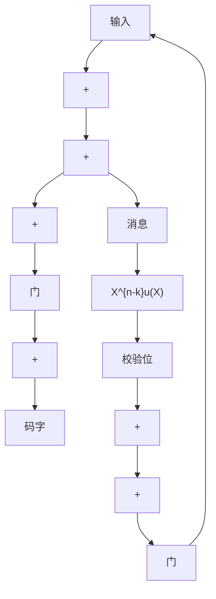
</details>

图 5-2 由 $g(X)=1+X+X^{3}$ 生成的 (7, 4) 循环码的编码电路

$$
v _ {n - k - j} = \sum_ {i = 0} ^ {k - 1} h _ {i} v _ {n - i - j} \quad 1 \leqslant j \leqslant n - k \tag {5-18}
$$

上述方程称为差分方程(difference equation)。对于系统形式的循环码来说，每个码字的 $v_{n-k}$ ， $v_{n-k+1}$ ，…， $v_{n-1}$ 分量为信息位。给定k个信息位，公式(5-18)就给出了确定n-k个校检位 $v_{0}$ ， $v_{1}$ ，…， $v_{n-k+1}$ 的计算规则。基于公式(5-18)的编码电路如图5-3所示。反馈连接取自校验多项式 $\boldsymbol{h}(X)$ 的系数（注意到 $h_{0}=h_{k}=1$ ）。编码操作步骤如下：

第1步 初始状态下，门1开启而门2关闭。k个信息位 $\boldsymbol{u}(X)=u_{0}+u_{1}X+\cdots+u_{k-1}X^{k-1}$ 同时移位进入寄存器和通信信道；

第2步 一旦 $k$ 个信息位进入移位寄存器，关闭门1、打开门2。生成第一个校检位


<!-- fec_figure path=images/789c105580f26c3628329bd9aaaa2ac9704a1a60ef5a0869c45d168a4f14c124.jpg -->

<details>
<summary>flowchart</summary>

数字信号处理流程图，包含输入、门1、门2、加法器、加法器和输出到信道的结构
</details>

图 5-3 基于校验多项式 $\boldsymbol{h}(X)=1+h_{1}X+\cdots+X^{k}$ 的 $(n,k)$ 循环码的编码电路

$$
v _ {n - k - 1} = h _ {0} v _ {n - 1} + h _ {1} v _ {n - 2} + \dots + h _ {k - 1} v _ {n - k} = u _ {k - 1} + h _ {1} u _ {k - 2} + \dots + h _ {k - 1} u _ {0}
$$

并在 $P$ 点出现；

第 3 步 移存器移位一次。第一个校检位送入信道，同时还被移入寄存器中。此时，第二个校检位

$$
v _ {n - k - 2} = h _ {0} v _ {n - 2} + h _ {1} v _ {n - 3} + \dots + h _ {k - 1} v _ {n - k - 1} = u _ {k - 2} + h _ {1} u _ {k - 3} + \dots + h _ {k - 2} u _ {0} + h _ {k - 1} v _ {n - k - 1}
$$

在 P 点生成。

第 4 步 重复步骤 3，直到所有的 n-k 个校检位全部生成并被送入信道为止。然后，打开门 1 关闭门 2，此时下一条信息准备移位进入寄存器。

上述编码电路使用了 k 级移位寄存器。比较本节所介绍的两种编码电路，可得到如下结论：对于校检位多于信息位的码来说，k 级编码电路更为经济；反之，n - k 级编码电路更好。

例 5-6 由 $g(X)=1+X+X^{3}$ 生成的 $(7,4)$ 循环码的校验多项式为

$$
\boldsymbol {h} (X) = \frac {X ^ {7} + 1}{1 + X + X ^ {3}} = 1 + X + X ^ {2} + X ^ {4}
$$

图 5-4 给出了基于 $\boldsymbol{h}(X)$ 的编码电路。每个码字的形式为 $\boldsymbol{v} = (v_{0}, v_{1}, v_{2}, v_{3}, v_{4}, v_{5}, v_{6})$ ，其中 $v_{3}$ ， $v_{4}$ ， $v_{5}$ 和 $v_{6}$ 是消息位，而 $v_{0}$ ， $v_{1}$ 和 $v_{2}$ 是校检位。确定校检位的差分方程为


<!-- fec_figure path=images/ac579af7c1e89382af6713deb00e807daf15f1e7a349718369ae7b07e8db60ab.jpg -->

<details>
<summary>flowchart</summary>

信号处理流程图，包含输入、门1、门2、加法器和输出到信道的逻辑结构
</details>

图 5-4 基于校验多项式 $\boldsymbol{h}(X)=1+X+X^{2}+X^{4}$ 的 $(7,4)$ 循环码编码电路

$$
v _ {3 - j} = 1 \cdot v _ {7 - j} + 1 \cdot v _ {6 - j} + 1 \cdot v _ {5 - j} + 0 \cdot v _ {4 - j} = v _ {7 - j} + v _ {6 - j} + v _ {5 - j} \quad 1 \leqslant j \leqslant 3
$$

假设待编码的消息为(1011)，则 $v_{3}=1,\quad v_{4}=0,\quad v_{5}=1,\quad v_{6}=1$ 。第一个校检位为

$$
v _ {2} = v _ {6} + v _ {5} + v _ {4} = 1 + 1 + 0 = 0
$$

第二个校检位为

$$
v _ {1} = v _ {5} + v _ {4} + v _ {3} = 1 + 0 + 1 = 0
$$

第三个校检位为

$$
v _ {0} = v _ {4} + v _ {3} + v _ {2} = 0 + 1 + 0 = 1
$$

因此，对应于消息(1011)的码字为(1001011)。

# 5.4 校正子计算和差错检测

假设传输一个码字，接收向量为 $\boldsymbol{r}=(r_{0},r_{1},\cdots,r_{n-1})$ 。由于信道噪声，接收向量可能与传送码字不同。在线性码的译码过程中，第一步是计算校正子 $s=r\cdot H^{T}$ ，其中 H 为校检矩阵。若校正子为零，则 r 为码字且译码器认为 r 就是被传送的码字。若校正子不为零，则 r 不是码字且检测到差错的存在。

我们已经证明，对于线性系统码，校正子为接收的校检位与根据接收信息位重算的校检位的向量和。对于系统循环码，校正子非常容易计算。接收向量 r 可以描述为如下次数不大于 n-1 的多项式：

$$
\boldsymbol {r} (X) = r _ {0} + r _ {1} X + r _ {2} X ^ {2} + \dots + r _ {n - 1} X ^ {n - 1}
$$

用 $r(X)$ 除以生成多项式 $g(X)$ 得到

$$
\boldsymbol {r} (X) = \boldsymbol {a} (X) \boldsymbol {g} (X) + \boldsymbol {s} (X) \tag {5-19}
$$

余式 $s(X)$ 为一个次数不大于 $n - k - 1$ 的多项式。 $s(X)$ 的 $n - k$ 个系数构成了校正子 $s$ 。由定理5-4可知，当且仅当接收多项式 $r(X)$ 为码多项式时 $s(X)$ 等于零。今后，简称 $s(X)$ 为校

正子。校正子的计算可由图5-5所示的除法电路来实现，除了接收多项式 $r(X)$ 由左端输入外，此电路与 $(n-k)$ 级编码电路完全相同。所有的寄存器初始化为零，然后接收向量逐位移入电路中。当整个 $r(X)$ 全部移入寄存器时，电路中寄存器的内容便是校正子 $s(X)$ 。

由于循环码的循环结构，其校正子 $s(X)$ 具有如下的性质。


<!-- fec_figure path=images/af18a3871bc67f8bb3ee9442d808f57acacdb104cab0a8a27527d6a0f9cc267d.jpg -->

<details>
<summary>flowchart</summary>

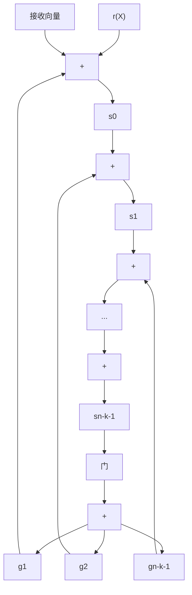
</details>

图 5-5 由左端输入的 $(n-k)$ 级校正子电路

定理 5-8 令 $s(X)$ 为接收多项式 $\boldsymbol{r}(X)=r_{0}+r_{1}X+\cdots+r_{n-1}X^{n-1}$ 的校正子，则用 $Xs(X)$ 除以生成多项式 $\boldsymbol{g}(X)$ 所得的余式 $s^{(1)}(X)$ 得到 $\boldsymbol{r}^{(1)}(X)$ 的校正子，其中 $\boldsymbol{r}^{(1)}(X)$ 是 $\boldsymbol{r}(X)$ 一次循环移位。

证明：由公式(5-1)知， $r(X)$ 和 $r^{(1)}(X)$ 满足如下关系：

$$
X \boldsymbol {r} (X) = r _ {n - 1} \left(X ^ {n} + 1\right) + \boldsymbol {r} ^ {(1)} (X) \tag {5-20}
$$

整理公式(5-20)，我们得到

$$
\boldsymbol {r} ^ {(1)} (X) = r _ {n - 1} \left(X ^ {n} + 1\right) + X \boldsymbol {r} (X) \tag {5-21}
$$

公式(5-21)两边同除以 $g(X)$ ，并利用 $X^{n}+1=g(X)h(X)$ ，我们得到：

$$
\boldsymbol {c} (X) \boldsymbol {g} (X) + \rho (X) = r _ {n - 1} \boldsymbol {g} (X) \boldsymbol {h} (X) + X [ \boldsymbol {a} (X) \boldsymbol {g} (X) + \boldsymbol {s} (X) ] \tag {5-22}
$$

其中 $\boldsymbol{\rho}(X)$ 为 $\boldsymbol{r}^{(1)}(X)$ 除以 $\boldsymbol{g}(X)$ 的余式，即 $\boldsymbol{\rho}(X)$ 为 $\boldsymbol{r}^{(1)}(X)$ 的校正子。

整理公式(5-22)，可得 $\boldsymbol{\rho}(X)$ 与 $Xs(X)$ 之间的下述关系：

$$
X \boldsymbol {s} (X) = [ \boldsymbol {c} (X) + r _ {n - 1} \boldsymbol {h} (X) + X \boldsymbol {a} (X) ] \boldsymbol {g} (X) + \boldsymbol {\rho} (X) \tag {5-23}
$$

根据公式(5-23)我们看到， $\boldsymbol{\rho}(X)$ 也为 $Xs(X)$ 除以 $\boldsymbol{g}(X)$ 的余式，因此 $\boldsymbol{\rho}(X)=\boldsymbol{s}^{(1)}(X)$ ，完成定理证明。证毕。

由定理 5-8 可知，余式 $s^{(i)}(X)$ 为 $r^{(i)}(X)$ 的校正子，其中 $s^{(i)}(X)$ 是 $X^{i}s(X)$ 除以生成多项式 $g(X)$ 所得的余式，而 $r^{(i)}(X)$ 是 $r(X)i$ 次循环移位的结果。这在循环码的译码中是极为有用的一个性质。把初始内容为 $s(X)$ 的校正子寄存器的输入门关断，移位一次后就得到了 $r^{(1)}(X)$ 的校正子 $s^{(1)}(X)$ 。这是由于当初始内容为 $s(X)$ 时，校正子寄存器的一次移位等价于用 $g(X)$ 除 $Xs(X)$ 的效果。因此，在一次移位后寄存器的内容为 $s^{(1)}(X)$ 。为得到 $r^{(i)}(X)$ 的校正子 $s^{(i)}(X)$ ，将初始内容为 $s(X)$ 的寄存器作 i 次移位即可。

# 例 5-7

图 5-6 所示为

由多项式 $\boldsymbol{g}(X)=1+X+X^{3}$ 生成的 $(7,4)$ 循环码的校正子电路。假设接收向量为 $\boldsymbol{r}=(0010110)$ 。r 的校正子为 $\boldsymbol{s}=(101)$ 。

表 5-3 描述了接收向量移


<!-- fec_figure path=images/6304fefd20836270f118d757beb363d228a183d4ffe43d279760ead9a2145f67.jpg -->

<details>
<summary>flowchart</summary>

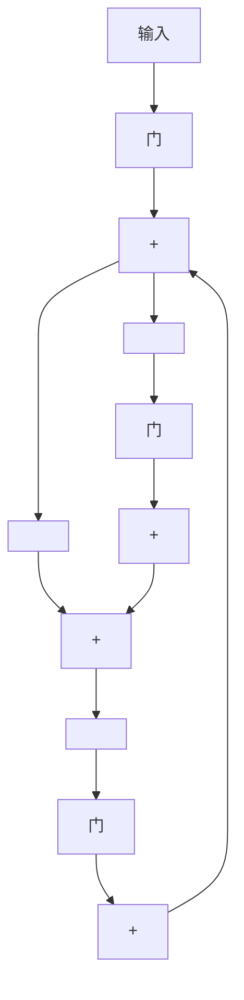
</details>

图 5-6 由 $g(X)=1+X+X^{3}$ 生成的 (7, 4) 循环码的校正子电路

<!-- --- chunk --- -->

<!-- source: 112-127.md -->
入电路时寄存器的内容变化。第七次移位完毕后，寄存器的内容为校正子 $s = (101)$ 。关闭输入门并再移位一次后，新内容将为 $s^{(1)} = (100)$ ，即为 $\boldsymbol{r}^{(1)}(X)$ 的校正子。其中， $\boldsymbol{r}^{(1)}(X)$ 为对 r 循环移位一次的结果，即 $\boldsymbol{r}^{(1)}(X) = (0001011)$ 。

如图 5-7 所示，也可以从校正子寄存器的右端逐位移入接收向量 $\boldsymbol{r}(X)$ ；然而，整个接收向量 $\boldsymbol{r}(X)$ 全部移入到寄存器中后，寄存器的内容并非 $\boldsymbol{r}(X)$ 的校正子，而是 $\boldsymbol{r}(X)$ 的 $(n-k)$ 次循环移位 $\boldsymbol{r}^{(n-k)}(X)$ 的校正子 $\boldsymbol{s}^{(n-k)}(X)$ 。要证明这一点，注意到从右端逐位移入 $\boldsymbol{r}(X)$ 与将 $\boldsymbol{r}(X)$ 乘以 $X^{n-k}$ 结果相同，因此，当 $\boldsymbol{r}(X)$ 全部移入寄存器时，寄存器的内容为 $X^{n-k}\boldsymbol{r}(X)$ 除以生成多项式 $\boldsymbol{g}(X)$ 的余式 $\boldsymbol{\rho}(X)$ 。因此有

表 5-3 输入 $r = (0010110)$ 时，图 5-6 所示电路中校正子寄存器的内容

<table><tr><td>移位</td><td>输入</td><td>寄存器内容</td></tr><tr><td></td><td></td><td>000(初始状态)</td></tr><tr><td>1</td><td>0</td><td>000</td></tr><tr><td>2</td><td>1</td><td>100</td></tr><tr><td>3</td><td>1</td><td>110</td></tr><tr><td>4</td><td>0</td><td>011</td></tr><tr><td>5</td><td>1</td><td>011</td></tr><tr><td>6</td><td>0</td><td>111</td></tr><tr><td>7</td><td>0</td><td>101(校正子s)</td></tr><tr><td>8</td><td>—</td><td>100(校正子s(1))</td></tr><tr><td>9</td><td>—</td><td>010(校正子s(2))</td></tr></table>

$$
X ^ {n - k} \boldsymbol {r} (X) = \boldsymbol {a} (X) \boldsymbol {g} (X) + \boldsymbol {\rho} (X) \tag {5-24}
$$

由公式(5-1)知， $r(X)$ 和 $r^{(n-k)}(X)$ 满足以下关系式：

$$
X ^ {n - k} \boldsymbol {r} (X) = \boldsymbol {b} (X) \left(X ^ {n} + 1\right) + \boldsymbol {r} ^ {(n - k)} (X) \tag {5-25}
$$

联立公式(5-24)和公式(5-25)，并利用 $X^n + 1 = g(X)h(X)$ ，我们有

$$
\boldsymbol {r} ^ {(n - k)} (X) = [ \boldsymbol {b} (X) \boldsymbol {h} (X) + \boldsymbol {a} (X) ] \boldsymbol {g} (X) + \boldsymbol {\rho} (X)
$$

该等式说明当 $\boldsymbol{r}^{(n-k)}(X)$ 除以 $\boldsymbol{g}(X)$ 时， $\boldsymbol{\rho}(X)$ 也为余式。因此， $\boldsymbol{\rho}(X)$ 确实为 $\boldsymbol{r}^{(n-k)}(X)$ 的校正子。

令 $\nu(X)$ 为发送码字， $e(X)=e_{0}+e_{1}X+\cdots+e_{n-1}X^{n-1}$ 为错误模式，则接收多项式为

$$
\boldsymbol {r} (X) = \boldsymbol {v} (X) + \boldsymbol {e} (X) \tag {5-26}
$$

由于 $\nu(X)$ 为生成多项式


<!-- fec_figure path=images/491c6607316c230a218093174c504c75adc5dc116edd53f9fa7250da4b412855.jpg -->

<details>
<summary>flowchart</summary>

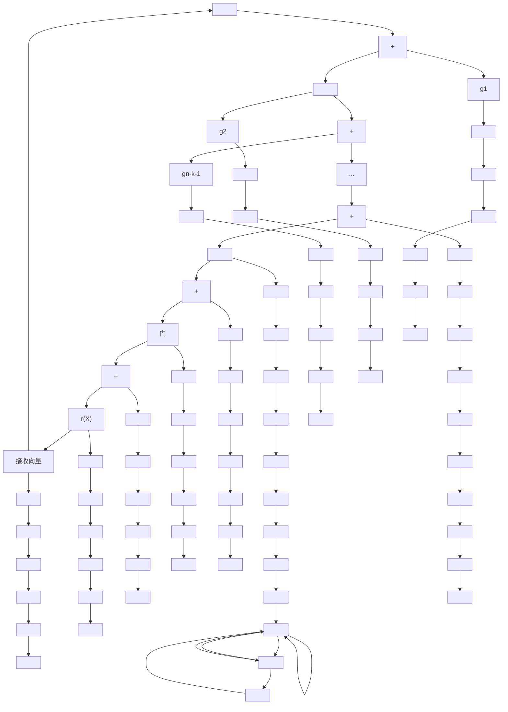
</details>

图 5-7 右端输入的 $(n-k)$ 级校正子电路

$g(X)$ 的倍式，联立公式(5-19)和公式(5-26)，可以得到错误模式与校正子的关系为

$$
\boldsymbol {e} (X) = [ \boldsymbol {a} (X) + \boldsymbol {b} (X) ] \boldsymbol {g} (X) + \boldsymbol {s} (X) \tag {5-27}
$$

其中 $\boldsymbol{b}(X)\boldsymbol{g}(X)=\boldsymbol{v}(X)$ 。这表明校正子等于错误模式除以生成多项式所得的余式。校正子可由接收向量计算得到，但是对于译码器来说，错误模式 $\boldsymbol{e}(X)$ 是未知的。因此，译码器必须由校正子 $\boldsymbol{s}(X)$ 来估计 $\boldsymbol{e}(X)$ 。若 $\boldsymbol{e}(X)$ 为标准阵列中的陪集首，而且应用查表法译码，则可由校正子获得可纠错的错误模式 $\boldsymbol{e}(X)$ 。

从公式(5-27)可知，当且仅当错误模式 $e(X) = 0$ 或 $e(X)$ 等于某一个码字时， $s(X)$ 等于0。若 $e(X)$ 为一码多项式，则 $e(X)$ 是一个漏检错误模式。循环码在检测随机错误和突发错误方面都是十分有效的。差错检测电路只是带一个或门的校正子计算电路，以各个校正位作为或门输入。若校正子不是零，或门输出为1，说明检测到差错。

现在我们研究 $(n, k)$ 循环码的差错检测能力。假设错误模式 $e(X)$ 为长度不大于 $n - k$ 的突发差错（即差错局限在在长度不大于 $n - k$ 个连续位置上），则 $e(X)$ 可表述如下：

$$
\boldsymbol {e} (X) = X ^ {j} \boldsymbol {B} (X)
$$

式中 $0 \leqslant j \leqslant n - 1$ ， $B(X)$ 为次数不大于 $n - k - 1$ 的多项式。由于 $B(X)$ 的次数比生成多项式 $g(X)$ 的次数小，所以不能被 $g(X)$ 整除。由于 $g(X)$ 是 $X^n + 1$ 的因式，而 $X$ 不是 $g(X)$ 的因式，则 $g(X)$ 与 $X^j$ 必然互素。因此， $e(X) = X^j B(X)$ 不能被 $g(X)$ 整除。所以，由此 $e(X)$ 产生的校正子不等于零。这意味着一个 $(n, k)$ 循环码可以检测出任何长度不大于 $n - k$ 的突发差错。对循环码来说，限定在高 $i$ 位和低 $l - i$ 位的错误模式仍是一个长度不大于 $l$ 位的突发差错。这种突发方式称为首尾相接 (end-around) 突发。例如，

$$
\begin{array}{r l} \boldsymbol {e} & = (\quad 1 \quad 0 \quad 1 \quad 0 \quad 0 \quad 0 \quad 0 \quad 0 \quad 0 \quad 0 \quad 0 \quad 1 \quad 1 \quad 0 \quad 1 \quad) \\ & \quad \leftarrow \quad \leftarrow \quad \leftrightarrow \quad \quad \quad \quad \quad \quad \quad \quad \quad \quad \quad \quad \quad \quad \quad \quad \quad \quad \quad \quad \quad \quad \quad \quad \quad \quad \quad \quad \quad \quad \quad \quad \quad \quad \quad \quad \quad \quad \quad \quad \quad \quad \quad \quad \quad \quad \quad \quad \quad \quad \quad \quad \quad \quad \quad \quad \quad \quad \quad \quad \quad \quad \quad \quad \quad \quad \quad \quad \quad \quad \quad \quad \quad \quad \quad \quad \quad \quad \quad \quad \quad \quad \quad \quad \quad \quad \quad \quad \quad \quad \quad \quad \quad \quad \quad \quad \quad \quad \quad \quad \quad \quad \quad \quad \quad \quad \quad \quad \quad \quad \quad \quad \quad \quad \quad \quad \quad \quad \quad \quad \quad \quad \quad \quad \quad \quad \quad \quad \quad \quad \quad \quad \quad \quad \quad \quad \quad \quad \quad \quad \quad \quad \quad \quad \quad \quad \quad \quad \quad \quad \quad \quad \quad \quad \quad \quad \quad \quad \quad \quad \quad \quad \quad \quad \quad \quad \quad \quad \quad \quad \quad \quad \quad \quad \quad \quad \quad \quad \quad \quad \quad \quad \quad \quad \quad \quad \quad \quad \quad \quad \quad \quad \quad \quad \quad \quad \quad \quad \quad \quad \quad \quad \quad \quad \quad \quad \quad \quad \quad \quad \quad \quad \quad \quad \quad \quad \quad \quad \quad \quad \quad \quad \quad \quad \quad \quad \quad \quad \quad \quad \quad \quad \quad \quad \quad \quad \quad \quad \quad \quad \quad \quad \quad \quad \quad \quad \quad \quad \quad \quad \quad \quad \quad \quad \quad \quad \quad \quad \quad \quad \quad \quad \quad \quad \quad \quad \quad \quad \quad \quad \quad \quad \quad \quad \quad \quad \quad \quad \quad \quad \quad \quad \quad \quad \quad \quad \quad \quad \quad \quad \quad \quad \quad \quad \quad \quad \quad \quad \quad \quad \quad \quad \quad \quad \quad \quad \quad \quad \quad \quad \quad \quad \quad \quad \quad \quad \quad \quad \quad \quad \quad \quad \quad \quad \quad \quad \quad \quad \quad \quad \quad \quad \quad \quad \quad \quad \quad \quad \quad \quad \quad \quad \quad \quad \quad \quad \quad \quad \quad \quad \quad \quad \quad \quad \quad \quad \quad \quad \quad \quad \quad \quad \quad \quad \quad \quad \quad \quad \quad \quad \quad \quad \quad \quad \quad \quad \quad \quad \quad \quad \quad \quad \quad \quad \quad \quad \quad \quad \quad \quad \quad \quad \quad \quad \quad \quad \quad \quad \quad \quad \quad \quad \quad \quad \quad \quad \quad \quad \quad \quad \quad \quad \quad \quad \quad \quad \quad \quad \quad \quad \quad \quad \quad \quad \quad \quad \quad \quad \quad \quad \quad \quad \quad \quad \quad \quad \quad \quad \quad \quad \quad \quad \quad \quad \quad \quad \quad \quad \quad \quad \quad \quad \quad \quad \quad \quad \quad \quad \quad \quad \quad \quad \quad \quad \quad \quad \quad \quad \quad \quad \quad \quad \quad \quad \quad \quad \quad \quad \quad \quad \quad \quad \quad \quad \quad \quad \quad \quad \quad \quad \quad \quad \quad \quad \quad \quad \quad \quad \quad \quad \quad \quad \quad \quad \quad \quad \quad \quad \quad \quad \quad \quad \quad \quad \quad \quad \quad \quad \quad \quad \quad \quad \quad \quad \quad \quad \quad \quad \quad \quad \quad \quad \quad \quad \quad \quad \quad \quad \quad \quad \quad \quad \quad \quad \quad \quad \quad \quad \quad \quad \quad \quad \quad \quad \quad \quad \quad \quad \quad \quad \quad \quad \quad \quad \quad \quad \quad \quad \quad \quad \quad \quad \quad \quad \quad \quad \quad \quad \quad \quad \quad \quad \quad \quad \quad \quad \quad \quad \quad \quad \quad \quad \quad \quad \quad \quad \quad \quad \quad \quad \quad \quad \quad \quad \quad \quad \quad \quad \quad \quad \quad \quad \quad \quad \quad \quad \quad \quad \quad \quad \quad \quad \quad \quad \quad \quad \quad \quad \quad \quad \quad \quad \quad \quad \quad \quad \quad \quad \quad \quad \quad \quad \quad \quad \quad \quad \quad \quad \quad \quad \quad \quad \quad \quad \quad \quad \quad \quad \quad \quad \quad \quad \quad \quad \quad \quad \quad \quad \quad \quad \quad \quad \quad \quad \quad \quad \quad \quad \quad \quad \quad \quad \quad \quad \quad \quad \quad \quad \quad \quad \quad \quad \quad \quad \quad \quad \quad \quad \quad \quad \quad \quad \quad \quad \quad \quad \quad \quad \quad \quad \quad \quad \quad \quad \quad \quad \quad \quad \quad \quad \quad \quad \quad \quad \quad \quad \quad \quad \quad \quad \quad \quad \quad \quad \quad \quad \quad \quad \quad \quad \quad \quad \quad \quad \quad \quad \quad \quad \quad \quad \quad \quad \quad \quad \quad \quad \quad \quad \quad \quad \quad \quad \quad \quad \quad \quad \quad \quad \quad \quad \quad \quad \quad \quad \quad \quad \quad \quad \quad \quad \quad \quad \quad \quad \quad \quad \quad \quad \quad \quad \quad \quad \quad \quad \quad \quad \quad \quad \quad \quad \quad \quad \quad \quad \quad \quad \quad \quad \quad \quad \quad \quad \quad \quad \quad \quad \quad \quad \quad \quad \quad \quad \quad \quad \quad \quad \quad \quad \quad \quad \quad \quad \quad \quad \quad \quad \quad \quad \quad \quad \quad \quad \quad \quad \quad \quad \quad \quad \quad \quad \quad \quad \quad \quad \quad \quad \quad \quad \quad \quad \quad \quad \quad \quad \quad \quad \quad \quad \quad \quad \quad \quad \quad \quad \quad \quad \quad \quad \quad \quad \quad \quad \quad \quad \quad \quad \quad \quad \quad \quad \quad \quad \quad \quad \quad \quad \quad \quad \quad \quad \quad \quad \quad \quad \quad \quad \quad \quad \quad \quad \quad \quad \quad \quad \quad \quad \quad \quad \quad \quad \quad \quad \quad \quad \quad \quad \quad \quad \quad \quad \quad \quad \quad \quad \quad \quad \quad \quad \quad \quad \quad \quad \quad \quad \quad \quad \quad \quad \quad \quad \quad \quad \quad \quad \quad \quad \quad \quad \quad \quad \quad \quad \quad \quad \quad \quad \quad \quad \quad \quad \quad \quad \quad \quad \quad \quad \quad \quad \quad \quad \quad \quad \quad \quad \quad \quad \quad \quad \quad \quad \quad \quad \quad \quad \quad \quad \quad \quad \quad \quad \quad \quad \quad \quad \quad \quad \quad \quad \quad \quad \quad \quad \quad \quad \quad \quad \quad \quad \quad \quad \quad \quad \quad \quad \quad \quad \quad \quad \quad \quad \quad \quad \quad \quad \quad \quad \quad \quad \quad \quad \quad \quad \quad \quad \quad \quad \quad \quad \quad \quad \quad \quad \quad \quad \quad \quad \quad \quad \quad \quad \quad \quad \quad \quad \quad \quad \quad \quad \quad \quad \quad \quad \quad \quad \quad \quad \quad \quad \quad \quad \quad \quad \quad \quad \quad \quad \quad \quad \quad \quad \quad \quad \quad \quad \quad \quad \quad \quad \quad \quad \quad \quad \quad \quad \quad \quad \quad \quad \quad \quad \quad \quad \quad \quad \quad \quad \quad \quad \quad \quad \quad \quad \quad \quad \quad \quad \quad \quad \quad \quad \quad \quad \quad \quad \quad \quad \quad \quad \quad \quad \quad \quad \quad \quad \quad \quad \quad \quad \quad \quad \quad \quad \quad \quad \quad \quad \quad \quad \quad \quad \quad \quad \quad \quad \quad \quad \quad \quad \quad \quad \quad \quad \quad \quad \quad \quad \quad \quad \quad \quad \quad \quad \quad \quad \quad \quad \quad \quad \quad \quad \quad \quad \quad \quad \quad \quad \quad \quad \quad \quad \quad \quad \quad \quad \quad \quad \quad \quad \quad \quad \quad \quad \quad \quad \quad \quad \quad \quad \quad \quad \quad \quad \quad \quad \quad \quad \quad \quad \quad \quad \quad \quad \quad \quad \quad \quad \quad \quad \quad \quad \quad \quad \quad \quad \quad \quad \quad \quad \quad \quad \quad \quad \quad \quad \quad \quad \quad \quad \quad \quad \quad \quad \quad \quad \quad \quad \quad \quad \quad \quad \quad \quad \quad \quad \quad \quad \quad \quad \quad \quad \quad \quad \quad \quad \quad \quad \quad \quad \quad \quad \quad \quad \quad \quad \quad \quad \quad \quad \quad \quad \quad \quad \quad \quad \quad \quad \quad \quad \quad \quad \quad \quad \quad \quad \quad \quad \quad \quad \quad \quad \quad \quad \quad \quad \quad \quad \quad \quad \quad \quad \quad \quad \quad \quad \quad \quad \quad \quad \quad \quad \quad \quad \quad \quad \quad \quad \quad \quad \quad \quad \quad \quad \quad \quad \quad \quad \quad \quad \quad \quad \quad \quad \quad \quad \quad \quad \quad \quad \quad \quad \quad \quad \quad \quad \quad \quad \quad \quad \quad \quad \quad \quad \quad \quad \quad \quad \quad \quad \quad \quad \quad \quad \quad \quad \quad \quad \quad \quad \quad \quad \quad \quad \quad \quad \quad \quad \quad \quad \quad \quad \quad \quad \quad \quad \quad \quad \quad \quad \quad \quad \quad \quad \quad \quad \quad \quad \quad \quad \quad \quad \quad \quad \quad \quad \quad \quad \quad \quad \quad \quad \quad \quad \quad \quad \quad \quad \quad \quad \quad \quad \quad \quad \quad \quad \quad \quad \quad \quad \quad \quad \quad \quad \quad \quad \quad \quad \quad \quad \quad \quad \quad \quad \quad \quad \quad \quad \quad \quad \quad \quad \quad \quad \quad \quad \quad \quad \quad \quad \quad \quad \quad \quad \quad \quad \quad \quad \quad \quad \quad \quad \quad \quad \quad \quad \quad \quad \quad \quad \quad \quad \quad \quad \quad \quad \quad \quad \quad \quad \quad \quad \quad \quad \quad \quad \quad \quad \quad \quad \quad \quad \quad \quad \quad \quad \quad \quad \quad \quad \quad \quad \quad \quad \quad \quad \quad \quad \quad \quad \quad \quad \quad \quad \quad \quad \quad \quad \quad \quad \quad \quad \quad \quad \quad \quad \quad \quad \quad \quad \quad \quad \quad \quad \quad \quad \quad \quad \quad \quad \quad \quad \quad \quad \quad \quad \quad \quad \quad \quad \quad \quad \quad \quad \quad \quad \quad \quad \quad \quad \quad \quad \quad \quad \quad \quad \quad \quad \quad \quad \quad \quad \quad \quad \quad \quad \quad \quad \quad \quad \quad \quad \quad \quad \quad \quad \quad \quad \quad \quad \quad \quad \quad \quad \quad \quad \quad \quad \quad \quad \quad \quad \quad \quad \quad \quad \quad \quad \quad \quad \quad \quad \quad \quad \quad \quad \quad \quad \quad \quad \quad \quad \quad \quad \quad \quad \quad \quad \quad \quad \quad \quad \quad \quad \quad \quad \quad \quad \quad \quad \quad \quad \quad \quad \quad \quad \quad \quad \quad \quad \quad \quad \quad \quad \quad \quad \quad \quad \quad \quad \quad \quad \quad \quad \quad \quad \quad \quad \quad \quad \quad \quad \quad \quad \quad \quad \quad \quad \quad \quad \quad \quad \quad \quad \quad \quad \quad \quad \quad \quad \quad \quad \quad \quad \quad \quad \quad \quad \quad \quad \quad \quad \quad \quad \quad \quad \quad \quad \quad \quad \quad \quad \quad \quad \quad \quad \quad \quad \quad \quad \quad \quad \quad \quad \quad \quad \quad \quad \quad \quad \quad \quad \quad \quad \quad \quad \quad \quad \quad \quad \quad \quad \quad \quad \quad \quad \quad \quad \quad \quad \quad \quad \quad \quad \quad \quad \quad \quad \quad \quad \quad \quad \quad \quad \quad \quad \quad \quad \quad \quad \quad \quad \quad \quad \quad \quad \quad \quad \quad \quad \quad \quad \quad \quad \quad \quad \quad \quad \quad \quad \quad \quad \quad \quad \quad \quad \quad \quad \quad \quad \quad \quad \quad \quad \quad \quad \quad \quad \quad \quad \quad \quad \quad \quad \quad \quad \quad \quad \quad \quad \quad \quad \quad \quad \quad \quad \quad \quad \quad \quad \quad \quad \quad \quad \quad \quad \quad \quad \quad \quad \quad \quad \quad \quad \quad \quad \quad \quad \quad \quad \quad \quad \quad \quad \quad \quad \quad \quad \quad \quad \quad \quad \quad \quad \quad \quad \quad \quad \quad \quad \quad \quad \quad \quad \quad \quad \quad \quad \quad \quad \quad \quad \quad \quad \quad \quad \quad \quad \quad \quad \quad \quad \quad \quad \quad \quad \quad \quad \quad \quad \quad \quad \quad \quad \quad \quad \quad \quad \quad \quad \quad \quad \quad \quad \quad \quad \quad \quad \quad \quad \quad \quad \quad \quad \quad \quad \quad \quad \quad \quad \quad \quad \quad \quad \quad \quad \quad \quad \quad \quad \quad \quad \quad \quad \quad \quad \quad \quad \quad \quad \quad \quad \quad \quad \quad \quad \quad \quad \quad \quad \quad \quad \quad \quad \quad \quad \quad \quad \quad \quad \quad \quad \quad \quad \quad \quad \quad \quad \quad \quad \quad \quad \quad \quad \quad \quad \quad \quad \quad \quad \quad \quad \quad \quad \quad \quad \quad \quad \quad \quad \quad \quad \quad \quad \quad \quad \quad \quad \quad \quad \quad \quad \quad \quad \quad \quad \quad \quad \quad \quad \quad \quad \quad \quad \quad \quad \quad \quad \quad \quad \quad \quad \quad \quad \quad \quad \quad \quad \quad \quad \quad \quad \quad \quad \quad \quad \quad \quad \quad \quad \quad \quad \quad \quad \quad \quad \quad \quad \quad \quad \quad \quad \quad \quad \quad \quad \quad \quad \quad \quad \quad \quad \quad \quad \quad \quad \quad \quad \quad \quad \quad \quad \quad \quad \quad \quad \quad \quad \quad \quad \quad \quad \quad \quad \quad \quad \quad \quad \quad \quad \quad \quad \quad \quad \quad \quad \quad \quad \quad \quad \quad \quad \quad \quad \quad \quad \quad \quad \quad \quad \quad \quad \quad \quad \quad \quad \quad \quad \quad \quad \quad \quad \quad \quad \quad \quad \quad \quad \quad \quad \quad \quad \quad \quad \quad \quad \quad \quad \quad \quad \quad \quad \quad \quad \quad \quad \quad \quad \quad \quad \quad \quad \quad \quad \quad \quad \quad \quad \quad \quad \quad \quad \quad \quad \quad \quad \quad \quad \quad \quad \quad \quad \quad \quad \quad \quad \quad \quad \quad \quad \quad \quad \quad \quad \quad \quad \quad \quad \quad \quad \quad \quad \quad \quad \quad \quad \quad \quad \quad \quad \quad \quad \quad \quad \quad \quad \quad \quad \quad \quad \quad \quad \quad \quad \quad \quad \quad \quad \quad \quad \quad \quad \quad \quad \quad \quad \quad \quad \quad \quad \quad \quad \quad \quad \quad \quad \quad \quad \quad \quad \quad \quad \quad \quad \quad \quad \quad \quad \quad \quad \quad \quad \quad \quad \quad \quad \quad \quad \quad \quad \quad \quad \quad \quad \quad \quad \quad \quad \quad \quad \quad \quad \quad \quad \quad \quad \quad \quad \quad \quad \quad \quad \quad \quad \quad \quad \quad \quad \quad \quad \quad \quad \quad \quad \quad \quad \quad \quad \quad \quad \quad \quad \quad \quad \quad \quad \quad \quad \quad \quad \quad \quad \quad \quad \quad \quad \quad \quad \quad \quad \quad \quad \quad \quad \quad \quad \quad \quad \quad \quad \quad \quad \quad \quad \quad \quad \quad \quad \quad \quad \quad \quad \quad \quad \quad \quad \quad \quad \quad \quad \quad \quad \quad \quad \quad \quad \quad \quad \quad \quad \quad \quad \quad \quad \quad \quad \quad \quad \quad \quad \quad \quad \quad \quad \quad \quad \quad \quad \quad \quad \quad \quad \quad \quad \quad \quad \quad \quad \quad \quad \quad \quad \quad \quad \quad \quad \quad \quad \quad \quad \quad \quad \quad \quad \quad \quad \quad \quad \quad \quad \quad \quad \quad \quad \quad \quad \quad \quad \quad \quad \quad \quad \quad \quad \quad \quad \quad \quad \quad \quad \quad \quad \quad \quad \quad \quad \quad \quad \quad \quad \quad \quad \quad \quad \quad \quad \quad \quad \quad \quad \quad \quad \quad \quad \quad \quad \quad \quad \quad \quad \quad \quad \quad \quad \quad \quad \quad \quad \quad \quad \quad \quad \quad \quad \quad \quad \quad \quad \quad \quad \quad \quad \quad \quad \quad \quad \quad \quad \quad \quad \quad \quad \quad \quad \quad \quad \quad \quad \quad \quad \quad \quad \quad \quad \quad \quad \quad \quad \quad \quad \quad \quad \quad \quad \quad \quad \quad \quad \quad \quad \quad \quad \quad \quad \quad \quad \quad \quad \quad \quad \quad \quad \quad \quad \quad \quad \quad \quad \quad \quad \quad \quad \quad \quad \quad \quad \quad \quad \quad \quad \quad \quad \quad \quad \quad \quad \quad \quad \quad \quad \quad \quad \quad \quad \quad \quad \quad \quad \quad \quad \quad \quad \quad \quad \quad \quad \quad \quad \quad \quad \quad \quad \quad \quad \quad \quad \quad \quad \quad \quad \quad \quad \quad \quad \quad \quad \quad \quad \quad \quad \quad \quad \quad \quad \quad \quad \quad \quad \quad \quad \quad \quad \quad \quad \quad \quad \quad \quad \quad \quad \quad \quad \quad \quad \quad \quad \quad \quad \quad \quad \quad \quad \quad \quad \quad \quad \quad \quad \quad \quad \quad \quad \quad \quad \quad \quad \quad \quad \quad \quad \quad \quad \quad \quad \quad \quad \quad \quad \quad \quad \quad \quad \quad \quad \quad \quad \quad \quad \quad \quad \quad \quad \quad \quad \quad \quad \quad \quad \quad \quad \quad \quad \quad \quad \quad \quad \quad \quad \quad \quad \quad \quad \quad \quad \quad \quad \quad \quad \quad \quad \quad \quad \quad \quad \quad \quad \quad \quad \quad \quad \quad \quad \quad \quad \quad \quad \quad \quad \quad \quad \quad \quad \quad \quad \quad \quad \quad \quad \quad \quad \quad \quad \quad \quad \quad \quad \quad \quad \quad \quad \quad \quad \quad \quad \quad \quad \quad \quad \quad \quad \quad \quad \quad \quad \quad \quad \quad \quad \quad \quad \quad \quad \quad \quad \quad \quad \quad \quad \quad \quad \quad \quad \quad \quad \quad \quad \quad \quad \quad \quad \quad \quad \quad \quad \quad \quad \quad \quad \quad \quad \quad \quad \quad \quad \quad \quad \quad \quad \quad \quad \quad \quad \quad \quad \quad \quad \quad \quad \quad \quad \quad \quad \quad \quad \quad \quad \quad \quad \quad \quad \quad \quad \quad \quad \quad \quad \quad \quad \quad \quad \quad \quad \quad \quad \quad \quad \quad \quad \quad \quad \quad \quad \quad \quad \quad \quad \quad \quad \quad \quad \quad \quad \quad \quad \quad \quad \quad \quad \quad \quad \quad \quad \quad \quad \quad \quad \quad \quad \quad \quad \quad \quad \quad \quad \quad \quad \quad \quad \quad \quad \quad \quad \quad \quad \quad \quad \quad \quad \quad \quad \quad \quad \quad \quad \quad \quad \quad \quad \quad \quad \quad \quad \quad \quad \quad \quad \quad \quad \quad \quad \quad \quad \quad \quad \quad \quad \quad \quad \quad \quad \quad \quad \quad \quad \quad \quad \quad \quad \quad \quad \quad \quad \quad \quad \quad \quad \quad \quad \quad \quad \quad \quad \quad \quad \quad \quad \quad \quad \quad \quad \quad \quad \quad \quad \quad \quad \quad \quad \quad \quad \quad \quad \quad \quad \quad \quad \quad \quad \quad \quad \quad \quad \quad \quad \quad \quad \quad \quad \quad \quad \quad \quad \quad \quad \quad \quad \quad \quad \quad \quad \quad \quad \quad \quad \quad \quad \quad \quad \quad \quad \quad \quad \quad \quad \quad \quad \quad \quad \quad \quad \quad \quad \quad \quad \quad \quad \quad \quad \quad \quad \quad \quad \quad \quad \quad \quad \quad \quad \quad \quad \quad \quad \quad \quad \quad \quad \quad \quad \quad \quad \quad \quad \quad \quad \quad \quad \quad \quad \quad \quad \quad \quad \quad \quad \quad \quad \quad \quad \quad \quad \quad \quad \quad \quad \quad \quad \quad \quad \quad \quad \quad \quad \quad \quad \quad \quad \quad \quad \quad \quad \quad \quad \quad \quad \quad \quad \quad \quad \quad \quad \quad \quad \quad \quad \quad \quad \quad \quad \quad \quad \quad \quad \quad \quad \quad \quad \quad \quad \quad \quad \quad \quad \quad \quad \quad \quad \quad \quad \quad \quad \quad \quad \quad \quad \quad \quad \quad \quad \quad \quad \quad \quad \quad \quad \quad \quad \quad \quad \quad \quad \quad \quad \quad \quad \quad \quad \quad \quad \quad \quad \quad \quad \quad \quad \quad \quad \quad \quad \quad \quad \quad \quad \quad \quad \quad \quad \quad \quad \quad \quad \quad \quad \quad \quad \quad \quad \quad \quad \quad \quad \quad \quad \quad \quad \quad \quad \quad \quad \quad \quad \quad \quad \quad \quad \quad \quad \quad \quad \quad \quad \quad \quad \quad \quad \quad \quad \quad \quad \quad \quad \quad \quad \quad \quad \quad \quad \quad \quad \quad \quad \quad \quad \quad \quad \quad \quad \quad \quad \quad \quad \quad \quad \quad \quad \quad \quad \quad \quad \quad \quad \quad \quad \quad \quad \quad \quad \quad \quad \quad \quad \quad \quad \quad \quad \quad \quad \quad \quad \quad \quad \quad \quad \quad \quad \quad \quad \quad \quad \quad \quad \quad \quad \quad \quad \quad \quad \quad \quad \quad \quad \quad \quad \quad \quad \quad \quad \quad \quad \quad \quad \quad \quad \quad \quad \quad \quad \quad \quad \quad \quad \quad \quad \quad \quad \quad \quad \quad \quad \quad \quad \quad \quad \quad \quad \quad \quad \quad \quad \quad \quad \quad \quad \quad \quad \quad \quad \quad \quad \quad \quad \quad \quad \quad \quad \quad \quad \quad \quad \quad \quad \quad \quad \quad \quad \quad \quad \quad \quad \quad \quad \quad \quad \quad \quad \quad \quad \quad \quad \quad \quad \quad \quad \quad \quad \quad \quad \quad \quad \quad \quad \quad \quad \quad \quad \quad \quad \quad \quad \quad \quad \quad \quad \quad \quad \quad \quad \quad \quad \quad \quad \quad \quad \quad \quad \quad \quad \quad \quad \quad \quad \quad \quad \quad \quad \quad \quad \quad \quad \quad \quad \quad \quad \quad \quad \quad \quad \quad \quad \quad \quad \quad \quad \quad \quad \quad \quad \quad \quad \quad \quad \quad \quad \quad \quad \quad \quad \quad \quad \quad \quad \quad \quad \quad \quad \quad \quad \quad \quad \quad \quad \quad \quad \quad \quad \quad \quad \quad \quad \quad \quad \quad \quad \quad \quad \quad \quad \quad \quad \quad \quad \quad \quad \quad \quad \quad \quad \quad \quad \quad \quad \quad \quad \quad \quad \quad \quad \quad \quad \quad \quad \quad \quad \quad \quad \quad \quad \quad \quad \quad \quad \quad \quad \quad \quad \quad \quad \quad \quad \quad \quad \quad \quad \quad \quad \quad \quad \quad \quad \quad \quad \quad \quad \quad \quad \quad \quad \quad \quad \quad \quad \quad \quad \quad \quad \quad \quad \quad \quad \quad \quad \quad \quad \quad \quad \quad \quad \quad \quad \quad \quad \quad \quad \quad \quad \quad \quad \quad \quad \quad \quad \quad \quad \quad \quad \quad \quad \quad \quad \quad \quad \quad \quad \quad \quad \quad \quad \quad \quad \quad \quad \quad \quad \quad \quad \quad \quad \quad \quad \quad \quad \quad \quad \quad \quad \quad \quad \quad \quad \quad \quad \quad \quad \quad \quad \quad \quad \quad \quad \quad \quad \quad \quad \quad \quad \quad \quad \quad \quad \quad \quad \quad \quad \quad \quad \quad \quad \quad \quad \quad \quad \quad \quad \quad \quad \quad \quad \quad \quad \quad \quad \quad \quad \quad \quad \quad \quad \quad \quad \quad \quad \quad \quad \quad \quad \quad \quad \quad \quad \quad \quad \quad \quad \quad \quad \quad \quad \quad \quad \quad \quad \quad \quad \quad \quad \quad \quad \quad \quad \quad \quad \quad \quad \quad \quad \quad \quad \quad \quad \quad \quad \quad \quad \quad \quad \quad \quad \quad \quad \quad \quad \quad \quad \quad \quad \quad \quad \quad \quad \quad \quad \quad \quad \quad \quad \quad \quad \quad \quad \quad \quad \quad \quad \quad \quad \quad \quad \quad \quad \quad \quad \quad \quad \quad \quad \quad \quad \quad \quad \quad \quad \quad \quad \quad \quad \quad \quad \quad \quad \quad \quad \quad \quad \quad \quad \quad \quad \quad \quad \quad \quad \quad \quad \quad \quad \quad \quad \quad \quad \quad \quad \quad \quad \quad \quad \quad \quad \quad \quad \quad \quad \quad \quad \quad \quad \quad \quad \quad \quad \quad \quad \quad \quad \quad \quad \quad \quad \quad \quad \quad \quad \quad \quad \quad \quad \quad \quad \quad \quad \quad \quad \quad \quad \quad \quad \quad \quad \quad \quad \quad \quad \quad \quad \quad \quad \quad \quad \quad \quad \quad \quad \quad \quad \quad \quad \quad \quad \quad \quad \quad \quad \quad \quad \quad \quad \quad \quad \quad \quad \quad \quad \quad \quad \quad \quad \quad \quad \quad \quad \quad \quad \quad \quad \quad \quad \quad \quad \quad \quad \quad \quad \quad \quad \quad \quad \quad \quad \quad \quad \quad \quad \quad \quad \quad \quad \quad \quad \quad \quad \quad \quad
$$

e 是一个长度为 7 的首尾相接突发错误模式。一个 $(n, k)$ 循环码可以检测出任何长度不大于 n - k 的首尾相接突发错误模式（证明留作习题）。归纳以上结果，有以下性质：

定理 5-9 一个 $(n, k)$ 循环码可以检测出任何长度不大于 n-k 的突发差错，包括首尾相接突发差错。

实际上，大部分长度为 $n - k + 1$ 或更长的突发差错也能被检测到。考虑一个长度为 $n - k + 1$ 的突发差错，起始于第 $i$ 位而终止于第 $(i + n - k)$ 位（即差错局限在 $e_i, e_{i+1}, \cdots, e_{i+n-k}$ ，其中 $e_i = e_{i+n-k} = 1$ ）。总共有 $2^{n-k-1}$ 个这样的突发差错，所有这些突发差错中，不能被检测到的突发差错只有下面这一种：

$$
\boldsymbol {e} (X) = X ^ {i} \boldsymbol {g} (X)
$$

因此，从第 $i$ 位起始的长度为 $n - k + 1$ 的突发差错中不能被检测的数目为 $2^{-(n - k - 1)}$ 。它也适用于从任意位置起始的长度为 $n - k + 1$ 的突发差错（包括首尾相接突发差错的情况）。因此有以下结论：

定理 5-10 长度为 $n-k+1$ 的突发差错中不能被检测的数目为 $2^{-(n-k-1)}$ 。

对于 $l > n - k - 1$ 的情况，从第 $i$ 位开始在第 $(i + l - 1)$ 位结束的长度为 $l$ 的突发差错有 $2^{l - (n - k) - 2}$ 种，在这些突发差错之中，不能被检测到的差错具有以下形式：

$$
\boldsymbol {e} (X) = X ^ {i} \boldsymbol {a} (X) \boldsymbol {g} (X)
$$

式中， $a(X)=a_{0}+a_{1}X+\cdots+a_{l-(n-k)-1}X^{l-(n-k)-1}$ ， $a_{0}=a_{l-(n-k)-1}=1$ 。这类突发错误模式的数目为 $2^{l-(n-k)-2}$ 。因此，起始于第i位长度为l的突发差错中不能被检测的比例为 $2^{-(n-k)}$ 。应再次指出，此式适用于长度为l、起始于任意位置的突发差错（包含首尾相接的情况），由此导出以下结论：

定理 5-11 若 l > n - k - 1，不能被检测的长度为 l 的突发差错的比例为 $2^{-(n-k)}$ 。

上述分析表明，循环码在突发差错检测方面是非常有效的。

例 5-8 由多项式 $g(X)=1+X+X^{3}$ 生成的 (7, 4) 循环码的最小距离为 3。这类码能够检测到任何 2 个或更少的随机差错的组合，或检测任意的长度不大于 3 的突发差错。同时，这类码也能检测许多长度大于 3 的突发差错。

# 5.5 循环码的译码

循环码的译码过程与线性码相同，需要三个步骤：校正子的计算，由校正子得到错误模式以及差错纠正。由5.4节可知，可以用一个除法电路来计算循环码的校正子，这个电路的复杂度线性正比于校检位的数目（即 $n - k$ ）。差错纠正可通过将错误模式以模2加法加到接收向量上来实现。如果以串行方式（一次一位）进行纠错，则加法过程只需要一个异或门即可；如果以图3-8所示的并行方式进行纠错则需要 $n$ 个异或门。校正子与错误模式的关联可

以借助译码表来唯一确定。译码电路的一种直接的实现方案就是采用一个组合逻辑电路来执行查表；但这种设计方案的局限性在于译码电路的复杂度随着码长和需纠正差错数目的增加而呈指数增长。循环码具有良好的代数和几何性质，若对这些性质加以充分利用，就可以简化译码电路。

循环码的循环结构使得我们可以对接收向量 $\boldsymbol{r}(X)=r_{0}+r_{1}X+\cdots+r_{n-1}X^{n-1}$ 进行串行译码。每次只译一位接收码，而且每一数据在同一电路中进行译码。一旦计算出校正子，译码电路就会检查校正子 $\boldsymbol{s}(X)$ 是否对应于一个在最高位 $X^{n-1}$ 存在差错（即 $e_{n-1}=1$ ）的可纠正错误模式 $\boldsymbol{e}(X)=e_{0}+e_{1}X+\cdots+e_{n-1}X^{n-1}$ 。若不存在与 $\boldsymbol{s}(X)$ 相对应的 $e_{n-1}=1$ 的错误模式，则将接收多项式（存储在缓冲寄存器中）和校正子寄存器同时循环移位一位。这样做了以后，我们便得到 $\boldsymbol{r}^{(1)}(X)=r_{n-1}+r_{0}X+\cdots+r_{n-2}X^{n-1}$ 且校正子寄存器的内容构成 $\boldsymbol{r}^{(1)}(X)$ 的校正子 $\boldsymbol{s}^{(1)}(X)$ 。此时， $\boldsymbol{r}(X)$ 的第二位 $r_{n-2}$ 变为 $\boldsymbol{r}^{(1)}(X)$ 的第一位。同一译码电路将会检查 $\boldsymbol{s}^{(1)}(X)$ 是否与在 $X^{n-1}$ 位置存在差错的错误模式相对应。

如果 $\boldsymbol{r}(X)$ 的校正子 $\boldsymbol{s}(X)$ 与 $X^{n-1}$ 位有错（即 $e_{n-1}=1$ ）的错误模式相对应，则接收向量的位 $r_{n-1}$ 必定为差错位，因而必须被纠正，这可以通过求和 $r_{n-1} \oplus e_{n-1}$ 来实现，从而得到修正的接收多项式 $\boldsymbol{r}_{1}(X)=r_{0}+r_{1}X+\cdots+r_{n-2}X^{n-2}+(r_{n-1} \oplus e_{n-1})X^{n-1}$ 。通过模2加法将 $\boldsymbol{e}'(X)=X^{n-1}$ 的校正子加到 $\boldsymbol{s}(X)$ 上，从 $\boldsymbol{s}(X)$ 中消除了差错位 $e_{n-1}$ 对校正子的影响。这个模2和就是修正的接收多项式 $\boldsymbol{r}_{1}(X)$ 的校正子。现在，把 $\boldsymbol{r}_{1}(X)$ 和校正子寄存器同时循环移位一次，其移位结果便得到了接收多项式 $\boldsymbol{r}_{1}^{(1)}(X)=(r_{n-1} \oplus e_{n-1})+r_{0}X+\cdots+r_{n-2}X^{n-1}$ 。 $\boldsymbol{r}_{1}^{(1)}(X)$ 的校正子 $\boldsymbol{s}_{1}^{(1)}(X)$ 就是由 $X[s(X)+X^{n-1}]$ 除以生成多项式 $\boldsymbol{g}(X)$ 的余式。因为 $X\boldsymbol{s}(X)$ 和 $X^{n}$ 除以 $\boldsymbol{g}(X)$ 的余式分别为 $\boldsymbol{s}^{(1)}(X)$ 和 1，则有：

$$
\boldsymbol {s} _ {1} ^ {(1)} (X) = \boldsymbol {s} ^ {(1)} (X) + 1
$$

所以，若在对校正子寄存器进行移位时将1加到其左端，则得到 $s_{1}^{(1)}(X)$ 。译码电路随后就对接收码的 $r_{n-2}$ 位进行译码。对 $r_{n-2}$ 及其他码位的译码与对 $r_{n-1}$ 的译码完全相同。每当检测到一个差错并加以纠正后，就消除该差错对校正子的影响。进行n次移位后，译码过程结束。若 $e(X)$ 为一可纠正的错误模式，则在译码结束后，校正子寄存器的内容为零而且接收向量 $r(X)$ 已被正确译码。若校正子寄存器的内容不全为0，则检测出一个不能纠正的错误模式。

图 5-8 给出了一个通用的 $(n, k)$ 循环码的译码器。它由三个主要部分组成：1) 校正子寄存器；2) 错误模式检测器，3) 存储接收向量的缓冲寄存器。接收多项式从左端移入校正子寄存器。为了消除错误对校正子的影响，只需将差错位通过一个异或门反馈到移位寄存器的左输入端。译码步骤如下：

第 1 步 接收向量全部移入校正子寄存器便得到了校正子；同时接收向量也存入到缓冲寄存器中；

第2步 将校正子读入检测器中，检测相应的错误模式。检测器为组合逻辑电路，其电路设计方法为：当且仅当校正子寄存器中的校正子对应于最高位 $X^{n-1}$ 存在的可纠正错误模式时输出为1。也就是说，若检测器输出端为1，缓冲寄存器中最右端的接收符号被认为是错误的，必须被纠正；若输出为0，则缓冲寄存器最右端的接收符号是正确的，不必纠正。因此，检测器的输出值为对应于缓冲寄存器中输出符号的差错估值；

第3步 从缓冲寄存器中读取第一个接收符号；与此同时，将校正子寄存器移位一次。若检测到第一个接收符号存在差错，则被检测器的输出纠正。检测器的输出值也被反馈回校正子寄存器来修改校正子（即在校正子中消除差错的影响）。此操作会产生一个新的校正子，


<!-- fec_figure path=images/3195112dd7738123d21cd21fd8230b7971ca2793d6ea3dc49b39b747b987cc8c.jpg -->

<details>
<summary>flowchart</summary>

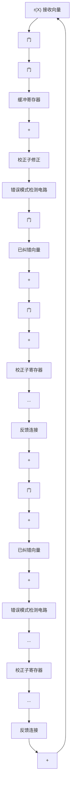
</details>

图 5-8 接收多项式 $r(X)$ 由校正子寄存器左端输入的通用循环码译码器

它对应于修正接收向量向右移位一次后所得的结果；

第 4 步 用第 3 步得到的新校正子来检测第二个接收符号(此时处于缓冲寄存器的最右端)是否有错。译码器重复第 2 步与第 3 步。第二个接收符号的纠正方法与第一个接收符号的纠正方法完全相同；

第 5 步 译码器按以上步骤对接收到的符号位进行逐位译码，直到从缓冲寄存器读出整个接收向量为止。

上述译码器就是著名的梅吉特(Meggitt)译码器 $^{[11]}$ ，原则上可以应用于任何一种循环码。但是，它是否实际上可实现完全取决于错误模式检测电路。某些情况下，差错检测电路是比较简单的。接下来的几个章节将讨论其中几种情况。

例 5-9 考虑由多项式 $g(X)=1+X+X^{3}$ 生成的 (7, 4) 循环码的译码。该码的最小距离为 3，能够纠正任意一个 7 位分组中的单个差错。有 7 种含单个差错的错误模式。这 7 种错误模式与全零向量一起构成了译码表的陪集首，因此，它们组成了所有可纠正的错误模式。假设接收多项式 $r(X)=r_{0}+r_{1}X+r_{2}X^{2}+r_{3}X^{3}+r_{4}X^{4}+r_{5}X^{5}+r_{6}X^{6}$ 由左端逐位移入校正子寄存器中。这 7 种含单个差错的图样及其相对应的校正子列于表 5-4 中。

可以看出， $e_{6}(X)=X^{6}$ 是在 $X^{6}$ 位置有错的唯一错误模式。整个接收多项式全部进入寄存器后，当这种差错产生时，校正子寄存器中的校正子为(101)。检测出该校正子表明 $r_{6}$ 位有一个错误数据，必须加以纠正。假设单个差错出现在 $X^{i}$ 位处[即 $e_{i}=X^{i}$ ]，其中 $0\leqslant i\leqslant6$ 。在整个接收多项式移入校正子寄存器后，在寄存器中的校正子将不会是(101)；然而继续移位(6-i)

表 5-4 错误模式及其校正子，其中接收多项式 $r(X)$ 由校正子寄存器左端移入

<table><tr><td>错误模式e(X)</td><td>校正子s(X)</td><td>校正子向量(s0, s1, s2)</td></tr><tr><td>e6(X) = X6</td><td>s(X) = 1 + X2</td><td>(101)</td></tr><tr><td>e5(X) = X5</td><td>s(X) = 1 + X + X2</td><td>(111)</td></tr><tr><td>e4(X) = X4</td><td>s(X) = X + X2</td><td>(011)</td></tr><tr><td>e3(X) = X3</td><td>s(X) = 1 + X</td><td>(110)</td></tr><tr><td>e2(X) = X2</td><td>s(X) = X2</td><td>(001)</td></tr><tr><td>e1(X) = X1</td><td>s(X) = X</td><td>(010)</td></tr><tr><td>e0(X) = X0</td><td>s(X) = 1</td><td>(100)</td></tr></table>

位后，校正子寄存器的内容将为(101)，而缓冲寄存器输出的下一个接收位为差错位。因此，只需检测校正子(101)即可，这可以用一个三输入与门来实现。完整译码电路见图5-9，图5-10描述了译码过程。设传送码字 $\nu(X)=(1001011)$ [或 $\nu(X)=1+X^{3}+X^{5}+X^{6}$ ]，接收码字 $r=(1011011)$ [或 $r(X)=1+X^{2}+X^{3}+X^{5}+X^{6}$ ]。一个单个差错出现在 $X^{2}$ 处。当整个接收多项式完全移入校正子寄存器和缓冲寄存器中后，校正子寄存器的内容为(001)。图5-10记录了校正子寄存器和缓冲寄存器的内容在每一次移位后的结果，并用一个箭头指示每次移位后的差错位置。由此知，再经过四次移位后校正子寄存器的内容为(101)，而缓冲寄存器输出的下一位为差错位 $r_{2}$ 。

例 5-9 讨论的(7, 4)循环码实际上与例 3-9 讨论的码完全相同。把图 5-9 所示的译码电路与图 3-9 所示电路进行比较，我们发现图 5-9 中的


<!-- fec_figure path=images/be23d4dcf778b06e586b24078410cd0f624342da9d5809e11960d95f7e68bb38.jpg -->

<details>
<summary>flowchart</summary>

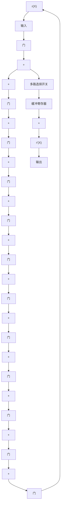
</details>

图 5-9 由 $g(X)=1+X+X^{3}$ 生成的 (7, 4) 循环码的译码电路

电路比图 3-9 的电路更简单。因此，循环结构的确可以简化译码电路，但是由于译码是串行处理的，图 5-9 所示电路需要花费较长时间对接收向量进行译码。一般来讲，无法获得既快速又简单的译码方法，它们之间需要进行折衷。

上述 Meggitt 译码器从接收向量 $r(X) = r_{0} + r_{1}X + \cdots + r_{n-1}X^{n-1}$ 的最高位 $r_{n-1}$ 开始译码，直到最低位 $r_{0}$ 为止结束译码。在完成接收位 $r_{i}$ 的译码后，缓冲寄存器和校正子寄存器均向右移一位，然后译下一个接收数据 $r_{i-1}$ 。也可以用 Meggitt 译码器以相反的次序对接收向量进行译码（即从最低次接收位 $r_{0}$ 至最高次接收位 $r_{n-1}$ 译码）。在完成接收位 $r_{i}$ 的译码后，缓冲寄存器和校正子寄存器均向左移一位，下一个待译码的接收位为 $r_{i+1}$ 。对于相反次序译码接收多项式的详细讨论留作习题。

进行循环码译码时，接收多项式 $r(X)$ 可以从校正子寄存器右端移入来计算校正子。当 $r(X)$ 全部移入校正子寄存器后，寄存器中的内容为 $r^{(n - k)}(X)$ 的校正子 $s^{(n - k)}(X)$ ，其中 $r^{(n - k)}(X)$ 为 $r(X)$ 的 $n - k$ 次移位后的结果。若 $s^{(n - k)}(X)$ 对应于某个 $e_{n - 1} = 1$ 的错误模式 $e(X)$ ，则 $r(X)$ 的最高位 $r_{n - 1}$ 是错误的且必须被纠正。在 $r^{(n - k)}(X)$ 中， $r_{n - 1}$ 位处于位置 $X^{n - k - 1}$ 处。纠正 $r_{n - 1}$ 后，必须消除差错对 $s^{(n - k)}(X)$ 的影响。新的校正子 $s_1^{(n - k)}(X)$ 为 $s^{(n - k)}(X)$ 与 $\pmb{\rho}(X)$ 之和，其中 $\pmb{\rho}(X)$ 为 $X^{n - k - 1}$ 除以生成多项式 $\pmb{g}(X)$ 的余式。由于 $X^{n - k - 1}$ 的次数低于 $\pmb{g}(X)$ 的次数，

$$
\boldsymbol {\rho} (X) = X ^ {n - k - 1}
$$

因此有

$$
\boldsymbol {s} _ {1} ^ {(n - k)} (X) = \boldsymbol {s} ^ {(n - k)} (X) + X ^ {n - k - 1}
$$

上式表明，可以将差错位通过异或门反馈到校正子寄存器的右端来消除发生在 $X^{n - 1}$ 位置上的差错对校正子的影响，如图5-11所示。图5-11的译码器所实现的译码过程和图5-8中的译码器所实现的译码过程完全相同。


<!-- fec_figure path=images/5c0ce074123a3a25ed339575b5fc37c8d0211087238d2106c530d7a10eb63ffa.jpg -->

<details>
<summary>flowchart</summary>

数据缓冲寄存器指针流程图，展示初始状态、第1次至第7次移位的缓冲寄存器指针及错误被纠正的流程
</details>

图 5-10 图 5-9 所示电路的差错纠正过程


<!-- fec_figure path=images/c121f4cfccb915accf1e653be91f7d46da0a2ca57f3ec89b19cc1124d8c14c80.jpg -->

<details>
<summary>flowchart</summary>

错误检测系统流程图，包含门、缓冲寄存器、校正子寄存器及错误模式检测电路等关键模块
</details>

图 5-11 接收多项式 $r(X)$ 由校正子寄存器右端输入的通用循环码译码器

例 5-10 再次考虑由 $g(X)=1+X+X^{3}$ 生成的 (7, 4) 循环码的译码。假定接收多项式 $r(X)$ 从右端输入校正子寄存器。表 5-5 列出了 7 个含单个差错的错误模式及其对应的校正子。

可以看出，在整个接收多项式 $r(X)$ 进入校正子寄存器后，仅当 $e(X) = X^6$ 时，校正子才为(001)。当单个差错出现在 $X^i$ 处 $(i \neq 6)$ 时，在整个接收多项式移入寄存器后，寄存器中的校正子将不是(001)，然而，继续移位 $(6 - i)$ 次后，校正子寄存器的内容将为(001)。因此，我们得到 $g(X) = 1 + X + X^3$ 所生成的(7,4)循环码的另一个译码电路，如图 5-12 所示。可以看出图 5-9 所示电路与图 5-12 所示电路具有相同的复杂度。

表 5-5 错误模式及其校正子，其中接收多项式 $r(X)$ 由校正子寄存器右端移入

<table><tr><td>错误模式 e(X)</td><td>校正子 s(3)(X)</td><td>校正子向量 (s0, s1, s2)</td></tr><tr><td>e(X) = X6</td><td>s(3)(X) = X2</td><td>(001)</td></tr><tr><td>e(X) = X5</td><td>s(3)(X) = X</td><td>(010)</td></tr><tr><td>e(X) = X4</td><td>s(3)(X) = 1</td><td>(100)</td></tr><tr><td>e(X) = X3</td><td>s(3)(X) = 1 + X2</td><td>(101)</td></tr><tr><td>e(X) = X2</td><td>s(3)(X) = 1 + X + X2</td><td>(111)</td></tr><tr><td>e(X) = X</td><td>s(3)(X) = X + X2</td><td>(011)</td></tr><tr><td>e(X) = X0</td><td>s(3)(X) = 1 + X</td><td>(110)</td></tr></table>


<!-- fec_figure path=images/683232eab7178209dac4cc1432cef7c4c7e3b0f5dcb4173fd2f42df46f80b152.jpg -->

<details>
<summary>flowchart</summary>

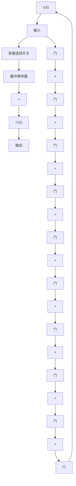
</details>

图 5-12 由 $g(X)=1+X+X^{3}$ 生成的 $(7,4)$ 循环码的译码电路

# 5.6 循环汉明码

第 4.1 节中所给出的汉明码能够写成循环形式，由一个 m 次的本原多项式 $p(X)$ 可以生成一个长为 $2^{m}-1(m \geqslant 3)$ 的循环汉明码。

下面，通过检验其系统形式的奇偶校检矩阵，可以证明此前定义的循环码实际上就是一种汉明码。采用5.2节提到的方法来构造奇偶校验矩阵，用 $X^{m+i}$ 除以生成多项式 $p(X)(0 \leqslant i \leqslant 2^{m} - m - 1)$ 得到

$$
X ^ {m + i} = \boldsymbol {a} _ {i} (X) \boldsymbol {p} (X) + \boldsymbol {b} _ {i} (X) \tag {5-28}
$$

其中余式 $b_{i}(X)$ 具有以下形式：

$$
\boldsymbol {b} _ {i} (X) = b _ {i 0} + b _ {i 1} X + \dots + b _ {i, m - 1} X ^ {m - 1}
$$

由于 X 不是本原多项式 $p(X)$ 的因式，因此 $X^{m+i}$ 与 $p(X)$ 必定互素，结果有 $b_{i}(X) \neq 0$ 。另外， $b_{i}(X)$ 至少由两项组成。假设 $b_{i}(X)$ 仅含有一项，如 $X^{j}(0 \leqslant j < m)$ ，由公式 (5-28) 可得

$$
X ^ {m + i} = \boldsymbol {a} _ {i} (X) \boldsymbol {p} (X) + X ^ {j}
$$

整理上述方程有

$$
X ^ {j} (X ^ {m + i - j} + 1) = \boldsymbol {a} _ {i} (X) \boldsymbol {p} (X)
$$

由于 $X^j$ 与 $\pmb{p}(X)$ 互素，上述等式意味着 $X^{m + i - j} + 1$ 能够被 $\pmb{p}(X)$ 整除，但这是不可能的，因为 $m + i - j < 2^m - 1$ ，且 $\pmb{p}(X)$ 是 $m$ 次本原多项式（回忆一下，满足 $X^n + 1$ 能够被 $\pmb{p}(X)$ 整除要求的最小正整数 $n$ 为 $2^m - 1$ ）。因此，对于 $0 \leqslant i < 2^m - m - 1$ ，余式 $\pmb{b}_i(X)$ 至少由两项组成。下面证明，对于 $i \neq j$ ， $\pmb{b}_i(X) \neq \pmb{b}_j(X)$ 。从公式(5-28)可得：

$$
\boldsymbol {b} _ {i} (X) + X ^ {m + i} = \boldsymbol {a} _ {i} (X) \boldsymbol {p} (X), \quad \boldsymbol {b} _ {j} (X) + X ^ {m + j} = \boldsymbol {a} _ {j} (X) \boldsymbol {p} (X)
$$

假设 $\boldsymbol{b}_{i}(X)=\boldsymbol{b}_{j}(X)$ ，不妨设 i<j，则联立上述两个方程，可得如下关系式：

$$
X ^ {m + i} (X ^ {j - i} + 1) = [ \boldsymbol {a} _ {i} (X) + \boldsymbol {a} _ {j} (X) ] \boldsymbol {p} (X)
$$

该方程意味着 $X^{j-i}+1$ 可以被 $\boldsymbol{p}(X)$ 整除，然而这是不可能的，因为 $i\neq j$ 且 $j-i<2^{m}-1$ 。所以 $\boldsymbol{b}_{i}(X)\neq\boldsymbol{b}_{j}(X)$ 。

设矩阵 $H = [I_{m} Q]$ 为由 $\boldsymbol{p}(X)$ 生成的循环码的奇偶校验矩阵（系统形式），其中 $I_{m}$ 为 $m \times m$ 单位矩阵而 Q 为 $m \times (2^{m} - m - 1)$ 矩阵。令 $\boldsymbol{b}_{i} = (b_{i0}, b_{i1}, \cdots, b_{i,m-1})$ 为与 $\boldsymbol{b}_{i}(X)$ 相应的 m 维向量。由公式 (5-17) 可知，Q 矩阵的列向量由 $2^{m} - m - 1$ 个 $b_{i}$ 向量组成 $(0 \leqslant i < 2^{m} - m - 1)$ 。由前述分析可知，Q 矩阵没有两列相同，而且每一列至少有两个 1。因此，矩阵 H 的确为汉明码的奇偶校验矩阵，其生成多项式为 $\boldsymbol{p}(X)$ 。

多项式 $\boldsymbol{p}(X)=1+X+X^{3}$ 是本原多项式，所以由 $\boldsymbol{p}(X)=1+X+X^{3}$ 生成的 (7, 4) 循环码是汉明码。在表 2-7 中列出了一些次数不小于 3 的本原多项式。

循环汉明码的译码比较容易实现。在设计译码电路时，只需要知道如何对第一个接收数据位进行译码，所有其他数据位可以由同一个电路来完成同样的译码。假设单个差错发生在接收向量 $r(X)$ 的最高位 $X^{2^{m-2}}$ [即错误多项式 $e(X)=X^{2^{m-2}}$ ]。假设 $r(X)$ 由校正子寄存器的右端移入。在整个 $r(X)$ 全部移入寄存器


<!-- fec_figure path=images/db5276f2b878ef492afe426e596c5f955afd407c75b9cdb16171aec71671d445.jpg -->

<details>
<summary>flowchart</summary>

锁相电路结构图，包含输入、缓冲寄存器、门和与门模块
</details>

图 5-13 循环汉明码的译码器

后，寄存器中的校正子就等于 $X^{m} \cdot X^{2^{m-2}}$ （错误多项式预先移位 $m$ 位）除以生成多项式 $\pmb{p}(X)$ 后所得的余式。由于 $X^{2^{m-1}} + 1$ 可以被 $\pmb{p}(X)$ 整除，则校正子有如下形式：

$$
\boldsymbol {s} (X) = X ^ {m - 1}
$$

因此，若单个差错发生在 $r(X)$ 的最高位，则所得的校正子将为 $(0,0,\dots ,0,1)$ 。若单个差错发生在 $r(X)$ 的其他位置上，则最终的校正子将与 $(0,0,\dots ,0,1)$ 不同。利用这个特点，仅需一个 $m$ 输入的与门就可检测校正子图样 $(0,0,\dots ,0,1)$ 。与门的输入端为 $s_0^{\prime}$ ， $s_1^{\prime},\dots ,s_{m - 2}^{\prime}$ 和 $s_{m - 1}$ ，其中 $s_i$ 为校正子位而 $s_i^{\prime}$ 为 $s_i$ 的补。图5-13给出了一个循环汉明码的完

整译码电路。译码操作的步骤描述如下：

第 1 步 将整个接收向量移入校正子寄存器以获得校正子。同时，接收向量寄存在缓冲寄存器中。如果校正子为 0，译码器认为没有出现错误，故不必纠正；如果校正子不为 0，译码器认为出现了单个差错。

第2步 从缓冲寄存器中逐位读出接收码字。当每一位都从缓冲寄存器中读出时，校正子寄存器就循环移位一次。一旦寄存器中的校正子为 $(0,0,0,\dots,0,1)$ 时，则从缓存器中读出的下一位是错误的，且 $m$ 输入与门的输出为1。

第3步 出错位从缓冲寄存器中读出时，被 $m$ 输入与门的输出纠正。纠正的过程通过一个异或门来实现。

第 4 步 当接收向量全部从缓冲寄存器读出后，校正子寄存器将重置为零。

对上述循环汉明码进行修正，可以在纠正任意单个差错的同时检测出任意两个差错的组合。令 $g(X) = (X + 1)p(X)$ ，其中 $p(X)$ 为 $m$ 次本原多项式。由于 $X^{2^{m-1}} + 1$ 既可以被 $X + 1$ 整除，也可以被 $p(X)$ 整除，且这两个因式互素，所以 $X^{2^{m-1}} + 1$ 必定可以被 $g(X)$ 整除。用 $g(X) = (X + 1)p(X)$ 生成长度为 $2^{m} - 1$ 的循环汉明码，可以纠正单个差错并能检测出两个差错，它具有 $m + 1$ 个奇偶校检位。下面将证明，该码的最小距离为4。

为方便起见，用 $C_1$ 表示纠单个错误的循环汉明码，用 $C_2$ 表示由 $\pmb{g}(X) = (X + 1)\pmb{p}(X)$ 生成的循环码。实际上，由于 $C_1$ 中任意奇数重量的码多项式不含有 $X + 1$ 因式， $C_1$ 中所有偶数重量的码字组成了 $C_2$ 的全部码字。因此， $C_1$ 中奇数重量的码多项式不能被 $\pmb{g}(X) = (X + 1)\pmb{p}(X)$ 整除，即它不是 $C_2$ 的码多项式；另一方面， $C_1$ 中偶数重量的码多项式含有因式 $X + 1$ ，故它能被 $\pmb{g}(X) = (X + 1)\pmb{p}(X)$ 所整除，且是 $C_2$ 的码多项式。结果， $C_2$ 的最小重量至少是4。

下面证明 $C_2$ 的最小重量恰好是 4。令 $i, j, k$ 为三个相互不同的非负整数，它们的值都不大于 $2^m - 1$ ，并且 $X^i + X^j + X^k$ 不能被 $\pmb{p}(X)$ 整除。（这样的整数组是存在的。）例如，我们首先选择任意 $i, j$ ，用 $X^i + X^j$ 除以 $\pmb{p}(X)$ 得到

$$
X ^ {i} + X ^ {j} = \boldsymbol {a} (X) \boldsymbol {p} (X) + \boldsymbol {b} (X)
$$

式中 $\boldsymbol{b}(X)$ 为次数不大于 m-1 的余式。因为 $X^{i} + X^{j}$ 不能被 $\boldsymbol{p}(X)$ 整除，故 $\boldsymbol{b}(X) \neq 0$ 。现在来选择一个整数 k，使得当 $X^{k}$ 除以 $\boldsymbol{p}(X)$ 时，余式不等于 $\boldsymbol{b}(X)$ 。这样， $X^{i} + X^{j} + X^{k}$ 不能被 $\boldsymbol{p}(X)$ 整除。以上述多项式除以 $\boldsymbol{p}(X)$ ，有

$$
X ^ {i} + X ^ {j} + X ^ {k} = \boldsymbol {c} (X) \boldsymbol {p} (X) + \boldsymbol {d} (X) \tag {5-29}
$$

下面，选取一个小于 $2^{m} - 1$ 的非负整数 $l$ ，使得当 $X^{l}$ 除以 $\pmb{p}(X)$ 时，余式等于 $\pmb{d}(X)$ ，即

$$
X ^ {l} = \boldsymbol {f} (X) \boldsymbol {p} (X) + \boldsymbol {d} (X) \tag {5-30}
$$

整数 $l$ 必不等于 $i, j, k$ 三个中的任何一个。假设 $l = i$ ，由公式(5-29)和公式(5-30)，有

$$
X ^ {j} + X ^ {k} = [ \boldsymbol {c} (X) + \boldsymbol {f} (X) ] \boldsymbol {p} (X)
$$

这意味着， $X^{k-j}+1$ 可以被 $p(X)$ 整除（不妨设 j<k），然而这是不可能的，由于 $p(X)$ 为本原多项式，且 $k-j<2^{m}-1$ ，所以 $l\neq i$ 。类似地，能够证明 $l\neq j, l\neq k$ 。利用该结果并联立公式(5-29)和公式(5-30)，有

$$
X ^ {i} + X ^ {j} + X ^ {k} + X ^ {l} = [ \boldsymbol {c} (X) + \boldsymbol {f} (X) ] \boldsymbol {p} (X)
$$

由于 $X + 1$ 是 $X^i + X^j + X^k + X^l$ 的因式但不是 $\pmb{p}(X)$ 的因式，故 $\pmb{c}(X) + \pmb{f}(X)$ 必定可以被 $X + 1$ 整除。因而， $X^i + X^j + X^k + X^l$ 可以被 $\pmb{g}(X) = (X + 1)\pmb{p}(X)$ 整除，它是由 $\pmb{g}(X)$ 生成的码中的一个码多项式，其重量为4。这就证明了用 $\pmb{g}(X) = (X + 1)\pmb{p}(X)$ 生成的循环码 $C_2$ 的最小重量（或距离）为4。因此，该码可纠正任意单个差错，同时可以检测到任意两个差错。

由于码长为 $2^{m} - 1$ 、距离为4的汉明码 $C_2$ 是由码长为 $2^{m} - 1$ 、距离为3的汉明码 $C_1$ 的偶数重量的码字所组成的，则 $C_2$ 的重量枚举式 $A_2(z)$ 就可由 $C_1$ 的重量枚举式 $A_1(z)$ 来确定。 $A_2(z)$ 只含有 $A_1(z)$ 的偶次幂项。因此，

$$
A _ {2} (z) = \frac {1}{2} \left[ A _ {1} (z) + A _ {1} (- z) \right] \tag {5-31}
$$

(见习题 5-8)。 $A_{1}(z)$ 已知且由公式 (4-1) 给出，则可以由公式 (4-1) 和公式 (5-31) 确定 $A_{2}(z)$ 如下：

$$
A _ {2} (z) = \frac {1}{2 (n + 1)} \left\{\left(1 + z\right) ^ {n} + \left(1 - z\right) ^ {n} + 2 n \left(1 - z ^ {2}\right) ^ {(n - 1) / 2} \right\} \tag {5-32}
$$

其中 $n = 2^{m} - 1$ 。距离为4的循环汉明码的对偶码为 $(2^{m} - 1, m + 1)$ 循环码，其重量分布为

$$
B _ {0} = 1, \quad B _ {2 ^ {m - 1} - 1} = 2 ^ {m} - 1, \quad B _ {2 ^ {m - 1}} = 2 ^ {m} - 1, \quad B _ {2 ^ {m - 1}} = 1
$$

所以，距离为4的循环汉明码的对偶码的重量枚举式为，

$$
B _ {2} (z) = 1 + \left(2 ^ {m} - 1\right) z ^ {2 ^ {m - 1} - 1} + \left(2 ^ {m} - 1\right) z ^ {2 ^ {m - 1}} + z ^ {2 ^ {m} - 1} \tag {5-33}
$$

如果在 BSC 中用距离为 4 的循环汉明码作差错检测，出现漏检差错的概率 $P_{u}(E)$ 可以通过联立公式 (3-33) 和公式 (5-32) 或者公式 (3-36) 和公式 (5-33) 计算得到。由公式 (3-36) 和公式 (5-33) 计算得到 $P_{u}(E)$ 的表达式如下：

$$
P _ {u} (E) = 2 ^ {- (m + 1)} \left\{1 + 2 \left(2 ^ {m} - 1\right) (1 - p) (1 - 2 p) ^ {2 ^ {m - 1} - 1} + (1 - 2 p) ^ {2 ^ {m} - 1} \right\} - (1 - p) ^ {2 ^ {m} - 1} \tag {5-34}
$$

通过公式(5-34)，我们再次验证了对于距离为4的循环汉明码，出现漏检差错的概率满足上界 $2^{-(n-k)}=2^{-(m-1)}$ （见习题5-21）。

距离为 3 和 4 的循环汉明码在通信系统中常用作差错检测。

# 5.7. 捕错译码

原则上讲，Meggitt译码方法一般适用于任意的循环码，但是在实际实现时有必要对其进行改进。若想要对纠正的错误模式作一些限制，则Meggitt译码器能够被实现。考虑生成多项式为 $g(X)$ 的 $(n, k)$ 循环码。假定传送的码多项式为 $v(X)$ ，且受错误模式 $e(X)$ 的干扰，则接收多项式为 $r(X) = v(X) + e(X)$ 。5.4节指出， $r(X)$ 的校正子 $s(X)$ 等于错误模式 $e(X)$ 除以 $g(X)$ 得到的余式[即 $e(X) = a(X)g(X) + s(X)$ ]。假定差错局限在 $r(X)$ 的高 $n - k$ 位 $X^k$ ， $X^{k+1}$ ，…， $X^{n-1}$ 上[即 $e(X) = e_kX^k + e_{k+1}X^{k+1} + \cdots + e_{n-1}X^{n-1}$ ]。若 $r(X)$ 循环移位 $n - k$ 次，则差错会被局限在 $r^{(n-k)}(X)$ 的低 $n - k$ 位 $X^0$ ， $X^1$ ，…， $X^{n-k-1}$ 上，因而相应的错误模式为

$$
e ^ {(n - k)} (X) = e _ {k} + e _ {k + 1} X + \dots + e _ {n - 1} X ^ {n - k - 1}
$$

由于 $r^{(n-k)}(X)$ 的校正子 $s^{(n-k)}(X)$ 等于 $e^{(n-k)}(X)$ 除以 $g(X)$ 后的余式，又因为 $e^{(n-k)}(X)$ 的次数小于n-k，所以得到下面的等式：

$$
\boldsymbol {s} ^ {(n - k)} (X) = \boldsymbol {e} ^ {(n - k)} (X) = e _ {k} + e _ {k + 1} X + \dots + e _ {n - 1} X ^ {n - k - 1}
$$

用 $X^k$ 乘以 $\pmb{s}^{(n - k)}(X)$ 有

$$
X ^ {k} \boldsymbol {s} ^ {(n - k)} (X) = \boldsymbol {e} (X) = e _ {k} X ^ {k} + e _ {k + 1} X ^ {k + 1} + \dots + e _ {n - 1} X ^ {n - 1}
$$

以上结果说明，若差错位限制在接收向量 $r(X)$ 的高 $n - k$ 位上，则错误模式 $\pmb{e}(X)$ 等于 $X^{k}s^{(n - k)}(X)$ ，其中 $s^{(n - k)}(X)$ 为 $r(X)$ 的 $n - k$ 次循环移位 $r^{(n - k)}(X)$ 的校正子。若出现上述情况，只要计算 $s^{(n - k)}(X)$ 并把 $X^{k}s^{(n - k)}(X)$ 加到 $r(X)$ 上去，最终得到的多项式就是传送的码多项式。

假定差错位并不是局限在高 $n - k$ 位上，而是局限在 $n - k$ 个连续位置上，如 $\pmb{r}(X)$ 的 $X^i$

$X^{i+1}, \cdots, X^{(n-k)+i-1}$ （包含首尾相接情况）。若 $r(X)$ 向右循环移位n-i次，差错将集中到 $r^{(n-i)}(X)$ 的n-k个低次位上，错误模式等于 $X^{i}s^{(n-i)}(X)$ ，其中 $s^{(n-i)}(X)$ 为 $r^{(n-i)}(X)$ 的校正子。

现在假定接收多项式 $\boldsymbol{r}(X)$ 由校正子寄存器的右端输入。从校正子寄存器右端移入 $\boldsymbol{r}(X)$ 等价于用 $X^{n-k}$ 乘以 $\boldsymbol{r}(X)$ 。当整个 $\boldsymbol{r}(X)$ 移入校正子寄存器后，校正子寄存器的内容就是 $\boldsymbol{r}^{(n-k)}(X)$ 的校正子 $\boldsymbol{s}^{(n-k)}(X)$ 。若差错局限在 $\boldsymbol{r}(X)$ 的高 n-k 位 $X^{k}, X^{k+1}, \cdots, X^{n-1}$ 上，则它们就等于 $\boldsymbol{s}^{(n-k)}(X)$ ；但是，若差错局限在非高 n-k 位以外的其他 n-k 个连续位置（包含首尾相接情况），则当整个 $\boldsymbol{r}(X)$ 移入校正子寄存器后，校正子寄存器必须再移位若干次，校正子寄存器的内容才等于差错数据。校正子寄存器这种直到其内容与差错数据相同为止的持续移位称为捕错 $^{[14]}$ 。若差错局限在 $\boldsymbol{r}(X)$ 的 n-k 个连续位上，并且能够检测到在校正子寄存器中已捕获到错误，则只要将校正子寄存器的内容和接收码的 n-k 个确定位置上的数据相加，就实现了纠错。

假设使用纠 $t$ 个错误的循环码。为检测是否已经在校正子寄存器捕捉到差错，只要在校正子寄存器每次移位后检查校正子的重量。当校正子寄存器的重量小于等于 $t$ 时，则认定在校正子寄存器中捕捉到了错误。若 $\pmb{r}(X)$ 中差错位的数目小于等于 $t$ 且局限在连续的 $n - k$ 位上，则只有当校正子寄存器的重量小于等于 $t$ 时，在校正子寄存器中捕捉到差错。该结论可以证明如下。一个差错数目不大于 $t$ 且局限在连续 $n - k$ 个位的错误模式 $\pmb{e}(X)$ 具有形式 $\pmb{e}(X) = X_{j}\pmb{B}(X)$ ，其中 $\pmb{B}(X)$ 的次数不大于 $n - k - 1$ ，所含项数不大于 $t$ 。（对于首尾相接的情况，对 $\pmb{e}(X)$ 的若干次循环移位后可得相同的错误模式。）用生成多项式 $\pmb{g}(X)$ 来除 $\pmb{e}(X)$ 有，

$$
X ^ {j} \boldsymbol {B} (X) = \boldsymbol {a} (X) \boldsymbol {g} (X) + \boldsymbol {s} (X),
$$

其中 $s(X)$ 为 $X_{j}\pmb{B}(X)$ 的校正子。由于 $s(X) + X_{j}\pmb{B}(X)$ 是 $\pmb{g}(X)$ 的倍式，则它是一个码多项式。除非 $s(X) = X_{j}\pmb{B}(X)$ ，否则校正子 $s(X)$ 的重量不能为 $t$ 或更小。假设 $s(X)$ 的重量小于等于 $t$ ，而且 $s(X) \neq X_{j}\pmb{B}(X)$ ，则 $s(X) + X_{j}\pmb{B}(X)$ 为一重量不大于 $2t + 1$ 的非零码多项式。这是不可能的，因为纠 $t$ 个差错的码的最小重量至少为 $2t + 1$ 。所以，只有当校正子的重量不大于 $t$ 时，就在校正子寄存器捕捉到差错。

根据捕错的概念和上述检验方法，图 5-14 给出了一个可实现的捕错译码器。译码过程可以分为以下五步：


<!-- fec_figure path=images/e3f0374d0919de88f5a29137e2be6eb9b8708afacd8c09c119661f9665b21a8f.jpg -->

<details>
<summary>flowchart</summary>

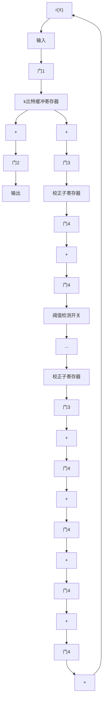
</details>

图 5-14 捕错译码器

第1步 门1、3开启，其他门关闭。接收多项式 $r(X)$ 同时逐位移入缓冲寄存器和校正子寄存器。由于仅需要恢复 $k$ 个信息位，则缓冲寄存器只用来存储 $k$ 个接收信息位。

第2步 当整个 $r(X)$ 移入校正子寄存器后，通过一个有 $(n - k)$ 输入的阈值检测开关(threshold gate)来测试寄存器校正子内容的重量。当输入中1的数目不大于 $t$ 时，该阈值检测开关的输出为1；否则输出为0。

a. 若校正子的重量不大于 t，则校正子寄存器中的校正子数据就等于 $r(X)$ 的高 $(n-k)$ 位 $X^{k}, X^{k+1}, \cdots, X^{n-1}$ 的差错数据。此时，开启门 2、4 而关闭其他门。由缓冲寄存器一次读取一位接收向量，同时根据校正子寄存器中读出的差错数据位来纠正接收向量。  
b. 若校正子内容的重量大于 t，差错位就不会局限在 $r(X)$ 的高 $(n-k)$ 位上，而且它们并没有在校正子寄存器中被捕捉到。转入第 3 步。

第3步 开启门3而关闭其他门，校正子寄存器循环移位一次。检测新校正子的重量。(a)若重量不大于 $t$ ，则差错位就局限在 $\pmb {r}(X)$ 的 $X^{k - 1}$ ， $X^{k}$ ，…， $X^{n - 2}$ 位上，且校正子寄存器的内容等于这些位置上差错数据的取值。由于第一个接收位 $r_{n - 1}$ 无差错(error-free)，保持门2开启的情况下将它从缓冲寄存器中读出。当 $r_{n - 1}$ 读出后，开启门4、关闭门3。逐位读出校正子寄存器的内容，用来纠正接下来的 $n - k$ 个从缓冲寄存器读出的接收位。(b)若校正子的重量大于 $t$ ，门3开启后，校正子寄存器再循环移位一次。

第4步 校正子寄存器继续移位，直到其内容的重量降到 $t$ 或更小为止。若其重量在第 $i$ 次移位后不大于 $t$ ， $1 \leqslant i \leqslant k$ ，则缓冲寄存器的前 $i$ 个接收位， $r_{n - i}$ ， $r_{n - i + 1}$ ， $\cdots$ ， $r_{n - 1}$ 无差错，并且校正子寄存器的内容等于在位置 $X^{k - i}$ ， $X^{k - i + 1}$ ， $\cdots$ ， $X^{n - i - 1}$ 的差错数据。当这 $i$ 个无误的接收位从缓冲寄存器读出后，校正子寄存器的内容位就被逐位读出，用来纠正接下来的 $n - k$ 个从缓冲寄存器读出的接收位。当 $k$ 个信息位均由缓存中读出并经过纠正后，关闭门2。留在校正子寄存器中的非零向量为 $r(X)$ 中校验位部分的错误，因而可以不必考虑。

第5步 如果经过 $k$ 次移位后，校正子寄存器的重量依然没有降至 $t$ 以下，则说明出现了一个差错位集中在 $n - k$ 个首尾相接位的错误模式，或出现了一个不能纠正的错误模式。校正子寄存器继续移位。假设在经过 $k + l$ 次移位后校正子的重量降至 $t$ 以下， $1 \leqslant l \leqslant n - k$ ，则差错位将集中在 $\pmb{r}(X)$ 的 $n - k$ 个首尾相接的连续位 $X^{n - l}, X^{n - l + 1}, \dots, X^{n - 1}, X^0, X^1, \dots, X^{n - k - l - 1}$ 上面。校正子寄存器最左端的 $l$ 个寄存器的内容与 $\pmb{r}(X)$ 高位的 $X^{n - l}, X^{n - l + 1}, \dots, X^{n - 1}$ 的差错位相匹配。由于并不需要知道校验部分的 $n - k - l$ 个差错位，则将校正子寄存器循环移位 $n - k - l$ 次后关闭所有门。现在，位于 $\pmb{r}(X)$ 的 $X^{n - l}, X^{n - l + 1}, \dots, X^{n - 1}$ 的 $l$ 个位置的差错位局限在校正子寄存器最右端的寄存器中。保持门2、4开启而其他门关闭，从缓冲寄存器读取接收位并用校正子寄存器中逐位移出的相应差错数据来纠正。这样就完成了整个译码过程。

若校正子寄存器已经移位 $n$ 次，而从未出现校正子的重量降至 $t$ 以下，则说明或者出现不可纠正的差错，或者差错位不局限在 $n - k$ 个连续位置上。无论出现哪种情况，差错都会被检测到。除了差错位局限在 $r(X)$ 的连续 $n - k$ 个首尾相接位的情形以外，至多经过 $k$ 次循环移位，接收向量的信息位可从缓冲寄存器读出，经过纠正，并将其传送到信宿中。若差错位局限在 $r(X)$ 的连续 $n - k$ 个首尾相接位，则接收信息在被读出并被纠正之前，校正子寄存器首先要循环移位 $n$ 次。对于很大的 $n$ 和 $n - k$ ，可纠正的首尾相接错误模式的数目是非常大的，以致引起了不必要的长译码延时。

可以采用另一种方法来实现捕错译码，从而尽可能快的完成对位于连续 $n - k$ 个首尾相接位的错误模式的纠错。这可以通过将接收向量 $\pmb{r}(X)$ 从校正子寄存器的左端输入来实现，

如图 5-15 所示。译码方法能够进行这种改变是基于以下原因：如果差错局限在 $\boldsymbol{r}(X)$ 的低 n-k 个校验位 $X^{0}, X^{1}, \cdots, X^{n-k-1}$ 上，则在整个 $\boldsymbol{r}(X)$ 移入校正子寄存器后，寄存器的内容就等于 $\boldsymbol{r}(X)$ 在 $X^{0}, X^{1}, \cdots, X^{n-k-1}$ 位置上的差错位。假定差错并不局限在低 n-k 个校验位上，而是局限在 n-k 个连续位置 $X^{i}, X^{i+1}, \cdots, X^{(n-k)+i-1}$ （含首尾相接的情况），在 $\boldsymbol{r}(X)$ 的 n-i 次循环移位后，差错将会移位到 $\boldsymbol{r}^{(n-i)}(X)$ 的低 n-k 位，而 $\boldsymbol{r}^{(n-i)}(X)$ 的校正子将等于局限在 $\boldsymbol{r}(X)$ 的 $X^{i}, X^{i+1}, \cdots, X^{(n-k)+i-1}$ 位置上的差错位。图 5-15 所示译码器的操作步骤如下：


<!-- fec_figure path=images/c4f3cdc98abad2dfd0be525db633a4c9ee66ebe4aaaea8822ef005975ad44269.jpg -->

<details>
<summary>flowchart</summary>

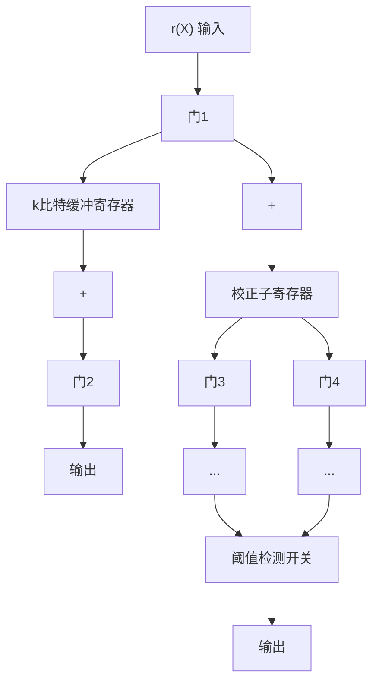
</details>

图 5-15 另一种捕错译码器

第1步 开启门1、3而关闭其他门。接收向量 $r(X)$ 同时移入校正子寄存器和缓冲寄存器（只有接收向量的k个信息位存储在缓存中）。当接收向量 $r(X)$ 完全移入校正子寄存器后，寄存器中的内容就是 $r(X)$ 的校正子 $s(X)$ 。

第2步 检测校正子的重量。(a)若重量不大于 $t$ ，则差错局限在 $\pmb{r}(X)$ 的低 $n - k$ 个校验位 $X^0, X^1, \dots, X^{n - k - 1}$ 上。那么，缓冲寄存器中的 $k$ 个信息位无差错。门2开启而门4关闭，由缓冲寄存器读出无差错的信息位。(b)若校正子的重量大于 $t$ ，则开启门3而关闭其他门，校正子寄存器循环移位一次。进入第3步。

第3步 检测校正子寄存器中新内容的重量。(a)若重量不大于t，差错局限在 $r(X)$ 的 $X^{n-1}$ ， $X^{0}$ ， $X^{1}$ ，…， $X^{n-k-2}$ 位上(首尾相接情形)。校正子寄存器最左端一位等于 $r(X)$ 中 $X^{n-1}$ 位的差错位；校正子寄存器的其他n-k-1位则对应于 $r(X)$ 校验部分 $X^{0}$ ， $X^{1}$ ，…， $X^{n-k-2}$ 的差错位。根据阈值检测开关的输出关闭门3并设置时钟从2开始计数。保持门3关闭，校正子寄存器移位(与时钟同步)。当时钟计数到n-k时，校正子寄存器的内容为 $(00\cdots01)$ 。最右端一位与 $r(X)$ 中 $X^{n-1}$ 位的差错位相对应。下面从缓冲寄存器读取k个接收信息位，而第一个接收信息位由校正子寄存器输出的1来纠正，译码结束。(b)若校正子寄存器内容的重量大于t，开启门3而关闭其他门，校正子寄存器循环移位一次。进入第4步。

第 4 步 重复第 3 步(b)直到校正子寄存器内容的重量降至 t 以下。若在 i 次移位后重量降至 t 以下， $1 \leqslant i \leqslant n - k$ ，则时钟自 $i + 1$ 开始计数。保持门 3 关闭并移位校正子寄存器。当时钟计数到 n - k 时，校正子寄存器最右端的 i 个寄存器的内容将等于缓冲寄存器中接收信息位的前 i 位的差错位。而其他的信息位没有差错。下面开启门 2、4。从缓冲寄存器中读出接收信息位，等待纠错。

第5步 校正子寄存器经过 $n - k$ 次移位后（门3开启时），如果其重量仍然没有降至 $t$ 以下，开启门2，从缓存中逐位读出接收信息位。此时，保持门3开启、校正子寄存器循环

移位 1 次。若移位后校正子的重量降至 t 以下，则说明其内容等于即将从缓冲寄存器输出的 n-k 个信息位的差错位。下面，开启门 4、保持门 3 关闭，则有差错的信息数据将由校正子寄存器的输出来纠正。当所有的 k 个信息位全部从缓存中读出后，门 2 立即关闭。

通过上述的捕错译码方法，校正子寄存器至多移位 $n - k$ 次后，缓冲寄存器读出接收信息位。对于很大的 $n - k$ ，该方法较图5-14所示译码器的译码方法要快；但是，当 $n - k$ 远小于 $k$ 时，则是第一种捕错实现方案在译码速度上优于图5-15所示的方法。

实际上，第5.6节介绍的循环汉明码的译码就是一种捕错方式的译码。校正子寄存器循环移位，直到寄存器的最右级捕捉到单个差错为止。捕错译码在对纠单个错误的分组码和纠突发错误码(第20章会详细讨论有关纠突发错误码的译码)的译码方面最为有效。对于一些较短的纠双错误码的译码，捕错译码也是有效的。当捕错译码应用于具有高纠错能力的长码

长、高码率 $(n-k$ 较小 $)$ 的码时，效果就很差了，而且会大大损失纠错能力。针对这种简单的译码技术，已经设计出一些改进方案 $^{[12]-[19]}$ ，将其适用范围拓展到纠多个错误的码，在下节中将讨论其中一种改进方案。

例 5-11 考虑由 $g(X)=1+X^{4}+X^{6}+X^{7}+X^{8}$ 生成的 (15, 7) 循环码。该码的最小距离为 $d_{\min}=5$ ，这一点将在第 6 章中证明。可知，该码能够纠正 15 位分组内的不多于 2 位的任意差错组合。假设用一个捕错译码器对该码进行译码。

显而易见，任何单个差错均被局限在 $n - k = 8$ 个连续位置内，因此任何单个差错均可以被捕捉并得到纠正。此时，考虑15位分组内的任意两个差错的情形。若将


<!-- fec_figure path=images/b3af8c4e319b0b8c804e9a2eb59514f0fe6c3adea64fd9b9c2471b38a49d9fb9.jpg -->

<details>
<summary>text_image</summary>

X⁰
X¹
X²
X³
X⁴
X⁵
X⁶
X⁷
X⁸
X⁹
X¹⁰
X¹¹
X¹²
X¹³
X¹⁴
</details>

图 5-16 码数据位的环状排列

这 15 个码元的位置从 $X^0$ 至 $X^{14}$ 排列成一个环形，如图 5-16 所示，可知任何两个差错均局限在 8 个连续位置上。由此知，任何两个差错都会被捕捉并得到纠正。图 5-17 给出了一个由


<!-- fec_figure path=images/b3bd39e4d1040579bc314d5d16672031f8ac5c2fc0549dcf7077bf1f9d152af9.jpg -->

<details>
<summary>flowchart</summary>

数字电路控制流程图，包含门1至门4、7比特缓冲寄存器及阈值检测开关
</details>

图 5-17 由 $g(X)=1+X^{4}+X^{6}+X^{7}+X^{8}$ 生成的 (15, 7) 循环码的捕错译码器

$g(X)=1+X^{4}+X^{6}+X^{7}+X^{8}$ 生成的(15,7)循环码的捕错译码器。

# 5.8 改进的捕错译码

对第 5.7 节所讨论的捕错译码器进行一定的改进，可以用来纠正这样的错误模式：大部分差错限定在 n-k 个连续位置，少部分的差错处于 n-k 区域以外。这种改进方案需要增加电路，而增加的电路的复杂程度取决于位于 n-k 区域以外的待纠正的差错位的数目。这里讨论由嵩忠雄(Kasami)提出的一种改进方案 $^{[17]}$ 。

对传送的码字产生干扰的错误模式 $\boldsymbol{e}(X)=\boldsymbol{e}_{0}+\boldsymbol{e}_{1}X+\boldsymbol{e}_{2}X^{2}+\cdots+\boldsymbol{e}_{n-1}X^{n-1}$ 可以分成两部分：

$$
\boldsymbol {e} _ {p} (X) = e _ {0} + e _ {1} X + \dots + e _ {n - k - 1} X ^ {n - k - 1}, \quad \boldsymbol {e} _ {I} (X) = e _ {n - k} X ^ {n - k} + \dots + e _ {n - 1} X ^ {n - 1}
$$

其中 $\boldsymbol{e}_{I}(X)$ 是接收向量中位于信息部分的差错， $\boldsymbol{e}_{p}(X)$ 是接收向量中位于校验部分的差错。
用该码的生成多项式 $\boldsymbol{g}(X)$ 除 $\boldsymbol{e}_{I}(X)$ ，得

$$
e _ {I} (X) = \boldsymbol {q} (X) \boldsymbol {g} (X) + \boldsymbol {\rho} (X) \tag {5-35}
$$

其中 $\boldsymbol{\rho}(X)$ 为余式，次数不大于 n-k-1。将 $\boldsymbol{e}_{p}(X)$ 加到公式(5-35)的两端，得到

$$
\boldsymbol {e} (X) = \boldsymbol {e} _ {p} (X) + \boldsymbol {e} _ {I} (X) = \boldsymbol {q} (X) \boldsymbol {g} (X) + \boldsymbol {\rho} (X) + \boldsymbol {e} _ {p} (X) \tag {5-36}
$$

由于 $\boldsymbol{e}_{p}(X)$ 的次数不大于 n-k-1， $\boldsymbol{\rho}(X)+\boldsymbol{e}_{p}(X)$ 必为错误模式 $\boldsymbol{e}(X)$ 除以生成多项式所得的余式。因此， $\boldsymbol{\rho}(X)+\boldsymbol{e}_{p}(X)$ 等于接收向量 $\boldsymbol{r}(X)$ 的校正子，

$$
\boldsymbol {s} (X) = \boldsymbol {\rho} (X) + \boldsymbol {e} _ {p} (X) \tag {5-37}
$$

整理公式(5-37)有

$$
\boldsymbol {e} _ {p} (X) = \boldsymbol {s} (X) + \boldsymbol {\rho} (X) \tag {5-38}
$$

就是说，若已知信息部分的错误模式 $e_{i}(X)$ ，那么就可以得出校验部分的错误模式 $e_{p}(X)$ 。

Kasami 的捕错译码方案要求寻找一组次数不大于 $k - 1$ 的多项式 $[\phi_j(X)]_{j=1}^N$ ，使得对于任何一个可纠错的错误模式 $\pmb{e}(X)$ ，存在一个多项式 $\pmb{\phi}_j(X)$ ，使 $X^{n-k}\pmb{\phi}_j(X)$ 等于 $\pmb{e}(X)$ 的信息部分或 $\pmb{e}(X)$ 循环移位的信息部分。多项式组 $\pmb{\phi}_j(X)$ 被称为覆盖多项式 (covering polynomial)。令 $\pmb{\rho}_j(X)$ 为 $X^{n-k}\pmb{\phi}_j(X)$ 除以该码生成多项式 $\pmb{g}(X)$ 所得的余式。

译码过程如下：

第1步 整个接收向量移入到校正子寄存器，计算出校正子 $s(X)$ 。

第2步 对于 $j=1,2,\cdots,N$ ，分别计算和式 $s(X)+\boldsymbol{\rho}_{j}(X)$ 的重量（即 $w[s(X)+\boldsymbol{\rho}_{j}(X)]$ ， $j=1,2,\cdots,N)$ 。

第3步 若对于某些 $l$ 有

$$
w [ s (X) + \boldsymbol {\rho} _ {l} (X) ] \leqslant t - w [ \boldsymbol {\phi} _ {l} (X) ]
$$

则 $X^{n - k}\pmb{\phi}_l(X)$ 等于 $\pmb {e}(X)$ 位于信息部分的错误模式， $\pmb {s}(X) + \pmb{\rho}_l(X)$ 等于 $\pmb {e}(X)$ 位于校验部分的错误模式。因此，

$$
\boldsymbol {e} (X) = \boldsymbol {s} (X) + \boldsymbol {\rho} _ {l} (X) + X ^ {n - k} \boldsymbol {\phi} _ {l} (X)
$$

然后，通过对 $\boldsymbol{r}(X) + \boldsymbol{e}(X)$ 的模 2 和运算即可实现纠错。这一步需要 N 个 $(n - k)$ 输入的阈值检测开关来检测 $\boldsymbol{s}(X) + \boldsymbol{\rho}_{j}(X)$ 的重量， $j = 1, 2, \cdots, N$ 。

第 4 步 如果对于所有的 $j=1,2,\cdots,N$ 均有 $w[s(X)+\boldsymbol{\rho}_{j}(X)]>t-w[\boldsymbol{\phi}_{j}(X)]$ ，则校正子寄存器和缓冲寄存器均循环移位一次。此时校正子寄存器中新的内容 $s^{(1)}(X)$ 即为 $e(X)$ 向右移一位的 $e^{(1)}(X)$ 的校正子。

第 5 步 计算 $s^{(1)}(X)+\boldsymbol{\rho}_{j}(X)$ 的重量， $j=1,2,\cdots,N$ 。对于某些 l，如果

$$
\boldsymbol {w} \left[ \boldsymbol {s} ^ {(1)} (X) + \boldsymbol {\rho} _ {l} (X) \right] \leqslant t - \boldsymbol {w} \left[ \boldsymbol {\phi} _ {l} (X) \right]
$$

那么， $X^{n-k}\boldsymbol{\phi}_{l}(X)$ 等于 $\boldsymbol{e}^{(1)}(X)$ 位于信息部分的错误模式， $\boldsymbol{s}^{(1)}(X)+\boldsymbol{\rho}_{l}(X)$ 等于 $\boldsymbol{e}^{(1)}(X)$ 位于校验部分的错误模式。因此，

$$
\boldsymbol {e} ^ {(1)} (X) = s ^ {(1)} (X) + \boldsymbol {\rho} _ {l} (X) + X ^ {n - k} \boldsymbol {\phi} _ {l} (X)
$$

通过对 $r^{(1)}(X) + e^{(1)}(X)$ 求模2和运算即可实现纠错。

如果对于所有 $j=1,2,\cdots,N$ 均有

$$
\boldsymbol {w} \left[ \boldsymbol {s} ^ {(1)} (X) + \boldsymbol {\rho} _ {j} (X) \right] > t - \boldsymbol {w} \left[ \boldsymbol {\phi} _ {j} (X) \right]
$$

则校正子寄存器和缓冲寄存器均再次循环移位。

第6步 持续移位校正子寄存器和缓冲寄存器，直到对于 $s^{(i)}(X)$ （ $i$ 次移位后的校正子）存在 $l$ 满足，

$$
\boldsymbol {w} \left[ \boldsymbol {s} ^ {(i)} (X) + \boldsymbol {\rho} _ {l} (X) \right] \leqslant t - \boldsymbol {w} \left[ \boldsymbol {\phi} _ {l} (X) \right]
$$

那么，

$$
\boldsymbol {e} ^ {(i)} (X) = \boldsymbol {s} ^ {(i)} (X) + \boldsymbol {\rho} _ {l} (X) + X ^ {n - k} \boldsymbol {\phi} _ {l} (X)
$$

式中 $\boldsymbol{e}^{(i)}(X)$ 是 $\boldsymbol{e}(X)$ 循环移位 i 次的结果。如果在校正子寄存器和缓冲寄存器已经移位了 n-1 次后，对于所有 j，重量 $w[s^{(i)}(X)+\boldsymbol{\rho}_{j}(X)]$ 从来没有降至 $t-w[\boldsymbol{\phi}_{j}(X)]$ 以下，那么就检测到一个不可纠正的错误模式。

上述译码方式的电路复杂度取决于 $N$ ， $N$ 为覆盖多项式 $\{\phi_j(X)\}_{j=1}^N$ 的数目。组合逻辑电路由 $N$ 个 $(n-k)$ 输入的阈值检测开关组成。对于某类特定的码来说，寻找覆盖多项式 $\{\phi_j(X)\}_{j=1}^N$ 集合并非易事。寻找覆盖多项式集合的几种方法可见参考文献中的[17]、[20]和[21]。

改进后的这种捕错方法适用于多种纠两个错误及纠三个错误的码，但是它仅适合于长度较短、码率较低的码。当码的长度 $n$ 及纠错能力 $t$ 增大时，差错检测逻辑电路中所需要的阈值检测开关的数目就会非常多，以至于该方案失去实用价值。

捕错译码器的其他改进方案可以参考本书参考文献中的[15]、[16]和[18]。

# 5.9 (23, 12) 格雷码

正如 4.6 节所指出的一样，(23, 12) 格雷码 $^{[22]}$ 的最小距离为 7，为目前仅知的纠多个错误的二进制完备码。该码可整理成循环形式，并能够根据其循环结构来进行编码和译码。它的生成多项式如下

$$
\boldsymbol {g} _ {1} (X) = 1 + X ^ {2} + X ^ {4} + X ^ {5} + X ^ {6} + X ^ {1 0} + X ^ {1 1}
$$

或

$$
\boldsymbol {g} _ {2} (X) = 1 + X + X ^ {5} + X ^ {6} + X ^ {7} + X ^ {9} + X ^ {1 1}
$$

$g_{1}(X)$ 和 $g_{2}(X)$ 均为 $X^{23}+1$ 的因式，且有 $X^{23}+1=(1+X)g_{1}(X)g_{2}(X)$ 。编码过程可通过 11 级移位寄存器来实现，须根据 $g_{1}(X)$ 或 $g_{2}(X)$ 的形式而做相应的反馈连接。如果用 5.7 节所介绍的捕错电路来进行译码，某些含两个差错及多数含三个差错的错误模式就不能被捕捉。例如，考虑含两个差错的错误模式 $e(X)=X^{11}+X^{22}$ ，无论 $e(X)$ 怎样循环移位，两个差错位也永远不可能出现在连续 n-k=11 个位中，因此它们也就不能被校正子寄存器所捕捉，从而不能纠错。也容易看出，含三个错误的错误模式 $e(X)=X^{5}+X^{11}+X^{22}$ 同样不能被捕捉到。由此，对格雷码应用简单的捕错方案，会失去其部分纠错能力；但是，译码电路会相对简单。

有几种较为实用的方法可用来对(23, 12)格雷码进行译码，并维持它的纠错能力 $t = 3$ 。本节将讨论两种最好的译码方式。这两种方法都是改进的捕错译码方法。

# 5.9.1 Kasami译码器[17]

采用 Kasami 的捕错译码技术可以很容易地对格雷码进行译码。选取多项式集合

<!-- --- chunk --- -->

<!-- source: 128-143.md -->
$\left\{\boldsymbol{\phi}_{j}(X)\right\}_{j=1}^{N}$ 如下：

$$
\boldsymbol {\phi} _ {1} (X) = 0 \quad \boldsymbol {\phi} _ {2} (X) = X ^ {5} \quad \boldsymbol {\phi} _ {3} (X) = X ^ {6}
$$

设生成多项式为 $\boldsymbol{g}_{1}(X)=1+X^{2}+X^{4}+X^{5}+X^{6}+X^{10}+X^{11}$ ，用 $X^{11}\boldsymbol{\phi}_{j}(X)$ 除以 $\boldsymbol{g}_{1}(X)$ ， $[j=1,2,3]$ ，所得的余式如下：

$$
\boldsymbol {\rho} _ {1} (X) = 0 \quad \boldsymbol {\rho} _ {2} (X) = X + X ^ {2} + X ^ {5} + X ^ {6} + X ^ {8} + X ^ {9}
$$

$$
\boldsymbol {\rho} _ {3} (X) = X \boldsymbol {\rho} _ {2} (X) = X ^ {2} + X ^ {3} + X ^ {6} + X ^ {7} + X ^ {9} + X ^ {1 0}
$$

图 5-18 所示为一个基于 Kasami 捕错译码方案的译码器。接收向量由校正子寄存器的最右端输入；这等效于预先将接收向量循环移位 11 次。当整个接收向量移入校正子寄存器后，寄存器校正子内容所对应的接收向量为 $\boldsymbol{r}^{(11)}(X)$ ，即 $\boldsymbol{r}(X)$ 经过 11 次移位后的结果。在这种情况下，若差错位局限在 $\boldsymbol{r}(X)$ 的高 11 位 $X^{12}$ ， $X^{13}$ ，…， $X^{22}$ 上，则校正子将等于在那些位置的差错。该译码器的纠错过程描述如下：


<!-- fec_figure path=images/9af87be71cdbb55502ea855733b8c6b26827f94fc8aa5770831fd97c008bbbf7.jpg -->

<details>
<summary>flowchart</summary>

数字电路逻辑流程图，包含错误模式检测、阈值检测开关及缓冲寄存器模块
</details>

图 5-18 (23, 12) 格雷码的捕错译码器

第1步 门1、3、5开启，门2、4关闭。接收向量 $r(X)$ 读入校正子寄存器和缓冲寄存器。构造校正子 $s(X)=s_{0}+s_{1}X+\cdots+s_{10}X^{10}$ ，并将其读入三个阈值检测开关。

第 2 步 门 1、4、5 关闭，门 2、3 开启。对于可纠正的错误模式，采用如下方法检测校正子：

a. 若 $w[s(X)] \leqslant 3$ ，则所有的差错均局限在 $r(X)$ 的高 11 位上，而 $s(X)$ 等于在这些位置的差错位。因此，差错位就在接下来缓冲寄存器输出的 11 位中。阈值检测开关 $T_0$ 的输出使门 4 开启并关闭门 3，自缓冲寄存器逐位读出数据。把校正子寄存器输出的一位数据来与缓冲寄存器输出的一位数据进行模 2 和相加，从而完成纠错。  
b. 若 $w[s(X)] > 3$ ，检查 $s(X) + \rho_2(X)$ 的重量。若 $w[s(X) + \rho_2(X)] \leqslant 2$ ，有 $s(X) + \rho_2(X) = s_0 + s_1'X + s_2'X^2 + s_3X^3 + s_4X^4 + s_5'X^5 + s_6'X^6 + s_7X^7 + s_8'X^8 + s_9'X^9 + s_{10}X^{10}$ ，其中 $s_i'$ 为 $s_i$ 的补码。该式等于接收码字高11位的错误模式，在位置 $X^5$ 存在一个单个错误。开启门4、关闭门3。计数器 $C$ 从2开始计数；校正子寄存器无反馈移位。输出向量 $Q$ ，当且仅当计数器数

到 3、4 时为 1，被送回校正子寄存器来构造错误模式 $s(X) + \rho_{2}(X)$ 。当计数器累计到 8 时，输出 E 为 1，校正子寄存器最左端的寄存器置为 1。它用来纠正接收向量 $r(X)$ 在位置 $X^{5}$ 出现的差错。而后，缓冲寄存器输出的数据为校正子寄存器的相应输出所纠正。

c. 若 $w[s(X)] > 3$ 且 $w[s(X) + \pmb{\rho}_2(X)] > 2$ ，则检查 $s(X) + \pmb{\rho}_3(X)$ 的重量。若 $w[s(X) + \pmb{\rho}_3(X)] \leqslant 2$ ，则 $s(X) + \pmb{\rho}_3(X) = s_0 + s_1X + s_2'X^2 + s_3'X^3 + s_4X^4 + s_5X^5 + s_6'X^6 + s_7'X^7 + s_8X^8 + s_9'X^9 + s_{10}'X^{10}$ 等于接收码字在高11位的错误模式，且单个错误出现在位置 $X^6$ 上。纠错过程与 (b) 很类似，只是计数器 $C$ 由3开始计数。若 $w[s(X)] > 3$ ， $w[s(X) + \pmb{\rho}_2(X)] > 2$ ，以及 $w[s(X) + \pmb{\rho}_3(X)] > 2$ ，进入第3步。

第3步 保持门1、4、5关闭而门2、3开启，校正子寄存器和缓冲寄存器循环移位一次。校正子寄存器新的内容为 $s^{(1)}(X)$ 。重复第2步。

第 4 步 当缓冲寄存器中移位 46 次以后，整个译码过程完成。开启门 5，缓冲寄存器中的向量移入数据接收器。

若接收向量存在的差错数目为3或更少，则译码结束后缓冲寄存器中的向量即为传送的码字。若接收向量中存在的差错数目大于3，则译码结束后缓冲寄存器中的向量不是传送的码字。

# 5.9.2 系统搜索译码器

系统搜索译码方法 $^{[23]}$ 基于以下结论：在一个23位的分组中，任何差错数目不大于3的错误模式，都可以通过循环移位，使得这些差错中至多有一个差错位处于码字长为11的特定分组之外。译码过程如下：

第1步 由接收向量计算出校正子。

第 2 步 校正子及接收向量循环移位 23 次，检查校正子的重量是否降至 3 或更少。若是，重量不大于 3 的校正子与错误模式相匹配，因而可以纠错。

第 3 步 若非如此，对第一个接收信息位取反，重复第 2 步，检查是否存在重量不大于 2 的校正子。若存在，第一个接收信息位有错，校正子指出其他两个差错。译码完成。

第 4 步 若第 3 步并没有发现重量不大于 2 的校正子，则原先的第一个接收信息位是正确的。此时，这一位就必须再次取反。

第 5 步 重复第 3 步，来对第二、第三、…及第十二个信息位进行取反操作。由于并不是所有的差错都在奇偶校验部分，这种方式必定可以纠正一个差错。

每一种差错数目不大于3的错误模式中，至少存在一个差错，使得其一旦被纠正，就会令剩余的其他一个或几个差错位处于连续的11位数据分组中。当对与此差错位相应的数据位取反时，剩余的其他差错可用普通的捕错方式来纠正。

与 Kasami 译码器相比，系统搜索译码器的优势在于它只需一个对检测重量(阈值)的门；但它也有劣势：由于对 12 个不同的位必须串行取反，所以计数与计时电路的复杂度比 Kasami 译码器要高。还有，Kasami 译码器的运算速度要比系统搜索译码器快。

这种系统搜索译码器可以被推广到对其他纠多个差错的循环码进行译码。

(23, 12) 格雷码的重量枚举式为

$$
A (Z) = 1 + 2 5 3 z ^ {7} + 5 0 6 z ^ {8} + 1 2 8 8 z ^ {1 1} + 1 2 8 8 z ^ {1 2} + 5 0 6 z ^ {1 5} + 2 5 3 z ^ {1 6} + z ^ {2 3}
$$

若该码用于 BSC 的差错检测，那么出现漏检差错的概率 $P_{u}(E)$ 可由公式(3-19)计算得到。而且， $P_{u}(E)$ 满足上确界 $2^{-11}$ [即 $P_{u}(E) \leqslant 2^{-11}$ ] $^{[24]}$ 。由此，(23, 12)格雷码是一个好的差错检测码。

# 5.10 缩短的循环码

在系统设计中，若不能找到一个具有合适的自然长度的或合适的信息位数目的码字，有效的解决方案是缩短一个码，以使它满足需要。本节介绍了一种缩短循环码的技术，而且，采用该技术得到的缩短码的编译码实现均很简单。

给定一个 $(n, k)$ 循环码字C，考虑C中信息位的高l位均为零的码字集合。这样的码字共有 $2^{k-l}$ 个，它们构成了C的线性子码。若从这些码字中删除这l个零信息位，将得到 $2^{k-l}$ 个长度为n-l的向量。这 $2^{k-l}$ 个缩短的向量构成 $(n-l, k-l)$ 线性码。这种码被称为缩短循环码(shortened cyclic code)或多项式码（polynomial code），却不是循环码。缩短循环码的纠错能力至少与原码相同。

缩短循环码的编译码可以采用与普通循环码相同的电路来实现。这是因为删除前 $l$ 个零信息位并不影响对奇偶校验位和校正子的计算，但是，在整个接收向量全部进入到校正子寄存器后，对缩短循环码进行译码时，校正子寄存器就必须移位 $l$ 次以产生合适的校正子来对第一个接收位 $r_{n - l - 1}$ 进行译码。对于很大的 $l$ 值来说，校正子寄存器额外的 $l$ 次移位会带来很大的译码延时；通过调整校正子寄存器的连接方式或改进差错检测电路，都可以消除这种译码延时。

令 $\boldsymbol{r}(X)=r_{0}+r_{1}X+\cdots+r_{n-l-1}X^{n-l-1}$ 为接收多项式。假设 $\boldsymbol{r}(X)$ 由校正子寄存器右端输入。若采用原循环码的译码电路来对缩短循环码进行译码，则对接收位 $r_{n-l-1}$ 进行译码的校正子向量等于以 $X^{n-k+l}\boldsymbol{r}(X)$ 除以生成多项式 $\boldsymbol{g}(X)$ 后所得的余式。由于 $\boldsymbol{r}(X)$ 由校正子寄存器右端输入等价于以 $X^{n-k}$ 预先乘以 $\boldsymbol{r}(X)$ ，则在整个 $\boldsymbol{r}(X)$ 全部移入寄存器后，校正子寄存器必须再循环移位 l 次。下面我们将指出该怎样调整校正子寄存器的连接方式来消除多余的 l 次移位。以 $X^{n-k+l}\boldsymbol{r}(X)$ 除以 $\boldsymbol{g}(X)$ ，有

$$
X ^ {n - k + l} \boldsymbol {r} (X) = \boldsymbol {a} _ {1} (X) \boldsymbol {g} (X) + \boldsymbol {s} ^ {(n - k + l)} (X) \tag {5-39}
$$

其中 $s^{(n-k+l)}(X)$ 是余式，也是用来对接收位 $r_{n-l-1}$ 进行译码的校正子。下面，用 $X^{n-k+l}$ 除以 $g(X)$ ，令 $\boldsymbol{\rho}(X)=\rho_{0}+\rho_{1}X+\cdots+\rho_{n-k-1}X^{n-k-1}$ 为该除法的余式。那么有以下关系：

$$
\boldsymbol {\rho} (X) = X ^ {n - k + l} + \boldsymbol {a} _ {2} (X) \boldsymbol {g} (X) \tag {5-40}
$$

在公式(5-40)两端同时乘以 $r(X)$ ，利用公式(5-39)，得到 $\rho(X)r(X)$ 和 $s^{(n-k+l)}(X)$ 的关系：

$$
\boldsymbol {\rho} (X) \boldsymbol {r} (X) = \left[ \boldsymbol {a} _ {1} (X) + \boldsymbol {a} _ {2} (X) \boldsymbol {r} (X) \right] \boldsymbol {g} (X) + \boldsymbol {s} ^ {(s - k + l)} (X) \tag {5-41}
$$

上述方程表明，校正子 $s^{(n - k + l)}(X)$ 可以通过 $\pmb{\rho}(X)$ 乘以 $\pmb{r}(X)$ 再除以 $\pmb{g}(X)$ 来获得。利用这种方法来计算 $s^{(n - k + l)}(X)$ ，可以避免校正子寄存器额外的 $l$ 次移位。图5-19所示电路可完成 $\pmb{\rho}(X)$ 乘以 $\pmb{r}(X)$ ，然后再以 $\pmb{\rho}(X)\pmb{r}(X)$ 除以 $\pmb{g}(X)$ 的两步操作。当接收多项式 $\pmb{r}(X)$ 移入寄存器后，校正子寄存器的内容就是校正子 $s^{(n - k + l)}(X)$ ，并对第一个接收位进行译码。


<!-- fec_figure path=images/15498b59b7dca8cc64dbd301c16efc7b8aab3e18e0592bdb6f1f3f794803f5e8.jpg -->

<details>
<summary>flowchart</summary>

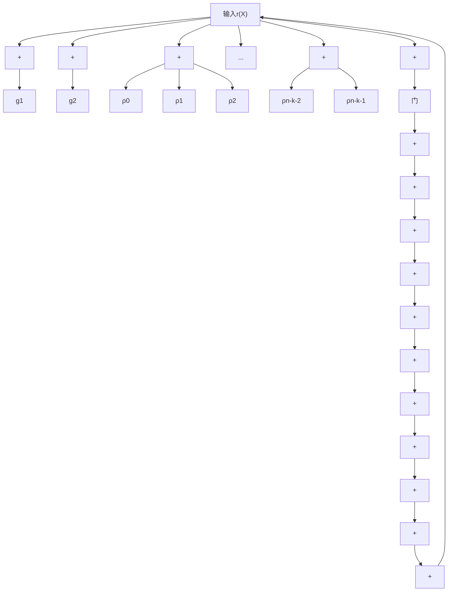
</details>

图 5-19 完成 $\boldsymbol{\rho}(X)$ 乘以 $\boldsymbol{r}(X)$ 再除以 $\boldsymbol{g}(X)$ 的电路，  
其中 $\boldsymbol{\rho}(X)=\boldsymbol{\rho}_{0}+\boldsymbol{\rho}_{1}X+\cdots+\boldsymbol{\rho}_{n-k-1}X^{n-k-1}$ ， $\boldsymbol{g}(X)=1+\boldsymbol{g}_{1}X+\cdots+X^{n-k}$

例 5-12 对于 m=5，有一个(31,26)循环汉明码，其生成多项式为 $g(X)=1+X^{2}+X^{5}$ 。
假设将其缩短3位，获得的缩短码为(28,23)线性码。图5-20所示为(31,26)循环码的译码电路。


<!-- fec_figure path=images/0e28dc39fd66e54b3ad380f0b0882d79d3ec23d1185dc24d408c655afa65f23e.jpg -->

<details>
<summary>flowchart</summary>

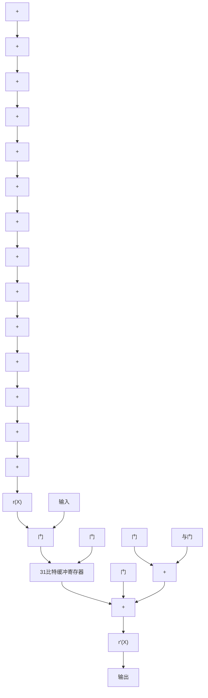
</details>

图 5-20 (31, 26) 循环汉明码译码电路，其中生成多项式为 $g(X)=1+X^{2}+X^{5}$

该电路可用来对(28, 23)缩短码进行译码。为了消除额外的移位操作，需要对校正子寄存器的连接方式进行一些调整。首先要确定多项式 $\boldsymbol{\rho}(X)$ 的形式。用 $X^{n-k-3}$ 除以 $\boldsymbol{g}(X)=1+X^{2}+X^{5}$ ，有

$$
\begin{array}{l} X ^ {5} + X ^ {2} + 1 \mid \overline {{X ^ {8}}} \\ \frac {X ^ {8} + X ^ {5} + X ^ {3}}{X ^ {5} + X ^ {3}} \\ \frac {X ^ {5} \quad + X ^ {2} + 1}{X ^ {3} + X ^ {2} + 1} \\ \end{array}
$$

其中 $\boldsymbol{\rho}(X)=1+X^{2}+X^{3}$ 。图 5-21 给出了针对(28,23)缩短码调整后的译码电路。


<!-- fec_figure path=images/65f7d4656805239a13f0e372ac54b8f73d1ffffc6c1ef3f4c169924d6244ec65.jpg -->

<details>
<summary>flowchart</summary>

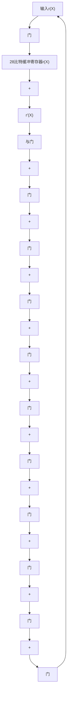
</details>

图 5-21 (28, 23) 缩短循环码的译码电路，循环码的生成多项式为 $g(X) = 1 + X^{2} + X^{5}$

通过修改原先循环码译码电路的差错检测电路，也可以避免缩短循环码译码时额外的校正子寄存器的 $l$ 次移位。

重新设计差错检测电路，检测校正子寄存器中的校正子是否对应于一个在 $X^{n - l - 1}$ 位置存在差错（即 $e_{n - l - 1} = 1$ ）的可纠正的错误模式。纠正接收数据位 $r_{n - l - 1}$ 后，将消除差错位 $e_{n - l - 1}$ 对校正子的影响。假定接收向量由校正子寄存器右端移入。令 $\pmb{\rho}(X) = 1 + \rho_1X + \dots + \rho_{n - k - 1}X^{n - k - 1}$ 为 $X^{n - l - 1} \cdot X^{n - k} = X^{2n - k - l - 1}$ 除以生成多项式 $\pmb{g}(X)$ 所得的余式。接下来，将 $\pmb{\rho}(X)$ 加到校正子寄存器中的校正子上，即可去除差错位 $e_{n - l - 1}$ 对校正子的影响。

例 5-13 考虑(28,23)缩短循环码，该码由(31,26)循环汉明码删除3位而得到，循环汉明码的生成多项式为 $g(X)=1+X^{2}+X^{5}$ 。假设在对该码进行译码时，接收向量由校正子寄存器的右端输入。若在位置 $X^{27}$ [或 $\pmb {e}(X) = X^{27}$ ]产生了单个差错，与此错误模式相符合的校正子等于 $X^{5}\pmb {e}(X) = X^{32}$ 除以生成多项式 $\pmb {g}(X) = 1 + X^2 +X^5$ 得到的余式。最终所得的校正子为(01000)。由此，在对(28，23)缩短汉明码进行译码时，差错检测电路被设计用来检测校正子寄存器中的校正子内容是否为(01000)。如此一来，省去了校正子寄存器额外的3次移位。重新设置校正子检测电路后的译码电路如图5-22所示。


<!-- fec_figure path=images/216c6c7d351af4caa51cf7c8a36f624f485452a8bc6eb33866f90919ca6e3456.jpg -->

<details>
<summary>flowchart</summary>

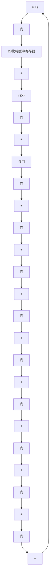
</details>

图 5-22 (28, 23) 缩短汉明码的另一种译码电路，其生成多项式为 $\boldsymbol{g}(X)=1+X^{2}+X^{5}$

与 ARQ 协议相结合，可检测差错的缩短循环码被广泛应用于各种差错控制系统中，尤其是计算机通信领域。在这些领域的应用中它们常常被称为循环冗余校验(cyclic redundancy check, CRC)码。一个 CRC 码通常由一个本原多项式 $p(X)$ 或者多项式 $g(X) = (X + 1)p(X)$ 来生成。许多 CRC 码已经成为各种领域中差错检测的国际标准。下面列举了一些标准 CRC 码：

CCITT X-25(国际电话电报咨询委员会，建议 X-25)

$$
\boldsymbol {g} (X) = (X + 1) \left(X ^ {1 5} + X ^ {1 4} + X ^ {1 3} + X ^ {1 2} + X ^ {4} + X ^ {3} + X ^ {2} + X + 1\right) = X ^ {1 6} + X ^ {1 2} + X ^ {5} + 1
$$

ANSI(美国国家标准化组织)

$$
\boldsymbol {g} (X) = (X + 1) \left(X ^ {1 5} + X + 1\right) = X ^ {1 6} + X ^ {1 5} + X ^ {2} + 1
$$

IBM-SDLC(IBM 同步数据链路控制)

$$
\begin{array}{l} \boldsymbol {g} (X) = (X + 1) ^ {2} \left(X ^ {1 4} + X ^ {1 3} + X ^ {1 2} + X ^ {1 0} + X ^ {8} + X ^ {6} + X ^ {5} + X ^ {4} + X ^ {3} + X + 1\right) \\ = X ^ {1 6} + X ^ {1 5} + X ^ {1 3} + X ^ {7} + X ^ {4} + X ^ {2} + X + 1 \\ \end{array}
$$

IEC TC57

$$
\boldsymbol {g} (X) = (X + 1) ^ {2} \left(X ^ {1 4} + X ^ {1 0} + X ^ {9} + X ^ {8} + X ^ {5} + X ^ {3} + X ^ {2} + X + 1\right)
$$

$$
= X ^ {1 6} + X ^ {1 4} + X ^ {1 1} + X ^ {8} + X ^ {6} + X ^ {5} + X ^ {4} + 1
$$

IEEE 802.3 标准

$$
\boldsymbol {g} (X) = X ^ {3 2} + X ^ {2 6} + X ^ {2 3} + X ^ {2 2} + X ^ {1 6} + X ^ {1 2} + X ^ {1 1} + X ^ {1 0} + X ^ {8} + X ^ {7} + X ^ {5} + X ^ {4} + X ^ {2} + X + 1
$$

# 5.11 循环乘积码

实现乘积码的直观方法是写出码阵列，首先做行操作(或列操作)、次而做列操作(或行操作)来进行编码和译码。然而，存在另外一种替代方法更具吸引力。很多情况下，循环码的乘积码具有循环结构，而实现循环码的编译码则简单得多。

如果分量码 $C_1$ 和 $C_2$ 是循环码，它们的长度 $n_1$ 和 $n_2$ 互素，若以一种合适的顺序来传送码阵列中的码比特位，那么它们的乘积码 $C_1 \times C_2$ 就是循环结构的[3],[25],[26]。如图5-23所示，自阵列的右上角开始，沿45度斜对角线向左下方移位。当到达一列的尾部时，转到下一列的顶部；当到达一行的尾部时，转到下一行的最右端。


<!-- fec_figure path=images/15edfe71ebe47debdbec88032851f1e416883b8b705440736e0b32b4638457f9.jpg -->

<details>
<summary>flowchart</summary>

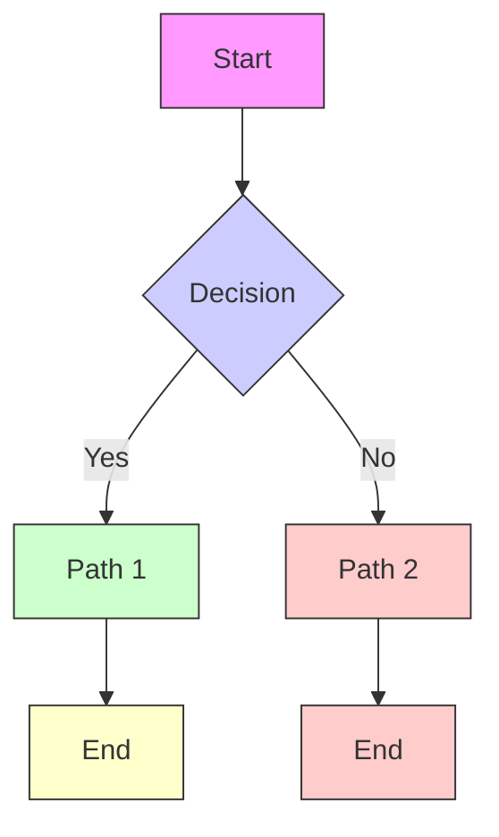
</details>

图 5-23 循环乘积码的传送

由于 $n_1$ 和 $n_2$ 互素，则存在一对整数 $a$ 和 $b$ 满足：

$$
a n _ {1} + b n _ {2} = 1
$$

令 $\boldsymbol{g}_{1}(X)$ 和 $\boldsymbol{h}_{1}(X)$ 分别为 $(n_{1}, k_{1})$ 循环码 $C_{1}$ 的生成多项式和奇偶校验多项式， $\boldsymbol{g}_{2}(X)$ 和 $\boldsymbol{h}_{2}(X)$ 分别为 $(n_{2}, k_{2})$ 的循环码 $C_{2}$ 的生成多项式和奇偶校验多项式。那么，可以证明， $C_{1}$ 和 $C_{2}$ 的循环乘积码的生成多项式 $\boldsymbol{g}(X)$ 为 $X^{n_{1}n_{2}} - 1$ 和 $\boldsymbol{g}_{1}(X^{bn_{2}}) \boldsymbol{g}_{2}(X^{an_{1}})$ 的最大公约式 $(\mathrm{GCD})^{[25],[26]}$ ，即

$$
\boldsymbol {g} (X) = \operatorname{GCD} \left[ X ^ {n _ {1} n _ {2}} - 1, \boldsymbol {g} _ {1} \left(X ^ {b n _ {2}}\right) \boldsymbol {g} _ {2} \left(X ^ {a n _ {1}}\right) \right] \tag {5-42}
$$

而且，循环乘积码的奇偶校验多项式 $h(X)$ 为 $\pmb{h}_1(X^{bn_2})$ 和 $\pmb{h}_2(X^{an_1})$ 的最大公约式，即

$$
\boldsymbol {h} (X) = \operatorname{GCD} \left[ \boldsymbol {h} _ {1} \left(X ^ {b n _ {2}}\right), \boldsymbol {h} _ {2} \left(X ^ {a n _ {1}}\right) \right] \tag {5-43}
$$

循环乘积码译码器的复杂度可以与码 $(n_{1}, k_{1})$ 和码 $(n_{2}, k_{2})$ 译码器的复杂度之和相比拟。在信道接收端，接收向量将重新排列成一个矩形阵列。那么，译码器首先分别对每个行向量码字（或列向量码字）进行译码，然后再分别对每个列向量码字（或行向量码字）进行译码。也可以采用另外一种译码方案。在传送的码字中，每隔 $n_{2}$ 个码位选择一位构成的 $n_{1}$ 个比特位，实际是对码字 $C_{1}$ 中的某个码字的 $n_{1}$ 个比特的某种固定方式的重新排列。它们可以反向重排回原来的形式，并通过Meggitt译码器进行纠错。重排形式下的 $n_{1}$ 个比特是一个相关码的一个码字，也可以在这种形式直接为Meggitt译码器所译出。类似地，从乘积码的码字里每隔 $n_{1}$ 个码位抽取一位可以对列向量码字 $C_{2}$ 进行纠错。那么，我们需要的总的器件就大致相当于对两个独立码字进行译码所需要的器件之和。

# 5.12 准循环码

循环码具有完全的循环对称性，也就是说，对一个码字循环移位任意个符号位，不管是向左还是向右，都将获得另一个码字。这种循环结构使循环码的编码和译码的实现变得简单，仅仅使用移位寄存器和逻辑电路即可。另有其他一些线性分组码虽不具有完全的循环对称性，却具有部分循环结构，故此称为准循环码。

准循环码(quasi-cyclic code)是线性码，不管向左还是向右，对一个码字循环移位某个固定数 $n_{0}\neq1$ （或 $n_{0}$ 的整数倍）个符号位，都会得到另一个码字。明显的是，对于 $n_{0}=1$ ，准循环码就是

循环码。整数 $n_0$ 被称为移位约束（shifting constraint）。一个准循环码的对偶码也是准循环的。

例如，考虑一个由如下矩阵生成的(9，3)码：

$$
\boldsymbol {G} = \left[ \begin{array}{l l l} 1 1 1 & 1 0 0 & 1 1 0 \\ 1 1 0 & 1 1 1 & 1 0 0 \\ 1 0 0 & 1 1 0 & 1 1 1 \end{array} \right]
$$

本码的八个码字列于表5-6中。假设对表5-6中第五个码字(001011010)向右移3位，将会得到表5-6中的第七个码字(010001011)。若对第五个码字分别向右移1位和2位，将分别得到两个向量(000101101)和(100010110)，这两个向量都不是表5-6中所给出的码字。因此，表5-6所给出的(9，3)码是准循环码，其移位约束为 $n_{0}=3$ 。该码仍可以用图5-24所示的移位寄存器来进行编码。令 $(c_{0}, c_{1}, c_{2})$ 为待编码的消息。一旦当三个信息位进入寄存器后，门1关闭、门2开启。在输出端口产生一个信息位 $c_{2}$ 和两个奇偶校检位 $p_{2}^{(1)}$ 、 $p_{2}^{(2)}$ ，然后它们被输出到信道中。两个奇偶校检符号位由下式给出：

表 5-6 (9, 3) 准循环码的码字

<table><tr><td>000</td><td>000</td><td>000</td></tr><tr><td>111</td><td>100</td><td>110</td></tr><tr><td>110</td><td>111</td><td>100</td></tr><tr><td>100</td><td>110</td><td>111</td></tr><tr><td>001</td><td>011</td><td>010</td></tr><tr><td>011</td><td>010</td><td>001</td></tr><tr><td>010</td><td>001</td><td>011</td></tr><tr><td>101</td><td>101</td><td>101</td></tr></table>


<!-- fec_figure path=images/7e30f329ec6bbbda0fcc40d826a482a603cf03bb0c34e6750c9337567c4d585a.jpg -->

<details>
<summary>flowchart</summary>

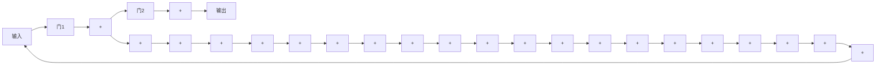
</details>

图 5-24 (9, 3) 准循环码的编码电路

$$
p _ {2} ^ {(1)} = c _ {0} + c _ {2},
$$

$$
p _ {2} ^ {(2)} = c _ {0} + c _ {1} + c _ {2}
$$

下面，寄存器移位一次。现在寄存器的内容为 $(c_{2}, c_{0}, c_{1})$ 。在输出端口出现一个信息位 $c_{1}$ 和两个奇偶校检位 $p_{1}^{(1)}$ 、 $p_{1}^{(2)}$ ，然后它们被输出到信道中。奇偶校验位 $p_{1}^{(1)}$ 和 $p_{1}^{(2)}$ 由下式给出：

$$
p _ {1} ^ {(1)} = c _ {1} + c _ {2},
$$

$$
p _ {1} ^ {(2)} = c _ {0} + c _ {1} + c _ {2}
$$

接下来，寄存器再移位一次。现在寄存器的内容为 $(c_{1}, c_{2}, c_{0})$ 。在输出端口出现一个信息位 $c_{0}$ 和两个奇偶校检位 $p_{0}^{(1)}$ 、 $p_{0}^{(2)}$ 。

然后，这三个符号被输出到信道中。两个奇偶校检位由下式给出：

$$
p _ {0} ^ {(1)} = c _ {0} + c _ {1}, \quad p _ {0} ^ {(2)} = c _ {0} + c _ {1} + c _ {2}
$$

至此，编码结束。码字具有如下形式

$$
\boldsymbol {v} = \left(p _ {0} ^ {(2)}, p _ {0} ^ {(1)}, c _ {0}, p _ {1} ^ {(2)}, p _ {1} ^ {(1)}, c _ {1}, p _ {2} ^ {(2)}, p _ {2} ^ {(1)}, c _ {2}\right)
$$

该码字由三部分构成，每一部分含有一个原始信息位和两个奇偶校检位。这个形式可以被认为是系统形式。

对于一个移位约束为 $n_{0}$ 的 $(mn_{0}, mk_{0})$ 准循环码，其系统形式的生成矩阵为

$$
\boldsymbol {G} = \left[ \begin{array}{c c c c} \boldsymbol {P} _ {0} \boldsymbol {I} & \boldsymbol {P} _ {1} \boldsymbol {0} & \dots & \boldsymbol {P} _ {m - 1} \boldsymbol {0} \\ \boldsymbol {P} _ {m - 1} \boldsymbol {0} & \boldsymbol {P} _ {0} \boldsymbol {I} & \dots & \boldsymbol {P} _ {m - 2} \boldsymbol {0} \\ \vdots & \vdots & & \vdots \\ \boldsymbol {P} _ {1} \boldsymbol {0} & \boldsymbol {P} _ {2} \boldsymbol {0} & \dots & \boldsymbol {P} _ {0} \boldsymbol {I} \end{array} \right] \tag {5-44}
$$

式中 I 和 0 分别代表 $k_{0} \times k_{0}$ 单位矩阵和零矩阵，而 $P_{i}$ 代表一个 $k_{0} \times (n_{0} - k_{0})$ 任意矩阵。每一行（由 m 个 $k_{0} \times n_{0}$ 的矩阵组成）是紧邻着它的上一行（向右）循环移位的结果，而最顶端一行为最底端一行循环移位的结果。G 的每一列是由其左侧的列向下循环移位（或者右侧的列

向上移位)的结果。一个消息向量由 $m$ 个 $k_{0}$ 比特的分组构成，而一个码字由 $m$ 个 $n_{0}$ 比特的分组构成。这 $m$ 个 $n_{0}$ 比特的分组是由 $k_{0}$ 比特的固定信息位和 $n_{0} - k_{0}$ 比特的奇偶校检位组成的。公式(5-44)给出的生成矩阵所对应的奇偶校验矩阵为

$$
\boldsymbol {H} = \left[ \begin{array}{c c c c} \boldsymbol {I P} _ {0} ^ {\mathrm{T}} & \boldsymbol {0 P} _ {m - 1} ^ {\mathrm{T}} & \dots & \boldsymbol {0 P} _ {1} ^ {\mathrm{T}} \\ \boldsymbol {0 P} _ {1} ^ {\mathrm{T}} & \boldsymbol {I P} _ {0} ^ {\mathrm{T}} & \dots & \boldsymbol {0 P} _ {2} ^ {\mathrm{T}} \\ \vdots & \vdots & & \vdots \\ \boldsymbol {0 P} _ {m - 1} ^ {\mathrm{T}} & \boldsymbol {0 P} _ {m - 2} ^ {\mathrm{T}} & \dots & \boldsymbol {I P} _ {0} ^ {\mathrm{T}} \end{array} \right] \tag {5-45}
$$

其中 I 和 0 分别代表 $(n_{0}-k_{0})\times(n_{0}-k_{0})$ 单位矩阵和零矩阵，而 $P_{i}^{T}$ 为 $P_{i}$ 的转置。考虑先前给出的 (9, 3) 准循环码，其中 $k_{0}=1$ 、 $n_{0}=3$ 。系统形式的奇偶校验矩阵为

$$
\boldsymbol {H} = \left[ \begin{array}{l l l} 1 0 1 & 0 0 1 & 0 0 1 \\ 0 1 1 & 0 0 1 & 0 0 0 \\ 0 0 1 & 1 0 1 & 0 0 1 \\ 0 0 0 & 0 1 1 & 0 0 1 \\ 0 0 1 & 0 0 1 & 1 0 1 \\ 0 0 1 & 0 0 0 & 0 1 1 \end{array} \right]
$$

描述 $(mn_{0}, mk_{0})$ 准循环码的生成矩阵的一个更为通用的形式为

$$
\boldsymbol {G} = \left[ \begin{array}{c c c c} \boldsymbol {G} _ {0} & \boldsymbol {G} _ {1} & \dots & \boldsymbol {G} _ {m - 1} \\ \boldsymbol {G} _ {m - 1} & \boldsymbol {G} _ {0} & \dots & \boldsymbol {G} _ {m - 2} \\ \vdots & \vdots & & \vdots \\ \boldsymbol {G} _ {2} & \boldsymbol {G} _ {3} & \dots & \boldsymbol {G} _ {1} \\ \boldsymbol {G} _ {1} & \boldsymbol {G} _ {2} & \dots & \boldsymbol {G} _ {0} \end{array} \right] \tag {5-46}
$$

其中每个 $G_{i}$ 为一个 $k_{0} \times n_{0}$ 的子矩阵。由上可见，公式(5-46)给出的生成矩阵 G 对于各个子矩阵 $G_{i}$ 在行和列上具有循环结构。令 $M_{j} \triangleq [G_{j}, G_{j-1}, \cdots, G_{j+1}]^{T} (0 \leqslant j < m)$ 代表 G 矩阵的第 j 列 $(G_{m} = G_{0})$ 。 $M_{j}$ 为一个 $mk_{0} \times n_{0}$ 的子矩阵。那么，可以将 G 整理成如下的形式：

$$
\boldsymbol {G} = \left[ \boldsymbol {M} _ {0}, \boldsymbol {M} _ {1}, \dots , \boldsymbol {M} _ {m - 1} \right]
$$

对于 $0 \leqslant l < n_{0}$ ，令 $Q_{l}$ 是从 $M_{0}, M_{1}, \cdots, M_{m-1}$ 抽取第 l 列组合而成的 $mk_{0} \times m$ 的子矩阵。那么，可以将 G 整理成如下的形式：

$$
\boldsymbol {G} _ {c} = \left[ \boldsymbol {Q} _ {0}, \boldsymbol {Q} _ {1}, \dots , \boldsymbol {Q} _ {n _ {0} - 1} \right]
$$

$Q_{l}$ 的每一列由 $mk_{0}$ 比特组成，也可以认为由 m 个 $k_{0}$ 比特的字节（一个字节是一组 $k_{0}$ 个二进制位）所组成。以字节为单位， $Q_{l}$ 可以被看作 $m \times m$ 矩阵，它具有如下循环结构：1) 每一行是其上一行的（向右）循环移位，顶端行是底端行的循环移位；2) 每一列是其左侧一列的向下循环移位，最左侧一列是最右侧一列的循环移位。矩阵 $Q_{l}$ 被称作循环阵（circulant）。因此， $G_{c}$ 由 $n_{0}$ 个循环阵组成。在大多数情况下，准循环码都是在循环阵的表达形式下来进行讨论。

例 5-14 考虑一个(15, 5)准循环码，参数 m=5, $n_{0}=3$ , $k_{0}=1$ 。其生成矩阵为

$$
\boldsymbol {G} = \left[ \begin{array}{l l l l l} 0 0 1 & 1 0 0 & 0 1 0 & 1 1 0 & 1 1 0 \\ 1 1 0 & 0 0 1 & 1 0 0 & 0 1 0 & 1 1 0 \\ 1 1 0 & 1 1 0 & 0 0 1 & 1 0 0 & 0 1 0 \\ 0 1 0 & 1 1 0 & 1 1 0 & 0 0 1 & 1 0 0 \\ 1 0 0 & 0 1 0 & 1 1 0 & 1 1 0 & 0 0 1 \end{array} \right]
$$

$$
\boldsymbol {M} _ {0} \quad \boldsymbol {M} _ {1} \quad \boldsymbol {M} _ {2} \quad \boldsymbol {M} _ {3} \quad \boldsymbol {M} _ {4}
$$

该准循环码的最小距离为7。以循环阵的形式表示，生成多项式具有如下形式：

$$
\boldsymbol {G} = \left[ \begin{array}{l l l} 0 1 0 1 1 & 0 0 1 1 1 & 1 0 0 0 0 \\ 1 0 1 0 1 & 1 0 0 1 1 & 0 1 0 0 0 \\ 1 1 0 1 0 & 1 1 0 0 1 & 0 0 1 0 0 \\ 0 1 1 0 1 & 1 1 1 0 0 & 0 0 0 1 0 \\ 1 0 1 1 0 & 0 1 1 1 0 & 0 0 0 0 1 \end{array} \right] \boldsymbol {Q} _ {0} \quad \boldsymbol {Q} _ {1} \quad \boldsymbol {Q} _ {2}
$$

# 习题

5-1 考虑一个(15, 11)循环汉明码，生成多项式为 $\boldsymbol{g}(X)=1+X+X^{4}$ 。

1) 确定该码的校验多项式 $\boldsymbol{h}(X)$ 。  
2) 确定该码的对偶码的生成多项式。  
3) 找出该码系统形式的生成矩阵和奇偶校验矩阵。

5-2 设计由 $g(X)=1+X+X^{4}$ 生成的 (15, 11) 循环汉明码的编码器和译码器。  
5-3 一个(21, 11)循环码，生成多项式为 $\boldsymbol{g}(X)=1+X^{2}+X^{4}+X^{6}+X^{7}+X^{10}$ 。设计该码的校正子计算电路。令 $\boldsymbol{r}(X)=1+X^{5}+X^{17}$ 为一接收多项式。计算 $\boldsymbol{r}(X)$ 的校正子。随着 r 的每一位移入校正子计算电路后，给出校正子寄存器的内容。  
5-4 通过删除7个高阶信息位来缩短(15, 11)循环汉明码，得到(8, 4)缩短循环码。设计该码的译码器，使得校正子寄存器不需要额外的移位。  
5-5 通过删除 11 个高阶信息位来缩短(31, 26)循环汉明码，得到(20, 15)缩短循环码。设计该码的译码电路，使得校正子寄存器不需要额外的移位。  
5-6 令 $g(X)$ 为一个码长为 n 的二进制循环码的生成多项式。

1) 证明如果 $g(X)$ 含有因子 $X + 1$ ，则该码中不存在奇数重量的码字。  
2) 如果 $n$ 为奇数且 $X + 1$ 并不是 $\pmb{g}(X)$ 的因子，证明该码含有全1组成的码字。  
3) 证明如果 $n$ 是 $X^n + 1$ 能被 $\pmb{g}(X)$ 整除的最小整数，则该码的最小重量至少为3。

5-7 考虑一由 $g(X)$ 生成的二进制 $(n, k)$ 循环码。令

$$
\boldsymbol {g} ^ {*} (X) = X ^ {n - k} \boldsymbol {g} (X ^ {- 1})
$$

为 $g(X)$ 的反多项式。

1) 证明： $g^{*}(X)$ 也生成一个 $(n, k)$ 循环码。  
2) 令 $C^{*}$ 代表由 $\pmb{g}^{*}(X)$ 生成的循环码。证明： $C$ 和 $C^{*}$ 的重量分布相同。

(提示：证明

$$
\nu (X) = v _ {0} + v _ {1} X + \dots + v _ {n - 2} X ^ {n - 2} + v _ {n - 1} X ^ {n - 1}
$$

为 $C$ 中的一个码多项式，当且仅当

$$
X ^ {n - 1} \nu (X ^ {- 1}) = v _ {n - 1} + v _ {n - 2} X + \dots + v _ {1} X ^ {n - 2} + v _ {0} X ^ {n - 1}
$$

为 $C^{\bullet}$ 中的一个码多项式。)

5-8 考虑一长度为 $n$ 的循环码 $C$ ，该码既有由奇数重量的码字，也有偶数重量的码字。分别令 $\pmb{g}(X)$ 和 $A(z)$ 为该码的生成多项式及重量枚举式。证明：由多项式 $(X + 1)\pmb{g}(X)$ 所生成的循环码的重量枚举式为

$$
A _ {1} (z) = \frac {1}{2} [ A (z) + A (- z) ]
$$

5-9 假设在转移概率为 $p = 10^{-2}$ 的 BSC 中采用一最小距离为 4 的 (15, 10) 循环汉明码做差错检测，计算该码的漏检误码率 $P_{u}(E)$ 。  
5-10 考虑由 $\boldsymbol{g}(X)=(X+1)\boldsymbol{p}(X)$ 生成的 $(2^{m}-1,2^{m}-m-2)$ 循环汉明码 C，其中 $\boldsymbol{p}(X)$ 是 m 次本原多项式。具有形式

$$
\boldsymbol {e} (X) = X ^ {i} + X ^ {i + 1}
$$

的错误模式被称为相邻双重错误模式（double-adjacent-error pattern）。证明：对于码 C 的标准阵列来

说，任意两个相邻双重错误模式都不可能在同一个陪集里。因此，该码可以纠正所有单码错误模式和相邻双重错误模式。

5-11 设计由 $g(X)=(X+1)(X^{3}+X+1)$ 生成的 (7, 3) 汉明码的译码电路。要求该电路能够纠正所有的单码错误模式和相邻双重错误模式(参见习题 5-10)。

5-12 证明：对于一个循环码，若一个错误模式 $e(X)$ 是可检测的，则对其循环移位 $i$ 次 $e^{(i)}(X)$ 也是可检测的。

5-13 在对 $(n,k)$ 循环码译码时，假设接收多项式 $r(X)$ 由校正子寄存器的右端输入，如图5-11所示。证明：若一个接收位 $r_{i}$ 检测出差错并被纠正，则可以通过将差错位 $e_{i}$ 反馈到校正子寄存器右端（如图5-11所示），就可以消除其在校正子中的影响。

5-14 令 $v(X)$ 为一个长度为 n 的循环码的码多项式。令 l 为满足

$$
\boldsymbol {\nu} ^ {(l)} (X) = \boldsymbol {\nu} (X)
$$

的最小整数。证明：若 $l \neq 0$ ，则 $l$ 为 $n$ 的因子。

5-15 令 $g(X)$ 为一 $(n, k)$ 循环码 C 的生成多项式。假设码 C 的交织深度为 $\lambda$ 。证明：交织后的码 $C^{\lambda}$ 也是循环码，而且其生成多项式为 $g(X^{\lambda})$ 。

5-16 构造长度为 15 的所有二进制循环码。

(提示：利用伽罗华域 $GF(2^{4})$ 的所有非零元素为 $X^{15}+1$ 的根这一结论，且利用表 2-9，把 $X^{15}+1$ 分解成不可约多项式的乘积。)

5-17 令 $\beta$ 为伽罗华域 $GF(2^{m})$ 的一个非零元素，且 $\beta \neq 1$ 。令 $\phi(X)$ 为 $\beta$ 的最小多项式。是否存在生成多项式为 $\phi(X)$ 的循环码？若是，则给出以 $\phi(X)$ 为生成多项式的最短的一个循环码。

5-18 令 $\beta_{1}$ 和 $\beta_{2}$ 分别为伽罗华域 $GF(2^{m})$ 中两个独立的非零元素。是否存在生成多项式为 $\pmb{g}(X) = \pmb{\phi}_{1}(X) \cdot \pmb{\phi}_{2}(X)$ 的循环码？若是，则给出以 $\pmb{g}(X) = \pmb{\phi}_{1}(X) \cdot \pmb{\phi}_{2}(X)$ 为生成多项式的最短的一个循环码。

5-19 考虑由 $m$ 次本原多项式 $\pmb{p}(X)$ 构造的伽罗华域 $GF(2^{m})$ 。令 $\alpha$ 为伽罗华域 $GF(2^{m})$ 的素元，它的最小多项式为 $\pmb{p}(X)$ 。证明：对于由 $\pmb{p}(X)$ 生成的汉明码，其每个码多项式都有 $\alpha$ 及其共轭作为根。证明：对于任何一个次数不大于 $2^{m} - 2$ 的二进制多项式，若 $\alpha$ 是其一个根，则该多项式是由 $\pmb{p}(X)$ 生成的汉明码的一个码多项式。

5-20 令 $C_1$ 和 $C_2$ 分别为由 $\pmb{g}_1(X)$ 和 $\pmb{g}_2(X)$ 生成的长度为 $n$ 的两个循环码。证明：既属于 $C_1$ 又属于 $C_2$ 的码多项式构成了循环码 $C_3$ 。若 $d_1$ 和 $d_2$ 分别为码 $C_1$ 和 $C_2$ 的最小距离，求码 $C_3$ 的最小距离。

5-21 证明：对于距离为 4 的循环汉明码，其漏检误码率的上界为 $2^{-(m+1)}$ 。

5-22 令 C 为由 m 次本原多项式 $p(X)$ 生成的 $(2^{m}-1, 2^{m}-m-1)$ 汉明码。令 $C_{d}$ 为 C 的对偶码。那么， $C_{d}$ 为一个 $(2^{m}-1, m)$ 循环码，其生成多项式为

$$
\boldsymbol {h} ^ {*} (X) = X ^ {2 m - m - 1} \boldsymbol {h} (X ^ {- 1})
$$

其中，

$$
\boldsymbol {h} (X) = \frac {X ^ {2 ^ {m - 1}} + 1}{\boldsymbol {p} (X)}
$$

1) 令 $\nu(X)$ 为码 $C_{d}$ 的一个码字， $\nu^{(i)}(X)$ 为 $v(X)$ 的 i 次循环移位，证明对于 $1 \leqslant i \leqslant 2^{m} - 2$ ， $\nu^{(i)}(X) \neq \nu(X)$ 。

2) 证明：码 $C_d$ 具有全零码字和 $2^m - 1$ 个重量为 $2^m - 1$ 的码字。

(提示：对于(1)，利用公式(5-1)及已知结论：满足 $X^{n}+1$ 能被 $p(X)$ 整除的最小整数n的值为 $2^{m}-1$ ；对于(2)，利用习题3-6(2)的结论。)

5-23 对于一个 $(n, k)$ 循环码，证明长为n-k的首尾相接突发误码的校正子不可能为零。

5-24 设计一个 Meggitt 译码器，它对接收多项式 $r(X)=r_{0}+r_{1}X+\cdots+r_{n-1}X^{n-1}$ 进行译码，按照从最低接收位 $r_{0}$ 到最高接收位 $r_{n-1}$ 的顺序进行。给出译码运算过程以及每次纠错后校正子的内容如何修正。

5-25 考虑一个(15, 5)循环码，由多项式

$$
\boldsymbol {g} (X) = 1 + X + X ^ {2} + X ^ {4} + X ^ {5} + X ^ {8} + X ^ {1 0}
$$

生成。

已知该码可以纠正任意的不多于3位的差错组合。假设采用简单捕错译码方案来对该码进行译码。

1) 证明所有的双个差错均能被捕捉。

2) 是否所有含三个差错的错误模式均可被捕捉到？若不是，有多少个含三个差错的错误模式不能被

# 捕捉到？

3) 为该码设计一个简单捕错译码器。

5-26 1) 为(23, 12)格雷码设计一个简单捕错译码器。  
2) 有多少个含两个差错的错误模式不能被捕捉到？  
3) 有多少个含三个差错的错误模式不能被捕捉到？

5-27 假设在转移概率为 $p$ 的 BSC 中以 (23, 12) 格雷码作为纠错码。若采用图 5-18 所示 Kasami 的译码器对该码进行译码，求译码错误的概率是多少？（提示：利用 (23, 12) 格雷码是一个完备码这一结论。）

5-28 利用图 5-18 所示的译码器对如下接收多项式进行译码：

1) $r(X)=X^{5}+X^{19}$   
2) $r(X)=X^{4}+X^{11}+X^{21}$

对于译码过程中的每一步，写出校正子寄存器的内容。

5-29 考虑如下二进制多项式：

$$
\boldsymbol {g} (X) = (X ^ {3} + 1) \boldsymbol {p} (X)
$$

式中 $(X^{3}+1)$ 与 $p(X)$ 互素， $p(X)$ 为不可约多项式，其次数为 $m(m\geqslant3)$ 。令n为满足 $X^{n}+1$ 能被 $g(X)$ 整除的最小整数。那么， $g(X)$ 生成一个长度为n的循环码。

1) 证明：该码可以纠正所有的单个差错错误模式、相邻双重错误模式和相邻三重错误模式。(提示：证明这些错误模式可以被选作该码的标准阵的陪集首。)  
2) 设计该码的捕错译码器，能够纠正所有的单个差错错误模式、相邻双重错误模式和相邻三重错误模式。设计一个组合逻辑电路，当差错被校正子寄存器的若干级捕捉时，该组合逻辑电路的输出为 1。  
3) 假设次数为 4 的本原多项式 $p(X) = 1 + X + X^4$ ，确定最小整数 $n$ ，使之满足 $X^n + 1$ 能够被 $g(X) = (X^3 + 1)p(X)$ 整除。

5-30 令 $C_1$ 为 $\pmb{g}_1(X) = 1 + X + X^2$ 生成的(3, 1)循环码；令 $C_2$ 为 $\pmb{g}_2(X) = 1 + X + X^2 + X^4$ 生成的(7, 3)极长码。确定 $C_1$ 和 $C_2$ 的循环乘积码的生成多项式与校验多项式，并求该乘积码的最小距离。讨论它的纠错能力。

5-31 设计例 5-14 中给出的 $(15, 5)$ 准循环码的编码电路。

# 参考文献

[1] E Prange, “Cyclic Error-Correcting Codes in Two Symbols,” AFCRC-TN-57, 103, Air Force Cambridge Research Center, Cambridge, Mass., September 1957   
[2] E R Berlekamp, Algebraic Coding Theory, McGraw-Hill, New York, 1968. (Rev. ed., Aegean Park Press, Laguna Hills, Calif., 1984)   
[3] W W Peterson and E J Weldon, Jr, Error-Correcting Codes, 2d ed., MIT Press, Cambridge, Mass., 1972   
[4] F J MacWilliams and N. J. A. Sloane, The Theory of Error-Correcting Codes, North Holland, Amsterdam, 1977   
[5] R E Blahut, Theory and Practice of Error Control Codes, Addison-Wesley, Reading, Mass., 1984   
[6] R J McEliece, The Theory of Information and Coding, Addison-Wesley, Reading, Mass., 1977   
[7] G Clark and J Cain, Error-Correction Codes for Digital Communications, Plenum, New York, 1981   
[8] S A Vanstone and P C van Oorschot, An Introduction to Error Correcting Codes with Applications, Kluwer Academic, Boston, Mass., 1989   
[9] S B Wicker, Error Control Systems for Digital Communication and Storage, Prentice Hall, Englewood Cliffs, N. J., 1995   
[10] W W Peterson, “Encoding and Error-Correction Procedures for the Bose-Chaudhuri Codes,” IRE Trans. Inform. Theory, IT-6, 459-70, September 1960   
[11] J E Meggitt, “Error Correcting Codes and Their Implementation,” IRE Trans. Inform. Theory, IT-7: 232-44, October 1961

[12] T Kasami, “A Decoding Method for Multiple-Error-Correcting Cyclic Codes by Using Threshold Logics,” Conf. Rec. Inform. Process. Soc. Jap. (in Japanese), Tokyo, November 1961   
[13] M E Mitchell et al., “Coding and Decoding Operation Research,” G. E. Advanced Electronics Final Report on Contract AF 19 (604)-6183, Air Force Cambridge Research Labs., Cambridge, Mass., 1961   
[14] M E Mitchell, “Error-Trap Decoding of Cyclic Codes,” G. E. Report No. 62MCD3, General Electric Military Communications Dept., Oklahoma City, December 1962   
[15] E Prange, “The Use of Information Sets in Decoding Cyclic Codes,” IEEE Trans. Inform. Theory, IT-8: 85-80, September 1962   
[16] L Rudolph, “Easily Implemented Error-Correction Encoding-Decoding,” G. E. Report No. 62MCD2, General Electric Corporation, Oklahoma City, December 1962   
[17] T Kasami, “A Decoding Procedure For Multiple-Error-Correction Cyclic Codes,” IEEE Trans. Inform. Theory, IT-10: 134-39, April 1964   
[18] F J MacWilliams, “Permutation Decoding of Systematic Codes,” Bell Syst. Tech. J., 43 (p. 1): 485-505, January 1964   
[19] L Rudolph and M E Mitchell, “Implementation of Decoders for Cyclic Codes,” IEEE Trans. Inform. Theory, IT-10: 259-60, July 1964   
[20] D C Foata, “On a Program for Ray-Chaudhuri’s Algorithm for a Minimum Cover of an Abstract Complex,” Commun. ACM, 4: 504-6, November 1961   
[21] I B Pyne and E J McCluskey, “The Reduction of Redundancy in Solving Prime Implicant Tables,” IRE Trans. Electron. Comput., EC-11: 473 - 82, August 1962   
[22] M J E Golay, “Notes on Digital Coding,” Proc. IRE, 37: 657, June 1949   
[23] E J Weldon, Jr, “A Comparison of an Interleaved Golay Code and a Three-Dimensional Product Code,” Final Report, USNELC Contract N0095368M5345, San Diego, CA, August 1968   
[24] S K Leung-Yan-Cheong, E R Barnes, and D U Friedman, “On Some Properties of the Undetected Error Probability of Linear Codes,” IEEE Trans. Inform. Theory, IT-25 (1): 110-12, January 1979   
[25] H O Burton and E J Weldon, Jr, “Cyclic Product Codes,” IEEE Trans. Inform. Theory, IT-11: 433-40, July 1965   
[26] S Lin and E J Weldon, Jr, “Further Results on Cyclic Product Codes,” IEEE Trans. Inform. Theory, IT-16: 452-59, July 1970   
[27] W C Gore, “Further Results on Product Codes,” IEEE Trans. Inform. Theory, IT-16: 446-51, July 1970   
[28] N M Abramson, “Cascade Decoding of Cyclic Product Codes,” IEEE Trans. Commun. Technol., COM-16: 398-402, 1968

