<!-- source: 0-32.md -->
# 差错控制编码

(原书第2版)

# Error Control Coding

(Second Edition)

(美) Shu Lin
Daniel J. Costello, Jr. 著

晏坚 何元智 潘亚汉 等译

# Error Control Coding

Second Edition

<details>
<summary>text_image</summary>

玉瑞
</details>

Shu Lin · Daniel J. Costello, Jr.

本书在第一版的基础上进行了彻底的修订和更新，包括了过去20年间该领域所有的重要新发展。本书增加了线性分组码的网格、基于可靠性的线性分组码软判决译码算法、基于网格的软判决译码算法、Turbo编码、低密度奇偶校验码、网格编码调制、分组编码调制7章全新的内容，重点阐述了编码理论和应用领域的三方面最新进展：获得高频谱效率的网格和分组编码调制、可实用的分组码软判决译码方法、分组码和卷积码的软输入和软输出迭代译码技术。

本书第二版延续了第一版的风格，作者仍以一种易于理解的方式揭示了复杂问题的本质，读者不必具备太多的数学知识就能理解这些内容。本书还包括了许多例子和性能曲线，用于帮助说明重要的概念。在每一章的章末都给出了大量的习题和参考资料。这使得本书无论是对于高年级本科生还是低年级研究生来说，作为关于编码理论课程的入门教材都非常合适。本书各章的内容较独立，教师可以根据学生的实际情况选讲若干章节。由于本书广泛涵盖了差错控制编码系统的基础理论和实际应用，并且给出了许多最优码的列表，这使得本书也非常适合于作为数字系统设计者的参考书。

# 作者简介

林舒（Shu Lin）美国加州大学戴维斯分校（University of California, Davis）访问教授，IEEE终身会员，先后担任过ISIT会议主席和IEEE信息论协会主席，曾主持过多项美国国家科学基金研究项目。研究方向是代数编码、编码调制、差错控制编码、卫星通信等。

D.J. 科斯特洛 Jr. (Daniel J. Costello, Jr.) 在美国圣母大学（University of Notre Dame）任教，主要研究方向为信息论、多用户通信、通信网络、差错控制编码和编码调制等。

PEARSON


网上购书：www.china-pub.com

# 差错控制编码

(原书第2版)

# Error Control Coding

# (Second Edition)

(美) Shu Lin
Daniel J. Costello, Jr. 著

晏坚 何元智 潘亚汉 等译

本书系统讲解了差错控制编码系统的基础理论和实际应用，主要内容包括：用于可靠数字传输和存储的编码、线性分组码、循环码、二进制 BCH 码、大数逻辑可译码与有限几何码、线性分组码的网格、卷积码、基于网格的软判决译码算法、Turbo 编码、低密度单奇偶校验码、网格编码调制等。本书包含大量实例和习题，讲解深入浅出，分析细致透彻，是差错控制编码领域中的经典教材。

本书适合作为高等院校低年级研究生或高年级本科生编码理论课程的教材或参考书，也可供相关技术人员参考。

Simplified Chinese edition copyright © 2007 by Pearson Education Asia Limited and China Machine Press.

Original English language title: Error Control Coding, Second Edition (ISBN 0-13-042672-5) by Shu Lin, Daniel J. Costello, Copyright © 2004.

All rights reserved.

Published by arrangement with the original publisher, Pearson Education, Inc., publishing as Pearson Education.

本书封面贴有 Pearson Education(培生教育出版集团)激光防伪标签，无标签者不得销售。

版权所有，侵权必究。

本书法律顾问 北京市展达律师事务所

本书版权登记号：图字：01-2004-4411

# 图书在版编目(CIP)数据

差错控制编码(原书第2版)/(美)林舒(Lin, S.), (美)科斯特洛(Costello, D. J.)著；晏坚等译．-北京：机械工业出版社，2007.6

(电子与电气工程丛书)


# 译者序

由林舒(Shu Lin)教授和D.J.科斯特洛(Costello)教授撰写的《差错控制编码基础和应用》一书于1983年出版，作为一本深入浅出的普及型专业教材获得了巨大的成功。该书以通俗易懂的方式介绍了纠错码的理论和相关应用，它的中译本由西安电子科技大学的王育民教授和王新梅教授翻译，早已为国内读者所熟悉。20年后，林舒教授和科斯特洛教授对全书进行了全面的修订和更新，补充了纠错编码领域的大量最新发展内容，于2004年推出了第2版。

诚如作者在第2版前言中所述，在过去的20年间，纠错码理论和应用都取得了许多突破性的进展，最新的纠错编码技术已经非常逼近香农所指出的理论极限。纠错编码技术的发展深刻地影响了实际系统的设计，在高速调制解调、移动通信、卫星及空间通信、数据存储等领域得到了广泛的应用，例如低密度单奇偶校验(LDPC)码就已经被欧洲下一代数据广播标准DVB-S2和IEEE的10G以太网标准10GBASE-T所采用。在第2版中增加了全新的七章，分别对软译码、编码调制、Turbo码和LDPC码等内容进行了详尽的阐述，基本覆盖了近年来编码研究领域的最新进展，具体的内容安排可参见作者撰写的前言部分。

总体上，第2版保留了第1版的基本特色，在较少的数学背景知识基础上，以通俗易懂的方式阐述问题的本质，着重于基本概念的理解和应用。每章末尾的习题和参考材料对读者加深概念理解很有帮助，这使得本书非常适合作为编码理论课程的入门教材。同时，书中所给出的大量应用举例、性能仿真曲线及已知的最优码列表，使得本书也适合于作为从事数字系统设计的工作者的一本综合参考书。

由于本书的第2版仍保留了第1版的部分材料，尤其是在基础理论、分组码与卷积码的讨论和分析等方面。为保持与第1版的一致，在第2版的翻译过程中大量参考了王育民教授和王新梅教授译著的本书第1版中译本，在此特别做以说明并向王育民教授和王新梅教授表示谢意。

本书的翻译工作是集体的成果，晏坚、何元智、潘亚汉和陈华完成了主要章节的翻译以及全书的修订，此外，参与翻译工作的还有李倩、李斌、姜博、万鹏、郭代和翟立君。在本书的翻译过程中，得到了清华大学电子工程系曹志刚教授的悉心指导，在此致以诚挚的谢意。

由于本书篇幅较长，时间仓促，加之译者水平有限，错误和不妥之处当属难免，恳请读者批评指正。

晏坚

2007年2月于清华园

# 前言

本书首先归功于香农在1948年所做的“通过有噪传输信道实现可靠通信”的先驱性工作。香农的中心论题是：如果系统的信息传输速率小于信道容量，则通过选择适当的编译码技术就能实现可靠通信。由汉明、格雷等人于19世纪40年代后期所开创的设计好码和有效译码方法的工作，后来受到了许多研究者的关注。这方面的大多数工作在本质上是高度数学化的，因而对其深入理解需要有丰富的近世代数和概率论的背景知识。这对许多希望将这些技术应用于实际系统的工程师和计算机科学工作者来说无疑是一种障碍。本书的目的之一，就是用最少的数学基础知识，使读者能够理解和运用这些相当复杂的技术。

19 世纪 50 年代和 60 年代的编码研究主要致力于发展有效的编译码器。1970 年，有位作者首次出版了一本名为《纠错码入门》(An Introduction to Error - Correcting Codes)的书，这本书介绍了最初 20 年间分组码和卷积码技术的基础知识，以通俗易懂的方式阐述问题，并不追求数学上的严谨性。本书于 1983 年出版了第 1 版，同样着重于编码理论的基础知识，并增加了对 70 年代所发展的许多编码理论实际应用的介绍。第 1 版的主要内容还包括对分组码检错能力的深入分析，并对卷积码的软译码算法进行了着重讨论。

到了20世纪80年代和90年代，随着一些理论研究的进展及显著的实际应用，编码领域取得了突破性的发展。其中三个方面的发展尤其突出：二进制卷积码和分组码应用于扩展（非二进制）调制符号；可实际应用的分组码软译码算法取得发展；发现了用于分组码和卷积码的软输入、软输出迭代译码算法。这些新的进展革命性地改变了实际系统的编码方式，影响了高速数据调制解调器、数字移动蜂窝电话、卫星及空间通信、高密度数据存储等系统的设计。本版增加了七章新的内容，覆盖了这些专题：两章关于网格编码调制和分组编码调制技术，三章关于分组码的软译码技术，两章关于Turbo码和低密度单奇偶校验码及迭代译码。

由于本书的重点是介绍编码的基础理论，而新的技术内容又如此之多，一些特定的专题在本书中无法全部涵盖，例如代数几何码和删除校正码的新发展就没有被涉及。另外，虽然本书中所研究的编码技术可以被应用于数据存储系统，但是并没有直接讨论存储信道的特点。类似地，也未能对衰落信道的编码进行深入的讨论。除了前面提到的新增加的章节外，所有第1版的章节在第2版中都经过彻底的修订和更新。下文给出各个章节的简要介绍，并突出了区别于第1版的改动。

第 1 章对数据通信和存储系统中所采用的差错控制编码进行了综述。简单讨论调制解调的目的是想在一个完整的系统中将编码的作用定位到适当的地位。增加了两节新的内容，用于介绍编码调制、编码增益及香农限的概念。第 2 章从近世代数的观点来介绍一些为理解后面各章节内容所必需的概念，这些都可以被高年级大学生和实践工程师，以及计算机科学工作者所理解。

第3章到第10章详细介绍了分组码的基本原理。第3章介绍线性分组码，还包括对线性码检错能力的分析。第4章介绍了几类重要的线性分组码，其中增加了关于里德-穆勒(Reed-Muller)码的新内容。第5章介绍循环码的基本结构和性能，以及基于校正子的译码方法。第6章详细讨论了一类重要的码——BCH码，其中包括了BCH译码器的软件和硬件实现，以及采用BCH码的错误检测。第7章包括里德-所罗门(Reed-Solomon)码及其相关的扩充内容，增加了欧氏代数和频域译码的材料。第8章详细讨论了大数逻辑可译码，包括重

要的欧氏几何码和射影几何码。第9章和第10章完全是新增加的内容。第9章发展了分组码的网格结构理论，为第14章介绍基于网格的软译码算法打下基础。第10章由Marc Fossorier教授执笔，详细讨论了分组码的基于可靠性的软译码算法，并介绍了迭代译码技术。

第11章到第13章介绍卷积码的基础知识。第11章介绍了卷积码，以编码器的状态图作为研究码的结构特性和距离特性的基础，并增加了关于反馈编码器和输入-输出重量枚举函数的新内容。第12章介绍卷积码的最优译码算法，重点介绍用于硬解调判决和软解调判决的(最大似然)维特比译码算法，增加了关于软输出维特比算法、(最大后验概率)BCJR算法及打孔和咬尾码调整技巧的介绍，另外还包括了基于编码器重量枚举函数的详细性能分析。第13章介绍面向卷积码的次优译码算法，重点介绍序列译码算法——ZJ(堆栈)算法和费诺算法，以及大数逻辑译码算法。我们对序列译码的计算性能这一难题进行了讨论，但是并未做详细的证明。新增的内容包括基于软判决的序列译码算法和大数逻辑译码算法。

在第 14 章中，将第 12 章介绍的卷积码的软译码算法推广到分组码。这一章全新的内容大量使用了第 9 章中介绍的分组码的网格结构。

第 15 章到第 19 章则涵盖了自从本书第 1 版出版后在该研究领域的重要进展。第 15 章介绍级联编码、多级译码及码分解的重要概念，它们构成了后面四章所介绍的新编码技术的基础。第 16 章到第 19 章是全新的内容。第 16 章介绍并行级联领域，或称 Turbo 编码，及其相关的基于第 12 章中介绍的 BCJR 算法的迭代译码技术，其中还包括基于均匀交织技术和 EXIT 表概念的性能分析。第 17 章全面介绍了低密度单奇偶校验码及其代数的、随机的和组合的构造方法，另外还讨论了几种译码算法并给出了对软判决置信度传播译码的完整推导。编码调制问题在第 18 章和第 19 章中讨论。第 18 章介绍网格编码调制的基本原理，其中包括旋转不变码和多维信号集的章节。第 19 章介绍分组编码调制，其中包括了多级调制和多级解调的重要概念。

本书的结尾处用了三章的篇幅介绍突发错误纠正和自动请求重传(ARQ)策略。第20章和第21章介绍了针对突发错误及衰落信道中经常遇到的突发和随机组合错误的纠正方法，其中包括了分组(见第20章)和卷积(见第21章)的纠突发错误码。第23章主要介绍用于双向通信信道的ARQ差错控制方法，讨论了纯ARQ(采用错误检测的重传)和混合ARQ(联合使用错误检测和错误纠正的重传)。

从内容上看，本书无论是作为教材，还是作为从事差错控制系统设计的工程师和计算机科学工作者的一本综合参考书，都有裨益。书中的三个附录包括了用于构造大多数分组码的代数基础。全书给出了许多不同译码方式下已知的最优分组码和卷积码的列表。这些对于设计者寻求某一特定应用中的最优码是有价值的。在这一版中，对这些表中定义的最优码的生成多项式和奇偶校验多项式采用了统一的八进制表示。书中还包括许多实际系统所采用的码的例子和特定编码系统的计算机仿真性能曲线。在每一章的末尾，作者都设计了一组作业习题。虽然有些问题深一些，但大多数问题是书中所讲内容的相对直接的应用。教师可从出版社获得部分题目的题解。每章的末尾还给出了参考文献。虽然我们不准备编辑完整的编码理论参考书目，但所列的参考目录可提供书中所涉及论题的细节。

本书可作为高年级本科生、研究生第一年或全日制研究生有关编码理论课程的入门教材，也可以作为想了解编码的基础知识及如何设计差错控制系统的工程师和计算机科学工作者的自学指南。

作为编码理论课程的教材，本书可分为两学期讲授。第一学期可包括第1\~10章有关分组码的部分，第二学期讲授其余有关卷积码和高级的分组码专题。另一种可行的方案是第一

学期讲授第 1\~8 和 11\~13 章，包括分组码和卷积码的基础知识，第二学期可以针对提高的专题。也可以选择本书中的部分内容在一个学期的课程中完成。分组码的课程可由第 1\~7 章和第 8\~10、14\~15、17、19\~20 及 22 章中的选择性专题组成，而第 1、11\~13、16、18 和 21 章的内容可组成完整的卷积码的课程。

这里，我们要向 Marc Fossorier 教授表示真挚的谢意。他除了完成第 10 章的撰写外，还花费了大量的时间反复阅读了各个章节的手稿。我们也要感谢许多研究生和博士后助理，他们提出了许多建议并在本书的准备中提供帮助，包括进行计算机仿真、绘图、制表并将手稿转为 LaTeX 格式。他们包括：Yu Kou、Cathy Liu、Rose Shao、Diana Stojanovic、Jun Xu、Lei Chen、Oscar Takeshita、Gil Shamir、Adrish Banerjee、Arvind Sridharan、Ching He、Wei Zhang 和 Ali Pusane。特别值得一提的是，Yu Kou、Cathy Liu 和 Adrish Banerjee 对最后的手稿进行了校阅。

我们对国家科学基金会(National Science Foundation)和国家宇航局(National Aeronautics and Space Administration, NASA)对我们在编码领域的研究所给予的全力支持表示感谢。没有他们的协助，我们在编码方面的兴趣绝不可能发展到写这本书的地步。我们还要向在本书写作过程中提供设备和帮助的夏威夷大学玛诺亚分校(University of Hawaii, Manoa)，加利福尼亚大学戴维斯分校(University of California, Davis)，圣母大学(University of Notre Dame)和德国的洪堡基金会(Humboldt Foundation)表示感谢。

最后，我们要对我们的妻子、孩子和孙子们在本书的写作过程中不断的关怀和支持表示深深的谢意。

林舒(Shu Lin)

加利福尼亚大学戴维斯分校(University of California, Davis)
夏威夷大学玛诺亚分校(University of Hawaii, Manoa)

D. J. 科斯特洛 Jr. (Daniel J. Costello, Jr.)
圣母大学(University of Notre Dame)

# 目录

# 译者序

# 前言

# 第 1 章 用于可靠数字传输和存储的 编码 …… I

1.1 引言 …… I  
1.2 码的类型 …… 2  
1.3 调制和编码 …… 3  
1.4 最大似然译码 …… 6  
1.5 错误类型 9  
1.6 差错控制策略 …… 9  
1.7 性能的衡量 10  
1.8 编码调制 14

参考文献 …… 15

# 第 2 章 代数引论 …… 17

2.1 群 17  
2.2 域 21  
2.3 二元域算术 25  
2.4 伽罗华域 $GF(2^{m})$ 的构造 …… 28  
2.5 伽罗华域 $GF(2^{m})$ 的基本性质 …… 31  
2.6 伽罗华域 $GF(2^{m})$ 算术的计算举例 …… 35  
2.7 向量空间 36  
2.8 矩阵 40

习题 41

参考文献 …… 43

# 第 3 章 线性分组码 …… 44

3.1 线性分组码概述 …… 44  
3.2 校正子与差错检测 48  
3.3 分组码的最小距离 51  
3.4 分组码的检错和纠错能力 …… 52  
3.5 标准阵与校正子译码 55  
3.6 BSC 上线性码的漏检误码率 …… 60  
3.7 单奇偶校验码、重复码及自偶码 …… 62

习题 63

参考文献 …… 65

# 第 4 章 重要的线性分组码 …… 66

4.1 汉明码 66

4.2 一类纠单个差错并检测两个
差错的码 …… 68  
4.3 里德-穆勒码 70  
4.4 里德-穆勒码的其他构造方法 …… 75  
4.5 码的平方构造法 79  
4.6 (24, 12)格雷码 84   
4.7 乘积码 86   
4.8 交织码 87  
习题 89  
参考文献 89

# 第 5 章 循环码 91

5.1 循环码的描述 91  
5.2 循环码的生成矩阵与校检矩阵 …… 96   
5.3 循环码的编码 98  
5.4 校正子计算和差错检测 …… 100  
5.5 循环码的译码 …… 103  
5.6 循环汉明码 108  
5.7 捕错译码 111  
5.8 改进的捕错译码 …… 116  
5.9 (23, 12)格雷码 117

5.9.1 Kasami 译码器 …… 117  
5.9.2 系统搜索译码器 …… 119

5.10 缩短的循环码 120  
5.11 循环乘积码 123   
5.12 准循环码 123

习题 126

参考文献 128

# 第 6 章 二进制 BCH 码 …… 130

6.1 二进制本原 BCH 码…… 130  
6.2 BCH 码的译码 …… 137  
6.3 求解错误位置多项式 $\sigma(X)$ 的迭代
算法 …… 139  
6.4 求解错误位置多项式 $\sigma(X)$ 的简化迭代算法 …… 141  
6.5 求解错误位置数和纠错 …… 143  
6.6 错误和删除的纠正 …… 144  
6.7 伽罗华域运算的实现 …… 144

6.8 纠错的实现 …… 149

6.8.1 校正子的计算 …… 149

6.8.2 求解错误位置多项式 $\sigma(X)$ …… 150

6.8.3 错误位置数的计算和纠错 …… 150

6.9 二进制 BCH 码的重量分布和错误
检测 …… 151

6.10 附注 153

习题 154

参考文献 …… 154

第 7 章 非二进制 BCH 码、RS 码及其
译码算法 …… 156

7.1 q 进制线性分组码 …… 156

7.2 $GF(q)$ 上的本原 BCH 码 …… 157

7.3 里德-所罗门(RS)码 …… 158

7.4 非二进制 BCH 码和 RS 码的译码：
Berlekamp 算法 …… 161

7.5 欧几里德译码算法 …… 166

7.6 频域译码 …… 169

7.7 错误和删除的纠正 …… 174

习题 178

参考文献 …… 179

第8章 大数逻辑可译码与有限
几何码 …… 180

8.1 一步大数逻辑译码 …… 180

8.2 一类一步大数逻辑可译码 …… 187

8.3 其他的一步大数逻辑译码 …… 192

8.3.1 极长码 …… 192

8.3.2 差集码 …… 194

8.4 多步大数逻辑译码 …… 196

8.5 欧氏几何 …… 202

8.6 欧氏几何码 205

8.7 二重 EG 码 212

8.8 射影几何与射影几何码 …… 216

8.9 附注 221

习题 221

参考文献 223

第 9 章 线性分组码的网格 …… 225

9.1 码的有限状态机模型和网格表示 …… 225

9.2 二进制线性分组码的比特级网格 …… 227

9.3 标记状态 234

9.4 比特级网格的结构性质 …… 237

9.5 基于奇偶校验矩阵的状态标记和

网格构造 240

9.6 网格的复杂度和对称性 …… 244

9.7 网格的分段和并行分解 …… 249

9.8 低重量子网格 252

9.9 笛卡尔积 254

习题 258

参考文献 259

第 10 章 基于可靠性的线性分组码软
判决译码算法…… 262

10.1 软判决译码 262

10.2 可靠性量度与基于可靠性的一般
译码方法 …… 265

10.3 译码码字的最优性充分条件 …… 267

10.4 广义最小距离译码算法与 Chase
译码算法 …… 270

10.4.1 GMD 译码算法 …… 270

10.4.2 Chase 译码算法 …… 271

10.4.3 Chase 和 GMD 译码算法
的推广 …… 271

10.5 加权删除译码 273

10.6 一种基于迭代处理最不可靠位的
最大似然译码算法 …… 276

10.7 缩减列表校正子译码算法 …… 278

10.8 最可靠独立位置重复处理译码
算法 …… 280

10.8.1 最可靠和最不可靠基 280

10.8.2 基于优先级的搜索译码算法 … 281

10.8.3 分级统计译码算法. …… 286

10.8.4 基于校正子的分级统计
译码算法 …… 290

10.9 加权大数逻辑译码 290

10.9.1 二进制对称信道(BSC)上 RM 码的大数逻辑译码 …… 291

10.9.2 基于可靠性信息的大数
逻辑译码 …… 29I

10.10 一步大数逻辑可译码的基于可靠性的迭代译码 …… 293

10.10.1 基于 MAP 的迭代译码 …… 293

10.10.2 基于置信度传播的迭代译码 … 294

习题 296

参考文献 297

第 11 章 卷积码 …… 300

11.1 卷积码的编码 …… 300

11.2 卷积码的结构特点 …… 322

11.3 卷积码的距离特性 …… 334

习题 337

参考文献 339

# 第 12 章 卷积码的最优译码 …… 341

12.1 维特比算法 341

12.2 卷积码的性能界 347

12.3 构造好的卷积码 355

12.4 维特比算法的实现和性能 …… 359

12.5 软输出维特比算法(SOVA) …… 368

12.6 BCJR 算法 372

12.7 打孔卷积码和咬尾卷积码 384

习题 394

参考文献 396

# 第 13 章 卷积码的次优译码 …… 399

13.1 ZJ(堆栈)序列译码算法 …… 399

13.2 Fano 序列译码算法 409

13.3 序列译码的性能特点 412

13.4 用于序列译码的码的构造 …… 420

13.5 大数逻辑译码 423

13.6 大数逻辑译码的性能特点 …… 440

13.7 大数逻辑可译码的构造 …… 445

13.7.1 自正交码 445

13.7.2 可正交码 449

习题 450

参考文献 452

# 第 14 章 基于网格的软判决译码 算法 …… 455

14.1 维特比译码算法 455

14.2 递归最大似然译码算法 …… 457

14.2.1 网格分段的量度表 …… 458

14.2.2 一个 RMLD 算法 …… 462

14.2.3 最优网格分段 463

# 14.3 基于低重量子网格的次优迭代译码算法 464

14.3.1 生成候选码字 464

14.3.2 最优性测试和搜索区域 …… 464

14.3.3 基于最小重量网格搜索的
迭代译码算法 …… 465

14.3.4 计算复杂度 466

14.3.5 算法的改进 467

14.4 MAP 译码算法 468

14.4.1 基于比特级网格图的 MAP
译码算法 …… 468

14.4.2 双向和并行 MAP 译码 …… 471

14.4.3 计算复杂度 472

# 14.5 基于分段网格的 MAP 译码 …… 473

14.5.1 算法 473

14.5.2 计算复杂度和存储要求 …… 475

# 14.6 Max-Log-MAP 译码算法 478

14.6.1 基于比特级网格的 Max-log-
MAP 译码 478

14.6.2 基于分段网格的 Max-log-
MAP 译码 480

14.6.3 log-MAP算法 483

习题 484

参考文献 485

# 第 15 章 级联编码、码分解与多阶段 译码 488

15.1 单级级联码 488

15.2 多级级联码 491

15.3 多阶段软判决译码 494

15.4 码的分解 495

15.5 迭代多阶段 MLD 算法 …… 497

15.6 以卷积码作为内码的级联编码
方案 …… 501

15.7 二进制码级联 502

习题 503

参考文献 504

# 第 16 章 Turbo 编码 505

16.1 Turbo 编码简介 506

16.2 Turbo 码的距离特性 …… 515

16.3 Turbo 码性能分析 …… 531

16.4 Turbo 码的设计 …… 535

16.5 Turbo 码的迭代译码 …… 543

习题 557

参考文献 558

# 第 17 章 低密度单奇偶校验码 …… 561

17.1 LDPC 码简介 561

17.2 线性分组码的泰纳图 564

17.3 LDPC 码的几何构造法 …… 566

17.4 EG-LDPC 码 567

17.5 PG-LDPC 码 571

17.6 LDPC 码的译码 574

# 第 1 章 用于可靠数字传输和存储的编码

# 1.1 引言

近年来，对高效可靠的数字传输和存储系统的需求日益增长。这种需求随着在商业、政府和军事领域面向数字信息的交换、处理和存储的大规模高速数据网的出现而变得更加迫切。这类系统的设计要求通信与计算机技术的融合，系统设计者所关心的一个主要问题就是如何控制差错以使得数据能够可靠重现。

1948 年，香农在一篇具有里程碑意义的论文 $^{[1]}$ 中曾经证明，只要信息传输速率低于信道容量，通过对信息适当进行编码，可以在不牺牲信息传输或存储速率的情况下，将有噪信道或存储媒质引入的差错减到任意低的程度。自从香农的著作发表以来，人们为了在噪声环境下控制差错而在设计有效的编译码方法方面做出了大量的努力。近年来的发展趋势是实现目前高速数字系统所要求的可靠性，并且差错控制编码的应用已经成为现代通信系统和数字存储系统设计中不可分割的一部分。

数字信息的传输与存储有很多共同之处。两个过程都是要把数据从信源传送到信宿（或者用户）。一个典型的传输（或存储）系统可以用图1-1所示的框图来表示，信源（information source）可能是一个人或是一台机器（例如一台计算机或者数据终端）。被传送到目的地的信源输出可以是连续波形，也可以是离散的符号序列。信源编码器 (source encoder) 将信源的输出转换为二进制数字 (比特) 序列，这些序列称为信息序列 (information sequence) u。对于连续信源，该过程还包括模拟/数字 (A/D) 转换。信源编码器被理想化地设计成：(1) 为表示信源输出所要求的比特率最低；(2) 信源的输出可以从信息序列 u 确切地重现。信源编码不在本书的讨论范围内，对于这个重要论题的详细介绍，请参考文献 [2]，[3]，[4] 和 [5]。


<details>
<summary>flowchart</summary>

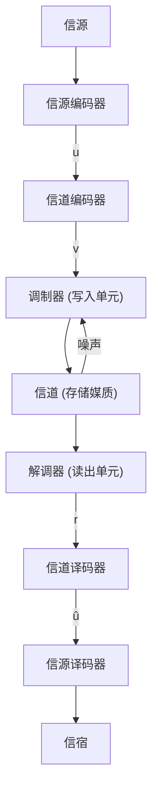
</details>

图 1-1 典型数据传输或存储系统框图

信道编码器(channel encoder)将信息序列 u 变换成离散的编码序列 (encoded sequence) v，称之为码字 (codeword)。尽管在某些应用中采用非二进制码，但在大多数情况下 v 是二进制序列。本书的主要内容之一，就是设计和实现信道编码器，以抵抗传输或存储码字所面临的噪声环境的影响。

离散符号并不适合在物理信道上传输，也不适合记录到数字存储媒质上。调制器(modulator)或写入单元(writing unit)将信道编码器输出的每个符号转换为持续时间为 $T$ 秒的适合传输(或记录)的波形。这些波形进入信道(channel)或存储媒质(storage medium)并受到噪声的干扰。典型的传输信道包括电话线、移动蜂窝电话、高频无线电、遥测、微波和卫星链路、光缆等。典型的存储媒质包括磁芯和半导体存储器、磁带、磁鼓和磁碟、光盘、光存

储单元等。这些例子中的每种都受到不同类型的噪声干扰。在电话线路上，干扰可能来自于开关脉冲噪声、热噪声或者来自其他线路的串音。对于磁碟(或光盘)，表面的缺陷和灰尘微粒都能被看做是噪声干扰。解调器(demodulator)或读出单元(reading unit)处理收到的每一个持续时间为 $T$ 秒的波形，然后产生离散(量化)或者连续(非量化)的输出。相对于编码序列 $\pmb{\nu}$ ，解调器的输出序列称之为接收序列(received sequence) $\pmb{r}$ 。

信道译码器(channel decoder)将接收序列 r 变换为二进制序列 $\hat{u}$ ，称为估计信息序列 (estimated information sequence)。译码策略基于信道编码规则和信道(或存储媒质)的噪声特性而定。尽管噪声可能导致某些译码错误(decoding errors)，但在理想情况下， $\hat{u}$ 将是信息序列 u 的重现。本书的另一个主要内容就是设计和实现使译码误码率最小的信道译码器。

信源译码器 (source decoder) 将估计信息序列 $\hat{\pmb{u}}$ 变换为对信源输出的估计 (estimate)，并将该估计传送到信宿 (destination)。当信源是连续信源时，这一过程还包括数字/模拟 (D/A) 转换。在一个精心设计的系统中，除非信道 (或存储媒质) 干扰太严重，否则这个估计将会是对信源输出的准确重现。

为把注意力集中于信道编码器和信道译码器，可以：1) 将信源和信源编码器合并成一个输出为 u 的数字信源 (digital source)；2) 将调制器（或写入单元）、信道（或存储媒质）及解调器（或读出单元）合并成一个输入为 v、输出为 r 的编码信道 (coding channel)；3) 将信源译码器和信宿合并成一个输入为 $\hat{u}$ 的数字信宿 (digital sink)。经过合并后的简化框图如图 1-2 所示。


<details>
<summary>flowchart</summary>

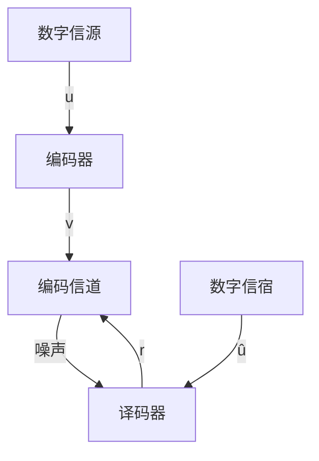
</details>

图 1-2 编码系统的简化模型

本书讨论的主要工程问题是设计和实现成对

的信道编码器/译码器，使得：1)信息可以在有噪环境下尽可能快(或尽可能高密度)地传输(或记录)；2)信息在信道译码器的输出端能够可靠地重现；3)将实现编码器和译码器的代价降低到可接受的范围内。

# 1.2 码的类型

当前通用的码有两种不同的类型：分组码(block codes)和卷积码(convolution codes)。分组码编码器把信息序列划分成每组含 $k$ 个信息比特(符号)的消息分组。一个消息分组可用二进制 $k$ 维向量 $\pmb{u} = (u_0, u_1, u_2, \dots, u_{k-1})$ 表示，称为一个消息(message)。在分组编码中，符号 $\pmb{u}$ 用来表示 $k$ 比特消息而不是整个信息序列。总共有 $2^k$ 个可能的不同消息。编码器把每个消息 $\pmb{u}$ 独立地变换成 $n$ 维离散符号向量 $\pmb{v} = (v_0, v_1, v_2, \dots, v_{n-1})$ （分组码中，符号 $\pmb{v}$ 用来表示一个 $n$ 符号组而不是整个编码序列），称之为码字(codeword)。因此，对应于 $2^k$ 个可能的不同消息，编码器的输出端有 $2^k$ 个可能的不同码字。这 $2^k$ 个长度为 $n$ 的码字的集合称为 $(n, k)$ 分组码(block code)。比值 $R = k/n$ 称为码率(code rate)，可解释成每个传送符号所含有的进入编码器的信息比特数。由于 $n$ 符号输出码字只取决于对应的 $k$ 比特输入消息，即每个消息是独立编码的，从而编码器是无记忆的，且可用组合逻辑电路来实现。

对二进制码，每个码字 v 也是二进制的。因此，为使二进制码可用，即对每个消息都能够分配不同的码字，应有 $k \leqslant n$ 或 $R \leqslant 1$ 。当 k < n 时，可对每个消息附加 n - k 个冗余比特来构成码字。这些冗余比特将使码具有抵抗信道噪声的能力。对于固定码率 R，在保持比值 k/n 不变的条件下，可通过增加分组码长度 n 和信息比特数 k 来添加更多的冗余比特。如何选择这些冗余比特，以实现在有噪信道上的可靠信息传输是设计编码器的一个主要问题。

表 1-1 给出了一个 k=4、n=7 的二进制分组码的例子。第 3 章到第 10 章，及第 14、15、17、19 和 20 章主要研究在有噪环境下用于控制差错的分组码的分析、设计和译码。

表 1-1 k=4, n=7 的二进制分组码

<table><tr><td>消 息</td><td>码 字</td><td>消 息</td><td>码 字</td></tr><tr><td>(0 0 0 0)</td><td>(0 0 0 0 0 0 0)</td><td>(0 0 0 1)</td><td>1 0 1 0 0 0 1</td></tr><tr><td>(1 0 0 0)</td><td>(1 1 0 1 0 0 0)</td><td>(1 0 0 1)</td><td>0 1 1 1 0 0 1</td></tr><tr><td>(0 1 0 0)</td><td>(0 1 1 0 1 0 0)</td><td>(0 1 0 1)</td><td>1 1 0 0 1 0 1</td></tr><tr><td>(1 1 0 0)</td><td>(1 0 1 1 1 0 0)</td><td>(1 1 0 1)</td><td>0 0 0 1 1 0 1</td></tr><tr><td>(0 0 1 0)</td><td>(1 1 1 0 0 1 0)</td><td>(0 0 1 1)</td><td>0 1 0 0 0 1 1</td></tr><tr><td>(1 0 1 0)</td><td>(0 0 1 1 0 1 0)</td><td>(1 0 1 1)</td><td>1 0 0 1 0 1 1</td></tr><tr><td>(0 1 1 0)</td><td>(1 0 0 0 1 1 0)</td><td>(0 1 1 1)</td><td>0 0 1 0 1 1 1</td></tr><tr><td>(1 1 1 0)</td><td>(0 1 0 1 1 1 0)</td><td>(1 1 1 1)</td><td>1 1 1 1 1 1 1</td></tr></table>

卷积码编码器同样接受 k 比特分组的信息序列 u，并产生 n 符号组的编码序列（码序列）v（卷积码编码中，符号 u 和 v 用来表示分组的序列而非单个分组）。但是，每一个编码分组不仅取决于当前单位时间对应的 k 比特消息组，而且与前 m 个消息组有关。此时，编码器的存储级数（memory order）为 m。编码器所产生的所有可能的输出编码序列的集合构成了一个码。比值 R = k/n 称为码率（code rate）。由于编码器有存储单元，因而必须采用时序逻辑电路实现。

对二进制卷积码，当 $k < n$ 或 $R < 1$ 时，在信息序列中加入用于抵抗信道干扰的冗余比特。通常 $k$ 和 $n$ 都是较小的整数，当固定 $k$ 和 $n$ 从而码率 $R$ 也被固定时，增大码的存储级数 $m$ 可以增大冗余度。在有噪信道上如何利用存储器来实现可靠传输是设计卷积码编码器的主要问题。图1-3给出了一个 $k = 1$ ， $n = 2$ 和 $m = 2$ 的二进制前馈卷积码编码器的例子。为说明码字是如何产生的，考虑信息序列 $u = (1101000\cdots)$ ，最左边的二进制位将首先进入编码器。使用模二和（异


<details>
<summary>flowchart</summary>

```mermaid
graph TD
    A["u"] --> B["+"]
    B --> C["+"]
    C --> D["+"]
    D --> E["+"]
    E --> F["+"]
    F --> G["+"]
    G --> H["+"]
    H --> I["+"]
    I --> J["+"]
    J --> K["+"]
    K --> L["+"]
    L --> M["+"]
    M --> N["+"]
    N --> O["+"]
    O --> P["+"]
    P --> Q["+"]
    Q --> R["+"]
    R --> S["+"]
    S --> T["+"]
    T --> U["+"]
    U --> V["+"]
    V --> W["+"]
    W --> X["+"]
    X --> Y["+"]
    Y --> Z["+"]
    Z --> A
```
</details>

图 1-3 k=1, n=2 和 m=2 的二进制前馈卷积编码器

或加)准则，并假定多路选择器以上一行的输出作为第一个编码比特，容易看出编码序列为： $v=(11,10,10,00,01,11,00,00,00,\cdots)$ 。第11\~13章，第16、18和21章着重于介绍在噪声环境下控制差错的卷积码的分析、设计和译码。

# 1.3 调制和编码

在通信系统中，对编码器的每个输出符号，调制器必须选定一个适于传输的、持续时间为 $T$ 秒的波形。在二进制码的情况下，调制器必须产生两个信号中的一个：对应于编码信号“1”的 $s_1(t)$ 或对应于编码信号“0”的 $s_2(t)$ 。对于宽带信道，信号的最优选择是

$$
s _ {1} (t) = \sqrt {\frac {2 E _ {s}}{T}} \cos 2 \pi f _ {0} t, \quad 0 \leqslant t \leqslant T \tag {1-1}
$$

$$
s _ {2} (t) = \sqrt {\frac {2 E _ {s}}{T}} \cos (2 \pi f _ {0} t + \pi) = - \sqrt {\frac {2 E _ {s}}{T}} \cos 2 \pi f _ {0} t, \quad 0 \leqslant t \leqslant T
$$

其中载波信号频率 $f_{0}$ 是 $1/T$ 的整数倍， $E_{s}$ 是每个信号的能量。由于载波 $\cos 2\pi f_{0}t$ 的相位随着编码器输出的变化而取0或 $\pi$ ，这种调制被称为二进制相移键控（binary-phase-shift-keying，BPSK）。图1-4给出了对应于表1-1中码字 $\nu=(1101000)$ 的BPSK调制波形。


<details>
<summary>line</summary>

| t | s(t)        |
|---|-------------|
| 0 | √(2Eₛ/T)    |
| 1 | √(2Eₛ/T)    |
| 2 | √(2Eₛ/T)    |
| 3 | √(2Eₛ/T)    |
| 4 | √(2Eₛ/T)    |
| 5 | √(2Eₛ/T)    |
| 6 | √(2Eₛ/T)    |
| 7 | √(2Eₛ/T)    |
| 8 | √(2Eₛ/T)    |
| 9 | √(2Eₛ/T)    |
| 10| √(2Eₛ/T)    |
| 11| √(2Eₛ/T)    |
| 12| √(2Eₛ/T)    |
| 13| √(2Eₛ/T)    |
| 14| √(2Eₛ/T)    |
| 15| √(2Eₛ/T)    |
| 16| √(2Eₛ/T)    |
| 17| √(2Eₛ/T)    |
| 18| √(2Eₛ/T)    |
| 19| √(2Eₛ/T)    |
| 20| √(2Eₛ/T)    |
| 21| √(2Eₛ/T)    |
| 22| √(2Eₛ/T)    |
| 23| √(2Eₛ/T)    |
| 24| √(2Eₛ/T)    |
| 25| √(2Eₛ/T)    |
| 26| √(2Eₛ/T)    |
| 27| √(2Eₛ/T)    |
| 28| √(2Eₛ/T)    |
| 29| √(2Eₛ/T)    |
| 30| √(2Eₛ/T)    |
| 31| √(2Eₛ/T)    |
| 32| √(2Eₛ/T)    |
| 33| √(2Eₛ/T)    |
| 34| √(2Eₛ/T)    |
| 35| √(2Eₛ/T)    |
| 36| √(2Eₛ/T)    |
| 37| √(2Eₛ/T)    |
| 38| √(2Eₛ/T)    |
| 39| √(2Eₛ/T)    |
| 40| √(2Eₛ/T)    |
| 41| √(2Eₛ/T)    |
| 42| √(2Eₛ/T)    |
| 43| √(2Eₛ/T)    |
| 44| √(2Eₛ/T)    |
| 45| √(2Eₛ/T)    |
| 46| √(2Eₛ/T)    |
| 47| √(2Eₛ/T)    |
| 48| √(2Eₛ/T)    |
| 49| √(2Eₛ/T)    |
| 50| √(2Eₛ/T)    |
| 51| √(2Eₛ/T)    |
| 52| √(2Eₛ/T)    |
| 53| √(2Eₛ/T)    |
| 54| √(2Eₛ/T)    |
| 55| √(2Eₛ/T)    |
| 56| √(2Eₛ/T)    |
| 57| √(2Eₛ/T)    |
| 58| √(2Eₛ/T)    |
| 59| √(2Eₛ/T)    |
| 60| √(2Eₛ/T)    |
| 61| √(2Eₛ/T)    |
| 62| √(2Eₛ/T)    |
| 63| √(2Eₛ/T)    |
| 64| √(2Eₛ/T)    |
| 65| √(2Eₛ/T)    |
| 66| √(2Eₛ/T)    |
| 67| √(2Eₛ/T)    |
| 68| √(2Eₛ/T)    |
| 69| √(2Eₛ/T)    |
| 70| √(2Eₛ/T)    |
| 71| √(2Eₛ/T)    |
| 72| √(2Eₛ/T)    |
| 73| √(2Eₛ/T)    |
| 74| √(2Eₛ/T)    |
| 75| √(2Eₛ/T)    |
| 76| √(2Eₛ/T)    |
| 77| √(2Eₛ/T)    |
| 78| √(2Eₛ/T)    |
| 79| √(2Eₛ/T)    |
| 80| √(2Eₛ/T)    |
| 81| √(2Eₛ/T)    |
| 82| √(2Eₛ/T)    |
| 83| √(2Eₛ/T)    |
| 84| √(2Eₛ/T)    |
| 85| √(2Eₛ/T)    |
| 86| √(2Eₛ/T)    |
| 87| √(2Eₛ/T)    |
| 88| √(2Eₛ/T)    |
| 89| √(2Eₛ/T)    |
| 90| √(2Eₛ/T)    |
| 91| √(2Eₛ/T)    |
| 92| √(2Eₛ/T)    |
| 93| √(2Eₛ/T)    |
| 94| √(2Eₛ/T)    |
| 95| √(2Eₛ/T)    |
| 96| √(2Eₛ/T)    |
| 97| √(2Eₛ/T)    |
| 98| √(2Eₛ/T)    |
| 99| √(2Eₛ/T)    |
| 100| √(2Eₛ/T)    |
</details>

图 1-4 对应于码字 $\nu=(1101000)$ 的 BPSK 调制波形

一种广泛存在于各种通信系统中的噪声干扰是加性白色高斯噪声(additive white Gaussian noise, AWGN) $^{[2][6][7]}$ 。若传输的信号为 $s(t)$ ( $=s_{1}(t)$ 或 $s_{2}(t)$ )，则接收信号为

$$
r (t) = s (t) + n (t) \tag {1-2}
$$

式中 $n(t)$ 是一个高斯随机过程，其单边功率谱密度（power spectral density，PSD）为 $N_{0}$ 。在许多系统中还存在其他形式的噪声[7]。例如，在一个存在多径传输影响的通信系统中，可在特定的时间间隔上观测到接收信号的衰落现象（强度减弱）。可以用信号 $s(t)$ 乘以噪声比例因子来建立这种衰落的模型。

在每个 T 秒的间隔上，解调器须产生一个相应于接收信号的输出。该输出可以是一个实数，或者是预先选定的离散符号集中的一个元素，这取决于解调器的设计。最优解调器通常包含一个匹配滤波器或者相干检测器，后面再有一个采样开关，每隔 T 秒对输出进行采样。对于带相干检测的 BPSK 调制，其采样输出是一个实数：

$$
y = \int_ {0} ^ {T} r (t) \sqrt {\frac {2 E _ {s}}{T}} \cos 2 \pi f _ {0} t \mathrm{d} t \tag {1-3}
$$

未经量化的解调器输出序列可以直接送到信道译码器进行处理。在这种情况下，信道译码器必须能够处理未经量化的输入，也即必须能够处理实数。更为常用的一种译码方法是将实数检测器的输出 $y$ 量化为有限的 $Q$ 个离散输出符号中的一个。在这种情况下，信道译码器为离散输入，即必须能够处理离散值。大多数编码通信系统采用某种形式的离散处理。

为了用 $M = 2^{l}$ 个信道信号来传输信息，首先将二进制编码器的输出序列以 $l$ 比特为一个字节进行分段。每个字节被称为一个符号，因此存在 $M$ 种不同的符号。接下来，每种符号被映射为传输信号集 $S$ 的 $M$ 种信号中的一种。每种信号都是周期为 $T$ 的脉冲波形，这样就构成了 $M$ 进制调制。 $M$ 进制调制的一个例子就是 $M$ 进制相移键控（ $M$ -ary phase-shift-keying, MPSK），其信号集由 $M$ 个正弦信号组成。这些信号具有相同的能量 $E_{s}$ 和 $M$ 种等间隔的不同相位。这样的一个信号集可以由下式给出：

$$
s _ {i} (t) = \sqrt {\frac {2 E _ {s}}{T}} \cos (2 \pi f _ {0} t + \phi_ {i}), \quad 0 \leqslant t \leqslant T
$$

式中 $\phi_{i} = 2\pi (i - 1) / M$ ， $1\leqslant i\leqslant M$ 。由于这些信号具有恒定的包络，因此MPSK也被称为恒包络调制（constant-envelope modulation）。当 $M = 2$ ， $M = 4$ 和 $M = 8$ 时，分别称为BPSK，4-PSK（也称为QPSK）和8-PSK。这些是数字通信中经常使用的调制类型，图1-5给出了它们的信号星座图。其他类型的 $M$ 进制调制将在第18章和第19章中讨论。

如果在给定时间间隔内检测器的输出仅和该间隔内传输的信号有关，而与任何以前传输

的信号无关，则称此信道是无记忆（memoryless）的。在这种情况下， $M$ 进制输入的调制器、物理信道和 $Q$ 进制输出的解调器组合在一起，可以用一个离散无记忆信道（discretememoryless channel, DMC)来建模。离散无记忆信道可用一组转移概率(transition probabilities) $P(j \mid i)$ ( $0 \leqslant i \leqslant M - 1$ , $0 \leqslant j \leqslant Q - 1$ )来完全描述，其中i代表调制器输入的符号，j代表解调器输出的符号，而 $P(j \mid i)$ 是发送为i，接收为j的概率。例如，考虑这样一个通信系统：1)采用二进制调制 $(M = 2)$ ; 2)噪声的幅度分布是对称的；3)解调器的输出量化为Q = 2个电平。在这种情况下可以得到一个特别简单而实际上极为重要的信道模型，称为二进制对称信道(binary symmetric channel, BSC)。图1-6(a)给出了二进制对称信道的转移概率图。请注意转移概率p完全描述了这个信道。

转移概率 p 可以由所采用的信号、噪声的概率分布、解调器输出的量化阈值等已知信息来计算。当 BPSK 调制用于 AWGN 信道，采用最优相干检测和二进制输出量化时，二进制对称信道的转移概率就是在等概输入信号条件下的非编码 BPSK 的误比特率，由

$$
p = Q (\sqrt {2 E _ {s} / N _ {0}}) \tag {1-4}
$$

给出, 其中 $Q(x) \triangleq \frac{1}{\sqrt{2\pi}} \int_{x}^{\infty} e^{-y^{2}/2} \, dy$ 是高斯统计的互补误差函数 (complementary error function), 或简称 Q 函数。 $Q(x)$ 的一个上界为

$$
Q (x) \leqslant \frac {1}{2} \mathrm{e} ^ {- x ^ {2} / 2}, \quad x \geqslant 0 \tag {1-5}
$$

它在后面计算二进制对称信道的误码性能时将会用到。

当采用二进制编码时，调制器仅有二进制 $(M=2)$ 输入。类似地，当解调器的输出采用二进制量化 $(Q=$ 2)时，译码器也只有二进制输入。在这种情况下，我们称解调器采用硬判决（hard decision）。由于实现较为简单，无论是分组码还是卷积码的许多编码数字通信系统都采用具有硬判决译码(hard-decision coding)的二进制编码。但是，当 $Q > 2$ （或输出未经量化）时，我们称解调器采用的是软判决（soft decision）。在这种情况下，译码器必须接受多电平（或连续


图 1-5 BPSK, QPSK 和 8-PSK 的信号星座图  


<details>
<summary>flowchart</summary>

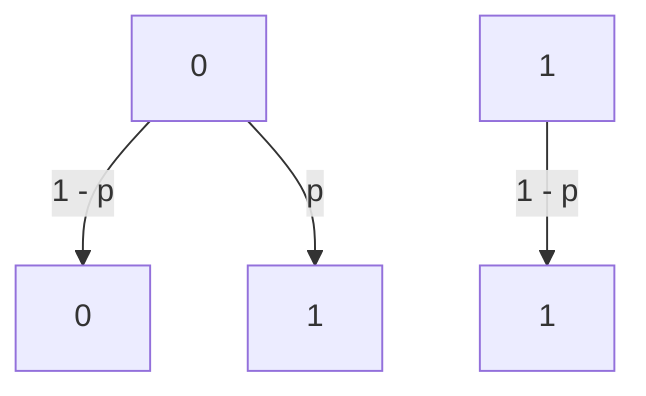
</details>

a) 二进制对称信道(BSC)


<details>
<summary>flowchart</summary>

```mermaid
graph TD
    A["0"] -->|1 - p - q| B["0"]
    A -->|p| C["1"]
    A -->|q| D["1"]
    A -->|q| E["1"]
    F["1"] -->|1 - p - q| G["1"]
    F -->|p| H["1"]
    F -->|q| I["1"]
    style F fill:#f9f,stroke:#333
    style G fill:#f9f,stroke:#333
    style H fill:#f9f,stroke:#333
    style I fill:#f9f,stroke:#333
    note right of F "删除"
```
</details>

b) 二进制对称删除信道


<details>
<summary>flowchart</summary>

```mermaid
graph TD
    A["0"] -->|P(0|0)| B["0"]
    A -->|P(1|0)| C["1"]
    A -->|P(0|1)| D["1"]
    A -->|P(1|1)| E["Q-1"]
    A -->|P(Q-1|0)| D
    A -->|P(Q-1|1)| E
    B -->|P(0|0)| A
    C -->|P(1|0)| A
    D -->|P(0|1)| A
    E -->|P(Q-1|0)| A
    E -->|P(Q-1|1)| D
```
</details>

c) 二进制输入，Q进制输出离散无记忆信道  
图 1-6 转移概率图

信号)输入。虽然这会增加译码器实现的难度，但从第10章和第12\~19章的讨论可以看出，软判决译码(soft-decision decoding)较硬判决译码在性能上有明显的提高。图1-6c给出了M=2和Q>2时基于软判决的离散无记忆信道的转移概率图。对于二进制输入、有限输出量化的AWGN信道，这是一个合适的模型。其转移概率可根据所采用的信号、噪声的概率分布及解调器的输出量化阈值等已知信息按照类似于计算二进制对称信道转移概率p的方法计算。图1-6b给出的信道模型称为二进制对称删除信道（binary symmetric erasure channel，BSEC），其中Q=3且输出符号中有一个删除符号(纠正错误和删除的概念将在第6章和第7章中介绍)。关于离散无记忆信道转移概率的更详细讨论可参阅文献[6]和[7]。

假设调制器的输入信号是有限离散字符集 $X = \{x_0, x_1, \dots, x_{M-1}\}$ 中的符号，解调器的输出未经量化。在此情况下，调制器、物理信道和解调器组成了一个离散输入、连续输出的信道。信道的输出是一个随机变量，它可以取到实数轴上任一点的值，即 $y \in \{-\infty, +\infty\}$ 。如果物理信道仅受到均值为 0、单边功率谱密度是 $N_0$ 的加性白色高斯噪声影响，则信道的输出是均值为 0、方差为 $\sigma^2 = N_0 / 2$ 的高斯随机变量。在此情况下，我们得到了一个离散输入、连续输出的无记忆高斯信道。该信道特征可以由一组 $M$ 个条件概率密度函数 $p(y|x)$ 来完全刻画，其中 $x \in \{0, 1, \dots, M-1\}^{[7]}$ 。对于 $M = 2$ 和 $x \in \{0, 1\}$ 的特殊情况，我们得到一个二进制输入、连续输出的无记忆高斯信道。如果采用 BPSK 调制，则信道特征可以由下列条件概率密度函数来完全描述：

$$
p (y \mid x = 0) = \frac {1}{\sqrt {\pi N _ {0}}} \mathrm{e} ^ {- \frac {y + \sqrt {E _ {s}}}{N _ {0}}}, \quad p (y \mid x = 1) = \frac {1}{\sqrt {\pi N _ {0}}} \mathrm{e} ^ {- \frac {y - \sqrt {E _ {s}}}{N _ {0}}} \tag {1-6}
$$

其中 $E_{s}$ 是信号能量。该信道的软判决译码算法将在后续章节中进行讨论。

若在给定时间间隔内检测器的输出不仅与当前间隔内的传输符号有关，而且与以前时间间隔的传输符号也有关，则该信道称为有记忆(memory)的。衰落信道是有记忆信道的一个典型例子，这是由于多径传输破坏了间隔之间的独立性。对于有记忆信道，我们很难构造出合适的模型，而且在这样的信道上进行编码与其说是一门科学，还不如说是一门艺术。

信息传输速率和信道带宽是任何数字通信系统中的两个重要的且相互关联的参数。由于每 $T$ 秒传输一个编码符号，符号传输速率 (symbol transmission rate) (波特率) 为 $1 / T$ 。在编码系统中，如果码率是 $R = k / n$ ，则 $k$ 个信息比特对应于 $n$ 个传输符号，信息传输速率 (information transmission rate) (数据率) 是 $R / T$ 比特/秒 (b/s) 。除了由于噪声的影响造成信号变形外，大多数通信信道还都因为带宽受限造成信号失真。为了尽量减小这种失真对检测过程的影响，信道的带宽 (bandwidth) $W$ 至少应为 $1 / 2\mathrm{THz}^{\ominus}$ 。因此，在非编码系统中 $(R = 1)$ ，数据率 $1 / T = 2W$ 受到信道带宽的限制。对于二进制编码系统，码率 $R < 1$ ，数据率 $R / T = 2RW$ 比非编码系统减小了，缩减因子为 $R$ 。因此，为了保持和非编码系统一样的数据率，编码系统需要展宽带宽 (bandwidth expansion) $1 / R$ 倍。为了保持数据率不变而要求展宽带宽是二进制编码系统的特点。在不造成信号严重失真的条件下，若没有可用的附加带宽，则二进制编码就不适用，必须寻求其他的可靠通信方法。这是本书第18章和第19章所讨论的主要内容。

# 1.4 最大似然译码

图 1-7 中给出了一个在 AWGN 信道上采用有限输出量化的编码系统框图。在分组编码系统中，信源输出 u 代表一个 k 比特消息，编码器输出 v 代表一个 n 符号码字，解调器

输出 r 代表相应的 Q 进制的接收 n 维向量，译码器输出 $\hat{u}$ 代表编码消息的 k 比特估值。在卷积编码系统中，u 代表含 kh 个信息比特的序列，而 v 代表一个含有 $N \triangleq nh + nm = n(h + m)$ 个符号的码字，其中 kh 是信息序列的长度，N 是码字的长度。当最末一个信息比特分组进入编码器后，由于编码器具有 m 个单元的存储器，这时将产生 nm 个附加的编码符号，第 11 章中将对此进行详细的讨论。解调器的输出 r 是一个 Q 进制的接收 N 维向量，译码器输出 $\hat{u}$ 是信息序列的一个 kh 比特估值。


<details>
<summary>flowchart</summary>

```mermaid
graph TD
    A["数字信源"] -->|u| B["编码器"]
    B -->|v| C["调制器"]
    C -->|s(t)| D["加性白色高斯噪声信道"]
    D -->|n(t)| E["解调器 r(t)"]
    E --> F["匹配滤波检测器"]
    F -->|r| G["Q电平量化器"]
    G -->|û| H["译码器"]
    H -->|u| I["数字信宿"]
    I --> H
    style A fill:#f9f,stroke:#333
    style B fill:#ccf,stroke:#333
    style C fill:#cfc,stroke:#333
    style D fill:#fcc,stroke:#333
    style E fill:#fcc,stroke:#333
    style F fill:#fcc,stroke:#333
    style G fill:#fcc,stroke:#333
    style H fill:#fcc,stroke:#333
    style I fill:#fcc,stroke:#333
    style_J["离散记忆信道"]
```
</details>

图 1-7 加性白色高斯噪声信道上的编码系统

译码器必须根据接收序列 r 产生对信息序列 u 的一个估值 $\hat{u}$ 。由于信息序列 u 和码字 v 之间有一一对应关系，这就等效于译码器能产生码字 v 的一个估值 $\hat{v}$ 。显然，当且仅当 $\hat{v} = v$ 时， $\hat{u} = u$ 。译码规则 (decoding rule) 就是对每个可能的接收序列 r 选择一个估值码字 $\hat{v}$ 的策略。若传递的码字是 v，当且仅当 $\hat{v} \neq v$ 时出现译码错误 (decoding error) 。若给定接收为 r，则译码器的条件误码率 (conditional error probability of the decoder) 定义为

$$
P (E \mid \boldsymbol {r}) \triangleq P (\hat {\boldsymbol {v}} \neq \boldsymbol {v} \mid \boldsymbol {r}) \tag {1-7}
$$

于是，译码器的误码率(error probability of the decoder)由

$$
P (E) = \sum_ {r} P (E \mid r) P (r) \tag {1-8}
$$

给定，其中 $P(\pmb{r})$ 为接收序列为 $\pmb{r}$ 的概率。由于 $\pmb{r}$ 是译码前产生的，故 $P(\pmb{r})$ 与所用的译码规则无关。因此，最优译码规则（即能使 $P(E)$ 最小的规则）必须对所有 $\pmb{r}$ 使得 $P(E|\pmb{r}) = P(\hat{\pmb{v}}\neq \pmb {v}|\pmb {r})$ 为最小。由于使 $P(\hat{\pmb{v}}\neq \pmb {v}|\pmb {r})$ 最小等价于使 $P(\hat{\pmb{v}} = \pmb {v}|\pmb {r})$ 最大，因而对于给定的 $\pmb{r}$ 选择使

$$
P (\textbf {v} \mid \textbf {r}) = \frac {P (\textbf {r} \mid \textbf {v}) P (\textbf {v})}{P (\textbf {r})} \tag {1-9}
$$

为极大的 $\hat{v}$ 作为码字 v 可使得 $P(E \mid r)$ 最小；也就是说，在给定接收序列 r 的情况下，要选择最大似然码字作为 $\hat{v}$ 。若所有的信息序列，进而所有的码字是等概出现的，即 $P(v)$ 对所有的 v 都相同，则使公式(1-9)最大就等价于使 $P(r \mid v)$ 最大。对于离散无记忆信道有

$$
P (\boldsymbol {r} \mid \boldsymbol {v}) = \prod_ {i} P (r _ {i} \mid v _ {i}) \tag {1-10}
$$

这是由于无记忆信道的每个接收符号只与相应的传输符号有关。选择其估值以使得公

式(1-10)为最大的译码器称为最大似然译码器(maximum likelihood decoder, MLD)。由于 $\log x$ 是 x 的单调增函数，故最大化公式(1-10)等价于最大化对数似然函数

$$
\log P (\boldsymbol {r} \mid \boldsymbol {v}) = \sum_ {i} \log P \left(\boldsymbol {r} _ {i} \mid \boldsymbol {v} _ {i}\right) \tag {1-11}
$$

对离散无记忆信道，MLD 选择能使公式(1-11)的和为最大的 $\hat{v}$ 作为码字 v。若码字不是等概的，由于在决定哪个码字能使 $P(v \mid r)$ 最大的时候必须以码字概率 $P(v)$ 对条件概率 $P(r \mid v)$ 进行加权，所以 MLD 不一定是最优的。然而在很多情况下，接收端并不能确切知道码字概率，从而无法做到最优译码，此时 MLD 就成了可行的最优译码规则。

现在，考虑将 MLD 译码规则应用于 BSC。在这种情况下 r 是一个二进制序列，由于信道噪声的影响，它可能在某些位置上不同于发送码字 v。当 $r_{i} \neq v_{i}$ 时， $P(r_{i} \mid v_{i}) = p$ ；而当 $r_{i} = v_{i}$ 时， $P(r_{i} \mid v_{i}) = 1 - p$ 。令 $d(r, v)$ 代表 r 和 v 之间的距离，也就是 r 和 v 不同的位置数。该距离称为汉明距离（Hamming distance）。对于长度为 n 的分组码，公式(1-11)可变形为

$$
\begin{array}{l} \log P (\boldsymbol {r} \mid \boldsymbol {v}) = d (\boldsymbol {r}, \boldsymbol {v}) \log p + [ n - d (\boldsymbol {r}, \boldsymbol {v}) ] \log (1 - p) \\ = d (\boldsymbol {r}, \boldsymbol {v}) \log \frac {p}{1 - p} + n \log (1 - p) \tag {1-12} \\ \end{array}
$$

(对卷积码，公式(1-12)中的 n 要用 N 代替)。由于 $p < \frac{1}{2}$ 时， $\log \frac{p}{1-p} < 0$ ，且对所有 v， $n \log (1-p)$ 是一个常数，故 BSC 下的 MLD 译码规则就是选择能使得 r 和 v 之间距离 $d(r, v)$ 为最小的 $\hat{v}$ 作为码字 v，即选择与接收序列不同的位置数为最小的 v 作为码字。因此，BSC 的 MLD 有时也叫做最小距离译码器 (minimum distance decoder)。

对于离散输入、连续输出的无记忆信道，接收序列 r 是实数序列。为了计算条件概率 $P(r \mid v)$ ，我们简单地将公式(1-10)的乘积中的每个符号转移概率 $p(r_{i} \mid v_{i})$ 替换为公式(1-6)给出的对应的条件概率密度函数。此时，MLD 译码规则为选择使得条件概率 $P(r \mid v)$ 最大的码字 v 作为译码码字。

有噪信道可靠传输信息的能力已经由香农在其独创性的论文 $^{[1]}$ 中给出。这个结果称做有噪信道编码定理(noisy channel coding theorem)，它证明：每个信道都有一个信道容量C，对任意满足R<C的速率R，都存在传输速率为R的码，用最大似然译码可以达到任意小的译码误码率 $P(E)$ 。特别地，对于任意R<C，存在着分组长度n足够大的分组码，使得

$$
P (E) \leqslant 2 ^ {- n E _ {b} (R)} \tag {1-13}
$$

同时，存在存储级数 $m$ 足够大的卷积码，使得

$$
P (E) \leqslant 2 ^ {- (m + 1) n E _ {c} (R)} \tag {1-14}
$$

对 R < C， $E_{b}(R)$ 和 $E_{c}(R)$ 为 R 的正函数，且完全由信道特性决定。公式(1-13)给出的上界说明，对于任何固定的 R < C，分组编码可在保持比值 k/n 为常数的同时，通过增加分组长度 n 来获得任意低的误码率。公式(1-14)给出的上界说明，对任何固定的 R < C，卷积编码可在保持 k 和 n 不变时通过增加存储级数 m 来获得任意低的误码率。

有噪信道编码定理是建立在对随机编码(random coding)的讨论的基础上的。所得到的性能界实际上是全体码集合上的平均误码率。由于某些码的性能一定优于这个平均值，因此有噪信道编码定理保证了满足公式(1-13)和公式(1-14)的码的存在性，但并未指出如何去构造它们。进一步说，对于固定速率为 $R < C$ 的分组码，为了获得很低的误码率，需要较长的分组长度。这要求码字的数目 $2^{k} = 2^{nR}$ 必然很大。由于MLD必须对每个码字计算 $\log P(r|\nu)$ ，然后选择给出最大值的码字，这使得MLD必须进行计算的次数随着 $n$ 的增加变得非常大。对于卷积码而言，低误码率要求高阶的存储级数。在第12章中将会看到，卷积码采用MLD

译出每 $k$ 个比特的信息组要求做近似 $2^{km}$ 次运算。同样地，随着 $m$ 的增加计算次数也会变得非常大。因此，采用最大似然译码来获得非常低的误码率是不切实际的。所以，在设计一个要实现低误码率的编码系统时会碰到下面两个主要问题：1) 如何构造好的长码，在用最大似然译码时，它的性能要满足公式(1-13)和公式(1-14)；2) 寻求易于实现的编译码方法，使其实际性能接近最大似然译码所达到的性能。本书的其余部分将致力于解决这两个问题。

# 1.5 错误类型

在无记忆信道上，噪声对每个传输符号的影响彼此独立。以图1-6a所示的BSC转移概率图为例，每个传输比特被错误接收的概率为 $p$ ，被正确接收的概率为 $1 - p$ ，并且与其他传输比特无关。因此，接收序列中的传输错误随机地出现，于是无记忆信道又被称做随机错误信道（random-error channels）。随机错误信道的典型样例包括深空信道和许多卫星信道。大多数视距传输设备也主要受随机错误的影响。为纠正随机错误而设计的码被称做纠随机错误码（random-error correcting codes）。本书中介绍的大多数码都是纠随机错误码。

在有记忆信道上，各次传输中的噪声影响是不独立的。图1-8给出了一个有记忆信道的简化模型。这个模型有两个状态：一个是“好”的状态，传输错误不常出现， $p_1 \approx 0$ ；另一个是“坏”的状态，传输错误的可能性非常大， $p_2 \approx 0.5$ 。信道在大部分时间里处于“好”的状态，但由于信道传输特性的改变，例如由多径传输造成的“深衰落”，信道会偶尔转入“坏”的状态。结果，在“坏”状态下由于转移概率高而使传输错误成群地或突发地出现，于是称有记忆信道为突发错误信道（burst-error channels）。突发错误信道的例子有：无线信道，其突发错误是由多径传输引起的信号衰落造成的；电缆传输，它受到开关脉冲噪声和串音的影响；磁介质记录，受到表面缺陷和灰尘微粒引起的信号丢失影响。为纠正突发错误而设计的码叫做纠突发错误码(burst-error correcting codes)。第20章和第21章将介绍这种类型的码和纠正突发错误的编码技术。


<details>
<summary>flowchart</summary>

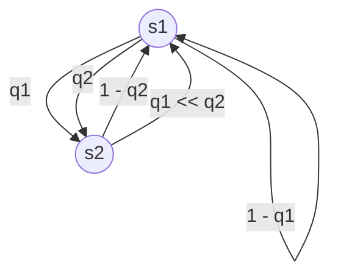
</details>


<details>
<summary>flowchart</summary>

```mermaid
graph TD
    subgraph_s1["状态 s1"]
        A0["0"] -->|1 - p1| B0["0"]
        A0 -->|p1| C0["1"]
        A0 -->|p1| D0["1"]
        A0 -->|1 - p1| E0["1"]
    end
    subgraph_s2["状态 s2"]
        B0["0"] -->|1 - p2| C0["0"]
        B0 -->|p2| D0["1"]
        B0 -->|p2| E0["1"]
        B0 -->|1 - p2| F0["1"]
    end
```
</details>

图 1-8 有记忆信道的一个简化模型

最后要指出，有些信道既有随机错误也有突发错误，它们称为混合信道（compound channels），为纠正这类信道中的错误而设计的码叫做纠突发和随机错误码（burst-and-random-error correcting codes）。第20章的20.5节和第21章的21.4节将讨论这种类型的码。

# 1.6 差错控制策略

图 1-1 所示的框图代表了一个单向通信系统。传输(或纪录)严格地按照从发送端到接收端一个方向进行。单向系统的差错控制策略必须采用前向纠错(forward error correction, FEC)，即利用纠错码在接收端自动地纠正检出的错误。这样的例子有：数字存储系统，其中记录在存储媒质上的信息可能在记录后的数星期，甚至是数月后才重读；深空通信系统，

在飞行器上可以配备相对简单的编码设备，但在地面进行的必然是远远复杂的译码过程，甚至在信道不是严格单向的情况下，当前大多数的编码系统都采用某种形式的 FEC。本书将主要讲解 FEC 系统的分析和设计。

在某些情况下，传输系统可能是双向的。也就是说，信息沿两个方向传输，发送端也可以作为接收端(收发器)，反之亦然。双向通信系统的例子包括数据通信网络和卫星通信系统等。双向系统的差错控制策略同时采用错误检测和重传，被称为自动请求重传(automatic repeat request, ARQ)。在 ARQ 系统中，当接收端检测出错误时，就向发送端送出要求重传该消息的请求，直到此消息被正确接收为止。

有两种类型的 ARQ 系统：等待式 ARQ 和连续式 ARQ。采用等待式 (stop-and-wait) ARQ 时，发送端发送一个码字给接收端，然后等待从接收端返回的一个肯定 (ACK) 或否定 (NAK) 的应答。若收到的是 ACK(未检测到错误)，发送端就发送下一个码字；但是如果收到的是 NAK(检测到错误)，发送端就重新发送前一个码字。当噪声持续存在时，同一个码字在被正确接收和应答前，可能需要反复发送若干次。

采用连续式(continuous)ARQ时，发送端连续地将码字发送到接收端，同时连续地接收确认信号。当收到NAK时，发送端开始重传。发送端可以回退到发生错误的码字，并且重传该码字及其后续的 $N - 1$ 个码字，这称做退 $N$ 步（go-back- $N$ )ARQ。另一种可选的方案是发送端仅重发那些有否定应答的码字，这称为选择重传（selective-repeat）ARQ。选择重传ARQ比退 $N$ 步ARQ更为有效，但是要求更复杂的逻辑和更大的缓存。

连续式 ARQ 比等待式 ARQ 的效率更高，但是实现的代价也更大。在卫星通信系统中，由于传输速率高且往返时延大，通常采用连续式 ARQ。如果系统传输一个码字所花费的时间相对于收到一个应答的时间较长，则一般采用等待式 ARQ。等待式 ARQ 是为半双工信道（在同一时刻仅在一个方向传输）设计的，而连续式 ARQ 则是为全双工信道（同时在两个方向传输）设计的。

ARQ 优于 FEC 的主要之处在于：检错对译码设备的要求远比纠错简单。同时，从信息只在出现错误的时候才被重传的意义上来说，ARQ 是一个自适应系统。而另一方面，当信道的错误率较高时，重传必然过于频繁，此时系统吞吐量 (system throughput) —— 正确接收新产生的消息的速率，将由于 ARQ 而降低。在这种情况下，用 FEC 纠正最经常出现的错误图案，同时对不常出现的错误图案采用检错和重传的混合机制比仅使用 ARQ 的效率更高。在第 22 章中讨论了各种类型的 ARQ 和混合 ARQ 方案。

# 1.7 性能的衡量

一个编码通信系统的性能通常用译码错误的概率(称为误码率(error probability))和相对于具有相同传输速率的非编码系统的编码增益(coding gain)来衡量。有两种不同类型的误码率，字(或分组)的误码率和比特的误码率。字的误码率定义为译码器输出的码字(或分组)有错误的概率，这种误码率通常称作误字率(word-error rate, WER)或误分组率(block-error rate, BLER)。比特的误码率定义为译码器输出的译码信息比特发生错误的概率，称为误比特率(bit-error rate, BER)。在诸如功率、带宽、译码复杂度等特定系统限制条件下，编码通信系统应被设计为使得这两种误码率尽可能的低。

在一个码率为 R = k/n 的编码通信系统中，为传输每个信息比特需要传输符号（或信号）的数目为 1/R。若每个传输符号的能量为 $E_{s}$ ，则每个信息比特对应的能量 $E_{b}$ 为

$$
E _ {b} = E _ {s} / R \tag {1-15}
$$

一个编码通信系统的误码率通常用单位信息比特的能量 $E_{b}$ 与信道噪声的单边功率谱密度 $N_{0}$

的比值的形式来表示。

考虑一个采用(23, 12)的二进制格雷码 $^{[8]}$ 进行差错控制的编码通信系统(关于该码的详细描述请参阅第5章)。每个码字包含23个码比特位，其中12个为信息比特。因此，存在11个冗余比特，码率为 $R=12/23=0.5217$ 。假设采用BPSK调制、相干检测，且信道是单边功率谱密度为 $N_{0}$ 的AWGN信道。令 $E_{b}/N_{0}$ 表示接收端输入处的单位信息比特能量与噪声功率谱密度的比值，这称为信噪比(signal-to-noise ratio, SNR)，其单位通常用分贝(dB)表示。图1-9同时给出了采用硬判决译码和(未经量化的)软判决最大似然译码条件下的(23, 12)格雷码的误比特率性能与 $E_{b}/N_{0}$ 的关系。为方便比较，图中也包括了非编码BPSK系统的误比特率性能。我们可以看出，只要SNR在一个阈值之上，编码系统无论采用硬判决还是软判决译码，在相同的SNR条件下都比非编码系统有更低的误比特率。对采用硬判决译码的格雷码，这个阈值为3.7dB。当SNR=7dB时，非编码的BPSK系统的BER为 $8\times10^{-4}$ ，而编码系统获得的BER为 $2.9\times10^{-5}$ 。在误码性能上，这是一个


<details>
<summary>line</summary>

| Eb/N0 (dB) | 非编码BPSK | 采用BPSK的(23,12)格雷码的硬判决译码 |
| ---------- | ---------- | ---------------------------------- |
| 1          | 0.05       | 0.05                               |
| 2          | 0.02       | 0.02                               |
| 3          | 0.01       | 0.01                               |
| 4          | 0.005      | 0.005                              |
| 5          | 0.001      | 0.001                              |
| 6          | 0.0001     | 0.0001                             |
| 7          | 0.00001    | 0.00001                            |
| 8          | 0.000001   | 0.000001                           |
| 9          | 0.0000001  | 0.0000001                          |
| 10         | 0.00000001 | 0.00000001                         |
</details>

图 1-9 采用(23, 12)格雷码的编码通信系统的误比特率性能

显著的提高。当 SNR = 5dB 时，格雷码的编码系统比非编码系统的性能提升较小：只从 $6.5 \times 10^{-3}$ 提升到 $2.1 \times 10^{-3}$ 。然而，此时采用软判决译码的编码系统能够获得的 BER 为 $7 \times 10^{-5}$ 。

编码系统的另一个性能衡量指标是编码增益。编码增益的定义如下：为获得一个特定的误码率(BER或WER)，编码系统所需 $E_{b}/N_{0}$ 比非编码系统的减少值。例如，在图1-9中当 $BER=10^{-5}$ 时，采用硬判决译码的格雷码编码系统比非编码BPSK系统有2.15dB的编码增益，而软判决译码(MLD)则获得了超过4.0dB的编码增益。这意味着在BER为 $10^{-5}$ 时，格雷码的软判决译码比硬判决译码多获得1.85dB的编码增益。获得额外编码增益的代价是更高的译码复杂度开销。在每分贝的性能提高都将减少整个系统开销的通信应用中，编码增益相当重要。

从图 1-9 中可以看出，在 $E_{b}/N_{0}$ 的值足够低时，编码增益的值变为负数。这个阈值现象对所有的编码方案都存在。总存在一个 $E_{b}/N_{0}$ 的值，当低于它时，编码将毫无效果，而且使情况变得更糟。这个 SNR 称为编码阈值 (coding threshold)。让这个阈值足够低而且保证编码通信系统工作在 SNR 远高于编码阈值的状态相当重要。对采用硬判决译码的格雷码编码系统，编码阈值为 3.7dB。

对于一个特定码的性能度量，有时采用另一个参数渐近编码增益(asymptotic coding gain)——高SNR下的编码增益。这种编码增益仅与码率和码的最小距离 $d_{\mathrm{min}}$ 有关，其中 $d_{\mathrm{min}}$ 定义为任意两个码字之间的最小汉明距离。对AWGN信道，根据公式(1-4)和公式(1-5)可以得出，在高SNR(大的 $E_b / N_0$ )条件下，采用相干检测的非编码BPSK系统的误比特率可近似为

$$
\left(P _ {b}\right) _ {\text { uncoded }} \approx 1 / 2 \mathrm{e} ^ {- \left(E _ {b} / N _ {0}\right) _ {\text { uncoded }}} \tag {1-16}
$$

在高 SNR 条件下，采用软判决(未量化的)MLD，具有最小距离 $d_{\min}$ 的 $(n, k)$ 分组码的误比特率可近似为(参见第 10 章)

$$
\left(P _ {b}\right) _ {\text { coded }} \cong K \mathrm{e} ^ {- d _ {\min} R \left(E _ {b} / N _ {0}\right) _ {\text { coded }}} \tag {1-17}
$$

其中 R = k/n 为码率，且 K 是一个（通常较小的）仅与码有关的常数。令公式(1-16)和(1-17)相等可以计算出 SNR 的降低值，具体为

$$
K e ^ {- d _ {\min} R (E _ {b} / N _ {0}) _ {\text { coded }}} = \frac {1}{2} e ^ {- (E _ {b} / N _ {0}) _ {\text { uncoded }}} \tag {1-18}
$$

等式两边取自然对数，注意到当 $E_{b} / N_{0}$ 较大时 $\log K$ 和 $\log \frac{1}{2}$ 可以忽略，我们得到

$$
\frac {\left(E _ {b} / N _ {0}\right) _ {\mathrm{uncoded}}}{\left(E _ {b} / N _ {0}\right) _ {\mathrm{coded}}} = R d _ {\mathrm{min}} \tag {1-19}
$$

因此，具有最小距离 $d_{\mathrm{min}}$ 的 $(n, k)$ 码采用软判决MLD时相对于非编码BPSK的渐近编码增益由下式给出：

$$
\gamma_ {\mathrm{asymp}} = 1 0 \log_ {1 0} R d _ {\mathrm{min}} \tag {1-20}
$$

对硬判决 MLD，参考文献[7]中证明渐近编码增益为

$$
\gamma_ {\mathrm{asymp}} = 1 0 \log_ {1 0} \left(\frac {1}{2}\right) R d _ {\mathrm{min}} \tag {1-21}
$$

从公式(1-20)和(1-21)中可以看出，软判决MLD比硬判决MLD多出

$$
1 0 \log_ {1 0} 2 = 3 \mathrm{dB}
$$

的渐近编码增益。只是在很大的 SNR 条件下，才能获得这 3dB 的编码增益。对于更为实际的 SNR 取值，软判决译码比硬判决译码的编码增益要小于 3dB，一般介于 2\~2.5dB 之间。在第 12 章中给出了与公式(1-20)和(1-21)类似的关于卷积码的表达式，只不过要用最小自由距离 $d_{free}$ 代替 $d_{min}$ 。

在为差错控制而设计编码通信系统时，总是希望获得特定误码率所需的 SNR 值尽量小。这与最大化编码系统相对于使用相同调制信号集的非编码系统所获得的编码增益等价。根据香农的有噪信道编码定理 $^{[1]}$ ，可以推导出一个码率为 R 的编码通信系统达到无误码传输状态（或任意小的误码率）所必须的最小 SNR 的理论极限。这个理论极限通常称为香农限（Shannon limit），它说明对一个码率为 R 的编码通信系统，只有当 SNR 超过这个极限值时才可能获得无误码传输。只要 SNR 高于这个极限值，香农的编码定理保证了能够获得无误码传输的（可能相当复杂）编码通信系统的存在性。对采用 BPSK 信号的二进制输入、连续输出的 AWGN 信道上的传输，香农限（用 $E_{b}/N_{0}$ 表示）作为码率 R 的函数没有显式表达，但是它可以用数值的方法进行计算。图1-10以码率 $R$ 的函数的方式，示出了采用BPSK信号、连续输出的AWGN信道上的香农限。从图中可以对给定的码率确定香农限。例如，对采用BPSK信号、连续输出的AWGN信道上的码率为 $R = \frac{1}{2}$ 的编码通信系统，为实现无误码传输，所需的最小SNR（香农限）是0.188dB。表1-2给出了从0到0.999范围内不同码率下的香农限的值。对在给定码率 $R$ 下的编码通信系统，可以用香农限作为标尺来衡量编码系统比采用相同调制信号集的非编


<details>
<summary>line</summary>

| 香农限 (Eb/N0 (dB)) | 码率R |
| ------------------- | ----- |
| -5                  | 0.0   |
| 0                   | 0.5   |
| 5                   | 0.95  |
| 10                  | 1.0   |
</details>

图 1-10 作为码率 R 的函数的香农限

表 1-2 采用 BPSK 信号、连续输出的 AWGN 信道在不同码率 R 下的香农限

<table><tr><td>R</td><td>Eb/N0(dB)</td><td>R</td><td>Eb/N0(dB)</td><td>R</td><td>Eb/N0(dB)</td><td>R</td><td>Eb/N0(dB)</td></tr><tr><td>0.01</td><td>-1.548</td><td>0.34</td><td>-0.469</td><td>0.67</td><td>1.084</td><td>0.943</td><td>4.014</td></tr><tr><td>0.02</td><td>-1.531</td><td>0.35</td><td>-0.432</td><td>0.68</td><td>1.143</td><td>0.947</td><td>4.115</td></tr><tr><td>0.03</td><td>-1.500</td><td>0.36</td><td>-0.394</td><td>0.69</td><td>1.208</td><td>0.951</td><td>4.218</td></tr><tr><td>0.04</td><td>-1.470</td><td>0.37</td><td>-0.355</td><td>0.70</td><td>1.275</td><td>0.954</td><td>4.304</td></tr><tr><td>0.05</td><td>-1.440</td><td>0.38</td><td>-0.314</td><td>0.71</td><td>1.343</td><td>0.958</td><td>4.425</td></tr><tr><td>0.06</td><td>-1.409</td><td>0.39</td><td>-0.276</td><td>0.72</td><td>1.412</td><td>0.961</td><td>4.521</td></tr><tr><td>0.07</td><td>-1.378</td><td>0.40</td><td>-0.236</td><td>0.73</td><td>1.483</td><td>0.964</td><td>4.618</td></tr><tr><td>0.08</td><td>-1.347</td><td>0.41</td><td>-0.198</td><td>0.74</td><td>1.554</td><td>0.967</td><td>4.725</td></tr><tr><td>0.09</td><td>-1.316</td><td>0.42</td><td>-0.156</td><td>0.75</td><td>1.628</td><td>0.970</td><td>4.841</td></tr><tr><td>0.10</td><td>-1.285</td><td>0.43</td><td>-0.118</td><td>0.76</td><td>1.708</td><td>0.972</td><td>4.922</td></tr><tr><td>0.11</td><td>-1.254</td><td>0.44</td><td>-0.074</td><td>0.77</td><td>1.784</td><td>0.974</td><td>5.004</td></tr><tr><td>0.12</td><td>-1.222</td><td>0.45</td><td>-0.032</td><td>0.78</td><td>1.867</td><td>0.976</td><td>5.104</td></tr><tr><td>0.13</td><td>-1.190</td><td>0.46</td><td>0.010</td><td>0.79</td><td>1.952</td><td>0.978</td><td>5.196</td></tr><tr><td>0.14</td><td>-1.158</td><td>0.47</td><td>0.055</td><td>0.800</td><td>2.045</td><td>0.980</td><td>5.307</td></tr><tr><td>0.15</td><td>-1.126</td><td>0.48</td><td>0.097</td><td>0.807</td><td>2.108</td><td>0.982</td><td>5.418</td></tr><tr><td>0.16</td><td>-1.094</td><td>0.49</td><td>0.144</td><td>0.817</td><td>2.204</td><td>0.983</td><td>5.484</td></tr><tr><td>0.17</td><td>-1.061</td><td>0.50</td><td>0.188</td><td>0.827</td><td>2.302</td><td>0.984</td><td>5.549</td></tr><tr><td>0.18</td><td>-1.028</td><td>0.51</td><td>0.233</td><td>0.837</td><td>2.402</td><td>0.985</td><td>5.615</td></tr><tr><td>0.19</td><td>-0.995</td><td>0.52</td><td>0.279</td><td>0.846</td><td>2.503</td><td>0.986</td><td>5.681</td></tr><tr><td>0.20</td><td>-0.963</td><td>0.53</td><td>0.326</td><td>0.855</td><td>2.600</td><td>0.987</td><td>5.756</td></tr><tr><td>0.21</td><td>-0.928</td><td>0.54</td><td>0.374</td><td>0.864</td><td>2.712</td><td>0.988</td><td>5.842</td></tr><tr><td>0.22</td><td>-0.896</td><td>0.55</td><td>0.424</td><td>0.872</td><td>2.812</td><td>0.989</td><td>5.927</td></tr><tr><td>0.23</td><td>-0.861</td><td>0.56</td><td>0.474</td><td>0.880</td><td>2.913</td><td>0.990</td><td>6.023</td></tr><tr><td>0.24</td><td>-0.827</td><td>0.57</td><td>0.526</td><td>0.887</td><td>3.009</td><td>0.991</td><td>6.119</td></tr><tr><td>0.25</td><td>-0.793</td><td>0.58</td><td>0.574</td><td>0.894</td><td>3.114</td><td>0.992</td><td>6.234</td></tr><tr><td>0.26</td><td>-0.757</td><td>0.59</td><td>0.628</td><td>0.900</td><td>3.205</td><td>0.993</td><td>6.360</td></tr><tr><td>0.27</td><td>-0.724</td><td>0.60</td><td>0.682</td><td>0.907</td><td>3.312</td><td>0.994</td><td>6.495</td></tr><tr><td>0.28</td><td>-0.687</td><td>0.61</td><td>0.734</td><td>0.913</td><td>3.414</td><td>0.995</td><td>6.651</td></tr><tr><td>0.29</td><td>-0.651</td><td>0.62</td><td>0.791</td><td>0.918</td><td>3.500</td><td>0.996</td><td>6.837</td></tr><tr><td>0.30</td><td>-0.616</td><td>0.63</td><td>0.844</td><td>0.924</td><td>3.612</td><td>0.997</td><td>7.072</td></tr><tr><td>0.31</td><td>-0.579</td><td>0.64</td><td>0.904</td><td>0.929</td><td>3.709</td><td>0.998</td><td>7.378</td></tr><tr><td>0.32</td><td>-0.544</td><td>0.65</td><td>0.960</td><td>0.934</td><td>3.815</td><td>0.999</td><td>7.864</td></tr><tr><td>0.33</td><td>-0.507</td><td>0.66</td><td>1.021</td><td>0.938</td><td>3.906</td><td></td><td></td></tr></table>

码系统所能获得的最大编码增益。例如，为达到 $10^{-5}$ 的BER，非编码的BPSK系统需要的SNR为9.65dB，而码率 $R=\frac{1}{2}$ 的BPSK编码通信系统的香农限是0.188dB。因此，对码率为 $R=\frac{1}{2}$ 的BPSK编码通信系统而言，最大可获得（或潜在）的编码增益为9.462dB。作为进一步的例证，图1-11给出了一种码率 $R=\frac{1}{2}$ 、存储级数m=6的卷积码在采用软判决MLD（参考第12章）译码时的误比特率性能。为获得 $10^{-5}$ 的BER，该码需要的SNR为4.15dB，与非


<details>
<summary>line</summary>

| Eb/N0 (dB) | 误比特率 (非编码BPSK) | 误比特率 (误差) |
| ---------- | ---------------------- | ---------------- |
| 0.0        | 0.1                    | 0.1              |
| 0.5        | 0.08                   | 0.08             |
| 1.0        | 0.05                   | 0.05             |
| 1.5        | 0.03                   | 0.03             |
| 2.0        | 0.01                   | 0.01             |
| 2.5        | 0.005                  | 0.005            |
| 3.0        | 0.002                  | 0.002            |
| 3.5        | 0.001                  | 0.001            |
| 4.0        | 0.0005                 | 0.0005           |
| 4.5        | 0.0002                 | 0.0002           |
| 5.0        | 0.0001                 | 0.0001           |
| 6.0        | 0.00005                | 0.00005          |
| 7.0        | 0.00002                | 0.00002          |
| 8.0        | 0.00001                | 0.00001          |
| 9.0        | 0.000005               | 0.000005         |
| 10.0       | 0.000002               | 0.000002         |
</details>

图 1-11 码率 $R=\frac{1}{2}$ 、存储级数 m=6 的卷积码译码采用
软判决 MLD 译码时的误比特率性能

编码的 BPSK 相比获得了 5.35dB 的编码增益；但是，它离香农限还相差 3.962dB。通过使用更长且纠错能力更强的分组码或卷积码，译码采用高效的软判决MLD或近MLD算法可以减小这个差距。作为另一个例子，图1-12描绘了(65520，61425)低密度单奇偶校验码(参看第17章) $^{[12]}$ 在采用近MLD软判决算法译码时的误比特率性能。该码的码率为 $R=15/16=0.9375$ 。这个码率下的香农限为3.91dB。在BER为 $10^{-5}$ 时，我们发现该码的误码性能与香农限相差不到0.5dB。这个例子说明，通过合适的设计具有足够长度的码并采用有效的软判决MLD或近MLD算法，香农限可以被逼近。逼近香农限的码在第16章和第17章中讨论。


<details>
<summary>line</summary>

| Eb/N0 (dB) | 误比特率 | 非编码BPSK |
| ---------- | --------- | ---------- |
| 4.0        | 10^-2     | 10^-2      |
| 4.5        | 10^-5     | 10^-2      |
| 9.0        | 10^-5     | 10^-4      |
</details>

图 1-12 (65520, 61425) 低密度单奇偶校验码译码采用近 MLD 软判决算法时的误比特率性能

# 1.8 编码调制

为获得编码增益(或提高误码性能)而将编码技术与二进制调制相结合, 则导致了信道带宽的展宽; 也就是说, 为了传输信号, 编码系统比非编码系统需要更宽的信道带宽。这是由于为了对抗信道噪声(即为了差错控制)必须向传输信息序列中增加冗余符号。正如第 1.3 节所述, 为进行差错控制而采用码率 $R = k/n < 1$ 的编码时, 在保持同样信息传输速率的条件下所需带宽要按因子 $1/R$ 扩展。因此, 编码增益的获得是以带宽扩展为代价的。例如, 上节提到的采用 BPSK 调制的格雷码编码系统所需带宽要按因子 $1/R = 23/12 = 1.917$ 进行扩展。可见为了获得编码增益所付出的代价是占用几乎两倍的信号传输带宽和实现译码器的额外开销。这种类型的编码在信道带宽和传输功率之间提供了一种有效的折中, 适合于工作在 $R/W < 1$ 的功率受限信道上的数字通信系统[7], 例如深空、卫星及其他宽带通信系统。

然而对于很多通信信道，如话音频带的电话、地面微波和一些卫星信道，带宽是受限的，因此带宽的扩展是不合适甚至是不可能的。正是由于这个原因，在带宽受限信道上很少采用为差错控制而增加额外冗余比特的编码技术。为了克服这个问题，编码必须和高带宽利用率的多级调制（ $M > 2$ 的 $M$ 进制调制）结合起来使用。如果编码和调制能合适地结合在一起并被设计为一个模块，则可在不扩展带宽的条件下获得编码增益[9]。这种编码技术和调制技术相结合的方式称为编码调制（coded modulation）。第一个编码调制技术是网格编码调制（trellis coded modulation），由 Ungerboeck 所设计[10]。

编码调制的基本概念是对信息符号编码，然后映射到扩展的调制信号集上（相对于非编码调制的信号集）。扩展的信号集提供了为差错控制所需的冗余度，同时不增加信号速率，也就不增加带宽需求。编码形成结构化的信号序列，且使得任何两个传输的信号序列之间的最小欧氏距离（Euclidean distance）较大。例如，考虑图1-13给出的一个简单的编码调制系统，其中采用的是2级存储、码率 $R=\frac{1}{2}$ 的反馈卷积编码器和8-PSK调制信号集。在每个单位时间内，卷积编码器的两个输出编码比特和一个非编码的信息比特一起确定一个用于传输

的 8-PSK 信号(通常称为集合分割映射(mapping by set partitioning) $^{[10]}$ )，结果，每个8-PSK 信号携带 2 个信息比特，从而该编码调制系统的信息传输速率(称为频谱效率(spectralefficiency)) 是 2 比特/传输符号。现在考虑一个非编码的 QPSK（或 4-PSK）系统。在这个系统中，信息也是按 2 比特/传输符号进行传输的。因此，8-PSK 编码系统和 QPSK 非编码系统具有相同的频谱效率，均为 2 比特/传输符号，从而它们需要相同的信号传输带宽。Ungerboeck 证明了采用软判决 MLD 的 8-PSK 编码调制系统在不需要带宽扩展的条件下比非编码的 QPSK 系统有 3dB 的渐近编码增益 $^{[10,11]}$ ，可参考第 18 章。这个简单的 8-PSK 编码系统可以用一种非常直接的方式进行软判决译码（参见第 18 章）。它的误比特率性能在图 1-14 给出。当 BER 为 $10^{-5}$ 时，它比非编码的 QPSK 系统获得了 2.4dB 的实际编码增益。

根据编码结构，编码调制可以被划分为下面两类：

1）网格编码调制（TCM），结合使用卷积（或网格）码和多级调制信号集；


<details>
<summary>flowchart</summary>

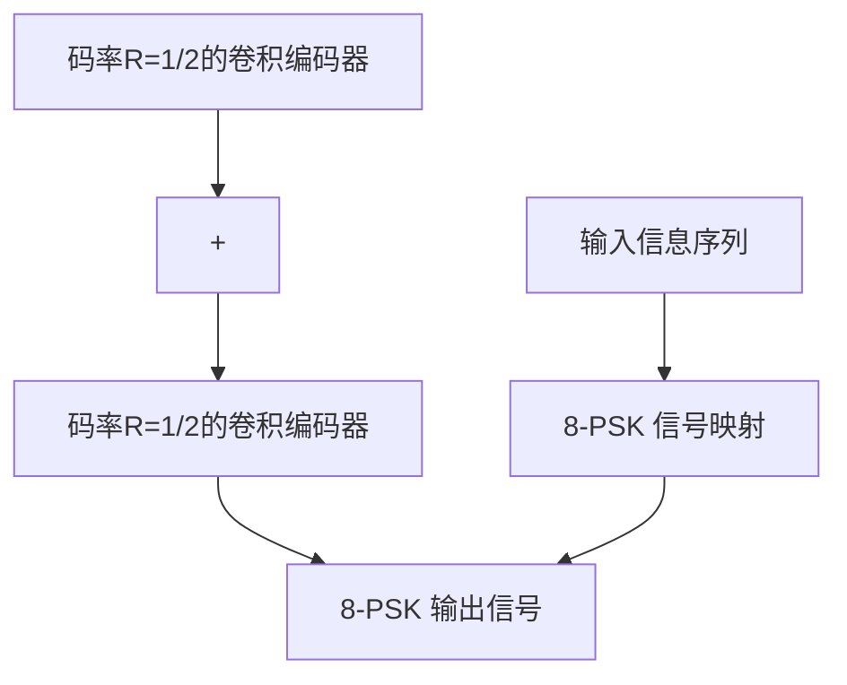
</details>

图 1-13 一种 8-PSK 网格编码调制系统


<details>
<summary>line</summary>

| Eb/N0 (dB) | 编码的8-PSK | 非编码的QPSK |
| ---------- | ----------- | ------------ |
| 2          | 0.1         | 0.1          |
| 3          | 0.03        | 0.03         |
| 4          | 0.01        | 0.01         |
| 5          | 0.005       | 0.005        |
| 6          | 0.001       | 0.001        |
| 7          | 0.0001      | 0.0001       |
| 8          | 0.000001    | 0.000001     |
| 9          | 0.0000001   | 0.0000001    |
| 10         | 0.00000001  | 0.00000001   |
</details>

图 1-14 图 1-13 中的 8-PSK 编码系统的误比特率性能

2）分组编码调制（BCM） $^{[13]}$ ，结合使用分组码和多级调制信号集。

TCM 是第 18 章的主题，而 BCM 则在第 19 章中讨论。

基本上，用于差错控制的编码通过向传输信息序列中添加合理设计的冗余信息得到。冗余信息要么是通过向传输信息序列中添加额外符号产生，要么是通过扩展信道信号集（在将传输信息序列映射到信号序列时采用更大的信号集）产生。添加冗余符号的编码方法使得带宽展宽，适合于功率受限通信系统的差错控制。扩展信道信号集的编码方法能在不使带宽展宽的条件下获得编码增益，适合于带宽受限通信系统的差错控制。

# 参考文献

[1] C E Shannon, “A Mathematical Theory of Communication,” Bell Syst. Tech. J., pp. 379-423 (Part 1); pp. 623-56 (Part 2), July 1948   
[2] R G Gallager, Information Theory and Reliable Communication, John Wiley, New York, 1968   
[3] T Berger, Rate Distortion Theory, Prentice Hall, Englewood Cliffs, N. J., 1971   
[4] R Gray, Source Coding Theory, Kluwer Academic, Boston. Mass., 1990   
[5] T Cover and J Thomas, Elements of Information Theory, Wiley Inter-Science, New York, 1991   
[6] J M Wozencraft and I M Jacob, Principles of Communication Engineering, John Wiley, New York, 1965   
[7] J G Proakis, Digital Communications, 4th ed., McGraw-Hill, New York, 2000   
[8] M J E Golay, “Notes on Digital Coding,” Proc. IRE, p. 657, June 1949

[9] J L Massey, “Coding and Modulation in Digital Communications,” in Proc. 1974 Int. Zurich Seminar on Digital Communications, Zurich, Switzerland, March 1974   
[10] G Ungerboeck, “Channel Coding with Multilevel/Phase Signals,” IEEE Trans. Inform. Theory, IT-28 (no. 1): 55-67, January 1982   
[11] G Ungerboeck, “Trellis-Coded Modulation with Redundant Signal Sets: Parts I and II,” IEEE Commun. Mag., 25: 5-21, February 1987   
[12] R G Gallager, “Low Density Parity Check Codes,” IRE Trans. Inform. Theory, IT-8: 21-28, January 1962   
[13] H Imai and S Hirakawa, “A New Multilevel Coding Method Using Error-Correcting Codes,” IEEE Trans. Inform. Theory, 23 (no. 3): 371-76, May 1977

# 第2章 代数引论

本章的目的是向读者提供有助于理解后续各章节内容的基本代数知识。内容基本是描述性的，数学推导上可能并不严格。关于代数理论有很多很好的教科书，读者如果对更深入的代数编码理论感兴趣的话，可以参阅在本章最后所列出的文献。

# 2.1 群

令 $G$ 为一组元素的集合。 $G$ 上一个二元运算 (binary operation) \* 定义为这样一种规则 (rule): 对 $G$ 中的每一对元素 $a$ 和 $b$ , 由该规则可在 $G$ 中唯一确定第三个元素 $c = a * b$ 。若在 $G$ 上定义了这样一种二元运算 \*，则称 $G$ 在 \* 下是封闭 (close) 的。例如，取 $G$ 为全体整数的集合，同时取 $G$ 上的二元运算为实数的加法 +。我们知道，对 $G$ 中任意两个整数 $i$ 和 $j$ , $i + j$ 是 $G$ 上唯一确定的整数。因此，整数集合在实数加法运算下是封闭的。如果 $G$ 上的二元运算 \* 对 $G$ 上任意 $a, b, c$ 满足

$$
a * (b * c) = (a * b) * c
$$

则称二元运算 \* 满足结合律 (associative)。下面，我们引入一种有用的代数系统——群 (group)。

定义2-1 一个定义了二元运算 $*$ 的集合 $G$ 如果满足以下条件，则称其为群.

i. 二元运算 \* 满足结合律;

ii. $G$ 中包含一个元素 $\pmb{e}$ ，使得对 $G$ 中任意元素 $\pmb{a}$ ，有

$$
a * e = e * a = a
$$

元素 e 称为 G 的单位元 (identity element)。

iii. 对 G 中任意元素 a，在 G 中存在另外一个元素 $a'$ ，满足

$$
\boldsymbol {a} * \boldsymbol {a} ^ {\prime} = \boldsymbol {a} ^ {\prime} * \boldsymbol {a} = \boldsymbol {e}
$$

元素 $a'$ 称为 a 的逆元 (inverse)，a 同样是 $a'$ 的逆元。

如果群 G 上的二元运算 \* 同时满足下面的条件，则称群 G 是交换群 (commutative)：对 G 中任意的 a 和 b，有

$$
a * b = b * a
$$

定理2-1 群 $G$ 的单位元是唯一的。

证明 假设 $G$ 中存在两个单位元 $e$ 和 $e'$ ，那么 $e' = e' * e = e$ ，这说明 $e$ 和 $e'$ 是相同的，所以，一个群有且仅有一个单位元。证毕。

定理 2-2 群中每个元素的逆元是唯一的。

证明 假设群的一个元素 $a$ 同时存在两个逆元 $a'$ 和 $a''$ ，则

$$
a ^ {\prime} = a ^ {\prime} * e = a ^ {\prime} * (a * a ^ {\prime \prime}) = (a ^ {\prime} * a) * a ^ {\prime \prime} = e * a ^ {\prime \prime} = a ^ {\prime \prime}
$$

这说明 $a'$ 和 $a''$ 是相同的，所以 a 仅有唯一的逆元。
证毕。

在实数加法下整数集是一个交换群。在这种情况下，整数0是单位元，整数-i是整数i的逆元。除去0的有理数集合在实数乘法下是交换群。整数1是关于实数乘法的单位元，有理数b/a是a/b的乘法逆元。上面提到的群都含有无穷多个元素，含有限个元素的群同样存

在，在下面的例子中我们就会看到。

例 2-1 考虑只含两个整数的集合 $G = \{0, 1\}$ 。定义 G 上的二元运算，记为 $\oplus$ ，如下：

$$
0 \textcircled {+} 0 = 0  , \qquad 0 \textcircled {+} 1 = 1  , \qquad 1 \textcircled {+} 0 = 1  , \qquad 1 \textcircled {+} 1 = 0
$$

这样的二元运算称为模 2(modulo-2) 加法。集合 $G = \{0, 1\}$ 在模 2 加法下是一个群。由模 2 加法 $\oplus$ 的定义， $G$ 在 $\oplus$ 下是封闭的，同时 $\oplus$ 满足交换律、结合律。元素 0 是单位元，0 的逆元是它本身，1 的逆元也是它本身。这样，定义了 $\oplus$ 的 $G$ 是一个交换群。

群中元素的个数称为群的阶 (order)。有限阶的群称为有限群 (finite group)。对任意正整数 $m$ ，可以在一个非常类似于实数加法的二元运算下构造一个 $m$ 阶的群，如下例所示。

例 2-2 令 m 为一个正整数，考虑整数集合 $G = \{0, 1, 2, \cdots, m - 1\}$ 。记 + 为实数加法，定义 G 上的一个二元运算 因如下：对 G 中任意整数 i 和 j，有

$$
i \boxplus j = r
$$

其中 r 是 $i+j$ 被 m 除后的余数 (remainder)。余数 r 是一个 0 到 m-1 之间的整数 (欧几里德除法)，因此也在 G 中。所以，G 在二元运算 固下是封闭的，固称为模 m 加法 (modulo-m addition)。在模 m 加法下，集合 $G=\{0,1,2,\cdots,m-1\}$ 是群。首先，可以看出 0 是单位元。对 0<i<m，i 和 m-i 都在 G 中。由于

$$
i + (m - i) = (m - i) + i = m
$$

根据模 m 加法的定义，

$$
i \boxplus (m - i) = (m - i) \boxplus i = 0
$$

因此，i 和 m-i 关于 田互为逆元。很明显，0 的逆元是它本身。因为实数加法满足交换律，由模 m 加法的定义，对 G 中任意的 i 和 j，有 i 田 j=j 田 i。因此，模 m 加法也满足交换律。下面证明模 m 加法满足结合律。令 i, j 和 k 是 G 中三个整数。因为实数加法满足结合律，有

$$
i + j + k = (i + j) + k = i + (j + k)
$$

用 $m$ 除 $i + j + k$ ，我们得到

$$
i + j + k = q m + r
$$

其中，q 和 r 分别为商和余数，且 $0 \leqslant r < m$ 。

用 $i + j$ 除以 $m$ ，得到

$$
i + j = q _ {1} m + r _ {1} \tag {2-1}
$$

且 $0 \leqslant r_{1} < m$ ，因此， $i$ 因 $j = r_{1}$ 。用 $r_{1} + k$ 除以 $m$ ，得到

$$
r _ {1} + k = q _ {2} m + r _ {2} \tag {2-2}
$$

且 $0 \leqslant r_{2} < m$ 。因此， $r_{1}$ 因 $k = r_{2}$ ，所以

$$
(i \boxplus j) \boxplus k = r _ {2}
$$

联合公式(2-1)和(2-2)，有

$$
i + j + k = \left(q _ {1} + q _ {2}\right) m + r _ {2}
$$

这说明 $r_2$ 也是 $i + j + k$ 被 $m$ 除的余数。因为一个整数被另一个整数除所得的余数是唯一的，所以必然有 $r_2 = r$ 。于是，有

$$
(i \boxplus j) \boxplus k = r
$$

类似地可证明

$$
i \boxplus (j \boxplus k) = r
$$

从而有 $(i \boxplus j) \boxplus k = i \boxplus (j \boxplus k)$ ，即模 m 加法满足结合律。这个结论也就证明了 $G = \{0, 1\}$

2, …, m-1 在模 m 加法下是一个群。以后称这个群为加群 (additive group)。当 m=2 时，就得到例 2-1 所给出的二元群。

表 2-1 给出了模 5 加法的加群。同样可以构造类似实数乘法的二元运算的有限群。

例 2-3 令 p 为一个素数(例如 p=2, 3, 5, 7, 11, …)。

考虑整数集合 $G = \{1, 2, 3, \cdots, p - 1\}$ 。令□表示实数乘法，在 G 上定义二元运算□如下：对于 $i, j \in G$ ，

$$
i \text { 口 } j = r
$$

表 2-1 模 5 加法

<table><tr><td>⊕</td><td>0</td><td>1</td><td>2</td><td>3</td><td>4</td></tr><tr><td>0</td><td>0</td><td>1</td><td>2</td><td>3</td><td>4</td></tr><tr><td>1</td><td>1</td><td>2</td><td>3</td><td>4</td><td>0</td></tr><tr><td>2</td><td>2</td><td>3</td><td>4</td><td>0</td><td>1</td></tr><tr><td>3</td><td>3</td><td>4</td><td>0</td><td>1</td><td>2</td></tr><tr><td>4</td><td>4</td><td>0</td><td>1</td><td>2</td><td>3</td></tr></table>

其中 r 为 i ⊙j 除以 p 的余数。首先，考虑 i ⊙j 不能被 p 整

除的情况，此时 0 < r < p，r 是 G 中的一个元素。因此集合 G 在二元运算 □（被称为模 p 乘法（modulo-p multiplication））下是封闭的。在模 p 乘法下集合 $G = \{1, 2, 3, \cdots, p - 1\}$ 是一个群。我们可以很容易验证模 p 乘法满足交换律和结合律，其单位元是 1。剩下需要证明的仅仅是 G 中每一个元素都有逆元。令 i 是 G 中的一个元素。因为 p 为素数，且 i < p，所以 i 和 p 必然是互素的（即 i 和 p 没有比 1 大的公因数）。众所周知，存在两个整数 a 和 b 使得

$$
a \cdot i + b \cdot p = 1 \tag {2-3}
$$

且 a 和 p 是互素的(欧几里德定理)。重新整理公式(2-3)，得到

$$
a \cdot i = - b \cdot p + 1 \tag {2-4}
$$

这说明当 $a \square i$ 被 $p$ 除时，余数是1。如果 $0 < a < p$ ，那么 $a$ 在 $G$ 中。由公式(2-4)和模 $p$ 乘法的定义，有

$$
a \text { 口 } i = i \text { 口 } a = 1
$$

因此，a 是 i 的逆元。然而，如果 a 不在 G 中，用 a 除以 p，得到

$$
a = q \cdot p + r \tag {2-5}
$$

因为 a 和 p 互素，余数 r 不可能为 0，且 r 必然介于 1 到 p-1 之间。所以，r 在 G 中。结合公式(2-4)和(2-5)，得到

$$
r \cdot i = - (b + q i) p + 1
$$

所以， $r \square i = i \square r = 1$ ，r 是 i 的逆元。因此，G 中任何元素 i 关于模 p 乘法都有逆元。群 $G = \{1, 2, 3, \cdots, p - 1\}$ 在模 p 乘法下称为乘群 (multiplicative group)。对 p = 2，在模 2 乘法下我们得到只有一个元素的群 $G = \{1\}$ 。

如果 p 不是一个素数，那么集合 $G = \{1, 2, 3, \cdots, p - 1\}$ 在模 p 乘法下就不是一个群（见习题 2-3）。表 2-2 给出了模 5 乘法下的群 $G = \{1, 2, 3, 4\}$ 。

令 H 为 G 的一个非空子集。如果子集 H 在 G 的群运算下是封闭的，且满足群的全部条件，则 H 称为 G 的子群 (subgroup)。例如，有理数集合在实数加法下是一个群，整数集合在实数加法下是有理数群的子群。不同于 G 的子群称为 G 的真子群 (proper subgroup)。

定理2-3 令 $G$ 为二元运算 $*$ 下的一个群， $H$ 为 $G$ 的一个非空子集。那么如果下面条件满足，则 $H$ 是 $G$ 的一个子群：

i. H 在二元运算 \* 下是封闭的；

ii. H 中的任一元素 a, a 的逆元仍然在 H 中。

证明 条件(ii)说明 H 中任意一个元素在 H 中都有一个逆元。条件(i)和(ii)确保了 G 中的单位元也在 H 中。因为 H 中的元素也是 G 中的元素，\* 的结合律条件自动满足。所以

表 2-2 模 5 乘法

<table><tr><td>□</td><td>1</td><td>2</td><td>3</td><td>4</td></tr><tr><td>1</td><td>1</td><td>2</td><td>3</td><td>4</td></tr><tr><td>2</td><td>2</td><td>4</td><td>1</td><td>3</td></tr><tr><td>3</td><td>3</td><td>1</td><td>4</td><td>2</td></tr><tr><td>4</td><td>4</td><td>3</td><td>2</td><td>1</td></tr></table>

H 满足群的全部条件，是 G 的一个子群。

证毕。

定义2-2 设 $H$ 是定义有二元运算 $*$ 的群 $G$ 的一个子群。 $a$ 是 $G$ 的一个元素。则集合 $a * H \triangleq \{a * h : h \in H\}$ 称为 $H$ 的左陪集 (left coset)；集合 $H * a \triangleq \{h * a : h \in H\}$ 称为 $H$ 的右陪集 (right coset)。

显然，如果群 G 是交换群，则每一个左陪集 $a * H$ 和右陪集 $H * a$ 都是相等的。也就是说，对任意 $a \in G$ ， $a * H = H * a$ 。在本书中，我们主要对交换群感兴趣，因此以后我们将不再区分左陪集和右陪集，而简单地将它们称为陪集。

例 2-4 考虑模 16 加法下的加群 $G = \{0, 1, 2, \cdots, 15\}$ 。我们很容易可以验证 $H = \{0, 4, 8, 12\}$ 构成 G 的一个子群。陪集 3 団 H 为

$$
3 \boxplus H = \{3 \boxplus 0, 3 \boxplus 4, 3 \boxplus 8, 3 \boxplus 1 2 \} = \{3, 7, 1 1, 1 5 \}
$$

陪集7囲H为

$$
7 \boxplus H = \{7 \boxplus 0, 7 \boxplus 4, 7 \boxplus 8, 7 \boxplus 1 2 \} = \{7, 1 1, 1 5, 3 \}
$$

我们发现 3 匝 H = 7 匝 H。事实上 H 只有 4 个不同的陪集。除了 3 匝 H，另外 3 个不同的陪集为

$$
0 \boxplus H = \{0, 4, 8, 1 2 \}
$$

$$
1 \boxplus H = \{1, 5, 9, 1 3 \}
$$

$$
2 \boxplus H = \{2, 6, 1 0, 1 4 \}
$$

H 的这四个不同的陪集互不相交，且它们的并集构成于整个群 G。


在下面的几个定理中，我们将证明子群的陪集的一些重要性质。

定理 2-4 令 H 为群 G 在二元运算 \* 下的一个子群，则 H 的陪集中任意两个元素互不相同。

证明 该证明是基于子群 $H$ 中所有元素互不相同这一事实。在 $a \in G$ 时，考虑陪集 $a * H = \{a * h : h \in H\}$ 。设 $a * H$ 中的两个元素 $a * h$ 和 $a * h'$ 相等，其中 $h$ 和 $h'$ 是 $H$ 中两个不同元素。令 $a^{-1}$ 表示 $a$ 在二元运算 $*$ 下的逆元，则

$$
a ^ {- 1} * (a * h) = a ^ {- 1} * (a * h ^ {\prime}), \quad (a ^ {- 1} * a) * h = (a ^ {- 1} * a) * h ^ {\prime}, \quad e * h = e * h ^ {\prime}, \quad h = h ^ {\prime}
$$

这个结果与 H 中所有元素互异的事实矛盾。因此，陪集中任意两个元素互不相同。证毕。

定理 2-5 对群 G 的子群 H，其任意两个不同的陪集之间没有相同的元素。

证明 令 $a * H$ 和 $b * H$ 为 $H$ 的两个不同陪集， $a$ 和 $b$ 在 $G$ 中。令 $a * h$ 和 $b * h'$ 分别为陪集 $a * H$ 和 $b * H$ 中的元素。假设 $a * h = b * h'$ 。令 $h^{-1}$ 为 $h$ 的逆元，则

$$
(a * h) * h ^ {- 1} = (b * h ^ {\prime}) * h ^ {- 1}, \quad a * (h * h ^ {- 1}) = b * (h ^ {\prime} * h ^ {- 1}), \quad a * e = b * h ^ {\prime \prime}, \quad a = b * h ^ {\prime \prime}
$$

其中， $h''=h'*h^{-1}$ 是H中一个元素。等式 $a=b*h''$ 说明

$$
\begin{array}{l} a * H = (b * h ^ {\prime \prime}) * H = \{(b * h ^ {\prime \prime}) * h: h \in H \} = \{b * (h ^ {\prime \prime} * h): h \in H \} \\ = \{b * h ^ {\prime \prime}: h ^ {\prime \prime} \in H \} = b * H \\ \end{array}
$$

这个结果说明 $a * H$ 和 $b * H$ 相同，与已知条件 $a * H$ 和 $b * H$ 是 $H$ 的两个不同的陪集矛盾。因此， $H$ 的两个不同的陪集中没有相同的元素。证毕。

从定理2-4和定理2-5我们可以得到群 $G$ 的子群 $H$ 的陪集有以下性质：

i. G 中的每个元素出现且仅出现在一个 H 的陪集中；

ii. H 的所有不同陪集之间互不相交；

iii. H 的所有不同陪集的并构成群 G。

基于前述的陪集的性质，我们称群 $G$ 的一个子群 $H$ 的所有不同陪集形成 $G$ 的一个划分

(partition)，记为 G/H。

定理 2-6(拉格朗日定理) 设 G 为一个 n 阶群，H 为一个 m 阶子群。则 m 可以整除 n，且划分 G/H 由 n/m 个 H 的陪集构成。

证明 由定理2-4， $H$ 的每个陪集中含有 $G$ 中的 $m$ 个元素。设 $H$ 的不同陪集的个数为 $i$ ，则由前述陪集的性质有 $n = i \square m$ 。因此， $m$ 整除 $n$ ，且 $i = n / m$ 。证毕。

# 2.2 域

下面，我们用群的概念引出另一种代数系统——域（field）。

粗略地说，域是一组元素的集合，在这个集合中进行加、减、乘、除后其结果仍在这个集合中。加法和乘法必须满足交换律、结合律和分配律。下面给出域的正式的定义。

定义2-3 设 $F$ 为一组元素的集合，在其上定义了加法“+”和乘法“·”两种二元运算。如果满足下列条件，则集合 $F$ 与这两种二元运算 $+$ 和 $\cdot$ 一起称为域：

i. 在加法 + 下 F 是一个交换群。关于加法运算的单位元称为 F 的零元 (zero element) 或加法单位元 (additive identity)，记为 0。

ii. $F$ 中的非零元素在乘法·下构成一个交换群。关于乘法运算的单位元称为 $F$ 的幺元 (unit element) 或乘法单位元 (multiplicative identity)，记为 1。

iii. 乘法对加法满足分配律，即对 $F$ 中任意三个元素 $a$ 、 $b$ 和 $c$ ，有

$$
\boldsymbol {a} \cdot (\boldsymbol {b} + \boldsymbol {c}) = \boldsymbol {a} \cdot \boldsymbol {b} + \boldsymbol {a} \cdot \boldsymbol {c}
$$

从定义可以看出一个域至少包含有两个元素，加法单位元和乘法单位元。后面我们将证明确实存在只有两个元素的域。域中元素的个数称为域的阶（order）。一个含有限个元素的域称为有限域（finite field）。在一个域中，元素 $a$ 的加法逆元记为 $-a$ ； $a \neq 0$ 时 $a$ 的乘法逆元记为 $a^{-1}$ 。域中一个元素 $a$ 减去域中另一个元素 $b$ 定义为 $a$ 加上 $b$ 的加法逆元 $-b$ [即 $a - b \triangleq a + (-b)]$ 。如果 $b$ 是一个非零元素， $a$ 除以 $b$ 定义为用 $a$ 乘以 $b$ 的乘法逆元 $b^{-1}$ （即 $a \div b \triangleq a \cdot b^{-1}$ ）。

域的很多基本性质都能从它的定义中推导出来。

性质 I 对域中任一元素 a，有 $a \cdot 0 = 0 \cdot a = 0$ 。

证明 首先，注意到

$$
a = a \cdot 1 = a \cdot (1 + 0) = a + a \cdot 0
$$

等式两边同时加上 $-a$ ，有

$$
- a + a = - a + a + a \cdot 0
$$

$$
0 = 0 + a \cdot 0
$$

$$
0 = a \cdot 0
$$

同理，可证 $0 \cdot a = 0$ 。由此，证得 $a \cdot 0 = 0 \cdot a = 0$ 。证毕。

性质Ⅱ 对域中任意两个非零元素 a 和 b，有 $a \cdot b \neq 0$ 。

证明 由域中非零元素在乘法下是封闭的可直接得到结论。证毕。

性质Ⅲ $a \cdot b = 0$ 且 $a \neq 0$ ，则 b = 0。

证明 由性质Ⅱ可直接得出该结论。
证毕。

性质Ⅳ 对域中任意两个元素 a 和 b，有

$$
- (a \cdot b) = (- a) \cdot b = a \cdot (- b)
$$

证明 $0 = 0 \cdot b = (a + (-a)) \cdot b = a \cdot b + (-a) \cdot b$ 。因此， $(-a) \cdot b$ 必然是 $a \cdot b$ 的加法逆元，且 $-(a \cdot b) = (-a) \cdot b$ 。类似的可证 $-(a \cdot b) = a \cdot (-b)$ 。证毕。

性质 V $a \neq 0$ 且 $a \cdot b = a \cdot c$ ，则 b = c。

证明 因为 $a$ 为域中非零元素，它有一个乘法逆元 $a^{-1}$ ，在 $a \cdot b = a \cdot c$ 两端同时乘以

$a^{-1}$ 有

$$
a ^ {- 1} \cdot (a \cdot b) = a ^ {- 1} \cdot (a \cdot c) \quad (a ^ {- 1} \cdot a) \cdot b = (a ^ {- 1} \cdot a) \cdot c \quad 1 \cdot b = 1 \cdot c
$$

因此， $b = c$

证毕。

我们很容易验证实数集在实数加法和乘法下是一个域，该域有无穷多个元素。可以构造含有限个元素的域，请看下面两个例子和第2.4节。

例 2-5 考虑集合 $\{0, 1\}$ 和在表 2-3、表 2-4 中定义的模 2 加法和乘法。在例 2-1 中我们已经证明 $\{0, 1\}$ 在模 2 加法下是一个交换群，在例 2-3 中我们证明在模 2 乘法下 $\{1\}$ 是一个群。只要简单的计算 $a \cdot (b + c)$ 和 $a \cdot b + a \cdot c$ 在 a、b、c 的八种可能组合 (a = 0 或 1, b = 0 或 1, c = 0 或 1) 下的结果，容易验证模 2 乘法对模 2 加法满足分配律。因此，集合 $\{0, 1\}$ 在模 2 加法和模 2 乘法下是一个含两个元素的域。

例 2-5 中所给的域通常被称为二元域 (binary field)，记作 $GF(2)$ 。二元域 $GF(2)$ 在编码理论中发挥着重要的作用，并被广泛的用于数字计算机和数字数据通信（或存储）系统。

表 2-3 模 2 加法

<table><tr><td>+</td><td>0</td><td>1</td></tr><tr><td>0</td><td>0</td><td>1</td></tr><tr><td>1</td><td>1</td><td>0</td></tr></table>

表 2-4 模 2 乘法

<table><tr><td>·</td><td>0</td><td>1</td></tr><tr><td>0</td><td>0</td><td>0</td></tr><tr><td>1</td><td>0</td><td>1</td></tr></table>

例 2-6 令 p 为一个素数。我们在例 2-2 中证明了整数集合 $\{0, 1, 2, \cdots, p-1\}$ 在模 p 加法下是一个交换群。在例 2-3 中又证明了非零元素的集合 $\{1, 2, \cdots, p-1\}$ 在模 p 乘法下是一个交换群。根据模 p 加法及模 p 乘法的定义和实数乘法对实数加法满足分配律的结论，可以证明模 p 乘法对模 p 加法也满足分配律。因此，集合 $\{0, 1, 2, \cdots, p-1\}$ 在模 p 加法和模 p 乘法下是一个 p 阶域。因为这个域是由一个素数 p 构造的，它被称为素域（prime field），记作 $GF(p)$ 。当 p=2 时，就得到二元域 $GF(2)$ 。

令 p=7，模 7 的加法表和乘法表分别由表 2-5 和表 2-6 给出。整数集合 $\{0,1,2,3,4,5,6\}$ 在模 7 加法和乘法下是一个含有 7 个元素的域，记为 $GF(7)$ 。加法表也用来作减法。例如，如果想计算 3 减 6，我们首先用加法表找到 6 的加法逆元 1，然后用 1 加上 3 可得到结果（即 $3-6=3+(-6)=3+1=4$ ）。对除法，可以用乘法表。假如要计算 3 除以 2，我们首先找到 2 的乘法逆元 4，然后用 3 乘以 4 可得到结果 [即 $3\div2=3\cdot(2^{-1})=3\cdot4=5$ ]。这一点表明了在一个有限域中的加、减、乘、除可以像我们非常熟悉的普通算术一样进行计算。

表 2-5 模 7 加法

<table><tr><td>+</td><td>0</td><td>1</td><td>2</td><td>3</td><td>4</td><td>5</td><td>6</td></tr><tr><td>1</td><td>1</td><td>2</td><td>3</td><td>4</td><td>5</td><td>6</td><td>0</td></tr><tr><td>2</td><td>2</td><td>3</td><td>4</td><td>5</td><td>6</td><td>0</td><td>1</td></tr><tr><td>3</td><td>3</td><td>4</td><td>5</td><td>6</td><td>0</td><td>1</td><td>2</td></tr><tr><td>4</td><td>4</td><td>5</td><td>6</td><td>0</td><td>1</td><td>2</td><td>3</td></tr><tr><td>5</td><td>5</td><td>6</td><td>0</td><td>1</td><td>2</td><td>3</td><td>4</td></tr><tr><td>6</td><td>6</td><td>0</td><td>1</td><td>2</td><td>3</td><td>4</td><td>5</td></tr></table>

表 2-6 模 7 乘法

<table><tr><td>·</td><td>0</td><td>1</td><td>2</td><td>3</td><td>4</td><td>5</td><td>6</td></tr><tr><td>0</td><td>0</td><td>0</td><td>0</td><td>0</td><td>0</td><td>0</td><td>0</td></tr><tr><td>1</td><td>0</td><td>1</td><td>2</td><td>3</td><td>4</td><td>5</td><td>6</td></tr><tr><td>2</td><td>0</td><td>2</td><td>4</td><td>6</td><td>1</td><td>3</td><td>5</td></tr><tr><td>3</td><td>0</td><td>3</td><td>6</td><td>2</td><td>5</td><td>1</td><td>4</td></tr><tr><td>4</td><td>0</td><td>4</td><td>1</td><td>5</td><td>2</td><td>6</td><td>3</td></tr><tr><td>5</td><td>0</td><td>5</td><td>3</td><td>1</td><td>6</td><td>4</td><td>2</td></tr><tr><td>6</td><td>0</td><td>6</td><td>5</td><td>4</td><td>3</td><td>2</td><td>1</td></tr></table>

例 2-6 证明了对任意的素数 p，存在一个含 p 个元素的有限域。事实上，对任意正整数 m，都可以把一个素域 $GF(p)$ 扩展成为一个有 $p^{m}$ 个元素的域，称为 $GF(p)$ 的扩域 (extension field)，记作 $GF(p^{m})$ 。更进一步的说，已经证明任何有限域的阶都是一个素数的幂。为纪念它们的发现者，有限域也称为伽罗华域 (Galois field)。代数编码理论、码的构造和译码的很

<!-- --- chunk --- -->

<!-- source: 32-47.md -->
$a^{-1}$ 有

$$
a ^ {- 1} \cdot (a \cdot b) = a ^ {- 1} \cdot (a \cdot c) \quad (a ^ {- 1} \cdot a) \cdot b = (a ^ {- 1} \cdot a) \cdot c \quad 1 \cdot b = 1 \cdot c
$$

因此， $b = c$

证毕。

我们很容易验证实数集在实数加法和乘法下是一个域，该域有无穷多个元素。可以构造含有限个元素的域，请看下面两个例子和第2.4节。

例 2-5 考虑集合 $\{0, 1\}$ 和在表 2-3、表 2-4 中定义的模 2 加法和乘法。在例 2-1 中我们已经证明 $\{0, 1\}$ 在模 2 加法下是一个交换群，在例 2-3 中我们证明在模 2 乘法下 $\{1\}$ 是一个群。只要简单的计算 $a \cdot (b + c)$ 和 $a \cdot b + a \cdot c$ 在 a、b、c 的八种可能组合 (a = 0 或 1, b = 0 或 1, c = 0 或 1) 下的结果，容易验证模 2 乘法对模 2 加法满足分配律。因此，集合 $\{0, 1\}$ 在模 2 加法和模 2 乘法下是一个含两个元素的域。

例 2-5 中所给的域通常被称为二元域 (binary field)，记作 $GF(2)$ 。二元域 $GF(2)$ 在编码理论中发挥着重要的作用，并被广泛的用于数字计算机和数字数据通信（或存储）系统。

表 2-3 模 2 加法

<table><tr><td>+</td><td>0</td><td>1</td></tr><tr><td>0</td><td>0</td><td>1</td></tr><tr><td>1</td><td>1</td><td>0</td></tr></table>

表 2-4 模 2 乘法

<table><tr><td>·</td><td>0</td><td>1</td></tr><tr><td>0</td><td>0</td><td>0</td></tr><tr><td>1</td><td>0</td><td>1</td></tr></table>

例 2-6 令 p 为一个素数。我们在例 2-2 中证明了整数集合 $\{0, 1, 2, \cdots, p-1\}$ 在模 p 加法下是一个交换群。在例 2-3 中又证明了非零元素的集合 $\{1, 2, \cdots, p-1\}$ 在模 p 乘法下是一个交换群。根据模 p 加法及模 p 乘法的定义和实数乘法对实数加法满足分配律的结论，可以证明模 p 乘法对模 p 加法也满足分配律。因此，集合 $\{0, 1, 2, \cdots, p-1\}$ 在模 p 加法和模 p 乘法下是一个 p 阶域。因为这个域是由一个素数 p 构造的，它被称为素域（prime field），记作 $GF(p)$ 。当 p=2 时，就得到二元域 $GF(2)$ 。

令 p=7，模 7 的加法表和乘法表分别由表 2-5 和表 2-6 给出。整数集合 $\{0,1,2,3,4,5,6\}$ 在模 7 加法和乘法下是一个含有 7 个元素的域，记为 $GF(7)$ 。加法表也用来作减法。例如，如果想计算 3 减 6，我们首先用加法表找到 6 的加法逆元 1，然后用 1 加上 3 可得到结果（即 $3-6=3+(-6)=3+1=4$ ）。对除法，可以用乘法表。假如要计算 3 除以 2，我们首先找到 2 的乘法逆元 4，然后用 3 乘以 4 可得到结果 [即 $3\div2=3\cdot(2^{-1})=3\cdot4=5$ ]。这一点表明了在一个有限域中的加、减、乘、除可以像我们非常熟悉的普通算术一样进行计算。

表 2-5 模 7 加法

<table><tr><td>+</td><td>0</td><td>1</td><td>2</td><td>3</td><td>4</td><td>5</td><td>6</td></tr><tr><td>1</td><td>1</td><td>2</td><td>3</td><td>4</td><td>5</td><td>6</td><td>0</td></tr><tr><td>2</td><td>2</td><td>3</td><td>4</td><td>5</td><td>6</td><td>0</td><td>1</td></tr><tr><td>3</td><td>3</td><td>4</td><td>5</td><td>6</td><td>0</td><td>1</td><td>2</td></tr><tr><td>4</td><td>4</td><td>5</td><td>6</td><td>0</td><td>1</td><td>2</td><td>3</td></tr><tr><td>5</td><td>5</td><td>6</td><td>0</td><td>1</td><td>2</td><td>3</td><td>4</td></tr><tr><td>6</td><td>6</td><td>0</td><td>1</td><td>2</td><td>3</td><td>4</td><td>5</td></tr></table>

表 2-6 模 7 乘法

<table><tr><td>·</td><td>0</td><td>1</td><td>2</td><td>3</td><td>4</td><td>5</td><td>6</td></tr><tr><td>0</td><td>0</td><td>0</td><td>0</td><td>0</td><td>0</td><td>0</td><td>0</td></tr><tr><td>1</td><td>0</td><td>1</td><td>2</td><td>3</td><td>4</td><td>5</td><td>6</td></tr><tr><td>2</td><td>0</td><td>2</td><td>4</td><td>6</td><td>1</td><td>3</td><td>5</td></tr><tr><td>3</td><td>0</td><td>3</td><td>6</td><td>2</td><td>5</td><td>1</td><td>4</td></tr><tr><td>4</td><td>0</td><td>4</td><td>1</td><td>5</td><td>2</td><td>6</td><td>3</td></tr><tr><td>5</td><td>0</td><td>5</td><td>3</td><td>1</td><td>6</td><td>4</td><td>2</td></tr><tr><td>6</td><td>0</td><td>6</td><td>5</td><td>4</td><td>3</td><td>2</td><td>1</td></tr></table>

例 2-6 证明了对任意的素数 p，存在一个含 p 个元素的有限域。事实上，对任意正整数 m，都可以把一个素域 $GF(p)$ 扩展成为一个有 $p^{m}$ 个元素的域，称为 $GF(p)$ 的扩域 (extension field)，记作 $GF(p^{m})$ 。更进一步的说，已经证明任何有限域的阶都是一个素数的幂。为纪念它们的发现者，有限域也称为伽罗华域 (Galois field)。代数编码理论、码的构造和译码的很

大一部分内容都是围绕有限域建立起来的。在本节的余下部分和后续两节将介绍有限域的一些基本结构、它们的算术运算和素域的扩域构造。其中的讲述主要是描述性质的，并不注重严格的数学推导。因为有限域算术和普通的算术非常相似，大部分普通算术的规则都能应用到有限域算术中。因此，大部分的代数技巧都能够应用到有限域的计算中。

考虑一个包含 $q$ 个元素的有限域 $GF(q)$ ，构造下列 $GF(q)$ 的幺元1的和序列：

$$
\sum_ {i = 1} ^ {1} 1 = 1, \sum_ {i = 1} ^ {2} 1 = 1 + 1, \sum_ {i = 1} ^ {3} 1 = 1 + 1 + 1, \dots
$$

$$
\sum_ {i = 1} ^ {k} 1 = 1 + 1 + \dots + 1 (k \text {次}), \dots
$$

由于域在加法运算下是封闭的，这些和也必然是域中的元素；又因为域中元素的个数有限，这些和不可能全不相同。因此，在这个和序列的某处，必然出现重复，即必存在两个正整数 $m$ ， $n$ 满足 $m < n$ 且

$$
\sum_ {i = 1} ^ {m} 1 = \sum_ {i = 1} ^ {n} 1
$$

这个等式说明 $\sum_{i=1}^{n-m} 1 = 0$ 。所以，必然存在一个使得 $\sum_{i=1}^{\lambda} 1 = 0$ 的最小正整数 (smallest positive integer) $\lambda$ ，这个整数 $\lambda$ 称为域 $GF(q)$ 的特征值 (characteristic)。二元域 $GF(2)$ 的特征值为 2，因为 $1 + 1 = 0$ 。素域 $GF(p)$ 的特征值为 $p$ ，因为对 $1 \leqslant k < p$ ， $\sum_{i=1}^{k} 1 = k \neq 0$ ，而 $\sum_{i=1}^{p} 1 = 0$ 。

定理 2-7 有限域的特征值 $\lambda$ 是一个素数。

证明 假设 $\lambda$ 不是一个素数，且等于两个更小的整数 $k$ 和 $m$ 的积（即 $\lambda = km$ ）。因为域在乘法下是封闭的，所以

$$
\left(\sum_ {i = 1} ^ {k} 1\right) \cdot \left(\sum_ {i = 1} ^ {m} 1\right)
$$

也是域中的一个元素。由分配律有

$$
\left(\sum_ {i = 1} ^ {k} 1\right) \cdot \left(\sum_ {i = 1} ^ {m} 1\right) = \sum_ {i = 1} ^ {k m} 1
$$

因为 $\sum_{i=1}^{km}1=0$ ，所以要么 $\sum_{i=1}^{k}1=0$ 要么 $\sum_{i=1}^{m}1=0$ 。这就与 $\lambda$ 是使得 $\sum_{i=1}^{\lambda}1=0$ 成立的最小的正整数的定义相矛盾。因此，可以得到结论 $\lambda$ 是一个素数。证毕。

根据有限域的特征值的定义可以得到，对任意两个小于 $\lambda$ 的不同正整数 $k$ 和 $m$

$$
\sum_ {i = 1} ^ {k} 1 \neq \sum_ {i = 1} ^ {m} 1
$$

假设 $\sum_{i=1}^{k} 1 = \sum_{i=1}^{m} 1$ ，则有

$$
\sum_ {i = 1} ^ {m - k} 1 = 0
$$

（假设 m > k），然而，这是不可能的，因为 $m - k < \lambda$ 。因此，下面的和式

$$
1 = \sum_ {i = 1} ^ {1} 1, \sum_ {i = 1} ^ {2} 1, \sum_ {i = 1} ^ {3} 1, \dots , \sum_ {i = 1} ^ {\lambda - 1} 1, \sum_ {i = 1} ^ {\lambda} 1 = 0
$$

是 $GF(q)$ 的 $\lambda$ 个不同的元素。事实上，上面的和式集合本身在 $GF(q)$ 的加法和乘法下也是一个含 $\lambda$ 个元素的域 $GF(\lambda)$ （见习题2-7）。因为 $GF(\lambda)$ 是 $GF(q)$ 的一个子集， $GF(\lambda)$ 称为 $GF(q)$ 的一个子域（subfield）。因此，任何特征值为 $\lambda$ 的有限域 $GF(q)$ 含有一个 $\lambda$ 个元素的子域。可以证明，当 $q \neq \lambda$ 时， $q$ 是 $\lambda$ 的幂。

令 a 为 $GF(q)$ 中的非零元素。因为 $GF(q)$ 中非零元素的集合在乘法下是封闭的，下列 a

的幂

$$
a ^ {1} = a, \quad a ^ {2} = a \cdot a, \quad a ^ {3} = a \cdot a \cdot a, \dots
$$

必然也是 $GF(q)$ 中的非零元素。由于 $GF(q)$ 中只含有限个元素，所给的 $a$ 的幂不可能各不相同。因此，在 $a$ 的幂序列的某处必然出现重复，也就是说，必然存在两个正整数 $k$ 和 $m$ 使得 $m > k$ 且 $a^k = a^m$ 。令 $a^{-1}$ 为 $a$ 的乘法逆元，则 $(a^{-1})^k = a^{-k}$ 是 $a^k$ 的乘法逆元。在 $a^k = a^m$ 的两端同时乘以 $a^{-k}$ ，得

$$
1 = a ^ {m - k}
$$

这个等式说明必然存在一个使得 $a^n = 1$ 的最小正整数 (smallest positive integer) $n$ 。这个整数 $n$ 称为域元素 $a$ 的阶 (order)。因此，序列 $a^1, a^2, a^3, \cdots$ 在 $a^n = 1$ 后将出现重复，幂 $a^1, a^2, a^3, \cdots, a^{n-1}, a^n = 1$ 是互不相同的。事实上，它们在 $GF(q)$ 的乘法下构成一个群。首先，可以看出它们包含幺元 1。考虑 $a^i \cdot a^j$ ，如果 $i + j \leqslant n$ ，

$$
\boldsymbol {a} ^ {i} \cdot \boldsymbol {a} ^ {j} = \boldsymbol {a} ^ {i + j}
$$

如果 $i + j > n$ ，有 $i + j = n + r$ ，其中 $0 < r \leqslant n$ 。于是，

$$
\boldsymbol {a} ^ {i} \cdot \boldsymbol {a} ^ {j} = \boldsymbol {a} ^ {i + j} = \boldsymbol {a} ^ {n} \cdot \boldsymbol {a} ^ {r} = \boldsymbol {a} ^ {r}
$$

因此，幂 $a^1, a^2, a^3, \cdots, a^{n-1}, a^n = 1$ 在 $GF(q)$ 的乘法下是封闭的。对 $1 \leqslant i < n, a^{n-i}$ 是 $a^i$ 的乘法逆元。因为 $a$ 的幂是 $GF(q)$ 中的非零元素，它们满足结合律和交换律。因此，可以得到 $a^n = 1, a^1, a^2, \cdots, a^{n-1}$ 在 $GF(q)$ 的乘法下构成一个交换群的结论。如果群中存在一个元素，它的幂构成整个群，那么这个群称为循环群(cyclic group)。

定理 2-8 设 a 为有限域 $GF(q)$ 中的一个非零元素，则 $a^{q-1}=1$ 。

证明 令 $b_{1}, b_{2}, \cdots, b_{q-1}$ 为 $GF(q)$ 的 q-1 个非零元素。显然，q-1 个元素 $a \cdot b_{1}, a \cdot b_{2}, \cdots, a \cdot b_{q-1}$ 非零且互异。因此，

$$
(a \cdot b _ {1}) \cdot (a \cdot b _ {2}) \dots \dots (a \cdot b _ {q - 1}) = b _ {1} \cdot b _ {2} \dots \dots b _ {q - 1}
$$

$$
a ^ {q - 1} \cdot \left(b _ {1} \cdot b _ {2} \dots \dots b _ {q - 1}\right) = b _ {1} \cdot b _ {2} \dots \dots b _ {q - 1}
$$

既然 $a \neq 0$ 且 $(b_{1} \cdot b_{2} \cdots b_{q-1}) \neq 0$ ，所以必然有 $a^{q-1} = 1$ 。证毕。

定理 2-9 设 a 为有限域 $GF(q)$ 中的一个非零元素，n 为 a 的阶，则 n 必能整除 q-1。

证明 假设 $n$ 不能整除 $q - 1$ 。用 $q - 1$ 除以 $n$ 得到

$$
q - 1 = k n + r
$$

其中，0 < r < n，于是

$$
a ^ {q - 1} = a ^ {k n + r} = a ^ {k n} \cdot a ^ {r} = (a ^ {n}) ^ {k} \cdot a ^ {r}
$$

因为 $a^{q-1}=1$ ，且 $a^{n}=1$ ，所以必然有 $a^{r}=1$ 。但这是不可能的，因为 0<r<n，且 n 是满足 $a^{n}=1$ 的最小整数。因此，n 必然整除 q-1。证毕。

在有限域 $GF(q)$ 中，如果 $a$ 的阶为 $q - 1$ ，则非零元素 $a$ 被称为本原元（primitive element）。因此，本原元的幂生成了 $GF(q)$ 中的所有非零元素。任何一个有限域都有一个本原元（见习题2-8）。

考虑表 2-5 和表 2-6 描述的素域 $GF(7)$ ，这个域的特征值是 7。如果用乘法表在 $GF(7)$ 中计算整数 3 的幂，有

$$
3 ^ {1} = 3, \quad 3 ^ {2} = 3 \cdot 3 = 2, \quad 3 ^ {3} = 3 \cdot 3 ^ {2} = 6
$$

$$
3 ^ {4} = 3 \cdot 3 ^ {3} = 4, \quad 3 ^ {5} = 3 \cdot 3 ^ {4} = 5, \quad 3 ^ {6} = 3 \cdot 3 ^ {5} = 1
$$

因此，整数3的阶是6，从而3是 $GF(7)$ 的本原元。 $GF(7)$ 中整数4的幂为

$$
4 ^ {1} = 4, 4 ^ {2} = 4 \cdot 4 = 2, 4 ^ {3} = 4 \cdot 4 ^ {2} = 1
$$

显然，整数4的阶为3，是6的因数。

# 2.3 二元域算术

通常情况下，可以通过任意伽罗华域 $GF(q)$ 中的符号构造码，其中 $q$ 要么是一个素数 $p$ ，要么是 $p$ 的幂。然而，在数字通信和存储系统中最常用的还是由二元域 $GF(2)$ 或它的扩域 $GF(2^m)$ 构造出的码，这是因为在这些系统中由于实际的原因，信息往往使用二进制编码形式。在本书中，我们只关心二进制码和从 $GF(2^m)$ 中的符号生成的码。书中的大部分结果都可以推广到 $q \neq 2$ 或 $2^m$ 的任意有限域 $GF(q)$ 生成的码。在本节中，我们讨论二元域 $GF(2)$ 上的算术，这将在本书后续章节中用到。

在二元算术中我们采用分别在表2-3和2-4中定义的模2加法和乘法。除了认为2等于0(即 $1+1=2=0$ )外，这种算术和普通的算术实际上是相同的。注意到 $1+1=0$ ，1=-1，因此，在二元算术中，减法和加法是相同的。为了说明普通算术可以用到二元算术中的思想，考虑下列方程组：

$$
X + Y = 1
$$

$$
X + Z = 0
$$

$$
X + Y + Z = 1
$$

这个方程组可以这样解：首先把第一个方程与第三个方程相加，得到 Z=0；然后，由第二个方程，因为 Z=0 及 $X+Z=0$ ，得 X=0；由第一个方程，因为 X=0 及 $X+Y=1$ ，得 Y=1。我们可以将解代入原方程组来验证它们是正确的。

由于前面的方程组可以求解，所以它们必然是线性独立的，且左边系数的行列式必然非零。如果行列式不为0，它必然等于1。可以如下验证这个结论：

$$
\left| \begin{array}{l l l} 1 & 1 & 0 \\ 1 & 0 & 1 \\ 1 & 1 & 1 \end{array} \right| = 1 \cdot \left| \begin{array}{l l} 0 & 1 \\ 1 & 1 \end{array} \right| - 1 \cdot \left| \begin{array}{l l} 1 & 1 \\ 1 & 1 \end{array} \right| + 0 \cdot \left| \begin{array}{l l} 1 & 0 \\ 1 & 1 \end{array} \right| = 1 \cdot 1 - 1 \cdot 0 + 0 \cdot 1 = 1
$$

我们可以用克莱姆法则来解这个方程组：

$$
X = \frac {\left| \begin{array}{l l l} 1 & 1 & 0 \\ 0 & 0 & 1 \\ 1 & 1 & 1 \end{array} \right|}{\left| \begin{array}{l l l} 1 & 1 & 0 \\ 1 & 0 & 1 \\ 1 & 1 & 1 \end{array} \right|} = \frac {0}{1} = 0, \quad Y = \frac {\left| \begin{array}{l l l} 1 & 1 & 0 \\ 1 & 0 & 1 \\ 1 & 1 & 1 \end{array} \right|}{\left| \begin{array}{l l l} 1 & 1 & 0 \\ 1 & 0 & 1 \\ 1 & 1 & 1 \end{array} \right|} = \frac {1}{1} = 1, \quad Z = \frac {\left| \begin{array}{l l l} 1 & 1 & 1 \\ 1 & 0 & 0 \\ 1 & 1 & 1 \end{array} \right|}{\left| \begin{array}{l l l} 1 & 1 & 0 \\ 1 & 0 & 1 \\ 1 & 1 & 1 \end{array} \right|} = \frac {0}{1} = 0
$$

下面，我们考虑系数是二元域 $GF(2)$ 中元素的多项式的计算。以 $X$ 为变量（variable）， $GF(2)$ 中元素为系数的多项式 $f(X)$ 有如下形式：

$$
f (X) = f _ {0} + f _ {1} X + f _ {2} X ^ {2} + \dots + f _ {n} X ^ {n}
$$

其中 $f_{i}=0$ 或 $1,0\leqslant i\leqslant n$ 。多项式的次数(degree)是系数非零的X的最高幂次。对前面的多项式，如果 $f_{n}=1$ ，则 $f(X)$ 是一个n次多项式；如果 $f_{n}=0,f(X)$ 是一个低于n次的多项式， $f(X)=f_{0}$ 的次数是0。在后面的讨论中，我们用“ $GF(2)$ 上的多项式”来表示“以 $GF(2)$ 中元素为系数的多项式”。 $GF(2)$ 上有两个一次多项式：X和 $1+X$ ；四个2次多项式： $X^{2},1+X^{2},X+X^{2}$ 和 $1+X+X^{2}$ 。一般来说， $GF(2)$ 上有 $2^{n}$ 个n次多项式。

$GF(2)$ 上的多项式可以按通常的方式进行多项式的加法、减法、乘法和除法运算。令

$$
g (X) = g _ {0} + g _ {1} X + g _ {2} X ^ {2} + \dots + g _ {m} X ^ {m}
$$

为 $GF(2)$ 上的另一个多项式。把 $f(X)$ 和 $g(X)$ 相加，只需简单地把 $f(X)$ 和 $g(X)$ 中 $X$ 的同次幂的系数按如下方式加起来即可（假设 $m \leqslant n$ ）：

$$
f (X) + g (X) = \left(f _ {0} + g _ {0}\right) + \left(f _ {1} + g _ {1}\right) X + \dots + \left(f _ {m} + g _ {m}\right) X ^ {m} + f _ {m + 1} X ^ {m + 1} + \dots + f _ {n} X ^ {n}
$$

其中， $f_{i}+g_{i}$ 使用模2加法。例如，将 $a(X)=1+X+X^{3}+X^{5}$ 和 $b(X)=1+X^{2}+X^{3}+X^{4}+X^{7}$ 相加，我们得到下面的和：

$$
a (X) + b (X) = (1 + 1) + X + X ^ {2} + (1 + 1) X ^ {3} + X ^ {4} + X ^ {5} + X ^ {7} = X + X ^ {2} + X ^ {4} + X ^ {5} + X ^ {7}
$$

当 $f(X)$ 和 $g(X)$ 相乘时，我们可得到下面的积：

$$
f (X) \cdot g (X) = c _ {0} + c _ {1} X + c _ {2} X ^ {2} + \dots + c _ {n + m} X ^ {n + m}
$$

其中，

$$
\begin{array}{l} c _ {0} = f _ {0} g _ {0}, \quad c _ {1} = f _ {0} g _ {1} + f _ {1} g _ {0}, \quad c _ {2} = f _ {0} g _ {2} + f _ {1} g _ {1} + f _ {2} g _ {0} \\ \begin{array}{c} \bullet \\ \vdots \\ \bullet \end{array} \\ c _ {i} = f _ {0} g _ {i} + f _ {1} g _ {i - 1} + f _ {2} g _ {i - 2} + \dots + f _ {i} g _ {0} \tag {2-6} \\ \begin{array}{c} \bullet \\ \vdots \\ \bullet \end{array} \\ c _ {n + m} = f _ {n} g _ {m} \\ \end{array}
$$

系数的加法和乘法都是模2运算。根据公式(2-6)，明显可以得到如果 $g(X) = 0$ ，则

$$
f (X) \cdot 0 = 0 \tag {2-7}
$$

我们可以很容易地验证 $GF(2)$ 上的多项式满足下列结论：

i. 交换律：

$$
a (X) + b (X) = b (X) + a (X), \quad a (X) \cdot b (X) = b (X) \cdot a (X)
$$

ii. 结合律：

$$
a (X) + [ b (X) + c (X) ] = [ a (X) + b (X) ] + c (X)
$$

$$
\boldsymbol {a} (X) \cdot [ \boldsymbol {b} (X) \cdot \boldsymbol {c} (X) ] = [ \boldsymbol {a} (X) \cdot \boldsymbol {b} (X) ] \cdot \boldsymbol {c} (X)
$$

iii. 分配律：

$$
a (X) \cdot [ b (X) + c (X) ] = [ a (X) \cdot b (X) ] + [ a (X) \cdot c (X) ] \tag {2-8}
$$

假设 $g(X)$ 的次数不为零，当 $f(X)$ 除以 $g(X)$ 时，可得到 $GF(2)$ 上的唯一的一对多项式，分别称为商式 $q(X)$ 和余式 $r(X)$ ，满足

$$
f (X) = q (X) g (X) + r (X)
$$

且 $r(X)$ 的次数低于 $g(X)$ 的次数。上面的表达式就是著名的欧几里德除法（Euclid's division algorithm）。例如，用 $f(X) = 1 + X + X^4 + X^5 + X^6$ 除以 $g(X) = 1 + X + X^3$ ，采用长除法规则，有

$$
\begin{array}{l} X ^ {3} + X + 1 \mid \begin{array}{l l} \frac {X ^ {3} + X ^ {2}}{X ^ {6} + X ^ {5} + X ^ {4}} & (\text {商式}) \\ \hline \end{array} + X + 1 \\ \frac {X ^ {6} \quad + X ^ {4} + X ^ {3}}{X ^ {5} + X ^ {3} + X + 1} \\ \frac {X ^ {5} \quad + X ^ {3} + X ^ {2}}{X ^ {2} + X + 1} \\ \end{array}
$$

我们可以很容易地验证：

$$
X ^ {6} + X ^ {5} + X ^ {4} + X + 1 = \left(X ^ {3} + X ^ {2}\right) \left(X ^ {3} + X + 1\right) + X ^ {2} + X + 1
$$

当 $f(X)$ 被 $g(X)$ 除时，若余式 $r(X)$ 等于 $0[r(X)=0]$ ，则称 $f(X)$ 能被 $g(X)$ 整除， $g(X)$ 是 $f(X)$ 的一个因式。

对实数，如果 $a$ 是多项式 $f(X)$ 的根 (root) [即 $f(a) = 0$ ]，则 $f(X)$ 能被 $X - a$ 整除（这可由欧几里德除法得到）。该结论对 $GF(2)$ 上的 $f(X)$ 仍然成立。例如，令 $f(X) = 1 + X^2 + X^3 + X^4$ ，代入 $X = 1$ ，我们得到

$$
f (1) = 1 + 1 ^ {2} + 1 ^ {3} + 1 ^ {4} = 1 + 1 + 1 + 1 = 0
$$

因此， $f(X)$ 有一个根为 1，它应该能被 $X+1$ 整除，如下所示：

$$
\begin{array}{l} X + 1 \mid \begin{array}{l} X ^ {3} + X + 1 \\ X ^ {4} + X ^ {3} + X ^ {2} \end{array} + 1 \\ \frac {X ^ {4} + X ^ {3}}{X ^ {2}} + 1 \\ \frac {X ^ {2} + X}{X} \quad + 1 \\ \begin{array}{c c} X & + 1 \\ \hline & 0 \end{array} \\ \end{array}
$$

对 $GF(2)$ 上的多项式 $f(X)$ ，若其含有的项数为偶数，则它能被 $X + 1$ 整除。 $GF(2)$ 上的 $m$ 次多项式 $p(X)$ 若不能被 $GF(2)$ 上任意次数小于 $m$ 且大于 0 的多项式整除，则称 $p(X)$ 在 $GF(2)$ 上是不可约 (irreducible) 的。在 4 个二次多项式中， $X^2$ ， $X^2 + 1$ ， $X^2 + X$ 都是可约的，因为它们要么可以被 $X$ 整除，要么可以被 $X + 1$ 整除；然而，0 和 1 都不是 $X^2 + X + 1$ 的根，从而它不能被任何一次多项式整除。因此， $X^2 + X + 1$ 是二次不可约多项式。多项式 $X^3 + X + 1$ 是三次不可约多项式。首先，注意到 0 和 1 都不是 $X^3 + X + 1$ 的根，从而 $X^3 + X + 1$ 不能被 $X$ 或 $X + 1$ 整除。因为该多项式不能被任何一次多项式整除，它也就不能被二次多项式整除，所以 $X^3 + X + 1$ 在 $GF(2)$ 上是不可约的。我们可以验证 $X^4 + X + 1$ 是四次不可约多项式。已经证明，对任意 $m \geqslant 1$ ，都存在一个 $m$ 次的不可约多项式。下面给出一个关于 $GF(2)$ 上不可约多项式的定理（不作证明）。

定理 2-10 GF (2) 上的任意 m 次不可约多项式整除 $X^{2^{m}-1} + 1$ 。

作为定理2-10的一个例子，我们可以验证 $X^{2^3 -1} + 1 = X^7 +1$ 可以被 $X^{3} + X + 1$ 整除：

$$
\begin{array}{l} \begin{array}{r l} & \frac {X ^ {4} + X ^ {2} + X + 1}{X ^ {3} + X + 1 + X ^ {7}} + 1 \end{array} \\ \begin{array}{c c c} X ^ {7} & + X ^ {5} + X ^ {4} \\ \hline & X ^ {5} + X ^ {4} & + 1 \end{array} \\ \frac {X ^ {5} \quad + X ^ {3} + X ^ {2}}{X ^ {4} + X ^ {3} + X ^ {2} + 1} \\ \begin{array}{r r r} X ^ {4} & + X ^ {2} + X \\ \hline & X ^ {3} & + X + 1 \\ & X ^ {3} & + X + 1 \\ \hline & & 0 \end{array} \\ \end{array}
$$

m 次不可约多项式 $p(X)$ 若满足能被 $p(X)$ 整除的 $X^{n} + 1$ 的最小正整数 n 为 $n = 2^{m} - 1$ ，则称 $p(X)$ 为本原多项式 (primitive polynomial)。可以验证 $p(X) = X^{4} + X + 1$ 能整除 $X^{15} + 1$ ，但是不能整除任何 $X^{n} + 1 (1 \leqslant n < 15)$ 。因此， $X^{4} + X + 1$ 是一个本原多项式。多项式 $X^{4} + X^{3} + X^{2} + X + 1$ 是不可约的但不是本原的，因为它能整除 $X^{5} + 1$ 。判断一个本原多项式并不是一件容易的事情；不过，在 [6, 8] 中给出了不可约多项式的表格，其中标出了本原多项式。对于一个给定的 m，可能存在不止一个 m 次本原多项式。表 2-7 中给出了一个本原多项式的列表。对每一个 m，只列出了一个项数最少的本原多项式。

在结束本节之前，引出 $GF(2)$ 上多项式的另一个有用的性质。考虑

$$
\begin{array}{l} f ^ {2} (X) = \left(f _ {0} + f _ {1} X + \dots + f _ {n} X ^ {n}\right) ^ {2} \\ = \left[ f _ {0} + \left(f _ {1} X + f _ {2} X ^ {2} + \dots + f _ {n} X ^ {n}\right) \right] ^ {2} \\ = f _ {0} ^ {2} + f _ {0} \cdot \left(f _ {1} X + f _ {2} X ^ {2} + \dots + f _ {n} X ^ {n}\right) \\ + f _ {0} \cdot \left(f _ {1} X + f _ {2} X ^ {2} + \dots + f _ {n} X ^ {n}\right) \\ + \left(f _ {1} X + f _ {2} X ^ {2} + \dots + f _ {n} X ^ {n}\right) ^ {2} \\ = f _ {0} ^ {2} + \left(f _ {1} X + f _ {2} X ^ {2} + \dots + f _ {n} X ^ {n}\right) ^ {2} \\ \end{array}
$$

反复展开前面的等式，最终可以得到

$$
\begin{array}{l} f ^ {2} (X) = f _ {0} ^ {2} + \left(f _ {1} X\right) ^ {2} + \left(f _ {2} X ^ {2}\right) ^ {2} + \dots \\ + \left(f _ {n} X ^ {n}\right) ^ {2} \\ \end{array}
$$

因为 $f_{i}=0$ 或1， $f_{i}^{2}=f_{i}$ 。因此，有

表 2-7 本原多项式列表

<table><tr><td colspan="2">m</td><td colspan="2">m</td></tr><tr><td>3</td><td>1 + X + X3</td><td>14</td><td>1 + X + X6 + X10 + X14</td></tr><tr><td>4</td><td>1 + X + X4</td><td>15</td><td>1 + X + X15</td></tr><tr><td>5</td><td>1 + X2 + X5</td><td>16</td><td>1 + X + X3 + X12 + X16</td></tr><tr><td>6</td><td>1 + X + X6</td><td>17</td><td>1 + X3 + X17</td></tr><tr><td>7</td><td>1 + X3 + X7</td><td>18</td><td>1 + X7 + X18</td></tr><tr><td>8</td><td>1 + X2 + X3 + X4 + X8</td><td>19</td><td>1 + X + X2 + X5 + X19</td></tr><tr><td>9</td><td>1 + X4 + X9</td><td>20</td><td>1 + X3 + X20</td></tr><tr><td>10</td><td>1 + X3 + X10</td><td>21</td><td>1 + X2 + X21</td></tr><tr><td>11</td><td>1 + X2 + X11</td><td>22</td><td>1 + X + X22</td></tr><tr><td>12</td><td>1 + X + X4 + X6 + X12</td><td>23</td><td>1 + X5 + X23</td></tr><tr><td>13</td><td>1 + X + X3 + X4 + X13</td><td>24</td><td>1 + X + X2 + X7 + X24</td></tr></table>

$$
f ^ {2} (X) = f _ {0} + f _ {1} X ^ {2} + f _ {2} \left(X ^ {2}\right) ^ {2} + \dots + f _ {n} \left(X ^ {2}\right) ^ {n} = f \left(X ^ {2}\right) \tag {2-9}
$$

根据公式(2-9)，对任意 $i\geqslant0$ ，

$$
[ f (X) ] ^ {2 ^ {i}} = f \left(X ^ {2 ^ {i}}\right) \tag {2-10}
$$

# 2.4 伽罗华域 $GF(2^{m})$ 的构造

本节将给出一种由二元域 $GF(2)$ 构造含有 $2^{m}(m > 1)$ 个元素的伽罗华域的方法。考虑 $GF(2)$ 中的两个元素0和1与一个新的符号 $\alpha$ ，我们定义乘法“·”，引出 $\alpha$ 的幂序列如下：

$$
0 \cdot 0 = 0, \quad 0 \cdot 1 = 1 \cdot 0 = 0, \quad 1 \cdot 1 = 1, \quad 0 \cdot \alpha = \alpha \cdot 0 = 0,
$$

$$
\begin{array}{r l} 1 \cdot \alpha & = \alpha \cdot 1 = \alpha , \quad \alpha^ {2} = \alpha \cdot \alpha , \quad \alpha^ {3} = \alpha \cdot \alpha \cdot \alpha , \\ & \vdots \end{array} \tag {2-11}
$$

$$
\begin{array}{r l} {\alpha^ {j}} & {= \alpha \cdot \alpha \cdot \dots \cdot \alpha (j \text {次})  ,} \\ & {\vdots} \end{array}
$$

根据前面的乘法定义，有

$$
0 \cdot \alpha^ {j} = \alpha^ {j} \cdot 0 = 0, \quad 1 \cdot \alpha^ {j} = \alpha^ {j} \cdot 1 = \alpha^ {j}, \quad \alpha^ {i} \cdot \alpha^ {j} = \alpha^ {j} \cdot \alpha^ {i} = \alpha^ {i + j} \tag {2-12}
$$

至此，得到了一个定义了乘法运算“·”的非空集合：

$$
F = \{0, 1, \alpha , \alpha^ {2}, \dots , \alpha^ {j}, \dots \}
$$

元素 1 有时记为 $\alpha^{0}$ 。

下面，对元素 $\alpha$ 加上一个条件使得集合 $F$ 含有 $2^{m}$ 个元素且在公式(2-11)定义的乘法“·”下是封闭的。令 $p(X)$ 是 $GF(2)$ 上的一个 $m$ 次本原多项式。假设 $p(\alpha) = 0$ （即 $\alpha$ 是 $p(X)$ 的一个根）。由于 $p(X)$ 整除 $X^{2^{m-1}} + 1$ （定理2-10），有

$$
X ^ {2 ^ {m - 1}} + 1 = q (X) p (X) \tag {2-13}
$$

如果在公式(2-13)中用 $\alpha$ 代替 X，得到

$$
\alpha^ {2 ^ {m - 1}} + 1 = q (\alpha) p (\alpha)
$$

因为 $p(\alpha) = 0$ ，有

$$
\alpha^ {2 ^ {m} - 1} + 1 = q (\alpha) \cdot 0
$$

如果把 $q(\alpha)$ 看作是 $GF(2)$ 上一个 $\alpha$ 的多项式，根据公式(2-7)有 $q(\alpha) \cdot 0 = 0$ 。结论，我们得到如下等式：

$$
\alpha^ {2 ^ {m - 1}} + 1 = 0
$$

在 $\alpha^{2^{m}-1}+1=0$ 的两端都加上 1（用模 2 加法），得到如下等式：

$$
\alpha^ {2 ^ {m} - 1} = 1 \tag {2-14}
$$

因此，在 $p(\alpha) = 0$ 的条件下，集合 $F$ 成为了一个有限集且包含以下元素：

$$
F ^ {*} = \{0, 1, \alpha , \alpha^ {2}, \dots , \alpha^ {2 ^ {m - 2}} \}
$$

$F^{*}$ 中的非零元素在公式(2-11)中定义的乘法运算“·”下是封闭的。为了说明这点，令i，j为两个整数且 $0\leqslant i$ ， $j<2^{m}-1$ ，若 $i+j<2^{m}-1$ ，则 $\alpha^{i}\cdot\alpha^{j}=\alpha^{i+j}$ ，这显然也是 $F^{*}$ 中的一个非零元素。若 $i+j\geqslant2^{m}-1$ ，可以将 $i+j$ 表示如下： $i+j=(2^{m}-1)+r$ ，其中 $0\leqslant r<2^{m}-1$ ，从而

$$
\alpha^ {i} \cdot \alpha^ {j} = \alpha^ {i + j} = \alpha^ {(2 ^ {m} - 1) + r} = \alpha^ {2 ^ {m} - 1} \cdot \alpha^ {r} = \alpha^ {r}
$$

这也是 $F^{*}$ 中的一个非零元素。因此，可以得到结论， $F^{*}$ 中的非零元素在公式(2-11)定义的乘法“·”下是封闭的。事实上，这些非零元素在“·”下构成一个交换群。首先，可以看到元素1是幺元。从公式(2-11)和(2-12)容易看出乘法运算“·”满足交换律和结合律。对 $0 < i < 2^{m} - 1$ ， $\alpha^{2^{m} - i - 1}$ 是 $\alpha^{i}$ 的乘法逆元，因为

$$
\alpha^ {2 ^ {m} - i - 1} \cdot \alpha^ {i} = \alpha^ {2 ^ {m} - 1} = 1
$$

(注意到 $\alpha^{0}=\alpha^{2^{m}-1}=1$ )。从讨论中可以明显的看出 1, $\alpha$ , $\alpha^{2}$ , $\cdots$ , $\alpha^{2^{m}-2}$ 为 $2^{m}-1$ 个不同的元素。因此， $F^{*}$ 中的非零元素在公式(2-11)定义的乘法运算“·”下构成一个 $2^{m}-1$ 阶的交换群。

下一步就要定义一个 $F^{*}$ 上的加法运算“+”，使得 $F^{*}$ 在“+”下构成一个交换群。对于 $0 \leqslant i < 2^{m} - 1$ ，用 $p(X)$ 去除多项式 $X^{i}$ ，得到

$$
X ^ {i} = q _ {i} (X) p (X) + a _ {i} (X) \tag {2-15}
$$

其中 $q_{i}(X)$ 和 $a_{i}(X)$ 分别为商式和余式。余式 $a_{i}(X)$ 是 $GF(2)$ 上的一个 m-1 阶或更低阶的多项式，具有如下形式：

$$
\boldsymbol {a} _ {i} (X) = \boldsymbol {a} _ {i 0} + \boldsymbol {a} _ {i 1} X + \boldsymbol {a} _ {i 2} X ^ {2} + \dots + \boldsymbol {a} _ {i, m - 1} X ^ {m - 1}
$$

因为 $X^{i\ominus}$ 和 $p(X)$ 是互素的（即除了1外它们没有公因式）， $X^i$ 不能被 $p(X)$ 整除。因此，对任意的 $i \geqslant 0$ ，

$$
a _ {i} (X) \neq 0 \tag {2-16}
$$

对于 $i \geqslant 0, j < 2^{m} - 1$ ，且 $i \neq j$ ，同样可以证明

$$
a _ {i} (X) \neq a _ {j} (X) \tag {2-17}
$$

假设 $a_{i}(X) = a_{j}(X)$ ，根据公式(2-15)有

$$
X ^ {i} + X ^ {j} = \left[ q _ {i} (X) + q _ {j} (X) \right] p (X) + a _ {i} (X) + a _ {j} (X) = \left[ q _ {i} (X) + q _ {j} (X) \right] p (X)
$$

这说明 $p(X)$ 整除 $X^{i} + X^{j} = X^{i}(1 + X^{j-i})$ （假设 j > i）。由于 $X^{i}$ 与 $p(X)$ 互素， $p(X)$ 必然整除 $X^{j-i} + 1$ ；然而这是不可能的，因为 $j - i < 2^{m} - 1$ ，且 $p(X)$ 是一个 m 次的本原多项式，对 $n < 2^{m} - 1$ ， $p(X)$ 不能整除 $X^{n} + 1$ 。所以，假设 $a_{i}(X) = a_{j}(X)$ 不成立。作为结论，对 $i \geqslant 0$ ， $j < 2^{m} - 1$ 且 $i \neq j$ ，必然有 $a_{i}(X) \neq a_{j}(X)$ 成立。因此，对 i = 0, 1, 2, $\cdots$ , $2^{m} - 2$ ，可以得到 $2^{m} - 1$ 个各不相同的 m - 1 次或更低次非零多项式 $a_{i}(X)$ 。现在，在公式 (2-15) 中用 $\alpha$ 代替 X，并使用等式 $q_{i}(\alpha) \cdot 0 = 0$ [见公式 (2-7)]，可得下面关于 $\alpha^{i}$ 的多项式表达式：

$$
\alpha^ {i} = a _ {i} (\alpha) = a _ {i 0} + a _ {i 1} \alpha + a _ {i 2} \alpha^ {2} + \dots + a _ {i, m - 1} \alpha^ {m - 1} \tag {2-18}
$$

从公式(2-16)、(2-17)和(2-18)可以看出 $F^{*}$ 中的 $2^{m} - 1$ 个非零元素 $\alpha^0, \alpha^1, \dots, \alpha^{2^{m-2}}$ 可用 $GF(2)$ 上的 $2^{m} - 1$ 个 $\alpha$ 的 $m - 1$ 次或更低次的互异非零多项式(distinct nonezero polynomial)表示。 $F^{*}$ 中的零元素可以用零多项式(zero polynomial)表示。结论是， $F^{*}$ 中的 $2^{m}$ 个互异元素

能用 $GF(2)$ 上的 $2^{m}$ 个互异的 $\alpha$ 的 $m - 1$ 次或更低次的多项式表示。

现在定义 $F^{*}$ 上的加法“+”如下：

$$
0 + 0 = 0 \tag {2-19a}
$$

且对 $i \leqslant 0, j < 2^{m} - 1$ ,

$$
0 + \alpha^ {i} = \alpha^ {i} + 0 = \alpha^ {i} \tag {2-19b}
$$

$$
\begin{array}{l} \alpha^ {i} + \alpha^ {j} = \left(a _ {i 0} + a _ {i 1} + \dots + a _ {i, m - 1} \alpha^ {m - 1}\right) + \left(a _ {j 0} + a _ {j 1} \alpha + \dots + a _ {j, m - 1} \alpha^ {m - 1}\right) \\ = \left(a _ {i 0} + a _ {j 0}\right) + \left(a _ {i 1} + a _ {j 1}\right) \alpha + \dots + \left(a _ {i, m - 1} + a _ {j, m - 1}\right) \alpha^ {m - 1} \tag {2-19c} \\ \end{array}
$$

其中对 $0 \leqslant k < m$ ， $a_{i,k} + a_{j,k}$ 使用的是模2加法。从公式(2-19c)可以看出对 $i = j$ ，有

$$
\alpha^ {i} + \alpha^ {i} = 0 \tag {2-20}
$$

对 $i \neq j$ ,

$$
\left(a _ {i 0} + a _ {j 0}\right) + \left(a _ {i 1} + a _ {j 1}\right) \alpha + \dots + \left(a _ {i, m - 1} + a _ {j, m - 1}\right) \alpha^ {m - 1}
$$

是非零的且必然是 $F^{*}$ 中某个 $\alpha^{k}$ 的多项式表达式。因此，集合 $F^{*}$ 在公式(2-19)定义的“+”下是封闭的。立即可以验证 $F^{*}$ 在“+”运算下是一个交换群。首先，0是加法单位元，并且由于模2加法满足交换律和结合律，所以 $F^{*}$ 上定义的加法也满足交换律和结合律。从公式(2-19a)和公式(2-20)我们可以看出 $F^{*}$ 中元素的加法逆元是元素本身。

至此为止，我们已经证明了集合 $F^{*} = \{0, 1, \alpha, \alpha^{2}, \cdots, \alpha^{2^{m-2}}\}$ 在加法运算“+”下是一个交换群，且 $F^{*}$ 中的非零元素在乘法运算“·”构成一个交换群。用 $F^{*}$ 中元素的多项式表示和公式(2-8)(多项式乘法满足分配律)，容易看出 $F^{*}$ 中的乘法对加法满足分配律。因此，集合 $F^{*} = \{0, 1, \alpha, \alpha^{2}, \cdots, \alpha^{2^{m-2}}\}$ 是一个含有 $2^{m}$ 个元素的伽罗华域 $GF(2^{m})$ 。注意到 $F^{*} = GF(2^{m})$ 上定义的加法和乘法是模2加法和乘法，因此子集 $\{0, 1\}$ 构成 $GF(2^{m})$ 的一个子域[即 $GF(2)$ 是 $GF(2^{m})$ 的一个子域]。二元域 $GF(2)$ 通常被称为 $GF(2^{m})$ 的基域（ground field）， $GF(2^{m})$ 的特征值为2。

在我们从 $GF(2)$ 到 $GF(2^{m})$ 的构造过程中，提供了 $GF(2^{m})$ 中非零元素的两种表示方法：幂表示和多项式表示。幂表示对乘法运算比较方便，多项式表示对加法运算比较方便。

例2.7 设 $m = 4$ ，多项式 $p(X) = 1 + X + X^4$ 是 $GF(2)$ 上的一个本原多项式。设 $p(\alpha) = 1 + \alpha + \alpha^4 = 0$ ，即 $\alpha^4 = 1 + \alpha$ ，用这个关系式可以构造 $GF(2^4)$ 。表2-8给出了 $GF(2^4)$ 中的所有元素。在构造 $GF(2^4)$ 元素的多项式表示中重复使用等式 $\alpha^4 = 1 + \alpha$ 。例如，

$$
\alpha^ {5} = \alpha \cdot \alpha^ {4} = \alpha (1 + \alpha) = \alpha + \alpha^ {2}
$$

$$
\alpha^ {6} = \alpha \cdot \alpha^ {5} = \alpha (\alpha + \alpha^ {2}) = \alpha^ {2} + \alpha^ {3}
$$

$$
\alpha^ {7} = \alpha \cdot \alpha^ {6} = \alpha \left(\alpha^ {2} + \alpha^ {3}\right) = \alpha^ {3} + \alpha^ {4} = \alpha^ {3} + 1 + \alpha = 1 + \alpha + \alpha^ {3}
$$

将元素 $\alpha^i$ 和 $\alpha^j$ 相乘，只要简单的把它们的指数相加并且使用关系式 $\alpha^{15} = 1$ 。例如， $\alpha^5 \cdot \alpha^7 = \alpha^{12}$ ， $\alpha^{12} \cdot \alpha^7 = \alpha^{19} = \alpha^4$ 。用 $\alpha^i$ 去除 $\alpha^j$ ，只需简单的将 $\alpha^j$ 和 $\alpha^i$ 的乘法逆元 $\alpha^{15 - i}$ 相乘即可。例如， $\alpha^4 / \alpha^{12} = \alpha^4 \cdot \alpha^3 = \alpha^7$ ， $\alpha^{12} / \alpha^5 = \alpha^{12} \cdot \alpha^{10} = \alpha^{22} = \alpha^7$ 。将 $\alpha^i$ 和 $\alpha^j$ 相加，采用表2-8所给的它们的多项式表达式，因此

$$
\alpha^ {5} + \alpha^ {7} = (\alpha + \alpha^ {2}) + (1 + \alpha + \alpha^ {3}) = 1 + \alpha^ {2} + \alpha^ {3} = \alpha^ {1 3}
$$

$$
1 + \alpha^ {5} + \alpha^ {1 0} = 1 + (\alpha + \alpha^ {2}) + (1 + \alpha + \alpha^ {2}) = 0
$$

$GF(2^{m})$ 中的域元素还有另一种有用的表示法，令 $a_{0} + a_{1}\alpha + a_{2}\alpha^{2} + \dots + a_{m-1}\alpha^{m-1}$ 为域中一个元素 $\beta$ 的多项式表示，则我们可以将 $\beta$ 表示为 $m$ 个元素的有序序列，称之为 $m$ 维向量 $(m$ -tuple)，如下：

$$
\left(a _ {0}, a _ {1}, a _ {2}, \dots , a _ {m - 1}\right)
$$

其中的 m 个元素就是 $\beta$ 的多项式表示的 m 个系数。很明显， $\beta$ 的多项式表示与它的 m 维向量之间存在一一对应的关系。 $GF(2^{m})$ 中的零元素可以用零 m 维向量 $(0, 0, \cdots, 0)$ 表示。令 $(b_{0}, b_{1}, \cdots, b_{m-1})$ 为 $GF(2^{m})$ 中 $\gamma$ 的 m 维向量表示。将 $\beta$ 和 $\gamma$ 相加，只需简单的将它们 m 维向量中的对应元素如下相加：

$$
\left(a _ {0} + b _ {0}, a _ {1} + b _ {1}, \dots , a _ {m - 1} + b _ {m - 1}\right)
$$

其中 $a_{i} + b_{i}$ 是模2加法。显然，得到的 $m$ 维向量就是 $\beta +\gamma$ 的多项式表示的系数。 $GF(2^{4})$ 中所有元素的三种表示方法都在表2-8中给出。

$m=3\sim m=10$ 的 $2^{m}$ 个元素的伽罗华域在附录 A 中给出。

# 2.5 伽罗华域 $GF(2^{m})$ 的基本性质

在通常的代数运算中，经常能够看到一个实系数的多项式的根不在实数域中，而在以实数域为子域的复数域之中。例如，多项式 $X^2 + 6X + 25$ 没有实数域的根，而是有两个共轭复根 $-3 + 4i$ 和 $-3 - 4i$ ，其中 $i = \sqrt{-1}$ 。这种情况在以 $GF(2)$ 中元素为系数的多项式中也存在。此时，以 $GF(2)$ 中元素为系数的多项式可能在 $GF(2)$ 中没有根，但在 $GF(2)$ 的扩域中有根。例如， $X^4 + X^3 + 1$ 在 $GF(2)$ 上是不可约的，因此它没有 $GF(2)$ 上的根；然而，它在 $GF(2^4)$ 上却有 4 个根。如果把表 2-8 中给出的$GF(2^{4})$ 中的元素代入 $X^{4} + X^{3} + 1$ ，我们会发现 $\alpha^{7}, \alpha^{11}, \alpha^{13}, \alpha^{14}$ 是 $X^{4} + X^{3} + 1$ 的根。可以验证这个结果如下：

表 2-8 由 $p(X)=1+X+X^{4}$ 生成的 $GF(2^{4})$ 的元素的三种表示法

<table><tr><td>幂表示</td><td>多项式表示</td><td>4维向量表示</td></tr><tr><td>0</td><td>0</td><td>(0000)</td></tr><tr><td>1</td><td>1</td><td>(1000)</td></tr><tr><td>α</td><td>α</td><td>(0100)</td></tr><tr><td>α2</td><td>α2</td><td>(0010)</td></tr><tr><td>α3</td><td>α3</td><td>(0001)</td></tr><tr><td>α4</td><td>1+α</td><td>(1100)</td></tr><tr><td>α5</td><td>α+α2</td><td>(0110)</td></tr><tr><td>α6</td><td>α2+α3</td><td>(0011)</td></tr><tr><td>α7</td><td>1+α+α3</td><td>(1101)</td></tr><tr><td>α8</td><td>1+α2</td><td>(1010)</td></tr><tr><td>α9</td><td>α+α3</td><td>(0101)</td></tr><tr><td>α10</td><td>1+α+α2</td><td>(1110)</td></tr><tr><td>α11</td><td>α+α2+α3</td><td>(0111)</td></tr><tr><td>α12</td><td>1+α+α2+α3</td><td>(1111)</td></tr><tr><td>α13</td><td>1+α2+α3</td><td>(1011)</td></tr><tr><td>α14</td><td>1+α3</td><td>(1001)</td></tr></table>

$$
\begin{array}{l} \left(\alpha^ {7}\right) ^ {4} + \left(\alpha^ {7}\right) ^ {3} + 1 = \alpha^ {2 8} + \alpha^ {2 1} + 1 \\ = (1 + \alpha^ {2} + \alpha^ {3}) + (\alpha^ {2} + \alpha^ {3}) + 1 \\ = 0 \\ \end{array}
$$

可见 $\alpha^7$ 确实是 $X^4 + X^3 + 1$ 的根。类似地，我们可以验证 $\alpha^{11}$ ， $\alpha^{13}$ ， $\alpha^{14}$ 是另外的三个根。既然 $\alpha^7$ ， $\alpha^{11}$ ， $\alpha^{13}$ ， $\alpha^{14}$ 是 $X^4 + X^3 + 1$ 的全部根，则 $(X + \alpha^7)(X + \alpha^{11})(X + \alpha^{13})(X + \alpha^{14})$ 必然等于 $X^4 + X^3 + 1$ 。欲证明这一点，用表2-8计算上述乘积：

$$
\begin{array}{l} \left(X + \alpha^ {7}\right) \left(X + \alpha^ {1 1}\right) \left(X + \alpha^ {1 3}\right) \left(X + \alpha^ {1 4}\right) \\ = \left[ X ^ {2} + \left(\alpha^ {7} + \alpha^ {1 1}\right) X + \alpha^ {1 8} \right] \left[ X ^ {2} + \left(\alpha^ {1 3} + \alpha^ {1 4}\right) X + \alpha^ {2 7} \right] \\ = \left(X ^ {2} + \alpha^ {8} X + \alpha^ {3}\right) \left(X ^ {2} + \alpha^ {2} X + \alpha^ {1 2}\right) \\ = X ^ {4} + \left(\alpha^ {8} + \alpha^ {2}\right) X ^ {3} + \left(\alpha^ {1 2} + \alpha^ {1 0} + \alpha^ {3}\right) X ^ {2} + \left(\alpha^ {2 0} + \alpha^ {5}\right) X + \alpha^ {1 5} \\ = X ^ {4} + X ^ {3} + 1 \\ \end{array}
$$

设 $f(X)$ 是一个以 $GF(2)$ 中元素为系数的多项式。如果 $GF(2^{m})$ 中的一个元素 $\beta$ 是 $f(X)$ 的一个根，则多项式 $f(X)$ 可能还有别的根在 $GF(2^{m})$ 中。那么这些根是什么呢？定理2-11回答了这个问题。

定理 2-11 设 $f(X)$ 是一个以 $GF(2)$ 中元素为系数的多项式， $\beta$ 是 $GF(2)$ 扩域中的一个元素。如果 $\beta$ 是 $f(X)$ 的一个根，则对任意 $l \geqslant 0$ ， $\beta^{2l}$ 也是 $f(X)$ 的根。

证明 由公式(2-10)，有

$$
[ f (X) ] ^ {2 ^ {l}} = f (X ^ {2 ^ {l}})
$$

将 $\beta$ 代入上面的等式得

$$
[ f (\boldsymbol {\beta}) ] ^ {2 ^ {l}} = f (\boldsymbol {\beta} ^ {2 ^ {l}})
$$

由于 $f(\beta)=0$ 得 $f(\beta^{2^{l}})=0$ 。所以， $\beta^{2^{l}}$ 也是 $f(X)$ 一个根。

证毕。

元素 $\beta^{2^i}$ 称为 $\beta$ 的一个共轭 (conjugate)。定理2-11说明，如果 $GF(2^m)$ 中的一个元素 $\beta$ 是 $GF(2)$ 上的多项式 $f(X)$ 的一个根，则所有 $\beta$ 的互异共轭也是 $GF(2^m)$ 上的元素且也是 $f(X)$ 的根。例如，对于多项式 $f(X) = 1 + X^3 + X^4 + X^5 + X^6$ ，由表2-8中给出的 $GF(2^4)$ 中的一个元素 $\alpha^4$ 是它的一个根。为验证这一点，用表2-8和 $\alpha^{15} = 1$ ，有

$$
\begin{array}{l} f \left(\alpha^ {4}\right) = 1 + \alpha^ {1 2} + \alpha^ {1 6} + \alpha^ {2 0} + \alpha^ {2 4} = 1 + \alpha^ {1 2} + \alpha + \alpha^ {5} + \alpha^ {9} \\ = 1 + \left(1 + \alpha + \alpha^ {2} + \alpha^ {3}\right) + \alpha + \left(\alpha + \alpha^ {2}\right) + \left(\alpha + \alpha^ {3}\right) = 0 \\ \end{array}
$$

$\alpha^4$ 的共轭为

$$
\left(\alpha^ {4}\right) ^ {2} = \alpha^ {8}, \quad \left(\alpha^ {4}\right) ^ {2 ^ {2}} = \alpha^ {1 6} = \alpha , \quad \left(\alpha^ {4}\right) ^ {2 ^ {3}} = \alpha^ {3 2} = \alpha^ {2}
$$

$\left[\text{注意}\left(\alpha^{4}\right)^{2^{4}}=\alpha^{64}=\alpha^{4}\right]$ 。根据定理 2-11， $\alpha^{8}$ ， $\alpha$ ， $\alpha^{2}$ 必然也是 $f(X)=1+X^{3}+X^{4}+X^{5}+X^{6}$ 的根。可以验证 $\alpha^{5}$ 和它的共轭 $\alpha^{10}$ 是 $f(X)=1+X^{3}+X^{4}+X^{5}+X^{6}$ 的根。因此， $f(X)=1+X^{3}+X^{4}+X^{5}+X^{6}$ 在 $GF(2^{4})$ 中有六个互异的根。

设 $\beta$ 是域 $GF(2^{m})$ 中的一个非零元素，根据定理 2-8，

$$
\beta^ {2 m - 1} = 1
$$

在 $\beta^{2^m - 1} = 1$ 的两端同时加1，得到

$$
\beta^ {2 ^ {m - 1}} + 1 = 0
$$

这说明 $\beta$ 是多项式 $X^{2^{m-1}} + 1$ 的一个根。因此， $GF(2^{m})$ 中的每一个非零元素都是 $X^{2^{m-1}} + 1$ 的根。由于 $X^{2^{m-1}} + 1$ 的次数是 $2^{m} - 1$ ， $GF(2^{m})$ 的 $2^{m} - 1$ 个非零元素就构成了 $X^{2^{m-1}} + 1$ 的全部根。综合以上结论，可以得到定理 2-12。

定理 2-12 $GF(2^{m})$ 的 $2^{m}-1$ 个非零元素构成 $X^{2^{m}-1}+1$ 的全部根。

因为 $GF(2^{m})$ 中的零元素0是 $X$ 的根，定理2-12有以下推论：

推论 2-12-1 $GF(2^{m})$ 中的元素构成 $X^{2^{m}} + X = 0$ 的全部根。

因为 $GF(2^{m})$ 中的任一元素 $\beta$ 都是多项式 $X^{2^{m}} + X$ 的根， $\beta$ 也可能是 $GF(2)$ 上的一个次数低于 $2^{m}$ 的多项式的根。令 $\phi(X)$ 为 $GF(2)$ 上满足 $\phi(\beta) = 0$ 的最低次数 (smallest degree) 的多项式。[容易证明 $\phi(X)$ 是唯一的]。多项式 $\phi(X)$ 称为 $\beta$ 的最小多项式 (minimal polynomial)。例如， $GF(2^{m})$ 中零元素 0 的最小多项式是 X，而幺元 1 的最小多项式为 $X + 1$ 。下面，我们给出最小多项式的一些性质。

定理 2-13 域中元素 $\beta$ 的最小多项式 $\phi(X)$ 是不可约的。

证明 假设 $\phi(X)$ 是可约的，且 $\phi(X) = \phi_1(X)\phi_2(X)$ ，其中 $\phi_1(X)$ 和 $\phi_2(X)$ 的次数大于 0 且小于 $\phi(X)$ 的次数。因为 $\phi(\beta) = \phi_1(\beta)\phi_2(\beta) = 0$ ，所以 $\phi_1(\beta) = 0$ 或 $\phi_2(\beta) = 0$ 。这与 $\phi(X)$ 是满足 $\phi(\beta) = 0$ 的最低次数的多项式的假设矛盾。因此， $\phi(X)$ 必是不可约的。

证毕。

定理2-14 设 $f(X)$ 是 $GF(2)$ 上的一个多项式， $\phi(X)$ 是域中元素 $\beta$ 的最小多项式。如果 $\beta$ 是 $f(X)$ 的一个根，则 $f(X)$ 能被 $\phi(X)$ 整除。

证明 以 $\phi(X)$ 除 $f(X)$ ，得到

$$
f (X) = a (X) \phi (X) + r (X)
$$

其中余式 $r(X)$ 的次数低于 $\phi(X)$ 的次数。将 $\beta$ 代入上述等式中并且由 $f(\beta) = \phi(\beta) = 0$ ，有 $r(\beta) = 0$ 。若 $r(X) \neq 0$ ， $r(X)$ 将是一个以 $\beta$ 为根且次数低于 $\phi(X)$ 的多项式。这与 $\phi(X)$ 是 $\beta$ 的最小多项式矛盾。因此， $r(X)$ 必然等于 0，即 $\phi(X)$ 整除 $f(X)$ 。证毕。

根据推论2-12-1和定理2-14可得到下面的结论。

定理 2-15 $GF(2^{m})$ 中元素 $\beta$ 的最小多项式 $\phi(X)$ 整除 $X^{2^{m}} + X$ 。

定理 2-15 说明 $\phi(X)$ 的所有根都在 $GF(2^{m})$ 中，那么， $\phi(X)$ 的根是什么？下面的两个定理回答了这个问题。

定理 2-16 设 $f(X)$ 为 $GF(2)$ 上的不可约多项式， $\beta$ 是 $GF(2^{m})$ 中的一个元素。令 $\phi(X)$ 是 $\beta$ 的最小多项式。若 $f(\beta)=0$ ，则 $\phi(X)=f(X)$ 。

证明 由定理2-14得 $\phi(X)$ 整除 $f(X)$ 。因为 $\phi(X) \neq 1$ 且 $f(X)$ 是不可约的，所以必然有 $\phi(X) = f(X)$ 。证毕。

定理 2-16 说明，若一个不可约多项式有一个根 $\beta$ ，则它是 $\beta$ 的最小多项式 $\phi(X)$ 。从定理 2-11 可以看出， $\beta$ 及其共轭 $\beta^{2}$ ， $\beta^{2^{2}}$ ， $\cdots$ ， $\beta^{2^{l}}$ ， $\cdots$ 是 $\phi(X)$ 的根。令 e 为满足 $\beta^{2^{e}} = \beta$ 的最小整数，则 $\beta^{2}$ ， $\beta^{2^{2}}$ ， $\cdots$ ， $\beta^{2^{e-1}}$ 是 $\beta$ 的所有互异共轭（参看习题 2-15）。因为 $\beta^{2^{m}} = \beta$ ，故 $e \leqslant m$ （事实上 e 整除 m）。

定理2-17 设 $\beta$ 是 $GF(2^{m})$ 中的一个元素，令 $e$ 是满足 $\beta^{2e} = \beta$ 的最小非负整数。则

$$
f (X) = \prod_ {i = 0} ^ {e - 1} \left(X + \beta^ {2 ^ {i}}\right)
$$

是 $GF(2)$ 上的不可约多项式。

证明 考虑

$$
[ f (X) ] ^ {2} = \left[ \prod_ {i = 0} ^ {e - 1} (X + \beta^ {2 ^ {i}}) \right] ^ {2} = \prod_ {i = 0} ^ {e - 1} (X + \beta^ {2 ^ {i}}) ^ {2}
$$

由于 $(X+\beta^{2^{i}})^{2}=X^{2}+(\beta^{2^{i}}+\beta^{2^{i}})X+\beta^{2^{i+1}}=X^{2}+\beta^{2^{i+1}}$

$$
[ f (X) ] ^ {2} = \prod_ {i = 0} ^ {e - 1} \left(X ^ {2} + \boldsymbol {\beta} ^ {2 ^ {i + 1}}\right) = \prod_ {i = 1} ^ {e} \left(X ^ {2} + \boldsymbol {\beta} ^ {2 ^ {i}}\right) = \left[ \prod_ {i = 1} ^ {e - 1} \left(X ^ {2} + \boldsymbol {\beta} ^ {2 ^ {i}}\right) \right] \left(X ^ {2} + \boldsymbol {\beta} ^ {2 ^ {e}}\right)
$$

因为 $\beta^{2^{c}}=\beta$ ，所以

$$
\left[ f (X) \right] ^ {2} = \prod_ {i = 0} ^ {e - 1} \left(X ^ {2} + \beta^ {2 ^ {i}}\right) = f \left(X ^ {2}\right) \tag {2-21}
$$

令 $f(X)=f_{0}+f_{1}X+\cdots+f_{e}X^{e}$ ，其中 $f_{e}=1$ 。展开

$$
[ f (X) ] ^ {2} = \left(f _ {0} + f _ {1} X + \dots + f _ {e} X ^ {e}\right) ^ {2} = \sum_ {i = 0} ^ {e} f _ {i} ^ {2} X ^ {2 i} + (1 + 1) \sum_ {\substack {i = 0 \\ i \neq j}} ^ {e} \sum_ {j = 0} ^ {e} f _ {i} f _ {j} X ^ {i + j} = \sum_ {i = 0} ^ {e} f _ {i} ^ {2} X ^ {2 i} \tag{2 - 22}
$$

由公式(2-21)和公式(2-22)，得

$$
\sum_ {i = 0} ^ {e} f _ {i} X ^ {2 i} = \sum_ {i = 0} ^ {e} f _ {i} ^ {2} X ^ {2 i}
$$

所以，对 $0 \leqslant i \leqslant e$ ，必然有

$$
f _ {i} = f _ {i} ^ {2}
$$

这个结论只有当 $f_{i}=0$ 或1时成立。因此， $f(X)$ 的系数是 $GF(2)$ 中的元素。

现在假设 $f(X)$ 在 $GF(2)$ 上是可约的，且 $f(X) = a(X)b(X)$ 。由于 $f(\beta) = 0$ ，所以 $a(\beta) = 0$ 或 $b(\beta) = 0$ 。若 $a(\beta) = 0, a(X)$ 以 $\beta, \beta^{2}, \cdots, \beta^{2^{c-1}}$ 为根，所以 $a(X)$ 的次数为 e， $a(X) = f(X)$ 。同理，若 $b(\beta) = 0$ ，有 $b(X) = f(X)$ 。因此， $f(X)$ 必然是不可约的。证毕。

由定理 2-16 和 2-17 可直接得到定理 2-18。

定理 2-18 设 $\phi(X)$ 是 $GF(2^{m})$ 中元素 $\beta$ 的最小多项式，e 是满足 $\beta^{2^{e}} = \beta$ 的最小整数，则

$$
\phi (X) = \prod_ {i = 0} ^ {e - 1} (X + \beta^ {2 ^ {i}}) \tag {2-23}
$$

例 2-8 考虑表 2-8 中给出的伽罗华域 $GF(2^{4})$ 。令 $\beta = \alpha^{3}$ 。 $\beta$ 的共轭如下

$$
\beta^ {2} = \alpha^ {6}, \quad \beta^ {2 ^ {2}} = \alpha^ {1 2}, \quad \beta^ {2 ^ {3}} = \alpha^ {2 4} = \alpha^ {9}
$$

$\beta = \alpha^{3}$ 的最小多项式为

$$
\phi (X) = \left(X + \alpha^ {3}\right) \left(X + \alpha^ {6}\right) \left(X + \alpha^ {1 2}\right) \left(X + \alpha^ {9}\right)
$$

用表 2-8，将上面的等式右端乘积展开得

$$
\begin{array}{l} \phi (X) = \left[ X ^ {2} + \left(\alpha^ {3} + \alpha^ {6}\right) X + \alpha^ {9} \right] \left[ X ^ {2} + \left(\alpha^ {1 2} + \alpha^ {9}\right) X + \alpha^ {2 1} \right] = \left(X ^ {2} + \alpha^ {2} X + \alpha^ {9}\right) \left(X ^ {2} + \alpha^ {8} X + \alpha^ {6}\right) \\ = X ^ {4} + \left(\alpha^ {2} + \alpha^ {8}\right) X ^ {3} + \left(\alpha^ {6} + \alpha^ {1 0} + \alpha^ {9}\right) X ^ {2} + \left(\alpha^ {1 7} + \alpha^ {8}\right) X + \alpha^ {1 5} \\ = X ^ {4} + X ^ {3} + X ^ {2} + X + 1 \\ \end{array}
$$

下面的例子给出了求域中元素的最小多项式的另一种方法。

例2-9 假设要确定 $GF(2^4)$ 中 $\gamma = \alpha^7$ 的最小多项式 $\phi(X)$ 。 $\gamma$ 的互异共轭为

$$
\gamma^ {2} = \alpha^ {1 4}, \quad \gamma^ {2 ^ {2}} = \alpha^ {2 8} = \alpha^ {1 3}, \quad \gamma^ {2 ^ {3}} = \alpha^ {5 6} = \alpha^ {1 1}
$$

因此， $\phi(X)$ 的次数为 4，且必然可以表示成如下形式：

$$
\phi (X) = a _ {0} + a _ {1} X + a _ {2} X ^ {2} + a _ {3} X ^ {3} + X ^ {4}
$$

将 $\gamma$ 代入 $\phi(X)$ ，得

$$
\phi (\gamma) = a _ {0} + a _ {1} \gamma + a _ {2} \gamma^ {2} + a _ {3} \gamma^ {3} + \gamma^ {4} = 0
$$

在上式中采用 $\gamma, \gamma^2, \gamma^3$ 和 $\gamma^4$ 的多项式形式，可以得到下面的结果

$$
a _ {0} + a _ {1} (1 + \alpha + \alpha^ {3}) + a _ {2} (1 + \alpha^ {3}) + a _ {3} (\alpha^ {2} + \alpha^ {3}) + (1 + \alpha^ {2} + \alpha^ {3}) = 0
$$

$$
\left(a _ {0} + a _ {1} + a _ {2} + 1\right) + a _ {1} \alpha + \left(a _ {3} + 1\right) \alpha^ {2} + \left(a _ {1} + a _ {2} + a _ {3} + 1\right) \alpha^ {3} = 0
$$

上面的等式要成立，其系数必然等于0：

$$
\begin{array}{l} a _ {0} + a _ {1} + a _ {2} \quad + 1 = 0 \\ a _ {1} \quad = 0 \\ a _ {3} + 1 = 0 \\ a _ {1} + a _ {2} + a _ {3} + 1 = 0 \\ \end{array}
$$

求解上述线性方程组，得 $a_0 = 1$ ， $a_1 = a_2 = 0$ ， $a_3 = 1$ 。因此， $\gamma = \alpha^7$ 的最小多项式为 $\phi (X) = 1 + X^3 +X^4$ 。表2-9给出了 $GF(2^4)$ 中所有元素的最小多项式。

由定理 2-18 可直接推出定理 2-19。

定理 2-19 令 $\phi(X)$ 为 $GF(2^{m})$ 中元素 $\beta$ 的最小多项式，令 e 为 $\phi(X)$ 的次数，则 e 是满足 $\beta^{2^{e}} = \beta$ 的最小整数，并且有 $e \leqslant m$ 。

特别地， $GF(2^{m})$ 中任意元素的最小多项式的次数整除 $m$ 。该性质的证明从略。表2-9说明了 $GF(2^{4})$ 中每个元素的最小多项式的次数整除4。附录B给出了 $GF(2^{m})$ 中的元素在 $m = 2$ 到10时的最小多项式。

在伽罗华域 $GF(2^{m})$ 的构造中，用到了 $m$ 次本原多项式 $p(X)$ 且要求元素 $\alpha$ 是 $p(X)$ 的一个根。因为 $\alpha$ 的幂可生成 $GF(2^{m})$ 的所有非零元素，所以 $\alpha$ 是一个本原元。事实上， $\alpha$ 的所有共轭都是 $GF(2^{m})$ 的本原元。为了证明这点，令 $n$ 为 $\alpha^{2^l}(l > 0)$ 的阶，则

$$
\left(\alpha^ {2 ^ {l}}\right) ^ {n} = \alpha^ {n 2 ^ {l}} = 1
$$

又由定理2-9知 $n$ 整除 $2^{m} - 1$

$$
2 ^ {m} - 1 = k \cdot n \tag {2-24}
$$

表 2-9 由 $p(X)=X^{4}+X^{3}+1$ 生成的 $GF(2^{4})$ 中元素的最小多项式

<table><tr><td>共轭根</td><td>最小多项式</td></tr><tr><td>0</td><td>X</td></tr><tr><td>1</td><td>X+1</td></tr><tr><td>α, α2, α4, α8</td><td>X4+X+1</td></tr><tr><td>α3, α6, α9, α12</td><td>X4+X3+X2+X+1</td></tr><tr><td>α5, α10</td><td>X2+X+1</td></tr><tr><td>α7, α11, α13, α14</td><td>X4+X3+1</td></tr></table>

因为 $\alpha$ 是 $GF(2^{m})$ 的一个本原元，它的阶是 $2^{m}-1$ 。对 $\alpha^{n2^{l}}=1$ ， $n2^{l}$ 必然是 $2^{m}-1$ 的倍数。由于 $2^{l}$ 和 $2^{m}-1$ 是互素的，所以 n 必然能被 $2^{m}-1$ 整除，即

$$
n = q \cdot (2 ^ {m} - 1) \tag {2-25}
$$

从公式(2-24)和(2-25)可以得出 $n = 2^{m} - 1$ 。从而， $\alpha^{2^l}$ 也是 $GF(2^m)$ 的一个本原元。一般而言，有下面的定理。

定理 2-20 若 $\beta$ 是 $GF(2^{m})$ 的一个本原元，则 $\beta$ 的所有共轭 $\beta^{2}$ ， $\beta^{2^{2}}$ ，…也是 $GF(2^{m})$ 的本原元。

例2-10 考虑表2-8所给的域 $GF(2^4)$ ， $\beta = \alpha^7$ 的幂为

$$
\beta^ {0} = 1, \beta^ {1} = \alpha^ {7}, \beta^ {2} = \alpha^ {1 4}, \beta^ {3} = \alpha^ {2 1} = \alpha^ {6}, \beta^ {4} = \alpha^ {2 8} = \alpha^ {1 3}
$$

$$
\beta^ {5} = \alpha^ {3 5} = \alpha^ {5}, \beta^ {6} = \alpha^ {4 2} = \alpha^ {1 2}, \beta^ {7} = \alpha^ {4 9} = \alpha^ {4}, \beta^ {8} = \alpha^ {5 6} = \alpha^ {1 1}
$$

$$
\beta^ {9} = \alpha^ {6 3} = \alpha^ {3}, \beta^ {1 0} = \alpha^ {7 0} = \alpha^ {1 0}, \beta^ {1 1} = \alpha^ {7 7} = \alpha^ {2}, \beta^ {1 2} = \alpha^ {8 4} = \alpha^ {9}
$$

$$
\beta^ {1 3} = \alpha^ {9 1} = \alpha , \beta^ {1 4} = \alpha^ {9 8} = \alpha^ {8}, \beta^ {1 5} = \alpha^ {1 0 5} = 1
$$

显然， $\beta = \alpha^7$ 的幂生成了 $GF(2^4)$ 的所有非零元素，因此 $\beta = \alpha^7$ 是 $GF(2^7)$ 的一个本原元。 $\beta = \alpha^7$ 的共轭为

$$
\beta^ {2} = \alpha^ {1 4}, \quad \beta^ {2 ^ {2}} = \alpha^ {1 3}, \quad \beta^ {2 ^ {3}} = \alpha^ {1 1}
$$

容易验证它们都是 $GF(2^{m})$ 的本原元。

定理 2-20 的更一般的形式是定理 2-21。

定理 2-21 若 $\beta$ 是 $GF(2^{m})$ 中的一个 n 阶元素，则它的所有共轭有相同的阶数 n。（证明留作练习）

例2-11 考虑表2-8所给的 $GF(2^4)$ 中的元素 $\alpha^5$ 。因为 $(\alpha^5)^{2^2} = \alpha^{20} = \alpha^5$ ，所以 $\alpha^5$ 的唯一的共轭为 $\alpha^{10}$ 。 $\alpha^5$ 和 $\alpha^{10}$ 的阶数都是 $n = 3$ ， $\alpha^5$ 和 $\alpha^{10}$ 的最小多项式为 $X^2 +X + 1$ ，其次数为 $m = 4$ 的一个因数。 $\alpha^3$ 的共轭为 $\alpha^6$ ， $\alpha^9$ 和 $\alpha^{12}$ ，它们有相同的阶数 $n = 5$ 。

# 2.6 伽罗华域 $GF(2^{m})$ 算术的计算举例

这儿举一些 $GF(2^m)$ 上算术的计算例子。考虑 $GF(2^4)$ 上的下列线性方程组（见表2-8）：

$$
X + \alpha^ {7} Y = \alpha^ {2}, \quad \alpha^ {1 2} X + \alpha^ {8} Y = \alpha^ {4} \tag {2-26}
$$

将第二个方程乘上 $\alpha^3$ 得

$$
X + \alpha^ {7} Y = \alpha^ {2}, \quad X + \alpha^ {1 1} Y = \alpha^ {7}
$$

将上面两个方程相加，得

$$
\left(\alpha^ {7} + \alpha^ {1 1}\right) Y = \alpha^ {2} + \alpha^ {7}, \quad \alpha^ {8} Y = \alpha^ {1 2}, \quad Y = \alpha^ {4}
$$

将 $Y = \alpha^{4}$ 代入式(2-26)的第一个方程，得 $X = \alpha^{9}$ 。因此，方程组(2-26)的解为 $X = \alpha^{9}$ ， $Y = \alpha^{4}$ 。

或者，也可以用克莱姆法则来解方程组(2-26):

$$
X = \frac {\left| \begin{array}{l l} \alpha^ {2} & \alpha^ {7} \\ \alpha^ {4} & \alpha^ {8} \end{array} \right|}{\left| \begin{array}{l l} 1 & \alpha^ {7} \\ \alpha^ {1 2} & \alpha^ {8} \end{array} \right|} = \frac {\alpha^ {1 0} + \alpha^ {1 1}}{\alpha^ {8} + \alpha^ {1 9}} = \frac {1 + \alpha^ {3}}{\alpha + \alpha^ {2}} = \frac {\alpha^ {1 4}}{\alpha^ {5}} = \alpha^ {9}
$$

$$
Y = \frac {\left| \begin{array}{c c} 1 & \alpha^ {2} \\ \alpha^ {1 2} & \alpha^ {4} \end{array} \right|}{\left| \begin{array}{c c} 1 & \alpha^ {7} \\ \alpha^ {1 2} & \alpha^ {8} \end{array} \right|} = \frac {\alpha^ {4} + \alpha^ {1 4}}{\alpha^ {8} + \alpha^ {1 9}} = \frac {\alpha + \alpha^ {3}}{\alpha + \alpha^ {2}} = \frac {\alpha^ {9}}{\alpha^ {5}} = \alpha^ {4}
$$

再举一个例子，假设我们要求解 $GF(2^4)$ 上的方程

$$
f (X) = X ^ {2} + \alpha^ {7} X + \alpha = 0
$$

在这个域中 2 = 0，由于二次方程求根公式要求以 2 除，因此不再适用。如果 $f(X) = 0$ 在 $GF(2^{4})$ 中有解，其解可以简单的通过将表 2-8 中的所有元素代入 X 来得到。通过这种方式我们发现 $f(\alpha^{6}) = 0$ 和 $f(\alpha^{10}) = 0$ ，因为

$$
f \left(\alpha^ {6}\right) = \left(\alpha^ {6}\right) ^ {2} + \alpha^ {7} \cdot \alpha^ {6} + \alpha = \alpha^ {1 2} + \alpha^ {1 3} + \alpha = 0
$$

$$
f \left(\alpha^ {1 0}\right) = \left(\alpha^ {1 0}\right) ^ {2} + \alpha^ {7} \cdot \alpha^ {1 0} + \alpha = \alpha^ {5} + \alpha^ {2} + \alpha = 0
$$

因此， $\alpha^{6}$ 和 $\alpha^{10}$ 是 $f(X)$ 的根，且 $f(X)=(X+\alpha^{6})(X+\alpha^{10})$ 。

在 BCH 码和里德-所罗门码等码的译码中，像前面这样的计算非常典型，可以在通用计算机上通过简单的编程来实现。另一方面，也很容易构造出具有这种计算功能的计算机。

# 2.7 向量空间

设 V 是一个定义了二元运算加法“+”的集合，F 是一个域。在 F 中的元素和 V 中的元素之间定义一个乘法运算，记为 $\cdot$ 。若满足下列条件，则称集合 V 为域 F 上的一个向量空间（vector space）：

i. V 对于加法是一个交换群；

ii. 对 F 中的任意元素 a 和 V 中的任意元素 v, $a \cdot v$ 是 V 中的元素；

iii. (分配律) 对 $V$ 中的任意元素 $\pmb{u}$ 和 $\pmb{v}$ 及 $F$ 中的任意元素 $a$ 和 $b$ ,

$$
\boldsymbol {a} \cdot (\boldsymbol {u} + \boldsymbol {v}) = \boldsymbol {a} \cdot \boldsymbol {u} + \boldsymbol {a} \cdot \boldsymbol {v}, \quad (\boldsymbol {a} + \boldsymbol {b}) \cdot \boldsymbol {v} = \boldsymbol {a} \cdot \boldsymbol {v} + \boldsymbol {b} \cdot \boldsymbol {v}
$$

iv. (结合律) 对任意 $v \in V$ 和任意 $a, b \in F$ ,

$$
(a \cdot b) \cdot \boldsymbol {v} = a \cdot (b \cdot \boldsymbol {v})
$$

v. 设 1 为 F 的幺元，则对任意 $v \in V, 1 \cdot v = v$ 。

V 中的元素称为向量 (vector)，F 中的元素称为标量 (scalar)。V 上的加法称为向量加法 (vector addition)，将 F 中的一个标量与 V 中的一个向量相乘得到 V 中的一个向量的乘法称为标乘 (scalar multiplication) 或标积 (scalar product)。V 中的加法单位元记为 0。

根据上述定义，可以得到域 F 上向量空间 V 的一些基本性质。

性质 I 设 0 为域 F 的零元，则对 V 中的任意向量 $v, 0 \cdot v = 0$ 。

证明 因为在 $F$ 中， $1 + 0 = 1$ ，有 $1 \cdot \nu = (1 + 0) \cdot \nu = 1 \cdot \nu + 0 \cdot \nu$ 。由前述向量空间定义中的条件（V）得 $\nu = \nu + 0 \cdot \nu$ 。令 $-\nu$ 为 $\nu$ 的加法逆元。在 $\nu = \nu + 0 \cdot \nu$ 的两端同时加上 $-\nu$ ，得到

$$
\mathbf {0} = \mathbf {0} + \mathbf {0} \cdot \boldsymbol {v}
$$

$$
\mathbf {0} = \mathbf {0} \cdot \boldsymbol {\nu}
$$

性质Ⅱ 对 F 中的任意标量 $c, c \cdot 0 = 0$ (证明留作练习)。

性质Ⅲ 对 F 中的任意标量 c 和 V 中的任意向量 v，

$$
(- c) \cdot \boldsymbol {v} = c \cdot (- \boldsymbol {v}) = - (c \cdot \boldsymbol {v})
$$

也就是说 $(-c)\cdot v$ 或 $c\cdot(-v)$ 是向量 $c\cdot v$ 的加法逆元(证明留作练习)。

下面，我们给出一个非常有用的 $GF(2)$ 上的向量空间，它在编码理论中起着核心的作用。考虑一个包含 $n$ 个元素的有序序列

$$
\left(a _ {0}, a _ {1}, \dots , a _ {n - 1}\right)
$$

其中每一个元素 $a_{i}$ 是二元域 $GF(2)$ 上的元素（即 $a_{i} = 0$ 或1）。这个序列通常被称为 $GF(2)$ 上的 $n$ 维向量。因为对每一个 $a_{i}$ 有两种取值，我们可以构造出 $2^{n}$ 种不同的 $n$ 维向量。用 $V_{n}$ 表

示 $GF(2)$ 上这个 $2^{n}$ 个不同 n 维向量的集合。现在，定义 $V_{n}$ 上的加法“+”如下：对 $V_{n}$ 中任意的 $\boldsymbol{u}=(u_{0},u_{1},\cdots,u_{n-1})$ 和 $\boldsymbol{v}=(v_{0},v_{1},\cdots,v_{n-1})$ ，

$$
\boldsymbol {u} + \boldsymbol {v} = \left(u _ {0} + v _ {0}, u _ {1} + v _ {1}, \dots , u _ {n - 1} + v _ {n - 1}\right) \tag {2-27}
$$

其中 $u_{i} + v_{i}$ 使用的是模 2 加法。显然， $u + v$ 也是 $GF(2)$ 上的一个 n 维向量。因此， $V_{n}$ 在公式 (2-27) 定义的加法下是封闭的。我们可以验证 $V_{n}$ 在公式 (2-27) 定义的加法下是一个交换群。首先，注意到全零 n 维向量 $\mathbf{0} = (0, 0, \cdots, 0)$ 是加法单位元。对任意 $v \in V_{n}$ ，

$$
\boldsymbol {v} + \boldsymbol {v} = \left(v _ {0} + v _ {0}, v _ {1} + v _ {1}, \dots , v _ {n - 1} + v _ {n - 1}\right) = (0, 0, \dots , 0) = \mathbf {0}
$$

因此， $V_{n}$ 中每个n维向量的加法逆元都是它本身。由于模2加法满足交换律和结合律，容易验证公式(2-27)定义的加法也满足交换律和结合律。因此， $V_{n}$ 在公式(2-27)定义的加法下是一个交换群。

下面定义 $V_{n}$ 中一个 n 维向量 v 与 $GF(2)$ 中元素 a 的标乘如下：

$$
a \cdot (v _ {0}, v _ {1}, \dots , v _ {n - 1}) = (a \cdot v _ {0}, a \cdot v _ {1}, \dots , a \cdot v _ {n - 1}) \tag {2-28}
$$

其中， $a \cdot v_{i}$ 使用的是模 2 乘法。很明显， $a \cdot (v_{0}, v_{1}, \cdots, v_{n-1})$ 也是 $V_{n}$ 中的一个 n 维向量。若 a = 1，

$$
1 \cdot (v _ {0}, v _ {1}, \dots , v _ {n - 1}) = (1 \cdot v _ {0}, 1 \cdot v _ {1}, \dots , 1 \cdot v _ {n - 1}), = (v _ {0}, v _ {1}, \dots , v _ {n - 1})
$$

容易证明在公式(2-27)和(2-28)中定义的向量加法和标乘分别满足分配律和结合律。因此， $GF(2)$ 上所有 $n$ 维向量的集合 $V_{n}$ 构成 $GF(2)$ 上的一个向量空间。

例 2-12 设 n=5, $GF(2)$ 上的所有 5 维向量组成的向量空间 $V_{5}$ 由下面 32 个向量构成：

$$
\begin{array}{l} (0 0 0 0 0), (0 0 0 0 1), (0 0 0 1 0), (0 0 0 1 1) \\ (0 0 1 0 0), (0 0 1 0 1), (0 0 1 1 0), (0 0 1 1 1) \\ (0 1 0 0 0), (0 1 0 0 1), (0 1 0 1 0), (0 1 0 1 1) \\ (0 1 1 0 0), (0 1 1 0 1), (0 1 1 1 0), (0 1 1 1 1) \\ (1 0 0 0 0), (1 0 0 0 1), (1 0 0 1 0), (1 0 0 1 1) \\ (1 0 1 0 0), (1 0 1 0 1), (1 0 1 1 0), (1 0 1 1 1) \\ (1 1 0 0 0), (1 1 0 0 1), (1 1 0 1 0), (1 1 0 1 1) \\ (1 1 1 0 0), (1 1 1 0 1), (1 1 1 1 0), (1 1 1 1 1) \\ \end{array}
$$

(10111) 和 (11001) 的向量和为

$$
(1 0 1 1 1) + (1 1 0 0 1) = (1 + 1, 0 + 1, 1 + 0, 1 + 0, 1 + 1) = (0 1 1 1 0)
$$

用公式(2-28)定义的标乘规则，得到

$$
\begin{array}{l} 0 \cdot (1 1 0 1 0) = (0 \cdot 1, 0 \cdot 1, 0 \cdot 0, 0 \cdot 1, 0 \cdot 0) = (0 0 0 0 0) \\ 1 \cdot (1 1 0 1 0) = (1 \cdot 1, 1 \cdot 1, 1 \cdot 0, 1 \cdot 1, 1 \cdot 0) = (1 1 0 1 0) \\ \end{array}
$$

任意域 $F$ 上的所有 $n$ 维向量构成的向量空间能用类似的方式构造；不过，在本书中主要讨论 $GF(2)$ 上或 $GF(2)$ 的扩域[即 $GF(2^{m})$ ]上的所有 $m$ 维向量构成的向量空间。

因为 V 是域 F 上的向量空间，V 的子集 S 可能也是 F 上向量空间。这样的子集称为 V 的子空间 (subspace)。

定理 2-22 设 S 为域 F 上向量空间 V 的一个非空子集。若下列条件满足，则 S 是 V 的一个子空间：

i. 对 S 中的任意两个向量 u 和 v, $u + v$ 也是 S 中的一个向量。

ii. 对 F 中的任意元素 a 和 S 中的任意向量 u, $a \cdot u$ 也在 S 中。

证明 条件(i)和(ii)说明 S 在 V 的向量加法和标乘下是封闭的。条件(ii)保证了 S 中任意向量 v 的加法逆元 $(-1) \cdot v$ 也在 S 中，所以 $v + (-1) \cdot v = 0$ 也在 S 中。因此，S 是 V 的

<!-- --- chunk --- -->

<!-- source: 48-63.md -->
一个子群。由于 S 中的向量也是 V 中的向量，交换律和分配律在 S 中仍然成立，所以 S 是 F 上的一个向量空间，且是 V 的一个子空间。
证毕。

例 2-13 考虑在例 2-12 中所给的 $GF(2)$ 上所有 5 维向量构成的向量空间 $V_{5}$ ，集合

$$
\{(0 0 0 0 0), (0 0 1 1 1), (1 1 0 1 0), (1 1 1 0 1) \}
$$

满足定理 2-22 的两个条件，所以它是 $V_{5}$ 的一个子空间。

设 $v_{1}, v_{2}, \cdots, v_{k}$ 为域 F 上向量空间 V 中的 k 个向量， $a_{1}, a_{2}, \cdots, a_{k}$ 是 F 上的 k 个标量。下面的和式

$$
\boldsymbol {a} _ {1} \boldsymbol {v} _ {1} + a _ {2} \boldsymbol {v} _ {2} + \dots + a _ {k} \boldsymbol {v} _ {k}
$$

称为 $v_{1}, v_{2}, \cdots, v_{k}$ 的线性组合(linear combination)。显然， $v_{1}, v_{2}, \cdots, v_{k}$ 的两个线性组合的和

$$
\begin{array}{l} \left(a _ {1} \nu_ {1} + a _ {2} \nu_ {2} + \dots + a _ {k} \nu_ {k}\right) + \left(b _ {1} \nu_ {1} + b _ {2} \nu_ {2} + \dots + b _ {k} \nu_ {k}\right) \\ = \left(a _ {1} + b _ {1}\right) \boldsymbol {v} _ {1} + \left(a _ {2} + b _ {2}\right) \boldsymbol {v} _ {2} + \dots + \left(a _ {k} + b _ {k}\right) \boldsymbol {v} _ {k} \\ \end{array}
$$

也是 $v_{1}, v_{2}, \cdots, v_{k}$ 的一个线性组合，且 F 中的标量 c 与 $v_{1}, v_{2}, \cdots, v_{k}$ 的线性组合的积

$$
c \cdot (a _ {1} \nu_ {1} + a _ {2} \nu_ {2} + \dots + a _ {k} \nu_ {k}) = (c \cdot a _ {1}) \nu_ {1} + (c \cdot a _ {2}) \nu_ {2} + \dots + (c \cdot a _ {k}) \nu_ {k}
$$

也是 $v_{1}, v_{2}, \cdots, v_{k}$ 的一个线性组合。由定理 2-22 我们可以得到下面的结论。

定理 2-23 设 $v_{1}, v_{2}, \cdots, v_{k}$ 为域 F 上向量空间 V 中的 k 个向量，则所有 $v_{1}, v_{2}, \cdots, v_{k}$ 的线性组合的集合构成 V 的一个子空间。

例 2-14 考虑例 2-12 给出的 $GF(2)$ 上所有 5 维向量构成的向量空间 $V_{5}$ ，(00111) 和 (11101) 的线性组合为

$$
\begin{array}{l} 0 \cdot (0 0 1 1 1) + 0 \cdot (1 1 1 0 1) = (0 0 0 0 0) \\ 0 \cdot (0 0 1 1 1) + 1 \cdot (1 1 1 0 1) = (1 1 1 0 1) \\ 1 \cdot (0 0 1 1 1) + 0 \cdot (1 1 1 0 1) = (0 0 1 1 1) \\ 1 \cdot (0 0 1 1 1) + 1 \cdot (1 1 1 0 1) = (1 1 0 1 0) \\ \end{array}
$$

这 4 个向量构成与例 2-13 所给出的相同的子空间。

域 F 上向量空间 V 的一组向量 $v_{1}, v_{2}, \cdots, v_{k}$ 称为线性相关 (linearly dependent) 的，当且仅当存在 F 中的 k 个不全为 0 的标量 $a_{1}, a_{2}, \cdots, a_{k}$ ，使得

$$
a _ {1} \boldsymbol {v} _ {1} + a _ {2} \boldsymbol {v} _ {2} + \dots + a _ {k} \boldsymbol {v} _ {k} = \mathbf {0}
$$

一组向量 $v_{1}, v_{2}, \cdots, v_{k}$ 如果不是线性相关的，则称它是线性独立（linearly independent）的。
也就是说，如果 $v_{1}, v_{2}, \cdots, v_{k}$ 是线性独立的，则除非 $a_{1}=a_{2}=\cdots=a_{k}=0$ ，否则

$$
a _ {1} \nu_ {1} + a _ {2} \nu_ {2} + \dots + a _ {k} \nu_ {k} \neq 0
$$

例 2-15 向量(10110)，(01001)和(11111)是线性相关的，因为

$$
1 \cdot (1 0 1 1 0) + 1 \cdot (0 1 0 0 1) + 1 \cdot (1 1 1 1 1) = (0 0 0 0 0)
$$

而(10110)，(01001)和(11011)是线性独立的。这三个向量的所有的8个可能的线性组合如下：

$$
\begin{array}{l} 0 \cdot (1 0 1 1 0) + 0 \cdot (0 1 0 0 1) + 0 \cdot (1 1 0 1 1) = (0 0 0 0 0) \\ 0 \cdot (1 0 1 1 0) + 0 \cdot (0 1 0 0 1) + 1 \cdot (1 1 0 1 1) = (1 1 0 1 1) \\ 0 \cdot (1 0 1 1 0) + 1 \cdot (0 1 0 0 1) + 0 \cdot (1 1 0 1 1) = (0 1 0 0 1) \\ 0 \cdot (1 0 1 1 0) + 1 \cdot (0 1 0 0 1) + 1 \cdot (1 1 0 1 1) = (1 0 0 1 0) \\ 1 \cdot (1 0 1 1 0) + 0 \cdot (0 1 0 0 1) + 0 \cdot (1 1 0 1 1) = (1 0 1 1 0) \\ 1 \cdot (1 0 1 1 0) + 0 \cdot (0 1 0 0 1) + 1 \cdot (1 1 0 1 1) = (0 1 1 0 1) \\ 1 \cdot (1 0 1 1 0) + 1 \cdot (0 1 0 0 1) + 0 \cdot (1 1 0 1 1) = (1 1 1 1 1) \\ \end{array}
$$

$$
1 \cdot (1 0 1 1 0) + 1 \cdot (0 1 0 0 1) + 1 \cdot (1 1 0 1 1) = (0 0 1 0 0),
$$

若 $V$ 中的每个向量都是某个集合中向量的线性组合，则称该向量集合张成 (span) 向量空间 $V$ 。对任意向量空间或子空间，至少存在一个线性独立的向量集合 $B$ 张成这个空间，这个集合称为向量空间的基 (basis/base)。向量空间的基中的向量的个数称为向量空间的维数 (dimension)，注意任意两个基中的向量的个数相同。

考虑 $GF(2)$ 上所有 $n$ 维向量的向量空间 $V_{n}$ 。我们构造下列 $n$ 维向量：

$$
\begin{array}{l} \boldsymbol {e} _ {0} = (1, 0, 0, 0, \dots , 0, 0), \quad \boldsymbol {e} _ {1} = (0, 1, 0, 0, \dots , 0, 0) \\ \begin{array}{c} \bullet \\ \vdots \\ \bullet \end{array} \\ \boldsymbol {e} _ {n - 1} = (0, 0, 0, 0, \dots , 0, 1) \\ \end{array}
$$

其中 n 维向量 $e_{i}$ 仅在第 i 列上有一个非零元素。则 $V_{n}$ 中每一个 n 维向量 $(a_{0}, a_{1}, a_{2}, \cdots, a_{n-1})$ 可以表示为如下 $e_{0}, e_{1}, \cdots, e_{n-1}$ 的线性组合：

$$
\left(a _ {0}, a _ {1}, a _ {2}, \dots , a _ {n - 1}\right) = a _ {0} \boldsymbol {e} _ {0} + a _ {1} \boldsymbol {e} _ {1} + a _ {2} \boldsymbol {e} _ {2} + \dots + a _ {n - 1} \boldsymbol {e} _ {n - 1}
$$

因此， $e_{0}$ ， $e_{1}$ ，…， $e_{n-1}$ 张成 $GF(2)$ 上所有 n 维向量的向量空间 $V_{n}$ 。由前面的方程我们也可以看出 $e_{0}$ ， $e_{1}$ ，…， $e_{n-1}$ 是线性独立的。因此，它们构成 $V_{n}$ 的一个基， $V_{n}$ 的维数为 n。若 k < n，且 $v_{1}$ ， $v_{2}$ ，…， $v_{k}$ 是 $V_{n}$ 的 k 个线性独立的向量，则所有如下形式的 $v_{1}$ ， $v_{2}$ ，…， $v_{k}$ 的线性组合

$$
\boldsymbol {u} = c _ {1} \boldsymbol {v} _ {1} + c _ {2} \boldsymbol {v} _ {2} + \dots + c _ {k} \boldsymbol {v} _ {k}
$$

构成 $V_{n}$ 的一个 k 维子空间 S。因为每个 $c_{i}$ 有 0 或 1 两种可能的取值， $v_{1}, v_{2}, \cdots, v_{k}$ 有 $2^{k}$ 种可能的不同的线性组合。因此，S 由 $2^{k}$ 个向量构成，是 $V_{n}$ 的一个 k 维子空间。

设 $\boldsymbol{u}=(u_{0},u_{1},\cdots,u_{n-1})$ 和 $\boldsymbol{v}=(v_{0},v_{1},\cdots,v_{n-1})$ 是 $V_{n}$ 中的两个 n 维向量。我们定义 u 和 v 的内积 (inner product) 或点积 (dot product) 为

$$
\boldsymbol {u} \cdot \boldsymbol {v} = u _ {0} \cdot v _ {0} + u _ {1} \cdot v _ {1} + \dots + u _ {n - 1} \cdot v _ {n - 1} \tag {2-29}
$$

其中 $u_{i} \cdot v_{i}$ 和 $u_{i} \cdot v_{i} + u_{i+1} \cdot v_{i+1}$ 使用的是模2乘法和加法。因此，内积 $\pmb{u} \cdot \pmb{v}$ 是 $GF(2)$ 中的一个标量。若 $\pmb{u} \cdot \pmb{v} = 0$ ，则称 $\pmb{u}$ 和 $\pmb{v}$ 彼此正交(orthogonal)。内积有以下性质：

$$
\begin{array}{l} i. \quad \boldsymbol {u} \cdot \boldsymbol {v} = \boldsymbol {v} \cdot \boldsymbol {u}. \\ \text { ii. } \quad \boldsymbol {u} \cdot (\boldsymbol {v} + \boldsymbol {w}) = \boldsymbol {u} \cdot \boldsymbol {v} + \boldsymbol {u} \cdot \boldsymbol {w}. \\ \text { iii. } (a \boldsymbol {u}) \cdot \boldsymbol {v} = a (\boldsymbol {u} \cdot \boldsymbol {v}). \\ \end{array}
$$

内积的概念可以推广到任意伽罗华域。

设 S 为 $V_{n}$ 的一个 k 维子空间， $S_{d}$ 为 $V_{n}$ 中满足任意 $u \in S$ ， $v \in S_{d}$ 有 $u \cdot v = 0$ 的向量的集合。由于对任意 $u \in S$ 有 $0 \cdot u = 0$ ，集合 $S_{d}$ 至少包含全零 n 维向量 $0 = (0, 0, \cdots, 0)$ ，因此 $S_{d}$ 非空。对 $GF(2)$ 中的任意元素 a 和 $S_{d}$ 中的任意 v，有

$$
a \cdot v = \left\{ \begin{array}{l l} 0 & \text { if } \quad a = 0, \\ v & \text { if } \quad a = 1 \end{array} \right.
$$

因此， $a \cdot v$ 也在 $S_{d}$ 中。设 v 和 w 为 $S_{d}$ 中任意两个向量，对任意向量 $u \in S$ ， $u \cdot (v + w) = u \cdot v + u \cdot w = 0 + 0 = 0$ 。这说明若 v 和 w 与 u 正交，则向量和 $v + w$ 也和 u 正交，也就是说 $v + w$ 也是 $S_{d}$ 中的向量。由定理 2-22， $S_{d}$ 也是 $V_{n}$ 的一个子空间。子空间 $S_{d}$ 称为 S 的零空间 (null space) 或对偶空间 (dual space)。反过来，S 也是 $S_{d}$ 的零空间。 $S_{d}$ 的维数由定理 2-24 给出，其证明在这里省略 $^{[1]}$ 。

定理 2-24 设 S 为 $GF(2)$ 上所有 n 维向量的向量空间 $V_{n}$ 的一个 k 维子空间，则它的零空间 $S_{d}$ 的维数为 $n - k$ 。换言之， $\dim(S) + \dim(S_{d}) = n$ 。

例 2-16 考虑例 2-12 给出的 $GF(2)$ 上所有 5 维向量的向量空间 $V_{5}$ ，下列 8 个向量构成 $V_{5}$

的一个三维子空间 S:

$$
(0 0 0 0 0), (1 1 1 0 0), (0 1 0 1 0), (1 0 0 0 1),
$$

$$
(1 0 1 1 0), (0 1 1 0 1), (1 1 0 1 1), (0 0 1 1 1)
$$

S 的零空间 $S_{d}$ 包含下面四个向量：

$$
(0 0 0 0 0), (1 0 1 0 1), (0 1 1 1 0), (1 1 0 1 1)
$$

$S_{d}$ 由线性独立的(10101)和(01110)张成，因此 $S_{d}$ 的维数为 2。

本节中的所有结论都可以直接推广到 $GF(q)$ 上的所有 $n$ 维向量构成的向量空间，其中 $q$ 是一个素数的幂。（参见第7章7.1节）

# 2.8 矩阵

一个 $GF(2)$ （或任意别的域）上的 $k \times n$ 矩阵是一个 $k$ 行 $n$ 列的矩形阵列，

$$
\boldsymbol {G} = \left[ \begin{array}{c c c c c} g _ {0 0} & g _ {0 1} & g _ {0 2} & \dots & g _ {0, n - 1} \\ g _ {1 0} & g _ {1 1} & g _ {1 2} & \dots & g _ {1, n - 1} \\ \vdots & & & & \\ g _ {k - 1, 0} & g _ {k - 1, 1} & g _ {k - 1, 2} & \dots & g _ {k - 1, n - 1} \end{array} \right] \tag {2-30}
$$

其中每个元素 $g_{ij}(0 \leqslant i < k, 0 \leqslant j < n)$ 都是二元域 $GF(2)$ 中的一个元素。第一个下标 i 表示 $g_{ij}$ 所在的行，第二个下标 j 表示 $g_{ij}$ 所在的列。有时将 (2-30) 的矩阵简记为 $[g_{ij}]$ 。注意到 G 的每一行是一个 $GF(2)$ 上的一个 n 维向量，每一列是 $GF(2)$ 上的一个 k 维向量。矩阵 G 也可以用它的 k 行 $g_{0}, g_{1}, \cdots, g_{k-1}$ 表示如下：

$$
\boldsymbol {G} = \left[ \begin{array}{c} \boldsymbol {g} _ {0} \\ \boldsymbol {g} _ {1} \\ \vdots \\ \boldsymbol {g} _ {k - 1} \end{array} \right]
$$

若 G 的这 k 行 $(k \leqslant n)$ 是线性独立的，则这些行的 $2^{k}$ 个线性组合构成 $GF(2)$ 上所有 n 维向量的向量空间 $V_{n}$ 的一个 k 维子空间。该子空间称为 G 的行空间 (row space)。可以交换 G 的任意两行或把一行加到另一行上，这些操作称为行初等变换 (element row operation)。对 G 实行行初等变换，我们得到另一个 $GF(2)$ 上的矩阵 $G'$ ；而且，G 和 $G'$ 给出相同的行空间。

例 2-17 考虑 $GF(2)$ 上的 $3 \times 6$ 的矩阵 G

$$
\boldsymbol {G} = \left[ \begin{array}{c c c c c c} 1 & 1 & 0 & 1 & 1 & 0 \\ 0 & 0 & 1 & 1 & 1 & 0 \\ 0 & 1 & 0 & 0 & 1 & 1 \end{array} \right]
$$

将第三行加到第一行，再交换第二行和第三行，我们得到下面的矩阵：

$$
\boldsymbol {G} ^ {\prime} = \left[ \begin{array}{c c c c c c} 1 & 0 & 0 & 1 & 0 & 1 \\ 0 & 1 & 0 & 0 & 1 & 1 \\ 0 & 0 & 1 & 1 & 1 & 0 \end{array} \right]
$$

G 和 $G'$ 均给出下面的行空间：

$$
(0 0 0 0 0 0), (1 0 0 1 0 1), (0 1 0 0 1 1), (0 0 1 1 1 0),
$$

$$
(1 1 0 1 1 0), (1 0 1 0 1 1), (0 1 1 1 0 1), (1 1 1 0 0 0)
$$

这是 $GF(2)$ 上所有 6 维向量的向量空间 $V_{6}$ 的一个三维子空间。

设 S 为 $GF(2)$ 上一个 $k \times n$ 矩阵 G 的行空间，其 k 行 $g_{0}, g_{1}, \cdots, g_{k-1}$ 线性独立。令 $S_{d}$ 为 S 的零空间，则 $S_{d}$ 的维数为 n-k。令 $h_{0}, h_{1}, \cdots, h_{n-k-1}$ 为 $S_{d}$ 中 n-k 个线性独立的向量。显然地，这些向量张成 $S_{d}$ 。我们可以用 $h_{0}, h_{1}, \cdots, h_{n-k-1}$ 作为行构造一个 $(n-k) \times n$ 的矩阵 H：

$$
\boldsymbol {H} = \left[ \begin{array}{c} \boldsymbol {h} _ {0} \\ \boldsymbol {h} _ {1} \\ \vdots \\ \boldsymbol {h} _ {n - k - 1} \end{array} \right] = \left[ \begin{array}{c c c c} h _ {0 0} & h _ {0 1} & \dots & h _ {0, n - 1} \\ h _ {1 0} & h _ {1 1} & \dots & h _ {1, n - 1} \\ \vdots & \vdots & & \vdots \\ h _ {n - k - 1, 0} & h _ {n - k - 1, 1} & \dots & h _ {n - k - 1, n - 1} \end{array} \right]
$$

H 的行空间为 $S_{d}$ 。因为 G 的每一行 $g_{i}$ 是 S 的一个向量，且 H 的每一行 $h_{j}$ 是 $S_{d}$ 的一个向量， $g_{i}$ 和 $h_{j}$ 的内积必然为 0（即 $g_{i} \cdot h_{j} = 0$ ）。因为 G 的行空间 S 是 H 的行空间 $S_{d}$ 的零空间，我们称 S 为 H 的零空间（或对偶空间）。总结前面的结果，得到定理 2-25。

定理 2-25 对任意 $GF(2)$ 上有 k 个线性独立行的 $k \times n$ 矩阵 G，存在 $GF(2)$ 上的一个有 n - k 个线性独立行的 $(n - k) \times n$ 矩阵 H，使得对 G 中任意行 $g_{i}$ 和 H 中任意行 $h_{j}$ 有 $g_{i} \cdot h_{j} = 0$ 。G 的行空间是 H 的零空间，反之亦然。

例2-18 考虑 $GF(2)$ 上的如下 $3\times 6$ 矩阵：

$$
\boldsymbol {G} = \left[ \begin{array}{c c c c c c} 1 & 1 & 0 & 1 & 1 & 0 \\ 0 & 0 & 1 & 1 & 1 & 0 \\ 0 & 1 & 0 & 0 & 1 & 1 \end{array} \right]
$$

这个矩阵的行空间是下面矩阵的零空间：

$$
\boldsymbol {H} = \left[ \begin{array}{c c c c c c} 1 & 0 & 1 & 1 & 0 & 0 \\ 0 & 1 & 1 & 0 & 1 & 0 \\ 1 & 1 & 0 & 0 & 0 & 1 \end{array} \right]
$$

容易验证 G 的每一行与 H 的每一行正交。

如果两个矩阵的行数相同且列数相同，则这两个矩阵可以相加。将两个 $k \times n$ 的矩阵 $\mathbf{A} = [a_{ij}]$ 和 $\mathbf{B} = [b_{ij}]$ 相加，只需将它们对应的元素 $a_{ij}$ 和 $b_{ij}$ 如下相加：

$$
\left[ \begin{array}{c} a _ {i j} \end{array} \right] + \left[ \begin{array}{c} b _ {i j} \end{array} \right] = \left[ \begin{array}{c} a _ {i j} + b _ {i j} \end{array} \right]
$$

因此，所得的结果仍然是一个 $k \times n$ 的矩阵。若第一个矩阵的列数等于第二个矩阵的行数，则这两个矩阵可以相乘。将一个 $k \times n$ 的矩阵 $\mathbf{A} = [a_{ij}]$ 和一个 $n \times l$ 的矩阵 $\mathbf{B} = [b_{ij}]$ 相乘，得到积

$$
\boldsymbol {C} = \boldsymbol {A} \times \boldsymbol {B} = \left[ c _ {i j} \right]
$$

在这个得到的 $k \times l$ 矩阵中，元素 $c_{ij}$ 等于 $\pmb{A}$ 的第 $i$ 行 $\pmb{a}_i$ 和 $\pmb{B}$ 的第 $j$ 列 $\pmb{b}_j$ 的内积，即

$$
c _ {i j} = \boldsymbol {a} _ {i} \cdot \boldsymbol {b} _ {j} = \sum_ {t = 0} ^ {n - 1} a _ {i t} b _ {t j}
$$

设 G 是 $GF(2)$ 上一个 $k \times n$ 的矩阵。G 的转置 (transpose) 记为 $G^{T}$ ，是指一个 $n \times k$ 的矩阵，其行是 G 的列，列是 G 的行。如果一个 $k \times k$ 的矩阵的主对角线全是 1 而其余全为 0，则称它为单位矩阵 (identity matrix)，通常记为 $I_{k}$ 。G 的子矩阵 (submatrix) 是从 G 中去掉给定的行或列而构成的矩阵。

本节的概念和结论可以直接推广到元素在 $GF(q)$ 中的矩阵，其中 $q$ 是一个素数的幂。

# 习题

2-1 构造模6加法下的群。

2-2 构造模 3 乘法下的群。  
2-3 设 m 为一个正整数。如果 m 不是素数，证明集合 $\{1, 2, \cdots, m-1\}$ 在模 m 乘法下不是群。  
2-4 构造一个模11加法和乘法的素域 $GF(11)$ 。找出所有的本原元，并确定其他元素的阶数。  
2-5 设 m 是一个正整数。如果 m 不是素数，证明集合 $\{0, 1, 2, \cdots, m-1\}$ 在模 m 加法和乘法下不是域。  
2-6 考虑模 32 加法下的整数群 $G = \{1, 2, \cdots, 31\}$ ，证明 $H = \{0, 4, 8, 12, 16, 20, 24, 28\}$ 构成 G 的一个子群，并计算 G 分解为 H 的陪集（或以 H 为模）的结果。  
2-7 设 $\lambda$ 为伽罗华域 $GF(q)$ 的特征值，1 为 $GF(q)$ 的幺元。证明下面的各个和式

$$
1, \sum_ {i = 1} ^ {2} 1, \sum_ {i = 1} ^ {3} 1, \dots , \sum_ {i = 1} ^ {\lambda - 1} 1, \sum_ {i = 1} ^ {\lambda} 1 = 0
$$

构成 $GF(q)$ 的一个子域。

2-8 证明每个有限域都有一个本原元。  
2-9 求解下列模 2 运算下的 X, Y, Z 和 W 的联立方程组：

$$
X + Y \quad + W = 1
$$

$$
X \quad + Z + W = 0
$$

$$
X + Y + Z + W = 1
$$

$$
Y + Z + W = 0
$$

2-10 证明 $X^{5} + X^{3} + 1$ 在 $GF(2)$ 上是不可约的。  
2-11 设 $f(X)$ 为 $GF(2)$ 上的一个 $n$ 次多项式， $f(X)$ 的倒数定义为

$$
f ^ {*} (X) = X ^ {n} f \left(\frac {1}{X}\right)
$$

1) 证明当且仅当 $f(X)$ 在 $GF(2)$ 上不可约， $f^{*}(X)$ 在 $GF(2)$ 上不可约。  
2) 证明当且仅当 $f(X)$ 是本原多项式， $f^{*}(X)$ 是本原多项式。

2-12 找出 $GF(2)$ 上所有5次不可约多项式。  
2-13 给出基于本原多项式 $p(X) = 1 + X + X^3$ 构造的 $GF(2^3)$ 的表，要求列出每个元素的幂、多项式和向量表示，并确定每个元素的阶数。  
2-14 给出基于本原多项式 $p(X) = 1 + X^2 + X^5$ 构造的 $GF(2^5)$ 的表。令 $\alpha$ 为 $GF(2^5)$ 的一个本原元，求 $\alpha^3$ 和 $\alpha^7$ 的最小多项式。  
2-15 设 $\beta$ 为 $GF(2^{m})$ 的一个元素，e 为满足 $\beta^{2^{e}} = \beta$ 的最小非负整数。证明 $\beta^{2}, \beta^{2^{2}}, \cdots, \beta^{2^{e-1}}$ 是 $\beta$ 的所有互异共轭。  
2-16 证明定理 2-21。  
2-17 设 $\alpha$ 为 $GF(2^{4})$ 的一个本原元，利用表 2-8 求解出 $f(X)=X^{3}+\alpha^{6}X^{2}+\alpha^{9}X+\alpha^{9}$ 的根。  
2-18 设 $\alpha$ 为 $GF(2^{4})$ 的一个本原元，用 $GF(2^{4})$ 上的多项式 $g(X)=X^{4}+\alpha^{3}X^{2}+\alpha^{5}X+1$ 去除 $f(X)=\alpha^{3}X^{7}+\alpha X^{6}+\alpha^{7}X^{4}+\alpha^{2}X^{2}+\alpha^{11}X+1$ ，求商式和余式（利用表 2-8）。  
2-19 设 $\alpha$ 为 $GF(2^4)$ 的一个本原元，利用表2-8求解下列 $X, Y, Z$ 的联立方程组：

$$
X + \alpha^ {5} Y + Z = \alpha^ {7}
$$

$$
X + \alpha Y + \alpha^ {7} Z = \alpha^ {9}
$$

$$
\alpha^ {2} X + Y + \alpha^ {6} Z = \alpha
$$

2-20 设 V 是域 F 上的一个向量空间，对 F 中的任意元素 c，证明 $c \cdot 0 = 0$ 。  
2-21 设 $V$ 是域 $F$ 上的一个向量空间，证明对任意 $c \in F$ 和 $\pmb{v} \in V$ ， $(-c) \cdot \pmb{v} = c \cdot (-\pmb{v}) = -(c \cdot \pmb{v})$ 。  
2-22 设 $S$ 为 $GF(2)$ 上所有 $n$ 维向量的向量空间 $V_{n}$ 的一个子集，证明如果对 $S$ 中的任意 $\pmb{u}$ 和 $\pmb{v}$ ， $\pmb{u} + \pmb{v}$ 也属于 $S$ ，则 $S$ 是 $V_{n}$ 的一个子空间。  
2-23 证明 $GF(2)$ 上 $n - 1$ 次或更低次的多项式的集合构成 $GF(2)$ 上一个 $n$ 维的向量空间。  
2-24 证明 $GF(2^{m})$ 是 $GF(2)$ 上的一个向量空间。  
2-25 构造 $GF(2)$ 上所有5维向量的向量空间 $V_{5}$ 。找出一个三维的子空间并确定它的零空间。  
2-26 给定矩阵

$$
\boldsymbol {G} = \left[ \begin{array}{c c c c c c c} 1 & 1 & 0 & 1 & 1 & 0 & 0 \\ 1 & 1 & 1 & 0 & 0 & 1 & 0 \\ 0 & 1 & 1 & 1 & 0 & 0 & 1 \end{array} \right], \quad \boldsymbol {H} = \left[ \begin{array}{c c c c c c c} 1 & 0 & 0 & 0 & 1 & 1 & 0 \\ 0 & 1 & 0 & 0 & 1 & 1 & 1 \\ 0 & 0 & 1 & 0 & 0 & 1 & 1 \\ 0 & 0 & 0 & 1 & 1 & 0 & 1 \end{array} \right]
$$

证明矩阵 G 的行空间是矩阵 H 的零空间，反之亦然。  
2-27 设 $S_{1}$ 和 $S_{2}$ 是向量空间 $V$ 的两个子空间。证明 $S_{1}$ 和 $S_{2}$ 的交集也是 $V$ 的子空间。  
2-28 构造 $GF(3)$ 上所有3维向量的向量空间，找出它的一个二维子空间并确定其零空间。

# 参考文献

[1] G Birkhoff and S Maclane, A Survey of Modern Algebra, Macmillan, New York, 1953   
[2] R D Carmichael, Introduction to the Theory of Groups of Finite Order, Ginn & Co., Boston, 1937   
[3] A Clark, Elements of Abstract Algebra, Dover, New York, 1984   
[4] R A Dean, Classical Abstract Algebra, Harper & Row, New York, 1990   
[5] T W Hungerford, Abstract Algebra: An Introduction, 2d ed., Saunders College Publishing, New York, 1997   
[6] R W Marsh, Table of Irreducible Polynomials over GF (2) through Degree 19, NSA, Washington, D. C., 1957   
[7] J E Maxfield and M W Maxfield, Abstract Algebra and Solution by Radicals, Dover, New York, 1992   
[8] W W Peterson, Error-Correcting Codes, MIT Press, Cambridge, 1961   
[9] B L Van der Waerden, Modern Algebra, Vols. 1 and 2, Ungar, New York, 1949

# 第3章 线性分组码

本章介绍分组码的基本概念。为便于对码进行综合和实现，本章侧重于讨论分组码的一个子类——线性分组码(linear block codes)。由于目前大多的数字通信系统和存储系统都是以二进制数字0和1进行编码的，所以此处仅讨论以二元域 $GF(2)$ 中的符号编码的线性分组码。由二进制编码所得到的结论可直接推广到非二元域符号。

首先，从生成矩阵(generator matrix)和奇偶校验矩阵(parity-check matrix)来定义及描述线性分组码，得到系统码(systematic code)的校验方程，并讨论线性分组码的编码。在3.2节中引入了校正子(syndrome)的概念，讨论了如何应用校正子检错纠错。在3.3节和3.4节中定义了分组码的最小距离(minimum distance)，并说明码的随机差错的检测和纠正能力均取决于最小距离，继而讨论了译码差错的概率。3.5节中提出了标准阵(standard array)及其在线性分组码译码中的应用，并给出一种基于校正子译码(syndrome decoding)方案的通用译码器。

参考文献[1\~6]对线性分组码进行了很好的论述。

# 3.1 线性分组码概述

假设信源输出为一系列二进制数字0和1。在分组码中，这些二进制信息序列分成固定长度的消息分组(message blocks)。每个消息分组记为u，由k个信息位组成。因此共有 $2^{k}$ 种不同的消息。编码器按照一定的规则将输入的消息u转换为二进制n维向量v，这里n>k。此n维向量v就叫做消息u的码字(codeword)或码向量(code vector)。因此，对应于 $2^{k}$ 种不同的消息，也有 $2^{k}$ 种码字。这 $2^{k}$ 个码字的集合就叫一个分组码(block code)。若一个分组码可用， $2^{k}$ 个码字必须各不相同。因此，消息u和码字v存在一一对应关系。

对于有 $2^{k}$ 个码字、长度为 $n$ 的分组码，除非具有某种特殊的结构，否则当 $k$ 和 $n$ 很大时，由于编码器需要在码库中存储 $2^{k}$ 个长度为 $n$ 的码字，编码器的复杂度将非常高。因此，必须着力于研究那些实际上可实现的分组码。正如在下面将提到的，当分组码具有线性特征（linearity）时可大大降低编码复杂度，是一种理想的结构。

定义3-1 一个长度为 $n$ ，有 $2^k$ 个码字的分组码，当且仅当其 $2^k$ 个码字构成域 $GF(2)$ 上所有 $n$ 维向量组成的向量空间的一个 $k$ 维子空间时被称为线性 (linear) $(n, k)$ 码。

事实上，一个二进制分组码是线性的充要条件是其任意两个码字的模2和仍是该分组码中的一个码字。表3-1给出的分组码是一个(7，4)线性码。容易检验，该码中任意两个码字之和仍是一个码字。

由于一个 $(n, k)$ 线性码C是所有二进制n维向量组成的向量空间 $V_{n}$ 的一个k维子空间，则可以找到k个线性独立的码字， $g_{0}, g_{1}, \cdots, g_{k-1}$ ，使得C中的每个码字v都是这k个码字的一种线性组合，即

$$
\boldsymbol {v} = u _ {0} \boldsymbol {g} _ {0} + u _ {1} \boldsymbol {g} _ {1} + \dots + u _ {k - 1} \boldsymbol {g} _ {k - 1} \tag {3-1}
$$

式中， $u_{i}=0$ 或 $1,0\leqslant i<k$ 。以这 k 个线性独立的码字为行向量，得到 $k\times n$ 矩阵如下：

$$
\boldsymbol {G} = \left[ \begin{array}{c} \boldsymbol {g} _ {0} \\ \boldsymbol {g} _ {1} \\ \vdots \\ \boldsymbol {g} _ {k - 1} \end{array} \right] = \left[ \begin{array}{c c c c c} g _ {0 0} & g _ {0 1} & g _ {0 2} & \dots & g _ {0, n - 1} \\ g _ {1 0} & g _ {1 1} & g _ {1 2} & \dots & g _ {1, n - 1} \\ \vdots & \vdots & \vdots & & \vdots \\ g _ {k - 1, 0} & g _ {k - 1, 1} & g _ {k - 1, 2} & \dots & g _ {k - 1, n - 1} \end{array} \right] \tag {3-2}
$$

式中 $\boldsymbol{g}_{i}=(g_{i0},\boldsymbol{g}_{i1},\cdots,\boldsymbol{g}_{in-1})$ ， $0\leqslant i<k$ 。如果 $\boldsymbol{u}=(u_{0},u_{1},\cdots,u_{k-1})$ 是待编码的消息序列，则相应的码字可如下给出：

$$
\boldsymbol {v} = \boldsymbol {u} \cdot \boldsymbol {G} = (u _ {0}, u _ {1} \dots , u _ {k - 1}) \cdot \left[ \begin{array}{c} \boldsymbol {g} _ {0} \\ \boldsymbol {g} _ {1} \\ \vdots \\ \boldsymbol {g} _ {k - 1} \end{array} \right] = u _ {0} \boldsymbol {g} _ {0} + u _ {1} \boldsymbol {g} _ {1} + \dots + u _ {k - 1} \boldsymbol {g} _ {k - 1} \tag {3-3}
$$

显然，G 的行生成 (generate) 或张成 (span) (n, k) 线性码 C。因此，称矩阵 G 为 C 的生成矩阵 (generator matrix)。注意到，一个 (n, k) 线性码的任何 k 个线性独立的码字都可用来构成该码的一个生成矩阵。一个 (n, k) 线性码完全由公式 (3-3) 中的生成矩阵 G 的 k 个行向量确定。因此，编码器只需存储 G 的 k 个行向量，并根据输入消息 $\boldsymbol{u} = (u_{0}, u_{1}, \cdots, u_{k-1})$ 构成 k 个行向量的一个线性组合。

例 3-1 表格 3-1 所示的 $(7, 4)$ 线性码有如下生成矩阵：

$$
\boldsymbol {G} = \left[ \begin{array}{l} \boldsymbol {g} _ {0} \\ \boldsymbol {g} _ {1} \\ \boldsymbol {g} _ {2} \\ \boldsymbol {g} _ {3} \end{array} \right] = \left[ \begin{array}{l l l l l l l} 1 & 1 & 0 & 1 & 0 & 0 & 0 \\ 0 & 1 & 1 & 0 & 1 & 0 & 0 \\ 1 & 1 & 1 & 0 & 0 & 1 & 0 \\ 1 & 0 & 1 & 0 & 0 & 0 & 1 \end{array} \right]
$$

表 3-1 k=4, n=7 的线性分组码

<table><tr><td>消 息</td><td>码 字</td><td>消 息</td><td>码 字</td></tr><tr><td>(0 0 0 0)</td><td>(0 0 0 0 0 0 0)</td><td>(0 0 0 1)</td><td>(1 0 1 0 0 0 1)</td></tr><tr><td>(1 0 0 0)</td><td>(1 1 0 1 0 0 0)</td><td>(1 0 0 1)</td><td>(0 1 1 1 0 0 1)</td></tr><tr><td>(0 1 0 0)</td><td>(0 1 1 0 1 0 0)</td><td>(0 1 0 1)</td><td>(1 1 0 0 1 0 1)</td></tr><tr><td>(1 1 0 0)</td><td>(1 0 1 1 1 0 0)</td><td>(1 1 0 1)</td><td>(0 0 0 1 1 0 1)</td></tr><tr><td>(0 0 1 0)</td><td>(1 1 1 0 0 1 0)</td><td>(0 0 1 1)</td><td>(0 1 0 0 0 1 1)</td></tr><tr><td>(1 0 1 0)</td><td>(0 0 1 1 0 1 0)</td><td>(1 0 1 1)</td><td>(1 0 0 1 0 1 1)</td></tr><tr><td>(0 1 1 0)</td><td>(1 0 0 0 1 1 0)</td><td>(0 1 1 1)</td><td>(0 0 1 0 1 1 1)</td></tr><tr><td>(1 1 1 0)</td><td>(0 1 0 1 1 1 0)</td><td>(1 1 1 1)</td><td>(1 1 1 1 1 1 1)</td></tr></table>

如 $\boldsymbol{u}=(1\quad1\quad0\quad1)$ 是待编码的消息，根据公式(3-3)其相应的码字为

$$
\begin{array}{l} \boldsymbol {v} = 1 \cdot \boldsymbol {g} _ {0} + 1 \cdot \boldsymbol {g} _ {1} + 0 \cdot \boldsymbol {g} _ {2} + 1 \cdot \boldsymbol {g} _ {3} \\ = (1 1 0 1 0 0 0) + (0 1 1 0 1 0 0) + (1 0 1 0 0 0 1) \\ = (0 0 0 1 1 0 1) \\ \end{array}
$$

对于线性分组码，希望它具有图3-1所示的系统结构（systematic structure），其码字可分

为消息部分和冗余校验部分两个部分。消息部分由 k 个未经改变的原始消息位构成，冗余校验部分则是 n - k 个奇偶校验 (parity-check) 位，这些位是信息位的线性和 (linear sums)。具有这种结构的线性分组码被称为线性系统分组码 (linear systematic block code)。表 3-1 中给出的


<details>
<summary>text_image</summary>

冗余校验部分
消息部分
n-k位
k位
</details>

图 3-1 码字的系统结构

(7, 4) 码即为一个线性系统分组码。每个码字最右边的四位与对应的消息位相同。

一个 $(n, k)$ 线性系统码完全由 $k \times n$ 矩阵 G 确定，其形式如下：

$$
\pmb {G} = \left[ \begin{array}{c} {\pmb {g} _ {0}} \\ {\pmb {g} _ {1}} \\ {\pmb {g} _ {2}} \\ {\vdots} \\ {\pmb {g} _ {k - 1}} \end{array} \right] = \left[ \begin{array}{c c c c} {\overbrace {P _ {0 0} \qquad P _ {0 1} \qquad \cdots \qquad P _ {0 , n - k - 1}}} & & & \\ {P _ {1 0} \qquad P _ {1 1} \qquad \cdots \qquad P _ {1, n - k - 1}} & & & \\ {P _ {2 0} \qquad P _ {2 1} \qquad \cdots \qquad P _ {2, n - k - 1}} & & & \\ & & & \\ {P _ {k - 1, 0} \qquad P _ {k - 1, 1} \qquad \cdots \qquad P _ {k - 1, n - k - 1}} & & & \end{array} \right] \left[ \begin{array}{c c c c c} {1} & {0} & {0} & {\dots} & {0} \\ {0} & {1} & {0} & {\dots} & {0} \\ {0} & {0} & {1} & {\dots} & {0} \\ {0} & {0} & {0} & {\dots} & {1} \end{array} \right] \tag {3-4}
$$

其中， $p_{ij}=0$ 或 1。令 $I_{k}$ 表示 $k \times k$ 单位阵，则有 $G = [P \quad I_{k}]$ 。令 $\boldsymbol{u} = (u_{0}, u_{1}, \cdots u_{k-1})$ 为待编码的消息，则相应的码字为：

$$
\boldsymbol {v} = \left(v _ {0}, v _ {1}, v _ {2}, \dots , v _ {n - 1}\right) = \left(u _ {0}, u _ {1}, \dots , u _ {k - 1}\right) \cdot \boldsymbol {G} \tag {3-5}
$$

根据公式(3-4)及公式(3-5)， $\pmb{\nu}$ 的分量为

$$
v _ {n - k + i} = u _ {i} \quad \text {对} 0 \leqslant i <   k \tag {3-6a}
$$

和

$$
v _ {j} = u _ {0} p _ {0 j} + u _ {1} p _ {1 j} + \dots + u _ {k - 1} p _ {k - 1, j} \tag {3-6b}
$$

其中 $0 \leqslant j < n - k$ 。方程(3-6a)说明码字 $\pmb{\nu}$ 最右边的 $k$ 位恒等于待编码的消息位 $u_0, u_1, \dots, u_{k-1}$ ，(3-6b)表明最左边的 $n - k$ 个冗余位是消息位的线性和。公式(3-6b)给出的 $n - k$ 个方程称为码的奇偶校验方程（parity-check equation）。

例 3-2 例 3-1 中给出的矩阵 G 为系统形式。令 $\boldsymbol{u} = (u_{0}, u_{1}, u_{2}, u_{3})$ 为待编码的消息， $\boldsymbol{v}=(v_{0},v_{1},v_{2},v_{3},v_{4},v_{5},v_{6})$ 为对应的码字。则有，

$$
\boldsymbol {v} = \left(u _ {0}, u _ {1}, u _ {2}, u _ {3}\right) \cdot \left[ \begin{array}{c c c c c c c} 1 & 1 & 0 & 1 & 0 & 0 & 0 \\ 0 & 1 & 1 & 0 & 1 & 0 & 0 \\ 1 & 1 & 1 & 0 & 0 & 1 & 0 \\ 1 & 0 & 1 & 0 & 0 & 0 & 1 \end{array} \right]
$$

根据矩阵乘法，得到码字 v 的下列各个位：

$$
v _ {6} = u _ {3} \quad v _ {5} = u _ {2} \quad v _ {4} = u _ {1} \quad v _ {3} = u _ {0} \quad v _ {2} = u _ {1} + u _ {2} + u _ {3}
$$

$$
v _ {1} = u _ {0} + u _ {1} + u _ {2} \quad v _ {0} = u _ {0} + u _ {2} + u _ {3}
$$

对应于消息(1011)的码字为(1001011)。

对每个线性分组码，还存在另一个与其相关的矩阵。如第2章中所述，对任何一个由k个线性独立的行向量组成的 $k \times n$ 矩阵G，均存在一个由n-k个线性独立的行向量组成的 $(n-k) \times n$ 矩阵H，使得G的行空间的任意向量与H的行向量正交，并且任何与H的行正交的向量都在G的行空间中。因此，可以从另一个角度描述由G生成的 $(n,k)$ 线性码C：一个n维向量v是G生成的码C中的一个码字，当且仅当 $v \cdot H^{T}=0$ 。该码被称为H的零空间。矩阵H被称为该码的奇偶校验矩阵（parity-check matrix）。矩阵H行向量的 $2^{n-k}$ 种线性组合构成一个 $(n,n-k)$ 线性码 $C_{d}$ 。这个码是矩阵G生成的 $(n,k)$ 线性码C的零空间（即对任何 $v \in C$ 和 $w \in C_{d}$ ，有 $v \cdot w=0$ ）。 $C_{d}$ 称为C的对偶码（dual code）。因此，一个线性码C的奇偶校验矩阵是其对偶码 $C_{d}$ 的生成矩阵。

如果一个 $(n, k)$ 线性码的生成矩阵具有如公式(3-4)的系统形式，则它的奇偶校验矩阵具有如下形式：

$$
\boldsymbol {H} = \left[ \boldsymbol {I} _ {n - k} \boldsymbol {P} ^ {\mathrm{T}} \right] = \left[ \begin{array}{c c c c c c c c c} 1 & 0 & 0 & \dots & 0 & p _ {0 0} & p _ {1 0} & \dots & p _ {k - 1, 0} \\ 0 & 1 & 0 & \dots & 0 & p _ {0 1} & p _ {1 1} & \dots & p _ {k - 1, 1} \\ 0 & 0 & 1 & \dots & 0 & p _ {0 2} & p _ {1 2} & \dots & p _ {k - 1, 2} \\ \vdots & & & & & & & & \\ 0 & 0 & 0 & \dots & 1 & p _ {0, n - k - 1} & p _ {1, n - k - 1} & \dots & p _ {k - 1, n - k - 1} \end{array} \right] \tag {3-7}
$$

式中 $P^{T}$ 是矩阵 P 的转置。令 $h_{j}$ 表示 H 的第 j 行，容易验证由公式(3-4)给出的 G 的第 i 行与由公式(3-7)给出的 H 的第 j 行的内积为

$$
\boldsymbol {g} _ {i} \cdot \boldsymbol {h} _ {j} = p _ {i j} + p _ {i j} = 0
$$

其中 $0 \leqslant i < k$ 且 $0 \leqslant j < n - k$ 。这表明 $\pmb{G} \cdot \pmb{H}^{\mathrm{T}} = \mathbf{0}$ 。另外， $\pmb{H}$ 的 $n - k$ 个行向量线性独立。因此，公式(3-7)中的 $\pmb{H}$ 矩阵是公式(3-4)的矩阵 $\pmb{G}$ 生成的 $(n, k)$ 线性码的奇偶校验矩阵。

公式(3-6b)给出的奇偶校验方程也可以由公式(3-7)给出的奇偶校验矩阵 H 得到。令 $\boldsymbol{u} = (u_{0}, u_{1}, \cdots, u_{k-1})$ 为待编码的消息。相应的系统形式的码字为

$$
\nu = \left(v _ {0}, v _ {1}, \dots , v _ {n - k - 1}, u _ {0}, u _ {1}, \dots , u _ {k - 1}\right)
$$

利用 $v \cdot H^{T} = 0$ ，可得

$$
v _ {j} + u _ {0} p _ {0 j} + u _ {1} p _ {1 j} + \dots + u _ {k - 1} p _ {k - 1, j} = 0 \tag {3-8}
$$

其中 $0 \leqslant j < n - k$ 。重新排列公式(3-8)给出的方程组，可得到和公式(3-6b)同样的奇偶校验方程。因此，一个 $(n, k)$ 线性码完全由其奇偶校验矩阵所确定。

例 3-3 考虑例 3-1 给出的 $(7, 4)$ 线性码的生成矩阵。相应的奇偶校验矩阵为

$$
\boldsymbol {H} = \left[ \begin{array}{c c c c c c c} 1 & 0 & 0 & 1 & 0 & 1 & 1 \\ 0 & 1 & 0 & 1 & 1 & 1 & 0 \\ 0 & 0 & 1 & 0 & 1 & 1 & 1 \end{array} \right]
$$

至此，我们总结上述结论：对于任一 $(n, k)$ 线性分组码 $C$ ，存在一个 $k \times n$ 矩阵 $\pmb{G}$ ，其行空间为码 $C$ ，并且，存在一个 $(n - k) \times n$ 矩阵 $\pmb{H}$ ，使得当且仅当 $\pmb{v} \cdot \pmb{H}^{\mathrm{T}} = 0$ 时 $n$ 维向量 $\pmb{v}$ 是 $C$ 中的码字。如果 $\pmb{G}$ 是公式(3-4)给出的形式，则 $\pmb{H}$ 为公式(3-7)所给出的形式，反之亦然。

根据公式(3-6a)和公式(3-6b)中的方程组，很容易实现 $(n, k)$ 线性系统分组码的编码电路。编码电路如图3-2所示，其中 $\rightarrow\square\rightarrow$ 表示一个移位寄存器（如触发器）， $\oplus$ 表示模2加法器， $\rightarrow\circledcirc\rightarrow$ 表示如果 $p_{ij}=1$ 存在连接，若 $p_{ij}=0$ 表示无连接。编码操作十分简单。待编码消息 $u=(u_{0}, u_{1}, \cdots, u_{k-1})$ 同时移位进入消息寄存器和信道。一旦全部消息


<details>
<summary>flowchart</summary>

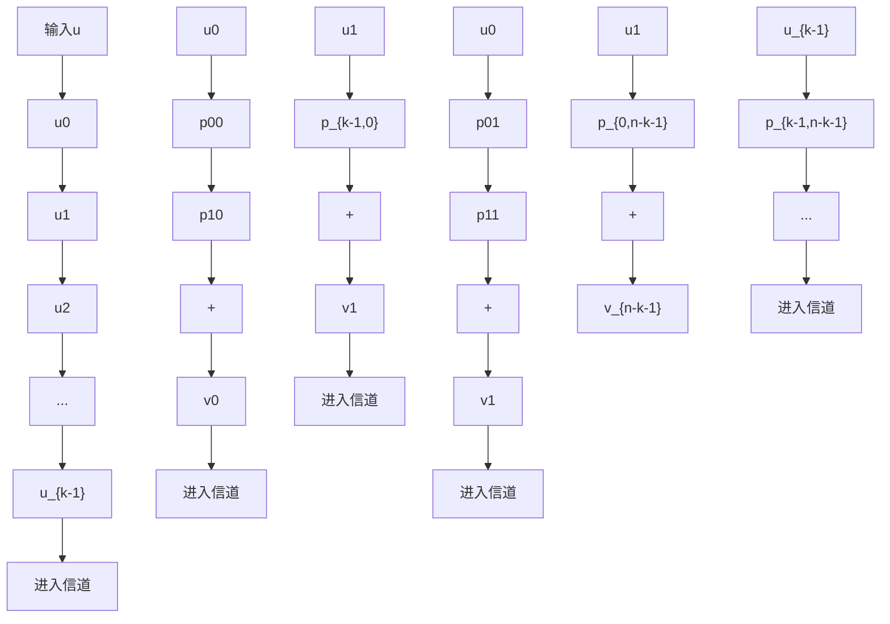
</details>

图 3-2 $(n, k)$ 线性系统码的编码电路

进入消息寄存器，在 $n - k$ 个模2加法器的输出端便生成了 $n - k$ 个校验位，这些校检位随即串行移位进入信道中。可见，编码电路的复杂度随码的分组长度线性增长。图3-3所示为表3-1的(7，4)码的编码电路，其中的连接取决于例3-2给出的奇偶校验方程。


<details>
<summary>flowchart</summary>

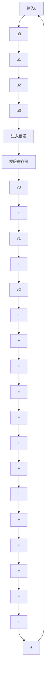
</details>

图 3-3 由表 3-1 所给出的 $(7, 4)$ 系统码的编码电路

# 3.2 校正子与差错检测

考虑一个 $(n, k)$ 线性码，其生成矩阵为G，奇偶校验矩阵为H。令 $v = (v_{0}, v_{1}, \cdots, v_{n-1})$ 表示要通过有噪信道传输的码字， $\boldsymbol{r} = (r_{0}, r_{1}, \cdots, r_{n-1})$ 为信道输出端接收到的码字。由于信道中的噪声，r可能与v不同。向量和

$$
\boldsymbol {e} = \boldsymbol {r} + \boldsymbol {v} = \left(e _ {0}, e _ {1}, \dots , e _ {n - 1}\right) \tag {3-9}
$$

是一个 n 维向量，其中 $r_{i} \neq v_{i}$ 时， $e_{i} = 1$ ，而 $r_{i} = v_{i}$ 时， $e_{i} = 0$ 。该 n 维向量称为差错向量（error vector）或错误模式（error pattern），它直接指出接收向量 r 不同于传输码字 v 的位置。e 中的 1 表示由于信道噪声引起的传输差错（transmission errors）。由公式（3-9）可知，接收向量 r 是传输码字和差错向量的向量和，即

$$
\boldsymbol {r} = \boldsymbol {v} + \boldsymbol {e}
$$

当然，接收端既不知道 v，也不知道 e。一旦收端接收到 r，译码器必须首先确定 r 是否含有传输差错。一旦检测出存在差错，则译码器要么采取措施定位差错并纠正之（FEC），要么请求重传 v（ARQ）。

当接收到 r，译码器便计算如下 $(n-k)$ 维向量：

$$
\boldsymbol {s} = \boldsymbol {r} \cdot \boldsymbol {H} ^ {\mathrm{T}} = (s _ {0}, s _ {1}, \dots , s _ {n - k - 1}) \tag {3-10}
$$

称 s 为 r 的校正子 (syndrome)。于是，当且仅当 r 是码字时，s = 0；而且当且仅当 r 不是码字时， $s \neq 0$ 。因此，当 $s \neq 0$ 时，可知 r 不是码字，检测出存在差错。当 s = 0，r 是码字，收端视 r 为传输码字。在某些差错向量中的差错也可能是无法检测的（即 r 有差错，但 $s = r \cdot H^{\mathrm{T}} = 0$ ）。上述情况在错误模式 e 和某个非零码字相同时才会发生。此时，r 是两个码字的和，从而也是一个码字，相应有 $r \cdot H^{\mathrm{T}} = 0$ 。这类错误模式称为漏检 (undetectable) 错误模式。由于总共存在 $2^{k} - 1$ 个非零码字，因此总共有 $2^{k} - 1$ 个漏检错误模式。当出现漏检错误模式时，译码器就会产生译码差错 (decoding error)。本章后面的部分将导出 BSC 信道下漏检差错的概率并说明这种差错的概率可以达到很小。

根据公式(3-7)和(3-10)，校正子的各个位如下：

$$
s _ {0} = r _ {0} + r _ {n - k} p _ {0 0} + r _ {n - k + 1} p _ {1 0} + \dots + r _ {n - 1} p _ {k - 1, 0}
$$

$$
\begin{array}{r l} s _ {1} & = r _ {1} + r _ {n - k} p _ {0 1} + r _ {n - k + 1} p _ {1 1} + \dots + r _ {n - 1} p _ {k - 1, 1} \\ & \vdots \end{array} \tag {3-11}
$$

$$
s _ {n - k - 1} = r _ {n - k - 1} + r _ {n - k} p _ {0, n - k - 1} + r _ {n - k + 1} p _ {1, n - k - 1} + \dots + r _ {n - 1} p _ {k - 1, n - k - 1}
$$

如果仔细观察上面的方程，就可以发现校正子 s 就是接收到的校验位 $(r_{0}, r_{1}, \cdots, r_{n-k-1})$ 与由接收到的消息位 $(r_{n-k}, r_{n-k+1}, \cdots, r_{n-1})$ 重新计算出的校验位的向量和。因此，校正子可由与编码电路相似的电路生成。图 3-4 所示为一个通用的校正子电路。


<details>
<summary>flowchart</summary>

Signal processing flowchart showing sequential stages from input r to output s_n-k-1, with feedback loops and summation nodes labeled s0 to s1.
</details>

图 3-4 $(n, k)$ 线性系统码的校正子电路

例 3-4 考虑奇偶校验矩阵由例 3-3 给出的 (7, 4) 线性码。令 $(r_{0}, r_{1}, r_{2}, r_{3}, r_{4}, r_{5}, r_{6})$ 为接收向量，则其校正子由下式给出

$$
\boldsymbol {s} = (s _ {0}, s _ {1}, s _ {2}) = (r _ {0}, r _ {1}, r _ {2}, r _ {3}, r _ {4}, r _ {5}, r _ {6}) \left[ \begin{array}{l l l} 1 & 0 & 0 \\ 0 & 1 & 0 \\ 0 & 0 & 1 \\ 1 & 1 & 0 \\ 0 & 1 & 1 \\ 1 & 1 & 1 \\ 1 & 0 & 1 \end{array} \right]
$$

校正子的各位为

$$
s _ {0} = r _ {0} + r _ {3} + r _ {5} + r _ {6} \quad s _ {1} = r _ {1} + r _ {3} + r _ {4} + r _ {5} \quad s _ {2} = r _ {2} + r _ {4} + r _ {5} + r _ {6}
$$

该码的校正子电路由图 3-5 所给出。


<details>
<summary>flowchart</summary>

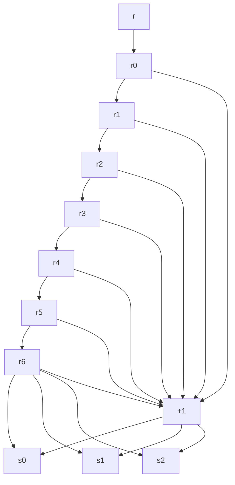
</details>

图 3-5 由表 3-1 给出的 $(7, 4)$ 码的校正子电路

由接收向量 r 计算出的校正子仅由错误模式 e 决定，而与传输码字 v 无关。因为 r 是 v 和 e 的向量和，由公式(3-10)可得

$$
\boldsymbol {s} = \boldsymbol {r} \cdot \boldsymbol {H} ^ {\mathrm{T}} = (\boldsymbol {v} + \boldsymbol {e}) \boldsymbol {H} ^ {\mathrm{T}} = \boldsymbol {v} \cdot \boldsymbol {H} ^ {\mathrm{T}} + \boldsymbol {e} \cdot \boldsymbol {H} ^ {\mathrm{T}}
$$

然而 $v \cdot H^{T} = 0$ ，所以我们得到校正子和错误模式之间的关系如下：

$$
\boldsymbol {s} = \boldsymbol {e} \cdot \boldsymbol {H} ^ {\mathrm{T}} \tag {3-12}
$$

如果奇偶校验矩阵 $\pmb{H}$ 表示为式(3-7)中的系统形式，将 $\pmb{e} \cdot \pmb{H}^{\mathrm{T}}$ 的各行分别乘出，就得到下述校正子位和差错位之间的线性关系式：

$$
s _ {0} = e _ {0} + e _ {n - k} p _ {0 0} + e _ {n - k + 1} p _ {1 0} + \dots + e _ {n - 1} p _ {k - 1, 0}
$$

$$
\begin{array}{r l} s _ {1} & = e _ {1} + e _ {n - k} p _ {0 1} + e _ {n - k + 1} p _ {1 1} + \dots + e _ {n - 1} p _ {k - 1, 1} \\ & \vdots \end{array} \tag {3-13}
$$

$$
s _ {n - k - 1} = e _ {n - k - 1} + e _ {n - k} p _ {0, n - k - 1} + e _ {n - k + 1} p _ {1, n - k - 1} + \dots + e _ {n - 1} p _ {k - 1, n - k - 1}
$$

校正子位仅是差错位的线性组合。显然，校正子位提供了有关差错位的信息，因此可用于纠正错误。

至此，有人也许会认为纠错方案就是求解式公式(3-13)中关于差错位的 $n - k$ 个线性方程的方法。一旦找到错误模式 $\pmb{e}$ ，就可将 $r + e$ 视为实际传输的码字。不幸的是，确定真正的差错向量 $\pmb{e}$ 不是一件简单的事。这是因为公式(3-13)的这 $n - k$ 个线性方程的解并不唯一，而是有 $2^{k}$ 个（将在定理3-6中证明这一点）。换句话说，有 $2^{k}$ 种错误模式可以形成同样的校正子，而真正的差错向量 $\pmb{e}$ 只是其中之一。因此，译码器必须从这组 $2^{k}$ 个候选项中确定真正的差错向量。为使译码差错概率最小，选择满足方程(3-13)的可能性(probable)最大的错误模式作为真正的差错向量。当信道是BSC时，可能性最大的错误模式就是含非零元素最少者。

下面通过一个例子阐明如何利用校正子进行纠错的方法。

例 3-5 仍考虑例 3-3 给出的奇偶校验矩阵所确定的 $(7, 4)$ 码。令 $\nu = (1001011)$ 为传输码字， $\boldsymbol{r} = (1001001)$ 为接收码字。接收端在收到 r 后，计算校正子：

$$
\boldsymbol {s} = \boldsymbol {r} \cdot \boldsymbol {H} ^ {\mathrm{T}} = (1 1 1)
$$

接着，接收端试图确定可产生所给校正子的真正的差错向量 $e = (e_0, e_1, e_2, e_3, e_4, e_5, e_6)$ 。根据公式(3-12)和(3-13)可得，差错位和校正子位有如下线性方程关系：

$$
1 = e _ {0} + e _ {3} + e _ {5} + e _ {6} \quad 1 = e _ {1} + e _ {3} + e _ {4} + e _ {5} \quad 1 = e _ {2} + e _ {4} + e _ {5} + e _ {6}
$$

共有 $2^{4}=16$ 种错误模式满足上述方程组，即

$$
\begin{array}{l} (0 0 0 0 0 1 0) \quad (1 0 1 0 0 1 1) \\ (1 1 0 1 0 1 0) \quad (0 1 1 1 0 1 1) \\ (0 1 1 0 1 1 0) \quad (1 1 0 0 1 1 1) \\ (1 0 1 1 1 1 0) \quad (0 0 0 1 1 1 1) \\ (1 1 1 0 0 0 0) \quad (0 1 0 0 0 0 1) \\ (0 0 1 1 0 0 0) \quad (1 0 0 1 0 0 1) \\ (1 0 0 0 1 0 0) \quad (0 0 1 0 1 0 1) \\ (0 1 0 1 1 0 0) \quad (1 1 1 1 1 0 1) \\ \end{array}
$$

其中差错向量 $e=(0\ 0\ 0\ 0\ 1\ 0)$ 具有最少的非零分量。如果信道是 BSC， $e=(0\ 0\ 0\ 0\ 1\ 0)$ 就是满足上述方程组的可能性最大的差错向量。将 $e=(0\ 0\ 0\ 0\ 1\ 0)$ 作为真正的差错向量，接收端将接收向量 $r=(1\ 0\ 0\ 1\ 0\ 0\ 1)$ 译码为如下码字：

$$
\boldsymbol {v} ^ {*} = \boldsymbol {r} + \boldsymbol {e} = (1 0 0 1 0 0 1) + (0 0 0 0 0 1 0) = (1 0 0 1 0 1 1)
$$

$\nu^{*}$ 就是实际传输的码字，因此接收端作到了正确译码。稍后我们将证明本例中的(7，4)线性码能够纠正7位范围内的任意单个差错，即如果一个码字在传输过程中有且仅有一位被信道噪声改变时，收端可以确定真正的差错向量并进行正确译码。

有关基于校正子纠错的讨论将在3-5节进一步展开。后续章节中将给出各种从公式(3-13)的 $n - k$ 个线性方程确定真正错误模式的方法。

# 3.3 分组码的最小距离

在本节中我们引入分组码的一个重要参数——最小距离（minimum distance）。该参数决定了一个码检测随机错误和纠正随机错误的能力。令 $v = (v_{0}, v_{1}, \cdots, v_{n-1})$ 为二进制 n 维向量。v 的汉明重量（hamming weight）或者简称重量（weight），以 $w(v)$ 表示，定义为 v 中非零分量的个数。例如， $v = (1001011)$ 的汉明重量为 4。v 和 w 是两个 n 维向量，v 和 w 之间的汉明距离（Hamming distance）或者简称距离（distance）—— $d(v, w)$ 定义为两者不相同的位的个数。例如， $v = (1001011)$ 和 $w = (0100011)$ 的汉明距离为 3；两者在第 0、1 和 3 位上不同。汉明距离是一个满足三角不等式（triangle inequality）的度量函数。设 v，w 和 x 是三个 n 维向量，则

$$
d (\boldsymbol {v}, \boldsymbol {w}) + d (\boldsymbol {w}, \boldsymbol {x}) \geqslant d (\boldsymbol {v}, \boldsymbol {x}) \tag {3-14}
$$

(该不等式的证明作为习题3-7。)由汉明距离与模2和的定义可知，两个 $n$ 维向量 $\pmb{v}$ 和 $\pmb{w}$ 的汉明距离等于 $\pmb{v}$ 与 $\pmb{w}$ 和的汉明重量。即

$$
d (\boldsymbol {v}, \boldsymbol {w}) = w (\boldsymbol {v} + \boldsymbol {w}) \tag {3-15}
$$

例如， $v=(1001011)$ 和 $w=(1110010)$ 的汉明距离为 4， $v+w=(0111001)$ 的重量同样是 4。

给定分组码 C，可计算任意两个不同码字之间的汉明距离。C 的最小距离 (minimum distance) 记为 $d_{min}$ ，其定义为

$$
d _ {\min} \triangleq \min \left\{d (\boldsymbol {v}, \boldsymbol {w}): \boldsymbol {v}, \boldsymbol {w} \in C, \boldsymbol {v} \neq \boldsymbol {w} \right\} \tag {3-16}
$$

若 $C$ 是一个线性分组码，两个码字之和仍为一个码字。根据公式(3-15)， $C$ 中两码字的汉明距离等于 $C$ 中第三个码字的汉明重量，于是由式(3-16)有

$$
d _ {\min} = \min \left\{w (\boldsymbol {v} + \boldsymbol {w}): \boldsymbol {v}, \boldsymbol {w} \in C, \boldsymbol {v} \neq \boldsymbol {w} \right\} = \min \left\{w (\boldsymbol {x}): \boldsymbol {x} \in C, \boldsymbol {x} \neq \boldsymbol {0} \right\} \triangleq w _ {\min} \tag {3-17}
$$

参数 $w_{\min} \triangleq \{w(x): x \in C, x \neq 0\}^{\ominus}$ 被称为线性码 $C$ 的最小重量 (minimum weight)。总结上述结论，我们得到如下定理。

定理 3-1 线性分组码的最小距离等于其非零码的最小重量，反之亦然。

因此，对于一个线性分组码，确定其最小汉明距离等价于确定其最小重量。表3-1给出的(7，4)码的最小重量为3；所以，其最小距离为3。下面，我们证明一些将线性分组码的重量结构和奇偶校验矩阵联系起来的定理。

定理 3-2 设 C 为 $(n, k)$ 线性码，其奇偶校验矩阵为 H。对于任意汉明重量为 l 的码字，存在 H 的 l 个列向量，满足这 l 列的向量和等于零。反之，若存在 H 的 l 个列向量，其和为零，则码 C 中有汉明重量为 l 的码字。

证明 将奇偶校验矩阵写成如下形式：

$$
\boldsymbol {H} = \left[ \boldsymbol {h} _ {0}, \boldsymbol {h} _ {1}, \dots , \boldsymbol {h} _ {n - 1} \right]
$$

其中 $h_{i}$ 是代表 H 的第 i 列。令 $\boldsymbol{v}=(v_{0},v_{1},\cdots,v_{n-1})$ 表示重量为 l 的码字。则 v 有 l 个非零分量。令 $v_{i_{1}},v_{i_{2}},\cdots,v_{i_{l}}$ 代表 v 中的 l 个非零分量，其中 $0\leqslant i_{1}<i_{2}<\cdots<i_{l}\leqslant n-1$ 。于是 $v_{i_{1}}=v_{i_{2}}=\cdots=v_{i_{l}}=1$ 。由于 v 是一个码字，必然有

$$
\mathbf {0} = \boldsymbol {v} \cdot \boldsymbol {H} ^ {\mathrm{T}} = v _ {0} \boldsymbol {h} _ {0} + v _ {1} h _ {1} + \dots + v _ {n - 1} \boldsymbol {h} _ {n - 1} = v _ {i _ {1}} \boldsymbol {h} _ {i _ {1}} + v _ {i _ {2}} \boldsymbol {h} _ {i _ {2}} + \dots + v _ {i _ {l}} \boldsymbol {h} _ {i _ {l}} = \boldsymbol {h} _ {i _ {1}} + \boldsymbol {h} _ {i _ {2}} + \dots + \boldsymbol {h} _ {i _ {l}}
$$

定理的前半部分得证。

现在，假设 $h_{i_{1}}$ ， $h_{i_{2}}$ ，…， $h_{i_{l}}$ 是 H 的 l 个列向量，满足

$$
\boldsymbol {h} _ {i _ {1}} + \boldsymbol {h} _ {i _ {2}} + \dots + \boldsymbol {h} _ {i _ {l}} = \boldsymbol {0} \tag {3-18}
$$

构造一个二进制 n 维向量 $\boldsymbol{x} = (x_{0}, x_{1}, \cdots, x_{n-1})$ ，它的非零分量是 $x_{i_{1}}, x_{i_{2}}, \cdots x_{i_{l}}$ 。x 的汉明重量为 l。考虑乘积

$$
\boldsymbol {x} \cdot \boldsymbol {H} ^ {\mathrm{T}} = x _ {0} \boldsymbol {h} _ {0} + x _ {1} \boldsymbol {h} _ {1} + \dots + x _ {n - 1} \boldsymbol {h} _ {n - 1} = x _ {i _ {1}} \boldsymbol {h} _ {i _ {1}} + x _ {i _ {2}} \boldsymbol {h} _ {i _ {2}} + \dots + x _ {i _ {l}} \boldsymbol {h} _ {i _ {l}} = \boldsymbol {h} _ {i _ {1}} + \boldsymbol {h} _ {i _ {2}} + \dots + \boldsymbol {h} _ {i _ {l}}
$$

由式(3-18)得 $x \cdot H^{T} = 0$ 。因此，x 是 C 中一个汉明重量为 l 的码字。这就证明了定理的第二部分。

由定理 3-2 得出以下两个推论。

推论 3-2-1 设 C 为线性分组码，其奇偶校验矩阵为 H。如果 H 中不多于 d-1 个列向量之和均不等于 0，则该码的最小重量至少为 d。

推论 3-2-2 设 C 为线性分组码，其奇偶校验矩阵为 H。C 的最小重量（或最小距离）等于 H 中满足相加之和为 0 所需的最少的列向量的个数。

考虑表 3-1 给出的 $(7, 4)$ 线性码，其奇偶校验矩阵为

$$
\boldsymbol {H} = \left[ \begin{array}{c c c c c c c} 1 & 0 & 0 & 1 & 0 & 1 & 1 \\ 0 & 1 & 0 & 1 & 1 & 1 & 0 \\ 0 & 0 & 1 & 0 & 1 & 1 & 1 \end{array} \right]
$$

我们看到，H 的所有列向量非零，且任意两列不等。因此，不存在两列或更少的列满足求和为 0，该码的最小重量至少为 3。但是，第 0，2，6 列向量之和为 0，所以其最小重量为 3。从表 3-1 可以知道该码最小重量确实是 3。根据定理 3-1 可知其最小距离为 3。

推论 3-2-1 和 3-2-2 通常被用来确定线性分组码的最小距离或建立最小距离的下界。

# 3.4 分组码的检错和纠错能力

当码字 v 通过有噪信道传输时，一种有 l 个差错的错误模式使得接收到的码字有 l 处不同于被传输的码字（即 $d(v, r) = l$ ）。如果分组码 C 的最小距离为 $d_{min}$ ，C 中任意两个不同码字至少有 $d_{min}$ 处不相同。对于这种码，只含有至多 $d_{min} - 1$ 个差错的错误模式是无法将一个码字转变为另一个码字的。因此，这种错误模式将导致接收到的向量 r 并非 C 中的码字。当收端检测出接收向量并非 C 中的码字时，我们说检测出有差错。因此最小距离为 $d_{min}$ 的分组码能够检测所有含至多 $d_{min} - 1$ 个差错的错误模式。但是它无法检测所有含 $d_{min}$ 个差错的错误模式，因为至少存在一对码字具有 $d_{min}$ 处不同，同时存在一个含 $d_{min}$ 个差错的错误模式可将其中一个码字转变为另一个码字。对于含有超过 $d_{min}$ 个差错的错误模式，该讨论同样成立。基于这个原因，我们说最小距离为 $d_{min}$ 的分组码检测随机差错的能力是 $d_{min} - 1$ 。

尽管最小距离为 $d_{\min}$ 的分组码可以保证检测出所有含至多 $d_{\min} - 1$ 个差错的错误模式，但是，该码也能够检测出大部分含 $d_{\min}$ 和多于 $d_{\min}$ 个差错的错误模式。事实上，一个 $(n, k)$ 线性码能够检测出 $2^n - 2^k$ 种长度为 $n$ 的错误模式。下面证明这一点。在 $2^n - 1$ 种可能的非零错误模式中，有 $2^k - 1$ 种错误模式和 $2^k - 1$ 个非零码字相同。如果出现这 $2^k - 1$ 种错误模式之一，将使传输的码字 $\pmb{\nu}$ 变为另一个码字 $\pmb{w}$ 。于是，收到码字 $\pmb{w}$ ，并且其校正子为零。在这种情况下，译码器将 $\pmb{w}$ 视作传输码字，进行了错误的译码。因此存在 $2^k - 1$ 种漏检（undetectable）错误模式。如果错误模式与非零码字不同，接收到的向量 $\pmb{r}$ 就不是一个码字而且校正子不会为零。此时差错被检出。正好共有 $2^n - 2^k$ 种错误模式与 $(n, k)$ 线性码的码字

不同，这 $2^{n} - 2^{k}$ 种错误模式是可检测 (detectable) 的错误模式。对于较大的 $n$ ， $2^{k} - 1$ 通常远小于 $2^{n}$ 。因此，只有很小一部分错误模式在译码时无法被检出。

设 C 为一个 $(n, k)$ 线性码。 $A_{i}$ 表示 C 中重量为 i 的码字的个数。数组 $A_{0}, A_{1}, \cdots, A_{n}$ 称为 C 的重量分布 (weight distribution)。如果仅用 C 来作为 BSC 的差错检测，出现译码器无法检测差错的概率可以由码 C 的重量分布计算出来。令 $P_{u}(E)$ 表示出现漏检差错的概率。由于漏检差错仅发生在错误模式和 C 的一个非零码字相同时有

$$
P _ {u} (E) = \sum_ {i = 1} ^ {n} A _ {i} p ^ {i} (1 - p) ^ {n - i} \tag {3-19}
$$

式中 p 是 BSC 的转移概率。如果 C 的最小距离为 $d_{min}$ ，则 $A_{1}$ 至 $A_{d_{min}-1}$ 都是 0。

考虑表 3-1 给出的 (7, 4) 码，其重量分布为 $A_{0}=1$ ， $A_{1}=A_{2}=0$ ， $A_{3}=7$ ， $A_{4}=7$ ， $A_{5}=A_{6}=0$ ， $A_{7}=1$ 。漏检误码率为

$$
P _ {u} (E) = 7 p ^ {3} (1 - p) ^ {4} + 7 p ^ {4} (1 - p) ^ {3} + p ^ {7}
$$

若 $p=10^{-2}$ ，此概率大约为 $7 \times 10^{-6}$ 。换言之，一百万个码字通过 $p=10^{-2}$ 的 BSC 传输，平均有 7 个含差错的码字通过译码器而没有被检出。

如果采用最小距离为 $d_{\min}$ 的分组码 $C$ 进行随机差错纠正，我们希望知道该码可以纠正多少差错。最小距离 $d_{\min}$ 可以是奇数或偶数。令 $t$ 为一正整数，且满足

$$
2 t + 1 \leqslant d _ {\min} \leqslant 2 t + 2 \tag {3-20}
$$

下面，我们证明码 $C$ 能够纠正所有含不超过 $t$ 个差错的错误模式。设 $\pmb{v}$ 和 $\pmb{r}$ 分别是传输码字和接收向量。令 $\pmb{w}$ 为 $C$ 中任意其他码字。 $\pmb{v}$ ， $\pmb{r}$ 和 $\pmb{w}$ 之间的汉明距离满足三角不等式：

$$
d (\boldsymbol {v}, \boldsymbol {r}) + d (\boldsymbol {w}, \boldsymbol {r}) \geqslant d (\boldsymbol {v}, \boldsymbol {w}) \tag {3-21}
$$

假设传输 v 时发生的错误模式含有 $t'$ 个差错，则接收向量 r 有 $t'$ 处与 v 不同，从而 $d(v, r) = t'$ 。由于 v 和 w 都是 C 中的码字，有

$$
d (\nu , w) \geqslant d _ {\min} \geqslant 2 t + 1 \tag {3-22}
$$

结合公式(3-21)和公式(3-22)并利用 $d(\pmb {v},\pmb {r}) = t'$ 这一事实，得到下面的不等式：

$$
d (\boldsymbol {w}, \boldsymbol {r}) \geqslant 2 t + 1 - t ^ {\prime}
$$

若 $t' \leqslant t$ ,

$$
d (\boldsymbol {w}, \boldsymbol {r}) > t
$$

上述不等式说明，如果发生的错误模式含有的差错个数不超过 $t$ ，接收向量 $\pmb{r}$ 与传输码字 $\pmb{v}$ 的汉明距离小于它与 $C$ 中任何一个其他码字 $\pmb{w}$ 的距离。对于 BSC，这意味着 $\pmb{v} \neq \pmb{w}$ 时，条件概率 $P(\pmb{r} \mid \pmb{v})$ 大于条件概率 $P(\pmb{r} \mid \pmb{w})$ 。基于最大似然译码准则， $\pmb{r}$ 被译码为实际发送的码字 $\pmb{v}$ 。这个结果是一个正确的译码，差错得到了纠正。

与之相反，该码无法纠正所有含 $l > t$ 个差错的错误模式，因为至少存在一种情况，含 $l$ 个差错的错误模式使得不正确的码字比传输的码字更接近于接收向量。为说明这一点，令 $\pmb{v}$ 和 $\pmb{w}$ 为 $C$ 中的两个码字，满足

$$
d (\boldsymbol {v}, \boldsymbol {w}) = d _ {\min}
$$

令 $e_{1}$ 和 $e_{2}$ 是满足下面条件的两个错误模式：

$$
\mathbf {i}. \boldsymbol {e} _ {1} + \boldsymbol {e} _ {2} = \boldsymbol {v} + \boldsymbol {w}
$$

ii. $e_{1}$ 和 $e_{2}$ 不在相同位置同时含有非零分量。

显然，我们有

$$
w \left(\boldsymbol {e} _ {1}\right) + w \left(\boldsymbol {e} _ {2}\right) = w (\boldsymbol {v} + \boldsymbol {w}) = d (\boldsymbol {v}, \boldsymbol {w}) = d _ {\min} \tag {3-23}
$$

现在，假设 v 传输中受到错误模式 $e_{1}$ 的干扰，则接收向量为

$$
\boldsymbol {r} = \boldsymbol {v} + \boldsymbol {e} _ {1}
$$

<!-- --- chunk --- -->

<!-- source: 64-79.md -->
$\pmb{v}$ 和 $\pmb{r}$ 的汉明距离是

$$
d (\boldsymbol {v}, \boldsymbol {r}) = w (\boldsymbol {v} + \boldsymbol {r}) = w \left(\boldsymbol {e} _ {1}\right) \tag {3-24}
$$

w 和 v 的汉明距离是

$$
d (\boldsymbol {w}, \boldsymbol {r}) = w (\boldsymbol {w} + \boldsymbol {r}) = w (\boldsymbol {w} + \boldsymbol {v} + \boldsymbol {e} _ {1}) = w (\boldsymbol {e} _ {2}) \tag {3-25}
$$

现在，假设错误模式 $e_{1}$ 含有多于 t 个差错（即 $w(e_{1}) > t$ ）。由于 $2t + 1 \leqslant d_{\min} \leqslant 2t + 2$ ，根据公式(3-23)得到

$$
w \left(\boldsymbol {e} _ {2}\right) \leqslant t + 1
$$

联立求解公式(3-24)和公式(3-25)，并利用 $w(\pmb{e}_1) > t$ 和 $w(\pmb{e}_1) \leqslant t + 1$ 的已知条件，得到下面的不等式

$$
d (\boldsymbol {v}, \boldsymbol {r}) \geqslant d (\boldsymbol {w}, \boldsymbol {r})
$$

该不等式说明存在含 $l(l > t)$ 个差错的错误模式，使得不正确的码字比传输的码字更接近于接收向量。基于最大似然译码准则，将会出现译码差错。

总而言之，一个最小距离为 $d_{\min}$ 的分组码可确保纠正所有含不多于 $t = \lfloor (d_{\min} - 1) / 2 \rfloor$ 个差错的错误模式，其中 $\lfloor (d_{\min} - 1) / 2 \rfloor$ 表示不大于 $(d_{\min} - 1) / 2$ 的最大整数。参数 $t = \lfloor (d_{\min} - 1) / 2 \rfloor$ 称为码的随机差错纠正能力（random-error-correcting capability），该码被称为纠 $t$ 个差错的码。表3-1给出的(7，4)码的最小距离为3，于是 $t = 1$ 。该码能够纠正一个7位分组上的任何含单个差错的错误模式。

具有纠正 $t$ 个随机差错能力的分组码通常可纠正很多含 $t + 1$ 或更多差错的错误模式。一个纠 $t$ 个差错的 $(n, k)$ 线性码，总共能够纠正 $2^{n - k}$ 个的错误模式，其中包括含有不超过 $t$ 个差错的错误模式（在下节中将会看到这一点）。如果一个能纠 $t$ 个差错的分组码仅用于在转移概率为 $p$ 的BSC上进行纠错，则译码器造成错误译码的概率的上界为

$$
P (E) \leqslant \sum_ {i = t + 1} ^ {n} \binom {n} {i} p ^ {i} (1 - p) ^ {n - i} \tag {3-26}
$$

在实际应用中，一个码经常用来纠正不大于 $\lambda$ 个差错，同时检测不大于 $l(l > \lambda)$ 个差错。也就是说，当出现 $\lambda$ 个或更少的差错时，该码可以纠正它们；当出现多于 $\lambda$ 但少于 $l + 1$ 个差错时，该码可检测差错是否存在而且不造成译码差错。此时，码的最小距离 $d_{\min}$ 至少为 $\lambda + l + 1$ （证明留作习题3-8）。因此，最小距离为10的分组码能够纠正不大于3个的差错、同时检测不大于6个的差错。

至此，我们仅考虑了收端对每个接收符号采用硬判决的情况；然而，收端也可以设计成在接收到不确定(或不可靠)信号时将其删除。在这种情况下，接收序列由0、1或删除位组成。一个编码可用来纠正差错和删除的组合。如果满足下面的条件

$$
d _ {\min} \geqslant 2 v + e + 1
$$

最小距离为 $d_{\min}$ 的码就能够纠正任何含有 $v$ 个差错和 $e$ 个删除位的错误模式。为说明这一点，从所有码字中删去收端声称为删除位的 $e$ 个分量。删除操作使码的长度减短至 $n - e$ 。缩短码的最小距离至少为 $d_{\min} - e \geqslant 2v + 1$ 。因此，位于非删除位的 $v$ 个差错可被纠正，从而删除了 $e$ 个分量的缩短码字得到恢复。最后，由于 $d_{\min} \geqslant e + 1$ ，在原始码中有且仅有一个与未删除分量一致的码字。相应地，整个码字得到恢复。在实际情况中，经常使用这种差错和删除结合的纠错方法。

由上述讨论可知，分组码的随机差错检测能力和随机差错纠正能力由它的最小距离所决定。显然，对于给定的 $n$ 和 $k$ ，除了实现上的考虑以外，希望构造最小距离尽可能大的分组码。

一个最小距离为 $d_{\min}$ 的 $(n, k)$ 线性分组码通常表示成 $(n, k, d_{\min})$ 。表3-1给出的码就

是一个(7, 4, 3)码。

# 3.5 标准阵与校正子译码

在这一节里，我们将给出一种线性分组码的译码方案。设 C 为 $(n, k)$ 线性码，令 $v_{1}, v_{2}, \cdots, v_{2^{k}}$ 为 C 的码字。无论哪个码字通过有噪信道传输，接收向量 r 都是 $GF(2)$ 域上的 $2^{n}$ 个 n 维向量中的一个。收端的任何一种译码方法都是一种划分规则，通过该规则将 $2^{n}$ 个可能的接收向量划分为 $2^{k}$ 个互不相交的子集合 $D_{1}, D_{2}, \cdots, D_{2^{k}}$ ，使得码字 $v_{i}$ 包含在其中一个子集 $D_{i}$ 中， $1 \leqslant i \leqslant 2^{k}$ 。这样，每个子集 $D_{i}$ 和码字 $v_{i}$ ——对应。如果接收向量 r 在 $D_{i}$ 中，则将 r 译码成 $v_{i}$ 。当且仅当接收向量 r 位于与传输码字相对应的子集 $D_{i}$ 中，译码才是正确的。

此处介绍一种方法，可将 $2^{n}$ 个可能的接收向量划分为 $2^{k}$ 个互不相交的子集合，满足每个子集包含且仅包含一个码字。这种划分基于码的线性结构。首先，将 $C$ 中的 $2^{k}$ 个码字排成一行，将全零码字 $\nu_{1} = (0,0,\dots ,0)$ 作为第一个(最左边的)元素。从剩下的 $2^{n} - 2^{k}$ 个 $n$ 维向量中，选择一个 $n$ 维向量 $\pmb{e}_2$ ，将其放在全零向量 $\pmb{\nu}_{1}$ 下方。然后用第一行每个码字 $\pmb{\nu}_{i}$ 加上 $\pmb{e}_2$ 并将其和 $\pmb{e}_2 + \pmb{\nu}_i$ 放在 $\pmb{\nu}_{i}$ 下方，由此构成第二行。完成了第二行以后，从剩下的 $n$ 维向量中选择未使用的 $n$ 维向量 $\pmb{e}_3$ 放在 $\pmb{\nu}_{1}$ 下方。接着，将第一行每个码字 $\pmb{\nu}_{i}$ 上加上 $\pmb{e}_3$ 并将和 $\pmb{e}_3 + \pmb{\nu}_i$ 放在 $\pmb{\nu}_{i}$ 下面来构成第三行。继续该过程直至用完所有的 $n$ 维向量。最后，我们得到了一个由如图 3-6 所示的行和列所构成的矩阵，该矩阵被称为给定线性码 C 的标准阵（standard array）。

由标准阵的构造规则可知，在同一行中的任意两个向量之和是 C 中的码字。下面证明标准阵的一些重要特性。

定理 3-3 在标准阵的同一行中，任意两个 n 维向量互不相同。每个 n 维向量出现且仅出现在一行中。

$$
\begin{array}{c c c c c c} \nu_ {1} = 0 & \nu_ {2} & \dots & \nu_ {i} & \dots & \nu_ {2 ^ {k}} \\ \boldsymbol {e} _ {2} & \boldsymbol {e} _ {2} + \nu_ {2} & \dots & \boldsymbol {e} _ {2} + \nu_ {i} & \dots & \boldsymbol {e} _ {2} + \nu_ {2 ^ {k}} \\ \boldsymbol {e} _ {3} & \boldsymbol {e} _ {3} + \nu_ {2} & \dots & \boldsymbol {e} _ {3} + \nu_ {i} & \dots & \boldsymbol {e} _ {3} + \nu_ {2 ^ {k}} \\ \vdots & & & & & \\ \boldsymbol {e} _ {l} & \boldsymbol {e} _ {l} + \nu_ {2} & \dots & \boldsymbol {e} _ {l} + \nu_ {i} & \dots & \boldsymbol {e} _ {l} + \nu_ {2 ^ {k}} \\ \vdots & & & & & \\ \boldsymbol {e} _ {2 ^ {n - k}} & \boldsymbol {e} _ {2 ^ {n - k}} + \nu_ {2} & \dots & \boldsymbol {e} _ {2 ^ {n - k}} + \nu_ {i} & \dots & \boldsymbol {e} _ {2 ^ {n - k}} + \nu_ {2 ^ {k}} \end{array}
$$

图 3-6 $(n, k)$ 线性码的标准阵

证明 定理的前一部分由 $C$ 中所有码字各不相同的事实可知。假设在第 $l$ 行中的两个 $n$ 维向量相同，就是说 $\pmb{e}_l + \pmb{v}_i = \pmb{e}_l + \pmb{v}_j$ ， $i \neq j$ 。这意味着 $\pmb{v}_i = \pmb{v}_j$ ，但这是不可能的。因此，同一行中，任意两个 $n$ 维向量互不相同。

由标准阵的构造规则知每个 $n$ 维向量至少出现一次。现在，假设一个 $n$ 维向量同时出现在 $l$ 行和 $m$ 行， $l < m$ 。则该 $n$ 维向量必然对某个 $i$ 等于 $\pmb{e}_l + \pmb{v}_i$ ，对于某个 $j$ 等于 $\pmb{e}_m + \pmb{v}_j$ 。所以有 $\pmb{e}_l + \pmb{v}_i = \pmb{e}_m + \pmb{v}_j$ 。由此可得 $\pmb{e}_m = \pmb{e}_l + (\pmb{v}_i + \pmb{v}_j)$ 。因为 $\pmb{v}_i$ 和 $\pmb{v}_j$ 是 $C$ 的码字， $\pmb{v}_i + \pmb{v}_j$ 也是 $C$ 的码字，设其为 $\pmb{v}_s$ 。于是有 $\pmb{e}_m = \pmb{e}_l + \pmb{v}_s$ 。这意味着 $n$ 维向量 $\pmb{e}_m$ 出现在矩阵的第 $l$ 行，而这与 $m$ 行的第一个元素 $\pmb{e}_m$ 应该是前面行中未用过的元素这一矩阵构造规则相矛盾。因此，没有 $n$ 维向量能够在多于一行中出现。这就证明了定理的第二部分。证毕。

由定理 3-3 可以看出，在标准阵中共有 $2^{n}/2^{k}=2^{n-k}$ 个互不相交的行，并且每行由 $2^{k}$ 个互异的元素组成。这 $2^{n-k}$ 行称为码 C 的陪集 (coset)，每个陪集的第一个 n 维向量 $e_{j}$ 称为陪集首 (coset leader) 或陪集代表元 (coset representative)。子群陪集的概念已在 2-1 节中做了介绍。陪集中的任何一个元素都可以作为其陪集首，这不会改变陪集中的元素，而只是改变了陪集中元素的顺序。

例 3-6 考虑由如下矩阵生成的(6, 3)线性码：

$$
\boldsymbol {G} = \left[ \begin{array}{c c c c c c} 0 & 1 & 1 & 1 & 0 & 0 \\ 1 & 0 & 1 & 0 & 1 & 0 \\ 1 & 1 & 0 & 0 & 0 & 1 \end{array} \right]
$$

该码的标准阵如图 3-7 所示。

<table><tr><td>陪集首</td><td></td><td></td><td></td><td></td><td></td><td></td><td></td></tr><tr><td>000000</td><td>011100</td><td>101010</td><td>110001</td><td>110110</td><td>101101</td><td>011011</td><td>000111</td></tr><tr><td>100000</td><td>111100</td><td>001010</td><td>010001</td><td>010110</td><td>001101</td><td>111011</td><td>100111</td></tr><tr><td>010000</td><td>001100</td><td>111010</td><td>100001</td><td>100110</td><td>111101</td><td>001011</td><td>010111</td></tr><tr><td>001000</td><td>010100</td><td>100010</td><td>111001</td><td>111110</td><td>100101</td><td>010011</td><td>001111</td></tr><tr><td>000100</td><td>011000</td><td>101110</td><td>110101</td><td>110010</td><td>101001</td><td>011111</td><td>000011</td></tr><tr><td>000010</td><td>011110</td><td>101000</td><td>110011</td><td>110100</td><td>101111</td><td>011001</td><td>000101</td></tr><tr><td>000001</td><td>011101</td><td>101011</td><td>110000</td><td>110111</td><td>101100</td><td>011010</td><td>000110</td></tr><tr><td>100100</td><td>111000</td><td>001110</td><td>010101</td><td>010010</td><td>001001</td><td>111111</td><td>100011</td></tr></table>

图 3-7 一个(6, 3)码的标准阵

$(n, k)$ 线性码 $C$ 的标准阵由 $2^k$ 个不相交的列组成，每列包含 $2^{n - k}$ 个 $n$ 维向量，最顶上的是 $C$ 的一个码字。以 $D_j$ 表示标准阵的第 $j$ 列。则，

$$
D _ {j} = \left\{\boldsymbol {v} _ {j}, \boldsymbol {e} _ {2} + \boldsymbol {v} _ {j}, \boldsymbol {e} _ {3} + \boldsymbol {v} _ {j}, \dots , \boldsymbol {e} _ {2 ^ {n - k}} + \boldsymbol {v} _ {j} \right\} \tag {3-27}
$$

其中 $v_{j}$ 是 C 的一个码字， $e_{1}, e_{2}, \cdots, e_{2^{n-k}}$ 是陪集首。如本节早先所述，这 $2^{k}$ 个不相交的列 $D_{1}, D_{2}, \cdots, D_{2^{k}}$ 可用于对码 C 进行译码。假设码字 $v_{j}$ 通过有噪信道传输。由式(3-27)可知，如果信道引起的错误模式是陪集首，则接收向量 r 在 $D_{j}$ 中。这种情况下，接收向量 r 将被正确地译码为传输码字 $v_{j}$ 。然而，如果信道引起的错误模式不是陪集首，则将产生译码差错。下面将说明这点。信道引起的错误模式 x 一定在某个陪集中，并在某个非零码字下方，设其在第 l 个陪集中，在码字 $v_{i} \neq 0$ 下方。于是 $x = e_{l} + v_{i}$ ，接收向量为

$$
\boldsymbol {r} = \boldsymbol {v} _ {j} + \boldsymbol {x} = \boldsymbol {e} _ {l} + (\boldsymbol {v} _ {i} + \boldsymbol {v} _ {j}) = \boldsymbol {e} _ {l} + \boldsymbol {v} _ {s}
$$

接收向量 r 在 $D_{s}$ 中，且被译码为并非传输码字的 $v_{s}$ ，这导致错误译码。因此，当且仅当信道引起的错误模式为陪集首时译码是正确的。由于这个原因，这 $2^{n-k}$ 个陪集首（包括 0 向量）称为可纠正错误模式（correctable error patterns）。总结上面的结论，我们得到如下定理：

定理3-4 每个 $(n, k)$ 线性分组码有纠正 $2^{n - k}$ 个错误模式的能力。

为使译码差错概率最小，应对给定信道选择最有可能出现的错误模式作为陪集首。对于BSC，重量小的错误模式比重量大的错误模式更可能发生。所以在构造标准阵时，每次应该选择剩下的可用码字中重量最小的码字作为陪集首。如果用这种方法选择陪集首，则在每个陪集中陪集首的重量最小。因此，基于标准阵的译码是最小距离译码（即最大似然译码）。为说明这点，令 $r$ 为接收向量。假设 $r$ 在标准阵的第 $i$ 列 $D_{i}$ 和第 $l$ 个陪集中，则 $r$ 被译码为码字 $v_{i}$ 。由于 $r = e_{l} + v_{i}$ ，则 $r$ 和 $v_{i}$ 之间的距离为

$$
d (\boldsymbol {r}, \boldsymbol {v} _ {i}) = w (\boldsymbol {r} + \boldsymbol {v} _ {i}) = w \left(\boldsymbol {e} _ {l} + \boldsymbol {v} _ {i} + \boldsymbol {v} _ {i}\right) = w \left(\boldsymbol {e} _ {l}\right) \tag {3-28}
$$

现在，考虑 r 和任意其他码字 $v_{j}$ 之间的距离，

$$
d (\boldsymbol {r}, \boldsymbol {v} _ {j}) = w (\boldsymbol {r} + \boldsymbol {v} _ {j}) = w \left(\boldsymbol {e} _ {l} + \boldsymbol {v} _ {i} + \boldsymbol {v} _ {j}\right)
$$

由于 $v_{i}$ 和 $v_{j}$ 是两个不同的码字，两者的向量和 $v_{i} + v_{j}$ 为非零码字，设为 $v_{s}$ 。这样，

$$
d (\boldsymbol {r}, \boldsymbol {v} _ {j}) = w \left(\boldsymbol {e} _ {l} + \boldsymbol {v} _ {s}\right) \tag {3-29}
$$

由于 $e_{l}$ 和 $e_{l} + v_{s}$ 在同一陪集中，且 $w(e_{l}) \leqslant w(e_{l} + v_{s})$ ，根据公式(3-28)和(3-29)有

$$
d (\boldsymbol {r}, \boldsymbol {v} _ {i}) \leqslant d (\boldsymbol {r}, \boldsymbol {v} _ {j})
$$

这说明接收向量被译码为与其最接近的码字。因此，若选择每个陪集首为其陪集中重量最小者，则基于标准阵的译码就是最小距离译码，也是最大似然译码。

令 $\alpha_{i}$ 表示重量为 i 的陪集首的个数，则称 $\alpha_{0}, \alpha_{1}, \cdots, \alpha_{n}$ 为陪集首的重量分布 (weight distribution)。在已知这些统计数字的条件下，我们可以计算发生译码差错的概率。由于译码差错当且仅当错误模式不是陪集首时发生，所以对于转移概率为 p 的 BSC 的误码率是

$$
P (E) = 1 - \sum_ {i = 0} ^ {n} \alpha_ {i} p ^ {i} (1 - p) ^ {n - i} \tag {3-30}
$$

例 3-7 考虑例 3-6 中给出的 $(6, 3)$ 码。该码的标准阵在图 3-7 中给出。陪集首的重量分布为 $\alpha_{0}=1$ ， $\alpha_{1}=6$ ， $\alpha_{2}=1$ ， $\alpha_{3}=\alpha_{4}=\alpha_{5}=\alpha_{6}=0$ 。因此，

$$
P (E) = 1 - (1 - p) ^ {6} - 6 p (1 - p) ^ {5} - p ^ {2} (1 - p) ^ {4}
$$

对 $p=10^{-2}$ ，有 $P(E)\approx1.37\times10^{-3}$ 。

$(n, k)$ 线性码能够检测 $2^{n} - 2^{k}$ 种错误模式，但是仅能纠正 $2^{n - k}$ 种错误模式。对于较大的 $n$ ， $2^{n - k}$ 只是 $2^{n} - 2^{k}$ 中很小一部分。因此，译码出错的概率比无法检测到差错的概率大得多。

定理3-5 对于最小距离为 $d_{\min}$ 的 $(n, k)$ 线性码 $C$ ，所有重量不超过 $t = \lfloor (d_{\min} - 1) / 2 \rfloor$ 的 $n$ 维向量可用作码 $C$ 标准阵的陪集首。如果所有重量不超过 $t = \lfloor (d_{\min} - 1) / 2 \rfloor$ 的 $n$ 维向量都被用作码 $C$ 标准阵的陪集首，则至少存在一个重量为 $t + 1$ 的 $n$ 维向量无法用于陪集首。

证明 由于 C 的最小距离为 $d_{min}$ ，则 C 的最小重量也为 $d_{min}$ 。令 x 和 y 为重量不大于 t 的两个 n 维向量。显然， $x + y$ 的重量为

$$
w (\boldsymbol {x} + \boldsymbol {y}) \leqslant w (\boldsymbol {x}) + w (\boldsymbol {y}) \leqslant 2 t <   d _ {\min}
$$

假设 x 和 y 在同一陪集中，则 $x + y$ 必是码 C 中的一个非零码字。但这是不可能的，因为 $x + y$ 的重量比码 C 的最小重量还要小。因此，重量不大于 t 的两个 n 维向量不能在码 C 的同一陪集中，从而重量不大于 t 的所有 n 维向量均可用作陪集首。

令 $\pmb{v}$ 为码 $C$ 中具有最小重量的码字（即 $w(\pmb{v}) = d_{\min}$ ）， $\pmb{x}$ 和 $\pmb{y}$ 是满足下述两个条件的 $n$ 维向量：

$$
i. x + y = v;
$$

ii. x 和 y 在相同位置上没有非零分量。

由定义知，x 和 y 必在同一陪集中，并有

$$
w (\boldsymbol {x}) + w (\boldsymbol {y}) = w (\boldsymbol {v}) = d _ {\min}
$$

假设选择 y 使得 $w(y)=t+1$ 。由于 $2t+1 \leqslant d_{\min} \leqslant 2t+2$ ，有 $w(x)=t$ 或 $t+1$ 。若 x 用做陪集首，则 y 不能用作陪集首。
证毕。

定理3-5再次证明了这样一个事实，即最小距离为 $d_{\min}$ 的 $(n, k)$ 线性码 $C$ 能够纠正所有含不大于 $\lfloor (d_{\min} - 1) / 2 \rfloor$ 个差错的错误模式，但是无法纠正所有重量为 $t + 1$ 的错误模式。

标准阵有一个重要的性质，可用于简化译码过程。设 H 为给定 $(n, k)$ 线性码 C 的奇偶校验矩阵。

定理 3-6 同一陪集中所有 $2^{k}$ 个 n 维向量有相同的校正子，不同的陪集有不同的校正子。

证明 考虑陪集首为 $e_{l}$ 的陪集。该陪集中的一个向量是 $e_{l}$ 和码 C 中的一个码字 $v_{i}$ 之和。该向量的校正子为

$$
\left(\boldsymbol {e} _ {l} + \boldsymbol {v} _ {i}\right) \boldsymbol {H} ^ {\mathrm{T}} = \boldsymbol {e} _ {l} \boldsymbol {H} ^ {\mathrm{T}} + \boldsymbol {v} _ {i} \boldsymbol {H} ^ {\mathrm{T}} = \boldsymbol {e} _ {l} \boldsymbol {H} ^ {\mathrm{T}}
$$

(因为 $v_{i}H^{T}=0$ )。上述等式说明了陪集中任意一个向量的校正子均等于陪集首的校正子。因此，同一陪集中所有向量具有相同的校正子。

设 $e_{j}$ 和 $e_{l}$ 分别为第 j 个和第 l 个陪集的陪集首，其中 j < l。假设这两个陪集的校正子相同。则，

$$
\boldsymbol {e} _ {j} \boldsymbol {H} ^ {\mathrm{T}} = \boldsymbol {e} _ {l} \boldsymbol {H} ^ {\mathrm{T}}, \quad \left(\boldsymbol {e} _ {j} + \boldsymbol {e} _ {l}\right) \boldsymbol {H} ^ {\mathrm{T}} = \boldsymbol {0}
$$

这说明 $e_{j} + e_{l}$ 为 C 中的码字，记为 $v_{i}$ 。则有 $e_{j} + e_{l} = v_{i}$ 以及 $e_{l} = e_{j} + v_{i}$ 。由此说明 $e_{l}$ 处于第 j 个陪集中，而这与标准阵中陪集首应是未用过的元素这一构造规则相矛盾。因此，两个陪集不会有相同校正子。证毕。

回忆 $n$ 维向量的校正子是一个 $(n - k)$ 维向量，且存在 $2^{n - k}$ 个不同的 $(n - k)$ 维向量。由定理3-6知，在陪集和 $(n - k)$ 维向量的校正子之间存在一一对应关系；或者说，在陪集首（可纠正错误模式）和校正子之间存在一一对应关系。利用这种一一对应关系，我们可以构成一个比标准阵简单得多的译码表。该译码表由 $2^{n - k}$ 个陪集首（可纠正错误模式）及其对应的校正子所组成。在接收端，这个表既可以存储下来也可以通过布线实现。接收向量的译码包括如下三个步骤：

1) 计算 r 的校正子 $r \cdot H^{T}$ ;  
2) 确定校正子等于 $r \cdot H^{T}$ 的陪集首 $e_{i}$ ，于是 $e_{i}$ 被假定为由信道引起的错误模式；  
3) 将接收向量 r 译为码字 $v^{*} = r + e_{l}$

上述译码方案被称为校正子译码(syndrome decoding)或查表译码(table lookup decoding)。原则上，查表译码可用于任意 $(n, k)$ 线性码。该方案提供最小的译码延时和最小的差错概率；然而，对于很大的 $n - k$ ，这种译码方案需要很大的存储量或复杂的逻辑电路，其实现是不现实的。随后的章节将讨论几种不同于查表译码的可行译码方案。这几种方案都要求码除了具有线性结构外，还具有额外的特性。

例 3-8 考虑表 3-1 给出的 $(7, 4)$ 线性码。正如例 3-3 所给出的，其奇偶校验矩阵如下：

$$
H = \left[ \begin{array}{c c c c c c c} 1 & 0 & 0 & 1 & 0 & 1 & 1 \\ 0 & 1 & 0 & 1 & 1 & 1 & 0 \\ 0 & 0 & 1 & 0 & 1 & 1 & 1 \end{array} \right]
$$

该码有 $2^{3} = 8$ 个陪集，从而存在8个可纠正的错误模式（包括全零分量）。由于该码的最小距离为3，则能够纠正所有重量为1和0的错误模式。因此，所有重量为1或0的7维向量都可以作为陪集首。共有 $\binom{7}{0} + \binom{7}{1} = 8$ 个这样的向量。我们可以看到，对于本例所考虑的(7,4)线性码，由最小距离保证的可纠正错误模式数目等于所有可纠正错误模式数。这些可纠正错误模式及其相应的校正子在表3-2中给出。

假设传输码字为 $v=(1001011)$ ，接收向量为 $r=(1001111)$ 。为对 r 进行译码，计算 r 的校正子：

$$
s = (1 0 0 1 1 1 1) \left[ \begin{array}{l l l} 1 & 0 & 0 \\ 0 & 1 & 0 \\ 0 & 0 & 1 \\ 1 & 1 & 0 \\ 0 & 1 & 1 \\ 1 & 1 & 1 \\ 1 & 0 & 1 \end{array} \right] = (0 1 1)
$$

表 3-2 由表 3-1 所给出的 (7, 4)
线性码的译码表

<table><tr><td>校正子</td><td>陪集首</td></tr><tr><td>(1 0 0)</td><td>(1 0 0 0 0 0 0)</td></tr><tr><td>(0 1 0)</td><td>(0 1 0 0 0 0 0)</td></tr><tr><td>(0 0 1)</td><td>(0 0 1 0 0 0 0)</td></tr><tr><td>(1 1 0)</td><td>(0 0 0 1 0 0 0)</td></tr><tr><td>(0 1 1)</td><td>(0 0 0 0 1 0 0)</td></tr><tr><td>(1 1 1)</td><td>(0 0 0 0 0 1 0)</td></tr><tr><td>(1 0 1)</td><td>(0 0 0 0 0 0 1)</td></tr></table>

由表 3-2 知，(011) 是陪集首 $e = (0000100)$ 的校正子。因此，(0000100) 被视为由信道引起的错误模式，r 被译码为

$$
\boldsymbol {v} ^ {*} = \boldsymbol {r} + \boldsymbol {e} = (1 0 0 1 1 1 1) + (0 0 0 0 1 0 0) = (1 0 0 1 0 1 1)
$$

它正是传输的码字。由于信道所引起的错误模式是陪集首，所以译码正确。

现在，假设传输向量为 $\nu=(0000000)$ ，接收向量为 $r=(1000100)$ 。我们看到在

传输 v 时出现了两个差错，则该错误模式不可纠正，并将引起译码差错。当接收到 r 时，收端计算校正子如下：

$$
\boldsymbol {s} = \boldsymbol {r} \cdot \boldsymbol {H} ^ {\mathrm{T}} = (1 1 1)
$$

由译码表发现对应于校正子 $s = (111)$ 的陪集首是 $\pmb {e} = (0000010)$ 。则 $\pmb{r}$ 被译码为码字

$$
\boldsymbol {v} ^ {*} = \boldsymbol {r} + \boldsymbol {e} = (1 0 0 0 1 0 0) + (0 0 0 0 0 1 0) = (1 0 0 0 1 1 0)
$$

$v^{*}$ 不是传输码字，发生了译码差错。

我们从表 3-2 可知，该码可以纠正一个 7 位分组中的任意单个差错。当发生两个或更多差错发生时，则会出现译码差错。

$(n, k)$ 线性码的查表译码法可按如下方法实现。译码表可作为 n 个开关函数的真值表：

$$
e _ {0} = f _ {0} \left(s _ {0}, s _ {1}, \dots , s _ {n - k - 1}\right) \quad e _ {1} = f _ {1} \left(s _ {0}, s _ {1}, \dots , s _ {n - k - 1}\right)
$$

•
•
•

$$
e _ {n - 1} = f _ {n - 1} \left(s _ {0}, s _ {1}, \dots , s _ {n - k - 1}\right)
$$

其中 $s_{0}$ ， $s_{1}$ ，…， $s_{n-k-1}$ 是校正子位，作为开关变量， $e_{0}$ ， $e_{1}$ ，…， $e_{n-1}$ 是估计差错位。当推导

和简化出这 n 个开关函数时，则以 n - k 个校正子位为输入，以估计差错位为输出的组合逻辑电路即可得以实现。3-2节讨论过校正子电路的实现。基于查找表方案的 $(n, k)$ 线性码的通用译码器如图 3-8 所示。译码器的实现开销主要取决于组合逻辑电路的复杂度。

例 3-9 再次考虑表 3-1 给出的 (7, 4) 码。该码的校正子电路如图 3-8 所示，译码表由表 3-2 给出。由译码表我们可构造真值表(表 3-3)。对 7 个差错位的开关函数表达式为

$$
e _ {0} = s _ {0} \Lambda s _ {1} ^ {\prime} \Lambda s _ {2} ^ {\prime} \quad e _ {1} = s _ {0} ^ {\prime} \Lambda s _ {1} \Lambda s _ {2} ^ {\prime}
$$

$$
e _ {2} = s _ {0} ^ {\prime} \Lambda s _ {1} ^ {\prime} \Lambda s _ {2} \quad e _ {3} = s _ {0} \Lambda s _ {1} \Lambda s _ {2} ^ {\prime}
$$

$$
e _ {4} = s _ {0} ^ {\prime} \Lambda s _ {1} \Lambda s _ {2} \quad e _ {5} = s _ {0} \Lambda s _ {1} \Lambda s _ {2},
$$

$$
e _ {6} = s _ {0} \Lambda s _ {1} ^ {\prime} \Lambda s _ {2}
$$

其中 $\Lambda$ 表示逻辑与运算， $s'$ 表示对 s 的逻辑补运算。这 7 个开关函数表达

式可用七个3输入与门实现。完整的译码电路由图3-9给出。


<details>
<summary>flowchart</summary>

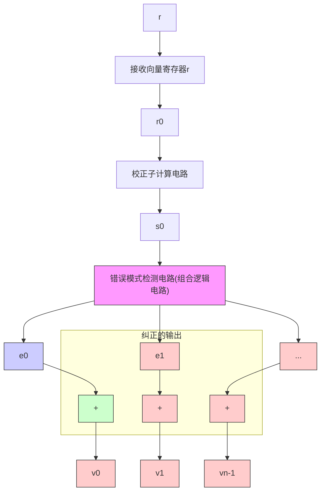
</details>

图 3-8 线性分组码的通用译码器

表 3-3 由表 3-1 所给出的 (7, 4) 线性码的可纠正错误模式的差错位的真值表

<table><tr><td colspan="3">校正子</td><td colspan="7">可纠正错误模式(陪集首)</td></tr><tr><td> $s_0$ </td><td> $s_1$ </td><td> $s_2$ </td><td> $e_0$ </td><td> $e_1$ </td><td> $e_2$ </td><td> $e_3$ </td><td> $e_4$ </td><td> $e_5$ </td><td> $e_6$ </td></tr><tr><td>0</td><td>0</td><td>0</td><td>0</td><td>0</td><td>0</td><td>0</td><td>0</td><td>0</td><td>0</td></tr><tr><td>1</td><td>0</td><td>0</td><td>1</td><td>0</td><td>0</td><td>0</td><td>0</td><td>0</td><td>0</td></tr><tr><td>0</td><td>1</td><td>0</td><td>0</td><td>1</td><td>0</td><td>0</td><td>0</td><td>0</td><td>0</td></tr><tr><td>0</td><td>0</td><td>1</td><td>0</td><td>0</td><td>1</td><td>0</td><td>0</td><td>0</td><td>0</td></tr><tr><td>1</td><td>1</td><td>0</td><td>0</td><td>0</td><td>0</td><td>1</td><td>0</td><td>0</td><td>0</td></tr><tr><td>0</td><td>1</td><td>1</td><td>0</td><td>0</td><td>0</td><td>0</td><td>1</td><td>0</td><td>0</td></tr><tr><td>1</td><td>1</td><td>1</td><td>0</td><td>0</td><td>0</td><td>0</td><td>0</td><td>1</td><td>0</td></tr><tr><td>1</td><td>0</td><td>1</td><td>0</td><td>0</td><td>0</td><td>0</td><td>0</td><td>0</td><td>1</td></tr></table>


<details>
<summary>flowchart</summary>

数字电路结构图，展示输入信号经多路加法器生成输出的结构，包含6个输入信号r0至r6及6个输出信号s0至s2
</details>

图 3-9 由表 3-1 所给出的 $(7, 4)$ 线性码的译码电路

# 3.6 BSC 上线性码的漏检误码率

如果一个 $(n,k)$ 线性码仅用于在BSC上检测差错，当已知码的重量分布时，其漏检误码率 $P_{u}(E)$ 可由公式(3-19)计算出来。线性码的重量分布与其对偶码的重量分布之间存在一种有趣的关系，这种关系通常使 $P_{u}(E)$ 的计算简化。设 $\{A_{0},A_{1},\cdots,A_{n}\}$ 为 $(n,k)$ 线性码C的重量分布， $\{B_{0},B_{1},\cdots,B_{n}\}$ 为其对偶码 $C_{d}$ 的重量分布。我们将这两个重量分布以多项式的形式表示如下：

$$
A (z) = A _ {0} + A _ {1} z + \dots + A _ {n} z ^ {n}, \quad B _ {1} (z) = B _ {0} + B _ {1} z + \dots + B _ {n} z ^ {n} \tag {3-31}
$$

则 $A(z)$ 和 $B(z)$ 有下面的等式关系：

$$
A (z) = 2 ^ {- (n - k)} (1 + z) ^ {n} B \left(\frac {1 - z}{1 + z}\right) \tag {3-32}
$$

这个恒式就是麦克威廉斯(MacWilliams)恒等式[13]。多项式 $A(z)$ 和 $B(z)$ 称为 $(n, k)$ 线性码 $C$ 及其对偶码 $C_d$ 的重量枚举式。从MacWilliams恒等式可以看出，如果已知线性码的对偶码的重量分布，则码本身的重量分布也就确定了。这给线性码的重量分布计算带来很大的灵活性。

利用 MacWilliams 恒等式，可以从其对偶码的重量分布计算出该 $(n, k)$ 线性码的漏检误码率。首先，将公式(3-19)写成如下形式：

$$
P _ {u} (E) = \sum_ {i = 1} ^ {n} A _ {i} p ^ {i} (1 - p) ^ {n - i} = (1 - p) ^ {n} \sum_ {i = 1} ^ {n} A _ {i} \left(\frac {p}{1 - p}\right) ^ {i} \tag {3-33}
$$

将 $z=p(1-p)$ 代入公式(3-31) 的 $A(z)$ 中，并利用 $A_{0}=1$ 得到下面的恒等式：

$$
A \left(\frac {p}{1 - p}\right) - 1 = \sum_ {i = 1} ^ {n} A _ {i} \left(\frac {p}{1 - p}\right) ^ {i} \tag {3-34}
$$

联立公式(3-33)和(3-34)，有下面漏检误码率的表达式：

$$
P _ {u} (E) = (1 - p) ^ {n} \left[ A \left(\frac {p}{1 - p}\right) - 1 \right] \tag {3-35}
$$

根据式(3-35)和 MacWilliams 恒等式(3-32)，我们最后得到 $P_{u}(E)$ 的如下表达式：

$$
P _ {u} (E) = 2 ^ {- (n - k)} B (1 - 2 p) - (1 - p) ^ {n} \tag {3-36}
$$

其中

$$
B (1 - 2 p) = \sum_ {i = 0} ^ {n} B _ {i} (1 - 2 p) ^ {i}
$$

因此，有两种计算线性码的漏检误码率的方法，通常总有一种方法比另一种更简单一些。如果 $n - k$ 比 $k$ 小，由公式(3-36)计算 $P_{u}(E)$ 会简单的多；否则，利用公式(3-35)会更简单。

例 3-10 考虑表 3-1 给出的 $(7, 4)$ 线性码。它的对偶码由其奇偶校验矩阵生成，有

$$
\boldsymbol {H} = \left[ \begin{array}{c c c c c c c} 1 & 0 & 0 & 1 & 0 & 1 & 1 \\ 0 & 1 & 0 & 1 & 1 & 1 & 0 \\ 0 & 0 & 1 & 0 & 1 & 1 & 1 \end{array} \right]
$$

(参见例 3-3)。取 H 行向量的线性组合，得到对偶码的如下八个向量：

$$
\begin{array}{l} (0 0 0 0 0 0 0) \quad (1 1 0 0 1 0 1) \\ (1 0 0 1 0 1 1) \quad (1 0 1 1 1 0 0) \\ (0 1 0 1 1 1 0) \quad (0 1 1 1 0 0 1) \\ (0 0 1 0 1 1 1) \quad (1 1 1 0 0 1 0) \\ \end{array}
$$

因此，对偶码的重量枚举式为 $B(z) = 1 + 7z^4$ 。利用公式（3-36），我们得到表3-1给出的(7，4)线性码的漏检误码率为

$$
P _ {u} (E) = 2 ^ {- 3} \left[ 1 + 7 (1 - 2 p) ^ {4} \right] - (1 - p) ^ {7}
$$

在 3-4 节中，也曾用码本身的重量分布计算过此概率。

理论上，可以通过检索 $(n, k)$ 线性码的 $2^{k}$ 个码字或其对偶码的 $2^{n - k}$ 个码字，然后应用MacWilliams恒等式来计算其重量分布；然而，对于较大的 $n, k$ 和 $n - k$ ，这种计算实际上无法实现。除了某些短的线性码和一小类线性码，对许多已知线性码，其重量分布仍是未知的。因此，计算这些码的漏检误码率，即使不是不可能，也是非常困难。

尽管对较大的 $n$ 和 $k$ 计算特定 $(n, k)$ 线性码的漏检误码率是很难的，但对所有 $(n, k)$ 线性系统码所组成的集合而言，得到其平均漏检误码率的上界却很简单。我们在前面已经证明，一个 $(n, k)$ 线性系统码可以由公式(3-4)形式的矩阵 $\pmb{G}$ 完全确定，子阵 $\pmb{P}$ 由 $k(n - k)$ 个元素组成。因为每个元素 $p_{ij}$ 都有可能是0或1，则共有 $2^{k(n - k)}$ 个具有公式(3-4)形式的不同的矩阵 $\pmb{G}'$ 。令 $\Gamma$ 表示由这 $2^{k(n - k)}$ 个矩阵生成的码的集合。假设我们从 $\Gamma$ 随机选取一个码，并用它来进行差错检测。令 $C_j$ 表示选中的码。则 $C_j$ 被选中的概率为

$$
P (C _ {j}) = 2 ^ {- k (n - k)} \tag {3-37}
$$

令 $A_{ji}$ 表示 $C_j$ 中重量为 $i$ 的码字的个数。根据公式(3-19)，对于 $C_j$ 码的漏检误码率为

$$
P _ {u} (E \mid C _ {j}) = \sum_ {i = 1} ^ {n} A _ {j i} p ^ {i} (1 - p) ^ {n - i} \tag {3-38}
$$

Γ 中线性码的平均漏检误码率定义为

$$
\boldsymbol {P} _ {u} (\boldsymbol {E}) = \sum_ {j = 1} ^ {| \Gamma |} P (C _ {j}) P _ {u} (E | C _ {j}) \tag {3-39}
$$

其中 $|\Gamma|$ 表示 $\Gamma$ 中码的个数。将公式(3-37)、公式(3-38)代入公式(3-39)得到

$$
\boldsymbol {P} _ {u} (\boldsymbol {E}) = 2 ^ {- k (n - k)} \sum_ {i = 1} ^ {n} p ^ {i} (1 - p) ^ {n - i} \sum_ {j = 1} ^ {| \Gamma |} A _ {j i} \tag {3-40}
$$

一个非零 n 维向量要么恰好被包含在 $\Gamma$ 的 $2^{(k-1)(n-k)}$ 个码中，要么不被包含在这些码中（证明

留作习题3-11)。由于总共有 $\binom{n}{i}$ 个重量为 $i$ 的 $n$ 维向量，则有

$$
\sum_ {j = 1} ^ {| \Gamma |} A _ {j i} \leqslant \binom {n} {i} 2 ^ {(k - 1) (n - k)} \tag {3-41}
$$

将式(3-41)代入式(3-40)，我们就得到 $(n, k)$ 线性系统码的平均漏检误码率的上界：

$$
\boldsymbol {P} _ {u} (\boldsymbol {E}) \leqslant 2 ^ {- (n - k)} \sum_ {i = 1} ^ {n} \binom {n} {i} p ^ {i} (1 - p) ^ {n - i} = 2 ^ {- (n - k)} [ 1 - (1 - p) ^ {n} ] \tag {3-42}
$$

由于 $\left[1-\left(1-p\right)^{n}\right]\leqslant1$ ，显然 $P_{u}(E)\leqslant2^{-(n-k)}$ 。

前面的结果说明，存在 $(n, k)$ 线性码，其漏检误码率 $P_{u}(E)$ 的上界为 $2^{-(n-k)}$ 。换言之，存在 $(n, k)$ 线性码，其 $P_{u}(E)$ 随校验位的位数 $n-k$ 呈指数下降。即使对于中等大小的 $n-k$ ，这些码的漏检误码率都很小。例如，令 $n-k=30$ ，存在 $(n, k)$ 线性码， $P_{u}(E)$ 的上界为 $2^{-30} \approx 10^{-9}$ 。在过去的50年中，已经构造出很多类线性码，然而只有很少类型的线性码被证明有满足上界 $2^{-(n-k)}$ 的 $P_{u}(E)$ 。现在还不知道其他已知的线性码是否满足这个上界。

后面的章节将介绍用于差错检测的好码及其在差错控制中的应用。在[12]中可以找到差错检测码的一种较为出色的处理。

# 3.7 单奇偶校验码、重复码及自偶码

单奇偶校验码(single-parity-check code, SPC code)是含一个奇偶校验位的线性分组码。设 $u = (u_0, u_1, \dots, u_{k-1})$ 为待编码的消息，则这个奇偶校验位由下式给出：

$$
p = u _ {0} + u _ {1} + \dots + u _ {k - 1} \tag {3-43}
$$

即简单地对所有消息位求模2和。将这个奇偶校验位加上 $k$ 位消息位就构成了一个 $(k + 1, k)$ 线性分组码。每个码字都具有

$$
\nu = (p, u _ {0}, u _ {1}, \dots , u _ {k - 1})
$$

的形式。由公式(3-34)，我们易知，若消息向量 u 的重量是奇数，则有 p=1；若 u 的重量是偶数，则 p=0。因此，所有 SPC 码的码字重量均为偶数，并且码的最小重量（或最小距离）为 2。系统形式的码生成矩阵为

$$
\boldsymbol {G} = \left[ \begin{array}{c c c c c c c} 1 & 1 & 0 & 0 & 0 & \dots & 0 \\ 1 & 0 & 1 & 0 & 0 & \dots & 0 \\ 1 & 0 & 0 & 1 & 0 & \dots & 0 \\ \vdots & & & \vdots & & \\ 1 & 0 & 0 & 0 & 0 & \dots & 1 \end{array} \right] = \left[ \begin{array}{c c c} 1 & & \\ 1 & & \\ 1 & & \boldsymbol {I} _ {k} \\ \vdots & & \\ 1 & & \end{array} \right] \tag {3-44}
$$

由式(3-44)，我们发现该码的奇偶校验矩阵为

$$
\boldsymbol {H} = [ 1 1 \dots 1 ] \tag {3-45}
$$

由于所有码字重量为偶数，SPC 码也称为偶校验码。SPC 码常用于简单的差错检测。任何含奇数个差错的错误模式都会使码字变为一个奇数重量的接收向量，并非一个码字。因此，接收向量的校正子不为零。相应的，所有奇数重量的错误模式都是可检测的。

一个长度为 n 的重复码是 $(n, 1)$ 线性分组码，只有两种码字，即全零码字 $(0, 0, \cdots, 0)$ 和全一码字 $(1, 1, \cdots, 1)$ 。该码可通过简单重复单个信息比特 n 次而得到。码的生成矩阵是

$$
\boldsymbol {G} = [ 1 1 \dots 1 ] \tag {3-46}
$$

从公式(3-44)到公式(3-46)我们容易看出， $(n,1)$ 重复码和 $(n,n-1)$ 单奇偶校验码互为对偶码。

在后面的章节将会看到，在构造高效长码时常常用单奇偶校验码和重复码作为其中的一个部分。

等于其对偶码 $C_d$ 的线性分组码 $C$ 被称为自偶码 (self-dual code)。对于一个自偶码，码长 $n$ 必为偶数，并且码的维数 $k$ 必然等于 $n/2$ 。因此，其码率 $R$ 等于 $\frac{1}{2}$ 。令 $G$ 为自偶码 $C$ 的生成矩阵，则 $G$ 也是其自偶码 $C_d$ 的生成矩阵，从而还是 $C$ 的奇偶校验矩阵。所以，

$$
\boldsymbol {G} \cdot \boldsymbol {G} ^ {\mathrm{T}} = \boldsymbol {0} \tag {3-47}
$$

假设 G 具有系统形式， $G = [P \quad I_{n/2}]$ 。根据公式(3-47)，我们容易看出

$$
\boldsymbol {P} \cdot \boldsymbol {P} ^ {\mathrm{T}} = \boldsymbol {I} _ {n / 2} \tag {3-48}
$$

反之，如果一个码率为 $\frac{1}{2}$ 的 $(n, n/2)$ 线性分组码C满足公式(3-47)[或者公式(3-48)]的条件，则该码是自偶码(证明作为习题3-19)。

例 3-11 考虑由如下矩阵生成的(8, 4)线性分组码

$$
\boldsymbol {G} = \left[ \begin{array}{c c c c c c c c} 1 & 1 & 1 & 1 & 1 & 1 & 1 & 1 \\ 0 & 0 & 0 & 0 & 1 & 1 & 1 & 1 \\ 0 & 0 & 1 & 1 & 0 & 0 & 1 & 1 \\ 0 & 1 & 0 & 1 & 0 & 1 & 0 & 1 \end{array} \right]
$$

该码的码率 $R=\frac{1}{2}$ 。容易验证 $G \cdot G^{T}=0$ 。因此，它是一个自偶码。

存在很多好的自偶码，但是最著名的自偶码是(24，12)格雷码，该码将在第4章中讨论。

# 习题

3-1 考虑一个(8, 4)系统码，其奇偶校验方程为

$$
v _ {0} = u _ {1} + u _ {2} + u _ {3}, \quad v _ {1} = u _ {0} + u _ {1} + u _ {2}, \quad v _ {2} = u _ {0} + u _ {1} + u _ {3}, \quad v _ {3} = u _ {0} + u _ {2} + u _ {3}
$$

其中 $u_{0}$ 、 $u_{1}$ 、 $u_{2}$ 和 $u_{3}$ 是消息位， $v_{0}$ 、 $v_{1}$ 、 $v_{2}$ 和 $v_{3}$ 是奇偶校验位。求此码的生成矩阵和奇偶校验矩阵。解析地证明此码的最小距离是4。

3-2 构造习题 3-1 所给出码的编码器。  
3-3 构造习题 3-1 所给出码的校正子电路。  
3-4 设 H 是一个 $(n, k)$ 线性码 C 的奇偶校验矩阵，其码字的重量既有奇数也有偶数。采用如下奇偶校验矩阵，构造新的线性码 $C_{1}$ ：

$$
\boldsymbol {H} _ {1} = \left[ \begin{array}{c c c c c} 0 & & & & \\ 0 & & & & \\ \vdots & & & \boldsymbol {H} & \\ 0 & & & & \\ \hdashline 1 & 1 & 1 & \dots & 1 \end{array} \right]
$$

(注： $H_{1}$ 的最后一行为全1)

1) 证明 $C_{1}$ 是 $(n + 1, k)$ 线性码，称 $C_{1}$ 为 $C$ 的扩展码 (extension code)。  
2) 证明 $C_{1}$ 的每个码字均为偶数重量。  
3) 证明 $C_{1}$ 可以通过在 $C$ 每个码字 $\pmb{v}$ 的左边额外增加一个奇偶校验位 $v_{\infty}$ 来得到：(1) 若 $\pmb{v}$ 的重量为奇数，则 $v_{\infty} = 1$ ；(2) 若 $\pmb{v}$ 的重量为偶数，则 $v_{\infty} = 0$ 。奇偶校验位 $v_{\infty}$ 被称为全局奇偶校验位 (overall parity-check digit)。

3-5 设 $C$ 为线性码，其码字重量既有奇数又有偶数。证明偶数重量码字的个数等于奇数重量码字的个数。  
3-6 考虑一个 $(n, k)$ 线性码 C，其生成矩阵 G 没有全零列。将 C 的所有码字排列成 $2^{k} \times n$ 的矩阵。

1) 证明矩阵中不含全零列。  
2) 证明矩阵的每一列含有 $2^{k-1}$ 个 0 和 $2^{k-1}$ 个 1。  
3) 证明在某个特定分量上为 0 的所有码字构成 C 的一个子空间，并求该子空间的维数。

3-7 证明汉明距离满足三角不等式，即对 $GF(2)$ 上的三个 $n$ 维向量 $x$ 、 $y$ 和 $z$ ，证明

$$
d (x, y) + d (y, z) \geqslant d (x, z)
$$

3-8 证明：对于一个线性码，若其最小距离 $d_{\min} \geqslant \lambda + l + 1$ ，则可以纠正不超过 $\lambda$ 个差错，同时可以检测不超过 $l(l > \lambda)$ 个差错。  
3-9 确定习题 3-1 中给出的 (8, 4) 线性码的重量分布。设 BSC 的转移概率 $p = 10^{-2}$ ，计算该码的漏检误码率。  
3-10 习题3-1给出的(8,4)线性码的最小距离为4，则它能纠正所有含单个差错的错误模式，同时能检测任意两个差错的组合。构造该码的译码器，此译码器必须能纠正任何单个差错和检测任何两个差错。  
3-11 令 $\Gamma$ 是所有二进制 $(n, k)$ 线性系统码的集合。证明：一个非零二进制 $n$ 维向量 $\pmb{\nu}$ 要么恰好含于 $\Gamma$ 的 $2^{(k-1)(n-k)}$ 个码字中，要么不在 $\Gamma$ 的任一码字中。  
3-12 习题 3-1 给出的(8, 4)线性码可以纠正 16 个错误模式(标准阵的陪集首)。假定该码用在 BSC 信道传输中，根据查表译码法设计此码的译码器。译码器被设计为纠正 16 个最可能的错误模式。  
3-13 设 $C_1$ 为 $(n_1, k)$ 线性系统码，其最小距离为 $d_1$ 、生成矩阵 $G_1 = [P_1 - I_k]$ ； $C_2$ 为 $(n_2, k)$ 线性系统码，其最小距离为 $d_2$ 、生成矩阵 $G_2 = [P_2 - I_k]$ 。考虑一个 $(n_1 + n_2, k)$ 线性码，其奇偶校验矩阵如下：

$$
\boldsymbol {H} = \left[ \begin{array}{l l} & \boldsymbol {P} _ {1} ^ {\mathrm{T}} \\ \boldsymbol {I} _ {n _ {1} + n _ {2} - k} & \boldsymbol {I} _ {k} \\ & \boldsymbol {P} _ {2} ^ {\mathrm{T}} \end{array} \right]
$$

证明该码的最小距离至少为 $d_{1} + d_{2}$ 。

3-14 证明题 3-1 中的 (8, 4) 线性码是自偶码。  
3-15 对于最小距离(或最小重量)为 $2t + 1$ 或者更大的任意二进制 $(n, k)$ 线性码，证明奇偶校验位的个数满足下述不等式

$$
n - k \geqslant \log_ {2} \left[ 1 + \binom {n} {1} + \binom {n} {2} + \dots + \binom {n} {t} \right]
$$

上述不等式给出了 $(n, k)$ 线性码随机差错纠正能力t的一个上界。这个上界被称为汉明界(Hamming bound)[14]。(提示：对于最小距离为 $2t+1$ 或者更大的 $(n, k)$ 线性码，所有重量不大于t的n维向量均可被用做标准阵中的陪集首。)

3-16 证明 $(n, k)$ 线性码的最小距离 $d_{\min}$ 满足下述不等式：

$$
d _ {\min} \leqslant \frac {n \cdot 2 ^ {k - 1}}{2 ^ {k} - 1}
$$

(提示：利用习题 3-6(b) 的结果。这个上界被称为普洛特金界 (Plotkin bound) $^{[1]-[3]}$ 。)

3-17 证明：如果有

$$
\sum_ {i = 1} ^ {d - 1} \binom {n} {i} <   2 ^ {n - k}
$$

则存在一个 $(n, k)$ 线性码，其最小距离至少为d。

(提示：利用题 3-11 的结果以及重量不大于 d-1 的非零 n 维向量至多存在于

$$
\left\{\sum_ {i = 1} ^ {d - 1} \binom {n} {i} \right\} \cdot 2 ^ {(k - 1) (n - k)}
$$

个 $(n, k)$ 线性系统码中。)

3-18 证明：存在一个 $(n, k)$ 线性码，其最小距离至少为 $d_{\min}$ ，而 $d_{\min}$ 满足下面不等式

$$
\sum_ {i = 1} ^ {d _ {\min} - 1} \binom {n} {i} <   2 ^ {n - k} \leqslant \sum_ {i = 1} ^ {d _ {\min}} \binom {n} {i}
$$

(提示：参见题3-17。第二个不等式提供了一个 $(n, k)$ 线性码所能达到的最小距离的下界，该下界被称为 Varshamov-Gilbert 界 $^{[1]-[3]}$ 。)

3-19 考虑码率为 $\frac{1}{2}$ 的 $(n, n/2)$ 的线性分组码 C，其生成矩阵为 G。证明：如果 $G \cdot G^{T} = 0$ ，则码 C 是自偶码。  
3-20 只使用一个存储单元(触发器)和一个异或门(或模2加法器)来设计(n, n-1)单奇偶校验码的译码器。

# 参考文献

[1] E R Berlekamp, Algebraic Coding Theory, McGraw-Hill, New York, 1968; Rev. ed., Aegean Park Press, Laguna Hills, N. Y., 1984   
[2] W W Peterson and E J Weldon, Jr, Error-Correcting Codes, 2d ed., MIT Press, Cambridge, 1972   
[3] F J MacWilliams and J J A Sloane, The Theory of Error-Correcting Codes, North Holland, Amsterdam, 1977   
[4] R J McEliece, The Theory of Information and Coding, Addison-Wesley, Reading, Mass., 1977   
[5] G Clark and J Cain, Error-Correcting Codes for Digital Communications, Plenum Press, New York, 1981   
[6] R E Blahut, Algebraic Codes for Data Transmission, Cambridge University Press, Cambridge, UK, 2003   
[7] A M Michelson and A H Levesque, Error Control Techniques for Digital Communication, John Wiley & Sons, New York, 1985   
[8] T R N Rao and E Fujiwara, Error-Correcting Codes for Computer Systems, Prentice Hall, Englewood Cliffs, N. J., 1989   
[9] S A Vanstone and P C van Oorschot, An Introduction to Error Correcting Codes with Applications, Kluwer Academic, Boston, Mass., 1989   
[10] A Poli and L Huguet, Error Correcting Codes, Theory and Applications, Prentice Hall, Hemel Hempstead, UK, 1992   
[11] S B Wicker, Error Control Systems for Digital Communication and Storage, Prentice Hall, Englewood Cliffs, N. J., 1995   
[12] T Klove and V I Korzhik, Error Detecting Codes, Kluwer Academic, Boston, Mass., 1995   
[13] F J MacWilliams, “A Theorem on the Distribution of Weights in a Systematic Codes,” Bell Syst. Tech. J. 42: 79-94, 1963   
[14] R W Hamming, "Error Detecting and Error Correcting Codes," Bell Syst. Tech. J. 29: 147-160, April 1950


<details>
<summary>text_image</summary>

歲中祝
祝
</details>

# 第 4 章 重要的线性分组码

本章描述了在纠错码发展早期发现的几类重要的线性分组码。香农在其具有里程碑意义的论文中指出，通过适当的信息编码，可以在不损失信息传输速率或存储速率的条件下，将有噪信道或存储媒质引起的差错降至任意低的水平。在香农发表该论文后两年，汉明(Richard W. Hamming)于1950年发现了第一类用于纠错的线性分组码 $^{[1]}$ 。汉明码的最小距离为3，因此可以纠正码分组长度范围中的任何单个差错。汉明码的重量枚举式已经广为人知。汉明码是一种完备码(perfect codes)，可简单地通过查表机制来译码。适当地缩短汉明码，可以得到最小距离为4、纠单个差错并检测两个差错的好码。由于码率高并且译码简单，汉明码及其缩短码在近几年广泛应用于数字通信和数据存储系统中的差错控制。

在早期构造的用于纠错检错的第二类线性分组码是里德-穆勒码。里德-穆勒码是穆勒(David E. Muller)为交换电路的设计和差错检测而于1954年首先 $^{[9]}$ 提出的。同样在1954年 $^{[10]}$ ，里德(Irwin S. Reed)用新的形式表示该码，将其应用于通信和数据存储系统来进行纠错和检错，并设计出该码的第一个译码算法。里德-穆勒码构成了一大类能够纠正多个随机错误的码。这些码构造简单并且具有丰富的结构特性，可以采用各种软判决或硬判决算法进行译码。里德-穆勒码的Reed译码算法是一种大数逻辑算法，其实现非常简单。里德-穆勒码的一些软判决译码算法也已经被设计出来，它们能够在很低的译码复杂度条件下得到很好的误码性能。

在本章中，还给出了最小距离为8的(24，12)格雷码。该码有很多引人注目的结构特性，并为很多编码理论家和数学家所广泛研究，它已被应用在很多通信系统中进行差错控制，特别是美国的空间通信工程。

本章还阐述了其他几种码构造方法。这些构造方法允许我们用短的分量码来构造长的、高效的码。

# 4.1 汉明码

对任意正整数 $m \geqslant 3$ ，存在具有如下参数的汉明码：

码长： $n = 2^{m} - 1$

信息符号数： $k=2^{m}-m-1$

校验符号数： $n - k = m$

纠错能力： $t=1(d_{\min}=3)$

该码的奇偶校验矩阵 H 由所有的非零 m 维向量作为列向量所构成。在系统形式下，H 的列向量被安排成如下形式：

$$
\boldsymbol {H} = \left[ \begin{array}{l l} \boldsymbol {I} _ {m} & \boldsymbol {Q} \end{array} \right]
$$

其中 $I_{m}$ 是一个 $m \times m$ 的单位矩阵，子阵 $\pmb{Q}$ 由 $2^{m} - m - 1$ 个重量不小于2的 $m$ 维向量作为列向量所构成。例如，令 $m = 3$ ，则长为7的汉明码的奇偶校验矩阵可写成如下形式

$$
\boldsymbol {H} = \left[ \begin{array}{c c c c c c c} 1 & 0 & 0 & 1 & 0 & 1 & 1 \\ 0 & 1 & 0 & 1 & 1 & 1 & 0 \\ 0 & 0 & 1 & 0 & 1 & 1 & 1 \end{array} \right]
$$

这是表 3-1 给出的(7, 4)线性码的奇偶校验矩阵(参见例 3-3)。因此，表 3-1 给出的码是一个汉明码。Q 的各个列向量可以按任意顺序排列而不影响码的距离特性和重量分布。在系统形式下，码的生成矩阵是

$$
\boldsymbol {G} = \left[ \begin{array}{c c} \boldsymbol {Q} ^ {\mathrm{T}} & \boldsymbol {I} _ {2 ^ {m} - m - 1} \end{array} \right]
$$

其中 $Q^{T}$ 是 Q 的转置， $I_{2^{m}-m-1}$ 是 $(2^{m}-m-1)\times(2^{m}-m-1)$ 的单位矩阵。

由于 $\pmb{H}$ 的列向量非零且各不相同，所以任何两列相加和不为零。由推论3-2-1知，汉明码的最小距离至少为3。因为 $\pmb{H}$ 由所有非零 $m$ 维向量作为其列向量所构成，则任意两个列向量 $(\pmb{h}_i$ 和 $\pmb{h}_j)$ 的向量和一定仍为 $\pmb{H}$ 的列向量，记为 $\pmb{h}_l$ 。因此，

$$
\boldsymbol {h} _ {i} + \boldsymbol {h} _ {j} + \boldsymbol {h} _ {l} = 0
$$

由推论3-2-2可知，该汉明码的最小距离就是3。因此，该码能够纠正所有含单个差错的错误模式或者检测含两个或更少差错的错误模式。

如果我们列出码长为 $2^{m} - 1$ 的汉明码的标准阵，则所有的重量为1的 $(2^{m} - 1)$ 维向量均可用来作为陪集首(定理3-5)。重量为1的 $(2^{m} - 1)$ 维向量共有 $2^{m} - 1$ 个。由于 $n - k = m$ 则该码有 $2^{m}$ 个陪集。因此，零向量0和重量为1的 $(2^{m} - 1)$ 维向量构成了标准阵的所有陪集首。所以，一个汉明码只能纠正含单个差错的错误模式而无法纠正其他的错误模式。这是一个非常有趣的结构。如果一个可纠 $t$ 个差错的码，其标准阵的陪集首全是含有 $t$ 个或更少差错的错误模式而没有其他错误模式，则该码就被称为是一个完备码(perfect code)。因此，汉明码构成了一类可纠单个差错的完备码[2]。完备码是很罕见的，除了汉明码，仅有一类非平凡的二进制完备码，即(23，12)格雷码(见5-9节)[3]-[5]。

汉明码可以很容易地采用3.5节描述的查表机制进行译码。码长为 $2^{m}-1$ 的汉明码的译码器可以采用和例3-9所给出的(7,4)汉明码的译码器一样的方式实现。

我们可以从汉明码的奇偶校验矩阵 H 中删除任意 l 列，删除后得到一个 $m \times (2^{m} - l - 1)$ 的矩阵 $H'$ 。以 $H'$ 作为奇偶校验矩阵，我们就得到一个缩短的汉明码，其参数如下：

码长： $n = 2^{m} - l - 1$

信息符号数： $k=2^{m}-m-l-1$

校验符号数： $n - k = m$

纠错能力： $d_{\mathrm{min}}\geqslant 3$

如果适当地删除 H 中的列，我们可以得到一个最小距离为 4 的缩短汉明码。例如，从子阵 Q 中删除所有偶数重量的列向量，我们得到一个 $m \times 2^{m-1}$ 的矩阵，

$$
\boldsymbol {H} ^ {\prime} = \left[ \begin{array}{c c} \boldsymbol {I} _ {m} & \boldsymbol {Q} ^ {\prime} \end{array} \right]
$$

其中 $Q'$ 由 $2^{m-1}-m$ 个具有奇数重量的列组成。由于 $H'$ 的所有列向量都是奇数重量，则任何三个列向量的和不为零；然而对于 $Q'$ 中重量为 3 的列向量 $h_{i}$ ，存在 $I_{m}$ 中的三个列向量 $h_{j}$ 、 $h_{l}$ 和 $h_{s}$ ，使得 $h_{i}+h_{j}+h_{l}+h_{s}=0$ 。因此，以 $H'$ 作为奇偶校验矩阵的缩短汉明码的最小距离就是 4。

距离为 4 的缩短汉明码可用于纠正所有含单个差错的错误模式并同时检测出所有含两个差错的错误模式。当一个码向量在传输过程中出现了单个差错时，将导致其校正子不为零，并包含奇数个 1；然而，当发生两个差错时，校正子仍不为零，但却包含偶数个 1。基于上面的事实，可按如下步骤实现译码：

1) 如果校正子 s 是零，则认为没有差错出现。

2) 如果 $s$ 非零并含奇数个 1，则认为发生了单个差错。将对应于 $s$ 的含单个差错的错误模式加到接收向量上以纠正此差错。

3) 如果 s 非零并含偶数个 1，则检测到一个不可纠正的错误模式。

码长为 $n=2^{m}-1$ 的汉明码的重量分布是已知的 [2]。重量为 i 的码向量的个数 $A_{i}$ 就是

下面多项式展开式中 $z^i$ 项的系数：

$$
A (z) = \frac {1}{n + 1} \left\{\left(1 + z\right) ^ {n} + n (1 - z) \left(1 - z ^ {2}\right) ^ {(n - 1) / 2} \right\} \tag {4-1}
$$

该多项式就是汉明码的重量枚举式。

例 4-1 设 m=3，则 $n=2^{3}-1=7$ ，(7,4) 汉明码的重量枚举式为

$$
A (z) = \frac {1}{8} \left\{\left(1 + z\right) ^ {7} + 7 (1 - z) \left(1 - z ^ {2}\right) ^ {3} \right\} = 1 + 7 z ^ {3} + 7 z ^ {4} + z ^ {7}
$$

因此，(7，4)汉明码的重量分布为 $A_{0}=1$ ， $A_{3}=A_{4}=7$ ， $A_{7}=1$ 。

$(2^{m} - 1, 2^{m} - m - 1)$ 汉明码的对偶码是 $(2^{m} - 1, m)$ 线性码。该码的重量分布十分简单，它包含全零码字和所有 $2^{m} - 1$ 个重量为 $2^{m - 1}$ 的码字。因此，它的重量枚举式为

$$
B (z) = 1 + \left(2 ^ {m} - 1\right) z ^ {2 m - 1} \tag {4-2}
$$

如果汉明码用于 BSC 的差错检测，则发生漏检差错的概率 $P_{u}(E)$ 可由公式(3-35)和(4-1)或者公式(3-36)和(4-2)计算得到。其中，通过公式(3-36)和(4-2)计算 $P_{u}(E)$ 要容易一些。联立式(3-36)和(4-2)，我们得到

$$
P _ {u} (E) = 2 ^ {- m} \left\{1 + \left(2 ^ {m} - 1\right) (1 - 2 p) ^ {2 ^ {m - 1}} \right\} - (1 - p) ^ {2 ^ {m - 1}} \tag {4-3}
$$

当 $p \leqslant \frac{1}{2}$ 时，利用公式(4-3)给出的表达式，可以证明汉明码的漏检误码率 $P_{u}(E)$ 满足上界 $2^{-(n-k)} = 2^{-m}$ （即 $P_{u}(E) \leqslant 2^{-m}$ ）[6, 7]（见习题4-3）。因此，汉明码是一个好的差错检测码。

# 4.2 一类纠单个差错并检测两个差错的码

纠单个差错并检测两个差错(single-error-correcting and double-error-detecting, SEC-DED)的编码广泛地应用于通信和计算机存储系统的差错控制中。本节介绍了一类SEC-DED码，它适合且通常被用于提高计算机存储器的可靠性。这一类码是由M.Y.肖(Hsiao) $^{[8]}$ 构造的。其最重要的特征在于译码处理中的快速译码和差错检测，这对于严格要求实时处理的存储操作是最关键的。

拥有前述特征的 SEC-DED 码可以通过前面一节所述的缩短汉明码的方法来构造。首先，构造一个码长为 $2^{m} - 1$ 、最小距离为 3 的汉明码。令 $\pmb{H}$ 为该码的奇偶校验矩阵。从 $\pmb{H}$ 中删除列向量，使得新的奇偶校验矩阵 $\pmb{H}_0$ 满足下面的要求：

1) 每列有奇数个 1。  
2) $H_{0}$ 矩阵中 1 的总个数应该最小。

3) $H_{0}$ 每一行中1的个数都应该相等，若不然也要尽可能接近平均数（即 $H_{0}$ 中所有1的个数除以行数）。

第一个要求保证由 $H_{0}$ 生成的码的最小距离至少为 4，从而它可用于纠正单个差错并检测两个差错。第二和第三个要求使得在构造校验位和校正子时，获得最小的逻辑层次并且实现该码的硬件更少。Hsiao[8] 提供了一种构造 $H_{0}$ 的算法并找到一些最优的 SEC-DED 码。图 4-1 给出了几个消息（或数据）长度为 16、32 和 64 的系统形式的奇偶校验矩阵。表 4-1 则给出了 Hsiao 码的参数列表。

在计算机应用中，这些码是以并行方式进行编码和译码的。编码时，消息比特并行进入编码电路，与此同时生成奇偶校验比特；译码时，接收比特并行进入译码电路，与此同时生成校正子比特，并且接收到的比特也以并行的方式得到纠正。单个差错的纠正可以由例3-9描述的查表译码法来实现。两个差错的检测是通过计算校正子向量s中1的个数来实现的。如果校正子s有偶数个1，那么含两个差错或者更多的偶数个差错的错误模式出现。

表 4-1 Hsiao 码的参数列表

<table><tr><td>n</td><td>k</td><td>n-k</td><td>H中1的总数</td><td>每行1的平均数</td><td>n</td><td>k</td><td>n-k</td><td>H中1的总数</td><td>每行1的平均数</td></tr><tr><td>12</td><td>8</td><td>4</td><td>16</td><td>4</td><td>72</td><td>64</td><td>8</td><td>216</td><td>27</td></tr><tr><td>14</td><td>9</td><td>5</td><td>32</td><td>6.4</td><td>80</td><td>72</td><td>8</td><td>256</td><td>32</td></tr><tr><td>15</td><td>10</td><td>5</td><td>35</td><td>7</td><td>88</td><td>80</td><td>8</td><td>296</td><td>37</td></tr><tr><td>16</td><td>11</td><td>5</td><td>40</td><td>8</td><td>96</td><td>88</td><td>8</td><td>336</td><td>42</td></tr><tr><td>22</td><td>16</td><td>6</td><td>54</td><td>9</td><td>104</td><td>96</td><td>8</td><td>376</td><td>47</td></tr><tr><td>26</td><td>20</td><td>6</td><td>66</td><td>11</td><td>112</td><td>104</td><td>8</td><td>416</td><td>52</td></tr><tr><td>30</td><td>24</td><td>6</td><td>86</td><td>14.3</td><td>120</td><td>112</td><td>8</td><td>456</td><td>57</td></tr><tr><td>39</td><td>32</td><td>7</td><td>103</td><td>14.7</td><td>128</td><td>120</td><td>8</td><td>512</td><td>64</td></tr><tr><td>43</td><td>36</td><td>7</td><td>117</td><td>16.7</td><td>130</td><td>121</td><td>9</td><td>446</td><td>49.6</td></tr><tr><td>47</td><td>40</td><td>7</td><td>157</td><td>22.4</td><td>137</td><td>128</td><td>9</td><td>481</td><td>53.5</td></tr><tr><td>55</td><td>48</td><td>7</td><td>177</td><td>25.3</td><td></td><td></td><td></td><td></td><td></td></tr></table>

考虑图 4-1c 给出的(72, 64)SEC-DED 码的奇偶校验矩阵，每行包含 27 个 1。如果用三输入的异或门来构造校正子比特，则每个校正子比特由三层树状共 13 个异或门生成。生成 8 个校正子比特的 8 个异或树完全相同，这为纠错过程中提供了一致和最小的延时。

$$
\boldsymbol {H} _ {0} = \left[ \begin{array}{l} 1 0 0 0 0 0 1 0 0 1 1 0 0 1 0 0 1 1 1 1 0 0 \\ 0 1 0 0 0 0 0 0 1 1 1 1 1 0 1 0 0 0 1 0 1 0 \\ 0 0 1 0 0 0 1 1 1 0 1 1 1 0 0 1 1 0 0 0 0 0 \\ 0 0 0 1 0 0 1 1 1 0 0 0 0 1 1 1 0 1 0 0 0 1 \\ 0 0 0 0 1 0 0 0 0 1 0 0 1 1 1 1 0 0 0 1 1 1 \\ 0 0 0 0 0 1 0 1 0 0 0 1 0 0 0 0 1 1 1 1 1 1 \end{array} \right]
$$

a)

$$
\boldsymbol {H} _ {0} = \left[ \begin{array}{l} 1 0 0 0 0 0 0 1 0 0 0 1 0 1 0 1 0 0 0 0 0 1 0 0 0 0 0 1 1 1 1 0 0 0 1 1 0 1 1 \\ 0 1 0 0 0 0 0 0 0 0 1 0 0 0 0 0 0 0 1 1 1 1 1 0 1 1 1 0 0 0 1 0 1 1 0 0 0 0 1 \\ 0 0 1 0 0 0 0 0 0 0 1 0 1 1 0 1 1 1 1 0 0 0 0 1 0 0 1 0 0 1 0 1 0 1 0 0 1 1 0 \\ 0 0 0 1 0 0 0 1 1 1 1 1 1 1 1 0 0 0 0 0 0 0 1 1 0 1 0 0 1 0 0 0 1 0 0 0 1 0 0 \\ 0 0 0 0 1 0 0 0 1 1 0 1 1 0 0 1 1 1 1 1 1 1 1 0 0 0 0 1 0 0 0 0 0 0 0 1 0 0 0 \\ 0 0 0 0 0 1 0 0 0 1 0 0 0 0 1 0 0 1 0 0 1 0 0 1 1 1 1 1 1 1 1 1 0 0 1 0 0 0 0 \\ 0 0 0 0 0 0 1 1 1 0 0 0 0 0 1 0 1 0 0 1 0 0 0 0 1 0 0 0 0 0 0 1 1 1 1 1 1 1 1 \end{array} \right]
$$

b)

$$
\boldsymbol {H} _ {0} = \left[ \begin{array}{c c c c c c c c c} 0 1 0 0 0 0 0 0 & 0 1 1 0 0 1 0 0 & 1 1 1 1 1 1 1 1 & 0 0 0 0 0 1 1 1 & 0 0 1 1 1 0 0 0 & 1 1 0 0 1 0 0 0 & 0 0 0 0 1 0 0 0 & 0 0 0 0 1 0 0 1 & 1 0 0 1 0 0 1 0 \\ 0 0 1 0 0 0 0 0 & 1 0 0 1 0 0 1 0 & 0 1 1 0 0 1 0 0 & 1 1 1 1 1 1 1 1 & 0 0 0 0 0 1 1 1 & 0 0 1 1 1 0 0 0 & 1 1 0 0 1 0 0 0 & 0 0 0 0 1 0 0 0 & 0 0 0 0 1 0 0 1 \\ 0 0 0 1 0 0 0 0 & 0 0 0 0 1 0 0 1 & 1 0 0 1 0 0 1 0 & 0 1 1 0 0 1 0 0 & 1 1 1 1 1 1 1 1 & 0 0 0 0 0 1 1 1 & 0 0 1 1 1 0 0 0 & 1 1 0 0 1 0 0 0 & 0 0 0 0 1 0 0 0 \\ 0 0 0 0 1 0 0 0 & 0 0 0 0 1 0 0 0 & 0 0 0 0 1 0 0 1 & 1 0 0 1 0 0 1 0 & 0 1 1 0 0 1 0 0 & 1 1 1 1 1 1 1 1 & 0 0 0 0 0 1 1 1 & 0 0 1 1 1 0 0 0 & 0 0 0 0 1 0 0 0 \\ 0 0 0 0 0 1 0 0 & 1 1 0 0 1 0 0 0 & 0 0 0 0 1 0 0 0 & 0 0 0 0 1 0 0 1 & 1 0 0 1 0 0 1 0 & 0 1 1 0 0 1 0 0 & 1 1 1 1 1 1 1 1 & 0 0 0 0 0 1 1 1 & 1 1 0 0 1 0 0 0 \\ 0 0 0 0 0 0 1 0 & 0 0 1 1 1 0 0 0 & 1 1 0 0 1 0 0 0 & 0 0 0 0 1 0 0 0 & 0 0 0 0 1 0 0 1 & 1 0 0 1 0 0 1 0 & 0 1 1 0 0 1 0 0 & 1 1 1 1 1 1 1 1 & 0 0 0 0 0 1 1 1 \\ 0 0 0 0 0 0 0 1 & 0 0 0 0 0 1 1 1 & 0 0 1 1 1 0 0 0 & 1 1 0 0 1 0 0 0 & 0 0 0 0 1 0 0 0 & 0 0 0 0 1 0 0 1 & 1 0 0 1 0 0 1 0 & 0 1 1 0 0 1 0 0 & 1 1 1 1 1 1 1 1 \end{array} \right]
$$

c)

$$
\boldsymbol {H} _ {0} = \left[ \begin{array}{c c c c c c c c c} 1 0 0 0 0 0 0 0 & 1 1 1 1 1 1 1 1 & 0 0 0 0 1 1 1 1 & 0 0 0 0 1 1 1 1 & 0 0 0 0 1 1 0 0 & 0 1 1 0 1 0 0 0 & 1 0 0 0 1 0 0 0 & 1 0 0 0 1 0 0 0 & 1 0 0 0 0 0 0 0 \\ 0 1 0 0 0 0 0 0 & 1 1 1 1 0 0 0 0 & 1 1 1 1 1 1 1 1 & 0 0 0 0 0 0 0 0 & 1 1 1 1 0 0 1 1 & 0 1 1 0 0 1 0 0 & 0 1 0 0 0 1 0 0 & 0 1 0 0 0 1 0 0 & 0 1 0 0 0 0 0 0 \\ 0 0 1 0 0 0 0 0 & 0 0 1 1 0 0 0 0 & 1 1 1 1 0 0 0 0 & 1 1 1 1 1 1 1 1 & 0 0 0 0 1 1 1 1 & 0 0 0 0 0 0 1 0 & 0 0 1 0 0 0 1 0 & 0 0 1 0 0 0 1 0 & 0 0 1 0 0 1 1 0 \\ 0 0 0 1 0 0 0 0 & 1 1 0 0 1 1 1 1 & 0 0 0 0 0 0 0 0 & 1 1 1 1 0 0 0 0 & 1 1 1 1 1 1 1 1 & 0 0 0 0 0 0 0 1 & 0 0 0 1 0 0 0 1 & 0 0 0 1 0 0 0 1 & 0 0 0 1 0 1 1 0 \\ 0 0 0 0 1 0 0 0 & 0 1 1 0 1 0 0 0 & 1 0 0 0 1 0 0 0 & 1 0 0 0 1 0 0 0 & 1 0 0 0 0 0 0 0 & 1 1 1 1 1 1 1 1 & 0 0 0 0 1 1 1 1 & 0 0 0 0 0 0 0 0 & 1 1 1 1 0 0 1 1 \\ 0 0 0 0 0 1 0 0 & 0 1 1 0 0 1 0 0 & 0 1 0 0 0 1 0 0 & 0 1 0 0 0 1 0 0 & 0 1 0 0 0 0 0 0 & 1 1 1 1 0 0 0 0 & 1 1 1 1 1 1 1 1 & 0 0 0 0 1 1 1 1 & 0 0 0 0 1 1 0 0 \\ 0 0 0 0 0 0 1 0 & 0 0 0 0 0 0 1 0 & 0 0 1 0 0 0 1 0 & 0 0 1 0 0 0 1 0 & 0 0 1 0 0 1 1 0 & 1 1 0 0 1 1 1 1 & 0 0 0 0 0 0 0 0 & 1 1 1 1 1 1 1 1 & 0 0 0 0 1 1 1 1 \\ 0 0 0 0 0 0 0 1 & 0 0 0 0 0 0 0 1 & 0 0 0 1 0 0 0 1 & 0 0 0 1 0 0 0 1 & 0 0 0 1 0 1 1 0 & 0 0 1 1 0 0 0 0 & 1 1 1 1 0 0 0 0 & 1 1 1 1 0 0 0 0 & 1 1 1 1 1 1 1 1 \end{array} \right]
$$

d)

图 4-1 SEC-DED 码的奇偶校验矩阵

a) 一个最优的(22,16)SEC-DED码的奇偶校验矩阵；b) 一个最优的(39,32)SEC-DED码的奇偶校验矩阵；c) 一个最优的(72,64)SEC-DED码的奇偶校验矩阵；d) 另一个最优的(72,64)SEC-DED码的奇偶校验矩阵。

<!-- --- chunk --- -->

<!-- source: 80-95.md -->
# 4.3 里德-穆勒码

里德-穆勒码（Reed-Muller，RM）码是一类纠正多个差错的编码。这种码是Muller于1954年发现的 $^{[9]}$ ，但其第一个译码算法是由Reed于同一年设计出来的 $^{[10]}$ 。这类码构造简单，结构特性丰富，可以简单地通过采用软判决或硬判决算法的好几种方式来进行译码。

对于任意整数 $m$ 和 $r, 0 \leqslant r \leqslant m$ ，存在一个二进制 $r$ 阶 RM 码，记为 RM $(r, m)$ ，其参数如下：

码长： $n = 2^{m}$

维数： $k(r, m) = 1 + \binom{m}{1} + \binom{m}{2} + \cdots + \binom{m}{r}$

最小距离： $d_{\mathrm{min}} = 2^{m - r}$

式中 $\binom{m}{i}=\frac{m!}{(m-i)!i!}$ 是二项式系数。例如，令m=5，r=2，那么n=32， $k(2,5)=16$ ， $d_{\min}=8$ ，即存在一个最小距离为8的(32，16)RM码。

对于 $1 \leqslant i \leqslant m$ ，设 $\pmb{v}_i$ 为一 $GF(2)$ 上的 $2^m$ 维向量，形式如下：

$$
\nu_ {i} = (\underbrace {0 \cdots 0} _ {2 ^ {i - 1}}, \underbrace {1 \cdots 1} _ {2 ^ {i - 1}}, \underbrace {0 \cdots 0} _ {2 ^ {i - 1}}, \dots \dots , \underbrace {1 \cdots 1} _ {2 ^ {i - 1}}) \tag {4-4}
$$

式中包括 $2^{m - i + 1}$ 个全0和全1交替的 $2^{i - 1}$ 维向量。当 $m = 4$ 时，我们得到下面4个16维向量：

$$
\boldsymbol {v} _ {4} = (0 0 0 0 0 0 0 0 0 1 1 1 1 1 1 1) \quad \boldsymbol {v} _ {3} = (0 0 0 0 1 1 1 1 0 0 0 0 1 1 1 1)
$$

$$
\pmb {v} _ {2} = (0 0 1 1 0 0 1 1 0 0 1 1 0 0 1 1) \quad \pmb {v} _ {1} = (0 1 0 1 0 1 0 1 0 1 0 1 0 1 0 1 0 1)
$$

设 $\boldsymbol{a}=(a_{0},a_{1},\cdots,a_{n-1})$ ， $\boldsymbol{b}=(b_{0},b_{1},\cdots,b_{n-1})$ 为两个二进制 n 维向量。我们定义 a 和 b 的逻辑（布尔）积如下：

$$
\boldsymbol {a} \cdot \boldsymbol {b} \triangleq (a _ {0} \cdot b _ {0}, a _ {1} \cdot b _ {1}, \dots , a _ {n - 1} \cdot b _ {n - 1})
$$

其中“·”表示逻辑积(或与操作)，即 $a_{i} \cdot b_{i} = 1$ 当且仅当 $a_{i} = b_{i} = 1$ 。对于 $m = 4$

$$
\boldsymbol {v} _ {3} \cdot \boldsymbol {v} _ {2} = (0 0 0 0 0 0 1 1 0 0 0 0 0 0 1 1)
$$

为了简便起见，我们用 ab 表示 $a \cdot b$ 。

以 $v_{0}$ 表示全 1 的 $2^{m}$ 维向量， $v_{0}=(1,1,\cdots,1)$ 。对于 $1\leqslant i_{1}<i_{2}<\cdots<i_{l}\leqslant m$ ，称向量积

$$
\boldsymbol {v} _ {i _ {1}} \boldsymbol {v} _ {i _ {2}} \dots \boldsymbol {v} _ {i _ {l}}
$$

的次数为 $l$ 。由于 $\pmb{v}_1, \pmb{v}_2, \dots, \pmb{v}_m$ 的重量为偶数且为 2 的幂，所以乘积 $\pmb{v}_{i_1}, \pmb{v}_{i_2}, \dots, \pmb{v}_{i_l}$ 的重量也为偶数且是 2 的幂，事实上就等于 $2^{m-l}$ 。

码长 $2^{m}$ 的 $r$ 阶RM码 $\operatorname{RM}(r, m)$ 由下列独立向量的集合生成（或张成）：

$$
G _ {\mathrm{RM}} (r, m) = \{\nu_ {0}, \nu_ {1} \nu_ {2}, \dots , \nu_ {m}, \nu_ {1} \nu_ {2}, \nu_ {1} \nu_ {3}, \dots , \nu_ {m - 1} \nu_ {m}, \dots , \text {至} r \text {次乘积} \} \tag {4-5}
$$

在 $G_{\mathrm{RM}}(r, m)$ 中，总共有

$$
k (r, m) = 1 + \binom{m}{1} + \binom{m}{2} + \dots + \binom{m}{r}
$$

个向量。因此，码的维数为 $k(r, m)$ 。

如果以 $G_{\mathrm{RM}}(r, m)$ 中的向量作为行排成一个矩阵，那么该矩阵就是 $\mathbf{RM}(r, m)$ 码的一个生成矩阵。自此以后，我们用 $G_{\mathrm{RM}}(r, m)$ 表示生成矩阵。对于 $0 \leqslant l \leqslant r$ ，在 $G_{\mathrm{RM}}(r, m)$ 中恰好有 $\binom{m}{l}$ 行重量为 $2^{m - l}$ 。由于 $G_{\mathrm{RM}}(r, m)$ 中所有向量均为偶数重量，所以 $\mathbf{RM}(r, m)$ 中所有

码字均有偶数重量。从码的构造过程容易看出， $RM(r-1, m)$ 码是 $RM(r, m)$ 的一个严格意义的子码。因此，我们得到下面的包含关系链：

$$
\mathrm{RM} (0, m) \subset \mathrm{RM} (1, m) \subset \dots \subset \mathrm{RM} (r, m) \tag {4-6}
$$

而且，RM 码具有如下结构特性： $(m-r-1)$ 阶 RM 码 RM $(m-r-1, m)$ 是 r 阶 RM 码 RM $(r, m)$ 的对偶码（参见习题 4-9）。零阶 RM 码是一个重复码，而 $(m-1)$ 阶 RM 码是单奇偶校验码。

例4-2 设 $m = 4, r = 2$ ，则码长为 $n = 16$ 的二阶RM码由下面11个向量生成：

$$
\begin{array}{l} \nu_ {0} \quad 1 1 1 1 1 1 1 1 1 1 1 1 1 1 1 \quad \nu_ {4} \quad 0 0 0 0 0 0 0 0 1 1 1 1 1 1 1 \\ \nu_ {3} \quad 0 0 0 0 1 1 1 1 0 0 0 0 1 1 1 1 \quad \nu_ {2} \quad 0 0 1 1 0 0 1 1 0 0 1 1 0 0 1 1 \\ \boldsymbol {v} _ {1} \quad 0 1 0 1 0 1 0 1 0 1 0 1 0 1 0 1 \quad \boldsymbol {v} _ {3} \boldsymbol {v} _ {4} \quad 0 0 0 0 0 0 0 0 0 0 0 0 1 1 1 1 \\ \nu_ {2} \nu_ {4} \quad 0 0 0 0 0 0 0 0 0 0 1 1 0 0 1 1 \quad \nu_ {1} \nu_ {4} \quad 0 0 0 0 0 0 0 0 0 1 0 1 0 1 0 1 \\ \nu_ {2} \nu_ {3} \quad 0 0 0 0 0 0 1 1 0 0 0 0 0 0 1 1 \quad \nu_ {1} \nu_ {3} \quad 0 0 0 0 0 1 0 1 0 0 0 0 0 1 0 1 \\ \boldsymbol {v} _ {1} \boldsymbol {v} _ {2} \quad 0 0 0 1 0 0 0 1 0 0 0 1 0 0 0 1 \\ \end{array}
$$

该码是最小距离为4的(16，11)码。

按照前面的构造， $RM(r, m)$ 码的生成矩阵 $G_{RM}(r, m)$ 不是系统形式。可通过初等行变换和列变换将其变为系统形式；然而，非系统形式的 RM 码有很多有用的结构可以降低译码的复杂性。这方面的问题将在后面的章节中讨论。

下面的例子很好地说明了 RM 码的 Reed 译码算法。考虑例 4-2 给出的码长为 16 的二阶 RM 码 RM(2, 4)。假设

$$
\left(a _ {0}, a _ {4}, a _ {3}, a _ {2}, a _ {1}, a _ {3 4}, a _ {2 4}, a _ {1 4}, a _ {2 3}, a _ {1 3}, a _ {1 2}\right)
$$

是待编码的消息。那么，相应的码字是

$$
\left(b _ {0}, b _ {1}, b _ {2}, \dots , b _ {1 5}\right) = a _ {0} \nu_ {0} + a _ {4} \nu_ {4} + a _ {3} \nu_ {3} + a _ {2} \nu_ {2} + a _ {1} \nu_ {1} + a _ {3 4} \nu_ {3} \nu_ {4} + a _ {2 4} \nu_ {2} \nu_ {4} + a _ {1 4} \nu_ {1} \nu_ {4}
$$

$$
+ a _ {2 3} \nu_ {2} \nu_ {3} + a _ {1 3} \nu_ {1} \nu_ {3} + a _ {1 2} \nu_ {1} \nu_ {2}
$$

注意到在所有生成向量中，除了 $v_{1}v_{2}$ 外，其他每个生成向量的前四个分量之和都等于零。对于其他三组四个连续分量之和也存在这种情况。因此，我们得到下面四个和式，将信息比特 $a_{12}$ 和码比特联系起来：

$$
a _ {1 2} = b _ {0} + b _ {1} + b _ {2} + b _ {3} \quad a _ {1 2} = b _ {4} + b _ {5} + b _ {6} + b _ {7}
$$

$$
a _ {1 2} = b _ {8} + b _ {9} + b _ {1 0} + b _ {1 1} \quad a _ {1 2} = b _ {1 2} + b _ {1 3} + b _ {1 4} + b _ {1 5}
$$

这四个和式给出了四个彼此独立的由码比特判定(或重建)信息比特 $a_{12}$ 的方程。如果传输码字为 $(b_{0}, b_{1}, \cdots, b_{15})$ ，在接收向量中有一个传输差错，则该差错只能影响 $a_{12}$ 的一个判定方程。因此，其他三个(大多数) $a_{12}$ 判定方程将给出 $a_{12}$ 的正确值。这是RM码译码的基础。

设 $\boldsymbol{r}=(r_{0},r_{1},\cdots,r_{15})$ 为接收向量。在译码 $a_{12}$ 时，我们构造如下和式：

$$
A _ {1} = r _ {0} + r _ {1} + r _ {2} + r _ {3} \quad A _ {2} = r _ {4} + r _ {5} + r _ {6} + r _ {7}
$$

$$
A _ {3} = r _ {8} + r _ {9} + r _ {1 0} + r _ {1 1} \quad A _ {4} = r _ {1 2} + r _ {1 3} + r _ {1 4} + r _ {1 5}
$$

这些和式是通过以相应的接收比特代替 $a_{12}$ 的四个独立判定方程中的码比特得到的。这些和被称为校验和(check-sums)，就是对 $a_{12}$ 的估计。然后，使用下面的大数逻辑判决准则（majority-logic decision rule）对 $a_{12}$ 译码：判定 $a_{12}$ 等于 $\{A_1, A_2, A_3, A_4\}$ 中的多数的值。如果出现平局，随机选取其中的值作为 $a_{12}$ 。显然，如果在接收向量中只有一个差错， $a_{12}$ 总是可以被正确译码。

以此类推，信息比特 $a_{13}$ ， $a_{23}$ ， $a_{14}$ ， $a_{24}$ 及 $a_{34}$ 各自的独立判定方程也可以由码比特得到。例如， $a_{13}$ 的四个独立判定方程为

$$
a _ {1 3} = b _ {0} + b _ {1} + b _ {4} + b _ {5} \quad a _ {1 3} = b _ {2} + b _ {3} + b _ {6} + b _ {7}
$$

$$
a _ {1 3} = b _ {8} + b _ {9} + b _ {1 2} + b _ {1 3} \quad a _ {1 3} = b _ {1 0} + b _ {1 1} + b _ {1 4} + b _ {1 5}
$$

在译码器端，利用前面四个独立的判定方程以及接收到的比特，构造下面四个校验和来对 $a_{13}$ 进行译码：

$$
A _ {1} = r _ {0} + r _ {1} + r _ {4} + r _ {5} \quad A _ {2} = r _ {2} + r _ {3} + r _ {6} + r _ {7}
$$

$$
A _ {3} = r _ {8} + r _ {9} + r _ {1 2} + r _ {1 3} \quad A _ {4} = r _ {1 0} + r _ {1 1} + r _ {1 4} + r _ {1 5}
$$

由这四个校验和，我们采用大数逻辑判决准则来译码 $a_{13}$ 。如果在接收序列中存在单个传输差错，信息比特 $a_{12}, a_{13}, a_{23}, a_{14}, a_{24}$ 及 $a_{34}$ 将得到正确译码。

在完成对 $a_{12}$ 、 $a_{13}$ 、 $a_{23}$ 、 $a_{14}$ 、 $a_{24}$ 及 $a_{34}$ 的译码后，向量

$$
a _ {3 4} \nu_ {3} \nu_ {4} + a _ {2 4} \nu_ {2} \nu_ {4} + a _ {1 4} \nu_ {1} \nu_ {4} + a _ {2 3} \nu_ {2} \nu_ {3} + a _ {1 3} \nu_ {1} \nu_ {3} + a _ {1 2} \nu_ {1} \nu_ {2}
$$

被从 r 中减去。得到的结果为一个修改后的接收向量：

$$
\boldsymbol {r} ^ {(1)} = \left(r _ {0} ^ {(1)}, r _ {1} ^ {(1)}, \dots , r _ {1 5} ^ {(1)}\right) = \boldsymbol {r} - a _ {3 4} \boldsymbol {v} _ {3} \boldsymbol {v} _ {4} - a _ {2 4} \boldsymbol {v} _ {2} \boldsymbol {v} _ {4} - a _ {1 4} \boldsymbol {v} _ {1} \boldsymbol {v} _ {4} - a _ {2 3} \boldsymbol {v} _ {2} \boldsymbol {v} _ {3} - a _ {1 3} \boldsymbol {v} _ {1} \boldsymbol {v} _ {3} - a _ {1 2} \boldsymbol {v} _ {1} \boldsymbol {v} _ {2}
$$

在没有差错的情况下， $r^{(1)}$ 就是下面的码字：

$$
a _ {0} \boldsymbol {v} _ {0} + a _ {4} \boldsymbol {v} _ {4} + a _ {3} \boldsymbol {v} _ {3} + a _ {2} \boldsymbol {v} _ {2} + a _ {1} \boldsymbol {v} _ {1} = \left(b _ {0} ^ {(1)}, b _ {1} ^ {(1)}, \dots , b _ {1 5} ^ {(1)}\right)
$$

我们注意到从第一个分量开始， $v_{0}$ 、 $v_{4}$ 、 $v_{3}$ 和 $v_{2}$ 中每两个连续分量的和均为 0；然而， $v_{1}$ 中每两个连续分量的和为 1。因而可以利用码比特 $b_{0}^{(1)}$ 到 $b_{0}^{(15)}$ 构造信息比特 $a_{1}$ 的如下八个独立的判定方程：

$$
\boldsymbol {a} _ {1} = \boldsymbol {b} _ {0} ^ {(1)} + \boldsymbol {b} _ {1} ^ {(1)} \quad \boldsymbol {a} _ {1} = \boldsymbol {b} _ {8} ^ {(1)} + \boldsymbol {b} _ {9} ^ {(1)} \quad \boldsymbol {a} _ {1} = \boldsymbol {b} _ {2} ^ {(1)} + \boldsymbol {b} _ {3} ^ {(1)} \quad \boldsymbol {a} _ {1} = \boldsymbol {b} _ {1 0} ^ {(1)} + \boldsymbol {b} _ {1 1} ^ {(1)}
$$

$$
a _ {1} = b _ {4} ^ {(1)} + b _ {5} ^ {(1)} \quad a _ {1} = b _ {1 2} ^ {(1)} + b _ {1 3} ^ {(1)} \quad a _ {1} = b _ {6} ^ {(1)} + b _ {7} ^ {(1)} \quad a _ {1} = b _ {1 4} ^ {(1)} + b _ {1 5} ^ {(1)}
$$

可以构造对 $a_2, a_3$ 和 $a_4$ 的类似独立判定方程。在对 $a_1$ 译码时，由修改的接收向量 $\pmb{r}^{(1)}$ 和 $a_1$ 的前面八个独立判断方程，得到下面这组校验和：

$$
A _ {1} ^ {(1)} = r _ {0} ^ {(1)} + r _ {1} ^ {(1)} \quad A _ {5} ^ {(1)} = r _ {8} ^ {(1)} + r _ {9} ^ {(1)} \quad A _ {2} ^ {(1)} = r _ {2} ^ {(1)} + r _ {3} ^ {(1)} \quad A _ {6} ^ {(1)} = r _ {1 0} ^ {(1)} + r _ {1 1} ^ {(1)}
$$

$$
A _ {3} ^ {(1)} = r _ {4} ^ {(1)} + r _ {5} ^ {(1)} \quad A _ {7} ^ {(1)} = r _ {1 2} ^ {(1)} + r _ {1 3} ^ {(1)} \quad A _ {4} ^ {(1)} = r _ {6} ^ {(1)} + r _ {7} ^ {(1)} \quad A _ {8} ^ {(1)} = r _ {1 4} ^ {(1)} + r _ {1 5} ^ {(1)}
$$

通过这些校验和，我们可以采用大数判决准则对 $a_1$ 进行译码。类似地，也可以对信息比特 $a_2, a_3$ 和 $a_4$ 进行译码。

在完成对 $a_1$ 、 $a_2$ 、 $a_3$ 和 $a_4$ 的译码后，从 $\pmb{r}^{(1)}$ 中去除 $a_1$ ， $a_2$ ， $a_3$ 和 $a_4$ 的影响，构造出如下修改后的接收向量：

$$
\boldsymbol {r} ^ {(2)} = \left(r _ {0} ^ {(2)}, r _ {1} ^ {(2)}, \dots , r _ {1 5} ^ {(2)}\right) = \boldsymbol {r} ^ {(1)} - a _ {4} \boldsymbol {v} _ {4} - a _ {3} \boldsymbol {v} _ {3} - a _ {2} \boldsymbol {v} _ {2} - a _ {1} \boldsymbol {v} _ {1}
$$

在没有差错的情况下， $r^{(2)}$ 为下面的码字：

$$
\boldsymbol {a} _ {0} \boldsymbol {v} _ {0} = \left(\boldsymbol {a} _ {0}, \boldsymbol {a} _ {0}, \dots , \boldsymbol {a} _ {0}\right)
$$

该结果给出了 $a_0$ 的16个独立的判定方程。在对 $a_0$ 译码时，简单的置 $a_0$ 为 $\pmb{r}^{(2)}$ 比特中的大多数的值。到这一步就完成了整个译码。

如前所述的译码方法被称为大数逻辑译码(majority-logic decoding)，因为它包括三步(或三层)译码，可称为三步大数逻辑译码。用大数逻辑单元很容易实现该译码过程。

如果在接收向量 r 中只存在一个差错，信息比特 $a_{12}$ 、 $a_{13}$ 、 $a_{23}$ 、 $a_{14}$ 、 $a_{24}$ 和 $a_{34}$ 将被正确地译码。那么，修改后的接收向量 $\boldsymbol{r}^{(1)}$ 将在同样的位置包含单个差错。该单个差错仅影响 $a_{i}$ 的八个校验和中的一个， $1 \leqslant i \leqslant 4$ ，其他七个校验和均给出 $a_{i}$ 的正确值。因此，信息比特 $a_{1}$ 、 $a_{2}$ 、 $a_{3}$ 和 $a_{4}$ 将被正确地译码。由此，接下来的修改接收向量 $\boldsymbol{r}^{(2)}$ 将只包含一个差错（仍在同一个位置），从而信息比特 $a_{0}$ 将被正确译码。

如果 r 中存在两个传输差错，这两个差错可能影响信息比特 $a_{ij}$ 的两个校验和。在这种情况下，在四个校验和中这种多数不再存在，两个校验和为 0，而另两个校验和为 1。在这两

个值中选择一个作为 $a_{ij}$ 的译码值可能导致对 $a_{ij}$ 的错误译码。这种译码差错会影响后续层次的译码，导致误码扩散(error propagation)。相应的，对 $a_1, a_2, a_3, a_4$ 和 $a_0$ 的译码也非常可能出现差错。由于该码保证纠正任何单个差错，但不能纠正两个差错，其最小距离至少为3至多为5。又由于所有码字重量为偶数，所以该码的最小距离必然为4。

上面用一个例子介绍了大数逻辑译码的概念和 Reed 算法的多步译码过程。现在我们介绍 RM 码译码的通用算法。译码的主要工作就是构造每步译码的校验和。

考虑 r 阶 RM 码 RM(r, m)，设

$$
\boldsymbol {a} = \left(a _ {0}, a _ {1}, \dots , a _ {m}, a _ {1, 2}, \dots , a _ {m - 1, m}, \dots , a _ {1, 2, \dots , r}, \dots , a _ {m - r + 1, m - r + 2, \dots , m}\right)
$$

为待编码的消息。相应的码字为

$$
\begin{array}{l} \boldsymbol {b} = \left(b _ {0}, b _ {1}, \dots , b _ {n - 1}\right) = a _ {0} \boldsymbol {v} _ {0} + \sum_ {1 \leqslant i _ {1} \leqslant m} a _ {i _ {1}} \boldsymbol {v} _ {i _ {1}} + \sum_ {1 \leqslant i _ {1} <   i _ {2} \leqslant m} a _ {i _ {1}} a _ {i _ {2}} \boldsymbol {v} _ {i _ {1}} \boldsymbol {v} _ {i _ {2}} \\ + \dots + \sum_ {1 \leqslant i _ {1} <   i _ {2} <   \dots <   i _ {r} \leqslant m} a _ {i _ {1} i _ {2} \dots i _ {r}} \boldsymbol {v} _ {i _ {1}} \boldsymbol {v} _ {i _ {2}} \dots \boldsymbol {v} _ {i _ {r}} \tag {4-7} \\ \end{array}
$$

令 $\boldsymbol{r}=(r_{0},r_{1},\cdots,r_{n-1})$ 为接收到的向量。RM(r,m)的译码共分 $r+1$ 步。译码第一步，对于公式(4-7)中次数为 r 的向量积 $v_{i_{1}}v_{i_{2}}\cdots v_{i_{r}}$ 所对应的信息比特 $a_{i_{1}i_{2}\cdots i_{r}}$ ，根据其校验和进行译码，该校验和是由 r 中接收比特所构造的。根据这些译码信息比特，修改接收向量 $\boldsymbol{r}=(r_{0},r_{1},\cdots,r_{n-1})$ ，令 $\boldsymbol{r}^{(1)}=(r_{0}^{(1)},r_{1}^{(1)},\cdots,r_{n-1}^{(1)})$ 表示修改后的接收向量。译码第二步，用修改后的接收向量中的比特构造校验和，来对公式(4-7)中次数为 r-1 的向量积 $v_{i_{1}}v_{i_{2}}\cdots v_{i_{r-1}}$ 所对应的信息比特 $a_{i_{1}i_{2}\cdots i_{r-1}}$ 进行译码。接着，再用第二步中译出的信息比特来修改 $\boldsymbol{r}^{(1)}$ ，得到第三步译码所需的下一个修改后的接收向量 $\boldsymbol{r}^{(2)}=(r_{0}^{(2)},r_{1}^{(2)},\cdots,r_{n-1}^{(2)})$ 。这种逐步的译码过程一直进行，直到完成对应于公式(4-7)中全一向量 $v_{0}$ 的最后一个信息比特 $a_{0}$ 的译码。这种译码过程被称为 $(r+1)$ 步大数逻辑译码 $^{[2,11]}$ 。

现在，我们需要知道如何构造每步译码所需的校验和。对于 $1 \leqslant i_1 < i_2 < \cdots < i_{r-l} \leqslant m$ ， $0 \leqslant l \leqslant r$ ，构造下面指标集合：

$$
S \triangleq \left\{c _ {i _ {1} - 1} 2 ^ {i _ {1} - 1} + c _ {i _ {2} - 1} 2 ^ {i _ {2} - 1} + \dots + c _ {i _ {r - l} - 1} 2 ^ {i _ {r - l} - 1}: c _ {i _ {j} - 1} \in \{0, 1 \} \text { for } 1 \leqslant j \leqslant r - l \right\} \tag {4-8}
$$

这是一个含有 $2^{r - l}$ 个小于 $2^{m}$ 的二进制形式非负整数的集合。指数集合 $\{i_1 - 1, i_2 - 1, \dots, i_{r - l} - 1\}$ 是 $\{0, 1, \dots, m - 1\}$ 的一个子集。令 $E$ 为在 $\{0, 1, \dots, m - 1\}$ 中而不在 $\{i_1 - 1, i_2 - 1, \dots, i_{r - l} - 1\}$ 中的整数的集合，即，

$$
E \triangleq \{0, 1, \dots , m - 1 \} \setminus \{i _ {1} - 1, i _ {2} - 1, \dots , i _ {r - l} - 1 \} = \{j _ {1}, j _ {2}, \dots , j _ {m - r + l} \} \tag {4-9}
$$

式中 $0 \leqslant j_{1} < j_{2} < \cdots < j_{m-r+1} \leqslant m - 1$ 。我们构造如下整数集合：

$$
S ^ {c} \triangleq \left\{d _ {j _ {1}} 2 ^ {j _ {1}} + d _ {j _ {2}} 2 ^ {j _ {2}} + \dots + d _ {j _ {m - r + l}} 2 ^ {j _ {m - r + l}}: d _ {j _ {t}} \in \{0, 1 \} \text { for } 1 \leqslant t \leqslant m - r + l \right\} \tag {4-10}
$$

注意到在 $S^C$ 中共有 $2^{m - r + l}$ 个非负整数，且有

$$
S \cap S ^ {c} = \{0 \}
$$

当 l=r 时， $S=\{0\}$ ， $S^{c}=\{0,1,\cdots,2^{m}-1\}$ 。

对于 $0 \leqslant l \leqslant r$ ，假设我们刚好完成第 $l$ 步译码。译出的信息比特为 $a_{i_1 i_2 \cdots i_{r-l+1}}^*$ 。我们如下构造修改后的接收向量：

$$
\boldsymbol {r} ^ {(l)} \triangleq \boldsymbol {r} ^ {(l - 1)} - \sum_ {1 \leqslant i _ {1} <   \dots <   i _ {r - l + 1} \leqslant m} a _ {i _ {1} i _ {2} \dots i _ {r - l + 1}} ^ {*} \boldsymbol {v} _ {i _ {1}} \boldsymbol {v} _ {i _ {2}} \dots \boldsymbol {v} _ {i _ {r - l + 1}} \tag {4-11}
$$

式中 $\boldsymbol{r}^{(l-1)}$ 是第 l 步译码中所用到的修改后的接收向量， $\boldsymbol{r}^{(0)} = \boldsymbol{r}$ 。对于任意整数 $q \in S^{c}$ ，构造下面的整数集合（称为指标集合（indice））：

$$
B \triangleq q + S = \{q + s: s \in S \} \tag {4-12}
$$

那么，用于译码信息比特 $a_{i_1i_2\dots i_{r - 1}}$ 的校验和为

$$
A ^ {(l)} = \sum_ {t \in B} r _ {t} ^ {(l)} \tag {4-13}
$$

式中， $q \in S^{C}$ 。由于 $S^{C}$ 中共有 $2^{m-r+l}$ 个整数 $q$ ，我们可以构造出用于译码每个信息比特 $a_{i_{1}i_{2}\cdots i_{r-l}}$ 的 $2^{m-r+l}$ 个校验和。

在译码的第一步，l=0，可以构造出译码每个信息比特 $a_{i_1i_2\dots i_r}$ 所需的 $2^{m-r}$ 个校验和。如果在接收向量 $\pmb{r}$ 中有不超过 $2^{m-r-1}-1$ 个差错，那么校验和中超过半数（多数）的值是 $a_{i_1i_2\dots i_r}$ 的值，因此用大数判决准则对 $a_{i_1i_2\dots i_r}$ 的译码是正确的，但是，如果 $\pmb{r}$ 中有 $2^{m-r-1}$ 个或更多的差错，则无法保证校验和的大多数呈现的是 $a_{i_1i_2\dots i_r}$ 的值。这种情况下，大数判决可能导致译码差错。例如，考虑一个含 $2^{m-r-1}$ 个差错的错误模式，满足每个差错出现在不同的校验和中。此时， $2^{m-r}$ 个校验和的一半为0，另一半为1，不存在明确的多数关系。对两个值的随机选取可能导致对 $a_{i_1i_2\dots i_r}$ 的错误译码。现在，考虑另一个有 $2^{m-r-1}+1$ 个差错的错误模式，满足每个差错出现在不同的校验和中。此时， $2^{m-r-1}+1$ （多数）个校验和是与 $a_{i_1i_2\dots i_r}$ 相反的值，那么基于校验和的大数判决会导致对 $a_{i_1i_2\dots i_r}$ 的错误译码。注意到校验和的个数在每个后续译码步骤中都加一倍。如果在接收向量 $\pmb{r}$ 中含有的差错不超过 $2^{m-r-1}-1$ ，那么基于校验和的大数判决在每一步都可以正确译码。这意味着 $\mathrm{RM}(r, m)$ 码的最小距离至少为 $2 \cdot (2^{m-r-1}-1) + 1 = 2^{m-r}-1$ 。由于 $\mathrm{RM}(r, m)$ 码的码字有偶数重量，所以最小距离至少为 $2^{m-r}$ ；然而，生成矩阵 $G_{\mathrm{RM}}(r, m)$ 中的每个次数为 $r$ 的积向量重量均为 $2^{m-r}$ ，是一个码字，因此码的最小距离即为 $2^{m-r}$ 。

RM 码的 Reed 译码算法是一个多步译码算法，每步译出的信息被用于下一步的译码。

例 4-3 考虑例 4-2 给出的码长为 16，m=4 的二阶 RM 码。假设要构造信息比特 $a_{12}$ 的校验和。由于 $i_{1}=1$ ， $i_{2}=2$ ，我们得到下列集合：

$$
S = \{c _ {0} + c _ {1} 2 ^ {1}: c _ {0}, c _ {1} \in \{0, 1 \} \} = \{0, 1, 2, 3 \} \quad E = \{0, 1, 2, 3 \} \setminus \{0, 1 \} = \{2, 3 \}
$$

$$
S ^ {c} = \left\{d _ {2} 2 ^ {2} + d _ {3} 2 ^ {3}: d _ {2}, d _ {3} \in \{0, 1 \} \right\} = \{0, 4, 8, 1 2 \}
$$

于是，用于构造 $a_{12}$ 的校验和的指标集为

$$
B _ {1} = 0 + S = \{0, 1, 2, 3 \} \quad B _ {2} = 4 + S = \{4, 5, 6, 7 \}
$$

$$
B _ {3} = 8 + S = \{8, 9, 1 0, 1 1 \} \quad B _ {4} = 1 2 + S = \{1 2, 1 3, 1 4, 1 5 \}
$$

根据公式(4-13)，l=0， $a_{12}$ 的四个校验和为

$$
A _ {1} ^ {(0)} = r _ {0} + r _ {1} + r _ {2} + r _ {3} \quad A _ {2} ^ {(0)} = r _ {4} + r _ {5} + r _ {6} + r _ {7}
$$

$$
A _ {3} ^ {(0)} = r _ {8} + r _ {9} + r _ {1 0} + r _ {1 1} \quad A _ {4} ^ {(0)} = r _ {1 2} + r _ {1 3} + r _ {1 4} + r _ {1 5}
$$

现在，考虑 $a_{13}$ 的校验和。因为 $i_1 = 1$ ， $i_2 = 3$ ，我们得到下列集合：

$$
S = \left\{c _ {0} + c _ {2} 2 ^ {2}: c _ {0}, c _ {2} \in \{0, 1 \} \right\} = \{0, 1, 4, 5 \} \quad E = \{0, 1, 2, 3 \} \backslash \{0, 2 \} = \{1, 3 \}
$$

$$
S ^ {c} = \left\{d _ {1} 2 + d _ {3} 2 ^ {3}: d _ {1}, d _ {3} \in \{0, 1 \} \right\} = \{0, 2, 8, 1 0 \}
$$

用于构造 $a_{13}$ 校验和的指标集为

$$
B _ {1} = 0 + S = \{0, 1, 4, 5 \} \quad B _ {2} = 2 + S = \{2, 3, 6, 7 \}
$$

$$
B _ {3} = 8 + S = \{8, 9, 1 2, 1 3 \} \quad B _ {4} = 1 0 + S = \{1 0, 1 1, 1 4, 1 5 \}
$$

由这些指标集和公式(4-13)，我们得到下列 $a_{13}$ 的校验和：

$$
A _ {1} ^ {(0)} = r _ {0} + r _ {1} + r _ {4} + r _ {5} \quad A _ {2} ^ {(0)} = r _ {2} + r _ {3} + r _ {6} + r _ {7}
$$

$$
A _ {3} ^ {(0)} = r _ {8} + r _ {9} + r _ {1 2} + r _ {1 3} \quad A _ {4} ^ {(0)} = r _ {1 0} + r _ {1 1} + r _ {1 4} + r _ {1 5}
$$

采用同样的步骤，可构造信息比特 $a_{14}$ ， $a_{23}$ ， $a_{24}$ 及 $a_{34}$ 的校验和。

为找到 $a_1$ 、 $a_2$ 、 $a_3$ 及 $a_4$ 的校验和，我们首先根据公式(4-11)构造修改的接收向量 $\pmb{r}^{(1)}$ ：

$$
\boldsymbol {r} ^ {(1)} = \boldsymbol {r} - \sum_ {1 \leqslant i _ {1} <   i _ {2} \leqslant 4} a _ {i _ {1} i _ {2}} ^ {*} \boldsymbol {v} _ {i _ {1}} \boldsymbol {v} _ {i _ {2}}
$$

假设要构造 $a_3$ 的校验和。因为 $i_1 = 3$ ，我们得下列集合：

$$
S = \{c _ {2} 2 ^ {2}: c _ {2} \in \{0, 1 \} \} = \{0, 4 \} \quad E = \{0, 1, 2, 3 \} \setminus \{2 \} = \{0, 1, 3 \}
$$

$$
S ^ {c} = \left\{d _ {0} + d _ {1} 2 + d _ {3} 2 ^ {3}: d _ {0}, d _ {1}, d _ {3} \in \{0, 1 \} \right\} = \{0, 1, 2, 3, 8, 9, 1 0, 1 1 \}
$$

接下来，构造 $a_{3}$ 校验和所需的指标集为

$$
B _ {1} = \{0, 4 \} \quad B _ {2} = \{1, 5 \} \quad B _ {3} = \{2, 6 \} \quad B _ {4} = \{3, 7 \}
$$

$$
B _ {5} = \{8, 1 2 \} \quad B _ {6} = \{9, 1 3 \} \quad B _ {7} = \{1 0, 1 4 \} \quad B _ {8} = \{1 1, 1 5 \}
$$

根据公式(4-13)，l=1，我们得到下列八个校验和：

$$
A _ {1} ^ {(1)} = r _ {0} ^ {(1)} + r _ {4} ^ {(1)} \quad A _ {2} ^ {(1)} = r _ {1} ^ {(1)} + r _ {5} ^ {(1)} \quad A _ {3} ^ {(1)} = r _ {2} ^ {(1)} + r _ {6} ^ {(1)} \quad A _ {4} ^ {(1)} = r _ {3} ^ {(1)} + r _ {7} ^ {(1)}
$$

$$
A _ {5} ^ {(1)} = r _ {8} ^ {(1)} + r _ {1 2} ^ {(1)} \quad A _ {6} ^ {(1)} = r _ {9} ^ {(1)} + r _ {1 3} ^ {(1)} \quad A _ {7} ^ {(1)} = r _ {1 0} ^ {(1)} + r _ {1 4} ^ {(1)} \quad A _ {8} ^ {(1)} = r _ {1 1} ^ {(1)} + r _ {1 5} ^ {(1)}
$$

类似的，我们可以构造出 $a_1$ 、 $a_2$ 和 $a_4$ 的校验和。

码长最大至 64 的一些 RM 码采用大数逻辑译码时的误码性能在图 4-2 中给出。


<details>
<summary>line</summary>

| Eb/N0 (dB) | 非编码BPSK | RM(16,11,4) | RM(32,6,16) | RM(32,16,8) | RM(32,26,4) | RM(64,22,16) | RM(64,42,8) |
| ---------- | ----------- | ----------- | ----------- | ----------- | ----------- | ------------ | ----------- |
| 0          | 0.1         | 0.1         | 0.1         | 0.1         | 0.1         | 0.1          | 0.1         |
| 2          | 0.05        | 0.05        | 0.05        | 0.05        | 0.05        | 0.05         | 0.05        |
| 4          | 0.01        | 0.01        | 0.01        | 0.01        | 0.01        | 0.01         | 0.01        |
| 6          | 0.001       | 0.001       | 0.001       | 0.001       | 0.001       | 0.001        | 0.001       |
| 8          | 0.0001      | 0.0001      | 0.0001      | 0.0001      | 0.0001      | 0.0001       | 0.0001      |
| 10         | 0.00001     | 0.00001     | 0.00001     | 0.00001     | 0.00001     | 0.00001      | 0.00001     |
| 12         | 0.000001    | 0.000001    | 0.000001    | 0.000001    | 0.000001    | 0.000001     | 0.000001    |
</details>

图 4-2 一些 RM 码采用大数逻辑译码时的误比特率性能

# 4.4 里德-穆勒码的其他构造方法

除第 4.3 节所述的构造方法以外，RM 码还有其他的一些构造方法。在本节我们给出三种这样的方法。这些方法揭示了 RM 码的更多结构特征，这些特征在构造网格图和软判决译码时是非常有用的。

设 $A = [a_{ij}]$ 为 $GF(2)$ 上的 $m \times m$ 矩阵， $B = [b_{ij}]$ 为 $n \times n$ 矩阵。 $A$ 和 $B$ 的 Kronecker 积，记为 $A \otimes B$ ，是将 $A$ 中每个元素 $a_{ij}$ 代以矩阵 $a_{ij}B$ 所得到的 $mn \times mn$ 矩阵。注意，当 $a_{ij} = 1$ 时 $a_{ij}B = B$ ， $a_{ij} = 0$ 时 $a_{ij}B$ 是一个 $n \times n$ 的零矩阵。令

$$
G _ {(2, 2)} = \left[ \begin{array}{l l} 1 & 1 \\ 0 & 1 \end{array} \right] \tag {4-14}
$$

为 $GF(2)$ 上的 $2 \times 2$ 矩阵。 $G_{(2,2)}$ 的二次 Kronecker 幂 (twofold Kronecker product) 定义为

$$
G _ {(2 ^ {2}, 2 ^ {2})} \triangleq \left[ \begin{array}{l l} 1 & 1 \\ 0 & 1 \end{array} \right] \otimes \left[ \begin{array}{l l} 1 & 1 \\ 0 & 1 \end{array} \right] = \left[ \begin{array}{l l l l} 1 & 1 & 1 & 1 \\ 0 & 1 & 0 & 1 \\ 0 & 0 & 1 & 1 \\ 0 & 0 & 0 & 1 \end{array} \right] \tag {4-15}
$$

$G_{(2,2)}$ 的三次 Kronecker 幂定义为

$$
\begin{array}{l} G _ {(2 ^ {3}, 2 ^ {3})} \triangleq \left[ \begin{array}{c c} 1 & 1 \\ 0 & 1 \end{array} \right] \otimes \left[ \begin{array}{c c} 1 & 1 \\ 0 & 1 \end{array} \right] \otimes \left[ \begin{array}{c c} 1 & 1 \\ 0 & 1 \end{array} \right] \\ = \left[ \begin{array}{l l} 1 & 1 \\ 0 & 1 \end{array} \right] \otimes \left[ \begin{array}{l l l l} 1 & 1 & 1 & 1 \\ 0 & 1 & 0 & 1 \\ 0 & 0 & 1 & 1 \\ 0 & 0 & 0 & 1 \end{array} \right] = \left[ \begin{array}{l l l l l l l l} 1 & 1 & 1 & 1 & 1 & 1 & 1 & 1 \\ 0 & 1 & 0 & 1 & 0 & 1 & 0 & 1 \\ 0 & 0 & 1 & 1 & 0 & 0 & 1 & 1 \\ 0 & 0 & 0 & 1 & 0 & 0 & 0 & 1 \\ 0 & 0 & 0 & 0 & 1 & 1 & 1 & 1 \\ 0 & 0 & 0 & 0 & 0 & 1 & 0 & 1 \\ 0 & 0 & 0 & 0 & 0 & 0 & 1 & 1 \\ 0 & 0 & 0 & 0 & 0 & 0 & 0 & 1 \end{array} \right] \tag {4-16} \\ \end{array}
$$

类似地，可以定义 $G_{(2,2)}$ 的 m 次 Kronecker 幂。令 $n = 2^{m}$ ，用 $G_{(n,n)}$ 表示 $G_{(2,2)}$ 的 m 次 Kronecker 幂。 $G_{(n,n)}$ 是 $GF(2)$ 上的 $2^{m} \times 2^{m}$ 矩阵。 $G_{(n,n)}$ 行向量的重量为 $2^{0}, 2^{1}, 2^{2}, \cdots, 2^{m}$ ，重量为 $2^{m-l}$ 的行向量的数目为 $\binom{m}{l}, 0 \leqslant l \leqslant m$ 。

码长为 $n = 2^{m}$ 的 $r$ 阶RM码 $\mathbf{RM}(r, m)$ ，其生成矩阵 $G_{\mathbf{RM}}(r, m)$ 由 $G_{(n,n)}$ 的重量大于等于 $2^{m - r}$ 的行向量组成。这些行向量与公式(4-5)给出的向量相同，只是表现为不同的置换。

例4-4 令 $m = 4$ ，则 $G_{(2,2)}$ 的四次 Kronecker 幂为

$$
G _ {(2 ^ {4}, 2 ^ {4})} = \left[ \begin{array}{c c c c c c c c c c c c c c c c} 1 & 1 & 1 & 1 & 1 & 1 & 1 & 1 & 1 & 1 & 1 & 1 & 1 & 1 & 1 \\ 0 & 1 & 0 & 1 & 0 & 1 & 0 & 1 & 0 & 1 & 0 & 1 & 0 & 1 & 0 & 1 \\ 0 & 0 & 1 & 1 & 0 & 0 & 1 & 1 & 0 & 0 & 1 & 1 & 0 & 0 & 1 & 1 \\ 0 & 0 & 0 & 1 & 0 & 0 & 0 & 1 & 0 & 0 & 0 & 1 & 0 & 0 & 0 & 1 \\ 0 & 0 & 0 & 0 & 1 & 1 & 1 & 1 & 0 & 0 & 0 & 0 & 1 & 1 & 1 & 1 \\ 0 & 0 & 0 & 0 & 0 & 1 & 0 & 1 & 0 & 0 & 0 & 0 & 0 & 1 & 0 & 1 \\ 0 & 0 & 0 & 0 & 0 & 0 & 1 & 1 & 0 & 0 & 0 & 0 & 0 & 0 & 1 & 1 \\ 0 & 0 & 0 & 0 & 0 & 0 & 0 & 1 & 0 & 0 & 0 & 0 & 0 & 0 & 0 & 1 \\ 0 & 0 & 0 & 0 & 0 & 0 & 0 & 0 & 1 & 1 & 1 & 1 & 1 & 1 & 1 & 1 \\ 0 & 0 & 0 & 0 & 0 & 0 & 0 & 0 & 0 & 1 & 0 & 1 & 0 & 1 & 0 & 1 \\ 0 & 0 & 0 & 0 & 0 & 0 & 0 & 0 & 0 & 0 & 1 & 1 & 0 & 0 & 1 & 1 \\ 0 & 0 & 0 & 0 & 0 & 0 & 0 & 0 & 0 & 0 & 0 & 1 & 0 & 0 & 0 & 1 \\ 0 & 0 & 0 & 0 & 0 & 0 & 0 & 0 & 0 & 0 & 0 & 0 & 1 & 1 & 1 & 1 \\ 0 & 0 & 0 & 0 & 0 & 0 & 0 & 0 & 0 & 0 & 0 & 0 & 0 & 1 & 0 & 1 \\ 0 & 0 & 0 & 0 & 0 & 0 & 0 & 0 & 0 & 0 & 0 & 0 & 0 & 0 & 1 & 1 \\ 0 & 0 & 0 & 0 & 0 & 0 & 0 & 0 & 0 & 0 & 0 & 0 & 0 & 0 & 0 & 1 \end{array} \right]
$$

码长为 16 的二阶 RM 码 RM(2, 4)，其生成矩阵 $G_{\mathrm{RM}}(2, 4)$ 由 $G_{(16,16)}$ 中重量为 $2^{2}$ ， $2^{3}$ 及 $2^{4}$ 的行向量所组成。因此，我们得到

$$
G _ {\mathrm{RM}} (2, 4) = \left[ \begin{array}{c c c c c c c c c c c c c c c c} 1 & 1 & 1 & 1 & 1 & 1 & 1 & 1 & 1 & 1 & 1 & 1 & 1 & 1 & 1 & 1 \\ 0 & 1 & 0 & 1 & 0 & 1 & 0 & 1 & 0 & 1 & 0 & 1 & 0 & 1 & 0 & 1 \\ 0 & 0 & 1 & 1 & 0 & 0 & 1 & 1 & 0 & 0 & 1 & 1 & 0 & 0 & 1 & 1 \\ 0 & 0 & 0 & 1 & 0 & 0 & 0 & 1 & 0 & 0 & 0 & 1 & 0 & 0 & 0 & 1 \\ 0 & 0 & 0 & 0 & 1 & 1 & 1 & 1 & 0 & 0 & 0 & 0 & 1 & 1 & 1 & 1 \\ 0 & 0 & 0 & 0 & 0 & 1 & 0 & 1 & 0 & 0 & 0 & 0 & 0 & 1 & 0 & 1 \\ 0 & 0 & 0 & 0 & 0 & 0 & 1 & 1 & 0 & 0 & 0 & 0 & 0 & 0 & 1 & 1 \\ 0 & 0 & 0 & 0 & 0 & 0 & 0 & 0 & 1 & 1 & 1 & 1 & 1 & 1 & 1 & 1 \\ 0 & 0 & 0 & 0 & 0 & 0 & 0 & 0 & 0 & 1 & 0 & 1 & 0 & 1 & 0 & 1 \\ 0 & 0 & 0 & 0 & 0 & 0 & 0 & 0 & 0 & 0 & 1 & 1 & 0 & 0 & 1 & 1 \\ 0 & 0 & 0 & 0 & 0 & 0 & 0 & 0 & 0 & 0 & 0 & 0 & 1 & 1 & 1 & 1 \end{array} \right]
$$

这正是例4-2给出的同一个矩阵，仅仅是行向量的顺序不同而已。

设 $\boldsymbol{u}=(u_{0},u_{1},\cdots,u_{n-1})$ 和 $\boldsymbol{v}=(v_{0},v_{1},\cdots,v_{n-1})$ 为 $GF(2)$ 上的两个 n 维向量。由 u 和 v，我们构造如下 2n 维向量：

$$
\mid \boldsymbol {u} \mid \boldsymbol {u} + \boldsymbol {v} \mid \triangleq \left(u _ {0}, u _ {1}, \dots , u _ {n - 1}, u _ {0} + v _ {0}, u _ {1} + v _ {1}, \dots , u _ {n - 1} + v _ {n - 1}\right) \tag {4-17}
$$

对于 i=1, 2，令 $C_{i}$ 为生成矩阵和最小距离分别为 $G_{i}$ 和 $d_{i}$ 的二进制 $(n, k_{i})$ 线性码。假设 $d_{2}>d_{1}$ ，我们构造如下码长为 2n 的线性码：

$$
C = \left| C _ {1} \right| C _ {1} + C _ {2} = \left\{\left| \boldsymbol {u} \right| \boldsymbol {u} + \boldsymbol {v} \right|: \boldsymbol {u} \in C _ {1} \text { and } \boldsymbol {v} \in C _ {2} \} \tag {4-18}
$$

$C$ 是一个二进制 $(2n, k_1 + k_2)$ 线性码，其生成矩阵为

$$
G = \left[ \begin{array}{l l} G _ {1} & G _ {1} \\ \mathbf {0} & G _ {2} \end{array} \right] \tag {4-19}
$$

其中 0 是一个 $k_{2} \times n$ 的零矩阵。C 的最小距离 $d_{\min}(C)$ 为

$$
d _ {\min} (C) = \min \left\{2 d _ {1}, d _ {2} \right\} \tag {4-20}
$$

为证明这点，令 $x = |u| u + v|$ 和 $y = |u'| u' + v'|$ 为 C 中的两个不同的码字。x 和 y 的汉明距离可以用汉明重量来表示如下：

$$
d (\boldsymbol {x}, \boldsymbol {y}) = w \left(\boldsymbol {u} + \boldsymbol {u} ^ {\prime}\right) + w \left(\boldsymbol {u} + \boldsymbol {u} ^ {\prime} + \boldsymbol {v} + \boldsymbol {v} ^ {\prime}\right) \tag {4-21}
$$

其中 $w(z)$ 表示 $z$ 的汉明重量。有两种情况需要考虑， $\pmb{v} = \pmb{v}'$ 和 $\pmb{v} \neq \pmb{v}'$ 。如果 $\pmb{v} = \pmb{v}'$ ，由于 $x \neq y$ ，一定有 $\pmb{u} \neq \pmb{u}'$ 。在这种情况下，

$$
d (\boldsymbol {x}, \boldsymbol {y}) = w \left(\boldsymbol {u} + \boldsymbol {u} ^ {\prime}\right) + w \left(\boldsymbol {u} + \boldsymbol {u} ^ {\prime}\right) \tag {4-22}
$$

由于 $u + u'$ 是 $C_{1}$ 中的一个非零码字， $w(u + u') \geqslant d_{1}$ 。那么，由式(4-22)得到

$$
d (\boldsymbol {x}, \boldsymbol {y}) \geqslant 2 d _ {1} \tag {4-23}
$$

如果 $v \neq v'$ ，有

$$
d (\boldsymbol {x}, \boldsymbol {y}) \geqslant w (\boldsymbol {u} + \boldsymbol {u} ^ {\prime}) + w (\boldsymbol {v} + \boldsymbol {v} ^ {\prime}) - w (\boldsymbol {u} + \boldsymbol {u} ^ {\prime}) = w (\boldsymbol {v} + \boldsymbol {v} ^ {\prime}) \tag {4-24}
$$

由于 $v + v'$ 是 $C_{2}$ 中的一个非零码字， $w(v + v') \geqslant d_{2}$ 。由公式(4-24)得到

$$
d (\boldsymbol {x}, \boldsymbol {y}) \geqslant d _ {2} \tag {4-25}
$$

不等式(4-23)和(4-25)表明

$$
d (\textbf {x}, \textbf {y}) \geqslant \min \left\{2 d _ {1}, d _ {2} \right\} \tag {4-26}
$$

由于 x 和 y 是 C 中任意的两个不同码字，最小距离 $d_{\min}(C)$ 一定有下面的下界：

$$
d _ {\min} (C) \geqslant \min \{2 d _ {1}, d _ {2} \} \tag {4-27}
$$

令 $u_{0}$ 和 $v_{0}$ 分别为 $C_{1}$ 和 $C_{2}$ 中重量最小的码字。那么， $w(u_{0}) = d_{1}$ ， $w(v_{0}) = d_{2}$ 。向量 $|u_{0}|u_{0}|$ 是 C 中的一个码字，其重量为 $w(|u_{0}|u_{0}|) = 2d_{1}$ 。向量 $|0|v_{0}|$ 也是 C 中的一个码字，其重量为 $w(|0|v_{0}|) = d_{2}$ 。再结合公式(4-27)，我们可以看出 $d_{\min}(C)$ 必然非 $2d_{1}$ 即

$d_{2}$ 。因此，我们断言

$$
d _ {\min} (C) = \min \left\{2 d _ {1}, d _ {2} \right\} \tag {4-28}
$$

前述由两个分量码构造一个码的构造方法被称为 $|\pmb{u}|\pmb{u} + \pmb{v}|$ 构造（ $|\pmb{u}|\pmb{u} + \pmb{v}| - \text{construction})$ [12, 13]，这是一个由短码构造高效长码的很有效的技术。

例 4-5 令 $C_{1}$ 为最小距离为 4 的二进制 (8, 4) 线性码，其生成矩阵为

$$
G _ {1} = \left[ \begin{array}{c c c c c c c c} 1 & 1 & 1 & 1 & 1 & 1 & 1 & 1 \\ 0 & 0 & 0 & 0 & 1 & 1 & 1 & 1 \\ 0 & 0 & 1 & 1 & 0 & 0 & 1 & 1 \\ 0 & 1 & 0 & 1 & 0 & 1 & 0 & 1 \end{array} \right]
$$

令 $C_{2}$ 为最小距离为 8 的 $(8, 1)$ 重复码，其生成矩阵为

$$
G _ {2} = [ 1 \quad 1 \quad 1 \quad 1 \quad 1 \quad 1 \quad 1 \quad 1 ]
$$

利用 $|u|u + v|$ 构造，我们得到一个(16，5)二进制线性码，其最小距离为8，生成矩阵如下：

$$
G = \left[ \begin{array}{l l} G _ {1} & G _ {1} \\ 0 & G _ {2} \end{array} \right] = \left[ \begin{array}{l l l l l l l l l l l l l l l l} 1 & 1 & 1 & 1 & 1 & 1 & 1 & 1 & 1 & 1 & 1 & 1 & 1 & 1 & 1 & 1 \\ 0 & 0 & 0 & 0 & 1 & 1 & 1 & 1 & 0 & 0 & 0 & 0 & 1 & 1 & 1 & 1 \\ 0 & 0 & 1 & 1 & 0 & 0 & 1 & 1 & 0 & 0 & 1 & 1 & 0 & 0 & 1 & 1 \\ 0 & 1 & 0 & 1 & 0 & 1 & 0 & 1 & 0 & 1 & \cdot 0 & 1 & 0 & 1 & 0 & 1 \\ 0 & 0 & 0 & 0 & 0 & 0 & 0 & 0 & 1 & 1 & 1 & 1 & 1 & 1 & 1 & 1 \end{array} \right]
$$

码长为 $2^{m}$ 的RM码可以由码长为 $2^{m - 1}$ 的RM码采用 $\mid u\mid u + v\mid$ 构造的方法构造出来[12]。对于 $m\geqslant 2$ ，下面给出 $r$ 阶RM码的 $\mid u\mid u + v\mid$ 构造方法：

$$
\mathrm{RM} (r, m) = \{| \boldsymbol {u} | \boldsymbol {u} + \boldsymbol {v} |: \boldsymbol {u} \in \mathrm{RM} (r, m - 1) \text { and }
$$

$$
\nu \in \mathrm{RM} (r - 1, m - 1) \} \tag {4-29}
$$

生成矩阵

$$
G _ {\mathrm{RM}} (r, m) = \left[ \begin{array}{c c} G _ {\mathrm{RM}} (r, m - 1) & G _ {\mathrm{RM}} (r, m - 1) \\ 0 & G _ {\mathrm{RM}} (r - 1, m - 1) \end{array} \right] \tag {4-30}
$$

公式(4-30)的矩阵说明，RM 码可以通过一系列的 $\left|u\mid u+v\right|$ 构造，由短 RM 码来递归构造出来。例如，码长为 $2^{m}$ 的 RM 码 $\mathrm{RM}(r,m)$ 可以由码长为 $2^{m-2}$ 的 RM 码 $\mathrm{RM}(r,m-2)$ 、 $\mathrm{RM}(r-1,m-2)$ 及 $\mathrm{RM}(r-2,m-2)$ 构造出来。以分量码方式表示的生成矩阵如下：

$$
G = \left[ \begin{array}{c c c c} G _ {\mathrm{RM}} (r, m - 2) & G _ {\mathrm{RM}} (r, m - 2) & G _ {\mathrm{RM}} (r, m - 2) & G _ {\mathrm{RM}} (r, m - 2) \\ 0 & G _ {\mathrm{RM}} (r - 1, m - 2) & 0 & G _ {\mathrm{RM}} (r - 1, m - 2) \\ 0 & 0 & G _ {\mathrm{RM}} (r - 1, m - 2) & G _ {\mathrm{RM}} (r - 1, m - 2) \\ 0 & 0 & 0 & G _ {\mathrm{RM}} (r - 2, m - 2) \end{array} \right] \tag {4-31}
$$

RM 码的递归结构在分析和构造其网格时非常有用[15, 16]。这种结构也使得我们可以设计出 RM 码的多级软判决译码方案，在降低译码复杂度的同时获得好的误码性能。这方面的内容在后续章节还会讨论。

考虑一个含 m 个变量 $X_{1}, X_{2}, \cdots, X_{m}$ 的布尔函数 $f(X_{1}, X_{2}, \cdots, X_{m})$ ，变量取值非 0 即 1[12, 14]。对于 $X_{1}, X_{2}, \cdots$ ，和 $X_{m}$ 的每个取值组合，函数 f 有一个真值 0 或 1。对于 $X_{1}, X_{2}, \cdots, X_{m}$ 的 $2^{m}$ 种取值组合，f 的真值构成了 $GF(2)$ 上的一个 $2^{m}$ 维向量。

对于小于 $2^{m}$ 的一个非负整数 l，令 $(b_{l1}, b_{l2}, \cdots, b_{lm})$ 为 l 的标准二进制表示， $l = b_{l1} +$

$b_{l2}2 + b_{l3}2^{2} + \cdots + b_{lm}2^{m-1}$ 。对于一个给定的布尔函数 $f(X_{1}, X_{2}, \cdots, X_{m})$ ，构造如下 $2^{m}$ 维向量（真值向量）：

$$
\boldsymbol {v} (f) = \left(v _ {0}, v _ {1}, \dots , v _ {l}, \dots , v _ {2 ^ {m} - 1}\right) \tag {4-32}
$$

其中

$$
v _ {l} \triangleq f \left(b _ {l 1}, b _ {l 2}, \dots , b _ {l m}\right) \tag {4-33}
$$

且 $(b_{l1}, b_{l2}, \cdots, b_{lm})$ 为整数指标l的标准二进制表示。我们说布尔函数 $f(X_{1}, X_{2}, \cdots, X_{m})$ 代表了向量v。用符号 $v(f)$ 表示 $f(X_{1}, X_{2}, \cdots, X_{m})$ 所代表的向量。对于 $1 \leqslant i \leqslant m$ ，考虑布尔函数

$$
f \left(X _ {1}, X _ {2}, \dots , X _ {m}\right) = X _ {i} \tag {4-34}
$$

容易看出，该布尔函数所表示的向量就是公式(4-4)所定义的向量 $v_{i}$ 。对于 $1 \leqslant i, j \leqslant m$ ，函数

$$
f \left(X _ {1}, X _ {2}, \dots , X _ {m}\right) = X _ {i} X _ {j} \tag {4-35}
$$

代表 $v_{i}$ 和 $v_{j}$ 逻辑积， $v_{i}$ 和 $v_{j}$ 则分别由 $g(X_{1}, X_{2}, \cdots, X_{m}) = X_{i}$ 和 $h(X_{1}, X_{2}, \cdots, X_{m}) = X_{j}$ 所代表。对于 $1 \leqslant i_{1} < i_{2} < \cdots < i_{r} \leqslant m$ ，布尔函数

$$
f \left(X _ {1}, X _ {2}, \dots , X _ {m}\right) = X _ {i _ {1}} X _ {i _ {2}} \dots X _ {i _ {r}} \tag {4-36}
$$

代表 $v_{i_1}, v_{i_2}, \cdots$ 和 $v_{i_r}$ 的逻辑积。因此，码长为 $n = 2^m$ 的 $r$ 阶RM码的生成向量 $(G_{\mathrm{RM}}(r, m)$ 的行向量)由如下集合中的布尔函数所代表：

$$
B (r, m) = \{1, X _ {1}, X _ {2}, \dots , X _ {m}, X _ {1} X _ {2}, X _ {1} X _ {3}, \dots , X _ {m - 1} X _ {m} \}
$$

…至所有含r个变量的乘积|. (4-37)

令 $P(r, m)$ 表示含 $m$ 个变量的次数等于或小于 $r$ 的所有布尔函数（或多项式）的集合。那么， $\operatorname{RM}(r, m)$ 由如下向量集合给出[12]：

$$
\mathrm{RM} (r, m) = \{\nu (f): f \in P (r, m) \} \tag {4-38}
$$

布尔表示在研究 RM 码的重量分布时非常有用[18, 20]。

# 4.5 码的平方构造法

考虑二进制 $(n,k)$ 线性码C，其生成矩阵为G。对于 $0\leqslant k_{1}\leqslant k$ ，令 $C_{1}$ 为C的 $(n,k_{1})$ 线性子码，它由G的 $k_{1}$ 行张成。将C划分为 $C_{1}$ 的 $2^{k-k_{1}}$ 个陪集。这种用 $C_{1}$ 对C的划分表示为 $C/C_{1}$ 。如在第3.5节中所述， $C_{1}$ 的每个陪集有如下形式：

$$
\boldsymbol {v} _ {l} \oplus C _ {1} = \left\{\boldsymbol {v} _ {l} + \boldsymbol {u}: \boldsymbol {u} \in C _ {1} \right\} \tag {4-39}
$$

其中 $1 \leqslant l \leqslant 2^{k - k_1}$ ，对于 $\pmb{v}_l \neq \pmb{0}$ ， $\pmb{v}_l$ 属于 $C$ 但不在 $C_1$ 中；而对于 $\pmb{v}_l = \pmb{0}$ ，陪集 $\pmb{0} \oplus C_1$ 就是子码 $C_1$ 本身。码字 $\pmb{v}_l$ 被称为陪集 $\pmb{v}_l \oplus C_1$ 的陪集首 (leader) 或代表元 (representative)。在第 3.5 节中我们已经证明陪集中任何码字均可作为陪集代表元而且不改变陪集的组成。全零码字 $\pmb{0}$ 总是被用做 $C_1$ 的代表元。划分 $C / C_1$ 的陪集代表元的集合记为 $[C / C_1]$ ，称作划分 $C / C_1$ 的陪集代表空间 (coset representative space)。由于 $C / C_1$ 中的所有陪集互不相同， $C_1$ 和 $C / C_1$ 的公共元素只有一个全零码字，即 $C_1 \cap [C / C_1] = \{\pmb{0}\}$ 。于是，我们可将 $C$ 表示为 $[C / C_1]$ 中的陪集代表元和 $C_1$ 中码字的和，表达式如下：

$$
C = \left[ C / C _ {1} \right] \oplus C _ {1} \triangleq \left\{\boldsymbol {v} + \boldsymbol {u}: \boldsymbol {v} \in \left[ C / C _ {1} \right], \boldsymbol {u} \in C _ {1} \right\} \tag {4-40}
$$

上述和运算被称为 $\left[C/C_{1}\right]$ 与 $C_{1}$ 的直和(direct-sum)。

令 $G_{1}$ 为生成矩阵 $G$ 的 $k_{1}$ 个行向量所构成的子集，且为线性子码 $C_{1}$ 的生成矩阵。那么，由 $G \setminus G_{1}$ 的 $k - k_{1}$ 个行向量生成的 $2^{k - k_{1}}$ 个码字可作为 $C / C_{1}$ 的陪集代表元。这 $2^{k - k_{1}}$ 个码字构成了 $C$ 的一个 $(n, k - k_{1})$ 线性子码。

令 $C_2$ 为 $C_1$ 的一个 $(n, k_2)$ 线性子码， $0 \leqslant k_2 \leqslant k_1$ 。可以基于 $C_2$ 进一步将划分 $C / C_1$ 中的每个陪集 $\nu_l \oplus C_1$ 划分为 $C_2$ 的 $2^{k_1 - k_2}$ 个陪集。每个陪集由码 $C$ 中的如下码字组成：

$$
\boldsymbol {v} _ {l} \oplus \left(\boldsymbol {w} _ {q} \oplus C _ {2}\right) \triangleq \left\{\boldsymbol {v} _ {l} + \boldsymbol {w} _ {q} + \boldsymbol {u}: \boldsymbol {u} \in C _ {2} \right\} \tag {4-41}
$$

其中 $1 \leqslant l \leqslant 2^{k - k_1}$ 且 $1 \leqslant q \leqslant 2^{k_1 - k_2}$ ，对于 $w_q \neq 0$ ， $w_q$ 是属于 $C_1$ 而不在 $C_2$ 中的一个码字。我们将该划分记为 $C / C_1 / C_2$ 。该划分由 $C_2$ 的 $2^{k - k_2}$ 个陪集组成。现在，我们可以将 $C$ 表示成如下直和的形式：

$$
C = \left[ C / C _ {1} \right] \oplus \left[ C _ {1} / C _ {2} \right] \oplus C _ {2} \tag {4-42}
$$

令 $C_{1}$ ， $C_{2}$ ，…， $C_{m}$ 为 C 的一系列线性子码，对应维数分别为 $k_{1}$ ， $k_{2}$ ，…， $k_{m}$ ，满足

$$
C \supseteq C _ {1} \supseteq C _ {2} \supseteq \dots \supseteq C _ {m} \tag {4-43}
$$

且

$$
k \geqslant k _ {1} \geqslant k _ {2} \geqslant \dots \geqslant k _ {m} \geqslant 0 \tag {4-44}
$$

那么，我们可以构造一系列的划分，

$$
C / C _ {1}, C / C _ {1} / C _ {2}, \dots , C / C _ {1} / C _ {2} / \dots / C _ {m} \tag {4-45}
$$

并将 $C$ 用下面的直和表示：

$$
C = \left[ C / C _ {1} \right] \oplus \left[ C _ {1} / C _ {2} \right] \oplus \dots \oplus \left[ C _ {m - 1} / C _ {m} \right] \oplus C _ {m} \tag {4-46}
$$

现在我们给出另一种由给定短码的一系列子码来构造长码的方法，这种方法被称为平方构造（squaring construction）[15]。

令 $C_{0}$ 为二进制 $(n, k_{0})$ 线性分组码，其最小汉明距离为 $d_{0}$ 。设 $C_{1}, C_{2}, \cdots, C_{m}$ 为码 $C_{0}$ 的子码序列，满足

$$
C _ {0} \supset C _ {1} \supset C _ {2} \supset \dots \supset C _ {m} \tag {4-47}
$$

对于 $0 \leqslant i \leqslant m$ ，令 $G_{i}$ 、 $k_{i}$ 和 $d_{i}$ 分别为子码 $C_{i}$ 的生成矩阵、维数和最小距离。我们构造如下划分的序列：

$$
C _ {0} / C _ {1}, C _ {0} / C _ {1} / C _ {2}, \dots , C _ {0} / C _ {1} / \dots / C _ {m} \tag {4-48}
$$

对 $0 \leqslant i \leqslant m$ ，令 $G_{i/i+1}$ 表示陪集代表空间 $\left[C_{i}/C_{i+1}\right]$ 的生成矩阵。 $G_{i/i+1}$ 的秩为

$$
\operatorname{Rank} \left(G _ {i / i + 1}\right) = \operatorname{Rank} \left(G _ {i}\right) - \operatorname{Rank} \left(G _ {i + 1}\right) \tag {4-49}
$$

不失一般性，假设 $G_0 \supset G_1 \supset G_2 \cdots \supset G_m$ 。那么，对于 $0 \leqslant i < m$ ，

$$
G _ {i / i + 1} = G _ {i} \backslash G _ {i + 1} \tag {4-50}
$$

一阶平方构造基于 $C_1$ 和划分 $C_0 / C_1$ 进行。设 $\pmb{a} = (a_0, a_1, \dots, a_{n-1})$ , $b = (b_0, b_1, \dots, b_{n-1})$ 为两个二进制 $n$ 维向量，并用 $(\pmb{a}, \pmb{b})$ 表示 $2n$ 维向量 $(a_0, a_1, \dots, a_{n-1}, b_0, b_1, \dots, b_{n-1})$ 。构造下面的 $2n$ 维向量集合：

$$
\left| C _ {0} / C _ {1} \right| ^ {2} \triangleq \left\{\left(\boldsymbol {a} + \boldsymbol {x}, \boldsymbol {b} + \boldsymbol {x}\right): \boldsymbol {a}, \boldsymbol {b} \in C _ {1} \text { and } \boldsymbol {x} \in \left[ C _ {0} / C _ {1} \right] \right\} \tag {4-51}
$$

于是， $\left|C_{0}/C_{1}\right|^{2}$ 是一个 $(2n,k_{0}+k_{1})$ 线性分组码，其最小汉明距离为

$$
D _ {1} \triangleq \min \left\{2 d _ {0}, d _ {1} \right\} \tag {4-52}
$$

$|C_{0}/C_{1}|^{2}$ 的生成矩阵由下式给出

$$
G = \left[ \begin{array}{c c} G _ {1} & 0 \\ 0 & G _ {1} \\ G _ {0 / 1} & G _ {0 / 1} \end{array} \right] \tag {4-53}
$$

令 $M_{1}$ 和 $M_{2}$ 为两个列数相同的矩阵。矩阵

$$
\boldsymbol {M} = \left[ \begin{array}{c} \boldsymbol {M} _ {1} \\ \boldsymbol {M} _ {2} \end{array} \right]
$$

被称为 $M_{1}$ 和 $M_{2}$ 的直和，记为 $\pmb {M} = M_1\oplus M_2$ 。那么，可以将一阶平方构造码 $\mid C_0 / C_1\mid^2$ 的生

成矩阵表示成如下形式：

$$
G = I _ {2} \otimes G _ {1} \oplus (1, 1) \otimes G _ {0 / 1} \tag {4-54}
$$

其中⊗表示 Kronecker 积，⊕是直和， $I_{2}$ 是二维单位阵，

$$
I _ {2} \otimes G _ {1} = \left[ \begin{array}{l l} G _ {1} & 0 \\ 0 & G _ {1} \end{array} \right] \tag {4-55}
$$

并且

$$
(1, 1) \otimes G _ {0 / 1} = [ G _ {0 / 1} \quad G _ {0 / 1} ] \tag {4-56}
$$

现在，我们将一阶平方构造推广到二阶平方构造。首先，利用一阶平方构造法来构造两个码， $U \triangleq |C_{0}/C_{1}|^{2}$ 及 $V \triangleq |C_{1}/C_{2}|^{2}$ 。容易看出，V 是 U 的子码。基于划分 $C_{0}/C_{1}$ ， $C_{1}/C_{2}$ 及 $C_{0}/C_{1}/C_{2}$ ，二阶平方构造给出下面的码字：

$$
\begin{array}{l} \left| C _ {0} / C _ {1} / C _ {2} \right| ^ {4} \triangleq \left\{\left(\boldsymbol {a} + \boldsymbol {x}, \boldsymbol {b} + \boldsymbol {x}\right): \boldsymbol {a}, \boldsymbol {b} \in V \text { and } \boldsymbol {x} \in [ U / V ] \right\} \\ = \left\{\left(\boldsymbol {a} + \boldsymbol {x}, \boldsymbol {b} + \boldsymbol {x}\right): \boldsymbol {a}, \boldsymbol {b} \in \left| C _ {1} / C _ {2} \right| ^ {2} \right. \\ \text { and } \boldsymbol {x} \in [ | C _ {0} / C _ {1} | ^ {2} / | C _ {1} / C _ {2} | ^ {2} ] \tag {4-57} \\ \end{array}
$$

该码即为 V 和 U/V 按一阶平方构造得到的码。该码是一个 $(4n, k_{0} + 2k_{1} + k_{2})$ 线性分组码，其最小汉明距离为

$$
D _ {2} \triangleq \min \left\{4 d _ {0}, 2 d _ {1}, d _ {2} \right\} \tag {4-58}
$$

令 $G_{U}$ ， $G_{V}$ 和 $G_{U/V}$ 分别为 U，V 和 $[U/V]$ 的生成矩阵。那么 $|U/V|^{2}$ 的生成矩阵为

$$
G = \left[ \begin{array}{c c} G _ {V} & 0 \\ 0 & G _ {V} \\ G _ {U / V} & G _ {U / V} \end{array} \right] \tag {4-59}
$$

将 $G_{V}$ 和 $G_{U}$ 写成式(4-53)的形式，注意到 $G_{U/V} = G_{U}/G_{V}$ 。那么可将式(4-59)所给出的 $\left| C_{0}/C_{1}/C_{2} \right|^{4} = \left| U/V \right|^{2}$ 的生成矩阵 G 写成如下形式：

$$
G = \left[ \begin{array}{c c c c} G _ {2} & 0 & 0 & 0 \\ 0 & G _ {2} & 0 & 0 \\ 0 & 0 & G _ {2} & 0 \\ 0 & 0 & 0 & G _ {2} \\ G _ {0 / 1} & G _ {0 / 1} & G _ {0 / 1} & G _ {0 / 1} \\ G _ {1 / 2} & G _ {1 / 2} & G _ {1 / 2} & G _ {1 / 2} \\ 0 & 0 & G _ {1 / 2} & G _ {1 / 2} \\ 0 & G _ {1 / 2} & 0 & G _ {1 / 2} \end{array} \right] \tag {4-60}
$$

也可以将该矩阵表达成如下更紧凑的形式：

$$
G = I _ {4} \otimes G _ {2} \oplus (1 1 1 1) \otimes G _ {0 / 1} \oplus \left[ \begin{array}{l l l l} 1 & 1 & 1 & 1 \\ 0 & 0 & 1 & 1 \\ 0 & 1 & 0 & 1 \end{array} \right] \otimes G _ {1 / 2} \tag {4-61}
$$

注意到

$$
(1 1 1 1) \text {和} \left[ \begin{array}{c c c c} {1} & {1} & {1} & {1} \\ {0} & {0} & {1} & {1} \\ {0} & {1} & {0} & {1} \end{array} \right]
$$

是码长为4的零阶和一阶RM码的生成矩阵。

高阶的平方构造可以通过类似的办法来递归地实现。对于 $m \geqslant 2$ ，令

$$
U _ {m} \triangleq \left| C _ {0} / C _ {1} / \dots / C _ {m - 1} \right| ^ {2 ^ {m - 1}}
$$

和

$$
V _ {m} \triangleq \left| C _ {1} / C _ {2} / \dots / C _ {m} \right| ^ {2 ^ {m - 1}}
$$

表示由 $(m-1)$ 阶平方构造得到的两个码。m 阶平方构造得到的码由下式给出 $^{[15]}$ ：

$$
\left| C _ {0} / C _ {1} / \dots / C _ {m} \right| ^ {2 ^ {m}} \triangleq \left\{\left(\boldsymbol {a} + \boldsymbol {x}, \boldsymbol {b} + \boldsymbol {x}\right): \boldsymbol {a}, \boldsymbol {b} \in V _ {m} \text { and } \boldsymbol {x} \in \left[ U _ {m} / V _ {m} \right] \right\} \tag {4-62}
$$

生成矩阵如下 $^{[15,16]}$ :

$$
G = I _ {2 ^ {m}} \otimes G _ {m} \oplus \sum_ {0 \leqslant r <   m} G _ {\mathrm{RM}} (r, m) \otimes G _ {r / r + 1} \tag {4-63}
$$

其中 $I_{2^{m}}$ 表示 $2^{m}$ 维的单位阵，且 $G_{\mathrm{RM}}(r, m)$ 是码长为 $2^{m}$ 的 r 阶 RM 码 $\mathrm{RM}(r, m)$ 的生成矩阵。

RM 码是平方构造的一个很好的例子。长 RM 码可由短 RM 码通过反复使用平方构造法来得到 [15, 16]。由第 4.2 节给出的 RM 码的构造我们发现，对于 $0 < i \leqslant r$ ，

$$
\mathrm{RM} (r, m) \supset \mathrm{RM} (r - 1, m) \supset \dots \supset \mathrm{RM} (r - i, m) \tag {4-64}
$$

下面考虑 RM 码 RM(r, m)。如第 4.4 节所示，该码可以由 RM(r, m-1) 和 RM(r-1, m-1) 通过 |u|u+v| 构造来得到。根据公式(4-30)，RM(r, m) 的生成矩阵具有如下表示：

$$
G _ {\mathrm{RM}} (r, m) = \left[ \begin{array}{c c} G _ {\mathrm{RM}} (r, m - 1) & G _ {\mathrm{RM}} (r, m - 1) \\ 0 & G _ {\mathrm{RM}} (r - 1, m - 1) \end{array} \right] \tag {4-65}
$$

我们定义

$$
\Delta_ {\mathrm{RM}} (r / r - 1, m - 1) \triangleq G _ {\mathrm{RM}} (r, m - 1) \setminus G _ {\mathrm{RM}} (r - 1, m - 1) \tag {4-66}
$$

注意到 $\Delta_{\mathrm{RM}}(r / r - 1, m - 1)$ 是由那些在 $G_{\mathrm{RM}}(r, m - 1)$ 但不在 $G_{\mathrm{RM}}(r - 1, m - 1)$ 中的行向量所组成的，并且它们张成了陪集代表空间 $[\mathrm{RM}(r, m - 1) / \mathrm{RM}(r - 1, m - 1)]$ 。现在，我们可以将 $G_{\mathrm{RM}}(r, m - 1)$ 写成如下形式：

$$
G _ {\mathrm{RM}} (r, m - 1) = \left[ \begin{array}{c} G _ {\mathrm{RM}} (r - 1, m - 1) \\ \Delta_ {\mathrm{RM}} (r / r - 1, m - 1) \end{array} \right] \tag {4-67}
$$

用式(4-67)的表达式取代式(4-65)中的 $G_{\mathrm{RM}}(r, m - 1)$ 并做行初等变换，我们将 $G_{\mathrm{RM}}(r, m)$ 表示成如下形式：

$$
G _ {\mathrm{RM}} (r, m) = \left[ \begin{array}{c c} G _ {\mathrm{RM}} (r - 1, m - 1) & 0 \\ 0 & G _ {\mathrm{RM}} (r - 1, m - 1) \\ \Delta_ {\mathrm{RM}} (r / r - 1, m - 1) & \Delta_ {\mathrm{RM}} (r / r - 1, m - 1) \end{array} \right] \tag {4-68}
$$

这正是一阶平方构造法的生成矩阵的形式。因此，码长为 $2^{m}$ 的 $r$ 阶RM码可以由码长为 $2^{m - 1}$ 的 $r$ 阶和 $r - 1$ 阶RM码来构造；即

$$
\mathrm{RM} (r, m) = \left| \mathrm{RM} (r, m - 1) / \mathrm{RM} (r - 1, m - 1) \right| ^ {2} \tag {4-69}
$$

由于

$$
\mathrm{RM} (r, m - 1) = \left| \mathrm{RM} (r, m - 2) / \mathrm{RM} (r - 1, m - 2) \right| ^ {2}
$$

及

$$
\mathrm{RM} (r - 1, m - 1) = \left| \mathrm{RM} (r - 1, m - 2) / \mathrm{RM} (r - 2, m - 2) \right| ^ {2}
$$

则可以采用两阶平方构造，由 $\operatorname{RM}(r, m - 2)$ 、 $\operatorname{RM}(r - 1, m - 2)$ 和 $\operatorname{RM}(r - 2, m - 2)$ 码来构造 $\operatorname{RM}(r, m)$ ；即

$$
\mathrm{RM} (r, m) = \left| \mathrm{RM} (r, m - 2) / \mathrm{RM} (r - 1, m - 2) / \mathrm{RM} (r - 2, m - 2) \right| ^ {2 ^ {2}} \tag {4-70}
$$

重复上面的过程，发现对于 $1 \leqslant \mu \leqslant r$ ，可以将 $\operatorname{RM}(r, m)$ 码表示为如下 $\mu$ 阶平方构造码：

$$
\mathrm{RM} (r, m) = \left| \mathrm{RM} (r, m - \mu) / \mathrm{RM} (r - 1, m - \mu) / \dots / \mathrm{RM} (r - \mu , m - \mu) \right| ^ {2 ^ {\mu}} \tag {4-71}
$$

与通过分量码来构造码相关的一个问题是码的分解(decomposition)。如果一个码可以用分量码表示，则称该码是可分解(decomposable)的。如果一个码可以表达为由一个给定码的一系列子码而得到的 $\mu$ 阶平方构造码，如公式(4-62)所示，则称该码为 $\mu$ 阶可分解。由公式(4-71)可看出RM码是 $\mu$ 阶可分解的。

一个 $\mu$ 阶可分解码的译码可以分解为多个步骤：对分量码依次进行译码，每次译其中一个，并将译码信息传递到下一步。这种多步译码在误码性能和译码复杂度之间提供了一种很好的折衷，尤其是对于长码。

RM 码也可通过欧氏几何(第 8 章中讨论)构造出来。这种构造揭示了这类码更多的代数和几何结构，尤其是最小重量码字的结构和数量。在 r 阶 RM 码 RM(r, m) 的每个最小重量码字与 GF(2) 上 m 维欧氏几何 EG(m, 2) 的一个 $(m - r)$ 维平面之间，存在着一一对应关系。这种对应关系给出了 RM(r, m) 码的最小重量码字的数目 $^{[12,17]}$

$$
A _ {2 ^ {m - r}} = 2 ^ {r} \prod_ {i = 0} ^ {m - r - 1} \left(\frac {2 ^ {m - i} - 1}{2 ^ {m - r - i} - 1}\right) \tag {4-72}
$$

事实上，这些最小重量码字张成(或生成)该码，即这些最小重量码字的线性组合构成了 $\mathrm{RM}(r,m)$ 码的所有码字。

RM 码的几个子类以及所有长度不超过 512 的 RM 码，其重量分布已经被计算出来 $^{[12,18\sim21]}$ 。一阶 RM 码 RM(1, m) 只有 1、 $2^{m-1}$ 和 $2^{m}$ 三种重量，这些重量的码字的数目为

$$
A _ {0} = A _ {2 ^ {m}} = 1, \quad A _ {2 ^ {m - 1}} = 2 ^ {m + 1} - 2 \tag {4-73}
$$

二阶 RM 码 RM(2, m) 有下面的重量分布：

$$
A _ {0} = A _ {2 ^ {m}} = 1,
$$

$$
A _ {2 ^ {m - 1} \pm 2 ^ {m - 1 - l}} = 2 ^ {l (l + 1)} \frac {\prod_ {i = m - 2 l + 1} ^ {m} \left(2 ^ {i} - 1\right)}{\prod_ {i = 1} ^ {l} \left(2 ^ {2 i} - 1\right)}, \quad \text { for } \quad 1 \leqslant l \leqslant \lfloor \frac {m}{2} \rfloor \tag {4-74}
$$

$$
A _ {2 ^ {m - 1}} = 2 ^ {(m ^ {2} + m + 2) / 2} - 2 - 2 \sum_ {l - 1} ^ {\lfloor \frac {m}{2} \rfloor} 2 ^ {l (l + 1)} \frac {\prod_ {i = m - 2 l + 1} ^ {m} \left(2 ^ {i} - 1\right)}{\prod_ {i = 1} ^ {l} \left(2 ^ {2 i} - 1\right)}
$$

由于 $(m-r-1)$ 阶RM码RM $(m-r-1,m)$ 是r阶RM码RM $(r,m)$ 的对偶码，则RM $(m-2,m)$ 和RM $(m-3,m)$ 码的重量分布可以由公式(4-73)、公式(4-74)和公式(3-32)给出的MacWilliams恒等式导出。

例 4-6 (32, 16) RM 码 RM(2, 5) 的重量分布为

<table><tr><td>i</td><td>0</td><td>8</td><td>12</td><td>16</td><td>20</td><td>24</td><td>32</td></tr><tr><td>Ai</td><td>1</td><td>620</td><td>13888</td><td>36518</td><td>13888</td><td>620</td><td>1</td></tr></table>

该码是自偶码。

RM 码构成了一类极其重要的线性分组码。该码丰富的结构特性使其非常易于用软判决或硬判决来进行译码。针对这类码的各种软判决译码算法已经被设计出来，在后面章节我们将讨论其中的一部分。虽然有其他码比 RM 码更加有效——对于同样的最小距离，这些码有更高的码率；然而，RM 码以其低译码复杂度在实际应用中显得引人注目。实际上，从误码性能和译码复杂度两方面考虑，RM 码通常优于那些更高效的码。

码长为 $2^{m}$ 的 $(m - 2)$ 阶RM码实际上就是距离为4的扩展汉明码，即在长为 $2^{m} - 1$ 的汉明码后加一位总的奇偶校验位。

# 4.6 (24, 12) 格雷码

除汉明码外，唯一的一个非平凡的二进制完备码是格雷于1949构造的(23，12)格雷码[3]。该码的最小距离为7，能够纠正23位分组中的任何三个或更少的随机差错的组合。该码拥有丰富而且完美的代数结构，已经成为很多编码理论家和数学家研究的对象。目前已经有很多关于其结构和译码的研究论文发表了。格雷码是研究最为广泛的单类码。除拥有完美的结构外，该码已用于很多实际通信系统的差错控制中。该码的循环形式将在第5章进行讨论。

(23, 12)格雷码可以通过对每个码字增加一位总的奇偶校验位来进行扩展。这种扩展生成了(24, 12)码，其最小距离为8。该码能够纠正所有含三个或者更少差错的错误模式，并能够检测到所有含四个差错的错误模式，然而该码并不是一个完备码。尽管如此，该码具有许多引人注目的结构特性，并被广泛应用于通信系统的差错控制中，特别是在美国空间工程中。在1979\~1981年间，它被Voyager的首要差错控制系统所采用，提供了木星和土星的清晰的彩色图片。

在本节中，我们研究(24，12)格雷码及其译码。该码的一个系统形式的生成矩阵如下 $^{[12][23][24]}$ ：

$$
\boldsymbol {G} = \left[ \begin{array}{c c} \boldsymbol {P} & \boldsymbol {I} _ {1 2} \end{array} \right],
$$

其中 $I_{12}$ 是 12 维的单位矩阵，且

$$
\boldsymbol {P} = \left[ \begin{array}{c c c c c c c c c c c c} 1 & 0 & 0 & 0 & 1 & 1 & 1 & 0 & 1 & 1 & 0 & 1 \\ 0 & 0 & 0 & 1 & 1 & 1 & 0 & 1 & 1 & 0 & 1 & 1 \\ 0 & 0 & 1 & 1 & 1 & 0 & 1 & 1 & 0 & 1 & 0 & 1 \\ 0 & 1 & 1 & 1 & 0 & 1 & 1 & 0 & 1 & 0 & 0 & 1 \\ 1 & 1 & 1 & 0 & 1 & 1 & 0 & 1 & 0 & 0 & 0 & 1 \\ 1 & 1 & 0 & 1 & 1 & 0 & 1 & 0 & 0 & 0 & 1 & 1 \\ 1 & 0 & 1 & 1 & 0 & 1 & 0 & 0 & 0 & 1 & 1 & 1 \\ 0 & 1 & 1 & 0 & 1 & 0 & 0 & 0 & 1 & 1 & 1 & 1 \\ 1 & 1 & 0 & 1 & 0 & 0 & 0 & 1 & 1 & 1 & 0 & 1 \\ 1 & 0 & 1 & 0 & 0 & 0 & 1 & 1 & 1 & 0 & 1 & 1 \\ 0 & 1 & 0 & 0 & 0 & 1 & 1 & 1 & 0 & 1 & 1 & 1 \\ 1 & 1 & 1 & 1 & 1 & 1 & 1 & 1 & 1 & 1 & 1 & 0 \end{array} \right] \tag {4-75}
$$

矩阵 P 有如下特性：1) 关于对角线对称；2) 第 i 列是第 i 行的转置；3) $P \cdot P^{T} = I_{12}$ ，其中 $P^{T}$ 是 P 的转置；4) 删除最后一行和最后一列所得到的子阵可通过循环左移第一行 11 次（或循环上移第一列 11 次）来构造。由第二条特性

$$
\boldsymbol {P} ^ {\mathrm{T}} = \boldsymbol {P}
$$

相应的，(24，12)扩展格雷码的系统形式奇偶校验矩阵为

$$
\boldsymbol {H} = \left[ \begin{array}{l l} \boldsymbol {I} _ {1 2} & \boldsymbol {P} ^ {\mathrm{T}} \end{array} \right] = \left[ \begin{array}{l l} \boldsymbol {I} _ {1 2} & \boldsymbol {P} \end{array} \right] \tag {4-76}
$$

可以证明，该码为自偶码[见习题4-18]。

(24, 12) 格雷码的一个简单译码算法可以利用 P 矩阵的性质设计出来 $^{[23]}$ 。对于 $0 \leqslant i \leqslant 11$ ，令 $P_{i}$ 表示 P 的第 i 行， $u^{(i)}$ 是只有第 i 个分量为非零的 12 维向量，例如，

$u^{(5)}=(000001000000)$ 。容易看出

$$
\boldsymbol {p} _ {i} = \boldsymbol {u} ^ {(i)} \cdot \boldsymbol {P} \tag {4-77}
$$

设 $\boldsymbol{e}=(\boldsymbol{x},\boldsymbol{y})$ 为差错向量，其中 x 和 y 是 12 维向量。假设传输码字为 v，发生了一个可纠正的错误模式 $\boldsymbol{e}=(\boldsymbol{x},\boldsymbol{y})$ 。于是，接收向量为 $r=v+e$ 。r 的校正子为

$$
\boldsymbol {s} = \boldsymbol {r} \cdot \boldsymbol {H} ^ {\mathrm{T}} = (\boldsymbol {v} + \boldsymbol {e}) \cdot \boldsymbol {H} ^ {\mathrm{T}} = \boldsymbol {e} \cdot \boldsymbol {H} ^ {\mathrm{T}}
$$

根据公式(4-76)和 $P = P^{T}$ 可知

$$
\boldsymbol {s} = (\boldsymbol {x}, \boldsymbol {y}) \cdot \left[ \begin{array}{l} \boldsymbol {I} _ {1 2} \\ \boldsymbol {P} \end{array} \right] = \boldsymbol {x} \cdot \boldsymbol {I} _ {1 2} + \boldsymbol {y} \cdot \boldsymbol {P} = \boldsymbol {x} + \boldsymbol {y} \cdot \boldsymbol {P} \tag {4-78}
$$

利用 $P \cdot P^{T} = I_{12}$ 的性质，我们可以用 x, s 和 P 将 y 表示成如下形式：

$$
\boldsymbol {y} = (\boldsymbol {s} + \boldsymbol {x}) \cdot \boldsymbol {P} \tag {4-79}
$$

下面，我们首先证明(24，12)格雷码的一个可纠正的错误模式可以用 $P, p^i, u^{(i)}$ 和 $s$ 来表示。然后给出这种码的一个译码算法。

对于任何一个重量 $w(e) \leqslant 3$ 的可纠正错误模式，有下面四种可能性：

$$
1) w (\boldsymbol {x}) \leqslant 3 \text { and } w (\boldsymbol {y}) = 0, \quad 2) w (\boldsymbol {x}) \leqslant 2 \text { and } w (\boldsymbol {y}) = 1,
$$

$$
3) w (\boldsymbol {x}) \leqslant 1 \text { and } w (\boldsymbol {y}) = 2, \quad 4) w (\boldsymbol {x}) \leqslant 0 \text { and } w (\boldsymbol {y}) = 3.
$$

这四种可能性定义了四种不同类型的可纠正错误模式。对于 $0 \leqslant j \leqslant 3$ ，令 $\pmb{e}^{(j)} = (\pmb{x}, \pmb{y})$ ，其中 $\pmb{w}(\pmb{y}) = j$ 且 $w(\pmb{x}) \leqslant 3 - j$ 。假设 $\pmb{e} = \pmb{e}^{(0)}$ ，由式(4-78)得 $s = x$ 且 $w(s) = w(x) \leqslant 3$ 。在这种情况下，

$$
\boldsymbol {e} = (\boldsymbol {s}, \boldsymbol {0}),
$$

其中 0 是全零的 12 维向量。假设 $e=e^{(1)}$ 和 $y=u^{(i)}$ 。那么，由式(4-78)得

$$
\boldsymbol {s} = \boldsymbol {x} + \boldsymbol {u} ^ {(i)} \cdot \boldsymbol {P} = \boldsymbol {x} + \boldsymbol {p} _ {i}
$$

因此， $x=s+p_{i}$ ，且 $w(s+p_{i})=w(x)\leqslant2$ 。在这种情况下

$$
\boldsymbol {e} = \left(\boldsymbol {s} + \boldsymbol {p} _ {i}, \boldsymbol {u} ^ {(i)}\right)
$$

假设 $e=e^{(2)}$ 或 $e=e^{(3)}$ ，且 $w(x)=0$ 。由式(4-79)得

$$
\boldsymbol {y} = \boldsymbol {s} \cdot \boldsymbol {P},
$$

且 $w(s\cdot p) = w(y) = 2$ 或3。对于这种情况，可以将 $\pmb{e}$ 表达成下式：

$$
\boldsymbol {e} = (\boldsymbol {0}, \boldsymbol {s} \cdot \boldsymbol {P})
$$

现在假设 $e = e^{(2)}$ 且 $w(x) = 1$ 。如果 x 的非零分量在第 i 个位置，那么 $x = u^{(i)}$ 。由式(4-79)得

$$
\boldsymbol {y} = \left(\boldsymbol {s} + \boldsymbol {u} ^ {(i)}\right) \cdot \boldsymbol {P} = \boldsymbol {s} \cdot \boldsymbol {P} + \boldsymbol {u} ^ {(i)} \cdot \boldsymbol {P} = \boldsymbol {s} \cdot \boldsymbol {P} + \boldsymbol {p} _ {i}
$$

且 $w(s \cdot P + p_{i}) = w(y) = 2$ 。相应的，我们可以将 e 表示成如下形式：

$$
\boldsymbol {e} = \left(\boldsymbol {u} ^ {(i)}, \boldsymbol {s} \cdot \boldsymbol {P} + \boldsymbol {p} _ {i}\right)
$$

根据前面的分析和可纠正错误模式的表达式，可设计出(24，12)格雷码的一个译码算法。译码由下列8个步骤组成：

1) 计算接收序列 $r$ 的校正子 $s$ ;  
2) 如果 $w(s) \leqslant 3$ ，则置 $\pmb{e} = (s, \mathbf{0})$ ，转到第8步；  
3) 如果对于 P 中的某个行向量 $p_{i}$ ，有 $w(s + p_{i}) \leqslant 2$ ，则置 $e = (s + p_{i}, u^{(i)})$ ，转到第 8 步；  
4) 计算 $s \cdot P$ ;

<!-- --- chunk --- -->

<!-- source: 96-111.md -->
5) 如果 $w(s \cdot P) = 2$ 或 3，则置 $\pmb{e} = (\pmb{0}, s \cdot \pmb{P})$ 并转到第8步；  
6) 如果对于 P 中的某个行向量 $p_{i}$ ， $w(s \cdot P + p_{i}) = 2$ ，则置 $e = (u^{(i)}, s \cdot P + p_{i})$ 并转到第 8 步；  
7) 如果校正子与可纠正错误模式不匹配，停止译码或者要求重传（这表示译码失败）；  
8) 令译出的码字为 $v^{*} = r + e$ ，结束。

例 4-7 假设(24, 12)格雷码用于差错控制。令 $r=(1000001101001100000000001)$ 为接收序列。对 r 译码，首先计算 r 的校正子 s：

$$
\boldsymbol {s} = \boldsymbol {r} \cdot \boldsymbol {H} ^ {\mathrm{T}} = (1 1 1 0 1 1 1 1 1 1 0 0)
$$

由于 $w(s) > 3$ ，转到译码第三步。我们发现

$$
s + p _ {1 1} = (1 1 1 0 1 1 1 1 1 1 0 0) + (1 1 1 1 1 1 1 1 1 1 1 1 0) = (0 0 0 1 0 0 0 0 0 0 1 0)
$$

且 $w(s + p_{11}) = 2$ 。所以，我们置

$$
\boldsymbol {e} = \left(\boldsymbol {s} + \boldsymbol {p} _ {1 1}, \boldsymbol {u} ^ {(1 1)}\right) = (0 0 0 1 0 0 0 0 0 0 1 0 0 0 0 0 0 0 0 0 0 0 0 1)
$$

并将 r 译码为

$$
\boldsymbol {v} ^ {*} = \boldsymbol {r} + \boldsymbol {e} = (1 0 0 1 0 0 1 1 0 1 1 0 1 1 0 0 0 0 0 0 0 0 0 0)
$$

# 4.7 乘积码

除 $|u|u + v|$ 构造与平方律构造外，乘积编码(product coding)技术是由短的分量码构造高效长码的另一种技术。

设 $C_1$ 为 $(n_1, k_1)$ 线性码， $C_2$ 为 $(n_2, k_2)$ 线性码。那么，可以构造一个 $(n_1 n_2, k_1 k_2)$ 线性码，使得每个码字为一个 $n_1$ 列 $n_2$ 行的矩形阵列，其中每一行都是 $C_1$ 中的码字，每一列都是 $C_2$ 中的码字，如图4-3所示。该二维码被称为 $C_1$ 与 $C_2$ 的直积（direct product）或简称积（product） $^{[25]}$ 。矩阵右上角的 $k_1 k_2$ 个数字是信息符号，左上角的数字是对行按照 $C_1$ 的校验规则计算出来的，而在右下角的数字则是对列按照 $C_2$ 的校验规则计算得到的。那么，是应该对列按照 $C_2$ 的校验规则，还是应该对行按照 $C_1$ 的校验规则来计算左下角的数字呢？其实，任一种方法均得到相同的 $(n_1 - k_1) \times (n_2 - k_2)$ 个校验码位（见习题4-21），并且可以同时使得所有的行都是 $C_1$ 中的码字，且所有的列都是 $C_2$ 中的码字。

乘积码 $C_1 \times C_2$ 分两步进行编码。一个含 $k_1 k_2$ 个信息符号的消息首先被安排在如图4-3所示的右上角。在编码的第一步，信息矩阵的每一行被编码为 $C_1$ 中的码字。这种行编码构成了一个 $k_2$ 行 $n_1$ 列的矩阵，如图4-3所示的上面部分。在编码的第二步，将第一步所构造

矩阵的 $n_1$ 列中的每一列均编码为 $C_2$ 中的码字。这就构成了 $n_2$ 行 $n_1$ 列的码矩阵，如图4-3所示。该码矩阵也可以通过先做列编码再做行编码来构造。传输时可逐列传输也可逐行传输。

如果码 $C_1$ 的最小重量为 $d_1$ ，码 $C_2$ 的最小重量 $d_2$ ，则乘积码的最小重量就是 $d_1d_2$ 。构造该乘积码中最小重量码字的步骤是：1) 在 $C_1$ 中选择一个最小重量的码字，并在 $C_2$ 中选择一个最小重量


<details>
<summary>text_image</summary>

n₁
k₁
行校验位
信息位
k₂
n₂
校验位的
校验位
列校验位
</details>

图 4-3 乘积码 $C_{1} \times C_{2}$ 的码矩阵

的码字。2)构造一个矩阵，其中，与 $C_1$ 中码字的零分量所对应的所有列为零，与 $C_1$ 中码字的一分量所对应的所有列为 $C_2$ 中选出的最小重量码字。

描述乘积码的可纠正错误模式的特征并不容易；这取决于如何进行纠错。一种方法是采用两步译码。译码按照先行后列的顺序进行，在这种情况下，当且仅当完成行纠正后，留下的行不可纠正错误模式是列可纠正的错误模式时，整个错误模式才是可纠正的。通常，先行后列，继而先列后行进行译码，这样对纠错会有所改善。这种译码方式自然会引起译码延时，它被称为迭代译码(iterative decoding) $^{[25]}$ 。

该乘积码能够纠正任何 $\left[(d_{1}d_{2}-1)/2\right]$ 个差错的组合，但是上述译码方法无法达到这个能力。例如，考虑两个纠正单个差错的汉明码所构成的乘积码。每个汉明码的最小距离为3，所以乘积码的最小距离为9。考虑在矩形的四个角上存在差错的一个错误模式，由于两行和两列各有两个差错，所以简单的行纠错和列纠错都不能纠正该错误模式。然而，简单地按照行列进行纠错，尽管不是最优的，但却非常有效。两步译码的复杂度大致是两个分量码译码复杂度之和。

例 4-8 考虑(5, 4)单奇偶校验码 $C_{1}$ 与其自身的乘积码。乘积码 $C_{1} \times C_{1}$ 是一个(25, 16)线性分组码 C，最小距离为 4。假设待编码消息为 $\boldsymbol{u} = (1011000101011101)$ ，该消息被读入缓存器中，排成 $4 \times 4$ 的信息矩阵，如图 4-4 所示。最前面的四个信息符号构成了信息矩阵的第一行，后续的四个信息符号构成第二行，……依此类推。在编码的第一步，对信息矩阵的每行加上一个(偶)校验符号，这样构成一个 $4 \times 5$ 的矩阵，如图 4-4 所示。在编码的第二步，对矩阵的五列各加一个(偶)校验符号，如图 4-4 所示。假设该码矩阵是逐列传输的。在接收端，接收到的序列重新按照逐列的顺序排成 $5 \times 5$ 的码矩阵，称其为接收矩阵(received array)。假设在一行和一列的交叉点出现了单个差错。包含该差错的有错行和列由于校验失败而被识别出来，接着将交叉点的接收符号求补来纠正差错（即0改为1，1改为0）。所有含单个差错的错误模式均可以用这种方式进行纠正。检查行和列的校验位不能纠正任何含两个差错的错误模式，但可以检测出所有含两个差错的错误模式。当一个含两个差错的错误模式发生时，这两个差错有三种可能的分布：1)它们在同一

<table><tr><td>1</td><td>1</td><td>0</td><td>1</td><td>1</td></tr><tr><td>1</td><td>0</td><td>0</td><td>0</td><td>1</td></tr><tr><td>0</td><td>0</td><td>1</td><td>0</td><td>1</td></tr><tr><td>1</td><td>1</td><td>1</td><td>0</td><td>1</td></tr><tr><td>1</td><td>0</td><td>0</td><td>1</td><td>0</td></tr></table>

图 4-4 （5，4）单奇偶校验码与其自身的乘积码的一个码字矩阵

行；2)它们在同一列；3)它们在不同行不同列。对于第一种情况，有两个列校验失败而没有行校验失败，因此可以检错但无法定位。对于第二种情况，有两个行校验失败而没有列校验失败，同样也只能检错无法定位。对于第三种情况，有两个行校验失败和两个列校验失败，因此就有四个交叉点位置。两个差错位于对角线的两端，但无法确定其具体位置。

在构造一个二维乘积码时，如果不像图4-3所示的那样构造左下角的 $(n_{1} - k_{1})\times (n_{2} - k_{2})$ 个对校验位的校验，我们就得到了一个不完整的码阵列，如图4-5所示。这种两个码的不完整乘积构成了一个 $(k_{1}n_{2} + k_{2}n_{1} - k_{1}k_{2},k_{1}k_{2})$ 线性分组码，其最小距离为 $d_{1} + d_{2} - 1$ （见习题4-22），此码比完整乘积码有更高的码率，但具有较小的最小距离。

# 4.8 交织码

给定一个 $(n, k)$ 线性分组码 $C$ ，可以通过交织构造一个 $(\lambda n, \lambda k)$ 线性分组码（即一个具有 $\lambda$ 倍码长和 $\lambda$ 倍信息符号数的码），也就是将 $C$ 中的 $\lambda$ 个码字排列成 $\lambda$ 行的矩形阵列，然


<details>
<summary>text_image</summary>

n₁
k₁
行校验位
信息位
列校验位
k₂
n₂
</details>

图4-5 两个码的不完全乘积

后按照逐列的方式传输该矩阵，如图4-6所示。该操作得到的码记为 $C^{\lambda}$ ，被称为交织码(interleaved code)，参数 $\lambda$ 称为交织深度(interleaving depth)或交织度(interleaving degree)。如果基础码 $C$ 的最小距离为 $d_{\min}$ ，交织码的最小距离也为 $d_{\min}$ 。

实现交织码的一个显而易见的方式是建立码矩阵，按照行进行编码和译码。在这种方式下，当且仅当每行中的错误模式对原始码 C 是可纠正的错误模式时，矩阵的错误模式是可纠正的。这种交织技术对于设计用来纠正聚集突发错误的高效长码是很有效的。这个问题将在后面章节讨论。


<details>
<summary>text_image</summary>

传输
n - k
k
</details>

图 4-6 交织码的传输

对单个码的交织很容易推广到对多个具有相同长度的码进行交织。对于 $1 \leqslant i \leqslant \lambda$ ，令 $C_i$ 为 $(n, k_i)$ 线性分组码。从这些码中取 $\lambda$ 个码字，每个码取一个码字，然后将它们作为 $\lambda$ 行排列成如下的矩形阵列：

$$
\left[ \begin{array}{c c c c} v _ {1, 0}, & v _ {1, 1}, & \dots , & v _ {1, n - 1} \\ v _ {2, 0}, & v _ {2, 1}, & \dots , & v _ {2, n - 1} \\ \vdots & & & \\ v _ {\lambda , 0}, & v _ {\lambda , 1}, & \dots , & v _ {\lambda , n - 1} \end{array} \right] \tag {4-80}
$$

随后按照逐列顺序传输该矩阵。这 $\lambda$ 个码的交织构成了一个 $(\lambda n, k_{1} + k_{2} + \cdots + k_{\lambda})$ 的线性分组码，表示为 $C^{\lambda} = C_{1} * C_{2} * \cdots * C_{\lambda}$ 。式(4-80)所给出矩阵的每个列向量是一个二进制 $\lambda$ 维向量。如果式(4-80)的每个列被认为是伽罗华域 $GF(2^{\lambda})$ 的一个元素，则也可以认为 $C^{\lambda}$ 是 $GF(2^{\lambda})$ 中的符号所组成的线性分组码。

这里讨论的交织技术被称为分组交织(block interleaving)。其他类型的交织将在后面章节介绍，也可以在参考文献[26]中找到。

# 习题

4-1 构造(15, 11)汉明码的一个奇偶校验矩阵，并设计该码的译码器。  
4-2 证明汉明码达到了汉明界(见习题3-15)。  
4-3 证明码长为 $2^{m} - 1$ 的汉明码，在转移概率为 $p$ 的BSC上，当 $p \leqslant 1 / 2$ 时，出现漏检差错的概率满足上界 $2^{-m}$ 。（提示：利用不等式 $(1 - 2p) \leqslant (1 - p)^2$ 。）  
4-4 计算在转移概率 $p=10^{-2}$ 的 BSC 上，(15，11) 码的漏检误码率。  
4-5 设计(22, 16)SED-DED码的译码器，其奇偶校验矩阵由图4-1(a)给出。  
4-6 构造码长为8的一阶RM码RM(1,3)的生成矩阵。求该码的最小距离是多少？确定其校验和并为该码设计一个大数逻辑译码器，对接收向量 $r = (01000101)$ 进行译码。  
4-7 构造码长为 16 的一阶 RM 码 RM(1, 4) 的生成矩阵。求该码的最小距离是多少？确定其校验和并为该码设计一个大数逻辑译码器，对接收向量 $r = (0011001001110011)$ 进行译码。  
4-8 找出码长为32的二阶RM码RM(2,5)的校验和。求该码的最小距离是多少？构造该码的校验和并描述译码步骤。  
4-9 证明 $(m-r-1)$ 阶RM码RM $(m-r-1,m)$ 是r阶RM码RM $(r,m)$ 的对偶码。  
4-10 证明 RM(1, 3) 和 RM(2, 5) 都是自偶码。  
4-11 找出 RM(1, 4) 码的奇偶校验矩阵。  
4-12 采用 $|u|u + v|$ 构造，由码长为8的RM码构造出码长为32的RM(2,5)码。  
4-13 利用 $|u|u + v|$ 构造，将RM(2，5)分解为1维的重复码或最小距离为2的偶校验码的分量码。  
4-14 确定给出 RM(1, 3) 码的码字的布尔多项式。  
4-15 用布尔表示证明 RM(r, m) 可以由 RM(r, m-1) 和 RM(r-1, m-1) 构造得到。  
4-16 采用一阶平方构造法，由 RM(2, 3) 码和 RM(1, 3) 码构造出 RM(2, 4) 码。找到其具有公式(4-53)或(4-68)形式的生成矩阵。  
4-17 采用二阶平方构造法，用公式(4-60)和(4-61)的形式表示 RM(2, 4) 码的生成矩阵。  
4-18 证明(24, 12)格雷码是自偶码。(提示：证明 $G \cdot G^{T} = 0$ 。)   
4-19 设计(24, 12)格雷码的一个译码电路。  
4-20 假设(24, 12)格雷码用于纠错。对下列接收序列进行译码：  
1) $r=(101101110010000011000011)$ ,   
2) $r = (0011111100100000000000001)$ 。  
4-21 证明图 4-3 给出的乘积码矩阵中对校验位的校验数字无论是按照列用 $C_{2}$ 的校验规则生成还是按照行用 $C_{1}$ 的校验规则生成，其结果都是相同的。  
4-22 证明 $(n_{1}, k_{1}, d_{1})$ 线性码和 $(n_{2}, k_{2}, d_{2})$ 线性码的不完整乘积码的最小距离为 $d_{1} + d_{2} - 1$ 。  
4-23 $(n_{1}, n_{1} - 1, 2)$ 和 $(n_{2}, n_{2} - 1, 2)$ 偶校验码的不完整乘积码的最小距离为3。设计一个译码算法，该算法可以纠正码矩阵中信息部分的单个差错。

# 参考文献

[1] R W Hamming, “Error Detecting and Error Correcting Codes,” Bell Syst. Tech. J., 29: 147-160, April 1950

[2] W W Peterson and E J Weldon, Jr, Error Correcting Codes, 2d ed., MIT Press, Cambridge, 1972

[3] M J E Golay, “Notes on Digital Coding,” Proc. IEEE, 37: 657, June 1949

[4] A Tietavainen, “On the Nonexistence of Perfect Codes over Finite Fields,” SIAM J. Appl. Math, 24: 88-96, 1973

[5] V Pless, Introduction to the Theory of Error Correcting Codes, 2d ed., John Wiley, New York, 1989

[6] S K Leung-Yan-Cheong and M. E. Hellman, “Concerning a Bound on Undetected Error Probability,” IEEE Trans. Inform. Theory, IT-22: 235-237, March 1976

[7] T Klove, Error Detecting Codes, Kluwer Academic, Boston, Mass., 1995

[8] M Y Hsiao, “A Class of Optimal Minimum Odd-Weight-Column SEC-DED Codes,” IBMJ. Res. Dev., 14, July 1970   
[9] D E Muller, “Applications of Boolean Algebra to Switching Circuits Design and to Error Detection,” IRE Trans., EC-3: 6-12, September 1954   
[10] I S Reed, “A Class of Multiple-Error-Correcting Codes and the Decoding Scheme,” IRE Trans., IT-4: 38-49, September 1954   
[11] J L Massey, Threshold Decoding, MIT Press, Cambridge, 1963   
[12] F J MacWilliams and N J A Sloane, The Theory of Error-Correcting Codes, North Holland, Amsterdam, 1977.   
[13] M Plotkin, “Binary Codes with Specific Minimum Distance,” IEEE Trans. Inform. Theory, IT-6: 445-450, November 1960   
[14] V P Nelson, H T Nagle, B D Carroll, and J D Irwin, Digital Logic Circuit Analysis & Design, Prentice Hall, Englewood Cliffs, N. J., 1995   
[15] G D Forney Jr. "Coset Codes II: Binary Lattices and Related Codes," IEEE Trans. Inform. Theory, IT-34: 1152-1187, September 1988   
[16] S Lin, T Kasami, T Fujiwara, and M Fossorier, Trellises and Trellis-Based Decoding Algorithms for Linear Block Codes, Kluwer Academic, Boston, Mass., 1998   
[17] S Lin, “Some Codes Which Are Invariant under a Transitive Permutation Group and Their Connection with Balanced Incomplete Block Designs,” chap. 24 in Combinatorial Mathematics and Its Applications, ed. R. C. Bose and T. A. Dowling, University of North Carolina Press, Chapel Hill, 1969   
[18] T Kasami, “The Weight Enumerators for Several Classes of Subcodes of the Second-Order Binary Reed-Muller Codes,” Inform. and Control, 18: 369-394, 1971   
[19] M Sugino, Y Ienaga, N Tokura, and T Kasami, "Weight Distribution of (128, 64) Reed-Muller Code," IEEE Trans. Inform. Theory, IT-17: 627-628, September 1971   
[20] T Kasami, N Tokura, and S Azumi, “On the Weight Enumeration of Weight Less than 2.5d of Reed-Muller Codes,” Inform. and Control, 30: 380-395, April 1976   
[21] T Sugita, T Kasami, and T Fujiwara, “The Weight Distributions of the Third-Order Reed-Muller Code of Length 512,” IEEE Trans. Inform. Theory, IT-42: 1622-1625, September 1996   
[22] R G Gallager, Low-Density Parity-Check Codes, MIT Press, Cambridge, 1960   
[23] S A Vanstone and P C van Oorschot, An Introduction to Error Correcting Codes with Applications, Kluwer Academic, Boston, Mass., 1989   
[24] S B Wicker, Error Control Systems for Digital Communication and Storage, Prentice Hall, Englewood Cliffs, N. J., 1995   
[25] P Elias, “Error-Free Coding,” IRE Trans. Inform. Theory, PGIT-4: 29-37, September 1954   
[26] G C Clark Jr and J B Cain, Error-Correction Coding for Digital Communications, Plenum, New York, 1981

# 第5章 循环码

循环码构成了线性分组码的一个重要子类。有两个原因使得该码引人注目：一是通过带反馈连接的移位寄存器（一般称为线性时序电路），该码的编码和校正子计算能够很容易地实现；二是由于其具有固有的代数结构，所以能找到多种实用的方法对该码进行译码。循环码被广泛应用于通信系统的差错控制中，在差错检测中的效果尤其明显。

1957 年，普蓝奇(Eugene Prange)首次进行了对循环码的研究[1]。从那以后，由于众多代数编码学家的努力，极大的加快了循环码用于随机差错纠正和突发错误纠正两方面的研究进展。在此期间建立起多种循环码，包括：BCH 码、里德-索罗门(Reed-Solomon)码、欧氏几何码、射影几何码、二次剩余码以及法尔(Fire)码，接下来的章节将讨论这些码。文献[2\~5]以及[6\~9]给出了有关循环码的精辟阐述。

# 5.1 循环码的描述

如果对一个 n 维向量 $v = (v_{0}, v_{1}, \cdots, v_{n-1})$ 的分量做一次向右的循环移位，将得到另一个 n 维向量为

$$
\boldsymbol {v} ^ {(1)} = \left(\boldsymbol {v} _ {n - 1}, \boldsymbol {v} _ {0}, \dots , \boldsymbol {v} _ {n - 2}\right)
$$

称上述操作为 $\pmb{\nu}$ 的一次循环移位(cyclic shift)。如果对 $\pmb{\nu}$ 的分量做 $i$ 次向右的循环移位，则得到的 $n$ 维向量为

$$
\boldsymbol {v} ^ {(i)} = \left(v _ {n - i}, v _ {n - i + 1}, \dots , v _ {n - 1}, v _ {0}, v _ {1}, \dots , v _ {n - i - 1}\right)
$$

显而易见，把 v 循环右移 i 位等价于把 v 循环左移 n - i 位。

定义 5-1 一个 $(n, k)$ 线性码 C，如果每个码字的循环移位仍是 C 的码字，则称其为循环码(cyclic code)。

表 5-1 所给出的 $(7, 4)$ 线性码就是一个循环码。

为了研究循环码的代数特性，将码字 $v = (v_{0}, v_{1}, \cdots, v_{n-1})$ 的各个分量看做如下多项式的系数：

$$
\nu (X) = v _ {0} + v _ {1} X + v _ {2} X ^ {2} + \dots + v _ {n - 1} X ^ {n - 1}
$$

这样，每个码字对应于一个次数等于或小于 $n - 1$ 的多项式。若 $v_{n - 1} \neq 0$ ，则 $\pmb{v}(X)$ 的次数为 $n - 1$ ；若 $v_{n - 1} = 0$ ，则 $\pmb{v}(X)$ 的次数小于 $n - 1$ 。码字 $\pmb{v}$ 和多项式 $\pmb{v}(X)$ 之间是一一对应的。我们称 $\pmb{v}(X)$ 为 $\pmb{v}$ 的码多项式。此后，码字（codeword）和码多项式（code polynomial）这两个术语可以互换使用。对应于码字 $\pmb{v}^{(i)}$ 的码多项式为

$$
\boldsymbol {v} ^ {(i)} (X) = \boldsymbol {v} _ {n - i} + \boldsymbol {v} _ {n - i + 1} X + \dots + \boldsymbol {v} _ {n - 1} X ^ {i - 1} + \boldsymbol {v} _ {0} X ^ {i} + \boldsymbol {v} _ {1} X ^ {i + 1} + \dots + \boldsymbol {v} _ {n - i - 1} X ^ {n - 1}
$$

在 $\nu(X)$ 和 $\nu^{(i)}(X)$ 之间存在着一个有意义的代数关系。用 $X^{i}$ 乘以 $\nu(X)$ ，我们得到

$$
X ^ {i} \nu (X) = v _ {0} X ^ {i} + v _ {1} X ^ {i + 1} + \dots + v _ {n - i - 1} X ^ {n - 1} + \dots + v _ {n - 1} X ^ {n + i - 1}
$$

上述等式可以被写成如下形式：

$$
X ^ {i} \nu (X) = v _ {n - i} + v _ {n - i + 1} X + \dots + v _ {n - 1} X ^ {i - 1} + v _ {0} X ^ {i} + \dots + v _ {n - i - 1} X ^ {n - 1}
$$

$$
\begin{array}{l} + v _ {n - i} \left(X ^ {n} + 1\right) + v _ {n - i + 1} X \left(X ^ {n} + 1\right) + \dots + v _ {n - 1} X ^ {i - 1} \left(X ^ {n} + 1\right) \\ = \boldsymbol {q} (X) \left(X ^ {n} + 1\right) + \boldsymbol {v} ^ {(i)} (X) \tag {5-1} \\ \end{array}
$$

其中， $\boldsymbol{q}(X) = \boldsymbol{v}_{n-i} + \boldsymbol{v}_{n-i+1} X + \cdots + \boldsymbol{v}_{n-1} X^{i-1}$ 。从公式(5-1)可以看出，码多项式 $\boldsymbol{v}^{(i)}(X)$ 即为多项式 $X^{i} \boldsymbol{v}(X)$ 除以 $X^{n} + 1$ 所得的余式。

表 5-1 由 $g(X)=1+X+X^{3}$ 生成的 (7, 4) 循环码

<table><tr><td>消 息</td><td>码 向 量</td><td>码 多 项 式</td></tr><tr><td>(0000)</td><td>0000000</td><td>0 = 0 · g(X)</td></tr><tr><td>(1000)</td><td>1101000</td><td>1 + X + X3 = 1 · g(X)</td></tr><tr><td>(0100)</td><td>0110100</td><td>X + X2 + X4 = X · g(X)</td></tr><tr><td>(1100)</td><td>1011100</td><td>1 + X2 + X3 + X4 = (1 + X) · g(X)</td></tr><tr><td>(0010)</td><td>0011010</td><td>X2 + X3 + X5 = X2 · g(X)</td></tr><tr><td>(1010)</td><td>1110010</td><td>1 + X + X2 + X5 = (1 + X2) · g(X)</td></tr><tr><td>(0110)</td><td>0101110</td><td>X + X3 + X4 + X5 = (X + X2) · g(X)</td></tr><tr><td>(1110)</td><td>1000110</td><td>1 + X4 + X5 = (1 + X + X2) · g(X)</td></tr><tr><td>(0001)</td><td>0001101</td><td>X3 + X4 + X6 = X3 · g(X)</td></tr><tr><td>(1001)</td><td>1100101</td><td>1 + X + X4 + X6 = (1 + X3) · g(X)</td></tr><tr><td>(0101)</td><td>0111001</td><td>X + X2 + X3 + X6 = (X + X3) · g(X)</td></tr><tr><td>(1101)</td><td>1010001</td><td>1 + X2 + X6 = (1 + X + X3) · g(X)</td></tr><tr><td>(0011)</td><td>0010111</td><td>X2 + X4 + X5 + X6 = (X2 + X3) · g(X)</td></tr><tr><td>(1011)</td><td>1111111</td><td>1 + X + X2 + X3 + X4 + X5 + X6 = (1 + X2 + X3) · g(X)</td></tr><tr><td>(0111)</td><td>0100011</td><td>X + X5 + X6 = (X + X2 + X3) · g(X)</td></tr><tr><td>(1111)</td><td>1001011</td><td>1 + X3 + X5 + X6 = (1 + X + X2 + X3) · g(X)</td></tr></table>

下面，我们将证明循环码的一系列重要代数性质，它们可以简化编码的实现和校正子的计算。

定理 5-1 循环码 C 中次数最低的非零码多项式是唯一的。

证明：令 $\boldsymbol{g}(X)=\boldsymbol{g}_{0}+\boldsymbol{g}_{1}X+\cdots+\boldsymbol{g}_{r-1}X^{r-1}+X^{r}$ 为循环码 C 中一个次数最低的非零码多项式。假设 $\boldsymbol{g}(X)$ 不唯一，则存在另一次数为 r 的码多项式，记为 $\boldsymbol{g}^{\prime}(X)=\boldsymbol{g}_{0}^{\prime}+\boldsymbol{g}_{1}^{\prime}X+\cdots+\boldsymbol{g}_{r-1}^{\prime}X^{r-1}+X^{r}$ 。由于 C 是线性的，则 $\boldsymbol{g}(X)+\boldsymbol{g}^{\prime}(X)=(g_{0}+g_{0}^{\prime})+(g_{1}+g_{1}^{\prime})X+\cdots+(g_{r-1}+g_{r-1}^{\prime})X^{r-1}$ 是一个次数比 r 更低的码多项式。若 $\boldsymbol{g}(X)+\boldsymbol{g}^{\prime}(X)\neq0$ ，则 $\boldsymbol{g}(X)+\boldsymbol{g}^{\prime}(X)$ 是次数比 r 更小的非零码多项式。这与假设矛盾。因此， $\boldsymbol{g}(X)+\boldsymbol{g}^{\prime}(X)=0$ ，这意味 $\boldsymbol{g}(X)=\boldsymbol{g}^{\prime}(X)$ 。因此， $\boldsymbol{g}(X)$ 是唯一的。证毕。

定理 5-2 令 $g(X)=g_{0}+g_{1}X+\cdots+g_{r-1}X^{r-1}+X^{r}$ 为一 $(n,k)$ 循环码 C 的最低次数非零码多项式，则常数项 $g_{0}$ 必等于 1。

证明：假设 $g_0 = 0$ 。则有

$$
\begin{array}{l} \boldsymbol {g} (X) = \boldsymbol {g} _ {1} X + \boldsymbol {g} _ {2} X ^ {2} + \dots + \boldsymbol {g} _ {r - 1} X ^ {r - 1} + X ^ {r} \\ = X \left(g _ {1} + g _ {2} X + \dots + g _ {r - 1} X ^ {r - 2} + X ^ {r - 1}\right) \\ \end{array}
$$

如果将 $g(X)$ 循环右移 n-1 位（或循环左移 1 位），我们将得到一个次数低于 r 的非零码多项式 $g_{1} + g_{2}X + \cdots + g_{r-1}X^{r-2} + X^{r-1}$ ，这与先前 $g(X)$ 为次数最低的非零码多项式的假设相矛盾。因此， $g_{0} \neq 0$ 。证毕。

由定理 5-2 可知， $(n, k)$ 循环码 C 的最低次数非零码多项式有如下的形式：

$$
\boldsymbol {g} (X) = 1 + g _ {1} X + g _ {2} X ^ {2} + \dots + g _ {r - 1} X ^ {r - 1} + X ^ {r} \tag {5-2}
$$

考虑表 5-1 所给出的(7, 4)循环码，其最低次数非零码多项式为： $g(X)=1+X+X^{3}$ 。

考虑多项式 $X\pmb{g}(X)$ , $X^2\pmb{g}(X)$ , $\cdots$ , $X^{n - r - 1}\pmb{g}(X)$ , 它们的次数分别为 $r + 1$ , $r + 2$ , $\cdots$ , $n - 1$ 。由公式(5-1)知, $X\pmb{g}(X) = \pmb{g}^{(1)}(X)$ , $X^2\pmb{g}(X) = \pmb{g}^{(2)}(X)$ , $\cdots$ , $X^{n - r - 1}\pmb{g}(X) = \pmb{g}^{(n - r - 1)}(X)$ , 即它们是码多项式 $\pmb{g}(X)$ 的循环移位。因此, 它们是循环码 $C$ 中的码多项式。由于循环码 $C$ 是线性的, $\pmb{g}(X)$ , $X\pmb{g}(X)$ , $\cdots$ , $X^{n - r - 1}\pmb{g}(X)$ 的线性组合:

$$
\begin{array}{l} \boldsymbol {v} (X) = u _ {0} \boldsymbol {g} (X) + u _ {1} X \boldsymbol {g} (X) + \dots + u _ {n - r - 1} X ^ {n - r - 1} \boldsymbol {g} (X) \\ = \left(u _ {0} + u _ {1} X + \dots + u _ {n - r - 1} X ^ {n - r - 1}\right) \mathbf {g} (X) \tag {5-3} \\ \end{array}
$$

也是一个码多项式，这里 $u_{i} = 0$ 或1。下面的定理给出了循环码的一个重要性质。

定理 5-3 设 $g(X)=1+g_{1}X+\cdots+g_{r-1}X^{r-1}+X^{r}$ 为 $(n,k)$ 循环码 C 的最低次数非零码多项式。次数小于或等于 n-1 的二进制多项式是码多项式，当且仅当它是 $g(X)$ 的整数倍。

证明：令 $v(X)$ 为次数不大于 n-1 的二进制多项式，设 $v(X)$ 为 $g(X)$ 的倍式。则有

$$
\begin{array}{l} \boldsymbol {v} (X) = \left(a _ {0} + a _ {1} X + \dots + a _ {n - r - 1} X ^ {n - r - 1}\right) \boldsymbol {g} (X) \\ = a _ {0} \boldsymbol {g} (X) + a _ {1} X \boldsymbol {g} (X) + \dots + a _ {n - r - 1} X ^ {n - r - 1} \boldsymbol {g} (X) \\ \end{array}
$$

由于 $\nu(X)$ 是码多项式 $\mathbf{g}(X)$ ， $X\mathbf{g}(X)$ ， $\cdots$ ， $X^{n-r-1}\mathbf{g}(X)$ 的线性组合，因此它是循环码 C 中的码多项式。这就证明了定理的前半部分，即若次数不大于 n-1 的多项式是 $\mathbf{g}(X)$ 的整数倍，则它是一个码多项式。

下面，令 $\boldsymbol{v}(X)$ 为循环码 C 中的码多项式。用 $\boldsymbol{g}(X)$ 去除 $\boldsymbol{v}(X)$ ，我们得到

$$
\boldsymbol {v} (X) = \boldsymbol {a} (X) \boldsymbol {g} (X) + \boldsymbol {b} (X)
$$

在上式中，或者 $b(X)$ 为0，或者它的次数比 $g(X)$ 的次数低。重新整理上式可以得到

$$
\boldsymbol {b} (X) = \boldsymbol {v} (X) + \boldsymbol {a} (X) \boldsymbol {g} (X)
$$

由定理的前半部分可知， $a(X)g(X)$ 为码多项式。由于 $v(X)$ 和 $a(X)g(X)$ 均为码多项式，因此有 $b(X)$ 必为码多项式。若 $b(X) \neq 0$ ，则 $b(X)$ 为一次数比 $g(X)$ 更低的非零码多项式。这与 $g(X)$ 为次数最低的码多项式的假设相矛盾。因此， $b(X)$ 必须等于 0。由此证明了定理的第二部分，即码多项式必为 $g(X)$ 的整数倍。证毕。

次数不大于 $n - 1$ 且为 $\pmb{g}(X)$ 倍式的二进制多项式的数目为 $2^{n - r}$ 。由定理5-3推知这些多项式构成了 $(n, k)$ 循环码 $C$ 中的所有码多项式。由于 $C$ 中有 $2^k$ 个码多项式，因此 $2^{n - r}$ 必然和 $2^k$ 相等。因此，我们得到 $r = n - k[$ 即 $\pmb{g}(X)$ 的次数为 $n - k]$ 。所以， $(n, k)$ 循环码 $C$ 中次数最小的码多项式可表示如下：

$$
\boldsymbol {g} (X) = 1 + \boldsymbol {g} _ {1} X + \boldsymbol {g} _ {2} X ^ {2} + \dots + \boldsymbol {g} _ {n - k - 1} X ^ {n - k - 1} + X ^ {n - k}
$$

归纳以上结论，我们有以下定理：

定理 5-4 $(n, k)$ 循环码中，有且仅有一个次数为 n-k 的码多项式，

$$
\boldsymbol {g} (X) = 1 + \boldsymbol {g} _ {1} X + \boldsymbol {g} _ {2} X ^ {2} + \dots + \boldsymbol {g} _ {n - k - 1} X ^ {n - k - 1} + X ^ {n - k} \tag {5-4}
$$

每一个码多项式为 $g(X)$ 的倍式，且每一个次数不大于 n-1 且为 $g(X)$ 倍式的二进制多项式是一码多项式。

由定理 5-4 可知， $(n, k)$ 循环码 C 中的每一个码多项式 $\nu(X)$ 可以表示为下面的形式：

$$
\boldsymbol {v} (X) = \boldsymbol {u} (X) \boldsymbol {g} (X) = \left(u _ {0} + u _ {1} X + \dots + u _ {k - 1} X ^ {k - 1}\right) \boldsymbol {g} (X)
$$

如果 $u(X)$ 的系数 $u_{0}, u_{1}, \cdots, u_{k-1}$ 为 k 个待编码的信息位， $v(X)$ 就是对应的码多项式。因此，可利用 $g(X)$ 乘以消息向量 $u(X)$ 来完成编码。所以，一个 $(n, k)$ 循环码可以由公式(5-4)给出的非零最小次数多项式 $g(X)$ 来完全确定。多项式 $g(X)$ 称为码的生成多项式 (generator polynomial)。 $g(X)$ 的次数等于码中校检位的数目。表 4-1 所给出的 (7, 4) 循环码的生成多项式为 $g(X) = 1 + X + X^{3}$ 。可以看出，每一个码多项式均是 $g(X)$ 的整数倍。

以下定理描述了循环码的另一个重要的性质。

定理 5-5 $(n, k)$ 循环码的生成多项式 $g(X)$ 是 $X^{n} + 1$ 的一个因式。

证明：用 $X^{k}$ 乘 $\pmb {g}(X)$ 得到次数为 $n$ 的多项式 $X^{k}\pmb {g}(X)$ ，用 $X^{k}\pmb {g}(X)$ 除以 $X^n +1$ 得

$$
X ^ {k} \boldsymbol {g} (X) = \left(X ^ {n} + 1\right) + \boldsymbol {g} ^ {(k)} (X) \tag {5-5}
$$

其中， $\boldsymbol{g}^{(k)}(X)$ 为余式。由公式(5-1)可知， $\boldsymbol{g}^{(k)}(X)$ 为将 $\boldsymbol{g}(X)$ 向右循环移位 k 次所得的码多项式。因此， $\boldsymbol{g}^{(k)}(X)$ 为 $\boldsymbol{g}(X)$ 的倍式，设 $\boldsymbol{g}^{(k)}(X)=\boldsymbol{a}(X)\boldsymbol{g}(X)$ 。从公式(5-5)可知，

$$
X ^ {n} + 1 = \{X ^ {k} + \boldsymbol {a} (X) \} \boldsymbol {g} (X)
$$

所以， $g(X)$ 为 $X^{n}+1$ 的因式。

证毕。

此时人们自然会问，对于任意的 $n$ 、 $k$ 是否均存在对应的 $(n, k)$ 循环码。下面的定理回答了这个问题。

定理 5-6 如果 $g(X)$ 是次数为 n-k 的多项式且为 $X^{n}+1$ 的因式，则 $g(X)$ 生成一个 $(n, k)$ 循环码。

证明：考虑次数不大于 n-1 的 k 个多项式 $\boldsymbol{g}(X)$ ， $X\boldsymbol{g}(X)$ ， $\cdots$ ， $X^{k-1}\boldsymbol{g}(X)$ 。它们的线性组合

$$
\boldsymbol {v} (X) = a _ {0} \boldsymbol {g} (X) + a _ {1} X \boldsymbol {g} (X) + \dots + a _ {k - 1} X ^ {k - 1} \boldsymbol {g} (X) = \left(a _ {0} + a _ {1} X + \dots + a _ {k - 1} X ^ {k - 1}\right) \boldsymbol {g} (X)
$$

也是一个次数小于或等于 $n - 1$ 的多项式，且为 $\pmb{g}(X)$ 的倍式。总共有 $2^{k}$ 个这样的多项式，它们组成了一个 $(n, k)$ 循环码。

令 $\boldsymbol{v}(X)=v_{0}+v_{1}X+\cdots+v_{n-1}X^{n-1}$ 为此码的一个码多项式。用 X 乘以 $\boldsymbol{v}(X)$ 有，

$$
X \nu (X) = v _ {0} X + v _ {1} X ^ {2} + \dots + v _ {n - 2} X ^ {n - 1} + v _ {n - 1} X ^ {n} = v _ {n - 1} \left(X ^ {n} + 1\right) + \left(v _ {n - 1} + v _ {0} X + \dots + v _ {n - 2} X ^ {n - 1}\right)
$$

$$
= v _ {n - 1} \left(X ^ {n} + 1\right) + v ^ {(1)} (X)
$$

其中 $\boldsymbol{v}^{(1)}(X)$ 为 $\boldsymbol{v}(X)$ 的一次循环移位。由 $X\boldsymbol{v}(X)$ 和 $X^{n}+1$ 均可被 $\boldsymbol{g}(X)$ 整除知 $\boldsymbol{v}^{(1)}(X)$ 必能被 $\boldsymbol{g}(X)$ 整除，因而 $\boldsymbol{v}^{(1)}(X)$ 为 $\boldsymbol{g}(X)$ 的倍式且是 $\boldsymbol{g}(X)$ ， $X\boldsymbol{g}(X)$ ， $\cdots$ ， $X^{k-1}\boldsymbol{g}(X)$ 的线性组合。因此， $\boldsymbol{v}^{(1)}(X)$ 也是一个码多项式。根据定义 5-1 可知， $\boldsymbol{g}(X)$ ， $X\boldsymbol{g}(X)$ ， $\cdots$ ， $X^{k-1}\boldsymbol{g}(X)$ 生成的线性码是一个 $(n, k)$ 循环码。证毕。

定理 5-6 说明， $X^{n}+1$ 的任何一个次数为 n-k 的因式均可以生成一个 $(n, k)$ 循环码。当 n 很大时， $X^{n}+1$ 将会有许多次数为 n-k 的因式。它们中的某些多项式会生成好码，而某些则生成坏码。如何选择生成多项式来产生好的循环码是一个非常困难的问题，在搜索好的循环码方面，编码理论工作者已经投入了巨大的精力。目前已经发现了几类好的循环码，而且它们在实际应用中是可实现的。

例 5-1 多项式 $X^{7}+1$ 可以被因式分解如下：

$$
X ^ {7} + 1 = (1 + X) (1 + X + X ^ {3}) (1 + X ^ {2} + X ^ {3})
$$

其中有两个次数为3的因式，每个可生成一个(7，4)循环码。表5-1所给出的(7，4)循环码就是由 $g(X)=1+X+X^{3}$ 生成的。这种码的最小距离为3，能纠正单个错误。注意到此码并非系统形式。每个码多项式是次数不大于3的消息多项式和生成多项式 $g(X)=1+X+X^{3}$ 之积。例如，令 $u=(1010)$ 为待编码的消息。相应的信息多项式为 $u(X)=1+X^{2}$ 。 $g(X)$ 乘以 $u(X)$ 给出如下码多项式：

$$
\nu (X) = (1 + X ^ {2}) (1 + X + X ^ {3}) = 1 + X + X ^ {2} + X ^ {5}
$$

或者码字(1110010)。

给定一个 $(n, k)$ 循环码的生成多项式 $g(X)$ ，我们可以把这个码转换为系统形式（即每个码字最右面的k位为不变的信息位，最左面的n-k位为校检位）。假设待编码的消息为 $u=(u_{0}, u_{1}, \cdots, u_{k-1})$ ，则相应的消息多项式为

$$
\boldsymbol {u} (X) = u _ {0} + u _ {1} X + \dots + u _ {k - 1} X ^ {k - 1}
$$

用 $X^{n - k}$ 乘以 $\pmb {u}(X)$ ，得到次数不大于 $n - 1$ 的多项式为

$$
X ^ {n - k} \boldsymbol {u} (X) = u _ {0} X ^ {n - k} + u _ {1} X ^ {n - k + 1} + \dots + u _ {k - 1} X ^ {n - 1}
$$

用生成多项式 $g(X)$ 除 $X^{n-k}u(X)$ 得到

$$
X ^ {n - k} \boldsymbol {u} (X) = \boldsymbol {a} (X) \boldsymbol {g} (X) + \boldsymbol {b} (X) \tag {5-6}
$$

其中， $\boldsymbol{a}(X)$ 和 $\boldsymbol{b}(X)$ 分别为商式和余式。由于 $\boldsymbol{g}(X)$ 的次数为 n-k，则 $\boldsymbol{b}(X)$ 的次数必不大于 n-k-1。从而有

$$
\boldsymbol {b} (X) = b _ {0} + b _ {1} X + \dots + b _ {n - k - 1} X ^ {n - k - 1}
$$

重新整理式(5-6)，我们得到如下次数不大于 $n - 1$ 的多项式：

$$
\boldsymbol {b} (X) + X ^ {n - k} \boldsymbol {u} (X) = \boldsymbol {a} (X) \boldsymbol {g} (X) \tag {5-7}
$$

该多项式为生成多项式 $\boldsymbol{g}(X)$ 的倍式，由此它也是由多项式 $\boldsymbol{g}(X)$ 生成的循环码的码多项式。
写出 $\boldsymbol{b}(X)+X^{n-k}\boldsymbol{u}(X)$ 有

$$
\begin{array}{l} \boldsymbol {b} (X) + X ^ {n - k} \boldsymbol {u} (X) = b _ {0} + b _ {1} X + \dots + b _ {n - k - 1} X ^ {n - k - 1} \\ + u _ {0} X ^ {n - k} + u _ {1} X ^ {n - k + 1} + \dots + u _ {k - 1} X ^ {n - 1} \tag {5-8} \\ \end{array}
$$

相应的码字为

$$
\left(b _ {0}, b _ {1}, \dots , b _ {n - k - 1}, u _ {0}, u _ {1}, \dots , u _ {k - 1}\right)
$$

由上可见，码字是由 k 位不变的信息位和其后的 n-k 个校验位组成。这 n-k 个校检位正是生成多项式 $g(X)$ 除消息多项式 $X^{n-k}u(X)$ 所得余式的系数。上述方法将得到一个系统形式的 $(n, k)$ 循环码。在系统形式的循环码中，采用以下约定：前 n-k 个符号，即 1, X, $\cdots$ , $X^{n-k-1}$ 的系数，取为校检位；而后 k 个符号，即 $X^{n-k}$ , $X^{n-k+1}$ , $\cdots$ , $X^{n-1}$ 的系数则取为信息位。总之，系统码的编码由以下三个步骤组成：

第1步 预先用 $X^{n - k}$ 乘以消息 $\pmb {u}(X)$ 。

第 2 步 用生成多项式 $g(X)$ 除 $X^{n-k}u(X)$ ，获得余式 $b(X)$ （校验位）。

第 3 步 联合 $\boldsymbol{b}(X)$ 和 $X^{n-k}\boldsymbol{u}(X)$ ，获得码多项式 $\boldsymbol{b}(X)+X^{n-k}\boldsymbol{u}(X)$ 。

例 5-2 考虑由 $\boldsymbol{g}(X)=1+X+X^{3}$ 生成的 $(7,4)$ 循环码。令 $\boldsymbol{u}(X)=1+X^{3}$ 为待编码的消息。用 $\boldsymbol{g}(X)$ 除 $X^{3}\boldsymbol{u}(X)$ ，有

$$
X ^ {3} + X + 1 \mid \frac {X ^ {3} + X (\text {商式})}{X ^ {6} X ^ {3}}
$$

$$
\frac {X ^ {6} + X ^ {4} + X ^ {3}}{X ^ {4}}
$$

$$
\frac {X ^ {4} \quad + X ^ {2} + X}{X ^ {2} + X} \quad (\text {余式})
$$

得余式 $\boldsymbol{b}(X)=X+X^{2}$ 。故码多项式为 $\boldsymbol{v}(X)=\boldsymbol{b}(X)+X^{3}\boldsymbol{u}(X)=X+X^{2}+X^{3}+X^{6}$ ，相应的码字为 $v=(0\ 1\ 1\ 1\ 0\ 0\ 1)$ ，其中最右边的四位是信息位。系统形式的 16 个码字列于表 5-2 中。

表 5-2 由 $g(X)=1+X+X^{3}$ 生成的系统形式 (7, 4) 循环码

<table><tr><td>消息</td><td>码字</td><td></td></tr><tr><td>(0000)</td><td>(0000000)</td><td>0 = 0 · g(X)</td></tr><tr><td>(1000)</td><td>(1101000)</td><td>1 + X + X^3 = g(X)</td></tr><tr><td>(0100)</td><td>(0110100)</td><td>X + X^2 + X^4 = Xg(X)</td></tr><tr><td>(1100)</td><td>(1011100)</td><td>1 + X^2 + X^3 + X^4 = (1 + X)g(X)</td></tr><tr><td>(0010)</td><td>(1110010)</td><td>1 + X + X^2 + X^5 = (1 + X^2)g(X)</td></tr><tr><td>(1010)</td><td>(0011010)</td><td> $X^{2} + X^{3} + X^{5} = X^{2}g(X)$ </td></tr><tr><td>(0110)</td><td>(1000110)</td><td> $1 + X^{4} + X^{5} = (1 + X + X^{2})g(X)$ </td></tr><tr><td>(1110)</td><td>(0101110)</td><td> $X + X^{3} + X^{4} + X^{5} = (X + X^{2})g(X)$ </td></tr><tr><td>(0001)</td><td>(1010001)</td><td> $1 + X^{2} + X^{6} = (1 + X + X^{3})g(X)$ </td></tr><tr><td>(1001)</td><td>(0111001)</td><td> $X + X^{2} + X^{3} + X^{6} = (X + X^{3})g(X)$ </td></tr><tr><td>(0101)</td><td>(1100101)</td><td> $1 + X + X^{4} + X^{6} = (1 + X^{3})g(X)$ </td></tr><tr><td>(1101)</td><td>(0001101)</td><td> $X^{3} + X^{4} + X^{6} = X^{3}g(X)$ </td></tr><tr><td>(0011)</td><td>(0100011)</td><td> $X + X^{5} + X^{6} = (X + X^{2} + X^{3})g(X)$ </td></tr><tr><td>(1011)</td><td>(1001011)</td><td> $1 + X^{3} + X^{5} + X^{6} = (1 + X + X^{2} + X^{3})g(X)$ </td></tr><tr><td>(0111)</td><td>(0010111)</td><td> $X^{2} + X^{4} + X^{5} + X^{6} = (X^{2} + X^{3})g(X)$ </td></tr><tr><td>(1111)</td><td>(1111111)</td><td> $1 + X + X^{2} + X^{3} + X^{4} + X^{5} + X^{6} = (1 + X^{2} + X^{5})g(X)$ </td></tr></table>

# 5.2 循环码的生成矩阵与校检矩阵

考虑一个 $(n,k)$ 循环码C，其生成多项式为 $\boldsymbol{g}(X)=g_{0}+g_{1}X+\cdots+g_{n-k}X^{n-k}$ 。5.1节指出，k个码多项式 $\boldsymbol{g}(X)$ ， $X\boldsymbol{g}(X)$ ， $\cdots$ ， $X^{k-1}\boldsymbol{g}(X)$ 张成循环码C。如果以这k个码多项式所对应的n维向量作为一个 $k\times n$ 矩阵的行向量，则可以得到C的生成矩阵：

$$
\boldsymbol {G} = \left[ \begin{array}{c c c c c c c c c c c c c c c c} g _ {0} & g _ {1} & g _ {2} & \cdot & \cdot & \cdot & \cdot & \cdot & g _ {n - k} & 0 & 0 & 0 & \cdot & \cdot & 0 \\ 0 & g _ {0} & g _ {1} & g _ {2} & \cdot & \cdot & \cdot & \cdot & \cdot & g _ {n - k} & 0 & 0 & \cdot & \cdot & 0 \\ 0 & 0 & g _ {0} & g _ {1} & g _ {2} & \cdot & \cdot & \cdot & \cdot & \cdot & g _ {n - k} & 0 & \cdot & \cdot & 0 \\ \cdot & & & & & & & & & & & & & & \cdot \\ \cdot & & & & & & & & & & & & & & \cdot \\ \cdot & & & & & & & & & & & & & & \cdot \\ 0 & 0 & \cdot & \cdot & \cdot & 0 & g _ {0} & g _ {1} & g _ {2} & \cdot & \cdot & \cdot & \cdot & \cdot & g _ {n - k} \end{array} \right] \tag {5-9}
$$

(注意 $g_{0}=g_{n-k}=1$ )。通常 G 并非系统形式；然而，可以通过行变换将其转化为系统形式。例如，表 5-1 所给出的由生成多项式 $g(X)=1+X+X^{3}$ 生成的 (7, 4) 循环码具有如下的生成矩阵：

$$
\boldsymbol {G} = \left[ \begin{array}{c c c c c c c} 1 & 1 & 0 & 1 & 0 & 0 & 0 \\ 0 & 1 & 1 & 0 & 1 & 0 & 0 \\ 0 & 0 & 1 & 1 & 0 & 1 & 0 \\ 0 & 0 & 0 & 1 & 1 & 0 & 1 \end{array} \right]
$$

显然， $G$ 不是系统形式。如果将第一行加到第三行，并将前两行之和加到第四行，得到如下系统形式的矩阵：

$$
\boldsymbol {G} ^ {\prime} = \left[ \begin{array}{c c c c c c c} 1 & 1 & 0 & 1 & 0 & 0 & 0 \\ 0 & 1 & 1 & 0 & 1 & 0 & 0 \\ 1 & 1 & 1 & 0 & 0 & 1 & 0 \\ 1 & 0 & 1 & 0 & 0 & 0 & 1 \end{array} \right]
$$

该矩阵 $G'$ 生成的码与矩阵 G 生成的码完全相同。

前面指出，生成多项式 $g(X)$ 是 $X^{n}+1$ 的因式，即

$$
X ^ {n} + 1 = \boldsymbol {g} (X) \boldsymbol {h} (X) \tag {5-10}
$$

其中多项式 $h(X)$ 是具有如下形式的 k 次多项式：

$$
\boldsymbol {h} (X) = h _ {0} + h _ {1} X + \dots + h _ {k} X ^ {k}
$$

这里 $h_{0}=h_{k}=1$ 。下面将证明循环码 C 的校检矩阵可从 $\boldsymbol{h}(X)$ 得到。令 $\boldsymbol{v}=(v_{0},v_{1},\cdots,v_{n-1})$ 为 C 的一个码字，从而 $\boldsymbol{v}(X)=\boldsymbol{a}(X)\boldsymbol{g}(X)$ 。 $\boldsymbol{h}(X)$ 乘 $\boldsymbol{v}(X)$ 有

$$
\boldsymbol {v} (X) \boldsymbol {h} (X) = \boldsymbol {a} (X) \boldsymbol {g} (X) \boldsymbol {h} (X) = \boldsymbol {a} (X) \left(X ^ {n} + 1\right) = \boldsymbol {a} (X) + X ^ {n} \boldsymbol {a} (X) \tag {5-11}
$$

由于 $\boldsymbol{a}(X)$ 的次数不大于 k-1， $\boldsymbol{a}(X)+X^{n}\boldsymbol{a}(X)$ 中不出现 $X^{k}, X^{k+1}, \cdots, X^{n-1}$ 各幂次项。如果公式(5-11)左边的 $\boldsymbol{v}(X)\boldsymbol{h}(X)$ 按次数展开，其 $X^{k}, X^{k+1}, \cdots, X^{n-1}$ 的系数必然为零。因此，我们得到如下 n-k 个方程：

$$
\sum_ {i = 0} ^ {k} h _ {i} v _ {n - i - j} = 0, \quad 1 \leqslant j \leqslant n - k \tag {5-12}
$$

由此，我们得到表达式 $\pmb{h}(X)$ 的反多项式(reciprocal)，如下定义：

$$
X ^ {k} \boldsymbol {h} \left(X ^ {- 1}\right) \stackrel {\Delta} {=} h _ {k} + h _ {k - 1} X + h _ {k - 2} X ^ {2} + \dots + h _ {0} X ^ {k} \tag {5-13}
$$

容易看出 $X^{k}\pmb {h}(X^{-1})$ 也是 $X^n +1$ 的因式。多项式 $X^{k}\pmb {h}(X^{-1})$ 可生成一个 $(n,n - k)$ 循环码，它有如下形式的 $(n - k)\times n$ 生成矩阵：

$$
\boldsymbol {H} = \left[ \begin{array}{c c c c c c c c c c c c c c c c} h _ {k} & h _ {k - 1} & h _ {k - 2} & \cdot & \cdot & \cdot & \cdot & \cdot & h _ {0} & 0 & \cdot & \cdot & \cdot & \cdot & 0 \\ 0 & h _ {k} & h _ {k - 1} & h _ {k - 2} & \cdot & \cdot & \cdot & \cdot & \cdot & h _ {0} & 0 & \cdot & \cdot & \cdot & 0 \\ 0 & 0 & h _ {k} & h _ {k - 1} & h _ {k - 2} & \cdot & \cdot & \cdot & \cdot & \cdot & h _ {0} & \cdot & \cdot & \cdot & 0 \\ \vdots & & & & & & & & & & & & & & \vdots \\ 0 & 0 & \cdot & \cdot & \cdot & 0 & h _ {k} & h _ {k - 1} & h _ {k - 2} & \cdot & \cdot & \cdot & \cdot & \cdot & h _ {0} \end{array} \right] \tag {5-14}
$$

由公式(5-12)所列的 $n - k$ 个方程可知，循环码 $C$ 中的任一码字 $\pmb{\nu}$ 与矩阵 $\pmb{H}$ 的每一行均正交。因此，矩阵 $\pmb{H}$ 是循环码 $C$ 中的校检矩阵，而矩阵 $\pmb{H}$ 中的行向量空间为循环码 $C$ 的对偶码。由于校检矩阵 $\pmb{H}$ 由多项式 $\pmb{h}(X)$ 获得，我们称 $\pmb{h}(X)$ 为循环码 $C$ 的校验多项式（parity polynomial）。因此，一个循环码也被其校验多项式唯一确定。

推导出循环码的校验矩阵后，我们也就证明了下面定理所指出的一个重要性质。

定理 5-7 令 C 为一 $(n, k)$ 循环码，其生成多项式为 $g(X)$ ，则 C 的对偶码也是循环码，且其生成多项式为 $X^{k}h(X^{-1})$ ，其中 $\boldsymbol{h}(X) = (X^{n} + 1) / \boldsymbol{g}(X)$ 。

例 5-3 考虑表(5-1)给出的(7, 4)循环码，其生成多项式为 $g(X) = 1 + X + X^{3}$ 。校验多项式为

$$
\pmb {h} (X) = \frac {X ^ {7} + 1}{\pmb {g} (X)} = 1 + X + X ^ {2} + X ^ {4}
$$

$h(X)$ 的反多项式为

$$
X ^ {4} \boldsymbol {h} (X ^ {- 1}) = X ^ {4} (1 + X ^ {- 1} + X ^ {- 2} + X ^ {- 4}) = 1 + X ^ {2} + X ^ {3} + X ^ {4}
$$

$X^{7}+1$ 可以被多项式 $X^{4}h(X^{-1})$ 整除： $(X^{7}+1)/X^{4}h(X^{-1})=1+X^{2}+X^{3}$ 。若构造出由多项式 $X^{4}h(X^{-1})=1+X+X^{2}+X^{4}$ 所生成的(7,3)循环码的所有码字，会发现它的最小距离为4。因此，它能够纠正单个差错，同时能检测任意两个差错的组合。

可以很容易得到系统形式的生成矩阵。对所有 $i=0,1,\cdots,k-1$ ，以生成多项式 $\boldsymbol{g}(X)$ 去除 $X^{n-k+i}$ ，可得

$$
X ^ {n - k + i} = \boldsymbol {a} _ {i} (X) \boldsymbol {g} (X) + \boldsymbol {b} _ {i} (X) \tag {5-15}
$$

其中 $\boldsymbol{b}_{i}(X)$ 为如下形式的余式

$$
\boldsymbol {b} _ {i} (X) = b _ {i 0} + b _ {i 1} X + \dots + B _ {i, n - k - 1} X ^ {n - k - 1}
$$

由于对所有 $i=0,1,\cdots,k-1,\boldsymbol{b}_{i}(X)+X^{n-k+i}$ 均为 $\boldsymbol{g}(X)$ 的倍式，所以它们是码多项式。将这 k 个码多项式作为 $k \times n$ 矩阵的行向量来进行排列，有

$$
\boldsymbol {G} = \left[ \begin{array}{c c c c c c c c c c} b _ {0 0} & b _ {0 1} & b _ {0 2} & \dots & b _ {0, n - k - 1} & 1 & 0 & 0 & \dots & 0 \\ b _ {1 0} & b _ {1 1} & b _ {1 2} & \dots & b _ {1, n - k - 1} & 0 & 1 & 0 & \dots & 0 \\ b _ {2 0} & b _ {2 1} & b _ {2 2} & \dots & b _ {2, n - k - 1} & 0 & 0 & 1 & \dots & 0 \\ & \vdots & & & \vdots & & & & & \vdots \\ b _ {k - 1, 0} & b _ {k - 1, 1} & b _ {k - 1, 2} & \dots & b _ {k - 1, n - k - 1} & 0 & 0 & 0 & \dots & 1 \end{array} \right] \tag {5-16}
$$

G 为循环码 C 的系统形式的生成矩阵。相应的校验矩阵是

$$
\boldsymbol {H} = \left[ \begin{array}{c c c c c c c c c c} 1 & 0 & 0 & \dots & 0 & b _ {0 0} & b _ {1 0} & b _ {2 0} & \dots & b _ {k - 1, 0} \\ 0 & 1 & 0 & \dots & 0 & b _ {0 1} & b _ {1 1} & b _ {2 1} & \dots & b _ {k - 1, 1} \\ 0 & 0 & 1 & \dots & 0 & b _ {0 2} & b _ {1 2} & b _ {2 2} & \dots & b _ {k - 1, 2} \\ & \vdots & & & & & \vdots & & & \vdots \\ 0 & 0 & 0 & \dots & 1 & b _ {0, n - k - 1} & b _ {1, n - k - 1} & b _ {2, n - k - 1} & \dots & b _ {k - 1, n - k - 1} \end{array} \right] \tag {5-17}
$$

例 5-4 再次考虑 $g(X)=1+X+X^{3}$ 生成的 $(7,4)$ 循环码，用 $g(X)$ 去除 $X^{3}$ ， $X^{4}$ ， $X^{5}$ 和 $X^{6}$ ，有

$$
X ^ {3} = \boldsymbol {g} (X) + (1 + X) \quad X ^ {4} = X \boldsymbol {g} (X) + (X + X ^ {2})
$$

$$
X ^ {5} = (X ^ {2} + 1) \mathbf {g} (X) + (1 + X + X ^ {2}), \quad X ^ {6} = (X ^ {3} + X + 1) \mathbf {g} (X) + (1 + X ^ {2})
$$

重新排列上述方程，得到下面4个码多项式：

$$
\begin{array}{l} \nu_ {0} (X) = 1 + X \quad + X ^ {3} \\ \nu_ {1} (X) = X + X ^ {2} + X ^ {4} \\ \boldsymbol {v} _ {2} (X) = 1 + X + X ^ {2} \quad + X ^ {5} \\ \nu_ {3} (X) = 1 + X ^ {2} + X ^ {6} \\ \end{array}
$$

将这 4 个码多项式的系数作为 $4 \times 7$ 矩阵的行，则得到 $(7, 4)$ 循环码的如下系统形式的生成矩阵：

$$
\boldsymbol {G} = \left[ \begin{array}{c c c c c c c} 1 & 1 & 0 & 1 & 0 & 0 & 0 \\ 0 & 1 & 1 & 0 & 1 & 0 & 0 \\ 1 & 1 & 1 & 0 & 0 & 1 & 0 \\ 1 & 0 & 1 & 0 & 0 & 0 & 1 \end{array} \right]
$$

这与本节前面得到的矩阵 $G'$ 完全相同。

# 5.3 循环码的编码

如 5.1 节所述，系统形式的 $(n, k)$ 循环码的编码由三步组成：(1) 用 $X^{n-k}$ 乘以消息多项式 $\boldsymbol{u}(X)$ ；(2) 用 $X^{n-k}\boldsymbol{u}(X)$ 除以 $\boldsymbol{g}(X)$ ，得到余式 $\boldsymbol{b}(X)$ ；(3) 构造码字 $\boldsymbol{b}(X) + X^{n-k}\boldsymbol{u}(X)$ 。所有这三步可以由除法电路来实现，该除法电路是一个 $(n-k)$ 级移位寄存器，其反馈连接基于生成多项式 $\boldsymbol{g}(X) = 1 + g_{1}X + g_{2}X^{2} + \cdots + g_{n-k-1}X^{n-k-1} + X^{n-k}$ 。图 5-1 给出了这样的一个电路。编码操作过程如下：

第1步 门开启后，
k个信息位 $u_{0}$ ， $u_{1}$ ，…， $u_{k-1}$ [或用多项式 $\boldsymbol{u}(X)=u_{0}+u_{1}X+\cdots+u_{k-1}X^{k-1}$ 表示]串行移位进入电路中，同时送入通信信道。从前端将消息向量 $\boldsymbol{u}(X)$ 移位输入电路等价于将消息向量 $\boldsymbol{u}(X)$ 预先乘以 $X^{n-k}$ 。一旦


<details>
<summary>flowchart</summary>

数字信号处理流程图，包含输入信号g1/g2、加法器b0-b2、乘法器b1-b2、加法器b_n-k-1，以及门和码字校验位生成
</details>

图 5-1 $(n, k)$ 循环码的编码电路，其生成多项式为

$$
\boldsymbol {g} (X) = 1 + \boldsymbol {g} _ {1} X ^ {2} + \dots + \boldsymbol {g} _ {n - k - 1} X ^ {n - k - 1} + X ^ {n - k}
$$

所有的消息位全部进入到电路中，则寄存器中的 $n - k$ 位就构成了余式多项式，即为校检数据；

第 2 步 关闭门，以断开反馈连接；

第 3 步 移出 n-k 位校检位到信道中。这 n-k 个校检位 $b_{0}$ ， $b_{1}$ ，…， $b_{n-k-1}$ 就与 k 个信息位共同构成了一个完整的码字。

例 5-5 考虑由 $\boldsymbol{g}(X)=1+X+X^{3}$ 生成的 $(7,4)$ 循环码。基于 $\boldsymbol{g}(X)$ 的编码电路如图 5-2 所示。假设待编码的消息为 $\boldsymbol{u}=(1011)$ 。当消息位移入到寄存器时，寄存器的内容有如下变化：

<table><tr><td>输入</td><td>寄存器内容</td></tr><tr><td></td><td>000(初始状态)</td></tr><tr><td>1</td><td>110(第一次移位)</td></tr><tr><td>1</td><td>101(第二次移位)</td></tr><tr><td>0</td><td>100(第三次移位)</td></tr><tr><td>1</td><td>100(第四次移位)</td></tr></table>

四次移位后，寄存器的内容为(100)。因此，完整的码字为(1001011)，码多项式为 $1+X^{3}+X^{5}+X^{6}$ 。

循环码的编码也可以通过校验多项式 $h(X)=h_{0}+h_{1}X+\cdots+h_{k}X^{k}$ 来实现。设 $v=(v_{0},v_{1},\cdots,v_{n-1})$ 是一个码字，在5.2节中我们已经证明v的分量满足公式(5-12)的n-k个方程。因 $h_{k}=1$ ，公式(5-12)的方程组可写成如下的形式：


<details>
<summary>flowchart</summary>

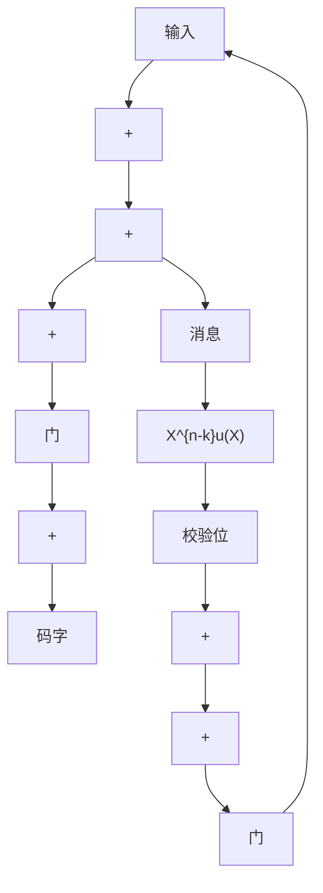
</details>

图 5-2 由 $g(X)=1+X+X^{3}$ 生成的 (7, 4) 循环码的编码电路

$$
v _ {n - k - j} = \sum_ {i = 0} ^ {k - 1} h _ {i} v _ {n - i - j} \quad 1 \leqslant j \leqslant n - k \tag {5-18}
$$

上述方程称为差分方程(difference equation)。对于系统形式的循环码来说，每个码字的 $v_{n-k}$ ， $v_{n-k+1}$ ，…， $v_{n-1}$ 分量为信息位。给定k个信息位，公式(5-18)就给出了确定n-k个校检位 $v_{0}$ ， $v_{1}$ ，…， $v_{n-k+1}$ 的计算规则。基于公式(5-18)的编码电路如图5-3所示。反馈连接取自校验多项式 $\boldsymbol{h}(X)$ 的系数（注意到 $h_{0}=h_{k}=1$ ）。编码操作步骤如下：

第1步 初始状态下，门1开启而门2关闭。k个信息位 $\boldsymbol{u}(X)=u_{0}+u_{1}X+\cdots+u_{k-1}X^{k-1}$ 同时移位进入寄存器和通信信道；

第2步 一旦 $k$ 个信息位进入移位寄存器，关闭门1、打开门2。生成第一个校检位


<details>
<summary>flowchart</summary>

数字信号处理流程图，包含输入、门1、门2、加法器、加法器和输出到信道的结构
</details>

图 5-3 基于校验多项式 $\boldsymbol{h}(X)=1+h_{1}X+\cdots+X^{k}$ 的 $(n,k)$ 循环码的编码电路

$$
v _ {n - k - 1} = h _ {0} v _ {n - 1} + h _ {1} v _ {n - 2} + \dots + h _ {k - 1} v _ {n - k} = u _ {k - 1} + h _ {1} u _ {k - 2} + \dots + h _ {k - 1} u _ {0}
$$

并在 $P$ 点出现；

第 3 步 移存器移位一次。第一个校检位送入信道，同时还被移入寄存器中。此时，第二个校检位

$$
v _ {n - k - 2} = h _ {0} v _ {n - 2} + h _ {1} v _ {n - 3} + \dots + h _ {k - 1} v _ {n - k - 1} = u _ {k - 2} + h _ {1} u _ {k - 3} + \dots + h _ {k - 2} u _ {0} + h _ {k - 1} v _ {n - k - 1}
$$

在 P 点生成。

第 4 步 重复步骤 3，直到所有的 n-k 个校检位全部生成并被送入信道为止。然后，打开门 1 关闭门 2，此时下一条信息准备移位进入寄存器。

上述编码电路使用了 k 级移位寄存器。比较本节所介绍的两种编码电路，可得到如下结论：对于校检位多于信息位的码来说，k 级编码电路更为经济；反之，n - k 级编码电路更好。

例 5-6 由 $g(X)=1+X+X^{3}$ 生成的 $(7,4)$ 循环码的校验多项式为

$$
\boldsymbol {h} (X) = \frac {X ^ {7} + 1}{1 + X + X ^ {3}} = 1 + X + X ^ {2} + X ^ {4}
$$

图 5-4 给出了基于 $\boldsymbol{h}(X)$ 的编码电路。每个码字的形式为 $\boldsymbol{v} = (v_{0}, v_{1}, v_{2}, v_{3}, v_{4}, v_{5}, v_{6})$ ，其中 $v_{3}$ ， $v_{4}$ ， $v_{5}$ 和 $v_{6}$ 是消息位，而 $v_{0}$ ， $v_{1}$ 和 $v_{2}$ 是校检位。确定校检位的差分方程为


<details>
<summary>flowchart</summary>

信号处理流程图，包含输入、门1、门2、加法器和输出到信道的逻辑结构
</details>

图 5-4 基于校验多项式 $\boldsymbol{h}(X)=1+X+X^{2}+X^{4}$ 的 $(7,4)$ 循环码编码电路

$$
v _ {3 - j} = 1 \cdot v _ {7 - j} + 1 \cdot v _ {6 - j} + 1 \cdot v _ {5 - j} + 0 \cdot v _ {4 - j} = v _ {7 - j} + v _ {6 - j} + v _ {5 - j} \quad 1 \leqslant j \leqslant 3
$$

假设待编码的消息为(1011)，则 $v_{3}=1,\quad v_{4}=0,\quad v_{5}=1,\quad v_{6}=1$ 。第一个校检位为

$$
v _ {2} = v _ {6} + v _ {5} + v _ {4} = 1 + 1 + 0 = 0
$$

第二个校检位为

$$
v _ {1} = v _ {5} + v _ {4} + v _ {3} = 1 + 0 + 1 = 0
$$

第三个校检位为

$$
v _ {0} = v _ {4} + v _ {3} + v _ {2} = 0 + 1 + 0 = 1
$$

因此，对应于消息(1011)的码字为(1001011)。

# 5.4 校正子计算和差错检测

假设传输一个码字，接收向量为 $\boldsymbol{r}=(r_{0},r_{1},\cdots,r_{n-1})$ 。由于信道噪声，接收向量可能与传送码字不同。在线性码的译码过程中，第一步是计算校正子 $s=r\cdot H^{T}$ ，其中 H 为校检矩阵。若校正子为零，则 r 为码字且译码器认为 r 就是被传送的码字。若校正子不为零，则 r 不是码字且检测到差错的存在。

我们已经证明，对于线性系统码，校正子为接收的校检位与根据接收信息位重算的校检位的向量和。对于系统循环码，校正子非常容易计算。接收向量 r 可以描述为如下次数不大于 n-1 的多项式：

$$
\boldsymbol {r} (X) = r _ {0} + r _ {1} X + r _ {2} X ^ {2} + \dots + r _ {n - 1} X ^ {n - 1}
$$

用 $r(X)$ 除以生成多项式 $g(X)$ 得到

$$
\boldsymbol {r} (X) = \boldsymbol {a} (X) \boldsymbol {g} (X) + \boldsymbol {s} (X) \tag {5-19}
$$

余式 $s(X)$ 为一个次数不大于 $n - k - 1$ 的多项式。 $s(X)$ 的 $n - k$ 个系数构成了校正子 $s$ 。由定理5-4可知，当且仅当接收多项式 $r(X)$ 为码多项式时 $s(X)$ 等于零。今后，简称 $s(X)$ 为校

正子。校正子的计算可由图5-5所示的除法电路来实现，除了接收多项式 $r(X)$ 由左端输入外，此电路与 $(n-k)$ 级编码电路完全相同。所有的寄存器初始化为零，然后接收向量逐位移入电路中。当整个 $r(X)$ 全部移入寄存器时，电路中寄存器的内容便是校正子 $s(X)$ 。

由于循环码的循环结构，其校正子 $s(X)$ 具有如下的性质。


<details>
<summary>flowchart</summary>

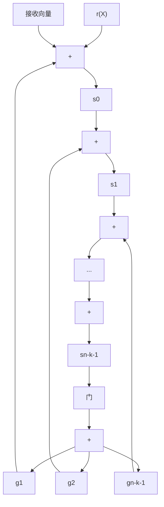
</details>

图 5-5 由左端输入的 $(n-k)$ 级校正子电路

定理 5-8 令 $s(X)$ 为接收多项式 $\boldsymbol{r}(X)=r_{0}+r_{1}X+\cdots+r_{n-1}X^{n-1}$ 的校正子，则用 $Xs(X)$ 除以生成多项式 $\boldsymbol{g}(X)$ 所得的余式 $s^{(1)}(X)$ 得到 $\boldsymbol{r}^{(1)}(X)$ 的校正子，其中 $\boldsymbol{r}^{(1)}(X)$ 是 $\boldsymbol{r}(X)$ 一次循环移位。

证明：由公式(5-1)知， $r(X)$ 和 $r^{(1)}(X)$ 满足如下关系：

$$
X \boldsymbol {r} (X) = r _ {n - 1} \left(X ^ {n} + 1\right) + \boldsymbol {r} ^ {(1)} (X) \tag {5-20}
$$

整理公式(5-20)，我们得到

$$
\boldsymbol {r} ^ {(1)} (X) = r _ {n - 1} \left(X ^ {n} + 1\right) + X \boldsymbol {r} (X) \tag {5-21}
$$

公式(5-21)两边同除以 $g(X)$ ，并利用 $X^{n}+1=g(X)h(X)$ ，我们得到：

$$
\boldsymbol {c} (X) \boldsymbol {g} (X) + \rho (X) = r _ {n - 1} \boldsymbol {g} (X) \boldsymbol {h} (X) + X [ \boldsymbol {a} (X) \boldsymbol {g} (X) + \boldsymbol {s} (X) ] \tag {5-22}
$$

其中 $\boldsymbol{\rho}(X)$ 为 $\boldsymbol{r}^{(1)}(X)$ 除以 $\boldsymbol{g}(X)$ 的余式，即 $\boldsymbol{\rho}(X)$ 为 $\boldsymbol{r}^{(1)}(X)$ 的校正子。

整理公式(5-22)，可得 $\boldsymbol{\rho}(X)$ 与 $Xs(X)$ 之间的下述关系：

$$
X \boldsymbol {s} (X) = [ \boldsymbol {c} (X) + r _ {n - 1} \boldsymbol {h} (X) + X \boldsymbol {a} (X) ] \boldsymbol {g} (X) + \boldsymbol {\rho} (X) \tag {5-23}
$$

根据公式(5-23)我们看到， $\boldsymbol{\rho}(X)$ 也为 $Xs(X)$ 除以 $\boldsymbol{g}(X)$ 的余式，因此 $\boldsymbol{\rho}(X)=\boldsymbol{s}^{(1)}(X)$ ，完成定理证明。证毕。

由定理 5-8 可知，余式 $s^{(i)}(X)$ 为 $r^{(i)}(X)$ 的校正子，其中 $s^{(i)}(X)$ 是 $X^{i}s(X)$ 除以生成多项式 $g(X)$ 所得的余式，而 $r^{(i)}(X)$ 是 $r(X)i$ 次循环移位的结果。这在循环码的译码中是极为有用的一个性质。把初始内容为 $s(X)$ 的校正子寄存器的输入门关断，移位一次后就得到了 $r^{(1)}(X)$ 的校正子 $s^{(1)}(X)$ 。这是由于当初始内容为 $s(X)$ 时，校正子寄存器的一次移位等价于用 $g(X)$ 除 $Xs(X)$ 的效果。因此，在一次移位后寄存器的内容为 $s^{(1)}(X)$ 。为得到 $r^{(i)}(X)$ 的校正子 $s^{(i)}(X)$ ，将初始内容为 $s(X)$ 的寄存器作 i 次移位即可。

# 例 5-7

图 5-6 所示为

由多项式 $\boldsymbol{g}(X)=1+X+X^{3}$ 生成的 $(7,4)$ 循环码的校正子电路。假设接收向量为 $\boldsymbol{r}=(0010110)$ 。r 的校正子为 $\boldsymbol{s}=(101)$ 。

表 5-3 描述了接收向量移


<details>
<summary>flowchart</summary>

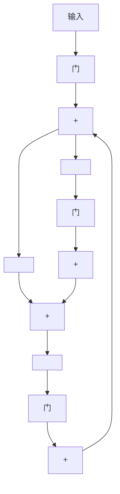
</details>

图 5-6 由 $g(X)=1+X+X^{3}$ 生成的 (7, 4) 循环码的校正子电路

<!-- --- chunk --- -->

<!-- source: 112-127.md -->
入电路时寄存器的内容变化。第七次移位完毕后，寄存器的内容为校正子 $s = (101)$ 。关闭输入门并再移位一次后，新内容将为 $s^{(1)} = (100)$ ，即为 $\boldsymbol{r}^{(1)}(X)$ 的校正子。其中， $\boldsymbol{r}^{(1)}(X)$ 为对 r 循环移位一次的结果，即 $\boldsymbol{r}^{(1)}(X) = (0001011)$ 。

如图 5-7 所示，也可以从校正子寄存器的右端逐位移入接收向量 $\boldsymbol{r}(X)$ ；然而，整个接收向量 $\boldsymbol{r}(X)$ 全部移入到寄存器中后，寄存器的内容并非 $\boldsymbol{r}(X)$ 的校正子，而是 $\boldsymbol{r}(X)$ 的 $(n-k)$ 次循环移位 $\boldsymbol{r}^{(n-k)}(X)$ 的校正子 $\boldsymbol{s}^{(n-k)}(X)$ 。要证明这一点，注意到从右端逐位移入 $\boldsymbol{r}(X)$ 与将 $\boldsymbol{r}(X)$ 乘以 $X^{n-k}$ 结果相同，因此，当 $\boldsymbol{r}(X)$ 全部移入寄存器时，寄存器的内容为 $X^{n-k}\boldsymbol{r}(X)$ 除以生成多项式 $\boldsymbol{g}(X)$ 的余式 $\boldsymbol{\rho}(X)$ 。因此有

表 5-3 输入 $r = (0010110)$ 时，图 5-6 所示电路中校正子寄存器的内容

<table><tr><td>移位</td><td>输入</td><td>寄存器内容</td></tr><tr><td></td><td></td><td>000(初始状态)</td></tr><tr><td>1</td><td>0</td><td>000</td></tr><tr><td>2</td><td>1</td><td>100</td></tr><tr><td>3</td><td>1</td><td>110</td></tr><tr><td>4</td><td>0</td><td>011</td></tr><tr><td>5</td><td>1</td><td>011</td></tr><tr><td>6</td><td>0</td><td>111</td></tr><tr><td>7</td><td>0</td><td>101(校正子s)</td></tr><tr><td>8</td><td>—</td><td>100(校正子s(1))</td></tr><tr><td>9</td><td>—</td><td>010(校正子s(2))</td></tr></table>

$$
X ^ {n - k} \boldsymbol {r} (X) = \boldsymbol {a} (X) \boldsymbol {g} (X) + \boldsymbol {\rho} (X) \tag {5-24}
$$

由公式(5-1)知， $r(X)$ 和 $r^{(n-k)}(X)$ 满足以下关系式：

$$
X ^ {n - k} \boldsymbol {r} (X) = \boldsymbol {b} (X) \left(X ^ {n} + 1\right) + \boldsymbol {r} ^ {(n - k)} (X) \tag {5-25}
$$

联立公式(5-24)和公式(5-25)，并利用 $X^n + 1 = g(X)h(X)$ ，我们有

$$
\boldsymbol {r} ^ {(n - k)} (X) = [ \boldsymbol {b} (X) \boldsymbol {h} (X) + \boldsymbol {a} (X) ] \boldsymbol {g} (X) + \boldsymbol {\rho} (X)
$$

该等式说明当 $\boldsymbol{r}^{(n-k)}(X)$ 除以 $\boldsymbol{g}(X)$ 时， $\boldsymbol{\rho}(X)$ 也为余式。因此， $\boldsymbol{\rho}(X)$ 确实为 $\boldsymbol{r}^{(n-k)}(X)$ 的校正子。

令 $\nu(X)$ 为发送码字， $e(X)=e_{0}+e_{1}X+\cdots+e_{n-1}X^{n-1}$ 为错误模式，则接收多项式为

$$
\boldsymbol {r} (X) = \boldsymbol {v} (X) + \boldsymbol {e} (X) \tag {5-26}
$$

由于 $\nu(X)$ 为生成多项式


<details>
<summary>flowchart</summary>

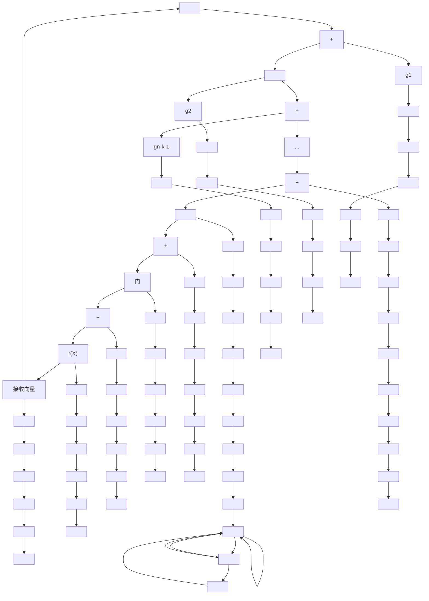
</details>

图 5-7 右端输入的 $(n-k)$ 级校正子电路

$g(X)$ 的倍式，联立公式(5-19)和公式(5-26)，可以得到错误模式与校正子的关系为

$$
\boldsymbol {e} (X) = [ \boldsymbol {a} (X) + \boldsymbol {b} (X) ] \boldsymbol {g} (X) + \boldsymbol {s} (X) \tag {5-27}
$$

其中 $\boldsymbol{b}(X)\boldsymbol{g}(X)=\boldsymbol{v}(X)$ 。这表明校正子等于错误模式除以生成多项式所得的余式。校正子可由接收向量计算得到，但是对于译码器来说，错误模式 $\boldsymbol{e}(X)$ 是未知的。因此，译码器必须由校正子 $\boldsymbol{s}(X)$ 来估计 $\boldsymbol{e}(X)$ 。若 $\boldsymbol{e}(X)$ 为标准阵列中的陪集首，而且应用查表法译码，则可由校正子获得可纠错的错误模式 $\boldsymbol{e}(X)$ 。

从公式(5-27)可知，当且仅当错误模式 $e(X) = 0$ 或 $e(X)$ 等于某一个码字时， $s(X)$ 等于0。若 $e(X)$ 为一码多项式，则 $e(X)$ 是一个漏检错误模式。循环码在检测随机错误和突发错误方面都是十分有效的。差错检测电路只是带一个或门的校正子计算电路，以各个校正位作为或门输入。若校正子不是零，或门输出为1，说明检测到差错。

现在我们研究 $(n, k)$ 循环码的差错检测能力。假设错误模式 $e(X)$ 为长度不大于 $n - k$ 的突发差错（即差错局限在在长度不大于 $n - k$ 个连续位置上），则 $e(X)$ 可表述如下：

$$
\boldsymbol {e} (X) = X ^ {j} \boldsymbol {B} (X)
$$

式中 $0 \leqslant j \leqslant n - 1$ ， $B(X)$ 为次数不大于 $n - k - 1$ 的多项式。由于 $B(X)$ 的次数比生成多项式 $g(X)$ 的次数小，所以不能被 $g(X)$ 整除。由于 $g(X)$ 是 $X^n + 1$ 的因式，而 $X$ 不是 $g(X)$ 的因式，则 $g(X)$ 与 $X^j$ 必然互素。因此， $e(X) = X^j B(X)$ 不能被 $g(X)$ 整除。所以，由此 $e(X)$ 产生的校正子不等于零。这意味着一个 $(n, k)$ 循环码可以检测出任何长度不大于 $n - k$ 的突发差错。对循环码来说，限定在高 $i$ 位和低 $l - i$ 位的错误模式仍是一个长度不大于 $l$ 位的突发差错。这种突发方式称为首尾相接 (end-around) 突发。例如，

$$
\begin{array}{r l} \boldsymbol {e} & = (\quad 1 \quad 0 \quad 1 \quad 0 \quad 0 \quad 0 \quad 0 \quad 0 \quad 0 \quad 0 \quad 0 \quad 1 \quad 1 \quad 0 \quad 1 \quad) \\ & \quad \leftarrow \quad \leftarrow \quad \leftrightarrow \quad \quad \quad \quad \quad \quad \quad \quad \quad \quad \quad \quad \quad \quad \quad \quad \quad \quad \quad \quad \quad \quad \quad \quad \quad \quad \quad \quad \quad \quad \quad \quad \quad \quad \quad \quad \quad \quad \quad \quad \quad \quad \quad \quad \quad \quad \quad \quad \quad \quad \quad \quad \quad \quad \quad \quad \quad \quad \quad \quad \quad \quad \quad \quad \quad \quad \quad \quad \quad \quad \quad \quad \quad \quad \quad \quad \quad \quad \quad \quad \quad \quad \quad \quad \quad \quad \quad \quad \quad \quad \quad \quad \quad \quad \quad \quad \quad \quad \quad \quad \quad \quad \quad \quad \quad \quad \quad \quad \quad \quad \quad \quad \quad \quad \quad \quad \quad \quad \quad \quad \quad \quad \quad \quad \quad \quad \quad \quad \quad \quad \quad \quad \quad \quad \quad \quad \quad \quad \quad \quad \quad \quad \quad \quad \quad \quad \quad \quad \quad \quad \quad \quad \quad \quad \quad \quad \quad \quad \quad \quad \quad \quad \quad \quad \quad \quad \quad \quad \quad \quad \quad \quad \quad \quad \quad \quad \quad \quad \quad \quad \quad \quad \quad \quad \quad \quad \quad \quad \quad \quad \quad \quad \quad \quad \quad \quad \quad \quad \quad \quad \quad \quad \quad \quad \quad \quad \quad \quad \quad \quad \quad \quad \quad \quad \quad \quad \quad \quad \quad \quad \quad \quad \quad \quad \quad \quad \quad \quad \quad \quad \quad \quad \quad \quad \quad \quad \quad \quad \quad \quad \quad \quad \quad \quad \quad \quad \quad \quad \quad \quad \quad \quad \quad \quad \quad \quad \quad \quad \quad \quad \quad \quad \quad \quad \quad \quad \quad \quad \quad \quad \quad \quad \quad \quad \quad \quad \quad \quad \quad \quad \quad \quad \quad \quad \quad \quad \quad \quad \quad \quad \quad \quad \quad \quad \quad \quad \quad \quad \quad \quad \quad \quad \quad \quad \quad \quad \quad \quad \quad \quad \quad \quad \quad \quad \quad \quad \quad \quad \quad \quad \quad \quad \quad \quad \quad \quad \quad \quad \quad \quad \quad \quad \quad \quad \quad \quad \quad \quad \quad \quad \quad \quad \quad \quad \quad \quad \quad \quad \quad \quad \quad \quad \quad \quad \quad \quad \quad \quad \quad \quad \quad \quad \quad \quad \quad \quad \quad \quad \quad \quad \quad \quad \quad \quad \quad \quad \quad \quad \quad \quad \quad \quad \quad \quad \quad \quad \quad \quad \quad \quad \quad \quad \quad \quad \quad \quad \quad \quad \quad \quad \quad \quad \quad \quad \quad \quad \quad \quad \quad \quad \quad \quad \quad \quad \quad \quad \quad \quad \quad \quad \quad \quad \quad \quad \quad \quad \quad \quad \quad \quad \quad \quad \quad \quad \quad \quad \quad \quad \quad \quad \quad \quad \quad \quad \quad \quad \quad \quad \quad \quad \quad \quad \quad \quad \quad \quad \quad \quad \quad \quad \quad \quad \quad \quad \quad \quad \quad \quad \quad \quad \quad \quad \quad \quad \quad \quad \quad \quad \quad \quad \quad \quad \quad \quad \quad \quad \quad \quad \quad \quad \quad \quad \quad \quad \quad \quad \quad \quad \quad \quad \quad \quad \quad \quad \quad \quad \quad \quad \quad \quad \quad \quad \quad \quad \quad \quad \quad \quad \quad \quad \quad \quad \quad \quad \quad \quad \quad \quad \quad \quad \quad \quad \quad \quad \quad \quad \quad \quad \quad \quad \quad \quad \quad \quad \quad \quad \quad \quad \quad \quad \quad \quad \quad \quad \quad \quad \quad \quad \quad \quad \quad \quad \quad \quad \quad \quad \quad \quad \quad \quad \quad \quad \quad \quad \quad \quad \quad \quad \quad \quad \quad \quad \quad \quad \quad \quad \quad \quad \quad \quad \quad \quad \quad \quad \quad \quad \quad \quad \quad \quad \quad \quad \quad \quad \quad \quad \quad \quad \quad \quad \quad \quad \quad \quad \quad \quad \quad \quad \quad \quad \quad \quad \quad \quad \quad \quad \quad \quad \quad \quad \quad \quad \quad \quad \quad \quad \quad \quad \quad \quad \quad \quad \quad \quad \quad \quad \quad \quad \quad \quad \quad \quad \quad \quad \quad \quad \quad \quad \quad \quad \quad \quad \quad \quad \quad \quad \quad \quad \quad \quad \quad \quad \quad \quad \quad \quad \quad \quad \quad \quad \quad \quad \quad \quad \quad \quad \quad \quad \quad \quad \quad \quad \quad \quad \quad \quad \quad \quad \quad \quad \quad \quad \quad \quad \quad \quad \quad \quad \quad \quad \quad \quad \quad \quad \quad \quad \quad \quad \quad \quad \quad \quad \quad \quad \quad \quad \quad \quad \quad \quad \quad \quad \quad \quad \quad \quad \quad \quad \quad \quad \quad \quad \quad \quad \quad \quad \quad \quad \quad \quad \quad \quad \quad \quad \quad \quad \quad \quad \quad \quad \quad \quad \quad \quad \quad \quad \quad \quad \quad \quad \quad \quad \quad \quad \quad \quad \quad \quad \quad \quad \quad \quad \quad \quad \quad \quad \quad \quad \quad \quad \quad \quad \quad \quad \quad \quad \quad \quad \quad \quad \quad \quad \quad \quad \quad \quad \quad \quad \quad \quad \quad \quad \quad \quad \quad \quad \quad \quad \quad \quad \quad \quad \quad \quad \quad \quad \quad \quad \quad \quad \quad \quad \quad \quad \quad \quad \quad \quad \quad \quad \quad \quad \quad \quad \quad \quad \quad \quad \quad \quad \quad \quad \quad \quad \quad \quad \quad \quad \quad \quad \quad \quad \quad \quad \quad \quad \quad \quad \quad \quad \quad \quad \quad \quad \quad \quad \quad \quad \quad \quad \quad \quad \quad \quad \quad \quad \quad \quad \quad \quad \quad \quad \quad \quad \quad \quad \quad \quad \quad \quad \quad \quad \quad \quad \quad \quad \quad \quad \quad \quad \quad \quad \quad \quad \quad \quad \quad \quad \quad \quad \quad \quad \quad \quad \quad \quad \quad \quad \quad \quad \quad \quad \quad \quad \quad \quad \quad \quad \quad \quad \quad \quad \quad \quad \quad \quad \quad \quad \quad \quad \quad \quad \quad \quad \quad \quad \quad \quad \quad \quad \quad \quad \quad \quad \quad \quad \quad \quad \quad \quad \quad \quad \quad \quad \quad \quad \quad \quad \quad \quad \quad \quad \quad \quad \quad \quad \quad \quad \quad \quad \quad \quad \quad \quad \quad \quad \quad \quad \quad \quad \quad \quad \quad \quad \quad \quad \quad \quad \quad \quad \quad \quad \quad \quad \quad \quad \quad \quad \quad \quad \quad \quad \quad \quad \quad \quad \quad \quad \quad \quad \quad \quad \quad \quad \quad \quad \quad \quad \quad \quad \quad \quad \quad \quad \quad \quad \quad \quad \quad \quad \quad \quad \quad \quad \quad \quad \quad \quad \quad \quad \quad \quad \quad \quad \quad \quad \quad \quad \quad \quad \quad \quad \quad \quad \quad \quad \quad \quad \quad \quad \quad \quad \quad \quad \quad \quad \quad \quad \quad \quad \quad \quad \quad \quad \quad \quad \quad \quad \quad \quad \quad \quad \quad \quad \quad \quad \quad \quad \quad \quad \quad \quad \quad \quad \quad \quad \quad \quad \quad \quad \quad \quad \quad \quad \quad \quad \quad \quad \quad \quad \quad \quad \quad \quad \quad \quad \quad \quad \quad \quad \quad \quad \quad \quad \quad \quad \quad \quad \quad \quad \quad \quad \quad \quad \quad \quad \quad \quad \quad \quad \quad \quad \quad \quad \quad \quad \quad \quad \quad \quad \quad \quad \quad \quad \quad \quad \quad \quad \quad \quad \quad \quad \quad \quad \quad \quad \quad \quad \quad \quad \quad \quad \quad \quad \quad \quad \quad \quad \quad \quad \quad \quad \quad \quad \quad \quad \quad \quad \quad \quad \quad \quad \quad \quad \quad \quad \quad \quad \quad \quad \quad \quad \quad \quad \quad \quad \quad \quad \quad \quad \quad \quad \quad \quad \quad \quad \quad \quad \quad \quad \quad \quad \quad \quad \quad \quad \quad \quad \quad \quad \quad \quad \quad \quad \quad \quad \quad \quad \quad \quad \quad \quad \quad \quad \quad \quad \quad \quad \quad \quad \quad \quad \quad \quad \quad \quad \quad \quad \quad \quad \quad \quad \quad \quad \quad \quad \quad \quad \quad \quad \quad \quad \quad \quad \quad \quad \quad \quad \quad \quad \quad \quad \quad \quad \quad \quad \quad \quad \quad \quad \quad \quad \quad \quad \quad \quad \quad \quad \quad \quad \quad \quad \quad \quad \quad \quad \quad \quad \quad \quad \quad \quad \quad \quad \quad \quad \quad \quad \quad \quad \quad \quad \quad \quad \quad \quad \quad \quad \quad \quad \quad \quad \quad \quad \quad \quad \quad \quad \quad \quad \quad \quad \quad \quad \quad \quad \quad \quad \quad \quad \quad \quad \quad \quad \quad \quad \quad \quad \quad \quad \quad \quad \quad \quad \quad \quad \quad \quad \quad \quad \quad \quad \quad \quad \quad \quad \quad \quad \quad \quad \quad \quad \quad \quad \quad \quad \quad \quad \quad \quad \quad \quad \quad \quad \quad \quad \quad \quad \quad \quad \quad \quad \quad \quad \quad \quad \quad \quad \quad \quad \quad \quad \quad \quad \quad \quad \quad \quad \quad \quad \quad \quad \quad \quad \quad \quad \quad \quad \quad \quad \quad \quad \quad \quad \quad \quad \quad \quad \quad \quad \quad \quad \quad \quad \quad \quad \quad \quad \quad \quad \quad \quad \quad \quad \quad \quad \quad \quad \quad \quad \quad \quad \quad \quad \quad \quad \quad \quad \quad \quad \quad \quad \quad \quad \quad \quad \quad \quad \quad \quad \quad \quad \quad \quad \quad \quad \quad \quad \quad \quad \quad \quad \quad \quad \quad \quad \quad \quad \quad \quad \quad \quad \quad \quad \quad \quad \quad \quad \quad \quad \quad \quad \quad \quad \quad \quad \quad \quad \quad \quad \quad \quad \quad \quad \quad \quad \quad \quad \quad \quad \quad \quad \quad \quad \quad \quad \quad \quad \quad \quad \quad \quad \quad \quad \quad \quad \quad \quad \quad \quad \quad \quad \quad \quad \quad \quad \quad \quad \quad \quad \quad \quad \quad \quad \quad \quad \quad \quad \quad \quad \quad \quad \quad \quad \quad \quad \quad \quad \quad \quad \quad \quad \quad \quad \quad \quad \quad \quad \quad \quad \quad \quad \quad \quad \quad \quad \quad \quad \quad \quad \quad \quad \quad \quad \quad \quad \quad \quad \quad \quad \quad \quad \quad \quad \quad \quad \quad \quad \quad \quad \quad \quad \quad \quad \quad \quad \quad \quad \quad \quad \quad \quad \quad \quad \quad \quad \quad \quad \quad \quad \quad \quad \quad \quad \quad \quad \quad \quad \quad \quad \quad \quad \quad \quad \quad \quad \quad \quad \quad \quad \quad \quad \quad \quad \quad \quad \quad \quad \quad \quad \quad \quad \quad \quad \quad \quad \quad \quad \quad \quad \quad \quad \quad \quad \quad \quad \quad \quad \quad \quad \quad \quad \quad \quad \quad \quad \quad \quad \quad \quad \quad \quad \quad \quad \quad \quad \quad \quad \quad \quad \quad \quad \quad \quad \quad \quad \quad \quad \quad \quad \quad \quad \quad \quad \quad \quad \quad \quad \quad \quad \quad \quad \quad \quad \quad \quad \quad \quad \quad \quad \quad \quad \quad \quad \quad \quad \quad \quad \quad \quad \quad \quad \quad \quad \quad \quad \quad \quad \quad \quad \quad \quad \quad \quad \quad \quad \quad \quad \quad \quad \quad \quad \quad \quad \quad \quad \quad \quad \quad \quad \quad \quad \quad \quad \quad \quad \quad \quad \quad \quad \quad \quad \quad \quad \quad \quad \quad \quad \quad \quad \quad \quad \quad \quad \quad \quad \quad \quad \quad \quad \quad \quad \quad \quad \quad \quad \quad \quad \quad \quad \quad \quad \quad \quad \quad \quad \quad \quad \quad \quad \quad \quad \quad \quad \quad \quad \quad \quad \quad \quad \quad \quad \quad \quad \quad \quad \quad \quad \quad \quad \quad \quad \quad \quad \quad \quad \quad \quad \quad \quad \quad \quad \quad \quad \quad \quad \quad \quad \quad \quad \quad \quad \quad \quad \quad \quad \quad \quad \quad \quad \quad \quad \quad \quad \quad \quad \quad \quad \quad \quad \quad \quad \quad \quad \quad \quad \quad \quad \quad \quad \quad \quad \quad \quad \quad \quad \quad \quad \quad \quad \quad \quad \quad \quad \quad \quad \quad \quad \quad \quad \quad \quad \quad \quad \quad \quad \quad \quad \quad \quad \quad \quad \quad \quad \quad \quad \quad \quad \quad \quad \quad \quad \quad \quad \quad \quad \quad \quad \quad \quad \quad \quad \quad \quad \quad \quad \quad \quad \quad \quad \quad \quad \quad \quad \quad \quad \quad \quad \quad \quad \quad \quad \quad \quad \quad \quad \quad \quad \quad \quad \quad \quad \quad \quad \quad \quad \quad \quad \quad \quad \quad \quad \quad \quad \quad \quad \quad \quad \quad \quad \quad \quad \quad \quad \quad \quad \quad \quad \quad \quad \quad \quad \quad \quad \quad \quad \quad \quad \quad \quad \quad \quad \quad \quad \quad \quad \quad \quad \quad \quad \quad \quad \quad \quad \quad \quad \quad \quad \quad \quad \quad \quad \quad \quad \quad \quad \quad \quad \quad \quad \quad \quad \quad \quad \quad \quad \quad \quad \quad \quad \quad \quad \quad \quad \quad \quad \quad \quad \quad \quad \quad \quad \quad \quad \quad \quad \quad \quad \quad \quad \quad \quad \quad \quad \quad \quad \quad \quad \quad \quad \quad \quad \quad \quad \quad \quad \quad \quad \quad \quad \quad \quad \quad \quad \quad \quad \quad \quad \quad \quad \quad \quad \quad \quad \quad \quad \quad \quad \quad \quad \quad \quad \quad \quad \quad \quad \quad \quad \quad \quad \quad \quad \quad \quad \quad \quad \quad \quad \quad \quad \quad \quad \quad \quad \quad \quad \quad \quad \quad \quad \quad \quad \quad \quad \quad \quad \quad \quad \quad \quad \quad \quad \quad \quad \quad \quad \quad \quad \quad \quad \quad \quad \quad \quad \quad \quad \quad \quad \quad \quad \quad \quad \quad \quad \quad \quad \quad \quad \quad \quad \quad \quad \quad \quad \quad \quad \quad \quad \quad \quad \quad \quad \quad \quad \quad \quad \quad \quad \quad \quad \quad \quad \quad \quad \quad \quad \quad \quad \quad \quad \quad \quad \quad \quad \quad \quad \quad \quad \quad \quad \quad \quad \quad \quad \quad \quad \quad \quad \quad \quad \quad \quad \quad \quad \quad \quad \quad \quad \quad \quad \quad \quad \quad \quad \quad \quad \quad \quad \quad \quad \quad \quad \quad \quad \quad \quad \quad \quad \quad \quad \quad \quad \quad \quad \quad \quad \quad \quad \quad \quad \quad \quad \quad \quad \quad \quad \quad \quad \quad \quad \quad \quad \quad \quad \quad \quad \quad \quad \quad \quad \quad \quad \quad \quad \quad \quad \quad \quad \quad \quad \quad \quad \quad \quad \quad \quad \quad \quad \quad \quad \quad \quad \quad \quad \quad \quad \quad \quad \quad \quad \quad \quad \quad \quad \quad \quad \quad \quad \quad \quad \quad \quad \quad \quad \quad \quad \quad \quad \quad \quad \quad \quad \quad \quad \quad \quad \quad \quad \quad \quad \quad \quad \quad \quad \quad \quad \quad \quad \quad \quad \quad \quad \quad \quad \quad \quad \quad \quad \quad \quad \quad \quad \quad \quad \quad \quad \quad \quad \quad \quad \quad \quad \quad \quad \quad \quad \quad \quad \quad \quad \quad \quad \quad \quad \quad \quad \quad \quad \quad \quad \quad \quad \quad \quad \quad \quad \quad \quad \quad \quad \quad \quad \quad \quad \quad \quad \quad \quad \quad \quad \quad \quad \quad \quad \quad \quad \quad \quad \quad \quad \quad \quad \quad \quad \quad \quad \quad \quad \quad \quad \quad \quad \quad \quad \quad \quad \quad \quad \quad \quad \quad \quad \quad \quad \quad \quad \quad \quad \quad \quad \quad \quad \quad \quad \quad \quad \quad \quad \quad \quad \quad \quad \quad \quad \quad \quad \quad \quad \quad \quad \quad \quad \quad \quad \quad \quad \quad \quad \quad \quad \quad \quad \quad \quad \quad \quad \quad \quad \quad \quad \quad \quad \quad \quad \quad \quad \quad \quad \quad \quad \quad \quad \quad \quad \quad \quad \quad \quad \quad \quad \quad \quad \quad \quad \quad \quad \quad \quad \quad \quad \quad \quad \quad \quad \quad \quad \quad \quad \quad \quad \quad \quad \quad \quad \quad \quad \quad \quad \quad \quad \quad \quad \quad \quad \quad \quad \quad \quad \quad \quad \quad \quad \quad \quad \quad \quad \quad \quad \quad \quad \quad \quad \quad \quad \quad \quad \quad \quad \quad \quad \quad \quad \quad \quad \quad \quad \quad \quad \quad \quad \quad \quad \quad \quad \quad \quad \quad \quad \quad \quad \quad \quad \quad \quad \quad \quad \quad \quad \quad \quad \quad \quad \quad \quad \quad \quad \quad \quad \quad \quad \quad \quad \quad \quad \quad \quad \quad \quad \quad \quad \quad \quad \quad \quad \quad \quad \quad \quad \quad \quad \quad \quad \quad \quad \quad \quad \quad \quad \quad \quad \quad \quad \quad \quad \quad \quad \quad \quad \quad \quad \quad \quad \quad \quad \quad \quad \quad \quad \quad \quad \quad \quad \quad \quad \quad \quad \quad \quad \quad \quad \quad \quad \quad \quad \quad \quad \quad \quad \quad \quad \quad \quad \quad \quad \quad \quad \quad \quad \quad \quad \quad \quad \quad \quad \quad \quad \quad \quad \quad \quad \quad \quad \quad \quad \quad \quad \quad \quad \quad \quad \quad \quad \quad \quad \quad \quad \quad \quad \quad \quad \quad \quad \quad \quad \quad \quad \quad \quad \quad \quad \quad \quad \quad \quad \quad \quad \quad \quad \quad \quad \quad \quad \quad \quad \quad \quad \quad \quad \quad \quad \quad \quad \quad \quad \quad \quad \quad \quad \quad \quad \quad \quad \quad \quad \quad \quad \quad \quad \quad \quad \quad \quad \quad \quad \quad \quad \quad \quad \quad \quad \quad \quad \quad \quad \quad \quad \quad \quad \quad \quad \quad \quad \quad \quad \quad \quad \quad \quad \quad \quad \quad \quad \quad \quad \quad \quad \quad \quad \quad \quad \quad \quad \quad \quad \quad \quad \quad \quad \quad \quad \quad \quad \quad \quad \quad \quad \quad \quad \quad \quad \quad \quad \quad \quad \quad \quad \quad \quad \quad \quad \quad \quad \quad \quad \quad \quad \quad \quad \quad \quad \quad \quad \quad \quad \quad \quad \quad \quad \quad \quad \quad \quad \quad \quad \quad \quad \quad \quad \quad \quad \quad \quad \quad \quad \quad \quad \quad \quad \quad \quad \quad \quad \quad \quad \quad \quad \quad \quad \quad \quad \quad \quad \quad \quad \quad \quad \quad \quad \quad \quad \quad \quad \quad \quad \quad \quad \quad \quad \quad \quad \quad \quad \quad \quad \quad \quad \quad \quad \quad \quad \quad \quad \quad \quad \quad \quad \quad \quad \quad \quad \quad \quad \quad \quad \quad \quad \quad \quad \quad \quad \quad \quad \quad \quad \quad \quad \quad \quad \quad \quad \quad \quad \quad \quad \quad \quad \quad \quad \quad \quad \quad \quad \quad \quad \quad \quad \quad \quad \quad \quad \quad \quad \quad \quad \quad \quad \quad \quad \quad \quad \quad \quad \quad \quad \quad \quad \quad \quad \quad \quad \quad \quad \quad \quad \quad \quad \quad \quad \quad \quad \quad \quad \quad \quad \quad \quad \quad \quad \quad \quad \quad \quad \quad \quad \quad \quad \quad \quad \quad \quad \quad \quad \quad \quad \quad \quad \quad \quad \quad \quad \quad \quad \quad \quad \quad \quad \quad \quad \quad \quad \quad \quad \quad \quad \quad \quad \quad \quad \quad \quad \quad \quad \quad \quad \quad \quad \quad \quad \quad \quad \quad \quad \quad \quad \quad \quad \quad \quad \quad \quad \quad \quad \quad \quad \quad \quad \quad \quad \quad \quad \quad \quad \quad \quad \quad \quad \quad \quad \quad \quad \quad \quad \quad \quad \quad \quad \quad \quad \quad \quad \quad \quad \quad \quad \quad \quad \quad \quad \quad \quad \quad \quad \quad \quad \quad \quad \quad \quad \quad \quad \quad \quad \quad \quad \quad \quad \quad \quad \quad \quad \quad \quad \quad \quad \quad \quad \quad \quad \quad \quad \quad \quad \quad \quad \quad \quad \quad \quad \quad \quad \quad \quad \quad \quad \quad \quad \quad \quad \quad \quad \quad \quad \quad \quad \quad \quad \quad \quad \quad \quad \quad \quad \quad \quad \quad \quad \quad \quad \quad \quad \quad \quad \quad \quad \quad \quad \quad \quad \quad \quad \quad \quad \quad \quad \quad \quad \quad \quad \quad \quad \quad \quad \quad \quad \quad \quad \quad \quad \quad \quad \quad \quad \quad \quad \quad \quad \quad \quad \quad \quad \quad \quad \quad \quad \quad \quad \quad \quad \quad \quad \quad \quad \quad \quad \quad \quad \quad \quad \quad \quad \quad \quad \quad \quad \quad \quad \quad \quad \quad \quad \quad \quad \quad \quad \quad \quad \quad \quad \quad \quad \quad \quad \quad \quad \quad \quad \quad \quad \quad \quad \quad \quad \quad \quad \quad \quad \quad \quad \quad \quad \quad \quad \quad \quad \quad \quad \quad \quad \quad \quad \quad \quad \quad \quad \quad \quad \quad \quad \quad \quad \quad \quad \quad \quad \quad \quad \quad \quad \quad \quad \quad \quad \quad \quad \quad \quad \quad \quad \quad \quad \quad \quad \quad \quad \quad \quad \quad \quad \quad \quad \quad \quad \quad \quad \quad \quad \quad \quad \quad \quad \quad \quad \quad \quad \quad \quad \quad \quad \quad \quad \quad \quad \quad \quad \quad \quad \quad \quad \quad \quad \quad \quad \quad \quad \quad \quad \quad \quad \quad \quad \quad \quad \quad \quad \quad \quad \quad \quad \quad \quad \quad \quad \quad \quad \quad \quad \quad \quad \quad \quad \quad \quad \quad \quad \quad \quad \quad \quad \quad \quad \quad \quad \quad \quad \quad \quad \quad \quad \quad \quad \quad \quad \quad \quad \quad \quad \quad \quad \quad \quad \quad \quad \quad \quad \quad \quad \quad \quad \quad \quad \quad \quad \quad \quad \quad \quad \quad \quad \quad \quad \quad \quad \quad \quad \quad \quad \quad \quad \quad \quad \quad \quad \quad \quad \quad \quad \quad \quad \quad \quad \quad \quad \quad \quad \quad \quad \quad \quad \quad \quad \quad \quad \quad \quad \quad \quad \quad \quad \quad \quad \quad \quad \quad \quad \quad \quad \quad \quad \quad \quad \quad \quad \quad \quad \quad \quad \quad \quad \quad \quad \quad \quad \quad \quad \quad \quad \quad \quad \quad \quad \quad \quad \quad \quad \quad \quad \quad \quad \quad \quad \quad \quad \quad \quad \quad \quad \quad \quad \quad \quad \quad \quad \quad \quad \quad \quad \quad \quad \quad \quad \quad \quad \quad \quad \quad \quad \quad \quad \quad \quad \quad \quad \quad \quad \quad \quad \quad \quad \quad \quad \quad \quad \quad \quad \quad \quad \quad \quad \quad \quad \quad \quad \quad \quad \quad \quad \quad \quad \quad \quad \quad \quad \quad \quad \quad \quad \quad \quad \quad \quad \quad \quad \quad \quad \quad \quad \quad \quad \quad \quad \quad \quad \quad \quad \quad \quad \quad \quad \quad \quad \quad \quad \quad \quad \quad \quad \quad \quad \quad \quad \quad \quad \quad \quad \quad \quad \quad \quad \quad \quad \quad \quad \quad \quad \quad \quad \quad \quad \quad \quad \quad \quad \quad \quad \quad \quad \quad \quad \quad \quad \quad \quad \quad \quad \quad \quad \quad \quad \quad \quad \quad \quad \quad \quad \quad \quad \quad \quad \quad \quad \quad \quad \quad \quad \quad \quad \quad \quad \quad \quad \quad \quad \quad \quad \quad \quad \quad \quad \quad \quad \quad \quad \quad \quad \quad \quad \quad \quad \quad \quad \quad \quad \quad \quad \quad \quad \quad \quad \quad \quad \quad \quad \quad \quad \quad \quad \quad \quad \quad \quad \quad \quad \quad \quad \quad \quad \quad \quad \quad \quad \quad \quad \quad \quad \quad \quad \quad \quad \quad \quad \quad \quad \quad \quad \quad \quad \quad \quad \quad \quad \quad \quad \quad \quad \quad \quad \quad \quad \quad \quad \quad \quad \quad \quad \quad \quad \quad \quad \quad \quad \quad \quad \quad \quad \quad \quad \quad \quad \quad \quad \quad \quad \quad \quad \quad \quad \quad \quad \quad \quad \quad \quad \quad \quad \quad \quad \quad \quad \quad \quad \quad \quad \quad \quad \quad \quad \quad \quad \quad \quad \quad \quad \quad \quad \quad \quad \quad \quad \quad \quad \quad \quad \quad \quad \quad \quad \quad \quad \quad \quad \quad \quad \quad \quad \quad \quad \quad \quad \quad \quad \quad \quad \quad \quad \quad \quad \quad \quad \quad \quad \quad \quad \quad \quad \quad \quad \quad \quad \quad \quad \quad \quad \quad \quad \quad \quad \quad \quad \quad \quad \quad \quad \quad \quad \quad \quad \quad \quad \quad \quad \quad \quad \quad \quad \quad \quad \quad \quad \quad \quad \quad \quad \quad \quad \quad \quad \quad \quad
$$

e 是一个长度为 7 的首尾相接突发错误模式。一个 $(n, k)$ 循环码可以检测出任何长度不大于 n - k 的首尾相接突发错误模式（证明留作习题）。归纳以上结果，有以下性质：

定理 5-9 一个 $(n, k)$ 循环码可以检测出任何长度不大于 n-k 的突发差错，包括首尾相接突发差错。

实际上，大部分长度为 $n - k + 1$ 或更长的突发差错也能被检测到。考虑一个长度为 $n - k + 1$ 的突发差错，起始于第 $i$ 位而终止于第 $(i + n - k)$ 位（即差错局限在 $e_i, e_{i+1}, \cdots, e_{i+n-k}$ ，其中 $e_i = e_{i+n-k} = 1$ ）。总共有 $2^{n-k-1}$ 个这样的突发差错，所有这些突发差错中，不能被检测到的突发差错只有下面这一种：

$$
\boldsymbol {e} (X) = X ^ {i} \boldsymbol {g} (X)
$$

因此，从第 $i$ 位起始的长度为 $n - k + 1$ 的突发差错中不能被检测的数目为 $2^{-(n - k - 1)}$ 。它也适用于从任意位置起始的长度为 $n - k + 1$ 的突发差错（包括首尾相接突发差错的情况）。因此有以下结论：

定理 5-10 长度为 $n-k+1$ 的突发差错中不能被检测的数目为 $2^{-(n-k-1)}$ 。

对于 $l > n - k - 1$ 的情况，从第 $i$ 位开始在第 $(i + l - 1)$ 位结束的长度为 $l$ 的突发差错有 $2^{l - (n - k) - 2}$ 种，在这些突发差错之中，不能被检测到的差错具有以下形式：

$$
\boldsymbol {e} (X) = X ^ {i} \boldsymbol {a} (X) \boldsymbol {g} (X)
$$

式中， $a(X)=a_{0}+a_{1}X+\cdots+a_{l-(n-k)-1}X^{l-(n-k)-1}$ ， $a_{0}=a_{l-(n-k)-1}=1$ 。这类突发错误模式的数目为 $2^{l-(n-k)-2}$ 。因此，起始于第i位长度为l的突发差错中不能被检测的比例为 $2^{-(n-k)}$ 。应再次指出，此式适用于长度为l、起始于任意位置的突发差错（包含首尾相接的情况），由此导出以下结论：

定理 5-11 若 l > n - k - 1，不能被检测的长度为 l 的突发差错的比例为 $2^{-(n-k)}$ 。

上述分析表明，循环码在突发差错检测方面是非常有效的。

例 5-8 由多项式 $g(X)=1+X+X^{3}$ 生成的 (7, 4) 循环码的最小距离为 3。这类码能够检测到任何 2 个或更少的随机差错的组合，或检测任意的长度不大于 3 的突发差错。同时，这类码也能检测许多长度大于 3 的突发差错。

# 5.5 循环码的译码

循环码的译码过程与线性码相同，需要三个步骤：校正子的计算，由校正子得到错误模式以及差错纠正。由5.4节可知，可以用一个除法电路来计算循环码的校正子，这个电路的复杂度线性正比于校检位的数目（即 $n - k$ ）。差错纠正可通过将错误模式以模2加法加到接收向量上来实现。如果以串行方式（一次一位）进行纠错，则加法过程只需要一个异或门即可；如果以图3-8所示的并行方式进行纠错则需要 $n$ 个异或门。校正子与错误模式的关联可

以借助译码表来唯一确定。译码电路的一种直接的实现方案就是采用一个组合逻辑电路来执行查表；但这种设计方案的局限性在于译码电路的复杂度随着码长和需纠正差错数目的增加而呈指数增长。循环码具有良好的代数和几何性质，若对这些性质加以充分利用，就可以简化译码电路。

循环码的循环结构使得我们可以对接收向量 $\boldsymbol{r}(X)=r_{0}+r_{1}X+\cdots+r_{n-1}X^{n-1}$ 进行串行译码。每次只译一位接收码，而且每一数据在同一电路中进行译码。一旦计算出校正子，译码电路就会检查校正子 $\boldsymbol{s}(X)$ 是否对应于一个在最高位 $X^{n-1}$ 存在差错（即 $e_{n-1}=1$ ）的可纠正错误模式 $\boldsymbol{e}(X)=e_{0}+e_{1}X+\cdots+e_{n-1}X^{n-1}$ 。若不存在与 $\boldsymbol{s}(X)$ 相对应的 $e_{n-1}=1$ 的错误模式，则将接收多项式（存储在缓冲寄存器中）和校正子寄存器同时循环移位一位。这样做了以后，我们便得到 $\boldsymbol{r}^{(1)}(X)=r_{n-1}+r_{0}X+\cdots+r_{n-2}X^{n-1}$ 且校正子寄存器的内容构成 $\boldsymbol{r}^{(1)}(X)$ 的校正子 $\boldsymbol{s}^{(1)}(X)$ 。此时， $\boldsymbol{r}(X)$ 的第二位 $r_{n-2}$ 变为 $\boldsymbol{r}^{(1)}(X)$ 的第一位。同一译码电路将会检查 $\boldsymbol{s}^{(1)}(X)$ 是否与在 $X^{n-1}$ 位置存在差错的错误模式相对应。

如果 $\boldsymbol{r}(X)$ 的校正子 $\boldsymbol{s}(X)$ 与 $X^{n-1}$ 位有错（即 $e_{n-1}=1$ ）的错误模式相对应，则接收向量的位 $r_{n-1}$ 必定为差错位，因而必须被纠正，这可以通过求和 $r_{n-1} \oplus e_{n-1}$ 来实现，从而得到修正的接收多项式 $\boldsymbol{r}_{1}(X)=r_{0}+r_{1}X+\cdots+r_{n-2}X^{n-2}+(r_{n-1} \oplus e_{n-1})X^{n-1}$ 。通过模2加法将 $\boldsymbol{e}'(X)=X^{n-1}$ 的校正子加到 $\boldsymbol{s}(X)$ 上，从 $\boldsymbol{s}(X)$ 中消除了差错位 $e_{n-1}$ 对校正子的影响。这个模2和就是修正的接收多项式 $\boldsymbol{r}_{1}(X)$ 的校正子。现在，把 $\boldsymbol{r}_{1}(X)$ 和校正子寄存器同时循环移位一次，其移位结果便得到了接收多项式 $\boldsymbol{r}_{1}^{(1)}(X)=(r_{n-1} \oplus e_{n-1})+r_{0}X+\cdots+r_{n-2}X^{n-1}$ 。 $\boldsymbol{r}_{1}^{(1)}(X)$ 的校正子 $\boldsymbol{s}_{1}^{(1)}(X)$ 就是由 $X[s(X)+X^{n-1}]$ 除以生成多项式 $\boldsymbol{g}(X)$ 的余式。因为 $X\boldsymbol{s}(X)$ 和 $X^{n}$ 除以 $\boldsymbol{g}(X)$ 的余式分别为 $\boldsymbol{s}^{(1)}(X)$ 和 1，则有：

$$
\boldsymbol {s} _ {1} ^ {(1)} (X) = \boldsymbol {s} ^ {(1)} (X) + 1
$$

所以，若在对校正子寄存器进行移位时将1加到其左端，则得到 $s_{1}^{(1)}(X)$ 。译码电路随后就对接收码的 $r_{n-2}$ 位进行译码。对 $r_{n-2}$ 及其他码位的译码与对 $r_{n-1}$ 的译码完全相同。每当检测到一个差错并加以纠正后，就消除该差错对校正子的影响。进行n次移位后，译码过程结束。若 $e(X)$ 为一可纠正的错误模式，则在译码结束后，校正子寄存器的内容为零而且接收向量 $r(X)$ 已被正确译码。若校正子寄存器的内容不全为0，则检测出一个不能纠正的错误模式。

图 5-8 给出了一个通用的 $(n, k)$ 循环码的译码器。它由三个主要部分组成：1) 校正子寄存器；2) 错误模式检测器，3) 存储接收向量的缓冲寄存器。接收多项式从左端移入校正子寄存器。为了消除错误对校正子的影响，只需将差错位通过一个异或门反馈到移位寄存器的左输入端。译码步骤如下：

第 1 步 接收向量全部移入校正子寄存器便得到了校正子；同时接收向量也存入到缓冲寄存器中；

第2步 将校正子读入检测器中，检测相应的错误模式。检测器为组合逻辑电路，其电路设计方法为：当且仅当校正子寄存器中的校正子对应于最高位 $X^{n-1}$ 存在的可纠正错误模式时输出为1。也就是说，若检测器输出端为1，缓冲寄存器中最右端的接收符号被认为是错误的，必须被纠正；若输出为0，则缓冲寄存器最右端的接收符号是正确的，不必纠正。因此，检测器的输出值为对应于缓冲寄存器中输出符号的差错估值；

第3步 从缓冲寄存器中读取第一个接收符号；与此同时，将校正子寄存器移位一次。若检测到第一个接收符号存在差错，则被检测器的输出纠正。检测器的输出值也被反馈回校正子寄存器来修改校正子（即在校正子中消除差错的影响）。此操作会产生一个新的校正子，


<details>
<summary>flowchart</summary>

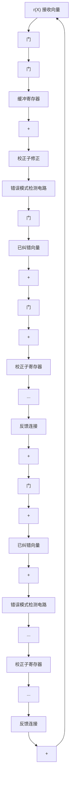
</details>

图 5-8 接收多项式 $r(X)$ 由校正子寄存器左端输入的通用循环码译码器

它对应于修正接收向量向右移位一次后所得的结果；

第 4 步 用第 3 步得到的新校正子来检测第二个接收符号(此时处于缓冲寄存器的最右端)是否有错。译码器重复第 2 步与第 3 步。第二个接收符号的纠正方法与第一个接收符号的纠正方法完全相同；

第 5 步 译码器按以上步骤对接收到的符号位进行逐位译码，直到从缓冲寄存器读出整个接收向量为止。

上述译码器就是著名的梅吉特(Meggitt)译码器 $^{[11]}$ ，原则上可以应用于任何一种循环码。但是，它是否实际上可实现完全取决于错误模式检测电路。某些情况下，差错检测电路是比较简单的。接下来的几个章节将讨论其中几种情况。

例 5-9 考虑由多项式 $g(X)=1+X+X^{3}$ 生成的 (7, 4) 循环码的译码。该码的最小距离为 3，能够纠正任意一个 7 位分组中的单个差错。有 7 种含单个差错的错误模式。这 7 种错误模式与全零向量一起构成了译码表的陪集首，因此，它们组成了所有可纠正的错误模式。假设接收多项式 $r(X)=r_{0}+r_{1}X+r_{2}X^{2}+r_{3}X^{3}+r_{4}X^{4}+r_{5}X^{5}+r_{6}X^{6}$ 由左端逐位移入校正子寄存器中。这 7 种含单个差错的图样及其相对应的校正子列于表 5-4 中。

可以看出， $e_{6}(X)=X^{6}$ 是在 $X^{6}$ 位置有错的唯一错误模式。整个接收多项式全部进入寄存器后，当这种差错产生时，校正子寄存器中的校正子为(101)。检测出该校正子表明 $r_{6}$ 位有一个错误数据，必须加以纠正。假设单个差错出现在 $X^{i}$ 位处[即 $e_{i}=X^{i}$ ]，其中 $0\leqslant i\leqslant6$ 。在整个接收多项式移入校正子寄存器后，在寄存器中的校正子将不会是(101)；然而继续移位(6-i)

表 5-4 错误模式及其校正子，其中接收多项式 $r(X)$ 由校正子寄存器左端移入

<table><tr><td>错误模式e(X)</td><td>校正子s(X)</td><td>校正子向量(s0, s1, s2)</td></tr><tr><td>e6(X) = X6</td><td>s(X) = 1 + X2</td><td>(101)</td></tr><tr><td>e5(X) = X5</td><td>s(X) = 1 + X + X2</td><td>(111)</td></tr><tr><td>e4(X) = X4</td><td>s(X) = X + X2</td><td>(011)</td></tr><tr><td>e3(X) = X3</td><td>s(X) = 1 + X</td><td>(110)</td></tr><tr><td>e2(X) = X2</td><td>s(X) = X2</td><td>(001)</td></tr><tr><td>e1(X) = X1</td><td>s(X) = X</td><td>(010)</td></tr><tr><td>e0(X) = X0</td><td>s(X) = 1</td><td>(100)</td></tr></table>

位后，校正子寄存器的内容将为(101)，而缓冲寄存器输出的下一个接收位为差错位。因此，只需检测校正子(101)即可，这可以用一个三输入与门来实现。完整译码电路见图5-9，图5-10描述了译码过程。设传送码字 $\nu(X)=(1001011)$ [或 $\nu(X)=1+X^{3}+X^{5}+X^{6}$ ]，接收码字 $r=(1011011)$ [或 $r(X)=1+X^{2}+X^{3}+X^{5}+X^{6}$ ]。一个单个差错出现在 $X^{2}$ 处。当整个接收多项式完全移入校正子寄存器和缓冲寄存器中后，校正子寄存器的内容为(001)。图5-10记录了校正子寄存器和缓冲寄存器的内容在每一次移位后的结果，并用一个箭头指示每次移位后的差错位置。由此知，再经过四次移位后校正子寄存器的内容为(101)，而缓冲寄存器输出的下一位为差错位 $r_{2}$ 。

例 5-9 讨论的(7, 4)循环码实际上与例 3-9 讨论的码完全相同。把图 5-9 所示的译码电路与图 3-9 所示电路进行比较，我们发现图 5-9 中的


<details>
<summary>flowchart</summary>

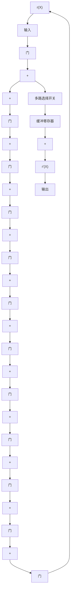
</details>

图 5-9 由 $g(X)=1+X+X^{3}$ 生成的 (7, 4) 循环码的译码电路

电路比图 3-9 的电路更简单。因此，循环结构的确可以简化译码电路，但是由于译码是串行处理的，图 5-9 所示电路需要花费较长时间对接收向量进行译码。一般来讲，无法获得既快速又简单的译码方法，它们之间需要进行折衷。

上述 Meggitt 译码器从接收向量 $r(X) = r_{0} + r_{1}X + \cdots + r_{n-1}X^{n-1}$ 的最高位 $r_{n-1}$ 开始译码，直到最低位 $r_{0}$ 为止结束译码。在完成接收位 $r_{i}$ 的译码后，缓冲寄存器和校正子寄存器均向右移一位，然后译下一个接收数据 $r_{i-1}$ 。也可以用 Meggitt 译码器以相反的次序对接收向量进行译码（即从最低次接收位 $r_{0}$ 至最高次接收位 $r_{n-1}$ 译码）。在完成接收位 $r_{i}$ 的译码后，缓冲寄存器和校正子寄存器均向左移一位，下一个待译码的接收位为 $r_{i+1}$ 。对于相反次序译码接收多项式的详细讨论留作习题。

进行循环码译码时，接收多项式 $r(X)$ 可以从校正子寄存器右端移入来计算校正子。当 $r(X)$ 全部移入校正子寄存器后，寄存器中的内容为 $r^{(n - k)}(X)$ 的校正子 $s^{(n - k)}(X)$ ，其中 $r^{(n - k)}(X)$ 为 $r(X)$ 的 $n - k$ 次移位后的结果。若 $s^{(n - k)}(X)$ 对应于某个 $e_{n - 1} = 1$ 的错误模式 $e(X)$ ，则 $r(X)$ 的最高位 $r_{n - 1}$ 是错误的且必须被纠正。在 $r^{(n - k)}(X)$ 中， $r_{n - 1}$ 位处于位置 $X^{n - k - 1}$ 处。纠正 $r_{n - 1}$ 后，必须消除差错对 $s^{(n - k)}(X)$ 的影响。新的校正子 $s_1^{(n - k)}(X)$ 为 $s^{(n - k)}(X)$ 与 $\pmb{\rho}(X)$ 之和，其中 $\pmb{\rho}(X)$ 为 $X^{n - k - 1}$ 除以生成多项式 $\pmb{g}(X)$ 的余式。由于 $X^{n - k - 1}$ 的次数低于 $\pmb{g}(X)$ 的次数，

$$
\boldsymbol {\rho} (X) = X ^ {n - k - 1}
$$

因此有

$$
\boldsymbol {s} _ {1} ^ {(n - k)} (X) = \boldsymbol {s} ^ {(n - k)} (X) + X ^ {n - k - 1}
$$

上式表明，可以将差错位通过异或门反馈到校正子寄存器的右端来消除发生在 $X^{n - 1}$ 位置上的差错对校正子的影响，如图5-11所示。图5-11的译码器所实现的译码过程和图5-8中的译码器所实现的译码过程完全相同。


<details>
<summary>flowchart</summary>

数据缓冲寄存器指针流程图，展示初始状态、第1次至第7次移位的缓冲寄存器指针及错误被纠正的流程
</details>

图 5-10 图 5-9 所示电路的差错纠正过程


<details>
<summary>flowchart</summary>

错误检测系统流程图，包含门、缓冲寄存器、校正子寄存器及错误模式检测电路等关键模块
</details>

图 5-11 接收多项式 $r(X)$ 由校正子寄存器右端输入的通用循环码译码器

例 5-10 再次考虑由 $g(X)=1+X+X^{3}$ 生成的 (7, 4) 循环码的译码。假定接收多项式 $r(X)$ 从右端输入校正子寄存器。表 5-5 列出了 7 个含单个差错的错误模式及其对应的校正子。

可以看出，在整个接收多项式 $r(X)$ 进入校正子寄存器后，仅当 $e(X) = X^6$ 时，校正子才为(001)。当单个差错出现在 $X^i$ 处 $(i \neq 6)$ 时，在整个接收多项式移入寄存器后，寄存器中的校正子将不是(001)，然而，继续移位 $(6 - i)$ 次后，校正子寄存器的内容将为(001)。因此，我们得到 $g(X) = 1 + X + X^3$ 所生成的(7,4)循环码的另一个译码电路，如图 5-12 所示。可以看出图 5-9 所示电路与图 5-12 所示电路具有相同的复杂度。

表 5-5 错误模式及其校正子，其中接收多项式 $r(X)$ 由校正子寄存器右端移入

<table><tr><td>错误模式 e(X)</td><td>校正子 s(3)(X)</td><td>校正子向量 (s0, s1, s2)</td></tr><tr><td>e(X) = X6</td><td>s(3)(X) = X2</td><td>(001)</td></tr><tr><td>e(X) = X5</td><td>s(3)(X) = X</td><td>(010)</td></tr><tr><td>e(X) = X4</td><td>s(3)(X) = 1</td><td>(100)</td></tr><tr><td>e(X) = X3</td><td>s(3)(X) = 1 + X2</td><td>(101)</td></tr><tr><td>e(X) = X2</td><td>s(3)(X) = 1 + X + X2</td><td>(111)</td></tr><tr><td>e(X) = X</td><td>s(3)(X) = X + X2</td><td>(011)</td></tr><tr><td>e(X) = X0</td><td>s(3)(X) = 1 + X</td><td>(110)</td></tr></table>


<details>
<summary>flowchart</summary>

```mermaid
graph TD
    A["r(X)"] --> B["输入"]
    B --> C["多路选择开关"]
    C --> D["缓冲寄存器"]
    D --> E["+"]
    E --> F["r'(X)"]
    F --> G["输出"]
    B --> H["门"]
    H --> I["+"]
    I --> J["门"]
    J --> K["+"]
    K --> L["门"]
    L --> M["+"]
    M --> N["门"]
    N --> O["+"]
    O --> P["门"]
    P --> Q["+"]
    Q --> R["门"]
    R --> S["+"]
    S --> T["门"]
    T --> U["+"]
    U --> V["门"]
    V --> W["+"]
    W --> X["门"]
    X --> Y["+"]
    Y --> Z["门"]
    Z --> A
```
</details>

图 5-12 由 $g(X)=1+X+X^{3}$ 生成的 $(7,4)$ 循环码的译码电路

# 5.6 循环汉明码

第 4.1 节中所给出的汉明码能够写成循环形式，由一个 m 次的本原多项式 $p(X)$ 可以生成一个长为 $2^{m}-1(m \geqslant 3)$ 的循环汉明码。

下面，通过检验其系统形式的奇偶校检矩阵，可以证明此前定义的循环码实际上就是一种汉明码。采用5.2节提到的方法来构造奇偶校验矩阵，用 $X^{m+i}$ 除以生成多项式 $p(X)(0 \leqslant i \leqslant 2^{m} - m - 1)$ 得到

$$
X ^ {m + i} = \boldsymbol {a} _ {i} (X) \boldsymbol {p} (X) + \boldsymbol {b} _ {i} (X) \tag {5-28}
$$

其中余式 $b_{i}(X)$ 具有以下形式：

$$
\boldsymbol {b} _ {i} (X) = b _ {i 0} + b _ {i 1} X + \dots + b _ {i, m - 1} X ^ {m - 1}
$$

由于 X 不是本原多项式 $p(X)$ 的因式，因此 $X^{m+i}$ 与 $p(X)$ 必定互素，结果有 $b_{i}(X) \neq 0$ 。另外， $b_{i}(X)$ 至少由两项组成。假设 $b_{i}(X)$ 仅含有一项，如 $X^{j}(0 \leqslant j < m)$ ，由公式 (5-28) 可得

$$
X ^ {m + i} = \boldsymbol {a} _ {i} (X) \boldsymbol {p} (X) + X ^ {j}
$$

整理上述方程有

$$
X ^ {j} (X ^ {m + i - j} + 1) = \boldsymbol {a} _ {i} (X) \boldsymbol {p} (X)
$$

由于 $X^j$ 与 $\pmb{p}(X)$ 互素，上述等式意味着 $X^{m + i - j} + 1$ 能够被 $\pmb{p}(X)$ 整除，但这是不可能的，因为 $m + i - j < 2^m - 1$ ，且 $\pmb{p}(X)$ 是 $m$ 次本原多项式（回忆一下，满足 $X^n + 1$ 能够被 $\pmb{p}(X)$ 整除要求的最小正整数 $n$ 为 $2^m - 1$ ）。因此，对于 $0 \leqslant i < 2^m - m - 1$ ，余式 $\pmb{b}_i(X)$ 至少由两项组成。下面证明，对于 $i \neq j$ ， $\pmb{b}_i(X) \neq \pmb{b}_j(X)$ 。从公式(5-28)可得：

$$
\boldsymbol {b} _ {i} (X) + X ^ {m + i} = \boldsymbol {a} _ {i} (X) \boldsymbol {p} (X), \quad \boldsymbol {b} _ {j} (X) + X ^ {m + j} = \boldsymbol {a} _ {j} (X) \boldsymbol {p} (X)
$$

假设 $\boldsymbol{b}_{i}(X)=\boldsymbol{b}_{j}(X)$ ，不妨设 i<j，则联立上述两个方程，可得如下关系式：

$$
X ^ {m + i} (X ^ {j - i} + 1) = [ \boldsymbol {a} _ {i} (X) + \boldsymbol {a} _ {j} (X) ] \boldsymbol {p} (X)
$$

该方程意味着 $X^{j-i}+1$ 可以被 $\boldsymbol{p}(X)$ 整除，然而这是不可能的，因为 $i\neq j$ 且 $j-i<2^{m}-1$ 。所以 $\boldsymbol{b}_{i}(X)\neq\boldsymbol{b}_{j}(X)$ 。

设矩阵 $H = [I_{m} Q]$ 为由 $\boldsymbol{p}(X)$ 生成的循环码的奇偶校验矩阵（系统形式），其中 $I_{m}$ 为 $m \times m$ 单位矩阵而 Q 为 $m \times (2^{m} - m - 1)$ 矩阵。令 $\boldsymbol{b}_{i} = (b_{i0}, b_{i1}, \cdots, b_{i,m-1})$ 为与 $\boldsymbol{b}_{i}(X)$ 相应的 m 维向量。由公式 (5-17) 可知，Q 矩阵的列向量由 $2^{m} - m - 1$ 个 $b_{i}$ 向量组成 $(0 \leqslant i < 2^{m} - m - 1)$ 。由前述分析可知，Q 矩阵没有两列相同，而且每一列至少有两个 1。因此，矩阵 H 的确为汉明码的奇偶校验矩阵，其生成多项式为 $\boldsymbol{p}(X)$ 。

多项式 $\boldsymbol{p}(X)=1+X+X^{3}$ 是本原多项式，所以由 $\boldsymbol{p}(X)=1+X+X^{3}$ 生成的 (7, 4) 循环码是汉明码。在表 2-7 中列出了一些次数不小于 3 的本原多项式。

循环汉明码的译码比较容易实现。在设计译码电路时，只需要知道如何对第一个接收数据位进行译码，所有其他数据位可以由同一个电路来完成同样的译码。假设单个差错发生在接收向量 $r(X)$ 的最高位 $X^{2^{m-2}}$ [即错误多项式 $e(X)=X^{2^{m-2}}$ ]。假设 $r(X)$ 由校正子寄存器的右端移入。在整个 $r(X)$ 全部移入寄存器


<details>
<summary>flowchart</summary>

锁相电路结构图，包含输入、缓冲寄存器、门和与门模块
</details>

图 5-13 循环汉明码的译码器

后，寄存器中的校正子就等于 $X^{m} \cdot X^{2^{m-2}}$ （错误多项式预先移位 $m$ 位）除以生成多项式 $\pmb{p}(X)$ 后所得的余式。由于 $X^{2^{m-1}} + 1$ 可以被 $\pmb{p}(X)$ 整除，则校正子有如下形式：

$$
\boldsymbol {s} (X) = X ^ {m - 1}
$$

因此，若单个差错发生在 $r(X)$ 的最高位，则所得的校正子将为 $(0,0,\dots ,0,1)$ 。若单个差错发生在 $r(X)$ 的其他位置上，则最终的校正子将与 $(0,0,\dots ,0,1)$ 不同。利用这个特点，仅需一个 $m$ 输入的与门就可检测校正子图样 $(0,0,\dots ,0,1)$ 。与门的输入端为 $s_0^{\prime}$ ， $s_1^{\prime},\dots ,s_{m - 2}^{\prime}$ 和 $s_{m - 1}$ ，其中 $s_i$ 为校正子位而 $s_i^{\prime}$ 为 $s_i$ 的补。图5-13给出了一个循环汉明码的完

整译码电路。译码操作的步骤描述如下：

第 1 步 将整个接收向量移入校正子寄存器以获得校正子。同时，接收向量寄存在缓冲寄存器中。如果校正子为 0，译码器认为没有出现错误，故不必纠正；如果校正子不为 0，译码器认为出现了单个差错。

第2步 从缓冲寄存器中逐位读出接收码字。当每一位都从缓冲寄存器中读出时，校正子寄存器就循环移位一次。一旦寄存器中的校正子为 $(0,0,0,\dots,0,1)$ 时，则从缓存器中读出的下一位是错误的，且 $m$ 输入与门的输出为1。

第3步 出错位从缓冲寄存器中读出时，被 $m$ 输入与门的输出纠正。纠正的过程通过一个异或门来实现。

第 4 步 当接收向量全部从缓冲寄存器读出后，校正子寄存器将重置为零。

对上述循环汉明码进行修正，可以在纠正任意单个差错的同时检测出任意两个差错的组合。令 $g(X) = (X + 1)p(X)$ ，其中 $p(X)$ 为 $m$ 次本原多项式。由于 $X^{2^{m-1}} + 1$ 既可以被 $X + 1$ 整除，也可以被 $p(X)$ 整除，且这两个因式互素，所以 $X^{2^{m-1}} + 1$ 必定可以被 $g(X)$ 整除。用 $g(X) = (X + 1)p(X)$ 生成长度为 $2^{m} - 1$ 的循环汉明码，可以纠正单个差错并能检测出两个差错，它具有 $m + 1$ 个奇偶校检位。下面将证明，该码的最小距离为4。

为方便起见，用 $C_1$ 表示纠单个错误的循环汉明码，用 $C_2$ 表示由 $\pmb{g}(X) = (X + 1)\pmb{p}(X)$ 生成的循环码。实际上，由于 $C_1$ 中任意奇数重量的码多项式不含有 $X + 1$ 因式， $C_1$ 中所有偶数重量的码字组成了 $C_2$ 的全部码字。因此， $C_1$ 中奇数重量的码多项式不能被 $\pmb{g}(X) = (X + 1)\pmb{p}(X)$ 整除，即它不是 $C_2$ 的码多项式；另一方面， $C_1$ 中偶数重量的码多项式含有因式 $X + 1$ ，故它能被 $\pmb{g}(X) = (X + 1)\pmb{p}(X)$ 所整除，且是 $C_2$ 的码多项式。结果， $C_2$ 的最小重量至少是4。

下面证明 $C_2$ 的最小重量恰好是 4。令 $i, j, k$ 为三个相互不同的非负整数，它们的值都不大于 $2^m - 1$ ，并且 $X^i + X^j + X^k$ 不能被 $\pmb{p}(X)$ 整除。（这样的整数组是存在的。）例如，我们首先选择任意 $i, j$ ，用 $X^i + X^j$ 除以 $\pmb{p}(X)$ 得到

$$
X ^ {i} + X ^ {j} = \boldsymbol {a} (X) \boldsymbol {p} (X) + \boldsymbol {b} (X)
$$

式中 $\boldsymbol{b}(X)$ 为次数不大于 m-1 的余式。因为 $X^{i} + X^{j}$ 不能被 $\boldsymbol{p}(X)$ 整除，故 $\boldsymbol{b}(X) \neq 0$ 。现在来选择一个整数 k，使得当 $X^{k}$ 除以 $\boldsymbol{p}(X)$ 时，余式不等于 $\boldsymbol{b}(X)$ 。这样， $X^{i} + X^{j} + X^{k}$ 不能被 $\boldsymbol{p}(X)$ 整除。以上述多项式除以 $\boldsymbol{p}(X)$ ，有

$$
X ^ {i} + X ^ {j} + X ^ {k} = \boldsymbol {c} (X) \boldsymbol {p} (X) + \boldsymbol {d} (X) \tag {5-29}
$$

下面，选取一个小于 $2^{m} - 1$ 的非负整数 $l$ ，使得当 $X^{l}$ 除以 $\pmb{p}(X)$ 时，余式等于 $\pmb{d}(X)$ ，即

$$
X ^ {l} = \boldsymbol {f} (X) \boldsymbol {p} (X) + \boldsymbol {d} (X) \tag {5-30}
$$

整数 $l$ 必不等于 $i, j, k$ 三个中的任何一个。假设 $l = i$ ，由公式(5-29)和公式(5-30)，有

$$
X ^ {j} + X ^ {k} = [ \boldsymbol {c} (X) + \boldsymbol {f} (X) ] \boldsymbol {p} (X)
$$

这意味着， $X^{k-j}+1$ 可以被 $p(X)$ 整除（不妨设 j<k），然而这是不可能的，由于 $p(X)$ 为本原多项式，且 $k-j<2^{m}-1$ ，所以 $l\neq i$ 。类似地，能够证明 $l\neq j, l\neq k$ 。利用该结果并联立公式(5-29)和公式(5-30)，有

$$
X ^ {i} + X ^ {j} + X ^ {k} + X ^ {l} = [ \boldsymbol {c} (X) + \boldsymbol {f} (X) ] \boldsymbol {p} (X)
$$

由于 $X + 1$ 是 $X^i + X^j + X^k + X^l$ 的因式但不是 $\pmb{p}(X)$ 的因式，故 $\pmb{c}(X) + \pmb{f}(X)$ 必定可以被 $X + 1$ 整除。因而， $X^i + X^j + X^k + X^l$ 可以被 $\pmb{g}(X) = (X + 1)\pmb{p}(X)$ 整除，它是由 $\pmb{g}(X)$ 生成的码中的一个码多项式，其重量为4。这就证明了用 $\pmb{g}(X) = (X + 1)\pmb{p}(X)$ 生成的循环码 $C_2$ 的最小重量（或距离）为4。因此，该码可纠正任意单个差错，同时可以检测到任意两个差错。

由于码长为 $2^{m} - 1$ 、距离为4的汉明码 $C_2$ 是由码长为 $2^{m} - 1$ 、距离为3的汉明码 $C_1$ 的偶数重量的码字所组成的，则 $C_2$ 的重量枚举式 $A_2(z)$ 就可由 $C_1$ 的重量枚举式 $A_1(z)$ 来确定。 $A_2(z)$ 只含有 $A_1(z)$ 的偶次幂项。因此，

$$
A _ {2} (z) = \frac {1}{2} \left[ A _ {1} (z) + A _ {1} (- z) \right] \tag {5-31}
$$

(见习题 5-8)。 $A_{1}(z)$ 已知且由公式 (4-1) 给出，则可以由公式 (4-1) 和公式 (5-31) 确定 $A_{2}(z)$ 如下：

$$
A _ {2} (z) = \frac {1}{2 (n + 1)} \left\{\left(1 + z\right) ^ {n} + \left(1 - z\right) ^ {n} + 2 n \left(1 - z ^ {2}\right) ^ {(n - 1) / 2} \right\} \tag {5-32}
$$

其中 $n = 2^{m} - 1$ 。距离为4的循环汉明码的对偶码为 $(2^{m} - 1, m + 1)$ 循环码，其重量分布为

$$
B _ {0} = 1, \quad B _ {2 ^ {m - 1} - 1} = 2 ^ {m} - 1, \quad B _ {2 ^ {m - 1}} = 2 ^ {m} - 1, \quad B _ {2 ^ {m - 1}} = 1
$$

所以，距离为4的循环汉明码的对偶码的重量枚举式为，

$$
B _ {2} (z) = 1 + \left(2 ^ {m} - 1\right) z ^ {2 ^ {m - 1} - 1} + \left(2 ^ {m} - 1\right) z ^ {2 ^ {m - 1}} + z ^ {2 ^ {m} - 1} \tag {5-33}
$$

如果在 BSC 中用距离为 4 的循环汉明码作差错检测，出现漏检差错的概率 $P_{u}(E)$ 可以通过联立公式 (3-33) 和公式 (5-32) 或者公式 (3-36) 和公式 (5-33) 计算得到。由公式 (3-36) 和公式 (5-33) 计算得到 $P_{u}(E)$ 的表达式如下：

$$
P _ {u} (E) = 2 ^ {- (m + 1)} \left\{1 + 2 \left(2 ^ {m} - 1\right) (1 - p) (1 - 2 p) ^ {2 ^ {m - 1} - 1} + (1 - 2 p) ^ {2 ^ {m} - 1} \right\} - (1 - p) ^ {2 ^ {m} - 1} \tag {5-34}
$$

通过公式(5-34)，我们再次验证了对于距离为4的循环汉明码，出现漏检差错的概率满足上界 $2^{-(n-k)}=2^{-(m-1)}$ （见习题5-21）。

距离为 3 和 4 的循环汉明码在通信系统中常用作差错检测。

# 5.7. 捕错译码

原则上讲，Meggitt译码方法一般适用于任意的循环码，但是在实际实现时有必要对其进行改进。若想要对纠正的错误模式作一些限制，则Meggitt译码器能够被实现。考虑生成多项式为 $g(X)$ 的 $(n, k)$ 循环码。假定传送的码多项式为 $v(X)$ ，且受错误模式 $e(X)$ 的干扰，则接收多项式为 $r(X) = v(X) + e(X)$ 。5.4节指出， $r(X)$ 的校正子 $s(X)$ 等于错误模式 $e(X)$ 除以 $g(X)$ 得到的余式[即 $e(X) = a(X)g(X) + s(X)$ ]。假定差错局限在 $r(X)$ 的高 $n - k$ 位 $X^k$ ， $X^{k+1}$ ，…， $X^{n-1}$ 上[即 $e(X) = e_kX^k + e_{k+1}X^{k+1} + \cdots + e_{n-1}X^{n-1}$ ]。若 $r(X)$ 循环移位 $n - k$ 次，则差错会被局限在 $r^{(n-k)}(X)$ 的低 $n - k$ 位 $X^0$ ， $X^1$ ，…， $X^{n-k-1}$ 上，因而相应的错误模式为

$$
e ^ {(n - k)} (X) = e _ {k} + e _ {k + 1} X + \dots + e _ {n - 1} X ^ {n - k - 1}
$$

由于 $r^{(n-k)}(X)$ 的校正子 $s^{(n-k)}(X)$ 等于 $e^{(n-k)}(X)$ 除以 $g(X)$ 后的余式，又因为 $e^{(n-k)}(X)$ 的次数小于n-k，所以得到下面的等式：

$$
\boldsymbol {s} ^ {(n - k)} (X) = \boldsymbol {e} ^ {(n - k)} (X) = e _ {k} + e _ {k + 1} X + \dots + e _ {n - 1} X ^ {n - k - 1}
$$

用 $X^k$ 乘以 $\pmb{s}^{(n - k)}(X)$ 有

$$
X ^ {k} \boldsymbol {s} ^ {(n - k)} (X) = \boldsymbol {e} (X) = e _ {k} X ^ {k} + e _ {k + 1} X ^ {k + 1} + \dots + e _ {n - 1} X ^ {n - 1}
$$

以上结果说明，若差错位限制在接收向量 $r(X)$ 的高 $n - k$ 位上，则错误模式 $\pmb{e}(X)$ 等于 $X^{k}s^{(n - k)}(X)$ ，其中 $s^{(n - k)}(X)$ 为 $r(X)$ 的 $n - k$ 次循环移位 $r^{(n - k)}(X)$ 的校正子。若出现上述情况，只要计算 $s^{(n - k)}(X)$ 并把 $X^{k}s^{(n - k)}(X)$ 加到 $r(X)$ 上去，最终得到的多项式就是传送的码多项式。

假定差错位并不是局限在高 $n - k$ 位上，而是局限在 $n - k$ 个连续位置上，如 $\pmb{r}(X)$ 的 $X^i$

$X^{i+1}, \cdots, X^{(n-k)+i-1}$ （包含首尾相接情况）。若 $r(X)$ 向右循环移位n-i次，差错将集中到 $r^{(n-i)}(X)$ 的n-k个低次位上，错误模式等于 $X^{i}s^{(n-i)}(X)$ ，其中 $s^{(n-i)}(X)$ 为 $r^{(n-i)}(X)$ 的校正子。

现在假定接收多项式 $\boldsymbol{r}(X)$ 由校正子寄存器的右端输入。从校正子寄存器右端移入 $\boldsymbol{r}(X)$ 等价于用 $X^{n-k}$ 乘以 $\boldsymbol{r}(X)$ 。当整个 $\boldsymbol{r}(X)$ 移入校正子寄存器后，校正子寄存器的内容就是 $\boldsymbol{r}^{(n-k)}(X)$ 的校正子 $\boldsymbol{s}^{(n-k)}(X)$ 。若差错局限在 $\boldsymbol{r}(X)$ 的高 n-k 位 $X^{k}, X^{k+1}, \cdots, X^{n-1}$ 上，则它们就等于 $\boldsymbol{s}^{(n-k)}(X)$ ；但是，若差错局限在非高 n-k 位以外的其他 n-k 个连续位置（包含首尾相接情况），则当整个 $\boldsymbol{r}(X)$ 移入校正子寄存器后，校正子寄存器必须再移位若干次，校正子寄存器的内容才等于差错数据。校正子寄存器这种直到其内容与差错数据相同为止的持续移位称为捕错 $^{[14]}$ 。若差错局限在 $\boldsymbol{r}(X)$ 的 n-k 个连续位上，并且能够检测到在校正子寄存器中已捕获到错误，则只要将校正子寄存器的内容和接收码的 n-k 个确定位置上的数据相加，就实现了纠错。

假设使用纠 $t$ 个错误的循环码。为检测是否已经在校正子寄存器捕捉到差错，只要在校正子寄存器每次移位后检查校正子的重量。当校正子寄存器的重量小于等于 $t$ 时，则认定在校正子寄存器中捕捉到了错误。若 $\pmb{r}(X)$ 中差错位的数目小于等于 $t$ 且局限在连续的 $n - k$ 位上，则只有当校正子寄存器的重量小于等于 $t$ 时，在校正子寄存器中捕捉到差错。该结论可以证明如下。一个差错数目不大于 $t$ 且局限在连续 $n - k$ 个位的错误模式 $\pmb{e}(X)$ 具有形式 $\pmb{e}(X) = X_{j}\pmb{B}(X)$ ，其中 $\pmb{B}(X)$ 的次数不大于 $n - k - 1$ ，所含项数不大于 $t$ 。（对于首尾相接的情况，对 $\pmb{e}(X)$ 的若干次循环移位后可得相同的错误模式。）用生成多项式 $\pmb{g}(X)$ 来除 $\pmb{e}(X)$ 有，

$$
X ^ {j} \boldsymbol {B} (X) = \boldsymbol {a} (X) \boldsymbol {g} (X) + \boldsymbol {s} (X),
$$

其中 $s(X)$ 为 $X_{j}\pmb{B}(X)$ 的校正子。由于 $s(X) + X_{j}\pmb{B}(X)$ 是 $\pmb{g}(X)$ 的倍式，则它是一个码多项式。除非 $s(X) = X_{j}\pmb{B}(X)$ ，否则校正子 $s(X)$ 的重量不能为 $t$ 或更小。假设 $s(X)$ 的重量小于等于 $t$ ，而且 $s(X) \neq X_{j}\pmb{B}(X)$ ，则 $s(X) + X_{j}\pmb{B}(X)$ 为一重量不大于 $2t + 1$ 的非零码多项式。这是不可能的，因为纠 $t$ 个差错的码的最小重量至少为 $2t + 1$ 。所以，只有当校正子的重量不大于 $t$ 时，就在校正子寄存器捕捉到差错。

根据捕错的概念和上述检验方法，图 5-14 给出了一个可实现的捕错译码器。译码过程可以分为以下五步：


<details>
<summary>flowchart</summary>

```mermaid
graph TD
    A["r(X)"] --> B["输入"]
    B --> C["门1"]
    C --> D["k比特缓冲寄存器"]
    D --> E["+"]
    E --> F["门2"]
    F --> G["输出"]
    D --> H["+"]
    H --> I["门3"]
    I --> J["校正子寄存器"]
    J --> K["门4"]
    K --> L["+"]
    L --> M["门4"]
    M --> N["阈值检测开关"]
    N --> O["..."]
    O --> P["校正子寄存器"]
    P --> Q["门3"]
    Q --> R["+"]
    R --> S["门4"]
    S --> T["+"]
    T --> U["门4"]
    U --> V["+"]
    V --> W["门4"]
    W --> X["+"]
    X --> Y["门4"]
    Y --> Z["+"]
    Z --> A
```
</details>

图 5-14 捕错译码器

第1步 门1、3开启，其他门关闭。接收多项式 $r(X)$ 同时逐位移入缓冲寄存器和校正子寄存器。由于仅需要恢复 $k$ 个信息位，则缓冲寄存器只用来存储 $k$ 个接收信息位。

第2步 当整个 $r(X)$ 移入校正子寄存器后，通过一个有 $(n - k)$ 输入的阈值检测开关(threshold gate)来测试寄存器校正子内容的重量。当输入中1的数目不大于 $t$ 时，该阈值检测开关的输出为1；否则输出为0。

a. 若校正子的重量不大于 t，则校正子寄存器中的校正子数据就等于 $r(X)$ 的高 $(n-k)$ 位 $X^{k}, X^{k+1}, \cdots, X^{n-1}$ 的差错数据。此时，开启门 2、4 而关闭其他门。由缓冲寄存器一次读取一位接收向量，同时根据校正子寄存器中读出的差错数据位来纠正接收向量。  
b. 若校正子内容的重量大于 t，差错位就不会局限在 $r(X)$ 的高 $(n-k)$ 位上，而且它们并没有在校正子寄存器中被捕捉到。转入第 3 步。

第3步 开启门3而关闭其他门，校正子寄存器循环移位一次。检测新校正子的重量。(a)若重量不大于 $t$ ，则差错位就局限在 $\pmb {r}(X)$ 的 $X^{k - 1}$ ， $X^{k}$ ，…， $X^{n - 2}$ 位上，且校正子寄存器的内容等于这些位置上差错数据的取值。由于第一个接收位 $r_{n - 1}$ 无差错(error-free)，保持门2开启的情况下将它从缓冲寄存器中读出。当 $r_{n - 1}$ 读出后，开启门4、关闭门3。逐位读出校正子寄存器的内容，用来纠正接下来的 $n - k$ 个从缓冲寄存器读出的接收位。(b)若校正子的重量大于 $t$ ，门3开启后，校正子寄存器再循环移位一次。

第4步 校正子寄存器继续移位，直到其内容的重量降到 $t$ 或更小为止。若其重量在第 $i$ 次移位后不大于 $t$ ， $1 \leqslant i \leqslant k$ ，则缓冲寄存器的前 $i$ 个接收位， $r_{n - i}$ ， $r_{n - i + 1}$ ， $\cdots$ ， $r_{n - 1}$ 无差错，并且校正子寄存器的内容等于在位置 $X^{k - i}$ ， $X^{k - i + 1}$ ， $\cdots$ ， $X^{n - i - 1}$ 的差错数据。当这 $i$ 个无误的接收位从缓冲寄存器读出后，校正子寄存器的内容位就被逐位读出，用来纠正接下来的 $n - k$ 个从缓冲寄存器读出的接收位。当 $k$ 个信息位均由缓存中读出并经过纠正后，关闭门2。留在校正子寄存器中的非零向量为 $r(X)$ 中校验位部分的错误，因而可以不必考虑。

第5步 如果经过 $k$ 次移位后，校正子寄存器的重量依然没有降至 $t$ 以下，则说明出现了一个差错位集中在 $n - k$ 个首尾相接位的错误模式，或出现了一个不能纠正的错误模式。校正子寄存器继续移位。假设在经过 $k + l$ 次移位后校正子的重量降至 $t$ 以下， $1 \leqslant l \leqslant n - k$ ，则差错位将集中在 $\pmb{r}(X)$ 的 $n - k$ 个首尾相接的连续位 $X^{n - l}, X^{n - l + 1}, \dots, X^{n - 1}, X^0, X^1, \dots, X^{n - k - l - 1}$ 上面。校正子寄存器最左端的 $l$ 个寄存器的内容与 $\pmb{r}(X)$ 高位的 $X^{n - l}, X^{n - l + 1}, \dots, X^{n - 1}$ 的差错位相匹配。由于并不需要知道校验部分的 $n - k - l$ 个差错位，则将校正子寄存器循环移位 $n - k - l$ 次后关闭所有门。现在，位于 $\pmb{r}(X)$ 的 $X^{n - l}, X^{n - l + 1}, \dots, X^{n - 1}$ 的 $l$ 个位置的差错位局限在校正子寄存器最右端的寄存器中。保持门2、4开启而其他门关闭，从缓冲寄存器读取接收位并用校正子寄存器中逐位移出的相应差错数据来纠正。这样就完成了整个译码过程。

若校正子寄存器已经移位 $n$ 次，而从未出现校正子的重量降至 $t$ 以下，则说明或者出现不可纠正的差错，或者差错位不局限在 $n - k$ 个连续位置上。无论出现哪种情况，差错都会被检测到。除了差错位局限在 $r(X)$ 的连续 $n - k$ 个首尾相接位的情形以外，至多经过 $k$ 次循环移位，接收向量的信息位可从缓冲寄存器读出，经过纠正，并将其传送到信宿中。若差错位局限在 $r(X)$ 的连续 $n - k$ 个首尾相接位，则接收信息在被读出并被纠正之前，校正子寄存器首先要循环移位 $n$ 次。对于很大的 $n$ 和 $n - k$ ，可纠正的首尾相接错误模式的数目是非常大的，以致引起了不必要的长译码延时。

可以采用另一种方法来实现捕错译码，从而尽可能快的完成对位于连续 $n - k$ 个首尾相接位的错误模式的纠错。这可以通过将接收向量 $\pmb{r}(X)$ 从校正子寄存器的左端输入来实现，

如图 5-15 所示。译码方法能够进行这种改变是基于以下原因：如果差错局限在 $\boldsymbol{r}(X)$ 的低 n-k 个校验位 $X^{0}, X^{1}, \cdots, X^{n-k-1}$ 上，则在整个 $\boldsymbol{r}(X)$ 移入校正子寄存器后，寄存器的内容就等于 $\boldsymbol{r}(X)$ 在 $X^{0}, X^{1}, \cdots, X^{n-k-1}$ 位置上的差错位。假定差错并不局限在低 n-k 个校验位上，而是局限在 n-k 个连续位置 $X^{i}, X^{i+1}, \cdots, X^{(n-k)+i-1}$ （含首尾相接的情况），在 $\boldsymbol{r}(X)$ 的 n-i 次循环移位后，差错将会移位到 $\boldsymbol{r}^{(n-i)}(X)$ 的低 n-k 位，而 $\boldsymbol{r}^{(n-i)}(X)$ 的校正子将等于局限在 $\boldsymbol{r}(X)$ 的 $X^{i}, X^{i+1}, \cdots, X^{(n-k)+i-1}$ 位置上的差错位。图 5-15 所示译码器的操作步骤如下：


<details>
<summary>flowchart</summary>

```mermaid
graph TD
    A["r(X) 输入"] --> B["门1"]
    B --> C["k比特缓冲寄存器"]
    C --> D["+"]
    D --> E["门2"]
    E --> F["输出"]
    B --> G["+"]
    G --> H["校正子寄存器"]
    H --> I["门3"]
    H --> J["门4"]
    I --> K["..."]
    J --> L["..."]
    K --> M["阈值检测开关"]
    L --> M
    M --> N["输出"]
```
</details>

图 5-15 另一种捕错译码器

第1步 开启门1、3而关闭其他门。接收向量 $r(X)$ 同时移入校正子寄存器和缓冲寄存器（只有接收向量的k个信息位存储在缓存中）。当接收向量 $r(X)$ 完全移入校正子寄存器后，寄存器中的内容就是 $r(X)$ 的校正子 $s(X)$ 。

第2步 检测校正子的重量。(a)若重量不大于 $t$ ，则差错局限在 $\pmb{r}(X)$ 的低 $n - k$ 个校验位 $X^0, X^1, \dots, X^{n - k - 1}$ 上。那么，缓冲寄存器中的 $k$ 个信息位无差错。门2开启而门4关闭，由缓冲寄存器读出无差错的信息位。(b)若校正子的重量大于 $t$ ，则开启门3而关闭其他门，校正子寄存器循环移位一次。进入第3步。

第3步 检测校正子寄存器中新内容的重量。(a)若重量不大于t，差错局限在 $r(X)$ 的 $X^{n-1}$ ， $X^{0}$ ， $X^{1}$ ，…， $X^{n-k-2}$ 位上(首尾相接情形)。校正子寄存器最左端一位等于 $r(X)$ 中 $X^{n-1}$ 位的差错位；校正子寄存器的其他n-k-1位则对应于 $r(X)$ 校验部分 $X^{0}$ ， $X^{1}$ ，…， $X^{n-k-2}$ 的差错位。根据阈值检测开关的输出关闭门3并设置时钟从2开始计数。保持门3关闭，校正子寄存器移位(与时钟同步)。当时钟计数到n-k时，校正子寄存器的内容为 $(00\cdots01)$ 。最右端一位与 $r(X)$ 中 $X^{n-1}$ 位的差错位相对应。下面从缓冲寄存器读取k个接收信息位，而第一个接收信息位由校正子寄存器输出的1来纠正，译码结束。(b)若校正子寄存器内容的重量大于t，开启门3而关闭其他门，校正子寄存器循环移位一次。进入第4步。

第 4 步 重复第 3 步(b)直到校正子寄存器内容的重量降至 t 以下。若在 i 次移位后重量降至 t 以下， $1 \leqslant i \leqslant n - k$ ，则时钟自 $i + 1$ 开始计数。保持门 3 关闭并移位校正子寄存器。当时钟计数到 n - k 时，校正子寄存器最右端的 i 个寄存器的内容将等于缓冲寄存器中接收信息位的前 i 位的差错位。而其他的信息位没有差错。下面开启门 2、4。从缓冲寄存器中读出接收信息位，等待纠错。

第5步 校正子寄存器经过 $n - k$ 次移位后（门3开启时），如果其重量仍然没有降至 $t$ 以下，开启门2，从缓存中逐位读出接收信息位。此时，保持门3开启、校正子寄存器循环

移位 1 次。若移位后校正子的重量降至 t 以下，则说明其内容等于即将从缓冲寄存器输出的 n-k 个信息位的差错位。下面，开启门 4、保持门 3 关闭，则有差错的信息数据将由校正子寄存器的输出来纠正。当所有的 k 个信息位全部从缓存中读出后，门 2 立即关闭。

通过上述的捕错译码方法，校正子寄存器至多移位 $n - k$ 次后，缓冲寄存器读出接收信息位。对于很大的 $n - k$ ，该方法较图5-14所示译码器的译码方法要快；但是，当 $n - k$ 远小于 $k$ 时，则是第一种捕错实现方案在译码速度上优于图5-15所示的方法。

实际上，第5.6节介绍的循环汉明码的译码就是一种捕错方式的译码。校正子寄存器循环移位，直到寄存器的最右级捕捉到单个差错为止。捕错译码在对纠单个错误的分组码和纠突发错误码(第20章会详细讨论有关纠突发错误码的译码)的译码方面最为有效。对于一些较短的纠双错误码的译码，捕错译码也是有效的。当捕错译码应用于具有高纠错能力的长码

长、高码率 $(n-k$ 较小 $)$ 的码时，效果就很差了，而且会大大损失纠错能力。针对这种简单的译码技术，已经设计出一些改进方案 $^{[12]-[19]}$ ，将其适用范围拓展到纠多个错误的码，在下节中将讨论其中一种改进方案。

例 5-11 考虑由 $g(X)=1+X^{4}+X^{6}+X^{7}+X^{8}$ 生成的 (15, 7) 循环码。该码的最小距离为 $d_{\min}=5$ ，这一点将在第 6 章中证明。可知，该码能够纠正 15 位分组内的不多于 2 位的任意差错组合。假设用一个捕错译码器对该码进行译码。

显而易见，任何单个差错均被局限在 $n - k = 8$ 个连续位置内，因此任何单个差错均可以被捕捉并得到纠正。此时，考虑15位分组内的任意两个差错的情形。若将


<details>
<summary>text_image</summary>

X⁰
X¹
X²
X³
X⁴
X⁵
X⁶
X⁷
X⁸
X⁹
X¹⁰
X¹¹
X¹²
X¹³
X¹⁴
</details>

图 5-16 码数据位的环状排列

这 15 个码元的位置从 $X^0$ 至 $X^{14}$ 排列成一个环形，如图 5-16 所示，可知任何两个差错均局限在 8 个连续位置上。由此知，任何两个差错都会被捕捉并得到纠正。图 5-17 给出了一个由


<details>
<summary>flowchart</summary>

数字电路控制流程图，包含门1至门4、7比特缓冲寄存器及阈值检测开关
</details>

图 5-17 由 $g(X)=1+X^{4}+X^{6}+X^{7}+X^{8}$ 生成的 (15, 7) 循环码的捕错译码器

$g(X)=1+X^{4}+X^{6}+X^{7}+X^{8}$ 生成的(15,7)循环码的捕错译码器。

# 5.8 改进的捕错译码

对第 5.7 节所讨论的捕错译码器进行一定的改进，可以用来纠正这样的错误模式：大部分差错限定在 n-k 个连续位置，少部分的差错处于 n-k 区域以外。这种改进方案需要增加电路，而增加的电路的复杂程度取决于位于 n-k 区域以外的待纠正的差错位的数目。这里讨论由嵩忠雄(Kasami)提出的一种改进方案 $^{[17]}$ 。

对传送的码字产生干扰的错误模式 $\boldsymbol{e}(X)=\boldsymbol{e}_{0}+\boldsymbol{e}_{1}X+\boldsymbol{e}_{2}X^{2}+\cdots+\boldsymbol{e}_{n-1}X^{n-1}$ 可以分成两部分：

$$
\boldsymbol {e} _ {p} (X) = e _ {0} + e _ {1} X + \dots + e _ {n - k - 1} X ^ {n - k - 1}, \quad \boldsymbol {e} _ {I} (X) = e _ {n - k} X ^ {n - k} + \dots + e _ {n - 1} X ^ {n - 1}
$$

其中 $\boldsymbol{e}_{I}(X)$ 是接收向量中位于信息部分的差错， $\boldsymbol{e}_{p}(X)$ 是接收向量中位于校验部分的差错。
用该码的生成多项式 $\boldsymbol{g}(X)$ 除 $\boldsymbol{e}_{I}(X)$ ，得

$$
e _ {I} (X) = \boldsymbol {q} (X) \boldsymbol {g} (X) + \boldsymbol {\rho} (X) \tag {5-35}
$$

其中 $\boldsymbol{\rho}(X)$ 为余式，次数不大于 n-k-1。将 $\boldsymbol{e}_{p}(X)$ 加到公式(5-35)的两端，得到

$$
\boldsymbol {e} (X) = \boldsymbol {e} _ {p} (X) + \boldsymbol {e} _ {I} (X) = \boldsymbol {q} (X) \boldsymbol {g} (X) + \boldsymbol {\rho} (X) + \boldsymbol {e} _ {p} (X) \tag {5-36}
$$

由于 $\boldsymbol{e}_{p}(X)$ 的次数不大于 n-k-1， $\boldsymbol{\rho}(X)+\boldsymbol{e}_{p}(X)$ 必为错误模式 $\boldsymbol{e}(X)$ 除以生成多项式所得的余式。因此， $\boldsymbol{\rho}(X)+\boldsymbol{e}_{p}(X)$ 等于接收向量 $\boldsymbol{r}(X)$ 的校正子，

$$
\boldsymbol {s} (X) = \boldsymbol {\rho} (X) + \boldsymbol {e} _ {p} (X) \tag {5-37}
$$

整理公式(5-37)有

$$
\boldsymbol {e} _ {p} (X) = \boldsymbol {s} (X) + \boldsymbol {\rho} (X) \tag {5-38}
$$

就是说，若已知信息部分的错误模式 $e_{i}(X)$ ，那么就可以得出校验部分的错误模式 $e_{p}(X)$ 。

Kasami 的捕错译码方案要求寻找一组次数不大于 $k - 1$ 的多项式 $[\phi_j(X)]_{j=1}^N$ ，使得对于任何一个可纠错的错误模式 $\pmb{e}(X)$ ，存在一个多项式 $\pmb{\phi}_j(X)$ ，使 $X^{n-k}\pmb{\phi}_j(X)$ 等于 $\pmb{e}(X)$ 的信息部分或 $\pmb{e}(X)$ 循环移位的信息部分。多项式组 $\pmb{\phi}_j(X)$ 被称为覆盖多项式 (covering polynomial)。令 $\pmb{\rho}_j(X)$ 为 $X^{n-k}\pmb{\phi}_j(X)$ 除以该码生成多项式 $\pmb{g}(X)$ 所得的余式。

译码过程如下：

第1步 整个接收向量移入到校正子寄存器，计算出校正子 $s(X)$ 。

第2步 对于 $j=1,2,\cdots,N$ ，分别计算和式 $s(X)+\boldsymbol{\rho}_{j}(X)$ 的重量（即 $w[s(X)+\boldsymbol{\rho}_{j}(X)]$ ， $j=1,2,\cdots,N)$ 。

第3步 若对于某些 $l$ 有

$$
w [ s (X) + \boldsymbol {\rho} _ {l} (X) ] \leqslant t - w [ \boldsymbol {\phi} _ {l} (X) ]
$$

则 $X^{n - k}\pmb{\phi}_l(X)$ 等于 $\pmb {e}(X)$ 位于信息部分的错误模式， $\pmb {s}(X) + \pmb{\rho}_l(X)$ 等于 $\pmb {e}(X)$ 位于校验部分的错误模式。因此，

$$
\boldsymbol {e} (X) = \boldsymbol {s} (X) + \boldsymbol {\rho} _ {l} (X) + X ^ {n - k} \boldsymbol {\phi} _ {l} (X)
$$

然后，通过对 $\boldsymbol{r}(X) + \boldsymbol{e}(X)$ 的模 2 和运算即可实现纠错。这一步需要 N 个 $(n - k)$ 输入的阈值检测开关来检测 $\boldsymbol{s}(X) + \boldsymbol{\rho}_{j}(X)$ 的重量， $j = 1, 2, \cdots, N$ 。

第 4 步 如果对于所有的 $j=1,2,\cdots,N$ 均有 $w[s(X)+\boldsymbol{\rho}_{j}(X)]>t-w[\boldsymbol{\phi}_{j}(X)]$ ，则校正子寄存器和缓冲寄存器均循环移位一次。此时校正子寄存器中新的内容 $s^{(1)}(X)$ 即为 $e(X)$ 向右移一位的 $e^{(1)}(X)$ 的校正子。

第 5 步 计算 $s^{(1)}(X)+\boldsymbol{\rho}_{j}(X)$ 的重量， $j=1,2,\cdots,N$ 。对于某些 l，如果

$$
\boldsymbol {w} \left[ \boldsymbol {s} ^ {(1)} (X) + \boldsymbol {\rho} _ {l} (X) \right] \leqslant t - \boldsymbol {w} \left[ \boldsymbol {\phi} _ {l} (X) \right]
$$

那么， $X^{n-k}\boldsymbol{\phi}_{l}(X)$ 等于 $\boldsymbol{e}^{(1)}(X)$ 位于信息部分的错误模式， $\boldsymbol{s}^{(1)}(X)+\boldsymbol{\rho}_{l}(X)$ 等于 $\boldsymbol{e}^{(1)}(X)$ 位于校验部分的错误模式。因此，

$$
\boldsymbol {e} ^ {(1)} (X) = s ^ {(1)} (X) + \boldsymbol {\rho} _ {l} (X) + X ^ {n - k} \boldsymbol {\phi} _ {l} (X)
$$

通过对 $r^{(1)}(X) + e^{(1)}(X)$ 求模2和运算即可实现纠错。

如果对于所有 $j=1,2,\cdots,N$ 均有

$$
\boldsymbol {w} \left[ \boldsymbol {s} ^ {(1)} (X) + \boldsymbol {\rho} _ {j} (X) \right] > t - \boldsymbol {w} \left[ \boldsymbol {\phi} _ {j} (X) \right]
$$

则校正子寄存器和缓冲寄存器均再次循环移位。

第6步 持续移位校正子寄存器和缓冲寄存器，直到对于 $s^{(i)}(X)$ （ $i$ 次移位后的校正子）存在 $l$ 满足，

$$
\boldsymbol {w} \left[ \boldsymbol {s} ^ {(i)} (X) + \boldsymbol {\rho} _ {l} (X) \right] \leqslant t - \boldsymbol {w} \left[ \boldsymbol {\phi} _ {l} (X) \right]
$$

那么，

$$
\boldsymbol {e} ^ {(i)} (X) = \boldsymbol {s} ^ {(i)} (X) + \boldsymbol {\rho} _ {l} (X) + X ^ {n - k} \boldsymbol {\phi} _ {l} (X)
$$

式中 $\boldsymbol{e}^{(i)}(X)$ 是 $\boldsymbol{e}(X)$ 循环移位 i 次的结果。如果在校正子寄存器和缓冲寄存器已经移位了 n-1 次后，对于所有 j，重量 $w[s^{(i)}(X)+\boldsymbol{\rho}_{j}(X)]$ 从来没有降至 $t-w[\boldsymbol{\phi}_{j}(X)]$ 以下，那么就检测到一个不可纠正的错误模式。

上述译码方式的电路复杂度取决于 $N$ ， $N$ 为覆盖多项式 $\{\phi_j(X)\}_{j=1}^N$ 的数目。组合逻辑电路由 $N$ 个 $(n-k)$ 输入的阈值检测开关组成。对于某类特定的码来说，寻找覆盖多项式 $\{\phi_j(X)\}_{j=1}^N$ 集合并非易事。寻找覆盖多项式集合的几种方法可见参考文献中的[17]、[20]和[21]。

改进后的这种捕错方法适用于多种纠两个错误及纠三个错误的码，但是它仅适合于长度较短、码率较低的码。当码的长度 $n$ 及纠错能力 $t$ 增大时，差错检测逻辑电路中所需要的阈值检测开关的数目就会非常多，以至于该方案失去实用价值。

捕错译码器的其他改进方案可以参考本书参考文献中的[15]、[16]和[18]。

# 5.9 (23, 12) 格雷码

正如 4.6 节所指出的一样，(23, 12) 格雷码 $^{[22]}$ 的最小距离为 7，为目前仅知的纠多个错误的二进制完备码。该码可整理成循环形式，并能够根据其循环结构来进行编码和译码。它的生成多项式如下

$$
\boldsymbol {g} _ {1} (X) = 1 + X ^ {2} + X ^ {4} + X ^ {5} + X ^ {6} + X ^ {1 0} + X ^ {1 1}
$$

或

$$
\boldsymbol {g} _ {2} (X) = 1 + X + X ^ {5} + X ^ {6} + X ^ {7} + X ^ {9} + X ^ {1 1}
$$

$g_{1}(X)$ 和 $g_{2}(X)$ 均为 $X^{23}+1$ 的因式，且有 $X^{23}+1=(1+X)g_{1}(X)g_{2}(X)$ 。编码过程可通过 11 级移位寄存器来实现，须根据 $g_{1}(X)$ 或 $g_{2}(X)$ 的形式而做相应的反馈连接。如果用 5.7 节所介绍的捕错电路来进行译码，某些含两个差错及多数含三个差错的错误模式就不能被捕捉。例如，考虑含两个差错的错误模式 $e(X)=X^{11}+X^{22}$ ，无论 $e(X)$ 怎样循环移位，两个差错位也永远不可能出现在连续 n-k=11 个位中，因此它们也就不能被校正子寄存器所捕捉，从而不能纠错。也容易看出，含三个错误的错误模式 $e(X)=X^{5}+X^{11}+X^{22}$ 同样不能被捕捉到。由此，对格雷码应用简单的捕错方案，会失去其部分纠错能力；但是，译码电路会相对简单。

有几种较为实用的方法可用来对(23, 12)格雷码进行译码，并维持它的纠错能力 $t = 3$ 。本节将讨论两种最好的译码方式。这两种方法都是改进的捕错译码方法。

# 5.9.1 Kasami译码器[17]

采用 Kasami 的捕错译码技术可以很容易地对格雷码进行译码。选取多项式集合

<!-- --- chunk --- -->

<!-- source: 128-143.md -->
$\left\{\boldsymbol{\phi}_{j}(X)\right\}_{j=1}^{N}$ 如下：

$$
\boldsymbol {\phi} _ {1} (X) = 0 \quad \boldsymbol {\phi} _ {2} (X) = X ^ {5} \quad \boldsymbol {\phi} _ {3} (X) = X ^ {6}
$$

设生成多项式为 $\boldsymbol{g}_{1}(X)=1+X^{2}+X^{4}+X^{5}+X^{6}+X^{10}+X^{11}$ ，用 $X^{11}\boldsymbol{\phi}_{j}(X)$ 除以 $\boldsymbol{g}_{1}(X)$ ， $[j=1,2,3]$ ，所得的余式如下：

$$
\boldsymbol {\rho} _ {1} (X) = 0 \quad \boldsymbol {\rho} _ {2} (X) = X + X ^ {2} + X ^ {5} + X ^ {6} + X ^ {8} + X ^ {9}
$$

$$
\boldsymbol {\rho} _ {3} (X) = X \boldsymbol {\rho} _ {2} (X) = X ^ {2} + X ^ {3} + X ^ {6} + X ^ {7} + X ^ {9} + X ^ {1 0}
$$

图 5-18 所示为一个基于 Kasami 捕错译码方案的译码器。接收向量由校正子寄存器的最右端输入；这等效于预先将接收向量循环移位 11 次。当整个接收向量移入校正子寄存器后，寄存器校正子内容所对应的接收向量为 $\boldsymbol{r}^{(11)}(X)$ ，即 $\boldsymbol{r}(X)$ 经过 11 次移位后的结果。在这种情况下，若差错位局限在 $\boldsymbol{r}(X)$ 的高 11 位 $X^{12}$ ， $X^{13}$ ，…， $X^{22}$ 上，则校正子将等于在那些位置的差错。该译码器的纠错过程描述如下：


<details>
<summary>flowchart</summary>

数字电路逻辑流程图，包含错误模式检测、阈值检测开关及缓冲寄存器模块
</details>

图 5-18 (23, 12) 格雷码的捕错译码器

第1步 门1、3、5开启，门2、4关闭。接收向量 $r(X)$ 读入校正子寄存器和缓冲寄存器。构造校正子 $s(X)=s_{0}+s_{1}X+\cdots+s_{10}X^{10}$ ，并将其读入三个阈值检测开关。

第 2 步 门 1、4、5 关闭，门 2、3 开启。对于可纠正的错误模式，采用如下方法检测校正子：

a. 若 $w[s(X)] \leqslant 3$ ，则所有的差错均局限在 $r(X)$ 的高 11 位上，而 $s(X)$ 等于在这些位置的差错位。因此，差错位就在接下来缓冲寄存器输出的 11 位中。阈值检测开关 $T_0$ 的输出使门 4 开启并关闭门 3，自缓冲寄存器逐位读出数据。把校正子寄存器输出的一位数据来与缓冲寄存器输出的一位数据进行模 2 和相加，从而完成纠错。  
b. 若 $w[s(X)] > 3$ ，检查 $s(X) + \rho_2(X)$ 的重量。若 $w[s(X) + \rho_2(X)] \leqslant 2$ ，有 $s(X) + \rho_2(X) = s_0 + s_1'X + s_2'X^2 + s_3X^3 + s_4X^4 + s_5'X^5 + s_6'X^6 + s_7X^7 + s_8'X^8 + s_9'X^9 + s_{10}X^{10}$ ，其中 $s_i'$ 为 $s_i$ 的补码。该式等于接收码字高11位的错误模式，在位置 $X^5$ 存在一个单个错误。开启门4、关闭门3。计数器 $C$ 从2开始计数；校正子寄存器无反馈移位。输出向量 $Q$ ，当且仅当计数器数

到 3、4 时为 1，被送回校正子寄存器来构造错误模式 $s(X) + \rho_{2}(X)$ 。当计数器累计到 8 时，输出 E 为 1，校正子寄存器最左端的寄存器置为 1。它用来纠正接收向量 $r(X)$ 在位置 $X^{5}$ 出现的差错。而后，缓冲寄存器输出的数据为校正子寄存器的相应输出所纠正。

c. 若 $w[s(X)] > 3$ 且 $w[s(X) + \pmb{\rho}_2(X)] > 2$ ，则检查 $s(X) + \pmb{\rho}_3(X)$ 的重量。若 $w[s(X) + \pmb{\rho}_3(X)] \leqslant 2$ ，则 $s(X) + \pmb{\rho}_3(X) = s_0 + s_1X + s_2'X^2 + s_3'X^3 + s_4X^4 + s_5X^5 + s_6'X^6 + s_7'X^7 + s_8X^8 + s_9'X^9 + s_{10}'X^{10}$ 等于接收码字在高11位的错误模式，且单个错误出现在位置 $X^6$ 上。纠错过程与 (b) 很类似，只是计数器 $C$ 由3开始计数。若 $w[s(X)] > 3$ ， $w[s(X) + \pmb{\rho}_2(X)] > 2$ ，以及 $w[s(X) + \pmb{\rho}_3(X)] > 2$ ，进入第3步。

第3步 保持门1、4、5关闭而门2、3开启，校正子寄存器和缓冲寄存器循环移位一次。校正子寄存器新的内容为 $s^{(1)}(X)$ 。重复第2步。

第 4 步 当缓冲寄存器中移位 46 次以后，整个译码过程完成。开启门 5，缓冲寄存器中的向量移入数据接收器。

若接收向量存在的差错数目为3或更少，则译码结束后缓冲寄存器中的向量即为传送的码字。若接收向量中存在的差错数目大于3，则译码结束后缓冲寄存器中的向量不是传送的码字。

# 5.9.2 系统搜索译码器

系统搜索译码方法 $^{[23]}$ 基于以下结论：在一个23位的分组中，任何差错数目不大于3的错误模式，都可以通过循环移位，使得这些差错中至多有一个差错位处于码字长为11的特定分组之外。译码过程如下：

第1步 由接收向量计算出校正子。

第 2 步 校正子及接收向量循环移位 23 次，检查校正子的重量是否降至 3 或更少。若是，重量不大于 3 的校正子与错误模式相匹配，因而可以纠错。

第 3 步 若非如此，对第一个接收信息位取反，重复第 2 步，检查是否存在重量不大于 2 的校正子。若存在，第一个接收信息位有错，校正子指出其他两个差错。译码完成。

第 4 步 若第 3 步并没有发现重量不大于 2 的校正子，则原先的第一个接收信息位是正确的。此时，这一位就必须再次取反。

第 5 步 重复第 3 步，来对第二、第三、…及第十二个信息位进行取反操作。由于并不是所有的差错都在奇偶校验部分，这种方式必定可以纠正一个差错。

每一种差错数目不大于3的错误模式中，至少存在一个差错，使得其一旦被纠正，就会令剩余的其他一个或几个差错位处于连续的11位数据分组中。当对与此差错位相应的数据位取反时，剩余的其他差错可用普通的捕错方式来纠正。

与 Kasami 译码器相比，系统搜索译码器的优势在于它只需一个对检测重量(阈值)的门；但它也有劣势：由于对 12 个不同的位必须串行取反，所以计数与计时电路的复杂度比 Kasami 译码器要高。还有，Kasami 译码器的运算速度要比系统搜索译码器快。

这种系统搜索译码器可以被推广到对其他纠多个差错的循环码进行译码。

(23, 12) 格雷码的重量枚举式为

$$
A (Z) = 1 + 2 5 3 z ^ {7} + 5 0 6 z ^ {8} + 1 2 8 8 z ^ {1 1} + 1 2 8 8 z ^ {1 2} + 5 0 6 z ^ {1 5} + 2 5 3 z ^ {1 6} + z ^ {2 3}
$$

若该码用于 BSC 的差错检测，那么出现漏检差错的概率 $P_{u}(E)$ 可由公式(3-19)计算得到。而且， $P_{u}(E)$ 满足上确界 $2^{-11}$ [即 $P_{u}(E) \leqslant 2^{-11}$ ] $^{[24]}$ 。由此，(23, 12)格雷码是一个好的差错检测码。

# 5.10 缩短的循环码

在系统设计中，若不能找到一个具有合适的自然长度的或合适的信息位数目的码字，有效的解决方案是缩短一个码，以使它满足需要。本节介绍了一种缩短循环码的技术，而且，采用该技术得到的缩短码的编译码实现均很简单。

给定一个 $(n, k)$ 循环码字C，考虑C中信息位的高l位均为零的码字集合。这样的码字共有 $2^{k-l}$ 个，它们构成了C的线性子码。若从这些码字中删除这l个零信息位，将得到 $2^{k-l}$ 个长度为n-l的向量。这 $2^{k-l}$ 个缩短的向量构成 $(n-l, k-l)$ 线性码。这种码被称为缩短循环码(shortened cyclic code)或多项式码（polynomial code），却不是循环码。缩短循环码的纠错能力至少与原码相同。

缩短循环码的编译码可以采用与普通循环码相同的电路来实现。这是因为删除前 $l$ 个零信息位并不影响对奇偶校验位和校正子的计算，但是，在整个接收向量全部进入到校正子寄存器后，对缩短循环码进行译码时，校正子寄存器就必须移位 $l$ 次以产生合适的校正子来对第一个接收位 $r_{n - l - 1}$ 进行译码。对于很大的 $l$ 值来说，校正子寄存器额外的 $l$ 次移位会带来很大的译码延时；通过调整校正子寄存器的连接方式或改进差错检测电路，都可以消除这种译码延时。

令 $\boldsymbol{r}(X)=r_{0}+r_{1}X+\cdots+r_{n-l-1}X^{n-l-1}$ 为接收多项式。假设 $\boldsymbol{r}(X)$ 由校正子寄存器右端输入。若采用原循环码的译码电路来对缩短循环码进行译码，则对接收位 $r_{n-l-1}$ 进行译码的校正子向量等于以 $X^{n-k+l}\boldsymbol{r}(X)$ 除以生成多项式 $\boldsymbol{g}(X)$ 后所得的余式。由于 $\boldsymbol{r}(X)$ 由校正子寄存器右端输入等价于以 $X^{n-k}$ 预先乘以 $\boldsymbol{r}(X)$ ，则在整个 $\boldsymbol{r}(X)$ 全部移入寄存器后，校正子寄存器必须再循环移位 l 次。下面我们将指出该怎样调整校正子寄存器的连接方式来消除多余的 l 次移位。以 $X^{n-k+l}\boldsymbol{r}(X)$ 除以 $\boldsymbol{g}(X)$ ，有

$$
X ^ {n - k + l} \boldsymbol {r} (X) = \boldsymbol {a} _ {1} (X) \boldsymbol {g} (X) + \boldsymbol {s} ^ {(n - k + l)} (X) \tag {5-39}
$$

其中 $s^{(n-k+l)}(X)$ 是余式，也是用来对接收位 $r_{n-l-1}$ 进行译码的校正子。下面，用 $X^{n-k+l}$ 除以 $g(X)$ ，令 $\boldsymbol{\rho}(X)=\rho_{0}+\rho_{1}X+\cdots+\rho_{n-k-1}X^{n-k-1}$ 为该除法的余式。那么有以下关系：

$$
\boldsymbol {\rho} (X) = X ^ {n - k + l} + \boldsymbol {a} _ {2} (X) \boldsymbol {g} (X) \tag {5-40}
$$

在公式(5-40)两端同时乘以 $r(X)$ ，利用公式(5-39)，得到 $\rho(X)r(X)$ 和 $s^{(n-k+l)}(X)$ 的关系：

$$
\boldsymbol {\rho} (X) \boldsymbol {r} (X) = \left[ \boldsymbol {a} _ {1} (X) + \boldsymbol {a} _ {2} (X) \boldsymbol {r} (X) \right] \boldsymbol {g} (X) + \boldsymbol {s} ^ {(s - k + l)} (X) \tag {5-41}
$$

上述方程表明，校正子 $s^{(n - k + l)}(X)$ 可以通过 $\pmb{\rho}(X)$ 乘以 $\pmb{r}(X)$ 再除以 $\pmb{g}(X)$ 来获得。利用这种方法来计算 $s^{(n - k + l)}(X)$ ，可以避免校正子寄存器额外的 $l$ 次移位。图5-19所示电路可完成 $\pmb{\rho}(X)$ 乘以 $\pmb{r}(X)$ ，然后再以 $\pmb{\rho}(X)\pmb{r}(X)$ 除以 $\pmb{g}(X)$ 的两步操作。当接收多项式 $\pmb{r}(X)$ 移入寄存器后，校正子寄存器的内容就是校正子 $s^{(n - k + l)}(X)$ ，并对第一个接收位进行译码。


<details>
<summary>flowchart</summary>

```mermaid
graph TD
    A["输入r(X)"] --> B["+"]
    A --> C["+"]
    A --> D["+"]
    A --> E["..."]
    A --> F["+"]
    A --> G["+"]
    B --> H["g1"]
    C --> I["g2"]
    D --> J["ρ0"]
    D --> K["ρ1"]
    D --> L["ρ2"]
    F --> M["ρn-k-2"]
    F --> N["ρn-k-1"]
    G --> O["门"]
    O --> P["+"]
    P --> Q["+"]
    Q --> R["+"]
    R --> S["+"]
    S --> T["+"]
    T --> U["+"]
    U --> V["+"]
    V --> W["+"]
    W --> X["+"]
    X --> Y["+"]
    Y --> Z["+"]
    Z --> A
```
</details>

图 5-19 完成 $\boldsymbol{\rho}(X)$ 乘以 $\boldsymbol{r}(X)$ 再除以 $\boldsymbol{g}(X)$ 的电路，  
其中 $\boldsymbol{\rho}(X)=\boldsymbol{\rho}_{0}+\boldsymbol{\rho}_{1}X+\cdots+\boldsymbol{\rho}_{n-k-1}X^{n-k-1}$ ， $\boldsymbol{g}(X)=1+\boldsymbol{g}_{1}X+\cdots+X^{n-k}$

例 5-12 对于 m=5，有一个(31,26)循环汉明码，其生成多项式为 $g(X)=1+X^{2}+X^{5}$ 。
假设将其缩短3位，获得的缩短码为(28,23)线性码。图5-20所示为(31,26)循环码的译码电路。


<details>
<summary>flowchart</summary>

```mermaid
graph TD
    A["r(X)"] --> B["门"]
    B --> C["31比特缓冲寄存器"]
    C --> D["+"]
    D --> E["r'(X)"]
    E --> F["输出"]
    G["输入"] --> B
    H["门"] --> C
    I["门"] --> D
    J["门"] --> K["+"]
    L["与门"] --> K
    K --> D
    M["+"] --> N["+"]
    N --> O["+"]
    O --> P["+"]
    P --> Q["+"]
    Q --> R["+"]
    R --> S["+"]
    S --> T["+"]
    T --> U["+"]
    U --> V["+"]
    V --> W["+"]
    W --> X["+"]
    X --> Y["+"]
    Y --> Z["+"]
    Z --> A
```
</details>

图 5-20 (31, 26) 循环汉明码译码电路，其中生成多项式为 $g(X)=1+X^{2}+X^{5}$

该电路可用来对(28, 23)缩短码进行译码。为了消除额外的移位操作，需要对校正子寄存器的连接方式进行一些调整。首先要确定多项式 $\boldsymbol{\rho}(X)$ 的形式。用 $X^{n-k-3}$ 除以 $\boldsymbol{g}(X)=1+X^{2}+X^{5}$ ，有

$$
\begin{array}{l} X ^ {5} + X ^ {2} + 1 \mid \overline {{X ^ {8}}} \\ \frac {X ^ {8} + X ^ {5} + X ^ {3}}{X ^ {5} + X ^ {3}} \\ \frac {X ^ {5} \quad + X ^ {2} + 1}{X ^ {3} + X ^ {2} + 1} \\ \end{array}
$$

其中 $\boldsymbol{\rho}(X)=1+X^{2}+X^{3}$ 。图 5-21 给出了针对(28,23)缩短码调整后的译码电路。


<details>
<summary>flowchart</summary>

```mermaid
graph TD
    A["输入r(X)"] --> B["门"]
    B --> C["28比特缓冲寄存器r(X)"]
    C --> D["+"]
    D --> E["r'(X)"]
    E --> F["与门"]
    F --> G["+"]
    G --> H["门"]
    H --> I["+"]
    I --> J["门"]
    J --> K["+"]
    K --> L["门"]
    L --> M["+"]
    M --> N["门"]
    N --> O["+"]
    O --> P["门"]
    P --> Q["+"]
    Q --> R["门"]
    R --> S["+"]
    S --> T["门"]
    T --> U["+"]
    U --> V["门"]
    V --> W["+"]
    W --> X["门"]
    X --> Y["+"]
    Y --> Z["门"]
    Z --> A
```
</details>

图 5-21 (28, 23) 缩短循环码的译码电路，循环码的生成多项式为 $g(X) = 1 + X^{2} + X^{5}$

通过修改原先循环码译码电路的差错检测电路，也可以避免缩短循环码译码时额外的校正子寄存器的 $l$ 次移位。

重新设计差错检测电路，检测校正子寄存器中的校正子是否对应于一个在 $X^{n - l - 1}$ 位置存在差错（即 $e_{n - l - 1} = 1$ ）的可纠正的错误模式。纠正接收数据位 $r_{n - l - 1}$ 后，将消除差错位 $e_{n - l - 1}$ 对校正子的影响。假定接收向量由校正子寄存器右端移入。令 $\pmb{\rho}(X) = 1 + \rho_1X + \dots + \rho_{n - k - 1}X^{n - k - 1}$ 为 $X^{n - l - 1} \cdot X^{n - k} = X^{2n - k - l - 1}$ 除以生成多项式 $\pmb{g}(X)$ 所得的余式。接下来，将 $\pmb{\rho}(X)$ 加到校正子寄存器中的校正子上，即可去除差错位 $e_{n - l - 1}$ 对校正子的影响。

例 5-13 考虑(28,23)缩短循环码，该码由(31,26)循环汉明码删除3位而得到，循环汉明码的生成多项式为 $g(X)=1+X^{2}+X^{5}$ 。假设在对该码进行译码时，接收向量由校正子寄存器的右端输入。若在位置 $X^{27}$ [或 $\pmb {e}(X) = X^{27}$ ]产生了单个差错，与此错误模式相符合的校正子等于 $X^{5}\pmb {e}(X) = X^{32}$ 除以生成多项式 $\pmb {g}(X) = 1 + X^2 +X^5$ 得到的余式。最终所得的校正子为(01000)。由此，在对(28，23)缩短汉明码进行译码时，差错检测电路被设计用来检测校正子寄存器中的校正子内容是否为(01000)。如此一来，省去了校正子寄存器额外的3次移位。重新设置校正子检测电路后的译码电路如图5-22所示。


<details>
<summary>flowchart</summary>

```mermaid
graph TD
    A["r(X)"] --> B["门"]
    B --> C["28比特缓冲寄存器"]
    C --> D["+"]
    D --> E["r'(X)"]
    E --> F["门"]
    F --> G["+"]
    G --> H["与门"]
    H --> I["门"]
    I --> J["+"]
    J --> K["门"]
    K --> L["+"]
    L --> M["门"]
    M --> N["+"]
    N --> O["门"]
    O --> P["+"]
    P --> Q["门"]
    Q --> R["+"]
    R --> S["门"]
    S --> T["+"]
    T --> U["门"]
    U --> V["+"]
    V --> W["门"]
    W --> X["+"]
    X --> Y["门"]
    Y --> Z["+"]
    Z --> A
```
</details>

图 5-22 (28, 23) 缩短汉明码的另一种译码电路，其生成多项式为 $\boldsymbol{g}(X)=1+X^{2}+X^{5}$

与 ARQ 协议相结合，可检测差错的缩短循环码被广泛应用于各种差错控制系统中，尤其是计算机通信领域。在这些领域的应用中它们常常被称为循环冗余校验(cyclic redundancy check, CRC)码。一个 CRC 码通常由一个本原多项式 $p(X)$ 或者多项式 $g(X) = (X + 1)p(X)$ 来生成。许多 CRC 码已经成为各种领域中差错检测的国际标准。下面列举了一些标准 CRC 码：

CCITT X-25(国际电话电报咨询委员会，建议 X-25)

$$
\boldsymbol {g} (X) = (X + 1) \left(X ^ {1 5} + X ^ {1 4} + X ^ {1 3} + X ^ {1 2} + X ^ {4} + X ^ {3} + X ^ {2} + X + 1\right) = X ^ {1 6} + X ^ {1 2} + X ^ {5} + 1
$$

ANSI(美国国家标准化组织)

$$
\boldsymbol {g} (X) = (X + 1) \left(X ^ {1 5} + X + 1\right) = X ^ {1 6} + X ^ {1 5} + X ^ {2} + 1
$$

IBM-SDLC(IBM 同步数据链路控制)

$$
\begin{array}{l} \boldsymbol {g} (X) = (X + 1) ^ {2} \left(X ^ {1 4} + X ^ {1 3} + X ^ {1 2} + X ^ {1 0} + X ^ {8} + X ^ {6} + X ^ {5} + X ^ {4} + X ^ {3} + X + 1\right) \\ = X ^ {1 6} + X ^ {1 5} + X ^ {1 3} + X ^ {7} + X ^ {4} + X ^ {2} + X + 1 \\ \end{array}
$$

IEC TC57

$$
\boldsymbol {g} (X) = (X + 1) ^ {2} \left(X ^ {1 4} + X ^ {1 0} + X ^ {9} + X ^ {8} + X ^ {5} + X ^ {3} + X ^ {2} + X + 1\right)
$$

$$
= X ^ {1 6} + X ^ {1 4} + X ^ {1 1} + X ^ {8} + X ^ {6} + X ^ {5} + X ^ {4} + 1
$$

IEEE 802.3 标准

$$
\boldsymbol {g} (X) = X ^ {3 2} + X ^ {2 6} + X ^ {2 3} + X ^ {2 2} + X ^ {1 6} + X ^ {1 2} + X ^ {1 1} + X ^ {1 0} + X ^ {8} + X ^ {7} + X ^ {5} + X ^ {4} + X ^ {2} + X + 1
$$

# 5.11 循环乘积码

实现乘积码的直观方法是写出码阵列，首先做行操作(或列操作)、次而做列操作(或行操作)来进行编码和译码。然而，存在另外一种替代方法更具吸引力。很多情况下，循环码的乘积码具有循环结构，而实现循环码的编译码则简单得多。

如果分量码 $C_1$ 和 $C_2$ 是循环码，它们的长度 $n_1$ 和 $n_2$ 互素，若以一种合适的顺序来传送码阵列中的码比特位，那么它们的乘积码 $C_1 \times C_2$ 就是循环结构的[3],[25],[26]。如图5-23所示，自阵列的右上角开始，沿45度斜对角线向左下方移位。当到达一列的尾部时，转到下一列的顶部；当到达一行的尾部时，转到下一行的最右端。


<details>
<summary>flowchart</summary>

```mermaid
graph TD
    A["Start"] --> B{Decision}
    B -->|Yes| C["Path 1"]
    B -->|No| D["Path 2"]
    C --> E["End"]
    D --> F["End"]
    style A fill:#f9f,stroke:#333
    style B fill:#ccf,stroke:#333
    style C fill:#cfc,stroke:#333
    style D fill:#fcc,stroke:#333
    style E fill:#ffc,stroke:#333
    style F fill:#fcc,stroke:#333
```
</details>

图 5-23 循环乘积码的传送

由于 $n_1$ 和 $n_2$ 互素，则存在一对整数 $a$ 和 $b$ 满足：

$$
a n _ {1} + b n _ {2} = 1
$$

令 $\boldsymbol{g}_{1}(X)$ 和 $\boldsymbol{h}_{1}(X)$ 分别为 $(n_{1}, k_{1})$ 循环码 $C_{1}$ 的生成多项式和奇偶校验多项式， $\boldsymbol{g}_{2}(X)$ 和 $\boldsymbol{h}_{2}(X)$ 分别为 $(n_{2}, k_{2})$ 的循环码 $C_{2}$ 的生成多项式和奇偶校验多项式。那么，可以证明， $C_{1}$ 和 $C_{2}$ 的循环乘积码的生成多项式 $\boldsymbol{g}(X)$ 为 $X^{n_{1}n_{2}} - 1$ 和 $\boldsymbol{g}_{1}(X^{bn_{2}}) \boldsymbol{g}_{2}(X^{an_{1}})$ 的最大公约式 $(\mathrm{GCD})^{[25],[26]}$ ，即

$$
\boldsymbol {g} (X) = \operatorname{GCD} \left[ X ^ {n _ {1} n _ {2}} - 1, \boldsymbol {g} _ {1} \left(X ^ {b n _ {2}}\right) \boldsymbol {g} _ {2} \left(X ^ {a n _ {1}}\right) \right] \tag {5-42}
$$

而且，循环乘积码的奇偶校验多项式 $h(X)$ 为 $\pmb{h}_1(X^{bn_2})$ 和 $\pmb{h}_2(X^{an_1})$ 的最大公约式，即

$$
\boldsymbol {h} (X) = \operatorname{GCD} \left[ \boldsymbol {h} _ {1} \left(X ^ {b n _ {2}}\right), \boldsymbol {h} _ {2} \left(X ^ {a n _ {1}}\right) \right] \tag {5-43}
$$

循环乘积码译码器的复杂度可以与码 $(n_{1}, k_{1})$ 和码 $(n_{2}, k_{2})$ 译码器的复杂度之和相比拟。在信道接收端，接收向量将重新排列成一个矩形阵列。那么，译码器首先分别对每个行向量码字（或列向量码字）进行译码，然后再分别对每个列向量码字（或行向量码字）进行译码。也可以采用另外一种译码方案。在传送的码字中，每隔 $n_{2}$ 个码位选择一位构成的 $n_{1}$ 个比特位，实际是对码字 $C_{1}$ 中的某个码字的 $n_{1}$ 个比特的某种固定方式的重新排列。它们可以反向重排回原来的形式，并通过Meggitt译码器进行纠错。重排形式下的 $n_{1}$ 个比特是一个相关码的一个码字，也可以在这种形式直接为Meggitt译码器所译出。类似地，从乘积码的码字里每隔 $n_{1}$ 个码位抽取一位可以对列向量码字 $C_{2}$ 进行纠错。那么，我们需要的总的器件就大致相当于对两个独立码字进行译码所需要的器件之和。

# 5.12 准循环码

循环码具有完全的循环对称性，也就是说，对一个码字循环移位任意个符号位，不管是向左还是向右，都将获得另一个码字。这种循环结构使循环码的编码和译码的实现变得简单，仅仅使用移位寄存器和逻辑电路即可。另有其他一些线性分组码虽不具有完全的循环对称性，却具有部分循环结构，故此称为准循环码。

准循环码(quasi-cyclic code)是线性码，不管向左还是向右，对一个码字循环移位某个固定数 $n_{0}\neq1$ （或 $n_{0}$ 的整数倍）个符号位，都会得到另一个码字。明显的是，对于 $n_{0}=1$ ，准循环码就是

循环码。整数 $n_0$ 被称为移位约束（shifting constraint）。一个准循环码的对偶码也是准循环的。

例如，考虑一个由如下矩阵生成的(9，3)码：

$$
\boldsymbol {G} = \left[ \begin{array}{l l l} 1 1 1 & 1 0 0 & 1 1 0 \\ 1 1 0 & 1 1 1 & 1 0 0 \\ 1 0 0 & 1 1 0 & 1 1 1 \end{array} \right]
$$

本码的八个码字列于表5-6中。假设对表5-6中第五个码字(001011010)向右移3位，将会得到表5-6中的第七个码字(010001011)。若对第五个码字分别向右移1位和2位，将分别得到两个向量(000101101)和(100010110)，这两个向量都不是表5-6中所给出的码字。因此，表5-6所给出的(9，3)码是准循环码，其移位约束为 $n_{0}=3$ 。该码仍可以用图5-24所示的移位寄存器来进行编码。令 $(c_{0}, c_{1}, c_{2})$ 为待编码的消息。一旦当三个信息位进入寄存器后，门1关闭、门2开启。在输出端口产生一个信息位 $c_{2}$ 和两个奇偶校检位 $p_{2}^{(1)}$ 、 $p_{2}^{(2)}$ ，然后它们被输出到信道中。两个奇偶校检符号位由下式给出：

表 5-6 (9, 3) 准循环码的码字

<table><tr><td>000</td><td>000</td><td>000</td></tr><tr><td>111</td><td>100</td><td>110</td></tr><tr><td>110</td><td>111</td><td>100</td></tr><tr><td>100</td><td>110</td><td>111</td></tr><tr><td>001</td><td>011</td><td>010</td></tr><tr><td>011</td><td>010</td><td>001</td></tr><tr><td>010</td><td>001</td><td>011</td></tr><tr><td>101</td><td>101</td><td>101</td></tr></table>


<details>
<summary>flowchart</summary>

```mermaid
graph LR
    A["输入"] --> B["门1"]
    B --> C["+"]
    C --> D["门2"]
    D --> E["+"]
    E --> F["输出"]
    C --> G["+"]
    G --> H["+"]
    H --> I["+"]
    I --> J["+"]
    J --> K["+"]
    K --> L["+"]
    L --> M["+"]
    M --> N["+"]
    N --> O["+"]
    O --> P["+"]
    P --> Q["+"]
    Q --> R["+"]
    R --> S["+"]
    S --> T["+"]
    T --> U["+"]
    U --> V["+"]
    V --> W["+"]
    W --> X["+"]
    X --> Y["+"]
    Y --> Z["+"]
    Z --> A
```
</details>

图 5-24 (9, 3) 准循环码的编码电路

$$
p _ {2} ^ {(1)} = c _ {0} + c _ {2},
$$

$$
p _ {2} ^ {(2)} = c _ {0} + c _ {1} + c _ {2}
$$

下面，寄存器移位一次。现在寄存器的内容为 $(c_{2}, c_{0}, c_{1})$ 。在输出端口出现一个信息位 $c_{1}$ 和两个奇偶校检位 $p_{1}^{(1)}$ 、 $p_{1}^{(2)}$ ，然后它们被输出到信道中。奇偶校验位 $p_{1}^{(1)}$ 和 $p_{1}^{(2)}$ 由下式给出：

$$
p _ {1} ^ {(1)} = c _ {1} + c _ {2},
$$

$$
p _ {1} ^ {(2)} = c _ {0} + c _ {1} + c _ {2}
$$

接下来，寄存器再移位一次。现在寄存器的内容为 $(c_{1}, c_{2}, c_{0})$ 。在输出端口出现一个信息位 $c_{0}$ 和两个奇偶校检位 $p_{0}^{(1)}$ 、 $p_{0}^{(2)}$ 。

然后，这三个符号被输出到信道中。两个奇偶校检位由下式给出：

$$
p _ {0} ^ {(1)} = c _ {0} + c _ {1}, \quad p _ {0} ^ {(2)} = c _ {0} + c _ {1} + c _ {2}
$$

至此，编码结束。码字具有如下形式

$$
\boldsymbol {v} = \left(p _ {0} ^ {(2)}, p _ {0} ^ {(1)}, c _ {0}, p _ {1} ^ {(2)}, p _ {1} ^ {(1)}, c _ {1}, p _ {2} ^ {(2)}, p _ {2} ^ {(1)}, c _ {2}\right)
$$

该码字由三部分构成，每一部分含有一个原始信息位和两个奇偶校检位。这个形式可以被认为是系统形式。

对于一个移位约束为 $n_{0}$ 的 $(mn_{0}, mk_{0})$ 准循环码，其系统形式的生成矩阵为

$$
\boldsymbol {G} = \left[ \begin{array}{c c c c} \boldsymbol {P} _ {0} \boldsymbol {I} & \boldsymbol {P} _ {1} \boldsymbol {0} & \dots & \boldsymbol {P} _ {m - 1} \boldsymbol {0} \\ \boldsymbol {P} _ {m - 1} \boldsymbol {0} & \boldsymbol {P} _ {0} \boldsymbol {I} & \dots & \boldsymbol {P} _ {m - 2} \boldsymbol {0} \\ \vdots & \vdots & & \vdots \\ \boldsymbol {P} _ {1} \boldsymbol {0} & \boldsymbol {P} _ {2} \boldsymbol {0} & \dots & \boldsymbol {P} _ {0} \boldsymbol {I} \end{array} \right] \tag {5-44}
$$

式中 I 和 0 分别代表 $k_{0} \times k_{0}$ 单位矩阵和零矩阵，而 $P_{i}$ 代表一个 $k_{0} \times (n_{0} - k_{0})$ 任意矩阵。每一行（由 m 个 $k_{0} \times n_{0}$ 的矩阵组成）是紧邻着它的上一行（向右）循环移位的结果，而最顶端一行为最底端一行循环移位的结果。G 的每一列是由其左侧的列向下循环移位（或者右侧的列

向上移位)的结果。一个消息向量由 $m$ 个 $k_{0}$ 比特的分组构成，而一个码字由 $m$ 个 $n_{0}$ 比特的分组构成。这 $m$ 个 $n_{0}$ 比特的分组是由 $k_{0}$ 比特的固定信息位和 $n_{0} - k_{0}$ 比特的奇偶校检位组成的。公式(5-44)给出的生成矩阵所对应的奇偶校验矩阵为

$$
\boldsymbol {H} = \left[ \begin{array}{c c c c} \boldsymbol {I P} _ {0} ^ {\mathrm{T}} & \boldsymbol {0 P} _ {m - 1} ^ {\mathrm{T}} & \dots & \boldsymbol {0 P} _ {1} ^ {\mathrm{T}} \\ \boldsymbol {0 P} _ {1} ^ {\mathrm{T}} & \boldsymbol {I P} _ {0} ^ {\mathrm{T}} & \dots & \boldsymbol {0 P} _ {2} ^ {\mathrm{T}} \\ \vdots & \vdots & & \vdots \\ \boldsymbol {0 P} _ {m - 1} ^ {\mathrm{T}} & \boldsymbol {0 P} _ {m - 2} ^ {\mathrm{T}} & \dots & \boldsymbol {I P} _ {0} ^ {\mathrm{T}} \end{array} \right] \tag {5-45}
$$

其中 I 和 0 分别代表 $(n_{0}-k_{0})\times(n_{0}-k_{0})$ 单位矩阵和零矩阵，而 $P_{i}^{T}$ 为 $P_{i}$ 的转置。考虑先前给出的 (9, 3) 准循环码，其中 $k_{0}=1$ 、 $n_{0}=3$ 。系统形式的奇偶校验矩阵为

$$
\boldsymbol {H} = \left[ \begin{array}{l l l} 1 0 1 & 0 0 1 & 0 0 1 \\ 0 1 1 & 0 0 1 & 0 0 0 \\ 0 0 1 & 1 0 1 & 0 0 1 \\ 0 0 0 & 0 1 1 & 0 0 1 \\ 0 0 1 & 0 0 1 & 1 0 1 \\ 0 0 1 & 0 0 0 & 0 1 1 \end{array} \right]
$$

描述 $(mn_{0}, mk_{0})$ 准循环码的生成矩阵的一个更为通用的形式为

$$
\boldsymbol {G} = \left[ \begin{array}{c c c c} \boldsymbol {G} _ {0} & \boldsymbol {G} _ {1} & \dots & \boldsymbol {G} _ {m - 1} \\ \boldsymbol {G} _ {m - 1} & \boldsymbol {G} _ {0} & \dots & \boldsymbol {G} _ {m - 2} \\ \vdots & \vdots & & \vdots \\ \boldsymbol {G} _ {2} & \boldsymbol {G} _ {3} & \dots & \boldsymbol {G} _ {1} \\ \boldsymbol {G} _ {1} & \boldsymbol {G} _ {2} & \dots & \boldsymbol {G} _ {0} \end{array} \right] \tag {5-46}
$$

其中每个 $G_{i}$ 为一个 $k_{0} \times n_{0}$ 的子矩阵。由上可见，公式(5-46)给出的生成矩阵 G 对于各个子矩阵 $G_{i}$ 在行和列上具有循环结构。令 $M_{j} \triangleq [G_{j}, G_{j-1}, \cdots, G_{j+1}]^{T} (0 \leqslant j < m)$ 代表 G 矩阵的第 j 列 $(G_{m} = G_{0})$ 。 $M_{j}$ 为一个 $mk_{0} \times n_{0}$ 的子矩阵。那么，可以将 G 整理成如下的形式：

$$
\boldsymbol {G} = \left[ \boldsymbol {M} _ {0}, \boldsymbol {M} _ {1}, \dots , \boldsymbol {M} _ {m - 1} \right]
$$

对于 $0 \leqslant l < n_{0}$ ，令 $Q_{l}$ 是从 $M_{0}, M_{1}, \cdots, M_{m-1}$ 抽取第 l 列组合而成的 $mk_{0} \times m$ 的子矩阵。那么，可以将 G 整理成如下的形式：

$$
\boldsymbol {G} _ {c} = \left[ \boldsymbol {Q} _ {0}, \boldsymbol {Q} _ {1}, \dots , \boldsymbol {Q} _ {n _ {0} - 1} \right]
$$

$Q_{l}$ 的每一列由 $mk_{0}$ 比特组成，也可以认为由 m 个 $k_{0}$ 比特的字节（一个字节是一组 $k_{0}$ 个二进制位）所组成。以字节为单位， $Q_{l}$ 可以被看作 $m \times m$ 矩阵，它具有如下循环结构：1) 每一行是其上一行的（向右）循环移位，顶端行是底端行的循环移位；2) 每一列是其左侧一列的向下循环移位，最左侧一列是最右侧一列的循环移位。矩阵 $Q_{l}$ 被称作循环阵（circulant）。因此， $G_{c}$ 由 $n_{0}$ 个循环阵组成。在大多数情况下，准循环码都是在循环阵的表达形式下来进行讨论。

例 5-14 考虑一个(15, 5)准循环码，参数 m=5, $n_{0}=3$ , $k_{0}=1$ 。其生成矩阵为

$$
\boldsymbol {G} = \left[ \begin{array}{l l l l l} 0 0 1 & 1 0 0 & 0 1 0 & 1 1 0 & 1 1 0 \\ 1 1 0 & 0 0 1 & 1 0 0 & 0 1 0 & 1 1 0 \\ 1 1 0 & 1 1 0 & 0 0 1 & 1 0 0 & 0 1 0 \\ 0 1 0 & 1 1 0 & 1 1 0 & 0 0 1 & 1 0 0 \\ 1 0 0 & 0 1 0 & 1 1 0 & 1 1 0 & 0 0 1 \end{array} \right]
$$

$$
\boldsymbol {M} _ {0} \quad \boldsymbol {M} _ {1} \quad \boldsymbol {M} _ {2} \quad \boldsymbol {M} _ {3} \quad \boldsymbol {M} _ {4}
$$

该准循环码的最小距离为7。以循环阵的形式表示，生成多项式具有如下形式：

$$
\boldsymbol {G} = \left[ \begin{array}{l l l} 0 1 0 1 1 & 0 0 1 1 1 & 1 0 0 0 0 \\ 1 0 1 0 1 & 1 0 0 1 1 & 0 1 0 0 0 \\ 1 1 0 1 0 & 1 1 0 0 1 & 0 0 1 0 0 \\ 0 1 1 0 1 & 1 1 1 0 0 & 0 0 0 1 0 \\ 1 0 1 1 0 & 0 1 1 1 0 & 0 0 0 0 1 \end{array} \right] \boldsymbol {Q} _ {0} \quad \boldsymbol {Q} _ {1} \quad \boldsymbol {Q} _ {2}
$$

# 习题

5-1 考虑一个(15, 11)循环汉明码，生成多项式为 $\boldsymbol{g}(X)=1+X+X^{4}$ 。

1) 确定该码的校验多项式 $\boldsymbol{h}(X)$ 。  
2) 确定该码的对偶码的生成多项式。  
3) 找出该码系统形式的生成矩阵和奇偶校验矩阵。

5-2 设计由 $g(X)=1+X+X^{4}$ 生成的 (15, 11) 循环汉明码的编码器和译码器。  
5-3 一个(21, 11)循环码，生成多项式为 $\boldsymbol{g}(X)=1+X^{2}+X^{4}+X^{6}+X^{7}+X^{10}$ 。设计该码的校正子计算电路。令 $\boldsymbol{r}(X)=1+X^{5}+X^{17}$ 为一接收多项式。计算 $\boldsymbol{r}(X)$ 的校正子。随着 r 的每一位移入校正子计算电路后，给出校正子寄存器的内容。  
5-4 通过删除7个高阶信息位来缩短(15, 11)循环汉明码，得到(8, 4)缩短循环码。设计该码的译码器，使得校正子寄存器不需要额外的移位。  
5-5 通过删除 11 个高阶信息位来缩短(31, 26)循环汉明码，得到(20, 15)缩短循环码。设计该码的译码电路，使得校正子寄存器不需要额外的移位。  
5-6 令 $g(X)$ 为一个码长为 n 的二进制循环码的生成多项式。

1) 证明如果 $g(X)$ 含有因子 $X + 1$ ，则该码中不存在奇数重量的码字。  
2) 如果 $n$ 为奇数且 $X + 1$ 并不是 $\pmb{g}(X)$ 的因子，证明该码含有全1组成的码字。  
3) 证明如果 $n$ 是 $X^n + 1$ 能被 $\pmb{g}(X)$ 整除的最小整数，则该码的最小重量至少为3。

5-7 考虑一由 $g(X)$ 生成的二进制 $(n, k)$ 循环码。令

$$
\boldsymbol {g} ^ {*} (X) = X ^ {n - k} \boldsymbol {g} (X ^ {- 1})
$$

为 $g(X)$ 的反多项式。

1) 证明： $g^{*}(X)$ 也生成一个 $(n, k)$ 循环码。  
2) 令 $C^{*}$ 代表由 $\pmb{g}^{*}(X)$ 生成的循环码。证明： $C$ 和 $C^{*}$ 的重量分布相同。

(提示：证明

$$
\nu (X) = v _ {0} + v _ {1} X + \dots + v _ {n - 2} X ^ {n - 2} + v _ {n - 1} X ^ {n - 1}
$$

为 $C$ 中的一个码多项式，当且仅当

$$
X ^ {n - 1} \nu (X ^ {- 1}) = v _ {n - 1} + v _ {n - 2} X + \dots + v _ {1} X ^ {n - 2} + v _ {0} X ^ {n - 1}
$$

为 $C^{\bullet}$ 中的一个码多项式。)

5-8 考虑一长度为 $n$ 的循环码 $C$ ，该码既有由奇数重量的码字，也有偶数重量的码字。分别令 $\pmb{g}(X)$ 和 $A(z)$ 为该码的生成多项式及重量枚举式。证明：由多项式 $(X + 1)\pmb{g}(X)$ 所生成的循环码的重量枚举式为

$$
A _ {1} (z) = \frac {1}{2} [ A (z) + A (- z) ]
$$

5-9 假设在转移概率为 $p = 10^{-2}$ 的 BSC 中采用一最小距离为 4 的 (15, 10) 循环汉明码做差错检测，计算该码的漏检误码率 $P_{u}(E)$ 。  
5-10 考虑由 $\boldsymbol{g}(X)=(X+1)\boldsymbol{p}(X)$ 生成的 $(2^{m}-1,2^{m}-m-2)$ 循环汉明码 C，其中 $\boldsymbol{p}(X)$ 是 m 次本原多项式。具有形式

$$
\boldsymbol {e} (X) = X ^ {i} + X ^ {i + 1}
$$

的错误模式被称为相邻双重错误模式（double-adjacent-error pattern）。证明：对于码 C 的标准阵列来

说，任意两个相邻双重错误模式都不可能在同一个陪集里。因此，该码可以纠正所有单码错误模式和相邻双重错误模式。

5-11 设计由 $g(X)=(X+1)(X^{3}+X+1)$ 生成的 (7, 3) 汉明码的译码电路。要求该电路能够纠正所有的单码错误模式和相邻双重错误模式(参见习题 5-10)。

5-12 证明：对于一个循环码，若一个错误模式 $e(X)$ 是可检测的，则对其循环移位 $i$ 次 $e^{(i)}(X)$ 也是可检测的。

5-13 在对 $(n,k)$ 循环码译码时，假设接收多项式 $r(X)$ 由校正子寄存器的右端输入，如图5-11所示。证明：若一个接收位 $r_{i}$ 检测出差错并被纠正，则可以通过将差错位 $e_{i}$ 反馈到校正子寄存器右端（如图5-11所示），就可以消除其在校正子中的影响。

5-14 令 $v(X)$ 为一个长度为 n 的循环码的码多项式。令 l 为满足

$$
\boldsymbol {\nu} ^ {(l)} (X) = \boldsymbol {\nu} (X)
$$

的最小整数。证明：若 $l \neq 0$ ，则 $l$ 为 $n$ 的因子。

5-15 令 $g(X)$ 为一 $(n, k)$ 循环码 C 的生成多项式。假设码 C 的交织深度为 $\lambda$ 。证明：交织后的码 $C^{\lambda}$ 也是循环码，而且其生成多项式为 $g(X^{\lambda})$ 。

5-16 构造长度为 15 的所有二进制循环码。

(提示：利用伽罗华域 $GF(2^{4})$ 的所有非零元素为 $X^{15}+1$ 的根这一结论，且利用表 2-9，把 $X^{15}+1$ 分解成不可约多项式的乘积。)

5-17 令 $\beta$ 为伽罗华域 $GF(2^{m})$ 的一个非零元素，且 $\beta \neq 1$ 。令 $\phi(X)$ 为 $\beta$ 的最小多项式。是否存在生成多项式为 $\phi(X)$ 的循环码？若是，则给出以 $\phi(X)$ 为生成多项式的最短的一个循环码。

5-18 令 $\beta_{1}$ 和 $\beta_{2}$ 分别为伽罗华域 $GF(2^{m})$ 中两个独立的非零元素。是否存在生成多项式为 $\pmb{g}(X) = \pmb{\phi}_{1}(X) \cdot \pmb{\phi}_{2}(X)$ 的循环码？若是，则给出以 $\pmb{g}(X) = \pmb{\phi}_{1}(X) \cdot \pmb{\phi}_{2}(X)$ 为生成多项式的最短的一个循环码。

5-19 考虑由 $m$ 次本原多项式 $\pmb{p}(X)$ 构造的伽罗华域 $GF(2^{m})$ 。令 $\alpha$ 为伽罗华域 $GF(2^{m})$ 的素元，它的最小多项式为 $\pmb{p}(X)$ 。证明：对于由 $\pmb{p}(X)$ 生成的汉明码，其每个码多项式都有 $\alpha$ 及其共轭作为根。证明：对于任何一个次数不大于 $2^{m} - 2$ 的二进制多项式，若 $\alpha$ 是其一个根，则该多项式是由 $\pmb{p}(X)$ 生成的汉明码的一个码多项式。

5-20 令 $C_1$ 和 $C_2$ 分别为由 $\pmb{g}_1(X)$ 和 $\pmb{g}_2(X)$ 生成的长度为 $n$ 的两个循环码。证明：既属于 $C_1$ 又属于 $C_2$ 的码多项式构成了循环码 $C_3$ 。若 $d_1$ 和 $d_2$ 分别为码 $C_1$ 和 $C_2$ 的最小距离，求码 $C_3$ 的最小距离。

5-21 证明：对于距离为 4 的循环汉明码，其漏检误码率的上界为 $2^{-(m+1)}$ 。

5-22 令 C 为由 m 次本原多项式 $p(X)$ 生成的 $(2^{m}-1, 2^{m}-m-1)$ 汉明码。令 $C_{d}$ 为 C 的对偶码。那么， $C_{d}$ 为一个 $(2^{m}-1, m)$ 循环码，其生成多项式为

$$
\boldsymbol {h} ^ {*} (X) = X ^ {2 m - m - 1} \boldsymbol {h} (X ^ {- 1})
$$

其中，

$$
\boldsymbol {h} (X) = \frac {X ^ {2 ^ {m - 1}} + 1}{\boldsymbol {p} (X)}
$$

1) 令 $\nu(X)$ 为码 $C_{d}$ 的一个码字， $\nu^{(i)}(X)$ 为 $v(X)$ 的 i 次循环移位，证明对于 $1 \leqslant i \leqslant 2^{m} - 2$ ， $\nu^{(i)}(X) \neq \nu(X)$ 。

2) 证明：码 $C_d$ 具有全零码字和 $2^m - 1$ 个重量为 $2^m - 1$ 的码字。

(提示：对于(1)，利用公式(5-1)及已知结论：满足 $X^{n}+1$ 能被 $p(X)$ 整除的最小整数n的值为 $2^{m}-1$ ；对于(2)，利用习题3-6(2)的结论。)

5-23 对于一个 $(n, k)$ 循环码，证明长为n-k的首尾相接突发误码的校正子不可能为零。

5-24 设计一个 Meggitt 译码器，它对接收多项式 $r(X)=r_{0}+r_{1}X+\cdots+r_{n-1}X^{n-1}$ 进行译码，按照从最低接收位 $r_{0}$ 到最高接收位 $r_{n-1}$ 的顺序进行。给出译码运算过程以及每次纠错后校正子的内容如何修正。

5-25 考虑一个(15, 5)循环码，由多项式

$$
\boldsymbol {g} (X) = 1 + X + X ^ {2} + X ^ {4} + X ^ {5} + X ^ {8} + X ^ {1 0}
$$

生成。

已知该码可以纠正任意的不多于3位的差错组合。假设采用简单捕错译码方案来对该码进行译码。

1) 证明所有的双个差错均能被捕捉。

2) 是否所有含三个差错的错误模式均可被捕捉到？若不是，有多少个含三个差错的错误模式不能被

# 捕捉到？

3) 为该码设计一个简单捕错译码器。

5-26 1) 为(23, 12)格雷码设计一个简单捕错译码器。  
2) 有多少个含两个差错的错误模式不能被捕捉到？  
3) 有多少个含三个差错的错误模式不能被捕捉到？

5-27 假设在转移概率为 $p$ 的 BSC 中以 (23, 12) 格雷码作为纠错码。若采用图 5-18 所示 Kasami 的译码器对该码进行译码，求译码错误的概率是多少？（提示：利用 (23, 12) 格雷码是一个完备码这一结论。）

5-28 利用图 5-18 所示的译码器对如下接收多项式进行译码：

1) $r(X)=X^{5}+X^{19}$   
2) $r(X)=X^{4}+X^{11}+X^{21}$

对于译码过程中的每一步，写出校正子寄存器的内容。

5-29 考虑如下二进制多项式：

$$
\boldsymbol {g} (X) = (X ^ {3} + 1) \boldsymbol {p} (X)
$$

式中 $(X^{3}+1)$ 与 $p(X)$ 互素， $p(X)$ 为不可约多项式，其次数为 $m(m\geqslant3)$ 。令n为满足 $X^{n}+1$ 能被 $g(X)$ 整除的最小整数。那么， $g(X)$ 生成一个长度为n的循环码。

1) 证明：该码可以纠正所有的单个差错错误模式、相邻双重错误模式和相邻三重错误模式。(提示：证明这些错误模式可以被选作该码的标准阵的陪集首。)  
2) 设计该码的捕错译码器，能够纠正所有的单个差错错误模式、相邻双重错误模式和相邻三重错误模式。设计一个组合逻辑电路，当差错被校正子寄存器的若干级捕捉时，该组合逻辑电路的输出为 1。  
3) 假设次数为 4 的本原多项式 $p(X) = 1 + X + X^4$ ，确定最小整数 $n$ ，使之满足 $X^n + 1$ 能够被 $g(X) = (X^3 + 1)p(X)$ 整除。

5-30 令 $C_1$ 为 $\pmb{g}_1(X) = 1 + X + X^2$ 生成的(3, 1)循环码；令 $C_2$ 为 $\pmb{g}_2(X) = 1 + X + X^2 + X^4$ 生成的(7, 3)极长码。确定 $C_1$ 和 $C_2$ 的循环乘积码的生成多项式与校验多项式，并求该乘积码的最小距离。讨论它的纠错能力。

5-31 设计例 5-14 中给出的 $(15, 5)$ 准循环码的编码电路。

# 参考文献

[1] E Prange, “Cyclic Error-Correcting Codes in Two Symbols,” AFCRC-TN-57, 103, Air Force Cambridge Research Center, Cambridge, Mass., September 1957   
[2] E R Berlekamp, Algebraic Coding Theory, McGraw-Hill, New York, 1968. (Rev. ed., Aegean Park Press, Laguna Hills, Calif., 1984)   
[3] W W Peterson and E J Weldon, Jr, Error-Correcting Codes, 2d ed., MIT Press, Cambridge, Mass., 1972   
[4] F J MacWilliams and N. J. A. Sloane, The Theory of Error-Correcting Codes, North Holland, Amsterdam, 1977   
[5] R E Blahut, Theory and Practice of Error Control Codes, Addison-Wesley, Reading, Mass., 1984   
[6] R J McEliece, The Theory of Information and Coding, Addison-Wesley, Reading, Mass., 1977   
[7] G Clark and J Cain, Error-Correction Codes for Digital Communications, Plenum, New York, 1981   
[8] S A Vanstone and P C van Oorschot, An Introduction to Error Correcting Codes with Applications, Kluwer Academic, Boston, Mass., 1989   
[9] S B Wicker, Error Control Systems for Digital Communication and Storage, Prentice Hall, Englewood Cliffs, N. J., 1995   
[10] W W Peterson, “Encoding and Error-Correction Procedures for the Bose-Chaudhuri Codes,” IRE Trans. Inform. Theory, IT-6, 459-70, September 1960   
[11] J E Meggitt, “Error Correcting Codes and Their Implementation,” IRE Trans. Inform. Theory, IT-7: 232-44, October 1961

[12] T Kasami, “A Decoding Method for Multiple-Error-Correcting Cyclic Codes by Using Threshold Logics,” Conf. Rec. Inform. Process. Soc. Jap. (in Japanese), Tokyo, November 1961   
[13] M E Mitchell et al., “Coding and Decoding Operation Research,” G. E. Advanced Electronics Final Report on Contract AF 19 (604)-6183, Air Force Cambridge Research Labs., Cambridge, Mass., 1961   
[14] M E Mitchell, “Error-Trap Decoding of Cyclic Codes,” G. E. Report No. 62MCD3, General Electric Military Communications Dept., Oklahoma City, December 1962   
[15] E Prange, “The Use of Information Sets in Decoding Cyclic Codes,” IEEE Trans. Inform. Theory, IT-8: 85-80, September 1962   
[16] L Rudolph, “Easily Implemented Error-Correction Encoding-Decoding,” G. E. Report No. 62MCD2, General Electric Corporation, Oklahoma City, December 1962   
[17] T Kasami, “A Decoding Procedure For Multiple-Error-Correction Cyclic Codes,” IEEE Trans. Inform. Theory, IT-10: 134-39, April 1964   
[18] F J MacWilliams, “Permutation Decoding of Systematic Codes,” Bell Syst. Tech. J., 43 (p. 1): 485-505, January 1964   
[19] L Rudolph and M E Mitchell, “Implementation of Decoders for Cyclic Codes,” IEEE Trans. Inform. Theory, IT-10: 259-60, July 1964   
[20] D C Foata, “On a Program for Ray-Chaudhuri’s Algorithm for a Minimum Cover of an Abstract Complex,” Commun. ACM, 4: 504-6, November 1961   
[21] I B Pyne and E J McCluskey, “The Reduction of Redundancy in Solving Prime Implicant Tables,” IRE Trans. Electron. Comput., EC-11: 473 - 82, August 1962   
[22] M J E Golay, “Notes on Digital Coding,” Proc. IRE, 37: 657, June 1949   
[23] E J Weldon, Jr, “A Comparison of an Interleaved Golay Code and a Three-Dimensional Product Code,” Final Report, USNELC Contract N0095368M5345, San Diego, CA, August 1968   
[24] S K Leung-Yan-Cheong, E R Barnes, and D U Friedman, “On Some Properties of the Undetected Error Probability of Linear Codes,” IEEE Trans. Inform. Theory, IT-25 (1): 110-12, January 1979   
[25] H O Burton and E J Weldon, Jr, “Cyclic Product Codes,” IEEE Trans. Inform. Theory, IT-11: 433-40, July 1965   
[26] S Lin and E J Weldon, Jr, “Further Results on Cyclic Product Codes,” IEEE Trans. Inform. Theory, IT-16: 452-59, July 1970   
[27] W C Gore, “Further Results on Product Codes,” IEEE Trans. Inform. Theory, IT-16: 446-51, July 1970   
[28] N M Abramson, “Cascade Decoding of Cyclic Product Codes,” IEEE Trans. Commun. Technol., COM-16: 398-402, 1968

# 第6章 二进制 BCH 码

博斯(Bose)、查德胡里(Chaudhuri)和霍昆格姆(Hocquenghem)(BCH)码构成了一大类强有力的纠正随机错误的循环码，这类码是对汉明码的一种重要推广，可用于纠正多个错误。Hocquenghem在1959年[1]，Bose和Chaudhuri在1960年[2]，分别独立地发现了二进制BCH码。彼得森(Peterson)在1960年证明了这些码的循环结构[3]。戈伦斯坦(Gorenstein)和齐而勒(Zierler)在1961年将二进制BCH码推广到具有 $p^m$ 个符号的码（其中 $p$ 是素数）[4]。在非二进制BCH码中，最重要的子类是里德-索罗门(Reed-Solomon, RS)码。独立于Hocquenghem、Bose和Chaudhuri的工作，Reed和Solomon在1960年发现了RS码[5]。

二进制 BCH 码的第一种译码算法由 Peterson 于 1960 年提出 $^{[3]}$ 。此后，Peterson 的算法被 Gorenstein 和 Zierler $^{[4]}$ 、Chien $^{[6]}$ 、福尼 (Forney) $^{[7]}$ 、伯利坎普 (Berlekamp) $^{[8],[9]}$ 、梅西 (Massey) $^{[10],[11]}$ 、伯顿 (Burton) $^{[12]}$ 及其他研究工作者推广和改进。在 BCH 码的所有译码算法中，Berlekamp 的迭代算法和钱 (Chien) 的搜索算法最为有效。

在本章中，我们主要考虑二进制 BCH 码一个子类，这是因为无论从理论还是从实用的观点来看它都是最重要的子类。非二进制 BCH 码和 RS 码将在第 7 章中讨论。对于 BCH 码更详尽的描述，以及其代数特性和译码算法，读者可以参阅本书中的参考文献[9]和[13]\~[17]。

# 6.1 二进制本原 BCH 码

对于任意正整数 $m(m \geqslant 3)$ 和 $t(t < 2^{m - 1})$ ，存在具有如下参数的二进制BCH码：

分组长度： $n = 2^{m} - 1$

奇偶校验位数目： $n - k\leqslant mt$

最小距离： $d_{\mathrm{min}}\geqslant 2t + 1$

显然，在一个长度为 $n = 2^{m} - 1$ 的分组中，该码能够纠正 $t$ 个或少于 $t$ 个差错的任意组合。我们称该码为纠 $t$ 个错误的BCH码。该码的生成多项式由它在伽罗华域 $GF(2^{m})$ 上的根确定。令 $\alpha$ 为 $GF(2^{m})$ 的本原元。码长为 $2^{m} - 1$ 、纠 $t$ 个错误的BCH码的生成多项式 $\pmb{g}(X)$ ，就是 $GF(2)$ 上以

$$
\alpha , \alpha^ {2}, \alpha^ {3}, \dots , \alpha^ {2 t} \tag {6-1}
$$

为根的最低次数多项式(lowest-degree-polynomial)，即对于 $1 \leqslant i \leqslant 2t$ ， $g(\alpha^{i}) = 0$ 。由定理2-11可知， $g(X)$ 以 $\alpha, \alpha^{2}, \cdots, \alpha^{2t}$ 和它们的共轭元为其全部根。令 $\phi_{i}(X)$ 为 $\alpha^{i}$ 的最小多项式。则 $g(X)$ 必为 $\phi_{1}(X), \phi_{2}(X), \cdots, \phi_{2t}(X)$ 的最小公倍式(least common multiple, LCM)，即

$$
\boldsymbol {g} (X) = \operatorname{LCM} \left\{\boldsymbol {\phi} _ {1} (X), \boldsymbol {\phi} _ {2} (X), \dots , \boldsymbol {\phi} _ {2 t} (X) \right\} \tag {6-2}
$$

如果 $i$ 是偶数，则它可以表示为如下形式的乘积：

$$
i = i ^ {\prime} 2 ^ {l}
$$

其中 $i'$ 是奇数，且 $l \geqslant 1$ 。由于 $\alpha^{i} = (\alpha^{i'})^{2l}$ 是 $\alpha^{i'}$ 的共轭元，因此 $\alpha^{i}$ 和 $\alpha^{i'}$ 具有相同的最小多项式，即

$$
\boldsymbol {\phi} _ {i} (X) = \boldsymbol {\phi} _ {i ^ {\prime}} (X)
$$

因此，在公式(6-1)的序列中， $\alpha$ 的每个偶次幂都与其前面的某个 $\alpha$ 的奇次幂具有相同的最小多项式。所以，由公式(6-2)给出的码长为 $2^{m}-1$ 、纠 t 个错误的二进制 BCH 码的生成多项式 $\boldsymbol{g}(X)$ 可以简化为

$$
\boldsymbol {g} (X) = \operatorname{LCM} \left\{\boldsymbol {\phi} _ {1} (X), \boldsymbol {\phi} _ {3} (X), \dots , \boldsymbol {\phi} _ {2 t - 1} (X) \right\} \tag {6-3}
$$

由于每个最小多项式的次数都小于等于 m，因此 $g(X)$ 的次数至多为 mt。也就是说，该码的奇偶校验位数目 n-k 至多等于 mt。虽然没有一个简单的公式来估计 n-k，但是如果 t 很小，则 n-k 就等于 $mt^{[9],[18]}$ 。表 6-1 给出了所有码长为 $2^{m}-1(m\leqslant10)$ 的二进制 BCH 码的参数。上述定义的 BCH 码通常被称为本原 (primitive) 或狭义 (narrow-sense) BCH 码。

由公式(6-3)可知，码长为 $2^{m} - 1$ 、纠单个错误的BCH码由

$$
\boldsymbol {g} (X) = \boldsymbol {\phi} _ {1} (X)
$$

生成。由于 $\alpha$ 是 $GF(2^{m})$ 的本原元，因此 $\phi_{1}(X)$ 是 m 次本原多项式。所以，码长为 $2^{m}-1$ 、纠单个错误的 BCH 码就是汉明码。

例 6-1 令 $\alpha$ 是表 2-8 给出的伽罗华域 $GF(2^{4})$ 的本原元，且 $1 + \alpha + \alpha^{4} = 0$ 。由表 2-9 可知， $\alpha, \alpha^{3}$ 和 $\alpha^{5}$ 的最小多项式分别为

$$
\boldsymbol {\phi} _ {1} (X) = 1 + X + X ^ {4}
$$

$$
\boldsymbol {\phi} _ {3} (X) = 1 + X + X ^ {2} + X ^ {3} + X ^ {4}
$$

和

$$
\boldsymbol {\phi} _ {5} (X) = 1 + X + X ^ {2}
$$

由公式(6-3)可知：码长为 $n=2^{4}-1=15$ 、
纠两个错误的 BCH 码由

$$
\boldsymbol {g} (X) = \operatorname{LCM} \left\{\boldsymbol {\phi} _ {1} (X), \boldsymbol {\phi} _ {3} (X) \right\}
$$

生成。由于 $\boldsymbol{\phi}_{1}(X)$ 和 $\boldsymbol{\phi}_{3}(X)$ 是两个不同的不可约多项式，因此

$$
\begin{array}{l} \boldsymbol {g} (X) = \boldsymbol {\phi} _ {1} (X) \boldsymbol {\phi} _ {3} (X) \\ = (1 + X + X ^ {4}) (1 + X + X ^ {2} + X ^ {3} + X ^ {4}) \\ = 1 + X ^ {4} + X ^ {6} + X ^ {7} + X ^ {8} \\ \end{array}
$$

所以，该码是一种 $d_{\min} \geqslant 5$ 的(15，7)循环码。由于生成多项式是重量为5的码多项

表 6-1 阶数小于 ${2}^{10}$ 的本原元生成的 BCH 码

<table><tr><td>n</td><td>k</td><td>t</td><td>n</td><td>k</td><td>t</td><td>n</td><td>k</td><td>t</td></tr><tr><td>7</td><td>4</td><td>1</td><td>127</td><td>50</td><td>13</td><td>255</td><td>71</td><td>29</td></tr><tr><td>15</td><td>11</td><td>1</td><td></td><td>43</td><td>14</td><td></td><td>63</td><td>30</td></tr><tr><td></td><td>7</td><td>2</td><td></td><td>36</td><td>14</td><td></td><td>55</td><td>31</td></tr><tr><td></td><td>5</td><td>3</td><td></td><td>29</td><td>21</td><td></td><td>47</td><td>42</td></tr><tr><td>31</td><td>26</td><td>1</td><td></td><td>22</td><td>23</td><td></td><td>45</td><td>43</td></tr><tr><td></td><td>21</td><td>2</td><td></td><td>15</td><td>27</td><td></td><td>37</td><td>45</td></tr><tr><td></td><td>16</td><td>3</td><td></td><td>8</td><td>31</td><td></td><td>29</td><td>47</td></tr><tr><td></td><td>11</td><td>5</td><td>255</td><td>247</td><td>1</td><td></td><td>21</td><td>55</td></tr><tr><td></td><td>6</td><td>7</td><td></td><td>239</td><td>2</td><td></td><td>13</td><td>59</td></tr><tr><td>63</td><td>57</td><td>1</td><td></td><td>231</td><td>3</td><td></td><td>9</td><td>63</td></tr><tr><td></td><td>51</td><td>2</td><td></td><td>223</td><td>4</td><td>511</td><td>502</td><td>1</td></tr><tr><td></td><td>45</td><td>3</td><td></td><td>215</td><td>5</td><td></td><td>493</td><td>2</td></tr><tr><td></td><td>39</td><td>4</td><td></td><td>207</td><td>6</td><td></td><td>484</td><td>3</td></tr><tr><td></td><td>36</td><td>5</td><td></td><td>199</td><td>7</td><td></td><td>475</td><td>4</td></tr><tr><td></td><td>30</td><td>6</td><td></td><td>191</td><td>8</td><td></td><td>466</td><td>5</td></tr><tr><td></td><td>24</td><td>7</td><td></td><td>187</td><td>9</td><td></td><td>457</td><td>6</td></tr><tr><td></td><td>18</td><td>10</td><td></td><td>179</td><td>10</td><td></td><td>448</td><td>7</td></tr><tr><td></td><td>16</td><td>11</td><td></td><td>171</td><td>11</td><td></td><td>439</td><td>8</td></tr><tr><td></td><td>10</td><td>13</td><td></td><td>163</td><td>12</td><td></td><td>430</td><td>9</td></tr><tr><td></td><td>7</td><td>15</td><td></td><td>155</td><td>13</td><td></td><td>421</td><td>10</td></tr><tr><td>127</td><td>120</td><td>1</td><td></td><td>147</td><td>14</td><td></td><td>412</td><td>11</td></tr><tr><td></td><td>113</td><td>2</td><td></td><td>139</td><td>18</td><td></td><td>403</td><td>12</td></tr><tr><td></td><td>106</td><td>3</td><td></td><td>131</td><td>19</td><td></td><td>394</td><td>13</td></tr><tr><td></td><td>99</td><td>4</td><td></td><td>123</td><td>21</td><td></td><td>385</td><td>14</td></tr><tr><td></td><td>92</td><td>5</td><td></td><td>115</td><td>22</td><td></td><td>376</td><td>15</td></tr><tr><td></td><td>85</td><td>6</td><td></td><td>107</td><td>23</td><td></td><td>367</td><td>16</td></tr><tr><td></td><td>78</td><td>7</td><td></td><td>99</td><td>24</td><td></td><td>358</td><td>18</td></tr><tr><td></td><td>71</td><td>9</td><td></td><td>91</td><td>25</td><td></td><td>349</td><td>19</td></tr><tr><td></td><td>64</td><td>10</td><td></td><td>87</td><td>26</td><td></td><td>340</td><td>20</td></tr><tr><td></td><td>57</td><td>11</td><td></td><td>79</td><td>27</td><td></td><td>331</td><td>21</td></tr><tr><td>511</td><td>322</td><td>22</td><td>511</td><td>166</td><td>47</td><td>511</td><td>10</td><td>121</td></tr><tr><td></td><td>313</td><td>23</td><td></td><td>157</td><td>51</td><td>1023</td><td>1013</td><td>1</td></tr><tr><td></td><td>304</td><td>25</td><td></td><td>148</td><td>53</td><td></td><td>1003</td><td>2</td></tr><tr><td></td><td>295</td><td>26</td><td></td><td>139</td><td>54</td><td></td><td>993</td><td>3</td></tr><tr><td></td><td>286</td><td>27</td><td></td><td>130</td><td>55</td><td></td><td>983</td><td>4</td></tr><tr><td></td><td>277</td><td>28</td><td></td><td>121</td><td>58</td><td></td><td>973</td><td>5</td></tr><tr><td></td><td>268</td><td>29</td><td></td><td>112</td><td>59</td><td></td><td>963</td><td>6</td></tr><tr><td></td><td>259</td><td>30</td><td></td><td>103</td><td>61</td><td></td><td>953</td><td>7</td></tr><tr><td></td><td>250</td><td>31</td><td></td><td>94</td><td>62</td><td></td><td>943</td><td>8</td></tr><tr><td></td><td>241</td><td>36</td><td></td><td>85</td><td>63</td><td></td><td>933</td><td>9</td></tr><tr><td></td><td>238</td><td>37</td><td></td><td>76</td><td>85</td><td></td><td>923</td><td>10</td></tr><tr><td></td><td>229</td><td>38</td><td></td><td>67</td><td>87</td><td></td><td>913</td><td>11</td></tr><tr><td></td><td>220</td><td>39</td><td></td><td>58</td><td>91</td><td></td><td>903</td><td>12</td></tr><tr><td></td><td>211</td><td>41</td><td></td><td>49</td><td>93</td><td></td><td>893</td><td>13</td></tr><tr><td></td><td>202</td><td>42</td><td></td><td>40</td><td>95</td><td></td><td>883</td><td>14</td></tr><tr><td></td><td>193</td><td>43</td><td></td><td>31</td><td>109</td><td></td><td>873</td><td>15</td></tr><tr><td></td><td>184</td><td>45</td><td></td><td>28</td><td>111</td><td></td><td>863</td><td>16</td></tr><tr><td></td><td>175</td><td>46</td><td></td><td>19</td><td>119</td><td></td><td>858</td><td>17</td></tr><tr><td>1023</td><td>848</td><td>18</td><td>1023</td><td>553</td><td>52</td><td>1023</td><td>268</td><td>103</td></tr><tr><td></td><td>838</td><td>19</td><td></td><td>543</td><td>53</td><td></td><td>258</td><td>106</td></tr><tr><td></td><td>828</td><td>20</td><td></td><td>533</td><td>54</td><td></td><td>249</td><td>107</td></tr><tr><td></td><td>818</td><td>21</td><td></td><td>523</td><td>55</td><td></td><td>238</td><td>109</td></tr><tr><td></td><td>808</td><td>22</td><td></td><td>513</td><td>57</td><td></td><td>228</td><td>110</td></tr><tr><td></td><td>798</td><td>23</td><td></td><td>503</td><td>58</td><td></td><td>218</td><td>111</td></tr><tr><td></td><td>788</td><td>24</td><td></td><td>493</td><td>59</td><td></td><td>208</td><td>115</td></tr><tr><td></td><td>778</td><td>25</td><td></td><td>483</td><td>60</td><td></td><td>203</td><td>117</td></tr><tr><td></td><td>768</td><td>26</td><td></td><td>473</td><td>61</td><td></td><td>193</td><td>118</td></tr><tr><td></td><td>758</td><td>27</td><td></td><td>463</td><td>62</td><td></td><td>183</td><td>119</td></tr><tr><td></td><td>748</td><td>28</td><td></td><td>453</td><td>63</td><td></td><td>173</td><td>122</td></tr><tr><td></td><td>738</td><td>29</td><td></td><td>443</td><td>73</td><td></td><td>163</td><td>123</td></tr><tr><td></td><td>728</td><td>30</td><td></td><td>433</td><td>74</td><td></td><td>153</td><td>125</td></tr><tr><td></td><td>718</td><td>31</td><td></td><td>423</td><td>75</td><td></td><td>143</td><td>126</td></tr><tr><td></td><td>708</td><td>34</td><td></td><td>413</td><td>77</td><td></td><td>133</td><td>127</td></tr><tr><td></td><td>698</td><td>35</td><td></td><td>403</td><td>78</td><td></td><td>123</td><td>170</td></tr><tr><td></td><td>688</td><td>36</td><td></td><td>393</td><td>79</td><td></td><td>121</td><td>171</td></tr><tr><td></td><td>678</td><td>37</td><td></td><td>383</td><td>82</td><td></td><td>111</td><td>173</td></tr><tr><td></td><td>668</td><td>38</td><td></td><td>378</td><td>83</td><td></td><td>101</td><td>175</td></tr><tr><td></td><td>658</td><td>39</td><td></td><td>368</td><td>85</td><td></td><td>91</td><td>181</td></tr><tr><td></td><td>648</td><td>41</td><td></td><td>358</td><td>86</td><td></td><td>86</td><td>183</td></tr><tr><td></td><td>638</td><td>42</td><td></td><td>348</td><td>87</td><td></td><td>76</td><td>187</td></tr><tr><td></td><td>628</td><td>43</td><td></td><td>338</td><td>89</td><td></td><td>66</td><td>189</td></tr><tr><td></td><td>618</td><td>44</td><td></td><td>328</td><td>90</td><td></td><td>56</td><td>191</td></tr><tr><td></td><td>608</td><td>45</td><td></td><td>318</td><td>91</td><td></td><td>46</td><td>219</td></tr><tr><td></td><td>598</td><td>46</td><td></td><td>308</td><td>93</td><td></td><td>36</td><td>223</td></tr><tr><td></td><td>588</td><td>47</td><td></td><td>298</td><td>94</td><td></td><td>26</td><td>239</td></tr><tr><td></td><td>578</td><td>49</td><td></td><td>288</td><td>95</td><td></td><td>16</td><td>147</td></tr><tr><td></td><td>573</td><td>50</td><td></td><td>278</td><td>102</td><td></td><td>11</td><td>255</td></tr><tr><td></td><td>563</td><td>51</td><td></td><td></td><td></td><td></td><td></td><td></td></tr></table>

式，因此该码的最小距离恰好为5。

码长为 15、纠 3 个错误的 BCH 码由

$$
\begin{array}{l} \boldsymbol {g} (X) = \operatorname{LCM} \left\{\boldsymbol {\phi} _ {1} (X), \boldsymbol {\phi} _ {3} (X), \boldsymbol {\phi} _ {5} (X) \right\} = (1 + X + X ^ {4}) (1 + X + X ^ {2} + X ^ {3} + X ^ {4}) (1 + X + X ^ {2}) \\ = 1 + X + X ^ {2} + X ^ {4} + X ^ {5} + X ^ {8} + X ^ {1 0} \\ \end{array}
$$

生成。上述纠3个错误的BCH码是一种 $d_{\mathrm{min}} \geqslant 7$ 的(15,5)循环码。由于生成多项式的重量为7，因此该码的最小距离恰好为7。

采用本原多项式 $p(X) = 1 + X + X^6$ ，我们可以构造出伽罗华域 $GF(2^6)$ ，如表6-2所示。表6-3列出了 $GF(2^6)$ 中各元素的最小多项式。应用公式(6-3)，我们可以得到所有码长为63的BCH码的生成多项式，如表6-4所示。所有码长为 $2^m - 1 (m \leqslant 10)$ 的二进制本原BCH码的生成多项式在附录C中给出。

表 6-2 伽罗华域 $GF(2^{6})$ ， $p(\alpha)=1+\alpha+\alpha^{6}=0$ 

<table><tr><td>0</td><td>0</td><td></td><td></td><td></td><td></td><td></td><td></td><td></td><td></td><td></td><td>(0 0 0 0 0 0 0)</td></tr><tr><td>1</td><td>1</td><td></td><td></td><td></td><td></td><td></td><td></td><td></td><td></td><td></td><td>(1 0 0 0 0 0 0)</td></tr><tr><td>α</td><td></td><td></td><td>α</td><td></td><td></td><td></td><td></td><td></td><td></td><td></td><td>(0 1 0 0 0 0 0)</td></tr><tr><td>α2</td><td></td><td></td><td></td><td></td><td>α2</td><td></td><td></td><td></td><td></td><td></td><td>(0 0 1 0 0 0 0)</td></tr><tr><td>α3</td><td></td><td></td><td></td><td></td><td></td><td></td><td>α3</td><td></td><td></td><td></td><td>(0 0 0 1 0 0 0)</td></tr><tr><td>α4</td><td></td><td></td><td></td><td></td><td></td><td></td><td></td><td>α4</td><td></td><td></td><td>(0 0 0 0 0 1 0)</td></tr><tr><td>α5</td><td></td><td></td><td></td><td></td><td></td><td></td><td></td><td></td><td></td><td>α5</td><td>(0 0 0 0 0 0 1)</td></tr><tr><td>α6</td><td>1</td><td>+</td><td>α</td><td></td><td></td><td></td><td></td><td></td><td></td><td></td><td>(1 1 0 0 0 0 0)</td></tr><tr><td>α7</td><td></td><td></td><td>α</td><td>+</td><td>α2</td><td></td><td></td><td></td><td></td><td></td><td>(0 1 1 0 0 0 0)</td></tr><tr><td>α8</td><td></td><td></td><td></td><td></td><td>α2</td><td>+</td><td>α3</td><td></td><td></td><td></td><td>(0 0 1 1 0 0 0)</td></tr><tr><td>α9</td><td></td><td></td><td></td><td></td><td></td><td></td><td>α3</td><td>+α4</td><td></td><td></td><td>(0 0 0 1 1 0)</td></tr><tr><td>α10</td><td></td><td></td><td></td><td></td><td></td><td></td><td></td><td>α4</td><td>+</td><td>α5</td><td>(0 0 0 0 0 1 1)</td></tr><tr><td>α11</td><td>1</td><td>+</td><td>α</td><td></td><td></td><td></td><td></td><td></td><td>+</td><td>α5</td><td>(1 1 0 0 0 0 1)</td></tr><tr><td>α12</td><td>1</td><td></td><td></td><td>+</td><td>α2</td><td></td><td></td><td></td><td></td><td></td><td>(1 0 1 0 0 0)</td></tr><tr><td>α13</td><td></td><td></td><td>α</td><td></td><td></td><td></td><td>α3</td><td></td><td></td><td></td><td>(0 1 0 1 0 0)</td></tr><tr><td>α14</td><td></td><td></td><td></td><td></td><td>α2</td><td></td><td></td><td>+α4</td><td></td><td></td><td>(0 0 1 0 1 0)</td></tr><tr><td>α15</td><td></td><td></td><td></td><td></td><td></td><td></td><td>α3</td><td></td><td>+</td><td>α5</td><td>(0 0 0 1 0 1)</td></tr><tr><td>α16</td><td>1</td><td>+</td><td>α</td><td></td><td></td><td></td><td></td><td>+α4</td><td></td><td></td><td>(1 1 0 0 1 0)</td></tr><tr><td>α17</td><td></td><td></td><td>α</td><td>+</td><td>α2</td><td></td><td></td><td></td><td>+</td><td>α5</td><td>(0 1 1 0 0 1)</td></tr><tr><td>α18</td><td>1</td><td>+</td><td>α</td><td>+</td><td>α2</td><td>+</td><td>α3</td><td></td><td></td><td></td><td>(1 1 1 1 0 0)</td></tr><tr><td>α19</td><td></td><td></td><td>α</td><td>+</td><td>α2</td><td>+</td><td>α3</td><td>+α4</td><td></td><td></td><td>(0 1 1 1 1 0)</td></tr><tr><td>α20</td><td></td><td></td><td></td><td></td><td>α2</td><td>+</td><td>α3</td><td>+α4</td><td>+</td><td>α5</td><td>(0 0 1 1 1 1)</td></tr><tr><td>α21</td><td>1</td><td>+</td><td>α</td><td></td><td></td><td>+</td><td>α3</td><td>+α4</td><td>+</td><td>α5</td><td>(1 1 0 1 1 1)</td></tr><tr><td>α22</td><td>1</td><td></td><td></td><td>+</td><td>α2</td><td></td><td></td><td>+α4</td><td>+</td><td>α5</td><td>(1 0 1 0 1 1)</td></tr><tr><td>α23</td><td>1</td><td></td><td></td><td></td><td></td><td>+</td><td>α3</td><td></td><td>+</td><td>α5</td><td>(1 0 0 1 0 1)</td></tr><tr><td>α24</td><td>1</td><td></td><td></td><td></td><td></td><td></td><td></td><td>+α4</td><td></td><td></td><td>(1 0 0 0 1 0)</td></tr><tr><td>α25</td><td></td><td></td><td>α</td><td></td><td></td><td></td><td></td><td></td><td>+</td><td>α5</td><td>(0 1 0 0 0 1)</td></tr><tr><td>α26</td><td>1</td><td>+</td><td>α</td><td>+</td><td>α2</td><td></td><td></td><td></td><td></td><td></td><td>(1 1 1 0 0 0)</td></tr><tr><td>α27</td><td></td><td></td><td>α</td><td>+</td><td>α2</td><td>+</td><td>α3</td><td></td><td></td><td></td><td>(0 1 1 1 0 0)</td></tr><tr><td>α28</td><td></td><td></td><td></td><td></td><td>α2</td><td>+</td><td>α3</td><td>+α4</td><td></td><td></td><td>(0 0 1 1 1 0)</td></tr><tr><td>α29</td><td></td><td></td><td></td><td></td><td></td><td></td><td>α3</td><td>+α4</td><td>+</td><td>α5</td><td>(0 0 0 1 1 1)</td></tr><tr><td>α30</td><td>1</td><td>+</td><td>α</td><td></td><td></td><td></td><td></td><td></td><td></td><td></td><td>(1 1 0 0 1 1)</td></tr><tr><td>α31</td><td>1</td><td></td><td></td><td>+</td><td>α2</td><td></td><td></td><td></td><td></td><td>+</td><td>α5</td></tr><tr><td>α32</td><td>1</td><td></td><td></td><td></td><td></td><td>+</td><td>α3</td><td></td><td></td><td></td><td>(1 0 0 1 0 0)</td></tr><tr><td>α33</td><td></td><td></td><td>α</td><td></td><td></td><td></td><td></td><td></td><td>α4</td><td></td><td>(0 1 0 0 1 0)</td></tr><tr><td>α34</td><td></td><td></td><td></td><td></td><td>α2</td><td></td><td></td><td></td><td></td><td>+</td><td>α5</td></tr><tr><td>α35</td><td>1</td><td>+</td><td>α</td><td></td><td></td><td>+</td><td>α3</td><td></td><td></td><td></td><td>(1 1 0 1 0 0)</td></tr><tr><td>α36</td><td></td><td></td><td>α</td><td>+</td><td>α2</td><td></td><td></td><td>+</td><td>α4</td><td></td><td>(0 1 1 0 1 0)</td></tr></table>

(续) 

<table><tr><td> $\alpha^{37}$ </td><td></td><td></td><td></td><td></td><td> $\alpha^{2}$ </td><td></td><td> $\alpha^{3}$ </td><td></td><td></td><td>+</td><td> $\alpha^{5}$ </td><td>(0 0 1 1 0 1)</td></tr><tr><td> $\alpha^{38}$ </td><td>1</td><td>+</td><td> $\alpha$ </td><td></td><td></td><td>+</td><td> $\alpha^{3}$ </td><td>+</td><td> $\alpha^{4}$ </td><td></td><td></td><td>(1 1 0 1 1 0)</td></tr><tr><td> $\alpha^{39}$ </td><td></td><td></td><td> $\alpha$ </td><td>+</td><td> $\alpha^{2}$ </td><td></td><td></td><td>+</td><td> $\alpha^{4}$ </td><td>+</td><td> $\alpha^{5}$ </td><td>(0 1 1 0 1 1)</td></tr><tr><td> $\alpha^{40}$ </td><td>1</td><td>+</td><td> $\alpha$ </td><td>+</td><td> $\alpha^{2}$ </td><td>+</td><td> $\alpha^{3}$ </td><td></td><td></td><td>+</td><td> $\alpha^{5}$ </td><td>(1 1 1 1 0 1)</td></tr><tr><td> $\alpha^{41}$ </td><td>1</td><td></td><td></td><td>+</td><td> $\alpha^{2}$ </td><td>+</td><td> $\alpha^{3}$ </td><td>+</td><td> $\alpha^{4}$ </td><td></td><td></td><td>(1 0 1 1 1 0)</td></tr><tr><td> $\alpha^{42}$ </td><td></td><td></td><td> $\alpha$ </td><td></td><td></td><td>+</td><td> $\alpha^{3}$ </td><td>+</td><td> $\alpha^{4}$ </td><td>+</td><td> $\alpha^{5}$ </td><td>(0 1 0 1 1 1)</td></tr><tr><td> $\alpha^{43}$ </td><td>1</td><td>+</td><td> $\alpha$ </td><td>+</td><td> $\alpha^{2}$ </td><td></td><td></td><td>+</td><td> $\alpha^{4}$ </td><td>+</td><td> $\alpha^{5}$ </td><td>(1 1 1 0 1 1)</td></tr><tr><td> $\alpha^{44}$ </td><td>1</td><td></td><td></td><td>+</td><td> $\alpha^{2}$ </td><td>+</td><td> $\alpha^{3}$ </td><td></td><td></td><td>+</td><td> $\alpha^{5}$ </td><td>(1 0 1 1 0 1)</td></tr><tr><td> $\alpha^{45}$ </td><td>1</td><td></td><td></td><td></td><td></td><td>+</td><td> $\alpha^{3}$ </td><td>+</td><td> $\alpha^{4}$ </td><td></td><td></td><td>(1 0 0 1 1 0)</td></tr><tr><td> $\alpha^{46}$ </td><td></td><td></td><td> $\alpha$ </td><td></td><td></td><td></td><td></td><td>+</td><td> $\alpha^{4}$ </td><td>+</td><td> $\alpha^{5}$ </td><td>(0 1 0 0 1 1)</td></tr><tr><td> $\alpha^{47}$ </td><td>1</td><td>+</td><td> $\alpha$ </td><td>+</td><td> $\alpha^{2}$ </td><td></td><td></td><td></td><td></td><td>+</td><td> $\alpha^{5}$ </td><td>(1 1 1 0 0 1)</td></tr><tr><td> $\alpha^{48}$ </td><td>1</td><td></td><td></td><td>+</td><td> $\alpha^{2}$ </td><td>+</td><td> $\alpha^{3}$ </td><td></td><td></td><td></td><td></td><td>(1 0 1 1 0 0)</td></tr><tr><td> $\alpha^{49}$ </td><td></td><td></td><td> $\alpha$ </td><td></td><td></td><td>+</td><td> $\alpha^{3}$ </td><td>+</td><td> $\alpha^{4}$ </td><td></td><td></td><td>(0 1 0 1 1 0)</td></tr><tr><td> $\alpha^{50}$ </td><td></td><td></td><td></td><td></td><td> $\alpha^{2}$ </td><td></td><td></td><td>+</td><td> $\alpha^{4}$ </td><td></td><td> $\alpha^{5}$ </td><td>(0 0 1 0 1 1)</td></tr><tr><td> $\alpha^{51}$ </td><td>1</td><td>+</td><td> $\alpha$ </td><td></td><td></td><td>+</td><td> $\alpha^{3}$ </td><td></td><td></td><td>+</td><td> $\alpha^{5}$ </td><td>(1 1 0 1 0 1)</td></tr><tr><td> $\alpha^{52}$ </td><td>1</td><td></td><td></td><td>+</td><td> $\alpha^{2}$ </td><td></td><td></td><td>+</td><td> $\alpha^{4}$ </td><td></td><td></td><td>(1 0 1 0 1 0)</td></tr><tr><td> $\alpha^{53}$ </td><td></td><td></td><td> $\alpha$ </td><td></td><td></td><td>+</td><td> $\alpha^{3}$ </td><td></td><td></td><td>+</td><td> $\alpha^{5}$ </td><td>(0 1 0 1 0 1)</td></tr><tr><td> $\alpha^{54}$ </td><td>1</td><td>+</td><td> $\alpha$ </td><td>+</td><td> $\alpha^{2}$ </td><td></td><td></td><td>+</td><td> $\alpha^{4}$ </td><td></td><td></td><td>(1 1 1 0 1 0)</td></tr><tr><td> $\alpha^{55}$ </td><td></td><td></td><td> $\alpha$ </td><td>+</td><td> $\alpha^{2}$ </td><td>+</td><td> $\alpha^{3}$ </td><td></td><td></td><td>+</td><td> $\alpha^{5}$ </td><td>(0 1 1 1 0 1)</td></tr><tr><td> $\alpha^{56}$ </td><td>1</td><td>+</td><td> $\alpha$ </td><td>+</td><td> $\alpha^{2}$ </td><td>+</td><td> $\alpha^{3}$ </td><td>+</td><td> $\alpha^{4}$ </td><td></td><td></td><td>(1 1 1 1 1 0)</td></tr><tr><td> $\alpha^{57}$ </td><td></td><td></td><td> $\alpha$ </td><td>+</td><td> $\alpha^{2}$ </td><td>+</td><td> $\alpha^{3}$ </td><td>+</td><td> $\alpha^{4}$ </td><td>+</td><td> $\alpha^{5}$ </td><td>(0 1 1 1 1 1)</td></tr><tr><td> $\alpha^{58}$ </td><td>1</td><td>+</td><td> $\alpha$ </td><td>+</td><td> $\alpha^{2}$ </td><td>+</td><td> $\alpha^{3}$ </td><td>+</td><td> $\alpha^{4}$ </td><td>+</td><td> $\alpha^{5}$ </td><td>(1 1 1 1 1 1)</td></tr><tr><td> $\alpha^{59}$ </td><td>1</td><td></td><td></td><td>+</td><td> $\alpha^{2}$ </td><td>+</td><td> $\alpha^{3}$ </td><td>+</td><td> $\alpha^{4}$ </td><td>+</td><td> $\alpha^{5}$ </td><td>(1 0 1 1 1 1)</td></tr><tr><td> $\alpha^{60}$ </td><td>1</td><td></td><td></td><td></td><td></td><td>+</td><td> $\alpha^{3}$ </td><td>+</td><td> $\alpha^{4}$ </td><td>+</td><td> $\alpha^{5}$ </td><td>(1 0 0 1 1 1)</td></tr><tr><td> $\alpha^{61}$ </td><td>1</td><td></td><td></td><td></td><td></td><td></td><td></td><td>+</td><td> $\alpha^{4}$ </td><td>+</td><td> $\alpha^{5}$ </td><td>(1 0 0 0 1 1)</td></tr><tr><td> $\alpha^{62}$ </td><td>1</td><td></td><td></td><td></td><td></td><td></td><td></td><td></td><td></td><td>+</td><td> $\alpha^{5}$ </td><td>(1 0 0 0 0 1)</td></tr><tr><td></td><td></td><td></td><td></td><td></td><td></td><td></td><td></td><td></td><td></td><td> $\alpha^{63} = 1$ </td><td></td><td></td></tr></table>

表 6-3 $GF(2^{6})$ 中各元素的最小多项式

<table><tr><td>元素</td><td>最小多项式</td></tr><tr><td> $\alpha, \alpha^{2}, \alpha^{4}, \alpha^{16}, \alpha^{32}$ </td><td> $1 + X + X^{6}$ </td></tr><tr><td> $\alpha^{3}, \alpha^{6}, \alpha^{12} \alpha^{24}, \alpha^{48} \alpha^{33}$ </td><td> $1 + X + X^{2} + X^{4} + X^{6}$ </td></tr><tr><td> $\alpha^{5}, \alpha^{10}, \alpha^{20}, \alpha^{40}, \alpha^{17}, \alpha^{34}$ </td><td> $1 + X + X^{2} + X^{5} + X^{6}$ </td></tr><tr><td> $\alpha^{7}, \alpha^{14}, \alpha^{28}, \alpha^{56}, \alpha^{49}, \alpha^{35}$ </td><td> $1 + X^{3} + X^{6}$ </td></tr><tr><td> $\alpha^{9}, \alpha^{18}, \alpha^{36}$ </td><td> $1 + X^{2} + X^{3}$ </td></tr><tr><td> $\alpha^{11}, \alpha^{22}, \alpha^{44}, \alpha^{25}, \alpha^{50}, \alpha^{37}$ </td><td> $1 + X^{2} + X^{3} + X^{5} + X^{6}$ </td></tr><tr><td> $\alpha^{13}, \alpha^{26}, \alpha^{52}, \alpha^{41}, \alpha^{19}, \alpha^{38}$ </td><td> $1 + X + X^{3} + X^{4} + X^{6}$ </td></tr><tr><td> $\alpha^{15}, \alpha^{30}, \alpha^{60}, \alpha^{57}, \alpha^{51}, \alpha^{39}$ </td><td> $1 + X^{2} + X^{4} + X^{5} + X^{6}$ </td></tr><tr><td> $\alpha^{21}, \alpha^{42}$ </td><td> $1 + X + X^{2}$ </td></tr><tr><td> $\alpha^{23}, \alpha^{46}, \alpha^{29}, \alpha^{58}, \alpha^{53}, \alpha^{43}$ </td><td> $1 + X + X^{4} + X^{5} + X^{6}$ </td></tr><tr><td> $\alpha^{27}, \alpha^{54}, \alpha^{45}$ </td><td> $1 + X + X^{3}$ </td></tr><tr><td> $\alpha^{31}, \alpha^{62}, \alpha^{61}, \alpha^{59}, \alpha^{55}, \alpha^{47}$ </td><td> $1 + X^{5} + X^{6}$ </td></tr></table>

表 6-4 所有码长为 63 的 BCH 码的生成多项式

<table><tr><td>n</td><td>k</td><td>t</td><td>g(X)</td></tr><tr><td rowspan="11">63</td><td>57</td><td>1</td><td>g1(X) = 1 + X + X6</td></tr><tr><td>51</td><td>2</td><td>g2(X) = (1 + X + X6) (1 + X + X2 + X4 + X6)</td></tr><tr><td>45</td><td>3</td><td>g3(X) = (1 + X + X2 + X5 + X6) g2(X)</td></tr><tr><td>39</td><td>4</td><td>g4(X) = (1 + X3 + X6) g3(X)</td></tr><tr><td>36</td><td>5</td><td>g5(X) = (1 + X2 + X3) g4(X)</td></tr><tr><td>30</td><td>6</td><td>g6(X) = (1 + X2 + X3 + X5 + X6) g5(X)</td></tr><tr><td>24</td><td>7</td><td>g7(X) = (1 + X + X3 + X4 + X6) g6(X)</td></tr><tr><td>18</td><td>10</td><td>g10(X) = (1 + X2 + X4 + X5 + X6) g7(X)</td></tr><tr><td>16</td><td>11</td><td>g11(X) = (1 + X + X2) g10(X)</td></tr><tr><td>10</td><td>13</td><td>g13(X) = (1 + X + X4 + X5 + X6) g11(X)</td></tr><tr><td>7</td><td>15</td><td>g15(X) = (1 + X + X3) g13(X)</td></tr></table>

由码长为 $n=2^{m}-1$ 、纠 t 个错误的 BCH 码定义可知，每个码多项式都以 $\alpha,\alpha^{2},\cdots,\alpha^{2t}$ 和它们的共轭元为根。现在，令 $\boldsymbol{v}(X)=v_{0}+v_{1}X+\cdots+v_{n-1}X^{n-1}$ 为系数取自 $GF(2)$ 的多项式。如果 $\boldsymbol{v}(X)$ 以 $\alpha,\alpha^{2},\cdots,\alpha^{2t}$ 为根，则由定理 2-14 可知， $\boldsymbol{v}(X)$ 可以被 $\alpha,\alpha^{2},\cdots,\alpha^{2t}$ 的最小多项式 $\boldsymbol{\phi}_{1}(X),\boldsymbol{\phi}_{2}(X),\cdots,\boldsymbol{\phi}_{2t}(X)$ 除尽。显然， $\boldsymbol{v}(X)$ 也可以被它们的最小公倍式（生成多项式）

<!-- --- chunk --- -->

<!-- source: 144-159.md -->
$$
\boldsymbol {g} (X) = \operatorname{LCM} \left\{\boldsymbol {\phi} _ {1} (X), \boldsymbol {\phi} _ {2} (X), \dots , \boldsymbol {\phi} _ {2 t} (X) \right\}
$$

除尽。因此， $\nu(X)$ 是一个码多项式。由此，我们可以用如下方式定义码长为 $n=2^{m}-1$ 、纠 t 个错误的 BCH 码：二进制 n 维向量 $\nu=(v_{0},v_{1},v_{2},\cdots,v_{n-1})$ 是一个码字，当且仅当多项式 $\nu(X)=v_{0}+v_{1}X+\cdots+v_{n-1}X^{n-1}$ 以 $\alpha,\alpha^{2},\cdots,\alpha^{2t}$ 为根。这一定义在证明码的最小距离时很有用处。

令 $\nu(X)=v_{0}+v_{1}X+\cdots+v_{n-1}X^{n-1}$ 是码长为 $n=2^{m}-1$ 、纠 t 个错误的 BCH 码的一个码多项式。对于 $1\leqslant i\leqslant2t$ ， $\alpha^{i}$ 是 $\nu(X)$ 的根，所以

$$
\boldsymbol {v} \left(\alpha^ {i}\right) = v _ {0} + v _ {1} \alpha^ {i} + v _ {2} \alpha^ {2 i} + \dots + v _ {n - 1} \alpha^ {(n - 1) i} = 0 \tag {6-4}
$$

对于 $1 \leqslant i \leqslant 2t$ ，这一等式可以写成如下的矩阵乘积形式：

$$
\left(v _ {0}, v _ {1}, \dots , v _ {n - 1}\right) = \left[ \begin{array}{c} 1 \\ \alpha^ {i} \\ \alpha^ {2 i} \\ \vdots \\ \alpha^ {(n - 1) i} \end{array} \right] = 0 \tag {6-5}
$$

简单地说，公式(6-5)式给出的条件就是要求 $(v_{0}, v_{1}, \cdots, v_{n-1})$ 和 $(1, \alpha^{i}, \alpha^{2i}, \cdots, \alpha^{(n-1)i})$ 的内积等于0。现在，我们构造如下矩阵：

$$
\boldsymbol {H} = \left[ \begin{array}{c c c c c c} 1 & \alpha & \alpha^ {2} & \alpha^ {3} & \dots & \alpha^ {n - 1} \\ 1 & \left(\alpha^ {2}\right) & \left(\alpha^ {2}\right) ^ {2} & \left(\alpha^ {2}\right) ^ {3} & \dots & \left(\alpha^ {2}\right) ^ {n - 1} \\ 1 & \left(\alpha^ {3}\right) & \left(\alpha^ {3}\right) ^ {2} & \left(\alpha^ {3}\right) ^ {3} & \dots & \left(\alpha^ {3}\right) ^ {n - 1} \\ \vdots & & & & & \vdots \\ 1 & \left(\alpha^ {2 t}\right) & \left(\alpha^ {2 t}\right) ^ {2} & \left(\alpha^ {2 t}\right) ^ {3} & \dots & \left(\alpha^ {2 t}\right) ^ {n - 1} \end{array} \right] \tag {6-6}
$$

由公式(6-5)可知，如果 $v=(v_{0},v_{1},\cdots,v_{n-1})$ 是纠 t 个错误的 BCH 码的一个码字，则

$$
\boldsymbol {v} \cdot \boldsymbol {H} ^ {\mathrm{T}} = \boldsymbol {0} \tag {6-7}
$$

另一方面，如果 n 维向量 $\boldsymbol{v}=(v_{0},v_{1},\cdots,v_{n-1})$ 满足公式(6-7)的条件，则由公式(6-5)和公式(6-4)可知，对于 $1\leqslant i\leqslant2t,\alpha^{i}$ 是多项式 $\boldsymbol{v}(X)$ 的根。所以，v 必为纠 t 个错误的 BCH 码的一个码字。因此，该码是矩阵 H 的零空间，而 H 是该码的奇偶校验矩阵。如果对于某个 i 和 j， $\alpha^{j}$ 是 $\alpha^{i}$ 的共轭元，当且仅当 $\boldsymbol{v}(\alpha^{i})=0$ 时 $\boldsymbol{v}(\alpha^{j})=0$ (参见定理 2-11)；也就是说，如果 $\boldsymbol{v}=(v_{0},v_{1},\cdots,v_{n-1})$ 和 H 的第 i 行内积为 0，则 v 和 H 的第 j 行内积也为 0。由于这一原因，H 的第 j 行可以忽略。结果，公式(6-6)给出的 H 矩阵可以简化为如下形式：

$$
\boldsymbol {H} = \left[ \begin{array}{c c c c c c} 1 & \alpha & \alpha^ {2} & \alpha^ {3} & \dots & \alpha^ {n - 1} \\ 1 & \left(\alpha^ {3}\right) & \left(\alpha^ {3}\right) ^ {2} & \left(\alpha^ {3}\right) ^ {3} & \dots & \left(\alpha^ {3}\right) ^ {n - 1} \\ 1 & \left(\alpha^ {5}\right) & \left(\alpha^ {5}\right) ^ {2} & \left(\alpha^ {5}\right) ^ {3} & \dots & \left(\alpha^ {5}\right) ^ {n - 1} \\ \vdots & & & & & \vdots \\ 1 & \left(\alpha^ {2 t - 1}\right) & \left(\alpha^ {2 t - 1}\right) ^ {2} & \left(\alpha^ {2 t - 1}\right) ^ {3} & \dots & \left(\alpha^ {2 t - 1}\right) ^ {n - 1} \end{array} \right] \tag {6-8}
$$

注意，H 的各元素都取自 $GF(2^{m})$ 。我们知道， $GF(2^{m})$ 的每个元素都可以表示为 $GF(2)$ 上的一个 m 维向量，如果我们将 H 的每个元素都替换为它所对应的 $GF(2)$ 上以列形式表示的 m 维向量，则我们可以得到码的二进制奇偶校验矩阵。

例6-2 考虑码长为 $n = 2^{4} - 1 = 15$ 、纠2个错误的BCH码。由例6-1可知，这是一种(15，7)码。令 $\alpha$ 为 $GF(2^{4})$ 的本原元，则该码的奇偶校验矩阵为

$$
\boldsymbol {H} = \left[ \begin{array}{c c c c c c c c c c c c c c c c} 1 & \alpha & \alpha^ {2} & \alpha^ {3} & \alpha^ {4} & \alpha^ {5} & \alpha^ {6} & \alpha^ {7} & \alpha^ {8} & \alpha^ {9} & \alpha^ {1 0} & \alpha^ {1 1} & \alpha^ {1 2} & \alpha^ {1 3} & \alpha^ {1 4} \\ 1 & \alpha^ {3} & \alpha^ {6} & \alpha^ {9} & \alpha^ {1 2} & \alpha^ {1 5} & \alpha^ {1 8} & \alpha^ {2 1} & \alpha^ {2 4} & \alpha^ {2 7} & \alpha^ {3 0} & \alpha^ {3 3} & \alpha^ {3 6} & \alpha^ {3 9} & \alpha^ {4 2} \end{array} \right]
$$

（根据公式(6-8)）。利用表2-8和等式 $\alpha^{15} = 1$ ，将 $\pmb{H}$ 的每个元素都表示为它所对应的4维向量，我们得到该码的二进制奇偶校验矩阵如下：

$$
\boldsymbol {H} = \left[ \begin{array}{c c c c c c c c c c c c c c c} 1 & 0 & 0 & 0 & 1 & 0 & 0 & 1 & 1 & 0 & 1 & 0 & 1 & 1 & 1 \\ 0 & 1 & 0 & 0 & 1 & 1 & 0 & 1 & 0 & 1 & 1 & 1 & 1 & 0 & 0 \\ 0 & 0 & 1 & 0 & 0 & 1 & 1 & 0 & 1 & 0 & 1 & 1 & 1 & 1 & 0 \\ 0 & 0 & 0 & 1 & 0 & 0 & 1 & 1 & 0 & 1 & 0 & 1 & 1 & 1 & 1 \\ \hdashline 1 & 0 & 0 & 0 & 1 & 1 & 0 & 0 & 0 & 1 & 1 & 0 & 0 & 0 & 1 \\ 0 & 0 & 0 & 1 & 1 & 0 & 0 & 0 & 1 & 1 & 0 & 0 & 0 & 1 & 1 \\ 0 & 0 & 1 & 0 & 1 & 0 & 0 & 1 & 0 & 1 & 0 & 0 & 1 & 0 & 1 \\ 0 & 1 & 1 & 1 & 1 & 0 & 1 & 1 & 1 & 1 & 0 & 1 & 1 & 1 & 1 \end{array} \right]
$$

下面我们证明：前面定义的纠 t 个错误的 BCH 码，其最小距离确实至少为 $2t + 1$ 。为此，我们首先需要证明：由公式(6-6)给出的 H 矩阵，其中没有任何 2t 列或少于 2t 列的和为 0（推论 3-2-1）。假设存在一个重量为 $\delta \leqslant 2t$ 的非零码字 $v = (v_{0}, v_{1}, \cdots, v_{n-1})$ 。令 $v_{j_{1}}$ ， $v_{j_{2}}$ ， $\cdots$ ， $v_{j_{\delta}}$ 为 v 的非零分量（即 $v_{j_{1}} = v_{j_{2}} = \cdots = v_{j_{\delta}} = 1$ ）。应用公式(6-6)和公式(6-7)我们得到

$$
\mathbf {0} = \boldsymbol {v} \cdot \boldsymbol {H} ^ {\mathrm{T}} = \left(\boldsymbol {v} _ {j _ {1}}, \boldsymbol {v} _ {j _ {2}}, \dots , \boldsymbol {v} _ {j _ {\delta}}\right) \cdot \left[ \begin{array}{c c c c} \boldsymbol {\alpha} ^ {j _ {1}} & \left(\boldsymbol {\alpha} ^ {2}\right) ^ {j _ {1}} & \dots & \left(\boldsymbol {\alpha} ^ {2 t}\right) ^ {j _ {1}} \\ \boldsymbol {\alpha} ^ {j _ {2}} & \left(\boldsymbol {\alpha} ^ {2}\right) ^ {j _ {2}} & \dots & \left(\boldsymbol {\alpha} ^ {2 t}\right) ^ {j _ {2}} \\ \boldsymbol {\alpha} ^ {j _ {3}} & \left(\boldsymbol {\alpha} ^ {2}\right) ^ {j _ {3}} & \dots & \left(\boldsymbol {\alpha} ^ {2 t}\right) ^ {j _ {3}} \\ \vdots & \vdots & & \vdots \\ \boldsymbol {\alpha} ^ {j _ {\delta}} & \left(\boldsymbol {\alpha} ^ {2}\right) ^ {j _ {\delta}} & \dots & \left(\boldsymbol {\alpha} ^ {2 t}\right) ^ {j _ {\delta}} \end{array} \right]
$$

$$
= (1, 1, \dots , 1) \cdot \left[ \begin{array}{c c c c} \alpha^ {j _ {1}} & \left(\alpha^ {j _ {1}}\right) ^ {2} & \dots & \left(\alpha^ {j _ {1}}\right) ^ {2 t} \\ \alpha^ {j _ {2}} & \left(\alpha^ {j _ {2}}\right) ^ {2} & \dots & \left(\alpha^ {j _ {2}}\right) ^ {2 t} \\ \alpha^ {j _ {3}} & \left(\alpha^ {j _ {3}}\right) ^ {2} & \dots & \left(\alpha^ {j _ {3}}\right) ^ {2 t} \\ \vdots & \vdots & & \vdots \\ \alpha^ {j _ {\delta}} & \left(\alpha^ {j _ {\delta}}\right) ^ {2} & \dots & \left(\alpha^ {j _ {\delta}}\right) ^ {2 t} \end{array} \right]
$$

上述等式意味着如下等式成立：

$$
(1, 1, \dots , 1) \cdot \left[ \begin{array}{c c c c} \alpha^ {j _ {1}} & \left(\alpha^ {j _ {1}}\right) ^ {2} & \dots & \left(\alpha^ {j _ {1}}\right) ^ {\delta} \\ \alpha^ {j _ {2}} & \left(\alpha^ {j _ {2}}\right) ^ {2} & \dots & \left(\alpha^ {j _ {2}}\right) ^ {\delta} \\ \alpha^ {j _ {3}} & \left(\alpha^ {j _ {3}}\right) ^ {2} & \dots & \left(\alpha^ {j _ {3}}\right) ^ {\delta} \\ \vdots & \vdots & & \vdots \\ \alpha^ {j _ {\delta}} & \left(\alpha^ {j _ {\delta}}\right) ^ {2} & \dots & \left(\alpha^ {j _ {\delta}}\right) ^ {\delta} \end{array} \right] = \mathbf {0} \tag {6-9}
$$

其中等式左边第二个矩阵是一个 $\delta \times \delta$ 方阵。为了满足式(6-9)的等式， $\delta \times \delta$ 矩阵的行列式(determinant)必须为0，即

$$
\left| \begin{array}{c c c c} \alpha^ {j _ {1}} & \left(\alpha^ {j _ {1}}\right) ^ {2} & \dots & \left(\alpha^ {j _ {1}}\right) ^ {\delta} \\ \alpha^ {j _ {2}} & \left(\alpha^ {j _ {2}}\right) ^ {2} & \dots & \left(\alpha^ {j _ {2}}\right) ^ {\delta} \\ \alpha^ {j _ {3}} & \left(\alpha^ {j _ {3}}\right) ^ {2} & \dots & \left(\alpha^ {j _ {3}}\right) ^ {\delta} \\ \vdots & \vdots & & \vdots \\ \alpha^ {j _ {\delta}} & \left(\alpha^ {j _ {\delta}}\right) ^ {2} & \dots & \left(\alpha^ {j _ {\delta}}\right) ^ {\delta} \end{array} \right| = 0
$$

从上面行列式的每一行提取公因子，我们得到

$$
\alpha^ {(j _ {1} + j _ {2} + \dots + j _ {\delta})} \cdot \left| \begin{array}{c c c c} 1 & \alpha^ {j _ {1}} & \dots & \alpha^ {(\delta - 1) j _ {1}} \\ 1 & \alpha^ {j _ {2}} & \dots & \alpha^ {(\delta - 1) j _ {2}} \\ 1 & \alpha^ {j _ {3}} & \dots & \alpha^ {(\delta - 1) j _ {3}} \\ \vdots & \vdots & & \vdots \\ 1 & \alpha^ {j _ {\delta}} & \dots & \alpha^ {(\delta - 1) j _ {\delta}} \end{array} \right| = 0 \tag {6-10}
$$

上面等式中的行列式是一个不等于零的范德蒙得行列式(Vandermonde determinant)。因此，

式(6-10)左侧的乘积不可能为0，这是一个矛盾。因此，我们关于存在一个重量为 $\delta \leqslant 2t$ 的非零码字 $\pmb{\nu}$ 的假设是不成立的。这意味着前面定义的纠 $t$ 个错误的BCH码，其最小重量至少为 $2t + 1$ 。因此，码的最小距离至少为 $2t + 1$ 。

通常称参数 $2t + 1$ 为纠 $t$ 个错误BCH码的设计距离（designed distance）。BCH码真正的最小距离可能等于也可能不等于它的设计距离。在很多情况下，BCH码真正的最小距离就等于它的设计距离；然而，也有一些情况，真正的最小距离大于设计距离。

码长 $n \neq 2^{m} - 1$ 的二进制 BCH 码可以采用与 $n = 2^{m} - 1$ 时相同的方法构造。令 $\beta$ 为 $GF(2^{m})$ 域的一个 $n$ 阶元素。我们知道， $n$ 是 $2^{m} - 1$ 的因子。令 $\pmb{g}(X)$ 是以

$$
\beta , \beta^ {2}, \dots , \beta^ {2 i}
$$

为根的最低次数二进制多项式。令 $\Psi_{1}(X)$ ， $\Psi_{2}(X)$ ，…， $\Psi_{2t}(X)$ 分别为 $\beta$ ， $\beta^{2}$ ，…， $\beta^{2t}$ 的最小多项式。因此，

$$
\boldsymbol {g} (X) = \operatorname{LCM} \left\{\Psi_ {1} (X), \Psi_ {2} (X), \dots , \Psi_ {2 t} (X) \right\}
$$

由于 $\beta^{n}=1$ ，因而 $\beta,\beta^{2},\cdots,\beta^{2t}$ 是 $X^{n}+1$ 的根。由此可知， $\boldsymbol{g}(X)$ 是 $X^{n}+1$ 的因子。由 $\boldsymbol{g}(X)$ 生成的循环码是码长为 n、纠 t 个错误的 BCH 码。采用与 $n=2^{m}-1$ 时相似的方法，我们可以证明该码的奇偶校验位数目至多为 mt，并且该码的最小距离至少为 $2t+1$ 。如果 $\beta$ 不是 $GF(2^{m})$ 的本原元，则 $n\neq2^{m}-1$ ，称该码为非本原（nonprimitive）BCH 码。

例6-3 考虑表6-2给出的伽罗华域 $GF(2^6)$ 。 $\beta = \alpha^3$ 是 $n = 21$ 阶元素。令 $t = 2$ ， $\pmb {g}(X)$ 是以

$$
\beta , \beta^ {2}, \beta^ {3}, \beta^ {4}
$$

为根的最低次数二进制多项式。元素 $\beta, \beta^2$ 和 $\beta^4$ 具有相同的最小多项式，为

$$
\Psi_ {1} (X) = 1 + X + X ^ {2} + X ^ {4} + X ^ {6}
$$

$\beta^3$ 的最小多项式为

$$
\Psi_ {3} (X) = 1 + X ^ {2} + X ^ {3}
$$

因此，

$$
\boldsymbol {g} (X) = \boldsymbol {\Psi} _ {1} (X) \boldsymbol {\Psi} _ {3} (X) = 1 + X + X ^ {4} + X ^ {5} + X ^ {7} + X ^ {8} + X ^ {9}
$$

容易验证， $X^{21}+1$ 能够被 $\boldsymbol{g}(X)$ 整除。由 $\boldsymbol{g}(X)$ 生成的 (21, 12) 码是一种纠两个错误的非本原 BCH 码。

现在，我们给出二进制 BCH 码的一般定义。令 $\beta$ 为 $GF(2^{m})$ 中的元素。令 $l_{0}$ 为任意非负整数。于是，设计距离为 $d_{0}$ 的二进制 BCH 码由 $\mathbf{g}(X)$ 生成，其中 $\mathbf{g}(X)$ 是以 $\beta$ 的如下连续次数幂

$$
\boldsymbol {\beta} ^ {l _ {0}}, \boldsymbol {\beta} ^ {l _ {0} + 1}, \dots , \boldsymbol {\beta} ^ {l _ {0} + d _ {0} - 2}
$$

为根的最低次数二进制多项式。对于 $0 \leqslant i < d_0 - 1$ ，令 $\Psi_i(X)$ 和 $n_i$ 分别为 $\beta^{l_0 + i}$ 的最小多项式和其阶数。于是，

$$
\boldsymbol {g} (X) = \operatorname{LCM} \left\{\Psi_ {0} (X), \Psi_ {1} (X), \dots , \Psi_ {d _ {0} - 2} (X) \right\}
$$

且码长为

$$
n = \mathrm{LCM} \left\{n _ {0}, n _ {1}, \dots , n _ {d _ {0} - 2} \right\}
$$

上面定义的 BCH 码，最小距离至少为 $d_0$ ，并且奇偶校验位数目不多于 $m(d_0 - 1)$ （该结论的证明留作习题）。显然，该码能够纠正 $\lfloor (d_0 - 1)/2 \rfloor$ 个或更少的错误。如果我们令 $l_0 = 1$ ， $d_0 = 2t + 1$ ，且 $\beta$ 为 $GF(2^m)$ 中的本原元，则该码变为码长 $2^m - 1$ 、纠 $t$ 个错误的本原 BCH 码。如果 $l_0 = 1$ ， $d_0 = 2t + 1$ ，但 $\beta$ 不是 $GF(2^m)$ 中的本原元，则该码变为码长 $n$ 、纠 $t$ 个错误的非本原 BCH 码，其中 $n$ 是 $\beta$ 的级数。我们注意到，在设计距离为 $d_0$ 的 BCH 码定义中，生成多项式 $g(X)$ 需要以某个域元素 $\beta$ 的 $d_0 - 1$ 个连续幂次为根。这一要求保证了码的最小距

离至少为 $d_0$ 。我们称最小距离的这一下界为BCH界(BCH bound)。对于任意循环码，如果其生成多项式以某个域元素的 $d - 1$ 个连续次数的幂为根，则该码的最小距离至少为 $d$ 。

在本章的其余部分，我们仅考虑本原 BCH 码。

# 6.2 BCH 码的译码

假设发送码字 $\boldsymbol{v}(X)=v_{0}+v_{1}X+v_{2}X^{2}+\cdots+v_{n-1}X^{n-1}$ ，并且传输中的错误导致了如下接收向量：

$$
\boldsymbol {r} (X) = r _ {0} + r _ {1} X + r _ {2} X ^ {2} + \dots + r _ {n - 1} X ^ {n - 1}
$$

令 $e(X)$ 为错误模式。于是，

$$
\boldsymbol {r} (X) = \boldsymbol {v} (X) + \boldsymbol {e} (X) \tag {6-11}
$$

通常，译码的第一步是由接收向量 $r(X)$ 计算校正子。对于纠 $t$ 个错误的本原BCH码的译码而言，校正子是一个 $2t$ 维向量：

$$
\boldsymbol {S} = (S _ {1}, S _ {2}, \dots , S _ {2 i}) = \boldsymbol {r} \cdot \boldsymbol {H} ^ {T} \tag {6-12}
$$

其中 H 由公式(6-6)给出。由公式(6-6)和(6-12)可知，对于 $1 \leqslant i \leqslant 2t$ ，校正子的第 i 个分量为

$$
S _ {i} = r \left(\alpha^ {i}\right) = r _ {0} + r _ {1} \alpha^ {i} + r _ {2} \alpha^ {2 i} + \dots + r _ {n - 1} \alpha^ {(n - 1) i} \tag {6-13}
$$

注意，校正子的分量是 $GF(2^m)$ 域中的元素。从 $\pmb{r}(X)$ 出发，我们可以由按照如下方法进行计算。用 $\pmb{r}(X)$ 除以 $\alpha^i$ 的最小多项式 $\pmb{\phi}_i(X)$ 得到

$$
\boldsymbol {r} (X) = \boldsymbol {a} _ {i} (X) \boldsymbol {\phi} _ {i} (X) + \boldsymbol {b} _ {i} (X)
$$

其中 $\boldsymbol{b}_{i}(X)$ 的次数小于 $\boldsymbol{\phi}_{i}(X)$ 的余式的次数。由于 $\boldsymbol{\phi}_{i}(\boldsymbol{\alpha}^{i})=0$ ，有

$$
S _ {i} = \boldsymbol {r} \left(\alpha^ {i}\right) = \boldsymbol {b} _ {i} \left(\alpha^ {i}\right) \tag {6-14}
$$

因此，校正子分量 $S_{i}$ 可以通过令 $\boldsymbol{b}_{i}(X)$ 中的 $X=\alpha^{i}$ 得到。

例 6-4 考虑例 6-1 给出的纠两个错误的(15, 7)BCH 码。假设接收到向量

$$
\boldsymbol {r} = (1 0 0 0 0 0 0 0 0 1 0 0 0 0 0 0)
$$

相应的多项式为

$$
\boldsymbol {r} (X) = 1 + X ^ {8}
$$

校正子由4个分量组成：

$$
\boldsymbol {S} = \left(S _ {1}, S _ {2}, S _ {3}, S _ {4}\right)
$$

$\alpha, \alpha^2$ 和 $\alpha^4$ 的最小多项式相同，为

$$
\boldsymbol {\phi} _ {1} (X) = \boldsymbol {\phi} _ {2} (X) = \boldsymbol {\phi} _ {4} (X) = 1 + X + X ^ {4}
$$

$\alpha^3$ 的最小多项式为

$$
\boldsymbol {\phi} _ {3} (X) = 1 + X + X ^ {2} + X ^ {3} + X ^ {4}
$$

用 $r(X)=1+X^{8}$ 除以 $\phi_{1}(X)=1+X+X^{4}$ ，余式为

$$
\boldsymbol {b} _ {1} (X) = X ^ {2}
$$

用 $\boldsymbol{r}(X)=1+X^{8}$ 除以 $\boldsymbol{\phi}_{3}(X)=1+X+X^{2}+X^{3}+X^{4}$ ，余式为

$$
\boldsymbol {b} _ {3} (X) = 1 + X ^ {3}
$$

利用表 2-8 给出的 $GF(2^{4})$ 并将 $\alpha$ ， $\alpha^{2}$ 和 $\alpha^{4}$ 代入 $\boldsymbol{b}_{1}(X)$ ，得到

$$
S _ {1} = \alpha^ {2}, \quad S _ {2} = \alpha^ {4}, \quad S _ {4} = \alpha^ {8}
$$

将 $\alpha^{3}$ 代入 $\boldsymbol{b}_{3}(X)$ ，得到

$$
S _ {3} = 1 + \alpha^ {9} = 1 + \alpha + \alpha^ {3} = \alpha^ {7}
$$

因此，

$$
S = \left(\alpha^ {2}, \alpha^ {4}, \alpha^ {7}, \alpha^ {8}\right)
$$

由于 $\alpha^{1}, \alpha^{2}, \cdots, \alpha^{2t}$ 是每个码多项式的根，因此对于 $1 \leqslant i \leqslant 2t, \nu(\alpha^{i}) = 0$ 。由公式(6-11)和(6-13)可知，对于 $1 \leqslant i \leqslant 2t$ ，校正子和错误模式之间具有如下关系：

$$
S _ {i} = \boldsymbol {e} \left(\alpha^ {i}\right) \tag {6-15}
$$

由公式(6-15)可知，校正子 S 仅仅取决于错误模式 e。假设错误模式 $e(X)$ 在位置 $X^{j_{1}}$ ， $X^{j_{2}}$ ，…， $X^{j_{v}}$ 上有 v 个错误，即

$$
\boldsymbol {e} (X) = X ^ {j _ {1}} + X ^ {j _ {2}} + \dots + X ^ {j _ {v}} \tag {6-16}
$$

其中 $0 \leqslant j_{1} < j_{2} < \cdots < j_{v} < n$ 。由式(6-15)和式(6-16)，我们得到如下方程组：

$$
S _ {1} = \alpha^ {j _ {1}} + \alpha^ {j _ {2}} + \dots + \alpha^ {j _ {v}}
$$

$$
S _ {2} = \left(\alpha^ {j _ {1}}\right) ^ {2} + \left(\alpha^ {j _ {2}}\right) ^ {2} + \dots + \left(\alpha^ {j _ {v}}\right) ^ {2}
$$

$$
S _ {3} = \left(\alpha^ {j _ {1}}\right) ^ {3} + \left(\alpha^ {j _ {2}}\right) ^ {3} + \dots + \left(\alpha^ {j _ {v}}\right) ^ {3}
$$

$$
\dots
$$

$$
S _ {2 t} = \left(\alpha^ {j _ {1}}\right) ^ {2 t} + \left(\alpha^ {j _ {2}}\right) ^ {2 t} + \dots + \left(\alpha^ {j _ {p}}\right) ^ {2 t} \tag {6-17}
$$

其中 $\alpha^{j_{1}}, \alpha^{j_{2}}, \cdots, \alpha^{j_{v}}$ 未知。求解这些方程的任何方法都是 BCH 码的一种译码算法。一旦我们求得 $\alpha^{j_{1}}, \alpha^{j_{2}}, \cdots, \alpha^{j_{v}}$ ，则幂的次数 $j_{1}, j_{2}, \cdots, j_{v}$ 就告诉我们公式(6-16)中 $e(X)$ 的错误位置。一般说来，式(6-17)的方程组可能有很多解（共 $2^{k}$ 个）。每组解都对应不同的错误模式。如果实际错误模式 $e(X)$ 中错误数目为 t 或小于 t（即 $v \leqslant t$ ），则具有最小错误数（smallest number of errors）的错误模式就是正确的解。也就是说，与该解相对应的错误模式是由信道噪声引起的最可能的错误模式 $e(X)$ 。对于较大的 t，直接求解式(6-17)的方程组是繁琐和低效的。下面，我们介绍一种由校正子分量 $S_{i}$ 确定 $\alpha^{j_{l}}(l=1,2,\cdots,v)$ 的有效方法。

为了表述方便，对于 $1 \leqslant l \leqslant v$ ，令

$$
\beta_ {l} = \alpha^ {j _ {l}} \tag {6-18}
$$

我们称这些元素为错误位置数(error location number)，因为它们指示了错误的位置。现在，将式(6-17)的方程组表示为如下形式：

$$
S _ {1} = \beta_ {1} + \beta_ {2} + \dots + \beta_ {v}
$$

$$
S _ {2} = \beta_ {1} ^ {2} + \beta_ {2} ^ {2} + \dots + \beta_ {v} ^ {2} \tag {6-19}
$$

$$
\begin{array}{c} \bullet \\ \vdots \\ \bullet \end{array}
$$

$$
S _ {2 t} = \beta_ {1} ^ {2 t} + \beta_ {2} ^ {2 t} + \dots + \beta_ {v} ^ {2 t}
$$

这 2t 个方程是 $\beta_{1}, \beta_{2}, \cdots, \beta_{v}$ 的对称函数，称为幂和对称函数（power-sum symmetric function）。现在，定义如下多项式：

$$
\sigma (X) \triangleq (1 + \beta_ {1} X) (1 + \beta_ {2} X) \dots (1 + \beta_ {v} X) = \sigma_ {0} + \sigma_ {1} X + \sigma_ {2} X ^ {2} + \dots + \sigma_ {v} X ^ {v} \tag {6-20}
$$

$\sigma(X)$ 的根是错误位置数的倒数 $\beta_{1}^{-1}$ ， $\beta_{2}^{-1}$ ， $\cdots$ ， $\beta_{v}^{-1}$ 。因此，称 $\sigma(X)$ 为错误位置多项式（error-location polynomial）。注意， $\sigma(X)$ 是系数待定的未知多项式。 $\sigma(X)$ 的系数与错误位置数的关系由如下方程组确定：

$$
\sigma_ {0} = 1, \quad \sigma_ {1} = \beta_ {1} + \beta_ {2} + \dots + \beta_ {v}, \quad \sigma_ {2} = \beta_ {1} \beta_ {2} + \beta_ {2} \beta_ {3} + \dots + \beta_ {v - 1} \beta_ {v}
$$

$$
\begin{array}{c} \bullet \\ \bullet \\ \bullet \end{array}
$$

$$
\sigma_ {v} = \beta_ {1} \beta_ {2} \dots \beta_ {v} \tag {6-21}
$$

称 $\sigma_{i}$ 为 $\beta_{l}$ 的初等对称函数 (elementary symmetric function)。由式(6-19)和式(6-21)可知， $\sigma_{i}$ 与校正子分量 $S_{j}$ 有关。事实上， $\sigma_{i}$ 与校正子之间的关系由如下牛顿恒等式 (Newton's identities) 确定：

$$
\begin{array}{l} S _ {1} + \sigma_ {1} = 0, \quad S _ {2} + \sigma_ {1} S _ {1} + 2 \sigma_ {2} = 0, \quad S _ {3} + \sigma_ {1} S _ {2} + \sigma_ {2} S _ {1} + 3 \sigma_ {3} = 0 \\ S _ {v} + \sigma_ {1} S _ {v - 1} + \dots + \sigma_ {v - 1} S _ {1} + v \sigma_ {v} = 0 \tag {6-22} \\ S _ {v + 1} + \sigma_ {1} S _ {v} + \dots + \sigma_ {v - 1} S _ {2} + \sigma_ {v} S _ {1} = 0 \\ \end{array}
$$

:

•
•
•

在二进制情况下，由于 $1+1=2=0$ ，我们有

$$
i \sigma_ {i} = \left\{ \begin{array}{l l} \sigma_ {i}, & i \text {为奇数} \\ 0, & i \text {为偶数} \end{array} \right.
$$

如果由式(6-22)的方程组可以确定初等对称函数 $\sigma_{1}, \sigma_{2}, \cdots, \sigma_{v}$ ，则通过确定错误位置多项式 $\sigma(X)$ 的根，我们就可以找到错误位置数 $\beta_{1}, \beta_{2}, \cdots, \beta_{v}$ 。必须再次指出，式(6-22)的方程组可能有很多解，然而我们要找的是能够产生最低次数的 $\sigma(X)$ 的解。该 $\sigma(X)$ 将产生具有最小错误数的错误模式。如果 $v \leqslant t$ ，则该 $\sigma(X)$ 将给出实际的错误模式 $e(X)$ 。下面，我们描述确定最低次数多项式 $\sigma(X)$ 的步骤，该多项式满足式(6-22)的前 2t 个方程（因为我们仅知道 $S_{1}$ 到 $S_{2t}$ ）。

这里，我们简要叙述 BCH 码的纠错过程，它由 3 个主要步骤组成：

第 1 步 由接收多项式 $\boldsymbol{r}(X)$ 计算校正子 $\boldsymbol{S}=(S_{1},S_{2},\cdots,S_{2t})$ 。

第 2 步 由校正子分量 $S_{1}$ ， $S_{2}$ ，…， $S_{2t}$ 确定错误位置多项式 $\sigma(X)$ 。

第 3 步 通过求解 $\sigma(X)$ 的根，确定错误位置数 $\beta_{1}, \beta_{2}, \cdots, \beta_{v}$ ，并纠正 $\boldsymbol{r}(X)$ 中的错误。

实现这3个步骤的第一种译码算法由彼得森(Peterson) $^{[3]}$ 提出。步骤1和步骤3十分简单，步骤2是BCH码译码中最复杂的部分。

# 6.3 求解错误位置多项式 $\sigma(X)$ 的迭代算法

下面，我们介绍求解错误位置多项式的伯利坎普(Berlekamp)迭代算法。这里仅描述算法本身，而不给出任何证明。对该算法的细节感兴趣的读者可以参阅Berlekamp $^{[9]}$ ，Peterson和韦尔顿(Weldon) $^{[13]}$ ，以及麦克威廉斯(MacWilliams)和斯隆(Sloane) $^{[14]}$ 所著的文献。

迭代的第一步是求最低次数多项式 $\pmb{\sigma}^{(1)}(X)$ ，使它的系数满足式(6-22)的第一个牛顿恒等式。第二步是检验 $\pmb{\sigma}^{(1)}(X)$ 的系数是否也满足式(6-22)的第二个牛顿恒等式。如果 $\pmb{\sigma}^{(1)}(X)$ 的系数确实满足式(6-22)的第二个牛顿恒等式，则我们取

$$
\sigma^ {(2)} (X) = \sigma^ {(1)} (X)
$$

如果 $\sigma^{(1)}(X)$ 的系数不满足式(6-22)的第二个牛顿恒等式，则我们对 $\sigma^{(1)}(X)$ 增加一个修正项以构成 $\sigma^{(2)}(X)$ ，使得 $\sigma^{(2)}(X)$ 具有最低次数且其系数满足式(6-22)的前两个牛顿恒等式。于是，在迭代的第二步结束时，我们就得到了一个系数满足式(6-22)的前两个牛顿恒等式且次数最低的多项式 $\sigma^{(2)}(X)$ 。迭代的第三步是由 $\sigma^{(2)}(X)$ 求最低次数多项式 $\sigma^{(3)}(X)$ ，使得 $\sigma^{(3)}(X)$ 的系数满足式(6-22)的前三个牛顿恒等式。同样，我们检验 $\sigma^{(2)}(X)$ 的系数是否满足式(6-22)的第三个牛顿恒等式。如果满足，我们就设 $\sigma^{(3)}(X) = \sigma^{(2)}(X)$ 。如果不满足，我们对 $\sigma^{(2)}(X)$ 增加一个修正项以构成 $\sigma^{(3)}(X)$ 。迭代一直进行下去，直到我们获得 $\sigma^{(2t)}(X)$ 为止。此时， $\sigma^{(2t)}(X)$ 就是错误位置多项式 $\sigma(X)$ ，即

$$
\boldsymbol {\sigma} (X) = \boldsymbol {\sigma} ^ {(2 t)} (X)
$$

该 $\sigma(X)$ 将产生满足式(6-17)方程组的最小重量错误模式 $e(X)$ 。如果接收多项式 $r(X)$ 中错

误数目为 t 或小于 t，则 $\sigma(X)$ 将产生正确的错误模式。

令

$$
\sigma^ {(\mu)} (X) = 1 + \sigma_ {1} ^ {(\mu)} X + \sigma_ {2} ^ {(\mu)} X ^ {2} + \dots + \sigma_ {l _ {\mu}} ^ {(\mu)} X ^ {l _ {\mu}} \tag {6-23}
$$

为迭代的第 $\mu$ 步所确定的最低次数多项式，它的系数满足式(6-22)的前 $\mu$ 个牛顿恒等式。为了确定 $\sigma^{(\mu+1)}(X)$ ，我们计算如下数值：

$$
d _ {\mu} = S _ {\mu + 1} + \sigma_ {1} ^ {(\mu)} S _ {\mu} + \sigma_ {2} ^ {(\mu)} S _ {\mu - 1} + \dots + \sigma_ {l _ {\mu}} ^ {(\mu)} S _ {\mu + 1 - l _ {\mu}} \tag {6-24}
$$

称该数值 $d_{\mu}$ 为第 $\pmb{\mu}$ 步差值（discrepancy）。如果 $d_{\mu} = 0$ ，则 $\pmb{\sigma}^{(\mu)}(X)$ 的系数满足第 $(\mu +1)$ 个牛顿恒等式。在这种情况下，我们设

$$
\boldsymbol {\sigma} ^ {(\mu + 1)} (X) = \boldsymbol {\sigma} ^ {(\mu)} (X)
$$

如果 $d_{\mu} \neq 0$ ，则 $\sigma^{(\mu)}(X)$ 的系数不满足第 $(\mu + 1)$ 个牛顿恒等式，我们必须对 $\sigma^{(\mu)}(X)$ 增加一个修正项以获得 $\sigma^{(\mu + 1)}(X)$ 。为了进行修正，我们返回到第 $\mu$ 步之前的各步，确定一个多项式 $\sigma^{(\rho)}(X)$ ，使得第 $\rho$ 步差值 $d_{\rho} \neq 0$ ，并且 $\rho - l_{\rho}(l_{\rho}$ 是 $\sigma^{(\rho)}(X)$ 的次数)具有最大值。于是，

$$
\boldsymbol {\sigma} ^ {(\mu + 1)} (X) = \boldsymbol {\sigma} ^ {(\mu)} (X) + d _ {\mu} d _ {\rho} ^ {- 1} X ^ {(\mu - \rho)} \boldsymbol {\sigma} ^ {(\rho)} (X) \tag {6-25}
$$

它就是系数满足前 $\mu + 1$ 个牛顿恒等式的最低次数多项式。这一结论的证明十分复杂，作为一本入门书籍我们略去它的证明。

为了实现求 $\sigma(X)$ 的迭代算法，我们按照表 6-5 所示，逐步填写该表，其中 $l_{\mu}$ 是 $\sigma^{(\mu)}(X)$ 的次数。假设我们已经填写了第 $\mu$ 行及其上各行，我们按照如下方法填写第 $(\mu+1)$ 行：

1) 如果 $d_{\mu}=0$ ，则 $\boldsymbol{\sigma}^{(\mu+1)}(X)=\boldsymbol{\sigma}^{(\mu)}(X)$ ，且 $l_{\mu+1}=l_{\mu}$ 。

2) 如果 $d_{\mu} \neq 0$ ，则我们寻找第 $\mu$ 行之前的另一行 $\rho$ ，使得 $d_{\rho} \neq 0$ 且表中最后一列的 $\rho - l_{\rho}$ 具有最大值。于是， $\sigma^{(\mu + 1)}(X)$ 由式(6-25)给出，并且

$$
l _ {\mu + 1} = \max \left(l _ {\mu}, l _ {\rho} + \mu - \rho\right) \tag {6-26}
$$

无论哪种情况，

$$
d _ {\mu + 1} = S _ {\mu + 2} + \sigma_ {l} ^ {(\mu + 1)} S _ {\mu + 1} + \dots + \sigma_ {l _ {\mu + 1}} ^ {(\mu + 1)} S _ {\mu + 2 - l _ {\mu + 1}} \tag {6-27}
$$

其中 $\sigma_{i}^{(\mu+1)}$ 是 $\sigma^{(\mu+1)}(X)$ 的系数，最后一行的多项式 $\sigma^{(2t)}(X)$ 就是要求的 $\sigma(X)$ 。如果它的次数大于 t，则在接收多项式 $r(X)$ 中有多于 t 个的错误，并且一般而言无法定位这些错误。

例 6-5 考虑例 6-1 中给出的纠 3 个错误的 (15, 5)
BCH 码。假设发送的是全零码字

$$
\nu = (0, 0, 0, 0, 0, 0, 0, 0, 0, 0, 0, 0, 0, 0, 0)
$$

接收向量为

$$
\boldsymbol {r} = (0 0 0 1 0 1 0 0 0 0 0 0 1 0 0)
$$

于是， $r(X)=X^{3}+X^{5}+X^{12}$ 。 $\alpha$ ， $\alpha^{2}$ 和 $\alpha^{4}$ 的最小多项式相同，为

$$
\boldsymbol {\phi} _ {1} (X) = \boldsymbol {\phi} _ {2} (X) = \boldsymbol {\phi} _ {4} (X) = 1 + X + X ^ {4}
$$

元素 $\alpha^{3}$ 和 $\alpha^{6}$ 具有相同的最小多项式，为

$$
\boldsymbol {\phi} _ {3} (X) = \boldsymbol {\phi} _ {6} (X) = 1 + X + X ^ {2} + X ^ {3} + X ^ {4}
$$

$\alpha^5$ 的最小多项式为

$$
\boldsymbol {\phi} _ {5} (X) = 1 + X + X ^ {2}
$$

用 $r(X)$ 分别除以 $\phi_{1}(X)$ ， $\phi_{3}(X)$ 和 $\phi_{5}(X)$ ，我们得到如下余式：

$$
\boldsymbol {b} _ {1} (X) = 1, \quad \boldsymbol {b} _ {3} (X) = 1 + X ^ {2} + X ^ {3}, \quad \boldsymbol {b} _ {5} (X) = X ^ {2} \tag {6-28}
$$

利用表 2-8 并将 $\alpha$ ， $\alpha^{2}$ 和 $\alpha^{4}$ 代入 $\boldsymbol{b}_{1}(X)$ ，我们得到如下校正子分量：

表 6-5 求解 BCH 码错误位置多项式的 Berlekamp 算法迭代过程

<table><tr><td>μ</td><td>σ(μ)(X)</td><td>dμ</td><td>lμ</td><td>μ-lμ</td></tr><tr><td>-1</td><td>1</td><td>1</td><td>0</td><td>-1</td></tr><tr><td>0</td><td>1</td><td>S1</td><td>0</td><td>0</td></tr><tr><td>1</td><td></td><td></td><td></td><td></td></tr><tr><td>2</td><td></td><td></td><td></td><td></td></tr><tr><td>⋮</td><td></td><td></td><td></td><td></td></tr><tr><td>2t</td><td></td><td></td><td></td><td></td></tr></table>

$$
S _ {1} = S _ {2} = S _ {4} = 1
$$

将 $\alpha^{3}$ 和 $\alpha^{6}$ 代入 $\boldsymbol{b}_{3}(X)$ ，得到

$$
S _ {3} = 1 + \alpha^ {6} + \alpha^ {9} = \alpha^ {1 0}, \quad S _ {6} = 1 + \alpha^ {1 2} + \alpha^ {1 8} = \alpha^ {5} \tag {6-29}
$$

将 $\alpha^{5}$ 代入 $\boldsymbol{b}_{5}(X)$ ，有

$$
S _ {5} = \alpha^ {1 0}
$$

应用前述的迭代步骤，我们得到表6-6。因此，错误位置多项式为

$$
\boldsymbol {\sigma} (X) = \boldsymbol {\sigma} ^ {(6)} (X) = 1 + X + \alpha^ {5} X ^ {3}
$$

容易验证， $\alpha^{3}$ ， $\alpha^{10}$ 和 $\alpha^{12}$ 是 $\sigma(X)$ 的根。它们的逆元是 $\alpha^{12}$ ， $\alpha^{5}$ 和 $\alpha^{3}$ ，这些元素就是错误位置数。因此，错误模式是

$$
\boldsymbol {e} (X) = X ^ {3} + X ^ {5} + X ^ {1 2}
$$

将 $e(X)$ 和接收多项式 $r(X)$ 相加，我们就得到了全零向量。

如果接收多项式 $r(X)$ 中错误数目小于码的设计纠错能力 $t$ ，则并不需要执行 $2t$ 步迭代就可以找到错误位置多项式 $\sigma(X)$ 。令 $\sigma^{(\mu)}(X)$ 和 $d_{\mu}$ 分别为第 $\mu$ 步迭代得到的解和差值， $l_{\mu}$ 为 $\sigma^{(\mu)}(X)$ 的次数。陈(Chen)[19]已经证明，如果 $d_{\mu}$ 及其后的 $t - l_{\mu} - 1$ 步差值都为0，则 $\sigma^{(\mu)}(X)$ 就是错误位置多项式。因此，如果接收多项式 $r(X)$ 中错误数目为 $v(v \leqslant t)$ ，则仅需要 $t + v$ 步迭代就可以确定错误位置多项式 $\sigma(X)$ 。如果 $v$ 很小（这是经常发生的情况），则迭代次数的减少意味着译码速度的加快。

表 6-6 例 6-5 给出的求(15, 5) BCH 码错误位置多项式的步骤

<table><tr><td>μ</td><td>σ(μ)(X)</td><td>dμ</td><td>lμ</td><td>μ-lμ</td></tr><tr><td>-1</td><td>1</td><td>1</td><td>0</td><td>-1</td></tr><tr><td>0</td><td>1</td><td>1</td><td>0</td><td>0</td></tr><tr><td>1</td><td>1+X</td><td>0</td><td>1</td><td>0(取ρ=-1)</td></tr><tr><td>2</td><td>1+X</td><td>α5</td><td>1</td><td>1</td></tr><tr><td>3</td><td>1+X+α5X2</td><td>0</td><td>2</td><td>1(取ρ=0)</td></tr><tr><td>4</td><td>1+X+α5X2</td><td>α10</td><td>2</td><td>2</td></tr><tr><td>5</td><td>1+X+α5X3</td><td>0</td><td>3</td><td>2(取ρ=2)</td></tr><tr><td>6</td><td>1+X+α5X3</td><td>-</td><td>-</td><td>-</td></tr></table>

这里介绍的求 $\sigma(X)$ 的迭代算法，不仅适用于二进制 BCH 码，而且也适用于非二进制 BCH 码。

# 6.4 求解错误位置多项式 $\sigma(X)$ 的简化迭代算法

前述求 $\sigma(X)$ 的迭代算法同时适用于二进制和非二进制 BCH 码，包括 Reed-Solomon 码。然而，在二进制 BCH 码的情况下，该算法可以简化为 t 步迭代算法来求解 $\sigma(X)$ 。

回顾第2章的结论，对于 $GF(2)$ 上的多项式 $f(X)$ ，有

$$
f ^ {2} (X) = f \left(X ^ {2}\right)
$$

[参见公式(2-10)]。由于接收多项式 $r(X)$ 是 $GF(2)$ 上的多项式，因此有

$$
\boldsymbol {r} ^ {2} (X) = \boldsymbol {r} (X ^ {2})
$$

在上面的等式中，用 $\alpha^{i}$ 替换 X，得到

$$
\boldsymbol {r} ^ {2} \left(\alpha^ {i}\right) = \boldsymbol {r} \left(\alpha^ {2 i}\right) \tag {6-30}
$$

由于 $S_{i} = r(\alpha^{i})$ ， $S_{2i} = r(\alpha^{2i})$ [参见公式(6-13)]，我们得到 $S_{2i}$ 和 $S_{i}$ 之间的如下关系：

$$
S _ {2 i} = S _ {i} ^ {2} \tag {6-31}
$$

假设式(6-22)的第一个牛顿恒等式成立，于是，

$$
S _ {1} + \sigma_ {1} = 0
$$

这一结果意味着

$$
\sigma_ {1} = S _ {1} \tag {6-32}
$$

由式(6-31)和式(6-32)可知

$$
S _ {2} + \sigma_ {1} S _ {1} + 2 \sigma_ {2} = S _ {1} ^ {2} + S _ {1} \cdot S _ {1} + 0 = 0 \tag {6-33}
$$

上面的等式就是牛顿第二恒等式。这一结果意味着，如果第一个牛顿恒等式成立，则第二个牛顿恒等式也成立。现在，假设式(6-22)的第一个和第三个牛顿恒等式成立，即

$$
S _ {1} + \sigma_ {1} = 0 \tag {6-34}
$$

$$
S _ {3} + \sigma_ {1} S _ {2} + \sigma_ {2} S _ {1} + 3 \sigma_ {3} = 0 \tag {6-35}
$$

式(6-34)的等式意味着第二个牛顿恒等式成立：

$$
S _ {2} + \sigma_ {1} S _ {1} + 2 \sigma_ {2} = 0 \tag {6-36}
$$

于是，

$$
\left(S _ {2} + \sigma_ {1} S _ {1} + 2 \sigma_ {2}\right) ^ {2} = 0, \quad S _ {2} ^ {2} + \sigma_ {1} ^ {2} S _ {1} ^ {2} = 0 \tag {6-37}
$$

根据式(6-31)，式(6-37)变为

$$
S _ {4} + \sigma_ {1} ^ {2} S _ {2} = 0 \tag {6-38}
$$

将式(6-35)的两侧同时乘以 $\sigma_{1}$ ，我们得到

$$
\sigma_ {1} S _ {3} + \sigma_ {1} ^ {2} S _ {2} + \sigma_ {1} \sigma_ {2} S _ {1} + 3 \sigma_ {1} \sigma_ {3} = 0 \tag {6-39}
$$

将式(6-38)和式(6-39)相加，并利用等式(6-31)和(6-32)，我们发现第四个牛顿恒等式成立：

$$
S _ {4} + \sigma_ {1} S _ {3} + \sigma_ {2} S _ {2} + \sigma_ {3} S _ {1} + 4 \sigma_ {4} = 0
$$

这一结果意味着，如果第一个和第三个牛顿恒等式成立，则第二个和第四个牛顿恒等式也成立。

经过一些推导，可以证明，如果第1，3，…，(2t-1)个牛顿恒等式成立，则第2，4，…，2t个牛顿恒等式也成立。这意味着，在求解错误位置多项式 $\sigma(X)$ 的迭代算法中，第 $(2\mu-1)$ 步迭代的解 $\sigma^{(2\mu-1)}(X)$ 也是第 $2\mu$ 步迭代的解 $\sigma^{(2\mu)}(X)$ ，即

$$
\boldsymbol {\sigma} ^ {(2 \mu)} (X) = \boldsymbol {\sigma} ^ {(2 \mu - 1)} (X) \tag {6-40}
$$

也就是说，第 $(2\mu - 1)$ 步迭代和第 $2\mu$ 步迭代可以合并。结果，前面求 $\sigma(X)$ 的迭代算法可以简化为 $t$ 步，仅需要做偶数序号的迭代步骤。

这一简化算法可以通过填写一张仅含 t 行的表格来实现，如表 6-7 所示。

假设我们已经填写了第 $\mu$ 行及其以上各行，我们按照如下方法填写第 $(\mu + 1)$ 行：

1) 如果 $d_{\mu}=0$ ，则 $\boldsymbol{\sigma}^{(\mu+1)}(X)=\boldsymbol{\sigma}^{(\mu)}(X)$ 。  
2) 如果 $d_{\mu} \neq 0$ ，我们寻找第 $\mu$ 行之前的另一行，称第 $\rho$ 行，使得最后一列的 $2\rho - l_{\rho}$ 尽可能大，并且 $d_{\rho} \neq 0$ 。于是，

$$
\boldsymbol {\sigma} ^ {(\mu + 1)} (X) = \boldsymbol {\sigma} ^ {(\mu)} (X) + d _ {\mu} d _ {\rho} ^ {- 1} X ^ {2 (\mu - \rho)} \boldsymbol {\sigma} ^ {(\rho)} (X) \tag {6-41}
$$

表 6-7 求解二进制 BCH 码的错误位置多项式的简化 Berlekamp 算法迭代过程

<table><tr><td>μ</td><td>σ(μ)(X)</td><td>dμ</td><td>lμ</td><td>2μ-lμ</td></tr><tr><td>-1/2</td><td>1</td><td>1</td><td>0</td><td>-1</td></tr><tr><td>0</td><td>1</td><td>S1</td><td>0</td><td>0</td></tr><tr><td>1</td><td></td><td></td><td></td><td></td></tr><tr><td>2</td><td></td><td></td><td></td><td></td></tr><tr><td>⋮</td><td></td><td></td><td></td><td></td></tr><tr><td>t</td><td></td><td></td><td></td><td></td></tr></table>

无论哪种情况， $l_{\mu+1}$ 都表示 $\sigma^{(\mu+1)}(X)$ 的次数，并且第 $(\mu+1)$ 步的差值为

$$
d _ {\mu + 1} = S _ {2 \mu + 3} + \sigma_ {1} ^ {(\mu + 1)} S _ {2 \mu + 2} + \sigma_ {2} ^ {(\mu + 1)} S _ {2 \mu + 1} + \dots + \sigma_ {l _ {\mu + 1}} ^ {(\mu + 1)} S _ {2 \mu + 3 - l _ {\mu + 1}} \tag {6-42}
$$

最后一行中的多项式 $\sigma^{(t)}(X)$ 就是要求的 $\sigma(X)$ 。如果它的次数大于 $t$ ，则存在多于 $t$ 个的错误，并且一般而言不可能定位它们。

这一简化算法需要的计算量是普通算法的一半。然而，我们必须明确，这一简化算法仅适用于二进制 BCH 码。同样，如果接收多项式 $r(X)$ 中错误数目小于 $t$ ，则并不需要执行 $t$ 步迭代就可以确定纠 $t$ 个错误的二进制 BCH 码的 $\sigma(X)$ 。根据陈 (Chen) 的结论 $^{[19]}$ ，如果对于某个 $\mu$ ， $d_{\mu}$ 及其后 $\lceil (t - l_{\mu} - 1)/2 \rceil$ 步迭代的差值都是 0，则 $\sigma^{(\mu)}(X)$ 就是错误位置多项式。

如果接收多项式中错误数目为 $v(v \leqslant t)$ ，则仅需要 $\lceil (t + v) / 2 \rceil$ 步迭代就可以确定错误位置多项式 $\sigma(X)$ 。

例 6-6 以例 6-5 中考虑过的码为例，表 6-8 给出了求 $\sigma(X)$ 的简化表格。根据该求解过程得到 $\sigma(X)=\sigma^{(3)}(X)=1+X+\alpha^{5}X^{3}$ ，与例 6-5 中找到的解相同。

表 6-8 例 6-6 给出的求解 (15, 5) 二进制 BCH 码的错误位置多项式的各步结果

<table><tr><td>μ</td><td>σ(μ)(X)</td><td>dμ</td><td>lμ</td><td>2μ-lμ</td></tr><tr><td>-1/2</td><td>1</td><td>1</td><td>0</td><td>-1</td></tr><tr><td>0</td><td>1</td><td>S1=1</td><td>0</td><td>0</td></tr><tr><td>1</td><td>1+S1X=1+X</td><td>S3+S2S1=α5</td><td>1</td><td>1(取ρ=-1/2)</td></tr><tr><td>2</td><td>1+X+α5X2</td><td>α10</td><td>2</td><td>2(取ρ=0)</td></tr><tr><td>3</td><td>1+X+α5X3</td><td>-</td><td>3</td><td>3(取ρ=2)</td></tr></table>

# 6.5 求解错误位置数和纠错

译 BCH 码的最后一步是求解错误位置数，即 $\sigma(X)$ 根的倒数。简单地将 1, $\alpha$ , $\alpha^{2}$ , $\cdots$ , $\alpha^{n-1}(n=2^{m}-1)$ 代入 $\sigma(X)$ 就可以求得 $\sigma(X)$ 的根。由于 $\alpha^{n}=1$ ，因此 $\alpha^{-l}=\alpha^{n-l}$ 。所以，如果 $\alpha^{l}$ 是 $\sigma(X)$ 的根，则 $\alpha^{n-l}$ 就是错误位置数，并且接收位 $r_{n-l}$ 是错误位。考虑例 6-6，其中求得的错误位置多项式为

$$
\boldsymbol {\sigma} (X) = 1 + X + \alpha^ {5} X ^ {3}
$$

通过将 1, $\alpha$ , $\alpha^{2}$ , $\cdots$ , $\alpha^{14}$ 代入 $\sigma(X)$ ，我们求得 $\alpha^{3}$ , $\alpha^{10}$ 和 $\alpha^{12}$ 为 $\sigma(X)$ 的根。因此，错误位置数为 $\alpha^{12}$ , $\alpha^{5}$ 和 $\alpha^{3}$ 。错误模式为

$$
\boldsymbol {e} (X) = X ^ {3} + X ^ {5} + X ^ {1 2}
$$

而这就是假设的错误模式。通过将 $e(X)$ 与接收向量 $\pmb{r}(X)$ 相加（模2和），便完成了译码。

彼得森(Peterson)在他的 BCH 码译码算法中，首次应用了上述求解错误位置多项式根的代入法 $^{[3]}$ 。稍后，钱(Chien) $^{[6]}$ 将实现代入和纠错的过程进行了整理。下面就介绍 Chien 搜索错误位置数的步骤。对接收向量

$$
\boldsymbol {r} (X) = r _ {0} + r _ {1} X + r _ {2} X ^ {2} + \dots + r _ {n - 1} X ^ {n - 1}
$$

进行逐比特译码。最高位比特被首先译码。为了译 $r_{n-1}$ ，译码器检验 $\alpha^{n-1}$ 是否是错误位置数；也就等价于检验它的倒数 $\alpha$ 是否是 $\sigma(X)$ 的根。如果 $\alpha$ 是根，则

$$
1 + \sigma_ {1} \alpha + \sigma_ {2} \alpha^ {2} + \dots + \sigma_ {v} \alpha^ {v} = 0
$$

因此，为了译 $r_{n-1}$ ，译码器需要构造 $\sigma_1\alpha, \sigma_2\alpha^2, \cdots, \sigma_v\alpha^v$ 。如果和式 $1 + \sigma_1\alpha + \sigma_2\alpha^2 + \cdots + \sigma_v\alpha^v = 0$ ，则 $\alpha^{n-1}$ 是错误位置数，并且 $r_{n-1}$ 是错误位，否则， $r_{n-1}$ 是正确位。为了译 $r_{n-l}$ ，译码器需要构造 $\sigma_1\alpha^l, \sigma_2\alpha^{2l}, \cdots, \sigma_v\alpha^{vl}$ 并校验和式

$$
1 + \sigma_ {1} \alpha^ {l} + \sigma_ {2} \alpha^ {2 l} + \dots + \sigma_ {v} \alpha^ {v l}
$$

如果和式为0，则 $\alpha^l$ 是 $\pmb{\sigma}(X)$ 的根，且 $r_{n - l}$ 是错误位；否则， $r_{n - l}$ 是正确位。

上述错误位置校验过程可以通过图6-1所示的电路以一种简单、直接的方式实现。初始状态时，t个 $\sigma$ 寄存器中存储着译码第二步得到的 $\sigma_{1},\sigma_{2},\cdots,\sigma_{t}$ （对于v<t， $\sigma_{v+1}=\sigma_{v+2}=\cdots=\sigma_{t}=0$ ）。在从缓冲区中读出 $r_{n-1}$ 之前，t个乘法器 $\otimes$ 工作一次。乘法运算被执行，且 $\sigma_{1}\alpha,\sigma_{2}\alpha^{2},\cdots,\sigma_{v}\alpha^{v}$ 被存储在 $\sigma$ 寄存器中，当且仅当和式 $1+\sigma_{1}\alpha+\sigma_{2}\alpha^{2}+\cdots+\sigma_{v}\alpha^{v}=0$ 时，逻

辑电路 A 输出为 1；否则，A 输出为 0。从缓冲区中读出数位 $r_{n-1}$ ，并由 A 的输出进行纠正。一旦 $r_{n-1}$ 译码完成，t 个乘法器再工作一次。此时， $\sigma_{1}\alpha^{2}$ ， $\sigma_{2}\alpha^{4}$ ，…， $\sigma_{v}\alpha^{2v}$ 被存储在 $\sigma$ 寄存器中。校验和式


图 6-1 错误位置循环搜索单元

是否为0。从缓冲区中读出数位 $r_{n-2}$ ，并按照与 $r_{n-1}$ 相同的方法进行纠正。这一过程继续进行下去，直到从缓冲区中读出全部的接收向量。

上述译码算法同样适用于非本原 BCH 码。对于 $1 \leqslant i \leqslant 2t$ ，2t 个校正子分量由下式给出

$$
S _ {i} = \boldsymbol {r} \left(\boldsymbol {\beta} ^ {i}\right) \quad 1 \leqslant i \leqslant 2 t
$$

# 6.6 错误和删除的纠正

如果信道是图1-6(b)所示的二进制对称删除信道，则接收向量可能同时含有错误和删除。如第3.4节所述，最小距离为 $d_{\min}$ 的码能够纠正 $\pmb{v}$ 个错误和 $\pmb{e}$ 个删除的所有组合，只要满足

$$
2 v + e + 1 \leqslant d _ {\min} \tag {6-43}
$$

对于二进制 BCH 码，删除和错误的纠正十分简单。假设 BCH 码被设计成能够纠 $t$ 个错误，并且接收多项式 $r(X)$ 含有 $v$ （未知）个随机错误和 $e$ （已知）个删除，译码可以通过两步完成。首先，将删除位置替换为 0，并应用标准 BCH 译码算法对得到的向量译码。之后，将 $e$ 个删除位置替换为 1，并应用相同的方法对得到的向量译码。译码产生了两个码字，选择在 $e$ 个删除位置之外具有最小错误数的码字作为译码码字。如果式(6-43)的不等式成立，则这一译码算法总是能够得到正确的译码结果。为了说明这一点，我们将式(6-43)写成关于码的纠错能力 $t$ 的形式

$$
v + e / 2 \leqslant t \tag {6-44}
$$

假设将 e 个删除替换为 0 时，在这 e 个删除位置引入了 $e^{*} \leqslant e/2$ 个错误。结果，得到的向量总共含有 $v + e^{*} \leqslant t$ 个错误，从而式(6-44)的不等式成立，导出式(6-43)的不等式成立，能够保证错误可纠正。相反，如果 $e^{*} > e/2$ ，则将 e 个删除替换为 1 时，仅引入了 $e - e^{*} < e/2$ 个错误。在这种情况下，得到的向量含有 $v + (e - e^{*}) < t$ 个错误。这样的错误也是可纠正的。因此，使用上述的译码算法时，两个译码码字中至少有一个是正确的。

# 6.7 伽罗华域运算的实现

BCH 码译码需要应用伽罗华域运算。由于没有进位，因此实现伽罗华域运算比实现普通算术运算更为简单。在这一节中，我们将讨论实现伽罗华域上加法和乘法的电路。为了叙述方便，我们仅考虑表 2-8 给出的伽罗华域 $GF(2^4)$ 上的运算。

为了将两个域元素相加，我们只需简单地将它们的向量表示式相加。得到的向量就是这两个域元素之和的向量表示式。例如，我们要将 $GF(2^4)$ 中的 $\alpha^7$ 和 $\alpha^{13}$ 相加。由表2-8，我们看到它们的向量表示式分别为(1101)和(1011)。它们的向量和为(1101) + (1011) = (0110)，即 $\alpha^5$ 的向量表示式。

可以使用图6-2所示的电路将两个域元素相加。首先，将要相加的两个元素的向量表示

载入寄存器 A 和寄存器 B。于是，它们的向量和就出现在寄存器 A 的输入端。一旦寄存器 A 被触发（或加定时脉冲），该向量和就载入寄存器 A（寄存器 A 作为累加器使用）。

对于乘法，我们首先考虑将一个域元素与另一个取自相同域的固定元素相乘。假设我们要将 $GF(2^4)$


<details>
<summary>flowchart</summary>

```mermaid
graph TD
    ADD --> A0["a0"]
    A0 --> B0["b0"]
    A0 --> C0["+"]
    C0 --> B1["b1"]
    A0 --> C1["a1"]
    C1 --> D0["+"]
    D0 --> B2["b2"]
    A0 --> C2["a2"]
    C2 --> D1["+"]
    D1 --> B3["b3"]
    A0 --> C3["a3"]
    C3 --> D2["+"]
    D2 --> B3
    A0 -->|a0 + b0| C0
    C0 -->|a1 + b1| D0
    D0 -->|a2 + b2| D1
    D1 -->|a3 + b3| D2
    D2 -->|寄存器B| B3
    A0 -->|寄存器A (累加器)| C0
    C0 -->|寄存器A (累加器)| D0
    C0 -->|寄存器A (累加器)| D1
    C0 -->|寄存器A (累加器)| D2
    C0 -->|寄存器A (累加器)| D3
```
</details>

图 6-2 伽罗华域加法器

中的域元素 $\beta$ 与本原元 $\alpha$ 相乘，其中本原元 $\alpha$ 的最小多项式为 $\phi(X) = 1 + X + X^4$ 。我们可以将元素 $\beta$ 表示为如下的 $\alpha$ 多项式：

$$
\boldsymbol {\beta} = b _ {0} + b _ {1} \alpha + b _ {2} \alpha^ {2} + b _ {3} \alpha^ {3}
$$

将该等式的两侧同时乘以 $\alpha$ ，并利用 $\alpha^{4}=1+\alpha$ ，我们得到如下等式：

$$
\alpha \beta = b _ {3} + \left(b _ {0} + b _ {3}\right) \alpha + b _ {1} \alpha^ {2} + b _ {2} \alpha^ {3}
$$

该乘法可以通过图6-3所示的反馈移位寄存器实现。首先， $\beta$ 的向量表示式 $(b_0, b_1, b_2, b_3)$ 载入寄存器，之后触发该寄存器。寄存器中的新内容构成了 $\alpha \beta$ 的向量表示式。例如，令 $\beta = \alpha^7 = 1 + \alpha + \alpha^3$ 。 $\beta$ 的向量表示式为(1101)。我们将该向量载入图6-3所示电路的寄存器。寄存器被触发后，寄存器中的新内容为(1010)，它代表 $\alpha^7$ 和 $\alpha$ 的乘积 $\alpha^8$ 。图 6-3 所示的电路也可以用来生成(或计数) $GF(2^{4})$ 中的所有非零元素。首先，我们将 $(1000)(\alpha^{0}=1$ 的向量表示式)载入寄存器。寄存器的逐次移位将生成 $\alpha$ 逐次幂的向量表示式，并且恰好与表 2-8 中给出的次序相同。在第 15 次移位结束后，寄存器将再次回到 $(1000)$ 。


<details>
<summary>flowchart</summary>

```mermaid
graph LR
    A["b0"] --> B["+"]
    B --> C["b1"]
    C --> D["b2"]
    D --> E["b3"]
    E --> F
    F --> A
```
</details>

图 6-3 将 $GF(2^{4})$ 中的任意元素与 $\alpha$ 相乘的电路

作为另一个例子，假设我们要设计一个电路，将 $GF(2^4)$ 中的任意元素 $\beta$ 与元素 $\alpha^3$ 相乘。同样，我们将 $\beta$ 表示为多项式形式：

$$
\boldsymbol {\beta} = b _ {0} + b _ {1} \boldsymbol {\alpha} + b _ {2} \boldsymbol {\alpha} ^ {2} + b _ {3} \boldsymbol {\alpha} ^ {3}
$$

将上面等式的两侧同时乘以 $\alpha^{3}$ ，我们有

$$
\begin{array}{l} \alpha^ {3} \beta = b _ {0} \alpha^ {3} + b _ {1} \alpha^ {4} + b _ {2} \alpha^ {5} + b _ {3} \alpha^ {6} = b _ {0} \alpha^ {3} + b _ {1} (1 + \alpha) + b _ {2} (\alpha + \alpha^ {2}) + b _ {3} (\alpha^ {2} + \alpha^ {3}) \\ = b _ {1} + \left(b _ {1} + b _ {2}\right) \alpha + \left(b _ {2} + b _ {3}\right) \alpha^ {2} + \left(b _ {0} + b _ {3}\right) \alpha^ {3} \\ \end{array}
$$

根据上面的表达式，我们得到图6-4所示的电路，它能够将 $GF(2^4)$ 中的任意元素 $\beta$ 与 $\alpha^3$ 相乘。为了实现相乘，我们首先将 $\beta$ 的向量表示式 $(b_0, b_1, b_2, b_3)$ 载入寄存器，之后我们触

发寄存器。寄存器中的新内容就是 $\alpha^{3}\beta$ 的向量表示式。


<details>
<summary>flowchart</summary>

```mermaid
graph TD
    A["b0"] --> B["+"]
    B --> C["b1"]
    C --> D["+"]
    D --> E["b2"]
    E --> F["+"]
    F --> G["b3"]
    G --> H["Output"]
    B --> I["Feedback to B0"]
    D --> J["Feedback to B1"]
    F --> K["Feedback to B2"]
    G --> L["Feedback to B3"]
```
</details>

图 6-4 将 $GF(2^{4})$ 中的任意元素与 $\alpha^{3}$ 相乘的电路

下面，我们考虑将任意两个域元素相乘。同样，我们使用 $GF(2^4)$ 为例进行阐述。令 $\beta$ 和 $\gamma$ 为 $GF(2^4)$ 中的两个元素。我们将这两个元素表示为多项式形式：

$$
\beta = b _ {0} + b _ {1} \alpha + b _ {2} \alpha^ {2} + b _ {3} \alpha^ {3}, \quad \gamma = c _ {0} + c _ {1} \alpha + c _ {2} \alpha^ {2} + c _ {3} \alpha^ {3}
$$

于是，我们可以将乘积 $\beta \gamma$ 表示为如下形式：

$$
\beta \gamma = \left(\left(\left(c _ {3} \beta\right) \alpha + c _ {2} \beta\right) \alpha + c _ {1} \beta\right) \alpha + c _ {0} \beta \tag {6-45}
$$

这一乘积可以通过如下步骤计算：

第 1 步 将 $c_{3}\beta$ 与 $\alpha$ 相乘，并将结果加至 $c_{2}\beta$ 。

第2步 将 $(c_{3}\beta)\alpha+c_{2}\beta$ 与 $\alpha$ 相乘，并将结果加至 $c_{1}\beta$ 。

第3步 将 $\left(\left(c_{3}\beta\right)\alpha+c_{2}\beta\right)\alpha+c_{1}\beta$ 与 $\alpha$ 相乘，并将结果加至 $c_{0}\beta$ 。

关于 $\alpha$ 的乘法可以通过图6-3所示的电路实现。我们可以对该电路进行修改，以实现公式(6-45)给出的计算。最终的电路如图6-5所示。在该电路的执行过程中，反馈移位寄存器 $A$ 初始时为空， $\beta$ 和 $\gamma$ 的向量表示式 $(b_0,b_1,b_2,b_3)$ 和 $(c_0,c_1,c_2,c_3)$ 分别载入寄存器 $B$ 和 $C$ 。之后，寄存器 $A$ 和 $C$ 移位4次。在第1次移位结束时，寄存器 $A$ 含有 $c_{3}\beta$ 的向量表示式 $(c_{3}b_{0},c_{3}b_{1},c_{3}b_{2},c_{3}b_{3})$ 。在第2次移位结束时，寄存器 $A$ 含有 $(c_{3}\beta)\alpha +c_{2}\beta$ 的向量表示式。在第3次移位结束时，寄存器 $A$ 含有 $((c_3\beta)\alpha +c_2\beta)\alpha +c_1\beta$ 的向量表示式。在第4次移位结束时，寄存器 $A$ 含有乘积 $\beta \gamma$ 的向量形式。如果我们将乘积 $\beta \gamma$ 表示为如下形式

$$
\beta \gamma = \left(\left(\left(c _ {0} \beta\right) + c _ {1} \beta \alpha\right) + c _ {2} \beta \alpha^ {2}\right) + c _ {3} \beta \alpha^ {3}
$$

则我们可以得到一个不同的乘法电路，如图6-6所示。为了执行乘法运算， $\beta$ 和 $\gamma$ 分别载入寄存器 $B$ 和 $C$ ，而寄存器 $A$ 初始时为空。之后，寄存器 $A$ 、 $B$ 、 $C$ 移位4次。在第4次移位结束时，寄存器 $A$ 存有乘积 $\beta \gamma$ 。图6-5和图6-6所示的两个乘法电路具有相同的复杂度，并且需要相同的计算时间。

通过 2m 个输入、m 个输出的组合逻辑电路，可以实现 $GF(2^{m})$ 中两个元素的相乘。这一实现的优点在于它的速度。但是对于较大的 m，复杂度和开销将变得难以接受。乘法也可以在通用计算机中编程实现，大致需要 5m 次指令执行。

令 $r(X)$ 为 $GF(2)$ 上的多项式。我们现在考虑如何计算 $r(\alpha^i)$ 。BCH 码译码的第 1 步需要这类计算。利用能够将 $GF(2^m)$ 域中元素与 $\alpha^i$ 相乘的电路，我们可以实现这一计算。与前面一样，我们以 $GF(2^4)$ 上的计算为例进行阐述。假设我们要计算

$$
\boldsymbol {r} (\alpha) = r _ {0} + r _ {1} \alpha + r _ {2} \alpha^ {2} + \dots + r _ {1 4} \alpha^ {1 4} \tag {6-46}
$$

其中 $\alpha$ 是表 2-8 给出的 $GF(2^{4})$ 中的本原元。我们可以将式(6-46)的右侧表示为如下形式

$$
\boldsymbol {r} (\alpha) = (\dots ((\left(r _ {1 4}\right) \alpha + r _ {1 3}) \alpha + r _ {1 2}) \alpha + \dots) \alpha + r _ {0}
$$

于是，通过对图6-3所示的乘以 $\alpha$ 的电路增加一个输入，我们就可以计算 $r(\alpha)$ 。计算 $r(\alpha)$ 的最终电路如图6-7所示。在该电路的执行过程中，寄存器初始时为空。每次一位，将向量 $(r_0,r_1,\dots ,r_{14})$ 逐步移入该电路。在第一次移位之后，寄存器中含有 $(r_{14},0,0,0)$ 。在


<details>
<summary>flowchart</summary>

寄存器结构流程图，包含寄存器A和寄存器B的多级加法器与门和加法器的连接关系
</details>

图 6-5 将 $GF(2^{4})$ 中两个元素相乘的电路


<details>
<summary>flowchart</summary>

寄存器结构流程图，包含寄存器A、寄存器B和寄存器C的多级加法运算结构
</details>

图 6-6 将 $GF(2^{4})$ 中两个元素相乘的另一种电路


<details>
<summary>flowchart</summary>

```mermaid
graph LR
    A["r(X) 输入"] --> B["+"]
    B --> C[" "]
    C --> D["+"]
    D --> E[" "]
    E --> F[" "]
    F --> G[" "]
    G --> H[" "]
    H --> I[" "]
    I --> J[" "]
    J --> K[" "]
    K --> L[" "]
    L --> M[" "]
    M --> N[" "]
    N --> O[" "]
    O --> P[" "]
    P --> Q[" "]
    Q --> R[" "]
    R --> S[" "]
    S --> T[" "]
    T --> U[" "]
    U --> V[" "]
    V --> W[" "]
    W --> X[" "]
    X --> Y[" "]
    Y --> Z[" "]
    Z --> A
```
</details>

图 6-7 计算 $r(\alpha)$ 的电路

第二次移位结束时，寄存器中含有 $r_{14}\alpha + r_{13}$ 的向量表示式。在第三次移位完成时，寄存器中含有 $(r_{14}\alpha + r_{13})\alpha + r_{12}$ 的向量表示式。当最后一个数位 $r_0$ 移入电路时，寄存器中含有 $r(\alpha)$ 的向量表示式。

相似地，通过对图 6-4 的乘以 $\alpha^{3}$ 的电路增加一个输入，我们可以计算 $r(\alpha^{3})$ 。计算 $r(\alpha^{3})$ 的最终电路如图 6-8 所示。


<details>
<summary>flowchart</summary>

```mermaid
graph TD
    A["r(X) 输入"] --> B["+"]
    B --> C["□"]
    C --> D["+"]
    D --> E["□"]
    E --> F["+"]
    F --> G["□"]
    G --> H["+"]
    H --> I["□"]
    I --> J["+"]
    J --> K["□"]
    K --> L["+"]
    L --> M["□"]
    M --> N["+"]
    N --> O["□"]
    O --> P["+"]
    P --> Q["□"]
    Q --> R["+"]
    R --> S["□"]
    S --> T["+"]
    T --> U["□"]
    U --> V["+"]
    V --> W["□"]
    W --> X["+"]
    X --> Y["□"]
    Y --> Z["+"]
    Z --> A
```
</details>

图 6-8 计算 $r(\alpha^{3})$ 的电路

计算 $r(\alpha^{i})$ 还有另外一种方法。令 $\phi_{i}(X)$ 为 $\alpha^{i}$ 的最小多项式。令 $b(X)$ 为 $r(X)$ 除以 $\phi_{i}(X)$ 得到的余式。于是，

$$
\boldsymbol {r} \left(\alpha^ {i}\right) = \boldsymbol {b} \left(\alpha^ {i}\right)
$$

因此，计算 $\boldsymbol{r}(\alpha^{i})$ 等价于计算 $\boldsymbol{b}(\alpha^{i})$ ，我们可以设计一个电路来计算 $\boldsymbol{b}(\alpha^{i})$ 。为了便于阐述，我们再次考虑 $GF(2^{4})$ 上的计算。假设我们要计算 $\boldsymbol{r}(\alpha^{3})$ ， $\alpha^{3}$ 的最小多项式为 $\boldsymbol{\phi}_{3}(X)=1+X+X^{2}+X^{3}+X^{4}$ 。 $\boldsymbol{r}(X)$ 除以 $\boldsymbol{\phi}_{3}(X)$ 得到的余式具有如下形式

$$
\boldsymbol {b} (X) = b _ {0} + b _ {1} X + b _ {2} X ^ {2} + b _ {3} X ^ {3}
$$

因此，

$$
\begin{array}{l} \boldsymbol {r} \left(\alpha^ {3}\right) = \boldsymbol {b} \left(\alpha^ {3}\right) = b _ {0} + b _ {1} \alpha^ {3} + b _ {2} \alpha^ {6} + b _ {3} \alpha^ {9} = b _ {0} + b _ {1} \alpha^ {3} + b _ {2} \left(\alpha^ {2} + \alpha^ {3}\right) + b _ {3} \left(\alpha + \alpha^ {3}\right) \\ = b _ {0} + b _ {3} \alpha + b _ {2} \alpha^ {2} + \left(b _ {1} + b _ {2} + b _ {3}\right) \alpha^ {3} \tag {6-47} \\ \end{array}
$$

由上面的表达式我们看到， $r(\alpha^{3})$ 可以通过如下电路进行计算：该电路将 $r(X)$ 除以 $\phi_{3}(X)=1+X+X^{2}+X^{3}+X^{4}$ ，之后按照式(6-47)给出的形式，将余式 $b(X)$ 的系数组合起来。图6-9示出了这样的一个电路，其中移位寄存器的反馈连接是基于 $\phi_{3}(X)=1+X+X^{2}+X^{3}+X^{4}$ 的。由于 $\alpha^{6}$ 是 $\alpha^{3}$ 的共轭元，因此它与 $\alpha^{3}$ 具有相同的最小多项式。所以， $r(\alpha^{6})$ 同样可以通过 $r(X)$ 除以 $\phi_{3}(X)$ 得到的余式 $b(X)$ 计算。为了计算 $r(\alpha^{6})$ ，我们将 $b(X)$ 的系数按照如下方式进行组合：


<details>
<summary>flowchart</summary>

```mermaid
graph TD
    A["r(X) 输入"] --> B["+"]
    B --> C["b0"]
    C --> D["+"]
    D --> E["b1"]
    E --> F["+"]
    F --> G["b2"]
    G --> H["+"]
    H --> I["b3"]
    I --> J["+"]
    J --> K["r(α³)"]
    D --> L["+"]
    L --> M["+"]
    M --> N["r(α³)"]
    N --> O["Output"]
```
</details>

图 6-9 $GF(2^{4})$ 中计算 $r(\alpha^{3})$ 的另一种电路

$$
\begin{array}{l} \boldsymbol {r} \left(\alpha^ {6}\right) = \boldsymbol {b} \left(\alpha^ {6}\right) = b _ {0} + b _ {1} \alpha^ {6} + b _ {2} \alpha^ {1 2} + b _ {3} \alpha^ {1 8} = b _ {0} + b _ {1} \left(\alpha^ {2} + \alpha^ {3}\right) + b _ {2} \left(1 + \alpha + \alpha^ {2} + \alpha^ {3}\right) + b _ {3} \alpha^ {3} \\ = \left(b _ {0} + b _ {2}\right) + b _ {2} \alpha + \left(b _ {1} + b _ {2}\right) \alpha^ {2} + \left(b _ {1} + b _ {2} + b _ {3}\right) \alpha^ {3} \\ \end{array}
$$

图 6-10 给出了同时计算 $r(\alpha^{3})$ 和 $r(\alpha^{6})$ 的联合电路。


<details>
<summary>flowchart</summary>

Signal processing flowchart with input r(X) passing through blocks b0 to b3, followed by parallel paths to output r(α³) and r(α⁶)
</details>

图 6-10 $GF(2^{4})$ 中计算 $r(\alpha^{3})$ 和 $r(\alpha^{6})$ 的电路

$GF(2^{m})$ 上的除法运算可以通过如下方法实现：首先计算除数 $\beta$ 的乘法逆元，之后将该逆元 $\beta^{-1}$ 乘以被除数，从而得到商。 $\beta$ 的乘法逆元可以通过应用 $\beta^{2^{m-1}} = 1$ 的事实获得。即

$$
\beta^ {- 1} = \beta^ {2 ^ {m} - 2}
$$

# 6.8 纠错的实现

BCH 码译码的每一步既可以用数字电路实现，也可以用软件实现，每种实现方法都有一定的优点。下面我们就考虑这些实现。

# 6.8.1 校正子的计算

纠 t 个错误的 BCH 码的译码的第一步就是计算 2t 个校正子分量 $S_{1}, S_{2}, \cdots, S_{2t}$ 。这些校正子分量可以通过将域元素 $\alpha, \alpha^{2}, \cdots, \alpha^{2t}$ 代入接收多项式 $\boldsymbol{r}(X)$ 获得。对于软件实现，按照如下方式将 $\alpha^{i}$ 代入 $\boldsymbol{r}(X)$ 是最优的：

$$
\begin{array}{l} S _ {i} = r \left(\alpha^ {i}\right) = r _ {n - 1} \left(\alpha^ {i}\right) ^ {n - 1} + r _ {n - 2} \left(\alpha^ {i}\right) ^ {n - 2} + \dots + r _ {1} \alpha^ {i} + r _ {0} \\ = \left(\dots \left(\left(r _ {n - 1} \alpha^ {i} + r _ {n - 2}\right) \alpha^ {i} + r _ {n - 3}\right) \alpha^ {i} + \dots + r _ {1}\right) \alpha^ {i} + r _ {0} \\ \end{array}
$$

完成该计算需要 n-1 次加法和 n-1 次乘法。对于二进制 BCH 码，我们已经证明 $S_{2i} = S_{i}^{2}$ 。
利用这一等式，2t 个校正子分量可以通过 $(n-1)t$ 次加法和 nt 次乘法得到。

对于硬件实现，校正子分量可以利用第6.7节介绍的反馈移位寄存器计算。我们既可以使用图6-7和图6-8所示的那类电路，也可以使用图6-10所示的那类电路。第二类电路更简单一些。由表达式(6-3)我们看到，生成多项式至多是 $t$ 个最小多项式的乘积。因此，为了计算 $2t$ 个校正子分量，至多需要 $t$ 个反馈移位寄存器，并且每个反馈移位寄存器至多由 $m$ 级组成。当接收多项式 $\pmb{r}(X)$ 进入译码器时，计算开始执行。一旦全部 $\pmb{r}(X)$ 都已经进入译码器， $2t$ 个校正子分量就计算完成。为了完成计算，需要 $n$ 个时钟周期。图6-11示出了纠两个错误的(15，7)BCH码的校正子计算电路，其中含有两个反馈移位寄存器，每个4级。

<!-- --- chunk --- -->

<!-- source: 160-175.md -->


<details>
<summary>flowchart</summary>

15比特缓冲寄存器结构图，包含输入、多个加法器和输出节点S1-S4
</details>

图 6-11 纠两个错误的(15, 7)BCH 码的校正子计算电路

采用硬件实现校正子计算的优点在于运算速度快，而软件实现则成本较低。

# 6.8.2 求解错误位置多项式 $\sigma(X)$

在求解错误位置多项式这一步，为了计算每个 $\boldsymbol{\sigma}^{(\mu)}(X)$ 和每个 $d_{\mu}$ ，软件计算需要略少于 t 次加法和 t 次乘法。由于 $\boldsymbol{\sigma}^{(\mu)}(X)$ 和 $d_{\mu}$ 各有 t 个，因此大致上总共需要 $2t^{2}$ 次加法和 $2t^{2}$ 次乘法。纯硬件实现需要完全相同的计算量，其运算速度取决于有多少操作是并行完成的。图 6-2 所示的那类电路可以用于加法，而图 6-5 和图 6-6 所示的那类电路可以用于乘法。求解 $\boldsymbol{\sigma}(X)$ 的高速硬件实现很可能极其昂贵，而简单的硬件实现很可能组织得非常像通用计算机，只不过用连线代替了存储的程序。

# 6.8.3 错误位置数的计算和纠错

在最坏情况下，这一步需要将 n 个域元素代入次数为 t 的错误位置多项式 $\sigma(X)$ 以确定其根。在软件实现时，这需要 nt 次乘法和 nt 次加法。利用图 6-1 所示的钱氏(Chien)搜索电路，这一步也可以通过硬件实现。Chien 搜索电路需要 t 个乘法器，分别执行乘以 $\alpha, \alpha^{2}, \cdots, \alpha^{t}$ 的运算。这些乘法器可以是图 6-3 和图 6-4 所示的那类电路。初始状态时，步骤 2 中求得的 $\sigma_{1}, \sigma_{2}, \cdots, \sigma_{t}$ 被载入 t 个乘法器的寄存器。之后，这些乘法器移位 n 次。在第 l 次移位结束时，t 个寄存器分别含有 $\sigma_{1}\alpha^{l}, \sigma_{2}\alpha^{2l}, \cdots, \sigma_{t}\alpha^{tl}$ 。此后，校验和式

$$
1 + \sigma_ {1} \alpha^ {l} + \sigma_ {2} \alpha^ {2 l} + \dots + \sigma_ {t} \alpha^ {t l}
$$

如果和式为0，则 $\alpha^{n - l}$ 是错误位置数；否则， $\alpha^{n - l}$ 不是错误位置数。该求和可以通过 $t$ 个 $m$ 输入模2加法器实现。另外，使用一个 $m$ 输入或门来检测和式是否为0。完成该步骤需要 $n$ 个时钟周期。如果我们只想纠正信息位，则仅需要 $k$ 个时钟周期。图6-12给出了针对纠两

个错误的(15, 7)BCH码的Chien搜索电路。


<details>
<summary>flowchart</summary>

15比特缓冲寄存器结构图，展示初始载入σ1和σ2的乘法运算过程
</details>

图 6-12 针对纠两个错误的(15, 7) BCH 码的 Chien 搜索电路

对于较大的 t 和 m，为了在一个时钟周期内完成乘以 $\alpha, \alpha^{2}, \cdots, \alpha^{t}$ 的运算而构建 t 个硬件乘法器，其开销将变得十分巨大。为了获得速度稍慢但更加经济的乘法器，我们可以采用图 6-5 所示的那一类电路（或图 6-6 所示）。初始时， $\sigma_{i}$ 载入寄存器 B， $\alpha^{i}$ 存入寄存器 C。在 m 个时钟周期之后，寄存器 A 中就得到乘积 $\sigma_{i}\alpha^{i}$ 。为了计算 $\sigma_{i}\alpha^{2i}$ ，将 $\sigma_{i}\alpha^{i}$ 载入寄存器 B。在另一组 m 个时钟周期之后，寄存器 A 中将得到 $\sigma_{i}\alpha^{2i}$ 。应用这类乘法器，完成二进制 BCH 码译码的第三步需要 nm 个时钟周期。

步骤 1 和步骤 3 大致上需要相同的计算量。由于 n 通常远大于 t，因此 4nt 远大于 $4t^{2}$ ，从而步骤 1 和步骤 3 包括了绝大部分计算量。所以，如果需要较快的译码速度，这些步骤的硬件实现是必须的。在硬件实现条件下，当接收多项式 $\boldsymbol{r}(X)$ 全部读入时，步骤 1 完成；当 $\boldsymbol{r}(X)$ 全部读出时，步骤 3 完成。此时，步骤 1 和步骤 3 需要的计算时间基本上可以忽略不计。

# 6.9 二进制 BCH 码的重量分布和错误检测

纠两个错误、纠三个错误以及一些低码率的本原 BCH 码的重量分布已经被完全确定。尽管如此，其他 BCH 码的重量分布依然未知。纠两个错误和纠三个错误的本原 BCH 码的重量分布可以通过先计算它的对偶码的重量分布，之后利用公式(3-32)的 MacWilliams 恒等式来确定。表 6-9 和表 6-10 给出了码长为 $2^{m} - 1$ 、纠两个错误的本原 BCH 码的对偶码的重量分布。表 6-11 和表 6-12 给出了纠三个错误的本原 BCH 码的对偶码的重量分布。表 6-9 至

表 6-11 中给出的结果主要是由 Kasami $^{[22]}$ 得到的。更多有关本原二进制 BCH 码重量分布的知识，读者可以参阅文献 $[9]$ 和 $[22]$ 。

表 6-9 码长为 $2^{n}-1$ 、纠两个错误的本原二进制
BCH 码的对偶码的重量分布

<table><tr><td colspan="2">奇数</td></tr><tr><td>重量,用i表示</td><td>重量为i的向量数Bi</td></tr><tr><td>0</td><td>1</td></tr><tr><td>2m-1-2(m+1)/2-1</td><td>[2m-2+2(m-1)/2-1](2m-1)</td></tr><tr><td>2m-1</td><td>(2m-2m-1+1)(2m-1)</td></tr><tr><td>2m-1+2(m+1)/2-1</td><td>[2m-2-2(m-1)/2-1](2m-1)</td></tr></table>

表 6-10 码长为 $2^{m}-1$ 、纠两个错误的本原二进制 BCH 码的对偶码的重量分布

<table><tr><td colspan="2">偶数</td></tr><tr><td>重量,用i表示</td><td>重量为i的向量数Bi</td></tr><tr><td>0</td><td>1</td></tr><tr><td>2m-1-2(m+2)/2-1</td><td>2(m-2)/2-1[2(m-2)/2+1](2m-1)/3</td></tr><tr><td>2m-1-2m/2-1</td><td>2(m+2)/2-1(2m/2+1)(2m-1)/3</td></tr><tr><td>2m-1</td><td>(2m-2+1)(2m-1)</td></tr><tr><td>2m-1+2m/2-1</td><td>2(m+2)/2-1(2m/2-1)(2m-1)/3</td></tr><tr><td>2m-1+2(m+2)/2-1</td><td>2(m-2)/2-1[2(m-2)/2-1](2m-1)/3</td></tr></table>

如果纠两个错误或纠三个错误的本原 BCH 码被用于转移概率为 $p$ 的 BSC 上的错误检测，则它出现漏检差错的概率可以由公式（3-36）和表 6-9 至表 6-12 中的某一个重量分布表来进行计算。已经证明 $^{[23]}$ ，码长为 $2^{m} - 1$ 、纠两个错误的本原 BCH 码的漏检误码率 $P_{u}(E)$ ，对于 $p \leqslant \frac{1}{2}$ 的情况，其上界为 $2^{-2m}$ ，其中 $2m$ 是码中奇偶校验位的数目。码长为 $2^{m} - 1$ （ $m$ 为奇数）、纠三个错误的本原 BCH 码的漏检误码率，其上界为 $2^{-3m}$ ，其中 $3m$ 是码中奇偶校验位的数目 $^{[24]}$ 。

我们想要知道，如果一般的纠 $t$ 个错误的本原BCH码被用于转移概率为 $p$ 的BSC

表 6-11 码长为 $2^{m}-1$ 、纠三个错误的本原二进制 BCH 码的对偶码的重量分布

<table><tr><td colspan="2">奇数</td></tr><tr><td>重量,用i表示</td><td>重量为i的向量数Bi</td></tr><tr><td>0</td><td>1</td></tr><tr><td>2m-1-2(m+1)/2</td><td>2(m-5)/2[2(m-3)/2+1](2m-1-1)(2m-1)/3</td></tr><tr><td>2m-1-2(m-1)/2</td><td>2(m-3)/2[2(m-1)/2+1](5·2m-1+4)(2m-1)/3</td></tr><tr><td>2m-1</td><td>(9·22m-4+3·2m-3+1)(2m-1)</td></tr><tr><td>2m-1+2(m-1)/2</td><td>2(m-3)/2[2(m-1)/2-1](5·2m-1+4)(2m-1)/3</td></tr><tr><td>2m-1+2(m+1)/2</td><td>2(m-5)/2[2(m-3)/2-1](2m-1-1)(2m-1)/3</td></tr></table>

表 6-12 码长为 $2^{m}-1$ 、纠三个错误的本原二进制
BCH 码的对偶码的重量分布

<table><tr><td colspan="2">偶数</td></tr><tr><td>重量,用i表示</td><td>重量为i的向量数Bi</td></tr><tr><td>0</td><td>1</td></tr><tr><td>2m-1-2(m+4)/2-1</td><td>[2m-1+2(m+4)/2-1](2m-4)(2m-1)/960</td></tr><tr><td>2m-1-2(m+2)/2-1</td><td>7[2m-1+2(m+2)/2-1]2m(2m-1)/48</td></tr><tr><td>2m-1-2m/2-1</td><td>2(2m-1+2m/2-1)(3·2m+8)(2m-1)/15</td></tr><tr><td>2m-1</td><td>(29·22m-4·2m+64)(2m-1)/64</td></tr><tr><td>2m-1+2m/2-1</td><td>2(2m-1-2m/2-1)(3·2m+8)(2m-1)/15</td></tr><tr><td>2m-1+2(m+2)/2-1</td><td>7[2m-1-2(m+2)/2-1]2m(2m-1)/48</td></tr><tr><td>2m-1+2(m+4)/2-1</td><td>[2m-1-2(m+4)/2-1](2m-4)(2m-1)/960</td></tr></table>

上的错误检测，其性能如何。已经证明 $^{[25]}$ ，码长为 $2^{m}-1$ 、纠t个错误的本原BCH码，如果奇偶校验位的数目等于mt，并且m大于某个常数 $m_{0}(t)$ ，则重量为i的码字数目满足如下等式：

$$
A _ {i} = \left\{ \begin{array}{l l} 0 & 0 <   i \leqslant 2 t \\ (1 + \lambda_ {0} \cdot n ^ {1 / 1 0}) \binom {n} {i} 2 ^ {- (n - k)} & i > 2 t \end{array} \right. \tag {6-48}
$$

其中 $n=2^{m}-1$ ， $\lambda_{0}$ 为某一常数上界。由式(3-19)和式(6-48)，我们得到漏检误码率的如下表达式：

$$
P _ {u} (E) = (1 + \lambda_ {0} \cdot n ^ {- 1 / 1 0}) 2 ^ {- (n - k)} \sum_ {i = 2 s + 1} ^ {n} \binom {n} {i} p ^ {i} (1 - p) ^ {n - i} \tag {6-49}
$$

令 $\varepsilon=(2t+1)/n$ 。则对于 $p<\varepsilon$ ，式(6-49)中求和的上界如下 $^{[13]}$ :

$$
\sum_ {i = n s} ^ {n} \binom {n} {i} p ^ {i} (1 - p) ^ {n - i} \leqslant 2 ^ {- n E (s, p)} \tag {6-50}
$$

其中

$$
E (\varepsilon , p) = H (p) + (\varepsilon - p) H ^ {\prime} (p) - H (\varepsilon) \quad H (x) = - x \log_ {2} x - (1 - x) \log_ {2} (1 - x)
$$

并且

$$
H ^ {\prime} (x) = \log_ {2} \frac {1 - x}{x}
$$

对于 $\varepsilon > p$ ， $E(\varepsilon, p)$ 为正。合并式(6-49)和式(6-50)，对于 $\varepsilon > p$ 的情况，我们得到 $P_{u}(E)$ 的如下上界：

$$
P _ {u} (E) \leqslant (1 + \lambda_ {0} \cdot n ^ {- 1 / 1 0}) 2 ^ {- n E (\varepsilon , p)} 2 ^ {- (n - k)}
$$

对于 $p < \varepsilon$ 和足够大的 $n$ ， $P_u(E)$ 可以很小。对于 $p \geqslant \varepsilon$ ，我们同样可以得到 $P_u(E)$ 的上界。由式(6-49)易知

$$
P _ {u} (E) \leqslant (1 + \lambda_ {0} \cdot n ^ {- 1 / 1 0}) 2 ^ {- (n - k)} \sum_ {i = 0} ^ {n} \binom {n} {i} p ^ {i} (1 - p) ^ {n - i}
$$

由于

$$
\sum_ {i = 0} ^ {n} \binom {n} {i} p ^ {i} (1 - p) ^ {i} = 1
$$

因此我们得到 $P_{u}(E)$ 的如下上界：

$$
P _ {u} (E) \leqslant \left(1 + \lambda_ {0} \cdot n ^ {- 1 / 1 0}\right) 2 ^ {- (n - k)} \tag {6-51}
$$

我们看到，对于 $p \geqslant \varepsilon$ ， $P_{u}$ 依然随着奇偶校验位数目 $n - k$ 指数下降。如果我们使用充分大的奇偶校验位数目，则漏检误码率 $P_{u}(E)$ 将变得很小。现在，我们可以将上述结果总结如下：对于码长为 $n = 2^{m} - 1$ 、纠 $t$ 个错误的本原 BCH 码，其奇偶校验位数目为 $n - k = mt$ 且 $m \geqslant m_{0}(t)$ ，它在转移概率为 $p$ 的 BSC 上的漏检误码率满足如下边界：

$$
P _ {u} (E) \leqslant \left\{ \begin{array}{l l} (1 + \lambda_ {0} \cdot n ^ {- 1 / 1 0}) 2 ^ {- n [ 1 - R + E (\varepsilon , p) ]} & p <   \varepsilon \\ (1 + \lambda_ {0} \cdot n ^ {- 1 / 1 0}) 2 ^ {- n (1 - R)} & p \geqslant \varepsilon \end{array} \right. \tag {6-52}
$$

其中 $\varepsilon=(2t+1)/n,\quad R=k/n$ ，且 $\lambda_{0}$ 为常数。

上述分析表明本原 BCH 码对于 BSC 上的错误检测十分有效。

# 6.10 附注

BCH 码构成了被称为戈帕码 (Goppa code) 的一类非常特殊的线性码的一个子类 $^{[21,22]}$ 。已经证明，Goppa 码中含有好码。Goppa 码一般是非循环的（除了 BCH 码），并且它们的译码与 BCH 码极其相似。Goppa 码的译码同样由四步组成：1) 计算校正子；2) 确定错误位置多项式 $\sigma(X)$ ；3) 求错误位置数；4) 计算错误数值（对于二进制 Goppa 码不需要这一步）。求 BCH 码错误位置多项式的 Berlekamp 迭代算法经过修改，同样可以用于求 Goppa 码的错误位置多项式 $^{[26]}$ 。有关 Goppa 码的讨论已经超出了本书的范围。此外，BCH 码的实现较 Goppa 码更为简单，而且尚未找到比 BCH 码更好的 Goppa 码。有关 Goppa 码的详细介绍，读者可以参阅文献 $^{[26]}$ \~ $^{[30]}$ 。

我们关于 BCH 码及其实现的阐述是在时域中给出的。通过伽罗华域上的傅里叶变换，BCH 码也可以在频域中定义和实现。BCH 码的频域译码有时能够带来计算或实现上的好处。这部分内容将在第 7 章中讨论。

# 习题

6-1 考虑表 2-8 给出的伽罗华域 $GF(2^{4})$ 。元素 $\beta = \alpha^{7}$ 是本原元。令 $\boldsymbol{g}_{0}(X)$ 为 $GF(2)$ 上以 $\beta, \beta^{2}, \beta^{3}, \beta^{4}$ 为根的最低次数多项式。该多项式生成码长为 15、纠两个错误的本原 BCH 码。  
1) 确定 $\boldsymbol{g}_{0}(X)$ 。  
2) 求该码的奇偶校验矩阵。  
3) 证明： $g_{0}(X)$ 是例 6-1 给出的 (15, 7) 纠两个错误 BCH 码的生成多项式 $g(X)$ 的反多项式。  
6-2 确定所有码长为 31 的本原 BCH 码的生成多项式，利用由 $p(X)=1+X^{2}+X^{5}$ 生成的伽罗华域 $GF(2^{5})$ 。  
6-3 假设习题 6-2 中构造的码长为 31、纠两个错误的 BCH 码被用于 BSC 上的纠错。对接收多项式 $\boldsymbol{r}_{1}(X)=X^{7}+X^{30}$ 和 $\boldsymbol{r}_{2}(X)=1+X^{17}+X^{38}$ 进行译码。  
6-4 考虑码长为 $n = 2^{m} - 1$ 、纠 $t$ 个错误的本原二进制 BCH 码。如果 $2t + 1$ 是 $n$ 的一个因子，证明码的最小距离恰为 $2t + 1$ 。（提示：令 $n = l(2t + 1)$ 。证明 $(X^n + 1) / (X^l + 1)$ 是重量为 $2t + 1$ 的码多项式）  
6-5 对于 $m \geqslant 3$ 且 $t < 2^{m-1}$ , 是否存在码长为 $2^m + 1$ 、纠 $t$ 个错误的二进制 BCH 码？如果存在，确定它的生成多项式。  
6-6 考虑由 $\boldsymbol{p}(X)=1+X+X^{4}$ 生成的 $GF(2^{4})$ 域（见表 2-8）。令 $\alpha$ 为 $GF(2^{4})$ 中的本原元，满足 $\boldsymbol{p}(\alpha)=0$ 。
设计能够将 $GF(2^{4})$ 中的任意元素与 $\alpha^{7}$ 相乘的电路。  
6-7 设计能够将 $GF(2^{5})$ 中任意两个元素相乘的电路，用 $p(X)=1+X^{2}+X^{5}$ 生成 $GF(2^{5})$ 。  
6-8 对于纠两个错误的(31, 21)二进制 BCH 码，设计校正子计算电路。  
6-9 对于纠两个错误的(31, 21)二进制 BCH 码，设计 Chien 搜索电路。  
6-10 考虑表 6-2 给出的伽罗华域 $GF(2^{6})$ 。令 $\beta = \alpha^{3}$ ， $l_{0} = 2$ 且 d = 5 。确定以 $\beta^{2}$ ， $\beta^{3}$ ， $\beta^{4}$ ， $\beta^{5}$ 为根的 BCH 码生成多项式（第 6.1 节最后介绍的一般形式）。该码的长度是多少？  
6-11 令 $l_{0} = -t$ 且 $d = 2t + 2$ 。于是我们得到设计距离为 $2t + 2$ 的 BCH 码，它的生成多项式以 $\beta^{-t}, \cdots, \beta^{-1}, \beta^{0}, \beta^{1}, \cdots, \beta^{t}$ 和它们的共轭元为其所有的根。  
1) 证明：该码是可逆循环码。  
2) 证明：如果 $t$ 为奇数，则该码的最小距离至少为 $2t + 4$ 。  
(提示：证明 $\beta^{-(t+1)}$ 和 $\beta^{t+1}$ 也是生成多项式的根)

# 参考文献

[1] A Hocquenghem, “Codes corecteurs d'erreurs,” Chiffres, 2: 147-56, 1959   
[2] R C Bose and D K Ray-Chaudhuri, “On a Class of Error Correcting Binary Group Codes,” Inform. Control, 3: 68-79, March 1960   
[3] W W Peterson, “Encoding and Error-Correction Procedures for the Bose-Chaudhuri Codes,” IRE Trans. Inform. Theory, IT-6: 459-70, September 1960   
[4] D Gorenstein and N Zierler, “A Class of Cyclic Linear Error-Correcting Codes in $p^{m}$ Symbols,”
J. Soc. Ind. Appl. Math., 9: 107-214, June 1961   
[5] I S Reed and G Solomon, “Polynomial Codes over Certain Finite Fields,” J. Soc. Ind. Appl. Math., 8: 300-304, June 1960   
[6] R T Chien, “Cyclic Decoding Procedure for the Bose-Chaudhuri-Hocquenghem Codes,” IEEE Trans. Inform. Theory, IT-10: 357-63, October 1964   
[7] G D Forney, “On Decoding BCH Codes,” IEEE Trans. Inform. Theory, IT-11: 549-57, October 1965   
[8] E R Berlekamp, “On Decoding Binary Bose-Chaudhuri-Hocquenghem Codes,” IEEE Trans. Inform. Theory, IT-11: 577-80, October 1965   
[9] E R Berlekamp, Algebraic Coding Theory, McGraw-Hill, New York, 1968   
[10] J L Massey, “Step-by-Step Decoding of the Bose-Chaudhuri-HocquenghemCodes,” IEEE Trans. Inform. Theory, IT-11: 580-85, October 1965   
[11] J L Massey, “Shift-Register Synthesis and BCH Decoding,” IEEE Trans. Inform. Theory, IT-15: 122-27,

January 1969   
[12] H O Burton, “Inversionless Decoding of Binary BCH Codes,” IEEE Trans. Inform. Theory, IT-17: 464-66, July 1971   
[13] W W Peterson and E J Weldon, Error-Correcting Codes, 2d ed., MIT Press, Cambridge, 1970   
[14] F J MacWilliams and N J A. Sloane, The Theory of Error- Correcting Codes, North Holland, Amsterdam, 1977.   
[15] G C Clark, Jr, and J B Cain, Error-Correction Coding for Digital Communications, Plenum Press, New York, 1981   
[16] R E Blahut, Theory and Practice of Error Control Codes, Addison-Wesley Reading Mass., 1983   
[17] S B Wicker, Error Control Systems for Digital Communication and Storage, Prentice Hall, Englewood Cliffs, N. J., 1995   
[18] H B Mann, “On the Number of Information Symbols in Bose-Chaudhuri Codes,” Inform. Control, 5: 153-62, June 1962   
[19] C L Chen, “High-Speed Decoding of BCH Codes,” IEEE Trans. Inform. Theory, IT-27 (2): 254-56, March 1981   
[20] T Kasami, S Lin, and W W Peterson, “Some Results on Weight Distributions of BCH Codes,” IEEE Trans. Inform. Theory, IT-12(2): 274, April 1966   
[21] T Kasami, S Lin, and W W Peterson, “Some Results on Cyclic Codes Which are Invariant under the Affine Group,” Scientific Report AFCRL-66-622, Air Force Cambridge Research Labs, Bedford, Mass., 1966   
[22] T Kasami, “Weight Distributions of Bose- Chaudhuri- Hocquenghem Codes,” Proc. Conf. Combinatorial Mathematics and Its Applications, R. C. Bose and T. A. Dowling, eds., University of North Carolina Press, Chapel Hill, 1968   
[23] S K Leung-Yan-Cheong, E R Barnes, and D U Friedman, “On Some Properties of the Undetected Error Probability of Linear Codes,” IEEE Trans. Inform. Theory, IT-25(1): 110-12, January 1979   
[24] G T Ong and C Leung, “On the Undetected Error Probability of Triple-Error-Correcting BCH Codes,” IEEE Trans. Inform. Theory, IT-37: 673-78, 1991   
[25] V M Sidelnikov, “Weight Spectrum of Binary Bose-Chaudhuri-HocquenghemCode.” Probl. Inform. Transm., 7(1): 11-17, 1971   
[26] V D Goppa, “A New Class of Linear Codes,” Probl. Peredachi Inform., 6(3): 24-30, September 1970   
[27] V D Goppa, “Rational Representation of Codes and $(L, g)$ Codes,” Probl. Peredachi Inform., 7(3): 41-49, September 1971   
[28] N J Patterson, “The Algebraic Decoding of Goppa Codes,” IEEE Trans. Inform. Theory, IT-21: 203-7, March 1975   
[29] E R Berlekamp, “Goppa Codes,” IEEE Trans. Inform. Theory, IT-19(5): 590-92, September 1973   
[30] Y Sugiyama, M Kasahara, S Hirasawa, and T Namekawa, “A Method for Solving Key Equation for Decoding Goppa Codes,” Inform. Control, 27: 87-99, January 1975   
[31] R E Blahut, “Transform Techniques for Error Control Codes,” IBM J. Res. Dev., 23 (3): 299-315 May 1979

# 第7章 非二进制 BCH 码、RS 码及其译码算法

本章介绍符号取自 $GF(q)$ 域的非二进制 BCH 码和它们的译码算法。非二进制 BCH 码的最重要、最常用的子类是里德-所罗门码 (Reed-Solomon Code, 以下简称 RS 码)。尽管 RS 码构成 BCH 码的一个子类, 但它们却是由 Reed 和 Solomon 于 1960 年[1], 即发现 BCH 码的同一年, 采用完全不同的方法独立构造出来的。Gorenstein 和 Zierler 在 1961 年证明了 RS 码和 BCH 码之间的关系[2]。RS 码的最小距离等于它的奇偶校验符号数加一。RS 码在纠正随机符号错误和随机突发错误方面非常有效, 因此被广泛应用于通信和数据存储系统中以进行差错控制, 应用领域涵盖从深空通讯到高密度磁盘等多个方面。以 RS 码作为外码, 简单二进制码作为内码的级联方式在降低译码复杂度的同时, 能够提供很高的数据可靠性。

非二进制 BCH 码或 RS 码的译码需要同时确定符号错误的位置和取值。非二进制 BCH 码和 RS 码的第一种纠错算法是由 Gorenstein 和 Zierler $^{[2]}$ 发现的，并且之后由 Chien $^{[3]}$ 和 Forney $^{[4]}$ 进行了改进。但是，前一章介绍的 Berlekamp 迭代译码算法 $^{[5]}$ 是第一种同时适用于二进制和非二进制 BCH 码的有效译码算法。1975 年，Sugiyama、Kasahara、Hirasawa 和 Namekawa 证明，用于寻找两个多项式的最大公因式的欧几里德算法可以用来对 BCH 码和 RS 码进行译码 $^{[6]}$ 。这种欧几里德译码算法在概念上容易理解，并且易于实现。BCH 码和 RS 码也可以在频域译码。第一种这样的频域译码算法由 Gore $^{[7]}$ 提出，并且之后由 Blahut $^{[8]}$ 进行了极大的改进。经过修改，前述的所有译码算法都可以用来同时纠正符号错误和符号删除。

RS 码已经被证明是好的检错编码 $^{[9]}$ ，并且它们的重量分布已经被完全确定 $^{[10]}$ \~ $^{[12]}$ 。

参考文献[5]和[13]\~[20]给出了对非二进制BCH码、RS码和它们的译码算法的较好处理方法。

# 7.1 $q$ 进制线性分组码

考虑具有 q 个元素的伽罗华域 $GF(q)$ ，我们可以构造符号取自 $GF(q)$ 的编码，这些编码被称为 q 进制码。仅仅经过一些修改，前一章中关于二进制码的概念和性质就可以应用于 q 进制码。

考虑 $GF(q)$ 上的所有 $q^n$ 个 $n$ 维向量组成的向量空间：

$$
\left(v _ {0}, v _ {1}, \dots , v _ {n - 1}\right)
$$

其中 $v_{i} \in GF(q)$ ， $0 \leqslant i < n$ 。向量加法定义如下：

$$
\left(u _ {0}, u _ {1}, \dots , u _ {n - 1}\right) + \left(v _ {0}, v _ {1}, \dots , v _ {n - 1}\right) \triangleq \left(u _ {0} + v _ {0}, u _ {1} + v _ {1}, \dots , u _ {n - 1} + v _ {n - 1}\right)
$$

其中加法 $u_{i} + v_{i}$ 在 $GF(q)$ 中执行。 $GF(q)$ 中的标量和 $GF(q)$ 上的 n 维向量 $(v_{0}, v_{1}, \cdots, v_{n-1})$ 之间的乘法定义如下：

$$
\boldsymbol {a} \cdot \left(\boldsymbol {v} _ {0}, \boldsymbol {v} _ {1}, \dots , \boldsymbol {v} _ {n - 1}\right) \triangleq \left(\boldsymbol {a} \cdot \boldsymbol {v} _ {0}, \boldsymbol {a} \cdot \boldsymbol {v} _ {1}, \dots , \boldsymbol {a} \cdot \boldsymbol {v} _ {n - 1}\right)
$$

其中乘积 $a \cdot v_{i}$ 在 $GF(q)$ 中执行。两个 n 维向量 $(u_{0}, u_{1}, \cdots, u_{n-1})$ 和 $(v_{0}, v_{1}, \cdots, v_{n-1})$ 之

间的内积定义如下：

$$
(u _ {0}, u _ {1}, \dots , u _ {n - 1}) \cdot (v _ {0}, v _ {1}, \dots , v _ {n - 1}) \triangleq \sum_ {i = 0} ^ {n - 1} u _ {i} \cdot v _ {i}
$$

其中加法和乘法均在 $GF(q)$ 中执行。

定义7-1 符号取自 $GF(q)$ 的 $(n, k)$ 线性分组码，就是 $GF(q)$ 上所有 $n$ 维向量组成的向量空间的一个 $k$ 维子空间。

$q$ 进制线性分组码具有二进制线性分组码的所有结构和性质。 $q$ 进制线性分组码由 $GF(q)$ 上的生成矩阵或奇偶校验矩阵确定。 $q$ 进制线性码的编码和译码与二进制线性码相同，只不过操作和计算在 $GF(q)$ 上实现。

$q$ 进制 $(n, k)$ 循环码由 $GF(q)$ 上的 $n - k$ 次多项式生成，

$$
\boldsymbol {g} (X) = \boldsymbol {g} _ {0} + \boldsymbol {g} _ {1} X + \dots + \boldsymbol {g} _ {n - k - 1} X ^ {n - k - 1} + X ^ {n - k}
$$

其中 $g_{0} \neq 0$ ， $g_{i} \in GF(q)$ 。生成多项式 $\boldsymbol{g}(X)$ 是 $X^{n} - 1$ 的一个因式。对于 $GF(q)$ 上的 n - 1 次或更低次多项式 $\boldsymbol{v}(X)$ ，当且仅当能够被生成多项式 $\boldsymbol{g}(X)$ 除尽时 $\boldsymbol{v}(X)$ 是一个码多项式。

在本章中，我们将介绍 $GF(q)$ 上的两类重要循环码，它们的构造基于 $GF(q)$ 的扩域。 $GF(q)$ 扩域的构造与 $GF(2)$ 扩域的构造相类似。

如果系数取自 $GF(q)$ 的多项式 $f(X)$ 的最高次幂的系数为 1，则它被称为首一（monic）的。 $GF(q)$ 上的 $m$ 次多项式 $p(X)$ 被称为不可约（irreducible）的，如果它不能够被 $GF(q)$ 上任何次数小于 $m$ 而大于 0 的多项式整除。 $GF(q)$ 上的 $m$ 次不可约多项式 $p(X)$ 被称为本原（primitive）的，如果满足 $X^n - 1$ 能够被 $p(X)$ 整除的最小正整数 $n$ 恰为 $n = q^m - 1$ 。

对于任意正整数 $m$ ，具有 $q^{m}$ 个元素的伽罗华域 $GF(q^{m})$ 可以由基础域 $GF(q)$ 构造得到，其构造方法与由 $GF(2)$ 构造 $GF(2^{m})$ 的方法完全相同。 $GF(q^{m})$ 的构造基于 $GF(q)$ 上的 $m$ 次首一本原多项式 $p(X)$ 。令 $\alpha$ 为 $p(X)$ 的根。则

$$
0, 1, \alpha , \alpha^ {2}, \dots , \alpha^ {q ^ {m - 2}}
$$

构成 $GF(q^{m})$ 的所有元素，并且 $\alpha^{q^{m-1}}=1$ 。元素 $\alpha$ 被称为本原元 (primitive element)。 $GF(q^{m})$ 中的每一个元素 $\beta$ 都可以表示为 $\alpha$ 的多项式，

$$
\beta = a _ {0} + a _ {1} \alpha + a _ {2} \alpha^ {2} + \dots + a _ {m - 1} \alpha^ {m - 1}
$$

其中 $a_{i} \in GF(q)$ ， $0 \leqslant i < m$ 。于是， $(a_{0}, a_{1}, \cdots, a_{m-1})$ 可以作为 $\beta$ 的向量表示。因此， $GF(q^{m})$ 中的每一个元素都具有三种形式：幂形式（0 表示为 $\alpha^{\infty}$ ），多项式形式，以及向量形式。

$GF(q^{m})$ 中的元素构成 $X^{q^{m}} - X$ 的所有根。令 $\beta$ 为 $GF(q^{m})$ 中的一个元素， $\beta$ 的最小多项式是 $GF(q)$ 上以 $\beta$ 为根的最低次数首一多项式 $\phi(X)$ ，即 $\phi(\beta) = 0$ 。如同在二进制情况下一样， $\phi(X)$ 是不可约的。满足 $\beta^{q^{e}} = \beta$ 的最小非负整数 $e$ 被称为 $\beta$ 的阶 (exponent)，并且 $e \leqslant m$ 。元素 $\beta, \beta^{q}, \beta^{q^{2}}, \cdots, \beta^{q^{e-1}}$ 是共轭元。于是，

$$
\boldsymbol {\phi} (X) = \prod_ {i = 0} ^ {e - 1} \left(X - \beta^ {q ^ {i}}\right)
$$

并且 $X^{q^m} - X$ 能够被 $\pmb{\phi}(X)$ 整除。

# 7.2 $GF(q)$ 上的本原BCH码

第6.1节中定义的二进制BCH码可以直接推广为非二进制编码。令 $\alpha$ 为 $GF(q^{m})$ 中的本原元，纠 $t$ 个错误的 $q$ 进制本原BCH码的生成多项式 $\pmb{g}(X)$ 是 $GF(q)$ 上以 $\alpha, \alpha^2, \dots, \alpha^{2t}$ 为根的最低次数多项式。对于 $1 \leqslant i \leqslant 2t$ ，令 $\pmb{\phi}_{i}(X)$ 为 $\alpha^{i}$ 的最小多项式。则

$$
\mathbf {g} (X) = \operatorname{LCM} \left\{\boldsymbol {\phi} _ {1} (X), \boldsymbol {\phi} _ {2} (X), \dots , \boldsymbol {\phi} _ {2 t} (X) \right\} \tag {7-1}
$$

由于 $X^{q^m - 1} - 1$ 能够被每一个 $\pmb{\phi}_i(X)$ 整除，因此 $X^{q^m - 1} - 1$ 也能够被 $\pmb{g}(X)$ 整除。由于 $\alpha$ 是 $GF(q^m)$ 中的本原元，因此 $\pmb{\phi}_i(X)$ 是 $m$ 次本原多项式。于是，满足 $\pmb{\phi}_1(X)$ 除尽 $X^n - 1$ 的最小正整数 $n$ 恰为 $n = q^m - 1$ 。这一结果意味着 $q^m - 1$ 同时也是满足 $\pmb{g}(X)$ 除尽 $X^{q^m - 1} - 1^\ominus$ 的最小正整数 $n$ 。由于每一个 $\pmb{\phi}_i(X)$ 的次数都小于等于 $m$ ，因此 $\pmb{g}(X)$ 的次数小于等于 $2mt$ 。与证明二进制BCH码最小距离下界的方法相类似，我们可以证明由公式(7-1)的 $\pmb{g}(X)$ 生成的 $q$ 进制BCH码的最小距离以 $2t + 1$ 为下界。

总结上述结论，我们可以知道：由公式(7-1)的多项式 $g(X)$ 生成的 $q$ 进制BCH码是一种具有如下参数的循环码：

分组长度： $n = q^{m} - 1$

奇偶校验符号数： $n - k\leqslant 2mt$

最小距离： $d_{\mathrm{min}}\geqslant 2t + 1$

该码能够在 $q^{m}-1$ 个符号位置中纠正小于等于 t 个随机符号错误。对于 q=2，我们即得到二进制本原 BCH 码。与二进制情况相类似， $GF(q^{m})$ 上的矩阵

$$
\boldsymbol {H} = \left[ \begin{array}{c c c c c} 1 & \alpha & \alpha^ {2} & \dots & \alpha^ {n - 1} \\ 1 & \alpha^ {2} & (\alpha^ {2}) ^ {2} & \dots & (\alpha^ {2}) ^ {n - 1} \\ 1 & \alpha^ {3} & (\alpha^ {3}) ^ {2} & \dots & (\alpha^ {3}) ^ {n - 1} \\ \vdots & & & & \vdots \\ 1 & \alpha^ {2 t} & (\alpha^ {2 t}) ^ {2} & \dots & (\alpha^ {2 t}) ^ {n - 1} \end{array} \right]
$$

是由公式(7-1)的多项式 $g(X)$ 生成的纠t个错误q进制本原BCH码的奇偶校验矩阵。

# 7.3 里德-所罗门(RS)码

m=1 的 q 进制 BCH 码是 q 进制 BCH 码中最重要的一个子类。这一子类的编码被称为里德-所罗门（Reed-Solomon，RS）码，以纪念它们的发现者 Irving S. Reed 和 Gustave Solomon $^{[1]}$ 。RS 码已经被广泛应用于数字通信和存储系统中，以进行差错控制。

令 $\alpha$ 为 $GF(q)$ 中的本原元。符号取自 $GF(q)$ 、纠 t 个错误的 RS 码，其生成多项式 g (X) 以 $\alpha, \alpha^{2}, \cdots, \alpha^{2t}$ 为其全部的根。由于 $\alpha^{i}$ 是 $GF(q)$ 中的元素，因此其最小多项式 $\boldsymbol{\phi}_{i}(X)$ 即为 $X - \alpha^{i}$ 。于是，由式(7-1)得到

$$
\boldsymbol {g} (X) = (X - \alpha) (X - \alpha^ {2}) \dots (X - \alpha^ {2 t}) = g _ {0} + g _ {1} X + g _ {2} X ^ {2} + \dots + g _ {2 t - 1} X ^ {2 t - 1} + X ^ {2 t} \tag {7-2}
$$

其中 $g_{i} \in GF(q)$ ， $0 \leqslant i < 2t$ 。由于 $\alpha, \alpha^{2}, \cdots, \alpha^{2t}$ 是 $X^{q-1} - 1$ 的根，因此 $X^{q-1} - 1$ 能够被 $\boldsymbol{g}(X)$ 整除。所以， $\boldsymbol{g}(X)$ 将生成恰好具有 2t 个奇偶校验符号、长度为 n = q - 1 的 q 进制循环码。由 BCH 界可知，该码的最小距离至少为 $2t + 1$ ；同时，生成多项式 $\boldsymbol{g}(X)$ 是一个码多项式且具有 $2t + 1$ 项。因此， $\boldsymbol{g}(X)$ 中的系数均不能为 0，否则得到的码字将具有小于 $2t + 1$ 的重量，这与最小距离的 BCH 界相矛盾。所以， $\boldsymbol{g}(X)$ 对应着重量恰为 $2t + 1$ 的码字。这意味着由公式 (7-2) 的多项式 $\boldsymbol{g}(X)$ 生成的 RS 码，其最小距离恰为 $2t + 1$ ，并且该码能够纠正小于等于 t 个符号错误。综上所述，符号取自 $GF(q)$ 、纠 t 个错误的 RS 码具有如下参数：

分组长度： $n = q - 1$

奇偶校验符号数： $n - k = 2t$

维数： $k = q - 1 - 2t$

最小距离：

$$
d _ {\min} = 2 t + 1
$$

于是，我们看到 RS 码具有两条重要特性：(1) 码的长度比码字母表的大小少 1；(2) 最小距离比奇偶校验符号数多 1。最小距离比奇偶校验符号数多 1 的编码被称为极大最小距离可分 (Maximum Distance Separable, MDS) 码。RS 码构成最重要的一类 MDS 码。

例 7-1 令 $\alpha$ 为基于本原多项式 $p(X)=1+X+X^{6}$ 构造的伽罗华域 $GF(2^{6})$ 中的本原元（参见表 6-2）。考虑符号取自 $GF(2^{6})$ 、纠 3 个错误的 RS 码。该码的生成多项式 $g(X)$ 以 $\alpha, \alpha^{2}, \alpha^{3}, \alpha^{4}, \alpha^{5}$ 和 $\alpha^{6}$ 为其全部的根；因此，

$$
\begin{array}{l} \boldsymbol {g} (X) = (X + \alpha) (X + \alpha^ {2}) (X + \alpha^ {3}) (X + \alpha^ {4}) (X + \alpha^ {5}) (X + \alpha^ {6}) \\ = \alpha^ {2 1} + \alpha^ {1 0} X + \alpha^ {5 5} X ^ {2} + \alpha^ {4 3} X ^ {3} + \alpha^ {4 8} X ^ {4} + \alpha^ {5 9} X ^ {5} + X ^ {6} \\ \end{array}
$$

该码是 $GF(2^{6})$ 上纠 3 个错误的 $(63, 57)$ RS 码。

RS 码的编码与二进制情况相类似。令

$$
\boldsymbol {a} (X) = a _ {0} + a _ {1} X + a _ {2} X ^ {2} + \dots + a _ {k - 1} X ^ {k - 1}
$$

为需要编码的信息，其中 $k = n - 2t$ 。在系统码形式下， $2t$ 个奇偶校验符号恰是信息多项式 $X^{2t}a(X)$ 除以生成多项式得到的余式 $b(X) = b_0 + b_1X + \dots + b_{2t-1}X^{2t-1}$ 的系数。在硬件实现中，这可以通过图7-1所示的除法电路完成。一旦信息 $a(X)$ 已经进入信道和电路，则奇偶校验符号就出现在寄存器中。


<details>
<summary>flowchart</summary>

```mermaid
graph TD
    A["+"] --> B["表示将GF(q)中两个元素相加的加法器"]
    C["•"] --> D["表示将GF(q)域中某个元素与同一域中某个固定元素gi相乘的乘法器"]
    E["bi"] --> F["表示能够存储GF(q)中域元素bi的存储设备"]
    G["• g0"] --> H["+"]
    I["• g1"] --> H
    J["• g2"] --> H
    H --> K["+"]
    L["• g2i-2"] --> M["+"]
    N["• g2i-1"] --> M
    M --> O["+"]
    P["b0"] --> Q["+"]
    R["b1"] --> Q
    Q --> S["+"]
    T["b2"] --> S
    S --> U["..."]
    V["b2i-2"] --> W["+"]
    X["b2i-1"] --> W
    W --> Y["+"]
    Z["X2t a(X)"] --> AA["+"]
    AB["X2t a(X) 消息"] --> AC["+"]
    AD["奇偶校验位"] --> AE["输出"]
    AF["门"] --> AG["+"]
    AH["消息"] --> AI["+"]
    AJ["输入"] --> AK["输出"]
```
</details>

图 7-1 生成多项式为 $g(X)=g_{0}+g_{1}X+g_{2}X^{2}+\cdots+g_{2t-1}X^{2t-1}+X^{2t}$ 的 q 进制 RS 码的编码电路

RS 码的重量分布已经被完全确定 $[10] \sim [12]$ 。对于符号取自 $GF(q)$ 、码长 q-1、纠 t 个错误的 RS 码，重量为 i 的码字的数量由

$$
A _ {i} = \binom {q - 1} {i} q ^ {- 2 t} \left\{\left(q - 1\right) ^ {i} + \sum_ {j = 0} ^ {2 t} (- 1) ^ {i + j} \binom {i} {j} \left(q ^ {2 t} - q ^ {i}\right) \right\} \tag {7-3}
$$

给出，其中 $2t + 1 \leqslant i \leqslant q - 1$ 。

假设 q 进制 RS 码被用于 q 个输入、q 个输出的离散无记忆信道的错误检测。令 $(1-\varepsilon)$ 为传输符号正确接收的概率， $\varepsilon/(q-1)$ 为传输符号改变为其他 q-1 个符号中的某一个的概率。利用公式(7-3)给出的重量分布，可以证明 RS 码的漏检误码率为

$$
P _ {u} (E) = q ^ {- 2 t} \left\{1 + \sum_ {i = 0} ^ {2 t - 1} \binom {q - 1} {i} \left(q ^ {2 t} - q ^ {i}\right) \left(\frac {\varepsilon}{q - 1}\right) ^ {i} \times \left(1 - \frac {q \varepsilon}{q - 1}\right) ^ {q - 1 - i} - q ^ {2 t} (1 - \varepsilon) ^ {q - 1} \right\} \tag {7-4}
$$

在文献[9]中已经证明 $P_{u}(E) < q^{-2t}$ ，并且在 $\varepsilon$ 从 $(q - 1) / q$ 减小到0的过程中， $P_{u}(E)$ 单调递减。可见，RS码可以有效地进行错误检测。

令 $\lambda$ 为小于 t 的非负整数。假设纠 t 个错误的 q 进制 RS 码被用来纠正错误符号数小于等于 $\lambda$ 的所有错误模式。令 $P_{u}(E, \lambda)$ 表示纠错后的漏检误码率。在文献 $^{[9]}$ 中已经证明

$$
\begin{array}{l} P _ {u} (E, \lambda) = \sum_ {h = 0} ^ {\lambda} \binom {q - 1} {h} \left[ q ^ {- 2 t} (q - 1) ^ {h} - \varepsilon^ {h} (1 - \varepsilon) ^ {q - 1 - h} \right. \\ + \sum_ {l = 0} ^ {\min \left\{2 t - 1, q - 1 - h \right\}} \binom {q - 1 - h} {l} \left(\frac {\varepsilon}{q - 1}\right) ^ {l} \left(1 - \frac {q \varepsilon}{q - 1}\right) ^ {q - 1 - h - 1} R _ {h, l} (\varepsilon) \Bigg ] \tag {7-5} \\ \end{array}
$$

式中

$$
R _ {h, l} (\varepsilon) = \sum_ {j = 0} ^ {\min \{2 t - 1 - l, h \}} (- 1) ^ {h - j} \binom {h} {j} (1 - q ^ {- 2 t + l + j}) \left(1 - \frac {\varepsilon}{q - 1}\right) ^ {j} \left(1 - \frac {q \varepsilon}{q - 1}\right) ^ {h - j} \tag {7-6}
$$

这里 $0 \leqslant l < 2t$ 。容易验证，公式(7-4)给出的 $P_{u}(E)$ 可以通过设置 $\lambda = 0$ 而由公式(7-5)的 $P_{u}(E, \lambda)$ 得到。在参考文献[9]中已经证明：在 $\varepsilon$ 从 $(q - 1)/q$ 减小到 0 的过程中，译码后的漏检误码率从

$$
\left(\dot {q} ^ {- 2 t} - q ^ {- n}\right) \sum_ {h = 0} ^ {\lambda} \binom {q - 1} {h} (q - 1) ^ {h} \tag {7-7}
$$

开始单调递减。因此，由公式(7-7)我们可以得到 $P_{u}(E,\lambda)$ 的如下上界：

$$
P _ {u} (E, \lambda) <   q ^ {- 2 t} \sum_ {h = 0} ^ {\lambda} \binom {q - 1} {h} (q - 1) ^ {h} \tag {7-8}
$$

式中 $0 \leqslant \varepsilon \leqslant (q - 1)/q$ 。

上述有关差错概率的结果表明，RS 码不论对于单纯的检错还是同时进行纠错和检错，都非常有效。

在 $(q-1,q-1-2t)$ 的q进制RS码中，考虑前l个信息符号恒为0的码字所组成的集合，其中 $0\leqslant l<q-1-2t$ 。从该集合的每一个码字中删除这l个0信息符号，我们就得到缩短的 $(q-1-l,q-1-2t-l)$ RS码。该缩短RS码的最小距离仍然是 $2t+1$ 。因此，该缩短码同样是一种MDS码。缩短RS码的编码和译码与正常长度的原始RS码完全相同(参见第5.10节)。

我们可以向长度为 q-1 的 RS 码添加两个信息符号，同时不减小其最小距离。扩展 RS 码的长度为 $q+1$ ，并且与原始码具有相同的奇偶校验符号数目。对于长度为 q-1、纠 t 个错误的 RS 码，奇偶校验矩阵具有如下形式

$$
H = \left[ \begin{array}{c c c c c} 1 & \alpha & \alpha^ {2} & \dots & \alpha^ {q - 2} \\ 1 & \alpha^ {2} & (\alpha^ {2}) ^ {2} & \dots & (\alpha^ {2}) ^ {q - 2} \\ \vdots & & & & \\ 1 & \alpha^ {2 t} & (\alpha^ {2 t}) ^ {2} & \dots & (\alpha^ {2 t}) ^ {q - 2} \end{array} \right]
$$

则扩展 RS 码的奇偶校验矩阵为

$$
\boldsymbol {H} _ {1} = \left[ \begin{array}{l l l} 0 & 1 & \\ 0 & 0 & \\ \vdots & \vdots & H \\ 0 & 0 & \\ 1 & 0 & \end{array} \right] \tag {7-9}
$$

这种编码被称为双位扩展 RS 码(doubly extended RS code)，并且也是一种 MDS 码。上述结果是由 Kasami、Lin 和 Peterson $^{[11],[21]}$ 首先获得的，Wolf $^{[22]}$ 在稍后也独立地获得了相同的结果。如

果我们删除 $H_{1}$ 的第一列，则我们得到长度为 $q$ 的单位扩展RS码，它同样也是一种MDS码。

在 RS 码作为差错控制的所有实际应用中，q 都被设置为 $2^{m}$ ，并且码符号均取自伽罗华域 $GF(2^{m})$ 。

# 7.4 非二进制 BCH 码和 RS 码的译码：Berlekamp 算法

在本节和后续的三节中，我们将介绍非二进制 BCH 码和 RS 码的各种译码算法。

令

$$
\boldsymbol {v} (X) = v _ {0} + v _ {1} X + \dots + v _ {n - 1} X ^ {n - 1}
$$

为传输的码多项式。令

$$
\boldsymbol {r} (X) = r _ {0} + r _ {1} X + \dots + r _ {n - 1} X ^ {n - 1}
$$

为相应的接收多项式。则信道引入的错误模式为

$$
\boldsymbol {e} (X) = \boldsymbol {r} (X) - \boldsymbol {v} (X) = e _ {0} + e _ {1} X + \dots + e _ {n - 1} X ^ {n - 1}
$$

其中 $e_{i}=r_{i}-v_{i}$ 是 $GF(q)$ 中的符号。假设错误模式 $e(X)$ 在位置 $X^{j_{1}}$ ， $X^{j_{2}}$ ，…， $X^{j_{\nu}}$ 上含有 $\nu$ 个错误（非零分量），其中 $0\leqslant j_{1}<j_{2}<\cdots<j_{\nu}\leqslant n-1$ 。则，

$$
\boldsymbol {e} (X) = e _ {j _ {1}} X ^ {j _ {1}} + e _ {j _ {2}} X ^ {j _ {2}} + \dots + e _ {j _ {\nu}} X ^ {j _ {\nu}} \tag {7-10}
$$

其中 $e_{j_{1}}$ , $e_{j_{2}}$ , $\cdots$ , $e_{j_{\nu}}$ 是错误数值。因此，为了确定 $\boldsymbol{e}(X)$ ，我们需要同时知道错误位置 $X^{j_{i}}$ 和错误数值 $e_{j_{i}}$ [也就是说，我们需要知道 $\nu$ 对 $(X^{j_{i}}, e_{j_{i}})$ ]。

与二进制 BCH 码一样，这里的校正子也是 $GF(q^{m})$ 上的一个 2t 维向量：

$$
(S _ {1}, S _ {2}, \dots , S _ {2 t})
$$

其中 $S_{i}=\boldsymbol{r}(\boldsymbol{\alpha}^{i})$ ， $1\leqslant i\leqslant2t$ 。由于 $\boldsymbol{r}(X)=\boldsymbol{v}(X)+\boldsymbol{e}(X)$ ，我们有

$$
S _ {i} = \nu \left(\alpha^ {i}\right) + e \left(\alpha^ {i}\right) = e \left(\alpha^ {i}\right) \tag {7-11}
$$

由式(7-10)和式(7-11)，我们得到如下一组方程，表征了错误位置和错误数值与接收多项式 $r(X)$ 的校正子之间的关系：

$$
S _ {1} = e _ {j _ {1}} \alpha^ {j _ {1}} + e _ {j _ {2}} \alpha^ {j _ {2}} + \dots + e _ {j _ {\nu}} \alpha^ {j _ {\nu}}
$$

$$
\begin{array}{l} S _ {2} = e _ {j _ {1}} \alpha^ {2 j _ {1}} + e _ {j _ {2}} \alpha^ {2 j _ {2}} + \dots + e _ {j _ {\nu}} \alpha^ {2 j _ {\nu}} \\ \vdots \end{array} \tag {7-12}
$$

$$
S _ {2 t} = e _ {j _ {1}} \alpha^ {2 t j _ {1}} + e _ {j _ {2}} \alpha^ {2 t j _ {2}} + \dots + e _ {j _ {\nu}} \alpha^ {2 t j _ {\nu}}
$$

对于 $1 \leqslant i \leqslant \nu$ ，令

$$
\pmb {\beta} _ {i} \triangleq \pmb {\alpha} ^ {j _ {i}} \quad \text {和} \quad \pmb {\delta} _ {i} \triangleq \pmb {e} _ {j _ {i}}
$$

即两者分别表示错误位置数和错误数值。则利用上述 $\beta_{i}$ 和 $\delta_{i}$ 的定义，我们可以将式(7-12)的方程组简化为如下形式：

$$
S _ {1} = \delta_ {1} \beta_ {1} + \delta_ {2} \beta_ {2} + \dots + \delta_ {\nu} \beta_ {\nu}
$$

$$
S _ {2} = \delta_ {1} \beta_ {1} ^ {2} + \delta_ {2} \beta_ {2} ^ {2} + \dots + \delta_ {\nu} \beta_ {\nu} ^ {2}
$$

$$
\vdots
$$

$$
S _ {2 t} = \delta_ {1} \beta_ {1} ^ {2 t} + \delta_ {2} \beta_ {2} ^ {2 t} + \dots + \delta_ {\nu} \beta_ {\nu} ^ {2 t} \tag {7-13}
$$

为了对 q 进制 BCH 码或 RS 码进行译码，我们需要使用与二进制 BCH 码译码相同的三个步骤；此外，还需要计算错误数值的第四个步骤。因此，译码过程由如下四步组成：

第 1 步 计算校正子 $(S_{1}, S_{2}, \cdots, S_{2t})$ 。

第 2 步 确定错误位置多项式 $\sigma(X)$ 。

第 3 步 确定错误估值函数。

第 4 步 求解错误位置数和错误数值，并进行纠错。

与二进制 BCH 码一样，错误位置多项式 $\sigma(X)$ 定义为

$$
\sigma (X) = (1 - \beta_ {1} X) (1 - \beta_ {2} X) \dots (1 - \beta_ {\nu} X) = \sigma_ {0} + \sigma_ {1} X + \sigma_ {2} X ^ {2} + \dots + \sigma_ {\nu} X ^ {\nu} \tag {7-14}
$$

其中 $\sigma_{0}=1$ 。错误位置数就是 $\sigma(X)$ 的根的倒数。由式(7-13)和式(7-14)，可以得到如下一组方程，表征了 $\sigma(X)$ 的系数 $\sigma_{i}$ 与校正子分量 $S_{i}$ 之间的关系：

$$
S _ {\nu + 1} + \sigma_ {1} S _ {\nu} + \sigma_ {2} S _ {\nu - 1} + \dots + \sigma_ {\nu} S _ {1} = 0
$$

$$
\begin{array}{r l} S _ {\nu + 2} + \sigma_ {1} S _ {\nu + 1} + \sigma_ {2} S _ {\nu} + \dots + \sigma_ {\nu} S _ {2} & = 0 \\ & \vdots \end{array} \tag {7-15}
$$

$$
S _ {2 t} + \sigma_ {1} S _ {2 t - 1} + \sigma_ {2} S _ {2 t - 2} + \dots + \sigma_ {\nu} S _ {2 t - \nu} = 0
$$

(这些等式将在稍后推导)。这些方程被称为广义牛顿恒等式(generalized Newton's identities)。我们的目标就是找到系数满足这些广义牛顿恒等式的最低次数多项式 $\sigma(X)$ 。一旦我们找到了 $\sigma(X)$ ，我们就能够确定错误位置和错误数值。

我们可以利用第6.2节中介绍的Berlekamp算法通过 $2t$ 步迭代计算错误位置多项式 $\pmb {\sigma}(X)$ 。在第 $\mu$ 步迭代中，我们确定最低次数多项式

$$
\boldsymbol {\sigma} ^ {(\mu)} (X) = \sigma_ {0} ^ {(\mu)} + \sigma_ {1} ^ {(\mu)} X + \dots + \sigma_ {l _ {\mu}} ^ {(\mu)} X ^ {l _ {\mu}}
$$

使其系数满足如下 $\mu - l_{\mu}$ 个恒等式：

$$
S _ {l _ {\mu} + 1} + \sigma_ {1} ^ {(\mu)} S _ {l _ {\mu}} + \dots + \sigma_ {l _ {\mu}} ^ {(\mu)} S _ {1} = 0
$$

$$
\begin{array}{r l} S _ {l _ {\mu} + 2} + \sigma_ {1} ^ {(\mu)} S _ {l _ {\mu} + 1} + \dots + \sigma_ {l _ {\mu}} ^ {(\mu)} S _ {2} & = 0 \\ & \vdots \end{array} \tag {7-16}
$$

$$
S _ {\mu} + \sigma_ {1} ^ {(\mu)} S _ {\mu - 1} + \dots + \sigma_ {l _ {\mu}} ^ {(\mu)} S _ {\mu - l _ {\mu}} = 0
$$

在接下来的一步中，我们寻找新的最低次数多项式

$$
\boldsymbol {\sigma} ^ {\mu + 1} (X) = \sigma_ {0} ^ {(\mu + 1)} + \sigma_ {1} ^ {(\mu + 1)} X + \dots + \sigma_ {l _ {\mu + 1}} ^ {(\mu + 1)} X ^ {l _ {\mu + 1}}
$$

使其系数满足如下 $(\mu+1)-l_{\mu+1}$ 个恒等式：

$$
S _ {l _ {\mu + 1} + 1} + \sigma_ {1} ^ {(\mu + 1)} S _ {l _ {\mu + 1}} + \dots + \sigma_ {l _ {\mu + 1}} ^ {(\mu + 1)} S _ {1} = 0
$$

$$
\begin{array}{c} S _ {l _ {\mu + 1} + 2} + \sigma_ {1} ^ {(\mu + 1)} S _ {l _ {\mu + 1} + 1} + \dots + \sigma_ {l _ {\mu + 1}} ^ {(\mu + 1)} S _ {2} = 0 \\ \vdots \end{array}
$$

$$
S _ {\mu + 1} + \sigma_ {1} ^ {(\mu + 1)} S _ {\mu} + \dots + \sigma_ {l _ {\mu + 1}} ^ {(\mu + 1)} S _ {\mu + 1 - l _ {\mu + 1}} = 0 \tag {7-17}
$$

我们继续上述步骤，直至完成 2t 步迭代。在第 2t 步迭代中，我们得到

$$
\boldsymbol {\sigma} (X) = \boldsymbol {\sigma} ^ {(2 t)} (X)
$$

当 $e(X)$ 中的错误数目不超过纠错能力 $t$ 时，此即为真正的错误位置多项式。在这种情况下， $\sigma(X)$ 的系数满足式(7-15)给出的广义牛顿恒等式组。

假设我们刚刚完成第 $\mu$ 步迭代并得到 $\sigma^{(\mu)}(X)$ 。为了求解 $\sigma^{(\mu + 1)}(X)$ ，我们首先检验 $\sigma^{(\mu)}(X)$ 的系数是否满足下面的广义牛顿恒等式，即

$$
S _ {\mu + 1} + \sigma_ {1} ^ {(\mu)} S _ {\mu} + \dots + \sigma_ {l _ {\mu}} ^ {(\mu)} S _ {\mu + 1 - l _ {\mu}} \stackrel {?} {=} 0 \tag {7-18}
$$

如果满足，则 $\boldsymbol{\sigma}^{(\mu+1)}(X)=\boldsymbol{\sigma}^{(\mu)}(X)$ 就是系数满足(7-17)广义牛顿恒等式的最低次数多项式。如果不满足，我们就向 $\boldsymbol{\sigma}^{(\mu)}(X)$ 添加一个修正项，使其系数满足(7-17)的广义牛顿恒等式组。为了验证式(7-18)，我们计算差值

$$
d _ {\mu} = S _ {\mu + 1} + \sigma_ {1} ^ {(\mu)} S _ {\mu} + \dots + \sigma_ {l _ {\mu}} ^ {(\mu)} S _ {\mu + 1 - l _ {\mu}} \tag {7-19}
$$

如果 $d_{\mu}=0$ ，我们设置

$$
\boldsymbol {\sigma} ^ {(\mu + 1)} (X) = \boldsymbol {\sigma} ^ {(\mu)} (X)
$$

如果 $d_{\mu} \neq 0$ ，我们需要调整 $\sigma^{(\mu)}(X)$ 以满足(7-17)的等式。我们按照如下方法进行修正：我

们返回到第 $\mu$ 步迭代之前的各步，确定多项式 $\pmb{\sigma}^{(\rho)}(X)$ ，使得 $d_{\rho} \neq 0$ 且 $\pmb{\rho} - l_{\rho}$ 具有最大值，这里 $l_{\rho}$ 是 $\pmb{\sigma}^{(\rho)}(X)$ 的次数。然后，令

$$
\boldsymbol {\sigma} ^ {(\mu + 1)} (X) = \boldsymbol {\sigma} ^ {(\mu)} (X) - d _ {\mu} d _ {\rho} ^ {- 1} X ^ {(\mu - \rho)} \boldsymbol {\sigma} ^ {(\rho)} (X) \tag {7-20}
$$

则 $\sigma^{(\mu+1)}(X)$ 就是第 $(\mu+1)$ 步迭代过程的解。

与二进制 BCH 码一样，为了求解 $\sigma(X)$ ，我们需要逐步填写表 7-1（与表 6-5 的相同）。

我们可以通过将 $GF(q^{m})$ 中的元素循环代入 $\pmb{\sigma}(X)$ 来确定 $\pmb{\sigma}(X)$ 在 $GF(q^{m})$ 中的根。如果 $\pmb{\sigma}(\alpha^{i}) = 0$ ，则 $\alpha^{i}$ 就是 $\pmb{\sigma}(X)$ 的根，并且

$$
\alpha^ {- i} = \alpha^ {q ^ {m} - 1 - i}
$$

就是错误位置数。我们可以利用 Chien 搜索系统地完成此项操作。

例 7-2 考虑符号取自 $GF(2^{4})$ 、纠 3 个错误的 RS 码。该码的生成多项式为

表 7-1 求解 q 进制 BCH 码错误位置多项式的 Berlekamp 算法迭代过程

<table><tr><td>μ</td><td>σ(μ)(X)</td><td>dμ</td><td>lμ</td><td>μ-lμ</td></tr><tr><td>-1</td><td>1</td><td>1</td><td>0</td><td>-1</td></tr><tr><td>0</td><td>1</td><td>S1</td><td>0</td><td>0</td></tr><tr><td>1</td><td>1-S1X</td><td></td><td></td><td></td></tr><tr><td>2</td><td></td><td></td><td></td><td></td></tr><tr><td>3</td><td></td><td></td><td></td><td></td></tr><tr><td>⋮</td><td></td><td></td><td></td><td></td></tr><tr><td>2t</td><td></td><td></td><td></td><td></td></tr></table>

$$
\begin{array}{l} \boldsymbol {g} (X) = (X + \alpha) (X + \alpha^ {2}) (X + \alpha^ {3}) (X + \alpha^ {4}) (X + \alpha^ {5}) (X + \alpha^ {6}) \\ = \alpha^ {6} + \alpha^ {9} X + \alpha^ {6} X ^ {2} + \alpha^ {4} X ^ {3} + \alpha^ {1 4} X ^ {4} + \alpha^ {1 0} X ^ {5} + X ^ {6} \\ \end{array}
$$

设传输码字为全零向量，令 $r=(0\ 0\ 0\ \alpha^{7}\ 0\ 0\ \alpha^{3}\ 0\ 0\ 0\ 0\ 0\ \alpha^{4}\ 0\ 0)$ 为接收向量。于是， $r(X)=\alpha^{7}X^{3}+\alpha^{3}X^{6}+\alpha^{4}X^{12}$ 。

第1步 我们计算校正子分量如下(利用表2-8):

$$
S _ {1} = \boldsymbol {r} (\alpha) = \alpha^ {1 0} + \alpha^ {9} + \alpha = \alpha^ {1 2} \quad S _ {2} = \boldsymbol {r} (\alpha^ {2}) = \alpha^ {1 3} + 1 + \alpha^ {1 3} = 1
$$

$$
S _ {3} = \boldsymbol {r} \left(\alpha^ {3}\right) = \alpha + \alpha^ {6} + \alpha^ {1 0} = \alpha^ {1 4} \quad S _ {4} = \boldsymbol {r} \left(\alpha^ {4}\right) = \alpha^ {4} + \alpha^ {1 2} + \alpha^ {7} = \alpha^ {1 0}
$$

$$
S _ {5} = \boldsymbol {r} \left(\alpha^ {5}\right) = \alpha^ {7} + \alpha^ {3} + \alpha^ {4} = 0 \quad S _ {6} = \boldsymbol {r} \left(\alpha^ {6}\right) = \alpha^ {1 0} + \alpha^ {9} + \alpha = \alpha^ {1 2}
$$

第 2 步 为了求解错误位置多项式 $\sigma(X)$ ，我们填写表 7-1 而得到表 7-2。于是， $\sigma(X)=1+\alpha^{7}X+\alpha^{4}X^{2}+\alpha^{6}X^{3}$ 。

第3步 通过将1， $\alpha,\alpha^{2},\cdots,\alpha^{14}$ 代入 $\sigma(X)$ ，我们求得 $\alpha^{3},\alpha^{9}$ 和 $\alpha^{12}$ 是 $\sigma(X)$ 的根。这些根的倒数是 $\alpha^{12}$ 、 $\alpha^{6}$ 和 $\alpha^{3}$ ，此即为错误模式 $e(X)$ 的错误位置数。由此可知，错误发生在位置 $X^{3},X^{6}$ 和 $X^{12}$ 。

下面，我们通过求解错误估值函数(error-value evaluator)来确定错误数值。我们定义校正子多项式 $S(X)$ 如下：

表 7-2 求解 $GF(2^{4})$ 上 (15, 9) RS 码错误位置多项式的步骤

<table><tr><td>μ</td><td>σ(μ)(X)</td><td>dμ</td><td>lμ</td><td>μ-lμ</td></tr><tr><td>-1</td><td>1</td><td>1</td><td>0</td><td>-1</td></tr><tr><td>0</td><td>1</td><td>α12</td><td>0</td><td>0</td></tr><tr><td>1</td><td>1+α12X</td><td>α7</td><td>1</td><td>0(取ρ=-1)</td></tr><tr><td>2</td><td>1+α3X</td><td>1</td><td>1</td><td>1(取ρ=0)</td></tr><tr><td>3</td><td>1+α3X+α3X2</td><td>α7</td><td>2</td><td>1(取ρ=0)</td></tr><tr><td>4</td><td>1+α4X+α12X2</td><td>α10</td><td>2</td><td>2(取ρ=2)</td></tr><tr><td>5</td><td>1+α7X+α4X2+α6X3</td><td>0</td><td>3</td><td>2(取ρ=3)</td></tr><tr><td>6</td><td>1+α7X+α4X2+α6X3</td><td>-</td><td>-</td><td>-</td></tr></table>

$$
S (X) \triangleq S _ {1} + S _ {2} X + \dots + S _ {2 t} X ^ {2 t - 1} + S _ {2 t + 1} X ^ {2 t} + \dots = \sum_ {j = 1} ^ {\infty} S _ {j} X ^ {j - 1} \tag {7-21}
$$

注意：仅有前 2t 项的系数是已知的。对于 $1 \leqslant j < \infty$ ，我们同样定义

$$
S _ {j} = \sum_ {l = 1} ^ {\nu} \delta_ {l l} \boldsymbol {\beta} _ {l} ^ {j} \tag {7-22}
$$

前 2t 个这样的 $S_{j}$ 就是(7-13)中的 2t 个等式。将式(7-21)和式(7-22)联立，我们可以将 $S(X)$ 写成如下形式：

$$
\boldsymbol {S} (X) = \sum_ {j = 1} ^ {\infty} X ^ {j - 1} \sum_ {l = 1} ^ {\nu} \delta_ {l} \beta_ {l} ^ {j} = \sum_ {l = 1} ^ {\nu} \delta_ {l} \beta_ {l} \sum_ {j = 1} ^ {\infty} (\beta_ {l} X) ^ {j - 1} \tag {7-23}
$$

注意到

$$
\frac {1}{(1 - \beta_ {l} X)} = \sum_ {j = 1} ^ {\infty} \left(\beta_ {l} X\right) ^ {j - 1} \tag {7-24}
$$

则由式(7-23)和式(7-24)得到

$$
\boldsymbol {S} (X) = \sum_ {l = 1} ^ {\nu} \frac {\delta_ {l l} \boldsymbol {\beta} _ {l}}{1 - \boldsymbol {\beta} _ {l} X} \tag {7-25}
$$

考虑乘积 $\sigma(X)S(X)$

$$
\boldsymbol {\sigma} (X) \boldsymbol {S} (X) = \left(1 + \sigma_ {1} X + \dots + \sigma_ {\nu} X ^ {\nu}\right) \cdot \left(S _ {1} + S _ {2} X + S _ {3} X ^ {2} + \dots\right)
$$

$$
= S _ {1} + \left(S _ {2} + \sigma_ {1} S _ {1}\right) X + \left(S _ {3} + \sigma_ {1} S _ {2} + \sigma_ {2} S _ {1}\right) X ^ {2} + \dots +
$$

$$
\left(S _ {2 t} + \sigma_ {1} S _ {2 t - 1} + \dots + \sigma_ {\nu} S _ {2 t - \nu}\right) X ^ {2 t - 1} + \dots \tag {7-26}
$$

利用式(7-25)，我们也可以将 $\sigma(X)S(X)$ 写成如下形式：

$$
\begin{array}{l} \boldsymbol {\sigma} (X) \boldsymbol {S} (X) = \left\{\prod_ {i = 1} ^ {\nu} \left(1 - \beta_ {i} X\right) \right\} \cdot \left\{\sum_ {l = 1} ^ {\nu} \frac {\delta_ {l} \beta_ {l}}{1 - \beta_ {l} X} \right\} = \sum_ {l = 1} ^ {\nu} \frac {\delta_ {l} \beta_ {l}}{1 - \beta_ {l} X} \cdot \prod_ {i = 1} ^ {\nu} \left(1 - \beta_ {i} X\right) \\ = \sum_ {l = 1} ^ {\nu} \delta_ {l l} \beta_ {l} \prod_ {i = 1, i \neq l} ^ {\nu} (1 - \beta_ {i} X) \tag {7-27} \\ \end{array}
$$

我们定义

$$
\mathbf {Z} _ {0} (X) \triangleq \sum_ {l = 1} ^ {\nu} \delta_ {l l} \beta_ {l} \prod_ {i = 1, i \neq l} ^ {\nu} (1 - \beta_ {i} X) \tag {7-28}
$$

注意： $Z_{0}(X)$ 是 $\nu-1$ 次多项式。则由式(7-26)、式(7-27)和式(7-28)，我们看到： $Z_{0}(X)$ 必然等于式(7-26) $\sigma(X)S(X)$ 中从 $X^{0}$ 到 $X^{\nu-1}$ 的前 $\nu$ 项，即

$$
\mathbf {Z} _ {0} (X) = S _ {1} + \left(S _ {2} + \sigma_ {1} S _ {1}\right) X + \left(S _ {3} + \sigma_ {1} S _ {2} + \sigma_ {2} S _ {1}\right) X ^ {2} + \dots +
$$

$$
\left(S _ {\nu} + \sigma_ {1} S _ {\nu - 1} + \dots + \sigma_ {\nu - 1} S _ {1}\right) X ^ {\nu - 1} \tag {7-29}
$$

由于 $Z_{0}(X)$ 的次数为 $\nu-1$ ，因此 $\sigma(X)\mathbf{S}(X)$ 的展开式（式(7-26)）中从 $X^{\nu}$ 到 $X^{2t-1}$ 的各项系数必然为 0。令这些系数为 0，我们就得到与式(7-15)完全相同的方程组。

下面，我们说明错误数值可以由 $Z_{0}(X)$ 和 $\sigma(X)$ 确定。将 $\beta_{k}^{-1}$ 代入 $Z_{0}(X)$ （由式(7-28)给出），我们得到

$$
\mathbf {Z} _ {0} \left(\boldsymbol {\beta} _ {k} ^ {- 1}\right) = \sum_ {l = 1} ^ {\nu} \delta_ {l} \boldsymbol {\beta} _ {l} \prod_ {i = 1, i \neq l} ^ {\nu} \left(1 - \boldsymbol {\beta} _ {i} \boldsymbol {\beta} _ {k} ^ {- 1}\right) = \delta_ {k} \boldsymbol {\beta} _ {k} \prod_ {i = 1, i \neq k} ^ {\nu} \left(1 - \boldsymbol {\beta} _ {i} \boldsymbol {\beta} _ {k} ^ {- 1}\right) \tag {7-30}
$$

我们对式(7-14)中的 $\sigma(X)$ 求导

$$
\boldsymbol {\sigma} ^ {\prime} (X) = \frac {\mathrm{d}}{\mathrm{d} X} \prod_ {i = 1} ^ {\nu} (1 - \beta_ {i} X) = - \sum_ {l = 1} ^ {\nu} \beta_ {l} \prod_ {i = l, i \neq l} ^ {\nu} (1 - \beta_ {i} X) \tag {7-31}
$$

于是，

$$
\boldsymbol {\sigma} ^ {\prime} \left(\boldsymbol {\beta} _ {k} ^ {- 1}\right) = - \beta_ {k} \prod_ {i = 1, i \neq l} ^ {\nu} \left(1 - \beta_ {i} \boldsymbol {\beta} _ {k} ^ {- 1}\right) \tag {7-32}
$$

由式(7-30)和式(7-32)，我们发现位置 $\beta_{k}$ 上的错误数值 $\delta_{k}$ 可以由下式给出

$$
\delta_ {k} = \frac {- \mathbf {Z} _ {0} \left(\boldsymbol {\beta} _ {k} ^ {- 1}\right)}{\boldsymbol {\sigma} ^ {\prime} \left(\boldsymbol {\beta} _ {k} ^ {- 1}\right)} \tag {7-33}
$$

这一公式是由 Forney $^{[4]}$ 推出的。多项式 $Z_{0}(X)$ 被称为错误估值函数(error-value evaluator)。

另一种稍有不同的错误估值函数定义为

$$
\mathbf {Z} (X) \triangleq \boldsymbol {\sigma} (X) + X \mathbf {Z} _ {0} (X) = 1 + \left(S _ {1} + \sigma_ {1}\right) X + \left(S _ {2} + \sigma_ {1} S _ {1} + \sigma_ {2}\right) X ^ {2} + \dots +
$$

$$
\left(S _ {\nu} + \sigma_ {1} S _ {\nu - 1} + \dots + \sigma_ {\nu}\right) X ^ {\nu} \tag {7-34}
$$

此时，

$$
\delta_ {k} = \frac {- \mathbf {Z} (\beta_ {k} ^ {- 1})}{\prod_ {i = 1 , i \neq k} ^ {\nu} (1 - \beta_ {i} \beta_ {k} ^ {- 1})} \tag {7-35}
$$

计算 $\delta_{k}$ 的这一公式是由 Berlekamp $^{[5]}$ 推出的。

例 7-3 考虑例 7-2 给出的长度为 15、纠 3 个错误的 RS 码。在例 7-2 中我们假设传输的是全零码字，而接收的是 $r = (000 \alpha^{7}00 \alpha^{3}00000 \alpha^{4}00)$ 。使用 Berlekamp 算法，我们得到

$$
\boldsymbol {\sigma} (X) = 1 + \alpha^ {7} X + \alpha^ {4} X ^ {2} + \alpha^ {6} X ^ {3}
$$

并且错误位置数为 $\alpha^{12}$ , $\alpha^6$ 和 $\alpha^3$ 。错误发生在 $X^3$ , $X^6$ 和 $X^{12}$ 。现在, 我们准备计算这些位置的错误数值。由公式(7-29)我们得到

$$
\begin{array}{l} \mathbf {Z} _ {0} (X) = S _ {1} + \left(S _ {2} + \sigma_ {1} S _ {1}\right) X + \left(S _ {3} + \sigma_ {1} S _ {2} + \sigma_ {2} S _ {1}\right) X ^ {2} \\ = \alpha^ {1 2} + (1 + \alpha^ {7} \alpha^ {1 2}) X + (\alpha^ {1 4} + \alpha^ {7} + \alpha^ {4} \alpha^ {1 2}) X ^ {2} \\ = \alpha^ {1 2} + (1 + \alpha^ {4}) X + (\alpha^ {1 4} + \alpha^ {7} + \alpha) X ^ {2} = \alpha^ {1 2} + \alpha X \\ \end{array}
$$

(所有计算均在表 2-8 给出的 $GF(2^{4})$ 中进行)。利用公式 (7-33)，我们得到位置 $X^{3}$ 、 $X^{6}$ 和 $X^{12}$ 上的错误数值：

$$
e _ {3} = \frac {- \mathbf {Z} _ {0} \left(\alpha^ {- 3}\right)}{\sigma^ {\prime} \left(\alpha^ {- 3}\right)} = \frac {\alpha^ {1 2} + \alpha \alpha^ {- 3}}{\alpha^ {3} \left(1 + \alpha^ {6} \alpha^ {- 3}\right) \left(1 + \alpha^ {1 2} \alpha^ {- 3}\right)} = \frac {\alpha^ {1 6}}{\alpha^ {9}} = \alpha^ {7}
$$

$$
e _ {6} = \frac {- \mathbf {Z} _ {0} (\alpha^ {- 6})}{\sigma^ {\prime} (\alpha^ {- 6})} = \frac {\alpha^ {1 2} + \alpha \alpha^ {- 6}}{\alpha^ {6} (1 + \alpha^ {3} \alpha^ {- 6}) (1 + \alpha^ {1 2} \alpha^ {- 6})} = \frac {\alpha^ {3}}{1} = \alpha^ {3}
$$

$$
e _ {1 2} = \frac {- \mathbf {Z} _ {0} (\alpha^ {- 1 2})}{\sigma^ {\prime} (\alpha^ {- 1 2})} = \frac {\alpha^ {1 2} + \alpha \alpha^ {- 1 2}}{\alpha^ {1 2} (1 + \alpha^ {3} \alpha^ {- 1 2}) (1 + \alpha^ {6} \alpha^ {- 1 2})} = \frac {\alpha^ {6}}{\alpha^ {2}} = \alpha^ {4}
$$

于是，错误模式为

$$
\boldsymbol {e} (X) = \alpha^ {7} X ^ {3} + \alpha^ {3} X ^ {6} + \alpha^ {4} X ^ {1 2}
$$

它恰好是接收向量和传输向量之差。通过计算 $r(X)-e(X)$ ，译码完成。

BCH 译码器的一般结构如图 7-2 所示。


<details>
<summary>flowchart</summary>

量子通信系统框图，包含缓冲寄存器、校正子计算、伽罗华域算术处理器、Chien搜索电路及门控制模块
</details>

图 7-2 q 进制 BCH 译码器的一般结构

<!-- --- chunk --- -->

<!-- source: 176-191.md -->
# 7.5 欧几里德译码算法

在 $\sigma(X)S(X)$ 的展开式中（见公式(7-26)），仅有前 2t 项 ( $X^{0}$ 到 $X^{2t-1}$ ) 的系数是已知的。令

$$
\left[ \boldsymbol {\sigma} (X) \boldsymbol {S} (X) \right] _ {2 t}
$$

表示 $\sigma(X)S(X)$ 的前 2t 项。于是，

$$
\boldsymbol {\sigma} (X) \boldsymbol {S} (X) - [ \boldsymbol {\sigma} (X) \boldsymbol {S} (X) ] _ {2 t}
$$

能够被 $X^{2t}$ 整除。这表明如果 $\pmb{\sigma}(X)\pmb{S}(X)$ 除以 $X^{2t}$ ，则余式即为 $[\pmb{\sigma}(X)\pmb{S}(X)]_{2t}$ 。数学上，这一描述可以表示为

$$
\boldsymbol {\sigma} (X) \boldsymbol {S} (X) \equiv [ \boldsymbol {\sigma} (X) \boldsymbol {S} (X) ] _ {2 t} \bmod X ^ {2 t} \tag {7-36}
$$

而实际上，

$$
\mathbf {Z} _ {0} (X) = [ \boldsymbol {\sigma} (X) S (X) ] _ {2 t} \tag {7-37}
$$

因此，我们得到

$$
\boldsymbol {\sigma} (X) \boldsymbol {S} (X) \equiv \boldsymbol {Z} _ {0} (X) \bmod X ^ {2 t} \tag {7-38}
$$

它被称为 BCH 译码中的主方程 (key equation) $^{[5]}$ 。

求解主方程，从而得到 $\sigma(X)$ 和 $\mathbf{Z}_{0}(X)$ 的任何方法都是 q 进制 BCH 码的译码方法。如果码多项式 $\nu(X)$ 在传输过程中错误数目 $\nu$ 小于等于 t（即 $\nu \leqslant t$ ），则主方程具有唯一的一组解 $(\sigma(X), \mathbf{Z}_{0}(X))$ ，其中

$$
\deg \mathbf {Z} _ {0} (X) <   \deg \boldsymbol {\sigma} (X) \leqslant t \tag {7-39}
$$

这里 $\deg f(X)$ 表示多项式 $f(X)$ 的次数。我们已经介绍了求解主方程的Berlekamp算法，它在实际实现中是一种非常有效的方法并且已经得到了广泛的应用。

求解主方程有另外一种更容易理解的方法。该方法基于求解两个多项式最大公因式 (greatest common devisor, GCD) 的欧几里德算法。

考虑 $GF(q)$ 上的两个多项式 $a(X)$ 和 $b(X)$ 。假设

$$
\deg a (X) \geqslant \deg b (X)
$$

令 $GCD[a(X), b(X)]$ 表示 $a(X)$ 和 $b(X)$ 的最大公因式。于是，我们可以通过反复应用除法运算来求解 $GCD[a(X), b(X)]$ ，如下所示：

$$
\begin{array}{l} a (X) = q _ {1} (X) b (X) + r _ {1} (X) \\ b (X) = q _ {2} (X) r _ {1} (X) + r _ {2} (X) \\ r _ {1} (X) = q _ {3} (X) r _ {2} (X) + r _ {3} (X) \\ \begin{array}{r l} r _ {i - 2} (X) & = q _ {i} (X) r _ {i - 1} (X) + r _ {i} (X) \\ & \vdots \end{array} \tag {7-40} \\ r _ {n - 2} (X) = q _ {n} (X) r _ {n - 1} (X) + r _ {n} (X) \\ r _ {n - 1} (X) = q _ {n + 1} (X) r _ {n} (X) \\ \end{array}
$$

...

其中 $q_{i}(X)$ 和 $r_{i}(X)$ 分别是第 i 步除法迭代的商式和余式。当余式等于 0 时，迭代停止。此时，最后一个非零余式 $r_{n}(X)$ 即为 $a(X)$ 和 $b(X)$ 的最大公因式（可能相差一个常值标量倍数 c），即

$$
r _ {n} (X) = c \mathrm{GCD} [ a (X), b (X) ]
$$

其中 $c \in GF(q)$ 。注意：对于 $1 \leqslant i \leqslant n$

$$
\deg r _ {i - 1} (X) > \deg r _ {i} (X)
$$

由式(7-40)，我们可以证明

$$
\operatorname{GCD} [ a (X), b (X) ] = f (X) a (X) + g (X) b (X) \tag {7-41}
$$

其中 $f(X)$ 和 $g(X)$ 都是 $GF(q)$ 上的多项式[欧几里德算法]。

实际上，我们也可以将每一步除法的余式表示为如下形式：

$$
r _ {1} (X) = f _ {1} (X) a (X) + g _ {1} (X) b (X)
$$

$$
r _ {2} (X) = f _ {2} (X) a (X) + g _ {2} (X) b (X)
$$

$$
\vdots
$$

$$
r _ {i} (X) = f _ {i} (X) a (X) + g _ {i} (X) b (X)
$$

$$
\begin{array}{c} \bullet \\ \bullet \\ \bullet \end{array}
$$

$$
r _ {n} (X) = f _ {n} (X) a (X) + g _ {n} (X) b (X) \tag {7-42}
$$

由式(7-41)和式(7-42)，我们得到

$$
f (X) = c ^ {- 1} f _ {n} (X) \quad g (X) = c ^ {- 1} g _ {n} (X) \tag {7-43}
$$

由式(7-40)和式(7-42)，我们得到求解 $r_i(X)$ 、 $f_{i}(X)$ 和 $g_{i}(X)$ 的如下递推方程：

$$
r _ {i} (X) = r _ {i - 2} (X) - q _ {i} (X) _ {r _ {i - 1}} (X) f _ {i} (X) = f _ {i - 2} (X) - q _ {i} (X) f _ {i - 1} (X)
$$

$$
\boldsymbol {g} _ {i} (X) = \boldsymbol {g} _ {i - 2} (X) - \boldsymbol {q} _ {i} (X) \boldsymbol {g} _ {i - 1} (X) \tag {7-44}
$$

其中 $1 \leqslant i \leqslant n$ 。递推的初始条件为

$$
r _ {- 1} (X) = a (X) \quad r _ {0} (X) = b (X)
$$

$$
f _ {- 1} (X) = g _ {0} (X) = 1 \quad f _ {0} (X) = g _ {- 1} (X) = 0 \tag {7-45}
$$

欧几里德算法的一个重要性质是

$$
\deg a (X) = \deg g _ {i} (X) + \deg r _ {i - 1} (X) \tag {7-46}
$$

我们看到随着 $i$ 的增加， $r_{i-1}(X)$ 的次数减小而 $g_i(X)$ 的次数增加。这一结论将在后面用来求解主方程。

例 7-4 令 $a(X)=X^{3}+1$ 和 $b(X)=X^{2}+1$ 为 $GF(2)$ 上的两个多项式。求解 $\mathrm{GCD}[X^{3}+1,X^{2}+1]$ 的欧几里德算法如表 7-3 所示。我们看到最后一个非零余式为

$$
r _ {1} (X) = X + 1
$$

它就是 $X^{3}+1$ 和 $X^{2}+1$ 的最大公因式。

求解主方程 $^{[6]}$

我们可以将主方程表示为如下形式：

$$
\boldsymbol {\sigma} (X) \boldsymbol {S} (X) = \boldsymbol {Q} (X) X ^ {2 t} + \boldsymbol {Z} _ {0} (X) \tag {7-47}
$$

重新排列式(7-47)，我们得到

$$
\mathbf {Z} _ {0} (X) = - \boldsymbol {Q} (X) X ^ {2 t} + \boldsymbol {\sigma} (X) \mathbf {S} (X) \tag {7-48}
$$

通过设置 $a(X)=X^{2t}$ 、 $b(X)=S(X)$ ，我们看到式(7-48)恰好具有式(7-41)给出的形式。这意味着

着 $\sigma(X)$ 和 $\mathbf{Z}_{0}(X)$ 可以通过对如下两个多项式的欧几里德迭代相除算法求得

$$
a (X) = X ^ {2 t} b (X) = S (X) \tag {7-49}
$$

其中

$$
\boldsymbol {S} (X) = S _ {1} + S _ {2} X + S _ {3} X ^ {2} + \dots + S _ {2 t} X ^ {2 t - 1}
$$

令

$$
\boldsymbol {Z} _ {0} ^ {(i)} (X) = r _ {i} (X) \quad \boldsymbol {\sigma} ^ {(i)} (X) = g _ {i} (X) \quad \boldsymbol {\gamma} ^ {(i)} (X) = f _ {i} (X) \tag {7-50}
$$

于是，由式(7-49)和式(7-50)，我们可以将式(7-42)、式(7-44)和式(7-45)写成如下形式：

$$
\boldsymbol {Z} _ {0} ^ {(i)} (X) = \boldsymbol {\gamma} ^ {(i)} (X) X ^ {2 t} + \boldsymbol {\sigma} ^ {(i)} (X) \boldsymbol {S} (X) \tag {7-51}
$$

和

表 7-3 求解例 7-4 给出的 $X^{3} + 1$ 和 $X^{2} + 1$ 的最大公因式的步骤

<table><tr><td>i</td><td>ri(X)</td><td>qi(X)</td><td>fi(X)</td><td>gi(X)</td></tr><tr><td>-1</td><td>X3+1</td><td>—</td><td>1</td><td>0</td></tr><tr><td>0</td><td>X2+1</td><td>—</td><td>0</td><td>1</td></tr><tr><td>1</td><td>X+1</td><td>X</td><td>1</td><td>X</td></tr><tr><td>2</td><td>0</td><td>X+1</td><td>X+1</td><td>X2+X+1</td></tr></table>

$$
\mathbf {Z} _ {0} ^ {(i)} (X) = \mathbf {Z} _ {0} ^ {(i - 2)} (X) - q _ {i} (X) \mathbf {Z} _ {0} ^ {(i - 1)} (X), \quad \boldsymbol {\sigma} ^ {(i)} (X) = \boldsymbol {\sigma} ^ {(i - 2)} (X) - q _ {i} (X) \boldsymbol {\sigma} ^ {(i - 1)} (X),
$$

$$
\boldsymbol {\gamma} ^ {(i)} (X) = \boldsymbol {\gamma} ^ {(i - 2)} (X) - q _ {i} (X) \boldsymbol {\gamma} ^ {(i - 1)} (X) \tag {7-52}
$$

以及

$$
\boldsymbol {Z} _ {0} ^ {(- 1)} (X) = X ^ {2 t} \quad \boldsymbol {Z} _ {0} ^ {(0)} (X) = \boldsymbol {S} (X) \quad \boldsymbol {\gamma} ^ {(- 1)} (X) = \boldsymbol {\sigma} ^ {(0)} (X) = 1 \quad \boldsymbol {\gamma} ^ {(0)} (X) = \boldsymbol {\sigma} ^ {(- 1)} (X) = 0
$$

为了求解 $\sigma(X)$ 和 $Z_{0}(X)$ ，我们按照如下方法执行式(7-52)给出的迭代过程：在第 i 步迭代中，

1) 以 $\mathbf{Z}_{0}^{(i-2)}(X)$ 除以 $\mathbf{Z}_{0}^{(i-1)}(X)$ ，得到商式 $q_{i}(X)$ 和余式 $\mathbf{Z}_{0}^{(i)}(X)$ 。

2) 由下式计算 $\sigma^{(i)}(X)$

$$
\boldsymbol {\sigma} ^ {(i)} (X) = \boldsymbol {\sigma} ^ {(i - 2)} (X) - q _ {i} (X) \boldsymbol {\sigma} ^ {(i - 1)} (X)
$$

当我们进行到第 $\pmb{\rho}$ 步时，若满足

$$
\deg \mathbf {Z} _ {0} ^ {(\rho)} (X) <   \deg \boldsymbol {\sigma} ^ {(\rho)} (X) \leqslant t \tag {7-53}
$$

则迭代停止。此时，

$$
\mathbf {Z} _ {0} (X) = Z _ {0} ^ {(\rho)} (X), \quad \boldsymbol {\sigma} (X) = \boldsymbol {\sigma} ^ {(\rho)} (X)
$$

如果错误数目小于等于 t，则总存在满足式(7-53)所给条件的步骤 $\rho$ 。容易证明

$$
\rho \leqslant 2 t
$$

注意：由上述算法求得的 $\boldsymbol{\sigma}(X)=\boldsymbol{\sigma}^{(\rho)}(X)$ 可能与式(7-14)定义的 $\boldsymbol{\sigma}(X)$ 不同，两者相差一个常标量倍数（属于 $GF(q^{m})$ ）；然而，它们都给出相同的根。

求解 $\sigma(X)$ 和 $Z_{0}(X)$ 的迭代过程可以通过建立并填写表 7-4 完成。

表 7-4 求解错误位置多项式和错误估值函数的欧几里德迭代步骤

<table><tr><td>i</td><td> $Z_{0}^{(i)}(X)$ </td><td> $q_{i}(X)$ </td><td> $\sigma_{i}(X)$ </td></tr><tr><td>-1</td><td> $X^{2t}$ </td><td>—</td><td>0</td></tr><tr><td>0</td><td> $S(X)$ </td><td>—</td><td>1</td></tr><tr><td>1</td><td></td><td></td><td></td></tr><tr><td>2</td><td></td><td></td><td></td></tr><tr><td>⋮</td><td></td><td></td><td></td></tr><tr><td>i</td><td></td><td></td><td></td></tr><tr><td>⋮</td><td></td><td></td><td></td></tr></table>

例 7-5 考虑 $GF(2^{4})$ 上长度 n=15、纠 3 个错误的 RS 码，其生成多项式以 $\alpha, \alpha^{2}, \alpha^{3}, \alpha^{4}, \alpha^{5}$ 和 $\alpha^{6}$ 为根，即

$$
\boldsymbol {g} (X) = (X + \alpha) (X + \alpha^ {2}) ((X + \alpha^ {3}) (X + \alpha^ {4}) (X + \alpha^ {5}) (X + \alpha^ {6})
$$

假设接收多项式为

$$
\boldsymbol {r} (X) = \alpha^ {7} X ^ {3} + \alpha^ {1 1} X ^ {1 0}
$$

校正子分量为

$$
S _ {1} = \boldsymbol {r} (\alpha) = \alpha^ {1 0} + \alpha^ {2 1} = \alpha^ {7} \quad S _ {2} = \boldsymbol {r} \left(\alpha^ {2}\right) = \alpha^ {1 3} + \alpha^ {3 1} = \alpha^ {1 2}
$$

$$
S _ {3} = \boldsymbol {r} \left(\alpha^ {3}\right) = \alpha^ {1 6} + \alpha^ {4 1} = \alpha^ {6} \quad S _ {4} = \boldsymbol {r} \left(\alpha^ {4}\right) = \alpha^ {1 9} + \alpha^ {5 1} = \alpha^ {1 2}
$$

$$
S _ {5} = \boldsymbol {r} \left(\alpha^ {5}\right) = \alpha^ {7} + \alpha = \alpha^ {1 4} \quad S _ {6} = \boldsymbol {r} \left(\alpha^ {6}\right) = \alpha^ {1 0} + \alpha^ {1 1} = \alpha^ {1 4}
$$

因此，校正子多项式为

$$
S (X) = \alpha^ {7} + \alpha^ {1 2} X + \alpha^ {6} X ^ {2} + \alpha^ {1 2} X ^ {3} + \alpha^ {1 4} X ^ {4} + \alpha^ {1 4} X ^ {5}
$$

应用欧几里德算法，我们得到

$$
\boldsymbol {\sigma} (X) = \alpha^ {1 1} + \alpha^ {8} X + \alpha^ {9} X ^ {2}
$$

$$
= \alpha^ {1 1} \left(1 + \alpha^ {1 2} X + \alpha^ {1 3} X ^ {2}\right)
$$

和

$$
\mathbf {Z} _ {0} (X) = \alpha^ {3} + \alpha^ {2} X
$$

如表 7-5 所示。

由 $\sigma(X)$ ，我们求得根为 $\alpha^{5}$ 和 $\alpha^{12}$ 。因此，错误位置数为 $\alpha^{10}$ 和 $\alpha^{3}$ 。

表 7-5 求解例 7-5 给出的 RS 码的错误位置多项式和错误估值函数的步骤

<table><tr><td>i</td><td> $Z_{0}^{(i)}(X)$ </td><td> $q_{i}(X)$ </td><td> $\sigma_{i}(X)$ </td></tr><tr><td>-1</td><td> $X^{6}$ </td><td>—</td><td>0</td></tr><tr><td>0</td><td> $S(X)$ </td><td>—</td><td>1</td></tr><tr><td>1</td><td> $\alpha^{8} + \alpha^{3}X + \alpha^{5}X^{2} + \alpha^{5}X^{3} + \alpha^{6}X^{4}$ </td><td> $\alpha + \alpha X$ </td><td> $\alpha + \alpha X$ </td></tr><tr><td>2</td><td> $\alpha^{3} + \alpha^{2}X$ </td><td> $\alpha^{11} + \alpha^{8}X$ </td><td> $\alpha^{11} + \alpha^{8}X + \alpha^{9}X^{2}$ </td></tr></table>

$$
e _ {3} = \frac {- \mathbf {Z} _ {0} (\alpha^ {- 3})}{\sigma^ {\prime} (\alpha^ {- 3})} = \frac {\alpha^ {3} + \alpha^ {2} \alpha^ {- 3}}{\alpha^ {1 1} \cdot \alpha^ {3} (1 + \alpha^ {1 0} \alpha^ {- 3})} = \frac {1}{\alpha^ {8}} = \alpha^ {7}
$$

$$
e _ {1 0} = \frac {- \mathbf {Z} _ {0} (\alpha^ {- 1 0})}{\sigma^ {\prime} (\alpha^ {- 1 0})} = \frac {\alpha^ {3} + \alpha^ {2} \alpha^ {- 1 0}}{\alpha^ {1 1} \cdot \alpha^ {1 0} (1 + \alpha^ {3} \alpha^ {- 1 0})} = \frac {\alpha^ {4}}{\alpha^ {8}} = \alpha^ {1 1}
$$

因此，错误多项式为 $\boldsymbol{e}(X)=\boldsymbol{\alpha}^{7}X^{3}+\boldsymbol{\alpha}^{11}X^{10}$ ，且译码码字 $\boldsymbol{v}(X)=\boldsymbol{r}(X)-\boldsymbol{e}(X)$ 是全零码字。

在数据通信和存储系统中，最常用的两种 RS 码是 $GF(2^{8})$ 上的 (255, 223, 33) 和 (255, 239, 17) RS 码。(255, 223, 33) RS 码也是 NASA 用于空间和卫星通信的标准编码。这两种码都采用 Berlekamp 算法或者欧几里德算法译码。图 7-3 示出了它们采用 BPSK 调制传输、经过 AWGN 信道后的误码性能。


<details>
<summary>line</summary>

| Eb/N0 (dB) | 未编码BPSK | (255,239,17)RS码 | (255,223,33)RS码 |
| ---------- | ---------- | ---------------- | ---------------- |
| 4.5        | 0.01       | 0.01             | 0.01             |
| 5.0        | 0.005      | 0.005            | 0.005            |
| 5.5        | 0.002      | 0.002            | 0.002            |
| 6.0        | 0.001      | 0.0005           | 0.0005           |
| 6.5        | 0.0005     | 0.0001           | 0.0001           |
| 7.0        | 0.0001     | 0.00001          | 0.00001          |
| 10.0       | 0.00001    | 0.000001         | 0.000001         |
</details>

图 7-3 (255, 223, 33) 和 (255, 239, 17) RS 码的误码性能

# 7.6 频域译码

到目前为止，我们已经讨论了 BCH 码和 RS 码在时域中的译码；然而，这些编码也可以在频域中译码。在本节中，我们首先给出这些编码的频谱描述，之后介绍它们的频域译码算法 $^{[8],[17]}$ 。

考虑特征值为 $p$ 的伽罗华域 $GF(q)$ (参见第2.2节)。令1表示 $GF(q)$ 的单位元素。则 $p$ 是满足和式

$$
\sum_ {i = 1} ^ {p} 1 = \underbrace {1 + 1 + \cdots + 1} _ {p} = 0
$$

的最小正整数。对于任意非负整数 $n$ ，有和式

$$
\sum_ {i = 1} ^ {n} 1 = \underbrace {1 + 1 + \cdots + 1} _ {n} = \lambda
$$

其中 $\lambda$ 是 n 除以 p 得到的余数。数学上，我们写作

$$
\lambda = n (\text { modulo } p) \tag {7-54}
$$

注意： $\lambda$ 是 $GF(q)$ 中的元素。

令 $\boldsymbol{v}(X)=v_{0}+v_{1}X+\cdots+v_{n-1}X^{n-1}$ 为 $GF(q)$ 上的多项式，其中 n 能够整除 $q^{m}-1$ ，并且 $n\neq1$ 。令 $\alpha$ 为 $GF(q^{m})$ 中阶数为 n 的元素。于是， $\alpha^{n}=1$ 并且 $\alpha$ 是 $X^{n}-1$ 的根。 $\boldsymbol{v}(X)$ 的伽罗华域傅里叶变换定义为 $GF(q^{m})$ 上的多项式

$$
\boldsymbol {V} (X) = V _ {0} + V _ {1} X + \dots + V _ {n - 1} X ^ {n - 1} \tag {7-55}
$$

其中对于 $0 \leqslant j < n$ ,

$$
V _ {j} = \nu \left(\alpha^ {j}\right) = \sum_ {i = 0} ^ {n - 1} v _ {i} \alpha^ {i j} \tag {7-56}
$$

系数 $V_{j}$ 被称为 $V(X)$ 的第 j 个谱分量 (spectral component)。

给定 $V(X)$ ，多项式 $v(X)$ 可以由 $V(X)$ 的傅里叶逆变换确定，如定理 7-1 所示。

定理 7-1 令 $V(X)=V_{0}+V_{1}X+\cdots+V_{n-1}X^{n-1}$ 为 $v(X)=v_{0}+v_{1}X+\cdots+v_{n-1}X^{n-1}$ 的伽罗华域傅里叶变换。则，

$$
v _ {i} = \frac {1}{n (\text { modulo } p)} V \left(\alpha^ {- i}\right) = \frac {1}{n (\text { modulo } p)} \sum_ {j = 0} ^ {n - 1} V _ {j} \alpha^ {- i j} \tag {7-57}
$$

证明：将 $X^n - 1$ 因式分解为

$$
X ^ {n} - 1 = (X - 1) \left(X ^ {n - 1} + X ^ {n - 2} + \dots + X + 1\right)
$$

由于 $\alpha$ 是 $X^{n}-1$ 的根且 $\alpha\neq1$ ，因此 $\alpha$ 必为 $X^{n-1}+X^{n-2}+\cdots+X+1$ 的根，即

$$
1 + \alpha + \dots + \alpha^ {n - 2} + \alpha^ {n - 1} = 0
$$

对于不是 n 的倍数的任意整数 r（即 $r \neq 0 \pmod{p}$ ）， $(\alpha^{r})^{n} = 1$ 。因此 $\alpha^{r}$ 也是 $X^{n} - 1$ 的根。
既然 $\alpha^{r} \neq 1$ ，则 $\alpha^{r}$ 必为 $X^{n-1} + X^{n-2} + \cdots + X + 1$ 的根，即

$$
\sum_ {j = 0} ^ {n - 1} \alpha^ {r j} = 0 \tag {7-58}
$$

现在，考虑 $V(\alpha^{-i})$ 。由式(7-55)和式(7-56)得到

$$
\boldsymbol {V} \left(\alpha^ {- i}\right) = \sum_ {j = 0} ^ {n - 1} \alpha^ {- i j} \sum_ {l = 0} ^ {n - 1} v _ {l} \alpha^ {l j} = \sum_ {l = 0} ^ {n - 1} v _ {l} \sum_ {j = 0} ^ {n - 1} \alpha^ {(l - i) j} \tag {7-59}
$$

由式(7-58)可知，对于 $l \neq i$ ，式(7-59)右侧的第二个和式等于 0；对于 l = i，第二个和式变为 $1 + 1 + \cdots + 1 = n \pmod{p}$ 。因此，(7-59)变为

$$
\boldsymbol {V} \left(\boldsymbol {\alpha} ^ {- i}\right) = v _ {i} \cdot n (\text { modulo } p) \tag {7-60}
$$

注意：p 能够整除 q 而不能够整除 $q^{m}-1$ 。由于 n 是 $q^{m}-1$ 的因子，因此 n 和 p 互素。于是， $n(\text{modulo } p) \neq 0$ 。由式(7-60)即可得到

$$
\boldsymbol {v} _ {i} = \frac {1}{n (\text { modulo } p)} \boldsymbol {V} \left(\boldsymbol {\alpha} ^ {- i}\right)
$$

证毕。

多项式 $\nu(X)$ 和 $V(X)$ 构成一组变换对 (transform pair)。 $V(X)$ 被称为 $\nu(X)$ 的频谱多项式 (spectrum polynomial) 或简称频谱。由式 (7-56) 和式 (7-57)，我们容易看到该变换对具有如下性质：

1) 第 j 个谱分量 $V_{j}$ 为 0，当且仅当 $\alpha^{j}$ 是 $\nu(X)$ 的一个根。  
2) $\boldsymbol{v}(X)$ 的第 i 个分量为 0，当且仅当 $\alpha^{-i}$ 是 $\boldsymbol{V}(X)$ 的一个根。

现在，我们在频域中描述 BCH 码和 RS 码。考虑长度 $n=q^{m}-1$ 、纠 t 个错误的 q 进制本原 BCH 码，其生成多项式 $\boldsymbol{g}(X)$ 以 $\alpha,\alpha^{2},\cdots,\alpha^{2t}$ 为根。前面提到， $GF(q)$ 上次数小于等于 n-1 的多项式 $\boldsymbol{v}(X)$ 是一个码多项式，当且仅当 $\boldsymbol{v}(X)$ 能够被 $\boldsymbol{g}(X)$ 除尽。这等于说， $\boldsymbol{v}(X)$ 是一个码多项式，当且仅当 $\boldsymbol{v}(X)$ 以 $\alpha,\alpha^{2},\cdots,\alpha^{2t}$ 为根。令 $\boldsymbol{v}(X)=v_{0}+v_{1}X+\cdots+v_{n-1}X^{n-1}$ 为长度 $n=q^{m}-1$ 、纠 t 个错误的 q 进制本原 BCH 码的码多项式，并且令 $\boldsymbol{V}(X)=V_{0}+V_{1}X+\cdots+$

$V_{n-1}X^{n-1}$ 为它的傅里叶变换。由变换对 $(\nu(X), V(X))$ 的第一条性质可知， $V(X)$ 从位置 X 到位置 $X^{2t}$ 的 2t 个连续的谱分量均为 0，即 $V_{1}=V_{2}=\cdots=V_{2t}=0$ 。因此，长度 $n=q^{m}-1$ 、纠 t 个错误的 q 进制本原 BCH 码是 $GF(q)$ 上次数小于等于 n-1 的多项式的集合，这些多项式的傅里叶变换从位置 X 到位置 $X^{2t}$ 具有 2t 个连续的零谱分量。这一描述就是 BCH 码的频域特征。

对于 q 进制 RS 码， $v(X)$ 和它的傅里叶变换 $V(X)$ 都是 $GF(q)$ 上的多项式。在频域中，符号取自 $GF(q)$ 、纠 t 个错误的 RS 码由所有次数小于等于 n-1 的多项式

$$
\boldsymbol {V} (\boldsymbol {X}) = V _ {0} + V _ {1} \boldsymbol {X} + \dots + V _ {n - 1} \boldsymbol {X} ^ {n - 1}
$$

组成，其中

$$
V _ {1} = V _ {2} = \dots = V _ {2 t} = 0
$$

例 7-6 同前，我们考虑 $GF(2^{4})$ 上长度为 15、纠 3 个错误的 RS 码，其生成多项式为

$$
\begin{array}{l} \boldsymbol {g} (X) = (X + \alpha) (X + \alpha^ {2}) (X + \alpha^ {3}) (X + \alpha^ {4}) (X + \alpha^ {5}) (X + \alpha^ {6}) \\ = \alpha^ {6} + \alpha^ {9} X + \alpha^ {6} X ^ {2} + \alpha^ {4} X ^ {3} + \alpha^ {1 4} X ^ {4} + \alpha^ {1 0} X ^ {5} + X ^ {6} \\ \end{array}
$$

对于 $0 \leqslant i < 15$ ，分别用 $\alpha^i$ 替换 $\pmb{g}(X)$ 中的 $X$ ，我们得到 $\pmb{g}(X)$ 的傅里叶变换：

$$
\boldsymbol {G} (X) = \alpha^ {5} + \alpha^ {1 1} X ^ {7} + \alpha X ^ {8} + \alpha^ {1 0} X ^ {9} + \alpha^ {3} X ^ {1 0} + \alpha^ {7} X ^ {1 1} + \alpha^ {9} X ^ {1 2} + \alpha^ {7} X ^ {1 3} + \alpha^ {4} X ^ {1 4}
$$

(利用关于 $GF(2^{4})$ 的表 2-8 进行计算)。由于 $\boldsymbol{g}(X)$ 以 $\alpha$ 到 $\alpha^{6}$ 为根，因此 $\boldsymbol{G}(X)$ 从 $X^{1}$ 到 $X^{6}$ 具有零谱分量，即 $G_{1}=G_{2}=\cdots=G_{6}=0$ 。现在，考虑码多项式

$$
\boldsymbol {v} (X) = \left(X ^ {8} + X + 1\right) \boldsymbol {g} (X) \tag {7-61}
$$

它以 $\alpha$ 到 $\alpha^{6}$ 以及 $\alpha^{10}$ 为根。 $\nu(X)$ 的傅里叶变换为

$$
V (X) = \alpha^ {5} + \alpha^ {1 3} X ^ {7} + \alpha^ {1 1} X ^ {8} + \alpha^ {1 2} X ^ {9} + \alpha^ {8} X ^ {1 1} + \alpha^ {1 0} X ^ {1 2} + X ^ {1 3} + \alpha^ {8} X ^ {1 4}
$$

我们看到， $V(X)$ 在位置 $X^{1}$ 到 $X^{6}$ 以及 $X^{10}$ 上具有 7 个零谱分量。

在讨论 BCH 码和 RS 码的频域译码之前，我们首先介绍伽罗华域傅里叶变换的一个重要性质。令

$$
\boldsymbol {a} (X) = a _ {0} + a _ {1} X + \dots + a _ {n - 1} X ^ {n - 1}, \quad \boldsymbol {b} (X) = b _ {0} + b _ {1} X + \dots + b _ {n - 1} X ^ {n - 1}
$$

为 $GF(q)$ 上的两个多项式。我们定义 $\boldsymbol{a}(X)$ 和 $\boldsymbol{b}(X)$ 的如下乘积：

$$
\boldsymbol {c} (X) \triangleq \boldsymbol {a} (X) \cdot \boldsymbol {b} (X) = c _ {0} + c _ {1} X + \dots + c _ {n - 1} X ^ {n - 1}
$$

其中 $c_{i}=a_{i}\cdot b_{i},\quad0\leqslant i<n$ 。令

$$
\boldsymbol {A} (X) = A _ {0} + A _ {1} X + \dots + A _ {n - 1} X ^ {n - 1}
$$

和

$$
\boldsymbol {B} (X) = B _ {0} + B _ {1} X + \dots + B _ {n - 1} X ^ {n - 1}
$$

分别为 $\boldsymbol{a}(X)$ 和 $\boldsymbol{b}(X)$ 的傅里叶变换。于是，定理 7-2 给出，乘积多项式 $\boldsymbol{c}(X)=\boldsymbol{a}(X)\cdot\boldsymbol{b}(X)$ 的傅里叶变换是 $\boldsymbol{A}(X)$ 和 $\boldsymbol{B}(X)$ 的卷积。

定理7-2 $c(X) = a(X) \cdot b(X)$ 的傅里叶变换由下式给出

$$
\boldsymbol {C} (X) = C _ {0} + C _ {1} X + \dots + C _ {n - 1} X ^ {n - 1}
$$

其中对于 $0 \leqslant j < n$

$$
C _ {j} = \frac {1}{n (\mathrm{modulo} p)} \sum_ {k = 0} ^ {n - 1} A _ {k} B _ {j - k} \tag {7-62}
$$

证明：对 $c(X)$ 进行傅里叶变换，我们得到

$$
C _ {j} = \sum_ {i = 0} ^ {n - 1} c _ {i} \alpha^ {i j} = \sum_ {i = 0} ^ {n - 1} a _ {i} b _ {i} \alpha^ {i j} \tag {7-63}
$$

将 $a_{i}$ 表示为 $\pmb {A}(X)$ 的逆变换，我们得到

$$
a _ {i} = \frac {1}{n (\text { modulo } p)} \sum_ {k = 0} ^ {n - 1} A _ {k} \alpha^ {- i k} \tag {7-64}
$$

联立式(7-63)和式(7-64)，我们得到

$$
C _ {j} = \frac {1}{n (\text { modulo } p)} \sum_ {k = 0} ^ {n - 1} A _ {k} \sum_ {i = 0} ^ {n - 1} b _ {i} \alpha^ {i (j - k)} \tag {7-65}
$$

然而，

$$
\sum_ {i = 0} ^ {n - 1} b _ {i} \alpha^ {i (j - k)} = B _ {j - k} \tag {7-66}
$$

由式(7-65)和式(7-66)，我们即可得到

$$
C _ {j} = \frac {1}{n (\text { modulo } p)} \sum_ {k = 0} ^ {n - 1} A _ {k} B _ {j - k} \tag {7-67}
$$

证毕。

现在，我们考虑 BCH 码和 RS 码的频域译码。令 $\boldsymbol{r}(X)=r_{0}+r_{1}X+\cdots+r_{n-1}X^{n-1}$ 为接收多项式，其中 $n=q^{m}-1$ 。于是， $\boldsymbol{r}(X)=\boldsymbol{v}(X)+\boldsymbol{e}(X)$ ，其中 $\boldsymbol{v}(X)$ 和 $\boldsymbol{e}(X)$ 分别为传输的码多项式和错误多项式。 $\boldsymbol{r}(X)$ 的傅里叶变换为

$$
\boldsymbol {R} (X) = R _ {0} + R _ {1} X + \dots + R _ {n - 1} X ^ {n - 1}
$$

其中

$$
R _ {j} = r \left(\alpha^ {j}\right) = \sum_ {i = 0} ^ {n - 1} r _ {i} \alpha^ {i j} \tag {7-68}
$$

令 $V(X) = V_{0} + V_{1}X + \cdots + V_{n-1}X^{n-1}$ 和 $E(X) = E_{0} + E_{1}X + \cdots + E_{n-1}X^{n-1}$ 分别为 $v(X)$ 和 $e(X)$ 的傅里叶变换。于是，

$$
\boldsymbol {R} (X) = \boldsymbol {V} (X) + \boldsymbol {E} (X),
$$

其中对于 $0 \leqslant j < n$ ,

$$
\boldsymbol {R} _ {j} = \boldsymbol {V} _ {j} + \boldsymbol {E} _ {j} \tag {7-69}
$$

由于 $\nu(X)$ 是以 $\alpha, \alpha^{2}, \cdots, \alpha^{2t}$ 为根的码多项式，因此对于 $1 \leqslant j \leqslant 2t$ ，

$$
V _ {j} = 0 \tag {7-70}
$$

由式(7-69)和式(7-70)，我们可知对于 $1 \leqslant j \leqslant 2t$

$$
\boldsymbol {R} _ {j} = \boldsymbol {E} _ {j} \tag {7-71}
$$

令 $S = (S_{1}, S_{2}, \cdots, S_{2t})$ 为 $r(X)$ 的校正子。于是，对于 $1 \leqslant j \leqslant 2t$ ，

$$
S _ {j} = \boldsymbol {r} \left(\alpha^ {j}\right) \tag {7-72}
$$

由式(7-68)、式(7-71)和式(7-72)可知，对于 $1 \leqslant j \leqslant 2t$

$$
\boldsymbol {R} _ {j} = \boldsymbol {E} _ {j} = S _ {j} = \boldsymbol {r} \left(\alpha^ {j}\right) \tag {7-73}
$$

这一结果说明 $\boldsymbol{R}(X)$ 的 2t 个谱分量 $R_{1}, R_{2}, \cdots, R_{2t}$ 就是 2t 个校正子分量，并且等于错误多项式 $\boldsymbol{e}(X)$ 的傅里叶变换 $\boldsymbol{E}(X)$ 的 2t 个谱分量 $E_{1}, E_{2}, \cdots, E_{2t}$ 。如果我们能够确定谱分量 $E_{0}, E_{2t+1}, \cdots, E_{n-1}$ ，即可确定 $\boldsymbol{E}(X)$ ，并且 $\boldsymbol{E}(X)$ 的逆变换给出错误多项式 $\boldsymbol{e}(X)$ 。从 $\boldsymbol{r}(X)$ 中减去 $\boldsymbol{e}(X)$ 即可完成译码。

假设存在 $\nu \leqslant t$ 个错误，并且

$$
\boldsymbol {e} (X) = e _ {j _ {1}} X ^ {j _ {1}} + e _ {j _ {2}} X ^ {j _ {2}} + \dots + e _ {j _ {r}} X ^ {j _ {r}} \tag {7-74}
$$

于是，错误位置数为 $\alpha^{j_{1}}$ ， $\alpha^{j_{2}}$ ，…， $\alpha^{j_{\nu}}$ 。错误位置多项式为

$$
\sigma (X) = \left(1 - \alpha^ {j _ {1}} X\right) \left(1 - \alpha^ {j _ {2}} X\right) \dots \left(1 - \alpha^ {j _ {v}} X\right) = \sigma_ {0} + \sigma_ {1} X + \dots + \sigma_ {v} X ^ {v}
$$

它以 $\alpha^{-j_{1}}$ , $\alpha^{-j_{2}}$ , $\cdots$ , $\alpha^{-j_{\nu}}$ 为根。因此，对于 $1 \leqslant i \leqslant \nu$ ,

$$
\boldsymbol {\sigma} \left(\alpha^ {- j _ {i}}\right) = 0 \tag {7-75}
$$

注意： $\sigma(X)$ 是 $GF(q^{m})$ 上的多项式。我们可以将 $\sigma(X)$ 视为 $GF(q)$ 上的多项式

$$
\boldsymbol {\lambda} (X) = \lambda_ {0} + \lambda_ {1} X + \dots + \lambda_ {n - 1} X ^ {n - 1}
$$

的傅里叶变换，其中对于 $0 \leqslant j < n$ ，有

$$
\lambda_ {j} = \frac {1}{n (\mathrm{modulo} p)} \boldsymbol {\sigma} (\alpha^ {- j}) \tag {7-76}
$$

由式(7-75)和式(7-76)可知，对于 $1 \leqslant i \leqslant \nu$ ，有

$$
\lambda_ {j _ {i}} = 0 \tag {7-77}
$$

考虑本节中稍早前定义的乘积 $\boldsymbol{\lambda}(X) \cdot \boldsymbol{e}(X) = \sum_{j=0}^{n-1} \lambda_{j} \cdot e_{j} X^{j}$ 。由式(7-74)和式(7-77)，我们容易看到

$$
\boldsymbol {\lambda} (X) \cdot \boldsymbol {e} (X) = 0 \tag {7-78}
$$

即 $\lambda_{j} \cdot e_{j} = 0, 0 \leqslant j < n - 1$ (应为 $0 \leqslant j < n$ , 译者注)。对 $\pmb{\lambda}(X) \cdot \pmb{e}(X)$ 进行傅里叶变换, 并且应用定理 7-2 的式 (7-62) 和上述式 (7-78), 我们得到

$$
\sum_ {k = 0} ^ {n - 1} \sigma_ {k} E _ {j - k} = 0 \tag {7-79}
$$

其中 $0 \leqslant j < n$ 。由于 $\sigma(X)$ 的次数为 $\nu$ ，因此对于 $k > \nu$ ， $\sigma_k = 0$ 。于是，式(7-79)变为

$$
\sigma_ {0} E _ {j} + \sigma_ {1} E _ {j - 1} + \dots + \sigma_ {v} E _ {j - v} = 0 \tag {7-80}
$$

其中 $0 \leqslant j < n$ 。由于 $\sigma_0 = 1$ ，因此上述等式可以写成如下形式：

$$
E _ {j} = - \left(\sigma_ {1} E _ {j - 1} + \sigma_ {2} E _ {j - 2} + \dots + \sigma_ {v} E _ {j - v}\right) \tag {7-81}
$$

其中 $0 \leqslant j < n$ 。由于 $E_{1}, E_{2}, \cdots, E_{2t}$ 已知（参见式(7-73)），由式(7-81)我们得到计算 $E_{2t+1}$ 到 $E_{n-1}$ 的如下递推方程：

$$
E _ {l + t} = - \left(\sigma_ {1} E _ {l + t - 1} + \sigma_ {2} E _ {l + t - 2} + \dots + \sigma_ {v} E _ {l + t - v}\right) \tag {7-82}
$$

其中 $t + 1 \leqslant l \leqslant n - 1 - t$ 。在式(7-81)中令 $j = \nu$ ，我们得到

$$
E _ {v} = - \left(\sigma_ {1} E _ {v - 1} + \sigma_ {2} E _ {v - 2} + \dots + \sigma_ {v} E _ {0}\right)
$$

由这一等式，我们得到

$$
E _ {0} = - \frac {1}{\sigma_ {v}} (E _ {v} + \sigma_ {1} E _ {v - 1} + \dots + \sigma_ {v - 1} E _ {1}) \tag {7-83}
$$

由式(7-82)和式(7-83)，我们可以完全确定 $E(X)$ 。对 $V(X) = R(X) - E(X)$ 进行逆变换，我们即可获得译码的码多项式 $\pmb{v}(X)$ 并完成译码。

错误位置多项式可以通过应用 Berlekamp 迭代算法计算。整个译码过程由如下步骤组成：

第1步 计算 $r(X)$ 的傅里叶变换 $R(X)$ 。

第 2 步 计算 $\sigma(X)$ 。

第 3 步 计算 $E(X)$ 。

第 4 步 计算 $V(X) = R(X) - E(X)$ 的逆变换 $v(X)$ 。

变换域译码器如图 7-4 所示。

例 7-7 同前，考虑例 7-2 给出的 $GF(2^{4})$ 上的 (15, 9) RS 码。假设传输码多项式 $\boldsymbol{v}(X)$ ，接收到 $\boldsymbol{r}(X)=\alpha^{7}X^{3}+\alpha^{3}X^{6}+\alpha^{4}X^{12}$ 。 $\boldsymbol{r}(X)$ 的傅里叶变换为

$$
\begin{array}{l} \boldsymbol {R} (X) = \alpha^ {1 2} X + X ^ {2} + \alpha^ {1 4} X ^ {3} + \alpha^ {1 0} X ^ {4} + \alpha^ {1 2} X ^ {6} + X ^ {7} + \alpha^ {1 4} X ^ {8} + \alpha^ {1 0} X ^ {9} + \alpha^ {1 2} X ^ {1 1} + \\ X ^ {1 2} + \alpha^ {1 4} X ^ {1 3} + \alpha^ {1 0} X ^ {1 4} \\ \end{array}
$$

幂次 X 到 $X^{6}$ 的系数给出校正子分量，即 $S_{1} = \alpha^{12}$ ， $S_{2} = 1$ ， $S_{3} = \alpha^{14}$ ， $S_{4} = \alpha^{10}$ ， $S_{5} = 0$ ， $S_{6} = \alpha^{12}$ 。它们也是错误频谱多项式 $E(X)$ 的谱分量 $E_{1}$ ， $E_{2}$ ， $E_{3}$ ， $E_{4}$ ， $E_{5}$ 和 $E_{6}$ 。基于校正子 $(S_{1},$ $S_{2}$ , $S_{3}$ , $S_{4}$ , $S_{5}$ , $S_{6}$ )应用 Berlekamp 算法，
我们求得错误位置多项式

$$
\boldsymbol {\sigma} (X) = 1 + \alpha^ {7} X + \alpha^ {4} X ^ {2} + \alpha^ {6} X ^ {3}
$$

(参见例 7-2)。由式(7-82)，我们得到如下递推方程，用于计算 $E(X)$ 的谱分量 $E_{7}$ 到 $E_{14}$ ：

$$
\begin{array}{l} E _ {l + 3} = \sigma_ {1} E _ {l + 2} + \sigma_ {2} E _ {l + 1} + \sigma_ {3} E _ {l} \\ = \alpha^ {7} E _ {l + 2} + \alpha^ {4} E _ {l + 1} + \alpha^ {6} E _ {l} \\ \end{array}
$$

其中 $4 \leqslant l \leqslant 11$ 。我们由下式计算得到谱分量 $E_{0}$

$$
\begin{array}{l} E _ {0} = \frac {1}{\sigma_ {3}} (E _ {3} + \sigma_ {1} E _ {2} + \sigma_ {2} E _ {1}) \\ = \alpha^ {- 6} \left(E _ {3} + \alpha^ {7} E _ {2} + \alpha^ {4} E _ {1}\right) \\ = \alpha^ {- 6} \left(\alpha^ {1 4} + \alpha^ {7} + \alpha^ {1 6}\right) \\ = 0 \\ \end{array}
$$


<details>
<summary>flowchart</summary>

```mermaid
graph TD
    A["r(X)"] --> B["变换计算器"]
    B --> C["缓冲寄存器"]
    C --> D["Σ"]
    D --> E["逆变换计算器"]
    E --> F["v(X)"]
    D -->|−| G["E(X)"]
    G --> H["递推扩展"]
    H --> I["计算σ(X)"]
    I --> J["S₁, S₂, ..., S₂ᵢ"]
    J --> B
    D -->|+| K["R(X)"]
    K --> C
```
</details>

图 7-4 q 进制 BCH 码或 RS 码的变换域译码器

最终得到的错误频谱多项式为

$$
\boldsymbol {E} (X) = \alpha^ {1 2} X + X ^ {2} + \alpha^ {1 4} X ^ {3} + \alpha^ {1 0} X ^ {4} + \alpha^ {1 2} X ^ {6} + X ^ {7} + \alpha^ {1 4} X ^ {8} + \alpha^ {1 0} X ^ {9} + \alpha^ {1 2} X ^ {1 1} +
$$

$$
X ^ {1 2} + \alpha^ {1 4} X ^ {1 3} + \alpha^ {1 0} X ^ {1 4}
$$

我们发现 $E(X)=R(X)$ ，从而 $V(X)=0$ 。因此，译码码字为全零码字。 $E(X)$ 的逆变换为 $e(X)=\alpha^{7}X^{3}+\alpha^{3}X^{6}+\alpha^{4}X^{12}$ 。这与例 7-2 中给出的结果完全相同。

# 7.7 错误和删除的纠正

纠 t 个错误的 q 进制 BCH 码(或 RS 码)可以用来纠正 $\nu$ 个符号错误和 e 个符号删除的所有组合，只要不等式

$$
v + e / 2 \leqslant t \tag {7-84}
$$

成立。前面三节中介绍的每一种译码算法都可以经过修正来完成这项工作。

假设接收多项式 $\boldsymbol{r}(X)$ 在位置 $X^{i_{1}}$ ， $X^{i_{2}}$ ，…， $X^{i_{\nu}}$ 上含有 $\nu$ 个符号错误，在位置 $X^{j_{1}}$ ， $X^{j_{2}}$ ，…， $X^{j_{\epsilon}}$ 上含有 e 个符号删除。由于删除位置是已知的，因此所谓译码就是求解错误的位置和数值，以及被删除符号的数值。与删除位置 $X^{j_{1}}$ ， $X^{j_{2}}$ ，…， $X^{j_{\epsilon}}$ 相对应的删除位置数为 $\alpha^{j_{1}}$ ， $\alpha^{j_{2}}$ ，…， $\alpha^{j_{\epsilon}}$ 。我们构造删除位置多项式：

$$
\boldsymbol {\beta} (X) \triangleq \prod_ {l = 1} ^ {e} \left(1 - \alpha^ {j _ {l}} X\right) \tag {7-85}
$$

现在，我们将 $r(X)$ 中的 $e$ 个删除位置填充为0（或取自 $GF(q)$ 的任意符号）。将 $e$ 个0置入 $r(X)$ 的删除位置，这一操作最多可能引入 $e$ 个附加错误。令 $r^{*}(X)$ 表示修正的接收多项式。令

$$
\pmb {\sigma} (X) \triangleq \prod_ {k = 1} ^ {v} (1 - \alpha^ {i _ {k}} X) \tag {7-86}
$$

为与 $\boldsymbol{r}(X)$ 中位置 $X^{i_{1}}$ ， $X^{i_{2}}$ ，…， $X^{i_{n}}$ 上错误相对应的错误位置多项式。于是，修正的接收多项式 $\boldsymbol{r}^{*}(X)$ 的错误位置多项式为

$$
\boldsymbol {\gamma} (X) = \boldsymbol {\sigma} (X) \boldsymbol {\beta} (X) \tag {7-87}
$$

其中 $\boldsymbol{\beta}(X)$ 已知。现在，译码变为求解 $\boldsymbol{\sigma}(X)$ 和 $\boldsymbol{r}^{*}(X)$ 的错误估值函数 $\boldsymbol{Z}_{0}(X)$ 。

我们由修正的接收多项式 $r^{*}(X)$ 计算校正子多项式

$$
\boldsymbol {S} (X) = S _ {1} + S _ {2} (X) + \dots + S _ {2 t} X ^ {2 t - 1}
$$

于是，主方程变为

$$
\boldsymbol {\sigma} (X) \boldsymbol {\beta} (X) \boldsymbol {S} (X) \equiv \mathbf {Z} _ {0} (X) \bmod X ^ {2 t} \tag {7-88}
$$

译码问题变为求解该方程的解 $(\boldsymbol{\sigma}(X),\mathbf{Z}_{0}(X))$ ，以使得 $\boldsymbol{\sigma}(X)$ 具有最小的次数 $\nu$ ，并且 $\deg\mathbf{Z}_{0}(X)<\nu+e$ 。由于 $\boldsymbol{\beta}(X)$ 和 $S(X)$ 已知，我们可以将它们结合。令

$$
\boldsymbol {T} (X) \triangleq [ \boldsymbol {\beta} (X) \boldsymbol {S} (X) ] _ {2 t} = T _ {1} + T _ {2} X + \dots + T _ {2 t} X ^ {2 t - 1} \tag {7-89}
$$

表示由 $\boldsymbol{\beta}(X)\boldsymbol{S}(X)$ 中从 $X^{0}$ 到 $X^{2t-1}$ 的 2t 项组成的多项式。由此，我们可以将式(7-88)的主方程写成

$$
\boldsymbol {\sigma} (X) \boldsymbol {T} (X) \equiv \boldsymbol {Z} _ {0} (X) \bmod X ^ {2 t} \tag {7-90}
$$

这一主方程可以通过欧几里德算法或 Berlekamp 算法求解。

用于错误/删除译码的欧几里德算法由如下步骤组成：

第 1 步 利用接收多项式 $r(X)$ 中的删除信息计算删除位置多项式 $\boldsymbol{\beta}(X)$ 。

第 2 步 通过将被删除的符号替换为 0 构造修正的接收多项式 $\boldsymbol{r}^{*}(X)$ 。由 $\boldsymbol{r}^{*}(X)$ 计算校正子多项式 $S(X)$ 。

第 3 步 计算修正的校正子多项式 $\boldsymbol{T}(X) = [\boldsymbol{\beta}(X)\boldsymbol{S}(X)]_{2t}$

第 4 步 设置如下初始条件：

$$
\pmb {Z} _ {0} ^ {(- 1)} (X) = X ^ {2 t}, \quad Z _ {0} ^ {(0)} (X) = \pmb {T} (X), \quad \pmb {\sigma} ^ {(- 1)} (X) = 0, \quad \text {和} \quad \pmb {\sigma} ^ {(0)} (X) = 1
$$

第5步 如第7.5节中所述，反复执行欧几里德算法，直到步骤 $\rho$ ，满足

$$
\deg \mathbf {Z} _ {0} ^ {(\rho)} (X) <   \left\{ \begin{array}{l l} t + e / 2, & \text { for   even } e \\ t + (e - 1) / 2, & \text { for   odd } e \end{array} \right. \tag {7-91}
$$

此时，设 $\boldsymbol{\sigma}(X)=\boldsymbol{\sigma}^{(\rho)}(X)$ ， $\mathbf{Z}_{0}(X)=\mathbf{Z}_{0}^{(\rho)}(X)$ 。

第6步 求 $\sigma(X)$ 的根并确定 $r(X)$ 中的错误位置。

第 7 步 由 $Z_{0}(X)$ 和 $\boldsymbol{\gamma}(X)=\boldsymbol{\sigma}(X)\boldsymbol{\beta}(X)$ 确定错误和删除的数值。错误数值由

$$
e _ {i k} = \frac {- \mathbf {Z} _ {0} (\alpha^ {- i _ {k}})}{\gamma^ {\prime} (\alpha^ {- i _ {k}})} \tag {7-92}
$$

给出，其中 $1 \leqslant k \leqslant \nu$ 。被删除符号的数值由

$$
f _ {j l} = \frac {- \mathbf {Z} _ {0} (\alpha^ {- j _ {l}})}{\boldsymbol {\gamma} ^ {\prime} (\alpha^ {- j _ {l}})} \tag {7-93}
$$

给出，其中 $1 \leqslant l \leqslant e$ 。这里 $\pmb{\gamma}'(X)$ 是总的错误/删除位置多项式 $\pmb{\gamma}(X) = \pmb{\sigma}(X)\pmb{\beta}(X)$ 的导数，即

$$
\boldsymbol {\gamma} ^ {\prime} (X) = \frac {d}{d X} \boldsymbol {\gamma} (X) = - a \sum_ {l = 1} ^ {v + e} \alpha^ {j _ {l}} \sum_ {i = 1, i \neq l} ^ {v + e} (1 - \alpha^ {j _ {i}} X) \tag {7-94}
$$

(a 是使用欧几里德算法时可能出现在 $\sigma(X)$ 中的不等于 1 的常数)。

例 7-8 同前，考虑由 $g(X)=(X+\alpha)(X+\alpha^{2})(X+\alpha^{3})(X+\alpha^{4})(X+\alpha^{5})(X+\alpha^{6})$ 生成的 $GF(2^{4})$ 上长度为 15、纠 3 个错误的 RS 码。该码能够纠正 2 个（或更少的）错误和 2 个（或更少的）删除的所有组合。假设发送向量是全零码字，而接收向量为

$$
\boldsymbol {r} = (0 0 0 * 0 0 * 0 0 \alpha 0 0 \alpha^ {4} 0 0)
$$

其中 \* 表示一个删除。接收多项式为

$$
\boldsymbol {r} (X) = (*) X ^ {3} + (*) X ^ {6} + \alpha X ^ {9} + \alpha^ {4} X ^ {1 2}
$$

由于删除位置为 $X^{3}$ 和 $X^{6}$ ，因此删除位置多项式为

$$
\begin{array}{l} \boldsymbol {\beta} (X) = (1 + \alpha^ {3} X) (1 + \alpha^ {6} X) \\ = 1 + \alpha^ {2} X + \alpha^ {9} X ^ {2} \\ \end{array}
$$

将被删除符号替换为0，我们得到如下的修正接收多项式：

$$
\boldsymbol {r} ^ {*} (X) = \alpha X ^ {9} + \alpha^ {4} X ^ {1 2}
$$

由 $r^{*}(X)$ 计算得到的校正子分量为

$$
S _ {1} = \boldsymbol {r} ^ {*} (\alpha) = \alpha^ {8} \quad S _ {4} = \boldsymbol {r} ^ {*} (\alpha^ {4}) = 0 \quad S _ {2} = \boldsymbol {r} ^ {*} (\alpha^ {2}) = \alpha^ {1 1} \quad S _ {5} = \boldsymbol {r} ^ {*} (\alpha^ {5}) = 1
$$

$$
S _ {3} = \boldsymbol {r} ^ {*} \left(\alpha^ {3}\right) = \alpha^ {9} \quad S _ {6} = \boldsymbol {r} ^ {*} \left(\alpha^ {6}\right) = \alpha^ {8}
$$

于是，校正子多项式为

$$
S (X) = \alpha^ {8} + \alpha^ {1 1} X + \alpha^ {9} X ^ {2} + X ^ {4} + \alpha^ {8} X ^ {5}
$$

而修正的校正子多项式为

$$
\boldsymbol {T} (X) = [ \boldsymbol {\beta} (X) \boldsymbol {S} (X) ] _ {2 t} = \alpha^ {8} + \alpha^ {1 4} X + \alpha^ {4} X ^ {2} + \alpha^ {3} X ^ {3} + \alpha^ {1 4} X ^ {4} + X ^ {5}
$$

应用欧几里德译码算法，我们设置如下初始条件：

$$
\pmb {Z} _ {0} ^ {(- 1)} (X) = X ^ {6}, \quad \pmb {Z} _ {0} ^ {(0)} (X) = \pmb {T} (X), \quad \pmb {\sigma} ^ {(- 1)} (X) = 0, \quad \text {和} \quad \pmb {\sigma} ^ {(0)} (X) = 1
$$

由于 t=3, e=2，因此当 $\deg\mathbf{Z}_{0}(X)<4$ 时该算法终止。执行该算法，我们得到表 7-6。错误位置多项式为

$$
\begin{array}{l} \sigma (X) = \alpha (1 + \alpha^ {8} X + \alpha^ {6} X ^ {2}) \\ = \alpha (1 + \alpha^ {9} X) (1 + \alpha^ {1 2} X) \\ \end{array}
$$

$\sigma(X)$ 的两个根为 $\alpha^{-9}$ 和 $\alpha^{-12}$ 。这两个根的倒数给出错误位置 $\alpha^{9}$ 和 $\alpha^{12}$ 。错误估值函数为

表 7-6 求解例 7-8 给出的 RS 码的错误位置多项式和错误估值函数的步骤

<table><tr><td>i</td><td> $Z_{0}^{(i)}(X)$ </td><td> $q_{i}(X)$ </td><td> $\sigma(X)$ </td></tr><tr><td>-1</td><td> $X^{6}$ </td><td>—</td><td>0</td></tr><tr><td>0</td><td> $T(X)$ </td><td>—</td><td>1</td></tr><tr><td>1</td><td> $\alpha^{7} + \alpha^{3}X + X^{2} + \alpha^{10}X^{3} + \alpha^{8}X^{4}$ </td><td> $\alpha^{14} + X$ </td><td> $\alpha^{14} + X$ </td></tr><tr><td></td><td> $\alpha^{9} + \alpha^{8}X + \alpha X^{2} + \alpha X^{3}$ </td><td> $\alpha^{5} + \alpha^{7}X$ </td><td> $\alpha + \alpha^{9}X + \alpha^{7}X^{2}$ </td></tr></table>

$$
\mathbf {Z} _ {0} (X) = \alpha^ {9} + \alpha^ {8} X + \alpha X ^ {2} + \alpha X ^ {3}
$$

总的错误/删除位置多项式为

$$
\boldsymbol {\gamma} (X) = \boldsymbol {\sigma} (X) \boldsymbol {\beta} (X) = \alpha (1 + \alpha^ {3} X) (1 + \alpha^ {6} X) (1 + \alpha^ {9} X) (1 + \alpha^ {1 2} X)
$$

它的导数为

$$
\boldsymbol {\gamma} ^ {\prime} (X) = \alpha^ {4} (1 + \alpha^ {6} X) (1 + \alpha^ {9} X) (1 + \alpha^ {1 2} X) + \alpha^ {7} (1 + \alpha^ {3} X) (1 + \alpha^ {9} X) (1 + \alpha^ {1 2} X) +
$$

$$
\alpha^ {1 0} (1 + \alpha^ {3} X) (1 + \alpha^ {6} X) (1 + \alpha^ {1 2} X) + \alpha^ {1 3} (1 + \alpha^ {3} X) (1 + \alpha^ {6} X) (1 + \alpha^ {9} X)
$$

由式(7-92)和式(7-93)可知，位置 $X^{9}$ 和 $X^{12}$ 上的错误数值为

$$
e _ {9} = - \frac {\mathbf {Z} _ {0} (\alpha^ {- 9})}{\boldsymbol {\gamma} ^ {\prime} (\alpha^ {- 9})} = \frac {\alpha^ {1 3}}{\alpha^ {1 2}} = \alpha e _ {1 2} = - \frac {\mathbf {Z} _ {0} (\alpha^ {- 1 2})}{\boldsymbol {\gamma} ^ {\prime} (\alpha^ {- 1 2})} = \frac {\alpha^ {3}}{\alpha^ {1 4}} = \alpha^ {- 1 1} = \alpha^ {4}
$$

而位置 $X^3$ 和 $X^6$ 上的被删除符号数值为

$$
f _ {3} = \frac {- \mathbf {Z} _ {0} (\alpha^ {- 3})}{\boldsymbol {\gamma} ^ {\prime} (\alpha^ {- 3})} = \frac {0}{\alpha^ {8}} = 0 f _ {6} = \frac {- \mathbf {Z} _ {0} (\alpha^ {- 6})}{\boldsymbol {\gamma} ^ {\prime} (\alpha^ {- 6})} = \frac {0}{1} = 0
$$

于是，计算得到的错误多项式为

$$
\boldsymbol {e} (X) = \alpha X ^ {9} + \alpha^ {4} X ^ {1 2}
$$

从 $\boldsymbol{r}^{*}(X)$ 中减去 $\boldsymbol{e}(X)$ ，我们得到译码后的码多项式 $\boldsymbol{v}(X)=\boldsymbol{0}$ ，恰为发送的码多项式。

例 7-9 考虑由

$$
\begin{array}{l} \mathbf {g} (X) = (X + \alpha) (X + \alpha^ {2}) (X + \alpha^ {3}) (X + \alpha^ {4}) (X + \alpha^ {5}) (X + \alpha^ {6}) (X + \alpha^ {7}) (X + \alpha^ {8}) \\ = X ^ {8} + \alpha^ {4 3} X ^ {7} + \alpha^ {5 9} X ^ {6} + \alpha^ {3 1} X ^ {5} + \alpha^ {1 0} X ^ {4} + \alpha^ {4 0} X ^ {3} + \alpha^ {1 4} X ^ {2} + \alpha^ {7} X + \alpha^ {3 6} \\ \end{array}
$$

生成的(63, 55, 9)RS码。该码能够纠正3个(或更少的)错误和2个(或更少的)删除的所

有组合。假设发送向量是全零码字，而接收向量为

$$
\boldsymbol {r} = (0 0 0 0 0 0 \alpha^ {1 5} 0 0 0 0 0 0 0 0 0 0 0 0 0 0 \alpha^ {3 7} 0 0 0 0 0 0 0 * 0 0 0 0 0 \alpha^ {4} 0 0 0 0 0 0 0 0 0 0 0 0 0 0 0 0 0 * 0 0 0 0 0 0 0 0)
$$

接收多项式为

$$
\boldsymbol {r} = \alpha^ {1 5} X ^ {6} + \alpha^ {3 7} X ^ {2 0} + (\ast) X ^ {2 8} + \alpha^ {4} X ^ {3 4} + (\ast) X ^ {5 3}
$$

由于删除位置为 $X^{28}$ 和 $X^{53}$ ，因此删除位置多项式为

$$
\boldsymbol {\beta} (X) = (1 + \alpha^ {2 8} X) (1 + \alpha^ {5 3} X) = 1 + \alpha^ {3 9} X + \alpha^ {1 8} X ^ {2}
$$

将被删除符号替换为0，我们得到如下的修正接收多项式：

$$
\boldsymbol {r} ^ {*} (X) = \alpha^ {1 5} X ^ {6} + \alpha^ {3 7} X ^ {2 0} + \alpha^ {4} X ^ {3 4}
$$

由 $r^{*}(X)$ 计算得到的校正子分量为

$$
S _ {1} = \boldsymbol {r} ^ {*} (\alpha) = \alpha^ {1 9}, \quad S _ {5} = \boldsymbol {r} ^ {*} (\alpha^ {5}) = \alpha^ {4 3}, \quad S _ {2} = \boldsymbol {r} ^ {*} (\alpha^ {2}) = \alpha , \quad S _ {6} = \boldsymbol {r} ^ {*} (\alpha^ {6}) = \alpha^ {4},
$$

$$
S _ {3} = \boldsymbol {r} ^ {*} (\alpha^ {3}) = 1, \quad S _ {7} = \boldsymbol {r} ^ {*} (\alpha^ {7}) = \alpha^ {5 8}, \quad S _ {4} = \boldsymbol {r} ^ {*} (\alpha^ {4}) = \alpha^ {2 2}, \quad S _ {8} = \boldsymbol {r} ^ {*} (\alpha^ {8}) = \alpha^ {2 8}
$$

于是，校正子多项式为

$$
S (X) = \alpha^ {1 9} + \alpha X + X ^ {2} + \alpha^ {2 2} X ^ {3} + \alpha^ {4 3} X ^ {4} + \alpha^ {4} X ^ {5} + \alpha^ {5 8} X ^ {6} + \alpha^ {2 8} X ^ {7}
$$

而修正的校正子多项式为

$$
\boldsymbol {T} (X) = [ \boldsymbol {\beta} (X) \boldsymbol {S} (X) ] _ {2 t} = \alpha^ {1 9} + \alpha^ {5 9} X + \alpha X ^ {2} + \alpha^ {4 1} X ^ {3} + \alpha^ {3 2} X ^ {4} + \alpha^ {6 2} X ^ {5} + \alpha^ {6 0} X ^ {6} + \alpha^ {4 8} X ^ {7}
$$

应用欧几里德译码算法，我们设置如下初始条件：

$$
\pmb {Z} _ {0} ^ {(- 1)} (X) = X ^ {8}, \quad \pmb {Z} _ {0} ^ {(0)} (X) = \pmb {T} (X), \quad \pmb {\sigma} ^ {(- 1)} (X) = 0, \quad \text {和} \quad \pmb {\sigma} ^ {(0)} (X) = 1
$$

由于 t=4, e=2，因此当 $\deg\mathbf{Z}_{0}(X)<5$ 时该算法终止。执行该算法，我们得到表 7-7。错误位置多项式为

$$
\sigma (X) = \alpha^ {4 7} (1 + \alpha^ {3 8} X + \alpha^ {5 8} X ^ {2} + \alpha^ {6 0} X ^ {3}) = \alpha^ {4 7} (1 + \alpha^ {6} X) (1 + \alpha^ {2 0} X) (1 + \alpha^ {3 4} X).
$$

表 7-7 求解例 7-9 给出的 $GF(2^{6})$ 上 (63, 55, 9) RS 码的错误位置多项式和错误估值函数的步骤

<table><tr><td>i</td><td> $Z_{0}^{(i)}(X)$ </td><td> $q_{i}(X)$ </td><td> $\sigma(X)$ </td></tr><tr><td>-1</td><td> $X^{8}$ </td><td>—</td><td>0</td></tr><tr><td>0</td><td> $T(X)$ </td><td>—</td><td>1</td></tr><tr><td>1</td><td> $\alpha^{46} + \alpha^{48}X + \alpha^{58}X^{2} + \alpha^{30}X^{3} + \alpha^{25}X^{4} + \alpha^{5}X^{5} + \alpha^{12}X^{6}$ </td><td> $\alpha^{27} + \alpha^{15}X$ </td><td> $\alpha^{27} + \alpha^{15}X$ </td></tr><tr><td>2</td><td> $\alpha^{57} + \alpha^{31}X + \alpha^{56}X^{2} + \alpha^{44}X^{3} + \alpha^{17}X^{4} + \alpha^{19}X^{5}$ </td><td> $\alpha^{22} + \alpha^{36}X$ </td><td> $\alpha^{38} + \alpha^{44}X + \alpha^{51}X^{2}$ </td></tr><tr><td>3</td><td> $\alpha^{3} + \alpha^{53}X + \alpha^{30}X^{2} + \alpha^{24}X^{3} + \alpha^{13}X^{4}$ </td><td> $\alpha^{48} + \alpha^{56}X$ </td><td> $\alpha^{47} + \alpha^{22}X + \alpha^{42}X^{2} + \alpha^{44}X^{3}$ </td></tr></table>

$\sigma(X)$ 的三个根为 $\alpha^{-6}$ ， $\alpha^{-20}$ 和 $\alpha^{-34}$ 。这三个根的倒数给出错误位置 $\alpha^{6}$ ， $\alpha^{20}$ 和 $\alpha^{34}$ 。错误估值函数为

$$
\mathbf {Z} _ {0} (X) = \alpha^ {3} + \alpha^ {5 3} X + \alpha^ {3 0} X ^ {2} + \alpha^ {2 4} X ^ {3} + \alpha^ {1 3} X ^ {4}
$$

总的错误/删除位置多项式为

$$
\begin{array}{l} \boldsymbol {\gamma} (X) = \boldsymbol {\sigma} (X) \boldsymbol {\beta} (X) = \alpha^ {4 7} (1 + \alpha^ {6} X) (1 + \alpha^ {2 0} X) (1 + \alpha^ {2 8} X) (1 + \alpha^ {3 4} X) (1 + \alpha^ {5 3} X) \\ = \alpha^ {4 7} + \alpha^ {2 8} X + \alpha^ {1 8} X ^ {2} + \alpha^ {4 8} X ^ {3} + \alpha^ {1 2} X ^ {4} + \alpha^ {6 2} X ^ {5} \\ \end{array}
$$

它的导数为

$$
\boldsymbol {\gamma} ^ {\prime} (X) = \alpha^ {2 8} + \alpha^ {4 8} X ^ {2} + \alpha^ {6 2} X ^ {4}
$$

位置 $X^{6}$ ， $X^{20}$ 和 $X^{34}$ 上的错误数值为

$$
e _ {6} = \frac {- \mathbf {Z} _ {0} (\alpha^ {- 6})}{\boldsymbol {\gamma} ^ {\prime} (\alpha^ {- 6})} = \frac {\alpha^ {3 9}}{\alpha^ {2 4}} = \alpha^ {1 5}, \quad e _ {2 0} = \frac {- \mathbf {Z} _ {0} (\alpha^ {- 2 0})}{\boldsymbol {\gamma} ^ {\prime} (\alpha^ {- 2 0})} = \frac {\alpha^ {6}}{\alpha^ {3 2}} = \alpha^ {3 7},
$$

$$
e _ {3 4} = \frac {- \mathbf {Z} _ {0} (\alpha^ {- 3 4})}{\boldsymbol {\gamma} ^ {\prime} (\alpha^ {- 3 4})} = \frac {\alpha^ {6 1}}{\alpha^ {5 7}} = \alpha^ {4}
$$

而位置 $X^{28}$ 和 $X^{53}$ 上的被删除符号数值为

$$
f _ {2 8} = \frac {- \mathbf {Z} _ {0} (\alpha^ {- 2 8})}{\boldsymbol {\gamma} ^ {\prime} (\alpha^ {- 2 8})} = \frac {0}{\alpha^ {2 9}} = 0, f _ {5 3} = \frac {- \mathbf {Z} _ {0} (\alpha^ {- 5 3})}{\boldsymbol {\gamma} ^ {\prime} (\alpha^ {- 5 3})} = \frac {0}{\alpha^ {1 3}} = 0
$$

于是，计算得到的错误多项式为

$$
\boldsymbol {e} (X) = \alpha^ {1 5} X ^ {6} + \alpha^ {3 7} X ^ {2 0} + \alpha^ {4} X ^ {3 4}
$$

从 $r^{*}(X)$ 中减去 $e(X)$ ，我们得到译码后的码多项式 $v(X)=0$ ，恰为发送的码多项式。

# 习题

7-1 考虑例 7-2 给出的纠 3 个错误的 RS 码。求消息

$$
\boldsymbol {a} (X) = 1 + \alpha^ {5} X + \alpha X ^ {4} + \alpha^ {7} X ^ {8}
$$

对应的码多项式。

7-2 利用附录 A 给出的伽罗华域 $GF(2^{5})$ ，求纠 2 个错误和纠 3 个错误的长度为 31 的 RS 码的生成多项式。  
7-3 利用表 6-2 给出的伽罗华域 $GF(2^{6})$ ，求纠 2 个错误和纠 3 个错误的长度为 63 的 RS 码的生成多项式。  
7-4 考虑例 7-2 给出的长度为 15、纠 3 个错误的 RS 码。使用 Berlekamp 算法译码接收多项式

$$
\boldsymbol {r} (X) = \alpha^ {4} X ^ {3} + \alpha^ {9} X ^ {8} + \alpha^ {3} X ^ {1 3}
$$

7-5 继续习题 7-4。使用欧几里德算法译码接收多项式。  
7-6 考虑习题 7-2 中构造的长度为 31、纠 3 个错误的 RS 码。使用欧几里德算法译码接收多项式

$$
\boldsymbol {r} (X) = \alpha^ {2} + \alpha^ {2 1} X ^ {1 2} + \alpha^ {7} X ^ {2 0}
$$

7-7 继续习题 7-6。使用变换域译码在频域中译码接收多项式。  
7-8 同样对于习题 7-6 的 RS 码，使用欧几里德算法译码含有两个删除的如下接收多项式：

$$
\boldsymbol {r} (X) = (*) X ^ {3} + \alpha^ {5} X ^ {7} + (*) X ^ {1 8} + \alpha^ {3} X ^ {2 1}
$$

7-9 证明：RS 码的对偶码也是 RS 码。  
7-10 证明：最小距离为 d 的 $(2^{m}-1, k)$ RS 码包含设计距离为 d、长度为 $2^{m}-1$ 的本原二进制 BCH 码作为其子码。这种子码被称为子域子码 (subfield subcode)。

7-11 令 $\alpha$ 为 $GF(2^{m})$ 中的本原元。考虑由

$$
\boldsymbol {g} (X) = (X - \alpha) (X - \alpha^ {2}) \dots (X - \alpha^ {d - 1})
$$

生成的、最小距离为 d、长度为 $2^{m}-1$ 的 $(2^{m}-1, k)$ RS 码。证明：通过增加一个总的奇偶校验符号

$$
v _ {\infty} = - \sum_ {i = 0} ^ {2 ^ {m} - 2} v _ {i}
$$

扩展每一个码字 $v = (v_{0}, v_{1}, \cdots, v_{2^{m}-2})$ ，则得到最小距离为 $d + 1$ 的 $(2^{m}, k)$ 码。

7-12 考虑 $GF(2^{m})$ 上具有如下奇偶校验矩阵

$$
\boldsymbol {H} = \left[ \begin{array}{c c c c c} 1 & \alpha & \alpha^ {2} & \dots & \alpha^ {n - 1} \\ 1 & \alpha^ {2} & (\alpha^ {2}) ^ {2} & \dots & (\alpha^ {2}) ^ {n - 1} \\ \vdots & \vdots & \vdots & \dots & \vdots \\ 1 & \alpha^ {2 t} & (\alpha^ {2 t}) ^ {2} & \dots & (\alpha^ {2 t}) ^ {n - 1} \end{array} \right]
$$

的纠 t 个符号错误的 RS 码，其中 $n=2^{m}-1$ ，而 $\alpha$ 是 $GF(2^{m})$ 中的本原元。考虑如下奇偶校验矩阵

$$
\boldsymbol {H} _ {1} = \left[ \begin{array}{c c c} 0 & 1 \\ 0 & 0 \\ \vdots & \vdots & \boldsymbol {H} \\ 0 & 0 \\ 1 & 0 \end{array} \right]
$$

的扩展 RS 码。证明：扩展码同样具有最小距离 $2t + 1$ 。

7-13 令 $\boldsymbol{a}(X)=a_{0}+a_{1}X+\cdots+a_{k-1}X^{k-1}$ 为 $GF(2^{m})$ 上次数小于等于 k-1 的多项式。总共存在 $(2^{m})^{k}$ 个这样的多项式。令 $\alpha$ 为 $GF(2^{m})$ 中的本原元。对于每一个多项式 $\boldsymbol{a}(X)$ ，构造 $GF(2^{m})$ 上次数小于等于

$2^{m}-2$ 的如下多项式：

$$
\nu (X) = \boldsymbol {a} (1) + \boldsymbol {a} (\alpha) X + \boldsymbol {a} \left(\alpha^ {2}\right) X ^ {2} + \dots + \boldsymbol {a} \left(\alpha^ {2 ^ {m} - 2}\right) X ^ {2 ^ {m} - 2}
$$

证明：集合 $\{\nu(X)\}$ 构成 $GF(2^{m})$ 上的 $(2^{m}-1, k)$ RS 码。（提示：证明 $\nu(X)$ 以 $\alpha, \alpha^{2}, \cdots, \alpha^{2^{m}-k-1}$ 为根）。Reed 和 Solomon $^{[1]}$ 给出了 RS 码的这一最初定义。

# 参考文献

[1] I S Reed and G Solomon, “Polynomial Codes over Certain Fields,” J. Soc. Ind. Appl. Math., 8: 300-304, June 1960   
[2] D Gorenstein and N Zierler, “A Class of Cyclic Linear Error-Correcting Codes in $p^{m}$ Symbols,”
J. Soc. Ind. Appl. Math., 9: 107-214, June 1961   
[3] R T Chien, “Cyclic Decoding Procedure for the Bose-Chaudhuri-Hocquenghem Codes,” IEEE Trans. Inf. Theory, IT-10: 357-63, October 1964   
[4] G D Forney, “On Decoding BCH Codes,” IEEE Trans. Inf. Theory, IT-11: 549-57, October 1965   
[5] E R Berlekamp, Algebraic Coding Theory, McGraw-Hill, New York, 1968   
[6] Y Sugiyama, M Kasahara, S Hirasawa, and T Namekawa, “A Method for Solving Key Equation for Decoding Goppa Codes,” Inf. Control, 27: 87-99, January 1975   
[7] W C Gore, “Transmitting Binary Symbols with Reed-Solomon Codes,” Proc. Conf. Infor. Sci. and Syst., Princeton, N. J., 495-97, 1973   
[8] R E Blahut, “Transform Techniques for Error-Control Codes,” IBM J. Res. Dev., 23 (3), 299-315 May 1979   
[9] T Kasami and S Lin, “On the Probability of Undetected Error for the Maximum Distance Separable Codes,” IEEE Trans. Commun., COM-32: 998-1006, September 1984   
[10] E F Assmus, Jr, H F Mattson, Jr, and R J Turyn, “Cyclic Codes,” Scientific Report No. AFCRL-65-332, Air Force Cambridge Research Labs, Bedford, Mass., April 1965   
[11] T Kasami, S Lin, and W W Peterson, “Some Results on Weight Distributions of BCH Codes,” IEEE Trans. Inf. Theory, IT-12(2): 274, April 1966   
[12] G D Forney, Jr, Concatenated Codes, MIT Press, Cambridge, 1966   
[13] J L Massey, “Shift-Register Synthesis and BCH Decoding,” IEEE Trans. Inf. Theory, IT-15: 122-27, January 1969   
[14] W W Peterson and E J Weldon, Jr, Error-Correcting Codes, 2d ed., MIT Press, Cambridge, 1970   
[15] F J MacWilliams and N J A. Sloane, The Theory of Error-Correcting Codes, North Holland, Amsterdam, 1977   
[16] G C Clark, Jr, and J B Cain, Error-Correcting Coding for Digital Communications, Plenum Press, New York, 1981   
[17] R E Blahut, Theory and Practice of Error Control Codes, Addison-Wesley, Reading, Mass., 1983   
[18] A M Michelson and A H Levesque, Error-Control Techniques for Digital Communication, John Wiley, New York, 1985   
19] S B Wicker, Error Control Systems for Digital Communication and Storage, Prentice Hall, Englewood Cliffs, N. J., 1995   
20] S B Wicker and V K Bhargava, Reed-Solomon Codes and Their Applications, IEEE Press, New York, 1994   
21] T Kasami, S Lin, and W W Peterson, “Some Results on Cyclic Codes Which Are Invariant under the Affine Group,” Scientific Report AFCRL-66-622, Air Force Cambridge Research Labs, Bedford, Mass., 1966   
22] J K Wolf, “Adding Two Information Symbols to Certain Nonbinary BCH Codes and Some Applications,” Bell Syst. Tech. J., 48: 2405-24, 1969   
[23] M Morii and M Kasahara, “Generalized Key-Equation of Remainder Decoding Algorithm for Reed-Solomon Codes,” IEEE Trans. Inf. Theory, IT-38(6): 1801-7, November 1992

# 第8章 大数逻辑可译码与有限几何码

对某些分组码来说，大数逻辑译码是一种简单而有效的方法，尤其是对于某些循环码。第一种大数逻辑译码算法由里德(Reed)[1]于1954年提出，该算法是针对第4章中介绍的RM码而设计的。后来，Reed的算法被许多编码理论家们所改进和推广。梅西(Massey)[2]首先给出了大数逻辑码的统一公式表达。

迄今为止，已经找到的大部分大数逻辑可译码是循环码。这一类重要的循环码基本上是基于有限几何（也就是欧氏几何和射影几何）构造的。这类码被称为有限几何码（finite geometry codes），循环形式的收缩 RM 码也是其一个子类。有限几何码的一个特殊子类可以构成低密度单奇偶校验码的一个特殊子类，这将在第 17 章进行介绍。鲁道夫（Rudolph）[3]于 1967 年首先开始研究有限几何码。从 20 世纪 60 年代末到 70 年代末，许多编码学家对 Rudolph 的工作进行了改进和推广。

在本章中，我们首先介绍基于正交奇偶校验和的大数逻辑译码，该校验和可由奇偶校验矩阵或码的对偶空间来求得。然后，我们介绍几类循环大数逻辑可译码。

# 8.1 一步大数逻辑译码

考虑一个 $(n, k)$ 循环码C，其奇偶校验矩阵为H。H的行空间是一个 $(n, n-k)$ 循环码，表示为 $C_{d}$ ，它就是码C的对偶码，也是码C的零空间。对于码C中的任一码字v以及码 $C_{d}$ 中的任一码字w，其内积为零；也就是，

$$
\boldsymbol {w} \cdot \boldsymbol {v} = w _ {0} v _ {0} + w _ {1} v _ {1} + \dots + w _ {n - 1} v _ {n - 1} = 0 \tag {8-1}
$$

实际上，n 维向量 v 是码 C 中的一个码字，当且仅当对于码 $C_{d}$ 中的任一码字 w，均有 $w \cdot v = 0$ 。公式(8-1)式又称为奇偶校验方程（parity-check equation）。显然，总共有 $2^{(n-k)}$ 个这样的奇偶校验方程。

现在，假设码 C 中的一个码字 v 被发送。令 $\boldsymbol{e} = (e_{0}, e_{1}, \cdots, e_{n-1})$ 及 $\boldsymbol{r} = (r_{0}, r_{1}, \cdots, r_{n-1})$ 分别为误差向量和接收向量。则有，

$$
\boldsymbol {r} = \boldsymbol {v} + \boldsymbol {e} \tag {8-2}
$$

对于对偶码 $C_{d}$ 中的任一向量 w，可以根据接收向量来构成如下的线性和：

$$
A = \boldsymbol {w} \cdot \boldsymbol {r} = w _ {0} r _ {0} + w _ {1} r _ {1} + \dots + w _ {n - 1} r _ {n - 1} \tag {8-3}
$$

该线性和又被称为奇偶校验和 (parity-check sum) 或简称为校验和 (check-sum)。如果接收向量 $r$ 是码 $C$ 中的一个码字，该奇偶校验和 $A$ 一定为 0；相反，如果 $r$ 不是码 $C$ 中的码字，那么 $A$ 就可能不是 0。结合式 (8-2) 和式 (8-3) 及 $w \cdot v = 0$ ，我们可以得到有关校验和 $A$ 与误差向量 $e$ 中差错位之间的关系：

$$
A = w _ {0} e _ {0} + w _ {1} e _ {1} + \dots + w _ {n - 1} e _ {n - 1} \tag {8-4}
$$

如果系数 $w_{l} = 1$ ，则就可以说差错位 $e_{l}$ 被校验和 $A$ 所检验。下面我们将证明合理构造的校验和能够用来估计误差向量 $e$ 中的差错位。

假设在对偶码 $C_{d}$ 中存在 J 个向量，

$$
\boldsymbol {w} _ {1} = \left(\boldsymbol {w} _ {1 0}, \boldsymbol {w} _ {1 1}, \dots , \boldsymbol {w} _ {1, n - 1}\right)
$$

$$
\begin{array}{l} \boldsymbol {w} _ {2} = \left(\boldsymbol {w} _ {2 0}, \boldsymbol {w} _ {2 1}, \dots , \boldsymbol {w} _ {2, n - 1}\right) \\ \boldsymbol {w} _ {J} = \left(\boldsymbol {w} _ {J 0}, \boldsymbol {w} _ {J 1}, \dots , \boldsymbol {w} _ {J, n - 1}\right) \\ \end{array}
$$

•
•
•

具有下述性质：

1) 每个向量的第 $(n - 1)$ 个分量为 1，也即

$$
\boldsymbol {w} _ {1, n - 1} = \boldsymbol {w} _ {2, n - 1} = \dots = \boldsymbol {w} _ {J, n - 1} = 1
$$

2) 对于 $i \neq n - 1$ ，至多存在一个向量的第 $i$ 个分量为 1。例如，如果 $w_{1,i} = 1$ ，则有 $w_{2,i} = w_{3,i} = \cdots = w_{J,i} = 0$ 。

这 J 个向量被称为在第 $(n-1)$ 个位置正交 (orthogonal)。我们称它们为正交向量 (orthogonal vectors)。现在，我们从这 J 个正交向量出发来构造 J 个奇偶校验和：

$$
\begin{array}{l} A _ {1} = w _ {1} \cdot r = w _ {1 0} r _ {0} + w _ {1 1} r _ {1} + \dots + w _ {1, n - 1} r _ {n - 1} \\ A _ {2} = \boldsymbol {w} _ {2} \cdot \boldsymbol {r} = w _ {2 0} r _ {0} + w _ {2 1} r _ {1} + \dots + w _ {2, n - 1} r _ {n - 1} \\ A _ {J} = \boldsymbol {w} _ {J} \cdot \boldsymbol {r} = w _ {J 0} r _ {0} + w _ {J 1} r _ {1} + \dots + w _ {J, n - 1} r _ {n - 1} \tag {8-5} \\ \end{array}
$$

...

由于 $w_{1,n-1}=w_{2,n-1}=\cdots=w_{J,n-1}=1$ ，这 J 个奇偶校验和与误差向量的差错位具有如下关系：

$$
\begin{array}{l} A _ {1} = w _ {1 0} e _ {0} + w _ {1 1} e _ {1} + \dots + w _ {1, n - 2} e _ {n - 2} + e _ {n - 1} \\ A _ {2} = w _ {2 0} e _ {0} + w _ {2 1} e _ {1} + \dots + w _ {2, n - 2} e _ {n - 2} + e _ {n - 1} \\ A _ {J} = w _ {J, 0} e _ {0} + w _ {J, 1} e _ {1} + \dots + w _ {J, n - 2} e _ {n - 2} + e _ {n - 1} \tag {8-6} \\ \end{array}
$$

...

可见，差错位 $e_{n-1}$ 能够被上述所有的校验和所检验。由于正交向量 $w_1, w_2, \cdots, w_J$ 所具有的第2条性质，任意一个非 $e_{n-1}$ 的差错位将至多被一个校验和所检验。这 $J$ 个奇偶校验和被称为在差错位 $e_{n-1}$ 上正交。由于 $w_{i,j} = 0$ 或1，则前述在 $e_{n-1}$ 上正交的这些校验和均具有如下形式：

$$
A _ {j} = e _ {n - 1} + \sum_ {i \neq n - 1} e _ {i}
$$

如果校验和 $A_{j}$ 中所有 $i \neq n - 1$ 的差错位均为0，那么 $e_{n - 1}$ 的值就等于 $A_{j}$ （即 $e_{n - 1} = A_{j}$ ）。基于以上事实，在 $e_{n - 1}$ 上正交的奇偶校验和可以被用来估计 $e_{n - 1}$ ，或者对 $r_{n - 1}$ 接收位进行译码。

假设误差向量 $e=(e_{0},e_{1},\cdots,e_{n-1})$ 中有不多于 $\lfloor J/2\rfloor$ 个差错位（即 e 有不多于 $\lfloor J/2\rfloor$ 个分量为 1）。如果 $e_{n-1}=1$ ，那么其他的非零差错位将会分布于至多 $\lfloor J/2\rfloor-1$ 个在 $e_{n-1}$ 上正交的奇偶校验和之中。因此，至少有 $J-\lfloor J/2\rfloor+1$ 个，或多于一半的在 $e_{n-1}$ 上正交的奇偶校验和等于 $e_{n-1}=1$ 。另一方面，如果 $e_{n-1}=0$ ，非零差错位将会分布于至多 $\lfloor J/2\rfloor$ 个校验和之中。因此，至少有 $J-\lfloor J/2\rfloor$ 个，或至少一半的在 $e_{n-1}$ 上正交的校验和等于 $e_{n-1}=0$ 。由此可见， $e_{n-1}$ 的值可以由在 $e_{n-1}$ 上正交的奇偶校验和的绝对多数来决定；如果奇偶校验和无法给出绝对多数（即二者一样多），则差错位 $e_{n-1}=0$ 。基于以上事实，对 $e_{n-1}$ 进行译码的算法可以总结如下：

若在 $e_{n-1}$ 上正交的奇偶校验和的绝对多数为1，则差错位 $e_{n-1}$ 被译码为1；否则， $e_{n-1}$ 被译码为0。

如果误差向量 e 中有不多于 $\lfloor J/2 \rfloor$ 个差错位，那么可以保证对 $e_{n-1}$ 位的译码是正确的。如果可以构造出在 $e_{n-1}$ 上正交的 J 个奇偶校验和，那么基于该码的循环对称性，也可以构造出在任意差错位上正交的 J 个奇偶校验和。对其他差错位的译码与对 $e_{n-1}$ 位的译码完全相同。前述译码算法又被称为一步大数逻辑译码 (one-step majority-logic decoding) $^{[2]}$ 。如果 J 是可以被构造的在 $e_{n-1}$ 位（或者任一差错位）上正交的奇偶校验和的最大数值，那么，通过一步大数逻辑

<!-- --- chunk --- -->

<!-- source: 192-207.md -->
译码，含有不多于 $\lfloor J / 2 \rfloor$ 个差错的任意错误模式都能够被纠正。参数 $t_{ML} = \lfloor J / 2 \rfloor$ 被称为该码的大数逻辑纠错能力（majority-logic error-correcting capability）。令 $d_{\min}$ 为该码的最小距离，显然，当参数 $t_{ML} = \lfloor J / 2 \rfloor$ 等于或接近于该码纠错能力 $t = \lfloor (d_{\min} - 1) / 2 \rfloor$ 时，一步大数逻辑译码是有效的；也就是说， $J$ 应当等于或接近于 $d_{\min} - 1$ 。

定义8-1 具有最小距离 $d_{\min}$ 的循环码被称为在一步中完全可正交（completely orthogonalizable），当且仅当可以构造出 $J = d_{\min} - 1$ 个在某个差错位置上正交的奇偶校验和。

在这一点上，讲清楚一个例子会有助于理解。

例 8-1 考虑一个(15, 7)循环码，由如下多项式生成：

$$
\boldsymbol {g} (X) = 1 + X ^ {4} + X ^ {6} + X ^ {7} + X ^ {8}
$$

该码的奇偶校验矩阵(系统形式)如下:

$$
\boldsymbol {H} = \left[ \begin{array}{l} \boldsymbol {h} _ {0} \\ \boldsymbol {h} _ {1} \\ \boldsymbol {h} _ {2} \\ \boldsymbol {h} _ {3} \\ \boldsymbol {h} _ {4} \\ \boldsymbol {h} _ {5} \\ \boldsymbol {h} _ {6} \\ \boldsymbol {h} _ {7} \end{array} \right] = \left[ \begin{array}{c c c c c c c c c c c c c c c c} 1 & 0 & 0 & 0 & 0 & 0 & 0 & 0 & 1 & 1 & 0 & 1 & 0 & 0 & 0 \\ 0 & 1 & 0 & 0 & 0 & 0 & 0 & 0 & 0 & 1 & 1 & 0 & 1 & 0 & 0 \\ 0 & 0 & 1 & 0 & 0 & 0 & 0 & 0 & 0 & 0 & 1 & 1 & 0 & 1 & 0 \\ 0 & 0 & 0 & 1 & 0 & 0 & 0 & 0 & 0 & 0 & 0 & 1 & 1 & 0 & 1 \\ 0 & 0 & 0 & 0 & 1 & 0 & 0 & 0 & 1 & 1 & 0 & 1 & 1 & 1 & 0 \\ 0 & 0 & 0 & 0 & 0 & 1 & 0 & 0 & 0 & 1 & 1 & 0 & 1 & 1 & 1 \\ 0 & 0 & 0 & 0 & 0 & 0 & 1 & 0 & 1 & 1 & 1 & 0 & 0 & 1 & 1 \\ 0 & 0 & 0 & 0 & 0 & 0 & 0 & 1 & 1 & 0 & 1 & 0 & 0 & 0 & 1 \end{array} \right]
$$

考虑下述 H 行向量的线性组合：

$$
\begin{array}{r l r} & {\text {数位:}} & {0 1 2 3 4 5 6 7 8 9 1 0 1 1 1 2 1 3 1 4} \\ {\pmb {w} _ {1}} & {=} & {\pmb {h} _ {3} = (0 0 0 1 0 0 0 0 0 0 0 1 1 0 0 1)} \\ {\pmb {w} _ {2}} & {=} & {\pmb {h} _ {1} + \pmb {h} _ {5} = (0 1 0 0 0 1 0 0 0 0 0 0 0 1)} \\ {\pmb {w} _ {3}} & {=} & {\pmb {h} _ {0} + \pmb {h} _ {2} + \pmb {h} _ {6} = (1 0 1 0 0 0 1 0 0 0 0 0 0 0 0 0 1)} \\ {\pmb {w} _ {4}} & {=} & {\pmb {h} _ {7} = (0 0 0 0 0 0 0 0 1 1 0 1 0 0 0 0 1)} \end{array}
$$

我们可以看到，所有的四个向量在第14位(或 $X^{14}$ )上为1，在其他任意的位置上，至多有一个向量为1。因此，这四个向量在第14位上正交。令r为接收向量。由这些相互正交的向量所构成的四个奇偶校验和与差错位的关系如下：

$$
\begin{array}{l} A _ {1} = w _ {1} \cdot r = e _ {3} + e _ {1 1} + e _ {1 2} + e _ {1 4} \\ A _ {2} = \boldsymbol {w} _ {2} \cdot \boldsymbol {r} = e _ {1} + e _ {5} + e _ {1 3} + e _ {1 4} \\ A _ {3} = \boldsymbol {w} _ {3} \cdot \boldsymbol {r} = e _ {0} + e _ {2} + e _ {6} + e _ {1 4} \\ A _ {4} = \boldsymbol {w} _ {4} \cdot \boldsymbol {r} = e _ {7} + e _ {8} + e _ {1 0} + e _ {1 4} \\ \end{array}
$$

由上可知， $e_{14}$ 被所有的四个校验和所检验，而没有任何其他差错位被一个以上的校验和所检验。如果 $e_{14}=1$ ，且只有一个差错或没有差错发生在其他 14 个数位上，那么 $A_{1}$ 、 $A_{2}$ 、 $A_{3}$ 和 $A_{4}$ 这四个校验和中至少有三个（多数）与 $e_{14}=1$ 相等。如果 $e_{14}=0$ 且只有两个或更少的差错发生在其他 14 个数位上，那么这四个校验和中将至少有两个与 $e_{14}=0$ 相等。因此，如果误差向量 e 中的差错位不多于两个，一步大数逻辑译码将会对 $e_{14}$ 位进行正确的译码。由于码的循环性，可以构造在任何一个差错位置上正交的四个校验和。可以验证，四是在任何一个差错位置上所能构造的正交校验和的最大数目。因此，通过一步大数逻辑译码，该码能够纠正任何含有不多于两个差错的错误模式。可以证明，至少存在一个含有三个差错的错误模式不能被纠正。考虑一个错误模式 e，含有三个差错位 $e_{0}$ 、 $e_{3}$ 和 $e_{8}$ （即 $e_{0}=e_{3}=e_{8}=1$ ）。由在

位置 $e_{14}$ 上正交的四个奇偶校验和，可得 $A_{1} = 1$ ， $A_{2} = 0$ ， $A_{3} = 1$ 以及 $A_{4} = 1$ 。因为四个校验和的大多数为1，基于译码规则， $e_{14}$ 被译为1。这就导致了一个错误的译码。本例所给出的码字实际上是一个最小距离为5的BCH码。因此，该码是完全可正交的。

给定一个 $(n, k)$ 循环码 C，可以构造出在一个差错位上正交的 J 个奇偶校验和，对该码的大数逻辑译码非常容易实现。首先，从该码的零空间 $C_{d}$ 中我们选取一组在最高位 $X^{n-1}$ 上正交的 J 个向量 $w_{1}, w_{2}, \cdots, w_{J}$ 。于是，在差错位 $e_{n-1}$ 上正交的 J 个奇偶校验和 $A_{1}, A_{2}, \cdots, A_{J}$ 可以由这 J 个正交向量和接收向量 r 构成。由公式(8-5)可知，向量 $w_{j}$ 指明了哪些接收数位需要被加起来以构成校验和 $A_{j}$ 。J 个校验和可以通过 J 个多输入模 2 和加法器来计算。一旦计算出这 J 个校验和，它们就可以被用来作为 J 个输入的大数逻辑判决器的输入。当且仅当一半以上的输入为 1 时，大数逻辑判决器的输出才为 1；否则，输出为 0。该输出为差错位 $e_{n-1}$ 的估计值。图 8-1 所示即为一个通用的一步大数逻辑译码器。该译码器被称为Ⅱ型一步大数逻辑译码器 $^{[2]}$ 。纠错过程如下：


<details>
<summary>flowchart</summary>

```mermaid
graph TD
    A["r(X)"] --> B["门1"]
    B --> C["n级缓冲寄存器"]
    C --> D["+"]
    D --> E["输出"]
    C --> F["门2"]
    F --> C
    G["J个输入的大数逻辑判决器"] --> H["+"]
    G --> I["+"]
    G --> J["+"]
    G --> K["+"]
    H --> L["A1"]
    I --> M["A2"]
    J --> N["..."]
    K --> O["AJ"]
    L --> F
    M --> F
    N --> F
    O --> F
```
</details>

图 8-1 通用Ⅱ型一步大数逻辑译码器

第 1 步 门 1 开启，门 2 关闭，将接收向量 r 读入缓存器。

第 2 步 对相应接收数位进行求和，可以求出 J 个在差错位 $e_{n-1}$ 上正交的奇偶校验和。

第3步 将 $J$ 个正交的校验和送到大数逻辑判决器。从缓存器中读出第一个接收数位 $r_{n-1}$ ，并通过大数逻辑判决器的输出来纠正该接收位的差错。

第 4 步 在第 3 步的结尾处，保持门 2 开启，将缓存器向右移一位。现在，第二个接收的数位已经位于缓存器的最右侧，并采取与第一个接收位相同的操作来进行纠错。译码器重复第 2 步和第 3 步。

第 5 步 通过相同的操作，对接收向量逐位进行译码，直到完成 n 次移位为止。

如果接收向量 r 含有 $\lfloor J/2 \rfloor$ 个或更少的差错，缓存器中所包含的向量就是发送码向量，而且在整个译码操作结束以后，大数逻辑判决器的输入将全部为 0。如果大数逻辑判决器的输入不全为 0，那么就检测到一个不可纠正的错误模式 (uncorrectable error pattern)。

图 8-2 所示为针对例 8-1 所考虑的 (15, 7) BCH 码的 II 型一步大数逻辑译码器。

在一个差错位上正交的奇偶校验和也可以通过校正子来构造。令

$$
\boldsymbol {H} = \left[ \begin{array}{c} \boldsymbol {h} _ {0} \\ \boldsymbol {h} _ {1} \\ \boldsymbol {h} _ {2} \\ \vdots \\ \boldsymbol {h} _ {n - k - 1} \end{array} \right] = \left[ \begin{array}{c c c c c c c c c c} 1 & 0 & 0 & 0 & \dots & 0 & p _ {0 0} & p _ {0 1} & & p _ {0, k - 1} \\ 0 & 1 & 0 & 0 & \dots & 0 & p _ {1 0} & p _ {1 1} & & p _ {1, k - 1} \\ 0 & 0 & 1 & 0 & \dots & 0 & p _ {2 0} & p _ {2 1} & & p _ {2, k - 1} \\ \vdots & & & & & & \vdots & \vdots & & \vdots \\ 0 & 0 & 0 & 0 & \dots & 1 & p _ {n - k - 1, 0} & p _ {n - k - 1, 1} & \dots & p _ {n - k - 1, k - 1} \end{array} \right]
$$


<details>
<summary>flowchart</summary>

数字电路结构流程图，包含输入r(X)、4输入大数逻辑判决器及门控制模块
</details>

图 8-2 (15, 7) BCH 码的Ⅱ型一步大数逻辑译码器

为 $(n, k)$ 循环码 C 的系统形式奇偶校验矩阵。由于相互正交的向量 $w_{1}, w_{2}, \cdots, w_{J}$ 处于 H 的行向量空间，因此它们是 H 行向量的线性组合。令

$$
\boldsymbol {w} _ {j} = \left(\boldsymbol {w} _ {j 0}, \boldsymbol {w} _ {j 1}, \dots , \boldsymbol {w} _ {j, n - 1}\right) = a _ {j 0} \boldsymbol {h} _ {0} + a _ {j 1} \boldsymbol {h} _ {1} + \dots + a _ {j, n - k - 1} \boldsymbol {h} _ {n - k - 1}
$$

根据矩阵 H 的系统结构，可知：

$$
\boldsymbol {w} _ {j 0} = \boldsymbol {a} _ {j 0}, \quad \boldsymbol {w} _ {j 1} = \boldsymbol {a} _ {j 1}, \dots , \boldsymbol {w} _ {j, n - k - 1} = \boldsymbol {a} _ {j, n - k - 1} \tag {8-7}
$$

令 $\boldsymbol{r}=(r_{0},r_{1},\cdots,r_{n-1})$ 为接收向量。则有 r 的校正子为

$$
\boldsymbol {s} = \left(s _ {0}, s _ {1}, \dots , s _ {n - k - 1}\right) = \boldsymbol {r} \cdot \boldsymbol {H} ^ {T}
$$

其中第 $i$ 个校正子位为

$$
s _ {i} = \boldsymbol {r} \cdot \boldsymbol {h} _ {i} \tag {8-8}
$$

其中 $0 \leqslant i < n - k$ 。现在，考虑奇偶校验和：

$$
\begin{array}{l} A _ {j} = \boldsymbol {w} _ {j} \cdot \boldsymbol {r} = \left(a _ {j 0} \boldsymbol {h} _ {0} + a _ {j 1} \boldsymbol {h} _ {1} + \dots + a _ {j, n - k - 1} \boldsymbol {h} _ {n - k - 1}\right) \cdot \boldsymbol {r} \\ = a _ {j 0} \boldsymbol {r} \cdot \boldsymbol {h} _ {0} + a _ {j 1} \boldsymbol {r} \cdot \boldsymbol {h} _ {1} + \dots + a _ {j, n - k - 1} \boldsymbol {r} \cdot \boldsymbol {h} _ {n - k - 1} \tag {8-9} \\ \end{array}
$$

根据式(8-7)、式(8-8)和式(8-9)可以得到，

$$
A _ {j} = w _ {j 0} s _ {0} + w _ {j 1} s _ {1} + \dots + w _ {j, n - k - 1} s _ {n - k - 1} \tag {8-10}
$$

由此，校验和 $A_{j}$ 即为校正子位的线性和，其系数为正交向量 $\pmb{w}_{j}$ 的前 $n - k$ 个数位。基于公式(8-10)，我们可以得到一步大数逻辑译码的另一种实现，如图8-3所示（接收向量由校正子寄存器的右侧移入）。该译码器被称为I型一步大数逻辑译码器[2]，其纠错过程描述如下：

第 1 步 将接收多项式 $r(X)$ 移入校正子寄存器，按照通常的做法来计算校正子。

第2步 在差错位 $e_{n-1}$ 上正交的 $J$ 个奇偶校验和可以通过选取校正子中合适的数位进行求和得到，接下来将这 $J$ 个奇偶校验和送到一个 $J$ 个输入的大数逻辑判决器。

第3步 从缓存器中读出第一个接收数位，通过大数逻辑判决器的输出对其进行纠错。同


<details>
<summary>flowchart</summary>

数字电路系统结构图，包含门1、门2、门3、门4、反馈连接及校正子寄存器等核心模块
</details>

图 8-3 通用 I 型一步大数逻辑译码器

时，将校正子寄存器移动一位(保持门2开启)，并且 $e_{n-1}$ 对校正子的作用也将消除(保持门3开启)。校正子寄存器中新的内容是修改后的接收向量向右循环移位一次后所得到的校正子。

第 4 步 利用第 3 步得到的新的校正子来对下一个接收位 $r_{n-2}$ 进行译码。译码器重复第 2 步和第 3 步的操作。接收位 $r_{n-2}$ 的纠错处理过程与第一个数位 $r_{n-1}$ 的纠错过程完全一样。

第 5 步 通过相同的操作，译码器以同样的方式对接收向量 r 逐位译码，直至缓存器和校正子寄存器均进行了 n 步移位为止。

译码过程结束后，如果译码器的输出为一个码字，那么校正子寄存器的内容将全为0。如果校正子寄存器的内容在译码结束后并非全部为0，那么就检测到一个不可纠正的错误模式。如果我们希望只对接收的消息位进行译码，而不关心接收到的校验位，则缓存器只需存储k个接收消息位即可，它就只包含k级。在这种情况下，Ⅰ型和Ⅱ型译码器所需的复杂度大致相当。

例 8-2 考虑例 8-1 中给出的(15, 7)BCH 码。从在第 14 位上正交的向量 $w_{1}$ ， $w_{2}$ ， $w_{3}$ 和 $w_{4}$ 可以发现，在 $e_{14}$ 上正交的奇偶校验和等于下面几个由校正子位构成的和式：

$$
A _ {1} = s _ {3}, \quad A _ {2} = s _ {1} + s _ {5}, \quad A _ {3} = s _ {0} + s _ {2} + s _ {6}, \quad A _ {4} = s _ {7}
$$

基于这些和式，我们构造出(15, 7)BCH 码的 I 型一步大数逻辑译码器，如图 8-4 所示。假定发送的是全零码字(0, 0, …, 0)，而接收为 $r = X^{13} + X^{14}$ 。明显的，在位置 $X^{13}$ 和 $X^{14}$ 存在有两个差错，在整个接收多项式进入到校正子寄存器之后，校正子寄存器中的内容是(0 0 1 1 1 0 0 1)。四个在 $e_{14}$ 位正交的奇偶校验和是

$$
A _ {1} = 1, \quad A _ {2} = 0, \quad A _ {3} = 1, \quad A _ {4} = 1
$$

由于这四个和的大多数为1，所以大数逻辑判决器的输出就是1，该值也就是 $e_{14}$ 的值。同时，缓存器和校正子寄存器均进行一次移位；接收的最高位 $r_{14}=1$ 将被大数逻辑判决器的输出所修改，而且校正子寄存器的内容更新为(00010111)。新的奇偶校验和现在为

$$
A _ {1} ^ {(1)} = 1, \quad A _ {2} ^ {(1)} = 1, \quad A _ {3} ^ {(1)} = 1, \quad A _ {4} ^ {(1)} = 1
$$


<details>
<summary>flowchart</summary>

```mermaid
graph TD
    A["r(X) 输入"] --> B["+"]
    B --> C["s0"]
    C --> D["s1"]
    D --> E["s2"]
    E --> F["s3"]
    F --> G["+"]
    G --> H["s4"]
    H --> I["s5"]
    I --> J["+"]
    J --> K["s6"]
    K --> L["+"]
    L --> M["s7"]
    M --> N["门"]
    N --> B
    B --> O["15级缓冲寄存器"]
    O --> P["门"]
    P --> Q["+"]
    Q --> R["门"]
    R --> S["+"]
    S --> T["门"]
    T --> U["+"]
    U --> V["门"]
    V --> W["+"]
    W --> X["门"]
    X --> Y["+"]
    Y --> Z["门"]
    Z --> A
    style A fill:#f9f,stroke:#333
    style O fill:#ccf,stroke:#333
    style P fill:#cfc,stroke:#333
    style Q fill:#fcc,stroke:#333
    style R fill:#fcf,stroke:#333
    style S fill:#cff,stroke:#333
    style T fill:#ffc,stroke:#333
    style U fill:#cfc,stroke:#333
    style V fill:#fcc,stroke:#333
    style W fill:#ffc,stroke:#333
    style X fill:#cfc,stroke:#333
    style Y fill:#fcc,stroke:#333
    style Z fill:#ffc,stroke:#333
    style W fill:#cfc,stroke:#333
    style X fill:#fcc,stroke:#333
    style Y fill:#ffc,stroke:#333
    style Z fill:#cfc,stroke:#333
```
</details>

图 8-4 (15, 7) BCH 码的 I 型一步大数逻辑译码器

大数逻辑判决器的输出值再次为1，也就是 $e_{13}$ 的值。缓存器和校正子寄存器再一次进行移位；接收到的 $r_{13}$ 将被纠正，而且此时校正子寄存器将仅仅含有0值。至此，两个错误都已被纠正，后续的13个接收位没有差错。

对于完全可正交的码或具有相对于 $d_{\min} - 1$ 较大的 $J$ 的码，一步大数逻辑译码是非常有效的。当 $J$ 与 $d_{\min} - 1$ 相比较小时，一步大数逻辑译码的效率就非常差了，而且还会牺牲掉大部分的纠错能力。给定一个码 $C$ ，我们希望知道可以构造的在一个差错位上相互正交的奇偶校验和的最大数量。定理8-1回答了这个问题。

定理8-1 令 $C$ 为一 $(n, k)$ 循环码，其对偶码 $C_d$ 的最小距离为 $\delta$ 。于是，可以构造的在一个差错位上相互正交的奇偶校验和的数量 $J$ 的上界为

$$
J \leqslant \left\lfloor \frac {n - 1}{\delta - 1} \right\rfloor \tag {8-11}
$$

证明：假设在码 C 的对偶码中存在 J 个向量 $w_{1}, w_{2}, \cdots, w_{J}$ ，它们在最高位 $X^{n-1}$ 上正交。因为这 J 个向量的重量都至少为 $\delta$ ，所以这 J 个向量中 1 的总数至少为 $J\delta$ ；尽管如此，由于这 J 个向量的正交结构，它们中 1 的总数不可能超过 $J + (n - 1)$ 。因此我们有 $J\delta \leqslant J + (n - 1)$ 。这就可推出 $J \leqslant (n - 1)/(\delta - 1)$ 。因为 J 是一个整数，所以必有 $J \leqslant \lfloor (n - 1)/(\delta - 1) \rfloor$ 。

证毕。

(15, 7) BCH 码的对偶码的最小距离为 4。因此，在一个差错位上正交的奇偶校验和的最大数量的上界为 $\lfloor 14/3 \rfloor = 4$ 。这就证明了我们在例 8-1 中所声明的内容，即对于 (15, 7) BCH 码而言， $J = 4$ 是在一个差错位上正交的奇偶校验和的最大数量。

如果可以为循环码构造 $J$ 个在一个差错位上正交的奇偶校验和，那么该码的最小距离至少为 $J + 1(\text{Massey 界}^{[2]})$ 。（该论断的证明留作为习题8-12。）

正如我们在本节早些时候指出的，一步大数逻辑译码对于完全可正交的循环码的译码是非常高效的。不幸的是，能够满足的这种特性的循环码非常少。在例8-1中所提到的能够纠正两个错误的(15，7)码，是目前所知唯一的在一步译码中完全可正交的BCH码。在后续的两节中将介绍几类一步大数逻辑可译循环码，其中的两类被证明是完全可正交的。

# 8.2 一类一步大数逻辑可译码

在本节中我们介绍一类基于一种对称结构而构造的大数逻辑可译循环码。

令 C 为一个由 $g(X)$ 生成的 $(n, k)$ 循环码，其中 $n = 2^{m} - 1$ 。对于 C 中的向量 $\nu = (v_{0}, v_{1}, \cdots, v_{n-1})$ ，我们在其左边添加一个全局奇偶校验位 (overall parity-check digit)，记为 $v_{\infty}$ ，从而将 C 中的每个向量扩展。该全局奇偶校验位 $v_{\infty}$ 定义为向量 v 所有数位的模 2 和（即， $v_{\infty} = v_{0} + v_{1} + \cdots + v_{n-1}$ ）。添加 $v_{\infty}$ 到向量 v 将产生如下具有 $n + 1 = 2^{m}$ 个分量的向量：

$$
\boldsymbol {v} _ {\epsilon} = \left(v _ {\infty}, v _ {0}, v _ {1}, \dots , v _ {n - 1}\right)
$$

如果 $\pmb{\nu}$ 的重量为奇数，那么全局奇偶校验位为1；如果重量为偶数则全局奇偶校验位为0。 $2^{k}$ 个扩展向量构成了一个 $(n + 1, k)$ 线性码，以 $C_{e}$ 表示，被称为码 $C$ 的扩展（extension）。显然， $C_{e}$ 的码字的重量为偶数。

令 $\alpha$ 为伽罗华域 $GF(2^{m})$ 中的一个素元。通过伽罗华域 $GF(2^{m})$ 中的元素，我们可以用数字来标记 $C_{e}$ 中向量 $\boldsymbol{v}_{e}=(v_{\infty},v_{0},v_{1},\cdots,v_{2^{m}-1})$ 的每个分量，标记方法如下：分量 $v_{\infty}$ 被记为 $\alpha^{\infty}=0$ ，分量 $v_{0}$ 被记为 $\alpha^{0}=1$ ，而对于 $1\leqslant i<2^{m}-1$ ，分量 $v_{i}$ 记为 $\alpha^{i}$ 。我们称这些数字为位置数（location numbers）。令 Y 表示 $v_{e}$ 的某个分量的位置。考虑一个将 $v_{e}$ 的分量从位置 Y 变换到位置 $Z=aY+b$ 的置换，其中 a 和 b 是伽罗华域 $GF(2^{m})$ 中的元素，且 $a\neq0$ 。该置换被称为仿射置换（affine permutation） $^{[14]}$ 。一个仿射置换操作将一个具有 $2^{m}$ 个分量的向量变化成另一个具有 $2^{m}$ 个分量的向量。

例 8-3 考虑以下含 16 个分量的向量，采用伽罗华域 $GF(2^{4})$ 中的元素对其进行位置数标记(利用表 2-8):

$$
\begin{array}{c c c c c c c c c c c c c c c c c} \alpha^ {\infty} & \alpha^ {0} & \alpha^ {1} & \alpha^ {2} & \alpha^ {3} & \alpha^ {4} & \alpha^ {5} & \alpha^ {6} & \alpha^ {7} & \alpha^ {8} & \alpha^ {9} & \alpha^ {1 0} & \alpha^ {1 1} & \alpha^ {1 2} & \alpha^ {1 3} & \alpha^ {1 4} \\ (1 & 1 & 0 & 0 & 1 & 0 & 0 & 1 & 0 & 0 & 1 & 0 & 0 & 1 & 0 & 0) \end{array}
$$

现在，对上述向量的各个分量应用仿射置换

$$
Z = \alpha Y + \alpha^ {1 4}
$$

得到的结果是如下向量：

$$
\begin{array}{c c c c c c c c c c c c c c c c} \alpha^ {\infty} & \alpha^ {0} & \alpha^ {1} & \alpha^ {2} & \alpha^ {3} & \alpha^ {4} & \alpha^ {5} & \alpha^ {6} & \alpha^ {7} & \alpha^ {8} & \alpha^ {9} & \alpha^ {1 0} & \alpha^ {1 1} & \alpha^ {1 2} & \alpha^ {1 3} & \alpha^ {1 4} \\ (0 & 0 & 1 & 1 & 0 & 0 & 0 & 0 & 1 & 0 & 1 & 0 & 1 & 0 & 0 & 1) \end{array}
$$

例如，在位置 $Y = \alpha^{8}$ 的分量变换到如下位置：

$$
Z = \alpha \cdot \alpha^ {8} + \alpha^ {1 4} = \alpha^ {9} + \alpha^ {1 4} = \alpha^ {4}
$$

对于一个长度为 $2^{m}$ 的扩展循环码 $C_{e}$ ，如果一组仿射置换中的任何一个仿射置换都将 $C_{e}$ 中的每一个码字变换为 $C_{e}$ 的另一个码字，则称 $C_{e}$ 在这一组仿射置换下具有不变性 (invariant)。在下面的讨论中，我们将证明一个长度为 $2^{m}$ 的扩展循环码在仿射置换下具有不变性的充要条件。

令 h 为一个小于 $2^{m}$ 的非负整数，h 的二进制展开为

$$
h = \delta_ {0} + \delta_ {1} 2 + \delta_ {2} 2 ^ {2} + \dots + \delta_ {m - 1} 2 ^ {m - 1}
$$

其中， $0 \leqslant i < m$ ， $\delta_{i} = 0$ 或 1。令 $h'$ 是另一个小于 $2^{m}$ 的非负整数，其二进制展开为：

$$
h ^ {\prime} = \delta_ {0} ^ {\prime} + \delta_ {1} ^ {\prime} 2 + \delta_ {2} ^ {\prime} 2 ^ {2} + \dots + \delta_ {m - 1} ^ {\prime} 2 ^ {m - 1}
$$

如果对于 $0 \leqslant i < m$ 均有 $\delta_{i}^{\prime} \leqslant \delta_{i}$ ，那么称整数 $h^{\prime}$ 为 h 的后继（descendant）。

例 8-4 令 m=5。整数 21 的二进制展开如下：

$$
2 1 = 1 + 0 \cdot 2 + 1 \cdot 2 ^ {2} + 0 \cdot 2 ^ {3} + 1 \cdot 2 ^ {4}
$$

以下整数是21的后继：

$$
\begin{array}{l} 2 0 = 0 + 0 \cdot 2 + 1 \cdot 2 ^ {2} + 0 \cdot 2 ^ {3} + 1 \cdot 2 ^ {4}, \quad 1 7 = 1 + 0 \cdot 2 + 0 \cdot 2 ^ {2} + 0 \cdot 2 ^ {3} + 1 \cdot 2 ^ {4}, \\ 1 6 = 0 + 0 \cdot 2 + 0 \cdot 2 ^ {2} + 0 \cdot 2 ^ {3} + 1 \cdot 2 ^ {4}, \quad 5 = 1 + 0 \cdot 2 + 1 \cdot 2 ^ {2} + 0 \cdot 2 ^ {3} + 0 \cdot 2 ^ {4}, \\ 4 = 0 + 0 \cdot 2 + 1 \cdot 2 ^ {2} + 0 \cdot 2 ^ {3} + 0 \cdot 2 ^ {4}, \quad 1 = 1 + 0 \cdot 2 + 0 \cdot 2 ^ {2} + 0 \cdot 2 ^ {3} + 0 \cdot 2 ^ {4}, \\ 0 = 0 + 0 \cdot 2 + 0 \cdot 2 ^ {2} + 0 \cdot 2 ^ {3} + 0 \cdot 2 ^ {4} \\ \end{array}
$$

令 $\Delta(h)$ 代表 $h$ 的所有非零后继的集合。下述定理刻画了一个充要条件，在该条件下，一个长度为 $2^{m} - 1$ 的循环码 $C$ 的扩展码 $C_{e}$ 在一组仿射置换下具有不变性。

定理 8-2 [4,5] 令 C 为一个由 $g(X)$ 生成的、长度为 $n=2^{m}-1$ 的循环码。令 $C_{e}$ 为由码 C 添加一位全局奇偶校验位而得到的扩展码。令 $\alpha$ 为伽罗华域 $GF(2^{m})$ 的一个本原元。那么，扩展码 $C_{e}$ 在仿射置换下具有不变性的充要条件是：对于码 C 生成多项式 $g(X)$ 的每一个根 $\alpha^{h}$ 和每一个在 $\Delta(h)$ 中的每个 $h'$ ， $\alpha^{h'}$ 也是 $g(X)$ 的一个根，而 $\alpha^{0}=1$ 不是 $g(X)$ 的根。

该定理的证明在此处省略。读者可以参考文献[4]和[5]中所给出的证明。一个长度为 $2^{m} - 1$ 的循环码，若其生成多项式满足定理8-2所给出的条件，则具有双可迁不变（doublytransitive invariant，DTI)性。RM码和扩展本原BCH码都在仿射置换下具有不变性[4,5]。

给定一个长度为 $n=2^{m}$ 的码 $C_{e}$ ，该码在仿射置换下具有不变性，那么将 $C_{e}$ 的每一个向量的第一位删除而得到的码 C 是循环码。为了说明这一点，我们将置换 $Z=\alpha Y$ 作用到 $C_{e}$ 中的向量 $(v_{\infty}, v_{0}, v_{1}, \cdots, v_{2^{m-2}})$ 上。这个置换保持分量 $v_{\infty}$ 在相同的位置 $\alpha^{\infty}$ ，但其他 $2^{m}-1$ 个分量均向右循环移位一步。置换的结果是如下向量：

$$
\left(v _ {\infty}, v _ {2 ^ {m} - 2}, v _ {0}, v _ {1}, \dots , v _ {2 ^ {m} - 3}\right)
$$

该向量也在码 $C_e$ 中。显然，如果从 $C_e$ 的每一个向量中删除 $v_\infty$ ，我们将会得到一个长度为 $2^m - 1$ 的循环码。

现在，我们将要介绍一类一步大数逻辑可译码，其对偶码具有 DTI 特性。令 $J$ 和 $L$ 为 $2^{m} - 1$ 的两个因子，且满足 $J \cdot L = 2^{m} - 1$ 。显然， $J$ 和 $L$ 都是奇数。多项式 $X^{2^{m} - 1} + 1$ 可以做如下的因式分解：

$$
X ^ {2 ^ {m} - 1} + 1 = (1 + X ^ {J}) (1 + X ^ {J} + X ^ {2 J} + \dots + X ^ {(L - 1) J})
$$

令

$$
\pi (X) = 1 + X ^ {J} + X ^ {2 J} + \dots + X ^ {(L - 1) J} \tag {8-12}
$$

由定理2-12可知，伽罗华域 $GF(2^m)$ 中的 $2^{m} - 1$ 个非零元素构成多项式 $X^{2^{m} - 1} + 1$ 的 $2^{m} - 1$ 个根。令 $\alpha$ 为 $GF(2^{m})$ 的一个本原元，由于 $(\alpha^{L})^{J} = \alpha^{2^{m} - 1} = 1$ ，多项式 $X^{J} + 1$ 所有的根为 $\alpha^0 = 1$ ， $\alpha^{L}, \alpha^{2L}, \dots, \alpha^{(J - 1)L}$ 。因此，多项式 $\pi(X)$ 以 $\alpha^{h}$ 为根，当且仅当 $h$ 不是 $L$ 的倍数，且 $0 < h < 2^{m} - 1$ 。

现在，在伽罗华域 $GF(2)$ 上构造一个多项式 $H(X)$ 如下： $H(X)$ 的根为 $\alpha^h$ ，当且仅当 $(1)\alpha^h$ 为 $\pi(X)$ 的一个根以及(2)对于 $\Delta(h)$ 中的任意一个 $h'$ ， $\alpha^{h'}$ 也是 $\pi(X)$ 的一个根。令 $\alpha^i$ 为 $H(X)$ 的一个根，令 $\phi_i(X)$ 为 $\alpha^i$ 的最小多项式，则有：

$$
H (X) = \operatorname{LCM} \{\text { minimal   polynomials } \phi_ {i} (X) \text {   of   the   roots   of   } H (X) \} \tag {8-13}
$$

显然， $H(X)$ 能够整除 $\pi(X)$ 且为 $X^{2^{m-1}} + 1$ 的一个因子。令 $C'$ 为由 $H(X)$ 生成的长度为 $2^{m} - 1$ 的循环码。由定理 8-2 可知， $C'$ 具有 DTI 特性。同时， $C'$ 的扩展码 $C_{e}$ 在一组仿射置换下具有不变性。令 C 为 $C'$ 的对偶码，那么 C 也是循环码。既然 $H(X)$ 整除 $X^{2^{m-1}} + 1$ ，我们有：

$$
X ^ {2 ^ {m} - 1} + 1 = G (X) H (H)
$$

令 k 为 $H(X)$ 的次数。那么， $G(X)$ 的次数为 $2^{m}-1-k$ 。C 的生成多项式为：

$$
\boldsymbol {g} (X) = X ^ {2 ^ {m} - k - 1} G \left(X ^ {- 1}\right) \tag {8-14}
$$

此多项式为 $G(X)$ 的反多项式。下面，我们将证明码 $C$ 为一步大数逻辑可译码，且该码能够

纠正 $t_{ML}=\lfloor J/2\rfloor$ 个或更少的差错，其中 $J=(2^{m}-1)/L$ 。

第一步，我们需要确定码 $C^{\prime}(C$ 的对偶码) 中在 $\alpha^{2^{m-2}}$ 位置上正交的 $J$ 个向量。因为 $\pi(X)$ 是 $H(X)$ 的倍式且其次数不大于 $2^{m}-1$ ，所以它是码 $C^{\prime}$ 中由 $H(X)$ 生成的码多项式。明显多项式 $X\pi(X)$ ， $X^{2}\pi(X)$ ， $\cdots$ ， $X^{J-1}\pi(X)$ 也是码 $C^{\prime}$ 中的码多项式。由式(8-12)可以看出，对于 $i \neq j$ ， $X^{i}\pi(X)$ 和 $X^{j}\pi(X)$ 并没有共同项。令向量 $\nu_{0}$ ， $\nu_{1}$ ， $\cdots$ ， $\nu_{J-1}$ 为与 $X\pi(X)$ ， $X^{2}\pi(X)$ ， $\cdots$ ， $X^{J-1}\pi(X)$ 相对应的 $J$ 个码字。这些向量的重量均为 $L$ 。在所有这些向量中添加一位全局奇偶校验位，我们得到 $J$ 个长度为 $2^{m}$ 的向量 $\boldsymbol{u}_{0}$ ， $\boldsymbol{u}_{1}$ ， $\cdots$ ， $\boldsymbol{u}_{J-1}$ ，这些向量为码 $C^{\prime}$ 的扩展码 $C_{e}^{\prime}$ 中的码字。由于 $L$ 为奇数，则可知对于每一个向量 $\boldsymbol{u}_{i}$ 来说，全局奇偶校验位均为 1。同时，这 $J$ 个向量 $\boldsymbol{u}_{0}$ ， $\boldsymbol{u}_{1}$ ， $\cdots$ ， $\boldsymbol{u}_{J-1}$ 具有以下特性：

1) 它们在位置 $\alpha^{\infty}$ (全局奇偶校验位) 上均为 1。  
2) 对于 $0 \leqslant j < 2^{m} - 1$ ，有且仅有一个向量在位置 $\alpha^{j}$ 上为 1。

因此，这些向量在位置 $\alpha^{\infty}$ 上相互正交。现在，我们将仿射置换

$$
Z = \alpha Y + \alpha^ {2 ^ {m} - 2}
$$

应用到向量 $u_{0}, u_{1}, \cdots, u_{J-1}$ 上。该置换将向量 $u_{0}, u_{1}, \cdots, u_{J-1}$ 变换为 J 个向量 $z_{0}, z_{1}, \cdots, z_{J-1}$ ，新的向量也在码 $C_{e}^{\prime}$ 中（因为 $C_{e}^{\prime}$ 在仿射置换下具有不变性）。注意到置换 $Z = \alpha Y + \alpha^{2^{m-2}}$ 将把向量 $u_{i}$ 在 $\alpha^{\infty}$ 位置的分量变换到 $\alpha^{2^{m-2}}$ 位置上去，因此，向量 $z_{0}, z_{1}, \cdots, z_{J-1}$ 在 $\alpha^{2^{m-2}}$ 位置上彼此正交。将向量 $z_{0}, z_{1}, \cdots, z_{J-1}$ 中位于位置 $\alpha^{2^{m-2}}$ 上的数位删除后，我们将获得长度为 $2^{m}-1$ 的 J 个新向量 $w_{0}, w_{1}, \cdots, w_{J-1}$ ，这些向量是码 $C^{\prime}$ 中的向量，并且在位置 $\alpha^{2^{m-2}}$ 上正交。由这 J 个向量，我们可以在差错位 $e_{2^{m-2}}$ 上构造 J 个奇偶校验和。因此，由多项式

$$
\boldsymbol {g} (X) = X ^ {2 ^ {m - k - 1}} \boldsymbol {G} (X ^ {- 1})
$$

生成的循环码 C 是一步大数逻辑可译的，并能够纠正 $t_{ML} = \lfloor J/2 \rfloor$ 个或更少的差错。为简便起见，我们称该码为 0 型 (type-0) 一步大数逻辑可译 DTI 码。

例8-5 令 $m = 5$ 。我们可以将多项式 $X^{2^4 - 1} + 1 = X^{15} + 1$ 因式分解如下：

$$
X ^ {1 5} + 1 = (1 + X ^ {5}) (1 + X ^ {5} + X ^ {1 0})
$$

因此，J=5，L=3 且 $\pi(X)=(1+X^{5}+X^{10})$ 。令 $\alpha$ 为伽罗华域 $GF(2^{4})$ 的本原元（利用表 2-8），其最小多项式为 $\phi_{1}(X)=1+X+X^{4}$ 。由于 $\alpha^{15}=1$ ，多项式 $1+X^{5}$ 的所有根为 1， $\alpha^{3}$ ， $\alpha^{6}$ ， $\alpha^{9}$ 和 $\alpha^{12}$ 。多项式 $\pi(X)$ 的所有根为 $\alpha$ ， $\alpha^{2}$ ， $\alpha^{4}$ ， $\alpha^{5}$ ， $\alpha^{7}$ ， $\alpha^{8}$ ， $\alpha^{10}$ ， $\alpha^{11}$ ， $\alpha^{13}$ 和 $\alpha^{14}$ 。下一步，我们来确定多项式 $H(X)$ 。根据 $H(X)$ 的根的限制条件， $H(X)$ 的所有根为 $\alpha$ ， $\alpha^{2}$ ， $\alpha^{4}$ ， $\alpha^{5}$ ， $\alpha^{8}$ 和 $\alpha^{10}$ 。其中，根 $\alpha$ ， $\alpha^{2}$ ， $\alpha^{4}$ 和 $\alpha^{8}$ 是互相共轭的，且它们具有相同的最小多项式， $\phi_{1}(X)=1+X+X^{4}$ 。根 $\alpha^{5}$ 和 $\alpha^{10}$ 是互相共轭的，且 $\phi_{5}(X)=1+X+X^{2}$ 为它们的最小多项式。因此有，

$$
H (X) = \boldsymbol {\phi} _ {1} (X) \boldsymbol {\phi} _ {5} (X) = (1 + X + X ^ {4}) (1 + X + X ^ {2}) = 1 + X ^ {3} + X ^ {4} + X ^ {5} + X ^ {6}
$$

容易验证， $H(X)$ 可以整除 $\pi(X)$ ，而且实际上， $\pi(X)=(1+X^{3}+X^{4})H(X)$ 。同时， $H(X)$ 整除 $X^{15}+1$ ，且 $X^{15}+1=(1+X^{3}+X^{4}+X^{5}+X^{8}+X^{9})H(X)$ 。由此， $G(X)=(1+X^{3}+X^{4}+X^{5}+X^{8}+X^{9})$ 。多项式 $H(X)$ 可生成具有 DTI 特性的 (15, 9) 循环码 $C'$ 。 $\pi(X)$ ， $X\pi(X)$ ， $X^{2}\pi(X)$ ， $X^{3}\pi(X)$ 和 $X^{4}\pi(X)$ 为码 $C'$ 中的码多项式。 $C'$ 的对偶码 C 由下述多项式生成：

$$
\boldsymbol {g} (X) = X ^ {9} G \left(X ^ {- 1}\right) = 1 + X + X ^ {4} + X ^ {5} + X ^ {6} + X ^ {9}
$$

由此，码 C 为 $(15, 6)$ 循环码。

为对码 $C$ 进行译码，我们需要确定在 $e_{14}$ 位置上正交的奇偶校验和。与多项式 $\pi(X)$ ， $X\pi(X)$ ， $X^2\pi(X)$ ， $X^3\pi(X)$ 和 $X^4\pi(X)$ 相对应的向量为

位置数

<table><tr><td> $\alpha^0$ </td><td> $\alpha^1$ </td><td> $\alpha^2$ </td><td> $\alpha^3$ </td><td> $\alpha^4$ </td><td> $\alpha^5$ </td><td> $\alpha^6$ </td><td> $\alpha^7$ </td><td> $\alpha^8$ </td><td> $\alpha^9$ </td><td> $\alpha^{10}$ </td><td> $\alpha^{11}$ </td><td> $\alpha^{12}$ </td><td> $\alpha^{13}$ </td><td> $\alpha^{14}$ </td></tr><tr><td> $\nu_0 = (1$ </td><td>0</td><td>0</td><td>0</td><td>0</td><td>1</td><td>0</td><td>0</td><td>0</td><td>0</td><td>1</td><td>0</td><td>0</td><td>0</td><td>0)</td></tr><tr><td> $\nu_1 = (0$ </td><td>1</td><td>0</td><td>0</td><td>0</td><td>0</td><td>1</td><td>0</td><td>0</td><td>0</td><td>0</td><td>1</td><td>0</td><td>0</td><td>0)</td></tr><tr><td> $\nu_2 = (0$ </td><td>0</td><td>1</td><td>0</td><td>0</td><td>0</td><td>0</td><td>1</td><td>0</td><td>0</td><td>0</td><td>0</td><td>1</td><td>0</td><td>0)</td></tr><tr><td> $\nu_3 = (0$ </td><td>0</td><td>0</td><td>1</td><td>0</td><td>0</td><td>0</td><td>0</td><td>1</td><td>0</td><td>0</td><td>0</td><td>0</td><td>1</td><td>0)</td></tr><tr><td> $\nu_4 = (0$ </td><td>0</td><td>0</td><td>0</td><td>1</td><td>0</td><td>0</td><td>0</td><td>0</td><td>1</td><td>0</td><td>0</td><td>0</td><td>0</td><td>1)</td></tr></table>

上述向量为 $C'$ 的码字。通过在这些向量中添加一位全局奇偶校验位，可以得到如下向量：

位置数

<table><tr><td> $\alpha^{\infty}$ </td><td> $\alpha^{0}$ </td><td> $\alpha^{1}$ </td><td> $\alpha^{2}$ </td><td> $\alpha^{3}$ </td><td> $\alpha^{4}$ </td><td> $\alpha^{5}$ </td><td> $\alpha^{6}$ </td><td> $\alpha^{7}$ </td><td> $\alpha^{8}$ </td><td> $\alpha^{9}$ </td><td> $\alpha^{10}$ </td><td> $\alpha^{11}$ </td><td> $\alpha^{12}$ </td><td> $\alpha^{13}$ </td><td> $\alpha^{14}$ </td></tr><tr><td> $u_{0}=(1$ </td><td>1</td><td>0</td><td>0</td><td>0</td><td>0</td><td>1</td><td>0</td><td>0</td><td>0</td><td>0</td><td>1</td><td>0</td><td>0</td><td>0</td><td>0)</td></tr><tr><td> $u_{1}=(1$ </td><td>0</td><td>1</td><td>0</td><td>0</td><td>0</td><td>0</td><td>1</td><td>0</td><td>0</td><td>0</td><td>0</td><td>1</td><td>0</td><td>0</td><td>0)</td></tr><tr><td> $u_{2}=(1$ </td><td>0</td><td>0</td><td>1</td><td>0</td><td>0</td><td>0</td><td>0</td><td>1</td><td>0</td><td>0</td><td>0</td><td>0</td><td>1</td><td>0</td><td>0)</td></tr><tr><td> $u_{3}=(1$ </td><td>0</td><td>0</td><td>0</td><td>1</td><td>0</td><td>0</td><td>0</td><td>0</td><td>1</td><td>0</td><td>0</td><td>0</td><td>0</td><td>1</td><td>0)</td></tr><tr><td> $u_{4}=(1$ </td><td>0</td><td>0</td><td>0</td><td>0</td><td>1</td><td>0</td><td>0</td><td>0</td><td>0</td><td>1</td><td>0</td><td>0</td><td>0</td><td>0</td><td>1)</td></tr></table>

这些向量为码 $C_e'(C'$ 的扩展码)中的向量。现在，我们应用仿射置换 $Z = \alpha Y + \alpha^{14}$ 对 $\pmb{u}_0$ ， $\pmb{u}_1$ ， $\pmb{u}_2$ ， $\pmb{u}_3$ 和 $\pmb{u}_4$ 的分量进行变换，变换结果如下：

位置数

<table><tr><td> $\alpha^{\infty}$ </td><td> $\alpha^{0}$ </td><td> $\alpha^{1}$ </td><td> $\alpha^{2}$ </td><td> $\alpha^{3}$ </td><td> $\alpha^{4}$ </td><td> $\alpha^{5}$ </td><td> $\alpha^{6}$ </td><td> $\alpha^{7}$ </td><td> $\alpha^{8}$ </td><td> $\alpha^{9}$ </td><td> $\alpha^{10}$ </td><td> $\alpha^{11}$ </td><td> $\alpha^{12}$ </td><td> $\alpha^{13}$ </td><td> $\alpha^{14}$ </td></tr><tr><td> $z_{0}=(0$ </td><td>0</td><td>0</td><td>0</td><td>0</td><td>0</td><td>0</td><td>0</td><td>1</td><td>1</td><td>0</td><td>1</td><td>0</td><td>0</td><td>0</td><td>1)</td></tr><tr><td> $z_{1}=(0$ </td><td>0</td><td>1</td><td>0</td><td>0</td><td>0</td><td>1</td><td>0</td><td>0</td><td>0</td><td>0</td><td>0</td><td>0</td><td>0</td><td>1</td><td>1)</td></tr><tr><td> $z_{2}=(0$ </td><td>1</td><td>0</td><td>1</td><td>0</td><td>0</td><td>0</td><td>1</td><td>0</td><td>0</td><td>0</td><td>0</td><td>0</td><td>0</td><td>0</td><td>1)</td></tr><tr><td> $z_{3}=(1$ </td><td>0</td><td>0</td><td>0</td><td>0</td><td>1</td><td>0</td><td>0</td><td>0</td><td>0</td><td>1</td><td>0</td><td>0</td><td>0</td><td>0</td><td>1)</td></tr><tr><td> $z_{4}=(0$ </td><td>0</td><td>0</td><td>0</td><td>1</td><td>0</td><td>0</td><td>0</td><td>0</td><td>0</td><td>0</td><td>0</td><td>1</td><td>1</td><td>0</td><td>1)</td></tr></table>

这些向量也在 $C_e'$ 中。从它们中删除全局奇偶校验位，我们得到 $C'$ 中的向量如下：

位置数

<table><tr><td> $\alpha^0$ </td><td> $\alpha^1$ </td><td> $\alpha^2$ </td><td> $\alpha^3$ </td><td> $\alpha^4$ </td><td> $\alpha^5$ </td><td> $\alpha^6$ </td><td> $\alpha^7$ </td><td> $\alpha^8$ </td><td> $\alpha^9$ </td><td> $\alpha^{10}$ </td><td> $\alpha^{11}$ </td><td> $\alpha^{12}$ </td><td> $\alpha^{13}$ </td><td> $\alpha^{14}$ </td></tr><tr><td> $w_0 = (0$ </td><td>0</td><td>0</td><td>0</td><td>0</td><td>0</td><td>0</td><td>1</td><td>1</td><td>0</td><td>1</td><td>0</td><td>0</td><td>0</td><td>1)</td></tr><tr><td> $w_1 = (0$ </td><td>1</td><td>0</td><td>0</td><td>0</td><td>1</td><td>0</td><td>0</td><td>0</td><td>0</td><td>0</td><td>0</td><td>0</td><td>1</td><td>1)</td></tr><tr><td> $w_2 = (1$ </td><td>0</td><td>1</td><td>0</td><td>0</td><td>0</td><td>1</td><td>0</td><td>0</td><td>0</td><td>0</td><td>0</td><td>0</td><td>0</td><td>1)</td></tr><tr><td> $w_3 = (0$ </td><td>0</td><td>0</td><td>0</td><td>1</td><td>0</td><td>0</td><td>0</td><td>0</td><td>1</td><td>0</td><td>0</td><td>0</td><td>0</td><td>1)</td></tr><tr><td> $w_4 = (0$ </td><td>0</td><td>0</td><td>1</td><td>0</td><td>0</td><td>0</td><td>0</td><td>0</td><td>0</td><td>0</td><td>1</td><td>1</td><td>0</td><td>1)</td></tr></table>

我们可以看到，这些向量在 $\alpha^{14}$ 位置上正交。

令 $\boldsymbol{r}=(r_{0},r_{1},r_{2},r_{3},r_{4},r_{5},r_{6},r_{7},r_{8},r_{9},r_{10},r_{11},r_{12},r_{13},r_{14})$ 为接收向量。那么，在 $e_{14}$ 位置上正交的奇偶校验和为

$$
A _ {0} = \boldsymbol {r} \cdot \boldsymbol {w} _ {0} = r _ {7} + r _ {8} + r _ {1 0} + r _ {1 4}, \quad A _ {1} = \boldsymbol {r} \cdot \boldsymbol {w} _ {1} = r _ {1} + r _ {5} + r _ {1 3} + r _ {1 4},
$$

$$
A _ {2} = \boldsymbol {r} \cdot \boldsymbol {w} _ {2} = r _ {0} + r _ {2} + r _ {6} + r _ {1 4}, \quad A _ {3} = \boldsymbol {r} \cdot \boldsymbol {w} _ {3} = r _ {4} + r _ {9} + r _ {1 4},
$$

$$
A _ {4} = \boldsymbol {r} \cdot \boldsymbol {w} _ {4} = r _ {3} + r _ {1 1} + r _ {1 2} + r _ {1 4}
$$

因此，由多项式 $g(X)=1+X+X^{4}+X^{5}+X^{6}+X^{9}$ 生成的 (15, 6) 循环码 C 是一步大数逻辑可

译的，且能够纠正 $t_{ML} = \lfloor 5 / 2\rfloor = 2$ 个或更少的差错。它还能够纠正许多含有3个差错的错误模式。该码的最小距离至少为 $J + 1 = 5 + 1 = 6$ ；另一方面，该码的最小距离就是6。因此，该码是完全可正交的。

回想我们前文所讨论的条件， $\pi(X)$ 以 $\alpha^{h}$ 为根，当且仅当 h 不是 L 的倍数，且 $0 < h < 2^{m} - 1$ 。因此， $\pi(X)$ 具有以下连续的指数次幂为根： $\alpha, \alpha^{2}, \cdots, \alpha^{L-1}$ 。由于整数 h 的任何后继 $h'$ 都比 h 小，如果 h < L 且 $h'$ 在 $\Delta(h)$ 中，则 $\alpha^{h}$ 和 $\alpha^{h'}$ 就是 $\pi(X)$ 的根。由此，多项式 $H(X)$ 也以 $\alpha, \alpha^{2}, \cdots, \alpha^{L-1}$ 为根。利用与证明 BCH 码最小距离的相同方法，可以证明由多项式 $H(X)$ 生成的码 $C'$ 的最小距离至少为 L；另一方面，由于 $\pi(X)$ 是码 $C'$ 中的一个重量为 L 的码多项式，那么码 $C'$ 的实际最小距离就是 L。由定理 8-1 可知，对于码 C，可构造在一个差错位置上正交的奇偶校验和的数目具有以下上界：

$$
\left\lfloor \frac {2 ^ {m} - 2}{L - 1} \right\rfloor \tag {8-15}
$$

另一方面， $J = (2^{m} - 1) / L$ 。因此，对于数值较大的 $L$ ， $J$ 等于或者接近式(8-15)所描述的上界。

通常情况下，我们并不知道0型DTI码是否完全可正交。但是在一些特殊情况下，我们可以证明这些码是完全可正交的。

可以对 0 型 DTI 码进行修正，使得到的码也是一步大数逻辑可译码，并且可以构造在一个差错位置上正交的 J-1 个奇偶校验和。我们记得多项式 $H(X)$ 不含有因子 $(X+1)$ （即它不以 $\alpha^{0}=1$ 为根）。令

$$
H _ {1} (X) = (X + 1) H (X) \tag {8-16}
$$

由多项式 $H_{1}(X)$ 生成的循环码 $C_{1}^{\prime}$ 是由 $H(X)$ 生成的码 $C^{\prime}$ 的一个子码。实际上， $C_{1}^{\prime}$ 的码字由码 $C^{\prime}$ 中偶数重量的向量组成。我们记得，码 $C^{\prime}$ 中的 $J$ 个正交向量 $w_{0}, w_{1}, \cdots, w_{J-1}$ 是通过删除向量 $z_{0}, z_{1}, \cdots, z_{J-1}$ 在位置 $\alpha^{\infty}$ 上的数位而得到的。由于 $z_{0}, z_{1}, \cdots, z_{J-1}$ 在位置 $\alpha^{2^{m-2}}$ 上正交，那么有且仅有一个向量 $z^{i}$ 在位置 $\alpha^{\infty}$ 上的数字为 1。因为 $z_{0}, z_{1}, \cdots, z_{J-1}$ 都具有偶数重量 $L+1$ ，正交向量 $w_{0}, w_{1}, \cdots, w_{J-1}$ 中除了一个外，其他所有向量的重量为 $L+1$ 。这 $J-1$ 个偶数重量的正交向量位于码 $C_{1}^{\prime}$ 中。因此，码 $C_{1}^{\prime}$ 的对偶码，以 $C_{1}$ 表示，也是一步大数逻辑可译的，并且可以在一个差错位置上构造 $J-1$ 个正交的奇偶校验和。令

$$
G _ {1} (X) = \frac {G (X)}{X + 1} \tag {8-17}
$$

于是，码 $C_1$ 的生成多项式为

$$
\boldsymbol {g} _ {1} (X) = X ^ {2 ^ {m} - k - 2} G _ {1} \left(X ^ {- 1}\right) = \frac {\boldsymbol {g} (X)}{X + 1} \tag {8-18}
$$

其中 $g(X)$ 由式(8-14)给出。码 $C_{1}$ 被称为 1 型(type-1)DTI 码，并且它的维数比相应的 0 型 DTI 码大 1。

例 8-6 对于 m=4 和 J=5，与例 8-5 所给出的 0 型 DTI 码相对应的 1 型 DTI 码 $C_{1}$ 可以由下面的多项式生成：

$$
\boldsymbol {g} _ {1} (X) = \frac {1 + X + X ^ {4} + X ^ {5} + X ^ {6} + X ^ {9}}{1 + X} = 1 + X ^ {4} + X ^ {6} + X ^ {7} + X ^ {8}
$$

有趣的是，该码就是(15，7)BCH码。由例8-5可知， $w_{3}$ 具有奇数码重，因此它就不是码 $C_{1}^{\prime}$ （码 $C_{1}$ 的对偶码）中的一个向量。那么，码 $C_{1}^{\prime}$ 中的四个正交向量为

$$
\begin{array}{l} \boldsymbol {w} _ {0} = (0 0 0 0 0 0 0 0 1 1 0 1 0 0 0 1) \\ \boldsymbol {w} _ {1} = (0 1 0 0 0 1 0 0 0 0 0 0 0 0 1 1) \\ \end{array}
$$

$$
\begin{array}{l} \boldsymbol {w} _ {2} = (1 0 1 0 0 0 1 0 0 0 0 0 0 0 0 1) \\ w _ {4} = (0 0 0 1 0 0 0 0 0 0 0 0 1 1 0 1) \\ \end{array}
$$

这四个向量与例8-1中所给出的完全相同。

由于1型DTI码 $C_1$ 的最小距离为 $L + 1$ ，在一个差错位置上可构造的正交奇偶校验和的数目具有以下上界：

$$
\left\lfloor \frac {2 ^ {m} - 2}{L} \right\rfloor = \left\lfloor \frac {2 ^ {m} - 1}{L} - \frac {1}{L} \right\rfloor = \left\lfloor J - \frac {1}{L} \right\rfloor = J - 1
$$

因此，对于1型DTI码，在一个差错位置上可构造的正交奇偶校验和的数目等于其上界。由于J是奇数，则 $\lfloor J/2\rfloor=\lfloor(J-1)/2\rfloor$ 。因此，0型DTI码和1型DTI码具有相同的大数逻辑纠错能力。

通常，并没有一个简单的公式来给出一步大数逻辑可译 DTI 码(0 型或 1 型)的奇偶校验位的数目；然而，对于两个特殊情况，可以得到 $n - k$ 的准确计算公式[6]：

情形 1：对于 m = 2sl 和 $J = 2^{l} + 1$ ，长度为 $2^{m} - 1$ 的 1 型 DTI 码的奇偶校验位的数目为

$$
n - k = (2 ^ {s + 1} - 1) ^ {l} - 1
$$

情形 2：对于 $m = \lambda l$ 和 $J = 2^{l} - 1$ ，长度为 $2^{m} - 1$ 的 1 型 DTI 码的奇偶校验位的数目为：

$$
n - k = 2 ^ {m} - (2 ^ {\lambda} - 1) ^ {l} - 1
$$

表 8-1 给出了一组一步大数逻辑可译 1 型 DTI 码的列表。

短 DTI 码与 BCH 码的效率基本相当。例如，存在一个(63, 37)一步大数逻辑可译 1 型 DTI 码，该码能够纠正 4 个或更少的差错。具有相同长度的、能够纠正 4 个差错的 BCH 码是

表 8-1 一些一步大数逻辑可译 1 型 DTI 码

<table><tr><td>n</td><td>k</td><td> $t_{ML}$ </td><td>n</td><td>k</td><td> $t_{ML}$ </td></tr><tr><td>15</td><td>9</td><td>1</td><td>2047</td><td>1211</td><td>11</td></tr><tr><td></td><td>7</td><td>2</td><td></td><td>573</td><td>44</td></tr><tr><td>63</td><td>49</td><td>1</td><td>4095</td><td>3969</td><td>1</td></tr><tr><td></td><td>37</td><td>4</td><td></td><td>3871</td><td>2</td></tr><tr><td></td><td>13</td><td>10</td><td></td><td>3753</td><td>4</td></tr><tr><td>255</td><td>225</td><td>1</td><td></td><td>3611</td><td>6</td></tr><tr><td></td><td>207</td><td>2</td><td></td><td>3367</td><td>32</td></tr><tr><td></td><td>175</td><td>8</td><td></td><td>2707</td><td>17</td></tr><tr><td></td><td>37</td><td>25</td><td></td><td>2262</td><td>19</td></tr><tr><td></td><td>21</td><td>42</td><td></td><td>2074</td><td>22</td></tr><tr><td>511</td><td>343</td><td>3</td><td></td><td>1649</td><td>45</td></tr><tr><td></td><td>139</td><td>36</td><td></td><td>1393</td><td>52</td></tr><tr><td>1023</td><td>961</td><td>1</td><td></td><td>1377</td><td>136</td></tr><tr><td></td><td>833</td><td>5</td><td></td><td>406</td><td>292</td></tr><tr><td></td><td>781</td><td>16</td><td></td><td>101</td><td>409</td></tr><tr><td></td><td>151</td><td>46</td><td></td><td>43</td><td>682</td></tr><tr><td></td><td>30</td><td>170</td><td></td><td></td><td></td></tr></table>

一个(63, 39)码，该码比(63, 37)1型DTI码多2个信息位；尽管如此，(63, 39)BCH码的译码电路比(63, 37)1型DTI码的译码电路要复杂得多。对于较长的分组长度，在相同长度和相同纠错能力条件下，DTI码的效率比BCH码差很多。

# 8.3 其他的一步大数逻辑译码

还有另外两小类一步大数逻辑可译循环码：极长码和差集码，这两类码都已被证明是完全可正交的。

# 8.3.1 极长码

对于任何整数 $m \geqslant 3$ ，存在具有以下参数的非平凡极长码：

$$
\text { 分组长度: } \quad n = 2 ^ {m} - 1
$$

$$
\text { 信息位数目: } \quad k = m
$$

$$
\text { 最小距离: } \quad d = 2 ^ {m} - 1
$$

该码的生成多项式为

$$
\boldsymbol {g} (X) = \frac {X ^ {n} + 1}{\boldsymbol {p} (X)} \tag {8-19}
$$

式中， $p(X)$ 是一个次数为 m 的本原多项式。该码由全零码字和 $2^{m}-1$ 个重量为 $2^{m-1}$ 的码字

组成(见习题8-11)。Yale $^{[7]}$ 和Zierler $^{[8]}$ 首先各自独立地证明了极长码是大数逻辑可译的。极长码的对偶码是一个 $(2^{m}-1,2^{m}-m-1)$ 循环码，其生成多项式是校验多项式 $p(X)$ 的反多项式，

$$
\boldsymbol {p} ^ {*} (X) = X ^ {m} \boldsymbol {p} (X ^ {- 1})
$$

由于 $p^*(X)$ 也是一个次数为 $m$ 的本原多项式，则该对偶码为一个汉明码。因此，极长码的零空间含有重量为3（这是最小重量）的向量。现在，在由 $p^*(X)$ 生成的汉明码中考虑如下不同码多项式的集合：

$$
Q = \left\{\boldsymbol {w} (X) = X ^ {i} + X ^ {j} + X ^ {n - 1}: 0 \leqslant i <   j <   n - 1 \right\} \tag {8-20}
$$

除了 $X^{n-1}$ 项以外，在集合 $Q$ 中的任意两个多项式没有其他的公共项，否则，这样两个多项式的和将是仅具有2项的一个汉明码的码多项式。然而这是不可能的，因为汉明码的最小距离为3。因此，集合 $Q$ 所包含的多项式在最高位 $X^{n-1}$ 正交。为了寻找 $w(X)$ ，我们由多项式 $X^{n-1} + X^j$ 出发，其中 $0 \leqslant j < n-1$ ，然后确定 $X^i$ ，使得 $X^{n-1} + X^j + X^i$ 能够被 $p^*(X)$ 整除，方法如下：采用长除法，用 $p^*(X)$ 一步步去除 $X^{n-1} + X^j$ ，直到在某一步结束时出现一个单项 $X^i$ 为止。此时， $w(X) = X^{n-1} + X^j + X^i$ 就是一个在位置 $X^{n-1}$ 上正交的多项式。显然，我们由多项式 $X^{n-1} + X^i$ 开始，也会得到相同的多项式 $w(X)$ 。这样，我们就可以找到 $(n-1)/2 = 2^{m-1} - 1$ 个在位置 $X^{n-1}$ 上正交的多项式。也就是说，在差错位 $e_{n-1}$ 上可以构造 $J = 2^{m-1} - 1$ 个相互正交的奇偶校验和。因为由式(8-19)给出的 $g(X)$ 所生成的极长码的最小距离为 $2^{m-1}$ ，则该码是完全可正交的。通过一步大数逻辑译码，该码可以纠正 $t_{ML} = 2^{m-2} - 1$ 个或更少的差错。

例 8-7 考虑 m=4 及校验多项式 $p(X)=1+X+X^{4}$ 的极长码。该码的分组长度为 n=15，最小距离为 d=8。该码的生成多项式为

$$
\boldsymbol {g} (X) = \frac {X ^ {1 5} + 1}{\boldsymbol {p} (X)} = 1 + X + X ^ {2} + X ^ {3} + X ^ {5} + X ^ {7} + X ^ {8} + X ^ {1 1}
$$

这是(15, 4)码。该码的零空间由下述多项式生成：

$$
\boldsymbol {p} ^ {*} (X) = X ^ {4} \boldsymbol {p} \left(X ^ {- 1}\right) = X ^ {4} + X ^ {3} + 1
$$

我们采用长除法，用 $X^{14} + X^{13}$ 除以 $\pmb{p}^{*}(X) = X^{4} + X^{3} + 1$ 如下：

$$
\begin{array}{l} X ^ {4} + X ^ {3} + 1 \mid \overline {{X ^ {1 4} + X ^ {1 3}}} \\ \underline {{X ^ {1 4} + X ^ {1 3} + X ^ {1 0}}} \\ \end{array}
$$

$X^{10}$ (停止)

长除法第一步结束时出现单项 $X^{10}$ 。这时， $\pmb{w}_{1}(X) = X^{14} + X^{13} + X^{10}$ 为在位置 $X^{14}$ 上正交的多项式。现在，我们用 $X^{14} + X^{12}$ 除以 $\pmb{p}^{\bullet}(X)$ 有

$$
\begin{array}{l} \begin{array}{c} X ^ {1 0} + X ^ {9} + X ^ {6} \\ X ^ {4} + X ^ {3} + 1 \mid X ^ {1 4} + X ^ {1 2} \end{array} \\ \frac {X ^ {1 4} + X ^ {1 3} + X ^ {1 0}}{X ^ {1 3} + X ^ {1 2} + X ^ {1 0}} \\ \frac {X ^ {1 3} + X ^ {1 2}}{X ^ {1 0} + X ^ {9}} + X ^ {9} \\ X ^ {1 0} + X ^ {9} + X ^ {6} \\ \end{array}
$$

$X^{6}$ (停止)

这时， $w_{2}(X)=X^{14}+X^{12}+X^{6}$ 为又一个在位置 $X^{14}$ 上正交的多项式。通过同样的步骤可以得

到余下的多项式，它们是

$$
\boldsymbol {w} _ {3} (X) = 1 + X ^ {1 1} + X ^ {1 4}, \quad \boldsymbol {w} _ {4} (X) = X ^ {4} + X ^ {9} + X ^ {1 4}, \quad \boldsymbol {w} _ {5} (X) = X + X ^ {8} + X ^ {1 4},
$$

$$
\boldsymbol {w} _ {6} (X) = X ^ {5} + X ^ {7} + X ^ {1 4}, \quad \boldsymbol {w} _ {7} (X) = X ^ {2} + X ^ {3} + X ^ {1 4}
$$

从在位置 $X^{14}$ 上正交的多项式集合，我们可以得到如下7个在差错位 $e_{14}$ 上正交的奇偶校验和：

$$
A _ {1} = e _ {1 0} + e _ {1 3} + e _ {1 4}, \quad A _ {2} = e _ {6} + e _ {1 2} + e _ {1 4}, \quad A _ {3} = e _ {0} + e _ {1 1} + e _ {1 4},
$$

$$
A _ {4} = e _ {4} + e _ {9} + e _ {1 4}, \quad A _ {5} = e _ {1} + e _ {8} + e _ {1 4}, \quad A _ {6} = e _ {5} + e _ {7} + e _ {1 4},
$$

$$
A _ {7} = e _ {2} + e _ {3} + e _ {1 4}
$$

以校正子比特位表示，我们有 $A_{1} = s_{10}$ ， $A_{2} = s_{6}$ ， $A_{3} = s_{0}$ ， $A_{4} = s_{4} + s_{9}$ ， $A_{5} = s_{1} + s_{8}$ ， $A_{6} = s_{5} + s_{7}$ ， $A_{7} = s_{2} + s_{3}$ 。采用一步大数逻辑译码，该码可以纠正3个或更少的差错。

# 8.3.2 差集码

差集码的公式表达建立在完全差集(perfect difference set)结构的基础上。令 $P = \{l_0, l_1, l_2, \dots, l_q\}$ 为 $q + 1$ 个非负整数的集合，满足：

$$
0 \leqslant l _ {0} <   l _ {1} <   l _ {2} <   \dots <   l _ {q} \leqslant q (q + 1)
$$

由这个整数集合可以构成 $q(q + 1)$ 个有序差（ordered differences）如下：

$$
D = \{l _ {j} - l _ {i}: j \neq i \}
$$

显然，在集合 $D$ 中有一半的差值为正，而另一半为负。当且仅当集合 $P$ 具有以下性质时，它被称为 $q$ 阶的完全单纯差集(perfect simple difference set):

1) D 中所有正的差值各不相同。

2) D 中所有负的差值各不相同。

3) 如果 $l_{j} - l_{i}$ 为集合 $D$ 中的负差值，那么 $q(q + 1) + 1 + (l_{j} - l_{i})$ 就不等于集合 $D$ 中的任意正差值。

显然，从定义可以看出，集合 $P'=\{0, l_{1}-l_{0}, l_{2}-l_{0}, \cdots, l_{q}-l_{0}\}$ 也是完全单纯差集。

例 8-8 考虑集合 $P = \{0, 2, 7, 8, 11\}$ ，q = 4。 $4 \times 5 = 20$ 个有序差为

$$
D = \{2, 7, 8, 1 1, 5, 6, 9, 1, 4, 3, - 2, - 7, - 8, - 1 1, - 5, - 6, - 9, - 1, - 4, - 3 \}
$$

容易验证，集合 P 满足完全单纯差集的所有三个性质。

Singer $^{[9]}$ 已经构造了阶为 $q = p^{s}$ 的完全单纯差集，其中 p 为素数而 s 为任意正整数（见文献 $^{[10]}$ ）。在接下来的讨论中，我们只研究 $q = p^{s}$ 的情况。

令 $P = \{ l_{0} = 0, l_{1}, l_{2}, \cdots, l_{2^{s}} \}$ 是一个阶为 $2^{s}$ 的完全单纯差集。我们定义多项式：

$$
z (X) = 1 + X ^ {l _ {1}} + X ^ {l _ {2}} + \dots + X ^ {l _ {2 s}} \tag {8-21}
$$

令 $n=2^{s}(2^{s}+1)+1$ ，令 $\boldsymbol{h}(X)$ 为 $\boldsymbol{z}(X)$ 和 $X^{n}+1$ 的最大公因式，即

$$
\boldsymbol {h} (X) = \operatorname{GCD} \left\{\boldsymbol {z} (X), X ^ {n} + 1 \right\} = 1 + h _ {1} X + h _ {2} X ^ {2} + \dots + h _ {k - 1} X ^ {k - 1} + X ^ {k} \tag {8-22}
$$

长度为 n 的差集码定义为如下多项式生成的循环码：

$$
\pmb {g} (X) = \frac {X ^ {n} + 1}{\pmb {h} (X)} = 1 + g _ {1} X + g _ {2} X ^ {2} + \dots + X ^ {n - k} \tag {8-23}
$$

该码具有如下参数：

码长： $n = 2^{2s} + 2^s +1$

奇偶校验位数目： $n - k = 3^{s} + 1$

最小距离： $d=2^{s}+2$ 。

差集码是由 Rudolph $^{[11]}$ 和 Weldon $^{[12]}$ 各自独立发现的，Graham 和 MacWilliams $^{[13]}$ 则推出了奇偶校验位数目的表达式。

例 8-9 在例 8-8 中我们已经证明，集合 $P = \{0, 2, 7, 8, 11\}$ 是 $q = 2^{2}$ 阶完全单纯差集。

令 $z(X)=1+X^{2}+X^{7}+X^{8}+X^{11}$ ，于是

$$
\boldsymbol {h} (X) = \operatorname{GCD} \left\{1 + X ^ {2} + X ^ {7} + X ^ {8} + X ^ {1 1}, 1 + X ^ {2 1} \right\} = 1 + X ^ {2} + X ^ {7} + X ^ {8} + X ^ {1 1}
$$

长度为 n=21 的差集码的生成多项式为：

$$
\pmb {g} (X) = \frac {X ^ {2 1} + 1}{\pmb {h} (X)} = 1 + X ^ {2} + X ^ {4} + X ^ {6} + X ^ {7} + X ^ {1 0}
$$

因此，该码为一个(21，11)循环码。

令 $\boldsymbol{h}^{*}(X)=X^{k}\boldsymbol{h}(X^{-1})$ 为多项式 $\boldsymbol{h}(X)$ 的反多项式。这时，由 $\boldsymbol{h}^{*}(X)$ 生成的 $(n,n-k)$ 循环码为由式(8-23)中 $\boldsymbol{g}(X)$ 生成的差集码的零空间。令

$$
\boldsymbol {z} ^ {*} (X) = X ^ {l _ {2} s} \boldsymbol {z} \left(X ^ {- 1}\right) = 1 + \dots + X ^ {l _ {2} s - l _ {2}} + X ^ {l _ {2} s - l _ {1}} + X ^ {l _ {2} s} \tag {8-24}
$$

由于 $z(X)$ 可以被 $\pmb{h}(X)$ 整除，则 $z^{*}(X)$ 可以被 $\pmb{h}^{*}(X)$ 整除。此时， $z^{*}(X)$ 是由式(8-23)中 $\pmb{g}(X)$ 生成的差集码的零空间。令

$$
\boldsymbol {w} _ {0} (X) = X ^ {n - 1 - l _ {2} s} \boldsymbol {z} ^ {*} (X) = X ^ {n - 1 - l _ {2} s} + \dots + X ^ {n - 1 - l _ {2}} + X ^ {n - 1 - l _ {1}} + X ^ {n - 1}
$$

显然， $w_{0}(X)$ 能够被 $\boldsymbol{h}^{*}(X)$ 整除，也在由式(8-23)中 $\boldsymbol{g}(X)$ 生成的差集码的零空间中。现在，令

$$
\boldsymbol {w} _ {i} (X) = X ^ {l _ {i} - l _ {i - 1} - 1} + X ^ {l _ {i} - l _ {i - 2} - 1} + \dots + X ^ {l _ {i} - l _ {1} - 1} + X ^ {l _ {i} - 1} + X ^ {n - 1 - l _ {2 ^ {s} + l _ {i}}} + X ^ {n - 1 - l _ {2 ^ {s} - 1} + l _ {i}} + \dots + X ^ {n - 1} \tag {8-25}
$$

为将 $w_{0}(X)$ 向右循环移位 $l_{i}$ 次得到的向量。由于 $\{l_{0}=0, l_{1}, l_{2}, \cdots, l_{2^{s}}\}$ 为完全差集，所以，对于 $i \neq j$ ，任意两个多项式 $w_{i}(X)$ 和 $w_{j}(X)$ 都不含有除 $X^{n-1}$ 之外的任意共同项。因此， $w_{0}(X)$ ， $w_{1}(X) \cdots w_{2^{s}}(X)$ 构成了在 $X^{n-1}$ 位置上正交的 $J=2^{s}+1$ 个多项式的集合。因为由式(8-23)中 $g(X)$ 生成的差集码的最小距离为 $2^{s}+2$ ，所以它是完全可正交的，并且能够纠正 $t_{ML}=2^{s-1}-1$ 个或更少的差错。

例 8-10 考虑例 8-9 给定的码，该码由 $q=2^{2}$ 阶完全单纯差集 $P=\{0,2,7,8,11\}$ 所确定。因此，我们有

$$
z ^ {*} (X) = X ^ {1 1} z \left(X ^ {- 1}\right) = 1 + X ^ {3} + X ^ {4} + X ^ {9} + X ^ {1 1}
$$

以及

$$
\boldsymbol {w} _ {0} (X) = X ^ {9} \boldsymbol {z} ^ {*} (X) = X ^ {9} + X ^ {1 2} + X ^ {1 3} + X ^ {1 8} + X ^ {2 0}
$$

通过将 $w_0(X)$ 向右循环移位2次，7次，8次和11次，我们有：

$$
\boldsymbol {w} _ {1} (X) = X + X ^ {1 1} + X ^ {1 4} + X ^ {1 5} + X ^ {2 0}, \quad \boldsymbol {w} _ {2} (X) = X ^ {4} + X ^ {6} + X ^ {1 6} + X ^ {1 9} + X ^ {2 0},
$$

$$
\boldsymbol {w} _ {3} (X) = 1 + X ^ {5} + X ^ {7} + X ^ {1 7} + X ^ {2 0}, \quad \boldsymbol {w} _ {4} (X) = X ^ {2} + X ^ {3} + X ^ {8} + X ^ {1 0} + X ^ {2 0}
$$

显然， $w_{0}(X)$ ， $w_{2}(X)$ ， $w_{7}(X)$ ， $w_{8}(X)$ 和 $w_{11}(X)$ 为 5 个在位置 $X^{20}$ 上正交的多项式。由这 5 个正交多项式，我们可以构造以下 5 个在差错位 $e_{20}$ 上正交的奇偶校验和：

$$
\begin{array}{l} A _ {1} = s _ {9} = e _ {9} + e _ {1 2} + e _ {1 3} + e _ {1 8} + e _ {2 0}, \quad A _ {2} = s _ {1} = e _ {1} + e _ {1 1} + e _ {1 4} + e _ {1 5} + e _ {2 0}, \\ A _ {3} = s _ {4} + s _ {6} = e _ {4} + e _ {6} + e _ {1 6} + e _ {1 9} + e _ {2 0}, \quad A _ {4} = s _ {0} + s _ {5} + s _ {7} = e _ {0} + e _ {5} + e _ {7} + e _ {1 7} + e _ {2 0}, \\ \end{array}
$$

$$
A _ {5} = s _ {2} + s _ {3} + s _ {8} = e _ {2} + e _ {3} + e _ {8} + e _ {1 0} + e _ {2 0}.
$$

该码的Ⅱ型大数逻辑译码器在图8-5中给出。该码的Ⅰ型大数逻辑译码器的构造问题留作习题。

在实用领域内，差集码几乎与已知最好的循环码一样有效。遗憾的是，在该类码中具有有用参数的码相对来说非常少。表8-2列出了几个该类码，并给出了它们的生成多项式和相应的完全单纯差集。


<details>
<summary>flowchart</summary>

```mermaid
graph TD
    A["输入"] --> B["门1"]
    B --> C["门2"]
    C --> D["+"]
    D --> E["输出"]
    B --> F["+"]
    F --> G["大数逻辑判决器"]
    G --> H["输出"]
    C --> I["+"]
    I --> J["门2"]
    J --> D
    D --> K["+"]
    K --> L["输出"]
    style A fill:#f9f,stroke:#333
    style E fill:#ccf,stroke:#333
    style G fill:#cfc,stroke:#333
```
</details>

图 8-5 (21, 11) 差集码的Ⅱ型大数逻辑译码器

表 8-2 二进制差集循环码表

<table><tr><td>s</td><td>n</td><td>k</td><td>d</td><td>t</td><td>生成多项式,g(X)*</td><td>相关差集</td></tr><tr><td>1</td><td>7</td><td>3</td><td>4</td><td>1</td><td>0,2,3,4</td><td>0,2,3</td></tr><tr><td>2</td><td>21</td><td>11</td><td>6</td><td>2</td><td>0,2,4,6,7,10</td><td>0,2,7,8,11</td></tr><tr><td>3</td><td>73</td><td>45</td><td>10</td><td>4</td><td>0,2,4,6,8,12,16,22,25,28</td><td>0,2,10,24,25,29,36,42,45</td></tr><tr><td>4</td><td>273</td><td>191</td><td>18</td><td>8</td><td>0,4,10,18,22,24,34,36,40,48,52,56,66,67,71,76,77,82</td><td>0,18,24,46,50,67,103,112,115,126,128,159,166,167,186,196,201</td></tr><tr><td>5</td><td>1057</td><td>813</td><td>34</td><td>16</td><td>0,1,3,4,5,11,14,17,18,22,23,26,27,28,32,33,35,37,39,41,43,45,47,48,51,52,55,59,62,68,70,71,72,74,75,76,79,81,83,88,95,98,101,103,105,106,108,111,114,115,116,120,121,122,123,124,126,129,131,132,135,137,138,141,142,146,147,149,150,151,153,154,155,158,160,161,164,165,166,167,169,174,175,176,177,178,179,180,181,182,183,184,186,188,189,191,193,194,195,198,199,200,201,202,203,208,209,210,211,212,214,216,222,224,226,228,232,234,236,242,244</td><td>0,1,3,7,15,31,54,63,109,127,138,219,255,277,298,338,348,439,452,511,528,555,597,677,697,702,792,897,905,924,990,1023</td></tr></table>

\* 每个生成多项式由其非零项指数表示。例如， $\{0, 2, 3, 4\}$ 表示 $g(X) = 1 + X^{2} + X^{3} + X^{4}$ 。

其他的一步大数逻辑可译循环码将在第8.5节中介绍。

# 8.4 多步大数逻辑译码

循环码的一步大数逻辑译码以如下条件为基础：可以构造一个含 $J$ 个奇偶校验和的集合，该集合在某个差错位上是正交的。这种译码方法适用于完全可正交码，或者与其最小距离 $d_{\mathrm{min}}$ 相比 $J$ 值非常大的码。然而在我们已知的范畴内，仅有几小类循环码符合该条件。尽管如此，我们可以将正交于单个差错位的奇偶校验和的概念进行推广，利用多级大数逻辑判

决器对更多的循环码进行译码。

令 $E = \{ e_{i_{1}}, e_{i_{2}}, \cdots, e_{i_{M}} \}$ 为一个含有 M 个差错位的集合，其中 $0 \leqslant i_{1} < i_{2} < \cdots < i_{M} < n$ 。整数 M 被称为集合 E 的大小 (size)。

定义 8-2 称一个由 J 个奇偶校验和 $A_{1}, A_{2}, \cdots, A_{J}$ 构成的集合正交于集合 E，当且仅当 (1) E 中的每一个差错位 $e_{i_{t}}$ 被每一个校验和 $A_{j}$ 所检验， $1 \leqslant j \leqslant J$ ；(2) 没有任何一个差错位被一个以上的校验和所检验。

例如，下列的四个奇偶校验和就正交于集合 $E = \{e_6, e_8\}$ ：

$$
\begin{array}{l} A _ {1} = e _ {0} + e _ {2} + e _ {6} + e _ {8} \\ A _ {2} = e _ {3} + e _ {4} + e _ {6} + e _ {8} \\ A _ {3} = e _ {1} + e _ {6} + e _ {7} + e _ {8} \\ A _ {4} = e _ {5} + e _ {6} + e _ {8} \\ \end{array}
$$

采用与一步大数逻辑译码所用的相同的论证方法，只要在错误模式 e 中仅存在 $\lfloor J/2 \rfloor$ 个或更少的差错，根据正交于集合 E 的校验和 $A_{1}, A_{2}, \cdots, A_{J}$ ，我们就可以正确地确定 E 中差错位的和 $e_{i_{1}} + e_{i_{2}} + \cdots + e_{i_{M}}$ 。此和可以被认为是一个附加 (additional) 的校验和，因而可以被用于译码。

考虑一个在通信(或存储)系统中用于差错控制的(n, k)循环码C。令 $e = (e_0, e_1, \cdots, e_{n-1})$ 表示码C中的一个码字v在传输过程出现的误差向量。令 $E_1^1, E_2^1, \cdots, E_i^1, \cdots$ 为适当地选择错误模式e中的一些差错位而得到的一组集合。令 $S(E_i^1)$ 代表 $E_i^1$ 中的差错位的模2和。假定对每一个集合 $E_i^1$ 都可以构造出至少J个在该集合上正交的奇偶校验和。那么，和值 $S(E_i^1)$ 可以由这J个正交的校验和来估计。该估计可以由一个以这J个正交的校验和作为输入的J个输入的大数逻辑判决器来完成。 $S(E_i^1)$ 的估计值就是大数逻辑判决器的输出：当且仅当一半以上的输入为1时输出为1，否则输出为0。如果在误差向量e中只有 $\lfloor J/2 \rfloor$ 个或更少的差错，估计值就是正确的。接下来，所估计的和 $S(E_1^1), S(E_2^1), \cdots, S(E_i^1), \cdots$ （可能与其他的校验和一起）被用来估计第二次所选集合 $E_1^2, E_2^2, \cdots, E_i^2, \cdots$ ，中的差错位的和，第二次选择的集合的大小比第一次选择的集合要小。假定对每一个集合 $E_i^2$ 都可以构造至少J个或更多个在该集合上正交的奇偶校验和，如果在误差向量e中存在不多于 $\lfloor J/2 \rfloor$ 个差错，和值 $S(E_i^2)$ 就可以由在 $E_i^2$ 上正交的校验和来正确地估计。一旦和值 $S(E_1^2), S(E_2^2), \cdots, S(E_i^2), \cdots$ 被确定，就可以用它们（可能和其他的校验和在一起）来估计第三次所选集合， $E_1^3, E_2^3, \cdots, E_i^3, \cdots$ ，中的差错位的和值，第三次选择集合的大小要比第二次选择的集合要小。由已知的校验和来估计校验和的过程被称为正交化过程(orthogonalization) $^{[2]}$ 。正交化过程一直进行，直到寻找到至少J个校验和，它们仅正交于一个差错位 $e_{n-1}$ 。于是用这些正交的校验和就可以估计 $e_{n-1}$ 的值。根据码的循环结构，利用同一电路和相同的方法可以估计出其他差错位。如果对一个差错位进行译码判决需要进行L步正交化，则称此码是L步可正交(L-step orthogonalizable)的或者是L步大数逻辑可译(L-step majority-logic decodable)的。这一译码过程被称为L步大数逻辑译码(L-step majority-logic decoding)。如果J比码的最小距离小1（即 $J = d_{\min} - 1$ ），则称此码是L步完全可正交(completely L-step orthogonalizable)的。因为在正交化的每一步中都用大数逻辑判决器来对所选差错位的和值进行估计，所以译码总共需要L级大数逻辑判决器，而每一级所需判决器的数目由码的结构所决定。

下面的两个例子用来阐述多步大数逻辑译码的原理。

例 8-11 考虑由 $g(X)=1+X+X^{3}$ 生成的 $(7,4)$ 循环码，这是一个汉明码。求得的奇偶校验矩阵（系统形式）如下：

<!-- --- chunk --- -->

<!-- source: 208-223.md -->
$$
\boldsymbol {H} = \left[ \begin{array}{l} \boldsymbol {h} _ {0} \\ \boldsymbol {h} _ {1} \\ \boldsymbol {h} _ {2} \end{array} \right] = \left[ \begin{array}{l l l l l l l} 1 & 0 & 0 & 1 & 0 & 1 & 1 \\ 0 & 1 & 0 & 1 & 1 & 1 & 0 \\ 0 & 0 & 1 & 0 & 1 & 1 & 1 \end{array} \right]
$$

我们可以看出，向量 $\pmb{h}_0$ 和 $\pmb{h}_2$ 正交于数据位5和6（即 $X^5$ 和 $X^6$ ），同时也可以看出 $\pmb{h}_0 + \pmb{h}_1$ 和 $\pmb{h}_2$ 正交于数据位4和6。设 $E_1^1 = \{e_5, e_6\}$ 及 $E_2^1 = \{e_4, e_6\}$ 为两个选择的集合，令 $\pmb{r} = (r_0, r_1, r_2, r_3, r_4, r_5, r_6)$ 为接收向量。那么，由向量 $\pmb{h}_0$ 和 $\pmb{h}_2$ 构成的奇偶校验和为

$$
A _ {1} = \boldsymbol {r} \cdot \boldsymbol {h} _ {0} = e _ {0} + e _ {3} + e _ {5} + e _ {6}
$$

$$
A _ {2} = \boldsymbol {r} \cdot \boldsymbol {h} _ {2} = e _ {2} + e _ {4} + e _ {5} + e _ {6}
$$

而由向量 $h_{0} + h_{1}$ 和 $h_{2}$ 构成的奇偶校验和为

$$
B _ {1} = \boldsymbol {r} \cdot \left(\boldsymbol {h} _ {0} + \boldsymbol {h} _ {1}\right) = e _ {0} + e _ {1} + e _ {4} + e _ {6}
$$

$$
B _ {1} = \boldsymbol {r} \cdot \boldsymbol {h} _ {2} = e _ {2} + e _ {4} + e _ {5} + e _ {6}
$$

奇偶校验和 $A_{1}$ 和 $A_{2}$ 在集合 $E_{1}^{1} = \{e_{5}, e_{6}\}$ 上正交，而奇偶校验和 $B_{1}$ 和 $B_{2}$ 在集合 $E_{2}^{1} = \{e_{4}, e_{6}\}$ 上正交。因此，和值 $S(E_{1}^{1}) = e_{5} + e_{6}$ 可以由 $A_{1}$ 和 $A_{2}$ 来估计，而和值 $S(E_{2}^{1}) = e_{4} + e_{6}$ 可以由 $B_{1}$ 和 $B_{2}$ 来估计。如果在误差向量 $\pmb{e}$ 中至多只有一个差错，和值 $S(E_{1}^{1})$ 和 $S(E_{2}^{1})$ 的估计值就是正确的。现在，令 $E_{1}^{2} = \{e_{6}\}$ ，可知 $S(E_{1}^{1})$ 和 $S(E_{2}^{1})$ 在 $e_{6}$ 上正交。因此， $e_{6}$ 可以由 $S(E_{1}^{1})$ 和 $S(E_{2}^{1})$ 来估计。假如在误差向量 $\pmb{e}$ 中至多只有一个差错， $e_{6}$ 值的估计就是正确的。因此，(7, 4)汉明码可以通过两步正交化来译码，它是两步大数逻辑可译的。因为其最小距离为3且 $J = 2$ ，所以它是两步完全可正交码。图8-6所示为该码的一个Ⅱ型译码器。


<details>
<summary>flowchart</summary>

```mermaid
graph TD
    A["输入"] --> B["门"]
    B --> C["r0 r1 r2 r3 r4 r5 r6"]
    C --> D["+"]
    D --> E["输出"]
    B --> F["门"]
    F --> C
    C --> G["+"]
    G --> H["r2 r4 r5 r6"]
    H --> I["B2"]
    I --> J["M"]
    G --> K["+"]
    K --> L["r0 r1 r4 r6"]
    L --> M["B1"]
    M --> N["M"]
    G --> O["+"]
    O --> P["r2 r4 r5 r6"]
    P --> Q["A2"]
    Q --> R["M"]
    G --> S["+"]
    S --> T["r0 r3 r5 r6"]
    T --> U["A1"]
    U --> V["M"]
    V --> W["输出"]
```
</details>

图 8-6 (7, 4) 汉明码的Ⅱ型两步大数逻辑译码器

令 $s = (s_{0}, s_{1}, s_{2}) = \boldsymbol{r} \cdot \boldsymbol{H}^{\mathrm{T}}$ 为接收向量 r 的校正子。那么，我们就可以由校正子组成奇偶校验和 $A_{1}$ 、 $A_{2}$ 、 $B_{1}$ 和 $B_{2}$ 如下：

$$
A _ {1} = s _ {0}, \quad A _ {2} = s _ {2}
$$

$$
B _ {1} = s _ {0} + s _ {1}, \quad B _ {2} = s _ {2}
$$

基于这些校验和，我们可以构造(7，4)汉明码的Ⅰ型大数逻辑译码器。

例 8-12 考虑一个可以纠正 3 个差错的 $(15, 5)$ BCH 码，其生成多项式为

$$
\boldsymbol {g} (X) = 1 + X + X ^ {2} + X ^ {4} + X ^ {5} + X ^ {8} + X ^ {1 0}
$$

奇偶校验矩阵(系统形式)为

$$
\boldsymbol {H} = \left[ \begin{array}{l} \boldsymbol {h} _ {0} \\ \boldsymbol {h} _ {1} \\ \boldsymbol {h} _ {2} \\ \boldsymbol {h} _ {3} \\ \boldsymbol {h} _ {4} \\ \boldsymbol {h} _ {5} \\ \boldsymbol {h} _ {6} \\ \boldsymbol {h} _ {7} \\ \boldsymbol {h} _ {8} \\ \boldsymbol {h} _ {9} \end{array} \right] = \left[ \begin{array}{l l l l l l l l l l l l l l l} 1 & 0 & 0 & 0 & 0 & 0 & 0 & 0 & 0 & 0 & 1 & 0 & 1 & 0 & 1 \\ 0 & 1 & 0 & 0 & 0 & 0 & 0 & 0 & 0 & 0 & 1 & 1 & 1 & 1 & 1 \\ 0 & 0 & 1 & 0 & 0 & 0 & 0 & 0 & 0 & 0 & 1 & 1 & 0 & 1 & 0 \\ 0 & 0 & 0 & 1 & 0 & 0 & 0 & 0 & 0 & 0 & 0 & 1 & 1 & 0 & 1 \\ 0 & 0 & 0 & 0 & 1 & 0 & 0 & 0 & 0 & 0 & 1 & 0 & 0 & 1 & 1 \\ 0 & 0 & 0 & 0 & 0 & 1 & 0 & 0 & 0 & 0 & 1 & 1 & 1 & 0 & 0 \\ 0 & 0 & 0 & 0 & 0 & 0 & 1 & 0 & 0 & 0 & 0 & 1 & 1 & 1 & 0 \\ 0 & 0 & 0 & 0 & 0 & 0 & 0 & 1 & 0 & 0 & 0 & 0 & 1 & 1 & 1 \\ 0 & 0 & 0 & 0 & 0 & 0 & 0 & 0 & 1 & 0 & 1 & 0 & 1 & 1 & 0 \\ 0 & 0 & 0 & 0 & 0 & 0 & 0 & 0 & 0 & 1 & 0 & 1 & 0 & 1 & 1 \end{array} \right]
$$

令

$$
E _ {1} ^ {1} = \left\{e _ {1 3}, e _ {1 4} \right\} \quad E _ {2} ^ {1} = \left\{e _ {1 2}, e _ {1 4} \right\} \quad E _ {3} ^ {1} = \left\{e _ {1 1}, e _ {1 4} \right\}
$$

$$
E _ {4} ^ {1} = \left\{e _ {1 0}, e _ {1 4} \right\} \quad E _ {5} ^ {1} = \left\{e _ {5}, e _ {1 4} \right\} \quad E _ {6} ^ {1} = \left\{e _ {2}, e _ {1 4} \right\}
$$

是6个所选的差错位的集合。对于其中的每一个集合，都可以找到正交于它的6个奇偶校验和。令 $r=(r_{0},r_{1},r_{2},r_{3},r_{4},r_{5},r_{6},r_{7},r_{8},r_{9},r_{10},r_{11},r_{12},r_{13},r_{14})$ 为接收向量。通过对H的行向量进行合适的组合，可以得到如下6个在 $E_{1}^{1},E_{2}^{1},E_{3}^{1},E_{4}^{1},E_{5}^{1},E_{6}^{1}$ 上正交的奇偶校验和：

1) 正交于 $E_{1}^{1} = \{e_{13}, e_{14}\}$ 的校验和：

$$
\begin{array}{l} A _ {1 1} = \boldsymbol {r} \cdot \boldsymbol {h} _ {4} = e _ {4} + e _ {1 0} + e _ {1 3} + e _ {1 4} \quad A _ {1 2} = \boldsymbol {r} \cdot \boldsymbol {h} _ {7} = e _ {7} + e _ {1 2} + e _ {1 3} + e _ {1 4} \\ A _ {1 3} = \boldsymbol {r} \cdot \boldsymbol {h} _ {9} = e _ {9} + e _ {1 1} + e _ {1 3} + e _ {1 4} \quad A _ {1 4} = \boldsymbol {r} \cdot \left(\boldsymbol {h} _ {0} + \boldsymbol {h} _ {8}\right) = e _ {0} + e _ {8} + e _ {1 3} + e _ {1 4} \\ A _ {1 5} = \boldsymbol {r} \cdot \left(\boldsymbol {h} _ {1} + \boldsymbol {h} _ {5}\right) = e _ {1} + e _ {5} + e _ {1 3} + e _ {1 4} A _ {1 6} = \boldsymbol {r} \cdot \left(\boldsymbol {h} _ {3} + \boldsymbol {h} _ {6}\right) = e _ {3} + e _ {6} + e _ {1 3} + e _ {1 4} \\ \end{array}
$$

2) 正交于 $E_{2}^{1} = \{e_{12}, e_{14}\}$ 的校验和：

$$
\begin{array}{l} A _ {2 1} = \boldsymbol {r} \cdot \boldsymbol {h} _ {0} = e _ {0} + e _ {1 0} + e _ {1 2} + e _ {1 4} \quad A _ {2 2} = \boldsymbol {r} \cdot \boldsymbol {h} _ {3} = e _ {3} + e _ {1 1} + e _ {1 2} + e _ {1 4} \\ A _ {2 3} = \boldsymbol {r} \cdot \boldsymbol {h} _ {7} = e _ {7} + e _ {1 3} + e _ {1 2} + e _ {1 4} \quad A _ {2 4} = \boldsymbol {r} \cdot \left(\boldsymbol {h} _ {1} + \boldsymbol {h} _ {2}\right) = e _ {1} + e _ {2} + e _ {1 2} + e _ {1 4} \\ A _ {2 5} = \boldsymbol {r} \cdot \left(\boldsymbol {h} _ {4} + \boldsymbol {h} _ {8}\right) = e _ {4} + e _ {8} + e _ {1 2} + e _ {1 4} A _ {2 6} = \boldsymbol {r} \cdot \left(\boldsymbol {h} _ {6} + \boldsymbol {h} _ {9}\right) = e _ {6} + e _ {9} + e _ {1 2} + e _ {1 4} \\ \end{array}
$$

3) 正交于 $E_{3}^{1} = \{e_{11}, e_{14}\}$ 的校验和：

$$
\begin{array}{l} A _ {3 1} = \boldsymbol {r} \cdot \boldsymbol {h} _ {3} = e _ {3} + e _ {1 2} + e _ {1 1} + e _ {1 4} \quad A _ {3 2} = \boldsymbol {r} \cdot \boldsymbol {h} _ {9} = e _ {9} + e _ {1 3} + e _ {1 1} + e _ {1 4} \\ A _ {3 3} = \boldsymbol {r} \cdot \left(\boldsymbol {h} _ {0} + \boldsymbol {h} _ {5}\right) = e _ {0} + e _ {5} + e _ {1 1} + e _ {1 4} A _ {3 4} = \boldsymbol {r} \cdot \left(\boldsymbol {h} _ {1} + \boldsymbol {h} _ {8}\right) = e _ {1} + e _ {8} + e _ {1 1} + e _ {1 4} \\ A _ {3 5} = \boldsymbol {r} \cdot \left(\boldsymbol {h} _ {2} + \boldsymbol {h} _ {4}\right) = e _ {2} + e _ {4} + e _ {1 1} + e _ {1 4} A _ {3 6} = \boldsymbol {r} \cdot \left(\boldsymbol {h} _ {6} + \boldsymbol {h} _ {7}\right) = e _ {6} + e _ {7} + e _ {1 1} + e _ {1 4} \\ \end{array}
$$

4) 正交于 $E_4^1 = \{e_{10}, e_{14}\}$ 的校验和：

$$
A _ {4 1} = \boldsymbol {r} \cdot \boldsymbol {h} _ {0} = e _ {0} + e _ {1 2} + e _ {1 0} + e _ {1 4} \quad A _ {4 2} = \boldsymbol {r} \cdot \boldsymbol {h} _ {4} = e _ {4} + e _ {1 3} + e _ {1 0} + e _ {1 4}
$$

$$
A _ {4 3} = \boldsymbol {r} \cdot \left(\boldsymbol {h} _ {1} + \boldsymbol {h} _ {6}\right) = e _ {1} + e _ {6} + e _ {1 0} + e _ {1 4} A _ {4 4} = \boldsymbol {r} \cdot \left(\boldsymbol {h} _ {3} + \boldsymbol {h} _ {5}\right) = e _ {3} + e _ {5} + e _ {1 0} + e _ {1 4}
$$

$$
A _ {4 5} = \boldsymbol {r} \cdot \left(\boldsymbol {h} _ {7} + \boldsymbol {h} _ {8}\right) = e _ {7} + e _ {8} + e _ {1 0} + e _ {1 4} A _ {4 6} = \boldsymbol {r} \cdot \left(\boldsymbol {h} _ {2} + \boldsymbol {h} _ {9}\right) = e _ {2} + e _ {9} + e _ {1 0} + e _ {1 4}
$$

5) 正交于 $E_5^1 = \{e_5, e_{14}\}$ 的校验和：

$$
A _ {5 1} = \boldsymbol {r} \cdot \left(\boldsymbol {h} _ {0} + \boldsymbol {h} _ {5}\right) = e _ {0} + e _ {1 1} + e _ {5} + e _ {1 4} \quad A _ {5 2} = \boldsymbol {r} \cdot \left(\boldsymbol {h} _ {1} + \boldsymbol {h} _ {5}\right) = e _ {1} + e _ {1 3} + e _ {5} + e _ {1 4}
$$

$$
A _ {5 3} = \boldsymbol {r} \cdot \left(\boldsymbol {h} _ {3} + \boldsymbol {h} _ {5}\right) = e _ {3} + e _ {1 0} + e _ {5} + e _ {1 4} \quad A _ {5 4} = \boldsymbol {r} \cdot \left(\boldsymbol {h} _ {4} + \boldsymbol {h} _ {5} + \boldsymbol {h} _ {6}\right) = e _ {4} + e _ {6} + e _ {5} + e _ {1 4}
$$

$$
A _ {5 5} = \boldsymbol {r} \cdot \left(\boldsymbol {h} _ {2} + \boldsymbol {h} _ {5} + \boldsymbol {h} _ {7}\right) = e _ {2} + e _ {7} + e _ {5} + e _ {1 4} \quad A _ {5 6} = \boldsymbol {r} \cdot \left(\boldsymbol {h} _ {5} + \boldsymbol {h} _ {8} + \boldsymbol {h} _ {9}\right) = e _ {8} + e _ {9} + e _ {5} + e _ {1 4}
$$

6) 正交于 $E_6^1 = \{e_2, e_{14}\}$ 的校验和：

$$
A _ {6 1} = \boldsymbol {r} \cdot \left(\boldsymbol {h} _ {1} + \boldsymbol {h} _ {2}\right) = e _ {1} + e _ {1 2} + e _ {2} + e _ {1 4} \quad A _ {6 2} = \boldsymbol {r} \cdot \left(\boldsymbol {h} _ {2} + \boldsymbol {h} _ {4}\right) = e _ {4} + e _ {1 1} + e _ {2} + e _ {1 4}
$$

$$
A _ {6 3} = \boldsymbol {r} \cdot \left(\boldsymbol {h} _ {0} + \boldsymbol {h} _ {2} + \boldsymbol {h} _ {6}\right) = e _ {0} + e _ {6} + e _ {2} + e _ {1 4} A _ {6 4} = \boldsymbol {r} \cdot \left(\boldsymbol {h} _ {2} + \boldsymbol {h} _ {3} + \boldsymbol {h} _ {8}\right) = e _ {3} + e _ {8} + e _ {2} + e _ {1 4}
$$

$$
A _ {6 5} = \boldsymbol {r} \cdot \left(\boldsymbol {h} _ {2} + \boldsymbol {h} _ {5} + \boldsymbol {h} _ {7}\right) = e _ {5} + e _ {7} + e _ {2} + e _ {1 4} A _ {6 6} = \boldsymbol {r} \cdot \left(\boldsymbol {h} _ {2} + \boldsymbol {h} _ {9}\right) = e _ {9} + e _ {1 0} + e _ {2} + e _ {1 4}
$$

如果在误差向量 e 中至多只有 3 个差错，则由上述正交的校验和能够正确估计和值 $S(E_{1}^{1}) = e_{13} + e_{14}$ 、 $S(E_{2}^{1}) = e_{12} + e_{14}$ 、 $S(E_{3}^{1}) = e_{11} + e_{14}$ 、 $S(E_{4}^{1}) = e_{10} + e_{14}$ 、 $S(E_{5}^{1}) = e_{5} + e_{14}$ 和 $S(E_{6}^{1}) = e_{2} + e_{14}$ 。令 $E_{1}^{2} = \{e_{14}\}$ ，我们可以看到差错位的和值 $S(E_{1}^{1})$ ， $S(E_{2}^{1})$ ， $S(E_{3}^{1})$ ， $S(E_{4}^{1})$ ， $S(E_{5}^{1})$ 和 $S(E_{6}^{1})$ 在位置 $e_{14}$ 上正交。因此， $e_{14}$ 可以由这些和值来估计。由此可知，(15, 5) BCH 码是两步可正交化的。由于 J = 6，通过两步大数逻辑译码可以纠正 3 个或更少的差错。我们知道该码的最小距离为 7，因此，它是 2 步完全可正交的。

图 8-7 所示为(15, 5) BCH 码的Ⅱ型译码器，其中采用了 7 个 6 输入的大数逻辑判决器（以树形结构相连）。(15, 5) BCH 码的Ⅰ型大数逻辑译码器留作练习（见习题 8-12）。


<details>
<summary>flowchart</summary>

Digital logic circuit diagram showing a 14-bit adder with 14 input lines, summing junctions, and final output
</details>

图 8-7 (15, 5) BCH 码的Ⅱ型两步大数逻辑译码器

图 8-8 所示为一个通用的Ⅱ型 L 步大数逻辑译码器，其纠错过程如下：

第 1 步 将接收向量 $r(X)$ 读入缓存器。


<details>
<summary>flowchart</summary>

数字电路结构流程图，包含门1、门2、n级缓冲寄存器及多个第1级大数逻辑判决器
</details>

图 8-8 通用的Ⅱ型 L 步大数逻辑译码器

第2步 将接收数据位的适当集合进行相加，可以构造出正交于某些适当选择的差错位集合上的奇偶校验和(不多于 $(J)^L$ 个)。然后，把这些奇偶校验和送入第一级大数逻辑判决器(不多于 $(J)^{L - 1}$ 个)。第一级大数逻辑判决器的输出被用来作为第二级大数逻辑判决器的输入(不多于 $(J)^{L - 2}$ 个)。第二级大数逻辑判决器的输出被用来作为第三级大数逻辑判决器的输入(不多于 $(J)^{L - 3}$ 个)。该过程一直持续，直至到达最后一级为止。在最后一级仅有一个判决器。该判决器的 $J$ 个输入为在最高阶差错位 $e_{n - 1}$ 上正交的校验和。该判决器的输出被用来对 $r_{n - 1}$ 进行纠错。

第 3 步 从缓存中读出接收数据位 $r_{n-1}$ ，并利用最后一级大数逻辑判决器的输出进行纠错。

第 4 步 在第 3 步结束时，缓存器向右移动一位。现在，高阶第二位的接收数据位 $r_{n-2}$ 位于缓寄器的最右一级，采用与纠正最高位 $r_{n-1}$ 相同的方法，纠正该接收数据位。译码器重复第 2、3 步。

第 5 步 按照上述方法对接收向量进行逐位译码，直到总共移位 n 次为止。

图 8-9 所示为一个通用的 I 型 L 步大数逻辑译码器。除了需要 L 级正交化之外，它的译码运算与一步大数逻辑可译码的 I 型译码器完全相同。

一个 L 步大数逻辑译码器需要 L 级大数逻辑判决器。在第 i 级，至多需要 $(J)^{L-i}$ 个判决器。因此，大数逻辑判决器总数的上界为 $1 + J + J^{2} + \cdots + J^{L-1}$ 。实际上， $Massey^{[2]}$ 已经证明，对于一个 $(n, k)L$ 步大数逻辑可译码来说，至多需要 k 个大数逻辑判决器。遗憾的是，对于一个给定的 L 步大数逻辑可译循环码，除了试凑法外，并不知道有任何系统的方法来减少大数逻辑判决器的数量。对于几乎所有已知的几类 L 步大数逻辑可译码来说，构造正交的奇偶校验和的法则要求总共有 $1 + J + J^{2} + \cdots + J^{L-1}$ 个大数逻辑判决器。因此其复杂度是 L 的指数函数。对于大的 L 值，译码器可能是无法实现的。幸运的是，许多具有有用参数的循环码能用一个相当小的 L 进行译码。


<details>
<summary>flowchart</summary>

神经网络结构流程图，包含输入层、多个校正子寄存器、逻辑判断器及L级输出层
</details>

图 8-9 通用的 I 型 L 步大数逻辑译码器

已经发现几大类循环码为 $L$ 步大数逻辑可译码。这些码的构造和正交化规则是根据有限几何性质得到的，这就是后续四节所要讨论的内容。

# 8.5 欧氏几何

考虑所有的 m 维向量 $(a_{0}, a_{1}, \cdots, a_{m-1})$ ，其分量 $a_{i}$ 属于伽罗华域 $GF(2^{s})$ 。总共存在 $(2^{s})^{m} = 2^{ms}$ 个这样的 m 维向量。这 $2^{ms}$ 个 m 维向量构成了 $GF(2^{s})$ 中的向量空间。向量加法和标量乘法的定义如下：

$$
\left(a _ {0}, a _ {1}, \dots , a _ {m - 1}\right) + \left(b _ {0}, b _ {1}, \dots , b _ {m - 1}\right) = \left(a _ {0} + b _ {0}, a _ {1} + b _ {1}, \dots , a _ {m - 1} + b _ {m - 1}\right),
$$

$$
\boldsymbol {\beta} \cdot (\boldsymbol {a} _ {0}, \boldsymbol {a} _ {1}, \dots , \boldsymbol {a} _ {m - 1}) = (\boldsymbol {\beta} \cdot \boldsymbol {a} _ {0}, \boldsymbol {\beta} \cdot \boldsymbol {a} _ {1}, \dots , \boldsymbol {\beta} \cdot \boldsymbol {a} _ {m - 1})
$$

其中，加法 $a_i + b_i$ 和乘法 $\beta \cdot a_i$ 运算在伽罗华域 $GF(2^s)$ 中。在组合数学领域，伽罗华域 $GF(2^s)$ 中的 $2^{ms}$ 个 $m$ 维向量也能够用来构成 $GF(2^s)$ 上的 $m$ 维欧氏几何（Euclidean geometry），以 $EG(m, 2^s)$ 来表示[14-16]。每一个 $m$ 维向量 $\boldsymbol{a} = (a_0, a_1, \cdots, a_{m-1})$ 称为 $EG(m, 2^s)$ 中的一个点（point）。全零向量 $\boldsymbol{0} = (0, 0, \cdots, 0)$ 称为几何 $EG(m, 2^s)$ 中的原点（origin）。

设 a 为 $EG(m, 2^{s})$ 中的一个非原点的点（即 $a \neq 0$ ）。那么， $2^{s}$ 个点 $\{\beta a: \beta \in GF(2^{s})\}$ 就构成了 $EG(m, 2^{s})$ 中的一条直线（line）或一维平面（1-flat）。为简便起见，我们用符号 $\{\beta a\}$ 代表这条直线。由于这条直线包含原点 $(\beta = 0)$ ，所以我们称 $\{\beta a\}$ 通过原点。令 $a_{0}$ 和 a 为 $EG(m, 2^{s})$ 中的两个线性独立的点（即 $\beta_{0}a_{0} + \beta a \neq 0$ 除非 $\beta_{0} = \beta = 0$ ）。那么，下面 $2^{s}$ 个点的集合：

$$
\left\{\boldsymbol {a} _ {0} + \beta \boldsymbol {a} \right\}
$$

其中 $\beta \in GF(2^s)$ ，构成 $EG(m, 2^s)$ 中一条通过点 $\pmb{a}_0$ 的直线。直线 $\{\beta \pmb{a}\}$ 和直线 $\{\pmb{a}_0 + \beta \pmb{a}\}$ 不存在任何公共点。假定它们具有一个公共点。那么， $EG(m, 2^s)$ 中存在某个 $\beta'$ 和 $\beta''$ ：

$$
\beta^ {\prime} \boldsymbol {a} = \boldsymbol {a} _ {0} + \beta^ {\prime \prime} \boldsymbol {a}
$$

于是， $a_0 + (\beta'' - \beta')a = 0$ 。这就表明 $a_0$ 和 $a$ 是线性相关的，而这与 $a_0$ 和 $a$ 是 $EG(m, 2^s)$ 中线性独立的两个点的假设相矛盾。所以，直线 $\{\beta a\}$ 和直线 $\{a_0 + \beta a\}$ 没有任何公共点，我们就称直线 $\{\beta a\}$ 和直线 $\{a_0 + \beta a\}$ 为平行线（parallel lines）。注意到， $\{\beta a\}$ 就是 $GF(2^s)$ 中的 $2^{ms}$ 个 $m$ 维向量所构成的向量空间的一个一维子空间，而 $\{a_0 + \beta a\}$ 就是 $\{\beta a\}$ 的陪集。令 $b_0$ 是一个既不在直线 $\{\beta a\}$ 上，也不在直线 $\{a_0 + \beta a\}$ 上的点。直线 $\{b_0 + \beta a\}$ 通过点 $b_0$ ，并与 $\{\beta a\}$ 和 $\{a_0 + \beta a\}$ 都平行。在 $EG(m, 2^s)$ 中，对于每一条通过原点的直线，均有 $2^{(m-1)s} - 1$ 条直线与其平行。直线 $\{\beta a\}$ 和它的 $2^{(m-1)s} - 1$ 条平行线构成了一个平行线簇（parallel bundle）。平行线簇中的 $2^{(m-1)s}$ 条直线都互相平行。基本上，一个平行线簇中的这 $2^{(m-1)s}$ 条直线就对应着 $GF(2)$ （应为 $GF(2^s)$ ，译者注）中所有 $m$ 维向量所构成的向量空间的一个一维子空间及其 $2^{(m-1)s} - 1$ 个陪集。

令 $a_{1}$ 和 $a_{2}$ 为 $EG(m, 2^{s})$ 中的两个线性独立的点。直线 $\{a_{0} + \beta a_{1}\}$ 与直线 $\{a_{0} + \beta a_{2}\}$ 仅有一个公共点 $a_{0}$ 。假定它们除了 $a_{0}$ 之外还有另外一个公共点。于是，存在某个 $\beta' \neq 0$ 和 $\beta'' \neq 0$ ，我们有：

$$
\boldsymbol {a} _ {0} + \beta^ {\prime} \boldsymbol {a} _ {1} = \boldsymbol {a} _ {0} + \beta^ {\prime \prime} \boldsymbol {a} _ {2}
$$

由这个等式可推出 $\beta^{\prime}a_{1} - \beta^{\prime \prime}a_{2} = 0$ ，从而有 $a_{1}$ 和 $a_{2}$ 是线性相关的。这就与 $a_{1}$ 和 $a_{2}$ 是 $EG(m, 2^{s})$ 中线性独立的点这一假设相矛盾。因此，直线 $\{a_{0} + \beta a_{1}\}$ 和直线 $\{a_{0} + \beta a_{2}\}$ 就只有一个公共点，而且它们均通过点 $a_{0}$ 。我们称直线 $\{a_{0} + \beta a_{1}\}$ 和直线 $\{a_{0} + \beta a_{2}\}$ 在点 $a_{0}$ 相交。给定 $EG(m, 2^{s})$ 中的一个点 $a_{0}$ ，在 $EG(m, 2^{s})$ 中总共有：

$$
\frac {2 ^ {m s} - 1}{2 ^ {s} - 1} \tag {8-26}
$$

条直线相交于点 $a_0$ （包括通过原点的直线 $\{\beta a_0\}$ ）。这是一个重要的性质，我们将利用该性质来构造下节所介绍的码的正交奇偶校验和。直线的另一个结构上的重要性质是任意两个点均被直线所连接。令 $a_1$ 和 $a_2$ 为 $EG(m, 2^s)$ 中的两个点。假如 $a_1$ 和 $a_2$ 是线性相关的。那么， $GF(2^s)$ 中存在某个元素 $\beta_i$ 满足 $a_2 = \beta_i a_1$ 。在这种情况下， $a_1$ 和 $a_2$ 被直线 $\{\beta a_1\}$ 相连。假如 $a_1$ 和 $a_2$ 是线性独立的。令 $a_3 = a_1 + a_2$ ，于是有 $a_2 = a_1 + a_3$ ，且 $a_1$ 和 $a_2$ 被直线 $\{a_1 + \beta a_3\}$ 相连。 $EG(m, 2^s)$ 中直线的总数为

$$
\frac {2 ^ {(m - 1) s} \left(2 ^ {m s} - 1\right)}{2 ^ {s} - 1}
$$

例 8-13 令 m=3, s=1。考虑 $GF(2)$ 上的欧氏几何 $EG(3,2)$ 。总共有 8 个点、28 条直线。每一点 $a_{i}$ 都是 $GF(2)$ 上的 3 维向量。每一条直线由两个点 $\{a_{i}, a_{j}\}$ 组成。表 8-3 列出了这些点和直线。其中直线 $\{a_{0}, a_{1}\}$ 、 $\{a_{2}, a_{3}\}$ 、 $\{a_{4}, a_{5}\}$ 和 $\{a_{6}, a_{7}\}$ 互相平行，构成了平行线簇。相交于点 $a_{2}$ 的直线有 $\{a_{0}, a_{2}\}$ 、 $\{a_{1}, a_{2}\}$ 、 $\{a_{2}, a_{3}\}$ 、 $\{a_{2}, a_{4}\}$ 、 $\{a_{2}, a_{5}\}$ 、 $\{a_{2}, a_{6}\}$ 和 $\{a_{2}, a_{7}\}$ 。

现在，我们将 $EG(m, 2^{s})$ 中的直线概念推广到面。令 $a_{0}, a_{1}, \cdots, a_{\mu}$ 为 $EG(m, 2^{s})$ 中 $\mu + 1$ 个线性独立的点，其中 $\mu < m$ 。满足如下形式的 $2^{\mu s}$ 个点：

$$
\boldsymbol {a} _ {0} + \beta_ {1} \boldsymbol {a} _ {1} + \beta_ {2} \boldsymbol {a} _ {2} + \dots + \beta_ {\mu} \boldsymbol {a} _ {\mu}
$$

其中 $\beta \in GF(2^s)$ 且 $1 \leqslant i \leqslant \mu$ ，组成了 $EG(m, 2^s)$ 中的一个通过点 $a_0$ 的 $\mu$ 维平面 ( $\mu$ -flat) 或者

一个 $\mu$ 维超平面 (hyperplane)。我们用 $\left\{a_{0} + \beta_{1}a_{1} + \beta_{2}a_{2} + \cdots + \beta_{\mu}a_{\mu}\right\}$ 来表示这个 $\mu$ 维平面。含有如下 $2^{\mu s}$ 个点的 $\mu$ 维平面

表 8-3. EG(3, 2) 中的点和直线

$$
\beta_ {1} \boldsymbol {a} _ {1} + \beta_ {2} \boldsymbol {a} _ {2} + \dots + \beta_ {\mu} \boldsymbol {a} _ {\mu}
$$

通过原点。我们可以证明， $\mu$ 维平面 $\{\beta_1 a_1 + \beta_2 a_2 + \beta_3 a_3 + \cdots + \beta_\mu a_\mu\}$ 和 $\mu$ 维平面 $\{a_0 + \beta_1 a_1 + \beta_2 a_2 + \cdots + \beta_\mu a_\mu\}$ 没有任何一个公共点。我们称这两个 $\mu$ 维平面是平行的。对于任意一个通过原点的 $\mu$ 维平面，在 $EG(m, 2^s)$ 中存在着 $2^{(m - \mu)s} - 1$ 个 $\mu$ 维平面与之平行。这 $2^{(m - \mu)s}$ 个 $\mu$ 维平面构成了一个平行面簇。注意到， $EG(m, 2^s)$ 中的 $\mu$ 维平面要么是 $GF(2^s)$ 中的所有 $2^{ms}$ 个 $m$ 维向量所构成的向量空间的一个 $\mu$ 维子空间，要么是 $\mu$ 维子空间的一个陪集。一个平行面簇

表 8-3 $EG(3, 2)$ 中的点和直线

<table><tr><td colspan="4">(a)EG(3,2)中的点</td></tr><tr><td colspan="4">a0=(000), a1=(001), a2=(010), a3=(011), a4=(100), a5=(101), a6=(110), a7=(111).</td></tr><tr><td colspan="4">(b)EG(3,2)中的直线</td></tr><tr><td>{a0,a1}</td><td>{a1,a2}</td><td>{a2,a4}</td><td>{a3,a7}</td></tr><tr><td>{a0,a2}</td><td>{a1,a3}</td><td>{a2,a5}</td><td>{a4,a5}</td></tr><tr><td>{a0,a3}</td><td>{a1,a4}</td><td>{a2,a6}</td><td>{a4,a6}</td></tr><tr><td>{a0,a4}</td><td>{a1,a5}</td><td>{a2,a7}</td><td>{a4,a7}</td></tr><tr><td>{a0,a5}</td><td>{a1,a6}</td><td>{a3,a4}</td><td>{a5,a6}</td></tr><tr><td>{a0,a6}</td><td>{a1,a7}</td><td>{a3,a5}</td><td>{a5,a7}</td></tr><tr><td>{a0,a7}</td><td>{a2,a3}</td><td>{a3,a6}</td><td>{a6,a7}</td></tr></table>

中的 $2^{(m - \mu)s}$ 个互相平行的 $\pmb{\mu}$ 维平面就对应着 $GF(2^s)$ 中所有 $m$ 维向量所构成的向量空间的一个 $\pmb{\mu}$ 维子空间及其 $2^{(m - \mu)s} - 1$ 个陪集。

如果 $a_{\mu+1}$ 不是 $\mu$ 维平面 $\{a_{0} + \beta_{1}a_{1} + \beta_{2}a_{2} + \cdots + \beta_{\mu}a_{\mu}\}$ 上的一个点，那么 $(\mu+1)$ 维平面 $\{a_{0} + \beta_{1}a_{1} + \cdots + \beta_{\mu}a_{\mu} + \beta_{\mu+1}a_{\mu+1}\}$ 就包含 $\mu$ 维平面 $\{a_{0} + \beta_{1}a_{1} + \beta_{2}a_{2} + \cdots + \beta_{\mu}a_{\mu}\}$ 。令 $b_{\mu+1}$ 为一个不在平面 $\{a_{0} + \beta_{1}a_{1} + \cdots + \beta_{\mu}a_{\mu} + \beta_{\mu+1}a_{\mu+1}\}$ 上的点。那么，两个 $(\mu+1)$ 维平面 $\{a_{0} + \beta_{1}a_{1} + \cdots + \beta_{\mu}a_{\mu} + \beta_{\mu+1}a_{\mu+1}\}$ 和 $\{a_{0} + \beta_{1}a_{1} + \cdots + \beta_{\mu}a_{\mu} + \beta_{\mu+1}b_{\mu+1}\}$ 就相交于 $\mu$ 维平面 $\{a_{0} + \beta_{1}a_{1} + \beta_{2}a_{2} + \cdots + \beta_{\mu}a_{\mu}\}$ （即它们以平面 $\{a_{0} + \beta_{1}a_{1} + \beta_{2}a_{2} + \cdots + \beta_{\mu}a_{\mu}\}$ 上的点为所有的公共点）。给定一个 $EG(m, 2^{s})$ 中的 $\mu$ 维平面 F，那么在 $EG(m, 2^{s})$ 中相交于 $\mu$ 维平面 F 的 $(\mu+1)$ 维平面的数目为

$$
\frac {2 ^ {(m - \mu) s} - 1}{2 ^ {s} - 1} \tag {8-27}
$$

$\mu$ 维平面 $F$ 以外的任何一个点，位于且仅位于相交于 $\mu$ 维平面 $F$ 的 $(\mu + 1)$ 维平面中的一个上。 $EG(m, 2^s)$ 中的 $\mu$ 维平面的个数为

$$
2 ^ {(m - \mu) s} \prod_ {i = 1} ^ {\mu} \frac {2 ^ {(m - i + 1) s} - 1}{2 ^ {(\mu - i + 1) s} - 1}
$$

例 8-14 考虑例 8-13 中所给出的在 $GF(2)$ 上的几何 $EG(3, 2)$ 。在表 8-4 中总共给出了 14 个二维平面。交于直线 $\{a_{1}, a_{3}\}$ 的

表 8-4 $EG(m, 2^s)$ 中的二维平面

<table><tr><td>$ \{a_0, a_1, a_2, a_3\} $</td><td>$ \{a_4, a_5, a_6, a_7\} $</td><td>$ \{a_0, a_1, a_4, a_5\} $</td><td>$ \{a_2, a_3, a_6, a_7\} $</td></tr><tr><td>$ \{a_0, a_2, a_4, a_6\} $</td><td>$ \{a_1, a_3, a_5, a_7\} $</td><td>$ \{a_0, a_1, a_6, a_7\} $</td><td>$ \{a_2, a_3, a_4, a_5\} $</td></tr><tr><td>$ \{a_0, a_2, a_5, a_7\} $</td><td>$ \{a_1, a_3, a_4, a_6\} $</td><td>$ \{a_0, a_4, a_3, a_7\} $</td><td>$ \{a_1, a_2, a_5, a_6\} $</td></tr><tr><td>$ \{a_0, a_3, a_5, a_6\} $</td><td>$ \{a_1, a_2, a_4, a_7\} $</td><td></td><td></td></tr></table>

二维平面有： $\{a_{0}, a_{1}, a_{2}, a_{3}\}$ 、 $\{a_{1}, a_{3}, a_{5}, a_{7}\}$ 和 $\{a_{1}, a_{3}, a_{4}, a_{6}\}$ 。二维平面 $\{a_{0}, a_{1}, a_{2}, a_{3}\}$ 和 $\{a_{4}, a_{5}, a_{6}, a_{7}\}$ 是互相平行的。

接下来我们将证明，伽罗华域 $GF(2^{ms})$ 中的元素实际上构成了一个 m 维欧氏几何 $EG(m, 2^{s})$ 。令 $\alpha$ 为 $GF(2^{ms})$ 的本原元。那么，这 $2^{ms}$ 个 $GF(2^{ms})$ 中的元素就可以用 $\alpha$ 的指数次幂来表示： $\alpha^{\infty}=0,\alpha^{0}=1,\alpha^{1},\alpha^{2},\cdots,\alpha^{2^{ms}-2}$ 。我们已经知道， $GF(2^{s})$ 是 $GF(2^{ms})$ 的一个子域。 $GF(2^{ms})$ 中的每一个元素 $\alpha^{i}$ 均可以表示为

$$
\alpha^ {i} = a _ {i 0} + a _ {i 1} \alpha + a _ {i 2} \alpha^ {2} + \dots + a _ {i, m - 1} \alpha^ {m - 1}
$$

其中 $\alpha_{ij}\in GF(2^{s})$ ， $0\leqslant j<m$ 。元素 $\alpha^{i}$ 和 $GF(2^{s})$ 域上的 m 维向量 $(a_{i0}, a_{i1}, \cdots, a_{i,m-1})$ 之间

存在着一一对应的关系。因此，可以把 $GF(2^{ms})$ 域上的 $2^{ms}$ 个元素看做是几何 $EG(m, 2^s)$ 中的 $2^{ms}$ 个点，把 $GF(2^{ms})$ 域看做几何 $EG(m, 2^s)$ 。在这种情况下，一个通过点 $\alpha^{l_0}$ 的 $\mu$ 维平面由如下 $2^{\mu}$ 个点组成：

$$
\alpha^ {l _ {0}} + \beta_ {1} \alpha^ {l _ {1}} + \dots + \beta_ {\mu} \alpha^ {l _ {\mu}}
$$

其中 $\alpha^{l_{0}}$ ， $\alpha^{l_{1}}$ ，…， $\alpha^{l_{\mu}}$ 为 $GF(2^{ms})$ 中 $\mu+1$ 个线性独立的元素， $\beta_{i}\in GF(2^{s})$ 。

例 8-15 考虑表 2-8 所示的伽罗华域 $GF(2^{4})$ 。设 m=2 。令 $\alpha$ 为本原元，其最小多项式为 $\Phi(X)=1+X+X^{4}$ 。令 $\beta=\alpha^{5}$ 。可知， $\beta_{0}=1,\beta^{1}=\alpha^{5},\beta^{2}=\alpha^{10},\beta^{3}=\alpha^{15}=1$ 。因此， $\beta$ 的次数为 3 。容易验证，元素

$$
0, 1, \beta , \beta^ {2}
$$

构成一个具有四个元素的域 $GF(2^2)$ 。因此， $GF(2^2)$ 为 $GF(2^4)$ 的一个子域。表8-5表明， $GF(2^4)$ 中的每一个元素可采用如下形式来表示：

$$
\alpha^ {i} = a _ {i 0} + a _ {i 1} \alpha
$$

其中 $\alpha_{i0}$ 和 $\alpha_{i1}$ 处于域 $GF(2^{2})=\{0,1,\beta,\beta^{2}\}$ 中。我们可以把 $GF(2^{4})$ 看做是在 $GF(2^{2})$ 上的欧氏几何 $EG(2,2^{2})$ 。那么，下面的点

$$
\alpha^ {1 4} + 0 \cdot \alpha = \alpha^ {1 4}, \quad \alpha^ {1 4} + 1 \cdot \alpha = \alpha^ {7}, \quad \alpha^ {1 4} + \beta \cdot \alpha = \alpha^ {8}, \quad \alpha^ {1 4} + \beta^ {2} \cdot \alpha = \alpha^ {1 0}
$$

构成一条通过点 $\alpha^{14}$ 的直线。几何 $EG(2, 2^{2})$ 中其他四条通过点 $\alpha^{14}$ 的直线为

$$
\left\{\alpha^ {1 4}, \alpha^ {1 3}, \alpha , \alpha^ {5} \right\}, \quad \left\{\alpha^ {1 4}, \alpha^ {0}, \alpha^ {6}, \alpha^ {2} \right\},
$$

$$
\{\alpha^ {1 4}, \alpha^ {9}, \alpha^ {4}, 0 \}, \quad \{\alpha^ {1 4}, \alpha^ {1 2}, \alpha^ {1 1}, \alpha^ {3} \}.
$$

表 8-5 域 $GF(2^{4})$ 中的元素 $^{*}$ 

<table><tr><td></td><td> $GF(2^2)$ 上的二维向量</td><td></td><td> $GF(2^2)$ 上的二维向量</td><td></td><td> $GF(2^2)$ 上的二维向量</td></tr><tr><td>0=0</td><td>(0,0)</td><td> $\alpha^5=\beta$ </td><td>(β,0)</td><td> $\alpha^{10}=\beta^2$ </td><td> $(\beta^2,0)$ </td></tr><tr><td>1=1</td><td>(1,0)</td><td> $\alpha^6=\beta\alpha$ </td><td>(0,β)</td><td> $\alpha^{11}=\beta^2\alpha$ </td><td>(0,β2)</td></tr><tr><td>α=α</td><td>(0,1)</td><td> $\alpha^7=\beta^2+\beta\alpha$ </td><td> $(\beta^2,\beta)$ </td><td> $\alpha^{12}=1+\beta^2\alpha$ </td><td>(1,β2)</td></tr><tr><td> $\alpha^2=\beta+\alpha$ </td><td>(β,1)</td><td> $\alpha^8=\beta^2+\alpha$ </td><td> $(\beta^2,1)$ </td><td> $\alpha^{13}=1+\beta\alpha$ </td><td>(1,β)</td></tr><tr><td> $\alpha^3=\beta+\beta^2\alpha$ </td><td> $(\beta,\beta^2)$ </td><td> $\alpha^9=\beta+\beta\alpha$ </td><td>(β,β)</td><td> $\alpha^{14}=\beta^2+\beta^2\alpha$ </td><td> $(\beta^2,\beta^2)$ </td></tr><tr><td> $\alpha^4=1+\alpha$ </td><td>(1,1)</td><td></td><td></td><td></td><td></td></tr></table>

注 \* $GF(2^4)$ 中的元素采用 $a_{i0} + a_{i1}\alpha$ 的形式表示，其中 $\alpha$ 是 $GF(2^4)$ 的本原元， $\alpha_{ij}$ 是域 $GF(2^2) = \{0, 1, \beta, \beta^2\}$ 中的元素， $\beta = \alpha^5$ 。

域 $GF(2^{m})$ 既可以被看做是 $GF(2^s)$ 的扩域，也可以看做是 $GF(2^m)$ 的扩域。因此，域 $GF(2^{m})$ 既可以被看做是 $GF(2^s)$ 上的欧氏几何 $EG(m, 2^s)$ ，也可以看做是 $GF(2^m)$ 的 $s$ 维欧氏几何 $EG(s, 2^m)$ 。

# 8.6 欧氏几何码

令

$$
\boldsymbol {v} = \left(v _ {0}, v _ {1}, \dots , v _ {2 ^ {m s} - 2}\right)
$$

为二元域 $GF(2)$ 上的一个 $(2^{ms} - 1)$ 维向量。令 $\alpha$ 为伽罗华域 $GF(2^{ms})$ 的本原元。我们可以将 $\pmb{v}$ 的非零分量采用 $GF(2^{ms})$ 上的非零元素来标号，方法如下：对于 $0 \leqslant i \leqslant 2^m - 2$ ，分量 $v_i$ 用 $\alpha^i$ 来标号。因此， $\alpha^i$ 为元素 $v_i$ 的位置数。现在，我们把 $GF(2^{ms})$ 看做域 $GF(2^s)$ 上的 $m$ 维欧氏几何， $EG(m, 2^s)$ 。令 $F$ 为 $EG(m, 2^s)$ 上的一个不通过原点 $\alpha^\infty = 0$ 的 $\mu$ 维平面。基于此 $\mu$ 维平面 $F$ ，我们可以构造 $GF(2)$ 上的一个向量如下：

$$
\nu_ {F} = \left(v _ {0}, v _ {1}, \dots , v _ {2 ^ {m s} - 2}\right)
$$

其中，如果第 $i$ 个分量 $\pmb{v}_i$ 的位置数 $\alpha^i$ 为平面 $F$ 上的一个点，则 $\pmb{v}_i$ 为1；否则， $\pmb{v}_i$ 为0。换言之， $\pmb{v}_F$ 非零分量的位置数构成了 $\pmb{\mu}$ 维平面 $F$ 上的点。向量 $\pmb{v}_F$ 称为 $\pmb{\mu}$ 维平面 $F$ 的关联向量（incidence vector）。 $\pmb{\mu}$ 维平面 $F$ 的关联向量简单地显示了平面 $F$ 上的点。不通过原点的 $\pmb{\mu}$ 维平面的关联向量的一个非常有趣的结构特性就是其循环结构：不通过原点的 $\pmb{\mu}$ 维平面的关联向量经过循环移位就是另一个不通过原点的 $\pmb{\mu}$ 维平面的关联向量（见习题8-33）。

例 8-16 令 m=2, s=2。考虑域 $GF(2^{4})$ ，将该域看做是 $GF(2^{4})$ 上的欧氏几何 $EG(2,2^{2})$ 。

由例 8-15 可知，通过点 $\alpha^{14}$ 但是不通过原点的四个一维平面（或四条直线）为

$$
L _ {1} = \{\alpha^ {1 4}, \alpha^ {7}, \alpha^ {8}, \alpha^ {1 0} \} \quad L _ {2} = \{\alpha^ {1 4}, \alpha^ {1 3}, \alpha , \alpha^ {5} \}
$$

$$
L _ {3} = \{\alpha^ {1 4}, \alpha^ {0}, \alpha^ {6}, \alpha^ {2} \} \quad L _ {4} = \{\alpha^ {1 4}, \alpha^ {1 2}, \alpha^ {1 1}, \alpha^ {3} \}
$$

这四个一维平面的关联向量为

位置数

<table><tr><td></td><td> $\alpha^0$ </td><td> $\alpha^1$ </td><td> $\alpha^2$ </td><td> $\alpha^3$ </td><td> $\alpha^4$ </td><td> $\alpha^5$ </td><td> $\alpha^6$ </td><td> $\alpha^7$ </td><td> $\alpha^8$ </td><td> $\alpha^9$ </td><td> $\alpha^{10}$ </td><td> $\alpha^{11}$ </td><td> $\alpha^{12}$ </td><td> $\alpha^{13}$ </td><td> $\alpha^{14}$ </td></tr><tr><td> $\nu_{L_1} = (0$ </td><td>0</td><td>0</td><td>0</td><td>0</td><td>0</td><td>0</td><td>0</td><td>1</td><td>1</td><td>0</td><td>1</td><td>0</td><td>0</td><td>0</td><td>1)</td></tr><tr><td> $\nu_{L_2} = (0$ </td><td>1</td><td>0</td><td>0</td><td>0</td><td>1</td><td>0</td><td>0</td><td>0</td><td>0</td><td>0</td><td>0</td><td>0</td><td>0</td><td>1</td><td>1)</td></tr><tr><td> $\nu_{L_3} = (1$ </td><td>0</td><td>1</td><td>0</td><td>0</td><td>0</td><td>1</td><td>0</td><td>0</td><td>0</td><td>0</td><td>0</td><td>0</td><td>0</td><td>0</td><td>1)</td></tr><tr><td> $\nu_{L_4} = (0$ </td><td>0</td><td>0</td><td>1</td><td>0</td><td>0</td><td>0</td><td>0</td><td>0</td><td>0</td><td>0</td><td>0</td><td>1</td><td>1</td><td>0</td><td>1)</td></tr></table>

假定我们将直线 $L_{2}$ 的关联向量 $v_{L_{2}}$ 循环移位，则得到如下向量：

$$
(1 0 1 0 0 0 1 0 0 0 0 0 0 0 0 1)
$$

该向量为直线 $\{\alpha^0, \alpha^2, \alpha^6, \alpha^{14}\}$ 的关联向量。如果我们将直线 $L_1$ 的关联向量 $\nu_{L_1}$ 循环移位，那么我们得到如下向量：

$$
(1 0 0 0 0 0 0 0 1 1 0 1 0 0 0)
$$

该向量为直线 $\left\{\alpha^{0}, \alpha^{8}, \alpha^{9}, \alpha^{11}\right\}$ 的关联向量。

定义 8-3 对于一个长度为 $2^{ms}-1$ 的 $(\mu, s)$ 阶二进制欧氏几何 (EG) 码，如果其零空间包含了 $EG(m, 2^{s})$ 所有不通过原点的 $\mu+1$ 维平面的关联向量，则它是一个最大循环码。

基本上，长度为 $2^{ms} - 1$ 的 $(\mu, s)$ 阶二进制欧氏几何(EG)码是一个码(或空间)的对偶码（或零空间），该码(或空间)由 $\operatorname{EG}(m, 2^s)$ 中所有不通过原点的 $\mu + 1$ 维平面的关联向量所构成。由于 $\operatorname{EG}(m, 2^s)$ 中所有不通过原点的平面的关联向量具有循环结构特性，那么所有不通过原点的 $\mu + 1$ 维平面的关联向量所构成的码也就具有循环性，因此 $(\mu, s)$ 阶EG码作为其对偶码也就具有循环性。

$(\mu, s)$ 阶 EG 码的生成多项式由 $GF(2^{ms})$ 的根决定。令 h 为一个比 $2^{ms}$ 小的非负整数。那么，我们就可以用 $2^{s}$ 进制展开的形式将 h 表示如下：

$$
h = \delta_ {0} + \delta_ {1} 2 ^ {s} + \delta_ {2} 2 ^ {2 s} + \dots + \delta_ {m - 1} 2 ^ {(m - 1) s}
$$

其中，对于 $0 \leqslant i < m$ 有 $0 \leqslant \delta < 2^s$ 。用 $W_{2^s}(h)$ 表示 $h$ 的 $2^s$ - 重量，它被定义为 $h$ 的 $2^s$ 进制展开的所有系数的实数和，也就是：

$$
W _ {2,} (h) = \sum_ {i = 0} ^ {m - 1} \delta_ {i} \tag {8-28}
$$

例如，设 m=3, s=2，那么我们可以将整数 h=45 表示成 $2^{2}$ 进制展开如下：

$$
4 5 = 1 + 3 \cdot 2 ^ {2} + 2 \cdot 2 ^ {2 \times 2}
$$

其中 $\delta_{0}=1,\quad\delta_{1}=3,\quad\delta_{2}=2$ 。45 的 $2^{2}-$ 重量为

$$
W _ {2 ^ {2}} (4 5) = 1 + 3 + 2 = 6
$$

考虑 $h - W_{2^{\prime}}(h)$ 的差值，其表达式如下：

$$
h - W _ {2 ^ {s}} (h) = \delta_ {1} (2 ^ {s} - 1) + \delta_ {2} (2 ^ {2 s} - 1) + \dots + \delta_ {m - 1} (2 ^ {(m - 1) s} - 1)
$$

从这个差分可以看出，h 可以被 $2^{s}-1$ 整除，当且仅当其 $2^{s}-$ 重量 $W_{2^{s}}(h)$ 也能够被 $2^{s}-1$ 整除。令 $h^{(l)}$ 为 $2^{l}h$ 除以 $2^{ms}-1$ 所得到的余项，即

$$
2 ^ {l} h = q (2 ^ {m s} - 1) + h ^ {(l)}
$$

其中 $0 \leqslant h^{(l)} < 2^{ms} - 1$ 。显然，当且仅当 $h$ 可以被 $2^s - 1$ 整除时， $h^{(l)}$ 可以被 $2^s - 1$ 整除。注意 $h^{(0)} = h$ 。

现在，我们不加证明地给出一个定理，该定理刻画了 $(\mu, s)$ 阶EG码的生成多项式的根。该定理的证明可以在参考文献[26, 27]和[33]中找到。

定理8-3 令 $\alpha$ 为伽罗华域 $GF(2^{ms})$ 的一个本原元。令 $h$ 为一个比 $2^{ms} - 1$ 小的非负整数。长度为 $2^{ms} - 1$ 的 $(\mu, s)$ 阶EG码的生成多项式 $\pmb{g}(X)$ 以 $\alpha^h$ 作为根的充要条件是

$$
0 <   \max _ {0 \leqslant l <   s} W _ {2 ^ {s}} \left(h ^ {(l)}\right) \leqslant (m - \mu - 1) \left(2 ^ {s} - 1\right) \tag {8-29}
$$

例 8-17 令 m=2, s=2, $\mu=0$ 。那么，伽罗华域 $GF(2^{4})$ 可以被看做是域 $GF(2^{2})$ 上的欧氏几何 $EG(2,2^{2})$ 。令 $\alpha$ 为伽罗华域 $GF(2^{4})$ 的一个本原元（用表 2-8）。令 h 为一个比 15 小的非负整数。由定理 8-3 可知，长度为 15 的 $(0,2)$ 阶 EG 码的生成多项式 $\mathbf{g}(X)$ 以 $\alpha^{h}$ 为根的充要条件是

$$
0 <   \max _ {0 \leqslant l <   2} W _ {2 ^ {2}} \left(h ^ {(l)}\right) \leqslant 3
$$

满足条件的比15小的非负整数有1, 2, 3, 4, 6, 8, 9以及12。因此，多项式 $g(X)$ 的根有 $\alpha$ , $\alpha^{2}$ , $\alpha^{3}$ , $\alpha^{4}$ , $\alpha^{6}$ , $\alpha^{8}$ , $\alpha^{9}$ 和 $\alpha^{12}$ 。元素 $\alpha$ , $\alpha^{2}$ , $\alpha^{4}$ 和 $\alpha^{8}$ 的最小多项式相同，均为 $\phi_{1}(X) = 1 + X + X^{4}$ ；元素 $\alpha^{3}$ , $\alpha^{6}$ , $\alpha^{9}$ 和 $\alpha^{12}$ 的最小多项式相同，均为 $\phi_{1}(X) = 1 + X + X^{2} + X^{3} + X^{4}$ 。因此，长度为15的(0, 2)阶EG码的生成多项式为

$$
\boldsymbol {g} (X) = (1 + X + X ^ {4}) (1 + X + X ^ {2} + X ^ {3} + X ^ {4}) = 1 + X ^ {4} + X ^ {6} + X ^ {7} + X ^ {8}
$$

有趣的是，注意到该(0, 2)阶EG码就是在例8-1中所考虑的(15, 7)BCH码。它是一步大数逻辑可译的。

例 8-18 令 m=3, s=2, $\mu=1$ 。那么，可以把伽罗华域 $GF(2^{6})$ 看做是域 $GF(2^{2})$ 上的欧氏几何 $EG(3,2^{2})$ 。令 $\alpha$ 为伽罗华域 $GF(2^{6})$ 的一个本原元（用表 6-2），h 为一个比 63 小的非负整数。由定理 8-3 可知，长度为 63 的 $(1,2)$ 阶 EG 码的生成多项式 $\boldsymbol{g}(X)$ 以 $\alpha^{h}$ 为根的充要条件是

$$
0 <   \max _ {0 \leqslant l <   2} W _ {2 ^ {2}} \left(h ^ {(l)}\right) \leqslant 3
$$

满足条件的比63小的非负整数有

$$
1, 2, 3, 4, 6, 8, 9, 1 2, 1 6, 1 8, 2 4, 3 2, 3 3, 4 8
$$

因此， $g(X)$ 的根有

$$
\alpha^ {1}, \alpha^ {2}, \alpha^ {3}, \alpha^ {4}, \alpha^ {6}, \alpha^ {8}, \alpha^ {9}, \alpha^ {1 2}, \alpha^ {1 6}, \alpha^ {1 8}, \alpha^ {2 4}, \alpha^ {3 2}, \alpha^ {3 3}, \alpha^ {4 8}
$$

由表 6-3 我们看出，

1) 元素 $\alpha, \alpha^2, \alpha^4, \alpha^8, \alpha^{16}$ 和 $\alpha^{32}$ 以 $\phi_1(X) = 1 + X + X^6$ 为最小多项式。  
2) 元素 $\alpha^{3}$ , $\alpha^{6}$ , $\alpha^{12}$ , $\alpha^{24}$ , $\alpha^{33}$ 和 $\alpha^{48}$ 以 $\boldsymbol{\phi}_{3}(X)=1+X+X^{2}+X^{4}+X^{6}$ 为最小多项式。  
3) 元素 $\alpha^{9}$ ， $\alpha^{18}$ 和 $\alpha^{36}$ 具有相同的最小多项式， $\boldsymbol{\phi}_{9}(X)=1+X^{2}+X^{3}$ 。

所以长度为 63 的 $(1, 2)$ 阶 EG 码的生成多项式是

$$
\begin{array}{l} \boldsymbol {g} (X) = (1 + X + X ^ {6}) (1 + X + X ^ {2} + X ^ {4} + X ^ {6}) (1 + X ^ {2} + X ^ {3}) \\ = 1 + X ^ {2} + X ^ {4} + X ^ {1 1} + X ^ {1 3} + X ^ {1 4} + X ^ {1 5} \\ \end{array}
$$

因此，长度为63的(1，2)阶EG码为一个(63，48)循环码。我们将在后面证明，该码是两步可正交化的，并且能够纠正不超过两个差错的任意组合。

对长度为 $2^{ms} - 1$ 的 $(\mu, s)$ 阶EG码的译码方法，建立在欧氏几何 $EG(m, 2^s)$ 的结构特性基础上。由定义8-3可知，该码的零空间包含 $EG(m, 2^s)$ 中不通过原点的所有 $\mu + 1$ 维平面的关联向量。令 $F^{(\mu)}$ 为一个通过点 $\alpha^{2^{ms} - 2}$ 的 $\mu$ 维平面。由式(8-27)可知存在有

$$
J = \frac {2 ^ {(m - \mu) s} - 1}{2 ^ {s} - 1} - 1 \tag {8-30}
$$

个不通过原点的 $\mu + 1$ 维平面，这些平面相交于 $F^{(\mu)}$ 。这 $J$ 个 $\mu + 1$ 维平面的关联向量在与 $F^{(\mu)}$ 中的点相对应的数位上彼此正交。因此，由这 $J$ 个关联向量组成了一组奇偶校验和，它们在与 $F^{(\mu)}$ 中的点相对应的差错位上彼此正交。如果在接收向量中存在着不多于 $\lfloor J / 2 \rfloor$ 个差错，与 $F^{(\mu)}$ 中的点相对应的这些差错位的和值就可以正确地确定。我们用 $S(F^{(\mu)})$ 表示这个差错和。通过这种方法，差错和 $S(F^{(\mu)})$ 可以被每一个通过点 $\alpha^{2^{ms-2}}$ 的 $\mu$ 维平面所确定。这构成了正交化的第一步。

接下来，我们利用所有通过点 $\alpha^{2^{ms-2}}$ 的 $\mu$ 维平面 $F^{(\mu)}$ 相对应的差错和 $S(F^{(\mu)})$ 组来进行正交化的第二步。令 $F^{(\mu-1)}$ 为一个通过点 $\alpha^{2^{ms-2}}$ 的 $\mu-1$ 维平面。由式(8-27)可知，存在着

$$
J _ {1} = \frac {2 ^ {(m - \mu + 1) s} - 1}{2 ^ {s} - 1} - 1 > J
$$

个不通过原点的 $\mu$ 维平面，这些平面相交于 $F^{(\mu - 1)}$ 。与这 $J_{1}$ 个 $\mu$ 维平面相对应的差错和正交于与 $F^{(\mu - 1)}$ 中的点相对应的差错位。令 $S(F^{(\mu - 1)})$ 代表与 $F^{(\mu - 1)}$ 中的点相对应的差错位的和值。那么， $S(F^{(\mu - 1)})$ 就可以由 $J_{1}$ 个正交于 $S(F^{(\mu - 1)})$ 的差错和 $S(F^{(\mu)})$ 所确定。因为 $J_{1} > J$ ，如果在接收向量中存在着不多于 $\lfloor J / 2 \rfloor$ 个差错，那么差错和 $S(F^{(\mu - 1)})$ 就可以被正确地确定。通过这种方法，差错和 $S(F^{(\mu - 1)})$ 就可以由通过点 $\alpha^{2^{ms - 2}}$ 但是不通过原点的每一个 $(\mu - 1)$ 维平面 $F^{(\mu - 1)}$ 来确定。这就完成了正交化的第二步。

现在利用差错和 $S(F^{(\mu - 1)})$ 来进行正交化的第三步。令 $F^{(\mu - 2)}$ 为一个通过 $\alpha^{2^{ms - 2}}$ 但是不通过原点的 $(\mu - 2)$ 维平面。由式(8-27)可知，存在着

$$
J _ {2} = \frac {2 ^ {(m - \mu + 2) s} - 1}{2 ^ {s} - 1} - 1 > J _ {1} > J
$$

个正交于差错和 $S(F^{(\mu - 2)})$ 的差错和 $S(F^{(\mu - 1)})$ 。因此， $S(F^{(\mu - 2)})$ 可以被正确地确定。接下来，差错和 $S(F^{(\mu - 2)})$ 被用于正交化的下一步。该过程持续进行，直到所有通过 $\alpha^{2^{m - 2}}$ 但不通过原点的一维平面（直线）所对应的差错和被确定为止。存在有

$$
J _ {\mu} = \frac {2 ^ {m s} - 1}{2 ^ {s} - 1} > J _ {\mu - 1} > \dots > J _ {1} > J
$$

个这种正交于位置 $\alpha^{2^{ms-2}}$ 上的差错位 $e_{2ms-2}$ 的差错和。因此，如果接收向量中的差错不多于 $\lfloor J/2 \rfloor$ 个， $e_{2ms-2}$ 可以由这些正交的差错和正确地确定。因为该码是循环码，不断应用同样的方法，便可以译其他的差错位。

因为每一个差错位的译码都需要 $\mu + 1$ 步正交化过程，所以长度为 $2^{m} - 1$ 的 $(\mu, s)$ 阶EG码就是 $(\mu + 1)$ 步大数逻辑可译的。该码能够纠正

$$
t _ {M L} = \left\lfloor \frac {2 ^ {(m - \mu) s} - 1}{2 (2 ^ {s} - 1)} - \frac {1}{2} \right\rfloor \tag {8-31}
$$

个或更少的差错。因此，其最小距离至少为

$$
2 t _ {M L} + 1 = 2 ^ {s} \left(2 ^ {(m - \mu - 2) s} + \dots + 2 ^ {s} + 1\right) \tag {8-32}
$$

注意到在正交化的每一步，我们只需要 $J$ 个正交的差错和来确定一个用于下一步的差错和。

对于 $\mu=0$ ，一个 $(0,s)$ 阶 EG 码是一步大数逻辑可译的。

例 8-19 令 m=2, s=2, $\mu=0$ 。考虑长度为 15 的 $(0,2)$ 阶 EG 码。由例 8-17 可知，该码为 $(15,7)$ BCH 码（也是一个 1-型 DTI 码）。该码的零空间包含了 $EG(2,2^{2})$ 中所有不通过原点的一维平面（直线）的关联向量。为对 $e_{14}$ 进行译码，需要确定所有通过点 $\alpha^{14}$ 的一维平面（直线）的关联向量，其中 $\alpha$ 为 $GF(2^{4})$ 中的一个本原元。正如例 8-16 所给出的，总共有

$$
J = \frac {2 ^ {2 \cdot 2} - 1}{2 ^ {2} - 1} - 1 = 4
$$

个这样的关联向量，这四个向量在位置 $\alpha^{14}$ 上正交。实际上，这些向量就是例 8-1 所给出的四个正交向量 $w_{1}$ ， $w_{2}$ ， $w_{3}$ 和 $w_{4}$ 。

例 8-20 令 m=4, s=1, $\mu=1$ 。考虑长度为 $2^{4}-1=15$ 的 $(1,1)$ 阶 EG 码。令 $\alpha$ 为表 2-8 所给出的 $GF(2^{4})$ 中的一个本原元。令 h 为一个不大于 15 的非负整数。由定理 8-3 可知，该码的生成多项式 $\boldsymbol{g}(X)$ 以 $\alpha^{h}$ 为根，当且仅当

$$
0 <   W _ {2} (h ^ {(0)}) \leqslant 2
$$

注意到， $h^{(0)}=h$ 。根据前面提到的条件，我们发现多项式 $g(X)$ 的根如下： $\alpha,\alpha^{2},\alpha^{3},\alpha^{4},\alpha^{5},\alpha^{6},\alpha^{8},\alpha^{9},\alpha^{10}$ 和 $\alpha^{12}$ 。根据表2-9我们得到

$$
\begin{array}{l} \boldsymbol {g} (X) = (1 + X + X ^ {4}) (1 + X + X ^ {2} + X ^ {3} + X ^ {4}) (1 + X + X ^ {2}) \\ = 1 + X + X ^ {2} + X ^ {4} + X ^ {5} + X ^ {8} + X ^ {1 0} \\ \end{array}
$$

有趣的是，该EG码实际上就是例8-12所研究的(15，5)BCH码。

该码的零空间包含 $EG(4,2)$ 中所有不通过原点的二维平面的关联向量。现在，我们将指出如何根据 $EG(4,2)$ 的结构来构造正交校验和。首先，我们将 $GF(2^4)$ 看做是几何 $EG(4,2)$ 。通过点 $\alpha^{14}$ 的一维平面由形式为 $\alpha^{14} + a\alpha^i$ 的点组成，其中 $a \in GF(2)$ 。总共有13个一维平面通过点 $\alpha^{14}$ 而不通过原点 $\alpha^\infty = 0$ ；它们是

$$
\left\{\alpha^ {1 3}, \alpha^ {1 4} \right\}, \left\{\alpha^ {1 2}, \alpha^ {1 4} \right\}, \left\{\alpha^ {1 1}, \alpha^ {1 4} \right\}, \left\{\alpha^ {1 0}, \alpha^ {1 4} \right\}, \left\{\alpha^ {9}, \alpha^ {1 4} \right\}, \left\{\alpha^ {8}, \alpha^ {1 4} \right\},
$$

$$
\left\{\alpha^ {7}, \alpha^ {1 4} \right\}, \left\{\alpha^ {6}, \alpha^ {1 4} \right\}, \left\{\alpha^ {5}, \alpha^ {1 4} \right\}, \left\{\alpha^ {4}, \alpha^ {1 4} \right\}, \left\{\alpha^ {3}, \alpha^ {1 4} \right\}, \left\{\alpha^ {2}, \alpha^ {1 4} \right\}, \left\{\alpha , \alpha^ {1 4} \right\}
$$

对于每一个一维平面，共有

$$
J = \frac {2 ^ {(4 - 1) \cdot 1} - 1}{2 ^ {1} - 1} - 1 = 6
$$

个不通过原点的二维平面在其上相交。每个二维平面都由形式为 $\alpha^{14} + a\alpha^i + b\alpha^j$ 的点组成，其中 $a$ 和 $b$ 属于 $GF(2)$ 。六个相交于一维平面 $\{\alpha^{13}, \alpha^{14}\}$ 的二维平面为

$$
\left\{\alpha^ {4}, \alpha^ {1 0}, \alpha^ {1 3}, \alpha^ {1 4} \right\}, \quad \left\{\alpha^ {7}, \alpha^ {1 2}, \alpha^ {1 3}, \alpha^ {1 4} \right\}, \quad \left\{\alpha^ {9}, \alpha^ {1 1}, \alpha^ {1 3}, \alpha^ {1 4} \right\},
$$

$$
\left\{\alpha^ {0}, \alpha^ {8}, \alpha^ {1 3}, \alpha^ {1 4} \right\}, \quad \left\{\alpha^ {1}, \alpha^ {5}, \alpha^ {1 3}, \alpha^ {1 4} \right\}, \quad \left\{\alpha^ {3}, \alpha^ {6}, \alpha^ {1 3}, \alpha^ {1 4} \right\}
$$

这六个二维平面的关联向量为

$$
\begin{array}{l} \boldsymbol {w} _ {1 1} = \left( \begin{array}{c c c c c c c c c c c c c c c c} \alpha^ {0} & \alpha^ {1} & \alpha^ {2} & \alpha^ {3} & \alpha^ {4} & \alpha^ {5} & \alpha^ {6} & \alpha^ {7} & \alpha^ {8} & \alpha^ {9} & \alpha^ {1 0} & \alpha^ {1 1} & \alpha^ {1 2} & \alpha^ {1 3} & \alpha^ {1 4} \\ 0 & 0 & 0 & 0 & 1 & 0 & 0 & 0 & 0 & 0 & 1 & 0 & 0 & 1 & 1 \end{array} \right) \\ \boldsymbol {w} _ {1 2} = (0 \quad 0 \quad 0 \quad 0 \quad 0 \quad 0 \quad 0 \quad 0 \quad 1 \quad 0 \quad 0 \quad 0 \quad 0 \quad 1 \quad 1 \quad 1) \\ \boldsymbol {w} _ {1 3} = (0 \quad 0 \quad 0 \quad 0 \quad 0 \quad 0 \quad 0 \quad 0 \quad 0 \quad 0 \quad 1 \quad 0 \quad 1 \quad 0 \quad 1 \quad 1) \\ \boldsymbol {w} _ {1 4} = (1 \quad 0 \quad 0 \quad 0 \quad 0 \quad 0 \quad 0 \quad 0 \quad 0 \quad 1 \quad 0 \quad 0 \quad 0 \quad 0 \quad 1 \quad 1) \\ \boldsymbol {w} _ {1 5} = (0 \quad 1 \quad 0 \quad 0 \quad 0 \quad 1 \quad 0 \quad 0 \quad 0 \quad 0 \quad 0 \quad 0 \quad 0 \quad 1 \quad 1) \\ \boldsymbol {w} _ {1 6} = (0 \quad 0 \quad 0 \quad 1 \quad 0 \quad 0 \quad 1 \quad 0 \quad 0 \quad 0 \quad 0 \quad 0 \quad 0 \quad 1 \quad 1). \\ \end{array}
$$

显然，这六个向量在位置 $\alpha^{13}$ 和 $\alpha^{14}$ 上正交。令 r 为接收向量。由这六个正交向量构成的奇偶

校验和为

$$
\begin{array}{l} A _ {1 1} = \boldsymbol {w} _ {1 1} \cdot r = e _ {4} + e _ {1 0} + e _ {1 3} + e _ {1 4} \quad A _ {1 2} = \boldsymbol {w} _ {1 2} \cdot r = e _ {7} + e _ {1 2} + e _ {1 3} + e _ {1 4} \\ A _ {1 3} = w _ {1 3} \cdot r = e _ {9} + e _ {1 1} + e _ {1 3} + e _ {1 4} \quad A _ {1 4} = w _ {1 4} \cdot r = e _ {0} + e _ {8} + e _ {1 3} + e _ {1 4} \\ A _ {1 5} = w _ {1 5} \cdot r = e _ {1} + e _ {5} + e _ {1 3} + e _ {1 4} A _ {1 6} = w _ {1 6} \cdot r = e _ {3} + e _ {6} + e _ {1 3} + e _ {1 4} \\ \end{array}
$$

我们看到，在 $\{e_{13}, e_{14}\}$ 上正交的六个校验和与例8-12所给出的校验和完全相同。那么，我们可以由这六个校验和来确定与一维平面 $\{\alpha^{13}, \alpha^{14}\}$ 所对应的差错和 $e_{13} + e_{14}$ 。

通过相同的方式，我们可以确定与其他12个通过点 $\alpha^{14}$ 的一维平面相应的差错和。由于 $J = 6$ ，我们仅需要确定六个与通过点 $\alpha^{14}$ 的一维平面相应的差错和。接下来，我们利用这些差错和去确定 $e_{14}$ 。那么，长度为15的(1，1)阶EG码就是一个两步大数逻辑可译码。

除了某些特殊情况，并不存在简单的公式能用来计算 EG 码的奇偶校验位的数目。在参考文献 $^{[17]}$ 和 $^{[18]}$ 中能够找到计算 EG 码的奇偶校验位数目的复杂的组合表达式。一个特殊的情况是 $\mu=m-2$ 。长度为 $2^{ms}-1$ 的 $(m-2,s)$ 阶 EG 码的奇偶校验位的数目为

$$
n - k = \binom {m + 1} {m} ^ {s} - 1 \tag {8-33}
$$

Smith $^{[19]}$ 和 MacWilliams、Mann $^{[20]}$ 分别独立地得到了这个结果。

对于 s=1，我们得到 EG 码的另一个特殊子类，该码恰好是长度为 $2^{ms}-1$ 的循环形式的 RM 码 $^{[11],[21]-[29]}$ 。一个 $\mu$ 阶的 RM 循环码为一个 $(\mu,1)$ 阶的 EG 码。如果我们在该码的每一个码字中添加一位全局校验位，我们就得到了第 4.3 节所介绍的长度为 $2^{m}$ 的 $\mu$ 阶 RM 码。令 $\alpha$ 为伽罗华域 $GF(2^{m})$ 的一个本原元。令 h 为不大于 $2^{m}$ 的一个非负整数。定理 8-3 指出，长度为 $2^{ms}-1$ 的 $\mu$ 阶循环 RM 码的生成多项式 $g(X)$ 以 $\alpha^{h}$ 为根的充要条件是

$$
0 <   W _ {2} (h) \leqslant m - \mu - 1 \tag {8-34}
$$

长度为 $2^{ms} - 1$ 的 $\mu$ 阶循环RM码具有以下参数：

$$
k = \sum_ {i = 0} ^ {\mu} \binom {m} {i}, \quad d _ {\min} = 2 ^ {m - \mu} - 1, \quad J = 2 ^ {m - \mu} - 2
$$

因为 $J = d_{\min} - 1$ ，循环 RM 码是完全可正交的。Kasami 等 $^{[21],[22]}$ 和 Kolesnik、Mironchikov $^{[23]}$ 各自独立地证明了 RM 码的循环结构。

除了 RM 码及其他的特殊情况，通常 EG 码并不是完全可正交的。对于中等码长 n，EG 码的纠错能力稍逊于类似的 BCH 码；然而从设计实现考虑，EG 码的大数逻辑译码却比 BCH 码的译码简单得多。那么，对于中等码长 n，EG 码能提供更为有效的差错控制。对于较大的码长 n，EG 码比类似的 BCH 码要差很多，而译码所需要的大数逻辑判决器的数目却非常多。这种情况下，无论在纠错能力还是在译码复杂性上，BCH 码都比 EG 码有更大的优越性。 $n \leqslant 1023$ 的 EG 码在表 8-6 给出。在文献 $^{[24]}$ 中有更为详细的列表。

EG 码的一个非常特殊的子类是 m=2 和 $\mu=0$ 时的子类。该子类中的码是长度为 $n=2^{2s}-1$ 的 $(0,s)$ 阶 EG 码。该码的零空间含有 $EG(m,2^{s})$ 中所有不通过原点的直线的关联向量。由公式(8-30)可知，在任意一个数据位可以构成 $2^{s}$ 个正交的校验和。因此，该码的最小距离至少为 $2^{s}+1$ 。由式(8-29)可知，该码的生成多项式 $\boldsymbol{g}(X)$ 的根为 $\alpha^{1},\alpha^{2},\cdots,\alpha^{2s}$ 及其共轭。可将多项式 $X^{2^{2s}-1}+1$ 因式分解如下：

$$
X ^ {2 ^ {2 s} - 1} + 1 = \left(X ^ {2 ^ {s} - 1} + 1\right) \left(X ^ {2 ^ {s} (2 ^ {s} - 1)} + \dots + X ^ {2 ^ {s} - 1} + 1\right)
$$

第一个因式 $X^{2^s - 1} + 1$ 的根为 $\alpha^0 = 1, \alpha^{2^s + 1}, \alpha^{2(2^s + 1)}, \dots, \alpha^{(2^s - 2)(2^s + 1)}$ 。然后，第二个因式 $\nu(X) = 1 + X^{2^s - 1} + X^{2(2^s - 1)} + \dots + X^{2^s(2^s - 1)}$ 的根为 $\alpha^1, \alpha^2, \dots, \alpha^{2^s}$ 。因此， $\nu(X)$ 为 $\pmb{g}(X)$ 的倍式（或者说可以被 $\pmb{g}(X)$ 整除），从而它是长度为 $n = 2^{2s} - 1$ 的 $(0, s)$ 阶EG码的码多项式。该

码多项式 $\nu(X)$ 的重量为 $2^{s}+1$ 。由于该码的最小距离的下界至少为 $2^{s}+1$ ，联合这个重量条

件证明了长度为 $n = 2^{2s} - 1$ 的 $(0, s)$ 阶EG码的最小距离就是 $2^s + 1$ 。因此，该码是一步完全可正交的。由式(8-33)可知，基于二维欧氏几何 $EG(2, 2^s)$ 构造的 $(0, s)$ 阶EG码的奇偶校验位的数目是

$$
n - k = 3 ^ {s} - 1 \tag {8-35}
$$

有趣的是，注意到一个长度为 $n = 2^{2s} - 1$ 的 $(0, s)$ 阶 EG 码也是第 8.2 节所给出的一个 1 型 DTI 码。

例 8-21 考虑基于 $EG(2, 2^{6})$ 中不通过原点的直线所构造的长度为 $n = 2^{2 \times 6} - 1 = 4095$ 的 (0, 6) 阶 EG 码。该码是一个 (4095, 3367) 循环码，其最小距离为 65，码率为 0.83。令 $\alpha$ 为域 $GF(2^{12})$ 上的一个本原元。该码的生成多项式的根为 $\alpha^{1}, \alpha^{2}, \cdots, \alpha^{64}$ 。它是一步完全可正交的，并能够通过一步大数逻辑译码对至多 32 个差错进行纠正，无论是 I-型还是 II-型。图 8-10 给出了该码在 BPSK 调制、AWGN 信道及一步大数逻辑译码条件下的误码率曲线。在 BER 为 $10^{-5}$ 时，与非编码的 BPSK 调制码相比获得了 4dB 的编码增益。该码的大数逻辑译码器可以用非常简单的硬件来实现，包括一个具有 728 个触发器的反馈式移位寄存器和一个具有 64 个输入的大数逻辑判决电路。该硬件设计可以获得非常高的译码速率，非常适合于工作在 10Gbits 速率的高速光网络或者高速卫星通信中。考虑 NASA 的在 $GF(2^{8})$ 上的 (255, 223, 33) RS 码标准。在二进制传输条件下，每一个码符号都被扩展为一个 8 比特位的字节。这种从符号到二进制的扩展得到了一个 (2040, 1784) 二进制码。在接收端，接收到的比特重新聚合为 $GF(2^{8})$ 中的符号来进行译码。由图 7-3 和图 8-10 我们可以看到，在 BER 为 $10^{-5}$ 时，(0, 6) 阶的 (4095, 3367) EG 码要比 (255, 223, 33) RS 码好 0.5dB 以上。尽管 (4095, 3367) EG 码的长度是 (255, 223, 33) RS 码二进制形式长度的两倍，但其译码复杂度却更加简单，因为大数逻辑译码仅需要简单的二进制逻辑运算，而 (255, 223, 33) RS 码的代数译码算法需要在 $GF(2^{8})$ 中进

表 8-6 EG 码表

<table><tr><td>m</td><td>s</td><td>μ</td><td>n</td><td>k</td><td>J</td><td> $t_{ML}$ </td></tr><tr><td>3</td><td>1</td><td>1</td><td>7</td><td>4</td><td>2</td><td>1</td></tr><tr><td>4</td><td>1</td><td>2</td><td>15</td><td>11</td><td>2</td><td>1</td></tr><tr><td>4</td><td>1</td><td>1</td><td>15</td><td>5</td><td>6</td><td>3</td></tr><tr><td>2</td><td>2</td><td>0</td><td>15</td><td>7</td><td>4</td><td>2</td></tr><tr><td>5</td><td>1</td><td>3</td><td>31</td><td>26</td><td>2</td><td>1</td></tr><tr><td>5</td><td>1</td><td>2</td><td>31</td><td>16</td><td>6</td><td>3</td></tr><tr><td>5</td><td>1</td><td>1</td><td>31</td><td>6</td><td>14</td><td>7</td></tr><tr><td>6</td><td>1</td><td>4</td><td>63</td><td>57</td><td>2</td><td>1</td></tr><tr><td>6</td><td>1</td><td>3</td><td>63</td><td>42</td><td>6</td><td>3</td></tr><tr><td>6</td><td>1</td><td>2</td><td>63</td><td>22</td><td>14</td><td>7</td></tr><tr><td>6</td><td>1</td><td>1</td><td>63</td><td>7</td><td>31</td><td>15</td></tr><tr><td>3</td><td>2</td><td>1</td><td>63</td><td>48</td><td>4</td><td>2</td></tr><tr><td>3</td><td>2</td><td>0</td><td>63</td><td>13</td><td>20</td><td>10</td></tr><tr><td>2</td><td>3</td><td>0</td><td>63</td><td>37</td><td>8</td><td>4</td></tr><tr><td>7</td><td>1</td><td>5</td><td>127</td><td>120</td><td>2</td><td>1</td></tr><tr><td>7</td><td>1</td><td>4</td><td>127</td><td>99</td><td>6</td><td>3</td></tr><tr><td>7</td><td>1</td><td>3</td><td>127</td><td>64</td><td>14</td><td>7</td></tr><tr><td>7</td><td>1</td><td>2</td><td>127</td><td>29</td><td>30</td><td>15</td></tr><tr><td>7</td><td>1</td><td>1</td><td>127</td><td>8</td><td>62</td><td>31</td></tr><tr><td>8</td><td>1</td><td>6</td><td>255</td><td>247</td><td>2</td><td>1</td></tr><tr><td>8</td><td>1</td><td>5</td><td>255</td><td>219</td><td>6</td><td>3</td></tr><tr><td>8</td><td>1</td><td>4</td><td>255</td><td>163</td><td>14</td><td>7</td></tr><tr><td>8</td><td>1</td><td>3</td><td>255</td><td>93</td><td>30</td><td>15</td></tr><tr><td>8</td><td>1</td><td>2</td><td>255</td><td>37</td><td>62</td><td>31</td></tr><tr><td>8</td><td>1</td><td>1</td><td>255</td><td>9</td><td>126</td><td>63</td></tr><tr><td>4</td><td>2</td><td>2</td><td>255</td><td>231</td><td>4</td><td>2</td></tr><tr><td>4</td><td>2</td><td>1</td><td>255</td><td>127</td><td>20</td><td>10</td></tr><tr><td>4</td><td>2</td><td>0</td><td>255</td><td>21</td><td>84</td><td>42</td></tr><tr><td>2</td><td>4</td><td>0</td><td>255</td><td>175</td><td>16</td><td>8</td></tr><tr><td>9</td><td>1</td><td>7</td><td>511</td><td>502</td><td>2</td><td>1</td></tr><tr><td>9</td><td>1</td><td>6</td><td>511</td><td>466</td><td>6</td><td>3</td></tr><tr><td>9</td><td>1</td><td>5</td><td>511</td><td>382</td><td>14</td><td>7</td></tr><tr><td>9</td><td>1</td><td>4</td><td>511</td><td>256</td><td>30</td><td>15</td></tr><tr><td>9</td><td>1</td><td>3</td><td>511</td><td>130</td><td>62</td><td>31</td></tr><tr><td>9</td><td>1</td><td>2</td><td>511</td><td>46</td><td>126</td><td>63</td></tr><tr><td>9</td><td>1</td><td>1</td><td>511</td><td>10</td><td>254</td><td>127</td></tr><tr><td>3</td><td>3</td><td>1</td><td>511</td><td>448</td><td>8</td><td>4</td></tr><tr><td>3</td><td>3</td><td>0</td><td>511</td><td>139</td><td>72</td><td>36</td></tr><tr><td>10</td><td>1</td><td>8</td><td>1023</td><td>1013</td><td>2</td><td>1</td></tr><tr><td>10</td><td>1</td><td>7</td><td>1023</td><td>968</td><td>6</td><td>3</td></tr><tr><td>10</td><td>1</td><td>6</td><td>1023</td><td>848</td><td>14</td><td>7</td></tr><tr><td>10</td><td>1</td><td>5</td><td>1023</td><td>638</td><td>30</td><td>15</td></tr><tr><td>10</td><td>1</td><td>4</td><td>1023</td><td>386</td><td>62</td><td>31</td></tr><tr><td>10</td><td>1</td><td>3</td><td>1023</td><td>176</td><td>126</td><td>63</td></tr><tr><td>10</td><td>1</td><td>2</td><td>1023</td><td>56</td><td>254</td><td>127</td></tr><tr><td>10</td><td>1</td><td>1</td><td>1023</td><td>11</td><td>510</td><td>255</td></tr><tr><td>5</td><td>2</td><td>3</td><td>1023</td><td>988</td><td>4</td><td>2</td></tr><tr><td>5</td><td>2</td><td>2</td><td>1023</td><td>748</td><td>20</td><td>10</td></tr><tr><td>5</td><td>2</td><td>1</td><td>1023</td><td>288</td><td>84</td><td>42</td></tr><tr><td>5</td><td>2</td><td>0</td><td>1023</td><td>31</td><td>340</td><td>170</td></tr><tr><td>2</td><td>5</td><td>0</td><td>1023</td><td>781</td><td>32</td><td>16</td></tr></table>


<details>
<summary>line</summary>

| Eb/N0/dB | BER (非编码BPSK) | BER (4095,3367)(0,6)阶EG码的误比特率 |
| -------- | ---------------- | ------------------------------------ |
| 3.0      | 0.05             | 0.07                                 |
| 3.5      | 0.03             | 0.06                                 |
| 4.0      | 0.02             | 0.05                                 |
| 4.5      | 0.01             | 0.04                                 |
| 5.0      | 0.005            | 0.02                                 |
| 5.5      | 0.002            | 0.001                                |
| 5.8      | 0.001            | 0.0001                               |
| 6.0      | 0.0005           | 0.00001                              |
| 10.0     | 0.00001          | 0.000001                             |
</details>

图 8-10 采用大数逻辑译码的(4095, 3367) (0, 6)阶 EG 码的误码性能

行计算来获得差错位置多项式以及错误估值函数。(4095, 3367) EG 码也可以通过其他几种硬判决或软判决译码方法来获得更好的误码性能，其代价是增加译码复杂度。这个话题将留在 17 章进行讨论。

Rudolph 首先研究了 EG 码 $^{[3]}$ 。以后，其他编码理论工作者推广了 Rudolph 的结果 $^{[24]}$ \~ $^{[30]}$ 。Weldon $^{[31]}$ 和 Chen $^{[32]}$ 提出了对 EG 码译码方法的改进。Chen 证明任何 EG 码可以用不多于三步的方法译码。Chen 的译码算法是基于欧氏几何更深一步的结构，这已不属于这本人门书的讨论范围。

还有几类广义的 EG 码 $^{[24][28]}$ \~ $^{[30][34]}$ ，它们都以 EG 码为子类。这里不再介绍这些推广了。但是，下面我们将介绍应用平行平面的一种简单的推广方法。

# 8.7 二重 EG 码

令 $F$ 和 $F_{1}$ 为 $EG(m, 2^{s})$ 中的任意两个平行的 $\mu$ 维平面。我们说 $F$ 和 $F_{1}$ 在 $EG(m, 2^{s})$ 中构成了一个 $(\mu, 2)$ 帧，记为 $\{F, F_{1}\}$ 。由于 $F$ 和 $F_{1}$ 没有公共点， $(\mu, 2)$ 帧 $\{F, F_{1}\}$ 含有 $2^{\mu + 1}$ 个点。令 $F_{2}$ 为另一个与 $F$ 和 $F_{1}$ 平行的 $\mu$ 维平面。那么，两个 $(\mu, 2)$ 帧 $\{F, F_{1}\}$ 和 $\{F, F_{2}\}$ 在平面 $F$ 上相交。令 $L$ 为一个包含 $\mu$ 维平面 $F$ 的 $\mu + 1$ 维平面。那么， $L$ 也包含其他 $2^{s} - 1$ 个与 $F$ 平行的 $\mu$ 维平面。这 $2^{s} - 1$ 个 $\mu$ 维平面均可以与 $F$ 一起构成 $(\mu, 2)$ 帧，总共存在 $2^{s} - 1$ 个相交于平面 $F$ 的这样的 $(\mu, 2)$ 帧。显然，这 $2^{s} - 1$ 个 $(\mu, 2)$ 帧都被 $\mu + 1$ 维平面 $L$ 所包含。任何一个在平面 $L$ 中但在平面 $F$ 外的点，在且仅在这 $2^{s} - 1$ 个 $(\mu, 2)$ 帧的某一帧之中。因为总共有

$$
\frac {2 ^ {(m - \mu) s} - 1}{2 ^ {s} - 1}
$$

个 $\mu + 1$ 维平面相交于平面 $F$ ，所以有

$$
(2 ^ {s} - 1) \cdot \frac {2 ^ {(m - \mu) s} - 1}{2 ^ {s} - 1} = 2 ^ {(m - \mu) s} - 1 \tag {8-36}
$$

个 $(\mu, 2)$ 帧与平面F相交。平面F之外的任何个点在且仅在这些 $(\mu, 2)$ 帧中的一帧之中。我们说这些 $(\mu, 2)$ 帧正交于平面F。若F不通过原点，那么共有

$$
2 ^ {(m - \mu) s} - 2 \tag {8-37}
$$

个 $(\mu, 2)$ 帧在平面F上正交且不通过原点。

我们再次将伽罗华域 $GF(2^{ms})$ 看成是几何 $EG(m, 2^s)$ 。令 $\alpha$ 为 $GF(2^{ms})$ 的一个本原元。对于任意一个 $GF(2^{ms})$ 域上的 $(2^{ms} - 1)$ 维向量

$$
\boldsymbol {\nu} = \left(v _ {0}, v _ {1}, \dots , v _ {2 ^ {m s - 2}}\right)
$$

像以前一样，我们再次用 $GF(2^{ms})$ 中的非零元素对它的分量进行标号（即对 $0 \leqslant i < 2^{ms} - 1$ ，用 $\alpha^i$ 标记 $v_i$ ）。对 $EG(m, 2^i)$ 中的每一个 $(\mu, 2)$ 帧 $Q$ ，我们定义其关联向量如下：

$$
\boldsymbol {v} _ {Q} = \left(\boldsymbol {v} _ {0}, \boldsymbol {v} _ {1}, \dots , \boldsymbol {v} _ {2 ^ {m s} - 2}\right)
$$

其中第 $i$ 个分量为

$$
v _ {i} = \left\{ \begin{array}{l l} 1 & \text {若} \alpha^ {i} \text {为} Q \text {中的一个点} \\ 0 & \text {其他} \end{array} \right.
$$

定义8-4 一个长度为 $2^{ms} - 1$ 的 $(\mu, s)$ 阶二重EG码是最大循环码，其零空间包含 $EG(m, 2^s)$ 中所有不通过原点的 $(\mu, 2)$ 帧的关联向量。

现在我们给出定理 $^{[34]}$ （不作证明），该定理刻画了 $(\mu, s)$ 阶二重EG码的生成多项式的根的特征。

定理8-4 令 $\alpha$ 为 $GF(2^{ms})$ 的一个本原元，令 $h$ 为不大于 $2^{ms} - 1$ 的一个非负整数。长度为 $2^{ms} - 1$ 的 $(\mu, s)$ 阶二重EG码的生成多项式 $\pmb{g}(X)$ 以 $\alpha^h$ 为根的充要条件是

$$
0 <   \max _ {0 \leqslant l <   s} W _ {2 ^ {s}} \left(h ^ {(l)}\right) <   (m - \mu) \left(2 ^ {s} - 1\right) \tag {8-38}
$$

例 8-22 令 m=2, s=3, $\mu=1$ ，考虑一个长度为 63 的 $(1,3)$ 阶二重 EG 码， $\alpha$ 为表 6-2 所给出的 $GF(2^{6})$ 的一个本原元，h 为不大于 63 的一个非负整数。由式 $(8-38)$ 可知，长度为 63 的 $(1,3)$ 阶二重 EG 码的生成多项式 $g(X)$ 以 $\alpha^{h}$ 为根的充要条件是

$$
0 <   \max _ {0 \leqslant l <   3} W _ {2 ^ {3}} \left(h ^ {(l)}\right) <   7
$$

满足该条件且比63小的非负整数有

$$
1, 2, 3, 4, 5, 6, 8, 9, 1 0, 1 2, 1 6, 1 7, 2 0, 2 4, 3 2, 3 3, 3 4, 4 0, 4 8
$$

那么，生成多项式 $g(X)$ 有下列根：

$$
\alpha_ {1}, \alpha^ {2}, \alpha^ {3}, \alpha^ {4}, \alpha^ {5}, \alpha^ {6}, \alpha^ {8}, \alpha^ {9}, \alpha^ {1 0}, \alpha^ {1 2}, \alpha^ {1 6}, \alpha^ {1 7}, \alpha^ {2 0}, \alpha^ {2 4}, \alpha^ {3 2}, \alpha^ {3 3}, \alpha^ {3 4}, \alpha^ {4 0}, \alpha^ {4 8}
$$

由表6-3可知，

1) 根 $\alpha, \alpha^{2}, \alpha^{4}, \alpha^{8}, \alpha^{16}$ 和 $\alpha^{32}$ 具有相同的最小多项式， $\boldsymbol{\phi}_{1}(X)=1+X+X^{6}$ 。  
2) 根 $\alpha^3, \alpha^6, \alpha^{12}, \alpha^{24}, \alpha^{48}$ 和 $\alpha^{33}$ 具有相同的最小多项式， $\phi_3(X) = 1 + X + X^2 + X^4 + X^6$ 。  
3) 根 $\alpha^{5}$ , $\alpha^{10}$ , $\alpha^{20}$ , $\alpha^{40}$ , $\alpha^{17}$ 和 $\alpha^{34}$ 具有相同的最小多项式， $\boldsymbol{\phi}_{3}(X)=1+X+X^{2}+X^{5}+X^{6}$ 。因此，

$$
\boldsymbol {g} (X) = \boldsymbol {\phi} _ {1} (X) \cdot \boldsymbol {\phi} _ {3} (X) \cdot \boldsymbol {\phi} _ {5} (X) = 1 + X + X ^ {2} + X ^ {3} + X ^ {6} + X ^ {7} + X ^ {9} + X ^ {1 5} + X ^ {1 6} + X ^ {1 7} + X ^ {1 8}.
$$

所以 m=2 的长度为 63 的 $(1,3)$ 阶二重 EG 码是一个 $(63,45)$ 循环码。事实上，它是一个最小距离为 7 的 $(63,45)$ BCH 码。

为了对长度为 $2^{ms} - 1$ 的 $(\mu, s)$ 阶二重EG码进行译码，我们首先由 $EG(m, 2^s)$ 中的所有不通过原点的 $(\mu, 2)$ 帧的关联向量来构造奇偶校验和（注意：这些关联向量在该码的零空

<!-- --- chunk --- -->

<!-- source: 224-239.md -->
间中）。令 $F^{(\mu)}$ 为一个通过点 $\alpha^{2^{ms-2}}$ 的 $\mu$ 维平面。由式(8-37)可知共有

$$
J = 2 ^ {(m - \mu) s} - 2 \tag {8-39}
$$

个 $(\mu, 2)$ 帧不通过原点且在平面 $F^{(\mu)}$ 上正交。这些 $(\mu, 2)$ 帧的关联向量在与平面 $F^{(\mu)}$ 上的点相对应的数据位上正交。因此，由这J个关联向量构成的奇偶校验和在与平面 $F^{(\mu)}$ 上的点相对应的差错位上正交。令 $S(F^{(\mu)})$ 代表与平面 $F^{(\mu)}$ 上的点所对应的差错位的和值。那么，如果在接收向量中存在的差错位不多于

$$
\left\lfloor \frac {J}{2} \right\rfloor = 2 ^ {(m - \mu) s - 1} - 1
$$

我们就可以由 $J$ 个在其上正交的关联向量正确地确定差错位的和值 $S(F^{(\mu)})$ 。通过这种方法，我们可以确定对应于所有通过点 $\alpha^{2^{ms-2}}$ 的 $\mu$ 维平面的差错位的和值 $S(F^{(\mu)})$ 。这就完成了正交化的第一步。这步以后，正交化的其余各步就与 $(\mu, s)$ 阶EG码的各步完全相同。因此，对 $(\mu, s)$ 阶二重EG码的译码过程，总共需要 $\mu + 1$ 步正交化操作。

容易验证，每一步译码至少有 $J = 2^{(m - \mu)s} - 2$ 个差错和正交于作为下一步译码的一个差错和。那么，长度为 $2^{ms} - 1$ 的 $(\mu, s)$ 阶二重EG码就可以用大数逻辑译码对

$$
t _ {M L} = \left\lfloor \frac {J}{2} \right\rfloor = 2 ^ {(m - \mu) s - 1} - 1 \tag {8-40}
$$

个或更少的差错进行纠错。已经证明 $^{[34]}$ ，长度为 $2^{ms}-1$ 的 $(\mu,s)$ 阶二重EG码的最小距离就是 $2^{(m-\mu)s}-1$ 。因此，该类二重EG码是完全可正交的。

例 8-23 考虑 m=2, s=3 的长度为 63 的 (1, 3) 阶二重 EG 码的译码过程。在例 8-22 中我们已经指出该码为一个 (63, 45) 循环码 (也是一个 BCH 码)。该码的零空间含有 $EG(2, 2^{3})$ 上所有不通过原点的 (1, 2) 帧的关联向量。将 $GF(2^{6})$ 域看成是几何 $EG(2, 2^{3})$ ，令 $\alpha$ 为表 6-2 所给出的 $GF(2^{6})$ 的一个本原元。由式 (8-26) 可知， $EG(2, 2^{3})$ 中共有 9 条直线在点 $\alpha^{62}$ 相交。其中 8 条不通过原点。由式 (8-37) 可知，对于 8 条直线的每一条，共有 6 个 (1, 2) 帧相交于此。这 6 个 (1, 2) 帧的关联向量在该码的零空间中，并且可以用它们来构成奇偶校验和，从而对位置 $\alpha^{62}$ 上的差错位 $e_{62}$ 进行译码。因为 J=6，我们仅需要在 $EG(2, 2^{3})$ 中寻找 6 条直线，这 6 条直线相交于点 $\alpha^{62}$ 且不通过原点。

令 $\beta = \alpha^{9}$ 。那么，0，1， $\beta$ ， $\beta^{2}$ ， $\beta^{3}$ ， $\beta^{4}$ ， $\beta^{5}$ ， $\beta^{6}$ ( $\beta^{7} = 1$ ) 组成了 $GF(2^{6})$ 域的子域 $GF(2^{3})$ （用表 6-2）。那么，每一个 $EG(2, 2^{3})$ 中通过点 $\alpha^{62}$ 的直线由如下点组成：

$$
\alpha^ {6 2} + \eta \alpha^ {j}
$$

其中 $\eta\in\{0,1,\beta,\beta^{2},\beta^{3},\beta^{4},\beta^{5},\beta^{6}\}$ 。下面给出了通过点 $\alpha^{62}$ 的六条直线：

$$
L _ {1} = \left\{\alpha^ {1 1}, \alpha^ {1 6}, \alpha^ {1 8}, \alpha^ {2 4}, \alpha^ {4 8}, \alpha^ {5 8}, \alpha^ {5 9}, \alpha^ {6 2} \right\} \quad L _ {2} = \left\{\alpha^ {1}, \alpha^ {7}, \alpha^ {3 1}, \alpha^ {4 1}, \alpha^ {4 2}, \alpha^ {4 5}, \alpha^ {5 7}, \alpha^ {6 2} \right\}
$$

$$
L _ {3} = \left\{\alpha^ {2 3}, \alpha^ {3 3}, \alpha^ {3 4}, \alpha^ {3 7}, \alpha^ {4 9}, \alpha^ {5 4}, \alpha^ {5 6}, \alpha^ {6 2} \right\} \quad L _ {4} = \left\{\alpha^ {2}, \alpha^ {1 2}, \alpha^ {1 9}, \alpha^ {2 1}, \alpha^ {2 7}, \alpha^ {5 1}, \alpha^ {6 1}, \alpha^ {6 2} \right\}
$$

$$
L _ {5} = \left\{\alpha^ {0}, \alpha^ {3}, \alpha^ {1 5}, \alpha^ {2 0}, \alpha^ {2 2}, \alpha^ {2 8}, \alpha^ {5 2}, \alpha^ {6 2} \right\} \quad L _ {6} = \left\{\alpha^ {9}, \alpha^ {1 0}, \alpha^ {1 3}, \alpha^ {2 5}, \alpha^ {3 0}, \alpha^ {3 2}, \alpha^ {3 8}, \alpha^ {6 2} \right\}
$$

对于上述直线中的每一条直线，我们都要构造六个相交于它的(1, 2)帧。一个包含直线 $\{\alpha^{62} + \eta \alpha^j\}$ 的(1, 2)帧具有如下形式：

$$
\left(\left\{\alpha^ {6 2} + \eta \alpha^ {j} \right\}, \left\{\alpha^ {6 2} + \alpha^ {i} + \eta \alpha^ {j} \right\}\right)
$$

其中 $\alpha^{i}$ 不在直线 $\left|\alpha^{62}+\eta\alpha^{j}\right|$ 上。直线 $L_{1}$ 由点 $\left|\alpha^{62}+\eta\alpha\right|$ 组成，点 $\alpha^{9}$ 不在直线 $L_{1}$ 上。那么，直线 $\left|\alpha^{62}+\alpha^{9}+\eta\alpha\right|$ 与直线 $\left|\alpha^{62}+\eta\alpha\right|$ 平行。因此，

$$
\left(\left\{\alpha^ {6 2} + \eta \alpha \right\}, \left\{\alpha^ {6 2} + \alpha^ {9} + \eta \alpha \right\}\right)
$$

构成了一个含有直线 $L_{1}$ 的(1，2)帧。该(1，2)帧由如下点组成：

$$
\{\alpha^ {1 1}, \alpha^ {1 6}, \alpha^ {1 8}, \alpha^ {2 1}, \alpha^ {2 4}, \alpha^ {3 1}, \alpha^ {3 2}, \alpha^ {3 5}, \alpha^ {4 7}, \alpha^ {4 8}, \alpha^ {5 2}, \alpha^ {5 4}, \alpha^ {5 8}, \alpha^ {5 9}, \alpha^ {6 0}, \alpha^ {6 2} \}
$$

采用这种方法，对每一条直线 $L_{i}$ ，我们都可以构造6个正交于其上的(1，2)帧。表8-7A到表8-7F给出了这36个(1，2)帧的关联向量。

表 8-7A 正交于 $\{e_{11}, e_{16}, e_{18}, e_{24}, e_{48}, e_{58}, e_{59}, e_{62}\}$ 的多项式

<table><tr><td> $w_{11}(X)^*$ </td><td>=(11,16,18,21,24,31,32,35,47,48,52,54,58,59,60,62)</td></tr><tr><td> $w_{12}(X)$ </td><td>=(11,12,16,18,22,23,24,26,38,43,45,48,51,58,59,62)</td></tr><tr><td> $w_{13}(X)$ </td><td>=(0,6,11,16,18,24,30,40,41,44,48,56,58,59,61,62)</td></tr><tr><td> $w_{14}(X)$ </td><td>=(4,5,8,11,16,18,20,24,25,27,33,48,57,58,59,62)</td></tr><tr><td> $w_{15}(X)$ </td><td>=(3,11,13,14,16,17,18,24,29,34,36,42,48,58,59,62)</td></tr><tr><td> $w_{16}(X)$ </td><td>=(2,7,9,11,15,16,18,24,39,48,49,50,53,58,59,62)</td></tr></table>

\* 在表 8-7A 至表 8-7F 中，括号内的整数是 X 的幂次。

表 8-7B 正交于 $\{e_{1}, e_{7}, e_{31}, e_{41}, e_{42}, e_{45}, e_{57}, e_{62}\}$ 的多项式

<table><tr><td> $w_{21}(X) = (1, 7, 13, 23, 24, 27, 31, 39, 41, 42, 44, 45, 46, 52, 57, 62)$ </td></tr><tr><td> $w_{22}(X) = (1, 7, 22, 31, 32, 33, 36, 41, 42, 45, 48, 53, 55, 57, 61, 62)$ </td></tr><tr><td> $w_{23}(X) = (0, 1, 7, 12, 17, 19, 25, 31, 41, 42, 45, 49, 57, 59, 60, 62)$ </td></tr><tr><td> $w_{24}(X) = (1, 5, 6, 7, 9, 21, 26, 28, 31, 34, 41, 42, 45, 57, 58, 62)$ </td></tr><tr><td> $w_{25}(X) = (1, 3, 7, 8, 10, 16, 31, 40, 41, 42, 45, 50, 51, 54, 57, 62)$ </td></tr><tr><td> $w_{26}(X) = (1, 4, 7, 14, 15, 18, 30, 31, 35, 37, 41, 42, 43, 45, 57, 62)$ </td></tr></table>

表 8-7C 正交于 $\{e_{23}, e_{33}, e_{34}, e_{37}, e_{49}, e_{54}, e_{56}, e_{62}\}$ 的多项式

<table><tr><td> $w_{31}(X) = (4, 9, 11, 17, 23, 33, 34, 37, 41, 49, 51, 52, 54, 55, 56, 62)$ </td></tr><tr><td> $w_{32}(X) = (5, 15, 16, 19, 23, 31, 33, 34, 36, 37, 38, 44, 49, 54, 56, 62)$ </td></tr><tr><td> $w_{33}(X) = (1, 13, 18, 20, 23, 26, 33, 34, 37, 42, 43, 46, 49, 54, 56, 58, 62)$ </td></tr><tr><td> $w_{34}(X) = (0, 2, 8, 23, 32, 33, 34, 37, 42, 43, 46, 49, 54, 56, 58, 62)$ </td></tr><tr><td> $w_{35}(X) = (14, 23, 24, 25, 28, 33, 34, 37, 40, 45, 47, 49, 53, 54, 56, 62)$ </td></tr><tr><td> $w_{36}(X) = (6, 7, 10, 22, 23, 27, 29, 33, 34, 35, 37, 49, 54, 56, 59, 62)$ </td></tr></table>

表 8-7D 正交于 $\{e_{2}, e_{14}, e_{19}, e_{21}, e_{27}, e_{51}, e_{61}, e_{62}\}$ 的多项式

<table><tr><td> $w_{41}(X) = (2, 7, 8, 11, 14, 19, 21, 23, 27, 28, 30, 36, 51, 60, 61, 62)$ </td></tr><tr><td> $w_{42}(X) = (0, 2, 14, 19, 21, 24, 27, 34, 35, 38, 50, 51, 55, 57, 61, 62)$ </td></tr><tr><td> $w_{43}(X) = (2, 14, 15, 19, 21, 25, 26, 27, 29, 41, 46, 48, 51, 54, 61, 62)$ </td></tr><tr><td> $w_{44}(X) = (1, 2, 3, 9, 14, 19, 21, 27, 33, 43, 44, 47, 51, 59, 61, 62)$ </td></tr><tr><td> $w_{45}(X) = (2, 6, 14, 16, 17, 19, 20, 21, 27, 32, 37, 39, 45, 51, 61, 62)$ </td></tr><tr><td> $w_{46}(X) = (2, 5, 10, 12, 14, 18, 19, 21, 27, 42, 51, 52, 53, 56, 61, 62)$ </td></tr></table>

表 8-7E 正交于 $\{e_{0}, e_{3}, e_{15}, e_{20}, e_{22}, e_{28}, e_{52}, e_{62}\}$ 的多项式

<table><tr><td> $w_{51}(X) = (0, 3, 6, 11, 13, 15, 19, 20, 22, 28, 43, 52, 53, 54, 57, 62)$ </td></tr><tr><td> $w_{52}(X) = (0, 3, 8, 9, 12, 15, 20, 22, 24, 28, 29, 31, 37, 52, 61, 62)$ </td></tr><tr><td> $w_{53}(X) = (0, 1, 3, 15, 20, 22, 25, 28, 35, 36, 39, 51, 52, 56, 58, 62)$ </td></tr><tr><td> $w_{54}(X) = (0, 3, 15, 16, 20, 22, 26, 27, 28, 30, 42, 47, 49, 52, 55, 62)$ </td></tr><tr><td> $w_{55}(X) = (0, 2, 3, 4, 10, 15, 20, 22, 28, 34, 44, 45, 48, 52, 60, 62)$ </td></tr><tr><td> $w_{56}(X) = (0, 3, 7, 15, 17, 18, 20, 21, 22, 28, 33, 38, 40, 46, 52, 62)$ </td></tr></table>

表 8-7F 正交于 $\{e_{9}, e_{10}, e_{13}, e_{25}, e_{30}, e_{32}, e_{38}, e_{62}\}$ 的多项式

<table><tr><td> $w_{61}(X) = (3, 5, 9, 10, 11, 13, 25, 30, 32, 35, 38, 45, 46, 49, 61, 62)$ </td></tr><tr><td> $w_{62}(X) = (9, 10, 13, 17, 25, 27, 28, 30, 31, 32, 38, 43, 48, 50, 56, 62)$ </td></tr><tr><td> $w_{63}(X) = (0, 1, 4, 9, 10, 13, 16, 21, 23, 25, 29, 30, 32, 38, 53, 62)$ </td></tr><tr><td> $w_{64}(X) = (8, 9, 10, 13, 18, 19, 22, 25, 30, 32, 34, 38, 39, 41, 47, 62)$ </td></tr><tr><td> $w_{65}(X) = (7, 9, 10, 12, 13, 14, 20, 25, 30, 32, 38, 44, 54, 55, 58, 62)$ </td></tr><tr><td> $w_{66}(X) = (2, 9, 10, 13, 25, 26, 30, 32, 36, 37, 38, 40, 52, 57, 59, 62)$ </td></tr></table>

为了进行译码，用表8-7A到表8-7F给出的36个(1，2)帧的关联向量来组成奇偶校验和。令 $S(L_{i})$ 代表与直线 $L_{i}$ 上的点所对应的位置上的差错位的和值， $1 \leqslant i \leqslant 6$ 。那么，对于

每一个差错和 $S(L_{i})$ ，均有6个奇偶校验和在其上正交。所以，如果在误差向量中只有3个或更少的差错， $S(L_{i})$ 就可以被正确地确定。

差错和 $S(L_{1})$ ， $S(L_{2})$ ， $S(L_{3})$ ， $S(L_{4})$ ， $S(L_{5})$ 和 $S(L_{6})$ 正交于 $e_{62}$ 。接下来， $e_{62}$ 可以由这些差错和所决定。因此，(1，3)阶二重(63，45)EG码是两步大数逻辑可译的。因为其最小距离 $d_{\mathrm{min}} = 7$ 和 $J = 6$ ，所以它是完全可正交的。

对于一个一般的二重 EG 码，没有什么简单的公式可用来计算奇偶校验位的数目；然而，对于 $\mu = m - 1$ ，长度为 $2^{ms} - 1$ 的 $(m - 1, s)$ 阶二重 EG 码的奇偶校验位的数目为 [34]

$$
n - k = \binom {m + 1} {m} ^ {s} - \binom {m} {m - 1} ^ {s} \tag {8-41}
$$

表 8-8 给出了一个二重 EG 码表。我们看到，二重 EG 码比与其相应的 RM 码更为有效，且可以与它们相应的 BCH 码相媲美。例如，在纠错能力 t=7 时，存在有一个两步大数逻辑可译的 (255, 191) 阶二重 EG 码；相应的 RM 码为一个 (255, 163) 的五步大数逻辑可译码（利用 Chen 的译码算法 $^{[32]}$ ，只需要两步译码即可）；相应的 BCH 码为一个 (255, 199) 码。二重 EG 码构成了 $^{[30]}$ 和 $^{[34]}$ 所介绍的多重 EG 码的一个特殊子类。

表 8-8 二重 EG 码表 $^{*}$ 

<table><tr><td>m</td><td>s</td><td>μ</td><td>n</td><td>k</td><td>J</td><td>tML</td><td>m</td><td>s</td><td>μ</td><td>n</td><td>k</td><td>J</td><td>tML</td></tr><tr><td>3</td><td>2</td><td>1</td><td>63</td><td>24</td><td>14</td><td>7</td><td>3</td><td>3</td><td>2</td><td>511</td><td>475</td><td>6</td><td>3</td></tr><tr><td>2</td><td>3</td><td>1</td><td>63</td><td>45</td><td>6</td><td>3</td><td>5</td><td>2</td><td>1</td><td>1023</td><td>76</td><td>254</td><td>127</td></tr><tr><td>4</td><td>2</td><td>1</td><td>255</td><td>45</td><td>62</td><td>31</td><td>5</td><td>2</td><td>2</td><td>1023</td><td>438</td><td>62</td><td>31</td></tr><tr><td>4</td><td>2</td><td>2</td><td>255</td><td>171</td><td>14</td><td>7</td><td>5</td><td>2</td><td>3</td><td>1023</td><td>868</td><td>14</td><td>7</td></tr><tr><td>2</td><td>4</td><td>1</td><td>255</td><td>191</td><td>14</td><td>7</td><td>2</td><td>5</td><td>1</td><td>1023</td><td>813</td><td>30</td><td>15</td></tr><tr><td>3</td><td>3</td><td>1</td><td>511</td><td>184</td><td>62</td><td>31</td><td></td><td></td><td></td><td></td><td></td><td></td><td></td></tr></table>

\* (63, 24) 码和 (63, 45) 码是 BCH 码。

# 8.8 射影几何与射影几何码

与欧氏几何类似，可以通过伽罗华域的元素来构造一个射影几何。考虑伽罗华域 $GF(2^{(m+1)s})$ ，该域包含子域 $GF(2^s)$ ，令 $\alpha$ 为域 $GF(2^{(m+1)s})$ 中的一个本原元。那么， $\alpha$ 的指数次幂元素 $\alpha^0, \alpha^1, \cdots, \alpha^{2^{(m+1)s-2}}$ 构成了域 $GF(2^{(m+1)s})$ 的所有非零元素。令

$$
n = \frac {2 ^ {(m + 1) s} - 1}{2 ^ {s} - 1} = 2 ^ {m s} + 2 ^ {(m - 1) s} + \dots + 2 ^ {s} + 1 \tag {8-42}
$$

那么， $\beta=\alpha^{n}$ 的阶次为 $2^{s}-1$ 。这 $2^{s}$ 个元素 0，1， $\beta,\beta^{2},\cdots,\beta^{2^{s}-1}$ 构成了伽罗华域 $GF(2^{s})$ 。

考虑元素 $\alpha$ 的前 $n$ 个幂：

$$
\Gamma = \{\alpha^ {0}, \alpha^ {1}, \alpha^ {2}, \dots , \alpha^ {n - 1} \}
$$

在 $\Gamma$ 中没有元素 $\alpha^i$ 能够成为 $GF(2^s)$ 中的一个元素和 $\Gamma$ 中的另一个元素 $\alpha^j$ 所构成的乘积[即，对于 $\eta \in GF(2^s)$ ， $\alpha^i \neq \eta \cdot \alpha^j$ 。假设 $\alpha^i = \eta \cdot \alpha^j$ ，那么有 $\alpha^{(i-j)} = \eta$ 。由于 $\eta^{2^s-1} = 1$ ，我们得到 $\alpha^{(i-j)(2^s-1)} = 1$ 。但这是不可能的，因为 $(i-j)(2^s-1) < 2^{(m+1)s} - 1$ ，且 $\alpha$ 的阶次为 $2^{(m+1)s} - 1$ 。因此，我们断定：对任何 $\eta \in GF(2^s)$ 及 $\Gamma$ 中的 $\alpha^i$ 及 $\alpha^j$ ，都有 $\alpha^i \neq \eta \alpha^j$ 。现在，我们将 $GF(2^{(m+1)s})$ 域中的元素划分成如下 $n$ 个互不相交的子集：

$$
\begin{array}{l} \{\alpha^ {0}, \beta \alpha^ {0}, \beta^ {2} \alpha^ {0}, \dots , \beta^ {2 ^ {s} - 2} \alpha^ {0} \} \\ \{\alpha^ {1}, \beta \alpha^ {1}, \beta^ {2} \alpha^ {1}, \dots , \beta^ {2 ^ {s - 2}} \alpha^ {1} \} \\ \{\alpha^ {2}, \beta \alpha^ {2}, \beta^ {2} \alpha^ {2}, \dots , \beta^ {2 ^ {s - 2}} \alpha^ {2} \} \\ \begin{array}{c} \bullet \\ \vdots \\ \bullet \end{array} \\ \{\alpha^ {n - 1}, \beta \alpha^ {n - 1}, \beta^ {2} \alpha^ {n - 1}, \dots , \beta^ {2 ^ {s} - 2} \alpha^ {n - 1} \} \\ \end{array}
$$

其中 $\beta = \alpha^{n}$ ，为 $GF(2^{s})$ 中的一个本原元。每一个集合含有 $2^{s} - 1$ 个元素，且每一个元素为该

集合第一个元素的倍数。在一个集合中，没有元素能成为由 $GF(2^s)$ 中的一个元素和另一个不同集合的某个元素所构成的乘积。现在，我们将每一个集合以其第一个元素表示如下：

$$
\left(\alpha^ {i}\right) \triangleq \left\{\alpha^ {i}, \beta \alpha^ {i}, \dots , \beta^ {2 ^ {i} - 2} \alpha^ {i} \right\}
$$

其中 $0 \leqslant i < n$ 。对于伽罗华域 $GF(2^{(m+1)s})$ 中的任意元素 $\alpha^j$ ，如果 $\alpha^j = \beta^l \cdot \alpha^i$ ， $0 \leqslant i < n$ ，则用 $(\alpha^i)$ 表示 $\alpha^j$ 。如果任意一个 $GF(2^{(m+1)s})$ 中的元素都被用一个 $GF(2^s)$ 中的 $(m+1)$ 维向量来表示，那么 $(\alpha^i)$ 就由 $2^s - 1$ 个 $GF(2^s)$ 中的 $(m+1)$ 维向量所组成。对应于 $\alpha^i$ 的 $(m+1)$ 维向量就代表了 $(\alpha^i)$ 中的 $2^s - 1$ 个 $(m+1)$ 维向量。 $(\alpha^i)$ 中所有元素所对应的 $(m+1)$ 维向量为 $\alpha^i$ 所对应的 $(m+1)$ 维向量的倍数。 $(GF(2^s)$ 上代表 $(\alpha^i)$ 的 $(m+1)$ 维向量可以被看做是 $GF(2^s)$ 上的有限几何中的一个点。那么，点

$$
\left(\alpha^ {0}\right), \left(\alpha^ {1}\right), \left(\alpha^ {2}\right), \dots , \left(\alpha^ {n - 1}\right)
$$

就构成了 $GF(2^s)$ 上的一个 $m$ 维射影几何，记为 $PG(m, 2^s)[15, 16]$ 。在该几何中， $\{\alpha^i, \beta \alpha^i, \cdots, \beta^{(2^s - 2)} \alpha^i\}$ 中的 $2^s - 1$ 个元素可以被看做是 $PG(m, 2^s)$ 中相同的点。这就是射影几何与欧氏几何的一个主要区别。射影几何没有原点。

令 $(\alpha^{i})$ 和 $(\alpha^{j})$ 为 $PG(m,2^{i})$ 中任意两个不同的点。那么，通过(或连接) $(\alpha^{i})$ 和 $(\alpha^{j})$ 的直线(一维平面)由如下形式的点组成：

$$
\left(\eta_ {1} \alpha^ {i} + \eta_ {2} \alpha^ {j}\right) \tag {8-43}
$$

其中 $\eta_{1}$ 和 $\eta_{2}$ 取自 $GF(2^{s})$ 且不同时为零。取自 $GF(2^{s})$ 的 $\eta_{1}$ 和 $\eta_{2}$ 共有 $(2^{s})^{2}-1$ 种可能的选择（除了 $\eta_{1}=\eta_{2}=0$ 的情况）；然而，对于同一个点， $\eta_{1}$ 和 $\eta_{2}$ 总共有 $2^{s}-1$ 种选择。例如，

$$
\eta_ {1} \alpha^ {i} + \eta_ {2} \alpha^ {j}, \beta \eta_ {1} \alpha^ {i} + \beta \eta_ {2} \alpha^ {j}, \dots , \beta^ {2 ^ {s} - 2} \eta_ {1} \alpha^ {i} + \beta^ {2 ^ {s} - 2} \eta_ {2} \alpha^ {j}
$$

代表 $PG(m, 2^s)$ 中相同的点。因此， $PG(m, 2^s)$ 中的直线包含由

$$
\frac {\left(2 ^ {s}\right) ^ {2} - 1}{2 ^ {s} - 1} = 2 ^ {s} + 1
$$

个点组成。为了在直线 $\left\{\left(\eta_{1}\alpha^{i}+\eta_{2}\alpha^{j}\right)\right\}$ 上得到 $2^{s}+1$ 个不同的点，我们只要简单地选择 $\eta_{1}$ 和 $\eta_{2}$ ，使得 $(\eta_{1},\eta_{2})$ 不是另一个选择 $(\eta_{1}^{\prime},\eta_{2}^{\prime})$ 的倍数[即对于任意的 $\delta\in GF(2^{s})$ ， $(\eta_{1},\eta_{2})\neq(\delta\eta_{1}^{\prime},\delta\eta_{2}^{\prime})$ ]。

例 8-24 令 m=2, s=2，考虑射影几何 $PG(2,2^{2})$ 。该几何可以由包含 $GF(2^{2})$ 作为子域的 $GF(2^{6})$ 域来构造。令

$$
n = \frac {2 ^ {6} - 1}{2 ^ {2} - 1} = 2 ^ {2 \cdot 2} + 2 ^ {2} + 1 = 2 1
$$

令 $\alpha$ 为 $GF(2^{6})$ 的一个本原元（用表 6-2）。令 $\beta = \alpha^{21}$ ，那么，0，1， $\beta$ 和 $\beta^{2}$ 构成了 $GF(2^{2})$ 域。几何 $PG(2, 2^{2})$ 由如下 21 个点组成：

$$
\left(\alpha^ {0}\right), \left(\alpha^ {1}\right), \left(\alpha^ {2}\right), \left(\alpha^ {3}\right), \left(\alpha^ {4}\right), \left(\alpha^ {5}\right), \left(\alpha^ {6}\right), \quad \left(\alpha^ {7}\right), \left(\alpha^ {8}\right), \left(\alpha^ {9}\right), \left(\alpha^ {1 0}\right), \left(\alpha^ {1 1}\right), \left(\alpha^ {1 2}\right), \left(\alpha^ {1 3}\right),
$$

$$
\left(\alpha^ {1 4}\right), \left(\alpha^ {1 5}\right), \left(\alpha^ {1 6}\right), \left(\alpha^ {1 7}\right), \left(\alpha^ {1 8}\right), \left(\alpha^ {1 9}\right), \left(\alpha^ {2 0}\right)
$$

考虑通过点 $(\alpha)$ 和点 $(\alpha^{20})$ 的直线，该直线由具有形式 $(\eta_{1}\alpha+\mu_{2}\alpha^{20})$ 的5个点组成，其中 $\eta_{1}$ 和 $\eta_{2}$ 取自 $GF(2^{2})=\{0,1,\beta,\beta^{2}\}$ 。这5个不同的点为

$$
(\alpha)
$$

$$
\left(\alpha^ {2 0}\right)
$$

$$
(\alpha + \alpha^ {2 0}) = (\alpha^ {5 7}) = (\beta^ {2} \alpha^ {1 5}) = (\alpha^ {1 5})
$$

$$
(\alpha + \beta \alpha^ {2 0}) = (\alpha + \alpha^ {4 1}) = (\alpha^ {5 6}) = (\beta^ {2} \alpha^ {1 4}) = (\alpha^ {1 4})
$$

$$
\left(\alpha + \beta^ {2} \alpha^ {2 0}\right) = \left(\alpha + \alpha^ {6 2}\right) = \left(\alpha^ {1 1}\right)
$$

因此， $\left\{(\alpha),(\alpha^{11}),(\alpha^{14}),(\alpha^{15}),(\alpha^{20})\right\}$ 为 $PG(2,2^{s})$ 中一条通过点 $(\alpha)$ 和点 $(\alpha^{20})$ 的直线。

令 $(\alpha^{i})$ 为一个不在直线 $\{(\eta_{1}\alpha^{i}+\eta_{2}\alpha^{j})\}$ 上的点。那么，直线 $\{(\eta_{1}\alpha^{i}+\eta_{2}\alpha^{j})\}$ 和直线 $\{(\eta_{1}\alpha^{i}+\eta_{2}\alpha^{j})\}$ 就有一个公共点 $(\alpha^{j})$ （唯一的一个公共点）。我们称这两条直线相交于点 $(\alpha^{j})$ 。 $PG(m,2^{i})$ 中相交于一个给定点的直线的数目为

$$
\frac {2 ^ {m s} - 1}{2 ^ {s} - 1} = 1 + 2 ^ {s} + \dots + 2 ^ {(m - 1) s} \tag {8-44}
$$

令 $\left\{(\alpha^{l_{1}}),(\alpha^{l_{2}}),\cdots,(\alpha^{l_{\mu+1}})\right\}$ 为 $\mu+1$ 个线性独立的点（即当且仅当 $\eta_{1}=\eta_{2}=\cdots=\eta_{\mu+1}=0$ 时，有 $\eta_{1}\alpha^{l_{1}}+\eta_{2}\alpha^{l_{2}}+\cdots+\eta_{\mu+1}\alpha^{l_{\mu+1}}=0$ ）。那么， $PG(m,2^{s})$ 中的一个 $\mu$ 维平面由具有如下形式的点组成：

$$
\left(\eta_ {1} \alpha^ {l _ {1}} + \eta_ {2} \alpha^ {l _ {2}} + \dots + \eta_ {\mu + 1} \alpha^ {l _ {\mu + 1}}\right) \tag {8-45}
$$

其中， $\eta_{i}\in GF(2^{s})$ ，且 $\eta_{1},\eta_{2},\cdots,\eta_{\mu+1}$ 不全为零。 $\eta_{1},\eta_{2},\cdots,\eta_{\mu+1}$ 共有 $2^{(\mu+1)s}-1$ 种选择 $(\eta_{1}=\eta_{2}=\cdots=\eta_{\mu+1}=0$ 是不被允许的）。因为 $\eta_{1}$ 到 $\eta_{\mu+1}$ 的选择中，总是有 $2^{s}-1$ 个选择得到 $PG(m,2^{s})$ 中的同一个点，所以 $PG(m,2^{s})$ 中的一个 $\mu$ 维平面含有

$$
\frac {2 ^ {(\mu + 1) s} - 1}{2 ^ {s} - 1} = 1 + 2 ^ {2} + \dots + 2 ^ {\mu s} \tag {8-46}
$$

个点。令 $\alpha^{l_{\mu +1}^{\prime}}$ 为一个不在如下 $\pmb{\mu}$ 维平面中的点：

$$
\left\{\left(\eta_ {1} \alpha^ {l _ {1}} + \eta_ {2} \alpha^ {l _ {2}} + \dots + \eta_ {\mu + 1} \alpha^ {l _ {\mu + 1}}\right) \right\}
$$

则 $\mu$ 维平面 $\left\{\left(\eta_{1}\alpha^{l_{1}}+\eta_{2}\alpha^{l_{2}}+\cdots+\eta_{\mu+1}\alpha^{l_{\mu+1}}\right)\right\}$ 与 $\mu$ 维平面 $\left\{\left(\eta_{1}\alpha^{l_{1}}+\eta_{2}\alpha^{l_{2}}+\cdots+\eta_{\mu}\alpha^{l_{\mu}}+\eta_{\mu+1}\alpha^{l_{\mu+1}}\right)\right\}$ 相交于 $(\mu-1)$ 维平面 $\left\{\left(\eta_{1}\alpha^{l_{1}}+\eta_{2}\alpha^{l_{2}}+\cdots+\eta_{\mu}\alpha^{l_{\mu}}\right)\right\}$ 。 $PG(m,2^{s})$ 中相交于一个给定的 $(\mu-1)$ 维平面的 $\mu$ 维平面的个数为

$$
\frac {2 ^ {(m - \mu + 1) s} - 1}{2 ^ {s} - 1} = 1 + 2 ^ {s} + \dots + 2 ^ {(m - \mu) s} \tag {8-47}
$$

$(\mu - 1)$ 维平面 $F$ 之外的任意一个点在一个且只在一个相交于平面 $F$ 的 $\mu$ 维平面中。

令 $\nu=(v_{0},v_{1},\cdots,v_{n-1})$ 为 $GF(2)$ 域上的一个 n 维向量，其中

$$
n = \frac {2 ^ {(m + 1) s} - 1}{2 ^ {s} - 1} = 1 + 2 ^ {s} + \dots + 2 ^ {m s}
$$

令 $\alpha$ 为 $GF(2^{(m + 1)s})$ 的一个本原元。我们用 $\alpha$ 的前 $n$ 个幂将向量 $\pmb{\nu}$ 中的分量标记如下： $\pmb{v}_i$ 记为 $\alpha_{i}$ ， $0 \leqslant i < n$ 。通常， $\alpha_{i}$ 被称为 $\pmb{v}_{i}$ 位置数。令 $F$ 为 $PG(m, 2^{s})$ 中的一个 $\pmb{\mu}$ 维平面。 $\pmb{F}$ 的关联向量为一个 $GF(2)$ 上的 $n$ 维向量，

$$
\boldsymbol {v} _ {F} = \left(v _ {0}, v _ {1}, \dots , v _ {n - 1}\right)
$$

其第 $i$ 个分量为

$$
v _ {i} = \left\{ \begin{array}{l l} 1, & \text {若} (\alpha^ {i}) \text {为} F \text {中的一个点} \\ 0, & \text {其他} \end{array} \right.
$$

定义8-5 一个长度为 $n = \frac{2^{(m + 1)s} - 1}{2^s - 1}$ 的 $(\mu, s)$ 阶二进制射影几何(PG)码被定义为最大循环码，其零空间包含了 $PG(m, 2^s)$ 中所有 $\mu$ 维平面的关联向量。

令 h 为一个小于 $2^{(m+1)s}-1$ 的非负整数，且 $h^{(l)}$ 为 $2^{l}h$ 除以 $2^{(m+1)s}-1$ 得到的余数。显然， $h^{(0)}=h$ 。h 的 $2^{s}-$ 重量 $W_{2^{s}}(h)$ 由式(8-28)所定义。下面的定理刻画了 $(\mu,s)$ 阶 PG 码的生成多项式的根的特征（证明被省略）。该定理的证明可以在文献 $^{[27,35]}$ 和 $^{[36]}$ 中找到。

定理 8-5 令 $\alpha$ 为 $GF(\alpha^{(m+1)s})$ 中的一个本原元，h 为一个小于 $2^{(m+1)s}-1$ 的非负整数。那么，长度为 $n=\frac{2^{(m+1)s}-1}{2^{s}-1}$ 的 $(\mu,s)$ 阶二进制射影几何 (PG) 码的生成多项式 $\mathbf{g}(X)$ 以 $\alpha^{h}$ 为

根的充要条件是 h 可以被 $2^{4}-1$ 所整除，且满足

$$
0 \leqslant \max _ {0 \leqslant l <   s} W _ {2 ^ {s}} \left(h ^ {(l)}\right) = j \left(2 ^ {s} - 1\right) \tag {8-48}
$$

其中， $0 \leqslant j \leqslant m - \mu$ 。

例 8-25 令 m=2, s=2, $\mu=1$ 。考虑(1,2)阶二进制 PG 码，其长度为

$$
n = \frac {2 ^ {(2 + 1) \cdot 2} - 1}{2 ^ {2} - 1} = 2 1
$$

令 $\alpha$ 为 $GF(2^6)$ 中的一个本原元。令 $h$ 为一个小于63的非负整数。由定理8-5可知，长度为21的(1，2)阶PG码的生成多项式 $\pmb{g}(X)$ 以 $\alpha^h$ 为根，当且仅当 $h$ 可以被3所整除，且

$$
0 \leqslant \max _ {0 \leqslant l <   2} W _ {2 ^ {2}} (h ^ {(l)}) = 3 j
$$

其中 $0 \leqslant j \leqslant 1$ 。满足上述条件且能够被3整除的整数有0，3，6，9，12，18，24，33，36和48。因此，生成多项式 $\pmb{g}(X)$ 的根为 $\alpha^0 = 1$ ， $\alpha^3$ ， $\alpha^6$ ， $\alpha^9$ ， $\alpha^{12}$ ， $\alpha^{18}$ ， $\alpha^{24}$ ， $\alpha^{33}$ ， $\alpha^{36}$ 和 $\alpha^{48}$ 。由表6-3我们发现：(1)根 $\alpha^3$ ， $\alpha^6$ ， $\alpha^{12}$ ， $\alpha^{24}$ ， $\alpha^{33}$ 和 $\alpha^{48}$ 具有相同的最小多项式， $\phi_3(X) = 1 + X + X^2 + X^4 + X^6$ ；以及(2)根 $\alpha^9$ ， $\alpha^{18}$ 和 $\alpha^{36}$ 具有相同的最小多项式， $\phi_9(X) = 1 + X^2 + X^3$ 。所以，

$$
\boldsymbol {g} (X) = (1 + X) \boldsymbol {\phi} _ {3} (X) \boldsymbol {\phi} _ {9} (X) = 1 + X ^ {2} + X ^ {4} + X ^ {6} + X ^ {7} + X ^ {1 0}
$$

因此，长度为21的(1，2)阶PG码为一个(21，11)循环码。有趣的是，注意该码就是例8-9中所讨论的(21，11)差集码。

PG 码的译码类似于 EG 码的译码。考虑一个长度为 $n=\frac{2^{(m+1)s}-1}{2^{s}-1}$ 的 $(\mu,s)$ 阶 PG 码。该码的零空间含有 $PG(m,2^{s})$ 中所有 $\mu$ 维平面的关联向量。令 $F^{(\mu-1)}$ 为 $PG(m,2^{s})$ 中一个含有点 $(\alpha^{n-1})$ 的 $(\mu-1)$ 维平面。根据公式(8-47)可知，共有

$$
J = \frac {2 ^ {(m - \mu + 1) s} - 1}{2 ^ {s} - 1}
$$

个 $\mu$ 维平面相交于 $(\mu - 1)$ 维平面 $F^{(\mu - 1)}$ 。这 $J$ 个 $\mu$ 维平面的关联向量在与平面 $F^{(\mu - 1)}$ 中的点相对应的位置上正交。因此，由这 $J$ 个关联向量构成的奇偶校验和在与平面 $F^{(\mu - 1)}$ 中的点相对应的差错位上正交。令 $S(F^{(\mu - 1)})$ 代表与平面 $F^{(\mu - 1)}$ 中的点相对应的差错位的和值。那么，如果在接收向量中有不多于

$$
\left\lfloor \frac {J}{2} \right\rfloor = \left\lfloor \frac {2 ^ {(m - \mu + 1) s} - 1}{2 (2 ^ {s} - 1)} \right\rfloor
$$

个差错，我们就可以由这 $J$ 个奇偶校验和来正确地确定差错和 $S(F^{(\mu - 1)})$ 。通过这种方法，我们可以确定所有包含点 $(\alpha^{n - 1})$ 的 $(\mu - 1)$ 维平面所对应的一组差错和 $S(F^{(\mu - 1)})$ 。然后，我们利用这些差错和来确定一组差错和 $S(F^{(\mu - 2)})$ ，这组差错和与所有含有点 $(\alpha^{n - 1})$ 的 $(\mu - 2)$ 维平面相对应。持续进行该操作，直到构造出所有在点 $(\alpha^{n - 1})$ 相交的一维平面所对应的一组差错和 $S(F^{(1)})$ 为止。 $S(F^{(1)})$ 这组差错和正交于位置在 $\alpha^{n - 1}$ 上的差错位 $e_{n - 1}$ 。于是，我们就可以确定 $e_{n - 1}$ 的值。为了实现对差错位 $e_{n - 1}$ 的译码，总共需要进行 $\mu$ 步正交化。由于是循环码，所以我们可以通过相同的方法来确定其他的差错位。因此，该码为 $\mu$ 步可译的。在正交化的第 $r$ 步， $1 \leqslant r \leqslant \mu$ ，在与 $(\mu - r)$ 维平面 $F^{(\mu - r)}$ 相对应的差错和上正交的差错和 $S(F^{(\mu - r + 1)})$ 的数目为

$$
J _ {\mu - r + 1} = \frac {2 ^ {(m - \mu + r) s} - 1}{2 ^ {s} - 1} \geqslant J
$$

因此，如果在接收向量中存在的差错数不超过 $\lfloor J / 2 \rfloor$ 个，在正交化操作的每一步，我们都可

以正确地获得下一步所需要的差错和。由此可知，通过大数逻辑译码，长度为 $(2^{(m+1)s}-1)/(2^{s}-1)$ 的 $\mu$ 阶的PG码能够纠正

$$
t _ {M L} = \left\lfloor \frac {J}{2} \right\rfloor = \left\lfloor \frac {2 ^ {(m - \mu + 1) s} - 1}{2 (2 ^ {s} - 1)} \right\rfloor \tag {8-49}
$$

个或者更少的差错。它的最小距离至少为

$$
2 t _ {M L} + 1 = 2 ^ {(m - \mu) s} + \dots + 2 ^ {s} + 2 \tag {8-50}
$$

例 8-26 考虑 m=2, s=2 的 $(1,2)$ 阶 $(21,11)$ PG 码的译码。该码的零空间含有 $PG(2,2^{2})$ 中所有一维平面（直线）的关联向量。令 $\alpha$ 为 $GF(2^{6})$ 上的一个本原元，正如例 8-24 所指出的，几何 $PG(2,2^{2})$ 由 $(\alpha^{0})$ 到 $(\alpha^{20})$ 这 21 个点组成。令 $\beta=\alpha^{21}$ ，那么，0、1、 $\beta$ 和 $\beta^{2}$ 就构成了 $GF(2^{2})$ 域。

通过点 $\left(\alpha^{20}\right)$ 的直线有 $2^{2}+1=5$ 条，它们是

$$
\begin{array}{l} \left\{\left(\eta_ {1} \alpha^ {0} + \eta_ {2} \alpha^ {2 0}\right) \right\} = \left\{\left(\alpha^ {0}\right), \left(\alpha^ {5}\right), \left(\alpha^ {7}\right), \left(\alpha^ {1 7}\right), \left(\alpha^ {2 0}\right) \right\} \\ \left\{\left(\eta_ {1} \alpha^ {1} + \eta_ {2} \alpha^ {2 0}\right) \right\} = \left\{\left(\alpha^ {1}\right), \left(\alpha^ {1 1}\right), \left(\alpha^ {1 4}\right), \left(\alpha^ {1 5}\right), \left(\alpha^ {2 0}\right) \right\} \\ \left\{\left(\eta_ {1} \alpha^ {2} + \eta_ {2} \alpha^ {2 0}\right) \right\} = \left\{\left(\alpha^ {2}\right), \left(\alpha^ {3}\right), \left(\alpha^ {8}\right), \left(\alpha^ {1 0}\right), \left(\alpha^ {2 0}\right) \right\} \\ \left\{\left(\eta_ {1} \alpha^ {4} + \eta_ {2} \alpha^ {2 0}\right) \right\} = \left\{\left(\alpha^ {4}\right), \left(\alpha^ {6}\right), \left(\alpha^ {1 6}\right), \left(\alpha^ {1 9}\right), \left(\alpha^ {2 0}\right) \right\} \\ \left\{\left(\eta_ {1} \alpha^ {9} + \eta_ {2} \alpha^ {2 0}\right) \right\} = \left\{\left(\alpha^ {9}\right), \left(\alpha^ {1 2}\right), \left(\alpha^ {1 3}\right), \left(\alpha^ {1 8}\right), \left(\alpha^ {2 0}\right) \right\} \\ \end{array}
$$

这些直线的关联向量(以多项式的形式表示)为

$$
\begin{array}{l} \boldsymbol {w} _ {1} (X) = 1 + X ^ {5} + X ^ {7} + X ^ {1 7} + X ^ {2 0} \quad \boldsymbol {w} _ {2} (X) = X + X ^ {1 1} + X ^ {1 4} + X ^ {1 5} + X ^ {2 0} \\ \boldsymbol {w} _ {3} (X) = X ^ {2} + X ^ {3} + X ^ {8} + X ^ {1 0} + X ^ {2 0} \quad \boldsymbol {w} _ {4} (X) = X ^ {4} + X ^ {6} + X ^ {1 6} + X ^ {1 9} + X ^ {2 0} \\ \boldsymbol {w} _ {5} (X) = X ^ {9} + X ^ {1 2} + X ^ {1 3} + X ^ {1 8} + X ^ {2 0} \\ \end{array}
$$

这些向量正交于数据位 20。它们恰好是例 8-9 和例 8-10 所给出的 (21, 11) 差集码的正交向量。

表 8-9 PG 码表

<table><tr><td>m</td><td>s</td><td>μ</td><td>n</td><td>k</td><td>J</td><td>tML</td><td>m</td><td>s</td><td>μ</td><td>n</td><td>k</td><td>J</td><td>tML</td></tr><tr><td>2</td><td>2</td><td>1</td><td>21</td><td>11</td><td>5</td><td>2</td><td>5</td><td>2</td><td>4</td><td>1365</td><td>1328</td><td>5</td><td>2</td></tr><tr><td>2</td><td>3</td><td>1</td><td>73</td><td>45</td><td>9</td><td>4</td><td>5</td><td>2</td><td>3</td><td>1365</td><td>1063</td><td>21</td><td>10</td></tr><tr><td>3</td><td>2</td><td>2</td><td>85</td><td>68</td><td>5</td><td>2</td><td>5</td><td>2</td><td>2</td><td>1365</td><td>483</td><td>85</td><td>21</td></tr><tr><td>3</td><td>2</td><td>1</td><td>85</td><td>24</td><td>21</td><td>10</td><td>5</td><td>2</td><td>1</td><td>1365</td><td>76</td><td>341</td><td>170</td></tr><tr><td>2</td><td>4</td><td>1</td><td>273</td><td>191</td><td>17</td><td>8</td><td>2</td><td>6</td><td>1</td><td>4161</td><td>3431</td><td>65</td><td>32</td></tr><tr><td>4</td><td>2</td><td>3</td><td>341</td><td>315</td><td>5</td><td>2</td><td>6</td><td>2</td><td>5</td><td>5461</td><td>5411</td><td>5</td><td>2</td></tr><tr><td>4</td><td>2</td><td>2</td><td>341</td><td>195</td><td>21</td><td>10</td><td>6</td><td>2</td><td>4</td><td>5461</td><td>4900</td><td>21</td><td>10</td></tr><tr><td>4</td><td>2</td><td>1</td><td>341</td><td>45</td><td>85</td><td>42</td><td>6</td><td>2</td><td>3</td><td>5461</td><td>3185</td><td>85</td><td>42</td></tr><tr><td>3</td><td>3</td><td>2</td><td>585</td><td>520</td><td>9</td><td>4</td><td>6</td><td>2</td><td>2</td><td>5461</td><td>1064</td><td>341</td><td>170</td></tr><tr><td>3</td><td>3</td><td>1</td><td>585</td><td>184</td><td>73</td><td>36</td><td>6</td><td>2</td><td>1</td><td>5461</td><td>119</td><td>1365</td><td>682</td></tr><tr><td>2</td><td>5</td><td>1</td><td>1057</td><td>813</td><td>33</td><td>16</td><td></td><td></td><td></td><td></td><td></td><td></td><td></td></tr></table>

对于 $\mu=1$ ，我们获得了一类一步大数逻辑可译 PG 码。对于 m=2，(1, s) 阶的 PG 码就成为差集码。因此，差集码构成了 $(1, s)$ 阶 PG 码的一个子类。对于 s=1，(1, 1) 阶 PG 码就成为极长码。

对于一个一般的 $(\mu, s)$ 阶 PG 码，没有什么简单的公式可以用来计算其奇偶校验位的数目。在文献[17]和[18]中可以找到计算 PG 码的奇偶校验位数目的相当复杂的组合表达式；然而，对于 $\mu = m - 1$ ，长度为 $(2^{(m + 1)s} - 1) / (2^s - 1)$ 的 $(m - 1, s)$ 阶 PG 码的奇偶校验位的数目为

$$
n - k = 1 + \binom {m + 1} {m} ^ {s} \tag {8-51}
$$

Goethals Delsarte $^{[35]}$ , Smith $^{[19]}$ 以及 MacWilliams 和 Mann $^{[20]}$ 分别独立地得到了该表达式。表 8-9 给出了一个 PG 码表。

PG 码首先由 Rudolph $^{[3]}$ 所研究，此后又有许多人 $^{[19],[24],[25],[27],[35],[36]}$ 对其进行了推广。

# 8.9 附注

在本章中，我们只考虑了伽罗华域 $GF(2^s)$ 上的有限几何以及基于这些几何的大数逻辑可译码的构造。伽罗华域 $GF(p^s)(p$ 为一个素数)上的有限几何可以采用完全相同的方法构造，即简单地以 $p$ 代替2、以 $GF(p^s)$ 代替 $GF(2^s)$ 。基于这些有限几何中平面和点构造码，可以得到许多类大数逻辑可译码。伽罗华域 $GF(p^s)$ 上的有限几何的构造及其在构造低密度单奇偶校验码时的应用将在第17章中进行讨论。

# 习题

8-1 考虑(31, 5)极长码，其奇偶校验多项式为 $p(X) = 1 + X^{2} + X^{5}$ 。求出所有在数据位 $X^{30}$ 上正交的多项式。为该码设计 I 型及 II 型大数逻辑译码器。  
8-2 $P = \{0, 2, 3\}$ 为一个完全单纯差集。基于此集合构造一个差集码。

1)该码的码长 n 是多少?  
2) 确定其生成多项式。  
3) 求出在最高数据位 $X^{n-1}$ 上正交的所有多项式。  
4) 为该码设计一个 I 型大数逻辑译码器。

8-3 例 8-1 表明 (15, 7) BCH 码是一步大数逻辑可译的，且能够纠正 2 个或更少差错的任意组合。证明该码也能够纠正某些具有 3 个差错的错误模式及某些具有 4 个差错的错误模式。列出一些这样的错误模式。

8-4 考虑一个(11, 6)线性码，其奇偶校验矩阵为

$$
\boldsymbol {H} = \left[ \begin{array}{c c c c c c c c c c c} 1 & 0 & 0 & 0 & 0 & 1 & 1 & 1 & 1 & 1 & 1 \\ 0 & 1 & 0 & 0 & 0 & 1 & 1 & 0 & 1 & 0 & 0 \\ 0 & 0 & 1 & 0 & 0 & 1 & 0 & 1 & 0 & 1 & 0 \\ 0 & 0 & 0 & 1 & 0 & 0 & 1 & 1 & 0 & 0 & 1 \\ 0 & 0 & 0 & 0 & 1 & 0 & 0 & 0 & 1 & 1 & 1 \end{array} \right]
$$

(该码不是循环码。)

1) 证明该码的最小距离为 4。  
2) 令 $\boldsymbol{e}=(e_{0},e_{1},e_{2},e_{3},e_{4},e_{5},e_{6},e_{7},e_{8},e_{9},e_{10})$ 为一个差错向量，求出以差错位表示的校正子的各个比特位。  
3) 对于 i=5, 6, 7, 8, 9, 10，求出正交于每一信息差错位的所有奇偶校验和。  
4)该码是一步完全可正交的吗?

8-5 令 m=6。将整数 43 表示为 2 进制展开形式，找到 43 的所有非零真后继。  
8-6 令 $\alpha$ 为表 2-8 所给出的 $GF(2^{4})$ 的本原元。将放射置换 $Z = \alpha^{3}Y + \alpha^{11}$ 应用到如下具有 16 个分量的向量：

位置数

<table><tr><td> $\alpha^{\infty}$ </td><td> $\alpha^{0}$ </td><td> $\alpha^{1}$ </td><td> $\alpha^{2}$ </td><td> $\alpha^{3}$ </td><td> $\alpha^{4}$ </td><td> $\alpha^{5}$ </td><td> $\alpha^{6}$ </td><td> $\alpha^{7}$ </td><td> $\alpha^{8}$ </td><td> $\alpha^{9}$ </td><td> $\alpha^{10}$ </td><td> $\alpha^{11}$ </td><td> $\alpha^{12}$ </td><td> $\alpha^{13}$ </td><td> $\alpha^{14}$ </td></tr><tr><td> $u = (1$ </td><td>1</td><td>1</td><td>0</td><td>0</td><td>1</td><td>0</td><td>1</td><td>0</td><td>1</td><td>1</td><td>0</td><td>0</td><td>0</td><td>0</td><td>1)</td></tr></table>

求置换后得到的向量。

8-7 令 m=6。那么， $2^{6}-1$ 可以被因式分解为： $2^{6}-1=7\times9$ 。令 J=9 和 L=7。求长度为 63 和 J=9 的 I 型 DTI 码的生成多项式（利用表 6-2）。找出所有在数据位 $X^{62}$ （或 $\alpha^{62}$ ）上正交的多项式（或向量）。  
8-8 求长度为 63 和 J=7 的 I 型 DTI 码的生成多项式，找出所有在数据位 $X^{62}$ 上正交的多项式。  
8-9 证明全1向量不是极长码的码向量。

8-10 令 $v(X)=v_{0}+v_{1}X+\cdots+v_{2^{m}-2}X^{2^{m}-2}$ 为一个 $(2^{m}-1,m)$ 极长码的非零码多项式，其奇偶校验多项式为 $p(X)$ 。证明其他的 $2^{m}-2$ 个非零码多项式为 $v(X)$ 的循环移位。（提示：令 $v^{(i)}(X)$ 和 $v^{(j)}(X)$ 分别为 $v(X)$ 的第 i 次及第 j 次循环移位， $0\leqslant i<j<2^{m}-2$ 。证明 $v^{(i)}(X)\neq v^{(j)}(X)$ 。）

8-11 以极长码的 $2^{m}$ 个码向量为行，构成一个 $2^{m} \times (2^{m} - 1)$ 的矩阵。

1) 证明该矩阵的每一列都有 $2^{m-1}$ 个 1 和 $2^{m-1}$ 个 0。   
2) 证明每个非零码向量的重量都恰好是 $2^{m-1}$ 。

8-12 例 8-12 证明了(15, 5) BCH 码是两步大数逻辑可译的，且可以纠正三个或更少差错的任意组合。为该码设计一个 I 型大数逻辑译码器。  
8-13 证明扩展循环汉明码在仿射置换下是不变的。  
8-14 证明扩展本原 BCH 码在仿射置换下是不变的。  
8-15 令 $P = \{ l_{0}, l_{1}, l_{2}, \cdots, l_{2^{s}} \}$ 是一个 $2^{s}$ 阶完全单纯差集，其中

$$
0 \leqslant l _ {0} <   l _ {1} <   l _ {2} <   \dots <   l _ {2 s} \leqslant 2 ^ {s} (2 ^ {s} + 1)
$$

构造一个具有 $n=2^{2^{2}}+2^{2}+1$ 个分量的向量，

$$
\boldsymbol {v} = \left(v _ {0}, v _ {1}, \dots , v _ {n - 1}\right)
$$

其非零分量为 $v_{l_{0}}$ ， $v_{l_{1}}$ ，…， $v_{l_{2s}}$ ，即

$$
v _ {i _ {0}} = v _ {i _ {1}} = \dots = v _ {i 2}, = 1
$$

考虑下列 $n \times 2n$ 矩阵：

$$
\boldsymbol {G} = \left[ \boldsymbol {Q} \boldsymbol {I} _ {n} \right]
$$

其中(1) $I_{n}$ 为一个 $n \times n$ 的单位矩阵，而(2)Q 为一个 $n \times n$ 的矩阵，其 n 行由向量 v 及 v 的 n-1 次循环移位所构成。由 G 生成的码为一个 $(2n, n)$ 线性(非循环)码，其奇偶校验矩阵为

$$
\boldsymbol {H} = \left[ \boldsymbol {I} _ {n} \boldsymbol {Q} ^ {\mathrm{T}} \right]
$$

1) 证明可以构造出正交于任意一个信息差错位的 $J = 2^{t} + 1$ 个奇偶校验和。  
2) 证明该码的最小距离为 $d = J + 1 = 2^s + 2$ 。（该码是半码率准循环码（quasi-cyclic code）[20]。）

8-16 证明：对于一个线性码(循环码或非循环码)，如果可以构造正交于任意一个数据位的 $J$ 个奇偶校验和，那么该码的最小距离至少为 $J + 1$ 。  
8-17 考虑由表2-8所给出的伽罗华域 $GF(2^4)$ 。令 $\beta = \alpha^5$ 。那么， $\{0, 1, \beta, \beta^2\}$ 构成域 $GF(2^4)$ 的子域 $GF(2^2)$ 。将 $GF(2^4)$ 看成是 $GF(2^2)$ 上的二维欧氏几何 $EG(2, 2^2)$ 。求所有通过点 $\alpha^7$ 的一维平面。  
8-18 考虑由表6-2所给出的伽罗华域 $GF(2^6)$ 。令 $\beta = \alpha^{21}$ 。那么， $|0, 1, \beta, \beta^2|$ 构成域 $GF(2^6)$ 的子域 $GF(2^2)$ 。将 $GF(2^6)$ 看成是三维欧氏几何 $EG(3, 2^2)$ 。

1) 求所有通过点 $\alpha^{63}$ 的一维平面。  
2) 求所有在一维平面 $\left|\alpha^{63}+\eta\alpha\right|$ 上相交的二维平面，其中 $\eta\in GF(2^{2})$ 。

8-19 将 $GF(2^6)$ 看成是二维欧氏几何 $EG(2, 2^3)$ 。令 $\beta = \alpha^9$ 。那么， $|0, 1, \beta, \beta^2, \beta^3, \beta^4, \beta^5, \beta^6|$ 构成域 $GF(2^6)$ 的子域 $GF(2^3)$ 。求所有通过点 $\alpha^{21}$ 的一维平面。

8-20 令 m=2, s=3。

1) 确定 47 的 $2^{3}$ 进制重量。  
2) 求 $\max_{0 \leqslant l < 3} W_{23}(47^{(l)})$ 。  
3) 求所有比 63 小的正整数 h，满足

$$
0 <   \max _ {0 \leqslant l <   3} W _ {2 ^ {3}} \left(h ^ {(l)}\right) \leqslant 2 ^ {3} - 1
$$

8-21 求长度为 $2^{5} - 1$ 的一阶循环RM码的生成多项式。描述怎样对该码进行译码。  
8-22 求长度为 $2^{6} - 1$ 的三阶循环RM码的生成多项式。描述怎样对该码进行译码。  
8-23 令 $m = 2, s = 3$ 。求长度为 $2^{2 \times 3} - 1$ 的 $(0, 3)$ 阶EG码的生成多项式。该码是一步大数逻辑可译的。找到所有在数据位 $\alpha^{62}$ 上正交的多项式，其中 $\alpha$ 为 $GF(2^{2 \times 3})$ 的本原元。为该码设计一个一步大数逻辑译码器。  
8-24 令 m=3, s=2。求长度为 $2^{3\times2}-1$ 的 $(1,2)$ 阶二重 EG 码的生成多项式，并描述怎样对该码进行译码。  
8-25 证明长度为 $2^{m} - 1$ 的 $(m - 2)$ 阶循环RM码为汉明码。

(提示：证明它的生成多项式是次数为 m 的本原多项式。)

8-26 证明长度为 $2^{m} - 1$ 的一阶循环RM码的具有偶数重量的码字构成了一个长度为 $2^{m} - 1$ 的极长码。  
8-27 令 $0 < \mu < m - 1$ 。证明长度为 $2^{m} - 1$ 的 $(m - \mu - 1)$ 阶循环 RM 码的偶数重量的码字构成了一个长度为 $2^{m} - 1$ 的 $\mu$ 阶 RM 码的对偶码。(提示：令 $g(X)$ 为 $(m - \mu - 1)$ 阶循环 RM 码 $C$ 的生成多项式。证明码 $C$ 的偶数重量的码字集合为由 $(X + 1)g(X)$ 生成的循环码。证明 $\mu$ 阶循环 RM 码的对偶码也是由 $(X + 1)g(X)$ 生成的。)  
8-28 长度为 $2^{m} - 1$ 的 $\mu$ 阶RM码的最小距离为 $d_{\min} = 2^{m - \mu} - 1$ 。证明该RM码是长度为 $2^{m} - 1$ 、设计距离为 $2^{m - \mu} - 1$ 的本原BCH码的子码。（提示：令 $\pmb{g}_{RM}(X)$ 为RM码的生成多项式， $\pmb{g}_{BCH}(X)$ 为BCH码的生成多项式。证明 $\pmb{g}_{BCH}(X)$ 为 $\pmb{g}_{RM}(X)$ 的因式。）  
8-29 证明扩展 RM 码在仿射置换下保持不变。  
8-30 令 $m = 3, s = 2, \mu = 2$ 。求基于射影几何 $PG(3, 2^2)$ 构造的 $(2, 2)$ 阶 PG 码的生成多项式。该码是两步大数逻辑可译的。求正交化过程中每一步的所有正交多项式。  
8-31 令 $\mathcal{L}$ 为二维欧氏几何 $EG(2, 2^i)$ 中的一条不通过原点的直线。令 $\nu_{\mathcal{L}}$ 为 $\mathcal{L}$ 的关联向量。对于 $0 < i \leqslant 2^{2s} - 2$ ，令 $\nu_{\mathcal{L}}^{(i)}$ 为 $\nu_{\mathcal{L}}$ 的第 $i$ 次循环移位。证明：  
8-32 令 $\mathcal{L}$ 为二维射影几何 $PG(2, 2^s)$ 中的一条直线。令 $\pmb{v}_{\mathcal{L}}$ 为 $L$ 的关联向量。对于 $0 < i \leqslant 2^{2s} + 2^s$ ，令 $\pmb{v}_{\mathcal{L}}^{(i)}$ 为 $\pmb{v}_{\mathcal{L}}$ 的第 $i$ 次循环移位。证明  
8-33 证明： $EG(m, 2^{x})$ 中一个不通过原点的 $\mu$ 维平面的关联向量的循环移位是另一个不通过原点的 $\mu$ 维平面的关联向量。  
8-34 考虑循环乘积码，其分量码是由 $g_{1}(X)=1+X$ 生成的 (3, 2) 循环码及由 $g_{2}(X)=1+X+X^{3}$ 生成的 (7, 4) 汉明码。分量码 $C_{1}$ 是一步完全可正交的，分量码 $C_{2}$ 是两步完全可正交的。证明乘积码是两步完全可正交的。（更一般地，如果一个分量码是一步完全可正交的，另一个分量码是 L 步完全可正交的，那么乘积码就是 L 步完全可正交的 [37]。）

$$
\boldsymbol {v} _ {\mathcal {L}} ^ {(i)} \neq \boldsymbol {v} _ {\mathcal {L}}
$$

$$
\boldsymbol {v} _ {L} ^ {(i)} \neq \boldsymbol {v} _ {L}
$$

# 参考文献

[1] I S Reed, “A Class of Multiple-Error-Correcting Codes and the Decoding Scheme,” IRE Trans., IT-4: 38-49, September 1954   
[2] J L Massey, Threshold Decoding, MIT Press, Cambridge, 1963   
[3] L D Rudolph, “A Class of Majority Logic Decodable Codes,” IEEE Trans. Inform. Theory, IT-13: 305-7, April 1967   
[4] T Kasami, L Lin, and W W Peterson, “Some Results on Cyclic Codes Which Are Invariant under the Affine Group and Their Applications,” Inform. Control, 2(5 and 6): 475-96, November 1968.   
[5] W W Peterson and E J Weldon, Jr, Error-Correcting Codes, 2d ed. MIT Press, Cambridge, 1972   
[6] S Lin and G Markowsky, “On a Class of One-Step Majority-Logic Decodable Cyclic Codes,” IBM J. Res. Dev., January 1980   
[7] R B Yale, “Error-Correcting Codes and Linear Recurring Sequences,” Lincoln Laboratory Report, pp. 33-77, Lincoln Labs., MIT, Cambridge, 1958   
[8] N Zierler, “On a Variation of the First-Order Reed-Muller Codes,” Lincoln Laboratory Report, pp. 38-80, Lincoln Labs., MIT, Cambridge, 1958   
[9] J Singer, “A Theorem in Finite Projective Geometry and Some Applications to Number Theory,” AMS Trans., 43: 377-85, 1938   
[10] T A Evans and H. B. Mann, “On Simple Difference Sets,” Sankhya, 11: 464-81, 1955   
[11] L D Rudolph, “Geometric Configuration and Majority Logic Decodable Codes,” M. E. E. thesis, University of Oklahoma, Norman, 1964   
[12] E J Weldon, Jr, “Difference-Set Cyclic Codes,” Bell Syst. Tech. J., 45: 1045-55, September 1966   
[13] F L Graham and J MacWilliams, “On the Number of Parity Checks in Difference-Set Cyclic Codes,” Bell

Syst. Tech. J., 45: 1046-70, September 1966   
[14] R D Carmichael, Introduction to the Theory of Groups of Finite Order, Dover, New York, 1956   
[15] H B Mann, Analysis and Design of Experiments, Dover, New York, 1949   
[16] A P Street and D J Street, Combinatorics of Experimental Design, Oxford Science Publications, Inc., Clarendon Press, Oxford, 1987   
[17] N Hamada, “On the p-rank of the Incidence Matrix of a Balanced or Partially Balanced Incomplete Block Design and Its Applications to Error-Correcting Codes,” Hiroshima Math. J., 3: 153-226, 1973   
[18] S Lin, “On the Number of Information Symbols in Polynomial Codes,” IEEE Trans. Inform. Theory, IT-18: 785-94, November 1972   
[19] K J C Smith, “Majority Decodable Codes Derived from Finite Geometries,” Institute of Statistics Mimeo Series, No. 561, University of North Carolina, Chapel Hill, 1967   
[20] F J MacWilliams and H B Mann, “On the p-rank of the Design Matrix of a Different Set,” Inform. Control, 12: 474-88, 1968   
[21] T Kasami, S Lin, and W W Peterson, “Linear Codes Which Are Invariant under the Affine Group and Some Results on Minimum Weights in BCH Codes,” Electron. Commun. Jap., 50(9): 100-106, September 1967   
[22] T Kasami, S Lin, and W W. Peterson, “New Generalizations of the Reed-Muller Codes, Pt. I: Primitive Codes,” IEEE Trans. Inform. Theory, IT-14: 189-99, March 1968   
[23] V D Kolesnik and E T Mironchikov, “Cyclic Reed-Muller Codes and Their Decoding,” Probl. Inform. Transm., no. 4: 15-19, 1968   
[24] C R P Hartmann, J B Ducey, and L D Rudolph, “On the Structure of Generalized Finite Geometry Codes,” IEEE Trans. Inform. Theory, IT-20(2): 240-52, March 1974   
[25] D K Chow, “A Geometric Approach to Coding Theory with Applications to Information Retrieval,” CSL Report No. R-368, University of Illinois, Urbana, 1967   
[26] E J Weldon, Jr, “Euclidean Geometry Cyclic Codes,” Proc. Symp. Combinatorial Math., University of North Carolina, Chapel Hill, April 1967   
[27] T Kasami, S Lin, and W W Peterson, "Polynomial Codes," IEEE Trans. Inform. Theory, 14: 807-14, 1968   
[28] P Delsarte, “A Geometric Approach to a Class of Cyclic Codes,” J. Combinatorial Theory, 6: 340-58, 1969   
[29] P Delsarte, J M Goethals, and J MacWilliams, “On GRM and Related Codes,” Inform. Control, 16: 403-42, July 1970   
[30] S Lin and K P Yiu, “An Improvement to Multifold Euclidean Geometry Codes,” Inform. Control, 28(3): 221-265 July 1975   
[31] E J Weldon, Jr, “Some Results on Majority- Logic Decoding,” Chap. 8 in Error- Correcting Codes, H Mann, ed., John Wiley, New York, 1968   
[32] C L Chen, “On Majority-Logic Decoding of Finite Geometry Codes,” IEEE Trans. Inform. Theory, IT-17 (3): 332-36, May 1971   
[33] T Kasami and S Lin, “On Majority- Logic Decoding for Duals of Primitive Polynomial Codes,” IEEE Trans. Inform. Theory, IT-17(3): 322-31, May 1971   
[34] S Lin, “Multifold Euclidean Geometry Codes,” IEEE Trans. Inform. Theory, IT-19(4): 537-48, July 1973   
[35] J M Goethals and P Delsarte, “On a Class of Majority-Logic Decodable Codes,” IEEE Trans. Inform. Theory, IT-14: 182-89, March 1968   
[36] E J Weldon, Jr, “New Generations of the Reed-Muller Codes, Part II: Nonprimitive Codes,” IEEE Trans. Inform. Theory, IT-14: 199-205, March 1968   
[37] S Lin and E J Weldon, Jr. "Further Results on Cyclic Product Codes," IEEE Trans. Inform. Theory, IT-16: 452-59, July 1970

# 第9章 线性分组码的网格

很长时间以来，如何利用图形来构造和表示码是许多编码理论家感兴趣的问题。目前最普遍的码的图形化的表示方式是网格表示。一个码的网格图(trellis diagram)就是一个在边上进行了标记的有向图，其中每一条路径代表一个码字(对卷积码而言代表一个码序列)。这种表示方法使得我们有可能大大降低在设计实现最大似然译码(MLD)时所带来的译码复杂度。1973年，Forney $^{[1]}$ 首先以网格表示作为工具来解释维特比(Viterbi) $^{[2]}$ 发明的卷积码译码算法。网格表示方法和维特比译码算法的发明，使得卷积码在数字通信的差错控制领域获得了广泛应用。

线性分组码的网格表示方法首先由 Bahl, Cocke, Jelinek 和 Raviv 于 1974 年 $^{[3]}$ 提出。而第一个认真研究网格结构和线性分组码的网格构造方法的则是 Wolf。在他 1978 年的一篇论文 $^{[4]}$ 中，Wolf 描述了第一个线性分组码的网格构造方法，并证明对应 q 进制 $(n, k)$ 线性分组码的 n 段网格图最多有 $q^{\min(k, n-k)}$ 个状态。紧接着 Wolf 的工作，Massey 在其一篇简明而优秀的论文 $^{[5]}$ 中给出了精确的“码网格”的定义，推导出一些基本的性质，并给出了网格和编译码算法之间的关系。尽管如此，采用网格表示线性分组码的这些早期工作并没有激起多少研究的热情。在随后的 10 年里，这个领域基本上没有发展。直到 1988 年，Forney 的一篇论文 $^{[6]}$ 激起了对线性分组码的网格结构的研究热情。在这篇论文中，Forney 证明例如 RM 码和格码这样一些分组码具有相当简单的网格结构。受到 Forney 的工作的鼓舞，同时为了实现线性分组码的最大似然译码，以提高传统的基于硬判决的代数译码方法的误码性能，研究人员投入了大量的精力来研究网格结构并设计线性分组码的基于网格的译码算法。这个领域的研究取得了快速而且显著的进展，获得了一些令人激动的新成就。

这一章给出了有关网格在线性分组码中应用的简单、统一的介绍性描述，读者可以通过查阅这一章给出的参考文献以获得更多更深入的知识。

# 9.1 码的有限状态机模型和网格表示

对于无论是分组码还是卷积码的码 C 的任何一个编码器而言，用于储存历史信息的存储器的容量都是有限的。假设信息符号串行进入编码器，码符号也是串行的从编码器输出。当信息符号移位进入编码器后，它们将被储存在存储器中，其储存时间是特定且有限的。在存储器中保存的信息符号影响到输出的码符号。令 $\Gamma = \{0, 1, 2, \cdots\}$ 表示由一系列编码时刻所组成的整个编码时间区间（或跨度）。两个连续的编码时刻之间的区间称为一个单位编码周期（unit encoding interval）。在一个单位编码周期内，根据当前输入的信息符号和存储器里的信息符号以及特定的编码规则，在编码器的输出端产生码符号。因此，在任意编码时刻存储器中保存的信息符号确定了该时刻编码器的一个特定的状态。更确切地说，编码器在 i 时刻的状态取决于 i 时刻存储器里储存的信息符号，而这些信息符号也影响到时刻 i 到时刻 $i + 1$ 之间这一时间区间内的当前输出码符号和未来输出的码符号。由于存储器的容量有限，保存的信息符号的各种组合也是有限的，因此在任何时刻编码器只有有限个合法状态。当新的信息符号移入存储器，一些老的信息符号将移出编码器，编码器从一个状态变换到另一个状态，我们称之为状态转移

(state transition)。定义了状态和状态转移后，我们就能将编码器建模成一个如图9-1所示的有限状态机(finite state machine)或者有限自动机(finite automata)。于是，编码器的动态行为就可以用随时间变化的状态图来图形化描述，我们称之为网格图(trellis diagram)或者简称网格，如图9-2所示，该网格图由若干层节点以及连接前后两层节点的边所组成。


<details>
<summary>flowchart</summary>

```mermaid
graph TD
    A["输入"] --> B["存储器 (状态sᵢ)"]
    B --> C["组合逻辑电路"]
    C --> D["输出"]
    E["Iᵢ"] --> B
    F["Oᵢ"] --> C
```
</details>

图 9-1 具有有限存储器的编码器的有限状态机模型

在 0 时刻，编码器由一个特定的初始状态开始工作，这个状态记为 $s_{0}$ 。在 i 时刻，编码器位于且仅位于有限状态集合中的某一个合法状态上。在网格图中，i时刻的合法状态集合由处于第i层上的一组节点(或顶点)表示，每一个节点代表了一种可能的状态。在下文中，状态、节点和顶点这些名词可以互换使用。在一个单位时间内，编码器从某一时刻的一个合法状态移动到下一时刻的另一个合法状态。在网格图中，这种状态转移用连接初始状态和终点状态的一条有向边（一般称为分支(branch)）来表示。每一个分支用该状态转移过程中产生的码符号来标记。因此，每一条边都有一个标签(label)。在给定时刻i，所有合法状态的集合被称为i时刻编码器的状态空间(state space)，记为 $\Sigma_{i}C$ 。一个状态 $s_{i}\in\Sigma_{i}C$ 被称为是可达的(reachable)是指存在一个信息序列可以使编码器从初


<details>
<summary>flowchart</summary>

```mermaid
graph TD
    A["s₀"] --> B["0时刻"]
    A --> C["1时刻"]
    A --> D["..."]
    A --> E["i时刻"]
    B --> F["第1层"]
    C --> G["第2层"]
    D --> H["..."]
    E --> I["第i层"]
    F --> J["状态转移"]
    G --> J
    H --> J
    I --> J
    J --> K["时间"]
```
</details>

图 9-2 有限状态编码器的网格表示

始的 $s_0$ 状态转移到 $i$ 时刻的 $s_i$ 状态。从初始的 $s_0$ 状态出发，编码器所有的状态都是可达的。在网格里，每一个第 $i (i \in \Gamma)$ 层的节点与初始节点通过一条路径（path）（定义为一个相互连接的分支序列）相连。该路径上的标签序列是一个码序列（或者是一个码序列的前缀）。除了初始节点以外，网格中的每一个节点至少有一个输入分支；除了代表整个编码周期结束时的编码器最终状态的节点外，每一个节点至少有一个输出分支。将一个信息序列编码等价于在网格中从初始节点 $s_0$ 出发描绘一条路径。如果编码周期是半无限的，那么网格也将无限延伸；否则网格将终止于一个最终节点，记为 $s_f$ 。卷积码具有半无限的网格（这将在第12章讨论），而分组码的网格在编码周期的结束点终止。对于码的这种图形化表示，在一个码字（或码序列）和码网格中的一条路径之间存在一种一一对应的关系。这就是说，每一个码字都被码网格中的一条路径所表示，反之，码网格中的每一条路径也都代表了一个码字。码的这种网格表示方法使得我们有可能大大降低在设计实现最大似然译码（MLD）时所带来的译

码复杂度。这个内容将在后续基于网格的软判决译码的有关章节中讨论。

对 $i \in \Gamma$ ，令 $I_i$ 和 $O_i$ 分别表示从时刻 $i$ 到时刻 $i + 1$ 这一时间区间内的输入信息分组和其相应的输出码分组。于是，一个线性分组码编码器的动态行为可以用以下两个函数来刻画：

1) 输出函数：

$$
O _ {i} = f _ {i} \left(s _ {i}, I _ {i}\right)
$$

其中对 $I_{i} \neq I_{i}^{\prime}$ ，有 $f_{i}(s_{i}, I_{i}) \neq f_{i}(s_{i}, I_{i}^{\prime})$ 。

2) 状态转移函数：

$$
s _ {i + 1} = g _ {i} \left(s _ {i}, I _ {i}\right)
$$

其中 $s_{i} \in \sum_{i}(C)$ ， $s_{i+1} \in \sum_{i+1}(C)$ ，分别称为当前状态和后续状态。

在码 C 的网格图中，当前状态和后续状态被一条标记为 $O_{i}$ 的边 $(s_{i}, s_{i+1})$ 所连接。

一个码网格被称为是时不变(time-invariant)的，如果存在一个有限长度的时间区间(0,1,…,v)⊂Γ和状态空间Σ(C)满足：

1) 对 $0 \leqslant i < v$ 有 $\Sigma_{i}(C) \subset \Sigma(C)$ ，对 $i \geqslant v$ 有 $\Sigma_{i}(C) = \Sigma(C)$ ，且  
2) 对所有的 $i \in \Gamma$ 有 $f_{i} = f$ 和 $g_{i} = g$ 。

不是时不变的一个码网格被称为是时变(time-varying)的。分组码的网格一般来说是时变的，但是卷积码的网格常常是时不变的。图9-3和图9-4分别描绘了一个分组码的时变网格和一个卷积码的时不变网格。

这一章我们只讨论二进制线性分组码的网格。卷积码的网格将在第12章讨论。


图 9-3 一个分组码的时变网格  


<details>
<summary>flowchart</summary>

Binary state transition diagram with labeled nodes and binary values, showing a path from s₀ to 00 with multiple transitions labeled 00, 01, 10, and 11.
</details>

图9-4 一个卷积码的时不变网格

# 9.2 二进制线性分组码的比特级网格

在这一节我们将介绍针对二进制线性分组码的原始比特级网格的基本概念、结构特性和构造方法。

考虑一个二进制 $(n, k)$ 线性分组码，其生成矩阵和奇偶校验矩阵分别为 $G$ 和 $H$ 。在每个编码区间 $\Gamma$ 内，一个具有 $k$ 个信息比特的消息按照一次一位的方式移入编码器的存储器，并被编码成有一个具有 $n$ 个码比特的码字。这 $n$ 个码比特将在 $n$ 个比特时间内形成并被顺序移入信道。因此，编码跨度 $\Gamma$ 是有限的，且由 $n + 1$ 个时刻组成，

$$
\Gamma = \{0, 1, 2, \dots , n \}
$$

令 $\boldsymbol{v}=(v_{0},v_{1},\cdots,v_{n-1})$ 为编码器输出端产生的码字。码比特 $v_{i}$ 在时刻 i 到时刻 $i+1$ 的比特区间内产生。我们可以用时间跨度 $\Gamma$ 上的 n 段网格来表示码 C，网格的每一个分支以一个码比特来标记，令 $E(C)$ 表示码 C 的编码器。

定义9-1 对于一个长度为 $n$ 的二进制线性分组码，其 $n$ 段比特级网格 $T$ 是一个由 $n + 1$

层节点(称为状态)和分支(也称为边)组成的有向图，并满足如下条件：

1) 对 $0 \leqslant i \leqslant n$ ，第 $i$ 层节点代表在 $i$ 时刻编码器 $E(C)$ 的状态空间 $\sum_{i}(C)$ 内的一个状态。在时刻 0（或第 0 层）仅有一个节点，记为 $s_{0}$ ，它被称为初始节点 (initial node) 或者初始状态。在时刻 $n$ （或第 $n$ 层）仅有一个节点，记为 $s_{f}$ 或 $s_{n}$ ，它被称为最终节点 (final node) 或者最终状态。  
2) 对 $0 \leqslant i < n$ ，网格 $T$ 内第 $i$ 层和第 $i + 1$ 层（或者时刻 $i$ 和时刻 $i + 1$ ）之间的一个分支将状态 $s_i \in \sum_i (C)$ 和状态 $s_{i+1} \in \sum_{i+1} (C)$ 相连接，并被标记为一个码比特 $v_i$ ，表示了从时刻 $i$ 到时刻 $i + 1$ 的比特区间内编码器的输出。一个分支代表了一次状态转移。  
3)除了初始节点，每个节点有至少一个，但不超过两个的输入分支。除了最终节点，每个节点有至少一个，但不超过两个的输出分支。初始节点没有输入分支。最终节点没有输出分支。从同一个节点出发的两个分支具有不同的标记，它们代表了从同一个开始状态出发的两个不同的状态转移。  
4) 当且仅当序列 $(v_{0}, v_{1}, \cdots, v_{n-1})$ 为码 C 的一个码字时，在网格中存在一个标记为 $(v_{0}, v_{1}, \cdots, v_{n-1})$ 的从初始节点 $s_{0}$ 到最终节点 $s_{f}$ 的有向路径。

码网格中的两个状态被称为是相邻(adjacent)的，如果这两个状态被一个分支所连接。在一个编码区间 $\Gamma$ 内，编码器从初始状态 $s_0$ 开始，通过一系列的状态

$$
\left(s _ {0}, s _ {1}, \dots , s _ {i}, \dots , s _ {f}\right)
$$

产生一个码序列

$$
\left(v _ {0}, v _ {1}, \dots , v _ {i}, \dots , v _ {n - 1}\right)
$$

然后到达最终状态 $s_f$ 。在网格中，以一条连接了初始节点 $s_0$ 和最终节点 $s_f$ 的路径表示该序列。

图 9-3 描绘了一个最小距离为 4 的 (8, 4) RM 码的 8 段比特级网格图。

对 $0 \leqslant i \leqslant n$ ，令 $|\Sigma_i(C)|$ 表示状态空间 $\Sigma_i(C)$ 的集合基数（即集合中元素的个数）。那么，序列

$$
(| \Sigma_ {0} (C) |, | \Sigma_ {1} (C) |, \dots , | \Sigma_ {i} (C) |, \dots , | \Sigma_ {n} (C) |)
$$

被称为状态空间复杂度分布(state space complexity profile)，它是 $n$ 段比特级码网格 $T$ 的状态复杂度的一种度量。在后面我们将证明对 $0 \leqslant i \leqslant n$ ， $|\Sigma_i(C)|$ 是 2 的幂。我们定义

$$
\rho i (C) \triangleq \log_ {2} | \sum_ {i} (C) |
$$

它被称为 $i$ 时刻的状态空间维数 (state space dimension)。当不存在歧义时，为了简单我们就用 $\rho_{i}$ 表示 $\rho_{i}(C)$ 。序列

$$
\left(\rho_ {0}, \rho_ {1}, \dots , \rho_ {n}\right)
$$

被称为状态空间维数分布（state space dimension profile）。因为 $|\sum_0(C)| = |\sum_n(C)| = 1$ ， $\rho_0 = \rho_n = 0$ 。从图9-3可以看出，对于(8,4)RM码，其状态空间复杂度分布和状态空间维数分布分别为(1,2,4,8,4,8,4,2,1)和(0,1,2,3,2,3,2,1,0)。

为了简化码网格的构造，我们采用特殊的形式对生成矩阵 G 重新排列。令 $\boldsymbol{v} = (v_{0}, v_{2}, \cdots, v_{n-1})$ 为非零的二进制 n 维向量。v 的第一个非零分量称为 v 的首 (leading)1，最后一个非零分量称为 v 的尾 (trailing)1。例如，9 维向量 (0, 1, 0, 1, 0, 1, 0, 1, 0) 的首 1 和尾 1 分别为 $v_{1}$ 和 $v_{7}$ 。码 C 的一个生成矩阵 G 如果满足以下两个条件，则称其是面向网格形式 (trellis oriented form, TOF) 的：

1) G 每一行的首 1 所处的列在其下方各行的首 1 所处列之前。  
2) 没有两行的尾 1 在同一列。

码 C 的任何生成矩阵 G 都可以通过两步高斯消去法(或者初等行变换)变换为 TOF 形式。注意 TOF 形式的生成矩阵 G 不一定是系统形式的。

例 9-1 考虑长度为 8 的一阶 RM 码，RM(1, 3)。这是一个(8, 4)码，且具有如下的生成矩阵：

$$
\boldsymbol {G} = \left[ \begin{array}{c c c c c c c c} 1 & 1 & 1 & 1 & 1 & 1 & 1 & 1 \\ 0 & 0 & 0 & 0 & 1 & 1 & 1 & 1 \\ 0 & 0 & 1 & 1 & 0 & 0 & 1 & 1 \\ 0 & 1 & 0 & 1 & 0 & 1 & 0 & 1 \end{array} \right]
$$

它不是 TOF 形式的。通过交换第二和第四行，我们得到：

$$
\boldsymbol {G} ^ {\prime} = \left[ \begin{array}{c c c c c c c c} 1 & 1 & 1 & 1 & 1 & 1 & 1 & 1 \\ 0 & 1 & 0 & 1 & 0 & 1 & 0 & 1 \\ 0 & 0 & 1 & 1 & 0 & 0 & 1 & 1 \\ 0 & 0 & 0 & 0 & 1 & 1 & 1 & 1 \end{array} \right]
$$

将矩阵的第四行分别加到第一，二和第三行上。加法运算的结果得到如下 TOF 形式的矩阵：

$$
\boldsymbol {G} _ {\mathrm{TOGM}} = \left[ \begin{array}{l} \boldsymbol {g} _ {0} \\ \boldsymbol {g} _ {1} \\ \boldsymbol {g} _ {2} \\ \boldsymbol {g} _ {3} \end{array} \right] = \left[ \begin{array}{l l l l l l l l} 1 & 1 & 1 & 1 & 0 & 0 & 0 & 0 \\ 0 & 1 & 0 & 1 & 1 & 0 & 1 & 0 \\ 0 & 0 & 1 & 1 & 1 & 1 & 0 & 0 \\ 0 & 0 & 0 & 0 & 1 & 1 & 1 & 1 \end{array} \right]
$$

其中 TOGM 表示该矩阵是面向网格的生成矩阵。

在有关码网格的后续推导中，我们需要建立数字（比特）的位置和 $\Gamma=\{0,1,2,\cdots,$ $n$ 中的编码时刻之间的对应关系，如图 9-5 所示。对于一个码字 $v = (v_0, v_1, \cdots, v_{n-1})$ ，其第 $i$ 位的数字 $v_i$ 产生于时刻 $i$ 和时刻 $i+1$ 之间的时间区间中。因此，第 $i$ 个比特的位置与时刻 i 和时刻 $i+1$ 相对应。


<details>
<summary>text_image</summary>

时刻 0 1 2 ... i i+1 ... n-1 n
v₀ v₁ ... vᵢ vₙ₋₁
</details>

图 9-5 时刻和码比特位置

令 $\boldsymbol{g}=(g_{0},g_{1},\cdots,g_{n-1})$ 表示码 C 的 $G_{TOGM}$ 的一行。令 $\phi(\boldsymbol{g})=\{i,i+1,\cdots,j\}$ 表示包含了 g 中所有非零元素的最小指标区间。这是说 $g_{i}=1$ 和 $g_{j}=1$ 分别是 g 的首 1 和尾 1。区间 $\phi(\boldsymbol{g})=\{i,i+1,\cdots,j\}$ 称为 g 的数字跨度 (digit span) 或比特跨度 (bit span)。从图 9-5 可以看到 $\phi(\boldsymbol{g})=\{i,i+1,\cdots,j\}$ 占据了时刻 i 到时刻 $j+1$ 之间的时间跨度，即 $\{i,i+1,\cdots,j+1\}$ 。从时间的角度，我们用如下区间来定义 g 的时间跨度 (time span)，记为 $\tau(\boldsymbol{g})$ ，

$$
\tau (\boldsymbol {g}) \triangleq \{i, i + 1, \dots , j + 1 \} \tag {9-1}
$$

简单起见，写成 $\phi(\boldsymbol{g})=[i,j]$ 和 $\tau(\boldsymbol{g})=[i,j+1]$ 。接下来，我们用如下时间区间来定义 g 的有效时间跨度(active time span)，记为 $\tau_{a}(\boldsymbol{g})$ ，

$$
\tau_ {a} (\pmb {g}) \triangleq \left\{ \begin{array}{l l} {[ i + 1, j ],} & {j > i} \\ {\phi (\text {空集}),} & {j = i.} \end{array} \right. \tag {9-2}
$$

例 9-2 考虑例 9-1 中给出的 $(8, 4)$ RM 码的 TOGM 矩阵。

我们可以看到各行的比特跨度分别为 $\phi(\mathbf{g}_{0})=[0,3]$ ， $\phi(\mathbf{g}_{1})=[1,6]$ ， $\phi(\mathbf{g}_{2})=[2,$

<!-- --- chunk --- -->

<!-- source: 240-255.md -->
5] 和 $\phi(\mathbf{g}_3) = [4, 7]$ 。各行的时间跨度分别为 $\tau(\mathbf{g}_0) = [0, 4]$ ， $\tau(\mathbf{g}_1) = [1, 7]$ ， $\tau(\mathbf{g}_2) = [2, 6]$ 和 $\tau(\mathbf{g}_3) = [4, 8]$ 。各行的有效时间跨度为 $\tau_a(\mathbf{g}_0) = [1, 3]$ ， $\tau_a(\mathbf{g}_1) = [2, 6]$ ， $\tau_a(\mathbf{g}_2) = [3, 5]$ 和 $\tau_a(\mathbf{g}_3) = [5, 7]$ 。

时刻 → 0 1 2 3 4 5 6 7 8

$$
\boldsymbol {G} _ {\mathrm{TOGM}} = \left[ \begin{array}{c} \boldsymbol {g} _ {0} \\ \boldsymbol {g} _ {1} \\ \boldsymbol {g} _ {2} \\ \boldsymbol {g} _ {3} \end{array} \right] = \left[ \begin{array}{c c c c c c c c c} 1 & 1 & 1 & 1 & 0 & 0 & 0 & 0 \\ 0 & 1 & 0 & 1 & 1 & 0 & 1 & 0 \\ 0 & 0 & 1 & 1 & 1 & 1 & 0 & 0 \\ 0 & 0 & 0 & 0 & 1 & 1 & 1 & 1 \end{array} \right]
$$

比特位置 → 0 1 2 3 4 5 6 7

今 $g_{0}, g_{1}, \cdots, g_{k-1}$ 表示一个 $(n, k)$ 线性码 C 的 TOGM 矩阵 $G_{TOGM}$ 的 k 行，且

$$
\boldsymbol {g} _ {l} = \left(g _ {l 0}, g _ {l 1}, \dots , g _ {l, n - 1}\right)
$$

其中 $0 \leqslant l < k$ 。于是

$$
\boldsymbol {G} _ {\mathrm{TOGM}} = \left[ \begin{array}{c} \boldsymbol {g} _ {0} \\ \boldsymbol {g} _ {1} \\ \vdots \\ \boldsymbol {g} _ {k - 1} \end{array} \right] = \left[ \begin{array}{c c c c c} g _ {0 0} & g _ {0 1} & g _ {0 2} & \dots & g _ {0, n - 1} \\ g _ {1 0} & g _ {1 1} & g _ {1 2} & \dots & g _ {1, n - 1} \\ \vdots & \vdots & \vdots & \ddots & \vdots \\ g _ {k - 1, 0} & g _ {k - 1, 1} & g _ {k - 1, 2} & \dots & g _ {k - 1, n - 1} \end{array} \right] \tag {9-3}
$$

令 $(a_{0}, a_{1}, \cdots a_{k-1})$ 表示具有k个信息位的待编码消息。根据公式(9-3)或者式(3-3)，我们可求出相应码字确定如下：

$$
\boldsymbol {v} = \left(v _ {0}, v _ {1}, \dots , v _ {n - 1}\right) = \left(a _ {0}, a _ {1}, \dots , a _ {k - 1}\right) \cdot \left[ \begin{array}{c} \boldsymbol {g} _ {0} \\ \boldsymbol {g} _ {1} \\ \vdots \\ \boldsymbol {g} _ {k - 1} \end{array} \right] = a _ {0} \cdot \boldsymbol {g} _ {0} + a _ {1} \cdot \boldsymbol {g} _ {1} + \dots + a _ {k - 1} \cdot \boldsymbol {g} _ {k - 1} \tag {9-4}
$$

我们看到第 l 个信息比特 $a_{l}$ 在 $g_{l}$ 的比特跨度 $\phi(g_{l})$ 内影响到编码器 $E(C)$ 的输出码字 v，其中 $g_{l}$ 是 TOGM 矩阵 $G_{TOGM}$ 的第 l 行。假设 $\phi(g_{l}) = [i, j]$ ，信息比特 $a_{l}$ 影响到时刻 i 至时刻 $j + 1$ 输出的码比特 $v_{i}, v_{i+1}, \cdots, v_{j}$ 。在时刻 i， $a_{l}$ 被认为是当前输入。在时刻 $i + 1$ ， $a_{l}$ 移入编码器的存储器并在其中停留 j - i 个单位时间。在时刻 $j + 1$ ，它不再对将来的编码器的输出码比特产生影响，被移出编码器的存储器。

现在，我们给出一个 $GF(2)$ 上 $(n, k)$ 线性码 $C$ 的 $n$ 段比特级网格的状态空间的数学表达，码 $C$ 的 TOGM 矩阵为 $\mathbf{G}_{\mathrm{TOGM}}$ 。

在时刻 $i$ ， $0\leqslant i\leqslant n$ ，我们将 $\pmb{G}_{\mathrm{TOGM}}$ 的各行划分成三个互不相交的子集：

1) $G_{i}^{p}$ 由 $G_{TOGM}$ 内比特跨度在区间 $[0, i-1]$ 内的各行组成。  
2) $G_{i}^{f}$ 由 $G_{TOGM}$ 内比特跨度在区间 $[i, n-1]$ 内的各行组成。  
3) $G_{i}^{s}$ 由 $G_{TOGM}$ 内有效时间跨度包含时刻 i 的各行组成。

例 9-3 考虑例 9-2 中 (8, 4) RM 码的 TOGM 矩阵 $G_{TOGM}$ 。在时刻 2，我们发现：

$$
\boldsymbol {G} _ {2} ^ {p} = \phi , \quad \boldsymbol {G} _ {2} ^ {f} = \left\{\boldsymbol {g} _ {2}, \boldsymbol {g} _ {3} \right\}, \quad \boldsymbol {G} _ {2} ^ {s} = \left\{\boldsymbol {g} _ {0}, \boldsymbol {g} _ {1} \right\}
$$

其中 $\phi$ 表示空集。在时刻 4，我们发现：

$$
\boldsymbol {G} _ {4} ^ {p} = \left\{\boldsymbol {g} _ {0} \right\}, \quad \boldsymbol {G} _ {4} ^ {f} = \left\{\boldsymbol {g} _ {3} \right\}, \quad \boldsymbol {G} _ {4} ^ {s} = \left\{\boldsymbol {g} _ {1}, \boldsymbol {g} _ {2} \right\}
$$

令 $A_{i}^{p}$ ， $A_{i}^{f}$ 和 $A_{i}^{s}$ 表示信息比特 $a_{0}$ ， $a_{1}$ ，…， $a_{k-1}$ 的子集，它们分别对应 $G_{i}^{p}$ ， $G_{i}^{f}$ 和 $G_{i}^{s}$ 的行（参见式(9-4)可知对应关系）。 $A_{i}^{p}$ 内的信息比特不会影响时刻 i 以后编码器的输出，因此在时刻 i 以后它们变成过去的信息。 $A_{i}^{f}$ 内的信息比特仅会影响时刻 i 以后编码器的输出。因

为 $G_{i}^{s}$ 内行的有效时间跨度包含时刻 i， $A_{i}^{s}$ 内的信息比特不仅影响过去到时刻 i 的编码器输出，还将影响时刻 i 以后的输出。因此，储存在编码器缓存内属于 $A_{i}^{s}$ 的信息比特不仅影响当前输出的码比特 $v_{i}$ ，还将影响时刻 i 以后的输出码比特。于是 $A_{i}^{s}$ 内的信息比特定义了码 C 的编码器 $E(C)$ 在时刻 i 的状态。令

$$
\rho_ {i} \triangleq \left| A _ {i} ^ {s} \right| = \left| G _ {i} ^ {s} \right|
$$

于是，编码器 $E(C)$ 在时刻 $i$ 总共有 $2^{\rho_i}$ 个不同的状态，每个状态由 $A_i^s$ 内 $\rho_i$ 个信息比特的特定组合所确定。这些状态构成了编码器 $E(C)$ （或者简称码 $C$ ）的状态空间 $\sum_i(C)$ 。因此参数 $\rho_i$ 是状态空间 $\sum_i(C)$ 的维数。在码 $C$ 的网格表示里， $\sum_i(C)$ 中的状态用网格的第 $i$ 层上的 $2^{\rho_i}$ 个节点表示。集合 $A_i^s$ 称为时刻 $i$ 的状态定义信息集合（state defining information set）。

经过前面的分析，我们发现在时刻 $i(0 \leqslant i \leqslant n)$ ，状态空间 $\Sigma_{i}(C)$ 的维数 $\rho_{i}$ 就等于码 $C$ 的 TOGM 矩阵 $G_{\mathrm{TOGM}}$ 中那些有效时间跨度包含时刻 $i$ 的行数。我们称这些行在时刻 $i$ 是有效 (active) 的。因此，根据 TOGM 矩阵 $G_{\mathrm{TOGM}}$ ，通过计算 $G_{\mathrm{TOGM}}$ 中在时刻 $i(0 \leqslant i \leqslant n)$ 的有效行的数目，我们就可以简单地得到状态空间维数描述序列 $(\rho_{0}, \rho_{1}, \dots, \rho_{n})$ 。

例 9-4 再次考虑例 9-2 中给出的 (8, 4) RM 码的 TOGM 矩阵 $G_{TOGM}$ 。在 $\Gamma = \{0, 1, 2, 3, 4, 5, 6, 7, 8\}$ 内的任何一个时刻，TOGM 矩阵的划分由表 9-1 给出。通过计算在时刻 $i (0 \leqslant i \leqslant 8) G_{TOGM}$ 内有效行的数目，我们可以获得 (8, 4) RM 码的 8 段网格的状态空间维数描述序列 (0, 1, 2, 3, 2, 3, 2, 1, 0)。

表 9-1 (8, 4) RM 码 TOGM 矩阵的划分

<table><tr><td>时刻i</td><td>Gi</td><td>Gf</td><td>Gi</td><td>ρi</td></tr><tr><td>0</td><td>φ</td><td>{g0, g1, g2, g3}</td><td>φ</td><td>0</td></tr><tr><td>1</td><td>φ</td><td>{g1, g2, g3}</td><td>{g0}</td><td>1</td></tr><tr><td>2</td><td>φ</td><td>{g2, g3}</td><td>{g0, g1}</td><td>2</td></tr><tr><td>3</td><td>φ</td><td>{g3}</td><td>{g0, g1, g2}</td><td>3</td></tr><tr><td>4</td><td>{g0}</td><td>{g3}</td><td>{g1, g2}</td><td>2</td></tr><tr><td>5</td><td>{g0}</td><td>φ</td><td>{g1, g2, g3}</td><td>3</td></tr><tr><td>6</td><td>{g0, g2}</td><td>φ</td><td>{g1, g3}</td><td>2</td></tr><tr><td>7</td><td>{g0, g1, g2}</td><td>φ</td><td>{g3}</td><td>1</td></tr><tr><td>8</td><td>{g0, g1, g2, g3}</td><td>φ</td><td>φ</td><td>0</td></tr></table>

对 $0 \leqslant i < n$ ，假设编码器 $E(C)$ 处在状态 $s_i \in \sum_i (C)$ 。从时刻 $i$ 到时刻 $i + 1$ ， $E(C)$ 产生的输出码比特为 $v_i$ ，同时从状态 $s_i$ 转移到 $s_{i+1} \in \sum_{i+1} (C)$ 。令：

$$
\boldsymbol {G} _ {i} ^ {s} = \left\{\boldsymbol {g} _ {1} ^ {(i)}, \boldsymbol {g} _ {2} ^ {(i)}, \dots , \boldsymbol {g} _ {\rho_ {i}} ^ {(i)} \right\} \tag {9-5}
$$

和

$$
A _ {i} ^ {s} = \left\{a _ {1} ^ {(i)}, a _ {2} ^ {(i)}, \dots , a _ {\rho_ {i}} ^ {(i)} \right\} \tag {9-6}
$$

其中 $\rho_{i}=\left|G_{i}^{s}\right|=\left|A_{i}^{s}\right|$ 。编码器的当前状态 $s_{i}$ 由 $A_{i}^{s}$ 内信息比特的一个特定组合所确定。

令 $g^{*}$ 表示 $G_{i}^{f}$ 内首 1 位于位置 i 的行。行 $g^{*}$ 的唯一性（如果它存在）由 TOF 型生成矩阵定义的第一个条件保证。令 $g_{i}^{*}$ 表示 $g^{*}$ 的第 i 个分量，则 $g_{i}^{*}=1$ 。令 $a^{*}$ 表示对应于行 $g^{*}$ 的信息比特。根据公式(9-3)和(9-4)，以及 TOGM 矩阵 $G_{TOGM}$ 的结构，在时刻 i 和时刻 $i+1$ 之间编码器的输出码比特 $v_{i}$ 可以由下式给出：

$$
v _ {i} = a ^ {*} + \sum_ {l = 1} ^ {\rho_ {i}} a _ {l} ^ {(i)} \cdot g _ {l, i} ^ {(i)} \tag {9-7}
$$

其中 $g_{l,i}^{(i)}$ 是矩阵 $G_{i}^{s}$ 内 $g_{l}^{i}$ 的第 i 个分量。注意，信息比特 $a^{*}$ 从时刻 i 开始影响到编码器 $E(C)$ 的输出。正是由于这个原因， $a^{*}$ 被认为是当前输入信息比特 (current input information bit)。公式 (9-7) 的第二项来自于状态 $s_{i}$ ， $s_{i}$ 由保存在编码器存储器内的信息比特 $A_{i}^{s} = \{a_{1}^{(i)}, a_{2}^{(i)}, \cdots, a_{\rho_{i}}^{(i)}\}$ 确定。从公式 (9-7) 我们可以看出，当前的输出 $v_{i}$ 由编码器 $E(C)$ 的当前状态 $s_{i}$ 和当前输入信息比特 $a^{*}$ 唯一地决定。根据当前输入信息比特 $a^{*}$ ，输出码比特 $v_{i}$ 有两种可能值，每个值都会使编码器 $E(C)$ 在时刻 $i+1$ 转移到其他状态。这就是说，从当前状态 $s_{i}$ 出发有两种

可能的转移，分别转移到 $i + 1$ 时刻的状态空间 $\sum_{i + 1}(C)$ 中的两个状态上。在码 $C$ 的网格 $T$ 中，节点 $s_i$ 分叉出两个分支，分别标记为“0”和“1”。

假设在 $G_{i}^{f}$ 没有如上所述的行 $g^{*}$ 。则时刻 i 的输出码比特 $v_{i}$ 由下式给出：

$$
v _ {i} = \sum_ {l = 1} ^ {p _ {i}} a _ {l} ^ {(i)} \cdot g _ {l, i} ^ {(i)} \tag {9-8}
$$

在这种情况下，我们可以认为当前输入信息比特 $a^*$ 为0，即 $a^* = 0$ （称其为一个哑(dummy)信息比特）。由式(9-8)，输出码比特 $v_i$ 只有一个可能的输出，也就是说从当前状态 $s_i$ 到 $\Sigma_{i+1}(C)$ 上的一个状态只有一种可能的转移。在码 $C$ 的网格 $T$ 中，从节点 $s_i$ 出发只有一个分支。

从前面的分析我们可以看到，编码器 $E(C)$ 的输出函数由式(9-7)或者(9-8)给出。这个结果揭示了线性分组码编码器的输出函数的时变特性和因此导致的码网格的时变特性。

例 9-5 考虑例 9-2 给出的 (8, 4) RM 码的 TOGM 矩阵 $G_{TOGM}$ 。从表 9-1 中我们发现在时刻 2， $G_{2}^{p} = \phi$ ， $G_{2}^{f} = \{g_{2}, g_{3}\}$ 和 $G_{2}^{s} = \{g_{0}, g_{1}\}$ 。因此， $A_{2}^{s} = \{a_{0}, a_{1}\}$ ，信息比特 $a_{0}$ 和 $a_{1}$ 确定了编码器在时刻 2 的状态， $a_{0}$ 和 $a_{1}$ 的四种组合 $\{00, 01, 10, 11\}$ 定义了相应的四种不同状态。我们也可看出 $g^{*} = g_{2}$ 。因此，时刻 2 的当前输入信息比特是 $a^{*} = a_{2}$ 。当前的输出码比特由下式给出

$$
v _ {2} = \boxed {a _ {2}} + a _ {0} \cdot g _ {0 2} + a _ {1} \cdot g _ {1 2} = \boxed {a _ {2}} + a _ {0} \cdot 1 + a _ {1} \cdot 0 = \boxed {a _ {2}} + a _ {0}
$$

其中 $\boxed{a_{2}}$ 表示当前的输入。对由 $a_{0}$ 和 $a_{1}$ 定义的每一状态，取决于 $a_{2}$ ， $v_{i}$ 都有两种可能的取值。如图9-3所示，在时刻2的网格上，从每一个节点出发有两个不同的分支。现在，再考虑时刻3。对i=3，有 $G_{3}^{p}=\phi$ ， $G_{3}^{f}=\{g_{3}\}$ 和 $G_{3}^{s}=\{g_{0},g_{1},g_{2}\}$ 。因此， $A_{3}^{s}=\{a_{0},a_{1},a_{2}\}$ ， $A_{3}^{s}$ 的信息比特决定了时刻3的八个状态，如图9-3所示。在 $G_{3}^{f}$ 中没有首1处在位置3的行 $g^{*}$ 。由此我们设当前的输入信息比特 $a^{*}=0$ 。输出码比特 $v_{3}$ 由式(9-8)给出。

$$
v _ {3} = a _ {0} \cdot g _ {0 3} + a _ {1} \cdot g _ {1 3} + a _ {2} \cdot g _ {2 3}
$$

$$
v _ {3} = a _ {0} \cdot 1 + a _ {1} \cdot 1 + a _ {2} \cdot 1 = a _ {0} + a _ {1} + a _ {2}
$$

在网格中，从这八个状态中的每一个出发只有一个分支，如图9-3所示。

至此，我们给出了状态空间的数学表达，同时确定了线形分组码编码器 $E(C)$ 的输出函数。接下来我们需要确定编码器从一个时刻到另一个时刻的状态转移。

令 $g^{0}$ 表示 $G_{i}^{s}$ 内尾 1 在位置 i 的行，也就是说， $g^{0}$ 的第 i 个分量 $g_{i}^{0}$ 是 $g^{0}$ 的最后一个非零分量。（注意这个行 $g^{0}$ 可能不存在） $g^{0}$ 的唯一性（如果存在）由 TOF 形式的生成矩阵的第二个条件保证。令 $a^{0}$ 是 $A_{i}^{s}$ 中对应行 $g^{0}$ 的信息比特。则在时刻 $i+1$ ，

$$
\boldsymbol {G} _ {i + 1} ^ {s} = \left(\boldsymbol {G} _ {i} ^ {s} \backslash \left\{\boldsymbol {g} ^ {0} \right\}\right) \cup \left\{\boldsymbol {g} ^ {*} \right\} \tag {9-9}
$$

和

$$
A _ {i + 1} ^ {s} = \left(A _ {i} ^ {s} \backslash \left\{a ^ {0} \right\}\right) \cup \left\{a ^ {*} \right\} \tag {9-10}
$$

$A_{i+1}^{s}$ 内的信息比特定义了时刻 $i+1$ 的状态空间 $\sum_{i+1}(C)$ 。从 $A_{i}^{s}$ 到 $A_{i+1}^{s}$ 的变化定义了编码器 $E(C)$ 从当前由 $A_{i}^{s}$ 定义的状态 $s_{i}$ 到下一个由 $A_{i+1}^{s}$ 定义的状态 $s_{i+1}$ 的状态转移。我们可以认为信息比特 $a^{0}$ 是在 i 时刻存储器内最陈旧 (oldest) 的信息比特。随着编码器 $E(C)$ 从 i 时刻运行到 $i+1$ 时刻， $a^{0}$ 移出存储器，同时 $a^{*}$ （如果存在）移入存储器。

状态集合 $A_{i+1}^{s}$ 和 $A_{i}^{s}$ 加上输出函数(9-7)和(9-8)提供了构造 $(n, k)$ 码 $C$ 的 $n$ 段比特级网格图 $T$ 需要的所有信息。

n 段比特级网格图 T 的构造是一段接一段串行完成的。假设网格的构造已经完成到第 i 段（即从时刻 0 到时刻 i），现在我们要构造从时刻 i 到时刻 $i+1$ 的第 $i+1$ 段网格。状态空间

$\Sigma_{i}(C)$ 是已知的。第 $i + 1$ 段的构造如下：

1) 由式(9-9)和式(9-10)得到 $G_{i+1}^{s}$ 和 $A_{i+1}^{s}$ 。形成时刻 $i+1$ 的状态空间 $\Sigma_{i+1}(C)$ 。  
2) 基于 $A_{i}^{s}$ 到 $A_{i+1}^{s}$ 的变化，对每一个状态 $s_{i} \in \sum_{i}(C)$ 确定其状态转移，用分支连接 $s_{i}$ 和 $\sum_{i+1}(C)$ 中的相邻状态。  
3) 对每一个状态转移，由输出函数(9-7)和(9-8)确定输出码比特 $v_i$ ，然后用 $v_i$ 标识网格上相应的分支。

例 9-6 考虑例 9-2 中的 (8, 4) RM 码的 TOGM 矩阵 $G_{TOGM}$ 。假设这个码的网格构造已经完成到时刻 4。在这一点，从表 9-1 中我们查到 $G_{4}^{s} = \{g_{1}, g_{2}\}$ 。状态空间 $\Sigma_{4}(C)$ 由 $A_{4}^{s} = \{a_{1}, a_{2}\}$ 确定。由 $a_{1}$ 和 $a_{2}$ 的四个组合 $\{(0, 0), (0, 1), (1, 0), (1, 1)\}$ 确定，在时刻 4 有四种可能的状态。构造网格从时刻 4 到时刻 5 的一段，我们发现 $G_{4}^{s} = \{g_{1}, g_{2}\}$ 内没有行 $g^{0}$ ，但是 $G_{4}^{f} = \{g_{3}\}$ 有行 $g^{*}$ （即 $g_{3}$ ）。因此在时刻 5，我们有

$$
\boldsymbol {G} _ {5} ^ {s} = \{\boldsymbol {g} _ {1}, \boldsymbol {g} _ {2}, \boldsymbol {g} _ {3} \}
$$

和

$$
A _ {5} ^ {s} = \left\{a _ {1}, a _ {2}, a _ {3} \right\}
$$

状态空间 $\Sigma_5(C)$ 由 $A_5^s$ 内的三个信息比特定义。 $\Sigma_5(C)$ 内的八个状态由 $a_1, a_2$ 和 $a_3$ 的八个组合： $\{(0, 0, 0), (0, 0, 1), (0, 1, 0), (0, 1, 1), (1, 0, 0), (1, 0, 1), (1, 1, 0), (1, 1, 1)\}$ 确定。假设时刻4的当前状态 $s_4$ 是 $(a_1, a_2)$ 。于是，时刻5的下一个状态要么是 $(a_1, a_2, a_3 = 0)$ 定义的 $s_5$ ，要么是 $(a_1, a_2, a_3 = 1)$ 定义的 $s_5'$ 。输出码比特 $v_4$ 由下式给出

$$
v _ {4} = \boxed {a _ {3}} + a _ {1} \cdot 1 + a _ {2} \cdot 1
$$

$v_{4}$ 有两个可能的输出，这取决于当前的输入码比特 $a_{3}$ 是0或者是1。连接时刻4的状态和其相邻的时刻5的两个状态，在每个分支上标上由 $a_{3}=0$ 或 $a_{3}=1$ 确定的输出码比特 $v_{4}$ ，我们完成了从时刻4到时刻5的网格段。为了构造时刻5到时刻6的下一段网格，我们首先发现 $G_{5}^{t}=\{g_{1},g_{2},g_{3}\}$ 内有一行 $g_{2}$ 是 $g^{0}$ ，然后 $G_{5}^{f}=\phi$ 内没有 $g^{*}$ 。因此

$$
\boldsymbol {G} _ {6} ^ {s} = \boldsymbol {G} _ {5} ^ {s} \backslash \{\boldsymbol {g} _ {2} \} = \{\boldsymbol {g} _ {1}, \boldsymbol {g} _ {3} \}
$$

和

$$
A _ {6} ^ {s} = \left\{a _ {1}, a _ {3} \right\}
$$

从 $A_{5}^{s}$ 到 $A_{6}^{s}$ 的变化我们发现，由时刻5的两个状态 $(a_{1}, a_{2} = 0, a_{3})$ 和 $(a_{1}, a_{2} = 1, a_{3})$ 转移到时刻6的同一个状态 $(a_{1}, a_{3})$ 上。两个分支的标识分别为

$$
v _ {5} = \boxed {0} + a _ {1} \cdot 0 + (a _ {2} = 0) \cdot 1 + a _ {3} \cdot 1
$$

和

$$
v _ {5} = \boxed {0} + a _ {1} \cdot 0 + (a _ {2} = 1) \cdot 1 + a _ {3} \cdot 1
$$

0表示哑输入。这就完成了时刻5到时刻6这段网格的构造。持续进行该构造过程，直到时刻8网格终止。

在编码区间 $\Gamma=\{0,1,\cdots,n\}$ 内，编码器 $E(C)$ 的输出函数在式(9-7)和(9-8)间切换。同样，式(9-7)和(9-8)的和中的集合 $\{g_{1,i}^{(i)}, g_{2,i}^{(i)}, \cdots, g_{\rho_{i,i}}^{(i)}\}$ 也在不同时刻间变化。这是因为 TOGM 矩阵的每一列一般而言不是其前一列的向下循环移位。因此编码器的 $E(C)$ 的输出函数是时变的。此外，根据式(9-10)我们看到状态定义信息集合的大小和内容也可能在不同时刻间变化。这取决于是否将一个最陈旧的信息比特移出存储器和是否将当前输入的信息比

特移入存储器。所以，编码器的 $E(C)$ 的状态空间是时变的，因而其码网格 $\pmb{T}$ 也是时变的。

# 9.3 标记状态

通过对网格每一层的状态进行标记，可以简化码网格的构造。标记状态也是实现基于网格的译码算法的必需步骤。下面，我们给出一个基于信息集合的标记方法，信息集合确定了某个特定编码时刻的状态空间。

在码网格中，采用一个固定的序列（或是一个给定的名称）来标记每一个状态。这种标记方法可以通过使用一个 $k$ 维向量 $l(s)$ 来实现， $l(s)$ 的各个分量对应着消息的 $k$ 个信息比特 $a_0, a_1, \cdots, a_{k-1}$ 。在时刻 $i$ ，除了对应于 $A_i^s = \{a_1^{(i)}, a_2^{(i)}, \cdots, a_{\rho_i}^{(i)}\}$ 中信息比特的位置上的分量外， $l(s)$ 的其他分量全是零。对应于 $A_i^s$ 中的各个比特的位置的这 $\rho_i$ 个比特的每一种组合，给出了由信息比特 $a_1^{(i)}, a_2^{(i)}, \cdots, a_{\rho_i}^{(i)}$ 确定的状态 $s_i$ 的标签 $l(s_i)$ 。

例 9-7 考虑例 9-2 中给出的 (8, 4) 码。在时刻 4，状态定义信息集合为 $A_{4}^{s} = \{a_{1}, a_{2}\}$ 。与 $a_{1}$ 和 $a_{2}$ 的四种组合相对应有四个状态。因此，这四个状态中的每一个的标签由 $\{0, a_{1}, a_{2}, 0\}$ 给出。在时刻 5， $A_{5}^{s} = \{a_{1}, a_{2}, a_{3}\}$ ，所以总共有八个状态。这八个状态中的每一个的标签由 $\{0, a_{1}, a_{2}, a_{3}\}$ 给出。

我们用前述的状态标记来重新描述网格的构造过程。假设网格 $T$ 的构造已经完成到了第 $i$ 段。至此， $\pmb{G}_i^s$ 、 $\pmb{A}_i^s$ 和 $\Sigma_i(C)$ 是已知的。每一个状态 $s_i \in \Sigma_i(C)$ 用一个 $k$ 维向量 $l(s_i)$ 来标记。第 $i + 1$ 段的构造如下：

1) 根据式(9-9)和(9-10)来确定 $G_{i+1}^{s}$ 和 $A_{i+1}^{s}$ 。  
2) 构造 $i + 1$ 时刻的状态空间 $\sum_{i+1}(C)$ ，根据 $A_{i+1}^{s}$ 标记 $\sum_{i+1}(C)$ 中的每一个状态。 $\sum_{i+1}(C)$ 中的状态构成了网格 $T$ 在第 $i+1$ 层的节点。  
3) 对 $i$ 时刻每一个状态 $s_i \in \sum_i (C)$ ，根据信息比特 $a^*$ 和 $a^0$ 确定其到状态空间 $\sum_{i+1} (C)$ 的状态转移。对每一个从 $s_i \in \sum_i (C)$ 到 $s_{i+1} \in \sum_{i+1} (C)$ 的状态转移，用分支 $(s_i, s_{i+1})$ 连接 $s_i$ 和 $s_{i+1}$ 。  
4) 对每个状态转移 $(s_{i}, s_{i+1})$ ，确定输出码比特 $v_{i}$ ，并用 $v_{i}$ 标记分支 $(s_{i}, s_{i+1})$ 。

回想起在 $i$ 时刻如果存在当前信息比特 $a^{*}$ ，从 $\Sigma_{i}(C)$ 中的状态出发就有两个分支。一个分支对应 $a^{*} = 0$ ，另一个对应 $a^{*} = 1$ 。为了方便在网格 $T$ 中进行图形化表示，用上方的分支代表 $a^{*} = 0$ ，下方的分支代表 $a^{*} = 1$ 。如果 $a^{*}$ 是哑信息比特，则从 $\Sigma_{i}(C)$ 中的状态出发只有一个分支。这个单一的分支表示了一个哑信息比特。运用前面描述的表示方法，我们可以从网格的每条路径上简单地提取出信息比特（哑信息比特被删除）。

例 9-8 考虑例 9-2 给出的 $(8, 4)$ RM 码，对其进行状态标记和网格构造。再次给出其

TOGM 矩阵 $G_{TOGM}$ 如下：

$$
\boldsymbol {G} _ {\mathrm{TOGM}} = \left[ \begin{array}{l} \boldsymbol {g} _ {0} \\ \boldsymbol {g} _ {1} \\ \boldsymbol {g} _ {2} \\ \boldsymbol {g} _ {3} \end{array} \right] = \left[ \begin{array}{l l l l l l l l} 1 & 1 & 1 & 1 & 0 & 0 & 0 & 0 \\ 0 & 1 & 0 & 1 & 1 & 0 & 1 & 0 \\ 0 & 0 & 1 & 1 & 1 & 1 & 0 & 0 \\ 0 & 0 & 0 & 0 & 1 & 1 & 1 & 1 \end{array} \right]
$$

对 $0 \leqslant i \leqslant 8$ ，我们确定子矩阵 $\pmb{G}_i^s$ 和状态定义信息集合 $A_i^s$ ，如表9-2所列。根据 $A_i^s$ ，我们对 $\Sigma_i(C)$ 中的每个状态构造标签，如表9-2所示。从

表 9-2 (8, 4) RM 码的 8 段网格的状态定义集合和状态标签

<table><tr><td>i</td><td>Gi</td><td>a*</td><td>a0</td><td>Ai</td><td>状态标签</td></tr><tr><td>0</td><td>φ</td><td>a0</td><td>—</td><td>φ</td><td>(0000)</td></tr><tr><td>1</td><td>{g0}</td><td>a1</td><td>—</td><td>{a0}</td><td>(a0000)</td></tr><tr><td>2</td><td>{g0, g1}</td><td>a2</td><td>—</td><td>(a0, a1)</td><td>(a0a100)</td></tr><tr><td>3</td><td>{g0, g1, g2}</td><td>—</td><td>a0</td><td>{a0, a1, a2}</td><td>(a0a1a20)</td></tr><tr><td>4</td><td>{g1, g2}</td><td>a3</td><td>—</td><td>{a1, a2}</td><td>(0a1a20)</td></tr><tr><td>5</td><td>{g1, g2, g3}</td><td>—</td><td>a2</td><td>{a1, a2, a3}</td><td>(0a1a2a3)</td></tr><tr><td>6</td><td>{g1, g3}</td><td>—</td><td>a1</td><td>{a1, a3}</td><td>(0a10a3)</td></tr><tr><td>7</td><td>{g3}</td><td>—</td><td>a3</td><td>{a3}</td><td>(000a3)</td></tr><tr><td>8</td><td>φ</td><td>—</td><td>—</td><td>φ</td><td>(0000)</td></tr></table>

时刻 i 到时刻 $i+1$ 的状态转移由从 $A_{i}^{s}$ 到 $A_{i+1}^{s}$ 的变化确定。根据前面所述的网格构造方法，我们获得了对应 (8, 4) RM 码的 8 段网格图，如图 9-6 所示。网格中的每一个状态由一个 4 维向量所标记。


<details>
<summary>flowchart</summary>

Binary state transition diagram with 1100 binary states and binary outputs, showing connections between binary states
</details>

图 9-6 根据状态定义信息集合进行状态标记的(8, 4)RM 码的 8 段网格图

在很多情况下，对于一个 $(n,k)$ 线性分组码C，我们不需要用k个比特来标记其n段比特级网格中的状态。令 $(\rho_{0},\rho_{1},\cdots,\rho_{n})$ 为网格的状态空间维数描述序列。我们定义

$$
\rho_ {\max} (C) \triangleq \max _ {0 \leqslant i \leqslant n} \rho_ {i} \tag {9-11}
$$

它就是网格状态空间可能的最大维数。因为对 $0 \leqslant i \leqslant n$ 有 $\rho_{i} = \left|G_{i}^{s}\right| = \left|A_{i}^{s}\right|$ ， $G_{i}^{s}$ 是码 $C$ 生成矩阵的子矩阵，我们有

$$
\rho_ {\max} (C) \leqslant k \tag {9-12}
$$

一般而言， $\rho_{\max}$ 小于 $k$ 。由于网格中任一层的状态数目至多为 $2^{\rho_{\max}(C)}$ ，标记网格中的状态有 $\rho_{\max}(C)$ 个比特就足够了。对 $0 \leqslant i \leqslant n$ ，考虑 $i$ 时刻由 $\rho_i$ 个信息比特组成的集合 $\{a_1^{(i)}, a_2^{(i)}, a_3^{(i)}, \cdots, a_{\rho_i}^{(i)}\}$ 所确定的状态空间 $\sum_i(C)$ 。对每一 $s_i \in \sum_i(C)$ ，构造一个 $\rho_{\max}(C)$ 维向量，记为 $l(s_i)$ ，其前 $\rho_i$ 个分量就是 $a_1^{(i)}, a_2^{(i)}, a_3^{(i)}, \cdots, a_{\rho_i}^{(i)}$ ，余下的 $\rho_{\max}(C) - \rho_i$ 个分量置为零；也就是说，

$$
l (s _ {i}) \triangleq (a _ {1} ^ {(i)}, a _ {2} ^ {(i)}, \dots , a _ {\rho_ {i}} ^ {(i)}, 0, 0, \dots , 0)
$$

然后， $l(s_{i})$ 就是状态 $s_{i}$ 的标签。

例 9-9 对(8, 4)RM 码，其 8 段网格的状态空间维数分布为(0, 1, 2, 3, 2, 3, 2, 1, 0)(见图 9-6)。因此， $\rho_{\max}(C)=3$ 。采用前述的方法来用 3 比特标记状态，我们将所有状态标签在表 9-3 中给出。与例 9-8 的状态标签相比，节省了 1 个比特。

表 9-3 采用 $\rho_{\max}(C)=3$ 比特对 (8, 4) RM 码进行状态标记

<table><tr><td>i</td><td>Ai</td><td>状态标签</td><td>i</td><td>Ai</td><td>状态标签</td><td>i</td><td>Ai</td><td>状态标签</td></tr><tr><td>0</td><td>φ</td><td>(000)</td><td>3</td><td>{a0,a1,a2}</td><td>(a0a1a2)</td><td>6</td><td>{a1,a3}</td><td>(a1a30)</td></tr><tr><td>1</td><td>{a0}</td><td>(a000)</td><td>4</td><td>{a1,a2}</td><td>(a1a20)</td><td>7</td><td>{a3}</td><td>(a300)</td></tr><tr><td>2</td><td>{a0,a1}</td><td>(a0a10)</td><td>5</td><td>{a1,a2,a3}</td><td>(a1a2a3)</td><td>8</td><td>φ</td><td>(000)</td></tr></table>

状态也可以根据码的奇偶校验矩阵 H 来做标记，此时需要 n-k 个比特来标记每一个状态。因此，对于高码率的码，n-k 较小，根据码的奇偶校验矩阵 H 来标记每个状态比基于 TOGM 矩阵 G 的方法效率更高。这个内容部分将在后续章节讨论。

例 9-10 考虑长度为 16 的二阶 RM 码。这是一个最小距离为 4 的 (16, 11) 码。例 4-2 给出了其传统的生成矩阵。作初等行变换，我们得到如下 TOGM 矩阵：

$$
\boldsymbol {G} _ {\mathrm{TOCM}} = \left[ \begin{array}{l} \boldsymbol {g} _ {0} \\ \boldsymbol {g} _ {1} \\ \boldsymbol {g} _ {2} \\ \boldsymbol {g} _ {3} \\ \boldsymbol {g} _ {4} \\ \boldsymbol {g} _ {5} \\ \boldsymbol {g} _ {6} \\ \boldsymbol {g} _ {7} \\ \boldsymbol {g} _ {8} \\ \boldsymbol {g} _ {9} \\ \boldsymbol {g} _ {1 0} \end{array} \right] = \left[ \begin{array}{l l l l l l l l l l l l l l l l} 1 & 1 & 1 & 1 & 0 & 0 & 0 & 0 & 0 & 0 & 0 & 0 & 0 & 0 & 0 & 0 \\ 0 & 1 & 0 & 1 & 1 & 0 & 1 & 0 & 0 & 0 & 0 & 0 & 0 & 0 & 0 & 0 \\ 0 & 0 & 1 & 1 & 1 & 1 & 0 & 0 & 0 & 0 & 0 & 0 & 0 & 0 & 0 & 0 \\ 0 & 0 & 0 & 1 & 1 & 1 & 1 & 0 & 1 & 0 & 0 & 0 & 1 & 0 & 0 & 0 \\ 0 & 0 & 0 & 0 & 1 & 1 & 1 & 1 & 0 & 0 & 0 & 0 & 0 & 0 & 0 & 0 \\ 0 & 0 & 0 & 0 & 0 & 1 & 0 & 1 & 1 & 0 & 1 & 0 & 0 & 0 & 0 & 0 \\ 0 & 0 & 0 & 0 & 0 & 0 & 1 & 1 & 1 & 1 & 0 & 0 & 0 & 0 & 0 & 0 \\ 0 & 0 & 0 & 0 & 0 & 0 & 0 & 0 & 1 & 1 & 1 & 1 & 0 & 0 & 0 & 0 \\ 0 & 0 & 0 & 0 & 0 & 0 & 0 & 0 & 0 & 1 & 0 & 1 & 1 & 0 & 1 & 0 \\ 0 & 0 & 0 & 0 & 0 & 0 & 0 & 0 & 0 & 0 & 1 & 1 & 1 & 1 & 0 & 0 \\ 0 & 0 & 0 & 0 & 0 & 0 & 0 & 0 & 0 & 0 & 0 & 0 & 1 & 1 & 1 & 1 \end{array} \right]
$$

从 TOGM 矩阵出发，我们可以容易的得到状态空间维数分布，(0, 1, 2, 3, 3, 4, 4, 4, 4, 3, 4, 4, 4, 3, 3, 2, 1, 0)。状态空间维数的最大值为 $\rho_{\max}(C)=4$ 。因此，我们可以用 4 比特来标记网格的每一个状态。状态定义信息集合和状态标签在每个时刻的值在表 9-4 中给出。根据这个表给出的信息，我们就可以构造出 (16, 11) RM 码的 16 段比特级网格，如图 9-7 所示。

表 9-4 (16, 11) RM 码的 16 段网格的状态定义集合和状态标签

<table><tr><td>i</td><td>Gi</td><td>a*</td><td>a0</td><td>Ai</td><td>状态标签</td></tr><tr><td>0</td><td>φ</td><td>a0</td><td>—</td><td>φ</td><td>(0000)</td></tr><tr><td>1</td><td>{g0}</td><td>a1</td><td>—</td><td>{a0}</td><td>(a0000)</td></tr><tr><td>2</td><td>{g0, g1}</td><td>a2</td><td>—</td><td>{a0, a1}</td><td>(a0a100)</td></tr><tr><td>3</td><td>{g0, g1, g2}</td><td>a3</td><td>a0</td><td>{a0, a1, a2}</td><td>(a0a1a20)</td></tr><tr><td>4</td><td>{g1, g2, g3}</td><td>a4</td><td>—</td><td>{a1, a2, a3}</td><td>(a1a2a30)</td></tr><tr><td>5</td><td>{g1, g2, g3, g4}</td><td>a5</td><td>a2</td><td>{a1, a2, a3, a4}</td><td>(a1a2a3a4)</td></tr><tr><td>6</td><td>{g1, g3, g4, g5}</td><td>a6</td><td>a1</td><td>{a1, a3, a4, a5}</td><td>(a1a3a4a5)</td></tr><tr><td>7</td><td>{g3, g4, g5, g6}</td><td>—</td><td>a4</td><td>{a3, a4, a5, a6}</td><td>(a3a4a5a6)</td></tr><tr><td>8</td><td>{g3, g5, g6}</td><td>a7</td><td>—</td><td>{a3, a5, a6}</td><td>(a3a5a60)</td></tr><tr><td>9</td><td>{g3, g5, g6, g7}</td><td>a8</td><td>a6</td><td>{a3, a5, a6, a7}</td><td>(a3a5a6a7)</td></tr><tr><td>10</td><td>{g3, g5, g7, g8}</td><td>a9</td><td>a5</td><td>{a3, a5, a7, a8}</td><td>(a3a5a7a8)</td></tr><tr><td>11</td><td>{g3, g7, g8, g9}</td><td>—</td><td>a7</td><td>{a3, a7, a8, a9}</td><td>(a3a7a8a9)</td></tr><tr><td>12</td><td>{g3, g8, g9}</td><td>a10</td><td>a3</td><td>{a3, a8, a9}</td><td>(a3a8a90)</td></tr><tr><td>13</td><td>{g8, g9, g10}</td><td>—</td><td>a9</td><td>{a8, a9, a10}</td><td>(a8a9a100)</td></tr><tr><td>14</td><td>{g8, g10}</td><td>—</td><td>a8</td><td>{a8, a10}</td><td>(a8a1000)</td></tr><tr><td>15</td><td>{g10}</td><td>—</td><td>a10</td><td>{a10}</td><td>(a10000)</td></tr><tr><td>16</td><td>φ</td><td>—</td><td>—</td><td>φ</td><td>(0000)</td></tr></table>


<details>
<summary>flowchart</summary>

Binary data structure diagram showing hierarchical mapping from 0000 to 1111 through a central processing block
</details>

图 9-7 根据状态定义信息集合进行状态标记的(16, 11)RM 码的 16 段网格

# 9.4 比特级网格的结构性质

在这一节中，我们将给出 $(n, k)$ 的线性分组码C的n段比特级网格的一些结构性质。

对 $0 \leqslant i < j < n$ ，令 $C_{i,j}$ 表示码 C 的子码，其中的码字中的非零元素只出现在 j - i 个连续位置 $\{i, i+1, \cdots, j-1\}$ 所组成的跨度内。显然， $C_{i,j}$ 中的每个码字具有以下形式：

$$
(\underbrace {0 , 0 , \cdots} _ {i}, 0, v _ {i}, v _ {i + 1}, \dots , v _ {j - 1}, \underbrace {0 , 0 , \cdots} _ {n - j}, 0)
$$

且 $C_{i,j}$ 是码 $C$ 的子码。根据 $C_{i,j}$ 的定义和码 $C$ 的TOGM矩阵 $\pmb{G}_{\mathrm{TOGM}}$ 的结构特点， $C_{i,j}$ 由比特跨度在 $[i, j-1]$ 区间内的 $\pmb{G}_{\mathrm{TOGM}}$ 的行所张成。 $C_{0,i}$ 和 $C_{i,n}$ 这两个子码分别由 $\pmb{G}_i^p$ 和 $\pmb{G}_i^f$ 的行所张成，因此它们分别被称为码 $C$ 相对于 $i$ 时刻的历史(past)子码和未来(future)子码。

对于一个线性码 B，令 $k(B)$ 表示其维数。于是有 $k(C_{0,i}) = |G_{i}^{p}|$ 和 $k(C_{i,n}) = |G_{i}^{p}|$ 。回想起时刻 i 的状态空间 $\sum_{i}(C)$ 的维数为 $\rho_{i}(C) = |G_{i}^{s}|$ 。于是有

$$
\rho_ {i} (C) = k - \left| \boldsymbol {G} _ {i} ^ {p} \right| - \left| \boldsymbol {G} _ {i} ^ {f} \right| = k - k \left(C _ {0, i}\right) - k \left(C _ {i, n}\right) \tag {9-13}
$$

这个表达式给出了在 $i$ 时刻状态空间的维数 $\rho_{i}(C)$ 和码 $C$ 的历史子码 $C_{0,i}$ 及未来子码 $C_{i,n}$ 间的关系。

注意到 $C_{0,i}$ 和 $C_{i,n}$ 的公共元素只有全零码字 $\mathbf{0}$ 。 $C_{0,i}$ 和 $C_{i,n}$ 的直和 $C_{0,i} \oplus C_{i,n}$ 也是码 $C$ 的子码，且维数为 $k(C_{0,i}) + k(C_{i,n})$ 。划分 $C / (C_{0,i} \oplus C_{i,n})$ 由

$$
\mid C / \left(C _ {0, i} \oplus C _ {i, n}\right) \mid = 2 ^ {k - k \left(C _ {0, i}\right) - k \left(C _ {i, n}\right)} = 2 ^ {\rho_ {i}} \tag {9-14}
$$

个 $C_{0,i} \oplus C_{i,n}$ 的陪集组成。公式(9-14)说明，在 $i$ 时刻状态空间 $\sum_{i}(C)$ 内的状态数目等于划分 $C / (C_{0,i} \oplus C_{i,n})$ 中的陪集数目。

令 $S_{i}$ 表示由码 $C$ 的子矩阵 $\pmb{G}_{i}^{s}$ 的行张成的子空间。则 $S_{i}$ 内的每一个码字由

$$
\boldsymbol {v} = \left(a _ {1} ^ {(i)}, a _ {2} ^ {(i)}, \dots , a _ {\rho_ {i}} ^ {(i)}\right). \boldsymbol {G} _ {i} ^ {s} = a _ {1} ^ {(i)} \cdot \boldsymbol {g} _ {1} ^ {(i)} + a _ {2} ^ {(i)} \cdot \boldsymbol {g} _ {2} ^ {(i)} + \dots + a _ {\rho_ {i}} ^ {(i)} \cdot \boldsymbol {g} _ {\rho_ {i}} ^ {(i)} \tag {9-15}
$$

给出，其中 $1 \leqslant l \leqslant \rho_{i}$ ， $a_{l}^{(i)} \in A_{i}^{s}$ 。根据 $\pmb{G}_{i}^{p}$ 、 $\pmb{G}_{i}^{f}$ 和 $\pmb{G}_{i}^{s}$ 的定义有

$$
C = S _ {i} \oplus (C _ {0, i} \oplus C _ {i, n})
$$

$S_{i}$ 中的 $2^{\rho_{i}}$ 个码字可以被用来作为划分 $C/(C_{0,i} \oplus C_{i,n})$ 中陪集的代表元。因此， $S_{i}$ 是划分 $C/(C_{0,i} \oplus C_{i,n})$ 的陪集代表元状态空间。从公式(9-15)我们可以看出在 $\nu$ 和由 $(a_{1}^{(i)}, a_{2}^{(i)}, \cdots, a_{\rho_{i}}^{(i)})$ 定义的状态 $s_{i} \in \Sigma_{i}(C)$ 之间存在一一对应关系。因为在 $\nu$ 和划分 $C/(C_{0,i} \oplus C_{i,n})$ 内的一个陪集有一一对应关系，所以状态空间 $\Sigma_{i}(C)$ 内的一个状态和 $C/(C_{0,i} \oplus C_{i,n})$ 内的一个陪集也有一一对应的关系。

根据前面叙述的在网格 T 内存在的一一对应的关系，式(9-15)给出的码字 v 可以用通过状态 $s_{i}$ 的一条路径来表示，状态 $s_{i}$ 由信息比特 $a_{1}^{(i)}$ ， $a_{2}^{(i)}$ ，…， $a_{\rho_{i}}^{(i)}$ 确定（也就是连接初始状态 $s_{0}$ 和最终状态 $s_{f}$ 且通过状态 $s_{i}$ 时刻

的一条路径）。如果我们固定 $\rho_{i}$ 个信息比特 $a_{1}^{(i)}$ ， $a_{2}^{(i)}$ ，…， $a_{\rho_{i}}^{(i)}$ ，
让其他 $k-\rho_{i}$ 个信息比特变化，我们就可以得到陪集

$$
\begin{array}{l} \boldsymbol {v} \oplus \left(C _ {0, i} \oplus C _ {i, n}\right) \triangleq \{\boldsymbol {v} + \boldsymbol {u}: \boldsymbol {u} \\ \in C _ {0, i} \oplus C _ {i, n} \} \tag {9-16} \\ \end{array}
$$

内的码 C 的 $2^{k-\rho_{i}}$ 个码字，其中 v 是陪集代表元。在网格中，这 $2^{k-\rho_{i}}$ 个码字由连接初始状态 $s_{0}$ 和最终状态 $s_{f}$ 且通过 i 时刻的状态 $s_{i}$ 的路径所表示，如图 9-8 所示，其中状态 $s_{i}$ 由信息比特 $a_{1}^{(i)}$ ， $a_{2}^{(i)}$ ，…， $a_{\rho_{i}}^{(i)}$


<details>
<summary>text_image</summary>

刻 0
s₀
i
n
sᵢ
p₀,ᵢ(C)/C₀,ᵢᵗʳ
中的一个陪集
pᵢ,ₙ(C)/Cᵢ,ₙᵗʳ
中的一个陪集
</details>

图 9-8 码网格中表示 $v \oplus (C_{0,i} \oplus C_{i,n})$ 内 $2^{k-p_{i}}$ 个码字的路径

确定。注意

$$
k - \rho_ {i} = k (C _ {0, i}) + k (C _ {i, n}) \tag {9-17}
$$

就是 $C_{0,i} \oplus C_{i,n}$ 的维数。

对 $0 \leqslant i < j < n$ ，令 $p_{i,j}(C)$ 表示通过去掉码 $C$ 的前 $i$ 个和最后 $n - j$ 个分量得到的长度为 $j - i$ 的线性码。 $p_{i,j}(C)$ 内的每一个码字具有如下形式：

$$
\left(\boldsymbol {v} _ {i}, \boldsymbol {v} _ {i + 1}, \dots , \boldsymbol {v} _ {j - 1}\right)
$$

这个码称为码 C 的打孔(punctured)码或者缩短(truncated)码。令 $C_{i,j}^{\prime\prime}$ 表示子码 $C_{i,j}$ 打孔后的码字，即

$$
C _ {i, j} ^ {t r} \triangleq p _ {i, j} (C _ {i, j}) \tag {9-18}
$$

根据 TOGM 矩阵 $G_{TOGM}$ 的结构有

$$
k (p _ {i, j} (C)) = k - k (C _ {0, i}) - k (C _ {j, n}) \tag {9-19}
$$

和

$$
k (C _ {i, j} ^ {t r}) = k (C _ {i, j}) \tag {9-20}
$$

考虑打孔后的码字 $p_{0,i}(C)$ 。根据式(9-19)我们有

$$
k (p _ {0, i} (C)) = k - k (C _ {i, n}) \tag {9-21}
$$

这个打孔后的码字包含 $C_{i,j}^{tr}$ 作为其子码，且 $C_{i,j}^{tr}$ 的维数 $k(C_{i,j}^{tr}) = k(C_{0,i})$ 。我们以 $C_{0,j}^{tr}$ 来划分 $p_{0,i}(C)$ 。划分 $p_{0,i}(C) / C_{0,i}^{tr}$ 由

$$
2 ^ {k - k (C _ {0, i}) - k (C _ {i, n})} = 2 ^ {\rho_ {i}}
$$

个 $C_{0,i}^{tr}$ 的陪集组成。我们很容易可以看出，在 $p_{0,i}(C) / C_{0,i}^{tr}$ 中的陪集和 $C / (C_{0,i} \oplus C_{i,n})$ 中的陪集之间存在一一对应关系，因此在 $p_{0,i}(C) / C_{0,i}^{tr}$ 中的陪集和 $\sum_{i}(C)$ 中的状态之间也有一一对应关系。 $p_{0,i}(C) / C_{0,i}^{tr}$ 中的陪集中的码字就是其对应的 $C / (C_{0,i} \oplus C_{i,n})$ 中的陪集中码字的前缀。因此 $p_{0,i}(C) / C_{0,i}^{tr}$ 中的一个陪集中的码字会令编码器 $E(C)$ 运行到一个特定状态 $s_i \in \sum_i (C)$ 。在网格 $T$ 内，它们是如图9-8所示的连接初始状态 $s_0$ 和状态 $s_i$ 的路径。令 $L(s_0, s_i)$ 表示网格 $T$ 内连接初始状态 $s_0$ 和状态 $s_i \in \sum_i (C)$ 的路径。于是， $L(s_0, s_i)$ 是划分 $p_{0,i}(C) / C_{0,i}^{tr}$ 的一个陪集。

现在，我们考虑打孔码 $p_{i,n}(C)$ ，该码的维数为

$$
k (p _ {i, n} (C)) = k - k (C _ {0, i}) \tag {9-22}
$$

它包含 $C_{i,n}^{tr}$ 作为其线性子码，且有维数 $k(C_{i,n}^{tr}) = k(C_{i,n})$ 。我们以 $C_{i,n}^{tr}$ 划分 $p_{i,n}(C)$ ，划分 $p_{i,n}(C) / C_{i,n}^{tr}$ 由

$$
2 ^ {k - k (C _ {0, i}) - k (C _ {i, n})} = 2 ^ {\rho_ {i}}
$$

个 $C_{i,n}^{tr}$ 的陪集组成。同样的，在 $p_{i,n}(C) / C_{i,n}^{tr}$ 中的陪集和 $C / (C_{0,i} \oplus C_{i,n})$ 中的陪集之间存在一一对应关系，因此在 $p_{i,n}(C) / C_{i,n}^{tr}$ 中的陪集和状态空间 $\Sigma_i(C)$ 中的状态之间存在一一对应关系。在网格 $T$ 内， $p_{i,n}(C) / C_{i,n}^{tr}$ 中的一个陪集的码字构成了一条连接状态 $s_i \in \Sigma_i(C)$ 和最终状态 $s_f$ 的路径，如图9-18所示。令 $L(s_i, s_f)$ 表示连接状态 $s_i \in \Sigma_i(C)$ 和最终状态 $s_f$ 的路径。 $L(s_{i}, s_{f})$ 是划分 $p_{i,n}(C)/C_{i,n}^{tr}$ 中的一个陪集。

对 $0 \leqslant i < j \leqslant n$ ，令 $s_i^{(0)}$ 和 $s_j^{(0)}$ 分别表示网格 $T$ 的全零路径上在 $i$ 时刻和 $j$ 时刻的两个状态，如图9-9所示。令 $L(s_i^{(0)}, s_j^{(0)})$ 表示网格 $T$ 内连接 $s_i^{(0)}$ 和


<details>
<summary>flowchart</summary>

```mermaid
graph LR
    A["时刻 0"] --> B["0"]
    B --> C["i"]
    C --> D["s_i^(0)"]
    D --> E["j"]
    E --> F["0"]
    F --> G["s_f"]
    G --> H["n"]
    H --> I["C_{i,j}^{tr}"]
    I --> J["..."]
    J --> K["s_j^(0)"]
    K --> L["i"]
    L --> M["s_i^(0)"]
    M --> N["..."]
    N --> O["s_0"]
```
</details>

图 9-9 在码网格中表示 $C_{i,j}$ 内码字的路径

$s_{j}^{(0)}$ 的长度为 j-i 的路径 $(v_{i}, v_{i+1}, \cdots, v_{j-1})$ 。考虑网格 T 内的一条路径，它从初始状态 $s_{0}$ 出发，沿全零路径到达状态 $s_{i}^{(0)}$ ，通过 $L(s_{i}^{(0)}, s_{j}^{(0)})$ 内的路径到状态 $s_{j}^{(0)}$ ，然后再经过一条全零的路径到达最终状态 $s_{f}$ ，如图 9-9 所示。这些路径表示了码 C 的子码 $C_{i,j}$ 内的码字，意味着

$$
L (s _ {i} ^ {(\mathbf {0})}, s _ {j} ^ {(\mathbf {0})}) = C _ {i, j} ^ {t r} \tag {9-23}
$$

令 $\boldsymbol{v}=(v_{0},v_{1},\cdots,v_{n-1})$ 为码网格 T 内的一条路径。对 $0\leqslant i<j\leqslant n$ ，令 $s_{i}^{(v)}$ 和 $s_{j}^{(v)}$ 分别表示路径 v 上在 i 时刻和 j 时刻的两个状态。令 $L(s_{i}^{(v)}, s_{j}^{(v)})$ 表示连接状态 $s_{i}^{(v)}$ 和 $s_{j}^{(v)}$ 的长度为 j-i 的路径。考虑网格 T 内从初始状态 $s_{0}$ 出发，沿着路径 v 到状态 $s_{i}^{(v)}$ ，通过 $L(s_{i}^{(v)}, s_{j}^{(v)})$ 内的路径到 $s_{j}^{(v)}$ ，然后继续顺着路径 v 到达最终状态 $s_{f}$ ，如图 9-10 所示。这些路径表示了 $C_{i,j}$ 的如下陪集中的码字：


<details>
<summary>flowchart</summary>

```mermaid
graph LR
    A["时刻 0"] --> B["s0"]
    B --> C["v"]
    C --> D["i"]
    D --> E["s_i(v)"]
    E --> F["j"]
    F --> G["s_j(v)"]
    G --> H["n"]
    H --> I["s_f"]
    I --> J["p_{i,j}(v) ⊕ C_{i,j}"]
    style A fill:#fff,stroke:#000
    style B fill:#fff,stroke:#000
    style C fill:#fff,stroke:#000
    style D fill:#fff,stroke:#000
    style E fill:#fff,stroke:#000
    style F fill:#fff,stroke:#000
    style G fill:#fff,stroke:#000
    style H fill:#fff,stroke:#000
    style I fill:#fff,stroke:#000
```
</details>

图 9-10 码网格中表示陪集 $v \oplus C_{i,j}$ 中码字的路径

$$
\boldsymbol {v} \oplus C _ {i, j} \triangleq \{\boldsymbol {v} + \boldsymbol {u}: \boldsymbol {u} \in C _ {i, j} \} \tag {9-24}
$$

这是划分 $C/C_{i,j}$ 中的一个陪集。这意味着 $L(s_{i}^{(v)}, s_{j}^{(v)})$ 是 $p_{i,j}(C)$ 内 $C_{i,j}^{tr}$ 的一个陪集，即有

$$
L \left(s _ {i} ^ {(\nu)}, s _ {j} ^ {(\nu)}\right) = p _ {i, j} (\nu) + C _ {i, j} ^ {t r} \in p _ {i, j} (C) / C _ {i, j} ^ {t r} \tag {9-25}
$$

其中 $p_{i,j}(\nu)=(v_{i},v_{i+1},\cdots,v_{j-1})$ 。对任何两个连通的状态 $s_{i}\in\Sigma_{i}(C)$ 和 $s_{j}\in\Sigma_{j}(C)$ ， $0\leqslant i<j\leqslant n$ ，他们必定在网格 T 内的一条路径上。根据公式(9-25)有

$$
L (s _ {i}, s _ {j}) \in p _ {i, j} (C) / C _ {i, j} ^ {t r} \tag {9-26}
$$

因此，连接状态 $s_i \in \sum_i (C)$ 和 $s_j \in \sum_j (C)$ 的路径数目由

$$
| L (s _ {i}, s _ {j}) | = \left\{ \begin{array}{l l} 2 ^ {k (C _ {i, j} ^ {t r})}, & \text {如果状态} s _ {i} \text {与} s _ {j} \text {连通} \\ 0, & \text {其他情形} \end{array} \right. \tag {9-27}
$$

给出。

对 $0 \leqslant i < j \leqslant n$ ，令 $\Sigma_{j}(s_{i}, s_{j})$ 表示 $\Sigma_{j}(C)$ 中的一组状态的集合， $L(s_{i}, s_{j})$ 内连接状态 $s_{i}$ 和状态 $s_{j}$ 的路径通过这些状态，如图9-11所示。令

$$
\begin{array}{l} L (s _ {i}, s _ {j}) \circ L (s _ {j}, s _ {k}) \triangleq \{\boldsymbol {u} \circ \boldsymbol {v}: \boldsymbol {u} \in L (s _ {i}, s _ {j}), \\ \boldsymbol {v} \in L (s _ {j}, s _ {k}) \} \tag {9-28} \\ \end{array}
$$

其中 $u \circ v$ 表示序列 u 和序列 v 的级联。在网格中， $L(s_{i}, s_{j})$ 。 $L(s_{j}, s_{k})$ 由 $L(s_{i}, s_{k})$ 内连接状态 $s_{i}$ 和状态 $s_{k}$ 且通过 $s_{j}$ 的路径所组成。于是， $L(s_{i}, s_{k})$ 是如下集合的并集：


<details>
<summary>flowchart</summary>

神经网络结构示意图，展示时刻i、k、i、j、si、sk和Σj(si,sj)等节点的连接关系
</details>

图 9-11 码网格中两个状态的连通性

$$
L (s _ {i}, s _ {k}) = \bigcup_ {s _ {j} \in \sum_ {j} (s _ {i}, s _ {k})} L (s _ {i}, s _ {j}) \circ L (s _ {j}, s _ {k}) \tag {9-29}
$$

这个表达式表明了码网格中两个状态的连通性。

# 9.5 基于奇偶校验矩阵的状态标记和网格构造

考虑一个二进制 $(n, k)$ 线性分组码 $C$ ，其奇偶校验矩阵如下

$$
\boldsymbol {H} = \left[ \boldsymbol {h} _ {0}, \boldsymbol {h} _ {1}, \dots , \boldsymbol {h} _ {i}, \dots , \boldsymbol {h} _ {n - 1} \right] \tag {9-30}
$$

对 $0 \leqslant j < n$ ， $h_{j}$ 表示 H 的第 j 列，它是一个二进制 $(n - k)$ 维向量。一个二进制 n 维向量 $v = (v_{0}, v_{1}, \cdots, v_{n-1})$ 是码 C 的一个码字的充要条件是

$$
\boldsymbol {v} \cdot \boldsymbol {H} ^ {\mathrm{T}} = (\underbrace {0 , 0 , \cdots , 0} _ {n - k}) \tag {9-31}
$$

令 $0_{n-k}$ 表示一个全零的 $(n-k)$ 维向量 $(0,0,\cdots,0)$ 。对 $0 \leqslant i < n$ ，令 $H_{i}$ 表示由 H 的前 i 列组成的子矩阵，即

$$
\boldsymbol {H} _ {i} = \left[ \boldsymbol {h} _ {0}, \boldsymbol {h} _ {1}, \dots , \boldsymbol {h} _ {i - 1} \right] \tag {9-32}
$$

显然， $H_{i}$ 秩的最大值为 n-k，即

$$
\operatorname{Rank} \left(\boldsymbol {H} _ {i}\right) \leqslant n - k \tag {9-33}
$$

对任意一个码字 $c \in C_{0,i}^{tr}$ ,

$$
\boldsymbol {c} \cdot \boldsymbol {H} _ {i} ^ {\mathrm{T}} = \boldsymbol {0} _ {n - k} \tag {9-34}
$$

因此， $C_{0,i}^{tr}$ 是 $H_{i}$ 的零空间(null space)。

考虑划分 $p_{0,i}(C) / C_{0,i}^{tr}$ ，令 $B$ 为划分 $p_{0,i}(C) / C_{0,i}^{tr}$ 中的一个陪集，且 $B \neq C_{0,i}^{tr}$ 。对每一个向量 $\pmb{a} \in B$ ，

$$
\boldsymbol {a} \cdot \boldsymbol {H} _ {i} ^ {\mathrm{T}} \neq \mathbf {0} _ {n - k}
$$

且对 B 中所有向量相同，即对 $a_{1}, a_{2} \in B$ ，且 $a_{1} \neq a_{2}$ ，

$$
\boldsymbol {a} _ {1} \cdot \boldsymbol {H} _ {i} ^ {T} = \boldsymbol {a} _ {2} \cdot \boldsymbol {H} _ {i} ^ {T} \tag {9-35}
$$

$(n-k)$ 维向量 $a \cdot H_{i}^{T}$ 称为陪集 B 的标签 (label)。令 $B_{1}$ 和 $B_{2}$ 表示 $p_{0,i}(C)/C_{0,i}^{tr}$ 中两个不同的陪集。令 $a_{1} \in B_{1}$ 和 $a_{2} \in B_{2}$ 。根据线性分组码的理论 (见第 3 章) 有 $a_{1} \neq a_{2}$ 且

$$
\boldsymbol {a} _ {1} \cdot \boldsymbol {H} _ {i} ^ {\mathrm{T}} \neq \boldsymbol {a} _ {2} \cdot \boldsymbol {H} _ {i} ^ {\mathrm{T}}
$$

这个表达式说明 $p_{0,i}(C)/C_{0,i}^{tr}$ 中不同的陪集具有不同的标签。

回想码网格的状态空间的数学表达式。在 $i$ 时刻状态空间 $\Sigma_{i}(C)$ 的一个状态和一个陪集 $B \in p_{0,i}(C) / C_{0,i}^{tr}$ 之间存在一一对应关系，且 $B$ 内 $p_{0,i}(C)$ 的码字构成了连接初始状态 $s_{0}$ 和状态 $s_{i}$ 的路径。这种一一对应的关系引出了另一种状态标签的定义。

令 $L(s_{0}, s_{i})$ 表示码 C 的网格 T 内连接初始状态 $s_{0}$ 和 i 时刻的状态空间 $\Sigma_{i}(C)$ 内一个状态 $s_{i}$ 的路径的集合。

定义 9-2 对 $0 \leqslant i \leqslant n$ ，基于码 C 的奇偶校验矩阵 H 生成的状态空间 $\sum_{i}(C)$ 的一个状态 $s_{i}$ 的标签记为 $l(s_{i})$ ，它被定义为如下一个二进制 $(n-k)$ 维向量

$$
l \left(s _ {i}\right) \triangleq \boldsymbol {a} \cdot \boldsymbol {H} _ {i} ^ {\mathrm{T}} \tag {9-36}
$$

其中 a 为满足 $a \in L(s_{0}, s_{i})$ 的任意一个向量。对 i = 0， $H_{i} = \phi$ ，初始状态 $s_{0}$ 由一个全零的 $(n - k)$ 维向量 $0_{n-k}$ 来标记。对 i = n， $L(s_{0}, s_{f}) = C$ ，最终状态 $s_{f}$ 也用 $0_{n-k}$ 来标记。

根据前面状态标签的定义，以及 $\Sigma_{i}(C)$ 内状态和 $p_{0,i}(C) / C_{0,i}^{tr}(0\leqslant i\leqslant n)$ 内陪集间的一一对应关系和公式(9-36)可知，每个状态 $s_i\in \Sigma_i(C)$ 有唯一的标签，不同的状态有不同的标签。

根据式(9-33)和前述的状态标签的定义，任何时刻 $i$ 的不同的状态标签的数目最大为

$2^{n-k}$ 。由于任何时刻 i 的每一状态的标签的唯一性，时刻 i 的状态空间 $\Sigma_{i}(C)$ 内状态的数目有上界 $2^{n-k}$ ；即有对 $0 \leqslant i \leqslant n$ ，

$$
\mid \sum_ {i} (C) \mid \leqslant 2 ^ {n - k}
$$

因此，对 $0 \leqslant i \leqslant n$

$$
\rho_ {i} (C) = \log_ {2} | \sum_ {i} (C) | \leqslant n - k
$$

该表达式说明由式(9-11)定义的状态空间维数的最大值 $\rho_{\max}(C)$ 满足下面的界：

$$
\rho_ {\max} (C) \leqslant n - k \tag {9-37}
$$

对 $0 \leqslant i < n$ ，令 $s_{i}$ 和 $s_{i+1}$ 为两个相邻的状态， $s_{i} \in \sum_{i} (C)$ ， $s_{i+1} \in \sum_{i+1} (C)$ ， $v_{i}$ 是网格中连接状态 $s_{i}$ 和 $s_{i+1}$ 的分支的标签。标签 $v_{i}$ 就是编码器在时刻 i 到时刻 $i+1$ 区间内输出的码比特，可以根据公式(9-7)和(9-8)确定。对每一个路径 $(v_{0}, v_{1}, \cdots, v_{i-1}) \in L(s_{0}, s_{i})$ ，将路径 $(v_{0}, v_{1}, \cdots, v_{i-1})$ 和分支 $v_{i}$ 级联得到一条路径 $(v_{0}, v_{1}, \cdots, v_{i-1}, v_{i})$ ，它连接了初始状态 $s_{0}$ 和 $s_{i+1}$ ，且经过状态 $s_{i}$ 。因此，有 $(v_{0}, v_{1}, \cdots, v_{i-1}, v_{i}) \in L(s_{0}, s_{i+1})$ 。于是，根据前面对状态标签的定义

$$
l \left(s _ {i + 1}\right) = \left(v _ {0}, v _ {1}, \dots , v _ {i - 1}, v _ {i}\right) \cdot \boldsymbol {H} _ {i + 1} ^ {\mathrm{T}} = \left(v _ {0}, v _ {1}, \dots , v _ {i - 1}\right) \cdot \boldsymbol {H} _ {i} ^ {\mathrm{T}} + v _ {i} \cdot \boldsymbol {h} _ {i} ^ {\mathrm{T}} = l \left(s _ {i}\right) + v _ {i} \cdot \boldsymbol {h} _ {i} ^ {\mathrm{T}} \tag {9-38}
$$

上述表达式清楚地说明，给出起始状态 $s_i$ 的标签和时刻 $i$ 到时刻 $i + 1$ 区间内的输出码比特 $v_i$ ，则目的状态 $s_{i + 1}$ 的标签被唯一确定。

现在，我们给出一个二进制 $(n,k)$ 线性分组码C的n段比特级网格图的构造过程，其中状态标记基于码的奇偶校验矩阵完成。令 $\boldsymbol{v}=(v_{0},v_{1},\cdots,v_{n-1})$ 为一个二进制n维向量。对 $0\leqslant i\leqslant n$ ，令 $p_{0,i}(\boldsymbol{v})$ 表示由i个分量组成的v的前缀，即

$$
p _ {0, i} (\nu) = (v _ {0}, v _ {1}, \dots , v _ {i - 1})
$$

对 $i = 0, p_{0,0}(\nu)$ 被定义为一个空序列。假设网格的构造已经完成到了第 $i$ 段（时刻 $i$ ）。此时，属于集合 $\pmb{G}_i^s = \{\pmb{g}_1^{(i)}, \pmb{g}_2^{(i)}, \dots, \pmb{g}_{\rho_i}^{(i)}\}$ 中的 TOGM 矩阵 $\pmb{G}_{\mathrm{TOGM}}$ 的行及其对应的信息比特 $a_1^{(i)}, a_2^{(i)}, \dots, a_{\rho_i}^{(i)}$ 唯一确定了状态空间 $\Sigma_i(C)$ 。令

$$
\boldsymbol {v} = \boldsymbol {a} _ {1} ^ {(i)} \cdot \boldsymbol {g} _ {1} ^ {(i)} + \boldsymbol {a} _ {2} ^ {(i)} \cdot \boldsymbol {g} _ {2} ^ {(i)} + \dots + \boldsymbol {a} _ {\rho_ {i}} ^ {(i)} \cdot \boldsymbol {g} _ {\rho_ {i}} ^ {(i)}
$$

于是， $p_{0,i}(\nu)$ 是连接初始状态 $s_{0}$ 和状态 $s_{i}$ 的一条路径，状态 $s_{i}$ 由 $a_{1}^{(i)}$ ， $a_{2}^{(i)}$ ，…， $a_{\rho_{i}}^{(i)}$ 所确定。状态 $s_{i}$ 的标记由下式给出：

$$
l (s _ {i}) = p _ {0, i} (\boldsymbol {v}) \cdot \boldsymbol {H} _ {i} ^ {\mathrm{T}}
$$

码网格的第 $(i + 1)$ 段的构造由以下4步完成：

1) 确定子矩阵 $G_{i}^{f}$ 内特定的行 $\pmb{g}^{*}$ （如果存在）和其对应的信息比特 $a^{*}$ 。确定子矩阵 $G_{i}^{s}$ 内特定的行 $\pmb{g}^{0}$ （如果存在）。从 $G_{i}^{s}$ 内除去行 $\pmb{g}^{0}$ 并加入行 $\pmb{g}^{*}$ 以构造子矩阵 $G_{i+1}^{s}$ 。  
2) 确定对应于 $G_{i+1}^{s}$ 内行的信息比特的集合 $A_{i+1}^{s} = \{a_{1}^{(i+1)}, a_{2}^{(i+1)}, \cdots, a_{\rho_{i}}^{(i+1)}\}$ 。定义且标记 $\Sigma_{i+1}(C)$ 内的所有状态。  
3) 对每个状态 $s_{i+1} \in \sum_{i+1}(C)$ ，如果在时刻 $i$ ， $G_i^f$ 内存在行 $\pmb{g}^*$ ，由式(9-7)给出下一个输出码比特 $v_i$ ；如果在时刻 $i$ ， $G_i^f$ 内没有行 $\pmb{g}^*$ ，由式(9-8)给出下一个输出码比特 $v_i$ 。  
4) 对 $v_{i}$ 的每一个可能值（如果根据式(9-7)计算有两个可能值，根据式(9-8)计算只有一个可能值），连接状态 $s_{i}$ 和 $s_{i+1} \in \sum_{i+1}(C)$ ， $s_{i+1}$ 的标签为

$$
l \left(s _ {i + 1}\right) = l \left(s _ {i}\right) + v _ {i} \cdot \boldsymbol {h} _ {i} ^ {\mathrm{T}}
$$

连接分支记为 $L(s_i, s_{i+1})$ ，用 $v_i$ 标记之。至此完成了网格的第 $(i+1)$ 段的构造。重复以上步骤，直至完成整个码网格的构造。

例 9-11 例 9-1 给出的 $(8, 4)$ RM 码是一个自偶码。因此，生成矩阵也是奇偶校验矩阵。假设我们选择奇偶校验矩阵如下：

$$
\boldsymbol {H} = \left[ \begin{array}{c c c c c c c c} 1 & 1 & 1 & 1 & 1 & 1 & 1 & 1 \\ 0 & 0 & 0 & 0 & 1 & 1 & 1 & 1 \\ 0 & 0 & 1 & 1 & 0 & 0 & 1 & 1 \\ 0 & 1 & 0 & 1 & 0 & 1 & 0 & 1 \end{array} \right]
$$

采用这个奇偶校验矩阵进行状态标记，并遵循前述的网格构造步骤，我们得到一个八段网格及其状态标签，如图9-12所示。为了说明该构造过程，我们假定网格的构造已经完成到了时刻3。在此时刻，已知 $G_{3}^{s}=\{g_{0},g_{1},g_{2}\}$ 和 $A_{3}^{s}=\{a_{0},a_{1},a_{2}\}$ 。 $\Sigma_{3}(C)$ 内的八个状态由 $a_{0}$ ， $a_{1}$ 和 $a_{2}$ 的8个组合确定。这八个状态和它们的标签在表9-5中给出。


<details>
<summary>flowchart</summary>

Binary state transition diagram with binary sequences and binary input/output labels
</details>

图 9-12 (8, 4) RM 码的八段网格，基于码的奇偶校验矩阵完成状态标记

表 9-5 (8, 4) RM 码在时刻 3 的基于码的奇偶校验矩阵的状态标签

<table><tr><td>由(a0,a1,a2)确定的状态</td><td>状态标签</td><td>由(a0,a1,a2)确定的状态</td><td>状态标签</td><td>由(a0,a1,a2)确定的状态</td><td>状态标签</td></tr><tr><td>s(0)3(000)</td><td>(0000)</td><td>s(3)3(011)</td><td>(0011)</td><td>s(6)3(110)</td><td>(0010)</td></tr><tr><td>s(1)3(001)</td><td>(1010)</td><td>s(4)3(100)</td><td>(1011)</td><td>s(7)3(111)</td><td>(1001)</td></tr><tr><td>s(2)3(010)</td><td>(1001)</td><td>s(5)3(101)</td><td>(0001)</td><td></td><td></td></tr></table>

现在，我们希望构造到时刻4的网格的第4段。在时刻3，从TOGM矩阵 $G_{TOGM}$ （见例9-1），

我们发现 $g^{0}=g_{0}$ ，且不存在首 1 在第 4 个比特位置上的行 $g^{*}$ 。因此， $G_{4}^{s}=\{g_{1},g_{2}\}$ ， $A_{4}^{s}=\{a_{1},a_{2}\}$ 。时刻 4 的 $\Sigma_{4}(C)$ 内的四个状态由 $a_{1}$ 和 $a_{2}$ 的四个组合确定。根据 $G_{4}^{s}$ 的行产生的四个码字在表 9-6 中给出。连接初始状态 $s_{0}$ 和 $\Sigma_{4}(C)$ 内的四个状态 $s_{4}^{(0)}$ ， $s_{4}^{(1)}$ ， $s_{4}^{(2)}$ 和 $s_{4}^{(3)}$ 的路径为

表 9-6 由时刻 3 的四个状态定义的路径

<table><tr><td> $(a_1, a_2)$ </td><td>路径</td></tr><tr><td>(0, 0)</td><td> $v_0 = (00000000)$ </td></tr><tr><td>(0, 1)</td><td> $v_1 = (00111100)$ </td></tr><tr><td>(1, 0)</td><td> $v_2 = (01011010)$ </td></tr><tr><td>(1, 1)</td><td> $v_3 = (01100110)$ </td></tr></table>

$$
p _ {0, 4} \left(v _ {0}\right) = (0 0 0 0) \quad p _ {0, 4} \left(v _ {1}\right) = (0 0 1 1) \quad p _ {0, 4} \left(v _ {2}\right) = (0 1 0 1) \quad p _ {0, 4} \left(v _ {3}\right) = (0 1 1 0)
$$

子矩阵 $H_{4}$ 为

$$
\boldsymbol {H} _ {4} = \left[ \begin{array}{c c c c} 1 & 1 & 1 & 1 \\ 0 & 0 & 0 & 0 \\ 0 & 0 & 1 & 1 \\ 0 & 1 & 0 & 1 \end{array} \right]
$$

根据 $p_{0,4}(\nu_j)(0 \leqslant j \leqslant 3)$ 和 $\pmb{H}_4$ ，我们可以确定 $\sum_{4}(C)$ 内的四个状态 $s_4^{(0)}, s_4^{(1)}, s_4^{(2)}$ 和 $s_4^{(3)}$ 的

标签，在表9-7中给出。在时刻4的这四个状态和其标签如图9-13所示。现在，假设编码器在时刻3处于状态 $s_{3}^{(2)}$ ，其标签 $l(s_{3}^{(2)})=(1001)$ 。因为时刻3不存在行 $g^{*}$ ，输出的码比特 $v_{3}$ 由式(9-8)计算得到，如下所示：

表 9-7 (8, 4) RM 码在时刻 4 的状态标签

<table><tr><td></td><td>由 $(a_1, a_2)$ 确定的状态</td><td>状态标签</td></tr><tr><td> $s_{4}^{(0)}$ </td><td>(00)</td><td>(0000)</td></tr><tr><td> $s_{4}^{(1)}$ </td><td>(01)</td><td>(0001)</td></tr><tr><td> $s_{4}^{(2)}$ </td><td>(10)</td><td>(0010)</td></tr><tr><td> $s_{4}^{(3)}$ </td><td>(11)</td><td>(0011)</td></tr></table>

$$
v _ {3} = a _ {0} \cdot g _ {0 3} + a _ {1} \cdot g _ {1 3} + a _ {2} \cdot g _ {2 3}
$$

$$
= 0 \cdot 1 + 1 \cdot 1 + 0 \cdot 1 = 1
$$

于是，状态 $s_{3}^{(2)}$ 和 $\Sigma_{4}(C)$ 内的状态 $s_{4}^{(2)}$ 相连， $s_{4}^{(2)}$ 的标签为

$l(s_{3}^{(2)}) + v_{3} \cdot h_{3}^{T} = (1001) + 1 \cdot (1011) = (0010)$ 如图 9-13 所示。连接的分支用 $v_{3}=1$ 标记。 $\Sigma_{3}(C)$ 中的其他状态和 $\Sigma_{4}(C)$ 中状态之间的连接也遵循同样的方法完成。

为了对网格中的每个状态进行标记，基于状态定义信息集合进行状态标记需要 $k$ （或者 $\rho_{\max}(C)$ ）个比特；然而，基于奇偶校验矩阵进行状态标记需要 $n - k$ 码比特。在下一节，我们将证明 $\rho_{\max}(C) \leqslant \min \{k, n - k\}$ 。因此，使用 $\rho_{\max}(C)$ 个比特标记网格每个状态的基于状态定义信息集合的状态标记方法是最经济的状态标记方法。

例 9-12 例 9-10 中考虑的 (16, 11) RM 码的奇偶校验矩阵如下


<details>
<summary>flowchart</summary>

Binary state transition diagram showing 8 states (s3 to s4) evolving from 0 to 1 between time 3 and time 4
</details>

图 9-13 (8, 4) RM 码的网格的第四段两端的状态标签

$$
\boldsymbol {H} = \left[ \begin{array}{c c c c c c c c c c c c c c c c c} 1 & 1 & 1 & 1 & 0 & 0 & 0 & 0 & 1 & 1 & 1 & 1 & 0 & 0 & 0 & 0 \\ 1 & 1 & 1 & 1 & 1 & 1 & 1 & 1 & 0 & 0 & 0 & 0 & 0 & 0 & 0 & 0 \\ 1 & 1 & 0 & 0 & 1 & 1 & 0 & 0 & 1 & 1 & 0 & 0 & 1 & 1 & 0 & 0 \\ 1 & 0 & 1 & 0 & 1 & 0 & 1 & 0 & 1 & 0 & 1 & 0 & 1 & 0 & 1 & 0 \\ 1 & 0 & 0 & 1 & 1 & 0 & 0 & 1 & 1 & 0 & 0 & 1 & 1 & 0 & 0 & 1 \end{array} \right]
$$

基于这个矩阵进行状态标记需要 5 比特。(16, 11) RM 码的 16 段网格和其基于矩阵 H 的状态标签如图 9-14 所示。基于 H 标记状态比例 9-10 中基于最大状态定义信息集合标记状态的方法多用 1 比特。


<details>
<summary>flowchart</summary>

Binary data structure diagram showing hierarchical mapping from binary sequences to a central cell, with some cells containing binary digits.
</details>

图 9-14 (16, 11) RM 码的 16 段网格和其基于码的奇偶校验矩阵的状态标签

# 9.6 网格的复杂度和对称性

网格的复杂度一般以网格的状态和分支的复杂度为标准来进行衡量。这两种复杂度决定了基于网格的译码算法对计算能力和存储空间的要求。

对于一个二进制 $(n, k)$ 线性分组码 $C$ ，其 $n$ 段比特级网格的状态复杂度以其状态空间最大维数 $\rho_{\max}(C)$ 来衡量，如公式(9-11)所定义，它也给出了码网格 $T$ 的最大状态空间的大小 $2^{\rho_{\max}(C)}$ 。在式(9-12)和式(9-37)中，我们证明了 $\rho_{\max}(C)$ 分别小于 $k$ 和 $n - k$ 。这表明 $\rho_{\max}(C)$ 必定满足如下上界：

$$
\rho_ {\max} (C) \leqslant \min \{k, n - k \} \tag {9-39}
$$

这个上界首先被 Wolf $^{[4]}$ 所证明。一般而言，该上界的约束是很松的。例如，考虑(8,4)RM 码。对这个码，k=n-k=4，然而 $\rho_{\max}(C)=3$ 。长度为64的三阶RM码RM(3,6)是一个(64,42)线性码。对这个码， $\min\{k,n-k\}=22$ ，然而 $\rho_{\max}(C)=14$ 。我们可以看到在上界和 $\rho_{\max}(C)$ 之间有较大的差距。但是，对于循环码(或缩短的循环码)，上界 $\min\{k,n-k\}$ 给出精确的状态复杂度，这一点将在后面叙述。

接下来，我们来说明一个 $(n, k)$ 的线性码 $C$ 和它的对偶码具有相同的状态复杂度。令 $C^{\perp}$ 表示 $C$ 的对偶码， $C^{\perp}$ 是一个 $(n, n - k)$ 线性码。考虑 $C^{\perp}$ 的 $n$ 段网格图。对 $0 \leqslant i \leqslant n$ ，令 $\sum_{i} (C^{\perp})$ 表示 $i$ 时刻 $C^{\perp}$ 的状态空间。在 $\sum_{i} (C^{\perp})$ 内的状态和划分 $p_{0,i} (C^{\perp}) / C_{0,i}^{\perp;tr}$ 中的陪集间有一一对应关系，这里 $C_{0,i}^{\perp;tr}$ 表示 $C_{0,i}^{\perp}$ 在区间 $[0, i - 1]$ 内的截短码。因此， $\sum_{i} (C^{\perp})$ 的维数由下式给出：

$$
\rho_ {i} (C ^ {\perp}) = k (p _ {0, i} (C ^ {\perp})) - k (C _ {0, i} ^ {\perp , t r}) \tag {9-40}
$$

注意 $p_{0,i}(C^{\perp})$ 是 $C_{0,i}^{tr}$ 的对偶码， $C_{0,i}^{\perp,tr}$ 是 $p_{0,i}(C)$ 的对偶码。因此有

$$
k \left(p _ {0, i} \left(C ^ {\perp}\right)\right) = i - k \left(C _ {0, i} ^ {t r}\right) = i - k \left(C _ {0, i}\right) \tag {9-41}
$$

和

$$
k (C _ {0, i} ^ {\perp , t r}) = i - k (p _ {0, i} (C)) \tag {9-42}
$$

根据式(9-40)到式(9-42)有

$$
\rho_ {i} (C ^ {\perp}) = k (p _ {0, i} (C)) - k (C _ {0, i})
$$

因为 $k(p_{0,i}(C)) = k - k(C_{i,n})$ ，我们得到

$$
\rho_ {i} \left(C ^ {\perp}\right) = k - k \left(C _ {0, i}\right) - k \left(C _ {i, n}\right) \tag {9-43}
$$

根据式(9-13)和式(9-43)，我们发现对 $0 \leqslant i \leqslant n$

$$
\rho_ {i} \left(C ^ {\perp}\right) = \rho_ {i} (C) \tag {9-44}
$$

这个表达式说明码 $C$ 和其对偶码 $C^{\perp}$ 具有相同的状态复杂度。因此分析码网格的状态复杂度，既可以使用这个码本身，也可以使用其对偶码。然而我们必须注意，一个码和其对偶码的分支复杂度一般来说是不一样的，尽管它们具有相同的状态复杂度。

例 9-13 考虑例 9-10 中给出的 (16, 11) RM 码。这个码的对偶码是长度为 16 的一阶 RM 码 RM(1, 4)。这是一个 (16, 5) 的码，最小距离为 8。它的 TOGM 矩阵为

$$
\boldsymbol {G} _ {T O G M} = \left[ \begin{array}{c c c c c c c c c c c c c c c c c} 1 & 1 & 1 & 1 & 1 & 1 & 1 & 1 & 0 & 0 & 0 & 0 & 0 & 0 & 0 & 0 \\ 0 & 1 & 0 & 1 & 0 & 1 & 0 & 1 & 1 & 0 & 1 & 0 & 1 & 0 & 1 & 0 \\ 0 & 0 & 1 & 1 & 0 & 0 & 1 & 1 & 1 & 1 & 0 & 0 & 1 & 1 & 0 & 0 \\ 0 & 0 & 0 & 0 & 1 & 1 & 1 & 1 & 1 & 1 & 1 & 1 & 0 & 0 & 0 & 0 \\ 0 & 0 & 0 & 0 & 0 & 0 & 0 & 0 & 1 & 1 & 1 & 1 & 1 & 1 & 1 & 1 \end{array} \right]
$$

从这个矩阵出发，我们可以得到该码的状态空间维数分布，

(0,1,2,3,3,4,4,4,3,4,4,4,3,3,2,1,0), 它与(16, 11)RM 码网格的状态空间维数分布是完全一样的。表 9-8 给出了状态定义信息集合和状态标签。该码的 16 段网格如图 9-15 所示。状态标记基于状态定义信息集合完成。基于码的奇偶校验矩阵的状态标记需要 11 个比特。

令 T 为一个 $(n, k)$ 码 C 的一个 n 段码网格，状态空间维数分布为 $(\rho_{0}, \rho_{1}, \cdots, \rho_{n})$ 。如果对于码 C 的其他任意一个 n 段码网格 $T'$ ，其状态空间维数分布为 $(\rho'_{0}, \rho'_{1}, \cdots, \rho'_{n})$ ，都有下列不等式成立：

表 9-8 (16, 5) RM 码的 16 段网格的状态定义集合和状态标签

<table><tr><td>i</td><td>Gi</td><td>a*</td><td>a0</td><td>Ai</td><td>状态标签</td></tr><tr><td>0</td><td>φ</td><td>a0</td><td>-</td><td>φ</td><td>(0000)</td></tr><tr><td>1</td><td>{g0}</td><td>a1</td><td>-</td><td>{a0}</td><td>(a0000)</td></tr><tr><td>2</td><td>{g0, g1}</td><td>a2</td><td>-</td><td>{a0, a1}</td><td>(a0a100)</td></tr><tr><td>3</td><td>{g0, g1, g2}</td><td>-</td><td>-</td><td>{a0, a1, a2}</td><td>(a0a1a20)</td></tr><tr><td>4</td><td>{g0, g1, g2}</td><td>a3</td><td>-</td><td>{a0, a1, a2}</td><td>(a0a1a20)</td></tr><tr><td>5</td><td>{g0, g1, g2, g3}</td><td>-</td><td>-</td><td>{a0, a1, a2, a3}</td><td>(a0a1a2a3)</td></tr><tr><td>6</td><td>{g0, g1, g2, g3}</td><td>-</td><td>-</td><td>{a0, a1, a2, a3}</td><td>(a0a1a2a3)</td></tr><tr><td>7</td><td>{g0, g1, g2, g3}</td><td>-</td><td>a0</td><td>{a0, a1, a2, a3}</td><td>(a0a1a2a3)</td></tr><tr><td>8</td><td>{g1, g2, g3}</td><td>a4</td><td>-</td><td>{a1, a2, a3}</td><td>(a1a2a30)</td></tr><tr><td>9</td><td>{g1, g2, g3, g4}</td><td>-</td><td>-</td><td>{a1, a2, a3, a4}</td><td>(a1a2a3a4)</td></tr><tr><td>10</td><td>{g1, g2, g3, g4}</td><td>-</td><td>-</td><td>{a1, a2, a3, a4}</td><td>(a1a2a3a4)</td></tr><tr><td>11</td><td>{g1, g2, g3, g4}</td><td>-</td><td>a3</td><td>{a1, a2, a3, a4}</td><td>(a1a2a3a4)</td></tr><tr><td>12</td><td>{g1, g2, g4}</td><td>-</td><td>-</td><td>{a1, a2, a4}</td><td>(a1a2a40)</td></tr><tr><td>13</td><td>{g1, g2, g4}</td><td>-</td><td>a2</td><td>{a1, a2, a4}</td><td>(a1a2a40)</td></tr><tr><td>14</td><td>{g1, g4}</td><td>-</td><td>a1</td><td>{a1, a4}</td><td>(a1a400)</td></tr><tr><td>15</td><td>{g4}</td><td>-</td><td>a4</td><td>{a4}</td><td>(a4000)</td></tr><tr><td>16</td><td>φ</td><td>-</td><td>-</td><td>φ</td><td>(0000)</td></tr></table>

$$
\rho_ {i} \leqslant \rho_ {i} ^ {\prime}
$$

$0 \leqslant i \leqslant n$ ，则称码网格 T 为最小 (minimal) 网格。最小网格在其同构项中是唯一的，也就是说，同一个码的两个最小网格具有完全相同的结构。一个最小网格具有最少的状态数。实际上，反过来也是一样的：一个具有最少状态数的网格是最小网格。采用第 9.2 节中给出的基于 $(n, k)$ 线性分组码的面向网格形式生成矩阵的构造方法和状态空间的表述方法，可以得到一个最小网格。这里并没有给出证明，但是可以在参考文献 $^{[7]}$ 中找到。

根据式(9-13)，我们可以看到时刻 $i$ 的状态空间的维数 $\rho_{i}$ 依赖于历史码 $C_{0,i}$ 和未来码 $C_{i,n}$ 的维数。对给定码 $C$ ， $k(C_{0,i})$ 和 $k(C_{i,n})$ 是确定的。给定一个 $(n, k)$ 线性码 $C$ ，将比特（或者符号）的位置进行置换可以得到一个与 $C$ 具有相同重量分布和误码性能的码 $C'$ 。然而，比特位置的不同置换会得到不同的历史码 $C_{0,i}$ 和未来码 $C_{i,n}$ 的维数 $k(C_{0,i})k(C_{i,n})$ ，因此也得到 $i$ 时刻状态空间不同的维数 $\rho_{i}$ 。能使码网格在任何时刻都有最小空间维数的置换称为最优置换（optimum permutation）或者叫比特排序。显然，最优置换能够降低状态复杂度，通常也是我们所期望的。然而，最优置换很难找到。RM 的最优置换是已知的[11]，可是其他类型的

<!-- --- chunk --- -->

<!-- source: 256-271.md -->


<details>
<summary>flowchart</summary>

Binary data structure diagram showing two parallel sequences of binary sequences with labeled bit patterns
</details>

图 9-15 (16, 5) RM 码的 16 段网格，基于状态定义信息集合进行状态标记

码的最优置换方法仍然未知。第4.3节给出的RM的构造方法具有最小的状态复杂度。

一个 $(n, k)$ 线性分组码的码网格的分支复杂度 (branch complexity) 定义为网格中分支的总数。这个复杂度决定了对接收序列采用基于网格的译码算法时需要的计数量。如果一个 $(n, k)$ 线性分组码的 $n$ 段网格图具有最小的分支复杂度，那么就称之为最小分支网格图 (minimal branch trellis diagam) 或者最小边网格图 (minimal edge trellis diagam)。一个最小网格图具有最小的分支复杂度。

考虑码 $C$ 的一个 $n$ 段网格图 $T$ ，其构造方法采用第9.2节中描述的规则和过程。回想在时刻 $i (0 \leqslant i < n)$ ，如果 $G_{i}^{f}$ 内存在行 $\pmb{g}^{*}$ ，从 $\Sigma_{i}(C)$ 中的一个状态出发有两个分支；如果 $G_{i}^{f}$ 内不存在行 $\pmb{g}^{*}$ ，从 $\Sigma_{i}(C)$ 中的一个状态出发只有一个分支。 $\pmb{G}_{i}^{f}$ 内 $\pmb{g}^{*}$ 的存在表明在时刻 $i$ 有当前的输入信息比特 $a^{*} \in A_{i}^{f}$ 。我们定义

$$
I _ {i} (a ^ {*}) \triangleq \left\{ \begin{array}{l l} 1, & \text {如果} a ^ {*} \notin A _ {i} ^ {f} \\ 2, & \text {如果} a ^ {*} \in A _ {i} ^ {f} \end{array} \right. \tag {9-45}
$$

令 $\varepsilon$ 表示 T 中分支的总数。于是有

$$
\varepsilon = \sum_ {i = 0} ^ {n - 1} \left| \sum_ {i} (C) \right| \cdot I _ {i} (a ^ {*}) = \sum_ {i = 0} ^ {n - 1} 2 ^ {\rho_ {i}} \cdot I _ {i} (a ^ {*}) \tag {9-46}
$$

对 $0 \leqslant i < n$ ， $2^{\rho_{i}} \cdot I_{i}(a^{*})$ 就是网格 T 的第 i 段的分支的数目。

例 9-14 我们再次考虑例 9-1 给出的 $(8, 4)$ RM 码。从表 9-2 我们发现

$$
I _ {0} \left(a ^ {*}\right) = I _ {1} \left(a ^ {*}\right) = I _ {2} \left(a ^ {*}\right) = I _ {4} \left(a ^ {*}\right) = 2
$$

和

$$
I _ {3} \left(a ^ {*}\right) = I _ {5} \left(a ^ {*}\right) = I _ {6} \left(a ^ {*}\right) = I _ {7} \left(a ^ {*}\right) = 1
$$

码的8段网格的状态空间维数分布为(0,1,2,3,2,3,2,1,0)。从式(9-6)我们有

$$
\begin{array}{l} \varepsilon = 2 ^ {0} \cdot 2 + 2 ^ {1} \cdot 2 + 2 ^ {2} \cdot 2 + 2 ^ {3} \cdot 1 + 2 ^ {2} \cdot 2 + 2 ^ {3} \cdot 1 + 2 ^ {2} \cdot 1 + 2 ^ {1} \cdot 1 \\ = 2 + 4 + 8 + 8 + 8 + 8 + 4 + 2 = 4 4 \\ \end{array}
$$

循环码是线性分组码的一个大的子类。许多好码是循环码。循环码的网格结构分析起来非常容易。考虑一个 $GF(2)$ 上的 $(n, k)$ 循环码，生成多项式为

$$
\boldsymbol {g} (X) = 1 + \boldsymbol {g} _ {1} X + \boldsymbol {g} _ {2} X ^ {2} + \dots + \boldsymbol {g} _ {n - k - 1} X ^ {n - k - 1} + X ^ {n - k}
$$

该码的一个生成矩阵由式(5-9)给出。为了方便，我们将其重写在这里

$$
\boldsymbol {G} = \left[ \begin{array}{c} \boldsymbol {g} _ {0} \\ \boldsymbol {g} _ {1} \\ \vdots \\ \boldsymbol {g} _ {k - 1} \end{array} \right] = \left[ \begin{array}{c c c c c c c c c c c} 1 & g _ {1} & g _ {2} & \dots & \dots & g _ {n - k - 1} & 1 & 0 & 0 & \dots & 0 \\ 0 & 1 & g _ {1} & g _ {2} & \dots & \dots & g _ {n - k - 1} & 1 & 0 & \dots & 0 \\ & & & & & \ddots & & & & \\ 0 & 0 & \dots & 0 & 1 & g _ {1} & g _ {2} & \cdot & \dots & g _ {n - k - 1} & 1 \end{array} \right] \tag {9-47}
$$

我们很容易看出，生成矩阵已经是面向网格的形式了。对 $0 \leqslant i < k$ ，第 $i$ 行 $\pmb{g}_i$ 的时间跨度为

$$
\tau (\boldsymbol {g} _ {i}) = [ i, n - k + 1 + i ]
$$

（或者比特跨度 $\phi(\boldsymbol{g}_{i})=[i,n-k+i]$ ）。所有行的有效时间跨度具有同样的长度 n-k。

现在我们考虑该 $(n, k)$ 循环码的 $n$ 段比特级网格。这里存在两种情况需要考虑： $k > n - k$ 和 $k \leqslant n - k$ 。首先考虑 $k > n - k$ 的情形。对 $1 \leqslant i < n - k$ ，矩阵 $\pmb{G}$ 内有效时间跨度包含时刻 $i$ 的行的数目为 $i$ 。这些行就是前 $i$ 行。对 $n - k < i \leqslant k$ ，有效时间跨度包含时刻 $i$ 的行的数目为 $n - k$ 。对 $k < i \leqslant n$ ，有效时间跨度包含时刻 $i$ 的行的数目为 $n - i$ 。因为 $i > k$ ，所以 $n - i < n - k$ 。从前面的分析，我们看到状态空间最大维数为 $\rho_{\max}(C) = n - k$ ，状态空间维数描述序列为

$$
(0, 1, \dots , n - k - 1, n - k, \dots , n - k, n - k - 1, \dots , 1, 0)
$$

下面，我们考虑第二种情况 $k \leqslant n - k$ 。对 $1 \leqslant i < k$ ，矩阵 $\pmb{G}$ 内有效时间跨度包含时刻 $i$ 的行的数目为 $i$ （就是 $\pmb{G}$ 的前 $i$ 行）。对 $k \leqslant i \leqslant n - k$ ，有效时间跨度包含时刻 $i$ 的行的数目为 $k$ 。对 $n - k < i \leqslant n$ ，矩阵 $\pmb{G}$ 内有效时间跨度包含时刻 $i$ 的行的数目为 $n - i$ 。因为 $i > n - k$ ，所以 $n - i < k$ 。从前面的分析，我们看到状态空间最大维数为 $\rho_{\max}(C) = k$ ，状态空间维数描述序列为

$$
(0, 1, \dots , k - 1, k, \dots , k, k - 1, \dots , 1, 0)
$$

结合前述两种情况的分析结果，我们得到结论，对 $(n, k)$ 循环码，状态空间维数的最大值为

$$
\rho_ {\max} (C) = \min \{k, n - k \}
$$

这说明循环形式的码具有最差的状态复杂度，也就是说，它达到了状态复杂度的上界。为了减小一个循环码的状态复杂度，就需要对比特位置采用一个合理的置换。

例 9-15 考虑由 $g(x)=1+X+X^{3}$ 生成的 $(7,4)$ 循环汉明码。其 TOF 形式的生成矩阵为

$$
\boldsymbol {G} = \left[ \begin{array}{l} \boldsymbol {g} _ {0} \\ \boldsymbol {g} _ {1} \\ \boldsymbol {g} _ {2} \\ \boldsymbol {g} _ {3} \end{array} \right] = \left[ \begin{array}{l l l l l l l} 1 & 1 & 0 & 1 & 0 & 0 & 0 \\ 0 & 1 & 1 & 0 & 1 & 0 & 0 \\ 0 & 0 & 1 & 1 & 0 & 1 & 0 \\ 0 & 0 & 0 & 1 & 1 & 0 & 1 \end{array} \right]
$$

检查这个生成矩阵，我们发现网格状态空间维数分布为 $(0,1,2,3,3,2,1,0)$ 。因而， $\rho_{\max}(C)=3$ 。图9-16给出了该码7段网格，表9-9给出了状态定义信息集合和状态标签。


<details>
<summary>flowchart</summary>

```mermaid
graph TD
    A["000"] -->|0| B["000"]
    A -->|1| C["100"]
    B -->|0| D["000"]
    B -->|1| E["010"]
    C -->|0| F["100"]
    C -->|1| G["110"]
    D -->|0| H["000"]
    D -->|1| I["010"]
    E -->|0| J["011"]
    E -->|1| K["100"]
    F -->|0| L["001"]
    F -->|1| M["101"]
    G -->|0| N["110"]
    G -->|1| O["111"]
    H -->|0| P["000"]
    H -->|1| Q["000"]
    I -->|0| R["000"]
    I -->|1| S["000"]
    J -->|0| T["000"]
    J -->|1| U["000"]
    K -->|0| V["000"]
    K -->|1| W["000"]
    L -->|0| X["000"]
    L -->|1| Y["000"]
    M -->|0| Z["000"]
    M -->|1| AA["000"]
    N -->|0| AB["000"]
    N -->|1| AC["000"]
    O -->|0| AD["000"]
    O -->|1| AE["000"]
    P -->|0| AF["000"]
    P -->|1| AG["000"]
    Q -->|0| AH["000"]
    Q -->|1| AI["000"]
    R -->|0| AJ["000"]
    R -->|1| AK["000"]
    S -->|0| AL["000"]
    S -->|1| AM["000"]
    T -->|0| AN["000"]
    T -->|1| AO["000"]
    U -->|0| AP["000"]
    U -->|1| AQ["000"]
    V -->|0| AR["000"]
    V -->|1| AS["000"]
    W -->|0| AT["000"]
    W -->|1| AU["000"]
    X -->|0| AV["000"]
    X -->|1| AW["000"]
    Y -->|0| AX["000"]
    Y -->|1| AY["000"]
    Z -->|0| AZ["000"]
    Z -->|1| BA["000"]
    AA -->|0| BB["000"]
    AA -->|1| BC["000"]
    AB -->|0| BD["000"]
    AB -->|1| BE["000"]
    AC -->|0| BF["000"]
    AC -->|1| BG["000"]
    AD -->|0| BH["000"]
    AD -->|1| BI["000"]
    AE -->|0| BJ["000"]
    AE -->|1| BK["000"]
    AF -->|0| BL["000"]
    AF -->|1| BM["000"]
    AG -->|0| BN["000"]
    AG -->|1| BO["000"]
    AH -->|0| BP["000"]
    AH -->|1| BQ["000"]
    AI -->|0| BR["000"]
    AI -->|1| CA["000"]
    AJ -->|0| CB["000"]
    AJ -->|1| CC["000"]
    AK -->|0| CD["000"]
    AK -->|1| CE["000"]
    AL -->|0| CF["000"]
    AL -->|1| CG["000"]
    AM -->|0| CH["000"]
    AM -->|1| CI["000"]
    AN -->|0| CJ["000"]
    AN -->|1| CK["000"]
    AO -->|0| CL["000"]
    AO -->|1| CM["000"]
    AP -->|0| AQ["000"]
    AP -->|1| AR["000"]
    AS -->|0| AS["000"]
    AS -->|1| AT["000"]
    AU -->|0| AU1["000"]
    AU -->|1| AV["000"]
    AW -->|0| AW1["000"]
    AW -->|1| AX["000"]
    AX -->|0| AY["000"]
    AY -->|0| AZ["000"]
    AZ -->|1| BA["000"]
    BA -->|0| BB["000"]
    BB -->|1| BC["000"]
    BC -->|0| CC["000"]
    AD -->|0| AD1["000"]
    AD -->|1| AE["000"]
    AF -->|0| AF1["000"]
    AF -->|1| AG["000"]
    AG -->|0| AH["000"]
    AH -->|1| AI["000"]
    AI -->|0| AJ["000"]
    AJ -->|1| AK["000"]
    AK -->|0| AL["000"]
    AL -->|1| AM["000"]
    AM -->|0| AN["000"]
    AN -->|1| AO["000"]
    AO -->|0| AP["000"]
    AP -->|1| AQ["000"]
    AQ -->|0| AR["000"]
    AR -->|1| AS["000"]
    AS -->|0| AT["000"]
    AT -->|1| AU["000"]
    AU -->|0| AV["000"]
    AV -->|1| AW["000"]
    AW -->|0| AX["000"]
    AX -->|1| AY["000"]
    AY -->|0| AZ["000"]
    AZ -->|1| BA["000"]
    BA -->|0| BB["000"]
    BB -->|1| AC["000"]
    AC -->|0| AD["000"]
    AD -->|1| AE["000"]
    AE -->|0| AF["000"]
    AF -->|1| AG["000"]
    AG -->|0| AH["000"]
    AH -->|1| AI["000"]
    AI -->|0| AJ["000"]
    AJ -->|1| AK["000"]
    AK -->|0| AL["000"]
    AL -->|1| AM["000"]
    AM -->|0| AN["000"]
    AN -->|1| AO["000"]
    AO -->|0| AP["000"]
    AP -->|1| AQ["000"]
    AQ -->|0| AR["000"]
    AR -->|1| AS["000"]
    AS -->|0| AT["000"]
    AT -->|1| AU["000"]
    AU -->|0| AV["000"]
    AV -->|1| AW["000"]
    AW -->|0| AX["000"]
    AX -->|1| AY["000"]
    AY -->|0| AZ["000"]
    AZ -->|1| BA["000"]
    BA -->|0| BB["000"]
    BB -->|1| AC["000"]
    AC -->|0| AD["000"]
    AD -->|1| AE["000"]
    AE -->|0| AF["000"]
    AF -->|1| AG["000"]
    AG -->|0| AH["000"]
    AH -->|1| AI["000"]
    AI -->|0| AJ["000"]
    AJ -->|1| AK["000"]
    AK -->|0| AL["000"]
    AL -->|1| AM["000"]
    AM -->|0| AN["000"]
    AN -->|1| AO["000"]
    AO -->|0| AP["000"]
    AP -->|1| AQ["000"]
    AQ -->|0| AR["000"]
    AR -->|1| AS["000"]
    AS -->|0| AT["000"]
    AT -->|1| AU["000"]
    AU -->|0| AV["000"]
    AV -->|1| AW["000"]
    AW -->|0| AX["000"]
    AX -->|1| AY["000"]
    AY -->|0| AZ["000"]
    AZ -->|1| BA["000"]
    BA -->|0| BB["000"]
    BB -->|1| AC["000"]
    AC -->|0| AN["000"]
    AN -->|1| AO["000"]
    AO -->|0| AP["000"]
    AP -->|1| AQ["000"]
    AQ -->|0| AR["000"]
    AR -->|1| AS["000"]
    AS -->|0| AT["000"]
    AT -->|1| AU["000"]
    AU -->|0| AV["000"]
    AV -->|1| AW["000"]
    AW -->|0| AX["000"]
    AX -->|1| AY["000"]
    AY -->|0| AZ["000"]
    AZ -->|1| BA["000"]
    BA -->|0| BB["000"]
    BB -->|1| AC["000"]
    AC -->|0| AN["000"]
    AN -->|1| AO["000"]
    AO -->|0| AP["000"]
    AP -->|1| AQ["000"]
    AQ -->|0| AR["000"]
    AR -->|1| AS["000"]
    AS -->|0| AT["000"]
    AT -->|1| AU["000"]
    AU -->|0| AV["000"]
    AV -->|1| AW["000"]
    AW -->|0| AX["000"]
    AX -->|1| AY["000"]
    AY -->|0| AZ["000"]
    AZ -->|1| BA["000"]
    BA -->|0| BB["000"]
    BB -->|1| AC["000"]
    AC -->|0| AN["000"]
    AN -->|1| AO["000"]
    AO -->|0| AP["000"]
    AP -->|1| AQ["000"]
    AQ -->|0| AR["000"]
    AR -->|1| AS["000"]
```
</details>

图 9-16 (7, 4) 汉明码的 7 段网格图，采用 3 比特状态标签

下面，我们为某些线性分组码的网格推导出一个特定的对称结构。这个结构对实现基于网格的译码器，尤其在提高译码速度上是非常有用的。考虑一个偶数长度 $n$ 的二进制 $(n, k)$

线性分组码的 TOGM 矩阵，

$$
\boldsymbol {G} = \left[ \begin{array}{c} \boldsymbol {g} _ {0} \\ \boldsymbol {g} _ {1} \\ \vdots \\ \boldsymbol {g} _ {k - 1} \end{array} \right] = \left[ \begin{array}{c c c c} g _ {0 0} & g _ {0 1} & \dots & g _ {0, n - 1} \\ g _ {1 0} & g _ {1 1} & \dots & g _ {1, n - 1} \\ \vdots & \vdots & \ddots & \vdots \\ g _ {k - 1, 0} & g _ {k - 1, 1} & \dots & g _ {k - 1, n - 1} \end{array} \right]
$$

假设 TOGM 矩阵 G 有如下的对称性质：对 G 的每一个比特跨度为 $\phi(g) = [a, b]$ 的行 g，G 中存在一行 $g'$ ，其比特跨度为 $\phi(g') = [n - 1 - b, n - 1 - a]$ 。根据 G 内的这个对称性，我们容易看出对 $0 \leqslant i \leqslant n / 2$ ，在 $n - i$ 时刻 $\pmb{G}$ 内有效行的数目和在 $i$ 时刻 $\pmb{G}$ 内有效行的数目一致。这表明对 $0 \leqslant i \leqslant n / 2$ ， $\left|\sum_{n - i}(C)\right| = \left|\sum_{i}(C)\right|$ （或者 $\rho_{n - i} = \rho_{i}$ ）。我们可以重新排列 $\pmb{G}$ 的行，得到一个新的矩阵，记为 $\pmb{G}'$ ，符合反面向网格形式（reverse trellis-oriented form）：

表 9-9 (8, 4) RM 码的 8 段网格图的状态定义集合和状态标签

<table><tr><td>i</td><td>Gi</td><td>a*</td><td>a0</td><td>Ai</td><td>状态标签</td></tr><tr><td>0</td><td>φ</td><td>a0</td><td>—</td><td>φ</td><td>(000)</td></tr><tr><td>1</td><td>{g0}</td><td>a1</td><td>—</td><td>{a0}</td><td>(a000)</td></tr><tr><td>2</td><td>{g0, g1}</td><td>a2</td><td>—</td><td>{a0, a1}</td><td>(a0a10)</td></tr><tr><td>3</td><td>{g0, g1, g2}</td><td>a3</td><td>a0</td><td>{a0, a1, a2}</td><td>(a0a1a2)</td></tr><tr><td>4</td><td>{g1, g2, g3}</td><td>—</td><td>a1</td><td>{a1, a2, a3}</td><td>(a1a2a3)</td></tr><tr><td>5</td><td>{g2, g3}</td><td>—</td><td>a2</td><td>{a2, a3}</td><td>(a2a30)</td></tr><tr><td>6</td><td>{g3}</td><td>—</td><td>a3</td><td>{a3}</td><td>(a300)</td></tr><tr><td>7</td><td>φ</td><td>—</td><td>—</td><td>φ</td><td>(000)</td></tr></table>

1. 每一行的尾1所处的列在其下方各行的尾1所处列之前。  
2. 没有两行的首 1 出现在同一列。

如果我们将矩阵 $G'$ 逆时针旋转 180 度，我们得到矩阵 $G''$ ，其第 i 行 $g''_{i}$ 就是 $G'$ 第 $(k-1-i)$ 行 $g'_{k-1-i}$ 的逆序 $(g'_{k-1-i}$ 的尾 1 变成 $g''_{i}$ 的首 1， $g'_{k-1-i}$ 的首 1 变成 $g''_{i}$ 的尾 1)。根据前述分析，从 $\phi(g''_{i})=\phi(g_{i})$ 对 $0\leqslant i<k$ 均成立的角度上看， $G''$ 和 G 在结构上完全相同。于是，码 C 的 n 段网格 T 有以下的镜像对称性 (mirror symmetry) [7, 37]：后 n/2 段构成了 T 的前 n/2 段的镜像（不包含路径标签）。

例 9-16 考虑例 9-1 给出的 $(8, 4)$ RM 码，TOGM 矩阵为

$$
\boldsymbol {G} _ {\mathrm{TOGM}} = \left[ \begin{array}{l} \boldsymbol {g} _ {0} \\ \boldsymbol {g} _ {1} \\ \boldsymbol {g} _ {2} \\ \boldsymbol {g} _ {3} \end{array} \right] = \left[ \begin{array}{l l l l l l l l} 1 & 1 & 1 & 1 & 0 & 0 & 0 & 0 \\ 0 & 1 & 0 & 1 & 1 & 0 & 1 & 0 \\ 0 & 0 & 1 & 1 & 1 & 1 & 0 & 0 \\ 0 & 0 & 0 & 0 & 1 & 1 & 1 & 1 \end{array} \right]
$$

检查 $G_{TOGM}$ 的各行，我们发现 $\phi(\boldsymbol{g}_{0})=[0,3]$ ， $\phi(\boldsymbol{g}_{3})=[4,7]$ ，于是 $g_{0}$ 和 $g_{3}$ 互为对称。行 $g_{1}$ 具有比特跨度 [1,6]，且与其自身对称。行 $g_{2}$ 具有比特跨度 [2,5]，且也是和其自身对称。假设我们置换 $g_{1}$ 和 $g_{2}$ ，我们得到如下的反面向网格形式矩阵：

$$
\boldsymbol {G} ^ {\prime} = \left[ \begin{array}{l} \boldsymbol {g} _ {0} ^ {\prime} \\ \boldsymbol {g} _ {1} ^ {\prime} \\ \boldsymbol {g} _ {2} ^ {\prime} \\ \boldsymbol {g} _ {3} ^ {\prime} \end{array} \right] = \left[ \begin{array}{l l l l l l l l} 1 & 1 & 1 & 1 & 0 & 0 & 0 & 0 \\ 0 & 0 & 1 & 1 & 1 & 1 & 0 & 0 \\ 0 & 1 & 0 & 1 & 1 & 0 & 1 & 0 \\ 0 & 0 & 0 & 0 & 1 & 1 & 1 & 1 \end{array} \right]
$$

将 $G'$ 逆时针旋转 180 度，我们得到如下的矩阵：

$$
\boldsymbol {G} ^ {\prime \prime} = \left[ \begin{array}{l} \boldsymbol {g} _ {0} ^ {\prime \prime} \\ \boldsymbol {g} _ {1} ^ {\prime \prime} \\ \boldsymbol {g} _ {2} ^ {\prime \prime} \\ \boldsymbol {g} _ {3} ^ {\prime \prime} \end{array} \right] = \left[ \begin{array}{l l l l l l l l} 1 & 1 & 1 & 1 & 0 & 0 & 0 & 0 \\ 0 & 1 & 0 & 1 & 1 & 0 & 1 & 0 \\ 0 & 0 & 1 & 1 & 1 & 1 & 0 & 0 \\ 0 & 0 & 0 & 0 & 1 & 1 & 1 & 1 \end{array} \right]
$$

我们可以看到 $G''$ 和 G 的确是一样的，不仅仅结构相同。因此 (8, 4) RM 码的 8 段网格以位置 4 为界具有镜像对称性，如图 9-3 和图 9-6 所示，前 4 段是后 4 段的镜像。

图 9-7 显示(16, 11)RM 码的 16 段比特级网格也有镜像对称性。实际上，所有 RM 码的

网格都有镜像对称性。

当 n 为奇数时，如果一个二进制 $(n, k)$ 码 C 的 TOGM 矩阵 $G_{TOGM}$ 具有镜像对称性，那么 C 的 n 段网格 T 的后 $(n-1)/2$ 段构成了其前 $(n-1)/2$ 段的镜像。

根据式(9-47)我们容易看出，循环码的生成矩阵具有镜像对称性。因此，循环码的网格具有镜像对称性。图9-16显示了(7，4)汉明码的镜像对称特性。

# 9.7 网格的分段和并行分解

在一个比特级网格图里，译码区间 $\Gamma=\{0,1,2,\cdots,n\}$ 的每个时刻都是一个段的分隔点，每个分支代表一个输出码比特。可以以 $\Gamma$ 中选定的时刻作为边界将网格分段。通过分段操作得到的网格中，一个分支可以表示多个输出码比特，两个相邻的状态可能被多个分支相连。适当的分段可以产生有用的网格结构特性，使得我们可以设计出效率更高的基于网格的译码算法或者简化译码器的实现。

对一个正整数 $v \leqslant n$ ，令

$$
\Lambda \triangleq \left\{t _ {0}, t _ {1}, t _ {2}, \dots , t _ {v} \right\}
$$

是一个 $(n, k)$ 线性分组码 C 的编码时间区间 $\Gamma = \{0, 1, 2, \cdots, n\}$ 的子集，有 $v + 1$ 个时刻，并且 $0 = t_{0} < t_{1} < t_{2} < \cdots < t_{v} = n$ 。码 C 的一个 v 段网格图以 $\Lambda$ 内的位置点（时刻）为分界点，表示为 $T(\Lambda)$ 。我们可以通过如下操作从 T 中获得 $T(\Lambda)$ ：（1）删除 $\Sigma_{t}(C)$ 内所有的状态， $t \in \{0, 1, \cdots, n\} \setminus \Lambda$ ，同时也删除离开和到达删除状态的分支；（2）对 $1 \leqslant j \leqslant v$ ，当且仅当在网格 T 内状态 $s \in \Sigma_{t_{j-1}}$ 和 $s' \in \Sigma_{t_j}$ 之间存在一条标签为 $\alpha$ 的路径，用一个标签为 $\alpha$ 的分支连接 s 和 $s'$ 。在这个 v 段网格中，连接状态 $s \in \Sigma_{t_{j-1}}$ 和 $s' \in \Sigma_{t_j}$ 的分支表示了 $(t_j - t_{j-1})$ 个码符号。 $t_{j-1}$ 时刻的状态空间 $\Sigma_{t_{j-1}}(C)$ ， $t_j$ 时刻的状态空间 $\Sigma_{t_j}(C)$ 以及连接 $\Sigma_{t_{j-1}}(C)$ 内状态和 $\Sigma_{t_j}(C)$ 内状态的所有分支组成了 $T(\Lambda)$ 的第 j 段。网格的这一分段的长度为 $t_j - t_{j-1}$ 。如果所有的分段长度相同，就称 $T(\Lambda)$ 是均匀分段（uniformly sectionalized）的。该分段网格的状态空间维数描述序列是一个 $(v + 1)$ 维向量

$$
\left(\rho_ {0}, \rho_ {t _ {1}}, \rho_ {t _ {2}}, \dots , \rho_ {t _ {v - 1}}, \rho_ {n}\right)
$$

其中

$$
\rho_ {t _ {j}} = \log_ {2} \left| \sum_ {t _ {j}} (C) \right| = k - k \left(C _ {0, t _ {j}}\right) - k \left(C _ {t _ {j}, n}\right) \tag {9-48}
$$

v 段网格 $T(\Lambda)$ 的状态空间最大维数由下式给出

$$
\rho_ {v, \max} (C) \triangleq \max _ {0 \leqslant j \leqslant v} \rho_ {t _ {j}} \tag {9-49}
$$

如果段的分界点 $t_0, t_1, \cdots, t_v$ 是选择使得 $\rho_{t_1}, \rho_{t_2}, \cdots, \rho_{t_{v-1}}$ 较小的位置，得到的 $v$ 段码网格 $T(\Lambda)$ 就会有较小的状态空间复杂度。然而，一般而言分段会使分支复杂度上升。因此适当选择分段边界的位置非常重要，从而在状态复杂度和分支复杂度之间取得较好的折衷。

例 9-17 考虑(8, 4)RM 码的 8 段比特级网格，如图 9-6 所示。假设我们选择 v = 4，且分段边界集合 $\Lambda = \{0, 2, 4, 6, 8\}$ 。遵循前述的分段规则，我们得到一个均匀 4 段网格图，如图 9-17 所示，其中每个分支表示 2 个码比特。该 4 段网格的状态空间维数分布为 $(0, 2, 2, 2, 0)$ ，状态空


图 9-17 (8, 4) RM 码的 4 段网格

间最大维数为 $\rho_{\max}(C)=2$ 。这个网格仍然保持了镜像对称性。更进一步说，该分段操作将原来的网格分解为两个并行而且结构相同(同构的)子网格，并且两个子网格之间没有交叉连接。

例 9-18 考虑(16, 11) RM 码的 16 段比特级网格，如图 9-7 所示。假设我们选择 v=4，且分段边界集合 $\Lambda=\{0, 4, 8, 12, 16\}$ 。由此得到的 4 段网格如图 9-18 所示。每一段的长度为 4 比特。这个 4 段网格的状态空间维数分布为 $(0, 3, 3, 3, 0)$ ，且状态空间最大维数为 $\rho_{4,\max}(C)=3$ 。这个网格由两个并行同构且没有交叉连接的子网格所组成。

从一个最小的 $n$ 段网格中删去非分界点处的状态而得到的一个 v 段网格也是最小的。


<details>
<summary>flowchart</summary>

神经网络结构示意图，展示两个并行分支与4个状态的连接关系
</details>

图 9-18 (16, 11) RM 码的一个 4 段最小网格
图 $T(\{0, 4, 8, 12, 16\})$

最小的码网格有最小的状态复杂度和分支复杂度，但是一般来说内部连接比较密集。对于维数较高的长码，如果基于一个完整的码网格，用一个集成电路(Integrated Circuit, IC)芯片来硬件实现任何基于网格的MLD算法都是非常困难的。为了解决这个实现上的困难，一种可能的方案就是将一个码的最小网格分解为并行且同构的子网格，子网格具有较小的维数且彼此间没有交叉连接，这样子网格具有较小的复杂度，从而能用一个具有合理尺寸的单个IC芯片实现。这种方法称为并行分解(parallel decomposition)。

并行分解必须遵循这样一个原则，这就是不能超过原来码的最小网格的状态空间最大维数。并行分解还具有其他的优点。因为所有的子网格在结构上是相同的，我们可以设计相同但复杂度小很多的译码器来并行处理这些子网格。这不仅仅减小了译码的复杂度，同时也加快了译码过程。并行分解也解决了IC设计中的布线问题，降低了芯片内部的通信量。布线问题是用IC实现基于网格的译码器时遇到的主要问题。

考虑一个二进制 $(n, k)$ 线性分组码 C 的最小 n 段网格 T，其状态空间维数最大值为 $\rho_{\max}(C)$ 。我们感兴趣的是将 T 分割为特定数目的并行且同构的子网格的联合，同时满足在每个时刻 $i(0 \leqslant i \leqslant n)$ 时的状态空间的维数小于或等于 $\rho_{\max}(C)$ ；这就是说，我们希望分解 T 的同时不超过其原有的最大状态复杂度。

假设我们选择 C 的一个子码 $C_{1}$ ， $C_{1}$ 是通过从 C 的 TOGM 矩阵 $G_{TOGM}$ 中移去行 g 而得到的。这个子码的生成矩阵为 $G_{1} = G_{TOGM} \setminus \{g\}$ 。令 $\dim(C)$ 和 $\dim(C_{1})$ 分别表示 C 和 $C_{1}$ 的维数，于是有 $\dim(C_{1}) = \dim(C) - 1 = k - 1$ 。划分 $C/C_{1}$ 由两个陪集组成，分别是 $C_{1}$ 和它的陪集 $g \oplus C_{1}$ 。这两个陪集的代表元由 $\{g\}$ 生成，为 0 和 g。令 $T_{1}$ 为 $C_{1}$ 的最小网格。回想状态空间的维数 $\rho_{i}(C)$ 等于 G 内有效时间跨度包含时刻 i 的行的数目。于是，我们容易看出对 $i \in \tau_{a}(g)$ 有

$$
\rho_ {i} \left(C _ {1}\right) = \rho_ {i} (C) - 1 \tag {9-50}
$$

且对 $i \notin \tau_{a}(\pmb{g})$ 有

$$
\rho_ {i} (C _ {1}) = \rho_ {i} (C) \tag {9-51}
$$

(9-50) 和 (9-51) 的等式给出了子码 $C_{1}$ 的状态空间维数分布。我们只要将 $\pmb{g}$ 加到 $T_{1}$ 的每条路

径上，就可以得到陪集 $g \oplus C_{1}$ 的最小网格 $T_{1}^{\prime}$ 。因此， $T_{1}^{\prime}$ 和 $T_{1}$ 在结构上是相同的。 $T_{1}^{\prime}$ 和 $T_{1}$ 的联合 $T_{1}^{\prime} \cup T_{1}$ ，给出了 C 的一种网格表示，在这个网格中 $T_{1}^{\prime}$ 和 $T_{1}$ 是一对并行同构的网格，且彼此间没有交叉连接。我们可以认为 C 的最小网格 T 被分解为两个并行同构的网格 $T_{1}^{\prime}$ 和 $T_{1}$ 。注意 $T_{1}^{\prime} \cup T_{1}$ 不一定是 C 的最小网格。

我们定义如下的指标集合：

$$
I _ {\max} (C) \triangleq \{i: \rho_ {i} (C) = \rho_ {\max} (C), \text { for } 0 \leqslant i \leqslant n \} \tag {9-52}
$$

它就是 C 的最小网格 T 的状态空间维数达到其最大值 $\rho_{\max}(C)$ 的时刻（或者分界位置）的集合。于是，根据式(9-50)，(9-51)和(9-52)我们得到定理 $9-1^{[7],[37],[38]}$ 。

定理 9-1 如果一个 $(n, k)$ 线性码 C 的 TOGM 矩阵 $G_{TOGM}$ 内存在一行 g，满足 $\tau_{a}(g) \supseteq I_{\max}(C)$ ，则由 $G_{TOGM} \setminus \{g\}$ 生成的 C 的子码 $C_{1}$ 的最小网格 $T_{1}$ 的状态空间最大维数 $\rho_{\max}(C_{1}) = \rho_{\max}(C) - 1$ ，且

$$
I _ {\max} (C _ {1}) = I _ {\max} (C) \cup \{i: \rho_ {i} (C) = \rho_ {\max} (C) - 1, i \notin \tau_ {a} (\mathbf {g}) \} \tag {9-53}
$$

因为 G 是 TOF 形式的矩阵， $G_{1}=G\setminus\{g\}$ 也是 TOF 形式的矩阵。如果定理 9-1 的条件成立，则遵循前述方法可以为 C 构造出一个由两个并行同构子网格构成的网格，这两个子网格分别对应 $C_{1}$ 和其陪集 $C_{1}\oplus g$ 。每个子网格都是最小网格且其状态空间维数最大值为 $\rho_{\max}(C)-1$ 。因此，得到的网格的状态空间维数最大值仍为 $\rho_{\max}(C)$ 。

例 9-19 考虑(8, 4)RM 码，其 TOGM 矩阵为

$$
\pmb {G} _ {\mathrm{TOGM}} = \left[ \begin{array}{c} \pmb {g} _ {0} \\ \pmb {g} _ {1} \\ \pmb {g} _ {2} \\ \pmb {g} _ {3} \end{array} \right] = \left[ \begin{array}{c c c c c c c c} 1 & 1 & 1 & 1 & 0 & 0 & 0 & 0 \\ 0 & 1 & 0 & 1 & 1 & 0 & 1 & 0 \\ 0 & 0 & 1 & 1 & 1 & 1 & 0 & 0 \\ 0 & 0 & 0 & 0 & 1 & 1 & 1 & 1 \end{array} \right]
$$

该码的最小8段网格 $T$ 如图9-3所示。其状态空间维数分布为 $(0, 1, 2, 3, 2, 3, 2, 1, 0)$ ，且 $\rho_{\max}(C) = 3$ 。指标集合 $I_{\max}(C) = \{3, 5\}$ 。检查 $\pmb{G}_{\mathrm{TOGM}}$ ，我们发现只有有效时间跨度为 $\tau_{a}(\pmb{g}_{1}) = [2, 6]$ 的第二行 $\pmb{g}_{1}$ 包含 $I_{\max}(C) = \{3, 5\}$ 。假设我们从 $\pmb{G}_{\mathrm{TOGM}}$ 矩阵中移去 $\pmb{g}_{1}$ ，得到的矩阵为

$$
\boldsymbol {G} _ {1} = \left[ \begin{array}{c c c c c c c c} 1 & 1 & 1 & 1 & 0 & 0 & 0 & 0 \\ 0 & 0 & 1 & 1 & 1 & 1 & 0 & 0 \\ 0 & 0 & 0 & 0 & 1 & 1 & 1 & 1 \end{array} \right]
$$

这个矩阵生成了(8, 4)RM 码 C 的(8, 3)子码 $C_{1}$ 。根据 $G_{1}$ 我们可以构造 $C_{1}$ 的一个最小 8 段网格 $T_{1}$ ，如图 9-19（上部的子网格）所示。 $T_{1}$ 的状态空间维数描述序列为(0, 1, 1, 2, 1, 2, 1, 1, 0)，且 $\rho_{\max}(C)=2$ 。将 $g_{1}=(01011010)$ 加到 $T_{1}$ 内的每一条路径上，我们获得陪集 $g_{1}\oplus C_{1}$ 的最小 8 段网格 $T_{1}^{\prime}$ ，如图 9-19（下部的子网格）所示。 $T_{1}^{\prime}$ 和 $T_{1}$ 组成了(8, 4)RM 码的最小 8 段网格的并行分解。我们看到 $T_{1}^{\prime}\cup T_{1}$ 的状态空间维数


<details>
<summary>flowchart</summary>

Algorithm diagram showing a symmetric process flow with two parallel paths T1 and T1' converging at source s0 and final state sf, each containing multiple states labeled 0 or 1.
</details>

图 9-19 (8, 4) RM 码的最小 8 段网格的并行分解

分布为(0, 2, 2, 3, 2, 3, 2, 2, 0)。很明显 $T_{1}^{\prime} \cup T_{1}$ 并不是对应(8, 4)RM码的最小8段网格，但是其状态空间维数的最大值仍然为 $\rho_{\max}(C) = 3$ 。如果我们在位置 $\Lambda = \{0, 2, 4, 6, 8\}$ 进行 $T_{1}^{\prime} \cup T_{1}$ 的分段，我们就得到该码的最小4段网格，如图9-17所示。

如果存在一行 $g' \in G_{1}$ 满足 $\tau_{a}(g') \supseteq I_{\max}(G_{1})$ ，则我们可以在码 C 的子码 $C_{1}$ 上应用定理 9-1。于是 $G_{2} = G_{1} \setminus \{g'\} = G_{\text{TOGM}} \setminus \{g, g'\}$ 生成了 $C_{1}$ 的子码 $C_{2}$ ，且有 $\dim(C_{2}) = \dim(C_{1}) - 1 = k - 2$ 。则 $C_{2}$ 的最小网格的最大状态空间维数为 $\rho_{\max}(C_{2}) = \rho_{\max}(C_{1}) - 1 = \rho_{\max}(C) - 2$ 。结果，划分 $C/C_{2}$ 将码 C 的最小网格 T 分解为四个并行且同构的子网格，每一个子网格对应于 $C/C_{2}$ 内的一个陪集。分解后的网格的状态空间维数的最大值仍为 $\rho_{\max}(C)$ 。

反复运用定理9-1，直到完成期望的分解层次或者生成矩阵中再也找不到能够满足定理9-1条件的行。下面给出关于并行分解的一个一般性的定理[7],[37],[38]。

定理9-2 令 $G_{\mathrm{TOGM}}$ 为一个 $(n, k)$ 线性分组码在 $GF(2)$ 上的TOGM矩阵。定义 $G_{\mathrm{TOGM}}$ 的行的如下子集：

$$
R (C) \triangleq \left\{\boldsymbol {g} \in \boldsymbol {G} _ {\text {TOGM}}: \tau_ {a} (\boldsymbol {g}) \supseteq I _ {\max} (C) \right\} \tag {9-54}
$$

对任意整数 $r$ ， $1 \leqslant r \leqslant |R(C)|$ ，存在 $C$ 的子码 $C_r$ 满足 $\rho_{\max}(C_r) = \rho_{\max}(C) - r$ 和 $\dim(C_r) = \dim(C) - r$ 的充要条件是存在由 $R(C)$ 内的 $r$ 行组成的子集 $R_r \subseteq R(C)$ ，满足对符合 $\rho_i(C) > \rho_{\max}(C_r)$ 的任何 $i$ ，在 $R_r$ 中至少存在 $\rho_i(C) - \rho_{\max}(C_r)$ 个有效时间跨度包含 $i$ 的行。子码 $C_r$ 由 $G_{\mathrm{TOGM}} \setminus R_r$ 生成， $C / C_r$ 的陪集代表元集合由 $R_r$ 生成。

如果满足定理9-2的条件，由划分 $C / C_{r}$ 导出的对码 $C$ 的最小网格 $T$ 的并行分解不会超过 $T$ 的最大状态复杂度 $\rho_{\max}(C)$ 。下面给出定理9-2的两个直接推论——推论9-2-1和9-2-2。

推论9-2-1 在对线性分组码 $C$ 的最小网格的分解中，满足整体状态空间维数在任何时刻都不超过 $\rho_{\max}(C)$ 的条件下，可以得到的并行同构子网格的最大数目以 $2^{|R(C)|}$ 为上界。

推论 9-2-2 对于一个 $(n, k)$ 线性分组码 C，分段边界位置为 $\Lambda = \{t_{0}, t_{1}, \cdots, t_{v}\}$ 的一个最小 v 段网格的并行同构子网格的数目的以 2 为底的对数运算结果等于 TOGM 矩阵 $G_{TOGM}$ 内有效时间跨度包含 i 的行的数目。

例 9-20 考虑例 9-1 给出的 $(8, 4)$ RM 码，其分段边界位置为 $\Lambda = \{0, 2, 4, 6, 8\}$ 的最小 4 段网格图如图 9-17 所示。检查码的 TOGM 矩阵 $G_{TOGM}$ ，我们发现只有一行，也就是第二行 $\boldsymbol{g}_{1} = (01011010)$ 的有效时间跨度 $\tau_{a}(\boldsymbol{g}_{1}) = [2, 6]$ 包含 $\{2, 4, 6\}$ 。因此，这个最小的 4 段网格由两个并行同构的子网格组成。

例 9-21 考虑例 9-10 给出的 (16, 11) RM 码。假设我们在位置 $\Lambda = \{0, 4, 8, 12, 16\}$ 来对该比特级网格进行分段。检查码的 TOGM 矩阵，我们发现仅有行 $g_{3} = (0001111010001000)$ 的有效时间跨度 $\tau_{a}(g_{3}) = [4, 12]$ 包含 $\{4, 8, 12\}$ 。因此，4 段网格 $T(\{0, 4, 8, 12, 16\})$ 由两个并行同构子网格构成。

基本上，定理9-2给出了将一个复杂的最小网格分解为子网格的方法，同时满足不超过原来的最大状态复杂度。将网格分解为具有较小状态复杂度且彼此间没有交叉连接的并行同构子网格对采用IC来实现像第12章和第15章讨论的维特比译码算法这样的基于网格的译码算法非常有利。可以设计简单而且相同的译码器来彼此独立地并行处理子网格，同时它们之间没有任何内部通信(或者信息交换)。内部的信息交换会限制译码的速度。此外，每个子网格所需执行的运算量远小于一个全连接的网格。所以，并行分解不仅降低了译码复杂度，同时也加快了译码进程。

# 9.8 低重量子网格

考虑一个二进制 $(n, k)$ 线性分组码 C 具有重量描述序列 $W = \{0, w_{1}, w_{2}, \cdots, w_{m}\}$ ，其中 $w_{1}$ 是最小重量且 $w_{1} < w_{2} < \cdots < w_{m}$ 。令 $T(\Lambda)$ 为码 C 的一个 v 段网格，段分界位置集 $\Lambda = \{t_{0} =$

$0, t_{1}, t_{2}, \cdots, t_{v-1}, t_{v} = n$ 。包含全零码字0和码 $C$ 内重量小于或等于 $w_{k}$ 的全部码字的子网格称为 $T(\Lambda)$ 的重 $w_{k}$ -子网格 ( $w_{k}$ -weight subtrellis)，用 $T_{w_{k}}(\mathbf{0})$ 表示。这个子网格被称为聚集在0。对比较小的 $k$ ，比如 $k = 1$ 或者 $k = 2$ ，这个子网格称为低重量子网格 (low-weight subtrellis)。重 $w_{k}$ -子网格 $T_{w_{k}}(\mathbf{0})$ 可以通过利用 [7, 37, 39] 提到的算法清理完整网格 $T(\Lambda)$ 得到。

对两个相邻状态 $s \in \sum_{t_j}(C)$ 和 $s' \in \sum_{t_{j+1}}(C)$ ，令 $L(s, s')$ 表示连接状态 $s$ 和 $s'$ 的分支的集合。令 $\pmb{b} \in L(s, s')$ ， $\pmb{w}(\pmb{b})$ 为 $\pmb{b}$ 的汉明重量。令 $\alpha(s, s')$ 为 $L(s, s')$ 内分支的最小重量。对任何一个状态 $s \in \sum_{t_j}(C) (0 \leqslant j \leqslant v)$ ，令 $W_l(s)$ 表示所有从初始状态 $s_0$ 到状态 $s$ 的路径的最小重量。 $\pmb{W}_l(s)$ 被称为到状态 $s$ 的最小路径重量（minimum path weight）。对 $T(\Lambda)$ 内的每一个状态 $s$ ， $\pmb{W}_l(s)$ 可以递归地计算得到。假设对每一个状态 $s \in \sum_{t_i}(C) (0 \leqslant i < j)$ 是已知的。令 $s' \in \sum_{t_{j+1}}(C)$ 和 $F(s')$ 表示 $\sum_{t_j}(C)$ 内与 $s'$ 相邻的状态集合。接下来，

$$
\boldsymbol {W} _ {I} \left(s ^ {\prime}\right) = \min _ {s \in F \left(s ^ {\prime}\right)} \left\{\boldsymbol {W} _ {I} (s) + \alpha \left(L \left(s, s ^ {\prime}\right)\right) \right\} \tag {9-55}
$$

递归从 $W_{I}(s_{0}) = 0$ 开始。一旦每个状态 $s \in \sum_{t_{j}}(C)$ 的 $W_{I}(C)(0 \leqslant j \leqslant v)$ 被确定， $\sum_{t_{j+1}}(C)$ 内的状态就可以计算了。式(9-55)的重量的计算继续直到 $W(s_{f}) (= 0)$ 被确定为止。

对任何一个状态 $s \in \sum_{t_j}(C) (0 \leqslant j \leqslant v)$ ，令 $W_F(s)$ 表示所有从状态 $s$ 出发到状态 $s_f$ 路径的最小重量。对 $T(\Lambda)$ 中的每一个状态 $s$ ， $W_F(s)$ 也可以从最终状态 $s_f$ 出发递归地计算。假设对每个状态 $s \in \sum_{t_i}(C) (j < i \leqslant v)$ ，其 $W_F(s)$ 已知。令 $s'$ 表示 $\sum_{t_j}(C)$ 内的一个状态，令 $G(s')$ 表示 $\sum_{t_{i+1}}(C)$ 内与 $s'$ 相邻状态的集合。则，

$$
\boldsymbol {W} _ {F} \left(s ^ {\prime}\right) = \min _ {s \in G \left(s ^ {\prime}\right)} \left\{\boldsymbol {W} _ {F} (s) + \alpha \left(L \left(s ^ {\prime}, s\right)\right) \right\} \tag {9-56}
$$

它服从 $W_{I}(s)$ 和 $W_{F}(s)$ 的定义，在 $T(\Lambda)$ 至少存在一条重量为 $W_{I}(s) + W_{F}(s)$ 的路径通过状态 s，同时在 $T(\Lambda)$ 内不存在重量小于 $W_{I}(s) + W_{F}(s)$ 的一条通过状态 s 的路径。令 $T(\Lambda)$ 内的全零路径 0 表示为状态序列

$$
s _ {0} = s _ {0} ^ {(\theta)}, s _ {t _ {1}} ^ {(\theta)}, s _ {t _ {2}} ^ {(\theta)}, \dots , s _ {t _ {v}} ^ {(\theta)} = s _ {f}
$$

全零路径上(对 $0 \leqslant j \leqslant v$ ) 的状态有 $W_{I}(s) + W_{F}(s) = 0$ ，对不在全零路径 0 上的状态 s 有 $W_{I}(s) + W_{F}(s) > 0$ 。

重 $w_{k}$ -子网格可以通过按照以下步骤清理完整网格 $T(\Lambda)$ 而得到：

1) 对 $T(\Lambda)$ 内的状态 $s \in T(\Lambda)$ ，如果有 $W_{I}(s) + W_{F}(s) > w_{k}$ ，删除该状态，删除到达该状态和从该状态出发的分支。  
2) 对 $0 \leqslant j < v$ ，令 $s \in \sum_{t_j}(C)$ 和 $s' \in \sum_{t_{j+1}}(C)$ 为相邻的两个状态。令分支 $\pmb{b} \in L(s, s')$ 。如果 $W_I(s) + W_F(s) + w(\pmb{b}) > w_k$ ，删除分支 $\pmb{b}$ 。  
3) 作为前两步清理得到的结果，对任何状态 $s (\neq s_0)$ ，如果没有分支到达该状态，从 $T(\Lambda)$ 内删除 $s$ 和从其出发的所有分支。对任何没有出发分支的状态 $s (\neq s_f)$ ，从 $T(\Lambda)$ 内删除 $s$ 和到达该状态的所有分支。

前述的清理过程持续到没有任何一步可以执行为止。得到的子网格包含以下的 $C$ 的码字：1)所有重量小于或等于 $w_{k}$ 的码字；2)可能的部分重量大于 $w_{k}$ 的码字，这些码字对应的路径不止一次地和 $T(\Lambda)$ 中全零路径0部分重合在一起。对这样的码字，其相邻的重合和分离的两个状态之间路径的片段被称为侧环（side loop），重量小于或等于 $w_{k}$ ，但不会是0，这种路径的数量是一般来说是比较少的，且它们可以通过运用[7],[40]内提到的状态分裂技术来清除。我们称清理过后的网格为 $T(\Lambda)$ 的重 $w_{k}$ -子网格。

对 $k = 1$ ， $T_{w_1}(\mathbf{0})$ 包含：1)全零码字0；2)所有的最小重量为 $w_{1}$ 的码字；3)重量可能大于 $w_{1}$ 的码字，这些码字对应的路径不止一次地和 $T(\Lambda)$ 中的全零路径0部分重合在一起。对每一个非全零路径，其每个侧环的重量为 $w_{1}$ 。重量大于 $w_{1}$ 的路径可以通过按以下方法分裂全零路径上的状态

$$
s _ {t _ {1}} ^ {(\mathbf {0})}, s _ {t _ {2}} ^ {(\mathbf {0})}, \dots , s _ {t _ {v - 1}} ^ {(\mathbf {0})}
$$

1) 创建 $v - 1$ 个新的状态，表示为 $\tilde{s}_{t_1}^{(0)}, \tilde{s}_{t_2}^{(0)}, \cdots, \tilde{s}_{t_{v-1}}^{(0)}$ ，在除了 $t_0 = 0$ 和 $t_v = n$ 以外的每个段分界坐标处都有一个新状态。  
2) 对 $1 \leqslant j < v - 1$ ，用一个标记为全零的 $(t_{j+1} - t_j)$ 维向量的分支连接状态 $\tilde{s}_{t_j}^{(0)}$ 和状态 $\tilde{s}_{t_{j+1}}^{(0)}$ 。同样也用一个全零标签连接 $\tilde{s}_{t_{v-1}}^{(0)}$ 到最终状态 $s_f$ 。  
3) 删除所有非零重量 (即 $w(\pmb{b}) \neq 0$ ) 的分支 $\pmb{b}$ , 该分支并入从任何状态 $s$ 出发的全零路径上的状态 $s_{t_j}^{(0)}$ 。然后创建一个具有同样标签的新的分支, 该分支从 $s$ 出发到 $s_{t_j}^{(0)}$ 。

前述的状态分裂过程保证在新的网格中不会出现与全零路径重合后又在到达最终状态 $s_f$ 前分离的路径。于是表示为 $T_{\min}(\mathbf{0})$ 的新网格仅包含全零路径0和 $C$ 的最小重量码字。 $T_{\min}(\mathbf{0})$ 被称为以0为中心的码 $C$ 的最小重量子网格（minimum-weight subtrellis）。

包含 C 的一个非全零码字 v 和 C 的所有距离大于等于 v 的码字的子网格可以通过将 v 加到 $T_{\min}(\mathbf{0})$ 内的码字上得到。 $T_{\min}(\mathbf{v})$ 称为以 v 为中心的码 C 的最小重量（或者更准确的说是最小距离）子网格。

最小重量网格 $T_{\min}(0)$ 内部连接是稀疏的且一般来说跟完整的网格相比具有较小的状态复杂度和分支复杂度。举个例子，(64，42)RM码的4段最小重量网格的状态空间复杂度的序列为(1，157，157，157，1)，而该码的4段完整网格的状态空间复杂度的序列为(1，1024，1024，1024，1)。同样其8段最小重量网格的状态空间复杂度的序列为(1，45，157，717，157，717，157，45，1)，而该码的8段完整网格的状态空间复杂度的序列为(1，128，1024，8192，1024，8192，1024，128，1)。该码的8段最小重量网格中的分支总数为4524，而该码的8段完整网格中的分支总数为278784。

# 9.9 笛卡尔积

通过交织、乘积或直和等构造技巧由分量码构造得到的一个线性分组码，其码网格也可以由分量码网格的笛卡尔积(Cartesian product)直接构造。

考虑交织码 $C^{\lambda}=C_{1}*C_{2}*\cdots*C_{\lambda}$ ，它是由 $\lambda$ 个长度为 n 的线性分组码 $C_{1}, C_{2}, \cdots, C_{\lambda}$ 交织得到的（参见 4.8 节）。一个 n 段网格 $T^{\lambda}$ 可以通过将分量码的 n 段网格做笛卡尔积得到。对 $1 \leqslant j \leqslant \lambda$ ，令 $T_{j}$ 为码 $C_{j}$ 的 n 段网格。对 $1 \leqslant i \leqslant n$ ，令 $\Sigma_{i}(C_{j})$ 表示 $T_{j}$ 在时刻 i 的状态空间。 $T_{1}, T_{2}, \cdots, T_{\lambda}$ 的笛卡尔积记为 $T^{\lambda}=T_{1} \times T_{2} \times \cdots \times T_{\lambda}$ ，其构造方法如下：

1) 对 $1 \leqslant i \leqslant n$ ，计算 $\Sigma_{i}(C_{1})$ ， $\Sigma_{i}(C_{2})$ ，…， $\Sigma_{i}(C_{\lambda})$ 的笛卡尔积，

$$
\begin{array}{l} \sum_ {i} (C ^ {\lambda}) \triangleq \sum_ {i} (C _ {1}) \times \sum_ {i} (C _ {2}) \times \dots \times \sum_ {i} (C _ {\lambda}) \\ = \left\{\left(s _ {i} ^ {(1)}, s _ {i} ^ {(2)}, \dots , s _ {i} ^ {(\lambda)}\right): s _ {i} ^ {(j)} \in \sum_ {i} \left(C _ {j}\right), 1 \leqslant j \leqslant \lambda \right\} \tag {9-57} \\ \end{array}
$$

$\sum_{i}(C^{\lambda})$ 构成了 $i$ 时刻 $T^{\lambda}$ 的状态空间，也就是 $\sum_{i}(C^{\lambda})$ 内的一个 $\lambda$ 维向量构成了 $T^{\lambda}$ 第 $i$ 层的节点。

2) $\sum_{i}(C^{\lambda})$ 内的一个状态 $(s_{i}^{(1)}, s_{i}^{(2)}, \cdots, s_{i}^{(\lambda)})$ 与 $\sum_{i+1}(C^{\lambda})$ 内的一个状态 $(s_{i+1}^{(1)}, s_{i+1}^{(2)}, \cdots, s_{i+1}^{(\lambda)})$ 相邻的充要条件是对 $1 \leqslant j \leqslant \lambda$ 均有 $s_{i}^{(j)}$ 和 $s_{i+1}^{(j)}$ 相邻。对 $1 \leqslant j \leqslant \lambda$ ，令 $l_{j} \triangleq l(s_{i}^{(j)}, s_{i+1}^{(j)})$ 表示连接状态 $s_{i}^{(j)}$ 和 $s_{i+1}^{(j)}$ 的分支的标签。我们用下面的一个 $\lambda$ 维向量标记连接状态 $(s_{i}^{(1)}, s_{i}^{(2)}, \cdots, s_{i}^{(\lambda)}) \in \sum_{i}(C^{\lambda})$ 和状态 $(s_{i+1}^{(1)}, s_{i+1}^{(2)}, \cdots, s_{i+1}^{(\lambda)}) \in \sum_{i+1}(C^{\lambda})$ 的分支：

$$
\left(l _ {1}, l _ {2}, \dots , l _ {\lambda}\right)
$$

这个标签就是式(4-80)的矩阵的一列。

构造得到的笛卡尔积 $T^{\lambda}=T_{1}\times T_{2}\times\cdots\times T_{\lambda}$ 是交织码 $C^{\lambda}=C_{1}*C_{2}*\cdots*C_{\lambda}$ 的一个 n 段网格，网格的每一段长度为 $\lambda$ 。

例 9-22 令 C 为 $(3, 2)$ 偶校验码，其面向网格形式的生成矩阵为

$$
\boldsymbol {G} _ {\mathrm{TOGM}} = \left[ \begin{array}{c c c} 1 & 1 & 0 \\ 0 & 1 & 1 \end{array} \right]
$$

该码的 3 段比特级网格 T 能够简单地根据 $G_{TOGM}$ 构造，得到的网格如图 9-20(a) 所示。假设交织深度 $\lambda = 2$ ，得到的交织后的码 $C^{2} = C * C$ 是一个 $(6, 4)$ 线性码。笛卡尔积 $T \times T$ 得到了一个对应 $C^{2}$ 的 3 段网格 $T^{2}$ ，如图 9-20(b) 所示。

令 $C_1$ 为一个 $(n_1, k_1)$ 线性码， $C_2$ 为一个 $(n_2, k_2)$ 线性码。则乘积 $C_1 \times C_2$ 是一个 $(n_1 n_2, k_1 k_2)$ 线性分组码（参见第4.7节）。为了构造乘积码 $C_1 \times C_2$ 的网格，我们将图4-3所示的乘积阵列的顶部 $k_2$ 行认为 $C_1$ 码字自交织得到的数组。于是，我们用笛卡尔积为交织后的码

$$
C _ {1} ^ {k _ {2}} = \underbrace {C _ {1} * C _ {1} * \cdots * C _ {1}} _ {k _ {2}},
$$

构造一个 $n_1$ 段网格，网格中每个 $k_2$ 维向量分支标签被编码为 $C_2$ 内的一个码字。结果得到 $C_1 \times C_2$ 的一个 $n_1$ 段网格，每一段的长度为 $n_2$ 比特。

例 9-23 令 $C_{1}$ 和 $C_{2}$ 均为 (3, 2) 偶校验码。于是，乘积码 $C_{1} \times C_{2}$ 为一个 (9, 4) 线性码，其最小距离为 4。采用前面给出的笛卡尔积构造方法，我们首先构造交织码 $C_{1}^{2} = C_{1} * C_{1}$ 的 3 段网格，如图 9-20(b) 所示。然后，基于 $C_{2} = (3, 2)$ 码我们为网格的每一个分支标签进行编码。由此得到的乘积码 $C_{1} \times C_{2}$ 的 3 段网格如图 9-21 所示。

令 $C_1$ 和 $C_2$ 分别为 $(n, k_1, d_1)$ 和 $(n, k_2, d_2)$ 二进制线性分组码，生成矩阵分别为 $\pmb{G}_1$ 和 $\pmb{G}_2$ 。假设 $C_1$ 和 $C_2$ 的公共元素只有全零码字0；即有 $C_1 \cap C_2 =$ $\{0\}$ 。它们的直和记为 $C_{1}\oplus C_{2}$ ，其定义如下：


<details>
<summary>flowchart</summary>

```mermaid
graph TD
    A["0"] -->|0| B["0"]
    A["0"] -->|1| C["1"]
    B["0"] -->|0| D["0"]
    B["0"] -->|1| E["1"]
    C["1"] -->|0| D["0"]
    C["1"] -->|1| E["1"]
    D["0"] -->|0| E["0"]
```
</details>

a)(3,2)偶校验码的最小3段比特级网格


<details>
<summary>flowchart</summary>

3段网格算法示意图，展示数字节点A、B、C、D与数字00、01、10、11之间的连接关系
</details>

图 9-20


<details>
<summary>flowchart</summary>

Binary state transition diagram with labeled nodes and binary values, showing connections between 00, 01, 00, 10, 11, and 000 states.
</details>

图 9-21 积 $(3, 2) \times (3, 2)$ 的一个 3 段网格。

$$
C \triangleq C _ {1} \oplus C _ {2} \triangleq \left\{\boldsymbol {u} + \boldsymbol {v}: \boldsymbol {u} \in C _ {1}, \boldsymbol {v} \in C _ {2} \right\} \tag {9-58}
$$

于是， $C=C_{1}\oplus C_{2}$ 是一个最小距离 $d_{\min}\leqslant\min\left\{d_{1},d_{2}\right\}$ 的 $(n,k_{1}+k_{2})$ 线性码，同时其生成矩阵为

$$
\boldsymbol {G} = \left[ \begin{array}{c} \boldsymbol {G} _ {1} \\ \boldsymbol {G} _ {2} \end{array} \right]
$$

令 $T_{1}$ 和 $T_{2}$ 分别为 $C_1$ 和 $C_2$ 的 $n$ 段网格。于是，直和 $C = C_1 \oplus C_2$ 的一个 $n$ 段网格可由 $T_{1}$ 和 $T_{2}$ 的笛卡尔积得到。状态空间 $T$ 的构造及 $T$ 中状态的相邻条件，与由分量码网格做笛卡尔积构造交织码的网格时相同，区别在于分支的标签。对 $T$ 内 $i$ 时刻和 $i + 1$ 时刻的两个相邻状态 $(s_{i}^{(1)}, s_{i}^{(2)})$ 和 $(s_{i + 1}^{(1)}, s_{i + 1}^{(2)})$ ，令 $l_{j} \triangleq l(s_{i}^{(j)}, s_{i + 1}^{(j)})$ 表示连接状态 $s_{i}^{(j)}$ 和状态 $s_{i + 1}^{(j)}$ 的分支标签， $1 \leqslant j \leqslant 2$ 。我们将连接状态 $(s_{i}^{(1)}, s_{i}^{(2)})$ 和状态 $(s_{i + 1}^{(1)}, s_{i + 1}^{(2)})$ 的分支标记为 $l_{1} + l_{2} = l(s_{i}^{(1)}$ ，

$s_{i+1}^{(1)} + l(s_{i}^{(2)}, s_{i+1}^{(2)})$ 。如上所述的两个网格的积也被称为香农积(Shannon product)。

例9-24 令 $C_1$ 和 $C_2$ 为两个长度为8的线性分组码，生成矩阵分别为

$$
\boldsymbol {G} _ {1} = \left[ \begin{array}{c c c c c c c c} 1 & 1 & 1 & 1 & 0 & 0 & 0 & 0 \\ 0 & 1 & 0 & 1 & 1 & 0 & 1 & 0 \end{array} \right]
$$

和

$$
\boldsymbol {G} _ {2} = \left[ \begin{array}{c c c c c c c c} 0 & 0 & 1 & 1 & 1 & 1 & 0 & 0 \\ 0 & 0 & 0 & 0 & 1 & 1 & 1 & 1 \end{array} \right]
$$

容易检验 $C_{1} \cap C_{2} = \{0\}$ 。直和 $C_{1} \oplus C_{2}$ 由

$$
\boldsymbol {G} = \left[ \begin{array}{l} \boldsymbol {G} _ {1} \\ \boldsymbol {G} _ {2} \end{array} \right] = \left[ \begin{array}{l l l l l l l l} 1 & 1 & 1 & 1 & 0 & 0 & 0 & 0 \\ 0 & 1 & 0 & 1 & 1 & 0 & 1 & 0 \\ 0 & 0 & 1 & 1 & 1 & 1 & 0 & 0 \\ 0 & 0 & 0 & 0 & 1 & 1 & 1 & 1 \end{array} \right]
$$

生成，它就是例9-1给出的(8，4，4)RM码的TOGM矩阵。 $G_{1}$ 和 $G_{2}$ 均为TOF形式。基于 $G_{1}$ 和 $G_{2}$ ，我们为 $C_{1}$ 和 $C_{2}$ 构造8段网格 $T_{1}$ 和 $T_{2}$ ，分别如图9-22和图9-23所示。做 $T_{1}$ 和 $T_{2}$ 的香农积，我们得到直和 $C_{1} \oplus C_{2}$ 的8段网格 $T_{1} \times T_{2}$ ，如图9-24所示，这个网格与图9-6所示的(8，4，4)RM码的8段最小网格相同。我们采用第9.3节给出的状态定义集合的方法来对 $T_{1}$ 、 $T_{2}$ 和 $T_{1} \times T_{2}$ 内的各个状态进行标记。


图 9-22 由 $G_{1}=\begin{bmatrix}1&1&1&1&0&0&0&0\\ 0&1&0&1&1&0&1&0\end{bmatrix}$ 生成的码的 8 段最小网格


图 9-23 由 $G_{2}=\begin{bmatrix}0&0&1&1&1&1&0&0\\ 0&0&0&0&1&1&1&1\end{bmatrix}$ 生成的码的 8 段最小网格


<details>
<summary>flowchart</summary>

Binary state transition diagram with 1100 binary states and binary outputs, showing connections between binary codes
</details>

图 9-24 图 9-22 和图 9-23 所示网格的香农积

香农积可以被推广为构造 m 个线性分组码的直和的网格。对正整数 $m \geqslant 2, 1 \leqslant j \leqslant m$ ，令 $C_{j}$ 为一个 $(N, K_{j}, d_{j})$ 线性码。假设 $C_{1}, C_{2}, \cdots, C_{m}$ 满足如下条件：对 $1 \leqslant j, j' \leqslant m$ 和 $j \neq j'$ ，

$$
\boldsymbol {C} _ {j} \cap \boldsymbol {C} _ {j ^ {\prime}} = \{\boldsymbol {0} \} \tag {9-59}
$$

这些条件表明对 $1 \leqslant j \leqslant m$ 和 $\pmb{v}_j \in C_j$ ,

$$
\boldsymbol {v} _ {1} + \boldsymbol {v} _ {2} + \dots + \boldsymbol {v} _ {m} = \boldsymbol {0}
$$

的充要条件是 $v_{1}=v_{2}=\cdots=v_{m}=0$ 。 $C_{1}$ ， $C_{2}$ ， $\cdots$ ， $C_{m}$ 的直和定义为

$$
C \triangleq C _ {1} \oplus C _ {2} \oplus \dots \oplus C _ {m} = \{\nu_ {1} + \nu_ {2} + \dots + \nu_ {m}: \nu_ {j} \in C _ {j}, 1 \leqslant j \leqslant m \} \tag {9-60}
$$

于是， $C=C_{1}\oplus C_{1}\oplus\cdots C_{m}$ 是一个 $(N,K,d)$ 线性分组码，且有

$$
K = K _ {1} + K _ {2} + \dots + K _ {m}
$$

$$
d \leqslant \min _ {1 \leqslant j \leqslant m} \left\{d _ {j} \right\}
$$

对于 $1 \leqslant j \leqslant m$ ，令 $G_{j}$ 为码 $C_{j}$ 的生成矩阵，则 $C = C_{1} \oplus C_{2} \oplus \cdots \oplus C_{m}$ 由如下的生成矩阵生成：

$$
\boldsymbol {G} = \left[ \begin{array}{c} \boldsymbol {G} _ {1} \\ \boldsymbol {G} _ {2} \\ \vdots \\ \boldsymbol {G} _ {m} \end{array} \right] \tag {9-61}
$$

为直和 $C = C_{1} \oplus C_{2} \oplus \cdots \oplus C_{m}$ 构造 n 段网格 T 的方法与为两个码的直和构造网格的方法相同。令 $(s_{i}^{(1)}, s_{i}^{(2)}, \cdots, s_{i}^{(m)})$ 和 $(s_{i+1}^{(1)}, s_{i+1}^{(2)}, \cdots, s_{i+1}^{(m)})$ 为 T 内的两个相邻状态，那么连接 $(s_{i}^{(1)}, s_{i}^{(2)}, \cdots, s_{i}^{(m)})$ 和 $(s_{i+1}^{(1)}, s_{i+1}^{(2)}, \cdots, s_{i+1}^{(m)})$ 的分支的标签为

$$
l \left(s _ {i} ^ {(1)}, s _ {i + 1} ^ {(1)}\right) + l \left(s _ {i} ^ {(2)}, s _ {i + 1} ^ {(2)}\right) + \dots + l \left(s _ {i} ^ {(m)}, s _ {i + 1} ^ {(m)}\right) \tag {9-62}
$$

其中 $1 \leqslant j \leqslant m$ ， $l(s_i^{(j)}, s_{i+1}^{(j)})$ 为第 $j$ 个码 $C_j$ 的网格 $T_j$ 内连接状态 $s_i^{(j)}$ 和状态 $s_{i+1}^{(j)}$ 的分支标签。

例9-25 我们再次考虑由下述的

TOGM 矩阵生成的(8, 4, 4)RM 码：

$$
\boldsymbol {G} = \left[ \begin{array}{c c c c c c c c} 1 & 1 & 1 & 1 & 0 & 0 & 0 & 0 \\ 0 & 1 & 0 & 1 & 1 & 0 & 1 & 0 \\ 0 & 0 & 1 & 1 & 1 & 1 & 0 & 0 \\ 0 & 0 & 0 & 0 & 1 & 1 & 1 & 1 \end{array} \right]
$$

对于 $1 \leqslant j \leqslant 4$ ，令 $C_j$ 为 $\pmb{G}$ 的第 $j$ 行生成的 $(8, 1, 4)$ 码。于是，直和 $C_1 \oplus C_2 \oplus C_3 \oplus C_4$ 给出了 $(8, 4, 4)$ RM 码。这四个分量码的 8 段最小网格如图 9-25 所示。香农积 $T_1 \times T_2$ 和 $T_3 \times T_4$ 分别生成 $C_1 \oplus C_2$ 和 $C_3 \oplus C_4$ 的网格，如图 9-22 和 9-23 所示。香农积 $(T_1 \times T_2) \times (T_3 \times T_4)$ 给出了对应 $(8, 4, 4)$ RM 码的整体网格，如图 9-24 所示。

假设 $T_{1}, T_{2}, \cdots, T_{m}$ 分别为分量码 $C_{1}, C_{2}, \cdots, C_{m}$ 的最小 n 段网格。香农积 $T_{1} \times T_{2} \times \cdots \times T_{m}$ 不一定是直和 $C = C_{1} \oplus C_{2} \oplus \cdots \oplus C_{m}$ 的最小


<details>
<summary>flowchart</summary>

```mermaid
graph TD
    A["0"] -->|0| B["0"]
    B -->|0| C["0"]
    C -->|0| D["0"]
    D -->|0| E["0"]
    E -->|0| F["0"]
    F -->|0| G["0"]
    G -->|0| H["0"]
    H -->|0| I["0"]
    I -->|0| J["0"]
    J -->|0| K["0"]
    K -->|0| L["0"]
    L -->|0| M["0"]
    M -->|0| N["0"]
    N -->|0| O["0"]
    O -->|0| P["0"]
    P -->|0| Q["0"]
    Q -->|0| R["0"]
    R -->|0| S["0"]
    S -->|0| T["0"]
    T -->|0| U["0"]
    U -->|0| V["0"]
    V -->|0| W["0"]
    W -->|0| X["0"]
    X -->|0| Y["0"]
    Y -->|0| Z["0"]
    Z -->|0| A["0"]
    A -->|1| B["0"]
    B -->|1| C["0"]
    C -->|1| D["0"]
    D -->|1| E["0"]
    E -->|1| F["0"]
    F -->|1| G["0"]
    G -->|1| H["0"]
    H -->|1| I["0"]
    I -->|1| J["0"]
    J -->|1| K["0"]
    K -->|1| L["0"]
    L -->|1| M["0"]
    M -->|1| N["0"]
    N -->|1| O["0"]
    O -->|1| P["0"]
    P -->|1| Q["0"]
    Q -->|1| R["0"]
    R -->|1| S["0"]
    S -->|1| T["0"]
    T -->|1| U["0"]
    U -->|1| V["0"]
    V -->|1| W["0"]
    W -->|1| X["0"]
    X -->|1| Y["0"]
    Y -->|1| Z["0"]
```
</details>

a) $T_{1}$


b) $T_{2}$


<details>
<summary>flowchart</summary>

```mermaid
graph TD
    A["0"] -->|0| B["0"]
    B -->|0| C["0"]
    C -->|0| D["0"]
    D -->|0| E["0"]
    E -->|0| F["0"]
    F -->|0| G["0"]
    G -->|0| H["0"]
    H -->|0| I["0"]
    I -->|0| J["0"]
    J -->|0| K["0"]
    K -->|0| L["0"]
    L -->|0| M["0"]
    M -->|0| N["0"]
    N -->|0| O["0"]
    O -->|0| P["0"]
    P -->|0| Q["0"]
    Q -->|0| R["0"]
    R -->|0| S["0"]
    S -->|0| T["0"]
    T -->|0| U["0"]
    U -->|0| V["0"]
    V -->|0| W["0"]
    W -->|0| X["0"]
    X -->|0| Y["0"]
    Y -->|0| Z["0"]
    Z -->|0| A
    B -->|1| C
    C -->|1| D
    D -->|1| E
    E -->|1| F
    F -->|1| G
    G -->|1| H
    H -->|1| I
    I -->|1| J
    J -->|1| K
    K -->|1| L
    L -->|1| M
    M -->|1| N
    N -->|1| O
    O -->|1| P
    P -->|1| Q
    Q -->|1| R
    R -->|1| S
    S -->|1| T
    T -->|1| U
    U -->|1| V
    V -->|1| W
    W -->|1| X
    X -->|1| Y
    Y -->|1| Z
```
</details>

c) $T_{3}$


<details>
<summary>flowchart</summary>

```mermaid
graph TD
    A["0"] -->|0| B["0"]
    B -->|0| C["0"]
    C -->|0| D["0"]
    D -->|0| E["0"]
    E -->|0| F["0"]
    F -->|0| G["0"]
    G -->|0| H["0"]
    H -->|1| I["1"]
    I -->|1| J["1"]
    J -->|1| K["1"]
    K -->|1| L["1"]
    L -->|1| M["0"]
    M -->|0| N["0"]
    N -->|0| O["0"]
    O -->|0| P["0"]
    P -->|0| Q["0"]
    Q -->|0| R["0"]
    R -->|1| S["0"]
    S -->|1| T["1"]
    T -->|1| U["1"]
    U -->|1| V["1"]
    V -->|1| W["0"]
```
</details>

d) $T_{4}$   
图 9-25 四个分量码的 8 段最小网格

n 段网格。令 T 表示 C 的最小 n 段网格， $\rho_{i}(C)$ 表示在 i 时刻 T 的状态空间维数， $0 \leqslant i \leqslant n$ 。
于是

$$
\rho_ {i} (C) \leqslant \sum_ {j = 1} ^ {m} \rho_ {i} (C _ {j}) \tag {9-63}
$$

如果式(9-63)对 $0 \leqslant i \leqslant n$ 等号成立，香农积 $T_{1} \times T_{2} \times \cdots \times T_{m}$ 就是直和 $C = C_{1} \oplus C_{2} \oplus \cdots \oplus C_{m}$ 的最小 n 段网格。定理 9-3 给出了式(9-63)的等号成立的充分条件。关于这个定理的证明可参见 $^{[7]}$ 。

定理 9-3 考虑直和 $C = C_{1} \oplus C_{2} \oplus \cdots \oplus C_{m}$ 。对 $1 \leqslant j \leqslant m$ ，令 $T_{j}$ 为分量码 $C_{j}$ 的最小 n 段网格。香农积 $T_{1} \times T_{2} \times \cdots \times T_{m}$ 是直和 $C = C_{1} \oplus C_{2} \oplus \cdots \oplus C_{m}$ 的最小 n 段网格，当且仅当下列条件成立：对 $0 \leqslant i \leqslant N, 1 \leqslant j, j' \leqslant m$ 和 $j \neq j'$ ,

$$
p _ {0, i} \left(C _ {j}\right) \cap p _ {0, i} \left(C _ {j ^ {\prime}}\right) = \{\mathbf {0} \} \tag {9-64}
$$

香农积一样可以被运用到分段后的网格上。在这种情况下，所有网格必须具有相同的分段数目，而且相应段的长度也必须相同。

例 9-26 假设我们将图 9-22 和图 9-23 所示的两个 8 段网格分为 4 段，每一段长度为 2。得到的 4 段网格如图 9-26 所示。两个 4 段网格的香农积给出一个 4 段网格，如图 9-27 所示。这个网格与图 9-17 所示的 $(8, 4, 4)$ RM 码的 4 段网格相同。


<details>
<summary>flowchart</summary>

```mermaid
graph TD
    A["00"] -->|00| B["00"]
    B -->|00| C["00"]
    B -->|11| D["10"]
    C -->|00| E["00"]
    C -->|11| F["01"]
    D -->|00| E
    D -->|11| F
    F -->|00| E
    F -->|11| D
```
</details>

图 9-26 图 9-22 和图 9-23 网格对应的 4 段网格


<details>
<summary>flowchart</summary>

Binary state transition diagram showing connections between binary states (0000, 0000, 1000, etc.) with binary values 00, 01, 10, 11.
</details>

图 9-27 (8, 4, 4) RM 码的一个 4 段网格

# 习题

9-1 考虑如下矩阵生成的(6, 3)线性码：

$$
\boldsymbol {G} = \left[ \begin{array}{c c c c c c} 1 & 0 & 1 & 1 & 0 & 1 \\ 1 & 1 & 0 & 0 & 0 & 1 \\ 1 & 0 & 1 & 0 & 1 & 0 \end{array} \right]
$$

1) 将这个矩阵化为面向网格的形式。  
2) 确定面向网格的生成矩阵内每一行的有效时间跨度。

3) 确定该码的 6 段比特级网格的状态空间维数分布。  
4) 确定每个时刻的状态定义信息集合。  
5) 确定每个时刻的输入信息比特。  
6) 确定每个比特区间的输出函数。  
9-2 构造长度为 32 的一阶 RM 码 RM(1, 5) 的面向网格的生成矩阵。  
1) 确定每一行的有效时间跨度。  
2) 确定该码的比特级网格的状态空间维数分布。  
3) 确定每个时刻的状态定义信息集合。  
4) 确定每个时刻的输入信息比特。  
5) 确定每个比特区间的输出函数。  
9-3 构造习题 9-1 给出的 (6, 3) 码的比特级网格。基于状态定义信息集合用 $\rho_{\max}(C)$ 个比特标记每个状态。  
9-4 求出习题 9-1 给出的 (6, 3) 码的码奇偶校验矩阵，基于奇偶校验矩阵标记比特级网格的每个状态。  
9-5 构造(8,7)偶校验码的比特级最小网格。  
9-6 构造长度为 32 的一阶 RM 码 RM(1, 5) 的比特级网格。基于状态定义信息集合用 $\rho_{\max}(C)$ 个比特标记每个状态。  
9-7 确定习题 9-1 中给出的 (6, 3) 线性码在每个时刻的历史子码和未来子码。确定划分

$$
C / C _ {0, 4} \oplus C _ {4, 6}
$$

中的所有陪集。

9-8 对长度为 16 的一阶 RM 码 RM(1, 4)，确定其在时刻 4, 8 和 12 的历史子码和未来子码。确定划分

$$
C / C _ {0, 8} \oplus C _ {8, 1 6}
$$

中的所有陪集。

9-9 对长度为 16 的一阶 RM 码，确定时刻 4 和 8 之间的打孔码 $p_{4,8}(C)$ 和打孔码 $C_{4,8}^{tr}$ 。确定划分

$$
p _ {4, 8} (C) / C _ {4, 8} ^ {t r}
$$

9-10 确定(15, 5)本原 BCH 码的比特级网格的状态空间维数分布。构造它的比特级网格。

9-11 考虑例 9-13 给出的长度为 16 的一阶 RM 码，以 0, 4, 8, 12 和 16 作为分段边界构造该码的一个 4 段网格。

9-12 继续习题 9-5 的问题，构造该长度为 32 的一阶 RM 码的 4 段网格。

9-13 考虑例 9-13 给出的长度为 16 的一阶 RM 码。将比特级网格分解为两个并行子网格，状态空间维数不超过其原来的最大值。

9-14 继续习题 9-13 的问题，分解完成后，构造该码的 8 段网格。

9-15 在状态空间维数不超过最大值的条件下，长度为16的一阶RM码能分解为四个并行子网格吗？

9-16 在状态空间维数不超过最大值的条件下，(15, 5)本原 BCH 码的比特级网格能分解为两个并行子网格吗？如果可以，分解该网格。

9-17 证明长度为 16 的一阶 RM 码的比特级网格具有镜像对称性。

9-18 证明一阶 RM 码 $RM(r, m)$ 的比特级网格具有镜像对称性。

# 参考文献

[1] G D Forney, Jr, “The Viterbi Algorithm,” Proc. IEEE, 61: 268-78, 1973   
[2] A J Viterbi, “Error Bounds for Convolutional Codes and Asymptotically Optimum Decoding Algorithm,” IEEE Trans. Inform. Theory, IT-13: 260-69, 1967   
[3] L R Bahl, J Cocke, F Jelinek, and J Raviv, “Optimal Decoding of Linear Codes for Minimizing Symbol Error Rate,” IEEE Trans. Inform. Theory, IT-20: 284-87, 1974   
[4] J K Wolf, “Efficient Maximum-Likelihood Decoding of Linear Block Codes Using a Trellis,” IEEE Trans. Inform. Theory, IT-24: 76-80, 1978   
[5] J L Massey, “Foundation and Methods of Channel Encoding,” in Proc. Int. Conf. Inform. Theory and Systems, NTG-Fachberichte, Berlin, 1978   
[6] G D Forney Jr, “Coset Codes II: Binary Lattices and Related Codes,” IEEE Trans. Inform. Theory, IT-34:

1152-87, 1988   
[7] S Lin, T Kasami, T Fujiwara, and M P C. Fossorier, Trellises and Trellis-Based Decoding Algorithms for Linear Block Codes, Kluwer Academic, Boston, Mass., 1998   
[8] A Vardy, “Trellis Structure of Codes” in Handbook of Coding Theory, edited by V Pless, W Huffman, and R A Brualdi, Elsevier Science, Amsterdam, 1998   
[9] D J Muder, “Minimal Trellises for Block Codes,” IEEE Trans. Inform. Theory, 34: 1049-53, 1988   
[10] Y Berger and Y Be'ery, "Bounds on the Trellis Size of Linear Block Codes," IEEE Trans. Inform. Theory, IT-39: 203-9, 1993   
[11] T Kasami, T Takata, T Fujiwara, and S Lin, “On the Optimum Bit Orders with Respect to the State Complexity of Trellis Diagrams for Binary Linear Codes,” IEEE Trans. Inform. Theory, IT-39: 242-43, January 1993   
[12] T Kasami, T Takata, T. Fujiwara, and S. Lin, “On Complexity of Trellis Structure of Linear Block Codes,” IEEE Trans. Inform. Theory, IT-39: 1057-64, May 1993   
[13] T Kasami, T Takata, T Fujiwara, and S Lin, “On Structural Complexity of the L-section Minimal Trellis Diagrams for Binary Linear Block Codes,” IEICE Trans. Fundamentals, E76- A (9): 1411- 21, September 1993   
[14] G D Forney, Jr, and M D Trott, “The Dynamics of Group Codes: State Spaces, Trellis Diagrams and Canonical Encoders,” IEEE Trans. Inform. Theory, IT-39: 1491-513, 1993   
[15] T Kasami, T Fujiwara, Y Desaki, and S Lin, “On Branch Labels of Parallel Components of the L-Section Minimal Trellis Diagrams for Binary Linear Block Codes,” IEICE Trans. Fundamentals, E77-A(6): 1058-68, June 1994   
[16] G D Forney, Jr, “Dimension/Length Profiles and Trellis Complexity of Linear Block Codes,” IEEE Trans. Inform. Theory, IT-40: 1741-52, 1994   
[17] S Dolinar, L Ekroot, A B Kiely, R J McEliece, and W Lin, “The Permutation Trellis Complexity of Linear Block Codes,” in Proc. 32nd Allerton Conf. on Comm. Control, and Computing, 60-74, Monticello, Ill. September 1994   
[18] F R Kschischang, “The Combinatorics of Block Code Trellises,” in Proc. Biennial Symp. On Commun., Queen’s University, Kingston, Ont., Canada, May 1994   
[19] F R Kschischang, and G. B. Horn, “A Heuristic for Ordering a Linear Block Code to Minimize Trellis State Complexity,” in Proc. 32nd Allerton Conf. on Comm., Control, and Computing, 75-84, Monticello, Ill. September 1994   
[20] H T Moorthy and S Lin, “On the Labeling of Minimal Trellises for Linear Block Codes,” in Proc. Int. Symp. Inform. Theory and Its Applications, Sydney, Australia, 1: 33-38, November 1994   
[21] A Lafourcade and A Vardy, “Asymptotically Good Codes Have Infinite Trellis Complexity,” IEEE Trans. Inform. Theory, 41: 555-59, 1995   
[22] O Ytrehus, “On the Trellis Complexity of Certain Binary Linear Block Codes,” IEEE Trans. Inform. Theory, 40: 559-60, 1995   
[23] Y Berger and Y Be'ery, "Trellis-Oriented Decomposition and Trellis Complexity of Composite Length Cyclic Codes," IEEE Trans. Inform. Theory, 41: 1185-91, 1995   
[24] F R. Kschischang and V Sorokine, “On the Trellis Structure of Block Codes,” IEEE Trans. Inform. Theory, 41: 1924-37, 1995   
[25] A Lafourcade and A Vardy, “Lower Bounds on Trellis Complexity of Block Codes,” IEEE Trans. Inform. Theory, 41: 1938-54, 1995   
[26] C C Lu and S H Huang, “On Bit-Level Trellis Complexity of Reed-Muller Codes,” IEEE Trans. Inform. Theory, 41: 2061-64, 1995   
[27] A Lafourcade and A Vardy, “Optimal Sectionalization of a Trellis,” IEEE Trans. Inform. Theory, 42: 689-703, 1996

[28] R J McEliece, “On the BCJR Trellis for Linear Block Codes,” IEEE Trans. Inform. Theory, 42: 1072-92, 1996   
[29] M P C Fossorier and S Lin, “Coset Codes Viewed as Terminated Convolutional Codes,” IEEE Trans. Comm., 44: 1096-106, September 1996   
[30] A B Kiely, S Dolinar, R J McEliece, L Ekroot, and W Lin, “Trellis Decoding Complexity of Linear Block Codes,” IEEE Trans. Inform. Theory, 42: 1687-97, 1996   
[31] Y Berger and Y Be'ery, "The Twisted Squaring Construction, Trellis Complexity and Generalized Weights of BCH and QR Codes," IEEE Trans. Inform. Theory, 42: 1817-27, 1996   
[32] F R Kschischang, “The Trellis Structure of Maximal Fixed-Cost Codes,” IEEE Trans. Inform. Theory, 42: 1828-38, 1996   
[33] A Vardy and F R Kschischang, “Proof of a Conjecture of McEliece Regarding the Expansion Index of the Minimal Trellis,” IEEE Trans. Inform. Theory, 42: 2027-33, 1996   
[34] V R Sidorenko, G Markarian, and B Honary, “Minimal Trellis Design for Linear Block Codes Based on the Shannon Product,” IEEE Trans. Inform. Theory, 42: 2048-53, 1996   
[35] G B Horn and F R Kschischang, “On the Intractability of Permuting a Block Code to Minimize Trellis Complexity,” IEEE Trans. Inform. Theory, 42: 2042-48, 1996   
[36] T Komura, M Oka, T Fujiwara, T Onoye, T Kasami, and S Lin, “VLSI Architecture of a Recursive Maximum Likelihood Decoding Algorithm for a (64, 35) Subcode of the (64, 42) Reed-Muller Code,” Proc. Int. Symp. Inform. Theory and Its Applications, Victoria, Canada, 709-12, September 1996   
[37] H T Moorthy, “Efficient Near-Optimum Decoding Algorithms and Trellis Structure for Linear Block Codes,” Ph. D. diss. University of Hawaii at Manoa, November 1996   
[38] H T Moorthy, S Lin and G T Uehara, “Good Trellises for IC Implementation of Viterbi Decoders for Linear Block Codes,” IEEE Trans. Comm., 45: 52-63, 1997   
[39] H T Moorthy, S Lin and T Kasami, “Soft-Decision Decoding of Binary Linear Block Codes Based on an Iterative Search Algorithm,” IEEE Trans. Inform. Theory, 43: 1030-40, May 1997   
[40] T Kasami, T Koumoto, T Fujiwara, H Yamamoto, Y Desaki and S Lin, “Low Weight Subtrellises for Binary Linear Block Codes and Their Applications,” IEICE Trans. Fundamentals, E80-A(11): 2095-103, November 1997   
[41] B Honary and G Markarian, Trellis Decoding of Block Codes: A Practical Approach, Kluwer Academic, Boston, Mass 1997   
[42] R H Morelos-Zaragoza, T Fujiwara, T Kasami and S Lin, “Constructions of Generalized Concatenated Codes and Their Trellis-Based Decoding Complexity,” IEEE Trans. Inform. Theory, 45; 725-731, March 1999

<!-- --- chunk --- -->

<!-- source: 272-287.md -->
# 第 10 章 基于可靠性的线性分组码 软判决译码算法

(本章由 Marc P. C. Fossorier 执笔)

到目前为止，我们介绍的所有译码算法都基于接收解调器的匹配滤波器的硬判决输出，也就是说，在每一个信号间隔，匹配滤波器的输出都量化为两个电平，即0和1，这些输出组成了一个二进制的硬判决接收序列。接着，译码器基于一定的译码方法处理这个硬判决接收序列。这类译码即为硬判决译码(hard-decision decoding)。利用码的代数结构的硬判决译码称为代数译码(algebraic decoding)。硬判决译码中使用的量度是汉明距离，译码的目标是将硬判决接收序列译为与之汉明距离最小的码字。对一个接收信号进行硬判决会导致信息的丢失，这将降低译码性能。

如果匹配滤波器的输出不经过量化，或者量化为多于两个电平，我们则说解调器作了软判决（soft decision）。匹配滤波器输出的软判决序列称为软判决接收序列（soft-decision received sequence）。通过处理软判决接收序列进行的译码称为软判决译码（soft-decision decoding）。由于译码器使用了未经量化（或经多电平量化）的接收采样值中的额外信息来恢复传输的码字，因此软判决译码能提供比硬判决译码更好的误码性能。一般地，软判决最大似然译码（MLD）比代数译码多提供3dB的编码增益。然而，为了得到更好的误码性能，软判决译码的实现比代数译码困难得多，它的运算复杂度也更大。这就是为了获得更好的误码性能所需要付出的代价。

人们已经设计出了许多软判决译码算法，这些译码算法可以分为两大类：基于可靠性（reliability-based）（或概率）的译码算法与基于码结构（code structure-based）的译码算法。在这一章里，我们将介绍一些重要的基于可靠性的译码算法。另一类算法将在后面几章介绍。

# 10.1 软判决译码

对于软判决译码，我们不再使用汉明距离作为量度，而必须使用其他量度。最常使用的量度是似然函数、欧氏距离、相关与相关差。本节我们将介绍这些量度并讨论软判决MLD的误码性能。

考虑 C 为一个用于差错控制的二进制 $(n, k)$ 线性分组码，且它的最小汉明距离为 $d_{\min}(C)$ 。假设我们使用 BPSK 调制信号在 AWGN 信道上传输，信道噪声的双边功率谱密度为 $N_{0}/2$ 。假设每个信号都具有单位能量，令 $\boldsymbol{v} = (v_{0}, v_{1}, \cdots, v_{n-1})$ 为 C 的一个码字。在传输中，这个码字被映射为一个 BPSK 信号序列，该序列可表示为一个双电平序列 $\boldsymbol{c} = (c_{0}, c_{1}, \cdots, c_{n-1})$ ，其中对于 $0 \leqslant l < n$ ，有

$$
c _ {l} = 2 v _ {l} - 1 = \left\{ \begin{array}{l l} - 1, & v _ {l} = 0 \\ + 1, & v _ {l} = 1 \end{array} \right. \tag {10-1}
$$

令 $\boldsymbol{c}_{i}=(c_{i0},c_{i1},\cdots,c_{i,n-1})$ 和 $\boldsymbol{c}_{j}=(c_{j0},c_{j1},\cdots,c_{j,n-1})$ 为两个信号序列，它们分别对应于码字 $\boldsymbol{v}_{i}=(v_{i0},v_{i1},\cdots,v_{i,n-1})$ 和 $\boldsymbol{v}_{j}=(v_{j0},v_{j1},\cdots,v_{j,n-1})$ 。 $c_{i}$ 和 $c_{j}$ 之间的平方欧氏距离定义为

$$
\left| \boldsymbol {c} _ {i} - \boldsymbol {c} _ {j} \right| ^ {2} \triangleq \sum_ {l = 0} ^ {n - 1} \left(c _ {i l} - c _ {j l}\right) ^ {2} \tag {10-2}
$$

为了方便，我们将此平方欧氏距离记为 $d_{E}^{2}(\pmb{v}_{i},\pmb{v}_{j})$ 。根据式(10-1)和(10-2)可得

$$
d _ {E} ^ {2} \left(\boldsymbol {v} _ {i}, \boldsymbol {v} _ {j}\right) = 4 \sum_ {l = 0} ^ {n - 1} \left(v _ {i l} - v _ {j l}\right) ^ {2} \tag {10-3}
$$

令 $d_{H}(\pmb{v}_{i},\pmb{v}_{j})$ 表示 $\pmb{v}_{i}$ 和 $\pmb{v}_{j}$ 之间的汉明距离，则由式(10-3)我们可以得到 $\pmb{v}_{i}$ 和 $\pmb{v}_{j}$ 的平方欧氏距离与汉明距离之间有如下关系：

$$
d _ {E} ^ {2} \left(\boldsymbol {v} _ {i}, \boldsymbol {v} _ {j}\right) = 4 d _ {H} \left(\boldsymbol {v} _ {i}, \boldsymbol {v} _ {j}\right) \tag {10-4}
$$

从而，码 $C$ 的最小平方欧氏距离定义为

$$
d _ {E, \min} ^ {2} (C) \triangleq \min \left\{d _ {E} ^ {2} \left(\boldsymbol {v} _ {i}, \boldsymbol {v} _ {j}\right): \boldsymbol {v} _ {i}, \boldsymbol {v} _ {j} \in C \text {   and   } \boldsymbol {v} _ {i} \neq \boldsymbol {v} _ {j} \right\} \tag {10-5}
$$

由式(10-4)和(10-5)容易看出

$$
d _ {E, \min} ^ {2} (C) = 4 d _ {\min} (C) \tag {10-6}
$$

考虑一个以对数似然函数作为译码量度的软判决 MLD，令 $\boldsymbol{r}=(r_{0},r_{1},\cdots,r_{n-1})$ 为软判决接收序列。对于给定的码字 v，r 的对数似然函数为（定义于公式(1-10)）

$$
\log P (r / v) = \sum_ {i = 0} ^ {n - 1} \log P \left(r _ {i} \mid v _ {i}\right) \tag {10-7}
$$

使用对数似然函数作为译码量度时，MLD 可进行如下：接收序列 r 被译作码字 $\boldsymbol{v} = (v_{0}, v_{1}, \cdots, v_{n-1})$ ，此码字使式(10-7)中的对数似然函数 $\log P(\boldsymbol{r} \mid \boldsymbol{v})$ 最大。

对于双边功率谱密度为 $N_{0} / 2$ 的AWGN信道，条件概率 $P(\pmb {r}\mid \pmb {v})$ 由下式给出

$$
\begin{array}{l} P (\boldsymbol {r} \mid \boldsymbol {v}) = \frac {1}{(\pi N _ {0}) ^ {- n / 2}} \exp \left\{- \sum_ {i = 0} ^ {n - 1} \left(r _ {i} - (2 v _ {i} - 1) ^ {2}\right) / N _ {0} \right\} \\ = \frac {1}{\left(\pi N _ {0}\right) ^ {- n / 2}} \exp \left\{- \sum_ {i = 0} ^ {n - 1} \left(r _ {i} - c _ {i}\right) ^ {2} / N _ {0} \right\} \tag {10-8} \\ \end{array}
$$

求和项 $\sum_{i=0}^{n-1}(r_{i}-c_{i})^{2}$ 即为接收序列 r 与码信号序列 $(c_{0},c_{1},\cdots,c_{n-1})$ 之间的平方欧氏距离，我们将它记为 $d_{E}^{2}(\boldsymbol{r},\boldsymbol{c})$ 。从式(10-8)可以看出，使 $P(\boldsymbol{r}|\boldsymbol{v})$ （或 $\log P(\boldsymbol{r}|\boldsymbol{v})$ ）最大化与使平方欧氏距离 $d_{E}^{2}(\boldsymbol{r},\boldsymbol{c})$ 最小化等价。因此，软判决 MLD 可以将平方欧氏距离作为译码量度，即接收序列 r 被译为使平方欧氏距离 $d_{E}^{2}(\boldsymbol{r},\boldsymbol{c})$ 最小的码字 v。

考虑如下平方欧氏距离

$$
d _ {E} ^ {2} (\boldsymbol {r}, \boldsymbol {c}) = \sum_ {i = 0} ^ {n - 1} \left(r _ {i} - c _ {i}\right) ^ {2} \tag {10-9}
$$

将式(10-9)的右端展开可得

$$
d _ {E} ^ {2} (\boldsymbol {r}, \boldsymbol {c}) = \sum_ {i = 0} ^ {n - 1} r _ {i} ^ {2} + n - 2 \sum_ {i = 0} ^ {n - 1} r _ {i} \cdot c _ {i} \tag {10-10}
$$

在 MLD 中, 计算所有码字的 $d_{E}^{2}(\boldsymbol{r}, \boldsymbol{c})$ 时, $\sum_{i=0}^{n-1} r_{i}^{2}$ 为共同项, 且 $n$ 为常数。从式(10-10)容易看出, 使 $d_{E}^{2}(\boldsymbol{r}, \boldsymbol{c})$ 最小等价于使下式最大

$$
m (\boldsymbol {r}, \boldsymbol {v}) = m (\boldsymbol {r}, \boldsymbol {c}) \triangleq \sum_ {i = 0} ^ {n - 1} r _ {i} \cdot c _ {i} \tag {10-11}
$$

我们将此求和项称为接收序列 r 与码序列 c 之间的相关 (correlation)。因此，软判决 MLD 可以使用相关作为译码的量度，即将 r 译为使 $m(r, c)$ 最大的码字 v。

最后，我们将式(10-11)改写为

$$
m (\boldsymbol {r}, \boldsymbol {c}) = \sum_ {i = 0} ^ {n - 1} \left| r _ {i} \right| - 2 \sum_ {i: r _ {i} + c _ {i} <   0} \left| r _ {i} \right| \tag {10-12}
$$

令

$$
\lambda (\boldsymbol {r}, \boldsymbol {v}) = \lambda (\boldsymbol {r}, \boldsymbol {c}) \triangleq \sum_ {i: r _ {i} \cdot c _ {i} <   0} \left| r _ {i} \right| \tag {10-13}
$$

则

$$
m (\boldsymbol {r}, \boldsymbol {c}) = \sum_ {i = 0} ^ {n - 1} \left| r _ {i} \right| - 2 \lambda (\boldsymbol {r}, \boldsymbol {c}) \tag {10-14}
$$

因此，使 $m(\pmb {r},\pmb {c})$ 最大化等价于使 $\lambda (\pmb {r},\pmb {c})$ 最小化。由于 $\sum_{i = 0}^{n - 1}|r_i|$ 为给定 $\pmb{r}$ 时可得的最大相关，因此我们称 $\lambda (\pmb {r},\pmb {c})$ 为 $\pmb{r}$ 与 $\pmb{c}$ 之间的相关差（correlation discrepancy）。软判决MLD可以使用相关差作为译码量度，即将 $\pmb{r}$ 译为使 $\lambda (\pmb {r},\pmb {c})$ 最小的码字 $\pmb{v}$ 。

令 R 和 $\{A_{0}, A_{1}, \cdots, A_{n}\}$ 分别为码 C 的码率和码重分布。那么，使用软判决 MLD 时，错译一个接收序列的概率，即误分组率（block error probability）或误字率（word error probability）的上界如下 $^{[1]}$ ：

$$
P _ {B} \leqslant \sum_ {i = 1} ^ {n} A _ {i} Q \left(\sqrt {2 i R E _ {b} / N _ {0}}\right) \tag {10-15}
$$

其中 $E_{b}$ 为每个信息比特的接收能量，且

$$
Q (\alpha) = \frac {1}{\sqrt {2 \pi}} \int_ {\alpha} ^ {\infty} e ^ {- x ^ {2} / 2} d x \tag {10-16}
$$

被称为 $Q$ 函数。这个上界被称为联合界 (union bound)。若码 $C$ 的码重分布已知，我们就可以计算这个上界。

因为 C 的最小汉明距离为 $d_{min}$ ，所以 $A_{1}=A_{2}=\cdots=A_{d_{\min}-1}=0$ 。由于 $Q(\alpha)$ 随 $\alpha$ 呈指数减小，因此 $Q(\sqrt{2d_{\min}RE_{b}/N_{0}})$ 是 (10-15) 求和式中的支配项。因而当信噪比 $E_{b}/N_{0}$ 较大时，(10-15) 求和式中的第一项

$$
A d _ {\min} Q \left(\sqrt {2 d _ {\min} R E _ {b} / N _ {0}}\right) \tag {10-17}
$$

是对此上界的一个很好的近似。 $A_{d_{\min}}$ 通常被称为错误系数(error coefficient)。当 $E_{b}/N_{0}$ 较大时，式(10-15)中的联合界是很紧的。

对于 $1 \leqslant i \leqslant n$ ，令 $B_{i}$ 表示码重为 $i$ 的码字中非0信息比特数的平均值，那么，误比特率（信息比特被译错的概率）的上界为

$$
P _ {b} \leqslant \frac {1}{k} \sum_ {i = 1} ^ {n} A _ {i} B _ {i} Q \left(\sqrt {2 i R E _ {b} / N _ {0}}\right) \tag {10-18}
$$

软判决 MLD 有最优的误码性能，然而，在实际中实现它很困难，运算复杂度也很高，对于长码尤其如此。若使用暴力(brute-force)译码，对 $2^{k}$ 个码字需要进行 $2^{k}$ 次量度运算和 $2^{k} - 1$ 次比较才能找到最可能的码字。当 $k$ 很大时，计算与比较的次数太多从而无法实际实现。现在已有几种软判决 MLD 算法可以对码长较短或适中的码进行高效的译码。而对于长码，这些算法的运算与存储复杂度仍然太高。为了克服复杂度的问题，人们已经提出了各种非最优或次优的软判决译码算法，这些算法提供了误码性能与译码复杂度之间的良好折衷。

分组码或卷积码的软判决译码算法可分为两类：基于码结构的译码算法和基于可靠性的（概率的）译码算法。最著名的基于码结构的译码算法是维特比算法（Viterbi algorithm, VA） $^{[3],[4]}$ ，它基于码的网格表示，以很小的计算复杂度实现MLD。它首先被用于对卷积码的译码，但是由于分组码也具有网格结构（在第9章中已经讨论），维特比译码算法也适用

于分组码。除了维特比算法以外，还有其他的基于网格结构的译码算法。

考虑一个基于使接收序列 r 与 C 中一个码字之间的平方欧氏距离最小化的 MLD，由式(10-6)可知，若在 n 维欧氏空间中，接收序列 r 落在以传送码序列 c 为球心，半径为 $\sqrt{d_{\min}}$ 的超球内，则译码正确。若一个软判决译码算法可以保证对所有落在以码序列为球心，半径为 $\sqrt{d_{\min}}$ 的超球（因为有 $2^{k}$ 个可能的码序列，所以共有 $2^{k}$ 个这样的超球）内的接收序列正确译码，那么这个译码算法称为一个限定距离译码算法（bounded distance decoding algorithm）。很久以来，限定距离译码都被用来作为设计好的次优译码算法的准则，因为它的渐进误码性能与 MLD 相同，这可由式(10-17)看出。然而，近来的研究结果表明，虽然对于最小汉明距离 $d_{\min}$ 较小（例如 $d_{\min} \leqslant 12$ ）的码来说，限定距离译码算法的译码性能很好，而对一些更强大的码来说却并非如此，这主要是因为这些码的错误系数显著增大了。

对于大的 $E_{b} / N_{0}$ ，基于公式(10-18)， $P_{b}$ 可由下式近似

$$
P _ {b} \approx \frac {1}{k} A _ {d _ {\min}} B _ {d _ {\min}} Q \left(\sqrt {2 d _ {\min} R E _ {b} / N _ {0}}\right) \tag {10-19}
$$

若编码可以用系统形式实现，则我们可选择 $B_{i} / k\approx i / n$ ，因为这时信息比特可以根据编码器的对称形式独立确定。在这种情况下，式(10-19)可表示为

$$
P _ {b} \approx \frac {d _ {\min}}{n} A _ {d _ {\min}} Q \left(\sqrt {2 d _ {\min} R E _ {b} / N _ {0}}\right) \tag {10-20}
$$

然而，这种表示并不适用于其他类型的编码方法，例如第9章介绍的基于生成矩阵 $G_{TOGM}$ 的编码方法。在这种情况下，一般有 $B_{i}/k > i/n^{[2]}$ 。因此，根据公式(10-20)可以看出，在 $E_{b}/N_{0}$ 较大时，若以MLD的误比特率为准绳，则以非系统形式编码相对于以系统形式编码是次优的。这个问题是很容易解决的，因为最大似然译码器从码本中的 $2^{k}$ 个候选码字中选出最可能的码字，而这个过程是与信息比特和码字之间的具体映射方法无关的。因此，译码器可以基于某一个特定的生成矩阵G设计，尽管任何可与G生成相同的 $2^{k}$ 个码字的生成矩阵 $G'$ 都可以用来编码。特别地，G仅通过行之间的加法运算就可以变换为矩阵 $G' = G_{REF}$ ，其中 $G_{REF}$ 包含单位矩阵的k列（但不必是前面k列）。我们说这个矩阵 $G_{REF}$ 为行缩减梯形形式（reduced echelon form，REF）。若将 $G_{REF}$ 用于编码，则只需知道这k列在 $G_{REF}$ 中的位置，就很容易从译码器输出的码字中得到信息序列。在第10.5节我们将给出一个这样的例子。

# 10.2 可靠性量度与基于可靠性的一般译码方法

令 $\boldsymbol{r}=(r_{0},r_{1},\cdots,r_{n-1})$ 为接收端匹配滤波器输出的一个软判决接收序列。对于 $0\leqslant i\leqslant n-1$ ，假设对每个接收符号 $r_{i}$ 按照以下硬判决准则独立译码：

$$
z _ {i} = \left\{ \begin{array}{l l} 0 & \text {for} r _ {i} <   0, \\ 1 & \text {for} r _ {i} \geqslant 0. \end{array} \right. \tag {10-21}
$$

那么， $r_{i}$ 的绝对值 $\left|r_{i}\right|$ 可用做硬判决译码比特 $z_{i}$ 的可靠性量度，因为与此硬判决关联的对数似然比的绝对值

$$
\left| \log \left(P \left(r _ {i} \mid v _ {i} = 1\right) / P \left(r _ {i} \mid v _ {i} = 0\right)\right) \right|
$$

与 $|r_i|$ 成正比，其中 $v_i$ 为第 $i$ 个传输比特。 $|r_i|$ 越大， $z_i$ 的硬判决的可靠性越高。

基于以上可靠性量度，我们可以将接收序列 r 中的符号按可靠性递减的顺序重新排序。重新排序后，接收序列左边的接收符号与它们的硬判决比接收序列右边的接收符号与它们的硬判决更加可靠。作硬判决时，可靠性较低的位置上比可靠性更高的位置上更易出现判决错误。图 10-1 给出了对 500 000 个包含 50 个符号的接收序列分别重新排序后每一个位置上出

现的判决错误总数。图中，对于各 SNR 值，可靠性按降序排列。从图中我们可以看出，可靠性较高的位置上出现的判决错误很少，而在低可靠性位置上，错误判决数呈指数上升。基于这种错误分布现象，人们发明了使用接收符号可靠性量度的软判决译码算法。这些译码算法于是被称为基于可靠性的译码算法(reliability-based decoding algorithm)。

根据接收符号的可靠性量度，接收序列中的符号位置可被划分为两组，一组由最不可靠的位置组成(LRP组)，另一组由最可靠的位置组成(MRP组)。于是，译码可以基于对LRP组的处理或基于对MRP组的处理来设计。

令 $z=(z_{0}, z_{1}, \cdots, z_{n-1})$ 为由 r 得到的硬判决接收序列。那么，判决错误更可能出现在 LRP 组，如图 10-1 所示，且 MRP 组可能只包含很少的错误或者根本没有错误。我们可以对 LRP 组的错误位置所对应的硬判决接收向量进行修改，以减少或去除 LRP 组中的错误。令 E 为一个错误模式的集合，且这些错误模式中的错误仅出现在 LRP 组。对于 E 中的每一个错误模式 e，我们用 e 与 z 相加的和来修改 z。从而，E 中存在错误模式能够减少 z 在 LRP 组中的错误，而且，E 中还可能存在一个错误模式能去除 z 在 LRP 组中的所有错误。因此，修改后的向量 $z + e$ 中很有可能没有错误或者其中的错误数在码的纠错能力 t 之内。在这种情况下，使用代数译码器对 $z + e$ 进行译码就可以得到最大似然码字。基于这个概念，我们可以设计如下的通用译码方案：


<details>
<summary>line</summary>

| 排序位置 | SNR = 0 dB | SNR = 2 dB | SNR = 4 dB | SNR = 6 dB |
| -------- | ---------- | ---------- | ---------- | ---------- |
| 0        | 0          | 0          | 0          | 0          |
| 5        | 0          | 0          | 0          | 0          |
| 10       | 0          | 0          | 0          | 0          |
| 15       | 0          | 0          | 0          | 0          |
| 20       | 0          | 0          | 0          | 0          |
| 25       | 0          | 0          | 0          | 0          |
| 30       | 0          | 0          | 0          | 0          |
| 35       | 0          | 0          | 0          | 0          |
| 40       | 0          | 0          | 0          | 0          |
| 45       | 0          | 0          | 0          | 0          |
| 50       | 0          | 0          | 0          | 0          |
</details>

图 10-1 SNR 值分别为 0dB、2dB、4dB、6dB 条件下，在 500 000 个长度为 50 的 BPSK 序列中各个位置上的错误数

1) 基于 r 的 LRP 组，构造错误模式的集合 E。  
2) 使用 E 中的每一个错误模式 e 对 z 进行修改，得到修改后的接收向量 $z + e$ 。  
3) 使用代数译码器将 $z + e$ 译为 $C$ 中的一个码字（如果 $z + e$ 中的错误数大于码的纠错能力 $t$ ，译码可能会失败）。  
4) 步骤 2 和步骤 3 的操作结果得到一个候选码字列表。计算这些码字的软判决译码量度，若使用的量度是相关，则找到量度最大的码字，若使用的量度是平方欧氏距离或相关差，则找到量度最小的码字，此码字即为译码结果。

这种通用方案的复杂度取决于集合 E 的大小和产生候选码字的代数译码器的复杂度。这种方案的误码性能取决于用于构造错误模式集合 E 的 LRP 组的大小。基于此译码方案，已经有了许

多不同的译码算法，这些算法都可称为 LRP 重复处理算法(LRP-reprocessing algorithm)。

另一种基于可靠性的译码方案对 r 的 MRP 组进行处理。这种译码方案的基础是，z 中的 k 个独立的位置唯一确定了 $(n, k)$ 线性码中的一个码字。根据接收符号的可靠性量度，我们确定出 r 中的 k 个最可靠的独立位置 (MRIP)。那么，硬判决接收向量 z 的 k 个 MRIP 中只包含了不少的错误。令 $z_{k}$ 表示 z 的 k 个 MRIP 上的符号组成的 k 维向量，令 E 为长度为 k 的错误模式的集合，且这些错误模式所对应的错误数很低。对于 E 中的每一个错误模式 e，我们构成 $z_{k} + e$ 并将其编码为 C 中的一个码字。若 $z_{k} + e$ 中无错误，则得到的码字即为最大似然码字。基于这种概念的通用译码方案如下：

1) 基于 r 的 k 个 MRIP 确定错误模式集合 E。

2) 对于 $E$ 中的每一个错误模式 $\pmb{e}$ ，将 $z_{k} + \pmb{e}$ 编码为 $C$ 中的一个码字。

3) 步骤 2 产生了一个候选码字列表。计算这些候选码字的软判决译码量度，并根据量度值选取最可能的码字作为译码结果。

这种通用译码方案的误码性能与复杂度取决于对错误模式集合 E 的选取。这种通用译码方案称为 MRIP 重复处理算法 (MRIP-reprocessing algorithm)。已有很多种此类译码算法。

接下来，我们将在本章介绍二进制线性分组码的几种重要的 LRP 重复处理与 MRP 重复处理译码算法。总的来说，相对于二进制码字的 BPSK 传输而言，非二进制码和多电平调制方案的可靠性量度较难表示，且还须考虑似然比量度。对于一个 $GF(q)$ 上的线性码，这些量度取决于 q、使用的调制方式和信道模型，它们可能根据具体的译码算法进行简化。对于 AWGN 信道上的非二进制纠错编码，这方面的讨论可以参见参考文献 $^{[5]-[7]}$ 。

# 10.3 译码码字的最优性充分条件

基于可靠性的译码算法通常要产生一个具有预设大小的候选码字列表，以限制最大似然码字的搜索空间的大小。这些候选码字通常顺序地逐个产生，每当产生一个候选码字，需计算它的量度以供比较和最后的译码。如果有一个条件，能判断产生的候选码字是否为最大似然码字，译码就可以在满足此条件时终止。这样，译码就可能提前结束，而不必产生所有的候选码字，从而减少计算和译码延时。这样的条件称为最优性条件（optimality condition）。因此，我们希望基于接收符号的可靠性量度得到一个关于候选码字最优性的充分条件。

令 $\boldsymbol{v}=(v_{0},v_{1},\cdots,v_{n-1})$ 为 C 中的一个码字，令 $\boldsymbol{c}=(c_{0},c_{1},\cdots,c_{n-1})$ 为与之对应的 BPSK 信号序列，其中 $c_{i}=(2v_{i}-1)$ ， $0\leqslant i<n$ 。我们为 v 定义以下的指标集合：

$$
D _ {0} (\nu) \triangleq \{i: v _ {i} = z _ {i} \quad \text { with } \quad 0 \leqslant i <   n \} \tag {10-22}
$$

$$
D _ {1} (\nu) \triangleq \left\{i: v _ {i} \neq z _ {i} \quad \text { with } \quad 0 \leqslant i <   n \right\},
$$

$$
= \{0, 1, \dots , n - 1 \} \setminus D _ {0} (\nu) \tag {10-23}
$$

令

$$
n (\boldsymbol {v}) = \left| D _ {1} (\boldsymbol {v}) \right| \tag {10-24}
$$

根据式(10-1)和(10-21)可知，当且仅当 $z_{i} \neq v_{i}$ 时有 $r_{i} \cdot c_{i} < 0$ 。因此，公式(10-13)中给出的相关差 $\lambda(r, v)$ 可表示为如下形式：

$$
\lambda (\boldsymbol {r}, \boldsymbol {v}) = \sum_ {i \in D _ {1} (\boldsymbol {v})} \left| r _ {i} \right| \tag {10-25}
$$

基于相关差的 MLD 需找出 C 中与给定接收序列 r 相关差最小的码字。若存在一个码字 v 满足

$$
\lambda \left(\boldsymbol {r}, \boldsymbol {v} ^ {*}\right) \leqslant \alpha \left(\boldsymbol {r}, \boldsymbol {v} ^ {*}\right) \triangleq \min _ {\boldsymbol {v} \in C, \boldsymbol {v} \neq \boldsymbol {v} ^ {*}} \left\{\lambda \left(\boldsymbol {r}, \boldsymbol {v}\right) \right\} \tag {10-26}
$$

则 $v^{*}$ 为 r 的最大似然码字。在对 C 中的每一个 v 计算 $\lambda(r, v)$ 之前是无法确定 $\alpha(r, v^{*})$ 的；然而，若能得到 $\alpha(r, v^{*})$ 的一个紧的下界 $\lambda^{*}$ ，则 $\lambda(r, v) \leqslant \lambda^{*}$ 为候选码字 $v^{*}$ 在由基于可靠性译码算法产生的候选码字列表中最优的充分条件。下面我们就推导这样的一个充分条件。

从公式(10-22)和(10-24)可知，指标集合 $D_0(\pmb{v})$ 中有 $n - n(\pmb{v})$ 个下标。我们将这些下标按接收符号的可靠性量度排序如下：

$$
D _ {0} (\boldsymbol {v}) = \left\{l _ {1}, l _ {2}, \dots , l _ {n - n (\boldsymbol {v})} \right\} \tag {10-27}
$$

这样对于 $1 \leqslant i < j \leqslant n - n(\nu)$ ，有

$$
\left| r _ {l _ {i}} \right| <   \left| r _ {l _ {j}} \right| \tag {10-28}
$$

令 $D_0^{(j)}(\nu)$ 表示排序后的集合 $D_0(\nu)$ 中的前 $j$ 个下标，即

$$
\boldsymbol {D} _ {0} ^ {(j)} (\boldsymbol {v}) = \left\{l _ {1}, l _ {2}, \dots , l _ {j} \right\} \tag {10-29}
$$

对于 $j \leqslant 0$ ， $D_0^{(j)}(\nu) \triangleq \phi$ ，且对于 $j \geqslant n - n(\nu)$ ， $D_0^{(j)}(\nu) \triangleq D_0(\nu)$ 。

对于 $1 \leqslant j \leqslant m$ ，令 $w_{j}$ 为 C 的重量描述序列 $W = \{0, w_{1}, w_{2}, \cdots, w_{m}\}$ 中的第 j 个非 0 重量，其中 $w_{1} = d_{\min}(C)$ ，且 $w_{1} < w_{2} < \cdots < w_{m}$ 。对于 C 中的一个码字 v，我们定义

$$
\boldsymbol {q} _ {j} \triangleq \boldsymbol {w} _ {j} - n (\boldsymbol {v}) \tag {10-30}
$$

$$
G (\nu , w _ {j}) \triangleq \sum_ {i \in D _ {0} ^ {\{q _ {j} \}} (\nu)} | r _ {i} | \tag {10-31}
$$

和

$$
R (\boldsymbol {v}, \boldsymbol {w} _ {j}) \triangleq \left\{\boldsymbol {v} ^ {\prime} \in C: d _ {H} \left(\boldsymbol {v} ^ {\prime}, \boldsymbol {v}\right) <   \boldsymbol {w} _ {j} \right\} \tag {10-32}
$$

其中 $d_{H}(\pmb{v}^{\prime},\pmb{v})$ 表示 $\pmb{v}$ 与 $\pmb{v}^{\prime}$ 之间的汉明距离。 $R(\pmb{v},\pmb{w}_j)$ 为 $C$ 中与 $\pmb{v}$ 的汉明距离小于或等于 $\pmb{w}_{j - 1}$ 的码字的集合。对 $j = 1$ ， $R(\pmb{v},\pmb{w}_j) = \{\pmb{v}\}$ ，而对于 $j = 2$ ， $R(\pmb{v},\pmb{w}_2)$ 包含 $\pmb{v}$ 和 $C$ 中所有-5V的距离 $d_{\min}(C) = w_1$ 的码字。 $R(\pmb{v},\pmb{w}_2)$ 被称为以 $\pmb{v}$ 为中心的最小距离区域（minimum distance region）。以下定理给出了对于给定接收序列 $\pmb{r}$ ， $R(\pmb{v},\pmb{w}_j)$ 包含最大似然码字 $\pmb{v}_{ML}$ 的充分条件。

定理10-1 对于一个码字 $\pmb{v} \in C$ 和一个非零码重 $w_{j} \in W$ ，如果 $\pmb{v}$ 与给定接收序列 $\pmb{r}$ 的相关差 $\lambda(\pmb{r}, \pmb{v})$ 满足

$$
\lambda (\boldsymbol {r}, \boldsymbol {v}) \leqslant G (\boldsymbol {v}, \boldsymbol {w} _ {j}) \tag {10-33}
$$

则 r 的最大似然码字 $v_{ML}$ 在区域 $R(v, w_{i})$ 内。

证明 令 $v'$ 为区域 $R(v, w_{i})$ 外的一个码字，即

$$
\boldsymbol {v} ^ {\prime} \in C \setminus R (\boldsymbol {v}, \boldsymbol {w} _ {j})
$$

则

$$
d _ {H} \left(\nu , \nu^ {\prime}\right) \geqslant w _ {j} \tag {10-34}
$$

为了证明这个定理，我们只需证明 $\lambda (\pmb {r},\pmb{v}^{\prime})\geqslant \lambda (\pmb {r},\pmb {v})$ ，因为这表明区域 $R(\pmb {v},\pmb{w}_j)$ 之外没有码字比 $\pmb{v}$ 的可能性更大。在这种情况下， $\pmb{v}_{ML}$ 必定在 $R(\pmb {v},\pmb{w}_j)$ 内。

考虑集合 $D_0(\pmb {v})\cap D_1(\pmb {v}^{\prime})$ 和 $D_{1}(\pmb {v})\cap D_{0}(\pmb {v}^{\prime})$ ，我们定义

$$
n _ {0 1} \triangleq \left| D _ {0} (\boldsymbol {v}) \cap D _ {1} \left(\boldsymbol {v} ^ {\prime}\right) \right| \tag {10-35}
$$

$$
n _ {1 0} \triangleq \left| D _ {1} (\boldsymbol {v}) \cap D _ {0} \left(\boldsymbol {v} ^ {\prime}\right) \right| \tag {10-36}
$$

那么，根据式(10-22)，(10-23)和(10-34)到(10-36)可得

$$
d _ {H} \left(\boldsymbol {v}, \boldsymbol {v} ^ {\prime}\right) = n _ {0 1} + n _ {1 0} \geqslant w _ {j} \tag {10-37}
$$

根据式(10-35)和(10-37)，我们容易得到

$$
\left| D _ {1} \left(\boldsymbol {v} ^ {\prime}\right) \right| \geqslant \left| D _ {0} (\boldsymbol {v}) \cap D _ {1} \left(\boldsymbol {v} ^ {\prime}\right) \right| \geqslant w _ {j} - n _ {1 0} \tag {10-38}
$$

由于 $n_{10} = \left| D_{1}(\nu) \cap D_{0}(\nu') \right| \leqslant \left| D_{1}(\nu) \right|$ ，由式(10-38)和(10-24)可得，

$$
\left| D _ {1} \left(\boldsymbol {v} ^ {\prime}\right) \right| \geqslant \left| D _ {0} (\boldsymbol {v}) \cap D _ {1} \left(\boldsymbol {v} ^ {\prime}\right) \right| \geqslant w _ {j} - n _ {1 0} \geqslant w _ {j} - \left| D _ {1} (\boldsymbol {v}) \right| = w _ {j} - n (\boldsymbol {v}) \tag {10-39}
$$

注意到 $D_0(\nu) \cap D_1(\nu') \subseteq D_1(\nu')$ ，由式(10-25)，式(10-33)，式(10-39)及 $D_0^{(j)}(\nu)$ 的定义，我们可以得到

$$
\lambda \left(\boldsymbol {r}, \boldsymbol {v} ^ {\prime}\right) = \sum_ {i \in D _ {1} \left(\boldsymbol {v} ^ {\prime}\right)} \left| r _ {i} \right| \geqslant \sum_ {i \in D _ {0} (\boldsymbol {v}) \cap D _ {1} \left(\boldsymbol {v} ^ {\prime}\right)} \left| r _ {i} \right| \geqslant \sum_ {i \in D _ {0} \left(w _ {j} - n (\boldsymbol {v})\right) (\boldsymbol {v})} \left| r _ {i} \right| = G (\boldsymbol {v}, w _ {j}) \geqslant \lambda (\boldsymbol {r}, \boldsymbol {v}) \tag {10-40}
$$

因此， $\lambda(\boldsymbol{r},\boldsymbol{v}^{\prime})\geqslant\lambda(\boldsymbol{r},\boldsymbol{v})$ ，区域 $R(\boldsymbol{v},\boldsymbol{w}_{j})$ 外没有码字 $v^{\prime}$ 比v的可能性更大，从而 $v_{ML}$ 必然

在 $R(\boldsymbol{v}, \boldsymbol{w}_{j})$ 内。

证毕。

给定 C 中的一个码字 v，定理 10-1 中的条件(10-33)给出了最大似然码字 $v_{ML}$ 所在的区域，也就是说 $v_{ML}$ 是 C 中与码字 v 的汉明距离小于或等于 $w_{j-1}$ 的码字中的一个。两个特例有特别的重要性。对于 j=1， $R(v, w_{1})$ 中只有 v 本身。因此，条件 $\lambda(r, v) \leqslant G(v, w_{1})$ 保证了 v 就是最大似然码字 $v_{ML}$ 。对于 j=2， $R(v, w_{2})$ 包含了 v 和与它最近的那些码字（与 v 的距离为最小汉明距离的码字）。下列推论总结了这两个特殊情况。

推论 10-1-1 令 v 为二进制线性 $(n, k)$ 码 C 中的一个码字，r 为接收序列。

1) 如果 $\lambda(r, v) \leqslant G(v, w_1)$ ，则 $v$ 为 $r$ 对应的最大似然码字 $v_{ML}$ 。  
2) 如果 $\lambda(r, v) > G(v, w_1)$ 用 $\lambda(r, v) \leqslant G(v, w_2)$ ，则 $r$ 对应的最大似然码字 $v_{ML}$ 与 $v$ 之间的距离不大于最小汉明距离 $d_{\min}(C) = w_1$ 。这种情况下， $v_{ML}$ 为 $v$ 或与 $v$ 最近的码字。

推论10-1-1的第一部分为码字 $\pmb{\nu}$ 的最优性充分条件，这是文献[7]首次给出的。这个条件可以在任何基于可靠性的译码算法中作为停止条件。图10-2给出了这个条件在 $n$ 维欧氏空间中的几何解释。图中， $s(\pmb{x})$ 表示二进制 $n$ 维向量 $\pmb{x}$ 所对应的双电平序列， $\pmb{x}$ 与 $\pmb{\nu}$ 在 $D_{1}(\pmb{\nu})$ 中的所有位置和 $D_{0}^{(w_{j}-n(\pmb{\nu}))}(\pmb{\nu})$ 中的 $w_{j}-n(\pmb{\nu})$ 个位置不同。此图的根据是式(10-4)，即以 $\pmb{c}$ 为中心、半径为 $4d_{\min}(C)$ 的 $n$ 维超球内没有正确的码字，其中 $\pmb{c}$ 为 $\pmb{v}$ 对应的发送序列。推论的第二部分使我们能够在以某候选码字为中心的最小距离区域内搜索最大似然码字 $\pmb{v}_{ML}$ 。若使用得当，这两个条件都能大大降低译码的平均计算复杂度。此方法可直接扩展到非二进制码的情况。


<details>
<summary>text_image</summary>

s (x)
r
c
</details>

a) 不满足条件， $d_{E}(\boldsymbol{r},\boldsymbol{c})>d_{E}(\boldsymbol{r},\boldsymbol{s}(\boldsymbol{x}))$


<details>
<summary>text_image</summary>

s (x)
r
c
</details>

b) 满足条件， $d_{E}(\boldsymbol{r},\boldsymbol{c})\leqslant d_{E}(\boldsymbol{r},\boldsymbol{s}(\boldsymbol{x}))$   
图 10-2 c 最优的充分条件

我们也可推导出基于两个码字来确定某码字最优性的充分条件。令 $v_{1}$ 和 $v_{2}$ 为 C 中的两个码字，我们定义

$$
\delta_ {1} \triangleq w _ {1} - n \left(\nu_ {1}\right) \tag {10-41}
$$

$$
\delta_ {2} \triangleq w _ {1} - n \left(\nu_ {2}\right) \tag {10-42}
$$

$$
D _ {0 0} \triangleq D _ {0} (\boldsymbol {v} _ {1}) \cap D _ {0} (\boldsymbol {v} _ {2}) \tag {10-43}
$$

$$
D _ {0 1} \triangleq D _ {0} \left(\boldsymbol {v} _ {1}\right) \cap D _ {1} \left(\boldsymbol {v} _ {2}\right) \tag {10-44}
$$

不失一般性，假设 $\delta_1 \geqslant \delta_2$ 。我们将指标集合中的下标按式(10-27)和式(10-28)中定义的接收符号的可靠性值进行排序。定义

$$
I \left(\boldsymbol {v} _ {1}, \boldsymbol {v} _ {2}\right) \triangleq \left(D _ {0 0} \cup D _ {0 1} ^ {\left(\left\lfloor \left(\delta_ {1} - \delta_ {2}\right) / 2 \right\rfloor\right)}\right) ^ {\left(\delta_ {1}\right)} \tag {10-45}
$$

其中 $X^{(q)}$ 表示排序后的指标集合 $X$ 中的前 $q$ 个下标，如式(10-29)中所定义的一样。我们定义

$$
G \left(\nu_ {1}, w _ {1}; \nu_ {2}, w _ {1}\right) \triangleq \sum_ {i \in I \left(\nu_ {1}, \nu_ {2}\right)} \left| r _ {i} \right| \tag {10-46}
$$

令 $\nu$ 为 $\dot{\nu}_{1}$ 和 $\nu_{2}$ 中具有较小相关差的一个。若

$$
\lambda (\boldsymbol {r}, \boldsymbol {v}) \leqslant G \left(\boldsymbol {v} _ {1}, w _ {1}; \boldsymbol {v} _ {2}, w _ {1}\right) \tag {10-47}
$$

则 v 为 r 的最大似然码字 $v_{ML}$ 。式(10-47)的推导作为一道习题(见习题 10-1)。

式(10-47)中给出的基于两个码字的最优性充分条件比推论10-1-1中给出的基于单个码字的j=1情况下的充分条件更松，因此利用它能更快地终止基于可靠性译码算法的译码过程。利用两个码字而非单个码字来得到最优性充分条件的优势如图10-3所示。对于任意码字v(对应于信号序列c)，以c为中心、 $4d_{\min}(C)$ 为半径的n维超球内没有正确的码字。因

此，如果对于码字 $\pmb{v}$ 和 $\pmb{v}'$ （分别对应于信号序列 $\pmb{c}$ 和 $\pmb{c}'$ ），对应的超球相交，则可能基于这两个超球共有的信息将 $n$ 维向量 $\pmb{x}$ 排除，如图10-3所示，其中 $\pmb{c}'$ 对应的超球的信息使我们能够确定码字 $\pmb{c}$ 的最优性。


<details>
<summary>text_image</summary>

s(x')
c
r
s(x)
c'
</details>

图 10-3 联合 c 和 $c'$ 满足 c 最优的充分条件，但是仅基于 c 不满足最优性充分条件； $d_{E}(r,c)\leqslant d_{E}(r,s(x^{\prime}))$ 但是 $d_{E}(r,c)>d_{E}(r,s(x))$ 。

# 10.4 广义最小距离译码算法与 Chase 译码算法

在本节与接下来的几节里，我们介绍几种基于接收序列的 LRP 处理的译码算法。此类算法中最早的一种是由 Forney 于 1966 年提出的广义最小距离 (generalized minimum distance, GMD) 译码算法 $^{[5]}$ 。这种译码方法后来被 Chase 和其他人推广，尤其是对于二进制线性分组码的情况 $^{[9],[10]}$ 。

# 10.4.1 GMD 译码算法

GMD 译码算法是一种非常简单、优雅的译码算法，它使用接收符号的可靠性信息来提高代数译码性能，既可以适用于二进制码，也可以适用于非二进制码。对于一个最小汉明距离为 $d_{\min}$ 的 $(n, k)$ 线性分组码，这种译码算法基于错误-删除代数译码方法产生最多 $\lfloor (d_{\min} + 1) / 2 \rfloor$ 个候选码字，并从中选择最可能的一个作为译码结果。如第7.7节所述，若

$$
2 v + e \leqslant d _ {\min} - 1 \tag {10-48}
$$

则错误-删除译码方法可纠正 v 个错误和 e 个删除的所有组合。

GMD 算法考虑 $e \leqslant d_{\min} - 1$ 个删除出现在 $d_{\min} - 1$ 个 LRP 位置中的所有情况，这些 LRP 位置为最可能出错的位置。我们将译码算法描述如下：

1) 根据接收序列 $r$ 得到硬判决接收序列 $z$ ，并对 $z$ 中的每一个符号分配一个可靠性值。  
2) 修正硬判决接收序列 z，产生 $\left\lfloor\left(d_{\min}+1\right)/2\right\rfloor$ 个序列的列表。如果 $d_{\min}$ 为偶，修正 z 的方法为：删除最不可靠的符号、删除最不可靠的三个符号、……、删除最不可靠的 $d_{\min}-1$ 个符号。若 $d_{\min}$ 为奇，则修正 z 的方法为：不删除任何符号、删除最不可靠的两个符号、……、删除最不可靠的 $d_{\min}-1$ 个符号。  
3) 使用错误-删除代数译码方法将每一个修正后的 z 译为码字 v。  
4) 计算每一个候选码字的软判决译码量度，选择最可能的候选码字作为译码结果。

第2步和第3步可以同时执行。在大多数情况下，在这个过程中生成的候选码字少于 $\lfloor (d_{\min} + 1) / 2\rfloor$ 个，因为在第3步有些代数译码会失败以致于无法生成候选码字。最优性的充分条件也可以在每一个候选码字生成的时候对其进行测试。一旦生成的候选码字满足最优性条件，译码就结束了。对于译RS码，可以使用第7.7节中的欧几里德错误-删除译码算法。

# 10.4.2 Chase译码算法

为了推广 GMD 译码方法，Chase 发明了三种算法 $^{[9]}$ ，也就是算法-1，算法-2，算法-3。对于译二进制线性分组码，Chase 算法-3 非常类似于 GMD 译码，除了硬判决接收序列 z 的 LRP 组中用取补操作代替了删除操作（即，将一个 1 变为一个 0 或将一个 0 变为一个 1）。一个只纠错的代数译码器用来生成一个至多 $\lfloor(d_{\min}+1)/2\rfloor$ 个候选码字的列表。Chase 译码算法-3 按以下步骤译码：

1) 据接收序列 $r$ 得到硬判决接收序列 $z$ ，并对 $z$ 中的每一个符号分配一个可靠性值。

2) 通过修改硬判决接受序列 z 生成一个至多 $\left[\left(d_{\min}+1\right)/2\right]$ 个序列的列表。若 $d_{\min}$ 为偶，修正 z 的方法为：不对任何位置取补，对最不可靠位取补，对最不可靠的三位取补，……，对最不可靠的 $d_{\min}-1$ 位取补。若 $d_{\min}$ 为奇，修正 z 的方法为：不对任何符号取补，对最不可靠的两位取补，对最不可靠的四位取补，……，对最不可靠的 $d_{\min}-1$ 位取补。

3) 使用只纠错的代数译码器将每一个修正的 z 译成码字 v。

4) 计算每一个候选码字的软判决译码量度，选择最可能的候选码字作为译码结果。从第2步我们可以看出对于偶数 $d_{\min}$ ，译码时将局限在 $d_{\min} - 1$ 个最不可靠位置上的奇数重量的错误模式加到 $z$ 上，而对奇数 $d_{\min}$ ，译码时将局限在 $d_{\min} - 1$ 个最不可靠位置上的偶数重量的错误模式加到 $z$ 上。因为修正后的 $z$ 的代数译码可能失败，所以最多生成 $\lfloor (d_{\min} + 1)/2 \rfloor$ 个候选码字。如果在每个候选码字生成时用最优性条件来测试，则可以缩短译码过程。对于二进制码，Chase算法-3与GMD译码算法的差错性能大致相同，需要的算法复杂度也大致相等。

Chase 算法-2 是对算法-3 的一个改进，它产生一个用于译码的更大的候选码字的列表。在这个算法中，局限在 z 的 $\left\lfloor d_{\min}/2 \right\rfloor$ 个最不可靠位置上的所有可能错误组成的错误模式的集合 E 被用来修正 z。这个算法执行以下的译码步骤：

1) 据接收序列 $r$ 得到硬判决接收序列 $z$ ，并对 $z$ 中的每一个符号分配一个可靠性值。  
2) 每次按照可能性的大小顺序产生 $E$ 中的一个错误模式。对每个错误模式 $\pmb{e}$ ，形成修正向量 $z + \pmb{e}$ 。

3) 使用只纠错的代数译码器将每个 $z + e$ 译成码字 v。

4) 计算每一个候选码字的软判决译码量度，选择最可能的候选码字作为译码结果。集合 $E$ 称为测试错误模式集合 (test error pattern set)，它由 $2^{\lfloor d_{\min} / 2 \rfloor}$ 个测试错误模式组成，这些错误模式是考虑到 $z$ 的 $\lfloor d_{\min} / 2 \rfloor$ 个最不可靠位置上 0 和 1 的所有可能组合而得到的。因此，Chase 算法-2 的候选码字表随 $d_{\min}$ 指数增长，所以当 $d_{\min}$ 增大时，这比算法-3 的候选码字表要大得多。这导致了更大的计算复杂性，不过，算法-2 的差错性能要远胜于算法-3。Chase 算法-2 采用最优性条件可以减少代数译码的数量。

Chase 算法-1 通过取补硬判决接收序列 z 中 $\lfloor d_{\min}/2 \rfloor$ 位的所有可能组合而产生一个至多 $\binom{n}{\lfloor d_{\min}/2 \rfloor}$ 个候选码字的列表。由于与其他软判决译码方法相比的巨大的计算复杂性，算法 -1 从未受到过很大的关注。在三种 Chase 算法中，算法 -2 在差错性能和译码复杂度上具有最优的平衡。

# 10.4.3 Chase 和 GMD 译码算法的推广

Chase 算法 2 和算法 3 可以推广为一类译码算法，Chase 算法 2 和算法 3 是这类算法的两

个极端情况。对 $a = 1, 2, \cdots, \lfloor d_{\min} / 2 \rfloor$ ，算法 $A(a)$ 生成至多 $2^{a-1}(\lceil (d_{\min} + 1) / 2 \rceil - a + 1)$ 个候选码字。对于选定的 $a$ ，我们通过修改硬判决接收序列 $z$ 而形成错误模式的集合 $E(a)$ 。对偶数 $d_{\min}$ ， $E(a)$ 由下列错误模式构成：

1) 错误限于 a-1 个最不可靠位的错误模式。这样的错误模式有 $2^{a-1}$ 个。  
2) 对前述每一个错误模式，将 i 个最不可靠位取补， $i=0,1,3,\cdots,d_{\min}-2a+1$ 。

对奇数 $d_{\min}$ ， $E(a)$ 由下列错误模式构成：

1) 错误模式中的错误限于 a-1 个最不可靠位。  
2) 对前述每一个错误模式，将 i 个最不可靠位取补， $i=0,2,4,\cdots,d_{\min}-2a+1$ 。

那么，算法 $A(a)$ 执行下面的译码步骤：

1) 据接收序列 $r$ 得到硬判决接收序列 $z$ ，并对 $z$ 中的每一个符号分配一个可靠性值。  
2) 可以按照可能性大小的顺序，每次生成 $E(a)$ 中的一个错误模式。对每个错误模式 $\pmb{e}$ ，形成修正向量 $z + e$ 。

3) 使用只纠错的代数译码器将每个 $z + e$ 译成码字 v。

4) 计算每一个候选码字的软判决译码量度，选择最可能的候选码字作为译码结果。

我们容易看出 $A(1)$ 和 $A(\lfloor d_{\min}/2 \rfloor)$ 分别就是 Chase 算法-3 和 Chase 算法-2。已经证明了对 BPSK 信号，算法 $A(a)(a=1,2,\cdots,\lfloor d_{\min}/2 \rfloor)$ 是限定距离译码 $^{[10]}$ 。

另一类 $\left\lfloor d_{\min}/2\right\rfloor$ 译码算法，记为 $\left\{A_{e}(a):a=1,\cdots,\left\lfloor d_{\min}/2\right\rfloor\right\}$ ，可以通过修正前述错误模式集合 $E(a)$ 得到。令 $E_{e}(a)$ 表示算法 $A_{e}(a)$ 的测试错误模式集合。在将取补操作以删除操作代替后，集合 $E_{e}(a)$ 与 $E(a)$ 非常相似。对偶数 $d_{\min}$ ， $E_{e}(a)$ 由下面的错误模式构成：

1) 错误模式中的错误限于 a-1 个最不可靠位置。  
2) 对前述每一个错误模式，删除 i 个最不可靠位， $i=0,1,3,\cdots,d_{\min}-2a+1$ 。

对奇数 $d_{\min}$ ， $E_{e}(a)$ 由下面的错误模式构成：

1) 错误模式中的错误限于 a-1 个最不可靠位置。  
2) 对前述每一个错误模式，删除 i 个最不可靠位， $i=0,2,4,\cdots,d_{\min}-2a+1$ 。

算法 $A_{e}(a)$ 的译码执行和算法 $A(a)$ 相同的步骤，除了在第 3 步生成候选码字时使用一个错误-删除代数译码器外。对 $a=1,\cdots,\lfloor d_{\min}/2\rfloor$ ，算法 $A_{e}(a)$ 产生至多 $2^{a-1}(\lceil(d_{\min}+1)/2\rceil-a+1)$ 个候选码字。对 $a=1,A_{e}(1)$ 就是基本的 GMD 译码算法。因此， $\{A_{e}(a)\}$ 类算法是 GMD 算法的推广。可以证明算法 $A_{e}(\lfloor d_{\min}/2\rfloor)$ 和 $A(\lfloor d_{\min}/2\rfloor)$ 是等同的，因为对偶重码字，在 $\lfloor d_{\min}/2\rfloor$ 个最不可靠位中的给定位置可以简单的在 Chase 算法-2 中删除（见习题 10-4）。

对 $a = 1, \dots, \lfloor d_{\min} / 2 \rfloor$ ，两类译码算法 $\{A(a)\}$ 和 $\{A_e(a)\}$ 均是限定距离译码[10]。这两类译码算法的差错性能和算法复杂度依赖于参数 $a$ 的选择：参数 $a$ 越大，差错性能越好，同时译码码计算复杂度就越高。因此，这两类限定距离译码算法提供了差错性能和译码复杂度在一个宽范围上的折衷。对 BPSK 信号和给定的 $a$ ，算法 $A(a)$ 的性能略优于算法 $A_e(a)$ 。因此，差错控制方案选择 $A_e(a)$ 还是 $A(a)$ 主要取决于实现的考虑。

图 10-4 给出了用 $A(a)$ 译码算法在 a=1,2,4 时译 (64,42,8) RM 码的误比特性能。A(1), A(2) 和 A(4) 算法分别要求产生和处理至多 5,8 和 16 个候选码字。Reed 算法（见第 4.3 节）用于译 (64,42,8) 码。在该图中，对该码的代数译码，GMD（或 $A_{e}(1)$ ）译码和 MLD 译码也进行了比较。我们看到 GMD 和 A(1) 在最小的算法复杂度（只处理 4 个候选码字）下达到了同样的差错性能。在误码率为 $10^{-4}$ 时它们比代数 Reed 译码算法得到了 1.1dB 的码增益。A(2) 和 A(4) 算法比 GMD 和 A(1) 译码算法有更好的差错性能，且分别需要多处理 2 和 4 个候选码字。在误码率为 $10^{-4}$ 时 A(4) 算法比该码的代数译码得到了 1.6dB 的码增益，但比该码的 MLD 损失了 0.9dB 的码增益。图 10-5 给出了用译码算法 A(1), A(6) 和 A(11) 译 (127,64,21) BCH 码的误比特性能。Berlekamp 算法被用于 (127,64,21) BCH 码

的译码。A(1)，A(6)和A(11)算法分别要求产生和处理至多11，192和1024个候选码字。我们看到A(1)(也就是GMD)只有在SNR大于4.7dB时性能才优于代数译码。在误码率为 $10^{-4}$ 时，A(11)算法(或Chase算法-2)比代数译码得到1.1dB的码增益但比MLD损失了1.7dB的码增益。一般地，对给定的a，A(a)(或Ae(a))比MLD性能的损失随考虑的码的最小汉明距dmin而增加。


<details>
<summary>line</summary>

| SNR (in dB) | Ae(1) 或 GMD | A(1) 或 Chase-3 | A(2) | A(4) 或 Chase-2 |
| ----------- | ------------ | -------------- | ---- | -------------- |
| 1.0         | 0.1          | 0.1            | 0.1  | 0.1            |
| 2.0         | 0.05         | 0.05           | 0.05 | 0.05           |
| 3.0         | 0.02         | 0.02           | 0.02 | 0.02           |
| 4.0         | 0.01         | 0.01           | 0.01 | 0.01           |
| 5.0         | 0.005        | 0.005          | 0.005| 0.005          |
| 6.0         | 0.002        | 0.002          | 0.002| 0.002          |
| 7.0         | 0.001        | 0.001          | 0.001| 0.001          |
</details>

图 10-4 用 A(1), A(2) 和 A(4) 译码算法译(64, 42, 8) RM 码的误比特性能


<details>
<summary>line</summary>

| SNR (in dB) | 代数译码 | A(1) 或 Chase3 | A(6) | A(11) 或 Chase2 | MLD |
| ----------- | -------- | -------------- | ---- | --------------- | --- |
| 1           | 10^1     | 10^1           | 10^1 | 10^1            | 10^1 |
| 2           | 10^1     | 10^1           | 10^1 | 10^1            | 10^1 |
| 3           | 10^1     | 10^1           | 10^1 | 10^1            | 10^1 |
| 4           | 10^1     | 10^1           | 10^1 | 10^1            | 10^1 |
| 5           | 10^1     | 10^1           | 10^1 | 10^1            | 10^1 |
| 6           | 10^1     | 10^1           | 10^1 | 10^1            | 10^1 |
</details>

图 10-5 用 A(1), A(2) 和 A(4) 译码算法译 (127, 64, 21) BCH 码的误比特性能

# 10.5 加权删除译码

加权删除译码(weighted erasure decoding, WED)算法是GMD用于二进制输入、多进制输出信道的另一种变形。该算法是Weldon为已量化的信道输出而发明的 $^{[11]}$ 。在本节中，我

们介绍 WED 算法的一个简化版本。

考虑用作差错控制的最小距离为 $d_{\min}$ 的二进制线性 $(n, k)$ 码。设信道输出被均匀量化为 $Q$ 个等级，形成 $Q - 2$ 个等距区域和两端的两个过载区域。对 $Q = 2^m$ ，这 $Q$ 个区域被指定 $Q$ 个 $w - \text{重量} w_j = j / (Q - 1)$ ，其中 $0 \leqslant j \leqslant Q - 1$ 。对 $0 \leqslant i \leqslant m - 1$ ，我们定义

$$
p _ {i} = 2 ^ {m - i - 1} / (Q - 1) \tag {10-49}
$$

则 $\sum_{i=0}^{m-1}p_{i}=1$ 。根据 w- 重量的定义和式(10-49)得

$$
w _ {j} = \sum_ {i = 0} ^ {m - 1} a _ {j, i} p _ {i} \tag {10-50}
$$

其中二进制 m 维向量 $(a_{j,0}, a_{j,1}, \cdots, a_{j,m-1})$ 就是 $0 \leqslant j \leqslant Q - 1$ 时整数 j 的二进制表示，即

$$
j = \sum_ {i = 0} ^ {m - 1} a _ {j, i} 2 ^ {i} \tag {10-51}
$$

对 $0 \leqslant l \leqslant n - 1$ ，每个接收信号 $r_l$ 被量化为 $Q$ 个量化等级中的一个且被指定为与该等级相应的 $w$ - 重量。对 $0 \leqslant l \leqslant n - 1$ ，以 $w_l$ 表示接收符号 $r_l$ 的 $w$ - 重量。用式(10-50)的形式将 $w_l$ 表示如下：

$$
w _ {l} = \sum_ {i = 0} ^ {m - 1} a _ {j, i} ^ {(l)} p _ {i} \tag {10-52}
$$

于是我们构造出与接收序列 $\boldsymbol{r}=(r_{0},r_{1},\cdots,r_{n-1})$ 相对应的 $m\times n$ 二进制矩阵 A，它的第 l 列由式(10-52)得到的二进制 m 维向量 $(a_{j,0}^{(l)},a_{j,1}^{(l)},\cdots,a_{j,m-1}^{(l)})$ 给出。 $w_{l}$ 称为 A 的第 l 列的重量。

对 $0 \leqslant i \leqslant m - 1$ ，将 $\pmb{A}$ 的第 $i$ 行用代数译码器译为码 $C$ 的一个码字。然后将这 $m$ 个译码后的码字按同样的顺序组成另一个 $m \times n$ 的二进制阵列 $\pmb{A}'$ 。对 $0 \leqslant i \leqslant m - 1$ ，以 $f_i$ 表示 $\pmb{A}$ 的第 $i$ 行和 $\pmb{A}'$ 的第 $i$ 行中不同处的数目。定义 $\pmb{A}'$ 的第 $i$ 行的可靠性指示为

$$
R _ {i} = \max \left\{0, d _ {\min} - 2 f _ {i} \right\} \tag {10-53}
$$

对 $A'$ 的第 l 列， $0 \leqslant l \leqslant n - 1$ ，令 $S_{1}^{l}$ 和 $S_{0}^{l}$ 分别表示在比特位置 l 处含 1 和含 0 的行的标号的集合。则如果

$$
\sum_ {i \in S _ {0} ^ {l}} R _ {i} p _ {i} > \sum_ {i \in S _ {1} ^ {l}} R _ {i} p _ {i} \tag {10-54}
$$

第 l 比特被译为 0。如果

$$
\sum_ {i \in S _ {0} ^ {l}} R _ {i} p _ {i} <   \sum_ {i \in S _ {1} ^ {l}} R _ {i} p _ {i}. \tag {10-55}
$$

第 l 比特被译为 1。若相等，则以 $r_{l}$ 的硬判决作为所译的比特。

令 $N_{j}$ 表示 A 中重量为 $w_{j}$ 的列的数目， $0 \leqslant j \leqslant Q - 1$ 。如果下面的条件成立，则 WED 算法给出正确的译码结果：

$$
\sum_ {j = 0} ^ {Q - 1} N _ {j} w _ {j} <   \frac {d _ {\min}}{2}. \tag {10-56}
$$

# 例 10-1

考虑由

$$
\boldsymbol {G} = \left[ \begin{array}{c c c c c c c c} 1 & 1 & 1 & 1 & 1 & 1 & 1 & 1 \\ 0 & 0 & 0 & 0 & 1 & 1 & 1 & 1 \\ 0 & 0 & 1 & 1 & 0 & 0 & 1 & 1 \\ 0 & 1 & 0 & 1 & 0 & 1 & 0 & 1 \end{array} \right]
$$

生成的(8, 4, 4)RM 码。设该码采用 4 级输出量化且两个等距区域的长 $\Delta = 0.3$ 的 WED 算法进行译码。与量化等级相联系的 w 重量分别为 $w_{0} = 0$ , $w_{1} = \frac{1}{3}$ , $w_{2} = \frac{2}{3}$ 和 $w_{3} = 1$ 。我们发现 $p_{0} = \frac{2}{3}$ , $p_{1} = \frac{1}{3}$ 。由式(10-50)可以将 w-重量表示如下：

$$
\boldsymbol {w} _ {0} = 0 \cdot p _ {0} + 0 \cdot p _ {1}
$$

$$
w _ {1} = 0 \cdot p _ {0} + 1 \cdot p _ {1}
$$

$$
w _ {2} = 1 \cdot p _ {0} + 0 \cdot p _ {1}
$$

$$
\boldsymbol {w} _ {3} = 1 \cdot p _ {0} + 1 \cdot p _ {1}
$$

因此，与 w-重量相应的四个2维向量为 $(0,0)$ ， $(0,1)$ ， $(1,0)$ ， $(1,1)$ 。

生成矩阵 G 通过初等行变换可以写成缩减梯形形式(REF):

$$
\boldsymbol {G} _ {R E F} = \left[ \begin{array}{c c c c c c c c} 1 & 0 & 0 & 1 & 0 & 1 & 1 & 0 \\ 0 & 0 & 0 & 0 & 1 & 1 & 1 & 1 \\ 0 & 0 & 1 & 1 & 0 & 0 & 1 & 1 \\ 0 & 1 & 0 & 1 & 0 & 1 & 0 & 1 \end{array} \right]
$$

由第10.1节的最后一段，我们知道基于 $G_{REF}$ 的编码的误码率比基于G的编码的要低。因此，假设编码是基于 $G_{REF}$ 的。则消息 $u=(1,0,0,0)$ 编码成码字 $v=(1,0,0,1,0,1,0)$ 。用BPSK传输，v被映射成双极性序列 $c=(1,-1,-1,1,-1,1,1,-1)$ 。设该序列被传输，接收序列为

$$
\boldsymbol {r} = (0. 7, - 2. 1, - 1. 1, - 0. 4, - 1. 4, 1. 7, 0. 8, 0. 1)
$$

若对每个接收符号进行硬判决，得到如下硬判决向量：

$$
z = (1, 0, 0, 0 ^ {*}, 0, 1, 1, 1 ^ {*})
$$

该硬判决接收序列与传送码字 v 相比包含两个错误(用 \* 标记)。因为该码的纠错能力为 t = 1，用代数译码无法保证 z 的正确译码。用 WED，r 的每个符号都在 $\{w_{0}, w_{1}, w_{2}, w_{3}\}$ 中指定一个 w 重量，与其相对应的区域包含该符号。故 r 的 w - 重量序列为

$$
\left(w _ {3}, w _ {0}, w _ {0}, w _ {0}, w _ {0}, w _ {3}, w _ {3}, w _ {2}\right)
$$

基于每个 $w$ 重量的2维向量表示，构成一个 $2 \times 8$ 的二进制阵列

$$
\boldsymbol {A} = \left[ \begin{array}{c c c c c c c c} 1 & 0 & 0 & 0 ^ {*} & 0 & 1 & 1 & 1 ^ {*} \\ 1 & 0 & 0 & 0 ^ {*} & 0 & 1 & 1 & 0 \end{array} \right]
$$

A 的第一行就是有两个位置出错的 r 的硬判决。A 的第二行仅包含一个错误。Reed 算法将 A 的第一行译成信息序列 $u_{1} = (0, 1, 0, 0)$ ，A 的第二行译成信息序列 $u_{2} = (1, 1, 1, 1)$ 。因为译码是假设编码基于生成矩阵 G（Reed 算法），两个译码信息序列 $u_{1}$ 和 $u_{2}$ 被重新编码成基于 G 的两个码字。用这两个码字作行，得到矩阵

$$
\boldsymbol {A} ^ {\prime} = \left[ \begin{array}{c c c c c c c c} 0 & 0 & 0 & 0 & 1 & 1 & 1 & 1 \\ 1 & 0 & 0 & 1 & 0 & 1 & 1 & 0 \end{array} \right]
$$

对比 A 和 $A'$ ，可得 $f_{0}=2$ ， $f_{1}=1$ 。由式(10-53)可得 $A'$ 的两行的可靠性指示为 $R_{0}=0$ ， $R_{1}=2$ 。表 10-1 给出了 $A'$ 列的标号集合。为了译在 0 位置的码元，计算

$$
\sum_ {i \in S _ {0} ^ {0}} R _ {i} p _ {i} = R _ {0} p _ {0} = 0 \quad \sum_ {i \in S _ {1} ^ {0}} R _ {i} p _ {i} = R _ {1} p _ {1} = 2 \cdot \frac {1}{3} = \frac {2}{3}
$$

因为 $\sum_{i\in S_{0}^{0}}R_{i}p_{i}<\sum_{i\in S_{1}^{0}}R_{i}p_{i}$ ，0 位置译码为 $\hat{v}_{0}=1$ 。为了译位置 1 的码元，计算

$$
\sum_ {i \in S _ {0} ^ {1}} R _ {i} p _ {i} = R _ {0} p _ {0} + R _ {1} p _ {1} = 0 + 2 \cdot \frac {1}{3} = \frac {2}{3}, \quad \sum_ {i \in S _ {1} ^ {1}} R _ {i} p _ {i} = 0
$$

因为 $\sum_{i\in S_{0}^{0}}R_{i}p_{i}>\sum_{i\in S_{1}^{0}}R_{i}p_{i}$ ，位置 1 译码为 $\hat{v}_{1}=0$ 。重复前面的译码过程，可得下面的译码序列：

$$
\hat {\boldsymbol {v}} = (1, 0, 0, 1, 0, 1, 1, 0)
$$

这与传输码字相同。因此，译码是正确的。基于 $G_{REF}$ 很容易重新得到相应的信息序列。这个例子说明了用代数译码不能译正确的错误模式可以用WED算法正确译码。

表 10-1 A'列的标号集合

<table><tr><td>列</td><td>0</td><td>1</td><td>2</td><td>3</td><td>4</td><td>5</td><td>6</td><td>7</td></tr><tr><td> $S_0^l$ </td><td>{0}</td><td>{0, 1}</td><td>{0, 1}</td><td>{0}</td><td>{1}</td><td>∅</td><td>∅</td><td>{1}</td></tr><tr><td> $S_1^l$ </td><td>{1}</td><td>∅</td><td>∅</td><td>{1}</td><td>{0}</td><td>{0, 1}</td><td>{0, 1}</td><td>{0}</td></tr></table>

WED算法的差错性能在很大程度上依赖于量化等级，而量化等级是根据运行信噪比来选择的 $^{[12]}$ 。然而，由于WED算法的简单性，它给出了一种非常引人注目的解决方案，可以实际实现低复杂度的基于可靠性的算法。WED算法另一个有趣的特征是修改的最不可靠位的数目因不同的接收序列而异，这与GMD和Chase型算法不同。文献 $^{[13]}$ 对Chase型译码算法的自适应特性进行了研究。图10-6对Q=4和Q=8时用WED，GMD，Chase-3和Chase-2译(64，42，8)RM码进行了比较。我们观察到由于WED特有的自适应特性，Q=8时WED在BER大于 $10^{-3}$ 时性能略微优于GMD和Chase-3。


<details>
<summary>line</summary>

| SNR (in dB) | GMD       | Chase-3   | WED; Q = 4 | WED; Q = 8 | Chase-2   |
| ----------- | --------- | --------- | ---------- | ---------- | --------- |
| 1           | 0.1       | 0.1       | 0.1        | 0.1        | 0.1       |
| 2           | 0.05      | 0.05      | 0.05       | 0.05       | 0.05      |
| 3           | 0.01      | 0.01      | 0.01       | 0.01       | 0.01      |
| 4           | 0.001     | 0.001     | 0.001      | 0.001      | 0.001     |
| 5           | 0.0001    | 0.0001    | 0.0001     | 0.0001     | 0.0001    |
| 6           | 0.00001   | 0.00001   | 0.00001    | 0.00001    | 0.00001   |
| 7           | 0.000001  | 0.000001  | 0.000001   | 0.000001   | 0.000001  |
</details>

图 10-6 Q=4 和 Q=8 时用 WED, GMD, Chase-3 和 Chase-2 译(64, 42, 8)RM 码的比较

# 10.6 一种基于迭代处理最不可靠位的最大似然译码算法

Chase 译码算法 2 中，为了在实现限定距离译码的同时减小计算复杂度，处理的最不可靠位不超过 $\lfloor d_{\min} / 2 \rfloor$ 个。正如图 10-4 和图 10-5 所示，与 MLD 相比，这个限制导致了明显的性能降低，特别是对长码。性能可以通过增加处理的最不可靠位数目来改善。不幸的是，这种直接的方法导致了指数增长的计算复杂度，而性能改善却被减缓。为了减小计算复杂度，必须发明一种算法能在生成候选码字时动态地减小搜索空间。这样的算法已经由 Kaneko, Nishijima, Inazumi 和 Hirasawa $^{[14]}$ 发明。简单起见，称这个算法为 KNIH 算法。这个算法对接收序列的 LRP 组迭代处理，且使用一个最优候选码字相关差的条件来指导进一步搜索的方向或者当最可能的码字被找到时终止译码过程。KNIH 算法实现了最大似然译码。

令 C 为最小距离为 $d_{\min}$ 的二进制线性 $(n, k)$ 分组码。假设用限定距离代数译码器产生候选码字，这个译码器被设计为可以纠正重量不超过 $t = \lfloor (d_{\min} - 1)/2 \rfloor$ 的错误模式。令 $\boldsymbol{r} = (r_{0}, r_{1}, \cdots, r_{n-1})$ 为接收序列，z 是它相应的硬判决序列。记 $E(i)$ 为错误限于 z 的 i 个最不可靠位的错误模式的集合，且令 $J(i)$ 表示在 $e \in E(i)$ 时译序列 $z + e$ 得到的码字集合。则由 $J(i)$ 的定义可得

$$
J (0) \subseteq J (1) \subseteq J (2) \dots \subseteq J (n), \tag {10-57}
$$

其中若译码 z 成功， $J(0)$ 只包含一个码字，若译 z 失败，则 $J(0)$ 为空。对 $0 \leqslant i \leqslant n - 1$ ，考虑 $J(i + 1)/J(i)$ 中的码字 $v'$ 。首先， $v' \in J(i + 1)$ 说明在 $(i + 1)$ 个最不可靠位外 $v'$ 至多有 t 个位置 j 满足 $v'_{j} \neq z_{j}$ 。然后， $v' \notin J(i)$ 说明在 i 个最不可靠位外 $v'$ 至少有 $(t + 1)$ 个位置 j 满足

$v_{j}^{\prime}\neq z_{j}$ 。结合上面两个结论，在i个最不可靠位外 $v^{\prime}$ 恰好有 $(t+1)$ 个位置j满足 $v_{j}^{\prime}\neq z_{j}$ ，且有一个这样的位置是第 $(i+1)$ 个最不可靠位。不失一般性，设接收符号 $r_{j}$ 按照可靠性值递增的顺序排列，也就是说， $r_{0}$ 是最不可靠的符号， $r_{n-1}$ 是最可靠的符号。根据式(10-13)定义的相关差可得 $v^{\prime}$ 相对于接收序列r的相关差满足

$$
\lambda \left(\boldsymbol {r}, \boldsymbol {v} ^ {\prime}\right) \geqslant \sum_ {j = 1} ^ {t + 1} \left| r _ {i + j} \right|. \tag {10-58}
$$

令 v 为 $J(i)$ 中与 r 相关差最小的码字（即 v 是 $J(i)$ 中最有可能的码字）。则 $d_{H}(v, v') \geqslant d_{\min}$ 。令

$$
\delta_ {t} \triangleq \max \left\{0, d _ {\min} - (t + 1) - \left| D _ {1} (\boldsymbol {v}) \right| \right\}. \tag {10-59}
$$

我们定义

$$
G _ {i} (\nu) \triangleq \sum_ {j = 1} ^ {t + 1} \left| r _ {i + j} \right| + \sum_ {j \in D _ {0} ^ {(\delta_ {t})} (\nu)} \left| r _ {j} \right|. \tag {10-60}
$$

基于与定理 10-1 同样的方法，可以证明 [14]

$$
\lambda (\boldsymbol {r}, \boldsymbol {v} ^ {\prime}) \geqslant G _ {i} (\boldsymbol {v}). \tag {10-61}
$$

上面的不等式说明了 $J(i)$ 外的任何码字不可能有小于 $G_{i}(\pmb {v})$ 的相关差。因此，若

$$
\lambda (\boldsymbol {r}, \boldsymbol {v}) <   G _ {i} (\boldsymbol {v}). \tag {10-62}
$$

则对应 r 最有可能的码字必定在 $J(i)$ 中。由式(10-60)可以看出阈值 $G_{i}(v)$ 关于 i 是单调递增的。因此，随 i 的增大，式(10-62)的条件越来越可能得到满足，而最大似然码字的搜索也将结束。

基于前面的叙述，可以阐述 KNIH 算法如下：

1) 用代数译码器将 z 译成一个码字。置 i=0，若译码成功，记下译后的码字 v 和它的相关差 $\lambda(r, v)$ ，然后进入第 2 步。否则进入第 4 步。

2) 基于 $\pmb{v}$ ，确定满足 $\lambda(\pmb{r}, \pmb{v}) < G_{i_{\min}}(\pmb{v})$ 的最小正整数 $i_{\min}$ 。置 $i = i + 1$ ，进入第3步。

3) 若 $i \leqslant i_{\min}$ ，在 $J(i) \setminus J(i-1)$ 中找到与 $\pmb{r}$ 有最小相关差的码字 $\pmb{v}'$ 。若 $\lambda(\pmb{r}, \pmb{v}') < \lambda(\pmb{r}, \pmb{v})$ ，令 $\pmb{v} = \pmb{v}'$ ，进入第2步。

若 $i > i_{\min}$ ，则 v 就是 ML 码字 $v_{ML}$ 。译码停止。

4) 在 $J(i + 1) \setminus J(i)^{\ominus}$ 中找到与 $\pmb{r}$ 有最小相关差的码字 $\pmb{v}$ ，令 $i = i + 1$ ，进入第2步。若 $J(i + 1) \setminus J(i)$ 为空（即所有在 $\pmb{e} \in E(i + 1) \setminus E(i)$ 时对 $z + \pmb{e}$ 的译码都失败了），令 $i = i + 1$ 然后重复第4步。

KNIH 算法通常能找到最有可能的码字 $v_{ML}$ ，不过产生的候选码字的数量取决于 SNR。即使平均的计算量可能相对较小，最坏情况的计算复杂性以 C 中码字总数 $2^{k}$ 为界。

由式(10-60)给出的 $G_{i}(\nu)$ 的定义可以看作是式(10-31)给出的 $G(\nu, w_{1})$ 的改进版本，因为在式(10-60)中用到了在 $i$ 个最不可靠位外至少有 $(t + 1)$ 个位置不同于 $\pmb{z}$ 中相应位置的事实。换言之，通过使用KNIH算法的重复处理策略改进了式(10-31)中给出的 $G(\nu, w_{1})$ 。如果在条件(10-60)中使用进一步改进的 $G_{i}(\nu)$ ，那么这儿给出的KNIH算法的平均计算复杂度可以进一步减小。若 $\pmb{z}$ 译码成功，则代数译码码字 $\nu_{0}$ 可以和记录的最优候选码字 $\pmb{v}$ 共同确定基于式(10-46)给出的 $G(\nu, w_{1}; \nu_{0}, w_{1})$ 改进版本的 $\pmb{v}$ 的最优性。若 $\pmb{z}$ 译码失败，则我们只是用式(10-60)的条件中的 $G_{i}(\nu)$ 。在文献[14]中使用了这个条件。

该算法对短到中等长度码的译码很有效。对于长码，计算复杂度变得非常的大，特别是低信噪比时。例如，考虑译(128，64)扩展BCH码。在 $SNR = 5\mathrm{dB}$ 时，KNIH算法产生超过2百万个候选码字来译一个特殊的接收序列 $\pmb{r}^{[14]}$ 。为了解决计算复杂度的问题，我们可以在算法第2步设 $i_{\min} \leqslant i_{\max} < n$ 。这减小了最坏情况计算复杂度；但是算法变得不是最优的了。

<!-- --- chunk --- -->

<!-- source: 288-303.md -->
恰当的选择 $i_{\mathrm{max}}$ 可以提供在误码性能和算法复杂度之间的一个好的折衷。文献[15]中提出了减少KNIH算法中处理的候选码字的平均数目的解决方法。

# 10.7 缩减列表校正子译码算法

由Snyders提出的缩减列表校正子译码算法（reduced list syndrome decoding algorithm, RLSD)提供了MLD的另一种方法[16]。该算法设计是基于码的奇偶校验矩阵 $\pmb{H}$ ，硬判决接收向量 $z$ 的校正子 $s$ 和软判决接收向量 $\pmb{r}$ 中符号的可靠性量度。该算法要求辨识 $\pmb{r}$ 中至多 $n - k - 1$ 个最不可靠独立位置（least reliable independent positions, LRIP），且最适合于译 $n - k << k$ 的高码率的码。与前面四节中讲述的重复处理最不可靠位算法相比，该译码算法还要求选择 $\pmb{r}$ 中独立的最不可靠位进行重复处理。LRIP组可以通过删除相关的最不可靠位来确定。删除 $\pmb{r}$ 中相关的位置的系统处理过程将在第10.8.1节中给出。

RLSD 算法的主要思路就是为校正子 s 构造错误模式的一个确定的缩减列表，校正子 s 是根据硬判决接收向量 z 和奇偶校验矩阵 H 计算出的。由这个错误模式的列表我们产生一个候选码字的列表，其中一个是关于软判决接收向量 r 的最大似然码字。可能的校正子有 $2^{n-k}$ 个，因此，必须构造 $2^{n-k}$ 个这样的错误模式的列表。构造过程可能非常繁冗，不过，码的结构可以用来减小工作量。对于给定的码，只需要做一次就可以完成所有可能的校正子对应的错误模式的缩减列表的构造。

缩减列表校正子译码是基于文献[17]中所给的MLD的公式来实现的。我们将奇偶校验矩阵 $\pmb{H}$ 按照列的形式表示如下：

$$
\boldsymbol {H} = \left[ \boldsymbol {h} _ {0}, \boldsymbol {h} _ {1} \dots \boldsymbol {h} _ {n - 1} \right], \tag {10-63}
$$

其中对 $0 \leqslant i < n$ ， $h_{i}$ 表示 H 的第 i 列。令 v 为一码字，定义错误模式 $\boldsymbol{e} = (e_{0}, e_{1}, \cdots, e_{n-1})$ 如下：

$$
e _ {l} = \left\{ \begin{array}{l l} 1 & \text { for } l \in D _ {1} (\nu), \\ 0 & \text { for } l \notin D _ {1} (\nu), \end{array} \right. \tag {10-64}
$$

对 $0 \leqslant l < n$ ， $D_{1}(\nu)$ 是式(10-23)中定义的指标集合。 $e = z + \nu$ ， $\nu = e + z$ ，从而 $z$ 的校正子为

$$
\boldsymbol {s} = \boldsymbol {z} \boldsymbol {H} ^ {\mathrm{T}} = \boldsymbol {e} \boldsymbol {H} ^ {\mathrm{T}} = \sum_ {l \in D _ {1} (\nu)} \boldsymbol {h} _ {l}. \tag {10-65}
$$

对给定的码字 v，式(10-64)中定义的错误模式 e 称为 $n(v)$ 图样，其中 $n(v) = |D_{1}(v)|$ 在式(10-24)中给出了定义。从式(10-65)可以看出 $n(v)$ 图样 e 是一个重量为 $n(v)$ 的错误模式，对应于 e（或 $D_{1}(v)$ ）中非零位的 H 的 $n(v)$ 个列求和，得到校正子 s。我们也可以用求和等于 s 的 H 的对应列的集合来重新表示 $n(v)$ 图样：

$$
\{\boldsymbol {h} _ {l}: l \in D _ {1} (\boldsymbol {v}) \}
$$

根据 $n(\nu)$ 图样的定义、式(10-13)和(10-65)我们可以阐述MLD如下：在 $n(\nu) \leqslant n$ 的所有 $n(\nu)$ 图样 $\pmb{e}$ 中，找出使 $\pmb{r}$ 和码字 $\pmb{v} = \pmb{e} + z$ 之间的相关差 $\lambda(\delta, z + \pmb{e})$ 最小的图样 $\pmb{e}^*$ 。于是，码字 $\pmb{v}^* = \pmb{e}^* + z$ 是关于 $\pmb{r}$ 的最大似然码字。

对于给定的校正子 s 有 $2^{k}$ 个 $n(\nu)$ 图样；不过我们可以考虑删除其中一些。这是由于 H 的秩为 n-k。利用这个事实，我们可以证明对 $n(\nu) > n - k$ 的任意 $n(\nu)$ 图样 e，存在一个 $n(\nu') \leqslant n - k$ 的 $n(\nu')$ 图样 $e'$ 满足

$$
\boldsymbol {s} = \boldsymbol {e} \boldsymbol {H} ^ {\mathrm{T}} = \boldsymbol {e} ^ {\prime} \boldsymbol {H} ^ {\mathrm{T}}. \tag {10-66}
$$

上述等式说明 $e + e' = v_{0}$ 是一个码字。更进一步，这个码字 $v_{0}$ 的汉明重量为 $n(v) - n(v')$ 。
考虑码字 $v = e + z$ 和 $v' = e' + z$ ，有 $v_{0} = v + v'$ 。我们可以证明

$$
\begin{array}{l} \lambda (\boldsymbol {r}, \boldsymbol {v}) = \lambda (\boldsymbol {r}, \boldsymbol {v} ^ {\prime}) + \lambda (\boldsymbol {r}, \boldsymbol {v} _ {0}). \\ \geqslant \lambda (\boldsymbol {r}, \boldsymbol {v} ^ {\prime}), \tag {10-67} \\ \end{array}
$$

这说明 $n(\pmb{v})$ 图样 $\pmb{e}$ 不能产生最大似然码字 $\pmb{v}_{ML}$ 。所以对给定的校正子 $s$ 所有重量为 $n(\pmb{v}) > n - k$ 的 $n(\pmb{v})$ 图样可以从最大似然码字 $\pmb{v}_{ML}$ 的搜索中删去。事实上，基于对LRIP的部分知识可以删除更多的 $n(\pmb{v})$ 图样。基于 $n(\pmb{v})$ 图样的定义，唯一需要考虑的重量为1的 $n(\pmb{v})$ 图样 $\pmb{e}$ 就是等于校正子 $s$ 的 $\pmb{H}$ 的对应列（如果这样的列存在）。

令 $q_{l}$ 表示 H 中对应于 r 的第 l 个 LRIP 的列，且令 $\Omega_{r}$ 表示集合

$$
\Omega_ {r} \triangleq \left\{\boldsymbol {q} _ {1}, \boldsymbol {q} _ {2}, \dots \boldsymbol {q} _ {r} \right\}. \tag {10-68}
$$

一个 $n(\nu')$ 图样 $\pmb{e}'$ 可以在译码过程中删去，如果已经充分知道 $\Omega_r$ 从而可以确定一个 $n(\nu)$ 图样 $\pmb{e}$ 满足 $\lambda (\pmb {r},\pmb {v})\leqslant \lambda (\pmb {r},\pmb {v}')$ ，其中 $\pmb {v} = \pmb {e} + \pmb {z},\pmb {v}' = \pmb {e}' + \pmb {z}$ 。这样的 $n(\nu')$ 图样 $\pmb{e}'$ 被称为是 $\Omega_r$ 可删除的（ $\Omega_r$ -eliminated）。对给定的码字， $n(\nu)$ 图样的缩减列表可以通过消去所有 $r\leqslant n - k$ 的 $\Omega_r$ 可删除图样来构造。例如，考虑 $i_2 < i_3 < \dots < i_{n(\nu)}$ 的 $n(\nu)$ 图样 $\{\pmb{q}_1,\pmb{h}_{i_2},\pmb{h}_{i_3},\dots ,$ $\pmb{h}_{i_n(\nu)}\}$ ，其中，对 $2\leqslant j\leqslant n(\nu)$ ， $\pmb{h}_{i_j}\neq \pmb{q}_1$ 。则任何 $n(\nu')\geqslant n(\nu)$ 的包含 $\{\pmb{h}_{i_2},\pmb{h}_{i_3},\dots ,\pmb{h}_{i_n(\nu)}\}$ 为子集的 $n(\nu')$ 图样 $\pmb{e}'$ 是 $\Omega_1$ 可删除的。

确定 $1 \leqslant r \leqslant n - k$ 的所有 $\Omega_r$ 可删除错误模式是编码关注的问题，而且往往是繁冗的过程；但是，从某些特定 $r$ 值的译码过程可以推导出一些除去错误模式的通用指导方法。例如下面的定理提供了一个这样的指导方法，这个定理直接源自于 $\pmb{H}$ 的秩为 $n - k$ 的事实。

定理 10-2 若 $s \neq \sum_{i=1}^{n-k} q_i$ ，则 $n(v) = n - k$ 的所有 $n(v)$ 图样是 $\Omega_{n-k}$ 可删除的。否则， $\{q_1, q_2, \cdots, q_{n-k}\}$ 是唯一非 $\Omega_{n-k}$ 可删除的重量为 n - k 的 $n(v)$ 图样。

在[16]中，推导了一些允许从缩减列表中删除错误模式的定理。通过分析考虑的码的结构和参数可以进一步减小列表的大小，如下例所示。

# 例 10-2

考虑(7, 4, 3)汉明码，其奇偶校验矩阵如下

$$
\boldsymbol {H} = \left[ \begin{array}{l l l l l l l} 1 & 0 & 0 & 1 & 0 & 1 & 1 \\ 0 & 1 & 0 & 1 & 1 & 0 & 1 \\ 0 & 0 & 1 & 0 & 1 & 1 & 1 \end{array} \right]. \tag {10-69}
$$

对长为 $2^{m} - 1$ 的汉明码，因为 $\pmb{H}$ 以所有非零 $m$ 维向量作为列，所以一个非零的校正子 $s$ 必定与 $\pmb{H}$ 的一列相同。因此，存在一个重量为1的 $n(\nu)$ 图样。（7，4，3）汉明码的缩减列表包含一个重量为1的 $n(\nu)$ 图样 $\{s\}$ ，三个重量为2的 $n(\nu)$ 图样 $\{q_1, q_1 + s\}$ ， $\{q_2, q_2 + s\}$ 和 $\{q_1 + q_2, q_1 + q_2 + s\}$ 和一个重量为3的 $n(\nu)$ 图样 $\{q_1, q_2, q_1 + q_2 + s\}$ 。其余重量为2的 $n(\nu)$ 图样是 $\Omega_1$ 可删除的或是 $\Omega_2$ 可删除的。例如， $\{q_3, q_2 + q_3\}$ 是 $\Omega_2$ 可删除的且 $s = q_2$ 。一般MLD是这样实现的，首先确定列表中那些对计算得到的校正子 $s$ 有效的 $n(\nu)$ 图样，然后在候选码字中找出最大似然码字 $\nu_{ML}$ ，候选码字是根据算得的 $s$ 的 $n(\nu)$ 图样生成的。对汉明码，列表中的所有图样都要保留，因为 $\pmb{H}$ 包含所有非零 $m$ 维向量作为列。依靠计算得到的校正子，完整的列表也可以进一步的缩减。例如，如果 $s = q_1$ ，列表减小为 $\{s\}$ ，对 $s = q_1 + q_2$ ，列表减小为 $\{s\}$ 和 $\{q_1, q_2\}$ ，然而，若 $s = q_1 + q_2 + q_3$ ，则整个列表都需要考虑。

令 $r = (-0.7, -0.8, -1.2, 0.5, 0.4, -1.1, -0.6)$ 为接收序列。硬判决接收向量为 $z = (0001100)$ ， $z$ 的校正子为 $s = zH^T = (101) = h_5^T$ 。我们发现 $q_1 = h_4$ ， $q_2 = h_3$ 且 $s = q_1 + q_2$ 。所以，只需考虑 $n(\nu)$ 图样 $\{h_5\}$ 和 $\{h_3, h_4\}$ 。 $\{h_5\}$ 对应的错误模式为 $e_1 = (0000010)$ ，由这个错误模式生成的码字为 $\nu_1 = e_1 + z = (0000010) + (0001100) = (0001110)$ 。 $\nu_1$ 的相关差为 $\lambda(r, \nu_1) = 1.1$ 。 $\{h_3, h_4\}$ 对应的错误模式为 $e_2 = (0001100)$ ，该错误模式生成的码字为 $\nu_2 = e_2 + z = (0001100) + (0001100) = (0000000)$ 。 $\nu_2$ 的相关差为 $\lambda(r, \nu_2) = 0.9$ 。因此， $\nu_2 = (0000000)$ 是最大似然码字。

在参考文献[16]中，给出了(15, 11, 3)和(31, 26, 3)汉明码的 $n(\nu)$ 图样缩减列表。(15, 11, 3)码的完整的缩减列表由一个重量为1的 $n(\nu)$ 图样，7个重量为2的 $n(\nu)$ 图样，7个重量为3的 $n(\nu)$ 图样和一个重量为4的 $n(\nu)$ 图样组成。在文献[16]中还给出了基于原码的缩减列表有效构造扩展码的 $n(\nu)$ 图样缩减列表的方法。文献[18]中给出了基于二叉树和图构造码的 $n(\nu)$ 图样缩减列表的方法。基于RLSD算法的高码率码的MLD可以通过很少的实数运算来实现，因此非常适合于这些码的高速译码。

# 10.8 最可靠独立位置重复处理译码算法

在前面四节中给出了用于线性分组码的不同的基于处理接收序列 LRP 组的软判决译码算法，这些译码算法被称为 LRP 重复处理译码算法。在本节中我们给出两种基于处理接收序列 MRIP 组的软判决译码算法。这些译码算法被称为 MRIP 重复处理译码算法。

# 10.8.1 最可靠和最不可靠基

对 GMD 和 Chase 型译码算法，为了确定待译接收序列的 LRP 组，只需要对接收符号的可靠性值进行部分排序；但是，基于 MRIP 组的译码不仅要求基于可靠性值对接收序列完全排序，而且要求确定 k 个 MRIP。这 k 个 MRIP 可以通过如下方法确定：首先基于接收符号的顺序对码的生成矩阵进行列置换，然后对置换后的生成矩阵做行初等行变换找到 k 个独立的列。

考虑生成矩阵为 G 的二进制 $(n, k)$ 线性分组码 C。假设传送一个码序列，令 $\boldsymbol{r} = (r_{0}, r_{1}, \cdots, r_{n-1})$ 为接收序列。将接收符号按照它们的可靠性值增序排列（如果两个接收符号可靠性值相同，我们任意排列它们）。得到的序列记为

$$
\boldsymbol {r} ^ {\prime} = \left(r _ {0} ^ {\prime}, r _ {1} ^ {\prime}, \dots , r _ {n - 1} ^ {\prime}\right), \tag {10-70}
$$

式中 $\left|r_{0}^{\prime}\right|>\left|r_{1}^{\prime}\right|>\cdots>\left|r_{n-1}^{\prime}\right|$ 。对接收符号的这种重新排序定义了一个置换 $\pi_{1}$ ，有 $r^{\prime}=\pi_{1}[r]$ 。对G的列执行 $\pi_{1}$ 变换得到下面的矩阵：

$$
\boldsymbol {G} ^ {\prime} = \pi_ {1} [ \boldsymbol {G} ] = \left[ \boldsymbol {g} _ {0} ^ {\prime}, \boldsymbol {g} _ {1} ^ {\prime} \dots \boldsymbol {g} _ {n - 1} ^ {\prime} \right], \tag {10-71}
$$

其中，对 $0 \leqslant i < n$ ， $\pmb{g}_i'$ 表示 $\pmb{G}'$ 的第 $i$ 列。由 $\pmb{G}'$ 生成的码 $C'$ 等同于由 $\pmb{G}$ 生成的 $C$ ；即

$$
C ^ {\prime} = \pi_ {1} [ C ] = \{\pi_ {1} (\nu): \nu \in C \}
$$

因为 $G'$ 的第 i 列 $g_{i}'$ 以可靠性值 $\left|r_{i}^{\prime}\right|$ 对应 $r'$ 的第 i 个分量 $r_{i}^{\prime}$ ，称 $\left|r_{i}^{\prime}\right|$ 为列 $g_{i}'$ 的可靠性值。

虽然 $r'$ 的前 k 个位置（或 $G'$ 的前 k 列）是 k 个最可靠位，但它们不一定是独立的，因而它们并不总代表了信息集合。为了确定 k 个 MRIP，我们做初等行变换（或高斯删除）将 $G'$ 变成缩减梯形形式。缩减梯形形式的 $G'$ 中有 k 列只包含一个 1。这 k 列是线性独立的。所以与这 k 个线性独立的列相应的 $r'$ 中的位置是 k 个 MRIP。注意除了在信息序列和码字之间的映射不同外，缩减梯形形式的矩阵与 $G'$ 生成相同的码 $C'$ 。我们用这 k 个线性独立的列作为新的生成矩阵 $G''$ 的前 k 列，保持它们可靠性值的降序排列。缩减梯形形式的 $G'$ 中剩下的 n - k 列给出了 $G''$ 中按相应的可靠性值降序排列的后 n - k 列。该过程定义了第二个变换 $\pi_{2}$ 。显然，由 $G''$ 生成的码为

$$
C ^ {\prime \prime} = \pi_ {2} [ C ^ {\prime} ] = \pi_ {2} [ \pi_ {1} [ C ] ]
$$

根据变换 $\pi_{2}$ 重新排列 $r'$ 的分量，得到序列

$$
\mathbf {y} = \left(y _ {0}, y _ {1}, \dots , y _ {k - 1}, y _ {k}, \dots , y _ {n - 1}\right) \tag {10-72}
$$

且 $|y_0| > |y_1| > \cdots > |y_{k-1}|$ ， $|y_k| > \cdots > |y_{n-1}|$ 。很明显 $y = \pi_2[r'] = \pi_2[\pi_1[r]]$ 。 $y$ 的前 $k$ 个分量是 $k$ 个 MRIP。这 $k$ 个 MRIP 被称为构成码 $C$ 的最可靠基 (most reliable basis, MRB)。

我们可以置换 $G''$ 的行得到系统形式的生成矩阵 $G_{1}$ ,

$$
\boldsymbol {G} _ {1} = \left[ \boldsymbol {I} _ {k} \boldsymbol {P} \right] = \left[ \begin{array}{c c c c c c c} 1 & 0 & \dots & 0 & p _ {0, 0} & \dots & p _ {0, n - k - 1} \\ 0 & 1 & \dots & 0 & p _ {1, 0} & \dots & p _ {1, n - k - 1} \\ \vdots & & \ddots & \vdots & \vdots & & \vdots \\ 0 & 0 & \dots & 1 & p _ {k - 1, 0} & \dots & p _ {k - 1, n - k - 1} \end{array} \right] \tag {10-73}
$$

其中 $I_{k}$ 为 $k \times k$ 单位矩阵，P 为 $k \times (n - k)$ 奇偶校验矩阵。 $G_{1}$ 定义的码 $C_{1}$ 由与码 $C''$ 相同的 $2^{k}$ 个码字组成，且与 $C'$ 和 C 等同。假设用 $G_{1}$ 来译变换后的接收序列 y。设 $\hat{v}$ 是 $C_{1}$ 中的已译码字。则 $v = \pi_{1}^{-1} \pi_{2}^{-1} [\hat{v}]$ 是 C 中的已译码字，其中， $\pi_{1}^{-1}$ 和 $\pi_{2}^{-1}$ 分别是 $\pi_{1}$ 和 $\pi_{2}$ 的逆变换（见习题 10-11）。

类比 MRB，定义最不可靠基(LRB)为 C 的对偶码 $C^{\perp}$ 的 n-k 个最不可靠独立位置(LRIP)的集合。在文献 $^{[19]}$ 中证明了不含 MRB 的位置构成 LRB。因为信息集合的补集是对偶码的信息集合，由式(10-73)可得 $H_{1}=\left[P^{T}I_{n-k}\right]$ 是码 $C_{1}$ 的奇偶校验矩阵。所以若 n-k<k，我们可以在对偶码 $C^{\perp}$ 中构造 $H_{1}$ 后确定 $G_{1}$ 。在这种情况下，从右到左可靠性值升序排列。这个过程也定义了两个变换 $\mu_{1}$ 和 $\mu_{2}$ ，分别对应于接收序列按可靠性值的升序排列和确定这个排列中的前 n-k 个独立位置。由此得到构造 $G_{1}$ 至多进行 $n \cdot \min\{k, n-k\}^{2}$ 次二进制加法。同样，虽然考虑非量化的接收序列的排序需要 $O(n \log_{2}(n))$ 次比较，但是使用量化值，对应于 $\pi_{1}$ （或 $\mu_{1}$ ）的排序就变得微不足道了，因为对应于每个量化等级的量化数值就足以确定量化接收序列的全部顺序。

# 10.8.2 基于优先级的搜索译码算法

如第9章中所介绍的，每一个线性分组码可以用网格进行图形表示。线性分组码的另一种有用的图形表示就是树。每个二进制线性系统 $(n, k)$ 分组码C可以用一个二叉树表示，如图10-7所示。这个二叉树有下面的结构：

1) T 包含 $n + 1$ 层。  
2) 对 $0 \leqslant i < k$ ，树的第 $i$ 层有 $2^i$ 个节点。对 $k \leqslant i \leqslant n$ ，树的第 $i$ 层有 $2^k$ 个节点。树的第零层只有一个节点 $s_0$ ，它被称为是树的初始节点 (initial node) 或根节点 (root node)，树的第 $n$ 层有 $2^k$ 个节点，称为树的末端节点 (terminal node)。  
3) 对 $0 \leqslant i < k$ ，离开每个第 $i$ 层的节点 $s_i$ 有两个分支且连接到第 $(i + 1)$ 层的两个不同节点。一个分支用信息符号 0 标记，另一个分支

用信息符号1标记。对 $k \leqslant i \leqslant n$ ，离开每个第 $i$ 层的节点 $s_i$ 只有一个分支且连接到第 $(i + 1)$ 层的一个节点。这个分支用奇偶校验符号标记，或者为0或者为1。

4) 连接初始节点 $s_0$ 和第 $k$ 层节点 $s_k$ 的路径的标记序列对应一个 $k$ 比特信息序列 $\pmb{u}$ 。通过一个第 $k$ 层节点 $s_k$ 连接初始节点 $s_0$ 和第 $n$ 层的一个末端节点 $s_n$ 的路径的标记序列是 $C$ 中的一个码字。连接节点 $s_k$ 和节点 $s_n$ 的路径的标记序列对应该码字的 $n - k$ 个奇偶校验符号。由前面码树的定义，很明显 $C$ 中的码字和连接初始节点 $s_0$ 到末端节点 $s_n$ 的路径之间是一一对应的。树的第 $i$ 层的节点的集合称为节点空间 (node space) 或状态空间 (state space)，记为 $\Sigma_i(C)$ 。


<details>
<summary>flowchart</summary>

```mermaid
graph TD
    A["第n层"] --> B["0 1"]
    A --> C["0 1"]
    D["第k层"] --> E["0 1"]
    D --> F["0 1"]
    G["末端节点"] --> H["0 1"]
    G --> I["0 1"]
    G --> J["0 1"]
    G --> K["第二层"]
    K --> L["0 1"]
    K --> M["第一层"]
    M --> N["0 1"]
    M --> O["第零层"]
    O --> P["s₀ (根)"]
    P --> Q["0 1"]
    P --> R["1"]
    R --> S["0 1"]
```
</details>

图 10-7 二进制线性系统分组码的树表示

# 例10-3

图10-8描述了由

$$
\boldsymbol {G} = \left[ \begin{array}{c c c c c c} 1 & 0 & 0 & 0 & 1 & 1 \\ 0 & 1 & 0 & 1 & 0 & 1 \\ 0 & 0 & 1 & 1 & 1 & 0 \end{array} \right]
$$

生成的(6, 3)线性系统码的树表示。


<details>
<summary>flowchart</summary>

Binary tree structure diagram showing hierarchical node relationships with labeled nodes and binary values
</details>

图 10-8 (6, 3) 线性系统码的树表示

线性分组码的树表示可以用来简化译码。一种这样的基于树的译码算法是由 Han, Hartmann 和 Chen $^{[20]}$ 发明的基于优先级的搜索 (priority-first search, PFS) 译码算法。该译码算法处理由式(10-73)所给的生成矩阵 $G_{1}$ 生成的置换后的码 $C_{1}$ 的树 $T_{1}$ ，其中该树的前 k 层对应 r 的 k 个 MRIP。该算法的基本思想是从初始节点 $s_{0}$ 开始逐层的分析树以找到最大似然路径。在每一层，构造一个可能的路径的列表，且列表中只有最可能的路径才被扩展。因为树的起始部分对应最可靠位且在每一层只包含少量节点，这样就有可能将最大似然路径的搜索定向到一个特定的高可靠性方向上，并因此保持小的列表尺寸和计算强度。每到树的第 k 层，生成和测试一个候选码字。保留具有最小相关差的候选码字。每次测试，从列表中删去相关差大于该最小相关差的所有部分路径。该过程一直重复直到列表变空。则存储的最小相关差的候选码字 $v^{*}$ 就是所译码字，并且是 $C_{1}$ 中关于变换后的接收序列 y 的最大似然码字。于是

$$
\boldsymbol {v} = \pi_ {1} ^ {- 1} \left[ \pi_ {2} ^ {- 1} \left[ \boldsymbol {v} ^ {*} \right] \right]
$$

是 C 中关于 r 的最大似然码字。

PFS 译码的实现以与每个状态 $s_i \in \Sigma_i(C)$ 相关联的代价函数 (cost function) $f(s_i)$ 为基础。代价函数是从树的初始节点 $s_0$ 开始，经过节点 $s_i$ ，终于末端节点的任何路径的相关差的量度。它用来指导在码树上沿着最可能的方向搜索最可能的路径。译码操作针对如下排序后的接收序列进行：

$$
\boldsymbol {y} = \pi_ {2} \left[ \pi_ {1} [ \boldsymbol {r} ] \right] = \left(y _ {0}, y _ {1}, \dots , y _ {n - 1}\right)
$$

令 $z=(z_{0}, z_{1}, \cdots, z_{n-1})$ 表示由 y 得到的硬判决向量。对 $1 \leqslant i \leqslant n$ ，令 $p(s_{i}) \triangleq (v_{0}, v_{1}, \cdots,$

$v_{i-1}$ 表示码树上连接初始节点 $s_0$ 和第 $i$ 层节点 $s_i$ 的路径。定义二进制序列 $\boldsymbol{v}(s_i) = (v_0(s_i), v_1(s_i), \cdots, v_{n-1}(s_i))$ ，其中

$$
v _ {l} (s _ {i}) = \left\{ \begin{array}{l l} v _ {l} & \text {对于} 0 \leqslant l <   i \\ z _ {l} & \text {对于} i \leqslant l <   n \end{array} \right. \tag {10-74}
$$

因此， $p(s_{i})$ 是 $v(s_{i})$ 的前缀。注意 $v(s_{i})$ 和 z 只在 $\{0, 1, \cdots, i-1\}$ 中的位置不同。令 $D_{1}(v(s_{i}))$ 记为 $v(s_{i})$ 和 z 不同的位置的集合。则 $D_{1}(v(s_{i})) \subseteq \{0, 1, \cdots, i-1\}$ 。由式(10-13)的相关差的定义有

$$
\lambda \left(\boldsymbol {y}, \boldsymbol {v} \left(s _ {i}\right)\right) = \sum_ {l \in D _ {1} \left(\boldsymbol {v} \left(s _ {i}\right)\right)} \left| y _ {l} \right| \tag {10-75}
$$

对 $1 \leqslant i \leqslant k$ ，令 $\pmb{v}^i$ 表示终于码树 $T_1$ 末端节点的 $2^{k - i}$ 个长为 $n$ 的路径中的任意一个，这些路径有共同的前缀 $(v_0, v_1, \dots, v_{i-1})$ 并在第 $i$ 层节点 $s_i$ 产生分叉。这些路径对应 $C_1$ 中的 $2^{k - i}$ 个码字。 $\pmb{v}^i$ 与 $\pmb{y}$ 间的相关差为

$$
\lambda \left(\boldsymbol {y}, \boldsymbol {v} ^ {i}\right) = \sum_ {l \in D _ {1} \left(\boldsymbol {v} ^ {i}\right)} \left| y _ {l} \right| \tag {10-76}
$$

其中 $D_{1}(\boldsymbol{v}^{i})$ 记为 $v^{i}$ 和 z 不同的位置的集合。由 $\boldsymbol{v}(s_{i})$ 和 $v^{i}$ 的定义有

$$
D _ {1} \left(\boldsymbol {v} \left(s _ {i}\right)\right) \subseteq D _ {1} \left(\boldsymbol {v} ^ {i}\right) \tag {10-77}
$$

由式(10-75)，(10-76)和(10-77)，得到 $\lambda(y, v^{i})$ 的下界如下，对 $1 \leqslant i \leqslant k$

$$
\lambda \left(\mathbf {y}, \nu \left(s _ {i}\right)\right) \leqslant \lambda \left(\mathbf {y}, \nu^ {i}\right) \tag {10-78}
$$

基于类似第 10.3 节中讲述的想法可以进一步推广上面的 $\lambda(y, v^{i})$ 的下界。令 $\tilde{u}$ 是由 $\tilde{u}_{l} = z_{l}$ 定义的信息序列， $0 \leqslant l \leqslant k - 1$ ；即 $\tilde{u}$ 由硬判决接收向量 z 的前 k 比特组成。由 $\tilde{u}$ ，我们构成码字 $\tilde{v} = \tilde{u} G_{1}$ ，它被称为初始种子 (initial seed) 码字。因为 $G_{1}$ 是系统形式， $\tilde{v}$ 的信息部分为 $(z_{0}, z_{1}, \cdots, z_{k-1})$ 。因此， $\tilde{v}$ 和 z 只在位置 $\{k, k+1, \cdots, n-1\}$ 不同。基于 C 的重量描述序列 $\{w_{0} = 0, w_{1}, w_{2}, \cdots, w_{m}\}$ ，我们定义

$$
\delta \left(s _ {i}\right) = \min _ {l \in \{0, m \}} \left\{\left| w _ {l} - n (\tilde {\nu}) - n \left(\nu \left(s _ {i}\right)\right) \right| \right\} \tag {10-79}
$$

其中 $n(\tilde{\nu}) = |D_1(\tilde{\nu})|$ ，且 $n(\nu(s_i)) = |D_1(\nu(s_i))|$ 。因为 $\tilde{\nu}$ 和 $z$ 在 $n(\tilde{\nu})$ 个LRP上不同，且 $\nu(s_i)$ 和 $z$ 在 $n(\nu(s_i))$ 个MRP上不同， $\delta(s_i)$ 表示为了使 $\nu(s_i)$ 是一个有效的码字 $z$ 和 $\nu(s_i)$ 必须不同的额外位置的最小数目。结果，我们得到 $\lambda(y, \nu^i)$ 的下界：

$$
\lambda \left(\boldsymbol {y}, \boldsymbol {v} ^ {i}\right) \geqslant \lambda \left(\boldsymbol {y}, \boldsymbol {v} \left(s _ {i}\right)\right) + \sum_ {l = 1} ^ {\delta \left(s _ {i}\right)} \left| y _ {n - l} \right| \tag {10-80}
$$

定义

$$
f (s _ {i}) \triangleq \lambda (\mathbf {y}, \mathbf {v} (s _ {i})) + \sum_ {l = 1} ^ {\delta (s _ {i})} | y _ {n - l} | \tag {10-81}
$$

这称为节点 $s_i$ 的代价函数。这个代价函数由两个部分组成。 $f(s_i)$ 的第一部分 $\lambda(y, v^i)$ 表示由节点 $s_i$ 分叉出的所有 $2^{k-i}$ 个码字（或路径）的共同的前缀 $(v_0, v_1, \cdots, v_{i-1})$ 的贡献。 $f(s_i)$ 的第二部分 $\sum_{l=1}^{\delta(s_i)} |y_{n-l}|$ 表示由节点 $s_i$ 分叉出的码字的尾 $(v_i, v_{i+1}, \cdots, v_{n-1})$ 对下界的贡献。代价函数 $f(s_i)$ 说明通过节点 $s_i$ 的每个码字有不少于 $f(s_i)$ 的相关差。对树中两个不同的节点 $s_i$ 和 $s_j$ ，若 $f(s_i) < f(s_j)$ ，则有理由相信经过节点 $s_i$ 的路径比经过节点 $s_j$ 的路径更有可能产生接收序列 $y$ 。因此，在搜索最大似然码字时，节点 $s_i$ 应该被赋予穿越树的更高的优先级。这个假设构成了 PFS 算法的基础。

代价函数 $f(s_{i})$ 的一个重要特性是，沿着从节点 $s_0$ 到节点 $s_i$ 的路径，它是树的层号 $i$ 的非减函数（nondecreasing function）。对 $0 \leqslant i < k$ ，考虑与节点 $s_i \in \Sigma_i(C)$ 相邻的 $\Sigma_{i+1}(C)$ 中的两个节点 $s_{i+1}^{(1)}$ 和 $s_{i+1}^{(2)}, s_i$ 的代价函数为 $f(s_i)$ 。不失一般性，设分支 $(s_i, s_{i+1}^{(1)})$ 的标记比特为 $z_i$ ，分支 $(s_i, s_{i+1}^{(2)})$ 的标记比特为 $z_i + 1$ ，即 $z_i$ 的补。那么由 $\nu(s_i)$ 的定义可得 $\nu(s_i) = \nu(s_{i+1}^{(1)})$ ，且 $\nu(s_{i+1}^{(2)})$ 与 $\nu(s_{i+1}^{(1)})$ 只在第 $i$ 位不同。可以看出

$$
f \left(s _ {i + 1} ^ {(1)}\right) = f \left(s _ {i}\right) \tag {10-82}
$$

由式(10-81)可以计算 $f(s_{i+1}^{(2)})$ 。由式(10-79)和 $\nu(s_{i+1}^{(2)})$ 与 $\nu(s_{i+1}^{(1)})$ 只在第i位不同得到

$$
f \left(s _ {i + 1} ^ {(2)}\right) - f \left(s _ {i}\right) \geqslant \left| y _ {i} \right| - \left| y _ {n - \delta \left(s _ {i}\right)} \right| \geqslant 0 \tag {10-83}
$$

(10-82)的等式和(10-83)的不等式说明，对从节点 $s_0$ 到节点 $s_i$ 的路径， $1 \leqslant i \leqslant k$ ，代价函数是树的层号 $i$ 的非减函数。对 $k \leqslant i < n$ ，只有一个分支离开节点 $s_i \in \Sigma_i(C)$ ，它连接到节点 $s_{i+1} \in \sum_{i+1}(C)$ 。因此，对 $i \geqslant k$ ， $\pmb{v}^i = \pmb{v}^k$ 。这时，代价函数 $f(s_i)$ 就是 $f(s_k) = \lambda(y, \pmb{v}^k)$ ；即

$$
f \left(s _ {i}\right) = f \left(s _ {k}\right) = \lambda \left(\mathbf {y}, \mathbf {v} ^ {k}\right) \tag {10-84}
$$

PFS 译码算法是基于代价函数 $f(s_i)$ 发明的，使用深度优先处理过程来漫游码树。该算法连续更新已经访问过(到达)的树的节点列表和它们的代价函数。这个列表称为代价函数列表(cost function list, CFL)。这些节点按照它们的代价函数递增的顺序排列，即该列表的第一个(或顶)节点有最小的代价函数，而列表的最后一个(或底)节点有最大的代价函数。在搜索最大似然路径时，该有序列表中的第一个节点有最高的优先级被选为穿越树的位置(或点)。算法执行下列步骤：

1) 构造初始种子码字 $\tilde{v}$ 。计算初始节点 $s_{0}$ 的代价函数 $f(s_{0})$ 并形成初始代价函数列表 $CFL_{0} = \{s_{0}, f(s_{0})\}$ 。进入第 2 步。  
2) 检查列表中第一个节点 $s_i$ 并从列表中删除它的代价函数 $f(s_i)$ 。若 $i < k$ ，进入第3步；否则，进入第4步。  
3) 延伸节点 $s_i$ 至与它相邻的树的第 $(i + 1)$ 层的两个节点 $s_{i+1}^{(1)}$ 和 $s_{i+1}^{(2)}$ 。计算 $s_{i+1}^{(1)}$ 和 $s_{i+1}^{(2)}$ 的代价函数 $f(s_{i+1}^{(1)})$ 和 $f(s_{i+1}^{(2)})$ 重新排序列表。进入第2步。  
4) 若 $i = k$ ，计算代价函数 $f(s_k) = \lambda(y, v^k)$ ，且记下目前所有已测试码字中具有最小代价函数的码字 $v_{\text{best}}$ 。删除列表中代价函数大于 $\lambda(y, v_{\text{best}})$ 的所有节点。若列表非空，进入第2步，否则，进入第5步。  
5) 将 $v_{best}$ 作为译码码字输出，停止译码过程。

注意在第4步中，列表中代价函数大于 $\lambda (y, v_{\mathrm{best}})$ 的节点由于代价函数的单调性可以删去。经过这些节点的码字不含有最大似然码字，因此可以在进一步的考虑中除去。式(10-82)也说明对 $i < k$ ， $s_{i+1}^{(1)}$ 总是放在列表的顶部。因为该算法使得码字第 $k$ 层的代价函数（相关差）最小化，所以输出 $v_{\mathrm{best}}$ 是最大似然码字。

例 10-4 考虑 $(8, 4, 4)$ RM 码，其重量描述序列为 $W = \{0, 4, 8\}$ ，生成矩阵为

$$
\boldsymbol {G} = \left[ \begin{array}{c c c c c c c c} 1 & 0 & 0 & 0 & 0 & 1 & 1 & 1 \\ 0 & 1 & 0 & 0 & 1 & 0 & 1 & 1 \\ 0 & 0 & 1 & 0 & 1 & 1 & 0 & 1 \\ 0 & 0 & 0 & 1 & 1 & 1 & 1 & 0 \end{array} \right] \tag {10-85}
$$

假设传送全零码字 $\nu=(00000000)$ ，且接收序列为

$$
\boldsymbol {r} = \left(r _ {0}, r _ {1}, r _ {2}, r _ {3}, r _ {4}, r _ {5}, r _ {6}, r _ {7}\right) = (- 1. 2, - 1. 0, - 0. 9, - 0. 4, 0. 7, - 0. 2, - 0. 3, - 0. 8)
$$

在译 r 时，PFS 算法首先将 r 中的符号按可靠性值递减的顺序排列，所以得到

$$
\begin{array}{l} \boldsymbol {r} ^ {\prime} = \left(r _ {0} ^ {\prime}, r _ {1} ^ {\prime}, r _ {2} ^ {\prime}, r _ {3} ^ {\prime}, r _ {4} ^ {\prime}, r _ {5} ^ {\prime}, r _ {6} ^ {\prime}, r _ {7} ^ {\prime}\right) = \pi_ {1} (\boldsymbol {r}) = \left(r _ {0}, r _ {1}, r _ {2}, r _ {7}, r _ {4}, r _ {3}, r _ {6}, r _ {5}\right) \\ = (- 1. 2, - 1. 0, - 0. 9, - 0. 8, 0. 7, - 0. 4, - 0. 3, - 0. 2) \tag {10-86} \\ \end{array}
$$

基于置换 $\pi_{1}$ 对 G 做列置换，得到矩阵

$$
\boldsymbol {G} ^ {\prime} = \pi_ {1} [ \boldsymbol {G} ] = \left[ \begin{array}{c c c c c c c c} 1 & 0 & 0 & 1 & 0 & 0 & 1 & 1 \\ 0 & 1 & 0 & 1 & 1 & 0 & 0 & 1 \\ 0 & 0 & 1 & 1 & 1 & 0 & 1 & 0 \\ 0 & 0 & 0 & 0 & 1 & 1 & 1 & 1 \end{array} \right] \tag {10-87}
$$

首先，注意到 $G'$ 的前三列， $g_{0}^{\prime}$ ， $g_{1}^{\prime}$ 和 $g_{2}^{\prime}$ 是线性独立的；但第四列 $g_{3}^{\prime}$ 依赖于前三列。第五列 $g_{4}^{\prime}$ 线性独立于前三列。因此， $g_{0}^{\prime}$ ， $g_{1}^{\prime}$ ， $g_{2}^{\prime}$ 和 $g_{4}^{\prime}$ 构成最可靠基。在 $r^{\prime}$ 中，MRIP 为 0，1，2 和

4。通过反置换 $\pi_{1}^{-1}$ ，我们发现 r 中 MRIP 也是 0, 1, 2 和 4。将 $G'$ 的第四行加到第二和第三行上，且置换得到矩阵的第四和第五列，得到下面的矩阵：

$$
\boldsymbol {G} _ {1} = \left[ \begin{array}{c c c c c c c c} 1 & 0 & 0 & 0 & 1 & 0 & 1 & 1 \\ 0 & 1 & 0 & 0 & 1 & 1 & 1 & 0 \\ 0 & 0 & 1 & 0 & 1 & 1 & 0 & 1 \\ 0 & 0 & 0 & 1 & 0 & 1 & 1 & 1 \end{array} \right] \tag {10-88}
$$

置换 $\pi_{2}$ 导出了下面的接收向量，

$$
\begin{array}{l} \mathbf {y} = \left(y _ {0}, y _ {1}, y _ {2}, y _ {3}, y _ {4}, y _ {5}, y _ {6}, y _ {7}\right) = \pi_ {2} \left(\mathbf {r} ^ {\prime}\right) = \left(r _ {0} ^ {\prime}, r _ {1} ^ {\prime}, r _ {2} ^ {\prime}, r _ {4} ^ {\prime}, r _ {3} ^ {\prime}, r _ {5} ^ {\prime}, r _ {6} ^ {\prime}, r _ {7} ^ {\prime}\right) \\ = (- 1. 2, - 1. 0, - 0. 9, 0. 7, - 0. 8, - 0. 4, - 0. 3, - 0. 2) \tag {10-89} \\ \end{array}
$$

由 y 得到的硬判决接收向量 z 为

$$
z = (0, 0, 0, 1, 0, 0, 0, 0)
$$

设 $\tilde{u}=(0001)$ ，给出初始种子码字 $\tilde{v}$ 为

$$
\tilde {\boldsymbol {v}} = \tilde {\boldsymbol {u}} \boldsymbol {G} _ {1} = (0, 0, 0, 1, 0, 1, 1, 1)
$$

比较 $\tilde{v}$ 和 z，我们发现 $D_{1}(\tilde{v})=\{5,6,7\}$ ，且 $n(\tilde{v})=|D_{1}(\tilde{v})|=3$ 。因为 $v(s_{0})=z$ ，$D_{1}(\nu(s_{0}))=\phi$ ，且 $n(\nu(s_{0}))=|D_{1}(\nu(s_{0}))|=0$ 。由式(10-79)和(10-81)我们发现分别有 $\delta(s_{0})=1$ ， $f(s_{0})=0.2$ 。那么，译y的PFS算法初始化为代价函数列表 $CFL_{0}=\{s_{0},f(s_{0})=0.2\}$ （或简单地， $\{f(s_{0})=0.2\}$ ）。

译码过程由图 10-9 所示的树给出。第一步中， $s_{0}$ 以连接分支 $(s_{0}, s_{1}^{(1)}) = 0$ 和 $(s_{0}, s_{1}^{(2)}) = 1$ 延伸到节点 $s_{1}^{(1)}$ 和 $s_{1}^{(2)}$ 。因为 $D_{1}(\nu(s_{1}^{(2)})) = \{0\}$ ，且 $n(\nu(s_{1}^{(2)})) = 1$ ，由式（10-79）得到 $\delta(s_{1}^{(2)}) = 0$ 。由式（10-81）得到 $f(s_{1}^{(2)}) = 1.2$ 。更新 $CFL_{0}$ ，我们得到新的 $CFL = \{s_{1}^{(1)}, f(s_{1}^{(1)}) = 0.2; s_{1}^{(2)}, f(s_{1}^{(2)}) = 1.2\}$ （或简单地， $\{f(s_{1}^{(1)}) = 0.2; f(s_{1}^{(2)}) = 1.2\}$ ）。

表 10-2 总结了译码的其余步骤。从该表可以发现用六步完成译码。最大似然码字为 $v_{\text{best}} = (00000000)$ ，相关差为 $\lambda(y, v_{\text{best}}) = 0.7$ 。


<details>
<summary>flowchart</summary>

```mermaid
graph TD
    A["译码码字 (第一个v_best)"] -->|0| B["(s₄⁽²⁾, 0.7)"]
    A -->|1| C["(s₄⁽¹⁾, 0.2), λ_best = 0.9"]
    B -->|0| D["(s₃⁽¹⁾, 0.2)"]
    B -->|1| E["(s₂⁽¹⁾, 0.2)"]
    C -->|0| F["(s₃⁽²⁾, 0.9)"]
    C -->|1| G["(s₂⁽²⁾, 1.0)"]
    D -->|0| H["(s₁⁽¹⁾, 0.2)"]
    D -->|1| I["(s₁⁽²⁾, 1.2)"]
    E -->|0| J["(s₀, 0.2)"]
    E -->|1| K["(s₁⁽²⁾, 1.2)"]
```
</details>

图 10-9 例 10-4 的译码树

表 10-2 PFS 算法的译码步骤

<table><tr><td rowspan="2">步骤</td><td rowspan="2"> $s_i$ </td><td> $s_{i+1}^{(1)}$ </td><td> $p(s_{i+1}^{(1)})$ </td><td rowspan="2"> $\left| \begin{array}{c} D_1(v(s_{i+1}^{(1)}) \\ D_1(v(s_{i+1}^{(2)}) \end{array} \right|$ </td><td> $\delta(s_{i+1}^{(1)})$ </td><td> $v_{best}$ </td><td rowspan="2">CFL</td></tr><tr><td> $s_{i+1}^{2}$ </td><td> $p(s_{i+1}^{2})$ </td><td> $\delta(s_{i+1}^{2})$ </td><td> $\lambda(y, v_{best})$ </td></tr><tr><td rowspan="2">1</td><td rowspan="2"> $s_0$ </td><td> $s_1^{(1)}$ </td><td>(0)</td><td>0</td><td>1</td><td>—</td><td> $\{f(s_1^{(1)}); f(s_1^{(2)})\}$ </td></tr><tr><td> $s_1^{(2)}$ </td><td>(1)</td><td>1</td><td>0</td><td>—</td><td>= {0.2; 1.2}</td></tr><tr><td rowspan="2">2</td><td rowspan="2"> $s_1^{(1)}$ </td><td> $s_2^{(1)}$ </td><td>(00)</td><td>0</td><td>1</td><td>—</td><td> $\{f(s_2^{(1)}); f(s_2^{(2)}); f(s_1^{(2)})\}$ </td></tr><tr><td> $s_2^{(2)}$ </td><td>(01)</td><td>1</td><td>0</td><td>—</td><td>= {0.2; 1.0; 1.2}</td></tr><tr><td rowspan="2">3</td><td rowspan="2"> $s_2^{(1)}$ </td><td> $s_3^{(1)}$ </td><td>(000)</td><td>0</td><td>1</td><td>—</td><td> $\{f(s_3^{(1)}); f(s_3^{(2)}); f(s_2^{(2)}; f(s_1^{(2)})\}$ </td></tr><tr><td> $s_3^{(2)}$ </td><td>(001)</td><td>1</td><td>0</td><td>—</td><td>= {0.2; 0.9; 1.0; 1.2}</td></tr><tr><td rowspan="2">4</td><td rowspan="2"> $s_3^{(1)}$ </td><td> $s_4^{(1)}$ </td><td>(0001)</td><td>0</td><td>1</td><td>—</td><td> $\{f(s_4^{(1)}); f(s_4^{(2)}); f(s_3^{(2)}); f(s_2^{(2)}); f(s_1^{(2)})\}$ </td></tr><tr><td> $s_4^{(2)}$ </td><td>(0000)</td><td>1</td><td>0</td><td>—</td><td>= {0.2; 0.7; 0.9; 1.0; 1.2}</td></tr><tr><td rowspan="2">5</td><td rowspan="2"> $s_4^{(1)}$ </td><td>—</td><td>—</td><td>—</td><td>—</td><td>(00010111)</td><td rowspan="2"> $\{f(s_4^{(2)})=0.7\}$ </td></tr><tr><td>—</td><td>—</td><td>—</td><td>—</td><td>0.9</td></tr><tr><td rowspan="2">6</td><td rowspan="2"> $s_4^{(2)}$ </td><td>—</td><td>—</td><td>—</td><td>—</td><td>(00000000)</td><td rowspan="2">∅</td></tr><tr><td>—</td><td>—</td><td>—</td><td>—</td><td>0.7</td></tr></table>

在中高信噪比条件下，PFS算法可以对长至128的二进制线性分组码进行有效的MLD；但是，在低信噪比下，算法要实现MLD所需的计算量可能变得很大，尤其是对长码，因为要访问和延展树中大量的节点，这导致了非常大的代价函数列表。最坏的情况是树的第 $k$ 层的所有 $2^{k}$ 个节点都必须被访问且要计算它们的代价函数。为了解决这个问题，文献[21]中给出了PFS算法的一个次优版本，它对代价函数列表的大小加上了一个限制。通过恰当选择代价函数列表的最大尺寸，该次优版本在误码性能和译码复杂度之间提供了一个良好的折衷。非常小的性能的下降，就十分之几分贝，可以换来节省大量的计算。

PFS 算法的最初版本是由 Dorsch 最早在文献[22]中提出的。Battail 和 Fang 在文献[23]中给出了基于 $k$ 个列表的该算法的一个灵巧的实现。这些算法可以看成使用式(10-81)中的简化的代价函数 $f(s_i) \triangleq \lambda(y, v(s_i))$ ，并且由于是刚刚提出，因此没有 PFS 算法那么有效。最近，Valembois 和 Fossorier 在文献[24]中提出了 Battail-Fang 算法在计算上的一种改进。在这个方法中，第二个被访问节点的排序列表被更新，使得每次访问一个节点，只有一个节点被延伸。所以，该方法比 PFS 算法需要更少的内存且往往在用 PFS 算法会导致内存溢出的译码中成功。它的平均计算复杂度略微大于 PFS 算法，但通常方差要小得多。

PFS 算法及其类似算法的一个缺点是在列表中处理错误模式的顺序依赖于每一个接收序列。在下一节中，给出了以固定顺序处理错误模式的算法。这代表了以 VLSI 实现 MRIP 重复处理算法所关注的一个特性。更进一步的说，在文献[25]中证明了这种结构化的重复处理只导致了相比 PFS 算法的非常小的平均计算复杂度的增加。

# 10.8.3 分级统计译码算法

一般地，MLD 的实现是以庞大的计算复杂度为代价的，尤其是在处理长码的时候；但是，如果我们不是坚持实现最优的 MLD 性能，可以设计有效的软判决译码算法来实现接近（或实际）最优的误码性能，同时显著降低计算复杂度。

考虑次优的软判决译码算法 A。令 $P(A)$ 为算法 A 致使译码错误而 MLD 正确的概率。令 $P_{B}$ 记为式(10-15)中定义的 MLD 的分组误码率。则，算法 A 的分组误码率 $P_{B}(A)$ 的上界为

$$
P _ {B} (A) \leqslant P _ {B} + P (A) \tag {10-90}
$$

若 $P(A) \ll P_B$ ，则 $P_B(A) \approx P_B$ 。在这种情况下，算法 $A$ 实际达到与 MLD 相同的误码性能。显然，我们希望设计这样一种实际最优而译码复杂度明显减小的译码算法。文献[26]中提出了一种这样的算法。该算法是 MRIP 重复处理算法，它被设计为基于符号重排后噪声的联合统计特性分级递进地处理 MRIP 组。这些统计特性也被用于在每一级完成后估计达到的误码性能，因此允许我们确定何时达到了实际最优误码性能或要求的误码性能。该算法被称为分级统计译码(ordered statistic decoding, OSD)算法。

基于式(10-73)给出的生成矩阵 $G_{1}$ 生成的变换码 $C_{1}$ ，OSD算法重复处理式(10-72)给出的排序的接收序列 $\pmb{y}$ 。因为 $\pmb{y}$ 的前 $k$ 个符号是 $k$ 个最可靠独立符号，所以它们的硬判决应该含有非常少的错误。基于这个思想，算法通过处理 $\pmb{y}$ 的 $k$ 个最可靠独立符号，为测试产生一个候选码字的序列。与 $\pmb{y}$ 具有最小相关差的候选码字 $\pmb{v}^{*}$ 就是译码码字。然后， $\pi_{1}^{-1}[\pi_{2}^{-1}[\pmb{v}^{*}]]$ 给出了 $C$ 中的译码码字。对 $0 \leqslant i \leqslant k$ ， $i$ 级OSD算法执行下面的步骤：

1) 对 y 的 k 个最可靠独立符号进行硬判决译码 (y 的前 k 个符号)。这 k 个硬判决给出了 k 个二进制位，形成了信息序列 $u_{0}$ 。

2) 为信息序列 $u_{0}$ 构造码字 $v_{0} = u_{0} G_{1}$ ，计算 $v_{0}$ 关于 y 的相关差 $\lambda(y, v_{0})$ 。

3) 对 $1 \leqslant l \leqslant i$ ，做 $\pmb{u}_0$ 中 $k$ 个最可靠位中 $l$ 个的所有可能变换。对每个变换，形成一个新的信息序列 $\pmb{u}$ 。生成它对应的码字 $\pmb{v} = \pmb{u} \pmb{G}_1$ 。对每个生成码字计算相关差 $\lambda(\pmb{y}, \pmb{v})$ 。记录有最小相关差的码字 $\pmb{v}_{\text{best}}$ 。这一步称为 $\pmb{u}_0$ 的 $l$ 阶段重复处理。它会生成 $\binom{k}{l}$ 个候选码字。

4) 开始下一个重复处理阶段，并继续更新 $v_{best}$ 直到完成第 i 个重复处理阶段。记录的码

字 $v_{best}$ 就是译码码字。

i 级 OSD 算法由 $(i+1)$ 个重复处理阶段组成，且要求处理总共

$$
1 + \binom {k} {1} + \dots + \binom {k} {i}
$$

个候选码字来作出译码判决。k 级 OSD 算法就是 MLD，它要求处理 $2^{k}$ 个码字。这不是我们希望的。正如先前所指出的那样，y 的前 k 个符号是 k 个最可靠的独立符号，且它们的硬判决最有可能含有很少的错误。这就是说信息序列 $u_{0}$ 含有非常少的错误。所以，对 $u_{0}$ 的少量位置作所有可能的变换最有可能产生最大似然码字。因此，具有较小级数 i 的 OSD 算法应可以实际达到 MLD 的误码性能。文献 $^{[26]}$ 中证明了对长达 128 且码率 $k/n \geqslant \frac{1}{2}$ 的大部分分组码，在误比特率大于 $10^{-6}$ 范围内，级数为 $i_{0} \triangleq \lfloor d_{\min}/4 \rfloor$ 就足够实际达到与的 MLD 相同的误码性能。在这种情况下，两个误码性能曲线基本相互重叠。若 $i_{0}=\left\lfloor d_{\min}/4\right\rfloor$ 小于k，则 $1+\binom{k}{1}+\cdots+\binom{k}{i_{0}}$ 远小于 $2^{k}$ 。所以， $i_{0}$ 级的OSD算法导致了实际最优的误码性能且计算复杂度明显减小。OSD算法仅要求译码器生成测试的候选码字，因此很容易实现。

图 10-10 和 10-11 分别给出了用不同级数的 OSD 算法译(64, 42, 8) RM 码和(128, 64, 22) 扩展 BCH 码的误码性能。对(64, 42, 8) RM 码，因为 $d_{\min}=8$ ，为达到实际最优误码性能重复处理的级数为 $i_{0}=\lfloor8/4\rfloor=2$ 。如图 10-10 所示，2 级 OSD 算法确实实际达到了 MLD 误码性能。它要求生成 $1+\binom{42}{1}+\binom{42}{2}=904$ 个候选码字和计算它们的相关差。图 10-10 也显示了 1 级 OSD 算法在 BER 为 $10^{-5}$ 时误码性能仅与 MLD 相差 0.3dB。它仅要求生成 43 个候选码字。对(128, 64, 22) 扩展 BCH 码，为了达到实际最优误码性能，OSD 算法需要的级数为 $i_{0}=\lfloor22/4\rfloor=5$ ；但是，如图 10-11 所示，4 级 OSD 算法已经在码的联合界以内了。4 级 OSD 算


<details>
<summary>line</summary>

| 信噪比 (以分贝为单位) | 误比特率 (仿真: 0级) | 误比特率 (仿真: 1级) | 误比特率 (仿真: 2级) | 误比特率 (BPSK) |
| --------------------- | --------------------- | --------------------- | --------------------- | ---------------- |
| 0                     | 0.1                   | 0.1                   | 0.1                   | 0.1              |
| 2                     | 0.01                  | 0.01                  | 0.01                  | 0.01             |
| 4                     | 0.001                 | 0.001                 | 0.001                 | 0.001            |
| 6                     | 0.0001                | 0.0001                | 0.0001                | 0.0001           |
| 8                     | 0.00001               | 0.00001               | 0.00001               | 0.00001          |
| 10                    | 0.000001              | 0.000001              | 0.000001              | 0.000001         |
| 12                    | 0.0000001             | 0.0000001             | 0.0000001             | 0.0000001        |
</details>

图 10-10 (62, 42, 8) RM 码的 i 级重复处理


<details>
<summary>line</summary>

| 信噪比 | 误比特率 (仿真: 0级) | 误比特率 (仿真: 1级) | 误比特率 (仿真: 2级) | 误比特率 (仿真: 3级) | 误比特率 (仿真: 4级) | BPSK (仿真: 0级) | BPSK (仿真: 1级) | BPSK (仿真: 2级) | BPSK (仿真: 3级) | BPSK (仿真: 4级) |
| ------ | --------------------- | --------------------- | --------------------- | --------------------- | --------------------- | ----------------- | ----------------- | ----------------- | ----------------- | ----------------- |
| 1      | 0.1                   | 0.05                  | 0.02                  | 0.01                  | 0.005                 | 0.1               | 0.05              | 0.02              | 0.01              | 0.005             |
| 2      | 0.05                  | 0.02                  | 0.01                  | 0.005                 | 0.002                 | 0.05              | 0.02              | 0.01              | 0.005             | 0.002             |
| 3      | 0.02                  | 0.01                  | 0.005                 | 0.002                 | 0.001                 | 0.02              | 0.01              | 0.005             | 0.002             | 0.001             |
| 4      | 0.01                  | 0.005                 | 0.002                 | 0.001                 | 0.0005                | 0.01              | 0.005             | 0.002             | 0.001             | 0.0005            |
| 5      | 0.005                 | 0.002                 | 0.001                 | 0.0005                | 0.0002                | 0.005             | 0.002             | 0.001             | 0.0005            | 0.0002            |
| 6      | 0.002                 | 0.001                 | 0.0005                | 0.0002                | 0.0001                | 0.002             | 0.001             | 0.0005            | 0.0002            | 0.0001            |
| 7      | 0.001                 | 0.0005                | 0.0002                | 0.0001                | 0.00005               | 0.001             | 0.0005            | 0.0002            | 0.0001            | 0.00005           |
| 8      | 0.0005                | 0.0002                | 0.0001                | 0.00005               | 0.00002               | 0.0005            | 0.0002            | 0.0001            | 0.00005           | 0.00002           |
| 9      | 0.0002                | 0.0001                | 0.00005               | 0.00002               | 0.00001               | 0.0002            | 0.0001            | 0.00005           | 0.00002           | 0.00001           |
| 10     | 0.0001                | 0.00005               | 0.00002               | 0.00001               | 0.000005              | 0.0001            | 0.00005           | 0.00002           | 0.00001           | 0.000005          |
| 11     | 0.00005               | 0.00002               | 0.00001               | 0.000005              | 0.000002              | 0.00005           | 0.00002           | 0.00001           | 0.000005          | 0.000002          |
</details>

图 10-11 (128, 64, 22) 扩展 BCH 码的 i 级重复处理

法要求产生总共679121个候选码字，这远小于 $2^{64}$ 。在这些图中，也包含了每个重复处理级数的误码性能的紧的界。这些界对应式(10-90)，其中 $P(A)$ 的计算采用参考文献 $[26]\sim[28]$ 给出的分级统计遵循的方法。

i 级的 OSD 算法处理的候选码字的数量可以通过使用第 10.3 节中导出的最优性充分条件而大幅度减小。在第 i 个(最后一个)重复处理阶段之前，每个重复处理阶段的最后记录的最优候选码字 $v_{best}$ 都要测试其最优性。若最优性充分条件得到满足，则 $v_{best}$ 是最大似然码字，译码可以终止。式(10-31)给出的基于一个候选码字的充分条件可以在考虑重复处理方法的结构条件下得到改进。假设对 l<i，i 级的 l 阶段已经完成。在这一步中，所有与硬判决接收向量 z 在最多 l 个 MRIP 上不同的候选码字已经被处理。剩下需要处理的候选码字与 z 必须在至少 $(l+1)$ 个 MRIP 上不同。基于这个事实，由式(10-31)给出的最优性的界可以改进为

$$
G \left(\nu_ {\text {best}}, w _ {1}\right) = \sum_ {j = 1} ^ {l + 1} \left| y _ {k - j} \right| + \sum_ {j \in D _ {0} ^ {\left(\delta^ {\prime}\right)} \left(\nu_ {\text {best}}\right)} \left| y _ {j} \right| \tag {10-91}
$$

其中，

$$
\delta^ {\prime} = \max \left\{0, d _ {\min} - \left| D _ {1} \left(\nu_ {\text {best}}\right) \right| - (l + 1) \right\} \tag {10-92}
$$

式(10-91)的第一项 $\sum_{j=1}^{l+1} |y_{k-j}|$ 代表了反转 $z$ 中至少 $(l+1)$ 个 MRIP 的最小贡献，并且第二项以同样的方式从式(10-31)导出。将式(10-91)与式(10-31)做比较，我们看到式(10-31)中的 LRP 被式(10-91)中的 MRP 所代替。所以，从定理 10-1(或式(10-33))我们看到式(10-91)比(10-31)提供了一个更强(或严格性更弱)的最优性充分条件。

进一步节省计算开销可以通过各种改进式(10-91)的最优性阈值 $G(\nu_{\mathrm{best}}, w_1)$ 的方法来实现。首先，在计算式(10-91)时，若 $G(\nu, w_1)$ 比 $G(\nu_{\mathrm{best}}, w_1)$ 大，则使用一个处理过的码字 $\pmb{\nu}$ 而不是 $\pmb{\nu}_{\mathrm{best}}$ 。其次，若 $\pmb{\nu}_{\mathrm{best}} \neq \pmb{\nu}_0$ ，在计算 $G(\nu_{\mathrm{best}}, w_1)$ 时我们可以考虑反转 $\pmb{z}$ 的MRIP生成 $\pmb{\nu}_{\mathrm{best}}$ 。第三，如同在式(10-46)中一样，我们可以结合 $\pmb{z}$ 的MRIP的重复处理，使用基于两个候选码字的充分条件[29]。最后，我们可以在每个重复处理阶段使用MRIP的可靠性值的单调性来删除候选码字[26][30]。

使用充分条件进行最优性测试来终止 OSD 算法的有效性可以用一个例子来做最好的说明。考虑(24, 12, 8)格雷码(在第4章中给出)。对该码，2级 OSD 算法达到实际最优误码性能。图10-12给出了最优性条件在五种不同应用方式的情况下，经过阶段1重复处理后码字声明为最优的百分比。对前三种情况，最优性是基于一个候选码字确定的，而对于其他两种情况，最优性是基于两个候选码字确定的。在第一种情况中，最优性阈值 $G(v, w_1)$ 是考虑在阶段1重复处理的最后记下的码字 $v_{best}$ 基于式(10-31)计算得到的。第二种情况中， $G(v, w_1)$ 是基于 $v_{best}$ 由式(10-91)对 $l = 1$ 计算的。第三种情况类似第二种情况，除了 $G(v, w_1)$ 的计算是基于在阶段1重复处理的最后生成的13个候选码字中使式(10-91)中的 $G(v, w_1)$ 最小的码字。对第四种情况，最优性阈值 $G(v_1, w_1; v_2, w_1)$ 是通过考虑在阶段1重复处理的最后生成的13个候选码字中相关差最小的两个码字基于式(10-46)计算得到的。第五种情况类似于第四种情况，除了最优性阈值 $G(v_1, w_1; v_2, w_1)$ 是根据式(10-91)对两个码字的推广形式[29]计算得到的。图10-12说明了式(10-91)提供了比式(10-31)对终止译码过程更有效的最优性条件。从代价效率角度看，情况3是最有效的，因为它比情况5更容易实现。对情况3，在SNR为1dB时，83%的时间内译码过程在阶段1重复处理后终止。这意味着即使在1dB的低信噪比下，译一个接收序列平均只需要处理22个候选码字。

例 10-5 对于 $(8, 4, 4)$ RM 码，考虑对例 10-4 给出的接收序列进行 1 级重复处理。在阶段 0，我们发现 $\boldsymbol{v}_{0} = \boldsymbol{v}_{\text{best}} = (0, 0, 0, 1, 0, 1, 1, 1)$ ，且 $\lambda(\boldsymbol{y}, \boldsymbol{v}_{\text{best}}) = 0.9$ 。从式 (10-91)


<details>
<summary>line</summary>

| SNR (dB) | 测试1 | 测试2 | 测试3 | 测试4 | 测试5 |
| -------- | ------ | ------ | ------ | ------ | ------ |
| 1.0      | 66.0   | 80.5   | 74.0   | 74.0   | 82.5   |
| 1.5      | 72.0   | 86.0   | 79.0   | 79.0   | 87.5   |
| 2.0      | 78.0   | 90.5   | 84.0   | 84.0   | 91.5   |
| 2.5      | 84.0   | 94.0   | 89.0   | 89.0   | 95.0   |
| 3.0      | 89.0   | 96.5   | 93.0   | 93.0   | 97.0   |
| 3.5      | 92.0   | 97.5   | 95.0   | 95.0   | 98.0   |
| 4.0      | 94.0   | 98.5   | 96.5   | 96.5   | 99.0   |
| 4.5      | 96.0   | 99.0   | 97.5   | 97.5   | 99.5   |
| 5.0      | 98.0   | 99.5   | 98.5   | 98.5   | 99.8   |
</details>

图 10-12 对(24, 12, 8)Golay 码进行 2 级重复处理的相位 1 后码字声明为最优的百分比

和(10-92)，我们发现对 $l = 0$ ， $\delta^{\prime} = 0$ ，有 $G(\nu_{\mathrm{best}},w_{1}) = 0.7$ 。因为 $\lambda (\pmb {y},\pmb{v}_{\mathrm{best}}) > G(\pmb{v}_{\mathrm{best}},$ $w_{1})$ ，译码必须执行到阶段1重复处理。在阶段1重复处理的最后，我们发现码字 $\pmb {v} = (0,$ $0,0,0,0,0,0,0,0)$ ，且 $\lambda (\pmb {y},\pmb {v}) = 0.7$ 。因为 $\lambda (\pmb {y},\pmb {v}) <   \lambda (\pmb {y},\pmb{v}_{\mathrm{best}})$ ，我们置 $\pmb{v}_{\mathrm{best}} = (0,$ $0,0,0,0,0,0,0,0)$ 。由式(10-91)和式(10-92)，我们发现对 $l = 1$ ， $\delta^{\prime} = 1$ ， $G(\nu_{\mathrm{best}},w_{1}) =$ $0.9 + 0.7 + 0.2 = 1.8$ 。因为 $\lambda (\pmb {y},\pmb{v}_{\mathrm{best}}) <   1.8$ ， $\pmb{v}_{\mathrm{best}}$ 是最大似然码字。

在文献[31]中，可以通过只考虑最有可能候选码字的缩减概率列表而不用整个 $i$ 级 $\sum_{l=0}^{i}\binom{k}{l}$ 个候选码字集合来进一步改进 $i$ 级重复处理。对许多码而言，这个方法极大的减小了在 $i$ 级重复处理的阶段 $i$ 所重复处理的候选码字的数量，而且仍然能在BER大于 $10^{-6}$ 时达到实际最优误码性能。对于码率 $k/n \leqslant \frac{1}{2}$ 的码，MRB以外的很多位置仍然有相当好的可靠性量度。所以，对这些码， $j<i$ 时，对少量信息集合的 $j$ 级重复处理变得比MRB的 $i$ 级重复处理更有效。文献[32]中给出了对几种信息集合的 $j$ 级重复处理的通用设计。文献[33]进一步改进了这种方法，其中使用了迭代信息集合缩减技术，其误码性能非常接近 $(i+1)$ 级重复处理的误码性能，而译码代价只接近于 $i$ 级重复处理。最后，Valembois和Fossorier提出OSD的一个新的版本，称为“盒子匹配”（Box-and-Match，BMA）译码[34]。BMA算法基本达到 $2i$ 级重复处理的误码性能，且译码代价接近于 $i$ 级重复处理，但是要求同样级数的存储器(OSD没有存储要求)。对比于OSD算法的独立处理每个错误模式，BMA存储一些在阶段 $j$ 处理的错误模式的部分信息，在阶段 $j'$ 使用， $j'>j$ 。这样，许多在阶段 $j'$ OSD算法仍需要处理的错误模式在BMA算法中就被删去了，从而BMA算法比OSD算法可以获得更长码的近MLD性能。

OSD 算法和 Chase 型译码算法在性质上是互补的：前者基于处理接收序列的某些 MPR，后者基于处理某些 LRP。这个互补的特性允许我们结合两种算法而形成一种包含两种算法优点的混合算法。考虑 i 级重复处理的 OSD 算法。若排序后的接收序列有至少 $i+1$ 个 MRIP 出错，但少于 $t+1$ 个错误发生在 $\lfloor d_{\min}/2 \rfloor$ 个 LRP 之外，则 i 级重复处理的 OSD 算法将导致错误译码；但是，Chase-2 算法将正确译码。另一方面，若 LRP 中错误数量很大，但 MRP 中的错误数量少于 $i+1$ ，Chase-2 算法将不能正确译接收序列，但 i 级重复处理的 OSD 算法将正确译码。基于这

些结果，我们可以结合这两种算法并行处理接收序列。处理最后，有两个候选码字，一个由 Chase 译码器产生，一个由 OSD 译码器产生。然后比较这两个最终的候选码字，选择具有较大相关（或较小相关差）的码字作为最终的译码码字。文献[35]中证明了对 $i < \lfloor d_{\min} / 4 \rfloor$ ，在中到高信噪比条件下该混合算法提高了 $i$ 级重复处理的 OSD 算法的误码性能。

OSD 算法也可以与第 10.8.2 节中的 PFS 译码算法结合来限制代价函数列表的大小。在 PFS 译码算法中，或者从重复处理的开始或者在稍后的步骤第一次使用 PFS 算法的动态属性时，只有对应于至多 i 个 MRIP 反转的代价函数 $f(s_{i})$ 可以添加到代价函数列表中。概率译码算法通常伴随两个问题：1) 尽可能快的收敛到最优解；2) 认识到最优解已经找到并停止译码。对 MLD，PFS 算法由于它的动态行为比 OSD 算法更快地收敛到最优解；但是，OSD 算法的结构化的重复处理策略允许我们导出严格性稍弱的译码码字最优性充分条件。参考文献 [25] 中对这些问题进行了详细阐述。

在本节中，我们描述了一些概率译码方法，它们在给定的 SNR 范围内或者达到要求的误码性能，或者达到实际的 MLD 最优误码性能。同样使用概率方法，Dumer 在参考文献 [36] 中提出了一种用于软判决译码的通用方法，它在所有信噪比条件下至多将 MLD 的误分组率 $P_{B}$ 翻一倍。该方法也已经被推广到了 MLD $^{[37]}$ 。已经证明该方法的译码复杂度小于基于网格的 MLD，这说明概率软判决译码算法可能代表了一种很有前景的方案，它可以提供对长达数百比特的分组码的最优或接近最优的译码。

# 10.8.4 基于校正子的分级统计译码算法

OSD 算法可以用校正子表示，就像第 10.7 节中给出的基于校正子的 MLD 译码算法一样。考虑码 $C_1$ 的奇偶校验矩阵 $\pmb{H}_1 = [P^{\mathrm{T}}\pmb{I}_{n - k}]$ ，码 $C_1$ 是由式(10-73)给出的根据 MRB 得到的置换后的生成矩阵 $\pmb{G}_1$ 生成的。我们再次令 $z$ 为由置换后的接收序列 $y$ 而得到的硬判决接收向量。令 $s = z\pmb{H}_1^{\mathrm{T}}$ 为 $z$ 的校正子。考虑 $\pmb{P}^{\mathrm{T}}$ 的 $l$ 列的集合 $Q_l$ 。令

$$
\boldsymbol {s} _ {1} = \left(s _ {1, 0}, s _ {1, 1}, \dots , s _ {1, n - k - 1}\right)
$$

为 $Q_{l}$ 中 l 个向量的和通过转置得到的一个 $(n-k)$ 维向量。令 $s_{2}=s+s_{1}$ 。构造下面的误差向量 $\boldsymbol{e}=(\boldsymbol{e}_{1},\boldsymbol{e}_{2})$ ，其中 $\boldsymbol{e}_{1}=(e_{1,0},e_{1,1},\cdots,e_{1,k-1})$ ，若 $j\in Q_{l},e_{1,j}=1$ ，否则， $e_{1,j}=0$ ，且 $e_{2}=s_{2}$ 。于是， $v=z+e$ 是 C 中的一个码字。MLD 通过找到使得 $v^{*}=z+e^{*}$ 与 y 具有最小相关差的误差向量 $e^{*}$ 来实现。

i 级的基于校正子的 OSD 算法由下列步骤组成：

1) 计算校正子 $s = zH_{1}^{T}$ 。  
2) 对 $1 \leqslant l \leqslant i$ ，构造 $\pmb{P}^{\mathrm{T}}$ 的 $l$ 列的所有可能的集合 $Q_{l}$ 。对每个集合 $Q_{l}$ ，构造 $l$ 列的向量和。转置这个向量得到 $s_{1}$ 。由 $s$ 和 $s_{1}$ 构造 $s_{2} = s + s_{1}$ 和误差向量 $\pmb{e} = (\pmb{e}_{1}, \pmb{e}_{2})$ 。对每个误差向量 $\pmb{e}$ ，构造码字 $\pmb{v} = \pmb{z} + \pmb{e}$ 并计算它的相关差 $\lambda(\pmb{y}, \pmb{v})$ 。找到并记录具有最小相关差的码字 $\pmb{v}_{\mathrm{best}}$ 。这就完成了阶段 $l$ 重复处理。  
3) 开始下一个重复处理阶段并继续更新 $v_{best}$ 直到第 i 个重复处理阶段完成。记下的码字 $v_{best}$ 就是译码码字。

这个根据校正子的 $i$ 级重复处理的方法为第10.7节中给出的基于校正子的MLD提供了结构化的搜索。

# 10.9 加权大数逻辑译码

在前面给出的所有算法中，接收符号的可靠性信息被用来减小MLD的搜索空间。可靠性信息也可以用于在维持代数译码算法简单性的同时改进它的误码性能。这样就在误码性能

和译码复杂度上达到了一个良好的折衷，通常这样的译码方法适合于高速译码。现在，我们介绍译大数逻辑可译码时如何使用可靠性信息。为简单起见，我们考虑RM码。

# 10.9.1 二进制对称信道(BSC)上 RM 码的大数逻辑译码

在第4.2节中我们证明了对任何非负整数 $r$ 和 $m, r < m$ ，存在二进制 $r$ 阶RM码，记为 $\mathrm{RM}(r, m)$ ，长为 $n = 2^m$ ，最小汉明距离是 $d_{\min} = 2^{m - r}$ ，维数 $k(r, m) = \sum_{i=0}^{r} \binom{m}{i}$ 。假设该 $\mathrm{RM}(r, m)$ 码用于AWGN信道的差错控制。对BPSK传输，一个码字 $\nu = (v_0, v_1, \cdots, v_{n-1})$ 被映射成一个双极性序列 $c = (c_0, c_1, \cdots, c_{n-1})$ ， $c_i = 2v_i - 1$ 。通过传输，相关检测器输出的接收序列为 $r = (r_0, r_1, \cdots, r_{n-1})$ 。对于硬判决译码， $r$ 转化成为二进制序列 $z = (z_0, z_1, \cdots, z_{n-1})$ ，对 $r_i < 0$ ， $z_i = 0$ ，否则， $z_i = 1$ 。对大数逻辑译码，构造每个信息比特 $u_j$ 的校验和集合 $S_j$ ， $0 \leqslant j \leqslant k - 1$ 。每个校验和都是某个接收符号 $r_i$ 的硬判决译码比特 $z_i$ 的模2和（见第4章）。对RM码，任何两个不同校验和的比特集合是不相交的。 $S_j$ 中的校验和构成了对信息比特 $u_j$ 的独立估计的集合。下面，我们简单回顾一下RM码的大数逻辑译码的主要步骤，详细的参见第4.2节，但是现在我们严格按照参考文献[38]的方法。该方法允许我们将硬判决大数逻辑译码扩展至软判决（或加权）大数逻辑译码。

在信号等概条件下，发送信息比特 $u_{j}$ 译为它的估计 $\hat{u}_j\in \{0,1\}$ ，它使得条件概率 $P(S_j|u_j)$ 最大化。令 $S_{j} = \{A_{j,l}:1\leqslant l\leqslant |S_{j}|\}$ ，其中 $A_{j,l}$ 表示 $S_{j}$ 的第 $l$ 个校验和。因为 $S_{j}$ 中的校验和是不相交的，我们得到

$$
\log \left(P \left(S _ {j} \mid u _ {j}\right)\right) = \sum_ {l = 1} ^ {\left| S _ {j} \right|} \log \left(P \left(A _ {j, l} \mid u _ {j}\right)\right) \tag {10-93}
$$

最大化式(10-93)的算法被称为最大后验概率(maximum a posteriori probability, MAP)译码算法或简称后验概率(a posteriori probability, APP)译码算法 $^{[38]}$ 。令 $\gamma_{l}$ 为校验和 $A_{j,l}$ 中独立错误个数为奇数的概率。于是，在参考文献 $^{[38]}$ 中证明了

$$
\gamma_ {l} = P (A _ {j, l} = 0 \mid u _ {j} = 1) = P (A _ {j, l} = 1 \mid u _ {j} = 0) = \frac {1}{2} \left[ 1 - \prod_ {i \in B _ {I} (j)} (1 - 2 p _ {i}) \right], \tag {10-94}
$$

其中 $B_{l}(j)$ 表示与组成校验和 $A_{j,l}$ 相关联的位置的集合， $p_{i}$ 是第 $i$ 个数字出错的概率。很明显， $\gamma_{l}$ 就是校验和 $A_{j,l}$ 与传送信息比特 $u_{j}$ 不同的概率。

对翻转概率为 $p_{i}=p=Q\left(\sqrt{2E_{b}/N_{0}}\right)$ 的 BSC，对所有 l， $\gamma_{l}$ 是相同的且独立于 j。由式(10-93)得 $^{[38]}$

$$
\sum_ {l = 1} ^ {| s _ {j} |} \log \left(\frac {P \left(A _ {j , l} \mid u _ {j} = 1\right)}{P \left(A _ {j , l} \mid u _ {j} = 0\right)}\right) = \sum_ {l = 1} ^ {| s _ {j} |} \left(2 A _ {j, l} - 1\right) \log \left(\frac {1 - \gamma_ {l}}{\gamma_ {l}}\right) \tag {10-95}
$$

因为 $\log ((1 - \gamma_{i}) / \gamma_{i})$ 是一个正常数，所以判决准则为

$$
\sum_ {l = 1} ^ {| s _ {j} |} (2 A _ {j, l} - 1) \leqslant 0 \tag {10-96}
$$

它简单地将 $\sum_{l=1}^{|S_{j}|}A_{j,l}$ 和 $|S_{j}|/2$ 作比较。若 $\sum_{l=1}^{|S_{j}|}A_{j,l} > |S_{j}|/2$ ，我们将 $u_{j}$ 的估计 $\hat{u}_{j}$ 置为 1，若 $\sum_{l=1}^{|S_{j}|}A_{j,l} < |S_{j}|/2$ ，我们置 $\hat{u}_{j} = 0$ 。一旦 $\sum_{l=1}^{|S_{j}|}A_{j,l} = |S_{j}|/2$ ，我们公平的抛一个硬币来确定 $\hat{u}_{j}$ ，这在平均一半的情况下会做出错误的判决。这种类型的错误决定了误码性能。前述译码是传统的大数逻辑译码。我们容易看出该译码方法与第 4.2 节中的 Reed 算法完全相同。

# 10.9.2 基于可靠性信息的大数逻辑译码

对 AWGN 信道模型， $p_{i}$ 如参考文献[38]中的定义为

$$
p _ {i} = \frac {\mathrm{e} ^ {- | L _ {i} |}}{1 + \mathrm{e} ^ {- | L _ {i} |}} \tag {10-97}
$$

其中， $L_{i}=4r_{i}/N_{0}$ 表示与接收符号 $r_{i}$ 相关联的对数似然比。基于式(10-97)的最优判决准则的计算开销很大，且依赖于运行的 $SNR^{[38]}$ 。使用近似

$$
\prod_ {i \in B _ {l} (j)} \left(1 - 2 p _ {i}\right) \approx 1 - 2 \max _ {i \in B _ {l} (j)} p _ {i} \tag {10-98}
$$

我们得到

$$
\gamma_ {l} \approx \frac {\mathrm{e} ^ {- 4 | r _ {l} | _ {\min} / N _ {0}}}{1 + \mathrm{e} ^ {- 4 | \gamma_ {l} | _ {\min} / N _ {0}}} \tag {10-99}
$$

其中 $\left|r_{l}\right|_{\min}=\min_{i\in B_{l}(j)}\left\{\left|r_{i}\right|\right\}$ 。根据式(10-95)，对于 AWGN 信道，基于式(10-99)近似的判决准则为

$$
\sum_ {l = 1} ^ {| s _ {j} |} (2 A _ {j, l} - 1) \left| r _ {l} \right| _ {\min} \leqslant 0 \tag {10-100}
$$

在式(10-100)中，式(10-96)中的每一项都用校验和中最不可靠位的可靠性值来加权。若 $\sum_{l=1}^{|S_j|}(2A_{j,l}-1)|r_l|_{\min}>0$ ，我们置 $u_j$ 的估计 $\hat{u}_j$ 为 1，若 $\sum_{l=1}^{|S_j|}(2A_{j,l}-1)|r_l|_{\min}<0$ ，我们置 $\hat{u}_j=0$ 。一旦 $\sum_{l=1}^{|S_j|}(2A_{j,l}-1)|r_l|_{\min}=0$ ，我们公平的抛一个硬币来确定 $\hat{u}_j$ ；但是，随着接收端使用的量化等级的增加，这样的事件发生的可能性越来越小。这种译码算法被称为加权大数逻辑译码(weighted majority-logic decoding)，它在参考文献[39]中首次提出。

正如在第 10.9.1 节中提到的那样，传统的大数逻辑译码的误码性能由 $\sum_{l=1}^{|S_{j}|}A_{j,l}=|S_{j}|/2$ 事件所决定。在这种情况下，我们可以使用式(10-100)代替抛硬币来打破这个平衡。打破平衡的方法存在一个简化版本：在 Reed 算法中一旦出现 $\sum_{l=1}^{|S_{j}|}A_{j,l}=|S_{j}|/2$ 的情况就简单的抛弃具有最小可靠性值的校验和。这种方法只需要额外增加很少的运算。

图 10-13 和图 10-14 分别给出了用传统的和加权的大数逻辑译码译(64, 22, 16)和(64, 42, 8)RM 码的仿真结果。也给出了传统大数逻辑译码结合式(10-100)来打破平衡的方法的结果。我们观察到，相对于传统的大数逻辑译码，两种软判决方法都提供了明显的编码增益，同时保持了其简单性和译码速度。


<details>
<summary>line</summary>

| SNR (dB) | 误比特率 (传统算法) | 误比特率 (打破平衡的算法) | 误比特率 (加权算法) |
| -------- | --------------------- | -------------------------- | --------------------- |
| 4.0      | 0.05                  | 0.03                       | 0.01                  |
| 5.0      | 0.01                  | 0.005                      | 0.002                 |
| 6.0      | 0.002                 | 0.001                      | 0.0005                |
| 7.0      | 0.0005                | 0.0002                     | 0.0001                |
| 8.0      | 0.0001                | 0.00005                    | 0.00002               |
| 9.0      | 0.00002               | 0.00001                    | 0.000005              |
| 10.0     | 0.000005              | 0.000002                   | 0.000001              |
</details>

图 10-13 (64, 22, 16) RM 码的传统和加权大数逻辑译码

对于一步大数逻辑可译码，基于由奇偶校验矩阵计算的奇偶校验和的另一种版本的加权大数逻辑译码将在第17章中介绍。


<details>
<summary>line</summary>

| SNR (dB) | 误比特率 (传统算法) | 误比特率 (打破平衡的算法) | 误比特率 (加权算法) |
| -------- | --------------------- | -------------------------- | --------------------- |
| 3.0      | 0.1                   | 0.08                       | 0.07                  |
| 4.0      | 0.02                  | 0.015                      | 0.01                  |
| 5.0      | 0.005                 | 0.003                      | 0.002                 |
| 6.0      | 0.001                 | 0.0005                     | 0.0003                |
| 7.0      | 0.0002                | 0.0001                     | 0.00005               |
| 8.0      | 0.00005               | 0.00002                    | 0.00001               |
| 10.0     | 0.00001               | 0.000005                   | 0.000002              |
</details>

图 10-14 (64, 42, 8) RM 码的传统和加权大数逻辑译码

# 10.10 一步大数逻辑可译码的基于可靠性的迭代译码

# 10.10.1 基于 MAP 的迭代译码

假设一个一步大数逻辑可译码(见第8章)，或一个低密度奇偶校验(LDPC)码(LDPC码是用非零元素(或1)为低密度的奇偶校验矩阵H，即稀疏矩阵 $^{[45]}$ 的零空间定义的)(见第17章)被用作AWGN信道上的差错控制。则，该码可以用第10.9.2节中介绍的方法译码。通常，该算法根据式(10-93)和式(10-94)，通过相应的先验概率 $p_{i}$ 计算出对应于每一比特 $v_{i}$ 的后验概率 $P(S_{i} \mid v_{i})$ ， $0 \leqslant i \leqslant n - 1$ 。根据所考虑的码的类型，该译码在一步内完成，一个很自然的推广就是用后验概率 $P(S_{i} \mid v_{i})$ 的集合作为新的先验概率 $p_{i}$ 并重复整个过程。结果，基于下面的通用处理过程，我们得到一个简单的迭代译码方法。令 $J_{max}$ 表示迭代执行的最大次数：

1) 由 r 构造硬判决接收序列 z。  
2) 对 $i=0, 1, \cdots, n-1$ ，设 $p_{i}^{(0)}=p_{i}$ 和 $z^{(0)}=z$ ，初始化译码过程。  
3) 对 $j = 1, 2, \cdots, J_{\max}$ ,

a. 用 $\boldsymbol{p}^{(j-1)}$ 作为先验误码率向量计算后验误码率向量 $\boldsymbol{p}^{(j)} = (p_{0}^{(j)}, p_{1}^{(j)}, \cdots p_{n-1}^{(j)})$ ;  
b. 对 $i=0, 1, \cdots, n-1$ ，若 $p_{i}^{(j)}>0.5$ ，则设 $z_{i}^{(j)}=z_{i}^{(j-1)}\oplus1$ 和 $p_{i}^{(j)}=1-p_{i}^{(j)}$ 。

4) 置估计码字为 $v^{*}=z^{(J_{\max})}$ 。

在这个迭代算法中，可以在每一步 $j$ 的最后通过检验由 $z^{(j)}$ 计算的校正子是否为0来减少平均迭代次数。在这种情况下，我们可以直接设 $\pmb{v}^{*} = \pmb{z}^{(j)}$ 。

对于第 10.9.2 节中给出的基于式(10-100)的算法，我们得到如下迭代过程：

1) 由 r 构造硬判决接收序列 z。  
2) 对 $i=0, 1, \cdots, n-1$ ，置 $\left|r_{i}^{(0)}\right|=\left|r_{i}\right|$ ，且 $z^{(0)}=z$ 。  
3) 对 $j=1, 2, \cdots, J_{\max}, 0 \leqslant i \leqslant n-1$ 和 $1 \leqslant l \leqslant |S_{i}|$ ，计算基于 $z_{i}^{(j-1)}$ 的校验和 $A_{i,l}$ ，且确定

<!-- --- chunk --- -->

<!-- source: 304-319.md -->
$$
\left| r _ {i, l} ^ {(j - 1)} \right| _ {\min} = \min _ {m \in B _ {l} (i) \setminus i} \left\{\left| r _ {m} ^ {(j - 1)} \right| \right\}
$$

然后，计算

$$
r _ {i} ^ {(j)} = \left| r _ {i} ^ {(0)} \right| + \sum_ {l = 1} ^ {| S _ {i} |} \left(\bar {A} _ {i, l} - A _ {i, l}\right) \left| r _ {i, l} ^ {(j - 1)} \right| _ {\min}
$$

其中， $\bar{A}_{i,l}$ 表示校验和 $A_{i,l}$ 的补值。若 $r_{i}^{(j)} < 0$ ，则设 $z_{i}^{(j)} = z_{i}^{(j-1)} \oplus 1$ 。

4) 置估计码字为 $v^{*}=z^{(J_{\max})}$ 。

该算法代表了一步大数逻辑可译码和 LDPC 码的迭代软判决译码的最简单的实现。因为该算法独立于 SNR，它被称为一致高效 (uniformly most powerful, UMP) 的基于 MAP 的译码算法。参考文献 [40]-[42] 中给出了其他基于相同方法的迭代译码算法。通常，这种算法在相对较少的迭代次数 (在 10 到 20 之间) 内就能够收敛，但由于增加了每步判决之间的关联，相对于最优 MLD 或 MAP 译码它有不可忽略的误码性能的损失。

为了减小相关判决的影响，参考文献[43]中提出将这种方法与动态阈值译码方法相结合。在[43]的算法中，只纠正最可能的错误（即那些相应的后验概率大于某一阈值的错误），且在译码的迭代过程中，动态阈值也在减小。结果，以大量的迭代为代价，误码性能得到改进。下面给出另一种方法，它几乎消除了在相继步骤之间判决的关联。

# 10.10.2 基于置信度传播的迭代译码

我们首先使用一个简单的例子来说明相继迭代步骤判决之间的关联。考虑由三个汉明重量为2的码字 $v_{1}=(v_{1,0},v_{1,1},\cdots,v_{1,n-1})$ ， $v_{2}=(v_{2,0},v_{2,1},\cdots,v_{2,n-1})$ ， $v_{3}=(v_{3,0},v_{3,1},\cdots,v_{3,n-1})$ ，定义的三个校验和，在对偶码中， $v_{1,i}=v_{1,l}=1$ ， $v_{2,i}=v_{2,x}=1$ ， $v_{3,i}=v_{3,y}=1$ 。在第j次迭代时，用第10.10.1节中给的一般算法计算

$$
p _ {i} ^ {(j)} = \tilde {f} \left(p _ {i} ^ {(0)}\right) + \left(f \left(p _ {l} ^ {(j - 1)}\right) + f \left(p _ {x} ^ {(j - 1)}\right)\right) \tag {10-101}
$$

$$
p _ {l} ^ {(j)} = \bar {f} \left(p _ {l} ^ {(0)}\right) + \left(f \left(p _ {i} ^ {(j - 1)}\right) + f \left(p _ {\gamma} ^ {(j - 1)}\right)\right) \tag {10-102}
$$

其中 $\bar{f}(\cdot)$ 和 $f(\cdot)$ 是由根据特定算法考虑定义的两个函数。类似的，在第 $(j+1)$ 次迭代时，有

$$
\begin{array}{l} p _ {i} ^ {(j + 1)} = \tilde {f} \left(p _ {i} ^ {(0)}\right) + \left(f \left(p _ {l} ^ {(j)}\right) + f \left(p _ {x} ^ {(j)}\right)\right) \\ = \tilde {f} \left(p _ {i} ^ {(0)}\right) + \left(f \left(\tilde {f} \left(p _ {l} ^ {(0)}\right) + f \left(p _ {i} ^ {(j - 1)}\right) + f \left(p _ {y} ^ {(j - 1)}\right)\right) + f \left(p _ {x} ^ {(j)}\right)\right) \tag {10-103} \\ \end{array}
$$

因为在第 $j$ 次迭代时比特 $\pmb{v}_{l}$ 的后验概率 $p_{l}^{(j)}$ 是基于比特 $\pmb{v}_{i}$ 的一些信息计算的，如式(10-102)所示，该值变得与 $p_{i}^{(0)}$ 有联系。结果，在计算 $p_{i}^{(j + 1)}$ 时不能再假设 $p_{i}^{(0)}$ 和 $p_{l}^{(j)}$ 是独立的，如式(10-103)所示。

为了解决这个问题，对每个位置 $i$ ， $0 \leqslant i \leqslant n - 1$ ，在第 $j$ 次迭代时计算 $|S_j|$ 个后验概率 $p_{i,l}^{(j)}$ 而不是一个，其中对 $A_{i,l} \in S_i$ ， $p_{i,l}^{(j)}$ 表示考虑 $|S_i| - 1$ 个校验和而不是 $S_i$ 中的 $A_{i,l}$ 得到的后验概率。为简单起见，在这个特定的例子中，我们用 $p_{i,l}^{(j)}$ 表示删除含有比特 $\pmb{v}_l$ 的 $S_l$ 的校验和得到的后验概率。结果，式(10-101)和式(10-102)变为

$$
p _ {i, l} ^ {(j)} = \bar {f} \left(p _ {i} ^ {(0)}\right) + f \left(p _ {x, i} ^ {(j - 1)}\right), \quad p _ {i, x} ^ {(j)} = \tilde {f} \left(p _ {i} ^ {(0)}\right) + f \left(p _ {l, i} ^ {(j - 1)}\right),
$$

$$
p _ {l, i} ^ {(j)} = \bar {f} \left(p _ {l} ^ {(0)}\right) + f \left(p _ {y, l} ^ {(j - 1)}\right), \quad p _ {l, y} ^ {(j)} = \bar {f} \left(p _ {l} ^ {(0)}\right) + f \left(p _ {i, l} ^ {(j - 1)}\right),
$$

且式(10-103)由

$$
p _ {i, l} ^ {(j + 1)} = \bar {f} \left(p _ {i} ^ {(0)}\right) + f \left(p _ {x, i} ^ {(j)}\right),
$$

$$
p _ {i, x} ^ {(j + 1)} = \bar {f} \left(p _ {i} ^ {(0)}\right) + f \left(p _ {l, i} ^ {(j)}\right) = \bar {f} \left(p _ {i} ^ {(0)}\right) + f \left(\bar {f} \left(p _ {l} ^ {(0)}\right) + f \left(p _ {\gamma , l} ^ {(j - 1)}\right)\right) \tag {10-104}
$$

替代。因此，式(10-104)中不再出现相关值。若在第 $(j+1)$ 次迭代时需要对 $v_{i}$ 比特作出判

决，则考虑后验概率

$$
p _ {i} ^ {(j + 1)} = \bar {f} \left(p _ {i} ^ {(0)}\right) + f \left(p _ {l, i} ^ {(j)}\right) + f \left(p _ {x, i} ^ {(j)}\right)
$$

因为它包含了关于 $v_{i}$ 比特分别计算的所有有用信息。这种算法的一般形式就是著名的置信度传播(belief propagation, BP)算法，在参考文献[44]中进行了介绍。不过，该算法在译LDPC码时的应用可以在[45]中找到，并且最近在参考文献[46]\~[48]中被作为BP算法的例子描述。参考文献[46]中可以找到该算法的较好描述。BP方法同样可以用来译一步大数逻辑可译码[50]。

对 LDPC 码，参考文献[49]提出了 BP 算法基于式(10-99)的近似的一个简化版本。这个算法可以总结如下：

1) 对每个 $i, 0 \leqslant i \leqslant n - 1$ ，和每个 $l, 1 \leqslant l \leqslant |S_j|$ ，硬判决 $z_{l,i}^{(0)}$ 和 $z_i^{(0)}$ 由接收符号 $r_i$ 的硬判决译码 $z_i$ 初始化；同样 $|r_i^{(0)}| = |r_i|$ ，且对每个 $l, 1 \leqslant l \leqslant |S_j|$ ， $|r_{i,l}^{(0)}| = |r_i^{(0)}|$ 。

2) 第 j 次迭代由下面的步骤组成， $1 \leqslant j \leqslant J_{\max}$ :

a. 对每个 $i, 0 \leqslant i \leqslant n - 1$ ，和每个 $l, 1 \leqslant l \leqslant |S_j|$ ，计算校验和

$$
A _ {i, l} = z _ {i} ^ {(j - 1)} \oplus \left(\sum_ {i ^ {\prime} \in B _ {l} (i) \setminus i} z _ {i ^ {\prime}, l} ^ {(j - 1)}\right) \tag {10-105}
$$

且确定

$$
\left| r _ {i, l} ^ {(j)} \right| _ {\min} = \min _ {i ^ {\prime} \in B _ {l} (i) \setminus i} \left\{\left| r _ {i ^ {\prime}, l} ^ {(j - 1)} \right| \right\} \tag {10-106}
$$

b. 对每个 $i, 0 \leqslant i \leqslant n - 1$ ，和每个 $l, 1 \leqslant l \leqslant |S_j|$ ，计算

$$
r _ {i, l} ^ {(j)} = \left| r _ {i} ^ {(0)} \right| + \sum_ {A _ {i, l ^ {\prime}} \in S _ {i} \backslash A _ {i, l}} \left(\bar {A} _ {i, l ^ {\prime}} - A _ {i, l ^ {\prime}}\right) \left| r _ {i, l ^ {\prime}} ^ {(j)} \right| _ {\min} \tag {10-107}
$$

c. 对每个 $i$ ，计算

$$
r _ {i} ^ {(j)} = \left| r _ {i} ^ {(0)} \right| + \sum_ {l = 1} ^ {| s _ {i} |} \left(\bar {A} _ {i, l} - A _ {i, l}\right) \left| r _ {i, l} ^ {(j)} \right| _ {\min} \tag {10-108}
$$

d. 形成 $z^{(j)} = (z_{0}^{(j)}, z_{1}^{(j)}, \cdots, z_{n-1}^{(j)})$ ，若 $r_{i}^{(j)} > 0$ ，则 $z_{i}^{(j)} = z_{i}^{(0)}$ ，若 $r_{i}^{(j)} < 0$ ，则 $z_{i}^{(j)} = z_{i}^{(0)} \oplus 1$ 。

e. 对每个 $i, 0 \leqslant i \leqslant n - 1$ ，和每个 $l, 1 \leqslant l \leqslant |S_j|$ ，计算 $z_{i,l}^{(j)}$ ，若 $r_{i,l}^{(j)} > 0$ ，则 $z_{i,l}^{(j)} = z_i^{(0)}$ ，若

$r_{i,l}^{(j)}\leqslant0$ ，则 $z_{i,l}^{(j)}=z_{i}^{(0)}\oplus1$ 。

3) 置估计码字为 $v^{*}=z^{(J_{\max})}$ 。

该算法被称为基于 BP 的 UMP 译码算法，因为它不依赖运行的 SNR。通常情况下，它对第 10.10.1 节中所介绍算法的性能改进是以大量的迭代为代价的。图 10-15 和图 10-16 给出了（504，252）和（1008，504）LDPC 码（由计算机搜索构造）的迭代译码的误比特性能，分别用 BP，基于 BP 的 UMP 和基于 APP 的 UMP 译码算法，且最多迭代 50 和 200 次。（504，252）LDPC 码在每个位置有三个重量为 6 的正交校验和，（1008，504）LDPC 码在每个位


<details>
<summary>line</summary>

| Eb/N0 (dB) | 基于APP的UMP译码 | 基于BP的UMP译码 | BP译码 |
| ---------- | ---------------- | --------------- | ------ |
| 0.0        | 0.1              | 0.1             | 0.1    |
| 0.5        | 0.1              | 0.1             | 0.1    |
| 1.0        | 0.1              | 0.1             | 0.05   |
| 1.5        | 0.05             | 0.05            | 0.02   |
| 2.0        | 0.02             | 0.02            | 0.005  |
| 2.5        | 0.005            | 0.005           | 0.001  |
| 3.0        | 0.001            | 0.001           | 0.0001 |
| 3.5        | 0.0001           | 0.0001          | 0.00001|
| 4.0        | 0.00001          | 0.00001         | 0.000001|
| 4.5        | 0.000001         | 0.000001        | 0.0000001|
</details>

图 10-15 用 BP，基于 BP 的 UMP 和基于 APP 的 UMP 译码算法对 (504, 252) LDPC 码进行迭代译码的误码性能，最多迭代 50 和 200 次

置有四个重量为8的正交校验和。我们观察到简化的基于BP的UMP算法的误码性能接近于BP算法，比第10.10.1节中的基于APP的UMP译码算法有明显的提高，但是需要的迭代次数非常的大，并且把基于BP的译码算法的迭代次数从50增加到200，只能看到很小的性能改善。


<details>
<summary>line</summary>

| Eb/N0 (dB) | 基于APP的UMP译码 | 基于BP的UMP译码 | BP译码 | 迭代50次 | 迭代200次 |
| ---------- | ---------------- | --------------- | ------ | -------- | --------- |
| 0.0        | 0.1              | 0.1             | 0.1    | 0.1      | 0.1       |
| 0.5        | 0.1              | 0.1             | 0.1    | 0.1      | 0.1       |
| 1.0        | 0.1              | 0.1             | 0.05   | 0.05     | 0.05      |
| 1.5        | 0.05             | 0.05            | 0.01   | 0.01     | 0.01      |
| 2.0        | 0.01             | 0.01            | 0.001  | 0.001    | 0.001     |
| 2.5        | 0.001            | 0.001           | 0.0001 | 0.0001   | 0.0001    |
| 3.0        | 0.0001           | 0.0001          | 0.00001| 0.00001  | 0.00001   |
| 3.5        | 0.00001          | 0.00001         | 0.000001| 0.000001 | 0.000001  |
| 4.0        | 0.000001         | 0.000001        | 0.0000001| 0.0000001| 0.0000001 |
</details>

图 10-16 用 BP，基于 BP 的 UMP 和基于 APP 的 UMP 译码算法对 (1008, 504) LDPC 码进行迭代译码的误码性能，最多迭代 50 和 200 次

LDPC 码的构造和 LDPC 码的各种译码算法将在第 17 章中讨论。

# 习题

10-1 证明式(10-47)所给的码字最优性充分条件。   
10-2 考虑式(10-46)给出的值 $G(v_{1}, w_{1}; v_{2}, w_{1})$ 。

a. 在用代数译码器传递的码字已知的情况下讨论 $G(\pmb{v}_1, \pmb{w}_1; \pmb{v}_2, \pmb{w}_1)$ 。当把这一结果用于所有接收序列时会有什么问题？

b. 对 $v_{1}=v_{2}$ ，讨论 $G(v_{1},w_{1};v_{2},w_{1})$ 。

10-3 GMD 译码只考虑 $d_{\min} - 1$ 个 LRP 中的 $[(d_{\min} + 1) / 2]$ 个删除，解释为什么不考虑所有 $d_{\min} - 1$ 个可能的删除。  
10-4 考虑最小距离 $d_{\min}$ 为偶数的 $(n, k)$ 线性分组码。证明：通过删除接收序列的 $[d_{\min}/2]$ 个最不可靠位（LRP）中的一个给定位置和对接收序列 $\pmb{r}$ 的硬判决译码添加剩下的 $[d_{\min}/2] - 1$ 个LRP的0和1的所有可能组合有可能达到和传统Chase算法2一样的误码性能。  
10-5 考虑能成功译满足 $s + 2t < d_{\min}$ 的有 t 个错误和 s 个删除的任何接收序列但不能译其他接收序列的错误删除代数译码器。定义 $S_{e}(a)$ 为由第 10.4 节中给出的算法 $A_{e}(a)$ 生成的候选码字的集合。对 $a = 1, \cdots, [d_{\min}/2] - 1$ ，证明 $S_{e}(a) \subseteq S_{e}(a + 1)$ 。  
10-6 在第 10.6 节给出的 KNIH 算法中，证明可以采用 $J(i)$ 中的任意码字 v 而不仅是与接收序列 r 有最小相关差的一个来计算 $G_{i}(v)$ 。讨论这个推论的实现（优点和缺点）。  
10-7 在第 10.7 节中给出的 RLSD 算法中，证明最多存在一个 $(n-k)$ 图样不是 $(n-k-1)$ 可删除的。  
10-8 在第 10.7 节中给出的 RLSD 算法中，确定(15, 11, 3)汉明码的完整的缩减列表。  
10-9 确定(8, 4, 4)扩展汉明码的完整的缩减列表。证明这个完整列表可以根据校正子s是否为奇偶校验矩阵H的列划分为两个单独的列表。(提示：每个列表由5个不同图样组成)

10-10 在第 10.7 节中给出的 RLSD 算法中，证明 $n(v) > n - k$ 的所有 $n(v)$ 图样可以从所有缩减列表中删除。对 $n(v') < n(v)$ ，确定一个 $n(v')$ 证实这样的删除。  
10-11 令 C 和 $C_{1}$ 是第 10.8.1 节中定义的两个码。解释为什么若 $\hat{v}$ 是 $C_{1}$ 中的译码码字，则 $\pi_{1}^{-1}\pi_{2}^{-1}[\hat{v}]$ 就是 C 中的译码码字。  
10-12 证明最可靠基和最不可靠基分别是码和它对偶码的信息集合。  
10-13 证明对(8, 4, 4)RM码的1级重复处理实现了最大似然译码。  
10-14 对于 $(n, n-1, 2)$ 单奇偶校验码的译码，几级的重复处理实现了最大似然译码？基于你的答案，提出一种实现对单奇偶校验码最大似然译码的更简单的方法。  
10-15 描述能用 Chase-2 算法正确纠正而不能被 $i$ 级重复处理纠正的错误类型。  
10-16 假设 r 阶 RM 码 RM(r, m) 用于差错控制。  
a. 证明可以纠正所有重量至多为 $t$ 的错误模式和所有重量为 $(t + 1)$ 且一个错误在给定位置的错误模式。  
b. 假设在译码器处可以获得可靠性值，基于(a)提出一个对 RM(r, m)RM 码的大数逻辑译码(Reed算法)的简单修改，提高其误码性能。

# 参考文献

[1] J G Proakis. Digital Communications, 3d ed., New York: McGraw-Hill, 1995   
[2] M P C Fossorier, S Lin, and D Rhee, "Bit Error Probability for Maximum Likelihood Decoding of Linear Block Codes and Related Soft Decision Decoding Methods," IEEE Trans. Inform. Theory, IT-44: 3083-90, November 1998   
[3] A J Viterbi, “Error Bounds for Convolutional Codes and Asymptotically Optimum Decoding Algorithm,” IEEE Trans. Inform. Theory, IT-13: 260-69, April 1967   
[4] G D Forney, Jr, "The Viterbi Algorithm," Proc. IEEE, 61: 268-78, March 1973   
[5] G D Forney, Jr, “Generalized Minimum Distance Decoding,” IEEE Trans. Inform. Theory, IT-12: 125-31, April 1966   
[6] G Einarsson and C E Sundberg, “A Note on Soft Decision Decoding with Successive Erasures,” IEEE Trans. Inform. Theory, IT-22: 88-96, January 1976   
[7] D J Taipale and M B Pursley, “An Improvement to Generalized-Minimum-Distance Decoding,” IEEE Trans. Inform. Theory, IT-37: 167-72, January 1991   
[8] H T Moorthy, S Lin, and T Kasami, “Soft Decision Decoding of Binary Linear Block Codes Based on an Iterative Search Algorithm,” IEEE Trans. Inform. Theory, IT-43: 1030-40, May 1997   
[9] D Chase, “A Class of Algorithms for Decoding Block Codes with Channel Measurement Information,” IEEE Trans. Inform. Theory, IT-18: 170-82, January 1972   
[10] M P C Fossorier and S Lin, “Chase-Type and GMD-Type Coset Decoding,” IEEE Trans. Commun., COM-48: 345-50, March 2000   
[11] E J Weldon, Jr, “Decoding Binary Block Codes on Q-ary Output Channels,” IEEE Trans. Inform. Theory, IT-17: 713-18, November 1971   
[12] W J Chen, M Fossorier, and S. Lin, “Quantization Issues for Soft-Decision Decoding of Linear Block Codes,” IEEE Trans. Commun., COM-47: 789-95, June 1999   
[13] H Tanaka and K Kakigahara, “Simplified Correlation Decoding by Selecting Codewords Using Erasure Information,” IEEE Trans. Inform. Theory, IT-29: 743-48, September 1983   
[14] T Kaneko, T Nishijima, H Inazumi, and S Hirasawa, "An Efficient Maximum Likelihood Decoding of Linear Block Codes with Algebraic Decoder," IEEE Trans. Inform. Theory, IT-40: 320-27, March 1994   
[15] T Kaneko, T Nishijima, and S Hirasawa, “An Improvement of Soft-Decision Maximum-Likelihood Decoding Algorithm Using Hard-Decision Bounded-Distance Decoding,” IEEE Trans. Inform. Theory, IT-43: 1314-19, July 1997   
[16] J Snyders, “Reduced Lists of Error Patterns for Maximum Likelihood Soft Decoding,” IEEE

Trans. Inform. Theory, IT-37: 1194-1200, July 1991   
[17] J Snyders and Y Be'ery, "Maximum Likelihood Soft Decoding of Binary Block Codes and Decoders for the Golay Codes," IEEE Trans. Inform. Theory, IT-35: 963-75, September 1989   
[18] N J C Lous, P A H Bours, and H C A van Tilborg, “On Maximum Likelihood Soft-Decision Decoding of Binary Linear Codes,” IEEE Trans. Inform. Theory, IT-39: 197-203, January 1993   
[19] M Fossorier, S Lin, and J Snyders, “Reliability-Based Syndrome Decoding of Linear Block Codes,” IEEE Trans. Inform. Theory, IT-44: 388-98, January 1998   
[20] Y S Han, C R P Hartmann, and C C Chen, “Efficient Priority-First Search Maximum-Likelihood Soft-Decision Decoding of Linear Block Codes,” IEEE Trans. Inform. Theory, IT-39: 1514-23, September 1993   
[21] Y S Han, C R P Hartmann, and K G Mehrotra, “Decoding Linear Block Codes Using a Priority-First Search: Performance Analysis and Suboptimal Version,” IEEE Trans. Inform. Theory, IT-44: 1233-46, May 1998   
[22] B G Dorsch, “A Decoding Algorithm for Binary Block Codes and J-ary Output Channels”. IEEE Trans. Inform. Theory, IT-20: 391-94, May 1974   
[23] G Battail and J Fang, “Décodage pondéré optimal des codes linéaires en blocs” Annales des Télécommunications, AT-41 (11-12): 580-604, November-December 1986   
[24] A Valembois and M Fossorier, “An Improved Method to Compute Lists of Binary Vectors That Optimize a Given Weight Function with Application to Soft Decision Decoding,” IEEE Commun. Lett., CL-5: 456-58, November 2001   
[25] A Valembois and M Fossorier, “A Comparison between “Most- Reliable- Basis Reprocessing “ Strategies,” IEICE Trans. Fundamentals, E85-A: 1727-41, July 2002   
[26] M Fossorier and S Lin, “Soft-Decision Decoding of Linear Block Codes based on Ordered Statistics,” IEEE Trans. Inform. Theory, IT-41: 1379-96, September 1995   
[27] D Agrawal and A Vardy, “Generalized Minimum Distance Decoding in Euclidean Space: Performance Analysis,” IEEE Trans. Inform. Theory, IT-46: 60-83, January 2000   
[28] M Fossorier and S Lin, “Error Performance Analysis for Reliability-Based Decoding Algorithms,” IEEE Trans. Inform. Theory, IT-48: 287-93, January 2002   
[29] M P C Fossorier, T Koumoto, T Takata, T Kasami, and S Lin, “The Least Stringent Sufficient Condition on the Optimality of a Suboptimally Decoded Codeword Using the Most Reliable Basis,” Proc. IEEE Int. Syrup. Inform. Theory, Ulm, Germany, p. 430, June 1997   
[30] D Gazelle and J Snyders, “Reliability-Based Code-Search Algorithm for Maximum Likelihood Decoding of Block Codes,” IEEE Trans. Inform. Theory, IT-43: 239-49, January 1997   
[31] M P C Fossorier and S Lin, “Computationally Efficient Soft-Decision Decoding, of Linear Block Codes Based on Ordered Statistics,” IEEE Trans. Inform. Theory, IT-42: 738-50, May 1996   
[32] M P C Fossorier and S Lin, “Reliability-Based Information Set Decoding of Binary Linear Codes,” IEICE Trans. Fundamentals, E82-A: 2034-42, October 1999   
[33] M Fossorier, “Reliability-Based Soft-Decision Decoding with Iterative Information Set Reduction,” IEEE Trans. Inform. Theory, IT-48: 3101-06, December 2002   
[34] A Valembois and M Fossorier, “Box and Match Techniques Applied to Soft Decision Decoding,” to appear in IEEE Trans. Inform. Theory, 2004   
[35] M P C Fossorier and S Lin, “Complementary Reliability-Based Decodings of Binary Linear Block Codes,” IEEE Trans. Inform. Theory, IT-43: 1667-72, September 1997   
[36] I Dumer, “Suboptimal Decoding of Linear Codes: Partition Technique,” IEEE Trans. Inform. Theory, IT-42: 1971-86, November 1996   
[37] I Dumer, “Ellipsoidal Coverings and Error-Free Search in Maximum Likelihood Decoding,” Proc. IEEE Int. Syrup. Inform. Theory, Boston, Mass., p. 367, August 1998   
[38] J L Massey. 'Threshold Decoding,' MIT Press, Cambridge, 1963

[39] V D Kolesnik, “Probability Decoding of Majority Codes,” Probl. Peredachi Inform., 7: 3-12, July 1971   
[40] G C Clark, Jr, and J B Cain, Error-Correcting Coding for Digital Communications, Plenum, New York, 1982   
[41] W Meier and O Staffelbach, “Fast Correlation Attacks on Certain Stream Ciphers” J. Cryptology, 1: 159-76, 1989   
[42] R Lucas, M Bossert, and M Breitbach, “On Iterative Soft-Decision Decoding of Linear Binary Block Codes and Product Codes,” IEEE J. Select. Areas Commun., JSAC-16: 276-98, February 1998   
[43] K Yamaguchi, H Iizuka, E Nomura, and H Imai, “Variable Threshold Soft Decision Decoding,” IEICE Trans. Elect. Commun., 72: 65-74, September 1989   
[44] J Pearl, Probabilistic Reasoning in Intelligent Systems: Networks of Plausible Inference. San Morgan Kaufmann, San Mateo, Calif., 1988   
[45] R G Gallager, Low-Density Parity-Check Codes, MIT Press, Cambridge, 1963   
[46] D J C MacKay, “Good Error-Correcting Codes Based on Very Sparse Matrices,” IEEE Trans. Inform. Theory, IT-45: 399-431, March 1999   
[47] R J McEliece, D J C MacKay, and J.-F. Cheng, “Turbo Decoding As an Instance of Pearl’s “Belief Propagation” Algorithm,” IEEE J. Select. Areas Commun., JSAC-16: 140-52, February 1998   
[48] F R Kschischang and B J Frey, “Iterative Decoding of Compound Codes by Probability Propagation in Graphical Models,” IEEE J. Select. Areas Commun., JSAC-16: 219-30, February 1998   
[49] M P C Fossorier, M Mihaljević, and H Imai, “Reduced Complexity Iterative Decoding of Low Density Parity Check Codes Based on Belief Propagation,” IEEE Trans. Commun., COM-47: 673-80, May 1999   
[50] R Lucas, M Fossorier, Y Kou, and S Lin, “Iterative Decoding of One-Step Majority-Logic Decodable Codes Based on Belief Propagation,” IEEE Trans. Commun., COM-48: 931-37, June 2000   
[51] Y Kou, S Lin, and M P C Fossorier, “Low Density Parity Check Codes Based on Finite Geometries: A Rediscovery,” IEEE Trans. Inform. Theory, IT-47: 2711-36, November 2001


<details>
<summary>text_image</summary>

新文化新知识
</details>

# 第11章 卷积码

正如第1章指出的，卷积码不同于分组码之处在于：编码器有记忆，且在任意给定时间单元内，编码器的输出不仅取决于该时刻的输入，也依赖于一定数量的以前的输入。一个存储级数为 $m$ 的码率 $R = k / n$ 的卷积编码器，可以用输入存储为 $m$ 的 $k$ 输入、 $n$ 输出线性时序电路实现；换言之，输入在进入编码器后还在其中额外驻留了 $m$ 个时间单元。通常， $k$ 和 $n$ 是小的整数， $k < n$ ，信息序列被分成长度为 $k$ 的分组，码字被分成长为 $n$ 的分组。在 $k = 1$ 的重要的特例下，信息序列不必分段而可以连续处理。不同于分组码的是，卷积码不是通过增加 $k$ 和 $n$ ，而是通过增加存储级数 $m$ 来实现大的最小距离和低的误码率。

本章讲述卷积码编码过程，以及表示卷积码的方法。我们将说明怎样用状态图表示卷积编码器，以及怎样计算卷积码的权重计数函数。最后，我们介绍卷积码的一些距离测度。

Elias $^{[1]}$ 在 1955 年时最早引入了不同于分组码的卷积码。稍后，Wozencraft 和 Reiffen $^{[2]}$ 提出了一种对约束长度大的卷积码的有效译码方法，即序列译码，并且实验性研究很快开始出现。1963 年，Massey $^{[3]}$ 提出了一种较低效率但易于实现的译码方案，称为门限译码。这一进展使卷积码在电话、卫星和无线信道的数字传输中得到了大量实际应用。第 13 章详细讨论这两种次优译码方法。而后在 1967 年，维特比(Viterbi) $^{[4]}$ 提出了最大似然(ML)译码算法，它易于对约束长度小的卷积码实现软判决译码。维特比算法，以及软判决序列译码，使卷积码在 70 年代就用于深空和卫星通信系统中。1974 年，Bahl、Cocke、Jelinek 和 Raviv (BCJR) $^{[5]}$ 对信息比特具有不等先验概率的卷积码提出了最大后验概率(MAP)译码算法。近年来，BCJR 算法已应用到软判决迭代译码中，其中信息比特的先验概率在每次迭代中都发生变化。第 12 章中详细讨论这两种最优译码算法，第 16 章中介绍相应的迭代译码。

1976 年，Ungerboeck 和 Csajka $^{[6]}$ 引入了网格编码调制的概念，它采用码率 $R = k / (k + 1)$ 的短约束长度卷积码及软判决维特比译码。（更详细的介绍参考 Ungerboeck $^{[7]}$ 。）这些方案是在带宽受限的电话信道上实现高速数字传输的基础，将在第 18 章详细讨论。Ungerboeck 的工作激发人们了对卷积码反馈编码器性质的兴趣，因为系统反馈形式表示高码率编码最有效。另一个系统反馈卷积编码器应用的例子是 turbo 编码（turbo coding），它由 Berrou、Glavieux 和 Thitimajshima $^{[8]}$ 在 1993 年引入。（更完整的介绍参考 Berrou 和 Glavieux $^{[9]}$ ）这种编码方案将两个系统反馈编码器的并行连接和迭代 MAP 译码结合起来，可以在 SNR 接近香农极限时实现相当低的约 $10^{-5}$ 的 BER。目前多种应用正在考虑采用这种技术，包括数字蜂窝信道上的数据传输、深空和卫星通信，以及高速数字磁记录，第 16 章中详细讨论 turbo 码。

很多编码理论和数字通信方面的书都不同程度地讲述了卷积码。最近出了三本专门讲述卷积码的书 $^{[10][11][12]}$ 。Johannesson 和 Zigangirov 的书 $^{[12]}$ 是最全面的，包含了对卷积码各方面的深入分析。

# 11.1 卷积码的编码

我们用一系列例子来讲述卷积码编码的基本内容。卷积码的编码器分成两种类别：前馈和反馈。进一步地，在每种类别中，编码器可以是系统的或非系统的。我们从考虑一类非系

统前馈编码器(nonsystematic feedforward encoders)开始。

# 例11-1 码率 $R = 1 / 2$ 的非系统前馈卷积编码器

一个存储级数为 m=3 的二进制码率 R=1/2 非系统前馈卷积编码器的方框图示于图 11-1 中。注意到编码器由 k=1 个延时单元为 m=3 的移位寄存器，以及 n=2 个模 2 和加法器构成。模 2 和加法器可以用异或门实现。（注意到如图 11-1 的任意多输入模 2 和加法器都可以采用一系列二输入模 2 和加法器，或者说是异或门来实现。）由于模 2 和是线性运算，所以编码器是线性系统。


<details>
<summary>flowchart</summary>

```mermaid
graph LR
    u --> A["Square"]
    A --> B["Square"]
    B --> C["Square"]
    C --> D["Square"]
    D --> E["+"]
    v(0) --> E
    v(1) --> E
    E --> F["+"]
    v(0) --> G["+"]
    v(1) --> G
```
</details>

图 11-1 存储级数为 m=3 的码率 R=1/2 二进制非系统前馈卷积编码器

所有卷积码都可以采用这种类型的线性前馈移位寄存器实现。

信息序列(information sequence) $u=(u_{0},u_{1},u_{2},\cdots)$ 每次有一个比特进入编码器。由于编码器是线性系统，两个编码器输出序列(output sequence) $v^{(0)}=(v_{0}^{(0)},v_{1}^{(0)},v_{2}^{(0)},\cdots)$ 和 $v^{(1)}=(v_{0}^{(1)},v_{1}^{(1)},v_{2}^{(1)},\cdots)$ 可以通过输入序列u和两个编码器冲激响应(impulse responses)的卷积而得到。冲激响应可以通过令 $u=(100\cdots)$ 并观察两个输出序列而得到。对存储级数为m的编码器，脉冲响应最多可以持续 $m+1$ 个时间单元，因而可以写成 $g^{(0)}=(g_{0}^{(0)},g_{1}^{(0)},\cdots,g_{m}^{(0)})$ 和 $g^{(1)}=(g_{0}^{(1)},g_{1}^{(1)},\cdots,g_{m}^{(1)})$ 。对图11-1中的编码器

$$
\boldsymbol {g} ^ {(0)} = (1 0 1 1) \tag {11-1a}
$$

$$
\boldsymbol {g} ^ {(1)} = (1 1 1 1 1) \tag {11-1b}
$$

冲激响应 $g^{(0)}$ 和 $g^{(1)}$ 称为编码器的生成序列 (generator sequences)。

现在我们将编码方程 (encoding equation) 写成

$$
\boldsymbol {v} ^ {(0)} = \boldsymbol {u} * \boldsymbol {g} ^ {(0)} \tag {11-2a}
$$

$$
\boldsymbol {v} ^ {(1)} = \boldsymbol {u} * \boldsymbol {g} ^ {(1)} \tag {11-2b}
$$

其中， $^{*}$ 表示离散卷积，所有的运算都是模2和。卷积运算意味着对所有的 $l\geqslant0$

$$
\boldsymbol {v} _ {l} ^ {(j)} = \sum_ {i = 0} ^ {m} u _ {l - i} \boldsymbol {g} _ {i} ^ {(j)} = u _ {l} \boldsymbol {g} _ {0} ^ {(j)} + u _ {l - 1} \boldsymbol {g} _ {1} ^ {(j)} + \dots + u _ {l - m} \boldsymbol {g} _ {m} ^ {(j)}, \quad j = 0, 1 \tag {11-3}
$$

其中对所有 l<i 有 $u_{l-i} \triangleq 0$ ，所有的运算都是模 2 和。因此，对图 11-1 中的编码器

$$
\boldsymbol {v} _ {l} ^ {(0)} = u _ {l} + u _ {l - 2} + u _ {l - 3} \tag {11-4a}
$$

$$
\boldsymbol {v} _ {l} ^ {(1)} = u _ {l} + u _ {l - 1} + u _ {l - 2} + u _ {l - 3} \tag {11-4b}
$$

这很容易通过直接观察编码器图表而进行验证。编码后，为经信道传输，两个输出序列合并成单个序列，称为码字（codeword）。此码字由下式给出

$$
\boldsymbol {v} = \left(\boldsymbol {v} _ {0} ^ {(0)} \boldsymbol {v} _ {0} ^ {(1)}, \boldsymbol {v} _ {1} ^ {(0)} \boldsymbol {v} _ {1} ^ {(1)}, \boldsymbol {v} _ {2} ^ {(0)} \boldsymbol {v} _ {2} ^ {(1)}, \dots\right) \tag {11-5}
$$

例如，令信息序列为 $\boldsymbol{u}=(10111)$ ，则输出序列是

$$
\boldsymbol {v} ^ {(0)} = (1 0 1 1 1) * (1 0 1 1) = (1 0 0 0 0 0 0 0 1) \tag {11-6a}
$$

$$
\boldsymbol {v} ^ {(1)} = (1 0 1 1 1) * (1 1 1 1) = (1 1 0 1 1 1 0 1) \tag {11-6b}
$$

码字是

$$
\boldsymbol {v} = (1 1, 0 1, 0 0, 0 1, 0 1, 0 1, 0 0, 1 1) \tag {11-7}
$$

如果我们将生成序列 $g^{(0)}$ 和 $g^{(1)}$ 交织，而后重排成矩阵形式

$$
\boldsymbol {G} = \left[ \begin{array}{c c c c c c c} \boldsymbol {g} _ {0} ^ {(0)} \boldsymbol {g} _ {0} ^ {(1)} & \boldsymbol {g} _ {1} ^ {(0)} \boldsymbol {g} _ {1} ^ {(1)} & \boldsymbol {g} _ {2} ^ {(0)} \boldsymbol {g} _ {2} ^ {(1)} & \dots & \boldsymbol {g} _ {m} ^ {(0)} \boldsymbol {g} _ {m} ^ {(1)} & & \\ & \boldsymbol {g} _ {0} ^ {(0)} \boldsymbol {g} _ {0} ^ {(1)} & \boldsymbol {g} _ {1} ^ {(0)} \boldsymbol {g} _ {1} ^ {(1)} & \dots & \boldsymbol {g} _ {m - 1} ^ {(0)} \boldsymbol {g} _ {m - 1} ^ {(1)} & \boldsymbol {g} _ {m} ^ {(0)} \boldsymbol {g} _ {m} ^ {(1)} & \\ & & \boldsymbol {g} _ {0} ^ {(0)} \boldsymbol {g} _ {0} ^ {(1)} & \dots & \boldsymbol {g} _ {m - 2} ^ {(0)} \boldsymbol {g} _ {m - 2} ^ {(1)} & \boldsymbol {g} _ {m - 1} ^ {(0)} \boldsymbol {g} _ {m - 1} ^ {(1)} & \boldsymbol {g} _ {m} ^ {(0)} \boldsymbol {g} _ {m} ^ {(1)} \\ & & \ddots & & & & \ddots \end{array} \right] \tag {11-8}
$$

其中空白地方是全零，则我们可以把编码方程重写成矩阵形式

$$
\boldsymbol {v} = \boldsymbol {u} \boldsymbol {G} \tag {11-9}
$$

同样地，其中所有的运算是模2和。矩阵 $\pmb{G}$ 称为编码器的（时域）生成矩阵（generator matrix）。注意到， $\pmb{G}$ 的每一行等于前一行，但向右移了 $n = 2$ 位，与信息序列 $\pmb{u}$ 可以是任意长度的事实相对应， $\pmb{G}$ 是半无限矩阵。如果 $\pmb{u}$ 有有限长度 $h$ ，则 $\pmb{G}$ 有 $h$ 行和 $2(m + h)$ 列， $\pmb{v}$ 具有长度 $2(m + h)$ 。对图11-1中的编码器，如果 $\pmb{u} = (10111)$ ，则

$$
\begin{array}{l} \boldsymbol {v} = \boldsymbol {u} \boldsymbol {G} = (1 0 1 1 1) = \left[ \begin{array}{c c c c c c c c} 1 1 & 0 1 & 1 1 & 1 1 & & & & \\ & 1 1 & 0 1 & 1 1 & 1 1 & & & \\ & & 1 1 & 0 1 & 1 1 & 1 1 & & \\ & & & 1 1 & 0 1 & 1 1 & 1 1 & \\ & & & & 1 1 & 0 1 & 1 1 & 1 1 \end{array} \right] \\ = (1 1, 0 1, 0 0, 0 1, 0 1, 0 1, 0 0, 1 1) \tag {11-10} \\ \end{array}
$$

和我们前面使用离散卷积的计算结果相同。

# 例112 码率 $R = 2 / 3$ 非系统前馈卷积编码器

作为非系统前馈卷积编码器的第二个例子，考虑图11-2中示的存储级数为 $m = 1$ 的二进制码率 $R = 2 / 3$ 编码器。编码器由 $k = 2$ 个延时单元为 $m = 1$ 的移位寄存器及 $n = 3$ 个模2和加法器。信息序列每次有 $k = 2$ 个比特进入编码器，可以写成 $\pmb {u} = (\pmb{u}_0,$ $\pmb{u}_1,\dots) = (u_0^{(1)}u_0^{(2)},u_1^{(1)}u_1^{(2)},u_2^{(1)}u_2^{(2)},\dots)$ ，或者两个输入序列 $\pmb{u}^{(1)} = (u_0^{(1)},u_1^{(1)},u_2^{(1)},\dots)$ 和 $\pmb{u}^{(2)} = (u_0^{(2)},u_1^{(2)},u_2^{(2)},\dots)$ 。对应于每个输入序列有三个生成序列。令 $\pmb{g}_i^{(j)} = (\pmb{g}_{i,0}^{(j)},\pmb{g}_{i,1}^{(j)},\dots ,\pmb{g}_{i,m}^{(j)})$ 代表对应于第 $i$ 个输入和第 $j$ 个输出的生成序列，我们得到图11-2中编码器的生成序列

$$
\boldsymbol {g} _ {1} ^ {(0)} = (1 1) \quad \boldsymbol {g} _ {1} ^ {(1)} = (0 1) \quad \boldsymbol {g} _ {1} ^ {(2)} = (1 1) \tag {11-11a}
$$

$$
\boldsymbol {g} _ {2} ^ {(0)} = (0 1) \quad \boldsymbol {g} _ {2} ^ {(1)} = (1 0) \quad \boldsymbol {g} _ {2} ^ {(2)} = (1 0) \tag {11-11b}
$$

我们将编码方程写成


<details>
<summary>flowchart</summary>

```mermaid
graph TD
    u1["u^(1)"] --> A["Square"]
    u2["u^(2)"] --> B["Square"]
    A --> C["+"]
    B --> D["+"]
    C --> E["v^(0)"]
    D --> F["v^(1)"]
    D --> G["v^(2)"]
    C --> H["+"]
    D --> I["+"]
    H --> E
    I --> F
    G --> G
```
</details>

图11-2 存储级数为 $m = 1$ 的码率 $R = 2 / 3$ 二进制非系统前馈卷积编码器

$$
\boldsymbol {v} ^ {(0)} = \boldsymbol {u} ^ {(1)} \circledast \boldsymbol {g} _ {1} ^ {(0)} + \boldsymbol {u} ^ {(2)} \circledast \boldsymbol {g} _ {2} ^ {(0)} \tag {11-12a}
$$

$$
\boldsymbol {v} ^ {(1)} = \boldsymbol {u} ^ {(1)} \circledast \boldsymbol {g} _ {1} ^ {(1)} + \boldsymbol {u} ^ {(2)} \circledast \boldsymbol {g} _ {2} ^ {(1)} \tag {11-12b}
$$

$$
\boldsymbol {v} ^ {(2)} = \boldsymbol {u} ^ {(1)} \circledast \boldsymbol {g} _ {1} ^ {(2)} + \boldsymbol {u} ^ {(2)} \circledast \boldsymbol {g} _ {2} ^ {(2)} \tag {11-12c}
$$

卷积运算意味着

$$
\boldsymbol {v} _ {l} ^ {(0)} = \boldsymbol {v} _ {l} ^ {(1)} + \boldsymbol {u} _ {l - 1} ^ {(1)} + \boldsymbol {v} _ {l - 1} ^ {(2)} \tag {11-13a}
$$

$$
\boldsymbol {v} _ {l} ^ {(1)} = \boldsymbol {v} _ {l} ^ {(2)} + \boldsymbol {u} _ {l - 1} ^ {(1)} \tag {11-13b}
$$

$$
\boldsymbol {v} _ {l} ^ {(2)} = \boldsymbol {v} _ {l} ^ {(1)} + \boldsymbol {u} _ {l} ^ {(2)} + \boldsymbol {u} _ {l - 1} ^ {(1)} \tag {11-13c}
$$

可以直接从编码器图表中看出。复合之后，码字由下式给出

$$
\boldsymbol {v} = \left(v _ {0} ^ {(0)} v _ {0} ^ {(1)} v _ {0} ^ {(2)}, v _ {1} ^ {(0)} v _ {1} ^ {(1)} v _ {1} ^ {(2)}, v _ {2} ^ {(0)} v _ {2} ^ {(1)} v _ {2} ^ {(2)}, \dots\right) \tag {11-14}
$$

例如，如果 $\boldsymbol{u}^{(1)}=(1\ 0\ 1)$ 和 $\boldsymbol{u}^{(2)}=(1\ 1\ 0)$ ，则

$$
\boldsymbol {v} ^ {(0)} = (1 0 1) * (1 1) + (1 1 0) * (0 1) = (1 0 0 1) \tag {11-15a}
$$

$$
\boldsymbol {v} ^ {(1)} = (1 0 1) * (0 1) + (1 1 0) * (1 0) = (1 0 0 1) \tag {11-15b}
$$

$$
\boldsymbol {v} ^ {(2)} = (1 0 1) * (1 1) + (1 1 0) * (1 0) = (0 0 1 1) \tag {11-15c}
$$

以及

$$
\nu = (1 1 0, 0 0 0, 0 0 1, 1 1 1) \tag {11-16}
$$

码率 R = 2/3 编码器的生成矩阵是

$$
\boldsymbol {G} \left[ \begin{array}{c c c c c c} \boldsymbol {g} _ {1, 0} ^ {(0)} \boldsymbol {g} _ {1, 0} ^ {(1)} \boldsymbol {g} _ {1, 0} ^ {(2)} & \boldsymbol {g} _ {1, 1} ^ {(0)} \boldsymbol {g} _ {1, 1} ^ {(1)} \boldsymbol {g} _ {1, 1} ^ {(2)} & \dots & \boldsymbol {g} _ {1, m} ^ {(0)} & \boldsymbol {g} _ {1, m} ^ {(1)} & \boldsymbol {g} _ {1, m} ^ {(2)} \\ \boldsymbol {g} _ {2, 0} ^ {(0)} \boldsymbol {g} _ {2, 0} ^ {(1)} \boldsymbol {g} _ {2, 0} ^ {(2)} & \boldsymbol {g} _ {2, 1} ^ {(0)} \boldsymbol {g} _ {2, 1} ^ {(1)} \boldsymbol {g} _ {2, 1} ^ {(2)} & \dots & \boldsymbol {g} _ {2, m} ^ {(0)} & \boldsymbol {g} _ {2, m} ^ {(1)} & \boldsymbol {g} _ {2, m} ^ {(2)} \\ & \boldsymbol {g} _ {1, 0} ^ {(0)} \boldsymbol {g} _ {1, 0} ^ {(1)} \boldsymbol {g} _ {1, 0} ^ {(2)} & \dots & \boldsymbol {g} _ {1, m - 1} ^ {(0)} \boldsymbol {g} _ {1, m - 1} ^ {(1)} \boldsymbol {g} _ {1, m - 1} ^ {(2)} & \boldsymbol {g} _ {1, m} ^ {(0)} \boldsymbol {g} _ {1, m} ^ {(1)} \boldsymbol {g} _ {1, m} ^ {(2)} \\ & \boldsymbol {g} _ {2, 0} ^ {(0)} \boldsymbol {g} _ {2, 0} ^ {(1)} \boldsymbol {g} _ {2, 0} ^ {(2)} & \dots & \boldsymbol {g} _ {2, m - 1} ^ {(0)} \boldsymbol {g} _ {2, m - 1} ^ {(1)} \boldsymbol {g} _ {2, m - 1} ^ {(2)} & \boldsymbol {g} _ {2, m} ^ {(0)} \boldsymbol {g} _ {2, m} ^ {(1)} \boldsymbol {g} _ {2, m} ^ {(2)} \\ & \ddots & & & \ddots \end{array} \right] \tag {11-17}
$$

矩阵形式的编码方程同样由 $\pmb{v} = \pmb{u}\pmb{G}$ 给出。注意到， $\pmb{G}$ 的每个 $k = 2$ 行组等于前一个行组，但向右移了 $n = 3$ 位。对图11-2中的编码器，如果 $\pmb{u}^{(1)} = (101)$ 和 $\pmb{u}^{(2)} = (110)$ ，则 $\pmb{u} = (\pmb{u}_0, \pmb{u}_1, \pmb{u}_2) = (11, 01, 10)$ ，并且

$$
\boldsymbol {v} = \boldsymbol {u} \boldsymbol {G} = (1 1, 0 1, 1 0) \left[ \begin{array}{l l l l} 1 0 1 & 1 1 1 & & \\ 0 1 1 & 1 0 0 & & \\ & 1 0 1 & 1 1 1 & \\ & 0 1 1 & 1 0 0 & \\ & & 1 0 1 & 1 1 1 \\ & & 0 1 1 & 1 0 0 \end{array} \right] = (1 1 0, 0 0 0, 0 0 1, 1 1 1) \tag {11-18}
$$

这又和前面我们采用离散卷积的计算结果一致。

在图 11-1 和图 11-2 中，从存储输入序列的 k 个移位寄存器到形成输出序列的 n 个模 2 和加法器之间的连线，分别直接对应于公式(11-1)和(11-11)给出的 kn 个生成序列中的非零项。同样地，任意 kn 个生成序列的集合都可以用来实现和图 11-1 和 11-2 所示相同类型的码率 R = k/n 前馈卷积编码器，它采用 k 个移位寄存器存储输入序列，n 个模 2 和加法器形成输出序列。特别地，k 个输入序列从每个移位寄存器的左端进入，n 个输出序列由移位寄存器外面的模 2 和加法器产生。这种实现称为控制器规范形式(controller canonical form)，任何前馈卷积编码器可以用这种方式实现。（在本节的稍后我们将会看到，反馈编码器也可以用控制器规范形式实现。）

例11-2明显表明，编码以及表示它的方法在输入序列数目 $k > 1$ 时更加复杂。尤其是，编码器包含 $k$ 个移位寄存器，但它们并非需要有相同的长度。我们现在给出以控制器规范形式实现的卷积编码器中使用的有关移位寄存器长度的定义。

定义 11-1 令 $v_{i}$ 为有 k 个输入序列的卷积编码器中第 i 个移位寄存器的长度，i=1, 2, $\cdots$ , k。

例如，对图11-1中的码率 $R = 1 / 2$ 编码器， $\pmb {v} = 3$ ；对图11-2中的码率 $R = 2 / 3$ 编码器， $v_{1} = v_{2} = 1$ 。

定义 11-2 编码器存储级数(memory order)m 定义为

$$
m = \max _ {1 \leqslant i \leqslant k} v _ {i} \tag {11-19}
$$

即，m 是所有 k 个移位寄存器长度的最大值。

对图 11-1 中的码率 R = 1/2 编码器， $m = v_{1} = 3$ ；对图 11-2 中的码率 R = 2/3 编码器， $m = \max(v_{1}, v_{2}) = \max(1, 1) = 1$ 。

定义 11-3 编码器的整体约束长度 (overall constraint length) v 定义如下

$$
v = \sum_ {1 \leqslant i \leqslant k} v _ {i} \tag {11-20}
$$

即，v 是所有 k 个移位寄存器的长度之和。

对图 11-1 中的码率 R = 1/2 编码器， $v = v_{1} = 3$ ；对图 11-2 中的码率 R = 2/3 编码器， $v = v_{1} + v_{2} = 1 + 1 = 2$ 。

定义 11-4 具有整体约束长度 v 的码率 R = k/n 卷积编码器称为 $(n, k, v)$ 编码器。图 11-1 中的码率 R = 1/2 编码器是 $(2, 1, 3)$ 编码器，图 11-2 中的码率 R = 2/3 编码器是 $(3, 2, 2)$ 编码器。

注意到对一个 $(n,1,v)$ 编码器，整体约束长度v等于存储级数m，即当k=1时v=m；但是对于 k > 1 的情形，通常 $m \leqslant v$ ，当每个移位寄存器有相同的长度时，v = km。


<details>
<summary>flowchart</summary>

```mermaid
graph TD
    A["u^(1)"] --> B["+"]
    C["u^(2)"] --> D["+"]
    E["u^(3)"] --> F["+"]
    B --> G["v^(0)"]
    D --> H["v^(1)"]
    F --> I["v^(2)"]
    G --> J["v^(3)"]
    H --> J
    I --> J
    J --> K["v^(0)"]
    J --> L["v^(1)"]
    J --> M["v^(2)"]
    J --> N["v^(3)"]
```
</details>

图 11-3 (4, 3, 3) 二进制非系统前馈卷积编码器

# 例 11-3 (4, 3, 3) 非系统前馈卷积编码器

一个(4, 3, 3)二进制非系统前馈卷积编码器示于图11-3中，其移位寄存器长度是 $v_{1}=0$ ， $v_{2}=1$ 和 $v_{3}=2$ 。存储级数是m=2，整体约束长度是v=3。仿照图11-2中的方法，生成序列由下式给出

$$
\boldsymbol {g} _ {1} ^ {(0)} = (1 0 0) \quad \boldsymbol {g} _ {1} ^ {(1)} = (1 0 0) \quad \boldsymbol {g} _ {1} ^ {(2)} = (1 0 0) \quad \boldsymbol {g} _ {1} ^ {(3)} = (1 0 0) \tag {11-21a}
$$

$$
\boldsymbol {g} _ {2} ^ {(0)} = (0 0 0) \quad \boldsymbol {g} _ {2} ^ {(1)} = (1 1 0) \quad \boldsymbol {g} _ {2} ^ {(2)} = (0 1 0) \quad \boldsymbol {g} _ {2} ^ {(3)} = (1 0 0) \tag {11-21b}
$$

$$
\boldsymbol {g} _ {3} ^ {(0)} = (0 0 0) \quad \boldsymbol {g} _ {3} ^ {(1)} = (0 1 0) \quad \boldsymbol {g} _ {3} ^ {(2)} = (1 0 1) \quad \boldsymbol {g} _ {3} ^ {(3)} = (1 0 1) \tag {11-21c}
$$

对一般情形的存储级数为 m 的 $(n, k, v)$ 前馈编码器，生成矩阵由下式给出

$$
\boldsymbol {G} = \left[ \begin{array}{c c c c c c c} \boldsymbol {G} _ {0} & \boldsymbol {G} _ {1} & \boldsymbol {G} _ {2} & \dots & \boldsymbol {G} _ {m} & & \\ & \boldsymbol {G} _ {0} & \boldsymbol {G} _ {1} & \dots & \boldsymbol {G} _ {m - 1} & \boldsymbol {G} _ {m} & \\ & & \boldsymbol {G} _ {0} & \dots & \boldsymbol {G} _ {m - 2} & \boldsymbol {G} _ {m - 1} & \boldsymbol {G} _ {m} \\ & & \ddots & & & & \end{array} \right] \tag {11-22}
$$

其中每个 $G_{l}$ 是 $k \times n$ 子矩阵，其项为

$$
\boldsymbol {G} _ {l} = \left[ \begin{array}{c c c c} \boldsymbol {g} _ {1, l} ^ {(0)} & \boldsymbol {g} _ {1, l} ^ {(1)} & \dots & \boldsymbol {g} _ {1, l} ^ {(n - 1)} \\ \boldsymbol {g} _ {2, l} ^ {(0)} & \boldsymbol {g} _ {2, l} ^ {(1)} & \dots & \boldsymbol {g} _ {2, l} ^ {(n - 1)} \\ \vdots & \vdots & & \vdots \\ \boldsymbol {g} _ {k, l} ^ {(0)} & \boldsymbol {g} _ {k, l} ^ {(1)} & \dots & \boldsymbol {g} _ {k, l} ^ {(n - 1)} \end{array} \right] \tag {11-23}
$$

再一次注意到，G 的每个 k 行组等于前一个行组，但向右移了 n 位。对信息序列 $\boldsymbol{u} = (\boldsymbol{u}_{0}, \boldsymbol{u}_{1}, \cdots) = (u_{0}^{(1)} u_{0}^{(2)} \cdots u_{0}^{(k)}, u_{1}^{(1)} u_{1}^{(2)} \cdots u_{1}^{(k)}, \cdots)$ ，其码字 $\boldsymbol{v} = (\boldsymbol{v}_{0}, \boldsymbol{v}_{1}, \cdots) = (v_{0}^{(0)} v_{0}^{(1)} \cdots v_{0}^{(n-1)}, v_{1}^{(0)} v_{1}^{(1)} \cdots v_{1}^{(n-1)}, \cdots)$ 由 $\boldsymbol{v} = uG$ 给出。现在我们该给出卷积码的正式定义了。

定义11-5 一个 $(n, k, v)$ 卷积码是由一个 $(n, k, v)$ 卷积编码器产生的所有输出序列（码字）的集合，即它是编码器生成矩阵 $\pmb{G}$ 的行空间。

由于码字 v 是生成矩阵 G 的行的线性组合， $(n, k, v)$ 卷积码是线性码。

# 例 11-3 (续)

由图 11-3 中(4, 3, 3)卷积编码器产生的所有码字的集合是一个(4, 3, 3)卷积码。

在任何线性系统中，涉及卷积的时域运算可以被更方便的涉及多项式乘法的变换域运算代替。由于卷积码是线性系统，编码方程中的每个序列可以用相应的多项式代替，并且卷积运算可以用多项式相乘代替。在二进制序列的多项式表示中，序列本身由多项式的系数表示。例如，对一个 $(2,1,v)$ 编码器，编码方程成为

$$
\boldsymbol {v} ^ {(0)} (D) = \boldsymbol {u} (D) \boldsymbol {g} ^ {(0)} (D) \tag {11-24a}
$$

$$
\boldsymbol {v} ^ {(1)} (D) = \boldsymbol {u} (D) \boldsymbol {g} ^ {(1)} (D) \tag {11-24b}
$$

其中

$$
\boldsymbol {u} (D) = u _ {0} + u _ {1} D + u _ {2} D ^ {2} + \dots \tag {11-25a}
$$

是信息序列，

$$
\boldsymbol {v} ^ {(0)} (D) = v _ {0} ^ {(0)} + v _ {1} ^ {(0)} D + v _ {2} ^ {(0)} D ^ {2} + \dots \tag {11-25b}
$$

和

$$
\boldsymbol {v} ^ {(1)} (D) = v _ {0} ^ {(1)} + v _ {1} ^ {(1)} D + v _ {2} ^ {(1)} D ^ {2} + \dots \tag {11-25c}
$$

是编码序列，

$$
\boldsymbol {g} ^ {(0)} (D) = \boldsymbol {g} _ {0} ^ {(0)} + \boldsymbol {g} _ {1} ^ {(0)} D + \dots + \boldsymbol {g} _ {m} ^ {(0)} D ^ {m} \tag {11-25d}
$$

和

$$
\boldsymbol {g} ^ {(1)} (D) = \boldsymbol {g} _ {0} ^ {(1)} + \boldsymbol {g} _ {1} ^ {(1)} D + \dots + \boldsymbol {g} _ {m} ^ {(1)} D ^ {m} \tag {11-25e}
$$

是码的生成多项式(generator polynomials)，所有的运算都是模2和。我们可以将码字写成

$$
\boldsymbol {V} (D) = \left[ \boldsymbol {v} ^ {0} (D), \boldsymbol {v} ^ {1} (D) \right] \tag {11-26a}
$$

或者在复合之后为

$$
\boldsymbol {v} (D) = \boldsymbol {v} ^ {(0)} \left(D ^ {2}\right) + D \boldsymbol {v} ^ {(1)} \left(D ^ {2}\right) \tag {11-26b}
$$

变量 D 可以解释成延时操作，其中 D 的幂表示一个比特相对序列中初始比特的延时时间单元数。

# 例 11-1 (续)

对图 11-1 中的 $(2, 1, 3)$ 编码器，生成多项式是 $\boldsymbol{g}^{(0)}(D) = 1 + D^{2} + D^{3}$ 和 $\boldsymbol{g}^{(1)}(D) = 1 + D + D^{2} + D^{3}$ 。对信息序列 $\boldsymbol{u}(D) = 1 + D^{2} + D^{3} + D^{4}$ ，编码方程是

$$
\boldsymbol {v} ^ {(0)} (D) = \left(1 + D ^ {2} + D ^ {3} + D ^ {4}\right) \left(1 + D ^ {2} + D ^ {3}\right) = 1 + D ^ {7} \tag {11-27a}
$$

$$
\nu^ {(1)} (D) = (1 + D ^ {2} + D ^ {3} + D ^ {4}) (1 + D + D ^ {2} + D ^ {3}) = 1 + D + D ^ {3} + D ^ {4} + D ^ {5} + D ^ {7} \tag {11-27b}
$$

我们可以将码字写成

$$
\boldsymbol {V} (D) = \left[ 1 + D ^ {7}, 1 + D + D ^ {3} + D ^ {4} + D ^ {5} + D ^ {7} \right] \tag {11-28a}
$$

或

$$
\nu (D) = 1 + D + D ^ {3} + D ^ {7} + D ^ {9} + D ^ {1 1} + D ^ {1 4} + D ^ {1 5} \tag {11-28b}
$$

注意到每种情形下，该结果和使用卷积及矩阵相乘得到的结果相同。

用控制器规范形式实现的编码器的生成矩阵可以直接根据编码器方框图确定，正如前面

对生成序列指出的。从移位寄存器的延时元素到输出(模2加法器)的连线序列(1代表连接,0代表不连接)是相应生成多项式中的系数序列,即它是生成序列。生成多项式的最低次(常数)项对应和移位寄存器左端的连线,最高次项对应于和移位寄存器右端的连接。例如,图11-1中从移位寄存器到输出 $v^{(0)}$ 的连线的序列是 $g^{(0)}=(1011)$ ,对应生成多项式为 $g^{(0)}(D)=1+D^{2}+D^{3}$ 。

由于用控制器规范形式实现的 $(n, 1, v)$ 编码器右端的移位寄存器必须至少连接到一个输出，至少有一个生成多项式的次数等于移位寄存器长度 $v_{1} = v = m$ ，即

$$
m = \max _ {0 \leqslant j \leqslant n - 1} [ \deg \quad \boldsymbol {g} ^ {(j)} (D) ] \tag {11-29}
$$

在一个 k > 1 的 $(n, k, v)$ 编码器中，对 k 个输入的每一个都有 n 个生成多项式。n 个生成器的每个集合代表从一个移位寄存器到 n 个输出的连线序列，因此

$$
v _ {i} = \max _ {0 \leqslant j \leqslant n - 1} [ \deg \quad \boldsymbol {g} _ {i} ^ {(j)} (D) ], \quad 1 \leqslant i \leqslant k \tag {11-30}
$$

其中 $\mathbf{g}_{i}^{(j)}(D)$ 是对应第 i 个输入到第 j 个输出的生成多项式。

由于编码器是一个线性系统， $\boldsymbol{u}^{(i)}(D)$ 代表第 i 个输入序列， $v^{(j)}(D)$ 代表第 j 个输出序列，生成多项式 $\boldsymbol{g}_{i}^{(j)}(D)$ 可以解释成对应从第 i 个输入到第 j 个输出的编码器传递函数。对于任意 k 输入、n 输出的线性系统，总共有 kn 个传递函数。它们可以用一个 $k \times n$ (变换域) 生成矩阵表示

$$
\boldsymbol {G} (D) = \left[ \begin{array}{c c c c} \boldsymbol {g} _ {1} ^ {(0)} (D) & \boldsymbol {g} _ {1} ^ {(1)} (D) & \dots & \boldsymbol {g} _ {1} ^ {(n - 1)} (D) \\ \boldsymbol {g} _ {2} ^ {(0)} (D) & \boldsymbol {g} _ {2} ^ {(1)} (D) & \dots & \boldsymbol {g} _ {2} ^ {(n - 1)} (D) \\ \vdots & \vdots & & \vdots \\ \boldsymbol {g} _ {k} ^ {(0)} (D) & \boldsymbol {g} _ {k} ^ {(1)} (D) & \dots & \boldsymbol {g} _ {k} ^ {(n - 1)} (D) \end{array} \right] \tag {11-31}
$$

使用生成矩阵，我们可以把一个 $(n, k, v)$ 前馈编码器的（变换域）编码方程表示成

$$
\boldsymbol {V} (D) = \boldsymbol {U} (D) \boldsymbol {G} (D) \tag {11-32}
$$

其中 $U(D) \triangleq [u^{(1)}(D), u^{(2)}(D), \cdots, u^{(k)}(D)]$ 是输入序列的 k 维向量， $V(D) \triangleq [v^{(0)}(D), v^{(1)}(D), \cdots, v^{(n-1)}(D)]$ 是输出序列的 n 维向量，或者说是码字。复合后，码字也可以表示成

$$
\boldsymbol {v} (D) = \boldsymbol {v} ^ {(0)} \left(D ^ {n}\right) + D \boldsymbol {v} ^ {(1)} \left(D ^ {n}\right) + \dots + D ^ {n - 1} \boldsymbol {v} ^ {(n - 1)} \left(D ^ {n}\right) \tag {11-33}
$$

# 例 11-2 (续)

对图 11-2 中的 $(3, 2, 2)$ 编码器，

$$
\boldsymbol {G} (D) = \left[ \begin{array}{c c c} 1 + D & D & 1 + D \\ D & 1 & 1 \end{array} \right] \tag {11-34}
$$

对输入序列 $\boldsymbol{u}^{(1)}(D)=1+D^{2}$ 和 $\boldsymbol{u}^{(2)}(D)=1+D$ ，编码方程给出码字

$$
\begin{array}{l} \boldsymbol {V} (D) = \left[ \boldsymbol {v} ^ {(0)} (D), \boldsymbol {v} ^ {(1)} (D), \boldsymbol {v} ^ {(2)} (D) \right] = \left[ 1 + D ^ {2}, 1 + D \right] \left[ \begin{array}{c c c} 1 + D & D & 1 + D \\ D & 1 & 1 \end{array} \right] \\ = \left[ 1 + D ^ {3}, 1 + D ^ {3}, D ^ {2} + D ^ {3} \right] \tag {11-35a} \\ \end{array}
$$

也可以写成

$$
\boldsymbol {v} (D) = 1 + D + D ^ {8} + D ^ {9} + D ^ {1 0} + D ^ {1 1} \tag {11-35b}
$$

同样地，这些结果和采用卷积和矩阵相乘计算得到的相同。

我们可以重写公式(11-31)、(11-32)和(11-33)，以便直接用输入序列来表示复合的码字 $v(D)$ 。稍稍进行代数运算得到

$$
\boldsymbol {v} (D) = \sum_ {i = 1} ^ {k} \boldsymbol {u} ^ {(i)} \left(D ^ {n}\right) \boldsymbol {g} _ {i} (D) \tag {11-36}
$$

其中

$$
\boldsymbol {g} _ {i} (D) \triangleq \boldsymbol {g} _ {i} ^ {(0)} (D ^ {n}) + D \boldsymbol {g} _ {i} ^ {(1)} (D ^ {n}) + \dots + D ^ {n - 1} \boldsymbol {g} _ {i} ^ {(n - 1)} (D ^ {n}), \quad 1 \leq i \leq k \tag {11-37}
$$

是对应于第 $i$ 个输入序列到 $\pmb{v}(D)$ 的复合生成多项式(composite generator polynomial)。

# 例 11.1 (续)

对图 11-1 中的 $(2, 1, 3)$ 编码器，复合生成多项式是

$$
\boldsymbol {g} (D) = \boldsymbol {g} ^ {(0)} \left(D ^ {2}\right) + D \boldsymbol {g} ^ {(1)} \left(D ^ {2}\right) = 1 + D + D ^ {3} + D ^ {4} + D ^ {5} + D ^ {6} + D ^ {7} \tag {11-38}
$$

对于 $\boldsymbol{u}(D)=1+D^{2}+D^{3}+D^{4}$ ，码字是

$$
\begin{array}{l} \boldsymbol {v} (D) = \boldsymbol {u} \left(D ^ {2}\right) \boldsymbol {g} (D) = \left(1 + D ^ {4} + D ^ {6} + D ^ {8}\right) \left(1 + D + D ^ {3} + D ^ {4} + D ^ {5} + D ^ {6} + D ^ {7}\right) \\ = 1 + D + D ^ {3} + D ^ {7} + D ^ {9} + D ^ {1 1} + D ^ {1 4} + D ^ {1 5} \tag {11-39} \\ \end{array}
$$

再一次地和前面的计算相符。

卷积编码器的一个重要子类是系统编码器(systematic encoders)类。在系统编码器中，k个输出序列，称为系统输出序列(systematic output sequences)，正好等于k个输入序列。尽管一般来说，k个系统输出序列可以是任意k个输出序列的集合，但按照最初(first)k个输出序列是系统序列的习惯，即

$$
\boldsymbol {v} ^ {(i - 1)} = \boldsymbol {u} ^ {(i)}, \quad i = 1, 2, \dots , k \tag {11-40}
$$

生成序列满足

$$
\boldsymbol {g} _ {i} ^ {(j)} = \left\{ \begin{array}{l l} 1 & \text { if } \quad j = i - 1 \\ 0 & \text { if } \quad j \neq i - 1 \end{array} \quad i = 1, 2, \dots , k \right. \tag {11-41}
$$

对于系统前馈编码器(systematic feedforward encoders)的情形，(时域)生成矩阵由下式给出

$$
\boldsymbol {G} = \left[ \begin{array}{c c c c c c} \boldsymbol {I P} _ {0} & \boldsymbol {0 P} _ {1} & \boldsymbol {0 P} _ {2} & \dots & \boldsymbol {0 P} _ {m} & & \\ & \boldsymbol {I P} _ {0} & \boldsymbol {0 P} _ {1} & \dots & \boldsymbol {0 P} _ {m - 1} & \boldsymbol {0 P} _ {m} & \\ & & \boldsymbol {I P} _ {0} & \dots & \boldsymbol {0 P} _ {m - 2} & \boldsymbol {0 P} _ {m - 1} & \boldsymbol {0 P} _ {m} \\ & & & \ddots & & \ddots & \end{array} \right] \tag {11-42}
$$

其中 I 是 $k \times k$ 单位矩阵，0 是 $k \times k$ 全零矩阵， $P_{i}$ 是 $k \times (n - k)$ 矩阵，其项为

$$
\boldsymbol {P} _ {l} = \left[ \begin{array}{c c c c} \boldsymbol {g} _ {1, l} ^ {(k)} & \boldsymbol {g} _ {1, l} ^ {(k + 1)} & \dots & \boldsymbol {g} _ {1, l} ^ {(n - 1)} \\ \boldsymbol {g} _ {2, l} ^ {k} & \boldsymbol {g} _ {2, l} ^ {(k + 1)} & \dots & \boldsymbol {g} _ {2, l} ^ {(n - 1)} \\ \vdots & \vdots & & \vdots \\ \boldsymbol {g} _ {k, l} ^ {(k)} & \boldsymbol {g} _ {k, l} ^ {(k + 1)} & \dots & \boldsymbol {g} _ {k, l} ^ {(n - 1)} \end{array} \right] \tag {11-43}
$$

类似地， $k \times n$ （变换域）生成序列变成

$$
\boldsymbol {G} (D) = \left[ \begin{array}{c c c c c c c} 1 & 0 & \dots & 0 & \boldsymbol {g} _ {1} ^ {(k)} (D) & \dots & \boldsymbol {g} _ {1} ^ {(n - 1)} (D) \\ 0 & 1 & \dots & 0 & \boldsymbol {g} _ {2} ^ {(k)} (D) & \dots & \boldsymbol {g} _ {2} ^ {n - 1} (D) \\ \vdots & \vdots & & \vdots & \vdots & & \vdots \\ 0 & 0 & \dots & 1 & \boldsymbol {g} _ {k} ^ {(k)} (D) & \dots & \boldsymbol {g} _ {k} ^ {(n - 1)} (D) \end{array} \right] \tag {11-44}
$$

由于最初的 k 个输出序列是系统的，即它们等于 k 个输入序列，因此它们也可以称为输出信息序列 (output information sequences)，最后的 n-k 个输出序列称为输出校验序列 (output parity sequences)。注意到，为定义一个 $(n, k, v)$ 非系统前馈编码器通常必须指定 kn 个生成多项式，然而对系统前馈编码器只需指定 $k(n-k)$ 个多项式。因此，系统前馈编码器代表所有可能编码器集合的一个子类。任何编码器，只要其(变换域)生成矩阵 $G(D)$ 不在某 k 列组中包含单位矩阵，则称为非系统的 (nonsystematic)。

对类似公式(11-42)或公式(11-44)生成矩阵的系统前馈编码器表示的码，我们可以直接确定其系统奇偶校验矩阵。(时域)校验矩阵给出如下

$$
\boldsymbol {H} = \left[ \begin{array}c c c c c c c c c c c c c c c c c c c c c c c c c c c c c c c c c c c c c c c c c c c c c c c c c c c c c c c c c c c c c c c c c c c c c c c c c c c c c c c c c c c c c c c c c c c c c c c c c c c c c c c c c c c c c c c c c c c c c c c c c c c c c c c c c c c c c c c c c c c c c c c c c c c c c c c c c c c c c c c c c c c c c c c c c c c c c c c c c c c c c c c c c c c c c c c c c c c c c c c c c c c c c c c c c c c c c c c c c c c c c c c c c c c c c c c c c c c c c c c c c c c c c c c c c c c c c c c c c c c c c c c c c c c c c c c c c c c c c c c c c c c c c c c c c c c c c c c c c c c c c c c c c c c c c c c c c c c c c c c c c c c c c c c c c c c c c c c c c c c c c c c c c c c c c c c c c c c c c c c c c c c c c c c c c c c c c c c c c c c c c c c c c c c c c c c c c c c c c c c c c c c c c c c c c c c c c c c c c c c c c c c c c c c c c c c c c c c c c c c c c c c c c c c c c c c c c c c c c c c c c c c c c c c c c c c c c c c c c c c c c c c c c c c c c c c c c c c c c c c c c c c c c c c c c c c c c c c c c c c c c c c c c c c c c c c c c c c c c c c c c c c c c c c c c c c c c c c c c c c c c c c c c c c c c c c c c c c c c c c c c c c c c c c c c c c c c c c c c c c c c c c c c c c c c c c c c c c c c c c c c c c c c c c c c c c c c c c c c c c c c c c c c c c c c c c c c c c c c c c c c c c c c c c c c c c c c c c c c c c c c c c c c c c c c c c c c c c c c c c c c c c c c c c c c c c c c c c c c c c c c c c c c c c c c c c c c c c c c c c c c c c c c c c c c c c c c c c c c c c c c c c c c c c c c c c c c c c c c c c c c c c c c c c c c c c c c c c c c c c c c c c c c c c c c c c c c c c c c c c c c c c c c c c c c c c c c c c c c c c c c c c c c c c c c c c c c c c c c c c c c c c c c c c c c c c c c c c c c c c c c c c c c c c c c c c c c c c c c c c c c c c c c c c c c c c c c c c c c c c c c c c c c c c c c c c c c c c c c c c c c c c c c c c c c c c c c c c c c c c c c c c c c c c c c c c c c c c c c c c c c c c c c c c c c c c c c c c c c c c c c c c c c c c c c c c c c c c c c c c c c c c c c c c c c c c c c c c c c c c c c c c c c c c c c c c c c c c c c c c c c c c c c c c c c c c c c c c c c c c c c c c c c c c c c c c c c c c c c c c c c c c c c c c c c c c c c c c c c c c c c c c c c c c c c c c c c c c c c c c c c c c c c c c c c c c c c c c c c c c c c c c c c c c c c c c c c c c c c c c c c c c c c c c c c c c c c c c c c c c c c c c c c c c c c c c c c c c c c c c c c c c c c c c c c c c c c c c c c c c c c c c c c c c c c c c c c c c c c c c c c c c c c c c c c c c c c c c c c c c c c c c c c c c c c c c c c c c c c c c c c c c c c c c c c c c c c c c c c c c c c c c c c c c c c c c c c c c c c c c c c c c c c c c c c c c c c c c c c c c c c c c c c c c c c c c c c c c c c c c c c c c c c c c c c c c c c c c c c c c c c c c c c c c c c c c c c c c c c c c c c c c c c c c c c c c c c c c c c c c c c c c c c c c c c c c c c c c c c c c c c c c c c c c c c c c c c c c c c c c c c c c c c c c c c c c c c c c c c c c c c c c c c c c c c c c c c c c c c c c c c c c c c c c c c c c c c c c c c c c c c c c c c c c c c c c c c c c c c c c c c c c c c c c c c c c c c c c c c c c c c c c c c c c c c c c c c c c c c c c c c c c c c c c c c c c c c c c c c c c c c c c c c c c c c c c c c c c c c c c c c c c c c c c c c c c c c c c c c c c c c c c c c c c c c c c c c c c c c c c c c c c c c c c c c c c c c c c c c c c c c c c c c c c c c c c c c c c c c c c c c c c c c c c c c c c c c c c c c c c c c c c c c c c c c c c c c c c c c c c c c c c c c c c c c c c c c c c c c c c c c c c c c c c c c c c c c c c c c c c c c c c c c c c c c c c c c c c c c c c c c c c c c c c c c c c c c c c c c c c c c c c c c c c c c c c c c c c c c c c c c c c c c c c c c c c c c c c c c c c c c c c c c c c c c c c c c c c c c c c c c c c c c c c c c c c c c c c c c c c c c c c c c c c c c c c c c c c c c c c c c c c c c c c c c c c c c c c c c c c c c c c c c c c c c c c c c c c c c c c c c c c c c c c c c c c c c c c c c c c c c c c c c c c c c c c c c c c c c c c c c c c c c c c c c c c c c c c c c c c c c c c c c c c c c c c c c c c c c c c c c c c c c c c c c c c c c c c c c c c c c c c c c c c c c c c c c c c c c c c c c c c c c c c c c c c c c c c c c c c c c c c c c c c c c c c c c c c c c c c c c c c c c c c c c c c c c c c c c c c c c c c c c c c c c c c c c c c c c c c c c c c c c c c c c c c c c c c c c c c c c c c c c c c c c c c c c c c c c c c c c c c c c c c c c c c c c c c c c c c c c c c c c c c c c c c c c c c c c c c c c c c c c c c c c c c c c c c c c c c c c c c c c c c c c c c c c c c c c c c c c c c c c c c c c c c c c c c c c c c c c c c c c c c c c c c c c c c c c c c c c c c c c c c c c c c c c c c c c c c c c c c c c c c c c c c c c c c c c c c c c c c c c c c c c c c c c c c c c c c c c c c c c c c c c c c c c c c c c c c c c c c c c c c c c c c c c c c c c c c c c c c c c c c c c c c c c c c c c c c c c c c c c c c c c c c c c c c c c c c c c c c c c c c c c c c c c c c c c c c c c c c c c c c c c c c c c c c c c c c c c c c c c c c c c c c c c c c c c c c c c c c c c c c c c c c c c c c c c c c c c c c c c c c c c c c c c c c c c c c c c c c c c c c c c c c c c c c c c c c c c c c c c c c c c c c c c c c c c c c c c c c c c c c c c c c c c c c c c c c c c c c c c c c c c c c c c c c c c c c c c c c c c c c c c c c c c c c c c c c c c c c c c c c c c c c c c c c c c c c c c c c c c c c c c c c c c c c c c c c c c c c c c c c c c c c c c c c c c c c c c c c c c c c c c c c c c c c c c c c c c c c c c c c c c c c c c c c c c c c c c c c c c c c c c c c c c c c c c c c c c c c c c c c c c c c c c c c c c c c c c c c c c c c c c c c c c c c c c c c c c c c c c c c c c c c c c c c c c c c c c c c c c c c c c c c c c c c c c c c c c c c c c c c c c c c c c c c c c c c c c c c c c c c c c c c c c c c c c c c c c c c c c c c c c c c c c c c c c c c c c c c c c c c c c c c c c c c c c c c c c c c c c c c c c c c c c c c c c c c c c c c c c c c c c c c c c c c c c c c c c c c c c c c c c c c c c c c c c c c c c c c c c c c c c c c c c c c c c c c c c c c c c c c c c c c c c c c c c c c c c c c c c c c c c c c c c c c c c c c c c c c c c c c c c c c c c c c c c c c c c c c c c c c c c c c c c c c c c c c c c c c c c c c c c c c c c c c c c c c c c c c c c c c c c c c c c c c c c c c c c c c c c c c c c c c c c c c c c c c c c c c c c c c c c c c c c c c c c c c c c c c c c c c c c c c c c c c c c c c c c c c c c c c c c c c c c c c c c c c c c c c c c c c c c c c c c c c c c c c c c c c c c c c c c c c c c c c c c c c c c c c c c c c c c c c c c c c c c c c c c c c c c c c c c c c c c c c c c c c c c c c c c c c c c c c c c c c c c c c c c c c c c c c c c c c c c c c c c c c c c c c c c c c c c c c c c c c c c c c c c c c c c c c c c c c c c c c c c c c c c c c c c c c c c c c c c c c c c c c c c c c c c c c c c c c c c c c c c c c c c c c c c c c c c c c c c c c c c c c c c c c c c c c c c c c c c c c c c c c c c c c c c c c c c c c c c c c c c c c c c c c c c c c c c c c c c c c c c c c c c c c c c c c c c c c c c c c c c c c c c c c c c c c c c c c c c c c c c c c c c c c c c c c c c c c c c c c c c c c c c c c c c c c c c c c c c c c c c c c c c c c c c c c c c c c c c c c c c c c c c c c c c c c c c c c c c c c c c c c c c c c c c c c c c c c c c c c c c c c c c c c c c c c c c c c c c c c c c c c c c c c c c c c c c c c c c c c c c c c c c c c c c c c c c c c c c c c c c c c c c c c c c c c c c c c c c c c c c c c c c c c c c c c c c c c c c c c c c c c c c c c c c c c c c c c c c c c c c c c c c c c c c c c c c c c c c c c c c c c c c c c c c c c c c c c c c c c c c c c c c c c c c c c c c c c c c c c c c c c c c c c c c c c c c c c c c c c c c c c c c c c c c c c c c c c c c c c c c c c c c c c c c c c c c c c c c c c c c c c c c c c c c c c c c c c c c c c c c c c c c c c c c c c c c c c c c c c c c c c c c c c c c c c c c c c c c c c c c c c c c c c c c c c c c c c c c c c c c c c c c c c c c c c c c c c c c c c c c c c c c c c c c c c c c c c c c c c c c c c c c c c c c c c c c c c c c c c c c c c c c c c c c c c c c c c c c c c c c c c c c c c c c c c c c c c c c c c c c c c c c c c c c c c c c c c c c c c c c c c c c c c c c c c c c c c c c c c c c c c c c c c c c c c c c c c c c c c c c c c c c c c c c c c c c c c c c c c c c c c c c c c c c c c c c c c c c c c c c c c c c c c c c c c c c c c c c c c c c c c c c c c c c c c c c c c c c c c c c c c c c c c c c c c c c c c c c c c c c c c c c c c c c c c c c c c c c c c c c c c c c c c c c c c c c c c c c c c c c c c c c c c c c c c c c c c c c c c c c c c c c c c c c c c c c c c c c c c c c c c c c c c c c c c c c c c c c c c c c c c c c c c c c c c c c c c c c c c c c c c c c c c c c c c c c c c c c c c c c c c c c c c c c c c c c c c c c c c c c c c c c c c c c c c c c c c c c c c c c c c c c c c c c c c c c c c c c c c c c c c c c c c c c c c c c c c c c c c c c c c c c c c c c c c c c c c c c c c c c c c c c c c c c c c c c c c c c c c c c c c c c c c c c c c c c c c c c c c c c c c c c c c c c c c c c c c c c c c c c c c c c c c c c c c c c c c c c c c c c c c c c c c c c c c c c c c c c c c c c c c c c c c c c c c c c c c c c c c c c c c c c c c c c c c c c c c c c c c c c c c c c c c c c c c c c c c c c c c c c c c c c c c c c c c c c c c c c c c c c c c c c c c c c c c c c c c c c c c c c c c c c c c c c c c c c c c c c c c c c c c c c c c c c c c c c c c c c c c c c c c c c c c c c c c c c c c c c c c c c c c c c c c c c c c c c c c c c c c c c c c c c c c c c c c c c c c c c c c c c c c c c c c c c c c c c c c c c c c c c c c c c c c c c c c c c c c c c c c c c c c c c c c c c c c c c c c c c c c c c c c c c c c c c c c c c c c c c c c c c c c c c c c c c c c c c c c c c c c c c c c c c c c c c c c c c c c c c c c c c c c c c c c c c c c c c c c c c c c c c c c c c c c c c c c c c c c c c c c c c c c c c c c c c c c c c c c c c c c c c c c c c c c c c c c c c c c c c c c c c c c c c c c c c c c c c c c c c c c c c c c c c c c c c c c c c c c c c c c c c c c c c c c c c c c c c c c c c c c c c c c c c c c c c c c c c c c c c c c c c c c c c c c c c c c c c c c c c c c c c c c c c c c c c c c c c c c c c c c c c c c c c c c c c c c c c c c c c c c c c c c c c c c c c c c c c c c c c c c c c c c c c c c c c c c c c c c c c c c c c c c c c c c c c c c c c c c c c c c c c c c c c c c c c c c c c c c c c c c c c c c c c c c c c c c c c c c c c c c c c c c c c c c c c c c c c c c c c c c c c c c c c c c c c c c c c c c c c c c c c c c c c c c c c c c c c c c c c c c c c c c c c c c c c c c c c c c c c c c c c c c c c c c c c c c c c c c c c c c c c c c c c c c c c c c c c c c c c c c c c c c c c c c c c c c c c c c c c c c c c c c c c c c c c c c c c c c c c c c c c c c c c c c c c c c c c c c c c c c c c c c c c c c c c c c c c c c c c c c c c c c c c c c c c c c c c c c c c c c c c c c c c c c c c c c c c c c c c c c c c c c c c c c c c c c c c c c c c c c c c c c c c c c c c c c c c c c c c c c c c c c c c c c c c c c c c c c c c c c c c c c c c c c c c c c c c c c c c c c c c c c c c c c c c c c c c c c c c c c c c c c c c c c c c c c c c c c c c c c c c c c c c c c c c c c c c c c c c c c c c c c c c c c c c c c c c c c c c c c c c c c c c c c c c c c c c c c c c c c c c c c c c c c c c c c c c c c c c c c c c c c c c c c c c c c c c c c c c c c c c c c c c c c c c c c c c c c c c c c c c c c c c c c c c c c c c c c c c c c c c c c c c c c c c c c c c c c c c c c c c c c c c c c c c c c c c c c c c c c c c c c c c c c c c c c c c c c c c c c c c c c c c c c c c c c c c c c c c c c c c c c c c c c c c c c c c c c c c c c c c c c c c c c c c c c c c c c c c c c c c c c c c c c c c c c c c c c c c c c c c c c c c c c c c c c c c c c c c c c c c c c c c c c c c c c c c c c c c c c c c c c c c c c c c c c c c c c c c c c c c c c c c c c c c c c c c c c c c c c c c c c c c c c c c c c c c c c c c c c c c c c c c c c c c c c c c c c c c c c c c c c c c c c c c c c c c c c c c c c c c c c c c c c c c c c c c c c c c c c c c c c c c c c c c c c c c c c c c c c c c c c c c c c c c c c c c c c c c c c c c c c c c c c c c c c c c c c c c c c c c c c c c c c c c c c c c c c c c c c c c c c c c c c c c c c c c c c c c c c c c c c c c c c c c c c c c c c c c c c c c c c c c c c c c c c c c c c c c c c c c c c c c c c c c c c c c c c c c c c c c c c c c c c c c c c c c c c c c c c c c c c c c c c c c c c c c c c c c c c c c c c c c c c c c c c c c c c c c c c c c c c c c c c c c c c c c c c c c c c c c c c c c c c c c c c c c c c c c c c c c c c c c c c c c c c c c c c c c c c c c c c c c c c c c c c c c c c c c c c c c c c c c c c c c c c c c c c c c c c c c c c c c c c c c c c c c c c c c c c c c c c c c c c c c c c c c c c c c c c c c c c c c c c c c c c c c c c c c c c c c c c c c c c c c c c c c c c c c c c c c c c c c c c c c c c c c c c c c c c c c c c c c c c c c c c c c c c c c c c c c c c c c c c c c c c c c c c c c c c c c c c c c c c c c c c c c c c c c c c c c c c c c c c c c c c c c c c c c c c c c c c c c c c c c c c c c c c c c c c c c c c c c c c c c c c c c c c c c c c c c c c c c c c c c c c c c c c c c c c c c c c c c c c c c c c c c c c c c c c c c c c c c c c c c c c c c c c c c c c c c c c c c c c c c c c c c c c c c c c c c c c c c c c c c c c c c c c c c c c c c c c c c c c c c c c c c c c c c c c c c c c c c c c c c c c c c c c c c c c c c c c c c c c c c c c c c c c c c c c c c c c c c c c c c c c c c c c c c c c c c c c c c c c c c c c c c c c c c c c c c c c c c c c c c c c c c c c c c c c c c c c c c c c c c c c c c c c c c c c c c c c c c c c c c c c c c c c c c c c c c c c c c c c c c c c c c c c c c c c c c c c c c c c c c c c c c c c c c c c c c c c c c c c c c c c c c c c c c c c c c c c c c c c c c c c c c c c c c c c c c c c c c c c c c c c c c c c c c c c c c c c c c c c c c c c c c c c c c c c c c c c c c c c c c c c c c c c c c c c c c c c c c c c c c c c c c c c c c c c c c c c c c c c c c c c c c c c c c c c c c c c c c c c c c c c c c c c c c c c c c c c c c c c c c c c c c c c c c c c c c c c c c c c c c c c c c c c c c c c c c c c c c c c c c c c c c c c c c c c c c c c c c c c c c c c c c c c c c c c c c c c c c c c c c c c c c c c c c c c c c c c c c c c c c c
$$

式中， $I$ 是 $(n-k)\times(n-k)$ 单位矩阵，0 是 $(n-k)\times(n-k)$ 全零矩阵。类似地， $(n-k)\times n$ （变换域）奇偶校验矩阵给出如下

$$
\boldsymbol {H} (D) = \left[ \begin{array}{c c c c c c c c} \boldsymbol {g} _ {1} ^ {(k)} (D) & \boldsymbol {g} _ {2} ^ {(k)} (D) & \dots & \boldsymbol {g} _ {k} ^ {(k)} (D) & 1 & 0 & \dots & 0 \\ \boldsymbol {g} _ {1} ^ {(k + 1)} (D) & \boldsymbol {g} _ {2} ^ {(k + 1)} (D) & \dots & \boldsymbol {g} _ {k} ^ {(k + 1)} (D) & 0 & 1 & \dots & 0 \\ \vdots & \vdots & & \vdots & \vdots & \vdots & & \vdots \\ \boldsymbol {g} _ {1} ^ {(n - 1)} (D) & \boldsymbol {g} _ {2} ^ {(n - 1)} (D) & \dots & \boldsymbol {g} _ {k} ^ {(n - 1)} (D) & 0 & 0 & \dots & 1 \end{array} \right] \tag {11-46a}
$$

式中， $H(D)$ 的最后 $(n-k)$ 列形成 $(n-k)\times(n-k)$ 单位矩阵。公式(11-46a)中的奇偶校验矩阵可以重写成

$$
\boldsymbol {H} (D) = \left[ \begin{array}{l l l l l l l l} \boldsymbol {h} _ {1} ^ {(0)} (D) & \boldsymbol {h} _ {1} ^ {(1)} (D) & \dots & \boldsymbol {h} _ {1} ^ {(k - 1)} (D) & 1 & 0 & \dots & 0 \\ \boldsymbol {h} _ {2} ^ {(0)} (D) & \boldsymbol {h} _ {2} ^ {(1)} (D) & \dots & \boldsymbol {h} _ {2} ^ {(k - 1)} (D) & 0 & 1 & \dots & 0 \\ \vdots & \vdots & & \vdots & \vdots & \vdots & & \vdots \\ \boldsymbol {h} _ {n - k} ^ {(0)} (D) & \boldsymbol {h} _ {n - k} ^ {(1)} (D) & \dots & \boldsymbol {h} _ {n - k} ^ {(k - 1)} (D) & 0 & 0 & \dots & 1 \end{array} \right]. \tag {11-46b}
$$

式中，我们定义对应于第 $(i-1)$ 个输出信息序列的第 $(j-k+1)$ 个奇偶校验多项式为 $\boldsymbol{h}_{j-k+1}^{(i-1)}(D)=\boldsymbol{g}_{i}^{(j)}(D)$ ，其中 $j=k,k+1,\cdots,n-1$ 和 $i=1,2,\cdots,k$ 。(在码率 $R=(n-1)/n$ 的重要特例下，即 $(n-k)=1$ ，我们记不带下标的k=n-1个奇偶校验多项式为 $\boldsymbol{h}^{(j)}(D)$ ， $j=0,1,\cdots,k-1$ 。)最后，我们把奇偶校验序列 $\boldsymbol{h}_{i}^{(j)}$ 和奇偶校验多项式 $\boldsymbol{h}_{i}^{(j)}(D)$ 的系数相对应起来。

任意码字 $\nu(\text{或 } \nu(D))$ 必须满足奇偶校验方程

$$
\boldsymbol {\nu} \boldsymbol {H} ^ {\mathrm{T}} = 0 \tag {11-47}
$$

式中矩阵0有半无限维数，或者

$$
\boldsymbol {V} (D) \boldsymbol {H} ^ {\mathrm{T}} (D) = \boldsymbol {0} (D) \tag {11-48}
$$

式中 $\mathbf{0}(D)$ 表示全零序列的 $1 \times (n - k)$ 矩阵。换言之，所有码字 $\nu(\text{或 } \nu(D))$ 集合是奇偶校验矩阵 $\mathbf{H}(\text{或 } \mathbf{H}(D))$ 的零空间。

# 例11-4 码率 $R = 1 / 2$ 系统前馈卷积编码器

考虑图 11-4 所示的 $(2, 1, 3)$ 系统前馈编码器。生成序列是 $\boldsymbol{g}^{(0)} = (1000)$ 和 $\boldsymbol{g}^{(1)} = (1101)$ ，生成矩阵由下式给出

$$
\boldsymbol {G} = \left[ \begin{array}{c c c c c c} 1 1 & 0 1 & 0 0 & 0 1 & & \\ & 1 1 & 0 1 & 0 0 & 0 1 & \\ & & 1 1 & 0 1 & 0 0 & 0 1 \\ & & & \ddots & & \ddots \end{array} \right] \tag {11-49}
$$


<details>
<summary>flowchart</summary>

```mermaid
graph LR
    u --> A[" "] --> B[" "] --> C[" "] --> D[" "]
    D --> E["+"]
    v(0) --> E
    v(1) --> E
```
</details>

图 11-4 (2, 1, 3) 二进制系统前馈卷积编码器

和

$$
\boldsymbol {G} (D) = \left[ \begin{array}{l l} 1 & 1 + D + D ^ {3} \end{array} \right] \tag {11-50}
$$

对输入序列 $\boldsymbol{u}(D)=1+D^{2}+D^{3}$ ，输出信息序列是

$$
\boldsymbol {v} ^ {(0)} (D) = \boldsymbol {u} (D) \boldsymbol {g} ^ {(0)} (D) = (1 + D ^ {2} + D ^ {3}) (1) = 1 + D ^ {2} + D ^ {3} \tag {11-51}
$$

输出校验序列是

$$
\begin{array}{l} \boldsymbol {v} ^ {(1)} (D) = \boldsymbol {u} (D) \boldsymbol {g} ^ {(1)} (D) = (1 + D ^ {2} + D ^ {3}) (1 + D + D ^ {3}) \tag {11-52} \\ = 1 + D + D ^ {2} + D ^ {3} + D ^ {4} + D ^ {5} + D ^ {6} \\ \end{array}
$$

码字由下式给出

$$
\boldsymbol {V} (D) = \left[ 1 + D ^ {2} + D ^ {3} \quad 1 + D + D ^ {2} + D ^ {3} + D ^ {4} + D ^ {5} + D ^ {6} \right] \tag {11-53a}
$$

或者

$$
\begin{array}{l} \boldsymbol {v} (D) = \boldsymbol {v} ^ {(0)} \left(D ^ {2}\right) + D \boldsymbol {v} ^ {(1)} \left(D ^ {2}\right) \\ = 1 + D + D ^ {3} + D ^ {4} + D ^ {5} + D ^ {6} + D ^ {7} + D ^ {9} + D ^ {1 1} + D ^ {1 3} \tag {11-53b} \\ \end{array}
$$

也可以写成

$$
\boldsymbol {v} = (1 1, 0 1, 1 1, 1 1, 0 1, 0 1, 0 1) \tag {11-53c}
$$

使用公式(11-45)和公式(11-46b)，我们可以看到奇偶校验矩阵由下式给出

$$
\boldsymbol {H} = \left[ \begin{array}{c c c c c c} 1 1 & & & & & \\ 1 0 & 1 1 & & & & \\ 0 0 & 1 0 & 1 1 & & & \\ 1 0 & 0 0 & 1 0 & 1 1 & & \\ & 1 0 & 0 0 & 1 0 & 1 1 & \\ & & 1 0 & 0 0 & 1 0 & 1 1 \\ & & & \ddots & & \ddots \end{array} \right] \tag {11-54}
$$

和

$$
\boldsymbol {H} (D) = \left[ \begin{array}{l l} \boldsymbol {h} ^ {(0)} (D) & 1 \end{array} \right] = \left[ \begin{array}{l l} 1 + D + D ^ {3} & 1 \end{array} \right] \tag {11-55}
$$

对公式(11-53)的码字，我们有

$$
\boldsymbol {v} \boldsymbol {H} ^ {\mathrm{T}} = [ 1 1, 0 1, 1 1, 1 1, 0 1, 0 1, 0 1 ] \left[ \begin{array}{c c c c c c c c c} 1 & 1 & 0 & 1 & & & & \\ 1 & 0 & 0 & 0 & & & & \\ & 1 & 1 & 0 & 1 & & & & \\ & 1 & 0 & 0 & 0 & & & & \\ & & 1 & 1 & 0 & 1 & & & \\ & & 1 & 0 & 0 & 0 & & & \\ & & & 1 & 1 & 0 & 1 \\ & & & 1 & 0 & 0 & 0 \\ & & & & 1 & 1 & 0 \\ & & & & 1 & 0 & 0 \\ & & & & & 1 & 1 \\ & & & & & & 1 \\ & & & & & & 1 \end{array} \right] = \boldsymbol {0} \tag {11-56}
$$

或者

$$
\boldsymbol {V} (D) \boldsymbol {H} ^ {T} (D) = \left[ \begin{array}{l l l l l l l} 1 + D ^ {2} + D ^ {3} & 1 + D + D ^ {2} + D ^ {3} + D ^ {4} + D ^ {5} + D ^ {6} \end{array} \right] \left[ \begin{array}{c} 1 + D + D ^ {3} \\ 1 \end{array} \right] = \boldsymbol {0} (D) \tag {11-57}
$$

<!-- --- chunk --- -->

<!-- source: 320-335.md -->
# 例11-5 码率 $R = 2 / 3$ 系统前馈卷积编码器

现在考虑码率 R=2/3 系统前馈编码器，其生成矩阵为

$$
\boldsymbol {G} (D) = \left[ \begin{array}{c c c} 1 & 0 & 1 + D + D ^ {2} \\ 0 & 1 & 1 + D \end{array} \right] \tag {11-58}
$$

使用公式(11-46b)，我们可以将奇偶校验矩阵写成

$$
\boldsymbol {H} (D) = \left[ \begin{array}{l l l} \boldsymbol {h} ^ {(0)} (D) & \boldsymbol {h} ^ {(1)} (D) & 1 \end{array} \right] = \left[ \begin{array}{l l l l} 1 + D + D ^ {2} & 1 + D & 1 \end{array} \right] \tag {11-59}
$$

编码器的控制器规范形式实现需要总共 $v = v_{1} + v_{2} = 3$ 个延时单元，如图11-5a所示。实现导致了一个(3，2，3)编码器。此外，由于输出信息序列由 $\pmb{v}^{(0)}(D) = \pmb{u}^{(1)}(D)$ 和 $\pmb{v}^{(1)}(D) = \pmb{u}^{(2)}(D)$ 给出，则输出奇偶序列由下式给出

$$
\begin{array}{l} \boldsymbol {v} ^ {(2)} D = \boldsymbol {u} ^ {(1)} (D) \boldsymbol {g} _ {1} ^ {(2)} (D) + \boldsymbol {u} ^ {(2)} (D) \boldsymbol {g} _ {2} ^ {(2)} (D) \\ = (1 + D + D ^ {2}) \boldsymbol {u} ^ {(1)} (D) + (1 + D) \boldsymbol {u} ^ {(2)} (D) \tag {11-60} \\ \end{array}
$$

编码器也可以如图 11-5b 所示的实现。注意到这种实现仅需要两个延时单元，而不是三个。


<details>
<summary>flowchart</summary>

```mermaid
graph TD
    A["u(1)"] --> B["Block"]
    B --> C["Block"]
    C --> D["Block"]
    D --> E["+"]
    F["u(2)"] --> G["Block"]
    G --> E
    E --> H["v(0)"]
    E --> I["v(1)"]
    E --> J["v(2)"]
    style A fill:#f9f,stroke:#333
    style F fill:#f9f,stroke:#333
    style G fill:#f9f,stroke:#333
    style H fill:#ccf,stroke:#333
    style I fill:#ccf,stroke:#333
    style J fill:#ccf,stroke:#333
```
</details>

a) 控制器规范形式


<details>
<summary>flowchart</summary>

```mermaid
graph TD
    A["u^(1)"] --> B["+"]
    C["u^(2)"] --> B
    B --> D["v^(0)"]
    B --> E["v^(1)"]
    B --> F["v^(2)"]
    D --> G["+"]
    E --> G
    F --> G
```
</details>

b) 观测器规范形式  
图 11-5 码率 R=2/3 二进制系统前馈卷积编码器的实现

图 11-5b 的编码器实现称为观测器规范形式 (observer canonical form)。通常，对观测器规范形式编码器实现，n 个输出序列中的每一个都对应一个移位寄存器，k 个输入序列进入移位寄存器内部的模 2 和加法器，在每个移位寄存器的右端形成 n 个输出序列。同样，生成 (奇偶校验) 多项式中的最低次 (常数) 项代表移位寄存器右端的连线，最高次项代表移位寄存器左端的连线。必须注意到，这正好和控制器规范形式实现中多项式系数和延时元素之间的对应关系相反。基于这个原因，当编码器用观测器规范形式实现时，通常用和习惯相反的次序来写生成 (奇偶校验) 多项式，即从最高次到最低次。对于如图 11-5b 中的系统编码器，仅有 $(n-k)$ 个移位寄存器，k 个输入序列直接作为前面的 k 个编码器输出序列。在观测器规范形式实现的卷积编码器中使用的有关移位寄存器长度的定义可以类似于定义 11-1 至 11-3 给出。不同之处是在这种情形下，通常存在 n 个移位寄存器而不是 k 个， $v_{j}$ 是在 j=0, 1, …, n-1 范围内定义的。任何前馈卷积编码器都可以用观测器规范形式实现，不久我们将会看到反馈编码器也可以用这种方式实现。因此，控制器规范形式和观测器规范形式提供了两种可以应用于所有卷积编码器的通用实现方法。

# 例 11-5 (续)

为得到观测器规范形式实现，我们把公式(11-58)的生成矩阵重写成

$$
\boldsymbol {G} (D) = \left[ \begin{array}{c c c} 1 & 0 & D ^ {2} + D + 1 \\ 0 & 1 & D + 1 \end{array} \right] \tag {11-61}
$$

以及公式(11-59)的奇偶校验矩阵写成

$$
\boldsymbol {H} (D) = \left[ D ^ {2} + D + 1 \quad D + 1 \quad 1 \right] \tag {11-62}
$$

这样，我们可以清楚地看到公式(11-61)和(11-62)中的多项式系数和图11-5b中的连线是一致的。对这种实现，我们看到 $v_{0}=0,\quad v_{1}=0,\quad v_{2}=2,\quad m=\max_{(0\leqslant j\leqslant n-1)}v_{j}=2$ 和 $v=\sum_{(0\leqslant j\leqslant n-1)}v_{j}=2$ 。因此，观测器规范形式实现导致了一个(3，2，2)编码器。

例 11-1 引发了一个有趣的问题。两个编码器实现都产生了相同的码，即 $G(D)$ 的行空间，但由于两个不同编码器实现的存储要求不同，那么它是 $(3, 2, 3)$ 码还是 $(3, 2, 2)$ 码？如果我们用控制器规范形式实现编码器，整体约束长度是 v = 3，导致一个 $(3, 2, 3)$ 编码器；但是，如果我们用观测器规范形式实现编码器，则 v = 2，导致一个 $(3, 2, 2)$ 编码器。在下一节我们会看到由于卷积编码器可以用线性时序电路实现，它可以用包含 $2^{v}$ 个状态的状态图描述。同样地，在下一章我们将看到，卷积码的最大似然译码和最大后验概率译码都要求一个和编码器状态图中状态数成正比的译码复杂度。因此，我们总是寻找具有最小状态数的编码器实现，即最小整体约束长度 v。

我们将在引入另一类系统编码器之后继续对最小编码器实现（minimal encoder realizations）的讨论。系统反馈编码器产生和非系统前馈编码器相同的码，但是采用了不同的信息序列和码字间的映射关系。我们再一次用一些例子来说明其基本概念。

# 例11-6 码率 $R = 1 / 3$ 系统反馈卷积编码器

考虑码率 R = 1/3 非系统前馈卷积编码器，其生成矩阵

$$
\boldsymbol {G} (D) = \left[ \begin{array}{l l l} \boldsymbol {g} ^ {(0)} (D) & \boldsymbol {g} ^ {(1)} (D) & \boldsymbol {g} ^ {(2)} (D) \end{array} \right] = \left[ \begin{array}{l l l} 1 + D + D ^ {2} & 1 + D ^ {2} & 1 + D \end{array} \right] \tag {11-63a}
$$

其(3, 1, 2)控制器规范形式实现示于图11-6a中。颠倒公式(11-63a)中的多项式次序，我们有

$$
\boldsymbol {G} (D) = \left[ \begin{array}{l l l} D ^ {2} + D + 1 & D ^ {2} + 1 & D + 1 \end{array} \right] \tag {11-63b}
$$

由此我们得到图 11-6b 所示的 $(3, 1, 5)$ 观测器规范形式的编码器实现。注意到，这里控制器规范形式实现有整体约束长度 v = 2，即 4 个状态，而观测器规范形式实现需要 32 个状态！现在，我们用多项式 $\boldsymbol{g}^{(0)}(D) = 1 + D + D^{2}$ 除 $\boldsymbol{G}(D)$ 中的每一项，得到修正生成矩阵

$$
\begin{array}{l} \boldsymbol {G} ^ {\prime} (D) = \left[ \begin{array}{l l l} 1 & \boldsymbol {g} ^ {(1)} (D) / \boldsymbol {g} ^ {(0)} (D) & \boldsymbol {g} ^ {(2)} (D) / \boldsymbol {g} ^ {(0)} (D) \end{array} \right] \\ = [ 1 \quad (1 + D ^ {2}) / (1 + D + D ^ {2}) \quad (1 + D) / (1 + D + D ^ {2}) ] \tag {11-64} \\ \end{array}
$$

用系统反馈形式表示。我们注意到，这里用 $G'(D)$ 表示的编码器冲激响应有无限长持续时间，即 $G'(D)$ 的反馈移位寄存器实现是一个无限冲激响应 (infinite impulse response, IIR) 线性系统。基于这个原因，对应 $G'(D)$ 的（时域）生成矩阵 $G'$ 包含无限长序列。例如，式(11-64)中的生成多项式之比 $\mathbf{g}^{(1)}(D)/\mathbf{g}^{(0)}(D)$ 产生幂级数 $(1+D^{2})/(1+D+D^{2})=1+D+D^{2}+D^{4}+D^{5}+D^{7}+D^{8}+D^{10}+\cdots$ ，其等价时域形式是无限长序列 (11101101101 $\cdots$ )。

由 $G'(D)$ 产生的码，即编码器输出序列（码字）集合，和由 $G(D)$ 产生的码正好一样。这可以通过下面这点而看出：在由 $G(D)$ 产生的码中，如果信息序列 $u(D)$ 产生码字 $V(D)$ ，即 $V(D) = u(D)G(D)$ ，则在由 $G'(D)$ 产生的码中，信息序列 $u'(D) = (1 + D + D^2)u(D)$ 产生相同的码字 $V(D)$ ，即 $V(D) = u'(D)G'(D)$ 。换言之， $G(D)$ 和 $G'(D)$ 的行空间是相同的，因此它们产生相同的码。必须注意到，这两种情形下信息序列和码字间有不同的映射。图 11-6c 显示了对应于公式(11-64)的系统反馈编码器，用控制器规范形式表示的 4 状态(3, 1, 2)编码器。与此相反， $G'(D)$ 的观测器规范形式实现需要 16 个状态（见习题 11-8）。

最后，由于 $G'(D)$ 是系统的，我们可以使用公式(11-46a)来得到奇偶校验矩阵

$$
\boldsymbol {H} ^ {\prime} (D) = \left[ \begin{array}{l l l} (1 + D ^ {2}) / (1 + D + D ^ {2}) & 1 & 0 \\ (1 + D) / (1 + D + D ^ {2}) & 0 & 1 \end{array} \right] \tag {11-65}
$$

式中， $H'(D)$ 对 $G(D)$ 和 $G'(D)$ 都是有效的奇偶校验矩阵，即所有在 $G(D)$ 和 $G'(D)$ 行空间中的码字也在 $H'(D)$ 的零空间中，并且类似于对生成序列所指出的，对应 $G'$ 的系统（时域）奇偶校验矩阵 $H'$ 包含无限长度序列。


<details>
<summary>flowchart</summary>

```mermaid
graph TD
    A["u^(1)"] --> B["+"]
    B --> C["+"]
    C --> D["v^(0)"]
    A --> E["+"]
    E --> F["+"]
    F --> G["v^(1)"]
    A --> H["+"]
    H --> I["+"]
    I --> J["v^(2)"]
    B --> K["+"]
    K --> L["+"]
    L --> M["v^(1)"]
    C --> N["+"]
    N --> O["+"]
    O --> P["v^(2)"]
    D --> Q["+"]
    Q --> R["+"]
    R --> S["v^(1)"]
    E --> T["+"]
    T --> U["+"]
    U --> V["v^(2)"]
    F --> W["+"]
    W --> X["+"]
    X --> Y["v^(1)"]
    G --> Z["+"]
    Z --> AA["+"]
    AA --> AB["v^(2)"]
    H --> AC["+"]
    AC --> AD["+"]
    AD --> AE["v^(1)"]
    I --> AF["+"]
    AF --> AG["+"]
    AG --> AH["v^(2)"]
```
</details>

a) 控制器规范形式


<details>
<summary>flowchart</summary>

```mermaid
graph TD
    A["u^(1)"] --> B["Square"]
    B --> C["+"]
    C --> D["Square"]
    D --> E["+"]
    E --> F["v^(0)"]
    A --> G["Square"]
    G --> H["+"]
    H --> I["v^(1)"]
    A --> J["Square"]
    J --> K["+"]
    K --> L["v^(2)"]
    A --> M["Square"]
    M --> N["+"]
    N --> O["v^(2)"]
```
</details>

b) 观测器规范形式


<details>
<summary>flowchart</summary>

```mermaid
graph TD
    A["u^(1)"] --> B["+"]
    B --> C["+"]
    C --> D["+"]
    D --> E["v^(0)"]
    D --> F["v^(1)"]
    D --> G["v^(2)"]
    B --> H["+"]
    H --> I["+"]
    I --> J["+"]
    J --> K["+"]
    K --> L["v^(2)"]
    style A fill:#f9f,stroke:#333
    style B fill:#ccf,stroke:#333
    style C fill:#cfc,stroke:#333
    style D fill:#fcc,stroke:#333
    style E fill:#ffc,stroke:#333
    style F fill:#ffc,stroke:#333
    style G fill:#ffc,stroke:#333
    style H fill:#cfc,stroke:#333
    style I fill:#cfc,stroke:#333
    style J fill:#cfc,stroke:#333
    style K fill:#cfc,stroke:#333
    style L fill:#fcc,stroke:#333
```
</details>

c) 等价的系统反馈编码器的控制器规范形式  
图 11-6 非系统前馈编码器的实现

通常，如果 $k \times n$ 多项式矩阵 $\pmb{G}(D)$ 是某个码率 $R = k / n$ 非系统卷积编码器的生成矩阵，则对 $\pmb{G}(D)$ 进行基本（多项式）行运算可以把它转化成一个系统 $k \times n$ 生成矩阵 $\pmb{G}'(D)$ ，其项是延时算子 $D$ 的有理函数（rational function），并且它的最初 $k$ 列形成 $k \times k$ 单位矩阵。由于初等行变换不改变矩阵的行空间，矩阵 $\pmb{G}(D)$ 和 $\pmb{G}'(D)$ 产生相同的码，且由于 $\pmb{G}'(D)$ 包含有理函数，因而它导致了反馈编码器实现。同样地，由于 $\pmb{G}'(D)$ 是系统形式，类似于我们在公式(11-46a)中对系统前馈编码器寻找奇偶校验矩阵一样，它可以用来确定 $(n - k) \times n$ （变换域）系统奇偶校验矩阵 $\pmb{H}'(D)$ 。这里 $\pmb{H}'(D)$ 包含有理函数，其最后 $(n - k)$ 列形成 $(n - k) \times (n - k)$ 单位矩阵。由于码是 $\pmb{H}'(D)$ 的零空间，且初等行变换不改变矩阵的零空间，我们可以把 $\pmb{H}'(D)$ 转化成等价的只包含多项式项的非系统奇偶校验矩阵 $\pmb{H}(D)$ 。

例 11-6 中的生成和奇偶校验序列表明了 IIR 行为是反馈编码器的典型特征。基于这种原因，反馈编码器更容易使用(变换域)各项包含有理函数的矩阵 $G'(D)$ 和 $H'(D)$ 描述，而不是相应的各项包含无限长序列的时域矩阵 $G'$ 和 $H'$ 。由于反馈编码器对单个非零输入的响应为无限持续时间，因此由反馈编码器生成的码称为递归卷积码 (recursive convolutional

code)。这样，我们说一个系统反馈编码器产生一个系统递归卷积码（systematic recursive convolutional code，SRCC）。必须注意到，由系统反馈编码器产生的SRCC和由等价的非系统前馈编码器产生的非递归卷积码正好包含相同的码字集，但是正如例11-6指出的，两种情形下信息序列和码字间的映射是不同的。特别地，对非递归码，重量为1的信息序列产生有限长度码字，然而对递归码，重量为1的信息序列产生无限长度码字。递归码的这种性质成为第16章中要讨论的一类并行级联卷积码，或者turbo码实现优秀性能的关键因素。

# 例 11-2 (续)

公式(11-34)给出了例11-2中的非系统前馈生成矩阵 $G(D)$ ，图11-2显示了其4状态(3,2,2)控制器规范形式编码器实现。（注意到公式(11-34)的观测器规范形式实现需要8个状态。）为把 $G(D)$ 转化成等价的系统反馈编码器，我们依次进行下面的初等行变换：

第 1 步 $\left[1/(1+D)\right]$ 乘以第 1 行作为新的第 1 行。

第 2 步 第 2 行 + [D] 乘以第 1 行作为新的第 2 行。

第 3 步 $\left[(1+D)/(1+D+D^{2})\right]$ 乘以第 2 行作为新的第 2 行。

第 4 步 第 1 行 + $\left[D/(1+D)\right]$ 乘以第 2 行作为新的第 1 行。

得到修正的生成矩阵(见习题11-7)

$$
\boldsymbol {G} ^ {\prime} (D) = \left[ \begin{array}{c c c} 1 & 0 & 1 / (1 + D + D ^ {2}) \\ 0 & 1 & (1 + D ^ {2}) / (1 + D + D ^ {2}) \end{array} \right] \tag {11-66}
$$

用系统反馈形式表示。现在，我们可以使用公式(11-46b)来形成系统奇偶校验矩阵

$$
\begin{array}{l} \boldsymbol {H} ^ {\prime} (D) = [ \boldsymbol {h} ^ {(0)} (D) / \boldsymbol {h} ^ {(2)} (D) \quad \boldsymbol {h} ^ {(1)} (D) / \boldsymbol {h} ^ {(2)} (D) \quad 1 ] \\ = \left[ 1 / (1 + D + D ^ {2}) \quad (1 + D ^ {2}) / (1 + D + D ^ {2}) \quad 1 \right] \tag {11-67a} \\ \end{array}
$$

或者等价的非系统多项式奇偶校验矩阵

$$
\boldsymbol {H} (D) = [ \boldsymbol {h} ^ {(0)} \quad \boldsymbol {h} ^ {(1)} (D) \quad \boldsymbol {h} ^ {(2)} (D) ] = [ 1 \quad 1 + D ^ {2} \quad 1 + D + D ^ {2} ] \quad \cdot (1 1 - 6 7 b)
$$

式中， $\boldsymbol{h}^{(j)}(D)$ 代表对应第 j 个输出序列的奇偶校验多项式。再一次地，由 $\boldsymbol{G}'(D)$ 生成的递归码和由 $\boldsymbol{G}(D)$ 生成的非递归码正好相同，图 11-7a 显示了其控制器规范形式编码器图，它对应于公式 (11-66) 的系统反馈编码器。我们注意到，这里图 11-7a 代表 16 状态 (3, 2, 4) 编码器，即在控制器规范形式实现中需要两个长度为 2 的移位寄存器。颠倒公式 (11-66) 和 (11-67a) 中的多项式次序，我们得到

$$
\boldsymbol {G} ^ {\prime} (D) = \left[ \begin{array}{c c c} 1 & 0 & 1 / (D ^ {2} + D + 1) \\ 0 & 1 & (D ^ {2} + 1) / (D ^ {2} + D + 1) \end{array} \right] \tag {11-68}
$$

和

$$
\boldsymbol {H} ^ {\prime} (D) = [ 1 / (D ^ {2} + D + 1) \quad (D ^ {2} + 1) / (D ^ {2} + D + 1) \quad 1 ] \tag {11-69}
$$

它导致了图 11-7b 所示的观测器规范形式系统反馈编码器实现。我们注意到这代表一个 4 状态 (3, 2, 2) 编码器，即对系统反馈编码器，观测器规范形式实现需要的状态数比控制器规范形式少。

例 11-2 中的码率 R=2/3 码有一个控制器规范形式表示的 4 状态非系统前馈编码器实现（参考图 11-2）。它也有一个观测器规范形式的 4 状态系统反馈编码器实现（见图 11-7b）。因此，这种情形下两个编码器实现都有整体约束长度 v=2，即我们得到以控制器规范形式和观测器规范形式表示的两个最小编码器实现。我们现在给出一个码率 R=2/3 码的例子，其中只有观测器规范形式得到最小编码器实现。

# 例11-7 码率 $R = 2 / 3$ 系统反馈卷积编码器

现在考虑由下式给出的码率 R=2/3 非系统前馈生成矩阵


<details>
<summary>flowchart</summary>

```mermaid
graph TD
    A["u(1)"] --> B["v(0)"]
    C["u(2)"] --> D["v(1)"]
    B --> E["+"]
    D --> F["+"]
    E --> G["+"]
    F --> G
    G --> H["v(2)"]
    I["+"] --> J["+"]
    K["+"] --> L["+"]
    M["+"] --> N["+"]
    J --> O["+"]
    L --> O
    N --> O
    O --> P["+"]
    P --> Q["+"]
    Q --> R["+"]
    R --> S["+"]
    S --> T["+"]
    T --> U["+"]
    U --> V["+"]
    V --> W["+"]
    W --> X["+"]
    X --> Y["+"]
    Y --> Z["+"]
    Z --> A
    style A fill:#f9f,stroke:#333
    style C fill:#f9f,stroke:#333
    style I fill:#ccf,stroke:#333
    style C fill:#ccf,stroke:#333
    style I fill:#ccf,stroke:#333
    style B fill:#fff,stroke:#333
    style D fill:#fff,stroke:#333
    style E fill:#fff,stroke:#333
    style F fill:#fff,stroke:#333
    style G fill:#fff,stroke:#333
    style H fill:#fff,stroke:#333
    style I fill:#fff,stroke:#333
    style J fill:#fff,stroke:#333
    style K fill:#fff,stroke:#333
    style L fill:#fff,stroke:#333
    style M fill:#fff,stroke:#333
    style N fill:#fff,stroke:#333
    style O fill:#fff,stroke:#333
    style P fill:#fff,stroke:#333
    style Q fill:#fff,stroke:#333
    style R fill:#fff,stroke:#333
    style S fill:#fff,stroke:#333
    style T fill:#fff,stroke:#333
    style U fill:#fff,stroke:#333
    style V fill:#fff,stroke:#333
```
</details>

a) 控制器规范形式表示的(3,2,4)系统反馈编码器  


<details>
<summary>flowchart</summary>

```mermaid
graph TD
    A["u^(1)"] --> B["+"]
    C["u^(2)"] --> B
    B --> D["+"]
    D --> E["+"]
    E --> F["+"]
    F --> G["v^(0)"]
    F --> H["v^(1)"]
    F --> I["v^(2)"]
    I --> J["+"]
    J --> K["v^(2)"]
    J --> L["+"]
    L --> M["v^(2)"]
    M --> N["+"]
    N --> O["v^(2)"]
    O --> P["+"]
    P --> Q["v^(2)"]
    P --> R["+"]
    R --> S["v^(2)"]
    R --> T["+"]
    T --> U["v^(2)"]
    T --> V["+"]
    V --> W["v^(2)"]
    V --> X["+"]
    X --> Y["v^(2)"]
    X --> Z["+"]
    Z --> A
```
</details>

b) 等价的观测器规范形式表示的(3,2,2)系统反馈编码器  
图 11-7 控制器规范形式编码器图和观测器规范形式系统反馈编码器的实现

$$
\boldsymbol {G} (D) = \left[ \begin{array}{c c c} 1 & D & 1 + D \\ 0 & 1 + D + D ^ {2} + D ^ {3} & 1 + D ^ {2} + D ^ {3} \end{array} \right] \tag {11-70}
$$

图 11-8a 显示了其 16 状态(3, 2, 4)控制器规范形式编码器实现。(注意到公式(11-70)的观测器规范形式实现需要 64 个状态。)为把 $G(D)$ 转化成等价的系统反馈编码器，我们依次进行下面的初等行变换：

第1步 $[1 / (1 + D + D^2 + D^3)]$ 乘以第2行作为新的第2行。

第 2 步 第 1 行 + [D] 乘以第 2 行作为新的第 1 行。

得到修正的生成矩阵(见习题11-7)

$$
\boldsymbol {G} ^ {\prime} (D) = \left[ \begin{array}{l l l} 1 & 0 & (1 + D + D ^ {2}) / (1 + D + D ^ {2} + D ^ {3}) \\ 0 & 1 & (1 + D + D ^ {3}) / (1 + D + D ^ {2} + D ^ {3}) \end{array} \right] \tag {11-71}
$$

以系统反馈形式表示，我们用公式(11-46b)得到系统奇偶校验矩阵

$$
\begin{array}{l} \boldsymbol {H} ^ {\prime} (D) = \left[ \begin{array}{l l l} \boldsymbol {h} ^ {(0)} (D) / \boldsymbol {h} ^ {(2)} (D) & \boldsymbol {h} ^ {(1)} (D) / \boldsymbol {h} ^ {(2)} (D) & 1 \end{array} \right] \\ = \left[ (1 + D + D ^ {2}) / (1 + D + D ^ {2} + D ^ {3}) \quad (1 + D + D ^ {3}) / (1 + D + D ^ {2} + D ^ {3}) \quad 1 \right] \tag {11-72a} \\ \end{array}
$$

或者等价的非系统多项式奇偶校验矩阵

$$
\boldsymbol {H} (D) = [ 1 + D + D ^ {2} \quad 1 + D + D ^ {3} \quad 1 + D + D ^ {2} + D ^ {3} ] \tag {11-72b}
$$

这里，控制器规范形式表示的编码器图对应于公式(11-71)中的系统反馈编码器，它代

表了一个64状态(3, 2, 6)编码器，即在控制器规范形式实现中需要两个长度为3的移位寄存器。颠倒公式(11-71)和(11-72a)中的多项式次序，得到

$$
\boldsymbol {G} ^ {\prime} (D) = \left[ \begin{array}{l l l} 1 & 0 & \left(D ^ {2} + D + 1\right) / \left(D ^ {3} + D ^ {2} + D + 1\right) \\ 0 & 1 & \left(D ^ {3} + D + 1\right) / \left(D ^ {3} + D ^ {2} + D + 1\right) \end{array} \right] \tag {11-73}
$$

和

$$
\boldsymbol {H} ^ {\prime} (D) = \left[ \left(D ^ {2} + D + 1\right) / \left(D ^ {3} + D ^ {2} + D + 1\right) \quad \left(D ^ {3} + D + 1\right) / \left(D ^ {3} + D ^ {2} + D + 1\right) \quad 1 \right] \tag {11-74}
$$

这导致图 11-8b 显示的观测器规范形式系统反馈编码器实现。我们注意到这代表 8 状态 (3, 2, 3) 编码器，即观测器规范形式系统反馈编码器实现需要的状态数少于控制器规范形式非系统前馈编码器实现。


<details>
<summary>flowchart</summary>

```mermaid
graph TD
    A["u^(1)"] --> B["+"]
    B --> C["+"]
    C --> D["v^(0)"]
    E["u^(2)"] --> F["+"]
    F --> G["+"]
    G --> H["v^(1)"]
    I["+"] --> C
    J["+"] --> F
    K["+"] --> G
    L["+"] --> H
    M["+"] --> G
    N["+"] --> G
    O["+"] --> H
    P["+"] --> G
    Q["+"] --> H
    R["+"] --> G
    S["+"] --> H
    T["+"] --> G
    U["+"] --> H
    V["+"] --> G
    W["+"] --> H
    X["+"] --> G
    Y["+"] --> H
    Z["+"] --> G
    AA["+"] --> H
    AB["+"] --> G
    AC["+"] --> H
    AD["+"] --> G
    AE["+"] --> H
    AF["+"] --> G
    AG["+"] --> H
    AH["+"] --> G
    AI["+"] --> H
    AJ["+"] --> G
    AK["+"] --> H
    AL["+"] --> G
    AM["+"] --> H
    AN["+"] --> G
    AO["+"] --> H
    AP["+"] --> G
    AQ["+"] --> H
    AR["+"] --> G
    AS["+"] --> H
    AT["+"] --> G
    AU["+"] --> H
    AV["+"] --> G
    AW["+"] --> H
    AX["+"] --> G
    AY["+"] --> B
    AZ["+"] --> C
    BA["+"] --> D
    BB["+"] --> F
    BC["+"] --> G
    BD["+"] --> H
    BE["+"] --> G
    BF["+"] --> H
    BG["+"] --> G
    BH["+"] --> H
    BI["+"] --> G
    BJ["+"] --> H
    BK["+"] --> G
    BL["+"] --> H
    BM["+"] --> G
    BN["+"] --> H
    BO["+"] --> G
    BP["+"] --> H
    BQ["+"] --> C
    BR["+"] --> D
    BS["+"] --> F
    BT["+"] --> G
    BU["+"] --> H
    BV["+"] --> G
    BW["+"] --> H
    BX["+"] --> G
    BY["+"] --> H
    BZ["+"] --> G
    CA["+"] --> H
    CB["+"] --> G
    CC["+"] --> H
    CD["+"] --> G
    CE["+"] --> H
    CF["+"] --> G
    CG["+"] --> H
    CE --> BQ
    CE --> BC
    CE --> BS
    CE --> AT
    CE --> BX
    CE --> BY
    CE --> AZ
    CE --> BA
    CE --> BB
    CE --> BC
    CE --> CA
    CE --> BD
    CE --> BB
    CE --> AC
    CE --> BW
    CE --> CA
    CE --> BX
    CE --> BY
    CE --> CA
```
</details>

a) 控制器规范形式表示的(3,2,4)非系统前馈编码器


<details>
<summary>flowchart</summary>

Signal processing flowchart with two parallel branches, each containing a summation node and a delayed summing node, producing outputs v(0), v(1), and v(2)
</details>

b) 等价的观测器规范形式表示的(3,2,3)系统反馈编码器  
图 11-8 用不同规范形式表示的(3, 2, 3)系统反馈编码器

例 11-6 表明了，对码率 R=1/3 码，最小编码器通过控制器规范形式得到。通常，对由 $1 \times n$ 多项式生成矩阵 $\boldsymbol{G}(D)$ 或者等价的系统有理函数生成矩阵 $\boldsymbol{G}'(D)$ 描述的任何码率 R=1/n 编码器， $\boldsymbol{G}(D)$ 或者 $\boldsymbol{G}'(D)$ 的控制器规范形式实现是最小的，只要保证已经除去 $\boldsymbol{G}(D)$ 中的所有公因子。（从一个 $1 \times n$ 多项式生成矩阵除去公因子不改变其行空间。）例如，考虑由如下生成矩阵描述的码率 R=1/2 非系统前馈编码器

$$
\boldsymbol {G} (D) = \left[ \begin{array}{l l} \boldsymbol {g} ^ {(0)} (D) & \boldsymbol {g} ^ {(1)} (D) \end{array} \right] = \left[ \begin{array}{l l} 1 + D ^ {2} & 1 + D ^ {3} \end{array} \right] \tag {11-75}
$$

该编码器的控制器规范形式实现有整体约束长度 $v = 3$ ，即它有 $2^v = 8$ 个状态；但是，如果我们除去生成多项式 $\pmb{g}^{(0)}(D)$ 和 $\pmb{g}^{(1)}(D)$ 的公因子 $(1 + D)$ ，我们得到生成矩阵

$$
\boldsymbol {G} (D) = \left[ \begin{array}{l l} \boldsymbol {g} ^ {(0)} (D) & \boldsymbol {g} ^ {(1)} (D) \end{array} \right] = \left[ \begin{array}{l l} 1 + D & 1 + D + D ^ {2} \end{array} \right] \tag {11-76a}
$$

或者其系统反馈的等价形式

$$
\boldsymbol {G} ^ {\prime} (D) = [ 1 \quad \boldsymbol {g} ^ {(1)} (D) / \boldsymbol {g} ^ {(0)} (D) ] = [ 1 \quad (1 + D + D ^ {2}) / (1 + D) ] \tag {11-76b}
$$

$G(D)$ 和 $G'(D)$ 的控制器规范形式实现都有最小整体约束长度 $v = 2$ ，即它有 $2^v = 4$ 个状态。

类似地，例11-7显示了对码率 $R = 2 / 3$ 码，最小编码器实现可以用观测器规范形式得到。通常，对由 $(n - 1)\times n$ 多项式生成矩阵 $\pmb {G}(D)$ 和等价的系统有理函数生成矩阵 $\pmb{G}'(D)$ 描述的任何码率 $R = (n - 1) / n$ 编码器， $\pmb{G}'(D)$ 的观测器规范形式实现是最小的，只要保证已经从对应通过 $\pmb{G}'(D)$ 得到的系统有理函数奇偶校验矩阵 $\pmb{H}'(D)$ 的 $1\times n$ 多项式奇偶校验矩阵 $\pmb {H}(D)$ 中除去所有公因子。（从一个 $1\times n$ 多项式生成矩阵除去公因子不改变其零空间。）当 $\pmb{G}'(D)$ 中有一个或多个有理函数不可实现时发生例外，即其分母多项式的延时超过分子多项式的延时，这里多项式的延时(delay)定义为它的最低次非零项。这样必须找到可能不对应于观测器规范形式的可实现的最小实现。习题11-9给出了一个例子。

通常，由一个 $k \times n$ 生成矩阵 $\pmb{G}(D)$ 产生的码率 $R = k / n$ 卷积码，也可以通过和 $\pmb{G}(D)$ 具有相同行空间的任意 $k \times n$ 矩阵 $\pmb{G}'(D)$ 产生。如果编码器包含反馈，则码是递归的；否则它是非递归的。这些等价生成矩阵中任何一个有最小整体约束长度，即最小延时元素数的实现都导致最小编码器。总结前述判定最小编码器实现的必要条件以应用于所有实际中通常使用的码率，即码率 $R = 1 / n$ 和 $R = (n - 1) / n$ 。对 $k > 1$ 和 $(n - k) > 1$ 的码率，比如码率 $2 / 5, 2 / 4$ 和 $3 / 5$ ，判定最小编码器实现比较复杂。这些情形中，最小编码器实现可能需要一种既不是控制器规范形式也不是观测器规范形式的实现。在 $\text{Forney}^{[13]}$ 的开创性文章中首先处理了最小编码器实现的问题。最近，Johannesson 和 $\text{Zigangirov}^{[12]}$ 的书提供了对该问题的全面处理方法。

本书的余下部分中，当我们提及一个 $(n, k, v)$ 卷积码时，我们假设它是最小编码器实现，即 $v$ 是对任意编码器实现的最小整体约束长度。同样地，当我们使用术语系统（systematic）或非系统（nonsystematic）码时，我们指由系统或非系统编码器生成的码。最后，我们注意到，对控制器规范形式表示的码率 $R = 1 / n$ 编码器和观测器规范形式表示的码率 $R = (n - 1) / n$ 编码器，整体约束长度 $v$ 等于存储级数 $m$ 。因此，对码率 $R = 1 / n$ 和 $R = (n - 1) / n$ ，我们可以称其为 $(n, k, v)$ 码，或者一个 $(n, k, m)$ 码。通常，如果不指定编码器实现的形式，则 $m \leqslant v$ 。

到这里我们已经讨论了非系统前馈编码器、系统前馈编码器和系统反馈编码器。编码器的第四种通用形式是非系统反馈编码器(nonsystematic feedback encoders)。

# 例11-8 码率 $R = 2 / 3$ 非系统反馈卷积编码器

考虑由如下矩阵生成的码率 R = 2/3 非系统递归卷积码 (nonsystematic recursive convolutional code, NSRCC)

$$
\boldsymbol {G} (D) = \left[ \begin{array}{c c c} 1 / \left(1 + D + D ^ {2}\right) & D / \left(1 + D ^ {3}\right) & 1 / \left(1 + D ^ {3}\right) \\ D ^ {2} / \left(1 + D ^ {3}\right) & 1 / \left(1 + D ^ {3}\right) & 1 / (1 + D) \end{array} \right] \tag {11-77}
$$

以非系统反馈形式表示。为确定公式(11-77)的控制器(观测器)规范形式实现， $G(D)$ 中每行(列)的有理函数必须具有相同的分母(反馈)多项式，即我们必须对每行(列)中的有理函数找到最小公分母。这里，由于 $1/(1+D+D^{2})=(1+D)/(1+D^{3})$ ，以及 $1/(1+D)=(1+D+D^{2})/(1+D^{3})$ ，我们可以将 $G(D)$ 重写成

$$
\boldsymbol {G} ^ {\prime} (D) = \left[ \begin{array}{c c c} (1 + D) / \left(1 + D ^ {3}\right) & D / \left(1 + D ^ {3}\right) & 1 / \left(1 + D ^ {3}\right) \\ D ^ {2} / \left(1 + D ^ {3}\right) & 1 / \left(1 + D ^ {3}\right) & \left(1 + D + D ^ {2}\right) / \left(1 + D ^ {3}\right) \end{array} \right] \tag {11-78}
$$

现在我们可以直接从 $G'(D)$ 确定由 $G(D)$ 生成的码率 R=2/3 NSRCC 的控制器和观测器规范形式实现。这些实现显示在图 11-9 中。注意到控制器规范形式导致了 64 状态 (v=6) 实现，而观测器规范形式导致了 512 状态 (v=9) 实现。习题 11-10 表明可以通过把 $G(D)$ 转化成系统反馈形式来得到最小的 8 状态 (v=3) 观测器规范形式实现，因而导致了 (3, 2, 3) SRCC。


<details>
<summary>flowchart</summary>

Signal processing flowchart with two parallel branches, each containing summation nodes and feedback loops, labeled with input u^(1) and u^(2) and outputs v^(0), v^(1), v^(2)
</details>

a) 控制器规范形式


<details>
<summary>flowchart</summary>

```mermaid
graph TD
    A["u(1)"] --> B["+"]
    C["u(2)"] --> B
    B --> D["+"]
    D --> E["+"]
    E --> F["v(0)"]
    G[" "] --> H["+"]
    I[" "] --> H
    H --> J["+"]
    J --> K["v(1)"]
    L[" "] --> M["+"]
    N[" "] --> M
    M --> O["+"]
    O --> P["v(2)"]
    Q[" "] --> R["+"]
    S[" "] --> R
    R --> T["+"]
    T --> U["v(2)"]
```
</details>

b) 观测器规范形式  
图 11-9 一个非系统反馈编码器的实现

例 11-8 和习题 11-10 说明了，用于对非系统前馈编码器寻找最小实现的方法可以用到非系统反馈编码器。为总结我们对卷积编码器实现的讨论，我们在图 11-10 中显示了对如下任意可实现有理函数的控制器和观测器规范形式实现

$$
\boldsymbol {g} (D) = \boldsymbol {f} (D) / \boldsymbol {q} (D) = \left(f _ {0} + f _ {1} D + \dots + f _ {m} D ^ {m}\right) / \left(1 + q _ {1} D + \dots + q _ {m} D ^ {m}\right) \tag {11-79}
$$

其中 $q(D)$ 必须有非零常数项以保证可实现性。


<details>
<summary>flowchart</summary>

Signal processing flowchart with multiple input stages f0 to fm feeding into summation nodes and output v
</details>

a) 控制器规范形式


<details>
<summary>flowchart</summary>

Signal processing flowchart with multiple input channels (fm, fm-1, fm-2, fm0, qm, qm-1) feeding into summation nodes and output v
</details>

b) 观测器规范形式  
图 11-10 任意可实现有理函数的实现

现在我们可以指定用于在本书余下部分中描述实际中重要码率，即码率 R=1/n 和 $R=(n-1)/n$ 的卷积码的记号了。任意码率 R=1/n 卷积码可以通过最小非系统前馈编码器描述(见习题 11-6)，其多项式生成矩阵

$$
\boldsymbol {G} (D) = \left[ \begin{array}{l l l l} \boldsymbol {g} ^ {(0)} (D) & \boldsymbol {g} ^ {(1)} (D) & \dots & \boldsymbol {g} ^ {(n - 1)} (D) \end{array} \right] \tag {11-80a}
$$

或者其有理函数系统反馈等价形式

$$
\boldsymbol {G} ^ {\prime} (D) = [ 1 \quad \boldsymbol {g} ^ {(1)} (D) / \boldsymbol {g} ^ {(0)} (D) \quad \dots \quad \boldsymbol {g} ^ {(n - 1)} (D) / \boldsymbol {g} ^ {(0)} (D) ] \tag {11-80b}
$$

(如果 $\boldsymbol{g}^{(0)}(D)=1$ ，公式(11-80)描述了系统前馈编码器。)通过指定 n 个生成多项式 $\boldsymbol{g}^{(0)}(D)$ ， $\boldsymbol{g}^{(1)}(D)$ ，…， $\boldsymbol{g}^{(n-1)}(D)$ ，或者 n 个等价的生成序列 $\boldsymbol{g}^{(0)}$ ， $\boldsymbol{g}^{(1)}$ ，…， $\boldsymbol{g}^{(n-1)}$ 描述一个码。类似地，任何码率 $R=(n-1)/n$ 卷积码可以通过最小系统反馈编码器描述(见习题 11-7)，其有理函数奇偶校验矩阵为

$$
\boldsymbol {H} ^ {\prime} (D) = [ \boldsymbol {h} ^ {(0)} (D) / \boldsymbol {h} ^ {(n - 1)} (D) \dots \boldsymbol {h} ^ {(n - 2)} (D) / \boldsymbol {h} ^ {(n - 1)} (D) 1 ] \tag {11-81a}
$$

或者其多项式非系统前馈等价形式

$$
\boldsymbol {H} (D) = \left[ \begin{array}{l l l l} \boldsymbol {h} ^ {(0)} (D) & \dots & \boldsymbol {h} ^ {(n - 2)} (D) & \boldsymbol {h} ^ {(n - 1)} (D) \end{array} \right] \tag {11-81b}
$$

(如果 $\boldsymbol{h}^{(n-1)}(D)=1$ ，公式(11-81)描述了一个系统前馈编码器。)通过指定 n 个奇偶校验多项式 $\boldsymbol{h}^{(0)}(D)$ ， $\boldsymbol{h}^{(1)}(D)$ ，…， $\boldsymbol{h}^{(n-1)}(D)$ ，或者 n 个等价的奇偶校验序列 $\boldsymbol{h}^{(0)}$ ， $\boldsymbol{h}^{(1)}$ ，…，

$h^{(n-1)}$ 描述一个码。

在公式(11-81)的记号中，对码率 $R = (n - 1) / n$ 码，输出校验序列 $\pmb{v}^{(n - 1)}$ 和反馈奇偶校验序列 $\pmb{h}^{(n - 1)}$ 有关， $(n - 1)$ 个输出信息序列 $\pmb{v}^{(0)}$ ，…， $\pmb{v}^{(n - 2)}$ （即输入信息序列 $\pmb{u}^{(1)}$ ，…， $\pmb{u}^{(n - 1)}$ ）和奇偶校验序列 $\pmb{h}^{(0)}$ ，…， $\pmb{h}^{(n - 2)}$ 有关。同样地，在编码器的观测器规范形式实现中，输出校验序列 $\pmb{v}^{(n - 1)}$ 在图的底部， $(n - 1)$ 个输出信息序列，按照 $\pmb{v}^{(0)}$ ，…， $\pmb{v}^{(n - 2)}$ 的次序，在顶部。（例如，参考图11-8b中输出序列的标号）。由于涉及在第18章讨论的仅使用码率 $R = (n - 1) / n$ 码的网格编码调制系统设计的原因，在文献中已经习惯于颠倒输入和输出序列的标号次序。换言之，不同于公式(11-81)中的标号，描述码率 $R = (n - 1) / n$ 码的奇偶校验矩阵通常写成

$$
\boldsymbol {H} ^ {\prime} (D) = [ \boldsymbol {h} ^ {(n - 1)} (D) / \boldsymbol {h} ^ {(0)} (D) \dots \boldsymbol {h} ^ {(1)} (D) / \boldsymbol {h} ^ {(0)} (D) 1 ] \tag {11-82a}
$$

和

$$
\boldsymbol {H} (D) = [ \boldsymbol {h} ^ {(n - 1)} (D) \dots \boldsymbol {h} ^ {(1)} (D) \boldsymbol {h} ^ {(0)} (D) ] \tag {11-82b}
$$

(对系统前馈编码器，新标号意味着 $\boldsymbol{h}^{(0)}(D)=1$ 和 $\boldsymbol{h}^{(j)}(D)=\boldsymbol{g}_{n-j}^{(n-1)}(D)$ ， $j=1,2,\cdots,n-1$ 。)
这里分别地，输出奇偶序列 $\boldsymbol{v}^{(0)}$ 和反馈奇偶校验序列 $\boldsymbol{h}^{(0)}$ 有关， $(n-1)$ 个输出信息序列 $\boldsymbol{v}^{(1)}$ ， $\cdots,\boldsymbol{v}^{(n-1)}$ （即输入信息序列 $\boldsymbol{u}^{(1)}$ ， $\cdots,\boldsymbol{u}^{(n-1)}$ ）和奇偶校验序列 $\boldsymbol{h}^{(1)}$ ， $\cdots$ ， $\boldsymbol{h}^{(n-1)}$ 有关。为对应这种记号，编码器的观测器规范形式实现被重新标号，使输出奇偶序列 $\boldsymbol{v}^{(0)}$ 在图的底部， $(n-1)$ 输出信息序列，按照 $\boldsymbol{v}^{(n-1)}$ ， $\cdots$ ， $\boldsymbol{v}^{(0)}$ 的次序在顶部， $(n-1)$ 个输入序列也相应地重新进行标记。作为一个例子，图11-8b中系统反馈编码器的(3,2,3)观测器规范形式实现的重新标记后示于图11-11中。为避免和该领域已出版的文献混


<details>
<summary>flowchart</summary>

```mermaid
graph LR
    A["u(2)"] --> B["+"]
    C["u(1)"] --> B
    B --> D["+"]
    D --> E["+"]
    E --> F["+"]
    F --> G["+"]
    G --> H["+"]
    H --> I["+"]
    I --> J["v(0)"]
    I --> K["v(1)"]
    I --> L["v(2)"]
    D --> M["+"]
    E --> N["+"]
    F --> O["+"]
    G --> P["+"]
    H --> Q["+"]
    I --> R["+"]
    J --> S["v(0)"]
    K --> T["v(1)"]
    L --> U["v(2)"]
```
</details>

图 11-11 图 11-8b 中 $(3, 2, 3)$ 系统反馈编码器重新标号后的形式

淆，在本书的余下部分中，我们都使用公式(11-82)的修正记号和图11-11的重新标号来描述码率 $R=(n-1)/n$ 码。 $^{\ominus}$

有些情形下，希望不通过译码直接从码字中恢复带噪声的信息序列。例如，当正在测试信道噪声条件，当译码器出故障了，或者当信道SNR足够高不需要译码时，情况可能是这样。通常，这种处理需要一个变换器来从码字恢复信息序列。对系统编码器来说转换器是没有必要的，因为可以直接获得信息序列。另一方面，对非系统编码器，必须存在一个 $n \times k$ 逆矩阵 $G^{-1}(D)$ 满足

$$
\boldsymbol {G} (D) \boldsymbol {G} ^ {- 1} (D) = \boldsymbol {I D} ^ {l} \tag {11-83}
$$

对某个 $l \geqslant 0$ 成立，其中 $\pmb{I}$ 是 $k \times k$ 单位矩阵。则公式(11-32)和公式(11-83)意味着

$$
\boldsymbol {V} (D) \boldsymbol {G} ^ {- 1} (D) = \boldsymbol {U} (D) \boldsymbol {G} (D) G ^ {- 1} (D) = \boldsymbol {U} (D) D ^ {l} \tag {11-84}
$$

信息序列可以使用 l 时间单元延迟，从令 $V(D)$ 为 n 输入、k 输出线性时序电路的输入得到的码字中恢复，该电路的传递函数矩阵是 $G^{-1}(D)$ 。

对一个 $(n,1,v)$ 卷积编码器，生成矩阵 $\boldsymbol{G}(\boldsymbol{D})$ 有延时l的前馈逆 $\boldsymbol{G}^{-1}(\boldsymbol{D})$ ，当且仅当

$$
\operatorname{GCD} \left[ \boldsymbol {g} ^ {(0)} (D), \boldsymbol {g} ^ {(1)} (D), \dots , \boldsymbol {g} ^ {(n - 1)} (D) \right] = D ^ {l} \tag {11-85}
$$

对某个 $l \geqslant 0$ 成立，其中 GCD 代表最大公因子。对一个 k > 1 的 $(n, k, v)$ 编码器，令 $\Delta_{i}(D)$ ， $i = 1, 2, \cdots, \binom{n}{k}$ 是生成矩阵 $\boldsymbol{G}(D)$ 的 $\binom{n}{k}$ 个不同的 $k \times k$ 子矩阵的行列式。则延时 l 的前馈逆存在当且仅当

$$
\operatorname{GCD} \left[ \Delta_ {i} (D): i = 1, 2, \dots , \binom {n} {k} \right] = D ^ {l} \tag {11-86}
$$

对某个 $l \geqslant 0$ 成立。Massey 和 Sain [14] 给出了构造前馈逆 $G^{-1}(D)$ 的方法。

# 例11-9 前馈编码器逆

1) 对图 11-11 的 $(2, 1, 3)$ 编码器，生成矩阵由下式给出

$$
\boldsymbol {G} (D) = \left[ \begin{array}{l l} \boldsymbol {g} ^ {(0)} (D) & \boldsymbol {g} ^ {(1)} (D) \end{array} \right] = \left[ \begin{array}{l l} 1 + D ^ {2} + D ^ {3} & 1 + D + D ^ {2} + D ^ {3} \end{array} \right] \tag {11-87a}
$$

$$
\operatorname{GCD} \left[ \boldsymbol {g} ^ {(0)} (D), \boldsymbol {g} ^ {(1)} (D) \right] = \operatorname{GCD} \left[ 1 + D ^ {2} + D ^ {3}, 1 + D + D ^ {2} + D ^ {3} \right] = 1 \tag {11-87b}
$$

以及传递函数矩阵

$$
\boldsymbol {G} ^ {- 1} (D) = \left[ \begin{array}{c} 1 + D + D ^ {2} \\ D + D ^ {2} \end{array} \right] \tag {11-88}
$$

提供了延时为0的前馈逆，即 $G(D)G^{-1}(D)=1$ 。该编码器逆的一种实现示于图11-12a中。

2) 对图 11-12b 显示的 (3, 2, 2) 编码器，其生成矩阵 $\boldsymbol{G}(D)$ 由公式 (11-34) 给出， $\boldsymbol{G}(D)$ 的 $2 \times 2$ 子矩阵产生行列式 $1 + D + D^{2}$ ， $1 + D^{2}$ 和 1。由于

$$
\operatorname{GCD} [ 1 + D + D ^ {2}, 1 + D ^ {2}, 1 ] = 1 \tag {11-89}
$$

所以存在延时为0的前馈逆。所求的传递函数矩阵由下式给出


<details>
<summary>flowchart</summary>

```mermaid
graph LR
    A["ν(0)"] --> B["+"]
    C["ν(1)"] --> B
    B --> D["+"]
    D --> E["+"]
    E --> F["u"]
    D --> G["+"]
    G --> H["+"]
    H --> I["+"]
    I --> J["+"]
    J --> K["+"]
    K --> L["+"]
    L --> M["+"]
    M --> N["+"]
    N --> O["+"]
    O --> P["+"]
    P --> Q["+"]
    Q --> R["+"]
    R --> S["+"]
    S --> T["+"]
    T --> U["+"]
    U --> V["+"]
    V --> W["+"]
    W --> X["+"]
    X --> Y["+"]
    Y --> Z["+"]
    Z --> A
```
</details>

a)(3,1,2)编码器的前馈编码器逆


<details>
<summary>flowchart</summary>

```mermaid
graph LR
    A["v(1)"] --> B["+"]
    C["v(2)"] --> B
    B --> D["+"]
    D --> E["u(1)"]
    D --> F["u(2)"]
    D --> G["Box"]
    G --> D
```
</details>

b)(3,2,2)编码器的前馈编码器逆   
图 11-12 前馈编码器逆的实现

$$
\boldsymbol {G} ^ {- 1} (D) = \left[ \begin{array}{c c} 0 & 0 \\ 1 & 1 + D \\ 1 & D \end{array} \right] \tag {11-90}
$$

其实现显示在图 11-12b 中。

为理解当一个前馈逆不存在时将发生什么，最好考虑另一个例子。

# 例 11-10 恶性编码器

考虑一个(2, 1, 2)编码器，其生成矩阵由下式给出

$$
\boldsymbol {G} (D) = \left[ \begin{array}{l l} \boldsymbol {g} ^ {(0)} (D) & \boldsymbol {g} ^ {(1)} (D) \end{array} \right] = \left[ \begin{array}{l l} 1 + D & 1 + D ^ {2} \end{array} \right] \tag {11-91a}
$$

这里我们看到

$$
\operatorname{GCD} \left[ \mathbf {g} ^ {(0)} (D) \quad \mathbf {g} ^ {(1)} (D) \right] = \operatorname{GCD} \left[ 1 + D, \quad 1 + D ^ {2} \right] = 1 + D \tag {11-91b}
$$

因而前馈逆不存在。如果信息序列是 $\boldsymbol{u}(D)=\frac{1}{1+D}=1+D+D^{2}+\cdots$ ，则输出序列是 $\boldsymbol{v}^{(0)}(D)=1$ 和 $\boldsymbol{v}^{(1)}(D)=1+D$ ，即码字仅有重量3，即使信息序列有无限重量。如果该码字在BSC上传输，其中三个非零比特被信道噪声变为零，则接收序列是全零。最大似然译码器则会产生全零码字

作为其估计，因为这是个有效码字，并且正好和接收序列相同。因此，估计的信息序列是 $u(D)=0(D)$ ，意味着由有限数量（这里仅有三个）的信道错误引起了无限数量的译码错误。明显地，这是十分不希望的，译码器被称为遭受了恶性误码扩散，即它是一个恶性译码器（catastrophic encoder）。

因此，在选择编码器用于差错控制编码系统时，避免选择恶性编码器是非常重要的。Massey 和 Sain $^{[14]}$ 已经指出一个编码器是非恶性的充分必要条件是公式(11-85)和(11-86)。因此，任意前馈逆存在的编码器是非恶性的。因此断定系统编码器总是非恶性的，因为存在一个平凡的前馈逆。最小非系统编码器也是非恶性的，但是非最小编码器可以是恶性的 $^{[12]}$ 。注意到，比如公式(11-75)的非最小编码器不满足公式(11-85)，因此它是恶性的。本书后面第 12、13、16、18 和 21 章给出的好卷积编码器的表格只列出了非恶性编码器。

一个 $(n, k, v)$ 卷积编码器可以产生无限长编码序列（码字）。由于每 $k$ 个信息比特产生 $n$ 个编码比特， $R = k / n$ 称为卷积编码器的码率。对 $h$ 个时间单元的有限长度信息序列，或者说是 $K^{*} = kh$ 比特，习惯从全零状态开始编码，即移位寄存器的初始内容是全零。同样地，为便于译码，在最后的信息分组进入编码器之后，有必要使编码器回到全零状态，这一点将在第12章和第13章中看出。这要求额外的 $m$ 个输入分组进入编码器迫使它回到全零状态。对前馈编码器，可以从编码器图看出，这 $m$ 个收尾分组必须是全零，而对反馈编码器，收尾分组依赖于信息序列（见习题11-12）。这些收尾分组不是信息序列的一部分，因为它们是固定的，不能任意选择。（我们注意到，这里对 $v < km$ 的控制器规范形式编码器实现，仅需要 $v$ 个收尾比特。因此， $m$ 个收尾分组中的 $km - v$ 比特可以是信息比特。例如，对图11-3所示的(4, 3, 3)编码器实现，仅需要 $v = 3$ 个收尾比特，因此2个收尾分组中余下的3个比特可以是信息比特。相同的结论对观测器规范形式实现也成立（见习题11-13）。然而为了简化，我们在接下来的推导中忽略这些特殊情形。）由收尾导致的相应码字具有长度 $N = n(h + m)$ ，包含 $m$ 个输出分组，或者说是 $nm$ 个输出比特。这样，收尾卷积码可以看成是一个有 $K^{*} \times n$ 维生成阵 $G$ 的 $(N, K^{*}) = [n(h + m), kh]$ 线性分组码。分组（收尾的卷积）码码率由 $R_{t} = \frac{K^{*}}{N} = \frac{kh}{n(h + m)}$ 给出，信息比特的数量和码字长度的比值。如果 $h >> m$ ，则 $h / (h + m) \approx 1$ ，分组（收尾的卷积）码码率 $R_{t}$ 和卷积编码器码率 $R$ 近似相等。这代表卷积码工作的通常模式，我们一般不再区分卷积编码器码率 $R$ 和对应的分组（收尾的卷积）码的码率 $R_{t}$ ，即假定 $R = R_{t}$ 。如果 $h$ 很小，则作为分组（收尾的卷积）码码率 $R_{t}$ 的比值 $\frac{kh}{n(h + m)}$ 比卷积编码器码率 $R$ 减少了一个分数

$$
\frac {\frac {k}{n} - \frac {k h}{n (h + m)}}{k / n} = \frac {m}{h + m} \tag {11-92}
$$

称为码率损失系数(fractional rate loss)。例如，对图11-11中的(2,1,3)编码器和信息序列，h=5，码率损失系数是 $\frac{3}{8}=37.5\%$ ，但对长度h=1000的信息序列，码率损失系数仅仅是 $\frac{3}{1003}=0.3\%$ 。

对短信息序列，码率损失系数可以通过简单地发送 $nm$ 个收尾比特并且考虑最初的 $N^{*} = nh$ 个编码器输出比特作为码字而得到消除，但是在第12和第13章中将会看到，如果不发送收尾比特，码的性能将会降低。克服这个问题的一种方法是允许编码器从任意状态开始——即移位寄存器的最初内容没有必要是全零——并且在信息序列的末尾迫使它回到同一

个状态。如果适当选择起始状态，则不需要额外的比特来迫使编码器回到同一个状态，因而不会引发码率损失系数。这种技术导致了所谓的咬尾码，这将在第12.7节中更详细地讨论。

# 11.2 卷积码的结构特点

由于卷积编码器是线性时序电路，其运算可以用状态图描述。编码器的状态定义为其移位寄存器的内容。对一个控制器规范形式的 $(n, k, v)$ 编码器，第i个移位寄存器在时间单元 $l$ （当 $u_{l}^{(1)}, u_{l}^{(2)}, \cdots, u_{l}^{(k)}$ 是编码器输入）包含 $v_{i}$ 个比特，记为 $s_{l-1}^{(i)}, s_{l-2}^{(i)}, \cdots, s_{l-v_{i}}^{(i)}$ ，其中 $s_{l-1}^{(i)}$ 代表最左边延时单元的内容， $s_{l-v_{i}}^{(i)}$ 代表最右边单元的内容， $1 \leqslant i \leqslant k$ 。

定义 11-6 在时间单元 l 的编码器状态 (encoder state) $\sigma_{l}$ 是二进制 v 维向量

$$
\boldsymbol {\sigma} _ {l} = \left(s _ {l - 1} ^ {(1)} s _ {l - 2} ^ {(1)} \dots s _ {l - v _ {1}} ^ {(1)} s _ {l - 1} ^ {(2)} s _ {l - 2} ^ {(2)} \dots s _ {l - v _ {2}} ^ {(2)} \dots s _ {l - 1} ^ {(k)} s _ {l - 2} ^ {(k)} \dots s _ {l - v _ {k}} ^ {(k)}\right) \tag {11-93}
$$

因此，从公式(11-20)我们看出总共存在 $2^{v}$ 个不同的可能状态。对 $(n, 1, v)$ 编码器，在时间单元 $l$ 的编码器状态简单地就是

$$
\boldsymbol {\sigma} _ {l} = \left( \begin{array}{c c c c} s _ {l - 1} & s _ {l - 2} & \dots & s _ {l - v} \end{array} \right) \tag {11-94}
$$

对前馈编码器的情形，我们从编码器图(例如，见图11-1)看出，第i个移位寄存器在时间单元l的内容是它前面的 $v_{i}$ 个输入，即 $u_{l-1}^{(i)}, u_{l-2}^{(i)}, \cdots, u_{l-v_{i}}^{(i)}$ ，因此在时间单元l的编码器状态由下式给出

$$
\boldsymbol {\sigma} _ {k} = \left(u _ {l - 1} ^ {(1)} u _ {l - 2} ^ {(1)} \dots u _ {l - v _ {1}} ^ {(1)} u _ {l - 1} ^ {(2)} u _ {l - 2} ^ {(2)} \dots u _ {l - v _ {2}} ^ {(2)} \dots u _ {l - 1} ^ {(k)} u _ {l - 2} ^ {(k)} \dots u _ {l - v _ {k}} ^ {(k)}\right) \tag {11-95}
$$

对一个 $(n,1,v)$ 编码器，公式(11-93)简单地成为

$$
\boldsymbol {\sigma} = \left( \begin{array}{c c c c} u _ {l - 1} & u _ {l - 2} & \dots & u _ {l - v} \end{array} \right) \tag {11-96}
$$

对观测器规范形式编码器实现，在时间单元 l 的编码器状态 $\sigma_{l}$ 也可以定义成公式(11-93)，只是这种情形下，通常存在总共为 n 个而不是 k 个移位寄存器。同样，观测器规范形式的前馈编码器不具备移位寄存器内容为其 $v_{i}$ 个以前输入的性质，即公式(11-95)和(11-96)只适用于控制器规范形式的前馈编码器实现。

每个新输入的 k 比特分组促使编码器移位，即转移到一个新的状态。因此，在状态图中有 $2^{k}$ 个分支离开每个状态，每个对应于一个不同的输入分组。从而对一个 $(n, 1, v)$ 编码器，仅有两个分支离开每个状态。状态图中的每个状态标有促使其转移的 k 个输入 $(u_{l}^{(1)}, u_{l}^{(2)}, \cdots, u_{l}^{(k)})$ 和 n 个相应的输出 $(v_{l}^{(0)}, v_{l}^{(1)}, \cdots, v_{l}^{(n-1)})$ 。图 11-1 中 $(2, 1, 3)$ 编码器和图 11-2 中 $(3, 2, 2)$ 编码器的前馈控制器规范形式实现的状态图分别显示在图 11-13a 和图 11-13b 中。状态标为 $S_{0}, S_{1}, \cdots, S_{2v-1}$ ，其中习惯上 $S_{i}$ 代表其二进制 v 维向量表示 $b_{0}, b_{1}, \cdots, b_{v-1}$ 等价于整数 $i = b_{0}2^{0} + b_{1}2^{1} + \cdots + b_{v-1}2^{v-1}$ 的状态。例如，对图 11-1 中的 $(2, 1, 3)$ 编码器，如果在时间单元 l 移位寄存器的内


a) 图11-1中的(2,1,3)编码器状态图


<details>
<summary>flowchart</summary>

State transition diagram for a 3-bit binary counter with four states S0 to S3 and binary input/output pairs
</details>

b) 图11-2中的(3,2,2)编码器的编码器状态图  
图 11-13 编码器状态图

容由 $\boldsymbol{\sigma}_{l}=(s_{l-1}s_{l-2}s_{l-3})=(u_{l-1}u_{l-2}u_{l-3})$ 给出，则在时间单元 l 的状态记为 $S_{i}$ ，其中 $i=u_{l-1}+2u_{l-2}+4u_{l-3}$ 。

这里我们注意到，对时不变卷积编码器(time-invariant convolutional encoder)，即生成矩阵和相应的编码器图不随时间而改变的编码器，编码器状态图也是时不变的。因此同一个状态图(比如，见图11-13中的那些)是对所有的时间单元 $l$ 有效的。本书不直接处理时变卷积编码器(time-varying convolutional encoder)，但我们指出将在第16章讲述的turbo码类是由一种特殊的时变卷积编码器生成的。

假定编码器开始在状态 $S_0$ (全零状态)，通过在状态图中沿着由信息序列决定的路径且记录分支上标记的相应输出，我们可以得到对应于任何给定信息序列的码字。沿着最后的信息分组，收尾的编码器通过一个附加到信息序列的 $m$ 个输入分组序列回到状态 $S_0$ 。例如，在图11-13a中，如果 $\pmb{u} = (11101)$ ，编码通过附加 $m = 3$ 个零到 $\pmb{u}$ 上收尾，其码字由 $\pmb{v} = (11, 10, 01, 01, 11, 10, 11, 11)$ 给出。

现在我们暂时回到上一节引入的恶性编码器问题上。一个编码器是恶性的，当且仅当状态图除了有一个围绕状态 $S_0$ 的零重量圈之外，还包含一个零输出重量圈。例11-10的恶性编码器状态图显示在图11-14中。注意到，围绕状态 $S_3$ 的单个分支圈有零输出重量。

可以修改状态图来对所有非零码字（codeword）的汉明重量给出一种完整描述，即码的码重枚举函数（codeword weight enumerating function，WEF）。我们从考虑不收尾的编码器开始，即信息序列可以是任意长度。状态 $S_0$ 拆成初始状态和终止状态，删除了围绕状态 $S_0$ 的零重量分支，每个分支都标以分支增益（branch gain） $X^d$ ，其中 $d$ 是该分支上 $n$ 个编码比特的重量。每条连接初始状态和终止状态的路径，代表一个分叉于且再合并于状态 $S_0$ 恰好一次的非零码字。（我们不计数从来不再合并于状态 $S_0$ 的码字，因为对非恶性编码器，它们必须具有无限重量。同样也不计数分叉且再合并于状态 $S_0$ 多于一次的码字，因为它们可以看成更短码字的序列。）路径增益（path gain）是沿一条路径上的分支增益的乘积，相应码字重量是路径增益中 $X$ 的幂。图11-1和11-2中编码器的修正状态图分别显示在图11-15a和11-15b中。


<details>
<summary>flowchart</summary>

```mermaid
graph TD
    S0["0/00"] --> S0
    S0 --> S1["1/11"]
    S0 --> S2["0/01"]
    S2 --> S1
    S2 --> S3["0/10"]
    S1 --> S2
    S1 --> S3
    S2 --> S3
    S3 --> S2
    S3 --> S1
    S3 --> S2
    S2 -->|0/11| S3
    S2 -->|1/10| S1
    S1 -->|1/01| S3
    S1 -->|0/10| S2
    S2 -->|0/10| S1
```
</details>

图 11-14 (2, 1, 2) 恶性编码器的状态图


图 11-15 修正编码器状态图

# 例11-11 计算状态图中的路径增益

a. 在图 11-15a 中代表状态序列 $S_{0}S_{1}S_{3}S_{7}S_{9}S_{5}S_{2}S_{4}S_{0}$ 的路径有路径增益 $X^{2} \cdot X^{1} \cdot X^{1} \cdot X^{1} \cdot X^{2} \cdot X^{1} \cdot X^{2} \cdot X^{2} = X^{12}$ ，相应的码字有重量 12。  
b. 在图 11-15b 中代表状态序列 $S_{0}S_{1}S_{3}S_{2}S_{0}$ 的路径有路径增益 $X^{2} \cdot X^{1} \cdot X^{0} \cdot X^{1} = X^{4}$ ，相应的码字有重量 4。

通过把编码器的修正状态图看成是信号流图（signal flow graph），并使用梅森（Mason）增益公式 $^{[15]}$ 来计算其传递函数（transfer function），我们可以计算码的码字 WEF：

$$
A (X) = \sum_ {d} A _ {d} X ^ {d} \tag {11-97}
$$

其中 $A_{d}$ 是重量为 $d$ 的码字数目。在信号流图中，连接初始状态和终止状态，且任意状态不经过两次的路径称为前向路径 (forward path)。令 $F_{i}$ 是第 $i$ 条前向路径的增益。从任何状态出发又回到该状态，且任何其他状态不经过两次的闭路称为环路 (cycle)。令 $C_{i}$ 是第 $i$ 个环路的增益。在一组环路中，若没有一个状态是属于此集合的一个以上的环路时，就称之为不相连 (nontouching)。令 $\{i\}$ 是所有环路的集合， $\{i', j'\}$ 是所有不相连环路对集合， $\{i'', j'', l''\}$ 是所有三重不相连的环路集合等。我们定义

$$
\Delta = 1 - \sum_ {i} C _ {i} + \sum_ {i ^ {\prime}, j ^ {\prime}} C _ {i ^ {\prime}} C _ {j ^ {\prime}} - \sum_ {i ^ {\prime \prime}, j ^ {\prime \prime}, l ^ {\prime \prime}} C _ {i ^ {\prime \prime}} C _ {j ^ {\prime \prime}} C _ {l ^ {\prime \prime}} + \dots \tag {11-98}
$$

其中 $\sum_{i} C_{i}$ 是环路增益的和， $\sum_{i', j'} C_{i'} C_{j'}$ 是两个不相连环路的环路增益乘积在所有不相连环路对上求和， $\sum_{i', j', l'} C_{i'} C_{j'} C_{l'}$ 是三个不相连环路的环路增益乘积在所有不相交的三重上求和等。最后， $\Delta_{i}$ 定义和 $\Delta$ 完全一致，不同之处在于图的分割不涉及第 $i$ 个前向路径，即当计算 $\Delta_{i}$ 时，沿着第 $i$ 条前向路径上的所有状态，以及连接到那些状态的所有分支都从图中删除了。我们现在可以写出梅森公式来计算一个图的传递函数 $A(X)$ 如下

$$
A (X) = \frac {\sum_ {i} F _ {i} \Delta_ {i}}{\Delta} \tag {11-99}
$$

其中分子中的求和遍历所有前向路径。我们给出一些例子来说明这个过程。

# 例11-12 计算(2，1，3)码的WEF

考虑图 11-1 中(2, 1, 3)非系统前馈编码器生成的码，其修正状态图示于图 11-15a 中。图 11-15a 中的图有 11 个环路：

环路1： $S_{1}S_{3}S_{7}S_{6}S_{5}S_{2}S_{4}S_{1}$ （ $C_{1} = X^{8}$ ）

环路 2: $S_{1}S_{3}S_{7}S_{6}S_{4}S_{1}$ $(C_{2}=X^{3})$

环路3： $S_{1}S_{3}S_{6}S_{5}S_{2}S_{4}S_{1}$ （ $C_3 = X^7$ ）

环路4： $S_{1}S_{3}S_{6}S_{4}S_{1}$ （ $C_4 = X^2$ ）

环路 5: $S_{1}S_{2}S_{5}S_{3}S_{7}S_{6}S_{4}S_{1}$ $(C_{5}=X^{4})$

环路6： $S_{1}S_{2}S_{5}S_{3}S_{6}S_{4}S_{1}$ （ $C_6 = X^3$ ）

环路 7: $S_{1}S_{2}S_{4}S_{1}$ $(C_{7}=X^{3})$

环路8： $S_{2}S_{5}S_{2}$ $(C_8 = X)$

环路9： $S_{3}S_{7}S_{6}S_{5}S_{3}$ （ $C_9 = X^5$ ）

环路 10: $S_{3}S_{6}S_{5}S_{3}$ $(C_{10}=X^{4})$

环路 11: $S_{7}S_{7}$ $(C_{11}=X)$

有10个不相连环路对：

环路对 1: （环路 2，环路 8） $(C_{2}C_{8}=X^{4})$

环路对2：（环路3，环路11） $(C_{3}C_{11}=X^{8})$

环路对3：（环路4，环路8） $(C_{4}C_{8}=X^{3})$

环路对 4：（环路 4，环路 11） $(C_{4}C_{11}=X^{3})$

环路对 5: （环路 6，环路 11） $(C_{6}C_{11}=X^{4})$

环路对6：（环路7，环路9） $(C_{7}C_{9}=X^{8})$

环路对7：（环路7，环路10） $(C_{7}C_{10}=X^{7})$

环路对8：（环路7，环路11） $(C_7C_{11} = X^4)$

环路对9：（环路8，环路11） $(C_{8}C_{11}=X^{2})$

环路对 10: （环路 10，环路 11） $C_{10}C_{11}=X^{5}$

有2条三重不相连环路：

三重环路1：（环路4，环路8，环路11） $(C_{4}C_{8}C_{11}=X^{4})$

三重环路2：（环路7，环路10，环路11） $(C_{7}C_{10}C_{11}=X^{8})$

没有其他不相连环路集。因此

$$
\begin{array}{l} \Delta = 1 - \left(X ^ {8} + X ^ {3} + X ^ {7} + X ^ {2} + X ^ {4} + X ^ {3} + X ^ {3} + X + X ^ {5} + X ^ {4} + X\right) \\ + \left(X ^ {4} + X ^ {8} + X ^ {3} + X ^ {3} + X ^ {4} + X ^ {8} + X ^ {7} + X ^ {4} + X ^ {2} + X ^ {5}\right) - \left(X ^ {4} + X ^ {8}\right) \\ = 1 - 2 X - X ^ {3} \tag {11-100} \\ \end{array}
$$

图 11-15a 的图中有 7 条前向路径：

前向路径1： $S_{0}S_{1}S_{3}S_{7}S_{6}S_{5}S_{2}S_{4}S_{0}$ $(F_{1}=X^{12})$

前向路径2： $S_{0}S_{1}S_{3}S_{7}S_{6}S_{4}S_{0}$ （ $F_{2} = X^{7}$ ）

前向路径3： $S_{0}S_{1}S_{3}S_{6}S_{5}S_{2}S_{4}S_{0}$ （ $F_{3} = X^{11}$ ）

前向路径4： $S_{0}S_{1}S_{3}S_{6}S_{4}S_{0}$ $(F_{4}=X^{6})$

前向路径5： $S_{0}S_{1}S_{2}S_{5}S_{3}S_{7}S_{6}S_{4}S_{0}$ （ $F_{5} = X^{8}$ ）

前向路径6： $S_{0}S_{1}S_{2}S_{5}S_{3}S_{6}S_{4}S_{0}$ （ $F_{6} = X^{7}$ ）

前向路径7： $S_{0}S_{1}S_{2}S_{4}S_{0}$ （ $F_{7} = X^{7}$ ）

前向路径 1 和 5 涉及图中所有状态，因此不接触这些路径的子图不包含状态。因此

$$
\Delta_ {1} = \Delta_ {5} = 1 \tag {11-101}
$$

不接触前向路径3和6的子图示于图11-16a，因此

$$
\Delta_ {3} = \Delta_ {6} = 1 - X \tag {11-102}
$$

不接触前向路径2的子图示于图11-16b，因此

$$
\Delta_ {2} = 1 - X \tag {11-103}
$$

不接触前向路径4的子图示于图11-16c，因此

$$
\Delta_ {4} = 1 - (X + X) + \left(X ^ {2}\right) = 1 - 2 X + X ^ {2} \tag {11-104}
$$

不接触前向路径7的子图示于图11-16d，因此

$$
\Delta_ {7} = 1 - \left(X + X ^ {4} + X ^ {5}\right) + \left(X ^ {5}\right) = 1 - X - X ^ {4} \tag {11-105}
$$

该图的传递函数，即对应(2，1，3)码的 WEF 由下式给出

$$
\begin{array}{l} X ^ {1 2} \cdot 1 + X ^ {7} (1 - X) + X ^ {1 1} (1 - X) + X ^ {6} (1 - 2 X + X ^ {2}) + \\ A (X) = \frac {X ^ {8} \cdot 1 + X ^ {7} (1 - X) + X ^ {7} (1 - X - X ^ {4})}{1 - 2 X - X ^ {3}} = \frac {X ^ {6} + X ^ {7} - X ^ {8}}{1 - 2 X - X ^ {3}} \\ = X ^ {6} + 3 X ^ {7} + 5 X ^ {8} + 1 1 X ^ {9} + 2 5 X ^ {1 0} + \dots \tag {11-106} \\ \end{array}
$$

<!-- --- chunk --- -->

<!-- source: 336-351.md -->

a)


b)


<details>
<summary>flowchart</summary>

```mermaid
graph TD
    S7((S7)) -->|X| S7
    S7 -->|1| S5((S5))
    S5 -->|X| S2((S2))
    S2 -->|1| S5
```
</details>

c)


<details>
<summary>flowchart</summary>

```mermaid
graph TD
    S3 -->|X| S6
    S3 -->|X| S5
    S3 -->|X| S7
    S6 -->|X| S7
    S5 -->|X²| S6
    S7 -->|X| S7
```
</details>

d)   
图 11-16 例 11-12 中计算 $\Delta_{i}$ 的子图

码字 WEF A(X) 提供了对分叉于且再合并于状态 $S_{0}$ 恰好一次的所有非零码字重量分布的完整描述。这里，有一个重量为 6 的码字，三个重量为 7，五个重量为 8 等。

# 例11-13 计算(3，2，2)码的WEF

考虑图 11-2 中(3, 2, 2)非系统前馈编码器生成的码，其修正状态图示于图 11-15b 中。可以看出(见习题 11-17)，图 11-15b 的图中有 8 个环路，6 对不相连环路和 1 个三重不相连环路，则

$$
\Delta = 1 - \left(X ^ {2} + X ^ {4} + X ^ {3} + X + X ^ {2} + X + X ^ {2} + X ^ {3}\right) + \left(X ^ {6} + X ^ {2} + X ^ {4} + X ^ {3} + X ^ {4} + X ^ {5}\right) - \left(X ^ {6}\right)
$$

$$
= 1 - 2 X - 2 X ^ {2} - X ^ {3} + X ^ {4} + X ^ {5} \tag {11-107}
$$

图 11-15b 的图中有 15 条前向路径(见习题 11-8)，则

$$
\sum_ {i} F _ {i} \Delta_ {i} = X ^ {5} (1 - X - X ^ {2} - X ^ {3} + X ^ {5}) + X ^ {4} (1 - X ^ {2}) + X ^ {6} \cdot 1 + X ^ {5} (1 - X ^ {3}) + X ^ {4} \cdot 1
$$

$$
+ X ^ {3} (1 - X - X ^ {2}) + X ^ {6} (1 - X ^ {2}) + X ^ {6} \cdot 1 + X ^ {5} (1 - X) + X ^ {8} \cdot 1
$$

$$
+ X ^ {4} (1 - X - X ^ {2} - X ^ {3} + X ^ {4}) + X ^ {7} (1 - X ^ {3}) + X ^ {6} \cdot 1 + X ^ {3} (1 - X) + X ^ {6} \cdot 1
$$

$$
= 2 X ^ {3} + X ^ {4} + X ^ {5} + X ^ {6} - X ^ {7} - X ^ {8} \tag {11-108}
$$

因此，码字 WEF 由下式给出

$$
A (X) = \frac {2 X ^ {3} + X ^ {4} + X ^ {5} + X ^ {6} - X ^ {7} - X ^ {8}}{1 - 2 X - 2 X ^ {2} - X ^ {3} + X ^ {4} + X ^ {5}} = 2 X ^ {3} + 5 X ^ {4} + 1 5 X ^ {5} + \dots \tag {11-109}
$$

因此该码包含两个重量为3的非零码字，五个重量为4，十五个重量为5等。

采用本质上类似的过程可以得到关于码重量性质的其他信息。若这样添加修正状态图：相应于非零信息段的每个分支标以 $W^{\omega}$ ，其中 $\omega$ 是该分支上 $k$ 个信息比特的重量，并用 $L$ 标记每个分支，则码的码字输入输出重量枚举函数（codeword input-output weight enumerating function，IOWEF）由下式给出

$$
A (W, X, L) = \sum_ {w, d, l} A _ {w, d, l} W ^ {w} X ^ {d} L ^ {l} \tag {11-110}
$$

式中系数 $A_{\omega,d,l}$ 表示码重量为 d、相应的信息权重是 $\omega$ 、长度是 l 分支的码字数。图 11-1 中编码器的扩充后的修正状态图示于图 11-17 中。

# 例 11-12 (续)

对图 11-17 中的图，可以得到(见习题 11-18)


<details>
<summary>flowchart</summary>

```mermaid
graph TD
    S0 -->|WX²L| S1
    S1 -->|XL| S2
    S2 -->|X²L| S4
    S4 -->|X²L| S0
    S0 -->|WXL| S3
    S3 -->|XL| S6
    S6 -->|WX²L| S5
    S5 -->|XL| S2
    S5 -->|L| S4
    S7 -->|XL| S6
    S7 -->|WXL| S3
    S3 -->|WXL| S7
```
</details>

图 11-17 图 11-1 中 $(2, 1, 3)$ 编码器扩充的修正状态图

$$
\begin{array}{l} \Delta = 1 - \left(X ^ {8} W ^ {4} L ^ {7} + X ^ {3} W ^ {3} L ^ {5} + X ^ {7} W ^ {3} L ^ {6} + X ^ {2} W ^ {2} L ^ {4} + X ^ {4} W ^ {4} L ^ {7} + X ^ {3} W ^ {3} L ^ {6} \right. \\ + X ^ {3} W L ^ {3} + X W L ^ {2} + X ^ {5} W ^ {3} L ^ {4} + X ^ {4} W ^ {2} L ^ {3} + X W L) + \left(X ^ {4} W ^ {4} L ^ {7} \right. \\ + X ^ {8} W ^ {4} L ^ {7} + X ^ {3} W ^ {3} L ^ {6} + X ^ {3} W ^ {3} L ^ {5} + X ^ {4} W ^ {4} L ^ {7} + X ^ {8} W ^ {4} L ^ {7} + X ^ {7} W ^ {3} L ^ {6} \\ + X ^ {4} W ^ {2} L ^ {4} + X ^ {2} W ^ {2} L ^ {3} + X ^ {5} W ^ {3} L ^ {4}) - \left(X ^ {4} W ^ {4} L ^ {7} + X ^ {8} W ^ {4} L ^ {7}\right) \\ = 1 - X W \left(L + L ^ {2}\right) - X ^ {2} W ^ {2} \left(L ^ {4} - L ^ {3}\right) - X ^ {3} W L ^ {3} - X ^ {4} W ^ {2} \left(L ^ {3} - L ^ {4}\right) \tag {11-111} \\ \end{array}
$$

且

$$
\sum_ {i} F _ {i} \Delta_ {i} = X ^ {1 2} W ^ {4} L ^ {8} \cdot 1 + X ^ {7} W ^ {3} L ^ {6} \left(1 - X W L ^ {2}\right) + X ^ {1 1} W ^ {3} L ^ {7} (1 - X W L)
$$

$$
+ X ^ {6} W ^ {2} L ^ {5} \left[ 1 - X W \left(L + L ^ {2}\right) + X ^ {2} W ^ {2} L ^ {3} \right] + X ^ {8} W ^ {4} L ^ {8} \cdot 1
$$

$$
+ X ^ {7} W ^ {3} L ^ {7} (1 - X W L) + X ^ {7} W L ^ {4} (1 - X W L - X ^ {4} W ^ {2} L ^ {3})
$$

$$
= X ^ {6} W ^ {2} L ^ {5} + X ^ {7} W L ^ {4} - X ^ {8} W ^ {2} L ^ {5} \tag {11-112}
$$

因此，码字 IOWEF 由下式给出

$$
\begin{array}{l} A (W, X, L) = \frac {X ^ {6} W ^ {2} L ^ {5} + X ^ {7} W L ^ {4} - X ^ {8} W ^ {2} L ^ {5}}{1 - X W (L + L ^ {2}) - X ^ {2} W ^ {2} (L ^ {4} - L ^ {3}) - X ^ {3} W L ^ {3} - X ^ {4} W ^ {2} (L ^ {3} - L ^ {4})} \\ = X ^ {6} W ^ {2} L ^ {5} + X ^ {7} \left(X L ^ {4} + W ^ {3} L ^ {6} + W ^ {3} L ^ {7}\right) \\ + X ^ {8} \left(W ^ {2} L ^ {6} + W ^ {4} L ^ {7} + W ^ {4} L ^ {8} + 2 W ^ {4} L ^ {9}\right) + \dots \tag {11-113} \\ \end{array}
$$

这意味着，有一个重量为6、长度为5个分支且信息重量为2的码字，有三个重量为7的码字，其中一个长度为4且信息重量为1，另一个长度为6个分支且信息重量为3，第三个长度为7个分支且信息重量为3等。

$A(W, X, L)$ 中对应信息重量为 1 的项 $WL^{v+1}$ ，总是代表穿过扩充的修正状态图的最短路径。然而有趣的是它可能不是最小重量路径。例 11-12 中，例如项 $X^7 WL^4$ 代表最短路径，而项 $X^6 W^2 L^5$ 代表最小重量路径。同样，注意到以下这点是非常重要的：码字 WEF $A(X)$ 是码的性质，即它相对于编码器表示是不变的；另一方面，码字 IOWEF $A(W, X, L)$ 是编码器的性质，因为它依赖于输入序列和码字之间的映射（见习题 11-21）。

IOWEF 的另一种形式，仅包含关于输入和输出重量但不包含每个码字长度的信息，可以通过简单地将 $A(W, X, L)$ 中的变量 $L$ 设置为单位 1 而得到，即

$$
A (W, X) = \sum_ {w, d} A _ {w, d} W ^ {w} X ^ {d} = A (W, X, L) \Big | _ {L = 1} \tag {11-114}
$$

式中 $A_{\omega,d} = \sum_{l} A_{\omega,d,l}$ 表示重量为 d 且信息重量为 $\omega$ 的码字数。类似地，对应于 IOWEF 的 WEF $A(X)$ 是

$$
A (X) = \sum_ {d} A _ {d} X ^ {d} = A (W, X) \left| _ {W = 1} = A (W, X, L) \right| _ {W = L = 1} \tag {11-115}
$$

其中 $A_{d} = \sum_{\omega} A_{\omega,d}$ 。在第16章中我们将会看到，用于计算 turbo 码 WEF 的一个重要工具是码字条件重量枚举函数 (codeword conditional weight enumerating function, CWEF)，它计算和特定信息重量相联系的所有码字重量。对信息重量 $\omega$ ，CWEF 由下式给出

$$
A _ {w} (X) = \sum_ {d} A _ {w, d} X ^ {d} \tag {11-116}
$$

根据公式(11-114)可以断定IOWEF可以表示成

$$
A (W, X) = \sum_ {w} W ^ {w} A _ {w} (X) \tag {11-117}
$$

显然，CWEF 也是编码器的性质。

# 例 11-12 (续)

公式(11-113)的简化 IOWEF 是

$$
A (W, X) = A (W, X, L) \Big | _ {L = 1} = W ^ {2} X ^ {6} + (W + 2 W ^ {3}) X ^ {7} + (W ^ {2} + 4 W ^ {4}) X ^ {8} + \dots , \tag {11-118}
$$

表示有一个重量为 6、信息重量为 2 的码字；有三个重量为 7 的码字，一个具有信息重量 1，两个具有信息重量 3，等等，我们可以得到 WEF

$$
A (X) = A (W, X) \mid_ {W = 1} = X ^ {6} + 3 X ^ {7} + 5 X ^ {8} + \dots \tag {11-119}
$$

它和前面在公式(11-106)中计算的 $A(X)$ 一致。

为计算该编码器的 CWEF，我们必须找到和给定重量信息序列相联系的路径重量，它从初始状态到终止状态横贯修正状态图。存在这样一个重量为 1 的信息序列， $u = (1000)$ ；三个重量为 2 的序列 $u = (11000)$ ， $(101000)$ 和 $(1001000)$ ；九个重量为 3 的序列 $u = (111000)$ ， $(1101000)$ ， $(1011000)$ ， $(10101000)$ ， $(11001000)$ ， $(10011000)$ ， $(101001000)$ ， $(100101000)$ 和 $(1001001000)$ ，等等。（每个序列中最后三个 0 表示收尾比特。）因此，使用图 11-17，我们得到

$$
A _ {1} (X) = X ^ {7} \tag {11-120a}
$$

$$
A _ {2} (X) = X ^ {6} + X ^ {8} + X ^ {1 0} \tag {11-120b}
$$

和

$$
A _ {3} (X) = 2 X ^ {7} + 3 X ^ {9} + 3 X ^ {1 1} + X ^ {1 3} \tag {11-120c}
$$

最后，使用公式(11-117)，我们可以写出

$$
\begin{array}{l} A (W, X) = \sum_ {w} W ^ {w} A _ {w} (X) \\ = W X ^ {7} + W ^ {2} \left(X ^ {6} + X ^ {8} + X ^ {1 0}\right) + W ^ {3} \left(2 X ^ {7} + 3 X ^ {9} + 3 X ^ {1 1} + X ^ {1 3}\right) + \dots \tag {11-121} \\ \end{array}
$$

由于采用不同的方法计算得到，因此不是显而易见公式(11-118)和(11-121)给出相同的结果，但是，如果我们在公式(11-118)中按照 $W$ 升幂次序列出分子和分母来重写 $A(W, X, L)$ ，并令 $L = 1$ ，我们得到

$$
\begin{array}{l} A (W, X) = \frac {W X ^ {7} + W ^ {2} \left(X ^ {6} - X ^ {8}\right)}{1 - W \left(2 X + X ^ {3}\right)} \\ = W X ^ {7} + W ^ {2} \left(X ^ {6} + X ^ {8} + X ^ {1 0}\right) + W ^ {3} \left(2 X ^ {7} + 3 X ^ {9} + 3 X ^ {1 1} + X ^ {1 3}\right) + \dots \\ \end{array}
$$

和公式(11-121)的结果相同。

(11-122)

前面的例子说明了如果我们想要按照码字重量升幂的项来表示 IOWEF，我们必须在进行除法之前在 $A(W, X)$ 中按照 $X$ 升幂的次序列出分子和分母项，如果我们想用信息重量升幂的项来表示 IOWEF，我们必须按照 $W$ 的升幂列出它们。

现在考虑收尾编码器的情形，即编码器的输出序列限制为 $\lambda = h + m$ 个分组，其中 $\lambda$ 代表输入序列的总长度，它由 $h$ 个信息分组和 $m$ 个收尾分组组成。为使前面计算 WEF 的过程和收尾编码器一致，我们按照 $L$ 升幂的次序列出 IOWEF $A(W, X, L)$ 的分子和分母项。接着进行除法，并把结果幂级数中次数大于 $L^{\lambda}$ 的项舍去。

# 例 11-12 (续)

我们从把公式(11-113)重新写成如下形式开始

$$
A (W, X, L) = \frac {L ^ {4} W X ^ {7} + L ^ {5} W ^ {2} \left(X ^ {6} - X ^ {8}\right)}{1 - L W X - L ^ {2} W X - L ^ {3} \left[ W X ^ {3} + W ^ {2} \left(X ^ {4} - X ^ {2}\right) \right] - L ^ {4} W ^ {2} \left(X ^ {2} - X ^ {4}\right)} \tag {11-123}
$$

现在，令编码器在 $\lambda = 8$ 个分组之后终止，即考虑仅仅有 $h = 5$ 个信息分组和 $m = 3$ 个收尾分组的输入序列。接着，进行除法并舍去次数大于 $L^8$ 的项得到（见习题11-22）

$$
\begin{array}{l} A (W, X, L) = L ^ {4} W X ^ {7} + L ^ {5} W ^ {2} X ^ {6} + L ^ {6} \left(W ^ {2} X ^ {8} + W ^ {3} X ^ {7}\right) + L ^ {7} \left[ W ^ {2} X ^ {1 0} + W ^ {3} \left(X ^ {7} + X ^ {1 1}\right) + W ^ {4} X ^ {8} \right] \\ + L ^ {8} \left[ 3 W ^ {3} X ^ {9} + W ^ {4} \left(X ^ {8} + X ^ {1 0} + X ^ {1 2}\right) + W ^ {5} X ^ {9} \right] \tag {11-124} \\ \end{array}
$$

作为这个收尾编码器的 IOWEF。该 IOWEF 中刚好有 15 项，由于我们仅仅考虑第一个比特是 1 的信息序列，并且不考虑信息序列 $u = (10001000)$ ，因为它分叉于且再合并于状态 $S_0$ 两次。（注意到 $W^5$ 是公式(11-124)中的最大输入重量，因为 $\lambda - m = 5$ 。）我们现在可以分别计算收尾编码器的简化 IOWEF、CWEF、和 WEF 为

$$
\begin{array}{l} A (W, X) = A (W, X, L) \Big | _ {L = 1} = W X ^ {7} + W ^ {2} \left(X ^ {6} + X ^ {8} + X ^ {1 0}\right) + W ^ {3} \left(2 X ^ {7} + 3 X ^ {9} + X ^ {1 1}\right) \\ + W ^ {4} \left(2 X ^ {8} + X ^ {1 0} + X ^ {1 2}\right) + W ^ {5} X ^ {9} \tag {11-125a} \\ \end{array}
$$

$$
A _ {1} (X) = X ^ {7} \tag {11-125b}
$$

$$
A _ {2} (X) = X ^ {6} + X ^ {8} + X ^ {1 0} \tag {11-125c}
$$

$$
A _ {3} (X) = 2 X ^ {7} + 3 X ^ {9} + X ^ {1 1} \tag {11-125d}
$$

$$
A _ {4} (X) = 2 X ^ {8} + X ^ {1 0} + X ^ {1 2} \tag {11-125e}
$$

$$
A _ {5} (X) = X ^ {9} \tag {11-125f}
$$

以及

$$
A (X) = A (W, X) \Big | _ {W = 1} = X ^ {6} + 3 X ^ {7} + 3 X ^ {8} + 4 X ^ {9} + 2 X ^ {1 0} + X ^ {1 1} + X ^ {1 2} \tag {11-125g}
$$

注意到公式(11-125d)给出的收尾编码器的CWEF $A_{3}(X)$ 不同于公式(11-120c)给出的不收尾编码器的表达式。这是由于在不收尾的情形下，一些重量为 $\omega = 3$ 的信息序列长度大于 $h = 5$ 比特，因此对于收尾编码器来说它们不是有效的输入序列。

这里有必要注意到，前面用于计算码字 WEF 的方法仅考虑了在初始时间单元分叉于且以后再合并于全零状态刚好一次的非零码字。换言之，相同的延时码字或者分叉且再合并多于一次的码字没有计入。(这样计数非零码字重量是由于计算最大似然译码的卷积码的误比特率的原因，这个问题将在第 12 章中讨论。) 因此，对于前面例子中考虑的信息序列长度 $h = 5$ 的收尾编码器的情形，仅仅算入了 15 个非零码字，而不是等价的 $(N, K^{*}) = [n(h + m), kh] = (16, 5)$ 分组码中存在的 $2^{5} - 1 = 31$ 个非零码字。为计算 turbo 码的 WEF，需要计算通过收尾卷积编码器而得到的等价分组码的完整 WEF。这些方法将在第 16 章中更详细地讨论。

为计算由最大似然译码的卷积码的信息比特误码率——这是下一章将要讨论的内容，可以很方便地修改前面介绍的码字 WEF 表达式来表示和一个给定重量的码字相联系的非零信息比特数。这些修改的表达式称为比特(bit) WEF。对信息重量 $\omega$ ，比特 WEF 由下式给出

$$
B _ {w} (X) = \sum_ {d} B _ {w, d} X ^ {d} \tag {11-126}
$$

其中 $B_{\omega,d} = (\omega /k)A_{\omega ,d}$ 。因此， $B_{\omega ,d}$ 可以解释为和重量为 $\omega$ 的信息序列生成的重量为 $d$ 的码字相联系的非零信息比特的总数被每个时间单元的信息比特数 $k$ 相除。可以得出结论：比特IOWEF可以表示成

$$
B (W, X) = \sum_ {w, d} B _ {w, d} W ^ {w} X ^ {d} = \sum_ {w} W ^ {w} B _ {w} (X) \tag {11-127}
$$

比特 WEF 由下式给出

$$
B (X) = \sum_ {d} B _ {d} X ^ {d} = B (W, X) \Big | _ {W = 1} \tag {11-128}
$$

其中 $B_{d} = \sum_{\omega} B_{\omega,d}$ 等于和重量为 $d$ 的码字相联系的非零信息比特的总数被每个时间单元的信息比特数 $k$ 相除。这里，所有三个比特 WEF， $B_{\omega}(X)$ 、 $B(W,X)$ 和 $B(X)$ 都是编码器的性质。

我们现在注意到，这里给出的 $A_{\omega ,d}$ 和 $B_{\omega ,d}$ 的定义意味着，对任何 $\omega$ 和 $d$

$$
B _ {d} = \sum_ {w} B _ {w, d} = \sum_ {w} (w / k) A _ {w, d} \tag {11-129}
$$

公式(11-129)可以用来确定以下的码字IOWEF A(W, X)和比特 WEF B(X)之间的正式关系：

$$
\begin{array}{l} B (X) = \sum_ {d} B _ {d} X ^ {d} = \sum_ {w, d} (w / k) A _ {w, d} X ^ {d} \\ = \frac {1}{k} \frac {\partial \left[ \sum_ {w , d} A _ {w , d} W ^ {w} X ^ {d} \right]}{\partial W} \Bigg | _ {W = 1} = \frac {1}{k} \frac {\partial A (W , X)}{\partial W} \Bigg | _ {W = 1} \tag {11-130} \\ \end{array}
$$

即比特 WEF $B(X)$ 可以直接通过码字 IOWEF A(W, X) 进行计算。

正如在下一章中将会看到的，对卷积码在每个时间单元的MLD判决导致k个信息比特的译码。因此，为计算每个信息比特的译码错误率，我们在这里定义的比特WEF中包含了一个因子 $(1/k)$ 。对收尾卷积码，在下一章中我们也将考虑最大后验概率译码。这种译码方法也用在第16章的turbo译码。其中每次对整个信息比特分组进行译码判决，WEF的定义稍微有些不同。特别地，修改了IOWEF $A(W, X)$ 以包含等价 $(N, K^{*}) = [n(h + m), kh]$ 分组码中的所有 $2^{K^{*}} - 1 = 2^{kh} - 1$ 个非零码字，包括延时后的给定码字和分叉于且再合并于所有非零状态不止一次的码字，同时相关的码字WEF也相应进行了修改。同样，如果 $K = k(h + m)$ 代表编码器输入比特的总数，我们定义 $B_{\omega,d} = (\omega/K)A_{\omega,d}$ ，对应的比特WEF也进行相应的修改。则 $B_{\omega,d}$ 代表和由重量为 $\omega$ 的信息序列产生的重量为d的码字相联系的非零信息比特的总数除以一个分组中输入比特总数K。（技术上，由于 $K = k(h + m)$ ，仅仅K个输入比特中的kh个是信息比特，但是由于和m相比h通常很大，我们一般忽略这种区别。）这些修正的WEF将在第16章中更详细地讨论。

# 例 11-12 (续)

在这个例子中，把公式(11-130)运用到公式(11-118)给出的(2, 1, 3)编码器的码字IOWEF上，我们得到比特 WEF

$$
\begin{array}{l} B (X) = \frac {1}{k} \frac {\partial A (W , X)}{\partial W} \Bigg | _ {W = 1} = \frac {\partial \left[ W ^ {2} X ^ {6} + \left(W + 2 W ^ {3}\right) X ^ {7} + \left(W ^ {2} + 4 W ^ {4}\right) X ^ {8} + \cdots \right]}{\partial W} \Bigg | _ {W = 1} \\ = 2 X ^ {6} + 7 X ^ {7} + 1 8 X ^ {8} + \dots \tag {11-131} \\ \end{array}
$$

公式(11-131)中 $B(X)$ 的系数代表和该编码器每个重量的码字相联系的非零信息比特的总数。

我们将在下一章中看到，怎样用比特 WEF $B(X)$ 来计算使用最大似然译码的卷积码的误比特率。

对系统编码器，由于 $k$ 个信息序列和 $(n - k)$ 个奇偶序列构成一个码字，码字的重量是信息重量 $\omega$ 加上奇偶序列的重量。这里，可以很方便地把码字CWEF表示成

$$
A _ {w} (Z) = \sum_ {z} A _ {w, z} Z ^ {z} \tag {11-132}
$$

其中， $A_{\omega,z}$ 是信息重量为 $\omega$ 且校验重量 (parity weight) 为 z 的码字数。（这里，我们注意到信息重量为 $\omega$ 且校验重量为 z 的码字数 $A_{\omega,z}$ 和信息重量为 $\omega$ 且总重 $d = z + \omega$ 的码字数 $A_{\omega,d}$ 相同。）则码字输入冗余重量枚举函数 (codeword input redundancy weight enumerating function, IRWEF) 由下式给出

$$
A (W, Z, L) = \sum_ {w, z, l} A _ {w, z, l} W ^ {w} Z ^ {z} L ^ {l} \tag {11-133}
$$

式中 $A_{\omega,z,l}$ 是长为 l 的信息重量为 $\omega$ 且校验重量为 z 的码字数，则

$$
A (W, Z) = \sum_ {w, z} A _ {w, z} W ^ {w} Z ^ {z} = A (W, Z, L) \Big | _ {L = 1} = \sum_ {w, z} W ^ {w} A _ {w} (Z) \tag {11-134}
$$

可以断定码字 WEF 可以表示成

$$
A (X) = \sum_ {d} A _ {d} X ^ {d} = A (W, Z) \mid_ {W = Z = X} \tag {11-135}
$$

式中 $A_{d} = \sum_{\omega + z = d} A_{\omega, z}$ 是重量为 $d$ 的码字总数。（符号 $\sum_{\omega + z = d} A_{\omega, z}$ 意味着求和遍历所有满足 $\omega + z = d$ 的系数 $A_{\omega, z}$ 。）系统编码器的比特 WEF 用类似公式(11-126)～(11-128)的方法进行计算，其中 $B_{\omega, z} = (\omega / k) A_{\omega, z}$ 。（或者对收尾编码器 $B_{\omega, z} = (\omega / K) A_{\omega, z}$ ）。对信息重量 $\omega$ ，比特 CWEF 由下式给出

$$
B _ {w} (Z) = \sum_ {z} B _ {w, z} Z ^ {z} \tag {11-136}
$$

式中 $B_{\omega ,z}$ 可以解释为，和校验重量为 $z$ 且信息重量为 $\omega$ 的码字相联系的非零信息比特的总数除以每个时间单元的信息比特数 $k$ 。可以直接断定比特IRWEF能表示成

$$
B (W, Z) = \sum_ {w, z} B _ {w, z} W ^ {w} Z ^ {z} = \sum_ {w} W ^ {w} B _ {w} (Z) \tag {11-137}
$$

以及比特 WEF 由下式给出

$$
B (X) = \sum_ {d} B _ {d} X ^ {d} = B (W, Z) \Big | _ {W = Z = X} \tag {11-138}
$$

式中 $B_{d} = \sum_{\omega + z = d} B_{\omega, r}$ 是和重量为 $d$ 的码字相联系的非零信息比特总数除以每个时间单元的信息比特数 $k$ 。最后，利用公式(11-137)和(11-138)可以建立下面的码字 IRWEF $A(W, Z)$ 和比特 WEF $B(X)$ 之间的正式关系：

$$
\begin{array}{l} B (X) = B (W, Z) \Big | _ {W = Z = X} = \sum_ {w, z} B _ {w, z} W ^ {w} Z ^ {z} \Big | _ {W = Z = X} = \sum_ {w, z} (w / k) A _ {w, z} W ^ {w} Z ^ {z} \Big | _ {W = Z = X} \\ = \frac {1}{k} W \frac {\partial \left[ \sum_ {w , z} A _ {w , z} W ^ {w} Z ^ {z} \right]}{\partial W} \Bigg | _ {W = Z = X} = \frac {1}{k} W \frac {\partial A (W , Z)}{\partial W} \Bigg | _ {W = Z = X} \tag {11-139} \\ \end{array}
$$

即比特 WEF $B(X)$ 可以直接通过码字 IRWEF $A(W, Z)$ 计算。

再一次地，对系统编码器，码字 WEF 是码的一个性质，而码字 CWEF 和 IRWEF、比特 CWEF 和 IRWEF 以及 WEF 都是编码器的性质。

为使用这里介绍的传递函数方法来计算系统编码器的 IRWEF，在扩充的修正状态图中，我们使用代表校验重量的标记 $Z^z$ 代替代表码字重量的标记 $X^d$ 。我们现在用一个系统反馈编码器的例子来说明对系统编码器计算 WEF 的方法。首先，我们注意到对反馈编码器，用于对编码器进行收尾的比特通常是非零的。因此，这种情形下，我们认为 WEF 中 $W$ 的幂次是非零输入比特而不是非零信息比特，因为收尾比特不被考虑成信息比特，但是这种差别仅仅对低重量输入序列来说是重要的。

# 例 11-14 计算(2, 1, 2)系统反馈编码器的 WEF

考虑一个(2, 1, 2)系统反馈卷积编码器，其生成矩阵由下式给出

$$
\boldsymbol {G} (D) = \left[ 1 \quad \left(1 + D ^ {2}\right) / \left(1 + D + D ^ {2}\right) \right] \tag {11-140}
$$

该编码器的控制器规范形式实现和扩充的修正状态图示于图 11-18 中。仿照类似于例 11-12 和 11-13 的过程，我们可以看到在图 11-18b 的图中有三个环路，


<details>
<summary>flowchart</summary>

```mermaid
graph TD
    u --> A["+"]
    A --> B["Square Block"]
    B --> C["+"]
    C --> D["Square Block"]
    D --> E["+"]
    E --> v1["v(1)"]
    v1 --> A
    v0["v(0)"] --> A
    v1 -->|feedback| A
    v0 -->|feedback| C
    v1 -->|feedback| E
```
</details>

a) 控制器规范形式实现


<details>
<summary>flowchart</summary>

```mermaid
graph TD
    S0["S₀"] -->|WZL| S1["S₁"]
    S1 -->|WL| S2["S₂"]
    S2 -->|WZL| S0
    S3["S₃"] -->|ZL| S1
    S3 -->|ZL| S2
    S3 -->|WL| S3
    S2 -->|L| S1
```
</details>

b) 扩充的修正状态图  
图 11-18 (2, 1, 2) 系统反馈编码器

环路 1: $S_{1}S_{3}S_{2}S_{1}$ $(C_{1}=Z^{2}L^{3})$

环路2： $S_{1}S_{2}S_{1}$ （ $C_2 = WL^2$ ）

环路3： $S_{3}S_{3}$ （ $C_3 = WL$ ）

我们也可以看到有一对不相连环路：

环路对1:(环路2,环路3) $(C_{2}C_{3}=W^{2}L^{3})$

这里没有其他不相连环路的集合。因此，

$$
\Delta = 1 - \left(Z ^ {2} L ^ {3} + W L ^ {2} + W L\right) + \left(W ^ {2} L ^ {3}\right) = 1 - Z ^ {2} L ^ {3} - W \left(L + L ^ {2}\right) + W ^ {2} L ^ {3} (1 1 - 1 4 1)
$$

现在我们注意到在图 11-18b 的图中有两条前向路径：

前向路径 1: $S_{0}S_{1}S_{2}S_{0}$ $(F_{1}=W^{3}Z^{2}L^{3})$

前向路径2： $S_{0}S_{1}S_{3}S_{2}S_{0}$ $(F_{2}=W^{2}Z^{4}L^{4})$

不接触前向路径1的子图简单地就是围绕状态 $S_{3}$ 的单分支环路，即环路3。因此

$$
\Delta_ {t} = 1 - W L \tag {11-142}
$$

前向路径2接触图中的所有状态，因此

$$
\Delta_ {2} = 1 \tag {11-143}
$$

最后，运用公式(11-99)，我们得到码字 IRWEF：

$$
\begin{array}{l} A (W, Z, L) = \frac {W ^ {3} Z ^ {2} L ^ {3} (1 - W L) + W ^ {2} Z ^ {4} L ^ {4} \cdot 1}{1 - Z ^ {2} L ^ {3} - W (L + L ^ {2}) + W ^ {2} L ^ {3}} = \frac {W ^ {2} Z ^ {4} L ^ {4} + W ^ {3} Z ^ {2} L ^ {3} - W ^ {4} Z ^ {2} L ^ {4}}{1 - Z ^ {2} L ^ {3} - W (L + L ^ {2}) + W ^ {2} L ^ {3}} \\ = \frac {W ^ {2} Z ^ {4} L ^ {4}}{F (Z , L)} + W ^ {3} \left[ \frac {Z ^ {2} L ^ {3}}{F (Z , L)} + \frac {Z ^ {4} \left(L ^ {5} + L ^ {6}\right)}{F ^ {2} (Z , L)} \right] + \dots \tag {11-144} \\ \end{array}
$$

其中定义 $F(Z, L) = 1 - Z^2 L^3$ 。这里我们看到，存在无限数量的码字对应于重量为 2 的输入序列。（状态图中，环路 1 有零输入重量与之相联系，因此无限数量的输入重量为 2 的码字可以通过在任意时间数中遍历该环路而生成。）我们可以通过扩充公式 (11-144) 中的第一项来表示这些码字如下：

$$
\frac {W ^ {2} Z ^ {4} L ^ {4}}{F (Z , L)} = W ^ {2} (Z ^ {4} L ^ {4} + Z ^ {6} L ^ {7} + Z ^ {8} L ^ {1 0} + \dots) \tag {11-145}
$$

即，对应于重量为2的输入序列，由于环路1的增益 $C_{1}=Z^{2}L^{3}$ ，存在具有校验重量 $4+2j$ 和长度 $4+3j$ 的码字， $j=0,1,2,\cdots$ 。类似地，存在无限数量的码字对应于重量为3的输入序列等。

现在我们从公式(11-144)得到不包含长度信息的 IRWEF 如下：

$$
A (W, Z) = A (W, Z, L) \Big | _ {L = 1} = \frac {W ^ {2} Z ^ {4} + W ^ {3} Z ^ {2} - W ^ {4} Z ^ {2}}{1 - Z ^ {2} - 2 W + W ^ {2}} = \frac {W ^ {2} Z ^ {4}}{F (Z)} + W ^ {3} \left[ \frac {Z ^ {2}}{F (Z)} + \frac {2 Z ^ {4}}{f ^ {2} (Z)} \right] + \dots \tag {11-146}
$$

式中 $F(Z)=1-Z^{2}$ ，我们还可以利用公式(11-134)得到如下的 CWEF:

$$
A _ {2} (Z) = \frac {Z ^ {4}}{1 - Z ^ {2}} \tag {11-147a}
$$

$$
A _ {3} (Z) = \frac {Z ^ {2}}{1 - Z ^ {2}} + \frac {2 Z ^ {4}}{1 - 2 Z ^ {2} + Z ^ {4}} \tag {11-147b}
$$

等等。有趣地注意到，这里公式(11-147a)意味着所有输入重量为2的码字至少有总重量6（输入重量2加上至少校验重量4），而公式(11-147b)意味着存在一个输入重量为3的码字，其总重量仅为5。因此，这里最小重量码字由一个重量为3的输入序列产生。最后，码字WEF通过在公式(11-146)中令 $W = Z = X$ 而得到，给出其表达式如下

$$
\begin{array}{l} A (X) = A (W, Z) \mid_ {W = Z = X} = \frac {X ^ {6} + X ^ {5} - X ^ {6}}{1 - X ^ {2} - 2 X + X ^ {2}} \\ = \frac {X ^ {5}}{1 - 2 X} = X ^ {5} + 2 X ^ {6} + 4 X ^ {7} + 8 X ^ {8} + \dots \tag {11-148} \\ \end{array}
$$

(注意到为了增加输入重量，置换 W = Z = X 直接代入到公式(11-146)的有理函数表示式而不是其级数表示中，因为这导致了 A(X) 的简化表达式。)我们从公式(11-148)看出，该码包含一个重量为 5 的码字，两个重量为 6，四个重量为 7，等等。习题 11-23 显示了和公式(11-140)的系统反馈编码器产生相同码的等价非系统前馈编码器，具有和公式(11-148)相同的码字 WEF A(X)。但是其 IOWEF 和 CWEF 代表和前面计算的 IRWEF 和 CWEF 不同的输入输出关系，因为这些函数是编码器的性质。

最后，仿照公式(11-136)\~(11-138)，比特CWEF由下式给出

$$
B _ {2} (Z) = \frac {2 Z ^ {4}}{1 - Z ^ {2}} \tag {11-149a}
$$

$$
B _ {3} (Z) = \frac {3 Z ^ {2}}{1 - Z ^ {2}} + \frac {6 Z ^ {4}}{1 - 2 Z ^ {2} + Z ^ {4}} \tag {11-149b}
$$

比特 IRWEF 由下式给出

$$
B (W, Z) = \sum_ {w} W ^ {w} B _ {w} (Z) = \frac {2 W ^ {2} Z ^ {4}}{1 - Z ^ {2}} + \frac {3 W ^ {3} Z ^ {2}}{1 - Z ^ {2}} + \frac {6 W ^ {3} Z ^ {4}}{1 - 2 Z ^ {2} + Z ^ {4}} + \dots \tag {11-150}
$$

比特 WEF 由下式给出

$$
B (X) = B (W, Z) \mid_ {W = Z = X} = \frac {3 X ^ {5}}{1 - X ^ {2}} + \frac {2 X ^ {6}}{1 - X ^ {2}} + \frac {6 X ^ {7}}{1 - 2 X ^ {2} + X ^ {4}} + \dots \tag {11-151}
$$

我们也可以使用公式(11-139)计算 $B(X)$ 如下：

$$
\begin{array}{l} B (X) = \frac {1}{k} W \frac {\partial A (W , Z)}{\partial W} \Bigg | _ {W = Z = X} = W \frac {\partial \left[ \left(W ^ {2} Z ^ {4} + W ^ {3} Z ^ {2} - W ^ {4} Z ^ {2}\right) / \left(1 - Z ^ {2} - 2 W + W ^ {2}\right) \right]}{\partial W} \Bigg | _ {W = Z = X} \\ = \left. \frac {N (W , Z)}{D (W , Z)} \right| _ {W = Z = X} \tag {11-152} \\ \end{array}
$$

其中

$$
N (W, Z) = 2 W ^ {2} \left(Z ^ {4} - Z ^ {6}\right) + W ^ {3} \left(3 Z ^ {2} - 5 Z ^ {4}\right) - 2 W ^ {4} \left(Z ^ {2} - 2 Z ^ {4} + 3 Z ^ {2}\right) + 7 W ^ {5} Z ^ {2} - 2 W ^ {6} Z ^ {2} \tag {11-153a}
$$

以及

$$
D (W, Z) = 1 - 2 Z ^ {2} + Z ^ {4} - 4 W \left(1 - Z ^ {2}\right) + 2 W ^ {2} \left(3 - Z ^ {2}\right) - 4 W ^ {3} + W ^ {4} \tag {11-153b}
$$

现在，进行除法运算，我们得到(见习题11-24)

$$
B (X) = 3 X ^ {5} + 6 X ^ {6} + 1 4 X ^ {7} + 3 2 X ^ {8} + \dots \tag {11-154}
$$

即，重量为5的码字有信息重量3，两个重量为6的码字有总信息重量6，等等。（因为这里 $k = 1$ ， $B(X)$ 的系数代表和一个给定重量的所有码字相关的总信息重量。）注意到似乎公式(11-151)和(11-154)不会给出相同的结果，因为公式(11-151)中显示的三个项总体上是基于输入重量2和3的。如果也包含输入重量4、5和6，则公式(11-151)和(11-154)中 $B(X)$ 的系数一直到 $X^8$ 都是一致的。通常，基于公式(11-139)的方法给出最简单的计算 $B(X)$ 的方式。

在例 11-14 中，我们看到在状态图中有一个零输入重量环路，它允许编码器以重量 2 的输入产生无限数目的码字。这些零输入重量环路是所有反馈编码器的典型特征，其中单个 1 输入驱使编码器离开全零状态，接着在零输入重量环路被遍历某个次数之后，另一个 1 输入使编码器回到全零状态。在第 16 章中我们将看到，由这些重量 2 输入序列产生的码字在 turbo 码的性能中起了决定性作用。

我们现在引入另一种计算卷积编码器的 WEF 的方法。前述的基于把编码器的状态图表示成信号流图的方法，具有方便地对分叉且再合并于全零状态恰好一次的所有码字的集合可视化的优点。但是在计算上，一旦整体约束长度 v 超过 3，即状态图包含多于 8 个状态，它便难以使用。一种更有效的计算编码器传递函数的方式是使用编码方程的状态变量表达形式。我们通过继续前述的例子来说明这种方法。

# 例 11-14 (续)

在图 11-18 的扩充的修正状态图中，令 $\Sigma_{i}$ 是代表从初始状态 $S_{0}$ 到状态 $S_{i}$ 的所有路径重量的状态变量，i=1,2,3。接着，我们可以写出下列状态方程组：

$$
\Sigma_ {1} = W Z L + L \Sigma_ {2} \tag {11-155a}
$$

$$
\Sigma_ {2} = W L \Sigma_ {1} + Z L \Sigma_ {3} \tag {11-155b}
$$

$$
\Sigma_ {3} = Z L \Sigma_ {1} + W L \Sigma_ {3} \tag {11-155c}
$$

图的整体传递函数由下式给出

$$
A (W, Z, L) = W Z L \Sigma_ {2} \tag {11-156}
$$

公式(11-155)是一组以状态变量 $\Sigma_{1}$ , $\Sigma_{2}$ 和 $\Sigma_{3}$ 表示的线性方程组。我们可以把它们写成矩阵形式

$$
\left[ \begin{array}{c} W Z L \\ 0 \\ 0 \end{array} \right] = \left[ \begin{array}{c c c} 1 & - L & 0 \\ - W L & 1 & - Z L \\ - Z L & 0 & 1 - W L \end{array} \right] \left[ \begin{array}{c} \Sigma_ {1} \\ \Sigma_ {2} \\ \Sigma_ {3} \end{array} \right] \tag {11-157}
$$

对状态变量 $\Sigma_{2}$ ，使用克拉默(Cramer)法则来解方程(11-157)，我们得到

$$
\Sigma_ {2} = \frac {\det \left[ \begin{array}{c c c} 1 & W Z L & 0 \\ - W L & 0 & - Z L \\ - Z L & 0 & 1 - W L \end{array} \right]}{\det \left[ \begin{array}{c c c} 1 & - L & 0 \\ - W L & 1 & - Z L \\ - Z L & 0 & 1 - W L \end{array} \right]} = \frac {W Z ^ {3} L ^ {3} + W ^ {2} Z L ^ {2} - W ^ {3} Z L ^ {3}}{1 - Z ^ {2} L ^ {3} - W (L + L ^ {2}) + W ^ {2} L ^ {3}} \tag {11-158}
$$

现在，我们运用公式(11-156)得到 IRWEF:

$$
A (W, Z, L) = W Z L \Sigma_ {2} = \frac {W ^ {2} Z ^ {4} L ^ {4} + W ^ {3} Z ^ {2} L ^ {3} - W ^ {4} Z ^ {2} L ^ {4}}{1 - Z ^ {2} L ^ {3} - W (L + L ^ {2}) + W ^ {2} L ^ {3}} \tag {11-159}
$$

它和前面使用信号流图方法得到的结果相同。

从前述的例子中可以很明显看出，当整体约束长度 $v$ 变得很大时，使用传递函数方法计算卷积码的 WEF 很快变得不现实了。但是正如在下一节中将会看到的，为估计在中等到高 SNR 时码性能所必需的重要的距离特性可以不通过传递函数而进行计算。但是，传递函数仍然是一个重要的概念性工具，在第 12、16 和 18 章中将会使用它来求得采用最大似然译码的卷积码的性能界。

# 11.3 卷积码的距离特性

卷积码的性能取决于所采用的译码算法和码的距离特性。本节将引入几种卷积码的距离度量，它们和码性能的关系将在后面的章节中讨论。

卷积码的最重要的距离度量是最小自由距离(free distance) $d_{free}$ 。

定义 11-7 卷积码的最小自由距离定义为

$$
d _ {\text {free}} \triangleq \min _ {u ^ {\prime}, u ^ {\prime \prime}} \left\{d \left(v ^ {\prime}, v ^ {\prime \prime}\right): u ^ {\prime} \neq u ^ {\prime \prime} \right\} \tag {11-160}
$$

其中 $v'$ 和 $v''$ 分别是信息序列 $u'$ 和 $u''$ 对应的码字。

在公式(11-160)中，假定码字 $v'$ 和 $v''$ 具有有限长度，起始并且终止于全零状态 $S_0$ ，即在信息序列 $u'$ 和 $u''$ 上附加 $m$ 个收尾分组。如果 $u'$ 和 $u''$ 具有不同的长度，则在较短的序列中添加一些零以保证对应的码字具有相同的长度。因此， $d_{free}$ 是码中任意两个有限长度码字之间的最小距离。由于卷积码是线性码，

$$
d _ {\text {free}} = \min _ {u ^ {\prime}, u ^ {\prime \prime}} \left\{w \left(v ^ {\prime} + v ^ {\prime \prime}\right): u ^ {\prime} \neq u ^ {\prime \prime} \right\} = \min _ {u} \left\{w (v): u \neq 0 \right\} = \min _ {u} \left\{w (u G): u \neq 0 \right\} \tag {11-161}
$$

其中 $\pmb{\nu}$ 是对应于信息序列 $\pmb{u}$ 的码字。因此， $d_{\mathrm{free}}$ 是由任意有限长度的非零信息序列产生的最小重量码字。它也是状态图中分叉且再合并于全零状态 $S_0$ 的所有有限长度路径的最小重量，因此它是 $\mathbf{WEFA}(X)$ 中 $X$ 的最低次幂。例如，对例11-12中的(2，1，3)码有 $d_{\mathrm{free}} = 6$ ，对例11-13中的(3，2，3)码有 $d_{\mathrm{free}} = 3$ 。

卷积码的另一个重要的距离度量是列距离函数(column distance function, CDF)。令

$$
[ \boldsymbol {v} ] _ {l} = \left(v _ {0} ^ {(0)} v _ {0} ^ {(1)} \dots v _ {0} ^ {(n - 1)}, v _ {1} ^ {(0)} v _ {1} ^ {(1)} \dots v _ {1} ^ {(n - 1)}, \dots , v _ {l} ^ {(0)} v _ {l} ^ {(1)} \dots v _ {l} ^ {(n - 1)}\right) \tag {11-162}
$$

表示码字 v 的第 l 级截短，令

$$
[ \boldsymbol {u} ] _ {l} = \left(u _ {0} ^ {(1)} u _ {0} ^ {(2)} \dots u _ {0} ^ {(k)}, u _ {1} ^ {(1)} u _ {1} ^ {(2)} \dots u _ {1} ^ {(k)}, \dots , u _ {l} ^ {(1)} u _ {l} ^ {(2)} \dots u _ {l} ^ {(k)}\right) \tag {11-163}
$$

表示信息序列 u 的第 l 级截短。

定义11-8 $l$ 阶列距离函数 $d_{l}$ 定义为

$$
d _ {l} \triangleq \min _ {[ \boldsymbol {u} ^ {\prime} ] _ {l}, [ \boldsymbol {u} ^ {\prime \prime} ] _ {l}} \left\{d \left(\left[ \boldsymbol {v} ^ {\prime} \right] _ {l}, \left[ \boldsymbol {v} ^ {\prime \prime} \right] _ {l}\right): \left[ \boldsymbol {u} ^ {\prime} \right] _ {0} \neq \left[ \boldsymbol {u} ^ {\prime \prime} \right] _ {0} \right\} = \min _ {[ \boldsymbol {u} ] _ {l}} \left\{w [ \boldsymbol {v} ] _ {l}: [ \boldsymbol {u} ] _ {0} \neq \boldsymbol {0} \right\} \tag {11-164}
$$

其中 v 是对应于信息序列 u 的码字。

因此， $d_{l}$ 是在最初 $(l+1)$ 个时间单元上的最小重量码字，码字的最初信息分组是非零。根据码的生成矩阵

$$
[ \boldsymbol {v} ] _ {l} = [ \boldsymbol {u} ] _ {l} [ \boldsymbol {G} ] _ {l} \tag {11-165}
$$

式中 $[\pmb{G}]_l$ 是由 $\pmb{G}$ （见公式(11-22))的最初 $n(l + 1)$ 列构成的一个 $k(l + 1)\times n(l + 1)$ 矩阵，它具有如下形式：

$$
[ \boldsymbol {G} ] _ {l} = \left[ \begin{array}{c c c c} \boldsymbol {G} _ {0} & \boldsymbol {G} _ {1} & \dots & \boldsymbol {G} _ {l} \\ & \boldsymbol {G} _ {0} & \dots & \boldsymbol {G} _ {l - 1} \\ & & \ddots & \vdots \\ & & & \boldsymbol {G} _ {0} \end{array} \right], \quad l \leqslant m \tag {11-166a}
$$

$$
[ \mathbf {G} ] _ {l} = \left[ \begin{array}{c c c c c c c c c c} \mathbf {G} _ {0} & \mathbf {G} _ {1} & \dots & \dots & \mathbf {G} _ {m - 1} & \mathbf {G} _ {m} & & & & \\ & \mathbf {G} _ {0} & \dots & \dots & \mathbf {G} _ {m - 2} & \mathbf {G} _ {m - 1} & \mathbf {G} _ {m} & & & \\ & & \ddots & \vdots & \vdots & \vdots & \vdots & \ddots & & \\ & & & \ddots & \mathbf {G} _ {1} & \mathbf {G} _ {2} & \mathbf {G} _ {3} & \dots & \mathbf {G} _ {m} & \\ & & & & \mathbf {G} _ {0} & \mathbf {G} _ {1} & \mathbf {G} _ {2} & \dots & \mathbf {G} _ {m - 1} & \mathbf {G} _ {m} \\ & & & & & \mathbf {G} _ {0} & \mathbf {G} _ {1} & \dots & \mathbf {G} _ {m - 2} & \mathbf {G} _ {m - 1} \\ & & & & & & \mathbf {G} _ {0} & \vdots & \vdots & \vdots \\ & & & & & & & \ddots & \mathbf {G} _ {1} & \mathbf {G} _ {2} \\ & & & & & & & & \mathbf {G} _ {0} & \mathbf {G} _ {1} \\ & & & & & & & & & \mathbf {G} _ {0} \end{array} \right], \quad l > m \tag {11-166b}
$$

则

$$
d _ {l} = \min _ {[ \boldsymbol {u} ] _ {l}} \left\{\boldsymbol {w} \left(\left[ \boldsymbol {u} \right] _ {l} [ \boldsymbol {G} ] _ {l}\right): [ \boldsymbol {u} ] _ {0} \neq \boldsymbol {0} \right\} \tag {11-167}
$$

看起来仅仅依赖于 G 的前 $n(l+1)$ 列。这说明了其名字“列距离函数”的由来。

这里我们注意到，公式(11-166)中使用的生成矩阵 G 形式(也在公式(11-22)中)假定为前馈编码器实现，即存储级数为 m 的多项式生成矩阵。对具有有理函数生成矩阵的反馈编码器，相应的生成序列具有无限持续时间， $k \times n$ 维子矩阵 $G_{l}$ 无限扩展为公式(11-166)的右端。这里仍可以使用公式(11-167)来表示 CDF。我们也注意到自由距离 $d_{free}$ 是独立于编码器实现的，即它是码的性质，而列距离函数 $d_{l}$ 是编码器的性质；但是，如果我们把注意力集中在 $k \times n$ 维子矩阵 $G_{0}$ 满秩的编码器上，则 CDF $d_{l}$ 是独立于编码器实现的（这导致了一种合理的性质：相对于信息序列，码字没有被延迟）。因此，我们把 CDF $d_{l}$ 看成是码的性质。

定义 11-8 意味着， $d_{l}$ 不会随着 l 的增加而降低，即它是 l 的单调非递减函数。计算码的 CDF 的最有效的方法是修正一种在第 13 章引入的序列译码算法（见第 13.4 节）。 $\boldsymbol{G}(D) = [1 + D + D^{2} + D^{5} + D^{6} + D^{8} + D^{13} + D^{16}, 1 + D^{3} + D^{4} + D^{7} + D^{9} + D^{10} + D^{11} + D^{12} + D^{14} + D^{15} + D^{16}]$ 的 (2, 1, 16) 非系统码的完整 CDF 示于图 11-9 中。


<details>
<summary>line</summary>

| l  | d_l |
|----|-----|
| 0  | 2   |
| 5  | 4   |
| 10 | 6   |
| 15 | 8   |
| 20 | 10  |
| 25 | 12  |
| 30 | 14  |
| 35 | 16  |
| 40 | 18  |
| 45 | 18  |
| 50 | 18  |
| 55 | 18  |
| 60 | 18  |
</details>

图 11-19 (2, 1, 16) 码的列距离函数

有两种情形具有特殊的意义： $l = m$ 和 $l \to \infty$ 。对 $l = m$ ， $d_m$ 称为卷积码的最小距离（minimum distance）。这里 $d_m$ 也表示成 $d_{\min}$ 。从公式（11-167）我们看出， $d_{\min}$ 代表在最初 $(m + 1)$ 个时间单元上的最小重量码字，码字的最初信息分组是非零。对图11-19中的码有 $d_{\min} = d_{16} = 9$ 。许多关于卷积码的早期著作把 $d_{\min}$ 看成是最重要的距离参数，因为那时的主要译码技术具有 $(m + 1)$ 时间单元的译码存储。（见第13.5节卷积码的大数逻辑译码。）最近，由于最大似然（ML）译码、最大后验（MAP）译码和序列译码变得更为主要， $d_{\text{free}}$ 和 CDF 已经取代 $d_{\min}$ 成为主要的距离参数，因为这些技术的译码存储是无限的。在第12章和第13章中有关于距离度量和译码算法间关系的详尽讨论。

对 $l \to \infty$ ， $\lim_{l \to \infty} d_l$ 是任意长度的初始信息分组为非零的最小重量码字。比较 $\lim_{l \to \infty} d_l$ 和 $d_{\mathrm{free}}$ 的定义，我们可以得出（见习题11-31）对非恶性编码器有

$$
\lim _ {l \rightarrow \infty} d _ {l} = d _ {\text {free}} \tag {11-168}
$$

这里， $d_{l}$ 逐渐达到 $d_{free}$ ，然后保持恒定。这通常在 l 大约为 3v 时发生。对图 11-19 中的码，当 $l \geqslant 53$ 时有 v = 16， $d_{l} = 18$ ，因此 $d_{free} = 18$ 。然而由于 $d_{free}$ 是针对有限长度码字定义的，对于恶性编码器公式 (11-168) 不一定成立。

# 例 11-10 (续)

再一次考虑其状态图示于图11-14中的恶性编码器。对该编码器有 $d_0 = 2$ ，以及 $d_1 = d_2 = \cdots = \lim_{l \to \infty} d_l = 3$ ，因为即使在 $l \to \infty$ 的极限时，截短信息序列 $[u]_l = (1, 1, 1, \cdots, 1)$ 也总是产生截短码字 $[v]_l = (11, 01, 00, 00, \cdots, 00)$ 。但是注意到，状态图中分叉且再合并于全零状态 $S_0$ 的所有有限长度路径至少具有重量4，因此 $d_{\text{free}} = 4$ 。这种情况下我们有 $\lim_{l \to \infty} d_l = 3 \neq d_{\text{free}} = 4$ ，即不满足公式(11-168)。

恶性编码器的典型特征是无限重量信息序列产生有限重量码字。在某些情形下，如前面的例子中，由于状态图中的零输出重量环路，码字的重量可能小于码的自由距离。换言之，一个永远围绕零输出重量环路绕行的信息序列，即使耗尽其无限重量也不会增加码字的重量。在非恶性编码器情形下，除了环绕状态 $S_0$ 的零重量环路之外没有其他的零输出重量环路，故所有无限重量的信息序列必定产生无限重量的码字，且最小重量码字总是具有有限长度。不幸的是，有些情况下产生最小重量码字的信息序列可能相当长，因而计算 $d_{\mathrm{free}}$ 是一个艰巨的任务。

在给定码率 R 和整体约束长度 v 时，一个卷积码可实现的最优 $d_{free}$ 通常还不能精确得出，但是 $d_{free}$ 的上下限可以通过随机编码方法而得出。参考文献 $^{[16]}$ 、 $^{[17]}$ 和 $^{[18]}$ 中详尽地讨论了这些限。对非系统编码器和系统编码器的限进行比较表明，在给定码率和约束长度下，非系统前馈编码器可以比系统前馈编码器有更大的自由距离。这个结论将被下面两章介绍的码的构造性结果所证实。它的一个重要推论是，具有大的 $d_{free}$ 的码一定会被选用于 ML、MAP 或序列译码。因此，当需要一个系统编码器实现时，通常较好的方法是选择 $d_{free}$ 较大的非系统前馈编码器并将其转化成等价的系统反馈编码器。

# 习题

11-1 考察 $\boldsymbol{g}^{(0)}=(1\ 1\ 0)$ ， $\boldsymbol{g}^{(1)}=(1\ 0\ 1)$ ， $\boldsymbol{g}^{(2)}=(1\ 1\ 1)$ 。的 $(3,1,2)$ 非系统前馈编码器，

1) 画出编码器结构框图。  
2) 计算时域生成矩阵 G。  
3) 计算信息序列 $u = (11101)$ 对应的码字 v。

11-2 考察图 11-3 所示的 $(4, 3, 3)$ 非系统前馈编码器。

1) 计算该编码器的生成序列。  
2) 计算时域生成矩阵 G。  
3) 计算信息序列 $u = (110, 011, 101)$ 对应的码字 v。

11-3 考察习题 11-1 中的 $(3, 1, 2)$ 编码器。

1) 计算变换域生成矩阵 $G(D)$ 。  
2) 计算输出序列集合 $V(D)$ ，以及信息序列 $u(D)=1+D^{2}+D^{3}+D^{4}$ 对应的码字 $v(D)$ 。

11-4 考察图 11-2 所示的 $(3, 2, 2)$ 非系统前馈编码器。

1) 计算复合生成多项式 $\mathbf{g}_{1}(D)$ 和 $\mathbf{g}_{2}(D)$ 。  
2) 计算输入信息序列集合 $U(D) = [1 + D + D^{3} 1 + D^{2} + D^{3}]$ 对应的码字 $v(D)$ 。

11-5 考察

$$
\boldsymbol {g} ^ {(1)} = (1 0 1 1 0 1),
$$

$$
\boldsymbol {g} ^ {(2)} = (1 1 0 0 1 1).
$$

的 $(3,1,5)$ 系统前馈编码器，

1) 计算时域生成矩阵 G。  
2) 计算信息序列 $u = (1101)$ 对应的奇偶序列 $v^{(1)}$ 和 $v^{(2)}$ 。

11-6 考察

$$
\boldsymbol {g} _ {1} ^ {(2)} (D) = 1 + D ^ {2} + D ^ {3},
$$

$$
\boldsymbol {g} _ {2} ^ {(2)} (D) = 1 + D + D ^ {3}.
$$

的 $(3,2,3)$ 系统前馈编码器，

1) 画出该编码器的控制器规范形式实现。在该实现中需要多少延时单元？  
2) 画出仅需要三个延时单元的简化观测器规范形式实现。

11-7 验证把公式(11-34)和(11-70)的非系统前馈实现变换到公式(11-66)和(11-71)的系统反馈实现的初等行变换序列。  
11-8 画出公式(11-64)中生成矩阵 $G'(D)$ 的观测器规范形式实现并确定其整体约束长度 v。  
11-9 考虑一个码率为 R=2/3 的非系统前馈编码器，其生成矩阵由下式给出

$$
\boldsymbol {G} (D) = \left[ \begin{array}{c c c} D & D & 1 \\ 1 & D ^ {2} & 1 + D + D ^ {2} \end{array} \right].
$$

1) 画出 $G(D)$ 的控制器规范形式实现。整体约束长度 v 是多少？  
2) 找出等价的系统反馈编码器的生成矩阵 $G'(D)$ 。 $G'(D)$ 可实现吗？如果不是，找出一个等价的可实现生成矩阵并画出相应的最小编码器实现。这个最小实现是控制器规范形式还是观测器规范形式？最小整体约束长度 $v$ 是多少？

11-10 使用初等行变换把公式(11-77)的码率 R=2/3 生成矩阵转化成系统反馈形式，并画出最小观测器规范形式编码器实现。找到并画出一个具有相同状态数的非系统反馈控制器规范形式编码器实现。  
11-11 使用公式(11-82)中的符号和图11-11中的标记方法重画图11-7b中(3,2,2)系统反馈编码器的观测器规范形式实现。  
11-12 考虑图 11-6c 所示的 $(3, 1, 2)$ 系统反馈编码器。当信息序列 $u = (10111)$ 时，确定使该编码器回到全零状态所必需的 v = 2 个收尾比特。  
11-13 考虑图 11-3 中控制器规范形式的(4, 3, 3)非系统前馈编码器实现。

1) 画出等价的观测器规范形式的非系统前馈编码器实现，并确定使该编码器回到全零状态所必需的收尾比特数。该编码器实现的整体约束长度是多少？  
2) 现在，确定等价的观测器规范形式的系统反馈编码器实现，并计算使该编码器回到全零状态所必需的收尾比特数。该编码器实现的整体约束长度是多少？

11-14 考虑 $G(D) = [1 + D^{2} 1 + D + D^{2}]$ 的 $(2, 1, 2)$ 非系统前馈编码器

1) 计算该生成多项式的 GCD。  
2) 计算它的最小延时前馈逆的传递函数矩阵 $\boldsymbol{G}^{-1}(D)$ 。

11-15 考虑 $G(D) = [1 + D^{2} 1 + D + D^{2} + D^{3}]$ 的 $(2, 1, 3)$ 非系统前馈编码器

1) 计算该生成多项式的 GCD。  
2) 画出编码器状态图。  
3) 在状态图中找到一个零输出重量环路。  
4) 计算产生有限重量码字的无限重量信息序列。  
5) 这个编码器是恶性的还是非恶性的？

11-16 对 $(n, k, v)$ 系统编码器的前馈逆，计算其传递函数矩阵 $G^{-1}(D)$ 的一般形式。最小延时 l 是多少？  
11-17 验证例 11-13 中 WEF 的计算。  
11-18 验证例 11-12 中 IOWEF 的计算。  
11-19 考虑习题 11-1 中的(3, 1, 2)编码器

1) 画出编码器的状态图。  
2) 画出编码器的修正状态图。  
3) 计算 WEF $A(X)$ 。

4) 画出编码器的扩充的修正状态图。  
5) 计算 IOWEF $A(W, X, L)$ 。

11-20 使用合适的软件，对图 11-3 中的 $(4, 3, 3)$ 编码器重复习题 11-18。

11-21 对例 11-1，考虑通过每个生成多项式被 $\boldsymbol{g}^{(0)}(D)=1+D^{2}+D^{3}$ 除得到的等价系统反馈编码器。

1) 画出该编码器的扩充的修正状态图。  
2) 计算该编码器的 IRWEF $A(W, Z)$ ，两个最低输入重量 CWEF 和 WEF $A(X)$ 。  
3) 将 (b) 得到的结果和例 11-1 中等价的非系统前馈编码器的 IOWEF、CWEF 和 WEF 的计算结果进行比较。

11-22 对收尾卷积编码器的情形，验证公式(11-124)给出的IOWEF的计算结果。

11-23 对例 11-14，考虑对公式(11-140)中的 $G(D)$ 乘以 $\mathbf{g}^{(0)}(D)=1+D+D^{2}$ 得到的等价非系统前馈编码器。

1) 画出该编码器的扩充的修正状态图。  
2) 计算该编码器的 IRWEF $A(W, X, L)$ ，三个最低输入重量 CWEF 和 WEF $A(X)$ 。  
3) 将 (b) 得到的结果和例 11-14 中等价的非系统反馈编码器的 IOWEF、CWEF 和 WEF 的计算结果进行比较。

11-24 在例 11-14 中，验证得到公式(11-154)中比特 WEF 的计算结果的所有步骤。

11-25 考虑 $G(D) = [11 + D^{2}]$ 的 $(2, 1, 2)$ 系统前馈编码器。

1) 画出该编码器的扩充的修正状态图。  
2) 计算该编码器的 IRWEF $A(W, Z, L)$ ，三个最低输入重量 CWEF，和 WEF $A(X)$ 。

11-26 使用例 11-14 的状态变量方法重新计算例 11-12 中的 IOWEF $A(W, X, L)$ 。  
11-27 使用例 11-14 的状态变量方法重新计算例 11-13 中的 WEF $A(X)$ 。  
11-28 考虑由习题 11-1 中的编码器生成的 $(3, 1, 2)$ 码。

1) 计算自由距离 $d_{free}$ 。  
2) 画出完整的 CDF。  
3) 计算最小距离 $d_{\min}$ 。

11-29 对由习题 11-15 中编码器生成的码重复习题 11-28。

11-30 1) 证明自由距离 $d_{\mathrm{free}}$ 是独立于编码器实现的，即它是码的性质。  
2) 证明 CDF 是独立于编码器实现的，即它是码的性质。(假定 $k \times n$ 子矩阵 $\pmb{G}_0$ 满秩。)

11-31 证明对非恶性编码器

$$
\lim _ {l \rightarrow \infty} d _ {l} = d _ {\text { free }}.
$$

# 参考文献

[1] P Elias, “Coding for Noisy Channels,” IRE Conv. Rec., p. 4: 37-47, 1955   
[2] J M Wozencraft and B Reiffen, Sequential Decoding, MIT Press, Cambridge, 1961   
[3] J L Massey, Threshold Decoding. MIT Press, Cambridge, 1963   
[4] A J Viterbi, “Error Bounds for Convolutional Codes and an Asymptotically Optimum Decoding Algorithm,” IEEE Trans. Inform. Theory, IT-13: 260-69, April 1967   
[5] L R Bahl, J Cocke, F Jelinek, and J Raviv, “Optimal Decoding of Linear Codes for Minimal Symbol Error Rate,” IEEE Trans. Inform. Theory, IT-20: 284-87; March 1974   
[6] G Ungerboeck and I Csajka, “On Improving Data-Link Performance by Increasing the Channel Alphabet and Introducing Sequence Coding,” in IEEE International Symposium on Information Theory (ISIT1976) Book of Abstracts, p. 53, Ronneby, Sweden, June 1976   
[7] G Ungerboeck, “Channel Coding with Multilevel/Phase Signals,” IEEE Trans. Inform. Theory, IT-28: 55-67, January 1982   
[8] C Berrou, A Glavieux, and P Thitimajshima, “Near Shannon Limit Error-Correcting Coding and Decoding: Turbo Codes,” in Proc. IEEE International Conference on Communications (ICC 93), 1064-70, Geneva,

Switzerland, May 1993   
[9] C Berrou and A Glavieux, “Near Optimum Error Correcting and Decoding: Turbo-codes,” IEEE Trans. Commun., COM-44: 1261-71, October 1996   
[10] A Dholakia, Introduction to Convolutional Codes. Kluwer Academic, Dordrecht, The Netherlands, 1994   
[11] L H C Lee, Convolutional Coding: Fundamentals and Applications. Norwood, Mass., Artech House, 1997   
[12] R Johannesson and K S Zigangirov, Fundamentals of Convolutional Coding, IEEE Press, Piscataway, N. J., 1999   
[13] G D Forney Jr, “Convolutional Codes I: Algebraic Structure,” IEEE Trans. Inform. Theory, IT-16: 720-38, Nov. 1970   
[14] J L Massey and M K Sain, “Inverses of Linear Sequential Circuits,” IEEE Trans. Computers, C-17: 330-37, April 1968   
[15] S Mason and H Zimmermann, Electronic Circuits, Signals, and Systems. John Wiley, New York, N.Y., 1960   
[16] R Johannesson and K S Zigangirov, “Distances and Distance Bounds for Convolutional Codes,” in Topics in Coding Theory—In Honour of Lars H. Zetterberg, G. Einarsson et al., eds., 109-36, Springer-Verlag, Berlin, 1989   
[17] G D Forney Jr, “Convolutional Codes II: Maximum Likelihood Decoding,” Inform. and Control, 25: 222-66, July 1974   
[18] D J Costello Jr, “Free Distance Bounds for Convolutional Codes,” in IEEE Trans. Inform. Theory, IT-20: 356-65, May 1974


<details>
<summary>text_image</summary>

旅游
旅游
旅游
</details>

# 第 12 章 卷积码的最优译码

本章我们将说明，卷积码具有很自然的网格结构，并介绍两种基于这种结构的译码算法。以某种特定准则而言，这两种算法都是最优的。1967年，维特比 $^{[1]}$ 提出了一种卷积码的译码算法，从此被称为维特比算法（Viterbi algorithm）。后来，Omura $^{[2]}$ 证明维特比算法等价于在加权图中寻找最短路径问题的动态规划解。接着，Forney $^{[3,4]}$ 意识到它实际上是卷积码的最大似然（ML）译码算法，即译码器选择的输出总是使接收序列条件概率最大的码字。Bahl，Cocke，Jelinek，Raviv（BCJR）算法 $^{[5]}$ ，作为具有卷积码或者具有网格结构的分组码的最大后验概率（MAP）译码方法，于1974年引入。BCJR算法的最优条件和维特比算法稍有不同：在MAP译码中，信息位的误码率被最小化，而在ML译码中，码字的误码率是被最小化的（MAP译码的另一种形式由McAdam、Welch和Weber $^{[6]}$ ，Lee $^{[7]}$ ，以及Hartmann和Rudolph $^{[8]}$ 引入）；但是，这两种算法对卷积码的译码性能本质上是相同的。由于维特比算法更易于实现，它在实际中通常是首选；但是，对于迭代译码的应用，例如将在第16章讨论的逼近香农限的turbo码，BCJR算法通常是首选。针对迭代译码应用，我们也介绍了一种能产生软输出的维特比算法，它是由Hagenauer和Hoeher $^{[9]}$ 在1989年提出的。

本章导出了卷积码在 ML 译码下的联合性能界，并给出了基于这些界的最优码表。这些界利用了第 11 章中得到的重量枚举函数，或者传递函数。把传递函数的界用于卷积码的分析也是由维特比 $^{[10]}$ 引入的。这个工作奠定了评价任何卷积编码系统性能上界的基础。该技术再一次被用于推导第 16 章中 turbo 编码和第 18 章中网格调制的性能界。（传递函数的限的更紧的形式在参考文献 $[11]$ 、 $[12]$ 和 $[13]$ 中给出。）最后介绍了实用中重要的码改进技术——咬尾和打孔。

# 12.1 维特比算法

把编码器状态图按时间展开能够方便地理解维特比译码算法，即用一个单独的状态图表示每个时间单元。这导致的结构是网格图，它是首次在第9章为介绍线性分组码引入的。图12-1显示了一个(3，1，2)非系统前馈编码器的例子，其生成矩阵为

$$
\boldsymbol {G} (D) = \left[ \begin{array}{l l l} 1 + D & 1 + D ^ {2} & 1 + D + D ^ {2} \end{array} \right] \tag {12-1}
$$

信息序列长度为 $h = 5$ 。其网格图包含 $h + m + 1 = 8$ 个时间单元或层，在图12-1中它们标记为0到 $h + m = 7$ 。对收尾码，假定编码器总是从状态 $S_0$ 出发并且回到状态 $S_0$ ，其最初 $m = 2$ 个时间单元对应于编码器离开状态 $S_0$ ，其最后 $m = 2$ 个时间单元对应于编码器回到状态 $S_0$ 。由此可知，不是所有的状态都可以在最初或最后 $m$ 个时间单元达到的；但是，在网格的中心部分，所有的状态都是可能的，每个时间单元包含状态图的一份重复。有 $2^k = 2$ 个分支离开和进入每个状态。在时间单元 $l$ ，离开每个状态的上分支表示输入比特 $u_i = 1$ ，下分支表示输入比特 $u_i = 0$ 。每个分支标以 $n = 3$ 个对应输出 $v_i$ ， $2^k = 32$ 个长为 $N = n(h + m) = 21$ 的码字中的每一个都表示网格中的一条唯一路径。例如，图12-1以粗线表示了对应于信息序列 $u = (11101)$ 的码字。对于一般情况下的 $(n, k, v)$ 编码器和长为 $K^* = kh$ 的信息序列，有 $2^k$ 个分支进入和离开每一个状态，网格中有 $2^{K^*}$ 条不同的路径对应 $2^{K^*}$ 个码字。

<!-- --- chunk --- -->

<!-- source: 352-367.md -->


<details>
<summary>flowchart</summary>

Time-division network diagram showing connections between states S0-S3 and binary states, with time units labeled on edges
</details>

图 12-1 h=5 的 $(3,1,2)$ 编码器网格图

现在假定在一个二进制输入、Q 进制输出离散无记忆信道 (discrete memoryless channel, DMC) 上，长为 $K^{*} = kh$ 的信息序列 $\boldsymbol{u} = (\boldsymbol{u}_{0}, \cdots, \boldsymbol{u}_{h-1})$ 被编码成长为 $N = n(h + m)$ 的码字 $\boldsymbol{v} = (\boldsymbol{v}_{0}, \boldsymbol{v}_{1}, \cdots, \boldsymbol{v}_{h+m-1})$ ，接收到 Q 进制序列 $\boldsymbol{r} = (\boldsymbol{r}_{0}, \boldsymbol{r}_{1}, \cdots, \boldsymbol{r}_{h+m-1})$ 。或者我们可以把这些序列写成 $\boldsymbol{u} = (u_{0}, u_{1}, \cdots, u_{K^{*}-1})$ 、 $\boldsymbol{v} = (v_{0}, v_{1}, \cdots, v_{N-1})$ 和 $\boldsymbol{r} = (r_{0}, r_{1}, \cdots, r_{N-1})$ ，其中下标简单地表示序列中符号的次序。正如在第 1-4 节中讨论的，译码器必须根据接收序列 r 产生码字 v 的估计 $\hat{v}$ 。DMC 上的最大似然 (ML) 译码器 (maximum likelihood decoder) 就是选择最大化对数似然函数 $\log P(\boldsymbol{r} \mid \boldsymbol{v})$ 的 $\hat{v}$ 作为码字。由于对 DMC

$$
P (\boldsymbol {r} \mid \boldsymbol {v}) = \prod_ {l = 0} ^ {h + m - 1} P (\boldsymbol {r} _ {l} \mid \boldsymbol {v} _ {l}) = \prod_ {l = 0} ^ {N - 1} P (\boldsymbol {r} _ {l} \mid \boldsymbol {v} _ {l}) \tag {12-2}
$$

由此得出

$$
\log P (\boldsymbol {r} \mid \boldsymbol {v}) = \sum_ {l = 0} ^ {h + m - 1} \log P (\boldsymbol {r} _ {l} \mid \boldsymbol {v} _ {l}) = \sum_ {l = 0} ^ {N - 1} \log P (\boldsymbol {r} _ {l} \mid \boldsymbol {v} _ {l}) \tag {12-3}
$$

其中 $P(r_{l} \mid v_{l})$ 是信道转移概率。当所有码字为等可能时，这是一种最小误码率译码准则。

对数似然函数 $\log(\boldsymbol{r} \mid \boldsymbol{v})$ 称为和路径(码字)v 有关的量度(metric)，且以 $M(\boldsymbol{r} \mid \boldsymbol{v})$ 表示。称和式(11-2)中的 $\log(\boldsymbol{r} \mid \boldsymbol{v})$ 项为分支量度(branch metrics)，并以 $M(\boldsymbol{r}_{l} \mid \boldsymbol{v}_{l})$ 表示，而称 $\log(\boldsymbol{r}_{l} \mid \boldsymbol{v}_{l})$ 为比特量度(bit metrics)，以 $M(\boldsymbol{r}_{l} \mid \boldsymbol{v}_{l})$ 表示。因此路径量度 $M(\boldsymbol{r} \mid \boldsymbol{v})$ 可写成

$$
M (\boldsymbol {r} \mid \boldsymbol {v}) = \sum_ {l = 0} ^ {h + m - 1} M (\boldsymbol {r} _ {l} \mid \boldsymbol {v} _ {l}) = \sum_ {l = 0} ^ {h + m - 1} \log P (\boldsymbol {r} _ {l} \mid \boldsymbol {v} _ {l}) = \sum_ {l = 0} ^ {N - 1} M (\boldsymbol {r} _ {l} \mid \boldsymbol {v} _ {l}) = \sum_ {l = 0} ^ {N - 1} \log P (\boldsymbol {r} _ {l} \mid \boldsymbol {v} _ {l}) \tag {12-4}
$$

现在可以把一条路径前 $t$ 个分支的部分路径量度表示成

$$
\boldsymbol {M} \left(\left[ \boldsymbol {r} \mid \boldsymbol {v} \right] _ {t}\right) = \sum_ {l = 0} ^ {t - 1} \boldsymbol {M} \left(\boldsymbol {r} _ {l} \mid \boldsymbol {v} _ {l}\right) = \sum_ {l = 0} ^ {t - 1} \log P \left(\boldsymbol {r} _ {l} \mid \boldsymbol {v} _ {l}\right) = \sum_ {l = 0} ^ {n t - 1} \boldsymbol {M} \left(r _ {l} \mid v _ {l}\right) = \sum_ {l = 0} ^ {n t - 1} \log P \left(r _ {l} \mid v _ {l}\right) \tag {12-5}
$$

下述算法，当用于从 DMC 接收到序列 $r$ 时，找出通过网格图具有最大量度的路径，即最大似然路径(maximum likelihood path)或者最大似然码字(maximum likelihood code)。该算法采用迭代方式处理 $r$ 。在每个时间单元，它把 $2^k$ 个分支量度加到每一个前面存储的路径量

度上(加操作)，比较进入每一状态的所有 $2^{k}$ 个路径的量度(比较操作)，选择具有最大量度的路径，这样的路径称为幸存路径(survivor)(选择操作)。在每个状态的幸存路径就和其量度一起存储下来。

# 维特比算法

第1步 在时间单元 $t = m$ 开始，计算进入每一状态的单个路径的部分量度。存储每一状态下的路径(幸存的)及其量度。

第 2 步 t 增加 1。将进入某一状态的分支量度与前一时间单元有关的幸存路径的量度相加，计算进入该状态的所有 $2^{k}$ 路径的部分量度。对每一状态，比较进入该状态的所有 $2^{k}$ 路径的量度，选择具有最大量度的路径（幸存路径），存储该路径及其量度，并删除其他所有路径。

第 3 步 如果 $t < h + m$ ，重复步骤 2；否则停止。

维特比算法执行的基本运算是步骤2中的加法、比较和选择(ACS)操作。作为一个实际考虑，对每个状态，在步骤1和2中存储的是对应于幸存路径的信息序列，而不是幸存路径本身，因而当算法结束时，不需要对估计码字序列 $\hat{\nu}$ 进行转化以恢复估计信息序列 $\hat{u}$ 。

从时间单元 m 到时间单元 h 有 $2^{v}$ 条幸存路径， $2^{v}$ 个状态中每一个都有一条幸存路径。时间单元 h 以后有较少的幸存路径，因为当编码器回到全零状态时只有较少的状态。最后，在时间单元 $h + m$ 时，只有一个状态，即全零状态，因而仅有一条幸存路径，这时算法终止。现在我们证明，这个最后的幸存路径就是最大似然路径。

定理 12-1 维特比算法的最后幸存路径 $\hat{v}$ 是最大似然路径，即

$$
M (\boldsymbol {r} \mid \hat {\boldsymbol {v}}) \geqslant M (\boldsymbol {r} \mid \boldsymbol {v}), \quad \text { all } \boldsymbol {v} \neq \hat {\boldsymbol {v}} \tag {12-6}
$$

证明 假定最大似然路径在时间单元 t 被算法删掉，如图 11-2 所示。这意味着在这一点上幸存路径的量度超过了最大似然路径的量度。现在，如果将最大似然路径的其余部分添加到时间单元 t 时的幸存路径上，则该路径的总量度将超过最大似然路径的总量度。但这和最大似然路径定义为具有最大量度的路径相矛盾。因此最大似然路径不可能被算法删除，即它必定是最终幸存路径。

定理 12-1 说明，维特比算法总是找到通过网格图的最大似然路径，在此意义上它是一种最优译码算法。

从实现的观点来看，采用正整数作为量度比用实际的比特量度更方便。比特量度 $M(r_{l} \mid v_{l}) = \log P(r_{l} \mid v_{l})$ 可以用 $c_{2}[\log P(r_{l} \mid v_{l}) + c_{1}]$ 代替，其中 $c_{1}$ 是任意实数， $c_{2}$ 是任意正实数。可以证明（参看习题12-2）最大化

$$
\boldsymbol {M} (\boldsymbol {r} \mid \boldsymbol {v}) = \sum_ {l = 0} ^ {N - 1} \boldsymbol {M} (r _ {l} \mid v _ {l}) = \sum_ {l = 0} ^ {N - 1} \log P (r _ {l} \mid v _ {l})
$$

的路径 $\pmb{\nu}$ 也使 $\sum_{l=0}^{N-1} c_2 \left[ \log P(r_l \mid v_l) + c_1 \right]$ 最大，


<details>
<summary>flowchart</summary>

```mermaid
graph TD
    S0["S₀"] -->|最大似然路径| S1["S₁"]
    S0 -->|最大似然路径| S3["S₃"]
    S1 -->|最大似然路径| S3
    S3 -->|时间→t| S3
    S3 -->|幸存路径| S1
```
</details>

图 12-2 最大似然路径估计

因此可以采用修正量度而不影响维特比算法的性能。若选择 $c_{1}$ 使最小量度为0，则可以选择 $c_{2}$ 使所有量度可用整数来近似。对于给定的DMC，根据 $c_{2}$ 的选择有很多可能的整数量度集（参见习题12-3）。由于修正的量度用整数近似，维特比算法的性能可能比最优稍差，但通常可以选择 $c_{1}$ 和 $c_{2}$ 使变坏的程度一般很小。现在我们给出两个例子说明维特比算法过程。

# 例12-1 二进制输入、四进制输出DMC的维特比算法

考虑图 11-3 的二进制输入、四进制输出 $(Q=4)$ 的 DMC。采用以 10 为底的对数，此信道的比特量度示于图 12-4a 的量度表 (metric table) 中。选择 $c_{1}=1$ 和 $c_{2}=17.3$ ，我们得到图 12-4b 所示的整数度量表 (integer metric table)。现在假定图 12-1 中网格图上的一个码字通过图 12-3 中的 DMC 传送，且四进制接收序列是


<details>
<summary>flowchart</summary>

Directed graph with two main nodes (0 and 1) and multiple intermediate nodes (0₁, 0₂, 1₂, 1₁) connected by weighted edges labeled with probabilities.
</details>

图 12-3 一个二进制输入、四进制输出的 DMC


<table><tr><td>v_l \ r_l</td><td>0_1</td><td>0_2</td><td>1_2</td><td>1_1</td></tr><tr><td>0</td><td>10</td><td>8</td><td>5</td><td>0</td></tr><tr><td>1</td><td>0</td><td>5</td><td>8</td><td>10</td></tr></table>

图 12-4 图 12-3 中信道的量度表

$$
\boldsymbol {r} = \left(1 _ {1} 1 _ {2} 0 _ {1}, 1 _ {1} 1 _ {1} 0 _ {2}, 1 _ {1} 1 _ {1} 0 _ {1}, 1 _ {1} 1 _ {1} 1 _ {1}, 0 _ {1} 1 _ {2} 0 _ {1}, 1 _ {2} 0 _ {2} 1 _ {1}, 1 _ {2} 0 _ {1} 1 _ {1}\right) \tag {12-7}
$$

对该接收序列应用维特比算法的情况示于图 12-5 中。网格图中的每一状态上标出的数值表示该状态的幸存路径量度，每一状态上被删除的路径都打上叉号。最终幸存路径

$$
\hat {\nu} = (1 1 1, 0 1 0, 1 1 0, 0 1 1, 0 0 0, 0 0 0, 0 0 0) \tag {12-8}
$$

如粗线所示。这相应于译码信息序列 $\hat{\boldsymbol{u}} = (11000)$ 。注意到在任何网格路径中的最后 m = 2 个分支总与输入 0 相对应，因此不当作信息序列的一部分。

在转移概率 p < 1/2 的二进制对称信道 (binary symmetric channel, BSC) 的特殊情况下 $\Theta$ ，接收序列 r 是二进制的 (Q = 2)，且对数似然函数变为 (参看式 (1-11))

$$
\log P (\boldsymbol {r} \mid \boldsymbol {v}) = d (\boldsymbol {r}, \boldsymbol {v}) \log \frac {p}{1 - p} + N \log (1 - p) \tag {12-9}
$$

其中 $d(\boldsymbol{r}, \boldsymbol{v})$ 是 r 和 v 之间的汉明距离。由于对所有 v， $\log \frac{p}{1-p} < 0$ 且 $N \log(1-p)$ 是常数，故对 BSC 而言，MLD 选 v 作为码字 $\hat{v}$ 使汉明距离

$$
d (\boldsymbol {r}, \boldsymbol {v}) = \sum_ {l = 0} ^ {h + m - 1} d (\boldsymbol {r} _ {l}, \boldsymbol {v} _ {l}) = \sum_ {l = 0} ^ {N - 1} d (\boldsymbol {r} _ {l}, \boldsymbol {v} _ {l}) \tag {12-10}
$$


图 12-5 DMC 的维特比算法

最小化。因此，当应用维特比算法到 BSC 时， $d(\boldsymbol{r}_l, \boldsymbol{v}_l)$ 为分支量度， $d(\boldsymbol{r}_l, \boldsymbol{v}_l)$ 为比特量度，算法必须找到通过网格图时有最小量度的路径，即在汉明距离下与 $\pmb{r}$ 最近的路径。除了用汉明距离代替对数似然函数作为量度，以及每个状态的幸存路径都是具有最小（smallest）量度的路径外，算法的其他细节都完全一样。

# 例12-2 BSC的维特比算法

应用维持比算法于 BSC 的例子示于图 12-6 中。假定图 12-1 中网格图的码字经由 BSC 传送，且接收序列为

$$
\boldsymbol {r} = (1 1 0, 1 1 0, 1 1 0, 1 1 1, 0 1 0, 1 0 1, 1 0 1) \tag {12-11}
$$

最终幸存路径

$$
\hat {\nu} = (1 1 1, 0 1 0, 1 1 0, 0 1 1, 1 1 1, 1 0 1, 0 1 1) \tag {12-12}
$$

在图中以粗线显示，且译码信息序列是 $\hat{\pmb{u}} = (11001)$ 。最终幸存路径量度为7，这意味着网格中没有其他路径和 $\pmb{r}$ 有少于七个位置的不同。注意到在某些状态没有路径被删除。这表明进入该状态的两条路径的量度值相等。如果最终幸存路径通过这些状态中的任意一个，则存在不止一条最大似然路径，即存在多条路径离 $\pmb{r}$ 的距离是最小的。从实现的观点来看，考虑到存储变化数目的路径不太可行，因而只要量度值相等的情形发生，则任意选择一条路径作为幸存路径。这种任意处理量度值相等的方法不会给译码误码率带来影响。

现在考虑一个二进制输入、加性白高斯噪声(AWGN)信道，且解调器输出没有经过量化，即一个二进制输入、连续输出信道。假定信道输入0和1用BPSK信号 $\pm \sqrt{\frac{2E_t}{T}}\cos (2\pi f_0t)$ 表示


图12-6 BSC的维特比算法

（参看式(1-1))，其中使用映射关系 $1 \to +\sqrt{E_s}$ 和 $0 \to -\sqrt{E_s}$ 。通过采用 $\sqrt{E_s}$ 进行归一化，根据映射规则 $1 \to +1$ 和 $0 \to -1$ ，我们考虑取值于 $\pm 1$ 的码字 $\pmb{v} = (v_0, v_1, \dots, v_{N-1})$ ，且（归一化）接收序列 $\pmb{v} = (v_0, v_1, \dots, v_{N-1})$ 取值于实数（没有量化）。给定发送比特 $v_l$ ，（归一化）接收符号 $r_l$ 的条件概率密度函数(pdf)是

$$
p \left(r _ {l} \mid v _ {l}\right) = \sqrt {\frac {E _ {s}}{\pi N _ {0}}} e \left[ - \frac {\left(r _ {l} \sqrt {E _ {s}} - v _ {l} \sqrt {E _ {s}}\right) ^ {2}}{N _ {0}} \right] = \sqrt {\frac {E _ {s}}{\pi N _ {0}}} e ^ {- \left(E _ {s} / N _ {0}\right) \left(r _ {l} - v _ {l}\right) ^ {2}} \tag {12-13}
$$

式中 $N_0 / E_s$ 是(归一化)单边噪声功率谱密度。如果信道是无记忆的（memoryless），则给定发送码字 $\pmb{v}$ ，接收序列 $\pmb{r}$ 的对数似然函数为

$$
\begin{array}{l} M (\boldsymbol {r} \mid \boldsymbol {v}) = \ln p (\boldsymbol {r} \mid \boldsymbol {v}) = \ln \prod_ {l = 0} ^ {N - 1} p \left(r _ {l} \mid v _ {l}\right) = \sum_ {l = 0} ^ {N - 1} \ln p \left(r _ {l} \mid v _ {l}\right) = - \frac {E _ {s}}{N _ {0}} \sum_ {l = 0} ^ {N - 1} \left(r _ {l} - v _ {l}\right) ^ {2} + \frac {N}{2} \ln \frac {E _ {s}}{\pi N _ {0}} \\ = - \frac {E _ {s}}{N _ {0}} \sum_ {l = 0} ^ {N - 1} \left(r _ {l} ^ {2} - 2 r _ {l} v _ {l} + 1\right) + \frac {N}{2} \ln \frac {E _ {s}}{\pi N _ {0}} = \left(2 \frac {E _ {s}}{N _ {0}}\right) \sum_ {l = 0} ^ {N - 1} \left(r _ {l} v _ {l}\right) - \frac {E _ {s}}{N _ {0}} \left(\left| r \right| ^ {2} + N\right) + \frac {N}{2} \ln \frac {E _ {s}}{\pi N _ {0}} \\ = C _ {1} (\boldsymbol {r} \cdot \boldsymbol {v}) + C _ {2} \tag {12-14} \\ \end{array}
$$

式中 $C_{1}=(2E_{s}/N_{0})$ 和 $C_{2}=-\left[(E_{s}/N_{0})(|r|^{2}+N)-(N/2)\ln(E_{s}/\pi N_{0})\right]$ 是独立于码字 v 的常数， $r\cdot v$ 表示接收向量 r 和码字 v 的内积（相关）。由于 $C_{1}$ 为正，最大化相关 $r\cdot v$ 的网格路径（码字）也使对数似然函数 $\ln p(r|v)$ 最大。由此可知，对应于码字 v 的路径量度由 $M(r|v)=r\cdot v$ 给出，分支量度是 $M(r_{l}|v_{l})=r_{l}\cdot v_{l}, l=0,1,\cdots,h+m-1$ ，比特量度是 $M(r_{l}|v_{l})=r_{l}v_{l}, l=0,1,\cdots,N-1$ ，维特比算法找到网格中和接收序列的相关最大的路径。（必须注意到，这里（实值）接收序列 r 和根据映射规则 $1\to+1$ 和 $0\to-1$ 标记的网格路

径(码字) $\nu$ 相关。)

对于二进制对称信道，通过把(实值)接收序列和码字表示成 $N$ 维欧氏空间中的向量，可以得到一种有趣的类似关系。(这里，元素为 $\pm 1$ 的 $N$ 比特码字位于 $N$ 维超球面的定点上。)则对于连续输出AWGN信道，最大化对数似然函数等价于找到码字 $\pmb{\nu}$ 使它的欧氏距离离接收序列 $\pmb{r}$ 最近(参看参考文献[12]或参考文献[14])。另一方面，对于BSC的情形，最大化对数似然函数等价于找到(二进制)码字 $\pmb{\nu}$ 使它的汉明距离离(二进制)接收序列 $\pmb{r}$ 最近(参看式(12-9))。习题12-7给出了一个把维特比算法应用到连续输出AWGN信道的例子。

在第1.3节，我们注意到进行软解调判决 $(Q>2)$ 在性能上比硬判决 $(Q=2)$ 要好。前面两个维特比算法应用的例子说明了这一点。如果四进制输出 $0_{1}$ 和 $0_{2}$ 转换成单个输出0， $1_{1}$ 和 $1_{2}$ 转换成单个输出1，软判决DMC就转化成转移概率p=0.3的硬判决BSC。在前述例子中，接收序列r在硬判决情况和在软判决情况以 $0_{1}$ 和 $0_{2}$ 转换成0， $1_{1}$ 和 $1_{2}$ 转换成1是一样的。但两种情况下的维特比算法给出不同的结果。在软判决情况 $(Q=4)$ 下，信息序列 $u=(11000)$ 产生最终量度为139的最大似然路径，但在硬判决 $(Q=2)$ 的情况下最大似然路径是 $u=(11001)$ 。在四进制输出信道上这条路径的量度是135，它显然不是软判决情况下的最大似然路径。但是，由于硬判决掩盖了某些软判决输出之间的区别——例如，输出 $0_{1}$ 和 $0_{2}$ 在硬判决情况下看作是等价的——硬判决译码器就会作出可以利用更多的有关信道的信息，即软判决时不会作出的那种估计。（对于软判决和硬判决之间差异的另一个例子，可以参看习题12-4至12-6。）

最后要说明的是，上述两种信道都属于“强干扰”信道。在这两种情况下，码率 $R = 1 / 2$ 都超过了信道容量 $\dot{C}$ 。因此无论用哪一信道，我们都不能期望这个码的性能会很好，这反映了在DMC情况下最大似然路径的最终量度值(139)较低。因为它与和 $\pmb{r}$ 完全“一致”的路径最大可能量度为210相比就反映了上述看法。同样，在BSC情况下，对于只有21比特长的路径来说，最大似然路径的最终汉明距离为7是大的。在这些信道上为了得到好的性能需要用较低码率的码。在下一节将进一步讨论有关卷积码维特比译码的性能。

# 12.2 卷积码的性能界

在本节我们首先分析 BSC 上一个特定码的最大似然(维特比)译码的性能。稍后将讨论较一般的信道模型。一般来说，首先假定式(12-1)的(3,1,2)码传送的是全零码字 v=0。该编码器的 IOWEF 由下式(见习题 10-5)给出

$$
A (W, X, L) = \frac {X ^ {7} W L ^ {3}}{1 - X W L (1 + X ^ {2} L)} = X ^ {7} W L ^ {3} \left[ 1 + X W L (1 + X ^ {2} L) + X ^ {2} W ^ {2} L ^ {2} (1 + X ^ {2} L ^ {2}) + \dots \right]
$$

$$
= X ^ {7} W L ^ {3} + X ^ {8} W ^ {2} L ^ {4} + X ^ {9} W ^ {3} L ^ {5} + X ^ {1 0} \left(W ^ {2} L ^ {5} + W ^ {4} L ^ {6}\right) + \dots \tag {12-15}
$$

即该码包含由一个重量为 1 的信息序列生成的一个重量为 7、长度为 3 分支的码字，由一个重量为 2 的信息序列生成的一个重量为 8、长度为 4 分支的码字等。

我们说在任意时间单元 t 发生一个首次事件错误 (first event error)，如果在时间单元 t，由于某个竞争者（不正确路径）的原因，全零路径（正确路径）首次被删除掉。该情形示于图 12-7 中，其中在时间单元 t 正确路径 v 被不正确路径 v' 删除。不正确路径必然是某条先从全零状态分叉，又在时刻 t 再合并于全零状态的某条路径，即它必须是被码的码字 WEF A(X) 计数的路径之一。假定它是重量为 7 的路径，首次事件错误会发生在正确和不正确路径不同的七个位置，如果二进制接收序列 r 和不正确路径在四个或更多的这些位置一致，即 r 在这七个位置包含四个或更多的 1。如果 BSC 转移概率为 p，则该概率是

$$
P _ {7} = P [ \text {在} 7 \text {个位置上有} 4 \text {个或更多个} 1 ] = \sum_ {e = 4} ^ {7} \binom {7} {e} p ^ {e} (1 - p) ^ {7 - e} \tag {12-16}
$$


<details>
<summary>flowchart</summary>

路径规划示意图，展示从S0到S1的 triangular路径，标注正确路径v、不正确路径v'及时间轴
</details>

图 12-7 在时间单元 t 的首次事件错误

假定重量为8的路径是不正确路径，首次事件错误以如下概率发生

$$
P _ {8} = \frac {1}{2} \binom {8} {4} p ^ {4} (1 - p) ^ {4} + \sum_ {e = 5} ^ {8} \binom {8} {e} p ^ {e} (1 - p) ^ {8 - e} \tag {12-17}
$$

因为若正确和不正确的路径的量度相等，则造成一个错误的概率为 $1 / 2$ 。一般情况下，若不正确的路径有重量为 $d$ ，则造成首次事件错误的概率为

$$
P _ {d} = \left\{ \begin{array}{l l} \sum_ {e = \frac {d + 1}{2}} ^ {d} \binom {d} {e} p ^ {e} (1 - p) ^ {d - e} & d \text {为奇数} \\ \frac {1}{2} \binom {d} {d / 2} p ^ {d / 2} (1 - p) ^ {d / 2} + \sum_ {e = \frac {d}{2} + 1} ^ {d} \binom {d} {e} p ^ {e} (1 - p) ^ {d - e} & d \text {为偶数} \end{array} \right. \tag {12-18}
$$

由于长为 $t$ 或少于 $t$ 个分支的所有不正确路径均可在时间单元 $t$ 造成首次事件错误，故在时间单元 $t$ 首次事件错误的概率 (first event error probability at time unit $t$ ) $P_{f}(E, t)$ 可用事件的并作为界限来过限定，即以这些路径中每一条的误码率之和作为上界。若将所有长度大于 $t$ 个分支的不正确路径也包括在内，则 $P_{f}(E, t)$ 可由

$$
P _ {f} (E, t) <   \sum_ {d = d _ {\mathrm{free}}} ^ {\infty} A _ {d} P _ {d} \tag {12-19}
$$

限定，其中 $A_{d}$ 是重量为 $d$ 的码字数（即它是码的码字 $\mathbf{WEFA}(X)$ 中的重量为 $d$ 的项的系数）。出于此限与 $\pmb{t}$ 无关，它对所有时间单元均成立，故在任意时间单元的首次事件误码率（first event error probability） $P_{f}(E)$ 由

$$
P _ {f} (E) <   \sum_ {d = d _ {\mathrm{free}}} ^ {\infty} A _ {d} P _ {d} \tag {12-20}
$$

限定。公式(11-20)的限对奇数 d 可以进一步简化

$$
\begin{array}{l} P _ {d} = \sum_ {e = \frac {d + 1}{2}} ^ {d} \binom {d} {e} p ^ {e} (1 - p) ^ {d - e} <   \sum_ {e = \frac {d + 1}{2}} ^ {d} \binom {d} {e} p ^ {d / 2} (1 - p) ^ {d / 2} \tag {12-21} \\ = p ^ {d / 2} (1 - p) ^ {d / 2} \sum_ {e = \frac {d + 1}{2}} ^ {d} \binom {d} {e} <   p ^ {d / 2} (1 - p) ^ {d / 2} \sum_ {e = 0} ^ {d} \binom {d} {e} = 2 ^ {d} p ^ {d / 2} (1 - p) ^ {d / 2} \\ \end{array}
$$

也可证明(见习题12-9)，对偶数 $d$ 式(12-21)是 $P_{d}$ 的一个上界。因此

$$
P _ {f} (E) <   \sum_ {d = d _ {\text {free}}} ^ {\infty} A _ {d} [ 2 \sqrt {p (1 - p)} ] ^ {d} \tag {12-22}
$$

且对码字 $\mathbf{WEF}A(X) = \sum_{d = d_{\mathrm{free}}}^{\infty}A_{d}X^{d}$ 的任意卷积码，将公式(12-22)和 $A(X)$ 的表示式比较后可得出

$$
P _ {f} (E) <   A (X) \mid_ {X = 2 \sqrt {p (1 - p)}} \tag {12-23}
$$

最终的译码路径可以多次地离开又回到正确路径上，即它可能含有任意多个事件错误，这在图12-8中表明。当一个或更多个事件错误出现后，与全零状态相比较的两条路径都将是错误路径，其中一个至少包含前一个事件错误。这在图12-9中说明，其中假定正确路径v已经在时间单元t-l第一次被不正确路径v'淘汰，且在时间单元t比较不正确路径v'和v''。若在时间单元t，v''的部分量度超过v'的部分量度，则它也一定超过v的部分量度，因为在时间单元t-l已出现首次事件错误，在时间t上v'比v有更好的量度。因此，在时间单元t处v''与v相比较将会造成首次事件错误。若保留的是v''而不是v'，我们就说在时间单元t出现一个事件错误，且在时间单元t的事件误码率 $P(E,t)$ 由

$$
P (E, t) \leqslant P _ {f} (E, t) \tag {12-24}
$$


<details>
<summary>text_image</summary>

译码路径
正确路径
</details>

图 12-8 多个事件错误


<details>
<summary>flowchart</summary>

```mermaid
graph TD
    S0["S0"] -->|v| S00["S0"]
    S00 -->|v'| S01["S0"]
    S01 -->|v'| S02["S0"]
    S02 -->|v'| S03["S0"]
    S03 -->|v'| S04["S0"]
    S04 -->|v'| S05["S0"]
    S05 -->|v'| S06["S0"]
    S06 -->|v'| S07["S0"]
    S07 -->|v'| S08["S0"]
    S08 -->|v'| S09["S0"]
    S09 -->|v'| S10["S1"]
    S10 -->|v'| S11["S1"]
    S11 -->|v'| S12["S1"]
    S12 -->|v'| S13["S1"]
    S13 -->|v'| S14["S1"]
    S14 -->|v'| S15["S1"]
    S15 -->|v'| S16["S1"]
    S16 -->|v'| S17["S1"]
    S17 -->|v'| S18["S1"]
    S18 -->|v'| S19["S1"]
    S19 -->|v'| S20["S2"]
    S20 -->|v'| S21["S2"]
    S21 -->|v'| S22["S2"]
    S22 -->|v'| S23["S2"]
    S23 -->|v'| S24["S2"]
    S24 -->|v'| S25["S2"]
    S25 -->|v'| S26["S2"]
    S26 -->|v'| S27["S2"]
    S27 -->|v'| S28["S2"]
    S28 -->|v'| S29["S2"]
    S29 -->|v'| S30["S3"]
    S30 -->|v'| S31["S3"]
    S31 -->|v'| S32["S3"]
    S32 -->|v'| S33["S3"]
    S33 -->|v'| S34["S3"]
    S34 -->|v'| S35["S3"]
    S35 -->|v'| S36["S3"]
    S36 -->|v'| S37["S3"]
    S37 -->|v'| S38["S3"]
    S38 -->|v'| S39["S3"]
    S39 -->|v'| S40["S4"]
    S40 -->|v'| S41["S4"]
    S41 -->|v'| S42["S4"]
    S42 -->|v'| S43["S4"]
    S43 -->|v'| S44["S4"]
    S44 -->|v'| S45["S4"]
    S45 -->|v'| S46["S4"]
    S46 -->|v'| S47["S4"]
    S47 -->|v'| S48["S4"]
    S48 -->|v'| S49["S4"]
    S49 -->|v'| S50["S5"]
    S50 -->|v'| S51["S5"]
    S51 -->|v'| S52["S5"]
    S52 -->|v'| S53["S5"]
    S53 -->|v'| S54["S5"]
    S54 -->|v'| S55["S5"]
    S55 -->|v'| S56["S5"]
    S56 -->|v'| S57["S5"]
    S57 -->|v'| S58["S5"]
    S58 -->|v'| S59["S5"]
    S59 -->|v'| S60["S6"]
    S60 -->|v'| S61["S6"]
    S61 -->|v'| S62["S6"]
    S62 -->|v'| S63["S6"]
    S63 -->|v'| S64["S6"]
    S64 -->|v'| S65["S6"]
    S65 -->|v'| S66["S6"]
    S66 -->|v'| S67["S6"]
    S67 -->|v'| S68["S6"]
    S68 -->|v'| S69["S6"]
    S69 -->|v'| S70["S7"]
    S70 -->|v'| S71["S7"]
    S71 -->|v'| S72["S7"]
    S72 -->|v'| S73["S7"]
    S73 -->|v'| S74["S7"]
    S74 -->|v'| S75["S7"]
    S75 -->|v'| S76["S7"]
    S76 -->|v'| S77["S7"]
    S77 -->|v'| S78["S7"]
    S78 -->|v'| S79["S7"]
    S79 -->|v'| S80["S8"]
    S80 -->|v'| S81["S8"]
    S81 -->|v'| S82["S8"]
    S82 -->|v'| S83["S8"]
    S83 -->|v'| S84["S8"]
    S84 -->|v'| S85["S8"]
    S85 -->|v'| S86["S8"]
    S86 -->|v'| S87["S8"]
    S87 -->|v'| S88["S8"]
    S88 -->|v'| S89["S8"]
    S89 -->|v'| S90["S9"]
    S90 -->|v'| S91["S9"]
    S91 -->|v'| S92["S9"]
    S92 -->|v'| S93["S9"]
    S93 -->|v'| S94["S9"]
    S94 -->|v'| S95["S9"]
    S95 -->|v'| S96["S9"]
    S96 -->|v'| S97["S9"]
    S97 -->|v'| S98["S9"]
    S98 -->|v'| S99["S9"]
    S99 -->|v'| S100["S10"]
```
</details>

图 12-9 两条不正确路径的比较

限定，因为在时间单元 t 若 $v''$ 与 $v'$ 相比留下 $v''$ ，则和 v 相比较它也将被保留下来。换言之，在时刻 t，事件 $v''$ 比 $v'$ 有更好的量度（以概率 $P(E, t)$ ）包含在事件 $v''$ 比 v 有更好的量度（以概率 $P_{f}(E, t)$ ）。

图 12-9 所示例的情况是，较早做出首次事件错误后接着在时间单元 t 时又做出事件错误，但这种方式不是唯一的。图 12-10 示出另外两种可能性。在这些情况下，在时间单元 t 所造成的事件错误或者全部、或者部分地代替以前造成的事件错误。用和上述完全一样的论证可得出，公式(12-24)式对这类情况也同样成立，因而对在时间单元 t 出现的任何事件错误此限均成立 $^{①}$ 。

公式(12-19)的限可用于式(12-24)。由于它与 t 独立，故它对所有时间单元都成立，且在任意时间单元处的事件误码率 $P(E)$ 由

$$
P (E) <   \sum_ {d = d _ {\text {free}}} ^ {\infty} A _ {d} P _ {d} <   \sum_ {d = d _ {\text {free}}} ^ {\infty} A _ {d} \left[ 2 \sqrt {p (1 - p)} \right] ^ {d}
$$

$$
= A (X) \mid_ {X = 2 \sqrt {p (1 - p)}} \tag {12-25}
$$

限定，恰如公式(12-23)那样。对于小的p，此限主要由第一项，即自由距离项决定，且事件误码率可近似为

$$
\begin{array}{l} P (E) \approx A _ {d _ {\text { free }}} [ 2 \sqrt {p (1 - p)} ] ^ {d _ {\text { free }}} \\ \approx A _ {d _ {\text {free}}} 2 ^ {d _ {\text {free}}} p ^ {d _ {\text {free}} / 2} \tag {12-26} \\ \end{array}
$$

# 例 12-3 计算事件误码率

对公式(12-1)的(3, 1, 2)编码器， $d_{free}=7,\ A_{d_{free}}=1$ 。因此对 $p=10^{-2}$ ，有

$$
P (E) \approx 2 ^ {7} p ^ {7 / 2} = 1. 2 8 \times 1 0 ^ {- 5} \tag {12-27}
$$

公式(12-25)的事件误码率限可在被修正后给出比特误码率(bit-error probability)


<details>
<summary>flowchart</summary>

Time-lapse graph showing state transitions between states S0 to S3 and S1 to S2, with labeled transitions v, v', and time points t-1 and t.
</details>


<details>
<summary>flowchart</summary>

Time-series graph diagram showing transitions between states S0, S1, S2, S3 and time points t-1, t, with labeled edges v, v', and v''
</details>

图 12-10 其他事件错误结构

的限，即每个译码信息位上的信息位错误的期望值 $P_{b}(E)$ 的限。每一事件错误造成的信息位错误数等于不正确路径上的非零信息位数。因此，若每一事件误码率项 $P_{d}$ 都用重为 $d$ 的路径上的非零信息位数来加权，或者当有多个重为 $d$ 的路径时就以所有重为 $d$ 的路径上非零信息位的总数来加权，则可得到任意时间单元处所造成的信息位译码错误期望数的上界。而后以每时间单元上信息位数 $k$ 去除，就得到 $P_{b}(E)$ 的限。换句话说，比特误码率由

$$
P _ {b} (E) <   \sum_ {d = d _ {\mathrm{free}}} ^ {\infty} B _ {d} P _ {d} \tag {12-28}
$$

限定，其中 $B_{d}$ 是在所有重为 $d$ 的路径上非零信息位的总数除以每个时间单元的信息位数 $k$ （即编码器比特 $\mathbf{WEF} B(X) = \sum_{d = d_{\mathrm{free}}}^{\infty}B_{d}X^{d}$ 中重量为 $d$ 的项的系数）。现在把公式(12-21)用到(12-28)中，并和 $B(X)$ 表达式的限比较可知

$$
P _ {b} (E) <   \sum_ {d = d _ {\text {free}}} ^ {\infty} B _ {d} P _ {d} <   \sum_ {d = d _ {\text {free}}} ^ {\infty} B _ {d} [ 2 \sqrt {p (1 - p)} ] ^ {d} = B (X) \mid_ {X = 2 \sqrt {p (1 - p)}} \tag {12-29}
$$

对任何一个具有比特 WEF $B(X)$ 的卷积码都成立。（这里我们注意到公式(12-25)关于事件误码率 $P(E)$ 的限仅依赖于码，而公式(12-29)关于比特误码率 $P_b(E)$ 的限依赖于编码器。）对于小的 $p$ ，公式(12-29)的限主要由其第一项决定，故

$$
P _ {b} (E) \approx B _ {d _ {\text {free}}} [ 2 \sqrt {p (1 - p)} ] ^ {d _ {\text {free}}} \approx B _ {d _ {\text {free}}} 2 ^ {d _ {\text {free}}} p ^ {d _ {\text {free}} / 2} \tag {12-30}
$$

# 例12-4 计算比特误码率

对公式(12-1)的(3, 1, 2)编码器， $B_{d_{free}} = 1$ ， $d_{free} = 7$ 。因此对 $p = 10^{-2}$ ，有

$$
P _ {b} (E) \approx 2 ^ {7} p ^ {7 / 2} = 1. 2 8 \times 1 0 ^ {- 5} \tag {12-31}
$$

它和事件误码率相同。换句话说，当 $p$ 较小时，最可能的事件错误是全零路径被译成重为7的路径而造成一比特信息错误。因而，通常每一事件错误造成1比特错误，这反映在 $P(E)$ 和 $P_{b}(E)$ 的近似表达式中。

对公式(12-25)和(12-29)中 $P(E)$ 和 $P_{b}(E)$ 的更紧的限，可以分别在参考文献[11]和参考文献[13]中找到。

如果 BSC 是由用 BPSK 调制的 AWGN 信道、最优相干检测和二进制输出量化(硬判决)导出，则由式(1-4)得

$$
p = Q \left(\sqrt {\frac {2 E _ {s}}{N _ {0}}}\right) \tag {12-32}
$$

采用公式(1-5)的限作为近似得到

$$
p \approx \frac {1}{2} e ^ {- E _ {r} / N _ {0}} \tag {12-33}
$$

对具有自由距离 $d_{\mathrm{free}}$ 的卷积码

$$
P _ {b} (E) \approx B _ {d _ {\text {free}}} 2 ^ {d _ {\text {free}} / 2} e ^ {- \left(d _ {\text {free}} / 2\right) \left(E _ {s} / N _ {0}\right)} \tag {12-34}
$$

当 p 很小，即当信道 SNR $E_{s}/N_{0}$ 大时，定义每一信息比特的能量 (Energy per information bit) $E_{b}$ 为

$$
E _ {b} \triangleq \frac {E _ {s}}{R} \tag {12-35}
$$

注意到 $\frac{1}{R}$ 是每一信息比特传送的符号数目，对大的比特 $\mathrm{SNR}E_b / N_0$ 我们可以写成

$$
P _ {b} (E) \approx B _ {d _ {\text {free}}} 2 ^ {d _ {\text {free}} / 2} e ^ {- (R d _ {\text {free}} / 2) (E _ {b} / N _ {0})} \quad (\text {用编码}) \tag {12-36}
$$

另一方面，如果不用编码，即 R = 1 且 $E_{s} = E_{b}$ ，则 BSC 的转移概率 p 是比特误码率 $P_{b}(E)$ ，且

$$
P _ {b} (E) = Q \left(\sqrt {\frac {2 E _ {b}}{N _ {0}}}\right) \approx \frac {1}{2} e ^ {- E _ {b} / N _ {0}} \quad (\text {无编码}) \tag {12-37}
$$

比较公式(12-36)和式(12-37)可知，对于固定的比值 $E_{b}/N_{0}$ ，有编码的(负)指数比无编码的指数大一个系数 $Rd_{free}/2$ 。由于对大的 $E_{b}/N_{0}$ ，决定误码率表示式主要的是指数项，故按分贝表示的因子 $Rd_{free}/2$ 称为渐近编码增益(asymptotic coding gain) $\gamma$ ，在硬判决情况下

$$
\gamma \triangleq 1 0 \log_ {1 0} \left(\frac {R d _ {\text {free}}}{2}\right) \mathrm{dB} \tag {12-38}
$$

应当指出，当 $E_{b} / N_{0}$ 变小时编码增益随之变小。事实上，若 $E_{b} / N_{0}$ 减小到这种程度，即码速

率 R 大于信道容量 C 时，采用编码的可靠通信不再可能，且未编码的系统将优于编码的系统。这点将在习题 12-12 中说明。

对于比 BSC 更为一般的信道模型，也能得到类似于公式(12-25)和式(12-29)的限。对于有限(Q 进制)输出量化(DMC)的二进制输入 AWGN 信道，此限变为

$$
P (E) <   A (X) \mid_ {X = D _ {0}} \tag {12-39a}
$$

以及

$$
P _ {b} (E) <   B (X) \mid_ {X = D _ {0}} \tag {12-39b}
$$

式中 $D_0 \triangleq \sum_{(0 \leqslant j \leqslant Q - 1)} \sqrt{P(j \mid 0)P(j \mid 1)}$ 是信道转移概率的函数，称为 Bhattacharyya 参数。注意到当 $Q = 2$ 时得到一个 BSC，且 $D_0 = 2\sqrt{p(1 - p)}$ 。完整地得到这些限更紧的形式可以在参考文献[12]中找到。

对于输出不量化的二进制输入 AWGN 信道，即连续输出 AWGN 信道，我们再次假定发送的是全零码字 v。换句话说，根据映射规则 $0 \rightarrow -1$ 和 $1 \rightarrow +1$ ，发送的是 $v = (-1, -1, \cdots, -1)$ 。现在我们计算在时间单元 t 正确路径 v 首次被一条和 v 有 d 个位置不同的不正确路径 $v'$ 删除的概率。由于维特比算法总是选择具有最大对数似然函数 $\log P(r \mid v)$ 值的路径（参见公式(12-14)），在时间单元 t 首次事件错误以概率

$$
\begin{array}{l} P _ {d} = \operatorname * {P r} \left\{M \left(\left[ \boldsymbol {r} \mid \boldsymbol {v} ^ {\prime} \right] _ {t}\right) > M \left(\left[ \boldsymbol {r} \mid \boldsymbol {v} \right] _ {t}\right) \right\} = \operatorname * {P r} \left\{\left[ \boldsymbol {r} \cdot \boldsymbol {v} ^ {\prime} \right] _ {t} > \left[ \boldsymbol {r} \cdot \boldsymbol {v} \right] _ {t} \right\} = \operatorname * {P r} \left\{\left[ \boldsymbol {r} \cdot \boldsymbol {v} ^ {\prime} \right] _ {t} - \left[ \boldsymbol {r} \cdot \boldsymbol {v} \right] _ {t} > 0 \right\} \\ = P r \left\{\sum_ {l = 0} ^ {t - 1} \boldsymbol {r} _ {l} \cdot \boldsymbol {v} _ {l} ^ {\prime} - \sum_ {l = 0} ^ {t - 1} \boldsymbol {r} _ {l} \cdot \boldsymbol {v} _ {l} > 0 \right\} = P r \left\{\sum_ {l = 0} ^ {n t - 1} r _ {l} v _ {l} ^ {\prime} - \sum_ {l = 0} ^ {n t - 1} r _ {l} v _ {l} > 0 \right\} \tag {12-40} \\ \end{array}
$$

发生，其中 $\left[r\cdot v\right]_{t}$ 表示r和v在它们最初t个分支上的内积。（注意到既然我们现在处理的是实数，则事件 $M\left(\left[r\mid v^{\prime}\right]_{t}\right)=M\left(\left[r\mid v\right]_{t}\right)$ 具有零概率。）显然地，公式(12-40)和式中的差仅发生在 $v_{l}^{\prime}\neq v_{l}$ 的d个位置。不失一般性，令 $l=1,2,\cdots,d$ 表示这d个位置。则注意到在这d个位置有 $v_{l}^{\prime}\neq v_{l}$ ， $v_{l}^{\prime}=+1$ 以及 $v_{l}=-1$ ，我们可以把公式(12-40)表示成

$$
P _ {d} = P r \left\{\sum_ {l = 1} ^ {d} \left(+ r _ {l}\right) - \sum_ {l = 1} ^ {d} \left(- r _ {l}\right) > 0 \right\} = P r \left\{2 \sum_ {l = 1} ^ {d} r _ {l} > 0 \right\} = P r \left\{\sum_ {l = 1} ^ {d} r _ {l} > 0 \right\} \tag {12-41}
$$

公式(12-41)可以解释成，一个首次事件错误在时间单元 $t$ 发生，如果在 $v_{l}^{\prime} \neq v_{l}$ 的 $d$ 个位置接收符号值的和为正。换句话说，如果接收序列 $\pmb{r}$ 在这 $d$ 个位置比正确路径 $\pmb{v}$ 看起来更像不正确路径 $\pmb{v}^{\prime}$ ，就发生一个首次事件错误。

由于信道是无记忆的，且发送码字假定为 $v=(-1,-1,\cdots,-1)$ ， $\rho\triangleq\sum_{i=1}^{d}r_{i}$ 是 d 个独立高斯随机变量的和，每个具有均值 -1 和方差 $N_{0}/2E_{s}$ （参看式(12-13)），即 $\rho$ 是均值为 -d、方差为 $dN_{0}/2E_{s}$ 的高斯随机变量（参看，例如参考文献[11]或参考文献[14]）。因而我们可以把公式(12-41)写成

$$
P _ {d} = \operatorname * {P r} \left\{\rho > 0 \right\} = \left(\sqrt {\frac {E _ {s}}{\pi d N _ {0}}}\right) \int_ {0} ^ {\infty} e ^ {- \frac {E _ {s} (\rho + d) ^ {2}}{d N _ {0}}} d \rho \tag {12-42}
$$

其中置换 $y=(\rho+d)\sqrt{2E_{s}/dN_{0}}$ ，公式(12-42)变成

$$
P _ {d} = \frac {1}{\sqrt {2 \pi}} \int_ {+ d \sqrt {2 E _ {s} / d N _ {0}}} ^ {\infty} e ^ {- \frac {y ^ {2}}{2}} d y = \frac {1}{\sqrt {2 \pi}} \int_ {+ \sqrt {2 d E _ {s} / N _ {0}}} ^ {\infty} e ^ {- \frac {y ^ {2}}{2}} d y = Q \left(\sqrt {\frac {2 d E _ {s}}{N _ {0}}}\right) = Q \left(\sqrt {\frac {2 d R E _ {b}}{N _ {0}}}\right) \tag {12-43}
$$

其中 $Q(x)$ 是熟悉的高斯统计的互补误差函数。现在，把公式(12-43)代入到公式(12-25)和公式(12-29)的限中，我们得到下面的一个二进制输入、连续输出AWGN信道的事件和比特误码率的表达式：

$$
P (E) <   \sum_ {d = d _ {\text {free}}} ^ {\infty} A _ {d} Q \left(\sqrt {\frac {2 d R E _ {b}}{N _ {0}}}\right) \tag {12-44a}
$$

$$
P _ {b} (E) <   \sum_ {d = d _ {\text {free}}} ^ {\infty} B _ {d} Q \left(\sqrt {\frac {2 d R E _ {b}}{N _ {0}}}\right) \tag {12-44b}
$$

把限 $Q(x) < \exp(-x^2/2)$ (稍弱于式(1-5))用到公式(12-44)中，我们得到表达式

$$
P (E) <   \sum_ {d = d _ {\text {free}}} ^ {\infty} A _ {d} e ^ {- \frac {d R E _ {b}}{N _ {0}}} = A (X) \mid_ {X = \exp (- R E _ {b} / N _ {0})} \tag {12-45a}
$$

$$
P _ {b} (E) <   \sum_ {d = d _ {\text {free}}} ^ {\infty} B _ {d} e ^ {- \frac {d R E _ {b}}{N _ {0}}} = B (X) \mid_ {X = \exp \left(- R E _ {b} / N _ {0}\right)} \tag {12-45b}
$$

将式(12-45)和式(12-39)进行比较，我们看到对于输出不量化的二进制输入 AWGN 信道，即连续输出 AWGN 信道，Bhattacharyya 参数由 $D_{0} = \exp(-RE_{b}/N_{0})$ 给出。

对 BSC 给出的 $P_{b}(E)$ 的近似表示式(12-36)和对二进制输入、连续输出 AWGN 信道所得到的类似表示式(12-45b)进行比较是有益的。对于大的 $E_{b}/N_{0}$ ，主要由比特 WEF 的第一项控制了式(12-45b)的限，且 $P_{b}(E)$ 可近似表示成

$$
P _ {b} (E) \approx B _ {d _ {\text {free}}} \left(e ^ {- R E _ {b} / N _ {0}}\right) ^ {d _ {\text {free}}} = B _ {d _ {\text {free}}} e ^ {- R d _ {\text {free}} E _ {b} / N _ {0}} \tag {12-46}
$$

将式(12-46)的指数和式(12-36)的指数进行比较，我们看出式(12-46)的指数增大一因子2。这等效于连续输出AWGN信道较BSC有3dB的能量(或功率)增益，因为为了在BSC上实现同样的误码率，发射机必须产生额外的3dB信号能量(或功率)。这个能量增益说明了允许进行软判决的好处，即用不量化的解调器输出代替进行硬判决。对于软判决的情形，渐近编码增益由

$$
\gamma \triangleq 1 0 \log_ {1 0} \left(R d _ {\text {free}}\right) \mathrm{dB} \tag {12-47}
$$

给出，比硬判决情形有3dB的增益。但是由于需要接受实值输入，译码器的复杂度上升了。

刚才的分析是基于特定码的性能界的，且仅仅对大的 $E_{b} / N_{0}$ 值有效。通过对某个特定二进制输入DMC计算式(12-39b)的渐近表达式，并和BSC情形的式(12-30)进行比较，可以对软判决和有限输出量化 $(Q > 2)$ 以及硬判决进行类似的比较。一般地， $Q = 8$ 允许实现的性能离采用不量化的解调器输出能够达到的最优性能在0.25dB之内，同时能够避免译码器接受实值输入。

随机编码分析也用来说明软判决相比硬判决的优点 $^{[12][14]}$ 。对于小的 $E_{b}/N_{0}$ 值，该分析说明采用硬判决仅仅有2dB的信号功率损失，即当解调器输出是硬量化而不是不量化时，为了实现相同的误码率必须在发送端额外生成2dB的信号能量。在整个 $E_{b}/N_{0}$ 比例范围内，由硬判决引起的分贝损失在2dB到3dB之间。因此，在很多应用中为了重新获得由硬量化引起的2\~3dB损失更愿意采用软判决，其代价是在某种程度上增加了译码复杂度。

公式(12-45)中限的略微更紧的形式可以采用不等式

$$
Q (\sqrt {y + z}) \leqslant Q (\sqrt {y}) e ^ {- \frac {z}{2}} \quad (y > 0, z \geqslant 0) \tag {12-48}
$$

得到。令 $y=2d_{free}RE_{b}/N_{0}$ 及 $z=2(d-d_{free})RE_{b}/N_{0}$ ，我们使用公式(12-48)将式(12-43)写成

$$
P _ {d} = Q \left(\sqrt {\frac {2 d R E _ {b}}{N _ {0}}}\right) = Q (\sqrt {y + z}) \leqslant Q \left(\sqrt {\frac {2 d _ {\text {free}} R E _ {b}}{N _ {0}}}\right) e ^ {- \frac {(d - d _ {\text {free}}) R E _ {b}}{N _ {0}}} = Q \left(\sqrt {\frac {2 d _ {\text {free}} R E _ {b}}{N _ {0}}}\right) e ^ {\frac {d _ {\text {free}} R E _ {b}}{N _ {0}}} e ^ {- \frac {d R E _ {b}}{N _ {0}}} \tag {12-49}
$$

现在定义函数

$$
f (x) = Q (\sqrt {2 x}) e ^ {x} \tag {12-50}
$$

我们可以写出

$$
P _ {d} \leqslant f \left(\frac {d _ {\text {free}} R E _ {b}}{N _ {0}}\right) e ^ {- \frac {d R E _ {b}}{N _ {0}}} \tag {12-51}
$$

最后，将公式(12-51)代入到式(12-25)和式(12-29)的限中，我们得到下面的二进制输入、连续输出 AWGN 信道的事件和比特误码率的表达式：

$$
P (E) <   \sum_ {d = d _ {\text {free}}} ^ {\infty} A _ {d} f \left(\frac {d _ {\text {free}} R E _ {b}}{N _ {0}}\right) e ^ {- \frac {d R E _ {b}}{N _ {0}}} = f \left(\frac {d _ {\text {free}} R E _ {b}}{N _ {0}}\right) A (X) \mid_ {X = \exp \left(- R E _ {b} / N _ {0}\right)} \tag {12-52a}
$$

$$
P _ {b} (E) <   \sum_ {d = d _ {\text {free}}} ^ {\infty} B _ {d} f \left(\frac {d _ {\text {free}} R E _ {b}}{N _ {0}}\right) e ^ {- \frac {d R E _ {b}}{N _ {0}}} = f \left(\frac {d _ {\text {free}} R E _ {b}}{N _ {0}}\right) B (X) \mid_ {X = \exp (- R E _ {b} / N _ {0})} \tag {12-52b}
$$

我们注意到收紧的限式(12-52)和式(12-45)有一个比例因子 $f(d_{\mathrm{free}}RE_{b}/N_{0})$ 的差异，它仅仅依赖于码的自由距离。我们现在给出一个例子说明公式(12-45b)和(12-52b)中比特误码率的应用。

# 例12-5 AWGN信道的比特误码率限

考虑式(12-1)的(3, 1, 2)编码器，其IOWEF A(W, X, L)由式(12-15)给出。该编码器的比特 WEF 由下式给出

$$
\begin{array}{l} B (X) = (1 / k) \frac {\partial A (\boldsymbol {W} , X)}{\partial \boldsymbol {W}} \Bigg | _ {\boldsymbol {W} = 1} = \frac {\partial \left[ X ^ {7} \boldsymbol {W} / \left(1 - X \boldsymbol {W} - X ^ {3} \boldsymbol {W}\right) \right]}{\partial \boldsymbol {W}} \Bigg | _ {\boldsymbol {W} = 1} \tag {12-53} \\ = \frac {X ^ {7}}{\left(1 - 2 X + X ^ {2} - 2 X ^ {3} + 2 X ^ {4} + X ^ {6}\right)} = X ^ {7} + 2 X ^ {8} + 3 X ^ {9} + 6 X ^ {1 0} + \dots \\ \end{array}
$$

该码的自由距离是 $d_{\mathrm{free}} = 7$ ，我们可以使用式（12-53）直接来计算公式（12-45b）和公式（12-52b）的限。在图12-11中我们以比特 $\mathrm{SNR}E_b / N_0$ 的函数形式画出了这两个限。我们同时画出了不编码BPSK的性能，以及计算机仿真的结果显示该码的维特比译码在连续输出AWGN信道上的性能以作为比较。注意到当SNR大于约4dB时，收紧的限式（12-52b）和仿真几乎一致，而式（12-45b）尽管很近地跟踪仿真结果，但是没有这么紧。然而，对于小的SNR，两个限都偏离仿真结果。这是联合界的典型行为，即在接近容量（对码率 $R = 1 / 3$ 和BPSK调制约为-0.5dB）的SNR处，它们不能给出性能的很好估计。

该码的(软判决)渐近编码增益由

$$
\gamma = 1 0 \log_ {1 0} \left(R d _ {\text {free}}\right) = 1 0 \log_ {1 0} (7 / 3) = 3. 6 8 \mathrm{dB} \tag {12-54}
$$


<details>
<summary>line</summary>

| Eb/N0 (dB) | 限(12.45b) | 限(12.52b) | 非编码BPSK | 维特比译码 |
| ---------- | ---------- | ---------- | ---------- | ---------- |
| 0          | 0.1        | 0.1        | 0.1        | 0.1        |
| 1          | 0.05       | 0.04       | 0.03       | 0.02       |
| 2          | 0.02       | 0.015      | 0.01       | 0.005      |
| 3          | 0.01       | 0.007      | 0.005      | 0.002      |
| 4          | 0.005      | 0.003      | 0.002      | 0.001      |
| 5          | 0.002      | 0.0015     | 0.001      | 0.0005     |
| 6          | 0.001      | 0.0007     | 0.0005     | 0.0002     |
| 7          | 0.0005     | 0.0003     | 0.0002     | 0.0001     |
| 8          | 0.0002     | 0.0001     | 0.0001     | 0.00005    |
| 9          | 0.0001     | 0.00005    | 0.00005    | 0.00002    |
| 10         | 0.00005    | 0.00002    | 0.00002    | 0.00001    |
</details>

图 12-11 卷积码的性能界

给出。这是和不编码 BPSK 相比，在高 SNR 的极限情况下获得的编码增益。但是，我们从图 12-11 可以看到，在比特误码率 $P_{b}(E)=10^{-4}$ 处的实际编码增益（real coding gain）只有约 3.3dB，表明实际编码增益总是稍微小于渐近编码增益。通常，大的实际编码增益是由具有较少最近邻码字的码实现的，即较小的 $A_{d_{free}}$ 和 $B_{d_{free}}$ 。

本小节得到的性能界对不收尾(unterminated)卷积编码器是有效的，即它们独立于码字的长度 $N$ 。事件误码率 $P(E)$ 是在任意给定的时间单元，维特比算法选择某条引入错误到译码序列中的路径的概率；而比特误码率 $P_{b}(E)$ 是每单位时间比特错误的平均数量。因此，比特误码率 $P_{b}(E)$ 表示不收尾编码器的误比特率(BER)。另一方面，不收尾编码器的码字误码率，或者说误字率(word-error rate，WER)，基本上是1，因为如果一个足够长序列被编码，至少一个事件错误一定会发生。

为计算收尾(terminated)编码器的WER和BER的限，我们必须修改码字和比特WEF使它包含码字的延时形式以及离开并回到全零状态不止一次的码字，正如第11.2节所指出的。换句话说，收尾卷积码是分组码，且WEF必须算入所有可能的码字。寻找这些修改的WEF和计算收尾卷积码性能的方法在第16章turbo编码中讲述。

# 12.3 构造好的卷积码

我们现在可以提出构造好的用于最大似然(维特比)译码的码的问题了。一旦需要的码率被选定，则前一小节介绍的性能界可以用来作为构造好码的指导。例如，公式(12-25)、公式(12-29)、公式(12-39)和公式(12-45)都说明了 $P(E)$ 和 $P_{b}(E)$ 中最重要的项，即自由距离项，它随着 $d_{\mathrm{free}}$ 的增大呈指数衰减，且随着 $A_{d_{\mathrm{free}}}$ 和 $B_{d_{\mathrm{free}}}$ 的增加线性上升。这种关系说明了最重要的准则是最大化自由距离 $d_{\mathrm{free}}$ 。接着，作为第二准则，重量为 $d_{\mathrm{free}}$ 的(最近邻)码字数目 $A_{d_{\mathrm{free}}}$ ，以及 $B_{d_{\mathrm{free}}}$ ——所有重量为 $d_{\mathrm{free}}$ 的码字的总体信息序列重量除以 $k$ ，应该最小化。(由于 $A_{d_{\mathrm{free}}}$ 和 $B_{d_{\mathrm{free}}}$ 之间的紧密关系(参看式(11-129))，因此简单地最小化 $A_{d_{\mathrm{free}}}$ 就足够了。)通常来说， $d_{\mathrm{free}}$ 在决定高SNR时的性能是最重要的，但是当SNR降低时，最近邻数目 $A_{d_{\mathrm{free}}}$ 的影响上升，对于非常低的SNR，总体重量谱起了很重要的作用。最后，在所有的情形下都应该避免使用恶性编码器。

大部分卷积码的码构造通过计算机搜索完成。对于卷积码来说，很难找到类似于分组码的 BCH 构造的能够保证好的距离性质的代数构造。这妨碍了构造好的长码，因为大多数计算机搜索技术是耗时的，因而限制在相对短的约束长度。一种有效的基于维特比算法的找到 $d_{\mathrm{free}}$ 和 $A_{d_{\mathrm{free}}}$ 的搜索过程由 Bahl，Cullum，Frazer 和 Jelinek[15]创立，并由 Larsen[16]修改。该算法假定接收序列是全零，把在网格中的搜索仅仅限制在那些以一个非零信息分组开始的路径，采用 0 量度表示一致、+1 表示不一致，搜索具有最小量度的路径。一旦在全零状态的幸存路径的量度低于或等于其他所有的路径，算法就可以终止。则在全零状态的量度等于 $d_{\mathrm{free}}$ ，因为没有一条其他幸存路径能以更小的量度汇合到全零状态。（该过程的一种直接修改可以用来计算 $A_{d_{\mathrm{free}}}$ 。）对非恶性编码器，通常需要若干约束长度的网格来寻找 $d_{\mathrm{free}}$ 。对恶性编码器，由于状态图中的零环路，在全零状态的幸存路径可能永远不能达到最小量度。（这可以用来作为恶性编码器的标示。）该算法能够对直到 20 的 $v$ 值计算 $d_{\mathrm{free}}$ 和 $A_{d_{\mathrm{free}}}$ 。对于更大的 $v$ 值，算法要求的存储空间数 $2^v$ 太大而无法接受，因而必须尝试其他的寻找 $d_{\mathrm{free}}$ 的方法。对大的 $v$ 值，目前为止还没有发现寻找 $d_{\mathrm{free}}$ 的通用方法。但是，我们将在第 13.4 节看到，经过适当的修改，有些卷积码的序列译码算法可以用来计算 $v$ 值直到 30 的码的自由距离。

表 12-1 给出了码率 R = 1/4, 1/3, 1/2, 2/3 和 3/4 的最优码，其中最优准则是首先最大化 $d_{free}$ ，接着最小化 $A_{d_{free}}$ 。在表中，我们列出了每个码的总体约束长度 v，自由距离 $d_{free}$ ，最近邻码字数目 $A_{d_{free}}$ ，以及式(12-47)给出的软判决渐近编码增益 $\gamma$ 。在表 12-1a、12-1b 和 12-1c 中，对 k = 1 的（低码率）码，我们列出了生成矩阵 $\boldsymbol{G}(D) = \left[\boldsymbol{g}^{(0)}(D)\boldsymbol{g}^{(1)}(D) \cdots \boldsymbol{g}^{(n-1)}(D)\right]$

(参见式(11-80a))中的多项式系数，即对于最小控制器规范形式编码器实现的以八进制形式表示的生成序列。在表12-1d和12-1e中，对于k>1的(高码率)码，我们列出了单奇偶校验矩阵 $H(D)=[h^{(n-1)}(D)\cdots h^{(1)}(D)h^{(0)}(D)]$ （参看式(11-82b))中多项式的系数，即对于最小观测器规范形式编码器实现的以八进制形式表示的单奇偶校验序列。为使本书中卷积编码器的用八进制形式表示的生成和单奇偶校验序列一致，我们采用下面的习惯。我们首先按照从高阶到低阶的顺序把阶为v的二进制多项式 $f(D)$ 写成如下形式：

$$
\boldsymbol {f} (D) = f _ {v} D ^ {v} + f _ {v - 1} D ^ {v - 1} + \dots + f _ {1} D + f _ {0} \tag {12-55}
$$

a) $^{\ominus}$ 码率 R = 1/4 的
最优卷积码

<table><tr><td>v</td><td>g(0)</td><td>g(1)</td><td>g(2)</td><td>g(3)</td><td>dfree</td><td>Adfree</td><td>γ(dB)</td></tr><tr><td>1</td><td>1</td><td>1</td><td>3</td><td>3</td><td>6</td><td>1</td><td>1.76</td></tr><tr><td>2</td><td>5</td><td>5</td><td>7</td><td>7</td><td>10</td><td>1</td><td>3.98</td></tr><tr><td>3</td><td>13</td><td>13</td><td>15</td><td>17</td><td>13</td><td>2</td><td>5.12</td></tr><tr><td>4</td><td>25</td><td>27</td><td>33</td><td>37</td><td>16</td><td>4</td><td>6.02</td></tr><tr><td>5</td><td>45</td><td>53</td><td>67</td><td>77</td><td>18</td><td>3</td><td>6.53</td></tr><tr><td>6</td><td>117</td><td>127</td><td>155</td><td>171</td><td>20</td><td>2</td><td>6.99</td></tr><tr><td>7</td><td>257</td><td>311</td><td>337</td><td>355</td><td>22</td><td>1</td><td>7.40</td></tr><tr><td>8</td><td>533</td><td>575</td><td>647</td><td>711</td><td>24</td><td>1</td><td>7.78</td></tr><tr><td>9</td><td>1173</td><td>1325</td><td>1467</td><td>1751</td><td>27</td><td>3</td><td>8.29</td></tr></table>

表 12-1
b) 码率 R = 1/3 的
最优卷积码

<table><tr><td>v</td><td>g(0)</td><td>g(1)</td><td>g(2)</td><td>dfree</td><td colspan="2">Adfreeγ(dB)</td></tr><tr><td>1</td><td>1</td><td>3</td><td>3</td><td>5</td><td>1</td><td>2.22</td></tr><tr><td>2</td><td>5</td><td>7</td><td>7</td><td>8</td><td>2</td><td>4.26</td></tr><tr><td>3</td><td>13</td><td>15</td><td>17</td><td>10</td><td>3</td><td>5.22</td></tr><tr><td>4</td><td>25</td><td>33</td><td>37</td><td>12</td><td>5</td><td>6.02</td></tr><tr><td>5</td><td>47</td><td>53</td><td>75</td><td>13</td><td>1</td><td>6.36</td></tr><tr><td>6</td><td>117</td><td>127</td><td>155</td><td>15</td><td>3</td><td>6.99</td></tr><tr><td>7</td><td>225</td><td>331</td><td>367</td><td>16</td><td>1</td><td>7.27</td></tr><tr><td>8</td><td>575</td><td>623</td><td>727</td><td>18</td><td>1</td><td>7.78</td></tr><tr><td>9</td><td>1167</td><td>1375</td><td>1545</td><td>20</td><td>3</td><td>8.23</td></tr><tr><td>10</td><td>2325</td><td>2731</td><td>3747</td><td>22</td><td>7</td><td>8.65</td></tr><tr><td>11</td><td>5745</td><td>6471</td><td>7553</td><td>24</td><td>13</td><td>9.03</td></tr><tr><td>12</td><td>2371</td><td>13725</td><td>14733</td><td>24</td><td>5</td><td>9.03</td></tr></table>

c) 码率 R = 1/2 的
最优卷积码

<table><tr><td>v</td><td>g(0)</td><td>g(1)</td><td>dfree</td><td>Adfree</td><td>γ(dB)</td></tr><tr><td>1</td><td>3</td><td>1</td><td>3</td><td>1</td><td>1.76</td></tr><tr><td>2</td><td>5</td><td>7</td><td>5</td><td>1</td><td>3.98</td></tr><tr><td>3</td><td>13</td><td>17</td><td>6</td><td>1</td><td>4.77</td></tr><tr><td>4</td><td>27</td><td>31</td><td>7</td><td>2</td><td>5.44</td></tr><tr><td>5</td><td>53</td><td>75</td><td>8</td><td>1</td><td>6.02</td></tr><tr><td>6</td><td>117</td><td>155</td><td>10</td><td>11</td><td>6.99</td></tr><tr><td>7</td><td>247</td><td>371</td><td>10</td><td>1</td><td>6.99</td></tr><tr><td>8</td><td>561</td><td>753</td><td>12</td><td>11</td><td>7.78</td></tr><tr><td>9</td><td>1131</td><td>1537</td><td>12</td><td>1</td><td>7.78</td></tr><tr><td>10</td><td>2473</td><td>3217</td><td>14</td><td>14</td><td>8.45</td></tr><tr><td>11</td><td>4325</td><td>6747</td><td>15</td><td>14</td><td>8.75</td></tr><tr><td>12</td><td>10627</td><td>16765</td><td>16</td><td>14</td><td>9.03</td></tr><tr><td>13</td><td>27251</td><td>37363</td><td>16</td><td>1</td><td>9.03</td></tr></table>

d) 码率 R = 2/3 的最优卷积码

<table><tr><td>v</td><td> $h^{(2)}$ </td><td> $h^{(1)}$ </td><td> $h_{(0)}$ </td><td> $d_{free}$ </td><td> $A_{d_{free}}$ </td><td> $\gamma$ (dB)</td></tr><tr><td>2</td><td>3</td><td>5</td><td>7</td><td>3</td><td>1</td><td>3.01</td></tr><tr><td>3</td><td>17</td><td>15</td><td>13</td><td>4</td><td>1</td><td>4.26</td></tr><tr><td>4</td><td>23</td><td>31</td><td>27</td><td>5</td><td>3</td><td>5.23</td></tr><tr><td>5</td><td>71</td><td>57</td><td>73</td><td>6</td><td>7</td><td>6.02</td></tr><tr><td>6</td><td>123</td><td>147</td><td>121</td><td>7</td><td>17</td><td>6.69</td></tr><tr><td>7</td><td>313</td><td>227</td><td>241</td><td>8</td><td>43</td><td>7.27</td></tr><tr><td>8</td><td>555</td><td>631</td><td>477</td><td>8</td><td>6</td><td>7.27</td></tr><tr><td>9</td><td>1051</td><td>1423</td><td>1327</td><td>9</td><td>17</td><td>7.78</td></tr><tr><td>10</td><td>2621</td><td>2137</td><td>3013</td><td>10</td><td>69</td><td>8.24</td></tr></table>

e) 码率 R = 3/4 的最优卷积码

<table><tr><td>v</td><td> $h^{(3)}$ </td><td> $h^{(2)}$ </td><td> $h^{(1)}$ </td><td> $h^{(0)}$ </td><td> $d_{free}$ </td><td> $A_{d_{free}}$ </td><td> $\gamma$ (dB)</td></tr><tr><td>2</td><td>2</td><td>5</td><td>7</td><td>6</td><td>3</td><td>6</td><td>3.52</td></tr><tr><td>3</td><td>11</td><td>13</td><td>15</td><td>12</td><td>4</td><td>10</td><td>4.77</td></tr><tr><td>4</td><td>33</td><td>25</td><td>37</td><td>31</td><td>4</td><td>2</td><td>4.77</td></tr><tr><td>5</td><td>47</td><td>73</td><td>57</td><td>75</td><td>5</td><td>7</td><td>5.74</td></tr><tr><td>6</td><td>107</td><td>135</td><td>133</td><td>141</td><td>6</td><td>27</td><td>6.53</td></tr><tr><td>7</td><td>211</td><td>341</td><td>315</td><td>267</td><td>6</td><td>5</td><td>6.53</td></tr><tr><td>8</td><td>535</td><td>757</td><td>733</td><td>661</td><td>7</td><td>27</td><td>7.20</td></tr><tr><td>9</td><td>1475</td><td>1723</td><td>1157</td><td>1371</td><td>8</td><td>136</td><td>7.78</td></tr></table>

接着，从最右边的位 $f_{0}$ 开始，我们把系数按三个一组进行划分并把它们表示成八进制数字，并且在左边添加0以保证位的总数是3的倍数。接着我们从右（最低阶项）到左（最高阶项）在表中列出八进制数字。例如，表12-1b中的最优(3，1，4)编码器具有

$$
\begin{array}{l} \boldsymbol {G} (D) = \left[ \boldsymbol {g} ^ {(0)} (D) \boldsymbol {g} ^ {(1)} (D) \boldsymbol {g} ^ {(2)} (D) \right] \\ \begin{array}{l} = \left[ \mathbf {g} - (D) \mathbf {g} - (D) \mathbf {g} - (D) \right] \\ = \left[ 1 + D ^ {2} + D ^ {4} \quad 1 + D + D ^ {3} + D ^ {4} \quad 1 + D + D ^ {2} + D ^ {3} + D ^ {4} \right] \end{array} \tag {12-56} \\ \end{array}
$$

其生成序列列成 $\boldsymbol{g}^{(0)}=(25)$ ， $\boldsymbol{g}^{(1)}=(33)$ 及 $\boldsymbol{g}^{(2)}=(37)$ 。类似地，表 12-1(d) 中的最优 (3, 2, 3) 编码器具有

$$
\boldsymbol {H} (D) = \left[ \begin{array}{l l l} \boldsymbol {h} ^ {(2)} (D) & \boldsymbol {h} ^ {(1)} (D) & \boldsymbol {h} ^ {(0)} (D) \end{array} \right]
$$

$$
= \left[ D ^ {3} + D ^ {2} + D + 1 \quad D ^ {3} + D ^ {2} + 1 \quad D ^ {3} + D + 1 \right] \tag {12-57}
$$

其单奇偶校验序列列成 $h^{(2)} = (17)$ ， $h^{(1)} = (15)$ 以及 $h^{(0)} = (13)$ 。（我们注意到式(12-56)的控制器规范形式多项式必须在写成八进制表示之前先写成逆序的形式，而式(12-57)的观测器规范形式多项式已经写成这种逆序了。）由于采用的搜索过程本质上是穷举的，因此仅对相对小的约束长度得到最优码。然而，有些码的软判决渐近编码增益相当大。例如，采用软判决译码， $d_{\mathrm{free}} = 22$ 的(2，1，18)码能实现 $10.41\mathrm{dB}$ 的渐近编码增益，但是，由于该码的最近邻数目有相当大的值 $A_{22} = 65$ ，实际编码增益仅仅在非常低的BER（非常高的SNR）时才超过 $10\mathrm{dB}$ 。

表 12-1 中列出的最优码，或者是通过非系统前馈编码器，或者是等价的系统反馈编码器实现的。这是由于给定码率和约束长度，用非系统前馈编码器可以比系统前馈编码器实现更多的自由距离，正如第 11 章指出的；但是，系统编码器具有如下优点，它不需要求逆电路就可以不通过译码从码字中恢复带噪声的信息序列。这种性质允许使用者不需要逆转“非系统码字”就可以“快检”接收信息序列。这种特性在译码是离线进行，或译码器遭受暂时的失败，或信道在已知某些时间间隔内是“无噪”的因而不需要译码的系统中是重要的。在这些情况下，更倾向于使用系统反馈形式的编码器实现。

在某些应用中更愿意使用前馈编码器实现。例如，对于前馈编码器，总是可以用 $m$ 个分组的全零输入比特来收尾编码器，而不是收尾比特依赖于信息序列。在这种情形下，将系统前馈编码器的快检特性和非系统反馈编码器具有特别高的自由距离结合起来是我们所希望的。为此，Massey和Costello[18]研究了一类 $R = 1 / 2$ 的非系统前馈编码器，称为快检编码器（quick-look-in encoders），它有类似于系统编码器的快检能力。这类码由

$$
\boldsymbol {g} ^ {(0)} (D) + \boldsymbol {g} ^ {(1)} (D) = D \tag {12-58}
$$

定义，且 $g_0^{(0)} = g_0^{(1)} = g_m^{(0)} = g_m^{(1)} = 1$ ，即两个生成序列仅在一位上不同。这些编码器总是非恶性的（参见习题12-15），且它们的前馈逆有平凡的传递函数矩阵

$$
\boldsymbol {G} ^ {- 1} (D) = \left[ \begin{array}{l} 1 \\ 1 \end{array} \right] \tag {12-59}
$$

由于

$$
\boldsymbol {G} (D) \boldsymbol {G} ^ {- 1} (D) = \left[ \begin{array}{l l} \boldsymbol {g} ^ {(0)} (D) & D + \boldsymbol {g} ^ {(0)} (D) \end{array} \right] \left[ \begin{array}{l} 1 \\ 1 \end{array} \right] = D \tag {12-60}
$$

信息序列 $u(D)$ 可以从码字 $V(D)$ 迟延一个时间单元后恢复。恢复方程是

$$
\boldsymbol {V} (D) \boldsymbol {G} ^ {- 1} (D) = \boldsymbol {v} ^ {(0)} (D) + \boldsymbol {v} ^ {(1)} (D) = D \boldsymbol {u} (D) \tag {12-61}
$$

且我们看出，若 $p$ 是码字 $\pmb{V}(D)$ 中的误码率，则在恢复 $\pmb{u}(D)$ 中的误码率大致为 $2p$ ， $^{\ominus}$ 由于在复原的 $u_{i}$ 中的错误可能由 $v_{i+1}^{(0)}$ 或 $v_{i+1}^{(1)}$ 中的错误所造成。

对于任何非恶性的 R = 1/2，且有前馈逆

$$
\boldsymbol {G} ^ {- 1} (D) = \left[ \begin{array}{l} \boldsymbol {g} _ {0} ^ {- 1} (D) \\ \boldsymbol {g} _ {1} ^ {- 1} (D) \end{array} \right] \tag {12-62}
$$

的编码器，它对某个 $l$ 的恢复方程是

$$
\boldsymbol {v} ^ {(0)} (D) \boldsymbol {g} _ {0} ^ {- 1} (D) + \boldsymbol {v} ^ {(1)} (D) \boldsymbol {g} _ {1} ^ {- 1} (D) = D ^ {l} \boldsymbol {u} (D) \tag {12-63}
$$

在复原的 $u_{l}$ 中，错误可能由 $\pmb{v}^{(0)}(D)$ 中 $w[\pmb{g}_0^{-1}(D)]$ 的任一错误，或 $\pmb{v}^{(1)}(D)$ 中 $w[\pmb{g}_1^{-1}(D)]$ 的任一错误所造成。因此，在复原的 $u(D)$ 中的误码率为码字中误码率的 $A \triangleq w[\pmb{g}_0^{-1}(D)] + w[\pmb{g}_1^{-1}(D)]$ 倍。 $A$ 称做编码器的误码率放大系数（error probability amplification factor）。对于快检编码器 $A = 2$ ，这是对于任何 $R = 1/2$ 的非系统编码器来说为最小的 $A$ 值。对 $R = 1/2$ 的系统（前馈或反馈）编码器

$$
\boldsymbol {G} ^ {- 1} (D) = \left[ \begin{array}{l} 1 \\ 0 \end{array} \right] \tag {12-64}
$$

<!-- --- chunk --- -->

<!-- source: 368-383.md -->
且对系统编码器有 A=1 。因此，在对任何非系统编码器有最小 A 值的意义来说，快检码是“几乎系统的”。对另一种极端，恶性码编码器无前馈逆，且其误码率放大系数为无限大。

快检编码器提供一种从受扰的码字中给出信息序列的快速估值(译码之前)的能力，而误码率放大系数仅仅为2，这从实际观点来看很希望这样。表12-2列出了由快检编码器生成的码率 $R=1/2$ 的最优码的自由距离和最近邻数目。注意到最优快检 $R=1/2$ 码的 $d_{free}$ 要比表12-1c中的最优总体 $R=1/2$ 码的 $d_{free}$ 稍差一些。因此，和最优码相比，快检码的“几乎系统”性质导致微小的性能损失(参看习题12-16)。但是，和由系统前馈编码器生成的码相比，能够实现的自由距离更高(见习题12-17)。

表 12-2 码率 R=1/2 的最优快检卷积码

<table><tr><td>v</td><td>g(0)</td><td>dfree</td><td>Adfree</td><td>γ(dB)</td><td>v</td><td>g(0)</td><td>dfree</td><td>Adfree</td><td>γ(dB)</td><td>v</td><td>g(0)</td><td>dfree</td><td>Adfree</td><td>γ(dB)</td></tr><tr><td>2</td><td>5</td><td>5</td><td>1</td><td>3.98</td><td>10</td><td>3055</td><td>12</td><td>3</td><td>7.78</td><td>18</td><td>1422255</td><td>18</td><td>6</td><td>9.54</td></tr><tr><td>3</td><td>15</td><td>6</td><td>1</td><td>4.77</td><td>11</td><td>6055</td><td>13</td><td>8</td><td>8.13</td><td>19</td><td>3007451</td><td>18</td><td>2</td><td>9.54</td></tr><tr><td>4</td><td>31</td><td>7</td><td>2</td><td>5.44</td><td>12</td><td>14135</td><td>14</td><td>10</td><td>8.45</td><td>20</td><td>6153605</td><td>19</td><td>4</td><td>9.78</td></tr><tr><td>5</td><td>55</td><td>8</td><td>2</td><td>6.02</td><td>13</td><td>34731</td><td>14</td><td>3</td><td>8.45</td><td>21</td><td>14565371</td><td>20</td><td>7</td><td>10.00</td></tr><tr><td>6</td><td>151</td><td>9</td><td>4</td><td>6.53</td><td>14</td><td>60545</td><td>15</td><td>6</td><td>8.75</td><td>22</td><td>32720445</td><td>20</td><td>1</td><td>10.00</td></tr><tr><td>7</td><td>215</td><td>9</td><td>1</td><td>6.53</td><td>15</td><td>171045</td><td>16</td><td>11</td><td>9.03</td><td>23</td><td>63347465</td><td>21</td><td>3</td><td>10.21</td></tr><tr><td>8</td><td>455</td><td>10</td><td>1</td><td>6.99</td><td>16</td><td>341225</td><td>16</td><td>2</td><td>9.03</td><td>24</td><td>147373045</td><td>22</td><td>7</td><td>10.41</td></tr><tr><td>9</td><td>1335</td><td>11</td><td>3</td><td>7.40</td><td>17</td><td>613151</td><td>17</td><td>5</td><td>9.29</td><td></td><td></td><td></td><td></td><td></td></tr></table>

如前面指出的那样，对卷积码来说几乎没有什么可用的代数结构。一个例外是构造应用大数逻辑译码的正交码。这些构造将在第13章中详细讨论。由 Massey，Costello 和 Justesen $^{[19]}$ 开创的另一种方法是采用循环分组码的最小距离特性给出相联系的卷积码的自由距离下界。若 $g(X)$ 是奇数长 n、最小距离为 $d_{g}$ 的任何 $(n, k)$ 循环码的生成多项式，且 $h(X) = (X^{n} - 1) / g(X)$ 是最小距离为 $d_{h}$ 的 $(n, n - k)$ 对偶码的生成多项式，则对码率 R = 1/2 码有下述构造结果。

构造 12-1 码率 R=1/2、具有复合生成多项式 $g(D)$ 的卷积码是非恶性的，且有 $d_{free} \geqslant \min(d_{g}, 2d_{h})$ 。

循环码应选择得使 $d_{g} \approx 2d_{h}$ 。这提示我们应以码率 $1/3 \leqslant R \leqslant 1/2$ 范围的循环码来试（参看习题12-18）。

# 例12-6 通过分组码构造卷积码

考虑生成多项式 $\boldsymbol{g}(X)=1+X+X^{2}+X^{4}+X^{5}+X^{8}+X^{10}$ 的 $(15,5)$ BCH 码。码的最小距离 $d_{g}=7$ 。对偶码的生成多项式是 $\boldsymbol{h}(X)=(X^{15}-1)/\boldsymbol{g}(X)=X^{5}+X^{3}+X+1$ ，且 $d_{h}=4$ 。复合生成多项式 $\boldsymbol{g}(D)=1+D+D^{2}+D^{4}+D^{5}+D^{8}+D^{10}$ 且 R=1/2 的卷积码有 $d_{free}\geqslant\min(7,8)=7$ 。传递函数矩阵由下式

$$
\boldsymbol {G} (D) = \left[ 1 + D + D ^ {2} + D ^ {4} + D ^ {5} \quad 1 + D ^ {2} \right] \tag {12-65}
$$

给出。我们可以看到编码器是非恶性的，且有约束长度 $\nu = 5$ 。如果 $\pmb{u}(D) = 1$ ，码字

$$
\boldsymbol {v} (D) = \boldsymbol {u} \left(D ^ {2}\right) \boldsymbol {g} (D) = 1 + D + D ^ {2} + D ^ {4} + D ^ {5} + D ^ {8} + D ^ {1 0} \tag {12-66}
$$

的重量为 7，因而对此码有 $d_{free} = 7$ 。

类似的构造可用于产生码率 R = 1/2 的码。

构造 12-2 码率 R = 1/4、具有复合生成多项式 $g(D^{2}) + Dh(D^{2})$ 的卷积码是非恶性的，且有 $d_{free} \geqslant \min(d_{g} + d_{h}, 3d_{g}, 3d_{h})$ 。

循环码应选择得使 $d_{g} \approx d_{h}$ 。这提示我们应试验速率近于 $R = 1 / 2$ 的循环码（参见习题12-18）。

从这类构造得到好的长卷积码有两个困难。第一个问题是难以找到具有大的最小距离的

长循环码。第二是此限与对偶循环码的最小距离有关。这第二个困难由Justesen $^{[20]}$ 在后来的一篇文章中避免了。Justesen的构造得到限 $d_{free}\geqslant d_{g}$ ，但是它涉及到关于 $\boldsymbol{g}(X)$ 根的相当复杂的条件，且在二进制情况下，仅可以用来构造奇数n值的卷积码。Tanner的另一篇文章 $^{[21]}$ 拓宽了分组码的范围，使之包含准循环码。Tanner的构造得到限 $d_{free}\geqslant d_{min}$ ，其中 $d_{min}$ 是相联系的准循环码的最小距离，并且它提供了分组和卷积码理论之间的一种有趣的联系。

# 12.4 维特比算法的实现和性能

第 12.1 节介绍了维特比算法的基本操作。从算法的实际实现来看，必须考虑一些额外的因素。在本小节，我们讨论一些这种因素，以及它们如何影响译码器的性能。

译码器存储 由于编码器的状态图中有 $2^{\nu}$ 个状态，译码器必须为幸存路径预留 $2^{\nu}$ 个存储字。每个字必须能够存储幸存路径及其量度。由于存储要求随着约束长度 $\nu$ 指数上升，实用中使用大 $\nu$ 的码是不可行的（尽管参考文献[22]中已经实现了约束长度高达 $\nu = 14$ 的特殊用途的维特比译码器）。这限制了可实现的自由距离，并且在大多数情况下，大约7dB的软判决编码增益是维特比的实际限制。可实现的确切误码率依赖于码的码率、自由距离、可能的信道SNR、解调器输出量化，以及其他因素。

路径存储 在第 11.1 节中我们注意到，当信息序列长度较大时卷积码最有效。这带来的困难是 $2^{\nu}$ 个存储字中的每一个必须能够存储 $K^{*} = kh$ 比特路径及其量度。对于大的 h，这显然是不可能的，因此必须进行某种折衷。通常采用的方法是截短译码器的路径存储，使每条幸存路径只存其最近的 $\tau$ 组信息比特，其中 $\tau << h$ 。因此译码器处理过接收序列的前 $\tau$ 个组后，译码器存储器就满了。处理了下一组之后，必须对第一组的 k 个信息比特作出判决，因为在译码器的存储器中已不能再存入了。

有几种可能的方法来作判决。这些是：

1) 选择任一幸存路径，选择此路径上的前 $k$ 个信息比特。  
2) 从 $2^{k}$ 个可能的第一组信息中，在 $2^{\nu}$ 个幸存路径中选一个最常出现的。  
3) 选择有最优量度的幸存路径，选定此路径上的第一个信息分组。

第一次译码判决作出之后，以同一方法对每一新接收分组进行附加的译码判决。因此，这种译码判决总是比译码器的进展滞后相当于路径存储的时间段，即 $\tau$ 分组。在收尾网格的末尾，还剩 $\tau - m$ 信息分组要译码。这些都简单地选取为最终幸存路径上的最后 $\tau - m$ 个信息分组。

按此方法作译码判决不再是最大似然译码，但如果 $\tau$ 不太小，它几乎能和最大似然做的一样好。经验和分析证明，若 $\tau$ 是编码器存储的5倍或更多，则在 $\tau$ 时间单元后，所有 $2^{\nu}$ 条幸存路径将以概率接近于1源自于同一信息组，即在译码判决时没有模糊度。这一情况在图12-12中说明。此外，这一定


图 12-12 有限路径存储的译码判决

是最大似然判决，因为不管哪一条幸存路径最终成为最大似然路径，它必包含该级的译码信息分组。因此，若 $\tau$ 足够大，则几乎所有译码判决都将是最大似然的，且最后的译码路径将很接近于最大似然路径。这点在习题12-19中说明。

在截短译码器中会出现两种方式的错误。假定分支判决是在时间单元 $t$ 选择在时间单元 $t + \tau + 1$ 时有最优量度的幸存路径，然后在时间单元 $t$ 译出该路径上的信息比特。如果没有路径存储限制的译码器在时间单元 $t$ 含有译码错误（即从正确路径分叉出来的最大似然路径），就有理由假定在时间单元 $t + \tau + 1$ 处最大似然路径是最优幸存路径，因而具有有限路径存储的截短译码器将造成同样的错误。当某些不正确路径，即从时间单元 $t$ 到时间单元 $t + \tau + 1$ 偏离正确路径的路径，在时间单元 $t + \tau + 1$ 处是最优幸存路径时，采用截短译码器会出现附加的错误来源。这时在时间单元 $t$ 将造成一个译码错误，即使这不正确路径可能在后来又重新和正确路径合并而被消去，从而不会在没有路径存储限制的译码器中引起错误。这种类型的译码错误称作截短译码错误（decoding errors due to truncation）。可能引起截短译码错误的不正确路径子集示于图12-13中。注意到它包含在时间单元 $t$ 或更早从正确路径分叉的所有长度大于 $\tau$ 的不合并路径。

对码字 WEF A(W, X, L) 的卷积编码器，BSC 上截短译码器的事件误码率由

$$
P (E) <   \left[ A (W, X, L) + \sum_ {i = 1} ^ {2 ^ {\nu} - 1} A _ {i} ^ {\tau} (W, X, L) \right] _ {X = 2 \sqrt {p (1 - p)}, W = 1, L = 1} \tag {12-67}
$$

限定，其中 $\sum_{i=1}^{2\nu-1} A_i^\tau(W, X, L)$ 是引起截短译码错误的不正确路径子集的码字 $\mathbf{WEF}^{[23]}$ 。换句话说， $A_i^\tau(W, X, L)$ 是修正编码状态图如下路径的码字 $\mathbf{WEF}$ ：联结全零状态和第 $i$ 状态、并删去以便只保留长度为 $\tau$ 或更多个分支的所有路径集合。式(12-67)中的第一项表示由没有路径存储限制的译码器造成的译码错误，而第二项表示由于截短造成的译码错误。通过分别令 $X = D_0$ 和 $X = e^{-RE_b/N_0}$ ，方程(12-67)可以推广到其他DMC和不量化的AWGN信道。同样地，通过从编码器的比特 $\mathbf{WEF} B(W, X, L)$ 开始，可以对比特误码率 $P_b(E)$ 得到类似于(12-67)的表达式。


<details>
<summary>flowchart</summary>

路径子集与正确路径的时序关系图，展示时间轴与不同路径节点的连接关系
</details>

图 12-13 截短译码器的不正确路径子集

当 p 小时(若 BSC 是由硬量化 AWGN 信道导出，则这意味着 $E_{b}/N_{0}$ 大)，式(12-67)可近似成

$$
P (E) \approx A _ {d _ {\text {free}}} (2 \sqrt {p (1 - p)}) ^ {d _ {\text {free}}} + A _ {d (\tau)} (2 \sqrt {p (1 - p)}) ^ {d (\tau)} \tag {12-68}
$$

其中 $d(\tau)$ 是 D 的最低次幂， $A_{d(\tau)}$ 是不删除码字 WEF $\sum_{i=1}^{2\nu-1} A_{i}^{\tau}(W, X, L)$ 中重量为 $d(\tau)$ 的项数。
对式(12-68)的进一步简化得到

$$
P (E) \approx A _ {d _ {\text {free}}} 2 ^ {d _ {\text {free}}} p ^ {d _ {\text {free}} / 2} + A _ {d (\tau)} 2 ^ {d (\tau)} p ^ {d (\tau) / 2} \tag {12-69}
$$

从式(12-69)显然得出，对小的 $p$ 值，若 $d(\tau) > d_{\mathrm{free}}$ ，第二项和第一项相比较可以忽略，且由于截短产生的附加误码率可以忽略。因此，在截短译码器中路径存储器 $\tau$ 应选择得足够大以使 $d(\tau) > d_{\mathrm{free}}$ 。对于 $d(\tau) > d_{\mathrm{free}}$ 的最小 $\tau$ 值称作是编码器的最小截短长度（minimum truncation length） $\tau_{\mathrm{min}}$ 。对于表12-1c中所列出的 $R = 1 / 2$ 的最优自由距离码，其中某些码的最小截短长度在表12-3中给出。注意到在大多数情况下 $\tau_{\mathrm{min}} \approx 4m$ 。Forney进行的随机编码分析[4]表明，通常 $\tau_{\mathrm{min}}$ 依赖于 $R$ ，但是典型地，一个小的 $m$ 的倍数足以保证由于截短造成的附加误码率可以忽略不计。进一步的仿真和实际经验已经验证，4到5倍的编码器存储级数通常是可接受的实用截短长度。

表 12-3 码率 R=1/2 的最优自由距离码的最小截短长度

<table><tr><td>m</td><td> $d_{free}$ </td><td> $\tau_{\min}$ </td><td> $d(\tau_{\min})$ </td></tr><tr><td>2</td><td>5</td><td>7</td><td>6</td></tr><tr><td>3</td><td>6</td><td>9</td><td>7</td></tr><tr><td>4</td><td>7</td><td>14</td><td>8</td></tr><tr><td>5</td><td>8</td><td>18</td><td>9</td></tr><tr><td>6</td><td>10</td><td>26</td><td>11</td></tr><tr><td>7</td><td>10</td><td>27</td><td>11</td></tr></table>

# 例 12-7 (2, 1, 2) 编码器的最小截短长度

考虑 $G(D) = \left[1 + D + D^{2} - 1 + D^{2}\right]$ 的 $(2, 1, 2)$ 非系统前馈编码器。该编码器扩充后的修改状态图示于图 12-14 中，且码字 WEF 给出为

$$
A (W, X, L) = \frac {X ^ {5} W L ^ {3}}{1 - X W L (1 + L)} \tag {12-70}
$$

令 $A_{i}(W, X, L)$ 是连接全零状态 $(S_{0})$ 与第 $i$ 状态 $(S_{i})$ 的所有路径的 WEF，我们得到

$$
A _ {1} (W, X, L) = \frac {X ^ {2} W L (1 - X W L)}{1 - X W L (1 + L)} \tag {12-71a}
$$

$$
A _ {2} (W, X, L) = \frac {X ^ {3} W L ^ {2}}{1 - X W L (1 + L)} \tag {12-71b}
$$

$$
A _ {3} (W, X, L) = \frac {X ^ {3} W ^ {2} L ^ {2}}{1 - X W L (1 + L)} \tag {12-71c}
$$


<details>
<summary>flowchart</summary>

```mermaid
graph TD
    S0["S₀"] -->|WX²L| S1["S₁"]
    S1 -->|XL| S2["S₂"]
    S2 -->|X²L| S0
    S3["S₃"] -->|WXL| S3
    S3 -->|XL| S2
    S3 -->|WXL| S0
```
</details>

图 12-14 (2, 1, 2) 编码器的扩充后的修正状态图

今若将这些生成函数中每一个都进行删除使其仅含长为 $\tau$ 或更多个分支的路径， $d(\tau)$ 是在三个删除函数中任何一个的 $X$ 的最低次幂。例如， $d(0) = 2$ ， $d(1) = 3$ ， $d(2) = 3$ ，以此类推。因为此码 $d_{\mathrm{free}} = 5$ ， $\tau_{\min}$ 是 $\tau$ 的最小值，其 $d(\tau) = d_{\mathrm{free}} + 1 = 6$ 。 $A_1(W, X, L)$ 含有一项 $X^5 W^4 L^7$ ，因此 $d(6) \leqslant 5$ 且 $\tau_{\min}$ 至少为 7。产生此项的特定路径在图 12-15 的网格图中以粗线示出。仔细观察网格图表明，没有长度为 8 个分支，终止于 $S_1$ 、 $S_2$ 或 $S_3$ ，且重量小于 6 的路径。但有 5 条重为 6 的路径，在图 12-15 中以虚线示出。因此， $d(7) = 6$ ， $A_{d(7)} = 5$ ，且 $\tau_{\min} = 8$ ，在这种情形下这正好是码的存储级的 3.5 倍。因此，对于此码一个长为 7 的路径存储足以保证没有路径存储限制的译码器的事件误码率的增加量可以忽略不计。

最后，应当着重指出的是在11-3节所定义的列距离 $d_{l}$ 和上述定义的截短距离（truncation distance） $d(\tau)$ 之间的区别。 $d_{l}$ 是长为 $l + 1$ 个分支的任何码字的最小重量。因为


<details>
<summary>flowchart</summary>

State transition diagram for a 8-bit binary counter with states S0-S3 and binary labels 00-10, showing transitions labeled 01, 00, 11, and 011.
</details>

图 12-15 确定 $(2, 1, 2)$ 编码器的截短距离

这里包括了和全零状态重新合并的码字，因此超出某一点后其重量就停止增加，随着 l 的增加， $d_{l}$ 达到 $d_{free}$ 的最大值。另一方面， $d(\tau)$ 是长度大于 $\tau$ 个分支且未和全零状态重新合并的任意码字的最小重量。由于不允许重新合并， $d(\tau)$ 将随 $\tau$ 的加大而持续地无限增加。例如，对于图 12-14 的编码器状态图， $d(9)=7,\ d(19)=12,\ d(29)=17,\ \cdots$ ，且一般地对奇数 $\tau$ ， $d(\tau)=\frac{\tau+1}{2}+2$ 。

对于此规律，恶性码是唯一的例外。在恶性编码器情况下，状态图中的零重量环路阻止 $d(\tau)$ 随 $\tau$ 增大而增加。因此，恶性码含有长度很长但重量小的码字，无论是用标准的、或用截短的维特比译码器，都将使它们有高的误比特概率。例如，图11-14的恶性编码器有 $d_{free}=4$ ，但它含有一个无限长的且重为3的不合并的码字，且对所有 $\tau\geqslant1$ 有 $d(\tau)=3$ 。因此，由于截短所造成的附加误码率将作为误码率表达式(12-69)中的主要部分，而不管选择多长的截短长度，且此码不会像 $d_{free}=4$ 的非恶性编码器产生的码一样好。进一步讨论非恶性码和恶性码之间的性能差别在参考文献[24]中给出。

译码器的同步 实际上，译码器不总是从编码器置成全零状态之后传送的第一个分支开始，而可能从编码器的一个未知状态，比如说从中间开始。在这种情况下，所有状态量度的初始值置零，且译码在网格的中间开始。若采用的是截短的路径存储，以最优量度作出的关于幸存路径的初始判决是不可靠的，这会造成一些译码错误。但 Forney 证明了[4]，采用随机编码的论证方法，经过大约 $5m$ 个分支的译码之后，起始分支失步影响就可以忽略不计。因此，在实际中前 $5m$ 个分支的译码判决通常可以丢弃，且以后的所有判决则认为是可靠的。

译码器也要求位(或符号)同步，也就是译码器必须知道 $n$ 个相继接收符号中哪一个是分支上的第一个。为尝试着同步符号，译码器先作一个初始假定。若这个假定是不正确的，则幸存路径的量度将保持相当接近的值。这通常是受扰接收数据延续的指示，因为如果接收序列是无扰的，则正确路径量度将明显比其他幸存路径的量度大。这点在习题12-21中说明。如果这个条件持续足够长的一段时间，则表明符号同步不正确，因为长串噪声是极不可能的。在此情况下就改变符号同步的假定，直到实现正确同步。注意到为捕获正确符号同步

至多需要试验 n 次。

接收机量化 对有限输出量化的二进制输入 AWGN 信道，我们给出式(12-39)的依赖于 Bhattacharyya 参数的性能界

$$
D _ {0} = \sum_ {j = 0} ^ {Q - 1} \sqrt {P (j \mid 0) P (j \mid 1)} \tag {12-72}
$$

式中 $P(j \mid 0)$ 和 $P(j \mid 1)$ 是信道转移概率，Q 是输出量化符号的数目。特别地，较小的 $D_{0}$ 值仅依赖于二进制输入、Q 进制输出 DMC 模型，导致较低的误码率。由于我们可以自由设计量化器，即选择量化阈值，我们可以做到最小化 $D_{0}$ 。通常，对于 Q 进制输出信道，有 Q - 1 个阈值需要选择，我们必须根据这 Q - 1 个参数来最小化 $D_{0}$ 。

由于发送符号 $\pm\sqrt{E_{s}}$ 相对于零是对称的，和（不量化）接收值 r 相联系的（高斯）分布 $P(r\mid0)$ 和 $P(r\mid1)$ 相对于 $\pm\sqrt{E_{s}}$ 是对称的，且由于 Q 通常是 2 的指数，即使一个阈值应该选择在 $T_{0}=0$ ，其他的阈值也应该选择在值 $\pm T_{1}, \pm T_{2}, \cdots, \pm T_{(Q/2)-1}$ 。因此，在这种情形下，量化器设计问题简化为根据 $(Q/2)-1$ 个参数 $T_{1}, T_{2}, \cdots, T_{(Q/2)-1}$ 来最小化 $D_{0}$ 。图 12-16 显示了基于特定阈值集合来计算信道转移概率 $P(\pm q_{i}\mid0)$ 和 $P(\pm q_{i}\mid1)$ ，其中记号 $\pm q_{i}$ 表示量化符号，其间隔由 $\pm T_{i}$ 和 $\pm T_{i-1}$ 界定， $i=1,2,\cdots,Q/2$ ，以及 $T_{Q/2}\equiv\infty$ 。采用这种记号和映射规则 $1 \to +\sqrt{E_s}$ 和 $0 \to -\sqrt{E_s}$ ，我们可以把式(12-72)写成


图 12-16 对二进制输入、Q 进制输出 DMC 计算信道转移概率

$$
D _ {0} = \sum_ {i = 1} ^ {Q / 2} \left[ \sqrt {P (q _ {i} \mid 0) P (q _ {i} \mid 1)} + \sqrt {P (- q _ {i} \mid 0) P (- q _ {i} \mid 1)} \right] \tag {12-73}
$$

且我们使用式(12-13)计算转移概率 $P(q_{i} \mid 0)$ 如下：

$$
P (q _ {i} \mid 0) = \int_ {T _ {i} - 1} ^ {T _ {i}} p (r \mid 0) d r = \int_ {T _ {i} - 1} ^ {T _ {i}} \sqrt {\frac {E _ {s}}{\pi N _ {0}}} e ^ {- \frac {E _ {s}}{N _ {0} (r + 1) ^ {2}}} d r \tag {12-74}
$$

我们现在通过解如下 $T_{i}$ 的方程来根据 $T_{i}$ 最小化式(12-72):

$$
\frac {\partial D _ {0}}{\partial T _ {i}} = \frac {\partial \left\{\sum_ {j = 1} ^ {Q / 2} \left[ \sqrt {P (q _ {j} \mid 0) P (q _ {j} \mid 1)} + \sqrt {P (- q _ {j} \mid 0) P (- q _ {j} \mid 1)} \right] \right\}}{\partial T _ {i}} = 0 \tag {12-75}
$$

式(12-75)的解涉及如下形式的项

$$
\frac {\partial P (q _ {j} \mid v)}{\partial T _ {i}} = \frac {\partial \left[ \int_ {T _ {i} - 1} ^ {T _ {i}} p (r \mid v) d r \right]}{\partial T _ {i}}, \quad v = 0 \text {或} 1 \tag {12-76}
$$

利用关系

$$
\frac {\partial \left[ \int_ {T _ {i} - 1} ^ {T _ {i}} p (r \mid v) d r \right]}{\partial T _ {i}} = p \left(T _ {i} \mid v\right) \tag {12-77a}
$$

和

$$
\frac {\partial \left[ \int_ {T _ {i}} ^ {T _ {i} + 1} p (r \mid v) d r \right]}{\partial T _ {i}} = - p \left(T _ {i} \mid v\right) \tag {12-77b}
$$

我们可以写出

$$
\frac {\partial P \left(q _ {j} \mid v\right)}{\partial T _ {i}} = \left\{ \begin{array}{l l} p \left(T _ {i} \mid v\right), & j = i \\ - p \left(T _ {i} \mid v\right), & j = i + 1 \\ 0, & j \neq i, j \neq i + 1 \end{array} \right. \tag {12-78}
$$

(从图 12-16 我们可以看出仅仅转移概率 $P(q_{i} \mid 0)$ ， $P(q_{i} \mid 1)$ ， $P(q_{i+1} \mid 0)$ 和 $P(q_{i+1} \mid 1)$ 依赖于阈值 $T_{i}$ 的选择。) 现在，把式(12-78)用到(12-75)中，我们得到

$$
\begin{array}{l} \frac {\partial D _ {0}}{\partial T _ {i}} = \frac {1}{2} \sqrt {\frac {P (q _ {i} \mid 0)}{P (q _ {i} \mid 1)}} p (T _ {i} \mid 1) + \frac {1}{2} \sqrt {\frac {P (q _ {i} \mid 1)}{P (q _ {i} \mid 0)}} p (T _ {i} \mid 0) \\ - \frac {1}{2} \sqrt {\frac {P \left(q _ {i + 1} \mid 0\right)}{P \left(q _ {i + 1} \mid 1\right)}} p \left(T _ {i} \mid 1\right) - \frac {1}{2} \sqrt {\frac {P \left(q _ {i + 1} \mid 1\right)}{P \left(q _ {i + 1} \mid 0\right)}} p \left(T _ {i} \mid 0\right) = 0 \tag {12-79} \\ \end{array}
$$

我们也可以将式(12-79)写成

$$
\sqrt {\frac {P \left(q _ {i} \mid 0\right)}{P \left(q _ {i} \mid 1\right)}} p \left(T _ {i} \mid 1\right) + \sqrt {\frac {P \left(q _ {i} \mid 1\right)}{P \left(q _ {i} \mid 0\right)}} p \left(T _ {i} \mid 0\right) = \sqrt {\frac {P \left(q _ {i + 1} \mid 0\right)}{P \left(q _ {i + 1} \mid 1\right)}} p \left(T _ {i} \mid 1\right) + \sqrt {\frac {P \left(q _ {i + 1} \mid 1\right)}{P \left(q _ {i + 1} \mid 0\right)}} p \left(T _ {i} \mid 0\right) \tag {12-80}
$$

或者

$$
p \left(T _ {i} \mid 0\right) \left[ \sqrt {\frac {P \left(q _ {i} \mid 1\right)}{P \left(q _ {i} \mid 0\right)}} - \sqrt {\frac {P \left(q _ {i + 1} \mid 1\right)}{P \left(q _ {i + 1} \mid 0\right)}} \right] = p \left(T _ {i} \mid 1\right) \left[ \sqrt {\frac {P \left(q _ {i + 1} \mid 0\right)}{P \left(q _ {i + 1} \mid 1\right)}} - \sqrt {\frac {P \left(q _ {i} \mid 0\right)}{P \left(q _ {i} \mid 1\right)}} \right] \tag {12-81}
$$

或者

$$
\begin{array}{l} \frac {p \left(T _ {i} \mid 1\right)}{p \left(T _ {i} \mid 0\right)} = \frac {\left[ \sqrt {P \left(q _ {i} \mid 1\right) / P \left(q _ {i} \mid 0\right)} - \sqrt {P \left(q _ {i + 1} \mid 1\right) / P \left(q _ {i + 1} \mid 0\right)} \right]}{\left[ \sqrt {P \left(q _ {i + 1} \mid 0\right) / P \left(q _ {i + 1} \mid 1\right)} - \sqrt {P \left(q _ {i} \mid 0\right) / P \left(q _ {i} / 1\right)} \right]} \\ = \frac {\sqrt {P \left(q _ {i + 1} \mid 1\right) P \left(q _ {i} \mid 1\right)}}{\sqrt {P \left(q _ {i} \mid 0\right) P \left(q _ {i + 1} \mid 0\right)}} = \sqrt {\frac {P \left(q _ {i} \mid 1\right)}{P \left(q _ {i} \mid 0\right)}} \sqrt {\frac {P \left(q _ {i + 1} \mid 1\right)}{P \left(q _ {i + 1} \mid 0\right)}} \\ \end{array}
$$

现在，我们定义不量化的二进制输入信道输出端的接收值 r 的似然比 (likelihood ratio) 为

$$
\lambda (r) = \frac {p (r \mid 1)}{p (r \mid 0)} \tag {12-83a}
$$

类似地，我们定义二进制输入、Q进制输出DMC输出端的接收符号 $q_{i}$ 的似然比为

$$
\lambda \left(q _ {i}\right) = \frac {P \left(q _ {i} \mid 1\right)}{P \left(q _ {i} \mid 0\right)} \tag {12-83b}
$$

使用式(12-83)，我们现在把式(12-82)中关于最小化 $D_0$ 的阈值 $T_{i}$ 的条件表示成

$$
\lambda \left(T _ {i}\right) = \sqrt {\lambda \left(q _ {i}\right) \lambda \left(q _ {i + 1}\right)}, \quad i = 1, 2, \dots , Q / 2 \tag {12-84}
$$

条件(12-84)提供了一组阈值 $T_i$ , $i=1,2,\cdots,Q/2$ 最小化 Bhattacharyya 参数 $D_0$ 的必要条件，因此也是最小化误码率式(12-39)的条件。总而言之，每个量化器阈值 $T_i$ 的似然比必须等于界定 $T_i$ 的两个量化符号 $q_i$ 和 $q_{i+1}$ 的似然比的几何均值。由于式(12-84)不具有闭式解，阈值的最优解集必须通过试错法决定。习题 12-22 对若干个 $Q$ 值采用最优条件式(12-84)

计算了量化阈值。可以证明， $Q = 8$ 时实现给定 $D_{0}$ 值所必需的 $\mathrm{SNR}E_{s} / N_{0}$ 仅比使用没有输出量化时的情形稍大一些。换句话说，和连续输出信道相比，8级量化只有很小的性能损失。

计算复杂性 维特比算法每个时间单元必须执行 $2^{\nu}$ 个 ACS 操作，每个状态一个操作，且每个 ACS 操作涉及 $2^{k}$ 个加法，对进入某个状态的每个分支一次，以及 $2^{k} - 1$ 次二进制比较。因此，维特比算法的计算复杂性（译码时间）正比与译码网格的分支复杂度（branch complexity） $2^{k}2^{\nu} = 2^{k + \nu}$ 。因此，正如前面对译码存储指出的，译码时间关于约束长度 $\nu$ 的指数依赖性使维特比算法的实际应用限制在相对小的 $\nu$ 值。另外，由于分支复杂度随 $k$ 指数上升，高码率的码需要更多的译码时间。高码率码的这种计算上的不利之处可以通过第 12.7 节介绍的称之为打孔(puncturing)的技术消除。

高速译码可以通过采用并行处理 (parallel processing) 的维特比算法实现。由于在每个时间单元必须执行的 $2^{\nu}$ 个 ACS 操作是相同的，可以用 $2^{\nu}$ 个相同的处理器来并行地执行操作，而不是采用一个处理器串行地执行所有的 $2^{\nu}$ 个操作。因此，和串行译码器相比，维特比算法的并行实现在速度上有一个 $2^{\nu}$ 因子的优势，但是需要 $2^{\nu}$ 倍之多的硬件。对一大子类的非系统前馈编码器，通过用一种比较—选择—加法 (CSA) 操作代替通常的 ACS 操作，译码速度可以进一步提高约 $1/3$ 的因子。差分维特比算法 (differential Viterbi algorithm) 的细节可以在参考文献 [25] 中找到。

码的性能 图12-17显示了维特比算法性能的计算机仿真结果。表12-1c中所列的约束长度从 $\nu = 2$ 到 $\nu = 7$ 的最优 $R = 1 / 2$ 码在连续输出AWGN信道上的比特误码率 $P_{b}(E)$ 以比特 $\mathrm{SNR}E_{b} / N_{0}$ （用分贝表示）的函数的形式画在图12-17a中。对BSC，即硬量化 $(Q = 2)$ 信道输出重复了这些仿真，示于图12-17b中。这两种情形下路径存储都是 $\tau = 32$ 。注意到和硬判决 $(Q = 2)$ 相比，软判决（信道输出不量化）的性能有2dB的提高。这种提高也显示在图12-17c中，其中显示了 $Q = 2,4,8$ 和 $\infty$ （输出不量化）以及路径存储 $\tau = 32$ 的最优约束长度 $\nu = 4$ ，码率 $R = 1 / 2$ 码的性能。图12-17c还显示了式(12-37)的不编码曲线。将该曲线和编码曲线进行比较，表明在大约 $10^{-5}$ 的比特误码率下，实际编码增益为：硬判决 $(Q = 2)$ 情形下约为2.4dB，量化 $(Q = 8)$ 软判决情形下约为4.4dB，不量化 $(Q = \infty)$ 软判决情形下约为4.6dB。我们注意到 $Q = 8$ 量化信道性能和不量化 $(Q = \infty)$ 信道性能之间仅有0.2dB的差异，表明使用多于8的信道输出量化电平得不到很多的增益。图12-17d对BSC $(Q = 2)$ 和不量化 $(Q = \infty)$ 信道输出显示了同样的码在路径存储 $\tau = 8$ ，16，32和 $\infty$ （无截短）时的性能。注意到两种情形下 $\tau = 8 = 2\nu$ 的路径存储降低了大约1.25dB的性能， $\tau = 16 = 4\nu$ 几乎和 $\tau = 32 = 8\nu$ 一样好，且 $\tau = 32 = 8\nu$ 几乎和没有截短一样好。（注意到对码率 $R = 1 / 2$ 码有 $\nu = m_{\circ})$ 表12-1b所列的约束长度 $\nu = 3$ ，5和7的最优码率 $R = 1 / 3$ 码在连续输出AWGN信道和BSC上的性能示于图12-17e。注意到这些码比图12-17a和12-17b中相应的码率 $R = 1 / 2$ 码的性能好0.25dB到0.5dB之间。这是因为编码增益，即用分贝表示的 $R$ 和 $d_{\mathrm{free}}$ 的乘积，对同样的约束长度在 $R = 1 / 3$ 比 $R = 1 / 2$ 大。最后，表12-1d中所列的 $\nu = 6$ 的最优码率 $R = 2 / 3$ 码在连续输出AWGN信道和BSC上的性能示于图12-17f中。再一次注意到，图12-17a和b中相应的 $\nu = 6$ 的码率 $R = 1 / 2$ 码比码率 $R = 2 / 3$ 码的性能分别要好大约0.4dB和0.25dB。所有的这些观察都是和本章前面介绍的性能分析是一致的。


<details>
<summary>line</summary>

| Eb/N0 (dB) | ν = 2     | ν = 3     | ν = 4     | ν = 5     | ν = 6     | ν = 7     |
| ---------- | --------- | --------- | --------- | --------- | --------- | --------- |
| 4.0        | 1.00E-01  | 1.00E-01  | 1.00E-01  | 1.00E-01  | 1.00E-01  | 1.00E-01  |
| 4.5        | 1.00E-02  | 1.00E-02  | 1.00E-02  | 1.00E-02  | 1.00E-02  | 1.00E-02  |
| 5.0        | 1.00E-03  | 1.00E-03  | 1.00E-03  | 1.00E-03  | 1.00E-03  | 1.00E-03  |
| 5.5        | 1.00E-04  | 1.00E-04  | 1.00E-04  | 1.00E-04  | 1.00E-04  | 1.00E-04  |
| 6.0        | 1.00E-05  | 1.00E-05  | 1.00E-05  | 1.00E-05  | 1.00E-05  | 1.00E-05  |
| 6.5        | 1.00E-05  | 1.00E-05  | 1.00E-05  | 1.00E-05  | 1.00E-05  | 1.00E-05  |
| 7.0        | 1.00E-05  | 1.00E-05  | 1.00E-05  | 1.00E-05  | 1.00E-05  | 1.00E-05  |
| 7.5        | 1.00E-05  | 1.00E-05  | 1.00E-05  | 1.00E-05  | 1.00E-05  | 1.00E-05  |
| 8.0        | 1.00E-05  | 1.00E-05  | 1.00E-05  | 1.00E-05  | 1.00E-05  | 1.00E-05  |
</details>

图 12-17 维特比算法的仿真结果


<details>
<summary>line</summary>

| Eb/N0 (dB) | BSC 路径存储 = 8 | BSC 路径存储 = 16 | BSC 路径存储 = 32 | BSC 路径存储 = ∞ | AWGN 路径存储 = 8 | AWGN 路径存储 = 16 | AWGN 路径存储 = 32 | AWGN 路径存储 = ∞ |
| ---------- | ----------------- | ------------------ | ------------------ | ----------------- | ------------------ | ------------------- | ------------------- | ------------------ |
| 2.5        | 1e-02             | 1e-02              | 1e-02              | 1e-02             | 1e-02              | 1e-02               | 1e-02               | 1e-02              |
| 3.0        | 1e-02             | 1e-02              | 1e-02              | 1e-02             | 1e-02              | 1e-02               | 1e-02               | 1e-02              |
| 3.5        | 1e-02             | 1e-02              | 1e-02              | 1e-02             | 1e-02              | 1e-02               | 1e-02               | 1e-02              |
| 4.0        | 1e-02             | 1e-02              | 1e-02              | 1e-02             | 1e-02              | 1e-02               | 1e-02               | 1e-02              |
| 4.5        | 1e-02             | 1e-02              | 1e-02              | 1e-02             | 1e-02              | 1e-02               | 1e-02               | 1e-02              |
| 5.0        | 1e-02             | 1e-02              | 1e-02              | 1e-02             | 1e-02              | 1e-02               | 1e-02               | 1e-02              |
| 5.5        | 1e-02             | 1e-02              | 1e-02              | 1e-02             | 1e-02              | 1e-02               | 1e-02               | 1e-02              |
| 6.0        | 1e-02             | 1e-02              | 1e-02              | 1e-02             | 1e-02              | 1e-02               | 1e-02               | 1e-02              |
| 6.5        | 1e-02             | 1e-02              | 1e-02              | 1e-02             | 1e-02              | 1e-02               | 1e-02               | 1e-02              |
| 7.0        | 1e-02             | 1e-02              | 1e-02              | 1e-02             | 1e-02              | 1e-02               | 1e-02               | 1e-02              |
| 7.5        | 1e-02             | 1e-02              | 1e-02              | 1e-02             | 1e-02              | 1e-02               | 1e-02               | 1e-02              |
| 8.0        | 1e-02             | 1e-02              | 1e-02              | 1e-02             | 1e-02              | 1e-02               | 1e-02               | 1e-02              |
| 8.5        | 1e-02             | 1e-02              | 1e-02              | 1e-02             | 1e-02              | 1e-02               | 1e-02               | 1e-02              |
| 9.0        | 1e-02             | 1e-02              | 1e-02              | 1e-02             | 1e-02              | 1e-02               | 1e-02               | 1e-02              |
</details>

图 12-17 维特比算法的仿真结果(续)


<details>
<summary>line</summary>

| Eb/N0 (dB) | BSC ν = 3 | BSC ν = 5 | BSC ν = 7 | AWGN ν = 3 | AWGN ν = 5 | AWGN ν = 7 |
| ---------- | --------- | --------- | --------- | ---------- | ---------- | ---------- |
| 2.0        | 1e-03     | 1e-03     | 1e-03     | 1e-03      | 1e-03      | 1e-03      |
| 3.0        | 1e-04     | 1e-04     | 1e-04     | 1e-04      | 1e-04      | 1e-04      |
| 4.0        | 1e-05     | 1e-05     | 1e-05     | 1e-05      | 1e-05      | 1e-05      |
| 5.0        | 1e-06     | 1e-06     | 1e-06     | 1e-06      | 1e-06      | 1e-06      |
| 6.0        | 1e-07     | 1e-07     | 1e-07     | 1e-07      | 1e-07      | 1e-07      |
| 7.0        | 1e-08     | 1e-08     | 1e-08     | 1e-08      | 1e-08      | 1e-08      |
| 8.0        | 1e-09     | 1e-09     | 1e-09     | 1e-09      | 1e-09      | 1e-09      |
</details>


<details>
<summary>line</summary>

| Eb/N0 (dB) | BSC R = 2/3 ν = 6 | AWGN R = 2/3 ν = 6 |
| ---------- | ----------------- | ------------------ |
| 3.0        | 1e-03             | 1e-03              |
| 3.5        | 1e-03             | 1e-03              |
| 4.0        | 1e-03             | 1e-04              |
| 4.5        | 1e-03             | 1e-05              |
| 5.0        | 1e-03             | 1e-05              |
| 5.5        | 1e-03             | 1e-05              |
| 6.0        | 1e-03             | 1e-05              |
| 6.5        | 1e-03             | 1e-05              |
| 7.0        | 1e-03             | 1e-05              |
</details>

图 12-17 维特比算法的仿真结果(续)

# 12.5 软输出维特比算法(SOVA)

在第 15 和 16 章将讨论码的级联，即两个或更多个编码器（和译码器）以串行或并行的方式连接。在级联编码系统中，通常一个编码器将关于它译码输出的可靠性（置信度）信息，称为软输出，传递到第二个译码器。这允许第二个译码器使用软判决译码，而不是简单地处理由第一个译码器产生的硬判决。从信道（或从另一个编码器）接受软输入值并把软输出值送到另一个译码器的译码器被称为是软输入、软输出（soft-in，soft-out，SISO）译码器。

软输出维特比算法 (Soft-Output Viterbi Algorithm, SOVA) 首先由 Hagenauer 和 Hoeher 在 1989 年的一篇文章 $^{[9]}$ 中提出。我们这里对用于二进制输入、连续输出 AWGN 信道的码率

R=1/n 卷积码来描述 SOVA，即我们描述维特比算法的 SISO 形式。在我们的 SOVA 表示中，我们违反通常的假定，即信息位 $P(u_{l})$ ， $l=0,1,\cdots,h-1$ 的先验概率是等可能的，而允许先验概率不等可能的可能性发生。这种一般性对把 SISO 译码算法运用到例如将在第 16 章中讨论的迭代译码过程来说是必要的。

SOVA 的基本操作和维特比算法相同。唯一的不同在于对每个信息位都附上一个可靠性指示到硬判决输出。将硬判决输出和可靠性指示结合起来称为软输出 (soft output)。在时间单元 l=t，对二进制输入、连续输出 AWGN 信道，给定部分接收序列 $[r]_{t}=(r_{0},r_{1},\cdots,r_{t-1})=(r_{0}^{(0)},r_{0}^{(1)},\cdots,r_{0}^{(n-1)};r_{1}^{(0)},r_{1}^{(1)},\cdots,r_{1}^{(n-1)};\cdots;r_{t-1}^{(0)},r_{t-1}^{(1)},\cdots,r_{t-1}^{(n-1)})$ ，必须被维特比算法最大化的部分路径量度可以表示成

$$
M ([ \boldsymbol {r} \mid \boldsymbol {v} ] _ {t}) = \ln \left\{p ([ \boldsymbol {r} \mid \boldsymbol {v} ] _ {t}) P ([ \boldsymbol {v} ] _ {t}) \right\} \tag {12-85}
$$

公式(12-85)不同于(12-14)之处仅在于包含了先验路径概率 $P([v]_t)$ ，因为当信息位的先验概率不是等可能时它们通常将不是等可能的。注意到先验路径概率 $P([v]_t)$ 简单地是相联系的信息序列 $[u]_t$ 的先验概率，因此我们把它们在时间 $t$ 之前和在时间 $t$ 对量度的贡献分离如下：

$$
\begin{array}{l} M ([ \boldsymbol {r} | \boldsymbol {v} ] _ {t}) = \ln \left\{\left[ \prod_ {l = 0} ^ {t - 1} p (\boldsymbol {r} _ {l} | \boldsymbol {v} _ {l}) P (u _ {l}) \right] p (\boldsymbol {r} _ {t} | \boldsymbol {v} _ {t}) P (u _ {t}) \right\} \\ = \ln \left\{\prod_ {l = 0} ^ {t - 1} p \left(\boldsymbol {r} _ {l} \mid \boldsymbol {v} _ {l}\right) P \left(u _ {l}\right) \right\} + \ln \left\{\left[ \prod_ {j = 0} ^ {n - 1} p \left(r _ {t} ^ {(j)} \mid v _ {t} ^ {(j)}\right) \right] P \left(u _ {t}\right) \right\} \\ = \ln \left\{\prod_ {l = 0} ^ {t - 1} p \left(\boldsymbol {r} _ {l} \mid \boldsymbol {v} _ {l}\right) P \left(u _ {l}\right) \right\} + \left\{\sum_ {j = 0} ^ {n - 1} \ln \left[ p \left(r _ {t} ^ {(j)} \mid v _ {t} ^ {(j)}\right) \right] + \ln \left[ P \left(u _ {t}\right) \right] \right\}. \tag {12-86} \\ \end{array}
$$

我们现在修改式(12-86)中的在时刻 t 的项如下：对和式中的每一项乘以 2，并且引入常数 $C_{r}^{(j)}$ 和 $C_{u}$ 如下：

$$
\left\{\sum_ {j = 0} ^ {n - 1} \left[ 2 \ln \left[ p \left(r _ {t} ^ {(j)} \mid v _ {t} ^ {(j)}\right) \right] - C _ {r} ^ {(j)} \right] + \left[ 2 \ln \left[ P \left(u _ {t}\right) \right] - C _ {u} \right] \right\} \tag {12-87}
$$

其中常数

$$
C _ {r} ^ {(j)} \equiv \ln \left[ p \left(r _ {t} ^ {(j)} \mid v _ {t} ^ {(j)} = + 1\right) \right] + \ln \left[ p \left(r _ {t} ^ {(j)} \mid v _ {t} ^ {(j)} = - 1\right) \right], \quad j = 0, 1, \dots , n - 1 \tag {12-88a}
$$

$$
C _ {u} \equiv \ln [ P (u _ {t} = + 1) ] + \ln [ P (u _ {t} = - 1) ] \tag {12-88b}
$$

独立于路径 $\left[v\right]_{t}$ ，且我们假定采用映射规则 $1\rightarrow+1$ 和 $0\rightarrow-1$ 。类似地修改式(12-86)中在时间t之前的每一项，注意到这种修改不影响最大化式(12-86)的路径 $\left[v\right]_{t}$ ，我们可以把修改的量度表示为(参看习题12-23)

$$
\begin{array}{l} M ^ {*} \left(\left[ \boldsymbol {r} \mid \boldsymbol {v} \right] _ {t}\right) = M ^ {*} \left(\left[ \boldsymbol {r} \mid \boldsymbol {v} \right] _ {t - 1}\right) + \sum_ {j = 0} ^ {n - 1} \left\{2 \ln \left[ p \left(r _ {t} ^ {(j)} \mid v _ {t} ^ {(j)}\right) \right] - C _ {r} ^ {(j)} \right\} + \left\{2 \ln \left[ P \left(u _ {t}\right) \right] - C _ {u} \right\} \\ = M ^ {*} \left(\left[ \boldsymbol {r} \mid \boldsymbol {v} \right] _ {t - 1}\right) + \sum_ {j = 0} ^ {n - 1} v _ {t} ^ {(j)} \ln \left[ \frac {p \left(r _ {t} ^ {(j)} \mid v _ {t} ^ {(j)} = + 1\right)}{p \left(r _ {t} ^ {(j)} \mid v _ {t} ^ {(j)} = - 1\right)} \right] + u _ {t} \ln \left[ \frac {p \left(u _ {t} = + 1\right)}{p \left(u _ {t} = - 1\right)} \right] \tag {12-89} \\ \end{array}
$$

我们可以如下简化式(12-89)中修改的量度的表达式：通过定义在二进制输入 $v = \pm 1$ 不量化信道输出端接收符号 $r$ 的对数似然比(log-likelihood ratio)，或者 $L$ 值 $(L$ -value)为

$$
L (r) = \ln \left[ \frac {p (r \mid v = + 1)}{p (r \mid v = - 1)} \right] \tag {12-90}
$$

(注意到 $L(r)=\ln[\lambda(r)]$ ，定义于式(12-83a)。) 类似地，信息位 u 的 L 值定义为

$$
L (u) = \ln \left[ \frac {p (u = + 1)}{p (u = - 1)} \right] \tag {12-91}
$$

L 值可以解释为二进制随机变量的可靠性的量度。例如，假定码比特 v 的先验（传输前）概率是等可能的，即 $P(v = +1) = P(v = -1) = 1/2$ ，当信息位是等可能的、且码是线性时这种假设总是成立的，采用贝叶斯规则我们可以把式(12-90)重写成如下：

$$
L (r) = \ln \left[ \frac {p (r \mid v = + 1)}{p (r \mid v = - 1)} \right] = \ln \left[ \frac {p (v = + 1 \mid r)}{p (v = - 1 \mid r)} \right] \tag {12-92}
$$

从式(12-92)我们看到，给定接收符号 $r$ ，大的正 $L(r)$ 值表明 $v = +1$ 的高可靠性，大的负 $L(r)$ 值表明 $v = -1$ 的高可靠性，而接近0的 $L(r)$ 值表明仅仅基于 $r$ 的关于 $v$ 值的判决是非常不可靠的。类似地，大的正 $L(u)$ 值表明 $u = +1$ 的高可靠性。

对一个 AWGN 信道，其接收符号 $r'$ ，二进制输入符号 $v' = \pm \sqrt{E_s}$ ，和 $\mathrm{SNR} E_s / N_0$ ，我们得到（参看习题 12-24）

$$
L \left(r ^ {\prime}\right) = \left(4 \sqrt {E _ {s}} / N _ {0}\right) r ^ {\prime} \tag {12-93a}
$$

我们可以把式(12-93a)重写成

$$
L (r) = \left(4 E _ {s} / N _ {0}\right) r \tag {12-93b}
$$

其中归一化值 $r \equiv r' / \sqrt{E_s}$ 对应于二进制输入符号 $v = \pm 1$ 的接收符号。公式(12-93b)说明了假定发送符号 $v = \pm 1$ ，则和接收符号 $r$ 相联系的可靠性（ $L$ 值）随着 $r$ 线性增加，比例常数随信道 $\mathrm{SNR} E_s / N_0$ 线性增加，这是一个直观上很吸引人的结果。定义 $L_c \equiv 4E_s / N_0$ 为信道可靠性因子（channel reliability factor），我们现在可以把 SOVA 译码的修改量度表示为

$$
\boldsymbol {M} ^ {*} \left(\left[ \boldsymbol {r} \mid \boldsymbol {v} \right] _ {t}\right) = \boldsymbol {M} ^ {*} \left(\left[ \boldsymbol {r} \mid \boldsymbol {v} \right] _ {t - 1}\right) + \sum_ {j = 0} ^ {n - 1} L _ {c} v _ {t} ^ {(j)} r _ {t} ^ {(j)} + u _ {t} L \left(u _ {t}\right) \tag {12-94}
$$

其中式(12-94)中的求和项，以及 $M^{*}([r|v]_{t-1})$ 中的对应项，代表在式(12-14)中首先引入的相关量度。换句话说，式(12-14)的量度中的常数 $C_1$ 和 $C_2$ 被吸收到式(12-94)的修改量度中的项 $L_c$ 中，且式(12-94)中的项 $u_t L(u_t)$ 不出现在式(12-14)中，因为在那种情形下信息位的先验概率假定是等可能的。

正如前面指出的，SOVA 的操作和维特比算法完全一致，只是它在每个硬判决输出端添加了一个可靠性量度。假定在时刻 l = t，对在状态 $S_{i}, i = 0, 1, \cdots, 2^{r} - 1$ 的最大似然（ML）路径 $[v]_{i}$ 和一条不正确路径 $[v']_{i}$ 进行了比较。我们定义量度差为

$$
\Delta_ {t - 1} \left(S _ {i}\right) = \frac {1}{2} \left\{M ^ {*} \left(\left[ r \mid v \right] _ {t}\right) - M ^ {*} \left(\left[ r \mid v ^ {\prime} \right] _ {t}\right) \right\} \tag {12-95}
$$

在时刻 t，ML 路径被正确选择的概率 $P(C)$ 由

$$
P (C) = \frac {P ([ \boldsymbol {v} \mid \boldsymbol {r} ] _ {t})}{\left\{P ([ \boldsymbol {v} \mid \boldsymbol {r} ] _ {t}) + P ([ \boldsymbol {v} ^ {\prime} \mid \boldsymbol {r} ] _ {t}) \right\}} \tag {12-96}
$$

给出。我们注意到

$$
P ([ \boldsymbol {v} \mid \boldsymbol {r} ] _ {t}) = \frac {p ([ \boldsymbol {r} \mid \boldsymbol {v} ] _ {t}) P ([ \boldsymbol {v} ] _ {t})}{p (\boldsymbol {r})} = \frac {e ^ {M ([ \boldsymbol {r} \mid \boldsymbol {v} ] _ {t})}}{p (\boldsymbol {r})} \tag {12-97a}
$$

以及

$$
P \left(\left[ \boldsymbol {v} ^ {\prime} \mid \boldsymbol {r} \right] _ {t}\right) = \frac {p \left(\left[ \boldsymbol {r} \mid \boldsymbol {v} ^ {\prime} \right] _ {t}\right) P \left(\left[ \boldsymbol {v} ^ {\prime} \right] _ {t}\right)}{p (\boldsymbol {r})} = \frac {e ^ {M \left(\left[ \boldsymbol {r} \mid \boldsymbol {v} ^ {\prime} \right] _ {t}\right)}}{p (\boldsymbol {r})} \tag {12-97b}
$$

采用式(12-87)中对量度的修改，我们可以写出

$$
\boldsymbol {M} ^ {*} \left(\left[ \boldsymbol {r} \mid \boldsymbol {v} \right] _ {t}\right) = 2 \boldsymbol {M} \left(\left[ \boldsymbol {r} \mid \boldsymbol {v} \right] _ {t}\right) - c \tag {12-98a}
$$

以及

$$
\boldsymbol {M} ^ {*} \left(\left[ \boldsymbol {r} \mid \boldsymbol {v} ^ {\prime} \right] _ {t}\right) = 2 \boldsymbol {M} \left(\left[ \boldsymbol {r} \mid \boldsymbol {v} ^ {\prime} \right] _ {t}\right) - c \tag {12-98b}
$$

其中 c 是个不依赖于 $[v]_{t}$ 或 $[v']_{t}$ 的常数（参看习题 12-25）。现在，我们可以使用式（12-97）和（12-98）把式（12-96）重新写成

$$
\begin{array}{l} P (C) = \frac {\left[ e ^ {\left\{M ^ {*} \left(\left[ r \mid v \right] _ {t}\right) / 2 \right\} + c} / p (r) \right]}{\left[ e ^ {\left\{M ^ {*} \left(\left[ r \mid v \right] _ {t}\right) / 2 \right\} + c} / p (r) \right] + \left[ e ^ {\left\{M ^ {*} \left(\left[ r \mid v ^ {\prime} \right] _ {t}\right) / 2 \right\} + c} / p (r) \right]} \tag {12-99} \\ = \frac {e ^ {M ^ {*} ([ r | \nu ] _ {t}) / 2}}{e ^ {M ^ {*} ([ r | \nu ] _ {t}) / 2} + e ^ {M ^ {*} ([ r | \nu^ {\prime} ] _ {t}) / 2}} = \frac {e ^ {\Delta_ {t - 1}} (S _ {i})}{1 + e ^ {\Delta_ {t - 1} (S _ {i})}} \\ \end{array}
$$

最后，该路径判决的对数似然比，或可靠性，由下式给出

$$
\ln \left\{\frac {P (C)}{[ 1 - P (C) ]} \right\} = \Delta_ {t - 1} \left(S _ {i}\right) \tag {12-100}
$$

我们现在说明路径判决的可靠性怎样和维特比译码器的硬判决输出发生联系。首先，考虑在时刻 $l = m + 1$ 进行路径判决，即 $2^{n}$ 个路径判决的初始集。在状态 $S_{i}$ 的路径判决具有可靠性 $\Delta_{m}(S_{i})$ ，如式(12-100)所示。两个要比较的信息序列，即对应于码字 $[\pmb{v}]_m$ 的 $[\pmb{u}]_m$ 和对应于码字 $[\pmb{v}']_m$ 的 $[\pmb{u}']_m$ ，它们的模2和表明了错误位置(error positions)，即两个信息序列不同的比特位置。它们是受该路径判决的可靠性影响的信息位，即当译这些位时，这些位判决的可靠性将依赖于该路径判决的可靠性。另一方面，对那些 $[\pmb{u}]_m$ 和 $[\pmb{u}']_m$ 相同的比特位置所作的判决的可靠性不依赖于该路径判决的可靠性。因此，我们得到在时刻 $l = m + 1$ 、状态 $S_{i}$ 的可靠性向量(reliability vector)如下：

$$
\boldsymbol {L} _ {m + 1} \left(S _ {i}\right) = \left[ L _ {0} \left(S _ {i}\right), L _ {1} \left(S _ {i}\right), \dots , L _ {m} \left(S _ {i}\right) \right] \tag {12-101}
$$

其中

$$
L _ {l} (S _ {i}) \equiv \left\{ \begin{array}{l l} \Delta_ {m} (S _ {i}) & \text {若} u _ {l} \neq u _ {l} ^ {\prime} \\ \infty & \text {若} u _ {l} = u _ {l} ^ {\prime} \end{array} , \quad l = 0, 1, \dots , m \right. \tag {12-102}
$$

换句话说，比特位置的可靠性或者是 $\infty$ ，如果它不受路径判决影响，或者是路径判决的可靠性 $\Delta_{m}(S_{i})$ ，如果它受路径判决的影响。同样地，我们可以得到每个状态 $S_{i}, i = 0, 1, \dots, 2^{\nu} - 1$ 在时刻 $l = m + 1$ 的可靠性向量 $L_{m + 1}(S_{i})$ 。

在时刻 $l = m + 2$ ，路径判决导致可靠性 $\Delta_{m+1}(S_i)$ ，且可靠性向量由 $L_{m+2}(S_i) = [L_0(S_i), L_l(S_i), \cdots, L_{m+1}(S_i)]$ ， $i = 0, 1, \cdots, 2^\nu - 1$ 给出。可靠性向量由首先计算式(12-102)中的 $L_{m+1}(S_i)$ ，接着对余下的项，取 $\Delta_{m+1}(S_i)$ 和错误位置的可靠性向量中前面项的最小值。前面的项中对应可靠性向量中 $[u]_{m+1}$ 和 $[u']_{m+1}$ 比特位置相同的那些留下不变。每次路径判决后重复该更新过程，且对每个状态，长度等于幸存路径的可靠性向量必须和幸存路径及其量度一起存储。例如，在时刻 t 对状态 $S_i$ ，我们更新可靠性向量如下：

$$
\boldsymbol {L} _ {t} \left(S _ {i}\right) = \left[ L _ {0} \left(S _ {i}\right), L _ {1} \left(S _ {i}\right), \dots , L _ {t - 1} \left(S _ {i}\right) \right] \tag {12-103}
$$

式中

$$
L _ {l} (S _ {i}) \rightarrow \left\{\begin{array}{l l}\min \left[ \Delta_ {t - 1} (S _ {i}), L _ {l} (S _ {i}) \right]&\text {若} u _ {l} \neq u _ {l} ^ {\prime}\\L _ {l} (S _ {i})&\text {若} u _ {l} = u _ {l} ^ {\prime}\end{array}, \quad l = 0, 1, \dots , t - 1 \right. \tag {12-104}
$$

图 12-18 说明了在时间单元 t 沿着一条路径判决更新可靠性向量的过程(该说明假定离开每个状态的“上”分支代表输入 1，“下”分支代表输入 0)。

通常更新一个可靠性向量仅涉及到改变一些项。计算错误位置不需要额外的存储，因为信息序列由算法存储为幸存路径。（这里我们注意到，对于前馈编码器， $[u]_{t-1}$ 和 $[u']_{t-1}$ 总是在 m 个最近的比特位置一致，但通常对反馈编码器不是这样。）和某个状态相联系的可靠性向量跟踪沿着该状态的幸存路径的所有信息位的可靠性。当到达译码网格的末尾时，和最终幸存路径相联系的可靠性向量 $L_{m+h}(S_0)$ 提供软输出。

有限路径存储为 $\tau$ 的SOVA操作和前面描述的本质上是相同的(参看习题12-26)。在该情形下，可靠性向量仅存储每条幸存路径上的 $\tau$ 个最近比特的可靠性。因此，可靠性向量和路径具有相同的存储。比特完全和截短维特比算法一样译码，即在每个时间单元具有最大量度的幸存路径被选择，且该路径上 $\tau$ 个时间单元之前的比特被译码。在SOVA中，和该比特相联系的可靠性成为软输出。

SOVA 的存储复杂度大于维特比算法，因为 SOVA 必须存储 2 $^{n}$ 个可靠性向量，每个状态一个。计算复杂度也上升了，因为需要在每个 ACS 操作后更新可靠性向量。但是整体的复杂度上升是中等的，且 SOVA 总是译出 ML 路径，同时额外提供可用于级联 SISO 译码应用的软输出。在下一节，我们介绍卷积码的 MAP 译码，一种最大化对每个信息位正确译码的概率，且也提供软输出的译码算法。


<details>
<summary>flowchart</summary>

State transition diagram for a finite automaton with states S0-S3, showing transitions labeled by time steps t-6 to t-1 and minimum states with time constants.
</details>

图 12-18 时刻 t 沿着路径判决更新可靠性向量

# 12.6 BCJR 算法

给定接收序列 r，维特比算法找出最大化对数似然函数的码字 v。对 BSC，这等价于找出离(二进制)接收序列 r 的汉明距离最近的(二进制)码字 v。对更一般的连续输出 AWGN 信道，这等价于找出离(实值)接收序列 r 的欧氏距离最近的(二进制)码字 v。一旦 ML 码字 v 决定，其对应的信息序列 u 成为译码输出。

由于维特比算法找出最可能的码字，它最小化 $\operatorname{WER} P_w(E)$ ，即给定接收序列 $\pmb{v}$ ，译码（ML）码字 $\hat{\pmb{v}}$ 不等于发送码字 $\pmb{v}$ 的概率 $P(\hat{\pmb{v}} \neq \pmb{v} \mid \pmb{r})$ 。但是，在很多情形下我们感兴趣的是最小化 $\operatorname{BER} P_b(E)$ ，即不同于 $\operatorname{WER} P_w(E)$ ，它是在时刻 $l$ 的译码信息位 $\hat{u}_l$ 不等于在时刻 $l$ 的发送信息位 $u_l$ 的概率 $P(\hat{u}_l \neq u_l \mid \pmb{r})$ ， $l = 0, 1, \dots, K^* - 1$ 。为最小化 BER，信息位 $u_l$ 正确译码的后验概率 $P(\hat{u}_l = u_l \mid \pmb{r})$ 必须最大化。最大化 $P(\hat{u}_l = u_l \mid \pmb{r})$ 的算法称为最大后验概率（MAP）译码器。当信息位是等可能时，（ML）维特比算法最大化 $P(\hat{\pmb{v}} = \pmb{v} \mid \pmb{r})$ 。尽管这不能保证 $P(\hat{u}_l = u_l \mid \pmb{r})$ 也被最大化，正如下面要说明的， $P(\hat{\pmb{v}} = \pmb{v} \mid \pmb{r})$ 和 $P(\hat{u}_l = u_l \mid \pmb{r})$ 密切相关，且维特比算法导致接近最优的 BER 性能。

维特比算法最大化 $P(\hat{\pmb{v}} = \pmb{v} \mid \pmb{r}) = P(\hat{\pmb{u}} = \pmb{u} \mid \pmb{r})$ ，其中 $\hat{\pmb{u}}$ 和 $\pmb{u}$ 分别是对应于码字 $\pmb{v}'$ 和 $\pmb{v}$ 的信息序列。这等价于最小化 $P(\hat{\pmb{u}} \neq \pmb{u} \mid \pmb{r})$ 。BER 由下式

$$
P (\hat {u} _ {l} \neq u _ {l} \mid \boldsymbol {r}) = \left[ \frac {d (\hat {\boldsymbol {u}} , \boldsymbol {u})}{K ^ {*}} \right] P (\hat {\boldsymbol {u}} \neq \boldsymbol {u} \mid \boldsymbol {r}), \quad l = 0, 1, \dots , K ^ {*} - 1 \tag {12-105}
$$

给出。我们从式(12-105)看到，BER依赖于 $\hat{u}$ 和u之间的汉明距离，以及WER $P(\hat{u}\neq u|r)$ 。因此，最小化 $P(\hat{u}_{l}\neq u_{l}|r)$ 也涉及选择具有低重量码字对应于低重量信息序列性质的编码器。这种选择保证最可能的码字错误，即具有低重量的那些，导致少量的信息比特错误，因此BER也被最小化。我们注意到系统编码器满足这种性质，而恶性编码器不满足。

1974 年 Bahl, Cocke, Jelinek 和 Raviv $^{[5]}$ 引入了一种 MAP 译码器，称为 BCJR 算法 (BCJR Algorithm)，可以应用于任何线性分组或卷积码。BCJR 算法的计算复杂度大于维特

比算法，因此在信息位等可能的情况下更倾向于采用维特比算法。但是，当信息位不是等可能时，MAP译码能实现更好的性能。同时，当采用迭代译码时(例如参看第16章)，每次迭代时信息位的先验概率都发生变化，则MAP译码器给出最优的性能。

在本节中，我们针对用于二进制输入、连续输出 AWGN 信道和 DMC 的码率 R = 1/n 卷积码描述 BCJR 算法。(在第 14 章将详细讨论把 BCJR 算法应用于分组码。) 我们的论述是基于前一节介绍的对数似然比，或者 L 值。译码器的输入是接收序列 r 和信息位 $L_{a}(u_{l})$ ， $l=0,1,\cdots,h-1$ 的先验 L 值。和 SOVA 的情形一样，我们不假设信息位是等可能的。算法计算后验 L 值

$$
L \left(u _ {l}\right) \equiv \ln \left[ \frac {P \left(u _ {l} = + 1 \mid r\right)}{P \left(u _ {l} = - 1 \mid r\right)} \right] \tag {12-106}
$$

称为每个信息位的 APP L 值，且译码器输出由

$$
\hat {u} _ {l} = \left\{ \begin{array}{l l} + 1 & \text {若} L \left(u _ {l}\right) > 0 \\ - 1 & \text {若} L \left(u _ {l}\right) <   0 \end{array} , \quad l = 0, 1, \dots , h - 1 \right. \tag {12-107}
$$

给出。在迭代译码中，APP L 值可以看成是译码器输出，这导致 SISO 译码算法。

我们从把 APP 值 $P(u_{i}=+1|r)$ 重写成如下形式来开始对 BCJR 算法的推导：

$$
P \left(u _ {l} = + 1 \mid r\right) = \frac {P \left(u _ {l} = + 1 , r\right)}{P (r)} = \frac {\sum_ {u \in U _ {l} ^ {*}} p (r \mid v) P (u)}{\sum_ {u} p (r \mid v) P (u)} \tag {12-108}
$$

式中 $U_{l}^{+}$ 是所有满足 $u_{l}=+1$ 的信息序列 u 的集合，v 是对应于信息序列 u 的发送码字， $p(r \mid v)$ 是给定 v 下接收序列 r 的 pdf。用同样的方式重写 $P(u_{l}=-1 \mid r)$ ，我们可以把式(12-106)中 APP L 值的表达式写成

$$
L \left(u _ {l}\right) = \ln \left[ \frac {\sum_ {\boldsymbol {u} \in U _ {l} ^ {+}} p (\boldsymbol {r} \mid \boldsymbol {v}) P (\boldsymbol {u})}{\sum_ {\boldsymbol {u} \in U _ {l} ^ {-}} p (\boldsymbol {r} \mid \boldsymbol {v}) P (\boldsymbol {u})} \right] \tag {12-109}
$$

式中 $U_{l}^{-}$ 是所有满足 $u_{l} = -1$ 的信息序列 u 的集合。通过直接根据式(12-109)计算 APP L 值 $L(u_{l})$ ， $l = 0, 1, \cdots, h - 1$ ，接着应用式(12-107)可以实现 MAP 译码；但是，除了对非常短的分组长度 h，所需的计算量是高得惊人的。对具有网格结构和适度状态数的码，例如短约束长度卷积码和一些分组码，采用基于码的网格结构的递归计算过程可以相当程度地简化过程。

首先，使用码的网格结构，我们可以把式(12-108)重新用公式表示成

$$
P \left(u _ {l} = + 1 \mid \boldsymbol {r}\right) = \frac {p \left(u _ {l} = + 1 , \boldsymbol {r}\right)}{P (\boldsymbol {r})} = \frac {\sum_ {\left(s ^ {\prime} , s\right) \in \Sigma_ {l} ^ {*}} p \left(s _ {l} = s ^ {\prime} , s _ {l + 1} = s , \boldsymbol {r}\right)}{P (\boldsymbol {r})} \tag {12-110}
$$

式中 $\Sigma_{l}^{+}$ 是所有对应于在时刻 l 的输入位 $u_{l}=+1$ 的状态对 $s_{l}=s'$ 和 $s_{l+1}=s$ 的集合。用同样的方式重新用公式表示 $P(u_{l}=-1|r)$ ，我们现在可以把式(12-106)的 APP L 值写成

$$
L \left(u _ {l}\right) = \ln \left\{\frac {\sum_ {\left(s ^ {\prime} , s\right) \in \Sigma_ {l} ^ {+}} p \left(s _ {l} = s ^ {\prime} , s _ {l + 1} = s , \boldsymbol {r}\right)}{\sum_ {\left(s ^ {\prime} , s\right) \in \Sigma_ {l} ^ {-}} p \left(s _ {l} = s ^ {\prime} , s _ {l + 1} = s , \boldsymbol {r}\right)} \right\} \tag {12-111}
$$

式中 $\Sigma_{l}^{-}$ 是所有对应于在时刻 $l$ 的输入位 $u_{l} = -1$ 的状态对 $s_{l} = s^{\prime}$ 和 $s_{l + 1} = s$ 的集合。公式(12-109)和(12-111)是等价的APP $L$ 值 $L(u_{l})$ 的表达式，但是式(12-109)中的求和遍布一个由 $2^{h - 1}$ 个信息序列构成的集合，而(12-111)的求和仅遍布由 $2^{\nu}$ 个状态对构成的集合。因此，对大的分组长度 $h$ ，式(12-111)在相当程度上更易于计算。注意到网格中每个连接时刻 $l$ 时一个状态到时刻 $l + 1$ 时一个状态的分支都包含在式(12-111)的某个求和中。

我们现在说明怎样递归地计算式(12-111)中的联合 pdf $p(s', s, r)$ 。我们从写出

<!-- --- chunk --- -->

<!-- source: 384-399.md -->
$$
p \left(s ^ {\prime}, s, \boldsymbol {r}\right) = p \left(s ^ {\prime}, s, \boldsymbol {r} _ {t <   l}, \boldsymbol {r} _ {l}, \boldsymbol {r} _ {t > l}\right) \tag {12-112}
$$

开始，其中 $r_{t<l}$ 表示接收序列 r 在时刻 l 之前的部分， $r_{t>l}$ 表示接收序列 r 在时刻 l 之后的部分。现在，应用贝叶斯规则得到

$$
p \left(s ^ {\prime}, s, \boldsymbol {r}\right) = p \left(\boldsymbol {r} _ {t > l} \mid s ^ {\prime}, s, \boldsymbol {r} _ {t <   l}, \boldsymbol {r} _ {l}\right) p \left(s ^ {\prime}, s, \boldsymbol {r} _ {t <   l}, \boldsymbol {r} _ {l}\right) = p \left(\boldsymbol {r} _ {t > l} \mid s ^ {\prime}, s, \boldsymbol {r} _ {t <   l}, \boldsymbol {r} _ {l}\right) p \left(s, \boldsymbol {r} _ {l} \mid s ^ {\prime}, \boldsymbol {r} _ {t <   l}\right) p \left(s ^ {\prime}, \boldsymbol {r} _ {t <   l}\right)
$$

$$
= p \left(\boldsymbol {r} _ {t > l} \mid s\right) p \left(s, \boldsymbol {r} _ {l} \mid s ^ {\prime}\right) p \left(s ^ {\prime}, \boldsymbol {r} _ {t <   l}\right) \tag {12-113}
$$

式中最后一个等式根据在时刻 $l$ 的接收分支概率仅仅依赖于在时刻 $l$ 的状态和输入位的事实而来。定义

$$
\alpha_ {l} \left(s ^ {\prime}\right) \equiv p \left(s ^ {\prime}, \boldsymbol {r} _ {t <   l}\right) \tag {12-114a}
$$

$$
\gamma_ {l} \left(s ^ {\prime}, s\right) \equiv p \left(s, r _ {l} \mid s ^ {\prime}\right) \tag {12-114b}
$$

$$
\boldsymbol {\beta} _ {l + 1} (s) \equiv p \left(\boldsymbol {r} _ {t > l} \mid s\right) \tag {12-114c}
$$

我们可以把式(12-113)写成

$$
p \left(s ^ {\prime}, s, r\right) = \beta_ {l + 1} (s) \gamma_ {l} \left(s ^ {\prime}, s\right) \alpha_ {l} \left(s ^ {\prime}\right) \tag {12-115}
$$

我们现在把概率 $\alpha_{l+1}(s)$ 的表达式写成

$$
\begin{array}{l} \alpha_ {l + 1} (s) = p \left(s, \boldsymbol {r} _ {t <   l + 1}\right) = \sum_ {s ^ {\prime} \in \sigma_ {l}} p \left(s ^ {\prime}, s, \boldsymbol {r} _ {t <   l + 1}\right) = \sum_ {s ^ {\prime} \in \sigma_ {l}} p \left(s, \boldsymbol {r} _ {l} \mid s ^ {\prime}, \boldsymbol {r} _ {t <   l}\right) p \left(s ^ {\prime}, \boldsymbol {r} _ {t <   l}\right) \\ = \sum_ {s ^ {\prime} \in \sigma_ {l}} p \left(s, \boldsymbol {r} _ {l} \mid s ^ {\prime}\right) p \left(s ^ {\prime}, \boldsymbol {r} _ {t <   l}\right) = \sum_ {s ^ {\prime} \in \sigma_ {l}} \gamma_ {l} \left(s ^ {\prime}, s\right) \alpha_ {l} \left(s ^ {\prime}\right) \tag {12-116} \\ \end{array}
$$

式中 $\sigma_{l}$ 是在时刻 l 所有状态的集合。因此，我们可以使用前向递归 (forward recursion) 式 (12-116) 来计算每个状态 s 在时刻 $l+1$ 的前向量度 (forward metric) $\alpha_{l+1}(s)$ 。类似地，我们可以把概率 $\beta_{l}(s')$ 的表达式写成 (参见习题 12-27)

$$
\beta_ {l} \left(s ^ {\prime}\right) = \sum_ {s \in \sigma_ {l + 1}} \gamma_ {l} \left(s ^ {\prime}, s\right) \beta_ {l + 1} (s) \tag {12-117}
$$

式中 $\sigma_{l+1}$ 是在时刻 $l+1$ 所有状态的集合，且我们可以使用后向递归（backward recursion）式(12-117)来计算每个状态 $s'$ 在时刻 l 的后向量度（backward metric） $\beta_{l}(s')$ 。前向递归在时间 l=0 开始，其初始条件

$$
\alpha_ {0} (s) = \left\{ \begin{array}{l l} 1, & s = 0 \\ 0, & s \neq 0 \end{array} \right. \tag {12-118}
$$

因此编码器从全零状态 $S_{0}=0$ 开始，且我们使用式(12-116)来递归地计算 $\alpha_{l+1}(s)$ ，l=0，1，…，K-1，其中 $K=h+m$ 是输入序列的长度。类似地，后向递归从时刻 l=K 开始，其初始条件

$$
\beta_ {K} (s) = \left\{ \begin{array}{l l} 1, & s = 0 \\ 0, & s \neq 0 \end{array} \right. \tag {12-119}
$$

因此编码器也终止于全零状态 $S_{0}=0$ ，且我们使用式(12-117)来递归地计算 $\beta_{l}(s)$ ，l=K-1，K-2，…，0。

我们把分支量度(brach metric) $\gamma_{l}(s', s)$ 写成

$$
\begin{array}{l} \gamma_ {l} \left(s ^ {\prime}, s\right) = p \left(s, \boldsymbol {r} _ {l} \mid s ^ {\prime}\right) = \frac {p \left(s ^ {\prime} , s , \boldsymbol {r} _ {l}\right)}{P \left(s ^ {\prime}\right)} = \left[ \frac {P \left(s ^ {\prime} , s\right)}{P \left(s ^ {\prime}\right)} \right] \left[ \frac {p \left(s ^ {\prime} , s , \boldsymbol {r} _ {l}\right)}{P \left(s ^ {\prime} , s\right)} \right] \tag {12-120} \\ = P (s \mid s ^ {\prime}) p \left(\boldsymbol {r} _ {l} \mid s ^ {\prime}, s\right) = P \left(u _ {l}\right) p \left(\boldsymbol {r} _ {l} \mid \boldsymbol {v} _ {l}\right) \\ \end{array}
$$

式中 $u_{l}$ 是在时刻 l 的输入比特， $v_{l}$ 是在时刻 l 对应于状态转移 $s'\rightarrow s$ 的输出比特。对于连续输出 AWGN 信道，如果 $s'\rightarrow s$ 是有效的状态转移

$$
\gamma_ {l} \left(s ^ {\prime}, s\right) = P \left(u _ {l}\right) p \left(\boldsymbol {r} _ {l} \mid \boldsymbol {v} _ {l}\right) = P \left(u _ {l}\right) \left(\sqrt {\frac {E _ {s}}{\pi N _ {0}}}\right) ^ {n} e ^ {- \frac {E _ {s}}{N _ {0}} \left\| \boldsymbol {r} _ {l} - \boldsymbol {v} _ {l} \right\| ^ {2}} \tag {12-121}
$$

式中 $\| r_l - v_l\|^2$ 是在时刻 $l$ (经 $\sqrt{E_s}$ 归一化的) 接收分支 $r_l$ 和发送分支 $v_l$ 之间的平方欧氏距离；

但是，如果 $s'\rightarrow s$ 不是有效的状态转移，则 $P(s \mid s')$ 和 $\gamma_{i}(s', s)$ 都是零。采用式(12-111)、(12-115)计算 APP L 值 $L(u_{i})$ ，且量度由式(12-116)\~(12-119)和(12-121)定义的算法称为 MAP 算法。

我们现在对刚才略述的算法引入一些修改，它们能够导致计算效率的大大提高。首先，我们从式(12-115)～(12-117)和(12-121)中注意到，在 pdf $p(s', s, r)$ 的表达式中常数项 $\left(\sqrt{\frac{E_{s}}{\pi N_{0}}}\right)^{n}$ 被上升幂次 h。因此， $\left(\sqrt{\frac{E_{s}}{\pi N_{0}}}\right)^{nh}$ 是式(12-111)中分子和分母求和式中每一项的因子，因此其作用抵消。因此，为简化起见，我们可以丢掉常数项，这导致修改的分支量度

$$
\gamma_ {l} \left(s ^ {\prime}, s\right) = P \left(u _ {l}\right) e ^ {- E _ {s} / N _ {0} \left\| r _ {l} - r _ {l} \right\| ^ {2}} \tag {12-122}
$$

接着，通过写出下式，我们把先验概率 $P(u_{l}=\pm1)$ 表示成指数项

$$
\begin{array}{l} P \left(u _ {l} = \pm 1\right) = \frac {\left[ P \left(u _ {l} = + 1\right) / P \left(u _ {l} = - 1\right) \right] ^ {\pm 1}}{\left\{1 + \left[ P \left(u _ {l} = + 1\right) / P \left(u _ {l} = - 1\right) \right] ^ {\pm 1} \right\}} = \frac {e ^ {\pm L _ {a} \left(u _ {l}\right)}}{\left\{1 + e ^ {\pm L _ {a} \left(u _ {l}\right)} \right\}} \\ = \frac {e ^ {- L _ {a} \left(u _ {l}\right) / 2}}{\left\{1 + e ^ {- L _ {a} \left(u _ {l}\right)} \right\}} e ^ {u _ {l} L _ {a} \left(u _ {l}\right) / 2} = A _ {l} e ^ {u _ {l} L _ {a} \left(u _ {l}\right) / 2} \tag {12-123} \\ \end{array}
$$

式中，由于 L 值不依赖于其参数值，参数 $A_{l}$ 独立于实际 $u_{l}$ 值（参见习题 12-28）。接着，对 $l=0,1,\cdots,h-1$ ，即对每个信息位，我们使用式（12-123）来取代（12-122）中的 $P(u_{l})$ 。然而，对收尾信息位 $u_{l}, l=h, h+1, \cdots, h+m-1=K-1$ ，其中对每个有效的状态转移， $P(u_{l})=1$ 及 $L_{a}(u_{l})=\pm\infty$ ，我们简单地直接使用式（12-122）。因此，我们可以把式（12-122）写成

$$
\begin{array}{l} \gamma_ {l} \left(s ^ {\prime}, s\right) = A _ {l} e ^ {u _ {l} L _ {a} \left(u _ {l}\right) / 2} e ^ {- \left(E _ {s} / N _ {0}\right) \left\| r _ {l} - v _ {l} \right\| ^ {2}} = A _ {l} e ^ {u _ {l} L _ {a} \left(u _ {l}\right) / 2} e ^ {\left(2 E _ {s} / N _ {0}\right) \left(r _ {l} \cdot v _ {l}\right) - \left\| r _ {l} \right\| ^ {2} - \left\| v _ {l} \right\| ^ {2}} \\ = A _ {l} e ^ {- \left(\| r _ {l} \| ^ {2} + n\right)} e ^ {u _ {l} L _ {a} \left(u _ {l}\right) / 2} e ^ {\left(L _ {c} / 2\right) \left(r _ {l} \cdot v _ {l}\right)} = A _ {l} B _ {l} e ^ {u _ {l} L _ {a} \left(u _ {l}\right) / 2} e ^ {\left(L _ {c} / 2\right) \left(r _ {l} \cdot v _ {l}\right)}, \quad l = 0, 1, \dots , h - 1 \tag {12-124a} \\ \end{array}
$$

$$
\gamma_ {l} \left(s ^ {\prime}, s\right) = P \left(u _ {l}\right) e ^ {- \left(E _ {s} / N _ {0}\right) \left\| r _ {l} - v _ {l} \right\| ^ {2}} = e ^ {- \left(E _ {s} / N _ {0}\right) \left\| r _ {l} - v _ {l} \right\| ^ {2}} \tag {12-124b}
$$

$$
= B _ {l} e ^ {\left(L _ {c} / 2\right) \left(r _ {l} \cdot v _ {l}\right)}, \quad l = h, h + 1, \dots , K - 1
$$

式中 $B_{l} \equiv \| r_{l} \|^{2} + n$ 是不依赖于码字 $\pmb{v}_{l}$ 的常数， $L_{c} = 4E_{s} / N_{0}$ 是信道可靠性因子。

现在，我们从式(12-115)～(12-119)和(12-124)中注意到 pdf $p(s', s, r)$ 包含因子 $\prod_{l=0}^{h-1} A_l$ 和 $\prod_{l=0}^{k-1} B_l$ 。因此， $\prod_{l=0}^{h-1} A_l$ 和 $\prod_{l=0}^{k-1} B_l$ 是式(12-111)中分子和分母求和式中每一项的因子，其作用相互抵消。这里，我们可以丢掉这些因子并使用指数函数

$$
\gamma_ {l} \left(s ^ {\prime}, s\right) = e ^ {u _ {l} L _ {a} \left(u _ {l}\right) / 2} e ^ {\left(L _ {c} / 2\right) \left(r _ {l} \cdot v _ {l}\right)}, \quad l = 0, 1, \dots , h - 1 \tag {12-125a}
$$

$$
\gamma_ {l} \left(s ^ {\prime}, s\right) = e ^ {\left(L _ {c} / 2\right) \left(r _ {l} \cdot v _ {l}\right)}, \quad l = h, h + 1, \dots , K - 1 \tag {12-125b}
$$

作为简化的分支量度。注意到当输入比特是等可能时，则 $L_{a}(u_{l}) = 0$ ，且简化的分支量度由

$$
\gamma_ {l} \left(s ^ {\prime}, s\right) = e ^ {\left(L _ {c} / 2\right) \left(r _ {l} \cdot v _ {l}\right)}, \quad l = 0, 1, \dots , K - 1 \tag {12-126}
$$

给出。

最后，我们从式(12-116)、(12-117)和(12-125)看出，前向和后向量度是 $2^{k}=2$ 个指数项的和，每个对应于网格中每个有效的状态转移。这表明可以使用如下恒等式(参见习题12-29)简化计算

$$
\max ^ {*} (x, y) \equiv \ln \left(e ^ {x} + e ^ {y}\right) = \max (x, y) + \ln \left(1 + e ^ {- | x - y |}\right) \tag {12-127}
$$

用 max 函数和计算 $\ln(1 + e^{-|x - y|})$ 的查找表来代替（计算更困难的）运算 $\ln(e^{x} + e^{y})$ 。为了从这种简化中得到好处，我们必须首先引入如下的对数域量度：

$$
\gamma_ {l} ^ {*} \left(s ^ {\prime}, s\right) \equiv \ln \gamma_ {l} \left(s ^ {\prime}, s\right) = \left\{ \begin{array}{l l} \frac {u _ {l} L _ {a} \left(u _ {l}\right)}{2} + \frac {L _ {c}}{2} \boldsymbol {r} _ {l} \cdot \boldsymbol {v} _ {l}, & l = 0, 1, \dots , h - 1 \\ \frac {L _ {c}}{2} \boldsymbol {r} _ {l} \cdot \boldsymbol {v} _ {l}, & l = h, h + 1, \dots , K - 1 \end{array} \right. \tag {12-128a}
$$

$$
\alpha_ {l + 1} ^ {*} (s) \equiv \ln \alpha_ {l + 1} (s) = \ln \sum_ {s ^ {\prime} \in \sigma_ {l}} \gamma_ {l} \left(s ^ {\prime}, s\right) \alpha_ {l} \left(s ^ {\prime}\right) = \ln \sum_ {s ^ {\prime} \in \sigma_ {l}} e ^ {\left[ \gamma_ {l} ^ {*} \left(s ^ {\prime}, s\right) + \alpha_ {l} ^ {*} \left(s ^ {\prime}\right) \right]}
$$

$$
= \max _ {s ^ {\prime} \in \sigma_ {l}} ^ {*} \left[ \gamma_ {l} ^ {*} \left(s ^ {\prime}, s\right) + \alpha_ {l} ^ {*} \left(s ^ {\prime}\right) \right], \quad l = 0, 1, \dots , K - 1 \tag {12-128b}
$$

$$
\alpha_ {0} ^ {*} (s) \equiv \ln \alpha_ {0} (s) = \left\{ \begin{array}{l l} 0, & s = \mathbf {0} \\ - \infty , & s \neq \mathbf {0} \end{array} \right. \tag {12-128c}
$$

$$
\beta_ {l} ^ {*} \left(s ^ {\prime}\right) \equiv \ln \beta_ {l} \left(s ^ {\prime}\right) = \ln \sum_ {s \in \sigma_ {l + 1}} \gamma_ {l} \left(s ^ {\prime}, s\right) \beta_ {l + 1} (s) = \ln \sum_ {s \in \sigma_ {l + 1}} e ^ {\left[ \gamma_ {l} ^ {*} \left(s ^ {\prime}, s\right) + \beta_ {l + 1} ^ {*} (s) \right]}
$$

$$
= \max _ {s \in \sigma_ {l + 1}} ^ {*} \left[ \gamma_ {l} ^ {*} \left(s ^ {\prime}, s\right) + \beta_ {l + 1} ^ {*} (s) \right], \quad l = K - 1, K - 2, \dots , 0 \tag {12-128d}
$$

$$
\beta_ {K} ^ {*} (s) \equiv \ln \beta_ {K} (s) = \left\{ \begin{array}{l l} 0, & s = 0 \\ - \infty , & s \neq 0 \end{array} \right. \tag {12-128e}
$$

公式(12-128b)和(12-128d)中对 $\max^*$ 函数的使用是依据如下事实：这些递归方程涉及计算两个指数函数之和的对数，每个对应于一个有效的状态转移。进一步地，我们现在可以把式(12-115)中 $\operatorname{pdf} p(s', s, r)$ 和式(12-111)中APP $L$ 值 $L(u_{l})$ 的表达式写成

$$
p \left(s ^ {\prime}, s, r\right) = e ^ {\beta_ {l + 1} ^ {*} (s) + \gamma_ {l} ^ {*} \left(s ^ {\prime}, s\right) + \alpha_ {l} ^ {*} \left(s ^ {\prime}\right)} \tag {12-129}
$$

以及

$$
L \left(u _ {l}\right) = \ln \left\{\sum_ {\left(s ^ {\prime}, s\right) \in \Sigma_ {l} ^ {+}} e ^ {\beta_ {l + 1} ^ {*} (s) + \gamma_ {l} ^ {*} \left(s ^ {\prime}, s\right) + \alpha_ {l} ^ {*} \left(s ^ {\prime}\right)} \right\} - \ln \left\{\sum_ {\left(s ^ {\prime}, s\right) \in \Sigma_ {l} ^ {-}} e ^ {\beta_ {l + 1} ^ {*} (s) + \gamma_ {l} ^ {*} \left(s ^ {\prime}, s\right) + \alpha_ {l} ^ {*} \left(s ^ {\prime}\right)} \right\} \tag {12-130}
$$

且我们可以看到，式(12-130)的两项中每一个都涉及计算 $2^{n}$ 个指数项的和的对数，每个对应于网格中的一个状态。现在，我们注意到我们可以把式(12-127)定义的 $\max^{*}$ 函数应用到对多于两个指数项的求和中，通过利用下面的结果(参看习题12-29)，

$$
\max ^ {*} (x, y, z) \equiv \ln \left(e ^ {x} + e ^ {y} + e ^ {z}\right) = \max ^ {*} [ \max ^ {*} (x, y), z ] \tag {12-131}
$$

换句话说，通过使用2变量函数两次，我们计算3变量 $\max^*$ 函数。最后，把式(12-131)用到(12-130)中允许我们把APP $L$ 值表示成

$$
L \left(u _ {l}\right) = \max _ {\left(s ^ {\prime}, s\right) \in \Sigma_ {l} ^ {+}} ^ {*} \left[ \beta_ {l + 1} ^ {*} (s) + \gamma_ {l} ^ {*} \left(s ^ {\prime}, s\right) + \alpha_ {l} ^ {*} \left(s ^ {\prime}\right) \right] - \tag {12-132}
$$

$$
\max _ {(s ^ {\prime}, s) \in \Sigma_ {l} ^ {-}} ^ {*} \left[ \beta_ {l + 1} ^ {*} (s) + \gamma_ {l} ^ {*} \left(s ^ {\prime}, s\right) + \alpha_ {l} ^ {*} \left(s ^ {\prime}\right) \right]
$$

使用式(12-132)计算 APP L 值 $L(u_{l})$ ，对数域量度由式(12-128)定义，且 $\max^{*}$ 函数由式(12-127)和(12-131)定义的算法称为 log-MAP 算法(log-MAP algorithm)，或者对数域 BCJR 算法(log-domain BCJR algorithm)。log-MAP 算法，由于它仅仅使用 $\max(\cdot)$ 函数和查找表，因此相当易于实现，且比 MAP 算法有更好的数值稳定性。

# (对数域) BCJR 算法

第 1 步 采用式(12-128c)和(12-128e)来初始化前向和后向量度 $\alpha_{0}^{*}(s)$ 和 $\beta_{K}^{*}(s)$ 。

第 2 步 采用式(12-128a)计算分支量度 $\gamma_{l}^{*}(s', s)$ ， $l=0,1,\cdots,K-1$ 。

第 3 步 采用式(12-128b)计算前向量度 $\alpha_{l+1}^{*}(s)$ ， $l=0,1,\cdots,K-1$ 。

第 4 步 采用式(12-128d)计算后向量度 $\beta_{l}^{*}(s')$ ， $l=K-1$ ，K-2， $\cdots$ ，0。

第 5 步 采用式(12-132)计算 APP L 值 $L(u_{l})$ ， $l=0,1,\cdots,h-1$ 。

第6步 （可选）采用式(12-107)计算硬判决 $\hat{u}_{l}, l=0,1,\cdots,h-1$ 。

步骤3、4和5中每个的计算都涉及和维特比算法本质上相同数量的计算，因此BCJR算法的复杂度大概是维特比算法的三倍。同样地，我们从式(12-128a)看到BCJR算法需要信道SNR $E_{s}/N_{0}(L_{c}=4E_{s}/N_{0})$ 的知识来计算其分支量度。另一方面，维特比算法的分支量度仅仅是相关 $r_{l}\cdot v_{l}$ ，不需要信道SNR的知识。(注意到常数 $C_{1}(=L_{c}/2)$ 可以从维特比算法量度式(12-14)中忽略，因为它们不影响译码结果，但是常数 $L_{c}/2$ 不能从BCJR算法量度式(12-128a)中忽略，因为它和先验因子 $u_{l}L_{a}(u_{l})/2$ 的关系会影响译码结果。)当BCJR算法用于迭代译码(参看第16章)时，第6步中硬判决的计算仅在最后一次迭代中进行。在较早的迭代中，第5步中的APP L值是(软)译码输出。对数域BCJR算法的基本操作示于图12-19中。


<details>
<summary>flowchart</summary>

```mermaid
graph TD
    A["α_l^*(s'_i)"] -->|γ_l^*(s'_i, s)| B["α_{l+1}(s)"]
    A -->|γ_l^*(s'_j, s)| C["α_{l+1}(s)"]
    A -->|α_l^*(s'_j)| D["α_{l+1}(s) = max*(of two sums)"]
```
</details>

a) 式(12-128b)的前向递归


<details>
<summary>flowchart</summary>

```mermaid
graph TD
    A["β_l^* (s')"] -->|γ_l^* (s', s_i)| B["β_l^* (s_i)"]
    A -->|γ_l^* (s', s_j)| C["β_l^* (s_j)"]
    A -->|γ_l^* (s', s_i)| D["β_l^* (s_i)"]
    style A fill:#f9f,stroke:#333
    style B fill:#ccf,stroke:#333
    style C fill:#ccf,stroke:#333
    style D fill:#ccf,stroke:#333
    note bottom of A: β_l^* (s') = max^* (of two sums)
```
</details>

b) 式(12-128d)的后向递归


<details>
<summary>flowchart</summary>

```mermaid
graph TD
    A["αi*(si)"] -->|γi*(si', sm)| B["βi+1(sm)"]
    A -->|γi*(si', sk)| C["βi+1(sk)"]
    A -->|γi*(si', sj)| D["βi+1(sn)"]
    E["αi*(sj)"] -->|γi*(sj', sn)| D
    B -->|Input -1| F
    C -->|Input +1| G
    D -->|Input -1| H
    style A fill:#f9f,stroke:#333
    style E fill:#f9f,stroke:#333
    style B fill:#ccf,stroke:#333
    style C fill:#ccf,stroke:#333
    style D fill:#ccf,stroke:#333
    style F fill:#fff,stroke:#333
    style G fill:#fff,stroke:#333
    style H fill:#fff,stroke:#333
```
</details>

图 12-19 网格图表示

如果我们忽略 $\max^{*}$ 函数中的校正 (correction) 项 $\ln (1 + e^{-|x - y|})$ ，并简单地使用下面的近似来代替，则可以得到更简单的算法

$$
\max ^ {*} (x, y) \approx \max (x, y) \tag {12-133}
$$

由于校正项由

$$
0 <   \ln (1 + e ^ {- | x - y |}) \leqslant \ln (2) = 0. 6 9 3 \tag {12-134}
$$

界定，因此只要 $|\max (x,y)|\geqslant 7$ ，近似效果就相当好。采用函数max代替 $\max^{*}$ 来计算APP $L$ 值 $L(u_{l})$ 的算法称为Max-log-MAP算法(Max-log-MAP algorithm)。由于max函数和维特比算法中的比较选择操作所起的作用相同，Max-log-MAP算法中的前向递归等价于前向维特比算法，Max-log-MAP算法中的后向递归等价于后向维特比算法。因此，BCJR和维特比算法之间的差异在于校正项 $\ln (1 + e^{-|x - y|})$ ，它说明了BCJR算法相对于BER的最优性。和BCJR算法相比，最优化WER的维特比算法，通常导致稍微的BER性能下降。

本节介绍的三种算法：MAP、log-MAP 和 Max-log-MAP 都是前向后向算法 (forward-

backward algorithms) 的例子，因为它们都涉及一个前向和一个后向递归。它们也是 SISO 译码器的例子，因为把(实)APP L 值 $L(u_{l})$ 看做是软译码输出，而不是使用式(12-107)来得到硬译码输出。

我们现在给出对数域 BCJR 算法过程的一个例子。

# 例 12-8 AWGN 信道上(2, 1, 1)系统递归卷积码的 BCJR 译码

考虑 $(2,1,1)$ SRCC，其生成矩阵为

$$
\boldsymbol {G} (D) = \left[ \begin{array}{l l} 1 & 1 / (1 + D) \end{array} \right] \tag {12-135}
$$

其编码器图示于图 12-20a 中。2 状态网格图示于图 12-20b 中，其分支根据映射规则 0→-1 和 1→+1 标记，对应于长为 4 的输入序列。 $^{\ominus}$ 令 $\boldsymbol{u}=(u_{0},u_{1},u_{2},u_{3})$ 表示长为 $K=h+m=4$ 的输入向量， $\boldsymbol{v}=(\boldsymbol{v}_{0},\boldsymbol{v}_{1},\boldsymbol{v}_{2},\boldsymbol{v}_{3})$ 表示长为 N=nK=8 的码字。我们假定 $E_{s}/N_{0}=1/4(-6.02dB)$ 的信道 SNR 和（由 $\sqrt{E_{s}}$ 归一化的）接收向量

$$
\begin{array}{l} \boldsymbol {r} = \left(\boldsymbol {r} _ {0}, \boldsymbol {r} _ {1}, \boldsymbol {r} _ {2}, \boldsymbol {r} _ {3}\right) = \left(r _ {0} ^ {(0)}, r _ {0} ^ {(1)}; r _ {1} ^ {(0)}, r _ {1} ^ {(1)}; r _ {2} ^ {(0)}, r _ {2} ^ {(1)}; r _ {3} ^ {(0)}, r _ {3} ^ {(1)}\right) \tag {12-136} \\ = (+ 0. 8, + 0. 1; + 1. 0, - 0. 5; - 1. 8, + 1. 1; + 1. 6, - 1. 6) \\ \end{array}
$$

（注意到，由于收尾码的码率是 R = h/N = 3/8， $E_{s}/N_{0} = 1/4$ (-6.02dB) 对应于 $E_{b}/N_{0} = E_{s}/RN_{0} = 2/3$ (-1.76dB)。）接收向量 r 也示于图 12-20b 中。


<details>
<summary>flowchart</summary>

```mermaid
graph TD
    u --> A["+"]
    A --> B["Square"]
    B --> C["Output"]
    v0[" v(0) "]
    v1[" v(1) "] --> B
```
</details>

a)(2,1,1)系统反馈编码器


b) K=4、N=8的(2,1,1)SRCC的译码网格  
图 12-20 培收向集 r 示意图

假定信息位的先验概率是等可能的， $L_{a}(u_{l})=0,\ l=0,\ 1,\ 2$ ，我们采用式(12-128a)计算对数域分支量度如下（注意到 $L_{c}=4E_{s}/N_{0}=1$ ）：

$$
\gamma_ {0} ^ {*} \left(S _ {0}, S _ {0}\right) = \frac {- 1}{2} L _ {a} \left(u _ {0}\right) + \frac {1}{2} \boldsymbol {r} _ {0} \cdot \boldsymbol {v} _ {0} = \frac {1}{2} (- 0. 8 - 0. 1) = - 0. 4 5
$$

$$
\gamma_ {0} ^ {*} \left(S _ {0}, S _ {1}\right) = \frac {+ 1}{2} L _ {a} \left(u _ {0}\right) + \frac {1}{2} r _ {0} \cdot v _ {0} = \frac {1}{2} (0. 8 + 0. 1) = 0. 4 5
$$

$$
\gamma_ {1} ^ {*} (S _ {0}, S _ {0}) = \frac {- 1}{2} L _ {a} (u _ {1}) + \frac {1}{2} r _ {1} \cdot v _ {1} = \frac {1}{2} (- 1. 0 + 0. 5) = - 0. 2 5
$$

$$
\gamma_ {1} ^ {*} (S _ {0}, S _ {1}) = \frac {+ 1}{2} L _ {a} (u _ {1}) + \frac {1}{2} \boldsymbol {r} _ {1} \cdot \boldsymbol {v} _ {1} = \frac {1}{2} (1. 0 - 0. 5) = 0. 2 5
$$

$$
\gamma_ {1} ^ {*} \left(S _ {1}, S _ {1}\right) = \frac {- 1}{2} L _ {a} \left(u _ {1}\right) + \frac {1}{2} \boldsymbol {r} _ {1} \cdot \boldsymbol {v} _ {1} = \frac {1}{2} (- 1. 0 - 0. 5) = - 0. 7 5
$$

$$
\gamma_ {1} ^ {*} \left(S _ {1}, S _ {0}\right) = \frac {+ 1}{2} L _ {a} \left(u _ {1}\right) + \frac {1}{2} \boldsymbol {r} _ {1} \cdot \boldsymbol {v} _ {1} = \frac {1}{2} (1. 0 + 0. 5) = 0. 7 5
$$

$$
\gamma_ {2} ^ {*} \left(S _ {0}, S _ {0}\right) = \frac {- 1}{2} L _ {a} \left(u _ {2}\right) + \frac {1}{2} \boldsymbol {r} _ {2} \cdot \boldsymbol {v} _ {2} = \frac {1}{2} (1. 8 - 1. 1) = 0. 3 5
$$

$$
\gamma_ {2} ^ {*} \left(S _ {0}, S _ {1}\right) = \frac {+ 1}{2} L _ {a} \left(u _ {2}\right) + \frac {1}{2} r _ {2} \cdot v _ {2} = \frac {1}{2} (- 1. 8 + 1. 1) = - 0. 3 5
$$

$$
\gamma_ {2} ^ {*} \left(S _ {1}, S _ {1}\right) = \frac {- 1}{2} L _ {a} \left(u _ {2}\right) + \frac {1}{2} \boldsymbol {r} _ {2} \cdot \boldsymbol {v} _ {2} = \frac {1}{2} (1. 8 + 1. 1) = 1. 4 5
$$

$$
\gamma_ {2} ^ {*} \left(S _ {1}, S _ {0}\right) = \frac {+ 1}{2} L _ {a} \left(u _ {2}\right) + \frac {1}{2} r _ {2} \cdot v _ {2} = \frac {1}{2} (- 1. 8 - 1. 1) = - 1. 4 5
$$

$$
\gamma_ {3} ^ {*} (S _ {0}, S _ {0}) = \frac {+ 1}{2} \boldsymbol {r} _ {3} \cdot \boldsymbol {v} _ {3} = \frac {1}{2} (- 1. 6 + 1. 6) = 0
$$

$$
\gamma_ {3} ^ {*} \left(S _ {1}, S _ {0}\right) = \frac {+ 1}{2} \boldsymbol {r} _ {3} \cdot \boldsymbol {v} _ {3} = \frac {1}{2} (1. 6 + 1. 6) = 1. 6 0 \tag {12-137}
$$

我们接着使用式(12-128b)计算对数域前向量度如下：

$$
\alpha_ {1} ^ {*} \left(S _ {0}\right) = \left[ \gamma_ {0} ^ {*} \left(S _ {0}, S _ {0}\right) + \alpha_ {0} ^ {*} \left(S _ {0}\right) \right] = - 0. 4 5 + 0 = - 0. 4 5
$$

$$
\alpha_ {1} ^ {*} \left(S _ {1}\right) = \left[ \gamma_ {0} ^ {*} \left(S _ {0}, S _ {1}\right) + \alpha_ {0} ^ {*} \left(S _ {0}\right) \right] = 0. 4 5 + 0 = 0. 4 5
$$

$$
\begin{array}{l} \alpha_ {2} ^ {*} \left(S _ {0}\right) = \max ^ {*} \left\{\left[ \gamma_ {1} ^ {*} \left(S _ {0}, S _ {0}\right) + \alpha_ {1} ^ {*} \left(S _ {0}\right) \right], \left[ \gamma_ {1} ^ {*} \left(S _ {1}, S _ {0}\right) + \alpha_ {1} ^ {*} \left(S _ {1}\right) \right] \right\} \\ = \max ^ {*} \left\{\left[ (- 0. 2 5) + (- 0. 4 5) \right], \left[ (0. 7 5) + (0. 4 5) \right] \right\} \tag {12-138} \\ = \max ^ {*} (- 0. 7 0, + 1. 2 0) = 1. 2 0 + \ln (1 + e ^ {- 1 - 1. 9 1}) = 1. 3 4 \\ \end{array}
$$

$$
\alpha_ {2} ^ {*} \left(S _ {1}\right) = \max ^ {*} \left\{\left[ \gamma_ {1} ^ {*} \left(S _ {0}, S _ {1}\right) + \alpha_ {1} ^ {*} \left(S _ {0}\right) \right], \left[ \gamma_ {1} ^ {*} \left(S _ {1}, S _ {1}\right) + \alpha_ {1} ^ {*} \left(S _ {1}\right) \right] \right\}
$$

$$
= \max ^ {*} (- 0. 2 0, - 0. 3 0) = - 0. 2 0 + \ln (1 + e ^ {- 1 0. 1 1}) = 0. 4 4
$$

类似地，我们采用式(12-128d)计算对数域后向量度如下：

$$
\boldsymbol {\beta} _ {3} ^ {*} \left(S _ {0}\right) = \left[ \gamma_ {3} ^ {*} \left(S _ {0}, S _ {0}\right) + \boldsymbol {\beta} _ {4} ^ {*} \left(S _ {0}\right) \right] = 0 + 0 = 0
$$

$$
\beta_ {3} ^ {*} \left(S _ {1}\right) = \left[ \gamma_ {3} ^ {*} \left(S _ {1}, S _ {0}\right) + \beta_ {4} ^ {*} \left(S _ {0}\right) \right] = 1. 6 0 + 0 = 1. 6 0
$$

$$
\boldsymbol {\beta} _ {2} ^ {*} \left(S _ {0}\right) = \max ^ {*} \left\{\left[ \gamma_ {2} ^ {*} \left(S _ {0}, S _ {0}\right) + \boldsymbol {\beta} _ {3} ^ {*} \left(S _ {0}\right) \right], \left[ \gamma_ {2} ^ {*} \left(S _ {0}, S _ {1}\right) + \boldsymbol {\beta} _ {3} ^ {*} \left(S _ {1}\right) \right] \right\}
$$

$$
= \max ^ {*} \left\{\left[ (0. 3 5) + (0) \right], \left[ (- 0. 3 5) + (1. 6 0) \right] \right\}
$$

$$
= \max ^ {*} (0. 3 5, 1. 2 5) = 1. 2 5 + \ln \left(1 + e ^ {- 1 - 0. 9 0 1}\right) = 1. 5 9
$$

$$
\boldsymbol {\beta} _ {2} ^ {*} \left(S _ {1}\right) = \max ^ {*} \left\{\left[ \boldsymbol {\gamma} _ {2} ^ {*} \left(S _ {1}, S _ {0}\right) + \boldsymbol {\beta} _ {3} ^ {*} \left(S _ {0}\right) \right], \left[ \boldsymbol {\gamma} _ {2} ^ {*} \left(S _ {1}, S _ {1}\right) + \boldsymbol {\beta} _ {3} ^ {*} \left(S _ {1}\right) \right] \right\} \tag {12-139}
$$

$$
= \max ^ {*} (- 1. 4 5, 3. 0 5) = 3. 0 5 + \ln (1 + e ^ {- 1 - 4. 5 1}) = 3. 0 6
$$

$$
\boldsymbol {\beta} _ {1} ^ {*} \left(S _ {0}\right) = \max ^ {*} \left\{\left[ \gamma_ {1} ^ {*} \left(S _ {0}, S _ {0}\right) + \boldsymbol {\beta} _ {2} ^ {*} \left(S _ {0}\right) \right], \left[ \gamma_ {1} ^ {*} \left(S _ {0}, S _ {1}\right) + \boldsymbol {\beta} _ {2} ^ {*} \left(S _ {1}\right) \right] \right\}
$$

$$
= \max ^ {*} (1. 3 4, 3. 3 1) = 3. 4 4
$$

$$
\beta_ {1} ^ {*} \left(S _ {1}\right) = \max ^ {*} \left\{\left[ \gamma_ {1} ^ {*} \left(S _ {1}, S _ {0}\right) + \beta_ {2} ^ {*} \left(S _ {0}\right) \right], \left[ \gamma_ {1} ^ {*} \left(S _ {1}, S _ {1}\right) + \beta_ {2} ^ {*} \left(S _ {1}\right) \right] \right\}
$$

$$
= \max ^ {*} (2. 3 4, 2. 3 1) = 3. 0 2
$$

最后，我们采用式(12-132)计算三个信息位的 APP L 值如下：

$$
L \left(u _ {0}\right) = \left[ \beta_ {1} ^ {*} \left(S _ {1}\right) + \gamma_ {0} ^ {*} \left(S _ {0}, S _ {1}\right) + \alpha_ {0} ^ {*} \left(S _ {0}\right) \right] - \left[ \beta_ {1} ^ {*} \left(S _ {0}\right) + \gamma_ {0} ^ {*} \left(S _ {0}, S _ {0}\right) + \alpha_ {0} ^ {*} \left(S _ {0}\right) \right]
$$

$$
= (3. 4 7) - (2. 9 9) = + 0. 4 8
$$

$$
L \left(u _ {1}\right) = \max ^ {*} \left\{\left[ \beta_ {2} ^ {*} \left(S _ {0}\right) + \gamma_ {1} ^ {*} \left(S _ {1}, S _ {0}\right) + \alpha_ {1} ^ {*} \left(S _ {1}\right) \right], \left[ \beta_ {2} ^ {*} \left(S _ {1}\right) + \gamma_ {1} ^ {*} \left(S _ {0}, S _ {1}\right) + \alpha_ {1} ^ {*} \left(S _ {0}\right) \right] \right\}
$$

$$
- \max ^ {*} \left\{\left[ \beta_ {2} ^ {*} \left(S _ {0}\right) + \gamma_ {1} ^ {*} \left(S _ {0}, S _ {0}\right) + \alpha_ {1} ^ {*} \left(S _ {0}\right) \right], \left[ \beta_ {2} ^ {*} \left(S _ {1}\right) + \gamma_ {1} ^ {*} \left(S _ {1}, S _ {1}\right) + \alpha_ {1} ^ {*} \left(S _ {1}\right) \right] \right\}
$$

$$
= \max ^ {*} [ (2. 7 9), (2. 8 6) ] - \max ^ {*} [ (0. 8 9), (2. 7 6) ]
$$

$$
= (3. 5 2) - (2. 9 0) = + 0. 6 2
$$

$$
\begin{array}{l} L \left(u _ {2}\right) = \max ^ {*} \left\{\left[ \beta_ {3} ^ {*} \left(S _ {0}\right) + \gamma_ {2} ^ {*} \left(S _ {1}, S _ {0}\right) + \alpha_ {2} ^ {*} \left(S _ {1}\right) \right], \left[ \beta_ {3} ^ {*} \left(S _ {1}\right) + \gamma_ {2} ^ {*} \left(S _ {0}, S _ {1}\right) + \alpha_ {2} ^ {*} \left(S _ {0}\right) \right] \right\} \\ - \max ^ {*} \left\{\left[ \beta_ {3} ^ {*} \left(S _ {0}\right) + \gamma_ {2} ^ {*} \left(S _ {0}, S _ {0}\right) + \alpha_ {2} ^ {*} \left(S _ {0}\right) \right], \left[ \beta_ {3} ^ {*} \left(S _ {1}\right) + \gamma_ {2} ^ {*} \left(S _ {1}, S _ {1}\right) + \alpha_ {2} ^ {*} \left(S _ {1}\right) \right] \right\} \\ = \max ^ {*} [ (- 1. 0 1), (2. 5 9) ] - \max ^ {*} [ (1. 6 9), (3. 4 9) ] \\ = (2. 6 2) - (3. 6 4) = - 1. 0 2 \tag {12-140} \\ \end{array}
$$

使用式(12-107)，我们得到 BCJR 译码器对三个信息位的硬判决输出

$$
\hat {\boldsymbol {u}} = (+ 1, + 1, - 1) \tag {12-141}
$$

即使收尾比特 $u_{3}$ 不是信息位，也可能使用相同的过程来计算其APP $L$ 值。正如将在第16章中看到的，这对于迭代译码来说是必需的，因为在那里“软输出”APP $L$ 值被作为先验输入传到第二个译码器。

在前述的例子中，译码器工作在 $\mathrm{SNR}E_{b} / N_{0} = -1.76\mathrm{dB}$ ，远低于码率 $R = 3 / 8$ 码的容量 $E_{b} / N_{0} = -0.33\mathrm{dB}$ （参见表1-2）。尽管对卷积码的BCJR译码通常不是这种情形，在turbo码的迭代译码中这一点也不奇怪，在那里译码器通常是工作在远低于容量的SNR上的(参看第16章)。

我们现在再回到例 12-8 来观察应用 Max-log-MAP 算法的效果。

# 例 12-8 (续)

在 Max-log-MAP 算法中，分支量度仍旧和式(12-137)一样计算。式(12-133)的近似 $\max^{*}(x, y) \approx \max(x, y)$ 影响前向和后向量度（分别参看式(12-138)和(12-139))的计算如下：

$$
\alpha_ {2} ^ {*} (S _ {0}) = \max (- 0. 7 0, + 1. 2 0) = 1. 2 0
$$

$$
\alpha_ {2} ^ {*} \left(S _ {1}\right) = \max (- 0. 2 0, - 0. 3 0) = - 0. 2 0
$$

$$
\beta_ {2} ^ {*} \left(S _ {0}\right) = \max (0. 3 5, 1. 2 5) = 1. 2 5 \tag {12-142}
$$

$$
\beta_ {2} ^ {*} \left(S _ {1}\right) = \max (- 1. 4 5, 3. 0 5) = 3. 0 5
$$

$$
\beta_ {1} ^ {*} \left(S _ {0}\right) = \max (1. 3 4, 3. 3 1) = 3. 3 1
$$

$$
\beta_ {1} ^ {*} \left(S _ {1}\right) = \max (2. 3 4, 2. 3 1) = 2. 3 4
$$

接着，我们用式(12-132)、(12-133)、(12-137)和(12-142)计算三个信息位的 APP L 值如下：

$$
\begin{array}{l} L \left(u _ {0}\right) = \left[ \beta_ {1} ^ {*} \left(S _ {1}\right) + \gamma_ {0} ^ {*} \left(S _ {0}, S _ {1}\right) + \alpha_ {0} ^ {*} \left(S _ {0}\right) \right] - \left[ \beta_ {1} ^ {*} \left(S _ {0}\right) + \gamma_ {0} ^ {*} \left(S _ {0}, S _ {0}\right) + \alpha_ {0} ^ {*} \left(S _ {0}\right) \right] \\ = (2. 7 9) - (2. 8 6) = - 0. 0 7 \\ \end{array}
$$

$$
L \left(u _ {1}\right) = \max \left\{\left[ \beta_ {2} ^ {*} \left(S _ {0}\right) + \gamma_ {1} ^ {*} \left(S _ {1}, S _ {0}\right) + \alpha_ {1} ^ {*} \left(S _ {1}\right) \right], \left[ \beta_ {2} ^ {*} \left(S _ {1}\right) + \gamma_ {1} ^ {*} \left(S _ {0}, S _ {1}\right) + \alpha_ {1} ^ {*} \left(S _ {0}\right) \right] \right\}
$$

$$
- \max \left\{\left[ \beta_ {2} ^ {*} \left(S _ {0}\right) + \gamma_ {1} ^ {*} \left(S _ {0}, S _ {0}\right) + \alpha_ {1} ^ {*} \left(S _ {0}\right) \right], \left[ \beta_ {2} ^ {*} \left(S _ {1}\right) + \gamma_ {1} ^ {*} \left(S _ {1}, S _ {1}\right) + \alpha_ {1} ^ {*} \left(S _ {1}\right) \right] \right\}
$$

$$
= \max [ (2. 7 9), (2. 8 6) ] - \max [ (0. 8 9), (2. 7 6) ]
$$

$$
= (2. 8 6) - (2. 7 6) = + 0. 1 0 0 0
$$

$$
\begin{array}{l} L \left(u _ {2}\right) = \max \left\{\left[ \beta_ {3} ^ {*} \left(S _ {0}\right) + \gamma_ {2} ^ {*} \left(S _ {1}, S _ {0}\right) + \alpha_ {2} ^ {*} \left(S _ {1}\right) \right], \left[ \beta_ {3} ^ {*} \left(S _ {1}\right) + \gamma_ {2} ^ {*} \left(S _ {0}, S _ {1}\right) + \alpha_ {2} ^ {*} \left(S _ {0}\right) \right] \right\} \\ - \max \left\{\left[ \beta_ {3} ^ {*} \left(S _ {0}\right) + \gamma_ {2} ^ {*} \left(S _ {0}, S _ {0}\right) + \alpha_ {2} ^ {*} \left(S _ {0}\right) \right], \left[ \beta_ {3} ^ {*} \left(S _ {1}\right) + \gamma_ {2} ^ {*} \left(S _ {1}, S _ {1}\right) + \alpha_ {2} ^ {*} \left(S _ {1}\right) \right] \right\} \\ = \max [ (- 1. 6 5), (2. 4 5) ] - \max [ (1. 5 5), (2. 8 5) ] \\ = (2. 4 5) - (2. 8 5) = - 0. 4 0 0 0 \tag {12-143} \\ \end{array}
$$

使用式(12-107)，我们得到 Max-log-MAP 译码器的硬判决输出：

$$
\hat {\boldsymbol {u}} = (- 1, + 1, - 1) \tag {12-144}
$$

我们可以看到，在这个例子中，Max-log-MAP 和 log-MAP 算法不给出相同的结果。

log-MAP 和 Max-log-MAP 算法不给出相同的译码结果，因为译码器工作在远低于容量的

SNR。典型地，当这些算法用于在 SNR 高于容量时卷积码的译码时，它们将给出相同的结果，尽管 Max-log-MAP 算法在很低 SNR 时性能稍微降低。同样地，正如在第 16 章将会讨论的，当用于迭代译码时 Max-log-MAP 算法的性能损失更明显，因为当额外执行迭代时，近似误差将累计。

我们现在给出一个例子，说明把 BCJR 算法应用到 DMC 上的译码。在这种情形下，利用由表达式(12-111)和(12-115)\~(12-120)给出的算法的概率域形式更便于计算 APP L 值 $L(u_{l})$ ，其中在式(12-120)中我们通过用(离散)信道转移概率

$$
P \left(\boldsymbol {r} _ {l} \mid \boldsymbol {v} _ {l}\right) = \prod_ {j = 0} ^ {n - 1} P \left(r _ {l} ^ {(j)} \mid \boldsymbol {v} _ {l} ^ {(j)}\right), \quad l = 0, 1, \dots , K - 1 \tag {12-145}
$$

取代(连续)信道转移 pdf $p(\boldsymbol{r}_{l} \mid \boldsymbol{v}_{l})$ 来计算分支量度 $\gamma_{l}(s', s)$ 。接着我们使用式(12-115)的分支量度来计算(离散)联合概率 $P(s', s, \boldsymbol{r})$ ，而它又反过来应用式(12-111)来计算 APP L 值。另外，直接计算前向和后向量度 $\alpha_{l}(s)$ 和 $\beta_{l}(s')$ 通常导致非常小的值，这将导致数值精确问题。因此，我们分别引入归一化常数 $a_{l}$ 和 $b_{l}$ ，以及归一化前向和后向量度 $A_{l}(s)$ 和 $B_{l}(s')$ ，它们可以定义成如下：

$$
\sum_ {s \in \sigma_ {l}} \alpha_ {l} (s) \equiv a _ {l}, \quad l = 1, 2, \dots , K \tag {12-146a}
$$

$$
A _ {l} (s) \equiv \alpha_ {l} (s) / a _ {l}, \quad l = 1, 2, \dots , K, \text { all } s \in \sigma_ {l} \tag {12-146b}
$$

$$
\sum_ {s ^ {\prime} \in \sigma_ {l}} \beta_ {l} \left(s ^ {\prime}\right) \equiv b _ {l}, \quad l = K - 1, K - 2, \dots , 0 \tag {12-146c}
$$

$$
B _ {l} \left(s ^ {\prime}\right) \equiv \beta_ {l} \left(s ^ {\prime}\right) / b _ {l}, \quad l = K - 1, K - 2, \dots , 0, \text { all } s ^ {\prime} \in \sigma_ {l} \tag {12-146d}
$$

从式(12-146)我们可以看到，在每个时间单元 $l$ ，归一化前向和后向量度的和为1，即

$$
\sum_ {s \in \sigma_ {l}} A _ {l} (s) = 1, \quad l = 1, 2, \dots , K \tag {12-147a}
$$

$$
\sum_ {s ^ {\prime} \in \sigma_ {l}} B _ {l} \left(s ^ {\prime}\right) = 1, \quad l = K - 1, K - 2, \dots , 0 \tag {12-147b}
$$

分别采用由式(12-116)、(12-117)和(12-146)计算的归一化前向和后向量度 $A_{l}(s)$ 和 $B_{l}(s^{\prime})$ 代替 $\alpha_{l}(s)$ 和 $\beta_{l}(s^{\prime})$ 来计算式(12-115)的联合概率，能避免数值精确问题，且对式(12-111)中的最终APP $L$ 值的计算没有影响(参见习题12-32)。

# 例 12-9 DMC 上的 $(2, 1, 2)$ 非系统卷积码的 BCJR 译码

假定一个二进制输入、8进制输出DMC，其转移概率 $P(r_l^{(j)}\mid v_l^{(j)})$ 由下面的表给出

<table><tr><td> $v_{i}^{(j)}$ </td><td> $r_{i}^{(j)}$ </td><td> $0_{1}$ </td><td> $0_{2}$ </td><td> $0_{3}$ </td><td> $0_{4}$ </td><td> $1_{4}$ </td><td> $1_{3}$ </td><td> $1_{2}$ </td><td> $1_{1}$ </td></tr><tr><td>0</td><td></td><td>0.434</td><td>0.197</td><td>0.167</td><td>0.111</td><td>0.058</td><td>0.023</td><td>0.008</td><td>0.002</td></tr><tr><td>1</td><td></td><td>0.002</td><td>0.008</td><td>0.023</td><td>0.058</td><td>0.111</td><td>0.167</td><td>0.197</td><td>0.434</td></tr></table>

现在考虑(2, 1, 2)非系统卷积码，其生成矩阵

$$
\boldsymbol {G} (D) = \left[ \begin{array}{l l} 1 + D + D ^ {2} & 1 + D ^ {2} \end{array} \right] \tag {12-148}
$$

其编码器图示于图 12-21a。对应于长为 6 的输入序列的 4 状态网格图示于图 12-21b 中。令 $u = (u_{0}, u_{1}, u_{2}, u_{3}, u_{4}, u_{5})$ 表示长为 $K = h + m = 6$ 的输入向量， $v = (v_{0}, v_{1}, v_{2}, v_{3}, v_{4}, v_{5})$ 表示长为 N = nK = 12 的码字。我们假定

$$
P (u _ {l} = 0) = \left\{ \begin{array}{l l} 2 / 3, & l = 0, 1, 2, 3 \quad (\text {信息比特}) \\ 1, & l = 4, 5 \quad (\text {收尾比特}) \end{array} \right. \tag {12-149}
$$

即信息位不是等可能的，且接收向量由

$$
\boldsymbol {r} = \left(1 _ {4} 0 _ {1}, 0 _ {4} 1 _ {3}, 1 _ {4} 0 _ {4}, 0 _ {4} 1 _ {4}, 0 _ {4} 1 _ {2}, 0 _ {1} 0 _ {2}\right) \tag {12-150}
$$

给出。接收序列 r 也示于图 12-21b 中。(注意到由于编码器是前馈的，离开每个状态的上分支对应于 1 输入，下分支对应 0 输入，且收尾比特必须是 0。)


<details>
<summary>flowchart</summary>

```mermaid
graph LR
    u --> A["Square Block"]
    A --> B["Square Block"]
    B --> C["+"]
    v0["+ v(0)"] --> C
    v1["+ v(1)"] --> C
    C --> D["Output"]
```
</details>

a)(2,1,2)非系统前馈编码器


<details>
<summary>flowchart</summary>

Graph diagram showing connections between states S0 to S3 with edge weights, labeled with r values and edge weights like 00, 10, 11.
</details>

b) K=6、N=12的(2,1,2)码的译码网格  
图 12-21

我们从使用式(12-120)计算(概率域)分支量度开始该算法：

$$
\begin{array}{l} \gamma_ {0} \left(S _ {0}, S _ {0}\right) = P \left(u _ {0} = 0\right) P \left(1 _ {4} 0 _ {1} \mid 0 0\right) = (2 / 3) P \left(1 _ {4} \mid 0\right) P \left(0 _ {1} \mid 0\right) \\ = (2 / 3) (0. 0 5 8) (0. 4 3 4) = 0. 0 1 6 7 8 \\ \end{array}
$$

$$
\gamma_ {0} \left(S _ {0}, S _ {1}\right) = P \left(u _ {0} = 1\right) P \left(1 _ {4} 0 _ {1} \mid 1 1\right) = (1 / 3) P \left(1 _ {4} \mid 1\right) P \left(0 _ {1} \mid 1\right) \tag {12-151}
$$

$$
= (1 / 3) (0. 1 1 1) (0. 0 0 2) = 0. 0 0 0 0 7 4
$$

等等。网格分支量度的完整集合示于图 12-22a 中。

接着，我们可以采用式(12-116)～(12-119)、(12-146)和(12-147)计算(概率域)归一化前向和后向量度如下：

$$
\alpha_ {1} (S _ {0}) = \gamma_ {0} (S _ {0}, S _ {0}) \alpha_ {0} (S _ {0}) = (0. 0 1 6 7 8) (1) = 0. 0 1 6 7 8
$$

$$
\alpha_ {1} \left(S _ {1}\right) = \gamma_ {0} \left(S _ {0}, S _ {1}\right) \alpha_ {0} \left(S _ {0}\right) = (0. 0 0 0 0 7 4) (1) = 0. 0 0 0 0 7 4
$$

$$
a _ {1} = \alpha_ {1} (S _ {0}) + \alpha_ {1} (S _ {1}) = 0. 0 1 6 7 8 + 0. 0 0 0 0 7 4 = 0. 0 1 6 8 5 4
$$

$$
A _ {1} (S _ {0}) = \alpha_ {1} (S _ {0}) / a _ {1} = (0. 0 1 6 7 8) / (0. 0 1 6 8 5 4) = 0. 9 9 5 6
$$

$$
A _ {1} (S _ {1}) = 1 - A _ {1} (S _ {0}) = 1 - 0. 9 9 5 6 = 0. 0 0 4 4
$$

$$
\beta_ {5} \left(S _ {0}\right) = \gamma_ {5} \left(S _ {0}, S _ {0}\right) \beta_ {6} \left(S _ {0}\right) = (0. 0 8 5 5) (1) = 0. 0 8 5 5
$$

$$
\beta_ {5} (S _ {2}) = \gamma_ {5} (S _ {2}, S _ {0}) \beta_ {6} (S _ {0}) = (0. 0 0 0 0 1 6) (1) = 0. 0 0 0 0 1 6
$$

$$
b _ {5} = \beta_ {5} \left(S _ {0}\right) + \beta_ {5} \left(S _ {2}\right) = 0. 0 8 5 5 + 0. 0 0 0 0 1 6 = 0. 0 8 5 5 1 6
$$

$$
\begin{array}{l} B _ {5} \left(S _ {0}\right) = \beta_ {5} \left(S _ {0}\right) / b _ {5} = (0. 0 8 5 5) / (0. 0 8 5 5 1 6) = 0. 9 9 9 8 \\ B _ {5} \left(S _ {0}\right) = 1 - B _ {5} \left(S _ {0}\right) = 1 - 0. 0 0 0 0 - 0. 0 0 0 0 \end{array} \tag {12-152}
$$

$$
B _ {5} \left(S _ {2}\right) = 1 - B _ {5} \left(S _ {0}\right) = 1 - 0. 9 9 9 8 = 0. 0 0 0 2
$$

等等。网格的归一化前向和后向量度的完整集合分别示于图 12-22b 和 12-22c 中。

最后，采用式(12-115)的归一化前向和后向量度来计算联合概率 $P(s', s, r)$ ，我们接着用它来计算式(12-111)的APP $L$ 值，注意到映射规则 $0 \to -1$ 和 $1 \to +1$ ，我们得到

$$
\begin{array}{l} L \left(u _ {0}\right) = \ln \left\{\frac {P \left(s _ {0} = S _ {0} , s _ {1} = S _ {1} , r\right)}{P \left(s _ {0} = S _ {0} , s _ {1} = S _ {0} , r\right)} \right\} = \ln \left\{\frac {B _ {1} \left(S _ {1}\right) \gamma_ {0} \left(S _ {0} , S _ {1}\right) A _ {0} \left(S _ {0}\right)}{B _ {1} \left(S _ {0}\right) \gamma_ {0} \left(S _ {0} , S _ {0}\right) A _ {0} \left(S _ {0}\right)} \right\} \\ = \ln \left\{\frac {(0 . 8 1 6 2) (0 . 0 0 0 0 7 4) (1)}{(0 . 1 8 3 8) (0 . 0 1 6 7 8) (1)} \right\} = - 3. 9 3 3 \tag {12-153a} \\ \end{array}
$$


a) 分支量度值 $\gamma_{l}(s', s)$   


<details>
<summary>radar</summary>

| Node | S0   | S1   | S2   | S3   | S4   |
|------|------|------|------|------|------|
| S0   | 1.000| 0.0044| 0.0008| 0.0055| 0.0695|
| S0   | 0.9956| 0.6507| 0.0008| 0.0903| 0.0695|
| S0   | 0.3430| 0.0886| 0.6437| 0.0886| 0.2633|
| S0   | 0.1773| 0.1406| 0.6437| 0.0886| 0.2633|
| S0   | 0.5266| 0.4419| 0.1406| 0.0886| 0.2633|
| S0   | 0.5581| 0.4419| 0.1406| 0.0886| 0.2633|
| S0   | 1.000| 0.0044| 0.0008| 0.0055| 0.0695|
</details>

b) 归一化前向量度值 $A_{l}(s)$   
图 12-22 网格分支量度的完整集合


<details>
<summary>radar</summary>

| Node | Value 1 | Value 2 | Value 3 | Value 4 | Value 5 | Value 6 | Value 7 | Value 8 | Value 9 | Value 10 |
|------|---------|---------|---------|---------|---------|---------|---------|---------|---------|----------|
| S₀   | 1.000   | 0.1838  | 0.1060  | 0.0300  | 0.0721  | 0.9998  | 0.0002  | 0.2018  | 0.2028  | 0.8162   |
| S₁   | 0.8162  | 0.2028  | 0.5851  | 0.7383  | 0.0003  | 0.0000  | 0.0300  | 0.0300  | 0.0000  | 0.0000   |
| S₂   | 0.1060  | 0.1060  | 0.2018  | 0.2018  | 0.0000  | 0.0000  | 0.0300  | 0.0300  | 0.0000  | 0.0000   |
| S₀   | 0.0300  | 0.0300  | 0.0300  | 0.0300  | 0.0300  | 0.0300  | 0.0300  | 0.0300  | 0.0300  | 0.0300   |
| S₁   | 0.0000  | 0.0000  | 0.0000  | 0.0000  | 0.0000  | 0.0000  | 0.0000  | 0.0000  | 0.0000  | 0.0000   |
| S₂   | 0.0002  | 0.0002  | 0.0002  | 0.0002  | 0.0002  | 0.0002  | 0.0002  | 0.0002  | 0.0002  | 0.0002   |
</details>

图 12-22 网格分支量度的完整集合(续)

$$
\begin{array}{l} L (u _ {1}) = \ln \frac {P (s _ {1} = S _ {0} , s _ {2} = S _ {1} , r) + P (s _ {1} = S _ {1} , s _ {2} = S _ {3} , r)}{P (s _ {1} = S _ {0} , s _ {2} = S _ {0} , r) + P (s _ {1} = S _ {1} , s _ {2} = S _ {2} , r)} \\ = \ln \frac {B _ {2} (S _ {1}) \gamma_ {1} (S _ {0} , S _ {1}) A _ {1} (S _ {0}) + B _ {2} (S _ {3}) \gamma_ {1} (S _ {1} , S _ {3}) A _ {1} (S _ {1})}{B _ {2} (S _ {0}) \gamma_ {1} (S _ {0} , S _ {0}) A _ {1} (S _ {0}) + B _ {2} (S _ {2}) \gamma_ {1} (S _ {1} , S _ {2}) A _ {1} (S _ {1})} \\ = \ln \frac {(0 . 2 0 2 8) (0 . 0 0 3 2 2 9) (0 . 9 9 5 6) + (0 . 5 8 5 1) (0 . 0 0 6 1 7 9) (0 . 0 0 4 4)}{(0 . 1 0 6 0) (0 . 0 0 1 7 0 2) (0 . 9 9 5 6) + (0 . 1 0 6 0) (0 . 0 0 0 8 8 9 3) (0 . 0 0 4 4)} \\ = + 1. 3 1 1 \tag {12-153b} \\ \end{array}
$$

并且，沿着相同的过程(参看习题12-33)，我们有

$$
L \left(u _ {2}\right) = + 1. 2 3 4 \tag {12-153c}
$$

以及

$$
L (u _ {3}) = - 8. 8 1 7 \tag {12-153d}
$$

使用式(12-107)，再次注意到映射规则 $0 \to -1$ 和 $1 \to +1$ ，我们看到BCJR译码器关于四个信息位的硬判决输出由

$$
\hat {\boldsymbol {u}} = \left(\hat {u} _ {0}, \hat {u} _ {1}, \hat {u} _ {2}, \hat {u} _ {3}\right) = (0, 1, 1, 0) \tag {12-154}
$$

给出。这里，由于编码器是前馈的，且收尾比特已知是0，因此没有必要计算 $u_{4}$ 和 $u_{5}$ 的APP L值，即使它们是迭代译码过程的一部分。

尽管对 DMC 使用概率域 BCJR 算法更方便，对数域算法也可以使用。类似地，概率域算法可以用于 AWGN 信道。

# 12.7 打孔卷积码和咬尾卷积码

本章前面描述的基于网格的卷积码的译码过程能很好地适用于中低码率 R = k/n 的编码器和中长的信息序列分组长度 $K^{*} = hk$ 。但是，对高码率码和短分组长度，修改的编码和译码过程有时是有用的。特别地，由于对标准卷积码译码网格的分支复杂度随 k 指数上升，一种改进形式的高码率码，称为打孔卷积码 (puctured convolutional code) 由 Cain, Clark 和 Geist 在一篇文章中引入 $^{[27]}$ ，它只有两个分支离开每个状态。另外，当 h 较短时收尾卷积码的分数码率损失很高，一种改进形式的收尾码，称为咬尾卷积码 (tail-biting convolutional code)，在 Solomon 和 van Tilborg $^{[28]}$ ，以及 Ma 和 Wolf $^{[29]}$ 的文章中引入，它没有收尾比特，因此没有

码率损失。

码率 $R = (n - 1) / n$ 打孔卷积码通过周期性地从码率 $R = 1 / 2$ 的母码 (mother code) 的码字中删除或者对某些位打孔而得到，其中 $n \geqslant 3$ 。这些码接着可以用和码率 $R = 1 / 2$ 的母码差不多相同的译码复杂度的维特比算法（或 BCJR 算法）译码。这是因为，在码率 $R = (n - 1) / n$ 打孔码中，只有两个分支进入每个状态，因此在每个状态只需进行一次二进制比较，而不是译标准码率 $R = (n - 1) / n$ 码的 $2^{(n - 1)} - 1$ 次比较。我们用一个例子来说明这种技术。

# 例 12-10 打孔卷积码

考虑由(2, 1, 2)非系统前馈卷积编码器生成的4状态、码率 $R = 1 / 2$ 母码，其生成矩阵为

$$
\boldsymbol {G} (D) = \left[ \begin{array}{l l} 1 + D ^ {2} & 1 + D + D ^ {2} \end{array} \right] \tag {12-155}
$$

这是表 12-1c 中 $d_{free}=5$ 的最优自由距离码。现在，考虑删除网格中每隔一个分支的第一个比特来形成一个码率 R=2/3 打孔码。该打孔码的六节网格图示于图 12-23a 中，其中删除的位用 x 表示。在打孔码中，在那些删除一个比特的网格分支中只发送一个符号。因此，打孔码的网格图是时变的，周期为两个分支。

该码率 R=2/3 打孔码的维特比或者 BCJR 译码器和母码的译码器操作完全一样，除了对删除的符号不需要计算量度。因此，有一半的分支涉及到两个符号的量度计算，另一半只涉及一个符号。在打孔码译码网格的每两分支的节中，为译两个信息位，总共需要每状态两次二进制比较。比较而言，在标准码率 R=2/3 码的译码网格的每一节中，为译两个信息位，总共需要每状态三次二进制比较。因此，基于码率 R=1/2 母码的简化结构的码率 R=2/3 打孔码的译码，复杂度比译标准码率 R=2/3 码低。


<details>
<summary>flowchart</summary>

State transition diagram with labeled nodes S0-S3 and binary input/output pairs (x0, x1) showing connections and transitions
</details>

a) 码率R=2/3打孔卷积码


<details>
<summary>flowchart</summary>

State transition diagram with labeled nodes S0-S3 and binary input/output pairs (x0, x1, 0x, 1x) showing bidirectional and unidirectional connections.
</details>

b) 码率R=3/4打孔卷积码  
图 12-23 网格图

通过对相同的码率 R=1/2 母码从每三个分支的集中删除两个比特可以得到码率 R=3/4 打孔码，如图 12-23b 所示。在这种情形下，在打孔码网格的每三个分支的节中，为译三个

信息位总共需要每状态三次二进制比较。比较而言，在标准码率 R = 3/4 码网格的每一节中，为译三个信息位总共需要每状态七次二进制比较。再一次地，基于码率 R = 1/2 母码简化结构的码率 R = 3/4 打孔码的译码，其复杂度低于译标准码率 R = 3/4 码。

通过小心地观察图12-23的网格，我们看到每个打孔码的最小自由距离是 $d_{\mathrm{free}} = 3$ 。换句话说，正如所预料的，打孔一个码率 $R = 1 / 2$ 母码得到更高的码率，降低了自由距离。但是，这些自由距离分别等于表12-1d和e所列的最优标准4状态码率 $R = 2 / 3$ 和 $R = 3 / 4$ 码的自由距离。换句话说，这些情形下为得到打孔码降低的译码复杂度，不需要付出自由距离的代价。但是，一般情况下不是这样，因为通过打孔码率 $R = 1 / 2$ 母码得到的码率 $R = (n - 1) / n$ 码仅仅形成所有可能的码率 $R = (n - 1) / n$ 卷积码的一个子类。

在表 12-4a 和表 12-4b 中，我们分别列出了可以通过打孔码率 R=1/2 母码得到的最优码率 R=2/3 和 R=3/4 码。在每种情形下，打孔模式用一个 $2 \times T$ 二进制矩阵 P 表示，其中 T 是打孔周期，P 的第一行表示要从第一个编码器序列中删除的位，P 的第二行表示要从第二个编码器序列中删除的位。（在矩阵 P 中，0 表示要删除的比特，1 表示要发送的比特。）例如，图 12-23 中，删除模式由

$$
\pmb {P} = \left[ \begin{array}{l l} 1 & 0 \\ 1 & 1 \end{array} \right] (\text {图} 1 2 - 2 3 \mathrm{a}) \tag {12-156a}
$$

以及

$$
\pmb {P} = \left[ \begin{array}{c c c} {1} & {0} & {1} \\ {1} & {1} & {0} \end{array} \right]. (\text {图} 1 2 - 2 3 \mathrm{b}) \tag {12-156b}
$$

给出。

在必须支持两种或更多不同码率的应用中，有时候使用码率兼容打孔卷积（rate-compatible punctured convolutional，RCPC）码会更方便 $^{[31]}$ 。一个RCPC码是一个由两个或更多个从相同的母码打孔得到的卷积码集合，并且打孔按照这种方式进行：高码率码的码字可以通过简单地删除低码率码字的额外比特而得到。换句话说，打孔模式的集合必须满足高码率码的P矩阵可以通过简单地把低码率码的P矩阵的某些1变成0。（这种性质意味着对所有码率采用相同周期T的打孔矩阵，而不应用式(12-156)中的两个打孔矩阵。）因此一个RCPC码具有这样的性质：集合中的所有码有相同的编码器和译码器。高码率码简单地把额外的比特删除。这种性质尤其利于在涉及重传要求的双向通信系统中，其中初始传输采用高码率打孔码，如果传输不成功，则在以后的传输中发送打孔比特，导致更有效译码的低码率码（参看第22章关于双向通信系统的细节）。

表 12-4 由打孔码率 R = 1/2 母码得到的最优  
a) 码率 R = 2/3 

<table><tr><td colspan="3">母码</td><td colspan="4">打孔码</td></tr><tr><td>v</td><td>g(0)</td><td>g(1)</td><td colspan="2">P</td><td>dfree</td><td>Adfree</td></tr><tr><td rowspan="2">2</td><td rowspan="2">5</td><td rowspan="2">7</td><td>1</td><td>0</td><td rowspan="2">3</td><td rowspan="2">1</td></tr><tr><td>1</td><td>1</td></tr><tr><td rowspan="2">3</td><td rowspan="2">13</td><td rowspan="2">17</td><td>1</td><td>1</td><td rowspan="2">4</td><td rowspan="2">3</td></tr><tr><td>0</td><td>1</td></tr><tr><td rowspan="2">4</td><td rowspan="2">31</td><td rowspan="2">27</td><td>1</td><td>1</td><td rowspan="2">4</td><td rowspan="2">1</td></tr><tr><td>0</td><td>1</td></tr><tr><td rowspan="2">5</td><td rowspan="2">65</td><td rowspan="2">57</td><td>1</td><td>0</td><td rowspan="2">6</td><td rowspan="2">19</td></tr><tr><td>1</td><td>1</td></tr><tr><td rowspan="2">6</td><td rowspan="2">155</td><td rowspan="2">117</td><td>1</td><td>1</td><td rowspan="2">6</td><td rowspan="2">1</td></tr><tr><td>1</td><td>0</td></tr></table>

b) 码率 R = 3/4 卷积码(改编自参考文献[30]) 

<table><tr><td colspan="3">母码</td><td colspan="5">打孔码</td></tr><tr><td>v</td><td>g(0)</td><td>g(1)</td><td colspan="3">P</td><td>dfree</td><td>Adfree</td></tr><tr><td rowspan="2">2</td><td rowspan="2">5</td><td rowspan="2">7</td><td>1</td><td>0</td><td>1</td><td rowspan="2">3</td><td rowspan="2">6</td></tr><tr><td>1</td><td>1</td><td>0</td></tr><tr><td rowspan="2">3</td><td rowspan="2">13</td><td rowspan="2">17</td><td>1</td><td>1</td><td>0</td><td rowspan="2">4</td><td rowspan="2">29</td></tr><tr><td>1</td><td>0</td><td>1</td></tr><tr><td rowspan="2">4</td><td rowspan="2">31</td><td rowspan="2">27</td><td>1</td><td>0</td><td>1</td><td rowspan="2">3</td><td rowspan="2">1</td></tr><tr><td>1</td><td>1</td><td>0</td></tr><tr><td rowspan="2">5</td><td rowspan="2">65</td><td rowspan="2">57</td><td>1</td><td>0</td><td>0</td><td rowspan="2">4</td><td rowspan="2">1</td></tr><tr><td>1</td><td>1</td><td>1</td></tr><tr><td rowspan="2">6</td><td rowspan="2">155</td><td rowspan="2">117</td><td>1</td><td>1</td><td>0</td><td rowspan="2">5</td><td rowspan="2">8</td></tr><tr><td>1</td><td>0</td><td>1</td></tr></table>

咬尾卷积码通过在输入序列的最后信息分组后终止编码器输出序列而得到。换句话说，不需要使用输入分组的“尾巴”来迫使编码器回到全零状态。这里，输入序列具有长度 $K^{*} = hk$ ，输出序列具有长度 $N^{*} = hn$ ，得到的咬尾卷积码的码率是

$$
R _ {t b} = \frac {K ^ {*}}{N ^ {*}} = \frac {h k}{h n} = \frac {k}{n} \tag {12-157}
$$

从式(12-157)可以看到，咬尾码的码率 $R_{tb}$ 和其卷积编码器的码率R相同，即这种网格收尾技术没有码率损失。

不难说明，对于任何标准的基于网格的译码技术，缺少尾巴导致接近网格末尾的信息位比网格中更早的比特得到更少的保护来对抗信道噪声的效果。（事实上，使用尾巴的原因是对所有信息位提供相同水平的保护。）换句话说，接近网格末尾的比特比接近网格开始的比特有更高的译码误码率，这导致非对称错误保护（unequal error protection）性质。尽管在某些应用中这实际上是需要的，但在大多数情况下我们需要整个信息序列的相同水平的错误保护。

为对整个信息序列提供相同水平的错误保护，且保持零码率损失性质，我们可以修改咬尾技术来要求有效码字始于且终于同一个状态。由于没有尾巴的码字可以终止在任何一个状态，因此它们也应该被允许从任何状态开始。换句话说，不是要求编码器从全零状态 $S_0$ 开始，我们要求编码器从和终止状态相同的状态开始，而该状态可以通过信息序列决定。这种限制导致了 $2^{K^*} = 2^{hk}$ 个码字的集合，其中 $2^{hk - \nu}$ 个码字的子集从 $2^{\nu}$ 个状态中的每一个开始和终止。（如果 $hk \leqslant \nu$ ，则状态中的 $2^{hk - \nu}$ 部分每个包含一个有效码字。）因此，一个咬尾卷积码可以看成是 $2^{\nu}$ 个子码的集合，每个包含 $2^{hk - \nu}$ 个码字。接着，通过对 $2^{\nu}$ 个子码中的每一个独立地应用维特比算法，得到 $2^{\nu}$ 个候选码字，并且从 $2^{\nu}$ 个候选者中选择具有最优整体量度的码字，就可以实现最大似然译码。类似地，通过对 $2^{\nu}$ 个子码中的每一个应用 BCJR 算法，接着通过合并每个子码的贡献计算每个信息位的 APP $L$ 值，就可以实现 MAP 译码。当对 ML 译码来说状态数太大的时候，一种次优“两循环”译码方法可以实现相当好的性能，它从译任意一个状态开始，如全零状态 $S_0$ ，用最优幸存路径量度找到终止状态，设为 $S_i$ ，接着对始于且终于状态 $S_i$ 的子码重复维特比算法 $^{[29]}$ 。类似的咬尾码 MAP 译码的次优形式在参考文献[32]中介绍。

我们现在用一个例子说明咬尾技术。

# 例12-11 两个咬尾卷积码

考虑例 12-9 的 $(2, 1, 2)$ 非系统前馈卷积编码器。图 12-21b 所示的 4 状态网格图代表长为 $K^{*} = h = 4$ 的信息序列，长为 $K = h + m = 6$ 的输入序列，以及长为 $N = (h + m)n = 12$ 的输出序列，导致码率为

$$
R _ {t} = \frac {K ^ {*}}{N} = \frac {4}{1 2} = \frac {1}{3} \tag {12-158}
$$

的收尾卷积码。由于信息序列长度是 h 是短的，收尾码的码率 $R_{t}=1/3$ 远低于编码器码率 R=1/2，即这里有 33% 的码率损失发生。该(12,4)分组(收尾卷积)码的最小(自由)距离是 $d_{\min}=5$ ，且最小重量码字的数量是 $A_{5}=4$ 。

现在考虑图 12-24a 所示的 4 状态咬尾网格，它对应于长为 $K^{*}=h=6$ 的信息序列 $u=(u_{0},u_{1},u_{2},u_{3},u_{4},u_{5})$ ，其中我们在每个网格分支上显示了输入标记和输出标记。该码有 $2^{K^{*}}=2^{6}=64$ 个长为 $N^{*}=hn=12$ 的码字 $\boldsymbol{v}=(v_{0}^{(0)}v_{0}^{(1)},v_{1}^{(0)}v_{1}^{(1)},v_{2}^{(0)}v_{2}^{(1)},v_{3}^{(0)}v_{3}^{(1)},v_{4}^{(0)}v_{4}^{(1)},v_{5}^{(0)}v_{5}^{(1)})$ ，导致码率为

$$
R _ {t b} = \frac {K ^ {*}}{N ^ {*}} = \frac {6}{1 2} = \frac {1}{2} \tag {12-159}
$$

的咬尾卷积码，其码率和编码器码率 R 相等。64 个码字被划分成四个子码，每个包含 16 个码字。对应于状态 $S_{i}, i=0,1,2,3$ 的子码由最后两位 $(u_{4}$ 和 $u_{5})$ 导致终止状态 $S_{i}$ 的 16 个

信息序列的集合形成。(注意到对前馈编码器，输入序列的最后 $\nu$ 位决定终止状态的二进制表示。)由于所有的有效码字必须始于且终于相同的状态，对应于状态 $S_{i}$ 的子码的16个码字由16条连接起始状态 $S_{i}$ 和终止状态 $S_{i}$ 的路径给出。对应于图12-24a咬尾网格的四个子码示于表12-5a中。注意到状态 $S_{1}$ ， $S_{2}$ 和 $S_{3}$ 的子码是状态 $S_{0}$ 子码的陪集(参看习题12-36)。我们从表12-5a看到，该(12，6)分组(咬尾卷积)码的最小(自由)距离是 $d_{\min} = 3$ ，且最小重量码字的数量是 $A_{3} = 2$ （表12-5a中的黑体码字）。和(12，4)收尾卷积码相比，该码较低的最小距离是合理的，因为(12，6)咬尾码的码率高 $50\%$ 。


<details>
<summary>flowchart</summary>

State transition diagram with labeled nodes S0-S3 and binary input/output pairs (e.g., 0/01, 1/10) showing bidirectional and unidirectional connections.
</details>

a) 前馈编码器


<details>
<summary>flowchart</summary>

State transition diagram with labeled nodes S0-S3 and binary input/output pairs (e.g., 0/01, 1/10) showing bidirectional and unidirectional connections.
</details>

b) 反馈编码器  
图 12-24 信息序列长为 6 的 4 状态咬尾网格

在例 12-11 中可以直接找出咬尾码中对应于每个状态的子码，因为，正如前面指出的，对前馈编码器固定长度输入序列的终止状态由最后 $\nu$ 个输入位决定。因此，每个有效咬尾码字的起始状态也由输入序列的最后 $\nu$ 位决定。但是，对于反馈编码器而言不是这样，在那里终止状态依赖于整个输入序列。因此，为了用反馈编码器来形成咬尾卷积码，我们必须对每

个信息序列 u 找出一个起始状态 $S_{i}$ 使得 u 也终止于状态 $S_{i}$ 。

表 12-5 前馈咬尾网格和子码  
a）图 12-24a 中的前馈咬尾网格

<table><tr><td> $S_0$ </td><td> $S_1$ </td><td> $S_2$ </td><td> $S_3$ </td></tr><tr><td>0000000000000</td><td>101100000011</td><td>110000001110</td><td>011100001101</td></tr><tr><td>000000111011</td><td>101100111000</td><td>110000110101</td><td>011100110110</td></tr><tr><td>000011101100</td><td>101111101111</td><td>110011100010</td><td>011111100001</td></tr><tr><td>000011010111</td><td>101111010100</td><td>110011011001</td><td>011111011010</td></tr><tr><td>001110110000</td><td>100010110011</td><td>111110111110</td><td>010010111101</td></tr><tr><td>001110001011</td><td>100010001000</td><td>111110000101</td><td>010010000110</td></tr><tr><td>001101011100</td><td>100001011111</td><td>111101010010</td><td>010001010001</td></tr><tr><td>001101100111</td><td>100001100100</td><td>111101101001</td><td>010001101010</td></tr><tr><td>111011000000</td><td>010111000011</td><td>001011001110</td><td>100111001101</td></tr><tr><td>111011111011</td><td>010111111000</td><td>001011110101</td><td>100111110110</td></tr><tr><td>111000101100</td><td>010100101111</td><td>001000100010</td><td>100100100001</td></tr><tr><td>111000010111</td><td>010100010100</td><td>001000011001</td><td>100100011010</td></tr><tr><td>110101110000</td><td>011001110011</td><td>000101111110</td><td>101001111101</td></tr><tr><td>110101001011</td><td>011001001000</td><td>000101000101</td><td>101001000110</td></tr><tr><td>110110011100</td><td>011010011111</td><td>000110010010</td><td>101010010001</td></tr><tr><td>110110100111</td><td>011010100100</td><td>000110101001</td><td>101010101010</td></tr></table>

b) 图 12-24b 中的反馈咬尾网格的四个子码

<table><tr><td>S0</td><td>S1</td><td>S2</td><td>S3</td></tr><tr><td>00000000000</td><td>1000010100</td><td>0010000101</td><td>0100100001</td></tr><tr><td>1101011100</td><td>0101001000</td><td>0001010010</td><td>1010010001</td></tr><tr><td>0011010111</td><td>0110100100</td><td>1100110101</td><td>1001000110</td></tr><tr><td>1110110000</td><td>0101110011</td><td>0001101001</td><td>0111001101</td></tr><tr><td>1101100111</td><td>1011000011</td><td>1111011001</td><td>0100011010</td></tr><tr><td>0011101100</td><td>0110011111</td><td>1100001110</td><td>1001111101</td></tr><tr><td>0000111011</td><td>1011111000</td><td>1111100010</td><td>0111110110</td></tr><tr><td>1110001011</td><td>1000101111</td><td>0010111110</td><td>1010101010</td></tr></table>

# 例 12-11 (续)

考虑(2, 1, 2)系统反馈卷积编码器，其生成矩阵为

$$
\boldsymbol {G} (D) = \left[ 1 \quad \left(1 + D ^ {2}\right) / \left(1 + D + D ^ {2}\right) \right] \tag {12-160}
$$

该系统反馈编码器等价于前述的非系统前馈编码器，即它们都生成相同的码字集。对应于该反馈编码器的4状态咬尾网格示于图12-24b，它对应于长为 $K^{*}=h=6$ 的信息序列u，其中我们再次显示了每个网格分支的输入标号和输出标号。注意到图12-24a中网格的输出标号和其等价的前馈编码器是完全相同的，但是输入标号是不同的。特别地，终止状态不再由前面的两个输入位决定。

为确定咬尾码的有效码字，我们必须对每个信息序列 u 找出一个起始状态，使得在 $K^{*}=6$ 个时间单元之后 u 终止于相同的状态。采用很直接的方式，我们看到对于信息序列 $u=(000000)$ ，当从状态 $S_{0}$ 开始时，则在六个时间单元之后终止于状态 $S_{0}$ ，并生成码字 $v=(00,00,00,00,00,00)$ ，这是个有效的咬尾码字。现在考虑信息序列 $u'=(100000)$ 。如果 $S_{0}$ 是起始状态，则终止状态是 $S_{2}$ ，因此相联系的码字不是一个有效的咬尾码的码字。尝试其他可能的起始状态，我们看到如果 $u'$ 从状态 $S_{2}$ 开始，则终止状态是 $S_{0}$ ；如果起始状态是 $S_{1}$ ，则终止状态是 $S_{3}$ ；且起始状态 $S_{3}$ 导致终止状态 $S_{1}$ 。换句话说，对 $K^{*}=6$ 的分组长度，没有对应于信息序列 $u'=(100000)$ 的有效咬尾码字。另外，我们注意到信息序列 $u=(000000)$ ，当用 $S_{0}$ 作为其起始状态时产生有效咬尾码字 $v=(00,00,00,00,00,00)$ ，当用其他三个状态中的任意一个作为起始状态时也能产生（不同的）有效咬尾码字。这里，我们发现有些信息序列，比如 u，有几个对应的有效咬尾码字，导致译码准则的模糊度，而其他的信息序列，比如 $u'$ ，没有相应的有效咬尾码字。换句话说，这里，对信息分组长度 $K^{*}=6$ 没有有效的咬尾码字。

现在，考虑由忽略图12-24b中最后一级网格得到的 $K^{*} = 5$ 的信息分组长度。这里，每个长为 $K^{*} = 5$ 的信息序列 $\pmb{u}$ 恰好对应于一个有效咬尾码字，因此(10，5)分组（咬尾卷积）码存在。该码有四个子码，每个包含八个码字，且每个子码对应于四个网格状态中的每一个。这四个子码示于表12-5b中。我们再一次注意到状态 $S_{1}$ ， $S_{2}$ 和 $S_{3}$ 的子码是状态 $S_{0}$ 子码的陪集。我们从表12-5b看到该(10，5)码的最小(自由)距离是 $d_{\min} = 3$ ，最小重量码字的数

<!-- --- chunk --- -->

<!-- source: 400-415.md -->
量是 $A_{3}=5$ (表 12-5b 中的黑体码)。

例 12-11 说明了咬尾卷积码的一个有趣性质。对前馈编码器，可能形成任意长度的咬尾码，且每个码字的合适的起始和终止状态的计算是直接的。另一方面，对反馈编码器，存在某个长度限制；即不可能形成某些长度的咬尾码。并且，合适的起始和终止状态的计算也更复杂。（参考文献[33]中介绍了一种基于编码方程（参看例 11-14）的状态变量表示的寻找合适的起始和终止状态的方法。）由于由等价的反馈和前馈编码器生成的咬尾码是相同的，考虑到上述原因通常更倾向于前馈编码器实现，但是对 turbo 编码应用（参看第 16 章）需要反馈编码器。

咬尾卷积码的一个有趣的结构性质是网格表示的对称性。不像收尾卷积码，其中网格的初始和最后 $m$ 层表现出一种对称性（例如参看图12-21b），咬尾码的网格表示（参看图12-24）是严格对称的。这种对称性允许我们用循环网格（circular trellis）来看待咬尾码，它环绕（wrap around）着每个最终状态并且把它连到它对应的初始状态，从而形成一个循环结构。例如，图12-24中咬尾网格的循环网格表示示于图12-25中。（就是这种循环网格结构最先提出术语咬尾（tail-biting）。）因此，咬尾码字可以看成是从循环网格中任意一个状态开始，接着环绕它恰


<details>
<summary>flowchart</summary>

Abstract flow diagram with four labeled series S0 to S3, showing bidirectional and overlapping paths converging toward a central node.
</details>

图 12-25 对应于长为 6 的信息序列的 4 状态咬尾循环网格

好一次以到达相同的编码状态。(注意到在网格图上选择一个不同的起始点对应于码字集的循环移位，这不影响相联系的咬尾码的性质。)

从码率 $R = R_{tb}$ 卷积编码器构造码率 $R_{tb}$ 分组（咬尾卷积）码的技术表明了，可能从相连的卷积编码器的生成矩阵出发确定分组码的生成矩阵。我们针对前馈卷积编码器来说明这个过程。（对反馈编码器，过程要更复杂。）首先，我们考虑式(11-22)给出的不收尾卷积码的半无限（时域）生成矩阵 $\pmb{G}_{c}$

$$
\boldsymbol {G} _ {c} = \left[ \begin{array}{c c c c c c c} \boldsymbol {G} _ {0} & \boldsymbol {G} _ {1} & \boldsymbol {G} _ {2} & \dots & \boldsymbol {G} _ {m} & & \\ & \boldsymbol {G} _ {0} & \boldsymbol {G} _ {1} & \dots & \boldsymbol {G} _ {m - 1} & \boldsymbol {G} _ {m} & \\ & & \boldsymbol {G} _ {0} & \dots & \boldsymbol {G} _ {m - 2} & \boldsymbol {G} _ {m - 1} & \boldsymbol {G} _ {m} \\ & & \ddots & & & & \end{array} \right] \tag {12-161}
$$

接着，我们写出对应于有 $K^{*}$ 个信息位的分组（收尾卷积）码的有限 $K^{*} \times N$ 矩阵 $\pmb{G}_{b}^{t}$ 。 $\pmb{G}_{b}^{t}$ 由

$$
\boldsymbol {G} _ {b} ^ {t} = \left[ \begin{array}{c c c c c c c c c c} \boldsymbol {G} _ {0} & \boldsymbol {G} _ {1} & \dots & \boldsymbol {G} _ {m} & & & & & & \\ & \boldsymbol {G} _ {0} & \boldsymbol {G} _ {1} & \dots & \boldsymbol {G} _ {m} & & & & & \\ & & \ddots & \ddots & \vdots & \ddots & & & & \\ & & & \boldsymbol {G} _ {0} & \boldsymbol {G} _ {1} & \dots & \boldsymbol {G} _ {m} & & & \\ & & & & \boldsymbol {G} _ {0} & \dots & \boldsymbol {G} _ {m - 1} & \boldsymbol {G} _ {m} & & \\ & & & & & \ddots & \vdots & & \ddots & \\ & & & & & & \boldsymbol {G} _ {0} & \boldsymbol {G} _ {1} & \dots & \boldsymbol {G} _ {m} \end{array} \right] \tag {12-162}
$$

给出。最后，通过把 $G_{b}^{t}$ 的最后 nm 列加到最初的 nm 列，并且删除最后 nm 列（注意到 $N = N^{*} + nm$ ），我们得到对应于分组（咬尾卷积）码的 $K^{*} \times N^{*}$ 矩阵 $G_{b}^{tb}$ 。因此， $G_{b}^{tb}$ 由

$$
\boldsymbol {G} _ {b} ^ {t b} = \left[ \begin{array}{c c c c c c c c} \boldsymbol {G} _ {0} & \boldsymbol {G} _ {1} & \dots & & \boldsymbol {G} _ {m} & & & \\ & \boldsymbol {G} _ {0} & \boldsymbol {G} _ {1} & \dots & & \boldsymbol {G} _ {m} & & \\ & & \ddots & \ddots & \vdots & & \ddots & \\ & & & \boldsymbol {G} _ {0} & \boldsymbol {G} _ {1} & \dots & & \boldsymbol {G} _ {m} \\ \boldsymbol {G} _ {m} & & & & \boldsymbol {G} _ {0} & \boldsymbol {G} _ {1} & \dots & \boldsymbol {G} _ {m - 1} \\ \boldsymbol {G} _ {m - 1} & \boldsymbol {G} _ {m} & & & & \ddots & \ddots & \vdots \\ \vdots & & \ddots & & & & \ddots & \boldsymbol {G} _ {1} \\ \boldsymbol {G} _ {1} & \boldsymbol {G} _ {2} & \dots & \boldsymbol {G} _ {m} & & & & \boldsymbol {G} _ {0} \end{array} \right] \tag {12-163}
$$

给出。

将式(12-162)和(12-163)进行比较，我们看到咬尾的作用是环绕 $G_{b}^{t}$ 的最后nm列到它最初nm列。分组(咬尾卷积)码的 $2^{K^{*}}$ 个码字则对应于 $G_{b}^{tb}$ 的行空间。有趣的是，注意到该过程是可逆的，即如果存在(12-163)形式的生成矩阵G的码率 $R_{tb}$ 分组码，则可以打开G来形成码率 $R=R_{tb}$ 的卷积编码器。

# 例 12-11 (续)

对本例中信息分组长度 $K^{*}=6$ 的前馈卷积编码器的生成矩阵应用环绕过程，我们得到生成矩阵

$$
\boldsymbol {G} _ {b} ^ {t b} = \left[ \begin{array}{l l l l l l l} 1 1 & 1 0 & 1 1 & 0 0 & 0 0 & 0 0 \\ 0 0 & 1 1 & 1 0 & 1 1 & 0 0 & 0 0 \\ 0 0 & 0 0 & 1 1 & 1 0 & 1 1 & 0 0 \\ 0 0 & 0 0 & 0 0 & 1 1 & 1 0 & 1 1 \\ 1 1 & 0 0 & 0 0 & 0 0 & 1 1 & 1 0 \\ 1 0 & 1 1 & 0 0 & 0 0 & 0 0 & 1 1 \end{array} \right] \tag {12-164}
$$

很容易验证(参看习题12-38)式(12-164)中的行空间 $G_{b}^{tb}$ 是表12-5a中的(12,6)咬尾码。

在表 12-6 中我们列出了，对约束长度 $\nu=1,2,\cdots,6$ 和码率 $R_{tb}=K^{*}/N^{*}=1/3,1/2$ 和 2/3，分组（咬尾卷积）码的最大最小距离 $d_{min}$ 和最小最近邻元素数 $A_{d_{min}}$ 。在每种情况下，对所有满足 $h=K^{*}/k\geqslant2$ 的所有信息分组长度列出了最优编码器（注意到对码率 $R_{tb}=1/3$ 和 1/2，有 $K^{*}=h$ 和 $\nu=m$ ，而对码率 $R_{tb}=2/3$ ，有 $K^{*}=2h$ 和 $\nu=2m$ ）。

表 12-6 在各码率下约束长度 $\nu=1,2,\cdots,6$ 的咬尾卷积码的生成矩阵  
a) 码率 $R_{tb}=1/3$ 

<table><tr><td>v</td><td colspan="5">1</td><td colspan="5">2</td><td colspan="5">3</td></tr><tr><td>K*</td><td>g(0)</td><td>g(1)</td><td>g(2)</td><td>dmin</td><td>Admin</td><td>g(0)</td><td>g(1)</td><td>g(2)</td><td>dmin</td><td>Admin</td><td>g(0)</td><td>g(1)</td><td>g(2)</td><td>dmin</td><td>Admin</td></tr><tr><td>2</td><td>1</td><td>1</td><td>3</td><td>4</td><td>3</td><td>1</td><td>3</td><td>7</td><td>4</td><td>3</td><td>15</td><td>3</td><td>7</td><td>4</td><td>3</td></tr><tr><td>3</td><td>1</td><td>1</td><td>3</td><td>4</td><td>3</td><td>1</td><td>3</td><td>7</td><td>4</td><td>3</td><td>15</td><td>7</td><td>17</td><td>4</td><td>3</td></tr><tr><td>4</td><td>1</td><td>3</td><td>3</td><td>4</td><td>1</td><td>1</td><td>3</td><td>7</td><td>6</td><td>12</td><td>1</td><td>3</td><td>13</td><td>6</td><td>12</td></tr><tr><td>5</td><td>1</td><td>3</td><td>3</td><td>5</td><td>6</td><td>1</td><td>3</td><td>7</td><td>6</td><td>10</td><td>1</td><td>3</td><td>7</td><td>7</td><td>15</td></tr><tr><td>6</td><td>1</td><td>3</td><td>3</td><td>5</td><td>6</td><td>5</td><td>3</td><td>7</td><td>6</td><td>1</td><td>15</td><td>3</td><td>7</td><td>8</td><td>45</td></tr><tr><td>7</td><td></td><td></td><td></td><td></td><td>K*</td><td>5</td><td>3</td><td>7</td><td>7</td><td>8</td><td>15</td><td>7</td><td>17</td><td>8</td><td>28</td></tr><tr><td>8</td><td></td><td></td><td></td><td></td><td></td><td>5</td><td>3</td><td>7</td><td>7</td><td>8</td><td>11</td><td>13</td><td>17</td><td>8</td><td>13</td></tr><tr><td>9</td><td></td><td></td><td></td><td></td><td></td><td>5</td><td>3</td><td>7</td><td>7</td><td>9</td><td>11</td><td>13</td><td>17</td><td>8</td><td>9</td></tr><tr><td>10</td><td></td><td></td><td></td><td></td><td></td><td>5</td><td>7</td><td>7</td><td>8</td><td>45</td><td>11</td><td>13</td><td>17</td><td>9</td><td>20</td></tr><tr><td>11</td><td></td><td></td><td></td><td></td><td></td><td>5</td><td>7</td><td>7</td><td>8</td><td>33</td><td>15</td><td>13</td><td>17</td><td>10</td><td>44</td></tr><tr><td rowspan="2">vK*</td><td colspan="5">1</td><td colspan="5">2</td><td colspan="5">3</td></tr><tr><td>g(0)</td><td>g(1)</td><td>g(2)</td><td>dmin</td><td>Admin</td><td>g(0)</td><td>g(1)</td><td>g(2)</td><td>dmin</td><td>Admin</td><td>g(0)</td><td>g(1)</td><td>g(2)</td><td>dmin</td><td>Admin</td></tr><tr><td>12</td><td></td><td></td><td></td><td></td><td></td><td>5</td><td>7</td><td>7</td><td>8</td><td>27</td><td>15</td><td>13</td><td>17</td><td>10</td><td>36</td></tr><tr><td>13</td><td></td><td></td><td></td><td></td><td></td><td>5</td><td>7</td><td>7</td><td>8</td><td>26</td><td></td><td></td><td></td><td></td><td>3K*</td></tr><tr><td>14</td><td></td><td></td><td></td><td></td><td></td><td></td><td></td><td></td><td></td><td>2K*</td><td></td><td></td><td></td><td></td><td></td></tr><tr><td>15</td><td></td><td></td><td></td><td></td><td></td><td></td><td></td><td></td><td></td><td></td><td></td><td></td><td></td><td></td><td></td></tr><tr><td>16</td><td></td><td></td><td></td><td></td><td></td><td></td><td></td><td></td><td></td><td></td><td></td><td></td><td></td><td></td><td></td></tr><tr><td>17</td><td></td><td></td><td></td><td></td><td></td><td></td><td></td><td></td><td></td><td></td><td></td><td></td><td></td><td></td><td></td></tr><tr><td>18</td><td></td><td></td><td></td><td></td><td></td><td></td><td></td><td></td><td></td><td></td><td></td><td></td><td></td><td></td><td></td></tr><tr><td>19</td><td></td><td></td><td></td><td></td><td></td><td></td><td></td><td></td><td></td><td></td><td></td><td></td><td></td><td></td><td></td></tr><tr><td>20</td><td></td><td></td><td></td><td></td><td></td><td></td><td></td><td></td><td></td><td></td><td></td><td></td><td></td><td></td><td></td></tr><tr><td>21</td><td></td><td></td><td></td><td></td><td></td><td></td><td></td><td></td><td></td><td></td><td></td><td></td><td></td><td></td><td></td></tr><tr><td>22</td><td></td><td></td><td></td><td></td><td></td><td></td><td></td><td></td><td></td><td></td><td></td><td></td><td></td><td></td><td></td></tr><tr><td>23</td><td></td><td></td><td></td><td></td><td></td><td></td><td></td><td></td><td></td><td></td><td></td><td></td><td></td><td></td><td></td></tr><tr><td rowspan="2">vK*</td><td colspan="5">4</td><td colspan="5">5</td><td colspan="5">6</td></tr><tr><td>g(0)</td><td>g(1)</td><td>g(2)</td><td>dmin</td><td>Admin</td><td>g(0)</td><td>g(1)</td><td>g(2)</td><td>dmin</td><td>Admin</td><td>g(0)</td><td>g(1)</td><td>g(2)</td><td>dmin</td><td>Admin</td></tr><tr><td>2</td><td>31</td><td>35</td><td>23</td><td>4</td><td>3</td><td>15</td><td>3</td><td>57</td><td>4</td><td>3</td><td>61</td><td>173</td><td>67</td><td>4</td><td>3</td></tr><tr><td>3</td><td>31</td><td>35</td><td>23</td><td>4</td><td>3</td><td>21</td><td>73</td><td>57</td><td>4</td><td>3</td><td>61</td><td>173</td><td>67</td><td>4</td><td>3</td></tr><tr><td>4</td><td>25</td><td>3</td><td>7</td><td>6</td><td>12</td><td>51</td><td>43</td><td>57</td><td>6</td><td>12</td><td>75</td><td>3</td><td>127</td><td>6</td><td>12</td></tr><tr><td>5</td><td>1</td><td>23</td><td>13</td><td>7</td><td>15</td><td>61</td><td>75</td><td>73</td><td>7</td><td>15</td><td>61</td><td>133</td><td>117</td><td>7</td><td>15</td></tr><tr><td>6</td><td>31</td><td>3</td><td>7</td><td>8</td><td>45</td><td>31</td><td>43</td><td>67</td><td>8</td><td>45</td><td>61</td><td>173</td><td>67</td><td>8</td><td>45</td></tr><tr><td>7</td><td>31</td><td>25</td><td>7</td><td>8</td><td>21</td><td>31</td><td>73</td><td>57</td><td>8</td><td>21</td><td>111</td><td>165</td><td>73</td><td>8</td><td>21</td></tr><tr><td>8</td><td>5</td><td>27</td><td>37</td><td>8</td><td>1</td><td>71</td><td>3</td><td>67</td><td>8</td><td>1</td><td>11</td><td>13</td><td>137</td><td>8</td><td>1</td></tr><tr><td>9</td><td>31</td><td>35</td><td>23</td><td>10</td><td>99</td><td>15</td><td>3</td><td>57</td><td>10</td><td>99</td><td>61</td><td>371</td><td>67</td><td>10</td><td>99</td></tr><tr><td>10</td><td>25</td><td>27</td><td>17</td><td>10</td><td>46</td><td>55</td><td>23</td><td>27</td><td>10</td><td>21</td><td>145</td><td>63</td><td>67</td><td>10</td><td>21</td></tr><tr><td>11</td><td>25</td><td>27</td><td>17</td><td>10</td><td>11</td><td>31</td><td>15</td><td>73</td><td>11</td><td>55</td><td>121</td><td>105</td><td>177</td><td>11</td><td>33</td></tr><tr><td>12</td><td>35</td><td>23</td><td>27</td><td>10</td><td>6</td><td>71</td><td>75</td><td>13</td><td>12</td><td>200</td><td>65</td><td>147</td><td>177</td><td>12</td><td>178</td></tr><tr><td>13</td><td>35</td><td>33</td><td>37</td><td>12</td><td>182</td><td>71</td><td>55</td><td>73</td><td>12</td><td>39</td><td>165</td><td>173</td><td>17</td><td>12</td><td>39</td></tr><tr><td>14</td><td>25</td><td>33</td><td>37</td><td>12</td><td>126</td><td>35</td><td>53</td><td>57</td><td>12</td><td>14</td><td>43</td><td>127</td><td>117</td><td>13</td><td>126</td></tr><tr><td>15</td><td>31</td><td>25</td><td>37</td><td>11</td><td>15</td><td>71</td><td>65</td><td>73</td><td>13</td><td>75</td><td>45</td><td>133</td><td>137</td><td>14</td><td>390</td></tr><tr><td>16</td><td>25</td><td>33</td><td>37</td><td>12</td><td>80</td><td>51</td><td>73</td><td>57</td><td>13</td><td>32</td><td>151</td><td>135</td><td>77</td><td>14</td><td>168</td></tr><tr><td>17</td><td>25</td><td>33</td><td>37</td><td>12</td><td>85</td><td>45</td><td>73</td><td>67</td><td>13</td><td>34</td><td>75</td><td>153</td><td>117</td><td>14</td><td>51</td></tr><tr><td>18</td><td>25</td><td>33</td><td>37</td><td>12</td><td>93</td><td>71</td><td>65</td><td>57</td><td>13</td><td>18</td><td>131</td><td>161</td><td>167</td><td>15</td><td>240</td></tr><tr><td>19</td><td>25</td><td>33</td><td>37</td><td>12</td><td>95</td><td></td><td></td><td></td><td></td><td>K*</td><td>151</td><td>175</td><td>153</td><td>15</td><td>114</td></tr><tr><td>20</td><td></td><td></td><td></td><td></td><td>5K*</td><td></td><td></td><td></td><td></td><td></td><td>135</td><td>123</td><td>157</td><td>15</td><td>60</td></tr><tr><td>21</td><td></td><td></td><td></td><td></td><td></td><td></td><td></td><td></td><td></td><td></td><td>165</td><td>133</td><td>117</td><td>15</td><td>63</td></tr><tr><td>22</td><td></td><td></td><td></td><td></td><td></td><td></td><td></td><td></td><td></td><td></td><td>135</td><td>123</td><td>157</td><td>15</td><td>66</td></tr><tr><td>23</td><td></td><td></td><td></td><td></td><td></td><td></td><td></td><td></td><td></td><td></td><td></td><td></td><td></td><td></td><td>3K*</td></tr></table>

b) 码率 $R_{ab} = 1/2$ 

<table><tr><td>v</td><td colspan="4">1</td><td colspan="4">2</td><td colspan="4">3</td><td colspan="4">4</td><td colspan="4">5</td><td colspan="4">6</td></tr><tr><td>K*</td><td>g(0)</td><td>g(1)</td><td>dmin</td><td>Admin</td><td>g(0)</td><td>g(1)</td><td>dmin</td><td>Admin</td><td>g(0)</td><td>g(1)</td><td>dmin</td><td>Admin</td><td>g(0)</td><td>g(1)</td><td>dmin</td><td>Admin</td><td>g(0)</td><td>g(1)</td><td>dmin</td><td>Admin</td><td>g(0)</td><td>g(1)</td><td>dmin</td><td>Admin</td></tr><tr><td>2</td><td>1</td><td>3</td><td>2</td><td>1</td><td>3</td><td>7</td><td>2</td><td>1</td><td>15</td><td>3</td><td>2</td><td>1</td><td>11</td><td>37</td><td>2</td><td>1</td><td>65</td><td>7</td><td>2</td><td>1</td><td>161</td><td>67</td><td>2</td><td>1</td></tr><tr><td>3</td><td>1</td><td>3</td><td>3</td><td>4</td><td>1</td><td>5</td><td>3</td><td>4</td><td>15</td><td>17</td><td>3</td><td>4</td><td>31</td><td>6</td><td>3</td><td>4</td><td>5</td><td>73</td><td>3</td><td>4</td><td>161</td><td>67</td><td>3</td><td>4</td></tr><tr><td>4</td><td>1</td><td>3</td><td>3</td><td>4</td><td>1</td><td>7</td><td>4</td><td>14</td><td>1</td><td>13</td><td>4</td><td>14</td><td>15</td><td>23</td><td>4</td><td>14</td><td>31</td><td>57</td><td>4</td><td>14</td><td>111</td><td>43</td><td>4</td><td>14</td></tr><tr><td>5</td><td></td><td></td><td></td><td>K*</td><td>3</td><td>7</td><td>4</td><td>10</td><td>5</td><td>13</td><td>4</td><td>10</td><td>31</td><td>3</td><td>4</td><td>10</td><td>45</td><td>33</td><td>4</td><td>10</td><td>161</td><td>67</td><td>4</td><td>10</td></tr><tr><td>6</td><td></td><td></td><td></td><td></td><td>3</td><td>7</td><td>4</td><td>9</td><td>15</td><td>3</td><td>4</td><td>6</td><td>31</td><td>3</td><td>4</td><td>6</td><td>35</td><td>57</td><td>4</td><td>6</td><td>41</td><td>133</td><td>4</td><td>6</td></tr><tr><td>7</td><td></td><td></td><td></td><td></td><td>5</td><td>7</td><td>4</td><td>7</td><td>15</td><td>17</td><td>4</td><td>7</td><td>11</td><td>37</td><td>4</td><td>7</td><td>65</td><td>7</td><td>4</td><td>7</td><td>161</td><td>67</td><td>4</td><td>7</td></tr><tr><td>8</td><td></td><td></td><td></td><td></td><td>5</td><td>7</td><td>4</td><td>2</td><td>15</td><td>3</td><td>5</td><td>24</td><td>31</td><td>3</td><td>5</td><td>24</td><td>65</td><td>7</td><td>5</td><td>24</td><td>65</td><td>153</td><td>5</td><td>24</td></tr><tr><td>9</td><td></td><td></td><td></td><td></td><td>5</td><td>7</td><td>5</td><td>18</td><td>15</td><td>7</td><td>6</td><td>102</td><td>25</td><td>13</td><td>6</td><td>102</td><td>61</td><td>67</td><td>6</td><td>102</td><td>135</td><td>177</td><td>6</td><td>102</td></tr><tr><td>10</td><td></td><td></td><td></td><td></td><td>5</td><td>7</td><td>5</td><td>12</td><td>15</td><td>7</td><td>6</td><td>90</td><td>15</td><td>23</td><td>6</td><td>90</td><td>75</td><td>3</td><td>6</td><td>40</td><td>155</td><td>157</td><td>6</td><td>40</td></tr><tr><td>11</td><td></td><td></td><td></td><td></td><td>5</td><td>7</td><td>5</td><td>11</td><td>15</td><td>17</td><td>6</td><td>44</td><td>35</td><td>37</td><td>6</td><td>44</td><td>65</td><td>7</td><td>7</td><td>176</td><td>111</td><td>123</td><td>7</td><td>176</td></tr><tr><td>12</td><td></td><td></td><td></td><td></td><td></td><td></td><td></td><td>K*</td><td>15</td><td>17</td><td>6</td><td>48</td><td>23</td><td>27</td><td>6</td><td>30</td><td>5</td><td>73</td><td>6</td><td>20</td><td>141</td><td>67</td><td>8</td><td>759</td></tr></table>

(续) 

<table><tr><td rowspan="2">vK*</td><td colspan="3">1</td><td colspan="3">2</td><td colspan="3">3</td><td colspan="3">4</td><td colspan="3">5</td><td colspan="4">6</td><td></td></tr><tr><td>g(0)</td><td>g(1)</td><td>dmin</td><td>Admin</td><td>g(0)</td><td>g(1)</td><td>dmin</td><td>Admin</td><td>g(0)</td><td>g(1)</td><td>dmin</td><td>Admin</td><td>g(0)</td><td>g(1)</td><td>dmin</td><td>Admin</td><td>g(0)</td><td>g(1)</td><td>dmin</td><td>Admin</td></tr><tr><td>13</td><td></td><td></td><td></td><td></td><td></td><td></td><td>15</td><td>17</td><td>6</td><td>13</td><td>35</td><td>37</td><td>6</td><td>13</td><td>35</td><td>73</td><td>7</td><td>117</td><td>111</td><td>143</td></tr><tr><td>14</td><td></td><td></td><td></td><td></td><td></td><td></td><td></td><td></td><td></td><td>K*</td><td>31</td><td>33</td><td>7</td><td>72</td><td>11</td><td>67</td><td>7</td><td>56</td><td>153</td><td>37</td></tr><tr><td>15</td><td></td><td></td><td></td><td></td><td></td><td></td><td></td><td></td><td></td><td></td><td>35</td><td>23</td><td>7</td><td>75</td><td>15</td><td>57</td><td>8</td><td>450</td><td>141</td><td>127</td></tr><tr><td>16</td><td></td><td></td><td></td><td></td><td></td><td></td><td></td><td></td><td></td><td></td><td>35</td><td>23</td><td>7</td><td>64</td><td>15</td><td>57</td><td>8</td><td>348</td><td>135</td><td>17</td></tr><tr><td>17</td><td></td><td></td><td></td><td></td><td></td><td></td><td></td><td></td><td></td><td></td><td>31</td><td>33</td><td>7</td><td>34</td><td>65</td><td>37</td><td>8</td><td>170</td><td>165</td><td>63</td></tr><tr><td>18</td><td></td><td></td><td></td><td></td><td></td><td></td><td></td><td></td><td></td><td></td><td>35</td><td>23</td><td>7</td><td>54</td><td>75</td><td>63</td><td>8</td><td>117</td><td>135</td><td>113</td></tr><tr><td>19</td><td></td><td></td><td></td><td></td><td></td><td></td><td></td><td></td><td></td><td></td><td>35</td><td>23</td><td>7</td><td>38</td><td>35</td><td>57</td><td>8</td><td>76</td><td>55</td><td>163</td></tr><tr><td>20</td><td></td><td></td><td></td><td></td><td></td><td></td><td></td><td></td><td></td><td></td><td></td><td></td><td></td><td>2K*</td><td>65</td><td>57</td><td>8</td><td>60</td><td>131</td><td>117</td></tr><tr><td>21</td><td></td><td></td><td></td><td></td><td></td><td></td><td></td><td></td><td></td><td></td><td></td><td></td><td></td><td></td><td>65</td><td>57</td><td>8</td><td>42</td><td>161</td><td>155</td></tr><tr><td>22</td><td></td><td></td><td></td><td></td><td></td><td></td><td></td><td></td><td></td><td></td><td></td><td></td><td></td><td></td><td>51</td><td>77</td><td>8</td><td>44</td><td>135</td><td>163</td></tr><tr><td>23</td><td></td><td></td><td></td><td></td><td></td><td></td><td></td><td></td><td></td><td></td><td></td><td></td><td></td><td></td><td>55</td><td>57</td><td>8</td><td>46</td><td>135</td><td>163</td></tr><tr><td>24</td><td></td><td></td><td></td><td></td><td></td><td></td><td></td><td></td><td></td><td></td><td></td><td></td><td></td><td></td><td>65</td><td>57</td><td>8</td><td>24</td><td>151</td><td>163</td></tr><tr><td>25</td><td></td><td></td><td></td><td></td><td></td><td></td><td></td><td></td><td></td><td></td><td></td><td></td><td></td><td></td><td></td><td></td><td></td><td>K*</td><td>155</td><td>117</td></tr><tr><td>26</td><td></td><td></td><td></td><td></td><td></td><td></td><td></td><td></td><td></td><td></td><td></td><td></td><td></td><td></td><td></td><td></td><td></td><td></td><td>135</td><td>163</td></tr><tr><td>27</td><td></td><td></td><td></td><td></td><td></td><td></td><td></td><td></td><td></td><td></td><td></td><td></td><td></td><td></td><td></td><td></td><td></td><td></td><td>155</td><td>117</td></tr><tr><td>28</td><td></td><td></td><td></td><td></td><td></td><td></td><td></td><td></td><td></td><td></td><td></td><td></td><td></td><td></td><td></td><td></td><td></td><td></td><td>135</td><td>163</td></tr><tr><td>29</td><td></td><td></td><td></td><td></td><td></td><td></td><td></td><td></td><td></td><td></td><td></td><td></td><td></td><td></td><td></td><td></td><td></td><td></td><td>155</td><td>117</td></tr><tr><td>30</td><td></td><td></td><td></td><td></td><td></td><td></td><td></td><td></td><td></td><td></td><td></td><td></td><td></td><td></td><td></td><td></td><td></td><td></td><td>135</td><td>163</td></tr><tr><td>31</td><td></td><td></td><td></td><td></td><td></td><td></td><td></td><td></td><td></td><td></td><td></td><td></td><td></td><td></td><td></td><td></td><td></td><td></td><td>155</td><td>117</td></tr><tr><td>32</td><td></td><td></td><td></td><td></td><td></td><td></td><td></td><td></td><td></td><td></td><td></td><td></td><td></td><td></td><td></td><td></td><td></td><td></td><td>135</td><td>163</td></tr><tr><td>33</td><td></td><td></td><td></td><td></td><td></td><td></td><td></td><td></td><td></td><td></td><td></td><td></td><td></td><td></td><td></td><td></td><td></td><td></td><td>155</td><td>117</td></tr><tr><td>34</td><td></td><td></td><td></td><td></td><td></td><td></td><td></td><td></td><td></td><td></td><td></td><td></td><td></td><td></td><td></td><td></td><td></td><td></td><td></td><td></td></tr></table>

c) 码率 $R_{tb}=2/3$ 

<table><tr><td>v</td><td colspan="5">2</td><td colspan="5">4</td><td colspan="5">6</td></tr><tr><td>K*</td><td>h(2)</td><td>h(1)</td><td>h(0)</td><td>dmin</td><td>Admin</td><td>h(2)</td><td>h(1)</td><td>h(0)</td><td>dmin</td><td>Admin</td><td>h(2)</td><td>h(1)</td><td>h(0)</td><td>dmin</td><td>Admin</td></tr><tr><td>4</td><td>7</td><td>3</td><td>1</td><td>2</td><td>3</td><td>25</td><td>7</td><td>3</td><td>2</td><td>3</td><td>127</td><td>45</td><td>123</td><td>2</td><td>3</td></tr><tr><td>6</td><td>7</td><td>3</td><td>1</td><td>2</td><td>3</td><td>5</td><td>23</td><td>27</td><td>2</td><td>3</td><td>173</td><td>45</td><td>71</td><td>2</td><td>3</td></tr><tr><td>8</td><td>7</td><td>3</td><td>1</td><td>3</td><td>16</td><td>25</td><td>7</td><td>3</td><td>3</td><td>16</td><td>127</td><td>45</td><td>123</td><td>3</td><td>16</td></tr><tr><td>10</td><td>7</td><td>3</td><td>1</td><td>3</td><td>15</td><td>7</td><td>15</td><td>1</td><td>4</td><td>105</td><td>133</td><td>117</td><td>141</td><td>4</td><td>105</td></tr><tr><td>12</td><td>7</td><td>5</td><td>3</td><td>3</td><td>8</td><td>35</td><td>7</td><td>3</td><td>4</td><td>78</td><td>161</td><td>27</td><td>135</td><td>4</td><td>78</td></tr><tr><td>14</td><td>7</td><td>5</td><td>3</td><td>3</td><td>7</td><td>31</td><td>7</td><td>3</td><td>4</td><td>56</td><td>155</td><td>107</td><td>1</td><td>4</td><td>56</td></tr><tr><td>16</td><td></td><td></td><td></td><td></td><td>K*/2</td><td>27</td><td>25</td><td>33</td><td>4</td><td>26</td><td>177</td><td>35</td><td>33</td><td>4</td><td>26</td></tr><tr><td>18</td><td></td><td></td><td></td><td></td><td></td><td>17</td><td>31</td><td>15</td><td>4</td><td>18</td><td>57</td><td>41</td><td>173</td><td>4</td><td>18</td></tr><tr><td>20</td><td></td><td></td><td></td><td></td><td></td><td>17</td><td>31</td><td>15</td><td>5</td><td>172</td><td>145</td><td>67</td><td>63</td><td>5</td><td>162</td></tr><tr><td>22</td><td></td><td></td><td></td><td></td><td></td><td>5</td><td>23</td><td>27</td><td>5</td><td>132</td><td>105</td><td>177</td><td>121</td><td>6</td><td>1276</td></tr><tr><td>24</td><td></td><td></td><td></td><td></td><td></td><td>5</td><td>23</td><td>27</td><td>5</td><td>96</td><td>51</td><td>43</td><td>177</td><td>6</td><td>1036</td></tr><tr><td>26</td><td></td><td></td><td></td><td></td><td></td><td>23</td><td>37</td><td>35</td><td>5</td><td>52</td><td>165</td><td>67</td><td>163</td><td>6</td><td>767</td></tr><tr><td>28</td><td></td><td></td><td></td><td></td><td></td><td>27</td><td>25</td><td>33</td><td>5</td><td>42</td><td>153</td><td>21</td><td>135</td><td>6</td><td>329</td></tr><tr><td>30</td><td></td><td></td><td></td><td></td><td></td><td>27</td><td>35</td><td>23</td><td>5</td><td>45</td><td>137</td><td>31</td><td>151</td><td>6</td><td>195</td></tr><tr><td>32</td><td></td><td></td><td></td><td></td><td></td><td>25</td><td>31</td><td>27</td><td>5</td><td>32</td><td>163</td><td>145</td><td>165</td><td>6</td><td>104</td></tr><tr><td>34</td><td></td><td></td><td></td><td></td><td></td><td></td><td></td><td></td><td></td><td>K*</td><td>165</td><td>133</td><td>137</td><td>6</td><td>51</td></tr><tr><td>36</td><td></td><td></td><td></td><td></td><td></td><td></td><td></td><td></td><td></td><td></td><td>135</td><td>103</td><td>131</td><td>6</td><td>36</td></tr><tr><td>38</td><td></td><td></td><td></td><td></td><td></td><td></td><td></td><td></td><td></td><td></td><td>77</td><td>113</td><td>121</td><td>6</td><td>38</td></tr><tr><td>40</td><td></td><td></td><td></td><td></td><td></td><td></td><td></td><td></td><td></td><td></td><td>137</td><td>163</td><td>51</td><td>6</td><td>20</td></tr><tr><td>42</td><td></td><td></td><td></td><td></td><td></td><td></td><td></td><td></td><td></td><td></td><td>121</td><td>123</td><td>147</td><td>7</td><td>528</td></tr><tr><td>44</td><td></td><td></td><td></td><td></td><td></td><td></td><td></td><td></td><td></td><td></td><td>121</td><td>123</td><td>147</td><td>7</td><td>418</td></tr><tr><td>46</td><td></td><td></td><td></td><td></td><td></td><td></td><td></td><td></td><td></td><td></td><td>121</td><td>123</td><td>147</td><td>7</td><td>414</td></tr><tr><td>48</td><td></td><td></td><td></td><td></td><td></td><td></td><td></td><td></td><td></td><td></td><td>121</td><td>123</td><td>147</td><td>7</td><td>432</td></tr><tr><td>50</td><td></td><td></td><td></td><td></td><td></td><td></td><td></td><td></td><td></td><td></td><td>121</td><td>123</td><td>147</td><td>7</td><td>425</td></tr></table>

我们从表 12-6 看出，通常对给定的码率 $R_{tb}$ 和约束长度 $\nu$ ，随着信息分组长度 $K^{*}$ 上升，最优分组（咬尾卷积）码的最小距离 $d_{min}$ 上升，或者最近邻元素数下降。但是，一旦 $K^{*}$ 接近某个值，最优分组（咬尾卷积）码的最小距离 $d_{min}$ 由具有约束长度 $\nu$ 的最优收尾卷积码的自由

距离 $d_{\mathrm{free}}$ 所限制， $d_{\mathrm{min}}$ 不可能进一步增加；但是，最近邻元素数 $A_{d_{\mathrm{min}}}$ 继续随着 $K^{*}$ 线性增加。一旦这种限制达到，生成序列 $\pmb{g}^{(j)}$ （对码率 $R_{tb} = 2 / 3$ 的情形是单奇偶校验序列 $\pmb{h}^{(j)}$ ）和最小距离 $d_{\mathrm{min}}$ 恒定不变，在表12-6中我们简单地列出 $A_{d_{\mathrm{min}}}$ 的增长率。换句话说，对给定的 $R_{tb}$ 和 $K^{*}$ ，分组（咬尾卷积）码性能随着 $K^{*}$ 的增加而上升直到某个点，接着码变坏。类似地，我们从表12-6看出，对于给定的 $R_{tb}$ 和 $K^{*}$ ，分组（咬尾卷积）码的性能随着 $\nu$ 上升直到某个点，接着 $d_{\mathrm{min}}$ 和 $A_{d_{\mathrm{min}}}$ 恒定不变。因此，最优分组（咬尾卷积）码通过选择长度 $K^{*}$ 或约束长度 $\nu$ 仅仅足够大来实现需要的 $d_{\mathrm{min}}$ 和 $A_{d_{\mathrm{min}}}$ 的组合而得到。值得注意的是，很多最优二进制分组码可以表示成咬尾卷积码，因此可以使用ML（维特比）或MAP（BCJR）软判决译码算法进行译码（参看习题12-39）。

# 习题

12-1 画出表 12-1d 所列的 $(3, 2, 2)$ 码和长为 h = 3 分组的信息序列的网格图。找出对应于信息序列 $u = (11, 01, 10)$ 的码字。将结果和例 11-2 的式 $(11-16)$ 比较。  
12-2 说明最大化 $\sum_{l=0}^{N-1}\log P(r_{l}\mid v_{l})$ 的路径 v 也最大化 $\sum_{l=0}^{N-1}c_{2}\left[\log P(r_{l}\mid v_{l})+c_{1}\right]$ ，其中 $c_{1}$ 是任意实数， $c_{2}$ 是任意正实数。  
12-3 当 $c_{1} = 1$ 和 $c_{2} = 10$ 时，找出图12-3中DMC的整数量度表。使用该整数量度表和图12-1的网格图，利用维特比算法来译例12-1的接收序列。将你的答案和例12-1的结果进行比较。  
12-4 考虑二进制输入、8 进制输出 DMC，其转移概率 $p(r_{i} \mid v_{i})$ 由下面的表格给出

<table><tr><td> $v_l^{(j)}$ </td><td> $r_l^{(j)}$ </td><td> $0_1$ </td><td> $0_2$ </td><td> $0_3$ </td><td> $0_4$ </td><td> $1_4$ </td><td> $1_3$ </td><td> $1_2$ </td><td> $1_1$ </td></tr><tr><td>0</td><td></td><td>0.434</td><td>0.197</td><td>0.167</td><td>0.111</td><td>0.058</td><td>0.023</td><td>0.008</td><td>0.002</td></tr><tr><td>1</td><td></td><td>0.002</td><td>0.008</td><td>0.023</td><td>0.058</td><td>0.111</td><td>0.167</td><td>0.197</td><td>0.434</td></tr></table>

找出该信道的量度表和整数量度表。

12-5 考虑图 11-1 的 $(2, 1, 3)$ 编码器

$$
\boldsymbol {G} (D) = \left[ 1 + D ^ {2} + D ^ {3} \quad 1 + D + D ^ {2} + D ^ {3} \right]
$$

1) 画出信息序列长度 h=4 的网格图。  
2) 假定码字在习题 12-4 的 DMC 上传输。使用维特比算法来译接收序列 $r = (1_{2}1_{1}, 1_{2}0_{1}, 0_{3}0_{1}, 0_{1}1_{3}, 1_{2}0_{2}, 0_{3}1_{1}, 0_{3}0_{2})$ 。

12-6 把习题 12-4 的 DMC 转化成一个 BSC：把软判决输出 $0_{1}$ ， $0_{2}$ ， $0_{3}$ 和 $0_{4}$ 合并成单个硬判决输出 0，把软判决输出 $1_{1}$ ， $1_{2}$ ， $1_{3}$ 和 $1_{4}$ 合并成单个硬判决输出 1。习题 12-5 的码的码字在该信道上传输。采用维特比算法译习题 12-5 的接收序列的硬判决形式，并把结果和习题 12-5 进行比较。  
12-7 习题 12-5 中码的码字在一个连续输出 AWGN 信道上传输。采用维特比算法来译(由 $\sqrt{E_{s}}$ 归一化的)接收序列 $r = (+1.72, +0.93, +2.34, -3.42, -0.14, -2.84, -1.92, +0.23, +0.78, -0.63, -0.05, +2.95, -0.11, -0.55)$ 。  
12-8 考虑二进制输入、连续输出 AWGN 信道，其信噪比 $E_{s}/N_{0}=0dB$ 。

1) 给定发送比特 $v_{l} = \pm 1$ ，画出（由 $\sqrt{E_{s}}$ 归一化的）接收信号 $r_{i}$ 的条件 pdf 的草图。  
2) 通过把量化阈值放在值 $r_l = -1, 0$ 和 $+1$ ，把该信道转化成二进制输入、4进制输出对称DMC，并计算所得DMC的转移概率。  
3) 对该 DMC 找出其量度表和整数量度表。  
4) 用量化阈值 $r_{i} = -2$ ，0 和 +2 重复 (b) 和 (c)。

12-9 说明对偶数 d，式(12-21)是 $P_{d}$ 的一个上界。

12-10 考虑习题 12-5 的(2, 1, 3)编码器。对具有如下转移概率的 BSC，计算事件误码率式(12-25)和错误比特概率式(12-29)的上界

$$
1) p = 0. 1,
$$

2) p = 0.01。

(提示：采用例 11-12 中导出的该编码器的 WEF。)

12-11 采用由式(12-26)和(12-30)给出的 $P(E)$ 和 $P_{b}(E)$ 的近似表达式重复习题12-10。  
12-12 考虑式(12-1)的(3,1,2)编码器。将 BSC 中的比特误码率 $P_{b}(E)$ 作为 $E_{b} / N_{0}$ (以分贝为单位)的函数画近似表达式(12-36)。对未编码的 $P_{b}(E)$ 也在同一坐标集上画出近似表达式(12-37)。编码增益 (coding gain) (以分贝为单位) 定义为实现给定误比特率采用编码和不用编码所需的 $E_{b} / N_{0}$ 之差。画出编码增益作为 $P_{b}(E)$ 的函数的曲线。求编码增益为 0dB 时的 $E_{b} / N_{0}$ 值，即编码阈值 (coding threshold)。  
12-13 采用式(12-46)给出的 $P_{b}(E)$ 的近似表达式对解调器输出不量化的 AWGN 信道，即连续输出 AWGN 信道，重复习题 12-12。  
12-14 考虑式(12-1)的(3,1,2)编码器用于习题12-4的DMC。基于式(12-39b)的限计算误比特率 $P_{b}(E)$ 的近似值。现在，如习题12-6描述的把DMC转化成BSC，用式(12-30)计算在该BSC上 $P_{b}(E)$ 的近似值，并且比较这两个结果。  
12-15 证明由式(12-58)定义的码率 R=1/2 快检码是非恶性的。  
12-16 考虑如下的两个非系统前馈编码器：(1) 表 12-1c 所列的 (2, 1, 7) 最优码的编码器；(2) 表 12-2 所列的 (2, 1, 7) 快检码的编码器。对每个编码器找到

1) 软判决渐近编码增益 $\gamma$ ;   
2) 在 $p = 10^{-2}$ 的 BSC 上的近似事件误码率；  
3) 在 $p = 10^{-2}$ 的 BSC 上的近似误比特率；  
4)误码率放大因子A。

12-17 采用试错法构造具有最大 $d_{\mathrm{free}}$ 的(2,1,7)系统前馈编码器。对该码重复习题12-16。

12-18 考虑(15, 7)和(31, 16)循环 BCH 码。对每个码计算

1) 对由循环码使用构造 12-1 得到的码率 R=1/2 卷积码计算多项式生成矩阵和 $d_{free}$ 的下界；  
2) 对由循环码使用构造 12-2 得到的码率 R = 1/4 卷积码计算多项式生成矩阵和 $d_{free}$ 的下界。

(提示： $d_{h}$ 至少比 $h(X)$ 的根中 $\alpha$ 的连续幂的最大数目多一。)

12-19 考虑(2, 1, 1)系统前馈编码器，其 $G(D) = [1 \quad 1 + D]$ 。

1) 对连续输出 AWGN 信道和路径存储 $\tau = 2$ 的截短维特比译码器，译接收序列 $r = (+1.5339, +0.6390, -0.6747, -3.0183, +1.5096, +0.7664, -0.4019, +0.3185, +2.7121, -0.7304, +1.4169, -2.0341, +0.8971, -0.3951, +1.6254, -1.1768, +2.6954, -1.0575)$ ，它对应于长为 $h = 8$ 的信息序列。假定在每一级具有最优量度的路径被选择，该路径上 $\tau$ 时间单元之前的信息位被译码。

2) 对路径存储 $\tau=4$ 的截短维特比译码器重复 (a)。  
3) 对没有截短的维特比译码器重复 (a)。  
4) 在所有情形下的最终译码路径是相同的吗？解释原因。

12-20 考虑习题 11-19 的 $(3, 1, 2)$ 编码器。

1) 计算 $A_{1}(W, X, L), A_{2}(W, X, L)$ 和 $A_{3}(W, X, L)$ 。  
2) 计算 $\tau_{min}$   
3) 对 $\tau=0,1,\cdots,\tau_{\min}$ ，计算 $d(\tau)$ 和 $A_{d(\tau)}$ 。  
4) 找出一个 $\lim_{\tau \to \infty} d(\tau)$ 的表达式。

12-21 图 12-1 的网格图中的码字在 BSC 上传输。为判断正确的符号间同步，下面序列

$$
\boldsymbol {r} = 0 1 1 1 0 0 1 1 0 0 1 0 1 1 0 0 1 0 0 0 1 1 1
$$

的三个21比特子序列中的每一个都必须被译码，其中 $r$ 中的两个额外比特被假定为前面的和/或后面的码字的一部分。译这些子序列中的每一个，并判断哪一个最可能是正确同步的接收序列。

12-22 考虑习题 12-8 的二进制输入、连续输出 AWGN 信道。

1) 采用式(12-84)的最优性条件，对具有 $Q = 2$ ，4 和 8 个输出符号的 DMC 计算量化阈值。并将得到的 $Q = 4$ 时的阈值和习题 12-8 中使用的值进行比较。  
2) 对这些信道中的每一个和连续输出 AWGN 信道计算 Bhattacharyya 参数 $D_{0}$ 的值。

3) 固定信号能量 $\sqrt{E_{s}} = 1$ ，并允许信道 SNR $E_{s} / N_{0}$ 变化，计算为和连续输出信道得到相同的 $D_{0}$ 值所需的 SNR 的增加量。该 SNR 差异称为和接收机量化相联系的分贝损失 (decibel loss)。（注意：变化 SNR 也变化量化阈值。）

(提示：你需要写出一段计算机程序来解决这个问题。)

12-23 验证在 SOVA 算法中使用的式(12-89)给出的修改量度的两个表达式是等价的。

12-24 定义 $L(r) = \ln \lambda (r)$ 为在不量化二进制输入信道输出端接收符号 $r$ 的对数似然比，或者 $L$ 值。说明具有二进制输入 $\pm \sqrt{E_i}$ 和 $\mathrm{SNR}E_i / N_0$ 的AWGN信道的 $L$ 值由

$$
L (r) = (4 \sqrt {E _ {s}} / N _ {0}) r.
$$

给出。

12-25 验证式(12-98)给出的表达式是正确的，并计算常数 c。

12-26 考虑习题 12-19 的编码器、信道和接收序列。

1) 使用具有完全路径存储的 SOVA 为每个译码信息位产生软输出值。  
2) 对路径存储 $\tau=4$ 的 SOVA 重复 (a)。

12-27 导出式(12-117)给出的后向量度的表达式。

12-28 验证式(12-123)的导出过程，说明 $A_{l} = e^{-\frac{L_{a}(u_{l}) / 2}{1 + e - L_{a}(u_{l})}}$ 是独立于实际 $u_{l}$ 值的。

12-29 分别导出式(12-127)和(12-131)给出的 $\max^{*}(x, y)$ 和 $\max^{*}(x, y, z)$ 函数的表达式。

12-30 考虑习题 12-19 的编码器和接收序列。

1) 对 $E_{s}/N_{0}=1/2(-3dB)$ 的 AWGN 信道，采用 BCJR 算法的 log-MAP 形式来为每个译码信息位产生软输出值。找出译码信息序列 $\hat{u}$ 。  
2) 使用 Max-log-MAP 算法重复(a)。

12-31 采用概率域的 BCJR 算法重复习题 12-5。

12-32 说明分别采用归一化前向和后向量度 $A_{l}(s)$ 和 $B_{l}(s^{\prime})$ 代替 $\alpha_{l}(s)$ 和 $\beta_{l}(s^{\prime})$ 来计算式(12-115)中的联合pdf对由式(12-111)计算的APP $L$ 值没有影响。

12-33 验证例 12-9 中所有导致确定最后 APP L 值的计算。

12-34 对习题 12-6 描述的 DMC 转化为 BSC 的情形重复例 12-9，并且接收序列 r 被其硬判决形式代替。计算两种情况下的最终 APP L 值。

12-35 考虑8状态、码率 R=1/2 母码，其生成矩阵

$$
\boldsymbol {G} (D) = \left[ \begin{array}{l l} 1 + D + D ^ {3} & 1 + D ^ {2} + D ^ {3} \end{array} \right].
$$

对给出最优自由距离的码率 R=2/3 和 R=3/4 打孔码计算打孔矩阵 P。把你的结果和表 12-4 中采用 8 状态母码得到的自由距离进行比较。

12-36 证明在咬尾卷积码中，对应于任意非零状态 $S_{i}$ ， $i \neq 0$ 的子码是对应于全零状态 $S_{0}$ 的子码的陪集。

12-37 对图 12-24b 中的码率 R=1/2 反馈编码器咬尾网格，对信息分组长度 $K^{*}=7,8,9$ 计算参数 $d_{min}$ 和 $A_{d_{min}}$ 。是否在每种情况下都能够形成一个咬尾码？

12-38 验证式(12-164)中的咬尾生成矩阵的行空间等同于表12-5a中的咬尾码。

12-39 考虑码率 R=4/8，约束长度 $\nu=4$ 的前馈卷积编码器，其生成矩阵为

$$
\boldsymbol {G} (D) = \left[ \begin{array}{c c c c c c c c c} 1 + D & 0 & 1 & 0 & 1 + D & 1 & 1 & 1 \\ 0 & 1 + D & 1 & 1 & D & 1 + D & 1 & 0 \\ D & D & 1 + D & 0 & 0 & D & 1 + D & 1 \\ 0 & D & 0 & 1 + D & D & D & D & 1 + D \end{array} \right]
$$

1) 画出控制器规范形式编码器图。  
2) 画出该编码器的 $h = 3(K^{*} = 12)$ ，16 状态咬尾网格。  
3) 找出得到的(24, 12)咬尾码的咬尾生成矩阵 $G_{b}^{tb}$ 。  
4) 说明该码具有 $d_{\min}=8$ 且等价于 (24, 12) 扩展格雷码。

(注意：由 $G(D)$ 生成的卷积码称为格雷(Golay)卷积码。)

# 参考文献

[1] A J. Viterbi, “Error Bounds for Convolutional Codes and an Asymptotically Optimum Decoding Algorithm,”

IEEE Trans. Inform. Theory, IT-13: 260-69, April 1967   
[2] J K Omura, “On the Viterbi Decoding Algorithm,” IEEE Trans. Inform. Theory, IT-15: 177-79, January 1969   
[3] G D Forney, Jr., "The Viterbi Algorithm," Proc. IEEE, 61: 268-78, March 1973   
[4] G D Forney, Jr., “Convolutional Codes II: Maximum Likelihood Decoding,” Inform. Control, 25: 222-66, July 1974   
[5] L R Bahl, J Cocke, F Jelinek, and J Raviv, “Optimal Decoding of Linear Codes for Minimizing Symbol Error Rate,” IEEE Trans. Inform. Theory, IT-20: 284-87, March 1974   
[6] P L McAdam, L R Welch, and C L Weber, "M. A. P. Bit Decoding of Convolutional Codes," in Book of Abstracts IEEE International Symposium on Information Theory, p. 91, Asilomar, Calif., February 1972   
[7] L N Lee, “Real-Time Minimal-Bit-Error Probability Decoding of Convolutional Codes,” IEEE Trans. Commun., COM-22: 146-51, February 1974   
[8] C R P. Hartmann and L D Rudolph, “An Optimum Symbol-by-Symbol Decoding Rule for Linear Codes,” IEEE Trans. Inform. Theory, IT-22: 514-17, September 1976   
[9] J Hagenauer and P Hoeher, “A Viterbi Decoding Algorithm with Soft-Decision Outputs and Its Applications,” Proc. IEEE Global Conference on Communications, pp. 1680-86, Dallas, Tex., November 1989   
[10] A J Viterbi, “Convolutional Codes and Their Performance in Communication Systems,” IEEE Trans. Commun. Technol., COM-19: 751-72, October 1971   
[11] L Van de Meeberg, “A Tightened Upper Bound on the Error Probability of Binary Convolutional Codes with Viterbi Decoding,” IEEE Trans. Inform. Theory, IT-20: 389-91, May 1974   
[12] A J Viterbi and J K Omura, Principles of Digital Communication and Coding. McGraw-Hill, New York, 1979   
[13] R Johannesson and K S Zigangirov, Fundamentals of Convolutional Coding. IEEE Press, Piscataway, N. J., 1999   
[14] J M Wozencraft and I M Jacobs, Principles of Communication Engineering, John Wiley, New York, 1965   
[15] L R Bahl, C D Cullum, W D Frazer, and F Jelinek, “An Efficient Algorithm for Computing Free Distance,” IEEE Trans. Inform. Theory, IT-18: 437-39, May 1972   
[16] K J Larsen, “Comments on, An Efficient Algorithm for Computing Free Distance,” IEEE Trans. Inform. Theory, IT-19: 577-79, July 1973   
[17] J J Chang, D J Hwang, and M C Lin, “Some Extended Results on the Search for Good Convolutional Codes,” IEEE Trans. Inform. Theory, IT-43: 1682-97, September 1997   
[18] J L Massey and D J Costello, Jr., “Nonsystematic Convolutional Codes for Sequential Decoding in Space Applications,” IEEE Trans. Commun. Technol., COM-19: 806-13, October 1971   
[19] J L Massey, D J Costello, Jr., and J Justesen, “Polynomial Weights and Code Constructions,” IEEE Trans. Inform. Theory, IT-19: 101-10, January 1973   
[20] J Justesen, “New Convolutional Code Constructions and a Class of Asymptotically Good Time-Varying Codes,” IEEE Trans. Inform. Theory, IT-19: 220-25, March 1973   
[21] R M Tanner, “Convolutional Codes from Quasi-Cyclic Codes: A Link between the Theories of Block and Convolutional Codes,” Technical Report, Computer Science Research Laboratory, UC Santa Cruz, November 1987   
[22] O M Collins, “The Subtleties and Intricacies of Building a Constraint Length 15 Convolutional Decoder,” IEEE Trans. Commun., COM-40: 1810-19, December 1992   
[23] F Hemmati and D J Costello, Jr., “Truncation Error Probability in Viterbi Decoding,” IEEE Trans. Commun. COM-25: 530-32, May 1977   
[24] F Hemmati and D J Costello, Jr., “Asymptotically Catastrophic Convolutional Codes,” IEEE Trans. Inform. Theory, IT-26: 298-304, May 1980   
[25] M P C Fossorier and S Lin, “Differential Trellis Decoding of Convolutional Codes,” IEEE

Trans. Inform. Theory, IT-46, 1046-53, May 2000   
[26] W E Ryan, “Concatenated Convolutional Codes and Iterative Decoding,” in Wiley Encyclopedia of Telecommunications, edited by J. G. Proakis, John Wiley, New York, 2002   
[27] J B Cain, G C Clark, and J M Geist, “Punctured Convolutional Codes of Rate $(n-1)/n$ and Simplified Maximum Likelihood Decoding,” IEEE Trans. Inform. Theory, IT-25: 97-100, January 1979   
[28] G Solomon and H C A. van Tilborg, “A Connection between Block and Convolutional Codes,” SIAM J. Appl. Math., 37(2): 358-69, October 1979   
[29] H H Ma and J K Wolf, “On Tail-Biting Convolutional Codes,” IEEE Trans. Commun., COM-34: 104-11, February 1986   
[30] L H C Lee, Convolutional Coding: Fundamentals and Applications, Artech House, Boston, Mass., 1997   
[31] J Hagenauer, “Rate-Compatible Punctured Convolutional Codes (RCPC Codes) and Their Applications,” IEEE Trans. Commun., COM-36: 389-400, April 1988   
[32] J B Anderson and M Hladik, “Tailbiting MAP Decoders,” IEEE J. Selected Areas Commun., SAC-16(2): 297-302, February 1998   
[33] C Weiss, C Bettstetter, and S Riedel, “Code Construction and Decoding of Parallel Concatenated Tail-Biting codes,” IEEE Trans. Information Theory, IT-47: 366-86, January 2001

# 第 13 章 卷积码的次优译码

卷积码用维特比和 BCJR 译码的主要困难在于，即使它们是最优译码的方法，实际上在码率接近容量时不可能达到式(1-14)给出的随机码的性能界所允许的任意小的误码率。这是因为译码开销是受到限制的，且它随着约束长度呈指数增长，因此只能使用短约束长度的码。本章我们介绍两种次优译码算法，序列译码和大数逻辑译码也叫做门限译码，它们可以用于长约束长度卷积码的译码。

首先，我们注意到维特比和 BCJR 算法所需的固定数量的计算并不总是需要的，尤其是当噪声比较小的时候。例如，假定长为 N 的一个编码序列通过 BSC 无错误地传送，即 r = v。维特比和 BCJR 算法在译每段信息时仍然要执行 $2^{n}$ 数量级的计算，在此情况下所有努力都是白费的。换句话说，有时候我们希望有一种译码过程，其译码工作量能自动适应于噪声电平。序列译码 (Sequential decoding) 就是这样的一种算法。我们将会看到序列译码的译码工作量本质上和 $\nu$ 无关，故可用大的约束长度。但是，译每段信息时所需的计算量是一个随机变量，序列译码的非同步性质要求使用缓存来存储输入数据。尽管大多数编码序列都可以很快地译码，但有些需要很长的搜索过程，这会导致缓存溢出，引起信息丢失或删除。这个问题使序列译码限制在码率严格小于容量的应用中。

一种代数方法也可以用于卷积码的译码。特别地，首次在第8章对分组码引入的大数逻辑译码(majority-logic decoding)也可以应用到卷积码。(在软判决的情形下，我们使用更一般的术语门限译码(threshold decoding)。)大数逻辑译码不同于维特比、BCJR和序列译码之处在于，对给定信息分组的所作的最终判决仅仅基于 $(m + 1)$ 个接收分组，而不是基于整个接收序列。另外，用于大数逻辑译码的码必须是可正交化的(orthogonalizable)，这是一个约束条件，从而避免产生相对较差的距离特性的码。与维特比、BCJR和序列译码相比时它的性能要差，但是译码器的实现要简单得多。

历史上，序列译码首先由 Wozencraft 在 1957 年作为卷积码的第一个实用译码方法而引入 $^{[1,2]}$ 。1963 年 Fano 引入了序列译码的一种新的形式 $^{[3]}$ ，后来称为 Fano 算法（Fano algorithm）。几年以后，序列译码的另一种形式，称为 ZJ 或者堆栈算法（stack algorithm），首先由 Zigangirov 在 1966 年 $^{[4]}$ 和 Jelinek 在 1969 年 $^{[5]}$ 发现。卷积码的大数逻辑或门限译码算法，包括硬判决和软判决（APP）两种形式，由 Massey 在 1963 年引入 $^{[6]}$ 。

# 13.1 ZJ(堆栈)序列译码算法

在讨论序列译码时，把存储阶数为 $m$ 的码率 $R = k / n$ 编码器的长为 $N = n(h + m)$ 的 $2^{kh}$ 个码字，以及长为 $K^{*} = kh$ 的信息序列表示成包含 $h + m + 1$ 个时间单元或者层的码树（code tree）中的路径是很方便的。码树仅仅是网格图的一种扩展形式，其中每条路径都和别的路径不同。生成矩阵为

$$
\boldsymbol {G} (D) = \left[ \begin{array}{l l l} 1 + D & 1 + D ^ {2} & 1 + D + D ^ {2} \end{array} \right] \tag {13-1}
$$

的(3, 1, 2)前馈编码器的信息序列长为 $h = 5$ 的码树示于图13-1中。该编码器的网格图示于图12-1中。图13-1中 $h + m + 1$ 个树层从0到 $h + m$ 标记。树最左边的节点称为原点

(origin node)，且代表编码器的起始状态 $S_{0}$ 。对码率 $R = k / n$ 编码器，在树的前 $h$ 级中每个节点都有 $2^{k}$ 个节点离开每个状态。该区域称为是树的分叉部分（dividing part of the tree）。图13-1中，树的分叉部分中离开每一节点的上分支表示输入 $u_{l} = 1$ ，而下分支表示 $u_{l} = 0$ 。经过 $h$ 个时间单元后，离开每个节点就只有一个分支了。这表示在 $l = h, h + 1, \cdots, h + m - 1$ 时，输入 $u_{i} = 0$ ，且相当于编码器返回全零状态 $S_{0}$ 。因此，称它为树梢（tail part of the tree），且最右边的 $2^{kh}$ 个节点为终结点（terminal nodes）。相应于输入序列的每一分支以 $n$ 个输出 $v_{l}$ 标记，且长为 $N$ 的 $2^{kh}$ 个码字中每一个都以通过在树上总体上为不同的路径来表示。例如，与信息序列 $u = (1110100)$ 相应的码字在图13-1中以粗线表示出。码树所含的有关码的信息恰好和网格图或状态图所含的一样，意识到这一点是很重要的。但是，我们将会看到，树的形式更适合于理解序列译码器的运算。

在序列译码的大标题下有若干种树搜索算法。本章我们特别详细地讨论其中两种最常用的算法，即 ZJ 或堆


图 13-1 h=5 的 $(3,1,2)$ 编码器码树

栈算法和 Fano 算法。序列译码算法的目的是试图以一种有效的方式，即不需要检验太多的节点，来搜索通过码树的节点，求得最大似然路径。被检验的每个节点表示通过一部分树的一条路径。一个特定的路径是否有希望成为一部分最大似然路径取决于和此路径相联系的量度。此量度是接收序列和路径“接近程度”的尺度。

对二进制输入、Q 进制输出的 DMC，维特比算法中的量度由式(12-3)的对数似然函数给定。该函数对维特比算法来说是最优量度，因为在任意一个译码步骤，被比较的路径都是具有相同的长度。但是，在序列译码中，在任意步译码之后被检查的路径集通常具有很多不同的长度。如果对数似然量度用于这些路径，会导致接收序列和路径之间“接近程度”的一种扭曲的描述。

# 例13-1 序列译码的对数似然量度

考虑图 13-1 的码树。假定该码的码字在一个 BSC 上传输，且序列

$$
\boldsymbol {r} = (0 1 0, 0 1 0, 0 0 1, 1 1 0, 1 0 0, 1 0 1, 0 1 1) \tag {13-2}
$$

被接收到。对 BSC，维特比算法中路径 v 的对数似然量度由 $d(r, v)$ 给出，而最大似然路径是具有最小量度的一条。现在，考虑比较两条不同长度路径的部分路径量度，例如缩短码字 $[v]_{5} = (111, 010, 001, 110, 100, 101)$ 和 $[v']_{0} = (000)$ 。部分路径量度是 $d([r]_{5}, [v]_{5}) = 2$ 和 $d([r']_{0}, [v']_{0}) = 1$ ，这表明 $[v']_{0}$ 是两条路径中“较好”的一个。然而，直觉告诉我们，路径 $[v]_{5}$ 要比 $[v']_{0}$ 更可能是部分最大似然路径，因为以 $[v']_{0}$ 开头来完成一条路径要附加 18 比特，而完成以 $[v]_{5}$ 开头的整条路径只要求加 3 比特。换句话说，以 $[v']_{0}$ 作为开头的路径远比以 $[v]_{5}$ 作为开头的路径与 r 之间的附加距离更可能累积起来。

所以有必要调整序列译码中采用的量度，以便考虑到进行比较的各条路径的长度。对于二进制输入、Q进制输出的DMC，Massey $^{[7]}$ 指出比较不同长度路径时所用的最优比特量度是

$$
M (r _ {l} \mid v _ {l}) = \log_ {2} \frac {P (r _ {l} \mid v _ {l})}{P (r _ {l})} - R = \log_ {2} P (r _ {l} \mid v _ {l}) - \log_ {2} P (r _ {l}) - R \tag {13-3}
$$

其中 $P(r_{l} \mid v_{l})$ 是信道转移概率， $P(r_{l})$ 是信道输出符号概率，R 为编码器码率。一条路径 v 的前 t 个分支的部分路径量度是

$$
\boldsymbol {M} (\left[ \boldsymbol {r} \mid \boldsymbol {v} \right] _ {t}) = \sum_ {l = 0} ^ {t - 1} \boldsymbol {M} (\boldsymbol {r} _ {l} \mid \boldsymbol {v} _ {l}) = \sum_ {l = 0} ^ {n t - 1} \boldsymbol {M} (\boldsymbol {r} _ {l} \mid \boldsymbol {v} _ {l}) \tag {13-4}
$$

其中第 l 个分支的分支量度 $M(\boldsymbol{r}_{l} \mid \boldsymbol{v}_{l})$ 是将该分支上的 n 比特的比特量度加起来后算得的。
比较式(13-3)和式(13-4)得出

$$
M ([ \boldsymbol {r} \mid \boldsymbol {v} ] _ {t}) = \sum_ {l = 0} ^ {n t - 1} \log_ {2} P (r _ {l} \mid \boldsymbol {v} _ {l}) - \sum_ {l = 0} ^ {n t - 1} \log_ {2} P (r _ {l}) - n t R \tag {13-5}
$$

一个二进制输入、Q 进制输出 DMC，如果

$$
P (j \mid 0) = P (Q - 1 - j \mid 1), \quad j = 0, 1, \dots , Q - 1 \tag {13-6}
$$

就称做是对称(symmetric)的。(当(1)使用对称调制映射，例如 $0 \to -1$ 和 $1 \to +1$ ；(2)噪声分布是对称的；(3)解调器输出量化是对称的，就得到一个对称的信道模型。)对输入符号为等可能的对称信道， $^{\ominus}$ 信道输出符号概率满足(参看习题13-2)

$$
P (r _ {l} = j) = P (r _ {l} = Q - 1 - j) \leqslant \frac {1}{2}, \quad \text { for } \quad 0 \leqslant j \leqslant Q - 1 \text { and   all } l \tag {13-7}
$$

且式(13-5)简化为

$$
\begin{array}{l} M ([ \boldsymbol {r} \mid \boldsymbol {v} ] _ {t}) = \sum_ {l = 0} ^ {n t - 1} \log_ {2} P (r _ {l} \mid v _ {l}) - \sum_ {l = 0} ^ {n t - 1} [ \log_ {2} P (r _ {l}) + R ] \\ = \underbrace {\sum_ {l = 0} ^ {n t - 1} \log_ {2} P \left(r _ {l} \mid v _ {l}\right)} _ {\text {ML metric}} + \underbrace {\sum_ {l = 0} ^ {n t - 1} \left[ \log_ {2} \frac {1}{P \left(r _ {l}\right)} - R \right]} _ {\text {Positive bias}} \tag {13-8} \\ \end{array}
$$

式(13-8)中的第一项是维特比算法中的最大似然(ML)量度(参看式(12-5))。第二项表示一个随路径长度线性增加的正偏置(因为 $\log_{2}\frac{1}{P(r_{l})}\geqslant1$ 且 $R\leqslant1$ )。因此较长的路径比较短的路径有更大的偏置，表明它们更接近于树的终点，因而更可能是部分最大似然路径。式(13-3)的比特量度最早是由 Fano 根据直观引入的，因此称做是 Fano 量度(Fano metric)。虽然还提出了一些另外的量度，但在序列译码中这是最常用的量度。当比较不等长路径时，具有最大 Fano 量度的路径被认为是“最优”路径，即最可能是最大似然路径的一部分。

# 例13-2 序列译码的Fano量度

对转移概率为 $p$ 的 $\operatorname{BSC}(Q = 2)$ ，对所有 $l$ 有 $P(r_l = 0) = P(r_l = 1) = \frac{1}{2}$ ，且例13-1中缩短码字 $[\nu]_5$ 和 $[\nu']_0$ 的Fano量度由

$$
M ([ r \mid v ] _ {5}) = 1 6 \log_ {2} (1 - p) + 2 \log_ {2} p + 1 8 (1 - 1 / 3) = 1 6 \log_ {2} (1 - p) + 2 \log_ {2} p + 1 2 \tag {13-9a}
$$

以及

$$
M \left(\left[ \boldsymbol {r} \mid \boldsymbol {v} ^ {\prime} \right] _ {0}\right) = 2 \log_ {2} (1 - p) + \log_ {2} p + 3 (1 - 1 / 3) = 2 \log_ {2} (1 - p) + \log_ {2} p + 2. \tag {13-9b}
$$

给出。对 p=0.10，

$$
M ([ \boldsymbol {r} \mid \boldsymbol {v} ] _ {5}) = 2. 9 2 > M ([ \boldsymbol {r} \mid \boldsymbol {v} ^ {\prime} ] _ {0}) = - 1. 6 3 \tag {13-10}
$$

表明 $[\nu]$ , 是两条路径中的“较好”者。这不同于采用对数似然量度所得的结果，因为在 Fano 量度中的偏置项反映了路径长度之差。

通常，对具有转移概率 $p$ 的BSC，对所有 $l$ 有 $P(r_{l} = 0) = P(r_{l} = 1) = \frac{1}{2}$ ，且比特量度由

$$
\boldsymbol {M} \left(r _ {l} \mid v _ {l}\right) = \left\{ \begin{array}{l l} \log_ {2} p - \log_ {2} \frac {1}{2} - R & \text { if } r _ {l} \neq v _ {l} \\ \log_ {2} (1 - p) - \log_ {2} \frac {1}{2} - R & \text { if } r _ {l} = v _ {l} \end{array} \right. = \left\{ \begin{array}{l l} \log_ {2} 2 p - R & \text { if } r _ {l} \neq v _ {l} \\ \log_ {2} 2 (1 - p) - R & \text { if } r _ {l} = v _ {l} \end{array} \right. \tag {13-11}
$$

给出。

# 例13-3 BSC的比特量度

对 R = 1/3 和 p = 0.10，

$$
\boldsymbol {M} \left(\boldsymbol {r} _ {l} \mid \boldsymbol {v} _ {l}\right) = \left\{ \begin{array}{l l} - 2. 6 5 & \text { if } \quad r _ {l} \neq v _ {l} \\ + 0. 5 2 & \text { if } \quad r _ {l} = v _ {l} \end{array} \right. \tag {13-12}
$$

我们有图 13-2a 所示的量度表。在实践中，通常都用一个正常数来调整这个量度，使其接近于整数值而便于实现。本例中若以 1/0.52 作为调整比例因子就得到图 13-2b 所示的整数量度表。

对例 13-3 中的 BSC，任何使用 Fano 量度的序列译码算法都会通过 1) 指派 +1 给 v 中每个和接收序列 r 一致的每个比特；2) 指派 -5 给 v 中和 r 不一致的每个比特来计算一条路径的量度。因此，仅有少数错误的一条路径，例如典型的是正确路径，会趋向于有一个缓慢增长的量度。另一方面，具有很多错误的路径，例如典型的是所有的不正确路径，会趋向于有快速降低的量度。因此，不正确路径在被舍弃之前不会很快地扩展到树中。所以，通常来说，序列译码算法所需的计算量远小于维特比或 BCJR 算法。但是，不同于那些算法，一个序列译码器所需的计算量依赖于噪声，因而是可变的。通常，大多数接收序列可以很快地译码，但是一些噪声序列可能需要较长时间来译码。

<table><tr><td>vi\ri</td><td>0</td><td>1</td></tr><tr><td>0</td><td>+0.52</td><td>-2.65</td></tr><tr><td>1</td><td>-2.65</td><td>+0.52</td></tr></table>

a)

<table><tr><td>vi\ri</td><td>0</td><td>1</td></tr><tr><td>0</td><td>+1</td><td>-5</td></tr><tr><td>1</td><td>-5</td><td>+1</td></tr></table>

b)   
图 13-2 码率 R=1/3 编码器和 p=0.10 的 BSC 的量度表

对任意 BSC，式(13-8)的比特量度正偏置项由

$$
\log_ {2} \frac {1}{P (r _ {l})} - R = \log_ {2} 2 - R = 1 - R, \text {对于所有的} l \tag {13-13}
$$

给出。即对每个比特，正偏置项都是正的，且对一条长为 $nt$ 的路径其累计正偏置是 $nt(1 -$

$R$ )。这种情形下，我们看到量度偏置随着路径长度线性增加。另一方面，对 $Q > 2$ 的DMC，因为不是所有的信道输出符号具有相同的概率，偏置项的值依赖于输出符号。但是，对每个输出符号，偏置项是正的。

# 例13-4 DMC的比特量度

考虑图 13-3 所示的二进制输入、四进制输出 $(Q=4)$ DMC。对该信道，输出符号概率由

$$
\begin{array}{l} P (r _ {l} = 0 _ {1}) = P (v _ {l} = 0) P (r _ {l} = 0 _ {1} \mid v _ {l} = 0) \\ + P (v _ {l} = 1) P (r _ {l} = 0 _ {l} \mid v _ {l} = 1) \\ = \frac {1}{2} (0. 6 3 1) + \frac {1}{2} (0. 0 1) \\ = 0. 3 2 0 5 \tag {13-14a} \\ \end{array}
$$

$$
\begin{array}{l} P (r _ {l} = 0 _ {2}) = P (v _ {l} = 0) P (r _ {1} = 0 _ {2} \mid v _ {l} = 0) \\ + P (v _ {l} = 1) P (r _ {l} = 0 _ {2} \mid v _ {l} = 1) \\ = \frac {1}{2} (0. 2 7 8) + \frac {1}{2} (0. 0 8 1) \\ = 0. 1 7 9 5 \tag {13-14b} \\ \end{array}
$$


<details>
<summary>flowchart</summary>

```mermaid
graph TD
    A["0"] -->|0.278| B["01"]
    A -->|0.081| C["02"]
    A -->|0.631| D["12"]
    A -->|0.010| E["11"]
    F["1"] -->|0.010| G["02"]
    F -->|0.631| H["12"]
    F -->|0.278| I["11"]
    B -->|0.081| I
    C -->|0.010| I
    D -->|0.631| I
    E -->|0.081| I
```
</details>

图 13-3 二进制输入、四进制输出 DMC

$$
P (r _ {l} = 1 _ {2}) = P (r _ {l} = 0 _ {2}) = 0. 1 7 9 5 \tag {13-14c}
$$

$$
P (r _ {t} = 1 _ {1}) = P (r _ {t} = 0 _ {1}) = 0. 3 2 0 5 \tag {13-14d}
$$

给出。因此，有两个可能的正偏置项

$$
\log_ {2} \frac {1}{P (r _ {l} = 0 _ {1})} - R = \log_ {2} \frac {1}{P (r _ {l} = 1 _ {1})} - R = 1. 6 4 - R \tag {13-15a}
$$

以及

$$
\log_ {2} \frac {1}{P (r _ {l} = 0 _ {2})} - R = \log_ {2} \frac {1}{P (r _ {l} = 1 _ {2})} - R = 2. 4 8 - R \tag {13-15b}
$$

且一条路径的累计正偏置依赖于接收序列 r。

例 13-4 说明了对于 DMC，量度偏置总是随着路径长度单调上升，但是这种增长不一定是线性的。

对于输出不量化的二进制输入 AWGN 信道，Fano 比特量度由

$$
M (r _ {l} \mid v _ {l}) = \log_ {2} p (r _ {l} \mid v _ {l}) - \log_ {2} p (r _ {l}) - R \tag {13-16}
$$

给出，其中 $p(r_l \mid v_l)$ 是在给定发送符号 $v_l$ 下接收符号 $r_l$ 的条件 pdf， $p(r_l)$ 是 $r_l$ 的边缘 pdf， $R$ 是编码器码率。这里，发送符号假定为 +1 或 -1，并且假定这些符号是等可能的，接收符号 $r_l$ 的边缘 pdf 根据

$$
p (r _ {l}) = \frac {p (r _ {l} \mid v _ {l} = + 1) + p (r _ {l} \mid v _ {l} = - 1)}{2} \tag {13-17}
$$

计算，其中 $p(r_{l} \mid v_{l} = +1)$ 和 $p(r_{l} \mid v_{l} = -1)$ 由式(12-13)给出。最后，AWGN 信道的分支量度和路径量度和 DMC 一样根据比特量度用同样的方法计算。

在 ZJ 或堆栈算法 (stack algorithm) 中，存储器中存有前面检验过的不同长度路径的有序表或堆栈。堆栈中的每一条记录都含有一条路径及其量度，具有最大量度的路径放在顶部，其他的按量度减小次序列出。每步译码都通过计算栈顶路径的 $2^{k}$ 个相继分支量度来扩展堆栈中的栈顶路径，而后将这些加到栈顶路径的量度上得到 $2^{k}$ 条新路径，这些新路径称作是栈顶路径的后继 (successors)。然后从堆栈中删去这个栈顶路径，嵌入 $2^{k}$ 个后继，且根据量

度值减小次序重新安排堆栈。当堆栈中的栈顶路径处于树的终点时，算法结束。

# ZJ算法

第 1 步 将树的原点置入堆栈中，其量度取作零。

第 2 步 计算堆栈中栈顶路径后继的量度。

第 3 步 从堆栈中删去栈顶路径。

第 4 步 将新路径嵌入堆栈中，并按量度减小的次序重新安排堆栈。

第 5 步 若堆栈中的栈顶路径处于树的终点就停止。否则，转到第 2 步。

当算法终止时，堆栈中的栈顶路径就作为译码路径。图 13-4 给出了 ZJ 算法的一个完整流程图。

在树的分叉部分，第2步上有 $2^{k}$ 个新的量度要计算。在树的尾部，只有一个新的量度要计算。注意，对于 $(n,1,\nu)$ 码，在树的分叉部分每译一步，堆栈的容量就要增加一，但当译码器处于树的尾部时就根本不再增加了。由于树的分叉部分通常远大于尾部 $(h>>m)$ ，故堆栈的容量粗略等于算法终止时的译码步数。

# 例 13-5 ZJ 算法

考察将 ZJ 算法用于图 13-1 的码树。假定此码中的一个码字通过 p=0.10 的 BSC 传送，且接收到序列

$$
\boldsymbol {r} = (0 1 0, 0 1 0, 0 0 1, 1 1 0, 1 0 0, 1 0 1, 0 1 1) \tag {13-18}
$$

采用图 13-2b 的整数量度表，算法每进行一步后堆栈的内容示于图 13-5 中，译码过程示于图 13-6 中。算法在第 10 步译码之后终止，且最后的译码路径是

$$
\hat {\nu} = (1 1 1, 0 1 0, 0 0 1, 1 1 0, 1 0 0, 1 0 1, 0 1 1) \tag {13-19}
$$

对应于信息序列 $\hat{\boldsymbol{u}} = (11101)$ 。本例中，量度值相等的情况通过将最长路径置于顶部来决定，这将使总的译码步数稍有降低。但一般情况下，相等时的取舍是任意的，它不会影响译码器的误码率。

将堆栈算法所需的译码步数与维特比算法所需的步数进行比较是很有趣的。当超出时间单元 m 后，维特比算法的译码步骤或计算是对网格图中的每个状态都实行 ACS 运算。因此，为译例 13-5 中的接收序列，维特比算法需要 15 次计算（见图 12-6 的网格图）。ZJ 算法中，步骤 2\~4 的一次简单执行被计为一次计算。 $^{①}$ 因此，为译例 13-5 中的接收序列，ZJ 算法只需要 10 次计算。当接收序列受扰不太严重，即其中的错误率不比信道转移概率 p 大太多时，序列译码在计算上常常优于维特比算法。注意，例


<details>
<summary>flowchart</summary>

```mermaid
graph TD
    A["将原点装入堆栈"] --> B["计算栈顶路径后继的量度"]
    B --> C["从堆栈中删去栈顶路径"]
    C --> D["根据量度值重排堆栈"]
    D --> E{栈顶路径于树的终点否?}
    E -->|NO| B
    E -->|YES| F["停止并输出栈顶路径"]
```
</details>

图 13-4 ZJ 算法的流程图

13-5 中的 $\hat{v}$ 与 r 仅有 2 位不同而在其余 19 位上都相同。假定实际传送的是 $\hat{v}$ ，则 r 中的错误率是 $\frac{2}{21}=0.095$ ，在此情况下，它粗略等于信道转移概率 p=0.10。

<table><tr><td>第1步</td><td>第2步</td><td>第3步</td><td>第4步</td><td>第5步</td></tr><tr><td>0(-3)</td><td>00(-6)</td><td>000(-9)</td><td>1(-9)</td><td>11(-6)</td></tr><tr><td>1(-9)</td><td>1(-9)</td><td>1(-9)</td><td>0001(-12)</td><td>0001(-12)</td></tr><tr><td></td><td>01(-12)</td><td>01(-12)</td><td>01(-12)</td><td>01(-12)</td></tr><tr><td></td><td></td><td>001(-15)</td><td>001(-15)</td><td>001(-15)</td></tr><tr><td></td><td></td><td></td><td>0000(-18)</td><td>0000(-18)</td></tr><tr><td></td><td></td><td></td><td></td><td>10(-24)</td></tr><tr><td>第6步</td><td>第7步</td><td>第8步</td><td>第9步</td><td>第10步</td></tr><tr><td>11(-3)</td><td>1110(0)</td><td>11101(+3)</td><td>111010(+6)</td><td>1110100(+9)</td></tr><tr><td>001(-12)</td><td>0001(-12)</td><td>0001(-12)</td><td>0001(-12)</td><td>0001(-12)</td></tr><tr><td>01(-12)</td><td>01(-12)</td><td>01(-12)</td><td>01(-12)</td><td>01(-12)</td></tr><tr><td>001(-15)</td><td>001(-15)</td><td>11100(-15)</td><td>11100(-15)</td><td>11100(-15)</td></tr><tr><td>000(-18)</td><td>1111(-18)</td><td>001(-15)</td><td>001(-15)</td><td>001(-15)</td></tr><tr><td>10(-21)</td><td>0000(-18)</td><td>1111(-18)</td><td>1111(-18)</td><td>1111(-18)</td></tr><tr><td>10(-24)</td><td>110(-21)</td><td>0000(-18)</td><td>0000(-18)</td><td>0000(-18)</td></tr><tr><td></td><td>10(-24)</td><td>110(-21)</td><td>110(-21)</td><td>110(-21)</td></tr><tr><td></td><td></td><td>10(-24)</td><td>10(-24)</td><td>10(-24)</td></tr></table>

图 13-5 例 13-5 中堆栈的内容

当接收序列 r 受扰严重时，情况则有所不同，如例 13-6 所示。


图 13-6 例 13-5 的译码过程

<!-- --- chunk --- -->

<!-- source: 416-431.md -->


<details>
<summary>flowchart</summary>

Binary decision tree with numerical values and terminal nodes, showing branching paths from root to leaf nodes
</details>

e) 第5步


<details>
<summary>flowchart</summary>

```mermaid
graph TD
    A["Root"] --> B["111"]
    A --> C["000"]
    B --> D["010"]
    B --> E["101"]
    D --> F["001"]
    D --> G["110"]
    G --> H["-3"]
    G --> I["-21"]
    G --> J["-24"]
    C --> K["111"]
    C --> L["000"]
    K --> M["-12"]
    K --> N["111"]
    N --> O["-15"]
    N --> P["111"]
    N --> Q["000"]
    O --> R["-12"]
    O --> S["111"]
    S --> T["-18"]
```
</details>

f) 第6步


<details>
<summary>flowchart</summary>

```mermaid
graph TD
    A["Root"] --> B["111"]
    A --> C["101"]
    A --> D["000"]
    B --> E["001"]
    B --> F["010"]
    E --> G["110"]
    F --> H["110"]
    G --> I["001"]
    G --> J["110"]
    H --> K["-21"]
    H --> L["-24"]
    D --> M["111"]
    D --> N["000"]
    M --> O["-12"]
    M --> P["111"]
    N --> Q["111"]
    N --> R["000"]
    P --> S["-15"]
    P --> T["111"]
    Q --> U["-12"]
    Q --> V["000"]
    R --> W["-18"]
    W --> X["-18"]
```
</details>

g) 第7步


<details>
<summary>flowchart</summary>

Binary tree structure with numerical node values and numerical labels, showing hierarchical branching from root to leaf nodes
</details>

h) 第8步


<details>
<summary>flowchart</summary>

Binary tree structure diagram showing hierarchical node relationships with numerical values and terminal nodes
</details>

i) 第9步


<details>
<summary>flowchart</summary>

Binary decision tree with numerical node values and terminal outcomes, showing branching paths from root to leaf nodes
</details>

j) 第10步  
图 13-6 例 13-5 的译码过程(续)

# 例13-6 改进的ZJ算法

对和例 13-5 中相同的码、信道和量度表，假定接收序列是

$$
\boldsymbol {r} = (1 1 0, 1 1 0, 1 1 0, 1 1 1, 0 1 0, 1 0 1, 1 0 1) \tag {13-20}
$$

算法每进行一步后堆栈的内容如图 13-7 所示。算法在 20 步译码后终止，最后译码路径是

$$
\hat {\boldsymbol {v}} = (1 1 1, 0 1 0, 1 1 0, 0 1 1, 1 1 1, 1 0 1, 0 1 1) \tag {13-21}
$$

对应于信息序列 $\hat{\boldsymbol{u}} = (11001)$ 。

<table><tr><td>第1步</td><td>第2步</td><td>第3步</td><td>第4步</td><td>第5步</td><td>第6步</td><td>第7步</td></tr><tr><td>1(-3)</td><td>11(-6)</td><td>110(-3)</td><td>1100(-6)</td><td>11000(-9)</td><td>0(-9)</td><td>1101(-12)</td></tr><tr><td>0(-9)</td><td>0(-9)</td><td>0(-9)</td><td>0(-9)</td><td>0(-9)</td><td>1101(-12)</td><td>01(-12)</td></tr><tr><td></td><td>10(-12)</td><td>10(-12)</td><td>1101(-12)</td><td>1101(-12)</td><td>10(-12)</td><td>10(-12)</td></tr><tr><td></td><td></td><td>111(-21)</td><td>10(-12)</td><td>10(-12)</td><td>11001(-15)</td><td>11001(-15)</td></tr><tr><td></td><td></td><td></td><td>111(-21)</td><td>11001(-15)</td><td>110000(-18)</td><td>110000(-18)</td></tr><tr><td></td><td></td><td></td><td></td><td>111(-21)</td><td>111(-21)</td><td>00(-18)</td></tr><tr><td></td><td></td><td></td><td></td><td></td><td></td><td>111(-21)</td></tr></table>

<table><tr><td>第8步</td><td>第9步</td><td>第10步</td><td>第11步</td><td>第12步</td><td>第13步</td><td>第14步</td></tr><tr><td>11011(-9)</td><td>01(-12)</td><td>10(-12)</td><td>11001(-15)</td><td>110010(-12)</td><td>101(-15)</td><td>011(-15)</td></tr><tr><td>01(-12)</td><td>10(-12)</td><td>11001(-15)</td><td>101(-15)</td><td>101(-15)</td><td>011(-15)</td><td>110110(-18)</td></tr><tr><td>10(-12)</td><td>11001(-15)</td><td>011(-15)</td><td>011(-15)</td><td>011(-15)</td><td>110110(-18)</td><td>110000(-18)</td></tr><tr><td>11001(-15)</td><td>110110(-18)</td><td>110110(-18)</td><td>110110(-18)</td><td>110110(-18)</td><td>110000(-18)</td><td>1010(-18)</td></tr><tr><td>110000(-18)</td><td>110000(-18)</td><td>110000(-18)</td><td>110000(-18)</td><td>110000(-18)</td><td>00(-18)</td><td>00(-18)</td></tr><tr><td>00(-18)</td><td>00(-18)</td><td>00(-18)</td><td>00(-18)</td><td>00(-18)</td><td>1100100(-21)</td><td>1100100(-21)</td></tr><tr><td>111(-21)</td><td>111(-21)</td><td>010(-21)</td><td>100(-21)</td><td>100(-21)</td><td>100(-21)</td><td>100(-21)</td></tr><tr><td>11010(-27)</td><td>11010(-27)</td><td>111(-21)</td><td>010(-21)</td><td>010(-21)</td><td>010(-21)</td><td>010(-21)</td></tr><tr><td></td><td></td><td>11010(-27)</td><td>111(-21)</td><td>111(-21)</td><td>111(-21)</td><td>111(-21)</td></tr><tr><td></td><td></td><td></td><td>11010(-27)</td><td>11010(-27)</td><td>11010(-27)</td><td>1011(-24)</td></tr><tr><td></td><td></td><td></td><td></td><td></td><td></td><td>11010(-27)</td></tr></table>

<table><tr><td>第15步</td><td>第16步</td><td>第17步</td><td>第18步</td><td>第19步</td><td>第20步</td></tr><tr><td>110110(-18)</td><td>110000(-18)</td><td>0110(-18)</td><td>1010(-18)</td><td>00(-18)</td><td>1100100(-21)</td></tr><tr><td>110000(-18)</td><td>0110(-18)</td><td>1010(-18)</td><td>00(-18)</td><td>1100100(-21)</td><td>10100(-21)</td></tr><tr><td>0110(-18)</td><td>1010(-18)</td><td>00(-18)</td><td>1100100(-21)</td><td>10100(-21)</td><td>01100(-21)</td></tr><tr><td>1010(-18)</td><td>00(-18)</td><td>1100100(-21)</td><td>01100(-21)</td><td>01100(-21)</td><td>001(-21)</td></tr><tr><td>00(-18)</td><td>1100100(-21)</td><td>100(-21)</td><td>100(-21)</td><td>100(-21)</td><td>100(-21)</td></tr><tr><td>1100100(-21)</td><td>100(-21)</td><td>010(-21)</td><td>010(-21)</td><td>010(-21)</td><td>010(-21)</td></tr><tr><td>100(-21)</td><td>010(-21)</td><td>111(-21)</td><td>111(-21)</td><td>111(-21)</td><td>111(-21)</td></tr><tr><td>010(-21)</td><td>111(-21)</td><td>0111(-24)</td><td>0111(-24)</td><td>0111(-24)</td><td>0111(-24)</td></tr><tr><td>111(-21)</td><td>0111(-24)</td><td>1011(-24)</td><td>1011(-24)</td><td>1011(-24)</td><td>1011(-24)</td></tr><tr><td>0111(-24)</td><td>1011(-24)</td><td>1100000(-27)</td><td>1100000(-27)</td><td>1100000(-27)</td><td>1100000(-27)</td></tr><tr><td>1011(-24)</td><td>1101100(-27)</td><td>1101100(-27)</td><td>1101100(-27)</td><td>1101100(-27)</td><td>1101100(-27)</td></tr><tr><td>11010(-27)</td><td>11010(-27)</td><td>11010(-27)</td><td>01101(-27)</td><td>10101(-27)</td><td>10101(-27)</td></tr><tr><td></td><td></td><td></td><td>11010(-27)</td><td>01101(-27)</td><td>01101(-27)</td></tr><tr><td></td><td></td><td></td><td></td><td>11010(-27)</td><td>11010(-27)</td></tr><tr><td></td><td></td><td></td><td></td><td></td><td>000(-27)</td></tr></table>

图 13-7 例 13-6 中的堆栈内容

上例中序列译码器要作20次计算，而维特比算法仍然只要求15次计算。这指出了序列译码和维特比译码之间最重要的区别，即序列译码器所作计算次数是一个随机变量，而维特比算法的计算量是固定的。在例13-6中如果假定实际发送的是 $\hat{\nu}$ ，则接收序列 $\pmb{r}$ 中的错误率是 $\frac{7}{21} = 0.333$ ，在此情况下，它远大于信道转移概率 $P = 0.10$ 。这说明，受扰严重的接收序列用序列译码器时一般要求较大的计算量，有时大于维特比算法所要求的固定计算量；但

是，由于严重受扰的接收序列不太经常出现，故序列译码器要求的平均计算次数通常远小于维特比算法运行的固定数。

例 13-6 中的接收序列在 12-1 节中也曾用维持比算法译码。最终的译码路径在两种情况下是相同的。（很容易验证这对例 13-5 也是正确的。）该结果阐明了一个重要事实，即序列译码器几乎总是产生 ML 路径，即使是接收序列受扰严重时也是如此。因此，对于一个给定的码，即使序列译码是次优的，其误码率实质上和维特比译码差不多。

但是，有一些和堆栈序列译码算法的实现相联系的问题影响其整体性能。首先，由于译码器在码树中来回跟踪稍带随机性的路径，从这个节点跳到那个节点，因此译码器必须拥有输入缓存来存储在等待着处理的接收序列的正在到来的分组。依赖于译码器的速度因子（speed factor），即计算执行与数据到来的速度之比（以每秒接收的分支为单位），长的搜索可能导致输入缓冲溢出，导致数据的丢失，或删除(erasure)。缓存以每秒 $1 / nT$ 个分支的固定速度接收数据，其中 $T$ 是分配给每个发送比特的时间间隔，且按照算法要求的，异步地输出这些分支到译码器。通常，信息被分成 $h$ 个分支的帧（frames），每个由一个 $m << h$ 输入分组的序列来收尾，使编码器回到全零状态。即使输入缓存是一或二阶数量级大于 $h$ ，在译一个给定帧的过程中也存在溢出的可能性，则下一个从信道接收的帧会引起一个从正在处理的帧开始到被缓存移出的帧为止的不编码分支。该数据被丢失，该帧被删除。在序列译码中 $10^{-3}$ 左右的删除概率是常见的，这意味着由于输入缓存的溢出，一个特定的帧具有概率 $10^{-3}$ 的不被译码的概率。

序列译码器执行的计算量，以及其删除概率，在本质上独立于编码器约束长度 $\nu$ 。因此，具有大的 $\nu$ 值， $^{\ominus}$ 从而具有大的自由距离的码，可以选用序列译码。这样漏检错误（完整但不正确的译码）几乎是不可能的，性能的主要限制是由缓存溢出引起的删除概率。

即使在某些系统中， $10^{-3}$ 左右的删除概率可能是很有问题的，但是在其他系统中它可能是实用的。由于删除通常在接收序列严重受扰时发生，因此如果译码完成，即使找到 ML 路径，估值也将有很高的概率是错误的。在很多系统中，宁愿删除此帧而不要错误地去译它。换句话说，一个完整的译码器，比如维特比算法，即使看来不能正确地译码也总是将此帧译出，而序列译码器通过“感测”受扰帧将错误换成删除并将其丢掉。序列译码的这种性质可以用在 ARQ 重传方式中作为一帧应当重传的指示器（参看第 22 章）。

第二个问题是堆栈算法的任何一种实际实现，其堆栈的容量一定是有限的。换句话说，在译一个给定帧时，堆栈总是以一定的概率在译码完成之前就充满了(或缓冲溢出)。处理这个问题最通常的方法就是在下一步译码时允许将堆栈最底部的路径推出堆栈。这条路径则就“丢失”了，且永远不会返回堆栈。典型的堆栈容量为1000条记录左右，因而一条位于堆栈底部的路径最终会重新到达堆栈顶点并被扩展的概率是如此的小，以致性能上的损失可以忽略不计。

必须处理的一个有关问题是每一步译码后堆栈要重新排序。随着堆栈容量变大，这将成为一个相当耗时的问题，它对为完成基本算法所需要的译码速度有严重妨碍。Jelinek $^{[5]}$ 曾提出一种称作堆栈—桶式(stack-bucket)的修正算法，其中堆栈的存储内容在每次译码之后无须重新排列。在堆栈—桶式算法中，可能的量度值的范围(在上例中从+21到-110)被量化成固定数目的区间。每一量度区间在堆栈中指定有一定的位置数，称为桶(bucket)。当一条路径被扩展时，它就从堆栈中删去，每条新路径及其量度值被作为顶部记录嵌入在桶中。在桶中不要求重排路径的次序。选择非空桶顶部的首条路径来扩展。现在的比较只是在存有每

条新路径的桶中找出正确的路径，新路径和前面扩展的路径数目无关，所以要比重新排列一个增大的堆栈要快。桶式算法的缺点是，它并不总是扩展最优路径，而仅是扩展“很好”的路径，即最上面的非空桶或“最优”桶中的一条路径。虽然如此，但当量度值的量化不太大且接收序列受扰不严重时，则只有最优桶含有最优路径。与基本算法相比，性能的降低很小。但桶式算法在速度方面的节省是相当可观的，ZJ算法的所有实际实现都采用这种算法。

# 13.2 Fano 序列译码算法

另一种序列译码算法，即费诺(Fano)算法(Fano algorithm)，和ZJ算法相比较，它牺牲了一些速度，但基本上不需要存储。Fano算法在速度上的损失是由于一般它比ZJ算法需要扩展更多的节点，尽管这个问题由于它不必进行重排堆栈次序而在一定程度上有所减轻。在Fano算法中，译码器检验树中的一系列节点，它从原点开始而终于某一端节点。译码器绝不会像ZJ算法那样，从一个节点跳到另一个节点；它总是移到相邻的一个节点：或者向前推进到离开当前节点的 $2^{k}$ 个节点中的一个，或者后退到引向当前书点的节点。下一个要检验的节点量度就可以将连接分支的量度与当前节点的量度相加(相减)来算出。这就消除了堆栈算法所要求的、存储前面检验过的节点量度的必要性，但是有些节点要访问一次以上，且在此情况下必须重新计算它们的量度。只要沿着被检验的路径的量度值不断增加，译码器就通过树向前移动。当量度值降到门限以下，译码器就后退并开始检验其他路径。如果找不到量度值位于门限之上的路径，就降低门限，且译码器将以一个低的门限值再试图向前推进。每次均向前访问一给定的节

点，其门限值比以前访问它时为低。这就防止了算法中的循环，且译码器最终必将到达树的终点，在这点上算法停止。此时达到树的终点的路径就取作译码路径。

图 13-8 给出了 Fano 算法的一个完整流程图。译码器从原点开始，其门限 T = 0 且量度值 M = 0。而后向前探测 $2^{k}$ 个后继节点中的最优者，即具有最大量度的节点。若 $M_{F}$ 是受检验的前向节点量度，且若 $M_{F} \geqslant T$ ，则译码器移到此节点。在检验是否已到达树的终点之后，若受检


<details>
<summary>flowchart</summary>

```mermaid
graph TD
    A["开始<br>T=0 M=0"] --> B["向前探测<br>最优节点"]
    B --> C{M_F≥T?}
    C -->|YES| D["向前移动"]
    C -->|NO| E["向后观察"]
    D --> F{树的终点?}
    F -->|YES| G["停止"]
    F -->|NO| H{首次访问?}
    H -->|YES| I["紧缩门限"]
    H -->|NO| J["向后移动"]
    I --> K{T}
    J --> L{T-Δ}
    K --> M{M_B≥T?}
    L --> M
    M -->|YES| N["向后观察"]
    M -->|NO| O["向前观察下一个最优节点"]
    N --> P{来自最差节点?}
    O --> P
    P -->|YES| Q["向后观察"]
    P -->|NO| R["向前观察下一个最优节点"]
    Q --> S["向后移动"]
    R --> S
    style A fill:#f9f,stroke:#333
    style S fill:#f9f,stroke:#333
```
</details>

图 13-8 Fano 算法的流程图

验的是第一次到达的节点，就进行“门限紧缩”。这就是将 $T$ 增加一个门限增量（threshold increment） $\Delta$ 的最大可能倍数，使新的门限不超过当前的量度。若这个节点以前已经检验过，就不进行门限紧缩。而后译码器再次向前探测最优后继节点。若 $M_{\mathrm{F}} < T$ ，译码器就后退到前一节点。若 $M_{\mathrm{B}}$ 是受检的后退节点量度，且若 $M_{\mathrm{B}} < T$ ，则将 $T$ 降低 $\Delta$ ，且重复向前寻找最优节点的步骤。若 $M_{\mathrm{B}} \geqslant T$ ，译码器向后移到前一级节点。称此节点为 $P$ 。若这次后移是从 $2^{k}$ 个后继节点 $P$ 中最差处出发，译码器就再次后退到节点 $P$ 的前一级节点。否则，译码器就向前观测节点 $P$ 的 $2^{k}$ 个后继节点中的下一个最优节点，并检验是否 $M_{\mathrm{F}} \geqslant T$ 。若译码器从原点出发还向后探测，我们就假定前一级节点的量度为 $-\infty$ ，因而在此情况下门限总是降低 $\Delta$ 。量度相等的情况可以任意选取而不会影响译码器的平均性能。

现在我们重复以前用于 ZJ 算法作过的例子，这次采用 Fano 算法。

# 例 13-7 Fano 算法

对于例 13-5 中以 ZJ 算法译码的同一码、量度表和接收序列，Fano 算法的步骤在图 13-9 中示出，其中 $\Delta = 1$ ，且被检查节点集示于图 13-10 中。40 步译码之后，算法停止且最终的译码路径和用 ZJ 算法及维特比算法找出的相同。在图 13-9 中，LFB 表示“向前探测最优节点”，LFNB 表示“向前探测下一个最优节点”，且 X 表示原点。

Fano 算法通常作一次“前窥”就计算一次。因此在例 13-7 中，Fano 算法需要 40 次计算，而 ZJ 算法只需 10 次。注意到有些节点被访问了多次。事实上，原点被访问了 8 次，路径 0 节点 11 次，路径 00 节点 5 次，表示路径 000，1，11，111，1110，11101，111010 和 1110100 的节点各一次，总共访问了 32 个节点。这个数比 40 次计算少，因为不是每次前窥都会移到不同的节点，而有时只是将门限降低。本例中，门限被降低了 8 次。有趣的是，通过比较图 13-6j 和 13-10 可以看到，这里 Fano 算法和 ZJ 算法检查了相同的节点集合。

Fano 算法所完成的计算次数与门限增量 $\Delta$ 的选择有关。一般情况下，若 $\Delta$ 太小，则如上述例子那样，其计算次数就很大。 $\Delta$ 选得较大将会减少计算次数。

# 例13-8 改进的Fano算法

现将 Fano 算法重复用于例 13-7 中

<table><tr><td>步骤</td><td>查看</td><td> $M_F$ </td><td> $M_B$ </td><td>节点</td><td>量度</td><td>T</td></tr><tr><td>0</td><td>-</td><td>-</td><td>-</td><td>X</td><td>0</td><td>0</td></tr><tr><td>1</td><td>LFB</td><td>-3</td><td>-∞</td><td>X</td><td>0</td><td>-1</td></tr><tr><td>2</td><td>LFB</td><td>-3</td><td>-∞</td><td>X</td><td>0</td><td>-2</td></tr><tr><td>3</td><td>LFB</td><td>-3</td><td>-∞</td><td>X</td><td>0</td><td>-3</td></tr><tr><td>4</td><td>LFB</td><td>-3</td><td>-</td><td>0</td><td>-3</td><td>-3</td></tr><tr><td>5</td><td>LFB</td><td>-6</td><td>0</td><td>X</td><td>0</td><td>-3</td></tr><tr><td>6</td><td>LFNB</td><td>-9</td><td>-∞</td><td>X</td><td>0</td><td>-4</td></tr><tr><td>7</td><td>LFB</td><td>-3</td><td>-</td><td>0</td><td>-3</td><td>-4</td></tr><tr><td>8</td><td>LFB</td><td>-6</td><td>0</td><td>X</td><td>0</td><td>-4</td></tr><tr><td>9</td><td>LFNB</td><td>-9</td><td>-∞</td><td>X</td><td>0</td><td>-5</td></tr><tr><td>10</td><td>LFB</td><td>-3</td><td>-</td><td>0</td><td>-3</td><td>-5</td></tr><tr><td>11</td><td>LFB</td><td>-6</td><td>0</td><td>X</td><td>0</td><td>-5</td></tr><tr><td>12</td><td>LFNB</td><td>-9</td><td>-∞</td><td>X</td><td>0</td><td>-6</td></tr><tr><td>13</td><td>LFB</td><td>-3</td><td>-</td><td>0</td><td>-3</td><td>-6</td></tr><tr><td>14</td><td>LFB</td><td>-6</td><td>-</td><td>00</td><td>-6</td><td>-6</td></tr><tr><td>15</td><td>LFB</td><td>-9</td><td>-3</td><td>0</td><td>-3</td><td>-6</td></tr><tr><td>16</td><td>LFNB</td><td>-12</td><td>0</td><td>X</td><td>0</td><td>-6</td></tr><tr><td>17</td><td>LFNB</td><td>-9</td><td>-∞</td><td>X</td><td>0</td><td>-7</td></tr><tr><td>18</td><td>LFB</td><td>-3</td><td>-</td><td>0</td><td>-3</td><td>-7</td></tr><tr><td>19</td><td>LFB</td><td>-6</td><td>-</td><td>00</td><td>-6</td><td>-7</td></tr><tr><td>20</td><td>LFB</td><td>-9</td><td>-3</td><td>0</td><td>-3</td><td>-7</td></tr><tr><td>21</td><td>LFNB</td><td>-12</td><td>0</td><td>X</td><td>0</td><td>-7</td></tr><tr><td>22</td><td>LFNB</td><td>-9</td><td>-∞</td><td>X</td><td>0</td><td>-8</td></tr><tr><td>23</td><td>LFB</td><td>-3</td><td>-</td><td>0</td><td>-3</td><td>-8</td></tr><tr><td>24</td><td>LFB</td><td>-6</td><td>-</td><td>00</td><td>-6</td><td>-8</td></tr><tr><td>25</td><td>LFB</td><td>-9</td><td>-3</td><td>0</td><td>-3</td><td>-8</td></tr><tr><td>26</td><td>LFNB</td><td>-12</td><td>0</td><td>X</td><td>0</td><td>-8</td></tr><tr><td>27</td><td>LFNB</td><td>-9</td><td>-∞</td><td>X</td><td>0</td><td>-9</td></tr><tr><td>28</td><td>LFB</td><td>-3</td><td>-</td><td>0</td><td>-3</td><td>-9</td></tr><tr><td>29</td><td>LFB</td><td>-6</td><td>-</td><td>00</td><td>-6</td><td>-9</td></tr><tr><td>30</td><td>LFB</td><td>-9</td><td>-</td><td>000</td><td>-9</td><td>-9</td></tr><tr><td>31</td><td>LFB</td><td>-12</td><td>-6</td><td>00</td><td>-6</td><td>-9</td></tr><tr><td>32</td><td>LFNB</td><td>-15</td><td>-3</td><td>0</td><td>-3</td><td>-9</td></tr><tr><td>33</td><td>LFNB</td><td>-12</td><td>0</td><td>X</td><td>0</td><td>-9</td></tr><tr><td>34</td><td>LFNB</td><td>-9</td><td>-</td><td>1</td><td>-9</td><td>-9</td></tr><tr><td>35</td><td>LFB</td><td>-6</td><td>-</td><td>11</td><td>-6</td><td>-6</td></tr><tr><td>36</td><td>LFB</td><td>-3</td><td>-</td><td>111</td><td>-3</td><td>-3</td></tr><tr><td>37</td><td>LFB</td><td>0</td><td>-</td><td>1110</td><td>0</td><td>0</td></tr><tr><td>38</td><td>LFB</td><td>+3</td><td>-</td><td>11101</td><td>+3</td><td>+3</td></tr><tr><td>39</td><td>LFB</td><td>+6</td><td>-</td><td>111010</td><td>+6</td><td>+6</td></tr><tr><td>40</td><td>LFB</td><td>+9</td><td>-</td><td>1110100</td><td>+9</td><td>停止</td></tr></table>

图 13-9 $\Delta = 1$ 时 Fano 算法的译码步骤

所译的同一码、量度表和接收序列，但 $\Delta = 3$ 。结果在图 13-11 中给出。这需要 22 次计算，访问 20 个节点，且译得同一路径。因此在本例中将 $\Delta$ 上升到 3 使计算量几乎减小一倍。

但门限增量 $\Delta$ 不可能无限增大而不影响误码率。为了使算法找出 ML 路径，T 在某些点上必须低于沿 ML 路径的最小量度。若 $\Delta$ 太大，当 T 低于 ML 路径的最小量度时，它也可能低于另外几条路径的最小量度，从而有可能译成为这些路径中的任一条而不是 ML 路径。 $\Delta$ 作得太大也可能又造成计算次数加大，因为若 T 降得太多，则可能沿着更多的“坏”路径深入此树。经验表明，若应用没有比例的量度， $\Delta$ 应选在 2 与 8 之间。若量度是按比例的， $\Delta$ 应按同一比例标示。在上述例子中，比例因子是 $\frac{1}{0.52}$ ，这表明 $\Delta$ 应选在3.85和15.38之间。在此情况下，在5和10之间选取 $\Delta$ 是一种好的折衷（参看习题13-8）。

在应用 Fano 算法的上述例子中，我们译得的路径和 ZJ 算法所选择的路径相同。Fano 算法总是和 ZJ 算法检查相同的节点集，并且译出相同的路径（这稍微依赖于 $\Delta$ 的选择 $^{[8]}$ ）；但是，在 Fano 算法中，有些节点被检查多次，而在 ZJ 算法中，节点不会被检查多于一次。因此，Fano 算法比 ZJ 算法需要更多的计算量。但是，由于 Fano 算法不会因为堆栈控制问题而使速度减慢，因此有时比 ZJ 算法快些。但是，在噪声较大的信道上，当 Fano 算法必须进行大量后向搜索时，ZJ 算法更快 $^{[9]}$ 。由于 Fano 算法不要求任何存储，并且仅仅在噪声很严重的信道上才有速度上


<details>
<summary>flowchart</summary>

Binary decision tree with numerical node values and terminal labels, showing hierarchical branching from root to leaf nodes
</details>

图 13-10 例 13-7 中检查的节点集

<table><tr><td>步骤</td><td>查看</td><td> $M_F$ </td><td> $M_B$ </td><td>节点</td><td>量度</td><td>T</td></tr><tr><td>0</td><td>-</td><td>-</td><td>-</td><td>X</td><td>0</td><td>0</td></tr><tr><td>1</td><td>LFB</td><td>-3</td><td>-∞</td><td>X</td><td>0</td><td>-3</td></tr><tr><td>2</td><td>LFB</td><td>-3</td><td>-</td><td>0</td><td>-3</td><td>-3</td></tr><tr><td>3</td><td>LFB</td><td>-6</td><td>0</td><td>X</td><td>0</td><td>-3</td></tr><tr><td>4</td><td>LFNB</td><td>-9</td><td>-∞</td><td>X</td><td>0</td><td>-6</td></tr><tr><td>5</td><td>LFB</td><td>-3</td><td>-</td><td>0</td><td>-3</td><td>-6</td></tr><tr><td>6</td><td>LFB</td><td>-6</td><td>-</td><td>00</td><td>-6</td><td>-6</td></tr><tr><td>7</td><td>LFB</td><td>-9</td><td>-3</td><td>0</td><td>-3</td><td>-6</td></tr><tr><td>8</td><td>LFNB</td><td>-12</td><td>0</td><td>X</td><td>0</td><td>-6</td></tr><tr><td>9</td><td>LFNB</td><td>-9</td><td>-∞</td><td>X</td><td>0</td><td>-9</td></tr><tr><td>10</td><td>LFB</td><td>-3</td><td>-</td><td>0</td><td>-3</td><td>-9</td></tr><tr><td>11</td><td>LFB</td><td>-6</td><td>-</td><td>00</td><td>-6</td><td>-9</td></tr><tr><td>12</td><td>LFB</td><td>-9</td><td>-</td><td>000</td><td>-9</td><td>-9</td></tr><tr><td>13</td><td>LFB</td><td>-12</td><td>-6</td><td>00</td><td>-6</td><td>-9</td></tr><tr><td>14</td><td>LFNB</td><td>-15</td><td>-3</td><td>0</td><td>-3</td><td>-9</td></tr><tr><td>15</td><td>LFNB</td><td>-12</td><td>0</td><td>X</td><td>0</td><td>-9</td></tr><tr><td>16</td><td>LFNB</td><td>-9</td><td>-</td><td>1</td><td>-9</td><td>-9</td></tr><tr><td>17</td><td>LFB</td><td>-6</td><td>-</td><td>11</td><td>-6</td><td>-6</td></tr><tr><td>18</td><td>LFB</td><td>-3</td><td>-</td><td>111</td><td>-3</td><td>-3</td></tr><tr><td>19</td><td>LFB</td><td>0</td><td>-</td><td>1110</td><td>0</td><td>0</td></tr><tr><td>20</td><td>LFB</td><td>+3</td><td>-</td><td>11101</td><td>+3</td><td>+3</td></tr><tr><td>21</td><td>LFB</td><td>+6</td><td>-</td><td>111010</td><td>+6</td><td>+6</td></tr><tr><td>22</td><td>LFB</td><td>+9</td><td>-</td><td>1110100</td><td>+9</td><td>停止</td></tr></table>

图 13-11 $\Delta=3$ 时 Fano 算法的译码步骤

的不利之处，故在序列译码的实际实现中通常选用 Fano 算法。

# 13.3 序列译码的性能特点

由于错误和删除之间的相互影响以及需要对计算性能进行评价，序列译码的性能不像维特比译码那样容易刻画。由于译一帧数据的计算量是一个随机变量，为决定计算性能必须计算其概率分布。对这个概率分布的随机编码分析已进行了大量的工作。这里只能给出一个简略的论述。有兴趣了解更详细情况的读者可参看参考文献[10]、[11]、[12]、[13]。

序列译码的性能由三个量决定：

1) 计算量分布 (computational distribution) $P_{r}(C_{l} \geqslant \eta)$ 。  
2) 删除概率(erasure probability) $P_{erasure}$ 。  
3) 漏检误比特率(undetected bit-error probability) $P_{b}(E)$ 。

令码树的第 $l$ 个不正确子集是从正确路径上第 $l$ 个节点分出的所有节点， $0 \leqslant l \leqslant h - 1$ ，如图13-12所示，其中 $h$ 表示信息序列的分支长度。若 $C_l$ ， $0 \leqslant l \leqslant h - 1$ ，表示在第 $l$ 个不正确子集中完成的计算次数，则所有卷积码的集合平均计算量分布（computational distribution）满足


<details>
<summary>flowchart</summary>

```mermaid
graph TD
    A["正确路径"] --> B["第1个不正确子集"]
    A --> C["第2个不正确子集"]
    A --> D["第3个不正确子集"]
    A --> E["第4个不正确子集"]
    B --> F["第0个不正确子集"]
    C --> G["第1个不正确子集"]
    D --> H["第2个不正确子集"]
    E --> I["第3个不正确子集"]
    E --> J["第4个不正确子集"]
```
</details>

图13-12 $h = 5$ 码树的不正确子集

$$
P r \left[ C _ {l} \geqslant \eta \right] \approx A \eta^ {- \rho}, \quad 0 <   \rho <   \infty , \quad 0 \leqslant l \leqslant h - 1 \tag {13-22}
$$

其中 A 是依赖于采用的序列译码的特定形式有关的常数。实验研究表明 A 通常在 1 和 10 之间 $^{[14],[15]}$ 。参数 $\rho$ 与编码器码率 R 通过下述参数方程相联系

$$
R = \frac {E _ {0} (\rho)}{\rho}, \quad 0 <   R <   C \tag {13-23}
$$

式中，C 是所用信道按比特计的信道容量。函数 $E_{0}(\rho)$ 称作是加拉格尔（Gallager）函数（Gallager function），且对任意二进制输入对称 DMC，它由

$$
E _ {0} (\rho) = \rho - \log_ {2} \frac {1}{2} \sum_ {j} \left[ P (j \mid 0) ^ {1 / (1 + \rho)} + P (j \mid 1) ^ {1 / (1 + \rho)} \right] ^ {1 + \rho} \tag {13-24}
$$

给定。其中 $P(j \mid i)$ 是信道转移概率。对于 BSC 这种特殊情形

$$
E _ {0} (\rho) = \rho - \log_ {2} \left[ p ^ {1 / (1 + \rho)} + (1 - p) ^ {1 / (1 + \rho)} \right] ^ {1 + \rho} \tag {13-25}
$$

其中 $\rho$ 是信道转移概率。在此应当着重指出，式(13-22)中的概率分布仅仅依赖于编码器码率和信道，因此序列译码的计算性能独立于码的约束长度 $\nu$ 。

式(13-22)的分布是帕莱多(Pareto)分布(Pareto distribution)， $\rho$ 称作是Pareto指数(Pareto exponent)。 $\rho$ 是序列译码的一个极重要的参数，因为它决定了 $P_{r}(C_{l} \geqslant \eta)$ 作为 $\eta$ 的一个函数下降得有多快。例如，对于固定码率 $R$ ，在BSC下，通过用 $E_{0}(\rho)$ 表示式(13-25)解式(13-23)可算出 $\rho$ 。对 $R = 1/4$ ， $1/3$ ， $1/2$ ， $2/3$ 和 $3/4$ 的结果示于图13-13中，其中 $\rho$ 作为 $\mathrm{SNR} E_{b} / N_{0} = E_{s} / RN_{0}$ 和 $p = Q(\sqrt{2E_{s} / N_{0}}) = Q(\sqrt{2RE_{b} / N_{0}})$ 的函数画出。注意到 $\rho$ 随着 $\mathrm{SNR} E_{b} / N_{0}$ 的增加而增加，且随着码率 $R$ 减小而增加。


<details>
<summary>line</summary>

| Eb/N0 (dB) | R = 1/4 | R = 1/3 | R = 1/2 | R = 2/3 | R = 3/4 |
| ---------- | ------- | ------- | ------- | ------- | ------- |
| 4.0        | 1.0     | 1.0     | 1.0     | 1.0     | 1.0     |
| 4.5        | 1.5     | 1.4     | 1.3     | 1.2     | 1.1     |
| 5.0        | 2.0     | 1.8     | 1.6     | 1.4     | 1.2     |
| 5.5        | 2.5     | 2.2     | 1.9     | 1.6     | 1.4     |
| 6.0        | 3.0     | 2.6     | 2.2     | 1.8     | 1.6     |
| 6.5        | 3.5     | 3.0     | 2.5     | 2.0     | 1.8     |
| 7.0        | 4.0     | 3.4     | 2.8     | 2.2     | 2.0     |
| 7.5        | 4.5     | 3.8     | 3.1     | 2.5     | 2.2     |
| 8.0        | 5.0     | 4.2     | 3.4     | 2.8     | 2.4     |
| 8.5        | 5.5     | 4.6     | 3.7     | 3.1     | 2.6     |
| 9.0        | 6.0     | 5.0     | 4.0     | 3.4     | 2.8     |
</details>

图 13-13

对 $\rho=1$ 的情形，

$$
R = E _ {0} (1) = 1 - \log_ {2} \frac {1}{2} \sum_ {j} \left[ \sqrt {P (j \mid 0)} + \sqrt {P (j \mid 1)} \right] ^ {2} \tag {13-26}
$$

对于 BSC

$$
R = E _ {0} (1) = 1 - \log_ {2} [ \sqrt {p} + \sqrt {1 - p} ] ^ {2} = 1 - \log_ {2} [ 1 + 2 \sqrt {p (1 - p)} ] \tag {13-27}
$$

对于序列译码 $E_0(1)$ 的意义与计算量分布的距有联系。为了计算 $C_l$ 的第 $i$ 阶距 $E[C_l^i]$ ，我们首先写出

$$
F C _ {l} (X) = P r \left[ C _ {l} \leqslant X \right] = 1 - P r \left[ C _ {l} \geqslant X \right] = 1 - A X ^ {- \rho} \tag {13-28}
$$

即 $C_{i}$ 的积累分布函数。对该表达式求导得到概率密度函数

$$
f _ {c _ {i}} (X) = \frac {\mathrm{d} F _ {c _ {i}} (X)}{\mathrm{d} X} = \rho A X ^ {- \rho - 1} \tag {13-29}
$$

现在，第 $i$ 阶距 $E[C_i^i]$ 可以算出为

$$
E \left[ C _ {l} ^ {i} \right] = \int_ {1} ^ {\infty} X ^ {i} f _ {c _ {l}} (X) \mathrm{d} X = \int_ {1} ^ {\infty} \rho A X ^ {i - \rho - 1} \mathrm{d} X = \frac {\rho A}{i - \rho} X ^ {i - \rho} \left| _ {1} ^ {\infty} = \lim _ {X \rightarrow \infty} \frac {\rho A}{i - \rho} \left(X ^ {i - \rho} - 1\right). \right. \tag {13-30}
$$

为了使第 $i$ 阶距有限，即

$$
E \left[ C _ {l} ^ {i} \right] = \lim _ {X \rightarrow \infty} \frac {\rho A}{i - \rho} \left(X ^ {i - \rho} - 1\right) <   \infty \tag {13-31}
$$

我们要求 $\rho > i$ 。换句话说，若 $\rho \leqslant 1$ ，每个译码分支的平均计算次数为无限。由式(13-23)和式(13-24)可以证明，当 $R \to 0$ 时 $\rho \to \infty$ ，且当 $R \to C$ 时 $\rho \to 0$ ，即 $R = \frac{E_0(\rho)}{\rho}$ 和 $\rho$ 有相反的关系（参看问题13-10）。因此，为保证一个有限的平均计算次数， $\rho > 1$ 等效于要求

$$
R = \frac {E _ {0} (\rho)}{\rho} <   E _ {0} (1) \triangleq R _ {0} \tag {13-32}
$$

其中 $R_{0}$ 称做是信道的计算截止码率(computational cutoff rate)。换句话说，为使序列译码的平均计算量是有限的， $R$ 必须小于 $R_{0}$ ，这与码的约束长度无关。例如，对BSC，式(13-27)意味着当 $p = 0.045$ 时 $R_{0} = E_{0}(1) = 1 / 2$ ，因此对码率 $R = 1 / 2$ 编码器， $p < 0.045$ 保证 $R < R_{0}$ 以及平均计算量是有限的。因此， $R_{0}$ 称为计算截止码率是因为对大于 $R_{0}$ 的码率，序列译码的计算量大大增强。由于截止码率 $R_{0}$ 总是小于信道容量 $C$ （参见问题13-11），当码率在 $R_{0}$ 和 $C$ 之间时序列译码是次优的；但是，由于它可以有效地译大约束长度的码，序列译码在码率小于 $R_{0}$ 时可以实现相当好的性能。

概率分布式(13-22)也可以用来计算缓存溢出的概率，或删除概率(erasure probability) $P_{erasure}$ 。令B表示分支中输入缓存的大小(nB比特)，令 $\mu$ 表示译码器的速度因子，即在接收一个分支所需的时间内译码器可以进行 $\mu$ 个分支的运算。则如果在第l个不正确子集中需要多于 $\mu B$ 的计算，缓存将在舍弃第l个接收分支前溢出，即使在接收第l个分支前缓存初始为空。根据式(13-22)该概率可以用 $A(\mu B)^{-\rho}$ 近似。由于一帧中有h个信息分支，该帧的删除概率由

$$
P _ {\text { erasure }} \approx h A (\mu B) ^ {- \rho} \tag {13-33}
$$

近似，其中 $\rho$ 必须满足式(13-23)。注意到式(13-33)独立于码约束长度 $\nu$ 。

# 例13-9 估算删除概率

假定 h=1000, A=3, $\mu=10$ 以及 $B=10^{4}$ 。对转移概率 p=0.08 的 BSC，式(13-27)意味着 $R_{0}=3/8$ 。选择 $R=1/3<R_{0}=3/8$ ，根据(13-23)和式(13-25)求解 $\rho$ 得到 $\rho=1.31$ 。把这些值代入式(13-33)，我们得到删除概率 $P_{erasure}\approx8.5\times10^{-4}$ 。

对序列译码的漏检误比特率 $P_{b}(E)$ ，即不包括删除的误比特率，也使用随机编码理论进行了分析[13]。其结果表明对码率 $R < R_{0}$ ，序列译码的漏检误比特率：1)随着自由距离 $d_{\mathrm{free}}$ 指数下降；2)随着所有重量为 $d_{\mathrm{free}}$ 的路径的非零信息位数目 $B_{d_{\mathrm{free}}}$ 线性上升；3)和ML译码相比略显次优。（这里我们注意到，原则上删除可以通过增加缓存大小 $B$ 和/或译码器码率因子 $\mu$ 而消除。）由于ML译码仅仅在 $\nu$ 值较小时才较实际，而序列译码的计算性能与 $\nu$ 无关，故序列译码的次优性能可以采用更大 $\nu$ 值的码来补偿。因此，ML译码实际限制在较小的 $\nu$ 值，意味着对码率 $R < R_{0}$ ，序列译码可以比ML译码实现更低的漏检误码率。

序列译码的总体性能只能由不可检误比特率、删除概率和平均计算量来判断。这三个量之间通过调整各参数可以互相折衷。例如，在 Fano 算法中减小门限增量 $\Delta$ (或堆栈算法中桶的量化区间) 会增加 $E[C_{l}]$ 和 $P_{erasure}$ ，但减小了 $P_{b}(E)$ 。另一方面，增大输入缓存器的容量 B 就使 $P_{erasure}$ 下降，但要加大 $E[C_{l}]$ 和 $P_{b}(E)$ 。

<table><tr><td>vi\ri</td><td>0</td><td>1</td></tr><tr><td>0</td><td>+1</td><td>-3</td></tr><tr><td>1</td><td>-3</td><td>+1</td></tr></table>

a)

<table><tr><td>vi\ri</td><td>0</td><td>1</td></tr><tr><td>0</td><td>+1</td><td>-8</td></tr><tr><td>1</td><td>-8</td><td>+1</td></tr></table>

b)   
图 13-14 整数量度表中偏置项的效果

量度的选择也能影响序列译码的总体性能。虽然通常选用的是式(13-3)的 Fano 量度，但不是总要如此。偏置项 -R 应选得在 $P_{b}(E)$ 、 $P_{erasure}$ 和 $E[C_{l}]$ 之间达到合理的平衡。例如，对码率 R=1/3 码和 p=0.10 的 BSC，应用图 13-2b 的整数量度表时，长为 12 和接收序列 r 的距离为 2 的一条路径的量度值为 0，和长为 6 与 r 相距为 1 的一条路径相同。这和直观上相符，因为这两条路径都含有相同的传输错误百分率，并在错误、删除和译码速度之间导致某种平衡；但是，若在 $M(r_{l} \mid v_{l})$ 的定义中未用偏置项就得到图 13-14a 中所示的整数量度表。在此情况下，长为 12 的路径的量度为 +4，长为 6 的路径的量度为 +2。这种有利于较长路径的“偏置”将会减少 ML 路径的搜索，因而译码较快且删除较少，代价是错误较多。另一方面，若采用较大的偏置项，如 -1/2，就得到图 13-14b 的整数量度表，长为 12 的路径的量度为 -6，长为 6 的路径的量度为 -3。这种“偏置”有利于较短的路径，它使 ML 路径的搜索增加，因而是以较多删除和减慢译码为代价，使错误下降。所以，从算法的某点上检验的所有路径中分辨出一条路径是非常可能的部分 ML 路径，在此特定意义下，虽然 Fano 量度是最优的，但它不一定是在所有情况下都为最优。

迄今为止所介绍的有关序列译码的性能结果都是随机编码结果，即它们表示所有码集合上的平均性能。对于特定码的计算性能和误码率限也已经得到 $^{[16]}$ 。这些限将码的性能和特定码的参数联系起来，并指明如何选择码以得到最可能的性能。它们本身类似于第12章中ML译码给出的特定码的性能界。对转移概率为p的BSC和列距离函数(CDF)为 $d_{i}$ 的 $(n,k,\nu)$ 码，

$$
P r \left[ C _ {l} \geqslant \eta \right] <   \sigma n _ {l _ {0}} e ^ {- \mu d _ {l _ {0}} + \phi l _ {0}} \tag {13-34}
$$

其中 $\sigma, \mu$ 和 $\phi$ 仅仅是 p 和 R 的函数， $l_{0} \triangleq \left\lfloor \log_{2^{k}} \eta \right\rfloor, \left\lfloor x \right\rfloor$ 表示 x 的整数部分， $n_{l_{0}}$ 是重量为 $d_{l_{0}}$ 、长度为 $l_{0} + 1$ 分支的码字数目，且 R 满足

$$
R <   1 + 2 p \log_ {2} p + (1 - 2 p) \log_ {2} (1 - p) \triangleq R _ {\max} \tag {13-35}
$$

式(13-35)的限指出一个最大码率 $R_{\max}$ ，对此已知式(13-34)成立。式(13-34)的意义在于它表明了计算量分布与码的CDF的关系。快的译码速度和低的删除概率要求 $P_r(C_l \geqslant \eta)$ 随 $\eta$ 迅速减小。由式(13-34)知，这意味着CDF应迅速增加。CDF下标中的对数会影响CDF起始部分的重要性，这一点在图13-15中说明。图13-15a中表示出两个(2,1,16)码(码1: $g^{(0)} = (220547)$ ， $g^{(1)} = (357231)$ ；码2: $g^{(0)} = (346411)$ ， $g^{(1)} = (357231)$ )的CDF曲线。应用广泛的计算机模拟所得的计算量分布[17]在图13-15b中给出。注意列距离增长较快的码具有较好的计算量分布。事实上有，码1的 $E[C_l] = 3.14$ ，码2的 $E[C_l] = 7.24$ ，平均译码速度之差大于2倍。

当应用序列译码时，一个特定码的事件和比特误码率由一个随自由距离 $d_{\mathrm{free}}$ 指数地减小，分别随重量为 $d_{\mathrm{free}}$ 的码字数目 $A_{d_{\mathrm{free}}}$ 以及这些码字的总体信息重量 $B_{d_{\mathrm{free}}}$ 线性增大的函数限定[16]。这和12-2节采用ML译码的一个特定码所建立的一般性能相同。换句话说，一个码

采用序列译码时，其漏检误码率与采用 ML 译码仅有很小的不同，正如我们在前面随机编码结果中指出的。

(2, 1, 46) 系统码 $(g^{(1)} = (2531746407671547))$ 在硬判决 Fano 序列译码器原型上的性能曾由 Forney 和 Bower 详细地测试过[14]。某些测试结果在图 13-16 中示出。图中有三条曲线是输入数据率为 1Mbps，而另外三条的数据率为 5Mbps。译码器的计算速度是 13.3MHz，相应的译码器速度因子分别是 13.3 和 2.66。BSC 的转移概率在 $p = 0.016$ 和 $p = 0.059$ 之间变化，表明 $E_b / N_0$ 在 3.9dB 到 6.65dB 的范围内（参考式(12-32)和式(12-35)），且 $R_0$ 在 0.44 到 0.68 的范围内（参看式(13-27)）。选用的两组比特量度不是随 $p$ 连续变化的量度值，而是 $+1 / -9$ 和 $+1 / -11$ 。试验的输入缓存容量范围从 $2^{10} = 1024$ 到 $2^{16} = 65536$ 个分支。应用一种所谓反向搜索受限（backsearch limiting）技术以消除删除，反向搜索受限技术不允许译码器从其深入树中的最远点后退到某一最大级数 $J$ 。当向前推进到新的一级时，该路径上退后 $J$ 个分支的 $k$ 信息比特就被译出。当到达后退搜索限时，译码器就向前跳到最新接收分支上，并且（对系统编码器）采用干预分支上的接收信息比特作为译码比特而更新同步。译码器重新同步通常会在译码序列中引入错误，这是为消除长搜索而引入删除所付的代价。

![「13.3 序列译码的性能特点」 图13-15a中表示出两个(2,1,16)码(码1: 〈式〉 ， 〈式〉 ；码2: 〈式〉 ， 〈式〉 )的CDF曲线 前文语境摘要：…子分别是 13.3 和 2.66。BSC 的转移概率在 〈式〉 和 〈式〉 之间变化，表明 〈式〉 在 3.9dB 到 6.65dB 的范围内（参考式(12-32)和式(12-35)），且 〈式〉 在 0.44 到 0.68 的范围内（参看式(13-27)）。选用的两组比特量度不是随 〈式〉 连续变化的量度值，而是 〈式〉 和 〈式〉 。试验的输入缓存容量范围从 〈式〉 到 〈式〉 个分支。应用一种所谓反向搜索受限（backsearch limiting）技术以消除删除，反向搜索受限技术不允许译码器从其深入树中的最远点后退到某一最大级数 〈式〉 。当向前推进到新的一级时，该路径上退后 〈式〉 个分支的 〈式〉 信息比特就被译出。当到达后退搜索限时，译码器就向前跳到最新接收分支上，并且（对系统编码器）采用干预分支上的接收信息比特作为译码比特而更新同步。译码器重新同步通常会在译码序列中引入错误，这是为消除长搜索而引入删除所付的代价。 （附：波形或离散取值相关的表格化摘录）](images/85dfd173ce3ced104e37a95268917580e6c6d3e14f1dfe654132a90916f1dab1.jpg)

<details>
<summary>line</summary>

| l  | σ̃ (Line 1) | σ̃ (Line 2) | σ̃ (Line 3) |
|----|------------|------------|------------|
| 0  | 2.0        | 2.5        | 3.0        |
| 5  | 3.0        | 3.5        | 4.0        |
| 10 | 4.0        | 4.5        | 5.0        |
| 15 | 5.0        | 5.5        | 6.0        |
| 20 | 6.0        | 6.5        | 7.0        |
| 25 | 7.0        | 7.5        | 8.0        |
| 30 | 8.0        | 8.5        | 9.0        |
| 35 | 9.0        | 9.5        | 10.0       |
| 40 | 10.0       | 10.5       | 11.0       |
| 45 | 11.0       | 11.5       | 12.0       |
| 50 | 12.0       | 12.5       | 13.0       |
| 55 | 13.0       | 13.5       | 14.0       |
| 60 | 14.0       | 14.5       | 15.0       |
| 65 | 15.0       | 15.5       | 16.0       |
| 70 | 16.0       | 16.5       | 17.0       |
</details>

a) CDF


<details>
<summary>line</summary>

| η       | Pr[C_i ≥ η] (Curve 1) | Pr[C_i ≥ η] (Curve 2) |
| ------- | ---------------------- | ---------------------- |
| 100     | 1.0                    | 1.0                    |
| 1000    | 0.1                    | 0.2                    |
| 10000   | 0.01                   | 0.05                   |
| 100000  | 0.01                   | 0.01                   |
</details>

b) $Pr(C_{I} \geqslant \eta)$   
图 13-15 两个(2, 1, 16)码的 CDF 和 $P_{r}$

图 13-16a 的性能曲线将误比特率 $P_{b}(E)$ 作为 $E_{b}/N_{0}$ 的函数，并以缓存器容量作为参数。比特量度为 +1/-11，数据率是 1Mbps，后退搜索限 J=240。图 13-16b 保持相同的条件，只是数据率增加到 5Mbps。注意，此情况下在 $10^{-5}$ 的误比特率下性能变坏了 0.8dB，表明了如下事实：较高的输入数据率意味着译码器在重新同步期间，为了追赶上接收序列就必须向前跳得更远，因而引入了较多的错误。在图 13-16c 和 13-16d 中，将后退搜索限 J 作为参数，缓存器容量是 $2^{16}$ 个分支，数据率仍然分别为 1Mbps 和 5Mbps。注意，在此情况下，若 J 足够大，则较低的数据率下其性能可有 0.6dB 的改进，但是，若 J 太小，只能得到很少改善，这反映了对译码器性能的基本限制现在是 J 而不是数据率这一事实。图 13-16e

和 13-16f 采用 +1/-9 的比特量度代替了 +1/-11 来重复前面的测试条件。对于大的 J，其性能大致相同，但对于 J 小的情况，性能变坏约 1.1dB。这说明 +1/-9 的比特量度在不正确路径被丢弃之前产生更多次的搜索从而增加对后退搜索限的依赖性以迫使译码器前进。注意 $E_{b}/N_{0}$ 的值低于 4.6dB 相当于 $R_{0} < R = 1/2$ ，且在此范围内性能不至于变得特别坏。换句话说，计算截止码率 $R_{0}$ 是由集合平均的上界得到的，而它通常指的是能够得到好性能时的最大码率，但这并不意味序列译码器只能运行在码率 $R < R_{0}$ 的情况。

通常不可能直接比较序列译码和维特比译码的性能，因为在序列译码中错误和删除之间有相互影响；然而，通过后退搜索限消除了序列译码中的删除后，使得我们有可能做一初步比较。图13-17b表示 $\nu = 2$ 到7的最优非系统 $R = 1 / 2$ 码，应用硬判决维特比译码器时的性能。为使 $P_{b}(E) = 10^{-4}$ ，要求 $E_{b} / N_{0}$ 在5.4dB到7.0dB的范围内。译码器硬件在这种情况下必须在每接收分支内完成 $2^{\nu}$ 次计算，这意味着译码器的速度因子范围为 $4\sim 128$ （非并行译码）。译码器还必须能存储 $2^{\nu}$ 个32比特的路径。图13-16a表示 $R = 1 / 2$ 、 $\nu = 46$ 的一个次优系统码，缓存器容量为 $2^{10}\sim 2^{16}$ 个分支的硬判决Fano序列译码器的性能。为使 $P_{b}(E) = 10^{-4}$ ，要求 $E_{b} / N_{0}$ 在4.4dB\~5.3dB的范围内，它较维特比译码器有1.0到1.7dB的改进。序列译码器的速度因子是13.3，它和维特比译码器相当。序列


<details>
<summary>line</summary>

| Eb/N0 (dB) | Pb/E (2^10) | Pb/E (2^11) | Pb/E (2^12) | Pb/E (2^13) | Pb/E (2^14) | Pb/E (2^15) | Pb/E (2^16) |
| ---------- | ----------- | ----------- | ----------- | ----------- | ----------- | ----------- | ----------- |
| 4.0        | 1.0e-2      | 1.0e-2      | 1.0e-2      | 1.0e-2      | 1.0e-2      | 1.0e-2      | 1.0e-2      |
| 4.5        | 1.0e-3      | 1.0e-3      | 1.0e-3      | 1.0e-3      | 1.0e-3      | 1.0e-3      | 1.0e-3      |
| 5.0        | 1.0e-4      | 1.0e-4      | 1.0e-4      | 1.0e-4      | 1.0e-4      | 1.0e-4      | 1.0e-4      |
| 5.5        | 1.0e-5      | 1.0e-5      | 1.0e-5      | 1.0e-5      | 1.0e-5      | 1.0e-5      | 1.0e-5      |
| 6.0        | 1.0e-6      | 1.0e-6      | 1.0e-6      | 1.0e-6      | 1.0e-6      | 1.0e-6      | 1.0e-6      |
</details>

a)


<details>
<summary>line</summary>

| E_b/N_0 (dB) | P_b/E (2^10) | P_b/E (2^11) | P_b/E (2^12) | P_b/E (2^13) | P_b/E (2^14) | P_b/E (2^15) | P_b/E (2^16) |
| ------------ | ------------ | ------------ | ------------ | ------------ | ------------ | ------------ | ------------ |
| 4.5          | 10^-2        | 10^-2        | 10^-2        | 10^-2        | 10^-2        | 10^-2        | 10^-2        |
| 5.0          | 10^-3        | 10^-3        | 10^-3        | 10^-3        | 10^-3        | 10^-3        | 10^-3        |
| 5.5          | 10^-4        | 10^-4        | 10^-4        | 10^-4        | 10^-4        | 10^-4        | 10^-4        |
| 6.0          | 10^-5        | 10^-5        | 10^-5        | 10^-5        | 10^-5        | 10^-5        | 10^-5        |
| 6.5          | 10^-6        | 10^-6        | 10^-6        | 10^-6        | 10^-6        | 10^-6        | 10^-6        |
</details>

b)


<details>
<summary>line</summary>

| Eb/N0 (dB) | Pb/E (≥200) | Pb/E (160) | Pb/E (80) |
| ---------- | ----------- | ---------- | --------- |
| 4.0        | 1.00E-02    | 1.00E-02   | 1.00E-02  |
| 4.5        | 1.00E-03    | 1.00E-03   | 1.00E-03  |
| 5.0        | 1.00E-04    | 1.00E-04   | 1.00E-04  |
| 5.5        | 1.00E-05    | 1.00E-05   | 1.00E-05  |
| 6.0        | 1.00E-06    | 1.00E-06   | 1.00E-06  |
</details>

c)


<details>
<summary>line</summary>

| E_b/N_0 (dB) | P_b/E     |
| ------------ | --------- |
| 5.0          | 0.01      |
| 5.2          | 0.005     |
| 5.4          | 0.002     |
| 5.6          | 0.001     |
| 5.8          | 0.0005    |
| 6.0          | 0.0001    |
</details>

d)


<details>
<summary>line</summary>

| E_b/N_0 (dB) | 80     | 120    | 160    | 200    |
| ------------ | ------ | ------ | ------ | ------ |
| 4.0          | 0.01   | 0.01   | 0.01   | 0.01   |
| 4.5          | 0.005  | 0.003  | 0.002  | 0.001  |
| 5.0          | 0.002  | 0.001  | 0.0005 | 0.0001 |
| 5.5          | 0.001  | 0.0005 | 0.0002 | 0.00005|
| 6.0          | 0.0005 | 0.0002 | 0.0001 | 0.00001|
</details>

e)


<details>
<summary>line</summary>

| Eb/N0 (dB) | Pb/E (≥160) | Pb/E (80) | Pb/E (120) |
| ---------- | ----------- | --------- | ---------- |
| 4.5        | 0.01        | 0.01      | 0.01       |
| 5.0        | 0.001       | 0.001     | 0.001      |
| 5.5        | 0.0001      | 0.0001    | 0.0001     |
| 6.0        | 0.00001     | 0.00001   | 0.00001    |
| 6.5        | 0.000001    | 0.000001  | 0.000001   |
</details>

f)   
图 13-16 (2, 1, 46) 系统码的测试结果

译码器的存储要 $2^{11} \sim 2^{17}$ 比特，这比维特比译码器要求的 $2^{7} \sim 2^{12}$ 比特稍大。为了在一特定点上比较，我们来看 $\nu = 5$ 的维特比译码器和 $B = 2^{11}$ 个分支的序列译码器。在 $P_{b}(E) = 10^{-4}$ 时，序列译码器要求 $E_{b} / N_{0} = 5.0\mathrm{dB}$ ，和维特比算法所要求的 $E_{b} / N_{0} = 6.0\mathrm{dB}$ 相比较，序列译码器好 $1.0\mathrm{dB}$ 。维特比译码器要求的速度因子是32，大致是序列译码器的2.5倍，而序列译码器所需的 $2^{12}$ 比特存储是维特比译码器的四倍。在此指出，这种比较忽略了两种算法中为完成一次“计

算”需要不同的硬件以及在控制逻辑需求量上的差别。此外，当考虑并行译码结构时，这种平衡就移向维特比译码。序列译码和维特比译码之间的差别的详细讨论在文献 $^{[18]}$ 给出。

类似于后向搜索受限，序列译码的另一种形式，即多堆栈算法(multiple stack algorithm)由Chevillat和Costello引入[19]，它彻底消除了删除，因此其性能可以直接和维特比算法进行比较。多堆栈算法的初始和普通堆栈算法完全一样，只是堆栈大小限制在固定数目的项 $Z_{1}$ 上。从原点开始，堆栈的顶结点被扩展。从堆栈中删去它之后，其后继者被插入，且堆栈以普通的方式排序。如果译码在堆栈填满之前完成，多堆栈算法和普通堆栈算法输出完全相同的译码判决；但是，如果接收序列是少数的需要扩展搜索中的一个，即可能潜在的删除，则堆栈被填满。这种情形下，堆栈中的最优 $T$ 个路径被转移到一个更小的具有 $Z \ll Z_{1}$ 项的第二个堆栈中。则译码在第二个堆栈中仅仅使用这 $T$ 个转移节点继续进行。如果第二个堆栈中的最优路径在堆栈填满之前到达树的终点，该路径就存为试探性判决。译码器接着就删去第二个堆栈中的余下路径并回到第一个堆栈，在那里译码继续进行。如果译码器在第一个堆栈填满之前到达树的终点，则该路径的量度就和试探性量度的判决进行比较。具有较优量度的路径被保留，并成为最终的译码判决；但是，如果第一个堆栈再次填满，通过把第一个堆栈中 $T$ 个最优路径转移，再一次形成一个新的第二个堆栈。如果第二个堆栈也填满，则从第二个堆栈中转移最优的 $T$ 个路径形成大小为 $Z$ 的第三个堆栈。相同大小的额外的堆栈以同样的方式形成，直到作出试探性判决为止。译码器总是把前一个试探性判决和每一个新的试探性判决进行比较，并保留具有最优量度的路径。在当前堆栈中的余下路径接着被删去，译码在上一个堆栈中进行。如果在第一个堆栈中到达树的终点，算法就停止译码。可以完成译码的其余唯一方法是超过计算限制 $C_{\mathrm{lim}}$ 。这种情况下，最优试探性判决成为最终译码判决。多堆栈算法的完整流程图示于图13-17中。

多堆栈算法的一般原理源自于使用额外的堆栈。第一个堆栈一般做得足够大，以保证只有噪声很大的码字，即可能的潜在删除，迫使使用额外的堆栈。对于这些噪声严重的情形，普通堆栈算法的策略前进得很缓慢，因为它被迫在扩展正确路径之前探测许多不正确子集；多堆栈算法不沿用普通堆栈算法的策略，它在树中前进得很快并找到一个适当的好的试探性判决。只有这样，在搜索 ML 路径的过程中它才可以详细地探测所有的试探性路径，即以前被访问过的堆栈。这种优先级的改变可以通过使额外的堆栈远小于第一个 $(Z<<Z_{1})$ 而实现。由于完整堆栈顶部的 T 个路径总是比用来初始化堆栈的 T 个路径更深入进树中，每个新堆栈的创建迫使译码器进一步向前直至达到树的终点。因此，如果 $C_{lim}$ 不是太小，总是可以得到至少一个试探性路径，因此删除被消除了。一旦作出一个试探性判决，译码器就回到前一个堆栈中试图改进其最终判决。

多堆栈算法的性能可以直接和维特比算法进行比较，因为它是没有删除的。和普通的序列译码一样，多堆栈算法的计算工作量和码的约束长度无关，因此它可以比维特比算法用更长的码。因此性能比较是在可比较的误码率下比较译码速度和实现复杂度，而不是在等约束长度下。使用最优(2,1,7)码(曲线1)在BSC上维特比算法的性能，和采用四个不同参数集(曲线2、3、4和5)的多堆栈算法的性能的比较示于图13-18中。曲线2是 $Z_{1} = 1365$ ， $Z = 11$ ， $T = 3$ 和 $C_{\mathrm{lim}} = 6144$ 的(2,1,12)码。注意到在 $E_{b} / N_{0} = 5.5\mathrm{dB}$ 处，两个译码器都实现了大约 $7\times$ $10^{-5}$ 的误比特率；但是，对每个译码信息比特，维特比算法需要128次计算，几乎是多堆栈算法每个译码比特 $E[C_l] = 1.37$ 次计算大两个数量级。由于在仿真中采用 $L = 60$ 位信息序列，因此即使是多堆栈算法的计算限制 $C_{\mathrm{lim}} = 6144$ 也比维特比算法在每个接收序列所执行的几乎是常数的 $60\times 128 = 7680$ 次计算要小。多堆栈算法的堆栈要求大概是1640项，而维特比算法是128。把第一个堆栈的大小增加到 $Z_{1} = 2048$ （曲线3）能在5.5dB处把误比特率降到大约 $3.5\times$

$10^{-5}$ ，不需要改变计算量，但堆栈存储要求大约为2400项。对 $Z_{1}=3413$ ，Z=11，T=3和 $C_{lim}=8192$ 的（2，1，15）码（曲线4）采用多堆栈算法，能在5.5dB处达到 $P_{b}(E)=1.5\times10^{-5}$ ，且 $E\left[C_{l}\right]=1.41$ ，以及大约3700的堆栈存储。把第一个堆栈的大小增加到 $Z_{1}=4778$ （曲线5）在5.5dB处达到 $P_{b}(E)=7\times10^{-6}$ ，且 $E\left[C_{l}\right]=1.42$ ，以及大约5000的堆栈存储。在最后一个例子中，多堆栈算法的误比特率减小了10倍，其平均计算量比维特比算法对（2，1，7）码的计算量小90倍。

明显地，计算量上的大的差异是否会同样导致多堆栈算法在译码速度上的明显优势主要


<details>
<summary>flowchart</summary>

```mermaid
graph TD
    A["开始"] --> B["放置原点到第一个堆栈"]
    B --> C["扩展堆栈中的顶节点"]
    C --> D{树的终点}
    D -->|YES| E{最优量度}
    D -->|NO| F{栈满}
    F -->|YES| G["转移顶部T个节点到新的堆栈中"]
    F -->|NO| H["输出"]
    G --> I["在第一个堆栈中"]
    I -->|YES| J["删除去堆栈"]
    I -->|NO| K["返回前一个堆栈"]
    J --> L["超过Clim"]
    K --> L
    L -->|YES| M["输出"]
    L -->|NO| C
```
</details>

图 13-17 多堆栈算法的流程图

依赖于每次计算的执行时间。维特比算法的网格节点扩展形式总是稍微快点，因为在多堆栈算法中的堆栈的排序对通常寻址的堆栈来说是很耗时的；但是，使用堆栈一桶式方法可以大大减小排序时间。考虑到计算量上大的差异，因而看来可以得出合理的结论：多堆栈算法相当地快于维特比算法，至少在没有并行处理的情况下这是成立的。多堆栈算法的速度优势是以可观的堆栈和缓存存储为代价的，但是考虑到大规模存储器件的飞速发展，这是可以接受的。因此，当在高速译码情况下需要低错误率时，多堆栈算法是维特比译码的一种引人注目的替代。

为了将译码器截止码率，即译码器在该码率下的平均计算量变得无穷大，提高到大于 $R_{0}$ 的码率， $Falconer^{[20]}$ ，以及Jelinek和 $CoCke^{[21]}$ 引入了混合序列和代数译码方法。其思想是在卷积编码数据的若干帧之间引入代数约束。在Falconer的方案中，某个数目的帧是序列译码的，其余的是由代数约束决定的。这提高了整体译码速度，增加了信道的“有效 $R_{0}$ ”。在Jelinek和CoCke的方法中，每个成功译码的帧和代数约束一起以一种步步为营的方式使

用，来为序列译码器用于计算比特量度的信道转移概率提供更新的估计。对于 BSC，这意味着在每一步成功译码之后改变信道的有效转移概率。该步步为营混合译码得到的“有效 $R_{0}$ ”的上下界表明对 Falconer 方法的进一步增益，从而更少的信道状态信息被浪费了。这些方法以实现复杂性上的某种增加为代价提供了在序列译码性能上的提高。

通过把维特比和序列译码看成是一种称之为广义堆栈算法（generalized stack algorithm）的更一般译码算法的特例，Haccoun 和 Ferguson $^{[22]}$ 试图消除二者之间的差异。在该算法中，有序堆栈中的路径和堆栈算法一样进行扩展，但是同时可以扩展多于一条路径，且如维特比算法一样探测再合并来消除堆栈中的冗余路径。分析和仿真表明，以更大的平均计算数为代价，计算量分布的可变性小于普通堆栈算法。误码率也更接近于维特比算法。但是，实现的复杂度稍稍比普通堆栈算法增加了。

另一种提高序列译码计算性能的方法由Paepe，Vinck和Schalkwijk $^{[23]}$ 提出。他们定义了一类特殊的码率R=1/2码的子码，通过利用这些码的对称性，改进的堆栈算法可以在计算和存储上得到可观的节省。由于这些码是次优的，为得到对一个特定错误率所需的自由距离需要更大的约束长度，但是这不影响译码器的计算行为。


<details>
<summary>line</summary>

| E_b/N_0 (dB) | P_b(E) for Curve 1 | P_b(E) for Curve 2 | P_b(E) for Curve 3 | P_b(E) for Curve 4 | P_b(E) for Curve 5 |
| ------------ | ------------------ | ------------------ | ------------------ | ------------------ | ------------------ |
| 4.5          | ~1.5e-3            | ~2.5e-4            | ~3.5e-4            | ~4.5e-4            | ~5.5e-4            |
| 5.0          | ~1.0e-3            | ~2.0e-4            | ~3.0e-4            | ~4.0e-4            | ~5.0e-4            |
| 5.5          | ~5.0e-4            | ~1.0e-4            | ~1.5e-4            | ~2.0e-4            | ~2.5e-4            |
| 6.0          | ~2.0e-4            | ~5.0e-5            | ~7.0e-5            | ~1.0e-4            | ~1.2e-4            |
</details>

图 13-18 维特比算法和多堆栈算法在 BSC 上的性能比较

# 13.4 用于序列译码的码的构造

前一节的性能结果可用来选择用于序列译码的好码。特别是，最优序列译码性能要求初始列距离要迅速增大以加快译码和使删除概率最小，以及为降低漏检误码率所需的大的自由距离 $d_{\mathrm{free}}$ 和小的最近邻数 $A_{d_{\mathrm{free}}}$ 。码的距离分布(distance profile)定义为仅在第一约束长度，即 $d_0, d_1, \dots, d_\nu$ 上的CDF。出于距离分布决定了初始列距离的增长情况，而且比整个CDF更容易计算，故常用它来代替整个CDF作为选择序列译码所用码的准则。

一个码的距离分布 $d_0, d_1, \cdots, d_\nu$ 被称作是优于同样约束长度 $\nu$ 的另一个码的距离分布 $d_0', d_1', \cdots, d_\nu'$ ，如果对某个 $t, 0 \leqslant t \leqslant \nu$

$$
d _ {l} \left\{ \begin{array}{l l} = d _ {l} ^ {\prime}, & l = 0, 1, \dots , t - 1 \\ > d _ {l} ^ {\prime}, & l = t \end{array} \right. \tag {13-36}
$$

换句话说，CDF的初始部分决定哪个码有较好的距离分布。一个码的距离分布若优于相同码率和约束长度的任何其他码的距离分布，就称它有最优距离分布(optimum distance profile, ODP)。

由于 ODP 保证最快的初始列距离增长，故对序列译码最好选择具有大的 $d_{free}$ 和小的 $A_{d_{free}}$ 的 ODP 码。由系统和非系统前馈编码器生成的码率 R = 1/3，1/2 和 2/3 的 ODP 码表，以及相应的 $d_{free}$ 和 $A_{d_{free}}$ 值在表 13-1 中给出。用于构造这些码的计算机搜索算法在文献 $^{[24\sim40]}$ 中描述。注意到系统编码器的 $d_{free}$ 要比非系统编码器的 $d_{free}$ 小得多，因为正如第 12 章指出的，对

给定的码率和约束长度，使用非系统前馈编码器可以比系统前馈编码器实现更大的自由距离。列出系统前馈编码器是因为正如以前指出的，它们具有要求的译码器同步性质。这在序列译码中可以不付多少代价得到，因为计算性能与 $v$ 无关，在自由距离方面的缺点可简单地用选择具有较大 $v$ 值的码来克服。这在维特比或BCJR算法中是不可能的，因为对系统前馈编码器，减小 $d_{\mathrm{free}}$ 或增加 $v$ （从而增加了计算）要付出很高的代价。

表 13-1  
a) 有最优距离分布的码率 R = 1/3 系统码

<table><tr><td>v</td><td>g(1)</td><td>g(2)</td><td>dfree</td><td>Adfree</td><td>v</td><td>g(1)</td><td>g(2)</td><td>dfree</td><td>Adfree</td></tr><tr><td>1</td><td>3</td><td>3</td><td>5</td><td>1</td><td>16</td><td>302465</td><td>273373</td><td>20</td><td>1</td></tr><tr><td>2</td><td>5</td><td>7</td><td>6</td><td>1</td><td>17</td><td>550653</td><td>767247</td><td>22</td><td>2</td></tr><tr><td>3</td><td>13</td><td>17</td><td>8</td><td>2</td><td>18</td><td>1751145</td><td>1545267</td><td>24</td><td>6</td></tr><tr><td>4</td><td>35</td><td>27</td><td>9</td><td>1</td><td>19</td><td>3750653</td><td>3067247</td><td>24</td><td>2</td></tr><tr><td>5</td><td>75</td><td>67</td><td>10</td><td>1</td><td>20</td><td>7150653</td><td>5767247</td><td>26</td><td>4</td></tr><tr><td>6</td><td>135</td><td>157</td><td>12</td><td>4</td><td>21</td><td>14437653</td><td>15043247</td><td>26</td><td>3</td></tr><tr><td>7</td><td>345</td><td>372</td><td>12</td><td>1</td><td>22</td><td>36051145</td><td>33245267</td><td>26</td><td>1</td></tr><tr><td>8</td><td>465</td><td>373</td><td>13</td><td>1</td><td>23</td><td>77150653</td><td>65767247</td><td>28</td><td>3</td></tr><tr><td>9</td><td>1465</td><td>1373</td><td>15</td><td>3</td><td>24</td><td>142651145</td><td>164645267</td><td>28</td><td>1</td></tr><tr><td>10</td><td>2465</td><td>3373</td><td>16</td><td>4</td><td>25</td><td>274437653</td><td>335043247</td><td>30</td><td>2</td></tr><tr><td>11</td><td>7465</td><td>7373</td><td>16</td><td>1</td><td>26</td><td>636051145</td><td>573245267</td><td>31</td><td>2</td></tr><tr><td>12</td><td>10653</td><td>17247</td><td>17</td><td>1</td><td>27</td><td>1033437653</td><td>1323043247</td><td>32</td><td>10</td></tr><tr><td>13</td><td>30653</td><td>37247</td><td>18</td><td>1</td><td>28</td><td>3033437653</td><td>1323043247</td><td>33</td><td>5</td></tr><tr><td>14</td><td>50653</td><td>67247</td><td>19</td><td>2</td><td>29</td><td>7064702465</td><td>4275673373</td><td>33</td><td>3</td></tr><tr><td>15</td><td>137653</td><td>143247</td><td>20</td><td>2</td><td>30</td><td>15602651145</td><td>13564645267</td><td>34</td><td>1</td></tr></table>

改编自参考文献[30]

b) 有最优距离分布的码率 R = 1/3 非系统码

<table><tr><td>v</td><td>g(0)</td><td>g(1)</td><td>g(2)</td><td>dfree</td><td>Adfree</td><td>v</td><td>g(0)</td><td>g(1)</td><td>g(2)</td><td>dfree</td><td>Adfree</td></tr><tr><td>1</td><td>1</td><td>3</td><td>3</td><td>5</td><td>1</td><td>11</td><td>6531</td><td>5615</td><td>7523</td><td>22</td><td>3</td></tr><tr><td>2</td><td>5</td><td>7</td><td>7</td><td>8</td><td>2</td><td>12</td><td>13471</td><td>15275</td><td>10637</td><td>24</td><td>2</td></tr><tr><td>3</td><td>15</td><td>13</td><td>17</td><td>10</td><td>3</td><td>13</td><td>32671</td><td>27643</td><td>22617</td><td>26</td><td>7</td></tr><tr><td>4</td><td>25</td><td>33</td><td>37</td><td>12</td><td>5</td><td>14</td><td>47371</td><td>51255</td><td>74263</td><td>27</td><td>6</td></tr><tr><td>5</td><td>71</td><td>65</td><td>57</td><td>13</td><td>1</td><td>15</td><td>151711</td><td>167263</td><td>134337</td><td>28</td><td>1</td></tr><tr><td>6</td><td>175</td><td>133</td><td>117</td><td>14</td><td>1</td><td>16</td><td>166255</td><td>321143</td><td>227277</td><td>30</td><td>3</td></tr><tr><td>7</td><td>365</td><td>353</td><td>227</td><td>16</td><td>1</td><td>17</td><td>764255</td><td>473143</td><td>662277</td><td>32</td><td>7</td></tr><tr><td>8</td><td>561</td><td>325</td><td>747</td><td>17</td><td>1</td><td>18</td><td>1070551</td><td>1663123</td><td>1274677</td><td>34</td><td>28</td></tr><tr><td>9</td><td>1735</td><td>1063</td><td>1257</td><td>20</td><td>7</td><td>19</td><td>3624655</td><td>2754543</td><td>1274677</td><td>35</td><td>8</td></tr><tr><td>10</td><td>3645</td><td>2133</td><td>3347</td><td>21</td><td>4</td><td></td><td></td><td></td><td></td><td></td><td></td></tr></table>

改编自参考文献[30]

c) 有最优距离分布的码率 R = 1/2 系统码

<table><tr><td>v</td><td>g(1)</td><td>dfree</td><td>Adfree</td><td>v</td><td>g(1)</td><td>dfree</td><td>Adfree</td><td>v</td><td>g(1)</td><td>dfree</td><td>Adfree</td></tr><tr><td>1</td><td>3</td><td>3</td><td>1</td><td>12</td><td>14473</td><td>9</td><td>1</td><td>23</td><td>61454473</td><td>14</td><td>2</td></tr><tr><td>2</td><td>7</td><td>4</td><td>2</td><td>13</td><td>34473</td><td>10</td><td>5</td><td>24</td><td>153431147</td><td>15</td><td>5</td></tr><tr><td>3</td><td>13</td><td>4</td><td>1</td><td>14</td><td>71147</td><td>10</td><td>4</td><td>25</td><td>366514473</td><td>15</td><td>3</td></tr><tr><td>4</td><td>33</td><td>5</td><td>2</td><td>15</td><td>174473</td><td>10</td><td>1</td><td>26</td><td>650371147</td><td>16</td><td>8</td></tr><tr><td>5</td><td>67</td><td>6</td><td>3</td><td>16</td><td>334473</td><td>12</td><td>13</td><td>27</td><td>1250371147</td><td>16</td><td>7</td></tr><tr><td>6</td><td>173</td><td>6</td><td>1</td><td>17</td><td>334473</td><td>12</td><td>13</td><td>28</td><td>3353431147</td><td>16</td><td>3</td></tr><tr><td>7</td><td>147</td><td>6</td><td>2</td><td>18</td><td>1514473</td><td>12</td><td>4</td><td>29</td><td>5650371147</td><td>18</td><td>22</td></tr><tr><td>8</td><td>473</td><td>7</td><td>1</td><td>19</td><td>3431147</td><td>12</td><td>3</td><td>30</td><td>13061514473</td><td>16</td><td>1</td></tr><tr><td>9</td><td>1547</td><td>8</td><td>4</td><td>20</td><td>4371147</td><td>12</td><td>1</td><td>31</td><td>33061514473</td><td>18</td><td>11</td></tr><tr><td>10</td><td>2547</td><td>8</td><td>3</td><td>21</td><td>14371147</td><td>12</td><td>1</td><td></td><td></td><td></td><td></td></tr><tr><td>11</td><td>6547</td><td>9</td><td>3</td><td>22</td><td>33431147</td><td>14</td><td>6</td><td></td><td></td><td></td><td></td></tr></table>

改编自参考文献[30]

<!-- --- chunk --- -->

<!-- source: 432-447.md -->
d) 有最优距离分布的码率 R = 1/2 非系统码

<table><tr><td>v</td><td>g(0)</td><td>g(1)</td><td>dfree</td><td>Adfree</td><td>v</td><td>g(0)</td><td>g(1)</td><td>dfree</td><td>Adfree</td></tr><tr><td>1</td><td>3</td><td>1</td><td>3</td><td>1</td><td>14</td><td>46253</td><td>77361</td><td>17</td><td>3</td></tr><tr><td>2</td><td>7</td><td>5</td><td>5</td><td>1</td><td>15</td><td>114727</td><td>176121</td><td>18</td><td>5</td></tr><tr><td>3</td><td>17</td><td>15</td><td>6</td><td>1</td><td>16</td><td>330747</td><td>207225</td><td>19</td><td>9</td></tr><tr><td>4</td><td>23</td><td>35</td><td>7</td><td>2</td><td>17</td><td>507517</td><td>654315</td><td>20</td><td>6</td></tr><tr><td>5</td><td>77</td><td>51</td><td>8</td><td>2</td><td>18</td><td>1342063</td><td>1551635</td><td>21</td><td>13</td></tr><tr><td>6</td><td>163</td><td>135</td><td>10</td><td>12</td><td>19</td><td>2132245</td><td>3235467</td><td>22</td><td>26</td></tr><tr><td>7</td><td>323</td><td>275</td><td>10</td><td>1</td><td>20</td><td>7015767</td><td>5106461</td><td>22</td><td>1</td></tr><tr><td>8</td><td>457</td><td>755</td><td>12</td><td>10</td><td>21</td><td>15302573</td><td>11147605</td><td>24</td><td>40</td></tr><tr><td>9</td><td>1337</td><td>1475</td><td>12</td><td>1</td><td>22</td><td>23065513</td><td>36766521</td><td>24</td><td>4</td></tr><tr><td>10</td><td>2457</td><td>2355</td><td>14</td><td>19</td><td>23</td><td>75437055</td><td>45640557</td><td>26</td><td>65</td></tr><tr><td>11</td><td>6133</td><td>5745</td><td>14</td><td>1</td><td>24</td><td>116765117</td><td>143303271</td><td>26</td><td>10</td></tr><tr><td>12</td><td>17663</td><td>11271</td><td>15</td><td>2</td><td>25</td><td>344410533</td><td>277032345</td><td>27</td><td>24</td></tr><tr><td>13</td><td>26651</td><td>36477</td><td>16</td><td>5</td><td></td><td></td><td></td><td></td><td></td></tr></table>

改编自参考文献[30]

e) 有最优距离分布的码率 R = 2/3 系统码

<table><tr><td>v</td><td>h(2)</td><td>h(1)</td><td>dfree</td><td>Adfree</td><td>v</td><td>h(2)</td><td>h(1)</td><td>dfree</td><td>Adfree</td></tr><tr><td>1</td><td>3</td><td>3</td><td>2</td><td>1</td><td>11</td><td>3675</td><td>6263</td><td>8</td><td>44</td></tr><tr><td>2</td><td>5</td><td>7</td><td>3</td><td>2</td><td>12</td><td>14133</td><td>16617</td><td>8</td><td>16</td></tr><tr><td>3</td><td>15</td><td>13</td><td>4</td><td>7</td><td>13</td><td>27675</td><td>32263</td><td>8</td><td>3</td></tr><tr><td>4</td><td>35</td><td>23</td><td>4</td><td>2</td><td>14</td><td>57455</td><td>62207</td><td>8</td><td>2</td></tr><tr><td>5</td><td>75</td><td>63</td><td>5</td><td>6</td><td>15</td><td>170133</td><td>116617</td><td>8</td><td>1</td></tr><tr><td>6</td><td>155</td><td>107</td><td>5</td><td>2</td><td>16</td><td>270133</td><td>316617</td><td>10</td><td>40</td></tr><tr><td>7</td><td>133</td><td>217</td><td>6</td><td>24</td><td>17</td><td>647675</td><td>552263</td><td>10</td><td>15</td></tr><tr><td>8</td><td>533</td><td>617</td><td>6</td><td>5</td><td>18</td><td>1504133</td><td>1344617</td><td>10</td><td>18</td></tr><tr><td>9</td><td>1055</td><td>1307</td><td>6</td><td>1</td><td>19</td><td>2631455</td><td>3276207</td><td>10</td><td>2</td></tr><tr><td>10</td><td>3675</td><td>2263</td><td>7</td><td>8</td><td>20</td><td>6631455</td><td>5276207</td><td>11</td><td>8</td></tr></table>

改编自参考文献[30]

f) 有最优距离分布的码率 R = 2/3 非系统码

<table><tr><td>v</td><td>h(2)</td><td>h(1)</td><td>h(0)</td><td>dfree</td><td>Adfree</td><td>v</td><td>h(2)</td><td>h(1)</td><td>h(0)</td><td>dfree</td><td>Adfree</td></tr><tr><td>2</td><td>3</td><td>5</td><td>7</td><td>3</td><td>1</td><td>13</td><td>20535</td><td>31637</td><td>27773</td><td>11</td><td>9</td></tr><tr><td>3</td><td>17</td><td>15</td><td>13</td><td>4</td><td>1</td><td>14</td><td>66147</td><td>41265</td><td>57443</td><td>12</td><td>58</td></tr><tr><td>4</td><td>05</td><td>23</td><td>27</td><td>5</td><td>7</td><td>15</td><td>100033</td><td>167575</td><td>155377</td><td>12</td><td>25</td></tr><tr><td>5</td><td>53</td><td>51</td><td>65</td><td>6</td><td>9</td><td>16</td><td>353431</td><td>300007</td><td>267063</td><td>12</td><td>7</td></tr><tr><td>6</td><td>121</td><td>113</td><td>137</td><td>6</td><td>1</td><td>17</td><td>631115</td><td>405661</td><td>352543</td><td>13</td><td>18</td></tr><tr><td>7</td><td>271</td><td>257</td><td>265</td><td>7</td><td>6</td><td>18</td><td>1111441</td><td>1516615</td><td>1202547</td><td>14</td><td>50</td></tr><tr><td>8</td><td>563</td><td>601</td><td>475</td><td>8</td><td>8</td><td>19</td><td>2454743</td><td>3525715</td><td>2004061</td><td>14</td><td>24</td></tr><tr><td>9</td><td>1405</td><td>1631</td><td>1333</td><td>8</td><td>1</td><td>20</td><td>4200057</td><td>7262173</td><td>5122341</td><td>14</td><td>15</td></tr><tr><td>10</td><td>1347</td><td>3641</td><td>3415</td><td>9</td><td>9</td><td>21</td><td>15213427</td><td>12632451</td><td>14223343</td><td>15</td><td>14</td></tr><tr><td>11</td><td>5575</td><td>7377</td><td>4033</td><td>10</td><td>29</td><td>22</td><td>34122155</td><td>26656021</td><td>30523603</td><td>16</td><td>50</td></tr><tr><td>12</td><td>14107</td><td>13125</td><td>11203</td><td>10</td><td>4</td><td>23</td><td>72634151</td><td>53760245</td><td>44400637</td><td>16</td><td>10</td></tr></table>

改编自参考文献[30]

我们以序列译码器可以用于寻找码的距离特性来结束我们对序列译码的讨论。例如， $\text{Forney}^{[31]}$ 描述了如何修改 Fano 算法来计算码的 CDF， $\text{Chevillat}^{[32]}$ 给出了一种可以用来计算 CDF 的 ZJ 算法的变型。最近，Cedervall 和 Johannesson $^{[28]}$ 介绍了一种基于 ZJ 算法的称之为 FAST 的算法，它可以用来计算自由距离 $d_{free}$ ，以及在编码器的 IOWEF A(W, X) 中的最初若干低重量项 $A_{d_{free}}$ ， $A_{d_{free}+1}$ ， $A_{d_{free}+2} \cdots$ 。这些方法通常对约束长度 $\nu$ 在 30 或更小的数量级的码计算其距离特性是可行的。对大的 $\nu$ 值，现在还缺少有效的计算方法。

# 13.5 大数逻辑译码

我们从考虑(2, 1, m)系统前馈编码器开始我们对大数逻辑译码的讨论，其生成序列为 $g^{(0)} = (100 \cdots)$ 和 $g^{(1)} = (g_0^{(1)}, g_1^{(1)}, g_2^{(1)}, \cdots, g_m^{(1)})$ ，且生成矩阵为

$$
\boldsymbol {G} = \left[ \begin{array}{c c c c c c c} 1 g _ {0} ^ {(1)} & 0 g _ {1} ^ {(1)} & 0 g _ {2} ^ {(1)} & \dots & 0 g _ {m} ^ {(1)} & & \\ & 1 g _ {0} ^ {(1)} & 0 g _ {1} ^ {(1)} & \dots & 0 g _ {m - 1} ^ {(1)} & 0 g _ {m} ^ {(1)} & \\ & & 1 g _ {0} ^ {(1)} & \dots & 0 g _ {m - 2} ^ {(1)} & 0 g _ {m - 1} ^ {(1)} & 0 g _ {m} ^ {(1)} \\ & & \ddots & & & & \ddots \end{array} \right] \tag {13-37}
$$

对信息序列 u，编码方程由

$$
\boldsymbol {v} ^ {(0)} = \boldsymbol {u} \circledast \boldsymbol {g} ^ {(0)} = \boldsymbol {u} \tag {13-38a}
$$

$$
\boldsymbol {v} ^ {(1)} = \boldsymbol {u} * \boldsymbol {g} ^ {(1)} \tag {13-38b}
$$

给出，且传送的码字是 $\pmb{v} = \pmb{u}\pmb{G}$ 。接着，我们建立一种校正子译码（syndrome decoding）（在第3章为分组码首次引入）的变形，它适用于卷积码。如果 $\pmb{v}$ 在二进制对称信道（BSC）上发送，则二进制接收序列可以写成

$$
\boldsymbol {r} = \left(r _ {0} ^ {(0)} r _ {0} ^ {(1)}, r _ {1} ^ {(0)} r _ {1} ^ {(1)}, r _ {2} ^ {(0)} r _ {2} ^ {(1)}, \dots\right) = \boldsymbol {v} + \boldsymbol {e} \tag {13-39}
$$

其中二进制序列 $\boldsymbol{e} = (e_{0}^{(0)} e_{0}^{(1)}, e_{1}^{(0)} e_{1}^{(1)}, e_{2}^{(0)} e_{2}^{(1)}, \cdots)$ 称为信道错误序列 (channel error sequence)。当且仅当 $r_{l}^{(j)} \neq v_{l}^{(j)}$ 时错误比特 $e_{l}^{(j)} = 1$ ，即在传输中出现一位错误。对于 BSC 的简化模型示于图 13-19 中。接收序列 r 可以分成接收信息序列 (received information sequence)


<details>
<summary>flowchart</summary>

```mermaid
graph TD
    A["v_l^(j)"] --> B["+"]
    C["e_l^(j)"] --> B
    B --> D["r_l^(j)"]
```
</details>

图 13-19 BSC 的简化模型

$$
\boldsymbol {r} ^ {(0)} = \left(r _ {0} ^ {(0)}, r _ {1} ^ {(0)}, r _ {2} ^ {(0)}, \dots\right) = \boldsymbol {v} ^ {(0)} + \boldsymbol {e} ^ {(0)} = \boldsymbol {u} + \boldsymbol {e} ^ {(0)} \tag {13-40a}
$$

和接收校验序列(received parity sequence)

$$
\boldsymbol {r} ^ {(1)} = \left(r _ {0} ^ {(1)}, r _ {1} ^ {(1)}, r _ {2} ^ {(1)}, \dots\right) = \boldsymbol {v} ^ {(1)} + \boldsymbol {e} ^ {(1)} = \boldsymbol {u} * \boldsymbol {g} ^ {(1)} + \boldsymbol {e} ^ {(1)} \tag {13-40b}
$$

其中 $\boldsymbol{e}^{(0)} = (e_{0}^{(0)}, e_{1}^{(0)}, e_{2}^{(0)}, \cdots)$ 是信息错误序列 (information error sequence)， $\boldsymbol{e}^{(1)} = (e_{0}^{(1)}, e_{1}^{(1)}, e_{2}^{(1)}, \cdots)$ 是校验错误序列 (parity error sequence)。

校正子序列 (syndrome sequence) $s = (s_{0}, s_{1}, s_{2}, \cdots)$ 由

$$
\boldsymbol {s} \triangleq \boldsymbol {r} \boldsymbol {H} ^ {\mathrm{T}} \tag {13-41}
$$

定义，其中奇偶校验矩阵 $\pmb{H}$ 由

$$
\boldsymbol {H} = \left[ \begin{array}{c c c c c c c c c c c c c c c} \boldsymbol {g} _ {0} ^ {(1)} & 1 & & & & & & & & & & & & \\ \boldsymbol {g} _ {1} ^ {(1)} & 0 & \boldsymbol {g} _ {0} ^ {(1)} & 1 & & & & & & & & & & \\ \boldsymbol {g} _ {2} ^ {(1)} & 0 & \boldsymbol {g} _ {1} ^ {(1)} & 0 & \boldsymbol {g} _ {0} ^ {(1)} & 1 & & & & & & & & \\ \vdots & \vdots & \vdots & \vdots & \vdots & \ddots & & & & & & & & \\ \boldsymbol {g} _ {m} ^ {(1)} & 0 & \boldsymbol {g} _ {m - 1} ^ {(1)} & 0 & \boldsymbol {g} _ {m - 2} ^ {(1)} & 0 & \dots & \boldsymbol {g} _ {0} ^ {(1)} & 1 & & & & & \\ & & \boldsymbol {g} _ {m} ^ {(1)} & 0 & \boldsymbol {g} _ {m - 1} ^ {(1)} & 0 & \dots & \boldsymbol {g} _ {1} ^ {(1)} & 0 & \boldsymbol {g} _ {0} ^ {(1)} & 1 & & & \\ & & & & \boldsymbol {g} _ {m} ^ {(1)} & 0 & \dots & \boldsymbol {g} _ {2} ^ {(1)} & 0 & \boldsymbol {g} _ {1} ^ {(1)} & 0 & \boldsymbol {g} _ {0} ^ {(1)} & 1 \\ & & & & & \ddots & & & & & & \ddots \end{array} \right] \tag {13-42}
$$

给出。如同分组码的情况一样， $GH^{T}=0$ ，当且仅当 $vH^{T}=0$ 时 v 是码字。但是和分组码不同的是 G 和 H 为半无限矩阵，这反映了对卷积码，信息序列和码字为任意长这一事实。

由于 $r = v + e$ ，我们可以把校正子序列 s 写成

$$
\boldsymbol {s} = (\boldsymbol {v} + \boldsymbol {e}) \boldsymbol {H} ^ {\mathrm{T}} = \boldsymbol {v} \boldsymbol {H} ^ {\mathrm{T}} + \boldsymbol {e} \boldsymbol {H} ^ {\mathrm{T}} = \boldsymbol {e} \boldsymbol {H} ^ {\mathrm{T}} \tag {13-43}
$$

我们看出，s 仅与信道错误序列有关，而与传送的特定码字无关。为了译码，知道 s 等效于知道 r，因此译码器可设计得按 s 而不是按 r 运行。这类译码器称作为校正子译码器 (syndrome decoder)。

采用第 11 章中引入的多项式表示可写成

$$
\boldsymbol {v} ^ {(0)} (D) = \boldsymbol {u} (D) \boldsymbol {g} ^ {(0)} (D) = \boldsymbol {u} (D) \tag {13-44a}
$$

$$
\boldsymbol {v} ^ {(1)} (D) = \boldsymbol {u} (D) \boldsymbol {g} ^ {(1)} (D) \tag {13-44b}
$$

以及

$$
\boldsymbol {r} ^ {(0)} (D) = \boldsymbol {v} ^ {(0)} (D) + \boldsymbol {e} ^ {(0)} (D) = \boldsymbol {u} (D) + \boldsymbol {e} ^ {(0)} (D) \tag {13-45a}
$$

$$
\boldsymbol {r} ^ {(1)} (D) = \boldsymbol {v} ^ {(1)} (D) + \boldsymbol {e} ^ {(1)} (D) = \boldsymbol {u} (D) \boldsymbol {g} ^ {(1)} (D) + \boldsymbol {e} ^ {(1)} (D) \tag {13-45b}
$$

在接收端，校正子序列可以表示成

$$
\boldsymbol {s} (D) = \boldsymbol {r} ^ {(0)} (D) \boldsymbol {g} ^ {(1)} (D) + \boldsymbol {r} ^ {(1)} (D) \tag {13-46}
$$

由于 $\boldsymbol{v}^{(1)}(D)=\boldsymbol{u}(D)\boldsymbol{g}^{(1)}(D)=\boldsymbol{v}^{(0)}(D)\boldsymbol{g}^{(1)}(D)$ ，形成校正子等价于对 $\boldsymbol{r}^{(0)}(D)$ 进行“编码”并把它加入到 $\boldsymbol{r}^{(1)}(D)$ 中。(2,1,m) 系统前馈编码器的校正子形成器的结构图示于图 13-20 中。使用式(13-45)和式(13-46)，我们得到

$$
\begin{array}{l} \boldsymbol {s} (D) = \left[ \boldsymbol {u} (D) + \boldsymbol {e} ^ {(0)} (D) \right] \boldsymbol {g} ^ {(1)} (D) + \boldsymbol {u} (D) \boldsymbol {g} ^ {(1)} (D) + \boldsymbol {e} ^ {(1)} (D) \tag {13-47} \\ = \boldsymbol {e} ^ {(0)} (D) \boldsymbol {g} ^ {(1)} (D) + \boldsymbol {e} ^ {(1)} (D) \\ \end{array}
$$

再一次地，我们看到 $s(D)$ 仅依赖于信道错误序列，不依赖于发送的特定码字。

卷积码在 BSC 上的大数逻辑译码是基于正交奇偶校验和的概念，它首次在第 8 章引入。从式(13-43)和式(13-47)我们可以看出，任意校正子比特，或任意校正子比特的和，代表一个已知信道错误比特的和，因此称为奇偶校验和（parity-check sum），或简称校验和(check-sum)。如果接收序列是一个码字，则信道错误序列也是一个码字，因此所有校正子比特，从而所有校验和，必须等于零；但是，如果接收序列不是一个码字，则某些校验和将不是零。一个错误比特 $e_l$ 被一个校验和检验 (checked)，如果 $e_l$ 包含在和中。一个 $J$ 个

![「13.5 大数逻辑译码」 图 13-20 (2, 1, m) 系统前馈编码器的校正子形成电路校验和的集合正交(orthogonal)于 〈式〉 ，如果每一个校验和都检验 〈式〉 ，但是没有其他的错误比特被多于一个校验和所检验。给定一个关于错误位 〈式〉 的J个正交校验和的集合，大数逻辑译码规则（majority-logic decoding rule）可以用来估计 〈式〉 值。 前文语境摘要：卷积码在 BSC 上的大数逻辑译码是基于正交奇偶校验和的概念，它首次在第 8 章引入。从式(13-43)和式(13-47)我们可以看出，任意校正子比特，或任意校正子比特的和，代表一个已知信道错误比特的和，因此称为奇偶校验和（parity-check sum），或简称校验和(check-sum)。如果接收序列是一个码字，则信道错误序列也是一个码字，因此所有校正子比特，从而所有校验和，必须等于零；但是，如果接收序列不是一个码字，则某些校验和将不是零。一个错误比特 〈式〉 被一个校验和检验 (checked)，如果 〈式〉 包含在和中。一个 〈式〉 个 示意图标注：r_l^(0)、r_l^-(0)_m、g_0^(1)、g_l^(1)、g_m^(1)、r_l^(1)](images/3b268e28c703dc95d8366b42ae4752a36f9eec90ec921fd80dda9b6144193535.jpg)

<details>
<summary>flowchart</summary>

```mermaid
graph TD
    A["r_l^(0)"] --> B[" "]
    B --> C[" "]
    C --> D["..."]
    D --> E[" "]
    E --> F["r_l^-(0)_m"]
    A --> G["g_0^(1)"]
    B --> H["g_l^(1)"]
    C --> I["..."]
    E --> J["g_m^(1)"]
    G --> K["+"]
    H --> K
    I --> K
    J --> K
    K --> L["+"]
    L --> M["r_l^(1)"]
    M --> N["s_l"]
```
</details>

$$
ⓖ g _ {i} ^ {(j)} = g _ {i} ^ {(j)} \text {乘输入}
$$

图 13-20 (2, 1, m) 系统前馈编码器的校正子形成电路校验和的集合正交(orthogonal)于 $e_{l}$ ，如果每一个校验和都检验 $e_{l}$ ，但是没有其他的错误比特被多于一个校验和所检验。给定一个关于错误位 $e_{l}$ 的J个正交校验和的集合，大数逻辑译码规则（majority-logic decoding rule）可以用来估计 $e_{l}$ 值。

大数逻辑译码规则 (Majority-Logic Decoding Rule) (BSC) 定义 $t_{ML} \triangleq \lfloor J/2 \rfloor$ 。选择估计值 $\hat{e}_l = 1$ ，当且仅当正交于 $e_l$ 的 $J$ 个校验和中多于 $t_{ML}$ 个值为 1。

定理 13-1 如果被 J 个正交校验和检验的错误比特包含 $t_{ML}$ 或更少的信道错误，则大数逻辑译码规则正确地估计出 $e_{l}$ 。

证明 如果 $e_l = 0$ ，则至多 $t_{ML}$ 个错误可以引起至多 $J$ 个校验和中的 $t_{ML}$ 个具有值 1。因此， $\hat{e}_l = 0$ 是正确的。另一方面，如果 $e_l = 1$ ，则至多 $t_{ML} - 1$ 个其他错误可以引起 $J$ 个校验和

中不多于 $t_{ML} - 1$ 个具有值0，因此至少有 $t_{ML} + 1$ 个具有值1。因此， $\hat{e}_l = 1$ ，这再次是正确的。证毕。

作为定理 13-1 的推论，对在每个信息错误位上具有 J 个正交校验和的系统码， $t_{ML}$ 称为码的大数逻辑纠错能力（majority-logic error-correcting capability）。

# 例 13-10 码率 R = 1/2 自正交码

考虑对 $\boldsymbol{g}^{(1)}(D)=1+D+D^{4}+D^{6}$ 的 $(2,1,6)$ 系统码寻找其关于 $e_{0}^{(0)}$ 的正交校验和集，第一个信息错误位。首先，从式(13-43)和式(13-47)注意到 $e_{0}^{(0)}$ 只能影响校正子位 $s_{0}$ 到 $s_{6}$ ，即最初 $(m+1)$ 个校正子位。令 $[s]_{6}=(s_{0},s_{1},\cdots,s_{6})$ ，并使用第 11.3 节介绍的截短序列和矩阵的记号，我们得到

$$
[ \boldsymbol {s} ] _ {6} = [ \boldsymbol {e} ] _ {6} [ \boldsymbol {H} ^ {\mathrm{T}} ] _ {6} = [ \boldsymbol {e} ] _ {6} \left[ \begin{array}{c c c c c c c} 1 & 1 & 0 & 0 & 1 & 0 & 1 \\ 1 & 0 & 0 & 0 & 0 & 0 & 0 \\ & 1 & 1 & 0 & 0 & 1 & 0 \\ & 1 & 0 & 0 & 0 & 0 & 0 \\ & & 1 & 1 & 0 & 0 & 1 \\ & & 1 & 0 & 0 & 0 & 0 \\ & & & 1 & 1 & 0 & 0 \\ & & & 1 & 0 & 0 & 0 \\ & & & & 1 & 1 & 0 \\ & & & & 1 & 0 & 0 \\ & & & & & 1 & 1 \\ & & & & & 1 & 0 \\ & & & & & & 1 \\ & & & & & & 1 \end{array} \right] \tag {13-48}
$$

将式(13-48)的两边取转置，我们有

$$
\left[ \boldsymbol {s} ^ {\mathrm{T}} \right] _ {6} = \left[ \boldsymbol {H} \right] _ {6} \left[ \boldsymbol {e} ^ {\mathrm{T}} \right] _ {6} = \left[ \begin{array}c c c c c c c c c c c c c c c c c c c c c c c c c c c c c c c c c c c c c c c c c c c c c c c c c c c c c c c c c c c c c c c c c c c c c c c c c c c c c c c c c c c c c c c c c c c c c c c c c c c c c c c c c c c c c c c c c c c c c c c c c c c c c c c c c c c c c c c c c c c c c c c c c c c c c c c c c c c c c c c c c c c c c c c c c c c c c c c c c c c c c c c c c c c c c c c c c c c c c c c c c c c c c c c c c c c c c c c c c c c c c c c c c c c c c c c c c c c c c c c c c c c c c c c c c c c c c c c c c c c c c c c c c c c c c c c c c c c c c c c c c c c c c c c c c c c c c c c c c c c c c c c c c c c c c c c c c c c c c c c c c c c c c c c c c c c c c c c c c c c c c c c c c c c c c c c c c c c c c c c c c c c c c c c c c c c c c c c c c c c c c c c c c c c c c c c c c c c c c c c c c c c c c c c c c c c c c c c c c c c c c c c c c c c c c c c c c c c c c c c c c c c c c c c c c c c c c c c c c c c c c c c c c c c c c c c c c c c c c c c c c c c c c c c c c c c c c c c c c c c c c c c c c c c c c c c c c c c c c c c c c c c c c c c c c c c c c c c c c c c c c c c c c c c c c c c c c c c c c c c c c c c c c c c c c c c c c c c c c c c c c c c c c c c c c c c c c c c c c c c c c c c c c c c c c c c c c c c c c c c c c c c c c c c c c c c c c c c c c c c c c c c c c c c c c c c c c c c c c c c c c c c c c c c c c c c c c c c c c c c c c c c c c c c c c c c c c c c c c c c c c c c c c c c c c c c c c c c c c c c c c c c c c c c c c c c c c c c c c c c c c c c c c c c c c c c c c c c c c c c c c c c c c c c c c c c c c c c c c c c c c c c c c c c c c c c c c c c c c c c c c c c c c c c c c c c c c c c c c c c c c c c c c c c c c c c c c c c c c c c c c c c c c c c c c c c c c c c c c c c c c c c c c c c c c c c c c c c c c c c c c c c c c c c c c c c c c c c c c c c c c c c c c c c c c c c c c c c c c c c c c c c c c c c c c c c c c c c c c c c c c c c c c c c c c c c c c c c c c c c c c c c c c c c c c c c c c c c c c c c c c c c c c c c c c c c c c c c c c c c c c c c c c c c c c c c c c c c c c c c c c c c c c c c c c c c c c c c c c c c c c c c c c c c c c c c c c c c c c c c c c c c c c c c c c c c c c c c c c c c c c c c c c c c c c c c c c c c c c c c c c c c c c c c c c c c c c c c c c c c c c c c c c c c c c c c c c c c c c c c c c c c c c c c c c c c c c c c c c c c c c c c c c c c c c c c c c c c c c c c c c c c c c c c c c c c c c c c c c c c c c c c c c c c c c c c c c c c c c c c c c c c c c c c c c c c c c c c c c c c c c c c c c c c c c c c c c c c c c c c c c c c c c c c c c c c c c c c c c c c c c c c c c c c c c c c c c c c c c c c c c c c c c c c c c c c c c c c c c c c c c c c c c c c c c c c c c c c c c c c c c c c c c c c c c c c c c c c c c c c c c c c c c c c c c c c c c c c c c c c c c c c c c c c c c c c c c c c c c c c c c c c c c c c c c c c c c c c c c c c c c c c c c c c c c c c c c c c c c c c c c c c c c c c c c c c c c c c c c c c c c c c c c c c c c c c c c c c c c c c c c c c c c c c c c c c c c c c c c c c c c c c c c c c c c c c c c c c c c c c c c c c c c c c c c c c c c c c c c c c c c c c c c c c c c c c c c c c c c c c c c c c c c c c c c c c c c c c c c c c c c c c c c c c c c c c c c c c c c c c c c c c c c c c c c c c c c c c c c c c c c c c c c c c c c c c c c c c c c c c c c c c c c c c c c c c c c c c c c c c c c c c c c c c c c c c c c c c c c c c c c c c c c c c c c c c c c c c c c c c c c c c c c c c c c c c c c c c c c c c c c c c c c c c c c c c c c c c c c c c c c c c c c c c c c c c c c c c c c c c c c c c c c c c c c c c c c c c c c c c c c c c c c c c c c c c c c c c c c c c c c c c c c c c c c c c c c c c c c c c c c c c c c c c c c c c c c c c c c c c c c c c c c c c c c c c c c c c c c c c c c c c c c c c c c c c c c c c c c c c c c c c c c c c c c c c c c c c c c c c c c c c c c c c c c c c c c c c c c c c c c c c c c c c c c c c c c c c c c c c c c c c c c c c c c c c c c c c c c c c c c c c c c c c c c c c c c c c c c c c c c c c c c c c c c c c c c c c c c c c c c c c c c c c c c c c c c c c c c c c c c c c c c c c c c c c c c c c c c c c c c c c c c c c c c c c c c c c c c c c c c c c c c c c c c c c c c c c c c c c c c c c c c c c c c c c c c c c c c c c c c c c c c c c c c c c c c c c c c c c c c c c c c c c c c c c c c c c c c c c c c c c c c c c c c c c c c c c c c c c c c c c c c c c c c c c c c c c c c c c c c c c c c c c c c c c c c c c c c c c c c c c c c c c c c c c c c c c c c c c c c c c c c c c c c c c c c c c c c c c c c c c c c c c c c c c c c c c c c c c c c c c c c c c c c c c c c c c c c c c c c c c c c c c c c c c c c c c c c c c c c c c c c c c c c c c c c c c c c c c c c c c c c c c c c c c c c c c c c c c c c c c c c c c c c c c c c c c c c c c c c c c c c c c c c c c c c c c c c c c c c c c c c c c c c c c c c c c c c c c c c c c c c c c c c c c c c c c c c c c c c c c c c c c c c c c c c c c c c c c c c c c c c c c c c c c c c c c c c c c c c c c c c c c c c c c c c c c c c c c c c c c c c c c c c c c c c c c c c c c c c c c c c c c c c c c c c c c c c c c c c c c c c c c c c c c c c c c c c c c c c c c c c c c c c c c c c c c c c c c c c c c c c c c c c c c c c c c c c c c c c c c c c c c c c c c c c c c c c c c c c c c c c c c c c c c c c c c c c c c c c c c c c c c c c c c c c c c c c c c c c c c c c c c c c c c c c c c c c c c c c c c c c c c c c c c c c c c c c c c c c c c c c c c c c c c c c c c c c c c c c c c c c c c c c c c c c c c c c c c c c c c c c c c c c c c c c c c c c c c c c c c c c c c c c c c c c c c c c c c c c c c c c c c c c c c c c c c c c c c c c c c c c c c c c c c c c c c c c c c c c c c c c c c c c c c c c c c c c c c c c c c c c c c c c c c c c c c c c c c c c c c c c c c c c c c c c c c c c c c c c c c c c c c c c c c c c c c c c c c c c c c c c c c c c c c c c c c c c c c c c c c c c c c c c c c c c c c c c c c c c c c c c c c c c c c c c c c c c c c c c c c c c c c c c c c c c c c c c c c c c c c c c c c c c c c c c c c c c c c c c c c c c c c c c c c c c c c c c c c c c c c c c c c c c c c c c c c c c c c c c c c c c c c c c c c c c c c c c c c c c c c c c c c c c c c c c c c c c c c c c c c c c c c c c c c c c c c c c c c c c c c c c c c c c c c c c c c c c c c c c c c c c c c c c c c c c c c c c c c c c c c c c c c c c c c c c c c c c c c c c c c c c c c c c c c c c c c c c c c c c c c c c c c c c c c c c c c c c c c c c c c c c c c c c c c c c c c c c c c c c c c c c c c c c c c c c c c c c c c c c c c c c c c c c c c c c c c c c c c c c c c c c c c c c c c c c c c c c c c c c c c c c c c c c c c c c c c c c c c c c c c c c c c c c c c c c c c c c c c c c c c c c c c c c c c c c c c c c c c c c c c c c c c c c c c c c c c c c c c c c c c c c c c c c c c c c c c c c c c c c c c c c c c c c c c c c c c c c c c c c c c c c c c c c c c c c c c c c c c c c c c c c c c c c c c c c c c c c c c c c c c c c c c c c c c c c c c c c c c c c c c c c c c c c c c c c c c c c c c c c c c c c c c c c c c c c c c c c c c c c c c c c c c c c c c c c c c c c c c c c c c c c c c c c c c c c c c c c c c c c c c c c c c c c c c c c c c c c c c c c c c c c c c c c c c c c c c c c c c c c c c c c c c c c c c c c c c c c c c c c c c c c c c c c c c c c c c c c c c c c c c c c c c c c c c c c c c c c c c c c c c c c c c c c c c c c c c c c c c c c c c c c c c c c c c c c c c c c c c c c c c c c c c c c c c c c c c c c c c c c c c c c c c c c c c c c c c c c c c c c c c c c c c c c c c c c c c c c c c c c c c c c c c c c c c c c c c c c c c c c c c c c c c c c c c c c c c c c c c c c c c c c c c c c c c c c c c c c c c c c c c c c c c c c c c c c c c c c c c c c c c c c c c c c c c c c c c c c c c c c c c c c c c c c c c c c c c c c c c c c c c c c c c c c c c c c c c c c c c c c c c c c c c c c c c c c c c c c c c c c c c c c c c c c c c c c c c c c c c c c c c c c c c c c c c c c c c c c c c c c c c c c c c c c c c c c c c c c c c c c c c c c c c c c c c c c c c c c c c c c c c c c c c c c c c c c c c c c c c c c c c c c c c c c c c c c c c c c c c c c c c c c c c c c c c c c c c c c c c c c c c c c c c c c c c c c c c c c c c c c c c c c c c c c c c c c c c c c c c c c c c c c c c c c c c c c c c c c c c c c c c c c c c c c c c c c c c c c c c c c c c c c c c c c c c c c c c c c c c c c c c c c c c c c c c c c c c c c c c c c c c c c c c c c c c c c c c c c c c c c c c c c c c c c c c c c c c c c c c c c c c c c c c c c c c c c c c c c c c c c c c c c c c c c c c c c c c c c c c c c c c c c c c c c c c c c c c c c c c c c c c c c c c c c c c c c c c c c c c c c c c c c c c c c c c c c c c c c c c c c c c c c c c c c c c c c c c c c c c c c c c c c c c c c c c c c c c c c c c c c c c c c c c c c c c c c c c c c c c c c c c c c c c c c c c c c c c c c c c c c c c c c c c c c c c c c c c c c c c c c c c c c c c c c c c c c c c c c c c c c c c c c c c c c c c c c c c c c c c c c c c c c c c c c c c c c c c c c c c c c c c c c c c c c c c c c c c c c c c c c c c c c c c c c c c c c c c c c c c c c c c c c c c c c c c c c c c c c c c c c c c c c c c c c c c c c c c c c c c c c c c c c c c c c c c c c c c c c c c c c c c c c c c c c c c c c c c c c c c c c c c c c c c c c c c c c c c c c c c c c c c c c c c c c c c c c c c c c c c c c c c c c c c c c c c c c c c c c c c c c c c c c c c c c c c c c c c c c c c c c c c c c c c c c c c c c c c c c c c c c c c c c c c c c c c c c c c c c c c c c c c c c c c c c c c c c c c c c c c c c c c c c c c c c c c c c c c c c c c c c c c c c c c c c c c c c c c c c c c c c c c c c c c c c c c c c c c c c c c c c c c c c c c c c c c c c c c c c c c c c c c c c c c c c c c c c c c c c c c c c c c c c c c c c c c c c c c c c c c c c c c c c c c c c c c c c c c c c c c c c c c c c c c c c c c c c c c c c c c c c c c c c c c c c c c c c c c c c c c c c c c c c c c c c c c c c c c c c c c c c c c c c c c c c c c c c c c c c c c c c c c c c c c c c c c c c c c c c c c c c c c c c c c c c c c c c c c c c c c c c c c c c c c c c c c c c c c c c c c c c c c c c c c c c c c c c c c c c c c c c c c c c c c c c c c c c c c c c c c c c c c c c c c c c c c c c c c c c c c c c c c c c c c c c c c c c c c c c c c c c c c c c c c c c c c c c c c c c c c c c c c c c c c c c c c c c c c c c c c c c c c c c c c c c c c c c c c c c c c c c c c c c c c c c c c c c c c c c c c c c c c c c c c c c c c c c c c c c c c c c c c c c c c c c c c c c c c c c c c c c c c c c c c c c c c c c c c c c c c c c c c c c c c c c c c c c c c c c c c c c c c c c c c c c c c c c c c c c c c c c c c c c c c c c c c c c c c c c c c c c c c c c c c c c c c c c c c c c c c c c c c c c c c c c c c c c c c c c c c c c c c c c c c c c c c c c c c c c c c c c c c c c c c c c c c c c c c c c c c c c c c c c c c c c c c c c c c c c c c c c c c c c c c c c c c c c c c c c c c c c c c c c c c c c c c c c c c c c c c c c c c c c c c c c c c c c c c c c c c c c c c c c c c c c c c c c c c c c c c c c c c c c c c c c c c c c c c c c c c c c c c c c c c c c c c c c c c c c c c c c c c c c c c c c c c c c c c c c c c c c c c c c c c c c c c c c c c c c c c c c c c c c c c c c c c c c c c c c c c c c c c c c c c c c c c c c c c c c c c c c c c c c c c c c c c c c c c c c c c c c c c c c c c c c c c c c c c c c c c c c c c c c c c c c c c c c c c c c c c c c c c c c c c c c c c c c c c c c c c c c c c c c c c c c c c c c c c c c c c c c c c c c c c c c c c c c c c c c c c c c c c c c c c c c c c c c c c c c c c c c c c c c c c c c c c c c c c c c c c c c c c c c c c c c c c c c c c c c c c c c c c c c c c c c c c c c c c c c c c c c c c c c c c c c c c c c c c c c c c c c c c c c c c c c c c c c c c c c c c c c c c c c c c c c c c c c c c c c c c c c c c c c c c c c c c c c c c c c c c c c c c c c c c c c c c c c c c c c c c c c c c c c c c c c c c c c c c c c c c c c c c c c c c c c c c c c c c c c c c c c c c c c c c c c c c c c c c c c c c c c c c c c c c c c c c c c c c c c c c c c c c c c c c c c c c c c c c c c c c c c c c c c c c c c c c c c c c c c c c c c c c c c c c c c c c c c c c c c c c c c c c c c c c c c c c c c c c c c c c c c c c c c c c c c c c c c c c c c c c c c c c c c c c c c c c c c c c c c c c c c c c c c c c c c c c c c c c c c c c c c c c c c c c c c c c c c c c c c c c c c c c c c c c c c c c c c c c c c c c c c c c c c c c c c c c c c c c c c c c c c c c c c c c c c c c c c c c c c c c c c c c c c c c c c c c c c c c c c c c c c c c c c c c c c c c c c c c c c c c c c c c c c c c c c c c c c c c c c c c c c c c c c c c c c c c c c c c c c c c c c c c c c c c c c c c c c c c c c c c c c c c c c c c c c c c c c c c c c c c c c c c c c c c c c c c c c c c c c c c c c c c c c c c c c c c c c c c c c c c c c c c c c c c c c c c c c c c c c c c c c c c c c c c c c c c c c c c c c c c c c c c c c c c c c c c c c c c c c c c c c c c c c c c c c c c c c c c c c c c c c c c c c c c c c c c c c c c c c c c c c c c c c c c c c c c c c c c c c c c c c c c c c c c c c c c c c c c c c c c c c c c c c c c c c c c c c c c c c c c c c c c c c c c c c c c c c c c c c c c c c c c c c c c c c c c c c c c c c c c c c c c c c c c c c c c c c c c c c c c c c c c c c c c c c c c c c c c c c c c c c c c c c c c c c c c c c c c c c c c c c c c c c c c c c c c c c c c c c c c c c c c c c c c c c c c c c c c c c c c c c c c c c c c c c c c c c c c c c c c c c c c c c c c c c c c c c c c c c c c c c c c c c c c c c c c c c c c c c c c c c c c c c c c c c c c c c c c c c c c c c c c c c c c c c c c c c c c c c c c c c c c c c c c c c c c c c c c c c c c c c c c c c c c c c c c c c c c c c c c c c c c c c c c c c c c c c c c c c c c c c c c c c c c c c c c c c c c c c c c c c c c c c c c c c c c c c c c c c c c c c c c c c c c c c c c c c c c c c c c c c c c c c c c c c c c c c c c c c c c c c c c c c c c c c c c c c c c c c c c c c c c c c c c c c c c c c c c c c c c c c c c c c c c c c c c c c c c c c c c c c c c c c c c c c c c c c c c c c c c c c c c c c c c c c c c c c c c c c c c c c c c c c c c c c c c c c c c c c c c c c c c c c c c c c c c c c c c c c c c c c c c c c c c c c c c c c c c c c c c c c c c c c c c c c c c c c c c c c c c c c c c c c c c c c c c c c c c c c c c c c c c c c c c c c c c c c c c c c c c c c c c c c c c c c c c c c c c c c c c c c c c c c c c c c c c c c c c c c c c c c c c c c c c c c c c c c c c c c c c c c c c c c c c c c c c c c c c c c c c c c c c c c c c c c c c c c c c c c c c c c c c c c c c c c c c c c c c c c c c c c c c c c c c c c c c c c c c c c c c c c c c c c c c c c
$$

注意， $[H]_{6}$ 的偶数列，即相应于奇偶错误序列的列，形成恒等矩阵。因而式(13-49)可重写成

$$
\left[ \boldsymbol {s} ^ {\mathrm{T}} \right] _ {6} = \left[ \begin{array}{l} s _ {0} \\ s _ {1} \\ s _ {2} \\ s _ {3} \\ s _ {4} \\ s _ {5} \\ s _ {6} \end{array} \right] = \left[ \begin{array}{l l l l l l l} 1 & & & & & & \\ 1 & 1 & & & & & \\ 0 & 1 & 1 & & & & \\ 0 & 0 & 1 & 1 & & & \\ 1 & 0 & 0 & 1 & 1 & & \\ 0 & 1 & 0 & 0 & 1 & 1 & \\ 1 & 0 & 1 & 0 & 0 & 1 & 1 \end{array} \right] \left[ \begin{array}{l} e _ {0} ^ {(0)} \\ e _ {1} ^ {(0)} \\ e _ {2} ^ {(0)} \\ e _ {3} ^ {(0)} \\ e _ {4} ^ {(0)} \\ e _ {5} ^ {(0)} \\ e _ {6} ^ {(0)} \end{array} \right] + \left[ \begin{array}{l} e _ {0} ^ {(1)} \\ e _ {1} ^ {(1)} \\ e _ {2} ^ {(1)} \\ e _ {3} ^ {(1)} \\ e _ {4} ^ {(1)} \\ e _ {5} ^ {(1)} \\ e _ {6} ^ {(1)} \end{array} \right] \tag {13-50}
$$

式(13-50)中乘以信息错误序列的矩阵称作是码的奇偶三角(parity triangle)。注意，奇偶三

角的第一列是生成序列 $g^{(1)}$ ，每一相继列都是下移一位并截短而成。

码的奇偶三角现在可用来选择正交于 $e_0^{(0)}$ 的一组校验和式。首先注意，没有校正子比特可用在多于一个正交校验和式中，不然一个奇偶错误比特就会被校验一次以上。由于只有四个校正子比特校验 $e_0^{(0)}$ ，在此例中不可能得到多于四个正交于 $e_0^{(0)}$ 的校验和式。所选择的正交校验和式可用奇偶三角说明如下：

$$
\begin{array}{r l}&\rightarrow \quad 1\\&\rightarrow \quad 1 \quad \boxed {1}\\&\quad 0 \quad 0 \quad 1\\&\quad 0 \quad 0 \quad 1 \quad 1\\&\rightarrow \quad 1 \quad 0 \quad 0 \quad \boxed {1} \quad \boxed {1}\\&\quad 0 \quad 1 \quad 0 \quad 0 \quad 1 \quad 1\\&\rightarrow \quad 1 \quad 0 \quad \boxed {1} \quad 0 \quad 0 \quad \boxed {1} \quad \boxed {1}\end{array}
$$

箭头表示校正子比特、或校正子比特的和式，它被选作为 $e_0^{(0)}$ 的正交校验和式，方框表示除 $e_0^{(0)}$ 以外被校验的信息错误比特。显然，每一行至多可指定一个箭头而每一列至多可出现一个方框。正交校验和式的方程由

$$
\begin{array}{l} s _ {0} = e _ {0} ^ {(0)} + e _ {0} ^ {(1)} \\ s _ {1} = e _ {0} ^ {(0)} + e _ {1} ^ {(0)} + e _ {1} ^ {(1)} \tag {13-51} \\ s _ {4} = e _ {0} ^ {(0)} + e _ {3} ^ {(0)} + e _ {4} ^ {(0)} + e _ {4} ^ {(1)} \\ s _ {6} = e _ {0} ^ {(0)} + e _ {2} ^ {(0)} + e _ {5} ^ {(0)} + e _ {6} ^ {(0)} + e _ {6} ^ {(1)} \\ \end{array}
$$

给定。注意 $e_0^{(0)}$ 在每一校验和式中出现，但其他错误比特不会出现一次以上。由于每个校验和式是单个校正子比特，而不是校正子比特的和式，故称为自正交码(self-orthogonal code)。这些码在第13.7节中将详细讨论。出于一共有11个不同的信道错误比特被式(13-51)中的 $J = 4$ 个正交校验和式来校验，当11个错误比特中有 $t_{ML} = 2$ 或更少的为1(信道错误)时，大多数逻辑译码规则就能正确地估计 $e_0^{(0)}$ 。由正交校验和方程校验的信道错误比特的总数称作是码的有效译码长度(effective decoding length) $n_E$ 。因而对此(2, 1, 16)码有 $n_E = 11$ 。

# 例13-11 码率 $R = 1 / 2$ 可正交码

考虑 $\boldsymbol{g}^{(1)}(D)=1+D^{3}+D^{4}+D^{5}$ 的 $(2,1,5)$ 系统码。正交于 $e_{0}^{(0)}$ 的 J=4 个正交校验和式组可从奇偶三角构成如下：

$$
\begin{array}{c c c c c c c}\rightarrow&1&&&&\\\rightarrow&0&1&&&\\&0&0&1&&\\\rightarrow&1&0&0&\boxed {1}&\\\rightarrow&1&\boxed {1}&0&0&\boxed {1}\\&1&1&\boxed {1}&0&0&\boxed {1}\end{array}
$$

为了除去已经被 $s_4$ 校验过的 $e_1^{(0)}$ 的影响，校正子比特 $s_1$ 和 $s_5$ 必须相加来构成最后的校验和式，因此码不是自正交的。但是， $J = 4$ 个校验和 $s_0$ 、 $s_3$ 、 $s_4$ 和 $s_5 + s_1$ 形成正交于 $e_0^{(0)}$ 的集合，这称为可正交码(orthogonalizable code)。构造可正交码的方法在13-7节中讨论。此码的有效译码长度 $n_E = 11$ ，当这11个错误比特中 $t_{ML} = 2$ 或少于两个1时，大数逻辑译码规则就

正确地估计 $e_{0}^{(0)}$ 。

大致逻辑译码器不仅需要能估计 $e_0^{(0)}$ ，而且也要能估计所有其他的信息错误比特。这里， $e_0^{(0)}$ 是根据最初 $(m + 1)$ 个校正子比特 $s_0$ 到 $s_m$ 来估计的。估计 $e_0^{(0)}$ 之后，应从它所影响的每个校正子方程式中减去它来构成修正校正子集 $s_0'$ ， $s_1'$ ，…， $s_m'$ 。修正了的校正子比特 $s_1'$ ， $s_2'$ ，…， $s_m'$ 和新计算的校正子比特 $s_{m+1}$ 一起用来估计 $e_1^{(0)}$ 。假定 $e_0^{(0)}$ 被正确地估计，即 $\hat{e}_0^{(0)} = e_0^{(0)}$ ，则一组关于 $e_1^{(0)}$ 的正交校验和可以形成，它等同于用来估计 $e_0^{(0)}$ 的那些校验和，从而可以采用相同的译码规则。每个相继的信息错误比特都以相同的方式估计。最近的估计用来修改校正子，一个新的校正子比特被计算出来，形成正交校验和的集合，然后应用大数逻辑译码规则。

# 例 13-10 (续)

假定 $e_0^{(0)}$ 已经被正确地估计，即 $\hat{e}_0^{(0)} = e_0^{(0)}$ 。如果把它从它所影响的每个校正子方程中减去，则例13-10中自正交码的修正校正子方程变成

$$
\begin{array}{l} s _ {0} ^ {\prime} = s _ {0} - e _ {0} ^ {(0)} = e _ {0} ^ {(1)} \\ s _ {1} ^ {\prime} = s _ {1} - e _ {0} ^ {(0)} = e _ {1} ^ {(0)} + e _ {1} ^ {(1)} \\ s _ {2} ^ {\prime} = s _ {2} \quad = e _ {1} ^ {(0)} + e _ {2} ^ {(0)} + e _ {2} ^ {(1)} \\ s _ {3} ^ {\prime} = s _ {3} \quad = \quad e _ {2} ^ {(0)} + e _ {3} ^ {(0)} \quad + e _ {3} ^ {(1)} \tag {13-52} \\ s _ {4} ^ {\prime} = s _ {4} - e _ {0} ^ {(0)} = e _ {3} ^ {(0)} + e _ {4} ^ {(0)} + e _ {4} ^ {(1)} \\ s _ {5} ^ {\prime} = s _ {5} \quad = e _ {1} ^ {(0)} \quad + e _ {4} ^ {(0)} + e _ {5} ^ {(0)} + e _ {5} ^ {(1)} \\ s _ {6} ^ {\prime} = s _ {6} - e _ {0} ^ {(0)} = e _ {2} ^ {(0)} + e _ {5} ^ {(0)} + e _ {6} ^ {(0)} + e _ {6} ^ {(1)} \\ \end{array}
$$

由于 $s_0'$ 不再校验任何信息错误比特，它在估计 $e_1^{(0)}$ 时是没有用处的。但是，校正子比特 $s_7$ 校验 $e_1^{(0)}$ 。因此，修正的校正子比特 $s_1'$ 至 $s_6'$ 和 $s_7$ 一起被用来估算 $e_1^{(0)}$ 。方程是

$$
\left[ \begin{array}{l} s _ {1} ^ {\prime} \\ s _ {2} ^ {\prime} \\ s _ {3} ^ {\prime} \\ s _ {4} ^ {\prime} \\ s _ {5} ^ {\prime} \\ s _ {6} ^ {\prime} \\ s _ {7} \end{array} \right] = \left[ \begin{array}{l l l l l l l} 1 & & & & & & \\ 1 & 1 & & & & & \\ 0 & 1 & 1 & & & & \\ 0 & 0 & 1 & 1 & & & \\ 1 & 0 & 0 & 1 & 1 & & \\ 0 & 1 & 0 & 0 & 1 & 1 & \\ 1 & 0 & 1 & 0 & 0 & 1 & 1 \end{array} \right] \left[ \begin{array}{l} e _ {1} ^ {(0)} \\ e _ {2} ^ {(0)} \\ e _ {3} ^ {(0)} \\ e _ {4} ^ {(0)} \\ e _ {5} ^ {(0)} \\ e _ {6} ^ {(0)} \\ e _ {7} ^ {(0)} \end{array} \right] + \left[ \begin{array}{l} e _ {1} ^ {(1)} \\ e _ {2} ^ {(1)} \\ e _ {3} ^ {(1)} \\ e _ {4} ^ {(1)} \\ e _ {5} ^ {(1)} \\ e _ {6} ^ {(1)} \\ e _ {7} ^ {(1)} \end{array} \right] \tag {13-53}
$$

由于奇偶三角和式(13-50)相同，校正子比特 $s_1'$ 、 $s_2'$ 、 $s_5'$ 和 $s_7$ 形成关于 $e_1^{(0)}$ 的 $J = 4$ 个正交校验和如下：

$$
\begin{array}{l} s _ {1} ^ {\prime} = e _ {1} ^ {(0)} + e _ {1} ^ {(1)} \\ s _ {2} ^ {\prime} = e _ {1} ^ {(0)} + e _ {2} ^ {(0)} + e _ {2} ^ {(1)} \tag {13-54} \\ s _ {5} ^ {\prime} = e _ {1} ^ {(0)} + e _ {4} ^ {(0)} + e _ {5} ^ {(0)} + e _ {5} ^ {(1)} \\ s _ {7} = e _ {1} ^ {(0)} + e _ {3} ^ {(0)}. + e _ {6} ^ {(0)} + e _ {7} ^ {(0)} + e _ {7} ^ {(1)} \\ \end{array}
$$

由这一正交集合出发，若在式(13-54)所校验的 $n_{E} = 11$ 个错误比特中有 $t_{ML} = 2$ 或少于2个错误， $e_1^{(0)}$ 就会被正确地估计。换句话说，假定 $e_0^{(0)}$ 是正确地被估计，则码的大数逻辑纠错能力对于 $e_1^{(0)}$ 和 $e_0^{(0)}$ 一样。而且，由于除了校验的是不同的错误比特外，校验和方程式(13-54)和式(13-51)一样，所以用来估计 $e_1^{(0)}$ 的译码规则恰好和 $e_0^{(0)}$ 的一样。这意味着在

估计 $e_{0}^{(0)}$ 后，为了估计 $e_{1}^{(0)}$ 时的译码电路实现不需要改变。

一般来说，在估计一个信息比特后，就从它所影响的每个校正子方程式中减去。假定估计是正确的，校正子方程

$$
\begin{array}{l} s _ {l} ^ {\prime} = e _ {l} ^ {(0)} + e _ {l} ^ {(1)} \\ \begin{array}{l l} s _ {l + 1} ^ {\prime} = e _ {l} ^ {(0)} & + e _ {l + 1} ^ {(0)} \\ s _ {l + 4} ^ {\prime} = e _ {l} ^ {(0)} & + e _ {l + 3} ^ {(0)} + e _ {l + 4} ^ {(0)} \end{array} \quad \begin{array}{l l} + e _ {l + 1} ^ {(1)} & \\ + e _ {l + 4} ^ {(1)} \end{array} \tag {13-55} \\ s _ {l + 6} = e _ {l} ^ {(0)} + e _ {l + 2} ^ {(0)} + e _ {l + 5} ^ {(0)} + e _ {l + 6} ^ {(0)} + e _ {l + 6} ^ {(1)} \\ \end{array}
$$

就构成了对 $e_l^{(0)}$ 正交的 $J = 4$ 个正交校验和式组，且同一译码规则又可用来估计 $e_l^{(0)}$ ， $l = 0, 1, \cdots$ 。因此，若被式(13-55)校验的 $n_E = 11$ 个错误比特中有 $t_{ML} = 2$ 或少于 2 个错误， $e_l^{(0)}$ 就会被正确地估值， $l = 0, 1, \cdots$ 。

例 13-10 中(2, 1, 6)自正交码采用大数逻辑译码的完整的编/译码器框图在图 13-21 中示出。译码器运行如下：

第 1 步 计算最初 $(m+1)$ 个校正子比特 $s_{0}$ ， $s_{1}$ ，…， $s_{6}$ 。

第 2 步 由步骤 1 计算的校正子比特构造对 $e_{0}^{(0)}$ 的 J=4 个正交校验和式组。

第3步 将4个校验和馈入大数逻辑判决器，当且仅当三或四个(一半以上)输入为1时此判决器才产生输出1。若它的输出是 $0(\hat{e}_0^{(0)} = 0)$ ，就假定 $r_0^{(0)}$ 是正确的。若它的输出是1 $(\hat{e}_0^{(0)} = 1)$ ，就假定 $r_0^{(0)}$ 是不正确的，因而必被纠正。将判决器的输出 $(\hat{e}_0^{(0)})$ 加到 $r_0^{(0)}$ 就实现纠正。判决器的输出 $(\hat{e}_0^{(0)})$ 还要被反馈回去，并从它所影响的每个校正子比特中减去。（不必从 $s_0$ 中减去 $\hat{e}_0^{(0)}$ ，因为在未来的任何估值中不会再用到这个校正子比特。）

第 4 步 已估计的信息比特 $\hat{u}_{0}=r_{0}^{(0)}+\hat{e}_{0}^{(0)}$ 移出译码器。一旦校正子寄存器右移一位，接收比特的下一组 $(r_{0}^{(0)}$ 和 $r_{7}^{(1)})$ 就移入译码器，计算下一个校正子比特 $s_{7}$ 并移入校正子寄存器的最左边。

第 5 步 校正子寄存器现在存有修正校正子比特 $s_{1}^{\prime}$ ， $s_{2}^{\prime}$ ，…， $s_{6}^{\prime}$ 和 $s_{7}$ 。译码器重复步骤 2、3 和 4，并估计 $e_{1}^{(0)}$ 。所有后面的信息差错比特就按同法估计。


<details>
<summary>flowchart</summary>

```mermaid
graph TD
    A["u_{i+6}"] --> B["+"]
    B --> C["+"]
    C --> D["v_{i+6}^{(0)}"]
    D --> E["BSC"]
    E --> F["+"]
    F --> G["r_{i+6}^{(0)}"]
    G --> H["+"]
    H --> I["r_{i+6}^{(0)}"]
    I --> J["+"]
    J --> K["r_{i+6}^{(0)}"]
    K --> L["+"]
    L --> M["r_{i+6}^{(0)}"]
    M --> N["+"]
    N --> O["r_{i+6}^{(0)}"]
    O --> P["+"]
    P --> Q["r_{i+6}^{(0)}"]
    Q --> R["+"]
    R --> S["r_{i+6}^{(0)}"]
    S --> T["+"]
    T --> U["r_{i+6}^{(0)}"]
    U --> V["+"]
    V --> W["r_{i+6}^{(0)}"]
    W --> X["+"]
    X --> Y["r_{i+6}^{(0)}"]
    Y --> Z["+"]
    Z --> AA["r_{i+6}^{(0)}"]
    AA --> AB["+"]
    AB --> AC["r_{i+6}^{(0)}"]
    AC --> AD["+"]
    AD --> AE["r_{i+6}^{(0)}"]
    AE --> AF["+"]
    AF --> AG["r_{i+6}^{(0)}"]
    AG --> AH["+"]
    AH --> AI["r_{i+6}^{(0)}"]
    AI --> AJ["+"]
    AJ --> AK["r_{i+6}^{(0)}"]
    AK --> AL["+"]
    AL --> AM["r_{i+6}^{(0)}"]
    AM --> AN["+"]
    AN --> AO["r_{i+6}^{(0)}"]
    AO --> AP["+"]
    AP --> AQ["r_{i+6}^{(0)}"]
    AQ --> AR["+"]
    AR --> AS["r_{i+6}^{(0)}"]
    AS --> AT["+"]
    AT --> AU["r_{i+6}^{(0)}"]
    AU --> AV["+"]
    AV --> AW["r_{i+6}^{(0)}"]
    AW --> AX["+"]
    AX --> AY["r_{i+6}^{(0)}"]
    AY --> AZ["+"]
    AZ --> BA["r_{i+6}^{(0)}"]
    BA --> BB["+"]
    BB --> BC["r_{i+6}^{(0)}"]
    BC --> BD["+"]
    BD --> BE["r_{i+6}^{(0)}"]
    BE --> BF["+"]
    BF --> BG["r_{i+6}^{(0)}"]
    BG --> BH["+"]
    BH --> BI["r_{i+6}^{(0)}"]
    BI --> BJ["+"]
    BJ --> BK["r_{i+6}^{(0)}"]
    BK --> BL["+"]
    BL --> BM["r_{i+6}^{(0)}"]
    BM --> BN["+"]
    BN --> BO["r_{i+6}^{(0)}"]
    BO --> BP["+"]
    BP --> BQ["r_{i+6}^{(0)}"]
    BQ --> BR["+"]
    BR --> BS["r_{i+6}^{(0)}"]
    BS --> BT["+"]
    BT --> BU["r_{i+6}^{(0)}"]
    BU --> BV["+"]
    BV --> BW["r_{i+6}^{(0)}"]
    BW --> BX["+"]
    BX --> BY["r_{i+6}^{(0)}"]
    BY --> BZ["+"]
    BZ --> CA["r_{i+6}^{(0)}"]
    CA --> CB["+"]
    CB --> CC["r_{i+6}^{(0)}"]
    CC --> CD["+"]
    CD --> CE["r_{i+6}^{(0)}"]
    CE --> CF["+"]
    CF --> CG["r_{i+6}^{(0)}"]
    CG --> CH["+"]
    CH --> CI["r_{i+6}^{(0)}"]
    CI --> CJ["+"]
    CJ --> CK["r_{i+6}^{(0)}"]
    CK --> CL["+"]
    CL --> CM["r_{i+6}^{(0)}"]
    CM --> CN["+"]
    CN --> CO["r_{i+6}^{(0)}"]
    CO --> CP["+"]
    CP --> CQ["r_{i+6}^{(0)}"]
    CQ --> CR["+"]
    CR --> CS["r_{i+6}^{(0)}"]
    CS --> CT["+"]
    CT --> CU["r_{i+6}^{(0)}"]
    CU --> CV["+"]
    CV --> CW["r_{i+6}^{(0)}"]
    CW --> CX["+"]
    CX --> CY["r_{i+6}^{(0)}"]
    CY --> CZ["+"]
    CZ --> DA["r_{i+6}^{(0)}"]
    DA --> DB["+"]
    DB --> DC["r_{i+6}^{(0)}"]
    DC --> DV["+"]
    DV --> DW["r_{i+6}^{(0)}"]
    DW --> DX["+"]
    DX --> DY["r_{i+6}^{(0)}"]
    DY --> DW
    DW --> DW
    style 编码器 fill:#f9f,stroke:#333
    style BSC fill:#ccf,stroke:#333
    style 译码器 fill:#cfc,stroke:#333
    style 大数逻辑判决器 fill:#fcc,stroke:#333
```
</details>

图 13-21 采用大数逻辑译码的(2, 1, 16)自正交码的完整系统框图

由于在下一次估计之前必须将每次估值都反馈以修正校正子寄存器，所以称它是反馈译码器(feedback decoder)。它类似于循环码的 Meggit 译码器中每次估计所作的反馈。注意，用反馈大数逻辑译码器作出的每次估值只与 $(m + 1)$ 个错误分组有关，前面估计的错误比特影响已经通过反馈去掉。如第 13.6 节将要看到的那样，和最优译码方法相比，这个事实将导致性能的降低。但是，小的 $(m + 1$ 时间单元)译码延迟和译码器的简化，在某些应用中与维特比、BCJR 或序列译码相比，更倾向于使用大数逻辑译码。

在 $(n, k, m)$ 系统前馈编码器的一般情况下，(时域)生成矩阵G由式(11-42)和式(11-43)给出，且(时域)奇偶校验矩阵H由(11-45)给出。 $(n-k)$ 个校正子序列，每个对应于一个校验序列，由

$$
\boldsymbol {s} = \left(s _ {0} ^ {(k)} \dots s _ {0} ^ {(n - 1)}, s _ {1} ^ {(k)} \dots s _ {1} ^ {(n - 1)}, s _ {2} ^ {(k)} \dots s _ {2} ^ {(n - 1)}, \dots\right) = \boldsymbol {r} \boldsymbol {H} ^ {\mathrm{T}} = \boldsymbol {e} \boldsymbol {H} ^ {\mathrm{T}} \tag {13-56}
$$

以多项式形式给出，对 $j = k, \cdots, n - 1$

$$
\boldsymbol {s} ^ {(j)} (D) = \sum_ {i = 1} ^ {k} \boldsymbol {r} ^ {(i - 1)} (D) \boldsymbol {g} _ {i} ^ {(j)} (D) + \boldsymbol {r} ^ {(j)} (D) = \sum_ {i = 1} ^ {k} \boldsymbol {e} ^ {(i - 1)} (D) \boldsymbol {g} _ {i} ^ {(j)} (D) + \boldsymbol {e} ^ {(j)} (D), \tag {13-57}
$$

且形成校正子向量 $s(D) = [s^{(k)}(D), \cdots, s^{(n-1)}(D)]$ 等价于对接收信息序列进行“编码”，且把每个结果奇偶校验序列加到相应的接收奇偶校验序列中。一个 $(n, k, m)$ 系统前馈编码器的校正子形成器框图示于图 13-22 中。我们可以把式 (13-57) 写成矩阵形式如下：

$$
\boldsymbol {s} (D) = \boldsymbol {r} (D) \boldsymbol {H} ^ {\mathrm{T}} (D) = \boldsymbol {e} (D) \boldsymbol {H} ^ {\mathrm{T}} (D) \tag {13-58}
$$

其中 $\boldsymbol{r}(D) = [\boldsymbol{r}^{(0)}(D), \boldsymbol{r}^{(1)}(D), \cdots, \boldsymbol{r}^{(n-1)}(D)]$ 是 n 维接收序列， $\boldsymbol{e}(D) = [\boldsymbol{e}^{(0)}(D), \boldsymbol{e}^{(1)}(D), \cdots, \boldsymbol{e}^{(n-1)}(D)]$ 是 n 维错误序列，且 $(n-k) \times n$ (变换域) 奇偶校验矩阵由 (11-46a) 给出。


<details>
<summary>flowchart</summary>

```mermaid
graph LR
    A["r_l^(0)"] --> B["系统前馈编码器"]
    C["r_l^(1)"] --> B
    D["..."] --> B
    E["r_l^(k-1)"] --> B
    B --> F["r_l^(0)_m"]
    B --> G["r_l^(1)_m"]
    B --> H["..."]
    B --> I["r_l^(k-1)_m"]
    B --> J["..."]
    B --> K["r_l^(k)"]
    K --> L["+"]
    L --> M["s_l^(k)"]
    K --> N["+"]
    N --> O["s_l^(n-1)"]
    N --> P["..."]
    N --> Q["r_l^(n-1)"]
    Q --> R["..."]
```
</details>

图 13-22 $(n, k, m)$ 系统前馈编码器的校正子形成电路

这里，在每个时间单元形成 $n - k$ 个新的校正子比特且估计出 $k$ 个信息错误比特，并且总共有 $k(n - k)$ 奇偶校验三角，每个对应于每个生成多项式。用于形成正交奇偶校验的奇偶校验三角的一般结构如下：

$$
\left[ \begin{array}{c} s _ {0} ^ {(k)} \\ \vdots \\ s _ {m} ^ {(k)} \\ s _ {0} ^ {(k + 1)} \\ \vdots \\ s _ {m} ^ {(k + 1)} \\ \vdots \\ s _ {0} ^ {(n - 1)} \\ \vdots \\ s _ {m} ^ {(n - 1)} \end{array} \right] = \left[ \begin{array}{c c c c c c c c c} g _ {1, 0} ^ {(k)} & & g _ {2, 0} ^ {(k)} & & & g _ {k, 0} ^ {(k)} & & \\ \vdots & \ddots & \vdots & \ddots & & \vdots & \ddots & \\ g _ {1, m} ^ {(k)} & \dots & g _ {1, 0} ^ {(k)} & g _ {2, m} ^ {(k)} & \dots & g _ {2, 0} ^ {(k)} & \dots & g _ {k, m} ^ {(k)} & \dots & g _ {k, 0} ^ {(k)} \\ g _ {1, 0} ^ {(k + 1)} & & g _ {2, 0} ^ {(k + 1)} & & & g _ {k, 0} ^ {(k + 1)} & & \\ \vdots & \ddots & \vdots & \ddots & & \vdots & \ddots & \\ g _ {1, m} ^ {(k + 1)} & \dots & g _ {1, 0} ^ {(k + 1)} & g _ {2, m} ^ {(k + 1)} & \dots & g _ {2, 0} ^ {(k + 1)} & \dots & g _ {k, m} ^ {(k + 1)} & \dots & g _ {k, 0} ^ {(k + 1)} \\ \vdots & & \vdots & & & \vdots & & \\ g _ {1, 0} ^ {(n - 1)} & & g _ {2, 0} ^ {(n - 1)} & & & g _ {k, 0} ^ {(n - 1)} & & \\ \vdots & \ddots & \vdots & \ddots & & \vdots & \ddots & \\ g _ {1, m} ^ {(n - 1)} & \dots & g _ {1, 0} ^ {(n - 1)} & g _ {2, m} ^ {(n - 1)} & \dots & g _ {2, 0} ^ {(n - 1)} & \dots & g _ {k, m} ^ {(n - 1)} & \dots & g _ {k, 0} ^ {(n - 1)} \end{array} \right] \left[ \begin{array}{c} e _ {0} ^ {(0)} \\ \vdots \\ e _ {m} ^ {(0)} \\ e _ {0} ^ {(1)} \\ \vdots \\ e _ {m} ^ {(1)} \\ \vdots \\ e _ {0} ^ {(k - 1)} \\ \vdots \\ e _ {m} ^ {(k - 1)} \end{array} \right] + \left[ \begin{array}{c} e _ {0} ^ {(k)} \\ \vdots \\ e _ {m} ^ {(k)} \\ e _ {0} ^ {(k + 1)} \\ \vdots \\ e _ {m} ^ {(k + 1)} \\ \vdots \\ e _ {0} ^ {(n - 1)} \\ \vdots \\ e _ {m} ^ {(n - 1)} \end{array} \right] \tag {13-59}
$$

第一组 $m+1$ 行相应于校正子序列 $s^{(k)}$ ，第二组 $m+1$ 行相应于校正子序列 $s^{(k+1)}$ ，等等。校正子比特，或校正子比特的和则用于构造信息错误比特 $e_{0}^{(0)}$ ， $e_{0}^{(1)}$ ，…， $e_{0}^{(k-1)}$ 的正交校验和。若对这些信息错误比特中的每一个都可构成至少 J 个正交校验和式，则 $t_{ML}=\left\lfloor J/2\right\rfloor$ 就是该码的大数逻辑纠错能力；即在由此 k 组正交校验和式校验的 $n_{E}$ 个错误比特中可用大数逻辑译码规则来纠正任意 $t_{ML}$ 或少于 $t_{ML}$ 个错误的图样。纠正 $t_{ML}$ 个错误的 $(n,k,m)$ 系统码的反馈大数逻辑译码器的运行可描述如下：

第 1 步 计算最初 $(m+1)(n-k)$ 个校正子比特。

第2步 根据上面计算出的校正子比特，对 $k$ 个信息错误比特的每一个形成 $J$ 个正交校验和式组。

第3步 $J$ 个校验和式的每一组送入大数逻辑判决器，当且仅当其一半以上的输入为1时产生的输出为1。若它的输出是 $0(\hat{e}_0^{(j)} = 0)$ ，就假定 $r_0^{(j)}$ 是正确的。若其输出的第 $j$ 个判决器是 $1(\hat{e}_0^{(j)} = 1)$ ，就假定 $r_0^{(j)}$ 是不正确的，因而必被纠正。纠正是通过将每个大数逻辑判决器的输出加到相应的接收位来实现的。每个判决器的输出同时反馈回去，并从它所影响的每一校正子中减去。（无须修正时间单元0的校正子比特。）

第 4 步 已估计的信息比特 $\hat{u}_{0}^{(j+1)} = r_{0}^{(j)} + \hat{e}_{0}^{(j)}$ , $j = 0, 1, \cdots, k-1$ 移出译码器。一旦校正子寄存器右移一位，下一组 n 个接收比特就移入译码器，接着计算下一组 n-k 个校正子比特，将其移入 n-k 校正子寄存器的最左边。

第 5 步 现在，校正子寄存器含有修正的校正子比特和新的校正子比特集合。译码器重复步骤 2、3 和 4 步，并估计下一组信息错误比特 $e_{1}^{(0)}$ ， $e_{1}^{(1)}$ ， $\cdots$ ， $e_{1}^{(k-1)}$ 。所有后面的信息错误比特组则按同样方法估值。

如前面已经指出的那样，若所有前面 $k$ 个估计的组都是正确的，则它们的影响可通过反馈除去，且下面的 $k$ 个估计组只与 $(m + 1)$ 个错误分组有关。（ $n, k, m$ ）系统码的一般大数逻辑反馈译码器的框图在图13-23中给出。

# 例13-12 码率 $R = 2 / 3$ 自正交码

考虑 $\boldsymbol{g}_{1}^{(2)}(D)=1+D^{8}+D^{9}+D^{12}$ 和 $\boldsymbol{g}_{2}^{(2)}(D)=1+D^{6}+D^{11}+D^{13}$ 的 $(3,2,13)$ 系统码。仿照例 13-10 中的过程，我们可以把最初 $(m+1)=14$ 个校正子比特写成


<details>
<summary>flowchart</summary>

系统前馈编码器结构图，包含多个加法器、加法器、加法器及大数逻辑判决器等模块
</details>

图 13-23 $(n, k, m)$ 系统码的完整大数逻辑译码器

$$
\left[ \begin{array}{l} \boldsymbol {s} ^ {\mathrm{T}} \end{array} \right] _ {1 3} = \left[ \begin{array}{l} s _ {0} \\ s _ {1} \\ s _ {2} \\ s _ {3} \\ s _ {4} \\ s _ {5} \\ s _ {6} \\ s _ {7} \\ s _ {8} \\ s _ {9} \\ s _ {1 0} \\ s _ {1 1} \\ s _ {1 2} \\ s _ {1 3} \end{array} \right] = \left[ \begin{array}l l l l l l l l l l l l l l l l l l l l l l l l l l l l l l l l l l l l l l l l l l l l l l l l l l l l l l l l l l l l l l l l l l l l l l l l l l l l l l l l l l l l l l l l l l l l l l l l l l l l l l l l l l l l l l l l l l l l l l l l l l l l l l l l l l l l l l l l l l l l l l l l l l l l l l l l l l l l l l l l l l l l l l l l l l l l l l l l l l l l l l l l l l l l l l l l l l l l l l l l l l l l l l l l l l l l l l l l l l l l l l l l l l l l l l l l l l l l l l l l l l l l l l l l l l l l l l l l l l l l l l l l l l l l l l l l l l l l l l l l l l l l l l l l l l l l l l l l l l l l l l l l l l l l l l l l l l l l l l l l l l l l l l l l l l l l l l l l l l l l l l l l l l l l l l l l l l l l l l l l l l l l l l l l l l l l l l l l l l l l l l l l l l l l l l l l l l l l l l l l l l l l l l l l l l l l l l l l l l l l l l l l l l l l l l l l l l l l l l l l l l l l l l l l l l l l l l l l l l l l l l l l l l l l l l l l l l l l l l l l l l l l l l l l l l l l l l l l l l l l l l l l l l l l l l l l l l l l l l l l l l l l l l l l l l l l l l l l l l l l l l l l l l l l l l l l l l l l l l l l l l l l l l l l l l l l l l l l l l l l l l l l l l l l l l l l l l l l l l l l l l l l l l l l l l l l l l l l l l l l l l l l l l l l l l l l l l l l l l l l l l l l l l l l l l l l l l l l l l l l l l l l l l l l l l l l l l l l l l l l l l l l l l l l l l l l l l l l l l l l l l l l l l l l l l l l l l l l l l l l l l l l l l l l l l l l l l l l l l l l l l l l l l l l l l l l l l l l l l l l l l l l l l l l l l l l l l l l l l l l l l l l l l l l l l l l l l l l l l l l l l l l l l l l l l l l l l l l l l l l l l l l l l l l l l l l l l l l l l l l l l l l l l l l l l l l l l l l l l l l l l l l l l l l l l l l l l l l l l l l l l l l l l l l l l l l l l l l l l l l l l l l l l l l l l l l l l l l l l l l l l l l l l l l l l l l l l l l l l l l l l l l l l l l l l l l l l l l l l l l l l l l l l l l l l l l l l l l l l l l l l l l l l l l l l l l l l l l l l l l l l l l l l l l l l l l l l l l l l l l l l l l l l l l l l l l l l l l l l l l l l l l l l l l l l l l l l l l l l l l l l l l l l l l l l l l l l l l l l l l l l l l l l l l l l l l l l l l l l l l l l l l l l l l l l l l l l l l l l l l l l l l l l l l l l l l l l l l l l l l l l l l l l l l l l l l l l l l l l l l l l l l l l l l l l l l l l l l l l l l l l l l l l l l l l l l l l l l l l l l l l l l l l l l l l l l l l l l l l l l l l l l l l l l l l l l l l l l l l l l l l l l l l l l l l l l l l l l l l l l l l l l l l l l l l l l l l l l l l l l l l l l l l l l l l l l l l l l l l l l l l l l l l l l l l l l l l l l l l l l l l l l l l l l l l l l l l l l l l l l l l l l l l l l l l l l l l l l l l l l l l l l l l l l l l l l l l l l l l l l l l l l l l l l l l l l l l l l l l l l l l l l l l l l l l l l l l l l l l l l l l l l l l l l l l l l l l l l l l l l l l l l l l l l l l l l l l l l l l l l l l l l l l l l l l l l l l l l l l l l l l l l l l l l l l l l l l l l l l l l l l l l l l l l l l l l l l l l l l l l l l l l l l l l l l l l l l l l l l l l l l l l l l l l l l l l l l l l l l l l l l l l l l l l l l l l l l l l l l l l l l l l l l l l l l l l l l l l l l l l l l l l l l l l l l l l l l l l l l l l l l l l l l l l l l l l l l l l l l l l l l l l l l l l l l l l l l l l l l l l l l l l l l l l l l l l l l l l l l l l l l l l l l l l l l l l l l l l l l l l l l l l l l l l l l l l l l l l l l l l l l l l l l l l l l l l l l l l l l l l l l l l l l l l l l l l l l l l l l l l l l l l l l l l l l l l l l l l l l l l l l l l l l l l l l l l l l l l l l l l l l l l l l l l l l l l l l l l l l l l l l l l l l l l l l l l l l l l l l l l l l l l l l l l l l l l l l l l l l l l l l l l l l l l l l l l l l l l l l l l l l l l l l l l l l l l l l l l l l l l l l l l l l l l l l l l l l l l l l l l l l l l l l l l l l l l l l l l l l l l l l l l l l l l l l l l l l l l l l l l l l l l l l l l l l l l l l l l l l l l l l l l l l l l l l l l l l l l l l l l l l l l l l l l l l l l l l l l l l l l l l l l l l l l l l l l l l l l l l l l l l l l l l l l l l l l l l l l l l l l l l l l l l l l l l l l l l l l l l l l l l l l l l l l l l l l l l l l l l l l l l l l l l l l l l l l l l l l l l l l l l l l l l l l l l l l l l l l l l l l l l l l l l l l l l l l l l l l l l l l l l l l l l l l l l l l l l l l l l l l l l l l l l l l l l l l l l l l l l l l l l l l l l l l l l l l l l l l l l l l l l l l l l l l l l l l l l l l l l l l l l l l l l l l l l l l l l l l l l l l l l l l l l l l l l l l l l l l l l l l l l l l l l l l l l l l l l l l l l l l l l l l l l l l l l l l l l l l l l l l l l l l l l l l l l l l l l l l l l l l l l l l l l l l l l l l l l l l l l l l l l l l l l l l l l l l l l l l l l l l l l l l l l l l l l l l l l l l l l l l l l l l l l l l l l l l l l l l l l l l l l l l l l l l l l l l l l l l l l l l l l l l l l l l l l l l l l l l l l l l l l l l l l l l l l l l l l l l l l l l l l l l l l l l l l l l l l l l l l l l l l l l l l l l l l l l l l l l l l l l l l l l l l l l l l l l l l l l l l l l l l l l l l l l l l l l l l l l l l l l l l l l l l l l l l l l l l l l l l l l l l l l l l l l l l l l l l l l l l l l l l l l l l l l l l l l l l l l l l l l l l l l l l l l l l l l l l l l l l l l l l l l l l l l l l l l l l l l l l l l l l l l l l l l l l l l l l l l l l l l l l l l l l l l l l l l l l l l l l l l l l l l l l l l l l l l l l l l l l l l l l l l l l l l l l l l l l l l l l l l l l l l l l l l l l l l l l l l l l l l l l l l l l l l l l l l l l l l l l l l l l l l l l l l l l l l l l l l l l l l l l l l l l l l l l l l l l l l l l l l l l l l l l l l l l l l l l l l l l l l l l l l l l l l l l l l l l l l l l l l l l l l l l l l l l l l l l l l l l l l l l l l l l l l l l l l l l l l l l l l l l l l l l l l l l l l l l l l l l l l l l l l l l l l l l l l l l l l l l l l l l l l l l l l l l l l l l l l l l l l l l l l l l l l l l l l l l l l l l l l l l l l l l l l l l l l l l l l l l l l l l l l l l l l l l l l l l l l l l l l l l l l l l l l l l l l l l l l l l l l l l l l l l l l l l l l l l l l l l l l l l l l l l l l l l l l l l l l l l l l l l l l l l l l l l l l l l l l l l l l l l l l l l l l l l l l l l l l l l l l l l l l l l l l l l l l l l l l l l l l l l l l l l l l l l l l l l l l l l l l l l l l l l l l l l l l l l l l l l l l l l l l l l l l l l l l l l l l l l l l l l l l l l l l l l l l l l l l l l l l l l l l l l l l l l l l l l l l l l l l l l l l l l l l l l l l l l l l l l l l l l l l l l l l l l l l l l l l l l l l l l l l l l l l l l l l l l l l l l l l l l l l l l l l l l l l l l l l l l l l l l l l l l l l l l l l l l l l l l l l l l l l l l l l l l l l l l l l l l l l l l l l l l l l l l l l l l l l l l l l l l l l l l l l l l l l l l l l l l l l l l l l l l l l l l l l l l l l l l l l l l l l l l l l l l l l l l l l l l l l l l l l l l l l l l l l l l l l l l l l l l l l l l l l l l l l l l l l l l l l l l l l l l l l l l l l l l l l l l l l l l l l l l l l l l l l l l l l l l l l l l l l l l l l l l l l l l l l l l l l l l l l l l l l l l l l l l l l l l l l l l l l l l l l l l l l l l l l l l l l l l l l l l l l l l l l l l l l l l l l l l l l l l l l l l l l l l l l l l l l l l l l l l l l l l l l l l l l l l l l l l l l l l l l l l l l l l l l l l l l l l l l l l l l l l l l l l l l l l l l l l l l l l l l l l l l l l l l l l l l l l l l l l l l l l l l l l l l l l l l l l l l l l l l l l l l l l l l l l l l l l l l l l l l l l l l l l l l l l l l l l l l l l l l l l l l l l l l l l l l l l l l l l l l l l l l l l l l l l l l l l l l l l l l l l l l l l l l l l l l l l l l l l l l l l l l l l l l l l l l l l l l l l l l l l l l l l l l l l l l l l l l l l l l l l l l l l l l l l l l l l l l l l l l l l l l l l l l l l l l l l l l l l l l l l l l l l l l l l l l l l l l l l l l l l l l l l l l l l l l l l l l l l l l l l l l l l l l l l l l l l l l l l l l l l l l l l l l l l l l l l l l l l l l l l l l l l l l l l l l l l l l l l l l l l l l l l l l l l l l l l l l l l l l l l l l l l l l l l l l l l l l l l l l l l l l l l l l l l l l l l l l l l l l l l l l l l l l l l l l l l l l l l l l l l l l l l l l l l l l l l l l l l l l l l l l l l l l l l l l l l l l l l l l l l l l l l l l l l l l l l l l l l l l l l l l l l l l l l l l l l l l l l l l l l l l l l l l l l l l l l l l l l l l l l l l l l l l l l l l l l l l l l l l l l l l l l l l l l l l l l l l l l l l l l l l l l l l l l l l l l l l l l l l l l l l l l l l l l l l l l l l l l l l l l l l l l l l l l l l l l l l l l l l l l l l l l l l l l l l l l l l l l l l l l l l l l l l l l l l l l l l l l l l l l l l l l l l l l l l l l l l l l l l l l l l l l l l l l l l l l l l l l l l l l l l l l l l l l l l l l l l l l l l l l l l l l l l l l l l l l l l l l l l l l l l l l l l l l l l l l l l l l l l l l l l l l l l l l l l l l l l l l l l l l l l l l l l l l l l l l l l l l l l l l l l l l l l l l l l l l l l l l l l l l l l l l l l l l l l l l l l l l l l l l l l l l l l l l l l l l l l l l l l l l l l l l l l l l l l l l l l l l l l l l l l l l l l l l l l l l l l l l l l l l l l l l l l l l l l l l l l l l l l l l l l l l l l l l l l l l l l l l l l l l l l l l l l l l l l l l l l l l l l l l l l l l l l l l l l l l l l l l l l l l l l l l l l l l l l l l l l l l l l l l l l l l l l l l l l l l l l l l l l l l l l l l l l l l l l l l l l l l l l l l l l l l l l l l l l l l l l l l l l l l l l l l l l l l l l l l l l l l l l l l l l l l l l l l l l l l l l l l l l l l l l l l l l l l l l l l l l l l l l l l l l l l l l l l l l l l l l l l l l l l l l l l l l l l l l l l l l l l l l l l l l l l l l l l l l l l l l l l l l l l l l l l l l l l l l l l l l l l l l l l l l l l l l l l l l l l l l l l l l l l l l l l l l l l l l l l l l l l l l l l l l l l l l l l l l l l l l l l l l l l l l l l l l l l l l l l l l l l l l l l l l l l l l l l l l l l l l l l l l l l l l l l l l l l l l l l l l l l l l l l l l l l l l l l l l l l l l l l l l l l l l l l l l l l l l l l l l l l l l l l l l l l l l l l l l l l l l l l l l l l l l l l l l l l l l l l l l l l l l l l l l l l l l l l l l l l l l l l l l l l l l l l l l l l l l l l l l l l l l l l l l l l l l l l l l l l l l l l l l l l l l l l l l l l l l l l l l l l l l l l l l l l l l l l l l l l l l l l l l l l l l l l l l l l l l l l l l l l l l l l l l l l l l l l l l l l l l l l l l l l l l l l l l l l l l l l l l l l l l l l l l l l l l l l l l l l l l l l l l l l l l l l l l l l l l l l l l l l l l l l l l l l l l l l l l l l l l l l l l l l l l l l l l l l l l l l l l l l l l l l l l l l l l l l l l l l l l l l l l l l l l l l l l l l l l l l l l l l l l l l l l l l l l l l l l l l l l l l l l l l l l l l l l l l l l l l l l l l l l l l l l l l l l l l l l l l l l l l l l l l l l l l l l l l l l l l l l l l l l l l l l l l l l l l l l l l l l l l l l l l l l l l l l l l l l l l l l l l l l l l l l l l l l l l l l l l l l l l l l l l l l l l l l l l l l l l l l l l l l l l l l l l l l l l l l l l l l l l l l l l l l l l l l l l l l l l l l l l l l l l l l l l l l l l l l l l l l l l l l l l l l l l l l l l l l l l l l l l l l l l l l l l l l l l l l l l l l l l l l l l l l l l l l l l l l l l l l l l l l l l l l l l l l l l l l l l l l l l l l l l l l l l l l l l l l l l l l l l l l l l l l l l l l l l l l l l l l l l l l l l l l l l l l l l l l l l l l l l l l l l l l l l l l l l l l l l l l l l l l l l l l l l l l l l l l l l l l l l l l l l l l l l l l l l l l l l l l l l l l l l l l l l l l l l l l l l l l l l l l l l l l l l l l l l l l l l l l l l l l l l l l l l l l l l l l l l l l l l l l l l l l l l l l l l l l l l l l l l l l l l l l l l l l l l l l l l l l l l l l l l l l l l l l l l l l l l l l l l l l l l l l l l l l l l l l l l l l l l l l l l l l l l l l l l l l l l l l l l l l l l l l l l l l l l l l l l l l l l l l l l l l l l l l l l l l l l l l l l l l l l l l l l l l l l l l l l l l l l l l l l l l l l l l l l l l l l l l l l l l l l l l l l l l l l l l l l l l l l l l l l l l l l l l l l l l l l l l l l l l l l l l l l l l l l l l l l l l l l l l l l l l l l l l l l l l l l l l l l l l l l l l l l l l l l l l l l l l l l l l l l l l l l l l l l l l l l l l l l l l l l l l l l l l l l l l l l l l l l l l l l l l l l l l l l l l l l l l l l l l l l l l l l l l l l l l l l l l l l l l l l l l l l l l l l l l l l l l l l l l l l l l l l l l l l l l l l l l l l l l l l l l l l l l l l l l l l l l l l l l l l l l l l l l l l l l l l l l l l l l l l l l l l l l l l l l l l l l l l l l l l l l l l l l l l l l l l l l l l l l l l l l l l l l l l l l l
$$

$$
+ \left[ \begin{array}{c c c c c c c c c c c c c c c c} 1 & & & & & & & & & & & & & & \\ 0 & 1 & & & & & & & & & & & & & \\ 0 & 0 & 1 & & & & & & & & & & & & \\ 0 & 0 & 0 & 1 & & & & & & & & & & & \\ 0 & 0 & 0 & 0 & 1 & & & & & & & & & & \\ 0 & 0 & 0 & 0 & 0 & 1 & & & & & & & & & \\ 1 & 0 & 0 & 0 & 0 & 0 & 1 & & & & & & & & \\ 0 & 1 & 0 & 0 & 0 & 0 & 0 & 1 & & & & & & & \\ 0 & 0 & 1 & 0 & 0 & 0 & 0 & 0 & 1 & & & & & & \\ 0 & 0 & 0 & 1 & 0 & 0 & 0 & 0 & 0 & 1 & & & & & \\ 0 & 0 & 0 & 0 & 1 & 0 & 0 & 0 & 0 & 0 & 1 & & & & \\ 1 & 0 & 0 & 0 & 0 & 1 & 0 & 0 & 0 & 0 & 0 & 0 & 1 & & \\ 0 & 1 & 0 & 0 & 0 & 0 & 1 & 0 & 0 & 0 & 0 & 0 & 0 & 1 & \\ 1 & 0 & 1 & 0 & 0 & 0 & 0 & 1 & 0 & 0 & 0 & 0 & 0 & 0 & 1 \end{array} \right] \left[ \begin{array}{c} e _ {0} ^ {(1)} \\ e _ {1} ^ {(1)} \\ e _ {2} ^ {(1)} \\ e _ {3} ^ {(1)} \\ e _ {4} ^ {(1)} \\ e _ {5} ^ {(1)} \\ e _ {6} ^ {(1)} \\ e _ {7} ^ {(1)} \\ e _ {8} ^ {(1)} \\ e _ {9} ^ {(1)} \\ e _ {1 0} ^ {(1)} \\ e _ {1 1} ^ {(1)} \\ e _ {1 2} ^ {(1)} \\ e _ {1 3} ^ {(1)} \end{array} \right] + \left[ \begin{array}{c} e _ {0} ^ {(2)} \\ e _ {1} ^ {(2)} \\ e _ {2} ^ {(2)} \\ e _ {3} ^ {(2)} \\ e _ {4} ^ {(2)} \\ e _ {5} ^ {(2)} \\ e _ {6} ^ {(2)} \\ e _ {7} ^ {(2)} \\ e _ {8} ^ {(2)} \\ e _ {9} ^ {(2)} \\ e _ {1 0} ^ {(2)} \\ e _ {1 1} ^ {(2)} \\ e _ {1 2} ^ {(2)} \\ e _ {1 3} ^ {(2)} \end{array} \right] \tag {13-60}
$$

在此情况下有两个奇偶校验三角，各对应于一个生成序列。它们可用来构成信息错误比特 $e_{0}^{(0)}$ 的 $J = 4$ 个正交校验和式组如下：

$$
\begin{array}{r l}&{\rightarrow 1}\\&{\quad 0 \quad 1}\\&{\quad 0 \quad 0 \quad 1}\\&{\quad 0 \quad 0 \quad 0 \quad 1}\\&{\quad 0 \quad 0 \quad 0 \quad 0 \quad 1}\\&{\quad 0 \quad 0 \quad 0 \quad 0 \quad 0 \quad 1}\\&{\quad 0 \quad 0 \quad 0 \quad 0 \quad 0 \quad 0 \quad 1}\\&{\quad 0 \quad 0 \quad 0 \quad 0 \quad 0 \quad 0 \quad 0 \quad 1}\\&{\rightarrow 1 \quad 0 \quad 0 \quad 0 \quad 0 \quad 0 \quad 0 \quad 0 \quad 0 \quad 1}\\&{\rightarrow 1 \quad 1 \quad 0 \quad 0 \quad 0 \quad 0 \quad 0 \quad 0 \quad 0 \quad 0 \quad 0 \quad 1}\\&{\quad 0 \quad 1 \quad 1 \quad 0 \quad 0 \quad 0 \quad 0 \quad 0 \quad 0 \quad 0 \quad 0 \quad 1}\\&{\quad 0 \quad 0 \quad 1 \quad 1 \quad 0 \quad 0 \quad 0 \quad 0 \quad 0 \quad 0 \quad 0 \quad 0 \quad 1}\\&{\rightarrow 1 \quad 0 \quad 0 \quad 1 \quad 1 \quad 0 \quad 0 \quad 0 \quad 0 \quad 0 \quad 0 \quad 0 \quad 0 \quad 1}\\&{\quad 0 \quad 1 \quad 0 \quad 0 \quad 1 \quad 1 \quad 0 \quad 0 \quad 0 \quad 0 \quad 0 \quad 0 \quad 0 \quad 0 \quad 0 \quad 1}\end{array}
$$

$$
\begin{array}c c c c c c c c c c c c c c c c c c c c c c c c c c c c c c c c c c c c c c c c c c c c c c c c c c c c c c c c c c c c c c c c c c c c c c c c c c c c c c c c c c c c c c c c c c c c c c c c c c c c c c c c c c c c c c c c c c c c c c c c c c c c c c c c c c c c c c c c c c c c c c c c c c c c c c c c c c c c c c c c c c c c c c c c c c c c c c c c c c c c c c c c c c c c c c c c c c c c c c c c c c c c c c c c c c c c c c c c c c c c c c c c c c c c c c c c c c c c c c c c c c c c c c c c c c c c c c c c c c c c c c c c c c c c c c c c c c c c c c c c c c c c c c c c c c c c c c c c c c c c c c c c c c c c c c c c c c c c c c c c c c c c c c c c c c c c c c c c c c c c c c c c c c c c c c c c c c c c c c c c c c c c c c c c c c c c c c c c c c c c c c c c c c c c c c c c c c c c c c c c c c c c c c c c c c c c c c c c c c c c c c c c c c c c c c c c c c c c c c c c c c c c c c c c c c c c c c c c c c c c c c c c c c c c c c c c c c c c c c c c c c c c c c c c c c c c c c c c c c c c c c c c c c c c c c c c c c c c c c c c c c c c c c c c c c c c c c c c c c c c c c c c c c c c c c c c c c c c c c c c c c c c c c c c c c c c c c c c c c c c c c c c c c c c c c c c c c c c c c c c c c c c c c c c c c c c c c c c c c c c c c c c c c c c c c c c c c c c c c c c c c c c c c c c c c c c c c c c c c c c c c c c c c c c c c c c c c c c c c c c c c c c c c c c c c c c c c c c c c c c c c c c c c c c c c c c c c c c c c c c c c c c c c c c c c c c c c c c c c c c c c c c c c c c c c c c c c c c c c c c c c c c c c c c c c c c c c c c c c c c c c c c c c c c c c c c c c c c c c c c c c c c c c c c c c c c c c c c c c c c c c c c c c c c c c c c c c c c c c c c c c c c c c c c c c c c c c c c c c c c c c c c c c c c c c c c c c c c c c c c c c c c c c c c c c c c c c c c c c c c c c c c c c c c c c c c c c c c c c c c c c c c c c c c c c c c c c c c c c c c c c c c c c c c c c c c c c c c c c c c c c c c c c c c c c c c c c c c c c c c c c c c c c c c c c c c c c c c c c c c c c c c c c c c c c c c c c c c c c c c c c c c c c c c c c c c c c c c c c c c c c c c c c c c c c c c c c c c c c c c c c c c c c c c c c c c c c c c c c c c c c c c c c c c c c c c c c c c c c c c c c c c c c c c c c c c c c c c c c c c c c c c c c c c c c c c c c c c c c c c c c c c c c c c c c c c c c c c c c c c c c c c c c c c c c c c c c c c c c c c c c c c c c c c c c c c c c c c c c c c c c c c c c c c c c c c c c c c c c c c c c c c c c c c c c c c c c c c c c c c c c c c c c c c c c c c c c c c c c c c c c c c c c c c c c c c c c c c c c c c c c c c c c c c c c c c c c c c c c c c c c c c c c c c c c c c c c c c c c c c c c c c c c c c c c c c c c c c c c c c c c c c c c c c c c c c c c c c c c c c c c c c c c c c c c c c c c c c c c c c c c c c c c c c c c c c c c c c c c c c c c c c c c c c c c c c c c c c c c c c c c c c c c c c c c c c c c c c c c c c c c c c c c c c c c c c c c c c c c c c c c c c c c c c c c c c c c c c c c c c c c c c c c c c c c c c c c c c c c c c c c c c c c c c c c c c c c c c c c c c c c c c c c c c c c c c c c c c c c c c c c c c c c c c c c c c c c c c c c c c c c c c c c c c c c c c c c c c c c c c c c c c c c c c c c c c c c c c c c c c c c c c c c c c c c c c c c c c c c c c c c c c c c c c c c c c c c c c c c c c c c c c c c c c c c c c c c c c c c c c c c c c c c c c c c c c c c c c c c c c c c c c c c c c c c c c c c c c c c c c c c c c c c c c c c c c c c c c c c c c c c c c c c c c c c c c c c c c c c c c c c c c c c c c c c c c c c c c c c c c c c c c c c c c c c c c c c c c c c c c c c c c c c c c c c c c c c c c c c c c c c c c c c c c c c c c c c c c c c c c c c c c c c c c c c c c c c c c c c c c c c c c c c c c c c c c c c c c c c c c c c c c c c c c c c c c c c c c c c c c c c c c c c c c c c c c c c c c c c c c c c c c c c c c c c c c c c c c c c c c c c c c c c c c c c c c c c c c c c c c c c c c c c c c c c c c c c c c c c c c c c c c c c c c c c c c c c c c c c c c c c c c c c c c c c c c c c c c c c c c c c c c c c c c c c c c c c c c c c c c c c c c c c c c c c c c c c c c c c c c c c c c c c c c c c c c c c c c c c c c c c c c c c c c c c c c c c c c c c c c c c c c c c c c c c c c c c c c c c c c c c c c c c c c c c c c c c c c c c c c c c c c c c c c c c c c c c c c c c c c c c c c c c c c c c c c c c c c c c c c c c c c c c c c c c c c c c c c c c c c c c c c c c c c c c c c c c c c c c c c c c c c c c c c c c c c c c c c c c c c c c c c c c c c c c c c c c c c c c c c c c c c c c c c c c c c c c c c c c c c c c c c c c c c c c c c c c c c c c c c c c c c c c c c c c c c c c c c c c c c c c c c c c c c c c c c c c c c c c c c c c c c c c c c c c c c c c c c c c c c c c c c c c c c c c c c c c c c c c c c c c c c c c c c c c c c c c c c c c c c c c c c c c c c c c c c c c c c c c c c c c c c c c c c c c c c c c c c c c c c c c c c c c c c c c c c c c c c c c c c c c c c c c c c c c c c c c c c c c c c c c c c c c c c c c c c c c c c c c c c c c c c c c c c c c c c c c c c c c c c c c c c c c c c c c c c c c c c c c c c c c c c c c c c c c c c c c c c c c c c c c c c c c c c c c c c c c c c c c c c c c c c c c c c c c c c c c c c c c c c c c c c c c c c c c c c c c c c c c c c c c c c c c c c c c c c c c c c c c c c c c c c c c c c c c c c c c c c c c c c c c c c c c c c c c c c c c c c c c c c c c c c c c c c c c c c c c c c c c c c c c c c c c c c c c c c c c c c c c c c c c c c c c c c c c c c c c c c c c c c c c c c c c c c c c c c c c c c c c c c c c c c c c c c c c c c c c c c c c c c c c c c c c c c c c c c c c c c c c c c c c c c c c c c c c c c c c c c c c c c c c c c c c c c c c c c c c c c c c c c c c c c c c c c c c c c c c c c c c c c c c c c c c c c c c c c c c c c c c c c c c c c c c c c c c c c c c c c c c c c c c c c c c c c c c c c c c c c c c c c c c c c c c c c c c c c c c c c c c c c c c c c c c c c c c c c c c c c c c c c c c c c c c c c c c c c c c c c c c c c c c c c c c c c c c c c c c c c c c c c c c c c c c c c c c c c c c c c c c c c c c c c c c c c c c c c c c c c c c c c c c c c c c c c c c c c c c c c c c c c c c c c c c c c c c c c c c c c c c c c c c c c c c c c c c c c c c c c c c c c c c c c c c c c c c c c c c c c c c c c c c c c c c c c c c c c c c c c c c c c c c c c c c c c c c c c c c c c c c c c c c c c c c c c c c c c c c c c c c c c c c c c c c c c c c c c c c c c c c c c c c c c c c c c c c c c c c c c c c c c c c c c c c c c c c c c c c c c c c c c c c c c c c c c c c c c c c c c c c c c c c c c c c c c c c c c c c c c c c c c c c c c c c c c c c c c c c c c c c c c c c c c c c c c c c c c c c c c c c c c c c c c c c c c c c c c c c c c c c c c c c c c c c c c c c c c c c c c c c c c c c c c c c c c c c c c c c c c c c c c c c c c c c c c c c c c c c c c c c c c c c c c c c c c c c c c c c c c c c c c c c c c c c c c c c c c c c c c c c c c c c c c c c c c c c c c c c c c c c c c c c c c c c c c c c c c c c c c c c c c c c c c c c c c c c c c c c c c c c c c c c c c c c c c c c c c c c c c c c c c c c c c c c c c c c c c c c c c c c c c c c c c c c c c c c c c c c c c c c c c c c c c c c c c c c c c c c c c c c c c c c c c c c c c c c c c c c c c c c c c c c c c c c c c c c c c c c c c c c c c c c c c c c c c c c c c c c c c c c c c c c c c c c c c c c c c c c c c c c c c c c c c c c c c c c c c c c c c c c c c c c c c c c c c c c c c c c c c c c c c c c c c c c c c c c c c c c c c c c c c c c c c c c c c c c c c c c c c c c c c c c c c c c c c c c c c c c c c c c c c c c c c c c c c c c c c c c c c c c c c c c c c c c c c c c c c c c c c c c c c c c c c c c c c c c c c c c c c c c c c c c c c c c c c c c c c c c c c c c c c c c c c c c c c c c c c c c c c c c c c c c c c c c c c c c c c c c c c c c c c c c c c c c c c c c c c c c c c c c c c c c c c c c c c c c c c c c c c c c c c c c c c c c c c c c c c c c c c c c c c c c c c c c c c c c c c c c c c c c c c c c c c c c c c c c c c c c c c c c c c c c c c c c c c c c c c c c c c c c c c c c c c c c c c c c c c c c c c c c c c c c c c c c c c c c c c c c c c c c c c c c c c c c c c c c c c c c c c c c c c c c c c c c c c c c c c c c c c c c c c c c c c c c c c c c c c c c c c c c c c c c c c c c c c c c c c c c c c c c c c c c c c c c c c c c c c c c c c c c c c c c c c c c c c c c c c c c c c c c c c c c c c c c c c c c c c c c c c c c c c c c c c c c c c c c c c c c c c c c c c c c c c c c c c c c c c c c c c c c c c c c c c c c c c c c c c c c c c c c c c c c c c c c c c c c c c c c c c c c c c c c c c c c c c c c c c c c c c c c c c c c c c c c c c c c c c c c c c c c c c c c c c c c c c c c c c c c c c c c c c c c c c c c c c c c c c c c c c c c c c c c c c c c c c c c c c c c c c c c c c c c c c c c c c c c c c c c c c c c c c c c c c c c c c c c c c c c c c c c c c c c c c c c c c c c c c c c c c c c c c c c c c c c c c c c c c c c c c c c c c c c c c c c c c c c c c c c c c c c c c c c c c c c c c c c c c c c c c c c c c c c c c c c c c c c c c c c c c c c c c c c c c c c c c c c c c c c c c c c c c c c c c c c c c c c c c c c c c c c c c c c c c c c c c c c c c c c c c c c c c c c c c c c c c c c c c c c c c c c c c c c c c c c c c c c c c c c c c c c c c c c c c c c c c c c c c c c c c c c c c c c c c c c c c c c c c c c c c c c c c c c c c c c c c c c c c c c c c c c c c c c c c c c c c c c c c c c c c c c c c c c c c c c c c c c c c c c c c c c c c c c c c c c c c c c c c c c c c c c c c c c c c c c c c c c c c c c c c c c c c c c c c c c c c c c c c c c c c c c c c c c c c c c c c c c c c c c c c c c c c c c c c c c c c c c c c c c c c c c c c c c c c c c c c c c c c c c c c c c c c c c c c c c c c c c c c c c c c c c c c c c c c c c c c c c c c c c c c c c c c c c c c c c c c c c c c c c c c c c c c c c c c c c c c c c c c c c c c c c c c c c c c c c c c c c c c c c c c c c c c c c c c c c c c c c c c c c c c c c c c c c c c c c c c c c c c c c c c c c c c c c c c c c c c c c c c c c c c c c c c c c c c c c c c c c c c c c c c c c c c c c c c c c c c c c c c c c c c c c c c c c c c c c c c c c c c c c c c c c c c c c c c c c c c c c c c c c c c c c c c c c c c c c c c c c c c c c c c c c c c c c c c c c c c c c c c c c c c c c c c c c c c c c c c c c c c c c c c c c c c c c c c c c c c c c c c c c c c c c c c c c c c c c c c c c c c c c c c c c c c c c c c c c c c c c c c c c c c c c c c c c c c c c c c c c c c c c c c c c c c c c c c c c c c c c c c c c c c c c c c c c c c c c c c c c c c c c c c c c c c c c c c c c c c c c c c c c c c c c c c c c c c c c c c c c c c c c c c c c c c c c c c c c c c c c c c c c c c c c c c c c c c c c c c c c c c c c c c c c c c c c c c c c c c c c c c c c c c c c c c c c c c c c c c c c c c c c c c c c c c c c c c c c c c c c c c c c c c c c c c c c c c c c c c c c c c c c c c c c c c c c c c c c c c c c c c c c c c c c c c c c c c c c c c c c c c c c c c c c c c c c c c c c c c c c c c c c c c c c c c c c c c c c c c c c c c c c c c c c c c c c c c c c c c c c c c c c c c c c c c c c c c c c c c c c c c c c c c c c c c c c c c c c c c c c c c c c c c c c c c c c c c c c c c c c c c c c c c c c c c c c c c c c c c c c c c c c c c c c c c c c c c c c c c c c c c c c c c c c c c c c c c c c c c c c c c c c c c c c c c c c c c c c c c c c c c c c c c c c c c c c c c c c c c c c c c c c c c c c c c c c c c c c c c c c c c c c c c c c c c c c c c c c c c c c c c c c c c c c c c c c c c c c c c c c c c c c c c c c c c c c c c c c c c c c c c c c c c c c c c c c c c c c c c c c c c c c c c c c c c c c c c c c c c c c c c c c c c c c c c c c c c c c c c c c c c c c c c c c c c c c c c c c c c c c c c c c c c c c c c c c c c c c c c c c c c c c c c c c c c c c c c c c c c c c c c c c c c c c c c c c c c c c c c c c c c c c c c c c c c c c c c c c c c c c c c c c c c c c c c c c c c c c c c c c c c c c c c c c c c c c c c c c c c c c c c c c c c c c c c c c c c c c c c c c c c c c c c c c c c c c c c c c c c c c c c c c c c c c c c c c c c c c c c c c c c c c c c c c c c c c c c c c c c c c c c c c c c c c c c c c c c c c c c c c c c c c c c c c c c c c c c c c c c c c c c c c c c c c c c c c c c c c c c c c c c c c c c c c c c c c c c c c c c c c c c c c c c c c c c c c c c c c c c c c c c c c c c c c c c c c c c c c c c c c c c c c c c c c c c c c c c c c c c c c c c c c c c c c c c c c c c c c c c c c c c c c c c c c c c c c c c c c c c c c c c c c c c c c c c c c c c c c c c c c c c c c c c c c c c c c c c c c c c c c c c c c c c c c c c c c c c c c c c c c c c c c c c c c c c c c c c c c c c c c c c c c c c c c c c c c c c c c c c c c c c c c c c c c c c c c c c c c c c c c c c c c c c c c c c c c c c c c c c c c c c c c c c c c c c c c c c c c c c c c c c c c c c c c c c c c c c c c c c c c c c c c c c c c c c c c c c c c c c c c c c c c c c c c c c c c c c c c c c c c c c c c c c c c c c c c c c c c c c c c c c c c c c c c c c c c c c c c c c c c c c c c c c c c c c c c c c c c c c c c c c c c c c c c c c c c c c c c c c c c c c c c c c c c c c c c c c c c c c c c c c c c c c c c c c c c c c c c c c c c c c c c c c c c c c c c c c c c c c c c c c c c c c c c c c c c c c c c c c c c c c c c c c c c c c c c c c c c c c c c c c c c c c c c c c c c c c c c c c c c c c c c c c c c c c c c c c c c c c c c c c c c c c c c c c c c c c c c c c c c c c c c c c c c c c c c c c c c c c c c c c c c c c c c c c c c c c c c c c c c c c c c c c c c c c c c c c c c c c c c c c c c c c c c c c c c c c c c c c c c c c c c c c c c c c c c c c c c c c c c c c c c c c c c c c c c c c c c c c c c c c c c c c c c c c c c c c c c c c c c c c c c c c c c c c c c c c c c c c c c c c c c c c c c c c c c c c c c c c c c c c c c c c c c c c c c c c c c c c c c c c c c c c c c c c c c c c c c c c c c c c c c c c c c c c c c c c c c c c c c c c c c c c c c c c c c c c c c c c c c c c c c c c c c c c c c c c c c c c c c c c c c c c c c c c c c c c c c c c c c c c c c c c c c c c c c c c c c c c c c c c c c c c c c c c c c c c c c c c c c c c c c c c c c c c c c c c c c c c c c c c c c c c c c c c c c c c c c c c c c c c c c c c c c c c c c c c c c c c c c c c c c c c c c c c c c c c c c c c c c c c c c c c c c c c c c c c c c c c c c c c c c c c c c c c c c c c c c c c c c c c c c c c c c c c c c c c c c c c c c c c c c c c c c c c c c c c c c c c c c c c c c c c c c c c c c c c c c c c c c c c c c c c c c c c c c c c c c c c c c c c c c c c c c c c c c c c c c c c c c c c c c c c c c c c c c c c c c c c c c c c c c c c c c c c c c c c c c c c c c c c c c c c c c c c c c c c c c c c c c c c c c c c c c c c c c c c c c c c c c c c c c c c c c c c c c c c c c c c c c c c c c c c c c c c c c c c c c c c c c c c c c c c c c c c c c c c c c c c c c c c c c c c c c c c c c c c c c c c c c c c c c c c c c c c c c c c c c c c c c c c c c c c c c c c c c c c c c c c c c c c c c c c c c c c c c c c c c c c
$$

类似地，对 $e_0^{(1)}$ 的 $J = 4$ 个正交校验和式组可构成如下：

$$
\begin{array}c c c c c c c c c c c c c c c c c c c c c c c c c c c c c c c c c c c c c c c c c c c c c c c c c c c c c c c c c c c c c c c c c c c c c c c c c c c c c c c c c c c c c c c c c c c c c c c c c c c c c c c c c c c c c c c c c c c c c c c c c c c c c c c c c c c c c c c c c c c c c c c c c c c c c c c c c c c c c c c c c c c c c c c c c c c c c c c c c c c c c c c c c c c c c c c c c c c c c c c c c c c c c c c c c c c c c c c c c c c c c c c c c c c c c c c c c c c c c c c c c c c c c c c c c c c c c c c c c c c c c c c c c c c c c c c c c c c c c c c c c c c c c c c c c c c c c c c c c c c c c c c c c c c c c c c c c c c c c c c c c c c c c c c c c c c c c c c c c c c c c c c c c c c c c c c c c c c c c c c c c c c c c c c c c c c c c c c c c c c c c c c c c c c c c c c c c c c c c c c c c c c c c c c c c c c c c c c c c c c c c c c c c c c c c c c c c c c c c c c c c c c c c c c c c c c c c c c c c c c c c c c c c c c c c c c c c c c c c c c c c c c c c c c c c c c c c c c c c c c c c c c c c c c c c c c c c c c c c c c c c c c c c c c c c c c c c c c c c c c c c c c c c c c c c c c c c c c c c c c c c c c c c c c c c c c c c c c c c c c c c c c c c c c c c c c c c c c c c c c c c c c c c c c c c c c c c c c c c c c c c c c c c c c c c c c c c c c c c c c c c c c c c c c c c c c c c c c c c c c c c c c c c c c c c c c c c c c c c c c c c c c c c c c c c c c c c c c c c c c c c c c c c c c c c c c c c c c c c c c c c c c c c c c c c c c c c c c c c c c c c c c c c c c c c c c c c c c c c c c c c c c c c c c c c c c c c c c c c c c c c c c c c c c c c c c c c c c c c c c c c c c c c c c c c c c c c c c c c c c c c c c c c c c c c c c c c c c c c c c c c c c c c c c c c c c c c c c c c c c c c c c c c c c c c c c c c c c c c c c c c c c c c c c c c c c c c c c c c c c c c c c c c c c c c c c c c c c c c c c c c c c c c c c c c c c c c c c c c c c c c c c c c c c c c c c c c c c c c c c c c c c c c c c c c c c c c c c c c c c c c c c c c c c c c c c c c c c c c c c c c c c c c c c c c c c c c c c c c c c c c c c c c c c c c c c c c c c c c c c c c c c c c c c c c c c c c c c c c c c c c c c c c c c c c c c c c c c c c c c c c c c c c c c c c c c c c c c c c c c c c c c c c c c c c c c c c c c c c c c c c c c c c c c c c c c c c c c c c c c c c c c c c c c c c c c c c c c c c c c c c c c c c c c c c c c c c c c c c c c c c c c c c c c c c c c c c c c c c c c c c c c c c c c c c c c c c c c c c c c c c c c c c c c c c c c c c c c c c c c c c c c c c c c c c c c c c c c c c c c c c c c c c c c c c c c c c c c c c c c c c c c c c c c c c c c c c c c c c c c c c c c c c c c c c c c c c c c c c c c c c c c c c c c c c c c c c c c c c c c c c c c c c c c c c c c c c c c c c c c c c c c c c c c c c c c c c c c c c c c c c c c c c c c c c c c c c c c c c c c c c c c c c c c c c c c c c c c c c c c c c c c c c c c c c c c c c c c c c c c c c c c c c c c c c c c c c c c c c c c c c c c c c c c c c c c c c c c c c c c c c c c c c c c c c c c c c c c c c c c c c c c c c c c c c c c c c c c c c c c c c c c c c c c c c c c c c c c c c c c c c c c c c c c c c c c c c c c c c c c c c c c c c c c c c c c c c c c c c c c c c c c c c c c c c c c c c c c c c c c c c c c c c c c c c c c c c c c c c c c c c c c c c c c c c c c c c c c c c c c c c c c c c c c c c c c c c c c c c c c c c c c c c c c c c c c c c c c c c c c c c c c c c c c c c c c c c c c c c c c c c c c c c c c c c c c c c c c c c c c c c c c c c c c c c c c c c c c c c c c c c c c c c c c c c c c c c c c c c c c c c c c c c c c c c c c c c c c c c c c c c c c c c c c c c c c c c c c c c c c c c c c c c c c c c c c c c c c c c c c c c c c c c c c c c c c c c c c c c c c c c c c c c c c c c c c c c c c c c c c c c c c c c c c c c c c c c c c c c c c c c c c c c c c c c c c c c c c c c c c c c c c c c c c c c c c c c c c c c c c c c c c c c c c c c c c c c c c c c c c c c c c c c c c c c c c c c c c c c c c c c c c c c c c c c c c c c c c c c c c c c c c c c c c c c c c c c c c c c c c c c c c c c c c c c c c c c c c c c c c c c c c c c c c c c c c c c c c c c c c c c c c c c c c c c c c c c c c c c c c c c c c c c c c c c c c c c c c c c c c c c c c c c c c c c c c c c c c c c c c c c c c c c c c c c c c c c c c c c c c c c c c c c c c c c c c c c c c c c c c c c c c c c c c c c c c c c c c c c c c c c c c c c c c c c c c c c c c c c c c c c c c c c c c c c c c c c c c c c c c c c c c c c c c c c c c c c c c c c c c c c c c c c c c c c c c c c c c c c c c c c c c c c c c c c c c c c c c c c c c c c c c c c c c c c c c c c c c c c c c c c c c c c c c c c c c c c c c c c c c c c c c c c c c c c c c c c c c c c c c c c c c c c c c c c c c c c c c c c c c c c c c c c c c c c c c c c c c c c c c c c c c c c c c c c c c c c c c c c c c c c c c c c c c c c c c c c c c c c c c c c c c c c c c c c c c c c c c c c c c c c c c c c c c c c c c c c c c c c c c c c c c c c c c c c c c c c c c c c c c c c c c c c c c c c c c c c c c c c c c c c c c c c c c c c c c c c c c c c c c c c c c c c c c c c c c c c c c c c c c c c c c c c c c c c c c c c c c c c c c c c c c c c c c c c c c c c c c c c c c c c c c c c c c c c c c c c c c c c c c c c c c c c c c c c c c c c c c c c c c c c c c c c c c c c c c c c c c c c c c c c c c c c c c c c c c c c c c c c c c c c c c c c c c c c c c c c c c c c c c c c c c c c c c c c c c c c c c c c c c c c c c c c c c c c c c c c c c c c c c c c c c c c c c c c c c c c c c c c c c c c c c c c c c c c c c c c c c c c c c c c c c c c c c c c c c c c c c c c c c c c c c c c c c c c c c c c c c c c c c c c c c c c c c c c c c c c c c c c c c c c c c c c c c c c c c c c c c c c c c c c c c c c c c c c c c c c c c c c c c c c c c c c c c c c c c c c c c c c c c c c c c c c c c c c c c c c c c c c c c c c c c c c c c c c c c c c c c c c c c c c c c c c c c c c c c c c c c c c c c c c c c c c c c c c c c c c c c c c c c c c c c c c c c c c c c c c c c c c c c c c c c c c c c c c c c c c c c c c c c c c c c c c c c c c c c c c c c c c c c c c c c c c c c c c c c c c c c c c c c c c c c c c c c c c c c c c c c c c c c c c c c c c c c c c c c c c c c c c c c c c c c c c c c c c c c c c c c c c c c c c c c c c c c c c c c c c c c c c c c c c c c c c c c c c c c c c c c c c c c c c c c c c c c c c c c c c c c c c c c c c c c c c c c c c c c c c c c c c c c c c c c c c c c c c c c c c c c c c c c c c c c c c c c c c c c c c c c c c c c c c c c c c c c c c c c c c c c c c c c c c c c c c c c c c c c c c c c c c c c c c c c c c c c c c c c c c c c c c c c c c c c c c c c c c c c c c c c c c c c c c c c c c c c c c c c c c c c c c c c c c c c c c c c c c c c c c c c c c c c c c c c c c c c c c c c c c c c c c c c c c c c c c c c c c c c c c c c c c c c c c c c c c c c c c c c c c c c c c c c c c c c c c c c c c c c c c c c c c c c c c c c c c c c c c c c c c c c c c c c c c c c c c c c c c c c c c c c c c c c c c c c c c c c c c c c c c c c c c c c c c c c c c c c c c c c c c c c c c c c c c c c c c c c c c c c c c c c c c c c c c c c c c c c c c c c c c c c c c c c c c c c c c c c c c c c c c c c c c c c c c c c c c c c c c c c c c c c c c c c c c c c c c c c c c c c c c c c c c c c c c c c c c c c c c c c c c c c c c c c c c c c c c c c c c c c c c c c c c c c c c c c c c c c c c c c c c c c c c c c c c c c c c c c c c c c c c c c c c c c c c c c c c c c c c c c c c c c c c c c c c c c c c c c c c c c c c c c c c c c c c c c c c c c c c c c c c c c c c c c c c c c c c c c c c c c c c c c c c c c c c c c c c c c c c c c c c c c c c c c c c c c c c c c c c c c c c c c c c c c c c c c c c c c c c c c c c c c c c c c c c c c c c c c c c c c c c c c c c c c c c c c c c c c c c c c c c c c c c c c c c c c c c c c c c c c c c c c c c c c c c c c c c c c c c c c c c c c c c c c c c c c c c c c c c c c c c c c c c c c c c c c c c c c c c c c c c c c c c c c c c c c c c c c c c c c c c c c c c c c c c c c c c c c c c c c c c c c c c c c c c c c c c c c c c c c c c c c c c c c c c c c c c c c c c c c c c c c c c c c c c c c c c c c c c c c c c c c c c c c c c c c c c c c c c c c c c c c c c c c c c c c c c c c c c c c c c c c c c c c c c c c c c c c c c c c c c c c c c c c c c c c c c c c c c c c c c c c c c c c c c c c c c c c c c c c c c c c c c c c c c c c c c c c c c c c c c c c c c c c c c c c c c c c c c c c c c c c c c c c c c c c c c c c c c c c c c c c c c c c c c c c c c c c c c c c c c c c c c c c c c c c c c c c c c c c c c c c c c c c c c c c c c c c c c c c c c c c c c c c c c c c c c c c c c c c c c c c c c c c c c c c c c c c c c c c c c c c c c c c c c c c c c c c c c c c c c c c c c c c c c c c c c c c c c c c c c c c c c c c c c c c c c c c c c c c c c c c c c c c c c c c c c c c c c c c c c c c c c c c c c c c c c c c c c c c c c c c c c c c c c c c c c c c c c c c c c c c c c c c c c c c c c c c c c c c c c c c c c c c c c c c c c c c c c c c c c c c c c c c c c c c c c c c c c c c c c c c c c c c c c c c c c c c c c c c c c c c c c c c c c c c c c c c c c c c c c c c c c c c c c c c c c c c c c c c c c c c c c c c c c c c c c c c c c c c c c c c c c c c c c c c c c c c c c c c c c c c c c c c c c c c c c c c c c c c c c c c c c c c c c c c c c c c c c c c c c c c c c c c c c c c c c c c c c c c c c c c c c c c c c c c c c c c c c c c c c c c c c c c c c c c c c c c c c c c c c c c c c c c c c c c c c c c c c c c c c c c c c c c c c c c c c c c c c c c c c c c c c c c c c c c c c c c c c c c c c c c c c c c c c c c c c c c c c c c c c c c c c c c c c c c c c c c c c c c c c c c c c c c c c c c c c c c c c c c c c c c c c c c c c c c c c c c c c c c c c c c c c c c c c c c c c c c c c c c c c c c c c c c c c c c c c c c c c c c c c c c c c c c c c c c c c c c c c c c c c c c c c c c c c c c c c c c c c c c c c c c c c c c c c c c c c c c c c c c c c c c c c c c c c c c c c c c c c c c c c c c c c c c c c c c c c c c c c c c c c c c c c c c c c c c c c c c c c c c c c c c c c c c c c c c c c c c c c c c c c c c c c c c c c c c c c c c c c c c c c c c c c c c c c c c c c c c c c c c c c c c c c c c c c c c c c c c c c c c c c c c c c c c c c c c c c c c c c c c c c c c c c c c c c c c c c c c c c c c c c c c c c c c c c c c c c c c c c c c c c c c c c c c c c c c c c c c c c c c c c c c c c c c c c c c c c c c c c c c c c c c c c c c c c c c c c c c c c c c c c c c c c c c c c c c c c c c c c c c c c c c c c c c c c c c c c c c c c c c c c c c c c c c c c c c c c c c c c c c c c c c c c c c c c c c c c c c c c c c c c c c c c c c c c c c c c c c c c c c c c c c c c c c c c c c c c c c c c c c c c c c c c c c c c c c c c c c c c c c c c c c c c c c c c c c c c c c c c c c c c c c c c c c c c c c c c c c c c c c c c c c c c c c c c c c c c c c c c c c c c c c c c c c c c c c c c c c c c c c c c c c c c c c c c c c c c c c c c c c c c c c c c c c c c c c c c c c c c c c c c c c c c c c c c c c c c c c c c c c c c c c c c c c c c c c c c c c c c c c c c c c c c c c c c c c c c c c c c c c c c c c c c c c c c c c c c c c c c c c c c c c c c c c c c c c c c c c c c c c c c c c c c c c c c c c c c c c c c c c c c c c c c c c c c c c c c c c c c c c c c c c c c c c c c c c c c c c c c c c c c c c c c c c c c c c c c c c c c c c c c c c c c c c c c c c c c c c c c c c c c c c c c c c c c c c c c c c c c c c c c c c c c c c c c c c c c c c c c c c c c c c c c c c c c c c c c c c c c c c c c c c c c c c c c c c c c c c c c c c c c c c c c c c c c c c c c c c c c c c c c c c c c c c c c c c c c c c c c c c c c c c c c c c c c c c c c c c c c c c c c c c c c c c c c c c c c c c c c c c c c c c c c c c c c c c c c c c c c c c c c c c c c c c c c c c c c c c c c c c c c c c c c c c c c c c c c c c c c c c c c c c c c c c c c c c c c c c c c c c c c c c c c c c c c c c c c c c c c c c c c c c c c c c c c c c c c c c c c c c c c c c c c c c c c c c c c c c c c c c c c c c c c c c c c c c c c c c c c c c c c c c c c c c c c c c c c c c c c c c c c c c c c c c c c c c c c c c c c c c c c c c c c c c c c c c c c c c c c c c c c c c c c c c c c c c c c c c c c c c c c c c c c c c c c c c c c c c c c c c c c c c c c c c c c c c c c c c c c c c c c c c c c c c c c c c c c c c c c c c c c c c c c c c c c c c c c c c c c c c c c c c c c c c c c c c c c c c c c c c c c c c c c c c c c c c c c c c c c c c c c c c c c c c c c c c c c c c c c c c c c c c c c c c c c c c c c c c c c c c c c c c c c c c c c c c c c c c c c c c c c c c c c c c c c c c c c c c c c c c c c c c c c c c c c c c c c c c c c c c c c c c c c c c c c c c c c c c c c c c c c c c c c c c c c c c c c c c c c c c c c c c c c c c c c c c c c c c c c c c c c c c c c c c c c c c c c c c c c c c c c c c c c c c c c c c c c c c c c c c c c c c c c c c c c c c c c c c c c c c c c c c c c c c c c c c c c c c c c c c c c c c c c c c c c c c c c c c c c c c c c c c c c c c c c c c c c c c c c c c c c c c c c c c c c c c c c c c c c c c c c c c c c c c c c c c c c c c c c c c c c c c c c c c c c c c c c c c c c c c c c c c c c c c c c c c c c c c c c c c c c c c c c c c c c c c c c c c c c c c c c c c c c c c c c c c c c c c c c c c c c c c c c c c c c c c c c c c c c c c c c c c c c c c c c c c c c c c c c c c c c c c c c c c c c c c c c c c c c c c c c c c c c c c c c c c c c c c c c c c c c c c c c c c c c c c c c c c c c c c c c c c c c c c c c c c c c c c c c c c c c c c c c c c c c c c c c c c c c c c c c c c c c c c c c c c c c c c c c c c c c c c c c c c c c c c c c c c c c c c c c c c c c c c c c c c c c c c c c c c c c c c c c c c c c c c c c c c c c c c c c c c c c c c c c c c c c c c c c c c c c c c c c c c c c c c c c c c c c c c c c c c c c c c c c c c c c c c c c c c c c c c c c c c c c c c c c c c c c c c c c c c c c c c c c c c c c c c c c c c c c c c c c c c c c c c c c c c c c c c c c c c c c c c c c c c c c c c c c c c c c c c c c c c c c c c c c c c c c c c c c c c c c c c c c c c c c c c c c c c c c c c c c c c c c c c c c c c c c c c c c c c c c c c c c c c c c c c c c c c c c c c c c c c c c c c c c c c c c c c c c c c c c c c c c c c c c c c c c c c c c c c c c c c c c c c c c c c c c c c c c c c c c c c c c c c c c c c c c c c c c c c c c c c c c c c c c c c c c c c c c c c c c c c c c c c c c c c c c c c c c c c c c c c c c c c c c c c c c c c c c c c c c c c c c c c c c c c c c c c c c c c c c c c c c c c c c c c c c c c c c c c c c c c c c c c c c c c c c c c c c c c c c c c c c c c c c c c c c c c c c c c c c c c c c c c c c c c c c c c c c c c c c c c c c c c c c c c c c c c c c c c c c c c c c c c c c c c c c c c c c c c c c c c c c c c c c c c c c c c c c c c c c c c c c c c c c c c c c c c c c c c c c c c c c c c c c c c c c c c c c c c c c c c c c c c c c c c c c c c c c c c c c c c c c c c c c c c c c c c c c c c c c c c c c c c c c c c c c c c c c c c c c c c c c c c c c c c c c c c c c c c c c c c c c c c c c c c c c c c c c c c c c c c c c c c c c c c c c c c c c c c c c
$$

$$
\begin{array}l l l l l l l l l l l l l l l l l l l l l l l l l l l l l l l l l l l l l l l l l l l l l l l l l l l l l l l l l l l l l l l l l l l l l l l l l l l l l l l l l l l l l l l l l l l l l l l l l l l l l l l l l l l l l l l l l l l l l l l l l l l l l l l l l l l l l l l l l l l l l l l l l l l l l l l l l l l l l l l l l l l l l l l l l l l l l l l l l l l l l l l l l l l l l l l l l l l l l l l l l l l l l l l l l l l l l l l l l l l l l l l l l l l l l l l l l l l l l l l l l l l l l l l l l l l l l l l l l l l l l l l l l l l l l l l l l l l l l l l l l l l l l l l l l l l l l l l l l l l l l l l l l l l l l l l l l l l l l l l l l l l l l l l l l l l l l l l l l l l l l l l l l l l l l l l l l l l l l l l l l l l l l l l l l l l l l l l l l l l l l l l l l l l l l l l l l l l l l l l l l l l l l l l l l l l l l l l l l l l l l l l l l l l l l l l l l l l l l l l l l l l l l l l l l l l l l l l l l l l l l l l l l l l l l l l l l l l l l l l l l l l l l l l l l l l l l l l l l l l l l l l l l l l l l l l l l l l l l l l l l l l l l l l l l l l l l l l l l l l l l l l l l l l l l l l l l l l l l l l l l l l l l l l l l l l l l l l l l l l l l l l l l l l l l l l l l l l l l l l l l l l l l l l l l l l l l l l l l l l l l l l l l l l l l l l l l l l l l l l l l l l l l l l l l l l l l l l l l l l l l l l l l l l l l l l l l l l l l l l l l l l l l l l l l l l l l l l l l l l l l l l l l l l l l l l l l l l l l l l l l l l l l l l l l l l l l l l l l l l l l l l l l l l l l l l l l l l l l l l l l l l l l l l l l l l l l l l l l l l l l l l l l l l l l l l l l l l l l l l l l l l l l l l l l l l l l l l l l l l l l l l l l l l l l l l l l l l l l l l l l l l l l l l l l l l l l l l l l l l l l l l l l l l l l l l l l l l l l l l l l l l l l l l l l l l l l l l l l l l l l l l l l l l l l l l l l l l l l l l l l l l l l l l l l l l l l l l l l l l l l l l l l l l l l l l l l l l l l l l l l l l l l l l l l l l l l l l l l l l l l l l l l l l l l l l l l l l l l l l l l l l l l l l l l l l l l l l l l l l l l l l l l l l l l l l l l l l l l l l l l l l l l l l l l l l l l l l l l l l l l l l l l l l l l l l l l l l l l l l l l l l l l l l l l l l l l l l l l l l l l l l l l l l l l l l l l l l l l l l l l l l l l l l l l l l l l l l l l l l l l l l l l l l l l l l l l l l l l l l l l l l l l l l l l l l l l l l l l l l l l l l l l l l l l l l l l l l l l l l l l l l l l l l l l l l l l l l l l l l l l l l l l l l l l l l l l l l l l l l l l l l l l l l l l l l l l l l l l l l l l l l l l l l l l l l l l l l l l l l l l l l l l l l l l l l l l l l l l l l l l l l l l l l l l l l l l l l l l l l l l l l l l l l l l l l l l l l l l l l l l l l l l l l l l l l l l l l l l l l l l l l l l l l l l l l l l l l l l l l l l l l l l l l l l l l l l l l l l l l l l l l l l l l l l l l l l l l l l l l l l l l l l l l l l l l l l l l l l l l l l l l l l l l l l l l l l l l l l l l l l l l l l l l l l l l l l l l l l l l l l l l l l l l l l l l l l l l l l l l l l l l l l l l l l l l l l l l l l l l l l l l l l l l l l l l l l l l l l l l l l l l l l l l l l l l l l l l l l l l l l l l l l l l l l l l l l l l l l l l l l l l l l l l l l l l l l l l l l l l l l l l l l l l l l l l l l l l l l l l l l l l l l l l l l l l l l l l l l l l l l l l l l l l l l l l l l l l l l l l l l l l l l l l l l l l l l l l l l l l l l l l l l l l l l l l l l l l l l l l l l l l l l l l l l l l l l l l l l l l l l l l l l l l l l l l l l l l l l l l l l l l l l l l l l l l l l l l l l l l l l l l l l l l l l l l l l l l l l l l l l l l l l l l l l l l l l l l l l l l l l l l l l l l l l l l l l l l l l l l l l l l l l l l l l l l l l l l l l l l l l l l l l l l l l l l l l l l l l l l l l l l l l l l l l l l l l l l l l l l l l l l l l l l l l l l l l l l l l l l l l l l l l l l l l l l l l l l l l l l l l l l l l l l l l l l l l l l l l l l l l l l l l l l l l l l l l l l l l l l l l l l l l l l l l l l l l l l l l l l l l l l l l l l l l l l l l l l l l l l l l l l l l l l l l l l l l l l l l l l l l l l l l l l l l l l l l l l l l l l l l l l l l l l l l l l l l l l l l l l l l l l l l l l l l l l l l l l l l l l l l l l l l l l l l l l l l l l l l l l l l l l l l l l l l l l l l l l l l l l l l l l l l l l l l l l l l l l l l l l l l l l l l l l l l l l l l l l l l l l l l l l l l l l l l l l l l l l l l l l l l l l l l l l l l l l l l l l l l l l l l l l l l l l l l l l l l l l l l l l l l l l l l l l l l l l l l l l l l l l l l l l l l l l l l l l l l l l l l l l l l l l l l l l l l l l l l l l l l l l l l l l l l l l l l l l l l l l l l l l l l l l l l l l l l l l l l l l l l l l l l l l l l l l l l l l l l l l l l l l l l l l l l l l l l l l l l l l l l l l l l l l l l l l l l l l l l l l l l l l l l l l l l l l l l l l l l l l l l l l l l l l l l l l l l l l l l l l l l l l l l l l l l l l l l l l l l l l l l l l l l l l l l l l l l l l l l l l l l l l l l l l l l l l l l l l l l l l l l l l l l l l l l l l l l l l l l l l l l l l l l l l l l l l l l l l l l l l l l l l l l l l l l l l l l l l l l l l l l l l l l l l l l l l l l l l l l l l l l l l l l l l l l l l l l l l l l l l l l l l l l l l l l l l l l l l l l l l l l l l l l l l l l l l l l l l l l l l l l l l l l l l l l l l l l l l l l l l l l l l l l l l l l l l l l l l l l l l l l l l l l l l l l l l l l l l l l l l l l l l l l l l l l l l l l l l l l l l l l l l l l l l l l l l l l l l l l l l l l l l l l l l l l l l l l l l l l l l l l l l l l l l l l l l l l l l l l l l l l l l l l l l l l l l l l l l l l l l l l l l l l l l l l l l l l l l l l l l l l l l l l l l l l l l l l l l l l l l l l l l l l l l l l l l l l l l l l l l l l l l l l l l l l l l l l l l l l l l l l l l l l l l l l l l l l l l l l l l l l l l l l l l l l l l l l l l l l l l l l l l l l l l l l l l l l l l l l l l l l l l l l l l l l l l l l l l l l l l l l l l l l l l l l l l l l l l l l l l l l l l l l l l l l l l l l l l l l l l l l l l l l l l l l l l l l l l l l l l l l l l l l l l l l l l l l l l l l l l l l l l l l l l l l l l l l l l l l l l l l l l l l l l l l l l l l l l l l l l l l l l l l l l l l l l l l l l l l l l l l l l l l l l l l l l l l l l l l l l l l l l l l l l l l l l l l l l l l l l l l l l l l l l l l l l l l l l l l l l l l l l l l l l l l l l l l l l l l l l l l l l l l l l l l l l l l l l l l l l l l l l l l l l l l l l l l l l l l l l l l l l l l l l l l l l l l l l l l l l l l l l l l l l l l l l l l l l l l l l l l l l l l l l l l l l l l l l l l l l l l l l l l l l l l l l l l l l l l l l l l l l l l l l l l l l l l l l l l l l l l l l l l l l l l l l l l l l l l l l l l l l l l l l l l l l l l l l l l l l l l l l l l l l l l l l l l l l l l l l l l l l l l l l l l l l l l l l l l l l l l l l l l l l l l l l l l l l l l l l l l l l l l l l l l l l l l l l l l l l l l l l l l l l l l l l l l l l l l l l l l l l l l l l l l l l l l l l l l l l l l l l l l l l l l l l l l l l l l l l l l l l l l l l l l l l l l l l l l l l l l l l l l l l l l l l l l l l l l l l l l l l l l l l l l l l l l l l l l l l l l l l l l l l l l l l l l l l l l l l l l l l l l l l l l l l l l l l l l l l l l l l l l l l l l l l l l l l l l l l l l l l l l l l l l l l l l l l l l l l l l l l l l l l l l l l l l l l l l l l l l l l l l l l l l l l l l l l l l l l l l l l l l l l l l l l l l l l l l l l l l l l l l l l l l l l l l l l l l l l l l l l l l l l l l l l l l l l l l l l l l l l l l l l l l l l l l l l l l l l l l l l l l l l l l l l l l l l l l l l l l l l l l l l l l l l l l l l l l l l l l l l l l l l l l l l l l l l l l l l l l l l l l l l l l l l l l l l l l l l l l l l l l l l l l l l l l l l l l l l l l l l l l l l l l l l l l l l l l l l l l l l l l l l l l l l l l l l l l l l l l l l l l l l l l l l l l l l l l l l l l l l l l l l l l l l l l l l l l l l l l l l l l l l l l l l l l l l l l l l l l l l l l l l l l l l l l l l l l l l l l l l l l l l l l l l l l l l l l l l l l l l l l l l l l l l l l l l l l l l l l l l l l l l l l l l l l l l l l l l l l l l l l l l l l l l l l l l l l l l l l l l l l l l l l l l l l l l l l l l l l l l l l l l l l l l l l l l l l l l l l l l l l l l l l l l l l l l l l l l l l l l l l l l l l l l l l l l l l l l l l l l l l l l l l l l l l l l l l l l l l l l l l l l l l l l l l l l l l l l l l l l l l l l l l l l l l l l l l l l l l l l l l l l l l l l l l l l l l l l l l l l l l l l l l l l l l l l l l l l l l l l l l l l l l l l l l l l l l l l l l l l l l l l l l l l l l l l l l l l l l l l l l l l l l l l l l l l l l l l l l l l l l l l l l l l l l l l l l l l l l l l l l l l l l l l l l l l l l l l l l l l l l l l l l l l l l l l l l l l l l l l l l l l l l l l l l l l l l l l l l l l l l l l l l l l l l l l l l l l l l l l l l l l l l l l l l l l l l l l l l l l l l l l l l l l l l l l l l l l l l l l l l l l l l l l l l l l l l l l l l l l l l l l l l l l l l l l l l l l l l l l l l l l l l l l l l l l l l l l l l l l l l l l l l l l l l l l l l l l l l l l l l l l l l l l l l l l l l l l l l l l l l l l l l l l l l l l l l l l l l l l l l l l l l l l l l l l l l l l l l l l l l l l l l l l l l l l l l l l l l l l l l l l l l l l l l l l l l l l l l l l l l l l l l l l l l l l l l l l l l l l l l l l l l l l l l l l l l l l l l l l l l l l l l l l l l l l l l l l l l l l l l l l l l l l l l l l l l l l l l l l l l l l l l l l l l l l l l l l l l l l l l l l l l l l l l l l l l l l l l l l l l l l l l l l l l l l l l l l l l l l l l l l l l l l l l l l l l l l l l l l l l l l l l l l l l l l l l l l l l l l l l l l l l l l l l l l l l l l l l l l l l l l l l l l l l l l l l l l l l l l l l l l l l l l l l l l l l l l l l l l l l l l l l l l l l l l l l l l l l l l l l l l l l l l l l l l l l l l l l l l l l l l l l l l l l l l l l l l l l l l l l l l l l l l l l l l l l l l l l l l l l l l l l l l l l l l l l l l l l l l l l l l l l l l l l l l l l l l l l l l l l l l l l l l l l l l l l l l l l l l l l l l l l l l l l l l l l l l l l l l l l l l l l l l l l l l l l l l l l l l l l l l l l l l l l l l l l l l l l l l l l l l l l l l l l l l l l l l l l l l l l l l l l l l l l l l l l l l l l l l l l l l l l l l l l l l l l l l l l l l l l l l l l l l l l l l l l l l l l l l l l l l l l l l l l l l l l l l l l l l l l l l l l l l l l l l l l l l l l l l l l l l l l l l l l l l l l l l l l l l l l l l l l l l l l l l l l l l l l l l l l l l l l l l l l l l l l l l l l l l l l l l l l l l l l l l l l l l l l l l l l l l l l l l l l l l l l l l l l l l l l l l l l l l l l l l l l l l l l l l l l l l l l l l l l l l l l l l l l l l l l l l l l l l l l l l l l l l l l l l l l l l l l l l l l l l l l l l l l l l l l l l l l l l l l l l l l l l l l l l l l l l l l l l l l l l l l l l l l l l l l l l l l l l l l l l l l l l l l l l l l l l l l l l l l l l l l l l l l l l l l l l l l l l l l l l l l l l l l l l l l l l l l l l l l l l l l l l l l l l l l l l l l l l l l l l l l l l l l l l l l l l l l l l l l l l l l l l l l l l l l l l l l l l l l l l l l l l l l l l l l l l l l l l l l l l l l l l l l l l l l l l l l l l l l l l l l l l l l l l l l l l l l l l l l l l l l l l l l l l l l l l l l l l l l l l l l l l l l l l l l l l l l l l l l l l l l l l l l l l l l l l l l l l l l l l l l l l l l l l l l l l l l l l l l l l l l l l l l l l l l l l l l l l l l l l l l l l l l l l l l l l l l l l l l l l l l l l l l l l l l l l l l l l l l l l l l l l l l l l l l l l l l l l l l l l l l l l l l l l l l l l l l l l l l l l l l l l l l l l l l l l l l l l l l l l l l l l l l l l l l l l l l l l l l l l l l l l l l l l l l l l l l l l l l l l l l l l l l l l l l l l l l l l l l l l l l l l l l l l l l l l l l l l l l l l l l l l l l l l l l l l l l l l l l l l l l l l l l l l l l l l l l l l l l l l l l l l l l l l l l l l l l l l l l l l l l l l l l l l l l l l l l l l l l l l l l l l l l l l l l l l l l l l l l l l l l l l l l l l l l l l l l l l l l l l l l l l l l l l l l l l l l l l l l l l l l l l l l l l l l l l l l l l l l l l l l l l l l l l l l l l l l l l l l l l l l l l l l l l l l l l l l l l l l l l l l l l l l l l l l l l l l l l l l l l l l l l l l l l l l l l l l l l l l l l l l l l l l l l l l l l l l l l l l l l l l l l l l l l l l l l l l l l l l l l l l l l l l l l l l l l l l l l l l l l l l l l l l l l l l l l l l l l l l l l l l l l l l l l l l l l l l l l l l l l l l l l l l l l l l l l l l l l l l l l l l l l l l l l l l l l l l l l l l l l l l l l l l l l l l l l l l l l l l l l l l l l l l l l l l l l l l l l l l l l l l l l l l l l l l l l l l l l l l l l l l l l l l l l l l l l l l l l l l l l l l l l l l l l l l l l l l l l l l l l l l l l l l l l l l l l l l l l l l l l l l l l l l l l l l l l l l l l l l l l l l l l l l l l l l l l l l l l l l l l l l l l l l l l l l l l l l l l l l l l l l l l l l l l l l l l l l l l l l l l l l l l l l l l l l l l l l l l l l l l l l l l l l l l l l l l l l l l l l l l l l l l l l l l l l l l l l l l l l l l l l l l l l l l l l l l l l l l l l l l l l l l l l l l l l l l l l l l l l l l l l l l l l l l l l l l l l l l l l l l l l l l l l l l l l l l l l l l l l l l l l l l l l l l l l l l l l l l l l l l l l l l l l l l l l l l l l l l l l l l l l l l l l l l l l l l l l l l l l l l l l l l l l l l l l l l l l l l l l l l l l l l l l l l l l l l l l l l l l l l l l l l l l l l l l l l l l l l l l l l l l l l l l l l l l l l l l l l l l l l l l l l l l l l l l l l l l l l l l l l l l l l l l l l l l l l l l l l l l l l l l l l l l l l l l l l l l l l l l l l l l l l l l l l l l l l l l l l l l l l l l l l l l l l l l l l l l l l l l l l l l l l l l l l l l l l l l l l l l l l l l l l l l l l l l l l l l l l l l l l l l l l l l l l l l l l l l l l l l l l l l l l l l l l l l l l l l l l l l l l l l l l l l l l l l l l l l l l l l l l l l l l l l l l l l l l l l l l l l l l l l l l l l l l l l l l l l l l l l l l l l l l l l l l l l l l l l l l l l l l l l l l l l l l l l l l l l l l l l l l l l l l l l l l l l l l l l l l l l l l l l l l l l l l l l l l l l l l l l l l l l l l l l l l l l l l l l l l l l l l l l l l l l l l l l l l l l l l l l l l l l l l l l l l l l l l l l l l l l l l l l l l l l l l l l l l l l l l l l l l l l l l l l l l l l l l l l l l l l l l l l l l l l l l l l l l l l l l l l l l l l l l l l l l l l l l l l l l l l l l l l l l l l l l l l l l l l l l l l l l l l l l l l l l l l l l l l l l l l l l l l l l l l l l l l l l l l l l l l l l l l l l l l l l l l l l l l l l l l l l l l l l l l l l l l l l l l l l l l l l l l l l l l l l l l l l l l l l l l l l l l l l l l l l l l l l l l l l l l l l l l l l l l l l l l l l l l l l l l l l l l l l l l l l l l l l l l l l l l l l l l l l l l l l l l l l l l l l l l l l l l l l l l l l l l l l l l l l l l l l l l l l l l l l l l l l l l l l l l l l l l l l l l l l l l l l l l l l l l l l l l l l l l
$$

因为校正子比特不是由校正子比特的和而是由所有校验和式组成，故这是个自正交码。上述两个正交集所校验的总共有31个不同的信道错误比特(24个信息错误比特和7个奇偶错误比特)，且有效译码长度是 $n_{E}=31$ 。因此，当这 $n_{E}=31$ 个错误比特中有 $t_{ML}=2$ 或更少个为1时，大数逻辑译码规则将正确地估计 $e_{0}^{(0)}$ 和 $e_{0}^{(1)}$ 。译码器框图在图13-24中示出。 $^{\ominus}$

在校正子方程式(13-59)中总共涉及到 $n_{A}\triangleq n(m+1)$ 个信道错误比特，称之为实际译码长度(actual decoding length)。在例13-12中， $n_{A}=3(14)=42$ 个信道错误比特出现在校正子方程式(13-60)中。因此，有11个信道错误比特不影响对 $e_{0}^{(0)}$ 和 $e_{0}^{(1)}$ 的估计。但是，随着译码的进行，这11个错误比特将会影响到对后续信息错误比特的估计。还要指出，有许多 $t_{ML}=2$ 个以上的信道错误模式也将被该码纠正；然而，有一些3个信道错误的图样不能得到纠正。

# 例13-13 码率 $R = 1 / 3$ 可正交码

现在，考虑 $\boldsymbol{g}^{(1)}(D)=1+D$ 和 $\boldsymbol{g}^{(2)}(D)=1+D^{2}+D^{3}+D^{4}$ 的 $(3,1,4)$ 系统码。在这种情况下，有两个校正子序列 $\boldsymbol{s}^{(1)}=(s_{0}^{(1)},s_{1}^{(1)},s_{2}^{(1)},\cdots)$ 和 $\boldsymbol{s}^{(2)}=(s_{0}^{(2)},s_{1}^{(2)},s_{2}^{(2)},\cdots)$ ，且我们可以把最初 $(m+1)=5$ 个校正子比特分组写成

$$
\left[ \begin{array}{l} \boldsymbol {s} ^ {\mathrm{T}} \end{array} \right] _ {4} = \left[ \begin{array}{l} s _ {0} ^ {(1)} \\ s _ {1} ^ {(1)} \\ s _ {2} ^ {(1)} \\ s _ {3} ^ {(1)} \\ s _ {4} ^ {(1)} \\ s _ {0} ^ {(2)} \\ s _ {1} ^ {(2)} \\ s _ {2} ^ {(2)} \\ s _ {3} ^ {(2)} \\ s _ {4} ^ {(2)} \end{array} \right] = \left[ \begin{array}{l l l l l l} 1 & & & & & \\ 1 & 1 & & & & \\ 0 & 1 & 1 & & & \\ 0 & 0 & 1 & 1 & & \\ 0 & 0 & 0 & 1 & 1 & \\ 1 & & & & & \\ 0 & 1 & & & & \\ 1 & 0 & 1 & & & \\ 1 & 1 & 0 & 1 & & \\ 1 & 1 & 1 & 0 & 1 \end{array} \right] \left[ \begin{array}{l} e _ {0} ^ {(0)} \\ e _ {1} ^ {(0)} \\ e _ {2} ^ {(0)} \\ e _ {3} ^ {(0)} \\ e _ {4} ^ {(0)} \end{array} \right] + \left[ \begin{array}{l} e _ {0} ^ {(1)} \\ e _ {1} ^ {(1)} \\ e _ {2} ^ {(1)} \\ e _ {3} ^ {(1)} \\ e _ {4} ^ {(1)} \\ e _ {0} ^ {(2)} \\ e _ {1} ^ {(2)} \\ e _ {2} ^ {(2)} \\ e _ {3} ^ {(2)} \\ e _ {4} ^ {(2)} \end{array} \right] \tag {13-61}
$$


<details>
<summary>flowchart</summary>

系统前馈编码器结构图，包含输入信号、多级运算单元、多级输出及反馈回路
</details>

图 13-24 (3, 2, 13) 自正交码的完整大数逻辑译码器

和例 13-12 中(3, 2, 13)码的情形一样，存在两种奇偶校验三角。在例 13-12 中，我们用两个奇偶校验三角来形成关于两个不同的信息错误比特的两个独立的正交校验和组。本例中，每个时间单元仅有一个信息错误比特，我们用两个奇偶校验三角来形成关于信息错误比特 $e_{0}^{(0)}$ 的正交校验和的单个组如下：


<details>
<summary>flowchart</summary>

```mermaid
graph TD
    A["→"] --> B["1"]
    C["→"] --> D["1"] --> E["1"]
    F["→"] --> G["0"] --> H["1"] --> I["1"]
    J["→"] --> K["0"] --> L["0"] --> M["1"] --> N["1"]
    O["→"] --> P["0"] --> Q["0"] --> R["0"] --> S["1"] --> T["1"]
    U["→"] --> V["1"] --> W["0"] --> X["1"] --> Y["1"]
    Z["→"] --> AA["0"] --> AB["1"] --> AC["1"] --> AD["1"] --> AE["1"]
    AF["→"] --> AG["1"] --> AH["1"] --> AI["0"] --> AJ["1"] --> AK["1"]
```
</details>

校验和 $s_0^{(1)}$ 、 $s_0^{(2)}$ 、 $s_1^{(1)}$ 、 $s_2^{(2)}$ 、 $s_1^{(2)} + s_3^{(2)}$ 和 $s_2^{(1)} + s_4^{(2)}$ 形成关于 $e_0^{(0)}$ 的 $J = 6$ 个正交校验和。该可正交码的有效译码长度是 $n_E = 13$ ，且当这 13 个错误比特中只要 $t_{ML} = 3$ 或更少个是 1 时，大数逻辑译码规则就能够正确地估计 $e_0^{(0)}$ 。译码器的框图示于图 13-25 中。


<details>
<summary>flowchart</summary>

Digital signal processing flowchart with multiple parallel processing blocks, including adders, integrators, and a large-digital decision block.
</details>

图 13-25 (3, 1, 4) 可正交码的完整大数逻辑译码器

在上述反馈大数逻辑译码的讨论中，曾假定从校正子减去(模2和)的以前的估值都是正确的。这当然不总是对的。当一个不正确的估值反馈到校正子时，所产生的影响和附加一个传输错误相同，这将造成进一步的译码错误，而无反馈时就不会出现这类错误。这个难点称为反馈译码器的误码扩散效应(error propagation effect) $^{[33]}$ 。

# 例 13-10 (续)

对例 13-10 中的 $(2, 1, 6)$ 自正交码，令 $\tilde{e}_{l}^{(0)} = e_{l}^{(0)} + \hat{e}_{l}^{(0)}$ 是将估值 $\hat{e}_{l}^{(0)}$ 加到包含 $e_{l}^{(0)}$ 的校正子方程的结果。由于 $\tilde{e}_{l}^{(0)}$ 是在 $e_{l}^{(0)}$ 译码之后形成的，它称为译后错误（postdecoding）

error)。如果所有以前的估计都假定是正确的，则译后错误都等于0，且修正的校正子方程由式(13-55)给出。但是，如果情况不是这样，未修正的校正子方程由

$$
\begin{array}{l} s _ {l} ^ {\prime} = \tilde {e} _ {l - 6} ^ {(0)} + \tilde {e} _ {l - 4} ^ {(0)} + \tilde {e} _ {l - 1} ^ {(0)} + e _ {l} ^ {(0)} + e _ {l} ^ {(1)} \\ s _ {l + 1} ^ {\prime} = \quad \tilde {e} _ {l - 5} ^ {(0)} \quad + \tilde {e} _ {l - 3} ^ {(0)} \quad + e _ {l} ^ {(0)} + e _ {l + 1} ^ {(0)} \quad + e _ {l + 1} ^ {(1)} \\ s _ {l + 4} ^ {\prime} = \tilde {e} _ {l - 2} ^ {(0)} + e _ {l} ^ {(0)} + e _ {l + 3} ^ {(0)} + e _ {l + 4} ^ {(0)} + e _ {l + 4} ^ {(1)} \\ s _ {l + 6} = e _ {l} ^ {(0)} + e _ {l + 2} ^ {(0)} + e _ {l + 5} ^ {(0)} + e _ {l + 6} ^ {(0)} + e _ {l + 6} ^ {(1)} \tag {13-62} \\ \end{array}
$$

给出。显然，如果 $\tilde{e}_{\lambda}^{(0)}=0,\lambda=l-6,\cdots,l-1$ ，则式(13-62)简化为式(13-55)。但是，如果任意 $\tilde{e}_{\lambda}^{(0)}=1$ ，它和前述方程中的一个传输错误具有相同的效果，可以引起误码扩散。

已采用一些方法来减少误码扩散的影响。一种方法是通过在每 $kh$ 个信息位后插入一个 $km$ 长的零字符串到信息序列中，来周期性地对译码器进行重新同步。当接收到重同步序列时，指示译码器来译 $km$ 个连续零的字符串。在纠错译码的 $m$ 个时间单元跨度内，所有的译后错误必须是零，且过去的效果从校正子中除去。这种译码器的周期性重新同步把误码扩散限制在至多 $h + m$ 个时间单元内；但是，为使分数码率损失 $m / (h + m)$ 较小， $h$ 必须大于 $m$ ，因而误码扩散的效果仍然可能是相当长的。

限制误码扩散的另一种方法是选择具有自动重同步性质的码。有些码具有这样的性质：如果信道在一个有限的时间单元跨度范围内是没有错误的，则校正子上过去的错误自动地消除，从而停止误码扩散。例如，在第13.7节将会看到自正交码具有这种性质。同样地，均匀码(uniform code)，它是由 $Massey^{[34]}$ 引入的一类具有大的大数逻辑纠错能力（类似于最大长度分组码）的低码率码的可正交子类，已经由 $Sullivan^{[35]}$ 证明具有自动重同步性质。

误码扩散可以简单地通过在编码器中不使用反馈得到完全消除，即过去的估值不反馈回去修改校正子。这种方法，首先由 Robinson $^{[36]}$ 引入，称为定译码 (definite decoding)。由于在定译码器中，尽管以前估值错误比特的影响不从校正子中消除，但是这些错误比特可以继续影响将来的译码估值，从而可能引起反馈译码器不会产生的译码错误。另一方面，由错误译码估计引起的误码扩散在定译码中被消除了。Morrissey $^{[37]}$ 比较了有反馈时误码扩散的影响和无反馈时减小的纠错能力，其分析断定除非是信道噪声很严重，否则反馈译码器通常优于定译码器。

对于大数逻辑译码应用，系统前馈编码器比非系统前馈编码器更受欢迎，因为对系统编码器，正交奇偶校验必须仅仅形成关于信息错误比特的校正子。对非系统编码器，必须对所有的错误比特形成正交校验，且估计的信息序列必须通过使用逆编码器从估计的码字中恢复。正如前面在第12.3节中指出的，这种恢复过程可能引起错误放大。（注意到对恶性编码器，缺少逆前馈编码器导致无限大的错误放大因子。）另外，校正子比特通常对非系统前馈编码器比具有相同存储级数的系统编码器检验更多的错误比特，从而使找到相同的正交奇偶校验数更为困难。例如，我们可以把码率 $R = 1/2$ 非系统前馈编码器的正交奇偶校验构造看成在本质上等价于码率 $R = 2/3$ 系统前馈编码器的正交奇偶校验构造。

为说明这个问题，考虑例13-12中的码率 $R = 2 / 3$ 系统码。如果利用两个生成多项式来构造一个码率 $R = 1 / 2$ 非系统码，可以使用完全相同的过程来形成关于错误比特 $e_0^{(0)}$ 和 $e_0^{(1)}$ 的 $J = 4$ 个正交奇偶校验组。（在这种情形下，码率 $R = 1 / 2$ 非系统码的有效译码长度仅仅是 $n_E = 24$ ，比较而言码率 $R = 2 / 3$ 系统码为 $n_E = 31$ 。)可以得出结论，对给定的存储级数 $m$ ，我们可以对码率 $R = 2 / 3$ 系统码和 $R = 1 / 2$ 非系统码形成相同的正交奇偶校验数，尽管非系统码会具有较小的有效译码长度。另外，该非系统、码率 $R = 1 / 2$ 、 $J = 4$ 自正交码具有存储级数 $m = 13$ 和有效译码长度 $n_E = 24$ ，而例13-10中的系统、码率 $R = 1 / 2$ 、 $J = 4$ 自正交码具有

m=6 和 $n_{E}=11$ 。因此，对于大数逻辑纠错能力 $t_{ML}=2$ 的码率 R=1/2 码，系统前馈编码器比非系统前馈编码器导致更有效的实现。换句话说，尽管非系统前馈编码器比具有相同存储级数的系统前馈编码器具有更大的自由距离，这并不意味着它们具有更大的大数逻辑纠错能力（参见习题 13-23）。

我们给出一个例子来说明，在大数逻辑译码应用中是有可能使用系统反馈编码器。

# 例 13-14 码率 R=1/2 自正交码(反馈编码器)

考虑 $(2,1,4)$ 系统反馈编码器，其生成矩阵为

$$
G (D) = \left[ 1 \left(1 + D ^ {4}\right) / \left(1 + D + D ^ {2} + D ^ {3} + D ^ {4}\right) \right] \tag {13-63}
$$

该编码器的校验生成序列由 $\boldsymbol{g}^{(1)}=(1100101001010010\cdots)$ 给出，其中 5 比特序列 (10010) 在初始化为 1 之后周期性地重复。该半无限校验生成序列导致如下的半无限奇偶校验三角：

→ 1
→ 1 1
0 1 1
0 0 1 1
→ 1 0 0 1 1
0 1 0 0 1 1
→ 1 0 1 0 0 1 1
0 1 0 1 0 0 1 1
0 0 1 0 1 0 0 1 1
1 0 0 1 0 1 0 0 1 1
0 1 0 0 1 0 1 0 0 1 1
1 0 1 0 0 1 0 1 0 0 1 1
0 1 0 1 0 0 1 0 1 0 0 1 1
0 0 1 0 1 0 0 1 0 1 0 0 1 1
1 0 0 1 0 1 0 0 1 0 1 0 0 1 1
0 1 0 0 1 0 1 0 0 1 0 1 0 1 0 0 1 1
⋮

我们看到有可能形成关于信息错误比特 $e_0^{(0)}$ 的 $J = 4$ 个正交奇偶校验和，且有效译码长度是 $n_E = 11$ 。由于每个正交校验和是单个校正子比特，码是自正交的。该(2，1，4)自正交码的 $J = 4$ ， $t_{ML} = 2$ 和 $n_E = 11$ ，它是由存储级数 $m = 4$ 的系统反馈编码器得到的。在例13-10中，相同的参数通过 $m = 6$ 的系统前馈编码器得到。因此，这种情形下，对大数逻辑纠错能力 $t_{ML} = 2$ 的自正交码，反馈编码器比前馈编码器给出更有效的实现。注意到如下事实是有趣的：如果前面的半无限生成序列 $g^{(1)} = (1100101001010010\dots)$ 在7个比特之后截短，我们得到在例13-10中用于生成 $m = 6$ 自正交码的相同的有限序列 $g^{(1)} = (1100101)$ 。

对每个信息错误比特具有 $J$ 个正交校验和的系统码，可以对DMC和不量化的AWGN信道采用一种一般形式的大数逻辑译码规则。在这些情形下，译码规则采用估计错误比特 $\hat{e}_l = 1$ 的形式，当且仅当如果正交奇偶校验的加权和（和在BSC上一样，从硬判决信道输出形成）超过某个(实数)阈值。因此，这种一般形式的大数逻辑译码称为门限译码(threshold decoding)。

对不量化的 AWGN 信道，通过采用映射规则：如果 $r_{l}^{(j)}>0$ 则 $r_{l}^{(j)}\rightarrow1$ ，否则 $r_{l}^{(j)}\rightarrow0$ （参看图 13-26），可以把相应于（由 $\sqrt{E_{s}}$ 归一化的）发送映射 $1\rightarrow+1$ 和 $0\rightarrow-1$ 的（实数）接收序列 $\boldsymbol{r}=(r_{0}^{(0)}r_{0}^{(1)}\cdots r_{0}^{(n-1)}, r_{1}^{(0)}r_{1}^{(1)}\cdots r_{1}^{(n-1)}, r_{2}^{(0)}r_{2}^{(1)}\cdots r_{2}^{(n-1)}, \cdots)$ 量化成硬输出序列。则这些硬判决输出可以用来形成（二进制）校正子序列 s。现在，令 $\{A_{i}\}$ 表示关于错误比特 $e_{l}$ 的一组正交奇

偶校验和(校正子比特或校正子比特的和)， $i=1,2,\cdots,J$ ，门限译码如下设计得产生错误比特 $e_{l}$ 的估值 $\hat{e}_{l}$ ，以使后验概率 $P(e_{l}=\hat{e}_{l}|\{A_{i}\})$ 最大化。在DMC上，硬判决输出和正交奇偶校验和用类似的方式形成。基于该原因，在DMC或者不量化的AWGN信道上，术语后验概率门限译码(posteriori probability threshold decoding)或者APP门限译码(threshold decoding)用来指广义大数逻辑译码规则。

我们现在继续对不量化的 AWGN 信道建立 APP 门限译码规则。首先，我们令 $p_i$ 表示校验和 $A_i$ 包含奇数个 1，不包括错误比特 $e_l$ 的概率，且令 $q_i = 1 - p_i$ 。（显然地， $q_i$ 是校验和 $A_i$ 包含偶数个 1，不包括错误比特 $e_l$ 的概率。）则如果 $n_i$ 是校验和 $A_i$ 中包括的错误比特数，不包含错误比特 $e_l$ ，我们令 $e_{ij}$ 表示校验和 $A_i$ 中的第 $j$ 个错误比特， $r_{ij}$ 表示相应的软接收值， $\gamma_{ij}$ 表示给定 $r_{ij}$ 下 $e_{ij} = 1$ 的条件概率， $j = 1, 2, \dots, n_i$ 。换句话说

$$
\gamma_ {i j} = P \left(e _ {i j} = 1 \mid r _ {i j}\right), \quad i = 1, 2, \dots , J, \quad j = 1, 2, \dots , n _ {i} \tag {13-64}
$$

假定采用 BPSK 调制，软接收值 $\sqrt{E_{s}}r_{ij}, i=1,2,\cdots,J, j=1,2,\cdots,n_{i}$ ，以及单边噪声功率谱密度 $N_{0}$ 的不量化 AWGN 信道，我们可以证明（参看习题 13-24）

$$
\gamma_ {i j} = \frac {e ^ {- L _ {c} \left| r _ {i j} \right|}}{1 + e ^ {- L _ {c} \left| r _ {i j} \right|}} \tag {13-65}
$$

其中 $L_{c}=4E_{s}/N_{0}$ 是信道可靠性因子。对 DMC，APP 门限译码规则也把接收序列 r 量化成硬判决，接着使用信道转移概率来计算式(13-64)的条件概率 $\gamma_{ij}$ 。

现在我们利用著名的离散概率理论的结果来建立 $\rho_{i}$ 和 $\gamma_{ij}$ 之间的关系，表示成引理的形式(参看习题13-25)

引理 13-1 令 $\{e_{j}\}$ 表示一组 n 个独立的二进制随机变量，令 $\gamma_{j}=P(e_{j}=1)$ ，j=1,2，…，n，且令 p 表示 $e_{j}$ 具有偶数个 1 的概率。则

$$
p = \frac {1}{2} \left[ 1 - \prod_ {j = 1} ^ {n} \left(1 - 2 \gamma_ {j}\right) \right] \tag {13-66}
$$

采用式(13-66)我们可以写出

$$
p _ {i} = \frac {1}{2} \left[ 1 - \prod_ {j = 1} ^ {n _ {i}} \left(1 - 2 \gamma_ {i j}\right) \right], \quad i = 1, 2, \dots , J \tag {13-67}
$$

最后，我们令 $p_0 = P(e_l = 1 + r_l)$ （利用式（13-65）计算）， $q_0 = 1 - p_0$ ，并且定义加权因子（weighting factors） $w_i \equiv \log(q_i / p_i)$ ， $i = 0, 1, \cdots, J$ 。我们现在可以表述出不量化AWGN信道的APP门限译码规则。

APP 门限译码规则（APP Threshold Decoding Rule）（AWGN 信道）我们定义门限 $T \equiv \sum_{(0 \leqslant i \leqslant j)} w_i$ ，且选择估计值 $\hat{e}_l = 1$ 当且仅当

$$
\sum_ {i = 1} ^ {J} A _ {i} w _ {i} \geqslant T / 2 \tag {13-68}
$$

注意到如果我们选择所有加权因子 $w_{i}=1,\quad i=0,\quad1,\quad\cdots,\quad J$ ，则 APP 门限译码规则变成

$$
\sum_ {i = 1} ^ {J} A _ {i} \geqslant (J + 1) / 2 \tag {13-69}
$$

等价于 BSC 的大数逻辑译码规则。但是，有趣的是注意到，如果我们对转移概率 p 的 BSC 使用式(13-64)和式(13-67)计算加权因子，则 APP 门限译码规则等价于大数逻辑译码规则，如果所有的 J 个正交奇偶校验和包含相同数目的错误比特，即仅当 $n_{1}=n_{2}=\cdots=n_{J}$ (参看习题 13-26)。

定理 13-2 APP 门限译码规则最大化错误比特 $e_{l}$ 的 APP 值 $P(e_{l}=\hat{e}_{l}|\{A_{i}\})$ 。

证明 使用贝叶斯规则，我们可以把错误比特 $e_l$ 的APP值 $P(e_l = \hat{e}_l|\{A_i\})$ 表示成

<!-- --- chunk --- -->

<!-- source: 448-463.md -->
$$
P \left(e _ {l} = \hat {e} _ {l} \mid \left\{A _ {i} \right\}\right) = P \left(\left\{A _ {i} \right\} \mid e _ {l} = \hat {e} _ {l}\right) \frac {P \left(e _ {l} = \hat {e} _ {l}\right)}{P \left(\left\{A _ {i} \right\}\right)} \tag {13-70}
$$

其中 $P(\{A_{i}\} \mid e_{l} = \hat{e}_{l})$ 表示给定 $e_{l} = \hat{e}_{l}$ 下 J 个校验和值的联合概率。因此，一个最大化 APP 值的译码规则会选择 $\hat{e}_{l} = 1$ 当且仅当

$$
P \left(\left\{A _ {i} \right\} \mid e _ {l} = 1\right) P \left(e _ {l} = 1\right) \geqslant P \left(\left\{A _ {i} \right\} \mid e _ {l} = 0\right) P \left(e _ {l} = 0\right) \tag {13-71}
$$

现在，注意到给定特定的错误比特 $e_l$ 值下，校验和 $A_i, i = 1, 2, \cdots, J$ 是独立的随机变量。这个结果来自于校验和的正交性。因此，我们可以写出

$$
P \left(\left\{A _ {i} \right\} \mid e _ {l} = \hat {e} _ {l}\right) = \prod_ {i = 1} ^ {J} P \left(A _ {i} \mid e _ {l} = \hat {e} _ {l}\right) \tag {13-72}
$$

且一个最大化 APP 值的译码规则会选择 $\hat{e}_{l}=1$ 当且仅当

$$
P \left(e _ {l} = 1\right) \prod_ {i = 1} ^ {J} P \left(A _ {i} \mid e _ {l} = 1\right) \geqslant P \left(e _ {l} = 0\right) \prod_ {i = 1} ^ {J} P \left(A _ {i} \mid e _ {l} = 0\right) \tag {13-73}
$$

对两边取对数并且重排次序，我们可以把式(13-73)写成

$$
\sum_ {i = 1} ^ {J} \log \frac {P \left(A _ {i} \mid e _ {l} = 1\right)}{P \left(A _ {i} \mid e _ {l} = 0\right)} \geqslant \log \frac {P \left(e _ {l} = 0\right)}{P \left(e _ {l} = 1\right)} \tag {13-74}
$$

接着，我们注意到

$$
P \left(A _ {i} = 0 \mid e _ {l} = 0\right) = P \left(A _ {i} = 1 \mid e _ {l} = 1\right) = q _ {i} \tag {13-75a}
$$

以及

$$
P \left(A _ {i} = 1 \mid e _ {l} = 0\right) = P \left(A _ {i} = 0 \mid e _ {l} = 1\right) = p _ {i} \tag {13-75b}
$$

我们现在可以把不等式(13-74)写成

$$
\sum_ {i = 1} ^ {J} \left(1 - 2 A _ {i}\right) \log \frac {p _ {i}}{q _ {i}} \geqslant \log \frac {q _ {0}}{p _ {0}} \tag {13-76}
$$

因此，一个最大化 APP 值的译码规则会选择 $\hat{e}_{l}=1$ ，当且仅当

$$
- 2 \sum_ {i = 1} ^ {J} A _ {i} \log \frac {p _ {i}}{q _ {i}} \geqslant - \sum_ {i = 0} ^ {J} \log \frac {p _ {i}}{q _ {i}} \tag {13-77a}
$$

$$
\sum_ {i = 1} ^ {J} A _ {i} \log \frac {q _ {i}}{p _ {i}} \geqslant \frac {1}{2} \sum_ {i = 0} ^ {J} \log \frac {q _ {i}}{p _ {i}} \tag {13-77b}
$$

或者

$$
\sum_ {i = 1} ^ {J} A _ {i} w _ {i} \geqslant T / 2 \tag {13-77c}
$$

证毕。

将 APP 门限译码规则和第 12.6 节建立的 MAP 译码算法进行比较是很有趣的。在 APP 门限译码中，给定一组关于 $e_l$ 的 $J$ 个正交校验和，对错误比特 $e_l$ 的后验概率被最大化，而在 MAP 译码中，给定整个接收序列 $r$ ，信息比特 $u_l$ 的后验概率被最大化。因此，由 MAP 译码器作出的每个判决都是最优的，因为它是基于整个接收序列的，而 APP 门限译码是次优的，由于每个判决仅仅是基于一部分接收序列的。另外，APP 门限译码产生信息比特的估值直接通过首先对一个硬判决接收比特估计是“正确”的或是“错误”的，而 MAP 译码基于其 APP 值直接估计信息比特。但是，APP 门限译码规则比 MAP 译码算法的实现要简单的多。

为对不量化的 AWGN 信道实现 APP 门限译码规则，必须对每个接收符号进行硬判决来计算本节前面描述的校正子和正交校验和。软接收符号也必须被送入一个计算模块中，在那里利用式(13-65)和式(13-67)，对每个要估计的信息错误比特 $e_{l}^{(j)}$ 计算加权因子 $w_{i}, i=0,1,\cdots,J$ 和门限 T, l=0,1,2, $\cdots$ , j=0,1, $\cdots$ , k-1。（注意到正如在 MAP 译码中，使

用(13-65)式要求接收机保持对信道 $\mathrm{SNR}E_b / N_0$ 的估计。)由于门限 $T$ 通常不同于要估计的每个错误比特，判决是通过比较(变量)加权统计量 $\sum_{(1\leqslant i\leqslant j)}A_iw_i - T / 2$ 和固定值0作出的，即我们选择估值 $e_l^{(j)} = 1$ 当且仅当

$$
\sum_ {i = 1} ^ {J} A _ {i} w _ {i} - T / 2 \geqslant 0 \tag {13-78}
$$

对例 13-10 中 $(2, 1, 6)$ 自正交码和不量化的 AWGN 信道的 APP 门限译码器的框图示于图 13-26 中。


<details>
<summary>flowchart</summary>

神经网络加权计算流程图，包含加权因子计算、加权因子计算、加权因子计算及门限比较器模块
</details>

图 13-26 (2, 1, 6) 自正交码和 AWGN 信道的完整 APP 门限译码器

# 13.6 大数逻辑译码的性能特点

在第11.3节中卷积码的最小距离定义为

$$
d _ {\min} = \min _ {[ u ^ {\prime} ] _ {m}, [ u ^ {\prime \prime} ] _ {m}} \left\{d \left(\left[ v ^ {\prime} \right] _ {m}, \left[ v ^ {\prime \prime} \right] _ {m}\right): \left[ u ^ {\prime} \right] _ {0} \neq \left[ u ^ {\prime \prime} \right] _ {0} \right\} = \min _ {[ u ] _ {m}} \left\{w [ v ] _ {m}: u _ {0} \neq 0 \right\}, \tag {13-79}
$$

其中 $v$ 、 $v'$ 和 $v''$ 是分别与信息序列 u、 $u'$ 和 $u''$ 对应的码字。应当指出，在计算 $d_{\min}$ 时考虑的只是最初 $(m+1)$ 个时间单元，且比较的只是在第一个信息组上不相同的码字。现在考虑一个 BSC 的接收序列为 r，定义一个反馈译码器为产生对第一个信息组的估计 $\hat{u}_{0}=u_{0}$ ，当且仅当码字 v=uG 最小化 $d([r]_{m},[v]_{m})$ ，其中 $u_{0}$ 是信息序列 u 中的第一个分组。下面的定理说明了，卷积码的最小距离保证了反馈编码器的某种纠错能力。

定理 13-3 对于最小距离为 $d_{\min}$ 的 $(n, k, m)$ 卷积码，在接收序列的最初 $(m+1)$ 个分组 $[r]_{m}$ 中，若有 $\left\lfloor(d_{\min}-1)/2\right\rfloor$ 个或更少个信道错误发生时就可正确地译出 $u_{0}$ 。

证明 假定相应于信息序列 u 的码字 v 在 BSC 上传送，且接收到 $r = v + e$ 。则

$$
d \left(\left[ \boldsymbol {r} \right] _ {m}, \left[ \boldsymbol {v} \right] _ {m}\right) = w \left(\left[ \boldsymbol {r} \right] _ {m} - \left[ \boldsymbol {v} \right] _ {m}\right) = w \left(\left[ \boldsymbol {e} \right] _ {m}\right) \tag {13-80}
$$

现在，令 $v'$ 是与信息序列 $u'$ 相应的码字，其中 $u_{0}' \neq u_{0}$ 。则三角不等式给出

$$
\begin{array}{l} d \left(\left[ \boldsymbol {r} \right] _ {m}, \left[ \boldsymbol {v} ^ {\prime} \right] _ {m}\right) \geqslant d \left(\left[ \boldsymbol {v} \right] _ {m}, \left[ \boldsymbol {v} ^ {\prime} \right] _ {m}\right) - d \left(\left[ \boldsymbol {r} \right] _ {m}, \left[ \boldsymbol {v} \right] _ {m}\right) = d \left(\left[ \boldsymbol {v} \right] _ {m}, \left[ \boldsymbol {v} ^ {\prime} \right] _ {m}\right) - w \left(\left[ \boldsymbol {e} \right] _ {m}\right) \\ \geqslant d _ {\min} - w ([ \boldsymbol {e} ] _ {m}) \tag {13-81} \\ \end{array}
$$

根据假设，信道错误数 $w([e]_m) \leqslant (d_{\min} - 1) / 2$ ，因此

$$
d \left(\left[ r \right] _ {m}, \left[ v ^ {\prime} \right] _ {m}\right) \geqslant \frac {d _ {\min} + 1}{2} > \frac {d _ {\min} - 1}{2} \geqslant d \left(\left[ r \right] _ {m}, \left[ v \right] _ {m}\right) \tag {13-82}
$$

因此，没有一个 $u_{0}^{\prime} \neq u_{0}$ 的码字 $v^{\prime}$ 能够在最初 $(m+1)$ 个时间单元上比发送码字 v 更接近 r，且反馈译码器将会正确地译出第一个信息组 $u_{0}$ 。（注意到，最小化 $d([r]_{m}, [v]_{m})$ 的码字，比如说 $v^{\prime}$ ，可能不等于 v，但在第一组上它必须和 v 一致。）证毕。

由定理 13-3 我们看出，寻求在最初 $(m+1)$ 个时间单元上最接近于接收序列 r 的码字、而后选择该码字的第一个信息组作为 $u_{0}$ 的估值，这种反馈译码器就保证当 r 的最初 $(m+1)$ 个分组中有 $\left\lfloor(d_{\min}-1)/2\right\rfloor$ 或更少个信道错误时 $u_{0}$ 的正确译码。定理 13-3 还有一个逆命题：即当 $[r]_{m}$ 中含有 $\left\lfloor(d_{\min}-1)/2\right\rfloor$ 或更少个信道错误时能从 $[r]_{m}$ 正确估计 $u_{0}$ 的译码器，对所有含 $\left\lfloor(d_{\min}-1)/2\right\rfloor+1$ 个信道错误的 $[r]_{m}$ ，不能都正确地由 $[r]_{m}$ 估计 $u_{0}$ 。换句话说，在最初 $(m+1)$ 个分组中包含 $\left\lfloor(d_{\min}-1)/2\right\rfloor+1$ 个错误的接收序列会使 $u_{0}$ 错误地译码（参看习题 13-27）。因此， $t_{FB} \triangleq \left\lfloor(d_{\min}-1)/2\right\rfloor$ 称为码的反馈译码纠错能力（feedback decoding error-correcting capability）。如果反馈回去的译码判决不会引起任何译后错误，则根据 $(m+1)$ 个接收组 $(r_{l}, r_{l+1}, \cdots, r_{l+m})$ 对每个相继信息组 $u_{l}$ 的译码都具有相同的纠错能力。

因为任意反馈译码器对 $u_{0}$ 的估计只基于接收序列的最初 $(m+1)$ 个分组，因而具有反馈译码纠错能力 $t_{FB}=\left\lfloor(d_{\min}-1)/2\right\rfloor$ 。对反馈大数逻辑译码器的情形，由于 J 个正交奇偶校验保证 $u_{0}$ 的正确译码，无论 $[r]_{m}$ 包含 $t_{ML}=\left\lfloor J/2\right\rfloor$ 或更少的信道错误，从而可以得出结论

$$
J \leqslant d _ {\min} - 1 \tag {13-83}
$$

若对每个信息错误比特可以构成 $d_{\min} - 1$ 正交奇偶校验式，则该码被称作是完全可正交的（completely orthogonalizable），即采用大数逻辑译码可达到的反馈译码纠错能力（参看例13-15和习题13-30）。但是，如果码不是完全可正交的，则大数逻辑译码不能达到反馈译码纠错能力（参看例13-16和习题13-31）。因此，当采用大数逻辑译码时希望选用完全可正交的码。由于大多数码不是完全可正交的码，这就限制了大数逻辑可译码的选择，但是正如第13.7节中将看到的那样，已经找到了几类完全可正交的卷积码。

应当指出，定理13-3的结果不能用于维特比、BCJR或者序列译码，因为这些译码方法在对 $\pmb{u}_0$ 作出最终判决之前要处理整个接收序列 $\pmb{r}$ 。当和大数逻辑译码比较时，这些译码方法的较长译码延迟是它们有较优越性能的原因之一；然而，大数逻辑译码器的实现要简单得多，因为在任意时刻它们仅需要存储接收序列的 $(m + 1)$ 个分组。

卷积码的最小距离可通过计算码的 CDF $d_{i}$ ，而后令 i = m（因为 $d_{\min} = d_{m}$ ）来求出。较直接的求 $d_{\min}$ 的方法是采用奇偶校验矩阵 H。因为当且仅当 $vH^{T} = 0$ 时，v 是一个码字，故 $H^{T}$ 的行或 H 的列相加为 0 的最小数目相应于非零码字的最小重量。由于 $d_{\min}$ 仅是在其最初 $(m + 1)$ 个分组上 $u_{0} \neq 0$ 且有最小重量的码字，它可以通过求 $H^{T}$ 的最小行数或 H 中的最小列数，其中至少包含前 k 行（或列）中的一行（或列）、且仅在最初 $(m + 1)$ 个时间单元上相加为 0 来算出。换句话说，我们必须求 $u_{0} \neq 0$ 且有 $[v]_{m}[H^{T}]_{m} = 0$ 的最小重量码字 $[v]_{m}$ ，其中 $[H^{T}]_{m}$ 只包含 $H^{T}$ 的前 $(m + 1)(n - k)$ 列。这等效于构造 H 的前 $(m + 1)(n - k)$ 行，然后求此矩阵中包含前 k 列中至少一列且相加为 0 的最小列数。

# 例13-15 使用 $H$ 矩阵计算 $d_{\mathrm{min}}$

考虑例 13-10 中的 $(2, 1, 6)$ 系统码。H 的最初 $(m+1)(n-k)=(7)(1)=7$ 行是

$$
\left[ \boldsymbol {H} \right] _ {m} = \left[ \boldsymbol {H} \right] _ {6} = \left[ \begin{array}{c c c c c c c c c c c c c c c c} 1 & 1 & & & & & & & & & & & & & \\ 1 & 0 & 1 & 1 & & & & & & & & & & & \\ 0 & 0 & 1 & 0 & 1 & 1 & & & & & & & & & \\ 0 & 0 & 0 & 0 & 1 & 0 & 1 & 1 & & & & & & & \\ 1 & 0 & 0 & 0 & 0 & 0 & 1 & 0 & 1 & 1 & & & & & \\ 0 & 0 & 1 & 0 & 0 & 0 & 0 & 0 & 1 & 0 & 1 & 1 & & & \\ 1 & 0 & 0 & 0 & 1 & 0 & 0 & 0 & 0 & 0 & 1 & 0 & 1 & 1 & 1 \end{array} \right] \tag {13-84}
$$

最小距离 $d_{\min}$ 是该矩阵中包括第一列且相加为零的最小列数。因为对于该码可找到 $J = 4$ 个正交校验和式，故 $d_{\min} \geqslant J + 1 = 5$ 。由于列1、2、4、10和14相加为零，这意味着 $d_{\min} \leqslant 5$ 。因此对该码 $d_{\min}$ 必等于5，且码是完全可正交的。在此情况下， $u_0 \neq 0$ 的最小重量码字给出为

$$
[ \nu ] _ {m} = (1 1, 0 1, 0 0, 0 0, 0 1, 0 0, 0 1).
$$

$d_{\min}$ 也可通过求生成矩阵 $[G]_{m}$ 中行的最小重量的线性组合求得，但这些行中至少包含前k行中的某一行，即 $u_{0}\neq0$ 且在最初 $(m+1)$ 个时间单元上有最小重量的码字。

# 例13-16 使用 $G$ 矩阵计算 $d_{\mathrm{min}}$

考虑 $\boldsymbol{g}^{(1)}(D)=1+D+D^{3}+D^{5}$ 的 $(2,1,5)$ 系统码。则

$$
[ \boldsymbol {G} ] _ {m} = [ \boldsymbol {G} ] _ {5} = \left[ \begin{array}{c c c c c c c c c c c} 1 & 1 & 0 & 1 & 0 & 0 & 0 & 1 & 0 & 0 & 0 & 1 \\ & & 1 & 1 & 0 & 1 & 0 & 0 & 0 & 1 & 0 & 0 \\ & & & & 1 & 1 & 0 & 1 & 0 & 0 & 0 & 1 \\ & & & & & & 1 & 1 & 0 & 1 & 0 & 0 \\ & & & & & & & & 1 & 1 & 0 & 1 \\ & & & & & & & & & & 1 & 1 \end{array} \right] \tag {13-85}
$$

有若干个 $u_0 = 1$ 的信息序列产生重为5的码字。例如，信息序列 $[\pmb{u}]_m = (111000)$ 产生码字 $[\pmb{v}]_m = (11, 10, 10, 00, 01, 00)$ ；但是，当 $[\pmb{G}]_m$ 的行的线性组合中包含第一行时，没有一个组合的重量为4。因而对于该码 $d_{\min} = 5$ 。奇偶校验三角由

$$
\begin{array}{c c c c c c} 1 & & & & \\ 1 & 1 & & & \\ 0 & 1 & 1 & & \\ 1 & 0 & 1 & 1 & & \\ 0 & 1 & 0 & 1 & 1 & \\ 1 & 0 & 1 & 0 & 1 & 1. \end{array}
$$

给定。在此情况下可以构成的正交校验和式的最大数目是 J=3。例如， $\{s_{0}, s_{1}, s_{3}\}$ 和 $\{s_{0}, s_{2}+s_{3}, s_{5}\}$ 都是关于 $e_{0}^{(0)}$ 的 J=3 个正交校验和式组。因此，由于 $J=3<d_{\min-1}=4$ ，故码不是完全可正交的，即其反馈译码纠错能力为 2，而其大数逻辑纠错能力仅为 1。

例 13-14 和 13-15 都考虑的是系统前馈编码器。在第 11.1 节曾指出，对任何 $(n, k, m)$ 非系统前馈编码器，通过对其生成矩阵的行进行线性变换，可以转化成等价的 $(n, k, m')$ 系统反馈编码器。（注意到对 k > 1， $m'$ 有可能不同于 $m_{0}$ ）把该系统反馈编码器的（通常是半无限的）生成序列截短成长度为 $m + 1$ 得到一个 $(n, k, m)$ 系统前馈编码器，它和原来的非系统前馈编码器具有相同的 $d_{min}$ 值。因此，反馈译码纠错能力不可能通过考虑非系统前馈编码器得到改善。这个结果意味着在选择可能使用大数逻辑译码的存储级数 m 和大的 $d_{min}$ 值的编码器时，仅考虑系统前馈编码器就够了。这种情形和 $d_{free}$ 明显不同，在那里非系统前馈编码器能提供比相同约束长度 $\nu$ 的系统前馈编码器大得多的 $d_{free}$ 值，正如前面在第 11.3 和 12.3 节所指出的。和具有相同 $\nu$ 值的系统前馈编码器相比，非系统前馈编码器（或等价的系统反馈编码器）在 $d_{free}$ 上的优势解释了它们在涉及维特比或 BCJR 译码的应用中几乎无一例外的使用，在那里译码复杂度随着 $\nu$ 呈指数上升。

# 例 13-14 (续)

考虑例 13-14 中的 $(2, 1, 4)$ 系统反馈编码器，以及其等价的 $\boldsymbol{G}(D) = [1 + D + D^{2} + D^{3} + D^{4}1 + D^{4}]$ 的 $(2, 1, 4)$ 非系统前馈编码器。则对于非系统编码器

$$
[ \boldsymbol {G} ] _ {4} = \left[ \begin{array}{c c c c c c c c} 1 & 1 & 1 & 0 & 1 & 0 & 1 & 0 \\ & & 1 & 1 & 1 & 0 & 1 & 0 \\ & & & & 1 & 1 & 1 & 0 \\ & & & & & & 1 & 1 \\ & & & & & & & 1 & 1 \end{array} \right] \tag {13-86}
$$

$d_{\min}$ 是包含第一行的 $[G]_{4}$ 行的最小重量线性组合。显然，第1和2行的和是重为4的码字，且对该码有 $d_{\min}=4$ 。现在，考虑系统反馈编码器的半无限生成矩阵

$$
\boldsymbol {G} = \left[ \begin{array}{c c c c c c c c c c c c} 1 & 1 & 0 & 1 & 0 & 0 & 0 & 0 & 1 & 0 & 0 & 0 & 1 & \dots & \\ & & 1 & 1 & 0 & 1 & 0 & 0 & 0 & 0 & 1 & 0 & 0 & 0 & 1 & \dots \\ & & & & 1 & 1 & 0 & 1 & 0 & 0 & 0 & 0 & 1 & 0 & 0 & 0 & 1 & \dots \\ & & & & & & \ddots & & & & & & & & & \ddots \end{array} \right] \tag {13-87}
$$

把半无限生成序列 $\boldsymbol{g}^{(1)}=(11001010010\cdots)$ 截短成长度为 $m+1=5$ ，我们得到生成矩阵 $\boldsymbol{G}^{\prime}(D)=[11+D+D^{4}]$ 的系统反馈编码器，且

$$
\left[ \boldsymbol {G} ^ {\prime} \right] _ {4} = \left[ \begin{array}{c c c c c c c c} 1 & 1 & 0 & 1 & 0 & 0 & 0 & 0 & 1 \\ & & 1 & 1 & 0 & 1 & 0 & 0 & 0 \\ & & & & 1 & 1 & 0 & 1 & 0 & 0 \\ & & & & & & 1 & 1 & 0 & 1 \\ & & & & & & & & 1 & 1 \end{array} \right] \tag {13-88}
$$

该码的最小距离 $d_{\min}^{\prime}$ 是包含第一行的 $[\pmb{G}^{\prime}]_{4}$ 行的最小重量线性组合。这里，第1行本身是一个重为4的码字，且 $d_{\min}^{\prime} = 4 = d_{\min}$ 。因此，生成矩阵为 $\pmb{G}^{\prime}(D)$ 的系统前馈编码器和原来的生成矩阵为 $\pmb{G}(D)$ 的非系统前馈编码器具有相同的最小距离。但是，非系统编码器的自由距离是6，而系统编码器的自由距离仅是4。

BSC 上的 $(n, k, m)$ 卷积码的大数逻辑译码性能可从码的距离特性估计。首先，对于纠错能力为 $t_{FB} = \left\lfloor \left( d_{\min} - 1 \right) / 2 \right\rfloor$ 的反馈译码器，由定理 13-3 得出，仅当在接收序列的最初 $(m + 1)$ 个分组中有多于 $t_{FB}$ 个信道错误发生时，在估计 $u_{0}$ 时才可能出现译码错误。因此，注意到在校正子方程式 (13-59) 中出现的信道错误比特的总数是实际译码长度 $n_{A} = n(m + 1)$ ，我们看到在译第一个信息组时的误比特率 $P_{b1}(E)$ 的上界为：

$$
P _ {b 1} (E) \leqslant \frac {1}{k} \sum_ {i = t _ {F B} + 1} ^ {n _ {A}} \binom {n _ {A}} {i} p ^ {i} (1 - p) ^ {n _ {A} - 1} \tag {13-89}
$$

其中 $p$ 是信道转移概率。对小的 $p$ ，该限主要由其第一项决定，因而

$$
p _ {b 1} (E) \approx \frac {1}{k} \binom {n _ {A}} {t _ {F B} + 1} p ^ {t _ {F B} + 1} (1 - p) ^ {n _ {A} - t _ {F B} - 1} \approx \frac {1}{k} \binom {n _ {A}} {t _ {F B} + 1} p ^ {t _ {F B} + 1} \tag {13-90}
$$

对纠错能力 $t_{ML}=\left\lfloor J/2\right\rfloor$ 和有效译码长度 $n_{E}$ 的大数逻辑译码器，类似的论述给出

$$
P _ {b 1} (E) \triangleq \frac {1}{k} \sum_ {i = t _ {M L} + 1} ^ {n _ {E}} \binom {n _ {E}} {i} p ^ {i} (1 - p) ^ {n _ {E} - i} \tag {13-91}
$$

以及

$$
P _ {b 1} (E) \approx \frac {1}{k} \binom {n _ {E}} {t _ {M L} + 1} p ^ {t _ {M L} + 1} \tag {13-92}
$$

这些结果严格地仅用在译第一个信息组；但是，如果从所影响的校正子方程中减去每个已估计的信息错误组 $\hat{e}_l$ ，且若这些估值都是正确的，则修正校正子方程用来估计 $e_{l+1}$ 和估计 $e_l$ 时是一样的，只是检验不同的错误比特。这点曾在第13.5节中结合例13-10进行过解释。因此，对于反馈译码器，译任何信息分组时的误比特率 $P_b(E)$ 等于 $P_{b1}(E)$ ，其中假定前面的估计全都是正确的。在这一假定下，反馈译码器的误比特率由

$$
P _ {b} (E) \leqslant \frac {1}{k} \sum_ {i = t _ {F B + 1}} ^ {n _ {A}} \binom {n _ {A}} {i} p ^ {i} (1 - p) ^ {n _ {A} - i} \tag {13-93}
$$

限定。且对小的 $p$ ，近似为

$$
P _ {b} (E) \approx \frac {1}{k} \binom {n _ {A}} {t _ {F B} + 1} p ^ {t _ {F B} + 1} \tag {13-94}
$$

类似地，对于使用反馈来修正校正子方程的大数逻辑译码器

$$
P _ {b} (E) \leqslant \frac {1}{k} \sum_ {i = t _ {M L} + 1} ^ {n _ {E}} \binom {n _ {E}} {i} p ^ {i} (1 - p) ^ {n _ {E} - i} \tag {13-95}
$$

以及

$$
P _ {b} (E) \approx \frac {1}{k} \binom {n _ {E}} {t _ {M L} + 1} p ^ {t _ {M L} + 1} \tag {13-96}
$$

正如第 13.5 节所指出的，若前面的译码估值不完全正确，出现在修正校正子方程中的译后错误就引起误码扩散并降低了译码器的性能。然而，若信道转移概率 p 不是太大，且码含有好的再同步特性，例如将在下一节讨论的自正交码，则对误比特率的影响是小的，且式(13-93)到式(13-96)保持成立 $^{[37]}$ 。最后，对相同的码，软判决 APP 门限译码通常会比硬

判决大数逻辑译码性能好 2dB。

我们现在对大数逻辑译码和维特比译码在性能、译码速度、译码延迟和实现复杂度方面进行一个基本的比较。

性能 维特比译码是卷积码的最优译码方法，它在 BSC 上的误比特率如式(12-36)所示，当 $E_{b} / N_{0}$ 大时可以近似为

$$
P _ {b} (E) \approx C _ {V} e ^ {- \left(R d _ {\text {free}} / 2\right) \left(E _ {b} / N _ {0}\right)} \tag {13-97}
$$

其中 $C_{\nu}$ 是和码的结构相联系的一个常数。对(次优)反馈译码器，前面已经指出对于BSC和小的 $p$ 值

$$
P _ {b} (E) \approx \frac {1}{k} \binom {n _ {A}} {t _ {F B} + 1} p ^ {t _ {F B} + 1} \tag {13-98}
$$

采用近似式(参看式(12-33)和式(12-35))

$$
p \approx \frac {1}{2} e ^ {- E _ {b} R / N _ {0}} \tag {13-99}
$$

当 $E_{b} / N_{0}$ 大时得出

$$
P _ {b} (E) \approx \frac {1}{k} \binom {n _ {A}} {t _ {F B} + 1} \left(\frac {1}{2}\right) e ^ {- E _ {b} R \left(t _ {F B} + 1\right) / N _ {0}} \approx C _ {F B} e ^ {- R \left(d _ {\min} / 2\right) \left(E _ {b} / N _ {0}\right)} \tag {13-100}
$$

其中 $C_{FB}$ 是和码的构造有关的常数。若码是完全可正交的，则式(13-100)也代表了大数逻辑译码的性能。近似式(13-97)和式(13-100)的差别在于，对维特比译码， $P_{b}(E)$ 随 $d_{free}$ 指数地下降；而对反馈(大数逻辑)译码， $P_{b}(E)$ 随 $d_{\min}$ 指数地下降。因为对大多数码

$$
d _ {\min} = d _ {m} <   \lim _ {l \rightarrow \infty} d _ {l} = d _ {\text {free}} \tag {13-101}
$$

反馈(大数逻辑)译码的渐近性能要比维特比译码差，因为维特比译码器要延迟到处理了整个接收序列、或在截短译码器情况下要等收到至少 $4m$ 或 $5m$ 个分组后才作判决。因此它的判决是以序列之间的总(或自由)距离为基础的。另一方面，反馈(大数逻辑)译码器的判决是以仅仅 $(m + 1)$ 个时间单元上的最小距离为基础的。

随机码限指出，对于给定的码率和存储级数，最优非系统前馈编码器（或系统反馈编码器）的自由距离大约是最优系统前馈编码器最小距离的两倍 $^{[38]}$ 。（但是，我们记得非系统编码器不可能达到比系统编码器更大的 $d_{min}$ 值。）这就给出，在同样码率和存储级数下，维特比译码在性能上大约比反馈译码好3dB。换句话说，为了达到相当的性能，反馈译码的存储级数必须比维特比译码大两倍左右。若采用大数逻辑译码，甚至要用更长的存储级数。这是因为，最优最小距离码通常不是完全可正交的；即对于完全可正交码为实现给定的 $d_{min}$ 要求比实际需要的还要有更长的存储级数。若码字必须要是自正交的（如为了防止误码扩散），存储级数必须要更大。例如， $d_{min}=7$ 、R=1/2的最优自正交码的存储级数m=17； $d_{min}=7$ 、R=1/2的最优可正交码的存储级数m=11； $d_{min}=7$ 、R=1/2的最优系统码的存储级数m=10； $d_{min}=7$ 、R=1/2的最优非系统码的存储级数m=4， $d_{free}=7$ 。

译码速度 维特比译码器每译一信息比特要求 $2^{\nu}$ 次计算(ACS操作)，而大数逻辑译码器每译一个信息比特仅需要一次计算(大数逻辑判决)。虽然在每一情况下完成一次计算所需的时间不同，但这种比较表明，大数逻辑译码器可以比维特比译码器有更高的运行速度。（如第12章所指出的，维特比译码通过采用并行实现可使速度增大 $2^{\nu}$ 倍，这使它在高速应用中更有吸引力。但这大大增加了译码器的实现复杂度。）

译码迟延 大数逻辑译码器的译码迟延是 $m$ 个时间单元，即在时间单元 $l$ 接收的比特在时间单元 $l + m$ 译出。另一方面，维特比译码的译码迟延等于整个帧长 $h + m$ ，即在所有 $h + m$ 个

编码组收到之前不做出译码判决。因为通常有 $h >> m$ ，所以在这种情况下译码迟延相当大。 $^{\ominus}$ （若采用截短维特比译码，则译码迟延减为 $4m$ 或 $5m$ 个时间单元，但性能上略有降低。）

实现复杂性 大数逻辑译码器要比维特比译码器更易于实现。除了一个完全一样的编码器和一个存储接收信息比特的缓冲寄存器外，所需要的就是一个校正子寄存器、一些模2加法器(异或门)，和 $k$ 个大数逻辑判决器。这些相对适中的实现需求使大数逻辑译码器在耗资低的应用中特别有吸引力；但是，如果为在低SNR时能达到高可靠性而需要大的最小距离时，则要求很大的存储级数，且实现复杂性和译码延迟增加了。在这些情况下，维特比译码在性能和复杂性之间提供了更有效的折衷。

最后，我们在第12章中已经看到，维特比译码器很容易适应于采用软判决的调制器。软判决的大数逻辑译码也已进行研究，但是在实现复杂度上有很大的增加。在下一节中将讨论的 Massey $^{[6]}$ 的 APP 译码，以及 Rudolph $^{[39]}$ 的广义大数逻辑译码都是这些方法的例子。

# 13.7 大数逻辑可译码的构造

本节中我们讨论两类使用大数逻辑译码的完全可正交码：自正交码和可正交码。当采用反馈译码时，也对这些码的再同步性质进行了讨论。

# 13.7.1 自正交码

一个 $(n, k, m)$ 码称为是自正交(self-othogonal)的，如果对分组 $u_{0}$ 中的每个信息错误比特，校验它的所有校正子比特形成关于该比特的正交校验组。换句话说，在一个自正交码中不使用校正子的和来形成正交校验组。

自正交码首先由 Massey $^{[6]}$ 引入。基于差集记号的更有效的码构造由 Robinson 和 Bernstein $^{[40]}$ 引入。和一组非负整数 $\{l_{1}, l_{2}, \cdots, l_{J}\}$ ，其中 $l_{1} < l_{2} < \cdots < l_{J}$ 相联系的正差集 (positive difference set) $\Delta$ 定义为 $J(J-1)/2$ 个正的差 $l_{b} - l_{a}$ ，其中 $l_{b} > l_{a}$ 。一个正差集 $\Delta$ 称为是满 (full) 的，如果 $\Delta$ 中的所有差都是不同的，且两个正差组 $\Delta_{i}$ 和 $\Delta_{j}$ 称为是不相交 (disjoint) 的，如果它们不包含任何一个共同的差。现在，考虑一个 $(n, n-1, m)$ 系统卷积码，其生成多项式为

$$
\mathbf {g} _ {j + 1} ^ {(n - 1)} (D) = \mathbf {g} _ {j + 1, 0} ^ {(n - 1)} + \mathbf {g} _ {j + 1, 1} ^ {(n - 1)} D + \dots + \mathbf {g} _ {j + 1, c _ {j + 1}} ^ {(n - 1)} D ^ {c _ {j + 1}}, \quad j = 0, 1, \dots , n - 2 \tag {13-102}
$$

其中存储级数 $m = \max_{(0 \leqslant j \leqslant n-2)} v_{j+1}$ 。令 $g_{j+1, l_1}^{(n-1)}$ ， $g_{j+1, l_2}^{(n-1)}$ ，…， $g_{j+1, l_{J_j}}^{(n-1)}$ 表示 $g_{j+1}^{(n-1)}(D)$ 的非零分量，其中 $l_1 < l_2 < \cdots < l_{J_j}$ ， $j = 0, 1, \cdots, n-2$ ，且令 $\Delta_j$ 表示和整数集 $\{l_1, l_2, \cdots, l_{J_j}\}$ 相联系的正差集。下面的定理形成自正交卷积码构造的基础。

定理 13-4 一个 $(n, n-1, m)$ 系统码是自正交的，当且仅当和码的生成多项式相联系的正差集 $\Delta_{0}, \Delta_{1}, \cdots, \Delta_{n-2}$ 是满的且相互间不相交。

证明 该定理的证明包含两部分。

首先，假定码是自正交的，并且假定存在不是满的正差集 $\Delta_{j}$ 。则至少 $\Delta_{j}$ 中的两个差是相等的，比如 $l_{b} - l_{a} = l_{d} - l_{c}$ ，其中 $l_{b} > l_{a}$ 且 $l_{d} > l_{c}$ 。使用式(13-57)，我们可以把校正子序列写成

$$
\boldsymbol {s} ^ {(n - 1)} (D) = \sum_ {k = 0} ^ {n - 2} \boldsymbol {e} ^ {(k)} (D) \boldsymbol {g} _ {k + 1} ^ {(n - 1)} (D) + \boldsymbol {e} ^ {(n - 1)} (D) \tag {13-103}
$$

我们可以把它表示成

$$
\begin{array}{l} \boldsymbol {s} ^ {(n - 1)} (D) = \boldsymbol {e} ^ {(j)} (D) \boldsymbol {g} _ {j + 1} ^ {(n - 1)} (D) + \sum_ {\substack {k = 0 \\ k \neq j}} ^ {n - 2} \boldsymbol {e} ^ {(k)} (D) \boldsymbol {g} _ {k + 1} ^ {(n - 1)} (D) + \boldsymbol {e} ^ {(n - 1)} (D) \\ = \left(D ^ {l _ {1}} + D ^ {l _ {2}} + \dots + D ^ {l _ {J _ {j}}}\right) \boldsymbol {e} ^ {(j)} (D) + \sum_ {\substack {k = 0 \\ k \neq j}} ^ {n - 2} \boldsymbol {e} ^ {(k)} (D) \boldsymbol {g} _ {k + 1} ^ {(n - 1)} (D) + \boldsymbol {e} ^ {(n - 1)} (D). \tag{13 - 104} \\ \end{array}
$$

由于 $l_{a}$ 、 $l_{b}$ 、 $l_{c}$ 和 $l_{d}$ 都属于集合 $\{l_{1}, l_{2}, \cdots, l_{J_{j}}\}$ ，校正子比特 $s_{l_{a}}^{(n-1)}$ 、 $s_{l_{b}}^{(n-1)}$ 、 $s_{l_{c}}^{(n-1)}$ 和 $s_{l_{d}}^{(n-1)}$ 都校验信息错误比特 $e_{0}^{(j)}$ 。特别地，

$$
s _ {l _ {b}} ^ {(n - 1)} = e _ {0} ^ {(j)} + e _ {l _ {b} - l _ {a}} ^ {(j)} + \text {其他项} \tag {13-105a}
$$

以及

$$
s _ {l _ {d}} ^ {(n - 1)} = e _ {0} ^ {(j)} + e _ {l _ {d} - l _ {c}} ^ {(j)} + \text {其他项} \tag {13-105b}
$$

由于 $l_{b} - l_{a} = l_{d} - l_{c}$ ， $e_{l_b - l_a}^{(j)} = e_{l_d - l_c}^{(j)}$ ，校验信息错误比特 $e_0^{(j)}$ 的校正子比特组不是正交的，这和码是自正交的假设相矛盾。

现在假定存在有两个差集 $\Delta_{i}$ 和 $\Delta_{j}$ 不是非相交的。于是它们至少有一个共同的差。令 $l_{b} - l_{a}$ 和 $f_{d} - f_{c}$ 分别是在 $\Delta_{i}$ 和 $\Delta_{j}$ 中的公共差，则 $l_{b} - l_{a} = f_{d} - f_{c}$ ，且校正子序列可写成为

$$
\begin{array}{l} \boldsymbol {s} ^ {(n - 1)} (D) = \boldsymbol {e} ^ {(i)} (D) \boldsymbol {g} _ {i + 1} ^ {(n - 1)} (D) + \boldsymbol {e} ^ {(j)} (D) \boldsymbol {g} _ {j + 1} ^ {(n - 1)} (D) + \sum_ {\substack {k = 0 \\ k \neq i, j}} ^ {n - 2} \boldsymbol {e} ^ {(k)} (D) \boldsymbol {g} _ {k + 1} ^ {(n - 1)} (D) + \boldsymbol {e} ^ {(n - 1)} (D) \\ = \left(D ^ {l _ {1}} + D ^ {l _ {2}} + \dots + D ^ {l _ {J _ {i}}}\right) e ^ {(i)} (D) + \left(D ^ {f _ {1}} + D ^ {f _ {2}} + \dots + D ^ {f _ {J _ {j}}}\right) e ^ {(j)} (D) \\ + \sum_ {\substack {k = 0 \\ k \neq i, j}} ^ {n - 2} \boldsymbol {e} ^ {(k)} (D) \boldsymbol {g} _ {k + 1} ^ {(n - 1)} (D) + \boldsymbol {e} ^ {(n - 1)} (D) \tag{13 - 106} \\ \end{array}
$$

不失一般性可假定 $l_{b} \geqslant f_{d}$ ，则 $f_{a} \geqslant l_{c}$ ，且由于 $l_{a}$ 和 $l_{b}$ 属于集合 $l_{1}, l_{2}, \cdots, l_{J_{j}}$ ，校正子比特 $s_{l_{a}}^{(n-1)}$ 和 $s_{l_{b}}^{(n-1)}$ 都校验信息错误比特 $e_{0}^{(j)}$ ，即

$$
s _ {l _ {a}} ^ {(n - 1)} = e _ {0} ^ {(i)} + e _ {l _ {a} - f _ {c}} ^ {(j)} + \text {其他项} \tag {13-107a}
$$

以及

$$
s _ {l _ {b}} ^ {(n - 1)} = e _ {0} ^ {(i)} + e _ {l _ {b} - f _ {d}} ^ {(j)} + \text {其他项} \tag {13-107b}
$$

但是 $l_{b}-l_{a}=f_{d}-f_{c}$ 意味着 $l_{b}-l_{d}=f_{a}-f_{c}$ ，因此 $e_{l_{a}-f_{c}}^{(j)}=e_{l_{b}-f_{d}}^{(j)}$ 。因此，校验信息错误比特 $e_{0}^{(i)}$ 的校正子比特集不是正交的，这又和假定码是自正交的相矛盾。我们断定所有的 n-1 个正差集必须是满的和不相交的。

第二，假定正差集 $\Delta_{0}$ ， $\Delta_{1}$ ，…， $\Delta_{n-2}$ 是满的和不相交的，并且假定码不是自正交的。则必然至少存在一对校正子比特，其

$$
s _ {l _ {a}} ^ {(n - 1)} = e _ {0} ^ {(i)} + e _ {l _ {a} - f _ {c}} ^ {(j)} + \text {其他项} \tag {13-108a}
$$

以及

$$
s _ {l _ {b}} ^ {(n - 1)} = e _ {0} ^ {(i)} + e _ {l _ {b} - f _ {d}} ^ {(j)} + \text {其他项} \tag {13-108b}
$$

其中 $l_{a} - f_{c} = l_{b} - f_{d}$ 。若 $i = j$ ，则差 $l_{a} - f_{c}$ 和 $l_{b} - f_{d}$ 都在 $\Delta_{i}$ 中，因此 $\Delta_{i}$ 不可能是满的。这和假定 $\Delta_{i}$ 是满的相矛盾。若 $i \neq j$ ，则差 $l_{b} - l_{a}$ 在 $\Delta_{i}$ 中，且差 $f_{d} - f_{c}$ 在 $\Delta_{j}$ 中。由于 $l_{a} - f_{c} = l_{b} - f_{d}$ 意味着 $l_{b} - l_{a} = f_{d} - f_{c}$ ，这种情况下正差集 $\Delta_{i}$ 和 $\Delta_{j}$ 不能是不相交的。这和假定 $\Delta_{i}$ 和 $\Delta_{j}$ 为不相交相矛盾。我们断定该码必定是自正交的。证毕。

由于生成多项式 $\boldsymbol{g}_{j+1}^{(n-1)}(D)$ 中 $J_{i}$ 个非零分量的每一个都用于构造对 $e_{0}^{(j)}$ 的正交校验和式组中的一个式子，故对 $e_{0}^{(j)}$ 构造了 $J_{i}$ 个正交校验和式。若 $J_{i}=J, j=0,1,\cdots,n-2$ ，则每个生成多项式都有相同重量 J，且对每个信息错误比特构成 J 个正交奇偶校验。所以，若 $\boldsymbol{u}^{(1)}(D)=1$ 且 $\boldsymbol{u}^{(2)}(D)=\cdots=\boldsymbol{u}^{(n-1)}(D)=0$ ，则码字 $\boldsymbol{v}(D)=[1,0,0,\cdots,0,\boldsymbol{g}_{1}^{(n-1)}(D)]$

有重量为 $J + 1$ ，且 $d_{\min} \leqslant J + 1$ 。另一方面， $d_{\min} \geqslant J + 1$ ，因为否则的话大数逻辑纠错能力 $t_{ML} = \lfloor J / 2 \rfloor$ 就会超过反馈译码纠错能力 $t = \lfloor (d_{\min} - 1) / 2 \rfloor$ ，这是不可能的。因此 $d_{\min} = J + 1$ ，且 $(n, n - 1, m)$ 自正交码是完全可正交的。若 $J_i$ 不相等，我们也可以证明 $d_{\min} = J + 1$ ，其中 $J \triangleq \min_{(0 \leqslant j \leqslant n - 2)} J_j$ （见习题13-33）。因此，在这种情况下码也是完全可正交的。

Robinson 和 Bernstein $^{[40]}$ 根据定理 13-4 曾研究一种方法构造 $(n, n-1, m)$ 自正交卷积码。这类码中的每一个都有 $J_{i} = J = d_{\min} - 1, j = 0, 1, \cdots, n-2$ ，且纠错能力 $t_{ML} = \left\lfloor J/2 \right\rfloor = t_{FB} = \left\lfloor (d_{\min} - 1)/2 \right\rfloor$ 。对 n = 2, 3, 4 和 5，以及各种 $t_{ML}$ 和 m 值，这类码列在表 13-2 中。在此表中，每个生成多项式 $\mathbf{g}_{j+1}^{(n-1)}(D)$ 都由一组整数 $l_{1}, l_{2}, \cdots, l_{J_{j}}$ 说明，这些整数指定了非零分量的位置。（注意到在这种情形下，以前的表中用来指定多项式的八进制记号可能是很麻烦的，因为多项式是稀疏的，且 m 可能是很大的。）

表 13-2 自正交码

<table><tr><td> $t_{ML}$ </td><td>m</td><td> $g^{(1)}$ </td></tr><tr><td>1</td><td>1</td><td>{0, 1}</td></tr><tr><td>2</td><td>6</td><td>{0, 2, 5, 6}</td></tr><tr><td>3</td><td>17</td><td>{0, 2, 7, 13, 16, 17}</td></tr><tr><td>4</td><td>35</td><td>{0, 7, 10, 16, 18, 30, 31, 35}</td></tr><tr><td>5</td><td>55</td><td>{0, 2, 14, 21, 29, 32, 45, 49, 54, 55}</td></tr><tr><td>6</td><td>85</td><td>{0, 2, 6, 24, 29, 40, 43, 55, 68, 75, 76, 85}</td></tr><tr><td>7</td><td>127</td><td>{0, 5, 28, 38, 41, 49, 50, 68, 75, 92, 107, 121, 123, 127}</td></tr><tr><td>8</td><td>179</td><td>{0, 6, 19, 40, 58, 67, 78, 83, 109, 132, 133, 162, 165, 169, 177, 179}</td></tr><tr><td>9</td><td>216</td><td>{0, 2, 10, 22, 53, 56, 82, 83, 89, 98, 130, 148, 152, 167, 188, 192, 205, 216}</td></tr><tr><td>10</td><td>283</td><td>{0, 24, 30, 43, 55, 71, 75, 89, 104, 125, 127, 162, 167, 189, 206, 215, 272, 275, 282, 283}</td></tr><tr><td>11</td><td>358</td><td>{0, 3, 16, 45, 50, 51, 65, 104, 125, 142, 182, 206, 210, 218, 228, 237, 289, 300, 326, 333, 356, 358}</td></tr><tr><td>12</td><td>425</td><td>{0, 22, 41, 57, 72, 93, 99, 139, 147, 153, 197, 200, 214, 253, 263, 265, 276, 283, 308, 367, 368, 372, 396, 425}</td></tr></table>

(a) R = 1/2 CODES 

<table><tr><td> $t_{ML}$ </td><td>m</td><td> $g_1^{(2)}$ </td><td> $g_2^{(2)}$ </td></tr><tr><td>1</td><td>2</td><td> $\{0, 1\}$ </td><td> $\{0, 2\}$ </td></tr><tr><td>2</td><td>13</td><td> $\{0, 8, 9, 12\}$ </td><td> $\{0, 6, 11, 13\}$ </td></tr><tr><td>3</td><td>40</td><td> $\{0, 2, 6, 24, 29, 40\}$ </td><td> $\{0, 3, 15, 28, 35, 36\}$ </td></tr><tr><td>4</td><td>86</td><td> $\{0, 1, 27, 30, 61, 73, 81, 83\}$ </td><td> $\{0, 18, 23, 37, 58, 62, 75, 86\}$ </td></tr><tr><td>5</td><td>130</td><td> $\{0, 1, 6, 35, 32, 72, 100, 108, 120, 130\}$ </td><td> $\{0, 23, 39, 57, 60, 74, 101, 103, 112, 116\}$ </td></tr><tr><td>6</td><td>195</td><td> $\{0, 17, 46, 50, 52, 66, 88, 125, 150, 165, 168, 195\}$ </td><td> $\{0, 26, 34, 47, 57, 58, 112, 121, 140, 181, 188, 193\}$ </td></tr><tr><td>7</td><td>288</td><td> $\{0, 2, 7, 42, 45, 117, 163, 185, 195, 216, 229, 246, 255, 279\}$ </td><td> $\{0, 8, 12, 27, 28, 64, 113, 131, 154, 160, 208, 219, 233, 288\}$ </td></tr></table>

(b) R = 2/3 CODES 

<table><tr><td> $t_{ML}$ </td><td>m</td><td> $g_{1}^{(3)}$ </td><td> $g_{2}^{(3)}$ </td><td> $g_{3}^{(3)}$ </td></tr><tr><td>1</td><td>3</td><td>{0, 1}</td><td>{0, 2}</td><td>{0, 3}</td></tr><tr><td>2</td><td>19</td><td>{0, 3, 15, 19}</td><td>{0, 8, 17, 18}</td><td>{0, 6, 11, 13}</td></tr><tr><td>3</td><td>67</td><td>{0, 5, 15, 34, 35, 42}</td><td>{0, 31, 33, 44, 47, 56}</td><td>{0, 17, 21, 43, 49, 67}</td></tr><tr><td>4</td><td>129</td><td>{0, 9, 33, 37, 38, 97, 122, 129}</td><td>{0, 11, 13, 23, 62, 76, 79, 123}</td><td>{0, 19, 35, 50, 71, 77, 117, 125}</td></tr><tr><td>5</td><td>202</td><td>{0, 7, 27, 76, 113, 137, 155, 156, 170, 202}</td><td>{0, 8, 38, 48, 59, 82, 111, 146, 150, 152}</td><td>{0, 12, 25, 26, 76, 81, 98, 107, 143, 197}</td></tr></table>

(c) R = 3/4CODES 

<table><tr><td> $t_{ML}$ </td><td>m</td><td> $g_{1}^{(4)}$ </td><td> $g_{2}^{(4)}$ </td><td> $g_{3}^{(4)}$ </td><td> $g_{4}^{(4)}$ </td></tr><tr><td>1</td><td>4</td><td>{0, 1}</td><td>{0, 2}</td><td>{0, 3}</td><td>{0, 4}</td></tr><tr><td>2</td><td>26</td><td>{0, 16, 20, 21}</td><td>{0, 2, 10, 15}</td><td>{0, 14, 17, 26}</td><td>{0, 11, 18, 24}</td></tr><tr><td>3</td><td>78</td><td>{0, 5, 26, 51, 55, 69}</td><td>{0, 6, 7, 41, 60, 72}</td><td>{0, 8, 11, 24, 44, 78}</td><td>{0, 10, 32, 47, 49, 77}</td></tr><tr><td>4</td><td>178</td><td>{0, 19, 59, 68, 85, 88, 103, 141}</td><td>{0, 39, 87, 117, 138, 148, 154, 162}</td><td>{0, 2, 13, 25, 96, 118, 168, 172}</td><td>{0, 7, 65, 70, 97, 98, 144, 178}</td></tr></table>

(d) R = 4/5CODES   
改编自参考文献[40]

# 例13-17 码率 $R = 1 / 2$ 自正交码的差集构造

考虑表 13-2a 中的 (2, 1, 6) 自正交码，其生成多项式 $\boldsymbol{g}^{(1)}(D)$ 由整数集 $\{0, 2, 5, 6\}$ 规定，即 $\boldsymbol{g}^{(1)}(D) = 1 + D^{2} + D^{5} + D^{6}$ 。该码的 J = 4，且只要当最初 $n_{A} = n(m + 1) = 14$ 个接收比特（更确切地，由 J = 4 个正交校验和校验的 $n_{E} = 11$ 个接收比特）包含 $t_{FB} = t_{ML} = \left\lfloor J/2 \right\rfloor = 2$ 或更少个错误时，它就可以正确估计出信息错误比特 $e_{0}^{(0)}$ 。和此生成多项式相联系的正差集是 $\Delta = \{2, 5, 6, 3, 4, 1\}$ 。因为这一正差集包含了从 1 到 $J(J - 1)/2 = 6$ 的所有正整数，由此得出，对任何 R = 1/2、 $t_{ML} = 2$ 的自正交码，这个码的存储级数 m = 6 是最小的可能值。 $^{\ominus}$ （注意到，例 13-10 中的 (2, 1, 6) 自正交码，其生成多项式和本例中的生成多项式完全一样，也有 J = 4 个正交奇偶校验和 $t_{ML} = 2$ 。这说明了采用相同的多项式不会改变相联系的正差集。）

# 例13-18 码率 $R = 2 / 3$ 自正交码的差集构造

考虑表 13-2b 中的 $(3, 2, 13)$ 自正交码，其生成多项式 $\boldsymbol{g}_{1}^{(2)}(D)$ 和 $\boldsymbol{g}_{2}^{(2)}(D)$ 分别由整数集 $\{0, 8, 9, 12\}$ 和 $\{0, 6, 11, 13\}$ 确定。该码在前面例 13-12 中已经证明是 J=4 的自正交码。与 $\boldsymbol{g}_{1}^{(2)}(D)$ 和 $\boldsymbol{g}_{2}^{(2)}(D)$ 相联系的正差集分别是 $\Delta_{0}=\{8, 9, 12, 1, 4, 3\}$ 和 $\Delta_{1}=\{6, 11, 13, 5, 7, 2\}$ 。正如定理 13-4 对任意自正交码所要求的那样，这些正差集是满的和不相交的。

自正交 $(n,1,m)$ 码可从自正交 $(n,n-1,m)$ 码按下述方法得到。考虑生成多项式为 $\boldsymbol{g}_{1}^{(n-1)},\boldsymbol{g}_{2}^{(n-1)},\cdots,\boldsymbol{g}_{n-1}^{(n-1)}$ 的 $(n,n-1,m)$ 自正交码，并令 $J_{i}$ 是 $\boldsymbol{g}_{j+1}^{(n-1)}(D)$ 的重量，其中 $j=0,1,\cdots,n-2$ 。接着，生成多项式为 $\boldsymbol{h}^{(1)}(D),\boldsymbol{h}^{(2)}(D),\cdots,\boldsymbol{h}^{(n-1)}(D)$ 的 $(n,1,m)$ 码可从这个 $(n,n-1,m)$ 自正交码通过令

$$
\boldsymbol {h} ^ {(j + 1)} (D) = \boldsymbol {g} _ {j + 1} ^ {(n - 1)} (D), \quad j = 0, 1, \dots , n - 2 \tag {13-109}
$$

得出。因为和 $(n, n-1, m)$ 自正交码的生成多项式 $\mathbf{g}_{j+1}^{(n-1)}(D)$ ， $j=0,1,\cdots,n-2$ 相联系的正差集都是满的和不相交的，和 $(n,1,m)$ 码的生成多项式 $\mathbf{h}^{(j+1)}(D)$ ， $j=0,1,\cdots,n-2$ 相联系的正差集也是满的和不相交的。习题13-35中证明，对于 $(n,1,m)$ 码是自正交的来说，这个条件是必要而且充分的。由于 $J_i$ 是 $\mathbf{h}^{(j+1)}(D)$ ， $j=0,1,\cdots,n-2$ 的重量，故对信息错误比特 $e_0^{(0)}$ 总共有 $J \triangleq J_0 + J_1 + \cdots + J_{n-2}$ 个正交校验和式，且 $(n,1,m)$ 码有 $t_{ML} = \lfloor J/2 \rfloor$ 的大数逻辑纠错能力。因为信息序列 $\mathbf{u}(D) = 1$ 所得到的码字 $\mathbf{v}(D) = [1, \mathbf{h}^{(1)}(D), \cdots, \mathbf{h}^{(2)}(D)]$ 重量为 $J+1$ ，从而 $d_{\min} \leqslant J+1$ ；但 $t_{FB} = \lfloor (d_{\min} - 1)/2 \rfloor \geqslant t_{ML} = \lfloor J/2 \rfloor$ 意味着 $d_{\min} \geqslant J+1$ 。因此 $d_{\min} = J+1$ ，且 $(n,1,m)$ 自正交码必是完全可正交的。

# 例13-19 码率 $R = 1 / 3$ 自正交码的差集构造

考虑生成多项式为 $\boldsymbol{h}^{(1)}(D)=1+D^{8}+D^{9}+D^{12}$ 和 $\boldsymbol{h}^{(2)}(D)=1+D^{6}+D^{11}+D^{13}$ 的 $(3,1,13)$ 自正交码，它是由例 13-18 的 $(3,2,13)$ 自正交码导出的。此码在信息错误比特 $e_{0}^{(0)}$ 上有 $J=J_{0}+J_{1}=4+4=8$ 个正交校验和式，且有 $t_{FB}=t_{ML}=\left\lfloor J/2\right\rfloor=4$ 的纠错能力，即只要最初 $n_{A}=n(m+1)=42$ 个接收比特（更精确地，由 J=8 个正交校验和校验的 $n_{E}$ 个接收比特（参看习题 13-36））上有 4 个或更少个错误时，可正确地估计 $e_{0}^{(0)}$ 。以类似的方式，表 13-2 中的每个 $(n,n-1,m)$ 自正交码可以转换为一个 $(n,1,m)$ 自正交码。

如果自正交码和反馈译码一起使用，则每个相继的信息错误比特组采用相同的译码规则进行估计，则其纠错能力和第零分组相同，假定前面的估计都是正确的情况下。该性质在方程(13-52)到(13-55)中对例13-10中的自正交码进行了说明。另一方面，如果并非前面的所有估计都是正确的，译后错误将出现在校正子方程中，正如在式(13-62)中对相同的自正交码说明的那样。在这种情形下，修正的校正子方程还是正交的，但是译后错误和传输错误可

能引起进一步的译码错误。这将导致在第 13.5 节中讨论的反馈译码器的误码扩散效果。

我们现在说明自正交码具有关于误码扩散的自动再同步性质。首先，注意到只要发生一个译码错误，即 $e_{l}^{(j)} = 1$ ，它被反馈回去并且减少了在校正子寄存器中存储的1的数目。这个结论来自于如下事实：为了引起译码错误，用于估计 $e_{l}^{(j)}$ 的校正子比特中必须有多于一半是必须是1，因此当 $e_{l}^{(j)} = 1$ 被反馈时，它把1变成0的数比把0变成1的数要多，从而减小了校正子寄存器中的总重量。现在，假定在时间单元 $l$ 后没有更多的传输错误。从而，从时间单元 $l + m$ 开始，只有0可以进入校正子寄存器的最左边一级。不管在时间单元 $l + m$ 校正子寄存器的内容是什么，它们很快会清成全0，因为0在移入，且每个估值1减小了寄存器中的1的总数。（显然，估值0对寄存器重量没有影响。）一旦校正子寄存器被再同步成全0，则不可能有更多的译码错误，除非有额外的传输错误，即误码扩散被消除了。

# 13.7.2 可正交码

采用试错法也可以构造完全可正交卷积码。在这种情形下，某些正交奇偶校验是由校正子比特的和形成的，这些码不是自正交的。采用试错法构造的例13-11中的(2，1，5)码包含 $J = 4$ 个正交奇偶校验，因此 $d_{\min} \geqslant 5$ 。由于两个生成多项式具有总重量5， $d_{\min}$ 必须等于5，因此码是完全可正交的，其纠错能力 $t_{FB} = t_{ML} = \lfloor J / 2 \rfloor = 2$ 。类似地，由试错法构造的例13-13中的(3，1，4)码包含 $J = 6$ 个正交奇偶校验，它是完全可正交的，且具有纠错能力 $t_{FB} = t_{ML} = \lfloor J / 2 \rfloor = 3$ 。由Massey[6]构造的码率 $R = 1 / 2$ 和 $1 / 3$ 可正交码的列表示于表13-3中。（生成多项式采用表13-2的记号描述。在码率 $R = 1 / 3$ 的例子中，描述形成正交校验和的规则的记号将在下面的例子中解释。）

表 13-3 可正交码

<table><tr><td> $t_{ML}$ </td><td>m</td><td> $g^{(1)}$ </td><td></td><td>正交规则</td></tr><tr><td>2</td><td>5</td><td>{0,3,4,5}</td><td></td><td>(1,5)</td></tr><tr><td>3</td><td>11</td><td>{0,6,7,9,10,11}</td><td></td><td>(1,3,10)(4,8,11)</td></tr><tr><td>4</td><td>21</td><td>{0,11,13,16,17,19,20,21}</td><td></td><td>(2,3,6,19)(4,14,20)(1,5,8,15,21)</td></tr><tr><td>5</td><td>35</td><td>{0,18,19,27,28,29,30,32,33,35}</td><td></td><td>(1,9,28)(10,20,29)(11,30,31)</td></tr><tr><td></td><td></td><td></td><td></td><td>(13,21,23,32)(14,33,34)(2,3,16,24,26,35)</td></tr><tr><td>6</td><td>51</td><td>{0,26,27,39,40,41,42,44,45,47,48,51}</td><td></td><td>(1,13,40)(14,28,41)(15,42,43)</td></tr><tr><td></td><td></td><td></td><td></td><td>(17,29,31,44)(18,45,46)(2,3,20,32,34,47)</td></tr><tr><td></td><td></td><td></td><td></td><td>(21,35,48,49,50)(24,30,33,36,38,51)</td></tr><tr><td colspan="5">(a)R=1/2CODES</td></tr><tr><td> $t_{ML}$ </td><td>m</td><td> $g^{(1)}$ </td><td> $g^{(2)}$ </td><td>正交规则</td></tr><tr><td>3</td><td>4</td><td>{0,1}</td><td>{0,2,3,4}</td><td> $(0^{1})(0^{2})(1^{1})(2^{2})(1^{2}3^{2})(2^{1}4^{2})$ </td></tr><tr><td>4</td><td>7</td><td>{0,1,7}</td><td>{0,2,3,4,6}</td><td> $(0^{1})(0^{2})(1^{1})(2^{2})(1^{2}3^{2})(2^{1}4^{2})(7^{1})(3^{1}5^{1}6^{1}6^{2})$ </td></tr><tr><td>5</td><td>10*</td><td>{0,1,9}</td><td>{0,1,2,3,5,8,9}</td><td> $(0^{1})(0^{2})(1^{1})(2^{1}2^{2})(9^{1})(3^{2}4^{2})(3^{1}5^{1}5^{2})$ </td></tr><tr><td></td><td></td><td></td><td></td><td> $(1^{2}4^{1}6^{1}6^{2})(8^{1}8^{2})(7^{2}9^{2}10^{2})$ </td></tr><tr><td>6</td><td>17*</td><td>{0,4,5,6,7,9,12,13,16}</td><td>{0,1,14,15,16}</td><td> $(0^{1})(0^{2})(1^{1}1^{2})(4^{1})(5^{1})(2^{2}6^{1})(14^{2})(7^{1}10^{1}11^{1}11^{2})$ </td></tr><tr><td></td><td></td><td></td><td></td><td> $(3^{2}5^{2}9^{1})(6^{2}8^{2}12^{1})(3^{2}16^{2}17^{2})(4^{2}10^{2}12^{2}16^{1})$ </td></tr><tr><td>7</td><td>22</td><td>{0,4,5,6,7,9,12,13,16,19,20,21}</td><td>{0,1,20,22}</td><td> $(0^{1})(0^{2})(1^{1}1^{2})(4^{1})(5^{1})(2^{2}6^{1})(7^{1}10^{1}11^{1}11^{2})$ </td></tr><tr><td></td><td></td><td></td><td></td><td> $(3^{2}5^{2}9^{1})(19^{2}20^{2})(22^{2})(6^{2}8^{2}12^{1})(4^{2}10^{2}12^{2}16^{1})$ </td></tr><tr><td></td><td></td><td></td><td></td><td> $(3^{1}7^{2}13^{2}15^{2}19^{1})(9^{2}13^{1}14^{2}18^{1}20^{1}21^{1}21^{2})$ </td></tr><tr><td>8</td><td>35</td><td>{0,4,5,6,7,9,12,16,17,30,31}</td><td>{0,1,22,25,35}</td><td> $(0^{1})(0^{2})(1^{1}1^{2})(4^{1})(5^{1})(2^{2}6^{1})(22^{2})(7^{1}10^{1}11^{1}11^{2})$ </td></tr><tr><td></td><td></td><td></td><td></td><td> $(3^{1}25^{2})(3^{2}5^{2}9^{1})(6^{2}8^{2}12^{1})(7^{2}14^{1}17^{1}18^{1}18^{2})$ </td></tr><tr><td></td><td></td><td></td><td></td><td> $(9^{2}16^{1}19^{1}20^{1}20^{2})(14^{2}15^{2}35^{2})(12^{2}21^{2}28^{1}31^{1}32^{1})$ </td></tr><tr><td></td><td></td><td></td><td></td><td> $(10^{2}13^{2}19^{2}26^{2}29^{2}30^{1})$ </td></tr><tr><td colspan="5">(b)R=1/3CODES</td></tr></table>

改编自参考文献[6]  
\* 这些码的实际 $m$ 值小于所显示的，且所列的纠错能力 $t_{ML}$ 通过在生成序列中加0得到。  
+ $(x, y, \cdots)$ 表示和 $s_x + s_y + \cdots$ 形成关于 $e_0^{(0)}$ 的正交校验和。只列出了那些需要校正子的和的正交方程。

# 例13-20 码率 $R = 1 / 3$ 可正交码的试错法构造

考虑表 11-3(b) 中所列的 (3, 1, 7) 码，其生成多项式 $\boldsymbol{g}^{(1)}(D)$ 和 $\boldsymbol{g}^{(2)}(D)$ 由整数集 $\{0, 1, 7\}$ 和 $\{0, 2, 3, 4, 6\}$ 指定，即 $\boldsymbol{g}^{(1)}(D) = 1 + D + D^{7}$ 和 $\boldsymbol{g}^{(2)}(D) = 1 + D^{2} + D^{3} + D^{4} + D^{6}$ 。形成 J = 8 个正交奇偶校验的规则由集合

$$
\{(0 ^ {1}), (0 ^ {2}), (1 ^ {1}), (2 ^ {2}), (1 ^ {2} 3 ^ {2}), (2 ^ {1} 4 ^ {2}), (7 ^ {1}), (3 ^ {1}, 5 ^ {1}, 6 ^ {1}, 6 ^ {2}) \}
$$

给出，其中记号 $(k^{i})$ 表明校正子比特 $s_{k}^{(i)}$ 形成关于 $e_{0}^{(0)}$ 的正交校验和， $(k^{i}l^{j})$ 表明和 $s_{k}^{(i)}+s_{l}^{(j)}$ 形成关于 $e_{0}^{(0)}$ 的正交校验和。从而，关于 $e_{0}^{(0)}$ 的J=8个正交奇偶校验由集合

$$
\left\{s _ {0} ^ {(1)}, s _ {0} ^ {(2)}, s _ {1} ^ {(1)}, s _ {2} ^ {(2)}, s _ {1} ^ {(2)} + s _ {3} ^ {(2)}, s _ {2} ^ {(1)} + s _ {4} ^ {(2)}, s _ {7} ^ {(1)}, s _ {3} ^ {(1)}, s _ {5} ^ {(1)} + s _ {6} ^ {(1)} + s _ {6} ^ {(2)} \right\}
$$

给出。该码具有 $d_{\min} = 9$ ，是完全可正交的，且有纠错能力 $t_{FB} = t_{ML} = \lfloor J / 2\rfloor = 4$ 。

注意到， $(n, k, m)$ 可正交码可以比自正交码用较少的存储级数 $m$ 达到给定的大数逻辑纠错能力 $t_{ML}$ ，这是由于在用校正子比特的和式构造可正交码的正交奇偶校验时，如何相加有一定的灵活性。可正交码的主要缺点是它们不具备在反馈译码模式下限制误码扩散的自动再同步特性。

# 习题

13-1 考虑(2, 1, 3)编码器，其

$$
\boldsymbol {G} (D) = \left[ 1 + D ^ {2} + D ^ {3} \quad 1 + D + D ^ {2} + D ^ {3} \right]
$$

1) 画出长度 h=4 的信息序列的码树。

2) 找出对应于信息序列 $u = (1001)$ 的码字。

13-2 对二进制输入、Q进制输出对称DMC，其输入符号等概，说明输出符号的概率满足式(13-7)。

13-3 考虑习题 13-1 中的 $(2, 1, 3)$ 编码器

1) 对 p = 0.045 的 BSC，找出 Fano 量度的整数量度表。

2) 使用堆栈算法译接收序列

$$
\boldsymbol {r} = (1 1, 0 0, 1 1, 0 0, 0 1, 1 0, 1 1)
$$

将译码步骤数同维特比算法所要求的步骤数相比较。

3) 对如下接收序列重复步骤(b)

$$
\boldsymbol {r} = (1 1, 1 0, 0 0, 0 1, 1 0, 0 1, 0 0)
$$

将最终译码路径和习题12-6的结果相比较，在那里采用维特比算法对相同的接收序列进行译码。

13-4 考虑习题 13-1 的 $(2, 1, 3)$ 编码器

1) 对习题 12-4 中的二进制输入、8 进制输出 DMC，找出 Fano 量度的整数量度表。(提示：用一个合适的因子乘以每个量度，并取整为最近的整数。)

2) 采用堆栈算法译接收序列

$$
\boldsymbol {r} = \left(1 _ {2} 1 _ {1}, 1 _ {2} 0 _ {1}, 0 _ {3} 0 _ {1}, 0 _ {1} 1 _ {3}, 1 _ {2} 0 _ {2}, 0 _ {3} 1 _ {1}, 0 _ {3} 0 _ {2}\right)
$$

把最后译码路径和习题 12-5(b) 的结果进行比较，在那里相同的接收序列采用维特比算法进行译码。

13-5 考虑习题 13-1 中的 (2, 1, 3) 编码器。对 $E_{s} / N_{0} = 1$ 的二进制输入、连续输出 AWGN 信道，采用堆栈算法和式 (13-16) 的 AWGN 信道 Fano 量度来译接收序列 $r = (+1.72, +0.93, +2.34, -3.42, -0.14, -2.84, -1.92, +0.23, +0.78, -0.63, -0.05, +2.95, -0.11, -0.55)$ 。将最终译码路径和习题 12-7 的结果进行比较，在那里相同的接收序列采用维特比算法进行译码。

13-6 采用大小限制为 10 项的堆栈重复习题 13.3 的 (b) 和 (c) 部分。当堆栈是满的时候，每个额外的输入堆栈底部的路径被丢弃。它对最终译码路径有什么影响？

13-7 1) 使用桶量化间隔为 5 的堆栈—桶式算法重复例 13-5。假定桶间隔为…+4 到 0，-1 到 -5，-6 到 -10，…。

2) 采用量化间隔 9 重复 (a) 部分，其中堆栈间隔是… +8 到 0，-1 到 -9，-10 到 -18，…。

13-8 采用门限增量 $\Delta = 5$ 和 $\Delta = 10$ 的Fano算法重复例13-7。将最终译码路径和计算量同例13-7和13-8的结果进行比较。另外，将最终译码路径和习题13-7中的堆栈一桶式算法的结果进行比较。

13-9 使用计算机程序，验证图 13-13 的结果，并对 R=1/5 和 R=4/5 把 $\rho$ 作为 $E_{b}/N_{0}$ (dB) 的函数画出 $\rho$ 。

13-10 说明对固定的信道转移概率，Pareto 指数 $\rho$ 满足 $\lim_{R\to0}\rho=\infty$ 和 $\lim_{R\to C}\rho=0$ 。同时说明 $\partial R/\partial\rho<0$ 。

13-11 1) 对转移概率为 $p$ 的 BSC，将信道容量 $C$ 和截止码率 $R_0$ 作为 $\rho$ 的函数画出。（注意： $C = 1 + p\log_2 p + (1 - p)\log_2(1 - p)$ 。）

2) 通过把 C 和 $R_{0}$ 作为 $SNR E_{b}/N_{0}$ 的函数画出重复 (a)。为满足 $C = R_{0} = 1/2$ 所要求的 SNR 差异是多少？

13-12 1) 对习题 12-4 中的二进制输入、8 进制输出 DMC 计算 $R_{0}$ 。

2) 对 (a) 中的 DMC 和码率 $R = 1/2$ 重复例 13-9。(提示：采用计算机程序从式 (13-23) 和式 (13-24) 来计算 $\rho$ 。)

3) 对 (b) 中计算的 $\rho$ ，使用例 13-9 中给出的 $L$ ， $A$ 和 $\mu$ 值来找出为保证 $10^{-3}$ 的删除概率所需的缓存大小 $B$ 。

13-13 1) 使用例 13-9 中给出的 $L$ 、 $A$ 、 $\mu$ 和 $B$ 值，对 BSC 上的码率 $R = 1/2$ 码画出 $P_{\text{crasure}}$ 作为 $E_b / N_0$ 的函数。

2) 使用例 13-9 中给出的 L, A 和 $\mu$ 值，对 BSC 上的码率 R = 1/2 码画出为保证 $10^{-3}$ 的删除概率所需的缓存大小 B 作为 $E_{b}/N_{0}$ 的函数曲线。（提示：使用习题 13.9 的结果， $\rho$ 可以作为 $E_{b}/N_{0}$ 的函数找到。）

13-14 使用图 13-14a 和 13-14b 中的整数量度表重复习题 13-14。注意最终译码路径或译码步骤数中的任何变化。

13-15 对转移概率为 p 的 BSC，对计算截止码率画出式(13-27)的 $R_{0}$ 和式(13-35)的 $R_{max}$ 作为 $\rho$ 的函数。

13-16 对表 12-1c 中的 $(2, 1, 3)$ 最优自由距离码以及表 12-2 中的 $(2, 1, 3)$ 快检码计算其总体 CDF。哪个码具有较好的距离外廓？

13-17 对于 BSC 证明，接收序列 r 是一个码字，当且仅当错误序列 e 是一个码字时。

13-18 对码率 R=1/2 系统码，使用式(13-42)给出的 H 矩阵的定义，说明式(13-41)和式(13-42)是等价的。

13-19 画出例 13-11 中的完整的编码/译码器框图。

13-20 考虑(2, 1, 11)系统码，其生成多项式为

$$
\boldsymbol {g} ^ {(1)} (D) = 1 + D + D ^ {3} + D ^ {5} + D ^ {8} + D ^ {9} + D ^ {1 0} + D ^ {1 1}
$$

1) 找出奇偶校验矩阵 H。

2) 依据信道错误比特写出校正子比特 $s_{0}$ ， $s_{1}$ ，…， $s_{11}$ 的方程。

3) 假定在时间单元 $l$ 前的错误比特的影响都已经通过反馈得到消除，写出修正校正子比特 $s_l'$ ， $s_{l+1}'$ ，…， $s_{l+11}'$ 的方程。

13-21 考虑例 13-12 中的 (3, 2, 13) 码和例 13-13 中的 (3, 1, 4) 码

1) 找出生成矩阵 $G(D)$ 。

2) 找出奇偶校验矩阵 $H(D)$ 。

3) 说明在每种情况下 $\boldsymbol{G}(D)\boldsymbol{H}^{\mathrm{T}}(D)=\boldsymbol{0}$ 。

13-22 考虑例 13-12 中的 (3, 2, 13) 码

1) 写出包含时间单元 l 之前的错误比特的影响未修正的校正子比特 $s_{i}, s_{i+1}, \cdots, s_{i+13}$ 的方程（假定 $l \geqslant 13$ ）。

2) 根据未修改校正子方程找到关于 $e_{l}^{(0)}$ 和 $e_{l}^{(1)}$ 的一组正交奇偶校验。

3) 计算得到的大数逻辑纠错能力 $t_{ML}$ 和有效译码长度 $n_E$ ，并将这些值和例13-12的值进行比较。

4) 画出译码器的框图。(注意到在这种情形下，译码估值不被反馈回来修正校正子。反馈译码的这种变型称为定译码 (definite decoding)。)

13-23 找出具有最小可能 m 值的码率 R=1/2 非系统前馈编码器，使得可以形成关于错误比特 $e_{0}^{(0)}$ 和 $e_{0}^{(1)}$ 的 J=4 个正交奇偶校验。

13-24 证明式(13-65)。

13-25 证明式(13-66)。

13-26 证明对转移概率 p 的 BSC，如果使用式(13-64)和式(13-67)计算加权因子 $w_{i}, i=0, 1, \cdots, J$ ，则 APP 门限译码规则等价于大数逻辑译码规则，如果所有的 J 个正交校验和包含相同数目的比特，即

$$
n _ {1} = n _ {2} = \dots = n _ {J \circ}
$$

13-27 考虑最小距离 $d_{\min} = 2t_{FB} + 1$ 的 $(n, k, m)$ 卷积码。证明在最初 $(m + 1)$ 个分组中至少有一个重量为 $t_{FB} + 1$ 的错误序列 $\pmb{e}$ ，对它可以使用反馈编码器将不正确地译出 $\pmb{u}_0$ 。

13-28 考虑习题 13-20 中的(2, 1, 11)码

1) 找出最小距离 $d_{min}$ 。  
2)该码是自正交的吗?   
3) 找出关于 $e_0^{(0)}$ 可以形成的正交奇偶校验式的最大数目。  
4)该码是完全可正交的吗？

13-29 考虑(3, 1, 13)非系统前馈编码器，其 $\boldsymbol{G}_{\mathrm{nj}}(D) = \left[1 + D + D^{3}1 + D^{3}1 + D + D^{2}\right]$

1) 仿照例 13-14 中的过程，将该码转化成具有相同 $d_{\min}$ 的 $(3, 1, 3)$ 系统前馈编码器。  
2) 找出系统前馈编码器的生成矩阵 $\mathbf{G}_{i}(D)$ 。  
3) 计算最小距离 $d_{min}$ 。

13-30 考虑例 13-15 中的 $(2, 1, 6)$ 码。

1) 对在小转移概率 p 的 BSC 上具有纠错能力 $t_{FB}$ 的反馈编码器，估计其误比特率 $P_{b}(E)$ 。  
2) 对纠错能力 $t_{ML}$ 的反馈大数逻辑译码器重复 1)。  
3) 对 $P = N^{-2}$ ，比较1)和2)的结果。

13-31 对例 13-16 中的 $(2, 1, 5)$ 重复习题 13-30。

13-32 计算并且比较下列码的存储级数：

1) $d_{\min}=9$ 的码率R=1/2最优自正交码。  
2) $d_{\min}=9$ 的码率R=1/2最优可正交码。  
3) $d_{min}=9$ 的码率R=1/2最优系统码。  
4) $d_{free}=9$ 的码率R=1/2最优非系统码。

13-33 考虑 $(n, n-1, m)$ 自正交码，它关于 $e_{0}^{(j)}, j=0,1,\cdots,n-2$ 有 $J_{j}$ 个正交校验和。证明 $d_{\min}=J+1$ ，其中 $J\triangleq\min_{(0\leqslant j\leqslant n-2)}J_{j}$ 。

13-34 考虑表 13-2(a) 中的 (2, 1, 17) 自正交码。

1) 形成关于信息错误比特 $e_{0}^{(0)}$ 的正交校验和。  
2) 画出该码的反馈大数逻辑译码器的框图。

13-35 考虑生成多项式为 $\boldsymbol{g}^{(j)}(D)$ ， $j=1,2,\cdots,n-1$ 的 $(n,1,m)$ 系统码。证明该码是自正交的，当且仅当和每个生成多项式相联系的正差集是满的和不相交的。

13-36 找出例 13-19 中(3, 1, 13)码的有效译码长度 $n_{E}$ 。  
13-37 考虑表 13-3(a) 中的 (2, 1, 11) 可正交码。

1) 形成关于信息错误比特 $e_{0}^{(0)}$ 的正交校验和。

2) 画出该码的反馈大数逻辑译码器的框图。

# 参考文献

[1] J M Wozencraft, “Sequential Decoding for Reliable Communication,” IRE Conv. Rec. 5 (pt. 2): 11-25, 1957   
[2] J M Wozencraft and B. Reiffen, Sequential Decoding. MIT Press, Cambridge, 1961   
[3] R M Fano, “A Heuristic Discussion of Probabilistic Decoding,” IEEE Trans. Inform. Theory, IT-9: 64-74, April 1963   
[4] K Zigangirov, “Some Sequential Decoding Procedures,” Prob. Peredachi Inform., 2: 13-25, 1966   
[5] F Jelinek, “A Fast Sequential Decoding Algorithm Using a Stack,” IBM J. Res. Dev., 13: 675-85, November 1969   
[6] J L Massey, Threshold Decoding. MIT Press, Cambridge, 1963   
[7] J L Massey, “Variable-Length Codes and the Fano Metric,” IEEE Trans. Inform. Theory, IT-18: 196-98, January 1972

[8] J M Geist, “Search Properties of Some Sequential Decoding Algorithms,” IEEE Trans. Inform. Theory, IT-19: 519-26, July 1973   
[9] J M Geist, “An Empirical Comparison of Two Sequential Decoding Algorithms,” IEEE Trans. Commun. Technol., COM-19: 415-19, August 1971   
[10] J E Savage, “Sequential Decoding—The Computation Problem,” Bell Syst. Tech. J., 45: 149-75, January 1966   
[11] I M Jacobs and E R Berlekamp, “A Lower Bound to the Distribution of Computation for Sequential Decoding,” IEEE Trans. Inform. Theory, IT-13: 167-74, April 1967   
[12] F Jelinek, “An Upper Bound on Moments of Sequential Decoding Effort,” IEEE Trans. Inform. Theory, IT-15: 140-49, January 1969   
[13] G D Forney, Jr., “Convolutional Codes III: Sequential Decoding,” Inform. Control, 25: 267-97, July 1974   
[14] G D Forney, Jr., and E K Bower, “A High-Speed Sequential Decoder: Prototype Design and Test,” IEEE Trans. Commun. Technol., COM-19: 821-35, October 1971   
[15] I Richer, “Sequential Decoding with a Small Digital Computer,” Tech. Rep. 491, MIT Lincoln Laboratory, January 1972   
[16] P R Chevillat and D J Costello, Jr., “An Analysis of Sequential Decoding for Specific Time-Invariant Convolutional Codes,” IEEE Trans. Inform. Theory, IT-24: 443-51, July 1978   
[17] P R Chevillat and D J Costello, Jr., “Distance and Computation in Sequential Decoding,” IEEE Trans. Commun., COM-24: 440-47, April 1976   
[18] J A Heller and I M Jacobs, “Viterbi Decoding for Satellite and Space Communication,” IEEE Trans. Commun. Technol., COM-19: 835-48, October 1971   
[19] P R Chevillat and D J Costello, Jr., “A Multiple Stack Algorithm for Erasurefree Decoding of Convolutional Codes,” IEEE Trans. Commun., COM-25: 1460-70, December 1977   
[20] D D Falconer, “A Hybrid Sequential and Algebraic Decoding Scheme,” Sc D thesis, MIT, Cambridge, 1967   
[21] F Jelinek and J. Cocke, “Bootstrap Hybrid Decoding for Symmetrical Binary Input Channels,” Inform. Control, 18: 261-98, April 1971   
[22] D Haccoun and M J Ferguson, “Generalized Stack Algorithms for Decoding Convolutional Codes,” IEEE Trans. Inform. Theory, IT-21: 638-51, November 1975   
[23] A J P de Paepe, A J Vinck, and J P M Schalkwijk, “A Class of Binary Rate 1/2 Convolutional Codes That Allows an Improved Stack Decoder,” IEEE Trans. Inform. Theory, IT-26: 389-92, July 1980   
[24] R Johannesson, “Robustly Optimal Rate One-Half Binary Convolutional Codes,” IEEE Trans. Inform. Theory, IT-21: 464-68, July 1975   
[25] R Johannesson, “Some Long Rate One-Half Binary Convolutional Codes with an Optimum Distance Profile,” IEEE Trans. Inform. Theory, IT-22: 629-31, September 1976   
[26] R Johannesson, “Some Rate 1/3 and 1/4 Binary Convolutional Codes with an Optimum Distance Profile,” IEEE Trans. Inform. Theory, IT-23: 281-83, March 1977   
[27] R Johannesson and E Paaske, “Further Results on Binary Convolutional Codes with an Optimum Distance Profile,” IEEE Trans. Inform. Theory, IT-24: 264-68, March 1978   
[28] M Cedervall and R Johannesson, “A Fast Algorithm for Computing Distance Spectrum of Convolutional Codes,” IEEE Trans. Inform. Theory, IT-35: 1146-59, 1989   
[29] R Johannesson and P Stahl, “New Rate 1/2, 1/3, and 1/4 Binary Convolutional Encoders with an Optimum Distance Profile,” IEEE Trans. Inform. Theory, IT-45: 1653-58, July 1999   
[30] R Johannesson and K S Zigangirov, Fundamentals of Convolutional Coding. IEEE Press, Piscataway, 1999   
[31] G D Forney, Jr., “Use of a Sequential Decoder to Analyze Convolutional Code Structure,” IEEE Trans. Inform. Theory, IT-16: 793-95, November 1970   
[32] P R Chevillat, “Fast Sequential Decoding and a New Complete Decoding Algorithm,” Ph. D. thesis, IIT,

<!-- --- chunk --- -->

<!-- source: 464-479.md -->
Chicago, 1976   
[33] J L Massey and R W Liu, “Application of Lyapunov’s Direct Method to the Error- Propagation Effect in Convolutional Codes,” IEEE Trans. Inform. Theory, IT-10: 248-50, July 1964   
[34] J L Massey, “Uniform Codes,” IEEE Trans. Inform. Theory, IT-12: 132-34, April 1966   
[35] D D Sullivan, “Error-Propagation Properties of Uniform Codes,” IEEE Trans. Inform. Theory, IT-15: 152-61, January 1969   
[36] J P Robinson, “Error Propagation and Definite Decoding of Convolutional codes,” IEEE Trans. Inform. Theory, IT-14: 121-28, January 1968   
[37] T N Morrissey, Jr., “A Unified Markovian Analysis of Decoders for Convolutional Codes,” Tech. Rep. EE-687, Department of Electrical Engineering, University of Notre Dame, October 1968   
[38] D J Costello, Jr., “Free Distance Bounds for Convolutional Codes,” IEEE Trans. Inform. Theory, IT-20: 356-65, May 1974   
[39] L D Rudolph, “Generalized Threshold Decoding of Convolutional Codes,” IEEE Trans. Inform. Theory, IT-16: 739-45, November 1970   
[40] J P Robinson and A. J. Bernstein, “A Class of Binary Recurrent Codes with Limited Error Propagation,” IEEE Trans. Inform. Theory, IT-13: 106-13, January 1967


<details>
<summary>text_image</summary>

新
新
新
新
</details>

# 第 14 章 基于网格的软判决译码算法

对于网格表示的编码，能够设计出具有最优或者次优误码性能的软判决译码算法，同时能显著降低译码复杂度。最为熟知也很常用的基于网格的译码算法就是第12章中介绍的维特比(Viterbi)算法。使用Viterbi译码算法的卷积码已经在数字通信的差错控制中广泛应用多年，在未来的时间里也会如此。

本章给出了几种线性分组码的基于网格的译码算法，一些是最优的，另一些是次优的。首先讲述的就是维特比译码算法。使用维特比算法进行对线性分组码的译码和对收尾卷积码的译码完全一样；然而，译码的计算复杂度取决于编码网格的划分形式。第二个讲述的算法是基于分而治之技术的递归最大似然译码算法。码首先被切分成小的分段，每个分段并行处理后得到量度表。生成的量度表通过递归合并得到较大分段的量度表，直到生成整个码字的量度表。最终的量度表只包含最可能的码字和它的量度。两个相邻码分段的量度表基于一种特殊的网格进行合并。这个译码算法能对接收序列进行并行/流水线处理以加速译码进程。第三个讲述的译码算法是基于码的低重量子网格的次优算法，该译码算法在纠错性能和译码复杂度之间提供了一个很好的折衷。接下来介绍的四种译码算法是 MAP(最大后验概率)算法及其变形。这些译码算法被设计为最小化比特误码率并提供关于译码比特的可靠信息。本章同时也介绍了并行 MAP 算法和双向 MAP 算法。

# 14.1 维特比译码算法

采用维特比算法对线性分组码进行译码相当直接。如果 $(n, k)$ 线性码的 $n$ 段比特级网格 $T$ 用于译码，译码过程和收尾卷积码的译码完全一致。译码器从网格图的初始状态到最终状态逐段译码。网格图中每一层的幸存路径通过连接两层的分支扩展到下一层。进入到下一层状态的可能路径之间进行比较，最可能的路径（或具有最大相关量度的路径）被选作幸存路径。该过程持续进行，直到网格的末端。在网格图的末端，仅存在一个状态，即最终状态 $s_f$ ，并且仅存在一条幸存路径，即最大似然码字。至此译码结束，同时译码器开始处理后面输入的接收序列。

对接收序列进行译码所需要的计算次数很容易估计。在比特级网格图中，每一个分支代表一个码比特，因此一个分支的量度就是一个比特量度。用来一层层扩展幸存路径需要加法运算的次数和网格图中分支的总数相等，由公式(9-46)给出。令 $N_{\alpha}$ 表示处理网格图 $T$ 所需的总的加法次数，有

$$
N _ {a} = \sum_ {i = 0} ^ {n - 1} 2 ^ {\rho_ {i}} \cdot I _ {i} (a ^ {*}) \tag {14-1}
$$

其中 $2^{\rho_i}$ 为码网格 $T$ 的第 $i$ 层的状态数目， $a^*$ 为时刻 $i$ 的当前输入信息比特，且 $I_i(a^*)$ 由公式(9-45)定义，其值为1或2。如在时刻 $i$ 最早的信息比特 $a^0$ 从编码存储器中移出，则在时刻 $i + 1$ 网格图中存在两条分支进入状态 $s_{i + 1}$ 。这就说明在比特级网格图 $T$ 的第 $i + 1$ 层存在两条路径进入状态 $s_{i + 1}$ 。否则，仅存在一条分支到达时刻 $i + 1$ （原书为时刻 $i$ ，疑为笔误）的每个状态 $s_{i + 1}$ 。定义

$$
J _ {i} \left(a ^ {0}\right) = \left\{ \begin{array}{l l} 0, & \text { if } a ^ {0} \notin A _ {i} ^ {s}, \\ 1, & \text { if } a ^ {0} \in A _ {i} ^ {s} \end{array} \right. \tag {14-2}
$$

其中 $A_{i}^{s}$ 为时刻 $i$ 的状态定义信息集。令 $N_{c}$ 表示译码过程中确定幸存路径所需要的总的比较次数。于是，

$$
N _ {c} = \sum_ {i = 0} ^ {n - 1} 2 ^ {\rho_ {i + 1}} \cdot J _ {i} \left(a ^ {0}\right) \tag {14-3}
$$

因此，采用维特比算法基于比特级网格图 T 对接收序列进行译码所需计算的总数（加法和比较）为 $N_{a} + N_{c}$ 。

例 14-1 考虑如图 9-6 所示 8 段比特级网格图代表的 $(8, 4)$ RM 码。从表 9-2 可以看出，

$$
I _ {0} \left(a ^ {*}\right) = I _ {1} \left(a ^ {*}\right) = I _ {2} \left(a ^ {*}\right) = I _ {4} \left(a ^ {*}\right) = 2, \quad I _ {3} \left(a ^ {*}\right) = I _ {5} \left(a ^ {*}\right) = I _ {6} \left(a ^ {*}\right) = I _ {7} \left(a ^ {*}\right) = 1,
$$

$$
J _ {0} \left(a ^ {0}\right) = J _ {1} \left(a ^ {0}\right) = J _ {2} \left(a ^ {0}\right) = J _ {4} \left(a ^ {0}\right) = 0, \quad J _ {3} \left(a ^ {0}\right) = J _ {5} \left(a ^ {0}\right) = J _ {6} \left(a ^ {0}\right) = J _ {7} \left(a ^ {0}\right) = 1.
$$

网格图的状态空间维数分布为(0, 1, 2, 3, 2, 3, 2, 1, 0)。因此，根据公式(14-1)和(14-3)，我们可以确定

$$
N _ {a} = 2 ^ {0} \cdot 2 + 2 ^ {1} \cdot 2 + 2 ^ {2} \cdot 2 + 2 ^ {3} \cdot 1 + 2 ^ {2} \cdot 2 + 2 ^ {3} \cdot 1 + 2 ^ {2} \cdot 1 + 2 ^ {1} \cdot 1 = 4 4,
$$

$$
N _ {c} = 2 ^ {1} \cdot 0 + 2 ^ {2} \cdot 0 + 2 ^ {3} \cdot 0 + 2 ^ {2} \cdot 1 + 2 ^ {3} \cdot 0 + 2 ^ {2} \cdot 1 + 2 ^ {1} \cdot 1 + 2 ^ {0} \cdot 1 = 1 1.
$$

所以，(8, 4) RM 码的维特比译码需要 44 次加法和 11 次比较。

假设比特级网格图 T 被划分成 v 段，分段的边界位置为 $\Lambda = \{t_{0}, t_{1}, \cdots, t_{v}\}$ ，其中 $0 = t_{0} < t_{1} < \cdots < t_{v} = n$ 。这种划分方式得到了 v 段网格图 $T(\Lambda)$ 。在分段边界位置 $t_{i}$ ，状态空间为 $\Sigma_{t_{i}}(C)$ 。 $T(\Lambda)$ 的第 i 段由状态空间 $\Sigma_{t_{i-1}}(C)$ 、状态空间 $\Sigma_{t_{i}}(C)$ 、连接 $\Sigma_{t_{i-1}}(C)$ 和 $\Sigma_{t_{i}}(C)$ 中状态的分支组成。该分段的分支代表 $t_{i} - t_{i-1}$ 个码比特。两个相邻状态可能被多个分支连接，称为并行分支（parallel branches）。为方便起见，我们称这些并行分支构成了一个复合分支（composite branch）。

基于 v 段网格 $T(\Lambda)$ 的维特比译码按照如下方式执行。假设至时刻 $t_{i}$ 译码器已经处理了 i 个网格段。存在 $\left|\Sigma_{t_{i}}(C)\right|$ 条幸存路径，每条幸存路径和 $\Sigma_{t_{i}}(C)$ 中的一个状态相对应。这些幸存路径和相应的路径量度存储在译码器存储器中。在处理第 $i+1$ 段时，译码器执行下面几步：

第1步 每条幸存路径通过复合分支扩展，该复合分支从幸存路径出发，分散到时刻 $t_{i+1}$ 的下一层。

第2步 对到达 $\Sigma_{t_{i+1}}(C)$ 中一个状态的每个复合分支，找到其中具有最大(相关)量度的单条分支。该量度就是分支量度。

第 3 步 将每个复合分支由具最大量度的分支取代。

第4步 将分支的量度添加到它出发的幸存路径的量度上。对每个状态 $s \in \sum_{t_{i+1}}(C)$ ，比较到达该状态的每一个路径的量度，选择具有最大量度的路径作为终止于状态 $s$ 的幸存路径。译码器重复执行上述步骤，直到到达最终状态 $s_f$ 。唯一的幸存路径就是译码得到的码字。

处理分段网格图 $T(\Lambda)$ 所需的总的运算次数（加法和比较）取决于分段边界位置集合 $\Lambda = \{t_{0}, t_{1}, \cdots, t_{v}\}$ 的选取。具有最小运算次数（加法和比较运算被认为具有相同的计算复杂度）的码网格的分段方式称为码的最优分段（optimal sectionalization）。Lafourcade 和 Vardy 给出了找到码网格最优分段的算法 $^{[3]}$ 。该算法是基于以下这个简单的结构：对于任意两个整数 x，y 且 $0 \leqslant x < y \leqslant n$ ，在满足 x， $y \in \Lambda$ 且 $x + 1, x + 2, \cdots, y - 1 \notin \Lambda$ 的任意分段的网格图 $T(\Lambda)$ 中，从时刻 x 到时刻 y 的这一段是等价的。令 $\varphi(x, y)$ 表示维特比译码算法用于处理从时刻 x 到时刻 y 这一段网格的步骤 1 到步骤 4 所需的运算次数。 $\varphi(x, y)$ 的数值可以唯一的

被 $x$ 和 $y$ 的选取所确定。令 $\varphi_{\min}(x, y)$ 表示在 $x, y \in \Lambda$ 的任意网格分段中，译码步骤1到步骤4处理时刻 $x$ 到时刻 $y$ 这段网格所需的最少计算次数。 $\varphi_{\min}(0, n)$ 的值给出了在网格最优分段下采用维特比算法处理码网格所需的计算总数。根据 $\varphi(x, y)$ 和 $\varphi_{\min}(x, y)$ 的定义，我们有：

$$
\varphi_ {\min} (0, y) = \left\{ \begin{array}{l l} \min \left\{\varphi (0, y), \min _ {0 <   x <   y} \left\{\varphi_ {\min} (0, x) + \varphi (x, y) \right\} \right\}, & \text { for } 1 <   y \leqslant n \\ \varphi (0, 1), & \text { for } y = 1 \end{array} \right. \tag {14-4}
$$

对于每个 $y \in \{1, 2, \cdots, n\}$ ， $\varphi_{\min}(0, y)$ 可以通过如下方式计算。对于 $0 \leqslant x < y \leqslant n$ ， $\varphi(x, y)$ 的值可以通过从时刻 x 到时刻 y 这一段网格的结构计算。首先，计算得到 $\varphi_{\min}(0, 1)$ 。 $\varphi_{\min}(0, y)$ 的值可以由 $\varphi_{\min}(0, x)$ 和 $\varphi(x, y)$ 的值采用公式(14-4)计算得到，其中 0 < x < y。通过存储公式(14-4)右边出现最小值时的信息，我们就由对 $\varphi_{\min}(0, n)$ 的计算找到了一个最优分段。

一般来说，码网格的最优分段将使得计算复杂度低于比特级网格图。举例来说，考虑长度为64的2阶RM码，(64，22)码，其最小汉明距离为16。采用Lafourcade-Vardy算法，得到的边界位置集合 $\Lambda = \{0,8,16,32,48,56,61,63,64\}$ 是一个最优分段。分段后的网格是一个8段网格。在网格最优分段下， $\varphi_{\min}(0,64)$ 的值为101，786。如果采用64段比特级网格，所需的总的计算次数为425，209。因此，最优分段的网格显著降低了译码计算复杂度。

一般来说，最优分段的结果是一个非均匀分段的网格，网格中的分段长度是不一样的。这种非均匀性在维特比译码器的IC硬件实现中是不希望看到的 $^{[6],[8],[9]}$ 。假设(64, 22)RM码的比特级网格T被均匀分段为8段网格，其分段边界位置集合为 $\Lambda=\{0,8,16,24,32,40,48,56,64\}$ 。每段包含8个码比特。基于这种均匀8段网格的维特比译码总共需要119-935次计算，比前面基于最优分段的计算数目大，但还是比基于比特级网格的计算次数小得多。

如果一个码网格由并行且结构相同的子网格组成，同时子网格彼此之间没有交叉连接，则可以设计出相同且具有低复杂度的维特比译码器来并行处理子网格。最后，每个子网格存在一条幸存路径。然后对这些子网格的幸存路径进行比较，具有最大量度的路径被选为最终幸存路径。这种子网格的并行处理不仅简化了译码复杂度，而且加速了译码进程。举例说明，图(9-17)给出的(8, 4)RM码的4段网格具有两个2状态并行同构子网格；因此，两个相同的二状态维特比译码器能并行地处理这两个子网格。对于一个大型的码网格，第9.7节给出的并行分解方法能用来将网格分解为所需数目的并行且同构的子网格。

由于分组码的网格图是有界的，译码可以双向进行。为方便译码，码字 $v = (v_0, v_1, \cdots, v_n)$ 在传输信息前首先被置换为 $(v_0, v_{n-1}, v_2, v_{n-2} \cdots)$ ，对应的接收序列为 $(r_0, r_{n-1}, r_2, r_{n-2} \cdots)$ 。根据这个接收序列，形成了两个接收序列 $(r_0, r_1, \cdots, r_{n-1})$ 和 $(r_{n-1}, r_{n-2}, \cdots, r_0)$ 。然后将这两个接收序列从两端送入码网格进行译码。假设在两个译码方向上采用两个译码器。当两个译码器在网格中心处相会时，做出译码判决。具有最大量度的路径被选择作为译码码字。如果码网格具有镜像对称性，两个译码器便完全相同。双向译码进一步降低了译码延时，加速了译码进程。基于码的并行和镜像对称性，(64, 40) RM 子码的高速维特比译码器已经得到实现[9],[10]。

# 14.2 递归最大似然译码算法

本节所讲述的译码算法是基于分而治之的方案。 $(n, k)$ 线性分组码 C 首先被划分成小的分段。每个分段中的不同向量构成了一个线性码。基于接收序列的相应分段，分别处理这些向量。对于每个分段，删除可能性小的向量，并且在表格中保存幸存向量和其对应的量度。然后，通过对相邻分段的向量表的合并得到了码的一个较长分段的向量表。在合并过程中，删除可能性小的向量。操作结果得到的表中包含了合并分段的幸存向量及其量度。重复

合并操作，直至达到整个码完整长度。最终的表中仅包含一条幸存路径及其量度。最终的幸存路径是针对于接收序列的最大似然码字，也就是译码码字。由于表合并过程是以递归方式进行的，所以这样一个MLD算法被称为递归最大似然译码(recursive MLD，RMLD)算法。文献[14，15]给出了第一个这样的译码算法。

# 14.2.1 网格分段的量度表

令 T 为 $(n, k)$ 二进制线性分组码 C 的最小的 n 段网格图。考虑网格中从时刻 x 到时刻 y 的这一段，记为 $T_{x,y}$ ，其中 $0 \leqslant x < y \leqslant n$ 。对于两个状态 $s_{x}$ 和 $s_{y}$ ，其中 $s_{x} \in \Sigma_{x}(C)$ ， $s_{y} \in \Sigma_{y}(C)$ ，若状态 $s_{x}$ 和 $s_{y}$ 是相连的，则连接它们的路径集合为划分 $p_{x,y}(C)/C_{x,y}^{tr}$ 中的陪集，记为 $L(s_{x}, s_{y})$ 。为方便起见，认为 $L(s_{x}, s_{y})$ 为单独的一条路径，称为复合路径（composite path）。由于 $T_{x,y}$ 中的每条复合路径 $L(s_{x}, s_{y})$ 都为 $p_{x,y}(C)/C_{x,y}^{tr}$ 中的陪集，因此 $T_{x,y}$ 中不同的复合路径的数目为

$$
2 ^ {k (p _ {x, y} (C)) - k (C _ {x, y})} \tag {14-5}
$$

基于第9.4节中推导的网格结构，可以证明 $p_{x,y}(C) / C_{x,y}^{tr}$ 中的每个陪集在 $T_{x,y}$ 中以复合路径出现的次数为[8，11]

$$
2 ^ {k - k (C _ {0, x}) - k (C _ {y, n}) - k (p _ {x, y} (C))} \tag {14-6}
$$

对 $T_{x,y}$ 中每一条互异的复合路径 $L(s_{x}, s_{y})$ ，找到具有最大量度的路径，该量度是相对于接收序列的对应分段 $(r_{x}, r_{x+1}, \cdots, r_{y-1})$ 的。令 $l(L(s_{x}, s_{y}))$ 和 $m(L(s_{x}, s_{y}))$ 分别表示该路径及其路径量度。为方便起见，称 $l(L(s_{x}, s_{y}))$ 和 $m(L(s_{x}, s_{y}))$ 分别为 $L(s_{x}, s_{y})$ 的标签 (label) 和量度 (metric)。对 $T_{x,y}$ 中的每一条互异的复合路径 $L(s_{x}, s_{y})$ （或 $p_{x,y}(C)/C_{x,y}^{tr}$ 中的一个陪集），我们构造一个存储其标签和量度的表。该表被称为网格分段 $T_{x,y}$ （或划分 $p_{x,y}(C)/C_{x,y}^{tr}$ ）的复合路径量度表 (composite path metric table)，记为 $CPMT_{x,y}$ 。由于 $p_{0,n}(C)/C_{0,n} = C/C$ 仅包含 C， $CPMT_{0,n}$ 只包含 C 中具有最大量度的码字。这就是相对于接收序列 $\mathbf{r} = (r_{0}, r_{1}, \cdots, r_{n-1})$ 的最大似然码字。当 $CPMT_{0,n}$ 的构造完成时，译码结束，并且 $CPMT_{0,n}$ 中包含的就是译码码字。

构造 $\mathrm{CPMT}_{x,y}$ 的一种直接方法是计算打孔码 $p_{x,y}(C)$ 中所有向量的量度，并通过比较陪集中向量的量度为划分 $p_{x,y}(C) / C_{x,y}^{tr}$ 中的每个陪集找到具有最大量度的向量。这种直接构造方法仅在 $y - x$ 较小时有效，可以在递归启动阶段采用这种方法。当 $y - x$ 较大时，一般通过选择恰当的 $z$ ，由 $\mathrm{CPMT}_{x,z}$ 和 $\mathrm{CPMT}_{z,y}$ 来构造得到 $\mathrm{CPMT}_{x,y}$ ，其中 $x < z < y$ 。

表合并操作是基于第9.4节给出的网格的连通结构，如图9-11所示。考虑码网格 $T$ 中

两个状态 $s_x$ 和 $s_y, s_x \in \Sigma_x(C)$ 且 $s_y \in \Sigma_y(C)$ ，它们通过复合路径 $L(s_x, s_y)$ 连接。令

$$
\begin{array}{l} \sum_ {z} \left(s _ {x}, s _ {y}\right) \\ \triangleq \left\{s _ {z} ^ {(1)}, s _ {z} ^ {(2)}, \dots , s _ {z} ^ {(\mu)} \right\} \end{array} \tag {14-7}
$$

表示连接两个状态 $s_x$ 和 $s_y$ 的复合路径途经的 $\Sigma_z(C)$ 中的状态子集，如图14-1所示。然后，根据公式(9-28)


<details>
<summary>flowchart</summary>

```mermaid
graph TD
    A["x"] --> B["时刻x"]
    A --> C["时刻y"]
    A --> D["时刻z"]
    A --> E["sz(1)"]
    A --> F["sz(2)"]
    A --> G["sz(μ)"]
    A --> H["sy"]
    C --> I["节点1"]
    D --> J["节点2"]
    E --> K["节点y"]
    F --> L["节点z"]
    G --> M["节点x"]
    H --> N["节点y"]
    style A fill:#f9f,stroke:#333
    style B fill:#ccf,stroke:#333
    style C fill:#ccf,stroke:#333
    style D fill:#ccf,stroke:#333
    style E fill:#ccf,stroke:#333
    style F fill:#ccf,stroke:#333
    style G fill:#ccf,stroke:#333
    style H fill:#ccf,stroke:#333
    style I fill:#ccf,stroke:#333
    style J fill:#ccf,stroke:#333
    style K fill:#ccf,stroke:#333
    style L fill:#ccf,stroke:#333
    style M fill:#ccf,stroke:#333
```
</details>

图 14-1 两状态之间的连接

和(9-29)可以得到

$$
L \left(s _ {x}, s _ {y}\right) = \bigcup_ {s _ {z} ^ {(i)} \in \sum_ {s} \left(s _ {x}, s _ {y}\right)} L \left(s _ {x}, s _ {z} ^ {(i)}\right) \circ L \left(s _ {z} ^ {(i)}, s _ {y}\right) \tag {14-8}
$$

其中 $L(s_{x}, s_{z}^{(i)})$ 是连接状态 $s_{x}$ 和状态 $s_{z}^{(i)}$ 的复合路径， $L(s_{z}^{(i)}, s_{y})$ 是连接状态 $s_{z}^{(i)}$ 和状态 $s_{y}$ 的复合路径。 $L(s_{x}, s_{z}^{(i)})$ 和 $L(s_{z}^{(i)}, s_{y})$ 分别是划分 $p_{x,z}(C)/C_{x,z}^{tr}$ 和划分 $p_{x,y}(C)/C_{z,y}^{tr}$ 中的陪集。根据公式(14-8)和复合路径量度和标签的定义可以得到

$$
m \left(L \left(s _ {x}, s _ {y}\right)\right) = \max _ {s _ {z} ^ {(i)} \in \sum_ {z} \left(s _ {x}, s _ {y}\right)} \left\{m \left(L \left(s _ {x}, s _ {z} ^ {(i)}\right)\right) + m \left(L \left(s _ {z} ^ {(i)}, s _ {y}\right)\right) \right\} \tag {14-9}
$$

和

$$
l \left(L \left(s _ {x}, s _ {y}\right)\right) = l \left(L \left(s _ {x}, s _ {z} ^ {\left(i _ {\max}\right)}\right)\right) 。 l \left(L \left(s _ {z} ^ {\left(i _ {\max}\right)}, s _ {y}\right)\right) \tag {14-10}
$$

其中 $i_{\max}$ 表示式(14-9)取得最大值时指标 $i$ 的值。由于量度 $m(L(s_x, s_z^{(i)}))$ 、 $m(L(s_z^{(i)}, s_y))$ 和标签 $l(L(s_x, s_z^{(i_{\max})}))$ 、 $l(L(s_z^{(i_{\max})}, s_y))$ 分别存储在 $\mathrm{CPMT}_{x,z}$ 和 $\mathrm{CPMT}_{z,y}$ 中，式(14-9)和(14-10)说明了 $T_{x,y}$ 的 $\mathrm{CPMT}_{x,y}$ 能够通过网格分段 $T_{x,z}$ 和 $T_{z,y}$ 的 $\mathrm{CPMT}_{x,z}$ 和 $\mathrm{CPMT}_{z,y}$ 来构造。

基于第 9.4 节给出的分组码网格的结构特性，我们很容易证明状态集合 $\Sigma_{x}(s_{x}, s_{y})$ 的大小由下式给出：

$$
\mu = \left| \sum_ {x} \left(s _ {x}, s _ {y}\right) \right| = 2 ^ {k \left(C _ {x, y}\right) - k \left(C _ {x, z}\right) - k \left(C _ {z, y}\right)} \tag {14-11}
$$

因此，根据公式(14-9)利用 $\mathrm{CPMT}_{x,z}$ 和 $\mathrm{CPMT}_{z,y}$ 计算量度 $m(L(s_x, s_y))$ 需要 $\mu$ 次加法和 $\mu - 1$ 次比较运算。根据公式(14-5)，通过 $\mathrm{CPMT}_{x,z}$ 和 $\mathrm{CPMT}_{z,y}$ 构造 $\mathrm{CPMT}_{x,y}$ 需要的计算总数为

$$
(2 \mu - 1) \cdot 2 ^ {k (p _ {x, y} (C)) - k (C _ {x, y})} \tag {14-12}
$$

然而，如果直接从 $L(s_x, s_y)$ 中的路径计算量度 $m(L(s_x, s_y))$ ，需要计算 $|C_{x,y}^{tr}| = 2^{k(C_{x,y})}$ 条路径量度，并执行 $|C_{x,y}^{tr}| - 1$ 次比较运算。由于每条路径量度的计算需要 $y - x - 1$ 次加法，计算 $m(L(s_x, s_y))$ 所需的计算总次数为

$$
(y - x - 1) 2 ^ {k \left(C _ {x, y}\right)} + 2 ^ {k \left(C _ {x, y}\right)} - 1 = (y - x) 2 ^ {k \left(C _ {x, y}\right)} - 1 \tag {14-13}
$$

在 y-x 较大的情况，这远远大于 $2\mu-1$ (参见公式 14-11)。因此，利用 $CPMT_{x,z}$ 和 $CPMT_{x,y}$ 构造 $CPMT_{x,y}$ 比从 $p_{x,y}(C)$ 和 $p_{x,y}(C)/C_{x,y}^{tr}$ 中的陪集直接构造 $CPMT_{x,y}$ 的计算量小得多。

原则上，可以按照如下方式利用网格分段 $T_{x,y}$ 构造 $\mathrm{CPMT}_{x,y}$

1) 对每个陪集 $D \in p_{x,y}(C) / C_{x,y}^{tr}$ ，找到一对状态 $(s_x, s_y)$ 满足 $L((s_x, s_y)) = D$ 。  
2) 确定状态集合 $\Sigma_{x}(s_{x}, s_{y})$ 。  
3) 分别根据公式(14-9)和(14-10)计算量度 $m(L(s_x, s_y))$ 和标签 $l(L(s_x, s_y))$ 。

该处理过程需要构造整个码网格并检查从时刻 $x$ 到时刻 $y$ 的这段网格。对于一个长码来说，很难构造大的网格 $T$ 和检查分段 $T_{x,y}$ 。而且， $T_{x,y}$ 中复合路径的总数目可能很大，互异的复合路径只是其中很小的一个部分。检查 $T_{x,y}$ 以执行步骤1到步骤3是非常耗时和低效率的。因此，译码实现起来也较为复杂，代价很高。

为解决计算复杂性问题并便于公式(14-9)的计算，为打孔码 $p_{x,y}(C)$ 构造出一个简单得多的特殊双段网格，分段边界位置为 $x, z, y$ ，在时刻 $y$ 具有多个“最终”状态， $p_{x,y}(C)/C_{x,y}^{tr}$ 中的每个陪集对应于一个“最终”状态。这种特殊的双段网格仅包含通过 $CPMT_{x,y}$ 和 $CPMT_{z,y}$ 构造量度表 $CPMT_{x,y}$ 所需要的信息。令 $T(\{x, y, z\})$ 表示这个特殊网格。令 $\Sigma_z$ 和 $\Sigma_y$ 分别表示 $T(\{x, z, y\})$ 在时刻 $z$ 和时刻 $y$ 的状态空间。我们要求 $T(\{x, z, y\})$ 具有下面的结构特点：

1. 在时刻 x 具有初始状态 $s_{x,0}$ 。

2. 在 $\Sigma_z$ 中的状态和 $p_{x,z}(C) / C_{x,z}^{tr}$ 中的陪集之间存在一一对应关系。令 $D_z$ 代表 $p_{x,z}(C) / C_{x,z}^{tr}$ 中的一个陪集，并且 $s(D_z)$ 表示时刻 $z$ 的对应状态。连接 $s_{x,0}$ 和 $s(D_z)$ 的复合路径为

$$
L (s _ {x, 0}, s (D _ {x})) = D _ {x} \circ
$$

3. 在状态空间 $\Sigma_y$ 中的状态和 $p_{x,y}(C) / C_{x,y}^{tr}$ 中的陪集之间存在一一对应关系。令 $D_y$ 表示 $p_{x,y}(C) / C_{x,y}^{tr}$ 中的一个陪集，并且 $s(D_y)$ 表示时刻 $y$ 的对应状态。因此，连接初始状态 $s_{x,0}$ 和 $s(D_y)$ 的复合路径为 $L(s_{x,0}, s(D_y)) = D_y$ 。如果时刻 $z$ 的状态 $s(D_z)$ 和时刻 $y$ 的状态 $s(D_y)$ 是连通的，复合路径 $L(s(D_z), s(D_y))$ 就是 $p_{z,y}(C) / C_{z,y}^{tr}$ 中的一个陪集。 $p_{z,y}(C) / C_{z,y}^{tr}$ 中的每个陪集都是 $\Sigma_z$ 和 $\Sigma_y$ 中状态间的复合路径。

4. 对于时刻 y 的每个状态 $s(D_{y})$ ，在 $\Sigma_{x}$ 中存在 $\mu$ 个状态的集合连接初始状态 $s_{x,0}$ 和状态 $s(D_{y})$ 。令

$$
\sum_ {s} \left(s _ {x, 0} s \left(D _ {y}\right)\right) = \left\{s \left(D _ {z} ^ {(1)}\right), s \left(D _ {z} ^ {(2)}\right), \dots , s \left(D _ {z} ^ {(\mu)}\right) \right\} \tag {14-14}
$$

代表该状态集合，于是

$$
D _ {y} = L \left(s _ {x, 0} s \left(D _ {y}\right)\right) = \bigcup_ {s \left(D _ {z} ^ {(i)} \in \sum_ {s} \left(s _ {x, 0}, s \left(D _ {y}\right)\right) \right.} L \left(s _ {x, 0} s \left(D _ {z} ^ {(i)}\right)\right) \circ L \left(s \left(D _ {z} ^ {(i)}\right), s \left(D _ {y}\right)\right) \tag {14-15}
$$

根据打孔码 $p_{x,y}(C)$ 的特殊双段网格的结构特性，我们可以看出：(1)对于每个状态 $s(D_z) \in \Sigma_z$ ，其状态量度（或复合路径量度） $m(L(s_{x,0}, s(D_z)))$ 和标签 $l(L(s_{x,0}, s(D_z)))$ 由量度表 $\mathrm{CPMT}_{x,z}$ 给出。(2)对于时刻 $z$ 的状态 $s(D_z)$ 和时刻 $y$ 的相邻状态 $s(D_y)$ 之间的每条复合路径，其量度 $m(L(s(D_z), s(D_y)))$ 和标签 $l(L(s(D_z), s(D_y)))$ 由 $\mathrm{CPMT}_{x,y}$ 给出。根据公式(14-15)和特殊的双段网格 $T(\{x, z, y\})$ 的结构特性，对于每个陪集 $D_y \in p_{x,y}(C) / C_{x,y}^{tr}$ ，量度 $m(L(s_{x,0}, s(D_y)))$ 由下式给出。

$$
m \left(L \left(s _ {x, 0} s \left(D _ {y}\right)\right)\right) = \max _ {s \left(D _ {z} ^ {(i)} \in \sum_ {z} \left(s _ {x, 0}, s \left(D _ {y}\right)\right) \right.} \left\{m \left(L \left(s _ {x, 0}, s \left(D _ {z} ^ {(i)}\right)\right)\right) + m \left(L \left(s \left(D _ {z} ^ {(i)}\right), s \left(D _ {y}\right)\right)\right) \right\}. \tag {14-16}
$$

公式(14-16)和公式(14-9)是等价的。因此，利用打孔码 $p_{x,y}(C)$ 的特殊双段网格 $T(\{x, z, y\})$ ，量度表 $\mathrm{CPMT}_{x,y}$ 可以由 $\mathrm{CPMT}_{x,y}$ 和 $\mathrm{CPMT}_{z,y}$ 构造得到。对于每个状态 $s(D_y) \in \Sigma_y$ ，状态集合 $\Sigma_z(s_{x,0}, s(D_y))$ 很容易通过网格 $T(\{x, z, y\})$ 确定。一般来说，特殊网格 $T(\{x, z, y\})$ 比整体网格 $T$ 从时刻 $x$ 到时刻 $z$ 的这一段网格 $T_{x,y}$ 简单得多。因此， $\mathrm{CPMT}_{x,y}$ 的构造也就简单多了。

打孔码 $p_{x,y}(C)$ 的特殊双段网格 $T(\{x, z, y\})$ 可通过如下方式进行构造 $^{[8],[15]}$ 。选择 $p_{x,y}(C)$ 的一组基 $\{g_{1}, g_{2}, \cdots, g_{k(p_{x,y}(C))}\}$ ，使得其中前 $k(C_{x,y}^{tr}) = k(C_{x,y})$ 个向量构成 $C_{x,y}^{tr}$ 的基。令

$$
n _ {x, y} \triangleq y - x + k \left(p _ {x, y} (C)\right) - k \left(C _ {x, y}\right) \tag {14-17}
$$

我们构成如下 $k(p_{x,y}(C)) \times n_{x,y}$ 矩阵：

$$
\boldsymbol {G} (x, y) = \left[ \begin{array}{c c c} \boldsymbol {g} _ {1} & \vdots & \\ \vdots & \vdots & \boldsymbol {0} \\ \boldsymbol {g} _ {k (C _ {x, y})} & \vdots & \\ \dots & \dots & \dots \\ \boldsymbol {g} _ {k (C _ {x, y}) + 1} & \vdots & \\ \vdots & \vdots & I \\ \boldsymbol {g} _ {k (p _ {x, y} (C))} & \vdots & \end{array} \right] \tag {14-18}
$$

其中0代表 $k(C_{x,y})\times (k(p_{x,y}(C)) - k(C_{x,y}))$ 维全零矩阵， $I$ 代表 $k(p_{x,y}(C)) - k(C_{x,y})$ 维单位矩阵。令 $C(x,y)$ 为 $\pmb {G}(x,y)$ 生成的长度为 $n_{x,y}$ 的二进制线性码。构造 $C(x,y)$ 的三段网格 $T(\{x,z,y,x + n_{x,y}\})$ ，其中分段边界位置为 $x,z,y$ 和 $x + n_{x,y}$ ，如图14-2所示。 $T(\{x,z,$

$y, x + n_{x,y}$ ）的前两个分段给出了期望的 $p_{x,y}(C)$ 的双段网格 $T(\{x, z, y\})$ 。在构造过程中，我们不必完成整个网格图 $T(\{x, z, y, x + n_{x,y}\})$ 。我们只需要构造从时刻 $x$ 到时刻 $y$ 的前两段即可。

事实上，根据公式(14-16)和 $T(\{x, z, y\})$ 的结构特性，仅需要 $T(\{x, z, y\})$ 的第二个分段来完成公式(14-16)的计算，进而形成量度表 $\mathrm{CPMT}_{x,y}$ 。为方便起见，将这个单段网格表示为 $T_x(z, y)$ 。基于 $\mathrm{CPMT}_{x,z}$ ，为时刻 $z$ 的 $T_x(z, y)$ 的每一个状态 $s(D_x)$ 分配量度 $m(L(s_{x,0}, s(D_x)))$

和标签 $l(L(s_{x,0}, s(D_z)))$ 。表 $\mathrm{CPMT}_{x,y}$ 给出了时刻 $z$ 和时刻 $y$ 之间 $T_x(z, y)$ 的复合路径的量度。根据这些信息，可以很容易地通过完成公式(14-16)的计算构造出 $\mathrm{CPMT}_{x,y}$ 。

例 14 令 C 为 RM(2, 4) 码，它是一个(16, 11)码，在例 9-10 中我们已经研究过其网格结构。令 x = 4, y = 12 和 z = 8。于是， $p_{4,12}(C) = RM(2, 3)$ ， $C_{4,12}^{tr} = RM(1, 3)$ ， $C_{4,8}^{tr} = C_{8,12}^{tr} = RM(0, 2)$ 并且 $n_{4,12} = 12$ 。C(4, 12) 是一个(11, 9)线性分组码，其生成矩阵图下：

$$
\boldsymbol {G} (4, 1 2) = \left[ \begin{array}{c c c c c c c c c c c} 1 & 1 & 1 & 1 & 1 & 1 & 1 & 1 & 0 & 0 & 0 \\ 0 & 1 & 0 & 1 & 0 & 1 & 0 & 1 & 0 & 0 & 0 \\ 0 & 0 & 1 & 1 & 0 & 0 & 1 & 1 & 0 & 0 & 0 \\ 0 & 0 & 0 & 0 & 1 & 1 & 1 & 1 & 0 & 0 & 0 \\ \hdashline 0 & 0 & 0 & 1 & 0 & 0 & 0 & 1 & 1 & 0 & 0 \\ 0 & 0 & 0 & 0 & 0 & 1 & 0 & 1 & 0 & 1 & 0 \\ 0 & 0 & 0 & 0 & 0 & 0 & 1 & 1 & 0 & 0 & 1 \end{array} \right]
$$

通过简单的行变换，可将 G(4, 12) 变化为面向网格形式。单段网格 $T_{4}(8, 12)$ 由两个 4 状态的并行同构子网格组成，它们被称为并行分量（parallel components）。图 14-3 给出了其中一个


<details>
<summary>flowchart</summary>

```mermaid
graph TD
    A["初始状态 s_x,0"] --> B["时刻z"]
    A --> C["时刻y"]
    B --> D["s(Dz)"]
    B --> E["s(Dy)"]
    C --> F["..."]
    D --> G["Σ_z(s_x,0, s(Dy))"]
    E --> H["..."]
    F --> I["p_x,z(C)中C_x,z^tr的一个陪集"]
    G --> J["p_z,y(C)中C_z,y^tr的一个陪集"]
    H --> K["2^k(p_x,y(C))-k(C_x,y)个状态"]
    I --> L["2^k(p_x,y(C))-k(C_x,y)个状态"]
    J --> L
```
</details>

图 14-2 网格图 $T(\{x, z, y, x + n_{x,y}\})$ 的结构


<details>
<summary>flowchart</summary>

```mermaid
graph TD
    A["时刻 z=8"] --> B["s(D8^(1))"]
    A --> C["s(D8^(2))"]
    A --> D["s(D8^(3))"]
    A --> E["s(D8^(4))"]
    B --> F["P1"]
    B --> G["P2"]
    B --> H["P3"]
    B --> I["P4"]
    C --> J["P1"]
    C --> K["P2"]
    C --> L["P3"]
    C --> M["P4"]
    D --> N["P1"]
    D --> O["P2"]
    D --> P["P3"]
    D --> Q["P4"]
    E --> R["P1"]
    E --> S["P2"]
    E --> T["P3"]
    E --> U["P4"]
    F --> V["s(D12^(1))"]
    G --> V
    H --> V
    I --> V
    J --> V
    K --> V
    L --> V
    M --> V
    N --> W["s(D12^(2))"]
    O --> W
    P --> W
    Q --> W
    R --> W
    S --> W
    T --> W
    U --> W
    V --> W
    W --> X["s(D12^(3))"]
    X --> Y["s(D12^(4))"]
    Y --> Z["P1 ≦ {0000, 1111}"]
    Y --> AA["P2 ≦ {0011, 1100}"]
    Y --> AB["P3 ≦ {0101, 1010}"]
    Y --> AC["P4 ≦ {0110, 1001}"]
```
</details>

图 14-3 RM(2, 4) 码的 $T_{4}(8, 12)$ 的一个并行分量

分量的示意图。通过将每个分支标签加上(0001)可以得到另一个分量。通过图14-3我们可以很容易确定时刻12的每个状态 $s(D_{12})$ 的状态集合 $\Sigma_{8}(s_{4,0}, s(D_{12}))$ 。每个集合由4个时刻8的状态组成。

# 14.2.2 一个 RMLD 算法

基于前面介绍的构造复合路径量度表的方法，可以表述出一个 RMLD 算法 $^{[15]}$ 。令 RMLD(x, y) 表示构造 $p_{x,y}(C)/C_{x,y}^{tr}$ 的复合路径量度表 $CPMT_{x,y}$ 的递归算法。该算法使用两种过程来完成 $CPMT_{x,y}$ 的构造，分别记为 MakeCPMT(x, y) 和 CombCPMT(x, y; z)。MakeCPMT(x, y) 过程直接从 $p_{x,y}(C)$ 中的向量构造 $CPMT_{x,y}$ 。CombCPMT(x, y; z) 过程使用公式(14-9)（或(14-16)）和公式(14-10)通过合并表 $CPMT_{x,z}$ 和 $CPMT_{z,y}$ 来构造 $CPMT_{x,y}$ ，其中 x < z < y。由于表 $CPMT_{x,z}$ 和 $CPMT_{z,y}$ 是通过执行 RMLD(x, z) 和 RMLD(z, y) 来构造的，可以将 CombCPMT(x, y; z) 过程表示为下面的递归形式：

$$
\text { CombCPMT } (\text { RMLD } (x, z), \text { RMLD } (z, y))
$$

算法 RMLD(x, y) 按如下方式使用：

构造 $\mathrm{CPMT}_{x,y}$ 使用下述两个可选方法中较为简单的：

1. 执行 MakeCPMT(x, y)。

2. 执行 CombCPMT(RMLD(x, z), RMLD(z, y)), 其中 z 满足 x < z < y 且使得计算复杂度最小化。

译码通过执行 RMLD(0, n) 来实现。

为启动 RMLD 算法进行译码，首先将码切分为短的分段。通过执行 MakeCPMT 过程构造

出这些短分段的量度表。这构成了递归过程的底端（bottom）或初始点（beginning）。然后，反复执行RMLD $(x, y)$ 算法，形成码的较长分段的量度表，直到形成表 $\mathrm{CPMT}_{0,n}$ 。图14-4描述了这个递归过程。


<details>
<summary>flowchart</summary>

```mermaid
graph TD
    A["CombCPMT(0, N; z₁)"] --> B["CombCPMT(0, z₁; z₂)"]
    A --> C["CombCPMT(z₁, N; z₃)"]
    B --> D["CombCPMT(0, z₂; z₄)"]
    B --> E["CombCPMT(z₃, N; z₅)"]
    D --> F["MakeCPMT(0, z₄)"]
    D --> G["MakeCPMT(z₄, z₂)"]
    C --> H["CombCPMT(z₃, z₅; z₆)"]
    C --> I["MakeCPMT(z₅, N)"]
    H --> J["CombCPMT(z₃, z₆; z₇)"]
    H --> K["MakeCPMT(z₃, z₇)"]
    I --> L["CombCPMT(z₇, z₆; z₈)"]
    J --> M["CombCPMT(z₇, z₆; z₈)"]
    K --> N["CombCPMT(z₇, z₆; z₈)"]
```
</details>

图 14-4 RMLD 算法递归过程示意图

从图中可以看出，RMLD算法允许对接收码字进行并行/流水线（parallel/pipeline）处理。这加速了译码进程。

正如较早时候指出的，构造 $\mathrm{CPMT}_{x,y}$ 最简单和最直接的方法是独立地计算打孔码 $p_{x,y}(C)$ 中所有向量的量度，并且通过比较陪集中向量的量度，找到 $p_{x,y}(C) / C_{x,y}^{tr}$ 中的每个陪集具有最大量度的向量。每个幸存向量及其量度都存储在 $\mathrm{CPMT}_{x,y}$ 中。令 MakeCPMT-I $(x, y)$ 表示这个制表过程。该过程的计算复杂度能很容易地估计。总共有 $2^{k(p_{x,y}(C) - k(C_{x,y}))}$ 个陪集。公式(14-13)给出了确定每个陪集的量度所需要的计算次数。因此，MakeCPMT-I $(x, y)$ 过程所需要的计算总数为：

$$
\Psi_ {M} ^ {(I)} (x, y) = 2 ^ {k \left(p _ {x, y} (C)\right) - k \left(C _ {x, y}\right)} \cdot [ (y - x) 2 ^ {k \left(C _ {x, y}\right)} - 1 ] \tag {14-19}
$$

基于单分段网格 $T_{x}(z,y)$ ，CombCPMT $(x,y;z)$ 过程仅需要完成公式(14-9)(或(14-16))的计算，并找到公式(14-10)给出的标签。为了完成该计算，一种直接的方法就是采用在维特比算法中使用过的相加-比较-选择(ACS)过程。对 $p_{x,y}(C) / C_{x,y}^{tr}$ 中的每个陪集 $D_{y}$ ，对每个

状态 $s(D_z^{(i)}) \in \Sigma_z(s_{x,0}, s(D_y))$ ，计算量度和 $m(L(s_{x,0}, s(D_z^{(i)}))) + m(L(s(D_z^{(i)}))$ ， $s(D_y)))$ ，同时通过比较所有计算出的量度和，找到 $m(D_y) = m(L(s_{x,0}, s(D_z^{(i)})))$ 。该过程称为 CombCPMT-V(x, y; z) 过程。公式(14-12)给出了该过程构造 CPMT $_{x,y}$ 所需要的计算总数：

$$
\boldsymbol {\Psi} _ {c} ^ {(V)} (x, y; z) = 2 ^ {k \left(p _ {x, y} (C)\right) - k \left(C _ {x, y}\right)} \cdot \left[ 2 ^ {k \left(C _ {x, y}\right) - k \left(C _ {x, z}\right) - k \left(C _ {z, y}\right) + 1} - 1 \right] \tag {14-20}
$$

采用 MakeCPMT-I(x, y) 和 CombCPMT-V(x, y; z) 过程构造量度表的 RMLD 算法称为 RMLD-(I, V) 算法。由于 MakeCPMT-I(x, y) 和 CombCPMT-V(x, y; z) 都很简单，RMLD-(I, V) 算法能很容易地采用软件或硬件实现。如果利用单段网格 $T_x(z, y)$ 结构上更多的细节信息，能够设计出计算上更高效的 CombCPMT-V(x, y; z) 过程。文献[15]给出了这个过程。

从公式(14-19)和(14-20)容易看出：(1)如果 $y - x > 2$ ，对于满足 $x < z < y$ 的任何 $z$ 的选取，为了构成 $\mathrm{CPMT}_{x,y}$ ，CombCPMT-V $(x, y; z)$ 过程比MakeCPMT-I $(x, y)$ 过程需要的计算量更少；(2)如果 $y - x = 2$ ，CombCPMT-V $(x, y; x + 1)$ 的计算复杂度和MakeCPMT-I $(x, y)$ 是一样的。这就说明了只有当 $y - x$ 较小并且仅在最初使用来产生量度表以启动递归过程，MakeCPMT-I $(x, y)$ 才是有效的。当 $y - x$ 较大时，应采用CombCPMT-V $(x, y; z)$ 过程来构造量度表。在递归过程的最初阶段， $y - x$ 较小，从而在整个译码过程中只有很少的运算是由MakeCPMT-I $(x, y)$ 过程执行的。因此，CombCPMT-V $(x, y; z)$ 过程执行了主要的运算。

# 14.2.3 最优网格分段

RMLD 算法的总体计算复杂度取决于编码网格的分段(或 z 的选取)。具有最小总体计算复杂度的网格分段称为最优分段(optimum sectionalization) $^{[15]}$ 。

令 $\Psi_{\min}(x,y)$ 表示构造 $CPMT_{x,y}$ 需要的最小计算(加法和比较运算)次数。加法操作和比较操作被认为具有相同的权重(相同的复杂度)。根据上一节给出的 $\mathrm{RMLD}(x,y)$ 算法可以看出

$$
\Psi_ {\min} (x, y) \triangleq \left\{ \begin{array}{l l} \Psi_ {M} ^ {(I)} (x, y), & \text {若} y = x + 1 \\ \min \{\Psi_ {M} ^ {(I)} (x, y) \min _ {x <   z <   y} \{\Psi_ {R, \min} (x, y; z) \}, & \text {其他} \end{array} \right. \tag {14-21}
$$

其中

$$
\Psi_ {R, \min} (x, y; z) \triangleq \Psi_ {\min} (x, z) + \Psi_ {\min} (z, y) + \Psi_ {c} ^ {(V)} (x, y; z) \tag {14-22}
$$

因此，对接收序列进行译码总共需要的计算次数由 $\Psi_{\min}(0, n)$ 给出。

表 14-1 RMLD(I, V)算法和维特比算法在译 RM 码时的计算复杂度

<table><tr><td>码</td><td>基于64段网格的维特比算法</td><td>RMLD-(I, V)</td><td>基于Lafourcade-Vardy算法的维特比算法</td></tr><tr><td>RM(2, 6)(64, 22)</td><td>425 209</td><td>78 209</td><td>101 786</td></tr><tr><td>RM(3, 6)(64, 42)</td><td>773 881</td><td>326 017</td><td>538 799</td></tr><tr><td>RM(4, 6)(64, 57)</td><td>7 529</td><td>5 281</td><td>6 507</td></tr></table>

采用公式(14-19)至(14-22)，我们可以对每个满足 $0 \leqslant x < y \leqslant n$ 的 $(x, y)$ 按照如下方式计算 $\Psi_{\min}(x, y)$ ：使用公式(14-19)对 $0 \leqslant x < n$ 计算 $\Psi_{\min}(x, x + 1)$ 的值。对满足 $0 \leqslant x < x + i \leqslant n$ 的整数 $i$ ，能从满足 $y' - x' < i$ 的 $\Psi_{\min}(x', y')$ 、公式(14-19)和公式(14-20)计算出 $\Psi_{\min}(x, x + i)$ 的值。通过跟踪所选取的 $z$ 的数值可以找到最优分段。

采用最优分段的 RMLD-(I, V) 算法比基于 Lafourcade-Vardy 最优分段 [3] 的维特比算法效率更高，表 14-1 给出了一些例子。

从表 14-1 可以看出，RMLD-(I, V)算法和基于 Lafourcade-Vardy 最优分段的维特比算法比基于比特级网格的维特比算法更有效。RMLD-(I, V)算法不仅比 Viterbi-Lafourcade-Vardy 算法更有效，并且能够以并行/流水线的方式进行处理以加速译码进程，这在高速通信中十分重要。

# 14.3 基于低重量子网格的次优迭代译码算法

长分组码的网格具有很大的状态和分支复杂度。复杂度随码长度增加指数增长。因此，基于长码的完整网格图的最大似然译码将异常复杂，不可能实际实现。因此，我们希望设计基于网格的次优译码算法，以提供误码性能和译码复杂度之间的有效折衷。

本节将介绍文献[17]给出的一种基于低重量子网格搜索的次优迭代译码算法。该算法包含三步。首先，根据接收符号的可靠性信息，采用简单方法一次产生一个候选码字序列。产生候选码字之后，测试它是否满足最优性条件。如果它满足最优性条件，则它就是最大似然码字，译码结束。当不满足最优条件时，确定以测试候选码字为中心，包含最大似然码字的最小区域。如果该区域很小，将采用基于网格的维特比算法或RMLD算法在所给码字的低重量子网格中进行搜索。如果搜索区域过大，就产生一个新的候选码字，并且更新最优性测试和搜索区域。该过程持续进行，直到找到最大似然码字或候选码字耗尽（或满足终止条件），然后译码过程结束。

# 14.3.1 生成候选码字

令 C 为待译码的二进制 $(n, k)$ 线性码，其最小距离为 $d_{\min}$ 。令 $\boldsymbol{r} = (r_{0}, r_{1}, \cdots, r_{n-1})$ 为软判决接收序列， $z = (z_{0}, z_{1}, \cdots, z_{n-1})$ 为其对应的硬判决二进制向量。生成候选码字的一个简单方法是使用一组测试错误模式来修正硬判决接收向量 z，并且采用代数译码器对修正的向量进行译码。测试错误模式的选取决定了译码算法的性能和有效程度。显然，只有具有最大可能性的错误模式应被选作测试错误模式，并且它们应按照似然顺序来产生用于测试的候选码字。与第 10.2 节中讨论的一样，令 p 为不大于 n 的正整数， $Q_{p}$ 代表软判决接收序列 r 的 p 个最不可靠位置集合。令 E 表示 $2^{p}$ 个长度为 n 的二进制错误模式的集合，其中错误都局限在 $Q_{p}$ 中的位置上。集合中的错误模式比其他错误模式更可能发生。在第 10.4.2 节给出的 Chase-2 译码算法 $^{[18]}$ 中，p 被选择为 $\left\lfloor d_{\min}/2 \right\rfloor$ ，E 由 $2^{\left\lfloor d_{\min}/2 \right\rfloor}$ 个测试错误模式组成。在下面的章节中，采用 Chase-2 译码算法生成用于最优性测试的候选码字。

# 14.3.2 最优性测试和搜索区域

采用第 10.3 节给出的最优性条件来测试候选码字。令 $w_{k}$ 为码 C 的重量分布 $W = \{w_{0} = 0, w_{1}, \cdots, w_{m}\}$ 中的第 k 个非零重量。令 v 为测试用的候选码字。我们定义

$$
\rho_ {k} \triangleq \omega_ {k} - \left| D _ {1} (\nu) \right| \tag {14-23}
$$

$$
G (\nu , \omega_ {k}) \triangleq \sum_ {i \in D _ {0} ^ {(\rho_ {k})} (\nu)} | r _ {i} | \tag {14-24}
$$

和

$$
R (\nu , \omega_ {k}) \triangleq \left\{\nu^ {\prime} \in C: d \left(\nu^ {\prime}, \nu\right) <   \omega_ {k} \right\} \tag {14-25}
$$

其中集合 $D_{1}(v)$ 和 $D_0^{(\rho_k)}(v)$ 在第10.3节（公式(10-23)和(10-29))中给出了定义， $d(v', v)$ 表示 $v'$ 和 $v$ 之间的汉明距离。然后，我们将公式(10-33)(定理10-1)给出的条件重新表述如下：对一个候选码字 $v \in C$ 和非零重量 $w_k \in W$ ，如果 $v$ 和接收序列 $r$ 之间的相关差 $\lambda(r, v)$ 满足条件：

$$
\lambda (\boldsymbol {r}, \boldsymbol {v}) \leqslant G (\boldsymbol {v}; \omega_ {k}) \tag {14-26}
$$

则最大似然码字 $v_{ML}$ 在区域 $R(v, w_{k})$ 中。公式(14-26)给出的条件定义了可以找到最大似然码字 $v_{ML}$ 的区域。它说明了 $v_{ML}$ 位于 C 中与候选码字 v 的距离为 $w_{k-1}$ 或更小的码字中，即：

$$
d \left(\nu , \nu_ {M L}\right) \leqslant \omega_ {k - 1} \tag {14-27}
$$

如果 $w_{k - 1}$ 很小，可在区域 $R(\pmb {v},w_k)$ 中搜索以找到 $\pmb{v}_{ML}$ 。如果 $w_{k - 1}$ 太大，最好能生成另一个候

选码字 $v'$ 用作测试，并且期望搜索区域 $R(v', w_k)$ 较小。

从公式(14-26)中容易看出：

1) 如果 k=1，候选码字 v 就是最大似然码字 $v_{ML}$ 。

2) 如果 $k = 2$ ，最大似然码字 $\pmb{v}_{ML}$ 要么是候选码字 $\pmb{v}$ ，要么是与候选码字 $\pmb{v}$ 最近的相邻码字。

因此，我们得到下面两个最优性条件：

1) 如果 $\lambda(\boldsymbol{r}, \boldsymbol{v}) \leqslant G(\boldsymbol{v}, w_{1})$ ，则有 $v = v_{ML}$ 。  
2) 如果 $G(\pmb{v}, w_1) < \lambda(\pmb{r}, \pmb{v}) \leqslant G(\pmb{v}, w_2)$ ，则 $\pmb{v}_{ML}$ 位于与 $\pmb{v}$ 距离不大于最小距离 $d_{\min} = w_1$ 的距离处。

第一个条件为候选码字的最优性充分条件。第二个条件为 $v_{ML}$ 是与测试候选码字最近的相邻码字的充分条件。分别称 $G(v, w_{1})$ 、 $G(v, w_{2})$ 为最优测试阈值和最近相邻测试阈值。它们被用来对候选码字进行测试，以判断其候选码字是否为最大似然码字，或者需要在候选码字的最近相邻码字中搜索最大似然码字。

# 14.3.3 基于最小重量网格搜索的迭代译码算法

假设对候选码字 v 进行测试，并且发现最大似然码字 $v_{ML}$ 在区域 $R(v, w_{2})$ 中。于是，能够采用维特比算法或 RMLD 算法 $^{[17]}$ ，通过搜索以 v 为中心的最低重量子网格 $T_{\min}(v)$ 找到 $v_{ML}$ 。

该译码算法本质上是迭代的，由以下几个关键步骤组成：

1. 在集合 E 中，采用一个测试错误模式 e 生成候选码字 v。  
2. 对每个生成的候选码字 v，进行最优性测试或最近相邻测试。  
3. 如果满足最优性条件，译码终止。如果不满足最优性条件，但满足最近相邻测试，将在区域 $R(\nu, w_2)$ 中搜索，以找到最大似然码字 $\nu_{ML}$ 。  
4. 如果两个条件都不满足，则生成一个新的候选码字。

假设在 $(j-1)$ 次译码迭代后还没有找到最大似然码字 $v_{ML}$ 。于是，将进行第j次译码迭代。令 $v_{best}$ 和 $\lambda(r, v_{best})$ 代表所有找到码字中的最优码字和它的相关差，并存储在译码存储器中。第j次译码迭代由下面几步组成：

第1步 从 $E$ 中选取 $\pmb{e}_j$ 并且对 $\pmb{e}_j + z$ 译码得到码字 $\pmb{v} \in C$ 。如果译码成功，转到第2步；否则，转到第1步。

第2步 如果 $\lambda (\pmb {r},\pmb {v})\leqslant G(\pmb {v},\pmb{w}_1)$ ，则 $\pmb{v}_{ML} = \pmb{v}$ ，结束译码进程。否则，转到第3步。

第 3 步 如果 $\lambda(\boldsymbol{r}, \boldsymbol{v}) \leqslant G(\boldsymbol{v}, w_{2})$ ，在 $T_{\min}(\boldsymbol{v})$ 中搜索找到 $v_{ML}$ ，结束译码进程；否则，转到第 4 步。

第 4 步 如果 $\lambda(\boldsymbol{r}, \boldsymbol{v}) < \lambda(\boldsymbol{r}, \boldsymbol{v}_{best})$ ，用 v 替代 $v_{best}$ ， $\lambda(\boldsymbol{r}, \boldsymbol{v})$ 替代 $\lambda(\boldsymbol{r}, \boldsymbol{v}_{best})$ ；否则，转到第 5 步。

第 5 步 如果 $j < |E|$ ，转到第 1 步；否则，搜索 $T_{\min}(\nu_{best})$ 并输出具有最小相关差的码字。停止。

图 14-5 给出了译码过程的流程图表示。它最多只需要一次最小重量网格搜索。译码码字不是最大似然码字 $v_{ML}$ 的唯一情况是搜索以 $v_{best}$ 为中心的最小重量网格的输出。对于该译码算法，译码错误的主要原因是在 z 的 $n - \left\lfloor d_{\min}/2 \right\rfloor$ 个最可靠位置上所出现的错误数目大于 $\left\lfloor (d_{\min} - 1)/2 \right\rfloor$ 。

由于该迭代译码算法采用了 Chase-2 算法来生成进行最优性测试和最小重量网格搜索的候选码字，所以它可以被认为是一种改进型 Chase-2 算法并且能以较快的速度获得渐进最优 (MLD) 误码性能。

考虑最小距离为8的(64，42)RM码。该码能够采用大数逻辑译码方法进行译码。因此，


<details>
<summary>flowchart</summary>

```mermaid
graph TD
    A["开始"] --> B["z=接收向量r的硬判决，计算z的校正子s, λ_best = ∞"]
    B --> C{s是否为0}
    C -->|yes| D["v_ML = z"]
    D --> E["停止"]
    C -->|yes| F["生成E中第一个测试图样e"]
    F --> G["代数译码z+e,得到v"]
    G --> H{译码失败?}
    H -->|yes| I["计算指标集合D₀(v)、D₁(v)"]
    I --> J["将D₀(v)中的元素排序"]
    J --> K["计算λ(r, v), G(v; w₁), G(v; w₂)"]
    K --> L{是否有λ(r, v) ≤ G(v; w₁)?}
    L -->|yes| M["v_ML = v"]
    M --> N["停止"]
    L -->|yes| O{是否有λ(r, v) ≤ G(v; w₂)?}
    O -->|yes| P["如果λ(r, v) < λ_best, 则置v_best = v 和 λ_best = λ(r, v)"]
    P --> Q{是否E中的所有错误模式均已经被测试过?}
    Q -->|yes| R["搜索以v_best为中心的T_min(v_best), 返回与r具有最小相关差的码字"]
    R --> S["停止"]
    Q -->|yes| T["生成E中的下一个错误模式e"]
    T --> U["结束"]
```
</details>

图 14-5 迭代译码算法的流程图

采用这里描述的迭代译码算法，其代数译码器非常简单。图14-6给出了该码在几种不同译码算法下的误码性能。可以看出，在 BER 为 $10^{-6}$ 的情况下，和最优 MLD 算法相比，该算法有 0.5dB 的编码增益损失，但是在 BER 小于 $10^{-3}$ 的情况下，该算法比 Chase-2 算法高出 1dB 的性能。

# 14.3.4 计算复杂度

假设和处理最小重量网格所需的计算复杂度相比，生成候选码字的代数译码的计算复杂度很小。根据图14-5给出的流程图能很容易地分析出该译码算法的计算复杂度。


<details>
<summary>line</summary>

| Eb/N0, dB | Chase-2算法 | RM码w1重量搜索迭代译码 | RM码w2重量搜索迭代译码 | RM码最优MLD译码 |
| --------- | ----------- | ------------------------ | ------------------------ | ---------------- |
| 0         | 0.1         | 0.1                      | 0.1                      | 0.1              |
| 2         | 0.01        | 0.01                     | 0.01                     | 0.01             |
| 4         | 0.001       | 0.001                    | 0.001                    | 0.001            |
| 6         | 0.0001      | 0.0001                   | 0.0001                   | 0.0001           |
| 8         | 0.00001     | 0.00001                  | 0.00001                  | 0.00001          |
| 10        | 0.000001    | 0.000001                 | 0.000001                 | 0.000001         |
| 12        | 0.0000001   | 0.0000001                | 0.0000001                | 0.0000001        |
</details>

图 14-6 (64, 42, 8) RM 码的迭代译码 ( $w_{1}$ 重量、 $w_{2}$ 重量网格搜索) 的误码性能

令 $N_{s}$ 表示对接收序列 $\pmb{r}$ 的分量按照可靠性升序进行排序所需的固定计算次数，并且令 $N_{loop}$ 表示下面情况所需的计算次数：

1) 计算指标集合 $D_{1}(\nu)$ 和 $D_{0}(\nu)$ 。  
2) 计算相关差 $\lambda(\boldsymbol{r}, \boldsymbol{v})$ ，最优性测试阈值 $G(\boldsymbol{v}, \boldsymbol{w}_{1})$ ，最近相邻测试阈值 $G(\boldsymbol{v}, \boldsymbol{w}_{2})$ 。  
3) 比较 $\lambda(\boldsymbol{r}, \boldsymbol{v})$ 和 $G(\boldsymbol{v}, \boldsymbol{w}_{1})$ 、 $G(\boldsymbol{v}, \boldsymbol{w}_{2})$ 及 $\lambda(\boldsymbol{r}, \boldsymbol{v}_{best})$ 。

令 $N(T_{\min})$ 表示处理最小重量网格 $T_{\min}(\nu)$ (或 $T_{\min}(\nu_{best})$ ) 所需的计算次数。对接收序列进行译码的译码迭代次数取决于 SNR。最大译码迭代次数限制为 $2^{\lfloor d_{\min}/2 \rfloor}$ 。因此，基于最小重量网格对接收序列进行迭代译码所需计算量的最差最大次数 (worst-case maximum number) 为

$$
N _ {\max} = N _ {s} + 2 ^ {\lfloor d _ {\min} / 2 \rfloor} \times N _ {\text { loop }} + N \left(T _ {\min}\right) \tag {14-28}
$$

再次考虑 $d_{\min}=8$ 的 (64, 42) RM 码。该码的均匀 8 段完整网格的状态复杂度分布为 (1, 128, 1024, 8192, 1024, 8192, 1024, 128, 1)。8 段最小重量网格的状态复杂度分布为 (1, 45, 157, 717, 157, 717, 157, 45, 1)。处理该 8 段最小重量网格需要 8111 次计算。采用迭代译码算法对接收的 64 符号序列进行译码所需的最大迭代次数为 16。从公式 (14-28) 可以看出 $N_{max}=16495$ 。事实上，所需的平均计算次数比最坏情况下的计算复杂度小很多，如图 14-7 所示。例如，在 SNR=5dB 的情况下，所需的平均计算次数大约为 400，完成译码所需要的平均迭代次数为 1，如图 14-8 所示；然而，采用基于均匀 8 段完整网格的维特比算法译码需要 554 640 次计算。对完整网格采用最优分段后，所需要的计算次数为 538 799。可以看出，迭代译码算法显著地降低了译码计算复杂度，而和最优 MLD 算法相比，在 BER 为 $10^{-6}$ 的情况下性能仅仅下降了 0.5dB。

# 14.3.5 算法的改进

通过使用更大的搜索区域可以提高迭代译码算法的误码性能。例如，可以采用区域 $R(\nu, w_3)$ 来搜


<details>
<summary>line</summary>

| Eb/N0, dB | w1重量搜索 | w2重量搜索 |
| --------- | ----------- | ----------- |
| 2.0       | 10000       | 50000       |
| 3.0       | 8000        | 20000       |
| 4.0       | 1000        | 8000        |
| 5.0       | 400         | 400         |
| 6.0       | 200         | 200         |
| 6.5       | 10          | 10          |
</details>

图 14-7 (64, 42, 8) RM 码迭代译码 ( $w_{1}$ 重量、 $w_{2}$ 重量网格搜索) 的平均计算次数  


<details>
<summary>line</summary>

| Eb/N0, dB | w1重量搜索 | w2重量搜索 |
| --------- | ----------- | ----------- |
| 2         | 10          | 10          |
| 3         | 5           | 10          |
| 4         | 2           | 3           |
| 5         | 1           | 1           |
| 6         | 0.5         | 0.5         |
| 6.5       | 0.3         | 0.3         |
</details>

图 14-8 (64, 42, 8) RM 码迭代译码( $w_{1}$ 重量、 $w_{2}$ 重量网格搜索)的平均迭代次数

索最大似然码字 $v_{ML}$ ，区域 $R(v, w_{3})$ 包含了和当前测试候选码字的距离为 $w_{1}$ （最小距离）和 $w_{2}$ （仅次于最小距离）的所有码字。此时，

$$
G (\nu , \omega_ {2}) <   \lambda (\boldsymbol {r}, \nu) \leqslant G (\nu , \omega_ {3}),
$$

译码器搜索以 $\pmb{\nu}$ 为中心的整理后的网格 $T_{w_2}(\pmb{\nu})$ 来寻找 $\pmb{v}_{ML}$ ，其中 $T_{w_2}(\pmb{\nu})$ 由 $\pmb{\nu}$ 和与 $\pmb{\nu}$ 距离为 $w_1$ 和 $w_2$ 的码的完整网格中的所有路径组成。称这种搜索为 $w_2$ 重量网格搜索（ $w_2$ -weight trellis search）。显然，采用较大搜索区域获得误码性能的提高是以额外的计算复杂度为代价的。

对(64, 42)RM 码采用 $w_{2}$ 重量网格搜索译码的误码性能和计算复杂度分别如图 14-6、图 14-7 和图 14-8 所示。和 $w_{1}$ 重量网格搜索相比， $w_{2}$ 重量网格搜索获得 0.25dB 的编码增益，当然也增加了额外的计算量。

在前面介绍的迭代译码算法中，采用了代数译码器来产生候选码字。对修正后的接收序列，代数译码器可能译码失败，从而导致整个译码过程的失败。基于第10.8.3节给出的分级统计方法，采用一级译码产生候选码字能够避免译码失败的发生。这种译码方法非常简单，并且永远不会译码失败。此外，在很多情况下这种译码方法能比代数译码生成更好的候选码字（即具有较小的相关差）。因此，译码的迭代过程能够以更快的速度收敛。对 $(n, k)$ 二进制线性码，采用一级统计译码生成的候选码字的最大数目为 $k$ 。

另一种可能的算法改进方法是采用多个候选码字来确定最优条件和搜索区域，包含当前的候选码字和以前测试过的码字。文献[19]给出了这样的一种改进方法，在长码情况下，它使误码性能获得了显著的提高。当然，性能的提高是以附加的计算复杂度为代价的。

# 14.4 MAP译码算法

最大似然译码最小化了分组(或序列)的误码率，但是，它并不一定最小化了比特(或符号)误码率。MLD算法仅给出了硬译码比特(称为硬输出)，并没有给出它们的可靠性值(或量度)。在很多差错控制编码方案中，更希望能同时提供译码比特和它们的可靠性值(称为软输出)来做进一步译码处理，以提高系统的误码性能并减少信息损失。举例来说，在迭代译码(参见第16章和第17章)中，一个译码器的软输出能作为另一个译码器的软输入，并且两个译码器对接收序列进行迭代处理，直到达到码的性能界。

处理软判决输入并产生软判决输出的译码算法被称为软输入软输出(SISO)译码算法。最著名的SISO译码算法就是MAP(最大后验概率)译码算法，它是由Bahl，Cocke，Jelinek和Raviv在1974年设计的 $^{[28]}$ 。该算法被称为BCJR算法，是设计来最小化比特误码率并提供译码比特的可靠性值。MAP算法(或它的次优版本)是turbo译码和迭代译码的核心思想 $^{[29],[30]}$ 。

# 14.4.1 基于比特级网格图的 MAP 译码算法

再次假设采用 BPSK 传输方式。令 $v = (v_{0}, v_{1}, \cdots, v_{n-1})$ 为码字且 $c = (c_{0}, c_{1}, \cdots, c_{n})$ 为码字对应的双极性信号序列，其中 $0 \leqslant i < n, c_{i} = 2v_{i} - 1 = \pm 1$ 。令 $r = (r_{0}, r_{1}, \cdots, r_{n})$ 为软判决接收序列。在译码中，MAP 算法通过计算对数似然比(LLR)对每个传输码字比特 $v_{i}$ 进行估计，对数似然比定义如下

$$
L \left(v _ {i}\right) \triangleq \log \frac {p \left(v _ {i} = 1 \mid r\right)}{p \left(v _ {i} = 0 \mid r\right)} \tag {14-29}
$$

其中 $p(v_{i} \mid r)$ 是在给定接收序列 $\pmb{r}$ 的情况下 $v_{i}$ 的后验概率。估计的码比特 $v_{i}$ 由它的LLR的符号函数给出如下：

$$
\pmb {v} _ {i} = \left\{ \begin{array}{l l} 1, & \text {若} L (\pmb {v} _ {i}) > 0, \\ 0, & \text {若} L (\pmb {v} _ {i}) \leqslant 0 \end{array} \right. \tag {14-30}
$$

从公式(14-29)可以看出 $|L(v_{i})|$ 为估计的编码比特 $v_{i}$ 的可靠性的量度： $|L(v_{i})|$ 的值越大，公式(14-30)给出的硬判决结果越可靠。因此， $L(v_{i})$ 代表了和 $v_{i}$ 判决相关的软信息。

通过待译码 $C$ 的网格图能简化 $L(v_{i})$ 的计算。在 $C$ 的 $n$ 段比特级网格图 $T$ 中，令 $B_{i}(C)$ 为连接时刻 $i$ 的状态空间 $\sum_{i}(C)$ 和时刻 $i + 1$ 的状态空间 $\sum_{i + 1}(C)$ 中的所有分支 $(s_i,s_{i + 1})$ 的集合。每个分支 $(s_i,s_{i + 1})\in B_i(C)$ 代表了一个单独的码比特 $v_{i}$ 。令 $B_{i}^{0}(C)$ 和 $B_{i}^{1}(C)$ 表示 $B_{i}(C)$ 的两个不相交的子集，分别对应于码比特 $v_{i} = 0$ 和 $v_{i} = 1$ 。显然

$$
\boldsymbol {B} _ {i} (\boldsymbol {C}) = \boldsymbol {B} _ {i} ^ {0} (\boldsymbol {C}) \cup \boldsymbol {B} _ {i} ^ {1} (\boldsymbol {C})
$$

其中 $0 \leqslant i < n$ 。而且，基于线性码的结构特性，有 $|B_i^0(C)| = |B_i^1(C)|$ 。对 $(s', s) \in B_i(C)$ ，定义联合概率

$$
\lambda_ {i} (s ^ {\prime}, s) \triangleq p (s _ {i} = s ^ {\prime}, s _ {i + 1} = s, r) \tag {14-31}
$$

其中 $0 \leqslant i < n$ 。进而，对 $v_{i} = 0$ 和 $v_{i} = 1$ 的情况下联合概率 $p(v_{i}, r)$ 由下面两式给出

$$
p \left(\boldsymbol {v} _ {i} = 0, \boldsymbol {r}\right) = \sum_ {\left(s ^ {\prime}, s\right) \in B _ {i} ^ {0} (C)} \lambda_ {i} \left(s ^ {\prime}, s\right) \tag {14-32}
$$

$$
p \left(v _ {i} = 1, r\right) = \sum_ {\left(s ^ {\prime}, s\right) \in B _ {i} ^ {1} (C)} \lambda_ {i} \left(s ^ {\prime}, s\right) \tag {14-33}
$$

MAP 译码算法计算概率 $\lambda_{i}(s', s)$ ，它根据公式（14-32）和（14-33）对公式（14-29）中的 $p(v_{i}=0 \mid r)$ 和 $p(v_{i}=1 \mid r)$ 进行估计。事实上， $v_{i}$ 的 LLR 值能直接通过联合概率 $p(v_{i}=0 \mid r)$ 和 $p(v_{i}=1 \mid r)$ 按如下方式计算：

$$
L (v _ {i}) = \log \frac {p (v _ {i} = 1 , r)}{p (v _ {i} = 0 , r)} \tag {14-34}
$$

对 $0 \leqslant j \leqslant l \leqslant n$ ，令 $\pmb{r}_{j,l}$ 表示接收序列 $\pmb{r}$ 的如下的分段：

$$
\boldsymbol {r} _ {j, l} \triangleq \left(r _ {j}, r _ {j + 1}, \dots , r _ {l - 1}\right)
$$

对于 l=j， $r_{j,j}$ 表示空序列。对任何状态 $s \in \Sigma_{i}(C)$ ，定义下列概率

$$
\alpha_ {i} (s) \triangleq p (s _ {i} = s, \boldsymbol {r} _ {0, i}) \tag {14-35}
$$

$$
\boldsymbol {\beta} _ {i} (s) \triangleq p \left(\boldsymbol {r} _ {i, n} \mid s _ {i} = s\right) \tag {14-36}
$$

根据 $\alpha_{i}(s)$ 和 $\beta_{i}(s)$ 的定义有

$$
\alpha_ {0} \left(s _ {0}\right) = \beta_ {n} \left(s _ {f}\right) = 1 \tag {14-37}
$$

对两个相邻状态 $s'$ 和 $s$ ，满足 $s' \in \sum_{i} (C)$ 和 $s \in \sum_{i+1} (C)$ ，我们定义概率

$$
\gamma_ {i} \left(s ^ {\prime}, s\right) \triangleq p \left(s _ {i + 1} = s, r _ {i} \mid s _ {i} = s ^ {\prime}\right) \tag {14-38}
$$

$$
= p \left(s _ {i + 1} = s \mid s _ {i} = s ^ {\prime}\right) p \left(r _ {i} \mid \left(s _ {i}, s _ {i + 1}\right) = \left(s ^ {\prime}, s\right)\right)
$$

对无记忆信道，根据 $\lambda_{i}(s', s)$ ， $\alpha_{i}(s)$ ， $\beta_{i}(s)$ 和 $\gamma_{i}(s', s)$ 的定义可以看出，对 $0 \leqslant i < n$ ，有

$$
\lambda_ {i} \left(s ^ {\prime}, s\right) = \alpha_ {i} \left(s ^ {\prime}\right) \gamma_ {i} \left(s ^ {\prime}, s\right) \beta_ {i + 1} (s) \tag {14-39}
$$

进而，根据公式(14-32)、(14-33)和(14-39)可以将公式(14-34)表示成如下形式：

$$
L (v _ {i}) = \log \frac {\sum_ {(s ^ {\prime} , s) \in B _ {i} ^ {1} (C)} \alpha_ {i} (s ^ {\prime}) \gamma_ {i} (s ^ {\prime} , s) \beta_ {i + 1} (s)}{\sum_ {(s ^ {\prime} , s) \in B _ {i} ^ {0} (C)} \alpha_ {i} (s ^ {\prime}) \gamma_ {i} (s ^ {\prime} , s) \beta_ {i + 1} (s)} \tag {14-40}
$$

对状态 $s \in \sum_{i} (C)$ ，令 $\Omega_{i-1}^{(e)}(s)$ 和 $\Omega_{i+1}^{(d)}(s)$ 分别表示 $\sum_{i-1} (C)$ 和 $\sum_{i+1} (C)$ 中和状态 $s$ 相邻的状态集合，如图14-9所示。因此， $\alpha_{i}(s)$ 和 $\beta_{i}(s)$ 能以如下方式表示：

1. 对 $0 \leqslant i \leqslant n$ ,

$$
\alpha_ {i} (s) = \sum_ {s ^ {\prime} \in \Omega_ {i - 1} ^ {(c)} (s)} p (s _ {i - 1} = s ^ {\prime}, s _ {i} = s, r _ {i - 1}, \boldsymbol {r} _ {0, i - 1}) = \sum_ {s ^ {\prime} \in \Omega_ {i - 1} ^ {(c)} (s)} \alpha_ {i - 1} (s ^ {\prime}) \gamma_ {i - 1} (s ^ {\prime}, s); \tag {14-41}
$$

2. 对 $0 \leqslant i \leqslant n$ ,

$$
\beta_ {i} (s) = \sum_ {s ^ {\prime} \in \Omega_ {i + 1} ^ {(d)} (s)} p \left(r _ {i}, r _ {i + 1, n}, s _ {i + 1} = s ^ {\prime} \mid s _ {i} = s\right) = \sum_ {s ^ {\prime} \in \Omega_ {i + 1} ^ {(d)} (s)} \gamma_ {i} (s, s ^ {\prime}) \beta_ {i + 1} (s ^ {\prime}) \tag {14-42}
$$

<!-- --- chunk --- -->

<!-- source: 480-495.md -->
从公式(14-41)可看出，设初始条件为 $\alpha_{0}(s_{0})=1$ ，一旦计算得到状态转移（或分支）概率$\gamma_{i}(s', s)$ ，对 $0 < i \leqslant n$ 的所有概率 $\alpha_{i}(s)$ 可以由 n 段比特级网格图 T 的初始状态 $s_{0}$ 到最终状态 $s_{f}$ 进行递归计算得到，该计算过程称为前向递归 (forward recursive)。设初始条件为 $\beta_{n}(s) = 1$ ，对 $0 \leqslant i < n$ 的所有概率 $\beta_{i}(s)$ 能根据公式 (14-42) 由 n 段比特级网格图 T 的最终状态 $s_{f}$ 到初始状态 $s_{0}$ 递归运算得到。这个计算过程称为后向递归(backward recursive)。


<details>
<summary>flowchart</summary>

```mermaid
graph TD
    A["Ω_{i-1}^{(c)}(s)"] --> B["Σ_{i-1}(C)"]
    A --> C["Σ_{i}(C)"]
    A --> D["Σ_{i+1}(C)"]
    A --> E["Ω_{i+1}^{(d)}(s)"]
    B --> F["s"]
    C --> F["s"]
    D --> F["s"]
    E --> F["s"]
```
</details>

图 14-9 和状态 $s \in \Sigma_{i}(C)$ 相连的状态集合

状态转移概率 $\gamma_{i}(s', s)$ 依赖于信息比特和信道的概率分布。假设每个信息比特等可能地等于 0 或 1。因此， $\Sigma_{i}(C)$ 中的所有状态是等概的，并且转移概率

$$
p \left(s _ {i + 1} = s \mid s _ {i} = s ^ {\prime}\right) = \frac {1}{\mid \boldsymbol {\Omega} _ {i + 1} ^ {(d)} \left(s ^ {\prime}\right) \mid}
$$

对零均值双边带功率谱密度为 $N_{0}/2$ 的 AWGN 信道而言，条件概率 $p(r_{i} \mid (s_{i}, s_{i+1}) = (s', s))$ 由下式给出

$$
p (r _ {i} \mid (s _ {i}, s _ {i + 1}) = (s ^ {\prime}, s)) = \frac {1}{\sqrt {\pi N _ {0}}} \exp \{- (r _ {i} - c _ {i}) ^ {2} / N _ {0} \} \tag {14-43}
$$

其中 $c_{i} = 2v_{i} - 1$ ，并且 $v_{i}$ 是分支 $(s', s)$ 上对应的码比特。由于在公式(14-29)(或公式(14-34))中仅仅对 $p(v_{i} = 1 \mid r)$ 和 $p(v_{i} = 0 \mid r)$ 的比值（或 $p(v_{i} = 1, r)$ 和 $p(v_{i} = 0, r)$ 的比值）感兴趣，根据公式(14-32)和公式(14-33)可以用任何因子缩放 $\lambda_{i}(s', s)$ ，同时不改变每个估计码比特的LLR值。因此，在 $\alpha_{i}(s), \beta_{i}(s), \lambda_{i}(s', s), p(v_{i} = 1, r)$ 和 $p(v_{i} = 0, r)$ 的计算中采用

$$
w _ {i} \left(s ^ {\prime}, s\right) \triangleq \exp \left\{- \left(r _ {i} - c _ {i}\right) ^ {2} / N _ {0} \right\} \tag {14-44}
$$

来替代 $\gamma_{i}(s', s)$ 。称 $w_{i}(s', s)$ 为分支 $(s', s)$ 的重量(weight)。

为执行前向递归，设 $\alpha_{0}(s_{0})=1$ 来初始化递归过程。

1) 假设对 $\Sigma_{i}(C)$ 中的所有状态 $s'$ ，已计算得到所有概率值 $\alpha_{i}(s')$ 。  
2) 在从时刻 $i$ 到时刻 $i + 1$ 的网格分段中，对每个分支 $(s', s) \in B_i(C)$ 分配重量值 $w_i(s', s)$ 。  
3) 对每个状态 $s \in \sum_{i+1}(C)$ ，计算并存储

$$
\alpha_ {i + 1} (s) = \sum_ {s ^ {\prime} \in \Omega_ {i} ^ {(c)} (s)} \alpha_ {i} \left(s ^ {\prime}\right) w _ {i} \left(s ^ {\prime}, s\right) \tag {14-45}
$$

4) 重复该过程直至计算得到 $\alpha_{n}(s_{f})$ 。

设 $\beta_{n}(s_{f})=1$ ，初始化递归过程，从终止状态 $s_{f}$ 到初始状态 $s_{0}$ 执行后向递归如下：

1) 假设对所有状态 $s' \in \sum_{i+1}(C)$ ，已计算得到所有概率值 $\beta_{i+1}(s')$ 。  
2) 在从时刻 $i$ 到时刻 $i + 1$ 的网格分段中，对每个分支 $(s, s') \in B_i(C)$ 分配重量值 $w_i(s, s')$ 。  
3) 对每个状态 $s \in \sum_{i}(C)$ ，计算并存储

$$
\beta_ {i} (s) = \sum_ {s ^ {\prime} \in \Omega_ {i + 1} ^ {(d)} (s)} w _ {i} (s, s ^ {\prime}) \beta_ {i + 1} (s ^ {\prime}) \tag {14-46}
$$

4) 重复该过程直至计算得到 $\beta_{0}(s_{0})$ 。

进而，为执行 MAP 译码算法，采用下面的三步：

1) 对 $0 \leqslant i \leqslant n$ ，执行前向递归过程计算得到所有前向状态概率 $\alpha_{i}(s)$ 。  
2) 对 $0 \leqslant i \leqslant n$ ，执行后向递归过程计算得到所有后向状态概率 $\beta_{i}(s)$ 。  
3) 在后向递归中同时执行译码。一旦计算得到所有状态 $s \in \sum_{i+1}(C)$ 的概率 $\beta_{i+1}(s)$ ，对所有分支 $(s', s) \in B_i(C)$ 的概率 $\lambda_i(s', s)$ 进行估计。根据公式(14-32)和公式(14-33)计算得到联合概率 $p(v_i = 0, r)$ 和 $p(v_i = 1, r)$ 。进而，根据公式(14-34)计算得到 $v_i$ 的LLR值并根据公式(14-30)给出的判决规则对 $v_i$ 进行译码。

# 14.4.2 双向和并行 MAP 译码

由于前向递归和后向递归是相互独立的，因此它们能够从码网格的两个方向同时执行。这种双向过程减少了译码延迟。为实现双向译码，在传输之前将码字 $\boldsymbol{v} = (v_{0}, v_{1}, \cdots, v_{n-1})$ 重新排序为 $(v_{0}, v_{n-1}, v_{1}, v_{n-2}\cdots)$ 。令 $\boldsymbol{r} = (r_{0}, r_{n-1}, r_{1}, r_{n-2}, \cdots)$ 为其对应的接收序列，在译码前，将 r 重新排序得到两个接收序列， $\boldsymbol{r}^{(1)} = (r_{0}, r_{1}, \cdots, r_{n-1})$ 和 $\boldsymbol{r}^{(2)} = (r_{n-1}, r_{n-2}, \cdots, r_{0})$ ，分别称为前向接收序列 (forward receive sequence) 和后向接收序列 (backward receive sequence)。然后，分别从初始状态 $s_{0}$ 和终止状态 $s_{f}$ 将 $\boldsymbol{r}^{(1)}$ 和 $\boldsymbol{r}^{(2)}$ 移入码网格，以便从相反的方向同时执行计算概率 $\alpha$ 和 $\beta$ 的前向和后向递归过程 $^{[33],[34]}$ 。当两个递归过程在网格的中间相会时，开始译码。对 $s' \in \Sigma_{i}(C)$ 和 $s \in \Sigma_{i+1}(C)$ ，一旦计算得到 $\alpha_{i}(s')$ 和 $\beta_{i+1}(s)$ ，可根据公式 (14-39)、(14-32)、(14-33)、(14-34) 估计出码比特 $v_{i}$ 的 LLR 值。

尽管所需计算量是相同的，但是双向译码过程可以减少大约一半的译码时间。如果码网格具有镜像对称性，可以设计出两个完全相同的电路来计算所有的 $\alpha$ 和 $\beta$ 。

如果码网格 T 对实际的 IC 实现显得过于庞大，则可将网格分解为一系列并行且同构的子网格，同时不超过 T 的最大状态复杂度。每一个这样的子网格都比完整网格 T 具有小得多的状态复杂度和分支复杂度。这种并行分解使得我们可以设计相同的较小规模 MAP 译码器来独立地并行处理子网格，并且译码器之间不需要通信，简化了 IC 实现并加速了译码进程。

在第9章我们已经知道能够将网格 T 分解为并行且同构的子网格，同时不超过 T 的最大状态复杂度。假设 T 能分解为 $\mu$ 个子网格，分别记为 $T^{(1)}$ ， $T^{(2)}$ ， $\cdots$ ， $T^{(\mu)}$ 。基于每个子网格 $T^{(j)}$ ，我们执行如下计算

$$
Q ^ {(j)} (1) = \sum_ {(s ^ {\prime}, s) \in B _ {i} ^ {1} (C) _ {j}} \alpha_ {i} ^ {(j)} (s ^ {\prime}) \gamma_ {i} ^ {(j)} (s ^ {\prime}, s) \beta_ {i + 1} ^ {(j)} (s),
$$

和

$$
Q ^ {(j)} (0) = \sum_ {(s ^ {\prime}, s) \in B _ {i} ^ {0} (C) _ {j}} \alpha_ {i} ^ {(j)} (s ^ {\prime}) \gamma_ {i} ^ {(j)} (s ^ {\prime}, s) \beta_ {i + 1} ^ {(j)} (s),
$$

其中 $B_{i}^{0}(C)_{j}$ 和 $B_{i}^{1}(C)_{j}$ 分别表示子网格 $T^{(j)}$ 中标签为 0 和 1 的分支集合。于是，对 $0 \leqslant i < n$ ， $v_{i}$ 的 LLR 值 $L(v_{i})$ 值由下式给出 $^{[33],[34]}$ ：

$$
L \left(v _ {i}\right) = \log \frac {\sum_ {j = 1} ^ {\mu} Q ^ {(j)} (1)}{\sum_ {j = 1} ^ {\mu} Q ^ {(j)} (0)} \tag {14-47}
$$

从译码速度的角度来看，接收序列译码的有效计算复杂度被定义为单个并行子网格的计算复杂度加上根据公式(14-47)计算每个估计码比特的LLR值所需计算量的和。根据公式(14-47)计算 $L(v_{i})$ 所需的时间和处理子网格的时间相比相对较少。由于所有子网格是以并行方式进行处理的，因此译码速度最终由处理单个子网格所需的时间所限制。

# 14.4.3 计算复杂度

MAP 算法的计算复杂度可通过分析在每个网格分段中计算 $\gamma_{i}, \alpha_{i}, \beta_{i}, \lambda_{i}, p(v_{i}, r)$ 和 $L(v_{i})$ 的值所需的实数运算次数而得到。假设 $\exp(\cdot)$ 和 $\log(\cdot)$ 通过只读存储器(ROM)计算得到(即通过表查找)。

由于在所有运算中采用 $w_{i}(s^{\prime},s)$ 替换 $\gamma_{i}(s^{\prime},s)$ ，对每个接收符号 $r_i$ ，该值能从 ROM 中读取。考虑从时刻 $i$ 到时刻 $i + 1$ 之间的网格分段 $T_{i}$ ， $0 \leqslant i < n$ 。对任何状态 $s \in \Sigma_{i+1}(C)$ ， $|\Omega_{i}^{(c)}(s)|$ 就是进入状态 $s$ 的分支数目（或输入的度），该值对 $\Sigma_{i+1}(C)$ 中的所有状态均相同。取决于是否存在最早的信息比特 $a^0$ 移出编码器的存储器， $|\Omega_{i}^{(c)}(s)|$ 的值为 1 或 2。于是， $T_{i}$ 中分支的总数目为

$$
\mid B _ {i} (C) \mid = 2 ^ {\rho_ {i + 1}} \mid \Omega_ {i} ^ {(c)} (s) \mid \tag {14-48}
$$

其中 $\rho_{i+1}$ 为时刻 $i+1$ 的状态空间 $\Sigma_{i+1}(C)$ 的维数。对任何状态 $s \in \Sigma_{i}(C)$ ， $|\Omega_{i+1}^{(d)}(s)|$ 就是离开状态 s 的分支数目（输出的度），该值对 $\Sigma_{i}(C)$ 中的所有状态均相同。取决于在时刻 i 是否存在当前信息输入比特 $a^{*}$ ， $|\Omega_{i+1}^{(d)}(s)|$ 的值为 1 或 2。显然， $T_{i}$ 中分支的总数目为

$$
\left| B _ {i} (C) \right| = 2 ^ {\rho_ {i}} \left| \Omega_ {i + 1} ^ {(d)} \right| \tag {14-49}
$$

其中 $\rho_{i}$ 为时刻 i 的状态空间 $\Sigma_{i}(C)$ 的维数。

根据公式(14-45)和(14-48)，对 $\sum_{i+1}(C)$ 中所有状态计算 $\alpha_{i+1}(s)$ 需要 $|B_i(C)|$ 次乘法和 $|B_i(C)| - 2^{\rho_i + 1}$ 次加法。类似地，根据公式(14-46)和(14-49)，对 $\sum_{i}(C)$ 中所有状态计算 $\beta_{i}(s)$ 需要 $|B_{i}(C)|$ 次乘法和 $|B_{i}(C)| - 2^{\rho_{i}}$ 次加法。根据公式(14-32)、(14-33)和(14-39)，计算 $p(v_{i} = 0,r)$ 和 $p(v_{i} = 1,r)$ 需要 $2|B_{i}(C)|$ 次乘法和 $|B_{i}(C)| - 2$ 次加法。计算比值 $p(v_{i} = 1,r) / p(v_{i} = 0,r)$ 需要1次除法。一次除法运算相当于一次乘法运算。基于前面的分析可知，对接收序列 $\pmb{r}$ 采用MAP译码需要

$$
N _ {m} = 4 \varepsilon + n \tag {14-50}
$$

次乘法和

$$
N _ {a} = 3 \varepsilon - 2 V - 2 (n - 1) \tag {14-51}
$$

次加法，其中

$$
\varepsilon = \sum_ {i = 0} ^ {n - 1} \left| B _ {i} (C) \right| \tag {14-52}
$$

和

$$
V = \sum_ {i = 0} ^ {N} 2 ^ {\rho_ {i}} \tag {14-53}
$$

注意到 $\varepsilon$ 和 V 分别就是网格图 T 中分支和状态的总数。根据公式(14-50)和公式(14-51)我们可以看出，MAP 算法计算复杂度的主要因素是乘法的数目。

对于每个网格分段，对所有 $(s', s) \in B_i$ 的每个相异分支的 $\gamma_i(s', s)$ ， $\alpha_i(s)$ 和 $\beta_i(s)$ ，以及所有码比特的LLR值都必须存储，MAP译码器需要存储

$$
M = 2 n + (V - 1) + n = 3 n + V - 1
$$

个实数。

作为一个例子，考虑最小距离为8的(32，16)RM码。图14-10给出了该码的MAP译码算法和维特比译码算法的比特误码性能。从中可以看出MAP算法仅比维特比算法在性能上稍微好一点点。该码的32段比特级网格总共有4798个状态和6396条边。该码的MAP译码需要25616次乘法，9530次加法和4893个存储单元。


<details>
<summary>line</summary>

| Eb/N0 (dB) | 误比特率 (实线) | 误比特率 (虚线) |
| ---------- | ---------------- | ---------------- |
| 2.0        | 0.01             | 0.01             |
| 2.5        | 0.005            | 0.005            |
| 3.0        | 0.002            | 0.002            |
| 3.5        | 0.001            | 0.001            |
| 4.0        | 0.0005           | 0.0005           |
| 4.5        | 0.0002           | 0.0002           |
| 5.0        | 0.0001           | 0.0001           |
</details>

图 14-10 采用 MAP 和维特比译码算法的 (32, 16) RM 码的误比特性能

# 14.5 基于分段网格的 MAP 译码

MAP 译码算法可以在分段网格上执行 $^{[33],[34]}$ 。对码网格的恰当分段能显著降低计算复杂度和存储需求。

# 14.5.1 算法

令 $T(\Lambda)$ 为 $(n, k)$ 线性码 C 的 v 段网格，分段边界位置集合为 $\Lambda = \{t_{0}, t_{1}, \cdots, t_{v}\}$ ，其中 $0 = t_{0} < t_{1} < \cdots < t_{v} = n$ ，对两个相邻状态 $s' \in \sum_{t_{i}}(C)$ 和 $s \in \sum_{t_{i+1}}(C)$ ，令 $L(s', s)$ 表示连接状态 $s'$ 和状态 s 的并行分支集合，称为一个复合分支。每个分支 $\boldsymbol{b}(s', s) \in L(s', s)$ 包含 $t_{i+1} - t_{i}$ 个码比特，

$$
\left(v _ {t _ {i}}, v _ {t _ {i + 1}}, \dots , v _ {t _ {i + 1} - 1}\right).
$$

对 $L(s', s)$ 中的每个分支 $\boldsymbol{b}(s', s)$ ，定义下面的概率

$$
\gamma_ {t _ {i}} (\boldsymbol {b} (s ^ {\prime}, s)) \triangleq p (s _ {t _ {i + 1}} = s, \boldsymbol {b} (s ^ {\prime}, s), \boldsymbol {r} _ {t _ {i}, t _ {i + 1}} \mid s _ {t _ {i}} = s ^ {\prime}) = p (s _ {t _ {i + 1}} = s, \boldsymbol {b} (s ^ {\prime}, s) \mid s _ {t _ {i}} = s ^ {\prime})
$$

$$
p \left(\boldsymbol {r} _ {t _ {i}, t _ {i + 1}} \mid \left(s _ {t _ {i}}, s _ {t _ {i + 1}}\right) = \left(s ^ {\prime}, s\right), \boldsymbol {b} \left(s ^ {\prime}, s\right)\right) \tag {14-54}
$$

它被称为连接状态 $s'$ 和状态 $s$ 的分支概率 (branch probability)。于是，连接状态 $s'$ 到 $s$ 的复合路径 $L(s', s)$ 的概率由下式给出

$$
\gamma_ {t _ {i}} (L (s ^ {\prime}, s)) \triangleq \sum_ {\boldsymbol {b} (s ^ {\prime}, s) \in L (s ^ {\prime}, s)} \gamma_ {t _ {i}} (\boldsymbol {b} (s ^ {\prime}, s)) \tag {14-55}
$$

对基于分段网格 $T(\Lambda)$ 的MAP算法，前向递归和后向递归是计算下面的概率式：

$$
\alpha_ {t _ {i}} (s) = \sum_ {s ^ {\prime} \in \Omega_ {t _ {i - 1}} ^ {(c)} (s)} \alpha_ {t _ {i - 1}} \left(s ^ {\prime}\right) \gamma_ {t _ {i - 1}} \left(L \left(s ^ {\prime}, s\right)\right) \tag {14-56}
$$

$$
\beta_ {t _ {i}} (s) = \sum_ {s ^ {\prime} \in \Omega_ {t _ {i + 1}} ^ {(d)} (s)} \gamma_ {t _ {i}} (L (s, s ^ {\prime})) \beta_ {t _ {i + 1}} (s ^ {\prime}) \tag {14-57}
$$

其中 s 为 $\sum_{t_{i}}(C)$ 中的状态， $\Omega_{t_{i-1}}^{(c)}(s)$ 表示 $\sum_{t_{i-1}}(C)$ 中和 s 相邻的状态集合，且 $\Omega_{t_{i+1}}^{(d)}(s)$ 表示 $\sum_{t_{i+1}}(C)$ 中和 s 相邻的状态集合。递归的初始条件为 $\alpha_{0}(s_{0})=1$ 和 $\beta_{n}(s_{f})=1$ 。

对 $t_{i} \leqslant l \leqslant t_{i+1}$ ，为计算估计码比特 $v_{l}$ 的 LLR 值，定义

$$
\gamma_ {t _ {i}} (L _ {v _ {l}} ^ {(0)} (s ^ {\prime}, s)) \triangleq \sum_ {\substack {b (s ^ {\prime}, s) \in L (s ^ {\prime}, s) \\ v _ {l} = 0}} \gamma_ {t _ {i}} (b (s ^ {\prime}, s)) \tag {14-58}
$$

$$
\boldsymbol{\gamma}_{\iota_{i}}\left(L_{v_{l}}^{(1)}\left(s^{\prime},s\right)\right)\triangleq \sum_{\substack{\boldsymbol {b}\left(s^{\prime},s\right)\in L\left(s^{\prime},s\right)\\ v_{l} = 1}}\boldsymbol{\gamma}_{\iota_{i}}\left(\boldsymbol {b}\left(s^{\prime},s\right)\right) \tag{14 - 59}
$$

根据公式(14-55)、(14-58)和(14-59)，对 $t_i \leqslant l < t_{i+1}$ 的每一个码比特 $v_i$ ，有

$$
\gamma_ {t _ {i}} \left(L \left(s ^ {\prime}, s\right)\right) = \gamma_ {t _ {i}} \left(L _ {v _ {l}} ^ {(0)} \left(s ^ {\prime}, s\right)\right) + \gamma_ {t _ {i}} \left(L _ {v _ {l}} ^ {(1)} \left(s ^ {\prime}, s\right)\right) \tag {14-60}
$$

于是， $v_{l}$ 的 LLR 值由下式给出

$$
L \left(v _ {l}\right) = \log \frac {\sum_ {\substack {\left(s ^ {\prime} , s\right) \\ v _ {l} = 1}} \alpha_ {t _ {i}} \left(s ^ {\prime}\right) \gamma_ {t _ {i}} \left(L _ {v _ {l}} ^ {(1)} \left(s ^ {\prime} , s\right)\right) \beta_ {t _ {i + 1}} (s)}{\sum_ {\substack {\left(s ^ {\prime} , s\right) \\ v _ {l} = 0}} \alpha_ {t _ {i}} \left(s ^ {\prime}\right) \gamma_ {t _ {i}} \left(L _ {v _ {l}} ^ {(0)} \left(s ^ {\prime} , s\right)\right) \beta_ {t _ {i + 1}} (s)} \tag{14 - 61}
$$

其中，求和是对所有相邻状态对 $(s', s)$ 进行的， $s' \in \sum_{t_i}(C)$ ， $s \in \sum_{t_{i+1}}(C)$ 。

为完成译码过程，首先必须完成所有复合分支概率 $\gamma_{t_{i}}(L(s', s))$ 的计算。在分段网格图中，一个分段可能包含很多复合分支；然而，相异复合分支的数目相对较小。在计算 $\alpha_{t_{i}}(s)$ ， $\beta_{t_{i}}(s)$ 和 $L(v_{l})$ 的过程中，我们只需要得到相异复合分支的概率。因此，可预先对每个相异复合分支 $L(s', s)$ 和每个码比特 $v_{l}$ 计算 $\gamma_{t_{i}}(L(s', s))$ ， $\gamma_{t_{i}}(L_{v_{l}}^{(0)}(s', s))$ 和 $\gamma_{t_{i}}(L_{v_{l}}^{(1)}(s', s))$ 的值，并将计算结果存储在称为 $\gamma_{t_{i}}$ -表的表中。根据公式(14-56)可以看出， $\alpha_{t_{i}}(s)$ 能连同 $\gamma_{t_{i}}(L(s', s))$ 一起计算出来。

基于分段网格 $T(\Lambda)$ 的MAP算法可以通过两个阶段来执行。在第一阶段，预处理每个相异复合分支的所有并行分支，获得概率 $\gamma_{t_i}(L(s', s))$ ， $\gamma_{t_i}(L_{v_l}^{(0)}(s', s))$ 和 $\gamma_{t_i}(L_{v_l}^{(1)}(s', s))$ 的值。然后，在MAP算法执行过程中，这些并行分支被当作单一分支。

基于分段网格的双向和并行 MAP 译码能和基于比特级网格 T 的算法以完全相同的方式进行。在双向译码中，所有 $\alpha_{t_{i}}(s)$ 和 $\beta_{t_{i}}(s)$ 能和 $\gamma_{t_{i}}(L(s', s))$ 同时计算得到。

考虑公式(14-54)给出的分支概率 $\gamma_{t_{i}}(b(s', s))$ 的计算。如果在任何分段边界位置处的所有状态是等概的，有

$$
p \left(s _ {t _ {i + 1}} = s, \boldsymbol {b} \left(s ^ {\prime}, s\right) \mid s _ {t _ {i}} = s ^ {\prime}\right) = \frac {1}{\sum_ {s ^ {\prime} \in \Omega_ {i + 1} ^ {(d)} \left(s ^ {\prime}\right)} \mid L \left(s ^ {\prime} , s ^ {\prime \prime}\right) \mid}
$$

对所有状态 $s' \in \sum_{t_i}(C)$ ，已经证明 $|\Omega_{t_{i+1}}^{(d)}(s)|$ 和 $|L(s', s'')|$ 是相等的。因此，在从时刻 $t_i$ 到时刻 $t_{i+1}$ 的网格分段 $T_i$ 中， $p(s_{t_{i+1}} = s, b(s', s) | s_{t_i} = s')$ 为常数。由于我们仅对公式(14-61)给出的比值感兴趣，可以在不改变估计码比特LLR数值的前提下，用任何因子来缩放分支概率 $\gamma_{t_i}(b(s', s))$ 。所以，在计算 $\alpha, \beta$ 和 $L(v_l)$ 的过程中，我们使用

$$
p \left(\boldsymbol {r} _ {t _ {i}, t _ {i + 1}} \mid \left(s _ {t _ {i}}, s _ {t _ {i + 1}}\right) = \left(s ^ {\prime}, s\right), \boldsymbol {b} \left(s ^ {\prime}, s\right)\right) \tag {14-62}
$$

来替代 $\gamma_{t_{i}}(b(s', s))$ 以简化计算。对零均值方差为 $N_{0}/2$ 的 AWGN 信道，有

$$
\begin{array}{l} p \left(\boldsymbol {r} _ {t _ {i}, t _ {i + 1}} \mid \left(s _ {t _ {i}}, s _ {t _ {i + 1}}\right) = \left(s ^ {\prime}, s\right), \boldsymbol {b} \left(s ^ {\prime}, s\right)\right) \\ = \frac {1}{\left(\pi N _ {0}\right) ^ {m _ {i} / 2}} \exp \left\{- \sum_ {j = 0} ^ {m _ {i} - 1} \left(r _ {t _ {i} + j} - \left(2 v _ {t _ {i} + j} - 1\right)\right) ^ {2} / N _ {0} \right\} \tag {14-63} \\ \end{array}
$$

其中 $m_{i}=t_{i+1}-t_{i}$ 。由于 $1/(\pi N_{0})^{m_{i}/2}$ 在 $T_{i}$ 中为常数，在公式(14-61)对 $L(v_{l})$ 的计算中我们可以用

$$
\boldsymbol {w} _ {t _ {i}} \left(\boldsymbol {b} \left(s ^ {\prime}, s\right)\right) = \exp \left\{\frac {2}{N _ {0}} \sum_ {j = 0} ^ {m _ {i} - 1} r _ {t _ {i} + j} \cdot v _ {t _ {i} + j} \right\} \tag {14-64}
$$

来代替 $\gamma_{t_{i}}(\boldsymbol{b}(s', s))$ 。

为构造从时刻 $t_i$ 到时刻 $t_{i+1}$ 的网格分段 $T_i$ 的 $\gamma_{t_i^-}$ 表， $0 \leqslant i < v$ ，我们采用下面的 $\gamma$ - 过程来保存计算结果。

1) 对 $T_{i}$ 中所有相异分支采用公式(14-64) 计算 $w_{t_{i}}(\boldsymbol{b}(s', s))$ 。

2) 对 $t_i \leqslant l < t_{i+1}$ 的每个码比特 $v_l$ ，用 $w_{t_i}(\boldsymbol{b}(s', s))$ 代替 $\gamma_{t_i}(\boldsymbol{b}(s', s))$ ，根据公式(14-58)和(14-59)计算 $\gamma_{t_i}(L_{v_l}^{(0)}(s', s))$ 和 $\gamma_{t_i}(L_{v_l}^{(1)}(s', s))$ 。

3) 根据公式(14-60)对所有相异复合分支计算 $\gamma_{t_{i}}(L(s', s))$ 。

根据公式(14-56)我们可以看出，在从初始状态 $s_0$ 到最终状态 $s_f$ 的前向方向上， $\alpha_{t_i}(s)$ 能和 $\gamma$ -表的构造一起被计算出来。如果采用双向译码，根据公式(14-57)，在从最终状态 $s_f$ 到初始状态 $s_0$ 的后向方向上， $\beta_{t_i}(s)$ 能和 $\gamma$ -表的构造一起被计算出来。一旦计算得到网格分段 $T_i$ 边界处的 $\alpha_{t_i}(s)$ 和 $\beta_{t_{i+1}}(s)$ ， $t_i \leqslant l < t_{i+1}$ 的码比特 $v_l$ 的LLR值就能根据公式(14-61)估计出来。

# 14.5.2 计算复杂度和存储要求

为分析基于分段码网格 $T(\Lambda)$ 的MAP译码算法的计算复杂度，需要用到第9章给出的一些网格结构特性。考虑 $T(\Lambda)$ 从时刻 $t_i$ 到时刻 $t_{i + 1}$ 的分段 $T_{i}$ 。该分段中的每条复合路径 $L(s^{\prime},s)$ 是划分 $p_{t_i,t_{i + 1}}(C) / C_{t_i,t_{i + 1}}^{tr}$ 中的一个陪集，由

$$
B _ {i} ^ {p} = 2 ^ {k \left(C _ {t _ {i}, t _ {i + 1}}\right)} \tag {14-65}
$$

个并行分支组成。总共有

$$
B _ {i} ^ {d} = 2 ^ {k \left(p _ {t _ {i}, t _ {i + 1}} (C)\right) - k \left(C _ {t _ {i}, t _ {i + 1}}\right)} \tag {14-66}
$$

条相异的复合分支。 $T_{i}$ 中复合分支的总数为

$$
B _ {i} ^ {c} = 2 ^ {k (C) - k \left(C _ {0, t _ {i}}\right) - k \left(C _ {t _ {i + 1, n}}\right) - k \left(C _ {t _ {i}, t _ {i + 1}}\right)} \tag {14-67}
$$

因此， $T_{i}$ 中分支的总数为

$$
B _ {i} = B _ {i} ^ {c} \cdot B _ {i} ^ {p} \tag {14-68}
$$

进入状态 $s \in \sum_{t_i}(C)$ 的复合分支数目（称为状态 $s$ 的输入度）由下式给出

$$
\deg (s) _ {i n} = 2 ^ {k \left(C _ {0, t _ {i}}\right) - k \left(C _ {0, t _ {i - 1}}\right) - k \left(C _ {t _ {i - 1}, t _ {i}}\right)} \tag {14-69}
$$

于是，根据 $\Omega_{t_{i-1}}^{(c)}(s)$ 和 $\deg(s)_{in}$ 的定义有，

$$
\mid \Omega_ {t _ {i - 1}} ^ {(c)} (s) \mid = \deg (s) _ {i n} \tag {14-70}
$$

离开状态 $s \in \sum_{i} (C)$ 的复合分支数目（称为 $s$ 的输出度）由下式给出

$$
\deg (s) _ {o u t} = 2 ^ {k \left(C _ {t _ {i}, n}\right) - k \left(C _ {t _ {i + 1}, n}\right) - k \left(C _ {t _ {i}, t _ {i + 1}}\right)} \tag {14-71}
$$

于是，根据 $\Omega_{t_{i-1}}^{(d)}(s)$ 和 $\deg(s)_{out}$ 的定义有

$$
\mid \Omega_ {t _ {i + 1}} ^ {(d)} (s) \mid = \deg (s) _ {\text { out }} \tag {14-72}
$$

再次假设 $\exp (\cdot)$ 和 $\log (\cdot)$ 是通过查表法来计算的。基于前一小节给出的 $\gamma$ -过程，形成第 $i$ 个网格分段 $T_{i}$ 的 $\gamma_{i}$ -表，每一步所需要的计算如下所列：

1) 第 1 步需要 $B_{i}^{d} \cdot B_{i}^{p} \cdot (m_{i} - 1)$ 次加法和 $m_{i}$ 次乘法。  
2) 第 2 步和第 3 步分别需要 $B_{i}^{d} \cdot (B_{i}^{p} - 2) \cdot m_{i}$ 和 $B_{i}^{d}$ 次加法。

对 $B_{i}^{p} = 1$ 的情况，由于在每个复合分支中仅存在一个分支，对所有相异分支只需要计算 $w_{t_i}(\pmb {b}(s',s))$ 。因此，完成网格分段 $T_{i}$ 的 $\gamma_{t_i}$ -表的构造总共需要

$$
N _ {a} ^ {i} (\gamma) = \left\{ \begin{array}{l l} B _ {i} ^ {d} \cdot B _ {i} ^ {p} \cdot \left(m _ {i} - 1\right) + B _ {i} ^ {d} \cdot \left(B _ {i} ^ {p} - 2\right) \cdot m _ {i} + B _ {i} ^ {d}, & \text {for} B _ {i} ^ {p} > 1, \\ B _ {i} ^ {d} \cdot \left(m _ {i} - 1\right), & \text {for} B _ {i} ^ {p} = 1 \end{array} \right. \tag {14-73}
$$

次加法和

$$
N _ {m} ^ {i} (\gamma) = m _ {i} \tag {14-74}
$$

次乘法。

根据公式(14-56)和(14-57)计算所有 $\alpha$ 和 $\beta$ 共需要 $N_{\alpha}^{i}(\alpha) + N_{\alpha}^{i}(\beta)$ 次加法和 $N_{\mathrm{m}}^{i}(\alpha) + N_{\mathrm{m}}^{i}(\beta)$ 次乘法，其中

$$
N _ {a} ^ {i} (\alpha) = \left(\deg \left(s _ {t _ {i}}\right) _ {i n} - 1\right) \cdot 2 ^ {\rho_ {t _ {i}}} = B _ {i - 1} ^ {C} - 2 ^ {\rho_ {t _ {i}}} \tag {14-75}
$$

$$
N _ {a} ^ {i} (\beta) = \left(\deg \left(s _ {t _ {i}}\right) _ {\text {out}} - 1\right) \cdot 2 ^ {\rho_ {t _ {i}}} = B _ {i} ^ {C} - 2 ^ {\rho_ {t _ {i}}} \tag {14-76}
$$

$$
N _ {m} ^ {i} (\alpha) = B _ {i - 1} ^ {c} \tag {14-77}
$$

$$
N _ {m} ^ {i} (\boldsymbol {\beta}) = B _ {i} ^ {C} \tag {14-78}
$$

MAP 译码的最后一步是计算估计码比特 $v_{l}$ 的 LLR 值，其中 $t_{i} \leqslant l < t_{i+1}$ ， $0 \leqslant i < v$ 。我们定义

$$
S ^ {(i)} \triangleq \sum_ {\left(s ^ {\prime}, s\right)} \alpha_ {t _ {i}} \left(s ^ {\prime}\right) \gamma_ {t _ {i}} \left(L \left(s ^ {\prime}, s\right)\right) \beta_ {t _ {i + 1}} (s) \tag {14-79}
$$

$$
S _ {0} ^ {(i)} \left(v _ {l}\right) \triangleq \sum_ {\substack {\left(s ^ {\prime}, s\right) \\ v _ {l} = 0}} \alpha_ {t _ {i}} \left(s ^ {\prime}\right) \gamma_ {t _ {i}} \left(L _ {v _ {l}} ^ {(0)} \left(s ^ {\prime}, s\right)\right) \beta_ {t _ {i + 1}} (s) \tag{14 - 80}
$$

$$
S _ {1} ^ {(i)} \left(v _ {l}\right) \triangleq \sum_ {\substack {\left(s ^ {\prime}, s\right) \\ v _ {l} = 1}} \alpha_ {t _ {i}} \left(s ^ {\prime}\right) \gamma_ {t _ {i}} \left(L _ {v _ {l}} ^ {(1)} \left(s ^ {\prime}, s\right)\right) \beta_ {t _ {i + 1}} (s) \tag{14 - 81}
$$

根据公式(14-60)和(14-79)，通过公式(14-81)对任何 $l$ ， $t_i\leqslant l < t_{i + 1}$ ，可得

$$
S ^ {(i)} = S _ {0} ^ {(i)} \left(v _ {l}\right) + S _ {1} ^ {(i)} \left(v _ {l}\right) \tag {14-82}
$$

为了根据公式(14-61)计算 LLR 值 $L(v_{l})$ ，需要计算所有 $S_{0}^{(i)}(v_{l})$ 和 $S_{1}^{(i)}(v_{l})$ 的值。通过下面的 S-过程能高效地计算 $S_{0}^{(i)}(v_{l})$ 和 $S_{1}^{(i)}(v_{l})$ ：

1) 根据公式(14-79)计算 $S^{(i)}$ ，这需要 $B_{i}^{c}-1$ 次加法和 $2B_{i}^{c}$ 次乘法。  
2) 对 $t_i \leqslant l \leqslant t_{i+1}$ ，根据公式(14-81)计算 $S_1^{(i)}(v_l)$ ，这需要 $(B_i^c - 1) \cdot m_i$ 次加法和 $B_i^c \cdot m_i$ 次乘法（使用了第1步的部分结果）。  
3) 对 $t_i \leqslant l < t_{i+1}$ ，求差 $S^{(i)} - S_1^{(i)}(v_l)$ ，根据公式(14-82)计算 $S_0^{(i)}(v_l)$ 。这一步共需要 $m_i$ 次减法（和加法等价）。

一旦计算得到 $S_0^{(i)}(v_l)$ 和 $S_1^{(i)}(v_l)$ ，就能估计出 $t_i \leqslant l < t_{i+1}$ 的估计码比特 $v_l$ 的LLR值，这需要 $m_i$ 次除法（和乘法等价）。因此，在第 $i$ 个网格分段 $T_i$ 计算估计码比特的LLR值总共需要

$$
N _ {a} ^ {i} (L) = B _ {i} ^ {c} - 1 + B _ {i} ^ {c} \cdot m _ {i} \tag {14-83}
$$

次加法和

$$
N _ {m} ^ {i} (L) = 2 B _ {i} ^ {c} + \left(B _ {i} ^ {c} + 1\right) \cdot m _ {i} \tag {14-84}
$$

次乘法(包括 $m_{i}$ 次除法)。

归纳以上结果，执行基于分段网格 $T(\Lambda)$ 的MAP算法共需要

$$
N _ {a} (\Lambda) = \sum_ {i = 0} ^ {v - 1} \left\{N _ {a} ^ {i} (\gamma) + N _ {a} ^ {i} (L) + N _ {a} ^ {i} (\alpha) + N _ {a} ^ {i} (\beta) \right\} \tag {14-85}
$$

次加法和

$$
N _ {m} (\Lambda) = \sum_ {i = 0} ^ {v - 1} \left\{N _ {m} ^ {i} (\gamma) + N _ {m} ^ {i} (L) + N _ {m} ^ {i} (\alpha) + N _ {m} ^ {i} (\beta) \right\} \tag {14-86}
$$

次乘法。 $N_{a}(\Lambda)$ 和 $N_{m}(\Lambda)$ 两个数字一起给出了基于分段网格 $T(\Lambda)$ 的 MAP 算法计算复杂度的量度。

在译码过程中，需要存储 $\gamma$ 表，用来完成对所有 $\alpha$ 和 $\beta$ 的值，以及估计码比特的 LLR 值的计算。 $\gamma$ 表需要

$$
M (\gamma) = \sum_ {i = 0} ^ {v - 1} B _ {i} ^ {d} (2 m _ {i} + 1) \tag {14-87}
$$

个存储空间(或单元)。为计算估计码比特的LLR值，也必须要存储所有 $\alpha$ 和 $\beta$ 的值。因此，对双向译码，需要

$$
M (\alpha , \beta) \triangleq \frac {M (\alpha) + M (\beta)}{2} \tag {14-88}
$$

个存储空间，其中

$$
M (\alpha) = M (\beta) = \sum_ {i = 0} ^ {v - 1} \left| \sum_ {t _ {i}} (C) \right| = V - 1 \tag {14-89}
$$

如果估计码比特的 LLR 值需要被用于后续的译码过程，它们也必须被存储下来，也就另外需要

$$
M (L) = n \tag {14-90}
$$

个存储空间。因此，基于分段网格 $T(\Lambda)$ 的 MAP 译码总的存储要求为

$$
M (\Lambda) = M (\gamma) + M (\alpha , \beta) + M (L) \tag {14-91}
$$

线性分组码的 MAP 译码算法的计算复杂度和存储要求在很大程度上依赖于网格的分段方式。当然希望找到能同时将二者最小化的网格分段；然而，一般情况下这样的分段是不存在的。如果在存储器大小上没有严格的限制，可选择能最小化计算复杂度的分段方式。基于前面的分析，在译码的每一步，MAP 算法的译码计算包含两种实数运算，加法和乘法。乘法运算比加法复杂，因此在最小化计算复杂度过程中不同运算不能同样对待（具有相同权重）。这使得找到（如果不是不可能找到）一个同时最小化加法运算和乘法运算数量的分段方式非常困难。由于译码过程中所需乘法的数量比所需加法的数量大得多，并且乘法运算的计算复杂度远比加法大，可在加法运算不超过比特级网格加法次数 $a$ 倍的约束下，找到能最小化乘法数量的网格分段；或者可认为加法运算的权重为乘法运算的一个分数，比如 $1 / b$ 。进而，可找到最小化乘法和加权加法总次数的网格分段。第 14.1 节给出的 Lafourcade-Vardy 算法 [3] 能用来找到这样一个最优的网格分段，使得乘法和加权加法总次数最小。表 14-2 给出了一些 RM 码和 (24, 12) 格雷码的 MAP 译码的最优网格分段（在 $a = 1.2$ 的约束条件下最小化乘法运算量）。作为比较，表中也包含了每个码基于比特级网格的计算复杂度。从表中可以看出，比特级网格的计算复杂度远比最优分段网格高。还可以看出，最小化乘法运算次数的最优网格分段可能并没有减小加法运算的数量。因此，在乘法运算量和加法运算量之间存在一种折衷。表 14-3 给出了采用 MAP 译码的一些分组码的最优网格分段（在最小化乘法和 1/5 加权加法 $(b = 5)$ 总数的情况下）。

表 14-2 约束 a=1.2 时一些分组码采用 MAP 译码的最优网格分段

<table><tr><td rowspan="2">码</td><td colspan="3">比特级网格</td><td colspan="4">最优分段</td></tr><tr><td>乘法</td><td>加法</td><td>存储器</td><td>边界位置</td><td>乘法</td><td>加法</td><td>存储器</td></tr><tr><td>RM(8,4)</td><td>192</td><td>50</td><td>57</td><td>{0,1,2,4,6,7,8}</td><td>128</td><td>58</td><td>41</td></tr><tr><td>RM(16,5)</td><td>720</td><td>186</td><td>197</td><td>{0,1,2,4,7,8,10,12,14,15,16}</td><td>400</td><td>218</td><td>119</td></tr><tr><td>RM(16,11)</td><td>1040</td><td>426</td><td>197</td><td>{0,2,4,6,7,8,10,12,13,14,15,16}</td><td>808</td><td>504</td><td>139</td></tr><tr><td>RM(32,6)</td><td>2800</td><td>714</td><td>733</td><td>{0,2,4,8,16,20,24,26,28,30,31,32}</td><td>872</td><td>856</td><td>251</td></tr><tr><td>RM(32,16)</td><td>25648</td><td>9530</td><td>4893</td><td>{0,4,8,9,12,16,17,20,23,24,27,28,29,30,31,32}</td><td>11128</td><td>11404</td><td>1295</td></tr><tr><td>RM(32,26)</td><td>4784</td><td>2202</td><td>733</td><td>{0,4,6,7,.8,10,12,13,14,16,18,19,20,21,22,24,25,26,28,29,30,31,32}</td><td>4088</td><td>2639</td><td>591</td></tr><tr><td>RM(64,7)</td><td>11 056</td><td>2 794</td><td>2 829</td><td>{0,2,4,8,12,16,24,32,44,48,52,58,60,62,63,64}</td><td>2 216</td><td>3 344</td><td>627</td></tr><tr><td>RM(64,22)</td><td>1 500 272</td><td>475 258</td><td>325 053</td><td>{0,8,16,24,28,31,32,34,40,46,47,48,54,55,56,59,60,61,62,63,64}</td><td>348 536</td><td>569 812</td><td>37 795</td></tr><tr><td>RM(64,42)</td><td>2 197 616</td><td>998 266</td><td>325 053</td><td>{0,1,8,12,14,16,17,20,22,24,26,28,30,32,34,36,38,40,42,44,46,48,50,52,54,56,58,59,60,61,62,63,64}</td><td>1 454 720</td><td>1 196 690</td><td>139 453</td></tr><tr><td>RM(64,57)</td><td>20 464</td><td>9 850</td><td>2 829</td><td>{0,4,6,7,8,9,11,12,13,15,16,18,19,20,21,23,24,25,26,27,28,29,30,32,34,36,37,38,39,40,42,43,44,45,46,48,49,50,51,52,53,56,57,58,60,61,62,63,64}</td><td>19 128</td><td>11 811</td><td>2 303</td></tr><tr><td>Golay(24,12)</td><td>14 368</td><td>5 322</td><td>2 757</td><td>{0,3,8,9,12,15,16,19,20,21,22,23,24}</td><td>6 742</td><td>6 372</td><td>813</td></tr></table>

表 14-3 b=5 时一些分组码采用 MAP 译码的最优网格分段

<table><tr><td rowspan="2">码</td><td rowspan="2">比特级网格运算量</td><td colspan="2">最优分段</td></tr><tr><td>边界位置</td><td>运算量</td></tr><tr><td>RM(8,4)</td><td>202</td><td>{0,8}</td><td>74</td></tr><tr><td>RM(16,5)</td><td>757</td><td>{0,16}</td><td>247</td></tr><tr><td>RM(16,11)</td><td>1125</td><td>{0,4,6,8,10,12,16}</td><td>796</td></tr><tr><td>RM(32,6)</td><td>2942</td><td>{0,8,16,24,32}</td><td>697</td></tr><tr><td>RM(32,16)</td><td>27554</td><td>{0,3,8,12,16,20,24,29,32}</td><td>11970</td></tr><tr><td>RM(32,26)</td><td>5224</td><td>{0,4,6,7,8,10,11,12,13,14,16,18,19,20,21,22,24,25,26,28,32}</td><td>4532</td></tr><tr><td>RM(64,7)</td><td>11614</td><td>{0,8,16,32,48,56,64}</td><td>1881</td></tr><tr><td>RM(64,22)</td><td>1595323</td><td>{0,3,8,16,24,32,40,56,61,64}</td><td>412598</td></tr><tr><td>RM(64,42)</td><td>2397269</td><td>{0,1,4,8,12,14,16,20,22,24,26,28,32,36,38,40,42,44,48,50,52,56,60,63,64}</td><td>1652378</td></tr><tr><td>RM(64,57)</td><td>22434</td><td>{0,4,6,7,8,10,11,12,13,14,15,16,18,19,20,21,22,23,24,25,26,27,28,29,30,32,34,35,36,37,38,39,40,41,42,43,44,45,46,48,49,50,51,52,53,54,56,57,58,60,64}</td><td>21013</td></tr><tr><td>Golay(24,12)</td><td>15432</td><td>{0,3,8,12,16,21,24}</td><td>6742</td></tr></table>

# 14.6 Max-Log-MAP 译码算法

为获得最优的比特误码性能，MAP译码算法需要完成大量的实数运算，尤其是乘法。对具有较大网格的长码，这样高的计算复杂度使得译码算法的实现非常困难而且无法实际实现。如果不刻意追求最优误码性能，我们可以设计出次优MAP译码算法，它可以在误码性能和译码计算复杂度之间提供有效的折衷。这种次优算法就是Max-log-MAP算法，它的基础是对实数和取对数的一个简单近似 $^{[30]-[32]}$ 。

# 14.6.1 基于比特级网格的 Max-log-MAP 译码

对有限实数集 $\{\delta_{1}, \delta_{2}, \cdots, \delta_{q}\}$ ，满足下面的近似关系：

$$
\log \left(\sum_ {i = 1} ^ {q} \mathrm{e} ^ {\delta_ {i}}\right) \simeq \left(\max _ {1 \leqslant i \leqslant q} \left\{\delta_ {i} \right\}\right) \tag {14-92}
$$

该近似关系称为最大对数近似(maximum logarithm approximation, max-log)。

采用最大对数近似，可将公式(14-40)给出的估计码比特的LLR值近似如下

$$
\begin{array}{l} \tilde {L} \left(v _ {i}\right) = \max _ {\left(s ^ {\prime}, s\right) \in B _ {i} ^ {1} (C)} \left\{\log \alpha_ {i} \left(s ^ {\prime}\right) + \log \gamma_ {i} \left(s ^ {\prime}, s\right) + \log \beta_ {i + 1} (s) \right\} \tag {14-93} \\ - \max _ {(s ^ {\prime}, s) \in B _ {1} ^ {0} (C)} \left\{\log \alpha_ {i} \left(s ^ {\prime}\right) + \log \gamma_ {i} \left(s ^ {\prime}, s\right) + \log \beta_ {i + 1} (s) \right\} \\ \end{array}
$$

根据公式(14-41)、(14-42)和(14-43)，我们得到

$$
\log \alpha_ {i} (s) = \max _ {s ^ {\prime} \in \Omega_ {i} ^ {(c)} (s)} \left\{\log \alpha_ {i - 1} \left(s ^ {\prime}\right) + \log \gamma_ {i - 1} \left(s ^ {\prime}, s\right) \right\} \tag {14-94}
$$

$$
\log \beta_ {i} (s) = \max _ {s ^ {\prime} \in \Omega_ {i + 1} ^ {(d)} (s)} \left\{\log \gamma_ {i} \left(s, s ^ {\prime}\right) + \log \beta_ {i + 1} \left(s ^ {\prime}\right) \right\} \tag {14-95}
$$

$$
\log \gamma_ {i} \left(s ^ {\prime}, s\right) = - \left(r _ {i} - c _ {i}\right) ^ {2} \tag {14-96}
$$

其中 $c_{i}=2v_{i}-1$ 。（注意到由于 $N_{0}$ 和 $1/\sqrt{\pi N_{0}}$ 为常数，可简单使用 $-(r_{i}-c_{i})^{2}$ 作为分支量度。）量度 $\log\alpha_{i}(s)$ 和 $\log\beta_{i}(s)$ 分别为状态 s 的前向量度和后向量度，并且它们能在初始条件 $\log\alpha_{0}(s_{0})=0$ 和 $\log\beta_{n}(s_{f})=0$ 下递归计算得到。量度 $\log\gamma_{i}(s',s)$ 就是分支量度。总和 $\log\alpha_{i}(s')+\log\gamma_{i}(s',s)+\log\beta_{i+1}(s)$ 就是对应于分支 $(s',s)$ 上的码比特 $v_{i}$ 的路径量度。

Max-log-MAP 译码算法是根据公式(14-93)计算每个码比特的 LLR 值 $\tilde{L}(v_i)$ 。首先，对码网格中的所有状态，执行前向和后向递归计算量度 $\log \alpha_i(s)$ 和 $\log \beta_i(s)$ 。通过执行相加-比较-选择-减去(add-compare-select-subtract, ACSS)过程(类似于维特比算法)计算得到 $\tilde{L}(v_i)$ 。这里可以采用双向译码来缩短译码时间。

再次假设 $\log(\cdot)$ 运算是通过查表实现的。因此，Max-log-MAP 译码主要需要加法（包括减法）和比较运算。由于比较运算和加法运算的复杂度相同，因此它被认为是等价加法运算。基于公式(14-93)至(14-96)，可以非常直接地分析出 Max-log-MAP 算法的计算复杂度。

对每个网格分段而言， $\log\gamma_{i}(s', s)$ 仅具有两个可能的值，对应于 $c_{i} = \pm1$ （或 $v_{i} = 1$ 或 0）。在整个译码过程中计算所有 $\log\gamma_{i}(s', s)$ 的值仅需要 2n 次加法和 2n 次乘法。每次计算 $\alpha'$ 和 $\beta'$ 需要

$$
N _ {a} (\alpha) = N _ {a} (\beta) = \varepsilon \tag {14-97}
$$

次加法和

$$
N _ {e} (\alpha) = N _ {e} (\beta) = \varepsilon - V + 1 \tag {14-98}
$$

次比较。对 $0 \leqslant i < n$ ，计算 $\tilde{L}(v_i)$ 共需要

$$
N _ {a} (\tilde {L}) = 2 \varepsilon \tag {14-99}
$$

次加法，总共

$$
N _ {c} (\tilde {L}) = \varepsilon - 2 n \tag {14-100}
$$

次比较，以及

$$
N _ {s} (\tilde {L}) = n \tag {14-101}
$$

次减法。因此，Max-log-MAP译码共需要

$$
N _ {a} = 7 \varepsilon - 2 V + n + 2 \tag {14-102}
$$

次等价加法运算和 4n 次乘法运算。由于 $\varepsilon \gg n$ ，在译码中需要的乘法次数远小于等价加法运算次数，因此在计算复杂度时可以忽略不计。

存储所有 $\gamma$ , $\alpha$ , $\beta$ 和 $\tilde{L}$ 共需要 $2V + 3n - 2$ 个存储空间。

Max-log-MAP 译码的误码性能非常接近 MAP 译码，但却显著地降低了计算复杂度。图 14-11 描述了同时采用 MAP 和 Max-log-MAP 译码的 (32, 16) RM 码的误码性能。我们可以

看出，Max-log-MAP算法的性能损失非常小，小于0.1 dB。Max-log-MAP算法实际上与软输出维特比译码算法(SOVA) $^{[35,36]}$ 等价。


<details>
<summary>line</summary>

| Eb/N0/dB | 误比特率 (虚线) | 误比特率 (实线) |
| -------- | ---------------- | ---------------- |
| 2.0      | 0.01             | 0.01             |
| 2.5      | 0.008            | 0.008            |
| 3.0      | 0.005            | 0.005            |
| 3.5      | 0.002            | 0.002            |
| 4.0      | 0.001            | 0.001            |
| 4.5      | 0.0005           | 0.0005           |
| 5.0      | 0.0001           | 0.0001           |
</details>

图 14-11 (32, 16) RM 码使用 MAP 和 Max-log-MAP 译码时的误比特性能

# 14.6.2 基于分段网格的 Max-log-MAP 译码

采用最大对数近似，可将公式(14-61)给出的基于分段网格的估计码比特的LLR值近似如下[34]：

$$
\begin{array}{l} \tilde {L} (v _ {l}) = \max _ {v _ {l} = 1} ^ {(s ^ {\prime}, s)} \left\{\log \alpha_ {t _ {i}} (s ^ {\prime}) + \log \gamma_ {t _ {i}} (L _ {v _ {l}} ^ {(1)} (s ^ {\prime}, s)) + \log \beta_ {t _ {i + 1} (s)} \right\} \\ - \max _ {v _ {i} = 0} ^ {(s ^ {\prime}, s)} \left\{\log \alpha_ {t _ {i}} (s ^ {\prime}) + \log \gamma_ {t _ {i}} (L _ {v _ {i}} ^ {(0)} (s ^ {\prime}, s)) + \log \beta_ {t _ {i + 1}} (s) \right\} \tag {14-103} \\ \end{array}
$$

其中 $t_i \leqslant l < t_{i+1}$ 。根据公式(14-55)至(14-59)可知，状态和复合路径量度由如下公式给出：

$$
\log \alpha_ {i} (s) = \max _ {s ^ {\prime} \in \Omega_ {t _ {i - 1}} ^ {(c)} (s)} \left\{\log \alpha_ {t _ {i - 1}} \left(s ^ {\prime}\right) + \log \gamma_ {t _ {i - 1}} \left(L \left(s ^ {\prime}, s\right)\right) \right\} \tag {14-104}
$$

$$
\log \beta_ {i} (s) = \max _ {s ^ {\prime} \in \Omega_ {t _ {i + 1}} ^ {(d)} (s)} \left\{\log \gamma_ {t _ {i}} \left(L \left(s ^ {\prime}, s\right)\right) + \log \beta_ {t _ {i + 1}} \left(s ^ {\prime}\right) \right\} \tag {14-105}
$$

$$
\log \gamma_ {t _ {i}} (L (s ^ {\prime}, s)) = \max _ {\boldsymbol {b} (s ^ {\prime}, s) \in L (s ^ {\prime}, s)} \left\{\log \gamma_ {t _ {i}} (\boldsymbol {b} (s ^ {\prime}, s)) \right\} \tag {14-106}
$$

$$
\log \gamma_ {t _ {i}} (L _ {v _ {l}} ^ {(0)} (s ^ {\prime}, s)) = \max _ { \begin{array}{c} \boldsymbol {b} (s ^ {\prime}, s) \in L (s ^ {\prime}, s) \\ v _ {l} = 0 \end{array} } \{\log \gamma_ {t _ {i}} (\boldsymbol {b} (s ^ {\prime}, s)) \} \tag {14-107}
$$

$$
\log \gamma_ {t _ {i}} (L _ {v _ {l}} ^ {(1)} (s ^ {\prime}, s)) = \max _ { \begin{array}{c} \boldsymbol {b} (s ^ {\prime}, s) \in L (s ^ {\prime}, s) \\ v _ {l} = 1 \end{array} } \{\log \gamma_ {t _ {i}} (\boldsymbol {b} (s ^ {\prime}, s)) \} \tag {14-108}
$$

其中 $t_{i} \leqslant l < t_{i+1}$ ,

为实现基于 $T(\Lambda)$ 的译码，对每个相异复合分支 $L(s', s)$ 中的并行分支进行预处理，以得到复合分支量度 $\log \gamma_{t_i}(L(s', s))$ 和复合分支量度 $\log \gamma_{t_i}(L_{v_l}^{(0)}(s', s))$ 以及对应于码比特 $v_l$ 的 $\log \gamma_{t_i}(L_{v_l}^{(1)}(s', s))$ ，其中 $t_i \leqslant l < t_{i+1}$ 。这些量度值存储在分支量度表中。然后对 $T(\Lambda)$ 中的所有状态和码比特，利用分支量度表来计算状态量度 $\log (\alpha_{t_i}(s))$ ， $\log (\beta_{t_i}(s))$ 和 LLR 值 $\tilde{L}(v_l)$ 。在译码过程中，每个复合分支 $L(s', s)$ 被当作一个单一的分支，并且为该分支分配量度 $\gamma_{t_i}(L(s', s))$ 和 $m_i$ 对量度 $\gamma_{t_i}(L_{v_l}^{(0)}(s', s))$ ， $\gamma_{t_i}(L_{v_l}^{(1)}(s, s'))$ ，每对量度和分支上的 $m_i$ 个码比特对应，其中 $m_i = t_{i+1} - t_i$ 。根据公式(14-104)和(14-105)计算状态量度。码比特的

LLR 值是基于公式(14-103)采用 ACSS 过程计算得到的。如果采用双向译码，前向和后向状态量度同时从两个方向与分支量度一起计算。当计算得到某个网格分段的两个边界处的前向和后向状态量度后，开始计算网格分段对应的码比特的 LLR 值。

对 AWGN 和 BPSK 信号，可以采用公式(14-63)来计算 $\log\gamma_{i}(\boldsymbol{b}(s', s))$ 。因为在网格分段 $T_{i}$ 中 $N_{0}$ 和 $\left(\frac{1}{\pi N_{0}}\right)^{m_{i}/2}$ 为常数，我们采用

$$
\log \gamma_ {t _ {i}} (\boldsymbol {b} (s ^ {\prime}, s)) \triangleq \sum_ {l = t _ {i}} ^ {t _ {i + 1} - 1} r _ {l} \cdot (2 v _ {l} - 1) \tag {14-109}
$$

作为计算 $\log\gamma_{t_{i}}(L(s', s))$ ， $\log\gamma_{t_{i}}(L_{v_{i}}^{(0)}(s', s))$ 和 $\log\gamma_{t_{i}}(L_{v_{i}}^{(1)}(s', s))$ 时分支 $\boldsymbol{b}(s', s)$ 的量度。

令 $\boldsymbol{b}^{*}(s', s) \triangleq (v_{t_{i}}^{*}, v_{t_{i}+1}^{*}, \cdots, v_{t_{i+1}-1}^{*})$ 为 $L(s', s)$ 的并行分支中具有最大分支量度的分支。从公式(14-106)可以看出，

$$
\log \gamma_ {t _ {i}} \left(L \left(s ^ {\prime}, s\right)\right) = \log \gamma_ {t _ {i}} \left(\boldsymbol {b} ^ {*} \left(s ^ {\prime}, s\right)\right) \tag {14-110}
$$

于是，根据公式(14-106)至(14-108)和(14-110)，得到

$$
\log \gamma_ {t _ {i}} (L (s ^ {\prime}, s)) = \max \left\{\log \gamma_ {t _ {i}} (L _ {v _ {l}} ^ {(0)} (s ^ {\prime}, s)), \log \gamma_ {t _ {i}} (L _ {v _ {l}} ^ {(1)} (s ^ {\prime}, s)) \right\} = \left\{ \begin{array}{l l} \log \gamma_ {t _ {i}} (L _ {v _ {l}} ^ {(0)} (s ^ {\prime}, s)), & \text { if } v _ {l} ^ {*} = 0, \\ \log \gamma_ {t _ {i}} (L _ {v _ {l}} ^ {(1)} (s ^ {\prime}, s)), & \text { if } v _ {l} ^ {*} = 1 \end{array} \right. \tag {14-111}
$$

其中 $t_i \leqslant l < t_{i+1}$ 。基于公式(14-111)，采用下面的 $B$ -过程来构造网格分段 $T_i$ 的分支量度表：

1) 对 $T_{i}$ 中的每个相异复合分支，根据公式(14-106) 计算 $\log\gamma_{t_{i}}(L(s', s))$ 。

2) 对 $T_{i}$ 中的每个码比特 $v_{l}$ ，根据 $\pmb{b}^{*}(s^{\prime}, s)$ 和公式(14-111)，首先检查 $v_{l}^{*} = 0$ 或 1（逻辑运算），以决定 $\log \gamma_{t_{i}}(L_{v_{l}}^{(0)}(s^{\prime}, s))$ 和 $\log \gamma_{t_{i}}(L_{v_{l}}^{(1)}(s^{\prime}, s))$ 中的哪一个等于 $\log \gamma_{t_{i}}(L(s^{\prime}, s))$ 。然后，我们只需要计算 $\log \gamma_{t_{i}}(L_{v_{l}}^{(0)}(s^{\prime}, s))$ 和 $\log \gamma_{t_{i}}(L_{v_{l}}^{(1)}(s^{\prime}, s))$ 中间与 $\log \gamma_{t_{i}}(L(s^{\prime}, s))$ 不相等的那一个。

在 Max-log-MAP 译码的第二阶段，在初始条件 $\log(\alpha_{t_{0}}(s_{0}))=0$ 和 $\log(\beta_{t_{v}}(s_{f}))=0$ 的情况下根据公式(14-104)和(14-105)递归计算状态量度 $\log(\alpha_{t_{i}}(s))$ 和 $\log(\beta_{t_{i}}(s))$ 。对于双向译码的情况，在构造分支量度表的同时也从网格 $T(\Lambda)$ 的两个方向同时完成了对所有 $\log(\alpha_{t_{i}}(s))$ 和 $\log(\beta_{t_{i}}(s))$ 的计算。一旦计算得到分段边界位置 $t_{i}$ 和 $t_{i+1}$ 处的状态量度 $\log(\alpha_{t_{i}}(s^{\prime}))$ 和 $\log(\beta_{t_{i+1}}(s))$ 并且构造出网格分段 $T_{i}$ 的分支量度表，就可以根据公式(14-103)执行 ACSS 过程计算得到估计码比特 $v_{l}$ 的 LLR 值，其中 $t_{i}\leqslant l<t_{i+1}$ 。

为有效地计算 LLR 值 $\tilde{L}(v_{l})$ ，定义

$$
R ^ {(i)} \triangleq \max _ {(s ^ {\prime}, s)} \left\{\log \alpha_ {t _ {i}} \left(s ^ {\prime}\right) + \log \gamma_ {t _ {i}} \left(L \left(s ^ {\prime}, s\right)\right) + \log \beta_ {t _ {i + 1}} (s) \right\} \tag {14-112}
$$

$$
R _ {0} ^ {(i)} \left(v _ {l}\right) \triangleq \max_ {\substack {\left(s ^ {\prime}, s\right) \\ v _ {l} = 0}} \left\{\log \alpha_ {t _ {i}} \left(s ^ {\prime}\right) + \log \gamma_ {t _ {i}} \left(L _ {v _ {l}} ^ {(0)} \left(s ^ {\prime}, s\right)\right) + \log \beta_ {t _ {i + 1}} (s) \right\} \tag{14 - 113}
$$

$$
R _ {1} ^ {(i)} \left(v _ {l}\right) \triangleq \max_ {\substack {\left(s ^ {\prime}, s\right) \\ v _ {l} = 1}} \left\{\log \alpha_ {t _ {i}} \left(s ^ {\prime}\right) + \log \gamma_ {t _ {i}} \left(L _ {v _ {l}} ^ {(1)} \left(s ^ {\prime}, s\right)\right) + \log \beta_ {t _ {i + 1}} (s) \right\} \tag{14 - 114}
$$

其中 $0 \leqslant i < v$ 。根据公式(14-60)，公式(14-112)至(14-114)，通过使用最大对数近似，容易看到对 $t_i \leqslant l < t_{i+1}$ ，有

$$
R ^ {(i)} = \max \left\{R _ {0} ^ {(i)} \left(v _ {l}\right), R _ {1} ^ {(i)} \left(v _ {l}\right) \right\} \tag {14-115}
$$

根据公式(14-111)至(14-114)有

$$
R ^ {(i)} = \left\{ \begin{array}{l l} R _ {0} ^ {(i)} \left(v _ {l}\right), & \text { if } v _ {l} ^ {*} = 0, \\ R _ {1} ^ {(i)} \left(v _ {l}\right), & \text { if } v _ {l} ^ {*} = 1. \end{array} \right. \tag {14-116}
$$

于是，一个被称为R-过程的计算 $R_0^{(i)}(v_l)$ ， $R_{1}^{(i)}(v_{l})$ 和 $\tilde{L} (v_l)$ 的有效过程如下：

1) 根据公式(14-112)计算得到 $R^{(i)}$ 。

2) 对 $T_{i}$ 中的每个码比特 $v_{l}$ ，根据 $\pmb{b}^{*}(s^{\prime}, s)$ 和公式(14-116)，首先检查 $v_{l}^{*} = 0$ 或 1 以判断 $R_{0}^{(i)}(v_{l})$ 和 $R_{1}^{(i)}(v_{l})$ 中的哪一个和 $R^{(i)}$ 相等。然后，只需计算与 $R^{(i)}$ 不相等的那一个。

3) 对 $t_i \leqslant l < t_{i+1}$ ，通过计算差值 $R_1^{(i)}(v_l) - R_0^{(i)}(v_l)$ ，我们得到 $\tilde{L}(v_l)$ 。

通过 B-过程可分析得到构造网格分段的分支量度表的计算复杂度。容易看到，构造网格分段 $T_{i}$ 的量度表总共需要

$$
N _ {c} ^ {i} (\gamma) = B _ {i} ^ {d} \cdot \left\{B _ {i} ^ {p} - 1 + \left(B _ {i} ^ {p} / 2 - 1\right) \cdot m _ {i} \right\} \tag {14-117}
$$

次比较运算和总共

$$
N _ {a} ^ {i} (\gamma) = B _ {i} ^ {d} \cdot B _ {i} ^ {p} \cdot (m _ {i} - 1) \tag {14-118}
$$

次加法。

根据公式(14-104)和(14-105)可知，计算 $T_{i}$ 边界处的状态量度总共需要 $N_{a}^{(i)}(\alpha) + N_{a}^{i}(\beta)$ 次加法和 $N_{c}^{(i)}(\alpha) + N_{c}^{i}(\beta)$ 次比较运算，其中

$$
N _ {a} ^ {i} (\alpha) = N _ {a} ^ {i} (\beta) = B _ {i} ^ {c} \tag {14-119}
$$

$$
N _ {c} ^ {i} (\alpha) = B _ {i - 1} ^ {c} - 2 ^ {\rho_ {i}} \tag {14-120}
$$

$$
N _ {c} ^ {i} (\beta) = B _ {i} ^ {c} - 2 ^ {\rho_ {t _ {i}}} \tag {14-121}
$$

为分析(14-103)给出的计算LLR值的复杂度，根据R-过程得到，在计算 $T_{i}$ 中估计码比特的LLR值时总共需要

$$
N _ {c} ^ {i} (\tilde {L}) = \left(B _ {i} ^ {c} - 1\right) \cdot \left(m _ {i} + 1\right) \tag {14-122}
$$

次比较和总共

$$
N _ {a} ^ {i} (\tilde {L}) = (m _ {i} + 2) \cdot B _ {i} ^ {c} + m _ {i} \tag {14-123}
$$

次加法(包含减法)。

由于比较运算和加法具有相同的复杂度，它是一种等价加法运算。因此，为了对接收序列进行译码，基于分段网格 $T(\Lambda)$ 的Max-log-MAP算法总共需要

$$
N _ {a e} (\Lambda) = \sum_ {i = 0} ^ {v - 1} \left\{N _ {a} ^ {i} (\gamma) + N _ {c} ^ {i} (\gamma) + N _ {a} ^ {i} (\tilde {L}) + N _ {c} ^ {i} (\tilde {L}) + N _ {a} ^ {i} (\alpha) + N _ {c} ^ {i} (\alpha) + N _ {a} ^ {i} (\beta) + N _ {c} ^ {i} (\beta) \right\} \tag {14-124}
$$

次等价加法运算。 $N_{ae}(\Lambda)$ 用作基于分段网格的 Max-log-MAP 译码算法的计算复杂度的量度。

Max-log-MAP 算法的存储要求与 MAP 算法是完全一致的。

计算复杂度 $N_{ae}(\Lambda)$ 依赖于码网格 $T$ 的分段方式 $\Lambda$ 。最小化 $N_{ae}(\Lambda)$ 的分段方式称为最优分段（optimum sectionalization）。可以采用第14.1节给出的Lafourcade-vardy算法来寻找这样一种分段方式。表14-4给出了一些RM码在采用Max-log-MAP算法时的网格最优分段方式。作为比较，这些码基于比特级网格的计算复杂度也包含在表中。从表中可以看出，恰当的分段能显著地降低计算复杂度。

表 14-4 一些 RM 码的 Max-log-MAP 译码的最优网格分段

<table><tr><td rowspan="2">RM(r, m)</td><td colspan="2">比特级网格</td><td colspan="3">最优分段</td></tr><tr><td>运算</td><td>存储器</td><td>边界位置</td><td>运算</td><td>存储器</td></tr><tr><td>RM(1, 3)</td><td>230</td><td>55</td><td>{0, 4, 8}</td><td>156</td><td>81</td></tr><tr><td>RM(1, 4)</td><td>886</td><td>195</td><td>{0, 2, 4, 8, 12, 14, 16}</td><td>486</td><td>77</td></tr><tr><td>RM(2, 4)</td><td>1 446</td><td>195</td><td>{0, 2, 4, 6, 8, 10, 12, 14, 16}</td><td>1 222</td><td>109</td></tr><tr><td>RM(1, 5)</td><td>3 478</td><td>731</td><td>{0, 2, 4, 8, 16, 24, 28, 30, 32}</td><td>1 510</td><td>165</td></tr><tr><td>RM(2, 5)</td><td>35 142</td><td>4 891</td><td>{0, 1, 3, 5, 8, 12, 16, 20, 24, 27, 29, 31, 32}</td><td>22 078</td><td>919</td></tr><tr><td>RM(3, 5)</td><td>6 950</td><td>731</td><td>{0, 2, 4, 6, 7, 8, 10, 11, 12, 13, 14, 16, 18, 19, 20, 21, 22, 24, 25, 26, 28, 30, 32}</td><td>6 446</td><td>549</td></tr><tr><td>RM(1, 6)</td><td>13 782</td><td>2 827</td><td>{0, 2, 4, 8, 16, 24, 32, 40, 48, 56, 60, 62, 64}</td><td>5 094</td><td>469</td></tr><tr><td>RM(2, 6)</td><td>1 975 462</td><td>325 051</td><td>{0, 1, 3, 5, 8, 10, 16, 18, 24, 30, 32, 34, 40, 46, 48, 54, 56, 59, 61, 63, 64}</td><td>905 974</td><td>37 839</td></tr><tr><td>RM(3, 6)</td><td>3 195 814</td><td>325 051</td><td>{0, 2, 4, 8, 10, 12, 14, 16, 18, 20, 22, 24, 26, 28, 30, 32, 34, 36, 38, 40, 42, 44, 46, 48, 50, 52, 54, 56, 58, 60, 62, 64}</td><td>2 646 566</td><td>141 925</td></tr><tr><td>RM(4, 6)</td><td>30 246</td><td>2 827</td><td>{0, 2, 4, 6, 7, 8, 10, 11, 12, 13, 14, 15, 16, 18, 19, 20, 21, 22, 23, 24, 25, 26, 27, 28, 29, 30, 32, 34, 35, 36, 37, 38, 39, 40, 41, 42, 43, 44, 45, 46, 48, 49, 50, 51, 52, 53, 54, 56, 57, 58, 60, 62, 64}</td><td>29 174</td><td>2 453</td></tr></table>

# 14.6.3 log-MAP算法

Max-log-MAP算法是MAP算法的一种次优实现。如图14-11所示，即使它的误码性能非常接近MAP算法，但由于公式(14-92)近似的原因，它的软输出还是比MAP的软输出差。因此，当在turbo译码中使用Max-log-MAP算法时(参见第16章)，和最优MAP译码器相比，可靠性较差的数值(Max-log-MAP译码器的软输出)导致了性能的下降。

为了解决这个问题，采用 Jacobian 对数

$$
\log \left(e ^ {\delta_ {1}} + e ^ {\delta_ {2}}\right) = \max \left\{\delta_ {1}, \delta_ {2} \right\} + \log \left(1 + e ^ {- \left| \delta_ {2} - \delta_ {1} \right|}\right) = \max \left\{\delta_ {1}, \delta_ {2} \right\} + f _ {c} \left(\left| \delta_ {2} - \delta_ {1} \right|\right) \tag {14-125}
$$

其中 $f_{c}(\cdot)$ 为修正函数。于是，对有限实数集 $\{\delta_{1},\cdots,\delta_{q}\}$ ，我们可以递归计算 $\log(e^{\delta_{1}}+\cdots+e^{\delta_{q}})$ 。这个递归过程由公式(14-125)给出的两项进行初始化。对 $1<i\leqslant q$ ，假设 $\log(e^{\delta_{1}}+\cdots+e^{\delta_{i-1}})$ 已知。因此，

$$
\log \left(e ^ {\delta_ {1}} + \dots + e ^ {\delta_ {i}}\right) = \log \left(\Delta + e ^ {\delta_ {i}}\right) = \max \left\{\log \Delta , \delta_ {i} \right\} + f _ {c} \left(\left| \log \Delta - \delta_ {i} \right|\right) \tag {14-126}
$$

其中 $\Delta = e^{\delta_{1}} + \cdots + e^{\delta_{i-1}}$ 。基于这个迭代过程，可使用简单的修正函数来改进 Max-log-MAP 算法。该算法被称为 log-MAP 算法 (log-MAP algorithm) $^{[31]}$ ，和 MAP 算法具有相同的误码性能，但是较容易实现。每个修正项需要一个附加的一维查找表和基于公式 (14-125) 的两次加法。因此，log-MAP 算法仅需要加法和比较运算来完成 LLR 值的计算。

假设查找表的存储可忽略，log-MAP算法和MAP算法、Max-log-MAP算法具有相同的存储要求。

考虑 log-MAP 算法的计算复杂度。由于在公式(14-125) $f_{c}(\cdot)$ 的计算中，每次比较需要两次额外的加法，因此，在计算 $\log\gamma$ ， $\log\alpha$ ， $\log\beta$ 和 $T_{i}$ 中的 LLR 值时，分别需要 $N_{a}^{i}(\gamma)+3N_{c}^{i}(\gamma)$ ， $N_{a}^{i}(\alpha)+3N_{c}^{i}(\alpha)$ ， $N_{a}^{i}(\beta)+3N_{a}^{i}(\beta)$ 和 $N_{a}^{i}(\tilde{L})+3N_{c}^{i}(\tilde{L})$ 次等价加法运算，其中 $N_{a}^{i}()$ 和 $N_{c}^{i}()$ 为 Max-log-MAP 算法所需的加法和比较运算的次数。

表 14-5 一些 RM 码的 log-MAP 译码的最优网格分段

<table><tr><td rowspan="2">RM(r, m)</td><td colspan="2">比特级网格</td><td colspan="3">最优分段</td></tr><tr><td>运算</td><td>存储器</td><td>边界位置</td><td>运算</td><td>存储器</td></tr><tr><td>RM(1,3)</td><td>330</td><td>55</td><td>{0,4,8}</td><td>244</td><td>81</td></tr><tr><td>RM(1,4)</td><td>1 258</td><td>195</td><td>{0,1,2,4,8,12,14,15,16}</td><td>866</td><td>83</td></tr><tr><td>RM(2,4)</td><td>2 298</td><td>195</td><td>{0,1,2,3,4,6,8,10,12,13,14,15,16}</td><td>2 242</td><td>115</td></tr><tr><td>RM(1,5)</td><td>4 906</td><td>731</td><td>{0,1,2,4,8,16,24,28,30,31,32}</td><td>2 946</td><td>171</td></tr><tr><td>RM(2,5)</td><td>54 202</td><td>4 891</td><td>{0,1,2,3,5,8,9,12,15,16,17,20,23,24,27,29,30,31,32}</td><td>43 906</td><td>1 415</td></tr><tr><td>RM(3,5)</td><td>11 354</td><td>731</td><td>{0,1,2,3,4,6,7,8,10,11,12,13,14,16,18,19,20,21,22,24,25,26,28,29,30,31,32}</td><td>11 210</td><td>555</td></tr><tr><td>RM(1,6)</td><td>19 370</td><td>2 827</td><td>{0,1,2,3,4,8,16,24,32,40,48,56,60,62,63,64}</td><td>10 690</td><td>475</td></tr><tr><td>RM(2,6)</td><td>2 925 978</td><td>325 051</td><td>{0,1,2,3,5,8,9,12,16,17,20,24,28,31,32,33,36,40,44,47,48,52,55,56,59,61,62,63,64}</td><td>1 933 682</td><td>63 819</td></tr><tr><td>RM(3,6)</td><td>5 192 346</td><td>325 051</td><td>{0,1,2,3,4,6,8,10,12,14,16,18,20,22,24,26,28,30,32,34,36,38,40,42,44,46,48,50,52,54,56,58,60,61,62,63,64}</td><td>5 009 346</td><td>141 931</td></tr><tr><td>RM(4,6)</td><td>49 946</td><td>2 827</td><td>{0,1,2,3,4,6,7,8,10,11,12,13,14,15,16,18,19,20,21,22,23,24,25,26,27,28,29,30,32,34,35,36,37,38,39,40,41,42,43,44,45,46,48,49,50,51,52,53,54,56,57,58,60,61,62,63,64}</td><td>49 618</td><td>2 459</td></tr></table>

表 14-5 给出了一些 RM 码在采用 log-MAP 译码时的最优网格分段(按照最小化等价加法运算次数)。作为比较，这些码基于比特级网格的计算复杂度和存储要求也在表中给出。我们也可以看出，恰当的分段能够减少 log-MAP 算法的计算复杂度和存储要求。

# 习题

14-1 假设用维特比算法对(8, 4)RM 码进行译码。在下面网格情况下，确定所需的实数运算(加法和比较运算)的数目：

1)8 段比特级网格图。  
2) 如图 9-17 所示的均匀 4 段 (每段 2 比特) 网格。  
3) 基于 Lafourcade-Vardy 算法的最优分段。

14-2 对(8, 4)RM 码，假设基于码的均匀 4 段网格采用差分维特比译码算法对其进行译码。确定译码所需的实数运算的次数。   
14-3 长度为 16 的一阶 RM 码为 (16, 5) 线性码，其最小距离为 8。采用维特比算法对该码进行译码。在下面的网格分段情况下，确定所需的实数运算的次数：

1)16 段比特级网格。

2)均匀8段网格。

3)均匀4段网格。

4) 基于 Lafourcade-Vardy 算法的最优网格分段。

14-4 对(16, 5)一阶 RM 码，基于均匀 4 段网格采用差分维特比译码算法对其进行译码。对每个分段，确

定并行分量、从并行分量左端离开状态的分支集合、从并行分量右端进入状态的分支集合。将每个分量分解为2-状态具有互补特点的蝴蝶结构。确定译码所需的实数运算的总数。  
14-5 采用基于网格的递归 MLD 算法对 (8, 4) RM 码进行译码。在递归最初 (或底端)，将码切分为 4 段，并且每个分段包含 2 比特。每个这样的基本分段的复合路径量度表能直接构造出来。设计一个递归过程，将这些量度表进行合并形成更长分段的量度表，直至达到码的完整长度 (即合并量度表的过程)。每两个表的合并采用 CombCPMT(x, y; z) 过程，构造打孔码 $p_{x,y}(C)$ 的两段网格 $T(\{x, y; z\})$ 确定采用 RMLD - (I, V) 算法进行译码所需的实数运算的次数。  
14-6 在均匀分段的情况下，采用 RMLD - (I, V) 算法对 (16, 5) 码进行译码。在最初阶段，将码切分为 8 个分段，每个分段 2 比特。设计一个递归过程对复合路径量度表进行合并。对两个相邻量度表的每次合并，为对应的打孔码构造特定的双段网格。确定译码所需实数运算的次数。  
14-7 重复习题 14-6 的过程，在递归过程的最初阶段，将码切分为 4 个分段，每个分段 4 比特。将该迭代过程的计算复杂度和习题 14-6 的递归过程的计算复杂度进行比较。  
14-8 采用1级重复处理的分级统计译码来生成最优性测试的候选码字(在第10.8.3节介绍)，设计一种基于最小重量网格搜索的递归译码算法。分析你设计的算法的计算复杂度。为减小译码计算复杂度，级数 $i$ 应较小，比如 $i = 0, 1$ 或2。分级统计译码和Chase-2译码相比的优点是它总能成功地生成候选码字。  
14-9 对(32, 16)RM 码，采用 1 级重复处理产生 17 个测试用的候选码字并搜索 ML 码字的方法，仿真习题 14-8 中设计的迭代译码算法的误码性能。确定在不同 SNR 条件下所需实数运算和译码迭代次数的平均值。  
14-10 基于均匀4段网格，采用MAP和Max-log-MAP译码算法对(32，16)RM码进行译码。仿真并比较两种算法的误码性能，并对它们的计算复杂度进行比较。  
14-11 (32, 16) RM 码能够分解为 8 个并行且同构的 4 段子网格。采用并行 Max-log-MAP 算法进行译码。计算处理单一子网格所需的实数运算的数目和译码所需实数运算的总数。同时也确定存储分支量度，状态量度，似然比所需的存储空间的大小。

# 参考文献

[1] AJ Viterbi, “Error Bounds for Convolutional Codes and an Asymptotically Optimum Decoding Algorithm,” IEEE Trans Inform Theory, 13: 260-69, April 1967   
[2] G D Forney, Jr, "The Viterbi Algorithm," Proc. IEEE, 61: 268-78, March 1973   
[3] A Lafourcade and A Vardy, “Optimum Sectionalization of a Trellis,” IEEE Trans. Inform. Theory, 42: 689-703, May 1996   
[4] RJ McEliece, “On the BCJR Trellis for Linear Block Codes,” IEEE Trans. Inform. Theory, 42: 1072-92, July 1996   
[5] RJ McEliece, “The Viterbi Decoding Complexity of Linear Block Codes,” Proc. IEEE Intl. Symp. Inform. Theory, p. 341, Trondheim, Norway, June 1994   
[6] H Thirumoorthy, “Efficient Near-Optimum Decoding Algorithms and Trellis Structure for Linear Block Codes,” Ph. D. dissertation, Dept. of Electrical Engineering, University of Hawaii at Manoa, November 1996   
[7] B Honary and G Markarian, Trellis Decoding of Block Codes, Kluwer Academic, Boston, Mass., 1997   
[8] S Lin, T Kasami, T Fujiwara, and M P C Fossorier, Trellises and Trellis-Based Decoding Algorithms for Linear Block Codes, Kluwer Academic, Boston, Mass., 1998   
[9] H T Moorthy, S Lin, and G Uehara, "Good Trellises for IC Implementation of Viterbi Decoders for Linear block Codes," IEEE Trans. Commun., 45: 52-63, January 1997   
[10] E Nakamura, G Uehara, C Chu, and S Lin, "A 755 Mb/s Viterbi Decoder for RM (64, 35, 8)," Proc. IEEE Intl. Solid-State Circuit Conf., San Francisco, Calif., February 1999   
[11] T Kasami, T Takata, T Fujiwara, and S Lin, “On Structural Complexity of the L-Section Minimum Trellis Diagrams for Binary Linear Block Codes,” IEICE Trans. Fundamentals, E76-A (no. 9): 1411-21, September 1993

<!-- --- chunk --- -->

<!-- source: 496-511.md -->
[12] N Deo, Graph Theory with Applications to Engineering and Computer Science, Prentice Hall, Englewood Cliffs, N. J., 1974   
[13] M P C Fossorier, S Lin, and D J Rhee, “Differential Trellis Decoding of Convolutional Codes,” IEEE Trans. Inform. Theory, 46: 1046-53, May 2000   
[14] T Fujiwara, H Yamamoto, T Kasami, and S Lin, “A Recursive Maximum Likelihood Decoding Procedure for a Linear Block Code Using an Optimum Sectionalized Trellis Diagram,” Proc. Thirty-Third Annual Allerton Conf. on Commun. Control and Computing, pp. 700-709, October 4-6, 1995   
[15] T Fujiwara, H Yamamoto, T Kasami, and S Lin, “A Trellis- Based Recursive Maximum- Likelihood Decoding Algorithm for Binary Linear Block Codes,” IEEE Trans. Inform. Theory, 44: 714-29, March 1998   
[16] T Kasami, H Tokushige, T Fujiwara, H Yamamoto, and S Lin, “A Recursive Maximum Likelihood Decoding Algorithm for Some Transitive Invariant Binary Block Codes,” IEICE Trans. Fundamentals, E81-A (no. 9): 1916-24, September 1998   
[17] H Moorthy, S Lin, and T Kasami, “Soft-Decision Decoding of Binary Linear Block Codes Based on an Iterative Search Algorithm,” IEEE Trans. Inform. Theory, 43: 1030-40, May 1997   
[18] D Chase, “A Class of Algorithms for Decoding of Block Codes with Channel Measurement Information,” IEEE Trans. Inform. Theory, 18: 170-81, January 1972   
[19] T Koumoto, T Takata, T Kasami, and S Lin, "A Low-Weight Trellis Based Soft-Decision Decoding Algorithm for Binary Linear Block Codes," IEEE Trans. Inform. Theory, 45: 731-41, March 1999   
[20] AR Calderbank, “Multilevel Codes and Multistage Decoding,” IEEE Trans. Commun., 37: 222-29, March 1989   
[21] T Takata, S Ujita, T Kasami, and S Lin, “Multistage Decoding of Multilevel Block M-PSK Modulation Codes,” IEEE Trans. Inform. Theory, 39: 1024-18, July 1993   
[22] J Wu, S Lin, T Kasami, T Fujiwara, and T Takata, “An Upper Bound on the Effective Error Coefficient of Two-Stage Decoding and Good Two-Level Decomposable Codes,” IEEE Trans. Commun., 42: 813-18, February/March/April, 1994   
[23] T Takata, Y Yamashita, T Fujiwara, T Kasami, and S Lin, “Suboptimum Decoding of Decomposable Codes,” IEEE Trans. Inform. Theory, 40: 1392-1405, September 1994   
[24] G Schnabl and M Bossert, “Soft-Decision Decoding of Reed-Muller Codes as Generalized Concatenated Codes,” IEEE Trans. Inform. Theory, 41: 304-8, January 1995   
[25] D Stojanovic, M P C Fossorier, and S Lin, “Iterative Multistage Maximum Likelihood Decoding of Multilevel Codes,” Proc. Coding and Cryptograph, pp. 91-101, Paris, France, January 11-14, 1999   
[26] U Wachsmann, R F H Fischer, and J B Huber, “Multilevel Codes: Theoretical Concepts and Practical Design Rules,” IEEE Trans. Inform. Theory, 45: 1361-91, July 1999   
[27] N Seshadri and C W Sundberg, “List Viterbi Decoding Algorithms with Applications,” IEEE Trans. Commun., 42: 313-22, February/March/April, 1994   
[28] L R Bahl, J Cocke, F Jelinek, and J Raviv, “Optimum Decoding of Linear Codes for Minimizing Symbol Error Rate,” IEEE Trans. Inform. Theory, 20: 284-87, March 1974   
[29] C Berrou, A Glavieux, and P Thitimajshima, “Near Shannon Limit Error-Correcting Coding and Decoding: Turbo Codes,” Proc. IEEE Intl. Conf. Commun., Geneva, Switzerland, pp. 1064-70, May 1993   
[30] J Hagenauer, E Offer, and L Papke, “Iterative Decoding of Binary Block and Convolutional Codes,” IEEE Trans. Inform. Theory, 42: 429-45, March 1996   
[31] P Robinson, E Villebrun, and P Hoeher, "A Comparison of Optimal Suboptimal MAP Decoding Algorithms Operating in Log Domain," Proc. Intl Conf. Commun., Seattle, Wash., pp. 1009-13, 1995   
[32] AJ Viterbi, “An Intuitive Justification and a Simplified Implementation of the MAP Decoder for Convolutional Codes,” IEEE J. Selected Areas Commun., 16: 260-64, February 1998   
[33] Y Liu, M P C Fossorier, and S Lin, “MAP Algorithms for Decoding Linear Block Codes Based on Sectionalized Trellis Diagrams,” Proc. IEEE GlobeCom. Conf., Sydney, Australia, pp. 562-66,

November 1998   
[34] Y Liu, M P C Fossorier, and S Lin, “MAP Algorithms for Decoding Linear Block Codes Based on Sectionalized Trellis Diagrams,” IEEE Trans. Commun., 48: 577-587, April 2000   
[35] J Hagenauer and P Hoeher, “A Viterbi Algorithm with Soft-Decision Outputs and Its Applications,” Proc. IEEE GlobeCom. Conf., Dallas, Tex., pp. 1680-86, November 1989   
[36] M P C Fossorier, F Burkert, S Lin, and J Hagenauer, “On the Equivalence between SOVA and Max-log-MAP Decoding,” IEEE Commun. Lett., 2: 137-49, May 1998


<details>
<summary>text_image</summary>

歲外朝
光華
</details>

# 第 15 章 级联编码、码分解与多阶段译码

级联编码由 Forney 于 1966 年提出 $^{[1]}$ ，是除乘积编码、 $|u|u+v|$ -构造外的另一种通过短分量码构造强有力的长码的有效技术。使用非二进制码作为外码、二进制码作为内码的单级级联码已广泛应用于通信和数字数据存储系统中，以获得较高的可靠性并减小译码复杂度。内码一般较短，使用软判决译码算法进行译码；非二进制的外码一般较长，使用代数译码方法进行译码。在大多数应用中，使用 RS 码作为外码。通过将多个外码与多个内码相连接，级联也可以是多级的。多级级联为构造好码和设计针对不同通信环境、具有不同编码效率的差错控制系统提供了更大的灵活性。通过使用多级级联，已经由非常简单短小的内码和外码构造出了大量好码。由短的内码和外码构造长的多级级联码的逆过程是将已有的长码分解为简单短小分量码的多级级联。

多级级联码和可分解码可以通过多阶段译码获得较好的误码性能并减小译码复杂度。在多阶段译码中，每个译码阶段译出一个分量码。某一阶段的译码信息被传递给下一阶段，用于对下一个分量码进行译码。由于分量码简单短小，因此可以对它们进行软判决译码以获得较好的误码性能。合理设计的多阶段译码可以获得次优或近最优的误码性能，同时显著的减小译码复杂度。

在本章中，我们首先通过一些编码构造和用于差错控制的级联编码系统的实例来介绍单级和多级级联码。之后，我们证明 RM 码可以被视为多级级联码进行分解。最后，我们介绍两种软判决多阶段译码方法，一个次优、一个最优。

# 15.1 单级级联码

一个简单的级联码由两个码组成：一个 $(n_{1}, k_{1})$ 二进制码 $C_{1}$ 和一个符号取自 $GF(2^{k_{1}})$ 的 $(n_{2}, k_{2})$ 非二进制码 $C_{2}$ 。 $C_{2}$ 的符号以其对应的由 $k_{1}$ 个二进制符号组成的字节 $(k_{1}$ 维向量)来表示。通常，使用RS码作为 $C_{2}$ 。编码由两步组成，如图15-1所示。首先， $k_{1}k_{2}$ 个二进制信息比特被划分成 $k_{2}$ 个字节，每个字节包含 $k_{1}$ 个信息比特。按照 $C_{2}$ 的规则，这 $k_{2}$ 个字节被编码成含 $n_{2}$ 个字节的码字。第二步，每个 $k_{1}$ 比特的字节都被编码成 $C_{1}$ 中的码字，从而生成由 $n_{2}$ 个 $C_{1}$ 中的码字组成的数串，总共 $n_{2}n_{1}$ 位。然后，这些数字被发送，每次一个 $C_{1}$ 码字。因此，得到的编码是一个 $(n_{1}n_{2}, k_{1}k_{2})$ 二进制线性分组码。分量码 $C_{1}$ 、 $C_{2}$ 分别被称为内码(inner code)和外码(outer code)。如果内码和外码的最小距离分别为 $d_{1}$ 和 $d_{2}$ ，则它们级联后的最小距离至少为 $d_{1}d_{2}$ （参见习题15-1）。这种两个码的级联被称为一级级联(one-level concatenation)。

![「15.1 单级级联码」 图 15-1 采用级联码的通信系统 前文语境摘要：… 〈式〉 的符号以其对应的由 〈式〉 个二进制符号组成的字节 〈式〉 维向量)来表示。通常，使用RS码作为 〈式〉 。编码由两步组成，如图15-1所示。首先， 〈式〉 个二进制信息比特被划分成 〈式〉 个字节，每个字节包含 〈式〉 个信息比特。按照 〈式〉 的规则，这 〈式〉 个字节被编码成含 〈式〉 个字节的码字。第二步，每个 〈式〉 比特的字节都被编码成 〈式〉 中的码字，从而生成由 〈式〉 个 〈式〉 中的码字组成的数串，总共 〈式〉 位。然后，这些数字被发送，每次一个 〈式〉 码字。因此，得到的编码是一个 〈式〉 二进制线性分组码。分量码 〈式〉 、 〈式〉 分别被称为内码(inner code)和外码(outer code)。如果内码和外码的最小距离分别为 〈式〉 和 〈式〉 ，则它们级联后的最小距离至少为 〈式〉 （参见习题15-1）。这种两个码的级联被称为一级级联(one-level concatenation)。 示意图标注：外码编码器 GF(2^k₁)上的 (n₂,k₂)码、内码编码器 (n₁,k₁)二进制码、信道、内码译码器 (n₁,k₁)码、外码译码器 (n₂,k₂)码](images/d61524d49dcb853528c396ed1bce7ee55e39cacc1a4f33dd6f479b380d7302d3.jpg)

<details>
<summary>flowchart</summary>

```mermaid
graph LR
    A["外码编码器 GF(2^k₁)上的 (n₂,k₂)码"] --> B["内码编码器 (n₁,k₁)二进制码"]
    B --> C["信道"]
    C --> D["内码译码器 (n₁,k₁)码"]
    D --> E["外码译码器 (n₂,k₂)码"]
    style A fill:#f9f,stroke:#333
    style E fill:#f9f,stroke:#333
    subgraph 编码器
        A
        B
    end
    subgraph 译码器
        D
        E
    end
```
</details>

图 15-1 采用级联码的通信系统

由 $C_1$ 和 $C_2$ 构成的级联码同样通过两步进行译码，如图15-1所示。首先，每到达一个 $C_1$ 码字就对其进行译码，去除校验位，留下由 $n_2$ 个 $k_{1}$ 比特的字节组成的序列。之后，按照

$C_{2}$ 的译码方法对这些字节进行译码，得到最终的已纠错消息。译码的实现是 $C_{1}$ 、 $C_{2}$ 码实现的直接组合，需要的硬件规模也大致是两者之和。

级联码对克服随机错误和突发错误的组合非常有效。如果级联码要纠正某个错误模式，则通过 $C_1$ 码不能纠正的字节错误模式必须构成 $C_2$ 码的某个可纠正错误模式。分散的随机错误由 $C_1$ 码进行纠正。突发错误可能只影响到相对较少的几个字节，但很可能严重到 $C_1$ 已经不能够纠正它们。此时，这较少的几个字节可以由 $C_2$ 进行纠正。

例 15-1 考虑符号取自 $GF(2^{4})$ 的 $(15, 11)$ RS 码和 $(7, 4)$ 二进制汉明码的级联。RS 码的每个符号都以一个 4 比特二进制字节表示，见表 2-8。于是，每个 4 比特字节都被编码成 $(7, 4)$ 汉明码中的码字。总的级联码是一个 $(105, 44)$ 二进制码。由于 $(7, 4)$ 汉明码的最小距离为 3， $(15, 11)$ RS 码的最小距离为 5，因此级联码的最小距离至少为 15。如果该码通过两步进行译码，首先内码之后是外码，则译码器能够纠正具有多于 1 个错误的内码码字数

量小于 3 的任何错误模式。

级联编码的一种简单推广是对外码进行交织。令外码 $C_2$ 为符号取自 $GF(2^m)$ 的 $(n_2, k_2)$ 线性分组码，内码 $C_1$ 为 $(n_1, k_1)$ 二进制线性码，并且 $k_1 = \lambda m$ ，其中 $\lambda$ 是一个正整数。由 $k_2$ 个 $m$ 比特的字节 $(k_2m$ 比特) 组成的消息首先被编码成 $C_2$ 中含 $n_2$ 个字节的码字。之后，该码字被暂存在缓冲区中，作为阵列的一行，如图15-2所示。在构造了 $\lambda$ 个外码码字之后，缓冲区存储了一个 $\lambda \times n_2$ 的阵列。阵列的每一列由 $\lambda$ 个 $m$ 比特的字节 $(\lambda m$ 比特) 组成。它们被编码成 $C_1$ 中含 $n_1$ 个比特的码字。编码后的每一列顺次传输。因此，外码被以深度 $\lambda$ 进行交织。当接收到可能含有错误的内码码字时，对其译码并去除校验位。译码后的 $\lambda$ 个字节 $(\lambda m$ 比特) 被存储在接收机缓冲区中，作为 $\lambda \times n_2$ 阵列的一列。在 $n_2$ 次内码译码之后，接收机含有一个 $\lambda \times n_2$ 的已译码阵列。之后，该阵列的每一行根据外码 $C_2$ 进行译码。因此，总共需要 $\lambda$ 次外码译码。完整的交织级联编码系统如图15-3所示。

可以由单个外码和多个内码构造级联码。例如，可以使用符号取自 $GF(2^{k_{1}})$ 的 $(n_{2}, k_{2})$ 码 $C_{2}$ 作为外码， $n_{2}$ 个 $(n_{1}, k_{1})$ 二进制码 $C_{1}^{(1)}$ 、


<details>
<summary>text_image</summary>

m比特
字节
k₁比特
n₁-k₁
比特
第1个
内码码字
...
...
...
...
第1个
外码码字
第λ个
外码码字
第n₂个
内码码字
</details>

图 15-2 交织码阵列


<details>
<summary>flowchart</summary>

```mermaid
graph TD
    A["外码编码器 GF(2^m)上的(n2,k2)码"] --> B["交织器 (缓冲)"]
    B --> C["内码编码器 (n1,k1) 二进制码"]
    C --> D["信道"]
    D --> E["内码译码器 (n1,k1) 二进制码"]
    E --> F["解交织器 (缓冲)"]
    F --> G["外码译码器 GF(2^m)上的(n2,k2)码"]
```
</details>

图 15-3 交织级联编码系统

$C_{1}^{(2)}$ 、…、 $C_{1}^{(n_{2})}$ 作为内码。同样，编码由两步组成。首先， $k_{1}k_{2}$ 个信息比特被分成 $k_{2}$ 个字节，每个字节含 $k_{1}$ 个比特。按照 $C_{2}$ 的规则，这 $k_{2}$ 个字节被编码成含 $n_{2}$ 个字节的码字 $(a_{0}, a_{1}, \cdots, a_{n_{2}-1})$ ，其中每个字节 $a_{i}$ 都被看作是 $GF(2^{k_{1}})$ 中的一个元素。第二步，第i个字节 $a_{i}(0 \leqslant i < n_{2})$ 被编码成第i个内码 $C_{1}^{(i)}$ 中的一个码字。总的编码结果仍然是一种 $(n_{1}n_{2}, k_{1}k_{2})$ 级联码。通过将单个外码与多个内码相级联，Justesen $^{[2]}$ 能够构造出一类渐近性能优越的级联码。

级联编码已经被广泛地应用于数字通信和存储系统中，以获得较高的可靠性（较低的比特误码率）并减小译码复杂度。内码通常较短并进行软判决译码。一般使用RS码作为外码并使用第7章中介绍的某种算法进行硬判决译码（欧几里德算法是最常使用的一种）。

作为例子，我们考虑如下的级联差错控制方案：外码是符号取自 $GF(2^8)$ 的（255，223，33）RS码，内码是最小距离为8的二进制(64，40)线性码。外码的最小距离为33，能够纠正16个符号错误。内码的生成矩阵通过从(64，42，8)RM码的生成矩阵中删除两行获得。该内码的网格由32个并行且同构的子网格组成，每个子网格具有64个状态。一个这样的子网格如图15-4所示。这种并行结构使我们可以设计32个相同的子译码器来并行处理这些子网格，以获得较快的译码速度。在与该(64, 40)内码相级联的过程中，(255, 223)RS外码进行了深度为5的交织。该级联编码系统的总的码率为0.545，其误比特性能如图15-5所示。在信噪比为3.1dB处，其误比特率达到了 $10^{-6}$ 。


<details>
<summary>flowchart</summary>

```mermaid
graph TD
    A["Input Layer"] --> B["Hidden Layer"]
    B --> C["Output Layer"]
    A -->|Output| B
    B -->|Output| C
    style A fill:#f9f,stroke:#333
    style B fill:#bbf,stroke:#333
    style C fill:#dfd,stroke:#333
```
</details>

图 15-4 （64，40）RM 子码的 8 段网格的一个子网格


<details>
<summary>line</summary>

| Eb/N0 (dB) | 非编码BPSK | RM(64,40)与RS(255,223)级联 | NASA标准64状态卷积码 | (255,223)RS码 | RM(64,40,8)最优译码 |
| ---------- | ---------- | -------------------------- | --------------------- | -------------- | ------------------- |
| 1.5        | 0.1        | 0.1                        | 0.1                   | 0.1            | 0.1                 |
| 2.0        | 0.05       | 0.05                       | 0.05                  | 0.05           | 0.05                |
| 2.5        | 0.02       | 0.02                       | 0.02                  | 0.02           | 0.02                |
| 3.0        | 0.01       | 0.01                       | 0.01                  | 0.01           | 0.01                |
| 3.5        | 0.005      | 0.005                      | 0.005                 | 0.005          | 0.005               |
| 4.0        | 0.002      | 0.002                      | 0.002                 | 0.002          | 0.002               |
| 4.5        | 0.001      | 0.001                      | 0.001                 | 0.001          | 0.001               |
| 5.0        | 0.0005     | 0.0005                     | 0.0005                | 0.0005         | 0.0005              |
| 5.5        | 0.0002     | 0.0002                     | 0.0002                | 0.0002         | 0.0002              |
| 6.0        | 0.0001     | 0.0001                     | 0.0001                | 0.0001         | 0.0001              |
| 6.5        | 0.00005    | 0.00005                    | 0.00005               | 0.00005        | 0.00005             |
| 7.0        | 0.00002    | 0.00002                    | 0.00002               | 0.00002        | 0.00002             |
| 7.5        | 0.00001    | 0.00001                    | 0.00001               | 0.00001        | 0.00001             |
| 8.0        | 0.000005   | 0.000005                   | 0.000005              | 0.000005       | 0.000005            |
| 8.5        | 0.000002   | 0.000002                   | 0.000002              | 0.000002       | 0.000002            |
| 9.0        | 0.000001   | 0.000001                   | 0.000001              | 0.000001       | 0.000001            |
| 9.5        | 0.0000005  | 0.0000005                  | 0.0000005             | 0.0000005      | 0.0000005           |
| 10.0       | 0.0000002  | 0.0000002                  | 0.0000002             | 0.0000002      | 0.0000002           |
| 10.5       | 0.0000001  | 0.0000001                  | 0.0000001             | 0.0000001      | 0.0000001           |
| 11.0       | 0.00000005 | 0.00000005                 | 0.00000005            | 0.00000005     | 0.00000005          |
</details>

图 15-5 (64, 40, 8) RM 子码和以 (64, 40, 8) RM 子码作为内码、NASA 标准 (255, 223, 33) RS 码作为外码的级联编码方案的误比特性能

# 15.2 多级级联码

单级级联可以推广为多级级联 $^{[5],[6]}$ 。在多级级联编码系统中，使用多个内码和外码构成多个级联码，之后将这些级联码结合起来以构成总的级联码。与单级级联相比，多级级联为差错控制提供了更加有力的编码技术，为针对不同通信环境设计差错控制系统提供了更大的灵活性。此外，这种多级结构允许我们采用多阶段译码来减小译码复杂度。

m 级级联码由 m 个内码和 m 个外码构成，如图 15-6 所示。这 m 个内码是由二进制 $(n, k)$ 线性分组码 $A_{1}$ 和 $A_{1}$ 的 m 个线性子码（以 $A_{2}, A_{3}, \cdots, A_{m+1} = \{0\}$ 表示）构成的陪集码，即


<details>
<summary>flowchart</summary>

```mermaid
graph TD
    A1["B₁"] -->|bⱼ⁽¹⁾| B1["[A₁/A₂"]]
    B1 -->|f₁(bⱼ⁽¹⁾) = aⱼ⁽¹⁾| C["+"]
    A2["B₂"] -->|bⱼ⁽²⁾| B2["[A₂/A₃"]]
    B2 -->|f₂(bⱼ⁽²⁾) = aⱼ⁽²⁾| C
    C --> D["Output"]
    E["Bₘ"] -->|bⱼ⁽ᵐ⁾| F["Am/{0}"]
    F -->|fₘ(bⱼ⁽ᵐ⁾) = aⱼ⁽ᵐ⁾| C
    E -->|...| C
```
</details>

图 15-6 m 级级联码的编码器

$$
A _ {1} \supset A _ {2} \supset \dots \supset A _ {m} \supset A _ {m + 1} = \{\mathbf {0} \}, \tag {15-1}
$$

其中 $A_{m + 1}$ 仅含有全零码字0。对于 $1\leqslant i\leqslant m$ ，令

1) $k_{i}$ 和 $d_{A_{i}}$ 分别表示 $A_{i}$ 的维数和最小距离。  
2) $[A_i / A_{i+1}]$ 表示划分 $A_{i} / A_{i+1}$ 中各个陪集的代表元素组成的集合。

$[A_{i} / A_{i + 1}]$ 是具有 $2^{k_i - k_{i + 1}}$ 个码字的线性码，因此其维数为 $k_{i} - k_{i + 1}$ 。该码被称为陪集码（coset code）。

对于 $1 \leqslant i \leqslant m$ ，令

$$
\boldsymbol {q} _ {i} \triangleq \left[ A _ {i} / A _ {i + 1} \right] \mid = 2 ^ {k _ {i} - k _ {i + 1}} \tag {15-2}
$$

并且

$$
\left[ A _ {i} / A _ {i + 1} \right] = \left\{\boldsymbol {a} _ {j} ^ {(i)}: 1 \leqslant j \leqslant q _ {i} \right\} \tag {15-3}
$$

于是， $A_{i} / A_{i + 1}$ 中的一个陪集可以由下式给出

$$
\left\{\boldsymbol {a} _ {j} ^ {(i)} + \boldsymbol {a}: \boldsymbol {a} \in A _ {i + 1} \right\}
$$

并且

$$
A _ {i} = \bigcup_ {j = 1} ^ {q _ {i}} \left(\boldsymbol {a} _ {j} ^ {(i)} + A _ {i + 1}\right) = \left[ A _ {i} / A _ {i + 1} \right] \oplus A _ {i + 1} \tag {15-4}
$$

由公式(15-4)我们容易看到

$$
A _ {1} = \left[ A _ {1} / A _ {2} \right] \oplus \left[ A _ {2} / A _ {3} \right] \oplus \dots \oplus A _ {m} \tag {15-5}
$$

因此， $A_{1}$ 中的每个码字都是分别取自码 $\left[A_{1}/A_{2}\right]$ ， $\left[A_{2}/A_{3}\right]$ ，…， $\left[A_{m}/\{\mathbf{0}\}\right]=A_{m}$ 的m个陪集代表元素之和。这m个陪集码被用作m级级联码的内码，如图15-6所示。

对于 $1 \leqslant i \leqslant m$ ，第 $i$ 个外码以 $B_{i}$ 表示，是 $GF(q_{i})$ 上最小距离为 $d_{B_{i}}$ 的 $(N, K_{i})$ 线性分组码，其中 $q_{i}$ 由公式(15-2)定义。在图15-6所示的 $m$ 级级联编码方案中，第 $i$ 级级联码以 $B_{i}$ 作为外码，以 $[A_{i} / A_{i+1}]$ 作为内码。我们使用下式表示该级联码

$$
B _ {i} \circ [ A _ {i} / A _ {i + 1} ].
$$

在每个编码间隔期间，由 $GF(q_{i})$ 上的 $K_{i}$ 个符号组成的信息被编码成第 i 个外码 $B_{i}(1 \leqslant i \leqslant m)$ 中的码字 $(1 \leqslant i \leqslant m)$

$$
\boldsymbol {b} ^ {(i)} = \left(b _ {0} ^ {(i)}, b _ {1} ^ {(i)}, \dots , b _ {N - 1} ^ {(i)}\right)
$$

之后， $\boldsymbol{b}^{(i)}$ 的每个符号 $b_{j}^{(i)}$ 都被编码成第 i 个内码 $[A_{i}/A_{i+1}]$ 中的码字 $f_{i}(b_{j}^{(i)})$ ，其中 $f_{i}(\cdot)$ 表示第 i 个内码编码器的编码映射。第 i 个内码编码器的输出是如下序列：

$$
\boldsymbol {c} ^ {(i)} = \left(f _ {i} \left(b _ {0} ^ {(i)}\right), f _ {i} \left(b _ {1} ^ {(i)}, \dots , f _ {i} \left(b _ {N - 1} ^ {(i)}\right)\right) \right.
$$

它是第 $i$ 级级联码 $B_{i}\circ [A_{i} / A_{i + 1}]$ 中的码字，也是由 $[A_i / A_{i + 1}]$ 中的陪集代表元素组成的序列。因此，图15-6所示的 $m$ 级级联码编码系统总的编码器的输出序列是如下和式：

$$
\boldsymbol {c} = \left(\boldsymbol {c} _ {0}, \boldsymbol {c} _ {1}, \dots , \boldsymbol {c} _ {N - 1}\right) = \boldsymbol {c} ^ {(1)} + \boldsymbol {c} ^ {(2)} + \dots + \boldsymbol {c} ^ {(m)} \tag {15-6}
$$

其中对于 $0 \leqslant j < N$ ,

$$
\pmb {c} _ {j} = \sum_ {i = 1} ^ {m} f _ {i} (b _ {j} ^ {(i)}) \tag {15-7}
$$

由公式(15-7)我们容易看到：c 的每个分量都是 $A_{1}$ 中的码字。因此，c 是由 $A_{1}$ 中的 N 个码字组成的序列。

如下的序列集合

$$
C = \left\{\left(\boldsymbol {c} _ {0}, \boldsymbol {c} _ {1}, \dots , \boldsymbol {c} _ {N - 1}\right): \boldsymbol {c} _ {j} = \sum_ {i = 1} ^ {m} f _ {i} \left(b _ {j} ^ {(i)}\right) \text { and } \left(b _ {0} ^ {(i)}, b _ {1} ^ {(i)}, \dots , b _ {N - 1} ^ {(i)}\right) \in B _ {i} \right. \tag {15-8}
$$

$$
\text { for } \quad 1 \leqslant i \leqslant m \quad \text { and } \quad 0 \leqslant j <   N \}
$$

构成了 m 级级联码。为简单起见，我们使用下式表示该级联码

$$
C \triangleq \{B _ {1}, B _ {2}, \dots , B _ {m} \} \circ \{A _ {1}, A _ {2}, \dots , A _ {m} \} \tag {15-9}
$$

注意：对于 $1 \leqslant i, j \leqslant m$ 且 $i \neq j, [A_i / A_{i+1}]$ 和 $[A_j / A_{j+1}]$ 仅以全零码字0为公共元素，即

$$
[ A _ {i} / A _ {i + 1} ] \cap [ A _ {j} / A _ {j + 1} ] = \{\mathbf {0} \} \tag {15-10}
$$

由公式(15-6)，(15-8)，(15-10)可以得到： $m$ 级级联码 $C$ 是 $m$ 个分量级联码的直和，即

$$
C = B _ {1} \circ [ A _ {1} / A _ {2} ] \oplus B _ {2} \circ [ A _ {2} / A _ {3} ] \oplus \dots \oplus B _ {m} \circ [ A _ {m} / A _ {m + 1} ] \tag {15-11}
$$

C 的最小距离的下界如下：

$$
d _ {\min} (C) \geqslant \min \left\{d _ {A _ {i}} d _ {B _ {i}}: 1 \leqslant i \leqslant m \right\} \tag {15-12}
$$

(参见习题 17-2)。C 的维数是

$$
K = \sum_ {i = 1} ^ {m} K _ {i} (k _ {i} - k _ {i + 1})
$$

例 15-2 令 n=8, N=8。我们选择如下长度为 $2^{3}=8$ 的 RM 码作为 $A_{1}$ 和它的子码： $A_{1}=\mathrm{RM}(3,3)$ ， $A_{2}=\mathrm{RM}(2,3)$ ， $A_{3}=\mathrm{RM}(1,3)$ ， $A_{4}=\mathrm{RM}(0,3)$ ， $A_{5}=\{\mathbf{0}\}$ 。 $A_{1}$ 就是 $(8,8)$ 普通码，最小距离 $d_{A_{1}}=1$ ； $A_{2}$ 是 $(8,7)$ 偶校验码，最小距离 $d_{A_{2}}=2$ ； $A_{3}$ 是 $(8,4)$ 一阶 RM 码，最小距离 $d_{A_{3}}=4$ ； $A_{4}$ 是 $(8,1)$ 重复码，最小距离 $d_{A_{4}}=8$ 。由于

$$
\mathrm{RM} (3, 3) \supset \mathrm{RM} (2, 3) \supset \mathrm{RM} (1, 3) \supset \mathrm{RM} (0, 3) \supset \{\mathbf {0} \}
$$

因此我们可以构造如下陪集码：

$$
[ A _ {1} / A _ {2} ] = [ (8, 8) / (8, 7) ], \quad [ A _ {2} / A _ {3} ] = [ (8, 7) / (8, 4) ]
$$

$$
[ A _ {3} / A _ {4} ] = [ (8, 4) / (8, 1) ] \quad [ A _ {4} / \{\mathbf {0} \} ] = [ (8, 1) / \{\mathbf {0} \} ]
$$

这4种陪集码的维数分别为1,3,3,1。因此， $q_{1} = 2$ ， $q_{2} = 2^{3}$ ， $q_{3} = 2^{3}$ ， $q_{4} = 2$ 。在使用上述陪集码作为内码构造4级级联码时，4种外码 $B_{1}$ 、 $B_{2}$ 、 $B_{3}$ 和 $B_{4}$ 必须分别为GF(2)， $\mathrm{GF}(2^3)$ ， $\mathrm{GF}(2^3)$ 和 $\mathrm{GF}(2)$ 上的编码。假设我们选择如下4种外码：

1) $B_{1}$ 是二进制(8, 1)重复码，最小距离 $d_{B_{1}}=8$ ;  
2) $B_{2}$ 是 $\mathrm{GF}(2^{3})$ 上的(8,5)扩展RS码， $d_{B_{2}}=4$ ;  
3) $B_{3}$ 是 $\mathrm{GF}(2^{3})$ 上的(8,7)扩展RS码， $d_{B_{3}}=2$ ;

4) $B_{4}$ 是(8, 8)二进制普通码， $d_{B_{4}}=1$ 。

由上述内码和外码构造的4级级联码为

$$
C = B _ {1} \circ [ A _ {1} / A _ {2} ] \oplus B _ {2} \circ [ A _ {2} / A _ {3} ] \oplus B _ {3} \circ [ A _ {3} / A _ {4} ] \oplus B _ {4} \circ [ A _ {4} / \{\mathbf {0} \} ]
$$

它是一种(64, 45)二进制线性分组码。由公式(15-12)，C 的最小距离 $d_{\min}(C)$ 的下界由下式给出

$$
d _ {\min} (C) \geqslant \min \{1 \times 8, 2 \times 4, 4 \times 2, 8 \times 1 \} = 8.
$$

事实上，可以证明 $d_{\min} = 8$ 。该码与通过对(63，45)BCH码增加一个总的单奇偶校验码得到的(64，45)扩展本原BCH码具有相同的编码参数。

例15-3 假设在构造3级级联码时我们选择如下陪集码作为内码：

$$
\begin{array}{l} [ A _ {1} / A _ {2} ] = [ \mathrm{RM} (2, 3) / \mathrm{RM} (1, 3) ] = [ (8, 7) / (8, 4) ] \\ [ A _ {2} / A _ {3} ] = [ \mathrm{RM} (1, 3) / \mathrm{RM} (0, 3) ] = [ (8, 4) / (8, 1) ] \\ [ A _ {3} / \{\mathbf {0} \} ] = [ \mathrm{RM} (0, 3) / \{\mathbf {0} \} ] = [ (8, 1) / \{\mathbf {0} \} ] \\ \end{array}
$$

于是，外码 $B_{1}$ ， $B_{2}$ 和 $B_{3}$ 的符号必须分别取自 $\mathrm{GF}(2^{3})$ ， $\mathrm{GF}(2^{3})$ 和 $\mathrm{GF}(2)$ 。假设我们选择如下外码：(1) $B_{1}$ 是 $\mathrm{GF}(2^{3})$ 上的(8，1)扩展RS码，最小距离为8；(2) $B_{2}$ 是 $\mathrm{GF}(2^{3})$ 上的(8，5)扩展RS码，最小距离为4；(3) $B_{3}$ 是(8，7)二进制偶校验码，最小距离为2。于是，3级级联码

$C = B_{1} \circ [RM(2,3)/RM(1,3)] \oplus B_{2} \circ [RM(1,3)/RM(0,3)] \oplus B_{3} \circ [RM(0,3)/\{0\}]$ 是一种(64, 25)二进制线性分组码，最小距离为16。与通过对(63, 24)本原BCH码增加一个总的单奇偶校验码获得的(64, 24)扩展BCH码相比，该码多了一个信息比特。

上述两个例子表明：级联码的多级构造可以生成好码。好的多级级联码及其网格复杂度可以参见文献[9]。

m 级级联码可以经过 m 个阶段进行译码。第 1 级级联码 $B_{1} \circ [A_{1}/A_{2}]$ 首先被译码，而第 m 级级联码 $B_{m} \circ [A_{m}/\{0\}]$ 在最后阶段被译码。假设传输与 m 个外码码字 $\boldsymbol{b}^{(1)}, \boldsymbol{b}^{(2)}, \cdots, \boldsymbol{b}^{(m)}$ 相对应的码字 c。令 $\boldsymbol{r} = (\boldsymbol{r}_{0}, \boldsymbol{r}_{1}, \cdots, \boldsymbol{r}_{N-1})$ 为接收序列，其中每个接收分量 $r_{j}$ 都是 $A_{1}$ 中的传输码字与误差向量之和。在第 1 个译码阶段， $\boldsymbol{r}^{(1)} \triangleq \boldsymbol{r}$ 被译码为第 1 级外码 $B_{1}$ 中的码字 $\boldsymbol{b}^{(1)} = (b_{0}^{(1)}, b_{1}^{(1)}, \cdots, b_{N-1}^{(1)})$ 。之后，构造修正的接收序列：

$$
\boldsymbol {r} ^ {(2)} = \left(\boldsymbol {r} _ {0} ^ {(2)}, \boldsymbol {r} _ {1} ^ {(2)}, \dots , \boldsymbol {r} _ {N - 1} ^ {(2)}\right) = \boldsymbol {r} ^ {(1)} - \left(f _ {1} \left(b _ {0} ^ {(1)}\right), f _ {1} \left(b _ {1} ^ {(1)}\right), \dots , f _ {1} \left(b _ {N - 1} ^ {(1)}\right)\right) \tag {15-13}
$$

如果 $\boldsymbol{r}^{(1)}=\boldsymbol{r}$ 中没有错误，则每个分量 $\boldsymbol{r}_{j}^{(2)}$ 都是 $A_{2}$ 中的码字；否则， $\boldsymbol{r}^{(2)}$ 的 $\boldsymbol{r}_{j}^{(2)}$ 是 $A_{2}$ 中的码字与误差向量之和。在第 2 个译码阶段， $\boldsymbol{r}^{(2)}$ 被译码为第 2 级外码 $B_{2}$ 中的码字 $\boldsymbol{b}^{(2)}=(\boldsymbol{b}_{0}^{(2)},\boldsymbol{b}_{1}^{(2)},\cdots,\boldsymbol{b}_{N-1}^{(2)})$ 之后，构造另一个修正的接收序列：

$$
\boldsymbol {r} ^ {(3)} = \left(\boldsymbol {r} _ {0} ^ {(3)}, \boldsymbol {r} _ {1} ^ {(3)}, \dots , \boldsymbol {r} _ {N - 1} ^ {(3)}\right) = \boldsymbol {r} ^ {(2)} - \left(f _ {2} \left(b _ {0} ^ {(2)}\right), f _ {2} \left(b _ {1} ^ {(2)}\right), \dots , \left(f _ {2} \left(b _ {N - 1} ^ {(2)}\right)\right) \right. \tag {15-14}
$$

同样，如果 $r^{(1)} = r$ 中没有错误，则每个分量 $r_{j}^{(3)}$ 都是 $A_{3}$ 中的码字；否则 $r_{j}^{(3)}$ 是 $A_{3}$ 中的码字与误差向量的向量和。在第 3 阶段译码中， $r^{(3)}$ 被译码为第 3 级外码 $B_{3}$ 中的码字。该译码过程继续进行，直到构造出 $r^{(m)}$ 并译码为第 m 级外码 $B_{m}$ 中的码字 $b^{(m)}$ 为止。

每个译码阶段都由两步组成：内码译码和外码译码。在第 $i$ 个译码阶段，首先根据前面各译码阶段的译码结果构造修正的接收序列

$$
\boldsymbol {r} ^ {(i)} = \left(\boldsymbol {r} _ {0} ^ {(i)}, \dots , \boldsymbol {r} _ {N - 1} ^ {(i)}\right)
$$

内码译码器将每个分量 $\boldsymbol{r}_{j}^{(i)}$ 都译码为 $A_{i}$ 中的码字，同时指明 $A_{i}/A_{i+1}$ 中含有该译码码字的陪集。令 $f_{i}(\tilde{b}_{j}^{(i)})$ 表示该陪集的代表元素。通过逆映射，我们可以由 $f_{i}(\tilde{b}_{j}^{(i)})$ 获得 $\tilde{b}_{j}^{(i)}$ 。经过 N 次内码译码之后，我们得到 $GF(q_{i})$ 上的向量：

$$
\widetilde {\boldsymbol {b}} ^ {(i)} = \left(\widetilde {b} _ {0} ^ {(i)}, \widetilde {b} _ {1} ^ {(i)}, \dots , \widetilde {b} _ {N - 1} ^ {(i)}\right)
$$

之后，该向量根据第 $i$ 级外码 $B_{i}$ 的规则被译码为 $B_{i}$ 中的码字 $\pmb{b}^{(i)}$ 。至此第 $i$ 个译码阶段完成。译码器进入下一个译码阶段。

在上述多阶段译码中，某一阶段的译码估计被传递给下一阶段，用于对下一个分量级联码进行译码。如果在最后阶段之前的某一阶段产生了译码错误，则有可能发生误码扩散（error propagation）。

# 15.3 多阶段软判决译码

前一节介绍的多阶段译码可以改进为针对多级级联码和可分解码的软判决译码 $^{[10]-[19]}$ 。为了减小计算复杂度，每一级都使用基于网格的译码算法进行译码。

考虑图 15-6 所示的多级级联系统。为叙述方便，我们重新引入一些上一节中定义的记号：

1) $r=(r_{0},r_{1},\cdots,r_{N-1})$ 表示匹配滤波器输出端的软判决接收序列，其中对于 $0\leqslant j<N$ ， $r_{j}=(r_{j,0},r_{j,1},\cdots,r_{j,n-1})$ 表示第j个接收到的n维向量。  
2) $r^{(i)} = (r_{0}^{(i)}, r_{1}^{(i)}, \cdots, r_{N-1}^{(i)})$ 表示用于第 $i$ 阶段译码的修正的接收序列，其中对于 $0 \leqslant j < N$ ， $r_{j}^{(i)} = (r_{j,0}^{(i)}, r_{j,1}^{(i)}, \cdots, r_{j,n-1}^{(i)})$ 。  
3) $\boldsymbol{b}^{(i)}=(b_{0}^{(i)},b_{1}^{(i)},\cdots,b_{N-1}^{(i)})$ 表示第i个译码阶段外码 $B_{i}$ 中的译码码字。  
4) $c^{(i)}=(c_{0}^{(i)},c_{1}^{(i)},\cdots,c_{N-1}^{(i)})$ 表示第i级级联码 $B_{i}$ 。 $[A_{1}/A_{i+1}]$ 中的译码码字，其中对于 $0\leqslant j<N$ ，

$$
\boldsymbol {c} _ {j} ^ {(i)} = \left(\boldsymbol {c} _ {j, 0} ^ {(i)}, \boldsymbol {c} _ {j, 1} ^ {(i)}, \dots , \boldsymbol {c} _ {j, n - 1} ^ {(i)}\right) = f _ {i} \left(\boldsymbol {b} _ {j} ^ {(i)}\right)
$$

假设第 $(i-1)$ 个译码阶段已经完成。此时，用于第i个译码阶段的接收序列 $\boldsymbol{r}^{(i)}=(\boldsymbol{r}_{0}^{(i)},\boldsymbol{r}_{1}^{(i)},\cdots,\boldsymbol{r}_{N-1}^{(i)})$ 由 $\boldsymbol{c}^{(i-1)}$ 和 $\boldsymbol{r}^{(i-1)}$ 通过如下方法获得：对于 $0\leqslant l<n$ 和 $0\leqslant j<N$ ， $\boldsymbol{r}^{(i)}$ 的第j个分量 $\boldsymbol{r}_{j}^{(i)}$ 的第l个符号由下式给出

$$
r _ {j, l} ^ {(i)} = r _ {j, l} ^ {(i - 1)} \cdot \left(1 - 2 c _ {j, l} ^ {(i - 1)}\right) \tag {15-15}
$$

(假设 BPSK 调制信号)。

每个译码阶段由两步组成：内码译码和外码译码。在第 $i$ 个译码阶段，内码译码器独立地处理接收序列 $\pmb{r}^{(i)}$ 的 $N$ 个分量，并且为外码译码构造 $N$ 个量度表。令 $\{\pmb{a}^{(i)}\} \triangleq \{\pmb{a}^{(i)} + \pmb{a}:\pmb{a}\in A_{i + 1}\}$ 表示 $A_{i} / A_{i + 1}$ 中以 $\pmb{a}^{(i)}$ 作为陪集代表元素的陪集。 $\{\pmb{a}^{(i)}\}$ 相对于 $\pmb{r}_j^{(i)}$ 的量度定义为 $\pmb{r}_j^{(i)}$ 与 $\{\pmb{a}^{(i)}\}$ 中各向量相关量度中的最大者，以 $M(\{\pmb{a}^{(i)}\})$ 表示。令 $\pmb{a}^{(i)} + \pmb{a}^*$ 表示 $\{\pmb{a}^{(i)}\}$ 中与最大量度相对应的向量。该向量被称为 $\{\pmb{a}^{(i)}\}$ 相对于 $\pmb{r}_j^{(i)}$ 的标签。对于每个陪集 $\{\pmb{a}^{(i)}\} \in A_i / A_{i + 1}$ ，存储它的量度 $M(\{\pmb{a}^{(i)}\})$ 和它的标签 $\pmb{a}^{(i)} + \pmb{a}^*$ ，从而构成一张量度表，以 $MT_{j}^{(i)}$ 表示。该表被称为关于 $\pmb{r}_j^{(i)}$ 的量度表。第 $i$ 阶段的内码译码就是构造 $N$ 个量度表，分别针对接收序列 $\pmb{r}^{(i)}$ 的每一个分量。之后，第 $N$ 个量度表被传递给外码译码器。对于第 $i$ 外码 $B_{i}$ 中的码字 $\pmb{b}^{(i)}$ ， $\pmb{b}^{(i)}$ 的量度定义为如下和式：

$$
\boldsymbol {M} (\boldsymbol {b} ^ {(i)}) \triangleq \sum_ {j = 0} ^ {N - 1} \boldsymbol {M} (\left\{f _ {i} (b _ {j} ^ {(i)}) \right\}) \tag {15-16}
$$

其中 $M(\{f_{i}(b_{j}^{(i)})\})$ 表示存储在表 $MT_{j}^{(i)}$ 中以 $f_{i}(b_{j}^{(i)})$ 作为陪集首的陪集 $\{f_{i}(b_{j}^{(i)})\}$ 的量度。外码译码就是通过使用基于网格的译码算法（例如 Viterbi 算法或 RMLD）搜索 $B_{i}$ 的网格，在 $B_{i}$ 的所有码字中寻找具有最大量度的码字 $\boldsymbol{b}^{(i)} \in B_{i}$ 。

由于从一个译码阶段到下一个译码阶段可能出现误码扩散，上述的多阶段译码并不是最

优的(也就是说，它不能够达到 MLD 性能)，即使译码的每个阶段都是 MLD。它仅是一种次优译码算法；尽管如此，它为多级级联码和可分解码在误码性能和译码复杂度之间提供了一种有效的折衷。

多阶段译码的性能可以通过如下方法获得改进：从一个阶段向另一个阶段传递具有 $L$ 个最优估 $\nu_{\Gamma}$ 的列表，并在最后一个译码阶段选择具有最大量度的估计作为最终的译码码字，如Viterbi算法在每个阶段使用的列表一样。能够获得的性能改进和增加的译码复杂度取决于该列表的大小。

# 15.4 码的分解

前面介绍的级联码多级构造的逆过程是将码分解成多个分量码。一种码如果可以被表示为 $\mu$ 级级联码，则称其为是 $\mu$ 级可分解（ $\mu$ -level decomposable）的。这样的可分解码可以通过多个阶段译码，如前几节所述。由于经过分解，分量码的长度更短，维数更小，并且需要更小的译码复杂度，因此长的可分解码的多阶段译码可以显著地减小译码复杂度。

最知名的一类可分解码是 RM 码。在第 4.4 节中，我们已经表明：使用平方构造，RM 码可以通过多种方式进行分解；事实上，RM 码也可以作为多级级联码进行分解 $^{[10],[11],[14]-[17]}$ 。考虑长度为 $2^{m}$ 的 r 阶 RM 码 $\mathrm{RM}(r,m)$ 。令 $k(r,m)$ 和 $q(r,m)$ 分别表示 $\mathrm{RM}(r,m)$ 码和陪集码 $\left[\mathrm{RM}(r,m)/\mathrm{RM}(r-1,m)\right]$ 的维数（注意： $\mathrm{RM}(-1,m)=\{0\}$ ）。由第 4.2 节我们知道

$$
k (r, m) = \sum_ {i = 0} ^ {r} \binom {m} {i}
$$

并且

$$
q (r, m) = \binom {m} {r} \tag {15-17}
$$

对于 $0 \leqslant l \leqslant r$ ，我们容易证明

$$
k (r, m) = k (r - 1, m) + \sum_ {i = 0} ^ {l - 1} q (r - i, m) \tag {15-18}
$$

令 $(n,k)^{\lambda}$ 表示通过对二进制 $(n,k)$ 码进行深度为 $\lambda$ 的交织得到的 $GF(2^{\lambda})$ 上的线性分组码，其中每一组 $\lambda$ 个交织比特被视为 $GF(2^{\lambda})$ 中的一个符号。于是，由公式(4-71)，可以将 $RM(r,m)$ 码分解为如下 $(\mu+1)$ 级级联码 $^{[14]}$ ：

$$
\mathrm{RM} (r, m) = \left\{\mathrm{RM} (0, \nu) ^ {q (r, m - \nu)}, \mathrm{RM} (1, \nu) ^ {q (r - 1, m - \nu)}, \dots , \mathrm{RM} (\mu , \nu) ^ {k (r - \mu , m - \nu)} \right\} \tag {15-19}
$$

$$
\circ \left\{\mathrm{RM} (r, m - \nu), \mathrm{RM} (r - 1, m - \nu), \dots , \mathrm{RM} (r - \mu , m - \nu) \right\}
$$

其中 $1 \leqslant v \leqslant m - 1$ ，对于 r > v 有， $\mu = v$ ；否则 $\mu = r$ 。

公式(15-19)表明：RM 码可以作为具有不同级数的多级级联码进行多种方式的分解。我们同样注意到：在 RM 码的任何一种分解中，所有的分量内码和外码也都是 RM 码（或交织 RM 码），只是它们的长度更短、维数更小。

例 15-4 令 m=6, r=3。考虑 RM(3, 6) 码。它是一种最小距离为 8 的 (64, 42) 码。设 $\mu=3$ , $\nu=3$ 。于是，由公式 (15-19)，RM(3, 6) 码可以按如下方法分解为 4 级级联码：

$$
\mathrm{RM} (3, 6) = \{\mathrm{RM} (0, 3) ^ {q (3, 3)}, \mathrm{RM} (1, 3) ^ {q (2, 3)}, \mathrm{RM} (2, 3) ^ {q (1, 3)}, \mathrm{RM} (3, 3) ^ {q (0, 3)} \}
$$

$$
\left\{\mathrm{RM} (3, 3), \mathrm{RM} (2, 3), \mathrm{RM} (1, 3), \mathrm{RM} (0, 3) \right\}
$$

我们知道： $q(3,3)=1,\quad q(2,3)=3,\quad q(1,3)=3,\quad q(0,3)=1;\quad RM(0,3)$ 是(8,1)重复码； $RM(1,3)$ 是最小距离为4的(8,4)码； $RM(2,3)$ 是(8,7)偶校验码； $RM(3,3)$

是(8, 8)普通码。因此，

$$
\begin{array}{l} \mathrm{RM} (3, 6) = \{(8, 1), (8, 4) ^ {3}, (8, 7) ^ {3}, (8, 8) \} \circ \{(8, 8), (8, 7), (8, 4), (8, 1) \} \\ = (8, 1) \circ [ (8, 8) / (8, 7) ] \oplus (8, 4) ^ {3} \circ [ (8, 7) / (8, 4) ] \\ \oplus (8, 7) ^ {3} \circ [ (8, 4) / (8, 1) ] \oplus (8, 8) \circ [ (8, 1) / \{\mathbf {0} \} ] \tag {15-20} \\ \end{array}
$$

对于级联码的每一级都可以构造一张网格图。(8, 1)码具有平凡的2状态8段网格。因此，第1级级联码(8, 1)。[(8, 8)/(8, 7)]具有2状态8段网格，并且每段为8比特长。(8, 4)码具有4状态4段网格，如图9-17所示。经过笛卡尔积，(8, 4) $^{3}$ 交织码具有64状态4段网格，它由8个并行且同构的子网格组成，每个子网格具有8个状态。因此，第2级级联码(8, 4) $^{3}$ 。[(8, 7)/(8, 4)]具有64状态4段网格，每段为16比特长，并且每个分支标签的16比特都代表内码[(8, 7)/(8, 4)]中的两个码字。如果图9-6所示的8段比特级网格用于(8, 4)码，则(8, 4) $^{3}$ 码在时刻3和时刻5具有512状态8段网格。此时，第2级级联码(8, 4) $^{3}$ 。[(8, 7)/(8, 4)]具有8段网格，每段为8比特长，并且每个分支标签都是[(8, 7)/(8, 4)]中的一个码字。现在考虑第3级级联码。(8, 7)偶校验码具有 2 状态 8 段网格，如图 15-7 所示。于是， $(8,7)^{3}$ 交织码具有 8 状态 8 段网格。第 3 级级联码 $(8,7)^{3}$ 。 $[(8,4)/(8,1)]$ 具有 8 状态 8 段网格，每段为 8 比特长，并且每个 8 比特的分支标


<details>
<summary>flowchart</summary>

Binary state transition diagram with 0s and 1s states connected by binary edges
</details>

图 15-7 (8, 7) 偶校验码的 8 段比特级网格

签都是内码[(8, 4)/(8, 1)]中的一个码字。最后，第4级级联码(8, 8)。[(8, 1)/{0}]具有平凡的1状态8段网格，每段为8比特长，并且每个8比特的分支标签都是(8, 1)码中的一个码字。

上面的例子表明：当我们将码分解为 $m$ 级级联码时，我们也将它的网格分解为 $m$ 个网格，分别对应于级联码的每一级。与原始码的网格相比，级联码每一级对应的网格具有大大减小的状态复杂度和分支复杂度。在可分解码的多阶段译码中，每一级都可以使用基于网格的译码算法进行译码，这将显著地减小译码的计算复杂度。

作为例子，我们考虑长度为128的4阶RM码，RM(4，7)。该码是一种最小距离为8的(128，99)码。该码具有最大状态数为 $2^{19}$ 的均匀16段网格。基于该码的完整网格的任何译码算法都是不可能实现的；然而，该码可以按如下方法分解为3级级联码[17]：

$RM(4,7)=\{(16,5)(16,11),(16,11)^{2},(16,15)^{3},(16,16)\}$ 。 $\{(8,8),(8,6),(8,4)\}$ 其中(16,5)和(16,11)分别是长度为16的一阶和二阶RM码。(16,5)和(16,11)RM码都具有最大状态数为16的16段比特级网格(参见图9-7和图9-8)。第1级外码 $B_{1}=(16,5)(16,11)$ 是一种交织码，并且被视为 $GF(2^{2})$ 上的一种长度为16的编码。该码具有最大状态数为256的16段网格。第2级外码 $B_{2}=(16,11)^{2}$ 具有最大状态数为256的16段网格。第3级外码 $B_{3}=(16,15)^{3}(16,16)$ 具有8状态16段网格。二进制(8,6)码是(8,7)RM码的一种子码。与原始未分解码的 $2^{19}$ 个状态相比，上述分解导致了相对较小的网格状态复杂度。因此，该码的3阶段译码需要相对较小的译码复杂度。使用前一节介绍的3阶段软判决译码方法，该码的误比特性能如图15-8所示。在误比特率为 $10^{-5}$ 处，与最优MLD相比，其性能下降了0.9dB，但与该码的大数逻辑译码相比，具有1.7dB的编码增益。

作为另一个例子，考虑长度为128的3阶RM码， $RM(3,7)$ 。它是一种最小距离为16的(128，64)码。该码的16段网格的最大状态数为 $2^{26}$ ！该码可以按如下方法分解为3级级


<details>
<summary>line</summary>

| Eb/N0 (dB) | 大数逻辑译码 | 多阶段译码 | 最优译码 | 非编码BPSK |
| ---------- | ------------ | ----------- | -------- | ---------- |
| 1          | 0.1          | 0.1         | 0.1      | 0.1        |
| 2          | 0.05         | 0.05        | 0.05     | 0.05       |
| 3          | 0.01         | 0.01        | 0.01     | 0.01       |
| 4          | 0.001        | 0.001       | 0.001    | 0.001      |
| 5          | 0.0001       | 0.0001      | 0.0001   | 0.0001     |
| 6          | 0.00001      | 0.00001     | 0.00001  | 0.00001    |
| 7          | 0.000001     | 0.000001    | 0.000001 | 0.000001   |
| 10         | 0.0000001    | 0.0000001   | 0.0000001| 0.0000001  |
</details>

图 15-8 使用不同译码方法时(128, 99)RM 码的误码性能

联码 $^{[17]}$ :

$$
\mathrm{RM} (3, 7) = \{(1 6, 1) (1 6, 5) ^ {2},
$$

$$
(1 6, 5) (1 6, 1 1),
$$

$$
(1 6, 1 1) ^ {2}, (1 6, 1 5) \mid
$$

$$
\circ \{(8, 8), (8, 5), (8, 3) \}
$$

经过上述分解，第3级外码 $B_{3}=(16,11)^{2}(16,5)$ 具有最大的网格复杂度，也仅为512个状态，与 $2^{26}$ 相比大大减小。使用3阶段译码方法，该码的误比特性能如图15-9所示。与最优MLD相比，它在编码增益上有1.3dB的损失；尽管如此，它在译码复杂度上的减少是巨大的。如果从一个译码阶段向下一个阶段传递含有5 个最优估计的列表，则可以挽回 0.8dB 的编码增益损失，如图 15-9 所示。


<details>
<summary>line</summary>

| Eb/N0 (dB) | 大数逻辑译码 | 多阶段译码 | 表长为5的多阶段译码 | 最优译码 |
| ---------- | ------------ | ----------- | ------------------- | -------- |
| 1          | 0.5          | 0.1         | 0.05                | 0.01     |
| 2          | 0.3          | 0.05        | 0.02                | 0.005    |
| 3          | 0.15         | 0.02        | 0.01                | 0.002    |
| 4          | 0.05         | 0.01        | 0.005               | 0.001    |
| 5          | 0.02         | 0.005       | 0.002               | 0.0005   |
| 6          | 0.01         | 0.002       | 0.001               | 0.0002   |
| 7          | 0.005        | 0.001       | 0.0005              | 0.0001   |
| 8          | 0.002        | 0.0005      | 0.0002              | 0.00005  |
| 9          | 0.001        | 0.0002      | 0.0001              | 0.00002  |
| 10         | 0.0005       | 0.0001      | 0.00005             | 0.00001  |
</details>

图 15-9 使用不同译码方法时(128, 64)RM 码的误码性能

# 15.5 迭代多阶段 MLD 算法

事实上，通过将第 15.3 节中介绍的多阶段译码与各阶段之间的译码迭代以及每一阶段的最优性测试相结合，可以获得 MLD 性能。在下面的迭代多阶段 MLD (iterative multistage MLD, IMS-MLD) 算法 $^{[17]}$ \~ $^{[19]}$ 中，仅当最优性测试失败时，才引发迭代。为简单起见，我们首先使用两级级联码描述该算法，之后我们将其推广到 m 级级联码。

令 $\boldsymbol{b}^{(1)}=(b_{1}^{(1)},b_{2}^{(1)},\cdots,b_{N}^{(1)})$ 为第 1 阶段的译码码字。于是， $\boldsymbol{b}^{(1)}$ 具有相对于接收序列 $\boldsymbol{r}^{(1)}=\boldsymbol{r}$ 的最优量度。 $\boldsymbol{b}^{(1)}$ 的量度由公式(15-16)给出：

$$
\boldsymbol {M} (\boldsymbol {b} ^ {(1)}) \triangleq \sum_ {j = 1} ^ {N} \boldsymbol {M} (\left\{f _ {1} \left(b _ {j} ^ {(1)}\right) \right\})
$$

其中 $M(\{f_{1}(b_{j}^{(1)})\})$ 表示陪集 $\{f_{1}(b_{j}^{(1)})\}\in A_{1}/A_{2}$ 的量度。令 $f_{1}(b_{j}^{(1)})+a_{j}^{*}$ 为陪集 $\{f_{1}(b_{j}^{(1)})\}$ 相对于 $r^{(1)}$ 的第 j 个分量 $r_{j}^{(1)}$ 的标识。于是，

$$
\boldsymbol {M} \left(\left\{f _ {1} \left(b _ {j} ^ {(1)}\right) \right\}\right) = \boldsymbol {M} \left(f _ {1} \left(b _ {j} ^ {(1)}\right) + \boldsymbol {a} _ {j} ^ {*}\right), \text {and} \boldsymbol {M} \left(\boldsymbol {b} ^ {(1)}\right) = \sum_ {j = 1} ^ {N} \boldsymbol {M} \left(f _ {1} \left(b _ {j} ^ {(1)}\right) + \boldsymbol {a} _ {j} ^ {*}\right) \tag {15-21}
$$

如果我们将译码码字 $\boldsymbol{b}^{(1)}$ 的每个分量 $b_{j}^{(1)}$ 都替换为它相应的陪集标签 $f_{1}(b_{j}^{(1)}) + \boldsymbol{a}_{j}^{*}$ ，则我们可以获得如下的陪集标签序列 (coset label sequence):

$$
L \left(\boldsymbol {b} ^ {(1)}\right) \triangleq \left(f _ {1} \left(b _ {1} ^ {(1)}\right) + \boldsymbol {a} _ {1} ^ {*}, f _ {1} \left(b _ {2} ^ {(1)}\right) + \boldsymbol {a} _ {2} ^ {*}, \dots , f _ {1} \left(b _ {N} ^ {(1)}\right) + \boldsymbol {a} _ {N} ^ {*}\right) \tag {15-22}
$$

由公式(15-21)和(15-22)我们看到： $b^{(1)}$ 的量度就是它相应的陪集标签序列的量度。

如果陪集标签序列 $L(\boldsymbol{b}^{(1)})$ 是总的级联码 $C=\{B_{1},B_{2}\}$ 。 $\{A_{1},A_{2}\}$ 中的码字，则它是 C 中具有最优量度的码字，因此也是最大似然码字。在这种情况下，译码完成，并且序列 $\boldsymbol{a}^{*}=(\boldsymbol{a}_{1}^{*},\boldsymbol{a}_{2}^{*},\cdots,\boldsymbol{a}_{N}^{*})$ 就是第 2 级级联码 $C_{2}=B_{2}$ 。 $A_{2}$ 中的码字。第 2 级外码码字 $\boldsymbol{b}^{(2)}=(b_{1}^{(2)},b_{2}^{(2)},\cdots,b_{N}^{(2)})$ 可以由 $\boldsymbol{a}^{*}$ 通过如下方法恢复： $\boldsymbol{b}^{(2)}=(f_{2}^{-1}(\boldsymbol{a}_{1}^{*}),f_{2}^{-1}(\boldsymbol{a}_{2}^{*}),\cdots,f_{2}^{-1}(\boldsymbol{a}_{N}^{*}))$ ，其中 $f_{2}^{-1}(\cdot)$ 表示 $f_{2}(\cdot)$ 的逆映射。此外，对于系统码编码，信息比特可以由陪集标签序列直接获得。如果陪集标签序列 $L(\boldsymbol{b}^{(1)})$ 不是 C 中的码字，则它是 $C_{1}=B_{1}$ 。 $[A_{1}/A_{2}]$ 中的码字 $(f_{1}(b_{1}^{(1)}),f_{1}(b_{2}^{(1)}),\cdots,f_{1}(b_{N}^{(1)}))$ 与如下序列之和：该序列由 $A_{2}$ 中的码字组成，但它不是 $C_{2}=B_{2}$ 。 $A_{2}$ 中的码字。在这种情况下，译码继续。因此，条件“ $L(\boldsymbol{b}^{(1)})$ 是 C 中的码字”将是用于 IMS-MLD 算法的最优性条件。

在译码的第2阶段，用于译码的接收序列 $\boldsymbol{r}^{(2)}=(\boldsymbol{r}_{1}^{(2)},\boldsymbol{r}_{2}^{(2)},\cdots,\boldsymbol{r}_{N}^{(2)})$ 通过从 $\boldsymbol{r}^{(1)}=\boldsymbol{r}$ 中去除第1阶段译码码字 $\boldsymbol{b}^{(1)}$ 的影响获得，如公式(15-15)所示。内码译码器构造N个量度表，分别针对 $\boldsymbol{r}^{(2)}$ 的每个分量。之后，这些量度表被传递给外码译码器。外码译码器在 $B_{2}$ 中搜索相对于 $\boldsymbol{r}^{(2)}$ 具有最优量度的码字 $\boldsymbol{b}^{(2)}=(b_{1}^{(2)},b_{2}^{(2)},\cdots,b_{N}^{(2)})$ 。 $\boldsymbol{b}^{(2)}$ 的量度由下式给出

$$
\boldsymbol {M} \left(\boldsymbol {b} ^ {(2)}\right) = \sum_ {j = 1} ^ {N} \boldsymbol {M} \left(f _ {2} \left(b _ {j} ^ {(2)}\right)\right) \tag {15-23}
$$

对于 $1 \leqslant j \leqslant N$ ，令 $f_{2}(b_{j}^{(2)}) = \boldsymbol{a}_{j}^{(2)}$ 是 $A_{2}$ 中的码字。于是， $\boldsymbol{a}^{(2)} \triangleq (\boldsymbol{a}_{1}^{(2)}, \boldsymbol{a}_{2}^{(2)}, \cdots, \boldsymbol{a}_{N}^{(2)})$ 是 $C_{2} = B_{2} \circ A_{2}$ 中的码字，并且

$$
\boldsymbol {M} \left(\boldsymbol {b} ^ {(2)}\right) = \boldsymbol {M} \left(\boldsymbol {a} ^ {(2)}\right) = \sum_ {j = 1} ^ {N} \boldsymbol {M} \left(\boldsymbol {a} _ {j} ^ {(2)}\right) \tag {15-24}
$$

其中 $M(\boldsymbol{a}_{j}^{(2)})$ 表示 $\boldsymbol{a}_{j}^{(2)}$ 相对于 $\boldsymbol{r}_{j}^{(2)}$ 的量度。

现在，我们比较量度 $M(\pmb{b}^{(1)})$ 和量度 $M(\pmb{b}^{(2)})$ 。回想起

$$
M \left(f _ {1} \left(\boldsymbol {b} _ {j} ^ {(1)}\right) + \boldsymbol {a} _ {j} ^ {*}\right) = \max _ {\boldsymbol {a} _ {j} \in A _ {2}} M \left(f _ {1} \left(\boldsymbol {b} _ {j} ^ {(1)}\right) + \boldsymbol {a} _ {j}\right)
$$

于是，对于任意 $a_{j}\in A_{2}$

$$
\boldsymbol {M} \left(f _ {1} \left(\boldsymbol {b} _ {j} ^ {(1)}\right) + \boldsymbol {a} _ {j} ^ {*}\right) \geqslant \boldsymbol {M} \left(f _ {1} \left(\boldsymbol {b} _ {j} ^ {(1)}\right) + \boldsymbol {a} _ {j}\right) \tag {15-25}
$$

由于 $a_{j}^{(2)} \in A_{2}$ ，根据公式(15-25)得到

$$
M \left(f _ {1} \left(\boldsymbol {b} _ {j} ^ {(1)}\right) + \boldsymbol {a} _ {j} ^ {*}\right) \geqslant M \left(f _ {1} \left(\boldsymbol {b} _ {j} ^ {(1)}\right) + \boldsymbol {a} _ {j} ^ {(2)}\right) \tag {15-26}
$$

令 corr(·, ·) 表示相关函数(也可以使用任何其他量度)。容易证明：对任意 $a_{j} \in A_{2}$ ,

$$
\operatorname{corr} \left(f _ {1} \left(\boldsymbol {b} _ {j} ^ {(1)}\right) + \boldsymbol {a} _ {j}, \boldsymbol {r} _ {j} ^ {(1)}\right) = \operatorname{corr} \left(\boldsymbol {a} _ {j}, \boldsymbol {r} _ {j} ^ {(2)}\right) \tag {15-27}
$$

于是，根据公式(15-21)、(15-24)、(15-26)和(15-27)得到：

$$
\boldsymbol {M} \left(\boldsymbol {b} ^ {(1)}\right) \geqslant \boldsymbol {M} \left(\boldsymbol {b} ^ {(2)}\right) \tag {15-28}
$$

其中当且仅当序列 $\boldsymbol{a}^{*}=(\boldsymbol{a}_{1}^{*},\boldsymbol{a}_{2}^{*},\cdots,\boldsymbol{a}_{N}^{*})$ 是 $C_{2}$ 中的码字时等号成立。

对于迭代两阶段 MLD 算法，译码迭代基于在第 1 阶段产生一系列估计。这些估计按照量度减小的顺序生成，每次一个，和 Viterbi 算法使用的列表一样 $^{[20]}$ 。在第 i 次迭代中，第 1 阶段译码器产生第 i 个最优估计，以 $\boldsymbol{b}^{(1),i} = (b_{1}^{(1),i}, b_{2}^{(1),i}, \cdots, b_{N}^{(1),i})$ 表示。令 $\boldsymbol{b}^{(2),i}$ 表示根

据 $\boldsymbol{b}^{(1),i}$ 和 $\boldsymbol{r}^{(2)}$ ，在第 2 阶段得到的译码码字。该算法基于如下两个定理。定理 15-1 是公式(15-28)的直接推论。

定理 15-1 $M(b^{(1),i}) \geqslant M(b^{(2),i})$ 对 i > 0 成立，其中，当且仅当 $b^{(1),i}$ 的陪集标签序列 $L(b^{(1),i}) \triangleq (f_{1}(b_{1}^{(1),i}) + a_{1}^{*}, f_{1}(b_{2}^{(1),i}) + a_{2}^{*}, \cdots, f_{1}(b_{N}^{(1),i}) + a_{N}^{*})$ 是 C 的码字，即 $(a_{1}^{*}, a_{2}^{*}, \cdots, a_{N}^{*})$ 是 $C_{2} = B_{2} \circ A_{2}$ 的码字时，等号成立。

令 $i_0$ 为整数，并且满足 $1 \leqslant i_0 < i$ 及

$$
\boldsymbol {M} \left(\boldsymbol {b} ^ {(2), i _ {0}}\right) = \max _ {1 \leqslant j <   i} \boldsymbol {M} \left(\boldsymbol {b} ^ {(2), j}\right). \tag {15-29}
$$

因此， $b^{(2),i_{0}}$ 是前 $(i-1)$ 次迭代中第 2 个译码阶段的最优译码码字。定理 15-2 可以由定理 15-1 以及对 i<j， $M(b^{(1),i})\geqslant M(b^{(1),j})$ 成立的事实推出。

定理 15-2 对于 $i > i_{0}$ ，如果 $M(\boldsymbol{b}^{(2),i_{0}}) \geqslant M(\boldsymbol{b}^{(1),i})$ 成立，则 C 中与 $\boldsymbol{b}^{(1),i_{0}}$ 和 $\boldsymbol{b}^{(2),i_{0}}$ 相对应的码字就是相对于接收序列 r 的最大似然码字。如果 $M(\boldsymbol{b}^{(2),i_{0}}) < M(\boldsymbol{b}^{(1),i})$ 且陪集标签序列 $L(\boldsymbol{b}^{(1),i})$ 是 C 的码字，则 $L(\boldsymbol{b}^{(1),i})$ 就是 C 中相对于 r 的最大似然码字。

事实上，定理15-2的最优性条件也是迭代译码算法的必要条件。

# 译码算法

第1步 计算第1个译码阶段的第1个(最优)估计 $b^{(1),1}$ 和它的量度 $M(b^{(1),1})$ 。检验陪集标签序列 $L(b^{(1),1})$ 是否是C的码字。如果是，则 $L(b^{(1),1})$ 就是最大似然码字，译码结束；否则，转到第2步。

第 2 步 进行第 2 阶段译码，获得估计 $\boldsymbol{b}^{(2),1}$ 和量度 $M(\boldsymbol{b}^{(2),1})$ 。置 $i_{0}=1$ 并存储 $\boldsymbol{b}^{(1),1}$ 和 $\boldsymbol{b}^{(2),1}$ 。转到第 3 步。

第3步 对于 $i > i_0$ ， $\pmb{b}^{(1),i_0}$ 和 $\pmb{b}^{(2),i_0}$ 以及量度 $M(\pmb{b}^{(2),i_0})$ 都已经被存储在缓冲寄存器中。确定外码 $B_1$ 的第 $i$ 个最优估计 $\pmb{b}^{(1),i}$ 及其量度 $M(\pmb{b}^{(1),i})$ 。如果 $M(\pmb{b}^{(2),i_0}) \geqslant M(\pmb{b}^{(1),i})$ ，则 $\pmb{b}^{(1),i_0}$ 和 $\pmb{b}^{(2),i_0}$ 共同给出 $C$ 的最大似然码字，译码完成；否则，转到第4步。

第 4 步 检验陪集标签序列 $L(\boldsymbol{b}^{(1),i})$ 是否是 C 的码字。如果是，则 $L(\boldsymbol{b}^{(1),i})$ 就是 C 的最大似然码字，译码结束；否则，转到第 5 步。

第5步 生成 $b^{(2),i}$ ，更新 $i_{0}$ ， $b^{(1),i_{0}}$ ， $b^{(2),i_{0}}$ 和 $M(b^{(2),i_{0}})$ 。转到第3步。

该译码过程反复执行，直到找到最大似然码字。因此，最大的迭代次数为 $q_{1}^{K_{1}}$ 。这是极端情况。一般而言，为了获得最大似然码字所需的迭代次数远小于 $q_{1}^{K_{1}}$ 。我们也可以限制迭代次数以减小译码计算复杂度并减小译码延时。在这种情况下，该译码算法只能够达到近最优的误码性能。

定理 15-1、15-2 和两阶段迭代 MLD 译码可以推广到 m 阶段译码。在 m 阶段译码中，最后阶段前的任何一个阶段都可以引发新的译码迭代。译码迭代以在起始阶段（比如阶段 l）生成一个新的估计开始。如果阶段 l 的所有 $q_{l}^{K_{l}}$ 个估计（由阶段 l 之前各阶段的一系列特定码字生成）都已经被生成和测试过，则译码器上移到第 $(l-1)$ 个阶段并以一个新的估计开始新的迭代。译码迭代持续执行，直到找到最大似然码字。与两阶段译码一样，最终的译码判决在第一阶段做出。

假设译码过程处于第 $j$ 次迭代的第 $i$ 个译码阶段。令 $\pmb{b}^{(i),j}$ 表示外码 $B_{i}$ 中的译码码字。令 $L(\pmb{b}^{(i),j})$ 表示与 $\pmb{b}^{(i),j}$ 相对应的陪集标签序列。 $L(\pmb{b}^{(i),j})$ 或 $\pmb{b}^{(i),j}$ 的量度以 $M(\pmb{b}^{(i),j})$ 表示。令 $\pmb{b}^{(i_0),j_0}$ 表示满足如下条件的码字：它的量度 $M(\pmb{b}^{(i_0),j_0})$ 在第 $j$ 次迭代的第 $i$ 个译码阶段之前已经生成的所有码字中最优（最大），并且它的陪集标签序列 $L(\pmb{b}^{(i_0),j_0})$ 是总的 $m$ 级码 $C$ 中的码字。此时，缓冲区中含有 $M(\pmb{b}^{(i_0),j_0})$ ， $L(\pmb{b}^{(i_0),j_0})$ ，用来生成估计 $\pmb{b}^{(i_0),j_0}$ 的阶段1、阶段2、…、阶段 $(i_0 - 1)$ 的估计，用来生成估计 $\pmb{b}^{(i),j}$ 的阶段1、阶段2、…、阶段 $(i - 1)$ 的估计。

当第 $j$ 次迭代的第 $i$ 个译码阶段完成时，译码器进行如下3种转移中的某一种：

1) 如果 $M(\pmb{b}^{(i),j}) \leqslant M(\pmb{b}^{(i_0),j_0})$ 则译码器上移至阶段 $(i - 1)$ 并以一个新的估计开始新的迭代。  
2) 否则，如果 $M(\pmb{b}^{(i),j}) > M(\pmb{b}^{(i_0),j_0})$ ，则对陪集标签序列 $L(\pmb{b}^{(i),j})$ 进行测试。如果它是 $C$ 的码字，则缓冲区进行更新 $(M(\pmb{b}^{(i_0),j_0}) = M(\pmb{b}^{(i),j})$ ，等等)。译码器上移至阶段 $(i-1)$ 并以一个新的估计开始新的迭代。  
3) 如果 $M(\pmb{b}^{(i),j}) > M(\pmb{b}^{(i),j_0}$ 且陪集标签序列 $L(\pmb{b}^{(i),j})$ 不是 $C$ 的码字，则译码器下移至第 $j$ 次迭代的第 $(i + 1)$ 个阶段。

当译码器到达最后(第 m 个)阶段时，它必须上移至第 $(m-1)$ 个阶段并开始新的迭代（由于估计 $\boldsymbol{b}^{(m),j}$ 的陪集标签序列总是 C 的码字）。

如果译码器在某次迭代开始时恰好到达第1阶段，则在第1阶段译码完成时需要进行判决，以决定译码是终止还是继续进行。假设译码器在第 $j$ 次迭代中已经到达并完成了第1阶段译码，则译码器进行如下某种转移：

1) 如果 $M(\pmb{b}^{(1),j}) \leqslant M(\pmb{b}^{(i_0),j_0})$ 则译码结束。最大似然码字由 $\pmb{b}^{(i_0),j_0}$ 和用来生成 $\pmb{b}^{(i_0),j_0}$ 的第 $i_0$ 阶段之前的码字构造。  
2) 否则，如果 $M(\pmb{b}^{(1),j}) > M(\pmb{b}^{(i_0),j_0})$ 并且陪集标签序列 $L(\pmb{b}^{(1),j})$ 是 $C$ 的码字，则 $L(\pmb{b}^{(1),j})$ 就是最大似然码字。译码结束。  
3) 如果 $M(\pmb{b}^{(1),j}) > M(\pmb{b}^{(i_0),j_0})$ ，并且 $L(\pmb{b}^{(1),j})$ 不是 $C$ 的码字，则译码器下移至第2阶段并继续第 $j$ 次迭代的译码。

因此，在第1个译码阶段进行的测试实际上就是最优性条件。

在 $m$ 阶段译码中，最后阶段前的任何一个阶段都可以引发新的译码迭代。译码迭代以在起始阶段（比如阶段 $l$ ）生成一个新的估计开始。由此，译码器或者下移至下一个阶段，或者当陪集标签序列是 $C_l$ 的码字时上移至阶段 $(l - 1)$ 并开始新的迭代。如果阶段 $l$ 的所有 $q_l^{K_l}$ 个估计（由阶段 $l$ 之前各阶段的一系列特定码字序列生成）都已经被生成和测试过，则译码器上移到第 $(l - 1)$ 个阶段并以一个新的估计开始新的迭代。译码迭代持续执行，直到找到最大似然码字。与两阶段译码一样，最终的译码判决在第一阶段做出。

在使用 IMS-MLD 算法进行译码时，迭代次数和计算复杂度取决于信噪比 SNR；信噪比增大则两者减小。在特定点处，IMS-MLD 算法的计算复杂度甚至可能比第 15.3 节中介绍的常规多阶段译码更小。为了减小最坏情况下的计算复杂度，我们可以对要进行的迭代次数设置上界。当然，这一限制导致了次优的 IMS-MLD 算法。如果合理选择对于最大迭代次数的限制，则性能的下降会比较小。

考虑3阶RM码RM(3,7)，它是一种最小距离为16的(128,64)码。假设根据第15.4节中给出的3级分解，使用IMS-MLD算法对该码进行译码。其误比特性能如图15-10所示。我们看到：IMS-MLD算法的性能曲线与MLD的联合界相吻合。图中也包括使用次优MS-MLD算法和第15.3节中介绍的常规多阶段译码算法时该码的误比特性能。我们看到：在 $BER=10^{-6}$ 处，IMS-MLD比常规多阶段译码好1.35dB。对于次优IMS-MLD算法，最大迭代次数设为7(第1阶段5，第2阶段2)。由图15-10我们看到：在


<details>
<summary>line</summary>

| Eb/N0 (dB) | 非编码BPSK | IMS-MLD | MLD的联合界 | 次优IMS译码 | 传统MSD |
| ---------- | ---------- | ------- | ------------ | ----------- | -------- |
| 1          | 0.1        | 0.01    | 0.01         | 0.01        | 0.01     |
| 2          | 0.05       | 0.005   | 0.005        | 0.005       | 0.005    |
| 3          | 0.02       | 0.001   | 0.001        | 0.001       | 0.001    |
| 4          | 0.01       | 0.0001  | 0.0001       | 0.0001      | 0.0001   |
| 5          | 0.005      | 0.00001 | 0.00001      | 0.00001     | 0.00001  |
| 6          | 0.002      | 0.000001| 0.000001     | 0.000001    | 0.000001 |
| 7          | 0.001      | 0.0000001| 0.0000001   | 0.0000001   | 0.0000001|
| 8          | 0.0005     | 0.00000001| 0.00000001 | 0.00000001  | 0.00000001|
| 9          | 0.0002     | 0.000000001| 0.000000001| 0.000000001 | 0.000000001|
| 10         | 0.0001     | 0.0000000001| 0.0000000001| 0.0000000001| 0.0000000001|
</details>

图 15-10 使用不同多阶段译码方法时 (128, 64) RM 码的误比特性能

$BER = 10^{-6}$ 处，与 IMS-MLD 相比，次优算法的性能下降了 0.3dB。因此，次优 IMS-MLD 与常规多阶段译码相比具有 1.05dB 的编码增益。

使用不同译码算法对(128, 64)RM 码进行译码时的计算复杂度在表 15-1 中给出。计算复杂度以实数运算(加法和比较)的次数表示。我们看到：次优 IMS-MLD 在 IMS-MLD 算法的性能和常规多阶段译码的计算复杂度之间提供了一种有效的折衷。

表 15-1 (128, 64) RM 码的不同多阶段译码方法的计算复杂度

<table><tr><td rowspan="2">译码算法</td><td colspan="7">不同信噪比处实数运算的平均次数</td><td rowspan="2">复杂度的上界</td></tr><tr><td>2.0</td><td>2.5</td><td>3.0</td><td>3.5</td><td>4.0</td><td>4.5</td><td>5.0</td></tr><tr><td>传统 MSD[10^4]</td><td>2.57</td><td>1.88</td><td>1.42</td><td>1.03</td><td>0.80</td><td>0.65</td><td>0.55</td><td>4.26</td></tr><tr><td>次优 IMS[10^4]</td><td>6.25</td><td>3.33</td><td>1.82</td><td>1.15</td><td>0.83</td><td>-</td><td>-</td><td>36.6</td></tr><tr><td>最优 IMS-MLD[10^4]</td><td>45.0</td><td>12.6</td><td>10.0</td><td>4.0</td><td>2.60</td><td>-</td><td>-</td><td>-</td></tr><tr><td>维特比算法[10^9]</td><td colspan="4">9.3</td><td>9.29</td><td>9.28</td><td>9.23</td><td>9.3</td></tr></table>

作为另一个例子，考虑4阶(128，99，8)RM码，RM(4，7)，采用第15.4节中给出的3级分解。使用不同译码方法时该码的误比特性能如图15-11所示。IMS-MLD比常规多阶段译码好0.75dB；此外，限制7次迭代(第1阶段5次，第2阶段2次)的次优IMS-MLD译码算法能够获得近似最优的性能。这3种译码方法的计算复杂度在表15-2中给出。


<details>
<summary>line</summary>

| Eb/N0 (dB) | 非编码BPSK | IMS-MLD | MLD的联合界 | 次优IMS译码 | 传统MSD |
| ---------- | ---------- | ------- | ------------ | ----------- | -------- |
| 1          | 0.1        | 0.1     | 0.1          | 0.1         | 0.1      |
| 2          | 0.05       | 0.05    | 0.05         | 0.05        | 0.05     |
| 3          | 0.01       | 0.01    | 0.01         | 0.01        | 0.01     |
| 4          | 0.001      | 0.001   | 0.001        | 0.001       | 0.001    |
| 5          | 0.0001     | 0.0001  | 0.0001       | 0.0001      | 0.0001   |
| 6          | 0.00001    | 0.00001 | 0.00001      | 0.00001     | 0.00001  |
</details>

图 15-11 使用不同多阶段译码方法时(128, 99)RM 码的误比特性能

表 15-2 (128, 99) RM 码的不同多阶段译码方法的计算复杂度

<table><tr><td rowspan="2">译码算法</td><td colspan="7">不同信噪比处实数运算的平均次数</td><td rowspan="2">复杂度的上界</td></tr><tr><td>2.5</td><td>3.0</td><td>3.5</td><td>4.0</td><td>4.5</td><td>5.0</td><td>5.5</td></tr><tr><td>传统 MSD[10^4]</td><td>1.2</td><td>1.1</td><td>0.9</td><td>0.7</td><td>0.56</td><td>0.4</td><td>0.3</td><td>1.5</td></tr><tr><td>次优 IMS[10^4]</td><td>3.3</td><td>2.1</td><td>1.3</td><td>0.8</td><td>0.56</td><td>0.4</td><td>—</td><td>7.8</td></tr><tr><td>最优 IMS-MLD[10^4]</td><td>22.0</td><td>7.9</td><td>6.3</td><td>1.0</td><td>0.56</td><td>0.4</td><td>—</td><td>—</td></tr><tr><td>维特比算法[10^9]</td><td>4.62</td><td>4.61</td><td>4.56</td><td>4.44</td><td>4.20</td><td>3.82</td><td>3.29</td><td>4.63</td></tr></table>

# 15.6 以卷积码作为内码的级联编码方案

到目前为止，我们只考虑了以分组码作为内码的级联编码方案；然而，卷积码也可以作为内码来构造级联码。考虑如图15-3所示的交织级联编码方案。假设我们将分组内码替换为 $(n_{1}, k_{1}, v)$ 卷积码。这样我们就得到了一个级联卷积编码系统。在编码的第一阶段，构

<!-- --- chunk --- -->

<!-- source: 512-527.md -->
造 $\lambda$ 个外码码字并组成 $\lambda \times n_2$ 的编码阵列存储在交织器缓冲区中。在编码的第二阶段，以二进制形式逐列读取该编码阵列（每列 $\lambda m$ 个比特），并将该二进制序列视为信息序列，由内卷积码编码器对其进行连续编码。对于内码编码，我们设 $\lambda m = lk_1$ 。在这种情况下，交织器缓冲区中的编码阵列的每一列都被编码成 $l$ 个 $n_1$ 比特的码组。编码得到一个收尾的卷积码序列。在接收端，接收序列首先由 $2^v$ 个状态截短Viterbi译码器进行译码。之后，译码信息比特被分成 $m$ 比特的字节，作为 $GF(2^m)$ 中的符号，并在解交织缓冲区中按列存储为 $\lambda \times n_2$ 的阵列。解交织缓冲区中的该阵列被逐行读出，并由外码译码器对每一行进行译码。

在实际应用中，编码效率为 $1 / n_{1}$ 的卷积码（或它相应的打孔码）经常被用作级联卷积编码系统的内码。NASA的跟踪和数据中继卫星系统（NASA Tracking Data Relay Satellite System，TDRSS）中使用的差错控制编码方案就是这样的一种级联卷积编码系统。在该系统中， $GF(2^{8})$ 上的（255，223，33）RS码被用做外码，由多项式 $\pmb{g}_1(D) = 1 + D + D^3 +D^4 +D^6$ 和 $\pmb {g}_2(D) = 1 + D^3 +D^4 +D^5 +D^6$ 生成的状态数为64、编码效率为1/2的卷积码被用做内码。卷积内码的自由距离 $d_{\mathrm{free}} = 10$ 。系统的整体编码效率为0.437。该级联卷积编码系统的误比特性能如图15-12所示。在信噪比为2.53dB处，该系统（采用无限交织）的误比特率达到了 $10^{-6}$ 。将该级联卷积编码系统与15.1节中介绍的级联分组编码系统相比较，我们看到：级联卷积编码系统比15.1节中介绍的级联分组编码系统具有 0.57dB 的编码增益；然而，它的编码效率较低，与 0.545 相比只有 0.437。如果在级联卷积编码系统中使用有限交织，则它相对于 15.1 节中介绍的级联分组编码系统的编码增益将会有所减小。

![「15.6 以卷积码作为内码的级联编码方案」 图 15-12 NASA 的 TDRSS 中使用的差错控制编码方案的误码性能 前文语境摘要：…据中继卫星系统（NASA Tracking Data Relay Satellite System，TDRSS）中使用的差错控制编码方案就是这样的一种级联卷积编码系统。在该系统中， 〈式〉 上的（255，223，33）RS码被用做外码，由多项式 〈式〉 和 〈式〉 生成的状态数为64、编码效率为1/2的卷积码被用做内码。卷积内码的自由距离 〈式〉 。系统的整体编码效率为0.437。该级联卷积编码系统的误比特性能如图15-12所示。在信噪比为2.53dB处，该系统（采用无限交织）的误比特率达到了 〈式〉 。将该级联卷积编码系统与15.1节中介绍的级联分组编码系统相比较，我们看到：级联卷积编码系统比15.1节中介绍的级联分组编码系统具有 0.57dB 的编码增益；然而，它的编码效率较低，与 0.545 相比只有 0.437。如果在级联卷积编码系统中使用有限交织，则它相对于 15.1 节中介绍的级联分组编码系统的编码增益将会有所减小。 （附：波形或离散取值相关的表格化摘录）](images/a2b03132ab4867bd87c87c9991c52144979a90b2f36ce0a2e373fdd5cfe023d7.jpg)

<details>
<summary>line</summary>

| Eb/N0 (dB) | 非编码BPSK | 64态卷积码 | (255,223,33)RS码 | 进行无限交织的RS码与卷积码级联 | 不进行交织的RS码与卷积码级联 |
| ---------- | ---------- | ---------- | ---------------- | ------------------------------- | ------------------------------- |
| 0          | 0.1        | 0.1        | 0.1              | 0.1                             | 0.1                             |
| 2          | 0.01       | 0.01       | 0.01             | 0.01                            | 0.01                            |
| 4          | 0.001      | 0.001      | 0.001            | 0.001                           | 0.001                           |
| 6          | 0.0001     | 0.0001     | 0.0001           | 0.0001                          | 0.0001                          |
| 7          | 0.00001    | 0.00001    | 0.00001          | 0.00001                         | 0.00001                         |
| 8          | 0.000001   | 0.000001   | 0.000001         | 0.000001                        | 0.000001                        |
| 10         | 0.0000001  | 0.0000001  | 0.0000001        | 0.0000001                       | 0.0000001                       |
| 12         | 0.00000001 | 0.00000001 | 0.00000001       | 0.00000001                      | 0.00000001                      |
| 13         | 0.000000001| 0.000000001| 0.000000001      | 0.000000001                     | 0.000000001                     |
</details>

图 15-12 NASA 的 TDRSS 中使用的差错控制编码方案的误码性能

# 15.7 二进制码级联

到目前为止，我们只考虑了由非二进制外码和二进制内码组成的级联方案；然而，也可以使用二进制外码和二进制内码构造级联。令 $(n_{1}, k_{1})$ 和 $(n_{2}, k_{2})$ 为两种二进制码，分别表示为 $C_{1}$ 和 $C_{2}$ 。假设 $C_{1}$ 用做外码，而 $C_{2}$ 用作内码。在编码阶段， $k_{1}k_{2}$ 比特长的信息序列被分成 $k_{2}$ 个子序列，每个子序列含 $k_{1}$ 个信息比特。这 $k_{2}$ 个子序列被编码为外码 $C_{1}$ 中的 $k_{2}$ 个码字，并作为 $k_{2} \times n_{1}$ 的阵列存储在交织器缓冲区中。之后，该阵列的每一列被编码为内码 $C_{2}$ 中的码字，并在生成之后进行传输。在译码阶段，每接收到 $n_{2}$ 个符号就根据内码 $C_{2}$ 对其进行译码。译码后的 $k_{2}$ 个信息比特作为一列存储在解交织器缓冲区中。 $n_{1}$ 次内码译码之后，解交织器缓冲区中将形成一个 $k_{2} \times n_{1}$ 的阵列。然后，根据外码 $C_{1}$ 对该阵列的每一行进行译码。每次外码译码完成时， $k_{1}$ 个已译码信息比特被传递给用户。同样，为了获得好的

误码性能同时保持较低的译码复杂度，我们使用短码作为内码并采用软判决译码算法对其进行译码，同时使用长的、强有力的二进制码作为外码并采用硬判决代数译码算法对其进行译码。这里描述的二进制码级联方案实际上就是4.7节介绍的乘积编码方案。

如果内码具有简单网格，则可以使用软输入软输出译码算法对其进行译码，例如在第12章和第14章中讨论过的MAP算法(或它简化版本)。由内码译码器提供的每个译码符号的可靠性信息可以被用作外码译码器的软输入信息，从而用于外码的软判决译码。对内码和外码译码器同时使用软判决译码可以显著地提高级联编码系统的误码性能，但同时译码复杂度也会显著增大。为了减小译码复杂度，可以使用第10章中介绍的某种简单的基于可靠性的代数软判决译码算法对外码进行译码，例如Chase-2算法或分级统计译码算法。

如果对译码复杂度和译码延时没有严格要求，则通过对内码和外码译码器同时使用软输入软输出译码算法，并且迭代执行内码译码和外码译码，二进制码级联编码方案的误码性能可以获得进一步的提升。在每一次译码迭代中，内码译码器为外码译码器提供译码符号的可靠性信息；这些可靠性信息之后被用作外码译码器的软输入。根据这些软输入信息（以及信道信息），外码译码器进行软输出译码。译码符号的可靠性信息之后被反馈至内码译码器的输入端，作为软输入开始下一次译码迭代。译码迭代一直执行到满足某种终止准则为止。为了防止相继的译码迭代之间出现相关性，编码端的交织器会在外码编码之后伪随机地置换编码阵列中的比特。之后，置换后的阵列由内码编码器进行编码。在译码端，在内码译码完成后必须相反地置换这些译码符号(反置换)，以使外码译码器能够执行外码译码。为了开始下一次译码迭代，在外码译码结束时，这些译码符号又被置换回原先的形式，以便进行内码译码。这种交替的置换和反置换在每次译码迭代中都被执行。采用这类迭代译码的二进制级联码具有惊人地好的误码性能，非常接近香农极限。当然，付出了译码复杂度和译码延时的代价。

4.7 节中介绍的不带对校验位校验的 2 维乘积码非常适合于上述迭代译码。在行(或列)编码之后，列(或行)编码之前，信息阵列中的信息比特被进行伪随机置换。通过迭代译码，这种置换使得两组奇偶校验比特能够为同一组信息比特提供两组不相关的估计。行译码和列译码被交替地迭代执行。

这里描述的二进制码级联是串联方式的；然而，它也可以通过并联方式实现：通过使用一个伪随机交织器，两个编码器独立地对信息序列进行编码。这一编码过程为同一信息序列生成两组独立的奇偶校验比特。在译码端，由两个译码器根据这两组奇偶校验比特进行迭代译码。通常，并联级联通过使用两个卷积编码器来实现。

使用伪随机交织和迭代译码的并联二进制级联编码方案一般被称为 Turbo 编码 (turbo coding)，将在第 16 章中介绍。

# 习题

15-1 证明：最小距离为 $d_{1}$ 的 $(n_{1}, k_{1})$ 内码与最小距离为 $d_{2}$ 的 $(n_{2}, k_{2})$ 外码级联，级联码的最小距离至少为 $d_{1}d_{2}$ 。  
15-2 证明：m 级级联码的最小距离的下界由公式(15-12)给出。  
15-3 考虑 $GF(2^{m})$ 上的 RS 外码与二进制 $(m + 1, m, 2)$ 单奇偶校验内码的级联。为该级联码设计一种错误-删除译码。[提示：在内码译码过程中，如果在 $m + 1$ 个接收比特中检测到奇偶校验失败，则进行一次删除。如果未检测到奇偶校验失败，则去除奇偶校验比特并形成 $GF(2^{m})$ 中的符号]。  
15-4 使用长度为 16 的 RM 码构造内码，构造最小距离为 16 的 5 级级联码。选择长度为 16 的二进制码或 RS 码（或缩短的 RS 码）作为外码，使总的编码效率达到最大。  
15-5 将 RM(2, 5) 码分解为 3 级级联码，并描述级联码的这 3 级分量码各自的网格复杂度。  
15-6 将 RM(2, 6) 码分解为 3 级级联码，并给出级联码的这 3 级分量码各自的网格复杂度。  
15-7 根据习题 15-5 中得到的分解，使用 3 阶段译码方法对 $RM(2, 5)$ 码进行译码。绘制相对于信噪比的比特和分组误码性能。

15-8 根据习题 15-6 中得到的分解，使用 3 阶段译码方法对 $RM(2,6)$ 码进行译码。绘制相对于信噪比的比特和分组误码性能。  
15-9 使用 IMS-MLD 算法重做习题 15-7。  
15-10 使用 IMS-MLD 算法重做习题 15-8。

# 参考文献

[1] G D Forney, Jr, Concatenated Codes, MIT Press, Cambridge, 1966   
[2] J Justesen, “A Class of Constructive Asymptotically Good Algebraic Codes,” IEEE Trans. Inform. Theory, IT-18; 652-56, September 1972   
[3] H T Moorthy, S Lin, and G Uehara, "Good Trellises for IC Implementation of Viterbi Decoders for Linear Block Codes," IEEE Trans. Commun., 45: 52-63, January 1997   
[4] E Nakamura, G Uehara, C. Chu, and S Lin, "A 755 Mb/s Viterbi Decoder for RM(64, 35, 8) Subcode," Proc. IEEE Intl. Solid-State Circuit Conf., San Francisco, Calif., February 15-17, 1999   
[5] E L Blokh and V V Zyablov, Generalized Concatenated Codes, Moscow, USSR, Nauka, 1976   
[6] V A Zinoviev, "Generalized Cascade Codes," Probl. Peredachi Inform., 12: 5-15, 1976   
[7] S Hirasawa, M Kasahara, Y Sugiyama, and T Namekawa, “Certain Generalization of Concatenated Codes-Exponential Error Bounds and Decoding Complexity,” IEEE Trans. Inform. Theory, IT-26: 527-34, September 1980   
[8] T Kasami, T Fujiwara, and S Lin, “A Concatenated Coding Scheme for Error Control,” IEEE Trans. Commun., 34: 481-88, May 1986   
[9] R Morelos-Zaragoza, T Fujiwara, T Kasami, and S Lin, “Construction of Generalized Concatenated Codes and Their Trellis-Based Decoding Complexity,” IEEE Trans. Inform. Theory, 45: 725-31, March 1999   
[10] A R Calderbank, “Multilevel Codes and Multistage Decoding,” IEEE Trans. Commun., 37: 222-29, March 1989   
[11] G D Forney, Jr, “Coset Codes—Part II: Binary Lattices and Related Codes,” IEEE Trans. Inform. Theory, 34: 1152-87, September 1988   
[12] F Hemmati, “Closest Coset Decoding of | u | u + v | Codes,” IEEE J. Select. Areas Commun., 7: 982-88, August 1989   
[13] U Dettmar, J Portugheis and H Hentsch, “New Multistage Decoding Algorithm,” Electronics Letter, 28 (no. 7): 635-36, 1992   
[14] J Wu, S Lin, T Kasami, T Fujiwara, and T Takata, “An Upper Bound on the Effective Error Coefficient of Two-Stage Decoding, and Good Two-Level Decomposition of Some Reed-Muller Codes,” IEEE Trans. Commun., 42: 813-18, February/March/April, 1994   
[15] T Takata, Y Yamashita, T Fujiwara, T Kasami, and S Lin, “Suboptimum Decoding of Decomposable Codes,” IEEE Trans. Inform. Theory, 40: 1392-1405, September 1944   
[16] G Schnabl and M Bossert, “Soft-Decision Decoding of Reed-Muller Codes as Generalized Multiple Concatenated Codes,” IEEE Trans. Inform. Theory, 41: 304-8, January 1995   
[17] D Stojanovic, M P C Fossorier, and S Lin, “Iterative Multistage Maximum Likelihood Decoding of Multilevel Codes,” Proc. Coding and Cryptography, pp. 91-101, Paris, France, January 11-14, 1999   
[18] D Stojanovic, S Lin, and M P C Fossorier, “Iterative Multistage Decoding of BCM Codes,” Proc 2000 IEEE Intl. Symp. Inform. Theory, p. 248, Sorrento, Italy, June 25-30, 2000   
[19] D Stojanovic, “Iterative Multistage Maximum Likelihood Decoding Algorithm for Multilevel Codes and its Applications,” Ph. D. dissertation, Dept. of Electrical Engineering, University of Hawaii, Honolulu, June 2003   
[20] N Seshadri and C W Sundberg, “List Viterbi Decoding Algorithms with Applications,” IEEE Trans. Commun., 42: 313-22, February/March/April, 1994

# 第 16 章 Turbo 编码

第1章的香农有噪信道编码定理指出：使用足够长的分组长度(或约束长度)可以在不超过信道容量 $C$ 的任意信道传输速率 $R$ 下达到任意低的误码率。特别地，香农证明了随机选择编码码字并且采用最大似然译码(maximum likelihood decoding，MLD)算法能够获得接近信道容量的性能。香农证明了随着分组长度(或约束长度)的增加，随机选择的一组码字的平均性能将使得译码误码率指数下降，从而得到了上述结论。然而，关于怎么构造好码(即达到上述码的平均性能)以及实现对应的最大似然译码算法，他却没有给出具体的思路和方法。

在香农于 1948 年发表了他的论文 $^{[1]}$ 之后的数年中，具有高纠错能力的码的构造方法及对应的高效译码算法的设计就成了人们研究的热点。该领域的许多研究成果已经在本书的前面章节进行了描述。一般而言，好的编码设计包含丰富的代数或拓扑结构。代数结构的编码的主要是 RM 码和 BCH 码为代表的分组码，拓扑结构的编码主要是能由网格图或树状图表示的卷积码。由于码的结构能够保证码字的最小距离特性（如 BCH 界），并且某些译码算法是基于码结构的，例如 BCH 码的 Berlekamp-Massey 算法和卷积码的维特比算法，因此码的结构是码设计中的一个重要因素。实际上，从普遍意义讲，一个码所包含的结构特点越多，其译码也就越简单。然而，对一种编码而言结构特征并不总能得到好的距离特性，很多高度结构化的编码的性能远远低于香农给出的理论极限。

主要是因为设计易于实现的译码算法需要提供结构特征，因此由香农首先预想的具有随机特性的码设计起先没有引起人们的重视。过去，随机码由于缺少结构特征而被认为译码过于复杂。在本章中，我们讨论一种相对来说较新的编码技术，这种编码方式被其发明者称为Turbo编码(Turbo coding) $^{[2]}$ 。这种编码方式具有类随机码的特性，同时具有足够的结构信息，这使得能够使用一种高效的迭代译码方法进行译码。由于这些特性，这种编码具有特别优异的性能，特别是在中等误比特率和长分组长度情况下。实际上，在任何码率和信息分组长度大于 $10^{4}$ 比特的情况下，如果信噪比在香农极限的1dB范围内，采用迭代译码算法的Turbo码能够达到 $10^{-5}$ 的误比特率性能，也即该码率下的 $E_{b}/N_{0}$ 的值达到了信道容量。尽管由于采用迭代方式的译码算法带来了较大译码延时，但和过去已知的同等码字长度和译码复杂度的编码方式相比，它在性能上提升了几个分贝。

由两个或更多的简单分量码组成是 Turbo 码的另一个重要特点，这些分量码按照第 15 章所介绍的级联方案的一种变形排列，同时和一个伪随机交织器结合在一起。由于交织器是编码设计的一部分，整个码的完全最大似然译码器将会极其复杂。然而，由于存在不止一个分量码，因此可以以迭代的形式对每个分量码采用简单的软输入软输出（SISO）译码器，其中一个译码器的软输出结果直接作为另一个译码器的输入，反之亦然，直到得到最终的译码估计。关于 Turbo 码译码器的大量应用经验已经证明，这种简单、次优的迭代译码算法几乎总是收敛到最大似然译码的结果。

总的说来，Turbo 编码技术由两个基本思想组成：一是能够产生具有类随机特性码的码设计方案，另一个是采用软输出值和迭代译码的译码器设计方案。Turbo 码的基本特点将在第 16.1 节到 16.4 节进行阐述，而 Turbo 码的迭代译码技术的基本原理将在第 16.5 节进行阐述。

在 1993 年 5 月于瑞士日内瓦召开的 IEEE 国际通信会议 (ICC'93) 上, Berrou,

Glavieux 和 Thitimajshima 所发表的论文 $^{[2]}$ 最先提出了 Turbo 码的原始概念，在文献 $^{[3,4]}$ 中得到了进一步的详细阐述。Batill 和 Hagenauer 关于类随机码和迭代译码的很多早期思想对产生 Turbo 编码概念的影响很大 $^{[5\sim8]}$ 。许多研究团体最初都对 Turbo 码的性能结果表示怀疑，但是到 1994 年底这些基本结果被其他好几个研究团体所证实 $^{[9,10]}$ 。Benedetto 和 Montorsi 的两篇论文 $^{[11,12]}$ 最早对 Turbo 码的优异性能提供了理论支持，而文献 $^{[13,14]}$ 则对此进行了进一步的探讨。Hagenauer 的研究队伍最早地阐明了迭代译码的优势 $^{[15,16]}$ ，文献 $^{[17,18]}$ 则获得了对此更深入的理解。Divsalar，Pollara，Dolinar 和他们在美国喷气推进实验室（Jet Propulsion Laboratory）的同事从 1995 年开始的季度进展报告对 Turbo 编码的各个方面提供了详细的描述 $^{[19-22]}$ ，特别是它对深空通信的影响。很多文献也提出了大量 Turbo 编码的改进形式，如串行级联，串并混合级联以及自级联 $^{[23-25]}$ 。Heegard 和 Wicker 的书 $^{[26]}$ 对 Turbo 编码的最初 5 年的发展做出了全面综述，并且从可靠性传播理论 $^{[27]}$ 的观点出发对迭代译码进行了全面的讨论。Vucetic 写的另一本书 $^{[28]}$ 具有大致相同的内容。Ryan 出版的一本书 $^{[29]}$ 具有较好的可读性，对 Turbo 编码的主要方面进行了概述，重点在于对迭代译码的讨论。

# 16.1 Turbo 编码简介

图 16-1a 中给出了一个基本的 Turbo 码编码框图，而图 16-1b 则给出了一个具体的 Turbo 码编码器。基本的编码器系统包括信息序列（输入序列），两个 $(2, 1, v)$ 系统反馈（递归）卷积编码器和一个交织器（用 $\pi$ 表示）。这里假设信息序列包含 $K^{*}$ 个信息比特加上使得第一个编码器回到全零状态 $S_{0} = 0$ 的 v 个收尾比特，其中 v 是第一个编码器的约束长度。信息序列（包含收尾比特）被认为是一个长度为 $K = K^{*} + v$ 的分组，并且由下面的向量表示


<details>
<summary>flowchart</summary>

```mermaid
graph LR
    A["u = (u₀, u₁, ..., u_{K-1})"] --> B["v⁽⁰⁾ = (v₀⁽⁰⁾, v₁⁽⁰⁾, ..., v_{K-1}⁽⁰⁾)"]
    A --> C["编码器1"]
    C --> D["v⁽¹⁾ = (v₀⁽¹⁾, v₁⁽¹⁾, ..., v_{K-1}⁽¹⁾)"]
    A --> E["π"]
    E --> F["u'"]
    F --> G["编码器2"]
    G --> H["v⁽²⁾ = (v₀⁽²⁾, v₁⁽²⁾, ..., v_{K-1}⁽²⁾)"]
    style A fill:#f9f,stroke:#333
    style B fill:#ccf,stroke:#333
    style C fill:#cfc,stroke:#333
    style D fill:#fcc,stroke:#333
    style E fill:#cff,stroke:#333
    style F fill:#ffc,stroke:#333
    style G fill:#fcc,stroke:#333
    style H fill:#cfc,stroke:#333
```
</details>


<details>
<summary>flowchart</summary>

```mermaid
graph TD
    A["u"] --> B["+"]
    B --> C["+"]
    C --> D["+"]
    D --> E["v(0)"]
    A --> F["π"]
    F --> G["u'"]
    G --> H["+"]
    H --> I["+"]
    I --> J["v(1)"]
    A --> K["+"]
    K --> L["+"]
    L --> M["v(2)"]
    A --> N["+"]
    N --> O["+"]
    O --> P["v(2)"]
    style A fill:#f9f,stroke:#333
    style P fill:#f9f,stroke:#333
```
</details>

图 16-1 基本的 Turbo 编码器结构

$$
\boldsymbol {u} = \left(u _ {0}, u _ {1}, \dots , u _ {K - 1}\right) \tag {16-1}
$$

由于编码采用系统形式，因此信息序列 u 是首先被传输的序列，即

$$
\boldsymbol {u} = \boldsymbol {v} ^ {(0)} = \left(v _ {0} ^ {(0)}, v _ {1} ^ {(0)}, \dots , v _ {K - 1} ^ {(0)}\right) \tag {16-2a}
$$

第一个编码器产生校验序列

$$
\boldsymbol {v} ^ {(1)} = \left(v _ {0} ^ {(1)}, v _ {1} ^ {(1)}, \dots , v _ {K - 1} ^ {(1)}\right) \tag {16-2b}
$$

交织器对信息分组中的 K 个比特进行次序重排或者置换，以便第二个编码器接收的置换后的信息序列 $u'$ 不同于第一个。（注意到第二个编码器未必会收尾。）第二个编码器产生的校验序列可以表示为

$$
\boldsymbol {v} ^ {(2)} = \left(v _ {0} ^ {(2)}, v _ {1} ^ {(2)}, \dots , v _ {K - 1} ^ {(2)}\right) \tag {16-2c}
$$

最终被传输的序列(码字)由如下向量给出

$$
\boldsymbol {v} = \left(v _ {0} ^ {(0)} v _ {0} ^ {(1)} v _ {0} ^ {(2)}, v _ {1} ^ {(0)} v _ {1} ^ {(1)} v _ {1} ^ {(2)}, \dots , v _ {K - 1} ^ {(0)} v _ {K - 1} ^ {(1)} v _ {K - 1} ^ {(2)}\right) \tag {16-3}
$$

因此整个(收尾的)码的总长度为 N=3K，在 K 值比较大的情况下，码率近似为 $R_{t}=K^{*}/N=(K-v)/3K\approx1/3$ 。

信息序列 u 和第一个校验序列 $v^{(1)}$ 被称为第一分量码 (first constituent code)，置换后的信息序列 $u'$ (没有被传输) 和第二个校验序列 $v^{(2)}$ 被称为第二分量码 (second constituent code)。从图 16-1b 中可以看出，两个分量码都是从相同的 $(2, 1, 4)$ 系统反馈编码器产生的，其生成矩阵由下式给出：

$$
\boldsymbol {G} (D) = \left[ 1 \left(1 + D ^ {4}\right) / \left(1 + D + D ^ {2} + D ^ {3} + D ^ {4}\right) \right] \tag {16-4}
$$

下面的结论和 Turbo 码的典型运算相关，本章的后续几节中将进一步给出阐释。

1)为了获得接近香农极限的通信性能，选取信息分组长度(交织器的大小)K为一个很大的数值，一般至少取到几千个比特。  
2) 在约 $10^{-5}$ 的中等误比特率的情况下，选择较小约束长度的分量码可以获得最好的性能，通常取 v=4 或更小。  
3) 分量码通常由相同的编码器产生，如图 16-1b 所示，但这不是良好性能的必要条件。事实上，已经证明一些非对称码设计可以给出良好的性能 $^{[30]}$ 。  
4) 系统反馈编码器生成的递归分量码给出的性能要远优于前馈编码器生成的非递归分量码。  
5) 可以对校验序列中的比特位进行打孔以获得更高的码率。例如，对 $\boldsymbol{v}^{(1)}$ 和 $\boldsymbol{v}^{(2)}$ 中的比特位交替打孔，可以获得码率 R=1/2 的系统码。  
6) 对信息序列中的比特位进行打孔，可以获得部分系统形式 Turbo 码或非系统形式 Turbo 码 $^{[31]}$ 。  
7) 可以通过使用更多的分量码和交织器来产生低码率码。例如，可以通过三个分量码

和两个交织器来产生码率 R = 1/4 的 Turbo 码，如图 16-2 所示。这种配置方式通常称为多重 Turbo 码 (multiple turbo code)。

8) 最优的交织器以一种伪随机的形式将比特位重新排序。传统的分组(行-列)交织器在 Turbo 码中性能较差，除了对于相对较短分组长度的情况。  
9)由于交织器仅改变比特次序，所以进入第二个编码器的序列 $u'$ 和进入第一个编码器的序列 u 具有相同的重量。  
10)交织器是整个编码器的一个主要组成部分，因此 Turbo 码的状态复杂度异常大，这使得基于网格的 ML 和 MAP 译码算法无法实现。  
11) 次优的迭代译码算法采用一种迭代形式对每个分量码使用 SISO 译码器进行译码，一般情况下，这与整体采用 ML 或 MAP 算法译码的性能差距只有十分之几分贝。每个分量码的 SISO 译码器采用 BCJR 或 MAP 算法将获得最好的性能 $^{①}$ 。


<details>
<summary>flowchart</summary>

```mermaid
graph TD
    u --> A["编码器1"]
    u --> B["编码器2"]
    u --> C["编码器3"]
    A --> D["v(0)"]
    B --> E["v(1)"]
    C --> F["v(2)"]
    C --> G["v(3)"]
    π1 --> B
    π1 --> C
    π2 --> B
    π2 --> C
```
</details>

图 16-2 码率 R = 1/4 的多重 Turbo 码

12) 由于 MAP 译码器使用前向后向译码算法，信息比特以分组形式组织。因此通过添加 $v$ 个比特可以使第一个分量码编码器返回零状态而收尾。由于交织器对输入序列进行了重排，因此第二个分量码编码器一般将不能回到零状态，但是在大的分组长度下这对编码性能的影响非常轻微。尽管如此，如果需要，可以通过一定的修正来保证两个编码器同时收尾。

13) 分组码也可以作为 Turbo 码编码器中的分量码。

14) 可以通过固定步数的迭代(通常在 10 至 20 次的数量级上)停止译码过程，从而得到最后的译码估计值。也可以根据停止准则来停止译码过程，该停止准则被设计为检测估计值何时以非常高的概率是可靠的。

由于图 16-1 和图 16-2 中所示的基本编码方案类似于 Forney 的原始级联方案，因此这种方案通常被称为并行级联 (parallel concatenation)。与传统的串行级联方案不同的是，在并行级联方案中一个编码器的输入是也另一个编码器的输入而非输出，尽管首先被交织器置换。换句话说，两个编码器对不同形式的信息序列并行操作。

在图 16-1b 的实例中，通过打孔使得码率为 1/2，信息分组长度取为 $K=2^{16}=65536$ ，经过 SISO MAP 译码器 18 次迭代，可以在信噪比 $E_{b}/N_{0}=0.7dB$ 的条件下获得 $10^{-5}$ 的误比特率。作为对比，采用最大似然译码的 NASA 标准(2, 1, 6)卷积码为了获得相同的误比特率，信噪比需要达到 4.2dB。这两种码的性能比较如图 16-3 所示。因此，在误比特率为 $10^{-5}$ 的情况下，码率为 $R = 1/2$ 的 Turbo 码比(2, 1, 6)卷积码有 3.5dB 的编码增益。由于 16 种状态的 MAP 译码器和 64 状态的维特比译码器具有相同的复杂度，因此上述两种码的译码复杂度大致相当。在所有可能的码率范围内，Turbo 码相对传统编


<details>
<summary>line</summary>

| Eb/N0 (dB) | Pb(E) (NASA卷积码) | Pb(E) (Turbo码) |
| ---------- | ------------------ | --------------- |
| 0.0        | 0.1                | -               |
| 0.5        | 0.05               | 0.0001          |
| 1.0        | 0.01               | 0.00001         |
| 1.5        | 0.005              | 0.000005        |
| 2.0        | 0.001              | 0.000001        |
| 2.5        | 0.0005             | -               |
| 3.0        | 0.0001             | -               |
| 3.5        | 0.00005            | -               |
| 4.0        | 0.00001            | -               |
| 4.5        | 0.000005           | -               |
| 5.0        | 0.000001           | -               |
| 5.5        | 0.0000005          | -               |
| 6.0        | 0.0000001          | -               |
</details>

图 16-3 卷积码和 Turbo 码的性能比较

码方法的这种优势是非常典型的。也就是说，在中等误比特率的条件下，和具有相同码率和大致相同译码复杂度的传统码相比，长 Turbo 码能够获得几个分贝的编码增益。此外，在中等误比特率条件下，Turbo 码的性能距离信道容量不到 1dB。在如图 16-3 的例子中，误比特率性能距离（无约束）信道容量只有 0.7dB，距离二进制输入信道的信道容量只有 0.5dB。

Turbo 码也有两个缺点：一是较长的编码延时，主要是由于长分组长度和为达到接近信道容量的性能所需的多次译码迭代所造成；二是由于码的最小距离性能相对较差，在误比特率低于 $10^{-5}$ 的情况下性能有所下降，在极低误比特率情况下尤其明显。长编码延时似乎使得 Turbo 码不适合实时应用，例如语音传输和高速网络上的分组通信。然而，在延时和性能之间取得折衷，使得 Turbo 码能够适用于分组长度的数量级在几千甚至是几百比特的实时应用。Turbo 码通常不具有较大的最小距离这一事实，使得性能曲线在误比特率低于 $10^{-5}$ 的时候变得平坦，如图 16-3 所示。这种现象有时被称为误码平台（error floor），它是由于 Turbo 码的重量分布不均匀所造成的，这部分内容将在下一节进行讨论。由于存在误码平台，

Turbo 码不太适合于需要极低误比特率的应用，例如一些科学应用或命令和控制系统。尽管如此，可以采取相应措施来缓解这个问题。可以设计交织器来加大码的最小距离，从而降低错误平台。也可以联合使用 Turbo 码与外码或第二层级联，以纠正由于码间最小距离小而带来的许多错误，付出的代价则是整体码率的略微降低。这两种技术都将在本章的后续部分进行讨论。

使用系统反馈编码器时，伪随机交织器使得码字的重量分布具有随机特性，而这也正是在中等误比特率下 Turbo 码具有如此优异性能的根本原因。为了加深这一问题的认识，我们考虑下面一系列的例子。

# 例16-1 收尾卷积码的重量谱

考虑传统的(2, 1, 4)卷积码，其非系统前馈生成矩阵如下：

$$
\boldsymbol {G} _ {f f} (D) = \left[ 1 + D + D ^ {2} + D ^ {3} + D ^ {4} \quad 1 + D ^ {4} \right] \tag {16-5}
$$

根据信息序列 $u=(1\quad1\quad0\quad\cdots)$ ，可得到码的最小自由距离为 6。如果编码器被转换为系

统反馈的形式，则生成矩阵由下式给出：

$$
\boldsymbol {G} _ {f b} (D) = \left[ 1 \left(1 + D ^ {4}\right) / \left(1 + D + D ^ {2} + D ^ {3} + D ^ {4}\right) \right] \tag {16-6}
$$

由于码完全一样，因此最小自由距离仍为6。但这种情况下最小重量码字是由信息序列 $u = [10000100\cdots]$ 得到的，即 $u(D) = 1 + D^5$ 。两个不同的编码器产生了完全相同的码，但是从信息序列到码字的映射规则不同。现在，考虑长度为 $K^* = K - 4$ 的信息分组通过附加4个比特使得每个编码器都回到0状态，从而每个编码器均收尾。（注意到对于反馈编码器， $K^*$ 个收尾比特由信息分组决定，并且通常是非零的。）在这种情况下，我们得到了一个 $(N, K^*) = (2K, K - 4)$ 分组码，对于很大的K，码率 $R_t = (K - 4)/2K \approx 1/2$ 。由于产生重量为6的码字的信息序列能在从前面K - 5个信息位置任意开始而得到相同的码字，该分组码包含重量为6的码字数目刚好是K - 5个。类似的分析表明，对于重量为7或其他低重量的码字，码字数目也比较大，一般与K同阶或更大。表16-1a给出了K = 16时(32, 12)码的完整重量谱。注意到每个重量的码字数目随重量增加相当迅速，直至达到分组长度的一半(即16)的时候达到峰值。换言之，码的重量谱在低端分布较密，这导致在较低SNR情况下相对较高的误码率，即使采用ML译码。

通常情况下，对于一个非收尾卷积码，如果在 l=0 时刻开始的信息序列集合 $\{u(D)\}$ 产生 $A_{d}$ 个重量为 d 的码字，则在信息序列集合为 $\{Du(D)\}$ 时同样产生 $A_{d}$ 个重量为 d 的码字，依此类推。收尾卷积码具有本质上相同的性质。换言之，卷积码编码器是时不变（time-invariant）的，也正是因为这个性质，才使得在收尾卷积码中低重量码字具有相对较大的数目。

接下来我们看一个例子，其中采用伪随机交织器来

表 16-1 两个 (32, 12) 码的重量谱

<table><tr><td colspan="2">收尾卷积码</td><td colspan="2">并行级联码</td></tr><tr><td>码重</td><td>重数</td><td>码重</td><td>重数</td></tr><tr><td>0</td><td>1</td><td>0</td><td>1</td></tr><tr><td>1</td><td>0</td><td>1</td><td>0</td></tr><tr><td>2</td><td>0</td><td>2</td><td>0</td></tr><tr><td>3</td><td>0</td><td>3</td><td>0</td></tr><tr><td>4</td><td>0</td><td>4</td><td>0</td></tr><tr><td>5</td><td>0</td><td>5</td><td>1</td></tr><tr><td>6</td><td>11</td><td>6</td><td>4</td></tr><tr><td>7</td><td>12</td><td>7</td><td>8</td></tr><tr><td>8</td><td>23</td><td>8</td><td>16</td></tr><tr><td>9</td><td>38</td><td>9</td><td>30</td></tr><tr><td>10</td><td>61</td><td>10</td><td>73</td></tr><tr><td>11</td><td>126</td><td>11</td><td>144</td></tr><tr><td>12</td><td>200</td><td>12</td><td>210</td></tr><tr><td>13</td><td>332</td><td>13</td><td>308</td></tr><tr><td>14</td><td>425</td><td>14</td><td>404</td></tr><tr><td>15</td><td>502</td><td>15</td><td>496</td></tr><tr><td>16</td><td>545</td><td>16</td><td>571</td></tr><tr><td>17</td><td>520</td><td>17</td><td>558</td></tr><tr><td>18</td><td>491</td><td>18</td><td>478</td></tr><tr><td>19</td><td>346</td><td>19</td><td>352</td></tr><tr><td>20</td><td>212</td><td>20</td><td>222</td></tr><tr><td>21</td><td>132</td><td>21</td><td>123</td></tr><tr><td>22</td><td>68</td><td>22</td><td>64</td></tr><tr><td>23</td><td>38</td><td>23</td><td>24</td></tr><tr><td>24</td><td>11</td><td>24</td><td>4</td></tr><tr><td>25</td><td>2</td><td>25</td><td>4</td></tr><tr><td>26</td><td>0</td><td>26</td><td>1</td></tr><tr><td>27</td><td>0</td><td>27</td><td>0</td></tr><tr><td>28</td><td>0</td><td>28</td><td>0</td></tr><tr><td>29</td><td>0</td><td>29</td><td>0</td></tr><tr><td>30</td><td>0</td><td>30</td><td>0</td></tr><tr><td>31</td><td>0</td><td>31</td><td>0</td></tr><tr><td>32</td><td>0</td><td>32</td><td>0</td></tr></table>

产生两个相同的系统反馈卷积码的并行级联。

# 例 16-2 并行级联码的重量谱

考虑公式(16-6)给出的系统反馈卷积码编码器，一个长度为 K=16 的输入序列，以及由如下置换确定的大小为 16 的交织图样：

$$
\prod_ {1 6} = [ 0, 8, 1 5, 9, 4, 7, 1 1, 5, 1, 3, 1 4, 6, 1 3, 1 2, 1 0, 2 ] \tag {16-7}
$$

输入序列首先通过校验位生成式 $(1+D^{4})/(1+D+D^{2}+D^{3}+D^{4})$ 编码，生成校验序列 $\pmb{v}^{(1)}(D)$ 。而后，交织器将12个信息比特和4个收尾比特重新排列如下

$$
u _ {0} ^ {\prime} = u _ {0}, \quad u _ {1} ^ {\prime} = u _ {8}, \quad u _ {2} ^ {\prime} = u _ {1 5}, \dots , u _ {1 5} ^ {\prime} = u _ {2} \tag {16-8}
$$

置换后的输入序列由相同的校验位生成式 $(1+D^{4})/(1+D+D^{2}+D^{3}+D^{4})$ 再次进行编码，从而产生另一个校验序列。和例16-1中的码相比，通过使用周期为T=2的打孔矩阵，对两个校验序列的交替比特位进行打孔操作，打孔矩阵如下：

$$
P = \left[ \begin{array}{l l} 1 & 0 \\ 0 & 1 \end{array} \right] \tag {16-9}
$$

结果是得到和例(16-1)中的码具有相同维数的并行级联码，即(32，12)码。表16-1b给出了该并行级联卷积码的重量谱。尽管码的生成多项式完全一致，我们还是可以看出该重量谱和表16-1a给出的收尾卷积码的重量谱有显著的差别。重量谱的变化是由于交织器对比特位重排以再次编码而造成的。注意到自由距离从6减小到了5，但是只有一个重量为5的码字。更为重要的是，对于重量为6到重量为9的码字数目，并行级联码比收尾卷积码要少。换句话说，在并行级联的情形下，相对于卷积码有一个从低重量码字到高重量码字的转移。在采用反馈卷积码的并行级联编码器中，低重量码字往高重量的转移被称为谱细化(spectral thinning) $^{[13]}$ ，这也是交织所导致的第一个分量码中几乎所有的低重量校验序列匹配到第二个分量码中的高重量校验序列的结果。举例说明，重量为2的输入序列 $u=(1000010\cdots0)$ 产生了低重量校验序列 $v^{(1)}=(11001100\cdots0)$ 。因此，如果不采用交织器，收尾卷积码产生一个重量为6的码字。交织后的输入序列为 $u'=(100000010\cdots0)$ ，产生高质量校验序列 $v^{(2)}=(1100101111000110)$ 。将 $v^{(1)}$ 和 $v^{(2)}$ 进行合并，并且使用公式(16-9)给出的周期T=2的打孔矩阵对交替比特位打孔，从而得到校验序列(1100100101000100)。这样，在并行级联码的情形下，同样的重量为2的输入序列产生了重量为8的码字。这是并行级联码的典型现象，即在使用反馈分量编码器的情况下，大多数低重量码字都会向高质量转移。在下一个例子中我们将看到，对长分组长度的情形，谱细化效果将变得更为明显。

# 例16-3 谱细化

考虑一个和例 16-1 和例 16-2 中相同的系统反馈卷积码编码器，但使用的分组长度为 K=32，其中包含 v=4 的收尾比特。表 16-2a 中给出了收尾的 (64, 28) 卷积码的重量谱。现在考虑并行级联方案中的相同编码器，它使用下式给出的大小为 32 的交织图样，

$$
\begin{array}{l} \prod_ {3 2} = [ 0, 1 6, 7, 1 7, 1 2, 2 8, 1 9, 2, 8, 1 1, 2 2, 9, 4, 2 0, 1 8, 2 6, 1, 3, 1 4, 6, 1 3, 3 1, 1 0, 2 9, 2 5, 2 4 \\ \left. \left. 1 5, 3 0, 5, 2 3, 2 7, 2 1 \right] \right. \tag {16-10} \\ \end{array}
$$

以及和例 16-2 中相同的周期 T=2 的打孔矩阵。编码结果得到的是(64, 28)并行级联码，表 16-2b 给出了其重量谱。我们注意到，与 K=16 的情形相比，这个重量谱和表 16-2a 给出的收尾卷积码的重量谱存在更加显著的差别。两个码的自由距离都是 6，即 $d_{free}$ 没有改变，但是在并行级联的情况下，低重量码字的重数被大大减小了。该结果可以从图 16-4 给出的两个重量谱的曲线中清楚地看出。换句话说，在分组长度（交织器大小）K 增加时，谱细化的效果将更为明显。事实上，在更大的 K 值的情况下，和收尾卷积码的情形相比，Turbo 码重量谱中的低重量码字的重数大概以因子 K（交织器大小）减少。低重量码字重数以因子 K 减少被称作交织增益（interleaver gain），这将在下一节用解析的方法进行验证。

表 16-2 两个 (64, 28) 码的重量谱

<table><tr><td colspan="4">收尾卷积码</td><td colspan="4">并行级联码</td></tr><tr><td>码重</td><td>重数</td><td>码重</td><td>重数</td><td>码重</td><td>重数</td><td>码重</td><td>重数</td></tr><tr><td>0</td><td>1</td><td>33</td><td>25431436</td><td>0</td><td>1</td><td>33</td><td>25716960</td></tr><tr><td>1</td><td>0</td><td>34</td><td>23509909</td><td>1</td><td>0</td><td>34</td><td>23669905</td></tr><tr><td>2</td><td>0</td><td>35</td><td>20436392</td><td>2</td><td>0</td><td>35</td><td>20464409</td></tr><tr><td>3</td><td>0</td><td>36</td><td>16674749</td><td>3</td><td>0</td><td>36</td><td>16623260</td></tr><tr><td>4</td><td>0</td><td>37</td><td>12757248</td><td>4</td><td>0</td><td>37</td><td>12662360</td></tr><tr><td>5</td><td>0</td><td>38</td><td>9168248</td><td>5</td><td>0</td><td>38</td><td>9024333</td></tr><tr><td>6</td><td>27</td><td>39</td><td>6179244</td><td>6</td><td>6</td><td>39</td><td>6012086</td></tr><tr><td>7</td><td>28</td><td>40</td><td>3888210</td><td>7</td><td>9</td><td>40</td><td>3729485</td></tr><tr><td>8</td><td>71</td><td>41</td><td>2271250</td><td>8</td><td>15</td><td>41</td><td>2156481</td></tr><tr><td>9</td><td>118</td><td>42</td><td>1226350</td><td>9</td><td>9</td><td>42</td><td>1160459</td></tr><tr><td>10</td><td>253</td><td>43</td><td>615942</td><td>10</td><td>80</td><td>43</td><td>573214</td></tr><tr><td>11</td><td>558</td><td>44</td><td>287487</td><td>11</td><td>119</td><td>44</td><td>262676</td></tr><tr><td>12</td><td>1372</td><td>45</td><td>124728</td><td>12</td><td>484</td><td>45</td><td>110369</td></tr><tr><td>13</td><td>3028</td><td>46</td><td>50466</td><td>13</td><td>1027</td><td>46</td><td>42264</td></tr><tr><td>14</td><td>6573</td><td>47</td><td>19092</td><td>14</td><td>3007</td><td>47</td><td>15269</td></tr><tr><td>15</td><td>14036</td><td>48</td><td>6888</td><td>15</td><td>6852</td><td>48</td><td>4556</td></tr><tr><td>16</td><td>29171</td><td>49</td><td>2172</td><td>16</td><td>17408</td><td>49</td><td>1416</td></tr><tr><td>17</td><td>60664</td><td>50</td><td>642</td><td>17</td><td>40616</td><td>50</td><td>335</td></tr><tr><td>18</td><td>122093</td><td>51</td><td>140</td><td>18</td><td>90244</td><td>51</td><td>103</td></tr><tr><td>19</td><td>240636</td><td>52</td><td>35</td><td>19</td><td>193196</td><td>52</td><td>20</td></tr><tr><td>20</td><td>457660</td><td>53</td><td>6</td><td>20</td><td>390392</td><td>53</td><td>5</td></tr><tr><td>21</td><td>838810</td><td>54</td><td>2</td><td>21</td><td>754819</td><td>54</td><td>1</td></tr><tr><td>22</td><td>1476615</td><td>55</td><td>0</td><td>22</td><td>1368864</td><td>55</td><td>0</td></tr><tr><td>23</td><td>2484952</td><td>56</td><td>0</td><td>23</td><td>2367949</td><td>56</td><td>0</td></tr><tr><td>24</td><td>3991923</td><td>57</td><td>0</td><td>24</td><td>3874836</td><td>57</td><td>0</td></tr><tr><td>25</td><td>6098296</td><td>58</td><td>0</td><td>25</td><td>5988326</td><td>58</td><td>0</td></tr><tr><td>26</td><td>8845265</td><td>59</td><td>0</td><td>26</td><td>8778945</td><td>59</td><td>0</td></tr><tr><td>27</td><td>12167068</td><td>60</td><td>0</td><td>27</td><td>12149055</td><td>60</td><td>0</td></tr><tr><td>28</td><td>15844169</td><td>61</td><td>0</td><td>28</td><td>15907872</td><td>61</td><td>0</td></tr><tr><td>29</td><td>19504724</td><td>62</td><td>0</td><td>29</td><td>19684668</td><td>62</td><td>0</td></tr><tr><td>30</td><td>22702421</td><td>63</td><td>0</td><td>30</td><td>22978613</td><td>63</td><td>0</td></tr><tr><td>31</td><td>24967160</td><td>64</td><td>0</td><td>31</td><td>25318411</td><td>64</td><td>0</td></tr><tr><td>32</td><td>25927128</td><td></td><td></td><td>32</td><td>26289667</td><td></td><td></td></tr></table>

关于例 16-1 到例 16-3 有以下几点需要说明：

1) 不同的交织器和打孔矩阵将产生不同的结果，但观测到的特性在大多数情况下都是具有代表性的。  
2) 谱细化对最小自由距离的影响很小，但却大大减少了低重量码字的重数。  
3)随着分组长度和对应的交织器大小 $K$ 的增加，并行级联卷积码的重量谱特性逐渐逼近类随机分布，也即每个码字的每个比特随机选择且其概率分布服从独立且


<details>
<summary>line</summary>

| 码字重量 | 收尾卷积码 | 并行级联码 |
| -------- | ---------- | ---------- |
| 5        | 10         | 10         |
| 10       | 100        | 100        |
| 15       | 10000      | 10000      |
| 20       | 1000000    | 1000000    |
| 25       | 10000000   | 10000000   |
| 30       | 100000000  | 100000000  |
| 35       | 100000000  | 100000000  |
| 40       | 10000000   | 10000000   |
| 45       | 1000000    | 1000000    |
| 50       | 100000     | 100000     |
| 55       | 10         | 10         |
</details>

图 16-4 谱细化图解

同分布时所得到的分布。

4)下一节将看到，如果使用前馈分量编码器，那么谱细化的效果将非常微弱。

5) 并行级联码中反馈编码器的优势可以这样来解释，主要原因在于它是 IIR 而非 FIR 滤波器。也就是说，对于一个单独的‘1’的输入，编码器的响应不仅仅局限在码的约束长度内，而是扩展到整个分组长度。伪随机交织器利用反馈编码器的这一特性产生了谱细化效果。

同样值得注意的是：并行级联码不再是时不变的了。只要考虑例16-2中输入序列延迟一个时间单位的效果就很容易看出这一点，即考虑输入序列为 $u = [0100001000000000]$ 。第一个校验序列为 $v^{(1)} = [0110011000000000]$ 也延迟了一个时间单位，而交织后的输入序列为 $u' = [0000000010010000]$ ，产生第二个校验序列为 $v^{(2)} = [0000000011010011]$ ，这显然不是例16-2中 $v^{(2)}$ 的延迟版本。换言之，交织器打破了码的时不变特性，产生了时变(time-varying)码。总结起来，为了达到并行级联谱细化的效果，必须在产生时变编码(通过交织)的同时采用反馈(IIR)编码器。

从上述例子可以清楚地看到，交织器在 Turbo 编码中起了关键的作用。我们现在简单讨论一下交织器具有伪随机性质的重要性。传统的分组或卷积交织器在 Turbo 编码中性能并不好，尤其在分组长度很大的情况下。重要的是，译码器 1 输出的低码重校验序列需要几乎总是与译码器 2 输出的高码重校验序列相匹配。这就需要交织器将输入序列中产生低重量校验序列的图

样打散。具有某种结构的交织器，例如分组或卷积交织器，往往会保留太多这样的“坏”的输入图样，这就带来了很差的匹配特性和有限的谱细化。另一方面，伪随机交织器却能够打散几乎所有的“坏”输入图样，这样就带来了完全的谱细化。在例16-2中，11个输入序列

$$
\boldsymbol {u} (D) = D ^ {l} (1 + D ^ {5}), \quad l = 0, 1, \dots , 1 0 \tag {16-11}
$$

是“坏”的输入，因为它们生成了低重量（这种情况下为4）的校验序列。通过仔细检验图16-5我们可以发现，如果使用一个 $4\times 4$ 的分组（行-列）交织器，这11个输入序列中的9个在交织后将仍保持“坏”的图样，这将导致较大数量的低重量码字。例 16-2 中的码采用这一分组交织器产生的重量谱在表 16-3 中给出，很明显它不如采用式(16-7)给出的交织器得到的重量谱(如表 16-1b 所列)好。像(16-7)和式(16-10)这样的伪随机交织器生成的重量谱与二项分布有很多共同特征，而香农在他的有噪信道编码定理的随机编码证明中假设的重量谱正是与二项分布等价的。换言之，具有随机(二项)重量分布的码能够达到由香农界所保证的性能。使用伪随机交织的 Turbo 编码提供了一种构造具有类似二项分布重量谱的码的方法，而且存在简单、近最优的迭代译码方法。


<details>
<summary>text_image</summary>

读
写
</details>

图 16-5 (32, 12) Turbo 码的一个 $4 \times 4$ 分组交织器

伪随机交织图样可以用多种方式产生，例如，使用本原多项式产生最大长度的移位寄存器序列，其周期结构决定了置换方式。另一种方法是使用一种计算复杂度上相对简单的算法，它基于二次同余(quadratic congruence)

$$
c _ {m} \equiv \frac {k m (m + 1)}{2} (\mathrm{mod} K), 0 \leqslant m <   K \tag {16-12}
$$

表 16-3 分组交织的(32, 12)Turbo 码的重量谱

<table><tr><td>码重</td><td>重数</td><td>码重</td><td>重数</td><td>码重</td><td>重数</td><td>码重</td><td>重数</td><td>码重</td><td>重数</td><td>码重</td><td>重数</td></tr><tr><td>0</td><td>1</td><td>6</td><td>21</td><td>12</td><td>190</td><td>18</td><td>493</td><td>24</td><td>3</td><td>30</td><td>0</td></tr><tr><td>1</td><td>0</td><td>7</td><td>6</td><td>13</td><td>308</td><td>19</td><td>350</td><td>25</td><td>4</td><td>31</td><td>0</td></tr><tr><td>2</td><td>0</td><td>8</td><td>13</td><td>14</td><td>411</td><td>20</td><td>230</td><td>26</td><td>0</td><td>32</td><td>0</td></tr><tr><td>3</td><td>0</td><td>9</td><td>40</td><td>15</td><td>486</td><td>21</td><td>140</td><td>27</td><td>0</td><td></td><td></td></tr><tr><td>4</td><td>0</td><td>10</td><td>67</td><td>16</td><td>555</td><td>22</td><td>64</td><td>28</td><td>0</td><td></td><td></td></tr><tr><td>5</td><td>0</td><td>11</td><td>154</td><td>17</td><td>532</td><td>23</td><td>28</td><td>29</td><td>0</td><td></td><td></td></tr></table>

来生成指标映射函数(index mapping function) $c_{m}\rightarrow c_{m+1}(\bmod K)$ ，其中K是交织器大小，k是一个奇整数。例如，对于K=16和k=1，我们得到

$$
\left(c _ {0}, c _ {1}, \dots , c _ {1 5}\right) = (0, 1, 3, 6, 1 0, 1 5, 5, 1 2, 4, 1 3, 7, 2, 1 4, 1 1, 9, 8) \tag {16-13}
$$

其含义是：交织后的序列 $u'$ 中的指标 0（输入比特 $u_{0}'$ ）被映射到原始序列 u 中的指标 1（即 $u_{0}' = u_{1}$ ）， $u'$ 中的指标 1 被映射到 u 中的指标 3（即 $u_{1}' = u_{3}$ ），等等，这就产生了如下的置换

$$
\Pi_ {1 6} = [ 1, 3, 1 4, 6, 1 3, 1 2, 1 0, 2, 0, 8, 1 5, 9, 4, 7, 1 1, 5 ] \tag {16-14}
$$

如果这一交织图样循环右移 r=8 次，我们就得到了式(16-7)中的交织图样。对于 K 为 2 的整数次幂的情况，可以证明：这些二次交织器(quadratic interleaver)与随机选取的交织器具有相似的统计特性，因此它们在 Turbo 编码中具有很好的性能 $^{[32]}$ 。其他好的交织图样可以通过改变 k 和 r 的值来获得，对于 r=K/2 这一特殊情况下(用来获得式(16-7))交织器将仅仅成对地交换指标(参见习题 16-2)。从实现的角度，这种特殊情况尤其令人关注，因为此时交织器和解交织器(都在译码器中得到使用)是完全相同的。最后，当 K 不是 2 的整数次幂时，可以修改以上算法以产生具有良好统计特性的类似置换。

迭代 Turbo 译码器的基本结构如图 16-6 所示。(我们这里假设采用码率 R = 1/3 的并行级联码，没有打孔操作。) 它使用两个 SISO 译码器，SISO 译码器采用第 12 章中介绍


<details>
<summary>flowchart</summary>

```mermaid
graph TD
    A["L_e^(2)(u_l)"] --> B["译码器1"]
    C["L_c r_l^(0)"] --> B
    D["L_c r_l^(1)"] --> B
    B --> E["+"]
    E --> F["交织器"]
    F --> G["L_e^(1)(u_l)"]
    G --> H["译码器2"]
    I["L_c r_l^(0)"] --> J["交织器"]
    K["L_c r_l^(2)"] --> J
    J --> L["L^(2)(u_l)"]
    L --> M["解交织器"]
    M --> N["判决"]
    O["解交织器"] --> P["+"]
    P --> Q["L_e^(2)(u_l)"]
    Q --> R["+"]
    R --> S["交织器"]
    S --> T["L_e^(1)(u_l)"]
    T --> E
    U["L_c r_l^(0)"] --> V["交织器"]
    W["L_c r_l^(2)"] --> V
    V --> L
```
</details>

图 16-6 迭代 Turbo 译码器的基本结构

的 MAP 算法。在每个时刻 l，从信道接收到的三个输出值，其中一个对应信息比特 $u_{l}=v_{l}^{(0)}$ ，用 $r_{l}^{(0)}$ 表示；另外两个对应校验比特 $v_{l}^{(1)}$ 和 $v_{l}^{(2)}$ ，用 $r_{l}^{(1)}$ 和 $r_{l}^{(2)}$ 表示，并把 3K 维接收向量表示为

$$
\boldsymbol {r} = \left(r _ {0} ^ {(0)} r _ {0} ^ {(1)} r _ {0} ^ {(2)}, r _ {1} ^ {(0)} r _ {1} ^ {(1)} r _ {1} ^ {(2)}, \dots , r _ {K - 1} ^ {(0)} r _ {K - 1} ^ {(1)} r _ {K - 1} ^ {(2)}\right) \tag {16-15}
$$

现在，设每个传输的比特用映射 $0 \to -1$ 和 $1 \to +1$ 来表示。然后，对于非量化（软）输出AWGN信道，我们定义：在已知接收值为 $r_l^{(0)}$ 的条件下，一个被传输的信息比特 $u_{le}$ （译码之前）的对数似然比（log-likelihood ratio）（ $L$ 值） $L(v_l^{(0)} \mid r_l^{(0)}) = L(u_l \mid r_l^{(0)})$ 为

$$
\begin{array}{l} L \left(u _ {l} \mid r _ {l} ^ {(0)}\right) = \ln \frac {P \left(u _ {l} = + 1 \mid r _ {l} ^ {(0)}\right)}{P \left(u _ {l} = - 1 \mid r _ {l} ^ {(0)}\right)} = \ln \frac {P \left(r _ {l} ^ {(0)} \mid u _ {l} = + 1\right) P \left(u _ {l} = + 1\right)}{P \left(r _ {l} ^ {(0)} \mid u _ {l} = - 1\right) P \left(u _ {l} = - 1\right)} \\ = \ln \frac {P \left(r _ {l} ^ {(0)} \mid u _ {l} = + 1\right)}{P \left(r _ {l} ^ {(0)} \mid u _ {l} = - 1\right)} + \ln \frac {P \left(u _ {l} = + 1\right)}{P \left(u _ {l} = - 1\right)} = \ln \frac {e ^ {- \left(E _ {s} / N _ {0}\right) \left(r _ {l} ^ {(0)} - 1\right) ^ {2}}}{e ^ {- \left(E _ {s} / N _ {0}\right)} \left(r _ {l} ^ {(0)} + 1\right) ^ {2}} + \ln \frac {P \left(u _ {l} = + 1\right)}{P \left(u _ {l} = - 1\right)} \tag {16-16} \\ \end{array}
$$

其中 $E_{s} / N_{0}$ 是信道SNR， $u_{l}$ 和 $r_l^{(0)}$ 都经过因子 $\sqrt{E_s}$ 的归一化。该方程可以化简为

$$
L \left(u _ {l} \mid r _ {l} ^ {(0)}\right) = - \frac {E _ {s}}{N _ {0}} \left\{\left(r _ {l} ^ {(0)} - 1\right) ^ {2} - \left(r _ {l} ^ {(0)} + 1\right) ^ {2} \right\} + \ln \frac {P \left(u _ {l} = + 1\right)}{P \left(u _ {l} = - 1\right)} \tag {16-17}
$$

$$
= 4 \frac {E _ {s}}{N _ {0}} r _ {l} ^ {(0)} + \ln \frac {P \left(u _ {l} = + 1\right)}{P \left(u _ {l} = - 1\right)} = L _ {c} r _ {l} ^ {(0)} + L _ {a} \left(u _ {l}\right)
$$

其中 $L_{c}=4(E_{s}/N_{0})$ 称为信道可靠性因子 (channel reliability factor) (参见第 12.5 节)，而 $L_{a}(u_{l})$ 是比特 $u_{l}$ 的先验 L 值。对于被传输的校验比特 $v_{l}^{(j)}$ ，已知接收到的值是 $r_{l}^{(j)}$ ，j=1,2，则(译码前的)L 值由下式给出

$$
L \left(v _ {l} ^ {(j)} \mid r _ {l} ^ {(j)}\right) = L _ {c} r _ {l} ^ {(j)} + L _ {a} \left(v _ {l} ^ {(j)}\right) = L _ {c} r _ {l} ^ {(j)}, \quad j = 1, 2 \tag {16-18}
$$

对于线性码，如果输入等概，校验比特也等概地取 +1 或 -1，故校验比特的先验 L 值为 0，即

$$
L _ {a} \left(v _ {l} ^ {(j)}\right) = \ln \frac {P \left(v _ {l} ^ {(j)} = + 1\right)}{P \left(v _ {l} ^ {(j)} = - 1\right)} = 0, \quad j = 1, 2 \tag {16-19}
$$

（我们这里注意到对于译码器1的第一次迭代， $L_{a}(u_{l})$ 同样为0。但在这之后信息比特的先验L值被来自另一个译码器的外部L值所代替，下面就解释这一点。）

接收 $u_{l}$ 的信道软输出 $L$ 值 $L_{c}r_{l}^{(0)}$ 和 $v_{l}^{(1)}$ 的 $L_{c}r_{l}^{(1)}$ 进入译码器1，而接收（经过恰当交织） $u_{l}$ 的信道软输出 $L$ 值 $L_{c}r_{l}^{(0)}$ 和 $v_{l}^{(2)}$ 的 $L_{c}r_{l}^{(2)}$ 进入译码器2。译码器1的输出包含两项：

1) $L^{(1)}(u_l) = \ln \left[ P(u_l = +1 \mid r_1, L_a^{(1)}) / P(u_l = -1 \mid r_1, L_a^{(1)}) \right]$ ，即在对于译码器1给定（部分）接收向量 $r_1 \triangleq \left[ r_0^{(0)} r_0^{(1)}, r_1^{(0)} r_1^{(1)}, \cdots, r_{K-1}^{(0)} r_{K-1}^{(1)} \right]$ 和先验输入向量 $L_a^{(1)} \triangleq \left[ L_a^{(1)}(u_0), L_a^{(1)}(u_1), \cdots, L_a^{(1)}(u_{K-1}) \right]$ 的前提下，由译码器1产生的（译码后）每个信息比特的后验 $L$ 值。  
2) $L_{e}^{(1)}(u_{l})=L^{(1)}(u_{l})-\left[L_{e}r_{l}^{(0)}+L_{e}^{(2)}(u_{l})\right]$ ，即由译码器1产生的每个信息比特(译码后)对应的外部后验L值，在交织之后，被传给译码器2的输入作为先验L值 $L_{a}^{(2)}(u_{l})$ 。

减去方括号中的项(即 $L_{c}r_{l}^{(0)} + L_{e}^{(2)}(u_{l})$ )，从 $L^{(1)}(u_l)$ 中去除了当前信息比特 $u_{l}$ 的影响，只剩下校验约束的影响，这样除了 $l$ 时刻接收到的信道软输出 $L$ 值外，又为译码器2提供了一种对信息比特 $u_{l}$ 独立的估计。类似地，译码器2的输出包含两项：

1) $L^{(2)}(u_l) = \ln \left[ P(u_l = +1 \mid r_2, L_a^{(2)}) / P(u_l = -1 \mid r_2, L_a^{(2)}) \right]$ ，其中 $r_2$ 是（部分）接收向量， $L_a^{(2)}$ 是译码器2的先验输入向量。  
2) $L_{e}^{(2)}(u_{l})=L^{(2)}(u_{l})-[L_{e}r_{l}^{(0)}+L_{e}^{(1)}(u_{l})]$ ，另外译码器2产生的外部后验L值 $L_{e}^{(2)}(u_{l})$ 经过解交织，被传回译码器1的输入作为先验L值 $L_{a}^{(1)}(u_{l})$ 。

因此，每个译码器的输入包含三项：信道软输出 L 值 $L_{c}r_{l}^{(0)}$ 和 $L_{c}r_{l}^{(1)}$ （或 $L_{c}r_{l}^{(2)}$ ），以及来自另一个译码器的外部后验 L 值 $L_{e}^{(2)}(u_{l}) = L_{a}^{(1)}(u_{l})$ （或 $L_{e}^{(1)}(u_{l}) = L_{a}^{(2)}(u_{l})$ ）。（在译码器 1 的首次迭代中，外部后验 L 值 $L_{e}^{(2)}(u_{l}) = L_{a}^{(1)}(u_{l})$ 就是原始的先验 L 值 $L_{a}^{(1)}(u_{l})$ 。如前所述，如果信息比特等概，其数值均为 0。于是，在迭代译码过程中，外部后验 L 值由一个译码器传到另一个，MAP 算法把它当作一组新的先验概率一样对待。）然后，译码迭代进行，每一个译码器把各自的外部后验 L 值传回到另一个译码器。这导致了一种加速（turbo）或步步为营（bootstrapping）的效果，每经过一次迭代估计就变得更加可靠。经过足够多次数的迭代，根据译码器 2 输出的后验 L 值 $L^{(2)}(u_{l})$ ， $l = 0, 1, \cdots, K - v - 1$ 判决得到译码信息比特。因为只有在最后一次迭代后才能获得最终的译码输出，更准确的说 SISO 分量码译码器应当是后验概率（a posteriori probability，APP）估计器，而不是 MAP 译码器，这是因为它们输出的是外部后验 L 值并被传送给另一个译码器以进行更多的处理。关于迭代 Turbo 译码更完整的讨论在第 16.5 节中进行。

如前所述，尽管在译码的第一次迭代中在两个译码器之间传递的外部后验L值 $L_{e}(u_{l})$ 与 $u_{l}$ 独立，但对于后续的迭代这一结论就不再正确了。因此，随着迭代的进行，外部信息在获得对信息比特逐次可靠的估计这一过程中帮助越来越少，最终，译码进行到一定阶段，此时已不可能获得进一步的改善了，此时迭代停止并得出最终的译码估计。用来判定何时停止迭代的方法被称为终止条件(stopping rules)，这将在第16.5节中进行讨论。

这里值得指出的是：Turbo 编码中的 Turbo 一词与译码的联系比编码更多。实际上，这正是由于迭代译码过程中外部信息在两个 SISO 译码器之间的逐次反馈酷似用涡轮增压发动机中废气的来回反馈而得名。

最后，在进一步详细讨论 Turbo 编码之前，我们注意到它的很多特征与第 17 章中将介绍的低密度奇偶校验(low-density parity-check, LDPC)码十分相似。这两种编码方案产生的码都具有类随机的重量分布，而且重量谱都很窄。两种译码方法在迭代过程中都使用 APP 似然值，且都利用了外部信息这一概念。事实上，正是 1993 年 Turbo 码的发现才使人们重新发现了 LDPC 码的优点，而后者在很大程度上被研究团体忽视已超过了三十年。

# 16.2 Turbo 码的距离特性

例 16-1 至例 16-3 中已经表明：伪随机交织器产生了类随机的重量谱或者谱细化，Turbo 码的这一基本性质使得其具有如此出色的性能。这一节里我们将更加详细地分析 Turbo 码的重量谱。特别地，我们考虑一系列并行级联码（parallel concatenated codes，PCC）的例子，包括并行级联分组码（parallel concatenated block codes，PCBC）和并行级联卷积码（parallel concatenated convolutional codes，PCCC）。

在例 16-3 后面的说明中已经谈到：Turbo 码具体的重量谱依赖于特定交织器的选取。因此，对于一个特定的 PCC 来说，为了避免穷举所有可能的交织器来寻找最优的重量谱，我们引入均匀交织器 (uniform interleaver) 的概念 $^{[11]}$ 。

定义16-1 一个长度为 $K$ 的均匀交织器是一个概率器件，它把一个重量为 $w$ 的输入分组以相同的概率 $1 / \binom{K}{w}$ 映射到该分组所有相异的 $\binom{K}{w}$ 种置换。

使用均匀交织器的概念，我们能够计算一个 PCC 的平均（对所有可能的交织器而言）重量谱。这一平均重量谱是随机选取交织器所得重量谱的典型情况。

# 例16-4 并行级联分组码

考虑系统形式的(7, 4, 3)汉明码，其重量枚举函数(Weight Enumerating Function, WEF)为

$$
A (X) = 7 X ^ {3} + 7 X ^ {4} + X ^ {7} \tag {16-20}
$$

这表明：除全0码字外，这一编码中包括7个重量为3的码字，7个重量为4的码字，以及全1码字(重量为7)。这16个码字的完整列表在表16-4中给出。分别考虑信息位和校验位的贡献得到输入冗余重量枚举函数(Input Redundancy Weight Enumerating Function，IRWEF)

$$
A (W, Z) = W \left(3 Z ^ {2} + Z ^ {3}\right) + W ^ {2} \left(3 Z + 3 Z ^ {2}\right) + W ^ {3} (1 + 3 Z) + W ^ {4} Z ^ {3} \tag {16-21}
$$

换言之，有3个码字信息重量为1且校验重量为2，1个码字信息重量为1且校验重量为3，3个码字信息重量为2且校验重量为1等。最终得到每种输入重量对应的条件重量枚举函数（Conditional Weight Enumerating Function，CWEF）如下：

$$
A _ {1} (Z) = 3 Z ^ {2} + Z ^ {3}, \quad A _ {2} (Z) = 3 Z + 3 Z ^ {2} \tag {16-22}
$$

$$
A _ {3} (Z) = 1 + 3 Z, \quad A _ {4} (Z) = Z ^ {3}
$$

表 16-4 (7, 4, 3) 汉明码码字表

<table><tr><td colspan="4">信息位</td><td colspan="3">校验位</td><td colspan="4">信息位</td><td colspan="3">校验位</td><td colspan="4">信息位</td><td colspan="3">校验位</td></tr><tr><td>0</td><td>0</td><td>0</td><td>0</td><td>0</td><td>0</td><td>0</td><td>0</td><td>1</td><td>1</td><td>0</td><td>1</td><td>0</td><td>1</td><td>0</td><td>0</td><td>1</td><td>1</td><td>1</td><td>0</td><td>0</td></tr><tr><td>1</td><td>0</td><td>0</td><td>0</td><td>1</td><td>0</td><td>1</td><td>1</td><td>1</td><td>1</td><td>0</td><td>0</td><td>0</td><td>0</td><td>1</td><td>0</td><td>1</td><td>1</td><td>0</td><td>0</td><td>1</td></tr><tr><td>0</td><td>1</td><td>0</td><td>0</td><td>1</td><td>1</td><td>0</td><td>0</td><td>0</td><td>0</td><td>1</td><td>1</td><td>1</td><td>1</td><td>0</td><td>1</td><td>1</td><td>1</td><td>0</td><td>1</td><td>0</td></tr><tr><td>1</td><td>1</td><td>0</td><td>0</td><td>0</td><td>1</td><td>1</td><td>1</td><td>0</td><td>0</td><td>1</td><td>0</td><td>1</td><td>0</td><td>1</td><td>1</td><td>1</td><td>1</td><td>1</td><td>1</td><td>1</td></tr><tr><td>0</td><td>0</td><td>1</td><td>0</td><td>0</td><td>1</td><td>1</td><td>0</td><td>1</td><td>0</td><td>1</td><td>0</td><td>0</td><td>1</td><td></td><td></td><td></td><td></td><td></td><td></td><td></td></tr><tr><td>1</td><td>0</td><td>1</td><td>0</td><td>1</td><td>1</td><td>0</td><td>1</td><td>1</td><td>0</td><td>1</td><td>1</td><td>0</td><td>0</td><td></td><td></td><td></td><td></td><td></td><td></td><td></td></tr></table>

现在我们来考察如何利用均匀交织器这一概念来计算 PCC 的平均 IRWEF。首先，考虑如图 16-7 所示的一般情况：PCBC 码使用两个不同的 $(n, k)$ 系统分组码 $C_{1}$ 和 $C_{2}$ 作为分量码，其 CWEF 为 $A_{w}^{C_{1}}(Z)$ 和 $A_{w}^{C_{2}}(Z)$ ，w = 1, $\cdots$ , k，并由一个大小为 K = k 的均匀交织器连接。原始的信息分组和两个校验分组均被传输，这就构成了一个 $(2n - k, k)$ PCBC 码。假设一个重量为 w 的特定分组输入到第一个编码器，产


<details>
<summary>flowchart</summary>

```mermaid
graph TD
    A["k"] --> B["n-k"]
    B --> C["传输的比特"]
    C --> D["n-k"]
    D --> E["系统码C₁(n,k)"]
    E --> F["长度为k的交织器"]
    F --> G["k"]
    G --> H["系统码C₂(n,k)"]
    H --> I["系统码C₁(n,k)"]
    I --> J["长度为k的交织器"]
```
</details>

图 16-7 并行级联分组码

生了 $A_{w}^{C_{1}}(Z)$ 中的一个校验重量。由均匀交织器的定义得出，这个校验重量将以相同的概率与第二个编码器输出的 $A_{w}^{C_{2}}(Z)$ 中任意一个校验重量匹配。因此，该PCBC的平均CWEF为

$$
A _ {w} ^ {P C} (Z) = \frac {A _ {w} ^ {C _ {1}} (Z) A _ {w} ^ {C _ {2}} (Z)}{\binom {K} {w}} \tag {16-23}
$$

平均 IRWEF 为

$$
A ^ {P C} (W, Z) = \sum_ {w, z} A _ {w, z} W ^ {w} Z ^ {z} = \sum_ {(1 \leqslant w \leqslant K)} W ^ {w} A _ {w} ^ {P C} (Z) \tag {16-24}
$$

另一方面，我们可以把比特 CWEF 和比特 IRCWEF 表示成

$$
B _ {w} ^ {P C} (Z) = \frac {w}{K} A _ {w} ^ {P C} (Z) \tag {16-25a}
$$

和

$$
B ^ {P C} (W, Z) = \sum_ {w, z} B _ {w, z} W ^ {w} Z ^ {z} = \sum_ {(1 \leqslant w \leqslant K)} W ^ {w} B _ {w} ^ {P C} (Z) \tag {16-25b}
$$

式中 $B_{w,z} = (w / K)A_{w,z}$ 。最后我们得到平均的码字和比特 WEF 为

$$
A ^ {P C} (X) = \sum_ {(d _ {\min} \leqslant d)} A _ {d} X ^ {d} = A ^ {P C} (W, Z) \Big | _ {W = Z = X} = \sum_ {(1 \leqslant w \leqslant K)} W ^ {w} A _ {w} ^ {P C} (Z) \Big | _ {W = Z = X} \tag {16-26a}
$$

和

$$
B ^ {P C} (X) = \sum_ {(d _ {\min} \leqslant d)} B _ {d} X ^ {d} = B ^ {P C} (W, Z) \Big | _ {W = Z = X} = \sum_ {(1 \leqslant w \leqslant K)} W ^ {w} B _ {w} ^ {P C} (Z) \Big | _ {W = Z = X} \tag {16-26b}
$$

关于采用均匀交织器概念来计算 PCBC 的 WEF 有如下说明：

1) PCBC 的码字 $CWEFA_{w}^{PC}(Z)$ ， $IRWEFA^{PC}(W,Z)$ 以及 $WEFA^{PC}(X)$ 都是是对于所有可能的交织器取平均得到的值，因此它们的系数可能不是整数，这与单独为分量码进行计算情况不同。

2) 公式(16-26)给出了两种不同的方式来描述 PCBC 的码字及比特 WEF: 一种是对码重 d 求和, 适用于系统码和非系统码; 另一种是对输入重量 w 求和, 仅适用于系统码。  
3) 式(16-26a)和式(16-26b)中的码字及比特 WEF 表达式是一般的情况，适用于所有的系统码。与对输入重量 w 求和类似并适用于非系统码的表达式为

$$
A (X) = A (W, X) \mid_ {W = 1} = \sum_ {(1 \leqslant w \leqslant K)} W ^ {w} A _ {w} (X) \mid_ {W = 1} \tag {16-26c}
$$

和

$$
B (X) = B (W, X) \mid_ {W = 1} = \sum_ {(1 \leqslant w \leqslant K)} W ^ {w} B _ {w} (X) \mid_ {W = 1} \tag {16-26d}
$$

其中 $A(W, X)$ 和 $B(W, X)$ 为输入输出重量枚举函数 (Input-Output Weight Enumerating Functions, IOWEF)，而 $A_w(X)$ 和 $B_w(X)$ 为非系统码的 CWEF。

4) 如果两个分量码 $C_1$ 和 $C_2$ 具有不同的分组长度 $n_1$ 和 $n_2$ ，将产生一类更一般的 PCBC。

# 例 16-4 (续)

对于使用两个相同的(7, 4, 3)汉明码作为分量码的(10, 4)PCBC码，CWEF为

$$
\begin{array}{l} A _ {1} ^ {P C} (Z) = \frac {(3 Z ^ {2} + Z ^ {3}) ^ {2}}{4} = 2. 2 5 Z ^ {4} + 1. 5 Z ^ {5} + 0. 2 5 Z ^ {6} \\ A _ {2} ^ {P C} (Z) = \frac {(3 Z + 3 Z ^ {2}) ^ {2}}{6} = 1. 5 Z ^ {2} + 3 Z ^ {3} + 1. 5 Z ^ {4} \tag {16-27} \\ A _ {3} ^ {P C} (Z) = \frac {(1 + 3 Z) ^ {2}}{4} = 0. 2 5 + 1. 5 Z + 2. 2 5 Z ^ {2} \\ A _ {4} ^ {P C} (Z) = \frac {(Z ^ {3}) ^ {2}}{1} = Z ^ {6} \\ \end{array}
$$

IRWEF 为

$$
\begin{array}{l} A ^ {P C} (W, Z) = W (2. 2 5 Z ^ {4} + 1. 5 Z ^ {5} + 0. 2 5 Z ^ {6}) + W ^ {2} (1. 5 Z ^ {2} + 3 Z ^ {3} + 1. 5 Z ^ {4}) + \\ W ^ {3} (0. 2 5 + 1. 5 Z + 2. 2 5 Z ^ {2}) + W ^ {4} Z ^ {6} \tag {16-28a} \\ \end{array}
$$

和

$$
\begin{array}{l} B ^ {P C} (W, Z) = W \left(0. 5 6 Z ^ {4} + 0. 3 7 Z ^ {5} + 0. 0 6 Z ^ {6}\right) + W ^ {2} \left(0. 7 5 Z ^ {2} + 1. 5 Z ^ {3} + 0. 7 5 Z ^ {4}\right) + \\ W ^ {3} (0. 1 9 + 1. 1 2 Z + 1. 6 9 Z ^ {2}) + W ^ {4} Z ^ {6} \tag {16-28b} \\ \end{array}
$$

WEF 为

$$
A ^ {P C} (X) = 0. 2 5 X ^ {3} + 3 X ^ {4} + 7. 5 X ^ {5} + 3 X ^ {6} + 0. 2 5 X ^ {7} + X ^ {1 0} \tag {16-28c}
$$

和

$$
B ^ {P C} (X) = 0. 1 9 X ^ {3} + 1. 8 7 X ^ {4} + 3. 7 5 X ^ {5} + 1. 1 2 X ^ {6} + 0. 0 6 X ^ {7} + X ^ {1 0} \tag {16-28d}
$$

现在，我们对例 16-4 做如下评论：

1) PCBC 的码字 WEF 的系数是分数，这是取平均带来的结果。  
2) $A^{PC}(X)$ 中所有的系数和为15，这正是PCBC中所有非全0码字的数目。  
3) 该(10, 4)PCBC 码的最小距离几乎可以确定非 3 即 4，这取决于具体的交织器选择。  
4) 对于这个例子，对所有 $4! = 24$ 种可能的交织器图样的详细分析（参见 [11]）表明：恰有 6 个交织图样得到的最小距离为 3，其余的 18 个得到的最小距离为 4。  
5) 低重量码字的平均码字重数 (average codeword multiplicities) 由 $A_{3} = 0.25$ 和 $A_{4} = 3.0$ 给出。  
6) 低重量码字的平均比特重数 (average bit multiplicities) 由 $B_{3} = 0.19$ 和 $B_{4} = 1.87$ 给出。

现在我们考察如图 16-8 所示的更一般的情况：把基本 $(n, k)$ 系统码 C 的 h 个码字级联起来构成一个 $(hn, hk)$ 的 h 重复码 $C^{h}$ ，以它作为 PCBC 的分量码，使用大小为 K = hk 的交

<!-- --- chunk --- -->

<!-- source: 528-543.md -->


<details>
<summary>flowchart</summary>

数据传输结构示意图，展示传输比特与长度的交织器连接，包含码C₁ʰ、码C₂ʰ等关键字段
</details>

图 16-8 采用重复分组分量码的 PCBC 码

织器。同样，被传输的是原始的信息分组及两个校验分组，这构成了一个 $(2hn-hk,hk)$ 的PCBC码。这种情况下， $C^{h}$ 的IRWEF为

$$
A ^ {C h} (\boldsymbol {W}, Z) = [ 1 + A ^ {C} (\boldsymbol {W}, Z) ] ^ {h} - 1 \tag {16-29}
$$

其中我们在式(16-29)中包含的“1”是为了说明这一事实：基本码 $C$ 中的全0码字和非全0码字可以组合成 $h$ 重复码 $C^h$ 中的一个非全0码字。如果 $A_{w}^{C\dagger}(Z)$ 和 $A_{w}^{C\dagger}(Z)$ 代表两个 $h$ 重复分量码 $C_1^h$ 和 $C_2^h$ 的CWEF，则该PCBC码的平均CWEF为

$$
A _ {w} ^ {P C} (Z) = \frac {A _ {w} ^ {C _ {1} ^ {h}} (Z) A _ {w} ^ {C _ {2} ^ {h}} (Z)}{\binom {K} {w}} \tag {16-30}
$$

平均 IRWEF 为

$$
A ^ {P C} (W, Z) = \sum_ {(1 \leqslant w \leqslant h k)} W ^ {w} A _ {w} ^ {P C} (Z) \tag {16-31a}
$$

和

$$
B ^ {P C} (W, Z) = \sum_ {(1 \leqslant w \leqslant h k)} \frac {w}{h k} W ^ {w} A _ {w} ^ {P C} (Z) \tag {16-31b}
$$

而平均 WEF 可以用公式(16-26)计算。

# 例 16-5 使用重复分组分量码的 PCBC 码

考虑由 h=2 个(7,4,3)汉明码码字级联(即(14,8)2重复汉明码)作为分量码构成的(20,8)PCBC码，采用大小为 K=hk=8 的均匀交织器。(14,8)分量码的 IRWEF 为

$$
A (W, Z) = [ 1 + W (3 Z ^ {2} + Z ^ {3}) + W ^ {2} (3 Z + 3 Z ^ {2}) + W ^ {3} (1 + 3 Z) + W ^ {4} Z ^ {3} ] ^ {2} - 1
$$

$$
= W \left(6 Z ^ {2} + 2 Z ^ {3}\right) + W ^ {2} \left(6 Z + 6 Z ^ {2} + 9 Z ^ {4} + 6 Z ^ {5} + Z ^ {6}\right) +
$$

$$
W ^ {3} (2 + 6 Z + 1 8 Z ^ {3} + 2 4 Z ^ {4} + 6 Z ^ {5}) + W ^ {4} (1 5 Z ^ {2} + 4 0 Z ^ {3} + 1 5 Z ^ {4}) +
$$

$$
W ^ {5} \left(6 Z + 2 4 Z ^ {2} + 1 8 Z ^ {3} + 6 Z ^ {5} + 2 Z ^ {6}\right) +
$$

$$
W ^ {6} (1 + 6 Z + 9 Z ^ {2} + 6 Z ^ {4} + 6 Z ^ {5}) + W ^ {7} (2 Z ^ {3} + 6 Z ^ {4}) + W ^ {8} Z ^ {6} \tag {16-32}
$$

而其对应每个输入重量的 CWEF 为

$$
A _ {1} (Z) = 6 Z ^ {2} + 2 Z ^ {3}, \quad A _ {2} (Z) = 6 Z + 6 Z ^ {2} + 9 Z ^ {4} + 6 Z ^ {5} + Z ^ {6}
$$

$$
A _ {3} (Z) = 2 + 6 Z + 1 8 Z ^ {3} + 2 4 Z ^ {4} + 6 Z ^ {5}, \quad A _ {4} (Z) = 1 5 Z ^ {2} + 4 0 Z ^ {3} + 1 5 Z ^ {4}
$$

$$
A _ {5} (Z) = 6 Z + 2 4 Z ^ {2} + 1 8 Z ^ {3} + 6 Z ^ {5} + 2 Z ^ {6}, \quad A _ {6} (Z) = 1 + 6 Z + 9 Z ^ {2} + 6 Z ^ {4} + 6 Z ^ {5}
$$

$$
A _ {7} (Z) = 2 Z ^ {3} + 6 Z ^ {4}, \quad A _ {8} (Z) = Z ^ {6} \tag {16-33}
$$

注意到这个码的最小距离仍然是3，即是一个(14，8，3)码，由于7个重量为3的码字中的任意一个均能与另一个码中的全0码字配对，总共构成了2重复码的14个重量为3的码字。因此，仅考虑这个(14，8，3)码本身并不能令人感兴趣，因为它比(7，4，3)码更长(更复杂)又并不能提供更好的距离特性。然而，用它作为分量码构成的(20，8)PCBC码却比用单一汉明码作为分量码构成的(10，4)PCBC码具有更好的距离特性。

# 例 16-5 (续)

对于由两个相同的(14, 8, 3) 2 重复汉明码作为分量码构成的(20, 8)PCBC 码，采用公式(16-30)可计算出其 CWEF 如下

$$
\begin{array}{l} A _ {1} ^ {P C} (Z) = \frac {\left(6 Z ^ {2} + 2 Z ^ {3}\right) ^ {2}}{8} = 4. 5 Z ^ {4} + 3 Z ^ {5} + 0. 5 Z ^ {6} \\ A _ {2} ^ {P C} (Z) = \frac {\left(6 Z + 6 Z ^ {2} + 9 Z ^ {4} + 6 Z ^ {5} + Z ^ {6}\right) ^ {2}}{2 8} \\ = 1. 2 9 Z ^ {2} + 2. 5 7 Z ^ {3} + 1. 2 9 Z ^ {4} + 3. 8 6 Z ^ {5} + 6. 4 3 Z ^ {6} + 3 Z ^ {7} + \\ 3. 3 2 Z ^ {8} + 3. 8 6 Z ^ {9} + 1. 9 3 Z ^ {1 0} + 0. 4 3 Z ^ {1 1} + 0. 0 4 Z ^ {1 2} \\ A _ {3} ^ {P C} (Z) = \frac {(2 + 6 Z + 1 8 Z ^ {3} + 2 4 Z ^ {4} + 6 Z ^ {5}) ^ {2}}{5 6} \\ = 0. 0 7 + 0. 4 3 Z + 0. 6 4 Z ^ {2} + 1. 2 9 Z ^ {3} + 5. 5 7 Z ^ {4} + 5. 5 7 Z ^ {5} + \\ 7. 0 7 Z ^ {6} + 1 5. 4 3 Z ^ {7} + 1 4. 1 4 Z ^ {8} + 5. 1 4 Z ^ {9} + 0. 6 4 Z ^ {1 0} \\ A _ {4} ^ {P C} (Z) = \frac {\left(1 5 Z ^ {2} + 4 0 Z ^ {3} + 1 5 Z ^ {4}\right) ^ {2}}{7 0} \\ = 3. 2 1 Z ^ {4} + 1 7. 1 4 Z ^ {5} + 2 9. 2 9 Z ^ {6} + 1 7. 1 4 Z ^ {7} + 3. 2 1 Z ^ {8} \tag {16-34} \\ A _ {5} ^ {P C} (Z) = \frac {\left(6 Z + 2 4 Z ^ {2} + 1 8 Z ^ {3} + 6 Z ^ {5} + 2 Z ^ {6}\right) ^ {2}}{5 6} \\ = 0. 6 4 Z ^ {2} + 5. 1 4 Z ^ {3} + 1 4. 1 4 Z ^ {4} + 1 5. 4 3 Z ^ {5} + 7. 0 7 Z ^ {6} + 5. 5 7 Z ^ {7} + \\ 5. 5 7 Z ^ {8} + 1. 2 9 Z ^ {9} + 0. 6 4 Z ^ {1 0} + 0. 4 3 Z ^ {1 1} + 0. 0 7 Z ^ {1 2} \\ A _ {6} ^ {P C} (Z) = \frac {\left(1 + 6 Z + 9 Z ^ {2} + 6 Z ^ {4} + 6 Z ^ {5}\right) ^ {2}}{2 8} \\ = 0. 0 4 + 0. 4 3 Z + 1. 9 3 Z ^ {2} + 3. 8 6 Z ^ {3} + 3. 3 2 Z ^ {4} + 3 Z ^ {5} + \\ 6. 4 3 Z ^ {6} + 3. 8 6 Z ^ {7} + 1. 2 9 Z ^ {8} + 2. 5 7 Z ^ {9} + 1. 2 9 Z ^ {1 0} \\ A _ {7} ^ {P C} (Z) = \frac {\left(2 Z ^ {3} + 6 Z ^ {4}\right) ^ {2}}{8} = 0. 5 Z ^ {6} + 3 Z ^ {7} + 4. 5 Z ^ {8} \\ A _ {8} ^ {P C} (Z) = \frac {\left(Z ^ {6}\right) ^ {2}}{1} = Z ^ {1 2} \\ \end{array}
$$

$$
\begin{array}{l} A _ {2} ^ {P C} (Z) = \frac {\left(6 Z + 6 Z ^ {2} + 9 Z ^ {4} + 6 Z ^ {5} + Z ^ {6}\right) ^ {2}}{2 8} \\ = 1. 2 9 Z ^ {2} + 2. 5 7 Z ^ {3} + 1. 2 9 Z ^ {4} + 3. 8 6 Z ^ {5} + 6. 4 3 Z ^ {6} + 3 Z ^ {7} + \\ 3. 3 2 Z ^ {8} + 3. 8 6 Z ^ {9} + 1. 9 3 Z ^ {1 0} + 0. 4 3 Z ^ {1 1} + 0. 0 4 Z ^ {1 2} \\ \end{array}
$$

$$
\begin{array}{l} A _ {3} ^ {P C} (Z) = \frac {(2 + 6 Z + 1 8 Z ^ {3} + 2 4 Z ^ {4} + 6 Z ^ {5}) ^ {2}}{5 6} \\ = 0. 0 7 + 0. 4 3 Z + 0. 6 4 Z ^ {2} + 1. 2 9 Z ^ {3} + 5. 5 7 Z ^ {4} + 5. 5 7 Z ^ {5} + \\ 7. 0 7 Z ^ {6} + 1 5. 4 3 Z ^ {7} + 1 4. 1 4 Z ^ {8} + 5. 1 4 Z ^ {9} + 0. 6 4 Z ^ {1 0} \\ \end{array}
$$

$$
\begin{array}{l} A _ {4} ^ {P C} (Z) = \frac {\left(1 5 Z ^ {2} + 4 0 Z ^ {3} + 1 5 Z ^ {4}\right) ^ {2}}{7 0} \\ = 3. 2 1 Z ^ {4} + 1 7. 1 4 Z ^ {5} + 2 9. 2 9 Z ^ {6} + 1 7. 1 4 Z ^ {7} + 3. 2 1 Z ^ {8} \tag {16-34} \\ \end{array}
$$

$$
\begin{array}{l} A _ {5} ^ {P C} (Z) = \frac {\left(6 Z + 2 4 Z ^ {2} + 1 8 Z ^ {3} + 6 Z ^ {5} + 2 Z ^ {6}\right) ^ {2}}{5 6} \\ = 0. 6 4 Z ^ {2} + 5. 1 4 Z ^ {3} + 1 4. 1 4 Z ^ {4} + 1 5. 4 3 Z ^ {5} + 7. 0 7 Z ^ {6} + 5. 5 7 Z ^ {7} + \\ 5. 5 7 Z ^ {8} + 1. 2 9 Z ^ {9} + 0. 6 4 Z ^ {1 0} + 0. 4 3 Z ^ {1 1} + 0. 0 7 Z ^ {1 2} \\ \end{array}
$$

$$
\begin{array}{l} A _ {6} ^ {P C} (Z) = \frac {\left(1 + 6 Z + 9 Z ^ {2} + 6 Z ^ {4} + 6 Z ^ {5}\right) ^ {2}}{2 8} \\ = 0. 0 4 + 0. 4 3 Z + 1. 9 3 Z ^ {2} + 3. 8 6 Z ^ {3} + 3. 3 2 Z ^ {4} + 3 Z ^ {5} + \\ 6. 4 3 Z ^ {6} + 3. 8 6 Z ^ {7} + 1. 2 9 Z ^ {8} + 2. 5 7 Z ^ {9} + 1. 2 9 Z ^ {1 0} \\ A _ {7} ^ {P C} (Z) = \frac {\left(2 Z ^ {3} + 6 Z ^ {4}\right) ^ {2}}{8} = 0. 5 Z ^ {6} + 3 Z ^ {7} + 4. 5 Z ^ {8} \\ A _ {8} ^ {P C} (Z) = \frac {\left(Z ^ {6}\right) ^ {2}}{1} = Z ^ {1 2} \\ \end{array}
$$

于是，利用式(16-31)和式(16-26)，我们可以分别计算出 IRWEF $A^{PC}(W,Z)$ 和 $B^{PC}(W,Z)$ 以及 $\mathrm{WEFA}^{PC}(X)$ 和 $B^{PC}(X)$ (参见习题16-4)。

现在，我们以对例 16-5 的一些评论来结束对 PCBC 的讨论。

1) 几乎可以确定，该(20, 8)PCBC 码的最小距离非 3 即 4，由具体的交织器的选取决定。这与(10, 4)PCBC 码的情况相同。  
2) 尽管 (20, 8) PCBC 码的码字数量是 (10, 4) PCBC 码的 16 倍，然而低重量码字的平均码字重数下降了，分别由 $A_{3} = 0.25$ 下降到 $A_{3} = 0.07$ 和由 $A_{4} = 3.0$ 下降到 $A_{4} = 1.72$ 。  
3) 同样，低重量码字的平均比特重数分别由 $B_{3} = 0.25$ 下降到 $B_{3} = 00.3$ 和由 $B_{4} = 1.87$ 下降到 $B_{4} = 0.48$ 。  
4) 这是一个谱细化的例子，即通过增加分量码的长度和交织器的大小，PCBC 中低重量码字的重数减少了。

5) 通过增加重复系数 $h$ 来增加分量码的长度和交织器的大小将带来进一步的谱细化，进而提高低信噪比下的性能。但是对于分组分量码而言，当 $h$ 已经很大时，再增加 $h$ 带来的效果改善将微乎其微。  
6) 另一个更好的方法是通过使用更长的分组分量码来增加交织器的大小，但对于长分组的分量码，有效的 SISO 译码会变得更加困难。

现在我们来考虑 PCCC 的情况：分量码由卷积码编码器产生，如图 16-1 所示。类似前面对于 PCBC 例子的准确分析是可行的，但由于涉及分量编码器的收尾问题而变得复杂。因此，我们做出简化假设：两个分量编码器都会终止于全 0 状态。（如前所述，这对于第一个编码器通常如此，但对第二个编码器则不是，因为交织器生成所需收尾比特的概率为 $1/2^v$ ，其中 $v$ 是编码器的约束长度。）只要交织器大小 $K$ 比分量编码器的约束长度 $v$ 至少大一个数量级，得到的分析是基本准确的。由于 Turbo 码在短约束长度和长交织器大小下更加有效，这个前提在实际中总是成立的。

我们以说明对等价分组码计算 $\mathrm{CWEFA}_{w}(Z)$ 的过程开始，等价分组码由卷积编码器产生，该卷积编码器从全 0 状态 $S_{0}=0$ 开始，经过长度为 K（包括收尾比特）的输入序列，最终回到全 0 状态。对于一个 $(n,1,v)$ 卷积编码器，等价分组码的维数为 $(nK,K-v)$ 。这里的情况与第 11 章中有所不同。在第 11 章里我们对计算在特定时刻离开全 0 状态之后又返回全 0 状态仅一次的所有码字的 WEF 感兴趣，这种 WEF 很合适于分析计算由半无限长（非收尾）输入序列驱动的编码器的单位时间内的事件误码率和比特误码率。但是，为了计算 PCCC 的

分组/比特误码率，WEF 必须计入多重错误事件的效果，即离开全 0 状态之后又返回全 0 状态不止一次的错误事件。这是因为编码器由有限长度(收尾)输入序列驱动，产生等价的分组码；另外，误码率分析必须考虑整个分组而不是仅仅一个特定的时间单元。因此，我们必


<details>
<summary>text_image</summary>

全零(正确)码字
错误事件
</details>

图 16-9 收尾卷积码中的多重错误事件

须修正第 11 章中引入的单一错误事件 WEF(single-error event WEF)，得到适合于 PCCC 的多重错误事件 WEF(multiple-error event WEF)。

从图 16-9 我们可以看到：在一个属于收尾卷积码的码字中，任何一个多重错误事件都可以看成是由全 0 序列分隔的一系列单一错误事件。我们先考虑所有能由长度 $\lambda \leqslant K$ 的单一错误事件构造出来的码字；该错误事件被包围在 $(K - \lambda)$ 个 0 中。由于这 $(K - \lambda)$ 个 0 被分成两组，一个在错误事件之前，一个在错误事件之后，单一错误事件的总数就是把 $K - \lambda$ 分成两个非负整数之和的方法数目。因此，单一错误事件的分组码字重数由下式给出

$$
c [ \lambda , 1 ] = \binom {K - \lambda + 1} {1} = K - \lambda + 1 \tag {16-35}
$$

下面考虑总长度 $\lambda \leqslant K$ 的一对错误事件，即两个错误事件共有 $(K - \lambda)$ 个0出现在它们前后或之间。在这种情况下， $(K - \lambda)$ 个0被分成三组，两重错误事件的总数就是把 $K - \lambda$ 分成三个非负整数之和的方法数目。因此，两重错误事件的分组码字的重数由下式表示

$$
c [ \lambda , 2 ] = \binom {K - \lambda + 2} {2} = \frac {(K - \lambda + 2) (K - \lambda + 1)}{2} \tag {16-36}
$$

一般地，h 重错误事件的总数就是把 $K - \lambda$ 分成 $h + 1$ 个非负整数之和的方法数目，故 h 重错误事件的分组码字的重数由下式给出（参见习题 16-7）

$$
c [ \lambda , h ] = \binom {K - \lambda + h} {h} \tag {16-37}
$$

为了进一步计算由卷积编码器产生的等价分组码的 $\mathrm{CWEFA}_w(Z)$ ，该卷积编码器在经过长度为 $K$ 输入序列后收尾，我们必须知道当输入重量为 $w$ 、校验重量为 $z$ 时满足长度 $\lambda \leqslant K$ 的单一错误事件数目 $A_{w,z,\lambda}^{(1)}$ ，输入重量为 $w$ 、校验重量为 $z$ 时满足长度 $\lambda \leqslant K$ 的两重错误事件数目 $A_{w,z,\lambda}^{(2)}$ 等。于是，我们可以从非收尾卷积码的 IRWEFA $(W, Z, L)$ 中直接得到单一错误事件枚举式 (single-error event enumerator) $A_{w,\lambda}^{(1)}(Z) = \sum_{(z)} A_{w,z,\lambda}^{(1)} Z^z$ ， $\lambda \leqslant K$ ，只需丢弃其中所有次数高于 $L^K$ 的项，并合并所有输入重量为 $w$ 、长度为 $\lambda$ 的项即可。为了得到两重错误事件枚举式 (double-error event enumerator) $A_{w,\lambda}^{(2)}(Z) = \sum_{(z)} A_{w,z,\lambda}^{(2)} Z^z$ ， $\lambda \leqslant K$ ，我们必须检查 IRWEF $A(W, Z, L)$ 中满足两次错误事件总长度 $\lambda \leqslant K$ 的所有两项对。为此我们对非收尾卷积码定义两重错误事件 IRWEF (double-error event IRWEF) $A^{(2)}(W, Z, L)$ 如下

$$
A ^ {(2)} (W, Z, L) = [ A (W, Z, L) ] ^ {2} \tag {16-38}
$$

通过丢弃其中所有次数高于 $L^K$ 的项，并合并所有输入重量为 $w$ 、长度为 $\lambda$ 的项，我们可以从两重错误事件 $\mathrm{IRWEFA}^{(2)}(W,Z,L)$ 获得两重错误事件枚举式 $A_{w,\lambda}^{(2)}(Z)$ ， $\lambda \leqslant K$ 。用类似方法我们可以计算高阶错误事件枚举式。于是，我们可以按下式计算CWEF

$$
A _ {w} (Z) = \sum_ {(\lambda \leqslant K, 1 \leqslant h \leqslant h _ {\max})} c [ \lambda , h ] A _ {w, \lambda} ^ {(h)} (Z) \tag {16-39}
$$

其中 $h_{max}$ 为一个重量为 w 的输入序列可能产生的最大错误事件数目，与 w 及码参数有关。

# 例 16-6 计算收尾卷积码和 PCCC 的 WEF

对于 $(2,1,2)$ 系统反馈卷积编码器，其生成矩阵由下式给出

$$
\boldsymbol {G} _ {f b} (D) = \left[ 1 \left(1 + D ^ {2}\right) / \left(1 + D + D ^ {2}\right) \right] \tag {16-40}
$$

其编码器框图和状态图如图 16-10 所示。考虑由一个长度 K=9 输入序列（包括长度 v=2 的收尾比特）得到的（18，7）分组码，该编码器的 IRWEF 为（参见第 11 章例 11-14）

$$
A (W, Z, L) = L ^ {3} W ^ {3} Z ^ {2} + L ^ {4} W ^ {2} Z ^ {4} + L ^ {5} \left(W ^ {3} Z ^ {4} + W ^ {4} Z ^ {2}\right) +
$$

$$
L ^ {6} \left(2 W ^ {3} Z ^ {4} + W ^ {4} Z ^ {4}\right) + L ^ {7} \left(W ^ {2} Z ^ {6} + 2 W ^ {4} Z ^ {4} + W ^ {5} Z ^ {2} + W ^ {5} Z ^ {4}\right) +
$$

$$
L ^ {8} \left(2 W ^ {3} Z ^ {6} + 3 W ^ {4} Z ^ {4} + 2 W ^ {5} Z ^ {4} + W ^ {6} Z ^ {4}\right) +
$$

$$
L ^ {9} \left(3 W ^ {3} Z ^ {6} + 3 W ^ {4} Z ^ {6} + 3 W ^ {5} Z ^ {4} + W ^ {6} Z ^ {2} + 2 W ^ {6} Z ^ {4} + W ^ {7} Z ^ {4}\right) + \dots \tag {16-41}
$$


<details>
<summary>flowchart</summary>

```mermaid
graph TD
    u --> |u| A["+"]
    A --> B["Square"]
    B --> C["Square"]
    C --> D["+"]
    D --> v1["v(1)"]
    v1 --> A
    v0["v(0)"] --> A
    v0 --> C
    v0 --> D
```
</details>


<details>
<summary>flowchart</summary>

```mermaid
graph TD
    S0["S₀"] -->|WZL| S1["S₁"]
    S1 -->|WL| S2["S₂"]
    S2 -->|WZL| S0
    S3["S₃"] -->|ZL| S1
    S3 -->|ZL| S2
    S3 -->|WL| S0
    S0 -->|L| S2
    S1 -->|ZL| S3
    S2 -->|ZL| S3
    S3 -->|WL| S0
```
</details>

图 16-10 例 16-6 的编码器框图和状态图

丢弃其中所有次数高于 $L^9$ 的项，我们得到单一错误事件枚举式如下：

$$
A _ {2, 4} ^ {(1)} (Z) = Z ^ {4}, \quad A _ {2, 7} ^ {(1)} (Z) = Z ^ {6}
$$

$$
A _ {3, 3} ^ {(1)} (Z) = Z ^ {2}, \quad A _ {3, 5} ^ {(1)} (Z) = Z ^ {4}, \quad A _ {3, 6} ^ {(1)} (Z) = 2 Z ^ {4}, A _ {3, 8} ^ {(1)} (Z) = 2 Z ^ {6}, A _ {3, 9} ^ {(1)} (Z) = 3 Z ^ {6}
$$

$$
A _ {4, 5} ^ {(1)} (Z) = Z ^ {2}, \quad A _ {4, 6} ^ {(1)} (Z) = Z ^ {4}, \quad A _ {4, 7} ^ {(1)} (Z) = 2 Z ^ {4}, A _ {4, 8} ^ {(1)} (Z) = 3 Z ^ {4}, A _ {4, 9} ^ {(1)} (Z) = 3 Z ^ {6}
$$

$$
A _ {5, 7} ^ {(1)} (Z) = Z ^ {2} + Z ^ {4}, \quad A _ {5, 8} ^ {(1)} (Z) = 2 Z ^ {4}, \quad A _ {5, 9} ^ {(1)} (Z) = 3 Z ^ {4}
$$

$$
A _ {6, 8} ^ {(1)} (Z) = Z ^ {4}, \quad A _ {6, 9} ^ {(1)} (Z) = Z ^ {2} + 2 Z ^ {4}
$$

$$
A _ {7, 9} ^ {(1)} (Z) = Z ^ {4}.
$$

(16-42)

注意到对于该码不存在重量为1的输入序列，这是由于必须有另外一个“1”来使编码器收尾。为了计算两重错误事件枚举式 $A_{w,\lambda}^{(2)}(Z)$ ，我们首先计算两重错误事件IRWEFA $^{(2)}(W,Z,L)$ 如下：

$$
A ^ {(2)} (W, Z, L) = [ A (W, Z, L) ] ^ {2} = L ^ {6} W ^ {6} Z ^ {4} + 2 L ^ {7} W ^ {5} Z ^ {6} + L ^ {8} (W ^ {4} Z ^ {8} + 2 W ^ {6} Z ^ {6} + 2 W ^ {7} Z ^ {4}) +
$$

$$
L ^ {9} \left(2 W ^ {5} Z ^ {8} + 6 W ^ {6} Z ^ {6} + 2 W ^ {7} Z ^ {6}\right) + \dots \tag {16-43}
$$

丢弃其中所有次数高于 $L^9$ 的项，我们得到两重错误事件枚举式如下：

$$
A _ {4, 8} ^ {(2)} (Z) = Z ^ {8}
$$

$$
\begin{array}{l} A _ {5, 7} ^ {(2)} (Z) = 2 Z ^ {6}, A _ {5, 9} ^ {(2)} (Z) = 2 Z ^ {8} \\ A _ {5, 7} ^ {(2)} (Z) = Z ^ {4} + A _ {5, 9} ^ {(2)} (Z) = 2 Z ^ {6} + A _ {5, 9} ^ {(2)} (Z) = 2 Z ^ {6} \end{array} \tag {16-44}
$$

$$
A _ {6. 6} ^ {(2)} (Z) = Z ^ {4}, A _ {6. 8} ^ {(2)} (Z) = 2 Z ^ {6}, A _ {6. 9} ^ {(2)} (Z) = 6 Z ^ {6}
$$

$$
A _ {7, 8} ^ {(2)} (Z) = 2 Z ^ {4}, A _ {7, 9} ^ {(2)} (Z) = 2 Z ^ {6}
$$

经过同样的步骤，可以求出三重错误事件 IRWEF(triple-error event IRWEF)

$$
A ^ {(3)} (W, Z, L) = [ A (W, Z, L) ] ^ {3} = L ^ {9} W ^ {9} Z ^ {6} + \dots \tag {16-45}
$$

我们可以看到：只有一个总长度 $\lambda \leqslant 9$ 的三重错误事件。则三重错误事件枚举式为

$$
A _ {9, 9} ^ {(3)} (Z) = Z ^ {6} \tag {16-46}
$$

显然，不存在满足总长度 $\lambda \leqslant 9$ 的更高阶的错误事件了。

使用(16-39)计算 CWEF 之前，我们必须对每个输入重量 w 确定 $h_{max}$ 。从式(16-43)中的两重错误事件 IRWEF 我们可以看到：不存在输入重量 w < 4 的两重错误事件，故输入重量为 2 或 3 时 $h_{max} = 1$ 。类似地，从式(16-45)我们可以看到：不存在输入重量 w < 9 的三重错误事件，即输入重量为 4 至 7 时 $h_{max} = 2$ 。最后，输入重量为 9 时显然有 $h_{max} = 3$ 。于是使用式(16-37)和式(16-39)，我们可以计算该(18, 7)分组码的 CWEF 如下

$$
A _ {2} (Z) = c [ 4, 1 ] A _ {2, 4} ^ {(1)} (Z) + c [ 7, 1 ] A _ {2, 7} ^ {(1)} (Z) = 6 Z ^ {4} + 3 Z ^ {6}
$$

$$
A _ {3} (Z) = c [ 3, 1 ] A _ {3, 3} ^ {(1)} (Z) + c [ 5, 1 ] A _ {3, 5} ^ {(1)} (Z) + c [ 6, 1 ] A _ {3, 6} ^ {(1)} (Z) +
$$

$$
c [ 8, 1 ] A _ {3, 8} ^ {(1)} (Z) + c [ 9, 1 ] A _ {3, 9} ^ {(1)} (Z)
$$

$$
= 7 Z ^ {2} + 1 3 Z ^ {4} + 7 Z ^ {6}
$$

$$
A _ {4} (Z) = c [ 5, 1 ] A _ {4, 5} ^ {(1)} (Z) + c [ 6, 1 ] A _ {4, 6} ^ {(1)} (Z) + c [ 7, 1 ] A _ {4, 7} ^ {(1)} (Z) + c [ 8, 1 ] A _ {4, 8} ^ {(1)} (Z) +
$$

$$
c [ 9, 1 ] A _ {4, 9} ^ {(1)} (Z) + c [ 8, 2 ] A _ {4, 8} ^ {(2)} (Z)
$$

$$
= 5 Z ^ {2} + 1 6 Z ^ {4} + 3 Z ^ {6} + 3 Z ^ {8}
$$

$$
A _ {5} (Z) = c [ 7, 1 ] A _ {5, 7} ^ {(1)} (Z) + c [ 8, 1 ] A _ {5, 8} ^ {(1)} (Z) + c [ 9, 1 ] A _ {5, 9} ^ {(1)} (Z) +
$$

$$
c [ 7, 2 ] A _ {5, 7} ^ {(2)} (Z) + c [ 9, 2 ] A _ {5, 9} ^ {(2)} (Z)
$$

$$
= 3 Z ^ {2} + 1 0 Z ^ {4} + 1 2 Z ^ {6} + 2 Z ^ {8}
$$

$$
A _ {6} (Z) = c [ 8, 1 ] A _ {6, 8} ^ {(1)} (Z) + c [ 9, 1 ] A _ {6, 9} ^ {(1)} (Z) + c [ 6, 2 ] A _ {6, 6} ^ {(2)} (Z) +
$$

$$
c [ 8, 2 ] A _ {6, 8} ^ {(2)} (Z) + c [ 9, 2 ] A _ {6, 9} ^ {(2)} (Z)
$$

$$
= Z ^ {2} + 1 4 Z ^ {4} + 1 2 Z ^ {6}
$$

$$
A _ {7} (Z) = c [ 9, 1 ] A _ {7, 9} ^ {(1)} (Z) + c [ 8, 2 ] A _ {7, 8} ^ {(2)} (Z) + c [ 9, 2 ] A _ {7, 9} ^ {(2)} (Z) = 7 Z ^ {4} + 2 Z ^ {6}
$$

$$
A _ {9} (Z) = c [ 9, 3 ] A _ {9, 9} ^ {(3)} (Z) = Z ^ {6} \tag {16-47}
$$

作为检验，我们注意到以上的 CWEF 包含了共计 127 个非 0 码字，这与(18, 7)码的总数一致。最后，IRWEF 与 WEF 由下式给出：

$$
A (W, Z) = W ^ {2} \left(6 Z ^ {4} + 3 Z ^ {6}\right) + W ^ {3} \left(7 Z ^ {2} + 1 3 Z ^ {4} + 7 Z ^ {6}\right) +
$$

$$
W ^ {4} \left(5 Z ^ {2} + 1 6 Z ^ {4} + 3 Z ^ {6} + 3 Z ^ {8}\right) + W ^ {5} \left(3 Z ^ {2} + 1 0 Z ^ {4} + 1 2 Z ^ {6} + 2 Z ^ {8}\right) +
$$

$$
\mathbb {W} ^ {6} \left(Z ^ {2} + 1 4 Z ^ {4} + 1 2 Z ^ {6}\right) + \mathbb {W} ^ {7} \left(7 Z ^ {4} + 2 Z ^ {6}\right) + \mathbb {W} ^ {9} Z ^ {6} \tag {16-48a}
$$

和

$$
A (X) = 7 X ^ {5} + 1 1 X ^ {6} + 1 6 X ^ {7} + 2 0 X ^ {8} + 1 7 X ^ {9} + 1 7 X ^ {1 0} + 1 9 X ^ {1 1} + 1 5 X ^ {1 2} + 4 X ^ {1 3} + X ^ {1 5} \tag {16-48b}
$$

注意到这一收尾卷积码的自由距离为5，与非收尾卷积码相同，故这是一种(18，7，5)码。我们还可以看到该码的各个重量的码字重数为 $A_{5}=7$ ， $A_{6}=11$ ， $A_{7}=16$ ，…，这说明其重量谱稠密。下面我们来计算当该码被用作分量码并采用一个大小为K=9的交织器时所构成的 $(3K,K-v)=(27,7)$ PCCC码的平均重量谱。

在进行上述计算之前，考虑到卷积编码器的收尾比特不是信息比特这一事实，我们必须对均匀交织器这一概念作出修正。换言之，对于一个长度为 $K$ 的输入序列，信息比特数只有 $K - v$ ，其中 $v$ 是编码器的约束长度；另外，我们必须对式(16-23)中均匀交织器平均表达式的分母做出修正，我们只能对每个重量除以有效输入序列的数目，而不是给定重量所对应的长度为 $K$ 的序列总数。由于对一个给定的长度为 $K - v$ 的信息序列，其收尾比特是固定的，故所有长度为 $K$ 的输入序列中只有 $1/2^v$ 的是有效的。这一技术细节在一定程度上使我们的例子复杂化了；然而我们很快就会看到：对于很大的 $K$ 和很小的 $v$ （通常的 Turbo 码参数满足这样的条件），我们可以做近似分析，而不必做这一修正。

# 例 16-6 (续)

我们首先注意：在式(16-47)中，对于重量0和9有1个有效输入序列，不存在重量为1或8的有效输入序列，有9个重量为2或7的有效输入序列，有27个重量为3、4、5或6的有效输入序列。于是，使用式(16-23)的修正结果，我们可以计算该(27，7)PCCC码的平均CWEF如下

$$
\begin{array}{l} A _ {2} ^ {P C} (Z) = \frac {(6 Z ^ {4} + 3 Z ^ {6}) ^ {2}}{9} = 4 Z ^ {8} + 4 Z ^ {1 0} + Z ^ {1 2} \\ A _ {3} ^ {P C} (Z) = \frac {\left(7 Z ^ {2} + 1 3 Z ^ {4} + 7 Z ^ {6}\right) ^ {2}}{2 7} = 1. 8 1 Z ^ {4} + 6. 7 4 Z ^ {6} + 9. 8 9 Z ^ {8} + 6. 7 4 Z ^ {1 0} + 1. 8 1 Z ^ {1 2} \\ A _ {4} ^ {P C} (Z) = \frac {(5 Z ^ {2} + 1 6 Z ^ {4} + 3 Z ^ {6} + 3 Z ^ {8}) ^ {2}}{2 7} \\ = 0. 9 3 Z ^ {4} + 5. 9 3 Z ^ {6} + 1 0. 5 9 Z ^ {8} + 4. 6 7 Z ^ {1 0} + 3. 8 9 Z ^ {1 2} + 0. 6 7 Z ^ {1 4} + 0. 3 3 Z ^ {1 6} \\ \end{array}
$$

$$
\begin{array}{l} A _ {4} ^ {P C} (Z) = \frac {(5 Z ^ {2} + 1 6 Z ^ {4} + 3 Z ^ {6} + 3 Z ^ {8}) ^ {2}}{2 7} \\ = 0. 9 3 Z ^ {4} + 5. 9 3 Z ^ {6} + 1 0. 5 9 Z ^ {8} + 4. 6 7 Z ^ {1 0} + 3. 8 9 Z ^ {1 2} + 0. 6 7 Z ^ {1 4} + 0. 3 3 Z ^ {1 6} \\ \end{array}
$$

$$
A _ {5} ^ {P C} (Z) = \frac {\left(3 Z ^ {2} + 1 0 Z ^ {4} + 1 2 Z ^ {6} + 2 Z ^ {8}\right) ^ {2}}{2 7}
$$

$$
= 0. 3 3 Z ^ {4} + 2. 2 2 Z ^ {6} + 6. 3 7 Z ^ {8} + 9. 3 3 Z ^ {1 0} + 6. 8 1 Z ^ {1 2} + 1. 7 8 Z ^ {1 4} + 0. 1 5 Z ^ {1 6}
$$

$$
A _ {6} ^ {P C} (Z) = \frac {\left(Z ^ {2} + 1 4 Z ^ {4} + 1 2 Z ^ {6}\right) ^ {2}}{2 7} = 0. 0 4 Z ^ {4} + 1. 0 4 Z ^ {6} + 8. 1 5 Z ^ {8} + 1 2. 4 4 Z ^ {1 0} + 5. 3 3 Z ^ {1 2}
$$

$$
A _ {7} ^ {P C} (Z) = \frac {(7 Z ^ {4} + 2 Z ^ {6}) ^ {2}}{9} = 5. 4 4 Z ^ {8} + 3. 1 1 Z ^ {1 0} + 0. 4 4 Z ^ {1 2}
$$

$$
A _ {9} ^ {P C} (Z) = \frac {(Z ^ {6}) ^ {2}}{1} = Z ^ {1 2} \tag {16-49}
$$

最后使用式(16-24)和式(16-26a)，我们可分别求出平均 IRWEFA $^{PC}$ (W, Z)和平均 WEFA $^{PC}$ (X)（参见习题 16-8）。

这里我们对例 16-6 做如下评论：

1) 该(27, 7)PCCC 码的自由距离为 7，比(18, 7)分量码增加了 2。而这一增加是在预料之中的，因为(27, 7)码的码率比(18, 7)码低。注意到这种情况下最小重量码字由重量

为 3 的输入序列产生。

2) 低重量码字的平均重数为： $A_{7}=1.81$ ， $A_{8}=0.93$ 和 $A_{9}=7.07$ ，相对于(18，7)码的低重量码字重数大大减少。这是谱细化的又一个例子。  
3) 增加分量码的长度和交织器的大小将带来进一步的谱细化，进而提高低信噪比下的性能。实际上，我们很快就将看到：对于大的 $K$ 值，PCCC 编码中低重量码字的重数与其分量码相比下降了 $1 / K$ 。这一重数缩减的因子被称为交织增益 (interleaver gain)。  
4) 在本例中对平均比特 IRWEFB(W, Z) 和 $B^{PC}(W, Z)$ 的计算同样由于收尾比特不是信息比特这一事实而变得复杂，而且为了只考虑信息比特，式(16-25)中的因子(w/K)必须进行调整。  
5)我们观察到 Turbo 编码产生了：(1)自由距离的正常增加，这是由于码率下降；(2)由交织增益导致的码字和比特重数的大幅度下降表明，与传统码设计不同，Turbo 码设计的目的是减少低重量码字的重数而不是增加自由距离。在中低信噪比条件下，这导致了远优于传统码的性能，然而在高信噪比条件下，性能比传统码略有下降。  
6) 由于交织器包含了第一个编码器的收尾比特，我们不能保证第二个编码器可以收尾（事实上，正如前文已经指出的，它将以概率 $1 / 2^{\nu}$ 收尾）。但当 $K$ 很大时这对码的性能影响很小。

在把上述分析推广到更大的分组长度和交织器大小之前，我们注意到式(16-23)的表达式中面向均匀交织器的平均导致分量码的CWEF乘积被因子 $\binom{K}{w}$ 所除。因为对于收尾的系统反馈编码器不存在重量为1的输入序列(由于收尾比特的影响)，式(16-23)中除数最小的一项非零输入重量为w=2，其除数为 $\binom{K}{2}$ 。对于w=3，除数 $\binom{K}{3}$ 大约大了K倍。换言之，就其各自对单独分量码的影响而言，由于PCCC中重量为3的输入序列对应更低的平均码字重数和比特重数，重量为3的输入序列不如重量为2的重要。于是，特别是对于大分组长度K，重量为2的输入序列所对应的码字对PCCC码重量谱中的低次项影响最大。

为了对大分组长度的 PCCC 码做出近似的重量谱分析，我们首先简化式(16-37)中给出的收尾卷积码中含有 h 个错误事件的码字数目，其中错误事件总长度为 $\lambda$ ，分组长度为 K。对于我们主要关注的低重量码字而言，错误事件数目 h 和错误事件总长度 $\lambda$ 不可能太大（否则重量也必然很大）；当 K 很大时，我们可以把在一个分组中包含 h 个错误事件的码字数目合理近似为

$$
c [ h ] \approx \binom {K} {h} \tag {16-50}
$$

这与错误事件的总长度 $\lambda$ 无关。于是，等价的 $(nK, K-v)$ 分组码的 CWEF 由下式给出：

$$
A _ {w} (Z) = \sum_ {(1 \leqslant h \leqslant h _ {\max})} c [ h ] A _ {w} ^ {(h)} (Z) \tag {16-51}
$$

式中 $A_{w}^{(h)}(Z)$ 是输入重量为 $w$ 的 $h$ 重错误事件枚举式 (h-errorevent enumerator)。(我们注意到式(16-39)和(16-51)分别给出的 $h$ 重错误事件枚举式 $A_{w,\lambda}^{(h)}(Z)$ 和 $A_{w}^{(h)}(Z)$ 通过表达式 $A_{w}^{(h)}(Z) = \sum_{(\lambda \leqslant K)} A_{w,\lambda}^{(h)}(Z)$ 联系起来，即 $A_{w}^{(h)}(Z)$ 枚举了所有长度的 $h$ 重错误事件。)

根据式(16-23)、(16-50)和(16-51)，使用相同的 $(nK, K-v)$ 收尾卷积码作为分量码的PCCC码的CWEF为

$$
A _ {w} ^ {P C} (Z) = \sum_ {\left(1 \leqslant h _ {1} \leqslant h _ {\max}\right) \left(1 \leqslant h _ {2} \leqslant h _ {\max}\right)} \frac {c \left[ h _ {1} \right] c \left[ h _ {2} \right]}{\binom {K} {w}} A _ {w} ^ {\left(h _ {1}\right)} (Z) A _ {w} ^ {\left(h _ {2}\right)} (Z) \tag {16-52}
$$

对于 $K >> h$ ，我们可以采用近似

$$
\binom {K} {h} \approx \frac {K ^ {h}}{h !} \tag {16-53}
$$

得到

$$
A _ {w} ^ {P C} (Z) \approx \sum_ {(1 \leqslant h _ {1} \leqslant h _ {\max})} \sum_ {(1 \leqslant h _ {2} \leqslant h _ {\max})} \frac {w !}{h _ {1} ! \cdot h _ {2} !} K ^ {(h _ {1} + h _ {2} - w)} A _ {w} ^ {(h _ {1})} (Z) A _ {w} ^ {(h _ {2})} (Z) \tag {16-54}
$$

通过只保留式(16-54)双重求和中的 K 的最高次项，即对应 $h_{1}=h_{2}=h_{max}$ 的项（即最重要的项），给出码字 CWEF 的近似为

$$
A _ {w} ^ {P C} (Z) \approx \frac {w !}{\left(h _ {\max !}\right) ^ {2}} K ^ {(2 h _ {\max} - w)} \left[ A _ {w} ^ {(h _ {\max})} (Z) \right] ^ {2} \tag {16-55a}
$$

和比特 CWEF 的近似为

$$
\begin{array}{l} B _ {w} ^ {P C} (Z) \approx \frac {w}{K} \cdot \frac {w !}{\left(h _ {\max !}\right) ^ {2}} K ^ {\left(2 h _ {\max} - w\right)} \left[ A _ {w} ^ {\left(h _ {\max}\right)} (Z) \right] ^ {2} \tag {16-55b} \\ = \frac {\boldsymbol {w} \cdot \boldsymbol {w} !}{\left(h _ {\max} !\right) ^ {2}} K ^ {\left(2 h _ {\max} - w - 1\right)} \left[ A _ {w} ^ {\left(h _ {\max}\right)} (Z) \right] ^ {2} \\ \end{array}
$$

(值得注意的是只保留式(16-54)中对应于 $h_{1}=h_{2}=h_{\max}$ 的项等价于：对于一个固定的输入重量w，最低重量的码字有可能含有最多的错误事件数，以至于它与全0码字尽可能的重合。)最后，PCCC码的平均IRWEF为

$$
A ^ {P C} (W, Z) = \sum_ {(1 \leqslant w \leqslant K)} W ^ {w} A _ {w} ^ {P C} (Z) \tag {16-56a}
$$

和

$$
B ^ {P C} (W, Z) = \sum_ {(1 \leqslant w \leqslant K)} \frac {w}{K} W ^ {w} A _ {w} ^ {P C} (Z) = \sum_ {(1 \leqslant w \leqslant K)} W ^ {w} B _ {w} ^ {P C} (Z) \tag {16-56b}
$$

同时，我们可以利用式(16-26)计算平均 WEF。(在利用式(16-56)计算近似 IRWEF 时，只应对式(16-50)、(16-53)和(16-55)的近似相对准确条件下的 w 来求和，即 w 具有相对较低的重量。)以上分析可以直接推广到使用不同分量码的 PCCC 码。

# 例16-7 计算PCCC码的近似WEF

考虑一个(3K, K-2)PCCC 码，其分量码均由例 16-6 中的(2, 1, 2)系统反馈编码器生成，但现在分组长度 K >> v = 2。对于输入重量 w = 2 和 3， $h_{max} = 1$ ，且式(16-55)简化为

$$
A _ {w} ^ {P C} (Z) \approx w! \cdot K ^ {(2 - w)} \left[ A _ {w} ^ {(1)} (Z) \right] ^ {2} \tag {16-57a}
$$

和

$$
B _ {w} ^ {P C} (Z) \approx w \cdot w! \cdot K ^ {(1 - w)} \left[ A _ {w} ^ {(1)} (Z) \right] ^ {2} \tag {16-57b}
$$

并且对于输入重量 w=4 和 5， $h_{max}=2$ ，且式(16-55)为

$$
A _ {w} ^ {P C} (Z) \approx \frac {w !}{4} \cdot K ^ {(4 - w)} \left[ A _ {w} ^ {(2)} (Z) \right] ^ {2} \tag {16-58a}
$$

和

$$
B _ {w} ^ {P C} (Z) \approx w \cdot \frac {w !}{4} \cdot K ^ {(3 - w)} [ A _ {w} ^ {(2)} (Z) ] ^ {2} \tag {16-58b}
$$

(注意到在例 16-6 中，K=9 时 $h_{max}=2$ 对 w=6 和 7 也成立，但当 K 很大时情况就不同了。)
只保留 PCCC 码平均 IRWEF 中的近似项，得到

$$
A ^ {P C} (W, Z) \approx \sum_ {(2 \leqslant w \leqslant 5)} W ^ {w} A _ {w} ^ {P C} (Z) = 2 W ^ {2} \left[ A _ {2} ^ {(1)} (Z) \right] ^ {2} + \frac {6}{K} W ^ {3} \left[ A _ {3} ^ {(1)} (Z) \right] ^ {2} + 6 W ^ {4} \left[ A _ {4} ^ {(2)} (Z) \right] ^ {2} +
$$

$$
\frac {3 0}{K} W ^ {5} \left[ A _ {5} ^ {(2)} (Z) \right] ^ {2} + \dots \tag {16-59a}
$$

和

$$
B ^ {P C} (W, Z) \approx \sum_ {(2 \leqslant w \leqslant 5)} W ^ {w} B _ {w} ^ {P C} (Z) = \frac {4}{K} W ^ {2} \left[ A _ {2} ^ {(1)} (Z) \right] ^ {2} + \frac {1 8}{K ^ {2}} W ^ {3} \left[ A _ {3} ^ {(1)} (Z) \right] ^ {2} + \frac {2 4}{K} W ^ {4} \left[ A _ {4} ^ {(2)} (Z) \right] ^ {2} +
$$

$$
\frac {1 5 0}{K ^ {2}} W ^ {5} \left[ A _ {5} ^ {(2)} (Z) \right] ^ {2} + \dots \tag {16-59b}
$$

计算式(16-59)需要求解的单一错误错误事件枚举式 $A_{w}^{(1)}(Z)$ 和两重错误事件枚举式 $A_{w}^{(2)}(Z)$ 需要针对所有长度不超过 $K$ 的单一错误事件和两重错误事件计算。然而，我们最感兴趣的项，即最低重量的项，可以从例16-6中得到，它枚举了所有长度不超过 $K = 9$ 的错误事件。因此，根据式(16-42)和(16-44)，我们得到

$$
\begin{array}{l} A _ {2} ^ {(1)} (Z) \approx Z ^ {4} + Z ^ {6} \quad A _ {3} ^ {(1)} (Z) \approx Z ^ {2} + 3 Z ^ {4} + 5 Z ^ {6} \\ A _ {4} ^ {(2)} (Z) \approx Z ^ {8} \quad A _ {5} ^ {(2)} (Z) \approx 2 Z ^ {6} + 3 Z ^ {8} \end{array} \tag {16-60}
$$

$$
A _ {4} ^ {(2)} (Z) \approx Z ^ {8} \quad A _ {5} ^ {(2)} (Z) \approx 2 Z ^ {6} + 2 Z ^ {8}
$$

同时，式(16-59)化成

$$
A ^ {P C} (W, Z) \approx 2 W ^ {2} \left[ Z ^ {4} + Z ^ {6} \right] ^ {2} + \frac {6}{K} W ^ {3} \left[ Z ^ {2} + 3 Z ^ {4} + 5 Z ^ {6} \right] ^ {2} + 6 W ^ {4} \left[ Z ^ {8} \right] ^ {2} + \frac {3 0}{K} W ^ {5} \left[ 2 Z ^ {6} + 2 Z ^ {8} \right] ^ {2} + \dots
$$

$$
= W ^ {2} \left(2 Z ^ {8} + 4 Z ^ {1 0} + 2 Z ^ {1 2}\right) + W ^ {4} \left(6 Z ^ {1 6}\right) + W ^ {3} \frac {1}{K} \left(6 Z ^ {4} + 3 6 Z ^ {6} + 1 1 4 Z ^ {8} + 1 8 0 Z ^ {1 0} + 1 5 0 Z ^ {1 2}\right) +
$$

$$
W ^ {5} \frac {1}{K} \left(1 2 0 Z ^ {1 2} + 2 4 0 Z ^ {1 4} + 1 2 0 Z ^ {1 6}\right) + \dots \tag {16-61a}
$$

和

$$
B ^ {P C} (W, Z) \approx W ^ {2} \frac {1}{K} \left(4 Z ^ {8} + 8 Z ^ {1 0} + 4 Z ^ {1 2}\right) + W ^ {4} \frac {1}{K} \left(2 4 Z ^ {1 6}\right) +
$$

$$
W ^ {3} \frac {1}{K ^ {2}} \left(1 8 Z ^ {4} + 1 0 8 Z ^ {6} + 3 4 2 Z ^ {8} + 5 4 0 Z ^ {1 0} + 4 5 0 Z ^ {1 2}\right) +
$$

$$
W ^ {5} \frac {1}{K ^ {2}} \left(6 0 0 Z ^ {1 2} + 1 2 0 0 Z ^ {1 4} + 6 0 0 Z ^ {1 6}\right) + \dots \tag {16-61b}
$$

注意到式(16-61)给出的近似表达式不含有 $(1/K)^{3}$ 或更高次项。(这些项显然对K很大时的IRWEF影响甚微。)最后，我们根据(16-26)得到如下的平均WEF的近似：

$$
A ^ {P C} (X) \approx \frac {6}{K} X ^ {7} + \frac {3 6}{K} X ^ {9} + 2 X ^ {1 0} + \frac {1 1 4}{K} X ^ {1 1} + 4 X ^ {1 2} + \frac {1 8 0}{K} X ^ {1 3} + 2 X ^ {1 4} + \dots \tag {16-61c}
$$

和

$$
B ^ {P C} (X) \approx \frac {1 8}{K ^ {2}} X ^ {7} + \frac {1 0 8}{K ^ {2}} X ^ {9} + \frac {4}{K} X ^ {1 0} + \frac {3 4 2}{K ^ {2}} X ^ {1 1} + \frac {8}{K} X ^ {1 2} + \frac {5 4 0}{K ^ {2}} X ^ {1 3} + \frac {4}{K} X ^ {1 4} + \dots (1 6 - 6 1 d)
$$

针对例 16-7 做如下说明：

1) 该 $(3K, K-2)$ PCCC 码的自由距离仍然是 7，但平均码字重数仅为 $A_{7}=6/K$ 。对于很大的 K 值，这意味着一个特定的交织器产生一个重量为 7 的码字的概率很小。也就是说，在几乎所有的情况下自由距离将超过 7。  
2) 近似表达式(16-61c)和(16-61d)没有指出存在重量为8的码字，这是因为我们只保留了式(16-54)双重求和中最重要的项。如果产生重量为8的码字的项不从式(16-54)中删除，它在 $A^{PC}(X)$ 和 $B^{PC}(X)$ 中的阶次将分别为 $(1 / K)^2$ 和 $(1 / K)^3$ ，也就是说，在很大 $K$ 值条件下它对WEF的影响可以忽略。  
3) 重量为 9 的码字的平均重数为 $A_{9}=36/K$ ，即对于很大 K 值出现重量为 9 的码字的概

率将很小。

4) 重量为 10 的码字的平均重数为 $A_{10} = 2$ ，这说明交织器并没有消除重量为 10 的码字，且在几乎所有情况下 PCCC 的自由距离将是 10。我们看到：重量为 10 的码字由重量为 2 的输入序列产生，这再次说明了我们前面提到的重量为 2 的输入序列在大 $K$ 值时的重要性。  
5)(平均为)两个重量为10的码字由K-2个输入序列 $u(D)=D^{l}(1+D^{3})$ 产生， $0\leqslant l\leqslant K-3$ 。我们注意到 $1+D^{3}$ 是能使编码器收尾的最短的重量为2的输入序列。该输入序列产生了重量为4的校验序列 $v(D)=1+D+D^{2}+D^{3}$ 。一个伪随机交织器通常保持这K-2个输入序列中的两个不变(除时间平移以外)，且在这些情况下第二个编码器将输出相同的重量为4的校验序列，产生重量为10的码字。(为了验证这一点，假设上述的两个重量为2的输入序列中的第一个“1”被交织器置换到任意一个位置上，于是剩下的K-1个位置中有两个位置出现第二个“1”会给出相同的输入图样，即在第一个“1”的前面三个位置和在后面三个位置。故这K-2个“坏”的输入序列中的每一个都有 $2/(K-2)$ 的概率在交织后继续保持其“坏”的性质，这将导致重量为10的码字的平均重数为 $A_{10}=2$ 。)  
6) 对于收尾的分量卷积码自己而言，低重量码字的重数随 $K$ 线性增长（由于时不变性），但是 PCCC 码低重量码字的重数小了 $(1 / K)^p$ 倍， $p \geqslant 1$ 。注意到最大的因子 $(1 / K)^1$ 与由重量为 2 的输入序列产生的项相关。  
7) 从式(16-61d)中，我们看到：低重量码字的比特重数为 $B_{7} = 18 / K^{2}$ ， $B_{9} = 108 / K^{2}$ ， $B_{10} = 4 / K$ ，等等。由于PCCC码中低重量码字的比特重数随 $K$ 减小，我们说PCCC码具有交织增益(interleaver gain)。

# 例 16-7 (续)

我们继续前面的例子。对于 K=100，1000，10000 这三种特定情况，使用公式(16-61c)和(16-61d)来计算近似的低重量码字和比特重数。计算结果在表 16-5 中给出，其中比特重数的表项 $B_{d}$ 明确表现出交织增益的效果。对于每一个重量 d 而言，随着 K 值每上升一个数量级， $B_{d}$ 值下降一到两个数量级。特别注意到对重量为 7 和 9 的码字，交织增益比码重为 10 的码字大约大 K 倍。这是由于重量为 10 的码字由重量为 2 的输入序列产生，而重量为 7 或 9 的码字则由重量为 3 的输入序列产生。这再次说明了当分组长度 K 变得很大时重量为 2 的输入序列的重要性。

表 16-5 例 16-7 中 $(3K, K-2)$ PCCC 码的近似码字重数和比特重数

<table><tr><td>K</td><td colspan="2">100</td><td colspan="2">1000</td><td colspan="2">10000</td></tr><tr><td>d</td><td>Ad</td><td>Bd</td><td>Ad</td><td>Bd</td><td>Ad</td><td>Bd</td></tr><tr><td>7</td><td>0.06</td><td>0.0018</td><td>0.006</td><td>0.000018</td><td>0.0006</td><td>0.00000018</td></tr><tr><td>8</td><td>0.00</td><td>0.0000</td><td>0.000</td><td>0.000000</td><td>0.0000</td><td>0.00000000</td></tr><tr><td>9</td><td>0.36</td><td>0.0108</td><td>0.036</td><td>0.000108</td><td>0.0036</td><td>0.00000108</td></tr><tr><td>10</td><td>2.00</td><td>0.0400</td><td>2.000</td><td>0.004000</td><td>2.0000</td><td>0.00040000</td></tr><tr><td>11</td><td>5.40</td><td>0.1620</td><td>0.540</td><td>0.001620</td><td>0.0540</td><td>0.00001620</td></tr><tr><td>12</td><td>4.00</td><td>0.0800</td><td>4.000</td><td>0.008000</td><td>4.0000</td><td>0.00080000</td></tr><tr><td>13</td><td>1.80</td><td>0.0540</td><td>0.180</td><td>0.000540</td><td>0.0180</td><td>0.00000540</td></tr><tr><td>14</td><td>2.00</td><td>0.0400</td><td>2.000</td><td>0.004000</td><td>2.0000</td><td>0.00040000</td></tr><tr><td>15</td><td>1.50</td><td>0.0450</td><td>0.150</td><td>0.000450</td><td>0.0150</td><td>0.00000450</td></tr><tr><td>16</td><td>0.00</td><td>0.0000</td><td>0.000</td><td>0.000000</td><td>0.0000</td><td>0.00000000</td></tr><tr><td>17</td><td>1.20</td><td>0.0600</td><td>0.120</td><td>0.000600</td><td>0.0120</td><td>0.00000600</td></tr><tr><td>18</td><td>0.00</td><td>0.0000</td><td>0.000</td><td>0.000000</td><td>0.0000</td><td>0.00000000</td></tr><tr><td>19</td><td>2.40</td><td>0.1200</td><td>0.240</td><td>0.001200</td><td>0.0240</td><td>0.00001200</td></tr></table>

在习题16-10和16-11中，我们重复了例16-6和例16-7的计算，其中系统反馈卷积编码器的生成多项式被反转，即编码器由下式给出：

$$
\boldsymbol {G} _ {f b} (D) = \left[ 1 \left(1 + D + D ^ {2}\right) / \left(1 + D ^ {2}\right) \right] \tag {16-62}
$$

这一编码器生成的(2, 1, 2)卷积码的自由距离为 $d_{free} = 5$ 。然而在这种情况下，最小重量码字由一个重量为2的输入序列 $\pmb{u}(D) = 1 + D^2$ 产生。因此，当使用这种码构成(3K, K-2)PCCC码时，无论 $K$ 值是大是小，其最小自由距离都是8。(对应于重量为2的输入序列的校验重量为3，在PCCC中重复两次。)换言之，当最小重量码字由一个重量为2的输入序列产生时，增加分组长度 $K$ 会带来交织增益，从而减少比特重数，但不会带来自由距离的增加。这不同于例16-6和例16-7中的码，它们在增加分组长度 $K$ 时自由距离由7增加到10。

根据例 16-6、例 16-7 以及习题 16-10 和习题 16-11 的结果我们可以得出结论：为了最大化一个 PCCC 码的自由距离，选择的分量码应该满足最小重量码字由一个重量大于 2 的输入序列产生。当选择反馈多项式为本原多项式时，这一条件通常能够得到满足。这是因为本原多项式具有最大的循环长度，也就是说，它使得用于使编码器收尾的重量为 2 的输入序列的长度最大化。取决于枚举多项式，相比于使编码器收尾的更短、重量更大的输入序列，这通常导致更高的校验重量。由于自由距离决定了码的渐进性能，即高信噪比下的性能，采用本原反馈多项式来优化 PCCC 码在高信噪比下的性能是一个很好的选择。然而，我们不能得出选择本原反馈多项式也能优化 PCCC 码在低信噪比下性能的结论，这是因为信噪比低时低重量码字重数以及迭代译码的动态行为要比自由距离更为重要。事实上，码的不同选择的经验表明：一般情况下本原反馈多项式能优化 PCCC 码在高信噪比下的性能，但低信噪比下循环长度较低的非本原反馈多项式表现更好。对于 PCCC 分量码的设计将在 16-4 节中进一步分析。

上面的讨论，以及对于式(16-55b)中 $K$ 的幂次（即 $2h_{\max} - w - 1$ ）的仔细分析说明：为了获得交织增益，产生低重量码字的最小输入序列重量至少要是2。交织增益只有当式(16-55b)中 $K$ 的幂次不小于或等于-1时才能出现，因此比特重数随 $K$ 的增大而减小。由于对于最低重量输入序列的 $h_{\max}$ 始终是1，这意味着产生低重量码字的最小输入重量 $w$ 至少应该是2。如果使用反馈编码器（即递归卷积码）作为分量码，几乎所有重量为1的输入序列都会产生高质量校验序列，因此产生高重量码字。（唯一的例外是非0输入在分组末尾才出现，但这些序列的数目很少而且不随 $K$ 线性增加。而且，当编码器收尾时，至少还要有一个“1”进入编码器，因此这种情况下总输入重量仍然至少是2。）所以，对于递归分量码，如果所有低重量码字由重量至少为2的输入序列产生，则可以获得交织增益。

使用短分组码作为分量码时的情况有所不同。如果重复一个短分组码来达到大的分组长度和交织器大小，就存在由一个单个的“1”产生的低重量码字，这样就不可能产生交织增益。如果用长分组码作为分量码，期望的性质可以通过选择生成矩阵 $G$ 每行具有很大的重量来实现。但是，对于这样长的编码有效的SISO译码很难实现。

当使用较短约束长度的前馈卷积码(即非递归卷积码)作为分量码时, 交织增益也不可能出现。这是因为单个“1”输入到短约束长度的前馈编码器时将产生短的、低重量输出序列, 从而在并行级联后产生很大的低重量码字重数。这一点将在下一例中说明。

# 例 16-8 使用前馈分量编码器的 PCCC 码

考虑由(2, 1, 2)非系统前馈编码器并行级联生成的(3K, K-2)Turbo码(PCCC)，如图16-11所示。(如前所述，对于非系统编码器其重量谱由IOWEF表示，而不是IRWEF。)设编码器的生成矩阵为

$$
\boldsymbol {G} _ {f f} ^ {1} (D) = [ 1 + D + D ^ {2} \quad 1 + D ^ {2} ] \tag {16-63}
$$

该编码器生成的码与例 16-6 和例 16-7 中系统反馈编码器生成的码相同，但输入序列与码字间的映射关系不同。因此，这两种编码具有相同的 WEF，但是 IOWEF 不同。为了分析该 PCCC 码的重量谱，我们必须确定非系统非递归分量码 $C_{1}$ 的条件 $\mathrm{IOWEFA}_{w}^{C_{1}}(X)$ ，以及 $(2,1,2)$ 系统非递归分量码 $C_{2}$ 的条件 $\mathrm{IRWEFA}_{w}^{C_{2}}(X)$ ，其校验位生成器在输入序列经过交织后被再次用来编码。在本例中，这一系统非递归码由如下前馈编码器生成：

$$
\boldsymbol {G} _ {f f} ^ {2} (D) = \left[ \begin{array}{l l} 1 & 1 + D ^ {2} \end{array} \right] \tag {16-64}
$$

均匀交织器的作用表示为


<details>
<summary>flowchart</summary>

```mermaid
graph TD
    u --> A["Square Node"]
    A --> B["+"]
    B --> C["Square Node"]
    C --> D["+"]
    D --> v0["v(0)"]
    A --> E["Square Node"]
    E --> F["+"]
    F --> G["Square Node"]
    G --> H["+"]
    H --> v1["v(1)"]
    A --> I["Square Node"]
    I --> J["+"]
    J --> H
    I --> K["Square Node"]
    K --> L["+"]
    L --> H
    I --> M["Square Node"]
    M --> N["+"]
    N --> H
    I --> O["Square Node"]
    O --> P["+"]
    P --> H
    I --> Q["Square Node"]
    Q --> R["+"]
    R --> H
    I --> S["Square Node"]
    S --> T["+"]
    T --> H
    I --> U["Square Node"]
    U --> V["+"]
    V --> H
    I --> W["Square Node"]
    W --> X["+"]
    X --> H
    I --> Y["Square Node"]
    Y --> Z["+"]
    Z --> H
    I --> AA["Square Node"]
    AA --> AB["+"]
    AB --> H
    I --> AC["Square Node"]
    AC --> AD["+"]
    AD --> H
    I --> AE["Square Node"]
    AE --> AF["+"]
    AF --> H
    I --> AG["Square Node"]
    AG --> AH["+"]
    AH --> H
    I --> AI["Square Node"]
    AI --> AJ["+"]
    AJ --> H
    I --> AK["Square Node"]
    AK --> AL["+"]
    AL --> H
    I --> AM["Square Node"]
    AM --> AN["+"]
    AN --> H
    I --> AO["Square Node"]
    AO --> AP["+"]
    AP --> H
    I --> AQ["Square Node"]
    AQ --> AR["+"]
    AR --> H
    I --> AS["Square Node"]
    AS --> AT["+"]
    AT --> H
    I --> AU["Square Node"]
    AU --> AV["+"]
    AV --> H
    I --> AW["Square Node"]
    AW --> AX["+"]
    AX --> H
    I --> AY["Square Node"]
    AY --> AZ["+"]
    AZ --> H
    I --> BA["Square Node"]
    BA --> BB["+"]
    BB --> H
    I --> BC["Square Node"]
    BC --> BD["+"]
    BD --> H
    I --> BE["Square Node"]
    BE --> BF["+"]
    BF --> H
    I --> BG["Square Node"]
    BG --> BH["+"]
    BH --> H
    I --> BI["Square Node"]
    BI --> BJ["+"]
    BJ --> H
    I --> BK["Square Node"]
    BK --> BL["+"]
    BL --> H
    I --> BM["Square Node"]
    BM --> BN["+"]
    BN --> H
    I --> BO["Square Node"]
    BO --> BP["+"]
    BP --> H
    I --> BQ["Square Node"]
    BQ --> BR["+"]
    BR --> H
    I --> BS["Square Node"]
    BS --> BT["+"]
    BT --> H
    I --> BU["Square Node"]
    BU --> BV["+"]
    BV --> H
    I --> BW["Square Node"]
    BW --> BX["+"]
    BX --> H
    I --> BY["Square Node"]
    BY --> BZ["+"]
    BZ --> H
    I --> BQ
    BZ --> BX
    I --> BQ
    BZ --> BX
```
</details>

图 16-11 使用前馈分量编码器的 PCCC 码

$$
A _ {w} ^ {P C} (X, Z) = \frac {A _ {w} ^ {C _ {1}} (X) A _ {w} ^ {C _ {2}} (Z)}{\binom {K} {w}} \tag {16-65}
$$

当 K 很大时的近似表达式为

$$
A _ {w} ^ {P C} (X, Z) \approx \sum_ {(1 \leqslant h _ {1} \leqslant h _ {\max})} \sum_ {(1 \leqslant h _ {2} \leqslant h _ {\max})} \frac {c [ h _ {1} ] c [ h _ {2} ]}{\binom {K} {w}} A _ {w} ^ {(h _ {1})} (X) A _ {w} ^ {(h _ {2})} (Z) \tag {16-66}
$$

其中 $A_{w}^{(h_{1})}(X)$ 和 $A_{w}^{(h_{2})}(X)$ 分别是非系统分量码 $C_1$ 的 $h$ 重错误条件IOWEF和系统分量码 $C_2$ 的 $h$ 重错误事件IRWEF。仿照(16-53)至式(16-55)的近似方法可以得到

$$
A _ {w} ^ {P C} (X, Z) \approx \frac {w !}{h _ {1 \max} ! \cdot h _ {2 \max} !} K ^ {(h _ {1 \max} + h _ {2 \max} - w)} A _ {w} ^ {(h _ {1 \max})} (X) A _ {w} ^ {(h _ {2 \max})} (Z) \tag {16-67a}
$$

和

$$
B _ {w} ^ {P C} (X, Z) \approx w \cdot \frac {w !}{h _ {1 \max} ! \cdot h _ {2 \max} !} K ^ {(h _ {1 \max} + h _ {2 \max} - w - 1)} A _ {w} ^ {(h _ {1 \max})} (X) A _ {w} ^ {(h _ {2 \max})} (Z) \tag {16-67b}
$$

由于得到的 PCCC 码中所有码字重量之和是 X 和 Z 的幂次之和，平均 CWEF 为

$$
A _ {w} ^ {P C} (X) = A _ {w} ^ {P C} (X, Z) \mid_ {Z = X} \tag {16-68a}
$$

和

$$
B _ {w} ^ {P C} (X) = B _ {w} ^ {P C} (X, Z) \mid_ {Z = X} \tag {16-68b}
$$

平均IOWEF由下式给出：

$$
A ^ {P C} (W, X) = \sum_ {(1 \leqslant w \leqslant K)} W ^ {w} A _ {w} ^ {P C} (X) \tag {16-69a}
$$

和

$$
B ^ {P C} (W, X) = \sum_ {(1 \leqslant w \leqslant K)} \frac {w}{K} W ^ {w} A _ {w} ^ {P C} (X) = \sum_ {(1 \leqslant w \leqslant K)} W ^ {w} B _ {w} ^ {P C} (X) \tag {16-69b}
$$

而平均 WEF 为

$$
A ^ {P C} (X) = A ^ {P C} (W, X) \mid_ {W = 1} \tag {16-69c}
$$

和

$$
\boldsymbol {B} ^ {P C} (\boldsymbol {X}) = \boldsymbol {B} ^ {P C} (\boldsymbol {W}, \boldsymbol {X}) \mid_ {\boldsymbol {W} = 1} \tag {16-69d}
$$

对于式(16-63)产生的非系统分量码，可以得到其IOWEF为(参见习题11-23)

$$
A (W, X, L) = W X ^ {5} L ^ {3} + W ^ {2} L ^ {4} (1 + L) X ^ {6} + W ^ {3} L ^ {5} (1 + L) ^ {2} X ^ {7} + \dots +
$$

$$
\boldsymbol {W} ^ {w} \boldsymbol {L} ^ {w + 2} (1 + L) ^ {w - 1} X ^ {w + 4} + \dots \tag {16-70}
$$

直接转到大 K 值的情况，我们注意到对于任意的输入重量 $w(w \geqslant 1)$ ， $h_{\max} = w$ 。这是由于重量为 1 的单一错误事件可以被简单地重复 w 次，因此

$$
A _ {w} ^ {(w)} (X) = X ^ {5 w}, \quad w \geqslant 1 \tag {16-71}
$$

对于式(16-64)产生的系统分量码，我们发现其IRWEF为(参见习题11-24)

$$
A (W, Z, L) = W Z ^ {2} L ^ {3} + W ^ {2} Z ^ {4} L ^ {4} + W ^ {2} Z ^ {2} L ^ {5} \left(1 + W Z ^ {2}\right) + W ^ {3} Z ^ {2} L ^ {6} \left(2 Z ^ {2} + W Z ^ {2}\right) + \dots \tag {16-72}
$$

同样，对于任意的输入重量 $w(w \geqslant 1)$ ， $h_{\max} = w$ 。故

$$
A _ {w} ^ {(w)} (Z) = Z ^ {2 w}, \quad w \geqslant 1 \tag {16-73}
$$

现在代入到式(16-67)中我们得到

$$
A _ {w} ^ {P C} (X, Z) \approx \frac {w !}{(w !) \cdot (w !)} K ^ {(w + w - w)} X ^ {5 w} Z ^ {2 w} = \frac {K ^ {w}}{w !} X ^ {5 w} Z ^ {2 w} \tag {16-74a}
$$

和

$$
B _ {w} ^ {P C} (X, Z) \approx \frac {K ^ {(w - 1)}}{(w - 1) !} X ^ {5 w} Z ^ {2 w} \tag {16-74b}
$$

最后，使用式(16-68)和(16-69)，我们得到平均IOWEF为

$$
A ^ {P C} (W, X) \approx \sum_ {(1 \leqslant w \leqslant K)} W ^ {w} \frac {K ^ {w}}{w !} X ^ {7 w} = K W X ^ {7} + \frac {K ^ {2}}{2} W ^ {2} X ^ {1 4} + \frac {K ^ {3}}{6} W ^ {3} X ^ {2 1} + \dots \tag {16-75a}
$$

和

$$
B ^ {P C} (W, X) \approx W X ^ {7} + K W ^ {2} X ^ {1 4} + \frac {K ^ {2}}{2} W ^ {3} X ^ {2 1} + \dots \tag {16-75b}
$$

平均 WEF 为

$$
A ^ {P C} (X) \approx K X ^ {7} + \frac {K ^ {2}}{2} X ^ {1 4} + \frac {K ^ {3}}{6} X ^ {2 1} + \dots \tag {16-75c}
$$

和

$$
B ^ {P C} (X) \approx X ^ {7} + K X ^ {1 4} + \frac {K ^ {2}}{2} X ^ {2 1} + \dots \tag {16-75d}
$$

现在，我们以对例 16-8 的一些评论来结束这一节的讨论。

1) 该 $(3K, K-2)$ PCCC 码的自由距离为 7，平均码字重数 $A_{7} \approx K$ 随 K 线性增长。同时，重量为 7 的码字的平均比特重数 $B_{7} = 1$ ，这是因为重量为 7 的码字由重量为 1 的输入序列产生，而交织器对于重量为 1 的输入序列没有任何作用（除去时间平移）。这与反馈编码器中平均比特重数均随 K 的增加而减小的情况形成鲜明对比。所以，交织增益对于前馈编码器并不适用。  
2) 式(16-75)的近似表达式没有指出存在任何重量介于7和14之间的码字，因为我们只保留了式(16-66)双重求和中最重要的项。如果保留产生重量介于7和14之间码字的项，我们发现它们的码字和比特重数并不随K线性增长，因此与重量为7和14的码字相比，在大K值情况下其影响可以忽略不计。  
3) 从本例中可以很明显得到：如果使用前馈编码器， $h_{\max}$ 将恒等于 $w$ 。这是由于在前馈编码器中，重量为 1 的输入序列产生最短的（与约束长度 $v$ 相同）收尾输出序列，故通过重复这个最短的错误事件 $w$ 次，可以得到具有最大错误事件数目的重量为 $w$ 的输入序列。对于反馈编码器这并不成立，因为在这种情况下重量为 1 的输入序列将产生一个非收尾的输出序列。  
4)与采用分组分量码的情况类似，可以使用较长约束长度的前馈编码器作为分量码，但对于这样长的编码，有效的SISO译码方法很难实现。

在下一节中，我们将使用本节重量谱的分析结果，并利用标准的联合界的方法，来分析PCCC码的性能。

# 16.3 Turbo 码性能分析

我们现在能够使用第 12 章中推导的联合界的方法来估计 Turbo 码的性能。我们考虑误字率(word-error probability)

$$
P _ {w} (E) \leqslant \sum_ {\left(d _ {\text {free}} \leqslant d\right)} A _ {d} P _ {d} \tag {16-76}
$$

和误比特率(bit-error probability)

$$
P _ {b} (E) \leqslant \sum_ {\left(d _ {\text {free}} \leqslant d\right)} B _ {d} P _ {d} \tag {16-77}
$$

其中 $A_{d}$ 是码字重数， $B_{d}$ 是比特重数， $P_{d}$ 是重量为 $d$ 的码字出现成对误码率， $d_{\mathrm{free}}$ 是该码的最小自由距离。本章中我们重点考虑二进制输入、非量化输出的AWGN上的编码性能。正如第12章中所述，这一情况下 $P_{d}$ 由下式给出

$$
P _ {d} = Q \left(\sqrt {\frac {2 d R E _ {b}}{N _ {0}}}\right) \tag {16-78}
$$

它的上界为

$$
P _ {d} \leqslant f \left(\frac {d _ {\text {free}} R E _ {b}}{N _ {0}}\right) \cdot \left(e ^ {- R E _ {b} / N _ {0}}\right) ^ {d} \tag {16-79}
$$

其中 R 是码率， $E_{b}/N_{0}$ 为每个信息比特能量与单边噪声功率谱密度之比，即信噪比。函数 $f(\cdot)$ 定义为

$$
f (x) = e ^ {x} \cdot Q (\sqrt {2 x}) \tag {16-80}
$$

现把式(16-79)代入式(16-76)和(16-77)中，得到如下表达式

$$
P _ {w} (E) \leqslant f \left(\frac {d _ {\text {free}} R E _ {b}}{N _ {0}}\right) \sum_ {\left(d _ {\text {free}} \leqslant d\right)} A _ {d} \left(e ^ {- R E _ {b} / N _ {0}}\right) ^ {d} = f \left(\frac {d _ {\text {free}} R E _ {b}}{N _ {0}}\right) \cdot A (X) \mid_ {X = e ^ {- R E _ {b} / N _ {0}}} \tag {16-81}
$$

和

$$
P _ {b} (E) \leqslant f \left(\frac {d _ {\text {free}} R E _ {b}}{N _ {0}}\right) \sum_ {\left(d _ {\text {free}} \leqslant d\right)} B _ {d} \left(e ^ {- R E _ {b} / N _ {0}}\right) ^ {d} = f \left(\frac {d _ {\text {free}} R E _ {b}}{N _ {0}}\right) \cdot B (X) \mid_ {X = e ^ {- R E _ {b} / N _ {0}}} \tag {16-82}
$$

因此为了给出 Turbo 码的性能界，只需要知道自由距离 $d_{free}$ ，码字 WEF A(X) 以及比特 WEF B(X)。当 $E_{b}/N_{0}$ 在码率 R 与信道的截止码率 $R_{0}$ 相等时的 SNR 之上时，即对于

$$
\frac {E _ {b}}{N _ {0}} > \frac {1}{R} \ln \left(2 ^ {1 - R} - 1\right) ^ {- 1} \tag {16-83}
$$

为了得到一个精确的性能估计，我们只需要 WEF 里的前几项就足够了。而对于在这个阈值以下的 $E_{b} / N_{0}$ ，我们需要更多的项，而且这一上界会发散，这是所有联合界的共同特点。

我们现在通过几个例子来说明如何利用上面定出的界来估计 Turbo 码的性能。

# 例 16-9 Turbo 码的性能上界

考虑一个码率 R=1/3 的 PCCC 码，由例 16-6 和例 16-7 中的系统反馈编码器产生。码字和比特 WEF 的近似表达式由式(16-61c)和(16-61d)给出，且该码的自由距离 $d_{free}=7$ 。（请注意对于大的 K 值，许多交织器将产生 $d_{free}=10$ 的自由距离，但是为了计算性能界我们必须考虑可能的最小自由距离，即 $d_{free}=7$ ）。把这些表达式代入式(16-81)和(16-82)，我们可以计算出作为 $E_{b}/N_{0}$ 函数的误字率和误比特率的界。对于交织器大小（信息分组长度）K=100，1000，10000 三种情况，结果如图 16-12 所示。（用于绘出式(16-81)和(16-82)中的上界的程序

是基于式(16-61c)和(16-61d)给出的 WEF 近似表达式的，但是为了保证精度包含了更多的项。) $P_{w}(E)$ 和 $P_{b}(E)$ 分别如图 16-12a 和图 16-12b 所示。为了进行比较，我们还在图 16-12a 给出了最优自由距离的(3,1,4)收尾卷积码的三条对应 $P_{w}(E)$ 仿真曲线，并在图 16-12b 中画出了对应的非收尾码的 $P_{b}(E)$ 仿真曲线。我们选择了一种 16 状态的卷积码与 4 状态 PCCC 码比较，因为它们的译码复杂度大致相当。最后，每幅图中都给出了 K=10000 的 PCCC 仿真曲线。上述对 PCCC 的仿真使用了一个典型的伪随机交织器，译码使用 18 次迭代。


<details>
<summary>line</summary>

| Eb/N0 (dB) | PCCC 仿真10000 | PCCC 性能界100 | PCCC 性能界1000 | PCCC 性能界10000 | (3,1,4)仿真100 | (3,1,4)仿真1000 | (3,1,4)仿真10000 |
| ---------- | -------------- | -------------- | --------------- | ---------------- | --------------- | ---------------- | ---------------- |
| 0          | 1.0            | 1.0            | 1.0             | 1.0              | 1.0             | 1.0              | 1.0              |
| 1          | 0.01           | 0.1            | 0.1             | 0.1              | 0.01            | 0.01             | 0.01             |
| 2          | 0.001          | 0.01           | 0.01            | 0.01             | 0.001           | 0.001            | 0.001            |
| 3          | 0.0001         | 0.001          | 0.001           | 0.001            | 0.0001          | 0.0001           | 0.0001           |
| 4          | 0.00001        | 0.0001         | 0.0001          | 0.0001           | 0.00001         | 0.00001          | 0.00001          |
| 5          | 0.000001       | 0.00001        | 0.00001         | 0.00001          | 0.000001        | 0.000001         | 0.000001         |
| 6          | 0.0000001      | 0.000001       | 0.000001        | 0.000001         | 0.0000001       | 0.0000001        | 0.0000001        |
| 7          | 0.00000001     | 0.0000001      | 0.0000001       | 0.0000001        | 0.00000001      | 0.00000001       | 0.00000001       |
</details>

a) 误字率


<details>
<summary>line</summary>

| Eb/N0 (dB) | PCCC 仿真10000 | PCCC 性能界100 | PCCC 性能界1000 | PCCC 性能界10000 | (3,1,4) 仿真 |
| ---------- | -------------- | -------------- | --------------- | ---------------- | -------------- |
| 0          | 0.1            | 0.1            | 0.1             | 0.1              | 0.1            |
| 1          | 0.00001        | 0.001          | 0.0001          | 0.00001          | 0.00001        |
| 2          | 0.000001       | 0.0001         | 0.00001         | 0.000001         | 0.000001       |
| 3          | 0.0000001      | 0.00001        | 0.000001        | 0.0000001        | 0.0000001      |
| 4          | 0.00000001     | 0.000001       | 0.0000001       | 0.00000001       | 0.00000001     |
| 5          | 0.000000001    | 0.0000001      | 0.00000001      | 0.000000001      | 0.000000001    |
| 6          | 0.0000000001   | 0.00000001     | 0.000000001     | 0.0000000001     | 0.0000000001   |
| 7          | 0.00000000001  | 0.000000001    | 0.0000000001    | 0.00000000001    | 0.00000000001  |
</details>

b) 误比特率曲线  
图 16-12 码率 R = 1/3 的 PCCC 码和卷积码的误字率和误比特率曲线

对例16-9做如下评论：

1) 图 16-12b 中的 PCCC 曲线明确表现出交织增益的效果。K 值每增长一个数量级， $P_{b}(E)$ 曲线大致改善了一个数量级。（然而应当注意到，由增大 K 获得的 $P_{b}(E)$ 曲线中的

SNR 差异(即编码增益)随 $E_{b}/N_{0}$ 增大而减小。)

2) 当 K 很大时，图 16-12a 中的各条 PCCC 曲线重合，这是由于重量为 10 的码字数目固定的保持为 2，不随 K 的增加而减少。另一方面，对于卷积码，K 增加时 $P_{w}(E)$ 变差。这是意料之中的，因为随着分组长度的增加，至少有一个错误事件发生的可能性越来越大。这一效应被 PCCC 码中的交织器所屏蔽了，因为不存在随 K 线性增加的低重量码字重数。  
3) 与卷积码相比，PCCC 码在 $P_{b}(E)$ 和 $P_{w}(E)$ 方面均提供了相当可观的编码增益。例如，对于 $P_{b}(E)=10^{-5}$ ，K=10000 的 PCCC 码与卷积码相比获得了 3.8dB 的编码增益，尽管卷积码自由距离为 12，比 PCCC（最有可能出现）的自由距离 10 更大。  
4) 图中的上界并没有延伸到 SNR 低于 2dB 的区域，即式(16-83)中给出的 R = 1/3 的截止码率限。如前所述，这是由于在这一阈值以下，这些上界就发散了。（在 K = 10000 的情况下，我们给出了 2dB 以下的 PCCC 仿真结果。）当 SNR 较低时，仿真曲线给出了比上界预测要好得多的性能；但当 SNR 较高时，这些上界给出了非常精确的性能预测。然而，更紧的定界手段能够改善低 SNR 处的上界 $^{[33]}$ 。  
5) 如果使用该上界对一个特定的交织器和分组长度的性能进行估计，其 WEF 里的低阶项已知，则因子 $f(d_{\mathrm{free}}RE_{b}/N_{0})$ 应当调整为 $d_{free}$ 的实际值。

# 例16-10 Turbo码的性能作为约束长度的函数

考虑码率 R=1/3 的一组 PCCC 码，约束长度 v=1,2,3,4，分量编码器在表 16-6 中

给出。除码 E 外，每一个生成多项式都选择为本原反馈多项式，目的是获得可能的最小自由距离。码 E 的生成多项式是一个非本原反馈多项式。对于每一种码，对交织器大小（信息分组长度）的两个值，在 K = 100 和 1000 两种情况下，由（16-82）给出的 $P_{b}(E)$ 上界结果如图 16-13 所示。另外，两种 16 状

表 16-6 图 16-13 和图 16-14 中的编码参数

<table><tr><td>码</td><td>生成矩阵 G(D)</td></tr><tr><td>A</td><td>[1 1/(1+D)]</td></tr><tr><td>B</td><td>[1 (1+D2)/(1+D+D2)]</td></tr><tr><td>C</td><td>[1 (1+D+D2+D3)/(1+D+D3)]</td></tr><tr><td>D</td><td>[1 (1+D+D2+D4)/(1+D3+D4)]</td></tr><tr><td>E</td><td>[1 (1+D4)/(1+D+D2+D3+D4)]</td></tr></table>

态 $(v=4)$ 码(D 和 E)的仿真性能如图 16-14 所示，其中使用了一个大小为 $K=2^{10}=1024$ 的伪随机交织器，译码采用 18 次迭代。


<details>
<summary>line</summary>

| E_b/N_0 (dB) | A 100 | A 1000 | B 100 | B 1000 | C 100 | C 1000 | D 100 | D 1000 | E 100 | E 1000 |
| ------------ | ----- | ------ | ----- | ------ | ----- | ------ | ----- | ------ | ----- | ------ |
| 2            | 0.001 | 0.0001 | 0.00001 | 0.000001 | 0.000001 | 0.0000001 | 0.00000001 | 0.000000001 | 0.0000000001 | 0.00000000001 |
| 3            | 0.0001 | 0.00001 | 0.000001 | 0.0000001 | 0.0000001 | 0.00000001 | 0.000000001 | 0.0000000001 | 0.00000000001 | 0.000000000001 |
| 4            | 0.00001 | 0.000001 | 0.0000001 | 0.00000001 | 0.00000001 | 0.000000001 | 0.0000000001 | 0.00000000001 | 0.000000000001 | 0.0000000000001 |
| 5            | 0.000001 | 0.0000001 | 0.00000001 | 0.000000001 | 0.000000001 | 0.0000000001 | 0.00000000001 | 0.000000000001 | 0.0000000000001 | 0.00000000000001 |
| 6            | 0.0000001 | 0.00000001 | 0.000000001 | 0.0000000001 | 0.0000000001 | 0.00000000001 | 0.000000000001 | 0.0000000000001 | 0.00000000000001 | 0.000000000000001 |
| 7            | 0.00000001 | 0.000000001 | 0.0000000001 | 0.00000000001 | 0.00000000001 | 0.000000000001 | 0.0000000000001 | 0.00000000000001 | 0.000000000000001 | 0.0000000000000001 |
| 8            | 0.000000001 | 0.0000000001 | 0.00000000001 | 0.000000000001 | 0.000000000001 | 0.0000000000001 | 0.00000000000001 | 0.000000000000001 | 0.0000000000000001 | 0.00000000000000001 |
| 9            | 0.0000000001 | 0.00000000001 | 0.000000000001 | 0.0000000000001 | 0.0000000000001 | 0.00000000000001 | 0.000000000000001 | 0.0000000000000001 | 0.00000000000000001 | 0.000000000000000001 |
| 10           | 0.00000000001 | 0.000000000001 | 0.0000000000001 | 0.00000000000001 | 0.00000000000001 | 0.000000000000001 | 0.0000000000000001 | 0.00000000000000001 | 0.000000000000000001 | 0.0000000000000000001 |
</details>

图 16-13 PCCC 码的误比特率上界(码率 R=1/3, v=1, 2, 3, 4, K=100 和 1000)

<!-- --- chunk --- -->

<!-- source: 544-559.md -->


<details>
<summary>line</summary>

| Eb/N0 (dB) | D        | E        |
| ---------- | -------- | -------- |
| 0.2        | 0.05     | 0.015    |
| 0.4        | 0.01     | 0.005    |
| 0.6        | 0.003    | 0.001    |
| 0.8        | 0.0005   | 0.0003   |
| 1.0        | 0.00005  | 0.00003  |
| 1.2        | 0.00001  | 0.00001  |
| 1.4        | 0.000005 | 0.000005 |
| 1.6        | 0.000003 | 0.000003 |
| 1.8        | 0.000002 | 0.000002 |
| 2.0        | 0.000001 | 0.000001 |
</details>

图 16-14 两种码率 R=1/3, v=4, K=1024 的 PCCC 码(D 和 E)的误比特率仿真

对例 16-10 评论如下：

1) 图 16-13 中上界表明： $P_{b}(E)$ 低于 $10^{-5}$ 时，通过增大分量码的约束长度 v 能够显著提高编码增益。例如，对于 $P_{b}(E)=10^{-8}$ ，分组长度 K=1000，16 状态 (v=4) 的本原分量码（码 D）与 2 状态 (v=1) 分量码（码 A）相比获得了 65dB 的编码增益。  
2) 如果译码延时更为重要，可以用增大约束长度来替代增大分组长度。例如，当 $P_{b}(E) = 10^{-7}$ 时， $K = 100$ 的16状态 $(v = 4)$ 本原分量码（码D）与 $K = 1000$ 的4状态 $(v = 2)$ 分量码（码B）相比获得了0.5dB的增益。  
3) 图 16-13 中上界表明：16 状态本原分量码 (码 D) 的性能优于 16 状态非本原分量码 (码 E)，但图 16-14 中的仿真结果表明这只对高 SNR 成立。这一结果说明上界只有在 SNR 高于截止码率限 (本例中为 2dB) 的范围内才能做出准确的预测性能。(注意到与图 16-13 中的上界不同，图 16-14 中的仿真结果给出了这两种编码在更低信噪比范围内的性能。)  
4)16 状态本原码(码 D)在较高信噪比时的优越性能是由于它较大的自由距离(参见习题 16-15)。

# 例16-11 递归和非递归PCCC码的性能

最后，我们考虑两个码率 $R = 1 / 3$ 的PCCC码，一个由例16-8中的非系统前馈编码器生成，另一个由例16-6和例16-7中的系统反馈编码器生成。如前所述，两种分量编码器本身都产生相同码率 $R = 1 / 2$ 的编码。非递归PCCC码的比特IOWEF近似表达式由(16-75b)给出。当 $K$ 很大时，该码的自由距离 $d_{\mathrm{free}} = 7$ 。比特WEF的近似表达式由(16-75d)给出。图16-15示出了通过把上述表达式代入式(16-82)得到的 $P_{b}(E)$ 上界，以及在图16-12b中已经给出过的对应于例16-6和16-7中递归PCCC的上界。交织器大小（信息分组长度）为 $K = 1000$ 。图中还画出了码率 $R = 1 / 3$ 的非收尾卷积码 $P_{b}(E)$ 的上界，它通过简单重复每个 $R = 1 / 2$ 的编码的第二个输出而不对输入重新排列得到。最后的曲线表示了等价的 $R = 1 / 3$ 的两个分量码(递归和非递归)的性能，没有经过并行级联。

现在，我们以对例16-11的一些说明来结束这一节的讨论。

1) 没有使用并行级联的非收尾卷积码的 $P_{b}(E)$ 曲线（曲线 A 和 C）说明两种码的性能基


<details>
<summary>line</summary>

| Eb/N0 (dB) | A:非递归卷积码 | B:非递归PCCC码 | C:递归卷积码 | D:递归PCCC码 |
| ---------- | --------------- | -------------- | ------------- | ------------ |
| 2          | 1.0             | 1.0            | 1.0           | 1.0          |
| 3          | 0.1             | 0.1            | 0.1           | 0.1          |
| 4          | 0.01            | 0.01           | 0.01          | 0.01         |
| 5          | 0.001           | 0.001          | 0.001         | 0.001        |
| 6          | 0.0001          | 0.0001         | 0.0001        | 0.0001       |
| 7          | 0.00001         | 0.00001        | 0.00001       | 0.00001      |
| 8          | 0.000001        | 0.000001       | 0.000001      | 0.000001     |
</details>

图 16-15 递归和非递归 PCCC 码和码率 R = 1/3 的卷积码的误比特率上界

本相同。这是意料之中的，因为两种编码器产生完全相同的码，它们 BER 唯一的不同是信息序列和码字间映射不同的结果。

2) 对于非递归编码，并行级联只带来了很少的性能改善（曲线 A 和 B），因为对于前馈编码器不存在交织增益。  
3) 另一方面，对于递归编码，并行级联带来了相当可观的编码增益（曲线 C 和 D）。例如，当 $P_{b}(E)=10^{-6}$ 时，K=1000 的递归 PCCC 码与不使用并行级联的等价的 R=1/3 的编码相比获得了 4.3dB 的编码增益。  
4) 从曲线 B 和 D 的对比中可以清楚的看到：用作分量码，系统反馈编码器比非系统前馈编码器优越。例如，当 $P_{b}(E)=10^{-6}$ 时，递归 PCCC 码与非递归 PCCC 码相比获得了 3.8dB 的编码增益。

下一节中我们继续对 Turbo 码进行分析，研究哪些参数能够带来最优的分量码设计。

# 16.4 Turbo 码的设计

在信噪比 $(E_{b}/N_{0}$ 值)高于式(16-83)给出的截止码率限时，我们对PCCC码设计的讨论以上节中推导的误比特率上界为基础。(对于低信噪比，迭代译码的动态特性对码设计的影响要比误码率上界更为重要，这一点将在本节稍后部分讨论。)首先，我们采用公式(16-25a)和(16-26b)把系统码的比特 $\mathrm{WEFB}(X)$ 表示成对输入重量w的如下求和形式：

$$
B (X) = \sum_ {(1 \leqslant w \leqslant K)} \frac {w}{K} W ^ {w} A _ {w} (Z) \Bigg | _ {W = Z = X} \tag {16-84}
$$

然后，利用式(16-82)给出的更松形式的上界(即不包含函数 $f(\cdot)$ ，这一比例因子仅取决于 $d_{free}$ )以及式(16-84)，我们得到PCCC码的误比特率上界的近似如下：

$$
P _ {b} (E) \approx \sum_ {\left(w _ {\min} \leqslant w \leqslant K\right)} \frac {w}{K} W ^ {w} A _ {w} (Z) \Bigg | _ {W = Z = e ^ {- R E _ {b} / N _ {0}}} \tag {16-85}
$$

其中 $w_{\mathrm{min}}$ 是有效非零输入序列中的最小重量，即能够使编码器收尾的非零输入序列的最小重量。使用式(16-55a)给出的在 $K$ 很大时的近似表达式，我们得到

$$
P _ {b} (E) \approx \sum_ {\left(w _ {\min} \leqslant w \leqslant K\right)} \frac {w}{K} W ^ {w} \frac {w !}{\left(h _ {\max} !\right) ^ {2}} K ^ {\left(2 h _ {\max} - w\right)} \left[ A _ {w} ^ {\left(h _ {\max}\right)} (Z) \right] ^ {2} \Bigg | _ {W = Z = e ^ {- R E _ {b} / N _ {0}}}
$$

$$
= \sum_ {\left(w _ {\min} \leqslant w \leqslant K\right)} w \frac {w !}{\left(h _ {\max} !\right) ^ {2}} K ^ {\left(2 h _ {\max} - w - 1\right)} W ^ {w} \left[ A _ {w} ^ {\left(h _ {\max}\right)} (Z) \right] ^ {2} \Bigg | _ {W = Z = e ^ {- R E _ {b} / N _ {0}}} \tag {16-86}
$$

我们注意到对于 $(n,1,v)$ 系统分量编码器，得到的PCCC码的码率为

$$
R = \frac {K - v}{(2 n - 1) K} \approx \frac {1}{2 n - 1} (\text {对于很大的} K \text {值}) \tag {16-87}
$$

下面我们考虑采用 $(n,1,v)$ 系统前馈分量编码器的非递归PCCC码。这种情况下 $w_{\min}=1$ ，这是因为对于前馈编码器，全0序列就能使信息序列收尾。同时，如前所述，对于前馈编码器 $h_{\max}=w$ 。最后，由于对任意的 $(n,1,v)$ 系统前馈编码器 $A_{w}^{(w)}(Z)=[A_{1}^{(1)}(Z)]^{w}$ （参见习题16-16），我们从式(16-86)得到：对于使用 $(n,1,v)$ 系统前馈分量编码器的非递归PCCC码，当K很大时

$$
P _ {b} (E) \approx \sum_ {(1 \leqslant w \leqslant K)} \frac {K ^ {(w - 1)}}{(w - 1) !} W ^ {w} \left[ A _ {1} ^ {(1)} (Z) \right] ^ {2 w} \Bigg | _ {W = Z = e ^ {- R E _ {b} / N _ {0}}} \tag {16-88}
$$

根据式(16-88)我们看到：即使在最好的情况 $(w = 1)$ 下， $P_{b}(E)$ 并不随 $K$ 增大而减小，也就是说，对于前馈编码器不可能存在交织增益。类似的分析同样适用于使用 $(hn, hk)$ 分组分量码的PCBC码，其交织器大小为 $K = hk$ 。

现在我们考虑采用 $(n,1,v)$ 系统反馈分量编码器的递归PCCC码。这种情况下由于重量为1的输入序列不能使编码器收尾，且一定存在一个次数不超过 $2^{r}-1$ 的重量为2的输入序列能使编码器收尾（参见习题16-17），故 $w_{\min}=2$ 。同时，由于多重错误事件中的单个错误事件至少需要2个“1”输入才能收尾，故对于反馈编码器 $h_{\max}=\lfloor w/2\rfloor$ 。我们注意到式(16-68)中与分组长度K有关的项为

$$
K ^ {(2 h _ {\max} - w - 1)} = \left\{ \begin{array}{l l} K ^ {- 2} & \text {若} w \text {为奇数} \\ K ^ {- 1} & \text {若} w \text {为偶数} \end{array} \right. \tag {16-89}
$$

因此，当 K 很大时，w 为奇数的项与 w 为偶数的项相比可以忽略，并且在式(16-68)中我们只需要考虑形如 $A_{2w}^{(w)}(Z)$ 的项。此外，因为对于任意的 $(n, 1, v)$ 系统反馈编码器 $A_{2w}^{(w)}(Z) = [A_{2}^{(1)}(Z)]^{w}$ （参见习题 16-16），我们必须考察 $A_{2}^{(1)}(Z)$ 的性质，即输入重量为 2 的单个错误事件校验重量枚举式。我们先分析下面的例子。

# 例 16-12 计算 $(2,1,2)$ 系统反馈编码器的 $A_{2}^{(1)}(Z)$

考虑例 16-6 和 16-7 中 $(2, 1, 2)$ 系统反馈编码器的状态图，如图 16-10 所示。这种情况下，很容易看出：由重量为 2 的输入产生的最短单一错误事件遵从 $S_{0} \rightarrow S_{1} \rightarrow S_{3} \rightarrow S_{2} \rightarrow S_{0}$ 这一状态序列，且其校验重量为 4。其余所有输入重量为 2 的单一错误事件都由上述最短状态序列再加上若干个 $S_{2} \rightarrow S_{1} \rightarrow S_{3} \rightarrow S_{2}$ 的环路产生。因为每一个环路使校验重量增加 2，故

$$
A _ {2} ^ {(1)} (Z) = Z ^ {4} + Z ^ {6} + Z ^ {8} + \dots = \frac {Z ^ {4}}{1 - Z ^ {2}} \tag {16-90}
$$

一般而言，对于任意的 $(n,1,v)$ 系统反馈编码器，输入序列 $u=1000\cdots$ 将在状态图中产生一个输入重量为0的环路，从状态 $S_{1}=(10\cdots0)$ 出发，在至多 $2^{v}-2$ 步后到达状态 $S_{2^{v-1}}=(00\cdots1)$ ，然后经过一步回到状态 $S_{1}$ （参见习题16-18）。设 $z_{c}$ 为这一环路产生的校验重量。同时，很容易证明从状态 $S_{2^{v-1}}=(00\cdots1)$ 来的“1”输入能使编码器收尾（参见习题16-19）。此外，如例16-12所述，如果这n-1个分子多项式的每一个都具有 $1+\cdots+D^{v}$ 的形式（即v次首一多项式），则连接状态 $S_{2^{v-1}}=(00\cdots1)$ 和 $S_{1}=(10\cdots0)$ 的零输入分支具有零校验重量。这种情况下，设 $z_{t}$ 是把初态和终态连接到零输入重量环路上的这两个重量为1的分支的总校验重量，则与任意一个输入重量为2的单一错误事件相关联的总校验重量为 $jz_{c}+z_{t}$ ，其中j是该错误事件中包含的零输入重量环路的数目。并且，

$$
z _ {\min} = z _ {c} + z _ {t} \tag {16-91}
$$

是重量为2的输入对应的最小校验重量。(如果以上关于分子多项式的条件不能满足，连接状态 $S_{2v-1}=(00\cdots1)$ 和状态 $S_{1}=(10\cdots0)$ 的分支可能具有非零的校验重量。这种情况下，由于这条分支不包含在取得最小校验重量的路径中，其校验重量必须从式(16-91)的右端减去。)这样，输入重量为2的单一错误事件校验重量枚举式由下式给出：

$$
A _ {2} ^ {(1)} (Z) = Z ^ {z _ {\min}} + Z ^ {(2 z _ {\min} - z _ {t})} + Z ^ {(3 z _ {\min} - 2 z _ {t})} + \dots = \frac {Z ^ {z _ {\min}}}{1 - Z ^ {(z _ {\min} - z _ {t})}} \tag {16-92}
$$

# 例 16-12 (续)

对于图 16-10 中所示的编码器， $z_{c}=2,\quad z_{t}=2$ ，且 $z_{\min}=4$ 。

对于使用 $(n,1,v)$ 系统反馈分量编码器的递归PCCC码，现在我们能采用公式(16-86)给出K很大时的误比特率近似上界：

$$
\begin{array}{l} P _ {b} (E) \approx \sum_ {(1 \leqslant w \leqslant \lfloor K / 2 \rfloor)} 2 w \binom {2 w} {w} K ^ {- 1} W ^ {2 w} \left[ \frac {Z ^ {z _ {\min}}}{1 - Z ^ {(z _ {\min} - z _ {t})}} \right] ^ {2 w} \Bigg | _ {W = Z = e ^ {- R E _ {b} / N _ {0}}} \tag {16-93} \\ = \sum_ {(1 \leqslant w \leqslant \lfloor K / 2 \rfloor)} 2 w \binom {2 w} {w} K ^ {- 1} \left. \frac {\left[ Y ^ {(2 + 2 z _ {\min})} \right] ^ {w}}{\left[ 1 - Y ^ {(z _ {\min} - z _ {t})} \right] ^ {2 w}} \right| _ {Y = e ^ {- R E _ {b} / N _ {0}}} \\ \end{array}
$$

我们看到：与前馈编码器的式(16-88)不同，式(16-93)含有 $K^{-1}$ 这一项，这表明对于反馈编码器存在交织器增益。此外，上界中最重要的项的指数性质决定于 $z_{\mathrm{min}}$ ，即重量为2的输入序列对应的最小校验重量。因此，为了保证 $K$ 很大时的良好性能， $z_{\mathrm{min}}$ 应尽可能的大。最后，由于 $z_{\mathrm{min}}$ 主要取决于 $z_{c}$ ，故零输入重量环路中的校验重量应尽可能大。这说明环路的长度应尽量长，意味着我们应当选取一个本原多项式作为分母来获得大的 $z_{\mathrm{min}}$ （参见习题16-20）。

由于重量 $2 + 2z_{\min}$ 是上界中最重要的项 $RE_{b} / N_{0}$ 的系数，我们为码率为 $R = 1 / (2n - 1)$ 、采用 $(n, 1, v)$ 分量编码器的PCCC码定义有效最小自由距离（effective minimum free distance）如下

$$
d _ {e f f} = 2 + 2 z _ {\min} \tag {16-94}
$$

# 例 16-12 (续)

对于采用图 16-10 中所示编码器、码率 R=1/3 的 PCCC 码， $d_{eff}=10$ 。

# 例16-13 计算PCCC码的 $d_{eff}$

考虑码率 R=1/3 的递归 PCCC 码，由如下的 $(2,1,3)$ 系统反馈编码器生成：

$$
\boldsymbol {G} _ {p} (D) = \left[ 1 \left(1 + D + D ^ {2} + D ^ {3}\right) / \left(1 + D + D ^ {3}\right) \right] \tag {16-95a}
$$

和

$$
\boldsymbol {G} _ {n p} (D) = \left[ 1 \left(1 + D + D ^ {3}\right) / \left(1 + D + D ^ {2} + D ^ {3}\right) \right] \tag {16-95b}
$$

其中 $G_{p}$ 含有一个本原反馈多项式， $G_{np}$ 含有一个非本原反馈多项式。由这两个编码器产生的码率 R=1/3 的卷积码是相同的，自由距离均为 $d_{free}=6$ 。对于本原编码器，最短的使编码器收尾的重量为 2 的输入序列是 $\boldsymbol{u}(D)=1+D^{7}$ ，产生的对应校验序列为 $\boldsymbol{v}^{(1)}(D)=1+D^{2}+D^{3}+D^{4}+D^{6}+D^{7}$ 。因此，对于本原 PCCC 码 $z_{min}=6$ 且 $d_{eff}=14$ 。对于非本原编码器，最短的能使编码器收尾的重量为 2 的输入序列是 $\boldsymbol{u}(D)=1+D^{4}$ ，产生的对应校验序列为 $\boldsymbol{v}^{(1)}(D)=1+D^{2}+D^{3}+D^{4}$ ，对于该非本原 PCCC 码， $z_{min}=4$ ， $d_{eff}=10$ 。

正如所预见的，在例16-13中基于本原反馈多项式的PCCC码具有更大的 $d_{eff}$ 。因为对于本原编码器，输入序列 $\pmb{u}(D) = 1 + D^2 + D^3 + D^4$ 产生校验序列 $\pmb{v}^{(1)}(D) = 1 + D^4$ ，假设使用均匀交织器，对应的PCCC的实际最小自由距离为 $d_{\mathrm{free}} = 8$ ，比非本原编码器要小。然而，由于输入序列重量为4且产生单一错误事件，重量为8的码字重数随 $K^2$ 下降，故对于大 $K$ 值，

一个特定的交织器在对应的 PCCC 码中产生一个重量为 8 的码字的概率很小。

定理 16-1 [12] 对于具有如下生成矩阵的 $(n, 1, v)$ 系统反馈编码器

$$
\boldsymbol {G} (D) = \left[ 1 \quad n _ {1} (D) / d (D) \dots n _ {n - 1} (D) / d (D) \right] \tag {16-96}
$$

它满足分母多项式 $d(D)$ 是一个 $\pmb{v}$ 次本原多项式，且分子多项式 $n_j(D) \neq d(D)$ ， $1 \leqslant j \leqslant n - 1$ 。则重量为2的输入序列对应的最小校验重量满足

$$
z _ {\min} = s \left(2 ^ {v - 1} + 2\right) + (n - s - 1) \left(2 ^ {v - 1}\right) \leqslant (n - 1) \left(2 ^ {v - 1} + 2\right) \tag {16-97}
$$

其中 $s(0 \leqslant s \leqslant n - 1)$ 是 $v$ 次首一的分子多项式的个数。

证明：首先我们注意到由于 $d(D)$ 是本原的，即是 $(2^{v} - 1, 2^{v} - v - 1)$ 循环汉明码的生成多项式。而且，以 $d(D)$ 作为因子的最低次二项式是 $D^{2^{v} - 1} + 1$ ，且商多项式 $q(D) = (D^{2^{v} - 1} + 1) / d(D)$ 是 $(2^{v} - 1, v)$ 循环极长分组码的生成多项式。

其次，我们考虑满足 $\deg [n(D)] < v$ 的分子多项式 $n(D)$ 。在这种情况下，重量为2的输入序列 $D^{2^{v - 1}} + 1$ 将生成校验序列 $n(D)q(D)$ ，其重量恰为 $2^{r - 1}$ ，因为它是 $(2^{v} - 1, v)$ 极长分组码中的一个码字。同时，如果 $n(D)$ 次数为 $v$ 但不是首一的，则可表示成 $n(D) = D^r v(D)$ ， $1 \leqslant r \leqslant v$ ，其中 $v(D)$ 是首一的且次数低于 $v$ 。在这种情况下，校验序列 $n(D)q(D) = D^r v(D)q(D)$ 同样有重量为 $2^{v - 1}$ 。

现在考虑分子多项式 $n(D)$ 满足 v 次首一，即 $n(D)=1+\cdots+D^{v}$ 。在这种情况下，我们可以将 $n(D)$ 写为

$$
n (D) = D n ^ {(1)} (D) + n ^ {(2)} (D) \tag {16-98}
$$

其中 $n^{(1)}(D)=D^{v-1}$ 和 $n^{(2)}(D)=n(D)-D^{v}$ 都满足次数不超过 v。因此， $c^{(1)}(D)\triangleq n^{(1)}(D)q(D)$ 及 $c^{(2)}(D)\triangleq n^{(2)}(D)q(D)$ 都是 $(2^{v}-1,v)$ 极长分组码中的码字，且重量为 $2^{v-1}$ 。我们注意到 $c^{(1)}(D)$ 在所有满足前 v-1 项均为 0 的码字多项式中具有最高的次数 $2^{v}-2$ ，即 $c^{(1)}(D)=D^{v-1}+c_{v}^{(1)}D^{v}+\cdots+c_{2^{v}-3}^{(1)}D^{2^{v}-3}+D^{2^{v}-2}$ ，且 $c^{(2)}(D)$ 含有非零常数项。我们现在可以把 $c^{(1)}(D)$ 的循环移位 $\chi^{(1)}(D)$ 表示为

$$
\chi^ {(1)} (D) = 1 + D ^ {v} + c _ {v} ^ {(1)} D ^ {v + 1} + \dots + c _ {2 ^ {v} - 3} ^ {(1)} D ^ {2 ^ {v} - 2} = D c ^ {(1)} (D) + 1 + D ^ {2 ^ {v} - 1} \tag {16-99}
$$

因为 $\chi^{(1)}(D)$ 和 $c^{(2)}(D)$ 都是码字， $\chi^{(1)}(D) + c^{(2)}(D)$ 也是码字，且常数项为零，重量为 $2^{v - 1}$ 。现在我们可以把校验序列写成

$$
n (D) q (D) = D c ^ {(1)} (D) + c ^ {(2)} (D) = \chi^ {(1)} (D) + c ^ {(2)} (D) + 1 + D ^ {2 ^ {p} - 1} \tag {16-100}
$$

因为 $\chi^{(1)}(D) + c^{(2)}(D)$ 的重量为 $2^{v - 1}$ ，常数项为零，且次数最多为 $2^v - 2$ ，则校验序列 $n(D)q(D)$ 的重量恰为 $2^{v - 1} + 2$ 。定义 $s$ 为 $v$ 次首一的分子多项式的个数，则定理自然成立。

证毕。

习题 16-21 中证明了式(16-97)中的上界对于非本原反馈多项式同样成立。因此，由于定理 16-1 保证了对本原反馈多项式恰当选择分子多项式能够达到该上界，于是我们通过选择本原反馈多项式以及 v 次首一的分子多项式作为分量码，就可以达到大 K 值下的最优性能，即最大的有效自由距离 $d_{eff}$ 。选择能够获得大 $d_{eff}$ 值的分量码保证了在高信噪比下的良好性能。但是，对于低信噪比的情况，还必须考虑码字的重数、重量谱中的其他项以及迭代译码的动态性能。

搜索在整个信噪比范围内都具有良好性能的采用系统反馈分量编码器的 PCCC 码时，很重要的一点是最大化 $z_{min}$ ，即最大化 PCCC 的有效自由距离 $d_{eff}$ ，同时使由每个最低重量输入序列（即输入重量 w=2,3,4, $\cdots$ ）产生的最小重量码字的重数达到最小。我们用 $d_{w}$ 表示编码器对重量为 w 的输入序列产生的码字的最小重量， $A_{w,d_{w}}$ 表示该码字的数目，即条件 IOWEFA $_{w}(X)$ 中的最低次项的系数。（注意到这时 $d_{free}=2d_{2}-2$ ）。表 16-7 列出了在码率 R=1/4，1/3，1/2，2/3 和 3/4 时 $(n,k,v)$ 系统反馈卷积编码器的最优重量谱。优化的过程是先最大化 $d_{w}$ ，再最小化 $A_{w,d_{w}}$ ，按照 w 值上升的顺序依次进行。对于每一个编码器，在表 16-7a 中我们对 R=1/4，

1/3 和 1/2 列出了码率 R = k/n，约束长度码率 v，（右对齐）八进制表示的生成序列 $g^{(0)}$ ， $g^{(1)}$ ， $g^{(2)}$ 和 $g^{(3)}$ ，在表 16-7b 中对 R = 2/3 和 3/4 列出了（右对齐）八进制表示的校验序列 $h^{(0)}$ ， $h^{(1)}$ ， $h^{(2)}$ 和 $h^{(3)}$ ，以及 w = 2，3，4，5 时的 $(d_w, A_{w,d_w})$ 对。表中 $g^{(0)}$ 表示系统反馈编码器生成矩阵 $G(D)$ 中的分母（反馈）多项式， $g^{(1)}$ ， $g^{(2)}$ ， $g^{(3)}$ 表示分子多项式。例如，对于码率 R = 1/3 的 8 状态 $(3, 1, 3)$ 编码器， $g^{(0)} = 13$ ， $g^{(1)} = 15$ ， $g^{(2)} = 17$ ，我们得到

$$
\begin{array}{l} \boldsymbol {G} (D) = \left[ 1 \boldsymbol {g} ^ {(1)} (D) / \boldsymbol {g} ^ {(0)} (D) / \boldsymbol {g} ^ {(2)} (D) / \boldsymbol {g} ^ {(0)} (D) \right] \\ = \left[ 1 \left(1 + D ^ {2} + D ^ {3}\right) / \left(1 + D + D ^ {3}\right) \left(1 + D + D ^ {2} + D ^ {3}\right) / \left(1 + D + D ^ {3}\right) \right] \tag {16-101} \\ \end{array}
$$

类似地，在表 16-7b 中， $\boldsymbol{h}^{(0)}$ 表示系统反馈编码器校验矩阵 $\boldsymbol{H}(D)$ 中的分母（反馈）多项式， $\boldsymbol{h}^{(1)}$ ， $\boldsymbol{h}^{(2)}$ ， $\boldsymbol{h}^{(3)}$ 表示分子多项式。例如，对于码率 $R = 2/3$ 的 8 状态 (3，2，3) 编码器， $\boldsymbol{h}^{(0)} = 13$ ， $\boldsymbol{h}^{(1)} = 17$ ， $\boldsymbol{h}^{(2)} = 15$ ，于是我们得到

$$
\begin{array}{l} \boldsymbol {H} (D) = \left[ \boldsymbol {h} ^ {(2)} (D) / \boldsymbol {h} ^ {(0)} (D) \boldsymbol {h} ^ {(1)} (D) / \boldsymbol {h} ^ {(0)} (D) 1 \right] \\ = \left[ \left(D ^ {3} + D ^ {2} + 1\right) / \left(D ^ {3} + D + 1\right) \left(D ^ {3} + D ^ {2} + D + 1\right) / \left(D ^ {3} + D + 1\right) 1 \right] \tag {16-102} \\ \end{array}
$$

表中粗体表项表示该编码的最小自由距离 $d_{\mathrm{free}}$ ，符号 $\infty$ 说明不存在对应该输入重量的码字（只考虑单一错误事件）， $*$ 表项说明存在一个编码器，其 $d_{2}$ 值相同且 $d_{\mathrm{free}}$ 更大。

表 16-7 具有最优重量谱的系统反馈卷积编码器  
a) 低码率编码器

<table><tr><td>k/n</td><td>v</td><td>g(3)</td><td>g(2)</td><td>g(1)</td><td>g(0)</td><td>d2, A2,d2</td><td>d3, A3,d3</td><td>d4, A4,d4</td><td>d5, A5,d5</td></tr><tr><td>1/4</td><td>1</td><td>2</td><td>3</td><td>1</td><td>3</td><td>6, 1</td><td>∞</td><td>∞</td><td>∞</td></tr><tr><td>1/4</td><td>2</td><td>6</td><td>7</td><td>5</td><td>7</td><td>10, 1</td><td>10, 1</td><td>14, 2</td><td>16, 1</td></tr><tr><td>1/4</td><td>3</td><td>11</td><td>17</td><td>15</td><td>13</td><td>20, 1</td><td>12, 1</td><td>14, 1</td><td>18, 2</td></tr><tr><td>1/4</td><td>4</td><td>27</td><td>37</td><td>35</td><td>23</td><td>32, 1</td><td>16, 1</td><td>14, 1</td><td>18, 3</td></tr><tr><td>1/4</td><td>5</td><td>71</td><td>45</td><td>51</td><td>67</td><td>56, 1</td><td>23, 1</td><td>20, 3</td><td>15, 1</td></tr><tr><td>1/3</td><td>1</td><td>-</td><td>2</td><td>3</td><td>3</td><td>5, 1</td><td>∞</td><td>∞</td><td>∞</td></tr><tr><td>1/3</td><td>2</td><td>-</td><td>5</td><td>7</td><td>7</td><td>8, 1</td><td>8, 1</td><td>10, 1</td><td>12, 1</td></tr><tr><td>1/3</td><td>3</td><td>-</td><td>17</td><td>15</td><td>13</td><td>14, 1</td><td>10, 2</td><td>10, 1</td><td>14, 6</td></tr><tr><td>1/3</td><td>4</td><td>-</td><td>33</td><td>37</td><td>23</td><td>22, 1</td><td>12, 1</td><td>10, 1</td><td>12, 1</td></tr><tr><td>1/3</td><td>5</td><td>-</td><td>45</td><td>51</td><td>67</td><td>38, 1</td><td>17, 2</td><td>16, 6</td><td>11, 1</td></tr><tr><td>1/3</td><td>6</td><td>-</td><td>101</td><td>131</td><td>163</td><td>70, 1</td><td>23, 1</td><td>14, 1</td><td>11, 1</td></tr><tr><td>1/2</td><td>1</td><td>-</td><td>-</td><td>2</td><td>3</td><td>3, 1</td><td>∞</td><td>∞</td><td>∞</td></tr><tr><td>1/2</td><td>2</td><td>-</td><td>-</td><td>5</td><td>7</td><td>6, 1</td><td>5, 1</td><td>6, 1</td><td>7, 1</td></tr><tr><td>1/2</td><td>3</td><td>-</td><td>-</td><td>17</td><td>13</td><td>8, 1</td><td>7, 3</td><td>6, 1</td><td>9, 9</td></tr><tr><td>1/2</td><td>4</td><td>-</td><td>-</td><td>37</td><td>23</td><td>12, 1</td><td>8, 3</td><td>6, 1</td><td>10, 14</td></tr><tr><td>1/2</td><td>5</td><td>-</td><td>-</td><td>45</td><td>67</td><td>20, 1</td><td>10, 2</td><td>8, 1</td><td>8, 2</td></tr><tr><td>1/2</td><td>6</td><td>-</td><td>-</td><td>101</td><td>147</td><td>36, 1</td><td>13, 1</td><td>8, 2</td><td>7, 1</td></tr><tr><td>1/2</td><td>6*</td><td>-</td><td>-</td><td>115</td><td>147</td><td>36, 1</td><td>13, 3</td><td>10, 2</td><td>9, 2</td></tr></table>

b) 高码率编码器

<table><tr><td>k/n</td><td>v</td><td> $h^{(3)}$ </td><td> $h^{(2)}$ </td><td> $h^{(1)}$ </td><td> $h^{(0)}$ </td><td> $d_2, A_{2,d_2}$ </td><td> $d_3, A_{3,d_3}$ </td><td> $d_4, A_{4,d_4}$ </td><td> $d_5, A_{5,d_5}$ </td></tr><tr><td>2/3</td><td>1</td><td>—</td><td>2</td><td>2</td><td>3</td><td>2, 1</td><td>∞</td><td>6, 4</td><td>∞</td></tr><tr><td>2/3</td><td>2</td><td>—</td><td>6</td><td>5</td><td>7</td><td>4, 3</td><td>3, 1</td><td>4, 1</td><td>5, 1</td></tr><tr><td>2/3</td><td>3</td><td>—</td><td>15</td><td>17</td><td>13</td><td>5, 1</td><td>4, 1</td><td>5, 1</td><td>6, 6</td></tr><tr><td>2/3</td><td>4</td><td>—</td><td>27</td><td>35</td><td>23</td><td>8, 2</td><td>5, 3</td><td>6, 9</td><td>7, 29</td></tr><tr><td>2/3</td><td>5</td><td>—</td><td>73</td><td>51</td><td>75</td><td>12, 2</td><td>6, 3</td><td>6, 3</td><td>6, 5</td></tr><tr><td>2/3</td><td>6</td><td>—</td><td>135</td><td>133</td><td>147</td><td>20, 2</td><td>8, 4</td><td>6, 3</td><td>6, 2</td></tr><tr><td>3/4</td><td>1</td><td>2</td><td>2</td><td>2</td><td>3</td><td>2, 3</td><td>∞</td><td>5, 6</td><td>∞</td></tr><tr><td>3/4</td><td>2</td><td>6</td><td>2</td><td>7</td><td>5</td><td>3, 3</td><td>3, 3</td><td>4, 7</td><td>5, 15</td></tr><tr><td>3/4</td><td>3</td><td>17</td><td>13</td><td>15</td><td>11</td><td>4, 1</td><td>4, 3</td><td>4, 1</td><td>5, 5</td></tr><tr><td>3/4</td><td>4</td><td>33</td><td>31</td><td>27</td><td>25</td><td>6, 2</td><td>4, 1</td><td>5, 8</td><td>5, 4</td></tr><tr><td>3/4</td><td>5</td><td>63</td><td>51</td><td>71</td><td>45</td><td>9, 2</td><td>5, 2</td><td>5, 5</td><td>5, 2</td></tr></table>

改编自[34]

下面对最优重量谱编码器做出几点说明。

1. 与第 12 章中的码表相比较就可以看出，表 16-7 中的大部分编码器并没有给出最优的 $d_{free}$ 。然而在最小化低重量输入序列对应的低重量码字数目的意义下，表 16-7 中的编码器是最优的。

2. 表 16-7 中的编码器可以被用来产生很多种 PCCC 码率，这一点从表 16-8 可以看出。其他码率可以通过打孔、采用不同码率的分量编码器以及使用多重交织器来实现。

3. 很重要的一点是注意到在研究 PCCC 码的重量谱时，我们感兴趣的数值是条件 $\mathrm{IOWEFA}_{w}(X)$ 中最低次项的系数在 w 很小时的值。而对于通常的卷积码和分组码，感兴趣的数值是标准 $\mathrm{WEFA}(X)$ 中低次项的系数，二者形成鲜明对比。这是因为 PCCC 的交织器对于不同重量的输入序列具有不同的效果，从而突出了低重量输入序列

表 16-8 不同分量编码器的码率下的 PCCC 码率

<table><tr><td>分量编码器码率</td><td>PCCC 码率</td></tr><tr><td>1/4</td><td>1/7</td></tr><tr><td>1/3</td><td>1/5</td></tr><tr><td>1/2</td><td>1/3</td></tr><tr><td>2/3</td><td>2/4</td></tr><tr><td>3/4</td><td>3/5</td></tr></table>

所产生码字的重要性。我们现在总结一下在高信噪比条件下设计 PCCC 好码时应该记住的要点：

1) PCCC 码的比特重数包含了因子 $K^{1-w}$ ，其中 K 是交织器的大小，w 是能产生收尾码字的输入序列的重量，且 $w \geqslant w_{\min}$ 。 $w_{\min}$ 是产生收尾码字的输入序列的最小重量。  
2) 所有的反馈编码器都满足 $w_{\min} = 2$ ，这给相应的 PCCC 码带来了 $1 / K$ 的交织增益因子。与之对比的是，对于卷积码和重复分组码 $w_{\min} = 1$ ，故这些情况下不存在交织增益，尽管出现了一定程度的谱细化。  
3) 当 K 很大且信噪比很高时，通过最大化其有效自由距离 $d_{eff}=2+2z_{min}$ 能够使 PCCC 码的性能达到最优，其中 $z_{min}$ 是分量编码器中重量为 2 的输入序列对应的最小校验重量。  
4) 对于 $(n, 1, v)$ 系统反馈卷积编码器，通过选择本原多项式作为分母和 $v$ 次首一多项式作为分子，有可能达到 $z_{\min} = (n - 1)(2^{v - 1} + 2)$ 。  
5) 对于接近截止码率限的 SNR 值，通过优化分量编码器 IOWEF 中的低输入重量项可以获得良好的性能。  
6) 这些 PCCC 码的设计准则是基于平均(均匀交织器)分析的，对于特定情况性能可能会发生变化，这取决于交织器的选择。因此，采用合适的计算机仿真来辅助编码设计是十分重要的。

此外，尽管像本章早些时候所讨论的这种伪随机交织器在平均意义上性能很好，我们仍然有可能设计出进一步改善 $d_{eff}$ 值的交织器，以提高该码在高信噪比下的性能。码重为 $d_{eff}$ 的码字是这样产生的：一个重量为2的输入序列经过第一个分量编码器产生了重量为 $z_{\min}$ 的校验序列，而该输入序列的交织方式为交织后各个“1”之间的距离保持不变，这样在第二个分量码中同样产生了重量为 $z_{\min}$ 的校验序列。如果我们把在第一个分量码中产生重量为 $z_{\min}$ 的校验序列的重量为2的输入序列称为“坏”的输入序列，能够“打散”所有“坏”的输入序列，也就是说改变“1”之间的距离的交织器设计将产生较大的 $d_{eff}$ 值。然而，交织器过度的结构化将使得高重量输入序列也会产生低重量码字。也就是说，加上这样的结构，伪随机交织器减小高重量输入序列影响的能力被减弱了。旨在通过打散坏输入序列来提高 $d_{eff}$ 同时又保持伪随机交织器大部分特性的交织器设计被称为半随机或 $s$ 随机交织器（semirandom（S-random）interleaver）[35]。例如，在一个半随机交织器中， $1 \leqslant i \leqslant K$ 范围内的整数 $i$ 被随机选取（不包括替换）来表示输入序列中比特被依次交织的位置。如果选择的整数落在前 $S$ 次选择任意一个的距离 $\pm S$ 范围内，这个选择就被抛弃并重新进行选择。选择 $S$ 为分母多项式的循环周期能够保证所有坏的重量为2的输入序列被打散。然而，这一算法不能保证成功地分配所有 $K$ 个整数，故最终的排列有可能还要经过进一步的调整以保证满足扩展条件。

以上设计 PCCC 好码的规则隐含假设了采用(最优的)最大似然译码。相反，对于次优的

迭代译码，将采用不同的编码设计规则。在中高信噪比的情况下，迭代译码本质上就是最大似然译码，以上的设计准则将给出最优的编码。然而当信噪比较低(低于信道截止码率)时，在决定PCCC性能方面迭代译码的动态特性要比码的重量谱更为重要。

为了解释迭代译码的动态特性，基于密度演变（density evolution） $^{[37,38]}$ 和门限分析（threshold analysis） $^{[39]}$ 的方法，引入外部信息传递图（extrinsic information transfer chart，EXIT chart） $^{[36]}$ 的概念很有帮助。这些方法把分量译码器输入序列的某一项参数与译码器输出的某一项参数，输入序列参数要么是先验 L 值 $L_{a}(u_{l})$ 的信噪比（signal-to-noise ratio），要么是信息比特 $u_{l}$ 与其先验 L 值 $L_{a}(u_{l})$ 间的互信息（mutual information），对应的输出序列参数分别是后验外部 L 值 $L_{e}(u_{l})$ 的信噪比和 $u_{l}$ 与其后验外部 L 值 $L_{e}(u_{l})$ 的间的互信息。下面采用互信息的方法，我们首先把分量译码器的输入先验 L 值 $L_{a}(u_{l})$ 建模为独立的高斯随机变量，其方差为 $\sigma_{a}^{2}$ ，均值为 $\mu_{a} = \pm \sigma_{a}^{2}/2$ ，其中 $\mu_{a}$ 的符号依赖于传输的 $u_{l}$ 值。这一高斯近似（Gaussian approximation）基于以下两个事实：1) 对于分量译码器的输入信道 L 值（式（16-17）中的 $L_{c}r_{l}^{(0)}$ 项）是独立的高斯随机变量，其方差为 $2L_{c}$ ，均值为 $\pm L_{c}$ （参见习题 16-23）；2) 对于分量译码器，在分组长度很大时，对后验外部 L 值 $L_{e}(u_{l})$ 的大量仿真结果支持上述假设 $^{[40]}$ 。因此，我们可以把信息比特 $u_{l}$ 与其先验 L 值 $L_{a}(u_{l})$ 间的互信息 $I_{a}[u_{l}; L_{a}(u_{l})]$ 表示为（见参考文献 $^{[41]}$ ）

$$
I _ {a} \left[ u _ {l}; L _ {a} \left(u _ {l}\right) \right] = \frac {1}{2} \sum_ {u _ {l} = - 1, + 1} \int_ {- \infty} ^ {+ \infty} P _ {L _ {a}} \left(\xi \mid u _ {l}\right) \log_ {2} \frac {2 P _ {L _ {a} \left(\xi \mid u _ {l}\right)}}{P _ {L _ {a}} \left(\xi \mid u _ {l} = - 1\right) + P _ {L _ {a}} \left(\xi \mid u _ {l} = + 1\right)} d \xi \tag {16-103a}
$$

式中 $L_{a}(u_{l})$ 的条件概率密度函数 $P_{L_{a}}(\xi \mid u_{l})$ 由下式给出：

$$
P _ {L _ {a} (\xi^ {1} u _ {l})} = \frac {1}{\sqrt {2 \pi \sigma_ {a} ^ {2}}} \mathrm{e} ^ {- \left(\xi - \frac {\sigma_ {a} ^ {2}}{2} u _ {l}\right) ^ {2} / 2 \sigma_ {a} ^ {2}} \tag {16-103b}
$$

接下来，对于一个特定的分量码和很大的分组长度 K，在独立高斯分布的先验 L 值 $L_{a}(u_{l})$ 输入条件下通过对 BCJR 算法的仿真，我们得到了后验外部 L 值 $L_{e}(u_{l})$ 的条件概率密度函数 $P_{L_{e}}(\xi \mid u_{l} = -1)$ 和 $P_{L_{e}}(\xi \mid u_{l} = +1)$ 的直方图。然后利用式(16-103a)我们可以确定信息比特 $u_{l}$ 与其后验外部 L 值 $L_{e}(u_{l})$ 间的互信息 $I_{e}[u_{l}; L_{e}(u_{l})]$ 。

在给定分量码、不同的 $I_{a}[u_{l}; L_{a}(u_{l})]$ 值（可由 $\sigma_{a}^{2}$ 完全确定）和固定的信道输入信噪比$E_{b}/N_{0}$ 的条件下，通过对 BCJR 算法运行一系列仿真，我们可以产生译码器输入-输出传递曲线，画出得到的 $I_{e}[u_{l}; L_{e}(u_{l})]$ 值。注意曲线上的每一个点都经过对分量码 BCJR 算法的一次仿真获得，不需要经过迭代译码。在一系列信道信噪比 $E_{b}/N_{0}$ 下重复上述过程，我们得到一组传递曲线。作为一个例子，图 16-16 给出了图 16-1b 中原始 Turbo 码在多个信道信噪比取值下的曲线，其中校验比特被交替打


<details>
<summary>line</summary>

| 译码器输入的互信息Ia | 译码器输出的互信息Ie (Eb/N0 = 0.25 dB) | 译码器输出的互信息Ie (Eb/N0 = 0.50 dB) | 译码器输出的互信息Ie (Eb/N0 = 0.75 dB) | 译码器输出的互信息Ie (Eb/N0 = 1.00 dB) |
| --------------------- | -------------------------------------- | -------------------------------------- | -------------------------------------- | -------------------------------------- |
| 0.0                   | 0.10                                   | 0.12                                   | 0.14                                   | 0.18                                   |
| 0.1                   | 0.15                                   | 0.18                                   | 0.20                                   | 0.25                                   |
| 0.2                   | 0.20                                   | 0.25                                   | 0.30                                   | 0.35                                   |
| 0.3                   | 0.25                                   | 0.30                                   | 0.35                                   | 0.40                                   |
| 0.4                   | 0.30                                   | 0.35                                   | 0.40                                   | 0.45                                   |
| 0.5                   | 0.35                                   | 0.40                                   | 0.45                                   | 0.50                                   |
| 0.6                   | 0.40                                   | 0.45                                   | 0.50                                   | 0.55                                   |
| 0.7                   | 0.45                                   | 0.50                                   | 0.55                                   | 0.60                                   |
| 0.8                   | 0.50                                   | 0.55                                   | 0.60                                   | 0.65                                   |
| 0.9                   | 0.55                                   | 0.60                                   | 0.65                                   | 0.70                                   |
| 1.0                   | 0.60                                   | 0.65                                   | 0.70                                   | 0.75                                   |
</details>

图 16-16 译码器输入—输出传递曲线

孔以获得 R=1/2 的码率。注意到 $I_{a}=0$ 的值对应于第一次译码迭代，此时所有的先验 L 值都是 0；而且 $I_{a}$ 的值越正，对应的先验估计就越可靠。观察传递曲线，关键的一点是：如果某一条传递曲线处于直线 $I_{a}=I_{e}$ 之下，这就说明本次迭代导致译码器输出的 $I_{e}$ 居然比译码器输入的 $I_{a}$ 要小，即外部估计可靠性更差。在这种情况下，迭代译码不能收敛到一个可靠的解，导致译码误码率很高。相反，如果传递曲线处于直线 $I_{a}=I_{e}$ 之上，外部估计就变得更加可靠，这样迭代译码将收敛到一个可靠的解。现在，我们把一个给定分量码的迭代译码的信噪比门限（SNR threshold）定义为使得传递曲线处于直线 $I_{a}=I_{e}$ 之上的信道 SNR 的最小值。例如，在图 16-16 中我们可以看到：对于最初 R=1/2 的 Turbo 码而言，其迭代译码信噪比门限大约为 0.5dB。这一门限对应于 PCCC 码的误比特率曲线开始显著快速下降时的信道信噪比 $E_{b}/N_{0}$ 的值，这被称为 BER 曲线的瀑布区域（waterfall region）（参见图 16-3）。

在同一坐标系下画出一条传递曲线及其相对于直线 $I_{a} = I_{e}$ 的镜像，我们就得到了对于给定信道信噪比 $E_{b} / N_{0}$ 下的EXIT图，如图16-17a所示，其中 $E_{b} / N_{0} = 0.75\mathrm{dB}$ 。这两条曲线可以被理解为代表了在迭代Turbo译码器中两个分量译码器的输入-输出传递特性。如下所述，该图可以被用来跟踪迭代译码的轨迹。对于一个给定的 $E_{b} / N_{0}$ ，假设初始 $I_{a} = 0$ ，这对应于译码器1的第一次迭代，利用译码器1的传递曲线（垂直方向）可以确定出 $I_{e}$ 。由于译码器1的后验外部 $L$ 值变成了译码器2的先验 $L$ 值，译码器1的 $I_{e}$ 变成了译码器2第一次迭代的 $I_{a}$ ，利用译码器2的传递曲线（水平方向）可以确定出 $I_{e}$ 。如图16-17a所示，重复这样的过程给出了迭代译码的“台阶型”轨迹。如果在两条传递曲线之间存在一个隧道（tunnel），如图16-17a所示，其中 $E_{b} / N_{0} = 0.75\mathrm{dB}$ ，在 $I_{e}$ 逼近1时迭代译码收敛。信道SNR越低时，两条传递曲线越接近，于是使得两条曲线不相交（即隧道存在）的最小SNR就是门限。若不存在隧道，即两条传递曲线相交，如图16-17b所示，其中 $E_{b} / N_{0} = 0.25\mathrm{dB}$ ，则存在一个译码器不动点（fixed point）， $I_{e}$ 始终阻塞在小于1的数值上，迭代译码无法收敛。

在将迭代译码的动态特性可视化的方面 EXIT 图尤其有用。例如，从图 16-16 和图 16-17 中我们可以看到：信道 SNR 越低，隧道越窄，也就需要更多次迭代才能让互信息充分大，从而使译码器收敛到可靠的解上。同时我们注意到 EXIT 图技术可以用来确定使用非对称分量码的 Turbo 码的门限，只要画出两个（不同）分量码的传递曲线即可，此时两条曲线不再互为镜像。

以上讨论说明确定不同分量码的传递曲线和 EXIT 图是设计低信噪比下高性能(即在 BER 曲线的瀑布区域性能良好)的 PCCC 码的重要工具。在一个特定情况下遵循哪种设计原则，是使用高信噪比下的均匀交织器分析，还是使用低信噪比下的门限分析，这取决于具体的应用。在专为中等信噪比条件下获得极低误码率设计的通信系统中，均匀交织器分析成为首选。而在接近容量的极低信噪比下获得适中误码率的系统中，门限分析效果最好。

这里讨论的门限分析的有效性取决于两个因素：一是对于先验 $L$ 值做高斯近似的准确性，二是对 $L_{e}$ 条件概率密度函数的仿真估计。这两个因素都依赖于仿真中使用的输入分组长度 $K$ 。门限分析的经验表明：一般情况下具有最低信噪比门限的分量码其分母多项式具有较短的周期长度，与之形成对比的是较大的周期长度需要获得很大的 $d_{eff}$ 值。（例如，可参见[39]中给出的8状态和16状态分量码的SNR门限表。）PCCC码的非对称码设计试图同时满足这两个要求，选用的分量码一个具有短周期长度，另一个具有长周期长度[30]。


<details>
<summary>line</summary>

| 输入强度 | 译码器1 | 译码器2 |
| -------- | ------- | ------- |
| 0.2      | 0.25    | 0.25    |
| 0.3      | 0.35    | 0.35    |
| 0.4      | 0.45    | 0.45    |
| 0.5      | 0.55    | 0.55    |
| 0.6      | 0.65    | 0.65    |
| 0.7      | 0.75    | 0.75    |
| 0.8      | 0.85    | 0.85    |
| 0.9      | 0.95    | 0.95    |
| 1.0      | 1.0     | 1.0     |
</details>

a) 译码器1(2)输入(输出)的互信息 $I_{a}(I_{e})$


<details>
<summary>line</summary>

| 输入强度 | 译码器1 | 译码器2 |
| -------- | ------- | ------- |
| 0.1      | 0.1     | 0.1     |
| 0.4      | 0.3     | 0.4     |
| 0.7      | 0.6     | 0.6     |
| 1.0      | 1.0     | 1.0     |
</details>

b) 译码器1(2)输入(输出)的互信息 $I_{d}(I_{e})$   
图 16-17 外部信息传递(EXIT)图

# 16.5 Turbo 码的迭代译码

在 16-1 节中给出过 Turbo 译码的一个简要叙述。在那里已经说明，当单独的 SISO 译码器使用 MAP 或 APP 译码算法时将获得最优性能。算法的细节在早些时候就已经给出了，在第 12 章中用作卷积码的最优逐比特译码算法，并在第 14 章中用作基于网格的分组码的最优译码方法。因此，这一节中我们主要强调的是使用该算法对 PCC 码进行迭代译码。其他更容易实现的 SISO 译码器（如 SOVA 和最大对数 MAP 算法）同样可用来做 PCC 码的迭代译码，但性能没有这样好。

迭代译码背后的基本思想是：PCC的最优译码复杂度太大以至于无法实现，于是把对PCC的译码划分成一个次优的迭代过程，对每个分量码只使用了相对简单的APP译码器。每次迭代之后，代表待译比特位可靠性信息的外部 $L$ 值从一个译码器传递到另一个译码器，以保证相对于最优译码而言只有很少一部分信息被丢失。Turbo迭代译码器的基本结构如图16-6所示。在译码器1的第一次迭代过程中，输入的是接收的分量码1中每个符号（信息和校验位）的信道 $L$ 值 $L_{c}r_{l}^{(0)}$ 和 $L_{c}r_{l}^{(1)}$ ，以及每个信息位的先验 $L$ 值 $L_{a}(u_{l})$ ，对于等概输入先验 $L$ 值均为0。在译码器2的第一次迭代过程中，输入的是接收的分量码2中每个符号（信息和校验位）的信道 $L$ 值 $L_{c}r_{l}^{(0)}$ 和 $L_{c}r_{l}^{(2)}$ ，以及从译码器1输出的每个信息位的外部后验 $L$ 值 $L_{e}^{(1)}(u_{l})$ 。在进入译码器2之前，这些外部 $L$ 值与接收到信息符号的L值都必须被交织，交织图样与编码器中的交织图样相同。在译码器1的后续迭代过程中，先验 $L$ 值 $L_{a}^{(1)}(u_{l})$ 被译码器2输出且经过相应解交织后的外部后验 $L$ 值 $L_{e}^{(2)}(u_{l})$ 取代，而译码器2的所有后续迭代过程均与第一次迭代相同，除了先验输入不同而已。最后经过足够次数的迭代，译码输出可以从译码器2输出的信息比特的外部后验 $L$ 值 $L^{(2)}(u_l)$ 获得（需要经过相应的解交织）。正 $L$ 值被译码为 $+1$ ，负 $L$ 值被译码为-1。

为了介绍迭代译码的原理，我们现在来分析一个简单的例子，其中使用了在第12章中首次给出的对数MAP算法。

# 例 16-14 使用对数 MAP 算法的迭代译码

考虑使用两状态(2, 1, 1)SRCC码作为分量码的PCCC码，SRCC码的生成矩阵如下：

$$
\boldsymbol {G} (D) = \left[ \begin{array}{l l} 1 & 1 / (1 + D) \end{array} \right] \tag {16-104}
$$

该编码器的框图如图 16-18a 所示。考虑长度 K=4 的输入序列，其中包括 1 个收尾比特，使用 $2 \times 2$ 分组（行-列）交织器，产生码率 R=1/4 的 (12, 3) PCCC 码。（如前所述，收尾比特并不属于信息比特。）长度 K=4 的分量码译码网格如图 16-18b 所示，其中的分支标签使用了 $0 \rightarrow -1$ 和 $1 \rightarrow +1$ 这样的映射关系。输入分组由向量 $u = [u_{0}, u_{1}, u_{2}, u_{3}]$ 给出，交织后的输入分组为 $u' = [u_{0}', u_{1}', u_{2}', u_{3}'] = [u_{0}, u_{2}, u_{1}, u_{3}]$ ，第一个分量码的校验向量为 $p^{(1)} = [p_{0}^{(1)}, p_{1}^{(1)}, p_{2}^{(1)}, p_{3}^{(1)}]$ ，第二个分量码的校验向量为 $p^{(2)} =$


<details>
<summary>flowchart</summary>

```mermaid
graph TD
    u --> A["+"]
    A --> B["Square"]
    A --> C["+"]
    C --> D["Square"]
    D --> v0["v(0)"]
    v0 --> A
    v0 --> v1["v(1)"]
    v1 --> C
    v1 --> v2["v(2)"]
    v2 --> C
    v2 --> D
    D --> A
    v2 --> C
    C --> B
    C --> D
```
</details>

a)两状态Turbo编码器


<details>
<summary>flowchart</summary>

```mermaid
graph TD
    S0["S0"] -->|+1/+1, +1| S1["S1"]
    S0 -->|+1/+1, -1| S0
    S0 -->|-1/-1, -1| S0
    S0 -->|+1/+1, +1| S1
    S0 -->|-1/-1, -1| S0
    S1 -->|+1/+1, -1| S1
    S1 -->|+1/-1, +1| S1
    S1 -->|+1/+1, -1| S1
    S1 -->|+1/+1, -1| S0
    S0 -->|+1/-1, -1| S0
    S0 -->|-1/-1, -1| S0
    S1 -->|+1/-1, +1| S1
    S1 -->|+1/-1, -1| S1
    S1 -->|+1/+1, -1| S1
    S0 -->|+1/-1, -1| S0
    S0 -->|-1/-1, -1| S0
```
</details>

b) K=4 的 $(2,1,1)$ 分量码的译码网络  
图 16-18 编码器和译码网络

$[p_0^{(2)}, p_1^{(2)}, p_2^{(2)}, p_3^{(2)}]$ 。我们可以把传输的12个比特排列成一个矩阵，如图16-19a所示，其中输入向量 $\pmb{u}$ 决定了前两行中的校验向量 $\pmb{p}^{(1)}$ ，而交织后的输入向量 $\pmb{u}'$ 决定了前两列中的校验向量 $\pmb{p}^{(2)}$ 。为了说明方便，我们假定比特值如图16-19b所示。同时我们假定信道信噪比为 $E_b / N_0 = 1 / 4(-6.02\mathrm{dB})$ ，这样对应于接收向量 $\pmb{r} = [r_0^{(0)}r_0^{(1)}r_0^{(2)}, r_1^{(0)}r_1^{(1)}r_1^{(2)}, r_2^{(0)}r_2^{(1)}r_2^{(2)}]$ ，接收到的信道 $L$ 值为

$$
L _ {c} r _ {l} ^ {(j)} = 4 \left(\frac {E _ {s}}{N _ {0}}\right) r _ {l} ^ {(j)} = r _ {l} ^ {(j)}, \quad l = 0, 1, 2, 3, \quad j = 0, 1, 2 \tag {16-105}
$$

同样为了说明方便，一组特定的接收到的信道 L 值在图 16-19c 中给出。

<table><tr><td>u₀</td><td>u₁</td><td>p₀(1)</td><td>p₁(1)</td></tr><tr><td>u₂</td><td>u₃</td><td>p₂(1)</td><td>p₃(1)</td></tr><tr><td>p₀(2)</td><td>p₂(2)</td><td></td><td></td></tr><tr><td>p₁(2)</td><td>p₃(2)</td><td></td><td></td></tr></table>

a) (12,3)PCCC   

d) 第一次行
译码后的外部L值


g) 第二次行译码后的外部L值


j) 第一次行译码后的近似外部L值


m) 第二次行译码后的近似外部L值

<table><tr><td>-1</td><td>+1</td><td>-1</td><td>+1</td></tr><tr><td>-1</td><td>+1</td><td>+1</td><td>-1</td></tr><tr><td>-1</td><td>+1</td><td></td><td></td></tr><tr><td>-1</td><td>-1</td><td></td><td></td></tr></table>

b) 编码值  

e) 第一次列译码后的外部L值


h) 第二次列译码后的外部L值


k)第一次列译码后的近似外部L值


n) 第二次列译码后的近似外部L值

<table><tr><td>+0.8</td><td>+1.0</td><td>+0.1</td><td>-0.5</td></tr><tr><td>-1.8</td><td>+1.6</td><td>+1.1</td><td>-1.6</td></tr><tr><td>-1.2</td><td>+0.2</td><td></td><td></td></tr><tr><td>+1.2</td><td>-1.1</td><td></td><td></td></tr></table>

c) 接收到的L值   

f) 第一次行和列
译码后的软输出L值


i) 第二次行和列译码后的软输出L值


1) 第一次行和列译码后的软输出近似L值


o) 第二次行和列译码后的软输出近似L值  
图 16-19 (12, 3) PCCC 码的迭代译码示例

在译码器1的第一次迭代(行译码)中，对图16-18b所示的两状态(2，1，1)码网格使用了对数MAP算法，计算出这四个输入比特中每一个的后验 $L$ 值 $L^{(1)}(u_l)$ ，以及对应传递给译码器2(列译码器)的外部后验 $L$ 值 $L_{e}^{(1)}(u_{l})^{\ominus}$ 。类似地，在译码器2的第一次迭代过程中，对数MAP算法使用从译码器1接收到的外部后验 $L$ 值 $L_{e}^{(1)}(u_{l})$ 作为先验 $L$ 值 $L_{a}^{(2)}(u_{l})$ 来计算四个输入比特中每个的后验 $L$ 值 $L^{(2)}(u_{l})$ ，以及对应的传递回译码器1的外部后验 $L$ 值 $L_{e}^{(2)}(u_{l})$ 。后续译码按照同样的方式迭代进行。

在回到例 16-14 之前，我们先使用对数 MAP 算法推导图 16-18b 中 (2, 1, 1) 分量码的后验 L 值 $L(u_{l})$ 和外部后验 L 值 $L_{e}(u_{l})$ 。为了简化记号，记发送向量为 $\boldsymbol{v} = (\boldsymbol{v}_{0}, \boldsymbol{v}_{1}, \boldsymbol{v}_{2}, \boldsymbol{v}_{3})$ ，其中 $\boldsymbol{v}_{l} = (u_{l}, p_{l})$ ，l = 0, 1, 2, 3， $u_{l}$ 是输入比特， $p_{l}$ 是校验比特。类似的，记接收到的向量为 $\boldsymbol{r} = (\boldsymbol{r}_{0}, \boldsymbol{r}_{1}, \boldsymbol{r}_{2}, \boldsymbol{r}_{3})$ ，其中 $\boldsymbol{r}_{l} = (r_{ul}, r_{pl})$ ，l = 0, 1, 2, 3， $r_{ul}$ 是对应于发送输入比特 $u_{l}$ 的接收

符号， $r_{pl}$ 是对应于发送校验比特 $p_l$ 的接收符号。输入比特的后验 $L$ 值 $L(u_l)$ 由下式给出（参见式(12-106)和式(12-111))：

$$
L \left(u _ {l}\right) = \ln \frac {P \left(u _ {l} = + 1 \mid r\right)}{P \left(u _ {l} = - 1 \mid r\right)} = \ln \frac {\sum_ {\left(s ^ {\prime} , s\right) \in \Sigma_ {l} ^ {*}} p ^ {\left(s ^ {\prime} , s , r\right)}}{\sum_ {\left(s ^ {\prime} , s\right) \in \Sigma_ {l} ^ {-}} p ^ {\left(s ^ {\prime} , s , r\right)}} \tag {16-106}
$$

其中 $s'$ 表示 $l$ 时刻的状态（记作 $s' \in \sigma_l$ ）， $s$ 表示 $l + 1$ 时刻的状态（记作 $s \in \sigma_{l+1}$ ），且求和式分别遍历 $u_l = +1$ 或 $-1$ 的所有状态对 $(s', s)$ 。（回想以前的讨论，网格图中连接 $l$ 时刻状态和 $l + 1$ 时刻状态的每个分支都包含在式(16-106)中的一个求和式中。）我们可以把式(16-106)中的联合概率 $p(s', s, r)$ 写成

$$
p \left(s ^ {\prime}, s, r\right) = e ^ {\alpha_ {l} ^ {*} \left(s ^ {\prime}\right) + \gamma_ {l} ^ {*} \left(s ^ {\prime}, s\right) + \beta_ {l + 1} ^ {*} (s)} \tag {16-107}
$$

其中 $\alpha_{l}^{*}(s')$ ， $\gamma_{l}^{*}(s', s)$ 和 $\beta_{l+1}^{*}(s)$ 是 MAP 算法中熟悉的对数域 $\alpha$ ， $\gamma$ 和 $\beta$ （参见式(12-129)）。
(回想以前的讨论，式(16-107)中的三项 $\alpha_{l}^{*}(s')$ ， $\gamma_{l}^{*}(s', s)$ 和 $\beta_{l+1}^{*}(s)$ 分别表示了在 l 时刻之前、l 时刻和 l 时刻之后的接收序列对于 l 时刻输入比特的估计的影响。)

对于信噪比为 $E_{s} / N_{0}$ 、连续输出的AWGN信道，根据公式（12-128a）、（12-128c）和(12-128e)，我们可以把MAP译码方程写为：

分支量度 $\gamma_{l}^{*}(s',s)=\frac{u_{l}L_{a}(u_{l})}{2}+\frac{L_{c}}{2}\boldsymbol{r}_{l}\cdot\boldsymbol{v}_{l},\quad l=0,1,2,3$ (16-108a)

前向量度 $\alpha_{l + 1}^{*}(s) = \max_{s^{\prime}\in \sigma_{l}}^{*}\big[\gamma_{l}^{*}(s^{\prime},s) + \alpha_{l}^{*}(s^{\prime})\big],\quad l = 0,1,2,3$ (16-108b)

和

后向量度 $\beta_{l}^{*}(s^{\prime}) = \max_{s\in \sigma_{l + 1}}^{*}\big[\gamma_{l}^{*}(s^{\prime},s) + \beta_{l + 1}^{*}(s)\big]$ (16-108c)

其中函数 $\max^{*}$ 由式(12-127)定义，且初始条件为 $\alpha_{0}^{*}(S_{0})=\beta_{4}^{*}(S_{0})=0$ 及 $\alpha_{0}^{*}(S_{1})=\beta_{4}^{*}(S_{1})=-\infty$ 。（注意到对于迭代译码，式(12-128a)或(16-107a)(应为式(16-108a)，译者注)既可以用来计算对应于信息比特的分支量度，也可以用来计算对应于收尾比特的分支量度。）进一步简化分支量度的表达式，我们得到

$$
\begin{array}{l} \gamma_ {l} ^ {*} \left(s ^ {\prime}, s\right) = \frac {u _ {l} L _ {a} \left(u _ {l}\right)}{2} + \frac {L _ {c}}{2} \left(u _ {l} r _ {u l} + p _ {l} r _ {p l}\right) \tag {16-109} \\ = \frac {u _ {l}}{2} \left[ L _ {a} \left(u _ {l}\right) + L _ {c} r _ {u l} \right] + \frac {p _ {l}}{2} L _ {c} r _ {p l}, \quad l = 0, 1, 2, 3 \\ \end{array}
$$

现在，从图 16-18b 我们可以看出：为了确定比特 $u_{0}$ 的后验 L 值，在式(16-106)的每个求和式中均只有一项，这是因为此时网格图中只有一个 +1 的转移和一个 -1 的转移。因此，我们可以把 $u_{0}$ 的后验 L 值表示为

$$
L \left(u _ {0}\right) = \ln p \left(s ^ {\prime} = S _ {0}, s = S _ {1}, r\right) - \ln p \left(s ^ {\prime} = S _ {0}, s = S _ {0}, r\right)
$$

$$
= \left[ \alpha_ {0} ^ {*} \left(S _ {0}\right) + \gamma_ {0} ^ {*} \left(s ^ {\prime} = S _ {0}, s = S _ {1}\right) + \beta_ {1} ^ {*} \left(S _ {1}\right) \right] - \left[ \alpha_ {0} ^ {*} \left(S _ {0}\right) + \gamma_ {0} ^ {*} \left(s ^ {\prime} = S _ {0}, s = S _ {0}\right) + \beta_ {1} ^ {*} \left(S _ {0}\right) \right]
$$

$$
= \left\{+ \frac {1}{2} \left[ L _ {a} \left(u _ {0}\right) + L _ {c} r _ {u 0} \right] + \frac {1}{2} L _ {c} r _ {p 0} + \beta_ {1} ^ {*} \left(S _ {1}\right) \right\} - \left\{- \frac {1}{2} \left[ L _ {a} \left(u _ {0}\right) + L _ {c} r _ {u 0} \right] - \frac {1}{2} L _ {c} r _ {p 0} + \beta_ {1} ^ {*} \left(S _ {0}\right) \right\}
$$

$$
= \left\{+ \frac {1}{2} \left[ L _ {a} \left(u _ {0}\right) + L _ {c} r _ {u 0} \right] \right\} - \left\{- \frac {1}{2} \left[ L _ {a} \left(u _ {0}\right) + L _ {c} r _ {u 0} \right] \right\} +
$$

$$
\left\{+ \frac {1}{2} L _ {c} r _ {p 0} + \beta_ {1} ^ {*} \left(S _ {1}\right) + \frac {1}{2} L _ {c} r _ {p 0} - \beta_ {1} ^ {*} \left(S _ {0}\right) \right\} = L _ {c} r _ {u 0} + L _ {a} \left(u _ {0}\right) + L _ {e} \left(u _ {0}\right) \tag {16-110a}
$$

其中

$$
L _ {e} \left(u _ {0}\right) \equiv L _ {c} r _ {p 0} + \beta_ {1} ^ {*} \left(S _ {1}\right) - \beta_ {1} ^ {*} \left(S _ {0}\right) \tag {16-110b}
$$

表示了 $u_{0}$ 的外部后验(输出) $L$ 值。式(16-110a)的最终形式明显地给出了在对数MAP译码

器输出端计算 $u_{0}$ 的外部后验 L 值所需的三个分量：

1) $L_{c}r_{u0}$ ：比特 $u_{0}$ 对应的接收到的信道L值，它是译码器输入的一部分。  
2) $L_{a}(u_{0})$ ： $u_{0}$ 的先验L值，也是译码器输入的一部分。除了译码器1的第一次迭代，这一项等于接收于另一个译码器输出的 $u_{0}$ 的外部后验L值。（对于译码器1的第一次迭代，若输入比特等概，则 $L_{a}(u_{0})=0$ 。）  
3) $L_{e}(u_{0})$ ： $u_{0}$ 的外部后验L值，不依赖于 $L_{c}r_{u0}$ 或 $L_{a}(u_{0})$ 。这一项被送到另一个译码器作为先验输入。

下面，我们继续采用类似方法来计算比特 $u_{1}$ 的后验 $L$ 值。我们从图16-18b中看到：这种情况下式(16-106)中的每个求和式都包含两项，因为此时网格图中有两个 $+1$ 和两个-1的转移。所以，

$$
L \left(u _ {1}\right) = \ln \left[ p \left(s ^ {\prime} = S _ {0}, s = S _ {1}, \boldsymbol {r}\right) + p \left(s ^ {\prime} = S _ {1}, s = S _ {0}, \boldsymbol {r}\right) \right] -
$$

$$
\ln \left[ p \left(s ^ {\prime} = S _ {0}, s = S _ {0}, \boldsymbol {r}\right) + p \left(s ^ {\prime} = S _ {1}, s = S _ {1}, \boldsymbol {r}\right) \right]
$$

$$
= \max ^ {*} \left\{\left[ \alpha_ {1} ^ {*} \left(S _ {0}\right) + \gamma_ {1} ^ {*} \left(s ^ {\prime} = S _ {0}, s = S _ {1}\right) + \beta_ {2} ^ {*} \left(S _ {1}\right) \right] \right.
$$

$$
\left[ \alpha_ {1} ^ {*} \left(S _ {1}\right) + \gamma_ {1} ^ {*} \left(s ^ {\prime} = S _ {1}, s = S _ {0}\right) + \beta_ {2} ^ {*} \left(S _ {0}\right) \right] \rbrace
$$

$$
- \max ^ {*} \left\{\left[ a _ {1} ^ {*} \left(S _ {0}\right) + \gamma_ {1} ^ {*} \left(s ^ {\prime} = S _ {0}, s = S _ {0}\right) + \beta_ {2} ^ {*} \left(S _ {0}\right) \right] \right.
$$

$$
\left[ \alpha_ {1} ^ {*} \left(S _ {1}\right) + \gamma_ {1} ^ {*} \left(s ^ {\prime} = S _ {1}, s = S _ {1}\right) + \beta_ {2} ^ {*} \left(S _ {1}\right) \right]
$$

$$
= \max ^ {*} \left\{\left(+ \frac {1}{2} \left[ L _ {a} \left(u _ {1}\right) + L _ {c} r _ {u 1} \right] + \frac {1}{2} L _ {C} r _ {p 1} + \alpha_ {1} ^ {*} \left(S _ {0}\right) + \beta_ {2} ^ {*} \left(S _ {1}\right)\right) \right.
$$

$$
\left. \left(+ \frac {1}{2} \left[ L _ {a} \left(u _ {1}\right) + L _ {c} r _ {u 1} \right] - \frac {1}{2} L _ {c} r _ {p 1} + \alpha_ {1} ^ {*} \left(S _ {1}\right) + \beta_ {2} ^ {*} \left(S _ {0}\right)\right) \right\}
$$

$$
- \max ^ {*} \left\{\left(- \frac {1}{2} \left[ L _ {a} \left(u _ {1}\right) + L _ {c} r _ {u 1} \right] - \frac {1}{2} L _ {c} r _ {p 1} + \alpha_ {1} ^ {*} \left(S _ {0}\right) + \beta_ {2} ^ {*} \left(S _ {0}\right)\right) \right.
$$

$$
\left. \left(- \frac {1}{2} \left[ L _ {a} \left(u _ {1}\right) + L _ {c} r _ {u 1} \right] + \frac {1}{2} L _ {c} r _ {p 1} + \alpha_ {1} ^ {*} \left(S _ {1}\right) + \beta_ {2} ^ {*} \left(S _ {1}\right)\right) \right\}
$$

$$
= \left\{+ \frac {1}{2} \left[ L _ {a} \left(u _ {1}\right) + L _ {c} r _ {u 1} \right] \right\} - \left\{- \frac {1}{2} \left[ L _ {a} \left(u _ {1}\right) + L _ {c} r _ {u 1} \right] \right\}
$$

$$
+ \max ^ {*} \left\{\left[ + \frac {1}{2} L _ {c} r _ {p 1} + \alpha_ {1} ^ {*} \left(S _ {0}\right) + \beta_ {2} ^ {*} \left(S _ {1}\right) \right], \left[ - \frac {1}{2} L _ {c} r _ {p 1} + \alpha_ {1} ^ {*} \left(S _ {1}\right) + \beta_ {2} ^ {*} \left(S _ {0}\right) \right] \right\}
$$

$$
- \max ^ {*} \left\{\left[ - \frac {1}{2} L _ {c} r _ {p 1} + \alpha_ {1} ^ {*} (S _ {0}) + \beta_ {2} ^ {*} (S _ {0}) \right], \left[ + \frac {1}{2} L _ {c} r _ {p 1} + \alpha_ {1} ^ {*} (S _ {1}) + \beta_ {2} ^ {*} (S _ {1}) \right] \right\}
$$

$$
= L _ {c} r _ {u 1} + L _ {a} \left(u _ {1}\right) + L _ {e} \left(u _ {1}\right) \tag {16-111a}
$$

其中

$$
L _ {e} \left(u _ {1}\right) = \max ^ {*} \left\{\left[ + \frac {1}{2} L _ {c} r _ {p 1} + \alpha_ {1} ^ {*} \left(S _ {0}\right) + \beta_ {2} ^ {*} \left(S _ {1}\right) \right], \left[ - \frac {1}{2} L _ {c} r _ {p 1} + \alpha_ {1} ^ {*} \left(S _ {1}\right) + \beta_ {2} ^ {*} \left(S _ {0}\right) \right] \right\}
$$

$$
- \max ^ {*} \left\{\left[ - \frac {1}{2} L _ {c} r _ {p 1} + \alpha_ {1} ^ {*} \left(S _ {0}\right) + \beta_ {2} ^ {*} \left(S _ {0}\right) \right], \left[ + \frac {1}{2} L _ {c} r _ {p 1} + \alpha_ {1} ^ {*} \left(S _ {1}\right) + \beta_ {2} ^ {*} \left(S _ {1}\right) \right] \right\} \tag {16-111b}
$$

并且我们利用了恒等式(参见习题16-24) $\max^{*}(w+x,w+y)\equiv w+\max^{*}(x,y)$ 。接下来，我们遵循同样的步骤来计算比特 $u_{2}$ 和 $u_{3}$ 的后验L值为

$$
L \left(u _ {2}\right) = L _ {c} r _ {u 2} + L _ {a} \left(u _ {2}\right) + L _ {e} \left(u _ {2}\right) \tag {16-112a}
$$

其中

$$
L _ {e} \left(u _ {2}\right) = \max ^ {*} \left\{\left[ + \frac {1}{2} L _ {c} r _ {p 2} + \alpha_ {2} ^ {*} \left(S _ {0}\right) + \beta_ {3} ^ {*} \left(S _ {1}\right) \right], \left[ - \frac {1}{2} L _ {c} r _ {p 2} + \alpha_ {2} ^ {*} \left(S _ {1}\right) + \beta_ {3} ^ {*} \left(S _ {0}\right) \right] \right\}
$$

$$
- \max ^ {*} \left\{\left[ - \frac {1}{2} L _ {c} r _ {p 2} + \alpha_ {2} ^ {*} \left(S _ {0}\right) + \beta_ {3} ^ {*} \left(S _ {0}\right) \right], \left[ + \frac {1}{2} L _ {c} r _ {p 2} + \alpha_ {2} ^ {*} \left(S _ {1}\right) + \beta_ {3} ^ {*} \left(S _ {1}\right) \right] \right\} \tag {16-112b}
$$

且有

$$
L (u _ {3}) = L _ {c} r _ {u 3} + L _ {a} (u _ {3}) + L _ {e} (u _ {3}) \tag {16-113a}
$$

其中

$$
\begin{array}{l} L \left(u _ {3}\right) = \left[ - \frac {1}{2} L _ {c} r _ {p 3} + \alpha_ {3} ^ {*} \left(S _ {1}\right) + \beta_ {4} ^ {*} \left(S _ {0}\right) \right] - \left[ - \frac {1}{2} L _ {c} r _ {p 3} + \alpha_ {3} ^ {*} \left(S _ {0}\right) + \beta_ {4} ^ {*} \left(S _ {0}\right) \right] \\ = \alpha_ {3} ^ {*} (S _ {1}) - \alpha_ {3} ^ {*} (S _ {0}) \tag {16-113b} \\ \end{array}
$$

（注意到在这个例子里面，接收到的校验符号 $r_{p3}$ 的值并不影响 $L(u_3)$ ，这是因为对于图16-18b所示的网格图，在l=3时刻两条分支均有 $p_3=0$ ，故 $r_{p3}$ 不含有任何对译码有价值的信息。）

我们现在需要求出 $\alpha_{1}^{*}(S_{0})$ ， $\alpha_{1}^{*}(S_{1})$ ， $\alpha_{2}^{*}(S_{0})$ ， $\alpha_{2}^{*}(S_{1})$ ， $\alpha_{3}^{*}(S_{0})$ ， $\alpha_{3}^{*}(S_{1})$ ， $\beta_{1}^{*}(S_{0})$ ， $\beta_{1}^{*}(S_{1})$ ， $\beta_{2}^{*}(S_{0})$ ， $\beta_{2}^{*}(S_{1})$ ， $\beta_{3}^{*}(S_{0})$ 和 $\beta_{3}^{*}(S_{1})$ 的表达式来计算外部后验 $L$ 值 $L_{e}(u_{l})$ ， $l = 0$ ，1，2，3。使用式(16-108)、(16-109)、图16-18b，并对内部(intrinsic)的信息比特 $L$ 值和校验比特 $L$ 值分别使用简记符号 $L_{ul} \equiv L_{c}r_{ul} + L_{a}(u_{l})$ 和 $L_{pl} \equiv L_{c}r_{pl}$ ， $l = 0$ ，1，2，3，我们得到（参见习题16-25）

$$
\alpha_ {1} ^ {*} (S _ {0}) = - \frac {1}{2} (L _ {u 0} + L _ {p 0}) \tag {16-114a}
$$

$$
\alpha_ {1} ^ {*} (S _ {1}) = - \frac {1}{2} (L _ {u 0} + L _ {p 0}) \tag {16-114b}
$$

$$
\alpha_ {2} ^ {*} \left(S _ {0}\right) = \max ^ {*} \left\{\left[ - \frac {1}{2} \left(L _ {u 1} + L _ {p 1}\right) + \alpha_ {1} ^ {*} \left(S _ {0}\right) \right], \left[ + \frac {1}{2} \left(L _ {u 1} - L _ {p 1}\right) + \alpha_ {1} ^ {*} \left(S _ {1}\right) \right] \right\} \tag {16-114c}
$$

$$
\alpha_ {2} ^ {*} \left(S _ {1}\right) = \max ^ {*} \left\{\left[ + \frac {1}{2} \left(L _ {u 1} + L _ {p 1}\right) + \alpha_ {1} ^ {*} \left(S _ {0}\right) \right], \left[ - \frac {1}{2} \left(L _ {u 1} - L _ {p 1}\right) + \alpha_ {1} ^ {*} \left(S _ {1}\right) \right] \right\} \tag {16-114d}
$$

$$
\alpha_ {3} ^ {*} \left(S _ {0}\right) = \max ^ {*} \left\{\left[ - \frac {1}{2} \left(L _ {u 2} + L _ {p 2}\right) + \alpha_ {2} ^ {*} \left(S _ {0}\right) \right], \left[ + \frac {1}{2} \left(L _ {u 2} - L _ {p 2}\right) + \alpha_ {2} ^ {*} \left(S _ {1}\right) \right] \right\} \tag {16-114e}
$$

$$
\alpha_ {3} ^ {*} \left(S _ {1}\right) = \max ^ {*} \left\{\left[ + \frac {1}{2} \left(L _ {u 2} + L _ {p 2}\right) + \alpha_ {2} ^ {*} \left(S _ {0}\right) \right], \left[ - \frac {1}{2} \left(L _ {u 2} - L _ {p 2}\right) + \alpha_ {2} ^ {*} \left(S _ {1}\right) \right] \right\} \tag {16-114f}
$$

$$
\beta_ {3} ^ {*} (S _ {0}) = - \frac {1}{2} (L _ {u 3} + L _ {p 3}) \tag {16-114g}
$$

$$
\beta_ {3} ^ {*} \left(S _ {1}\right) = + \frac {1}{2} \left(L _ {u 3} - L _ {p 3}\right) \tag {16-114h}
$$

$$
\beta_ {2} ^ {*} \left(S _ {0}\right) = \max ^ {*} \left\{\left[ - \frac {1}{2} \left(L _ {u 2} + L _ {p 2}\right) + \beta_ {3} ^ {*} \left(S _ {0}\right) \right], \left[ + \frac {1}{2} \left(L _ {u 2} + L _ {p 2}\right) + \beta_ {3} ^ {*} \left(S _ {1}\right) \right] \right\} \tag {16-114i}
$$

$$
\beta_ {2} ^ {*} \left(S _ {1}\right) = \max ^ {*} \left\{\left[ + \frac {1}{2} \left(L _ {u 2} - L _ {p 2}\right) + \beta_ {3} ^ {*} \left(S _ {0}\right) \right], \left[ - \frac {1}{2} \left(L _ {u 2} - L _ {p 2}\right) + \beta_ {3} ^ {*} \left(S _ {1}\right) \right] \right\} \tag {16-114j}
$$

$$
\beta_ {1} ^ {*} \left(S _ {0}\right) = \max ^ {*} \left\{\left[ - \frac {1}{2} \left(L _ {u 1} + L _ {p 1}\right) + \beta_ {2} ^ {*} \left(S _ {0}\right) \right], \left[ + \frac {1}{2} \left(L _ {u 1} + L _ {p 1}\right) + \beta_ {2} ^ {*} \left(S _ {1}\right) \right] \right\} \tag {16-114k}
$$

$$
\beta_ {1} ^ {*} \left(S _ {1}\right) = \max ^ {*} \left\{\left[ + \frac {1}{2} \left(L _ {u 1} - L _ {p 1}\right) + \beta_ {2} ^ {*} \left(S _ {0}\right) \right], \left[ - \frac {1}{2} \left(L _ {u 1} - L _ {p 1}\right) + \beta_ {2} ^ {*} \left(S _ {1}\right) \right] \right\} \tag {16-1141}
$$

我们注意到：这里对于所有的 $l$ ，校验比特的先验 $L$ 值 $L_{a}(p_{l}) = 0$ ，这是因为对于一个线性码，如果信息比特等概出现，则校验比特也等概出现。此外，与信息比特不同，校验比特的 $L$ 值在迭代译码算法中没有被更新，且在整个译码过程中保持恒定。因此，我们有 $L_{pl} = L_{c}r_{pl} + L_{a}(p_{l}) = L_{c}r_{pl}$ ，也就是说，内部信息比特 $L$ 值 $L_{ul}$ 和校验比特 $L$ 值 $L_{pl}$ 的简记符号是一致的。最

后，用 $L_{u2}$ 和 $L_{p2}$ ，我们把外部后验 $L$ 值表示为

$$
L _ {e} \left(u _ {0}\right) = L _ {p 0} + \beta_ {1} ^ {*} \left(S _ {1}\right) - \beta_ {1} ^ {*} \left(S _ {0}\right) \tag {16-115a}
$$

$$
L _ {e} \left(u _ {1}\right) = \max ^ {*} \left\{\left[ + \frac {1}{2} L _ {p 1} + \alpha_ {1} ^ {*} \left(S _ {0}\right) + \beta_ {2} ^ {*} \left(S _ {1}\right) \right], \left[ - \frac {1}{2} L _ {p 1} + \alpha_ {1} ^ {*} \left(S _ {1}\right) + \beta_ {2} ^ {*} \left(S _ {0}\right) \right] \right\} -
$$

$$
\max ^ {*} \left\{\left[ - \frac {1}{2} L _ {p 1} + \alpha_ {1} ^ {*} \left(S _ {0}\right) + \beta_ {2} ^ {*} \left(S _ {0}\right) \right], \left[ + \frac {1}{2} L _ {p 1} + \alpha_ {1} ^ {*} \left(S _ {1}\right) + \beta_ {2} ^ {*} \left(S _ {1}\right) \right] \right\} \tag {16-115b}
$$

$$
L _ {e} \left(u _ {2}\right) = \max ^ {*} \left\{\left[ + \frac {1}{2} L _ {p 2} + \alpha_ {2} ^ {*} \left(S _ {0}\right) + \beta_ {3} ^ {*} \left(S _ {1}\right) \right], \left[ - \frac {1}{2} L _ {p 2} + \alpha_ {2} ^ {*} \left(S _ {1}\right) + \beta_ {3} ^ {*} \left(S _ {0}\right) \right] \right\} -
$$

$$
\max ^ {*} \left\{\left[ - \frac {1}{2} L _ {p 2} + \alpha_ {2} ^ {*} \left(S _ {0}\right) + \beta_ {3} ^ {*} \left(S _ {0}\right) \right], \left[ + \frac {1}{2} L _ {p 2} + \alpha_ {2} ^ {*} \left(S _ {1}\right) + \beta_ {3} ^ {*} \left(S _ {1}\right) \right] \right\} \tag {16-115c}
$$

和

$$
L _ {e} \left(u _ {3}\right) = \alpha_ {3} ^ {*} \left(S _ {1}\right) - \alpha_ {3} ^ {*} \left(S _ {0}\right) \tag {16.115d}
$$

我们注意到在外部后验 L 值 $L_{e}(u_{l})$ 的表达式中，内部 L 值 $L_{ul}$ 没有在任何一项中出现，即比特 $u_{l}$ 的外部 L 值不直接依赖于 $u_{l}$ 的接收到的或者先验的 L 值。

# 例 16-14 (续)

我们现在可以利用式(16-114)和(16-115)以及图16-19c中接收到的信道 $L$ 值来计算外部后验 $L$ 值。从译码器1对比特 $u_{0}, u_{1}, u_{2}, u_{3}$ 的第一次迭代(行译码)开始，如前所述，表达式中初始的先验 $L$ 值 $L_{u0}, L_{u1}, L_{u2}$ 和 $L_{u3}$ 均为0，我们从式(16-114)中得到

$$
a _ {1} ^ {*} \left(S _ {0}\right) = - \frac {1}{2} (0. 8 + 0. 1) = - 0. 4 5 \tag {16-116a}
$$

$$
a _ {1} ^ {*} \left(S _ {1}\right) = + \frac {1}{2} (0. 8 + 0. 1) = + 0. 4 5 \tag {16-116b}
$$

$$
\begin{array}{l} \alpha_ {2} ^ {*} \left(S _ {0}\right) = \max ^ {*} \left\{\left[ - \frac {1}{2} (1. 0 - 0. 5) - 0. 4 5 \right], \left[ + \frac {1}{2} (1. 0 + 0. 5) + 0. 4 5 \right] \right\} \\ = \max ^ {*} \{- 0. 7 0, + 1. 2 0 \} = 1. 3 4 \tag {16-116c} \\ \end{array}
$$

$$
\begin{array}{l} \alpha_ {2} ^ {*} \left(S _ {1}\right) = \max ^ {*} \left\{\left[ + \frac {1}{2} (1. 0 - 0. 5) - 0. 4 5 \right], \left[ - \frac {1}{2} (1. 0 + 0. 5) + 0. 4 5 \right] \right\} \\ = \max ^ {*} \{- 0. 2 0, - 0. 3 0 \} = 0. 4 4 \tag {16-116d} \\ \end{array}
$$

$$
\begin{array}{l} \alpha_ {3} ^ {*} \left(S _ {0}\right) = \max ^ {*} \left\{\left[ - \frac {1}{2} (- 1. 8 + 1. 1) + 1. 3 4 \right], \left[ + \frac {1}{2} (- 1. 8 - 1. 1) + 0. 4 4 \right] \right\} \\ = \max ^ {*} \{1. 6 9, - 1. 0 1 \} = 1. 7 6 \tag {16-116e} \\ \end{array}
$$

$$
\alpha_ {3} ^ {*} \left(S _ {1}\right) = \max ^ {*} \left\{\left[ + \frac {1}{2} (- 1. 8 + 1. 1) + 1. 3 4 \right], \left[ - \frac {1}{2} (- 1. 8 - 1. 1) + 0. 4 4 \right] \right\}
$$

$$
= \max ^ {*} \{0. 9 9, 1. 8 9 \} = 2. 2 3 \tag {16-116f}
$$

$$
\beta_ {3} ^ {*} \left(S _ {0}\right) = - \frac {1}{2} (1. 6 - 1. 6) = 0 \tag {16-116g}
$$

$$
\beta_ {3} ^ {*} \left(S _ {1}\right) = + \frac {1}{2} (1. 6 + 1. 6) = 1. 6 0 \tag {16-116h}
$$

$$
\begin{array}{l} \beta_ {2} ^ {*} \left(S _ {0}\right) = \max ^ {*} \left\{\left[ - \frac {1}{2} (- 1. 8 + 1. 1) + 0 \right], \left[ + \frac {1}{2} (- 1. 8 + 1. 1) + 1. 6 0 \right] \right\} \\ = \max ^ {*} \{0. 3 5, 1. 2 5 \} = 1. 5 9 \tag {16-116i} \\ \end{array}
$$

$$
\beta_ {2} ^ {*} \left(S _ {1}\right) = \max ^ {*} \left\{\left[ + \frac {1}{2} (- 1. 8 - 1. 1) + 0 \right], \left[ - \frac {1}{2} (- 1. 8 - 1. 1) + 1. 6 0 \right] \right\}
$$

<!-- --- chunk --- -->

<!-- source: 560-575.md -->
$$
= \max ^ {*} \{- 1. 4 5, 3. 0 5 \} = 3. 0 6 \tag {16-116j}
$$

$$
\boldsymbol {\beta} _ {1} ^ {*} \left(S _ {0}\right) = \max ^ {*} \left\{\left[ - \frac {1}{2} (1. 0 - 0. 5) + 1. 5 9 \right], \left[ + \frac {1}{2} (1. 0 - 0. 5) + 3. 0 6 \right] \right\}
$$

$$
= \max ^ {*} \{1. 3 4, 3. 3 1 \} = 3. 4 4 \tag {16-116k}
$$

$$
\beta_ {1} ^ {*} \left(S _ {1}\right) = \max ^ {*} \left\{\left[ + \frac {1}{2} (1. 0 + 0. 5) + 1. 5 9 \right], \left[ - \frac {1}{2} (1. 0 + 0. 5) + 3. 0 6 \right] \right\}
$$

$$
= \max ^ {*} \{2. 3 4, 2. 3 1 \} = 3. 0 2 \tag {16-116l}
$$

然后从式(16-115)中我们得到

$$
L _ {e} ^ {(1)} \left(u _ {0}\right) = 0. 1 + 3. 0 2 - 3. 4 4 = - 0. 3 2 \tag {16-117a}
$$

$$
L _ {e} ^ {(1)} \left(u _ {1}\right) = \max ^ {*} \left\{\left[ - 0. 2 5 - 0. 4 5 + 3. 0 6 \right], \left[ 0. 2 5 + 0. 4 5 + 1. 5 9 \right] \right\}
$$

$$
- \max ^ {*} \left\{\left[ 0. 2 5 - 0. 4 5 + 1. 5 9 \right], \left[ - 0. 2 5 + 0. 4 5 + 3. 0 6 \right] \right\}
$$

$$
= \max ^ {*} \{2. 3 6, 2. 2 9 \} - \max ^ {*} \{1. 3 9, 3. 2 6 \} = 3. 0 2 - 3. 4 0 = - 0. 3 8 \tag {16-117b}
$$

再利用类似的计算，我们得到 $L_{e}^{(1)}(u_{2}) = +0.77$ 和 $L_{e}^{(1)}(u_{3}) = +0.47$ 。这些第一次行译码迭代后得到的外部值列于图16-19d中。现在，利用这些外部后验 $L$ 值作为译码器2的先验输入（列译码），故 $L_{ul} = L_{c}r_{ul} + L_{e}^{(1)}(u_{l})$ ，我们从式(16-114)中得到

$$
\alpha_ {1} ^ {*} \left(S _ {0}\right) = - \frac {1}{2} (0. 8 - 0. 3 2 - 1. 2) = 0. 3 6 \tag {16-118a}
$$

$$
\alpha_ {1} ^ {*} \left(S _ {1}\right) = + \frac {1}{2} (0. 8 - 0. 3 2 - 1. 2) = - 0. 3 6 \tag {16-118b}
$$

$$
\alpha_ {2} ^ {*} \left(S _ {0}\right) = \max ^ {*} \left\{\left[ - \frac {1}{2} (- 1. 8 + 0. 7 7 + 1. 2) + 0. 3 6 \right], \left[ + \frac {1}{2} (- 1. 8 + 0. 7 7 - 1. 2) - 0. 3 6 \right] \right\}
$$

$$
= \max ^ {*} \{0. 2 7 5, - 1. 4 7 5 \} = 0. 4 4 \tag {16-118c}
$$

$$
\alpha_ {2} ^ {*} \left(S _ {1}\right) = \max ^ {*} \left\{\left[ + \frac {1}{2} (- 1. 8 + 0. 7 7 + 1. 2) + 0. 3 6 \right], \left[ - \frac {1}{2} (- 1. 8 + 0. 7 7 - 1. 2) - 0. 3 6 \right] \right\}
$$

$$
= \max ^ {*} \{0. 4 4 5, 0. 7 5 5 \} = 1. 3 1 \tag {16-118d}
$$

$$
\alpha_ {3} ^ {*} \left(S _ {0}\right) = \max ^ {*} \left\{\left[ - \frac {1}{2} (1. 0 - 0. 3 8 + 0. 2) + 0. 4 4 \right], \left[ + \frac {1}{2} (1. 0 - 0. 3 8 - 0. 2) + 1. 3 1 \right] \right\}
$$

$$
= \max ^ {*} \{0. 0 3, 1. 5 2 \} = 1. 7 2 \tag {16-118e}
$$

$$
\alpha_ {3} ^ {*} \left(S _ {1}\right) = \max ^ {*} \left\{\left[ + \frac {1}{2} (1. 0 - 0. 3 8 + 0. 2) + 0. 4 4 \right], \left[ - \frac {1}{2} (1. 0 - 0. 3 8 - 0. 2) + 1. 3 1 \right] \right\}
$$

$$
= \max ^ {*} \{0. 8 5, 1. 1 \} = 1. 6 8 \tag {16-118f}
$$

$$
\beta_ {3} ^ {*} \left(S _ {0}\right) = - \frac {1}{2} (1. 6 + 0. 4 7 - 1. 1) = - 0. 4 8 5 \tag {16-118g}
$$

$$
\beta_ {3} ^ {*} \left(S _ {1}\right) = + \frac {1}{2} (1. 6 + 0. 4 7 + 1. 1) = 1. 5 8 5 \tag {16-118h}
$$

$$
\beta_ {2} ^ {*} \left(S _ {0}\right) = \max ^ {*} \left\{\left[ - \frac {1}{2} (1. 0 - 0. 3 8 + 0. 2) - 0. 4 8 5 \right], \left[ + \frac {1}{2} (1. 0 - 0. 3 8 + 0. 2) + 1. 5 8 5 \right] \right\}
$$

$$
= \max ^ {*} \{- 0. 8 9 5, 1. 9 9 5 \} = 2. 0 5 \tag {16-118i}
$$

$$
\beta_ {2} ^ {*} \left(S _ {1}\right) = \max ^ {*} \left\{\left[ + \frac {1}{2} (1. 0 - 0. 3 8 - 0. 2) - 0. 4 8 5 \right], \left[ - \frac {1}{2} (1. 0 - 0. 3 8 - 0. 2) + 1. 5 8 5 \right] \right\}
$$

$$
= \max ^ {*} \{- 0. 2 7 5, 1. 3 7 5 \} = 1. 5 5 \tag {16-118j}
$$

$$
\beta_ {1} ^ {*} \left(S _ {0}\right) = \max ^ {*} \left\{\left[ - \frac {1}{2} (- 1. 8 + 0. 7 7 + 1. 2) + 2. 0 5 \right], \left[ + \frac {1}{2} (- 1. 8 + 0. 7 7 + 1. 2) + 1. 5 5 \right] \right\}
$$

$$
= \max ^ {*} \{1. 9 6 5, 1. 6 3 5 \} = 2. 5 1 \tag {16-118k}
$$

$$
\begin{array}{l} \beta_ {1} ^ {*} \left(S _ {1}\right) = \max ^ {*} \left\{\left[ + \frac {1}{2} (- 1. 8 + 0. 7 7 - 1. 2) + 2. 0 5 \right], \left[ - \frac {1}{2} (- 1. 8 + 0. 7 7 - 1. 2) + 1. 5 5 \right] \right\} \\ = \max ^ {*} \{0. 9 3 5, 2. 6 6 5 \} = 2. 8 3 \tag {16-1181} \\ \end{array}
$$

其中我们注意到相对于式(16-116)，式(16-118)中 $u_{1}$ 和 $u_{2}$ 的角色被互换了，因为在交织之后， $v_{1}^{\prime} = u_{2}$ 且 $v_{2}^{\prime} = u_{1}$ 。我们现在使用式(16-115)，对比特 $u_{0}, u_{1}, u_{2}, u_{3}$ 得到

$$
L _ {e} ^ {(2)} \left(u _ {0}\right) = - 1. 2 + 2. 8 3 - 2. 5 1 = - 0. 8 8 \tag {16-119a}
$$

$$
L _ {e} ^ {(2)} \left(u _ {2}\right) = \max ^ {*} \left\{\left[ 0. 6 + 0. 3 6 + 1. 5 5 \right], \left[ - 0. 6 - 0. 3 6 + 2. 0 5 \right] \right\}
$$

$$
- \max ^ {*} \left\{\left[ - 0. 6 + 0. 3 6 + 2. 0 5 \right], \left[ 0. 6 - 0. 3 6 + 1. 5 5 \right] \right\}
$$

$$
= \max ^ {*} \{2. 5 1, 1. 0 9 \} - \max ^ {*} \{1. 8 1, 1. 7 9 \} = 2. 7 2 - 2. 4 9 = + 0. 2 3, \tag {16-119b}
$$

再采用类似的计算，我们得到 $L_{e}^{(2)}(u_{1}) = -0.69$ 和 $L_{e}^{(2)}(u_{3}) = -0.04$ 。（再次注意到在采用式(16-115)计算 $L_{e}^{(2)}(u_{l})$ 时 $u_{1}$ 和 $u_{2}$ 的角色被互换了。）这些第一次列译码迭代后得到的外部值列于图16-19e中。最后，第一次完整译码迭代后四个信息比特的后验 $L$ 值如下

$$
L ^ {(2)} \left(u _ {0}\right) = L _ {c} r _ {u 0} + L _ {a} ^ {(2)} \left(u _ {0}\right) + L _ {e} ^ {(2)} \left(u _ {0}\right) = 0. 8 - 0. 3 2 - 0. 8 8 = - 0. 4 0 \tag {16-120a}
$$

$$
L ^ {(2)} \left(u _ {2}\right) = L _ {c} r _ {u 2} + L _ {a} ^ {(2)} \left(u _ {2}\right) + L _ {e} ^ {(2)} \left(u _ {2}\right) = - 1. 8 + 0. 7 7 + 0. 2 3 = - 0. 8 0 \tag {16-120b}
$$

$$
L ^ {(2)} \left(u _ {1}\right) = L _ {c} r _ {u 1} + L _ {a} ^ {(2)} \left(u _ {1}\right) + L _ {e} ^ {(2)} \left(u _ {1}\right) = 1. 0 - 0. 3 8 - 0. 6 9 = - 0. 0 7 \tag {16-120c}
$$

$$
L ^ {(2)} \left(u _ {3}\right) = L _ {c} r _ {u 3} + L _ {a} ^ {(2)} \left(u _ {3}\right) + L _ {e} ^ {(2)} \left(u _ {3}\right) = 1. 6 + 0. 4 7 - 0. 0 4 = 2. 0 3 \tag {16-120d}
$$

并且列于图 16-19f 中。在译码器 1 的第一次迭代之后，译码器 2 的先验 L 值 $L_{a}^{(2)}(u_{l})$ 与译码器 1 的外部后验 L 值 $L_{e}^{(1)}(u_{l})(l=0,1,2,3)$ 相等。因此，如果仅在一次迭代之后就作出最终的译码判决，三个信息比特将被译码为

$$
\hat {u} _ {0} = - 1, \quad \hat {u} _ {2} = - 1, \quad \hat {u} _ {1} = - 1 \tag {16-121}
$$

可以看到：在这种情况下 $u_{1}$ 没有被正确译码。

第二次迭代译码把从译码器2输出的第一次迭代后的外部后验 $L$ 值 $L_{e}^{(2)}(u_{l})$ 用作译码器1的先验 $L$ 值 $L_{a}^{(2)}(u_{l})$ ， $l = 0,1,2,3$ ，这样在译码器1的输出端产生一组新的外部后验 $L$ 值 $L_{e}^{(1)}(u_{l})$ 。这些值将被用作译码器2的先验 $L$ 值输入，如此继续。在图16-19g，h和i中，我们分别给出了第二次迭代译码得到的 $L$ 值 $L_{e}^{(1)}(u_{l})$ ， $L_{e}^{(2)}(u_{l})$ 和 $L^{(2)}(u_l)$ ， $l = 0,1,2,3$ （参见习题16-26）。注意到在这种情况下，如果在两次迭代之后作出最终判决，所有的信息比特将全部被正确译码。

注意到对于迭代译码，尽管 $u_{3}$ 不是信息比特，不需要译码，但其外部后验 L 值在迭代译码过程中必须要更新。此外，对于本例，所有能使译码器 1 收尾的输入序列经过交织都能使译码器 2 收尾。因此，两个译码器的对数 MAP 算法的运算是完全一样的。然而，一般情况下交织后的输入序列并不能使译码器 2 收尾。在这种情况下，对数 MAP 算法必须要指定每个状态 $\beta^{*}$ 的初值，即必须明确 $\beta_{K}^{*}(S_{i})$ ， $i=0,1,\cdots,2^{*}-1$ 。它们可以被设成全 0 或者 $\alpha^{*}$ 在 K 时刻的终值。

以上例子中最困难的计算是max\*函数计算中所需要的指数项。采用第12章中提到的最大对数MAP算法能够简化上述计算。我们下面使用这一简化算法来重新计算上面的例子。

# 例16-15 采用最大对数MAP算法的迭代译码

如果把近似表达式 $\max^{*}(x,y)\approx\max(x,y)$ 使用到式(16-114)的前向和后向递归式以及式(16-115)的外部后验L值的计算中，我们得到译码器1的第一次迭代结果

$$
\alpha_ {2} ^ {*} \left(S _ {0}\right) \approx \max \{- 0. 7 0, 1. 2 0 \} = 1. 2 0 \tag {16-122a}
$$

$$
\alpha_ {2} ^ {*} \left(S _ {1}\right) \approx \max \{- 0. 2 0, - 0. 3 0 \} = - 0. 2 0 \tag {16-122b}
$$

$$
\begin{array}{l} \alpha_ {3} ^ {*} \left(S _ {0}\right) \approx \max \left\{\left[ - \frac {1}{2} (- 1. 8 + 1. 1) + 1. 2 0 \right], \left[ + \frac {1}{2} (- 1. 8 - 1. 1) - 0. 2 0 \right] \right\} \\ = \max \{1. 5 5, - 1. 6 5 \} = 1. 5 5 \tag {16-122c} \\ \end{array}
$$

$$
\alpha_ {3} ^ {*} \left(S _ {1}\right) \approx \max \left\{\left[ + \frac {1}{2} (- 1. 8 + 1. 1) + 1. 2 0 \right], \left[ - \frac {1}{2} (- 1. 8 - 1. 1) - 0. 2 0 \right] \right\}
$$

$$
= \max \{0. 8 5, 1. 2 5 \} = 1. 2 5 \tag {16-122d}
$$

$$
\beta_ {2} ^ {*} \left(S _ {0}\right) \approx \max \{0. 3 5, 1. 2 5 \} = 1. 2 5 \tag {16-122e}
$$

$$
\beta_ {2} ^ {*} \left(S _ {1}\right) \approx \max \{- 1. 4 5, 3. 0 5 \} = 3. 0 5 \tag {16-122f}
$$

$$
\boldsymbol {\beta} _ {1} ^ {*} \left(S _ {0}\right) \approx \max \left\{\left[ - \frac {1}{2} (1. 0 - 0. 5) + 1. 2 5 \right], \left[ + \frac {1}{2} (1. 0 - 0. 5) + 3. 0 5 \right] \right\}
$$

$$
= \max \{1. 0 0, 3. 3 0 \} = 3. 3 0 \tag {16-122g}
$$

$$
\beta_ {1} ^ {*} \left(S _ {1}\right) \approx \max \left\{\left[ + \frac {1}{2} (1. 0 + 0. 5) + 1. 2 5 \right], \left[ - \frac {1}{2} (1. 0 + 0. 5) + 3. 0 5 \right] \right\}
$$

$$
= \max \{2. 0 0, 2. 3 0 \} = 2. 3 0 \tag {16-122h}
$$

$$
L _ {e} ^ {(1)} \left(u _ {0}\right) \approx 0. 1 + 2. 3 0 - 3. 3 0 = - 0. 9 0 \tag {16-123a}
$$

$$
L _ {e} ^ {(1)} \left(u _ {1}\right) \approx \max \left\{\left[ - 0. 2 5 - 0. 4 5 + 3. 0 5 \right], \left[ 0. 2 5 + 0. 4 5 + 1. 2 5 \right] \right\}
$$

$$
- \max \left\{\left[ 0. 2 5 - 0. 4 5 + 1. 2 5 \right], \left[ - 0. 2 5 + 0. 4 5 + 3. 0 5 \right] \right\}
$$

$$
= \max \{2. 3 5, 1. 9 5 \} - \max \{1. 0 5, 3. 2 5 \} = 2. 3 5 - 3. 2 5 = - 0. 9 0 (1 6 - 1 2 3 b)
$$

再利用类似的计算，我们得到 $L_{e}^{(1)}(u_{2}) \approx +1.4$ 和 $L_{e}^{(1)}(u_{3}) \approx -0.3$ 。以这些外部后验 $\mathbf{L}$ 值作为译码器2的先验 $L$ 值，并且注意到 $u_{1}$ 和 $u_{2}$ 的角色互换，我们得到

$$
\alpha_ {1} ^ {*} \left(S _ {0}\right) = - \frac {1}{2} (0. 8 - 0. 9 - 1. 2) = 0. 6 5 \tag {16-124a}
$$

$$
\alpha_ {1} ^ {*} \left(S _ {1}\right) = + \frac {1}{2} (0. 8 - 0. 9 - 1. 2) = - 0. 6 5 \tag {16-124b}
$$

$$
\alpha_ {2} ^ {*} \left(S _ {0}\right) \approx \max \left\{\left[ - \frac {1}{2} (- 1. 8 + 1. 4 + 1. 2) + 0. 6 5 \right], \left[ + \frac {1}{2} (- 1. 8 + 1. 4 - 1. 2) - 0. 6 5 \right] \right\}
$$

$$
= \max \{0. 2 5, - 1. 4 5 \} = 0. 2 5 \tag {16-124c}
$$

$$
\alpha_ {2} ^ {*} \left(S _ {1}\right) \approx \max \left\{\left[ + \frac {1}{2} (- 1. 8 + 1. 4 + 1. 2) + 0. 6 5 \right], \left[ - \frac {1}{2} (- 1. 8 + 1. 4 - 1. 2) - 0. 6 5 \right] \right\}
$$

$$
= \max \{1. 0 5, 0. 1 5 \} = 1. 0 5 \tag {16-124d}
$$

$$
\alpha_ {3} ^ {*} \left(S _ {0}\right) \approx \max \left\{\left[ - \frac {1}{2} (1. 0 - 0. 9 + 0. 2) + 0. 2 5 \right], \left[ + \frac {1}{2} (1. 0 - 0. 9 - 0. 2) + 1. 0 5 \right] \right\}
$$

$$
= \max \{0. 1 0, 1. 0 0 \} = 1. 0 0 \tag {16-124e}
$$

$$
\alpha_ {3} ^ {*} \left(S _ {1}\right) \approx \max \left\{\left[ + \frac {1}{2} (1. 0 - 0. 9 + 0. 2) + 0. 2 5 \right], \left[ - \frac {1}{2} (1. 0 - 0. 9 - 0. 2) + 1. 0 5 \right] \right\}
$$

$$
= \max \{0. 4 0, 1. 1 0 \} = 1. 1 0 \tag {16-124f}
$$

$$
\beta_ {3} ^ {*} \left(S _ {0}\right) = - \frac {1}{2} (1. 6 - 0. 3 - 1. 1) = - 0. 1 0 \tag {16-124g}
$$

$$
\beta_ {3} ^ {*} \left(S _ {1}\right) = + \frac {1}{2} (1. 6 - 0. 3 + 1. 1) = 1. 2 0 \tag {16-124h}
$$

$$
\beta_ {2} ^ {*} \left(S _ {0}\right) \approx \max \left\{\left[ - \frac {1}{2} (1. 0 - 0. 9 + 0. 2) - 0. 1 0 \right], \left[ + \frac {1}{2} (1. 0 - 0. 9 + 0. 2) + 1. 2 0 \right] \right\}
$$

$$
= \max \{- 0. 2 5, 1. 3 5 \} = 1. 3 5 \tag {16-124i}
$$

$$
\begin{array}{l} \beta_ {2} ^ {*} \left(S _ {1}\right) \approx \max \left\{\left[ + \frac {1}{2} (1. 0 - 0. 9 - 0. 2) - 0. 1 0 \right], \left[ - \frac {1}{2} (1. 0 - 0. 9 - 0. 2) + 1. 2 0 \right] \right\} \\ = \max \{- 0. 1 5, 1. 2 5 \} = 1. 2 5 \tag {16-124j} \\ \end{array}
$$

$$
\beta_ {1} ^ {*} \left(S _ {0}\right) \approx \max \left\{\left[ - \frac {1}{2} (- 1. 8 + 1. 4 + 1. 2) + 1. 3 5 \right], \left[ + \frac {1}{2} (- 1. 8 + 1. 4 + 1. 2) + 1. 2 5 \right] \right\}
$$

$$
= \max \{0. 9 5, 1. 6 5 \} = 1. 6 5 \tag {16-124k}
$$

$$
\beta_ {1} ^ {*} \left(S _ {1}\right) \approx \max \left\{\left[ + \frac {1}{2} (- 1. 8 + 1. 4 - 1. 2) + 1. 3 5 \right], \left[ - \frac {1}{2} (- 1. 8 + 1. 4 - 1. 2) + 1. 2 5 \right] \right\}
$$

$$
= \max \{0. 5 5, 2. 0 5 \} = 2. 0 5 \tag {16-1241}
$$

$$
L _ {e} ^ {(2)} \left(u _ {0}\right) \approx - 1. 2 + 2. 0 5 - 1. 6 5 = - 0. 8 0 \tag {16-125a}
$$

$$
\begin{array}{l} L _ {e} ^ {(2)} \left(u _ {2}\right) \approx \max \left\{\left[ 0. 6 + 0. 6 5 + 1. 2 5 \right], \left[ - 0. 6 - 0. 6 5 + 1. 3 5 \right] \right\} \\ - \max \left\{\left[ - 0. 6 + 0. 6 5 + 1. 3 5 \right], \left[ 0. 6 - 0. 6 5 + 1. 2 5 \right] \right\} \\ = \max \{2. 5, 0. 1 \} - \max \{1. 4, 1. 2 \} = 2. 5 - 1. 4 = 1. 1 0 \tag {16-125b} \\ \end{array}
$$

而且，采用类似的计算，我们得到 $L_{e}^{(2)}(u_{1})\approx -0.8$ 和 $L_{e}^{(2)}(u_{3})\approx +0.1$ 。行和列译码后得到的这些近似的外部后验 $L$ 值分别列于图16-19j和 $\mathbf{k}$ 中。最后，我们计算出第一次完整的译码迭代后信息比特 $u_{0}$ 的近似外部后验 $\mathbf{L}$ 值为

$$
L ^ {(2)} \left(u _ {0}\right) = L _ {c} r _ {u 0} + L _ {a} ^ {(2)} \left(u _ {0}\right) + L _ {e} \left(u _ {0}\right) \approx 0. 8 - 0. 9 - 0. 8 = - 0. 9 \tag {16-126}
$$

类似地我们得到其他的近似外部后验 L 值 $L^{(2)}(u_{2}) \approx +0.7$ , $L^{(2)}(u_{1}) \approx -0.7$ 和 $L^{(2)}(u_{3}) \approx +1.4$ 。这些近似后验 L 值列于图 16-191 中。此外，我们可以看出，如果在一次迭代后译码即停止，则最大对数 MAP 算法将不能对 $u_{1}$ 和 $u_{2}$ 正确译码。图 16-19m，n 和 o 中，我们分别给出了第二次最大对数 MAP 迭代译码后的近似 L 值 $L_{e}^{(1)}(u_{l})$ , $L_{e}^{(2)}(u_{l})$ 和 $L^{(2)}(u_{l})$ , l = 0, 1, 2, 3（参见习题 16-26）。我们从图 16-19o 可以看到：如果在两次译码迭代之后做出最终判决，最大对数 MAP 算法将对所有比特给出正确译码，这与对数 MAP 算法相同。

从例 16-14 和 16-15 中获得的主要经验叙述如下：

# Turbo 译码的基本原理 $^{[16]}$

使用 MAP 算法对信息符号进行迭代估计，其输入包括从前次译码迭代之后所有统计独立的信息中获得的逐次更新的先验 L 值。

现在，我们对使用对数 MAP 算法和最大对数 MAP 算法的迭代译码总结如下：

1) 在第一次迭代译码之后，外部后验 $L$ 值不再严格独立于其他项，这使得逐次迭代带来的性能提高随时间减小。  
2) 迭代译码的概念与控制理论中的负反馈十分相似，因为输出的外部信息又被反馈回输入端，产生放大输入端信噪比的效果，使系统输出稳定。  
3) 通过使两个译码器并行工作可以将译码速度加快一倍。在这种情况下译码器 2 第一次迭代的先验 L 值将与译码器 1 相同(通常情况下为 0)，而外部后验 L 值在每次迭代之前同时交换。  
4) 经过足够多次的迭代，最后的译码判决可以从任意一个译码器的后验 $L$ 值获得，或从这些值的平均值获得，这不会对性能产生明显的影响。  
5)如前所述，在译码过程中校验比特的 L 值保持恒定。然而在串行级联（serially concatenated）的迭代译码系统中，来自外层译码器的校验比特将进入内层译码器，因此迭代过程中这些校验位的 L 值必须进行更新 $^{[25]}$ 。  
6) 以上迭代译码的方法对于非系统分量码是无效的，因为这时作为译码器 2 输入的信息

比特的信道 L 值无法获得。然而图 16-6 中的迭代译码器经过修改，可以被用来对使用非系统分量码的 PCCC 进行译码 $^{[42]}$ 。

7) 例 16-4 和 16-5 中使用行 - 列交织器只是为了进行说明。如前所述，采用伪随机交织器通常会获得更好的性能，尤其对于较大的分组长度，同时迭代译码的过程是完全一样的。  
8) 在上面例子中，进一步迭代译码将很有可能改善输入比特的后验 $L$ 值，即 $L^{(2)}(u_0)$ 和 $L^{(2)}(u_2)$ 将变得更负，而 $L^{(2)}(u_1)$ 和 $L^{(2)}(u_3)$ 将变得更正（参见习题16-27）。然而，尤其是在噪声很大的信道上，译码器有可能在收敛到正确判决后又再次发散，甚至在正确和错误判决之间“振荡”。  
9) 迭代可以在某个固定次数后停止，对于大部分 Turbo 码而言典型值在 10 \~ 20 之间。另外，也可以采用基于可靠性统计的停止规则来终止译码。  
10) 最大对数 MAP 算法比对数 MAP 算法实现起来更为简单，但一般情况下它将损失大约 0.5dB 的性能。  
11) 可以证明最大对数 MAP 算法与第 12 章中给出的 SOVA 算法是等价的 $^{[43]}$ 。

迭代译码次数对 BER 性能的影响如图 16-20 所示，其中 PCCC 码的码率 R = 1/2，信息分组长度 $K = 2^{16} = 65536$ ，使用伪随机交织器，并对图 16-1b 所示的编码器的校验比特进行交替打孔。从图中可以明显看出随着迭代次数增加性能获得提高，以及在迭代次数很大时这一性能提高变得逐渐减小。这就是 Berrou，Glavieux 和 Thitijshima 的论文 $^{[2]}$ 中提出的原始编码，它开创了 Turbo 编码这一领域。经过 18 次迭代，在信噪比 $E_{b}/N_{0} = 0.7dB$ 的情况下误比特率达到了 $10^{-5}$ ，这与二进制输入信道的香农限只相差 0.5dB。


<details>
<summary>line</summary>

| Eb/N0 (dB) | Pb/E (1次迭代) | Pb/E (2次迭代) | Pb/E (3次迭代) | Pb/E (6次迭代) | Pb/E (18次迭代) |
| ---------- | --------------- | --------------- | --------------- | --------------- | ---------------- |
| 0.5        | 0.1             | 0.1             | 0.1             | 0.1             | 0.1              |
| 1.0        | 0.01            | 0.01            | 0.01            | 0.01            | 0.01             |
| 1.5        | 0.001           | 0.001           | 0.001           | 0.001           | 0.001            |
| 2.0        | 0.0001          | 0.0001          | 0.0001          | 0.0001          | 0.0001           |
| 2.5        | 0.00001         | 0.00001         | 0.00001         | 0.00001         | 0.00001          |
| 3.0        | 0.000001        | 0.000001        | 0.000001        | 0.000001        | 0.000001         |
| 3.5        | 0.0000001       | 0.0000001       | 0.0000001       | 0.0000001       | 0.0000001        |
| 4.0        | 0.00000001      | 0.00000001      | 0.00000001      | 0.00000001      | 0.00000001       |
| 4.5        | 0.000000001     | 0.000000001     | 0.000000001     | 0.000000001     | 0.000000001      |
| 5.0        | 0.0000000001    | 0.0000000001    | 0.0000000001    | 0.0000000001    | 0.0000000001     |
| 5.5        | 0.00000000001   | 0.00000000001   | 0.00000000001   | 0.00000000001   | 0.00000000001    |
| 6.0        | 0.000000000001  | 0.000000000001  | 0.000000000001  | 0.000000000001  | 0.000000000001   |
</details>

图 16-20 迭代次数对译码性能的影响

下面我们简单讨论一下迭代译码的终止条件来结束本章，即如何检测译码收敛。方法之一是基于两个译码器输出端的 APP 分布的互熵（cross-entropy，CE）。假设向量 $u = [u_{0}, u_{1}, \cdots, u_{l}, \cdots, u_{K-1}]$ 中的各个比特相互统计独立，两个联合概率分布 $P(u)$ 和 $Q(u)$ 的互熵 $D(P \parallel Q)$ 定义为（见参考文献 $^{[41]}$ ）

$$
D (P \parallel Q) = E _ {P} \left\{\log \frac {P (\boldsymbol {u})}{Q (\boldsymbol {u})} \right\} = \sum_ {l = 0} ^ {K - 1} E _ {P} \left\{\log \frac {P (u _ {l})}{Q (u _ {l})} \right\} \tag {16-127}
$$

其中 $E_{p}\{\cdot\}$ 为相对于概率分布 $P(u_{l})$ 的期望。 $D(P\parallel Q)$ 是两个分布之间接近程度的一种量度，而且

$$
D (P \| Q) = 0 \text {   iff   } P (u _ {l}) = Q (u _ {l}), \quad u _ {l} = \pm 1, \quad l = 0, 1, \dots , K - 1 \tag {16-128}
$$

因此，如果两个分布几乎完全一样，互熵 $D(P \parallel Q)$ 将接近于0。并且， $D(P \parallel Q)$ 的值可以用来判断何时迭代译码已经收敛而且译码迭代可以终止。

CE 终止条件是基于逐次迭代后两个译码器输出的后验 L 值之间的差异。例如，设

$$
L _ {(i)} ^ {(1)} \left(u _ {l}\right) = L _ {c} r _ {u l} + L _ {a (i)} ^ {(1)} \left(u _ {l}\right) + L _ {e (i)} ^ {(1)} \left(u _ {l}\right) \tag {16-129a}
$$

代表第 $i$ 次迭代后译码器1输出的后验 $L$ 值，设

$$
L _ {(i)} ^ {(2)} \left(u _ {l}\right) = L _ {c} r _ {u l} + L _ {a (i)} ^ {(2)} \left(u _ {l}\right) + L _ {e (i)} ^ {(2)} \left(u _ {l}\right) \tag {16-129b}
$$

代表第 $i$ 次迭代后译码器2输出的后验 $L$ 值。现在，利用 $L_{a(i)}^{(1)}(u_l) = L_{e(i - 1)}^{(2)}(u_l)$ 和 $L_{a(i)}^{(2)}(u_l) = L_{e(i)}^{(1)}(u_l)$ 这一事实，即一个译码器输入的先验 $L$ 值是另一个译码器输出的外部后验 $L$ 值，并令 $Q(u_{l})$ 和 $P(u_{l})$ 分别代表译码器1和2输出的后验概率分布，我们得到

$$
L _ {(i)} ^ {(Q)} \left(u _ {l}\right) = L _ {c} r _ {u l} + L _ {e (i - 1)} ^ {(P)} \left(u _ {l}\right) + L _ {e (i)} ^ {(Q)} \left(u _ {l}\right) \tag {16-130a}
$$

和

$$
L _ {(i)} ^ {(P)} \left(u _ {l}\right) = L _ {c} r _ {u l} + L _ {e (i)} ^ {(Q)} \left(u _ {l}\right) + L _ {e (i)} ^ {(P)} \left(u _ {l}\right) \tag {16-130b}
$$

我们现在可以把两个软输出的差写成

$$
L _ {(i)} ^ {(P)} \left(u _ {l}\right) - L _ {(i)} ^ {(Q)} \left(u _ {l}\right) = L _ {e (i)} ^ {(P)} \left(u _ {l}\right) - L _ {e (i - 1)} ^ {(P)} \left(u _ {l}\right) \triangleq \Delta L _ {e (i)} ^ {(P)} \left(u _ {l}\right); \tag {16-131}
$$

即 $\Delta L_{e(i)}^{(P)}(u_{l})$ 代表了译码器 2 在两次相邻迭代中外部后验 L 值的差。

我们现在计算后验概率分布 $P(u_{l})$ 和 $Q(u_{l})$ 的CE如下：

$$
\begin{array}{l} E _ {P} \left\{\log \frac {P \left(u _ {l}\right)}{Q \left(u _ {l}\right)} \right\} = P \left(u _ {l} = + 1\right) \log \frac {P \left(u _ {l} = + 1\right)}{Q \left(u _ {l} = + 1\right)} + P \left(u _ {l} = - 1\right) \log \frac {P \left(u _ {l} = - 1\right)}{Q \left(u _ {l} = - 1\right)} \\ = \frac {e ^ {L _ {(i)} ^ {(P)} \left(u _ {l}\right)}}{1 + e ^ {L _ {(i)} ^ {(P)} \left(u _ {l}\right)}} \log \frac {e ^ {L _ {(i)} ^ {(P)} \left(u _ {l}\right)}}{1 + e ^ {L _ {(i)} ^ {(P)} \left(u _ {l}\right)}} \cdot \frac {1 + e ^ {L _ {(i)} ^ {(Q)} \left(u _ {l}\right)}}{e ^ {L _ {(i)} ^ {(Q)} \left(u _ {l}\right)}} + \\ \frac {e ^ {- L _ {(i)} ^ {(P)} \left(u _ {l}\right)}}{1 + e ^ {- L _ {(i)} ^ {(P)} \left(u _ {l}\right)}} \log \frac {e ^ {- L _ {(i)} ^ {(P)} \left(u _ {l}\right)}}{1 + e ^ {- L _ {(i)} ^ {(P)} \left(u _ {l}\right)}} \cdot \frac {1 + e ^ {- L _ {(i)} ^ {(Q)} \left(u _ {l}\right)}}{e ^ {- L _ {(i)} ^ {(Q)} \left(u _ {l}\right)}} \tag {16-132} \\ \end{array}
$$

其中我们利用了类似于式(12-123)的后验概率分布 $P(u_{l} = \pm 1)$ 和 $Q(u_{l} = \pm 1)$ 的表达式。可以证明(参见习题16-30)，式(16-132)可以简化为

$$
E _ {P} \left\{\log \frac {P \left(u _ {l}\right)}{Q \left(u _ {l}\right)} \right\} = - \frac {\Delta L _ {e (i)} ^ {(P)} \left(u _ {l}\right)}{1 + e ^ {L _ {(i)} ^ {(P)} \left(u _ {l}\right)}} + \log \frac {1 + e ^ {- L _ {(i)} ^ {(P)} \left(u _ {l}\right)}}{1 + e ^ {- L _ {(i)} ^ {(P)} \left(u _ {l}\right)}} \tag {16-133}
$$

如果假设一旦译码收敛，基于两个译码器后验 L 值正负号的硬判决就不再改变，上述表达式还可以进一步简化，即第 i 次迭代后的硬判决 $\hat{u}_{i}^{(i)}$ 满足

$$
\hat {u} _ {l} ^ {(i)} = \operatorname{sgn} \left[ L _ {(i)} ^ {(P)} \left(u _ {l}\right) \right] = \operatorname{sgn} \left[ L _ {(i)} ^ {(Q)} \left(u _ {l}\right) \right] \tag {16-134}
$$

利用式(16-134)，并注意到

$$
\left| L _ {(i)} ^ {(P)} \left(u _ {l}\right) \right| = \operatorname{sgn} \left[ L _ {(i)} ^ {(P)} \left(u _ {l}\right) \right] L _ {(i)} ^ {(P)} \left(u _ {l}\right) = \hat {u} _ {l} ^ {(i)} L _ {(i)} ^ {(P)} \left(u _ {l}\right) \tag {16-135a}
$$

和

$$
\left| L _ {(i)} ^ {(Q)} \left(u _ {l}\right) \right| = \operatorname{sgn} \left[ L _ {(i)} ^ {(Q)} \left(u _ {l}\right) \right] L _ {(i)} ^ {(Q)} \left(u _ {l}\right) = \hat {u} _ {l} ^ {(i)} L _ {(i)} ^ {(Q)} \left(u _ {l}\right) \tag {16-135b}
$$

我们可以证明(参见习题16-30)，式(16-133)可以进一步简化成

$$
E _ {P} \left\{\log \frac {P \left(u _ {l}\right)}{Q \left(u _ {l}\right)} \right\} \approx \frac {- \hat {u} _ {l} ^ {(i)} \Delta L _ {e (i)} ^ {(P)} \left(u _ {l}\right)}{1 + e ^ {\left| L _ {(i)} ^ {(P)} \left(u _ {l}\right) \right|}} + \log \frac {1 + e ^ {- \left| L _ {(i)} ^ {(P)} \left(u _ {l}\right) \right|}}{1 + e ^ {- \left| L _ {(i)} ^ {(P)} \left(u _ {l}\right) \right|}} \tag {16-136}
$$

现在，我们利用如下事实：一旦译码收敛，后验L值的绝对值足够大，即

$$
\mid L _ {(i)} ^ {(P)} (u _ {l}) \mid > > 0 \quad \text {和} \quad \mid L _ {(i)} ^ {(Q)} (u _ {l}) \mid > > 0 \tag {16-137}
$$

同时利用当 $x$ 很大时， $e^{-x}$ 很小，这样

$$
1 + e ^ {- x} \approx 1 \text {和} \log (1 + e ^ {- x}) \approx e ^ {- x} \tag {16-138}
$$

对于式(16-136)使用上述近似，我们可以证明(参见习题16-30)

$$
E _ {P} \left\{\log \frac {P \left(u _ {l}\right)}{Q \left(u _ {l}\right)} \right\} \approx e ^ {- 1 L _ {(i)} ^ {(Q)} \left(u _ {l}\right) 1} \left[ 1 - e ^ {- \hat {u} _ {l} ^ {(i)} \Delta L _ {e (i)} ^ {(P)} \left(u _ {l}\right)} \left(1 + \hat {u} _ {l} ^ {(i)} \Delta L _ {e (i)} ^ {(P)} \left(u _ {l}\right)\right) \right] \tag {16-139}
$$

注意到当译码收敛时 $\Delta L_{e(i)}^{(P)}(u_l)$ 的绝对值将小于1，利用级数展开的前两项我们可以把 $e^{-\hat{u}_l^{(i)}\Delta L_{e(i)}^{(P)}(u_l)}$ 近似为

$$
e ^ {- \hat {u} _ {l} ^ {(i)}} \Delta L _ {e (i)} ^ {(P)} \left(u _ {l}\right) \approx 1 - \hat {u} _ {l} ^ {(i)} \Delta L _ {e (i)} ^ {(P)} \left(u _ {l}\right) \tag {16-140}
$$

它导致了简化的表达式

$$
\begin{array}{l} E _ {P} \left\{\log \frac {P \left(u _ {l}\right)}{Q \left(u _ {l}\right)} \right\} \approx e ^ {- \left| L _ {(i)} ^ {(Q)} \left(u _ {l}\right) \right|} \left[ 1 - \left(1 - \hat {u} _ {l} ^ {(i)} \Delta L _ {e (i)} ^ {(P)} \left(u _ {l}\right)\right) \left(1 + \hat {u} _ {l} ^ {(i)} \Delta L _ {e (i)} ^ {(P)} \left(u _ {l}\right)\right) \right] \\ = e ^ {- \left| L _ {(i)} ^ {(Q)} \left(u _ {l}\right) \right|} \left[ \hat {u} _ {l} ^ {(i)} \Delta L _ {e (i)} ^ {(P)} \left(u _ {l}\right) \right] ^ {2} = \frac {\left| \Delta L _ {e (i)} ^ {(P)} \left(u _ {l}\right) \right| ^ {2}}{e ^ {\left| L _ {(i)} ^ {(Q)} \left(u _ {l}\right) \right|}} \tag {16-141} \\ \end{array}
$$

现在使用式(16-127)和(16-141)，我们可以把第 $i$ 次迭代后概率分布 $P(u)$ 和 $Q(u)$ 的CE写成

$$
D _ {(i)} (P \| Q) \stackrel {\Delta} {=} E _ {P} \left\{\log \frac {P (\boldsymbol {u})}{Q (\boldsymbol {u})} \right\} \approx \sum_ {l = 0} ^ {K - 1} \frac {\left| \Delta L _ {e (i)} ^ {(P)} \left(u _ {l}\right) \right| ^ {2}}{e ^ {\left| L \{Q \} \left(u _ {l}\right) \right|}} \tag {16-142}
$$

其中我们应当注意到：随着迭代的进行，统计独立的假设不再成立了。

接下来我们定义

$$
T (i) \triangleq \sum_ {l = 0} ^ {K - 1} \frac {\mid \Delta L _ {e (i)} ^ {(P)} (u _ {l}) \mid^ {2}}{e ^ {\mid L _ {(i)} ^ {Q} (u _ {l}) \mid}} \tag {16-143}
$$

作为由式(16-142)给出的第i次迭代后的CE近似值。每次迭代后可以计算出 $T(i)$ 。(注意到在计算 $T(1)$ 时我们需要求出 $\Delta L_{e(1)}^{(P)}(u_l) = L_{e(1)}^{(P)}(u_l) - L_{e(0)}^{(P)}(u_l)$ ，其中 $L_{e(0)}^{(P)}(u_l)$ 被认为是信息比特 $u_l$ 的初始先验L值，即对于等概的输入， $L_{e(0)}^{(P)}(u_l) = 0, l = 0, 1, \cdots, K - 1$ 。计算机仿真的经验表明：一旦译码达到收敛， $T(i)$ 值将下降为其初始值的 $10^{-2}$ 到 $10^{-4}$ 倍。因此，使用

$$
T (i) <   1 0 ^ {- 3} T (1) \tag {16-144}
$$

作为迭代译码的终止条件是很合理的。

对是否满足式(16-134)假设的检测可以被用来定义一种更为简单的终止条件，它只依赖于每个译码器的硬判决输出。例如，如果连续若干次迭代(5次是一个合理的选择)能够对所有的 $l=0,1,\cdots,K-1$ 满足式(16-134)，我们就能断言已经达到收敛并停止译码。尽管在判定收敛方面没有CE准则那样有效，但这一硬判决辅助(hard-decision-aided，HDA)准则实现起来极其简单。参考文献[15]中对CE终止条件进行了讨论，参考文献[44]介绍了两种HDA终止条件。

Turbo 译码中另一种停止迭代的方案是将高码率的循环外码与 Turbo 内码进行级联，如

图 16-21 所示。每次迭代后，Turbo 译码器的硬判决输出被用来检查循环码的校正子。如果没有检测出错误，译码被认为是正确的并停止迭代。选择一种漏检误码率非常低的编码作为外码非常重要，这样迭代译码不会提前终止。由于这一原因，


<details>
<summary>flowchart</summary>

```mermaid
graph LR
    w --> A["循环外码"]
    A --> u
    u --> v0["v(0)"]
    u --> v1["v(1)"]
    u --> v2["v(2)"]
    u --> π[π]
    π --> v1
    π --> v2
```
</details>

图 16-21 循环外码与 Turbo 内码的级联

通常建议在最初的几次迭代过程中不检查外码的校正子，因为此时漏检误码率可能比 Turbo 译码器没有错误的概率更高。这种停止迭代的方法对于大分组长度尤其有效，因为这种情况下外码的码率可以非常高，从而整体上的码率损失几乎可以忽略。

对于大分组长度，上述想法可以扩展到能纠正少量错误同时维持较低的漏检误码率的外码，例如 BCH 码。在这种情况下，一旦 Turbo 译码器输出端的硬判决错误数目在外码的纠错范围之内，迭代即可终止。这种方法同时为整个系统提供了较低的误字率，也就是说，整个信息分组含有一个以上译码错误的概率可以非常小。联合使用 Turbo 码和高码率 BCH 外码的思想由参考文献[45]提出，并在参考文献[46]中做了进一步的分析。

# 习题

16-1 对于如图 16-1a 所示的一个一般的码率 R=1/3 的 Turbo 编码器，其中编码器 1、2 是线性卷积编码器（不必完全相同），由任意一个交织器分隔，证明这是一个线性系统。  
16-2 对于式(16-7)中长度 K=16 的二次交织器，确定所有置换后互换的指标对。  
16-3 考虑一个 PCBC 码，它使用两个不同的分量码：(7, 4, 3) 汉明码和 (8, 4, 4) 扩展汉明码。假设使用均匀交织器，计算该码的 CWEF，IRWEF 及 WEF。  
16-4 计算例 16-5 的 IRWEF 和 WEF。  
16-5 对于 $h = 4$ 重复计算例16-5。如果使用 $4 \times 4$ 行-列(分组)交织器，该(40，16)PCBC码的最小距离是多少？  
16-6 考虑一个 PCBC 码，使用系统形式的(24, 12, 8)扩展 Golay 码作为分量码。

1) 通过生成系统形式的 (23, 12, 7) Golay 码的码字再加上一个总的校验位，计算该码的 CWEFA $_{w}$ (Z)， $w = 1, 2, \cdots, 12$ 。

假设使用均匀交织器，

2) 计算 CWEF $A_{w}^{PC}(Z)$ , $w=1,2,\cdots,12$ ;  
3) 计算 IRWEF $A^{PC}(W, Z)$ 和 $B^{PC}(W, Z)$ ;  
4) 计算 WEF $A^{PC}(X)$ 和 $B^{PC}(X)$ 。  
5) 现在考虑使用 12-重复 (24, 12, 8) 扩展 Golay 系统码作为分量码的 PCBC 码。假设信息比特被安排在一个方阵内，使用行-列交织器，即编码器 1 沿方阵的行编码，编码器 2 沿方阵的列编码。计算该 PCBC 码的参数 $(n, k, d)$ 。

16-7 证明式(16-37)。  
16-8 计算例 16-6 中 PCCC 码的码字 IRWEF 和 WEF。  
16-9 计算例 16-6 中 PCCC 码的比特 IRWEF 和 WEF。  
16-10 重复计算例 16-6，使用由式(16-62)给出的反转生成多项式的编码器。  
16-11 重复计算例 16-7，使用由式(16-62)给出的反转生成多项式的编码器。  
16-12 计算例 16-8 中码重为 8 的码字的重数。  
16-13 重复计算例 16-8，其中第二个分量码使用如下的前馈编码器：

$$
\boldsymbol {G} _ {f f} (D) = \left[ \begin{array}{l l} 1 & 1 + D + D ^ {2} \end{array} \right]
$$

16-14 考虑一个码率 R = 1/4 的多重 Turbo 码(PCCC)，其中分量编码器为

$$
\boldsymbol {G} (D) = \left[ 1 \quad (1 + D + D ^ {2}) / (1 + D) \right]
$$

由两个随机交织器分隔(参见图16-2)。假设采用均匀交织器和很大的分组大小K，

1) 对 w=2, 3, 4, 5 计算近似的 CWEF $A_{w}^{PC}(Z)$ 和 $B_{w}^{PC}(Z)$ ;  
2) 计算近似的 IRWEF $A^{PC}(\mathbb{W}, Z)$ 和 $B^{PC}(\mathbb{W}, Z)$ ;  
3) 计算近似的 WEF $A^{PC}(X)$ 和 $B^{PC}(X)$ ;  
4) 假设信道为二进制输入，非量化输出的 AWGN 信道，对 K=1000 和 10000 画出 $P_{w}(E)$ 和 $P_{b}(E)$ 联合界。

16-15 对于生成矩阵由表 16-6 给出的 PCCC 码，确定对应于输入重量为 2 和 3 的最小重量码字。假定 K 很大，在每种情况下计算自由距离 $d_{free}$ 。

16-16 证明：对于任意的 $(n,1,v)$ 系统前馈编码器， $A_{w}^{(w)}(Z)=[A_{1}^{(1)}(Z)]^{w}$ ；对于任意的 $(n,1,v)$ 系统

反馈编码器， $A_{2w}^{(w)}(Z)=[A_{2}^{(1)}(Z)]^{w}$ 。

16-17 证明：任何一个重量为 1 的输入序列都不可能使 $(n, 1, v)$ 系统反馈编码器收尾，但是一定存在一个重量为 2 的输入序列能使编码器收尾，且其次数不超过 $2^{r}-1$ 。  
16-18 对于一个 $(n,1,v)$ 系统反馈编码器，证明输入序列 $u=(1000\cdots)$ 将产生一个输入重量为0的循环：从状态 $S_{1}=(10\cdots0)$ 开始，在至多 $2^{v}-2$ 步后到达状态 $S_{2^{v}-1}=(00\cdots1)$ ，然后经过一步回到状态 $S_{1}$ 。  
16-19 对于一个 $(n,1,v)$ 系统反馈编码器，证明在状态 $S_{2v-1}=(00\cdots1)$ 来的输入“1”能使编码器收尾。  
16-20 分别使用表 16-6 中的本原和非本原 16 状态分量码 D 和 E，计算 Turbo 码的 $z_{min}$ 和 $d_{eff}$ 。  
16-21 证明式(16-97)中的上界对于非本原分母多项式同样成立。  
16-22 使用半随机交织器算法来构造一个长度 K=32 的置换，它能够打散所有重量为 2 且各个“1”之间间隔 $S \leqslant 4$ 的输入序列。  
16-23 证明式(16-17)中的高斯随机变量 $L_{c}r_{l}^{(0)}$ 的方差为 $2L_{c}$ ，均值为 $\pm L_{c}$ 。  
16-24 证明对于任意实数 $w, x$ 和 $y, \max^{*}(w + x, w + y) \equiv w + \max^{*}(x, y)$ 。  
16-25 验证式(16-114)中 $\alpha^{*}$ 和 $\beta^{*}$ 的表达式。  
16-26 验证图 16-19 中在正文里没有计算过的所有数值。  
16-27 在例 16-14 和 16-15 中再完成两次迭代译码。译码器输出是否有什么变化？  
16-28 在例 16-14、例 16-15 和习题 16-27 的每次迭代结束后计算互熵值。  
16-29 [15] 考虑使用 (3, 2, 2) 系统单校验 (single parity check, SPC) 码的 $h = 2$ 个码字构成的 (8, 4, 3) PCBC 码，即使用一个 (6, 4, 2) 2-重复 SPC 码作为分量码，并使用总大小 $K = 4$ 的 $2 \times 2$ 分组 (行列) 交织器。信息分组由向量 $\pmb{u} = [u_{11}, u_{12}, u_{21}, u_{22}]$ 给出，其中 $u_{ij}$ 代表交织器第 $i$ 行的第 $j$ 个信息比特， $i, j = 0, 1; p_i^{(1)}, i = 0, 1$ 代表行码的第 $i$ 个校验比特； $p_j^{(2)}, j = 0, 1$ 代表列码的第 $j$ 个校验比特。上述排列如图 P-16-29a 所示。假设特定的比特值如图 P-16-29b 所示，而收到的一组信道 $L$ 值如图 P-16-29c 所示。

1) 使用如图 P-16-29d 所示的网格图和对数 MAP 算法，计算第一次行和列译码后的外部 L 值，以及第一次完整迭代完成之后所有 K=4 个信息比特的软输出 L 值；

2) 使用最大对数 MAP 算法重复 (a) 中的计算。

<table><tr><td>u11</td><td>u12</td><td>p1(1)</td></tr><tr><td>u21</td><td>u22</td><td>p2(1)</td></tr><tr><td>p1(2)</td><td>p2(2)</td><td></td></tr></table>

a) (8,4,3)PCBC码

<table><tr><td>-1</td><td>-1</td><td>-1</td></tr><tr><td>-1</td><td>+1</td><td>+1</td></tr><tr><td>-1</td><td>+1</td><td></td></tr></table>

b) 编码值

<table><tr><td>-0.5</td><td>-1.5</td><td>-1.0</td></tr><tr><td>-4.0</td><td>-1.0</td><td>+1.5</td></tr><tr><td>-2.0</td><td>+2.5</td><td></td></tr></table>

c) 接收到的L值


<details>
<summary>flowchart</summary>

Weighted graph diagram showing connections between S0 and S1 nodes with labeled edge weights
</details>

d) 译码网格  
图 P-16-29

16-30 从式(16-132)出发，推导式(16-133)、(16-136)和(16-139)中给出的互熵表达式。

# 参考文献

[1] C E Shannon, “A Mathematical Theory of Communication,” Bell Syst. Tech. J., 27: 379-423, July 1948

[2] C Berrou, A Glavieux, and P Thitimajshima, “Near Shannon Limit Error-Correcting Coding and Decoding: Turbo Codes,” Proc. IEEE Intl. Conf. Commun. (ICC 93), pp. 1064-70, Geneva, Switzerland, May 1993   
[3] C Berrou and A Glavieux, “Near Optimum Error Correcting and Decoding: Turbo- Codes,” IEEE Trans. Commun., COM-44: 1261-71, October 1996   
[4] C Perrou and A Glavieux, “Reflections on the Prize Paper: Near Optimum Error Correcting Coding and Decoding: Turbo-Codes,” IEEE Inform. Theory Soc. Newsletter, 48(2): 24-31, June 1998   
[5] G Battail, M Decouvelaere, and P Godlewski, “Replication Decoding,” IEEE Trans. Inform. Theory, IT-25: 332-45, May 1979   
[6] G Battail, “Building Long Codes by Combination of Simple Ones, Thanks to Weighted-Output Decoding,” Proc. URSI Intl. Symp. Signals, Systems, and Electronics (ISSSE 1989), pp. 634-37, Erlangen, Germany, September 1989   
[7] J Hagenauer and P Hoeher, “A Viterbi Algorithm with Soft-Decision Outputs and Its Applications,” Proc. IEEE Global Commun. Conf. (GLOBECOM 1989), pp. 1680-86, Dallas, Tex., November 1989   
[8] J H Lodge, P Hoeher, and J Hagenauer, “The Decoding of Multidimensional Codes Using Separable MAP filters,” Proc. 16th Biennial Symp. Commun., pp. 343-46, Kingston, Ontario, May 1992   
[9] J D Andersen, “The Turbo Coding Scheme,” presented at IEEE Intl. Symp. Inform. Theory (ISIT 1994), Trondheim, Norway, June 1994   
[10] P Robertson, “Illuminating the Structure of Code and Decoder of Parallel Concatenated Recursive Systematic (Turbo) Codes,” Proc. IEEE Global Commun. Conf. (GLOBECOM 1994), pp. 1298-1303, San Francisco, Calif., November 1994   
[11] S Benedetto and G Montorsi, “Unveiling Turbo Codes: Some Results on Parallel Concatenated Coding,” IEEE Trans. Inform. Theory, IT-42: 409-28, March 1996   
[12] S Benedetto and G Montorsi, “Design of Parallel Concatenated Convolutional Codes,” IEEE Trans. Commun., COM-44: 591-600, May 1996   
[13] L C Perez, J Seghers, and D J Costello, Jr, “A Distance Spectrum Interpretation of Turbo Codes,” IEEE Trans. Inform. Theory, IT-42: 1698-1709, November 1996   
[14] G Battail, “A Conceptual Framework for Understanding Turbo Codes,” IEEE J. Select. Areas Commun., SAC-16: 245-54, February 1998   
[15] J Hagenauer, E Offer, and L Papke, “Iterative Decoding of Binary Block and Convolutional Codes,” IEEE Trans. Inform. Theory, IT-42: 429-45, March 1996   
[16] J Hagenauer, “The Turbo Principle: Tutorial Introduction and State of the Art,” Proc. 1st Intl. Symp. Turbo Codes, pp. 1-11, Brest, France, September 1997   
[17] R J McEliece, D J C MacKay, and J-F Cheng, “Turbo Decoding As an Instance of Pearl’s Belief Propagation Algorithm,” IEEE J. Select. Areas Commun., SAC-16: 140-52, February 1998   
[18] A J Viterbi, “An Intuitive Justification and a Simplified Implementation of the MAP Decoder for Convolutional Codes,” IEEE J. Select. Areas Commun., SAC-16: 260-64, February 1998   
[19] D Divsalar and F Pollara, “Multiple Turbo Codes for Deep-Space Communications,” TDA Progress Report 42-121, Jet Propulsion Laboratory, Pasadena, Calif., May 1995   
[20] D Divsalar and F Pollara, “On the Design of Turbo Codes,” TDA Progress Report 42-123, Jet Propulsion Laboratory, Pasadena, Calif., November 1995   
[21] S Benedetto, D Divsalar, G Montorsi, and F Pollara, “A Soft-Input Soft-Output Maximum a Posteriori (MAP) Module to Decode Parallel and Serial Concatenated Codes,” TDA Progress Report 42-127, Jet Propulsion Laboratory, Pasadena, Calif., November 1996   
[22] S Dolinar, D Divsalar, and F Pollara, “Code Performance As a Function of Block Size,” TMO Progress Report 42-133, Jet Propulsion Laboratory, Pasadena, Calif., May 1998   
[23] D Divsalar and F Pollara, “Serial and Hybrid Concatenated Codes with Applications,” Proc. 1st Intl. Symp. Turbo Codes, pp. 80-87, Brest, France, September 1997

[24] S Benedetto, D Divsalar, G Montorsi, and F Pollara, “Analysis, Design and Iterative Decoding of Double Serially Concatenated Codes with Interleavers,” IEEE J. Select. Areas Commun., SAC-42: 231-44, February 1998   
[25] S Benedetto, D Divsalar, G Montorsi, and F Pollara, “Serial Concatenation of Interleaved Codes: Performance Analysis, Design and Iterative Decoding,” IEEE Trans. Inform. Theory, IT-44: 909-26, May 1998   
[26] C Heegard and S B Wicker, Turbo Coding, Kluwer Academic, Boston, Mass., 1999   
[27] J Pearl, Probabilistic Reasoning in Intelligent Systems: Networks of Plausible Inference, Morgan Kaufmann, San Mateo, Calif., 1988   
[28] B Vucetic and J Yuan, Turbo Codes. Kluwer Academic, Boston, Mass., 2000   
[29] W E Ryan, “Concatenated Convolutional Codes and Iterative Decoding,” in Wiley Encyclopedia of Telecommunications, edited by J. G. Proakis, John Wiley, New York, 2002   
[30] P C Massey and D J Costello Jr, “New Developments in Asymmetric Turbo Codes,” Proc. 2nd Intl. Syrup. Turbo Codes, pp. 93-100, Brest, France, September 2000   
[31] P C Massey and D J Costello, Jr, “Turbo Codes with Recursive Nonsystematic Quick-Look-In Constituent Codes,” Proc. IEEE Intl. Symp. Inform. Theory (ISIT 2001), p. 141, Washington, DC, June 2001   
[32] O Y Takeshita and D J Costello, Jr, “New Deterministic Interleaver Designs for Turbo Codes,” IEEE Trans. Inform. Theory, IT-46: 1988-2006, September 2000   
[33] I Sason and S Shamai (Shitz), “Improved Upper Bounds on the ML Decoding Error Probability of Parallel and Serial Concatenated Turbo Codes via Their Ensemble Distance Spectrum,” IEEE Trans. Inform. Theory, IT-46: 24-47, January 2000   
[34] S Benedetto, R Garello, and G Montorsi, “A Search for Good Convolutional Codes to Be Used in the Construction of Turbo Codes,” IEEE Trans. Commun., COM-46: 1101-05, September 1998   
[35] S Dolinar and D Divsalar, “Weight Distribution for Turbo Codes Using Random and Nonrandom Permutations,” TDA Progress Report 42-122, Jet Propulsion Laboratory, Pasadena, Calif., August 1995   
[36] S ten Brink, “Convergence of Iterative Decoding,” IEE Electron. Lett., 35: 806-8, May 1999   
[37] T Richardson, “The Geometry of Turbo- Decoding Dynamics,” IEEE Trans. Inform. Theory, IT-46: 9-23, January 2000   
[38] D Divsalar, S Dolinar, and F Pollara, “Iterative Turbo Decoder Analysis Based on Density Evolution,” IEEE J. Select. Areas Commun., SAC-19: 891-907, May 2001   
[39] H El Gamal and A R Hammons, Jr, “Analyzing the Turbo Decoder Using the Gaussian Approximation,” IEEE Trans. Inform. Theory, IT-47: 671-86, February 2001   
[40] N Wiberg, H A Loeliger, and R Koetter, “Codes and Iterative Decoding on General Graphs,” Eur. Trans. Telecommun., 513-26, September 1995   
[41] T Cover and J Thomas, Elements of Information Theory, Wiley Interscience, New York, 1991   
[42] O M Collins, O Y Takeshita, and D J Costello, Jr, “Iterative Decoding of Non-Systematic Turbo Codes,” in Proc. IEEE Intl. Symp. Inform. Theory (ISIT 2000), p. 172, Sorrento, Italy, June 2000   
[43] M P C Fossorier, F Burkert, S Lin, and J Hagenauer, “On the Equivalence between SOVA and Max-Log-MAP Decoding,” IEEE Commun. Lett., 2: 137-39, May 1998   
[44] R Y Shao, S Lin, and M P Fossorier, “Two Simple Stopping Criteria for Turbo Decoding,” IEEE Trans. Commun., COM-47: 1117-20, August 1999   
[45] J D Andersen, “Turbo Codes Extended with Outer BCH Code,” in IEE Electron. Lett., 32: 2059-60, October 1996   
[46] O Y Takeshita, O M Collins, P C Massey, and D J Costello, Jr, “On the Frame Error Rate of Concatenated Turbo-Codes,” IEEE Trans. Commun., COM-49: 602-8, April 2001

# 第 17 章 低密度单奇偶校验码

除 Turbo 码之外，低密度单奇偶校验(Low-Density Parity-Check, LDPC)码是另一类逼近香农限(信道容量)的编码。LDPC 码由 Gallager 于 19 世纪 60 年代初期首次提出 $^{[1],[2]}$ 。然而不幸的是，Gallager 的重大发现被编码研究人员忽视了大约 20 年，直到 1981 年 Tanner 在他的工作中从图的观点提供了一种对 LDPC 码的全新阐释。Tanner 的工作又被编码理论家忽视了 14 年，直到 90 年代末期一些编码研究人员开始研究图编码和迭代译码。他们的研究工作导致了对 Gallager LDPC 码的重新发现和进一步推广。基于置信度传播迭代译码的长 LDPC 码已经被证明能够获得只距香农限零点几分贝的误码性能 $^{[4],[5],[9],[10],[12]-[14],[18]-[20]}$ 。在很多要求高可靠性的通信和数字存储系统中的差错控制方面，这一发现使得 LDPC 码成为 Turbo 码的有力竞争者。相对于 Turbo 码，LDPC 码具有以下优点：1) 不需要深度交织以获得好的误码性能；2) 具有更好的分组误码性能；3) 误码平台处的误码率大大降低；4) 译码不基于网格。

尽管 Gallager 提出了用于差错控制的 LDPC 码，但是他没有代数地、系统地提供用于构造好的 LDPC 码的特定方法，就像构造 BCH 码、RS 码和有限几何码时已经做到的那样；尽管如此，他提出了一种用于构造一类伪随机 LDPC 码的通用方法。已经发现的好的 LDPC 码，特别是长码，大部分是计算机生成的。由于缺乏结构特点，它们的编码过程非常复杂。Kou，Lin 和 Forssorier 基于有限几何理论首次提出了一种代数的、系统的 LDPC 码构造方法 $^{[15]-[20]}$ 。有限几何 LDPC 码这一大类 LDPC 码具有相对好的最小距离，并且它们的泰纳 (Tanner) 图没有短环。这类码可以通过从低到高译码复杂度的各种方法译码，获得从可接受的到极好的误码性能。此外，这些编码是循环或者准循环的。因此，它们的编码过程简单并且可以通过线性移位寄存器实现。一些长的有限几何 LDPC 码的误码性能离香农限只有零点几分贝。

这一章介绍 LDPC 码和它们的各种构造方法，同时也包括这些码的从低到高译码复杂度的各种译码方法，以及其获得的从可接受的到很高的编码增益。

# 17.1 LDPC 码简介

如第3章所述，长度为 $n$ 的线性分组码 $C$ 由生成矩阵 $\pmb{G}$ 或奇偶校验矩阵 $\pmb{H}$ 唯一确定。如果是由奇偶校验矩阵 $\pmb{H}$ 确定的，码 $C$ 就是 $\pmb{H}$ 的零空间。 $GF(2)$ 上的 $n$ 维向量 $\pmb{v} = (v_0, v_1, \dots, v_{n-1})$ 当且仅当 $\pmb{vH}^{\mathrm{T}} = \pmb{0}$ 时是一个码字。显然，这意味着 $C$ 的码字的比特之间必须满足一组由 $\pmb{H}$ 的各行确定的奇偶校验方程。LDPC码是通过奇偶校验矩阵定义的。

定义 17-1 LDPC 码定义为具有如下结构特性的奇偶校验矩阵 H 的零空间：(1) 每一行含有 $\rho$ 个 1；(2) 每一列含有 $\gamma$ 个 1；(3) 任何两列之间位置相同的 1 的个数（以 $\lambda$ 表示）不大于 1，即 $\lambda = 0$ 或者 $\lambda = 1$ ；(4) 与码长和 H 的行数相比， $\rho$ 和 $\gamma$ 都较小 [1, 2]。

特性(1)和(2)表明奇偶校验矩阵 $\pmb{H}$ 分别具有不变的行重 $\rho$ 和列重 $\gamma$ 。特性(3)意味着在 $\pmb{H}$ 中没有任何两行具有超过一个相同位置的1。由于 $\rho$ 和 $\gamma$ 都小于码长和 $\pmb{H}$ 中的行数，因此 $\pmb{H}$ 中1的密度很小。正因如此， $\pmb{H}$ 被称为低密度奇偶校验矩阵（low-density parity-check matrix），由 $\pmb{H}$ 确定的码被称为LDPC码。我们定义奇偶校验矩阵 $\pmb{H}$ 的密度(density) $r$ 为 $\pmb{H}$ 中1的总数与 $\pmb{H}$ 中的元素总数的比值。显然，我们看到：

$$
r = \rho / n = \gamma / J
$$

其中 $J$ 是矩阵 $\pmb{H}$ 的行数。 $\pmb{H}$ 的低密度意味着 $\pmb{H}$ 是一个稀疏矩阵。由定义17-1给出的LDPC码被称为 $(\gamma, \rho)$ 规则(regular)LDPC码。如果奇偶校验矩阵 $\pmb{H}$ 的各行或者各列具有不同的重量，则LDPC码被称为非规则(irregular)的。在本章中，我们主要关心规则LDPC码，非规则码将在第17.15节中讨论。值得注意的是 $\pmb{H}$ 的各行并不要求在 $GF(2)$ 上线性独立。在这种情况下，为了确定码的维数，有必要首先确定 $\pmb{H}$ 的秩。

例 17-1 考虑图 17-1 中给出的矩阵 H。该矩阵的每一行和每一列分别含有 4 个 1。容易验证，没有哪两列（或两行）相同位置 1 的个数大于 1。该矩阵的密度是 0.267。因此，它是一个低密度矩阵。该矩阵的零空间给出了一种 $(15, 7)$ LDPC 码，最小距离为 5。在后面的章节中将会看到：此码是循环码、BCH 码。

$$
\boldsymbol {H} = \left[ \begin{array}{c c c c c c c c c c c c c c c} 0 & 0 & 0 & 0 & 0 & 0 & 0 & 1 & 1 & 0 & 1 & 0 & 0 & 0 & 1 \\ 1 & 0 & 0 & 0 & 0 & 0 & 0 & 0 & 1 & 1 & 0 & 1 & 0 & 0 & 0 \\ 0 & 1 & 0 & 0 & 0 & 0 & 0 & 0 & 0 & 1 & 1 & 0 & 1 & 0 & 0 \\ 0 & 0 & 1 & 0 & 0 & 0 & 0 & 0 & 0 & 0 & 1 & 1 & 0 & 1 & 0 \\ 0 & 0 & 0 & 1 & 0 & 0 & 0 & 0 & 0 & 0 & 0 & 1 & 1 & 0 & 1 \\ 1 & 0 & 0 & 0 & 1 & 0 & 0 & 0 & 0 & 0 & 0 & 0 & 1 & 1 & 0 \\ 0 & 1 & 0 & 0 & 0 & 1 & 0 & 0 & 0 & 0 & 0 & 0 & 0 & 1 & 1 \\ 1 & 0 & 1 & 0 & 0 & 0 & 1 & 0 & 0 & 0 & 0 & 0 & 0 & 0 & 1 \\ 1 & 1 & 0 & 1 & 0 & 0 & 0 & 1 & 0 & 0 & 0 & 0 & 0 & 0 & 0 \\ 0 & 1 & 1 & 0 & 1 & 0 & 0 & 0 & 1 & 0 & 0 & 0 & 0 & 0 & 0 \\ 0 & 0 & 1 & 1 & 0 & 1 & 0 & 0 & 0 & 1 & 0 & 0 & 0 & 0 & 0 \\ 0 & 0 & 0 & 1 & 1 & 0 & 1 & 0 & 0 & 0 & 1 & 0 & 0 & 0 & 0 \\ 0 & 0 & 0 & 0 & 1 & 1 & 0 & 1 & 0 & 0 & 0 & 1 & 0 & 0 & 0 \\ 0 & 0 & 0 & 0 & 0 & 1 & 1 & 0 & 1 & 0 & 0 & 0 & 1 & 0 & 0 \\ 0 & 0 & 0 & 0 & 0 & 0 & 1 & 1 & 0 & 1 & 0 & 0 & 0 & 1 & 0 \end{array} \right]
$$

图 17-1 一种(15, 7)LDPC 码的奇偶校验矩阵

令 k 为大于 1 的正整数。对于给定的 $\rho$ 和 $\gamma$ ，Gallager 给出了由奇偶校验矩阵确定的一类线性码的如下构造方法。构造由 $\gamma$ 个 $k \times k\rho$ 的子矩阵 $H_{1}, H_{2}, \cdots, H_{\gamma}$ 组成的 $k\gamma \times k\rho$ 矩阵 H。子矩阵的每行有 $\rho$ 个 1，每列只有一个 1。因此，每个子矩阵共有 $k\rho$ 个 1。对于 $1 \leqslant i \leqslant k$ ， $H_{1}$ 第 i 行的 $\rho$ 个 1 都分布在 $(i - 1)\rho + 1$ 到 $i\rho$ 列中。其他子矩阵仅仅是 $H_{1}$ 的列置换 (column permutation)。那么

$$
\pmb {H} = \left[ \begin{array}{c} \pmb {H} _ {1} \\ \pmb {H} _ {2} \\ \vdots \\ \pmb {H} _ {\gamma} \end{array} \right] \tag {17-1}
$$

从 $\pmb{H}$ 的构造过程可知：(1) $\pmb{H}$ 的子矩阵中任意两行的对应列元素不会同时为1。(2) $\pmb{H}$ 的子矩阵中任意两列的对应行元素同时为1的次数至多为1。由于 $\pmb{H}$ 中1元素的总数为 $k\rho \gamma$ ，总的元素个数为 $k^2\rho \gamma$ ，可知 $\pmb{H}$ 的密度为 $1 / k$ 。如果选择远大于1的 $k$ ， $\pmb{H}$ 的密度就很小，是一个稀疏矩阵。现在， $\pmb{H}$ 是否具备定义17-1中定义的LDPC码的奇偶校验阵的第三条性质（即 $\pmb{H}$ 的任意两列对应元素同时含1的个数至多为1)，取决于对子矩阵 $\pmb{H}_{1}$ 中 $\gamma -1$ 个列的置换选择。因此， $\pmb{H}$ 的零空间给出了长为 $n = k\rho$ 的线性分组码，该码不一定是 $\lambda = 0$ 或1的LDPC码。通过对 $\pmb{H}_{1}$ 的列进行随机置换生成其他子矩阵，可产生一类线性分组码，它的一个子类是由定义17-1所定义的LDPC码。

Gallager 并没有提供选择 $H_{1}$ 列置换的方法，以构成其他子矩阵 $H_{2}$ ， $H_{3}$ ，…， $H_{\gamma}$ ，使得由完整的 H 生成的 LDPC 码具有最小的距离和定义 17-1 要求的结构特性。因此，好的 LDPC 码，尤其是长码，需要用计算机搜索来寻找。近期，已构造出误码性能与香农限相差只有十分之几（或百分之几）分贝的长 LDPC 码 [4, 9-14, 21, 22]。

例 17-2 令 k=5, $\rho=4$ , $\gamma=3$ 。利用 Gallager 的构造方法，我们可以得到一个如图 17-2 所示的 $15 \times 20$ 的矩阵 H，它包括三个 $5 \times 20$ 的子阵， $H_{1}$ ， $H_{2}$ 和 $H_{3}$ 。 $H_{1}$ 的每行有四个连续的 1，并且任意两行对应列不同时含 1。子阵 $H_{2}$ 和 $H_{3}$ 分别由两种不同的 $H_{1}$ 的列置换得到，并且使得 H 的任意两列（或两行）同一位置为 1 的个数至多是 1。H 的密度 r=0.20。相应的，H 的零空间给出一种 LDPC 码，它是一个 $(20, 7)$ 的线性分组码，最小距离为 6（参见习题 17-11）。

$$
\boldsymbol {H} = \left[ \begin{array}c c c c c c c c c c c c c c c c c c c c c c c c c c c c c c c c c c c c c c c c c c c c c c c c c c c c c c c c c c c c c c c c c c c c c c c c c c c c c c c c c c c c c c c c c c c c c c c c c c c c c c c c c c c c c c c c c c c c c c c c c c c c c c c c c c c c c c c c c c c c c c c c c c c c c c c c c c c c c c c c c c c c c c c c c c c c c c c c c c c c c c c c c c c c c c c c c c c c c c c c c c c c c c c c c c c c c c c c c c c c c c c c c c c c c c c c c c c c c c c c c c c c c c c c c c c c c c c c c c c c c c c c c c c c c c c c c c c c c c c c c c c c c c c c c c c c c c c c c c c c c c c c c c c c c c c c c c c c c c c c c c c c c c c c c c c c c c c c c c c c c c c c c c c c c c c c c c c c c c c c c c c c c c c c c c c c c c c c c c c c c c c c c c c c c c c c c c c c c c c c c c c c c c c c c c c c c c c c c c c c c c c c c c c c c c c c c c c c c c c c c c c c c c c c c c c c c c c c c c c c c c c c c c c c c c c c c c c c c c c c c c c c c c c c c c c c c c c c c c c c c c c c c c c c c c c c c c c c c c c c c c c c c c c c c c c c c c c c c c c c c c c c c c c c c c c c c c c c c c c c c c c c c c c c c c c c c c c c c c c c c c c c c c c c c c c c c c c c c c c c c c c c c c c c c c c c c c c c c c c c c c c c c c c c c c c c c c c c c c c c c c c c c c c c c c c c c c c c c c c c c c c c c c c c c c c c c c c c c c c c c c c c c c c c c c c c c c c c c c c c c c c c c c c c c c c c c c c c c c c c c c c c c c c c c c c c c c c c c c c c c c c c c c c c c c c c c c c c c c c c c c c c c c c c c c c c c c c c c c c c c c c c c c c c c c c c c c c c c c c c c c c c c c c c c c c c c c c c c c c c c c c c c c c c c c c c c c c c c c c c c c c c c c c c c c c c c c c c c c c c c c c c c c c c c c c c c c c c c c c c c c c c c c c c c c c c c c c c c c c c c c c c c c c c c c c c c c c c c c c c c c c c c c c c c c c c c c c c c c c c c c c c c c c c c c c c c c c c c c c c c c c c c c c c c c c c c c c c c c c c c c c c c c c c c c c c c c c c c c c c c c c c c c c c c c c c c c c c c c c c c c c c c c c c c c c c c c c c c c c c c c c c c c c c c c c c c c c c c c c c c c c c c c c c c c c c c c c c c c c c c c c c c c c c c c c c c c c c c c c c c c c c c c c c c c c c c c c c c c c c c c c c c c c c c c c c c c c c c c c c c c c c c c c c c c c c c c c c c c c c c c c c c c c c c c c c c c c c c c c c c c c c c c c c c c c c c c c c c c c c c c c c c c c c c c c c c c c c c c c c c c c c c c c c c c c c c c c c c c c c c c c c c c c c c c c c c c c c c c c c c c c c c c c c c c c c c c c c c c c c c c c c c c c c c c c c c c c c c c c c c c c c c c c c c c c c c c c c c c c c c c c c c c c c c c c c c c c c c c c c c c c c c c c c c c c c c c c c c c c c c c c c c c c c c c c c c c c c c c c c c c c c c c c c c c c c c c c c c c c c c c c c c c c c c c c c c c c c c c c c c c c c c c c c c c c c c c c c c c c c c c c c c c c c c c c c c c c c c c c c c c c c c c c c c c c c c c c c c c c c c c c c c c c c c c c c c c c c c c c c c c c c c c c c c c c c c c c c c c c c c c c c c c c c c c c c c c c c c c c c c c c c c c c c c c c c c c c c c c c c c c c c c c c c c c c c c c c c c c c c c c c c c c c c c c c c c c c c c c c c c c c c c c c c c c c c c c c c c c c c c c c c c c c c c c c c c c c c c c c c c c c c c c c c c c c c c c c c c c c c c c c c c c c c c c c c c c c c c c c c c c c c c c c c c c c c c c c c c c c c c c c c c c c c c c c c c c c c c c c c c c c c c c c c c c c c c c c c c c c c c c c c c c c c c c c c c c c c c c c c c c c c c c c c c c c c c c c c c c c c c c c c c c c c c c c c c c c c c c c c c c c c c c c c c c c c c c c c c c c c c c c c c c c c c c c c c c c c c c c c c c c c c c c c c c c c c c c c c c c c c c c c c c c c c c c c c c c c c c c c c c c c c c c c c c c c c c c c c c c c c c c c c c c c c c c c c c c c c c c c c c c c c c c c c c c c c c c c c c c c c c c c c c c c c c c c c c c c c c c c c c c c c c c c c c c c c c c c c c c c c c c c c c c c c c c c c c c c c c c c c c c c c c c c c c c c c c c c c c c c c c c c c c c c c c c c c c c c c c c c c c c c c c c c c c c c c c c c c c c c c c c c c c c c c c c c c c c c c c c c c c c c c c c c c c c c c c c c c c c c c c c c c c c c c c c c c c c c c c c c c c c c c c c c c c c c c c c c c c c c c c c c c c c c c c c c c c c c c c c c c c c c c c c c c c c c c c c c c c c c c c c c c c c c c c c c c c c c c c c c c c c c c c c c c c c c c c c c c c c c c c c c c c c c c c c c c c c c c c c c c c c c c c c c c c c c c c c c c c c c c c c c c c c c c c c c c c c c c c c c c c c c c c c c c c c c c c c c c c c c c c c c c c c c c c c c c c c c c c c c c c c c c c c c c c c c c c c c c c c c c c c c c c c c c c c c c c c c c c c c c c c c c c c c c c c c c c c c c c c c c c c c c c c c c c c c c c c c c c c c c c c c c c c c c c c c c c c c c c c c c c c c c c c c c c c c c c c c c c c c c c c c c c c c c c c c c c c c c c c c c c c c c c c c c c c c c c c c c c c c c c c c c c c c c c c c c c c c c c c c c c c c c c c c c c c c c c c c c c c c c c c c c c c c c c c c c c c c c c c c c c c c c c c c c c c c c c c c c c c c c c c c c c c c c c c c c c c c c c c c c c c c c c c c c c c c c c c c c c c c c c c c c c c c c c c c c c c c c c c c c c c c c c c c c c c c c c c c c c c c c c c c c c c c c c c c c c c c c c c c c c c c c c c c c c c c c c c c c c c c c c c c c c c c c c c c c c c c c c c c c c c c c c c c c c c c c c c c c c c c c c c c c c c c c c c c c c c c c c c c c c c c c c c c c c c c c c c c c c c c c c c c c c c c c c c c c c c c c c c c c c c c c c c c c c c c c c c c c c c c c c c c c c c c c c c c c c c c c c c c c c c c c c c c c c c c c c c c c c c c c c c c c c c c c c c c c c c c c c c c c c c c c c c c c c c c c c c c c c c c c c c c c c c c c c c c c c c c c c c c c c c c c c c c c c c c c c c c c c c c c c c c c c c c c c c c c c c c c c c c c c c c c c c c c c c c c c c c c c c c c c c c c c c c c c c c c c c c c c c c c c c c c c c c c c c c c c c c c c c c c c c c c c c c c c c c c c c c c c c c c c c c c c c c c c c c c c c c c c c c c c c c c c c c c c c c c c c c c c c c c c c c c c c c c c c c c c c c c c c c c c c c c c c c c c c c c c c c c c c c c c c c c c c c c c c c c c c c c c c c c c c c c c c c c c c c c c c c c c c c c c c c c c c c c c c c c c c c c c c c c c c c c c c c c c c c c c c c c c c c c c c c c c c c c c c c c c c c c c c c c c c c c c c c c c c c c c c c c c c c c c c c c c c c c c c c c c c c c c c c c c c c c c c c c c c c c c c c c c c c c c c c c c c c c c c c c c c c c c c c c c c c c c c c c c c c c c c c c c c c c c c c c c c c c c c c c c c c c c c c c c c c c c c c c c c c c c c c c c c c c c c c c c c c c c c c c c c c c c c c c c c c c c c c c c c c c c c c c c c c c c c c c c c c c c c c c c c c c c c c c c c c c c c c c c c c c c c c c c c c c c c c c c c c c c c c c c c c c c c c c c c c c c c c c c c c c c c c c c c c c c c c c c c c c c c c c c c c c c c c c c c c c c c c c c c c c c c c c c c c c c c c c c c c c c c c c c c c c c c c c c c c c c c c c c c c c c c c c c c c c c c c c c c c c c c c c c c c c c c c c c c c c c c c c c c c c c c c c c c c c c c c c c c c c c c c c c c c c c c c c c c c c c c c c c c c c c c c c c c c c c c c c c c c c c c c c c c c c c c c c c c c c c c c c c c c c c c c c c c c c c c c c c c c c c c c c c c c c c c c c c c c c c c c c c c c c c c c c c c c c c c c c c c c c c c c c c c c c c c c c c c c c c c c c c c c c c c c c c c c c c c c c c c c c c c c c c c c c c c c c c c c c c c c c c c c c c c c c c c c c c c c c c c c c c c c c c c c c c c c c c c c c c c c c c c c c c c c c c c c c c c c c c c c c c c c c c c c c c c c c c c c c c c c c c c c c c c c c c c c c c c c c c c c c c c c c c c c c c c c c c c c c c c c c c c c c c c c c c c c c c c c c c c c c c c c c c c c c c c c c c c c c c c c c c c c c c c c c c c c c c c c c c c c c c c c c c c c c c c c c c c c c c c c c c c c c c c c c c c c c c c c c c c c c c c c c c c c c c c c c c c c c c c c c c c c c c c c c c c c c c c c c c c c c c c c c c c c c c c c c c c c c c c c c c c c c c c c c c c c c c c c c c c c c c c c c c c c c c c c c c c c c c c c c c c c c c c c c c c c c c c c c c c c c c c c c c c c c c c c c c c c c c c c c c c c c c c c c c c c c c c c c c c c c c c c c c c c c c c c c c c c c c c c c c c c c c c c c c c c c c c c c c c c c c c c c c c c c c c c c c c c c c c c c c c c c c c c c c c c c c c c c c c c c c c c c c c c c c c c c c c c c c c c c c c c c c c c c c c c c c c c c c c c c c c c c c c c c c c c c c c c c c c c c c c c c c c c c c c c c c c c c c c c c c c c c c c c c c c c c c c c c c c c c c c c c c c c c c c c c c c c c c c c c c c c c c c c c c c c c c c c c c c c c c c c c c c c c c c c c c c c c c c c c c c c c c c c c c c c c c c c c c c c c c c c c c c c c c c c c c c c c c c c c c c c c c c c c c c c c c c c c c c c c c c c c c c c c c c c c c c c c c c c c c c c c c c c c c c c c c c c c c c c c c c c c c c c c c c c c c c c c c c c c c c c c c c c c c c c c c c c c c c c c c c c c c c c c c c c c c c c c c c c c c c c c c c c c c c c c c c c c c c c c c c c c c c c c c c c c c c c c c c c c c c c c c c c c c c c c c c c c c c c c c c c c c c c c c c c c c c c c c c c c c c c c c c c c c c c c c c c c c c c c c c c c c c c c c c c c c c c c c c c c c c c c c c c c c c c c c c c c c c c c c c c c c c c c c c c c c c c c c c c c c c c c c c c c c c c c c c c c c c c c c c c c c c c c c c c c c c c c c c c c c c c c c c c c c c c c c c c c c c c c c c c c c c c c c c c c c c c c c c c c c c c c c c c c c c c c c c c c c c c c c c c c c c c c c c c c c c c c c c c c c c c c c c c c c c c c c c c c c c c c c c c c c c c c c c c c c c c c c c c c c c c c c c c c c c c c c c c c c c c c c c c c c c c c c c c c c c c c c c c c c c c c c c c c c c c c c c c c c c c c c c c c c c c c c c c c c c c c c c c c c c c c c c c c c c c c c c c c c c c c c c c c c c c c c c c c c c c c c c c c c c c c c c c c c c c c c c c c c c c c c c c c c c c c c c c c c c c c c c c c c c c c c c c c c c c c c c c c c c c c c c c c c c c c c c c c c c c c c c c c c c c c c c c c c c c c c c c c c c c c c c c c c c c c c c c c c c c c c c c c c c c c c c c c c c c c c c c c c c c c c c c c c c c c c c c c c c c c c c c c c c c c c c c c c c c c c c c c c c c c c c c c c c c c c c c c c c c c c c c c c c c c c c c c c c c c c c c c c c c c c c c c c c c c c c c c c c c c c c c c c c c c c c c c c c c c c c c c c c c c c c c c c c c c c c c c c c c c c c c c c c c c c c c c c c c c c c c c c c c c c c c c c c c c c c c c c c c c c c c c c c c c c c c c c c c c c c c c c c c c c c c c c c c c c c c c c c c c c c c c c c c c c c c c c c c c c c c c c c c c c c c c c c c c c c c c c c c c c c c c c c c c c c c c c c c c c c c c c c c c c c c c c c c c c c c c c c c c c c c c c c c c c c c c c c c c c c c c c c c c c c c c c c c c c c c c c c c c c c c c c c c c c c c c c c c c c c c c c c c c c c c c c c c c c c c c c c c c c c c c c c c c c c c c c c c c c c c c c c c c c c c c c c c c c c c c c c c c c c c c c c c c c c c c c c c c c c c c c c c c c c c c c c c c c c c c c c c c c c c c c c c c c c c c c c c c c c c c c c c c c c c c c c c c c c c c c c c c c c c c c c c c c c c c c c c c c c c c c c c c c c c c c c c c c c c c c c c c c c c c c c c c c c c c c c c c c c c c c c c c c c c c c c c c c c c c c c c c c c c c c c c c c c c c c c c c c c c c c c c c c c c c c c c c c c c c c c c c c c c c c c c c c c c c c c c c c c c c c c c c c c c c c c c c c c c c c c c c c c c c c c c c c c c c c c c c c c c c c c c c c c c c c c c c c c c c c c c c c c c c c c c c c c c c c c c c c c c c c c c c c c c c c c c c c c c c c c c c c c c c c c c c c c c c c c c c c c c c c c c c c c c c c c c c c c c c c c c c c c c c c c c c c c c c c c c c c c c c c c c c c c c c c c c c c c c c c c c c c c c c c c c c c c c c c c c c c c c c c c c c c c c c c c c c c c c c c c c c c c c c c c c c c c c c c c c c c c c c c c c c c c c c c c c c c c c c c c c c c c c c c c c c c c c c c c c c c c c c c c c c c c c c c c c c c c c c c c c c c c c c c c c c c c c c c c c c c c c c c c c c c c c c c c c c c c c c c c c c c c c c c c c c c c c c c c c c c c c c c c c c c c c c c c c c c c c c c c c c c c c c c c c c c c c c c c c c c c c c c c c c c c c c c c c c c c c c c c c c c c c c c c c c c c c c c c c c c c c c c c c c c c c c c c c c c c c c c c c c c c c c c c c c c c c c c c c c c c c c c c c c c c c c c c c c c c c c c c c c c c c c c c c c c c c c c c c c c c c c c c c c c c c c c c c c c c c c c c c c c c c c c c c c c c c c c c c c c c c c c c c c c c c c c c c c c c c c c c c c c c c c c c c c c c c c c c c c c c c c c c c c c c c c c c c c c c c c c c c c c c c c c c c c c c c c c c c c c c c c c c c c c c c c c c c c c c c c c c c c c c c c c c c c c c c c c c c c c c c c c c c c c c c c c c c c c c c c c c c c c c c c c c c c c c c c c c c c c c c c c c c c c c c c c c c c c c c c c c c c c c c c c c c c c c c c c c c c c c c c c c c c c c c c c c c c c c c c c c c c c c c c c c c c c c c c c c c c c c c c c c c c c c c c c c c c c c c c c c c c c c c c c c c c c c c c c c c c c
$$

图 17-2 Gallager LDPC 码的奇偶校验矩阵

考虑一个长度为 n 的 LDPC 码 C，由 $J \times n$ 的奇偶校验阵 H 确定。令 $h_{1}, h_{2}, \cdots, h_{J}$ 表示 H 的行向量，其中

$$
\boldsymbol {h} _ {j} = \left(h _ {j, 0}, h _ {j, 1}, \dots , h _ {j, n - 1}\right)
$$

对于 $1 \leqslant j \leqslant J$ 。令 $\boldsymbol{v} = (v_{0}, v_{1}, \cdots, v_{n-1})$ 为 C 中的一个码字，那么内积

$$
\boldsymbol {s} _ {j} = \boldsymbol {v} \cdot \boldsymbol {h} _ {j} = \sum_ {l = 0} ^ {n - 1} v _ {l} h _ {j, l} = 0 \tag {17-2}
$$

给出了奇偶校验和(或奇偶校验方程)。由 H 的 J 行可以确定 J 个这样的奇偶校验和。若 $h_{j,l}=1$ ，则称码元比特 $v_{l}$ 被内积 $v \cdot h_{j}$ (或 $h_{j}$ 行) 所校验。对于 $0 \leqslant l < n$ ，令 $A_{l} = \{ h_{1}^{(l)}, h_{2}^{(l)}, \cdots, h_{\gamma}^{(l)} \}$ 表示 H 中可校验码字比特 $v_{l}$ 的行的集合。对于 $1 \leqslant j \leqslant \gamma$ ，令

$$
\boldsymbol {h} _ {j} ^ {(l)} = \left(h _ {j, 0} ^ {(l)}, h _ {j, 1} ^ {(l)}, \dots , h _ {j, n - 1} ^ {(l)}\right) \tag {17-3}
$$

那么， $h_{1,l}^{(l)} = h_{2,l}^{(l)} = \cdots h_{\gamma,l}^{(l)} = 1$ 。根据 LDPC 码奇偶校验阵的第三条结构特性，可知除 $v_{l}$ 外的任何一个码字比特至多被 $A_{l}$ 集合中的一行所校验。因此 $A_{l}$ 中的 $\gamma$ 个行向量关于码字比特位 $v_{l}$ 正交（关于正交性的定义参见第 8.1 节）。令 $S_{l}$ 表示由 $A_{l}$ 的各行得到的奇偶校验和组成的集合。那么， $S_{l}$ 中的每个校验和都包括码字比特 $v_{l}$ ，同时其他 n-1 个码字比特至多被一个 $S_{l}$ 中的校验和包含。 $S_{l}$ 中的校验和被称为关于 $v_{l}$ 正交。对于规则的 LDPC 码 C 的每个码字比特，都有 $\gamma$ 个关于其正交的校验和。因此，正如第 8 章中讨论的，C 可由一步大数逻辑译码方法进行译码。任何少于 $\left\lfloor \gamma/2 \right\rfloor$ 个误码的误码图样都可以被纠正。此时，码的最小距离 $d_{min}$

至少为 $\gamma + 1$ ，也就是 $d_{\min} \geqslant \gamma + 1$ 。如果 $\gamma$ 很小，一步大数逻辑译码方法的误码性能是非常差的。Gallager 提出了两种 LDPC 码的译码方法 [1, 2]，一种硬判决算法和一种软判决算法，它们的误码性能比简单的一步大数逻辑译码方法要好得多。

# 17.2 线性分组码的泰纳图

图G由一组顶点和一组边构成，顶点集记为 $V=\{v_{1}, v_{2}, \cdots\}$ ，边集记为 $\varepsilon=\{e_{1}, e_{2}, \cdots\}$ ，每条边 $e_{k}$ 由一个无序顶点对 $(v_{i}, v_{j})$ 确定。该图被记为 $\mathcal{G}=(\gamma, \varepsilon)$ ，与边 $e_{k}$ 相关联的顶点 $v_{i}$ 和 $v_{j}$ 叫做 $e_{k}$ 的端点（end vertices）。通常用一个以点表示顶点、以连接两端点的直线表示边的平面图形表示一个图。在这种图形表示中，一条边的两个端点被称为以此边相连接；该边称为与其端点相关联（incident）。与顶点 $v_{i}$ 相关联的边的个数称为顶点 $v_{i}$ 的度（degree），记为 $d(v_{i})$ 。图17-3为一个由6个顶点，10条边组成的图。边 $b$ 连接顶点 $v_{1}$ 和 $v_{2}$ 。边 $b$ 、 $c$ 、 $d$ 与顶点 $v_{2}$ 相关联，因此顶点 $v_{2}$ 的度为3。如果两条边与同一个


<details>
<summary>text_image</summary>

v₁
f
v₅
a
b
c
v₄
h
i
v₂
e
g
d
j
v₆
v₃
</details>

图17-3 一个具有6个顶点和10条边的图

顶点相关联，则称它们相邻(adjacent)或连接(connected)。如果两个顶点被一条边连接，则称它们相邻。例如，在图17-3中，边 $a$ 和 $h$ 相邻且被顶点 $v_{4}$ 连接，顶点 $v_{3}$ 和 $v_{5}$ 相邻。具有有限数量的顶点和边的图被称为有限图(finite graph)。已经有很多很好的图论的书籍，参考文献[35]对该内容给出了非常好的介绍。

图中的路径(path)被定义为由一组顶点和边交替组成的有限序列，该序列起始于顶点并结束于顶点，序列中的每条边与其前一个顶点和后一个顶点相关联，每个顶点至多在序列中出现一次。路径中边的数量被称为路径的长度(length)。例如，图17-3中， $v_{1}, b, v_{2}, c, v_{4}, h, v_{5}, g, v_{3}$ 组成了一条长度为4的路径。路径有可能起始和终结于同一顶点，像这样的闭合路径被称为环(cycle)。在环上，除了起始和终止顶点外，任意一个顶点至多出现一次。例如，图17-3中，由 $v_{1}, b, v_{2}, c, v_{4}, a, v_{1}$ 组成的闭合路径是一条长度为3的环。闭合路径 $v_{1}, f, v_{5}, g, v_{3}, j, v_{6}, i, v_{1}$ 是长度为4的环。一条起始和终止于同一顶点的边构成了长度为1的环，被称为自环(self-loop)。没有环的图被称为树(tree)，它是非循环的。图17-4给出了一个非循环图。一个图中的环的最短长度称为图的周长(girth)。图17-3中给出的图的周长为3。

在图G中，如果任意两个顶点之间至少存在一条路径，则图G被称为连通（connected）的。图17-3和图17-4都是连通图。对于图 $\mathcal{G}=(\gamma,\varepsilon)$ ，如果其顶点集 $\gamma$ 可被划分为两个不相交的子集 $\gamma_{1}$ 和 $\gamma_{2}$ ，使得边集 $\varepsilon$ 中的任意一条边连接 $\gamma_{1}$ 中的一个顶点和 $\gamma_{2}$ 中的一个顶点， $\gamma_{1}$ 或 $\gamma_{2}$ 内部不存在被边连接的两个顶点，则称图 $\mathcal{G}=(\gamma,\varepsilon)$ 为二分图（bipartite）。显然的，二分图中没有自环。图17-5给出了一个二分图，其中 $\gamma_{1}=\{v_{1},v_{2},v_{3}\}$ 和 $\gamma_{2}=\{v_{4},v_{5},v_{6},v_{7},v_{8}\}$ 。如果二分图 $\mathcal{G}=(\gamma,\varepsilon)$ 中包含有环，则环的长度必定为偶数。为了证明这一点，假设图G中的一条环以 $\gamma_{1}$ 中的顶点 $v_{i}$ 为起点，追踪这个环。环的第一条边必然将 $v_{i}$ 连接到 $\gamma_{2}$ 中的顶点 $v_{j}$ ，环的第二条边必然将 $v_{j}$ 连接到 $\gamma_{1}$ 中的顶点 $v_{k}$ 。环的第三条边将 $v_{k}$ 连接到 $\gamma_{2}$ 中的顶点 $v_{l}$ ，然后，环的第四条边将 $v_{l}$ 连接到 $\gamma_{1}$ 中的一个顶点。该追踪的过程可以一直继续，直到环的最后一条边在初始顶点 $v_{i}$ 中止。每次从 $\gamma_{1}$ 中的一个顶点出发，再回到 $\gamma_{1}$ 中的一个顶点，需要两条边。因此，环的长度必然是2的倍数，也就是偶数。

图中的顶点通常也被称为节点 (node)。在后面的讨论中，对顶点和节点的使用可以互换。


<details>
<summary>natural_image</summary>

Pure geometric line diagram with dots and lines, no text or symbols present
</details>

图17-4 一个非循环图


<details>
<summary>flowchart</summary>

```mermaid
graph TD
    v1 --> v4
    v1 --> v5
    v2 --> v4
    v2 --> v5
    v2 --> v6
    v2 --> v7
    v3 --> v4
    v3 --> v5
    v3 --> v6
    v3 --> v7
    v3 --> v8
    v4 --> v8
    v5 --> v8
    v6 --> v8
    v7 --> v8
```
</details>

图17-5 一个二分图

线性码可以采用不同的方式以图来表示[39]。最著名的码的图形化表示方法是网格表示，在第9章和第12章中已经分别针对线性分组码和卷积码进行了有关的讨论。就像我们在第12章和第14章中已经证明的那样，码的网格表示使得采用基于网格的译码算法成为可能，从而在显著降低译码复杂度的同时获得或接近MLD（最大似然译码）的性能。线性分组码的另一种有用的图形化表示方式为线性分组码的泰纳图（Tanner graph）表示[3]。泰纳图显示了码元与校验码元的奇偶校验和之间的关联关系。

对于一个长度为 n 的线性分组码，其奇偶校验矩阵 H 由 J 行组成，依次为 $h_{1}, h_{2}, \cdots, h_{J}$ 。我们构造一个图 $G_{T}$ ，包括两个顶点集 $\gamma_{1}$ 和 $\gamma_{2}$ 。第一个顶点集 $\gamma_{1}$ 包括 n 个顶点，代表码的 n 个码元比特，这些顶点记为 $v_{0}, v_{1}, \cdots, v_{n-1}$ ，被称作码元顶点（code-bit vertices）或变量节点（variable nodes）。第二个顶点集 $\gamma_{2}$ 包括 J 个顶点，代表 J 个奇偶校验和（或方程），记为 $s_{1}, s_{2}, \cdots, s_{J}$ ，由公式（17-2）给出，码元比特必须满足这些约束。这些顶点被称为校验和顶点（check-sum vertices）或校验节点（check nodes）。当且仅当校验和 $s_{j}$ 中包含（或校验）码元比特 $v_{l}$ ，码元顶点 $v_{l}$ 与校验和顶点 $s_{j}$ 通过一条边相连，该边记为 $(v_{l}, s_{j})$ 。任意两个码元顶点不相邻，同时任意两个校验和顶点也不相邻，显然图 $G_{T}$ 是一个二分图。该图由 Tanner 首次提出，用于研究可迭代译码的 LDPC 码的结构，因此被称为泰纳图。显而易见，码元顶点 $v_{l}$ 的度等于包含 $v_{l}$ 的校验和的个数，而校验和顶点 $s_{j}$ 的度等于 $s_{j}$ 所校验的码元比特数。

对规则 LDPC 码而言，其码的泰纳图中，所有码元顶点的度都相同且等于 $\gamma$ （奇偶校验矩阵的列重量），所有校验和顶点的度都相同且等于 $\rho$ （奇偶校验矩阵的行重量）。这样的泰纳图被称为是规则（regular）的。进一步，根据定义 17-1，不会存在两个码元比特同时被两个不同的校验和所校验，这说明一个 LDPC 码的泰纳图 $G_{T}$ 中不包含长度为 4 的环。当采用基于置信度传播的迭代译码算法（iterative decoding based on belief propagation，IDBP） $^{[23,26]}$ 来译 LDPC 码（或任何线性分组码）时，码的泰纳图中不包含长度很短（例如 4 或 6，尤其是 4）的环这一点非常重要。短环限制了译码算法的性能，并阻止译码收敛于最大似然译码 $^{[10],[25],[28],[36]-[39]}$ 。

例 17-3 考虑如下奇偶校验矩阵的零空间所确定的一个(7, 3)线性分组码。

$$
\boldsymbol {H} = \left[ \begin{array}{c c c c c c c} 1 & 1 & 0 & 1 & 0 & 0 & 0 \\ 0 & 1 & 1 & 0 & 1 & 0 & 0 \\ 0 & 0 & 1 & 1 & 0 & 1 & 0 \\ 0 & 0 & 0 & 1 & 1 & 0 & 1 \\ 1 & 0 & 0 & 0 & 1 & 1 & 0 \\ 0 & 1 & 0 & 0 & 0 & 1 & 1 \\ 1 & 0 & 1 & 0 & 0 & 0 & 1 \end{array} \right]
$$

<!-- --- chunk --- -->

<!-- source: 576-591.md -->
容易验证，该码为 LDPC 码，它的泰纳图由图 17-6 给出。这个图中不包含长度为 4 的环，但

是包含长度为6的环。我们用粗线将一个这样的环标出。因此，这个泰纳图的周长为6。

# 17.3 LDPC 码的几何构造法

像在第8章中已经讨论过的那样，LDPC码可以基于有限几何(例如有限域上的欧氏几何和射影几何)的点和线来代数构造。在本节中，我们将给出基于有限几何的两类LDPC码的几何构造方法。这两类LDPC码密切相关，其泰纳图互为对偶。


<details>
<summary>flowchart</summary>

```mermaid
graph TD
    v1[" v1 "] --> s1[" + "]
    v1 --> s2[" + "]
    v1 --> s3[" + "]
    v1 --> s4[" + "]
    v1 --> s5[" + "]
    v1 --> s6[" + "]
    v1 --> s7[" + "]
    v2[" v2 "] --> s1
    v2 --> s2
    v2 --> s3
    v2 --> s4
    v2 --> s5
    v2 --> s6
    v2 --> s7
    v3[" v3 "] --> s1
    v3 --> s2
    v3 --> s3
    v3 --> s4
    v3 --> s5
    v3 --> s6
    v3 --> s7
    v4[" v4 "] --> s1
    v4 --> s2
    v4 --> s3
    v4 --> s4
    v4 --> s5
    v4 --> s6
    v4 --> s7
    v5[" v5 "] --> s1
    v5 --> s2
    v5 --> s3
    v5 --> s4
    v5 --> s5
    v5 --> s6
    v5 --> s7
    v6[" v6 "] --> s1
    v6 --> s2
    v6 --> s3
    v6 --> s4
    v6 --> s5
    v6 --> s6
    v6 --> s7
    v7[" v7 "] --> s1
    v7 --> s2
    v7 --> s3
    v7 --> s4
    v7 --> s5
    v7 --> s6
    v7 --> s7
```
</details>

图 17-6 一个 $(7,3)$ 线性分组码的泰纳图

令 Q 为一个由 n 个点和 J 条直线组成的几何图形，它具有以下基本性质：(1) 每条直线包含 $\rho$ 个点；(2) 每个点位于 $\gamma$ 条直线上（即每个点是 $\gamma$ 条直线的公共交点）；(3) 任意两个点被且仅被一条直线所连接；(4) 任意两条直线，他们要么不相交（即没有公共的点），要么相交且仅交于一点。我们将 Q 中的点和直线分别记为 $\{p_{1}, p_{2}, \cdots, p_{n}\}$ 和 $\{L_{1}, L_{2}, \cdots, L_{J}\}$ 。令

$$
\boldsymbol {v} = \left(v _ {1}, v _ {2}, \dots , v _ {n}\right)
$$

是 $GF(2)$ 域上的一个 $n$ 维向量，其分量分别对应几何图形 $\pmb{Q}$ 上的 $n$ 个点，第 $i$ 个分量 $v_{i}$ 对应 $\pmb{Q}$ 的第 $i$ 个点 $\pmb{p}_{i}$ 。令 $\mathcal{L}$ 为 $\pmb{Q}$ 中的一条直线。根据 $\mathcal{L}$ 上的点我们如下定义向量：

$$
\boldsymbol {v} _ {\mathcal {L}} = \left(v _ {1}, v _ {2}, \dots , v _ {n}\right)
$$

其中，

$$
v _ {i} = \left\{ \begin{array}{l l} 1 & \text {若} p _ {i} \text {是} \mathcal {L} \text {上的一个点}, \\ 0 & \text {其他}. \end{array} \right.
$$

向量 $v_{c}$ 就是第 8 章中定义的直线 L 的关联向量，描述了 L 与点的关系。明显的，该关联向量的重量为 $\rho$ 。

我们构造一个 $J \times n$ 的矩阵 $\pmb{H}_{\pmb{Q}}^{(1)}$ ，其行向量是有限几何图形 $\pmb{Q}$ 的 $J$ 条直线的关联向量，其列向量对应 $\pmb{Q}$ 的 $n$ 个点。由有限几何图形 $\pmb{Q}$ 的基本结构性质，以及 $\pmb{Q}$ 中直线的关联向量的定义，矩阵 $\pmb{H}_{\pmb{Q}}^{(1)}$ 有以下性质：1) 每一行有 $\rho$ 个 1；2) 每一列有 $\gamma$ 个 1（该数字等于 $\pmb{Q}$ 中相交于该列所对应点的直线的数量）；3) 任意两行，相同位置是 1 的数目不大于 1（这一点是根据几何图形 $\pmb{Q}$ 的基本性质——任意两条直线要么不相交，要么交且仅交于 $\pmb{Q}$ 中的一个点）；4) 任意两列，相同位置是 1 的数目不大于 1（可由性质 3 得到）。矩阵 $\pmb{H}_{\pmb{Q}}^{(1)}$ 的密度为 $r = \rho / n = \gamma / J$ 。若 $\rho$ 和 $\gamma$ 相对于 $n$ 和 $J$ 较小，则 $\pmb{H}_{\pmb{Q}}^{(1)}$ 的密度 $r$ 较小，从而 $\pmb{H}_{\pmb{Q}}^{(1)}$ 是一个低密度（或稀疏）矩阵。

$H_{Q}^{(1)}$ 的零空间给出了一个长度为 n 的 LDPC 码。这种码被称为第一类 Q 几何 (type-I geometry-Q) LDPC 码，记为 $C_{Q}^{(1)}$ ，其最小距离至少为 $\gamma+1$ 。这种码的泰纳图是一个规则的二分图，具有 n 个码元顶点与 J 个校验和顶点。每个码元顶点的度为 $\gamma$ ，每个校验和顶点的度为 $\rho$ 。图中没有长度为 4 的环，同时肯定包含长度为 6 的环（关于这一点的证明留作习题）。

为了构造第二类 LDPC 码，我们需要先定义与有限几何 Q 中的点相对应的向量。令

$$
\boldsymbol {v} = \left(v _ {1}, v _ {2}, \dots , v _ {J}\right)
$$

为 $GF(2)$ 域上的一个 $J$ 维向量，其分量分别对应几何图形 $\pmb{Q}$ 上的 $J$ 条直线，第 $i$ 个分量 $v_{i}$ 对应 $\pmb{Q}$ 的第 $i$ 条直线 $\mathcal{L}_i$ 。令 $\pmb{p}$ 为 $\pmb{Q}$ 中的一个点。根据 $\pmb{Q}$ 中交于 $\pmb{p}$ 的直线，我们定义如下 $J$ 维

向量：

$$
\boldsymbol {v} _ {p} = \left(v _ {1}, v _ {2}, \dots , v _ {J}\right)
$$

其中，

$$
v _ {i} = \left\{ \begin{array}{l l} 1, & \text {若} \pmb {Q} \text {的第} i \text {条直线} \mathcal {L} _ {i} \text {包含点} \pmb {p} \\ 0, & \text {其他} \end{array} \right.
$$

向量 $v_{p}$ 描述了交于点 p 的直线，从而被称为点 p 的交叉 (intersecting) 向量或关联 (incidence) 向量。

我们构造一个 $n \times J$ 的矩阵 $\pmb{H}_{\varrho}^{(2)}$ ，其行向量是有限几何图形 $\pmb{Q}$ 的 $n$ 个点的交叉向量，其列向量对应 $\pmb{Q}$ 的 $J$ 条直线。由 $\pmb{Q}$ 中直线的关联向量的定义， $\pmb{H}_{\varrho}^{(2)}$ 的列向量就是 $\pmb{Q}$ 中 $J$ 条直线的关联向量。进一步，由 $\pmb{Q}$ 中点的交叉向量的定义， $\pmb{H}_{\varrho}^{(1)}$ 的列向量就是 $\pmb{Q}$ 中 $n$ 个点的交叉向量。因此， $\pmb{H}_{\varrho}^{(2)}$ 就是 $\pmb{H}_{\varrho}^{(1)}$ 的转置(transpose)，反之亦然。即：

$$
\begin{array}{l} \begin{array}{r l} \boldsymbol {H} _ {\boldsymbol {Q}} ^ {(2)} & = \left[ \boldsymbol {H} _ {\boldsymbol {Q}} ^ {(1)} \right] ^ {\mathrm{T}} \\ \boldsymbol {r} _ {\boldsymbol {Q}} ^ {(1)} & = \left[ \boldsymbol {r} _ {\boldsymbol {Q}} ^ {(2)} \right] ^ {\mathrm{T}} \end{array} \tag {17-4} \\ \boldsymbol {H} _ {\boldsymbol {Q}} ^ {(1)} = \left[ \boldsymbol {H} _ {\boldsymbol {Q}} ^ {(2)} \right] ^ {\mathrm{T}} \\ \end{array}
$$

矩阵 $H_{\varrho}^{(2)}$ 有以下性质：1) 每一行的重量为 $\gamma$ ; 2) 每一列的重量为 $\rho$ ; 3) 任意两列，相同位置是 1 的数目不大于 1; 4) 任意两行，相同位置是 1 的数目不大于 1。矩阵 $H_{\varrho}^{(2)}$ 与 $H_{\varrho}^{(1)}$ 的密度相同，秩也相同。

$H_{Q}^{(2)}$ 的零空间给出了一个长度为 J 的 LDPC 码，其最小距离至少为 $\rho+1$ 。这种码被称为第二类 Q 几何 (type-II geometry-Q) LDPC 码，记为 $C_{Q}^{(2)}$ 。 $C_{Q}^{(1)}$ 与 $C_{Q}^{(2)}$ 被称为伴生 (companion) 码，这是因为 $H_{Q}^{(1)}$ 与 $H_{Q}^{(2)}$ 秩相同，且 $C_{Q}^{(1)}$ 与 $C_{Q}^{(2)}$ 有着相同数量的奇偶校验比特。由公式 (17-4) 以及 $H_{Q}^{(1)}$ 与 $H_{Q}^{(2)}$ 的结构性质， $C_{Q}^{(1)}$ 与 $C_{Q}^{(2)}$ 的泰纳图是对偶 (dual) 图。也就是说，一幅图的码元顶点成为另一幅图的校验和顶点，同时一幅图的校验和顶点成为另一幅图的码元顶点。

存在两类著名的有限几何——在第8章中介绍的有限域上的欧氏几何与射影几何。基于这两类有限几何，可以构造出四类有限几何LDPC码：

1. 第一类欧氏几何 LDPC 码(Euclidean geometry LDPC, EG-LDPC);  
2. 第二类 EG-LDPC 码；  
3. 第一类射影几何 LDPC 码 (projective geometry LDPC, PG-LDPC);  
4. 第二类 PG-LDPC 码。

# 17.4 EG-LDPC 码

下面我们考虑 $GF(2^{s})$ 域上的 m 维欧氏几何 $EG(m, 2^{s})$ ，其结构在第 8 章中已经予以介绍。该几何包括 $2^{ms}$ 个点，每个点可以用 $GF(2^{s})$ 域上的一个 m 维向量来表示。全 0 的 m 维向量 $\mathbf{0} = (0, 0, \cdots, 0)$ 所代表的点称为原点 (origin)。在 $EG(m, 2^{s})$ 中总共存在

$$
J = \frac {2 ^ {(m - 1) s} (2 ^ {m s} - 1)}{2 ^ {s} - 1} \tag {17-5}
$$

条直线，每条直线包含 $2^{s}$ 个点。对于 $EG(m, 2^{s})$ 中的每个点，存在

$$
\gamma = \frac {2 ^ {m s} - 1}{2 ^ {s} - 1} \tag {17-6}
$$

条直线交于此点。 $EG(m, 2^{s})$ 中的任意两条直线，它们要么不相交，要么交且仅交于一点。对于 $EG(m, 2^{s})$ 中的每条直线，存在 $2^{(m-1)s} - 1$ 条直线与其平行。根据公式(17-5)我们可以看到，存在 $(2^{ms} - 1)/(2^{s} - 1)$ 簇平行线，每个平行线簇包括 $2^{(m-1)s}$ 条平行线。

为了构造基于 $EG(m, 2^s)$ 的第一类EG-LDPC码，我们构造奇偶校验矩阵 $\pmb{H}_{EG}^{(1)}$ ，其行向

量是 $EG(m, 2^s)$ 中直线的关联向量，列向量对应 $EG(m, 2^s)$ 中的每个点。因此， $H_{EG}^{(1)}$ 包含

$$
J = \frac {2 ^ {(m - 1) s} (2 ^ {m s} - 1)}{2 ^ {s} - 1}
$$

个行与 $n = 2^{ms}$ 个列。由于 $EG(m, 2^s)$ 中的每条直线包含 $2^s$ 个点， $H_{EG}^{(1)}$ 的每一行的重量为 $\rho = 2^s$ 。因为 $EG(m, 2^s)$ 中的每个点与 $(2^{ms} - 1) / (2^s - 1)$ 条直线相交，可知 $H_{EG}^{(1)}$ 的每一列的重量为 $\gamma = (2^{ms} - 1) / (2^s - 1)$ 。 $\pmb{H}_{EG}^{(1)}$ 的密度 $r$ 为

$$
r = \frac {\rho}{n} = \frac {2 ^ {s}}{2 ^ {m s}} = 2 ^ {- (m - 1) s} \tag {17-7}
$$

对于 $m \geqslant 2$ 且 $s \geqslant 2$ ，有 $r \leqslant 1/4$ ，从而 $\pmb{H}_{EG}^{(1)}$ 是一个低密度奇偶校验矩阵。因此， $\pmb{H}_{EG}^{(1)}$ 的零空间给出了一个长度为 $n = 2^{m}$ 的 LDPC 码，被称为 $m$ 维第一类 $(0, s)$ 阶 EG-LDPC 码，记作 $C_{EG}^{(1)}(m, 0, s)$ 。这种码的最小距离由下式给出下界：

$$
d _ {\min} \geqslant \gamma + 1 = \frac {2 ^ {m s} - 1}{2 ^ {s} - 1} + 1 \tag {17-8}
$$

对每个码元比特可产生 $(2^{ms}-1)/(2^{s}-1)$ 个正交的校验和，因此正如第8章中所述，该码可由一步大数逻辑译码纠正至少 $t_{ML}=\left\lfloor(2^{ms}-1)/2(2^{s}-1)\right\rfloor$ 个随机错误。

为了构造 $m$ 维第二类EG-LDPC码，我们采用 $\pmb{H}_{EG}^{(1)}$ 矩阵的转置，即奇偶校验矩阵为

$$
\boldsymbol {H} _ {E G} ^ {(2)} = \left[ \boldsymbol {H} _ {E G} ^ {(1)} \right] ^ {\mathrm{T}}
$$

矩阵 $\boldsymbol{H}_{EG}^{(2)}$ 包括 $J = 2^{ms}$ 行、 $n = 2^{(m-1)s}(2^{ms}-1)/(2^{s}-1)$ 列。 $\boldsymbol{H}_{EG}^{(2)}$ 的每一行的重量为 $\rho = (2^{ms}-1)/(2^{s}-1)$ ，每一列的重量为 $\gamma = 2^{s}$ 。 $\boldsymbol{H}_{EG}^{(2)}$ 的零空间给出了一个长度为 $n = 2^{(m-1)s}(2^{ms}-1)/(2^{s}-1)$ 的 LDPC 码，其最小码距至少为 $2^{s} + 1$ 。这种码被称为 m 维第二类 $(0, s)$ 阶 EG-LDPC 码，记作 $C_{EG}^{(2)}(m, 0, s)$ 。

例 17-4 令 m=2、s=4，二维欧氏几何 $EG(2,2^{4})$ 包含 256 个点和 272 条直线。于是， $\boldsymbol{H}_{EG}^{(1)}$ 是一个 $272\times256$ 的矩阵，其参数为： $\rho=16,\gamma=17,\lambda=0$ 或 1，密度 r=0.0624。 $\boldsymbol{H}_{EG}^{(1)}$ 的零空间给出了一个二维第一类 (0,4) 阶 EG-LDPC 码 $C_{EG}^{(1)}(2,0,4)$ ，长度为 256，最小距离为 18。码的维数是 $175(\boldsymbol{H}_{EG}^{(1)}$ 的秩为 81)。因此，这是一个 (256,175) LDPC 码。二维第二类 (0,4) 阶 EG-LDPC 码 $C_{EG}^{(2)}(2,0,4)$ 是 $\boldsymbol{H}_{EG}^{(2)}=[\boldsymbol{H}_{EG}^{(1)}]^{\mathrm{T}}$ 的零空间， $\boldsymbol{H}_{EG}^{(2)}$ 为 $256\times272$ 矩阵，参数为： $\rho=17,\gamma=16,\lambda=0$ 或 1，密度 r=0.0624。这种码的长度为 n=272，最小距离为 17。 $C_{EG}^{(2)}(2,0,4)$ 与第一类码 $C_{EG}^{(1)}(2,0,4)$ 的校验比特位数相同，都是 81 个。因此， $C_{EG}^{(2)}(2,0,4)$ 是一个 (272,191) LDPC 码。

在基于 $EG(m, 2^s)$ 的第一类和第二类EG-LDPC码的构造过程中，我们可以将原点和经过原点的直线去除。在这种情况下，第一类EG-LDPC码可以用循环形式表示，而第二类EG-LDPC码可以用准循环形式表示。这将简化编码电路。

令 $GF(2^{ms})$ 是 $GF(2^{s})$ 的扩域， $GF(2^{ms})$ 上的每个元素可以表示为 $GF(2^{s})$ 上的 m 维向量。第 8 章中已经指出， $GF(2^{ms})$ 构成 $GF(2^{s})$ 上的 m 维欧氏几何 $EG(m, 2^{s})$ 。 $GF(2^{ms})$ 中的元素给出了 $EG(m, 2^{s})$ 中的 $2^{ms}$ 个点， $GF(2^{ms})$ 的 0 元素是 $EG(m, 2^{s})$ 的原点。取 $\alpha$ 为 $GF(2^{ms})$ 域的本原元，则 $\alpha^{0} = 1, \alpha, \alpha^{2}, \cdots, \alpha^{2^{ms} - 2}$ 是 $EG(m, 2^{s})$ 所有的 $2^{ms} - 1$ 个非原点。令

$$
\boldsymbol {v} = \left(v _ {0}, v _ {1}, \dots , v _ {2 ^ {m u} - 2}\right)
$$

是 $GF(2)$ 上的 $(2^{ms} - 1)$ 维向量，其分量分别对应 $EG(m, 2^s)$ 上的 $2^{ms} - 1$ 个非原点， $v_i$ 对应点 $\alpha^i$ ， $0 \leqslant i \leqslant 2^{ms} - 1$ 。令 $\mathcal{L}$ 为 $EG(m, 2^s)$ 上一条不通过原点的直线。基于 $\mathcal{L}$ ，我们可以如下定义 $GF(2)$ 上的 $(2^{ms} - 1)$ 维向量：

$$
\boldsymbol {v} _ {\mathcal {L}} = \left(v _ {0}, v _ {1}, \dots , v _ {2 ^ {m _ {1} - 2}}\right)
$$

其中第 $i$ 个分量为

$$
v _ {i} = \left\{ \begin{array}{l l} 1 & \text {若} \alpha^ {i} \text {为} \mathcal {L} \text {上的一个点}, \\ 0 & \text {其他}. \end{array} \right.
$$

向量 $v_{L}$ 即为直线 L 的关联向量。根据公式(17-5)和公式(17-6)，在 $EG(m, 2^{s})$ 中存在

$$
J _ {0} = \frac {(2 ^ {(m - 1) s} - 1) (2 ^ {m s} - 1)}{2 ^ {s} - 1} \tag {17-9}
$$

条不通过原点的直线。

构造矩阵 $H_{EG,c}^{(1)}$ ，其行向量是 $EG(m, 2^{s})$ 中所有不通过原点的 $J_{0}$ 直线的关联向量，列向量对应 $EG(m, 2^{s})$ 中的所有 $n = 2^{ms} - 1$ 个非原点。该矩阵具有以下性质：（1）每一行的重量为 $\rho = 2^{s}$ ；（2）每一列的重量为 $\gamma = (2^{ms} - 1)/(2^{s} - 1) - 1$ ；（3）任意两列，相同位置是 1 的数目不大于 1，即 $\lambda = 0$ 或 1；（4）任意两行，相同位置是 1 的数目不大于 1。 $H_{EG,c}^{(1)}$ 的密度 r 为

$$
r = \frac {2 ^ {s}}{2 ^ {m s} - 1} \tag {17-10}
$$

对于 $m \geqslant 2$ 且 $s \geqslant 2$ ，我们又一次得到 $r$ 相对 1 很小。因此， $\pmb{H}_{EG,c}^{(1)}$ 是一个低密度矩阵。

令 $C_{EG,c}^{(1)}(m,0,s)$ 是 $H_{EG,c}^{(1)}$ 的零空间，则 $C_{EG,c}^{(1)}(m,0,s)$ 是一个长度为 $n=2^{ms}-1$ 的 LDPC 码，其最小距离至少为

$$
\gamma + 1 = \frac {2 ^ {m s} - 1}{2 ^ {s} - 1} \tag {17-11}
$$

这说明该 LDPC 码是由定义 8-3 给出的 $(0, s)$ 阶 EG 码，从而也是循环码。我们将这种码称为 m 维第一类 $(0, s)$ 阶循环 EG-LDPC 码。由于它是循环码，可以完全由其生成多项式 $\boldsymbol{g}_{EG,c}^{(1)}(X)$ 确定。取 $\alpha$ 为 $GF(2^{ms})$ 域的本原元，h 是小于 $2^{ms}-1$ 的非负整数。对于一个非负整数 l，令 $h^{(l)}$ 为 $2^{l}h$ 除以 $2^{ms}-1$ 的余数。那么，根据定理 (8-3)， $\boldsymbol{g}_{EG,c}^{(1)}(X)$ 有 $\alpha^{h}$ 为根，当且仅当

$$
0 <   \max _ {0 \leqslant l <   s} W _ {2 ^ {s}} (h ^ {(l)}) \leqslant (m - 1) (2 ^ {s} - 1) \tag {17-12}
$$

其中 $W_{2^s}(h^{(l)})$ 由有公式(8-28)定义的 $h^{(l)}$ 的 $2^s$ 进制重量。

令 $h_0$ 是不满足公式(17-12)条件的最小整数。可以证明[42]，

$$
h _ {0} = (2 ^ {s} - 1) + (2 ^ {s} - 1) 2 ^ {s} + \dots + (2 ^ {s} - 1) 2 ^ {(m - 3) s} + 2 ^ {(m - 2) s} + 2 ^ {(m - 1) s} = 2 ^ {(m - 1) s} + 2 ^ {(m - 2) s + 1} - 1 \tag {17-13}
$$

因此， $\mathbf{g}_{EG,c}^{(1)}(X)$ 有以下的 $\alpha$ 的幂序列为根 $^{[42]}$ ：

$$
\alpha , \alpha^ {2}, \dots , \alpha^ {h _ {0} - 1} \tag {17-14}
$$

依据 BCH 界 [43-45]（参见第 7.2 节），m 维第一类 $(0, s)$ 阶循环 EG-LDPC 码 $C_{EG,c}^{(1)}(m, 0, s)$ 的最小距离的下界由下式给出：

$$
d _ {E G, c} ^ {(1)} \geqslant 2 ^ {(m - 1) s} + 2 ^ {(m - 2) s + 1} - 1 \tag {17-15}
$$

该 BCH 界比公式(17-11)给出的约束更加严格。只有在 m=2 时，会出现最小距离的这两个下界相等的情况，此时，两个下界均等于 $2^{s}+1$ 。事实上，在第 8.5 节中，我们已经证明对于 m=2 的 $(0, s)$ 阶 EG 码的最小距离就是 $2^{s}+1$ 。

$C_{EG,c}^{(1)}(m,0,s)$ 的校验符号位数等于生成多项式 $\mathbf{g}_{EG,c}^{(1)}(X)$ 的次数。在参考文献[46]中，推导出了对该位数的一种组合表示。

第一类 $(0, s)$ 阶循环 EG-LDPC 码的一种特殊的子类是二维第一类 $(0, s)$ 阶循环 EG-LDPC 码。根据公式(8-33)，基于 $EG(2, 2^{s})$ 上的直线所构造的长度为 $n = 2^{2s} - 1$ 的二维第一类 $(0, s)$ 阶循环 EG-LDPC 码 $C_{EG,c}^{(1)}(2, 0, s)$ 的校验比特数是：

$$
n - k = 3 ^ {s} - 1 \tag {17-16}
$$

因此， $C_{EG,c}^{(1)}(2,0,s)$ 的参数如下：

长度： $n = 2^{2s} - 1$

校验比特数： $n - k = 3^{s} - 1$

维数： $k = 2^{2s} - 3^{s}$ (17-17)

最小距离： $d_{\mathrm{min}} = 2^{s} + 1$

密度： $r = \frac{2^{s}}{2^{2s} - 1}$

对于这种特殊情况，几何 $EG(2, 2^s)$ 包含 $2^{2s} - 1$ 条不通过原点的直线。因此， $C_{EG,c}^{(1)}(2, 0, s)$ 的奇偶校验矩阵 $\pmb{H}_{EG,c}^{(1)}$ 是一个 $(2^{2s} - 1) \times (2^{2s} - 1)$ 的方阵。矩阵 $\pmb{H}_{EG,c}^{(1)}$ 可以通过如下方法简单构造：选取 $EG(2, 2^s)$ 中一条不过原点的直线 $\mathcal{L}$ ，取其关联向量 $\pmb{v}_{\mathcal{L}}$ ，然后将 $\pmb{v}_{\mathcal{L}}$ 循环移位 $2^{2s} - 2$ 次。这样操作的结果得到 $EG(2, 2^s)$ 中不过原点的 $2^{2s} - 1$ 条不同直线的关联向量。关联向量 $\pmb{v}_{\mathcal{L}}$ 及其 $2^{2s} - 2$ 次循环移位构成了 $\pmb{H}_{EG,c}^{(1)}$ 的所有行。因此， $\pmb{H}_{EG,c}^{(1)}$ 是一个循环方阵。行重量 $\rho$ 和列重量 $\gamma$ 均等于 $2^s$ ，即 $\rho = \gamma = 2^{s}$ 。表 17-1 给出了一组二维第一类 $(0, s)$ 阶循环 EG-LDPC 码。

表 17-1 二维第一类 $(0, s)$ 阶循环 EG-LDPC 码

<table><tr><td>s</td><td>n</td><td>k</td><td>dmin</td><td>ρ</td><td>γ</td><td>r</td></tr><tr><td>2</td><td>15</td><td>7</td><td>5</td><td>4</td><td>4</td><td>0.267</td></tr><tr><td>3</td><td>63</td><td>37</td><td>9</td><td>8</td><td>8</td><td>0.127</td></tr><tr><td>4</td><td>255</td><td>175</td><td>17</td><td>16</td><td>16</td><td>0.0627</td></tr><tr><td>5</td><td>1023</td><td>781</td><td>33</td><td>32</td><td>32</td><td>0.0313</td></tr><tr><td>6</td><td>4095</td><td>3367</td><td>65</td><td>64</td><td>64</td><td>0.01563</td></tr><tr><td>7</td><td>16383</td><td>14197</td><td>129</td><td>128</td><td>128</td><td>0.007813</td></tr></table>

例17-5 令 $m = 2, s = 2$ 。考虑在表2-8中给出的由本原多项式 $p(X) = 1 + X + X^4$ 生成的伽罗华域 $GF(2^{2 \times 2})$ ，将其认为是 $GF(2^2)$ 上的二维欧氏几何 $EG(2, 2^2)$ 。令 $\alpha$ 是 $GF(2^{2 \times 2})$ 的本原元，且 $\beta = \alpha^5$ 。于是 $\{0, 1, \beta, \beta^2\}$ 构成了子域 $GF(2^2)$ 。 $EG(2, 2^2)$ 中的每条直线包含四个点。对于 $\eta \in GF(2^2)$ ，四点集合 $\{\alpha^{14} + \eta \alpha\}$ 为 $\{\alpha^7, \alpha^8, \alpha^{10}, \alpha^{14}\}$ ，构成了 $EG(2, 2^2)$ 上的一条直线，这条直线不通过 $EG(2, 2^2)$ 的原点。该直线的关联向量（删去原点）为（000000011010001）。该向量及其14次循环移位得到的向量所构成的奇偶校验矩阵 $H_{EG,c}^{(1)}$ 如图17-1所示。该矩阵的零空间是一个长度为15的第一类(0, 2)阶循环EG-LDPC码 $C_{EG,c}^{(1)}(2, 0, 2)$ ，也就是例17-1所给出的(15, 7)LDPC码，同时是表17-1所列出的第一种码。根据公式(17-12)，该循环LDPC码的生成多项式 $\pmb{g}_{EG,c}^{(1)}(X)$ 以 $\alpha, \alpha^2, \alpha^3, \alpha^4, \alpha^6, \alpha^8, \alpha^9$ 和 $\alpha^{12}$ 为其所有的根。根 $\alpha, \alpha^2, \alpha^4$ 和 $\alpha^8$ 是共轭系，它们有相同的最小多项式 $\Phi_1(X) = 1 + X + X^4$ ；根 $\alpha^3, \alpha^6, \alpha^{12}$ 和 $\alpha^9$ 是共轭系，它们的最小多项式是 $\Phi_3(X) = 1 + X + X^2 + X^3 + X^4$ 。于是， $\pmb{g}_{EG,c}^{(1)}(X) = \Phi_1(X)\Phi_3(X) = 1 + X^4 + X^6 + X^7 + X^8$ 。事实上，这种码就是在例6-1和8-1中讨论过的(15, 7)双错误纠正BCH码。

m 维第一类 $(0, s)$ 阶循环 EG-LDPC 码 $C_{EG,c}^{(1)}$ 的伴生码是奇偶校验矩阵

$$
\boldsymbol {H} _ {E G, q c} ^ {(2)} = \left[ \boldsymbol {H} _ {E G, c} ^ {(1)} \right] ^ {\mathrm{T}} \tag {17-18}
$$

的零空间。该 LDPC 码的长度为

$$
n = J _ {0} = \frac {(2 ^ {(m - 1) s} - 1) (2 ^ {m s} - 1)}{2 ^ {s} - 1} \tag {17-19}
$$

其最小距离 $d_{\min}$ 至少为 $2^{s} + 1$ 。它是非循环码，但是可被置成准循环的形式。我们称这种码为 $m$ 维第二类 $(0, s)$ 阶准循环EG-LDPC码，记为 $C_{EG,qc}^{(2)}(m, 0, s)$ 。为了将 $C_{EG}^{(2)}(2, 0, 4)$ 表示成准循环形式，我们将 $EG(m, 2^{s})$ 中不通过原点的 $J_{0}$ 条直线的关联向量划分为

$$
K = \frac {2 ^ {(m - 1) s} - 1}{2 ^ {s} - 1} \tag {17-20}
$$

个循环类。在这 $K$ 个循环类中，每个循环类包含 $2^{ms} - 1$ 个关联向量，可以由循环类中的任意一个关联向量循环移位 $2^{ms} - 1$ 次得到（译者注：应该是循环移位 $2^{ms} - 2$ 次）。对于每个关联向量的循环类，我们选择一个关联向量作为代表元，其他的关联向量可通过将该代表元循环移位产生。现在，我们构造 $(2^{ms} - 1) \times K$ 的矩阵 $\pmb{H}_0$ ，其 $K$ 个列是 $K$ 个循环类的 $K$ 个代表元关联向量。对于 $1 \leqslant i \leqslant 2^{ms} - 2$ ，令 $\pmb{H}_i$ 是 $(2^{ms} - 1) \times K$ 的矩阵，其列向量是 $\pmb{H}_0$ 的列向量经过 $i$ 次下行循环移位的结果。然后，我们如下构造矩阵 $\pmb{H}_{EG,qc}^{(2)}$ ：

$$
\boldsymbol {H} _ {E G, q c} ^ {(2)} = \left[ \boldsymbol {H} _ {0} \boldsymbol {H} _ {1} \boldsymbol {H} _ {2} \dots \boldsymbol {H} _ {2 ^ {m s} - 2} \right] \tag {17-21}
$$

于是， $H_{EG,qc}^{(2)}$ 的零空间以准循环的形式给出了第二类 EG-LDPC 码 $C_{EG,qc}^{(2)}(m,0,s)$ 。 $C_{EG,qc}^{(2)}(m,0,s)$ 中的每个码字经过 K 次循环移位，仍然是 $C_{EG,qc}^{(2)}(m,0,s)$ 中的码字。

$H_{EC,qe}^{(2)}$ 也可以被表示成循环的形式，包括 K 个 $(2^{ms}-1)\times(2^{ms}-1)$ 循环子阵，如下所示：

$$
\boldsymbol {H} _ {E G, q c} ^ {(2)} = \left[ \boldsymbol {G} _ {1} \boldsymbol {G} _ {2} \dots \boldsymbol {G} _ {K} \right] \tag {17-22}
$$

其中 $G_{i}$ 由第 i 个关联向量的循环类中的任意一个元素经过下行循环移位构成。循环形式和准循环形式被认为是等价的，可以由列置换从一种形式得到另一种形式。

例 17-6 令 m = s = 3。基于 $EG(3, 2^{3})$ 构造的三维第一类 (0, 3) 阶循环 EG-LDPC 码 $C_{EG,c}^{(1)}(3, 0, 3)$ 是 (511, 139) LDPC 码，其最小距离至少是 79（采用公式 (17-15) 所给出的下界）。该码的奇偶校验矩阵 $H_{EG,c}^{(1)}$ 为 $4599 \times 511$ 矩阵， $\rho = 8, \gamma = 72$ ，密度 r = 0.01565。于是， $H_{EG,qc}^{(2)} = [H_{EG,c}^{(1)}]^{\mathrm{T}}$ 是 $511 \times 4599$ 的矩阵， $\rho = 72, \gamma = 8$ ，密度 r = 0.01565。 $H_{EG,qc}^{(2)}$ 的零空间给出了 (511, 139) 第一类 EG-LDPC 码的伴生码 $C_{EG,qc}^{(2)}(3, 0, 3)$ ，它是 (4599, 4277) LDPC 码。这两种码都有 372 个校验位。(4599, 4227) 码的最小距离至少为 9。采用准循环形式，一个码字的每 9 次循环移位会得到另一个码字。采用循环形式， $H_{EG,qc}^{(2)}$ 包括九个排成一行的 $511 \times 511$ 循环子阵。

回头来看，对于 m=2， $H_{EG,c}^{(1)}$ 是一个 $(2^{2s}-1)\times(2^{2s}-1)$ 的方阵。由于 $H_{EG,c}^{(1)}$ 的每一行都可以表示成 $EG(2,2^{s})$ 中某条不通过原点的直线的关联向量的循环移位， $H_{EG,c}^{(1)}$ 的列向量（从上向下看）集合等价于 $H_{EG,c}^{(1)}$ 的行向量（从右向左看）集合。因此， $H_{EG,qc}^{(2)}=[H_{EG,c}^{(1)}]^{\mathrm{T}}$ 与 $H_{EG,c}^{(1)}$ 的行向量集合相同（从右向左的反序看）。所以， $C_{EG,qc}^{(2)}$ 与 $C_{EG,c}^{(1)}$ 等价。

# 17.5 PG-LDPC 码

我们在第8章中已经讨论过有限域上的射影几何的结构。为了构造PG-LDPC码，这里对该几何的点和直线的一些结构特点做一个简要的回顾。

伽罗华域 $GF(2^{(m+1)})$ 可以认为是域 $GF(2^{\prime})$ 的扩域，令 $\alpha$ 为 $GF(2^{(m+1)})$ 的本原元。取

$$
n = \frac {2 ^ {(m + 1) s} - 1}{2 ^ {s} - 1} \tag {17-23}
$$

于是，在第8.8节中定义的 $n$ 个元素

$$
\left(\alpha^ {0}\right), \left(\alpha^ {1}\right), \left(\alpha^ {2}\right), \dots , \left(\alpha^ {n - 1}\right)
$$

构成了 $GF(2^{s})$ 上的 m 维射影几何 $PG(m, 2^{s})$ 。元素 $(\alpha^{0})$ ， $(\alpha^{1})$ ， $(\alpha^{2})$ ， $\cdots$ ， $(\alpha^{n-1})$ 是 $PG(m, 2^{s})$ 上的 n 个点。 $PG(m, 2^{s})$ 上的一条直线包括 $2^{s} + 1$ 个点。在 $PG(m, 2^{s})$ 中存在

$$
J = \frac {(1 + 2 ^ {s} + \cdots + 2 ^ {m s}) (1 + 2 ^ {s} + \cdots + 2 ^ {(m - 1) s})}{1 + 2 ^ {s}} \tag {17-24}
$$

条直线。 $PG(m, 2^{i})$ 中的每个点 $(\alpha^{j})$ 与

$$
\gamma = \frac {2 ^ {m s} - 1}{2 ^ {s} - 1} \tag {17-25}
$$

条直线相交。 $PG(m, 2^{s})$ 中的任意两条直线，它们要么不相交，要么交且仅交于一点。

令

$$
\boldsymbol {v} = \left(v _ {0}, v _ {1}, \dots , v _ {n - 1}\right)
$$

为 $GF(2^{s})$ 上的 n 维向量，其分量分别对应 $PG(m, 2^{s})$ 中的点 $(\alpha^{0})$ ， $(\alpha^{1})$ ， $(\alpha^{2})$ ， $\cdots$ ， $(\alpha^{n-1})$ ，分量 $v_{i}$ 对应点 $(\alpha^{i})$ 。令 L 是 $PG(m, 2^{s})$ 中的一条直线，L 的关联向量是一个 n 维向量

$$
\boldsymbol {v} _ {\mathcal {L}} = \left(v _ {0}, v _ {1}, \dots , v _ {n - 1}\right)
$$

其第 $i$ 个分量

$$
v _ {i} = \left\{ \begin{array}{l l} 1, & \text {若} \mathcal {L} \text {包含点} (\alpha^ {i}) \\ 0, & \text {其他} \end{array} \right.
$$

$\nu_{c}$ 的重量是 $2^{s} + 1$ 。

以 $PG(m, 2^s)$ 中的直线的关联向量作为行向量，各列分别对应 $PG(m, 2^s)$ 中的每个点，我们可以构造矩阵 $\pmb{H}_{PG}^{(1)}$ 。于是，矩阵 $\pmb{H}_{PG}^{(1)}$ 有

$$
J = \frac {\left(2 ^ {(m - 1) s} + \cdots + 2 ^ {s} + 1\right) \left(2 ^ {m s} + \cdots + 2 ^ {s} + 1\right)}{2 ^ {s} + 1} \tag {17-26}
$$

行和 $n=(2^{(m+1)}-1)/(2^{s}-1)$ 列。根据第 8.8 节中所得到的 $PG(m,2^{s})$ 中点和直线的结构特点，矩阵 $\boldsymbol{H}_{PG}^{(1)}$ 有以下性质：(1) 每一行的重量为 $\rho=2^{s}+1$ ；(2) 每一列的重量为 $\gamma=(2^{ms}-1)/(2^{s}-1)$ ；(3) 任意两列，相同位置是 1 的数目不大于 1，即 $\lambda=0$ 或 1；(4) 任意两行，相同位置是 1 的数目不大于 1。 $\boldsymbol{H}_{PG}^{(1)}$ 的密度 r 为

$$
r = \frac {\rho}{n} = \frac {(2 ^ {s} - 1) (2 ^ {s} + 1)}{2 ^ {(m + 1) s} - 1} \tag {17-27}
$$

对于 $m \geqslant 2, r$ 相对较小。当 $m$ 很大时， $r$ 很小，近似等于 $2^{-(m-1)}$ 。因此， $\pmb{H}_{PG}^{(1)}$ 是一个稀疏矩阵。

$H_{PG}^{(1)}$ 的零空间给出了一个长度为 $n=(2^{(m+1)}-1)/(2^{s}-1)$ 的 LDPC 码，其最小距离至少为 $\gamma+1=(2^{ms}-1)/(2^{s}-1)+1$ 。这种 LDPC 码被称为 m 维第一类 $(0,s)$ 阶 PG-LDPC 码，记作 $C_{PG}^{(1)}(m,0,s)$ 。根据定义 (8-5)， $C_{PG}^{(1)}(m,0,s)$ 就是 $(1,s)$ 阶 PG 码，因此它是循环码。

取 h 为小于 $2^{(m+1)}-1$ 的非负整数。对于一个非负整数 l，令 $h^{(l)}$ 为 $2^{l}h$ 除以 $2^{(m+1)}-1$ 的余数。设 $C_{PG}^{(1)}(m,0,s)$ 码的生成多项式为 $\boldsymbol{g}_{PG}^{(1)}(X)$ ， $\alpha$ 为 $GF(2^{(m+1)})$ 域的本原元。那么，根据定理(8-5)， $\boldsymbol{g}_{PG}^{(1)}(X)$ 有 $\alpha^{h}$ 为根，当且仅当 h 可被 $2^{s}-1$ 整除，且对于 $0 \leqslant j \leqslant m-1$ ，

$$
0 \leqslant \max _ {0 \leqslant l <   s} W _ {2 ^ {s}} (h ^ {(l)}) = j (2 ^ {s} - 1) \tag {17-28}
$$

令 $\xi = \alpha^{2^{s}-1}$ ，则 $\xi$ 的阶数为 $n = (2^{(m+1)} - 1)/(2^{s} - 1)$ 。由 $\boldsymbol{g}_{PG}^{(1)}(X)$ 根的前向特征，可以证明 $\boldsymbol{g}_{PG}^{(1)}(X)$ 有以下的 $\xi$ 的幂序列为根 [42]:

$$
\xi , \xi^ {2}, \dots , \xi^ {(2 ^ {m s} - 1) / (2 ^ {s} - 1)}
$$

根据 BCH 界，m 维第一类 $(0, s)$ 阶 PG-LDPC 码 $C_{PG}^{(1)}(m, 0, s)$ 的最小距离下界如下：

$$
d _ {\mathrm{min}} \geqslant \frac {2 ^ {m s} - 1}{2 ^ {s} - 1} + 1 \tag {17-29}
$$

该下界与 $\gamma+1$ 给出的下界相同。我们也可以由公式(8-50)中取 $\mu=1$ 得到该下界。

我们可以通过判断 $m$ 维第一类 $(0, s)$ 阶PG-LDPC码 $C_{PG}^{(1)}(m, 0, s)$ 的生成多项式的根来计算码 $C_{PG}^{(1)}(m, 0, s)$ 的校验符号的位数。在参考文献[46]中，推导出了对该位数的一种组合表示。

第一类 PG-LDPC 码的一种特殊的子类是二维第一类阶 PG-LDPC 码，基于不同的 s 所形

成的二维射影几何 $PG(2, 2^s)$ 族构造。根据公式(8-51)，二维第一类 $(0, s)$ 阶PG-LDPC码 $C_{PG}^{(1)}(2, 0, s)$ 的校验符号数是：

$$
n - k = 3 ^ {s} + 1 \tag {17-30}
$$

因此， $C_{PG}^{(1)}(2,0,s)$ 的参数如下：

长度： $n = 2^{2s} + 2^s + 1$

校验比特数： $n - k = 3^{s} + 1$

维数： $k = 2^{2s} + 2^{s} - 3^{s}$

最小距离： $d_{\mathrm{min}} = 2^{s} + 2$

密度： $r = \frac{2^{s} + 1}{2^{2s} + 2^{s} + 1}$

在第 8.3 节中已经指出，这是一种差集码 [47]。 $C_{PG}^{(1)}(2, 0, s)$ 的奇偶校验矩阵 $H_{PG}^{(1)}$ 是一个 $(2^{2s} + 2^s + 1) \times (2^{2s} + 2^s + 1)$ 的方阵。矩阵 $H_{PG}^{(1)}$ 可以通过如下方法简单构造：选取 $PG(2, 2^s)$ 中的一条直线，将其关联向量循环移位 $2^{2s} + 2^s$ 次，和原始的关联向量一起作为 $H_{PG}^{(1)}$ 的行。表 17-2 给出了一组二维第一类 PG-LDPC 码。

表 17-2 二维第一类 PG-LDPC 码

<table><tr><td>s</td><td>n</td><td>k</td><td>dmin</td><td>ρ</td><td>γ</td><td>r</td></tr><tr><td>2</td><td>21</td><td>11</td><td>6</td><td>5</td><td>5</td><td>0.2381</td></tr><tr><td>3</td><td>73</td><td>45</td><td>10</td><td>9</td><td>9</td><td>0.1233</td></tr><tr><td>4</td><td>273</td><td>191</td><td>18</td><td>17</td><td>17</td><td>0.0623</td></tr><tr><td>5</td><td>1057</td><td>813</td><td>34</td><td>33</td><td>33</td><td>0.0312</td></tr><tr><td>6</td><td>4161</td><td>3431</td><td>66</td><td>65</td><td>65</td><td>0.0156</td></tr><tr><td>7</td><td>16513</td><td>14326</td><td>130</td><td>129</td><td>129</td><td>0.0078</td></tr></table>

例 17-7 令 m = s = 2。基于 $PG(2, 2^{2})$ 构造的二维第一类 $(0, 2)$ 阶 PG-LDPC 码是表 17-2 中所列的 $(21, 11)$ 码。它也是例 8-24 中给出的 $(1, 2)$ 阶 PG 码，其生成多项式 $\boldsymbol{g}_{PG}^{(1)}(X)$ 为 $1 + X^{2} + X^{6} + X^{7} + X^{10}$ 。设 $\alpha$ 是 $GF(2^{3 \times 2})$ 的本原元，由例 8-23 我们发现

$$
\left\{\left(\alpha\right), \left(\alpha^ {1 1}\right), \left(\alpha^ {1 4}\right), \left(\alpha^ {1 5}\right), \left(\alpha^ {2 0}\right) \right\}
$$

是 $PG(2, 2^2)$ 中的一条直线 $\mathcal{L}$ 。这条直线的关联向量 $\pmb{v}_{\mathcal{L}}$ 是

$$
\pmb {\nu} _ {\mathcal {L}} = (0 1 0 0 0 0 0 0 0 0 0 1 0 0 1 1 0 0 0 0 1)
$$

该关联向量和其20次循环移位构成了这个(21，11)LDPC码的奇偶校验矩阵。

注意到第一类 $(0, s)$ 阶 PG-LDPC 码 $C_{PG}^{(1)}(m, 0, s)$ 的奇偶校验矩阵 $H_{PG}^{(1)}$ 的列向量恰好是 $PG(m, 2^{s})$ 中点的交叉向量。令

$$
\boldsymbol {H} _ {P G} ^ {(2)} = \left[ \boldsymbol {H} _ {P G} ^ {(1)} \right] ^ {\mathrm{T}} \tag {17-31}
$$

则 $\boldsymbol{H}_{PG}^{(2)}$ 的零空间给出了 m 维第二类 $(0, s)$ PG-LDPC 码，记为 $C_{PG}^{(2)}(m, 0, s)$ 。 $\boldsymbol{H}_{PG}^{(2)}$ 有 $J = (2^{(m+1)s} - 1)/(2^{s} - 1)$ 行和

$$
n = \frac {\left(2 ^ {(m - 1) s} + \cdots + 2 ^ {s} + 1\right) \left(2 ^ {m s} + \cdots + 2 ^ {s} + 1\right)}{2 ^ {s} + 1} \tag {17-32}
$$

列。 $H_{PG}^{(2)}$ 的行重和列重分别是 $\rho=(2^{ms}-1)/(2^{s}-1)$ 和 $\gamma=2^{s}+1$ 。因此， $C_{PG}^{(2)}(m,0,s)$ 的长度为 n，最小距离为

$$
d _ {\min} \geqslant 2 ^ {s} + 2 \tag {17-33}
$$

$C_{PG}^{(2)}(m,0,s)$ 的校验符号位数与第一类码 $C_{PG}^{(1)}(m,0,s)$ 相同。对于 m=2， $C_{PG}^{(2)}(2,0,s)$ 与 $C_{PG}^{(1)}(2,0,s)$ 等价。一般来说， $C_{PG}^{(2)}(m,0,s)$ 是非循环码，但是和第二类 EG-LDPC 码的处理方法一样，也可以将其表示成准循环形式。

例 17-8 令 m=3, s=2。三维射影几何 $PG(3,2^{2})$ 包括 85 个点和 357 条直线。为了构造三维第一类 PG-LDPC 码 $C_{PG}^{(1)}(3,0,2)$ ，我们以 $PG(3,2^{2})$ 中的 357 条直线的关联向量作为

行向量构造矩阵 $\boldsymbol{H}_{PG}^{(1)}$ ，其列向量则对应着 $PG(3, 2^{2})$ 中的 85 个点。 $\boldsymbol{H}_{PG}^{(1)}$ 是一个 $357 \times 85$ 的矩阵，可表示成如下形式：

$$
\boldsymbol {H} _ {P G} ^ {(1)} = \left[ \begin{array}{c} \boldsymbol {I} _ {1 7} \boldsymbol {I} _ {1 7} \boldsymbol {I} _ {1 7} \boldsymbol {I} _ {1 7} \boldsymbol {I} _ {1 7} \\ \boldsymbol {H} _ {1} \\ \boldsymbol {H} _ {2} \\ \boldsymbol {H} _ {3} \\ \boldsymbol {H} _ {4} \end{array} \right]
$$

其中， $I_{17}$ 是 $17 \times 17$ 的单位阵，每个 $H_{i}$ 是 $85 \times 85$ 的循环阵。循环阵 $H_{1}$ ， $H_{2}$ ， $H_{3}$ 和 $H_{4}$ 分别以下列直线（多项式形式）的关联向量作为矩阵的第一行：

$$
\boldsymbol {h} _ {1} (X) = 1 + X ^ {2 4} + X ^ {4 0} + X ^ {7 1} + X ^ {8 4}
$$

$$
\boldsymbol {h} _ {2} (X) = X ^ {1} + X ^ {4 9} + X ^ {5 8} + X ^ {8 1} + X ^ {8 4}
$$

$$
\boldsymbol {h} _ {3} (X) = X ^ {3} + X ^ {1 4} + X ^ {3 2} + X ^ {7 8} + X ^ {8 4}
$$

$$
\boldsymbol {h} _ {4} (X) = X ^ {1 6} + X ^ {3 3} + X ^ {5 0} + X ^ {6 7} + X ^ {8 4}
$$

矩阵 $\boldsymbol{H}_{PG}^{(1)}$ 的行重为 $\rho=5$ ，列重为 $\gamma=21$ 。 $\boldsymbol{H}_{PG}^{(1)}$ 的零空间给出一个 (85, 24) 的三维第一类 PG-LDPC 码 $C_{PG}^{(1)}(3,0,2)$ 。该码的伴生码 $C_{PG}^{(2)}(3,0,2)$ 是奇偶校验矩阵 $\boldsymbol{H}_{PG}^{(2)}=[H_{PG}^{(1)}]^{\mathrm{T}}$ 的零空间。矩阵 $\boldsymbol{H}_{PG}^{(2)}$ 的行重为 $\rho=21$ ，列重为 $\gamma=5$ 。 $C_{PG}^{(2)}(3,0,2)$ 与 $C_{PG}^{(1)}(3,0,2)$ 有着相同位数的校验比特。因此， $C_{PG}^{(2)}(3,0,2)$ 是一个 (357, 296) PG-LDPC 码，最小距离至少为 6。

例 17-9 令 m=4, s=2。四维第一类(0,2)阶 PG-LDPC 码 $C_{PG}^{(1)}(4,0,2)$ 的奇偶校验矩阵 $\boldsymbol{H}_{PG}^{(1)}$ 是一个 $5797 \times 341$ 的矩阵，其行重 $\rho=5$ 、列重 $\gamma=85$ 。 $C_{PG}^{(1)}(4,0,2)$ 是一个(341,45)LDPC 码，最小距离至少为 86。其伴生码 $C_{PG}^{(2)}(4,0,2)$ 是奇偶校验矩阵 $\boldsymbol{H}_{PG}^{(2)} = [\boldsymbol{H}_{PG}^{(1)}]^{\mathrm{T}}$ 的零空间，是一个 $341 \times 5797$ 的矩阵。 $C_{PG}^{(2)}(4,0,2)$ 的长度为 5797。由于 $C_{PG}^{(2)}(4,0,2)$ 与 $C_{PG}^{(1)}(4,0,2)$ 的校验符号位数同是 296， $C_{PG}^{(2)}(4,0,2)$ 是一个(5797,5501)PG-LDPC 码，最小距离至少为 6。

# 17.6 LDPC 码的译码

LDPC 码可采用各种方式译码，即：大数逻辑（majority-logic，MLG）译码，比特翻转（bit-flipping，BF）译码，加权比特翻转译码，后验概率（a posteriori probability，APP）译码，以及基于置信度传播的迭代译码（iterative decoding based on belief propagation，IDBP）（通常被称为和积算法（sum-product algorithm，SPA））。前两种是硬判决算法，后两种是软判决算法，第三种则兼而有之。大数逻辑译码（在第 8 章中已经讨论过）是复杂度最低的一种。比特翻转译码比大数逻辑译码略复杂一些，但是可以获得更好的误码性能。后验概率译码与和积算法译码的误码性能优于大数逻辑译码与比特翻转译码，但是复杂度也更高。加权比特翻转译码在复杂度和误码性能之间取得了较好的折衷。在 LDPC 码的这五种译码算法中，和积算法的误码性能最好，现在也已经可在实际应用中实现。后验概率译码同样具有最优的误码性能，但由于在计算上难以处理，因而在此不予讨论。后验概率译码的一种简化版本已经在第 10 章中讨论过，它通过损失一定的性能来降低了译码复杂度。

假设在一个 AWGN(加性高斯白色噪声)信道中采用 LDPC 码 C 作为差错控制编码，信道噪声的均值为零，单边功率谱密度 PSD 为 $N_{0}$ 。假设采用 BPSK 信号，每码元的发射能量为单位能量。一个码字 $v = (v_{0}, v_{1}, \cdots, v_{n-1})$ 在发送前被映射到一个二进制序列 $x = (x_{0}, x_{1}, \cdots, x_{n-1})$ ，其中 $x_{l} = 2v_{l} - 1$ ，当 $v_{l} = 1$ 时 $x_{l} = 1$ ，当 $v_{l} = 0$ 时 $x_{l} = -1$ ， $0 \leqslant l \leqslant n - 1$ 。

令 $y=(y_{0},y_{1},\cdots,y_{n-1})$ 为接收端匹配滤波器输出的软判决接收序列。对于 $0\leqslant l\leqslant n-1$ ， $y_{l}=\pm1+n_{l}$ ，其中 $n_{l}$ 是均值为 0、方差为 $N_{0}/2$ 的高斯随机变量。令 $z=(z_{0},z_{1},\cdots,z_{n-1})$ 是由 y 按照如下公式得到的二进制硬判决接收序列：

$$
z _ {l} = \left\{ \begin{array}{l l} 1, & \text {对于} y _ {l} > 0 \\ 0, & \text {对于} y _ {l} \leqslant 0 \end{array} \right.
$$

设 LDPC 码 C 的奇偶校验矩阵 H 有 J 行 n 列。H 的各行记为 $h_{1}, h_{1}, \cdots, h_{J}$ ，其中

$$
\boldsymbol {h} _ {j} = \left(h _ {j, 0}, h _ {j, 1}, \dots , h _ {j, n - 1}\right)
$$

$1 \leqslant j \leqslant J$ 。于是

$$
\boldsymbol {s} = \left(s _ {1}, s _ {2}, \dots , s _ {J}\right) = \boldsymbol {z} \cdot \boldsymbol {H} ^ {\mathrm{T}} \tag {17-34}
$$

给出了接收序列 z 的校正子，其中校正子的第 j 个分量 $s_{j}$ 由以下校验和给出：

$$
s _ {j} = z \cdot \pmb {h} _ {j} = \sum_ {l = 0} ^ {n - 1} z _ {l} h _ {j, l} \tag {17-35}
$$

当且仅当 s=0 时，z 是一个码字。若 $s \neq 0$ ，则说明 z 中存在错误。一个非零的校正子分量 $s_{j}$ 指示出一个奇偶错误（parity failure）。奇偶错误的个数等于校正子 s 中非零分量的个数。令

$$
\boldsymbol {e} = \left(e _ {0}, e _ {1}, \dots , e _ {n - 1}\right) = \left(v _ {0}, v _ {1}, \dots , v _ {n - 1}\right) + \left(z _ {0}, z _ {1}, \dots , z _ {n - 1}\right) \tag {17-36}
$$

于是，e 就是 z 的错误模式。该错误模式 e 与校正子 s 满足如下关系：

$$
\boldsymbol {s} = \left(s _ {1}, s _ {2}, \dots , s _ {J}\right) = \boldsymbol {e} \cdot \boldsymbol {H} ^ {\mathrm{T}} \tag {17-37}
$$

对于 $1 \leqslant j \leqslant J$ ，其中

$$
s _ {j} = \boldsymbol {e} \cdot \boldsymbol {h} _ {j} = \sum_ {l = 0} ^ {n - 1} e _ {l} h _ {j, l} \tag {17-38}
$$

# 17.6.1 大数逻辑译码

在第 8 章中已经详细地讨论过大数逻辑译码。现在，我们将一步大数逻辑译码应用于 LDPC 码。

根据规则 LDPC 码奇偶校验矩阵的结构特点，对每个比特位置 l，H 的行向量存在一个有 $\gamma$ 行的子集

$$
A _ {l} = \left\{\boldsymbol {h} _ {1} ^ {(l)}, \boldsymbol {h} _ {2} ^ {(l)}, \dots , \boldsymbol {h} _ {\gamma} ^ {(l)} \right\} \tag {17-39}
$$

在该比特位置正交，即 $A_{l}$ 中的每一行的第 $l$ 个分量为1，且 $A_{l}$ 中任意两行在其他位置的分量不同时为1。基于 $A_{l}$ 中的行向量，我们得到如下一组校正子公式：

$$
S _ {l} = \{s _ {j} ^ {(l)} = \pmb {e} \cdot \pmb {h} _ {j} ^ {(l)}: \pmb {h} _ {j} ^ {(l)} \in A _ {l} \text {对于} 1 \leqslant j \leqslant \gamma \} \tag {17-40}
$$

其中

$$
s _ {j} ^ {(t)} = \boldsymbol {e} \cdot \boldsymbol {h} _ {j} ^ {(t)} = \sum_ {i = 0} ^ {n - 1} e _ {i} h _ {j, i} ^ {(t)} \tag {17-41}
$$

$S_{l}$ 给出了一组在误码比特 $e_{l}$ 上正交的 $\gamma$ 个校验和。如第 8.1 节所述，基于一步大数逻辑译码规则，这些校验和可被用于估计误码比特 $e_{l}$ 。当错误模式 e 中存在 $\left\lfloor \gamma/2 \right\rfloor$ 个错误或更少的错误时，可以保证对 $e_{l}$ 得到正确的译码， $0 \leqslant l \leqslant n$ 。

所有四类有限几何 LDPC 码都是一步大数逻辑可译的。

# 17.6.2 比特翻转译码算法

LDPC 码的比特翻转译码算法由 Gallager 于 60 年代早期发明 [1, 2]。当传输过程中发生了可检测的错误时，校正子 $s = (s_1, s_1, \cdots, s_J)$ 中将出现奇偶校验错误，从而部分校正子比特会等于 1。比特翻转译码的原理，就是基于接收序列 $z$ 中一个比特变化（翻转）时会引起 $\{z \cdot h_j : 1 \leqslant j \leqslant J\}$ 中奇偶错误个数的变化。

首先，译码器根据公式(17-34)和公式(17-35)计算所有奇偶校验和；然后在接收序列 $z$

中改变某一个比特，该比特需满足在错误的奇偶校验方程（即非零的校正子）中被包含的次数大于一个固定的参数 $\delta$ 。采用修改后的接收序列 $z'$ ，译码器重新计算奇偶校验和，该处理反复进行，直到所有的奇偶校验和等于零（即没有奇偶校验错误）为止。至此，修改后的接收序列是 $C$ 中的一个码字。该译码是一个迭代译码算法。参数 $\delta$ 被称为门限（threshold），是依据降低奇偶校验和运算量的同时优化误码性能而选择的一个设计参数。 $\delta$ 的取值与码的参数 $\rho$ 、 $\gamma$ 、 $d_{\min}(C)$ 以及信噪比有关。

如果对于参数 $\delta$ 的某个给定取值译码失败，则需要减小 $\delta$ 的值，以继续进行译码迭代。对于误码数小于码的纠错能力的错误模式，译码将在一次或很少几次迭代后完成。否则，需要进行更多次的译码迭代。因此，译码迭代的次数是一个随机变量，且是信道的信噪比的函数。对迭代的次数需要设置一个上界，当达到该上界时，结束迭代处理以避免多余的计算。由于低密度奇偶校验的属性，比特翻转译码算法可以纠正许多误码个数超过码纠错能力的错误模式。

下面给出一个简单的比特翻转译码算法：

第1步 根据公式(17-34)和公式(17-35)计算奇偶校验和(校正子)。如果所有的校验和为零，则停止译码；

第 2 步 对接收序列的每个码比特位，计算包含它的错误奇偶校验方程的个数，记为 $f_{i}, i=0, 1, \cdots, n-1$ ;

第3步 选取 $f_{i}$ 最大的比特位，记为集合S；

第4步 将S中的比特翻转；

第 5 步 重复第 1 至 4 步，直到所有的奇偶校验和等于零（此时我们将在第 1 步停止迭代）或者达到预先设置的最大迭代次数。

在第 5 步中，如果迭代次数达到预先设置的最大次数时，奇偶校验和不是全为零，我们可以简单地宣布译码失败，或者将未修改的接收序列 z 进行大数逻辑译码以得到译码序列（此时译码序列不一定是 C 中的一个码字）。后一种情况就是比特翻转一大数逻辑混合译码（hybrid BF/MLG decoding）。

该简单的比特翻转译码算法可以通过选取自适应门限 $\delta$ 来提高性能。当然，为了提高性能所付出的代价是更大的运算开销。

# 17.6.3 加权大数逻辑译码与加权比特翻转译码

简单硬判决的一步大数逻辑译码和比特翻转译码可以通过译码判决时增加接收符号的可靠度信息(或量度)来提高性能，就像第10.9.2节所述的一样。当然，这样的性能提高需要额外增加译码复杂度。

我们考察接收端匹配滤波器输出的软判决接收序列 $y = (y_{0}, y_{1}, \cdots, y_{n-1})$ 。对于加性白色高斯噪声（AWGN）信道，接收符号 $y_{l}$ 的幅度 $|y_{l}|$ 是其可靠度的一种简单量度：幅度 $|y_{l}|$ 越大，则硬判决数字 $z_{l}$ 的可靠度也就越高。在第 10 章中已经介绍，这种可靠度的量度已经被许多基于可靠度的线性分组码的译码算法所采用。

在第 10.9.2 节中介绍的加权大数逻辑译码可以用来译 LDPC 码。考察由校验矩阵 H 确定的 LDPC 码，H 由 $h_{1}, h_{2}, \cdots, h_{J}$ 共 J 行组成。对于 $0 \leqslant l \leqslant n - 1$ 和 $1 \leqslant j \leqslant J$ ，我们定义

$$
\left| y _ {j} \right| _ {\min} ^ {(l)} \triangleq \left\{\min \left\{\left| y _ {i} \right| \right\}: 0 \leqslant i \leqslant n - 1, h _ {j, i} = 1 \right\} \tag {17-42}
$$

和

$$
E _ {l} \triangleq \sum_ {s _ {j} ^ {(l)} \in S _ {l}} \left(2 s _ {j} ^ {(l)} - 1\right) \mid y _ {j} \mid_ {\min} ^ {(l)} \tag {17-43}
$$

$E_{l}$ 就是在码比特位置 l 处正交的加权校验和。设 $e=(e_{0},e_{1},\cdots,e_{n-1})$ 为需估计的错误模式。于是，我们可以根据加权校验和 $E_{l}$ 如下修改一步大数逻辑译码：

$$
e _ {l} = \left\{ \begin{array}{l l} 1, & E _ {l} > 0, \\ 0, & E _ {l} \leqslant 0 \end{array} \right. \tag {17-44}
$$

对于 $0 \leqslant l \leqslant n - 1$ 。如前所述的译码算法被称为加权大数逻辑译码(weighted MLG decoding)算法[48]。

由公式(17-44)给出的判决规则也可以适用于比特翻转译码。在这种情况下，译码操作可如下进行：

第1步 根据公式(17-34)和公式(17-35)计算奇偶校验和(校正子)。如果所有的校验和为零，则停止译码。

第 2 步 根据公式(17-43)，计算 $E_{l}$ ， $0 \leqslant l \leqslant n - 1$ 。

第 3 步 选取 $E_{l}$ 最大的比特位置 l。

第 4 步 将比特 $z_{l}$ 翻转。

第 5 步 重复第 1 至 4 步。该比特翻转处理持续进行，直到所有的奇偶校验和等于零或者达到预先设置的最大迭代次数。

该修正的比特翻转算法被称为加权比特翻转(weighted BF)译码算法[17-20]。在第5步中，如果迭代次数达到预先设置的最大次数时，奇偶校验和不是全为零，我们可以采用基于公式(17-43)计算的加权校验和与公式(17-44)给出的判决函数，对未修改的接收序列z进行加权大数逻辑译码。这种加权比特翻转一大数逻辑混合译码(hybrid weighted BF/MLG decoding)可以得到一个译码序列。

前面所述的加权译码算法需要进行一些实数运算。

# 17.6.4 和积算法

和积算法（sum-product algorithm，SPA）是一种基于置信度传播的迭代译码（iterative decoding algorithm based on belief propagation，IDBP）[10]、[12\~20]、[23]和[25\~30]算法，对于译LDPC码特别有效。与第12章和第14章中介绍的最大后验概率译码算法及其各种变形一样，和积译码算法也是一种逐符号的、软输入软输出的译码算法。和积算法迭代处理接收符号，基于奇偶校验和（由接收符号的硬判决和LDPC码的稀疏奇偶校验矩阵H计算得到）提高每个译码符号的可靠度。每个译码符号的可靠度的量度可以采用其边缘后验概率、对数似然比(log-likelihood ratio，LLR)或者对应的接收符号值。每次译码迭代结束时得到的码符号的可靠度量度的计算结果被用作下一次迭代的输入。译码迭代过程持续进行，直到满足某个特定的停止条件（或准则）。然后，基于码符号的可靠度量度的计算结果，做出硬判决。

我们再一次考虑由奇偶校验矩阵 H 确定的长度为 n 的 LDPC 码 C，H 由 $h_{1}$ ， $h_{2}$ ，…， $h_{J}$ 共 J 行组成，其中

$$
\boldsymbol {h} _ {j} = \left(h _ {j, 0}, h _ {j, 1}, \dots , h _ {j, n - 1}\right)
$$

对于 $1 \leqslant j \leqslant J$ ，我们对 $\pmb{h}_j$ 定义如下指标集：

$$
B \left(\boldsymbol {h} _ {j}\right) = \{l: h _ {j, l} = 1, 0 \leqslant l <   n \} \tag {17-45}
$$

该指标集称为 $h_{j}$ 的支撑集(support)。

和积算法译码的实现基于对边缘后验概率

$$
P (v _ {l} \mid \mathbf {y})
$$

的计算， $0 \leqslant l < n$ ，其中 y 是软判决接收序列。于是，每个码比特的对数似然比由下式给出：

$$
L \left(v _ {l}\right) = \log \frac {P \left(v _ {l} = 1 \mid y\right)}{P \left(v _ {l} = 0 \mid y\right)} \tag {17-46}
$$

分别记 $p_l^0 = P(v_l = 0)$ 和 $p_l^1 = P(v_l = 1)$ 为 $v_l = 0$ 和 $v_l = 1$ 的先验概率。

对于 $0 \leqslant l < n$ ， $1 \leqslant j \leqslant J$ 和每个 $\pmb{h}_j \in A_l$ ，令 $q_{j,l}^{x,(i)}$ 为在第 $i$ 次迭代中给定基于 $A_l \setminus \pmb{h}_j$ 中校验向量计算得到的校验和条件下，发送码比特 $v_l$ 取值为 $x$ 的条件概率。对于 $0 \leqslant l < n$ ， $1 \leqslant j \leqslant J$ 和每个 $\pmb{h}_j \in A_l$ ，令 $\sigma_{j,l}^{x,(i)}$ 为给定 $v_l = x$ （0 或 1）和 $B(\pmb{h}_j)$ 中其他码比特的可分离的分布 $\{q_{j,l}^{v_{i},(i)}: t \in B(\pmb{h}_j) \setminus l\}$ 的条件下，校验和 $s_j$ 正确（即 $s_j = 0$ ）的条件概率。也就是说，

$$
\sigma_ {j, l} ^ {x, (i)} = \sum_ {\left\{v _ {t}: t \in B \left(\boldsymbol {h} _ {j}\right) \backslash l \right\}} P \left(s _ {j} = 0 \mid v _ {l} = x, \left\{v _ {t}: t \in B \left(\boldsymbol {h} _ {j}\right) \backslash l \right\}\right). \prod_ {t \in B \left(\boldsymbol {h} _ {j}\right) \backslash l} q _ {j, t} ^ {v _ {t}, (i)} \tag {17-47}
$$

计算得到的 $\sigma_{j,l}^{x,(i)}$ 再被用来更新 $q_{j,l}^{x,(i+1)}$ 的取值，计算公式如下：

$$
q _ {j, l} ^ {x, (i + 1)} = \alpha_ {j, l} ^ {(i + 1)} p _ {l} ^ {x} \prod_ {\boldsymbol {h} _ {t} \in A _ {l} \backslash \boldsymbol {h} _ {j}} \sigma_ {t, l} ^ {x, (i)} \tag {17-48}
$$

其中 $\alpha_{j,l}^{(i+1)}$ 的选取满足如下条件

$$
q _ {j, l} ^ {0, (i + 1)} + q _ {j, l} ^ {1, (i + 1)} = 1
$$

再根据公式(17-47)，以计算得到的 $q_{j,l}^{x,(i + 1)}$ 更新 $\sigma_{j,l}^{x,(i + 1)}$ 的取值。在译码过程中， $q_{j,l}^{x,(i)}$ 和 $\sigma_{j,l}^{x,(i)}$ 的取值交替更新。

在迭代的第 $i$ 步，伪后验概率由下式给出：

$$
P ^ {(i)} \left(v _ {l} = x \mid \mathbf {y}\right) = \alpha_ {l} ^ {(i)} p _ {l} ^ {x} \prod_ {\mathbf {h} _ {j} \in A _ {l}} \sigma_ {j, l} ^ {x, (i - 1)} \tag {17-49}
$$

其中 $\alpha_{l}^{j}$ 的选取满足 $P^{(i)}(v_{l}=0\mid\mathbf{y})+P^{(i)}(v_{l}=1\mid\mathbf{y})=1$ 。基于这一组概率，我们可以形成如下向量作为译码条件：

$$
z ^ {(i)} = \left(z _ {0} ^ {(i)}, z _ {1} ^ {(i)}, \dots , z _ {n - 1} ^ {(i)}\right)
$$

其中

$$
z _ {l} ^ {(i)} = \left\{ \begin{array}{l l} 1, & \text {对于} P ^ {(i)} (v _ {l} = 1 \mid y) > 0. 5 \\ 0, & \text {其他} \end{array} \right. \tag {17-50}
$$

然后，计算 $z^{(i)}\cdot H^T$ 。如果 $z^{(i)}\cdot H^T = 0$ ，停止译码迭代过程，输出 $z^{(i)}$ 作为译码结果的码字。

从概率计算的角度讲，和积算法译码包括以下几步：

初始化 设定 $i = 0$ 和迭代的最大次数 $I_{\max}$ 。对满足 $h_{j,l} = 1$ 、 $1 \leqslant j \leqslant J$ 、 $0 \leqslant l < n$ 的每对 $(j, l)$ ，令 $q_{j,l}^{0,(0)} = p_l^0$ 和 $q_{j,l}^{1,(0)} = p_l^1$ 。

第1步 对于 $0 \leqslant l < n, 1 \leqslant j \leqslant J$ 和每个 $\pmb{h}_j \in A_l$ ，计算概率 $\sigma_{j,l}^{0,(i)}$ 和 $\sigma_{j,l}^{1,(i)}$ 。转第2步。

第2步 对于 $0 \leqslant l < n, 1 \leqslant j \leqslant J$ 和每个 $\pmb{h}_j \in A_l$ ，计算 $q_{j,l}^{0,(i+1)}$ 、 $q_{j,l}^{1,(i+1)}$ 、 $P^{(i+1)}(v_l = 0 \mid y)$ 和 $P^{(i+1)}(v_l = 1 \mid y)$ 的值。构成向量 $z^{(i+1)}$ 并测试 $z^{(i+1)} \cdot H^T$ 。如果 $z^{(i+1)} \cdot H^T = 0$ 或者迭代次数达到最大迭代次数 $I_{\max}$ ，则转第3步。否则，令 $i := i + 1$ ，转第1步。

第 3 步 输出 $z^{(i+1)}$ 作为译码结果的码字，停止译码过程。

在参考文献[10]中可以找到有关LDPC码和积算法译码过程的详细描述。

执行和积算法译码需要进行实数的加、减、乘、除、指数和对数运算。在设计实现时，后四种运算远比加法和减法运算复杂。因此，在分析运算复杂度时，为了简化结果我们忽略加法和减法的运算次数。由公式(17-46)至公式(17-49)，我们发现，在译码过程的每次迭代中，乘法运算次数的阶为 $O(2J\rho + 4n\gamma)$ ，对数运算次数的阶为 $O(n)$ 。由此我们可以看出，和积算法译码的运算复杂度大体上是待译LDPC码的奇偶校验矩阵 $\pmb{H}$ 中1的个数的线性函数。

和积算法译码的另一个版本是基于在每次译码迭代中外部信息的更新。在一次译码迭代中得到的增强的外部信息，在下一次迭代中被用于提高码符号的外部信息和可靠度值。译码迭代持续进行，直到得到的修正硬判决接收序列，使得所有的校验和等于零。

考察一个码比特位置 $l$ 。设 $\pmb{h}$ 是 $A_{l}$ 中在 $l$ 比特位置正交的 $A_{l}$ 集中的一个行向量。由 $\pmb{h}$ （或校验和 $\pmb{z} \cdot \pmb{h}$ ）所校验的其他码比特向传输码比特 $v_{l}$ 提供的外部信息为：[1，2，30，49]

$$
\varepsilon_ {l} (\boldsymbol {h}) = \log \frac {1 + \prod_ {t \in B (\boldsymbol {h}) \setminus l} \tanh \left(\frac {2}{N _ {0}} y _ {t}\right)}{1 - \prod_ {t \in B (\boldsymbol {h}) \setminus l} \tanh \left(\frac {2}{N _ {0}} y _ {t}\right)} \tag {17-51}
$$

$A_{i}$ 中所有行向量为码比特 $v_{i}$ 提供的全部外部信息是：

$$
\varepsilon_ {l} = \sum_ {\boldsymbol {h} \in A _ {l}} \varepsilon_ {l} (\boldsymbol {h}) = \sum_ {\boldsymbol {h} \in A _ {l}} \log \frac {1 + \prod_ {t \in B (\boldsymbol {h}) \setminus l} \tanh \left(\frac {2}{N _ {0}} y _ {t}\right)}{1 - \prod_ {t \in B (\boldsymbol {h}) \setminus l} \tanh \left(\frac {2}{N _ {0}} y _ {t}\right)} \tag {17-52}
$$

我们定义一个 $J \times n$ 的矩阵：

$$
\boldsymbol {E} = \left[ \boldsymbol {E} _ {j, l} \right] _ {1 \leqslant j \leqslant J} ^ {0 \leqslant l <   n} \tag {17-53}
$$

其中

$$
E _ {j, l} = \left\{ \begin{array}{l l} \varepsilon_ {l} - \varepsilon_ {l} (\pmb {h} _ {j}), & \text {对于} l \in B (\pmb {h} _ {j}) \\ 0, & \text {其他} \end{array} \right. \tag {17-54}
$$

矩阵 E 被称为外信息矩阵(extrinsic matrix)。我们定义另一个 $J \times n$ 的矩阵：

$$
\boldsymbol {Y} = \left[ Y _ {j, l} \right] _ {1 \leqslant j \leqslant J} ^ {0 \leqslant l <   n} \tag {17-55}
$$

其中

$$
Y _ {j, l} = \left\{ \begin{array}{l l} \frac {4}{N _ {0}} y _ {l}, & \text {对于} l \in B (\pmb {h} _ {j}) \\ 0, & \text {其他} \end{array} \right. \tag {17-56}
$$

矩阵 Y 被称为信道信息矩阵 (channel information matrix)。在译码过程中，每次译码迭代都更新（或增加）外部信息值 $\varepsilon_{l}(\boldsymbol{h}_{j})$ 、 $\varepsilon_{l}$ 和 $E_{j,l}$ ， $0 \leqslant l < n$ ， $1 \leqslant j \leqslant J$ 。在第 i 次迭代中，这些参数的值分别被记为 $\varepsilon_{l}^{(i)}(\boldsymbol{h}_{j})$ 、 $\varepsilon^{(i)}$ 和 $E_{j,l}^{(i)}$ 。对于 $0 \leqslant l < n$ ， $1 \leqslant j \leqslant J$ ，根据如下公式，

$$
Z _ {j, l} ^ {(i + 1)} = Y _ {j, l} + E _ {j, l} ^ {(i)} \tag {17-57}
$$

外部信息值 $E_{j,l}^{(i)}$ 被用于修正信道信息 $Y_{j,l}$ 。在第 $i$ 次迭代结束时，我们按照如下公式构成信道参数矩阵：

$$
\mathbf {Z} ^ {(i)} = \left[ \begin{array}{l} \mathbf {Z} _ {j, l} ^ {(i)} \end{array} \right] _ {1 \leqslant j \leqslant J} ^ {0 \leqslant l <   n} \tag {17-58}
$$

其中

$$
Z _ {j, l} ^ {(i)} = Y _ {j, l} + E _ {j, l} ^ {(i - 1)} \tag {17-59}
$$

对于 i=0， $Z^{(0)}=Y$ 。 $Z^{(i)}$ 的元素在第 $(i+1)$ 次迭代中被用于计算外部信息。对于 $0 \leqslant l < n$ ，用 $\varepsilon_{l}^{(i)}$ 来修正接收向量 $y=(y_{0}, y_{1}, \cdots, y_{n-1})$ 。令

$$
\boldsymbol {r} ^ {(0)} = \left(r _ {0} ^ {(0)}, r _ {1} ^ {(0)}, \dots , r _ {n - 1} ^ {(0)}\right) = \left(\frac {4}{N _ {0}} y _ {0}, \frac {4}{N _ {0}} y _ {1}, \dots , \frac {4}{N _ {0}} y _ {n - 1}\right)
$$

设

$$
\boldsymbol {r} ^ {(i)} = \left(r _ {0} ^ {(i)}, r _ {1} ^ {(i)}, \dots , r _ {n - 1} ^ {(i)}\right)
$$

为第 $i$ 次迭代译码得到的修正接收向量。然后，下一次迭代的修正接收向量为

$$
\boldsymbol {r} ^ {(i + 1)} = \left(r _ {0} ^ {(i + 1)}, r _ {1} ^ {(i + 1)}, \dots , r _ {n - 1} ^ {(i + 1)}\right)
$$

其中，

$$
\boldsymbol {r} _ {l} ^ {(i + 1)} = r _ {l} ^ {(i)} + \varepsilon_ {l} ^ {(i)}
$$

且对于 $0 \leqslant l < n$ 有 $r_{l}^{(0)} = \frac{4}{N_{0}} y_{l}$ 。

设

$$
\boldsymbol {z} ^ {(i)} = \left(z _ {0} ^ {(i)}, z _ {1} ^ {(i)}, \dots , z _ {n - 1} ^ {(i)}\right)
$$

为根据 $\boldsymbol{r}^{(i)}=(r_{0}^{(i)},r_{1}^{(i)},\cdots,r_{n-1}^{(i)})$ 得到的硬判决向量，判决公式如下

$$
z _ {l} ^ {(i)} = \left\{ \begin{array}{l l} 1 & \text {对于} r _ {l} ^ {(i)} > 0 \\ 0 & \text {对于} r _ {l} ^ {(i)} \leqslant 0 \end{array} \right. \tag {17-60}
$$

通过计算校正子 $z^{(i)}\cdot H^T$ ，可以判断硬判决向量是否是一个有效的码字。若 $z^{(i)}\cdot H^T = 0$ ，则 $z^{(i)}$ 是一个有效码字且译码迭代可以停止。否则，迭代持续进行，直到满足该条件或者迭代次数达到预先设置的最大值。

采用外部信息的和积算法译码可按照如下步骤进行[30]：

初始化 设定 i=0，迭代最大次数 $I_{\max}$ ， $r^{(0)}=\frac{4}{N_{0}}y$ 和 $Z^{(0)}=Y$ 。

第1步 对于 $0 \leqslant l < n$ ， $1 \leqslant j \leqslant J$ 和每个 $\pmb{h}_j \in A_l$ ，计算

$$
\varepsilon_ {l} ^ {(i)} \left(\boldsymbol {h} _ {j}\right) = \log \frac {1 + \prod_ {t \in B \left(\boldsymbol {h} _ {j}\right) \backslash l} \tanh \left(Z _ {j , l} ^ {(i)} / 2\right)}{1 - \prod_ {t \in B \left(\boldsymbol {h} _ {j}\right) \backslash l} \tanh \left(Z _ {j , l} ^ {(i)} / 2\right)} \tag {17-61}
$$

$$
E _ {j, l} ^ {(i)} = \sum_ {\boldsymbol {h} _ {t} \in A _ {l} \backslash \boldsymbol {h} _ {j}} \varepsilon_ {l} ^ {(i)} \left(\boldsymbol {h} _ {t}\right) \tag {17-62}
$$

$$
\boldsymbol {\varepsilon} _ {l} ^ {(i)} = E _ {j, l} ^ {(i)} + \boldsymbol {\varepsilon} _ {l} ^ {(i)} \left(\boldsymbol {h} _ {j}\right) \tag {17-63}
$$

构成外部信息矩阵 $E^{(i)}$ 。转第 2 步。

第2步 计算 $Z^{(i+1)} = Y + E^{(i)}$ ， $r^{(i+1)} = r^{(0)} + \varepsilon^{(i)}$ 和 $z^{(i+1)}$ ，其中 $\varepsilon^{(i)} = (\varepsilon_{0}^{(i)}, \varepsilon_{1}^{(i)}, \cdots, \varepsilon_{n-1}^{(i)})$ 。测试 $z^{(i+1)} \cdot H^{T}$ 。如果 $z^{(i+1)} \cdot H^{T} = 0$ 或者迭代次数达到最大迭代次数 $I_{max}$ ，则转第3步。否则，令 $i := i + 1$ ，转第1步。

第 3 步 输出 $z^{(i+1)}$ 作为译码结果的码字，停止译码过程。

和积算法的运算复杂度和译码延时随译码迭代的次数增加而增加。在高速通信和数据存储系统中，不希望译码延时过长。如果一个 LDPC 码具有较强的大数逻辑译码纠错能力（例如很长的有限几何 LDPC 码），就可以设计如下文所述的一种采用和积算法和大数逻辑算法的混合译码方案，缩短译码迭代过程和译码延时，同时误码性能仅略有损失。基于待译 LDPC 码的大数逻辑译码纠错能力和信道的统计特性，我们选择一个合适的最大译码迭代次数 $I_{\text{max}}$ 。在经过 $I_{\text{max}}$ 次迭代后，如果计算得到的奇偶校验和不全为零，我们转而采用大数逻辑译码来对第 $I_{\text{max}}$ 次迭代得到的硬判决接收序列进行译码。如果在硬判决接收序列中剩余的未纠正的错误个数小于该 LDPC 码的大数逻辑译码纠错能力，这些错误将会被纠正。对于具有较大的大数逻辑译码纠错能力的长 LDPC 码（例如有限几何 LDPC 码），往往会出现这种情况。基于大量的实验结果，我们发现和积算法译码在译有限几何 LDPC 码时的收敛速度非常快。经过很少几次迭代（比如五次）后，剩余的未纠正错误数就已经很少了，可以采用大数逻辑译码来纠正这些剩余错误。事实上，可以在每次译码迭代后采用大数逻辑译码。在每次译码迭代的最后，我们校验硬判决接收序列。如果基于一个特定门限所判定的不可靠位置数小于大数逻辑译码的纠错能力，我们就转向大数逻辑译码来结束译码迭代过程；否则，继续进行下一次译码迭代，直到完成 $I_{\text{max}}$ 次迭代。这种结合和积算法和大数逻辑算法的译码方案被称为二段混合和积算法/大数逻辑译码(two-stage hybrid SPA/MLG decoding)[17]。

# 17.6.5 有限几何 LDPC 码的性能

为了说明有限几何 LDPC 码的误码性能，我们选择了几种不同长度的 EG-LDPC 码和 PG-LDPC 码，并采用不同的译码算法来译码。

例 17-10 令 m=2, s=5。二维第一类(0, 5)阶循环 EG-LDPC 码是一个(1023, 781)码

(表 17-1 中的第四种码)。该码的最小距离为 33，码率 R = 0.763。采用不同译码算法时，其误码性能如图 17-7 所示。我们看到在所有的译码方案中，大数逻辑译码相对于非编码 BPSK 的编码增益最小，但是需要最小的译码复杂度。采用大数逻辑译码，该码可纠正最多 16 个错误。和积算法译码的误码性能最好，但是运算复杂度也最高。采用和积算法译码的（1023，781）EG-LDPC 码在误比特率为 $10^{-5}$ 时可获得距香农限 1.7dB 的误码性能。比特翻转和加权比特翻转译码算法的性能好于大数逻辑译码，但是不如和积算法。它们在性能和译码复杂度之间获得了较好的折衷。从图 17-7 中


<details>
<summary>line</summary>

| Eb/N0 (dB) | 非编码 BPSK | PG-LDPC码和积算法译码的误比特率 | PG-LDPC码和积算法译码的误分组率 | EG-LDPC码比特翻转译码的误比特率 | EG-LDPC码加权比特翻转译码的误比特率 | EG-LDPC码大数逻辑译码的误比特率 | EG-LDPC码和积算法译码的误比特率 | EG-LDPC码和积算法译码的误分组率 | 香农限 |
| ---------- | ------------ | ------------------------------- | ------------------------------- | ---------------------------------- | ------------------------------------ | ---------------------------------- | ---------------------------------- | ---------------------------------- | ------ |
| 2.0        | 0.1          | 0.05                            | 0.03                            | 0.1                                | 0.08                                 | 0.06                             | 0.04                             | 0.03                             | 0.001  |
| 2.5        | 0.08         | 0.03                            | 0.02                            | 0.08                               | 0.05                                 | 0.04                             | 0.02                             | 0.01                             | 0.0005 |
| 3.0        | 0.05         | 0.02                            | 0.01                            | 0.05                               | 0.03                                 | 0.02                             | 0.01                             | 0.005                            | 0.0002 |
| 3.5        | 0.03         | 0.01                            | 0.005                           | 0.03                               | 0.02                                 | 0.01                             | 0.005                            | 0.002                            | 0.0001 |
| 4.0        | 0.02         | 0.005                           | 0.002                           | 0.02                               | 0.01                                 | 0.005                            | 0.002                            | 0.001                            | 0.00005|
| 4.5        | 0.01         | 0.002                           | 0.001                           | 0.01                               | 0.005                                | 0.002                            | 0.001                            | 0.0005                           | 0.00002|
| 5.0        | 0.005        | 0.001                           | 0.0005                          | 0.005                              | 0.002                                | 0.001                            | 0.0005                           | 0.0002                           | 0.00001|
| 5.5        | 0.002        | 0.0005                          | 0.0002                          | 0.002                              | 0.001                                | 0.0005                           | 0.0002                           | 0.0001                           | 0.000005|
| 6.0        | 0.001        | 0.0002                          | 0.0001                          | 0.001                              | 0.0005                               | 0.0002                           | 0.0001                           | 0.00005                          | 0.000002|
| 6.5        | 0.0005       | 0.0001                          | 0.00005                         | 0.0005                             | 0.0002                               | 0.0001                           | 0.00005                          | 0.00002                          | 0.000001|
| 7.0        | 0.0002       | 0.00005                         | 0.00002                         | 0.0002                             | 0.0001                               | 0.00005                          | 0.00002                          | 0.00001                          | 0.0000005|
| 7.5        | 0.0001       | 0.00002                         | 0.00001                         | 0.0001                             | 0.00005                              | 0.00002                          | 0.00001                          | 0.000005                         | 0.0000002|
| 8.0        | 0.00005      | 0.00001                         | 0.000005                        | 0.00005                            | 0.00002                              | 0.00001                          | 0.000005                         | 0.000002                         | 0.0000001|
</details>

图 17-7 (1023, 781) 二维第一类循环 EG-LDPC 码和 (1057, 813) 二维第一类循环 PG-LDPC 码在不同译码算法下的误比特率和误分组率

可以看出，在误比特率为 $10^{-5}$ 时加权比特翻转译码算法比大数逻辑译码算法的误码性能要好1.3dB，而只需额外增加较少的运算复杂度。二维第一类(0，5)阶PG-LDPC码是(1057，813)码，最小距离为34，码率为0.769(表17-2中给出的第四种码)。它与(1023，781)第一类(0，5)阶EG-LDPC码等价。在图17-7中也包括它采用和积算法译码的误码性能。我们看到，两种码具有几乎相同的误码性能。

例 17-11 令 m=2, s=6，二维第一类(0,6)阶循环 EG-LDPC 码是一个(4095,3367)码，

最小距离为65，码率 $R = 0.83$ （表17-1中给出的第五种码）。其奇偶校验矩阵 $\pmb{H}_{EG,c}^{(1)}$ 的行重 $\rho = 64$ 列重 $\gamma = 64$ ，密度 $r = 0.01263$ 。它也是例8-21中给出的(0，6)阶EG码。在不同译码算法下其误码性能如图17-8所示。采用和积算法译码，在误比特率为 $10^{-5}$ 时该码可获得距香农限1.40dB的误码性能。加权比特翻转译码算法再一次在误码性能和译码复杂度之间取得较好的折衷。等价的二维第一类(0，6)阶PG-LDPC码是(4161，3431)码，最小距离为66，码率为0.825。如图17-8所示，其误码性能几乎与(4095，


<details>
<summary>line</summary>

| Eb/N0 (dB) | 非编码 BPSK | PG-LDPC码和积算法译码的误比特率 | PG-LDPC码和积算法译码的误分组率 | EG-LDPC码和积算法译码的误比特率 | EG-LDPC码和积算法译码的误分组率 | EG-LDPC码比特翻转译码的误比特率 | EG-LDPC码大数逻辑译码的误比特率 | EG-LDPC码加权比特翻转译码的误比特率 | 香农限 |
| ---------- | ------------ | ------------------------------- | ------------------------------- | ------------------------------- | ------------------------------- | ------------------------------- | ------------------------------- | ------------------------------- | ------ |
| 1.0        | 0.1          | 0.1                             | 0.1                             | 0.1                             | 0.1                             | 0.1                             | 0.1                             | 0.1                             | 0.1    |
| 2.0        | 0.05         | 0.05                            | 0.05                            | 0.05                            | 0.05                            | 0.05                            | 0.05                            | 0.05                            | 0.05   |
| 3.0        | 0.01         | 0.01                            | 0.01                            | 0.01                            | 0.01                            | 0.01                            | 0.01                            | 0.01                            | 0.01   |
| 4.0        | 0.001        | 0.001                           | 0.001                           | 0.001                           | 0.001                           | 0.001                           | 0.001                           | 0.001                           | 0.001  |
| 5.0        | 0.0001       | 0.0001                          | 0.0001                          | 0.0001                          | 0.0001                          | 0.0001                          | 0.0001                          | 0.0001                          | 0.0001 |
| 6.0        | 0.00001      | 0.00001                         | 0.00001                         | 0.00001                         | 0.00001                         | 0.00001                         | 0.00001                         | 0.00001                         | 0.00001|
| 7.0        | 0.000001     | 0.000001                        | 0.000001                        | 0.000001                        | 0.000001                        | 0.000001                        | 0.000001                        | 0.000001                        | 0.000001|
| 8.0        | 0.0000001    | 0.0000001                       | 0.0000001                       | 0.0000001                       | 0.0000001                       | 0.0000001                       | 0.0000001                       | 0.0000001                       | 0.0000001|
| 9.0        | 0.00000001   | 0.00000001                      | 0.00000001                      | 0.00000001                      | 0.00000001                      | 0.00000001                      | 0.00000001                      | 0.00000001                      | 0.00000001|
</details>

图 17-8 (4095, 3367) 二维第一类 EG-LDPC 码和 (4161, 3431) 二维第一类循环 PG-LDPC 码在不同译码算法下的误比特率和误分组率

<!-- --- chunk --- -->

<!-- source: 592-607.md -->
3367) EG-LDPC 码相同。

例 17-12 令 m = s = 3。例 17-6 中给出的基于 $EG(3, 2^{3})$ 构造的三维第一类 $(0, 3)$ 阶循环 EG-LDPC 码 $C_{EG,c}^{(1)}(3, 0, 3)$ 是一个 $(511, 139)$ 码，最小距离 $d_{\min} \geqslant 79$ ，码率 R = 0.272。它是一个低码率的码。其奇偶校验矩阵 $\boldsymbol{H}_{EG,c}^{(1)}$ 为 $4599 \times 511$ 的矩阵， $\rho = 8, \gamma = 72$ ，密度 r = 0.01565。 $\boldsymbol{H}_{EG,c}^{(1)}$ 的转置

$$
\boldsymbol {H} _ {E G, q c} ^ {(2)} = \left[ \boldsymbol {H} _ {E G, c} ^ {(1)} \right] ^ {\mathrm{T}}
$$

是一个 $511 \times 4599$ 的矩阵， $\rho = 72, \gamma = 8, r = 0.01565$ 。 $H_{EG,qc}^{(2)}$ 的零空间给出的三维第二类 (0, 3)

阶准循环 EG-LDPC 码 $C_{EG,qc}^{(2)}$ (3, 0, 3) 是一个 (4599, 4277)

码，最小距离至少为 9，码率 R = 0.92。它是一个高码率的码。这两种码采用和积算法译码的误比特率和误分组率都在图 17-9 中示出。我们可以看到 (4599, 4277)

第二类 EG-LDPC 码的性能非常好。在误比特率为 $10^{-5}$ 时，该码的性能距香农限只有1dB。


<details>
<summary>line</summary>

| Eb/N0 (dB) | 非编码 BPSK | (511, 139)LDPC 码误比特率 | (511, 139)LDPC 码误分组率 | (4599, 4227)LDPC 码误比特率 | (4599, 4227)LDPC 码误分组率 |
| ---------- | ----------- | -------------------------- | -------------------------- | ----------------------------- | ----------------------------- |
| -1         | ~0.1        | ~0.1                       | ~0.1                       | ~0.00001                      | ~0.00001                      |
| 0          | ~0.05       | ~0.05                      | ~0.05                      | ~0.000005                     | ~0.000005                     |
| 1          | ~0.02       | ~0.02                      | ~0.02                      | ~0.000002                     | ~0.000002                     |
| 2          | ~0.01       | ~0.01                      | ~0.01                      | ~0.000001                     | ~0.000001                     |
| 3          | ~0.005      | ~0.005                     | ~0.005                     | ~0.0000005                    | ~0.0000005                    |
| 4          | ~0.002      | ~0.002                     | ~0.002                     | ~0.0000002                    | ~0.0000002                    |
| 5          | ~0.001      | ~0.001                     | ~0.001                     | ~0.0000001                    | ~0.0000001                    |
| 6          | ~0.0005     | ~0.0005                    | ~0.0005                    | ~0.00000005                   | ~0.00000005                   |
| 7          | ~0.0002     | ~0.0002                    | ~0.0002                    | ~0.00000002                   | ~0.00000002                   |
| 8          | ~0.0001     | ~0.0001                    | ~0.0001                    | ~0.00000001                   | ~0.00000001                   |
| 9          | ~0.00005    | ~0.00005                   | ~0.00005                   | ~0.000000005                  | ~0.000000005                  |
</details>

图 17-9 (511, 139) 第一类 EG-LDPC 码和 (4599, 4227) 第二类 EG-LDPC 码采用和积算法译码时的误码性能

通过计算机搜索，已经找到一些好的 Gallager LDPC 码。在这些码中，对于长度直到 1023 和 1057 的码，它们的性能没有对应的有限几何 LDPC 码好。进一步说，它们的 $\gamma$ 值相对较小（只有 3 至 6），因此它们不适合采用大数逻辑译码或者比特翻转译码。

例 17-13 令 m=2, s=4。二维第一类(0, 4)阶 PG-LDPC 码是一个(273, 191)码(表 17-2)

中给出的第三种码）， $\rho=\gamma=17$ ，码率R=0.699，密度r=0.0623，最小距离至少为18。采用和积算法译码时其误码性能在图17-10中给出。图中也包括（255，175）二维第一类（0，4）阶循环EG-LDPC码和两种计算机产生的（273，191）LDPC码（ $\gamma$ 分别为3和4）的和积算法误码性能。我们可以看出二维PG-LDPC码明显优于这两种计算机产生的码。

在更长的码长的情况下，计算机产生的 Gallager LDPC 码的和积算法译码性能会比有限几何码好，但是由于缺乏结构特征（如循环或准循环），它们


<details>
<summary>line</summary>

| Eb/N0 (dB) | 非编码BPSK | PG-LDPC | EG-LDPC | γ = 3 的Gallager码 | γ = 4 的Gallager码 |
| ---------- | ---------- | ------- | ------- | ------------------ | ------------------ |
| 1.0        | 0.1        | 0.1     | 0.1     | 0.1                | 0.1                |
| 1.5        | 0.08       | 0.08    | 0.08    | 0.08               | 0.08               |
| 2.0        | 0.05       | 0.05    | 0.05    | 0.05               | 0.05               |
| 2.5        | 0.02       | 0.02    | 0.02    | 0.02               | 0.02               |
| 3.0        | 0.01       | 0.01    | 0.01    | 0.01               | 0.01               |
| 3.5        | 0.005      | 0.005   | 0.005   | 0.005              | 0.005              |
| 4.0        | 0.001      | 0.001   | 0.001   | 0.001              | 0.001              |
| 4.5        | 0.0005     | 0.0005  | 0.0005  | 0.0005             | 0.0005             |
| 5.0        | 0.0001     | 0.0001  | 0.0001  | 0.0001             | 0.0001             |
| 5.5        | 0.00005    | 0.00005 | 0.00005 | 0.00005            | 0.00005            |
| 6.0        | 0.00001    | 0.00001 | 0.00001 | 0.00001            | 0.00001            |
| 6.5        | 0.000005   | 0.000005| 0.000005| 0.000005           | 0.000005           |
| 7.0        | 0.000001   | 0.000001| 0.000001| 0.000001           | 0.000001           |
| 7.5        | 0.0000005  | 0.0000005|0.0000005|0.0000005          | 0.0000005          |
| 8.0        | 0.0000001  | 0.0000001|0.0000001|0.0000001          | 0.0000001          |
</details>

图 17-10 (255, 175) 第一类 EG-LDPC 码、(273, 191) 第一类 PG-LDPC 码和两种计算机搜索得到的 (273, 191) Gallager 码采用和积算法译码时的误比特率

的编码将非常复杂。计算机产生的 Gallager LDPC 码的另一缺陷是难于确定其最小距离。

仿真结果表明，EG-LDPC 码和 PG-LDPC 码的和积算法译码迭代过程收敛相对较快。10 次迭代和 100 次迭代的性能差异非常小。以在例 17-11 中给出的 (4095, 3367) 二维第一类 EG-LDPC 码为例，其和积算法译码的收敛情况在图 17-11 中示出。我们可以看出，在 BER = 10 $^{-4}$ 时，5 次迭代和 100 次迭代之间的性能差距小于 0.1dB。同时我们注意到 2 次迭代和 100 次迭代之间的性能差距大约是 0.5dB。实际上，如果对译码速度（或延时）有严格要求，5 次迭代就已经足够，或者可以采用最大迭代次数为2或3的二阶段混合和积算法/大数逻辑译码。


<details>
<summary>line</summary>

| Eb/N0 (dB) | 误比特率 (非编码BPSK) | 误比特率 (最大迭代次数为1) | 误比特率 (最大迭代次数为2) | 误比特率 (最大迭代次数为5) | 误比特率 (最大迭代次数为10) | 误比特率 (最大迭代次数为20) | 误比特率 (最大迭代次数为100) |
| ---------- | ---------------------- | -------------------------- | -------------------------- | -------------------------- | --------------------------- | --------------------------- | ---------------------------- |
| 3.0        | 0.05                   | 0.05                       | 0.05                       | 0.05                       | 0.05                        | 0.05                        | 0.05                         |
| 3.5        | 0.02                   | 0.02                       | 0.02                       | 0.02                       | 0.02                        | 0.02                        | 0.02                         |
| 4.0        | 0.005                  | 0.005                      | 0.005                      | 0.005                      | 0.005                       | 0.005                       | 0.005                        |
| 4.5        | 0.001                  | 0.001                      | 0.001                      | 0.001                      | 0.001                       | 0.001                       | 0.001                        |
| 5.0        | 0.0001                 | 0.0001                     | 0.0001                     | 0.0001                     | 0.0001                      | 0.0001                      | 0.0001                       |
| 5.5        | 0.00001                | 0.00001                    | 0.00001                    | 0.00001                    | 0.00001                     | 0.00001                     | 0.00001                      |
| 6.0        | 0.000001               | 0.000001                   | 0.000001                   | 0.000001                   | 0.000001                    | 0.000001                    | 0.000001                     |
| 6.5        | 0.0000001              | 0.0000001                  | 0.0000001                  | 0.0000001                  | 0.0000001                   | 0.0000001                   | 0.0000001                    |
| 7.0        | 0.00000001             | 0.00000001                 | 0.00000001                 | 0.00000001                 | 0.00000001                  | 0.00000001                  | 0.00000001                   |
| 7.5        | 0.000000001            | 0.000000001                | 0.000000001                | 0.000000001                | 0.000000001                 | 0.000000001                 | 0.000000001                  |
| 8.0        | 0.0000000001           | 0.0000000001               | 0.0000000001               | 0.0000000001               | 0.0000000001                | 0.0000000001                | 0.0000000001                 |
</details>

图 17-11 （4095，3367）第一类 EG-LDPC 码的和积算法译码的收敛

当采用和积算法译码时，LDPC 码的误码性能主要与以下几个重要参数相关：1) 码的泰纳图的周长（或环的长度分布）；2) 码的最小距离；3) 码的奇偶校验矩阵的列重与行重；4) 误差系数（即具有最小重量的码字个数）（根据第 10 章的定义，应是具有最小重量的码的个数占所有码的个数的比例——译者注）。周长应足够大，使得泰纳图中不存在短环，尤其是长度为 4 的环。短环会阻止和积算法译码收敛到或者接近大数逻辑译码的性能；但是周长不能太大。具有很长周长泰纳图的 LDPC 码趋向于具有相对差的最小码距 [38]。LDPC 码误码性能的误码平台受码的最小距离约束。很大的最小码距可以消除误码平台或者将误码平台降到非常低的误码率。最小码距较小的 LDPC 码采用和积算法译码时，一般会在较高的误码率处出现误码平台，而且分组误码性能较差，就像大多数 Turbo 码一样。例如，对于已在图 17-10 中给出误码性能的由计算机产生的 $\gamma = 3$ 的 (273, 191) 码，其误码性能曲线在 $BER = 5 \times 10^{-6}$ 处出现误码平台。在和积算法译码的每次迭代中计算一个码比特位的外部信息或对数似然比时，在很大的列重和行重（即正交校验和的数目很大，同时每个校验和包含很多其他码比特位）条件下，存在很多其他码比特对信息计算提供贡献（或帮助）。这将使得外部信息（或对数似然比）的估计更加准确，获得更好的误码性能，同时译码收敛的速度也更快。误差系数影响低信噪比或高误码率条件下的误码性能。在低信噪比范围内，误差系数越小则误码性能越好。

# 17.7 基于行分裂与列分裂的码构造方法

一个长度为 $n$ 的有限几何 LDPC 码 $C$ 可以通过将其奇偶校验矩阵 $\pmb{H}$ 的每一列分裂成多列来扩展。这将产生一个密度小一些的新奇偶校验矩阵和新的 LDPC 码。如果列分裂得当，就可以获得性能优异的扩展有限几何 LDPC 码。构造得到的一些扩展有限几何 LDPC 码在采用和积算法译码条件下性能表现得令人惊异的好，可以获得距离香农限零点几分贝的误码性能。

奇偶校验矩阵 H 的列分别记为 $g_{0}, g_{1}, \cdots, g_{n-1}$ 。首先，我们考虑将 H 的每一列都分裂

成同等数目的列，所有的新列与原始列长度相等，原始列的重量(或1)被分配到各个新列中。一种规则的列重量分布可如下操作。设 $q$ 是满足 $2 \leqslant q \leqslant \gamma$ 的正整数。将 $\gamma$ 除以 $q$ ，我们得到

$$
\gamma = q \times \gamma_ {e x t} + b
$$

其中 $0 \leqslant b < q$ 。我们将 H 的每一列 $g_{i}$ 分裂成 q 列： $g_{i,1}, g_{i,2}, \cdots, g_{i,q}$ 。其中前 b 列 $g_{i,1}, g_{i,2}, \cdots, g_{i,b}$ 的列重为 $\gamma_{ext} + 1$ ，后 q - b 列 $g_{i,b+1}, g_{i,b+2}, \cdots, g_{iq}$ 的列重为 $\gamma_{ext}$ 。 $g_{i}$ 的 $\gamma$ 个 1 采用一种循环的方式分配到 $g_{i,1}, g_{i,2}, \cdots, g_{i,q}$ 中去。在第一轮循环时， $g_{i}$ 的第一个 1 分配到 $g_{i,1}, g_{i}$ 的第二个 1 分配到 $g_{i,2}$ ，等等。在第二轮循环时， $g_{i}$ 的第 $(q+1)$ 个 1 分配到 $g_{i,1}, g_{i}$ 的第 $(q+2)$ 个 1 分配到 $g_{i,2}$ ，等等。对 $g_{i}$ 中 1 的这个循环分配过程持续进行，直到 $g_{i}$ 中所有的 1 都已经被分配到 q 个新列中去。

列分裂的结果得到一个具有 $qn$ 列的新奇偶校验矩阵 $H_{ext}$ ，它具有以下结构特性：1) 每一行的重量为 $\rho$ ；2) 每一列的重量为 $\gamma_{ext}$ 或 $\gamma_{ext} + 1$ ；3) 任何两列之间位置相同的 1 的个数至多为 1。如果 $H$ 的密度为 $r$ ，则 $H_{ext}$ 的密度为 $r / q$ 。因此，列分裂的结果得到一个密度更小的新奇偶校验矩阵， $H_{ext}$ 的零空间给出一个扩展有限几何 LDPC 码 $C_{ext}$ 。我们称 $C_{ext}$ 是 $C$ 的 $q$ 阶扩展。如果 $\gamma$ 不能被 $q$ 整除，则 $H_{ext}$ 具有 $\gamma_{ext}$ 和 $\gamma_{ext} + 1$ 两种不同的列重，从而扩展码 $C_{ext}$ 的一个码元比特被 $\gamma_{ext}$ 或 $\gamma_{ext} + 1$ 个校验和所校验。在这种情况下，扩展有限几何 LDPC 码 $C_{ext}$ 是一个非规则 LDPC 码。

例 17-14 我们考虑在例 17-11 中讨论过的(4095, 3367)二维第一类(0, 6)阶循环 EG-LDPC

码。假设我们采用循环列重分配方法将该码奇偶校验矩阵的每一列分裂成16列。列分裂的结果得到一个新的低密度奇偶校验矩阵，具有65520列，行重 $\rho = 64$ ，列重 $\gamma_{ext} = 4$ ，密度 $r = 0.00098$ 。这个矩阵的零空间给出一个码率为0.9375的（65520，61425）扩展二维第一类EG-LDPC码。采用和积算法译码的条件下， $\mathrm{BER} = 10^{-5}$ 时该码的误码性能距香农限仅为0.42dB，如图17-12所示。我们看到其误码性能曲线如瀑布状的下降区域非常陡峭。这是第一个采用代数方法构造得到逼近香农限的线性分组码。


<details>
<summary>line</summary>

| Eb/N0 (dB) | 非编码BPSK | 误码率 | 误分组率 |
| ---------- | ---------- | ------ | -------- |
| 4.0        | 0.01       | 0.00001| 0.0001   |
| 4.5        | 0.005      | 0.000001| 0.00001 |
| 5.0        | 0.001      | 0.0000001| 0.000001|
| 9.0        | 0.0001     | 0.00000001| 0.0000001|
</details>

图 17-12 (65520, 61425) 扩展第一类循环 EG-LDPC 码在和积算法译码条件下的误比特率和误分组率

以一个有限几何 LDPC 码为基础，可以扩展得到不同长度的各种码。所有扩展码具有不同的码率和相异的性能。

例 17-15 对于 m=2 和 s=7，二维第一类(0,7)阶循环 EG-LDPC 码是一个(16383,14197)码，其最小码距 $d_{\min}=129$ ，奇偶校验矩阵的行重 $\rho=128$ ，列重 $\gamma=128$ ，密度 r=0.007813（表 17-1 中给出的第六种码）。假设我们将该码的奇偶校验矩阵的每一列分裂成 32 列，于是得到一个长度为 524256 的扩展 EG-LDPC 码，码率约为 31/32。扩展码的奇偶校验

矩阵的密度为 r=0.000244，是一个非常稀疏的矩阵。图 17-13 给出了采用和积算法译码时原始码和扩展码的误比特率性能曲线）。BER = 10 $^{-4}$ 时，扩展 LDPC 码的误码性能距香农限仅 0.3dB。

例 17-16 令 m = s = 3。考虑
例 17-12 中讨论过的三维第一类(0, 3)阶循环 EG-LDPC 码，
它是一个(511, 139)码。其奇
偶校验矩阵是一个 $4599 \times 511$ 的矩阵， $\rho = 8$ ， $\gamma = 72$ ，密度
r = 0.01565。假设我们将该码
的奇偶校验矩阵 H 的每一列
分裂成 24 列。于是，扩展码 $C_{ext}$ 是码率 R = 0.625 的
(12264, 7665) LDPC 码。扩
展的结果得到了更高的码率。
扩展码的奇偶校验矩阵的密度 $r_{ext} = 0.000652$ ， $H_{ext}$ 的列重 $\gamma_{ext} = 3$ 。图 17-14 给出了采用
和积算法译码时原始码和扩展
码的误比特率性能曲线。
BER = $10^{-4}$ 时，扩展码的误码
性能距香农限 1dB。

对循环或准循环有限几何LDPC码的奇偶校验矩阵进行列分裂所得到的扩展码，可能既不是循环码，也不是准循环码。但是，如果我们将奇偶校验矩阵的行安排成子循环矩阵的形式，然后将每列都分裂成固定数目的新列，同时列重按照一种循环移位的格式分布，所得到的扩展码可以被设计成准循环形式。为了证明这一


<details>
<summary>line</summary>

| Eb/N0 (dB) | 误比特率 (BPSK) | 误比特率 (原EG-LDPC码) | 误比特率 (扩展EG-LDPC码) |
| ---------- | ---------------- | ---------------------- | ------------------------- |
| 3.0        | ~0.01            | ~0.01                  | ~0.01                     |
| 4.0        | ~0.005           | ~0.005                 | ~0.005                    |
| 4.5        | ~0.001           | ~0.001                 | ~0.001                    |
| 5.0        | ~0.0005          | ~0.0005                | ~0.0005                   |
| 5.5        | ~0.0001          | ~0.0001                | ~0.0001                   |
| 6.0        | ~0.00005         | ~0.00005               | ~0.00005                  |
| 7.0        | ~0.00001         | ~0.00001               | ~0.00001                  |
| 8.0        | ~0.000005        | ~0.000005              | ~0.000005                 |
</details>

图 17-13 (16383, 14197) 二维第一类 EG-LDPC 码和 (524256, 507873) 扩展 EG-LDPC 码在和积算法译码条件下的误码性能


<details>
<summary>line</summary>

| Eb/N0 (dB) | 误比特率 (非编码BPSK) | 误比特率 (511, 139)EG-LDPC码 | 误比特率 (12264, 7665)扩展EG-LDPC码 |
| ---------- | ---------------------- | ----------------------------- | ------------------------------------ |
| -0.5       | ~0.1                   | ~0.01                         | ~0.01                                |
| 1.5        | ~0.05                  | ~0.005                        | ~0.005                               |
| 2.0        | ~0.02                  | ~0.001                        | ~0.0001                              |
| 3.0        | ~0.01                  | ~0.0001                       | ~0.00001                             |
| 3.5        | ~0.005                 | ~0.00001                      | ~0.000001                            |
</details>

图 17-14 (511, 139) 三维第一类 (0, 3) 阶循环 EG-LDPC 码和 (12264, 7665) 扩展 EG-LDPC 码的误码性能

点，我们考虑基于 m 维欧氏几何 $EG(m, 2^{s})$ 上的点和直线所构造的 m 维第一类 $(0, s)$ 循环 EG-LDPC 码。这类码的奇偶校验矩阵 $\boldsymbol{H}_{EG,c}^{(1)}$ 包含 $J_{0}$ 行和 n 列，其中 $J_{0}$ 由公式 (17-9) 给出， $n = 2^{ms} - 1$ 。 $\boldsymbol{H}_{EG,c}^{(1)}$ 的行可被划分成 K 个 $n \times n$ 的循环子阵 $H_{1}, H_{2}, \cdots, H_{K}$ ，根据公式 (17-20)，其中 $K = J_{0} / n = (2^{(m-1)} - 1) / (2^{s} - 1)$ 。每个循环子阵 $H_{i}$ 可以通过对一条直线（不通过原点）的关联向量进行 n 次循环移位得到。因此， $\boldsymbol{H}_{EG,c}^{(1)}$ 可以被写成如下形式 [17]：

$$
\boldsymbol {H} _ {E G, c} ^ {(1)} = \left[ \begin{array}{c} \boldsymbol {H} _ {1} \\ \boldsymbol {H} _ {2} \\ \vdots \\ \boldsymbol {H} _ {K} \end{array} \right] \tag {17-64}
$$

现在，我们按照一种类似于本节前面所描述的方法将 $H_{EG,c}^{(1)}$ 的每一列分裂成 $q$ 列，但是 $H_{EG,c}^{(1)}$ 的列中的1分量需要以一种特定的循环顺序标记[17]。对于 $0 \leqslant j < n$ ，记 $\pmb{g}_j^{(i)}$ 为第 $i$ 个循环子阵 $\pmb{H}_i$ 的第 $j$ 列。于是， $H_{EG,c}^{(1)}$ 的第 $j$ 列 $\pmb{g}_j$ 按照从上到下的顺序依次包含 $\pmb{g}_j^{(1)}$ ， $\pmb{g}_j^{(2)}$ ，…， $\pmb{g}_j^{(K)}$ 。我们按照如下方法标记 $H_{EG,c}^{(1)}$ 的第 $j$ 列 $\pmb{g}_j$ 中的1分量。我们将位于循环子阵 $\pmb{H}_1$ 的主对角线上或主对角线下方的第一个 $\pmb{g}_j^{(1)}$ 的1分量标记为 $H_{EG,c}^{(1)}$ 的第 $j$ 列 $\pmb{g}_j$ 的第一个1分量；将位于循环子阵 $\pmb{H}_2$ 的主对角线上或主对角线下方的第一个 $\pmb{g}_j^{(2)}$ 的1分量标记为 $\pmb{g}_j$ 的第二个1分量；继续该标记过程，直到将位于循环子阵 $\pmb{H}_K$ 的主对角线上或主对角线下方的第一个 $\pmb{g}_j^{(K)}$ 的1分量标记为 $\pmb{g}_j$ 的第 $K$ 个1分量为止。然后我们回到 $\pmb{H}_1$ ，开始第二轮标记过程。我们将位于循环子阵 $\pmb{H}_1$ 的主对角线上或主对角线下方的第二个 $\pmb{g}_j^{(1)}$ 的1分量标记为 $\pmb{g}_j$ 的第 $(K+1)$ 个1分量；将位于循环子阵 $\pmb{H}_2$ 的主对角线上或主对角线下方的第二个 $\pmb{g}_j^{(2)}$ 的1分量标记为 $\pmb{g}_j$ 的第 $(K+2)$ 个1分量；继续第二轮标记过程，直到又达到第 $K$ 个循环子阵 $\pmb{H}_K$ 为止。然后，我们回转到 $\pmb{H}_1$ 并继续进行标记过程。在标记过程中，如果我们达到了某个循环阵 $\pmb{H}_i$ 的底部，则绕回到 $\pmb{H}_i$ 的同一列 $\pmb{g}_j^{(i)}$ 的顶部。该标记过程持续进行，直到 $\pmb{g}_j$ 中的所有1分量都被标记过。一旦完成对 $\pmb{g}_j$ 中所有1分量的标记，我们就按照本节前面所描述的循环方式将 $\pmb{g}_j$ 中的所有1分量分配到 $q$ 个新列中去。很明显，标记和重量分配过程可以同时执行。记 $H_{EG,ext}^{(1)}$ 为列分裂结果所得到的新矩阵，则 $H_{EG,ext}^{(1)}$ 包含 $K$ 个 $n \times nq$ 的子阵 $H_{ext,1}$ ， $H_{ext,2}$ ，…， $H_{ext,K}$ 。对于 $1 \leqslant i \leqslant K$ ， $H_{ext,i}$ 的行向量就是其第一行每次循环移位 $q$ 比特、循环移位 $(n-1)$ 次的结果。作为结论， $H_{EG,ext}^{(1)}$ 的零空间以准循环码的形式给出了一种扩展有限几何 LDPC 码。

为了扩展 m 维第二类 $(0, s)$ 阶准循环 EG-LDPC 码，我们采用公式 (17-21) (或 17-22) 所给出的奇偶校验矩阵 $\boldsymbol{H}_{EG,ext}^{(2)}$ 的形式。然后，采用列重量循环分配的方式，我们将 $\boldsymbol{H}_{EG,qc}^{(2)}$ 的每一列分裂成 q 列。我们也可以采用公式 (17-64) 所给出的 $\boldsymbol{H}_{EG,c}^{(1)}$ 的转置作为奇偶校验矩阵，然后分裂它的每一列。

对于一个 PG-LDPC 码，其奇偶校验矩阵的行数 J 不一定能被列数 n 整除。在这种情况下，第一类 PG-LDPC 码的奇偶校验矩阵 $\boldsymbol{H}_{PG}^{(1)}$ 的子矩阵无法全部被设置成 $n \times n$ 的循环方阵。像例 17-8 中所介绍的一样，其中一部分子矩阵是非方阵的循环矩阵。这样的非方阵的循环矩阵的行向量依然是其第一行的循环移位的结果，其行数可以整除 n。我们可以将 $\boldsymbol{H}_{PG}^{(1)}$ 中所有的非方阵的循环子阵去除，得到的结果是一个新的奇偶校验矩阵

$$
\boldsymbol {H} _ {P G, d} ^ {(1)} = \left[ \begin{array}{c} \boldsymbol {H} _ {1} \\ \boldsymbol {H} _ {2} \\ \vdots \\ \boldsymbol {H} _ {K} \end{array} \right]
$$

其中每个子矩阵 $H_{i}$ 都是 $n \times n$ 的循环方阵。 $H_{PG,d}^{(1)}$ 仍然是一个满足定义 17-1 所有条件的低密度奇偶校验矩阵， $H_{PG,d}^{(1)}$ 的零空间所给出的是由 $H_{PG}^{(1)}$ 生成的 PG-LDPC 的循环超码。然后，采用循环移位的方式，我们通过前文所描述的列分裂操作从而对新码进行扩展，得到的扩展码被设计为准循环形式。 $H_{PG,d}^{(1)}$ 的转置 $[H_{PG,d}^{(1)}]^{\mathrm{T}}$ 的零空间给出了一个缩短的第二类 PG-LDPC 码，它是一个准循环码。最后，我们对 $[H_{PG,d}^{(1)}]^{\mathrm{T}}$ 进行列分裂，可得到扩展的准循环 LDPC 码。

举例说明，考虑例17-8中给出的(85，24)三维第一类PG-LDPC码 $C_{PG}^{(1)}(3,0,2)$ 的奇偶校验矩阵 $\pmb{H}_{PG}^{(1)}$ ，在 $\pmb{H}_{PG}^{(1)}$ 中仅存在一个非方阵的循环子阵。从 $\pmb{H}_{PG}^{(1)}$ 中去除这个非方阵的循环子阵，我们得到一个新的矩阵

$$
\boldsymbol {H} _ {P G, d} ^ {(1)} = \left[ \begin{array}{l} \boldsymbol {H} _ {1} \\ \boldsymbol {H} _ {2} \\ \boldsymbol {H} _ {3} \\ \boldsymbol {H} _ {4} \end{array} \right]
$$

$H_{PG,d}^{(1)}$ 的每个子矩阵都是 $85 \times 85$ 的循环阵。 $H_{PG,d}^{(1)}$ 的零空间给出了同样的 (85, 24) LDPC 码，最小距离至少是 21。分裂 $H_{PG,d}^{(1)}$ 的列，我们可以得到扩展码。 $[H_{PG,d}^{(1)}]^{\mathrm{T}}$ 的零空间给出了一个 (340, 279) LDPC 码，最小距离至少是 6。

我们也可以通过将原始的有限几何 LDPC 码奇偶校验矩阵的每一行分裂成若干行来得到 LDPC 码。分裂结果得到的码与原始码的码长相同，但是码率较低。此外，合适的行分裂操作可以保持原始码的循环或准循环结构。显然，我们可以同时分裂有限几何 LDPC 码奇偶校验矩阵的行和列来得到 LDPC 码。

例 17-17 对于 m=2 和 s=4，二维第一类(0,4)阶循环 EG-LDPC 码是一个(255,175)码

(表 17-1 中给出的第三种码)。它的奇偶校验矩阵 H 有以下参数: $\rho = 16$ , $\gamma = 16$ , 密度 r = 0.0627。图 17-15 给出了采用和积算法译码时它的误码性能曲线。如果我们将它的奇偶校验矩阵 H 的每一列分裂成 5 列, 每一行分裂成 2 行, 我们得到的奇偶校验矩阵 $H'$ 的列重有 3 和 4 两种, 所有的行重同为 8。新奇偶校验矩阵的零空间给出了一个 (1275, 765) LDPC 码, 码率为 0.6, 密度 $\gamma' = 0.00627$ 。采用和积算法译码时新码的误码性能曲线也在图 17-15 中给出。新码是一个相对较短的码, 但是在 BER = $10^{-4}$ 时, 它的误码性能距香农限也只有 1.8dB。


<details>
<summary>line</summary>

| Eb/N0 (dB) | (1275, 765)LDPC码误比特率 | (1275, 765)LDPC码误分组率 | (255, 175)EG-LDPC码误比特率 |
| ---------- | -------------------------- | -------------------------- | ----------------------------- |
| 0.5        | 0.1                        | 0.1                        | 0.1                           |
| 1.0        | 0.05                       | 0.05                       | 0.05                          |
| 1.5        | 0.01                       | 0.01                       | 0.01                          |
| 2.0        | 0.001                      | 0.001                      | 0.001                         |
| 2.5        | 0.0001                     | 0.0001                     | 0.0001                        |
| 3.0        | 0.00001                    | 0.00001                    | 0.00001                       |
| 3.5        | 0.000001                   | 0.000001                   | 0.000001                      |
| 4.0        | 0.0000001                  | 0.0000001                  | 0.0000001                     |
| 4.5        | 0.00000001                 | 0.00000001                 | 0.00000001                    |
| 5.0        | 0.000000001                | 0.000000001                | 0.000000001                   |
| 5.5        | 0.0000000001               | 0.0000000001               | 0.0000000001                  |
| 6.0        | 0.00000000001              | 0.00000000001              | 0.00000000001                 |
</details>

图 17-15 (255, 175) 第一类 EG-LDPC 码和 (1275, 765)
扩展 EG-LDPC 码在和积算法译码条件下的误比特率和误分组率

例 17-18 考虑表 17-1 中给出的 (4095, 3367) 二维第一类 (0, 6) 阶循环 EG-LDPC 码 $C_{EG}^{(1)}(2, 0, 6)$ ，如果我们将这种码的奇偶校验矩阵的每列和每行分别分裂成 16 列和 3 行，我们得到一个新的奇偶校验矩阵，列重为 4，行重为 21 和 22。新奇偶校验矩阵的零空间给出了一个 (65520, 53235) 扩展 EG-LDPC 码。扩展码和原始的 (4095, 3367) 码有大致相等的码率。扩展码的误码性能在图 17-16 中给出，在 $BER = 10^{-5}$ 时，它的误码性能距香农限 0.7dB；然而，原始码的性能距香农限 1.4dB。这个例子说明，通过对原始有限几何 LDPC 码奇偶校验矩阵进行合适的行列分裂组合，我们可以得到码率大致相等而误码性能更好的新 LDPC 码。


<details>
<summary>line</summary>

| Eb/N0 (dB) | 非编码BPSK | 扩展LDPC码误比特率 | 原始LDPC码误比特率 |
| ---------- | ---------- | ------------------- | ------------------- |
| 2.5        | 0.1        | 0.01                | 0.01                |
| 3.0        | 0.05       | 0.00001             | 0.0001              |
| 3.5        | 0.02       | 0.000001            | 0.00001             |
| 4.0        | 0.01       | 0.0000001           | 0.000001            |
| 7.0        | 0.001      | 0.00000001          | 0.0000001           |
</details>

图 17-16 (4095, 3367) 第一类 EG-LDPC 码和 (65520, 53235) 扩展 EG-LDPC 码在和积算法译码条件下的误比特率和误分组率

# 17.8 拆散泰纳图中的环

上一节中给出的例子说明，将有限几何 LDPC 码 C 的奇偶校验矩阵 H 进行合适的列分裂，得到的扩展 LDPC 码 $C_{ext}$ 的误码性能在和积算法译码条件下可以非常逼近香农限。这其中一个原因就是列分裂减小了原始码的泰纳图 G 中每个码元顶点的度，从而减少了图中环的个数。将 H 的一列分裂为 q 列，导致原始码的泰纳图 G 中的一个码元顶点分裂为扩展码 $C_{ext}$ 的泰纳图 $G_{ext}$ 中的 q 个码元顶点。 $G_{ext}$ 中的每个码元顶点比 G 中的每个码元顶点与更少的校验和顶点相连。图 17-17a 说明将 H 的一列分裂为两列导致泰纳图 G 中的一个码元顶点分裂成泰纳图 $G_{ext}$ 中的两个码元顶点。原来的码元顶点的度为 4，但是分裂后的每个码元顶点的度为 2。这种码元顶点的分裂拆散了原始码 C 的泰纳图 G 中的某些环。图 17-18a 和图 17-19 分别给出拆散长度为 4 和 6 的环的示意图。因此，对原始有限几何 LDPC 码的列分裂拆散了它的泰纳图中的许多环，并产生一个泰纳图具有相对很少的环的扩展 LDPC 码。在采用和积算法译码的条件下，像这样减少泰纳图中环的个数提高了码的性能。事实上，任何线性分组码都可以通过对奇偶校验矩阵的列分裂来拆散环。


<details>
<summary>flowchart</summary>

```mermaid
graph TD
    A["v"] --> B["+"]
    A --> C["+"]
    A --> D["+"]
    A --> E["+"]
    
    F["v1"] --> G["+"]
    F --> H["+"]
    F --> I["+"]
    F --> J["+"]
    
    K["v2"] --> L["+"]
    K --> M["+"]
    K --> N["+"]
    K --> O["+"]
```
</details>

a) 列分裂


<details>
<summary>flowchart</summary>

```mermaid
graph TD
    A["Input Layer s"] --> B["+"]
    B --> C["Output Layer s1"]
    B --> D["+"]
    D --> E["Output Layer s2"]
```
</details>

b) 行分裂

图 17-17 行/列分裂引起的图分解  


<details>
<summary>flowchart</summary>

```mermaid
graph TD
    subgraph v1
        v1["●"] --> s1["⊕"]
        v1["●"] --> s2["⊕"]
        v2["●"] --> s1["⊕"]
        v2["●"] --> s2["⊕"]
    end
    subgraph v1,1
        v1,1["●"] --> s1["⊕"]
        v1,1["●"] --> s2["⊕"]
        v1,2["●"] --> s1["⊕"]
        v1,2["●"] --> s2["⊕"]
        v2,1["●"] --> s1["⊕"]
        v2,1["●"] --> s2["⊕"]
        v2,2["●"] --> s1["⊕"]
        v2,2["●"] --> s2["⊕"]
    end
    v1,1 --> v2,1
    v1,1 --> v2,2
    v1,2 --> v2,1
    v1,2 --> v2,2
    s1 --> s2
    s1 --> v1,1
    s1 --> v1,2
    s1 --> v2,1
    s1 --> v2,2
```
</details>

a) 通过列分裂操作拆散长度为4的环


<details>
<summary>flowchart</summary>

```mermaid
graph TD
    subgraph Left_Network
        v1["v1"] --> s1["s1"]
        v1 --> s2["s2"]
        v2["v2"] --> s1
        v2 --> s2
    end
    subgraph Right_Network
        v1["v1"] --> s1_1["s1,1"]
        v1["v1"] --> s1_2["s1,2"]
        v2["v2"] --> s1_2
        v2["v2"] --> s2_1["s2,1"]
        v2["v2"] --> s2_2["s2,2"]
    end
```
</details>

b) 通过行分裂操作拆散长度为4的环  
图 17-18 环的分解


<details>
<summary>flowchart</summary>

```mermaid
graph TD
    subgraph Input Layer
        v1["v1"] --> s1["+"]
        v2["v2"] --> s2["+"]
        v3["v3"] --> s3["+"]
    end
    subgraph Output Layer
        v1_1["v1,1"] --> s1_1["+"]
        v1_2["v1,2"] --> s1_2["+"]
        v2_1["v2,1"] --> s2_1["+"]
        v2_2["v2,2"] --> s2_2["+"]
        v3_1["v3,1"] --> s3_1["+"]
        v3_2["v3,2"] --> s3_2["+"]
    end
    v1 --> v1_1
    v1 --> v1_2
    v1 --> v2_1
    v1 --> v2_2
    v1 --> v3_1
    v1 --> v3_2
    v2 --> v1_1
    v2 --> v1_2
    v2 --> v2_1
    v2 --> v2_2
    v2 --> v3_1
    v2 --> v3_2
    v3 --> v1_1
    v3 --> v1_2
    v3 --> v2_1
    v3 --> v2_2
    v3 --> v3_1
    v3 --> v3_2
```
</details>

图 17-19 通过列分裂分解长度为 6 的环

例 17-19 考虑由多项式 $g(X)=1+X+X^{3}$ 生成的 (7, 4) 循环汉明码，其校验多项式为 $h(X)=1+X+X^{2}+X^{4}$ ，它的对偶码由多项式 $X^{4}h(X^{-1})=1+X^{2}+X^{3}+X^{4}$ 生成。如图 17-20 所示，(7, 4) 循环汉明码的奇偶校验矩阵可以通过将向量 (1 0 1 1 1 0 0) 循环移位 6 次来生成。

这种码的泰纳图在图 17-21 中给出。它包括 21 个长度为 4 的环，每个码元顶点位于其中的 6 个环上。如果我们将 H 的每列分裂成两列，我们

$$
\boldsymbol {H} = \left[ \begin{array}{c c c c c c c} 1 & 0 & 1 & 1 & 1 & 0 & 0 \\ 0 & 1 & 0 & 1 & 1 & 1 & 0 \\ 0 & 0 & 1 & 0 & 1 & 1 & 1 \\ 1 & 0 & 0 & 1 & 0 & 1 & 1 \\ 1 & 1 & 0 & 0 & 1 & 0 & 1 \\ 1 & 1 & 1 & 0 & 0 & 1 & 0 \\ 0 & 1 & 1 & 1 & 0 & 0 & 1 \end{array} \right]
$$

图 17-20 由 $g(X)=1+X+X^{3}$ 生成的 (7, 4)
汉明码的奇偶校验矩阵得到一个新的奇偶校验矩阵 $H_{ext}$ ，如图17-22所示。 $H_{ext}$ 的零空间给出了一个(14，8)码。由 $H_{ext}$ ，我们可以很容易的检验没有四个1出现在 $H_{ext}$ 中任意一个矩形的四个角上。这说明扩展码的泰纳图中不包含任意长度为4的环。图17-23给出了扩展汉明码采用和积算法译码时的误码性能，几乎与最大似然译码的性能相同。


<details>
<summary>flowchart</summary>

```mermaid
graph TD
    v0[" v0 "] --> s1[" + "]
    v0 --> s2[" + "]
    v0 --> s3[" + "]
    v0 --> s4[" + "]
    v0 --> s5[" + "]
    v0 --> s6[" + "]
    v0 --> s7[" + "]
    v1[" v1 "] --> s1
    v1 --> s2
    v1 --> s3
    v1 --> s4
    v1 --> s5
    v1 --> s6
    v1 --> s7
    v2[" v2 "] --> s1
    v2 --> s2
    v2 --> s3
    v2 --> s4
    v2 --> s5
    v2 --> s6
    v2 --> s7
    v3[" v3 "] --> s1
    v3 --> s2
    v3 --> s3
    v3 --> s4
    v3 --> s5
    v3 --> s6
    v3 --> s7
    v4[" v4 "] --> s1
    v4 --> s2
    v4 --> s3
    v4 --> s4
    v4 --> s5
    v4 --> s6
    v4 --> s7
    v5[" v5 "] --> s1
    v5 --> s2
    v5 --> s3
    v5 --> s4
    v5 --> s5
    v5 --> s6
    v5 --> s7
    v6[" v6 "] --> s1
    v6 --> s2
    v6 --> s3
    v6 --> s4
    v6 --> s5
    v6 --> s6
    v6 --> s7
```
</details>

图 17-21 (7, 4) 汉明码的泰纳图

$$
\boldsymbol {H} _ {e x t} = \left[ \begin{array}{c c c c c c c c c c c c c c} 1 & 0 & 0 & 0 & 1 & 0 & 1 & 0 & 1 & 0 & 0 & 0 & 0 & 0 \\ 0 & 0 & 1 & 0 & 0 & 0 & 0 & 1 & 0 & 1 & 1 & 0 & 0 & 0 \\ 0 & 0 & 0 & 0 & 0 & 1 & 0 & 0 & 1 & 0 & 0 & 1 & 1 & 0 \\ 0 & 1 & 0 & 0 & 0 & 0 & 1 & 0 & 0 & 0 & 1 & 0 & 0 & 1 \\ 1 & 0 & 0 & 1 & 0 & 0 & 0 & 0 & 0 & 1 & 0 & 0 & 1 & 0 \\ 0 & 1 & 1 & 0 & 1 & 0 & 0 & 0 & 0 & 0 & 0 & 1 & 0 & 0 \\ 0 & 0 & 0 & 1 & 0 & 1 & 0 & 1 & 0 & 0 & 0 & 0 & 0 & 1 \end{array} \right]
$$

图 17-22 (14, 8) 扩展汉明码的奇偶校验矩阵

再举一个例子，考虑(23，12)格雷码。这种码的奇偶校验矩阵 $H$ 在图17-24中给出。从这个奇偶校验矩阵出发，这种码的泰纳图有1748个长度为4的环，每个码元顶点位于其中的152个环上。图17-25给出了这种码采用最大迭代次数为200的和积算法译码的误码性能。我们可以看到，在 $\mathrm{BER} = 10^{-5}$ 、最大200次迭代条件下，和积算法译码的误码性能比最大似然译码差0.6dB，这说明长度为4的环阻止了和积算法译码收敛到最大似然译码的性

能。假设我们将图 17-24 给出的奇偶校验矩阵的每一列按照随机的方式分裂成两列，我们发现这种列分裂的结果得到一个(46, 24)LDPC 码，其最小码距为 5，泰纳图仅包含 106 个长


<details>
<summary>line</summary>

| Eb/N0 (dB) | 非编码BPSK | 最大迭代次数为200的和积算法译码误比特率 | 最大迭代次数为200的和积算法译码误分组率 | 最大似然译码的误比特率 | 最大似然译码的误分组率 |
| ---------- | ---------- | ---------------------------------------- | ---------------------------------------- | ------------------------ | ------------------------ |
| 1          | 0.1        | 0.2                                      | 0.2                                      | 0.2                      | 0.2                      |
| 2          | 0.05       | 0.1                                      | 0.1                                      | 0.1                      | 0.1                      |
| 3          | 0.02       | 0.05                                     | 0.05                                     | 0.05                     | 0.05                     |
| 4          | 0.01       | 0.02                                     | 0.02                                     | 0.02                     | 0.02                     |
| 5          | 0.005      | 0.01                                     | 0.01                                     | 0.01                     | 0.01                     |
| 6          | 0.002      | 0.005                                    | 0.005                                    | 0.005                    | 0.005                    |
| 7          | 0.001      | 0.002                                    | 0.002                                    | 0.002                    | 0.002                    |
</details>

图 17-23 (14, 8) 扩展 LDPC 码的误码性能

$$
\boldsymbol {H} = \left[ \begin{array}c c c c c c c c c c c c c c c c c c c c c c c c c c c c c c c c c c c c c c c c c c c c c c c c c c c c c c c c c c c c c c c c c c c c c c c c c c c c c c c c c c c c c c c c c c c c c c c c c c c c c c c c c c c c c c c c c c c c c c c c c c c c c c c c c c c c c c c c c c c c c c c c c c c c c c c c c c c c c c c c c c c c c c c c c c c c c c c c c c c c c c c c c c c c c c c c c c c c c c c c c c c c c c c c c c c c c c c c c c c c c c c c c c c c c c c c c c c c c c c c c c c c c c c c c c c c c c c c c c c c c c c c c c c c c c c c c c c c c c c c c c c c c c c c c c c c c c c c c c c c c c c c c c c c c c c c c c c c c c c c c c c c c c c c c c c c c c c c c c c c c c c c c c c c c c c c c c c c c c c c c c c c c c c c c c c c c c c c c c c c c c c c c c c c c c c c c c c c c c c c c c c c c c c c c c c c c c c c c c c c c c c c c c c c c c c c c c c c c c c c c c c c c c c c c c c c c c c c c c c c c c c c c c c c c c c c c c c c c c c c c c c c c c c c c c c c c c c c c c c c c c c c c c c c c c c c c c c c c c c c c c c c c c c c c c c c c c c c c c c c c c c c c c c c c c c c c c c c c c c c c c c c c c c c c c c c c c c c c c c c c c c c c c c c c c c c c c c c c c c c c c c c c c c c c c c c c c c c c c c c c c c c c c c c c c c c c c c c c c c c c c c c c c c c c c c c c c c c c c c c c c c c c c c c c c c c c c c c c c c c c c c c c c c c c c c c c c c c c c c c c c c c c c c c c c c c c c c c c c c c c c c c c c c c c c c c c c c c c c c c c c c c c c c c c c c c c c c c c c c c c c c c c c c c c c c c c c c c c c c c c c c c c c c c c c c c c c c c c c c c c c c c c c c c c c c c c c c c c c c c c c c c c c c c c c c c c c c c c c c c c c c c c c c c c c c c c c c c c c c c c c c c c c c c c c c c c c c c c c c c c c c c c c c c c c c c c c c c c c c c c c c c c c c c c c c c c c c c c c c c c c c c c c c c c c c c c c c c c c c c c c c c c c c c c c c c c c c c c c c c c c c c c c c c c c c c c c c c c c c c c c c c c c c c c c c c c c c c c c c c c c c c c c c c c c c c c c c c c c c c c c c c c c c c c c c c c c c c c c c c c c c c c c c c c c c c c c c c c c c c c c c c c c c c c c c c c c c c c c c c c c c c c c c c c c c c c c c c c c c c c c c c c c c c c c c c c c c c c c c c c c c c c c c c c c c c c c c c c c c c c c c c c c c c c c c c c c c c c c c c c c c c c c c c c c c c c c c c c c c c c c c c c c c c c c c c c c c c c c c c c c c c c c c c c c c c c c c c c c c c c c c c c c c c c c c c c c c c c c c c c c c c c c c c c c c c c c c c c c c c c c c c c c c c c c c c c c c c c c c c c c c c c c c c c c c c c c c c c c c c c c c c c c c c c c c c c c c c c c c c c c c c c c c c c c c c c c c c c c c c c c c c c c c c c c c c c c c c c c c c c c c c c c c c c c c c c c c c c c c c c c c c c c c c c c c c c c c c c c c c c c c c c c c c c c c c c c c c c c c c c c c c c c c c c c c c c c c c c c c c c c c c c c c c c c c c c c c c c c c c c c c c c c c c c c c c c c c c c c c c c c c c c c c c c c c c c c c c c c c c c c c c c c c c c c c c c c c c c c c c c c c c c c c c c c c c c c c c c c c c c c c c c c c c c c c c c c c c c c c c c c c c c c c c c c c c c c c c c c c c c c c c c c c c c c c c c c c c c c c c c c c c c c c c c c c c c c c c c c c c c c c c c c c c c c c c c c c c c c c c c c c c c c c c c c c c c c c c c c c c c c c c c c c c c c c c c c c c c c c c c c c c c c c c c c c c c c c c c c c c c c c c c c c c c c c c c c c c c c c c c c c c c c c c c c c c c c c c c c c c c c c c c c c c c c c c c c c c c c c c c c c c c c c c c c c c c c c c c c c c c c c c c c c c c c c c c c c c c c c c c c c c c c c c c c c c c c c c c c c c c c c c c c c c c c c c c c c c c c c c c c c c c c c c c c c c c c c c c c c c c c c c c c c c c c c c c c c c c c c c c c c c c c c c c c c c c c c c c c c c c c c c c c c c c c c c c c c c c c c c c c c c c c c c c c c c c c c c c c c c c c c c c c c c c c c c c c c c c c c c c c c c c c c c c c c c c c c c c c c c c c c c c c c c c c c c c c c c c c c c c c c c c c c c c c c c c c c c c c c c c c c c c c c c c c c c c c c c c c c c c c c c c c c c c c c c c c c c c c c c c c c c c c c c c c c c c c c c c c c c c c c c c c c c c c c c c c c c c c c c c c c c c c c c c c c c c c c c c c c c c c c c c c c c c c c c c c c c c c c c c c c c c c c c c c c c c c c c c c c c c c c c c c c c c c c c c c c c c c c c c c c c c c c c c c c c c c c c c c c c c c c c c c c c c c c c c c c c c c c c c c c c c c c c c c c c c c c c c c c c c c c c c c c c c c c c c c c c c c c c c c c c c c c c c c c c c c c c c c c c c c c c c c c c c c c c c c c c c c c c c c c c c c c c c c c c c c c c c c c c c c c c c c c c c c c c c c c c c c c c c c c c c c c c c c c c c c c c c c c c c c c c c c c c c c c c c c c c c c c c c c c c c c c c c c c c c c c c c c c c c c c c c c c c c c c c c c c c c c c c c c c c c c c c c c c c c c c c c c c c c c c c c c c c c c c c c c c c c c c c c c c c c c c c c c c c c c c c c c c c c c c c c c c c c c c c c c c c c c c c c c c c c c c c c c c c c c c c c c c c c c c c c c c c c c c c c c c c c c c c c c c c c c c c c c c c c c c c c c c c c c c c c c c c c c c c c c c c c c c c c c c c c c c c c c c c c c c c c c c c c c c c c c c c c c c c c c c c c c c c c c c c c c c c c c c c c c c c c c c c c c c c c c c c c c c c c c c c c c c c c c c c c c c c c c c c c c c c c c c c c c c c c c c c c c c c c c c c c c c c c c c c c c c c c c c c c c c c c c c c c c c c c c c c c c c c c c c c c c c c c c c c c c c c c c c c c c c c c c c c c c c c c c c c c c c c c c c c c c c c c c c c c c c c c c c c c c c c c c c c c c c c c c c c c c c c c c c c c c c c c c c c c c c c c c c c c c c c c c c c c c c c c c c c c c c c c c c c c c c c c c c c c c c c c c c c c c c c c c c c c c c c c c c c c c c c c c c c c c c c c c c c c c c c c c c c c c c c c c c c c c c c c c c c c c c c c c c c c c c c c c c c c c c c c c c c c c c c c c c c c c c c c c c c c c c c c c c c c c c c c c c c c c c c c c c c c c c c c c c c c c c c c c c c c c c c c c c c c c c c c c c c c c c c c c c c c c c c c c c c c c c c c c c c c c c c c c c c c c c c c c c c c c c c c c c c c c c c c c c c c c c c c c c c c c c c c c c c c c c c c c c c c c c c c c c c c c c c c c c c c c c c c c c c c c c c c c c c c c c c c c c c c c c c c c c c c c c c c c c c c c c c c c c c c c c c c c c c c c c c c c c c c c c c c c c c c c c c c c c c c c c c c c c c c c c c c c c c c c c c c c c c c c c c c c c c c c c c c c c c c c c c c c c c c c c c c c c c c c c c c c c c c c c c c c c c c c c c c c c c c c c c c c c c c c c c c c c c c c c c c c c c c c c c c c c c c c c c c c c c c c c c c c c c c c c c c c c c c c c c c c c c c c c c c c c c c c c c c c c c c c c c c c c c c c c c c c c c c c c c c c c c c c c c c c c c c c c c c c c c c c c c c c c c c c c c c c c c c c c c c c c c c c c c c c c c c c c c c c c c c c c c c c c c c c c c c c c c c c c c c c c c c c c c c c c c c c c c c c c c c c c c c c c c c c c c c c c c c c c c c c c c c c c c c c c c c c c c c c c c c c c c c c c c c c c c c c c c c c c c c c c c c c c c c c c c c c c c c c c c c c c c c c c c c c c c c c c c c c c c c c c c c c c c c c c c c c c c c c c c c c c c c c c c c c c c c c c c c c c c c c c c c c c c c c c c c c c c c c c c c c c c c c c c c c c c c c c c c c c c c c c c c c c c c c c c c c c c c c c c c c c c c c c c c c c c c c c c c c c c c c c c c c c c c c c c c c c c c c c c c c c c c c c c c c c c c c c c c c c c c c c c c c c c c c c c c c c c c c c c c c c c c c c c c c c c c c c c c c c c c c c c c c c c c c c c c c c c c c c c c c c c c c c c c c c c c c c c c c c c c c c c c c c c c c c c c c c c c c c c c c c c c c c c c c c c c c c c c c c c c c c c c c c c c c c c c c c c c c c c c c c c c c c c c c c c c c c c c c c c c c c c c c c c c c c c c c c c c c c c c c c c c c c c c c c c c c c c c c c c c c c c c c c c c c c c c c c c c c c c c c c c c c c c c c c c c c c c c c c c c c c c c c c c c c c c c c c c c c c c c c c c c c c c c c c c c c c c c c c c c c c c c c c c c c c c c c c c c c c c c c c c c c c c c c c c c c c c c c c c c c c c c c c c c c c c c c c c c c c c c c c c c c c c c c c c c c c c c c c c c c c c c c c c c c c c c c c c c c c c c c c c c c c c c c c c c c c c c c c c c c c c c c c c c c c c c c c c c c c c c c c c c c c c c c c c c c c c c c c c c c c c c c c c c c c c c c c c c c c c c c c c c c c c c c c c c c c c c c c c c c c c c c c c c c c c c c c c c c c c c c c c c c c c c c c c c c c c c c c c c c c c c c c c c c c c c c c c c c c c c c c c c c c c c c c c c c c c c c c c c c c c c c c c c c c c c c c c c c c c c c c c c c c c c c c c c c c c c c c c c c c c c c c c c c c c c c c c c c c c c c c c c c c c c c c c c c c c c c c c c c c c c c c c c c c c c c c c c c c c c c c c c c c c c c c c c c c c c c c c c c c c c c c c c c c c c c c c c c c c c c c c c c c c c c c c c c c c c c c c c c c c c c c c c c c c c c c c c c c c c c c c c c c c c c c c c c c c c c c c c c c c c c c c c c c c c c c c c c c c c c c c c c c c c c c c c c c c c c c c c c c c c c c c c c c c c c c c c c c c c c c c c c c c c c c c c c c c c c c c c c c c c c c c c c c c c c c c c c c c c c c c c c c c c c c c c c c c c c c c c c c c c c c c c c c c c c c c c c c c c c c c c c c c c c c c c c c c c c c c c c c c c c c c c c c c c c c c c c c c c c c c c c c c c c c c c c c c c c c c c c c c c c c c c c c c c c c c c c c c c c c c c c c c c c c c c c c c c c c c c c c c c c c c c c c c c c c c c c c c c c c c c c c c c c c c c c c c c c c c c c c c c c c c c c c c c c c c c c c c c c c c c c c c c c c c c c c c c c c c c c c c c c c c c c c c c c c c c c c c c c c c c c c c c c c c c c c c c c c c c c c c c c c c c c c c c c c c c c c c c c c c c c c c c c c c c c c c c c c c c c c c c c c c c c c c c c c c c c c c c c c c c c c c c c c c c c c c c c c c c c c c c c c c c c c c c c c c c c c c c c c c c c c c c c c c c c c c c c c c c c c c c c c c c c c c c c c c c c c c c c c c c c c c c c c c c c c c c c c c c c c c c c c c c c c c c c c c c c c c c c c c c c c c c c c c c c c c c c c c c c c c c c c c c c c c c c c c c c c c c c c c c c c c c c c c c c c c c c c c c c c c c c c c c c c c c c c c c c c c c c c c c c c c c c c c c c c c c c c c c c c c c c c c c c c c c c c c c c c c c c c c c c c c c c c c c c c c c c c c c c c c c c c c c c c c c c c c c c c c c c c c c c c c c c c c c c c c c c c c c c c c c c c c c c c c c c c c c c c c c c c c c c c c c c c c c c c c c c c c c c c c c c c c c c c c c c c c c c c c c c c c c c c c c c c c c c c c c c c c c c c c c c c c c c c c c c c c c c c c c c c c c c c c c c c c c c c c c c c c c c c c c c c c c c c c c c c c c c c c c c c c c c c c c c c c c c c c c c c c c c c c c c c c c c c c c c c c c c c c c c c c c c c c c c c c c c c c c c c c c c c c c c c c c c c c c c c c c c c c c c c c c c c c c c c c c c c c c c c c c c c c c c c c c c c c c c c c c c c c c c c c c c c c c c c c c c c c c c c c c c c c c c c c c c c c c c c c c c c c c c c c c c c c c c c c c c c c c c c c c c c c c c c c c c c c c c c c c c c c c c c c c c c c c c c c c c c c c c c c c c c c c c c c c c c c c c c c c c c c c c c c c c c c c c c c c c c c c c c c c c c c c c c c c c c c c c c c c c c c c c c c c c c c c c c c c c c c c c c c c c c c c c c c c c c c c c c c c c c c c c c c c c c c c c c c c c c c c c c c c c c c c c c c c c c c c c c c c c c c c c c c c c c c c c c c c c c c c c c c c c c c c c c c c c c c c c c c c c c c c c c c c c c c c c c c c c c c c c c c c c c c c c c c c c c c c c c c c c c c c c c c c c c c c c c c c c c c c c c c c c c c c c c c c c c c c c c c c c c c c c c c c c c c c c c c c c c c c c c c c c c c c c c c c c c c c c c c c c c c c c c c c c c c c c c c c c c c c c c c c c c c c c c c c c c c c c c c c c c c c c c c c c c c c c c c c c c c c c c c c c c c c c c c c c c c c c c c c c c c c c c c c c c c c c c c c c c c c c c c c c c c c c c c c c c c c c c c c c c c c c c c c c c c c c c c c c c c c c c c c c c c c c c c c c c c c c c c c c c c c c c c c c c c c c c c c c c c c c c c c c c c c c c c c c c c c c c c c c c c c c c c c c c c c c c c c c c c c c c c c c c c c c c c c c c c c c c c c c c c c c c c c c c c c c c c c c c c c c c c c c c c c c c c c c c c
$$

图 17-24 (23, 12) 格雷码的奇偶校验矩阵


<details>
<summary>line</summary>

| Eb/N0 (dB) | 非编码BPSK | 最大迭代次数为200的和积算法译码误比特率 | 硬判决的误比特率 | 最大似然译码的误比特率 |
| ---------- | ---------- | ---------------------------------------- | ---------------- | ------------------------ |
| 1          | 0.1        | 0.1                                      | 0.1              | 0.1                      |
| 2          | 0.05       | 0.05                                     | 0.05             | 0.05                     |
| 3          | 0.02       | 0.02                                     | 0.02             | 0.02                     |
| 4          | 0.01       | 0.01                                     | 0.01             | 0.01                     |
| 5          | 0.005      | 0.005                                    | 0.005            | 0.005                    |
| 6          | 0.002      | 0.002                                    | 0.002            | 0.002                    |
| 7          | 0.001      | 0.001                                    | 0.001            | 0.001                    |
| 8          | 0.0005     | 0.0005                                   | 0.0005           | 0.0005                   |
</details>

图 17-25 (23, 12) 格雷码的和积算法译码误比特率性能

度为4的环。表17-3给出了这种码的重量分布。我们可以看出，在扩展码的码字中，像5、6、7、8这样的低码重的码字个数非常少。总共有82个这样四种低码重的码字，远少于(23，12)格雷码中最小码重为7的码字数目253。可见列分裂有(码重)谱扩散的效果。这种扩展格雷码采用和积算法译码的误码性能和最大似然译码的误码性能在图17-26中给出。对于这种扩展(46，24)格雷码，由于泰纳图中存在长度为4的环，和积算法译码依然不能收敛到最大似然译码的性能。


<details>
<summary>line</summary>

| Eb/N0 | BPSK | 基于置信度传播的迭代译码的误比特率 | 基于置信度传播的迭代译码误分组率 | 最大似然译码的误比特率 | 最大似然译码误分组率 |
|-------|------|--------------------------------------|--------------------------------------|--------------------------|------------------------|
| 0     | 0.1  | 0.1                                  | 0.1                                  | 0.1                      | 0.1                    |
| 1     | 0.05 | 0.08                                 | 0.07                                 | 0.06                     | 0.07                   |
| 2     | 0.02 | 0.03                                 | 0.025                                | 0.02                     | 0.025                  |
| 3     | 0.01 | 0.015                                | 0.012                                | 0.01                     | 0.012                  |
| 4     | 0.005| 0.008                                | 0.006                                | 0.005                    | 0.006                  |
| 5     | 0.002| 0.003                                | 0.0025                               | 0.002                    | 0.0025                 |
| 6     | 0.001| 0.0015                               | 0.0012                               | 0.001                    | 0.0012                 |
</details>

图 17-26 (46, 24) 扩展格雷码采用最大迭代次数为 200 的和积算法译码和最大似然译码时的误码性能

给定一个由奇偶校验矩阵 $\pmb{H}$ 所确定的有限几何LDPC码，我们可以将按照不同的方式分裂，也可以分裂成不同的列数。通常，许多扩展有限几何LDPC码可以通过对奇偶校验矩阵

$\pmb{H}$ 的列分裂得到。当然，如果对奇偶校验矩阵 $\pmb{H}$ 的列采用不同的方式分裂，产生的扩展码将会是非规则LDPC码。

将矩阵 H 的行进行分裂等价于对码的泰纳图中的校验和顶点进行分裂，像图 17-17b 所示意的一样，也就减少了顶点的度。因此，对原始码的奇偶校验矩阵进行行分裂也可以拆散原始码泰纳图中的环。图 17-18b 给出了一个校验和顶点分裂拆散环的例子。显然，结合使用行分裂和列分裂可以拆散原始码泰纳图中的许多环，这将有可能产生非常好的 LDPC 码。

表 17-3 扩展 (46, 24) 格雷码的码重分布

<table><tr><td>码重</td><td>码字数</td><td>码重</td><td>码字数</td><td>码重</td><td>码字数</td><td>码重</td><td>码字数</td><td>码重</td><td>码字数</td><td>码重</td><td>码字数</td></tr><tr><td>0</td><td>1</td><td>7</td><td>18</td><td>14</td><td>57390</td><td>21</td><td>1656075</td><td>28</td><td>671322</td><td>35</td><td>3151</td></tr><tr><td>1</td><td>0</td><td>8</td><td>58</td><td>15</td><td>122262</td><td>22</td><td>1882241</td><td>29</td><td>417751</td><td>36</td><td>1000</td></tr><tr><td>2</td><td>0</td><td>9</td><td>280</td><td>16</td><td>237105</td><td>23</td><td>1963152</td><td>30</td><td>237105</td><td>37</td><td>280</td></tr><tr><td>3</td><td>0</td><td>10</td><td>1000</td><td>17</td><td>417751</td><td>24</td><td>1882241</td><td>31</td><td>122262</td><td>38</td><td>58</td></tr><tr><td>4</td><td>0</td><td>11</td><td>3151</td><td>18</td><td>671322</td><td>25</td><td>1656075</td><td>32</td><td>57390</td><td>39</td><td>18</td></tr><tr><td>5</td><td>1</td><td>12</td><td>9034</td><td>19</td><td>989121</td><td>26</td><td>1336148</td><td>33</td><td>24069</td><td>40</td><td>5</td></tr><tr><td>6</td><td>5</td><td>13</td><td>24069</td><td>20</td><td>1336148</td><td>27</td><td>989121</td><td>34</td><td>9034</td><td>41</td><td>1</td></tr></table>

# 17.9 缩短的有限几何 LDPC 码

对于有限几何 LDPC 码，可以通过适当地删除其奇偶校验矩阵的若干列，从而缩短有限几何 LDPC 码，得到一个新的 LDPC 码。对于第一类有限几何 LDPC 码，删除的列对应于码构造所基于的有限几何中适当选取的一个点集。对于第二类有限几何 LDPC 码，删除的列对应于有限几何中适当选取的一个线集合。本节给出了几种缩短码的方法。

首先，我们考虑缩短第一类有限几何 LDPC 码。我们用第一类 EG-LDPC 码来解释缩短的方法。相同的方法可用于缩短第一类 PG-LDPC 码。考虑在 m 维欧氏几何 $EG(m, 2^{s})$ 上构造的 m 维第一类循环 $(0, s)$ 阶 EG-LDPC 码 $C_{EG,c}^{(1)}(m, 0, s)$ 。设 $H_{EG,c}^{(1)}$ 为这种码的奇偶校验矩阵，于是， $H_{EG,c}^{(1)}$ 的行向量是 $EG(m, 2^{s})$ 中不通过原点的所有直线的关联向量， $H_{EG,c}^{(1)}$ 的列向量对应 $EG(m, 2^{s})$ 中非原点的所有点。对于 $1 \leqslant q < 2^{s}$ ，令 S 为 $EG(m, 2^{s})$ 中不包含原点的 q 个平行的 $(m-1)$ 维平面的集合（即 $EG(m, 2^{s})$ 的原点不属于 q 个平行的 $(m-1)$ 维平面中的任何一个）。由于 $EG(m, 2^{s})$ 中的每个 $(m-1)$ 维平面包含 $2^{(m-1)s}$ 个点，且这 q 个 $(m-1)$ 维平面互不相交，S 中的所有点的个数为 $q2^{(m-1)s}$ 。又由于 $EG(m, 2^{s})$ 中的每个 $(m-1)$ 维平面包含 $2^{(m-2)s}(2^{(m-1)s}-1)/(2^{s}-1)$ 条直线，所以 S 包含

$$
J _ {1} = 2 ^ {(m - 2) s} \left(2 ^ {(m - 1) s} - 1\right) q / \left(2 ^ {s} - 1\right) \tag {17-65}
$$

条 $EG(m, 2^s)$ 中不通过原点的完整直线。现在，我们将 $\pmb{H}_{EG,c}^{(1)}$ 对应于 $S$ 中点的列删除。删除这些列后，对应于 $S$ 中直线的 $\pmb{H}_{EG,c}^{(1)}$ 的行在打孔矩阵位置上，必定整行都是零。从打孔矩阵中删除这些全零行，我们得到一个新的矩阵 $\pmb{H}_{EG,s}^{(1)}$ ， $\pmb{H}_{EG,s}^{(1)}$ 有 $2^{ms} - q2^{(m-1)s} - 1$ 列和 $J_0 - J_1$ 行，其中 $J_0$ 由公式(17-9)给出。新矩阵 $\pmb{H}_{EG,s}^{(1)}$ 的每一列与原矩阵 $\pmb{H}_{EG,c}^{(1)}$ 的列有着相同的重量 $(2^{ms} - 1) / (2^s - 1) - 1$ ，但是它们行的重量不同。对应于完全在 $S$ 外的直线的行，重量为 $2^s$ ；然而，对应于部分属于 $S$ 的直线的行，其重量小于 $2^s$ 。由于打孔矩阵 $\pmb{H}_{EG,s}^{(1)}$ 的每一行要么对应 $EG(m, 2^s)$ 中一条完整的直线，要么对应 $EG(m, 2^s)$ 中一条直线的一部分，所以 $\pmb{H}_{EG,s}^{(1)}$ 没有两行含有一个以上的共同的1分量，因此也没有两列含有一个以上的共同的1分量。所以，打孔矩阵 $\pmb{H}_{EG,s}^{(1)}$ 是一个非规则低密度矩阵，其零空间给出了一个长度为 $n_s = 2^{ms} - q2^{(m-1)s} - 1$ 的非规则LDPC码，记为 $C_{EG,s}^{(1)}(m, 0, s)$ 。这是循环EG-LDPC码 $C_{EG,c}^{(1)}(m, 0, s)$ 的一个缩短码。这种缩短LDPC码的最小距离仍然至少是 $(2^{ms} - 1) / (2^s - 1)$ 。

例 17-20 考虑在二维欧氏几何 $EG(2, 2^{4})$ 上构造的 (255, 175) 二维第一类 (0, 4) 阶循环 EG-LDPC 码 (表 17-1 给出的第三个码)。该码的码率为 0.6863，最小距离为 17。该码的奇偶校验矩阵 $H_{EG,c}^{(1)}$ 是 $255 \times 255$ 的正方循环阵，其行是 $EG(2, 2^{4})$ 中不通过原点直线的关联向量，该奇偶校验矩阵的行重和列重均为 16。令 S 是 $EG(2, 2^{4})$ 中不通过原点的 2 条平行直线的集合。由于 $EG(2, 2^{4})$ 中每条直线包含 16 个点，S 包含 32 个点。假设我们把 $H_{EG,c}^{(1)}$ 的对应于 S 中点的各个列删除，该删除操作将得到一个打孔矩阵，其对应于 S 中 2 条直线的 2 行为全零。再将这 2 个全零行删除，我们得到一个 $252 \times 223$ 的矩阵 $H_{EG,s}^{(1)}$ 。新矩阵的所有列都有相同的重量


<details>
<summary>line</summary>

| Eb/N0 (dB) | 非编码BPSK | (255, 175)EG-LDPC | (223, 145)打孔EG-LDPC |
| ---------- | ---------- | ----------------- | --------------------- |
| 1.0        | 0.08       | 0.08              | 0.08                  |
| 1.5        | 0.05       | 0.05              | 0.05                  |
| 2.0        | 0.02       | 0.02              | 0.02                  |
| 2.5        | 0.005      | 0.005             | 0.005                 |
| 3.0        | 0.001      | 0.001             | 0.001                 |
| 3.5        | 0.0001     | 0.0001            | 0.0001                |
| 4.0        | 0.00005    | 0.00005           | 0.00005               |
| 5.0        | 0.00001    | 0.00001           | 0.00001               |
</details>

图 17-27 （255，175）EG-LDPC 码和其（223，145）打孔码的误比特率

16，但是其行有两种不同的重量。 $H_{EG,s}^{(1)}$ 有 13 行的行重为 16，其他行的行重为 14。新矩阵的零空间给出了一个(223，145)LDPC 码，最小距离至少为 17，码率为 0.650。打孔的操作分别删除了 30 个信息位和 2 个奇偶校验位。图 17-27 给出了该缩短 EG-LDPC 码的误码性能。我们可以看出，缩短码和原始码有着几乎相同的误码性能。

从前述缩短技巧的一个直接推广就是选择 S 为 $EG(m, 2^{s})$ 中 q 个 $(m-i)$ 维平面的集合，其中 0<i<m。S 中的这些 $(m-i)$ 维平面不需要彼此平行；它们中的部分可以彼此相交。然后，对 m 维第一类 EG-LDPC 码的奇偶校验矩阵的打孔操作面向 S 所包含的点进行。这种打孔操作仍然不改变矩阵的列重，但是会产生许多不同的行重。将全零行移去后的打孔矩阵，将生成一个缩短的 EG-LDPC 码。

下面给出缩短构造于 $EG(m, 2^s)$ 上的 $m$ 维第二类准循环EG-LDPC码的一种解决方案。首先将其奇偶校验矩阵 $\pmb{H}_{EG,qc}^{(2)}$ 写成循环形式。在这种情况下， $\pmb{H}_{EG,qc}^{(2)}$ 就是由公式(17-64)所给出 $\pmb{H}_{EG,c}^{(1)}$ 的简单转置，

$$
\boldsymbol {H} _ {E G, q c} ^ {(2)} = \left[ \boldsymbol {H} _ {E G, c} ^ {(1)} \right] ^ {\mathrm{T}} = \left[ \boldsymbol {H} _ {1} ^ {\mathrm{T}}, \boldsymbol {H} _ {2} ^ {\mathrm{T}}, \dots , \boldsymbol {H} _ {K} ^ {\mathrm{T}} \right] \tag {17-66}
$$

式中， $K=(2^{(m-1)}-1)/(2^{s}-1)$ 。由于每个子矩阵 $H_{i}$ 是一个 $n\times n$ 的正方循环阵，其转置 $H_{i}^{T}$ 仍然是一个 $n\times n$ 的正方循环阵，其中 $n=2^{ms}-1$ 。 $H_{i}^{T}$ 的每一列都是 $EG(m,2^{s})$ 中不通过原点的一条直线的关联向量，列重为 $2^{s}$ 。因为 $H_{i}^{T}$ 是正方循环阵，它的行和列具有相同的重量 $2^{s}$ 。对于0<q<K，假设我们将公式(17-66)给出的 $H_{EG,qc}^{(2)}$ 的q个循环子阵删除，该操作将产生一个打孔矩阵，记为 $H_{EG,qc,s}^{(2)}$ ，具有 $n=2^{ms}-1$ 行和 $(K-q)n$ 列。新矩阵的列重和行重分别是 $2^{s}$ 和 $(K-q)2^{s}$ 。该新矩阵的零空间给出了一个规则LDPC码，其码长为 $(K-q)n$ ，最小距离至少为 $2^{s}+1$ 。新LDPC码仍然是准循环的。

例 17-21 对于 m = s = 3，基于三维欧氏几何 $EG(3, 2^{3})$ 构造的第二类准循环 EG-LDPC 码是一个 (4599, 4277) 码，最小距离至少为 9，码率为 0.92。该码在例 17-6 中已经讨论过，

采用和积算法译码时的误码性能在图 17-9 中给出。该码的奇偶校验矩阵 $H_{EG,qc}^{(2)}$ 是 $511 \times 4599$ 的矩阵。在循环形式下，这个矩阵包括九个 $511 \times 511$ 的循环子阵。假设我们分别从矩阵 $H_{EG,qc}^{(2)}$ 中删除 1 个、3 个和 6 个循环子阵，将分别得到 $511 \times 4088$ 、 $511 \times 3066$ 和 $511 \times 1533$ 的打孔矩阵。这些矩阵的零空间分别给出了（4088，3716）、(3066，2694)和(1533，1161)的缩短的第二类EG-LDPC码。所有这些码的最小距离都至少为9，码率分别为0.909、0.878和0.757。这三个缩短的第二类EG-LDPC码和原始码的误比特率性能一起在图17-28中给出。

前述用于缩短 EG-LDPC 码的技巧也可以被用来缩短 PG-LDPC 码。通过缩短有限几何 LDPC 码，可以得到一大类规则或非规则的 LDPC 码。

在 17-7 节中介绍的行分裂技巧，也可以被应用于分裂缩短有限几何 LDPC 码的奇偶校验矩阵的行。行分裂后得到一个扩展的低密度矩阵，其零空间给出了一个码率较低的新 LDPC 码。


<details>
<summary>line</summary>

| Eb/Nc (dB) | 非编码BPSK | (4088, 3716)码, 香农限为3.34dB | (3066, 2694)码, 香农限为2.89dB | (1533, 1161)码, 香农限为1.68dB | (4599, 4227)码, 香农限为3.52dB |
| ---------- | ----------- | ----------------------------- | ----------------------------- | ----------------------------- | ----------------------------- |
| 1.0        | 0.1         | 0.1                           | 0.1                           | 0.1                           | 0.1                           |
| 2.0        | 0.05        | 0.05                          | 0.05                          | 0.05                          | 0.05                          |
| 3.0        | 0.01        | 0.01                          | 0.01                          | 0.01                          | 0.01                          |
| 4.0        | 0.001       | 0.001                         | 0.001                         | 0.001                         | 0.001                         |
| 5.0        | 0.0001      | 0.0001                        | 0.0001                        | 0.0001                        | 0.0001                        |
| 6.0        | 0.00001     | 0.00001                       | 0.00001                       | 0.00001                       | 0.00001                       |
| 7.0        | 0.000001    | 0.000001                      | 0.000001                      | 0.000001                      | 0.000001                      |
| 8.0        | 0.0000001   | 0.0000001                     | 0.0000001                     | 0.0000001                     | 0.0000001                     |
</details>

图 17-28 (4088, 3716)、(3066, 2694) 和 (1533, 1161) 缩短 EG-LDPC 码与第二类三维 EG-LDPC 码在采用和积算法译码时的误比特率

# 17.10 Gallager LDPC 码的构造方法

为了构造第 17.1 节中介绍的 Gallager LDPC 码的奇偶校验矩阵 $H_{GA}$ ，我们首先需要构造一个 $k \times k\rho$ 的子矩阵 $H_{1}$ ，其列重为 1，行重为 $\rho$ 。然后我们需要找到 $\gamma - 1$ 种置换方式，用来对 $H_{1}$ 进行列置换，生成其他 $\gamma - 1$ 个 $k \times k\rho$ 子矩阵 $H_{2}, H_{3}, \cdots, H_{\gamma}$ 。通过这 $\gamma$ 个子矩阵，我们可以采用如下方式构成奇偶校验矩阵 $H_{GA}$ ：

$$
\boldsymbol {H} _ {G A} = \left[ \begin{array}{c} \boldsymbol {H} _ {1} \\ \boldsymbol {H} _ {2} \\ \vdots \\ \boldsymbol {H} _ {\gamma} \end{array} \right]
$$

$H_{GA}$ 的列重和行重分别是 $\gamma$ 和 $\rho$ 。 $H_{GA}$ 的密度为 1/k。对于很大的 k， $H_{GA}$ 是一个稀疏矩阵。 $H_{GA}$ 的零空间给出了一个 Gallager LDPC 码。 $\gamma-1$ 个置换的选择必须满足由奇偶校验矩阵 $H_{GA}$ 生成的码具有很好的最小距离性能，同时其泰纳图中不包含长度很短的环，尤其是不包含长度为 4 的环。Gallager 没有给出寻找这些置换的特定方法，而且至今仍不知道如何构造这些置换才能保证构造码的泰纳图中不存在短环。通常，采用计算机搜索的办法来寻找好的置换和好的 Gallager 码。

在本节中，我们提供一种构造Gallager码的方法。这种方法基于欧氏几何中线的平行结构[51, 52]。考虑在 $GF(2^s)$ 上的 $m$ 维欧氏几何 $EG(m, 2^s)$ 。如第8.7节和17.4节中所述， $EG(m, 2^s)$ 中的直线可以被划分为 $(2^{ms} - 1) / (2^s - 1)$ 个平行线簇，每个平行线簇包含 $2^{(m - 1)s}$ 条彼此平行的直线。在每个平行线簇中，平行线包含了 $EG(m, 2^s)$ 中的所有 $2^{ms}$ 个点，且每个点在且仅在这些平行线中的一条上。用 $P_1, P_2, \cdots$ ，表示这 $(2^{ms} - 1) / (2^s - 1)$ 个平行线簇。对于 $1 \leqslant i \leqslant (2^{ms} - 1) / (2^s - 1)$ ，我们构造一个 $2^{(m - 1)s} \times 2^{ms}$ 的矩阵 $H_i$ ，其列对应于 $EG(m, 2^s)$ 中

的 $2^{ms}$ 个点，行是平行线簇 $P_{i}$ 中直线的关联向量。该矩阵被称为平行线簇 $P_{i}$ 的关联矩阵（incidence matrix）。 $H_{i}$ 的每一行的行重为 $2^{s}$ 。由于每个平行线簇中的直线彼此互不相交， $H_{i}$ 的每一列的列重均为 1。 $H_{i}$ 中的列数等于其行数的 $p = 2^{s}$ 倍。所以，矩阵 $H_{i}$ 满足 Gallager 形式。对于 $1 \leqslant \gamma \leqslant (2^{ms} - 1) / (2^{s} - 1)$ ，我们构造如下矩阵：

$$
\boldsymbol {H} _ {E G, G A} = \left[ \begin{array}{c} \boldsymbol {H} _ {1} \\ \boldsymbol {H} _ {2} \\ \vdots \\ \boldsymbol {H} _ {\gamma} \end{array} \right] \tag {17-67}
$$

于是， $H_{EG,GA}$ 是满足第 17.1 节所述 Gallager 形式的低密度奇偶校验矩阵。 $H_{EG,GA}$ 的所有列有着相同的列重 $\gamma$ ，所有行有着相同的行重 $2^{s}$ 。子矩阵 $H_{2}$ ， $H_{3}$ ，…， $H_{\gamma}$ 实际上就是 $H_{1}$ 的列置换。 $H_{EG,GA}$ 的零空间给出了一个规则 Gallager LDPC 码。由于 $H_{EG,GA}$ 的行是 $EG(m,2^{s})$ 中 $\gamma2^{(m-1)s}$ 条直线的关联向量，而且任意两条直线要么不相交，要么相交且仅交于一点，因此 $H_{EG,GA}$ 中没有两行（或两列）含有一个以上的共同的 1 分量。所以，由奇偶校验矩阵 $H_{EG,GA}$ 生成的 Gallager 码在其泰纳图中不包含长度为 4 的环。由于 $H_{EG,GA}$ 中存在 $\gamma$ 个在每个码比特位上正交的行，则不存在 $\gamma$ 列相加为零。所以，该码的最小距离至少为 $\gamma+1$ 。事实上，一个 EG-Gallager LDPC 码的最小距离必定是偶数（参见习题 17-24）。作为结论，我们给出如下 EG-Gallager LDPC 码最小距离的下界：

$$
d _ {\min} \geqslant \left\{ \begin{array}{l l} \gamma + 1, & \text {对于} \mathrm{odd} \gamma \\ \gamma + 2, & \text {对于} \mathrm{even} \gamma \end{array} \right. \tag {17-68}
$$

对于某些 $\gamma$ ，前述的下界约束是非常松的，这一点在例17-22中可以看到。

对 m 和 s 两个正整数的每种取值，基于 $EG(m, 2^{s})$ 上平行线簇的前述构造在不同的 $\gamma$ 下给出一系列的码长为 $2^{ms}$ 的 Gallager 码。这一系列的码有着不同的码率和最小距离。 $\gamma$ 取值小，则码的码率高； $\gamma$ 取值大，则码率低，但是最小距离大。当 $\gamma = (2^{ms} - 1)/(2^{s} - 1)$ 时，由公式(17-67)给出矩阵生成的 Gallager 码，就是长度为 $2^{ms}$ 的 m 维第一类 $(0, s)$ 阶 EG-LDPC 码。当 $\gamma = 1$ 和 2 时，生成码的最小距离分别为 2 和 4。在码的构造过程中， $\gamma$ 一般选择远大于 1 的值，以保证得到的码有着相对较大的最小距离。

例 17-22 $GF(2^{3})$ 上的二维欧氏几何 $EG(2, 2^{3})$ 包含 72 条直线，可以被划分为九个平行线簇。每个平行线簇包含八条直线，每条直线包含八个点。对于 $\gamma = 2$ 至 9，我们可以构造长度为 64 的八个具有不同码率和最小距离的 EG-Gallager 码。这些码在表 17-4 中给出。这些码的实际最小距离可以通过计算其重量分布来得到。考虑由四个平行线簇构造的码，它是一个 $(64, 41)$ 码，最小距离为 8。然而，由公式 $(17-68)$ 所给出的最小距离的下界仅为 6。

表 17-4 基于 $EG(2, 2^3)$ 构造的码长为 64 的 EG-Gallager 码

<table><tr><td>γ</td><td>码</td><td>最小距离的下界</td><td>实际最小距离</td><td>具有最小重量的码字数目</td><td>γ</td><td>码</td><td>最小距离的下界</td><td>实际最小距离</td><td>具有最小重量的码字数目</td></tr><tr><td>2</td><td>(64, 49)</td><td>4</td><td>4</td><td>18816</td><td>6</td><td>(64, 39)</td><td>8</td><td>8</td><td>1680</td></tr><tr><td>3</td><td>(64, 45)</td><td>4</td><td>4</td><td>112</td><td>7</td><td>(64, 38)</td><td>8</td><td>8</td><td>560</td></tr><tr><td>4</td><td>(64, 41)</td><td>6</td><td>8</td><td>5880</td><td>8</td><td>(64, 37)</td><td>10</td><td>10</td><td>12544</td></tr><tr><td>5</td><td>(64, 40)</td><td>6</td><td>8</td><td>3416</td><td>9</td><td>(64, 37)</td><td>10</td><td>10</td><td>12544</td></tr></table>

例 17-23 令 m = s = 3。考虑 $GF(2^{3})$ 上的三维欧氏几何 $EG(3, 2^{3})$ ，它包含 512 个点和 4672 条直线。这 4672 条直线可以被划分为 73 个平行线簇，每个平行线簇包含 64 条彼此平行的直线。对于每个平行线簇，我们构造一个 $64 \times 512$ 的矩阵，其行是该平行线簇内直线的关联向量。假设我们选取 6 个平行线簇来构造 Gallager 码，则码的奇偶校验矩阵 $H_{EG,GA}$ 是一个 $384 \times 512$ 的矩阵，由六个 $64 \times 512$ 的子矩阵排成一列组成，每个子矩阵由一个平行线簇

构造而成。 $H_{EG,GA}$ 的列重和行重分别为 6 和 8。该矩阵的零空间给出了一个码长为 512 的 EG-Gallager 码。这 6 个平行线簇存在许多种可能的选择，每种选择都可以得到一个码长为 512 的 EG-Gallager 码。不同的选择可能产生不同的码维数。其中一种选择给出了一个 (512, 256) EG-Gallager 码，码率为 0.5。由于 $\gamma = 6$ ，由下界 $\gamma + 2$ 指出该码的最小距离至少是 8。然而，该码的实际最小距离被证明是 12。采用和积算法译码时，该码的误比特率性能在图 17-29 中给出（假设采用 BPSK 信号）。图中同时给出了由计算机搜索得到的相同码率、相同（或相近）码长的其他三种 LDPC 码的误比特率性能，这三种码都是按照参考文献 [10] 给出的规则来构造的（参见第 17.14 节）。前两种计算机生成的 LDPC 码的码长为 512。第一个计算机生成的码的奇偶校验矩阵的列重和行重分别是3和6。第二个计算机生成的码的奇偶校验矩阵的列重和行重分别是4和8。第三个计算机生成的码是(504, 252)码，其奇偶校验矩阵的列重和行重分别是3和6。这个(504, 252)LDPC码是目前已知的最好的码长为504的计算机生成的LDPC码。通过图17-29可以看出，(512, 256) EG-Gallager LDPC码比其他三种计算机生成的LDPC码的性能都要好。图中同时包括了著名的NASA标准的 $\frac{1}{2}$ 码率、64状态、采用维特比译码的卷积码（在表12-1中列出）的误比特率性能。在商业通信系统中，已经广泛地采用这种卷积码作为差错控制。我们可以看到，所有的LDPC码都比这种卷积码的性能要好。

![「17.10 Gallager LDPC 码的构造方法」 图 17-29 (512, 256) EG-Gallager 码、几种计算机生成的 LDPC 码和 1/2 码率 64 状态卷积码的误比特率 前文语境摘要：…或相近）码长的其他三种 LDPC 码的误比特率性能，这三种码都是按照参考文献 （10） 给出的规则来构造的（参见第 17.14 节）。前两种计算机生成的 LDPC 码的码长为 512。第一个计算机生成的码的奇偶校验矩阵的列重和行重分别是3和6。第二个计算机生成的码的奇偶校验矩阵的列重和行重分别是4和8。第三个计算机生成的码是(504, 252)码，其奇偶校验矩阵的列重和行重分别是3和6。这个(504, 252)LDPC码是目前已知的最好的码长为504的计算机生成的LDPC码。通过图17-29可以看出，(512, 256) EG-Gallager LDPC码比其他三种计算机生成的LDPC码的性能都要好。图中同时包括了著名的NASA标准的 〈式〉 码率、64状态、采用维特比译码的卷积码（在表12-1中列出）的误比特率性能。在商业通信系统中，已经广泛地采用这种卷积码作为差错控制。我们可以看到，所有的LDPC码都比这种卷积码的性能要好。 （附：波形或离散取值相关的表格化摘录）](images/8b301b3cd72652cf13c23792999e1c9abe9e4ab0e52dd8881359f6be3b09bb8c.jpg)

<details>
<summary>line</summary>

| E_B/N_0 (dB) | 非编码BPSK | Eg-Gallager(512, 256)码, γ=6 | 计算机生成的(512, 256)码, γ=3 | 计算机生成的(512, 256)码, γ=4 | MacKay(504, 252)码, γ=3 | 1/2码率64状态卷积码 |
| ------------ | ---------- | --------------------------- | ----------------------------- | ----------------------------- | ------------------------ | --------------------- |
| 1.0          | 0.1        | 0.1                         | 0.1                           | 0.1                           | 0.1                      | 0.1                   |
| 1.5          | 0.08       | 0.08                        | 0.08                          | 0.08                          | 0.08                     | 0.08                  |
| 2.0          | 0.05       | 0.05                        | 0.05                          | 0.05                          | 0.05                     | 0.05                  |
| 2.5          | 0.02       | 0.02                        | 0.02                          | 0.02                          | 0.02                     | 0.02                  |
| 3.0          | 0.01       | 0.01                        | 0.01                          | 0.01                          | 0.01                     | 0.01                  |
| 3.5          | 0.005      | 0.005                       | 0.005                         | 0.005                         | 0.005                    | 0.005                 |
| 4.0          | 0.002      | 0.002                       | 0.002                         | 0.002                         | 0.002                    | 0.002                 |
| 4.5          | 0.001      | 0.001                       | 0.001                         | 0.001                         | 0.001                    | 0.001                 |
| 5.0          | 0.0005     | 0.0005                      | 0.0005                        | 0.0005                        | 0.0005                   | 0.0005                |
| 5.5          | 0.0002     | 0.0002                      | 0.0002                        | 0.0002                        | 0.0002                   | 0.0002                |
| 6.0          | 0.0001     | 0.0001                      | 0.0001                        | 0.0001                        | 0.0001                   | 0.0001                |
| 6.5          | 0.00005    | 0.00005                     | 0.00005                       | 0.00005                       | 0.00005                  | 0.00005               |
| 7.0          | 0.00002    | 0.00002                     | 0.00002                       | 0.00002                       | 0.00002                  | 0.00002               |
| 7.5          | 0.00001    | 0.00001                     | 0.00001                       | 0.00001                       | 0.00001                  | 0.00001               |
| 8.0          | 0.000005   | 0.000005                    | 0.000005                      | 0.000005                      | 0.000005                 | 0.000005              |
</details>

图 17-29 (512, 256) EG-Gallager 码、几种计算机生成的 LDPC 码和 1/2 码率 64 状态卷积码的误比特率

例 17-24 令 m=2、s=6。二维欧氏几何 $EG(2,2^{6})$ 中的直线可以被划分为 65 个平行线簇，每个平行线簇包含 64 条彼此平行的直线。 $EG(2,2^{6})$ 中的每条直线包含 64 个点。基于不同的平行线簇的选择，可以构造出许多长度为 4096 的 Gallager LDPC 码。分别选择 $\gamma=6,8,10,32$ 和 65 个平行线簇构造得到的几种 Gallager LDPC 码的误比特率性能在图 17-30 中给出，这些码分别是（4096，3771）、（4096，3687）、（4096，3643）、（4096，3399）和（4096，3367）码。考虑基于 $EG(2,2^{6})$ 上 8 个平行线簇


<details>
<summary>line</summary>

| E_H/N_0 (dB) | 6 bd(4096,3771) R = 0.92 L = 3.55 dB | 8 bd(4096,3687) R = 0.90 L = 3.20 dB | 10 bd(4096,3643) R = 0.89 L = 3.04 dB | 32 bd(4096,3399) R = 0.83 L = 2.32 dB | 65 bd(4096,3367) R = 0.82 L = 2.25 dB |
| ------------ | ------------------------------------ | ------------------------------------ | ------------------------------------ | ------------------------------------ | ------------------------------------ |
| 1            | ~10^2                                | ~10^2                                | ~10^2                                | ~10^2                                | ~10^2                                |
| 2            | ~10^2                                | ~10^2                                | ~10^2                                | ~10^2                                | ~10^2                                |
| 3            | ~10^2                                | ~10^2                                | ~10^2                                | ~10^2                                | ~10^2                                |
| 4            | ~10^-3                               | ~10^-3                               | ~10^-3                               | ~10^-3                               | ~10^-3                               |
| 5            | ~10^-5                               | ~10^-5                               | ~10^-5                               | ~10^-5                               | ~10^-5                               |
| 6            | ~10^-6                               | ~10^-6                               | ~10^-6                               | ~10^-6                               | ~10^-6                               |
| 7            | ~10^-7                               | ~10^-7                               | ~10^-7                               | ~10^-7                               | ~10^-7                               |
| 8            | ~10^-8                               | ~10^-8                               | ~10^-8                               | ~10^-8                               | ~10^-8                               |
| 9            | ~10^-8                               | ~10^-8                               | ~10^-8                               | ~10^-8                               | ~10^-8                               |
| 10           | ~10^-8                               | ~10^-8                               | ~10^-8                               | ~10^-8                               | ~10^-8                               |
</details>

图 17-30 长度为 4096 的几种 EG-Gallager 码的误比特率，其中 L 代表香农限，bd 代表平行线簇

构造的(4096, 36787)码。该码的码率为0.9，最小距离至少为10。采用和积算法译码条件下，在 $BER=10^{-5}$ 时它的误码性能距离香农限1.2dB。

射影几何中的直线不像欧氏几何中的直线具有这样简单的平行结构，因此，Gallager形式的LDPC码无法通过射影几何来构造。

# 17.11 掩码 EG-Gallager LDPC 码

由公式(17-67)给出的 EG-Gallager 码的奇偶校验矩阵 $H_{EG,GA}$ 可以被掩蔽得到一个新奇偶校验矩阵，产生一个新的 LDPC 码 $^{[53]}$ 。为了做掩蔽操作，我们需要将欧氏几何中直线的一个平行线簇的关联矩阵分解为一行置换矩阵。我们再次考察 m 维欧氏几何 $EG(m, 2^{s})$ 。对于 $0 \leqslant \mu \leqslant m$ ， $EG(m, 2^{s})$ 中的一个 $\mu$ 维平面，就是向量空间 V（由 $GF(2^{s})$ 上所有 m 维向量组成）的 $\mu$ 维子空间或者其陪集（参见第 8.5 节）。因此，一个 $\mu$ 维平面包含 $2^{\mu}$ 个点。如果两个 $\mu$ 维平面对应于 V 的 $\mu$ 维子空间的两个不同的陪集，则称这两个平面平行。对应于 V 的 $\mu$ 维子空间的 $2^{(m-\mu)s}$ 个陪集的 $2^{(m-\mu)s}$ 个 $\mu$ 维平面，被称为构成了一个 $\mu$ 维平面的平行簇（parallel bundle）。在一个平面平行簇中的所有 $\mu$ 维平面包含了 $EG(m, 2^{s})$ 中的所有点，每个点在且仅在平面平行簇中的一个 $\mu$ 维平面上。

令 $P(m, m-1)$ 为 $EG(m, 2^{s})$ 中的一个 m-1 维平面平行簇。该平面平行簇包含 $2^{s}$ 个平行的 m-1 维平面，记为 $F_{1}, F_{2}, \cdots, F_{2^{s}}$ 。 $P(m, m-1)$ 中的每个 m-1 维平面 $F_{i}$ 包含 $2^{(m-1)s}$ 个点和

$$
2 ^ {(m - 2) s} (2 ^ {(m - 1) s} - 1) / (2 ^ {s} - 1)
$$

条直线。在 $P(m, m - 1)$ 中的所有直线的总数为

$$
J _ {1} = 2 ^ {(m - 1) s} \left(2 ^ {(m - 1) s} - 1\right) / \left(2 ^ {s} - 1\right)
$$

在 $P(m, m-1)$ 中的所有直线构成了 $EG(m, 2^{s})$ 上的 $(2^{(m-1)s}-1)/(2^{s}-1)$ 个平行线簇。由于 $EG(m, 2^{s})$ 中有

$$
J = 2 ^ {(m - 1) s} (2 ^ {m s} - 1) / (2 ^ {s} - 1)
$$

条直线，所以共有

$$
J - J _ {1} = 2 ^ {2 (m - 1) s}
$$

条 $EG(m, 2^{s})$ 的直线不属于 $P(m, m-1)$ 。以 W 表示不在 $P(m, m-1)$ 中的直线的集合。一条 W 中的直线与 $P(m, m-1)$ 的 $2^{s}$ 个彼此平行的 m 维平面，交且仅交于一点。这是因为：(1) $P(m, m-1)$ 包含 $EG(m, 2^{s})$ 的所有点；(2) 如果一条直线有两个点在 m-1 维平面 $F_{i}$ 上，则这条直线完整的在 $F_{i}$ 中。W 中的直线将 $P(m, m-1)$ 中平行的 m-1 维平面全部连接起来，所以，我们称它们为相对于平行簇 $P(m, m-1)$ 的连接线 (connecting lines)，而且它们构成了 $2^{(m-1)s}$ 个 $EG(m, 2^{s})$ 的平行线簇，称之为连接线平行簇 (connecting parallel bundles)，记为 $Q_{1}, Q_{2}, \cdots, Q_{2(m-1)s}$ 。

对于 $1 \leqslant i \leqslant 2^{(m-1)s}$ ，令 $A_i$ 为连接线平行簇 $Q_i$ 的 $2^{(m-1)s} \times 2^{ms}$ 的关联矩阵。对于 $1 \leqslant j \leqslant 2^s$ ，根据 $W$ 中线的结构特点， $A_i$ 中对应于 $P(m, m-1)$ 中的第 $j$ 个 $m-1$ 维平面 $F_i$ （应为 $F_j$ ，疑为笔误，译者注）上 $2^{(m-1)s}$ 个点的 $2^{(m-1)s}$ 个列构成了一个 $2^{(m-1)s} \times 2^{(m-1)s}$ 的置换阵（一个列置换单位阵）。因此， $A_i$ 由 $2^s$ 个 $2^{(m-1)s}$ 维置换阵组成，记为 $A_{i,1}, A_{i,2}, \cdots, A_{i,2^s}$ 。对于 $1 \leqslant \gamma \leqslant 2^{(m-1)s}$ ，我们构造如下 $\gamma 2^{(m-1)s} \times 2^{ms}$ 矩阵：

$$
\boldsymbol {H} _ {E G, G A} = \left[ \begin{array}{c} \boldsymbol {A} _ {1} \\ \boldsymbol {A} _ {2} \\ \vdots \\ \boldsymbol {A} _ {\gamma} \end{array} \right]
$$

<!-- --- chunk --- -->

<!-- source: 608-623.md -->
假设我们按照一定的顺序排列 $H_{EG,GA}$ 的各个列，使得第一组 $2^{(m-1)s}$ 个列对应于 $P(m, m-1)$ 的第一个 m-1 维平面 $F_{1}$ 上的点，第二组 $2^{(m-1)s}$ 个列对应于 $P(m, m-1)$ 的第二个 m-1 维平面 $F_{2}$ 上的点，…，最后一组 $2^{(m-1)s}$ 个列对应于 $P(m, m-1)$ 的最后一个 m-1 维平面 $F_{2s}$ 上的点。于是，我们可以将 $H_{EG,GA}$ 写成如下的 $2^{(m-1)s} \times 2^{(m-1)s}$ 个置换阵组成的 $\gamma \times 2^{s}$ 阵：

$$
\boldsymbol {H} _ {E G, G A} = \left[ \begin{array}{c c c c} \boldsymbol {A} _ {1, 1} & \boldsymbol {A} _ {1, 2} & \dots & \boldsymbol {A} _ {1, 2 ^ {s}} \\ \boldsymbol {A} _ {2, 1} & \boldsymbol {A} _ {2, 2} & \dots & \boldsymbol {A} _ {2, 2 ^ {s}} \\ \vdots & \vdots & \ddots & \vdots \\ \boldsymbol {A} _ {\gamma , 1} & \boldsymbol {A} _ {\gamma , 2} & \dots & \boldsymbol {A} _ {\gamma , 2 ^ {s}} \end{array} \right] \tag {17-69}
$$

其列重和行重分别为 $\gamma$ 和 $2^{s}$ 。对于 $1 \leqslant \gamma \leqslant 2^{s}$ ， $H_{EG,GA}$ 的零空间给出了一个 EG-Gallager LDPC 码，其最小距离至少为 $\gamma + 1$ （或 $\gamma + 2$ ），码率至少为 $(2^{s} - \gamma) / 2^{s}$ 。

例 17-25 考虑 $GF(2^{2})$ 上的二维欧氏几何 $EG(2, 2^{2})$ 。该几何包括 16 个点和 20 条直线。每条直线包括 4 个点，而且每个平行线簇包含 4 条平行线。 $EG(2, 2^{2})$ 上的 20 条直线构成了五个平行线簇。在例 8-15 中，我们已经证明了 $GF(2^{2})$ 的括域 $GF(2^{4})$ 是 $EG(2, 2^{2})$ 的一个实现。令 $\alpha$ 为 $GF(2^{4})$ 的一个本原元，于是 $\alpha^{\infty} = 0, \alpha, \alpha^{2}, \cdots, \alpha^{14}$ 构成了 $EG(2, 2^{2})$ 的 16 个点。下面 4 条直线

$L_{1}=\{0,\alpha^{4},\alpha^{9},\alpha^{14}\},\quad L_{2}=\{\alpha^{0},\alpha,\alpha^{3},\alpha^{7}\},\quad L_{3}=\{\alpha^{2},\alpha^{10},\alpha^{11},\alpha^{13}\},\quad L_{4}=\{\alpha^{5},\alpha^{6},\alpha^{8},\alpha^{12}\}$ 构成了一个平行线簇 $P(2,1)$ 。 $EG(2,2^{2})$ 中的另外 16 条直线是相对于平行线簇 $P(2,1)$ 的连接线。这 16 条相对于 $P(2,1)$ 的连接线组成了 4 个连接线平行簇 $Q_{1}, Q_{2}, Q_{3}$ 和 $Q_{4}$ 。这四个连接线平行簇可以通过表 8-5 来构造。对于 $1 \leqslant i \leqslant 4$ ， $Q_{i}$ 的关联矩阵 $A_{i}$ 可以被分解为如下四个 $4 \times 4$ 的置换阵：

<table><tr><td></td><td colspan="4"> $L_1$ </td><td colspan="4"> $L_2$ </td><td colspan="4"> $L_3$ </td><td colspan="4"> $L_4$ </td></tr><tr><td></td><td>0</td><td> $\alpha^4$ </td><td> $\alpha^9$ </td><td> $\alpha^{14}$ </td><td> $\alpha^0$ </td><td> $\alpha$ </td><td> $\alpha^3$ </td><td> $\alpha^7$ </td><td> $\alpha^2$ </td><td> $\alpha^{10}$ </td><td> $\alpha^{11}$ </td><td> $\alpha^{13}$ </td><td> $\alpha^5$ </td><td> $\alpha^6$ </td><td> $\alpha^8$ </td><td> $\alpha^{12}$ </td></tr><tr><td rowspan="4"> $A_1$ </td><td>1</td><td>0</td><td>0</td><td>0</td><td>1</td><td>0</td><td>0</td><td>0</td><td>0</td><td>1</td><td>0</td><td>0</td><td>1</td><td>0</td><td>0</td><td>0</td></tr><tr><td>0</td><td>1</td><td>0</td><td>0</td><td>0</td><td>1</td><td>0</td><td>0</td><td>1</td><td>0</td><td>0</td><td>0</td><td>0</td><td>0</td><td>1</td><td>0</td></tr><tr><td>0</td><td>0</td><td>0</td><td>1</td><td>0</td><td>0</td><td>1</td><td>0</td><td>0</td><td>0</td><td>1</td><td>0</td><td>0</td><td>0</td><td>0</td><td>1</td></tr><tr><td>0</td><td>0</td><td>1</td><td>0</td><td>0</td><td>0</td><td>0</td><td>1</td><td>0</td><td>0</td><td>0</td><td>1</td><td>0</td><td>1</td><td>0</td><td>0</td></tr><tr><td rowspan="4"> $A_2$ </td><td>1</td><td>0</td><td>0</td><td>0</td><td>0</td><td>1</td><td>0</td><td>0</td><td>0</td><td>0</td><td>1</td><td>0</td><td>0</td><td>1</td><td>0</td><td>0</td></tr><tr><td>0</td><td>1</td><td>0</td><td>0</td><td>1</td><td>0</td><td>0</td><td>0</td><td>0</td><td>0</td><td>0</td><td>1</td><td>0</td><td>0</td><td>0</td><td>1</td></tr><tr><td>0</td><td>0</td><td>1</td><td>0</td><td>0</td><td>0</td><td>1</td><td>0</td><td>1</td><td>0</td><td>0</td><td>0</td><td>1</td><td>0</td><td>0</td><td>0</td></tr><tr><td>0</td><td>0</td><td>0</td><td>1</td><td>0</td><td>0</td><td>0</td><td>1</td><td>0</td><td>1</td><td>0</td><td>0</td><td>0</td><td>0</td><td>1</td><td>0</td></tr><tr><td rowspan="4"> $A_3$ </td><td>1</td><td>0</td><td>0</td><td>0</td><td>0</td><td>0</td><td>0</td><td>1</td><td>1</td><td>0</td><td>0</td><td>0</td><td>0</td><td>0</td><td>0</td><td>1</td></tr><tr><td>0</td><td>0</td><td>1</td><td>0</td><td>1</td><td>0</td><td>0</td><td>0</td><td>0</td><td>0</td><td>1</td><td>0</td><td>0</td><td>0</td><td>1</td><td>0</td></tr><tr><td>0</td><td>0</td><td>0</td><td>1</td><td>0</td><td>1</td><td>0</td><td>0</td><td>0</td><td>0</td><td>0</td><td>1</td><td>1</td><td>0</td><td>0</td><td>0</td></tr><tr><td>0</td><td>1</td><td>0</td><td>0</td><td>0</td><td>0</td><td>1</td><td>0</td><td>0</td><td>1</td><td>0</td><td>0</td><td>0</td><td>1</td><td>0</td><td>0</td></tr><tr><td rowspan="4"> $A_4$ </td><td>1</td><td>0</td><td>0</td><td>0</td><td>0</td><td>0</td><td>1</td><td>0</td><td>0</td><td>0</td><td>0</td><td>1</td><td>0</td><td>0</td><td>1</td><td>0</td></tr><tr><td>0</td><td>0</td><td>0</td><td>1</td><td>1</td><td>0</td><td>0</td><td>0</td><td>1</td><td>0</td><td>0</td><td>0</td><td>0</td><td>1</td><td>0</td><td>0</td></tr><tr><td>0</td><td>0</td><td>1</td><td>0</td><td>0</td><td>1</td><td>0</td><td>0</td><td>0</td><td>1</td><td>0</td><td>0</td><td>0</td><td>0</td><td>0</td><td>1</td></tr><tr><td>0</td><td>1</td><td>0</td><td>0</td><td>0</td><td>0</td><td>0</td><td>1</td><td>0</td><td>0</td><td>1</td><td>0</td><td>1</td><td>0</td><td>0</td><td>0</td></tr></table>

设 $Z = [z_{i,j}]$ 是 $GF(2)$ 上的一个 $\gamma \times 2^{s}$ 阵。我们定义 Z 与 $H_{EG,GA}$ 的乘积如下：

$$
\boldsymbol {M} = \boldsymbol {Z} \otimes \boldsymbol {H} = \left[ \begin{array}{c c c c} z _ {1, 1} \boldsymbol {A} _ {1, 1} & z _ {1, 2} \boldsymbol {A} _ {1, 2} & \dots & z _ {1, 2 ^ {s}} \boldsymbol {A} _ {1, 2 ^ {s}} \\ z _ {2, 1} \boldsymbol {A} _ {2, 1} & z _ {2, 2} \boldsymbol {A} _ {2, 2} & \dots & z _ {2, 2 ^ {s}} \boldsymbol {A} _ {2, 2 ^ {s}} \\ \vdots & \vdots & \ddots & \vdots \\ z _ {\gamma , 1} \boldsymbol {A} _ {\gamma , 1} & z _ {\gamma , 2} \boldsymbol {A} _ {\gamma , 2} & \dots & z _ {\gamma , 2 ^ {s}} \boldsymbol {A} _ {\gamma , 2 ^ {s}} \end{array} \right] \tag {17-70}
$$

其中，

$$
z _ {i, j} \boldsymbol {A} _ {i, j} = \left\{ \begin{array}{l l} \boldsymbol {A} _ {i, j} & z _ {i, j} = 1, \\ \boldsymbol {O} & z _ {i, j} = 0, \end{array} \right. \tag {17-71}
$$

且 O 是 $2^{(m-1)s} \times 2^{(m-1)s}$ 零矩阵。该乘积定义了一个掩模操作 (masking operation)，即公式 (17-69) 给出的 $H_{EG,GA}$ 的一组置换阵被 Z 的零元素所掩模。M 矩阵中置换阵的分布与 Z 矩阵中 1 元素的分布相同。如果 Z 的列重和行重分别为 $\alpha$ 和 $\beta$ ，则 M 是一个 $(\alpha, \beta)$ 规则矩阵，列重和行重分别为 $\alpha$ 和 $\beta$ 。如果 Z 有不同的列重或不同的行重，则 M 是一个非规则矩阵。Z 被称为掩模矩阵 (masking matrix)， $H_{EG,GA}$ 被称为基矩阵 (base matrix)，M 则被称为掩码矩阵 (masked matrix)。掩模降低了基矩阵的密度，也就减少了基矩阵的泰纳图中环的个数。所以，掩码矩阵的泰纳图中环的个数比基矩阵的泰纳图少。由于基矩阵 $H_{EG,GA}$ 的泰纳图中不包含长度为 4 的环，所以掩码矩阵 M 也没有长度为 4 的环。M 的零空间给出了一个新的规则 LDPC 码，称为掩码 EG-Gallager (masked EG-Gallager) LDPC 码，其泰纳图不包含长度为 4 的环 [53]。

掩模操作可以得到一类具有不同码率和最小距离的掩码 EG-Gallager LDPC 码。掩码 EG-LDPC 码的码率取决于参数 $\gamma$ 和 $2^{s}$ ，但是其误码性能取决于掩模矩阵的 1 元素的分布形式。在掩模矩阵 Z 的规模比较小时，可以通过手工或者计算机来构造。如果 $2^{s}=k\gamma$ 且 $\beta=k\alpha$ ，则可以通过代数的办法来构造掩模矩阵。 $GF(2)$ 上的一个重量为 $\alpha$ 的 $\gamma$ 维向量 v 被称为是本原的，如果 v 的 $\gamma$ 次循环移位得到 $\gamma$ 个不同的 $\gamma$ 维向量。例如，8 维向量 v=(11010000) 是本原的。将 v 循环移位 8 次，给出如下 8 个不同的 8 维向量。

$$
\left[ \begin{array}{c c c c c c c c} 1 & 1 & 0 & 1 & 0 & 0 & 0 & 0 \\ 0 & 1 & 1 & 0 & 1 & 0 & 0 & 0 \\ 0 & 0 & 1 & 1 & 0 & 1 & 0 & 0 \\ 0 & 0 & 0 & 1 & 1 & 0 & 1 & 0 \\ 0 & 0 & 0 & 0 & 1 & 1 & 0 & 1 \\ 1 & 0 & 0 & 0 & 0 & 1 & 1 & 0 \\ 0 & 1 & 0 & 0 & 0 & 0 & 1 & 1 \\ 1 & 0 & 1 & 0 & 0 & 0 & 0 & 1 \end{array} \right]
$$

给定一个重量为 $\alpha$ 的本原的 $\gamma$ 维向量 v，用 v 和其 $\gamma-1$ 个循环移位的结果作为行或列向量，我们可以构造一个 $\gamma \times \gamma$ 的循环矩阵 G。该循环阵的列重和行重均为 $\alpha$ 。如果无法通过循环移位一个本原的 $\gamma$ 维向量来得到另一个本原的 $\gamma$ 维向量，则称这两个本原的 $\gamma$ 维向量是互异的 (distinct)。为了构造一个 $\gamma \times 2^{s}$ 的掩模矩阵，我们选择 k 个重量为 $\alpha$ 的互异的本原的 $\gamma$ 维向量 $v_{1}, v_{2}, \cdots, v_{k}$ ，并构造 k 个循环阵 $G_{1}, G_{2}, \cdots, G_{k}$ 。于是，

$$
\mathbf {Z} = \left[ \begin{array}{c} \mathbf {G} _ {1} \mathbf {G} _ {2} \dots \mathbf {G} _ {k} \end{array} \right]
$$

给出了一个 $\gamma \times 2^{k}$ 的掩模矩阵，其列重和行重分别为 $\alpha$ 和 $\beta = k\alpha$ 。如果可能， $k$ 个互异的本原的 $\gamma$ 维向量应被选择为使得 $Z$ 的泰纳图中没有短环。

例 17-26 考虑例 17-24 中给出的二维欧氏几何 $EG(2, 2^{6})$ 。设 $P(2, 1)$ 为一个平行线簇。相对于该平行簇，存在 64 个连接线平行簇 $Q_{1}, Q_{2}, \cdots, Q_{64}$ ，每个连接线平行簇包含 64 条

平行线，每条直线包含64个点。一个连接线平行簇 $Q_{i}$ 的关联矩阵 $A_{i}$ 是 $64 \times 4096$ 的矩阵，可以被分解为六十四个 $64 \times 64$ 的置换阵。

$$
\boldsymbol {A} _ {i} = \left[ \boldsymbol {A} _ {i, 1} \boldsymbol {A} _ {i, 2} \dots \boldsymbol {A} _ {i, 6 4} \right]
$$

令 $\gamma = 8$ ，我们构造如下 $512\times 4096$ 基矩阵

$$
\boldsymbol {H} _ {E G, G A, 1} = \left[ \begin{array}{c} \boldsymbol {A} _ {1} \\ \boldsymbol {A} _ {2} \\ \vdots \\ \boldsymbol {A} _ {8} \end{array} \right] = \left[ \begin{array}{c c c c} \boldsymbol {A} _ {1, 1} & \boldsymbol {A} _ {1, 2} & \dots & \boldsymbol {A} _ {1, 6 4} \\ \boldsymbol {A} _ {2, 1} & \boldsymbol {A} _ {2, 2} & \dots & \boldsymbol {A} _ {2, 6 4} \\ \vdots & \vdots & \ddots & \vdots \\ \boldsymbol {A} _ {8, 1} & \boldsymbol {A} _ {8, 2} & \dots & \boldsymbol {A} _ {8, 6 4} \end{array} \right]
$$

它是以 $64 \times 64$ 置换阵为元素的 $8 \times 64$ 阵列。 $H_{EG,GA,1}$ 的列重和行重分别是 8 和 64。假设我们希望用一个列重和行重分别为 4 和 32 的 $8 \times 64$ 掩模矩阵 $Z_{1}$ 来对 $H_{EG,GA,1}$ 进行掩模操作。在所有七十个重量为 4 的 8 维向量中，除了 6 个以外都是本原的。这 64 个本原的 8 维向量可以由 8 个互异的本原的 8 维向量 $v_{1}, v_{2}, \cdots, v_{8}$ 生成，并循环移位它们。采用这 8 个互异的本原的 8 维向量，我们构造八个 $8 \times 8$ 的循环阵， $G_{1}^{(1)}, G_{2}^{(1)}, \cdots, G_{8}^{(1)}$ ，列重和行重为 4。于是

$$
\mathbf {Z} _ {1} = \left[ \mathbf {G} _ {1} ^ {(1)} \mathbf {G} _ {2} ^ {(1)} \dots \mathbf {G} _ {8} ^ {(1)} \right]
$$

给出了一个 $8 \times 64$ 的掩模矩阵，列重和行重分别为4和32。用 $\mathbf{Z}_1$ 掩模 $\pmb{H}_{EG,GA,1}$ ，我们得到一个 $512 \times 4096$ 的掩码矩阵

$$
\boldsymbol {M} _ {1} = \boldsymbol {Z} _ {1} \otimes \boldsymbol {H} _ {E G, G A, 1}
$$

其列重和行重分别为 4 和 32。 $M_{1}$ 的零空间给出了一个 (4096, 3585) 的 LDPC 码，码率为

0.875，最小距离至少为6。这种码采用和积算法译码时的误码性能在图17-31中给出。在 $\mathrm{BER} = 10^{-6}$ 时，该码的性能距香农限1.2dB。

为了构造一个低码率的码，我们需要选择一个较大的 $\gamma$ 。假设我们选择 $\gamma = 16$ 。对于相同的几何 $EG(2, 2^6)$ ，由公式（17-69）给出的基矩阵 $H_{EG,GA,2}$ 是一个以 $64 \times 64$ 置换阵为元素的 $16 \times 64$ 阵列。我们构造一个 $16 \times 64$ 的掩模矩阵 $Z_2$ 来进行掩模操作。假设我们选择 $Z_2$ 的列重和行重分别为 4 和 16。为了构造 $Z_2$ ，


<details>
<summary>line</summary>

| Eb/N0 (dB) | 非编码BPSK | 误比特率(4096, 3585) | 误分组率(4096, 3585) | 误比特率(4096, 3073) | 误分组率(4096, 3073) | 香农限 |
| ---------- | ---------- | --------------------- | --------------------- | --------------------- | --------------------- | ------ |
| 2.0        | 0.1        | 0.05                  | 0.05                  | 0.05                  | 0.05                  | 0.00001|
| 2.5        | 0.05       | 0.01                  | 0.01                  | 0.01                  | 0.01                  | 0.000001|
| 3.0        | 0.01       | 0.001                 | 0.001                 | 0.001                 | 0.001                 | 0.0000001|
| 3.5        | 0.001      | 0.0001                | 0.0001                | 0.0001                | 0.0001                | 0.00000001|
| 4.0        | 0.0001     | 0.00001               | 0.00001               | 0.00001               | 0.00001               | 0.000000001|
| 4.5        | 0.00001    | 0.000001              | 0.000001              | 0.000001              | 0.000001              | 0.0000000001|
| 5.0        | 0.000001   | 0.0000001             | 0.0000001             | 0.0000001             | 0.0000001             | 0.00000000001|
| 5.5        | 0.0000001  | 0.00000001            | 0.00000001            | 0.00000001            | 0.00000001            | 0.000000000001|
| 6.0        | 0.00000001 | 0.000000001           | 0.000000001           | 0.000000001           | 0.000000001           | 0.0000000000001|
| 6.5        | 0.000000001| 0.0000000001          | 0.0000000001          | 0.0000000001          | 0.0000000001          | 0.00000000000001|
| 7.0        | 0.0000000001|0.00000000001         | 0.00000000001         | 0.00000000001         | 0.00000000001         | 0.000000000000001|
| 7.5        | 0.00000000001|0.000000000001       | 0.000000000001        | 0.000000000001        | 0.000000000001        | 0.0000000000000001|
| 8.0        | 0.000000000001|0.0000000000001      | 0.0000000000001       | 0.0000000000001       | 0.0000000000001       | 0.00000000000000001|
</details>

图 17-31 例 17-26 中给出的两种掩码 Gallager-LDPC 码的误码性能

我们选择重量为 4 的四个互异的本原的 16 维向量，通过对这四个互异的本原的 16 维向量循环移位得到四个 $16 \times 16$ 循环阵 $\boldsymbol{G}_{1}^{(2)}$ ， $\boldsymbol{G}_{2}^{(2)}$ ， $\boldsymbol{G}_{3}^{(2)}$ ， $\boldsymbol{G}_{4}^{(2)}$ 。然后，

$$
\mathbf {Z} _ {2} = \left[ \begin{array}{c} \mathbf {G} _ {1} ^ {(2)} \mathbf {G} _ {2} ^ {(2)} \mathbf {G} _ {3} ^ {(2)} \mathbf {G} _ {4} ^ {(2)} \end{array} \right]
$$

给出了一个 $16 \times 64$ 的掩模矩阵，列重和行重分别维4和16。以 $\mathbf{Z}_2$ 掩模基矩阵 $\pmb{H}_{EG,GA,2}$ ，我们得到一个 $1024 \times 4096$ 的掩码矩阵 $\pmb{M} = \pmb{Z}_2 \otimes \pmb{H}_{EG,GA,2}$ ，列重和行重分别为4和16。 $\pmb{M}_2$ 的零空间给出了一个(4096，3073)的LDPC码，码率为0.75，最小距离至少为6。该码采用和积算法译码时的误码性能也在图17-31中给出。在 $\mathrm{BER} = 10^{-6}$ 时，该码的性能距香农

限 1.35dB。

设 $\rho$ 是一个满足 $\gamma \leqslant \rho \leqslant 2^s$ 的正整数。如果只选取公式(17-69)给出的 $H_{EG,GA}$ 的前 $\rho$ 列置换阵，我们得到下面 $\gamma 2^{(m - 1)} \times \rho 2^{(m - 1)s}$ 矩阵：

$$
\boldsymbol {H} _ {E G, G A (\rho)} = \left[ \begin{array}{c c c c} \boldsymbol {A} _ {1, 1} & \boldsymbol {A} _ {1, 2} & \dots & \boldsymbol {A} _ {1, \rho} \\ \boldsymbol {A} _ {2, 1} & \boldsymbol {A} _ {2, 2} & \dots & \boldsymbol {A} _ {2, \rho} \\ \vdots & \vdots & \ddots & \vdots \\ \boldsymbol {A} _ {\gamma , 1} & \boldsymbol {A} _ {\gamma , 2} & \dots & \boldsymbol {A} _ {\gamma , \rho} \end{array} \right] \tag {17-72}
$$

在掩码构造中，我们用 $H_{EG,GA}(\rho)$ 作为基矩阵。这种缩短技巧为构造不同码长和码率的码提供了更多的灵活性。例如，假设我们选择 $EG(2,2^7)$ 来进行采用掩模的码构造。如果我们选择 $\gamma = 10$ 和 $\rho = 80$ ，基矩阵 $H_{EG,GA}(80)$ 是一个以 $128\times 128$ 置换阵为元素的 $10\times 80$ 阵列。以列重和行重分别为4和32的 $10\times 80$ 矩阵 $\pmb{Z}$ 来对基矩阵进行掩模操作，我们得到一个 $1280\times$ 10240的掩码矩阵 $\pmb{M}$ 。包含八个循环阵的掩模矩阵 $\pmb{Z}$ 可以通过 $GF(2)$ 上的八个互异的本原的10维向量和其10次循环移位来构造。 $\pmb{M}$ 的零空间给出了一个(10240，8961)LDPC码，码率为0.875，其误码性能在图17-32中给出。在 $\mathrm{BER} = 10^{-6}$ 时，其性能距香农限只有0.9dB。


<details>
<summary>line</summary>

| Eb/N0 (dB) | 误比特率 | 误分组率 | 香农限 |
| ---------- | --------- | -------- | ------ |
| 3.0        | 0.01      | 0.01     | 0.01   |
| 3.5        | 0.001     | 0.001    | 0.001  |
| 4.0        | 0.000001  | 0.000001 | 0.000001 |
| 4.5        | 0.0000001 | 0.0000001 | 0.0000001 |
| 5.0        | 0.00000001 | 0.00000001 | 0.00000001 |
| 5.5        | 0.000000001 | 0.000000001 | 0.000000001 |
| 6.0        | 0.0000000001 | 0.0000000001 | 0.0000000001 |
| 6.5        | 0.00000000001 | 0.00000000001 | 0.00000000001 |
| 7.0        | 0.000000000001 | 0.000000000001 | 0.000000000001 |
| 7.5        | 0.0000000000001 | 0.0000000000001 | 0.0000000000001 |
| 8.0        | 0.00000000000001 | 0.00000000000001 | 0.00000000000001 |
| 8.5        | 0.000000000000001 | 0.000000000000001 | 0.000000000000001 |
| 9.0        | 0.0000000000000001 | 0.0000000000000001 | 0.0000000000000001 |
</details>

图 17-32 $EG(2, 2^{7})$ 上构造的 (10240, 8961) 掩码 Gallager-LDPC 码的误码性能

掩模对于构造规则和非规则 LDPC 码都是一种非常有效的技巧。

# 17.12 使用循环分解构造的准循环码

考虑 $GF(2)$ 上一个列重和行重均为 $\delta$ 的 $q \times q$ 循环阵 G。由于循环阵的列重和行重相同，简单起见，我们称矩阵 G 有重量 $\delta$ 。对于 $1 \leqslant t \leqslant \delta$ ，设 $w_{1}, w_{2}, \cdots, w_{t}$ 是满足 $1 \leqslant w_{1}, w_{2}, \cdots, w_{t} \leqslant \delta$ 且 $w_{1} + w_{2} + \cdots + w_{t} = \delta$ 的一组正整数。然后，我们就可以将 G 分解为 t 个 $q \times q$ 循环阵，每个循环阵的重量分别为 $w_{1}, w_{2}, \cdots, w_{t}$ 。令 $g_{1}$ 为 G 的第一列，我们将 $g_{1}$ 分解为 t 个长度同为 q 的列，记为 $\mathbf{g}_{1}^{(1)}, \mathbf{g}_{1}^{(2)}, \cdots, \mathbf{g}_{1}^{(t)}$ ，其中 $g_{1}$ 的前 $w_{1}$ 个 1 分量放入 $\mathbf{g}_{1}^{(1)}, \mathbf{g}_{1}$ 的后续 $w_{2}$ 个 1 分量放入 $\mathbf{g}_{1}^{(2)}, \cdots, \mathbf{g}_{1}$ 的最后 $w_{t}$ 个 1 分量放入 $\mathbf{g}_{1}^{(t)}$ 。对每个新列 $\mathbf{g}_{1}^{(i)}$ ，通过对 $\mathbf{g}_{1}^{(i)}$ 向下循环移位 q 次可以得到 $q \times q$ 循环阵 $G_{i}$ 。这样，我们就得到了 t 个重量分别为 $w_{1}, w_{2}, \cdots, w_{t}$ 的 $q \times q$ 循环阵 $G_{1}, G_{2}, \cdots, G_{t}$ 。这些循环阵称为 G 的派生矩阵 (descendants)。对 G 的

如此分解操作称为 G 的列分解 (column decomposition)。G 的列分解得到一个 $q \times tq$ 矩阵

$$
\boldsymbol {H} = \left[ \boldsymbol {G} _ {1} \boldsymbol {G} _ {2} \dots \boldsymbol {G} _ {t} \right] \tag {17-73}
$$

由 t 个 $q \times q$ 循环阵排成一行。如果 $w_{1} = w_{2} = \cdots = w_{t} = w$ ，则 H 是一个具有固定列重 w 和固

定行重 $tw$ 的规则矩阵。如果 $t = \delta$ 且 $w_{1} = w_{2} = \dots = w(\delta) = 1$ ，则 $\pmb{G}$ 的每个派生矩阵 $\pmb{G}_{i}$ 是一个置换矩阵，且 $\pmb{H}$ 为 $\delta$ 个置换矩阵排成一行。参数 $t$ 称为列分裂因子（column splitting factor）。图17-33给出了一个重量为3的 $8 \times 8$ 循环阵分解为两个重量分别为2和1的派生矩阵的列分解过程的示意。

类似地，我们也可以通过分裂 G 的第一行为多个行，并向右循环移位每个新行 q

$$
\left[\begin{array}{c c c c c c c c}1&0&0&0&0&1&1&0\\0&1&0&0&0&0&1&1\\1&0&1&0&0&0&0&1\\1&1&0&1&0&0&0&0\\0&1&1&0&1&0&0&0\\0&0&1&1&0&1&0&0\\0&0&0&1&1&0&1&0\\0&0&0&0&1&1&0&1\end{array}\right]\rightarrow \left[\begin{array}{c c c c c c c c}1&0&0&0&0&0&1&0\\0&1&0&0&0&0&0&1\\1&0&1&0&0&0&0&0\\0&1&0&1&0&0&0&0\\0&0&1&0&1&0&0&0\\0&0&0&1&0&1&0&0\\0&0&0&0&1&0&1&0\\0&0&0&0&0&1&0&1\end{array}\right]\left[\begin{array}{c c c c c c c c}0&0&0&0&0&1&0&0\\0&0&0&0&0&0&1&0\\0&0&0&0&0&0&0&1\\1&0&0&0&0&0&0&0\\0&1&0&0&0&0&0&0\\0&0&1&0&0&0&0&0\\0&0&0&1&0&0&0&0\\0&0&0&0&1&0&0&0\end{array}\right]
$$

图 17-33 重量为 3 的循环阵的一种列分解

次来将 G 分解为若干派生矩阵。取 $1 \leqslant c \leqslant \max\left\{w_{i}: 1 \leqslant i \leqslant t\right\}$ 。对于 $1 \leqslant i \leqslant t$ ，设 $w_{i,1}, w_{i,2}, \cdots, w_{i,c}$ 为满足 $0 \leqslant w_{i,1}, w_{i,2}, \cdots, w_{i,c} \leqslant w_{i}$ 且 $w_{i,1} + w_{i,2} + \cdots + w_{i,c} = w_{i}$ 的一组非负整数。公式(17-73)给出的 H 的每个派生矩阵 $G_{i}$ 可以被分解为 c 个派生循环阵，其重量分别为 $w_{i,1}, w_{i,2}, \cdots, w_{i,c}$ 。操作如下：将 $G_{i}$ 的第一行 $g_{i,1}$ 分裂为具有同样长度 q 的 c 行，记为 $g_{i,1}^{(1)}$ ， $g_{i,1}^{(2)}, \cdots, g_{i,1}^{(c)}$ ，其中 $g_{i,1}^{(1)}$ 包含 $g_{i,1}$ 的前 $w_{i,1}$ 个 1 分量， $g_{i,1}^{(2)}$ 包含 $g_{i,1}$ 的后续 $w_{i,2}$ 个 1 分量， $\cdots$ ， $g_{i,1}^{(c)}$ 包含 $g_{i,1}$ 的最后 $w_{i,c}$ 个 1 分量。将新行 $g_{i,1}^{(k)}$ 向右循环移位 q 次，我们得到 c 个循环矩阵 $G_{i}^{(1)}$ ， $G_{i}^{(2)}, \cdots, G_{i}^{(c)}$ ，它们是 $G_{i}$ 的派生矩阵。该分解被称为行分解（row decomposition）。 $G_{i}$ 行分解的结果得到如下 $cq \times q$ 矩阵：

$$
\boldsymbol {D} _ {i} = \left[ \begin{array}{c} \boldsymbol {G} _ {i} ^ {(1)} \\ \boldsymbol {G} _ {i} ^ {(2)} \\ \vdots \\ \boldsymbol {G} _ {i} ^ {(c)} \end{array} \right] \tag {17-74}
$$

由 c 个 $q \times q$ 循环阵排成一列。我们称 $D_{i}$ 为 $G_{i}$ 的行分解，c 为行分裂因子（row splitting factor）。在行分裂中，允许 $w_{i,k} = 0$ 。如果 $w_{i,k} = 0$ ， $\mathbf{G}_{i}^{(k)}$ 是一个 $q \times q$ 的零矩阵，也认为其是循环阵。

如果将公式(17-73)给出的 H 中的每个 $G_{i}$ 用其行分解 $D_{i}$ 来替换，我们得到如下循环阵的 $c \times t$ 阵列：

$$
\boldsymbol {D} = \left[ \boldsymbol {D} _ {1} \boldsymbol {D} _ {2} \dots \boldsymbol {D} _ {t} \right] = \left[ \begin{array}{c c c c} \boldsymbol {G} _ {1} ^ {(1)} & \boldsymbol {G} _ {2} ^ {(1)} & \dots & \boldsymbol {G} _ {t} ^ {(1)} \\ \boldsymbol {G} _ {1} ^ {(2)} & \boldsymbol {G} _ {2} ^ {(2)} & \dots & \boldsymbol {G} _ {t} ^ {(2)} \\ \vdots & \vdots & \ddots & \vdots \\ \boldsymbol {G} _ {1} ^ {(c)} & \boldsymbol {G} _ {2} ^ {(c)} & \dots & \boldsymbol {G} _ {t} ^ {(c)} \end{array} \right] \tag {17-75}
$$

它是一个 $cq \times tq$ 矩阵。如果每个 $G_{i}^{(k)}$ 的重量为 1，则 D 是一个置换阵的阵列。D 的零空间给出了一个长度为 n = tq 的码，可以被写成准循环形式（参见 5.12 节）。

如果 G 是一个稀疏矩阵，D 就也是一个稀疏矩阵，而且其密度比 G 还要小。如果在 G 中没有两行（或两列）含有一个以上的共同位置的 1 分量，则 D 中也就没有两行（或两列）含有一个以上的共同位置的 1 分量。在这种情况下，D 的零空间给出的准循环 LDPC 码的泰纳图中不包括长度为 4 的环。如果 D 中所有循环阵的重量相同，则该码是一个规则的准循环 LDPC 码。

在 8.5 节、17.4 节、17.5 节和 17.7 节中已经说明，稀疏循环矩阵既可以通过欧氏空间中的直线的关联向量构造，也可以通过射影空间中的直线的关联向量来构造。进一步说，无论在同一个循环矩阵内或者在两个不同的循环矩阵内，都没有两行(或两列)含有一个以上的共同的 1 分量。所以，可以通过分解一个或者一组这样的几何循环阵来构造准循环 LDPC 码[54, 55]。

$EG(m, 2^{s})$ 中不通过原点的所有直线的关联向量可以被划分为

$$
K = (2 ^ {(m - 1) s} - 1) / (2 ^ {s} - 1)
$$

个循环类， $Q_{1}$ ， $Q_{2}$ ，…， $Q_{K}$ 。每个循环类 $Q_{i}$ 包含 $2^{ms}-1$ 个关联向量，可以通过将该类中的任何一个向量循环移位 $2^{ms}-1$ 次来得到。因此，对于每个循环类 $Q_{i}$ ，我们可以用 $Q_{i}$ 中的任意一个向量作为第一行，然后循环移位 $2^{ms}-2$ 次，构造得到 $(2^{ms}-1)\times(2^{ms}-1)$ 循环阵 $G_{i}$ 。 $G_{i}$ 的重量是 $2^{s}$ 。结果，我们得到了一类 K 个循环阵，

$$
\mathcal {G} = \{\boldsymbol {G} _ {1}, \boldsymbol {G} _ {2}, \dots , \boldsymbol {G} _ {K} \} \tag {17-76}
$$

在码构造过程中，我们可以从 $\mathcal{G}$ 中选择一个子集 $k$ 个循环阵， $1 \leqslant k \leqslant K$ ，即 $\mathbf{G}_1, \mathbf{G}_2, \dots, \mathbf{G}_k$ ，并把它们排成一行，

$$
\boldsymbol {H} = \left[ \boldsymbol {G} _ {1} \boldsymbol {G} _ {2} \dots \boldsymbol {G} _ {k} \right]
$$

我们分别选择列分裂因子和行分裂因子为 t 和 c，将 H 中的每个循环阵 $G_{i}$ 分解为派生矩阵的一个 $c \times t$ 阵列 $D_{i}$ 。将 H 中的 $G_{i}$ 用其阵列分解 $D_{i}$ 来替换，我们得到一个派生循环阵的 $c \times kt$ 阵列 D。D 是一个 $(2^{ms} - 1) \times kt (2^{ms} - 1)$ 矩阵。D 的零空间给出了一个准循环 LDPC 码 C，其泰纳图中不包含长度为 4 的环，因而其泰纳图的周长至少为 6。如果 D 具有固定的列重与行重，则 C 是一个规则 LDPC 码。

例 17-27 考虑 $GF(2^{3})$ 上的三维欧氏几何 $EG(3, 2^{3})$ 。该几何包含 511 个非原点的点和 4599 条不通过原点的直线。不通过原点的直线的关联向量构成了九个循环类。根据这些循环类，我们可以构造出一组九个重量为 8 的 $511 \times 511$ 循环阵，

$$
\mathcal {G} = \left\{\mathbf {G} _ {1}, \mathbf {G} _ {2}, \dots , \mathbf {G} _ {9} \right\}
$$

假设我们从 $\mathcal{G}$ 中选取8个循环阵，并把它们排成一行来构成矩阵

$$
\boldsymbol {H} = \left[ \begin{array}{l l l l l l l l} \boldsymbol {G} _ {1} & \boldsymbol {G} _ {2} & \boldsymbol {G} _ {3} & \boldsymbol {G} _ {4} & \boldsymbol {G} _ {5} & \boldsymbol {G} _ {6} & \boldsymbol {G} _ {7} & \boldsymbol {G} _ {8} \end{array} \right]
$$

分别选择列分裂因子和行分裂因子为 t=2 和 c=4，将每个循环阵 $G_{i}$ 分解为 $4 \times 2$ 阵列 $D_{i}$ ，由八个 $511 \times 511$ 的置换矩阵组成。将 H 中的 $G_{i}$ 用其分解得到的阵列 $D_{i}$ 代换，得到一个 $511 \times 511$ 置换阵构成的 $4 \times 16$ 阵列 D。D 是一个 $2044 \times 8176$ 矩阵，列重为 4，行重为 16。D 的零空间给出了一个 (8176, 6135) 准循环 LDPC 码，码率为 0.75，最小距离至少为 6。采用和积算法译码时该码的误码性能在图 17-34 中给出。该码具有良好的陡峭下降的误码性能曲线，直到 $BER = 10^{-10}$ ，


<details>
<summary>line</summary>

| Eb/N0 (dB) | 非编码BPSK | 准循环码误比特率 | 准循环码误分组率 | 香农限 |
| ---------- | ---------- | ----------------- | ----------------- | ------ |
| 2.0        | 0.1        | 1.0               | 0.1               | 0.00001 |
| 2.5        | 0.05       | 0.01              | 0.01              | 0.000001 |
| 3.0        | 0.01       | 0.000001          | 0.000001          | 0.000000001 |
| 3.5        | 0.005      | 0.0000001         | 0.0000001         | 0.00000000001 |
| 4.0        | 0.002      | 0.00000001        | 0.00000001        | 0.0000000000001 |
| 5.0        | 0.001      | 0.000000001       | 0.000000001       | 0.000000000000001 |
| 6.0        | 0.0005     | 0.0000000001      | 0.0000000001      | 0.00000000000000001 |
| 7.0        | 0.0002     | 0.00000000001     | 0.00000000001     | 0.0000000000000000001 |
| 8.0        | 0.0001     | 0.000000000001    | 0.000000000001    | 0.000000000000000000001 |
</details>

图 17-34 例 17-27 给出的 (8176, 6135) 准循环码的误码性能

都没有误码平台出现。在 BER = 10 $^{-10}$ 时，其性能距香农限 1.4dB。

准循环 LDPC 码也可以基于射影几何上的直线的关联向量来构造 [17, 52, 55, 56]。考虑 $m$ 维射影几何 $PG(m, 2^s)$ ，需要对 $m$ 为奇数或偶数分成两种情况考虑。 $m$ 为偶数时， $PG(m, 2^s)$ 中的每条直线的关联向量都是本原的，所有直线的关联向量可以被划分为

$$
K _ {1} = (2 ^ {m s} - 1) / (2 ^ {2 s} - 1)
$$

个循环类。每个类包含 $(2^{(m+1)s}-1)/(2^{s}-1)$ 个关联向量，可以通过将该类中的任何一个向量循环移位来得到。m为奇数且m>3时， $PG(m,2^{s})$ 中有 $(2^{(m+1)s}-1)/(2^{2s}-1)$ 条直线的关联向量不是本原的，然而其他所有直线的关联向量是本原的。所有本原的关联向量可以被划分为

$$
K _ {2} = 2 ^ {s} (2 ^ {(m - 1) s} - 1) / (2 ^ {2 s} - 1)
$$

个循环类。然后，可以通过射影几何上的直线的关联向量的循环类来构造准循环 LDPC 码。

例 17-28 考虑 $GF(2^{3})$ 上的三维射影几何 $PG(3, 2^{3})$ 。该几何包含 585 个点和 4745 条直线。每条直线包含 9 个点。有 65 条直线的关联向量不是本原的，其他 4680 条直线的关联向量是本原的。这 4680 个本原的关联向量可以被划分为八个循环类，每类包含 585 个向量。根据这八个关联向量的循环类，我们可以构造出八个 $585 \times 585$ 的循环阵 $G_{1}, G_{2}, \cdots, G_{8}$ 。每个循环阵 $G_{i}$ 有重量为 9 。假设我们希望构造一个码长为 9360 、码率为 0.875 的准循环 LDPC 码。首先，我们将每个循环阵 $G_{i}$ 通过列分解分解为三个派生循环阵 $G_{i,1}, G_{i,2}, G_{i,3}$ ，重量分别为 4、4 和 1 。删除重量为 1 的派生矩阵，我们得到一个 $585 \times 1170$ 矩阵

$$
\boldsymbol {D} _ {i} = \left[ \boldsymbol {G} _ {i, 1} \boldsymbol {G} _ {i, 2} \right]
$$

它包含 $G_{i}$ 的两个 $511 \times 511$ 的派生循环阵。我们将每个 $D_{i}$ 通过行分解分解为两个派生矩阵，每个重量为 2。结果得到如下 $511 \times 511$ 循环阵为元素的 $2 \times 2$ 阵列：

$$
\boldsymbol {D} _ {i} ^ {*} = \left[ \begin{array}{c c} \boldsymbol {G} _ {i, 1} ^ {(1)} & \boldsymbol {G} _ {i, 2} ^ {(1)} \\ \boldsymbol {G} _ {i, 1} ^ {(2)} & \boldsymbol {G} _ {i, 2} ^ {(2)} \end{array} \right]
$$

它是一个 $1170 \times 1170$ 矩阵，列重和行重均为4。然后我们如下构造 $1170 \times 9360$ 矩阵

$D = [D_{1}^{*}D_{2}^{*}D_{3}^{*}D_{4}^{*}D_{5}^{*}D_{6}^{*}D_{7}^{*}D_{8}^{*}]$ 其列重和行重分别为4和32。D的零空间给出了一个(9360,8192)准循环LDPC码，码率为0.875。该码的误码性能在图17-35中给出。在 $BER = 10^{-6}$ 时，其性能距香农限0.95dB。


<details>
<summary>line</summary>

| Eb/N0 (dB) | 误比特率 | 误分组率 | 香农限 |
| ---------- | --------- | -------- | ------ |
| 3.5        | 0.1       | 0.1      | 0.000001 |
| 3.7        | 0.01      | 0.01     | 0.000001 |
| 3.8        | 0.001     | 0.001    | 0.000001 |
| 3.9        | 0.0001    | 0.0001   | 0.000001 |
| 4.0        | 0.00001   | 0.00001  | 0.000001 |
| 4.1        | 0.000001  | 0.000001 | 0.000001 |
| 4.2        | 0.0000001 | 0.0000001| 0.0000001 |
| 4.3        | 0.00000001| 0.00000001| 0.00000001 |
| 4.4        | 0.000000001|0.000000001|0.000000001 |
| 4.5        | 0.0000000001|0.0000000001|0.0000000001 |
| 4.6        | 0.00000000001|0.00000000001|0.00000000001 |
| 4.7        | 0.000000000001|0.000000000001|0.000000000001 |
| 4.8        | 0.0000000000001|0.0000000000001|0.0000000000001 |
| 4.9        | 0.00000000000001|0.00000000000001|0.00000000000001 |
| 5.0        | 0.000000000000001|0.000000000000001|0.000000000000001 |
| 5.1        | 0.0000000000000001|0.0000000000000001|0.0000000000000001 |
| 5.2        | 0.00000000000000001|0.00000000000000001|0.00000000000000001 |
| 5.3        | 0.000000000000000001|0.000000000000000001|0.000000000000000001 |
| 5.4        | 0.0000000000000000001|0.0000000000000000001|0.0000000000000000001 |
| 5.5        | 0.00000000000000000001|0.00000000000000000001|0.00000000000000000001 |
| 5.6        | 0.000000000000000000001|0.000000000000000000001|0.000000000000000000001 |
| 5.7        | 0.0000000000000000000001|0.0000000000000000000001|0.0000000000000000000001 |
| 5.8        | 0.00000000000000000000001|0.00000000000000000000001|0.00000000000000000000001 |
| 5.9        | 0.000000000000000000000001|0.000000000000000000000001|0.000000000000000000000001 |
| 6.0        | 0.0000000000000000000000001|0.0000000000000000000000001|0.0000000000000000000000001 |
| 6.1        | 0.00000000000000000000000001|0.00000000000000000000000001|0.00000000000000000000000001 |
| 6.2        | 0.000000000000000000000000001|0.000000000000000000000000001|0.000000000000000000000000001 |
| 6.3        | 0.0000000000000000000000000001|0.0000000000000000000000000001|0.0000000000000000000000000001 |
| 6.4        | 0.00000000000000000000000000001|0.00000000000000000000000000001|0.00000000000000000000000000001 |
| 6.5        | 0.000000000000000000000000000001|0.000000000000000000000000000001|0.000000000000000000000000000001 |
| 6.6        | 0.0000000000000000000000000000001|0.0000000000000000000000000000001|0.0000000000000000000000000000001 |
| 6.7        | 0.00000000000000000000000000000001|0.00000000000000000000000000000001|0.00000000000000000000000000000001 |
| 6.8        | 0.000000000000000000000000000000001|0.000000000000000000000000000000001|0.000000000000000000000000000000001 |
| 6.9        | 0.0000000000000000000000000000000001|0.0000000000000000000000000000000001|0.0000000000000000000000000000000001 |
| 7.0        | 0.00000000000000000000000000000000001|0.00000000000000000000000000000000001|0.00000000000000000000000000000000001 |
| 7.1        | 0.000000000000000000000000000000000001|0.000000000000000000000000000000000001|0.000000000000000000000000000000000001 |
| 7.2        | 0.0000000000000000000000000000000000001|0.0000000000000000000000000000000000001|0.0000000000000000000000000000000000001 |
| 7.3        | 0.00000000000000000000000000000000000001|0.00000000000000000000000000000000000001|0.00000000000000000000000000000000000001 |
| 7.4        | 0.000000000000000000000000000000000000001|0.000000000000000000000000000000000000001|0.000000000000000000000000000000000000001 |
| 7.5        | 0.0000000000000000000000000000000000000001|0.0000000000000000000000000000000000000001|0.0000000000000000000000000000000000000001 |
| 7.6        | 0.00000000000000000000000000000000000000001|0.00000000000000000000000000000000000000001|0.00000000000000000000000000000000000000001 |
| 7.7        | 0.000000000000000000000000000000000000000001|0.000000000000000000000000000000000000000001|0.000000000000000000000000000000000000000001 |
| 7.8        | 0.0000000000000000000000000000000000000000001|0.0000000000000000000000000000000000000000001|0.0000000000000000000000000000000000000000001 |
| 7.9        | 0.00000000000000000000000000000000000000000001|0.00000000000000000000000000000000000000000001|0.00000000000000000000000000000000000000000001 |
| 8.0        | 0.000000000000000000000000000000000000000000001|0.000000000000000000000000000000000000000000001|0.000000000000000000000000000000000000000000001 |
| 8.1        | 0.0000000000000000000000000000000000000000000001|0.0000000000000000000000000000000000000000000001|0.0000000000000000000000000000000000000000000001 |
| 8.2        | 0.00000000000000000000000000000000000000000000001|0.00000000000000000000000000000000000000000000001|0.00000000000000000000000000000000000000000000001 |
| 8.3        | 0.000000000000000000000000000000000000000000000001|0.000000000000000000000000000000000000000000000001|0.000000000000000000000000000000000000000000000001 |
| 8.4        | 0.000000000000000000000000000000000000000000000001|0.000000000000000000000000000000000000000000000001|0.0000000000000000000000000000000000000000000000001 |
| 8.5        | 0.000000000000000000000000000000000000000000000001|0.000000000000000000000000000000000000000000000001|0.00000000000000000000000000000000000000000000000001 |
| 8.6        | 0.00000000000000000000000000000000000000000000001|0.00000000000000000000000000000000000000000000001|0.000000000000000000000000000000000000000000000000001 |
| 8.7        | 0.0000000000000000000000000000000000000000000001|0.00000000000000000000000000000000000000000000001|0.000000000000000000000000000000000000000000000000001 |
| 8.8        | 0.000000000000000000000000000000000000000000001|0.00000000000000000000000000000000000000000000001|0.0000000000000000000000000000000000000000000000000001 |
| 8.9        | 0.000000000000000000000000000000000000000000001|0.00000000000000000000000000000000000000000000001|0.0000000000000000000000000000000000000000000000000001 |
| 9.0        | 0.00000000000000000000000000000000000000000001|0.00000000000000000000000000000000000000000000001|0.0000000000000000000000000000000000000000000000000001 |
</details>

图 17-35 例 17-28 给出的 (9360, 8192) 准循环码的误码性能

# 17.13 基于 $GF(p^{s})$ 域上有限几何的 LDPC 码构造

至此为止，我们考虑的所有 LDPC 码都是基于 $GF(2')$ 域上的有限几何构造的。然而，LDPC 码也可以基于 $GF(p')$ 域上的有限几何的点和直线来构造，其中 $p$ 是素数。码构造的方案与前面几节完全相同。 $GF(p')$ 域上的有限几何，无论是欧氏几何还是射影几何，都与 $GF(2')$ 域上的有限几何具有相同的结构特性。从 $GF(2')$ 上有限几何推导得到的所有关于点的个数、

直线的个数、平行簇的个数等诸如此类的表达式，均可以应用到 $GF(p^s)$ 上的有限几何中，只要将2替换为 $p$ 即可。

$GF(p^{s})$ 上的 $m$ 维欧氏几何 $EG(m, p^{s})$ 包含 $p^{ms}$ 个点，每个点是 $GF(p^{s})$ 上的一个 $m$ 维向量。 $EG(m, p^{s})$ 中的一条直线就是 $GF(p^{s})$ 上所有 $m$ 维向量所构成的向量空间的一个一维子空间或者是其陪集。总共有

$$
p ^ {(m - 1) s} \left(p ^ {m s} - 1\right) / \left(p ^ {s} - 1\right) \tag {17-77}
$$

条直线。这些直线可以被划分为

$$
K = \left(p ^ {m s} - 1\right) / \left(p ^ {s} - 1\right) \tag {17-78}
$$

个平行线簇，每个平行线簇包含 $p^{(m - 1)s}$ 条彼此平行的直线。每个平行线簇包含了该几何中的所有 $p^{ms}$ 个点，而且每个点在且仅在平行线簇中的一条直线上。对每个点，存在

$$
(p ^ {m s} - 1) / (p ^ {s} - 1) \tag {17-79}
$$

条直线相交这一点。所有不通过原点的直线的关联向量可以被划分为

$$
(p ^ {(m - 1) s} - 1) / (p ^ {s} - 1) \tag {17-80}
$$

个循环类，每个循环类包含 $p^{ms} - 1$ 个向量。

所有基于 $EG(m, 2^s)$ 上点和直线构造 LDPC 码的方法均可以直接被推广为基于 $EG(m, p^s)$ 上点和直线构造 LDPC 码的方法。我们以 EG-Gallager LDPC 码的构造方法为例说明。令 $n = p^{m}$ ， $EG(m, p^s)$ 中一条直线 $\mathcal{L}$ 的关联向量是 $GF(2)$ 上的一个 $n$ 维向量

$$
\boldsymbol {v} _ {\mathcal {L}} = \left(v _ {0}, v _ {1}, \dots , v _ {n - 1}\right)
$$

其各个分量对应于 $EG(m, p^s)$ 的 $n$ 个点，当且仅当 $v_j$ 对应的点属于 $\mathcal{L}$ 时 $v_j = 1$ ，其他情况下 $v_j = 0$ 。因此， $\pmb{v}_{\mathcal{L}}$ 的重量为 $p^s$ 。对于 $EG(m, p^s)$ 中每个平行线簇 $P_i$ ，我们可以构造一个 $GF(2)$ 上的 $p^{(m-1)s} \times p^{ms}$ 矩阵 $H_i$ ，其行为 $P_i$ 中直线的关联向量。根据平行线簇的结构特点有 $H_i$ 的列重和行重分别为 1 和 $p^s$ 。对于 $1 \leqslant \gamma \leqslant K$ ，我们在 $GF(2)$ 上构造一个 $\gamma p^{(m-1)s} \times p^{ms}$ 矩阵 $H_{EA,GA}$ ，其 $\gamma$ 个子矩阵如下排成一列：

$$
\boldsymbol {H} _ {E G, G A} = \left[ \begin{array}{c} \boldsymbol {H} _ {1} \\ \boldsymbol {H} _ {2} \\ \vdots \\ \boldsymbol {H} _ {\gamma} \end{array} \right]
$$

其中每个子矩阵 $H_{i}$ 基于 $EG(m, p^{s})$ 上的平行线簇 $P_{i}$ 构造。 $H_{EA,GA}$ 的列重和行重分别为 $\gamma$ 和 $p^{s}$ 。该二进制矩阵在 $GF(2)$ 上的零空间给出了一个 Gallager LDPC 码，码长为 $n = p^{ms}$ ， $\gamma$ 为奇数时最小距离至少为 $\gamma + 1$ ， $\gamma$ 为偶数时最小距离至少为 $\gamma + 2$ 。显然，对于 p = 2，我们得到前面章节给出的这类 EG-Gallager LDPC 码。

例 17-29 设 m=2、s=1 和 p=43。二维欧氏几何 $EG(2,43)$ 包括 1849 个点和 1892 条直线。这 1892 条直线可以被划分为 44 个平行线簇，每个平行线簇包含 43 条彼此平行的直线。每条直线包含 43 个点。分别选取 4 个和 6 个平行线簇，我们构造两个 EG-Gallager LDPC 码 (1849, 1680) 码和 (1849, 1596) 码，其码率分别为 0.9086 和 0.8632。对于 $\gamma=4$ 和 6，EG-Gallager LDPC 码的最小距离的下界 $\gamma+2$ 指出这两种码的最小距离分别至少为 6 和 8。这两种 EG-Gallager LDPC 码采用和积算法译码时的误比特率性能在图 17-36 中给出（假设采用 BPSK 信号）。在 $BER=10^{-6}$ 时，(1849, 1680) 码比非编码 BPSK 有 5.7dB 的编码增益，距码率为 0.9086 的香农限 1.5dB；(1849, 1596) 码比非编码 BPSK 有 6dB 的编码增益，距码率为 0.8632 的香农限 2.1dB。

例 17-30 假设希望通过分解和掩码来构造有限几何上的长度在 6400 左右、1/2 码率的 LDPC 码。为了满足长度条件，我们必须选择 m、s 和 p 满足 $p^{ms} \simeq 6400$ ，对此存在许多可能

的选择。其中一种为 m=2、s=4 和 p=3。在这种选择下，用于分解的几何是三维欧氏几何 $EG(2,3^{4})$ 。该几何包含 6561 个点和 6642 条直线，每条直线包含 81 个点。这 6642 条直线可以被划分为 82 个平行簇，每个平行簇包含 81 条彼此平行的直线。基于平行线簇 $P(2,1)$ ，我们可以将该几何分解。于是，相对于 $P(2,1)$ 存在 81 个连接线平行簇 $Q_{1}, Q_{2}, \cdots, Q_{81}$ 。对应于一个连接线平行簇 $Q_{i}$ 的关联矩阵 $A_{i}$ 是一个 $81 \times$ 6561 矩阵，由八十一个 $81 \times 81$ 置换阵组成。为了获得希望的码率 $1/2$ 和长度等于或接近 6400，我们取 $\rho = 80$ 和 $\gamma = 40$ 。在 $\rho$ 和 $\gamma$ 的这种选择下，我们根据公式(17-72)构造基矩阵 $H_{EG,GA}(80)$ 。 $H_{EG,GA}(80)$ 是一个 $3240 \times 6480$ 矩阵，列重和行重分别为 40 和 80，它是 $81 \times 81$ 置换阵组成的 $40 \times 80$ 阵列。下面，我们需要构造一个 $40 \times 80$ 的掩模矩阵 $\mathbf{Z}$ 。假设我们选择 $\mathbf{Z}$ 的列重和行重分别为 3 和 6。为了构造 $\mathbf{Z}$ ，我们选择 $GF(2)$ 上两个互异的本原的 40 维向

![「17.13 基于 $GF(p^{s})$ 域上有限几何的 LDPC 码构造」 图 17-36 两种码长为 1849 的 EG-Gallager 码的误码性能 前文语境摘要：…几何包含 6561 个点和 6642 条直线，每条直线包含 81 个点。这 6642 条直线可以被划分为 82 个平行簇，每个平行簇包含 81 条彼此平行的直线。基于平行线簇 〈式〉 ，我们可以将该几何分解。于是，相对于 〈式〉 存在 81 个连接线平行簇 〈式〉 。对应于一个连接线平行簇 〈式〉 的关联矩阵 〈式〉 是一个 〈式〉 6561 矩阵，由八十一个 〈式〉 置换阵组成。为了获得希望的码率 〈式〉 和长度等于或接近 6400，我们取 〈式〉 和 〈式〉 。在 〈式〉 和 〈式〉 的这种选择下，我们根据公式(17-72)构造基矩阵 〈式〉 。 〈式〉 是一个 〈式〉 矩阵，列重和行重分别为 40 和 80，它是 〈式〉 置换阵组成的 〈式〉 阵列。下面，我们需要构造一个 〈式〉 的掩模矩阵 〈式〉 。假设我们选择 〈式〉 的列重和行重分别为 3 和 6。为了构造 〈式〉 ，我们选择 〈式〉 上两个互异的本原的 40 维向 （附：波形或离散取值相关的表格化摘录）](images/effddaac831be958ebcf47916e5e907a4e538bb1b28e6855acf48b2937f5df3e.jpg)

<details>
<summary>line</summary>

| Eb/N0 (dB) | 4平行簇(1849, 1680)码的误分组率 | 4平行簇(1849, 1680)码的误比特率 | 6平行簇(1849, 1596)码的误分组率 | 6平行簇(1849, 1596)码的误比特率 |
| ---------- | ------------------------------- | ------------------------------- | ------------------------------- | ------------------------------- |
| 3.0        | 0.1                             | 0.1                             | 0.1                             | 0.1                             |
| 3.5        | 0.05                            | 0.05                            | 0.05                            | 0.05                            |
| 4.0        | 0.01                            | 0.01                            | 0.01                            | 0.01                            |
| 4.5        | 0.001                           | 0.001                           | 0.001                           | 0.001                           |
| 5.0        | 0.0001                          | 0.0001                          | 0.0001                          | 0.0001                          |
| 5.5        | 0.00001                         | 0.00001                         | 0.00001                         | 0.00001                         |
| 6.0        | 0.000001                        | 0.000001                        | 0.000001                        | 0.000001                        |
| 6.5        | 0.0000001                       | 0.0000001                       | 0.0000001                       | 0.0000001                       |
| 7.0        | 0.00000001                      | 0.00000001                      | 0.00000001                      | 0.00000001                      |
| 7.5        | 0.000000001                     | 0.000000001                     | 0.000000001                     | 0.000000001                     |
| 8.0        | 0.0000000001                    | 0.0000000001                    | 0.0000000001                    | 0.0000000001                    |
| 8.5        | 0.00000000001                   | 0.00000000001                   | 0.00000000001                   | 0.00000000001                   |
| 9.0        | 0.000000000001                  | 0.000000000001                  | 0.000000000001                  | 0.000000000001                  |
| 9.5        | 0.0000000000001                 | 0.0000000000001                 | 0.0000000000001                 | 0.0000000000001                 |
| 10.0       | 0.00000000000001                | 0.00000000000001                | 0.00000000000001                | 0.00000000000001                |
</details>

图 17-36 两种码长为 1849 的 EG-Gallager 码的误码性能

量。将这两个互异的本原的40维向量循环移位，我们构造出两个 $40\times40$ 的循环阵 $G_{1}$ 和 $G_{2}$ 。于是， $Z=\left[G_{1}G_{2}\right]$ 。由于每个循环阵的重量为3，易于构造 $G_{1}$ 和 $G_{2}$ 使得Z的泰纳图中没有长度为4的环。用Z来掩模基矩阵 $H_{EG,GA}$ （80），我们得到一个 $2340\times6480$ 掩码矩阵 $M=Z\otimes H_{EG,GA}$ （80），列重和行重分别为3和6。M的零空间给出了一个（3，6）规则的（6480，3240）LDPC码，码率为1/2。该码采用和积算法译码时的误码性能在图17-37中给出，它的误比特率和误分组率性能均很


<details>
<summary>line</summary>

| Eb/N0 (dB) | 非编码BPSK | 误比特率 | 误分组率 | 香农限 |
| ---------- | ---------- | -------- | -------- | ------ |
| 0.5        | 0.1        | 1.0      | 0.1      | 0.1    |
| 1.0        | 0.05       | 0.1      | 0.05     | 0.05   |
| 1.5        | 0.01       | 0.001    | 0.001    | 0.001  |
| 2.0        | 0.001      | 0.00001  | 0.00001  | 0.00001|
| 2.5        | 0.0001     | 0.000001 | 0.000001 | 0.000001|
| 3.0        | 0.00001    | 0.0000001| 0.0000001| 0.0000001|
| 3.5        | 0.000001   | 0.00000001|0.00000001|0.00000001|
| 4.0        | 0.0000001  | 0.000000001|0.000000001|0.000000001|
| 4.5        | 0.00000001 | 0.0000000001|0.0000000001|0.0000000001|
| 5.0        | 0.000000001| 0.00000000001|0.00000000001|0.00000000001|
| 5.5        | 0.0000000001| 0.000000000001|0.000000000001|0.000000000001|
| 6.0        | 0.00000000001| 0.0000000000001|0.0000000000001|0.0000000000001|
| 6.5        | 0.000000000001| 0.00000000000001|0.00000000000001|0.00000000000001|
| 7.0        | 0.0000000000001| 0.000000000000001|0.000000000000001|0.000000000000001|
| 7.5        | 0.00000000000001| 0.0000000000000001|0.0000000000000001|0.0000000000000001|
| 8.0        | 0.000000000000001| 0.00000000000000001|0.00000000000000001|0.00000000000000001|
| 8.5        | 0.0000000000000001| 0.000000000000000001|0.000000000000000001|0.000000000000000001|
| 9.0        | 0.00000000000000001| 0.0000000000000000001|0.0000000000000000001|0.0000000000000000001|
</details>

图 17-37 （6480，3240）LDPC 码的误比特率和误分组率

好。在 BER = $10^{-6}$ 时，其性能距香农限 1.5dB。

以 $GF(p^{\prime})$ 上有限几何为基础的构造得到非常庞大的一类有限几何 LDPC 码，前面章节中构造的所有有限几何 LDPC 码都作为子类被包括其中。

# 17.14 随机 LDPC 码

除了在前述章节中指出的通过有限几何构造 LDPC 码的方法外，LDPC 码也可以通过计算机以伪随机的方式搜索得到，搜索需要遵循一组满足定义 17-1 条件的规则。已经证明这种构造得到的 LDPC 码组中包含非常好的 LDPC 码[10]。

假设希望构造码长为 n、码率为 k/n 的 LDPC 码。为了构造这种码的奇偶校验矩阵，我们需要选择合适的列重 $\gamma$ 和合适的行数 J。显然，J 至少需要等于构造目标码奇偶校验位的个数 n-k。在计算机构造中，一般选择 J 等于 n-k。对于具有固定行重 $\rho$ 的 H，必须满足

$$
\gamma \times n = \rho \times (n - k) \tag {17-81}
$$

条件。否则，H 不可能具有固定的行重。在这种情况下，我们只是尽量地使行重接近 $\rho$ 。如果 n 能被 n-k 整除，根据公式(17-81)， $\rho$ 是 $\gamma$ 的倍数，即 $\rho = \gamma n / (n - k)$ 。此时，我们可以构造一个规则的低密度奇偶校验矩阵，列重为 $\gamma$ ，行重为 $\rho$ 。如果 n 不能被 n-k 整除，用 $\gamma \times n$ 除以 n-k 得到

$$
\gamma \times n = \rho (n - k) + b \tag {17-82}
$$

其中 $\rho$ 和 b 分别为商数和余数，0 < b < n - k。公式(17-82)可以被整理为

$$
\gamma \times n = (n - k - b) \rho + b (\rho + 1) \tag {17-83}
$$

它说明我们可以构造出一个低密度奇偶校验矩阵 $\pmb{H}$ ，具有 $\rho$ 和 $\rho + 1$ 两种行重。简便起见，就选择 $\pmb{H}$ 的上部 $b$ 行具有重量 $\rho + 1$ 、底部 $n - k - b$ 行具有重量 $\rho$ 来构造 $\pmb{H}$ 。

H 的构造分步进行。在每一步向部分构造的矩阵添加一列，每次增加的列必须满足一定的限制条件。对于 $1 \leqslant i \leqslant n$ ，在第 i 步，以一个重量为 $\gamma$ 的二进制 $(n - k)$ 维向量作为候选列 $h_{i}$ 添加到第 $(i - 1)$ 步得到的部分奇偶校验矩阵

$$
\boldsymbol {H} _ {i - 1} = \left[ \boldsymbol {h} _ {1}, \boldsymbol {h} _ {2}, \dots , \boldsymbol {h} _ {i - 1} \right] \tag {17-84}
$$

形成下一个部分奇偶校验矩阵 $H_{i}$ 。当 i=1 时， $H_{0}$ 是简单的空矩阵。向 $H_{i-1}$ 添加列 $h_{i}$ 时，必须满足如下限制条件：

1) 随机选取没有被 $H_{i-1}$ 使用过或拒绝使用过的二进制 $(n-k)$ 维向量作为 $\pmb{h}_i$ 。  
2) 检查 $h_{i}$ 是否与 $H_{i-1}$ 的其他列有超过一个的共同的 1 分量。如果没有，转第 3 步；否则，拒绝使用 $h_{i}$ ，退回第 1 步，另外选择一个候选列。  
3) 将 $\pmb{h}_i$ 添加到 $H_{i-1}$ 构成临时部分奇偶校验矩阵 $\pmb{H}_i$ 。检查 $\pmb{H}_i$ 的行重。如果 $\pmb{H}_i$ 顶部 $b$ 行的行重都不超过 $\rho + 1$ ，而且底部 $n - k - b$ 行的行重都不超过 $\rho$ ，则永久地将 $\pmb{h}_i$ 加到 $\pmb{H}_{i-1}$ 来构成 $\pmb{H}_i$ ，转到第1步，继续构造过程。如果 $\pmb{H}_i$ 的顶部 $b$ 行中有任意一行的行重超过 $\rho + 1$ ，或者底部 $n - k - b$ 行中有任意一行的行重超过 $\rho$ ，则拒绝 $\pmb{h}_i$ 并退回第1步，另外选择一个候选列。

该分步构造过程持续进行，直到形成具有 $n$ 列的奇偶校验矩阵 $\pmb{H}$ 。如果 $b = 0$ ，则 $\pmb{H}$ 是一个规则矩阵，行重和列重分别为 $\rho$ 和 $\gamma$ 。如果 $b \neq 0$ ，则 $\pmb{H}$ 有两种行重 $\rho + 1$ 和 $\rho$ 。对于给定的 $n$ 、 $k$ 和 $\gamma$ ，完全有可能在完成对 $\pmb{H}$ 的构造前，所有 $(n - k)$ 维向量都已经被使用或者拒绝使用过。为了减少这种可能性，我们需要选择 $n$ 、 $k$ 和 $\gamma$ 满足二进制 $(n - k)$ 维向量的个数 $\binom{n - k}{\gamma}$ 远大于码长 $n$ ，或者我们放松第3步中对行重的限制条件，允许存在多种行重。这样同样可以减小满足第2步限制条件的候选列在第3步被拒绝的可能性。当然，我们也可以另外选择候选列的序列来重新开始整个构造过程。

如果 $\pmb{H}$ 的行秩就是 $n - k$ ，则 $\pmb{H}$ 的零空间给出的 $(n,k)$ LDPC码的码率就是 $k / n$ 。如果

H 的秩小于 n-k，则 H 的零空间给出一个 $(n, k')$ LDPC 码，其中 $k' > k$ ，码率 $k'/n > k/n$ 。
我们易于证明构造码的码率 R 有如下的下界：

$$
R \geqslant 1 - \frac {\gamma}{\rho}
$$

第2步中选择列的限制条件保证了码的泰纳图中没有长度为4的环。因此，泰纳图的周长至少为6。前述构造方法只是对比较小的 $\gamma$ 才比较有效，一般取3或4。对于很大的 $\gamma$ ，第2步和第3步的检验需要很大的计算开销。由于第1步中从剩余可选择的二进制 $(n - k)$ 维向量中选取列时是随机选取的，因此构造得到的码是不唯一的。该构造过程给出了一类随机LDPC码。在这种构造下，很难确定构造得到的码的最小距离。对于很小的 $\gamma$ ，如3或4，最小距离的下界 $\gamma + 1$ 毫无意义。

例 17-31 假设希望构造一个 1/2 码率的 (504, 252) LDPC 码。我们选择 $\gamma = 3$ 。由于 n = 504、 $n - k = 252$ 且 $n/(n - k) = 2$ ，我们选择行重 $\rho = 2 \times 3 = 6$ 。重量为 3 的二进制 252 维向量的个数为

$$
\binom {2 5 2} {3} = 2 6 3 5 5 0 0
$$

远大于码长 n=252。按照构造过程，我们得到一个规则的 $252 \times 504$ 奇偶校验矩阵 H，列重和行重分别为 3 和 6。H 的密度是 6/504=0.012，其行秩是 252，因此它的零空间给出了一个码率为 1/2 的 (504, 252) LDPC 码。由于 $\gamma$ 是 3，该码的最小距离至少是 4。该码的真实的最小距离可能远大于 4。该码采用和积算法译码时的误码性能在图 17-29 中给出。我们可以看出，它的误码性能非常接近例 17-23 给出的 1/2 码率的 (512, 256) EG-Gallager 码。

随机构造得到非常庞大的一类 LDPC 码，有限几何 LDPC 码都作为子类被包括其中。显然，非常可能存在随机 LDPC 码比有限几何 LDPC 码的误码性能好，尤其是非常长的随机码。一般而言，计算机生成的随机 LDPC 码没有像有限几何 LDPC 码那样的结构特点，如循环或者准循环结构。因此，随机 LDPC 码的编码需要的硬件比有限几何 LDPC 码的编码远为复杂，也就是说，其编码不能通过线性移位寄存器来实现。因为计算机生成的 LDPC 码一般具有较小的列重，正交于一个码比特位的校验和的个数相对较小。所以，在采用一步大数逻辑译码或者比特翻转译码算法时，随机 LDPC 码的性能很差。进一步说，计算机生成的随机 LDPC 码在采用和积算法译码时，不像有限几何 LDPC 码那样能够快速收敛。有限几何 LDPC 码采用和积算法译码时，往往 5 次迭代就可以获得比 100 次迭代只差零点几分贝的性能，就像图 17-11 中给出的 (4095, 3367) 循环 EG-LDPC 那样。虽然有所有这些缺点，但是长的随机 LDPC 码的性能确实非常接近香农限。例如，已经构造出非常长的随机 LDPC 码 ( $10^{7}$ 比特长) 而且证明其性能距香农限只有千分之几分贝 [14]。

# 17.15 非规则 LDPC 码

非规则 LDPC 码由具有不同列重和不同行重的奇偶校验矩阵 H 所确定。从其泰纳图的角度讲，变量节点（码元顶点）具有不同的度，同时校验节点（校验和顶点）也具有不同的度。已经证明，长随机非规则码的性能可任意逼近香农限 $^{[8],[12]-[14]}$ 。非规则 LDPC 码通常由其泰纳图来设计和构造，其中一种方案是由泰纳图的变量节点和校验节点的度的分布来进行码的设计 $[12, 13]$ 。

考察一种非规则 LDPC 码的泰纳图 G 和其奇偶校验矩阵 H。G 的变量节点对应 H 的列，G 的校验节点则对应 H 的行。G 中一个节点的度被定义为与其相连接的边的数量。于是，一个变量节点的度恰好等于其对应的 H 中列的重量，而一个校验节点的度恰好等于其对应的 H

中行的重量。令

$$
\boldsymbol {\gamma} (X) = \sum_ {i = 1} ^ {d _ {v}} \gamma_ {i} X ^ {i - 1} \tag {17-85}
$$

为G中变量节点的度分布(degree distribution)，其中 $\gamma_{i}$ 代表G中度为 i 的变量节点所占的比例， $d_{v}$ 为变量节点的度的最大值。令

$$
\boldsymbol {\rho} (X) = \sum_ {i = 1} ^ {d _ {c}} \rho_ {i} X ^ {i - 1} \tag {17-86}
$$

为G中校验节点的度分布，其中 $\rho_{i}$ 代表G中度为i的校验节点所占的比例， $d_{c}$ 为校验节点的度的最大值。

在参考文献[12]和[13]中已经证明，非规则LDPC码的误码性能取决于其泰纳图的变量节点和校验节点的度分布。通过优化这两类度分布（其算法集中于置信度传播译码器中通过这两类节点间消息的概率密度的演进），可以设计出逼近香农限的非规则LDPC码。但是，参考文献[12]中提出的设计方案只有在码长度趋于无穷大、且在无穷次译码迭代中码的图中不出现环的条件下，才可以给出最优的度分布。有限长度码的泰纳图无法不出现环；因此，对于无限长度码所设计的最优度分布对于有限长度的码则不再是最优的。如果我们基于这样渐进最优度分布来构造有限长度非规则LDPC码，则会导致高误码平台；而且由于其泰纳图中存在大量度为2的变量节点，在低误码率范围内码的性能将会很差。一般情况下，大量的度为2的变量节点会导致很近的最小距离。为了克服这些问题，参考文献[12]中提出了以下附加设计规则：1)度为2的变量节点不在环中；2)度为2的节点对应码字的奇偶校验位；3)码的图中不存在长度为4的环。为了提高误码平台的性能，参考文献[21]和[22]提出了另一条限制条件。该限制条件要求度为2的变量节点数量必须小于码的奇偶校验比特数（或者奇偶校验矩阵 $\pmb{H}$ 的列重为2的列数必须小于 $\pmb{H}$ 的行数）。

设计目标码的度为2的变量节点数目必须小于奇偶校验位的数目这一限制条件，可以通过一种简单的度的重新分布来满足。设 $n_d$ 和 $R_d$ 分别是设计目标的码长和码率。首先，我们以概率密度演进设计出对目标码率渐进最优的度分布 $\gamma(X)$ 和 $\rho(X)$ 。以 $\gamma(X)$ 中给出的度为2的变量节点所占比例，我们可用目标码长 $n_d$ 计算出度为2的变量节点的个数 $N_2$ ，即 $N_2 = \gamma_2 \times n_d$ 。如果 $N_2$ 小于目标码奇偶校验位的个数 $n_d(1 - R_d)$ ，则采用 $\gamma(X)$ 和 $\rho(X)$ 来构造目标码。如果 $N_2$ 大于 $n_d(1 - R_d)$ ，则我们将多余的度为2的变量节点转换为下一个高阶的度的变量节点，如果存在度为3的情况，就转换为3。结果得到一个修正的变量节点度分布 $\gamma^*(X)$ 。在一个泰纳图中，校验节点的度的总和（等于图中边的总数）与变量节点的度的总和相等。如果我们修改了变量节点的度分布 $\gamma(X)$ ，就必须也对应修改校验节点的度分布 $\rho(X)$ ，以保证校验节点的度的总和与新变量节点度分布中变量节点的度的总和相等。

码构造的下一步，是在满足给定度分布的限制条件下，将变量节点和校验节点以边连接起来，构造出泰纳图。由于在图的构造中，边的选择是不唯一的，因此随机选择边。在边的选择过程中，必须尽量避免度为2的节点在环中和出现长度为4的环。所以，需要采用计算机搜索。一旦构造出码的泰纳图，我们就可以得到对应的奇偶校验矩阵H。H的列重和行重的分布与变量节点和校验节点的度分布相同。H的零空间给出了一个非规则LDPC码，满足设计目标的码长和码率。上述构造过程给出了一个随机非规则LDPC码。

第 17.11 节中给出的掩模技巧可以用来简化基于泰纳图变量节点和校验节点度分布的非规则 LDPC 码的构造过程。以公式(17-72)给出的置换阵阵列 $H_{EG,GA}(\rho)$ 作为掩模的基矩阵。假设对于给定的码率 $R_{d}$ 和码长 $n_{d}$ 已经设计出度分布 $\gamma(X)$ 和 $\rho(X)$ 。假设采用几何 $EG(m,$

$p^{s}$ 来构造基矩阵。我们选择参数 $\gamma$ 和 $\rho$ ，使得 $\rho p^{(m-1)s}$ 等于或者接近目标码长度 $n_{d}$ ，而且 $(\rho-\gamma)/\gamma$ 等于或者接近目标码率 $R_{d}$ 。我们构造一个 $\gamma \times \rho$ 的掩模矩阵 Z，其列重分布和行重分布 $c(X)$ 和 $d(X)$ 分别与变量节点和校验节点的度分布 $\gamma(X)$ 和 $\rho(X)$ 完全相同，其中 $d_{v} \leqslant \gamma$ 且 $d_{c} \leqslant \rho$ 。

为了构造掩模矩阵 Z，我们将重量为 2 的列放到奇偶校验位的位置上，而且使它们不在环中。不在环中的条件可以通过以下简单操作满足：将连续的两个 1 从 Z 的顶部循环下移，直到第二个 1 到达 Z 的底部，从而得到一组重量为 2 的列，如下所示。

$$
\mathbf {Z} = \left[ \begin{array}{c c c c c c} {1} & {0} & {0} & {0} & {\dots} & {0} \\ {1} & {1} & {0} & {0} & {\dots} & {0} \\ {0} & {1} & {1} & {0} & {\dots} & {0} \\ {0} & {0} & {1} & {1} & {\dots} & {0} \\ & & & & {\ddots} & \\ {0} & {0} & {0} & {0} & {\dots} & {1} \\ {0} & {0} & {0} & {0} & {\dots} & {1} \end{array} \right] \text {其他列} \tag {17-87}
$$

以 Z 掩模公式(17-72)给出的基矩阵 $H_{EG,GA}(\rho)$ ，我们得到掩码矩阵

$$
\boldsymbol {M} = \boldsymbol {Z} \oplus \boldsymbol {H} _ {E G, G A (\rho)}
$$

其列重和行重分布分别为 $c(X)$ 和 $d(X)$ 。所以， $M$ 对应的泰纳图的变量节点和校验节点的度分布就是设计目标的 $\gamma(X)$ 和 $\rho(X)$ 。因此， $M$ 的零空间给出了一个满足设计度分布的非规则 LDPC 码。由于 $Z$ 的维数一般远小于码的长度，在满足度分布限制条件下构造起来要简单得多。进一步说，由于基矩阵 $H_{EC,GA}(\rho)$ 的泰纳图中不包含长度为 4 的环，所以我们不需要担心删除短环的事。掩模构造方法显著地降低了在码图构造中大量随机边选择（或分配）时的计算量和搜索难度，而这是用计算机生成非规则 LDPC 码所必需的 [12]。

现在，我们用两个例子来说明使用掩模技巧构造非规则 LDPC 码的过程。

例17-32 假设希望构造一个码率为0.82、码长 $n_d = 4000$ 的非规则LDPC码。采用密度演进的技巧，我们得到码率0.82下的渐进最优变量节点和校验节点度分布为

$$
\gamma (X) = 0. 4 0 5 2 X + 0. 3 9 2 7 X ^ {2} + 0. 1 4 6 6 X ^ {6} + 0. 0 5 5 5 X ^ {7}
$$

$$
\boldsymbol {\rho} (X) = 0. 3 1 0 9 X ^ {1 8} + 0. 6 8 9 1 X ^ {1 9}
$$

最大的变量节点的度和校验节点的度分别为8和20。假设我们选择 $GF(2^6)$ 上的二维欧氏几何 $EG(2, 2^6)$ 来构造公式(17-72)给出的基矩阵 $\pmb{H}_{EG,GA}(\rho)$ 。在该几何中，我们可以将一个平行线簇的关联矩阵划分为六十四个 $64 \times 64$ 的置换阵。为了使码长接近于设计目标码长4000，我们选择 $\rho = 63$ ，大于校验节点的最大度数20。为了使码率接近设计目标码率0.82，我们选择 $\gamma = 12$ ，大于变量节点的最大度数8。选择 $\gamma = 12$ 和 $\rho = 63$ 时，码率至少是 $(\rho - \gamma) / \rho = (63 - 12) / 64 = 0.81$ ，接近于设计目标码率0.82。该码的码长为 $63 \times 64 = 4032$ ，接近于设计目标码长4000。根据公式(17-72)，基矩阵 $H_{EG,GA}(63)$ 是一个 $768 \times 4032$ 矩阵，也是 $64 \times 64$ 置换阵组成的 $12 \times 63$ 阵列。对于设计目标码，奇偶校验位的个数为 $4000 \times (1 - 0.82) = 720$ ，然而，有 $\gamma(X)$ 的第一个系数 $\gamma_2 = 0.4052$ 计算得到的度为2的变量节点的个数是 $n_d \times \gamma_2 = 4000 \times 0.4052 = 1620$ ，比设计目标码的奇偶校验位的个数720大。因此，我们调整变量节点的度分布 $\gamma(X)$ ，将903个度是2的变量节点调整为度是3。度的重新分配得到一个新的变量节点度分布：

$$
\boldsymbol {\gamma} ^ {*} (X) = 0. 1 7 9 8 X + 0. 6 1 8 1 X ^ {2} + 0. 1 4 6 6 X ^ {6} + 0. 0 5 5 5 X ^ {7}
$$

此时还需要对校验节点度分布 $\boldsymbol{\rho}(X)$ 的各个系数做少许调整。下面，我们希望构造一个 $12 \times$

63 的掩模矩阵Z，列重和行重分布分别与调整后的度分布 $\boldsymbol{\gamma}^{*}(X)$ 和 $\boldsymbol{\rho}^{*}(X)$ 相同。表 17-5 给出了掩模矩阵 Z 列重和行重分布的设计目标。通过计算机搜索，我们找到满足要求的掩模矩阵 Z。

以 Z 掩模 $768 \times 4032$ 基矩阵 $H_{EG,GA}(63)$ ，我们得到一个掩码矩阵 $M = Z \otimes H_{EG,GA}(63)$ 。M 的零空间给出一个 (4032, 3264) 非规则码 $C_{1}$ ，码率为 0.81。该码采用和积算法译码时的误码性能在图 17-38 中给出。在 $BER = 10^{-5}$ 时，该码的性能距香农限仅 1dB。然而，该码的误码平台大约从 $BER = 10^{-6}$ 开始。图 17-38 也包括了没有经过度的

表 17-5 例 17-32 中掩模矩阵 Z 的列重和行重分布的设计目标

<table><tr><td colspan="2">列重分布</td><td colspan="2">行重分布</td></tr><tr><td>列重</td><td>列数</td><td>行重</td><td>行数</td></tr><tr><td>2</td><td>11</td><td>19</td><td>4</td></tr><tr><td>3</td><td>39</td><td>20</td><td>8</td></tr><tr><td>7</td><td>9</td><td></td><td></td></tr><tr><td>8</td><td>4</td><td></td><td></td></tr></table>

重分配、基于原始渐进最优度分布构造的(4032, 3264)非规则 LDPC 码 $C_2$ 的误码性能。我们可以看出， $C_1$ 的性能比 $C_2$ 好很多。 $C_2$ 的误码平台大致从 $\mathrm{BER} = 10^{-5}$ 开始。


<details>
<summary>line</summary>

| Eb/N0 (dB) | 非编码BPSK | 误分组率C₁ | 误分组率C₂ | 误分组率C₊₁ | 误比特率C₁ | 误比特率C₂ | 误比特率C₊₁ | 香农限 |
| ---------- | ----------- | ---------- | ---------- | ----------- | ----------- | ----------- | ----------- | ------ |
| 2.5        | 0.1         | 0.1        | 0.1        | 0.1         | 0.1         | 0.1         | 0.1         | 0.1    |
| 3.0        | 0.01        | 0.01       | 0.01       | 0.01        | 0.01        | 0.01        | 0.01        | 0.01   |
| 3.5        | 0.001       | 0.001      | 0.001      | 0.001       | 0.001       | 0.001       | 0.001       | 0.001  |
| 4.0        | 0.0001      | 0.0001     | 0.0001     | 0.0001      | 0.0001      | 0.0001      | 0.0001      | 0.0001 |
| 4.5        | 0.00001     | 0.00001    | 0.00001    | 0.00001     | 0.00001     | 0.00001     | 0.00001     | 0.00001|
| 5.0        | 0.000001    | 0.000001   | 0.000001   | 0.000001    | 0.000001    | 0.000001    | 0.000001    | 0.000001|
| 5.5        | 0.0000001   | 0.0000001  | 0.0000001  | 0.0000001   | 0.0000001   | 0.0000001   | 0.0000001   | 0.0000001|
| 6.0        | 0.00000001  | 0.00000001 | 0.00000001 | 0.00000001  | 0.00000001  | 0.00000001  | 0.00000001  | 0.00000001|
| 6.5        | 0.000000001 | 0.000000001| 0.000000001| 0.000000001 | 0.000000001 | 0.000000001 | 0.000000001 | 0.000000001|
| 7.0        | 0.0000000001| 0.0000000001| 0.0000000001| 0.0000000001| 0.0000000001| 0.0000000001| 0.0000000001| 0.0000000001|
| 7.5        | 0.00000000001| 0.00000000001| 0.00000000001| 0.00000000001| 0.00000000001| 0.00000000001| 0.00000000001| 0.00000000001|
| 8.0        | 0.000000000001| 0.000000000001| 0.000000000001| 0.000000000001| 0.000000000001| 0.000000000001| 0.000000000001| 0.000000000001|
| 8.5        | 0.0000000000001| 0.0000000000001| 0.0000000000001| 0.0000000000001| 0.0000000000001| 0.0000000000001| 0.0000000000001| 0.0000000000001|
| 9.0        | 0.00000000000001| 0.00000000000001| 0.00000000000001| 0.00000000000001| 0.00000000000001| 0.00000000000001| 0.00000000000001| 0.00000000000001|
</details>

图 17-38 例 17-32 和例 17-33 中给出的三种 (4032, 3264) 非规则 LDPC 码的误码性能

泰纳图中包含度为2的变量节点的一个有限长度非规则码，一般都会由于其较小的最小距离而出现误码平台。要么减少度为2的变量节点的个数，要么把它们全部删除，都可以降低误码平台。一种删除所有度为2的变量节点的设计方案是将变量节点度分布 $\gamma(X)$ 中的每个节点的度增加1，即度为2就转变成度为3，度为3转变成度为4等 $^{[53]}$ 。

例 17-33 （续例 17-32）假设我们将例 17-32 中给出的渐进最优变量节点度分布 $\gamma(X)$ 中每个节点的度增加 1。度的调整操作得到如下变量节点度分布：

$$
\gamma_ {+ 1} (X) = 0. 4 0 5 2 X ^ {2} + 0. 3 9 2 7 X ^ {3} + 0. 1 4 6 6 X ^ {7} + 0. 0 5 5 5 X ^ {8}
$$

同时，我们必须调整校验节点度分布 $\boldsymbol{\rho}(X)$ ，使得校验节点的度的总和与新的变量节点度分布 $\boldsymbol{\gamma}_{+1}(X)$ 中所有变量节点的度的总和相同。将 $\boldsymbol{\rho}(X)$ 中每个节点的度增加 4 可以实现这一点，而不改变它的系数，从而得到一个新的校验节点度分布：

$$
\boldsymbol {\rho} _ {+ 1} (X) = 0. 3 1 0 9 X ^ {2 2} + 0. 6 8 9 1 X ^ {2 3}
$$

采用新的度分布 $\boldsymbol{\gamma}_{+1}(X)$ 和 $\boldsymbol{\rho}_{+1}(X)$ ，我们构造出一个 $12 \times 63$ 的掩模矩阵 $Z_{+1}$ ，列重和行重

分布的设计目标在表17-6中给出。采用例17-32中给出的同一个掩模基矩阵 $H_{EG,GA}(63)$ 。掩码矩阵 $M_{+1}=Z_{+1}\otimes H_{EG,GA}(63)$ 也给出了一个(4032, 3264)非规则 LDPC 码 $C_{+1}$ 。该码的误码性能同样在图 17-38 中给出。可以看出，该码的误码平台比例 17-32 中给出的 $C_{1}$ 和 $C_{2}$ 的性能都要好很多。事实上，直到 $BER=5\times10^{-9}$ ，都没有出现误码平台。但是，在 $BER=10^{-7}$ 以上性能有一点损失(少于 0.15dB)。

例 17-32 和 17-33 说明，如果通过增加码图中的变量节点的度来降低误码平台，将使误码性能在迅速下降区域与香农限的距离增大。

表 17-6 例 17-33 中掩模矩阵的列重和行重分布

<table><tr><td colspan="2">列重分布</td><td colspan="2">行重分布</td></tr><tr><td>列重</td><td>列数</td><td>行重</td><td>行数</td></tr><tr><td>3</td><td>25</td><td>23</td><td>4</td></tr><tr><td>4</td><td>25</td><td>24</td><td>8</td></tr><tr><td>8</td><td>9</td><td></td><td></td></tr><tr><td>9</td><td>4</td><td></td><td></td></tr></table>

例 17-34 如下泰纳图变量节点和校验节点的最优度分布是为无限长度 1/2 码率非规则 LDPC 码设计的 $^{[12]}$ :

$$
\gamma (X) = 0. 4 7 7 0 7 6 8 1 X + 0. 2 8 0 5 7 X ^ {2} + 0. 0 3 4 9 9 6 X ^ {3} + 0. 0 9 6 3 2 9 X ^ {4}
$$

$$
+ 0. 0 0 9 0 8 8 X ^ {6} + 0. 0 0 1 3 7 4 4 X ^ {1 3} + 0. 1 0 0 5 5 7 X ^ {1 4}
$$

$$
\boldsymbol {\rho} (X) = 0. 9 8 2 0 8 1 X ^ {7} + 0. 0 1 7 9 1 8 6 X ^ {8}
$$

假设我们希望在这样的度分布基础上，采用掩模技巧构造一个码长在10000左右的1/2码率非规则 LDPC 码。为了构造这样一个码，存在许多几何可供选择来构造掩模的基矩阵。我们选择二维欧氏几何 $EG(2, 2^7)$ 来构造公式(17-72)给出的基矩阵 $H_{EG,GA}(\rho)$ 。采用该几何，我们可以将一个平行线簇的关联矩阵划分为一百二十八个 $128 \times 128$ 置换阵。假设我们选择 $\gamma = 40$ 、 $\rho = 80$ ，分别大于变量节点的最大度数 15 和校验节点的度数 9。在 $\gamma = 40$ 和 $\rho = 80$ 的选择下， $80 \times 128 = 10240$ 接近设计目标码长 10000， $(\rho - \gamma) / \gamma = (80 - 40) / 80 = 0.5$ 与设计目标码率 1/2 相同。根据公式(17-72)，基矩阵 $H_{EG,GA}(80)$ 是由 $128 \times 128$ 置换阵组成的 $40 \times 80$ 阵列。为了掩模，我们需要构造 $40 \times 80$ 掩模矩阵 $\mathbf{Z}$ ，其列重和行重分布的设计目标在表17-7中给出。该构造通过计算机搜索实现。以 $\mathbf{Z}$ 掩模 $H_{EG,GA}(80)$ ，我们得到一个 $5120 \times 10240$ 的掩码矩阵 $\mathbf{M} = \mathbf{Z} \otimes H_{EG,GA}(80)$ 。 $\mathbf{M}$ 的零空间给出了一个1/2码率的(10240,5120)非规则LDPC码 $C$ 。该码的误码性能在图17-39中给出。在 $\mathrm{BER} = 10^{-6}$ 时，其性能距香农限1dB。

# 17.16 图论 LDPC 码

有限几何构成了组合数学的一个分支。除了有限几何外，组合数学的其他分支也可以用于构造 LDPC 码。

表 17-7 例 17-34 中掩模矩阵的列重和行重分布

<table><tr><td colspan="2">列重分布</td><td colspan="2">行重分布</td></tr><tr><td>列重</td><td>列数</td><td>行重</td><td>行数</td></tr><tr><td>2</td><td>38</td><td>8</td><td>39</td></tr><tr><td>3</td><td>22</td><td>9</td><td>1</td></tr><tr><td>4</td><td>3</td><td></td><td></td></tr><tr><td>5</td><td>8</td><td></td><td></td></tr><tr><td>7</td><td>1</td><td></td><td></td></tr><tr><td>15</td><td>8</td><td></td><td></td></tr></table>


<details>
<summary>line</summary>

| Eb/N0 (dB) | 非编码BPSK | 码C的误分组率 | 码C的误比特率 | 香农限 |
| ---------- | ---------- | ------------ | ------------- | ------ |
| 0.5        | 0.1        | 0.1          | 0.1           | 0.001  |
| 1.0        | 0.01       | 0.01         | 0.01          | 0.0001 |
| 1.5        | 0.001      | 0.001        | 0.001         | 0.00001|
| 2.0        | 0.0001     | 0.0001       | 0.0001        | 0.000001|
| 3.0        | 0.00001    | 0.00001      | 0.00001       | 0.0000001|
| 4.0        | 0.000001   | 0.000001     | 0.000001      | 0.00000001|
| 5.0        | 0.0000001  | 0.0000001    | 0.0000001     | 0.000000001|
| 6.0        | 0.00000001 | 0.00000001   | 0.00000001    | 0.0000000001|
</details>

图 17-39 例 17-34 中给出的 (10240, 5120) 非规则 LDPC 码的误码性能

这些分支包括：图论（graph theory）、组合设计（combinatoric designs）和差集（difference sets）[35, 41, 57, 58]。在第8.3节中我们已经证明基于完全差集构造的码是一步大数逻辑可译的，在第17.5节中证明了基于特定的一类完全差集构造的码是泰纳图不包含长度为4的环的LDPC码。在本章的前些节中也简单讨论了基于随机二分图(或泰纳图)的LDPC码构造。基于随机图的构造得到了一大类LDPC码。在本节中，我们介绍另一种LDPC码的图论构造方案[59]。该构造方案基于在给定图中选择出一组具有相同长度的路径，同时需要满足特定的限制条件。

设 $\mathcal{G}=(\mathcal{V},\varepsilon)$ 是一个连通图，顶点集为 $\mathcal{V}=\{v_{1},v_{2},\cdots,v_{q}\}$ ，边集为 $\varepsilon=\{e_{1},e_{2},\cdots,e_{L}\}$ 。我们要求G不包含自环，而且G中任意两个顶点至多只被一条边连接（即两个顶点之间没有重边）。在第17.2节中已经讨论了一些图的基本结构特征。G中的两条路径如果没有公共的顶点，则称这两条路径是隔离（disjoint）的。如果两条路径有且仅有一个公共的顶点，则称它们彼此单交叉（singularity cross），即它们在一个且仅在一个顶点相交（或彼此交叉）。对于 $1<\gamma\leqslant q$ ，设P是G中长度为 $\gamma-1$ 的路径的一个集合，同时满足如下限制条件：

P中的任意两条路径,要么隔离,要么彼此单交叉。

该限制条件称为隔离交叉(disjoint-crossing, DC)条件。令 $n = |\mathcal{P}|$ 表示 $\mathcal{P}$ 中路径的条数， $q_0$ 表示 $\mathcal{P}$ 中路径所覆盖（或在路径上）的 $\mathcal{G}$ 中的顶点数。简单起见，我们称 $\mathcal{P}$ 中路径所覆盖的 $\mathcal{G}$ 的顶点为“在 $\mathcal{P}$ 中的顶点”。我们构造一个 $q_0 \times n$ 矩阵 $\boldsymbol{H} = [h_{i,j}]$ ，其行对应于 $\mathcal{P}$ 中的 $q_0$ 个顶点，其列对应于 $\mathcal{P}$ 中的 $n$ 条路径。当且仅当 $\mathcal{P}$ 中的第 $i$ 个顶点 $v_i$ 在 $\mathcal{P}$ 中的第 $j$ 条路径上， $h_{i,j} = 1$ ；否则， $h_{i,j} = 0$ 。该矩阵称为 $\mathcal{P}$ 的关联矩阵(incidence matrix)。该矩阵的列称为 $\mathcal{P}$ 中路径相对于 $\mathcal{P}$ 中顶点的关联向量(incidence vectors)，第 $j$ 列给出了 $\mathcal{P}$ 中第 $j$ 条路径上的顶点。由于 $\mathcal{P}$ 中每条路径的长度都是 $\gamma - 1$ ，所以 $\mathcal{P}$ 中每条路径上都有 $\gamma$ 个顶点。因此， $\boldsymbol{H}$ 每一列的重量都是 $\gamma$ 。 $\boldsymbol{H}$ 的第 $i$ 行的重量等于 $\mathcal{P}$ 中交于 $\mathcal{P}$ 中第 $i$ 个顶点 $v_i$ 的路径数。根据 DC 条件， $\boldsymbol{H}$ 中没有两列（或两行）有超过一个以上的共同的 1 分量。如果 $\gamma$ 远小于 $\mathcal{P}$ 中的顶点数 $q_0$ ， $\boldsymbol{H}$ 就是一个稀疏矩阵。于是， $\boldsymbol{H}$ 在 $GF(2)$ 上的零空间 $C$ 给出了一个码长为 $n$ 的 LDPC 码，其泰纳图不包含长度为 4 的环。 $C$ 的最小距离至少是 $\gamma + 1$ 。如果 $\boldsymbol{H}$ 的行重同为 $\rho$ （即 $\mathcal{P}$ 中的每个顶点是 $\mathcal{P}$ 中 $\rho$ 条路径的交点），则 $C$ 是 $(\gamma, \rho)$ 规则 LDPC 码。

路径集合P可以用一个γ-1段的网格T来构造，γ层节点分别标记为0，1，…，γ-1。T的每一层由q个节点组成，它们就是G的q个顶点。对于0≤k<γ-1，T的第k层的一个节点 $v_{i}$ 和第 $k+1$ 层的一个节点 $v_{j}$ 之间被一个分支连接，当且仅当 $(v_{i},v_{j})$ 是G中的一条边。该γ-1段网格T被称为是G的长度为γ-1的路径网格(path trellis)。G中的一条长度为γ-1的路径，是T中从第0层的初始节点出发，结束于第γ-1层的一个末端节点的一条路径，并且满足路径上的所有节点各不相同。图17-40a和图17-40b分别给出了一个具有七个顶点的完全图（即任意两个顶点都被一条边所连接）和其长度为2的路径网格。


图 17-40 具有七个顶点的完全图，其长度为 2 的路径网格，以及由 ESE 算法找到的满足 DC 条件的一组长度为 2 的路径

<!-- --- chunk --- -->

<!-- source: 624-639.md -->
为了在 $\mathcal{G}$ 中找到满足 DC 条件的一组长度为 $\nu - 1$ 的路径 $\mathcal{P}$ ，可以采用扩展-选择-删除 (extend-select-eliminate, ESE) 算法[59]来分析 $\mathcal{G}$ 的路径网格 $\mathcal{T}$ 。假设我们已经采用 ESE 算法将网格 $\mathcal{T}$ 分析到第 $k$ 层， $0 \leqslant k < \gamma - 1$ 。对于 $1 \leqslant i \leqslant q$ ，令 $N_{i,k}$ 代表终止于 $\mathcal{T}$ 的第 $k$ 层的第 $i$ 个节点的长度为 $k$ 的幸存路径数（即满足 DC 条件的路径数）。以 $P_{i,k}$ 表示这一幸存路径集合。现在，我们用从节点 $i$ 出发的分支将 $P_{i,k}$ 中的所有路径扩展到 $\mathcal{T}$ 的第 $k + 1$ 层。在 $\mathcal{T}$ 的第 $k + 1$ 层的节点 $i$ 处，我们选择满足 DC 条件的长度为 $k + 1$ 的路径，并删除其他所有终止于 $i$ 的路径，以这样的路径集合作为 $P_{i,k + 1}$ 。经过这样的操作，就得到在 $\mathcal{T}$ 的第 $k + 1$ 层的节点 $i$ 处的幸存路径集合 $P_{i,k + 1}$ 。该 ESE 过程持续进行，直到达到 $\mathcal{T}$ 的第 $\gamma - 1$ 层为止。于是，幸存路径集合 $P_{1,\gamma - 1}, P_{2,\gamma - 1}, \dots, P_{q,\gamma - 1}$ 的并集就给出了路径集合 $\mathcal{P}$ 。对于 $1 \leqslant i \leqslant q$ 和 $0 \leqslant k < \gamma, P_{i,k}$ 中的所有幸存路径从 $\mathcal{T}$ 的第 0 层的不同初始节点出发，且仅仅相交于 $\mathcal{T}$ 的第 $k$ 层的节点 $i$ 处。终止于 $\mathcal{T}$ 的第 $k$ 层的两个不同节点的两条幸存路径，要么彼此隔离，要么仅在 $\mathcal{T}$ 的前面某层的一个节点处相交一次。对终止于 $\mathcal{T}$ 的第 $k$ 层的一个节点处的幸存路径的选择，将会影响到终止于 $\mathcal{T}$ 的同层的另一节点处的幸存路径的选择。为了使 $\mathcal{T}$ 在每层的幸存路径集合的大小保持大致相同，我们在每一层为节点创建一个优先级列表。在 $\mathcal{T}$ 的第 $k$ 层终止于它的幸存路径数目最少的节点，在 $\mathcal{T}$ 的第 $k + 1$ 层具有选择幸存路径的最高优先级，反之在 $\mathcal{T}$ 的第 $k$ 层终止于它的幸存路径数目最多的节点，在 $\mathcal{T}$ 的第 $k + 1$ 层具有选择幸存路径的最低优先级。

例 17-35 对如图 17-40b 所示的具有七个顶点的完全图 G 的两段路径网格采用 ESE 算法，我们在图 17-40c 中给出了满足 DC 条件的长度为 2 的路径集合 P。以路径上的顶点来表示路径，所有路径如下：

$$
(1, 2, 4), (1, 3, 7), (1, 5, 6), (2, 3, 5), (2, 6, 7), (3, 4, 6), (4, 5, 7)
$$

我们看到P中的路径覆盖了图中的所有七个顶点。该路径集合的关联矩阵为

$$
\boldsymbol {H} = \left[ \begin{array}{c c c c c c c} 1 & 1 & 1 & 0 & 0 & 0 & 0 \\ 1 & 0 & 0 & 1 & 1 & 0 & 0 \\ 0 & 1 & 0 & 1 & 0 & 1 & 0 \\ 1 & 0 & 0 & 0 & 0 & 1 & 1 \\ 0 & 0 & 1 & 1 & 0 & 0 & 1 \\ 0 & 0 & 1 & 0 & 1 & 1 & 0 \\ 0 & 1 & 0 & 0 & 1 & 0 & 1 \end{array} \right] \tag {17-88}
$$

它具有固定的行重和列重。H 的零空间给出了一个(3,3)规则的(7,3)LDPC 码，最小距离为 4，其泰纳图不包含长度为 4 的环，但是包含长度为 6 的环。一个这样的环在图 17-41 中用粗线示出。

这里给出的 LDPC 码的图论构造方法是非常通用的，可以被应用到任何连通图 G 上。由于在 G 的路径网格 T 的每层节点处幸存路径的选择不是唯一的，所以在 ESE 过程结束时得到的路径集合 P 也就不唯一，从而构造的码也不唯一。


<details>
<summary>flowchart</summary>

```mermaid
graph TD
    c1["+"] --> 1["1"]
    c1["+"] --> 2["2"]
    c1["+"] --> 3["3"]
    c1["+"] --> 4["4"]
    c1["+"] --> 5["5"]
    c1["+"] --> 6["6"]
    c1["+"] --> 7["7"]
    c2["+"] --> 1["1"]
    c2["+"] --> 2["2"]
    c2["+"] --> 3["3"]
    c2["+"] --> 4["4"]
    c2["+"] --> 5["5"]
    c2["+"] --> 6["6"]
    c2["+"] --> 7["7"]
    c3["+"] --> 1["1"]
    c3["+"] --> 2["2"]
    c3["+"] --> 3["3"]
    c3["+"] --> 4["4"]
    c3["+"] --> 5["5"]
    c3["+"] --> 6["6"]
    c3["+"] --> 7["7"]
    c4["+"] --> 1["1"]
    c4["+"] --> 2["2"]
    c4["+"] --> 3["3"]
    c4["+"] --> 4["4"]
    c4["+"] --> 5["5"]
    c4["+"] --> 6["6"]
    c4["+"] --> 7["7"]
    c5["+"] --> 1["1"]
    c5["+"] --> 2["2"]
    c5["+"] --> 3["3"]
    c5["+"] --> 4["4"]
    c5["+"] --> 5["5"]
    c5["+"] --> 6["6"]
    c5["+"] --> 7["7"]
    c6["+"] --> 1["1"]
    c6["+"] --> 2["2"]
    c6["+"] --> 3["3"]
    c6["+"] --> 4["4"]
    c6["+"] --> 5["5"]
    c6["+"] --> 6["6"]
    c6["+"] --> 7["7"]
    c7["+"] --> 1["1"]
    c7["+"] --> 2["2"]
    c7["+"] --> 3["3"]
    c7["+"] --> 4["4"]
    c7["+"] --> 5["5"]
    c7["+"] --> 6["6"]
    c7["+"] --> 7["7"]
```
</details>

图 17-41 式(17-88)给出的奇偶校验矩阵生成的(3,3)规则 LDPC 码的泰纳图

例 17-36 假设我们从一个具有 400 个顶点的完全图 G 开始。我们选择 $\gamma = 6$ 。G 的路径网格 T 是一个具有六层节点的 5 段网格，T 的每层由 400 个节点组成。G 中的每条长度为 5 的路径都是 T 中的一条路径。采用 ESE 算法处理 T，我们得到满足 DC 条件的一个路径集合 P，它具有 2738 条长度为 5 的路径。P 中的路径覆盖了图的所有 400 个顶点。P 的关联矩阵 H 是一个

$400 \times 2738$ 矩阵，列重为6。 $H$ 的零空间给出了一个(2738，2339)LDPC码，码率为0.8543，最小距离至少是7。采用SPA译码时该码的误比特和误分组性能如图17-42所示。在BER为 $10^{-6}$ 处，码的性能距离香农限只有1.7dB。注意该码的奇偶校验比特数只比码构造图中的顶点数目少一个。

对于一个顶点数目很大的连通图 $\mathcal{G} = (\mathcal{V}, E)$ ，特别是完全图，采用ESE算法来处理 $\mathcal{G}$ 的长度为 $\gamma - 1$ 的路径网格以得到 $\mathcal{G}$ 中满足DC条件的长度为 $\gamma - 1$ 的路径集合将变得非常复杂。为了克服这个复杂度的困难，我们可以采用一种分而治之的方案[59]。考虑一个具有 $q$ 个


<details>
<summary>line</summary>

| Eb/N0 (dB) | SPA下的误比特率 | SPA下的误分组率 |
| ---------- | ---------------- | ---------------- |
| 2.5        | 0.01             | 0.1              |
| 3.0        | 0.005            | 0.1              |
| 3.5        | 0.001            | 0.05             |
| 4.0        | 0.0001           | 0.01             |
| 4.5        | 0.00001          | 0.001            |
| 5.0        | 0.000001         | 0.0001           |
| 7.0        | -                | 0.00001          |
| 8.0        | -                | 0.000001         |
</details>

图 17-42 采用 ESE 算法基于 400 个顶点的完全图构造的 (2738, 2339)
LDPC 码的误码性能

顶点的完全图G。假设我们希望构造G中满足DC条件的长度为γ-1的路径集合P。我们首先将G划分为γ个具有相同(或大致相同)顶点数目的分组G₁，G₂(原书为G₁，系印刷错误，译者注)，…，Gγ。每个分组Gᵢ都是G的一个完全子图，任意两个分组之间都有边相连。对于每个分组Gᵢ，我们采用ESE算法构造Gᵢ中满足DC条件的长度为γ-1的路径集合P。显然，P₁，P₂(原书为P₁，系印刷错误，译者注)，…，Pγ是彼此隔离的，而且来自不同集合Pᵢ和Pⱼ的两条路径没有公共顶点。下面，我们构造一个网格Tc，它具有γ层顶点，分别标记为0，1，…，γ-1。对于0≤i<γ，Tc的第i层由qᵢ₊₁个节点组成，它们对应于分组Gᵢ₊₁中的qᵢ₊₁个顶点。对于0≤i<γ-1，连接Tc的第i层节点与Tc的第i+1层节点的分支，就是连接Gᵢ₊₁中顶点与Gᵢ₊₂中顶点的边。该γ-1段网格称为G的分组的连接网格(connecting trellis)。然后，我们对Tc采用ESE算法，找到Tc中满足DC条件的长度为γ-1的路径集合Pc。Pc中的每条路径是G中的一条路径，包含且仅包含G的γ个分组的每个分组一个顶点，而且第i个顶点属于Gᵢ。Pc中的路径称为G的分组的连接路径(connecting paths)。Pᵢ中的一条路径和Pc中的一条连接路径要么彼此隔离，要么仅彼此单交叉。对于Pc中的每条连接路径，在Pᵢ中至少存在一条路径与其单交叉。并集

$$
\mathcal {P} = \mathcal {P} _ {1} \cup \mathcal {P} _ {2} \cup \dots \cup \mathcal {P} _ {\gamma} \cup \mathcal {P}
$$

给出了 $\mathcal{G}$ 中满足 DC 条件的一个路径集合。采用 ESE 算法处理连接网格 $T^c$ 的复杂度与采用 ESE 算法处理每个分组的长度为 $\gamma - 1$ 的路径网格的复杂度大致相同。我们构造 $\mathcal{P}$ 的关联矩阵 $\pmb{H}$ 。于是， $\pmb{H}$ 的零空间给出了一个 LDPC 码，其泰纳图不包含长度为 4 的环。

例 17-37 考虑具有 582 个顶点的完全图 G。令 $\gamma=6$ ，我们将 G 划分为六个分组，每个分组是一个具有 97 个顶点的完全图。采用分而治之 ESE 算法处理每个分组的长度为 5 的路径网格和分组的连接网格，我们得到满足 DC 条件的一个具有 10429 条长度为 5 的路径的集合 P，它们覆盖了图中所有 582 个顶点。我们构造 P 的关联矩阵 H，它是一个 $582 \times 10429$ 矩阵。H

的零空间给出了一个(10429, 9852)LDPC码，其码率为0.945，最小距离至少是7，其泰纳图不包含长度为 4 的环。采用 SPA 译码的误比特率和误分组率性能在图 17-43 中给出。在 BER 为 $10^{-6}$ 处，码的性能距离香农限 1.05dB。

我们也可以通过在G的γ-1段路径网格T中每次选择一条路径来构造连通图G中满足DC条件的长度为γ-1的路径集合P。首先，我们从T中任选一条路径作为P的第一条路径。我们将该路径上的所有分支从T中删除。然后，我们循修改后的网格，


<details>
<summary>line</summary>

| Eb/N0 (dB) | SPA下的误差比特率 | SPA下的误差分组率 | 非编码BPSK |
| ---------- | ----------------- | ---------------- | ---------- |
| 4.0        | 0.01              | 0.01             | 0.01       |
| 4.5        | 0.001             | 0.001            | 0.001      |
| 5.0        | 0.0001            | 0.0001           | 0.0001     |
| 5.5        | 0.00001           | 0.00001          | 0.00001    |
| 6.0        | 0.000001          | 0.000001         | 0.000001   |
| 7.0        | 0.0000001         | 0.0000001        | 0.0000001  |
| 8.0        | 0.00000001        | 0.00000001       | 0.00000001 |
| 9.0        | 0.000000001       | 0.000000001      | 0.000000001|
</details>

图 17-43 采用分而治之 ESE 算法基于 582 个顶点的完全图构造的 (10429, 9852) LDPC 码的误码性能

找到第二条路径，它要么与P中的第一条路径没有公共顶点，要么与P中的第一条路径交且仅交于一个顶点(DC条件)。和上次一样，我们将第二条路径上的所有分支从修改后的网格中删去，得到一个新的修正后的路径网格。然后，我们在这个新网格中找到第三条路径，它与P中的两条路径满足DC条件。我们将第三条路径上的分支从路径网格中删去，然后开始新的一次路径选择。我们持续进行路径选择和将被选路径上的分支从路径网格中删去这一过程。每次我们选择的路径必须与已经在P中的路径满足DC条件。当路径网格中的某个节点没有输入分支或者没有输出分支后，它和仍与它相连的所有分支一起被从路径网格中删去。我们持续进行这一过程，直到再也无法从路径网格中选出不违反DC条件的路径，或者路径网格已经全不相连为止。得到的路径集合P给出了一个LDPC码。以具有n-k个顶点的完全图作为码构造图，这种码构造过程实际上就是第17.14节中介绍的第一种随机LDPC码构造方法的图论模型。

目前也已经提出了一些其他的 LDPC 码的构造方法，它们基于具有很长周长的特定类型的图来构造 $^{[60]-[62]}$ 。

# 17.17 基于均衡不完全区组设计构造 LDPC 码

组合设计是组合数学中另一个重要的问题。该问题的目标是系统地设计实验并给出分析方法。一种这样的设计被称为均衡不完全区组设计（balanced incomplete block design, BIBD） $^{[41],[58]}$ 。BIBD的一种特殊子类可以用来构造LDPC码。

令 $X = \{x_{1}, x_{2}, \cdots, x_{q}\}$ 是具有 q 个元素的集合。X 的一个 BIBD 是指 X 的 n 个 $\gamma$ 子集，记为 $B_{1}, B_{2}, \cdots, B_{n}$ ，称为区组 (blocks)，它们满足如下条件：1) 每个元素恰好在 n 个区组中的 $\rho$ 个中出现；2) 任一元素对恰好在 n 个区组中的 $\lambda$ 个中出现；3) 每个区组中的元素个数 $\gamma$ 与 X 中的元素总数相比非常小。于是，一个 BIBD 由 n, q, $\gamma$ , $\rho$ 和 $\lambda$ 五个参数来刻画。

除了用区组的列表来描述外，一个 BIBD 还可以用一个 $q \times n$ 的矩阵 $\pmb{H} = [h_{i,j}]$ 来描述，其行对应着 $X$ 的 $q$ 个元素，列对应着该设计的 $n$ 个区组，当且仅当第 $i$ 个元素 $x_i$ 属于第 $j$ 个区组时 $h_{i,j} = 1$ ，否则 $h_{i,j} = 0$ 。这个矩阵 $\pmb{H}$ 称为设计的关联矩阵。 $\pmb{H}$ 的列重和行重分别是 $\pmb{\gamma}$ 和 $\pmb{\rho}$ 。根据 BIBD 的第二个条件， $\pmb{H}$ 的两个行向量具有 $\lambda$ 个公共的 1 分量。如果 $\lambda = 1$ ， $\pmb{H}$ 就满足了定义 17-1 所给出的 LDPC 码规则奇偶校验矩阵的所有条件。于是， $\pmb{H}$ 的零空间给出了一个长度为 $n$ 的 $(\gamma, \rho)$ 规则 LDPC 码，其泰纳图中没有长度为 4 的环。

例 17-38 令 $X = \{ x_{1}, x_{2}, x_{3}, x_{4}, x_{5}, x_{6}, x_{7} \}$ 是具有七个元素的集合。下列区组

$$
\begin{array}{l} \left\{x _ {1}, x _ {2}, x _ {4} \right\}, \quad \left\{x _ {2}, x _ {3}, x _ {5} \right\}, \quad \left\{x _ {3}, x _ {4}, x _ {6} \right\}, \quad \left\{x _ {4}, x _ {5}, x _ {7} \right\} \\ \left\{x _ {1}, x _ {5}, x _ {6} \right\}, \quad \left\{x _ {2}, x _ {6}, x _ {7} \right\}, \quad \left\{x _ {1}, x _ {3}, x _ {7} \right\} \\ \end{array}
$$

构成了集合 $X$ 的一个BIBD。每个区组由 $\gamma = 3$ 个元素组成，每个元素恰好出现在 $\rho = 3$ 个区组中，每个元素对恰好出现在 $\lambda = 1$ 个区组中。它的关联矩阵 $\pmb{H}$ 是

$$
\boldsymbol {H} = \left[ \begin{array}{c c c c c c c} 1 & 0 & 0 & 0 & 1 & 0 & 1 \\ 1 & 1 & 0 & 0 & 0 & 1 & 0 \\ 0 & 1 & 1 & 0 & 0 & 0 & 1 \\ 1 & 0 & 1 & 1 & 0 & 0 & 0 \\ 0 & 1 & 0 & 1 & 1 & 0 & 0 \\ 0 & 0 & 1 & 0 & 1 & 1 & 0 \\ 0 & 0 & 0 & 1 & 0 & 1 & 1 \end{array} \right]
$$

H 的零空间给出了一个(7, 3)LDPC 码，其最小距离为 4。

组合设计是组合数学中的一个古老而丰富的话题。在过去的这些年里，通过各种方法已经设计出许多 BIBD。更详细的材料可以在[41, 58]中找到。对于 $\lambda = 1$ ，有许多类 BIBD 可以用于构造泰纳图中不包含长度为 4 的环的 LDPC 码[64, 65]。这些类设计的构造涉及到许多组合数学和有限几何理论的背景知识，在此就不予介绍了。但是，我们在这里介绍 Bose 构造的一类特殊的 $\gamma = 1$ 的 BIBD[63]。

令 t 是满足 $20t + 1 = p^{m}$ 的一个正整数，其中 p 是一个素数。也就是说， $20t + 1$ 是一个素数的幂。假设域 $GF(p^{m})$ 有一个本原元 $\alpha$ 满足 $\alpha^{4t} - 1 = \alpha^{c}$ ，其中 c 是一个小于 $p^{m}$ 的正奇数。于是，对于具有 $q = 20t + 1$ 个元素的集合 X，存在一个 BIBD，它有 $n = t(20t + 1)$ 个区组，每个区组由 $\gamma = 5$ 个元素组成，每个元素恰好在 $\rho = 5t$ 个区组中出现，每个元素对恰好在 $\lambda = 1$ 个区组中出现。用 $GF(p^{m})$ 的元素 $0, \alpha^{0} = 1, \alpha, \alpha^{2}, \cdots, \alpha^{p^{m} - 2}$ 来表示集合 X 的 $20t + 1 = p^{m}$ 个元素。于是，X 的 BIBD 由下述 t 个基础区组完全确定：

$$
B _ {i} = \left\{\alpha^ {2 i}, \alpha^ {2 i + 4 t}, \alpha^ {2 i + 8 t}, \alpha^ {2 i + 1 2 t}, \alpha^ {2 i + 1 6 t} \right\} \tag {17-89}
$$

其中 $0 \leqslant i < t$ 。BIBD的所有 $n = t(20t + 1)$ 个区组可以通过将 $GF(p^{m})$ 中的每个元素逐个加到这 $t$ 个基础区组的每一个上而得到。该BIBD的关联矩阵 $\pmb{H}$ 是一个 $(20t + 1) \times t(20t + 1)$ 矩阵，列重和行重分别是5和 $5t$ 。 $\pmb{H}$ 的密度是 $5 / (20t + 1)$ ，在 $t \geqslant 2$ 时密度非常小。由于 $\lambda = 1$ ，根据定义17-1， $\pmb{H}$ 的零空间给出了一个长度为 $n = t(20t + 1)$ 的LDPC码，其泰纳图中没有长度为4的环。事实上， $\pmb{H}$ 可以被写成循环形式。对于 $0 \leqslant i < t$ ，令 $\pmb{v}_{i}$ 为基础区组 $B_{i}$ 的关联向量，它是一个 $p^{m}$ 维向量，在 $2i, 2i + 4t, 2i + 8t, 2i + 12t$ 和 $2i + 16t$ 位置上为1。令 $\pmb{G}_{i}$ 为将 $\pmb{v}_{i}$ 向下循环移位 $20t + 1$ 次（包括零移位）得到的 $(20t + 1) \times (20t + 1)$ 方循环阵。 $\pmb{G}_{i}$ 的所有列（或行）都不相同，且是 $20t + 1$ 个不同区组的关联向量。于是， $\pmb{H}$ 可以被写成如下循环形式：

$$
\boldsymbol {H} = \left[ \boldsymbol {G} _ {0} \boldsymbol {G} _ {1} \dots \boldsymbol {G} _ {t - 1} \right] \tag {17-90}
$$

由于 H 是循环形式，H 的零空间就给出了一个准循环 BIBD-LDPC 码，其长度为 $n = t(20t + 1)$ 。
对于 $1 \leqslant k \leqslant t$ ，我们可以选择 k 个循环阵 $G_{0}, G_{1}, \cdots, G_{k-1}$ 来构成如下矩阵：

$$
\boldsymbol {H} (k) = \left[ \boldsymbol {G} _ {0} \boldsymbol {G} _ {1} \dots \boldsymbol {G} _ {k - 1} \right] \tag {17-91}
$$

其列重和行重分别为 5 和 5k。于是， $H(k)$ 的零空间给出了一个长度为 $n = k(20t + 1)$ 的准循环 LDPC 码。

$$
\boldsymbol {D} _ {i} = \left[ \begin{array}{l} \boldsymbol {G} _ {1, i} \\ \boldsymbol {G} _ {2, i} \\ \boldsymbol {G} _ {3, i} \\ \boldsymbol {G} _ {4, i} \\ \boldsymbol {G} _ {5, i} \end{array} \right] \tag {17-92}
$$

假设我们采用第 15.12 节介绍的行分解方法将 $H(k)$ 中的每个循环阵 $G_{i}$ 分解为五个 $(20t+1)\times(20t+1)$ 循环置换阵，以其行分解 $D_{i}$ 来替代 $H(k)$ 中的每个循环阵 $G_{i}$ ，我们得到如下 $(20t+1)\times(20t+1)$ 置换阵组成的 $5\times k$ 阵列：

$$
\boldsymbol {D} = \left[ \begin{array}{l l l l} \boldsymbol {G} _ {1, 0} & \boldsymbol {G} _ {1, 1} & \dots & \boldsymbol {G} _ {1, k - 1} \\ \boldsymbol {G} _ {2, 0} & \boldsymbol {G} _ {2, 1} & \dots & \boldsymbol {G} _ {2, k - 1} \\ \boldsymbol {G} _ {3, 0} & \boldsymbol {G} _ {3, 1} & \dots & \boldsymbol {G} _ {3, k - 1} \\ \boldsymbol {G} _ {4, 0} & \boldsymbol {G} _ {4, 1} & \dots & \boldsymbol {G} _ {4, k - 1} \\ \boldsymbol {G} _ {5, 0} & \boldsymbol {G} _ {5, 1} & \dots & \boldsymbol {G} _ {5, k - 1} \end{array} \right] \tag {17-93}
$$

D 的零空间给出一个准循环 LDPC 码，其最小距离至少是 6，码率至少是 $(k-5)/k$ 。如果我们从 D 中删去一行置换阵，得到的 D 的子矩阵生成了一个准循环码，最小距离仍然至少为 6，但是码率至少为 $(k-4)/k$ 。如果我们从 D 中删去两行，得到的子矩阵生成的准循环 LDPC 码的最小距离至少是 4，码率至少是 $(k-3)/k$ 。

例 17-39 令 t=21。于是， $20t+1=421$ 是一个素数。域 $GF(421)$ 确实有本原元 $\alpha$ 满足条件 $\alpha^{4t}-1=\alpha^{c}$ ，其中 c 是一个小于 421 的正奇数（参见习题 17-28）（原书为习题 17-26，系笔误，译者注）。因此，对于具有 421 个元素的集合 X 存在一个 BIBD。该 BIBD 由 n=8841 个区组组成，每个区组由 $\gamma=5$ 个元素组成，每个元素恰好出现在 105 个区组中，而且 $\lambda=1$ 。21 个基础区组是

$$
B _ {i} = \{\alpha^ {2 i}, \alpha^ {2 i + 8 4}, \alpha^ {2 i + 1 6 8}, \alpha^ {2 i + 2 5 2}, \alpha^ {2 i + 3 3 6} \}
$$

其中 i=0 到 20。基于这 21 个基础区组，我们可以采用如下循环形式来构成该 BIBD 的关联矩阵 H：

$$
\boldsymbol {H} = \left[ \boldsymbol {G} _ {0}, \boldsymbol {G} _ {1}, \dots , \boldsymbol {G} _ {2 0} \right]
$$

其中 $G_{i}$ 是一个 $421 \times 421$ 循环阵。
假设我们选取 k = 20，并通过行分解将每个 $G_{i}$ 分解为五个循环置换阵。我们得到一个由 $421 \times 421$ 循环置换阵组成的 $5 \times 20$ 阵列 D，它是一个 $2105 \times 8420$ 矩阵，列重和行重分别为 5 和 20。D 的零空间给出了一个（8420，6319）准循环 BIBD-LDPC 码，其码率为 0.7504，最小距离至少是 6。该码的误码性能如图 17-44 所示。在 BER 为 $10^{-6}$ 处，码的性能距离香农限 1.4dB。


<details>
<summary>line</summary>

| Eb/N0 (dB) | 非编码BPSK | (8420.6319)码的误分组率 | (8420.6319)码的误比特率 | 香农限 |
| ---------- | ---------- | ------------------------ | ------------------------ | ------ |
| 1.5        | 0.05       | 0.05                     | 0.05                     | 0.00001 |
| 2.0        | 0.03       | 0.03                     | 0.03                     | 0.00001 |
| 2.5        | 0.02       | 0.02                     | 0.02                     | 0.00001 |
| 3.0        | 0.01       | 0.00001                  | 0.00001                  | 0.00001 |
| 3.5        | 0.005      | 0.000001                 | 0.000001                 | 0.00001 |
| 4.0        | 0.003      | 0.0000001                | 0.0000001                | 0.00001 |
| 5.0        | 0.002      | 0.00000001               | 0.00000001               | 0.00001 |
| 6.0        | 0.001      | 0.000000001              | 0.000000001              | 0.00001 |
| 7.0        | 0.0005     | 0.0000000001             | 0.0000000001             | 0.00001 |
</details>

图 17-44 例 17-39 中给出的(8420, 6319)准循环 BIBD-LDPC 码的误码性能

# 17.18 基于具有 2 个信息符号的缩短 RS 码构造 LDPC 码

在本章的前几节，我们采用组合数学的一些分支作为工具来构造 LDPC 码。在本节中我们将给出一种代数方法来构造 LDPC 码，该方法的构造基于具有两个信息符号的缩短的 RS 码[66]。这种方法给出了一类具有 Gallager 原始形式的 LDPC 码。

设 $\alpha$ 是伽罗华域 $GF(q)$ 上的素元，其中 $q = p^s$ 是一个素数的幂。设 $\pmb{\rho}$ 是满足 $2 \leqslant \rho < q$ 的一个正整数。于是， $GF(q)$ 上长度为 $q - 1$ 、维数为 $q - \rho + 1$ 、最小距离为 $\pmb{\rho} - 1$ 的循环 $(q - 1, q - \rho + 1, \rho - 1)$ RS 码 $C$ 的生成多项式由公式(7-2)给出：

$$
\begin{array}{l} \boldsymbol {g} (X) = (X - \alpha) \left(X - \alpha^ {2}\right) \dots \left(X - \alpha^ {\rho - 2}\right) \\ = g _ {0} + g _ {1} X + g _ {2} X ^ {2} + \dots + X ^ {\rho - 2} \\ \end{array}
$$

其中， $g_{i}\in GF(q)$ 。生成多项式 $\boldsymbol{g}(X)$ 是C的最小重量码多项式，因此其所有的 $\rho-1$ 个系数都不为零。

假设我们通过删除 C 的每个码字的前 q - ρ - 1 个信息符号来缩短 C。于是我们得到只有两个信息符号的一个 $(\rho, 2, \rho - 1)$ 缩短的 RS 码 $C_{b}$ 。该缩短码的生成矩阵如下：

$$
\boldsymbol {G} _ {b} = \left[ \begin{array}{c c c c c c} g _ {0} & g _ {1} & g _ {2} & \dots & 1 & 0 \\ 0 & g _ {0} & g _ {1} & g _ {2} & \dots & 1 \end{array} \right]
$$

$G_{b}$ 的两行在 $GF(q)$ 上的所有线性组合给出了 $C_{b}$ 的所有 $q^{2}$ 个码字。 $C_{b}$ 的非零码字有两种重量： $\rho-1$ 和 $\rho$ 。由于 $C_{b}$ 的最小距离为 $\rho-1$ ， $C_{b}$ 中的两个码字至多只有一个位置具有相同的码符号，也就是说，它们至多有一个位置相同。设 v 是 $C_{b}$ 中的一个重量为 $\rho$ 的非零码字。于是， $C_{b}$ 中 q 个码字的集合

$$
C _ {b} ^ {(1)} = \{c \nu : c \in G F (q) \}
$$

构成了 $C_b$ 的一个一维子码，最小距离为 $\rho$ 。 $C_b^{(1)}$ 中的两个码字在每个位置都不相同。基于子码 $C_b^{(1)}$ ，我们将 $C_b$ 划分为 $q$ 个陪集 $C_b^{(1)}$ ， $C_b^{(2)}$ ，…， $C_b^{(q)}$ 。于是，任意一个陪集 $C_b^{(i)}$ 中的两个码字在所有 $\rho$ 个位置均不相同，分别在两个不同陪集 $C_b^{(i)}$ 和 $C_b^{(j)}$ 中的两个码字至少有 $\rho - 1$ 个位置不同。我们将一个陪集 $C_b^{(i)}$ 中的 $q$ 个码字排成一个 $q \times \rho$ 阵列 $M_i$ 。于是， $M_i$ 任意一列的所有 $q$ 个元素各不相同（它们是 $GF(q)$ 上的 $q$ 个不同元素）。

令 $z=(z_{\infty}, z_{0}, z_{1}, \cdots, z_{q-2})$ 是 $GF(2)$ 上的一个 q 维向量，其各个分量分别对应着 $GF(q)$ 的 q 个元素 $\alpha^{\infty}, \alpha^{0}, \alpha^{1}, \alpha^{2}, \cdots, \alpha^{q-2}$ ，即 $z_{i}$ 对应着 $GF(q)$ 的元素 $\alpha^{i}$ 。我们称 $\alpha^{i}$ 为 $z_{i}$ 的位置数 (location number)。对于 $i=\infty, 0, 1, \cdots, q-2$ ，我们定义域元素 $\alpha^{i}$ 的位置向量 (location vector) 为 $GF(2)$ 上的 q 维向量，

$$
z \left(\alpha^ {i}\right) = (0, 0, \dots , 0, 1, 0, 0, \dots , 0) \tag {17-94}
$$

其中 $z_{i}$ 的第 $i$ 个分量为1，所有其他分量等于0。根据定义， $GF(q)$ 中两个不同元素的位置向量的1分量在不同位置。我们以 $GF(q)$ 的 $q$ 个元素的位置向量作为行，构成矩阵 $\pmb{A}$ ，则 $\pmb{A}$ 是一个 $q \times q$ 置换阵。

设 $\boldsymbol{v}=(v_{1},v_{2},\cdots,v_{\rho})$ 是 $C_{b}$ 的一个码字。对于 $1\leqslant j\leqslant\rho$ ，把 v 的每个分量 $v_{j}$ 用其位置向量 $z(v_{j})$ 替代，我们得到一个 $GF(2)$ 上的 $\rho q$ 维向量

$$
z (\nu) = \left(z \left(v _ {1}\right), z \left(v _ {2}\right), \dots , z \left(v _ {\rho}\right)\right) \tag {17-95}
$$

由于每个位置向量 $z(v_{j})$ 的重量是1，则 $z(v)$ 的重量是 $\rho$ 。该 $\rho q$ 维向量称为 $\pmb{v}$ 的符号位置向量（symbol location vector）。因为 $C_b$ 中任意两个码字至多只有一个位置有相同的符号，因此它们的符号位置向量至多只有一个共同的1分量。令

$$
\mathbf {Z} (C _ {b} ^ {(i)}) = \{z (\nu): \nu \in C _ {b} ^ {(i)} \} \tag {17-96}
$$

是 $C_b^{(1)}$ 的第 $i$ 个陪集 $C_b^{(i)}$ 中的 $q$ 个码字的符号位置向量的集合。于是， $\mathbf{Z}(C_b^{(i)})$ 中的两个符号位置向量没有共同的1分量，两个不同陪集 $\mathbf{Z}(C_b^{(i)})$ 和 $\mathbf{Z}(C_b^{(j)})$ 中的两个符号位置向量至多只有一个共同的1分量。

对于 $1 \leqslant i \leqslant q$ ，我们构造一个 $GF(2)$ 上的 $q \times \rho q$ 矩阵 $\pmb{H}_i$ ，其行是 $\pmb{Z}(C_b^{(i)})$ 中的 $q$ 个符号位置向量。由于 $\pmb{Z}(C_b^{(i)})$ 中每个向量的重量是 $\rho$ ， $\pmb{H}_i$ 中 1 元素的个数是 $\rho q$ 。既然 $\pmb{Z}(C_b^{(i)})$ 中没有两个向量有共同的 1 分量， $\pmb{H}_i$ 的每一列的重量就是 1。因此， $\pmb{H}_i$ 具有固定的行重 $\rho$ 和固定的列重 1。根据 $C_b^{(i)}$ 中的码字及其符号位置向量的结构特征， $\pmb{H}_i$ 由一行 $\rho$ 个 $q \times q$ 置换阵组成：

$$
\boldsymbol {H} _ {i} = \left[ \boldsymbol {A} _ {i, 1} \boldsymbol {A} _ {i, 2} \dots \boldsymbol {A} _ {i, \rho} \right] \tag {17-97}
$$

矩阵 $H_{i}$ 称为陪集 $C_{b}^{(i)}$ 的符号位置矩阵 (symbol location matrix)。符号位置矩阵的集合

$$
\mathcal {H} = \left[ \begin{array}{l} \boldsymbol {H} _ {1}, \boldsymbol {H} _ {2}, \dots , \boldsymbol {H} _ {q} \end{array} \right] \tag {17-98}
$$

具有如下结构特征：(1) 在同一个矩阵 $H_{i}$ 中没有两行具有共同的 1 分量；(2) 两个不同的矩阵 $H_{i}$ 和 $H_{j}$ 之间，没有两行含有超过一个的共同的 1 分量。

例 17-40 考虑基于本原多项式 $p(X)=1+X+X^{2}$ 构造的伽罗华域 $GF(2^{2})$ 。令 $\alpha$ 为 $GF(2^{2})$ 上的素元。于是， $GF(2^{2})$ 上的四个元素分别是 $0=\alpha^{\infty}$ 、 $1=\alpha^{0}$ 、 $\alpha$ 和 $\alpha^{2}=1+\alpha$ 。这四个域元素的位置向量是

$$
\mathbf {z} _ {0} = (1 0 0 0), \quad \mathbf {z} _ {1} = (0 1 0 0), \quad \mathbf {z} _ {\alpha} = (0 0 1 0), \quad \mathbf {z} _ {\alpha^ {2}} = (0 0 0 1)
$$

令 $\rho=3$ 。 $GF(2^{2})$ 上的循环 $(3,2,2)$ RS 码 $C_{b}$ 有生成多项式 $\boldsymbol{g}(X)=X+\alpha$ 和生成矩阵

$$
\boldsymbol {G} = \left[ \begin{array}{c c c} \alpha & 1 & 0 \\ 0 & \alpha & 1 \end{array} \right]
$$

该码有 16 个码字，其最小距离为 2。将 G 的两行相加，我们得到一个重量为 3 的码字 $\nu = (\alpha, \alpha^{2}, 1)$ 。下面四个码字的集合

$$
\{\beta \nu : \beta \in G F (2 ^ {2}) \} = \{(0, 0, 0), (\alpha , \alpha^ {2}, 1), (\alpha^ {2}, 1, \alpha), (1, \alpha , \alpha^ {2}) \}
$$

构成了 $C_b$ 的一个一维子码 $C_b^{(1)}$ ，最小重量是3。相对于 $C_b^{(1)}$ ，我们将 $C_b$ 划分为如下四个陪集：

$$
C _ {b} ^ {(1)} = \{(0, 0, 0), (\alpha , \alpha^ {2}, 1), (\alpha^ {2}, 1, \alpha), (1, \alpha , \alpha^ {2}) \}
$$

$$
C _ {b} ^ {(2)} = \left\{\left(\alpha , 1, 0\right), (0, \alpha , 1), (1, 0, \alpha), \left(\alpha^ {2}, \alpha^ {2}, \alpha^ {2}\right) \right\}
$$

$$
C _ {b} ^ {(3)} = (\alpha^ {2}, \alpha , 0), (1, 1, 1), (0, \alpha^ {2}, \alpha), (\alpha , 0, \alpha^ {2})
$$

$$
C _ {b} ^ {(4)} = (1, \alpha^ {2}, 0), (\alpha^ {2}, 0, 1), (\alpha , \alpha , \alpha), (0, 1, \alpha^ {2})
$$

这四个陪集的符号位置矩阵是

$$
\boldsymbol {H} _ {1} = \boldsymbol {Z} \left(C _ {b} ^ {(1)}\right) = \left[ \begin{array}{c c c c c c c c c c c c} 1 & 0 & 0 & 0 & 1 & 0 & 0 & 0 & 1 & 0 & 0 & 0 \\ 0 & 0 & 1 & 0 & 0 & 0 & 0 & 1 & 0 & 1 & 0 & 0 \\ 0 & 0 & 0 & 1 & 0 & 1 & 0 & 0 & 0 & 0 & 1 & 0 \\ 0 & 1 & 0 & 0 & 0 & 0 & 1 & 0 & 0 & 0 & 0 & 1 \end{array} \right]
$$

$$
\boldsymbol {H} _ {2} = \boldsymbol {Z} \left(C _ {b} ^ {(2)}\right) = \left[ \begin{array}{c c c c c c c c c c c c} 0 & 0 & 1 & 0 & 0 & 1 & 0 & 0 & 1 & 0 & 0 & 0 \\ 1 & 0 & 0 & 0 & 0 & 0 & 1 & 0 & 0 & 1 & 0 & 0 \\ 0 & 1 & 0 & 0 & 1 & 0 & 0 & 0 & 0 & 0 & 1 & 0 \\ 0 & 0 & 0 & 1 & 0 & 0 & 0 & 1 & 0 & 0 & 0 & 1 \end{array} \right]
$$

$$
\boldsymbol {H} _ {3} = \boldsymbol {Z} \left(C _ {b} ^ {(3)}\right) = \left[ \begin{array}{c c c c c c c c c c c c} 0 & 0 & 0 & 1 & 0 & 0 & 1 & 0 & 1 & 0 & 0 & 0 \\ 0 & 1 & 0 & 0 & 0 & 1 & 0 & 0 & 0 & 1 & 0 & 0 \\ 1 & 0 & 0 & 0 & 0 & 0 & 0 & 1 & 0 & 0 & 1 & 0 \\ 0 & 0 & 1 & 0 & 1 & 0 & 0 & 0 & 0 & 0 & 0 & 1 \end{array} \right]
$$

$$
\boldsymbol {H} _ {4} = \boldsymbol {Z} \left(C _ {b} ^ {(4)}\right) = \left[ \begin{array}{c c c c c c c c c c c c} 0 & 1 & 0 & 0 & 0 & 0 & 0 & 1 & 1 & 0 & 0 & 0 \\ 0 & 0 & 0 & 1 & 1 & 0 & 0 & 0 & 0 & 1 & 0 & 0 \\ 0 & 0 & 1 & 0 & 0 & 0 & 1 & 0 & 0 & 0 & 1 & 0 \\ 1 & 0 & 0 & 0 & 0 & 1 & 0 & 0 & 0 & 0 & 0 & 1 \end{array} \right]
$$

令 $\gamma = 3$ ，我们构造如下奇偶校验矩阵：

$$
\boldsymbol {H} _ {G A} (3) = \left[ \begin{array}{l} \boldsymbol {H} _ {1} \\ \boldsymbol {H} _ {2} \\ \boldsymbol {H} _ {3} \end{array} \right] = \left[ \begin{array}{c c c c c c c c c c c} 1 & 0 & 0 & 0 & 1 & 0 & 0 & 0 & 1 & 0 & 0 & 0 \\ 0 & 0 & 1 & 0 & 0 & 0 & 0 & 1 & 0 & 1 & 0 & 0 \\ 0 & 0 & 0 & 1 & 0 & 1 & 0 & 0 & 0 & 0 & 1 & 0 \\ 0 & 1 & 0 & 0 & 0 & 0 & 1 & 0 & 0 & 0 & 0 & 1 \\ \hline 0 & 0 & 1 & 0 & 0 & 1 & 0 & 0 & 1 & 0 & 0 & 0 \\ 1 & 0 & 0 & 0 & 0 & 0 & 1 & 0 & 0 & 1 & 0 & 0 \\ 0 & 1 & 0 & 0 & 1 & 0 & 0 & 0 & 0 & 0 & 1 & 0 \\ 0 & 0 & 0 & 1 & 0 & 0 & 0 & 1 & 0 & 0 & 0 & 1 \\ \hline 0 & 0 & 0 & 1 & 0 & 0 & 1 & 0 & 1 & 0 & 0 & 0 \\ 0 & 1 & 0 & 0 & 0 & 1 & 0 & 0 & 0 & 1 & 0 & 0 \\ 1 & 0 & 0 & 0 & 0 & 0 & 0 & 1 & 0 & 0 & 1 & 0 \\ 0 & 0 & 1 & 0 & 1 & 0 & 0 & 0 & 0 & 0 & 0 & 1 \end{array} \right]
$$

$H_{GA}(3)$ 的零空间给出了一个基于 RS 码的 (12, 4) 规则 Gallager-LDPC 码，码率为 1/3，最小距离是 6。最小距离的下界 $\gamma + 1$ 是 4。

令 $\gamma$ 是满足 $1 \leqslant \gamma \leqslant q$ 的一个正整数。我们构造 $GF(2)$ 上的如下 $\gamma q \times \rho q$ 矩阵：

$$
\boldsymbol {H} _ {G A} (\boldsymbol {\gamma}) = \left[ \begin{array}{c} \boldsymbol {H} _ {1} \\ \boldsymbol {H} _ {2} \\ \vdots \\ \boldsymbol {H} _ {\gamma} \end{array} \right] = \left[ \begin{array}{c c c c} \boldsymbol {A} _ {1, 1} & \boldsymbol {A} _ {1, 2} & \dots & \boldsymbol {A} _ {1, \rho} \\ \boldsymbol {A} _ {2, 1} & \boldsymbol {A} _ {2, 2} & \dots & \boldsymbol {A} _ {2, \rho} \\ & \dots & & \dots \\ \boldsymbol {A} _ {\gamma , 1} & \boldsymbol {A} _ {\gamma , 2} & \dots & \boldsymbol {A} _ {\gamma , \rho} \end{array} \right] \tag {17-99}
$$

其中每个子矩阵 $A_{i,j}$ 是一个 $q \times q$ 的置换阵。因此， $H_{GA}(\gamma)$ 为一个以置换阵为元素组成的 $\gamma \times \rho$ 阵列。它是一个 $(\gamma, \rho)$ 规则矩阵，列重和行重分别为 $\gamma$ 和 $\rho$ 。 $H_{GA}(\gamma)$ 中没有两行（或两列）含有一个以上的共同的1分量，其密度是 $1/q$ ，当 $q$ 很大时密度很小。因此， $H_{GA}(\gamma)$ 是一个稀疏矩阵，同时具有定义17-1给出的规则LDPC码奇偶校验矩阵的全部结构特征。进一步说，它完全符合公式(17-1)给出的Gallager的原始形式。因此， $H_{GA}(\gamma)$ 的零空间给出了一个Gallager类型的LDPC码 $C_{GA}(\gamma)$ ，其码长为 $n = \rho q$ ， $\gamma$ 为奇数时最小距离至少为 $\gamma + 1$ ， $\gamma$ 为偶数时最小距离至少为 $\gamma + 2$ 。该码的码率至少为 $(\rho - \gamma)/\rho$

对于 $q(=p^{s})$ 和 $\gamma$ 的任意一种选择，在 $\rho=\gamma,\gamma+1,\cdots,q-1$ 时我们可以构造具有不同码长和码率的一系列 Gallager-LDPC 码。对于 q 和 $\rho$ 的任意一种选择，在 $\gamma=1,2,\cdots,\rho$ 时我们可以构造码长 $n=\rho q$ 、具有不同码率和最小距离的一系列 Gallager-LDPC 码。当 $\rho=q-1$ 时， $C_{GA}(\gamma)$ 是准循环的。由于构造基于 $GF(q)$ 上的 $(\rho,2,\rho-1)$ 缩短 RS 码 $C_{b}$ 进行，我们分别称 $C_{b}$ 和 $GF(q)$ 为基码 (base code) 和构造域 (construction field)。

例 17-41 以 $GF(2^{6})$ 作为构造域。假设我们选择 $\rho=32$ 。于是，基码是 $GF(2^{6})$ 上的 (32, 2, 31) 缩短 RS 码。 $GF(2^{6})$ 上的每个元素的位置向量是只有一个 1 分量的 64 维向量。假设我们选择 $\gamma=6$ ，则基于 RS 码构造得到的 Gallager-LDPC 码 $C_{GA}(6)$ 是 (6, 32) 规则的 (2048, 1723)

LDPC 码，码率是 0.841，最小距离至少是 8。采用和积算法译码时其误码性能在图 17-45 中给出。在 BER = 10 $^{-6}$ 时，该码的性能距离香农限 1.55dB，比非编码 BPSK 获得 6dB 的编码增益。如果我们选择 $\rho$ =63，基码是 (63, 2, 62) 缩短 RS 码。我们令 $\gamma$ =60。基于 RS 码构造的 Gallager-LDPC 码是 (60, 63) 规则的 (4032, 3307) 准循环码，码率为 0.82，最小距离至少是 62。采用和积算法译码时，该码的误码性能在图 17-46 中给出。在 BER = 10 $^{-6}$ 时，该码的性能距离香农限 1.65dB。由于它的最小距离很大，没有出现误码平台。该码同样可以采用一步大数逻辑译码来纠正不多于 30 个随机错误。如果采用加权比特翻转译码，可以在误码性能和译码复杂度之间获得一个有效的折衷。

![「17.18 基于具有 2 个信息符号的缩短 RS 码构造 LDPC 码」 图 17-45 例 17-41 中给出的构造域为 〈式〉 的基于 RS 码的 (6, 32) 规则的 (2048, 1723) Gallager LDPC 码的误码性能 前文语境摘要：LDPC 码，码率是 0.841，最小距离至少是 8。采用和积算法译码时其误码性能在图 17-45 中给出。在 BER = 10 〈式〉 时，该码的性能距离香农限 1.55dB，比非编码 BPSK 获得 6dB 的编码增益。如果我们选择 〈式〉 =63，基码是 (63, 2, 62) 缩短 RS 码。我们令 〈式〉 =60。基于 RS 码构造的 Gallager-LDPC 码是 (60, 63) 规则的 (4032, 3307) 准循环码，码率为 0.82，最小距离至少是 62。采用和积算法译码时，该码的误码性能在图 17-46 中给出。在 BER = 10 〈式〉 时，该码的性能距离香农限 1.65dB。由于它的最小距离很大，没有出现误码平台。该码同样可以采用一步大数逻辑译码来纠正不多于 30 个随机错误。如果采用加权比特翻转译码，可以在误码性能和译码复杂度之间获得一个有效的折衷。 （附：波形或离散取值相关的表格化摘录）](images/4bd8fd7ebac3d9af30a9f086226a74641e46eb51fe0b66d9235483e3fe8e0662.jpg)

<details>
<summary>line</summary>

| Eb/N0 (dB) | 非编码BPSK | 误分组率(2048,1723) | 误比特率(2048,1723) | 香农限 |
| ---------- | ---------- | ------------------- | ------------------- | ------ |
| 2.5        | 0.1        | 0.1                 | 0.1                 | 0.0001 |
| 3.0        | 0.05       | 0.05                | 0.05                | 0.0001 |
| 3.5        | 0.01       | 0.01                | 0.01                | 0.0001 |
| 4.0        | 0.001      | 0.001               | 0.001               | 0.0001 |
| 4.5        | 0.0001     | 0.0001              | 0.0001              | 0.0001 |
| 5.0        | 0.00001    | 0.00001             | 0.00001             | 0.0001 |
| 6.0        | 0.000001   | 0.000001            | 0.000001            | 0.0001 |
| 7.0        | 0.0000001  | 0.0000001           | 0.0000001           | 0.0001 |
| 8.0        | 0.00000001 | 0.00000001          | 0.00000001          | 0.0001 |
| 9.0        | 0.000000001| 0.000000001         | 0.000000001         | 0.0001 |
</details>

图 17-45 例 17-41 中给出的构造域为 $GF(2^{6})$ 的基于 RS 码的 (6, 32) 规则的 (2048, 1723) Gallager LDPC 码的误码性能


<details>
<summary>line</summary>

| Eb/N0 (dB) | 误分组率(4032,3307) | 误比特率(4032,3307) | 香农限 |
| ---------- | ------------------- | ------------------- | ------ |
| 3.0        | 0.01                | 0.01                | 0.0001 |
| 3.5        | 0.001               | 0.001               | 0.0001 |
| 4.0        | 0.000001            | 0.000001            | 0.000001 |
| 4.5        | 0.0000001           | 0.0000001           | 0.0000001 |
| 5.0        | 0.00000001          | 0.00000001          | 0.00000001 |
| 6.0        | 0.000000001         | 0.000000001         | 0.000000001 |
| 7.0        | 0.0000000001        | 0.0000000001        | 0.0000000001 |
| 8.0        | 0.00000000001       | 0.00000000001       | 0.00000000001 |
| 9.0        | 0.000000000001      | 0.000000000001      | 0.000000000001 |
</details>

图 17-46 例 17-41 中给出的构造域为 $GF(2^{6})$ 的基于 RS 码的 (60, 63) 规则的 (4032, 3307) Gallager 准循环 LDPC 码的误码性能

例 17-42 以 $GF(2^{8})$ 作为构造域，以 $GF(2^{8})$ 上的 $(32, 2, 31)$ 缩短的 RS 码作为基码。我

们选择 $\gamma = 6$ ，则基于RS码构造得到的Gallager-LDPC码是（8192，6754）码，码率是0.824，最小距离至少是8。采用和积算法译码时其误码性能在图17-47中给出。在 $\mathrm{BER} = 10^{-6}$ 时，该码的性能距离香农限1.25dB，比非编码BPSK获得6.7dB的增益。

前述 LDPC 码的代数构造方法简单而且有效。它给出了一大类规则 LDPC 码。这一类码可以采用和积算法、加权比特反转、比特反转或者一步大数逻辑译码，为在误码性能和译码复杂度之间的折衷提供了广阔的选择范围。

公式(17-99)给出的矩阵是一个置换阵组成的阵列，与公式(17-72)中给出的矩阵形式完全相同。因此，它也可以被掩模，从而产生新的LDPC码。


<details>
<summary>line</summary>

| Eb/N0 (dB) | 非编码BPSK | 误分组率(8192,6754) | 误比特率(8192,6754) | 香农限 |
| ---------- | ---------- | ------------------- | ------------------- | ------ |
| 2.5        | 0.1        | 0.01                | 0.01                | 0.0001 |
| 3.0        | 0.01       | 0.01                | 0.01                | 0.0001 |
| 3.5        | 0.001      | 0.000001            | 0.000001            | 0.000001 |
| 4.0        | 0.0001     | 0.000000001         | 0.000000001         | 0.000000001 |
| 9.0        | 0.00001    | 0.000000000001      | 0.000000000001      | 0.000000000001 |
</details>

图 17-47 例 17-42 中给出的构造域为 $GF(2^{8})$ 的基于 RS 码的 (6, 32) 规则的 (8192, 6754)
Gallager LDPC 码的误码性能

# 17.19 LDPC 码与 Turbo 码的级联

在许多用于差错控制的级联编码应用中，RS 码经常被用作外码，而且译码一般采用代数的译码算法，例如第 7 章中给出的 Berlekamp 或者 Euclidean 算法。如果希望以 RS 码作为外码的级联编码系统在误码性能方面获得显著改善，RS 外码必须非常长，而且需要采用复杂的软判决译码方案来获得最优的 MLD 性能或者次优的误码性能。非常遗憾的是，这种软判决译码方案或者算法的复杂度非常高，以至于该译码器实际上几乎不可能实现。

在本章中我们已经说明，具有很大最小距离的高码率有限几何长 LDPC 码可以很容易地构造，同时对其采用和积算法译码也可以实际实现。这类码具有非常好的误码性能，尤其在分组误码性能方面。在一个级联编码系统中，如果采用这样的一个 LDPC 码作为外码，同时采用一个简单的 Turbo 码作为内码，就可以在可实现的基础上获得非常好的误码性能和很高的编码增益。采用 LDPC 码作为外码，译码采用和积算法译码，则 Turbo 内码译码器提供的软输出信息可以被充分利用。我们以一个例子来说明将这两种高效编码系统结合起来的好处。

考虑一个级联编码系统，内码是以距离为4的(64，57)汉明码作为两个分量码的高码率分组Turbo码，外码是例17-14给出的(65520，61425)扩展EG-LDPC码 $^{[17]}$ 。整个系统的码率是0.75。这个LDPC-Turbo级联编码系统的误比特率和误分组率性能如图17-48所示。可以看出，该系统获得非常好的迅速下降的误码性能曲线。为了获得 $10^{-6}$ 的BER，需要的SNR为2.35dB，而在此BER下，其性能距离香农限只有0.7dB。该系统远远优于15.6节中介绍的NASA TDRS系统采用的级联编码方案，而那种编码方案的整体码率才不过为0.437。

LDPC 码和 Turbo 码的另一种级联形式是采用 LDPC 码作为并行 Turbo 编码的两个组分码，如 16 章所述。由于采用和积算法译码来译 LDPC 码不是基于网格的，一个具有很大最小距离的长 LDPC 码可以用来作为组分码以获得非常好的误码性能，同时没有误码平台（或者误码平台出现在极低的误码率下）。


<details>
<summary>line</summary>

| Eb/N0 (dB) | 误比特率 | 误分组率 |
| ---------- | --------- | -------- |
| 1.6        | 0.000001  | 0.000001 |
| 2.2        | 0.01      | 0.1      |
| 2.3        | 0.001     | 0.01     |
| 2.4        | 0.0001    | 0.001    |
| 2.45       | 0.00001   | 0.0001   |
</details>

图 17-48 一种以 Turbo 码作为内码、扩展 EG-LDPC 码作为外码的 LDPC-Turbo 级联编码系统的误比特率和误分组率性能

# 习题

17-1 下述矩阵是否满足定义 17-1 给出的 LDPC 码奇偶校验矩阵的条件？请确定该矩阵的秩并给出其零空间的码字。

$$
\boldsymbol {H} = \left[ \begin{array}{c c c c c} 1 & 1 & 0 & 0 & 0 \\ 0 & 1 & 1 & 0 & 0 \\ 0 & 0 & 1 & 1 & 0 \\ 0 & 0 & 0 & 1 & 1 \\ 1 & 0 & 1 & 0 & 0 \\ 0 & 1 & 0 & 1 & 0 \\ 0 & 0 & 1 & 0 & 1 \\ 1 & 0 & 0 & 1 & 0 \\ 0 & 1 & 0 & 0 & 1 \\ 1 & 0 & 0 & 0 & 1 \end{array} \right].
$$

17-2 给出习题 17-1 中奇偶校验矩阵 H 的转置 $H^{T}$ 。 $H^{T}$ 是否是一个低密度奇偶校验矩阵？确定 $H^{T}$ 的秩，并构造 $H^{T}$ 的零空间给出的码字。  
17-3 证明 $(n,1)$ 重复码是一个LDPC码，构造该码的低密度奇偶校验矩阵。  
17-4 考虑由所有重量为 2 的 m 维向量作为列的矩阵 H。H 是否满足 LDPC 码低密度奇偶校验矩阵的条件？确定 H 的秩和它的零空间。  
17-5 下列矩阵是一个低密度奇偶校验矩阵。确定由该矩阵的零空间给出的 LDPC 码。这种码的最小距离是多少？

$$
\boldsymbol {H} = \left[ \begin{array}{c c c c c c c} 1 & 1 & 0 & 1 & 0 & 0 & 0 \\ 0 & 1 & 1 & 0 & 1 & 0 & 0 \\ 0 & 0 & 1 & 1 & 0 & 1 & 0 \\ 0 & 0 & 0 & 1 & 1 & 0 & 1 \\ 1 & 0 & 0 & 0 & 1 & 1 & 0 \\ 0 & 1 & 0 & 0 & 0 & 1 & 1 \\ 1 & 0 & 1 & 0 & 0 & 0 & 1 \end{array} \right]
$$

17-6 证明第 8.3 节给出的码长为 $2^{n}-1$ 的报长码是一个 LDPC 码。  
17-7 对习题 17-1 给出的码，构造其泰纳图。这种码的泰纳图中是否没有环？证明你的结论。  
17-8 对习题 17-2 给出的码，构造其泰纳图。这种码的泰纳图中是否没有环？证明你的结论。  
17-9 对习题 17-5 中的奇偶校验矩阵的零空间给出的码，构造其泰纳图。这种码的泰纳图中有没有长度为 6 的环？确定图中长度为 6 的环的个数。  
17-10 对习题 17-5 中的奇偶校验矩阵的零空间给出的 LDPC 码，确定对于每个码比特的正交校验和。  
17-11 证明例 17-2 中给出的 Gallager-LDPC 码的最小距离是 6。  
17-12 确定构造于二维欧氏几何 $EG(2, 2^3)$ 上的二维第一类 $(0, 3)$ 阶循环EG-LDPC码的生成多项式。  
17-13 确定三维第一类(0, 2)阶循环 EG-LDPC 码 $C_{EG,c}^{(1)}(3, 0, 2)$ 的奇偶校验矩阵的参数。确定这种码的生成多项式，并求这种码的参数。  
17-14 确定习题 17-13 中给出的 EG-LDPC 码的伴生码的参数。  
17-15 对二维第一类(0, 3)阶循环 EG-LDPC 码采用一步大数逻辑译码，求在 AWGN 信道上采用 BPSK 信号时的误比特率和误分组率性能。  
17-16 采用比特翻转译码，再次求解习题 17-15 的问题。  
17-17 采用加权大数逻辑译码，再次求解习题 17-15 的问题。  
17-18 采用加权比特翻转译码，再次求解习题 17-15 的问题。  
17-19 采用和积算法译码，再次求解习题 17-15 的问题。  
17-20 对习题 17-14 中给出的三维第二类(0, 2)阶准循环 EG-LDPC 码采用和积算法译码，求在 AWGN 信道上采用 BPSK 信号时的误比特率和误分组率性能。  
17-21 考虑习题 17-13 给出的三维第一类(0, 2)阶循环 EG-LDPC 码的奇偶校验矩阵 $H_{EG,c}^{(1)}$ 。采用循环重量分配方法将奇偶校验矩阵的每一列分裂为五列，得到一个新的低密度奇偶校验矩阵，给出了一种扩展 EG-LDPC 码。对这种码采用和积算法译码，求其误比特率和误分组率性能。  
17-22 构造具有如下参数的 Gallager-LDPC 码的奇偶校验矩阵：m=6, $\rho=4$ , $\gamma=3$ 。选择子矩阵的列置换阵，使得 $\lambda$ 不大于 1。  
17-23 证明有限几何 LDPC 码的泰纳图中包含长度为 6 的环。计算长度为 6 的环的个数。  
17-24 证明 EG-LDPC 码的最小距离必是偶数。用该结论证明公式(17-68)给出的最小距离的下界。  
17-25 用 $GF(2^5)$ 上的二维欧氏几何 $EG(2, 2^5)$ 中的六个平行线簇构造一个EG-Gallager LDPC码。采用和积算法译码，计算其误比特率和误分组率性能。  
17-26 通过将 $EG(2, 2^5)$ 中的八个平行线簇的关联矩阵分解为 $32 \times 32$ 的置换阵，构造码长为 1024 的掩码 EG-LDPC 码。为了构造这样一个码，令 $\rho = 32$ ，采用 $GF(2)$ 上的四个本原的 8 维向量构造一个列重和行重分别为 4 和 16 的 $8 \times 32$ 掩模矩阵。采用和积算法译码，计算误比特率和误分组率性能。  
17-27 $EG(2, 2^5)$ 中不通过原点的直线的关联向量构成了一个重量为 32 的 $1023 \times 1023$ 循环阵 $G$ 。将 $G$ 分解为以 $1023 \times 1023$ 循环置换阵为元素的 $4 \times 8$ 阵列，构造一个码率为 $1/2$ 、码长为 8184 的准循环码。采用和积算法译码，计算该码的误比特率和误分组率性能。  
17-28 证明存在 $GF(241)$ 中的一个素元 $\alpha$ 和小于241的奇正整数 $c$ ，满足 $\alpha^{64} + 1 = \alpha^c$ 。  
17-29 自行选择一个有限几何 LDPC 码作为外码，设计一个级联 Turbo 码的编码系统。采用二阶(32, 16) RM 码作为分量码构造作为内码的 Turbo 码。给出你设计的系统的误比特率性能。

# 参考文献

[1] R G Gallager, “Low Density Parity Check Codes,” IRE Trans. Inform. Theory, IT-8: 21-28, January 1962

[2] R G Gallager, Low Density Parity Check Codes, MIT Press, Cambridge, 1963

[3] R M Tanner, “A Recursive Approach to Low Complexity Codes,” IEEE Trans. Inform. Theory, IT-27: 533-547, September 1981

[4] D J C MacKay and R M Neal, “Near Shannon Limit Performance of Low Density Parity Check Codes,” Electron. Lett., 32 (18): 1645-1646, 1996

[5] M Sipser and D Spielman, “Expander Codes,” IEEE Trans. Inform. Theory, 42 (6): 1710-1722, November 1996

[6] D Spielman, “Linear-Time Encodable Error-Correcting Codes,” IEEE Trans. Inform. Theory, 42 (6): 1723-1731, November 1996   
[7] M C Davey and D J C MacKay, “Low Density Parity Check Codes over GF(q),” IEEE Commun. Lett., 2(6), 165-1667, June 1998   
[8] M G Luby, M Mitzenmacher, M A Shokrollahi, and D A Spielman, “Improved Low-Density Parity-Check Codes Using Irregular Graphs and Belief Propagation,” Proc. 1998 IEEE Intl. Symp. Inform. Theory, p. 171, Cambridge, August 16-21, 1998   
[9] D J C Mackay, “Gallager Codes That Are Better Than Turbo Codes,” Proc. 36th Allerton Conf. Commun., Control, and Computing, Monticello, Ill., September 1998   
[10] D J C Mackay, “Good Error- Correcting Codes Based on Very Sparse Matrices,” IEEE Trans. Inform. Theory, 45 (2): 399-432, March 1999   
[11] D J C Mackay, “Sparse Graph Codes,” Proc. 5th Intl. Symp. Commun. Theory and Applications, pp. 2-4, Ambleside, UK, July 11-16, 1999   
[12] T Richardson, A Shokrollahi, and R Urbanke, “Design of Capacity- Approaching Irregular Codes,” IEEE Trans. Inform. Theory, 47 (2): 619-637, February 2001   
[13] T Richardson and R Urbanke, “The Capacity of Low-Density Parity-Check Codes Under Message-Passing Decoding,” IEEE Trans. Inform. Theory, 47: 599-618, February 2001   
[14] S Y Chung, G D Forney, Jr., T J Richardson, and R Urbanke, “On the Design of Low Density Parity Check Codes within 0.0045 dB of the Shannon Limit,” IEEE Commun. Lett., 5: 58-60, February 2001   
[15] Y Kou, S Lin, and M Fossorier, “Low Density Parity Check Codes Based on Finite Geometries: A Rediscovery,” Proc. IEEE Intl. Symp. Inform. Theory, Sorrento, Italy, June 25-30, 2000   
[16] S Lin and Y Kou, “A Geometric Approach to the Construction of Low Density Parity Check Codes,” presented at the IEEE 29th Communication Theory Workshop, Haines City, Fla., May 7-10, 2000   
[17] Y Kou, S Lin, and M Fossorier, “Low Density Parity Check Codes Based on Finite Geometries: A Rediscovery and More,” IEEE Trans. Inform. Theory, 47 (6): 2711-2736, November 2001   
[18] Y Kou, S Lin, and M Fossorier, “Construction of Low Density Parity Check Codes—A Geometric Approach,” Proc. 2nd Intl. Symp. Turbo Codes and Related Topics, Brest, France, September 4-7, 2000   
[19] S Lin, Y Kou, and M Fossorier, “Low Density Parity Check Codes Construction Based on Finite Geometries,” Proc. GLOBECOM 2000, San Francisco, Calif., November 27-December 1, 2000   
[20] S Lin, Y Kou, and M Fossorier, “Finite Geometry Low Density Parity Check Codes: Construction, Structure and Decoding,” Proceedings of the ForneyFest, Kluwer Academic, Boston, Mass., 2000   
[21] A Ventura and M Chiani, “Design and Evaluation of Some High-Rate Low-Density Parity-Check Codes,” Proc. 2001 IEEE GlobeCom, vol. 2, pp. 990-994, Nov. 25-29, 2001   
[22] M Yang, Y Li, and W E Ryan, “Design of Efficiently Encodable Moderate-Length High-Rate Irregular LDPC Codes,” to appear in IEEE Trans. Commun., 2004   
[23] J Pearl, Probabilistic Reasoning in Intelligent Systems: Networks of Plausible Inference, Morgan Kaufmann, San Mateo, Calif., 1988   
[24] S L Lauritzen and D J Spiegelhalter, “Local Computations with Probabilities on Graphical Structures and Their Application to Expert Systems,” J. R. Stat. Soc. B, 50: 157-224, 1988   
[25] N Wiberg, H-A Loeliger, and R Kötter, "Codes and Iterative Decoding on General Graphs," Eur. Trans. Telecommun., 6: 513-526, 1955   
[26] R J McEliece, D J C MacKay, and J-F Cheng, “Turbo Decoding As an Instance of Pearl’s Belief Propagation Algorithm,” IEEE J. Select. Areas Commun., 16: 140-152, February 1998   
[27] F R Kschischang and B J Frey, “Iterative Decoding of Compound Codes by Probability Propagation in Graphical Models,” IEEE J. Select. Areas Commun., 16 (12): 219-230, February 1998   
[28] F R Kschischang, B J Frey, and H-A Loeliger, “Factor Graphs and the Sum-Product Algorithm,” IEEE Trans. Inform. Theory, 47: 498-519, February 2001

[29] M Fossorier, M Mihaljevic, and H Imai, “Reduced Complexity Iterative Decoding of Low Density Parity Check Codes,” IEEE Trans. Commun., 47: 673-680, May 1999   
[30] R Lucas, M Fossorier, Y Kou, and S Lin, “Iterative Decoding of One-Step Majority Logic Decodable Codes Based on Belief Propagation,” IEEE Trans. Commun., 48 (6): 931-937, June 2000   
[31] C Berrou, A Glavieux, and P Thitimajshima, “Near Shannon Limit Error-Correcting Coding and Decoding: Turbo Codes,” Proc. 1993 IEEE Intl. Conf. Commun., pp. 1064-1070, Geneva, Switzerland, May 1993   
[32] C Berrou and A Glavieux, “Near Optimum Error Correcting Coding and Decoding: Turbo-Codes,” IEEE Trans. Commun., 44: 1261-1271, October 1996   
[33] S Benedetto and G Montorsi, “Unveiling Turbo Codes: Some Results on Parallel Concatenated Coding Schemes,” IEEE Trans. Inform. Theory, 42 (2): 409-28, March 1996   
[34] J Hagenauer, E Offer, and L Papke, “Iterative Decoding of Binary Block and Convolutional Codes,” IEEE Trans. Inform. Theory, 42: 429-45, March 1996   
[35] N Deo, Graph Theory with Applications to Engineering and Computer Science, Prentice Hall, Englewood Cliffs, N. J., 1974   
[36] S M Aji and R J McEliece, “The Generalized Distributive Law,” IEEE Trans. Inform. Theory, 46(2): 325-343, March 2000   
[37] N Wiberg, “Codes and Decoding on General Graphs,” Ph. D. Diss., Dept. of Electrical Engineering, University of Linköping, Linköping, Sweden, April 1996   
[38] T Etzion, A Trachtenberg, and A Vardy, “Which Codes Have Cycle-Free Tanner Graphs,” IEEE Trans. Inform. Theory, 45 (6): 2173-2181, September 1999   
[39] G D Forney, Jr., “Codes on Graphs: A Survey for Algebraists,” Proc. 13th Intl. Symp. Applied Algebra, Algebraic Algorithms and Error-Correcting Codes, Honolulu, November 15-19, 1999   
[40] R D Carmichael, Introduction to the Theory of Groups of Finite Order, Dover, New York, 1956   
[41] H B Mann, Analysis and Design of Experiments, Dover, New York, 1949   
[42] T Kasami, S Lin, and W W Peterson, “Polynomial Codes,” IEEE Trans. Inform. Theory, 14: 807-814, 1968   
[43] R C Bose and D J Ray-Chaudhuri, “On a Class of Error Correcting Binary Group Codes,” Inform. Control, no. 3: 68-79, March 1960   
[44] W W Peterson and E J Weldon, Jr., Error-Correcting Codes, 2d ed., MIT Press, Cambridge, 1972   
[45] E R Berlekamp, Algebraic Coding Theory, McGraw-Hill, New York, 1968   
[46] S Lin, “On the Number of Information Symbols in Polynomial Codes,” IEEE Trans. Inform. Theory, IT-18: 785-794, November 1972   
[47] E J Weldon, Jr., “Difference-Set Cyclic Codes,” Bell Syst. Tech. J., 45: 1045-1055, September 1966   
[48] V D Kolesnik, “Probability Decoding of Majority Codes,” Probl. Peredachi Inform., 7: 3-12, July 1971   
[49] R Lucas, M Bossert, and M Breitback, “On Iterative Soft-Decision Decoding of Linear Block Codes and Product Codes,” IEEE J. Select. Areas Commun., 16: 276-296, February 1998   
[50] S Lin “Shortened Finite Geometry Codes,” IEEE Trans. Inform. Theory, IT-18 (5): 692-96, September 1972   
[51] H Tang, J Xu, Y Kou, S Lin, and K Abdel-Ghaffar, “On Algebraic Construction of Low Density Parity Check Codes,” Proc. 2002 IEEE Intl. Symp. Inform. Theory, p. 482, Lausanne, Switzerland, June 30-July 5, 2002   
[52] H Tang, J Xu, Y Kou, S Lin, and K Abdel-Ghaffar, “On Algebraic Construction of Gallager and Circulant Low Density Parity Check Codes,” to appear in IEEE Trans. Inform. Theory, June 2004   
[53] J Xu, L Chen, I Djurdjevic, S Lin, and K Abdel-Ghaffar, “Construction of Regular and Irregular Low Density Parity Check Codes, Based on Geometry Decomposition and Masking,” submitted to IEEE Trans. Inform. Theory, 2004   
[54] S Liu, L Chen, J Xu, and I Djurdjevic, “Near Shannon Limit Quasi-Cyclic Low-Density Parity-Check

Codes," Proc. IEEE GLOBECOM2003, San Francisco, Calif., December 1-5, 2003   
[55] L Chen, J Xu, I Djurdjevic, and S. Lin, “Near Shannon Limit Quasi-Cyclic Low-Density Parity-Check Codes,” to appear in IEEE Trans. Commun., July 2004   
[56] Y Kou, J Xu, H Tang, S Lin, and K Abdel-Ghaffar, “On Circulant Low Density Parity Check Codes,” Proc. IEEE Intl. Symp. Inform. Theory, p. 200, Lausanne, Switzerland, June 30-July 5, 2002   
[57] C L Liu, Introduction to Combinatorial Mathematics, McGraw-Hill, New York, 1968   
[58] C J Colbourn and H J Dinitz, The CRC Handbook of Combinatorial Designs, Boca Raton, Fla., CRC Publications, 1996   
[59] I Djurdjevic, S Lin, and K Abdel-Ghaffar, “On a Graph-Theoretic Construction of Low Density Parity Check Codes,” IEEE Commun. Lett., 7: 171-173, April 2003   
[60] J Rosenthal and P O Vontobel, “Construction of Regular and Irregular LDPC Codes Using Ramamujan Graphs and Ideas from Margulis,” Proc. 2001 IEEE Intl. Symp. Inform. Theory, Washington, D. C., p. 4, June 24-29, 2001   
[61] P O Vontobel and R M Tanner, “Construction of Codes Based on Finite Generalized Quadrangles for Iterative Decoding,” Proc. 2001 IEEE Intl. Symp. Inform. Theory, Washington, D. C., p. 223, June 24-29, 2001   
[62] P O Vontobel and H A Loeliger, “Irregular Codes from Regular Graphs,” Proc. 2002 IEEE Intl. Symp. Inform. Theory, Lausanne, Switzerland, p. 284, June 30-July 4, 2002   
[63] R C Bose, “On the Construction of Balanced Incomplete Block Designs,” Ann. Eugenics 9: 353-399, 1939   
[64] B Ammar, B Honary, Y Kou, J Xu, and S Lin, “Construction of Low Density Parity Check Codes Based on Balanced Incomplete Block Designs,” to appear in IEEE Trans. Inform. Theory, June 2004   
[65] B Vasic and O Milenkovic, “Combinatorial Construction of Low-Density Parity Check Codes for Iterative Decoding,” to appear in IEEE Trans. Inform. Theory, 2004   
[66] I Djurdjevic, J Xu, K Abdel-Ghaffar, and S Lin, “Construction of Low-Density Parity-Check Codes Based on Shortened Reed-Solomon Codes with Two Information Symbols,” IEEE Commun. Lett., no. 7: 317-19, July 2003

# 第 18 章 网格编码调制

迄今为止，我们讨论的所有编码方案都是针对二进制输入信道设计的，即采用一维BPSK信号表示编码后的比特，单位能量信号按 $0\rightarrow-\sqrt{E_{s}}$ 、 $1\rightarrow+\sqrt{E_{s}}$ 或 $0\rightarrow-1$ 、 $1\rightarrow+1$ 的关系进行映射。（注意到即使是对于非二进制码，例如RS码，一般也将 $GF(2^{m})$ 上的每个符号表示成一个二进制m维向量后采用二进制信号传输。）在这种情况下，编码系统的频谱效率（spectral efficiency） $\eta$ 等于码率R，即 $\eta=R\leqslant1$ 比特/维或者1比特/发送的BPSK信号，信道上每发送一个BPSK信号至多只传送了1比特信息。由于无失真地传输一个符号所需的带宽和传输速率成反比，因此将二进制调制和编码结合总需要带宽展宽（bandwidth expansion）1/R倍。换句话说，和没有编码的调制相比，从二进制调制获得的编码增益是以更大的信道带宽为代价的。

香农论文发表后的第一个25年左右，编码理论方面的研究几乎无一例外地集中在针对二进制输入信道设计好的码和有效的译码算法。事实上，在70年代早期人们相信编码增益只有通过带宽展宽而获得，在频谱效率 $\eta \geqslant 1$ 比特/维时编码将无济于事。因此，在带宽受限、需要采用大的调制符号集来实现高频谱效率的通信应用中，例如通过拨号电话网进行数据传输，编码被认为是不可行的方案。确实，调制系统设计的重点几乎无一例外地是在给定对平均和/或峰值信号能量的某种限制条件下，在二维欧氏空间中构造大的信号集，使信号点之间的最小欧氏距离最大化。

接下来的两章中我们介绍一种结合编码和调制的技术，称之为编码调制（coded modulation），它无需带宽展宽即可实现明显的编码增益。事实上，没有带宽展宽的编码增益可以独立于调制系统的工作频谱效率实现。因此，编码调制可看成是一种带宽有效（bandwidth-efficient）的信号设计方案。在本章中我们讨论网格编码调制（trellis-coded modulation，TCM）[1]，这是一种基于卷积码的编码调制；下一章讨论基于分组码的分组编码调制（block-coded modulation，BCM）。基本上，TCM将普通的码率 $R = k / (k + 1)$ 的二进制卷积码和M进制信号星座图 $(M = 2^{k + 1} > 2)$ 相结合，使得编码增益可以不通过增加符号发送的速率而获得，即和非编码的调制相比，不增加所需的带宽。比如，通过把每个 $T$ 秒时间间隔内的3个编码输出映射到1个8-PSK符号，可以把码率 $R = 2 / 3$ 的卷积码和8-PSK调制结合。这种TCM方案可以和非编码的QPSK调制相比较，因为它们具有相同的频谱效率 $\eta = 2$ 比特/符号或者1比特/维（QPSK和8-PSK都是二维信号集）。这种技术的关键是，编码引入的冗余比特不是和二进制调制中一样来发送额外的符号，而是用来扩展相对非编码系统的信号星座图大小。因此，编码调制涉及信号集拓展（signal set expansion），而不是带宽展宽。

为了公平地将一个编码调制系统和非编码的系统进行比较，拓展后(编码)的信号星座图必须和非编码的星座图具有相同的平均能量，这意味着在二维欧氏空间中信号点必须更接近，因而减小了信号点间的最小欧氏距离。在 TCM 系统中，如果按照通常的最大化码字间

<!-- --- chunk --- -->

<!-- source: 640-655.md -->
的最小自由汉明距离(minimum free Hamming distance)的准则选择卷积码，且编码输出到拓展后星座图中的信号点的映射独立于码的选择，则不能得到编码增益；但是，如果联合设计编码和信号映射关系，以最大化信号序列间的最小自由欧氏距离(minimum free Euclidean distance)，就可以在不展宽带宽或者增加信号集的平均能量的条件下获得编码增益。这种联合设计采用一种称之为集合分割映射(mapping by set partitioning)的技术实现 $^{[1]}$ 。

TCM 的最初概念是由 Ungerboeck 和 Csajka 在 1976 年 6 月的一篇论文 $^{[2]}$ 中提出来的，Ungerboeck 在后来的 3 篇论文 $^{[1]、[3]}$ 和 $^{[4]}$ 中描述了这个观点的基本思想。其他早期的对 TCM 的本质发展有贡献的包括：Massey $^{[5]}$ ，Anderson 和 Taylor $^{[6]}$ ，Forney、Gallager、Lang、Longstaff 和 Qureshi $^{[7]}$ ，Calderbank 和 Mazo $^{[8]}$ ，Calderbank 和 Sloane $^{[9]}$ ，以及 Forney $^{[10]、[11]}$ 。

在针对衰落(比如突发)信道的 TCM 系统设计方面也已经投入了大量的工作。和 BPSK 调制的情形相同，必须采用信道交织来保证接收符号所受的衰落影响是独立的。和二进制调制的情况不同，对 TCM 系统必须引入新的码设计规则，从而在衰落情况下达到最好的性能。这些研究内容发表在 Divsalar 和 Simon 的一系列论文中 $^{[12]}$ 、 $^{[13]}$ 、 $^{[14]}$ 和 $^{[15]}$ 。

TCM 系统也可以被包含在级联编码(参考如文献 $^{[16],[17]}$ )和 turbo 编码(参考如文献 $^{[18]}$ 、 $^{[19]}$ 和 $^{[20]}$ )的带宽有效版本中。对于想了解比本章所述内容更多的 TCM 各方面细节的读者，文献 $^{[21]}$ 包含了关于该课题直至 1990 年的全面介绍。另外，文献 $^{[22]}$ 很好地综述了该课题在 1998 年的研究进展。

# 18.1 网格编码调制简介

在我们对 TCM 的处理中，假设发送符号是从一维或二维欧氏空间上的 M 进制信号星座图中选取的。图 18-1 给出了一些典型的信号星座图。图 18-1a 给出了一些一维的或者说是幅度调制 (amplitude modulation, AM) 信号星座图。其中最简单的 2-AM 等价于 BPSK。图 18-1b 给出了一些结合幅度调制和相位调制 (phase amplitude) (AM/PM) 的二维信号星座图。具有 $M = (2^p)^2 = 4^p$ 个信号点， $p = 1, 2, \cdots$ 的矩形星座图也称为正交幅度调制 (quadrature amplitude modulation, QAM) 信号集，因为它们可以通过对两个正交载波 (一个正弦波，一个余弦波) 分别用具有 $2^p$ 个幅度的离散集进行幅度调制，再把两个调制后的信号相结合而得到。所有实用的一维 AM 和二维 AM/PM 信号星座图都可以看作是点阵 (lattice) 的子集，而点阵是规则分隔的点的无限阵列，其点距对应最小平均能量配置。例如，4-AM 是 (对应于) 一维整数点阵 $\mathbb{Z}^1$ 的子集，它由一维方向上的所有整数点构成；16-QAM 是 (对应于) 二维整数点阵 $\mathbb{Z}^2$ 的子集，它由 2 维方向上的所有整数的点对构成。最后，图 18-1c 给出了一些二维 M 进制移相键控 (M-ary phase-shift-keying, MPSK) 的信号集。MPSK 信号都有相同的幅度，因此它们是一种相位调制形式。其中最简单的 4PSK (也记作 QPSK)，等价于 4QAM。

由于 TCM 方案中，编码引入的冗余比特是用于信号集拓展而不是发送额外的符号，因此有关性能的比较必须和采用较小信号集、但具有相同频谱效率的非编码调制系统进行，即每个发送的符号带有相同比特的信息。因此，必须小心地保证待比较的不同方案中，每个发送的符号具有相同的平均能量。作为一个例子，可以计算图 18-1a 中 3 个一维 AM 信号集的平均信号能量，这里假设信号点之间的最小欧氏距离 $d_{min}=2$ ，结果如下：

$$
E _ {s} = 2 \frac {\left[ (+ 1) ^ {2} \right]}{2} = 1 \quad (2 - A M) \tag {18-1a}
$$

$$
E _ {s} = 2 \frac {\left[ (+ 1) ^ {2} + (+ 3) ^ {2} \right]}{4} = 5 \quad (4 - A M) \tag {18-1b}
$$


<details>
<summary>text_image</summary>

2-AM
4-AM
Z'点阵
8-AM
a) 一维信号集
16-QAM
Z²点阵
8-CROSS
4-QAM
32-CROSS
64-QAM
b) 二维矩形信号集
4-PSK
8-PSK
16-PSK
c) PSK信号集
</details>

图 18-1 典型信号星座图

$$
E _ {s} = 2 \frac {\left[ (+ 1) ^ {2} + (+ 3) ^ {2} + (+ 5) ^ {2} + (+ 7) ^ {2} \right]}{8} = 2 1 \quad (8 - A M) \tag {18-1c}
$$

因此，为将4-AM调制、含有1个信息比特和1个冗余比特的TCM方案，与采用2-AM调制的非编码方案进行比较，必须按照因子5减小编码系统中每个信号点的能量，或者说大致减小7dB，以保持每个发送符号的平均能量相同，换言之，就是必须给每个信号的幅度乘以因子 $1/\sqrt{5}$ 。如果将采用8-AM、具有1个信息比特和2个冗余比特的TCM方案和非编码的2-AM进行比较，必须按照因子21减小编码系统的能量，或者说是减小13dB多。减小的能量导致信号点之间最小距离变小，这必须通过TCM编码进行克服，以使相对于相同平均能量的非编码系统而言具有正的编码增益。为使编码系统减少的信号能量最小，实际的TCM方案使用只有一个冗余比特的码，即码率 $R=k/(k+1)$ 的码。因此，TCM系统的设计涉及到高码率二进制卷积码的使用。表18-1列出了图18-1中每个信号集的平均能量，其中信号点之间的最小距离 $d_{\min}=2$ ，并且每个星座图都是在最小平均能量配置下。一个信号集相对

表 18-1 图 18-1 中信号集的平均能量

<table><tr><td colspan="3">a)一维信号集</td></tr><tr><td>信号集</td><td> $E_s$ </td><td>(dB)</td></tr><tr><td>2-AM</td><td>1</td><td>0.0</td></tr><tr><td>4-AM</td><td>5</td><td>7.0</td></tr><tr><td>8-AM</td><td>21</td><td>13.2</td></tr><tr><td colspan="3">b)二维矩形信号集</td></tr><tr><td>信号集</td><td> $E_s$ </td><td>(dB)</td></tr><tr><td>4-QAM</td><td>2</td><td>3.0</td></tr><tr><td>8-CROSS</td><td>5.5</td><td>7.4</td></tr><tr><td>16-QAM</td><td>10</td><td>10.0</td></tr><tr><td>32-CROSS</td><td>20</td><td>13.0</td></tr><tr><td>64-QAM</td><td>42</td><td>16.2</td></tr><tr><td colspan="3">c)PSK信号集</td></tr><tr><td>信号集</td><td> $E_s$ </td><td>(dB)</td></tr><tr><td>4-PSK</td><td>2</td><td>3.0</td></tr><tr><td>8-PSK</td><td>6.8</td><td>8.3</td></tr><tr><td>16-PSK</td><td>26.3</td><td>14.2</td></tr></table>

于另一个信号集的能量需求可以通过简单地从表 18-1 中取所列值之间的差(以分贝为单位)而确定。例如，如果将非编码的 8-PSK 和有 1 个冗余比特的 16-PSK 相比较，我们说编码系统相对于非编码系统的星座图拓展因子 (constellation expansion factor) 是 $\gamma_{c} = 14.2\mathrm{dB} - 8.3\mathrm{dB} = 5.9\mathrm{dB}$ 。

现在考虑取自 M 进制信号集 $S = \{ s_{0}, s_{1}, \cdots, s_{M-1} \}$ 的一个信号序列（编码的或非编码的）在 AWGN 信道上的传输。令 $\mathbf{y}(D) = \mathbf{y}_{0} + \mathbf{y}_{1} D + \mathbf{y}_{2} D^{2} + \cdots$ 表示发送序列，其中对任意 l 有 $y_{l} \in S$ ，并且令 $\mathbf{r}(D) = r_{0} + r_{1} D + r_{2} D^{2} + \cdots = \mathbf{y}(D) + \mathbf{n}(D)$ 表示接收序列，其中 $\mathbf{n}(D) = n_{0} + n_{1} D + n_{2} D^{2} + \cdots$ 是噪声序列，对任意 l， $n_{l}$ 是独立高斯噪声的采样样本，其均值为 0、各维方差均为 $N_{0}/2$ ；根据 S 是一维的或二维的， $r_{l}$ 和 $n_{l}$ 相应地属于一维或二维欧氏空间。也可以用向量 $\mathbf{y} = (\mathbf{y}_{0}, \mathbf{y}_{1}, \mathbf{y}_{2}, \cdots)$ ， $\mathbf{n} = (n_{0}, n_{1}, n_{2}, \cdots)$ 和 $\mathbf{r} = (r_{0}, r_{1}, r_{2}, \cdots)$ 表示发送、噪声和接收序列，且对于二维信号集，分别用 $y_{l} = (y_{il}, y_{jl})$ ， $n_{l} = (n_{il}, n_{jl})$ 和 $r_{l} = (r_{il}, r_{jl})$ 记发送、噪声和接收信号点。本章始终假设 r 是非量化的，换句话说，接收机解调器软输出是可用的。

为计算非编码系统的误符号率 (symbol-error probability) $P_{s}$ , 可以考虑只有一个符号的传输过程。例如, 对图 18-1c 中的 QPSK 信号集, 如果每个信号点具有能量 $E_{s}$ , 即到原点的距离为 $\sqrt{E_{s}}$ , 则用单边噪声功率谱密度 $N_{0}$ 可以把 AWGN 信道上的误符号率用如下熟悉的联合上界来近似:

$$
P _ {s} \leqslant 2 Q \biggl (\sqrt {\frac {E _ {s}}{N _ {0}}} \biggr) + Q \biggl (\sqrt {\frac {2 E _ {s}}{N _ {0}}} \biggr) \approx 2 Q \biggl (\sqrt {\frac {E _ {s}}{N _ {0}}} \biggr) = A _ {\min} Q \biggl (\sqrt {\frac {d _ {\min} ^ {2}}{2 N _ {0}}} \biggr) \approx \frac {A _ {\min}}{2} \mathrm{e} ^ {- d _ {\min} ^ {2} / - 4 N _ {0}} \quad (\text {非编码的}) \tag {18-2}
$$

其中 $d_{\min}^{2}=2E_{s}$ 是信号点之间的最小平方欧氏 (minimum squared Euclidean, MSE) 距离， $A_{\min}=2$ 是 QPSK 星座图中最近相邻元素数 (number of nearest neighbors)。（这里不难计算 $P_{s}$ 的确切值，但是公式 (18-2) 给出的近似表达式使得我们可以和编码系统的性能界直接比较。）

对编码传输，我们假设 r 采用 12 章介绍的最大似然软判决维特比译码。（对二维信号星座图，维特比算法的量度简单地采用二维欧氏空间中的距离。）这里，给定一个特定的编码序列 y 的传输，事件误码率 (event-error probability) $P_{e}(y)$ 的联合上界的一般形式为：

$$
P _ {e} (\mathbf {y}) \leqslant \sum_ {\mathbf {y} ^ {\prime} \neq \mathbf {y}} Q \left(\sqrt {\frac {d _ {E} ^ {2} \left(\mathbf {y} , \mathbf {y} ^ {\prime}\right)}{2 N _ {0}}}\right) \tag {18-3}
$$

其中

$$
d _ {E} ^ {2} \left(\mathbf {y}, \mathbf {y} ^ {\prime}\right) = \sum_ {l} d _ {E} ^ {2} \left(y _ {l}, y _ {l} ^ {\prime}\right) = \sum_ {l} \left\| y _ {l} - y _ {l} ^ {\prime} \right\| ^ {2} = \sum_ {l} \left[ \left(y _ {i l} - y _ {i l} ^ {\prime}\right) ^ {2} + \left(y _ {j l} - y _ {j l} ^ {\prime}\right) ^ {2} \right] \tag {18-4}
$$

是编码序列 y 和 $y'$ 的平方欧氏距离。现在定义 $d_{free}^{2}$ 为 y 和其他任一编码序列 $y'$ 间的最小自由平方欧氏 (minimum free squared Euclidean, MFSE) 距离， $A_{d_{free}}$ 为最近相邻元素数，则可以将 $P_{e}(y)$ 的界近似成

$$
P _ {e} (\textbf {y}) \leqslant A _ {d _ {\mathrm{free}}} Q \biggl (\sqrt {\frac {d _ {\mathrm{free}} ^ {2}}{2 N _ {0}}} \biggr) \approx \frac {A _ {d _ {\mathrm{free}}}}{2} \mathrm{e} ^ {- d _ {\mathrm{free}} ^ {2} / 4 N _ {0}} \quad (\text {编码的}) \tag {18-5}
$$

公式(18-3)和(18-5)给出的事件误码率表达式是以传输某个特定序列y为条件的，这是因为通常TCM系统是非线性的；然而，大多数的已知方案具有许多线性码的对称特性。一般来说， $d_{free}^{2}$ 独立于发送序列，但 $A_{d_{free}}$ 随着发送序列而变化。第18.3节更彻底地研究了TCM方案的差错分析。

由于公式(18-2)和(18-5)中的指数特性分别依赖于非编码和编码系统的 MSE 距离，编码 TCM 相对非编码调制的渐近编码增益(asymptotic coding gain) $\gamma$ 可以用公式表示如下：

$$
\gamma = \frac {d _ {\text {free/coded}} ^ {2} / E _ {\text {coded}}}{d _ {\text {min/uncoded}} ^ {2} / E _ {\text {uncoded}}} \tag {18-6}
$$

其中 $E_{coded}$ 和 $E_{uncoded}$ 分别是编码和非编码信号集的平均能量。我们可以把公式(18-6)写成

$$
\gamma = \frac {E _ {\text {uncoded}}}{E _ {\text {coded}}} \frac {d _ {\text {free/coded}} ^ {2}}{d _ {\text {min/uncoded}} ^ {2}} = \gamma_ {c} ^ {- 1} \gamma_ {d} \tag {18-7}
$$

其中 $\gamma_{c}$ 是星座图拓展因子， $\gamma_{d}$ 是距离增益因子(distance gain factor)。

令 $d_{\min}$ 和 $\Delta_{\min}$ 分别代表非编码和编码星座图中信号点之间的最小距离，并且假定编码（拓展）后的星座图中点之间的最小距离已经做过缩减，因此编码和非编码信号集的平均能量相同，即有 $\Delta_{\min} < d_{\min}$ 和 $\gamma_c = 1$ 。因而，TCM系统必须使编码序列间的自由距离大于非编码系统中信号点间的最小距离，从而实现编码增益。换句话说，即使有 $\Delta_{\min} < d_{\min}$ ，TCM系统也必须做到 $d_{\mathrm{free}} > d_{\min}$ 。

在二进制调制的码设计中，两个信号序列 y 和 $y'$ 间的 MFSE 距离给出如下(参见习题 18-1):

$$
d _ {\mathrm{free}} ^ {2} = 4 E _ {s} d _ {H, \mathrm{free}} \quad (\text {二进制调制}) \tag {18-8}
$$

其中， $d_{H,free}$ 是卷积码的最小自由汉明距离（minimum free Hamming distance）。因此，对二进制调制而言，最优系统设计是通过选择使 $d_{H,free}$ 最大化的码来实现的。很快我们将会看到，一般情况下 TCM 系统设计不是这样的。

对 TCM，考虑一个码率 $R = k / (k + 1)$ 的卷积码，其最小自由汉明距离为 $d_{H,free}$ ，用向量 $\boldsymbol{v}_{l} = (v_{l}^{(k)}, v_{l}^{(k-1)}, \cdots, v_{l}^{(0)})$ 表示在任意时间单元 l 的 $k + 1$ 个编码输出。（本章的余下部分中，当没有必要特别指定向量的时间单元 l 时，下标 l 将会省略，即例如 $v_{l}$ 的向量会简记为 $v_{0}$ 。）然后，假定采用一个一一对应的映射函数（mapping function） $f(v) \rightarrow s_{i}$ 把 $2^{k+1}$ 二进制向量 v 映射到 M 进制信号集 S 中的元素 $s_{i}$ ，其中 $M = 2^{k+1}$ 。

从公式(18-3)可以看出，TCM系统的性能依赖于信号序列间的平方欧氏(squared Euclidean, SE)距离。因此必须计算所有可能信号点对之间的SE距离集合。用向量 $\pmb{\nu}$ 和 $\pmb{\nu}'$ 表示两个信号点的二进制标签(binary lables)，我们定义误差向量(error vector) $\pmb{e} = \pmb{\nu} \oplus \pmb{\nu}'$ 为它们的模2和。由此可以得出结论 $w_{H}(\pmb{e}) = d_{H}(\pmb{\nu}, \pmb{\nu}')$ ，换言之，误差向量的汉明重量等于其两个对应信号标签的汉明距离。对每个误差向量 $\pmb{e}$ ，存在 $M$ 对信号向量 $\pmb{\nu}$ 和 $\pmb{\nu}'$ 满足 $\pmb{\nu}' = \pmb{\nu} \oplus \pmb{e}$ ，因而有 $M$ 个可能的SE距离 $\Delta_{\nu}^{2}(\pmb{e}) = \| f(\pmb{\nu}) - f(\pmb{\nu} \oplus \pmb{e}) \|^{2}$ 。为表示这些距离的集合，引入平均欧氏重量枚举式(average Euclidean weight enumerator, AEWE)，定义如下：

$$
\Delta_ {e} ^ {2} (X) = (1 / M) \sum_ {\nu} X ^ {\Delta_ {\nu} ^ {2} (\epsilon)} = (1 / M) \sum_ {\nu} X ^ {\| f (\nu) - f (\nu \oplus \epsilon) \| ^ {2}} \tag {18-9a}
$$

显然， $\Delta_{\mathbf{e}}^{2}(X)$ 取决于信号星座图 $S$ 和映射函数 $f(\cdot)$ 。当仅对信号序列间的 MFSE 距离 $d_{\mathrm{free}}^{2}$ 感兴趣时，定义误差向量 $\pmb{e}$ 的最小欧氏重量枚举式 (minimum Euclidean weight enumerator, MEWE) 就足够了，它的定义如下：

$$
\delta_ {e} ^ {2} (X) = X ^ {\Delta^ {2} (e)} = X ^ {\min \Delta_ {r} ^ {2} (e)} \tag {18-9b}
$$

其中

$$
\Delta^ {2} (\boldsymbol {e}) \triangleq \min _ {\boldsymbol {v}} \Delta_ {\boldsymbol {v}} ^ {2} (\boldsymbol {e}) \tag {18-9c}
$$

称为 e 的欧氏重量(Euclidean weight, EW)。

AEWE 和 MEWE 可以分别用来计算 TCM 系统的平均重量枚举函数 (average weight enumerating function) $A_{av}(X)$ 和 MFSE 距离 $d_{free}^{2}$ 。基本技巧如下：对一个码率 $R = k / (k + 1)$ 的线性二进制卷积码，用代表 $k + 1$ 个当前编码输出比特的向量 $\nu$ 标记其传统网格的每个分支。或者，也可以用误差向量 $e = \nu \oplus \nu'$ 标记每个网格分支，表示 $\nu$ 和任意参考码字的对应标签 $\nu'$ 之间的差异 (模 2 和)。根据线性性质，容易看出误差网格 (error trellis) 和传统网格完全相

同。如果用汉明重量枚举式 $X^{w_H(e)}$ 取代误差网格每个分支的二进制标签，则只需将误差网格转换成误差状态图并用11章中讨论的标准传递函数方法，就可以计算重量枚举函数 $A(X)$ 和码的最小自由汉明距离 $d_{H,\text{free}}$ 。如果信号星座图 $S$ 和映射函数 $f(\cdot)$ 满足特定对称性条件，就可以把这种方法运用到TCM系统，即使它们一般是非线性的。在这种情况下，取决于我们希望计算 $A_{\text{av}}(X)$ 还是 $d_{\text{free}}^2$ ，选择用公式(18-9)中的AEWE或MEWE取代卷积码误差网络中的二进制标签。AEWE通常是 $X$ 的多项式，指明可以有一个以上的距离对应于给定的误差向量 $\pmb{e}$ ；然而MEWE则只代表对应给定误差向量 $\pmb{e}$ 的最小距离，因而类似于二进制卷积码，它们是单项式。为了说明什么时候传递函数方法可以运用到TCM系统中，现在我们介绍均匀映射(uniform mapping)的概念。

首先，将信号集 S 划分为两个子集 $Q(0)$ 和 $Q(1)$ ，满足： $Q(0)$ 由 $2^{k}$ 个信号点组成，信号点的标记向量 v 满足 $v^{(0)}=0$ ； $Q(1)$ 由 $2^{k}$ 个信号点组成，信号点的标记向量 v 满足 $v^{(0)}=1$ 。接着，令 $\Delta_{e,0}^{2}(X)$ 表示子集 $Q(0)$ 的 AEWE， $\Delta_{e,1}^{2}(X)$ 表示子集 $Q(1)$ 的 AEWE。子集的 MEWE $\delta_{e,0}^{2}(X)$ 和 $\delta_{e,0}^{2}(X)$ （译者注：这里应改为 $\delta_{e,0}^{2}(X)$ 和 $\delta_{e,1}^{2}(X)$ ）用类似的方法定义。

定义 18-1 一个从码率 $R = k/(k + 1)$ 的卷积编码器输出向量 $v = (v^{(k)}, v^{(k-1)}, \cdots, v^{(0)})$ 到属于 $2^{k+1}$ 进制信号集 S 的信号点 $s_i$ 之间的一一映射函数 $f(v) \to s_i$ 是均匀 (uniform) 的，当且仅当对所有误差向量 e， $\delta_{e,0}^2(X) = \delta_{e,1}^2(X)$ 。

# 例 18-1 均匀映射

考虑图 18-2 表示的 3 个 8-PSK 信号集及对应标签。以 $\nu = (000)$ 标记的信号点作为参考，并假定单位能量信号，可以看到 8-PSK 信号点之间有 4 个不同的欧氏距离：

$$
a ^ {2} = [ 1 / \sqrt {2} ] ^ {2} + [ 1 - (1 / \sqrt {2}) ] ^ {2} = 1 / 2 + (3 / 2 - \sqrt {2}) = 0. 5 8 6 \tag {18-10a}
$$

$$
b ^ {2} = 1 ^ {2} + 1 ^ {2} = 2 \tag {18-10b}
$$

$$
c ^ {2} = [ 1 / \sqrt {2} ] ^ {2} + [ 1 + (1 / \sqrt {2}) ] ^ {2} = 1 / 2 + (3 / 2 + \sqrt {2}) = 3. 4 1 4 \tag {18-10c}
$$

$$
d ^ {2} = 2 ^ {2} = 4 \tag {18-10d}
$$

现在对图 18-2a 中的标签，检验相应于误差向量 $e = (001)$ 的 8 个可能的 SE 距离。可以看到，总共有 4 个编码向量 $v$ 满足 $\Delta_{v}^{2}(e) = \| f(v) - f(v \oplus e) \|^{2} = 2$ ：向量 $v = (000)$ ，(001)，(110) 以及 (111)；以及 4 个编码向量 $v$ 满足 $\Delta_{v}^{2}(e) = 3.414$ ，它们是向量 $v = (010)$ ，(011)，(100) 以及 (101)。因此误差向量 $e = (001)$ 的 AEWE 是 $\Delta_{e}^{2}(X) = (1/2)X^{2} + (1/2)X^{3.414}$ 。如果现在根据标签向量中 $v^{(0)}$ 比特的值将 8-PSK 信号集划分为两个子集 $Q(0)$ 和 $Q(1)$ ，则可以看到对误差向量 $e = (001)$ ，每个子集对 $\Delta_{v}^{2}(e) = 2$ 和 $\Delta_{v}^{2}(e) = 3.414$ 恰好各包含两个信号点，换言之， $\Delta_{e,0}^{2}(X) = \Delta_{e,1}^{2}(X) = \left(\frac{1}{2}\right)X^{2} + \left(\frac{1}{2}\right)X^{3.414}$ 。对每个可能的误差向量 $e$ 重复这种计算，得到表 18-2a 所列的每个子集 $Q(0)$ 和 $Q(1)$ 的 AEWE 和相应的 MEWE。由于对所有 $e$ 有 $\Delta_{e,0}^{2}(X) = \Delta_{e,1}^{2}(X)$ ，因此映射是均匀的。


<details>
<summary>flowchart</summary>

```mermaid
graph TD
    000 -->|a| 010
    000 -->|b| 001
    000 -->|c| 100
    000 -->|d| 011
    000 --> 110
    000 --> 111
    001 --> 000
    001 --> 100
    001 --> 110
    001 --> 111
    001 --> 101
```
</details>

a)


<details>
<summary>flowchart</summary>

```mermaid
graph TD
    A["000"] --> B["010"]
    B --> C["001"]
    C --> D["100"]
    D --> E["110"]
    E --> F["011"]
    F --> G["101"]
    G --> H["111"]
    H --> I["111"]
```
</details>

b)


<details>
<summary>flowchart</summary>

```mermaid
graph TD
    A["000"] --> B["001"]
    B --> C["010"]
    C --> D["011"]
    D --> E["100"]
    E --> F["111"]
    F --> G["110"]
    G --> H["101"]
    H --> I["100"]
    I --> J["010"]
```
</details>

c)   
图 18-2 不同标签的 3 个 8-PSK 信号集

表 18-2 图 18-2 中 3 个 8-PSK 信号集对应的 AEWE 和 MEWE

<table><tr><td>e</td><td> $\Delta_{e,0}^{2}(X)$ </td><td> $\Delta_{e,1}^{2}(X)$ </td><td> $\Delta_{e}^{2}(X)$ </td><td> $\delta_{e,0}^{2}(X)$ </td><td> $\delta_{e,1}^{2}(X)$ </td><td> $\delta_{e}^{2}(X)$ </td></tr><tr><td>000</td><td> $X^{0}$ </td><td> $X^{0}$ </td><td> $X^{0}$ </td><td> $X^{0}$ </td><td> $X^{0}$ </td><td> $X^{0}$ </td></tr><tr><td>001</td><td> $\frac{1}{2}X^{2}+\frac{1}{2}X^{3.414}$ </td><td> $\frac{1}{2}X^{2}+\frac{1}{2}X^{3.414}$ </td><td> $\frac{1}{2}X^{2}+\frac{1}{2}X^{3.414}$ </td><td> $X^{2}$ </td><td> $X^{2}$ </td><td> $X^{2}$ </td></tr><tr><td>010</td><td> $\frac{1}{2}X^{0.586}+\frac{1}{2}X^{2}$ </td><td> $\frac{1}{2}X^{0.586}+\frac{1}{2}X^{2}$ </td><td> $\frac{1}{2}X^{0.586}+\frac{1}{2}X^{2}$ </td><td> $X^{0.586}$ </td><td> $X^{0.586}$ </td><td> $X^{0.586}$ </td></tr><tr><td>011</td><td> $\frac{1}{2}X^{0.586}+\frac{1}{2}X^{4}$ </td><td> $\frac{1}{2}X^{0.586}+\frac{1}{2}X^{4}$ </td><td> $\frac{1}{2}X^{0.586}+\frac{1}{2}X^{4}$ </td><td> $X^{0.586}$ </td><td> $X^{0.586}$ </td><td> $X^{0.586}$ </td></tr><tr><td>100</td><td> $\frac{1}{2}X^{3.414}+\frac{1}{2}X^{4}$ </td><td> $\frac{1}{2}X^{3.414}+\frac{1}{2}X^{4}$ </td><td> $\frac{1}{2}X^{3.414}+\frac{1}{2}X^{4}$ </td><td> $X^{3.414}$ </td><td> $X^{3.414}$ </td><td> $X^{3.414}$ </td></tr><tr><td>101</td><td> $\frac{1}{2}X^{0.586}+\frac{1}{2}X^{2}$ </td><td> $\frac{1}{2}X^{0.586}+\frac{1}{2}X^{2}$ </td><td> $\frac{1}{2}X^{0.586}+\frac{1}{2}X^{2}$ </td><td> $X^{0.586}$ </td><td> $X^{0.586}$ </td><td> $X^{0.586}$ </td></tr><tr><td>110</td><td> $\frac{1}{2}X^{2}+\frac{1}{2}X^{3.414}$ </td><td> $\frac{1}{2}X^{2}+\frac{1}{2}X^{3.414}$ </td><td> $\frac{1}{2}X^{2}+\frac{1}{2}X^{3.414}$ </td><td> $X^{2}$ </td><td> $X^{2}$ </td><td> $X^{2}$ </td></tr><tr><td>111</td><td> $\frac{1}{2}X^{0.586}+\frac{1}{2}X^{3.414}$ </td><td> $\frac{1}{2}X^{0.586}+\frac{1}{2}X^{3.414}$ </td><td> $\frac{1}{2}X^{0.586}+\frac{1}{2}X^{3.414}$ </td><td> $X^{0.586}$ </td><td> $X^{0.586}$ </td><td> $X^{0.586}$ </td></tr></table>

b) 

<table><tr><td>e</td><td> $\Delta_{e,0}^{2}(X)$ </td><td> $\Delta_{e,1}^{2}(X)$ </td><td> $\Delta_{e}^{2}(X)$ </td><td> $\delta_{e,0}^{2}(X)$ </td><td> $\delta_{e,1}^{2}(X)$ </td><td> $\delta_{e}^{2}(X)$ </td></tr><tr><td>000</td><td> $X^{0}$ </td><td> $X^{0}$ </td><td> $X^{0}$ </td><td> $X^{0}$ </td><td> $X^{0}$ </td><td> $X^{0}$ </td></tr><tr><td>001</td><td> $\frac{1}{4}X^{2}+\frac{1}{2}X^{3.414}+\frac{1}{4}X^{4}$ </td><td> $\frac{1}{4}X^{2}+\frac{1}{2}X^{3.414}+\frac{1}{4}X^{4}$ </td><td> $\frac{1}{4}X^{2}+\frac{1}{2}X^{3.414}+\frac{1}{4}X^{4}$ </td><td> $X^{2}$ </td><td> $X^{2}$ </td><td> $X^{2}$ </td></tr><tr><td>010</td><td> $X^{0.586}$ </td><td> $\frac{1}{2}X^{0.586}+\frac{1}{2}X^{3.414}$ </td><td> $\frac{3}{4}X^{0.586}+\frac{1}{4}X^{3.414}$ </td><td> $X^{0.586}$ </td><td> $X^{0.586}$ </td><td> $X^{0.586}$ </td></tr><tr><td>011</td><td> $\frac{1}{4}(X^{0.586}+X^{2}+X^{3.414}+X^{4})$ </td><td> $\frac{1}{4}(X^{0.586}+X^{2}+X^{3.414}+X^{4})$ </td><td> $\frac{1}{4}(X^{0.586}+X^{2}+X^{3.414}+X^{4})$ </td><td> $X^{0.586}$ </td><td> $X^{0.586}$ </td><td> $X^{0.586}$ </td></tr><tr><td>100</td><td> $X^{3.414}$ </td><td> $\frac{1}{2}X^{2}+\frac{1}{2}X^{4}$ </td><td> $\frac{1}{4}X^{2}+\frac{1}{2}X^{3.414}+\frac{1}{4}X^{4}$ </td><td> $X^{3.414}$ </td><td> $X^{2}$ </td><td> $X^{2}$ </td></tr><tr><td>101</td><td> $\frac{1}{2}X^{0.586}+\frac{1}{2}X^{2}$ </td><td> $\frac{1}{2}X^{0.586}+\frac{1}{2}X^{2}$ </td><td> $\frac{1}{2}X^{0.586}+\frac{1}{2}X^{2}$ </td><td> $X^{0.586}$ </td><td> $X^{0.586}$ </td><td> $X^{0.586}$ </td></tr><tr><td>110</td><td> $\frac{1}{2}X^{2}+\frac{1}{2}X^{4}$ </td><td> $\frac{1}{2}X^{0.586}+\frac{1}{2}X^{3.414}$ </td><td> $\frac{1}{4}(X^{0.586}+X^{2}+X^{3.414}+X^{4})$ </td><td> $X^{2}$ </td><td> $X^{0.586}$ </td><td> $X^{0.586}$ </td></tr><tr><td>111</td><td> $\frac{1}{4}X^{0.586}+\frac{1}{2}X^{2}+\frac{1}{4}X^{3.414}$ </td><td> $\frac{1}{4}X^{0.586}+\frac{1}{2}X^{2}+\frac{1}{4}X^{3.414}$ </td><td> $\frac{1}{4}X^{0.586}+\frac{1}{2}X^{2}+\frac{1}{4}X^{3.414}$ </td><td> $X^{0.586}$ </td><td> $X^{0.586}$ </td><td> $X^{0.586}$ </td></tr></table>

c) 

<table><tr><td>e</td><td> $\Delta_{e,0}^{2}(X)$ </td><td> $\Delta_{e,1}^{2}(X)$ </td><td> $\Delta_{e}^{2}(X)$ </td><td> $\delta_{e,0}^{2}(X)$ </td><td> $\delta_{e,1}^{2}(X)$ </td><td> $\delta_{e}^{2}(X)$ </td></tr><tr><td>000</td><td> $X^{0}$ </td><td> $X^{0}$ </td><td> $X^{0}$ </td><td> $X^{0}$ </td><td> $X^{0}$ </td><td> $X^{0}$ </td></tr><tr><td>001</td><td> $\frac{3}{4}X^{0.586}+\frac{1}{4}X^{3.414}$ </td><td> $\frac{3}{4}X^{0.586}+\frac{1}{4}X^{3.414}$ </td><td> $\frac{3}{4}X^{0.586}+\frac{1}{4}X^{3.414}$ </td><td> $X^{0.586}$ </td><td> $X^{0.586}$ </td><td> $X^{0.586}$ </td></tr><tr><td>010</td><td> $X^{2}$ </td><td> $X^{2}$ </td><td> $X^{2}$ </td><td> $X^{2}$ </td><td> $X^{2}$ </td><td> $X^{2}$ </td></tr><tr><td>011</td><td> $\frac{3}{4}X^{0.586}+\frac{1}{4}X^{3.414}$ </td><td> $\frac{3}{4}X^{0.586}+\frac{1}{4}X^{3.414}$ </td><td> $\frac{3}{4}X^{0.586}+\frac{1}{4}X^{3.414}$ </td><td> $X^{0.586}$ </td><td> $X^{0.586}$ </td><td> $X^{0.586}$ </td></tr><tr><td>100</td><td> $X^{4}$ </td><td> $X^{2}$ </td><td> $\frac{1}{2}X^{2}+\frac{1}{2}X^{4}$ </td><td> $X^{4}$ </td><td> $X^{2}$ </td><td> $X^{2}$ </td></tr><tr><td>101</td><td> $\frac{1}{4}X^{0.586}+\frac{3}{4}X^{3.414}$ </td><td> $\frac{1}{4}X^{0.586}+\frac{3}{4}X^{3.414}$ </td><td> $\frac{1}{4}X^{0.586}+\frac{3}{4}X^{3.414}$ </td><td> $X^{0.586}$ </td><td> $X^{0.586}$ </td><td> $X^{0.586}$ </td></tr><tr><td>110</td><td> $X^{2}$ </td><td> $X^{4}$ </td><td> $\frac{1}{2}X^{2}+\frac{1}{2}X^{4}$ </td><td> $X^{2}$ </td><td> $X^{4}$ </td><td> $X^{2}$ </td></tr><tr><td>111</td><td> $\frac{1}{4}X^{0.586}+\frac{3}{4}X^{3.414}$ </td><td> $\frac{1}{4}X^{0.586}+\frac{3}{4}X^{3.414}$ </td><td> $\frac{1}{4}X^{0.586}+\frac{3}{4}X^{3.414}$ </td><td> $X^{0.586}$ </td><td> $X^{0.586}$ </td><td> $X^{0.586}$ </td></tr></table>

对于图 18-2b 和 18-2c 中的映射关系，每个误差向量 e 对应的 AEWE 和 MEWE 分别列在表 18-2b 和表 18-2c 中。对图 18-2b 所示的 8-PSK 映射，可以看到有 3 个误差向量，分别是 $e = (010)$ ，(100) 和 (110) 导致了 $\Delta_{e,0}^{2}(X) \neq \Delta_{e,1}^{2}(X)$ ，且对 $e = (100)$ 和 $e = (110)$ 这两个子集的欧氏重量不同。因此这是个非均匀映射。最后，对图 18-2c 所示的 8-PSK 映射，可以看到误差向量 $e = (100)$ 和 $e = (110)$ 导致了 $\Delta_{e,0}^{2}(X) \neq \Delta_{e,1}^{2}(X)$ ，以及 $Q(0)$ 和 $Q(1)$ 的不同欧氏重量。因此，图 18-2c 中的映射也是非均匀的。

对例18-1，我们有如下说明：

1) 对图 18-2a 中的均匀映射， $\Delta_{e}^{2}(X)=\Delta_{e,0}^{2}(X)=\Delta_{e,1}^{2}(X)$ ，且在两个子集 $Q(0)$ 和 $Q(1)$ 中，对所有误差向量 e，有 MEWE 和 EW 均相等。这对任何均匀映射都成立。  
2) 在图 18-2a 和 c 中，子集 $Q(0)$ 和 $Q(1)$ 是同构 (isomorphic) 的。也就是说，一个子集可以由另一个子集经过旋转、平移和关于信号点坐标轴的反褶等操作的组合而得到。一个一一映射把一个信号集变换成另一个同构的信号集，因而保持信号点间的距离集合不变，称为等距同构 (isometry)。  
3) 要使一个映射是均匀的，必须满足在子集 $Q(0)$ 和 $Q(1)$ 间存在一个等距同构；但是，存在等距同构并不是均匀性的充分条件。也就是说，即使存在等距同构，映射也可能不是均匀的，例如图 18-2c（也可以参见习题 18-3）。  
4) 图 18-2b 中，子集 $Q(0)$ 和 $Q(1)$ 间不存在等距同构，因此映射不可能是均匀的。现在令 $\pmb{v}(D)$ 和 $\pmb{v}'(D) = \pmb{v}(D) \oplus \pmb{e}(D)$ 为二进制码网格中的任意两个序列，其中

$$
\boldsymbol {v} (D) = \boldsymbol {v} _ {0} + \boldsymbol {v} _ {1} D + \boldsymbol {v} _ {2} D ^ {2} + \dots \tag {18-11a}
$$

$$
\boldsymbol {v} ^ {\prime} (D) = \boldsymbol {v} _ {0} ^ {\prime} + \boldsymbol {v} _ {1} ^ {\prime} D + \boldsymbol {v} _ {2} ^ {\prime} D ^ {2} + \dots \tag {18-11b}
$$

以及

$$
\boldsymbol {e} (D) = \boldsymbol {e} _ {h} D ^ {h} + \boldsymbol {e} _ {h + 1} D ^ {h + 1} + \dots + \boldsymbol {e} _ {h + L} D ^ {h + L}, \boldsymbol {e} _ {h}, \boldsymbol {e} _ {h + L} \neq \mathbf {0}, L \geqslant 0, h \geqslant 0 \tag {18-11c}
$$

是误差网格中长度为 $L + 1$ 个分支的一条非零路径，即 $\pmb{v}(D)$ 和 $\pmb{v}'(D)$ 至多有 $L + 1$ 个分支不同。 $\pmb{e}(D)$ 项代表长为 $L + 1$ 的错误事件。如果 $\pmb{y}(D)$ 和 $\pmb{y}'(D)$ 分别代表对应于 $\pmb{v}(D)$ 和 $\pmb{v}'(D)$ 的两个信道信号序列，即有 $\pmb{y}(D) = f(\pmb{v}_0) + f(\pmb{v}_1)D + f(\pmb{v}_2)D^2 +\dots$ 以及 $\pmb{y}'(D) = f(\pmb{v}_0') + f(\pmb{v}_1')D+$ $f(\pmb{v}_2')D^2 +\dots$ ，则 $\pmb{y}(D)$ 和 $\pmb{y}'(D)$ 之间的SE距离可以给出如下

$$
\begin{array}{l} d _ {E} ^ {2} [ \mathbf {y} (D), \mathbf {y} ^ {\prime} (D) ] = \sum_ {(h \leqslant l \leqslant h + L)} d _ {E} ^ {2} [ f (\mathbf {v} _ {l}), \mathbf {f} (\mathbf {v} _ {l} ^ {\prime}) ] = \sum_ {(h \leqslant l \leqslant h + L)} \| f (\mathbf {v} _ {l}) - f (\mathbf {v} _ {l} \oplus \mathbf {e} _ {l}) \| ^ {2} \\ = \sum_ {(h \leqslant l \leqslant h + L)} \Delta_ {v _ {l}} ^ {2} \left(\boldsymbol {e} _ {l}\right) \geqslant \sum_ {(h \leqslant l \leqslant h + L)} \Delta^ {2} \left(\boldsymbol {e} _ {l}\right) \triangleq \Delta^ {2} [ \boldsymbol {e} (D) ] \tag {18-12} \\ \end{array}
$$

其中，不等式根据公式(18-9c)的欧氏重量定义式得到， $\Delta^{2}[e(D)]$ 称为误差序列 $e(D)$ 的欧氏重量。现在证明一个引理，它建立了利用欧氏重量计算TCM系统MFSE距离 $d_{free}^{2}$ 的条件。

引理 18-1(码率 $R = k / (k + 1)$ 编码引理) [1] 假定从码率 $R = k / (k + 1)$ 的二进制卷积编码器输出向量 v 到 $2^{k+1}$ 进制信号集 S 中元素之间的映射是均匀的。则对误差网格中的每个二进制误差序列 $e(D)$ ，存在一对信号序列 $y(D)$ 和 $y'(D)$ ，使得公式(18-12)中的等号成立。

证明 根据欧氏重量的定义，对任意时间单元 $l$ ， $\Delta^2(e_l) = \min_{\nu_l = [v_l^{(k)}, \dots, v_l^{(1)}, v_l^{(0)}]} \Delta_{\nu_l}^2(e_l)$ 。由于映射是均匀的，在满足 $v_l^{(0)} = 0$ 的子集 $Q(0)$ 中对 $k$ 比特向量 $[v_l^{(k)}, \dots, v_l^{(k-1)}, v_l^{(1)}]$ 求最小值，和在满足 $v_l^{(0)} = 1$ 的子集 $Q(1)$ 中的结果相同；换言之，欧氏重量和 $v_l^{(0)}$ 的值无关， $\Delta^2(e_l) = \min_{[v_l^{(k)}, \dots, v_l^{(1)}]} \Delta_{\nu_l}^2(e_l)$ 。更进一步地，一个码率 $R = k / (k + 1)$ 的编码器能够产生 $k$ 比特向量 $[v_l^{(k)}, \dots, v_l^{(1)}]$ 的任意序列（只有1个比特受到约束）；换言之，每个这样的 $k$ 比特向量序列对应网格中的一条路径。因此，对每个二进制误差序列 $e(D)$ ，存在一个编码器输出序列 $v(D)$ 使得公式(18-12)中的等号成立。证毕。

引理18-1表明，信号序列间的MFSE距离 $d_{\mathrm{free}}^2$ 可以通过将误差网格中的二进制标签用MEWE取代、并找到网格中的最小重量路径而计算得到，即

$$
\boldsymbol {d} _ {\text {free}} ^ {2} = \min _ {\boldsymbol {e} (D) \neq \boldsymbol {0} (D)} \Delta^ {2} [ \boldsymbol {e} (D) ] \tag {18-13}
$$

类似的证明过程表明，用 AEWE 标记误差网格并找到修改后的状态图的传递函数，就可以计算平均重量枚举函数 $A_{av}(X)$ （参见习题 18-4）。如果映射是非均匀的，则码率 $R = k / (k + 1)$ 编码引理不成立， $A_{av}(X)$ 和 $d_{\mathrm{free}}^2$ 的计算将变得非常复杂。本节稍后部分的一个例子将说明这一点。

第 18.3 节将会给出利用 AEWE 计算 $A_{av}(X)$ 的方法。在本节的余下部分中，我们给出一系列例子，以说明最大化 $d_{free}^{2}$ 这一设计 TCM 系统的基本原则。

# 例18-2 码率 $R = 1 / 2$ 的网格编码QPSK

考虑一个码率为 R=1/2 的卷积码，其最小自由汉明距离为 $d_{H,free}$ ，并用向量 $\boldsymbol{v}=(\boldsymbol{v}^{(1)}\boldsymbol{v}^{(0)})$

表示它的编码器输出的两个比特。图 18-3 显示了把向量 v 映射到 QPSK 信号集的两种规则：格雷映射（Gray mapping）和自然映射（natural mapping）。格雷映射对相邻信号分配的标签仅有一个比特位置不同，通常在非编码调制中使用，因此最可能出错的符号，也就是最近相邻符号，和


<details>
<summary>text_image</summary>

01
00
v(1)v(0)
11
10
</details>

a) 格雷映射


<details>
<summary>text_image</summary>

01
00
ν⁽¹⁾ν⁽⁰⁾
10
11
</details>

b) 自然映射  
图 18-3 QPSK 信号集的两种映射规则

正确的符号仅在一个比特位置不同。自然映射按照正整数的顺序赋予标签，通常在对载波相位偏移不敏感的 TCM 系统应用中采用。第 18.4 节将会更详细地讨论这个问题。假定每个信号具有单位能量，因此信号点之间的 MSE 距离 $\Delta_{min}^{2}=2$ 。

对格雷映射 QPSK，可以看到由误差向量 $e = (01)$ 区分的所有 4 个信号点对之间的 SE 距离等于 2，因而对所有的 $\pmb{v}$ ，有 $\Delta_{\pmb{v}}^{2}(01) = 2$ ，AEWE 由 $\Delta_{(01)}^{2}(X) = X^{2}$ 给出，MEWE 是 $\delta_{(01)}^{2}(X) = X^{2}$ ，EW 是 $\Delta^{2}(01) = \min_{\pmb{v}} \Delta_{\pmb{v}}^{2}(01) = 2$ 。表 18-3 对格雷映射和自然映射 QPSK 都列出了 4 个可能的误差向量 $\pmb{e}$ ，汉明重量 $w_{H}(\pmb{e})$ ，以及 4 个相应的 AEWE $\Delta_{e}^{2}(X)$ 和 MEWE $\delta_{e}^{2}(X)$ 。

表 18-3 格雷映射和自然映射 QPSK 的欧氏距离结构

<table><tr><td colspan="2"></td><td colspan="2">a)格雷映射</td><td colspan="2">b)自然映射</td></tr><tr><td>e</td><td>wH(e)</td><td>Δe2(X)</td><td>δe2(X)</td><td>Δe2(X)</td><td>δe2(X)</td></tr><tr><td>00</td><td>0</td><td>X0</td><td>X0</td><td>X0</td><td>X0</td></tr><tr><td>01</td><td>1</td><td>X2</td><td>X2</td><td>X2</td><td>X2</td></tr><tr><td>10</td><td>1</td><td>X2</td><td>X2</td><td>X4</td><td>X4</td></tr><tr><td>11</td><td>2</td><td>X4</td><td>X4</td><td>X2</td><td>X2</td></tr></table>

从表 18-3 可以看到，所有的 AEWE 都是单项式，并且对所有 e 有 $\Delta_{e}^{2}(X)=\delta_{e}^{2}(X)$ 。这样的映射称为规则 (regular) 映射，它也是均匀映射。进一步地，对于格雷映射 QPSK，满足 $w_{H}(e)=1$ 的两个误差向量对所有 v 有 $\Delta_{v}^{2}(e)=2$ ，满足 $w_{H}(e)=2$ 的误差向量对所有 v 有 $\Delta_{v}^{2}(e)=4$ ；即对所有的 e 和 v 有 $\Delta_{v}^{2}(e)=2w_{H}(e)$ 。换言之，在 SE 距离和汉明距离之间存在线

性关系。因此，当和格雷映射 QPSK 相结合时，具有最小自由汉明距离 $d_{H,free}$ 的码率 $R = 1/2$ 的卷积码也具有最优 MFSE 距离 $d_{free}^{2}$ 。例如，最优自由距离 (2, 1, 2) 码有 $d_{H,free} = 5$ ，当它和格雷映射 QPSK 结合时，得到 MFSE 距离 $d_{free}^{2} = 10$ 。和具有单位能量信号以及 $d_{\min}^{2} = 4$ 的非编码 BPSK 相比，该 (2, 1, 2) 码得到渐近编码增益 $\gamma = 10 \log_{10} \left( d_{\text{free}}^{2} / d_{\min}^{2} \right) = 10 \log_{10} (10/4) = 3.98 \text{dB}$ ，和采用 BPSK 调制时完全相同。因此，对于格雷映射 QPSK，设计最优 TCM 方案等价于对 BPSK 调制找到最优二进制卷积码。

然而，对自然映射 QPSK 而言情况则不同。对满足 $w_{H}(e) = 1$ 的两个误差向量，对所有的 $\pmb{\nu}$ ，在其中的一种情况下 $\Delta_{\pmb{\nu}}^{2}(\pmb{e}) = 2$ ，在另一种情况下 $\Delta_{\pmb{\nu}}^{2}(\pmb{e}) = 4$ ；满足 $w_{H}(e) = 2$ 的误差向量对所有 $\pmb{\nu}$ 有 $\Delta_{\pmb{\nu}}^{2}(\pmb{e}) = 2$ 。换言之，当使用自然映射时，SE 距离和汉明距离之间不存在线性关系。因此对于自然映射 QPSK，传统的码设计方法不会给出最优码。

继续考虑自然映射的情形，考虑两个不同的(2，1，2)码的设计：

$$
\text { 码 } 1: \pmb {G} _ {1} (D) = [ 1 + D ^ {2} \quad 1 + D + D ^ {2} ] \tag {18-14a}
$$

$$
\text {码} 2: \pmb {G} _ {2} (D) = [ 1 + D ^ {2} \quad D ] \tag {18-14b}
$$

码1是最优自由距离(2,1,2)码，其 $d_{H,free}=5$ ；而码2是次优的，其 $d_{H,free}=3$ 。图18-4a给出了两种码的编码器框图，图18-4b给出了它们采用二进制标签的误差网格。现在，用自然映射QPSK的MEWE代替表18-3(b)中的二进制标签，得到图18-4c的修改后的误差网格。对于最小重量错误事件检查修改后的误差网格，可以看到码1有 $d_{free}^{2}=6$ ，相对于非编码BPSK得到 $\gamma=1.76dB$ 的编码增益；然而码2有 $d_{free}^{2}=10$ 以及 $\gamma=3.98dB$ 。因此，尽管对二进制调制或格雷映射QPSK而言，码2明显劣于码1；但对自然映射QPSK而言，它却是一种更好的选择。


图 18-4 两个 $(2,1,2)$ 二进制卷积码的编码器框图和误差网格

对例18-2我们做如下说明：

1) 在非二进制信号集中，仅仅在格雷映射 QPSK 条件下汉明距离和欧氏距离之间存在线性关系。其他所有的情况下都不存在这样的线性关系，最优的 TCM 方案必须通过联合设计码型和信号集映射得到。  
2) 大多数 TCM 系统的非线性来自于映射函数 $f(\cdot)$ ，因为它没有保持汉明距离和欧氏距离的线性关系。  
3) 例 18-2 中的两个信号映射都是规则的，也就是说，每个误差向量 e 都有一个与之关

联的唯一 SE 距离，并且对所有的 e，AEWE 等于 MEWE。对于规则映射，码的欧氏重量枚举函数 $A(X)$ 独立于发送序列。因此， $A(X)$ 和 $d_{free}^{2}$ 可以采用和二进制信号集的线性卷积码相同的计算方法，也就是说，假定发送序列是全零信息序列所对应的码序列。

4) 对自然映射 QPSK，码 2 设计的关键步骤是把带有最大欧氏重量的误差向量 $e = (10)$ 赋给网格中从全零状态 $S_0$ 出发并回到 $S_0$ 的两个分支。这种赋值保证了一个错误事件的最初和最后分支可能的欧氏距离的最优性，它是好的 TCM 系统设计的一个关键准则。  
5) 这个例子提供的所有编码增益是以带宽展宽为代价的，因为编码系统的频谱效率是 $\eta = 1$ 比特/符号 $= 1/2$ 比特/维，而非编码 BPSK 的频谱效率是 $\eta = 1$ 比特/维。本章余下部分的大多数与非编码系统的比较，将涉及不需要带宽展宽的 TCM 系统，即它们是带宽有效的。  
6) 在第 18.4 节中会再次考虑用自然映射 QPSK 设计好的码率 R = 1/2 码，那时将考虑旋转不变码的设计问题。  
7) QPSK 信号集等价于使用两个独立的 BPSK，记为 $2 \times$ BPSK。这可以认为是多维信号的一种简单形式，第 18.5 节将会讨论这个问题。

# 例18-3 码率 $R = 1 / 2$ 的网格编码4-AM

本例继续考虑和例 18-2 相同的两个码率 R = 1/2 的卷积码，但是这次将编码器输出向量 $v = (v^{(1)}v^{(0)})$ 映射到一维 4-AM 信号集。4-AM 信号集的格雷映射和自然映射如图 18-5 所示，其中信号幅度的赋值方式满足平均信号能量 $E_{s} = 1$ 。以标签为 $v = (00)$ 的信号点作为参照，可以看到 4-AM 信号点之间存在 3 个不同的 SE 距离：


<details>
<summary>text_image</summary>

c
b
a
v(1)v(0)
00	01	11	10
-3/√5	-1/√5	+1/√5	+3/√5
</details>

a) 格雷映射


<details>
<summary>text_image</summary>

ν⁽¹⁾ν⁽⁰⁾
00	01	10	11
-3/√5	-1/√5	+1/√5	+3/√5
</details>

b) 自然映射  
图 18-5 4-AM 信号集的格雷映射和自然映射

$$
a ^ {2} = \left[ (- 1 / \sqrt {5}) - (- 3 / \sqrt {5}) \right] ^ {2} = \left[ 2 / \sqrt {5} \right] ^ {2} = 0. 8 \tag {18-15a}
$$

$$
b ^ {2} = \left[ (1 / \sqrt {5}) - (- 3 / \sqrt {5}) \right] ^ {2} = \left[ 4 / \sqrt {5} \right] ^ {2} = 3. 2 \tag {18-15b}
$$

$$
c ^ {2} = \left[ (3 / \sqrt {5}) - (- 3 / \sqrt {5}) \right] ^ {2} = [ 6 / \sqrt {5} ] ^ {2} = 7. 2 \tag {18-15c}
$$

显然，这种情况下信号点之间的 MSE 距离 $\Delta_{min}^{2}=0.8$ 。

表 18-4 对 4-AM 格雷映射和自然映射都列出了四个可能的误差向量 e，四个对应的 AEWE $\Delta_{e}^{2}(X)$ 和 MEWE $\delta_{e}^{2}(X)$ 。习题 18-6 表明，两种情况下都有 $\Delta_{e,0}^{2}(X)=\Delta_{e,1}^{2}(X)$ ，因此映射是均匀的。但是，注意到每种情况下，都恰好有一个误差向量 e 使 $\Delta_{e}^{2}(X)$ 不是单项式，因此映射不是规则的。

表 18-4 格雷映射和自然映射 4-AM 的欧氏距离结构

<table><tr><td></td><td colspan="2">a)格雷映射</td><td colspan="2">b)自然映射</td></tr><tr><td>e</td><td> $\Delta_e^2(X)$ </td><td> $\delta_e^2(X)$ </td><td> $\Delta_e^2(X)$ </td><td> $\delta_e^2(X)$ </td></tr><tr><td>00</td><td> $X^0$ </td><td> $X^0$ </td><td> $X^0$ </td><td> $X^0$ </td></tr><tr><td>01</td><td> $X^{0.8}$ </td><td> $X^{0.8}$ </td><td> $X^{0.8}$ </td><td> $X^{0.8}$ </td></tr><tr><td>10</td><td> $\frac{1}{2}X^{0.8}+\frac{1}{2}X^{7.2}$ </td><td> $X^{0.8}$ </td><td> $X^{3.2}$ </td><td> $X^{3.2}$ </td></tr><tr><td>11</td><td> $X^{3.2}$ </td><td> $X^{3.2}$ </td><td> $\frac{1}{2}X^{0.8}+\frac{1}{2}X^{7.2}$ </td><td> $X^{0.8}$ </td></tr></table>

如果把图 18-4b 中误差网格的二进制标签用表 18-4 中格雷映射和自然映射 4-AM 的 MEWE 取代，则分别得到图 18-4d 和图 18-4e 的修改后的误差网格。对最小重量错误事件检

查修改后的误差网格可以看到，对于码1，格雷映射4-AM（图18-4d）有 $d_{free}^{2}=7.2$ ，得到编码增益 $\gamma=10\log_{10}\left(d_{free}^{2}/d_{min}^{2}\right)=2.55dB$ ；比较而言，采用单位能量信号和 $d_{min}^{2}=4$ 的非编码2-AM，码2仅实现 $d_{free}^{2}=2.4$ ，导致编码损失 $\gamma=-2.22dB$ 。因此，码1明显是格雷映射4-AM的更好选择。对自然映射的4-AM（图18-4e），情况正好相反，最好的选择是码2，和非编码2-AM相比，它产生 $\gamma=2.55dB$ 的编码增益。

关于例 18-3 我们给出如下评论：

1) 两种情况下映射都是非规则 (nonregular) 的，即对某些误差向量 $e$ ，MEWE 不等于 AEWE。这表明了 TCM 系统的重量枚举函数 $A(X)$ 随着发送序列而改变；但是，由于两种情况下，对所有的 $e$ 都有 $\Delta_{e,0}^{2}(X) = \Delta_{e,1}^{2}(X)$ ，因此映射是均匀的，MFSE 距离 $d_{\text{free}}^{2}$ 可以通过用相应的 MEWE $\delta_{e}^{2}(X)$ 取代二进制误差网格中的标签 $e$ 、并使用传递函数方法计算得到。  
2) 从定义看，所有的规则映射必须是均匀的，反之则未必。  
3) 和例 18-2 一样，两种映射下设计最优码的关键步骤是把具有最大欧氏重量的误差向量赋给网格中从状态 $S_{0}$ 出发和回到状态 $S_{0}$ 的分支。  
4) 例 18-3 不同于例 18-2 的是，编码增益不是通过带宽展宽得到的，因为 4-AM 编码信号集和 2-AM 非编码信号集具有相同的维数。这解释了相对于例 18-2 中的 3.98dB 而言，例 18-3 获得较小的编码增益 2.55dB。

# 例 18-4 码率 R=2/3 的网格编码 8-PSK

现在考虑码率 R=2/3 的卷积码，它采用 8-PSK 调制，用向量 $\boldsymbol{v}=(\boldsymbol{v}^{(2)}\boldsymbol{v}^{(1)}\boldsymbol{v}^{(0)})$ 表示它的

三个编码器输出比特。图18-6显示了根据自然映射规则，映射到8-PSK信号集的这三个编码器输出比特。再次假定每个信号具有单位能量，但是这里信号点间的MSE距离，根据公式(18-10a)计算得到为 $\Delta_{\mathrm{min}}^2 = 0.586$ 。和具有相同平均能量的QPSK信号集相比，8-PSK的MSE距离从2.0减小到0.586。

对自然映射 8-PSK，表 18-5 列出了八个可能的误差向量 e，八个对应的 AEWE， $\Delta_{e,0}^{2}(X)$ 、 $\Delta_{e,1}^{2}(X)$ 和 $\Delta_{e}^{2}(X)$ ，以及 MEWE， $\delta_{e,0}^{2}(X)$ 、 $\delta_{e,1}^{2}(X)$ 和 $\delta_{e}^{2}(X)$ 。在这种情况下，我们可以看到自然映射 8-PSK 是均匀的。（在习题 18-8 中证明了 8-PSK 格雷映射不是均匀的。）和图 18-2a 显示的 8-PSK 均匀映射不同，自然映射仅有


<details>
<summary>flowchart</summary>

```mermaid
graph TD
    A["000"] --> B["111"]
    B --> C["110"]
    C --> D["101"]
    D --> E["100"]
    E --> F["011"]
    F --> G["010"]
    G --> H["001"]
    H --> I["v(2)v(1)v(0)"]
```
</details>

图 18-6 8-PSK 信号集的自然映射规则

两个误差向量导致不同的欧氏距离，即自然映射误差向量 $e = (011)$ 和 $e = (111)$ 导致了 $\Delta_{\nu}^{2}(e) = 0.586$ 或 3.414，而其他六个误差向量对应同一个欧氏距离。

表 18-5 自然映射 8-PSK 的欧氏距离结构

<table><tr><td>e</td><td> $\Delta_{e,0}^{2}(X)$ </td><td> $\Delta_{e,1}^{2}(X)$ </td><td> $\Delta_{e}^{2}(X)$ </td><td> $\delta_{e,0}^{2}(X)$ </td><td> $\delta_{e,1}^{2}(X)$ </td><td> $\delta_{e}^{2}(X)$ </td></tr><tr><td>000</td><td> $X^{0}$ </td><td> $X^{0}$ </td><td> $X^{0}$ </td><td> $X^{0}$ </td><td> $X^{0}$ </td><td> $X^{0}$ </td></tr><tr><td>001</td><td> $X^{0.586}$ </td><td> $X^{0.586}$ </td><td> $X^{0.586}$ </td><td> $X^{0.586}$ </td><td> $X^{0.586}$ </td><td> $X^{0.586}$ </td></tr><tr><td>010</td><td> $X^{2}$ </td><td> $X^{2}$ </td><td> $X^{2}$ </td><td> $X^{2}$ </td><td> $X^{2}$ </td><td> $X^{2}$ </td></tr><tr><td>011</td><td> $\frac{1}{2}X^{0.586}+\frac{1}{2}X^{3.414}$ </td><td> $\frac{1}{2}X^{0.586}+\frac{1}{2}X^{3.414}$ </td><td> $\frac{1}{2}X^{0.586}+\frac{1}{2}X^{3.414}$ </td><td> $X^{0.586}$ </td><td> $X^{0.586}$ </td><td> $X^{0.586}$ </td></tr><tr><td>100</td><td> $X^{4}$ </td><td> $X^{4}$ </td><td> $X^{4}$ </td><td> $X^{4}$ </td><td> $X^{4}$ </td><td> $X^{4}$ </td></tr><tr><td>101</td><td> $X^{3.414}$ </td><td> $X^{3.414}$ </td><td> $X^{3.414}$ </td><td> $X^{3.414}$ </td><td> $X^{3.414}$ </td><td> $X^{3.414}$ </td></tr><tr><td>110</td><td> $X^{2}$ </td><td> $X^{2}$ </td><td> $X^{2}$ </td><td> $X^{2}$ </td><td> $X^{2}$ </td><td> $X^{2}$ </td></tr><tr><td>111</td><td> $\frac{1}{2}X^{0.586}+\frac{1}{2}X^{3.414}$ </td><td> $\frac{1}{2}X^{0.586}+\frac{1}{2}X^{3.414}$ </td><td> $\frac{1}{2}X^{0.586}+\frac{1}{2}X^{3.414}$ </td><td> $X^{0.586}$ </td><td> $X^{0.586}$ </td><td> $X^{0.586}$ </td></tr></table>

现在对自然映射 8-PSK 考虑一些可能的码的设计，用标签为 MEWE 的误差网格来评估其 MFSE 距离 $d_{free}^{2}$ 。我们从一个码率 R=2/3 卷积码开始，其奇偶校验矩阵用系统反馈形式给出：

$$
\boldsymbol {H} (D) = \left[ 1 / \left(D ^ {2} + D + 1\right) \left(D ^ {2} + 1\right) / \left(D ^ {2} + D + 1\right) \quad 1 \right] \tag {18-16}
$$

这是约束长度 $v = 2$ 、 $d_{H,free} = 3$ 的最优自由距离(3，2，1)码。图18-7a显示了其编码器框图，图18-7b给出了 $2^{v} = 4$ 状态的二进制误差网格，图18-7c显示了自然映射8-PSK用MEWE标记修改后的误差网格。

从图 18-7c 可以看到，和状态 $S_{0}S_{2}S_{3}S_{0}$ 序列相联系的非零路径导致了 MFSE 距离 $d_{free}^{2}=1.758$ 。由于该 TCM 方案具有 $\eta=2$ 比特/符号的频谱效率，适合与它进行比较的非编码系统是平均信号能量 $E_{s}=1$ 的 QPSK。对该信号集有 $d_{min}^{2}=2.0$ ，因此这种情况下，自然映射 TCM 遭受了 $\gamma=10\log_{10}\left(d_{free}^{2}/d_{min}^{2}\right)=10\log_{10}\left(1.758/2\right)=-0.56\mathrm{dB}$ 的编码损失。

现在提出如下问题：对采用4状态、码率 $R = 2 / 3$ 编码、自然映射的8-PSK，能否不通过带宽展宽来实现正的编码增益？由于自然映射8-PSK信号集是非规则的，因此可以通过考虑次优的码率 $R = 2 / 3$ 的码来找到一个更好的TCM方案。另外，可以考虑使用一个码率 $R = 1 / 2$ 的码附加一个非编码信息比特，它等价于一个码率 $R = 2 / 3$ 的码；换言之，当和8-PSK结合时，二者都具有 $\eta = 2$ 比特/符号的频谱效率。为说明后一种方法，考虑和例18-2中相同的两个(2，1，2)码，尽管这次加入了一个非编码信息比特，并且采用了系统反馈形式的编码器。因此，两个码率 $R = 1 / 2$ 的生成矩阵由下式给出：

$$
\text { 码 } 1: \pmb {G} _ {1} (D) = [ 1 \quad (D ^ {2} + D + 1) / (D ^ {2} + 1) ] \tag {18-17a}
$$

$$
\text { 码 } 2: \pmb {G} _ {2} (D) = [ 1 \quad D / (D ^ {2} + 1) ] \tag {18-17b}
$$


<details>
<summary>flowchart</summary>

```mermaid
graph TD
    A["u^(1)(D)"] --> B["+"]
    C["u^(2)(D)"] --> D["+"]
    B --> E["+"]
    D --> F["+"]
    E --> G["+"]
    F --> H["+"]
    G --> I["v^(0)(D)"]
    H --> J["v^(1)(D)"]
    I --> K["v^(2)(D)"]
    J --> K
```
</details>

a) 编码器框图


<details>
<summary>flowchart</summary>

```mermaid
graph TD
    S3[" S3 "] -->|010| S3b[" S3 "]
    S3 -->|100| S2b[" S2 "]
    S3 -->|001| S2b
    S2b -->|101| S3b
    S2b -->|010| S1b[" S1 "]
    S2b -->|111| S2b
    S1b -->|011| S2b
    S1b -->|100| S1b
    S1b -->|000| S1b
    S1b -->|110| S0b[" S0 "]
    S0b -->|111| S1b
    S0b -->|000| S0b
    S0b -->|110| S1b
    S0b -->|011| S2b
    S0b -->|111| S1b
```
</details>

b) 误差网格


<details>
<summary>flowchart</summary>

```mermaid
graph TD
    S0["S0"] -->|X²| S1["S1"]
    S0 -->|X²| S2["S2"]
    S0 -->|X²| S3["S3"]
    S1 -->|X⁰| S2
    S1 -->|X⁰| S3
    S2 -->|X²| S1
    S2 -->|X²| S2
    S2 -->|X²| S3
    S3 -->|X⁰.⁵⁸⁶| S1
    S3 -->|X⁰.⁵⁸⁶| S2
    S3 -->|X⁰.⁵⁸⁶| S3
    S1 -->|X³.⁴¹⁴| S1
    S1 -->|X³.⁴¹⁴| S2
    S1 -->|X³.⁴¹⁴| S3
    S2 -->|X⁰.⁵⁸⁶| S1
    S2 -->|X⁰.⁵⁸⁶| S2
    S2 -->|X⁰.⁵⁸⁶| S3
    S3 -->|X³.⁴¹⁴| S1
    S3 -->|X³.⁴¹⁴| S2
    S3 -->|X³.⁴¹⁴| S3
```
</details>

c) 修改后的误差网格  
图 18-7 码率 R=2/3 的编码 8-PSK 的编码器框图和误差网格

图 18-8a 和图 18-9a 分别给出了这两个码的编码器框图，图 18-8b 和图 18-9b 分别给出了它们的二进制误差网格，图 18-8c 和图 18-9c 分别对自然映射 8-PSK 显示了用 MEWE 标记的修

改后的误差网格。在码率 R = 1/2 码的二进制网格的每个分支中增加并行转换（parallel transition）来处理非编码信息比特。因此，在二进制误差网格中有两个分支连接每个状态对，每个分支对应非编码比特的两个可能值。我们遵循这样的习惯：二进制误差网格的每个分支列出的第一个比特是非编码比特。在修改后的误差网格中，可以看到只有一个分支连接每个状态对，也就是说，它和码率 R = 1/2 码的网格有相同的结构，但其标签是对应于二进制误差网格中并行分支的两个 MEWE 的最小重量标签。例如，图 18-8b 的二进制误差网格中，两个连接状态 $S_{0}$ 和自身的并行分支标记为 (000) 和 (100)。因此，图 18-8c 中，两个对应的 MEWE 是 $X^{0}$ 和 $X^{4}$ ，连接状态 $S_{0}$ 和自身的单个分支标签为 $X^{0}$ 。


<details>
<summary>flowchart</summary>

```mermaid
graph TD
    A["u^(2)(D)"] --> B["v^(2)(D)"]
    C["u^(1)(D)"] --> D["v^(1)(D)"]
    B --> E["+"]
    D --> F["+"]
    E --> G["+"]
    F --> H["+"]
    G --> I["+"]
    H --> J["+"]
    I --> K["+"]
    J --> L["v^(0)(D)"]
    K --> M["v^(0)(D)"]
    L --> E
    M --> F
```
</details>

a) 编码器框图


<details>
<summary>flowchart</summary>

```mermaid
graph TD
    S3[" S3 "] -->|101| S3b[" S3 "]
    S3 -->|001| S3b
    S3 -->|010| S2b[" S2 "]
    S2b -->|110| S3b
    S2b -->|010| S2b
    S2b -->|001| S1b[" S1 "]
    S1b -->|100| S2b
    S1b -->|000| S1b
    S1b -->|111| S0b[" S0 "]
    S0b -->|111| S2b
    S0b -->|011| S1b
    S0b -->|100| S0b
    S0b -->|000| S0b
    S2b -->|111| S1b
    S2b -->|010| S2b
    S2b -->|010| S3b
    S1b -->|111| S0b
    S1b -->|011| S0b
```
</details>

b) 误差网格


<details>
<summary>flowchart</summary>

```mermaid
graph TD
    S3["S3"] -->|X^2| S3b["S3"]
    S3 -->|X^0.586| S3c["S3"]
    S2["S2"] -->|X^0.586| S2b["S2"]
    S2 -->|X^0| S2c["S2"]
    S1["S1"] -->|X^0| S1b["S1"]
    S1 -->|X^0.586| S1c["S1"]
    S0["S0"] -->|X^0| S0b["S0"]
    S0 -->|X^0.586| S0c["S0"]
```
</details>

c) 修改后的误差网格  
图 18-8 码率 R = 1/2 的编码 8-PSK 的编码器框图和误差网格(码 1)

对任何采用并行转换的 TCM 方案，对 MFSE 距离 $d_{free}^{2}$ 的计算涉及两项：1) 大于一个分支长度的不同网格路径间的 MFSE 距离 $\delta_{free}^{2}$ ；2) 恰好是一个分支长度的不同网格路径间的 MSE 距离 $\delta_{min}^{2}$ 。由于 $\delta_{free}^{2}$ 是和编码比特相联系的网格路径的自由距离，因此它可以通过标记为 MEWE 的误差网格进行计算。另一方面，由于 $\delta_{min}^{2}$ 是和非编码比特相联系的并行转换间的最小距离，它必须独立进行计算。因此，总的 MFSE 距离可以给出如下：

$$
d _ {\text { free }} ^ {2} = \min \left\{\delta_ {\text { free }} ^ {2}, \delta_ {\min} ^ {2} \right\} \tag {18-18}
$$

# 例 18-4 (续)

并行转换距离 $\delta_{\mathrm{min}}^{2}$ 与码无关，仅仅依赖于采用的映射。从图18-8b和图18-9b可以清楚地看到，并行分支的标签总是不同于误差向量(100)。因此，从表18-5可以得出结论 $\delta_{\mathrm{min}}^{2} = 4.0$ 。现在，从图18-8c和图18-9c可以看出，对码1有 $\delta_{\mathrm{free}}^{2} = 3 \times (0.586) = 1.758$ ，对码2有 $\delta_{\mathrm{free}}^{2} = 2 \times (2.0) + 0.586 = 4.586$ 。因此

$$
d _ {\mathrm{free}} ^ {2} = \min \{\delta_ {\mathrm{free}} ^ {2}, \delta_ {\mathrm{min}} ^ {2} \} = \min \{1. 7 5 8, 4. 0 \} = 1. 7 5 8 \quad (\text {码} 1) \tag {18-19a}
$$

以及


<details>
<summary>flowchart</summary>

```mermaid
graph LR
    A["u^(2)(D)"] --> B["v^(2)(D)"]
    C["u^(1)(D)"] --> D["v^(1)(D)"]
    B --> E["+"]
    D --> E
    E --> F["v^(0)(D)"]
    F --> G["v^(0)(D)"]
    G --> H["Feedback to E"]
    H --> I["Square"]
    I --> J["+"]
    J --> K["Square"]
    K --> L["+"]
    L --> M["Square"]
    M --> N["+"]
    N --> O["Square"]
    O --> P["+"]
    P --> Q["Square"]
    Q --> R["+"]
    R --> S["Square"]
    S --> T["+"]
    T --> U["Square"]
    U --> V["+"]
    V --> W["Square"]
    W --> X["+"]
    X --> Y["Square"]
    Y --> Z["+"]
    Z --> A
```
</details>

a) 编码器框图


<details>
<summary>flowchart</summary>

```mermaid
graph TD
    S3 -->|101| S3
    S3 -->|001| S3
    S3 -->|011| S2
    S3 -->|111| S2
    S3 -->|111| S1
    S3 -->|011| S2
    S2 -->|001| S2
    S2 -->|101| S2
    S2 -->|001| S1
    S2 -->|100| S1
    S2 -->|100| S0
    S1 -->|110| S0
    S1 -->|010| S0
    S1 -->|000| S0
    S1 -->|110| S1
    S1 -->|010| S1
    S0 -->|100| S0
    S0 -->|000| S0
```
</details>

b) 误差网格


<details>
<summary>flowchart</summary>

```mermaid
graph TD
    S3 -->|X⁰.⁵⁸⁶| S3
    S3 -->|X⁰.⁵⁸⁶| S2
    S3 -->|X⁰.⁵⁸⁶| S1
    S2 -->|X⁰.⁵⁸⁶| S2
    S2 -->|X⁰| S1
    S1 -->|X⁰| S1
    S1 -->|X²| S0
    S0 -->|X²| S0
    S0 -->|X⁰| S1
    S1 -->|X⁰| S2
    S2 -->|X⁰.⁵⁸⁶| S3
    S3 -->|X⁰.⁵⁸⁶| S3
    S1 -->|X⁰| S1
    S2 -->|X⁰.⁵⁸⁶| S2
    S0 -->|X²| S0
```
</details>

c) 修改后的误差网格  
图 18-9 码率 R = 1/2 编码的 8-PSK 的编码器框图和误差网格(码 2)

$$
d _ {\mathrm{free}} ^ {2} = \min \{\delta_ {\mathrm{free}} ^ {2}, \delta_ {\mathrm{min}} ^ {2} \} = \min \{4. 5 8 6, 4. 0 \} = 4. 0 \quad (\text {码} 2) \tag {18-19b}
$$

和非编码 QPSK 相比，码 1 的渐近编码损失（增益）是 $\gamma = -0.56$ dB，码 2 是 $\gamma = +3.01$ dB。因此，本例考察的三个不同的码，性能最好、也是唯一有编码增益的，是使用一个非编码比特的次优的（对 $d_{H,free}$ 而言）码率 R = 1/2 的码。和非编码 QPSK 相比，这个简单的 4 状态码在没有带宽展宽的情况下实现了 3.01 dB 的编码增益。（习题 18-9 指出，8-PSK 的其他映射规则给出的编码增益少于自然映射。）

关于例18-4有下述说明：

1)8-PSK 信号集的所有映射都是非规则的。因此，对任何基于 8-PSK 的 TCM 系统，重量枚举函数 $A(X)$ 依赖于发送码序列。但是，如果映射是均匀的，平均重量枚举函数 $A_{av}(X)$ 可以通过用 AEWE 标记误差网格的分支、并使用传递函数方法计算得到。  
2)事实上，实用TCM系统中使用的所有信号集和映射都是非规则的，尽管通常存在对称性导致均匀映射。  
3) 如例 18-2、18-3 和 18-4 所示，MEWE 可以用来计算均匀映射 TCM 系统的 MFSE 距离 $d_{free}^{2}$ 。然而，在第 18.3 节将指出，为计算平均重量枚举函数 $A_{av}(X)$ ，必须使用 AEWE。  
4) 自然映射 8-PSK 与其他 8-PSK 的均匀映射相比，其关键优点在于对所有的并行转换，误差向量 $e = (100)$ 总是根据自然映射规则，赋给可能的最大 EW， $\Delta_e^2 = 4.0$ （参见习题 18-9）。换句话说，对于 8-PSK，并行转换路径上信号点之间的 MSE 距离被自然映射最大化，因而也将一个分支（并行转换）的错误事件的概率最小化。  
5) 例 18-4 中，对所有满足 $\eta=2$ 比特/符号和 4 状态的可能的 8-PSK TCM 方案的彻底搜索表明，最优方案是码 2，即附加一个非编码比特的次优的码率 R=1/2 码和自然映射的结合。这说明，不同于二进制调制的码设计，最优 TCM 设计总是包含用于在网格中产生并行转换的非编码信息比特。（如果在二进制调制的码的设计中引入非编码比特，则最小自由汉

明距离不可能超过并行转换分支之间的最小汉明距离，而后者等于1）。

6) 例 18-4 中所有的编码器都以系统反馈的形式给出，存在等价的非系统前馈编码器，它给出有微小区别的 BER 性能，这是由信息比特和编码比特间的不同(编码器)映射引起的。在 TCM 系统设计中，通常更倾向于系统反馈编码器，因为它们代表了用单一奇偶校验方程表示的最小码率 $R = k/(k + 1)$ 编码器的简洁的规范形式。这种规范表示能简化对最优编码器的搜索。

7) 更大的编码增益可以通过引入更强有效的码而实现，即使用更长的约束长度。在第18.2节中给出了一些重要的信号星座图的最优 TCM 码设计方案列表。

码率 $R = k/(k + 1)$ 编码引理保证了，如果映射是均匀的，则在二进制误差网格中对给定欧氏重量 $\Delta^{2}[e(D)]$ 的任意误差序列 $e(D)$ ，都在由自由平方欧氏距离 $\Delta^{2}[e(D)]$ 分隔的网格中对应一对信号序列 $y(D)$ 和 $y'(D)$ 。这里，TCM 系统的 MFSE 距离 $d_{free}^{2}$ 可以通过欧氏重量的方法计算，但是如果映射不是均匀的，则码率 $R = k/(k + 1)$ 编码引理不成立，欧氏重量方法通常只会给出实际 $d_{free}^{2}$ 的一个下界。下面的例子将会说明这一点。

# 例 18-5 非均匀映射

考虑如图 18-2b 和 c 所示的两个 8-PSK 非均匀映射，它们的 AEWE 和 MEWE 列在表 18-2b 和 c 中。如果这些映射和例 18-4 中的码 2 一起使用，其中码 2 的编码器框图和二进制误差网格分别如图 18-9a 和 b 所示，则得到如图 18-10 所示的修改后的误差网格。

首先，考虑图 18-2b 和表 18-2b 中的非均匀映射，其中子集 $Q(0)$ 和 $Q(1)$ 之间不存在等距同构。令 $\pmb{e}(D) = \pmb{e}_0 + \pmb{e}_1D + \pmb{e}_2D^2 + \pmb{e}_3D^3 = (110) + (011)D + (111)D^2 + (110)D^3$ 表示图 18-9b 的二进制误差网格中始于且终于状态 $S_0$ 的一条路径。根据图 18-10a 的修改后的误差网格，可以计算 $\pmb{e}(D)$ 的 EW 如下：

$$
\Delta^ {2} [ \boldsymbol {e} (D) ] = 0. 5 8 6 + 0. 5 8 6 + 0. 5 8 6 + 0. 5 8 6 = 2. 3 4 4 \tag {18-20}
$$

为满足码率 $R = k / (k + 1)$ 编码引理，必须存在始于且终于同一个状态的一对4分支网格路径 $\pmb{v}(D)$ 和 $\pmb{v}'(D)$ ，它们由误差路径 $\pmb{e}(D)$ 区分，其对应的信号序列 $\pmb{y}(D)$ 和 $\pmb{y}'(D)$ 之间距离为2.344。从图18-2b和表18-2b可以看到，欲得的路径对必须始于分支 $\pmb{v}_0 = (101)$ 和 $\pmb{v}_0' = (011)$ ，因为这是唯一满足 $\pmb{e}_0 = \pmb{v}_0 \oplus \pmb{v}_0' = (110)$ 的二进制标签对，且 $d_E^2[f(\pmb{v}_0), f(\pmb{v}_0')] = d_E^2[\pmb{y}_0, \pmb{y}_0'] = 0.586$ 。（赋给 $\pmb{v}_0$ 和 $\pmb{v}_0'$ 的分支也可以对调，不会影响结果）。因此，路径对必须从图18-9b的状态 $S_2$ 或者 $S_3$ 出发。类似地，接下来的三个分支标签对必须是 $\pmb{v}_1 = (001)$ 和 $\pmb{v}_1' = (010)$ ， $\pmb{v}_2 = (111)$ 和 $\pmb{v}_2' = (000)$ ，以及 $\pmb{v}_3 = (101)$ 和 $\pmb{v}_3' = (011)$ （或者是这组标签的对调）以满足距离条件。但是，通过对图18-9b的仔细检查可以发现，网格中不存在带有这些标签、从状态 $S_2$ 或者 $S_3$ 出发的路径对。因此，不可能找到一对路径 $\pmb{v}(D)$ 和 $\pmb{v}'(D)$ ，它们始于且终于同一个状态，并由误差路径 $\pmb{e}(D)$ 区分，其对应的信号序列 $\pmb{y}(D)$ 和 $\pmb{y}'(D)$ 相距2.344，因此不满足码率 $R = k / (k + 1)$ 编码引理。

接下来，考虑图 18-2c 和表 18-2c 中的非均匀映射，其中子集 $Q(0)$ 和 $Q(1)$ 之间存在等距同构。令 $\pmb{e}(D) = \pmb{e}_0 + \pmb{e}_1D + \pmb{e}_2D^2 + \pmb{e}_3D^3 + \pmb{e}_4D^4 = (110) + (101)D + (100)D^2 + (101)D^3 + (110)D^4$ 表示图 18-9b 的二进制网格中始于且终于状态 $S_0$ 的一条路径。根据图 18-10b 中的修改后的误差网格，可以计算 $\pmb{e}(D)$ 的 EW 如下：

$$
\Delta^ {2} [ \boldsymbol {e} (D) ] = 2. 0 + 0. 5 8 6 + 2. 0 + 0. 5 8 6 + 2. 0 = 7. 1 7 2 \tag {18-21}
$$

为满足码率 $R = k / (k + 1)$ 编码引理，必须存在一对始于且终于同一个状态的5分支网格路径 $\pmb{v}(D)$ 和 $\pmb{v}'(D)$ ，它们由误差路径 $\pmb{e}(D)$ 区分，其对应的信号序列 $\pmb{y}(D)$ 和 $\pmb{y}'(D)$ 相距7.172。从图18-2c和表18-2c可以看到，欲得的路径对必须始于分支对 $\pmb{v}_0 = (000)$ 和 $\pmb{v}_0' = (110)$ ，或


<details>
<summary>flowchart</summary>

```mermaid
graph TD
    S3 -->|X^0.586| S3
    S3 -->|X^0.586| S2
    S3 -->|X^0.586| S1
    S3 -->|X^0.586| S0
    S2 -->|X^0.586| S2
    S2 -->|X^0.586| S1
    S2 -->|X^0.586| S0
    S1 -->|X^0| S1
    S1 -->|X^0.586| S0
    S0 -->|X^0.586| S0
    S0 -->|X^0.586| S1
```
</details>

a) 图18-2(b)的映射


<details>
<summary>flowchart</summary>

```mermaid
graph TD
    S3["S3"] -->|X⁰.⁵⁸⁶| S3S3["S3"]
    S3 -->|X⁰.⁵⁸⁶| S2["S2"]
    S2 -->|X⁰.⁵⁸⁶| S2S2["S2"]
    S2 -->|X⁰| S1["S1"]
    S1 -->|X²| S0["S0"]
    S0 -->|X²| S0S0["S0"]
    S0 -->|X⁰| S1S1["S1"]
    S1 -->|X⁰| S2S2["S2"]
    S2 -->|X⁰.⁵⁸⁶| S3S3["S3"]
    S3 -->|X⁰.⁵⁸⁶| S3S3S3
    S2 -->|X⁰.⁵⁸⁶| S2S2S2
    S1 -->|X⁰| S1S1
    S0 -->|X²| S0S0
```
</details>

b) 图18-2(c)的映射   
图 18-10 两个非均匀映射的修改后的误差网格

分支对 $\boldsymbol{v}_{0}=(100)$ 和 $\boldsymbol{v}_{0}^{\prime}=(010)$ ，因为它们是唯一满足 $e_{0}=v_{0}\oplus v_{0}^{\prime}=(110)$ ，以及 $d_{E}^{2}[f(v_{0}),f(v_{0}^{\prime})]=d_{E}^{2}[y_{0},y_{0}^{\prime}]=2.0$ 的二进制标签对。从图 18-9b 可以看到，两种情况下路径对必须始于状态 $S_{0}$ 或 $S_{1}$ 。和前面一种情况中考虑的一样，接下来的四个分支标签对必须受类似的约束以满足距离条件。容易看到，对应于误差向量 $e_{1}=e_{3}=(101)$ ，仅存在一个可能分支对，但是对应于误差向量 $e_{2}=(100)$ 和 $e_{4}=(110)$ ，存在两个可能分支对。再一次地，对图 18-9b 的详细检查说明，网格中不存在带有这些标签、从状态 $S_{0}$ 或者 $S_{1}$ 出发的路径对。因此，不可能找到一对路径 $\boldsymbol{v}(D)$ 和 $\boldsymbol{v}^{\prime}(D)$ ，它们始于且终于同一个状态，并且由误差路径 $\boldsymbol{e}(D)$ 区分，其对应的信号序列 $\boldsymbol{y}(D)$ 和 $\boldsymbol{y}^{\prime}(D)$ 相距 7.172，因此同样不满足码率 $R=k/(k+1)$ 编码引理。

从例 18-5 我们得到如下结论：

1) 当映射是非均匀时，仍然存在许多误差序列满足码率 $R = k / (k + 1)$ 编码引理。但是，例18-5说明这并非对所有误差序列都成立。  
2) 例 18-5 表明，为满足码率 $R = k / (k + 1)$ 编码引理，子集 $Q(0)$ 和 $Q(1)$ 间存在等距同构是必要的，但不是充分的。可以参见习题 18-10 中的例子，它使用一个不同的信号星座图说明了这个事实。  
3) 由于对非均匀映射，码率 $R = k / (k + 1)$ 编码引理不满足，因此这里欧氏重量方法仅仅提供了 $d_{\mathrm{free}}^2$ 的一个下界。第18.3节中的利用AEWE计算TCM系统的 $\mathrm{AWEF}A_{\mathrm{av}}(X)$ 方法也是如此。  
4) 使用非均匀映射并不一定意味着一个差的 TCM 系统，唯一的一点是分析将变得困难。本例中，必须使用 $(2^{v})^{2}=2^{2v}$ 个状态的超网格来计算所有可能路径对之间的距离集；而对大多数实用 TCM 系统，均匀映射能够导致最优设计方案（参见习题 18-11）。  
5) Forney [23] 引入了一种更严格的均匀性条件，称为几何均匀性 (geometric uniformity)。当该条件满足时，重量枚举函数的计算得到简化，但是许多实际 TCM 系统不是几何均匀的。

例 18-2、18-3 和 18-4 说明了设计好的 TCM 系统的两条基本规则：

规则 1：信号集的设计必须使并行转换分支间的 MSE 距离最大化。

规则 2：卷积码的设计必须使修改后的误差网格中离开和进入同一个状态的分支具有最大可能的 MSE 距离。

图 18-11 给出了一个通用的 TCM 系统结构图。在每个时间单元 l，总共有 k 个信息比特 $u_{l}=(u_{l}^{(k)}, u_{l}^{(k-1)}, \cdots, u_{l}^{(1)})$ 进入系统。其中，总共有 $\bar{k} \leqslant k$ 比特 $u_{l}^{(\bar{k})}, u_{l}^{(\bar{k}-1)}, \cdots, u_{l}^{(1)}$ 进入码率 $R = \bar{k}/(\bar{k} + 1)$ 的系统反馈卷积编码器，产生输出比特 $v_{l}^{(\bar{k})}, v_{l}^{(\bar{k}-1)}, \cdots, v_{l}^{(1)}, v_{l}^{(0)}$ ，其中

<!-- --- chunk --- -->

<!-- source: 656-671.md -->
$v_{l}^{(0)}$ 是校验比特， $v_{l}^{(k)}$ ， $v_{l}^{(\bar{k}-1)}$ ，…， $v_{l}^{(1)}$ 是信息比特。这 $\bar{k}+1$ 个比特和 $k-\bar{k}$ 个非编码信息比特 $u_{l}^{(k)}=v_{l}^{(k)}$ ， $u_{l}^{(k-1)}=v_{l}^{(k-1)}$ ，…， $u_{l}^{(\bar{k}+1)}=v_{l}^{(\bar{k}+1)}$ 一起进入信号映射器。最后， $k+1$ 比特向量 $v_{l}=(v_{l}^{(k)}, v_{l}^{(k-1)}, \cdots, v_{l}^{(1)}, v_{l}^{(0)})$ 映射到信号集 $S$ 的 $M=2^{k+1}$ 个点中的某一个。如果 $k=\bar{k}$ ，则不存在非编码信息比特，网格图中也没有并行转换。


<details>
<summary>flowchart</summary>

```mermaid
graph LR
    A["u_l^(k)"] --> B["卷积编码器"]
    C["u_l^(k+1)"] --> B
    D["u_l^(k)"] --> B
    E["u_l^(k+1)"] --> B
    B --> F["信号映射器"]
    F --> G["y_l"]
    H["u_l^(1)"] --> B
    I["u_l^(1)"] --> B
    J["v_l^(k)"] --> F
    K["v_l^(1)"] --> F
    L["v_l^(0)"] --> F
```
</details>

图 18-11 通用 TCM 编码器框图和信号映射器

下一节将会学习一种称为集合分割映射（mapping by set partitioning）[1]的技术，其中 $\tilde{k} +1$ 个编码比特 $v_{l}^{(k)}$ ， $v_{l}^{(k - 1)}$ ， $\cdots$ ， $v_{l}^{(1)}$ ， $v_{l}^{(0)}$ 用来从信号集 $S$ 中选择一个大小为 $2^{k - k}$ 的子集， $k - \tilde{k}$ 个非编码比特 $v_{l}^{(k)}$ ， $v_{l}^{(k - 1)}$ ， $\cdots$ ， $v_{l}^{(k + 1)}$ 用来在选定的子集中选择特定的信号点。因此，网格中的路径指示了所选子集的特定序列，和每个网格分支相联系的 $2^{k - k}$ 个并行转换指示了在对应的子集中对信号点的选择。这种映射技术允许我们设计满足上面提到的两个基本设计规则的TCM系统。

# 18.2 TCM 码的构造

设计一个 TCM 系统有三个基本步骤：

1) 选择信号集  
2) 标记信号集  
3) 选择码

主要是以满足系统在频谱效率和调制器设计上的约束来选择信号集。例如，如果希望得到 $\eta = k$ 比特/符号的频谱效率，必须选择有 $2^{k + 1}$ 个点的信号集。类似地，如果因为传输线路中的非线性（例如，一个行波管放大器），则需要选择幅度恒定的信号方案，从而必须选择PSK信号集。如果可以允许幅度调制，则矩形或QAM信号集会给出更好的性能。图18-1给出了一些典型信号集。作为一个例子，考虑一个线性传输线路，频谱效率要求为 $\eta = 4$ 比特/符号，CCITT V.32调制解调器标准可以在音频电话线路上实现达14.4Kbps的数据速率。这里，实际实现中选择32点十字形信号集。

设计过程的第二步是将代表编码器输出信息分组的二进制标签分配给信号点，其分配方式为使得 TCM 系统总的 MFSE 距离 $d_{free}^{2}$ 最大化。这些标签采用一种称为集合分割映射 (mapping by set partitioning) [1] 的技术进行分配。这种技术相继地把信号集等大小地分割成更小的子集，从而生成一个树状结构，每个信号点在树中对应一条唯一的路径。如果采用二进制分割，即在分割树的每一层，把从上一层得到的每个子集分成两个相等大小的子集，树

有 $k + 1$ 层。因此，树中的每条路径可以代表一个 $k + 1$ 比特的标签，该标签可以分配给相应的信号点。为了最大化 $d_{\mathrm{free}}^2$ ，其分割方式必须使得第18.1节中好的TCM系统设计的两条基本规则得到满足。这要求在分割树的每一层 $p$ 都最大化最小平方子集距离（minimum squared subset distance，MSSD） $\Delta_p^2$ ，即同一子集的信号点之间的MSE距离。下面将用两个例子说明这种方法。

# 例 18-6 8-PSK 分割

考虑如图 18-12 所示的 8-PSK 信号集 S 的二进制分割树。分割树的第 0 层包含完整的

8-PSK 信号集 S。假定单位能量信号，则采用(18-10a)计算第 0 层的 MSSD，记为 $\Delta_{0}^{2}=0.586$ 。( $\Delta_{0}^{2}$ 和前面定义的信号点间的 MSE 距离 $\Delta_{min}^{2}$ 相同，记号 $\Delta_{0}^{2}$ 表示它是对应于分割树第 0 层的 MSSD。) 标签比特 $v^{(0)}$ 将集合 S 划分为两个子集， $Q(v^{(0)})=Q(0)$ 和 $Q(1)$ ，各自包含四个信号点，这样第 1 层两个子集的 MSSD 都由 $\Delta_{1}^{2}=2.0$


图 18-12 8-PSK 分割

给出。非常重要的一点是这里必须指出这种分割所具有的两个性质：

1) 不存在一个将 8-PSK 分成两个相等大小子集的分割，能够实现更大的 MSSD。  
2) $Q(1)$ 可以通过将 $Q(0)$ 的点旋转 $45^{\circ}$ 而得到，从这种意义上说，子集 $Q(0)$ 和 $Q(1)$ 是同构的。

8-PSK 分割的这两个性质，即：最大化 MSSD 和保持同一层的所有子集间的等距同构，是大多数实际信号集分割的典型特征。等距同构性质表明，在给定的层上，所有子集的 MSSD 是相同的。

继续该例子，看到在第1层，标签比特 $v^{(1)}$ 将每个子集 $Q(0)$ 和 $Q(1)$ 分成两个各自包含两个信号点的子集，从而在第2层每个子集有 $\Delta_{2}^{2}=4.0$ 。再次可以看到，在第2层，子集间的距离增加了；四个子集是同构的，因而具有相同的MSSD。四个子集记为 $Q(v^{(1)}v^{(0)})=Q(00)$ ， $Q(10)$ ， $Q(01)$ 和 $Q(11)$ ，代表二进制标签 $(v^{(1)}v^{(0)})$ 的四个可能值。最后，标签比特 $v^{(2)}$ 将第2层的每个子集分割成两个子集，每个子集在第3层包含一个信号点。这是分割树的最底层，这层的MSSD $\Delta_{3}^{2}$ 是无穷大，因为在每个子集中仅有一个信号点。第3层的八个子集 $Q(v^{(2)}v^{(1)}v^{(0)})=Q(000)$ ， $Q(100)$ ， $Q(010)$ ， $Q(110)$ ， $Q(001)$ ， $Q(101)$ ， $Q(111)$ 和 $Q(011)$ ，它们用对应于分割树中路径的唯一二进制标签 $(v^{(2)}v^{(1)}v^{(0)})$ 来表示。这个二进制标签定义了3比特编码器输出分组和相应的8-PSK信号集中信号点之间的映射关系。

正如第 18.1 节提到的，采用 8-PSK 的 TCM 系统可以使用一个码率 R=2/3 的码，或者带有一个非编码比特的码率 R=1/2 码。为了最好地描述码的设计过程，在余下的例子中考虑 4 状态、带有一个非编码比特的码率 R=1/2 码。这种情况下，仅用到分割树的前两层，

以及第2层的四个子集，即子集 $Q(00)$ ， $Q(10)$ ， $Q(01)$ 和 $Q(11)$ ，每个子集包含由距离 $\Delta_2^2 = 4.0$ 隔开的两个信号点。首先，两个编码比特 $(v^{(1)}v^{(0)})$ 用来选择一个子集，非编码比特 $v^{(2)}$ 用来选择要发送的信号点。这意味着，代表并行转换的编码网格中的每个分支将赋值为第2层子集 $Q(00)$ ， $Q(10)$ ， $Q(01)$ 和 $Q(11)$ 中的某一个，其子集距离 $\Delta_2^2 = 4.0$ 。注意到，由于 $\Delta_2^2$ 被分割过程最大化了，这保证并行转换分支间的MSE距离 $\delta_{\min}^2$ 最大化，因此满足了好的TCM码设计的规则1。

现在，考虑将第2层子集 $Q(00)$ ， $Q(10)$ ， $Q(01)$ 和 $Q(11)$ 赋给编码网格分支。注意到，网格完全由离开每个状态的分支集合定义。本例中，总共有 $2^k = 2$ 个分支离开 $2^v = 4$ 个状态中的每一个状态。由于总共只有四个第2层子集可供选择，因此恰好这些子集的一半必须赋给每两个离开一个状态的分支集合。从图18-12可以看到，如果离开一个状态的两个分支赋给同一个第1层的子集 $Q(0)$ 或 $Q(1)$ ，则分叉分支间的距离最大化。换言之，第2层子集 $Q(00)$ 和 $Q(10)$ （属于 $Q(0)$ ）必须成对，第2层子集 $Q(01)$ 和 $Q(11)$ （属于 $Q(1)$ ）也必须成对。为保证再合并分支间的距离也最大化，同样的第2层子集对（ $\{Q(00), Q(10)\}$ 或 $\{Q(01), Q(11)\}$ ）必须用来标记每个网格蝶形中两个状态的分叉分支，必须如此指派第2层子集对，使得蝶形中两个状态的两个再合并分支用相同的对标记（参看图18-13）。最后，为保证所有的信号点等频率地使用，子集 $Q(0)$ （ $\{Q(00), Q(10)\}$ 对）应指派一半状态（一个蝶形），子集 $Q(1)$ （ $\{Q(01), Q(11)\}$ 对）指派另一半状态（另一个蝶形）。由于每个第1层子集 $(Q(0)$ 和 $Q(1))$ 包含 $2^k = 4$ 个信号点，它们的 $\mathrm{MSSD} \Delta_1^2 = 2.0$ 是四个点的子集的可能的 $\mathrm{MSSD}$ 中最大的，这保证离开和进入同一个状态的分支间的 $\mathrm{MSE}$ 距离最大化，因此满足好的TCM系统设计的规则2。图18-13给出了本例最终的分支标签，其中网格代表4状态、码率 $R = 1/2$ 、前馈编码器。

关于例 18-6 有如下说明：

1) 对所有离开和进入同一个状态的分支，信号点的指派仅从第1层子集 $(Q(0)$ 或 $Q(1))$ 来选择，这说明决定了第1层子集选择的码比特 $v^{(0)}$ 必须


<details>
<summary>flowchart</summary>

```mermaid
graph TD
    S0 -->|Q(10)| S0
    S0 -->|Q(00)| S0
    S0 -->|Q(10)| S1
    S0 -->|Q(00)| S1
    S0 -->|Q(10)| S2
    S0 -->|Q(00)| S2
    S0 -->|Q(10)| S3
    S0 -->|Q(00)| S3
    S1 -->|Q(00)| S1
    S1 -->|Q(01)| S2
    S1 -->|Q(01)| S3
    S1 -->|Q(00)| S3
    S2 -->|Q(01)| S2
    S2 -->|Q(01)| S3
    S2 -->|Q(00)| S3
    S3 -->|Q(01)| S3
    S3 -->|Q(01)| S3
    S3 -->|Q(11)| S3
    S3 -->|Q(11)| S2
    S3 -->|Q(11)| S2
    S3 -->|Q(11)| S3
    S3 -->|Q(11)| S3
    S3 -->|Q(11)| S3
    S3 -->|Q(11)| S3
    S3 -->|Q(10)| S3
    S3 -->|Q(10)| S2
    S3 -->|Q(10)| S2
    S3 -->|Q(10)| S1
    S3 -->|Q(10)| S1
    S3 -->|Q(10)| S0
    S3 -->|Q(10)| S0
    S3 -->|Q(10)| S1
    S3 -->|Q(10)| S2
    S3 -->|Q(10)| S3
```
</details>

图 18-13 4 状态、码率 R=1/2 编码 8-PSK 的分支标签

对每个离开或进入特定状态的分支集合都是相同的。这对产生好的 TCM 设计的码设定了一些限制。

2) 通常，编码网格中 $2^{v - k}$ 蝶形的一半指派给子集 $Q(0)$ ，另一半给 $Q(1)$ 。这保证了所有的信号点都等可能性使用。  
3) 在采用此处描述方法的条件下，除了特殊情形 $v = \tilde{k}$ 以外，总是可以保证发散和汇聚分支距离等于 $\Delta_1^2$ ，因而确保 $\delta_{\mathrm{free}}^2 \geqslant 2\Delta_1^2$ 。这里，网格是全连通的，并且只包含一个蝶形，这

意味着发散或者汇聚距离中的一个必须只等于 $\Delta_{0}^{2}$ 。因此，使用码率 R=1/2 码 $(\tilde{k}=1)$ 的 2 状态网格 $(v=1)$ 不能产生好的 TCM 设计。

4) 如果在前述例子中使用码率 $R = 2 / 3$ 码，则 $k = \tilde{k} = v$ ，网格是全连通的。这意味着无论选择什么码， $\delta_{\mathrm{free}}^2$ 最多等于 $\Delta_0^2 + \Delta_1^2 = 2.586$ 。因此，对 $\eta = 2$ 比特/符号的4状态8-PSK TCM方案而言，相对于码率 $R = 1 / 2$ 码附加一个非编码比特，码率 $R = 2 / 3$ 码是次优的。  
5) 在 8-PSK 分割中，第 1 层的两个子集等效于 QPSK 信号集，第 2 层的四个子集等效于 BPSK 信号集。分割树同一层的信号集之间的等距同构是所有 PSK 信号集分割的典型特征。  
6) 对于如图 18-12 所示的 8-PSK 分割，集合分割映射导致了第 18.1 节讨论的自然映射。如果分割树任何层的子集次序变化了，形成的映射和自然映射是同构的。  
7) 集合分割映射总是导致距离关系 $\Delta_{0}^{2} \leqslant \Delta_{1}^{2} \leqslant \cdots \leqslant \Delta_{k}^{2}$ ，同时把子集适当指派给网格分支，就能够保证满足好的 TCM 系统设计的两条规则。

8) 通过集合分割，对编码比特和非编码比特的指派成为两个不同的任务，分别是：为网格分支选择子集标签，以及从子集中选择信号点。它们意味着图 18-11 中的通用 TCM 编码器和映射器可以重新画成如图 18-14 所示的那样。如果 $\tilde{k} = k$ ，则不存在并行转换，网格中的子集标签成为信号点标签。


<details>
<summary>flowchart</summary>

```mermaid
graph LR
    A["u_i^(k)"] --> B["卷积编码器"]
    C["u_i^(k+1)"] --> B
    B --> D["信号映射器"]
    D --> E["从子集 选择信号"]
    B --> F["选择子集"]
    F --> G["y_i"]
    H["u_i^(k)"] --> B
    I["u_i^(k+1)"] --> B
    B --> J["码率 k̃/(k̃+1)"]
    J --> K["..."]
    J --> L["..."]
    J --> M["..."]
    J --> N["..."]
    J --> O["..."]
    J --> P["..."]
    J --> Q["..."]
    J --> R["..."]
    J --> S["..."]
    J --> T["..."]
    J --> U["..."]
    J --> V["..."]
    J --> W["..."]
```
</details>

图 18-14 集合分割 TCM 编码器框图和信号映射器

# 例18-7 16-QAM分割

作为集合分割的第二个例子，考虑如图 18-15 所示的 16-QAM 信号集，记为 S。令 $\Delta_{0}^{2}$ 表示第 0 层的 MSSD，可以看到平均信号能量可以由下述表达式给出

$$
\begin{array}{l} E _ {s} = (1 / 1 6) \left\{4 \left[ \left(\Delta_ {0} / 2\right) ^ {2} + \left(\Delta_ {0} / 2\right) ^ {2} \right] + 8 \left[ \left(3 \Delta_ {0} / 2\right) ^ {2} + \left(\Delta_ {0} / 2\right) ^ {2} \right] + 4 \left[ \left(3 \Delta_ {0} / 2\right) ^ {2} + \left(3 \Delta_ {0} / 2\right) ^ {2} \right] \right\} \\ = (1 / 1 6) \left[ 2 \Delta_ {0} ^ {2} + 2 0 \Delta_ {0} ^ {2} + 1 8 \Delta_ {0} ^ {2} \right] = 5 \Delta_ {0} ^ {2} / 2 \tag {18-22} \\ \end{array}
$$

因此，如果平均信号能量 $E_{s} = 1$ ，则 $\Delta_0^2 = 2 / 5$ 。在分割树的第1层，得到子集 $Q(0)$ 和 $Q(1)$ ，每个都同构于一个8-AM/PM星座图，并且容易看出 $\Delta_1^2 = 2\Delta_0^2$ 。继续沿着分割树往下，得到第2层的4个子集，每个同构于4QAM，并且 $\Delta_2^2 = 2\Delta_1^2$ ；在第3层有八个子集，每个都同构于2-AM，并且 $\Delta_3^2 = 2\Delta_2^2$ ；最后，在第4层的16个信号点，每个都根据集合分割映射规则进行标记。

关于例18-7有如下结论：

1)16-QAM 信号集可以看成是多维 4-AM，即 $2 \times 4-AM$ 。  
2) 对于 16-QAM，在分割树的每一层 MSSD 都加倍，即 $\Delta_{i}^{2}=2\Delta_{i-1}^{2}, i=1,2,\cdots,k$ 。这是大多数实际使用的矩形信号星座图分割的典型特征。  
3)16-QAM 是一个(对应于)二维整数点阵 $\mathbb{Z}^2$ 的子集，并且分割中每一层的子集都是同构的。


<details>
<summary>flowchart</summary>

Algorithm flowchart for Q(0) and Q(1) decomposition with Z² point array and delta² values, showing recursive node updates and final result Δ²=∞
</details>

图 18-15 16-QAM 分割

4)基于点阵的信号集并不总是能够进行这样的分割，使得给定分割层的所有子集都是同构的。在这种情况下，尽管子集不再是距离不变的，它们仍然有相同的MSSD $\Delta_i^2$ 。对32点十字形星座图，在第18.4节中给出了这种情况的一个例子。  
5) 基于 16-QAM 调制的 TCM 系统可以使用码率 R 为 3/4 的码，或者码率为 2/3 的码附加一个非编码比特，又或者码率为 1/2 的码附加两个非编码比特。

现在考虑设计过程的最后一步——码的选择。假定码是由一个码率 $R = \tilde{k} / (\tilde{k} + 1)$ 的系统反馈卷积编码器生成的，其奇偶校验矩阵为

$$
\boldsymbol {H} (D) = \left[ \boldsymbol {h} ^ {(k)} (D) / \boldsymbol {h} ^ {(0)} (D) \dots \boldsymbol {h} ^ {(1)} (D) / \boldsymbol {h} ^ {(0)} (D) \quad 1 \right] \tag {18-23}
$$

其中 $\boldsymbol{h}^{(j)}(D)=h_{0}^{(j)}+h_{1}^{(j)}D+\cdots+h_{v}^{(j)}D^{v}, j=0,1,\cdots,\tilde{k}; v$ 是约束长度， $h_{0}^{(0)}=h_{v}^{(0)}=1$ 是最小编码器实现所要求的。因此，向量 $\boldsymbol{V}(D)=\left[\boldsymbol{v}^{(k)}(D),\cdots,\boldsymbol{v}^{(1)}(D),\boldsymbol{v}^{(0)}(D)\right]$ 是一个码字的充要条件是

$$
\boldsymbol {V} (D) \boldsymbol {H} ^ {\mathrm{T}} (D) = \sum_ {(0 \leqslant j \leqslant k)} \boldsymbol {v} ^ {(j)} (D) \boldsymbol {h} ^ {(j)} (D) = \boldsymbol {0} (D) \tag {18-24}
$$

其中 $\boldsymbol{v}^{(j)}(D) \triangleq v_{0}^{(j)} + v_{1}^{(j)}D + v_{2}^{(j)}D^{2} + \cdots + v_{l}^{(j)}D^{l} + \cdots, j = 0, 1, \cdots, \tilde{k}, v_{l} = [v_{l}^{(k)}, \cdots, v_{l}^{(1)}, v_{l}^{(0)}]$ 表示在时刻 l 用于选择子集的编码器输出，表示模 2 和，0(D) 代表全 0 序列。系统反馈卷积编码器的一般实现形式如图 18-16a 所示，码的奇偶校验矩阵由式(18-23)给出，码率为 $R = \tilde{k}/(\tilde{k} + 1)$ 。

现在，为了适用于好的 TCM 码设计，我们对如图 18-16a 所示的编码器的一般实现添加一些限制条件。回忆起集合分割要求奇偶比特 $v^{(0)}$ 对所有离开和进入某个给定状态的所有分支都是相同的。从图 18-16a 容易看到，为保证 $v^{(0)}$ 对离开某个状态的所有分支都是相同的，

则任意信息序列与移位寄存器的输出之间不能存在连接，即要求 $h_0^{(1)} = h_0^{(2)} = \dots = h_0^{(k)} = 0$ 。同样，由于 $v^{(0)}$ 是第一级（最左边）寄存器的输入，而第一级寄存器的输出必须保证对进入一个给定状态的所有分支都是相同的，为保证 $v^{(0)}$ 对进入一个状态的所有分支都是相同的，任意信息序列与移位寄存器的输入之间不能存在连接，即要求 $h_v^{(1)} = h_v^{(2)} = \dots = h_v^{(k)} = 0$ 。这些限制导致了如图18-16b所示的用于搜索好的TCM码设计方案的系统反馈卷积编码器实现。


<details>
<summary>flowchart</summary>

```mermaid
graph TD
    A["u^(k)(D)"] --> B["..."]
    C["u^(k̃)(D)"] --> D["..."]
    E["u^(1)(D)"] --> F["..."]
    B --> G["h_v^(1)"]
    B --> H["h_v^(k̃)"]
    D --> I["h_v^(1)-1^(k̃)"]
    D --> J["h_v^(k̃)-1^(k̃)"]
    F --> K["h_v^(1)-(k̃)"]
    F --> L["h_v^(k̃)-(k̃)"]
    G --> M["+"]
    H --> M
    I --> M
    J --> M
    K --> M
    L --> M
    M --> N["+"]
    N --> O["+"]
    O --> P["h_2^(0)"]
    O --> Q["h_1^(0)"]
    N --> R["+"]
    R --> S["+"]
    S --> T["h_0^(0)"]
    S --> U["h_0^(0)"]
    T --> V["+"]
    U --> V
    V --> W["v^(0)(D)"]
    N --> X["h_2^(k̃)"]
    N --> Y["h_1^(k̃)"]
    N --> Z["h_0^(k̃)"]
    X --> M
    Y --> M
    Z --> M
```
</details>

a) 一般实现方案  


<details>
<summary>flowchart</summary>

```mermaid
graph TD
    A["u^(k)(D)"] --> B["v^(k)(D)"]
    C["u^(k̃)(D)"] --> D["v^(k̃)(D)"]
    E["u^(1)(D)"] --> F["v^(1)(D)"]
    B --> G["h^(1)_v-1"]
    B --> H["h^(k)_v-1"]
    D --> I["h^(k̃)_v-1"]
    D --> J["h^(k̃)_v-1"]
    G --> K["+"]
    H --> K
    I --> K
    J --> K
    K --> L["+"]
    L --> M["h^(1)_v-1"]
    L --> N["h^(k̃)_v-1"]
    M --> O["+"]
    N --> O
    O --> P["h^(1)_v-1"]
    O --> Q["h^(k̃)_v-1"]
    P --> R["+"]
    Q --> R
    R --> S["h^(1)_v-1"]
    R --> T["h^(k̃)_v-1"]
    S --> U["+"]
    T --> U
    U --> V["h^(0)_v-1"]
    U --> W["h^(0)_v-1"]
    V --> X["+"]
    W --> X
    X --> Y["h^(0)_v-1"]
    X --> Z["h^(0)_v-1"]
    Y --> AA["+"]
    Z --> AA
    AA --> AB["h^(0)_v-1"]
    AA --> AC["h^(0)_v-1"]
    AB --> AD["+"]
    AC --> AD
    AD --> AE["h^(0)_v-1"]
    AD --> AF["h^(0)_v-1"]
    AE --> AG["+"]
    AF --> AG
    AG --> AH["h^(0)_v-1"]
    AG --> AI["h^(0)_v-1"]
    AH --> AJ["+"]
    AI --> AJ
    AJ --> AK["h^(0)_v-1"]
    AJ --> AL["h^(0)_v-1"]
    AK --> AM["+"]
    AL --> AM
    AM --> AN["h^(0)_v-1"]
    AM --> AO["h^(0)_v-1"]
    AN --> AP["+"]
    AO --> AP
    AP --> AQ["h^(0)_v-1"]
    AP --> AR["h^(0)_v-1"]
    AQ --> AS["+"]
    AR --> AS
    AS --> AT["h^(0)_v-1"]
    AS --> AU["h^(0)_v-1"]
    AT --> AV["+"]
    AU --> AV
    AV --> AW["h^(0)_v-1"]
    AV --> AX["h^(0)_v-1"]
    AW --> AY["+"]
    AX --> AY
    AY --> AZ["h^(0)_v-1"]
    AY --> BA["h^(0)_v-1"]
    AZ --> BB["+"]
    BA --> BB
    BB --> BC["h^(0)_v-1"]
    BB --> BD["h^(0)_v-1"]
    BC --> BE["+"]
    BD --> BE
    BE --> BF["h^(0)_v-1"]
    BE --> BG["h^(0)_v-1"]
    BF --> BH["+"]
    BG --> BH
    BH --> BI["h^(0)_v-1"]
    BH --> BJ["h^(0)_v-1"]
    BI --> BK["+"]
    BJ --> BK
    BK --> BL["h^(0)_v-1"]
    BK --> BM["h^(0)_v-1"]
    BL --> BN["+"]
    BM --> BN
    BN --> BO["h^(0)_v-1"]
    BN --> BP["h^(0)_v-1"]
    BO --> BQ["+"]
    BP --> BQ
    BQ --> BR["h^(0)_v-1"]
    BQ --> BS["h^(0)_v-1"]
    BR --> BT["+"]
    BS --> BT
    BT --> BU["h^(0)_v-1"]
    BT --> BV["h^(0)_v-1"]
    BU --> BW["+"]
    BV --> BX["h^(0)_v-1"]
    BW --> BY["h^(0)_v-1"]
    BX --> BZ["+"]
    BY --> BZ
    BZ --> CA["h^(0)_v-1"]
    BZ --> CB["h^(0)_v-1"]
    CA --> CC["+"]
    CB --> CC
    CC --> CD["h^(0)_v-1"]
    CC --> CE["h^(0)_v-1"]
    CE --> CF["h^(0)_v-1"]
    CC --> CG["h^(0)_v-1"]
    CC --> DH["h^(0)_v-1"]
    CC --> DI["h^(0)_v-1"]
    CC --> DJ["h^(0)_v-1"]
    CC --> DK["h^(0)_v-1"]
    CC --> DL["h^(0)_v-1"]
    CC --> DJ
    CC --> DK
    CC --> ME["+"]
    ME --> AN["h^(0)_v-1"]
    ME --> AO["h^(0)_v-1"]
    AN --> AP["+"]
    AO --> AP
    AP --> AQ["h^(0)_v-1"]
    AP --> AR["h^(0)_v-1"]
    AQ --> AS["+"]
    AR --> AS
    AS --> AT["h^(0)_v-1"]
    AS --> AU["h^(0)_v-1"]
    AT --> AV["+"]
    AU --> AV
    AV --> AW["h^(0)_v-1"]
    AV --> AX["h^(0)_v-1"]
    AW --> AY["h^(0)_v-1"]
    AW --> AZ["h^(0)_v-1"]
    AX --> BA["h^(0)_v-1"]
    AX --> BB["h^(0)_v-1"]
    AY --> BC["h^(0)_v-1"]
    AZ --> BD["h^(0)_v-1"]
    BB --> BE["h^(0)_v-1"]
    BC --> BF["h^(0)_v-1"]
    BD --> BG["h^(0)_v-1"]
    BE --> BH["h^(0)_v-1"]
    BE --> BI["h^(0)_v-1"]
    BH --> BJ["h^(0)_v-1"]
    BI --> BK["h^(0)_v-1"]
    BK --> BL
    BH --> BL
    BL --> BN["h^(0)_v-1"]
    BN --> BO
    BH --> BN
    BN --> BP["h^(0)_v-1"]
    BP --> BQ["h^(0)_v-1"]
    BQ --> BR
    BH --> BR
    BR --> BS["h^(0)_v-1"]
    BR --> BT["h^(0)_v-1"]
    BS --> BU
    BT --> BU
    BU --> BV["h^(0)_v-1"]
    BV --> BW["h^(0)_v-1"]
    BW --> BX["h^(0)_v-1"]
    BX --> BY["h^(0)_v-1"]
    BY --> BZ["h^(0)_v-1"]
    BY --> BN
    BX --> BZ
    BZ --> BW
    style A fill:#f9f,stroke:#333
    style B fill:#ccf,stroke:#333
    style AC fill:#cfc,stroke:#333
    style AD fill:#fcc,stroke:#333
    style AE fill:#fcc,stroke:#333
    style AF fill:#fcc,stroke:#333
    style AG fill:#fcc,stroke:#333
    style AH fill:#fcc,stroke:#333
    style AI fill:#fcc,stroke:#333
    style AJ fill:#fcc,stroke:#333
    style AK fill:#fcc,stroke:#333
    style AL fill:#fcc,stroke:#333
    style AM fill:#fcc,stroke:#333
    style AN fill:#fcc,stroke:#333
    style AO fill:#fcc,stroke:#333
    style AP fill:#fcc,stroke:#333
    style AQ fill:#fcc,stroke:#333
    style AR fill:#fcc,stroke:#333
    style AS fill:#fcc,stroke:#333
    style AT fill:#fcc,stroke:#333
    style AU fill:#fcc,stroke:#333
    style AV fill:#fcc,stroke:#333
    style AW fill:#fcc,stroke:#333
    style AX fill:#fcc,stroke:#333
    style AY fill:#fcc,stroke:#333
    style AZ fill:#fcc,stroke:#333
    style BA fill:#fcc,stroke:#333
    style BB fill:#fcc,stroke:#333
    style BC fill:#fcc,stroke:#333
    style CC fill:#fcc,stroke:#333
    style DD fill:#fcc,stroke:#333
    style EY fill:#fcc,stroke:#333
    style ZY fill:#fcc,stroke:#333
```
</details>

b) 满足约束的实现方案  
图 18-16 两个系统反馈卷积编码器实现

基于公式(18-5)给出的事件误码率近似表达式的选择好码的标准，是选择能最大化MFSE距离 $d_{free}^{2}$ 和最小化平均最近相邻元素数 $A_{d_{free}}$ 的码。一个合适的搜索算法必须首先找出具有最大 $d_{free}^{2}$ 的码，接着在其中选出具有最小 $A_{d_{free}}$ 的那些。假定并行转换间的MSE距离 $\delta_{\min}^{2}$ 是独立进行计算的，则可以使用公式(18-13)将网格路径间的MFSE距离表示成

$$
\delta_ {\text {free}} ^ {2} = \min _ {\boldsymbol {e} (D) \neq \boldsymbol {0} (D)} \Delta^ {2} [ \boldsymbol {e} (D) ] = \min _ {\boldsymbol {e} (D) \neq \boldsymbol {0} (D)} \sum_ {l} \Delta^ {2} (\boldsymbol {e} _ {l}) \tag {18-25}
$$

也可以使用下列引理，直接从码的二进制误差网格和集合分割树中的 MSSD $\Delta_p^2$ 出发，来计算 $\delta_{\mathrm{free}}^2$ 的下界。

引理 18-2(集合分割引理) [1] 令 $q(e)$ 表示误差向量 e 中拖尾 0 的数目，例如 $q(e^{(k)}, \cdots, e^{(3)}, 1, 0, 0) = 2$ 。则：

$$
\Delta^ {2} (\boldsymbol {e}) \geqslant \Delta_ {q (\boldsymbol {e})} ^ {2} \tag {18-26}
$$

证明 公式(18-26)的证明依据下面事实：如果 $\pmb{v}$ 和 $\pmb{v}' = \pmb{v} \oplus \pmb{e}$ 代表两个网格分支标签，则它们对应的集合分割树中信号点的标签将在 $q(\pmb{e})$ 个拖尾位置相同。这表明，在树的最初 $q(\pmb{e})$ 层

它们沿着相同的路径，因而 $\Delta_{v}^{2}(\boldsymbol{e})\geqslant\Delta_{q(\boldsymbol{e})}^{2}$ 。由于该条件对所有 v 成立， $\Delta^{2}(\boldsymbol{e})=\min_{v}\Delta_{v}^{2}(\boldsymbol{e})\geqslant\Delta_{q(\boldsymbol{e})}^{2}$ 。证毕。

采用集合分割引理，我们可以写出：

$$
\delta_ {\text {free}} ^ {2} \geqslant \min _ {\boldsymbol {e} (D) \neq \boldsymbol {0} (D)} \sum_ {l} \Delta_ {q (\boldsymbol {e} _ {l})} ^ {2} \tag {18-27}
$$

对集合分割引理我们说明如下：

1) 对 e=0 的情形，取 $\Delta^{2}(e)=\Delta_{q(e)}^{2}=0$ 。  
2) 对大多数 e，不等式(18-26)中的等号成立。例如，8-PSK 的唯一例外是 $\Delta^{2}(101) > \Delta_{0}^{2}$ ，16-QAM 的唯一例外是 $\Delta^{2}(1001) > \Delta_{0}^{2}$ ， $\Delta^{2}(1101) > \Delta_{0}^{2}$ 和 $\Delta^{2}(1111) > \Delta_{0}^{2}$ 。  
3) 不等式(18-27)的等号几乎总是成立的，因为通常存在一些 $e(D) \neq 0(D)$ 的路径实现 $\delta_{\mathrm{free}}^{2}$ 的最小值，其中至少有一条路径不包含任意使公式(18-27)的等号不成立的误差向量 $e_{l}$ 。  
4) 因此，公式(18-25)或(18-27)都可以用来计算网格路径间的 MFSE 距离，但是公式(18-27)更简单，因为它不需要计算每个误差向量的欧氏重量。这对于大的信号集，或者不指定特定信号集的基于点阵分割设计的码是尤其有利的。

基于前述搜索过程的一组最优 TCM 码设计方案的列在表 18-6a \~ d 中。这些码通过计算机搜索找到 $^{[4]}$ 。每个表给出了如下信息：

1) MSSD $\Delta_{i}^{2}$ , $i=0, 1, \cdots, k$ 。  
2) 编码器约束长度 v。  
3) 编码信息比特数目 $\tilde{k}$ 。  
4) 八进制形式的奇偶校验系数 $\boldsymbol{h}^{(j)} = \left[ h_{v}^{(j)}, h_{v-1}^{(j)}, \cdots, h_{1}^{(j)}, h_{0}^{(j)} \right], j = 0, 1, \cdots, \tilde{k}$ 。  
5) MFSE 距离 $d_{free}^{2}$ 。星号 (\*) 表明 $d_{free}^{2}$ 仅沿着并行转换发生，即 $\delta_{free}^{2} > \delta_{min}^{2}$ 。假定平均能量 $E_{s} = 1$ ，表 18-6a 和 b 给出了 $d_{free}^{2}$ 相对第 0 层 MSSD $\Delta_{0}^{2}$ 的比值。（这些例子中， $\Delta_{0}^{2}$ 随着考虑的信号星座图而改变，但是比值 $d_{free}^{2} / \Delta_{0}^{2}$ 是恒定的。）  
6) 和相同频谱效率的非编码调制系统相比，用分贝表示的渐近编码增益。符号表示正在比较的两个信号星座图，例如， $\gamma_{32\mathrm{CR} / 16\mathrm{QAM}}$ 表示和非编码16-QAM相比，编码的32点十字形星座图的编码增益。也给出了每个编码符号传输的信息比特数 $k$ ，它等于用比特/符号表示的频谱效率 $\eta$ 。在表18-6a和b中，给出了基于从相同点阵选择的星座图在一些的不同频谱效率下的编码增益。符号 $\gamma_{C / U}$ 表示无穷大的编码点阵相对非编码点阵的编码增益。  
7) 平均最近相邻元素数 $A_{d_{\mathrm{free}}}$ 。在表 18-6a 和 b 中，仅给出了频谱效率无穷大，即 $k \to \infty$ 时候的 $A_{d_{\mathrm{free}}}$ 。

表 18-6 最优 TCM 码列表  
a) 基于 $\mathbb{Z}^1$ 的一维AM码  
$\{\Delta_{i}^{2}, 0 \leqslant i \leqslant 2\} = \Delta_{0}^{2}, 4\Delta_{0}^{2}, 16\Delta_{0}^{2}$ 

<table><tr><td>v</td><td>k</td><td>h(1)</td><td>h(0)</td><td>d2free/Δ02</td><td>γ4-AM/2-AMk=1</td><td>γ8-AM/4-AMk=2</td><td>γC/U(k→∞)</td><td>Adfree(k→∞)</td></tr><tr><td>2</td><td>1</td><td>2</td><td>5</td><td>9.0</td><td>2.55</td><td>3.31</td><td>3.52</td><td>4</td></tr><tr><td>2</td><td>1</td><td>2</td><td>5</td><td>9.0</td><td>2.55</td><td>3.31</td><td>3.52</td><td>4</td></tr><tr><td>3</td><td>1</td><td>04</td><td>13</td><td>10.0</td><td>3.01</td><td>3.77</td><td>3.97</td><td>4</td></tr><tr><td>4</td><td>1</td><td>04</td><td>23</td><td>11.0</td><td>3.42</td><td>4.18</td><td>4.39</td><td>8</td></tr><tr><td>5</td><td>1</td><td>10</td><td>45</td><td>13.0</td><td>4.15</td><td>4.91</td><td>5.11</td><td>12</td></tr><tr><td>6</td><td>1</td><td>024</td><td>103</td><td>14.0</td><td>4.47</td><td>5.23</td><td>5.44</td><td>36</td></tr><tr><td>7</td><td>1</td><td>126</td><td>235</td><td>16.0</td><td>5.05</td><td>5.81</td><td>6.02</td><td>66</td></tr><tr><td>8</td><td>1</td><td>362</td><td>515</td><td>16.0*</td><td>—</td><td>5.81</td><td>6.02</td><td>2</td></tr><tr><td></td><td>1</td><td>362</td><td>515</td><td>17.0</td><td>5.30</td><td>—</td><td>—</td><td></td></tr></table>

b) 基于 $\mathbb{Z}^2$ 的二维 AM/PM 码  
$\{\Delta_{i}^{2}, 0 \leqslant i \leqslant 3\} = \Delta_{0}^{2}, 2\Delta_{0}^{2}, 4\Delta_{0}^{2}, 8\Delta_{0}^{2}$ 

<table><tr><td rowspan="2">v</td><td rowspan="2">k</td><td rowspan="2">h(2)</td><td rowspan="2">h(1)</td><td rowspan="2">h(0)</td><td rowspan="2">d2free/Δ20</td><td>γ 16-QAM/8-PSK</td><td>γ 32-CR/16-QAM</td><td>γ 64-QAM/32-CR</td><td>γC/U</td><td>Adfree</td></tr><tr><td>k=3</td><td>k=4</td><td>k=5</td><td>(k→∞)</td><td>(k→∞)</td></tr><tr><td>2</td><td>1</td><td>—</td><td>2</td><td>5</td><td>4.0*</td><td>4.36</td><td>3.01</td><td>2.80</td><td>3.01</td><td>4</td></tr><tr><td>3</td><td>2</td><td>04</td><td>02</td><td>11</td><td>5.0</td><td>5.33</td><td>3.98</td><td>3.77</td><td>3.98</td><td>16</td></tr><tr><td>4</td><td>2</td><td>16</td><td>04</td><td>23</td><td>6.0</td><td>6.12</td><td>4.77</td><td>4.56</td><td>4.77</td><td>56</td></tr><tr><td>5</td><td>2</td><td>10</td><td>06</td><td>41</td><td>6.0</td><td>6.12</td><td>4.77</td><td>4.56</td><td>4.77</td><td>16</td></tr><tr><td>6</td><td>2</td><td>064</td><td>016</td><td>101</td><td>7.0</td><td>6.79</td><td>5.44</td><td>5.23</td><td>5.44</td><td>56</td></tr><tr><td>7</td><td>2</td><td>042</td><td>014</td><td>203</td><td>8.0</td><td>7.37</td><td>6.02</td><td>5.81</td><td>6.02</td><td>344</td></tr><tr><td>8</td><td>2</td><td>304</td><td>056</td><td>401</td><td>8.0</td><td>7.37</td><td>6.02</td><td>5.81</td><td>6.02</td><td>44</td></tr><tr><td>9</td><td>2</td><td>0510</td><td>0346</td><td>1001</td><td>8.0*</td><td>7.37</td><td>6.02</td><td>5.81</td><td>6.02</td><td>4</td></tr></table>

c)8-PSK码

$\{\Delta_i^2, 0 \leqslant i \leqslant 2\} = 4\sin^2 (\pi / 8)$ , 2, 4 

<table><tr><td>v</td><td>k</td><td>h(2)</td><td>h(1)</td><td>h(0)</td><td>d2free/Δ20</td><td>γ8-PSK/4-PSKk=2</td><td>Adfree</td></tr><tr><td>2</td><td>1</td><td>—</td><td>2</td><td>5</td><td>4.000*</td><td>3.01</td><td>1</td></tr><tr><td>3</td><td>2</td><td>04</td><td>02</td><td>11</td><td>4.586</td><td>3.60</td><td>2</td></tr><tr><td>4</td><td>2</td><td>16</td><td>04</td><td>23</td><td>5.172</td><td>4.13</td><td>≈2.3</td></tr><tr><td>5</td><td>2</td><td>34</td><td>16</td><td>45</td><td>5.758</td><td>4.59</td><td>4</td></tr><tr><td>6</td><td>2</td><td>066</td><td>030</td><td>103</td><td>6.343</td><td>5.01</td><td>≈5.3</td></tr><tr><td>7</td><td>2</td><td>122</td><td>054</td><td>277</td><td>6.586</td><td>5.17</td><td>≈0.5</td></tr><tr><td>8</td><td>2</td><td>130</td><td>072</td><td>435</td><td>7.515</td><td>5.75</td><td>≈1.5</td></tr></table>

d)16-PSK码

$\{\Delta_{i}^{2}, 0 \leqslant i \leqslant 3\} = 4\sin^{2}(\pi / 16), 4\sin^{2}(\pi / 8), 2, 4$ 

<table><tr><td>v</td><td>k</td><td>h(2)</td><td>h(1)</td><td>h(0)</td><td>d2free/Δ02</td><td>γ 16-PSK/8-PSK k=3</td><td>Adfree</td></tr><tr><td>2</td><td>1</td><td>—</td><td>2</td><td>5</td><td>1.324</td><td>3.54</td><td>4</td></tr><tr><td>3</td><td>1</td><td>—</td><td>04</td><td>13</td><td>1.476</td><td>4.01</td><td>4</td></tr><tr><td>4</td><td>1</td><td>—</td><td>04</td><td>23</td><td>1.628</td><td>4.44</td><td>8</td></tr><tr><td>5</td><td>1</td><td>—</td><td>10</td><td>45</td><td>1.910</td><td>5.13</td><td>8</td></tr><tr><td>6</td><td>1</td><td>—</td><td>024</td><td>103</td><td>2.000*</td><td>5.33</td><td>2</td></tr><tr><td>7</td><td>1</td><td>—</td><td>024</td><td>203</td><td>2.000*</td><td>5.33</td><td>2</td></tr><tr><td>8</td><td>2</td><td>374</td><td>176</td><td>427</td><td>2.085</td><td>5.51</td><td>≈8.0</td></tr></table>

改编自参考文献[4].

所列的一维 AM 码是基于一维整数点阵 $Z^{1}$ 的，所列的二维 AM/PM 是基于二维整数点阵 $Z^{2}$ 的，其中这些点阵都是一维或二维信号星座图的无限延伸，如图 18-1a 和 18-1b 所示。这些情形中，独立于从点阵选取的信号星座图的大小，相同的码产生相同的最大 $d_{free}^{2}/\Delta_{0}^{2}$ ，尽管由于信号星座图边界的影响，最近相邻元素的最小数目可能有变化。在表 18-6a 和 b 中，为了不受星座图边界的影响，我们仅就无穷大小信号星座图的假设条件下列出了平均重数 $A_{d_{free}}$ 。由于对一个无穷点阵的集合分割导致规则映射，因此表 18-6a 和 b 中的 $A_{d_{free}}$ 值都是整数。从表 18-6a 可以看到，对基于 $Z^{1}$ 的码，其渐近编码增益 $\gamma$ 随着频谱效率 $k$ 而增加，即当取极限 $k \to \infty$ 时实现最大编码增益。同时，列出了两个最优的 256 状态码。第一个码，其 $d_{free}^{2}$ 沿着并行转换发生，当信息比特数目 $k \geqslant 2$ 时是最优的，即当网格包含并行转换时最优。第二个码能实现更大的 $d_{free}^{2}$ ，它仅当 $k = 1$ 时是最优的，即网格中不包含并行转换时最优。在表 18-6b 中，注意到相对于非编码的 8-PSK，编码的 16-QAM 有相对较大的渐近编码增益。这种差异是由 PSK 信号必须具有相同能量的限制引起的。在习题 18-15 中将指出，和非编码

的矩形星座图相比，16-QAM 的编码增益没有这么大。与基于点阵的码形成对比，从表 18-6c 和 d 可以看到，8-PSK 和 16-PSK 星座图的最优码是不同的，并且非规则映射可能导致平均重数 $A_{d_{free}}$ 的非整数值。

当网格包含并行转换时，必须小心计算 $A_{d_{free}}$ 的值，因为每个并行分支可能对某个最小距离路径有贡献。例如，在表18-6a中，对4状态编码整数点阵 $\mathbb{Z}^1$ 有 $A_{d_{free}} = 4$ 。参考图18-4b中码2的误差网格，它相当于表18-6a中的4状态码，注意到编码点阵 $\mathbb{Z}^1$ 的误差网格是通过用一个并行转换的（无穷）集合取代每个分支得到的。这样，标记为 $\pmb{e} = (00)$ 的网格分支将包含代表所有误差向量 $\pmb{e} = (\dots e^{(3)}e^{(2)}00)$ 的并行转换集合，标签 $\pmb{e} = (10)$ 的网格分支将包含代表所有误差向量 $\pmb{e} = (\dots e^{(3)}e^{(2)}10)$ 的并行转换集合，等等。MSE距离 $9\Delta_0^2$ 是由这样的一条路径实现的：它从状态 $S_0$ 出发，沿着标签 $\pmb{e} = (10)$ 的分支到达状态 $S_1$ （平方距离 $4\Delta_0^2$ ），继续沿着标签 $\pmb{e} = (01)$ 的分支到达状态 $S_2$ （平方距离 $\Delta_0^2$ ），最后沿着标签 $\pmb{e} = (10)$ 的分支再回到状态 $S_0$ （平方距离 $4\Delta_0^2$ ）。现在，注意在离开状态 $S_0$ 的标签为 $\pmb{e} = (00)$ 的分支上的一个给定的并行转换， $\pmb{e} = (\dots e^{(4)}e^{(3)}000)$ ，存在两个并行转换 $\pmb{e} = (\dots e^{(4)}e^{(3)}110)$ 和 $\pmb{e} = (\dots e^{(4)}e^{(3)}010)$ 在标签为 $\pmb{e} = (10)$ 的分支上平方距离为 $4\Delta_0^2$ 。当最小权重路径沿着标签 $\pmb{e} = (10)$ 的分支再回到状态 $S_0$ 时，相同的情形也成立。对于最小权重路径的中间分支，仅存在一个并行转换 $\pmb{e} = (\dots e^{(4)}e^{(3)}001)$ ，它在标签 $\pmb{e} = (01)$ 分支上的平方距离为 $\Delta_0^2$ 。由于最小权重路径有四种可能的组合，这种情况下， $A_{d_{free}} = 4$ 。习题18-16给出了另一个针对具有并行转换的网格计算 $A_{d_{free}}$ 的例子。最后，回忆起当编码系统的 $A_{d_{free}}$ 超过非编码系统的 $A_{\min}$ 时，相对于渐近编码增益 $\gamma$ ，在大约 $10^{-5}$ 左右的实际BER水平上，真实编码增益稍微降低了。

有趣的是，注意到表18-6所列的很多最优码包含一个或更多的非编码比特。这是因为，特别是对于短的约束长度，并行转换距离 $\delta_{\mathrm{min}}^2 = \Delta_{k + 1}^2$ 已经大于网格路径间的自由距离 $\delta_{\mathrm{free}}^2$ ，因此使用更高速率的码不能提高总体自由距离 $\delta_{\mathrm{free}}^2$ 。对更长的约束长度，网格路径间的自由距离 $\delta_{\mathrm{free}}^2$ 增加，则必须使用更多的编码比特，也就是更大的 $\tilde{k}$ ，来增加并行转换距离 $\delta_{\mathrm{min}}^2$ ，从而增加总体自由距离 $\delta_{\mathrm{free}}^2$ 。

# 18.3 TCM 性能分析

一个 TCM 系统的平均重量枚举函数(average weight enumerating function, AWEF) $A_{av}(X)$ 和平均输入输出重量枚举函数(average input output weight enumerating function, AIOWEF) $A_{av}(W, X)$ ，可以通过用它们对应的 AEWE 标记二进制误差网格中的分支，从而形成修改后的状态图并使用 11 章研究的传递函数方法进行计算，其中当计算 $A_{av}(W, X)$ 时 AEWE 被输入重量枚举式增大。一旦 $A_{av}(X)$ 和 $A_{av}(W, X)$ 计算出来，事件误码率 $P(E)$ 和误比特率 $P_{b}(E)$ 就可以采用第 12 章研究的联合界技术进行估计。对一个输入从 TCM 信号集中选择、非量化输出的 AWGN 信道，该过程给出表达式

$$
P (E) \leqslant f \left(d _ {\text {free}} ^ {2} E _ {s} / 4 N _ {0}\right) A _ {a v} (X) \mid_ {X = e ^ {- E _ {f} / 4 N _ {0}}} \tag {18-28a}
$$

和

$$
P _ {b} (E) \leqslant (1 / k) f \left(d _ {\text {free}} ^ {2} E _ {s} / 4 N _ {0}\right) \partial A _ {a v} (W, X) / \partial W \mid_ {X = e ^ {- E _ {s} / 4 N _ {0}}, W = 1} \tag {18-28b}
$$

其中 $f(x) = e^{x}Q(\sqrt{2x})$ ，并且 $d_{\mathrm{free}}^{2}$ 是在单位平均能量信号集的假设下计算的。读者应该注意到，公式(18-28)的表达式和12章中导出二进制卷积码的式子之间的相似性。事实上，除了WEF被平均WEF取代，以及12章中的汉明距离 $d_{H,\mathrm{free}}$ 被 $d_{\mathrm{free}}^{2} / 4$ 取代之外，二者是相同的，上述表达式中的 $d_{\mathrm{free}}^{2}$ 是SE距离。这反映了如下事实：对于单位能量二进制信号， $d_{\mathrm{free}}^{2} =$

$4d_{H,free}$ ，这正如公式(18-8)所表明的。

公式(18-28)中的界对任何没有并行转换的 TCM 系统都是有效的，即每个错误事件代表网格中一条至少是两个分支长度的路径的情形。对于并行转换的情形，即单分支错误事件，界限修改如下：

$$
P (E) \leqslant f \left(\delta_ {\min} ^ {2} E _ {s} / 4 N _ {0}\right) A _ {a v} ^ {p} (X) \mid_ {X = e ^ {- E _ {s} / 4 N _ {0}}} + f \left(\delta_ {\text {free}} ^ {2} E _ {s} / 4 N _ {0}\right) A _ {a v} ^ {t} (X) \mid_ {X = e ^ {- E _ {s} / 4 N _ {0}}} \tag {18-29a}
$$

以及

$$
\begin{array}{l} P _ {b} (E) \leqslant (1 / k) f \left(\delta_ {\min} ^ {2} E _ {s} / 4 N _ {0}\right) \partial A _ {a v} ^ {p} (W, X) / \partial W \mid_ {X = e ^ {- E _ {s} / 4 N _ {0}}, W = 1} \tag {18-29b} \\ + (1 / k) f \left(\delta_ {\text {free}} ^ {2} E _ {s} / 4 N _ {0}\right) \partial A _ {a v} ^ {t} (W, X) / \partial W \mid_ {X = e ^ {- E _ {s} / 4 N _ {0}}, W = 1} \\ \end{array}
$$

其中 $A_{av}^{p}(X)$ 和 $A_{av}^{p}(W,X)$ 分别代表并行转换路径的 AWEF 和 AIOWEF, $A_{av}^{t}(X)$ 和 $A_{av}^{t}(W,X)$ 分别代表网格路径的 AWEF 和 AIOWEF。(应该注意到, $A_{av}^{p}(X)$ 和 $A_{av}^{p}(W,X)$ 只不过是在最末一层子集的 AWEF, 即集合分割树中的第 $\tilde{k} +1$ 层。) Zehavi 和 Wolf [24] 介绍了如何使用 WEF 来评价一个 TCM 系统的性能, 文献[25]提出了一种计算 AWEF 的算法。现在用两个例子说明界限的应用。

# 例 18-8 4 状态、码率 R=1/2 网格编码 4-AM

现在考虑如图 18-4a 所示的码 2，它采用 4 状态、码率 R = 1/2 二进制前馈编码器，以及自然映射 4-AM。该编码器的二进制误差网格如图 18-4b 所示，自然映射 4-AM 的 AEWE 列在表 18-4b 中。图 18-17a 给出了用 AEWE 标记的修改后的状态图。现在采用标准传递函数方法计算 AWEF 如下：

$$
\begin{array}{l} A _ {a v} (X) = \frac {X ^ {3 . 2} X ^ {0 . 8} X ^ {3 . 2} \left(1 - X ^ {0 . 8}\right) + X ^ {3 . 2} \left(0 . 5 X ^ {0 . 8} + 0 . 5 X ^ {7 . 2}\right) ^ {2} X ^ {3 . 2}}{\left(1 - X ^ {0 . 8}\right) \left(1 - X ^ {0 . 8} X ^ {0}\right) - \left(0 . 5 X ^ {0 . 8} + 0 . 5 X ^ {7 . 2}\right) ^ {2} X ^ {0}} \\ = \frac {X ^ {7 . 2} - 0 . 7 5 X ^ {8 . 0} + 0 . 5 X ^ {1 4 . 4} + 0 . 2 5 X ^ {2 0 . 8}}{1 - 2 X ^ {0 . 8} + 0 . 7 5 X ^ {1 . 6} - 0 . 5 X ^ {8 . 0} - 0 . 2 5 X ^ {1 4 . 4}} \\ = X ^ {7. 2} + 1. 2 5 X ^ {8. 0} + 1. 7 5 X ^ {8. 8} + 2. 0 6 2 5 X ^ {9. 6} + \dots \tag {18-30a} \\ \end{array}
$$


<details>
<summary>flowchart</summary>

```mermaid
graph TD
    S0 -->|a| S1
    S1 -->|b| S3
    S3 -->|c| S3
    S2 -->|d| S3
    S2 -->|e| S1
    S2 -->|f| S1
    S0 --> S0
    S0 --> S0
```
</details>

$$
\begin{array}{l} a = X ^ {3. 2} \\ b = \frac {1}{2} X ^ {0. 8} + \frac {1}{2} X ^ {7. 2} \\ c = X ^ {0. 8} \\ d = \frac {1}{2} X ^ {0. 8} + \frac {1}{2} X ^ {7. 2} \\ \boldsymbol {e} = \boldsymbol {X} ^ {0. 8} \\ f = X ^ {0} \\ \boldsymbol {g} = \boldsymbol {X} ^ {3. 2} \\ \end{array}
$$

a) 修改后的状态图


<details>
<summary>flowchart</summary>

```mermaid
graph TD
    S0 -->|a| S1
    S1 -->|b| S3
    S3 -->|c| S3
    S2 -->|d| S3
    S2 -->|e| S1
    S2 -->|f| S2
    S0 -->|g| S0
```
</details>

$$
\begin{array}{l} a = W X ^ {3. 2} \\ b = W \left(\frac {1}{2} X ^ {0. 8} + \frac {1}{2} X ^ {7. 2}\right) \\ c = \boldsymbol {W} \boldsymbol {X} ^ {0. 8} \\ d = \frac {1}{2} X ^ {0. 8} + \frac {1}{2} X ^ {7. 2} \\ e = X ^ {0. 8} \\ \boldsymbol {f} = \boldsymbol {W} \boldsymbol {X} ^ {0} \\ \boldsymbol {g} = \boldsymbol {X} ^ {3. 2} \\ \end{array}
$$

b) 增大的修改后的状态图

图 18-17 自然映射、4 状态、码率 R=1/2 网格编码 4-AM 的修改后的状态图

公式(18-30a)意味着，对于任意一个发送序列 y，平均存在 1 个误差路径 $y'$ ，其 MFSE 距离 $d_{free}^{2}=d_{E}^{2}(y,y')=7.2$ ；平均存在 1.25 个误差路径 $y'$ ，其 SE 距离 $d_{E}^{2}(y,y')=8.0$ ；平均存在 1.75 个误差路径 $y'$ ，其 SE 距离 $d_{E}^{2}(y,y')=8.8$ 等。

图 18-17b 给出了被输入重量枚举式增大的修改后的状态图。这样，仿照以前的相同过

程，发现 AIOWEF 可以由下式给出：

$$
A _ {a v} (W, X) = W X ^ {7. 2} + 1. 2 5 W ^ {2} X ^ {8. 0} + 1. 7 5 W ^ {3} X ^ {8. 8} + 2. 0 6 2 5 W ^ {4} X ^ {9. 6} + \dots \tag {18-30b}
$$

从这里可以看到，距离正确路径7.2的误差路径总是和1个信息比特的错误相联系，距离为8.0 的总是和 2 个信息比特错误相联系，距离为 8.8 的总是和 3 个信息比特错误相联系，等等。

最后，式(18-30)的表达式可以用到公式(18-28)中来计算 $P(E)$ 和 $P_{b}(E)$ ， $P(E)$ 和 $P_{b}(E)$ 均作为信道 $SNR E_{s}/N_{0}$ 的函数。在图18-18中给出了该上界的曲线，同时也包括了非编码BPSK的曲线，它们都具有 $\eta=1$ 比特/维的相同频谱效率。


<details>
<summary>line</summary>

| Es/N0 (dB) | BPSK     | P(E)     | Pb(E)    |
| ---------- | -------- | -------- | -------- |
| 1          | 0.08     | 0.08     | 0.15     |
| 2          | 0.05     | 0.04     | 0.10     |
| 4          | 0.02     | 0.01     | 0.05     |
| 6          | 0.005    | 0.002    | 0.01     |
| 8          | 0.0005   | 0.0001   | 0.001    |
| 10         | 0.00001  | 0.000001 | 0.0001   |
| 12         | 0.000001 | 0.0000001| 0.00001  |
</details>

图 18-18 自然映射、4 状态、码率 R = 1/2 网格编码 4-AM 的误码率上界

关于例 18-8 有如下结论：

1) 码字的重数是平均数，因为 TCM 系统是非线性的，并且和正确序列相距特定距离的码字数目依赖于发送路径。  
2) 码字重数是分数，因为信号星座图是有限的，且映射是非规则的。因此，和距离为8.0的不正确路径相联系的重数1.25意味着，依赖于正确路径，在相距8.0处存在1个或2个不正确路径。  
3) 如果使用相同码率 $R = 1/2$ 码和无穷数目的非编码信息比特，来对一维整数点阵 $\mathbb{Z}^1$ 进行编码，则平均重数将是整数，因为正如前一节提到的，可以使用集合分割来实现规则的信号映射。这样，平均最近相邻元素数是 $A_{d_{\mathrm{free}}} = 4$ ，因为最短错误事件的最初和最末分支的并行转换子集，都恰好包含两个和任意给定的参考点相距3.2的信号点（参见习题18-15）。  
4) 由于本例中编码器的特定结构，到正确路径的码字距离和信息重量之间存在一种确定性关系： $d_{E}^{2}=6.4+0.8w_{I}$ ，其中 $d_{E}^{2}$ 代表和正确路径间的 SE 距离， $w_{I}$ 代表相应的信息重量。例如，所有距离正确路径 14.4 的码字具有信息重量 10。  
5) 从图 18-18 画的 $P_{b}(E)$ 上界曲线可以看到，该 TCM 系统在 BER 为 $10^{-5}$ 时，相对于非编码 BPSK 系统的真实编码增益近似为 2.1dB。这个编码增益的获得不需要展宽带宽。

# 例18-9 4状态、码率 $R = 1 / 2$ 网格编码8-PSK

现在考虑码2的4状态、码率 $R = 1 / 2$ 的二进制反馈编码器（如图18-9a所示）以及附加一个非编码信息比特并采用自然映射8-PSK调制。该编码器的二进制误差网格如图18-9b所示，其中存在一个并行转换连接每个状态对；自然映射8-PSK调制的AEWE列在表18-5中。图18-19a给出了修改后的状态图，图中每个分支用AEWE的和标记，其中AEWE对应二进制网格中并行转换分支的标签。现在使用标准传递函数方法计算网格路径的 $\mathrm{AWEF}A_{av}^{t}(X)$

如下：

$$
\begin{array}{l} A _ {a v} ^ {t} (X) = \frac {2 X ^ {2} \left(X ^ {0 . 5 8 6} + X ^ {3 . 4 1 4}\right) 2 X ^ {2} \left(1 - X ^ {0 . 5 8 6} - X ^ {3 . 4 1 4}\right) + 2 X ^ {2} \left(X ^ {0 . 5 8 6} + X ^ {3 . 4 1 4}\right) ^ {2} 2 X ^ {2}}{\left[ 1 - X ^ {0 . 5 8 6} - X ^ {3 . 4 1 4} \right] \left[ 1 - \left(X ^ {0 . 5 8 6} - X ^ {3 . 4 1 4}\right) \left(X ^ {0} + X ^ {4}\right) \right] - \left[ X ^ {0 . 5 8 6} + X ^ {3 . 4 1 4} \right] ^ {2} \left[ X ^ {0} + X ^ {4} \right]} \\ = \frac {4 X ^ {4 . 5 8 6} + 4 X ^ {7 . 4 1 4}}{1 - 2 X ^ {0 . 5 8 6} - 2 X ^ {3 . 4 1 4} - X ^ {4 . 5 8 6} - X ^ {7 . 4 1 4}} \\ = 4 X ^ {4. 5 8 6} + 8 X ^ {5. 1 7 2} + 1 6 X ^ {5. 7 5 8} + 3 2 X ^ {6. 3 4 4} + \dots \tag {18-31a} \\ \end{array}
$$

$$
\begin{array}{l} = \frac {4 X ^ {4 . 5 8 6} + 4 X ^ {7 . 4 1 4}}{1 - 2 X ^ {0 . 5 8 6} - 2 X ^ {3 . 4 1 4} - X ^ {4 . 5 8 6} - X ^ {7 . 4 1 4}} \\ = 4 X ^ {4. 5 8 6} + 8 X ^ {5. 1 7 2} + 1 6 X ^ {5. 7 5 8} + 3 2 X ^ {6. 3 4 4} + \dots \tag {18-31a} \\ \end{array}
$$


<details>
<summary>flowchart</summary>

```mermaid
graph TD
    S0 -->|a| S2
    S2 -->|b| S3
    S3 -->|c| S3
    S3 -->|d| S1
    S1 -->|e| S2
    S1 -->|f| S2
    S0 -->|g| S0
```
</details>

$$
a = 2 X ^ {2}
$$

$$
b = X ^ {0. 5 8 6} + X ^ {3. 4 1 4}
$$

$$
c = X ^ {0. 5 8 6} + X ^ {3. 4 1 4}
$$

$$
d = X ^ {0. 5 8 6} + X ^ {3. 4 1 4}
$$

$$
e = X ^ {0. 5 8 6} + X ^ {3. 4 1 4}
$$

$$
f = 1 + X ^ {4}
$$

$$
g = 2 X ^ {2}
$$

a) 修改后的状态图


<details>
<summary>flowchart</summary>

```mermaid
graph TD
    S0["S₀"] -->|a| S2["S₂"]
    S2 -->|b| S3["S₃"]
    S3 -->|d| S1["S₁"]
    S1 -->|e| S2
    S1 -->|f| S0
    S0 -->|c| S3
    S1 -->|g| S0
```
</details>

$$
a = (W + W ^ {2}) X ^ {2}
$$

$$
b = \frac {1}{2} (W + W ^ {2}) (X ^ {0. 5 8 6} + X ^ {3. 4 1 4})
$$

$$
c = X ^ {0. 5 8 6} + W X ^ {3. 4 1 4}
$$

$$
d = \frac {1}{2} (W + W ^ {2}) (X ^ {0. 5 8 6} + X ^ {3. 4 1 4})
$$

$$
e = X ^ {0. 5 8 6} + W X ^ {3. 4 1 4}
$$

$$
f = 1 + W X ^ {4}
$$

$$
\boldsymbol {g} = (\boldsymbol {W} + \boldsymbol {W} ^ {2}) \boldsymbol {X} ^ {2}
$$

b) 增大的修改后的状态图

图 18-19 自然映射、4 状态、码率 R=1/2 网格编码 8-PSK 的修改后的状态图

公式(18-31a)意味着，对于任意一个发送序列 $y$ ，平均存在4个错误路径 $y'$ ，其网格路径间的MFSE距离 $\delta_{\mathrm{free}}^2 = d_E^2 (y, y') = 4.586$ ；平均存在8个错误路径 $y'$ ，其自由SE距离 $d_E^2 (y, y') = 5.172$ ，等等。由于该TCM系统包含并行转换，因此必须计算并行转换 $\mathrm{AWEF} A_{av}^p (X)$ 。从8-PSK集合分割树中，可以看到每个并行转换中仅有两个信号点，而且

$$
A _ {a v (X)} ^ {p} = X ^ {4. 0} \tag {18-31b}
$$

公式(18-31b)意味着，并行转换间的 MSE 距离是 $\delta_{\min}^{2}=4.0$ ，因此该 TCM 系统的 MFSE 距离是

$$
d _ {\text {free}} ^ {2} = \min \left\{\delta_ {\text {free}} ^ {2}, \delta_ {\text {min}} ^ {2} \right\} = 4. 0 \tag {18-31c}
$$

正如先前在例 18-4 中所说明。

图 18-19b 给出了被输入重量枚举式增大的修改后的状态图。在这种情况下，采用和上面相同的步骤，发现 AIOWEF 可以由下式给出(参见习题 18-17)

$$
\begin{array}{l} A _ {a v} ^ {t} (W, X) = (W + W ^ {2}) ^ {2} X ^ {4. 5 8 6} + [ (W + W ^ {2}) ^ {2} + 0. 2 5 (W + W ^ {2}) ^ {4} ] X ^ {5. 1 7 2} + \dots \\ = \left(W ^ {2} + 2 W ^ {3} + W ^ {4}\right) X ^ {4. 5 8 6} + \left(W ^ {2} + 2 W ^ {3} + 1. 2 5 W ^ {4} + W ^ {5} \right. \\ + 1. 5 W ^ {6} + W ^ {7} + 0. 2 5 W ^ {8}) X ^ {5. 1 7 2} + \dots \tag {18-31d} \\ \end{array}
$$

这里可以看到，距离正确路径4.586的误差路径和2、3或4个信息比特错误相联系，距离为5.172的那些错误路径和2到8个信息比特错误相联系，等等。另外，W项的系数表明了某个数量的信息比特错误对应于给定重量误差路径的相对可能性。例如，项 $1.25W^{4}X^{5.172}$ 和 $0.25W^{8}X^{5.172}$ 表示，和正确路径相距5.172的错误路径有4个信息比特错误的可能性是8个的5倍。最后，并行转换AIOWEF由下式给出

$$
A _ {a v} ^ {p} (W, X) = W X ^ {4. 0} \tag {18-31e}
$$

表明所有并行转换错误事件和一个信息比特错误相联系。

最后，公式(18-31)的表达式可以用到公式(18-29)中来计算 $P(E)$ 和 $P_{b}(E)$ ， $P(E)$ 和 $P_{b}(E)$ 作为信道SNR $E_{s}/N_{0}$ 的函数。在图18-20中给出了该上界的曲线，同时也包括了非编码QPSK的曲线，它们都具有 $\eta=2$ 比特/维的相同频谱效率。

对例18-9说明如下：

1) 对于每个可能的并行转换，即分割树第2层的每个子集，WEF是相同的，因为第2层的四个 BPSK 子集是同构的。但通常情况下可能不是这样，这时 $A_{av}^{p}(X)$ 通过求集合分割树中第 $\tilde{k}+1$ 层每个子集的 WEF 平均值进行计算。


<details>
<summary>line</summary>

| Es/N0 (dB) | QPSK     | P(E)     | Pb(E)    |
| ---------- | -------- | -------- | -------- |
| 0          | 0.1      | 1.0      | 1.0      |
| 2          | 0.08     | 0.8      | 0.7      |
| 4          | 0.05     | 0.5      | 0.4      |
| 6          | 0.02     | 0.2      | 0.2      |
| 8          | 0.005    | 0.05     | 0.05     |
| 10         | 0.001    | 0.005    | 0.005    |
| 12         | 0.0001   | 0.0005   | 0.0005   |
| 14         | 0.00001  | 0.00005  | 0.00005  |
</details>

图 18-20 自然映射、4 状态、码率 R = 1/2 网格编码 8-PSK 的误码率上界

2) MFSE 距离路径是一个并行转换。这意味着对于高的 SNR, $A_{av}^{p}(X)$ 和 $A_{av}^{p}(W,X)$ 是误码率上界的主导项, 因此可以非常简单地获得 $P(E)$ 和 $P_{b}(E)$ 的近似界。  
3) 公式(18-31a)和(18-31b)描绘的可能的码字重量被信号点间的 MSE 距离值 $\Delta_{min}^{2}=0.586$ 分隔。这是任何 TCM 系统的特征，即码字重量随着 $\Delta_{min}^{2}$ 成倍增加。  
4) 从图 18-20 中给出的 $P_{b}(E)$ 上界可以看到，该 TCM 系统在 BER 为 $10^{-5}$ 时，相对于非编码 QPSK 的真实编码增益大约是 2.6dB。这个编码增益的实现不需要展宽带宽。

作为结束本节前的最后一点说明，我们注意到尽管 TCM 系统的渐近编码增益可以通过计算 $d_{free}^{2}$ 得到，如 18.1 节所示，但在给定 BER 水平上的真实编码增益，必须通过计算机仿真或者如本节提出的根据上界进行估计的方法而得到。

# 18.4 旋转不变 TCM

编码调制系统中使用的典型信号集有一些相位对称性，即将相位旋转某个角度可以重复该信号集。例如，8-PSK有八个相位对称轴，空间上相隔 $45^{\circ}$ ；任意QAM星座图有四个相位对称轴，空间上相隔 $90^{\circ}$ 。通常，当一个接收器锁定在某个特定的相位上时，必须初始化一个反复试验过程来确定它是否是正确的相位。如果一个特定的系统易于频繁失去载波同步，则重新获得同步可能是个非常耗费时间的工作。因此，在很多应用中，一个对相位旋转不变的编码调制系统是令人满意的。换句话说，如果接收器锁定在错误的相位上，系统仍可以正常运行。因此，对暂时失去同步的情形，接收器只需锁定在对称轴中的某一个上，不需要初始化一个过程来重新获得正确的相位。

一个编码调制系统是一个特定相位旋转下不变的基本要求是，当每个码序列符号被旋转后的信号集中的相应符号取代之后，它还是个有效的码序列。换句话说，当没有噪声时，译

码器仍然可以译出一个适当的码序列，即使它是一个错误的码序列；但是，可以使用信息序列的差分编码和译码器输出序列的差分译码来保证译码得到正确的序列。因此，即使当接收器锁定在错误的相位上，结合差分编码/译码的旋转不变编码也可以提供可靠通信，尽管由于译码器输出端独立的单个比特错误被差分译码加倍导致了BER性能上的微小损失。（注意到如果一个码不是旋转不变的，码序列旋转后通常不再是码序列，这个性质可以用来检测相位失锁条件。）

为阐明旋转不变码的思想，我们从一个简单的使用 BPSK 调制的二进制码例子开始，其中编码器输出比特表示成 0→-1 和 1→+1。信号集的唯一相位对称性是由 180°旋转引起的，它具有颠倒每个调制信号符号的效果，即 -1→+1 和 +1→-1。因此，每个码字用它的反码取代。对任意线性码，码字的反码还是码字的充要条件是全 1 序列是一个码字。因此，对任何采用 BPSK 调制的线性二进制码，180°旋转不变的条件简单地就是全 1 序列是一个码字。

现在，我们从一个例子开始，考虑 QPSK 调制和 $90^{\circ}$ 相位对称的情形。

# 例 18-10 码率 R = 1/2 编码 QPSK

考虑一个码率 $R = 1 / 2$ 卷积码，其生成矩阵为

$$
\boldsymbol {G} (D) = \left[ \begin{array}{l l} \boldsymbol {h} ^ {(0)} (D) & \boldsymbol {h} ^ {(1)} (D) \end{array} \right] \tag {18-32a}
$$

其奇偶校验矩阵为

$$
\boldsymbol {H} (D) = \left[ \begin{array}{l l} \boldsymbol {h} ^ {(1)} (D) & \boldsymbol {h} ^ {(0)} (D) \end{array} \right] \tag {18-32b}
$$

编码器输出的两个比特采用格雷映射到 QPSK，如图 18-3a 所示。在这种条件下，奇偶校验方程 (parity-check equation, PCE) 由下式给出：

$$
\boldsymbol {V} (D) \boldsymbol {H} ^ {\mathrm{T}} (D) = \boldsymbol {v} ^ {(1)} (D) \boldsymbol {h} ^ {(1)} (D) \oplus \boldsymbol {v} ^ {(0)} (D) \boldsymbol {h} ^ {0} (D) = \boldsymbol {0} (D) \tag {18-33}
$$

其中 $V(D) = \left[\boldsymbol{v}^{(1)}(D), \boldsymbol{v}^{(0)}(D)\right]$ 表示一个码字。注意到，信号集 $90^{\circ}$ 旋转之后，旋转后的码序列成为

$$
\pmb {v} _ {r} ^ {(1)} (D) = \pmb {v} ^ {(0)} (D) \text {和} \pmb {v} _ {r} ^ {(0)} (D) = \pmb {v} ^ {(1)} (D) \oplus \mathbf {1} (D) \tag {18-34}
$$

其中 1(D) 代表全 1 序列。采用公式(18-33)中的旋转码序列，得到

$$
\begin{array}{l} \boldsymbol {V} _ {r} (D) \boldsymbol {H} ^ {\mathrm{T}} (D) = \boldsymbol {v} _ {r} ^ {(1)} (D) \boldsymbol {h} ^ {(1)} (D) \oplus \boldsymbol {v} _ {r} ^ {(0)} (D) \boldsymbol {h} ^ {(0)} (D) \\ = \boldsymbol {v} ^ {(0)} (D) \boldsymbol {h} ^ {(1)} (D) \oplus [ \boldsymbol {v} ^ {(1)} (D) \oplus \boldsymbol {1} (D) ] \boldsymbol {h} ^ {(0)} (D) \\ \end{array}
$$

要使码对 $90^{\circ}$ 旋转不变，对所有的 $\pmb{V}_{r}(D) = [\pmb{v}_{r}^{(1)}(D),\pmb{v}_{r}^{(0)}(D)]$ ，该式必须等于 $\mathbf{0}(D)$ 。从公式(18-33)可以看到，对任意信息序列 $\pmb {u}(D)$ ， $\pmb {V}(D) = [\pmb{v}^{(1)}(D),\pmb{v}^{(0)}(D)] = [\pmb {u}(D)\pmb{h}^{(0)}(D)$ ， $\pmb {u}(D)\pmb{h}^{(1)}(D)]$ 是个有效的码序列。把这个 $\pmb {V}(D)$ 代入公式(18-35)有

$$
\boldsymbol {V} _ {r} (D) \boldsymbol {H} ^ {\mathrm{T}} (D) = \boldsymbol {u} (D) \left\{\left[ \boldsymbol {h} ^ {(1)} (D) \right] ^ {2} \oplus \left[ \boldsymbol {h} ^ {(0)} (D) \right] ^ {2} \right\} \oplus \boldsymbol {h} ^ {(0)} (D) \boldsymbol {1} (D) \tag {18-36}
$$

仔细考察公式(18-36)可以看出，第一项等于 $u(D)$ 乘以一个次数最多为 $2v$ 的非零二进制多项式，其中 $v$ 是约束长度。考虑 $\mathbf{1}(D)$ 向两个方向无限延伸，看出可以将第二项写成 $\pmb{h}^{(0)}(D)\mathbf{1}(D) = \pmb{h}^{(0)}(1)(D)$ ，根据汉明重量 $\pmb{h}^{(0)}(D)$ 是奇或偶，它分别等于 $\mathbf{0}(D)$ 或 $\mathbf{1}(D)$ 。例如，例18-2的码1有 $\pmb{h}^{(0)}(D) = 1 + D^2$ 和 $\pmb{h}^{(1)}(D) = 1 + D + D^2$ ，因此公式(18-36)变成

$$
\boldsymbol {V} _ {r} (D) \boldsymbol {H} ^ {\mathrm{T}} (D) = D ^ {2} \boldsymbol {u} (D) \oplus \boldsymbol {0} (D) = D ^ {2} \boldsymbol {u} (D) \tag {18-37}
$$

显然，公式(18-37)不是对任何非零 $u(D)$ 都等于 $\mathbf{0}(D)$ ，因此该编码调制系统不是 $90^{\circ}$ 旋转不变的。

对于 $180^{\circ}$ 相位旋转的情形，可以直接从图 18-3a 看到，旋转后的码序列都是它们各自正确码序列的反码。这恰好类似于 BPSK 的情形，因此采用格雷映射 QPSK 的码率 R = 1/2 卷积码是 $180^{\circ}$ 相位旋转不变的，当且仅当全 1 序列 $\mathbf{1}(D)$ 是一个码字。

现在，考虑采用自然映射的同一个例子。这时 $90^{\circ}$ 旋转后的码序列成为

$$
\pmb {v} _ {r} ^ {(1)} (D) = \pmb {v} ^ {(1)} (D) \oplus \pmb {v} ^ {(0)} (D) \text {和} \pmb {v} _ {r} ^ {(0)} (D) = \pmb {v} ^ {(0)} (D) \oplus \pmb {1} (D) \tag {18-38}
$$

再一次把 $\mathbf{V}(D) = \left[ \mathbf{u}(D) \mathbf{h}^{(0)}(D), \mathbf{u}(D) \mathbf{h}^{(1)}(D) \right]$ 代入到公式(18-33)中，得到

$$
\boldsymbol {V} _ {r} (D) \boldsymbol {H} ^ {\mathrm{T}} (D) = \boldsymbol {u} (D) \left\{\left[ \boldsymbol {h} ^ {(1)} (D) \right] ^ {2} \right\} \oplus \boldsymbol {h} ^ {(0)} (D) \boldsymbol {1} (D) \tag {18-39}
$$

对例18-2中的码1，该式成为

$$
\boldsymbol {V} _ {r} (D) \boldsymbol {H} ^ {\mathrm{T}} (D) = (1 + D + D ^ {2}) ^ {2} \boldsymbol {u} (D) \oplus \boldsymbol {0} (D) = (1 + D ^ {2} + D ^ {4}) \boldsymbol {u} (D) \tag {18-40}
$$

和格雷映射 QPSK 的情形一样，可以看到对于自然映射 QPSK，公式(18-40)并不对任意非零序列 $\boldsymbol{u}(D)$ 都等于 $\boldsymbol{0}(D)$ ，因此编码调制系统不是 $90^{\circ}$ 旋转不变的。

对一个 $180^{\circ}$ 相位旋转，可以从图 18-3b 看到 $\boldsymbol{v}_{r}^{(1)}(D)=\boldsymbol{v}^{(1)}(D)\oplus\boldsymbol{1}(D)$ 和 $\boldsymbol{v}_{r}^{(0)}(D)=\boldsymbol{v}^{(0)}(D)$ ，即 $\boldsymbol{v}_{r}^{(1)}(D)$ 是正确序列的反码， $\boldsymbol{v}_{r}^{(0)}(D)$ 等于正确序列。这样， $\boldsymbol{V}_{r}(D)\boldsymbol{H}^{\mathrm{T}}(D)=\boldsymbol{v}_{r}^{(1)}(D)\boldsymbol{h}^{(1)}(D)\oplus\boldsymbol{v}_{r}^{(0)}(D)\boldsymbol{h}^{(0)}(D)=\boldsymbol{h}^{(1)}(D)\boldsymbol{1}(D)$ 。因此，采用自然映射 QPSK 的码率 R=1/2 卷积码是 $180^{\circ}$ 相位旋转不变的，当且仅当 $\boldsymbol{h}^{(1)}(D)$ 具有偶数重量。

对例18-10说明如下：

1) 旋转不变性是码的性质，而不是编码器的，因此例 18-10 的结果对满足 $\boldsymbol{H}(\boldsymbol{D}) = [\boldsymbol{h}^{(1)}(\boldsymbol{D}) / \boldsymbol{h}^{(0)}(\boldsymbol{D}) - 1]$ 的等价系统反馈编码器也成立。  
2) 如果考虑 1(D) 从时刻 0 开始，则形如 $\boldsymbol{h}^{(0)}(D)\boldsymbol{1}(D)$ 的项在到达其稳态值 0(D) 或 1(D) 之前，将有一段短（次数 <v）的前同步码。这仅会在最初的 v 个时间单元影响旋转不变性，因此通过假设 1(D) 在两个方向都趋向于无穷大来忽略这种暂态条件是有意义的（参见习题 18-19）。  
3) 这个例子可以被推广，用于证明对任意具有线性二进制 PCE $V(D)H^{\mathrm{T}}(D)=v^{(k)}(D)$ $h^{(k)}(D)\oplus\cdots\oplus v^{(1)}(D)h^{(1)}(D)\oplus v^{(0)}(D)h^{(0)}(D)=0(D)$ 的码率 $R=k/(k+1)$ 的卷积码，当映射到具有 $90^{\circ}$ 相位对称性的二维信号集时，最多是 $180^{\circ}$ 相位旋转不变的 [26]。  
4) 下面将会看到，仅当使用非线性 PCE 时，二进制码率 $R = k / (k + 1)$ 卷积码可以获得 $90^\circ$ 旋转不变性。

为看清非线性奇偶校验方程(PCE)怎样比线性奇偶校验方程(PCE)实现更大程度的旋转不变性，考虑一个采用自然映射 QPSK 调制的码率 R=1/2 的卷积码的特例。如例 18-10 所述，在这种情况下线性奇偶校验方程(PCE)不能实现 $90^{\circ}$ 旋转不变性。在指定一个非线性奇偶校验方程(PCE)之前，用整数形式写出两个编码序列如下：

$$
\boldsymbol {v} (D) = \boldsymbol {v} ^ {(0)} (D) + 2 \boldsymbol {v} ^ {(1)} (D) \tag {18-41}
$$

其中 $\nu(D)$ 的系数是整数环 $Z_{4}$ 中的元素。(在本节的余下部分中，我们都将使用符号 + 表示整数环中的加法，符号 ⊕ 表示模 2 和，即二进制加法。)采用这套记号，可以简单地将自然映射 QPSK 中 $90^{\circ}$ 相位旋转的效果表示成

$$
\boldsymbol {v} _ {r} (D) = \boldsymbol {v} (D) + \mathbf {1} (D) \quad (\mathrm{mod} 4) \tag {18-42}
$$

类似地，可以将两个奇偶校验多项式用整数形式写成

$$
\boldsymbol {h} (D) = \boldsymbol {h} ^ {(1)} (D) + 2 \boldsymbol {h} ^ {(0)} (D) \tag {18-43}
$$

现在考虑由下式给出的 PCE

$$
[ \boldsymbol {h} (D) \boldsymbol {v} (D) \pmod {4} ] ^ {1} = \boldsymbol {0} (D) \tag {18-44}
$$

其中，记号 $\left[\boldsymbol{\alpha}(D)\right]^{1}$ 的意思是从 $\boldsymbol{\alpha}(D)$ 中的每个元素 $\alpha_{l}=2\alpha_{l}^{(1)}+\alpha_{l}^{(0)}\in\mathbf{Z}_{4}$ 的二进制表示中选取最高位比特 $\alpha_{l}^{(1)}$ ，即 $\left[\boldsymbol{\alpha}(D)\right]^{1}=\alpha_{l}^{(1)}$ 。(公式(18-44)中表示为 $\left[\boldsymbol{\alpha}(D)\right]^{1}$ 的操作使得该PCE既是二进制又是非线性。)为使公式(18-44)表示的PCE是90°旋转不变的，当 $\nu_{r}(D)$ 替换为 $\nu(D)$ 后该式仍需成立，这要求

$$
\boldsymbol {h} (D) \boldsymbol {v} (D) = \boldsymbol {h} (D) \boldsymbol {v} _ {r} (D) = \boldsymbol {h} (D) [ \boldsymbol {v} (D) + \boldsymbol {1} (D) ] \pmod {4}
$$

$$
\begin{array}{l} = \boldsymbol {h} (D) \boldsymbol {v} (D) + \boldsymbol {h} (D) \mathbf {1} (D) \quad (\text { mod } 4) \\ = \boldsymbol {h} (D) \boldsymbol {v} (D) + \boldsymbol {h} (1) (D) \quad (\mathrm{mod} 4) \tag {18-45} \\ \end{array}
$$

由于 $\boldsymbol{h}(1) \in \mathbf{Z}_{4}$ ， $\boldsymbol{h}(1)(D)$ 是恒定序列，因此公式(18-45)成立的充要条件是

$$
\boldsymbol {h} (1) (\mathrm{mod} 4) = \boldsymbol {h} ^ {(1)} (1) + 2 \boldsymbol {h} ^ {(0)} (1) (\mathrm{mod} 4) = 0 \tag {18-46}
$$

请注意，例如，若 $\boldsymbol{h}^{(1)}(D)$ 有两个延时项， $\boldsymbol{h}^{(0)}(D)$ 必须有奇数个延时项以满足公式(18-46)（参见习题18-20）。

现在，我们可以将公式(18-44)的PCE重写成

$$
\begin{array}{l} [ \boldsymbol {h} (D) \boldsymbol {v} (D) (\mathrm{mod} 4) ] ^ {1} = [ \boldsymbol {h} ^ {(1)} (D) \boldsymbol {v} ^ {(0)} (D) + 2 \boldsymbol {h} ^ {(1)} (D) \boldsymbol {v} ^ {(1)} (D) \\ \left. + 2 \boldsymbol {h} ^ {(0)} (D) \boldsymbol {v} ^ {(0)} (D) + 4 \boldsymbol {h} ^ {(0)} (D) \boldsymbol {v} ^ {(1)} (D) (\mathrm{mod} 4) \right] ^ {1} \\ = \left\{\boldsymbol {h} ^ {(1)} (D) \boldsymbol {v} ^ {(0)} (D) + 2 \left[ \boldsymbol {h} ^ {(1)} (D) \boldsymbol {v} ^ {(1)} (D) + \boldsymbol {h} ^ {(0)} (D) \boldsymbol {v} ^ {(0)} (D) \right] (\text { mod } 4) \right\} ^ {1} \\ = \mathbf {0} (D) \tag {18-47} \\ \end{array}
$$

其中，利用项 $4h^{(0)}(D)v^{(1)}(D)(\mathrm{mod}4) = 0(D)$ 简化了公式(18-47)。遵循图18-16b中好的TCM码设计的限制，促使我们寻找带有如下奇偶校验多项式的码

$$
\boldsymbol {h} ^ {(1)} (D) = h _ {v - 1} ^ {(1)} D ^ {v - 1} + \dots + h _ {2} ^ {(1)} D ^ {2} + h _ {1} ^ {(1)} D \tag {18-48a}
$$

和

$$
\boldsymbol {h} ^ {(0)} (D) = D ^ {v} + h _ {v - 1} ^ {(0)} D ^ {v - 1} + \dots + h _ {2} ^ {(0)} D ^ {2} + h _ {1} ^ {(0)} D + 1 \tag {18-48b}
$$

以满足公式(18-46)，从而保证90°旋转不变性。接着必须把这些多项式代入到公式(18-47)中来指定二进制非线性PCE。

现在考虑一个例子，其中选择仅有两个延时项的 $\boldsymbol{h}^{(1)}(D)$ ，对之进行处理得到一个一般的二进制非线性 PCE，使得对采用自然映射 QPSK 的码率 R=1/2 的码保证 $90^{\circ}$ 旋转不变性。

# 例 18-11 采用自然映射 QPSK 旋转不变的码率 R=1/2 码

考虑选择

$$
\boldsymbol {h} ^ {(1)} (D) = D ^ {b} + D ^ {a} \tag {18-49}
$$

其中 $v > b > a > 0$ 。注意到，这里由于 $\pmb{h}^{(1)}(1) = 2(\bmod 4)$ ， $\pmb{h}^{(0)}(D)$ 必须具有奇数个非零项以满足公式(18-46)。现在，把公式(18-49)代入到公式(18-47)中，得到PCE

$$
\left\{\left(D ^ {b} + D ^ {a}\right) \boldsymbol {v} ^ {(0)} (D) + 2 \left[ \left(D ^ {b} + D ^ {a}\right) \boldsymbol {v} ^ {(1)} (D) + \boldsymbol {h} ^ {(0)} (D) \boldsymbol {v} ^ {(0)} (D) \right] (\bmod 4) \right\} ^ {1} = 0 (D) \tag {18-50}
$$

为了用二进制(模2)算术表示公式(18-50)，注意到可以把任意两个二进制序列 $m(D)$ 和 $n(D)$ 的模4和写成

$$
\boldsymbol {m} (D) + \boldsymbol {n} (D) (\mathrm{mod} 4) = \boldsymbol {m} (D) \oplus \boldsymbol {n} (D) + 2 \boldsymbol {m} (D) \cdot \boldsymbol {n} (D) \tag {18-51}
$$

其中 $m(D) \cdot n(D)$ 代表序列 $m(D)$ 和 $n(D)$ 的逻辑“与”。在公式(18-50)中不断使用公式(18-51)，并回忆起对任意二进制序列 $m(D)$ 有 $4m(D) \pmod{4} = 0(D)$ ，得到二进制 PCE

$$
\begin{array}{l} \left\{\left(D ^ {b} \oplus D ^ {a}\right) \boldsymbol {v} ^ {(0)} (D) + 2 \left[ D ^ {b} \boldsymbol {v} ^ {(0)} (D) \cdot D ^ {a} \boldsymbol {v} ^ {(0)} (D) \oplus \left(D ^ {b} \oplus D ^ {a}\right) \boldsymbol {v} ^ {(1)} (D) \oplus \boldsymbol {h} ^ {(0)} (D) \boldsymbol {v} ^ {(0)} (D) \right] \right\} ^ {1} \\ = D ^ {b} \boldsymbol {v} ^ {(0)} (D) \cdot D ^ {a} \boldsymbol {v} ^ {(0)} (D) \oplus \left(D ^ {b} \oplus D ^ {a}\right) \boldsymbol {v} ^ {(1)} (D) \oplus \boldsymbol {h} ^ {(0)} (D) \boldsymbol {v} ^ {(0)} (D) = \boldsymbol {0} (D) \tag {18-52} \\ \end{array}
$$

其中，利用项 $(D^{b}\oplus D^{a})v^{(0)}(D)$ 对括号中序列的最高位比特没有影响这个事实，简化了公式(18-52)。公式(18-52)代表一个码率R=1/2码的保证90°旋转不变性的二进制非线性PCE，具有由公式(18-49)定义的 $h^{(1)}(D)$ 和任意具有奇数非零项的 $h^{(0)}(D)$ ，其中非线性是由逻辑“与”操作表示的。（在习题18-21中将证明，当把公式(18-38)给出的旋转后的采用自然映射的二进制序列代入到公式(18-52)中时，满足前述的非线性PCE，其中 $h^{(0)}(D)$ 假定具有奇数个非零项。）

非线性项 $D^{b}\pmb{\nu}^{(0)}(D) \cdot D^{a}\pmb{\nu}^{(0)}(D)$ 的加入使公式(18-52)不同于码率 $R = 1 / 2$ 码的线性PCE。在这种差异下，并不清楚公式(18-52)是否通常会导致一个仅有 $2^{v}$ 个状态的编码器实现。考虑特定情况

<!-- --- chunk --- -->

<!-- source: 672-687.md -->
图 18-21a 给出了一个 8 状态编码器实现，其中非线性项 $D^{2}\boldsymbol{v}^{(0)}(D) \cdot D\boldsymbol{v}^{(0)}(D)$ 可以直接从形成 $\boldsymbol{v}^{(0)}(D)$ 的反馈移位寄存器得到，换言之，在这种情况下不需要额外的状态。（在图 18-21a 中也给出了信息序列的独立的 2 状态差分编码器。）该非线性编码器导致了 $90^{\circ}$ 旋转不变码，因为 $\boldsymbol{h}^{(0)}(D)=$

$$
\boldsymbol {H} (D) = \left[ \left(D ^ {2} + D\right) / \left(D ^ {3} + D + 1\right) \quad 1 \right] \tag {18-53}
$$


<details>
<summary>flowchart</summary>

```mermaid
graph LR
    A["u(D)"] --> B["+"]
    B --> C["+"]
    C --> D["+"]
    D --> E["v^(0)(D)"]
    D --> F["+"]
    F --> G["+"]
    G --> H["v^(1)(D)"]
    H --> I["+"]
    I --> J["+"]
    J --> K["+"]
    K --> L["v^(0)(D)"]
    L --> M["+"]
    M --> N["+"]
    N --> O["+"]
    O --> P["+"]
    P --> Q["+"]
    Q --> R["+"]
    R --> S["+"]
    S --> T["+"]
    T --> U["+"]
    U --> V["+"]
    V --> W["+"]
    W --> X["+"]
    X --> Y["+"]
    Y --> Z["+"]
    Z --> A
```
</details>

a) 采用独立差分编码


<details>
<summary>flowchart</summary>

```mermaid
graph TD
    A["u(D)"] --> B["+"]
    B --> C["v^(1)(D)"]
    C --> D["+"]
    D --> E["+"]
    E --> F["+"]
    F --> G["v^(0)(D)"]
    G --> H["+"]
    H --> I["+"]
    I --> J["+"]
    J --> K["+"]
    K --> L["+"]
    L --> M["+"]
    M --> N["+"]
    N --> O["+"]
    O --> P["+"]
    P --> Q["+"]
    Q --> R["+"]
    R --> S["+"]
    S --> T["+"]
    T --> U["+"]
    U --> V["+"]
    V --> W["+"]
    W --> X["+"]
    X --> Y["+"]
    Y --> Z["+"]
    Z --> A
```
</details>

b) 采用嵌入的差分编码  
图 18-21 旋转不变的 8 状态、码率 R = 1/2QPSK 编码器的实现

$D^{3}+D+1$ 有奇数个延时项，从而旋转后的码序列满足公式(18-52)(参见习题18-22)。
对例 18-11 说明如下：

1) 公式(18-52)表示的非线性 PCE 总是可以用 $v' = \max\left[v, 2(b - a)\right]$ 个延时单元实现 [26]。本例中， $v' = v = 3$ (参见习题 18-23，那里给出了一个包括 $v < 2(b - a)$ 情况的例子)。  
2)更多种类的旋转不变码可以通过舍弃公式(18-49)的条件、仅仅要求满足公式(18-46)而找到。然而，在这更一般的情况下，不容易确定在什么条件下编码器实现不需要额外的状态。  
3) 假定自然映射并且把公式(18-44)用作 PCE，因为这些选择导致了保证旋转不变性的奇偶校验多项式的简化条件，并且因为如果像公式(18-49)一样选择 $\boldsymbol{h}^{(1)}(D)$ ，该 PCE 仅包含一个非线性项。如果采用其他映射或使用不同的 PCE 可以找到其他类型的 $90^{\circ}$ 旋转不变码，但是码的描述和实现一般情况下更复杂。

对一个给定的 v，公式(18-52)定义了自然映射 QPSK 的一大族 $90^{\circ}$ 旋转不变码率 R = 1/2 非线性码。可以使用计算机搜索来选择参数 a、b 和 $\boldsymbol{h}^{(0)}(D)$ 的系数以满足公式(18-46)和(18-49)的条件、最大化 $d_{free}^{2}$ 和最小化 $A_{d_{free}}$ 。（这里，搜索技术不能使用欧氏重量方法来寻找 $d_{free}^{2}$ ，因为码是非线性的，换言之，必须比较所有的网格路径对。）表 18-7 给出了约束长度直至 v = 9 的采用自然映射 QPSK 的最优 $90^{\circ}$ 旋转不变非线性码，码率 R = 1/2。奇偶校验系数 $\boldsymbol{h}^{(j)} = [h_{v}^{(j)}, h_{v-1}^{(j)}, \cdots, h_{1}^{(j)}, h_{0}^{(j)}]$ ，j = 0，1，用八进制形式给出，如表 18-6 所列。最优 $180^{\circ}$ 和 $360^{\circ}$ 旋转不变的码率 R = 1/2 线性码的 $d_{free}^{2}$ 和 $A_{d_{free}}$ 值也列出来作为比较，同时给出了最优非线性码的渐近编码增益 $\gamma$ 。（ $360^{\circ}$ 不变码是使用格雷映射在表 12-1 中找到的最优自由距离码。表 18-6 给出的 $d_{free}^{2}$ 值是表 12-1 给出的 $d_{free}^{2}$ 的两倍，因为 QPSK 信号已归一化为单位能量。v = 6 项的缺失意味着最优 $360^{\circ}$ 不变码和最优 $180^{\circ}$ 不变码是相同的。） $\gamma$ 值的计算以一个具有相同频谱效率 $\eta = 1$ 比特/符号的非编码系统(BPSK)作为参照，它具有 MSE 距离 $d_{min}^{2} = 4$ 和最近相邻元素数 $A_{min} = 1$ 。注意到，通常最优非线性码具有比最优线性码小的 $d_{free}^{2}$ 值，因此为实现完全旋转不变性，必须付出一些渐近编码增益的损失。另一方面，线性码的 $A_{d_{free}}$ 值较大，这在中等 BER 水平上减弱了非线性码的次优性。（对非线性的情形， $A_{d_{free}}$ 的值通常是分数，因为不是所有的码字在相距 $d_{free}^{2}$ 处都有一个最近相邻元素。）例如，最优 8 状态、 $90^{\circ}$ 旋转不变非线性码（例 18-11 中的码）具有 $\gamma = 3.98$ dB，比最优 8 状态、 $180^{\circ}$ 旋转不变线性码低

0.79dB，但是非线性码仅有线性码最近相邻元素数的四分之一。图18-22中画出了这两个码BER性能的仿真曲线。注意到，在BER为 $10^{-5}$ 时，非线性码的次优性仅为约0.3dB。

表 18-7 旋转不变的码率 R=1/2 的 QPSK 码 $\eta=1$ 比特/符号， $d_{\min}^{2}=4$ ， $A_{\min}=1$ (BPSK)

<table><tr><td rowspan="2">v</td><td rowspan="2">k</td><td rowspan="2">h(1)</td><td rowspan="2">h(0)</td><td colspan="2">90°不变性</td><td colspan="2">180°不变性</td><td colspan="2">360°不变性</td><td>γ</td></tr><tr><td>d2free</td><td>Adfree</td><td>d2free</td><td>Adfree</td><td>d2free</td><td>Adfree</td><td>(dB)</td></tr><tr><td>3</td><td>1</td><td>06</td><td>13</td><td>10</td><td>0.5</td><td>12</td><td>2</td><td>12</td><td>1</td><td>3.98</td></tr><tr><td>4</td><td>1</td><td>06</td><td>23</td><td>12</td><td>0.5</td><td>12</td><td>1</td><td>14</td><td>2</td><td>4.77</td></tr><tr><td>5</td><td>1</td><td>30</td><td>45</td><td>14</td><td>1.0</td><td>16</td><td>2</td><td>16</td><td>1</td><td>5.44</td></tr><tr><td>6</td><td>1</td><td>050</td><td>105</td><td>16</td><td>1.875</td><td>20</td><td>11</td><td>-</td><td>-</td><td>6.02</td></tr><tr><td>7</td><td>1</td><td>110</td><td>217</td><td>16</td><td>0.25</td><td>20</td><td>2</td><td>20</td><td>1</td><td>6.02</td></tr><tr><td>8</td><td>1</td><td>220</td><td>427</td><td>18</td><td>0.312</td><td>24</td><td>11</td><td>24</td><td>9</td><td>6.53</td></tr><tr><td>9</td><td>1</td><td>0120</td><td>1017</td><td>20</td><td>0.75</td><td>24</td><td>2</td><td>24</td><td>1</td><td>6.99</td></tr></table>

改编自考参文献[26].

采用本节描述的非线性 $90^{\circ}$ 旋转不变码可以保证旋转后的码序列仍然是网格中的有效路径。为保证即使接收机失去同步并锁定在错误的相位上，编码系统也能正常工作（即编码后的BER仅有微小损失），必须使用差分编码和译码。因此，输入序列 $\pmb{u}(D)$ 必须在卷积编码之前通过一个单位时间延时电路 $1 / (D + 1)$ （如图18-21a所示），且译码后译码序列 $\hat{\pmb{u}}(D)$ $\hat{\pmb{u}}$ 必须用逆电路 $(D + 1)$ 处理。对一些旋转不变码，可以将差分编码嵌入到卷积编码器中，从而不再需要独立的差分编码和译码电路。对例18-11中的 $90^{\circ}$ 旋转不变码，图18-21b给出了一个包含嵌入差分编码的编码器实现。

任意 QAM 信号星座图具有和 QPSK 信号集完全相同的 4 个旋转对称轴。因此，采用和码率 R=1/2 编码 QPSK 相同的方法，可以对码率 $R=k/(k+1)$ 编码的 $2^{k+1}$ 进制 QAM 星座图构造 $90^{\circ}$ 旋转不变码，只要标签的两个最低比特位使用自然映射。这样，仅仅第一个信息序列 $\boldsymbol{v}^{(1)}(D)$ 和奇偶序列 $\boldsymbol{v}^{(0)}(D)$ 受到旋转的影响，因此对应于其他编码信息序列 $\boldsymbol{v}^{(2)}(D)$ ，…， $\boldsymbol{v}^{(k)}(D)$ 的校验多项式 $\boldsymbol{h}^{(2)}(D)$ ，…， $\boldsymbol{h}^{(k)}(D)$ 可用来最大化 $d_{free}^{2}$ 和最小化 $A_{d_{free}}$ ，而不需考虑不变性约束。利用和例 18-11 中相同的条件，可以把有 $\tilde{k}$ 个编码信息比特的码率 $R=k/(k+1)$ 编码 QAM 的一般二进制非线性 PCE 写成


<details>
<summary>line</summary>

| Es/N0 (dB) | Pb(E) 线性, 180° | Pb(E) 非线性, 90° |
| ---------- | ----------------- | ------------------ |
| 1          | ~0.05             | ~0.06              |
| 2          | ~0.01             | ~0.015             |
| 3          | ~0.001            | ~0.002             |
| 4          | ~0.0001           | ~0.0002            |
| 5          | ~0.00001          | ~0.00002           |
| 6          | ~0.000001         | ~0.000002          |
</details>

图 18-22 两个 8 状态、码率 R = 1/2 的 QPSK 码的性能曲线

$$
\boldsymbol {h} ^ {(k)} (D) \boldsymbol {v} ^ {(k)} (D) \oplus \dots \oplus \boldsymbol {h} ^ {(2)} (D) \boldsymbol {v} ^ {(2)} (D) \oplus \left(D ^ {b} \oplus D ^ {a}\right) \boldsymbol {v} ^ {(1)} (D) \oplus \boldsymbol {h} ^ {(0)} (D) \boldsymbol {v} ^ {(0)} (D)
$$

$$
= D ^ {b} \boldsymbol {v} ^ {(0)} (D) \cdot D ^ {a} \boldsymbol {v} ^ {(0)} (D) \tag {18-54}
$$

再一次地，沿袭图 18-16b 好的 TCM 码设计限制，将校验多项式 $\boldsymbol{h}^{(2)}(D)$ ，…， $\boldsymbol{h}^{(k)}(D)$ 表示为

$$
\boldsymbol {h} ^ {(j)} (D) = D ^ {b _ {j}} + h _ {b _ {j} - 1} ^ {(j)} D ^ {b _ {j} - 1} + \dots + h _ {a _ {j} + 1} ^ {(j)} D ^ {a _ {j} + 1} + D ^ {a _ {j}} \tag {18-55}
$$

其中，对 $2 \leqslant j \leqslant \tilde{k}$ 有 $v > b_{j} \geqslant a_{j} > 0$ 。进一步地，令

$$
b ^ {\prime} = \max \left(b _ {\tilde {k}}, \dots , b _ {2}, b\right), \quad a ^ {\prime} = \max \left(a _ {\tilde {k}}, \dots , a _ {2}, a\right) \tag {18-56}
$$

我们可以用 $v' = \max(v, b - a + b' - a')$ 个延时单元来实现式(18-54)所表示的非线性 PCE[26]。

# 例 18-12 有两个编码比特 $(\tilde{k}=2)$ 的自然映射 16-QAM 的旋转不变的码率 R=3/4 码

考虑如下的一个码率 R=2/3 卷积码的奇偶校验矩阵

$$
\boldsymbol {H} (D) = [ D / \left(D ^ {3} + D + 1\right) \quad \left(D ^ {2} + D\right) / \left(D ^ {3} + D + 1\right) \quad 1 ] \tag {18-57}
$$

其中， $\boldsymbol{h}^{(1)}(D)$ 和 $\boldsymbol{h}^{(0)}(D)$ 类似例 18-11 选取，以保证 $90^{\circ}$ 旋转不变性。这里，v=3, b=2, a=1 且 $b_{2}=a_{2}=1$ ，因此 $b'=2$ , $a'=1$ ，以及 $v'=\max(3,2)=3$ 。因此，可以采用带有一个非编码比特的这种码来给一个码率 R=3/4 的 16-QAM TCM 系统提供 $90^{\circ}$ 旋转不变 8 状态编码器实现。编码器实现（无差分编码）如图 18-23 所示。


<details>
<summary>flowchart</summary>

```mermaid
graph TD
    A["u³(D)"] --> B["v^(3)(D)"]
    C["u²(D)"] --> D["v^(2)(D)"]
    E["u¹(D)"] --> F["v^(1)(D)"]
    B --> G["+"]
    D --> H["+"]
    F --> I["+"]
    G --> J["+"]
    H --> J
    I --> J
    J --> K["v^(0)(D)"]
    L["+"] --> G
    L --> H
    L --> J
```
</details>

图 18-23 旋转不变、8 状态、码率 R=3/4 的 16-QAM 编码器的实现

由于公式(18-54)对自然映射 QAM 信号星座图定义了一大族 $90^{\circ}$ 旋转不变码率 $R = k/(k + 1)$ 非线性码，因此可以使用计算机搜索来选择参数 a、b 以及 $\boldsymbol{h}^{(0)}(D)$ 和 $\boldsymbol{h}^{(2)}(D)$ ，…， $\boldsymbol{h}^{(\tilde{k})}(D)$

的系数以满足公式(18-46)和(18-49)的条件，并最大化 $d_{\mathrm{free}}^2$ 和最小化 $A_{d_{\mathrm{free}}}$ 。表18-8给出了约束长度直至 $v = 8$ 的、对自然映射QAM最优的 $90^{\circ}$ 旋转不变码率 $R = k / (k + 1)$ 非线性码，其中非编码的参照系统是（按比例调整后的）无穷二维整数点阵 $\mathbb{Z}^2$ ，其 $d_{\mathrm{min}}^2 = 2$ ， $A_{\mathrm{min}} = 4$ 。同时列出了最优 $180^{\circ}$ 和 $360^{\circ}$ 旋转不变码率 $R = k / (k + 1)$ 线性码的 $d_{\mathrm{free}}^2$ 和 $A_{d_{\mathrm{free}}}$ 值作为比较，以及最优非线性码的渐近编码增益。在所有的情况中，找到的最优非线性码仅有两个编码比特，即 $\bar{k} = 2$ ，且相同的码导致相同的最大 $d_{\mathrm{free}}^2$ ，独立于从点阵选取的信号星座图大小，即独立于非编码比特的数目和频谱效率 $\eta = k$ 比特/符号。由于边界效应引起 $A_{d_{\mathrm{free}}}$ 的值（通常是分数）依赖于 $k$ 和信号星座图的大小而不同，因此表中仅仅列出了对应于无穷大小星座图的 $A_{d_{\mathrm{free}}}$ 值（整数）。注意到，仅在两种情况下最优非线性码的 $d_{\mathrm{free}}^2$ 值小于最优线性码，即 $v = 4$ 和 $v = 7$ ，其他情况下完全旋转不变付出的唯一代价是稍大的 $A_{d_{\mathrm{free}}}$ 值。事实上，最优8状态 $90^{\circ}$ 不变非线性码（例18-12中的码）和最优8状态 $180^{\circ}$ 不变线性码具有完全相同的参数。图18-24画出了附加一个非编码


<details>
<summary>line</summary>

| Eb/N0 (dB) | Pb(E) 线性, 180° | Pb(E) 非线性, 90° |
| ---------- | ----------------- | ------------------ |
| 5.0        | 0.05              | 0.05               |
| 6.0        | 0.01              | 0.01               |
| 7.0        | 0.001             | 0.001              |
| 8.0        | 0.0001            | 0.0001             |
| 9.0        | 0.00001           | 0.00001            |
</details>

图 18-24 两个 8 状态、码率 R=3/4 的 16-QAM 码的性能曲线

比特并采用 16-QAM 的这两个码的 BER 性能仿真曲线，其中可以看到 $90^{\circ}$ 不变非线性码实际上稍微好于 $180^{\circ}$ 不变线性码（由于两个码距离谱中高阶项的影响）。最后，我们说明对更大的 v 值，为实现最大的 $d_{free}^{2}$ ，需要多于 $\bar{k}=2$ 个编码比特。

表 18-8 旋转不变码率 $R = k / (k + 1)$ QAM 码 $\eta = k$ 比特/符号， $d_{\min}^{2} = 2$ ， $A_{\min} = 4 (\mathbb{Z}^{2})$ 

<table><tr><td rowspan="2">v</td><td rowspan="2">k</td><td rowspan="2">h(2)</td><td rowspan="2">h(1)</td><td rowspan="2">h(0)</td><td colspan="2">90°不变性</td><td colspan="2">180°不变性</td><td colspan="2">360°不变性</td><td>γ</td></tr><tr><td>dfree</td><td>Adfree</td><td>dfree</td><td>Adfree</td><td>dfree</td><td>Adfree</td><td>(dB)</td></tr><tr><td>3</td><td>2</td><td>02</td><td>06</td><td>13</td><td>5</td><td>16</td><td>5</td><td>16</td><td>-</td><td>-</td><td>3.98</td></tr><tr><td>4</td><td>2</td><td>04</td><td>12</td><td>23</td><td>5</td><td>8</td><td>6</td><td>56</td><td>-</td><td>-</td><td>3.98</td></tr><tr><td>5</td><td>2</td><td>02</td><td>14</td><td>45</td><td>6</td><td>16</td><td>6</td><td>8</td><td>-</td><td>-</td><td>4.77</td></tr><tr><td>6</td><td>2</td><td>020</td><td>014</td><td>103</td><td>7</td><td>80</td><td>7</td><td>44</td><td>7</td><td>40</td><td>5.44</td></tr><tr><td>7</td><td>2</td><td>100</td><td>060</td><td>205</td><td>7</td><td>16</td><td>8</td><td>204</td><td>8</td><td>172</td><td>5.44</td></tr><tr><td>8</td><td>2</td><td>100</td><td>210</td><td>417</td><td>8</td><td>60</td><td>8</td><td>28</td><td>-</td><td>-</td><td>6.02</td></tr></table>

改编自参考文献[26].

现在，我们遵循和 $90^{\circ}$ 不变码率 $R = 1 / 2\mathrm{QPSK}$ 情况下所采用的相同方法，描述采用自然映射8-PSK调制的 $45^{\circ}$ 旋转不变码率 $R = 2 / 3$ 码的推导。我们首先考虑下面的PCE：

$$
[ \boldsymbol {h} (D) \boldsymbol {v} (D) (\mathrm{mod} 8) ] ^ {2} = \boldsymbol {0} (D) \tag {18-58}
$$

其中 $\boldsymbol{h}(D)=\boldsymbol{h}^{(2)}(D)+2\boldsymbol{h}^{(1)}(D)+4\boldsymbol{h}^{(0)}(D)$ ， $\boldsymbol{v}(D)=\boldsymbol{v}^{(0)}(D)+2\boldsymbol{v}^{(1)}(D)+4\boldsymbol{v}^{(2)}(D)$ ，加法在整数环 $Z_{8}$ 中进行，记号 $\left[\boldsymbol{\alpha}(D)\right]^{2}$ 意思是从 $\boldsymbol{\alpha}(D)$ 中的每个元素 $\alpha_{l}=4\alpha_{l}^{(2)}+2\alpha_{l}^{(1)}+\alpha_{l}^{(0)}\in$ $Z_{8}$ 的二进制表示中选取最高位比特 $\alpha_{l}^{(2)}$ ，即 $\left[\boldsymbol{\alpha}(D)\right]^{2}=\boldsymbol{\alpha}_{l}^{(2)}$ 。为使公式(18-58)表示的PCE是45°旋转不变的，要求

$$
\boldsymbol {h} (1) (\mathrm{mod} 8) = \boldsymbol {h} ^ {(2)} (1) + 2 \boldsymbol {h} ^ {(1)} (1) + 4 \boldsymbol {h} ^ {(0)} (1) (\mathrm{mod} 8) = 0 \tag {18-59}
$$

因此，比如，如果 $\boldsymbol{h}^{(2)}(D)$ 有两个非零项， $\boldsymbol{h}^{(1)}(D)$ 有一个非零项，则 $\boldsymbol{h}^{(0)}(D)$ 必须有奇数个非零项以满足公式(18-59)(参见习题18-24)。现在，选择

$$
\boldsymbol {h} ^ {(2)} (D) = D ^ {c} + D ^ {b} \tag {18-60a}
$$

$$
\boldsymbol {h} ^ {(1)} (D) = D ^ {a} \tag {18-60b}
$$

以及

$$
\boldsymbol {h} ^ {0} (D) = D ^ {v} + h _ {v - 1} ^ {(0)} D ^ {v - 1} + \dots + h _ {2} ^ {(0)} D ^ {2} + h _ {1} ^ {(0)} D + 1 \tag {18-60c}
$$

其中 $v > c > b > a > 0$ ，把公式(18-60a)和(18-60b)代入到公式(18-58)中，得到码率 $R = 2/3$ 二进制非线性PCE

$$
\left(D ^ {c} \oplus D ^ {b}\right) \nu^ {(2)} (D) \oplus D ^ {a} \nu^ {(1)} (D) \oplus f (D) \oplus h ^ {(0)} (D) \nu^ {(0)} (D) = 0 (D) \tag {18-61a}
$$

其中

$$
f (D) = D ^ {c} \boldsymbol {v} ^ {(1)} (D) \cdot \left[ D ^ {b} \boldsymbol {v} ^ {(1)} (D) \oplus D ^ {a} \boldsymbol {v} ^ {(0)} (D) \oplus D ^ {c} \boldsymbol {v} ^ {(0)} (D) \cdot D ^ {b} \boldsymbol {v} ^ {(0)} (D) \right]
$$

$$
\oplus D ^ {b} \boldsymbol {v} ^ {(1)} (D) \cdot \left[ D ^ {a} \boldsymbol {v} ^ {(0)} (D) \oplus D ^ {c} \boldsymbol {v} ^ {(0)} (D) \cdot D ^ {b} \boldsymbol {v} ^ {(0)} (D) \right]
$$

$$
\oplus D ^ {c} \boldsymbol {v} ^ {(0)} (D) \cdot D ^ {b} \boldsymbol {v} ^ {(0)} (D) \cdot D ^ {a} \boldsymbol {v} ^ {(0)} (D) \tag {18-61b}
$$

注意到在这种情况下，由于 $h^{(2)}(1) = 2(\bmod 8)$ 以及 $h^{(1)}(1) = 1(\bmod 8)$ ， $h^{(0)}(D)$ 必须具有奇数个非零项以满足公式(18-59)。对于具有分别由公式(18-60a)和(18-60b)定义的 $h^{(2)}(D)$ 和 $h^{(1)}(D)$ 、以及奇数个非零项的任意 $h^{(0)}(D)$ 的码率 $R = 2/3$ 码，公式(18-61)表示了一个保证 $45^\circ$ 旋转不变性的二进制非线性PCE，其中 $f(D)$ 代表PCE的非线性部分。（习题18-25和18-26中将证明，当对自然映射8-PSK的 $45^\circ$ 旋转二进制码序列代入到公式(18-61)中时，满足前面的非线性PCE，其中 $h^{(0)}(D)$ 假定具有奇数个非零项。）

和使用码率 R = 1/2 二进制非线性 PCE 来保证 QAM 星座图的 $90^{\circ}$ 旋转不变性的情形一

样，为了仅用 v 个延时单元来实现编码器，公式(18-61)中的码率 R=2/3 二进制非线性 PCE 必须满足一些特定条件 $^{[26]}$ 。令 $h_{t}^{(0)}$ 表示 $\boldsymbol{h}^{(0)}(D)$ 中的最低阶非零系数，即

$$
\boldsymbol {h} ^ {(0)} (D) = D ^ {v} + \dots + h _ {t} ^ {(0)} D ^ {t} + 1 \tag {18-62}
$$

其中 $1 \leqslant t \leqslant v - 1$ 。用 $v$ 个延时单元实现公式(18-61)需要满足如下四个条件：

$$
(\mathrm{i}) t \geqslant c - b, \quad (\mathrm{ii}) b = 2 a, \quad (\mathrm{iii}) c \leqslant 3 a, \quad (\mathrm{iv}) v \geqslant 2 (c - a) \tag {18-63}
$$

# 例18-13 有两个编码比特 $(\bar{k} = 2)$ 的自然映射8-PSK的旋转不变的码率 $R = 2 / 3$ 码

对一个码率 R=2/3 卷积码，考虑如下奇偶校验矩阵：

$$
\boldsymbol {H} (D) = \left[ \left(D ^ {3} + D ^ {2}\right) / \left(D ^ {4} + D + 1\right) D / \left(D ^ {4} + D + 1\right) \quad 1 \right] \tag {18-64}
$$

其中 $\boldsymbol{h}^{(2)}(D)$ 和 $\boldsymbol{h}^{(1)}(D)$ 根据公式(18-60)进行选择， $\boldsymbol{h}^{(0)}(D)$ 具有奇数个非零项以保证 $45^{\circ}$ 旋转不变性。这里，v=4，c=3，b=2，a=1，并且 t=1，因此公式(18-63)中所有的条件都满足，编码器可以用 v=4 个延时单元实现。根据公式(18-61)，可以给出 PCE 如下：

$$
\left(D ^ {3} \oplus D ^ {2}\right) \nu^ {(2)} (D) \oplus D \nu^ {(1)} (D) \oplus f (D) \oplus \left(D ^ {4} + D + 1\right) \nu^ {(0)} (D) = \mathbf {0} (D), \tag {18-65a}
$$

其中

$$
f (D) = D ^ {3} \boldsymbol {v} ^ {(1)} (D) \cdot \left[ D ^ {2} \boldsymbol {v} ^ {(1)} (D) \oplus D \boldsymbol {v} ^ {(0)} (D) \oplus D ^ {3} \boldsymbol {v} ^ {(0)} (D) \cdot D ^ {2} \boldsymbol {v} ^ {(0)} (D) \right]
$$

$$
\oplus D ^ {2} \boldsymbol {v} ^ {(1)} (D) \cdot [ D \boldsymbol {v} ^ {(0)} (D) \oplus D ^ {3} \boldsymbol {v} ^ {(0)} (D) \cdot D ^ {2} \boldsymbol {v} ^ {(0)} (D) ]
$$

$$
\oplus D ^ {3} \boldsymbol {v} ^ {(0)} (D) \cdot D ^ {2} \boldsymbol {v} ^ {(0)} (D) \cdot D \boldsymbol {v} ^ {(0)} (D) \tag {18-65b}
$$

该 PCE 可以用来提供一个码率 R = 2/3 8-PSK TCM 系统的 $45^{\circ}$ 旋转不变、16 状态编码器实现。该编码器实现（无差分编码）如图 18-25 所示。（在习题 18-27 中，我们可以看到怎样将 $f(D)$ 写成对应图 18-25 中的编码器实现。）


<details>
<summary>flowchart</summary>

```mermaid
graph TD
    A["u^(2)(D)"] --> B["v^(2)(D)"]
    C["u^(1)(D)"] --> D["v^(1)(D)"]
    B --> E["+"]
    D --> F["+"]
    E --> G["+"]
    F --> H["+"]
    G --> I["+"]
    H --> J["+"]
    I --> K["+"]
    J --> L["+"]
    K --> M["+"]
    L --> N["+"]
    M --> O["+"]
    N --> P["+"]
    O --> Q["+"]
    P --> R["+"]
    Q --> S["+"]
    R --> T["+"]
    S --> U["+"]
    T --> V["+"]
    U --> W["+"]
    V --> X["+"]
    W --> Y["+"]
    X --> Z["+"]
    Y --> AA["+"]
    Z --> AB["+"]
    AA --> AC["+"]
    AB --> AD["+"]
    AC --> AE["+"]
    AD --> AF["+"]
    AE --> AG["+"]
    AF --> AH["+"]
    AG --> AI["+"]
    AH --> AJ["+"]
    AI --> AK["+"]
    AJ --> AL["+"]
    AK --> AM["+"]
    AL --> AN["+"]
    AM --> AO["+"]
    AN --> AP["+"]
    AO --> AQ["+"]
    AP --> AR["+"]
    AQ --> AS["+"]
    AR --> AT["+"]
    AS --> AU["+"]
    AT --> AV["+"]
    AU --> AW["+"]
    AV --> AX["+"]
    AW --> AY["+"]
    AX --> AZ["+"]
    AY --> BA["+"]
    AZ --> BB["+"]
    BA --> BC["+"]
    BB --> BD["+"]
    BC --> BE["+"]
    BD --> BF["+"]
    BE --> BG["+"]
    BF --> BH["+"]
    BG --> BI["+"]
    BH --> BJ["+"]
    BI --> BK["+"]
    BJ --> BL["+"]
    BK --> BM["+"]
    BL --> BN["+"]
    BM --> BO["+"]
    BN --> BP["+"]
    BO --> BQ["+"]
    BP --> BR["+"]
    BQ --> BS["+"]
    BR --> BT["+"]
    BS --> BU["+"]
    BT --> BV["+"]
    BU --> BW["+"]
    BV --> BX["+"]
    BW --> BY["+"]
    BX --> BZ["+"]
    BY --> CA["+"]
    BZ --> CB["+"]
    CA --> CC["+"]
    CB --> CD["+"]
    CC --> CE["+"]
    CD --> CF["+"]
    CE --> CG["+"]
    CF --> CH["+"]
    CG --> CI["+"]
    CH --> CJ["+"]
    CI --> CK["+"]
    CJ --> CL["+"]
    CK --> CM["+"]
    CL --> CN["+"]
    CM --> CO["+"]
    CN --> CP["+"]
    CO --> CQ["+"]
    CP --> CR["+"]
    CQ --> CS["+"]
    CR --> CT["+"]
    CS --> CU["+"]
    CT --> CV["+"]
    CU --> CW["+"]
    CV --> CX["+"]
    CW --> CY["+"]
    CX --> CZ["+"]
    CY --> DA["+"]
    CZ --> DB["+"]
    DA --> DC["+"]
    DB --> DV["+"]
    DC --> DW["+"]
    DV --> DX["+"]
    DW --> DX["+"]
    DX --> DX["+"]
    DX --> DX["+"]
```
</details>

图 18-25 旋转不变、16 状态、码率 R=2/3 的 8-PSK 编码器的实现

对有奇数个非零项的多项式 $h^{(0)}(D)$ ，公式(18-60)对自然映射8-PSK信号星座图定义了一大族 $45^{\circ}$ 旋转不变码率 $R = 2/3$ 非线性码。我们可以使用计算机搜索来选择参数 $a$ 、 $b$ 、 $c$ 以及 $h^{(0)}(D)$ 的系数以满足公式(18-62)和(18-63)的条件、最大化 $d_{\mathrm{free}}^2$ 和最小化 $A_{d_{\mathrm{free}}}$ 。表18-9给出了约束长度直至 $v = 8$ 的对自然映射8-PSK的最优 $45^{\circ}$ 旋转不变码率 $R = 2/3$ 非线性码，其中参照系统是非编码的QPSK，其 $d_{\mathrm{min}}^2 = 2$ ， $A_{\mathrm{min}} = 2$ 。同时列出了最优 $180^{\circ}$ 和 $360^{\circ}$ 旋转不变码率 $R = 2/3$ 线性码的 $d_{\mathrm{free}}^2$ 和 $A_{d_{\mathrm{free}}}$ 值作为比较，以及最优非线性码的渐近编码增益 $\gamma$ 。对 $v = 3$ ，最优非线性码有 $\bar{k} = 1$ 和一个非编码比特，但是对所有的 $v \geqslant 4$ ，最优非线性码有 $\bar{k} = 2$ 、无非编码比特。最优非线性码具有比最优线性码更小的 $d_{\mathrm{free}}^2$ 值，这表明必须为 $45^{\circ}$ 旋转不变性付出一定的代价；但是非线性码通常具有比最优线性码更小的 $A_{d_{\mathrm{free}}}$ 值。例如，和最优16状态 $180^{\circ}$ 不变线性码相比，最优16状态 $45^{\circ}$ 旋转不变非线性码（例18-13中的码）损失了0.52dB的渐近编码增益。图18-26给出了采用自然映射8-PSK调制的这两个码的BER性能仿真曲线，可以看到，在BER为 $10^{-5}$ 时， $45^{\circ}$ 不变非线性码仅比 $360^{\circ}$ 不变线性码差约0.15dB（主要是由于非线性码的最近相邻元素数按因子4少于线性码这一事实）。

表 18-9 旋转不变码率 R=2/3 8-PSK 码 $\eta=2$ 比特/符号， $d_{\min}^{2}=2$ ， $A_{\min}=2$ （QPSK）

<table><tr><td rowspan="2">v</td><td rowspan="2">k</td><td rowspan="2">h(2)</td><td rowspan="2">h(1)</td><td rowspan="2">h(0)</td><td colspan="2">45°不变性</td><td colspan="2">180°不变性</td><td colspan="2">360°不变性</td><td>γ</td></tr><tr><td>dfree</td><td>Adfree</td><td>dfree</td><td>Adfree</td><td>dfree</td><td>Adfree</td><td>(dB)</td></tr><tr><td>3</td><td>1</td><td>-</td><td>06</td><td>13</td><td>4.0</td><td>1.0</td><td>4.586</td><td>2.0</td><td>-</td><td>-</td><td>3.01</td></tr><tr><td>4</td><td>2</td><td>14</td><td>02</td><td>23</td><td>4.586</td><td>1.0</td><td>5.172</td><td>4.0</td><td>5.172</td><td>2.25</td><td>3.60</td></tr><tr><td>5</td><td>2</td><td>14</td><td>02</td><td>43</td><td>4.586</td><td>0.25</td><td>5.172</td><td>0.25</td><td>5.757</td><td>2.0</td><td>3.60</td></tr><tr><td>6</td><td>2</td><td>060</td><td>004</td><td>127</td><td>5.172</td><td>0.469</td><td>6.343</td><td>3.25</td><td>-</td><td>-</td><td>4.13</td></tr><tr><td>7</td><td>2</td><td>014</td><td>002</td><td>235</td><td>5.172</td><td>0.012</td><td>6.343</td><td>0.125</td><td>6.586</td><td>0.5</td><td>4.13</td></tr><tr><td>8</td><td>2</td><td>120</td><td>004</td><td>721</td><td>5.757</td><td>0.016</td><td>7.515</td><td>3.375</td><td>7.515</td><td>1.5</td><td>4.59</td></tr></table>

改编自参考文献[26].

对例 18-13 说明如下：

1) 把同样的方法用于 8-PSK(译者注：这里应该是 16-PSK)，但是在整数环 $Z_{16}$ 上使用模 16 算术，可用来找到针对自然映射 16-PSK 的 22.5 旋转不变码。在这种情况下，直到 v=7 的最优码使用有两个非编码比特的码率 R=1/2 不变 PCE，但是对更大的 v 值，更高速率 PCE 将更好 $^{[26]}$ 。正如第 18.2 节指出的，这是因为对短的约束长度，并行转换距离（这里 $\delta_{min}^{2}=2$ ）已经比网格路径间的自由距离 $\delta_{free}^{2}$ 大，因此使用更高速率的 PCE 不能提高整体自由距离 $d_{free}^{2}$ 。  
2) 和 QPSK 情形一样，如果假设采用其他映射和不同的 PCE，或者对奇偶校验多项式施加其他的限制，则可以对 PSK 和 QAM 星座图找到其他类型的完全旋转不变码，但是码的描述和实现通常更复杂。

我们以一个8状态、码率 $R = 2 / 3$ 、非线性、 $90^{\circ}$ 不变码的例子结束本小节，它由 $\mathrm{Wei}^{[27],[28]}$ 设计，并被选作V.32和V.33高速调制解调器标准。V.32标准采用2个非编码比特和一个32点十字形信号星座图来实现频谱效率 $\eta = 4.0$ 比特/符号。V.33标准中，使用4个非编码比特和一个128点十字形星座图实现 $\eta = 6.0$ 比特/符号。


<details>
<summary>line</summary>

| Eb/N0 (dB) | 线性, 360° | 非线性, 45° |
| ---------- | ---------- | ----------- |
| 3.0        | 0.07       | 0.07        |
| 3.5        | 0.03       | 0.03        |
| 4.0        | 0.01       | 0.01        |
| 4.5        | 0.003      | 0.003       |
| 5.0        | 0.001      | 0.001       |
| 5.5        | 0.0003     | 0.0003      |
| 6.0        | 0.0001     | 0.0001      |
| 6.5        | 0.00003    | 0.00003     |
| 7.0        | 0.00001    | 0.00001     |
</details>

图 18-26 两个 16 状态、码率 R = 2/3 的 8-PSK 码的性能曲线

# 例 18-14 V. 32 90°旋转不变 TCM 系统

图 18-27 给出了 V.32 标准中 8 状态、码率 R=2/3、非线性、90° 不变编码器的框图和 32 点十字形星座图。(注意到 32 点十字形星座图不是自然映射的，因为这时信号点旋转 90° 不会和自然映射 QPSK 相同的方式改变其最低两位的标签比特。) 编码器有四个输入信息比特 $u^{(1)}$ 、 $u^{(2)}$ 、 $u^{(3)}$ 和 $u^{(4)}$ 。比特 $u^{(3)}=v^{(3)}$ 和 $u^{(4)}=v^{(4)}$ 未编码并直接进入 32 点十字形信号映射器（调制器）。比特 $u^{(1)}$ 和 $u^{(2)}$ 首先进行差分编码，然后进入 8 状态、码率 R=2/3 系统反馈非线性卷积编码器，产生三个输出比特 $v^{(1)}$ 、 $v^{(2)}$ （信息位）和 $v^{(0)}$ （奇偶校验位）。五个编码后比特 $v^{(0)}$ 、 $v^{(1)}$ 、 $v^{(2)}$ 、 $v^{(3)}$ 和 $v^{(4)}$ 接着进入调制器，根据如图 18-27 所示的映射关系映射到一个 32 点十字形信号。由于编码器中每进入四个信息比特就发送一个 32 点十字形信号，该码的频谱效率是 $\eta=4.0$ 比特/符号。(V.33 标准使用有四个非编码信息比特和一个 128 点十

字形星座图来实现 $\eta = 6.0$ 比特/符号的频谱效率。)在接收端，基于在解调器输出端的有噪声的接收符号，执行了软判决维特比译码，其中使用了有4重(V.33中是16重)并行转换的8状态网格。维特比译码之后，译码输出比特 $u^{(1)}$ 和 $u^{(2)}$ 被差分译码。


<details>
<summary>flowchart</summary>

信号编码器结构图，展示差分编码器与32点十字形信号映射器的连接关系
</details>


<details>
<summary>scatter</summary>

| Bit   | Value  |
|-------|--------|
| 00000 | 00000  |
| 10010 | 10010  |
| 01000 | 01000  |
| 11111 | 11111  |
| 00111 | 00111  |
| 11001 | 11001  |
| 01111 | 01111  |
| 10101 | 10101  |
| 00101 | 00101  |
| 11000 | 11000  |
| 10000 | 10000  |
| 01001 | 01001  |
| 11110 | 11110  |
| 00010 | 00010  |
| 10011 | 10011  |
| 01010 | 01010  |
| 01010 | 01010  |
| 01110 | 01110  |
| 10111 | 10111  |
| 00110 | 00110  |
| 11010 | 11010  |
| 01101 | 01101  |
| 10100 | 10100  |
| 11100 | 11100  |
| 00001 | 00001  |
| 10001 | 10001  |
| 01011 | 01011  |
| 11101 | 11101  |
| 00011 | 00011  |
| 11011 | 11011  |
| 01100 | 10110  |
| 00100 | 00100  |
</details>

图 18-27 V.32 TCM 系统编码器和信号星座图

V. 32 和 V. 33 标准中采用的 8 状态、码率 R = 2/3 非线性编码器是完全由手工设计的，没有系统性码搜索的优点 $^{[27],[28]}$ 。它对于如图 18-27 所示的 32 点十字形星座图具有 $90^{\circ}$ 相位旋转不变性，有自由距离 $d_{free}^{2} = 5$ 和平均最近相邻元素数 $A_{d_{free}} = 6.716$ ，并且在 BER 为 $10^{-5}$ 时，分别相对于非编码 16-QAM ( $\eta = 4.0$ ) 和 64-QAM ( $\eta = 6.0$ )，在无需带宽展宽下实现 3.6dB 的真实编码增益。( $A_{d_{free}}$ 的分数值是由码的非线性和星座图的边界效应引起的。)

在例 18-12 中描述和图 18-23 所示的一个等价编码器，是用系统性码搜索方法进行设计的。当这个编码器和自然映射 32 点十字形星座图（参见图 18-28）一起使用时，它仅需要一个与门和一个差分编码的信息比特，而且差分编码可以嵌入到编码器中。（注意到，如第 18.2 节提到的，分割树的第 3 层是同一层的所有子集并不都是同构的一个例子。）

对二维信号星座图，由于不可能采用线性码实现 $90^{\circ}$ 不变性（能够实现的最好情况是 $180^{\circ}$ 不变性），需要非线性码来实现完全旋转不变性。这是 $\mathbf{Wei}^{[28]}$ 在设计V.32码中作出的至关重要的发现。


<details>
<summary>flowchart</summary>

```mermaid
graph TD
    A["S = 32点十字形"] -->|Z²点阵| B["Δ₀²"]
    A -->|v⁽⁰⁾ = 0| C["Q(0)"]
    A -->|1| D["Q(1)"]
    C -->|v⁽¹⁾ = 0| E["..."]
    C -->|1| F["..."]
    D -->|0| G["..."]
    D -->|1| H["..."]
    E -->|v⁽²⁾ = 0| I["(000)"]
    E -->|1| J["(100)"]
    F -->|0| K["(010)"]
    F -->|1| L["(110)"]
    G -->|0| M["(001)"]
    G -->|1| N["(101)"]
    H -->|0| O["(011)"]
    H -->|1| P["(111)"]
    I -->|Δ₀² = 8Δ₀²| Q["..."]
    J -->|Δ₀² = 8Δ₀²| R["..."]
    K -->|Δ₀² = 8Δ₀²| S["..."]
    L -->|Δ₀² = 8Δ₀²| T["..."]
    M -->|Δ₀² = 8Δ₀²| U["..."]
    N -->|Δ₀² = 8Δ₀²| V["..."]
    O -->|Δ₀² = 8Δ₀²| W["..."]
    P -->|Δ₀² = 8Δ₀²| X["..."]
```
</details>

图 18-28 自然映射 32 点十字形信号星座图的三层分割

# 18.5 多维 TCM

到目前为止，我们考虑过的对 TCM 的讨论仅仅是这样的情形：在每个时间单元， $k + 1$ 个卷积编码器的输出比特被映射到从一个在一维(1D)或二维(2D)欧氏空间中描述的 $2^{k + 1}$ 元星座图中选取的一个信号点。本节中，我们考虑更一般的使用多维 (multi-D) 信号集设计 TCM 系统的情形，这种方法是由 Wei $^{[29]}$ 开创的。

尽管可以直接在多维欧氏空间中构造 multi-D 信号集，我们在这里只考虑更为实用的情形——以 1D 或 2D 信号集的 L 重笛卡尔积构造 L 维或 2L 维信号集。首先，令 $S = \{ s_{0}, s_{1}, \cdots, s_{M-1} \}$ 为一个有 $M = 2^{l}$ 个信号点的 1D 或 2D 信号集。则 L 重笛卡尔积

$$
S ^ {L} = S \times S \times \dots \times S (L \text { times }) \tag {18-66}
$$

代表由从信号集 S 中提取的所有可能的 L 个信号点的组合构成的 L 维或 2L 维信号集，且 multi-D 信号集 $S^{L}$ 包含总共 $2^{ll}$ 个信号点。从 multi-D 信号集 $S^{L}$ 中发送一个信号，等价于从 1D 或 2D 分量信号集 S 中发送 L 个信号，在时间单元 l 发送的 multi-D 信号 $Y_{l}$ 用 L 维向量 $Y_{l} = (y_{l1}, y_{l2}, \cdots, y_{lL})$ 表示，其中 $y_{li}$ 代表取自分量信号集 S 中的一个信号， $1 \leqslant i \leqslant L$ 。例如， $3 \times 8PSK$ 表示包含三个 8-PSK 信号的所有 $8^{3} = 512$ 个可能组合的六维 (6D) 信号集，3 维向量 $Y_{l} = (y_{l1}, y_{l2}, y_{l3})$ 代表在时间单元 l 发送的 $3 \times 8PSK$ 信号。

在一个采用 multi-D 信号集的 TCM 系统设计中，在每个时间单元，卷积编码器输出的 $k + 1$ 个比特映射到从 multi-D $2^{ll}$ 进制信号星座图 $S^L$ 中选取的信号点，因此 $k + 1 = IL$ 。由于现在每个时间单元对应于传输 $L$ 个基本信号集 $S$ 中的信号，因此代表编码器/调制器的网格的每个分支标有 $L$ 个 $S$ 中的信号。译码时，对分支的 $L$ 个信号标签的每一个的软欧氏量度求和来形成分支的量度。

与 1D 和 2D TCM 系统相比，multi-D TCM 系统具有以下优点：

1) 可以实现分数值的频谱效率。  
2) 可以用线性码实现完全旋转不变性。

3) 采用一种称为整形 (shaping) 的技术可以更加节省功率。  
4) 信号集可以有更小的功率峰均比。  
5) 可以实现高速译码。

本节后面将详细解释前面的两个优点，优点3和4将在本小节的末尾讨论V.34高速调制解调器标准时阐述。更高的译码速度源于这样的事实：网格分支中的量度计算通常通过量化的查找表完成。因此，与每个分支仅有一个信号的1D或2D TCM不同的是，multi-D TCM的每个分支上有 $L$ 个信号，并行地执行分支量度的计算导致译码速度提高 $L$ 倍。

为更好地解释 multi-D TCM 设计的基本原理，现在介绍一个例子。

# 例 18-15 8 状态、码率 R=2/3 网格编码 $2 \times 8$ PSK

本例中，考虑一个附加3个非编码信息比特的8状态、码率 $R=2/3$ 的线性卷积编码器，即一个 $\bar{k}=2$ 、码率 $R=k/(k+1)=5/6$ 的编码器，映射到一个四维(4D) $2\times8$ PSK信号集。该multi-D TCM系统在每个单位时间对5个信息比特进行编码。由于每个单位时间发送两个8-PSK信号，频谱效率是

$$
\eta = 5 / 2 = 2. 5 \text {bits / symbol} \tag {18-67}
$$

我们从考虑 $2 \times 8 \mathrm{PSK}$ 信号集 $S^2 = S \times S$ 的分割开始，其中 $S$ 代表2D8-PSK分量信号集。由于该信号集有 $8^2 = 64$ 个信号点，二进制分割树将包含 $k + 1 = 6$ 层，分割将在树的每一层 $p$ 最大化MSSD $\Delta_p^2$ 。该 $2 \times 8 \mathrm{PSK}$ 信号集的最优二进制分割如图18-29所示，其中 $Q^2(v_1^{(0)} \times v_2^{(0)} \cup v_1^{(0)} \times v_2^{(0)})$ 、 $Q^2(v_1^{(0)} \times v_2^{(0)})$ 、 $Q^2(v_1^{(1)} v_1^{(0)} \times v_2^{(1)} v_2^{(0)} \cup v_1^{(1)} v_1^{(0)} \times v_2^{(1)} v_2^{(0)})$ ， $Q^2(v_1^{(1)} v_1^{(0)} \times v_2^{(1)} v_2^{(0)})$ 、 $Q^2(v_1^{(2)} v_1^{(1)} v_1^{(0)} \times v_2^{(2)} v_2^{(1)} v_2^{(0)} \cup v_1^{(2)} v_1^{(1)} v_1^{(0)} \times v_2^{(2)} v_2^{(1)} v_2^{(0)})$ 和 $Q^2(v_1^{(2)} v_1^{(1)} v_1^{(0)} \times v_2^{(2)} v_2^{(1)} v_2^{(0)})$ 指 $2 \times 8 \mathrm{PSK}$ 信号集中的4D子集。（标签比特中的下标1和2分别指4D信号集中的第一和第二个信号。）例如， $Q^2(0 \times 0 \cup 1 \times 1)$ 代表4D子集 $Q(0) \times Q(0) \cup Q(1) \times Q(1)$ ，它包含所有始于2D子集 $Q(0)$ 的点对和所有始于2D子集 $Q(1)$ 的点对； $Q^2(00 \times 00)$ 代表4D子集 $Q(00) \times Q(00)$ ，它包含所有始于2D子集 $Q(00)$ 的点对（参考图18-12）。

分割树中每一层 $p$ 的 $\mathbf{MSSD} \Delta_p^2$ 也表示在图18-29中。注意到，当沿着分割树向下处理时，距离 $\Delta_p^2$ 增加，这是所有好的信号集分割的典型特征。为看清楚 $\Delta_p^2$ 值是怎样计算的，我们把每个4D信号点 $Y = (y_1, y_2)$ 表示成一对8-PSK信号集中的整数标签，例如 $Y = (0, 0)$ 代表对应于两次使用标记为0的8-PSK信号的4D信号点。在分割层 $p = 0$ ，可以看到有诸如 $Y = (0, 0)$ 和 $Y' = (0, 1)$ 的信号对，满足 $d_E^2(Y, Y') = 0 + 0.586 = 0.586$ ，因此 $\Delta_0^2 = 0.586$ 。在分割层 $p = 1$ ，可以看到存在诸如 $Y = (0, 0)$ 和 $Y' = (1, 7)$ 的信号对，二者都属于子集 $Q^2(0 \times 0 \cup 1 \times 1)$ ，则 $d_E^2(Y, Y') = 0.586 + 0.586 = 1.172$ ，因此 $\Delta_1^2 = 1.172$ 。在分割层 $p = 2$ ，可以看到存在诸如 $Y = (0, 0)$ 和 $Y' = (0, 2)$ 的信号对，都属于子集 $Q^2(0 \times 0)$ ，则 $d_E^2(Y, Y') = 0 + 2.0 = 2.0$ ，因此 $\Delta_2^2 = 2.0$ 。在分割层 $p = 3$ ，可以看到存在诸如 $Y = (0, 0)$ 和 $Y' = (2, 6)$ 的信号对，都属于子集 $Q^2(00 \times 00 \cup 10 \times 10)$ ，则 $d_E^2(Y, Y') = 2.0 + 2.0 = 4.0$ ，因此 $\Delta_3^2 = 4.0$ ，等等。

从图 18-14 所示的集合分割编码器框图，可以看到在每个时间单元，码率 R = 2/3 编码器的三个输出比特选择分割层 p = 3 的一个子集，接着三个非编码比特选择一个 4D 信号点。因此，这 6 个比特决定了在给定的时间单元将要发送的两个 8-PSK 信号。从这 6 个比特到特定的 8-PSK 信号对的映射关系取决于子集在分割树中的构成方式。例如，在分割层 p = 1 的子集 $Q^{2}(0 \times 1 \cup 1 \times 0)$ 作为 $Q^{2}(0 \times 0 \cup 1 \times 1)$ 的陪集，是通过把一个称为陪集生成项 (coset generator) 的信号对 $\boldsymbol{g}_{0}(\boldsymbol{g}_{0} \in S^{2}, \boldsymbol{g}_{0} \notin Q^{2}(0 \times 0 \cup 1 \times 1))$ 添加到子集 $Q^{2}(0 \times 0 \cup 1 \times 1)$ 的每个成员中去生成的。选择陪集生成项 $\boldsymbol{g}_{0} = (0, 1)$ ，并在每个子集内对信号点使用整数记号（参见


<details>
<summary>flowchart</summary>

Algorithm flowchart for a 8-PSK algorithm with state transitions S², Q², and state updates Δ² to Δ⁶, showing recursive and quadratic transformations.
</details>

图 18-29 2 × 8PSK 的分割树

图 18-29)，可以把陪集生成表示为

$$
Q ^ {2} (0 \times 1 \cup 1 \times 0) = Q ^ {2} (0 \times 0 \cup 1 \times 1) + \mathbf {g} _ {0} = Q ^ {2} (0 \times 0 \cup 1 \times 1) + (0, 1) (\mathrm{mod} 8) \tag {18-68}
$$

其中加法是模8的。在分割层 $p = 2$ ，通过选择第二个陪集生成项 $\pmb{g}_1(\pmb{g}_1 \in Q^2(0 \times 0 \cup 1 \times 1)$ ， $\pmb{g}_1 \notin Q^2(0 \times 0)$ ），把子集 $Q^2(1 \times 1)$ 、 $Q^2(0 \times 1)$ 和 $Q^2(1 \times 0)$ 组成子集 $Q^2(0 \times 0)$ 的陪集。对选择 $\pmb{g}_1 = (1, 1)$ ，在第2层形成子集为

$$
Q ^ {2} (1 \times 1) = Q ^ {2} (0 \times 0) + \mathbf {g} _ {1} = Q ^ {2} (0 \times 0) + (1, 1) (\mathrm{mod} 8) \tag {18-69a}
$$

$$
Q ^ {2} (0 \times 1) = Q ^ {2} (0 \times 0) + \mathbf {g} _ {0} = Q ^ {2} (0 \times 0) + (0, 1) (\mathrm{mod} 8) \tag {18-69b}
$$

$$
Q ^ {2} (1 \times 0) = Q ^ {2} (0 \times 0) + \mathbf {g} _ {1} + \mathbf {g} _ {0} = Q ^ {2} (0 \times 0) + (1, 2) (\mathrm{mod} 8) \tag {18-69c}
$$

类似地，在分割层 p=3，选择陪集生成项 $\boldsymbol{g}_{2}(\boldsymbol{g}_{2}\in Q^{2}(0\times0),\boldsymbol{g}_{2}\notin Q^{2}(00\times00\cup10\times10))$ 来生成子集。对选择 $\boldsymbol{g}_{2}=(0,2)$ ，第 3 层的子集可以形成为

$$
\begin{array}{l} Q ^ {2} (0 0 \times 1 0 \cup 1 0 \times 0 0) = Q ^ {2} (0 0 \times 0 0 \cup 1 0 \times 1 0) + \mathbf {g} _ {2} \\ = Q ^ {2} (0 0 \times 0 0 \cup 1 0 \times 1 0) + (0, 2) (\mathrm{mod} 8) \tag {18-70a} \\ \end{array}
$$

$$
Q ^ {2} (0 1 \times 0 1 \cup 1 1 \times 1 1) = Q ^ {2} (0 0 \times 0 0 \cup 1 0 \times 1 0) + g _ {1}
$$

$$
= Q ^ {2} (0 0 \times 0 0 \cup 1 0 \times 1 0) + (1, 1) (\mathrm{mod} 8) \tag {18-70b}
$$

$$
Q ^ {2} (0 1 \times 1 1 \cup 1 1 \times 0 1) = Q ^ {2} (0 0 \times 0 0 \cup 1 0 \times 1 0) + \mathbf {g} _ {2} + \mathbf {g} _ {1}
$$

$$
= Q ^ {2} (0 0 \times 0 0 \cup 1 0 \times 1 0) + (1, 3) (\mathrm{mod} 8) \tag {18-70c}
$$

$$
Q ^ {2} (0 0 \times 0 1 \cup 1 0 \times 1 1) = Q ^ {2} (0 0 \times 0 0 \cup 1 0 \times 1 0) + \mathbf {g} _ {0}
$$

$$
= Q ^ {2} (0 0 \times 0 0 \cup 1 0 \times 1 0) + (0, 1) (\mathrm{mod} 8) \tag {18-70d}
$$

$$
Q ^ {2} (0 0 \times 1 1 \cup 1 0 \times 0 1) = Q ^ {2} (0 0 \times 0 0 \cup 1 0 \times 1 0) + \mathbf {g} _ {2} + \mathbf {g} _ {0}
$$

$$
= Q ^ {2} (0 0 \times 0 0 \cup 1 0 \times 1 0) + (0, 3) (\mathrm{mod} 8) \tag {18-70e}
$$

$$
Q ^ {2} (0 1 \times 1 0 \cup 1 1 \times 0 0) = Q ^ {2} (0 0 \times 0 0 \cup 1 0 \times 1 0) + \mathbf {g} _ {1} + \mathbf {g} _ {0}
$$

$$
= Q ^ {2} (0 0 \times 0 0 \cup 1 0 \times 1 0) + (1, 2) (\mathrm{mod} 8) \tag {18-70f}
$$

$$
Q ^ {2} (0 1 \times 0 0 \cup 1 1 \times 1 0) = Q ^ {2} (0 0 \times 0 0 \cup 1 0 \times 1 0) + \mathbf {g} _ {2} + \mathbf {g} _ {1} + \mathbf {g} _ {0}
$$

$$
= Q ^ {2} (0 0 \times 0 0 \cup 1 0 \times 1 0) + (1, 4) (\mathrm{mod} 8) \quad (1 8 - 7 0 \mathrm{g})
$$

分割树余下三层的子集可以用同样的方式形成。对选择陪集生成项 $\boldsymbol{g}_{3}=(2,2)$ ， $\boldsymbol{g}_{4}=(0,4)$ 和 $\boldsymbol{g}_{5}=(4,4)$ 的情形，从二进制码向量 $\boldsymbol{v}=(v^{(5)}v^{(4)}v^{(3)}v^{(2)}v^{(1)}v^{(0)})$ 映射到 8 进制信号向量 $\boldsymbol{Y}=(y_{1},y_{2})$ 可以表示成如下：

$$
\boldsymbol {Y} = \left(y _ {1}, y _ {2}\right) = \sum_ {0 \leqslant p \leqslant 5} v ^ {(p)} \boldsymbol {g} _ {p} (\mathrm{mod} 8) = v ^ {(5)} (4, 4) + v ^ {(4)} (0, 4) + v ^ {(3)} (2, 2) + v ^ {(2)} (0, 2)
$$

$$
+ v ^ {(1)} (1, 1) + v ^ {(0)} (0, 1) (\mathrm{mod} 8) \tag {18-71}
$$

其中， $v^{(5)}$ 、 $v^{(4)}$ 和 $v^{(3)}$ 代表三个非编码比特， $v^{(2)}$ 、 $v^{(1)}$ 和 $v^{(0)}$ 代表三个编码器输出比特。例如，码向量 $\nu=(111010)$ 产生信号向量 $Y=(4,4)+(0,4)+(2,2)+(1,1)=(7,3)$ 。如果陪集生成项以二进制形式作为 3 比特列向量给出

$$
\boldsymbol {g} _ {0} = \left[ \begin{array}{l l} 0 & 0 \\ 0 & 0 \\ 0 & 1 \end{array} \right] \quad \boldsymbol {g} _ {1} = \left[ \begin{array}{l l} 0 & 0 \\ 0 & 0 \\ 1 & 1 \end{array} \right] \quad \boldsymbol {g} _ {2} = \left[ \begin{array}{l l} 0 & 0 \\ 0 & 1 \\ 0 & 0 \end{array} \right] \tag {18-72}
$$

$$
\boldsymbol {g} _ {3} = \left[ \begin{array}{l l} 0 & 0 \\ 1 & 1 \\ 0 & 0 \end{array} \right] \quad \boldsymbol {g} _ {4} = \left[ \begin{array}{l l} 0 & 1 \\ 0 & 0 \\ 0 & 0 \end{array} \right] \quad \boldsymbol {g} _ {5} = \left[ \begin{array}{l l} 1 & 1 \\ 0 & 0 \\ 0 & 0 \end{array} \right]
$$

则从二进制码向量 $\pmb{\nu}$ 到二进制信号向量 $\pmb{Y} = (y_{1}, y_{2}) = [(y_{1}^{(2)}y_{1}^{(1)}y_{1}^{(0)})^{\mathrm{T}}, (y_{2}^{(2)}y_{2}^{(1)}y_{2}^{(0)})^{\mathrm{T}}]$ 的映射给出如下

$$
\boldsymbol {Y} = \left(\boldsymbol {y} _ {1}, \boldsymbol {y} _ {2}\right) = \sum_ {(0 \leqslant p \leqslant 5)} \boldsymbol {v} ^ {(p)} \boldsymbol {g} _ {p} = \boldsymbol {v} ^ {(5)} \left[ \begin{array}{l l} 1 & 1 \\ 0 & 0 \\ 0 & 0 \end{array} \right] \oplus \boldsymbol {v} ^ {(4)} \left[ \begin{array}{l l} 0 & 1 \\ 0 & 0 \\ 0 & 0 \end{array} \right] \oplus \boldsymbol {v} ^ {(3)} \left[ \begin{array}{l l} 0 & 0 \\ 1 & 1 \\ 0 & 0 \end{array} \right] \oplus \tag {18-73}
$$

$$
v ^ {(2)} \left[ \begin{array}{l l} 0 & 0 \\ 0 & 1 \\ 0 & 0 \end{array} \right] \oplus v ^ {(1)} \left[ \begin{array}{l l} 0 & 0 \\ 0 & 0 \\ 1 & 1 \end{array} \right] \oplus v ^ {(0)} \left[ \begin{array}{l l} 0 & 0 \\ 0 & 0 \\ 0 & 1 \end{array} \right]
$$

对于 $\boldsymbol{v}=(111010)$ ，可以看到 $\boldsymbol{Y}=\left[\left(111\right)^{\mathrm{T}},\left(011\right)^{\mathrm{T}}\right]$ ，二进制等价形式为 $\boldsymbol{Y}=(7,3)$ 。由公

式(18-73)表示的映射函数在图18-30中给出。

接下来，我们必须选择8状态、码率 $R = 2 / 3$ 编码器来最大化总体MFSE距离 $d_{\mathrm{free}}^2$ 。从公式(18-18)可以看出， $d_{\mathrm{free}}^2$ 是网格路径间最小距离 $\delta_{\mathrm{free}}^2$ 的最小值，而 $\delta_{\mathrm{min}}^2$ 是并行转换间的最小距离。 $\delta_{\mathrm{min}}^2$ 的值可以直接从分割树的分割层 $p = 3$ 的MSSD得到，因此 $\delta_{\mathrm{min}}^2 = \Delta_3^2 = 4.0$ 。所以，必须选择编码器使 $\delta_{\mathrm{free}}^2$ 尽可能大。最优8状态、码率 $R = 2 / 3$ 编码器具有奇偶校验多项式（以八进制形式表示） $h^{(2)} = (0.4)$ 、 $h^{(1)} = (0.6)$ 和 $h^{(0)} = (1.1)$ ，以及 $\delta_{\mathrm{free}}^2 = 2.929$ ，因此 $d_{\mathrm{free}}^2 = \min \{2.929,4.0\} = 2.929$ 。为决定这种情况下的渐近编码增益 $\gamma$ ，必须和一个与编码系统具有相同频谱效率的非编码系统进行比较，即 $\eta = 2.5$ 比特/符号。为达到这一目的，考虑包含32个信号点的 $2\times 8$ PSK子集 $Q^{2}(0\times 0\cup 1\times 1)$ ，它具有 $\eta = 2.5$ 比特/符号和 $d_{\mathrm{min}}^2 = 1.172$ 。因此， $\gamma = 10\log_{10}(d_{\mathrm{free}}^2 /d_{\mathrm{min}}^2) = 10\log_{10}(2.929 / 1.172) = 3.98\mathrm{dB}$ 。该4D TCM系统的总体编码器框图在图18-31中给出。注意到，在这种情况下编码器延迟是 $2T$ 秒时间间隔，即发送两个8-PSK信号需要的时间。


<details>
<summary>flowchart</summary>

Signal processing flowchart showing sequential ν^(k) blocks feeding into a series of delayed inputs y₁^(k) to y₂^(k) with summation operations.
</details>

图 18-30 一个 $2 \times 8$ PSK 信号集映射器


<details>
<summary>flowchart</summary>

```mermaid
graph TD
    A["u^(1)(D)"] --> B["2T"]
    C["u^(2)(D)"] --> D["+"]
    E["u^(3)(D)"] --> F["2T"]
    G["u^(4)(D)"] --> H["+"]
    I["u^(5)(D)"] --> J["+"]
    B --> D
    D --> F
    F --> H
    H --> J
    J --> K["2T"]
    L["v^(0)(D)"] --> K
    M["v^(1)(D)"] --> K
    N["v^(2)(D)"] --> K
    O["v^(3)(D)"] --> K
    P["v^(4)(D)"] --> K
    Q["v^(5)(D)"] --> K
    R["y1(D)"] --> K
    S["y2(D)"] --> K
```
</details>

图 18-31 8 状态、码率 R=2/3 网格编码 $2 \times 8$ PSK 的编码器框图

对例 18-15 有如下说明：

1) 与 2D 信号集不同，multi-D 信号集可以实现分数频谱效率。

2) 陪集生成项的具体选择决定了从编码器输出到信号点的映射关系，但是它们不影响分割本身。  
3) 可以采用两种方式增大总体 MFSE 距离 $d_{free}^{2}$ ：使用更多的编码器状态，从而增加 $\delta_{free}^{2}$ ，和/或对更多的比特进行编码，即使用更大的 $\bar{k}$ ，从而增加 $\delta_{\min}^{2}$ （参见习题 18-28）。

现在，我们将前述的例子推广到对 multi-D TCM 的设计过程。设计过程的主要步骤如下：

1) 分割 multi-D 信号空间 $S^{L}$ ，使得在每个分割层 $p = 1, 2, \cdots, k$ ，MSSD $\Delta_{p}^{2}$ 最大化。

2) 对某个给定的状态数，选择一个码率 $\bar{k}/(\bar{k}+1)$ ， $1 \leqslant \bar{k} \leqslant k$ 的卷积编码器来最大化网格路径间的最小距离 $\delta_{free}^{2}$ ，以及最小化最近相邻码字数目 $A_{d_{free}}$ 。

multi-D 信号集 $S^L$ 的分割采用多级编码技术，它由 Imai 和 Hirakawa[30] 首先引入，并在文献[31]中得到进一步发展。我们从以二进制向量 $y = (y^{(I-1)}, \cdots, y^{(1)}, y^{(0)})$ 表示 2D 分量信号集 $S$ 中的 $2^I$ 个信号点开始，其中 $y^{(j)}$ 确定了在 $S$ 的完全二进制分割树的第 $j+1$ 层对子集的选择，并且令 $\delta_0^2 \leqslant \delta_1^2 \leqslant \cdots \leqslant \delta_I^2 = \infty$ 代表分割树中的 MSSD。（在分割树的第 $I$ 层，每个子集仅存在一个信号点，因此 $\delta_I^2 = \infty$ 。）接着，我们可以把 $S^L$ 中的 $2^{ll}$ 个 multi-D 信号点 $Y$ 表示成一个 $I \times L$ 二进制矩阵

$$
\boldsymbol {Y} = \left(\boldsymbol {y} _ {1}, \boldsymbol {y} _ {2}, \dots , \boldsymbol {y} _ {L}\right) = \left[ \begin{array}{c c c c} y _ {1} ^ {(I - 1)} & y _ {2} ^ {(I - 1)} & \dots & y _ {L} ^ {(I - 1)} \\ \vdots & \vdots & \dots & \vdots \\ y _ {1} ^ {(1)} & y _ {2} ^ {(1)} & \dots & y _ {L} ^ {(1)} \\ y _ {1} ^ {(0)} & y _ {2} ^ {(0)} & \dots & y _ {L} ^ {(0)} \end{array} \right] \tag {18-74}
$$

其中 Y 的每列 $y_{i}=(y_{i}^{(I-1)},\cdots,y_{i}^{(1)},y_{i}^{(0)})^{\mathrm{T}}$ ， $1\leqslant i\leqslant L$ 是 S 中一个 $2^{I}$ 信号点的二进制表示。
（或者，通过把每个二进制列 $y_{i}$ 表示成整数 $y_{i}=\sum_{0\leqslant j\leqslant I-1}y_{i}^{(j)}2^{j}$ ， $1\leqslant i\leqslant L$ ，可以用整数形式把 Y 表示成向量 $y=(y_{1},y_{2},\cdots,y_{L})$ 。）

Y 的每行是一个二进制 L 维向量，可以看作是 $(L, L, 1)$ 二进制分组码 $C_{0}$ 中的一个码字。(一个 $(n, k, d)$ 二进制分组码具有分组长度 n，维数 k，和最小汉明距离 $d_{0}$ ) 接着，可以把 multi-D 信号集 $S^{L}$ 表示成 I 级分组码：

$$
\Lambda_ {0} = \boldsymbol {C} _ {0} * \boldsymbol {C} _ {0} * \dots * \boldsymbol {C} _ {0}, \quad (I \text { times }) \tag {18-75}
$$

其中 $\Lambda_{0}$ 表示从 $C_{0}$ 中选取的 I 个码字的所有 $2^{ll}$ 个可能组合的集合，Y 代表该集合的一个特定元素。构成 $\Lambda_{0}$ 的 I 个码的链中的第一个码（对应 Y 的最下面一行）决定了在 S 的 L 层分割树中选择 L 个第一层子集的 L 个比特，而链中的最后一个码（对应 Y 的最上面一行）决定了在第 I 层选择 L 个信号点的 L 个比特。

为分割 $\Lambda_{0}$ ，我们从构造 $C_{0}$ 的一个线性子码序列开始，记为 $C_{0}$ ， $C_{1}$ ，…， $C_{L}$ ，满足

$$
\pmb {C} _ {L} \subset \pmb {C} _ {L - 1} \subset \dots \subset \pmb {C} _ {1} \subset \pmb {C} _ {0} \tag {18-76}
$$

子码 $C_{i}$ 的维数给出如下

$$
\dim (\boldsymbol {C} _ {i}) = L - i, \quad 0 \leqslant i \leqslant L \tag {18-77}
$$

(注意 $(L,0,\infty)$ 码 $C_{L}$ 仅包含全零码字。)如果令 $d_{i}$ 代表子码 $C_{i}$ 的最小距离，则

$$
d _ {0} \leqslant d _ {1} \leqslant \dots \leqslant d _ {L - 1} <   d _ {L} \tag {18-78}
$$

其中， $d_{0}=1$ 且 $d_{L}=\infty$ 。马上将会看到，为了在 multi-D 分割树中的每一层 p 最大化 MSSD $\Delta_{p}^{2}$ ，必须选择每个子码 $C_{i}$ 使其最小汉明距离 $d_{i}$ 最大化。

为将多级码 $\Lambda_{0}$ (multi-D 信号集 $S^{L}$ ) 划分成 $2^{IL}$ 个子集，每个仅包含一个信号点，需要一个有 IL 层的二进制分割树。因此，用码序列 $C_{0}, C_{1}, \cdots, C_{L}$ 来形成 $\Lambda_{0}$ 的多级子码序列，记为 $\Lambda_{0}(0), \Lambda_{1}(0), \cdots, \Lambda_{IL}(0)$ ，满足

$$
\Lambda_ {I L} (0) \subset \Lambda_ {I L - 1} (0) \subset \dots \subset \Lambda_ {1} (0) \subset \Lambda_ {0} (0) \tag {18-79}
$$

多级子码 $\Lambda_{i}(0)$ 的维数给出如下

$$
\dim \left[ \Lambda_ {i} (0) \right] = I L - i, \quad 0 \leqslant i \leqslant I L \tag {18-80}
$$

其中 $\Lambda_{0}(0)\equiv\Lambda_{0}$ ，且 $\Lambda_{0}(0)$ 包含 I 份全零码字。我们的目标是设计这个 IL 层分割树，使得在每一层最大化 MSSD $\Delta_{p}^{2}$ 。

在继续设计 multi-D 分割树之前，我们注意到两个 multi-D 信号点 Y 和 $Y'$ 之间的 SE 距离就是对应 2D 信号点之间 SE 距离的和，即

$$
d _ {E} ^ {2} \left(\boldsymbol {Y}, \boldsymbol {Y} ^ {\prime}\right) = \sum_ {1 \leqslant i \leqslant L} d _ {E} ^ {2} \left(\boldsymbol {y} _ {i}, \boldsymbol {y} _ {i} ^ {\prime}\right) \tag {18-81}
$$

对整个 multi-D 信号集 $S^L$ ，其 MSE 距离由 2D 分量信号集 $S$ 的 MSE 距离给出： $\Delta_0^2 = \delta_0^2$ 。这得自这样的事实：分别由 $L$ 个信号点组成的向量所表示的两个不同的 multi-D 信号，可能只有一个分量不同，在这种情况下公式(18-81)仅包含一个非零项。由于 2D 分量信号集的 MSE 距离是 $\delta_0^2$ ，可得 $\Delta_0^2 = \delta_0^2$ 。在 $\Lambda_0(0)$ 的多级码表示形式中，注意到两个不同的多级码字，其中每个分别由一组码 $C_0$ 中的 $I$ 个二进制、长为 $L$ 的码字表示，可能仅有一个码字不同。如果两个多级码字仅为第 $j$ 个码字不同，则 MSE 距离是 $d_0\delta_j^2$ 。遍历所有的 $j$ 求最小值， $0 \leqslant j \leqslant I - 1$ ，由于 $d_0 = 1$ ，且 $\delta_0^2 \leqslant \delta_1^2 \leqslant \cdots \leqslant \delta_{I-1}^2$ ，可以将两个 multi-D 信号点之间的最小距离表示成

$$
\Delta_ {0} ^ {2} = \min \left(d _ {0} \delta_ {0} ^ {2}, d _ {0} \delta_ {1} ^ {2}, \dots , d _ {0} \delta_ {I - 1} ^ {2}\right) = \delta_ {0} ^ {2} \tag {18-82}
$$

现在，为将大小为 $2^{ll}$ 的 $\Lambda_0(0)$ 分割成两个大小为 $2^{ll-1}$ 的子集，即子集 $\Lambda_1(0)$ 和其陪集 $\Lambda_1(1)$ ，必须把 $I$ 级码 $C_0 * C_0 * \cdots * C_0$ 中大小为 $2^L$ 的某个码 $C_0$ 用大小为 $2^{L-1}$ 的码 $C_1$ 代替。进一步地，必须使在 multi-D 分割树中第 1 层的 MSSD $\Delta_1^2$ 最大化。如果码 $C_1$ 在第 $j$ 层插入，则多级子码 $\Lambda_1(0)$ 由 $C_0 * \cdots * C_0 * C_1 * C_0 * \cdots * C_0$ 给出，类似得到公式 (18-82) 的理由可以给出下式

$$
\Delta_ {1} ^ {2} = \min \left(d _ {0} \delta_ {0} ^ {2}, \dots , d _ {0} \delta_ {j - 1} ^ {2}, d _ {1} \delta_ {j} ^ {2}, d _ {0} \delta_ {j + 1} ^ {2}, \dots , d _ {0} \delta_ {l - 1} ^ {2}\right) \tag {18-83}
$$

即，如果 $\Lambda_{1}(0)$ 中的两个多级码字仅在第 j 个码字不同，则 MSSD 是 $d_{1}\delta_{j}^{2}$ 。假定 $d_{1}>d_{0}=1$ ，以及 $\delta_{1}^{2}>\delta_{0}^{2}$ ，则从公式 (18-83) 看出 $\Delta_{1}^{2}=\delta_{0}^{2}$ ，除非 $C_{1}$ 是在第 j=0 层插入时有 $\Delta_{1}^{2}=\min(d_{1}\delta_{0}^{2},\delta_{1}^{2})>\delta_{0}^{2}$ 。换句话说，相应于 2D 分量信号集分割的最初层， $C_{1}$ 必须分割多级码 $\Lambda_{0}(0)$ 的最初层以最大化 $\Delta_{1}^{2}$ 。分割树第 1 层的两个子集现在由子码 $\Lambda_{1}(0)=C_{1}*C_{0}*\cdots*C_{0}$ 及其陪集给出

$$
\Lambda_ {1} (1) = \Lambda_ {1} (0) + \mathbf {g} _ {0} \tag {18-84}
$$

其中，陪集生成项 $g_{0}$ 是一个不属于子码 $\Lambda_{1}(0)$ 的多级码字，即 $g_{0} \in \Lambda_{0}(0)$ ， $g_{0} \notin \Lambda_{1}(0)$ 。注意到这里公式(18-84)对应于例18-15中的公式(18-68)，其中子码 $\Lambda_{1}(0)$ 对应于子集 $Q^{2}(0 \times 0 \cup 1 \times 1)$ ，陪集 $\Lambda_{1}(1)$ 对应于陪集 $Q^{2}(0 \times 1 \cup 1 \times 0)$ 。( $g_{0}$ 的具体选择不影响陪集 $\Lambda_{1}(1)$ 的构成。)进一步地，由于二进制码向量 v 的最低位 $v^{(0)}$ 决定如何选择分割树中的第一个分支，可以将在第1层的两个子集表示成

$$
\Lambda_ {1} \left(v ^ {(0)}\right) = \Lambda_ {1} (0) + v ^ {(0)} \mathbf {g} _ {0} \tag {18-85}
$$

接着，为把大小均为 $2^{ll - 1}$ 的子集 $\Lambda_1(0)$ 和其陪集 $\Lambda_1(1)$ 分割成四个大小为 $2^{ll - 2}$ 的子集，即子码 $\Lambda_2(0)$ 和其陪集 $\Lambda_2(1)$ 、 $\Lambda_2(2)$ 以及 $\Lambda_2(3)$ ，必须把多级子码 $\Lambda_1(0) = C_1 * C_0 * \dots * C_0$ 中某个大小为 $2^{L - i}$ 的码 $C_i$ 用大小为 $2^{L - i - 1}$ 的码 $C_{i + 1}$ 代替。再一次地，必须保证在 multi-D 分割树中第 2 层的 MSSD $\Delta_2^2$ 被最大化。这种情况下，子码 $\Lambda_2(0)$ 有两种可能的选择：

$$
(a) \Lambda_ {2} (0) = C _ {2} * C _ {0} * \dots * C _ {0} \tag {18-86a}
$$

和

$$
\Lambda_ {2} (0) = C _ {1} * C _ {0} * \dots * C _ {0} * C _ {1} * C _ {0} * \dots * C _ {0} \tag {18-86b}
$$

为考察子码 $\Lambda_2(0)$ 的两种选择对 $\Delta_2^2$ 的效果，我们给出一个关于在分割层 $p$ 的MSSD $\Delta_p^2$ 的通用下界。

定理 18-1 [32] 假定在分割层 p 的多级子码 $\Lambda_{0}(0)$ 由 $\Lambda_{0}(0)=C_{p_{0}}*C_{p_{1}}*\cdots*C_{p_{l-1}}$ 给出，且对应的每个分量码的最小汉明距离分别由 $d_{p_{0}}$ ， $d_{p_{1}}$ ， $\cdots$ ， $d_{p_{l-1}}$ 给出。则在分割层 p 的 MSSD $\Delta_{p}^{2}$ 由下式给出

$$
\Delta_ {p} ^ {2} \geqslant \min \left(d _ {p _ {0}} \delta_ {0} ^ {2}, d _ {p _ {1}} \delta_ {1} ^ {2}, \dots , d _ {p _ {I - 1}} \delta_ {I - 1} ^ {2}\right) \tag {18-87}
$$

对定理18-1说明如下：

1) 公式(18-87)的证明是基于对获得公式(18-82)和(18-83)的论据的推广。  
2)一般来说，公式(18-87)给出了 $\Delta_p^2$ 的一个下界，尽管对大多数感兴趣的信号集，界限的等号成立。  
3) 可以证明(参见习题 18-29)，分割层 p 等于定义子码 $\Lambda_{p}(0)$ 的 I 个线性分组码的冗余度的和，即

$$
p = \sum_ {0 \leqslant j \leqslant I - 1} p _ {j} \tag {18-88}
$$

4) 从公式(18-87)可以看到，为了在每个分割层 $p$ 最大化 $\mathrm{MSSD} \Delta_p^2$ ，每个子码 $C_i$ 的选择必须使其最小汉明距离 $d_i$ 最大化。

对于由公式(18-86)给出的子码 $\Lambda_{2}(0)$ 的两种选择，现在可以利用公式(18-87)来确定 $\Delta_{2}^{2}$ 。对选择(a)，可以看到 $\Delta_{2}^{2}=\min(d_{2}\delta_{0}^{2},\delta_{1}^{2})$ 。对选择(b)，假定 $C_{1}$ 在第 j 层插入，得到 $\Delta_{2}^{2}=\min(d_{1}\delta_{0}^{2},\delta_{1}^{2},d_{1}\delta_{j}^{2})=\min(d_{1}\delta_{0}^{2},\delta_{1}^{2})=\Delta_{1}^{2}$ ，除非 $C_{1}$ 在第 j=1 层插入，这种情况下有 $\Delta_{2}^{2}=\min(d_{1}\delta_{0}^{2},d_{1}\delta_{1}^{2},\delta_{2}^{2})=\min(d_{1}\delta_{0}^{2},\delta_{2}^{2})\geqslant\Delta_{1}^{2}$ 。因此，对于选择(b)，总是在第 j=1 层插入 $C_{1}$ 最优，即选择 $\Lambda_{2}(0)=C_{1}*C_{1}*C_{0}*\cdots*C_{0}$ 来最大化 $\Delta_{2}^{2}$ 。不管是选择(a)或者(b)，总是依赖于 $d_{1}$ 、 $d_{2}$ 、 $\delta_{0}^{2}$ 、 $\delta_{1}^{2}$ 和 $\delta_{2}^{2}$ 的值给出 $\Delta_{2}^{2}$ 的最大值。选择(a)意味着，对 multi-D 信号集的前两次分割涉及到 1D 或 2D 分量信号集在第 1 层的分割，而选择(b)意味着，对 multi-D 信号集的第二次分割涉及到分量信号集在第 2 层的分割。

一旦选择了子码 $\Lambda_2(0)$ ，在分割链第2层的四个子集可以由子码 $\Lambda_2(0)$ 和其陪集给出

$$
\Lambda_ {2} (2) = \Lambda_ {2} (0) + \mathbf {g} _ {1} \tag {18-89a}
$$

$$
\Lambda_ {2} (1) = \Lambda_ {2} (0) + \mathbf {g} _ {0} \tag {18-89b}
$$

$$
\Lambda_ {2} (3) = \Lambda_ {2} (0) + \mathbf {g} _ {1} + \mathbf {g} _ {0} \tag {18-89c}
$$

其中，陪集生成项 $g_{1}$ 是个属于子码 $\Lambda_{1}(0)$ 、但不属于子码 $\Lambda_{2}(0)$ 的多级码字，即 $g_{1} \in \Lambda_{1}(0)$ ， $g_{1} \notin \Lambda_{2}(0)$ 。这里，和以前一样，我们注意到一般的第 2 层陪集生成式(18-89)与例 18-15 中具体的、针对 $2 \times 8PSK$ 的第 2 层陪集生成式(18-69)之间的相似性。（再一次地，具体的 $g_{1}$ 选择不影响 $\Lambda_{2}(0)$ 的陪集的构成。）进一步地，由于二进制码向量 v 的最低两位 $v^{(1)}$ 和 $v^{(0)}$ 决定了如何选择分割树中的前两个分支，可以将在第 2 层的四个子集表示成

$$
\Lambda_ {2} \left(2 v ^ {(1)} + v ^ {(0)}\right) = \Lambda_ {2} (0) + v ^ {(1)} \mathbf {g} _ {1} + v ^ {(0)} \mathbf {g} _ {0} \tag {18-90}
$$

更高层以同样的方式进行分割。首先，根据子码 $C_i$ 的最小汉明距离 $d_i$ ， $0 \leqslant i \leqslant L$ ，以及2D分量信号集 $S$ 的MSSD $\delta_j^2$ ， $0 \leqslant j \leqslant I - 1$ ，公式(18-87)被用来确定在分割层 $p$ 最大化 $\Lambda_p^2$ 的multi-D子码 $\Lambda_p(0)$ 。接着，一个新的陪集生成项 $\pmb{g}_{p-1}$ 被用来在第 $p$ 层生成 $2^p$ 个子集如下：

$$
\Lambda_ {p} \left(2 ^ {(p - 1)} v ^ {(p - 1)} + \dots + 2 v ^ {(1)} + v ^ {(0)}\right) = \Lambda_ {p} (0) + v ^ {(p - 1)} g _ {p - 1} + \dots + v ^ {(1)} g _ {1} + v ^ {(0)} g _ {0} \tag {18-91}
$$

其中，代表二进制码向量 v 最低 p 位的 $(v^{(p-1)}, \cdots, v^{(1)}, v^{(0)})$ ，在分割树中选择最初的 p 个分支。这一过程直到分割层 IL 终止，其中 multi-D 子码 $\Lambda_{IL}(0) = C_{L} * C_{L} * \cdots * C_{L}$ 包含由 I 份全零码字组成的单个 multi-D 码字。第 IL 层的 $2^{IL} = 2^{k+1}$ 个子集每个仅包含一个 multi-D 信

号，可以表示为

$$
\Lambda_ {I L} \left(2 ^ {I L - 1} v ^ {(I L - 1)} + \dots + 2 v ^ {(1)} + v ^ {(0)}\right) = \Lambda_ {I L} (0) + v ^ {(I L - 1)} \mathbf {g} _ {I L - 1} + \dots + v ^ {(1)} \mathbf {g} _ {1} + v ^ {(0)} \mathbf {g} _ {0} \tag {18-92}
$$

其中，编码器输出向量 $v=(v^{(IL-1)},\cdots,v^{(1)},v^{(0)})=(v^{(k)},\cdots,v^{(1)},v^{(0)})$ 选择了分割树中的路径。最后，由于在第 IL 层选中的子集包含要发送的 multi-D 信号 Y，并注意到 $\Lambda_{IL}(0)$ 是（多级）全零码字，因此我们可以写出

$$
\boldsymbol {Y} = \left(\boldsymbol {y} _ {1}, \boldsymbol {y} _ {2}, \dots , \boldsymbol {y} _ {L}\right) = \sum_ {0 \leqslant p \leqslant \mathrm{IL} - 1} v ^ {(p)} \boldsymbol {g} _ {p} \tag {18-93}
$$

(若陪集生成项 $\boldsymbol{g}_{p} = (\boldsymbol{g}_{p1}, \boldsymbol{g}_{p2}, \cdots, \boldsymbol{g}_{pL})$ ， $0 \leqslant p \leqslant IL - 1$ ，其中 $\boldsymbol{g}_{pi} = (\boldsymbol{g}_{pi}^{(I-1)}, \cdots, \boldsymbol{g}_{pi}^{(1)}, \boldsymbol{g}_{pi}^{(0)})$ ， $1 \leqslant i \leqslant L$ ，用整数形式表示，即 $\boldsymbol{g}_{p} = (\boldsymbol{g}_{p1}, \boldsymbol{g}_{p2}, \cdots, \boldsymbol{g}_{pL})$ ， $g_{pi} = \sum_{0 \leqslant j \leqslant I - 1} g_{pi}^{(j)} 2^{j}$ ，则公式(18-93)使用模 $2^{I}$ 和以整数形式给出 $\boldsymbol{Y} = (y_{1}, y_{2}, \cdots, y_{L})$ 。)再一次地，可以看到，公式(18-93)和如前所述生成 multi-D 信号 Y 一般形式的整数表示与例 18-15 中的公式(18-71)和(18-73)相对应。

下面的例子说明了一般的过程。

# 例 18-16 2×8PSK 集分割

对 $2 \times 8$ PSK 信号集，8-PSK 分量信号集的 MSSD 是 $\delta_{0}^{2} = 0.586 \leqslant \delta_{1}^{2} = 2.0 \leqslant \delta_{2}^{2} = 4.0$ 。现在，选择线性码序列 $C_{2} \subset C_{1} \subset C_{0}$ 如下：

1) $C_{0}$ 是由码字(00)、(01)、(10)和(11)构成的(2,2,1)码。  
2) $C_{1}$ 是由码字(00)和(11)构成的(2,1,2)码。  
3) $C_{0}$ 是仅由码字(00)构成的 $(2,0,\infty)$ 码。

在表 18-10 中列出了在每个分割层 p 上导致最优 $\Delta_{p}^{2}$ 的多级子码的选择，以及陪集生成项（采用整数形式）和使用公式（18-87）计算的 $\Delta_{p}^{2}$ 值。注意到在这种情况下，如果最初两层的 multi-D 分割涉及 8-PSK 分量信号集在第 1 层的分割，接下来两层的 multi-D 分割涉及 8-PSK 信号集在第 2 层的分割，以及最后两层 multi-D 分割涉及 8-PSK 信号集在第 3 层的分割， $\Delta_{p}^{2}$ 在每个分割层 p 上被最大化。

从陪集生成项到 multi-D 二进制信号向量的映射

$$
\boldsymbol {Y} = \left(\boldsymbol {y} _ {1}, \boldsymbol {y} _ {2}\right) = \left[ \begin{array}{l l} y _ {1} ^ {(2)} & y _ {2} ^ {(2)} \\ y _ {1} ^ {(1)} & y _ {2} ^ {(1)} \\ y _ {1} ^ {(0)} & y _ {2} ^ {(0)} \end{array} \right] \tag {18-94}
$$

或者整数形式的 $\boldsymbol{Y}=(y_{1},y_{2})$ ，对应于特定的二进制编码器输出向量 $\boldsymbol{v}=(\boldsymbol{v}^{(5)}\boldsymbol{v}^{(4)}\boldsymbol{v}^{(3)}\boldsymbol{v}^{(2)}\boldsymbol{v}^{(1)}\boldsymbol{v}^{(0)})$ ，已经在前面的例子中说明。

表 18-10 2×8PSK 信号集分割

<table><tr><td>分割层p</td><td>子码 Λp(0)</td><td>MSSD Δp2</td><td>陪集生成项 gp</td></tr><tr><td>0</td><td>C0*C0*C0↓</td><td>min(4,2,0.586)=0.586</td><td>(0,1)</td></tr><tr><td>1</td><td>C0*C0*C1↓</td><td>min(4,2,1.172)=1.172</td><td>(1,1)</td></tr><tr><td>2</td><td>C0*C0*C2↓</td><td>min(4,2,∞)=2.0</td><td>(0,2)</td></tr><tr><td>3</td><td>C0*C1*C2↓</td><td>min(4,4,∞)=4.0</td><td>(2,2)</td></tr><tr><td>4</td><td>C0*C2*C2↓</td><td>min(4,∞,∞)=4.0</td><td>(0,4)</td></tr><tr><td>5</td><td>C1*C2*C2↓</td><td>min(8,∞,∞)=8.0</td><td>(4,4)</td></tr><tr><td>6</td><td>C2*C2*C2</td><td>min(∞,∞,∞)=∞</td><td>—</td></tr></table>

改编自参考文献[33].

<!-- --- chunk --- -->

<!-- source: 688-703.md -->
对更大的 multi-D 信号集，可能存在若干 $C_{0}$ 的 L 个子码序列可以用于分割多级码 $\Lambda_{0}$ ，没有一个在每个分割层最大化 $\Delta_{p}^{2}$ 。在特定情况下哪种分割是最优的将依赖于卷积编码器的码率 $R = \tilde{k}/(\tilde{k} + 1)$ ，它决定了分割层，从而决定 $\delta_{\min}^{2}$ 。一个关于 $3 \times 8$ PSK multi-D 信号集的例子将说明这一点。

# 例 18-17 3 × 8PSK 集分割

和 $2 \times 8$ PSK 信号集一样，对 $3 \times 8$ PSK 仍然有 $\delta_{0}^{2} = 0.586 \leqslant \delta_{1}^{2} = 2.0 \leqslant \delta_{2}^{2} = 4.0$ 。这种情况下考虑线性码序列的两种选择： $C_{3} \subset C_{2}^{a} \subset C_{1}^{a} \subset C_{0}$ 或者 $C_{3} \subset C_{2}^{b} \subset C_{1}^{b} \subset C_{0}$ 定义如下：

1) $C_{0}$ 是由所有八个二进制3维向量构成的(3,3,1)码。  
2) $C_{1}^{a}$ 是由码字(000)、(011)、(101)和(110)构成的(3,2,2)码。  
3) $C_{1}^{b}$ 是由码字(000)、(011)、(111)和(100)构成的(3,2,1)码。  
4) $C_{2}^{a}$ 是由码字(000)和(011)构成的(3,1,2)码。  
5) $C_{2}^{b}$ 是由码字(000)和(111)构成的(3,1,3)码。  
6) $C_{3}$ 是仅由码字(000)构成的 $(3,0,\infty)$ 码。

可以看到码序列 $C_3 \subset C_2^a \subset C_1^a \subset C_0$ 在第一个分割层获得更好的最小距离，而码序列 $C_3 \subset C_2^b \subset C_1^b \subset C_0$ 则在第二层获得更好的距离。这两个码序列中的单独一个，或者二者的组合，都可以用来分割 $3 \times 8$ PSK 信号集。在表 18-11 中列出了 $3 \times 8$ PSK 的 3 种分割，对应于前述两个码序列的三种不同组合，以及相应的陪集生成项（以整数形式）和用公式 (18-87) 计算的 $\Delta_p^2$ 。分割 I 仅使用码序列 $C_3 \subset C_2^a \subset C_1^a \subset C_0$ 进行分割，而分割 II 和 III 使用两个码序列的组合。注意到分割 I 在分割层 $p = 1$ 是最优的，II 和 III 在 $p = 2$ 是最优的，I 和 II 在 $p = 4$ 是最优的，III 在 $p = 6$ 是最优的。因此，例如，如果码率是 $R = 3/4$ ，则应该选择分割 I 或 II；然而对码率 $R = 5/6$ ，分割 III 是最优选择。（应该注意到，尽管不同的码序列可以用于分割分量信号集的不同层，在分割分量信号集的一个给定层时，不允许在两个码序列之间“来回跳”，即分割一个给定层时只可以用一个适当的子码序列。）最后，在公式 (18-93) 中使用来自表 18-11 的陪集生成项，可以确定对应于 3 个 $3 \times 8$ PSK 分割的信号集映射（参见习题 18-30）。

改编自参考文献[33].  
表 18-11 3 个 $3 \times 8$ PSK 信号集分割

<table><tr><td colspan="4">分割I</td></tr><tr><td>分割层p</td><td>子码 Λp(0)</td><td>MSSD Δp2</td><td>陪集生成项 gp</td></tr><tr><td>0</td><td>C0*C0*C0</td><td>min(4,2,0.586)=0.586</td><td>(1,1,1)</td></tr><tr><td>1</td><td>C0*C0*C1</td><td>min(4,2,1.172)=1.172</td><td>(1,1,0)</td></tr><tr><td>2</td><td>C0*C0*C2</td><td>min(4,2,1.172)=1.172</td><td>(0,1,1)</td></tr><tr><td>3</td><td>C0*C0*C3</td><td>min(4,2,∞)=2.0</td><td>(2,2,2)</td></tr><tr><td>4</td><td>C0*C1*C3</td><td>min(4,4,∞)=4.0</td><td>(2,2,0)</td></tr><tr><td>5</td><td>C0*C2*C3</td><td>min(4,4,∞)=4.0</td><td>(0,2,2)</td></tr><tr><td>6</td><td>C0*C3*C3</td><td>min(4,∞,∞)=4.0</td><td>(4,4,4)</td></tr><tr><td>7</td><td>C1*C3*C3</td><td>min(8,∞,∞)=8.0</td><td>(4,4,0)</td></tr><tr><td>8</td><td>C2*C3*C3</td><td>min(8,∞,∞)=8.0</td><td>(0,4,4)</td></tr><tr><td>9</td><td>C3*C3*C3</td><td>min(∞,∞,∞)=∞</td><td>-</td></tr><tr><td colspan="4">分割II</td></tr><tr><td>分割层p</td><td>子码 Λp(0)</td><td>MSSD Δp2</td><td>陪集生成项 gp</td></tr><tr><td>0</td><td>C0*C0*C0↓</td><td>min(4,2,0.586)=0.586</td><td>(0,0,1)</td></tr><tr><td>1</td><td>C0*C0*C12↓</td><td>min(4,2,0.586)=0.586</td><td>(0,1,1)</td></tr><tr><td>2</td><td>C0*C0*C22↓</td><td>min(4,2,1.757)=1.757</td><td>(1,1,1)</td></tr><tr><td>3</td><td>C0*C0*C3↓</td><td>min(4,2,∞)=2.0</td><td>(2,2,2)</td></tr><tr><td>4</td><td>C0*C1*C3↓</td><td>min(4,4,∞)=4.0</td><td>(2,2,0)</td></tr><tr><td>5</td><td>C0*C2*C3↓</td><td>min(4,4,∞)=4.0</td><td>(0,2,2)</td></tr><tr><td>6</td><td>C0*C3*C3↓</td><td>min(4,∞,∞)=4.0</td><td>(4,4,4)</td></tr><tr><td>7</td><td>C1*C3*C3↓</td><td>min(8,∞,∞)=8.0</td><td>(4,4,0)</td></tr><tr><td>8</td><td>C2*C3*C3↓</td><td>min(8,∞,∞)=8.0</td><td>(0,4,4)</td></tr><tr><td>9</td><td>C3*C3*C3</td><td>min(∞,∞,∞)=∞</td><td>-</td></tr><tr><td colspan="4">分割III</td></tr><tr><td>分割层p</td><td>子码 Λp(0)</td><td>MSSD Δp2</td><td>陪集生成项 gp</td></tr><tr><td>0</td><td>C0*C0*C0↓</td><td>min(4,2,0.586)=0.586</td><td>(0,0,1)</td></tr><tr><td>1</td><td>C0*C0*C12↓</td><td>min(4,2,0.586)=0.586</td><td>(0,1,1)</td></tr><tr><td>2</td><td>C0*C0*C22↓</td><td>min(4,2,1.757)=1.757</td><td>(1,1,1)</td></tr><tr><td>3</td><td>C0*C0*C3↓</td><td>min(4,2,∞)=2.0</td><td>(0,0,2)</td></tr><tr><td>4</td><td>C0*C1*C3↓</td><td>min(4,2,∞)=2.0</td><td>(0,2,2)</td></tr><tr><td>5</td><td>C0*C2*C3↓</td><td>min(4,6,∞)=4.0</td><td>(4,4,4)</td></tr><tr><td>6</td><td>C1*C2*C3↓</td><td>min(8,6,∞)=6.0</td><td>(2,2,2)</td></tr><tr><td>7</td><td>C1*C3*C3↓</td><td>min(8,∞,∞)=8.0</td><td>(4,4,0)</td></tr><tr><td>8</td><td>C2*C3*C3↓</td><td>min(8,∞,∞)=8.0</td><td>(0,4,4)</td></tr><tr><td>9</td><td>C3*C3*C3</td><td>min(∞,∞,∞)=∞</td><td>-</td></tr></table>

现在我们考虑 $4 \times 8$ PSK 信号集的分割。

# 例 18-18 4×8PSK 集分割

对 $4 \times 8 \mathrm{PSK}$ 信号集，我们仍然有 $\delta_0^2 = 0.586 \leqslant \delta_1^2 = 2.0 \leqslant \delta_2^2 = 4.0$ 。在这个例子中，只有一种线性码序列能产生好的分割。选择 $C_4 \subset C_3 \subset C_2 \subset C_1 \subset C_0$ 如下：

1) $C_{0}$ 是由所有 16 个二进制 4 维向量构成的 (4, 4, 1) 码。  
2) $C_{1}$ 是由偶数重量的8个二进制4维向量构成的(4,3,2)码。  
3) $C_{2}$ 是由码字(0000)、(1010)、(0101)和(1111)构成的(4,2,2)码。  
4) $C_{3}$ 是由码字(0000)和(1111)构成的(4,1,4)码。  
5) $C_{4}$ 是仅由码字(0000)构成的 $(4,0,\infty)$ 码。

在表 18-12 中列出了在每个分割层 p 上导致最优 $\Delta_{p}^{2}$ 的多级子码的选择，以及陪集生成项（以整数形式）和使用公式（18-87）计算的 $\Delta_{p}^{2}$ 值。在公式（18-93）中使用表 18-12 中的陪集生成项，可以确定对应于 $4 \times 8PSK$ 分割的信号集映射。

表 18-12 4 × 8PSK 信号集分割

<table><tr><td>分割层p</td><td>子码 Λp(0)</td><td>MSSD Δp2</td><td>陪集生成项 gp</td></tr><tr><td>0</td><td>C0*C0*C0</td><td>min(4,2,0.586)=0.586</td><td>(0,0,0,1)</td></tr><tr><td>1</td><td>C0*C0*C1</td><td>min(4,2,1.172)=1.172</td><td>(0,0,1,1)</td></tr><tr><td>2</td><td>C0*C0*C2</td><td>min(4,2,1.172)=1.172</td><td>(0,1,0,1)</td></tr><tr><td>3</td><td>C0*C0*C3</td><td>min(4,2,2.343)=2.0</td><td>(0,0,0,2)</td></tr><tr><td>4</td><td>C0*C1*C3</td><td>min(4,4,2.343)=2.343</td><td>(1,1,1,1)</td></tr><tr><td>5</td><td>C0*C1*C4</td><td>min(4,4,∞)=4.0</td><td>(0,0,2,2)</td></tr><tr><td>6</td><td>C0*C2*C4</td><td>min(4,4,∞)=4.0</td><td>(0,2,0,2)</td></tr><tr><td>7</td><td>C0*C3*C4</td><td>min(4,8,∞)=4.0</td><td>(0,0,0,4)</td></tr><tr><td>8</td><td>C1*C3*C4</td><td>min(8,8,∞)=8.0</td><td>(2,2,2,2)</td></tr><tr><td>9</td><td>C1*C4*C4</td><td>min(8,∞,∞)=8.0</td><td>(0,0,4,4)</td></tr><tr><td>10</td><td>C2*C4*C4</td><td>min(8,∞,∞)=8.0</td><td>(0,4,0,4)</td></tr><tr><td>11</td><td>C3*C4*C4</td><td>min(16,∞,∞)=16.0</td><td>(4,4,4,4)</td></tr><tr><td>12</td><td>C4*C4*C4</td><td>min(∞,∞,∞)=∞</td><td>-</td></tr></table>

改编自参考文献[33].

关于例 18-16、18-17 和 18-18 说明如下：

1) 例 18-17 说明了，在某些情形下，不存在分割多级码的二进制码序列的选择，使得在每一个分割层 p 都能够最大化 $\Delta_{p}^{2}$ 。  
2) 在这三个例子中得出的 $L \times 8\mathrm{PSK}$ 分割的总结列在表18-13中，其中 $L = 2, 3$ 和4。  
3)与用于分割 multi-D 8-PSK 信号集完全相同的码序列集可以用于分割 multi-D 16-PSK 和 QAM 信号集。例如，对 $L \times 16\mathrm{PSK}$ 和 $L \times 16\mathrm{QAM}$ 分割的总结分别列在表 18-14a 和表 18-14b 中，其中对于 16-PSK 分量信号集， $\delta_0^2 = 0.152 \leqslant \delta_1^2 = 0.586 \leqslant \delta_2^2 = 2.0 \leqslant \delta_3^2 = 4.0$ ，对于 16-QAM 分量信号集， $\delta_0^2 = 1.0 \leqslant \delta_1^2 = 2.0 \leqslant \delta_2^2 = 4.0 \leqslant \delta_3^2 = 8.0$ 。两种情况下从陪集生成项到使用公式(18-93)中整数形式的 multi-D 信号的映射均采用模 16 加法。

给定 multi-D 信号集空间 $S^{L}$ 的一个分割，满足 MSSD $\Delta_{p}^{2}$ 在每个分割层 p 被最大化，则必须选择若干编码的信息比特 $\bar{k}$ ， $1 \leqslant \bar{k} \leqslant k$ 来给出需要的 MSSD $\Delta_{k+1}^{2}$ 。接着，对期望的状态数，必须选择一个码率 $R = \bar{k} / (\bar{k} + 1)$ 的卷积编码器，来最大化网格路径间的最小距离 $\delta_{free}^{2}$ ，以及最小化最近相邻码字数 $A_{d_{free}}$ 。最后， $k + 1 = IL$ 比特编码器输出向量 $\nu = (v^{(k)}, v^{(k-1)}, \cdots, v^{(1)}, v^{(0)})$ ，其中包含 $k - \bar{k}$ 个非编码信息比特，以及陪集生成项 $g_{p}$ ， $0 \leqslant p \leqslant k$ ，根据公式(18-93)决定了要发送的 L 维信号点，得到了一个特殊的频谱效率 $\eta = k / L = (IL - 1) / L$ 比特/符号。

我们也可以通过从多级码(multi-D信号集) $\Lambda_{0}(0)$ 的子码而不是 $\Lambda_{0}(0)$ 本身着手开始分割，来实现其他的频谱效率。通常，可以从任意多级子码(multi-D子集) $\Lambda_{q}(0)$ ，q=0，1，…，L-1开始分割，令 $k+1=IL-q$ ，得到频谱效率 $\eta=k/L=(IL-q-1)/L$ 比特/符号。例如，如果编码器的输出比特 $v^{(0)}$ 用来选择 $\Lambda_{1}(0)$ 的子集而不是 $\Lambda_{0}(0)$ 的子集，则导致频谱效率 $\eta=(IL-2)/L$ ，且采用L维信号集可以实现的频谱效率范围是 $\eta=(IL-1)/L$ ，(IL-2)/L，…，(I-1)L/L=I-1比特/符号。 $\delta_{free}^{2}$ 和 $A_{d_{free}}$ 的值依赖于从哪一层开始进行分割而得到，因此，一般而言，希望不同的码对不同的q值都是最优的。

表 18-13 $L \times 8 \mathrm{PSK}$ 分割总结, $L = 2, 3, 4$ 

<table><tr><td rowspan="2">分割层</td><td colspan="2">L=2</td><td colspan="2">L=3(I)</td><td colspan="2">L=3(II)</td><td colspan="2">L=3(III)</td><td colspan="2">L=4</td></tr><tr><td>MSSD</td><td>生成项</td><td>MSSD</td><td>生成项</td><td>MSSD</td><td>生成项</td><td>MSSD</td><td>生成项</td><td>MSSD</td><td>生成项</td></tr><tr><td>p</td><td>Δp2</td><td>gp</td><td>Δp2</td><td>gp</td><td>Δp2</td><td>gp</td><td>Δp2</td><td>gp</td><td>Δp2</td><td>gp</td></tr><tr><td>0</td><td>0.586</td><td>(0,1)</td><td>0.586</td><td>(1,1,1)</td><td>0.586</td><td>(0,0,1)</td><td>0.586</td><td>(0,0,1)</td><td>0.586</td><td>(0,0,0,1)</td></tr><tr><td>1</td><td>1.172</td><td>(1,1)</td><td>1.172</td><td>(1,1,0)</td><td>0.586</td><td>(0,1,1)</td><td>0.586</td><td>(0,1,1)</td><td>1.172</td><td>(0,0,1,1)</td></tr><tr><td>2</td><td>2.0</td><td>(0,2)</td><td>1.172</td><td>(0,1,1)</td><td>1.757</td><td>(1,1,1)</td><td>1.757</td><td>(1,1,1)</td><td>1.172</td><td>(0,1,0,1)</td></tr><tr><td>3</td><td>4.0</td><td>(2,2)</td><td>2.0</td><td>(2,2,2)</td><td>2.0</td><td>(2,2,2)</td><td>2.0</td><td>(0,0,2)</td><td>2.0</td><td>(0,0,0,2)</td></tr><tr><td>4</td><td>4.0</td><td>(0,4)</td><td>4.0</td><td>(2,2,0)</td><td>4.0</td><td>(2,2,0)</td><td>2.0</td><td>(0,2,2)</td><td>2.343</td><td>(1,1,1,1)</td></tr><tr><td>5</td><td>8.0</td><td>(4,4)</td><td>4.0</td><td>(0,2,2)</td><td>4.0</td><td>(0,2,2)</td><td>4.0</td><td>(4,4,4)</td><td>4.0</td><td>(0,0,2,2)</td></tr><tr><td>6</td><td>-</td><td>-</td><td>4.0</td><td>(4,4,4)</td><td>4.0</td><td>(4,4,4)</td><td>6.0</td><td>(2,2,2)</td><td>4.0</td><td>(0,2,0,2)</td></tr><tr><td>7</td><td>-</td><td>-</td><td>8.0</td><td>(4,4,0)</td><td>8.0</td><td>(4,4,0)</td><td>8.0</td><td>(4,4,0)</td><td>4.0</td><td>(0,0,0,4)</td></tr><tr><td>8</td><td>-</td><td>-</td><td>8.0</td><td>(0,4,4)</td><td>8.0</td><td>(0,4,4)</td><td>8.0</td><td>(0,4,4)</td><td>8.0</td><td>(2,2,2,2)</td></tr><tr><td>9</td><td></td><td></td><td></td><td></td><td></td><td></td><td></td><td></td><td>8.0</td><td>(0,0,4,4)</td></tr><tr><td>10</td><td>-</td><td>-</td><td>-</td><td>-</td><td>-</td><td>-</td><td>-</td><td>-</td><td>8.0</td><td>(0,4,0,4)</td></tr><tr><td>11</td><td>-</td><td>-</td><td>-</td><td>-</td><td>-</td><td>-</td><td>-</td><td>-</td><td>16.0</td><td>(4,4,4,4)</td></tr><tr><td>π0 π1 π2</td><td colspan="2">1 3 5</td><td colspan="2">0 3 6</td><td colspan="2">2 3 6</td><td colspan="2">2 6 5</td><td colspan="2">4 8 11</td></tr></table>

改编自参考文献[33].

表 18-14 $L \times 16 \mathrm{PSK}$ 和 $L \times 16 \mathrm{QAM}$ 分割总结, $L = 2, 3, 4$ 

<table><tr><td colspan="11">(a) L×16-PSK</td></tr><tr><td rowspan="2">分割层</td><td colspan="2">L=2</td><td colspan="2">L=3(I)</td><td colspan="2">L=3(II)</td><td colspan="2">L=3(III)</td><td colspan="2">L=4</td></tr><tr><td>MSSD</td><td>生成项</td><td>MSSD</td><td>生成项</td><td>MSSD</td><td>生成项</td><td>MSSD</td><td>生成项</td><td>MSSD</td><td>生成项</td></tr><tr><td>p</td><td>Δp2</td><td>gp</td><td>Δp2</td><td>gp</td><td>Δp2</td><td>gp</td><td>Δp2</td><td>gp</td><td>Δp2</td><td>gp</td></tr><tr><td>0</td><td>0.152</td><td>(0,1)</td><td>0.152</td><td>(1,1,1)</td><td>0.152</td><td>(0,0,1)</td><td>0.152</td><td>(0,0,1)</td><td>0.152</td><td>(0,0,0,1)</td></tr><tr><td>1</td><td>0.304</td><td>(1,1)</td><td>0.304</td><td>(1,1,0)</td><td>0.152</td><td>(0,1,1)</td><td>0.152</td><td>(0,1,1)</td><td>0.304</td><td>(0,0,1,1)</td></tr><tr><td>2</td><td>0.586</td><td>(0,2)</td><td>0.304</td><td>(0,1,1)</td><td>0.457</td><td>(1,1,1)</td><td>0.457</td><td>(1,1,1)</td><td>0.304</td><td>(0,1,0,1)</td></tr><tr><td>3</td><td>1.172</td><td>(2,2)</td><td>0.586</td><td>(2,2,2)</td><td>0.586</td><td>(2,2,2)</td><td>0.586</td><td>(0,0,2)</td><td>0.586</td><td>(0,0,0,2)</td></tr><tr><td>4</td><td>2.0</td><td>(0,4)</td><td>1.172</td><td>(2,2,0)</td><td>1.172</td><td>(2,2,0)</td><td>0.586</td><td>(0,2,2)</td><td>0.609</td><td>(1,1,1,1)</td></tr><tr><td>5</td><td>4.0</td><td>(4,4)</td><td>1.172</td><td>(0,2,2)</td><td>1.172</td><td>(0,2,2)</td><td>1.757</td><td>(2,2,2)</td><td>1.172</td><td>(0,0,2,2)</td></tr><tr><td>6</td><td>4.0</td><td>(0,8)</td><td>2.0</td><td>(4,4,4)</td><td>2.0</td><td>(4,4,4)</td><td>2.0</td><td>(4,4,4)</td><td>1.172</td><td>(0,2,0,2)</td></tr><tr><td>7</td><td>8.0</td><td>(8,8)</td><td>4.0</td><td>(4,4,0)</td><td>4.0</td><td>(4,4,0)</td><td>4.0</td><td>(4,4,0)</td><td>2.0</td><td>(0,0,0,4)</td></tr><tr><td>8</td><td>-</td><td>-</td><td>4.0</td><td>(0,4,4)</td><td>4.0</td><td>(0,4,4)</td><td>4.0</td><td>(0,4,4)</td><td>2.343</td><td>(2,2,2,2)</td></tr></table>

(续)   
a) $L \times 16$ -PSK 

<table><tr><td rowspan="2">分割层</td><td colspan="2">L=2</td><td colspan="2">L=3(I)</td><td colspan="2">L=3(II)</td><td colspan="2">L=3(III)</td><td colspan="2">L=4</td></tr><tr><td>MSSD</td><td>生成项</td><td>MSSD</td><td>生成项</td><td>MSSD</td><td>生成项</td><td>MSSD</td><td>生成项</td><td>MSSD</td><td>生成项</td></tr><tr><td>p</td><td> $\Delta_p^2$ </td><td> $g_p$ </td><td> $\Delta_p^2$ </td><td> $g_p$ </td><td> $\Delta_p^2$ </td><td> $g_p$ </td><td> $\Delta_p^2$ </td><td> $g_p$ </td><td> $\Delta_p^2$ </td><td> $g_p$ </td></tr><tr><td>9</td><td>—</td><td>—</td><td>4.0</td><td>(8,8,8)</td><td>4.0</td><td>(8,8,8)</td><td>4.0</td><td>(8,8,8)</td><td>4.0</td><td>(0,0,4,4)</td></tr><tr><td>10</td><td>—</td><td>—</td><td>8.0</td><td>(8,8,0)</td><td>8.0</td><td>(8,8,0)</td><td>8.0</td><td>(8,8,0)</td><td>4.0</td><td>(0,4,0,4)</td></tr><tr><td>11</td><td>—</td><td>—</td><td>8.0</td><td>(0,8,8)</td><td>8.0</td><td>(0,8,8)</td><td>8.0</td><td>(0,8,8)</td><td>4.0</td><td>(0,0,0,8)</td></tr><tr><td>12</td><td>—</td><td>—</td><td>—</td><td>—</td><td>—</td><td>—</td><td>—</td><td>—</td><td>8.0</td><td>(4,4,4,4)</td></tr><tr><td>13</td><td>—</td><td>—</td><td>—</td><td>—</td><td>—</td><td>—</td><td>—</td><td>—</td><td>8.0</td><td>(0,0,8,8)</td></tr><tr><td>14</td><td>—</td><td>—</td><td>—</td><td>—</td><td>—</td><td>—</td><td>—</td><td>—</td><td>8.0</td><td>(0,8,0,8)</td></tr><tr><td>15</td><td>—</td><td>—</td><td>—</td><td>—</td><td>—</td><td>—</td><td>—</td><td>—</td><td>16.0</td><td>(8,8,8,8)</td></tr><tr><td> $\pi_0$   $\pi_1$   $\pi_2$   $\pi_3$ </td><td>1</td><td>3</td><td>5</td><td>7</td><td>0</td><td>3</td><td>6</td><td>9</td><td>2</td><td>5</td></tr></table>

b) $L \times 16$ -QAM 

<table><tr><td rowspan="2">分割层</td><td colspan="2">L=2</td><td colspan="2">L=3(I)</td><td colspan="2">L=3(II)</td><td colspan="2">L=3(III)</td><td colspan="2">L=4</td></tr><tr><td>MSSD</td><td>生成项</td><td>MSSD</td><td>生成项</td><td>MSSD</td><td>生成项</td><td>MSSD</td><td>生成项</td><td>MSSD</td><td>生成项</td></tr><tr><td>p</td><td> $\Delta_p^2$ </td><td> $g_p$ </td><td> $\Delta_p^2$ </td><td> $g_p$ </td><td> $\Delta_p^2$ </td><td> $g_p$ </td><td> $\Delta_p^2$ </td><td> $g_p$ </td><td> $\Delta_p^2$ </td><td> $g_p$ </td></tr><tr><td>0</td><td>1</td><td>(0,1)</td><td>1</td><td>(1,1,1)</td><td>1</td><td>(0,0,1)</td><td>1</td><td>(0,0,1)</td><td>1</td><td>(0,0,0,1)</td></tr><tr><td>1</td><td>2</td><td>(1,1)</td><td>2</td><td>(1,1,0)</td><td>1</td><td>(0,1,1)</td><td>1</td><td>(0,1,1)</td><td>2</td><td>(0,0,1,1)</td></tr><tr><td>2</td><td>2</td><td>(0,2)</td><td>2</td><td>(0,1,1)</td><td>2</td><td>(2,2,2)</td><td>2</td><td>(0,0,2)</td><td>2</td><td>(0,1,0,1)</td></tr><tr><td>3</td><td>4</td><td>(0,4)</td><td>2</td><td>(2,2,2)</td><td>3</td><td>(1,1,1)</td><td>2</td><td>(0,2,2)</td><td>2</td><td>(0,0,0,2)</td></tr><tr><td>4</td><td>4</td><td>(2,2)</td><td>4</td><td>(2,2,0)</td><td>4</td><td>(2,2,0)</td><td>3</td><td>(1,1,1)</td><td>4</td><td>(1,1,1,1)</td></tr><tr><td>5</td><td>8</td><td>(4,4)</td><td>4</td><td>(0,2,2)</td><td>4</td><td>(0,2,2)</td><td>4</td><td>(4,4,4)</td><td>4</td><td>(0,0,2,2)</td></tr><tr><td>6</td><td>8</td><td>(0,8)</td><td>4</td><td>(4,4,4)</td><td>4</td><td>(4,4,4)</td><td>6</td><td>(2,2,2)</td><td>4</td><td>(0,2,0,2)</td></tr><tr><td>7</td><td>16</td><td>(8,8)</td><td>8</td><td>(4,4,0)</td><td>8</td><td>(4,4,0)</td><td>8</td><td>(4,4,0)</td><td>4</td><td>(0,0,0,4)</td></tr><tr><td>8</td><td>-</td><td>-</td><td>8</td><td>(0,4,4)</td><td>8</td><td>(0,4,4)</td><td>8</td><td>(0,4,4)</td><td>8</td><td>(2,2,2,2)</td></tr><tr><td>9</td><td>-</td><td>-</td><td>8</td><td>(8,8,8)</td><td>8</td><td>(8,8,8)</td><td>8</td><td>(8,8,8)</td><td>8</td><td>(0,0,4,4)</td></tr><tr><td>10</td><td>-</td><td>-</td><td>16</td><td>(8,8,0)</td><td>16</td><td>(8,8,0)</td><td>16</td><td>(8,8,0)</td><td>8</td><td>(0,4,0,4)</td></tr><tr><td>11</td><td>-</td><td>-</td><td>16</td><td>(0,8,8)</td><td>16</td><td>(0,8,8)</td><td>16</td><td>(0,8,8)</td><td>8</td><td>(0,0,0,8)</td></tr><tr><td>12</td><td>-</td><td>-</td><td>-</td><td>-</td><td>-</td><td>-</td><td>-</td><td>-</td><td>16</td><td>(4,4,4,4)</td></tr><tr><td>13</td><td>-</td><td>-</td><td>-</td><td>-</td><td>-</td><td>-</td><td>-</td><td>-</td><td>16</td><td>(0,0,8,8)</td></tr><tr><td>14</td><td>-</td><td>-</td><td>-</td><td>-</td><td>-</td><td>-</td><td>-</td><td>-</td><td>16</td><td>(0,8,0,8)</td></tr><tr><td>15</td><td>-</td><td>-</td><td>-</td><td>-</td><td>-</td><td>-</td><td>-</td><td>-</td><td>32</td><td>(8,8,8,8)</td></tr><tr><td> $\pi_0$   $\pi_1$ </td><td>1</td><td>3</td><td>0</td><td>3</td><td>3</td><td>2</td><td>4</td><td>6</td><td>4</td><td>8</td></tr></table>

改编自参考文献[33，34].

当 q > 0 时，从二进制码向量 $\boldsymbol{v} = (v^{(IL - q - 1)}, \cdots, v^{(1)}, v^{(0)})$ 到二进制信号向量 $\boldsymbol{Y} = (\boldsymbol{y}_{1}, \boldsymbol{y}_{2}, \cdots, \boldsymbol{y}_{L})$ 的映射函数由下式给出

$$
\boldsymbol {Y} = \left(\boldsymbol {y} _ {1}, \boldsymbol {y} _ {2}, \dots , \boldsymbol {y} _ {L}\right) = \sum_ {q \leqslant p \leqslant I L - 1} v ^ {(p - q)} \boldsymbol {g} _ {p} \tag {18-95a}
$$

或者当陪集生成 $g_{p}$ 用整数形式表示时，Y 由下式给出

$$
\boldsymbol {Y} = \left(y _ {1}, y _ {2}, \dots , y _ {L}\right) = \sum_ {q \leqslant p \leqslant I L - 1} v ^ {(p - q)} \boldsymbol {g} _ {p} (\mod 2 ^ {I}) \tag {18-95b}
$$

例如，如果一个附加2个非编码信息比特的码率 $R = 2 / 3$ 卷积编码器在例18-15中用于分割 $2\times$ 8PSK的子集 $\Lambda_1(0)(Q^2 (0\times 0\cup 1\times 1))$ ，而不是整个信号集 $\Lambda_0(0)$ ，则映射函数(18-71)变为

$$
\begin{array}{l} \boldsymbol {Y} = \left(y _ {1}, y _ {2}\right) = \sum_ {1 \leqslant p \leqslant 5} \boldsymbol {v} ^ {(p - 1)} \boldsymbol {g} _ {p} (\text { mod } 8) \\ = v ^ {(4)} (4, 4) + v ^ {(3)} (0, 4) + v ^ {(2)} (2, 2) + v ^ {(1)} (0, 2) + v ^ {(0)} (1, 1) (\mathrm{mod} 8) \tag {18-96} \\ \end{array}
$$

其中， $v^{(4)}$ 和 $v^{(3)}$ 代表 2 个非编码比特， $v^{(2)}$ 、 $v^{(1)}$ 和 $v^{(0)}$ 代表 3 个编码器输出比特。这里，频谱效率 $\eta=4/2=2.0$ 比特/符号，MSSD 是 $\Delta_{0}^{2}=1.172$ ， $\Delta_{1}^{2}=2.0$ ， $\Delta_{2}^{2}=4.0$ ， $\Delta_{3}^{2}=4.0$ ， $\Delta_{4}^{2}=8.0$ 和 $\Delta_{5}^{2}=\infty$ （参考表 18-10）。

当 L = 2, 3, 4 时，针对 multi-D 8-PSK、16-PSK 和 QAM 信号集的最优的码列在表 18-15a \~ 表 18-15c 中。对 QAM 信号集，码分别是基于 4D、6D 和 8D 整数点阵 $Z^{4}$ 、 $Z^{6}$ 和 $Z^{8}$ 的。码是由计算机搜索找到的 $^{[33],[34]}$ 。每个表给出了如下信息：

1) 用比特/符号表示的频谱效率 $\eta$ 。对 QAM 信号集， $\eta$ 以一个整数 J 加上某个分数的形式给出，其中 2D 分量信号集 S 有 $2^{J+1}$ 个信号点，即 J = I - 1。  
2) 决定多级子码从何处开始分割的 q 值。  
3) 具有相同频谱效率的非编码信号集的 MFSE 距离 $d_{min}^{2}$ 和最近相邻元素数 $A_{min}$ 用来作为比较。  
4) 编码比特数目 $\bar{k}$ ，以八进制形式给出的奇偶校验多项式 $\boldsymbol{h}^{(\bar{k})}, \cdots, \boldsymbol{h}^{(1)}, \boldsymbol{h}^{(0)}$ ，最小旋转不变性，MFSE 距离 $d_{free}^{2}$ ，平均最近相邻元素数 $A_{d_{free}}$ ，以及对每个约束长度 v 的最优码的渐近编码增益 $\gamma$ 。  
5) 也给出了当 $d_{\mathrm{free}}^2$ 沿并行转换出现时，次最大 SE 距离 $d_{\mathrm{next}}^2$ 和次近相邻元素的平均数目 $A_{d_{\mathrm{next}}}$ 。  
6) 对 L=3 的情形，也给出了导致最优码的分割。  
7) 有时对一个给定的约束长度，给出了一个以上的码，以指示针对不同角度旋转不变性的最优码。在这些情形中，具有最差旋转不变性的码总是具有更大的自由距离，或者更小的最近相邻或次近相邻元素平均数。

表 18-15 针对 multi-D 8-PSK、16-PSK 和 QAM 信号星座图的最优码

<table><tr><td colspan="12">a)针对8-PSK的码网格编码2×8-PSKη=2.5比特/符号,q=0, d2min=1.172, Amin=4(2×8-PSK)</td></tr><tr><td>v</td><td>k</td><td>h(3)</td><td>h(2)</td><td>h(1)</td><td>h(0)</td><td>不变性</td><td>d2free</td><td>Adfree</td><td>d2next</td><td>Adnext</td><td>γ(dB)</td></tr><tr><td>1</td><td>1</td><td>-</td><td>-</td><td>1</td><td>3</td><td>90°</td><td>1.757</td><td>8</td><td>2.0</td><td>4</td><td>1.76</td></tr><tr><td>2</td><td>1</td><td>-</td><td>-</td><td>2</td><td>5</td><td>90°</td><td>2.0</td><td>4</td><td>2.929</td><td>32</td><td>2.32</td></tr><tr><td>3</td><td>2</td><td>-</td><td>04</td><td>06</td><td>11</td><td>45°</td><td>2.929</td><td>16</td><td>-</td><td>-</td><td>3.98</td></tr><tr><td>4</td><td>2</td><td>-</td><td>16</td><td>12</td><td>23</td><td>45°</td><td>3.515</td><td>56</td><td>-</td><td>-</td><td>4.77</td></tr><tr><td>5</td><td>2</td><td>-</td><td>10</td><td>06</td><td>41</td><td>45°</td><td>3.515</td><td>16</td><td>-</td><td>-</td><td>4.77</td></tr><tr><td>6</td><td>2</td><td>-</td><td>004</td><td>030</td><td>113</td><td>45°</td><td>4.0</td><td>6</td><td>4.101</td><td>80</td><td>5.33</td></tr><tr><td></td><td>2</td><td>-</td><td>044</td><td>016</td><td>107</td><td>90°</td><td>4.0</td><td>6</td><td>4.101</td><td>48</td><td>5.33</td></tr><tr><td>7</td><td>3</td><td>110</td><td>044</td><td>016</td><td>317</td><td>90°</td><td>4.0</td><td>2</td><td>4.101</td><td>25</td><td>5.33</td></tr><tr><td>v</td><td> $\tilde{k}$ </td><td> $h^{(3)}$ </td><td> $h^{(2)}$ </td><td> $h^{(1)}$ </td><td> $h^{(0)}$ </td><td>不变性</td><td> $d_{free}^{2}$ </td><td> $A_{d_{free}}$ </td><td> $d_{next}^{2}$ </td><td> $A_{d_{next}}$ </td><td> $\gamma$ (dB)</td></tr><tr><td>1</td><td>1</td><td>—</td><td>—</td><td>1</td><td>3</td><td> $45^{\circ}$ </td><td>3.172</td><td>8.0</td><td>4.0</td><td>6</td><td>2.00</td></tr><tr><td>2</td><td>1</td><td>—</td><td>—</td><td>2</td><td>5</td><td> $45^{\circ}$ </td><td>4.0</td><td>6.0</td><td>5.172</td><td>32</td><td>3.01</td></tr><tr><td>3</td><td>2</td><td>—</td><td>04</td><td>02</td><td>11</td><td> $180^{\circ}$ </td><td>4.0</td><td>2.0</td><td>5.172</td><td>16</td><td>3.01</td></tr><tr><td>4</td><td>3</td><td>04</td><td>14</td><td>02</td><td>21</td><td> $90^{\circ}$ </td><td>5.172</td><td>8.0</td><td>—</td><td>—</td><td>4.13</td></tr><tr><td>5</td><td>3</td><td>24</td><td>14</td><td>06</td><td>43</td><td> $90^{\circ}$ </td><td>6.0</td><td>6.0</td><td>—</td><td>—</td><td>4.77</td></tr><tr><td>6</td><td>3</td><td>012</td><td>050</td><td>004</td><td>125</td><td> $90^{\circ}$ </td><td>6.343</td><td>5.5</td><td>—</td><td>—</td><td>5.01</td></tr><tr><td>7</td><td>3</td><td>110</td><td>044</td><td>016</td><td>317</td><td> $90^{\circ}$ </td><td>7.515</td><td>25.0</td><td>—</td><td>—</td><td>5.75</td></tr></table>

$\eta=2.67$ 比特/符号，q=0， $d_{\min}^{2}=1.172$ ， $A_{\min}=12(3\times8-PSK,I)$ 

<table><tr><td>v</td><td> $\tilde{k}$ </td><td> $h^{(3)}$ </td><td> $h^{(2)}$ </td><td> $h^{(1)}$ </td><td> $h^{(0)}$ </td><td>不变性</td><td> $d^{2}_{free}$ </td><td> $A_{d_{free}}$ </td><td> $d^{2}_{next}$ </td><td> $A_{d_{next}}$ </td><td> $\gamma$ (dB)</td><td>信号集</td></tr><tr><td>1</td><td>1</td><td>—</td><td>—</td><td>1</td><td>3</td><td>45°</td><td>1.172</td><td>4</td><td>—</td><td>—</td><td>0.00</td><td>II</td></tr><tr><td>2</td><td>1</td><td>—</td><td>—</td><td>2</td><td>5</td><td>45°</td><td>1.757</td><td>16</td><td>—</td><td>—</td><td>1.76</td><td>II</td></tr><tr><td>3</td><td>2</td><td>—</td><td>04</td><td>02</td><td>11</td><td>45°</td><td>2.0</td><td>6</td><td>2.343</td><td>16</td><td>2.32</td><td>I</td></tr><tr><td>4</td><td>3</td><td>14</td><td>04</td><td>02</td><td>21</td><td>90°</td><td>2.343</td><td>12</td><td>—</td><td>—</td><td>3.01</td><td>I</td></tr><tr><td></td><td>3</td><td>10</td><td>04</td><td>02</td><td>21</td><td>180°</td><td>2.343</td><td>8</td><td>—</td><td>—</td><td>3.01</td><td>I</td></tr><tr><td>5</td><td>3</td><td>30</td><td>14</td><td>02</td><td>53</td><td>90°</td><td>2.929</td><td>48</td><td>—</td><td>—</td><td>3.98</td><td>I</td></tr><tr><td>6</td><td>3</td><td>050</td><td>022</td><td>006</td><td>103</td><td>90°</td><td>3.172</td><td>12</td><td>—</td><td>—</td><td>4.33</td><td>I</td></tr><tr><td>7</td><td>3</td><td>056</td><td>112</td><td>004</td><td>225</td><td>90°</td><td>3.515</td><td>84</td><td>—</td><td>—</td><td>4.77</td><td>I</td></tr><tr><td></td><td>3</td><td>100</td><td>050</td><td>022</td><td>255</td><td>180°</td><td>3.515</td><td>76</td><td>—</td><td>—</td><td>4.77</td><td>I</td></tr></table>

网格编码 $3 \times 8$ -PSK

$\eta=2.33$ 比特/符号，q=1， $d_{\min}^{2}=1.757$ ， $A_{\min}=8(3\times8-PSK,II)$ 

<table><tr><td>v</td><td>k</td><td>h(4)</td><td>h(3)</td><td>h(2)</td><td>h(1)</td><td>h(0)</td><td>不变性</td><td>d2free</td><td>Adfree</td><td>d2next</td><td>Adnext</td><td>γ(dB)</td><td>信号集</td></tr><tr><td>1</td><td>1</td><td>-</td><td>-</td><td>-</td><td>1</td><td>3</td><td>90°</td><td>2.0</td><td>6</td><td>2.343</td><td>16</td><td>0.56</td><td>II</td></tr><tr><td>2</td><td>2</td><td>-</td><td>-</td><td>3</td><td>1</td><td>7</td><td>90°</td><td>2.586</td><td>6</td><td>-</td><td>-</td><td>1.68</td><td>II</td></tr><tr><td>3</td><td>2</td><td>-</td><td>-</td><td>06</td><td>02</td><td>11</td><td>90°</td><td>3.515</td><td>16</td><td>-</td><td>-</td><td>3.01</td><td>II</td></tr><tr><td></td><td>2</td><td>-</td><td>-</td><td>04</td><td>02</td><td>11</td><td>180°</td><td>3.757</td><td>24</td><td>-</td><td>-</td><td>3.30</td><td>II</td></tr><tr><td>4</td><td>3</td><td>-</td><td>10</td><td>04</td><td>06</td><td>21</td><td>45°</td><td>3.157</td><td>12</td><td>-</td><td>-</td><td>3.30</td><td>III</td></tr><tr><td></td><td>2</td><td>-</td><td>-</td><td>14</td><td>02</td><td>27</td><td>90°</td><td>4.0</td><td>15</td><td>4.343</td><td>24</td><td>3.57</td><td>II</td></tr><tr><td>5</td><td>3</td><td>-</td><td>22</td><td>16</td><td>06</td><td>41</td><td>45°</td><td>4.0</td><td>7</td><td>-</td><td>-</td><td>3.57</td><td>III</td></tr><tr><td>6</td><td>3</td><td>-</td><td>010</td><td>046</td><td>060</td><td>105</td><td>45°</td><td>4.0</td><td>3</td><td>4.686</td><td>8</td><td>3.57</td><td>III</td></tr><tr><td></td><td>4</td><td>060</td><td>024</td><td>014</td><td>002</td><td>101</td><td>180°</td><td>4.0</td><td>2</td><td>-</td><td>-</td><td>3.57</td><td>III</td></tr></table>

网格编码 $3 \times 8$ -PSK

$\eta=2.00$ 比特/符号，q=2， $d_{\min}^{2}=2.0$ ， $A_{\min}=2(1\times QPSK)$ 

<table><tr><td>v</td><td>k</td><td>h(4)</td><td>h(3)</td><td>h(2)</td><td>h(1)</td><td>h(0)</td><td>不变性</td><td>d2free</td><td>Adfree</td><td>d2next</td><td>Adnext</td><td>γ(dB)</td><td>信号集</td></tr><tr><td>1</td><td>1</td><td>-</td><td>-</td><td>-</td><td>1</td><td>3</td><td>180°</td><td>3.757</td><td>24.0</td><td>-</td><td>-</td><td>2.74</td><td>II</td></tr><tr><td>2</td><td>1</td><td>-</td><td>-</td><td>-</td><td>2</td><td>5</td><td>180°</td><td>4.0</td><td>15.0</td><td>5.757</td><td>144</td><td>3.01</td><td>II</td></tr><tr><td>3</td><td>2</td><td>-</td><td>-</td><td>04</td><td>02</td><td>11</td><td>45°</td><td>4.0</td><td>7.0</td><td>-</td><td>-</td><td>3.01</td><td>III</td></tr><tr><td>4</td><td>2</td><td>-</td><td>-</td><td>12</td><td>04</td><td>27</td><td>45°</td><td>4.0</td><td>3.0</td><td>5.757</td><td>32</td><td>3.01</td><td>III</td></tr><tr><td>5</td><td>3</td><td>-</td><td>14</td><td>24</td><td>02</td><td>41</td><td>180°</td><td>5.757</td><td>17.5</td><td>-</td><td>-</td><td>4.59</td><td>III</td></tr><tr><td></td><td>3</td><td>-</td><td>16</td><td>22</td><td>06</td><td>53</td><td>360°</td><td>5.757</td><td>17.0</td><td>-</td><td>-</td><td>4.59</td><td>III</td></tr><tr><td>6</td><td>3</td><td>-</td><td>030</td><td>042</td><td>014</td><td>103</td><td>180°</td><td>6.0</td><td>11.0</td><td>-</td><td>-</td><td>4.77</td><td>III</td></tr><tr><td></td><td>4</td><td>014</td><td>044</td><td>024</td><td>006</td><td>103</td><td>180°</td><td>6.0</td><td>4.0</td><td>-</td><td>-</td><td>4.77</td><td>II</td></tr></table>

(续) 

<table><tr><td colspan="13">网格编码4×8-PSK</td></tr><tr><td colspan="13">η=2.75比特/符号,q=0, d2min=1.172, Amin=24(4×8-PSK)</td></tr><tr><td>v</td><td>k</td><td>h(4)</td><td>h(3)</td><td>h(2)</td><td>h(1)</td><td>h(0)</td><td>不变性</td><td>d2free</td><td>Adfree</td><td>d2next</td><td>Adnext</td><td>γ(dB)</td></tr><tr><td>1</td><td>1</td><td>-</td><td>-</td><td>-</td><td>1</td><td>3</td><td>45°</td><td>1.172</td><td>8</td><td>1.757</td><td>64</td><td>0.00</td></tr><tr><td>2</td><td>2</td><td>-</td><td>-</td><td>2</td><td>1</td><td>5</td><td>45°</td><td>1.757</td><td>48</td><td>-</td><td>-</td><td>1.76</td></tr><tr><td>3</td><td>2</td><td>-</td><td>-</td><td>04</td><td>02</td><td>11</td><td>45°</td><td>2.0</td><td>8</td><td>2.343</td><td>64</td><td>2.32</td></tr><tr><td>4</td><td>3</td><td>-</td><td>10</td><td>04</td><td>02</td><td>21</td><td>45°</td><td>2.343</td><td>40</td><td>-</td><td>-</td><td>3.01</td></tr><tr><td>5</td><td>3</td><td>-</td><td>30</td><td>14</td><td>02</td><td>41</td><td>45°</td><td>2.343</td><td>8</td><td>2.929</td><td>288</td><td>3.01</td></tr><tr><td>6</td><td>4</td><td>030</td><td>020</td><td>052</td><td>014</td><td>101</td><td>45°</td><td>2.929</td><td>136</td><td>-</td><td>-</td><td>3.98</td></tr></table>

网格编码 $4 \times 8$ -PSK

$\eta=2.50$ 比特/符号，q=1， $d_{\min}^{2}=1.172$ ， $A_{\min}=4(2\times8-\mathrm{PSK})$ 

<table><tr><td>v</td><td>k</td><td>h(3)</td><td>h(2)</td><td>h(1)</td><td>h(0)</td><td>不变性</td><td>d2free</td><td>Adfree</td><td>d2next</td><td>Adnext</td><td>γ(dB)</td></tr><tr><td>1</td><td>1</td><td>-</td><td>-</td><td>1</td><td>3</td><td>45°</td><td>2.0</td><td>8</td><td>2.343</td><td>64</td><td>2.32</td></tr><tr><td>2</td><td>2</td><td>-</td><td>2</td><td>1</td><td>5</td><td>45°</td><td>2.343</td><td>40</td><td>-</td><td>-</td><td>3.01</td></tr><tr><td>3</td><td>2</td><td>-</td><td>04</td><td>02</td><td>11</td><td>45°</td><td>2.343</td><td>8</td><td>3.172</td><td>32</td><td>3.01</td></tr><tr><td>4</td><td>3</td><td>14</td><td>04</td><td>02</td><td>21</td><td>45°</td><td>3.172</td><td>16</td><td>-</td><td>-</td><td>4.33</td></tr><tr><td>5</td><td>3</td><td>24</td><td>14</td><td>02</td><td>41</td><td>45°</td><td>3.515</td><td>64</td><td>-</td><td>-</td><td>4.77</td></tr><tr><td>6</td><td>3</td><td>014</td><td>024</td><td>042</td><td>103</td><td>45°</td><td>4.0</td><td>28</td><td>4.686</td><td>1088</td><td>5.33</td></tr></table>

网格编码 $4 \times 8$ -PSK

$\eta=2.25$ 比特/符号，q=2， $d_{\min}^{2}=2.0$ ， $A_{\min}=8(4\times8-\mathrm{PSK})$ 

<table><tr><td>v</td><td>k</td><td>h(4)</td><td>h(3)</td><td>h(2)</td><td>h(1)</td><td>h(0)</td><td>不变性</td><td>d2free</td><td>Adfree</td><td>d2next</td><td>Adnext</td><td>γ(dB)</td></tr><tr><td>1</td><td>1</td><td>-</td><td>-</td><td>-</td><td>1</td><td>3</td><td>45°</td><td>2.343</td><td>8</td><td>3.172</td><td>32</td><td>0.69</td></tr><tr><td>2</td><td>2</td><td>-</td><td>-</td><td>3</td><td>1</td><td>5</td><td>45°</td><td>3.172</td><td>16</td><td>-</td><td>-</td><td>2.00</td></tr><tr><td>3</td><td>2</td><td>-</td><td>-</td><td>06</td><td>02</td><td>11</td><td>45°</td><td>4.0</td><td>28</td><td>4.343</td><td>64</td><td>3.01</td></tr><tr><td></td><td>2</td><td>-</td><td>-</td><td>02</td><td>06</td><td>11</td><td>90°</td><td>4.0</td><td>28</td><td>4.686</td><td>64</td><td>3.01</td></tr><tr><td>4</td><td>3</td><td>-</td><td>04</td><td>06</td><td>12</td><td>21</td><td>45°</td><td>4.0</td><td>12</td><td>4.686</td><td>32</td><td>3.01</td></tr><tr><td>5</td><td>4</td><td>10</td><td>04</td><td>06</td><td>22</td><td>41</td><td>45°</td><td>4.0</td><td>4</td><td>4.686</td><td>16</td><td>3.01</td></tr></table>

网格编码 $4 \times 8$ -PSK

$\eta=2.00$ 比特/符号，q=3， $d_{\min}^{2}=2.0$ ， $A_{\min}=2(1\times QPSK)$ 

<table><tr><td>v</td><td>k</td><td>h(4)</td><td>h(3)</td><td>h(2)</td><td>h(1)</td><td>h(0)</td><td>不变性</td><td>d2free</td><td>Adfree</td><td>d2next</td><td>Adnext</td><td>γ(dB)</td></tr><tr><td>1</td><td>1</td><td>-</td><td>-</td><td>-</td><td>1</td><td>3</td><td>90°</td><td>4.0</td><td>28</td><td>4.686</td><td>64</td><td>3.01</td></tr><tr><td>2</td><td>2</td><td>-</td><td>-</td><td>2</td><td>3</td><td>5</td><td>45°</td><td>4.0</td><td>12</td><td>4.686</td><td>32</td><td>3.01</td></tr><tr><td>3</td><td>3</td><td>-</td><td>02</td><td>04</td><td>03</td><td>11</td><td>45°</td><td>4.0</td><td>4</td><td>4.686</td><td>16</td><td>3.01</td></tr><tr><td>4</td><td>4</td><td>10</td><td>04</td><td>02</td><td>03</td><td>21</td><td>45°</td><td>4.686</td><td>8</td><td>-</td><td>-</td><td>3.70</td></tr><tr><td>5</td><td>4</td><td>02</td><td>10</td><td>04</td><td>22</td><td>41</td><td>45°</td><td>6.343</td><td>16</td><td>-</td><td>-</td><td>5.01</td></tr><tr><td>6</td><td>4</td><td>034</td><td>044</td><td>016</td><td>036</td><td>107</td><td>45°</td><td>6.686</td><td>6</td><td>-</td><td>-</td><td>5.24</td></tr><tr><td></td><td>4</td><td>044</td><td>024</td><td>014</td><td>016</td><td>103</td><td>90°</td><td>7.029</td><td>24</td><td>-</td><td>-</td><td>5.46</td></tr></table>

(续)   
b) 针对 16-PSK 的码  
网格编码 2 × 16-PSK  
$\eta=3.5$ 比特/符号，q=0， $d_{\min}^{2}=0.304$ ， $A_{\min}=4(2\times16-PSK)$ 

<table><tr><td>v</td><td>k</td><td>h(2)</td><td>h(1)</td><td>h(0)</td><td>不变性</td><td>d2free</td><td>Adfree</td><td>d2next</td><td>Adnext</td><td>γ(dB)</td></tr><tr><td>1</td><td>1</td><td>-</td><td>1</td><td>3</td><td>45°</td><td>0.457</td><td>8</td><td>-</td><td>-</td><td>1.76</td></tr><tr><td>2</td><td>1</td><td>-</td><td>2</td><td>5</td><td>45°</td><td>0.586</td><td>4</td><td>0.761</td><td>32</td><td>2.84</td></tr><tr><td>3</td><td>2</td><td>04</td><td>06</td><td>11</td><td>22.5°</td><td>0.761</td><td>16</td><td>-</td><td>-</td><td>3.98</td></tr><tr><td>4</td><td>2</td><td>16</td><td>12</td><td>23</td><td>22.5°</td><td>0.913</td><td>56</td><td>-</td><td>-</td><td>4.77</td></tr><tr><td>5</td><td>2</td><td>10</td><td>06</td><td>41</td><td>22.5°</td><td>0.913</td><td>16</td><td>-</td><td>-</td><td>4.77</td></tr><tr><td>6</td><td>2</td><td>004</td><td>030</td><td>113</td><td>22.5°</td><td>1.066</td><td>80</td><td>-</td><td>-</td><td>5.44</td></tr><tr><td></td><td>2</td><td>044</td><td>016</td><td>107</td><td>45°</td><td>1.066</td><td>48</td><td>-</td><td>-</td><td>5.44</td></tr><tr><td>7</td><td>2</td><td>074</td><td>132</td><td>217</td><td>22.5°</td><td>1.172</td><td>4</td><td>1.218</td><td>228</td><td>5.85</td></tr></table>

网格编码 2 × 16-PSK

$\eta=3.0$ 比特/符号，q=1， $d_{\min}^{2}=0.586$ ， $A_{\min}=2(1\times8-PSK)$ 

<table><tr><td>v</td><td>k</td><td>h(3)</td><td>h(2)</td><td>h(1)</td><td>h(0)</td><td>不变性</td><td>d2free</td><td>Adfree</td><td>d2next</td><td>Adnext</td><td>γ(dB)</td></tr><tr><td>1</td><td>1</td><td>-</td><td>-</td><td>1</td><td>3</td><td>22.5°</td><td>0.89</td><td>8</td><td>-</td><td>-</td><td>1.82</td></tr><tr><td>2</td><td>1</td><td>-</td><td>-</td><td>2</td><td>5</td><td>22.5°</td><td>1.172</td><td>4</td><td>1.476</td><td>32</td><td>3.01</td></tr><tr><td>3</td><td>2</td><td>-</td><td>04</td><td>02</td><td>11</td><td>90°</td><td>1.476</td><td>16</td><td>-</td><td>-</td><td>4.01</td></tr><tr><td>4</td><td>2</td><td>-</td><td>14</td><td>06</td><td>23</td><td>45°</td><td>1.757</td><td>8</td><td>-</td><td>-</td><td>4.77</td></tr><tr><td>5</td><td>2</td><td>-</td><td>30</td><td>16</td><td>41</td><td>45°</td><td>1.781</td><td>16</td><td>-</td><td>-</td><td>4.83</td></tr><tr><td>6</td><td>2</td><td>-</td><td>044</td><td>016</td><td>107</td><td>45°</td><td>2.0</td><td>4</td><td>2.085</td><td>48</td><td>5.33</td></tr><tr><td>7</td><td>3</td><td>110</td><td>044</td><td>016</td><td>317</td><td>45°</td><td>2.085</td><td>25</td><td>-</td><td>-</td><td>5.51</td></tr></table>

网格编码 3 × 16-PSK

$\eta=3.67$ 比特/符号，q=0， $d_{\min}^{2}=0.304$ ， $A_{\min}=12(3\times16-PSK,I)$ 

<table><tr><td>v</td><td>k</td><td>h(3)</td><td>h(2)</td><td>h(1)</td><td>h(0)</td><td>不变性</td><td>d2free</td><td>Adfree</td><td>d2next</td><td>Adnext</td><td>γ(dB)</td><td>信号集</td></tr><tr><td>1</td><td>1</td><td>-</td><td>-</td><td>1</td><td>3</td><td>22.5°</td><td>0.304</td><td>4</td><td>-</td><td>-</td><td>0.00</td><td>II</td></tr><tr><td>2</td><td>1</td><td>-</td><td>-</td><td>2</td><td>5</td><td>22.5°</td><td>0.457</td><td>16</td><td>-</td><td>-</td><td>1.76</td><td>II</td></tr><tr><td>3</td><td>2</td><td>-</td><td>04</td><td>02</td><td>11</td><td>22.5°</td><td>0.586</td><td>6</td><td>0.609</td><td>16</td><td>2.84</td><td>I</td></tr><tr><td>4</td><td>3</td><td>14</td><td>04</td><td>02</td><td>21</td><td>45°</td><td>0.609</td><td>12</td><td>-</td><td>-</td><td>3.01</td><td>I</td></tr><tr><td></td><td>3</td><td>10</td><td>04</td><td>02</td><td>21</td><td>90°</td><td>0.609</td><td>8</td><td>-</td><td>-</td><td>3.01</td><td>I</td></tr><tr><td>5</td><td>3</td><td>30</td><td>14</td><td>02</td><td>53</td><td>45°</td><td>0.761</td><td>48</td><td>-</td><td>-</td><td>3.98</td><td>I</td></tr><tr><td>6</td><td>3</td><td>050</td><td>022</td><td>006</td><td>103</td><td>45°</td><td>0.890</td><td>12</td><td>-</td><td>-</td><td>4.66</td><td>I</td></tr><tr><td>7</td><td>3</td><td>056</td><td>112</td><td>004</td><td>225</td><td>45°</td><td>0.913</td><td>84</td><td>-</td><td>-</td><td>4.77</td><td>I</td></tr><tr><td></td><td>3</td><td>100</td><td>050</td><td>022</td><td>255</td><td>90°</td><td>0.913</td><td>76</td><td>-</td><td>-</td><td>4.77</td><td>I</td></tr></table>

网格编码 3 × 16-PSK

$\eta=3.33$ 比特/符号，q=1， $d_{\min}^{2}=0.457$ ， $A_{\min}=8(3\times16-PSK,II)$ 

<table><tr><td>v</td><td>k</td><td>h(3)</td><td>h(2)</td><td>h(1)</td><td>h(0)</td><td>不变性</td><td>d2free</td><td>Adfree</td><td>d2next</td><td>Adnext</td><td>γ(dB)</td><td>信号集</td></tr><tr><td>1</td><td>1</td><td>-</td><td>-</td><td>1</td><td>3</td><td>45°</td><td>0.586</td><td>6</td><td>0.609</td><td>16</td><td>1.08</td><td>II</td></tr><tr><td>2</td><td>2</td><td>-</td><td>3</td><td>1</td><td>7</td><td>45°</td><td>0.738</td><td>6</td><td>-</td><td>-</td><td>2.08</td><td>II</td></tr><tr><td>3</td><td>2</td><td>-</td><td>06</td><td>02</td><td>11</td><td>45°</td><td>0.913</td><td>16</td><td>-</td><td>-</td><td>3.01</td><td>II</td></tr><tr><td></td><td>2</td><td>-</td><td>04</td><td>02</td><td>11</td><td>90°</td><td>1.043</td><td>24</td><td>-</td><td>-</td><td>3.58</td><td>II</td></tr><tr><td>4</td><td>3</td><td>10</td><td>04</td><td>06</td><td>21</td><td>22.5°</td><td>1.043</td><td>12</td><td>-</td><td>-</td><td>3.58</td><td>III</td></tr><tr><td></td><td>2</td><td>-</td><td>14</td><td>02</td><td>27</td><td>45°</td><td>1.172</td><td>12</td><td>1.195</td><td>24</td><td>4.09</td><td>II</td></tr><tr><td>5</td><td>3</td><td>34</td><td>16</td><td>06</td><td>41</td><td>22.5°</td><td>1.172</td><td>4</td><td>-</td><td>-</td><td>4.09</td><td>III</td></tr><tr><td>6</td><td>3</td><td>032</td><td>046</td><td>006</td><td>103</td><td>22.5°</td><td>1.218</td><td>8</td><td>-</td><td>-</td><td>4.26</td><td>III</td></tr><tr><td>7</td><td>3</td><td>014</td><td>102</td><td>044</td><td>203</td><td>22.5°</td><td>1.370</td><td>32</td><td>-</td><td>-</td><td>4.77</td><td>III</td></tr><tr><td></td><td>3</td><td>006</td><td>072</td><td>062</td><td>223</td><td>45°</td><td>1.476</td><td>8</td><td>-</td><td>-</td><td>5.09</td><td>III</td></tr><tr><td>1</td><td>1</td><td>-</td><td>-</td><td>1</td><td>3</td><td>90°</td><td>1.043</td><td>24</td><td>-</td><td>-</td><td>2.50</td><td>II</td></tr><tr><td>2</td><td>1</td><td>-</td><td>-</td><td>2</td><td>5</td><td>90°</td><td>1.172</td><td>12</td><td>1.628</td><td>144</td><td>3.01</td><td>II</td></tr><tr><td>3</td><td>2</td><td>-</td><td>04</td><td>02</td><td>11</td><td>22.5°</td><td>1.172</td><td>4</td><td>-</td><td>-</td><td>3.01</td><td>III</td></tr><tr><td>4</td><td>2</td><td>-</td><td>12</td><td>04</td><td>27</td><td>22.5°</td><td>1.628</td><td>32</td><td>-</td><td>-</td><td>4.44</td><td>III</td></tr><tr><td>5</td><td>2</td><td>-</td><td>14</td><td>02</td><td>41</td><td>22.5°</td><td>1.628</td><td>16</td><td>-</td><td>-</td><td>4.44</td><td>III</td></tr><tr><td></td><td>2</td><td>-</td><td>22</td><td>14</td><td>43</td><td>45°</td><td>1.757</td><td>16</td><td>-</td><td>-</td><td>4.77</td><td>III</td></tr><tr><td>6</td><td>2</td><td>-</td><td>054</td><td>020</td><td>115</td><td>22.5°</td><td>1.757</td><td>8</td><td>2.085</td><td>48</td><td>4.77</td><td>III</td></tr><tr><td></td><td>3</td><td>020</td><td>004</td><td>012</td><td>101</td><td>45°</td><td>2.0</td><td>6</td><td>2.085</td><td>72</td><td>5.33</td><td>II</td></tr><tr><td></td><td>3</td><td>050</td><td>030</td><td>026</td><td>101</td><td>90°</td><td>2.0</td><td>6</td><td>2.085</td><td>60</td><td>5.33</td><td>II</td></tr><tr><td>7</td><td>3</td><td>060</td><td>106</td><td>050</td><td>213</td><td>45°</td><td>2.0</td><td>6</td><td>2.214</td><td>56</td><td>5.33</td><td>III</td></tr><tr><td></td><td>3</td><td>016</td><td>110</td><td>052</td><td>203</td><td>90°</td><td>2.0</td><td>6</td><td>2.343</td><td>64</td><td>5.33</td><td>III</td></tr></table>

$\eta=3.75$ 比特/符号，q=0， $d_{\min}^{2}=0.304$ ， $A_{\min}=24(4\times16-PSK)$ 

<table><tr><td>v</td><td>k</td><td>h(4)</td><td>h(3)</td><td>h(2)</td><td>h(1)</td><td>h(0)</td><td>不变性</td><td>d2free</td><td>Adfree</td><td>d2next</td><td>Adnext</td><td>γ(dB)</td></tr><tr><td>1</td><td>1</td><td>-</td><td>-</td><td>-</td><td>1</td><td>3</td><td>22.5°</td><td>0.304</td><td>8</td><td>0.457</td><td>64</td><td>0</td></tr><tr><td>2</td><td>2</td><td>-</td><td>-</td><td>2</td><td>1</td><td>5</td><td>22.5°</td><td>0.457</td><td>48</td><td>-</td><td>-</td><td>1.76</td></tr><tr><td>3</td><td>2</td><td>-</td><td>-</td><td>04</td><td>02</td><td>11</td><td>22.5°</td><td>0.586</td><td>8</td><td>0.609</td><td>64</td><td>2.84</td></tr><tr><td>4</td><td>3</td><td>-</td><td>10</td><td>04</td><td>02</td><td>21</td><td>22.5°</td><td>0.609</td><td>40</td><td>-</td><td>-</td><td>3.01</td></tr><tr><td>5</td><td>3</td><td>-</td><td>30</td><td>14</td><td>02</td><td>41</td><td>22.5°</td><td>0.609</td><td>8</td><td>0.761</td><td>288</td><td>3.01</td></tr><tr><td>6</td><td>4</td><td>030</td><td>020</td><td>052</td><td>014</td><td>101</td><td>22.5°</td><td>0.761</td><td>136</td><td>-</td><td>-</td><td>3.98</td></tr></table>

网格编码 $4 \times 16$ -PSK

$\eta=3.50$ 比特/符号，q=1， $d_{\min}^{2}=0.304$ ， $A_{\min}=4(2\times16-PSK)$ 

<table><tr><td>v</td><td>k</td><td>h(3)</td><td>h(2)</td><td>h(1)</td><td>h(0)</td><td>不变性</td><td>d2free</td><td>Adfree</td><td>d2next</td><td>Adnext</td><td>γ(dB)</td></tr><tr><td>1</td><td>1</td><td>-</td><td>-</td><td>1</td><td>3</td><td>22.5°</td><td>0.586</td><td>8</td><td>0.609</td><td>64</td><td>2.84</td></tr><tr><td>2</td><td>2</td><td>-</td><td>2</td><td>1</td><td>5</td><td>22.5°</td><td>0.609</td><td>40</td><td>-</td><td>-</td><td>3.01</td></tr><tr><td>3</td><td>2</td><td>-</td><td>04</td><td>02</td><td>11</td><td>22.5°</td><td>0.609</td><td>8</td><td>0.890</td><td>32</td><td>3.01</td></tr><tr><td>4</td><td>3</td><td>14</td><td>04</td><td>02</td><td>21</td><td>22.5°</td><td>0.890</td><td>16</td><td>-</td><td>-</td><td>4.66</td></tr><tr><td>5</td><td>3</td><td>24</td><td>14</td><td>02</td><td>41</td><td>22.5°</td><td>0.913</td><td>64</td><td>-</td><td>-</td><td>4.77</td></tr><tr><td>6</td><td>3</td><td>014</td><td>024</td><td>042</td><td>103</td><td>22.5°</td><td>1.172</td><td>24</td><td>1.218</td><td>1088</td><td>5.85</td></tr></table>

网格编码 $4 \times 16$ -PSK

$\eta=3.25$ 比特/符号，q=2， $d_{\min}^{2}=0.586$ ， $A_{\min}=8(4\times16-PSK)$ 

<table><tr><td>v</td><td> $\tilde{k}$ </td><td> $h^{(4)}$ </td><td> $h^{(3)}$ </td><td> $h^{(2)}$ </td><td> $h^{(1)}$ </td><td> $h^{(0)}$ </td><td>不变性</td><td> $d_{free}^{2}$ </td><td> $A_{d_{free}}$ </td><td> $d_{next}^{2}$ </td><td> $A_{d_{next}}$ </td><td> $\gamma$ (dB)</td></tr><tr><td>1</td><td>1</td><td>—</td><td>—</td><td>—</td><td>1</td><td>3</td><td>22.5°</td><td>0.609</td><td>8</td><td>0.890</td><td>32</td><td>0.17</td></tr><tr><td>2</td><td>2</td><td>—</td><td>—</td><td>3</td><td>1</td><td>5</td><td>22.5°</td><td>0.890</td><td>16</td><td>—</td><td>—</td><td>1.82</td></tr><tr><td>3</td><td>2</td><td>—</td><td>—</td><td>06</td><td>02</td><td>11</td><td>22.5°</td><td>1.172</td><td>24</td><td>1.195</td><td>64</td><td>3.01</td></tr><tr><td></td><td>2</td><td>—</td><td>—</td><td>02</td><td>06</td><td>11</td><td>45°</td><td>1.172</td><td>24</td><td>1.218</td><td>64</td><td>3.01</td></tr><tr><td>4</td><td>3</td><td>—</td><td>04</td><td>06</td><td>12</td><td>21</td><td>22.5°</td><td>1.172</td><td>8</td><td>1.218</td><td>32</td><td>3.01</td></tr><tr><td>5</td><td>4</td><td>10</td><td>04</td><td>06</td><td>22</td><td>41</td><td>22.5°</td><td>1.218</td><td>16</td><td>—</td><td>—</td><td>3.18</td></tr><tr><td>6</td><td>4</td><td>050</td><td>030</td><td>024</td><td>016</td><td>101</td><td>22.5°</td><td>1.499</td><td>72</td><td>—</td><td>—</td><td>4.08</td></tr></table>

(续)   
网格编码 $4 \times 16$ -PSK  
$\eta=3.00$ 比特/符号，q=3， $d_{\min}^{2}=0.586$ ， $A_{\min}=2(1\times8-PSK)$ 

<table><tr><td>v</td><td>k</td><td>h(3)</td><td>h(2)</td><td>h(1)</td><td>h(0)</td><td>不变性</td><td>d2free</td><td>Adfree</td><td>d2next</td><td>Adnext</td><td>γ(dB)</td></tr><tr><td>1</td><td>1</td><td>-</td><td>-</td><td>1</td><td>3</td><td>45°</td><td>1.172</td><td>24</td><td>1.218</td><td>64</td><td>3.01</td></tr><tr><td>2</td><td>2</td><td>-</td><td>2</td><td>3</td><td>5</td><td>22.5°</td><td>1.172</td><td>8</td><td>1.218</td><td>32</td><td>3.01</td></tr><tr><td>3</td><td>3</td><td>02</td><td>04</td><td>03</td><td>11</td><td>22.5°</td><td>1.218</td><td>16</td><td>-</td><td>-</td><td>3.18</td></tr><tr><td>4</td><td>3</td><td>04</td><td>10</td><td>06</td><td>21</td><td>22.5°</td><td>1.781</td><td>48</td><td>-</td><td>-</td><td>4.83</td></tr><tr><td>5</td><td>3</td><td>22</td><td>16</td><td>06</td><td>41</td><td>22.5°</td><td>1.804</td><td>24</td><td>-</td><td>-</td><td>4.88</td></tr><tr><td></td><td>3</td><td>24</td><td>14</td><td>02</td><td>43</td><td>45°</td><td>1.827</td><td>64</td><td>-</td><td>-</td><td>4.94</td></tr><tr><td>6</td><td>3</td><td>050</td><td>024</td><td>006</td><td>103</td><td>22.5°</td><td>2.0</td><td>8</td><td>2.343</td><td>64</td><td>5.33</td></tr></table>

c) 针对 QAM 的码

网格编码 $Z^{4}$   
$\eta=J+1/2$ 比特/符号，q=0， $d_{\min}^{2}=2$ ， $A_{\min}=24(Z^{4}/2)$ 

<table><tr><td>v</td><td>k</td><td>h(4)</td><td>h(3)</td><td>h(2)</td><td>h(1)</td><td>h(0)</td><td>不变性</td><td>d2free</td><td>Adfree</td><td>d2next</td><td>Adnext</td><td>γ(dB)</td></tr><tr><td>1</td><td>1</td><td>-</td><td>-</td><td>-</td><td>1</td><td>3</td><td>180°</td><td>2</td><td>8</td><td>3</td><td>64</td><td>0.00</td></tr><tr><td>2</td><td>2</td><td>-</td><td>-</td><td>1</td><td>3</td><td>5</td><td>90°</td><td>3</td><td>48</td><td>-</td><td>-</td><td>1.76</td></tr><tr><td>3</td><td>2</td><td>-</td><td>-</td><td>02</td><td>06</td><td>11</td><td>90°</td><td>4</td><td>88</td><td>-</td><td>-</td><td>3.01</td></tr><tr><td>4</td><td>2</td><td>-</td><td>-</td><td>10</td><td>06</td><td>23</td><td>90°</td><td>4</td><td>24</td><td>5</td><td>512</td><td>3.01</td></tr><tr><td>5</td><td>3</td><td>-</td><td>34</td><td>10</td><td>06</td><td>41</td><td>90°</td><td>4</td><td>8</td><td>5</td><td>288</td><td>3.01</td></tr><tr><td>6</td><td>4</td><td>030</td><td>020</td><td>052</td><td>004</td><td>101</td><td>180°</td><td>5</td><td>136</td><td>-</td><td>-</td><td>3.98</td></tr></table>

网格编码 $Z^{4}/2$

$\eta=J$ 比特/符号，q=1， $d_{\min}^{2}=2$ ， $A_{\min}=4(Z^{2}/2)$ 

<table><tr><td>v</td><td>k</td><td>h(3)</td><td>h(2)</td><td>h(1)</td><td>h(0)</td><td>不变性</td><td>d2free</td><td>Adfree</td><td>d2next</td><td>Adnext</td><td>γ(dB)</td></tr><tr><td>1</td><td>1</td><td>-</td><td>-</td><td>1</td><td>3</td><td>90°</td><td>4</td><td>88</td><td>-</td><td>-</td><td>3.01</td></tr><tr><td>2</td><td>1</td><td>-</td><td>-</td><td>2</td><td>5</td><td>90°</td><td>4</td><td>24</td><td>6</td><td>512</td><td>3.01</td></tr><tr><td>3</td><td>2</td><td>-</td><td>04</td><td>02</td><td>11</td><td>90°</td><td>4</td><td>8</td><td>6</td><td>320</td><td>3.01</td></tr><tr><td>4</td><td>3</td><td>14</td><td>04</td><td>02</td><td>21</td><td>180°</td><td>6</td><td>176</td><td>-</td><td>-</td><td>4.77</td></tr><tr><td>5</td><td>3</td><td>24</td><td>14</td><td>06</td><td>43</td><td>180°</td><td>6</td><td>48</td><td>-</td><td>-</td><td>4.77</td></tr><tr><td>6</td><td>3</td><td>024</td><td>014</td><td>042</td><td>103</td><td>180°</td><td>8</td><td>1112</td><td>-</td><td>-</td><td>6.02</td></tr><tr><td>7</td><td>3</td><td>044</td><td>034</td><td>106</td><td>203</td><td>180°</td><td>8</td><td>216</td><td>-</td><td>-</td><td>6.02</td></tr></table>

网格编码 $Z^{6}$

$\eta=J+2/3$ 比特/符号，q=0， $d_{min}^{2}=2$ ， $A_{min}=60(Z^{6}/2$ ，I)

<table><tr><td>v</td><td>k</td><td>h(4)</td><td>h(3)</td><td>h(2)</td><td>h(1)</td><td>h(0)</td><td>不变性</td><td>d2free</td><td>Adfree</td><td>d2next</td><td>Adnext</td><td>γ(dB)</td><td>信号集</td></tr><tr><td>1</td><td>1</td><td>-</td><td>-</td><td>-</td><td>1</td><td>3</td><td>90°</td><td>2</td><td>28</td><td>3</td><td>256</td><td>0.00</td><td>I</td></tr><tr><td>2</td><td>1</td><td>-</td><td>-</td><td>-</td><td>2</td><td>5</td><td>90°</td><td>2</td><td>12</td><td>3</td><td>64</td><td>0.00</td><td>II</td></tr><tr><td>3</td><td>2</td><td>-</td><td>-</td><td>02</td><td>06</td><td>11</td><td>90°</td><td>2</td><td>4</td><td>3</td><td>32</td><td>0.00</td><td>III</td></tr><tr><td>4</td><td>2</td><td>-</td><td>-</td><td>14</td><td>02</td><td>21</td><td>180°</td><td>3</td><td>48</td><td>-</td><td>-</td><td>1.76</td><td>II</td></tr><tr><td></td><td>2</td><td>-</td><td>-</td><td>16</td><td>04</td><td>23</td><td>360°</td><td>3</td><td>40</td><td>-</td><td>-</td><td>1.76</td><td>II</td></tr><tr><td></td><td>3</td><td>-</td><td>12</td><td>04</td><td>02</td><td>21</td><td>180°</td><td>4</td><td>316</td><td>-</td><td>-</td><td>3.01</td><td>I</td></tr><tr><td>5</td><td>3</td><td>-</td><td>24</td><td>14</td><td>02</td><td>41</td><td>180°</td><td>4</td><td>124</td><td>-</td><td>-</td><td>3.01</td><td>I</td></tr><tr><td>6</td><td>3</td><td>-</td><td>024</td><td>042</td><td>010</td><td>105</td><td>180°</td><td>4</td><td>60</td><td>5</td><td>512</td><td>3.01</td><td>I</td></tr><tr><td></td><td>4</td><td>044</td><td>024</td><td>072</td><td>022</td><td>103</td><td>90°</td><td>4</td><td>28</td><td>-</td><td>-</td><td>3.01</td><td>III</td></tr><tr><td colspan="13">网格编码Z6/2
η = J + 1/3 比特/符号, q = 1, d2min = 2, Amin = 12 (Z6/4, II)</td><td></td></tr><tr><td>v</td><td>k</td><td>h(4)</td><td>h(3)</td><td>h(2)</td><td>h(1)</td><td>h(0)</td><td>不变性</td><td>d2free</td><td>Adfree</td><td>d2next</td><td>Adnext</td><td>γ(dB)</td><td>信号集</td></tr><tr><td rowspan="2">1</td><td>1</td><td>-</td><td>-</td><td>-</td><td>1</td><td>3</td><td>90°</td><td>2</td><td>4</td><td>4</td><td>64</td><td>0.00</td><td>III</td></tr><tr><td>1</td><td>-</td><td>-</td><td>-</td><td>1</td><td>3</td><td>360°</td><td>3</td><td>56</td><td>-</td><td>-</td><td>1.76</td><td>II</td></tr><tr><td rowspan="2">2</td><td>1</td><td>-</td><td>-</td><td>-</td><td>2</td><td>5</td><td>360°</td><td>3</td><td>32</td><td>5</td><td>288</td><td>1.76</td><td>II</td></tr><tr><td>2</td><td>-</td><td>-</td><td>3</td><td>1</td><td>5</td><td>180°</td><td>4</td><td>348</td><td>-</td><td>-</td><td>3.01</td><td>I</td></tr><tr><td rowspan="2">3</td><td>2</td><td>-</td><td>-</td><td>02</td><td>06</td><td>11</td><td>180°</td><td>4</td><td>60</td><td>6</td><td>6400</td><td>3.01</td><td>II</td></tr><tr><td>3</td><td>-</td><td>06</td><td>04</td><td>03</td><td>11</td><td>90°</td><td>4</td><td>28</td><td>-</td><td>-</td><td>3.01</td><td>III</td></tr><tr><td>4</td><td>3</td><td>-</td><td>14</td><td>04</td><td>12</td><td>23</td><td>90°</td><td>4</td><td>12</td><td>5</td><td>160</td><td>3.01</td><td>III</td></tr><tr><td>5</td><td>4</td><td>10</td><td>12</td><td>22</td><td>04</td><td>41</td><td>90°</td><td>5</td><td>96</td><td>-</td><td>-</td><td>3.98</td><td>III</td></tr><tr><td rowspan="2">6</td><td>4</td><td>044</td><td>006</td><td>022</td><td>010</td><td>111</td><td>90°</td><td>6</td><td>1012</td><td>-</td><td>-</td><td>4.77</td><td>III</td></tr><tr><td>4</td><td>030</td><td>046</td><td>014</td><td>042</td><td>101</td><td>180°</td><td>6</td><td>856</td><td>-</td><td>-</td><td>4.77</td><td>III</td></tr></table>

$\eta=J$ 比特/符号，q=2， $d_{\min}^{2}=2$ ， $A_{\min}=4(\mathbb{Z}^{2}/2)$ 

<table><tr><td>v</td><td>k</td><td>h(4)</td><td>h(3)</td><td>h(2)</td><td>h(1)</td><td>h(0)</td><td>不变性</td><td>d2free</td><td>Adfree</td><td>d2next</td><td>Adnext</td><td>γ(dB)</td><td>信号集</td></tr><tr><td>1</td><td>1</td><td>-</td><td>-</td><td>-</td><td>1</td><td>3</td><td>180°</td><td>4</td><td>60</td><td>6</td><td>1024</td><td>3.01</td><td>II</td></tr><tr><td>2</td><td>2</td><td>-</td><td>-</td><td>3</td><td>2</td><td>5</td><td>90°</td><td>4</td><td>12</td><td>5</td><td>128</td><td>3.01</td><td>III</td></tr><tr><td>3</td><td>3</td><td>-</td><td>04</td><td>03</td><td>02</td><td>11</td><td>90°</td><td>5</td><td>64</td><td>-</td><td>-</td><td>3.98</td><td>III</td></tr><tr><td>4</td><td>3</td><td>-</td><td>04</td><td>06</td><td>12</td><td>21</td><td>90°</td><td>6</td><td>176</td><td>-</td><td>-</td><td>4.77</td><td>III</td></tr><tr><td>5</td><td>3</td><td>-</td><td>30</td><td>14</td><td>16</td><td>41</td><td>90°</td><td>6</td><td>32</td><td>7</td><td>288</td><td>4.77</td><td>III</td></tr><tr><td rowspan="3">6</td><td>4</td><td>20</td><td>10</td><td>04</td><td>02</td><td>41</td><td>180°</td><td>7</td><td>240</td><td>-</td><td>-</td><td>5.44</td><td>II</td></tr><tr><td>4</td><td>024</td><td>010</td><td>004</td><td>042</td><td>101</td><td>180°</td><td>8</td><td>700</td><td>-</td><td>-</td><td>6.02</td><td>II</td></tr><tr><td>4</td><td>044</td><td>024</td><td>014</td><td>002</td><td>103</td><td>360°</td><td>8</td><td>316</td><td>-</td><td>-</td><td>6.02</td><td>II</td></tr></table>

网格编码 $Z^{8}$

$\eta=J+3/4$ 比特/符号，q=0， $d_{\min}^{2}=2$ ， $A_{\min}=112(Z^{8}/2)$ 

<table><tr><td>v</td><td>k</td><td>h(3)</td><td>h(2)</td><td>h(1)</td><td>h(0)</td><td>不变性</td><td>d2free</td><td>Adfree</td><td>d2next</td><td>Adnext</td><td>γ(dB)</td></tr><tr><td>1</td><td>1</td><td>-</td><td>-</td><td>1</td><td>3</td><td>90°</td><td>2</td><td>48</td><td>3</td><td>512</td><td>0.00</td></tr><tr><td>2</td><td>2</td><td>-</td><td>2</td><td>1</td><td>5</td><td>90°</td><td>2</td><td>16</td><td>3</td><td>384</td><td>0.00</td></tr><tr><td>3</td><td>3</td><td>04</td><td>02</td><td>01</td><td>11</td><td>90°</td><td>3</td><td>224</td><td>-</td><td>-</td><td>1.76</td></tr><tr><td>4</td><td>3</td><td>10</td><td>04</td><td>02</td><td>21</td><td>90°</td><td>4</td><td>1264</td><td>-</td><td>-</td><td>3.01</td></tr><tr><td>5</td><td>3</td><td>24</td><td>14</td><td>02</td><td>41</td><td>90°</td><td>4</td><td>496</td><td>-</td><td>-</td><td>3.01</td></tr><tr><td>6</td><td>3</td><td>050</td><td>032</td><td>004</td><td>103</td><td>90°</td><td>4</td><td>240</td><td>5</td><td>5120</td><td>3.01</td></tr></table>

网格编码 $Z^{8}/2$

$\eta = J + 1/2$ 比特/符号，q = 1， $d_{\min}^{2} = 2$ ， $A_{\min} = 24(\mathbb{Z}^{4}/2)$ 

<table><tr><td>v</td><td> $\bar{k}$ </td><td> $h^{(4)}$ </td><td> $h^{(3)}$ </td><td> $h^{(2)}$ </td><td> $h^{(1)}$ </td><td> $h^{(0)}$ </td><td>不变性</td><td> $d_{free}^{2}$ </td><td> $A_{d_{free}}$ </td><td> $d_{next}^{2}$ </td><td> $A_{d_{next}}$ </td><td> $\gamma$ (dB)</td></tr><tr><td>1</td><td>1</td><td>—</td><td>—</td><td>—</td><td>1</td><td>3</td><td> $90^{\circ}$ </td><td>2</td><td>16</td><td>4</td><td>1024</td><td>0.00</td></tr><tr><td>2</td><td>2</td><td>—</td><td>—</td><td>2</td><td>1</td><td>5</td><td> $90^{\circ}$ </td><td>4</td><td>1264</td><td>—</td><td>—</td><td>3.01</td></tr><tr><td>3</td><td>2</td><td>—</td><td>—</td><td>04</td><td>02</td><td>11</td><td> $90^{\circ}$ </td><td>4</td><td>496</td><td>—</td><td>—</td><td>3.01</td></tr><tr><td>4</td><td>2</td><td>—</td><td>—</td><td>12</td><td>04</td><td>23</td><td> $90^{\circ}$ </td><td>4</td><td>240</td><td>6</td><td>20480</td><td>3.01</td></tr><tr><td>5</td><td>3</td><td>—</td><td>14</td><td>34</td><td>06</td><td>41</td><td> $90^{\circ}$ </td><td>4</td><td>112</td><td>6</td><td>11264</td><td>3.01</td></tr><tr><td></td><td>3</td><td>—</td><td>04</td><td>14</td><td>22</td><td>43</td><td> $180^{\circ}$ </td><td>4</td><td>112</td><td>6</td><td>10240</td><td>3.01</td></tr><tr><td>6</td><td>4</td><td>014</td><td>006</td><td>056</td><td>022</td><td>103</td><td> $90^{\circ}$ </td><td>4</td><td>48</td><td>6</td><td>3584</td><td>3.01</td></tr></table>

(续)

网格编码 $Z^{8}/4$   
$\eta=J+1/4$ 比特/符号，q=2， $d_{\min}^{2}=2$ ， $A_{\min}=16(Z^{8}/8)$ 

<table><tr><td>v</td><td>k</td><td>h(4)</td><td>h(3)</td><td>h(2)</td><td>h(1)</td><td>h(0)</td><td>不变性</td><td>d2free</td><td>Adfree</td><td>d2next</td><td>Adnext</td><td>γ(dB)</td></tr><tr><td>1</td><td>1</td><td>-</td><td>-</td><td>-</td><td>1</td><td>3</td><td>90°</td><td>4</td><td>496</td><td>-</td><td>-</td><td>3.01</td></tr><tr><td>2</td><td>1</td><td>-</td><td>-</td><td>-</td><td>2</td><td>5</td><td>90°</td><td>4</td><td>240</td><td>6</td><td>4096</td><td>3.01</td></tr><tr><td>3</td><td>2</td><td>-</td><td>-</td><td>06</td><td>02</td><td>11</td><td>90°</td><td>4</td><td>112</td><td>6</td><td>4096</td><td>3.01</td></tr><tr><td></td><td>2</td><td>-</td><td>-</td><td>02</td><td>06</td><td>11</td><td>180°</td><td>4</td><td>112</td><td>6</td><td>2048</td><td>3.01</td></tr><tr><td>4</td><td>3</td><td>-</td><td>10</td><td>14</td><td>06</td><td>21</td><td>90°</td><td>4</td><td>48</td><td>6</td><td>512</td><td>3.01</td></tr><tr><td>5</td><td>4</td><td>10</td><td>04</td><td>06</td><td>22</td><td>41</td><td>90°</td><td>4</td><td>16</td><td>6</td><td>512</td><td>3.01</td></tr></table>

网格编码 $Z^{8}/8$

$\eta=J$ 比特/符号，q=3， $d_{\min}^{2}=2$ ， $A_{\min}=4(Z^{2}/2)$ 

<table><tr><td>v</td><td>k</td><td>h(4)</td><td>h(3)</td><td>h(2)</td><td>h(1)</td><td>h(0)</td><td>不变性</td><td>d2free</td><td>Adfree</td><td>d2next</td><td>Adnext</td><td>γ(dB)</td></tr><tr><td>1</td><td>1</td><td>-</td><td>-</td><td>-</td><td>1</td><td>3</td><td>180°</td><td>4</td><td>112</td><td>8</td><td>16384</td><td>3.01</td></tr><tr><td>2</td><td>2</td><td>-</td><td>-</td><td>2</td><td>3</td><td>5</td><td>90°</td><td>4</td><td>48</td><td>8</td><td>16384</td><td>3.01</td></tr><tr><td>3</td><td>3</td><td>-</td><td>04</td><td>02</td><td>03</td><td>11</td><td>90°</td><td>4</td><td>16</td><td>8</td><td>11264</td><td>3.01</td></tr><tr><td>4</td><td>4</td><td>10</td><td>04</td><td>02</td><td>03</td><td>21</td><td>90°</td><td>8</td><td>6896</td><td>-</td><td>-</td><td>6.02</td></tr><tr><td>5</td><td>4</td><td>20</td><td>10</td><td>02</td><td>06</td><td>41</td><td>90°</td><td>8</td><td>3056</td><td>-</td><td>-</td><td>6.02</td></tr><tr><td>6</td><td>4</td><td>042</td><td>020</td><td>010</td><td>006</td><td>101</td><td>90°</td><td>8</td><td>1264</td><td>-</td><td>-</td><td>6.02</td></tr></table>

改编自参考文献[33]，[34].

对表 18-15 有如下说明：

1) 对于一个给定的 multi-D 信号星座图，每个 q 值导致一个不同的频谱效率。例如，对 $4 \times 8$ PSK，q = 0，1，2，3 分别导致 $\eta = 2.75$ ，2.5，2.25，2.0 比特/符号的频谱效率。  
2) 一般而言，对于一个给定的 multi-D 信号星座图，不同的 q 值导致不同的最优码。  
3) 选作比较的非编码信号集是具有相同频谱效率、非编码的 multi-D 或 2D 信号集的子集。对于 QAM 信号集，这些是整数点阵的非编码子集。例如， $Z^{4}/2$ 代表整数点阵 $Z^{4}$ 的最优二进制分割。对于 6D 的情况，指出了决定非编码子集的分割（例 18-17 中的分割 I、II 或 III）。  
4) 与 2D 信号集的情况不同，multi-D 信号集可以通过线性 PCE 获得完全旋转不变性，这一点由 Wei 首先发现 $^{[35]}$ 。事实上，表 18-15 列出的许多最优码都具有完全旋转不变性。  
5) 在文献[33]中也给出了关于 multi-D QPSK 信号集最优码的列表。再一次地，大多数最优码采用线性 PCE 实现完全旋转不变性。  
6) 在文献[36]中给出了关于 $L \times MPSK$ 信号集的最优几何均匀码的列表。  
7) 对表 18-6 至表 18-9 以及表 18-15 中的码在 BER 为 $10^{-5}$ 时的真实编码增益的估计，可以通过在表中给出的渐近编码增益 $\gamma$ 上加上调整因子 $-0.2\log_{2}(A_{d_{free}}/A_{\min})$ dB 而得到。例如，从表 18-15a 可以看到，例 18-15 中频谱效率 $\eta=2.5$ 比特/符号、8 状态 $2\times8$ PSK 码的真实编码增益的估计值由 $\gamma_{adj}=\gamma-0.2\log_{2}(A_{d_{free}}/A_{\min})=3.98-0.40=3.58$ dB 给出。

正如前面指出的，multi-D 信号集可以通过线性 PCE 实现完全旋转不变性。现在利用一个例子来说明这一点。

# 例 18-19 multi-D TCM 的旋转不变性

考虑例 18-15 中频谱效率 $\eta=2.5$ 比特/符号的 8 状态、码率 R=2/3 的 $2 \times 8$ PSK TCM 系统。奇偶校验矩阵由下式给出

$$
\boldsymbol {H} (D) = \left[ D ^ {2} / \left(D ^ {3} + 1\right) \left(D ^ {2} + D\right) / \left(D ^ {3} + 1\right) 1 \right] \tag {18-97}
$$

以及二进制奇偶校验方程可以被写成

$$
\begin{array}{l} \boldsymbol {V} (D) \boldsymbol {H} ^ {\mathrm{T}} (D) = \boldsymbol {v} ^ {(2)} (D) \left[ D ^ {2} / \left(D ^ {3} \oplus 1\right) \right] \oplus \boldsymbol {v} ^ {(1)} (D) \left[ \left(D ^ {2} \oplus D\right) / \left(D ^ {3} \oplus 1\right) \right] \oplus \boldsymbol {v} ^ {(0)} (D) \\ = \mathbf {0} (D) \tag {18-98a} \\ \end{array}
$$

或者

$$
D ^ {2} \boldsymbol {v} ^ {(2)} (D) \oplus (D ^ {2} \oplus D) \boldsymbol {v} ^ {(1)} (D) \oplus (D ^ {3} \oplus 1) \boldsymbol {v} ^ {(0)} (D) = \boldsymbol {0} (D) \tag {18-98b}
$$

对于如图 18-16 所示的自然映射 8-PSK 分量信号集，信号点 y 的 $45^{\circ}$ 相位旋转导致旋转后的信号点 $y_{r} = y + 1 \pmod{8}$ ，或者以二进制形式表示（参见习题 18-25）

$$
\boldsymbol {v} _ {r} ^ {(0)} = \boldsymbol {v} ^ {(0)} \oplus 1 \tag {18-99a}
$$

$$
\boldsymbol {v} _ {r} ^ {(1)} = \boldsymbol {v} ^ {(1)} \oplus \boldsymbol {v} ^ {(0)} \tag {18-99b}
$$

$$
\boldsymbol {v} _ {r} ^ {(2)} = \boldsymbol {v} ^ {(2)} \oplus \boldsymbol {v} ^ {(0)} \cdot \boldsymbol {v} ^ {(1)} \tag {18-99c}
$$

为确定二进制码向量 $\boldsymbol{v}=(v^{(5)}\boldsymbol{v}^{(4)}\boldsymbol{v}^{(3)}\boldsymbol{v}^{(2)}\boldsymbol{v}^{(1)}\boldsymbol{v}^{(0)})$ 上的 $2\times8PSK$ 信号向量 $\boldsymbol{Y}=(y_{1},y_{2})45^{\circ}$ 相位旋转的效果，将公式(18-71)的映射函数表示成

$$
\boldsymbol {Y} = \left(y _ {1}, y _ {2}\right) = \left(4 \boldsymbol {v} ^ {(5)} + 2 \boldsymbol {v} ^ {(3)} + \boldsymbol {v} ^ {(1)}\right) (1, 1) + \left(4 \boldsymbol {v} ^ {(4)} + 2 \boldsymbol {v} ^ {(2)} + \boldsymbol {v} ^ {(0)}\right) (0, 1) (\mathrm{mod} 8) \tag {18-100}
$$

现在，在 $45^{\circ}$ 相位旋转之后，旋转后信号点的整数表示由下式给出

$$
y _ {i, r} = y _ {i} + 1 (\mathrm{mod} 8), \quad i = 1, 2 \tag {18-101}
$$

并且可以将公式(18-100)写成

$$
\boldsymbol {Y} _ {r} = \left(y _ {1, r}, y _ {2, r}\right) = \left(4 v ^ {(5)} + 2 v ^ {(3)} + v ^ {(1)}\right) (1, 1) + \left(4 v ^ {(4)} + 2 v ^ {(2)} + v ^ {(0)}\right) (0, 1) + (1, 1) (\text { mod } 8)
$$

$$
= (4 v ^ {(5)} + 2 v ^ {(3)} + v ^ {(1)} + 1) (1, 1) + (4 v ^ {(4)} + 2 v ^ {(2)} + v ^ {(0)}) (0, 1) (\mathrm{mod} 8) \tag {18-102}
$$

通过比较公式(18-100)和(18-102)可以看出，multi-D $2 \times 8$ PSK45°相位旋转影响比特 $v^{(5)}$ 、 $v^{(3)}$ 和 $v^{(1)}$ 的方式，和当8-PSK分量信号集旋转45°时比特 $v^{(2)}$ 、 $v^{(1)}$ 和 $v^{(0)}$ 受到的影响相同，而比特 $v^{(4)}$ 、 $v^{(2)}$ 和 $v^{(0)}$ 根本不受影响。因此，可以写出

$$
\begin{array}{r l r l r l r l r l r l r l r l r l r l r l r l r l r l r l r l r l r l r} & & {\boldsymbol {v} _ {r} ^ {(0)}} & {= \boldsymbol {v} ^ {(0)}} & & {\boldsymbol {v} _ {r} ^ {(2)}} & {= \boldsymbol {v} ^ {(2)}} & & {\boldsymbol {v} _ {r} ^ {(4)}} & {= \boldsymbol {v} ^ {(4)}} & & & & & & & & & & & & & & & & & & & & & & & & & & & & & & & & & & & & & & & & & & & & & & & & & & & & & & & & & & & & & & & & & & & & & & & & & & & & & & & & & & & & & & & & & & & & & & & & & & & & & & & & & & & & & & & & & & & & & & & & & & & & & & & & & & & & & & & & & & & & & & & & & & & & & & & & & & & & & & & & & & & & & & & & & & & & & & & & & & & & & & & & & & & & & & & & & & & & & & & & & & & & & & & & & & & & & & & & & & & & & & & & & & & & & & & & & & & & & & & & & & & & & & & & & & & & & & & & & & & & & & & & & & & & & & & & & & & & & & & & & & & & & & & & & & & & & & & & & & & & & & & & & & & & & & & & & & & & & & & & & & & & & & & & & & & & & & & & & & & & & & & & & & & & & & & & & & & & & & & & & & & & & & & & & & & & & & & & & & & & & & & & & & & & & & & & & & & & & & & & & & & & & & & & & & & & & & & & & & & & & & & & & & & & & & & & & & & & & & & & & & & & & & & & & & & & & & & & & & & & & & & & & & & & & & & & & & & & & & & & & & & & & & & & & & & & & & & & & & & & & & & & & & & & & & & & & & & & & & & & & & & & & & & & & & & & & & & & & & & & & & & & & & & & & & & & & & & & & & & & & & & & & & & & & & & & & & & & & & & & & & & & & & & & & & & & & & & & & & & & & & & & & & & & & & & & & & & & & & & & & & & & & & & & & & & & & & & & & & & & & & & & & & & & & & & & & & & & & & & & & & & & & & & & & & & & & & & & & & & & & & & & & & & & & & & & & & & & & & & & & & & & & & & & & & & & & & & & & & & & & & & & & & & & & & & & & & & & & & & & & & & & & & & & & & & & & & & & & & & & & & & & & & & & & & & & & & & & & & & & & & & & & & & & & & & & & & & & & & & & & & & & & & & & & & & & & & & & & & & & & & & & & & & & & & & & & & & & & & & & & & & & & & & & & & & & & & & & & & & & & & & & & & & & & & & & & & & & & & & & & & & & & & & & & & & & & & & & & & & & & & & & & & & & & & & & & & & & & & & & & & & & & & & & & & & & & & & & & & & & & & & & & & & & & & & & & & & & & & & & & & & & & & & & & & & & & & & & & & & & & & & & & & & & & & & & & & & & & & & & & & & & & & & & & & & & & & & & & & & & & & & & & & & & & & & & & & & & & & & & & & & & & & & & & & & & & & & & & & & & & & & & & & & & & & & & & & & & & & & & & & & & & & & & & & & & & & & & & & & & & & & & & & & & & & & & & & & & & & & & & & & & & & & & & & & & & & & & & & & & & & & & & & & & & & & & & & & & & & & & & & & & & & & & & & & & & & & & & & & & & & & & & & & & & & & & & & & & & & & & & & & & & & & & & & & & & & & & & & & & & & & & & & & & & & & & & & & & & & & & & & & & & & & & & & & & & & & & & & & & & & & & & & & & & & & & & & & & & & & & & & & & & & & & & & & & & & & & & & & & & & & & & & & & & & & & & & & & & & & & & & & & & & & & & & & & & & & & & & & & & & & & & & & & & & & & & & & & & & & & & & & & & & & & & & & & & & & & & & & & & & & & & & & & & & & & & & & & & & & & & & & & & & & & & & & & & & & & & & & & & & & & & & & & & & & & & & & & & & & & & & & & & & & & & & & & & & & & & & & & & & & & & & & & & & & & & & & & & & & & & & & & & & & & & & & & & & & & & & & & & & & & & & & & & & & & & & & & & & & & & & & & & & & & & & & & & & & & & & & & & & & & & & & & & & & & & & & & & & & & & & & & & & & & & & & & & & & & & & & & & & & & & & & & & & & & & & & & & & & & & & & & & & & & & & & & & & & & & & & & & & & & & & & & & & & & & & & & & & & & & & & & & & & & & & & & & & & & & & & & & & & & & & & & & & & & & & & & & & & & & & & & & & & & & & & & & & & & & & & & & & & & & & & & & & & & & & & & & & & & & & & & & & & & & & & & & & & & & & & & & & & & & & & & & & & & & & & & & & & & & & & & & & & & & & & & & & & & & & & & & & & & & & & & & & & & & & & & & & & & & & & & & & & & & & & & & & & & & & & & & & & & & & & & & & & & & & & & & & & & & & & & & & & & & & & & & & & & & & & & & & & & & & & & & & & & & & & & & & & & & & & & & & & & & & & & & & & & & & & & & & & & & & & & & & & & & & & & & & & & & & & & & & & & & & & & & & & & & & & & & & & & & & & & & & & & & & & & & & & & & & & & & & & & & & & & & & & & & & & & & & & & & & & & & & & & & & & & & & & & & & & & & & & & & & & & & & & & & & & & & & & & & & & & & & & & & & & & & & & & & & & & & & & & & & & & & & & & & & & & & & & & & & & & & & & & & & & & & & & & & & & & & & & & & & & & & & & & & & & & & & & & & & & & & & & & & & & & & & & & & & & & & & & & & & & & & & & & & & & & & & & & & & & & & & & & & & & & & & & & & & & & & & & & & & & & & & & & & & & & & & & & & & & & & & & & & & & & & & & & & & & & & & & & & & & & & & & & & & & & & & & & & & & & & & & & & & & & & & & & & & & & & & & & & & & & & & & & & & & & & & & & & & & & & & & & & & & & & & & & & & & & & & & & & & & & & & & & & & & & & & & & & & & & & & & & & & & & & & & & & & & & & & & & & & & & & & & & & & & & & & & & & & & & & & & & & & & & & & & & & & & & & & & & & & & & & & & & & & & & & & & & & & & & & & & & & & & & & & & & & & & & & & & & & & & & & & & & & & & & & & & & & & & & & & & & & & & & & & & & & & & & & & & & & & & & & & & & & & & & & & & & & & & & & & & & & & & & & & & & & & & & & & & & & & & & & & & & & & & & & & & & & & & & & & & & & & & & & & & & & & & & & & & & & & & & & & & & & & & & & & & & & & & & & & & & & & & & & & & & & & & & & & & & & & & & & & & & & & & & & & & & & & & & & & & & & & & & & & & & & & & & & & & & & & & & & & & & & & & & & & & & & & & & & & & & & & & & & & & & & & & & & & & & & & & & & & & & & & & & & & & & & & & & & & & & & & & & & & & & & & & & & & & & & & & & & & & & & & & & & & & & & & & & & & & & & & & & & & & & & & & & & & & & & & & & & & & & & & & & & & & & & & & & & & & & & & & & & & & & & & & & & & & & & & & & & & & & & & & & & & & & & & & & & & & & & & & & & & & & & & & & & & & & & & & & & & & & & & & & & & & & & & & & & & & & & & & & & & & & & & & & & & & & & & & & & & & & & & & & & & & & & & & & & & & & & & & & & & & & & & & & & & & & & & & & & & & & & & & & & & & & & & & & & & & & & & & & & & & & & & & & & & & & & & & & & & & & & & & & & & & & & & & & & & & & & & & & & & & & & & & & & & & & & & & & & & & & & & & & & & & & & & & & & & & & & & & & & & & & & & & & & & & & & & & & & & & & & & & & & & & & & & & & & & & & & & & & & & & & & & & & & & & & & & & & & & & & & & & & & & & & & & & & & & & & & & & & & & & & & & & & & & & & & & & & & & & & & & & & & & & & & & & & & & & & & & & & & & & & & & & & & & & & & & & & & & & & & & & & & & & & & & & & & & & & & & & & & & & & & & & & & & & & & & & & & & & & & & & & & & & & & & & & & & & & & & & & & & & & & & & & & & & & & & & & & & & & & & & & & & & & & & & & & & & & & & & & & & & & & & & & & & & & & & & & & & & & & & & & & & & & & & & & & & & & & & & & & & & & & & & & & & & & & & & & & & & & & & & & & & & & & & & & & & & & & & & & & & & & & & & & & & & & & & & & & & & & & & & & & & & & & & & & & & & & & & & & & & & & & & & & & & & & & & & & & & & & & & & & & & & & & & & & & & & & & & & & & & & & & & & & & & & & & & & & & & & & & & & & & & & & & & & & & & & & & & & & & & & & & & & & & & & & & & & & & & & & & & & & & & & & & & & & & & & & & & & & & & & & & & & & & & & & & & & & & & & & & & & & & & & & & & & & & & & & & & & & & & & & & & & & & & & & & & & & & & & & & & & & & & & & & & & & & & & & & & & & & & & & & & & & & & & & & & & & & & & & & & & & & & & & & & & & & & & & & & & & & & & & & & & & & & & & & & & & & & & & & & & & & & & & & & & & & & & & & & & & & & & & & & & & & & & & & & & & & & & & & & & & & & & & & & & & & & & & & & & & & & & & & & & & & & & & & & & & & & & & & & & & & & & & & & & & & & & & & & & & & & & & & & & & & & & & & & & & & & & & & & & & & & & & & & & & & & & & & & & & & & & & & & & & & & & & & & & & & & & & & & & & & & & & & & & & & & & & & & & & & & & & & & & & & & & & & & & & & & & & & & & & & & & & & & & & & & & & & & & & & & & & & & & & & & & & & & & & & & & & & & & & & & & & & & & & & & & & & & & & & & & & & & & & & & & & & & & & & & & & & & & & & & & & & & & & & & & & & & & & & & & & & & & & & & & & & & & & & & & & & & & & & & & & & & & & & & & & & & & & & & & & & & & & & & & & & & & & & & & & & & & & & & & & & & & & & & & & & & & & & & & & & & & & & & & & & & & & & & & & & & & & & & & & & & & & & & & & & & & & & & & & & & & & & & & & & & & & & & & & & & & & & & & & & & & & & & & & & & & & & & & & & & & & & & & & & & & & & & & & & & & & & & & & & & & & & & & & & & & & & & & & & & & & & & & & & & & & & & & & & & & & & & & & & & & & & & & & & & & & & & & & & & & & & & & & & & & & & & & & & & & & & & & & & & & & & & & & & & & & & & & & & & & & & & & & & & & & & & & & & & & & & & & & & & & & & & & & & & & & & & & & & & & & & & & & & & & & & & & & & & & & & & & & & & & & & & & & & & & & & & & & & & & & & & & & & & & & & & & & & & & & & & & & & & & & & & & & & & & & & & & & & & & & & & & & & & & & & & & & & & & & & & & & & & & & & & & & & & & & & & & & & & & & & & & & & & & & & & & & & & & & & & & & & & & & & & & & & & & & & & & & & & & & & & & & & & & & & & & & & & & & & & & & & & & & & & & & & & & & & & & & & & & & & & & & & & & & & & & & & & & & & & & & & & & & & & & & & & & & & & & & & & & & & & & & & & & & & & & & & & & & & & & & & & & & & & & & & & & & & & & & & & & & & & & & & & & & & & & & & & & & & & & & & & & & & & & & & & & & & & & & & & & & & & & & & & & & & & & & & & & & & & & & & & & & & & & & & & & & & & & & & & & & & & & & & & & & & & & & & & & & & & & & & & & & & & & & & & & & & & & & & & & & & & & & & & & & & & & & & & & & & & & & & & & & & & & & & & & & & & & & & & & & & & & & & & & & & & & & & & & & & & & & & & & & & & & & & & & & & & & & & & & & & & & & & & & & & & & & & & & & & & & & & & & & & & & & & & & & & & & & & & & & & & & & & & & & & & & & & & & & & & & & & & & & & & & & & & & & & & & & & & & & & & & & & & & & & & & & & & & & & & & & & & & & & & & & & & & & & & & & & & & & & & & & & & & & & & & & & & & & & & & & & & & & & & & & & & & & & & & & & & & & & & & & & & & & & & & & & & & & & & & & & & & & & & & & & & & & & & & & & & & & & & & & & & & & & & & & & & & & & & & & & & & & & & & & & & & & & & & & & & & & & & & & & & & & & & & & & & & & & & & & & & & & & & & & & & & & & & & & & & & & & & & & & & & & & & & & & & & & & & & & & & & & & & & & & & & & & & & & & & & & & & & & & & & & & & & & & & & & & & & & & & & & & & & & & & & & & & & & & & & & & & & & & & & & & & & & & & & & & & & & & & & & & & & & & & & & & & & & & & & & & & & & & & & & & & & & & & & & & & & & & & & & & & & & & & & & & & & & & & & & & & & & & & & & & & & & & & & & & & & & & & & & & & & & & & & & & & & & & & & & & & & & & & & & & & & & & & & & & & & & & & & & & & & & & & & & & & & & & & & & & & & & & & & & & & & & & & & & & & & & & & & & & & & & & & & & & & & & & & & & & & & & & & & & & & & & & & & & & & & & & & & & & & & & & & & & & & & & & & & & & & & & & & & & & & & & & & & & & & & & & & & & & & & & & & & & & & & & & & & & & & & & & & & & & & & & & & & & & & & & & & & & & & & & & & & & & & & & & & & & & & & & & & & & & & & & & & & & & & & & & & & & & & & & & & & & & & & & & & & & & & & & & & & & & & & & & & & & & & & & & & & & & & & & & & & & & & & & & & & & & & & & & & & & & & & & & & & & & & & & & & & & & & & & & & & & & & & & & & & & & & & & & & & & & & & & & & & & & & & & & & & & & & & & & & & & & & & & & & & & & & & & & & & & & & & & & & & & & & & & & & & & & & & & & & & & & & & & & & & & & & & & & & & & & & & & & & & & & & & & & & & & & & & & & & & & & & & & & & & & & & & & & & & & & & & & & & & & & & & & & & & & & & & & & & & & & & & & & & & & & & & & & & & & & & & & & & & & & & & & & & & & & & & & & & & & & & & & & & & & & & & & & & & & & & & & & & & & & & & & & & & & & & & & & & & & & & & & & & & & & & & & & & & & & & & & & & & & & & & & & & & & & & & & & & & & & & & & & & & & & & & & & & & & & & & & & & & & & & & & & & & & & & & & & & & & & & & & & & & & & & & & & & & & & & & & & & & & & & & & & & & & & & & & & & & & & & & & & & & & & & & & & & & & & & & & & & & & & & & & & & & & & & & & & & & & & & & & & & & & & & & & & & & & & & & & & & & & & & & & & & & & & & & & & & & & & & & & & & & & & & & & & & & & & & & & & & & & & & & & & & & & & & & & & & & & & & & & & & & & & & & & & & & & & & & & & & & & & & & & & & & & & & & & & & & & & & & & & & & & & & & & & & & & & & & & & & & & & & & & & & & & & & & & & & & & & & & & & & & & & & & & & & & & & & & & & & & & & & & & & & & & & & & & & & & & & & & & & & & & & & & & & & & & & & & & & & & & & & & & & & & & & & & & & & & & & & & & & & & & & & & & & & & & & & & & & & & & & & & & & & & & & & & & & & & & & & & & & & & & & & & & & & & & & & & & & & & & & & & & & & & & & & & & & & & & & & & & & & & & & & & & & & & & & & & & & & & & & & & & & & & & & & & & & & & & & & & & & & & & & & & & & & & & & & & & & & & & & & & & & & & & & & & & & & & & & & & & & & & & & & & & & & & & & & & & & & & & & & & & & & & & & & & & & & & & & & & & & & & & & & & & & & & & & & & & & & & & & & & & & & & & & & & & & & & & & & & & & & & & & & & & & & & & & & & & & & & & & & & & & & & & & & & & & & & & & & & & & & & & & & & & & & & & & & & & & & & & & & & & & & & & & & & & & & & & & & & & & & & & & & & & & & & & & & & & & & & & & & & & & & & & & & & & & & & & & & & & & & & & & & & & & & & & & & & & & & & & & & & & & & & & & & & & & & & & & & & & & & & & & & & & & & & & & & & & & & & & & & & & & & & & & & & & & & & & & & & & & & & & & & & & & & & & & & & & & & & & & & & & & & & & & & & & & & & & & & & & & & & & & & & & & & & & & & & & & & & & & & & & & & & & & & & & & & & & & & & & & & & & & & & & & & & & & & & & & & & & & & & & & & & & & & & & & & & & & & & & & & & & & & & & & & & & & & & & & & & & & & & & & & & & & & & & & & & & & & & & & & & & & & & & & & & & & & & & & & & & & & & & & & & & & & & & & & & & & & & & & & & & & & & & & & & & & & & & & & & & & & & & & & & & & & & & & & & & & & & & & & & & & & & & & & & & & & & & & & & & & & & & & & & & & & & & & & & & & & & & & & & & & & & & & & & & & & & & & & & & & & & & & & & & & & & & & & & & & & & & & & & & & & & & & & & & & & & & & & & & & & & & & & & & & & & & & & & & & & & & & & & & & & & & & & & & & & & & & & & & & & & & & & & & & & & & & & & & & & & & & & & & & & & & & & & & & & & & & & & & & & & & & & & & & & & & & & & & & & & & & & & & & & & & & & & & & & & & & & & & & & & & & & & & & & & & & & & & & & & & & & & & & & & & & & & & & & & & & & & & & & & & & & & & & & & & & & & & & & & & & & & & & & & & & & & & & & & & & & & & & & & & & & & & & & & & & & & & & & & & & & & & & & & & & & & & & & & & & & & & & & & & & & & & & & & & & & & & & & & & & & & & & & & & & & & & & & & & & & & & & & & & & & & & & & & & & & & & & & & & & & & & & & & & & & & & & & & & & & & & & & & & & & & & & & & & & & & & & & & & & & & & & & & & & & & & & & & & & & & & & & & & & & & & & & & & & & & & & & & & & & & & & & & & & & & & & & & & & & & & & & & & & & & & & & & & & & & & & & & & & & & & & & & & & & & & & & & & & & & & & & & & & & & & & & & & & & & & & & & & & & & & & & & & & & & & & & & & & & & & & & & & & & & & & & & & & & & & & & & & & & & & & & & & & & & & & & & & & & & & & & & & & & & & & & & & & & & & & & & & & & & & & & & & & & & & & & & & & & & & & & & & & & & & & & & & & & & & & & & & & & & & & & & & & & & & & & & & & & & & & & & & & & & & & & & & & & & & & & & & & & & & & & & & & & & & & & & & & & & & & & & & & & & & & & & & & & & & & & & & & & & & & & & & & & & & & & & & & & & & & & & & & & & & & & & & & & & & & & & & & & & & & & & & & & & & & & & & & & & & & & & & & & & & & & & & & & & & & & & & & & & & & & & & & & & & & & & & & & & & & & & & & & & & & & & & & & & & & & & & & & & & & & & & & & & & & & & & & & & & & & & & & & & & & & & & & & & & & & & & & & & & & & & & & & & & & & & & & & & & & & & & & & & & & & & & & & & & & & & & & & & & & & & & & & & & & & & & & & & & & & & & & & & & & & & & & & & & & & & & & & & & & & & & & & & & & & & & & & & & & & & & & & & & & & & & & & & & & & & & & & & & & & &
$$

$$
\boldsymbol {v} _ {r} ^ {(1)} = \boldsymbol {v} ^ {(1)} \oplus 1 \quad \boldsymbol {v} _ {r} ^ {(3)} = \boldsymbol {v} ^ {(3)} \oplus \boldsymbol {v} ^ {(1)} \quad \boldsymbol {v} _ {r} ^ {(5)} = \boldsymbol {v} ^ {(5)} \oplus \boldsymbol {v} ^ {(1)} \cdot \boldsymbol {v} ^ {(3)}
$$

为检查公式(18-98a)中线性PCE的旋转不变性，使用公式(18-103)来形成旋转后的编码输出序列 $\pmb{v}_{r}^{(0)}(D) = \pmb{v}^{(0)}(D)$ 、 $\pmb{v}_{r}^{(1)}(D) = \pmb{v}^{(1)}(D) \oplus \mathbf{1}(D)$ 和 $\pmb{v}_{r}^{(2)}(D) = \pmb{v}^{(2)}(D)$ 。把这些旋转后的序列代入公式(18-98b)，得到

$$
\begin{array}{l} \boldsymbol {V} _ {r} (D) \boldsymbol {H} ^ {\mathrm{T}} (D) = D ^ {2} \boldsymbol {v} _ {r} ^ {(2)} (D) \oplus (D ^ {2} \oplus D) \boldsymbol {v} _ {r} ^ {(1)} (D) \oplus (D ^ {3} \oplus 1) \boldsymbol {v} _ {r} ^ {(0)} (D) \\ = D ^ {2} \boldsymbol {v} ^ {(2)} (D) \oplus \left(D ^ {2} \oplus D\right) \left[ \boldsymbol {v} ^ {(1)} (D) \oplus \mathbf {1} (D) \right] \oplus \left(D ^ {3} \oplus 1\right) \boldsymbol {v} ^ {(0)} (D) \\ = (D ^ {2} \oplus D) \mathbf {1} (D) = \mathbf {0} (D) \tag {18-104} \\ \end{array}
$$

即，旋转后的码序列满足该 PCE。因此，这个采用线性 PCE 的 $2 \times 8$ PSK TCM 系统是 $45^{\circ}$ 旋转不变的。由于仅仅 $v^{(5)}$ 、 $v^{(3)}$ 和 $v^{(1)}$ 受相位旋转影响，因此它们是唯一需要差分编码的比特。（在本例中，只有 $v^{(1)}$ 是编码输入比特，而 $v^{(3)}$ 和 $v^{(5)}$ 是非编码输入比特。）

现在我们用一些说明来对 multi-D TCM 系统旋转不变性的讨论作出结论。

1) 一般而言，对 M-PSK 信号集的完全 $(360/M)^{\circ}$ 旋转不变性， $I=\log_{2}M$ 个比特受相位旋转的影响，因而必须进行差分编码。（对 QAM 信号集，完全 $90^{\circ}$ 旋转不变性需要 2 个比特差分编码。）对于 q=0 的情况，即从整个 multi-D 信号集开始分割时，分割链中对应于 I 个受影响比特的层表示成 $\pi_{0}$ ， $\pi_{1}$ ， $\cdots$ ， $\pi_{I-1}$ 。这些受影响的比特列在总结 multi-D 分割的表 18-13 和表 18-14 中。（注意到需要进行差分编码的比特仅依赖于信号集和分割，而不依赖于特定的码。）  
2) 对于 q > 0 的情形，即分割是从整个 multi-D 信号集的某个子集开始的，则 I 个受影响的比特对应于分割链中的 $\pi_{0} - q, \pi_{1} - q, \cdots, \pi_{I-1} - q$ 。(如果对某些 j， $\pi_{j} - q$ 小于 0，则不能实现完全旋转不变性。当完全旋转不变性不能实现时，确定比特位是否需要进行差分编码

的进一步的细节可以参考文献[33]。)

3) 如果奇偶校验位 $v^{(0)}$ 是受相位旋转影响比特中的一个，由于它不是编码输入比特，因而它必须从编码器输出端反馈到差分编码器。读者可以参考文献[33]获得更多的细节。  
4)能否使用线性PCE和multi-D信号集实现完全旋转不变性，依赖于公式(18-93)和(18-95)的multi-D映射函数。(正如第18.4节指出的，用于2D信号集的简单映射函数不能使用线性PCE实现完全旋转不变性。)对于给定的multi-D信号集、分割和线性PCE，旋转不变的角度可以通过检查旋转后的编码输出序列是否满足PCE而得到(参见习题18-32)。一般而言，用码率 $R = 1 / 2$ ， $2 / 3$ ， $3 / 4$ 的线性编码器和multi-D信号集可以实现完全旋转不变性，但是更高的编码器码率仍然需要引入非线性编码器，类似于第18.4节所采用的方法。  
5) 受相位旋转影响的非编码比特不会影响码的旋转不变性，但是它们仍然需要差分编码。  
6) 更一般类型的 2D 和 multi-D TCM 系统可以通过在环或群上定义码符号而不是使用传统的有限域代数得到。这些更一般的表述通常更容易得到旋转不变系统，并能得到具有更好距离特性的码，但是码的搜索、性能分析和编码器实现更加困难。在文献 [37, 38] 中概括了基于群设计的构造旋转不变码的一些方法，在文献 [39] 中给出了针对 $L \times$ MPSK 信号集、在群上最优的几何均匀码的列表。

现在我们用一个例子来说明如何将第18.3节中的性能分析技术运用到multi-D TCM中。

# 例 18-20 multi-D TCM 的性能分析

考虑例 18-9 中使用的 4 状态、码率 R = 1/2 二进制反馈编码器，其编码器框图和二进制误差网格（有一个非编码信息比特）分别如图 18-9a 和图 18-9b 所示。本例中，使用相同的编码器以及三个非编码信息比特来分割 $2 \times 8$ PSK、64 点、4D 信号集（参见图 18-29）的 32 点 4D 子集 $Q^{2}(0 \times 0 \cup 1 \times 1)$ （对应于子集 $\Lambda_{1}(0)$ ）。在图 18-32 中给出了最初的两层分割。


图 18-32 32 点 4D 信号集 $Q^{2}(0 \times 0 \cup 1 \times 1)$ 的分割

这里， $q = 1$ ，频谱效

率 $\eta = 2.0$ 比特/符号，MSSD是 $\Delta_0^2 = 1.172$ ， $\Delta_1^2 = 2.0$ 和 $\Delta_2^2 = 4.0$ ，在二进制误差网格的每个分支上有八个并行转换，从二进制码向量 $\pmb {v} = (v^{(4)}v^{(3)}v^{(2)}v^{(1)}v^{(0)})$ 到二进制信号向量 $\pmb{Y}$ 的映射函数（参见公式(18-95a))由下式给出

$$
\begin{array}{l} \boldsymbol {Y} = \left(\boldsymbol {y} _ {1}, \boldsymbol {y} _ {2}\right) = \boldsymbol {v} ^ {(4)} \boldsymbol {g} _ {5} \oplus \boldsymbol {v} ^ {(3)} \boldsymbol {g} _ {4} \oplus \boldsymbol {v} ^ {(2)} \boldsymbol {g} _ {3} \oplus \boldsymbol {v} ^ {(1)} \boldsymbol {g} _ {2} \oplus \boldsymbol {v} ^ {(0)} \boldsymbol {g} _ {1} \\ = \boldsymbol {v} ^ {(4)} \left[ \begin{array}{l l} 1 & 1 \\ 0 & 0 \\ 0 & 0 \end{array} \right] \oplus \boldsymbol {v} ^ {(3)} \left[ \begin{array}{l l} 0 & 1 \\ 0 & 0 \\ 0 & 0 \end{array} \right] \oplus \boldsymbol {v} ^ {(2)} \left[ \begin{array}{l l} 0 & 0 \\ 1 & 1 \\ 0 & 0 \end{array} \right] \oplus \boldsymbol {v} ^ {(1)} \left[ \begin{array}{l l} 0 & 0 \\ 0 & 1 \\ 0 & 0 \end{array} \right] \oplus \boldsymbol {v} ^ {(0)} \left[ \begin{array}{l l} 0 & 0 \\ 0 & 0 \\ 1 & 1 \end{array} \right] \tag {18-105} \\ \end{array}
$$

(如果陪集生成项 $g_{i}$ 以整数形式表示，则使用模 8 和，公式(18-95b)给出整数形式表示的 $Y=(y_{1}, y_{2})$ 。) 该 TCM 系统列在表 18-15a 中，从中可以看到 $d_{free}^{2}=4.0$ ， $A_{d_{free}}=6$ ， $d_{next}^{2}=5.172$ 和 $A_{d_{next}}=32$ 。

在计算网格路径 $A_{av}^{t}(X)$ 和并行转换 $A_{av}^{p}(X)$ 的 AWEF 之前，必须首先确定 32 个可能的二进制误差向量 $\pmb{e} = (e^{(4)}e^{(3)}e^{(2)}e^{(1)}e^{(0)})$ 的 AEWE。我们通过使用表 18-5 所列的自然映射 8-PSK 的 AEWE 实现这一点。首先，使用公式 (18-105) 中的一个二进制误差向量 $\pmb{e}$ 来计算 4D 误差信号 $E = (e_1, e_2)$ 。其次，根据表 18-5 使用 $e_1$ 和 $e_2$ 来计算 $E$ 的每个分量的 AEWE。然后我们把这两个 AEWE 乘起来形成对应于误差向量 $\pmb{e}$ 的 AEWE。例如，误差向量 $\pmb{e} = (01011)$ 导致误差信号 $E = [(001)^{\mathrm{T}}, (111)^{\mathrm{T}}]$ 或者整数形式的 $E = (1, 7)$ 。从表 18-5 中可以看到对应的 AEWE 由 $\Delta_{(001)}^{2}(X) = X^{0.586}$ 和 $\Delta_{(111)}^{2}(X) = 0.5X^{0.586} + 0.5X^{3.414}$ 给出。因此，对误差向量 $\pmb{e} = (01011)$ ，AEWE 由下式给出

$$
\Delta_ {(0 1 0 1 1)} ^ {2} (X) = \Delta_ {(0 0 1)} ^ {2} (X) \Delta_ {(1 1 1)} ^ {2} (X) = \left(X ^ {0. 5 8 6}\right) \left(0. 5 X ^ {0. 5 8 6} + 0. 5 X ^ {3. 4 1 4}\right) = 0. 5 X ^ {1. 1 7 2} + 0. 5 X ^ {4. 0}; \tag {18-106}
$$

即对二进制误差网格中用误差向量 $e = (01011)$ 标记的分支，一半分支有平方欧氏重量 1.172，另一半的重量为 4.0。本例中对应于 32 个可能误差向量的完整 AEWE 表格在表 18-16 中给出。

表 18-16 采用公式(18-105)映射的 32 点 4D 信号集 $Q^{2}(0 \times 0 \cup 1 \times 1)$ 的 AEWE

<table><tr><td>e</td><td> $\Delta_{e}^{2}(X)$ </td><td>e</td><td> $\Delta_{e}^{2}(X)$ </td></tr><tr><td>00000</td><td> $X^{0}$ </td><td>10000</td><td> $X^{8}$ </td></tr><tr><td>00001</td><td> $X^{1.172}$ </td><td>10001</td><td> $X^{6.828}$ </td></tr><tr><td>00010</td><td> $X^{2}$ </td><td>10010</td><td> $X^{6}$ </td></tr><tr><td>00011</td><td> $\frac{1}{2}X^{1.172}+\frac{1}{2}X^{4}$ </td><td>10011</td><td> $\frac{1}{2}X^{4}+\frac{1}{2}X^{6.828}$ </td></tr><tr><td>00100</td><td> $X^{4}$ </td><td>10100</td><td> $X^{4}$ </td></tr><tr><td>00101</td><td> $\frac{1}{4}X^{1.172}+\frac{1}{2}X^{4}+\frac{1}{4}X^{6.828}$ </td><td>10101</td><td> $\frac{1}{4}X^{1.172}+\frac{1}{2}X^{4}+\frac{1}{4}X^{6.828}$ </td></tr><tr><td>00110</td><td> $X^{6}$ </td><td>10110</td><td> $X^{2}$ </td></tr><tr><td>00111</td><td> $\frac{1}{2}X^{4}+\frac{1}{2}X^{6.828}$ </td><td>10111</td><td> $\frac{1}{2}X^{1.172}+\frac{1}{2}X^{4}$ </td></tr><tr><td>01000</td><td> $X^{4}$ </td><td>11000</td><td> $X^{4}$ </td></tr><tr><td>01001</td><td> $X^{4}$ </td><td>11001</td><td> $X^{4}$ </td></tr><tr><td>01010</td><td> $X^{2}$ </td><td>11010</td><td> $X^{6}$ </td></tr><tr><td>01011</td><td> $\frac{1}{2}X^{1.172}+\frac{1}{2}X^{4}$ </td><td>11011</td><td> $\frac{1}{2}X^{4}+\frac{1}{2}X^{6.828}$ </td></tr><tr><td>01100</td><td> $X^{4}$ </td><td>11100</td><td> $X^{4}$ </td></tr><tr><td>01101</td><td> $\frac{1}{4}X^{1.172}+\frac{1}{2}X^{4}+\frac{1}{4}X^{6.828}$ </td><td>11101</td><td> $\frac{1}{4}X^{1.172}+\frac{1}{2}X^{4}+\frac{1}{4}X^{6.828}$ </td></tr><tr><td>01110</td><td> $X^{2}$ </td><td>11110</td><td> $X^{6}$ </td></tr><tr><td>01111</td><td> $\frac{1}{2}X^{1.172}+\frac{1}{2}X^{4}$ </td><td>11111</td><td> $\frac{1}{2}X^{4}+\frac{1}{2}X^{6.828}$ </td></tr></table>

类似于图 18-19a 所示的例 18-9 中的修改后的状态图，图 18-33 给出了修改后的状态图，其中每个分支标记为对应于该分支上八个并行转换的八个 AEWE 的和。例如，标记为 c 的分支代表状态 $S_{3}$ 的自循环，它由输入比特 0 引起，且对于码率 R = 1/2 编码器导致输出比特 01。因此，对应于该分支的八个可能的并行转换误差向量是 $e = (00001)$ ，(00101)，(01001)，(01101)，(10001)，(10101)，(11001) 和 (11101)，并且根据表 18-16，分支标

<!-- --- chunk --- -->

<!-- source: 704-719.md -->
签由下式给出

$$
\begin{array}{l} c = X ^ {1. 1 7 2} + 2 X ^ {4. 0} + 4 (0. 2 5 X ^ {1. 1 7 2} + 0. 5 X ^ {4. 0} \\ + 0. 2 5 X ^ {6. 8 2 8}) + X ^ {6. 8 2 8} \\ = 2 X ^ {1. 1 7 2} + 4 X ^ {4. 0} + 2 X ^ {6. 8 2 8} \tag {18-107a} \\ \end{array}
$$

以类似的方式计算余下的分支标签，得到

$$
\begin{array}{l} a = 4 X ^ {2. 0} + 4 X ^ {6. 0} \\ b = 2 X ^ {1. 1 7 2} + 4 X ^ {4. 0} + 2 X ^ {6. 8 2 8} \\ d = 2 X ^ {1. 1 7 2} + 4 X ^ {4. 0} + 2 X ^ {6. 8 2 8} \\ e = 2 X ^ {1. 1 7 2} + 4 X ^ {4. 0} + 2 X ^ {6. 8 2 8} \\ f = X ^ {0} + 6 X ^ {4. 0} + X ^ {8. 0} = 1 + 6 X ^ {4. 0} + X ^ {8. 0} \\ g = 4 X ^ {2. 0} + 4 X ^ {6. 0} \tag {18-107b} \\ \end{array}
$$

在这种情况下，从公式(18-107)可以注意到 $a = g$ ，以及 $b = c = d = e$ 。现在可以计算网格路径的AWEF如下：


<details>
<summary>flowchart</summary>

```mermaid
graph TD
    S0 -->|a| S2
    S2 -->|b| S3
    S3 -->|c| S3
    S3 -->|d| S1
    S1 -->|e| S2
    S1 -->|f| S2
    S0 --> S0
    S1 -->|g| S0
```
</details>

$$
\begin{array}{l} a = 4 X ^ {2} + 4 X ^ {6} \\ b = 2 X ^ {1. 1 7 2} + 4 X ^ {4} + 2 X ^ {6. 8 2 8} \\ c = 2 X ^ {1. 1 7 2} + 4 X ^ {4} + 2 X ^ {6. 8 2 8} \\ d = 2 X ^ {1. 1 7 2} + 4 X ^ {4} + 2 X ^ {6. 8 2 8} \\ e = 2 X ^ {1. 1 7 2} + 4 X ^ {4} + 2 X ^ {6. 8 2 8} \\ f = X ^ {0} + 6 X ^ {4} + X ^ {8} = 1 + 6 X ^ {4} + X ^ {8} \\ g = 4 X ^ {2} + 4 X ^ {6} \\ \end{array}
$$

图 18-33 例 18-20 的修改后的状态图

$$
A _ {a v} ^ {t} (X) = \frac {a e g (1 - c) + a b d g}{(1 - c) (1 - e f) - b d f} = \frac {a ^ {2} b}{1 - b (1 + f)} \tag {18-108}
$$

其中的简化表达式利用了前述的等式。对公式(18-108)执行代数运算，得到如下结果：

$$
\begin{array}{l} A _ {a v} ^ {t} (X) = \frac {3 2 X ^ {5 . 1 7 2} + 6 4 X ^ {8 . 0} + 6 4 X ^ {9 . 1 7 2} + 3 2 X ^ {1 0 . 8 2 8} + 1 2 8 X ^ {1 2 . 0} + 3 2 X ^ {1 3 . 1 7 2} + 6 4 X ^ {1 4 . 8 2 8} + 6 4 X ^ {1 6 . 0} + 3 2 X ^ {1 8 . 8 2 8}}{1 - 4 X ^ {1 . 1 7 2} - 8 X ^ {4 . 0} - 1 2 X ^ {5 . 1 7 2} - 4 X ^ {6 . 8 2 8} - 2 4 X ^ {8 . 0} - 2 X ^ {9 . 1 7 2} - 1 2 X ^ {1 0 . 8 2 8} - 4 X ^ {1 2 . 0} - 2 X ^ {1 4 . 8 2 8}} \\ = 3 2 X ^ {5. 1 7 2} + 1 2 8 X ^ {6. 3 4 4} + 6 4 X ^ {8. 0} + 5 7 6 X ^ {9. 1 7 2} + \dots \tag {18-109} \\ \end{array}
$$

因此，对网格中给定的一条路径，平均存在32条误差路径，其自由SE距离为5.172；平均存在128条误差路径，距离为6.344等。

并行转换的 AWEF 由在最终分割层 $p = \bar{k} + 1 = 2$ 子集中的子集间距离集合给出。从图 18-32 中的子集 $Q^{2}(00 \times 00 \cup 10 \times 10)$ 可以看到

$$
A _ {a v} ^ {p} (X) = 6 X ^ {4. 0} + X ^ {8. 0} \tag {18-110}
$$

(注意到， $A_{av}^{p}(X)$ 仅是对应于全零状态 $S_{0}$ 的自环中并行转换的距离集合。该距离集合由修改后的状态图中的分支标签 f 表示(其中代表对应于一个分支和自身进行比较的 0 重量项已经删除)，因为分支标签 f 给出状态 $S_{0}$ 自环的 AEWE。) 公式(18-110) 意味着，存在六个并行转换错误事件，其距离为 4.0；还有一个，其距离为 8.0。

总而言之，从公式(18-109)和(18-110)可以看出，并行转换之间的最小距离为 $\delta_{\mathrm{min}}^2 = 4.0$ ，网格路径间的最小距离为 $\delta_{\mathrm{free}}^2 = 5.172$ ，总体MFSE距离为

$$
d _ {\text { free }} ^ {2} = \min \left\{\delta_ {\text { free }} ^ {2}, \delta_ {\text { min }} ^ {2} \right\} = 4. 0 \tag {18-111}
$$

最近相邻元素数为 $A_{d_{\mathrm{free}}} = 6$ ，次近相邻元素数为 $A_{d_{\mathrm{next}}} = 32(d_{\mathrm{next}}^2 = 5.172)$ ，正如表18-15a所指出的。最后，可以使用前述公式(18-29a)中的 $A_{av}^{t}(X)$ 和 $A_{av}^{p}(X)$ 的表达式，来评估基于事件误码率 $P(E)$ 的标准传递函数。

现在，我们用一些说明来对 multi-D TCM 性能分析的讨论作出结论。

1) 对 multi-D 的情形，AEWE 依赖于由公式(18-93)或(18-95)给出的映射函数。  
2) 使用相同二进制标签集合的二进制误差网格中的分支必须在修改后的状态图中具有相同的标签，即在例 18-20 中，a = g，b = d 和 c = e。  
3) 并行转换 AWEF 可以从全零状态 $S_{0}$ 的自环 AEWE 中、通过丢弃 0 重量项而得到，因为它给出在最后分割层子集内的距离集合。

4) 仿照例 18-9 中的过程，可以使用由输入重量枚举式增大的修改后的状态图来计算 AIOWEF $A_{av}^{t}(W, X)$ 和 $A_{av}^{p}(W, X)$ (参见习题 18-33)。接着可以使用公式 (18-29b) 中的这些量来估计误比特率 $P_{b}(E)$ 的标准传递函数界。  
5) 前述的性能分析方法运用在采用线性编码器的 multi-D TCM 系统中。类似于第 18.4 节引入的非线性编码器也可以用来生成旋转不变 multi-D TCM 系统，但是这样的分析方法不再适用。

在对频谱效率要求高的应用中，例如高速调制解调器，通常使用大的 multi-D 信号星座图。例如，考虑如图 18-34 所示的 192 点 2D 广义十字形星座图。该信号集的一个 4D 版本、结合称之为整形 (shaping) 的功率节省技术，可以用来达到 $\eta = 7.0$ 比特/符号的频谱效率。该 4D 信号集包含总共 $192^{2} = 36864$ 个信号点，足以支持稍大于 7.0 比特/符号的频谱效率（因为 $\log_{2}36864 = 15.17$ ，若遍历两个符号，则允许 1 个奇偶校验位和稍多于 14 个信息位），但是，如果实际使用有 $2^{15} = 32768$ 个信号点的子集，频谱效率正好是 7.0 比特/符号。这可以通过在 2D 分量信号集中定义两种类型的信号点来实现，称为内部点 (inner points) 和外部点 (outer points)，如图 18-34 所示。在这种情况下，内部信号点的集合由 128 个最低能量信号点组成，而外部信号点的集合由 64 个最高能量信号点组成。如果两个分量星座图中点的所有可能组合都是允许的，除了外部点对不是有效的 multi-D 信号点之外，则排除了 $64^{2} = 4096$ 个信号点，留下刚好 $2^{15} = 32768$ 个信号。通过排除所有的两个外部点的组合，我们排除了具有最高能量的 multi-D 信号点，因此和使用全信号集相比，节约了约 0.3dB 的功率（参见习题 18-35）。multi-D 星座图设计的这种节省功率的方法称为整形。最后，对非常大的信号维数和 2D 分量信号集，使用一种近似球形的星座图（已知在高维信号空间中是最优的），从而可以实现多达 1.53dB 的整形增益 (shaping gain)。


图 18-34 一个 192 点广义十字形星座图

现在，我们指出一个码率 R=3/4 编码器，结合 11 个非编码比特，怎样用来从 multi-D 整形星座图中选择一个信号点。首先，考虑所有两个内部信号点的组合，形成具有 $128^{2}=2^{14}$ 个点的 4D 子集。该 4D 子集可以分成 $2^{3}=8$ 个子集，每个有 $2^{11}=2048$ 个点。对奇偶校验位的某个特定值，比方说 $v^{(0)}=0$ ，三个编码信息位 $v^{(1)}$ 、 $v^{(2)}$ 和 $v^{(3)}$ 可用来选择 8 个子集中的一个，接着 11 个非编码比特可以用来从整形星座图中选择一个信号。类似地，有 $64\times128=2^{13}$ 个内部点在前、外部点在后的混合组和，以及相同数量的外部点在前、内部点在后的混合组和，总共为 $2^{14}$ 个混合组和。因此，对奇偶校验位的其他值，比方说 $v^{(0)}=1$ ，三个编码位 $v^{(1)}$ 、 $v^{(2)}$ 和 $v^{(3)}$ ，以及 11 个非编码比特，可以用来从整形星座图中选择一个混合信号。

同时我们也注意到前述的例子导致了一个 $192 / 128 = 1.5$ 的星座图拓展率（constellation expansion ratio，CER），即通过使用一个2D信号集该4D TCM设计实现了 $\eta = 7.0$ 比特/符号的频谱效率，相比于具有相同频谱效率的非编码系统增加了 $50\%$ 的信号点。这比在2D设计中需要的 $100\%$ CER(对256个信号点)要小，从而对于multi-D设计，得到了更低的功率峰均比，这是一个重要的实用考虑。（一个矩形信号集的功率峰均比(peak-to-average power ration，PAR)简单地取为信号集中任意点的最大能量和信号集平均能量的比值。对两个信号点间距离相同的信号集，有较小CER的信号集也具有较小的PAR(参见习题18-36)。）

我们以一个码率 R=2/3、16 状态、线性 4D 90°旋转不变码的例子结束本小节，该码由 Wei[29] 设计，被 V.34 高速调制解调器标准所采用。

# 例 18-21 V.34 4D TCM 系统设计

V.34 高速调制解调器标准使用一个码率 R=2/3、16 状态线性编码器，以及一个由两次（或多次）使用一个 192 点（或更大）的 2D 广义十字形星座图组成的 multi-D 信号星座图，以及每符号 8 个非编码信息比特（加上 2 个编码信息比特总共是 10 个信息比特），来实现大至 $\eta=10.0$ 比特/符号的频谱效率和高至 33600bps 的数据速率。和以前的 2400 符号/秒的标准相比，使用了高级线路探测、自适应均衡和预编码技术将信号速率增加到高达 3429 符号/秒。（在 V.34 中，数据速率不需是符号速率的整数倍，因为称之为外壳映射（shell mapping）的信号映射技术，允许每符号分数比特的映射。）V.34 标准也包含两个其他的码，它们以增加复杂度为代价提供略微更好的性能。一个是码率 R=3/4、32 状态线性码，它和 16 状态码相比有 0.3dB 的增益，但提高了四倍复杂度。另一个是码率 R=4/5、64 状态非线性码，它有额外的 0.15dB 的增益，但又增加了四倍复杂度。在这两种情况中，卷积码对更多的比特进行了编码，因此为实现特定的数据速率只需更少的非编码比特。

码率 R=2/3、16 状态线性码的结构框图在图 18-35 中给出，同时给出了 V.34 标准中使用的 2D(224 点)广义十字形星座图。码率 R=2/3 卷积编码器有三个输入信息比特：两个编码的 $(u^{(1)}$ 和 $u^{(2)})$ 和一个非编码的 $(u^{(3)})$ 。另外，比特 $u^{(2)}$ 和 $u^{(3)}$ 是差分编码的，因为它们受相位旋转影响。这里，可以使用线性码实现完全 $90^{\circ}$ 旋转不变性，因为信号星座图是多维的。码率 R=2/3 系统反馈线性卷积编码器有奇偶校验矩阵

$$
\boldsymbol {H} (D) = \left[ (D + 1) / \left(D ^ {4} + 1\right) D ^ {3} / \left(D ^ {4} + 1\right) 1 \right] \tag {18-112}
$$

并且产生三个输出比特： $v^{(1)}$ 、 $v^{(2)}$ （信息位）和 $v^{(3)}$ （奇偶校验位）。（注意到图18-35给出的编码器框图和公式(18-112)指出的编码器框图略有不同。习题18-37说明了这两个编码器框图的等价性。）和差分编码比特 $v^{(3)}$ 一起，编码器输出比特 $v^{(0)}$ 、 $v^{(1)}$ 和 $v^{(2)}$ 进入multi-D信号映射器（调制器）。2D分量信号星座图分成4个子集，因而在每个2D信号对中存在16个子集。四个编码比特 $v^{(0)}$ 、 $v^{(1)}$ 、 $v^{(2)}$ 和 $v^{(3)}$ 以一个信号对的形式映射到16个子集中的某一个。在基本4D方案中，为获得期望的频谱效率所采用的附加非编码比特被用来选择要发送的特定

4D 信号点。例如，对于图 18-34 中基于 192 点分量信号集的整形 4D 星座图，如果想要实现 $\eta=7.0$ 比特/符号的频谱效率，则在每个 4D 信号间隔内需要额外的 11 个非编码信息比特。

通过进一步扩展 2D 分量信号集到 192 点之外，以及结合外壳映射的四维方法，这个概念可以得到延伸。在这种方法中，信号映射延续许多符号间隔时间，因此必须包含足够的维数来产生近似的球形星座图。在 V.34 标准中，2D 分量信号集包含 448 个点，图 18-35 的 224 点星座及其镜像图。外壳映射运用到一个 16D 星座图中，更确切地，四个 4D 符号区间或者八个 2D 符号区间，来实现 0.8dB 的整形增益。总共有 20 个信息比特在四个 4D 符号区间投入到外壳映射，对每个 4D 符号留下了 8 个信息比特没有编码。这种安排给出总体频谱效率

$$
\eta = \frac {3}{2} (\text { 编码 }) + \frac {2 0}{8} (\text { 整形 }) + \frac {8}{2} (\text { 非编码 }) = 8. 0 \text { 比特 } / \text { 符号 } \tag {18-113}
$$


<details>
<summary>flowchart</summary>

信号处理流程图，包含外壳映射器、差分编码器和加法器等关键模块
</details>


图 18-35 V.34 TCM 系统编码器和信号星座图

2D 分量信号集的大小可以根据想要的整形增益和 CER 而改变。通常，在 CER 中添加大约 25% 整形的因素，足以实现 1.0dB 的整形增益。在本例中，和 $\eta = 8.0$ 比特/符号的非编码系统相比，大小为 448 的星座图导致 CER = 448/256 = 1.75，给出了总体 75% 的星座图拓展，50% 由于编码，25% 由于整形。标准中包含了整形，因为和使用更复杂的码相比，它是最终获得额外 0.8dB 增益的更简单方式。

在 V.34 标准中使用的码率 R=2/3、16 状态、线性 4D 码具有自由距离 $d_{free}^{2}=4.0$ ，最近相邻元素数 $A_{d_{free}}=12$ ，并且和非编码的 256-QAM ( $\eta=8.0$ ) 相比，在 BER 为 $10^{-5}$ 时实现 4.2dB 的真实编码增益（不需要带宽展宽）。（注意到和 8 状态 V.32 码相比，这里较小的自由距离没有转化成较小的编码增益，因为用于计算编码增益的非编码系统是不同的。）

文献[40]\~[43]中深入研究了整形增益的概念，它在调制解调器设计方面的应用在文献[44]中介绍。关于V.34调制解调器设计的更详细讨论可以在文献[45]、[46]中找到。

Ungerboeck 码的性能很快就纠正了功率减少只可能通过牺牲相应带宽效率来实现的看法，而当我们把对调制的选择局限在 BPSK 上时，情况确实是这样的。调制解调器的设计者在企图超出 9600bps 的数据速率时曾经被挫败了，Ungerboeck 码的出现对于他们是一个振奋人心的结果。自从国际电信联盟的 ITU-T V.29 调制解调器标准在 1976 年正式通过之后，直到 1986 年 V.32 和 V.33 标准出现之前（参考例 18-14），在提高在话音等级电话线路上的数据传输速率和质量上几乎没有进步。V.29 标准采用非编码 16-QAM 和 2400 符号/秒信号速率，以半双工（单向）方式实现 $\eta=4.0$ 比特/符号的频谱效率和 9600bps 的传输速度。考虑到信道的带宽限制，高于 2400 符号/秒的信息速率曾经被认为是不能实现的。因此，增加数据速率的唯一方法是扩大信号星座图的大小，但是由于信道的 SNR 限制，这意味着信号必须更近地打包在一起，从而导致性能的退化。因此方案发展的明确需求是在相同信号速率的条件下允许星座图拓展，从而实现更高的数据速率，同时提供某个编码增益，至少能恢复由较近的信号打包引起的噪声边缘损失。TCM 被证明是这样的一种方案，并且它和一些复杂的信号处理技术相结合已产生了一系列进步，将调制解调器的速度推进到 56Kbps。

# 习题

18-1 证明等式(18-8)。  
18-2 对如图 P-18-2 所示的两个信号集映射，将其视作参数 d 的函数，确定 AEWE $\Delta_{e}^{2}(X)$ 和 MEWE $\delta_{e}^{2}(X)$ ，并判断它们是否是均匀的。假定每个星座图具有单位能量。


<details>
<summary>text_image</summary>

010
001
d
000
d
011
110
100
101
2d
2d
</details>

a)


<details>
<summary>text_image</summary>

101
001
d
000
d
010
011
110
111
2d
2d
</details>

b)   
图 P-18-2

18-3 对于习题 18-2 的两个信号集映射，判断在子集 $Q(0)$ 和 $Q(1)$ 之间是否存在一个等距同构。  
18-4 利用引理 18-1 证明，对于均匀映射，可以通过用 AEWE 标记误差网格并找到修改后的状态图的传递

函数来计算 $A_{av}(X)$ 。

18-5 构造一个反例说明，对码率 $R = k / (k + 2)$ 编码引理18-1未必成立。类似于引理18-1，写出一个码率 $R = k / (k + 2)$ 编码引理，指出不均匀的条件，并证明该引理。  
18-6 对于格雷和自然映射 4-AM，计算 AEWE $\Delta_{e}^{2}(X)$ 和 MEWE $\delta_{e}^{2}(X)$ ，并说明它们都是均匀映射。  
18-7 考虑采用自然映射，把一个码率 R=2/3 卷积码映射到 8-AM。

1) 对该映射计算 AEWE $\Delta_{e}^{2}(X)$ 和 MEWE $\delta_{e}^{2}(X)$ 。  
2) 判断映射是否是均匀的。  
3) 找出例 18-4 中三个 4 状态、码率 R=2/3 卷积码相对于非编码 QPSK 的编码增益(或损失) $\gamma$ 。  
4) 当使用自然映射 8-AM 时，你能否找到一个具有更好编码增益的 4 状态、码率 R=2/3 卷积码？

18-8 说明图 P-18-8 中的 8-PSK 信号集使用格雷映射时是非均匀的。  
18-9 如果例 18-4 中的自然映射由图 18-2a 中的均匀映射取代，重复该例子，计算三个码率 R = 2/3 网格编码 8-PSK 系统的 MFSE 距离和渐近编码增益。和自然映射的结果进行比较。  
18-10 对习题 18-2(a) 中的非均匀信号集映射重复例 18-5，找出一个码率 $R = k/(k + 1)$ 编码引理的反例。  
18-11 如果例 18-4 中的自然映射由习题 18-8 中的非均匀格雷映射 8-PSK 信号集取代，重复该例子，计算三个码率 R = 2/3 网格编码 8-PSK 系统的 MFSE 距离和渐近编码增益。（这里，由于不满足码率 $R = k/(k + 1)$ 编码引理，必须考虑所有可能路径对之间的距离。）和自然映射的结果进行比较。  
18-12 说明无限二维整数点阵 $Z^{2}$ 的集合分割导致规则映射。  
18-13 通过集合分割将映射应用于 32 点十字形信号星座图，并计算不满足公式(18-26)中等号的误差向量 e。  
18-14 构造一个例子，使得公式(18-25)和(18-27)给出不同的结果。  
18-15 通过集合分割将映射应用于8-AM信号星座图并计算MSSD $\Delta_i^2$ ， $i = 0$ ，1，2。当表18-6a中的4状态码应用到8-AM时，计算渐近编码增益 $\gamma$ 和平均最近相邻元素数 $A_{d_{free}}$ 。对一维整数点阵 $\mathbb{Z}^1$ 重复上面的计算。  
18-16 作为参数 d 的函数，计算表 18-6b 中 16-QAM 码的渐近编码增益，并和下列非编码星座图进行比较：

![图 18-2a 中的均匀映射取代，重复该例子，计算三个码率 R = 2/3 网格编码 8-PSK 系统的 MFSE 距离和渐近编码增益 前文语境摘要：…重复该例子，计算三个码率 R = 2/3 网格编码 8-PSK 系统的 MFSE 距离和渐近编码增益。（这里，由于不满足码率 〈式〉 编码引理，必须考虑所有可能路径对之间的距离。）和自然映射的结果进行比较。 18-12 说明无限二维整数点阵 〈式〉 的集合分割导致规则映射。 18-13 通过集合分割将映射应用于 32 点十字形信号星座图，并计算不满足公式(18-26)中等号的误差向量 e。 18-14 构造一个例子，使得公式(18-25)和(18-27)给出不同的结果。 18-15 通过集合分割将映射应用于8-AM信号星座图并计算MSSD 〈式〉 ， 〈式〉 ，1，2。当表18-6a中的4状态码应用到8-AM时，计算渐近编码增益 〈式〉 和平均最近相邻元素数 〈式〉 。对一维整数点阵 〈式〉 重复上面的计算。 18-16 作为参数 d 的函数，计算表 18-6b 中 16-QAM 码的渐近编码增益，并和下列非编码星座图进行比较： 图中文字与标注：p d d](images/3afd2fac2906f68ffad1ef76993812f2f62ac6044d8fb72f6088fa2e0f87f85d.jpg)

<details>
<summary>text_image</summary>

p
d
d
</details>

a)


<details>
<summary>text_image</summary>

d
d
d
</details>

b)   
图 P-18-16


<details>
<summary>flowchart</summary>

```mermaid
graph TD
    A["000"] --> B["001"]
    B --> C["010"]
    C --> D["011"]
    D --> E["100"]
    E --> F["101"]
    F --> G["110"]
    G --> H["111"]
    H --> A
```
</details>

图P-18-8

1) 如图 P-18-16a 所示的 8 点十字形星座图；2) 如图 P-18-16b 所示的 8QAM 星座图。假定每个星座图具有单位平均能量。

18-17 计算例 18-9 中的 $A_{av}^{t}(W, X)$ 。  
18-18 通过集合分割将映射应用到习题 18-16 中的 8QAM 信号星座图，并计算 MSSD $\Delta_{i}^{2}$ ，i=0, 1, 2。采用该星座图，对例 18-9 中的码计算 $A_{av}^{t}(W, X)$ 和 $A_{av}^{p}(W, X)$ 。

18-19 在例 18-10 中令 $1(D)=1+D+D^{2}+D^{3}+\cdots$ ，重新计算公式(18-37)和(18-40)。旋转不变性的条件受到影响了吗？  
18-20 导出为满足公式(18-46)，关于在 $h^{(1)}(D)$ 和 $h^{(0)}(D)$ 中项数的一般性条件。  
18-21 说明当公式(18-38)给出的自然映射 QPSK 旋转二进制序列代入到公式(18-52)中之后，该式仍然成立；并且 $\boldsymbol{h}^{(0)}(D)$ 有奇数个非零项。  
18-22 验证当公式(18-38)给出的自然映射 QPSK 旋转二进制序列代入到公式(18-52)中之后，公式(18-52)对于公式(18-53)的编码器成立。  
18-23 对 $90^{\circ}$ 旋转不变 v=4 和 v=5 非线性码率 R=1/2 码，分别基于下列两个奇偶校验矩阵，找出最小编码器实现：

$$
\boldsymbol {H} (\boldsymbol {D}) = \left[ \left(\boldsymbol {D} ^ {3} + \boldsymbol {D}\right) / \left(\boldsymbol {D} ^ {4} + \boldsymbol {D} + 1\right) \quad 1 \right]
$$

和

$$
\boldsymbol {H} (D) = \left[ \left(D ^ {4} + D\right) / \left(D ^ {5} + D ^ {2} + 1\right) \quad 1 \right]
$$

说明不能用32个状态实现 $v = 5$ 的情形。

18-24 导出为满足公式(18-59)，关于在 $h^{(2)}(D)$ 、 $h^{(1)}(D)$ 和 $h^{(0)}(D)$ 中非零项数的一般性条件。

18-25 说明对自然映射 8-PSK，45°旋转二进制码序列由 $\boldsymbol{v}_{r}^{(2)}(D)=\boldsymbol{v}^{(2)}(D)\oplus\boldsymbol{v}^{(1)}(D)\cdot\boldsymbol{v}^{(0)}(D)$ 、 $\boldsymbol{v}_{r}^{(1)}(D)=\boldsymbol{v}^{(1)}(D)\oplus\boldsymbol{v}^{(0)}(D)$ 和 $\boldsymbol{v}_{r}^{(0)}(D)=\boldsymbol{v}^{(0)}(D)\oplus\boldsymbol{1}(D)$ 给出。

18-26 说明当习题 18-25 的自然映射 8-PSK 旋转二进制序列代入到公式(18-61)中之后，该式仍然成立；并且 $\boldsymbol{h}^{(0)}(D)$ 有奇数个非零项。

18-27 说明公式(18-65b)中的 $f(D)$ 怎样可以写成对应于图(18-25)所示的编码器实现。

18-28 采用欧氏重量方法说明，对于 $\boldsymbol{h}^{(2)}=(16)$ 、 $\boldsymbol{h}^{(1)}=(12)$ 和 $\boldsymbol{h}^{(0)}=(23)$ 的 16 状态、码率 R=2/3 网格编码 8PSK，有 $d_{free}^{2}=3.515$ 。

18-29 证明公式(18-88)，即分割层 p 等于定义子码 $\Lambda_{p}(0)$ 的 I 个线性分组码的冗余度的和。

18-30 类似于图 18-30，对于例 18-17 中的三个 $3 \times 8$ PSK 分割，画出适当的信号集映射器。

18-31 对表 18-15b 列出的 8 状态、2 × 16PSK、η = 3.5 比特/符号编码器，画出其完整的编码器框图，包括对适当输入比特的差分编码。采用公式 (18-93)，分别用二进制和整数形式表示前三个 2 × 16PSK 编码器输出信号，假定输入序列 $u = (u_{0}, u_{1}, u_{2}, \cdots) = (1011001, 0001110, 1101110, \cdots)$ ，以及编码器从全 0 状态开始。

18-32 使用例 18-19 的方法，判定表 18-15a 中列出的两个 16 状态、 $3 \times 8PSK$ 、 $\eta = 2.33$ 比特/符号编码器的旋转不变性。

18-33 对例 18-20，画出增大的修改后的状态图并计算 AIOWEF，包括 $P_{b}(E)$ 对 $E_{s}/N_{0}$ 的曲线和非编码 QPSK 的情形，并且估计在 BER 为 $10^{-5}$ 时的真实编码增益。

18-34 对下列情形重复例 18-20: (1) $\eta = 3.5$ 比特/符号的 $2 \times 16QAM$ 系统; (2) 网格编码 $Z^{4}$ ，使用表 18-15c 中列出的 8 状态码，且 q = 0。

18-35 假定邻近信号点之间的距离为 $d$ ，作为 $d$ 的函数，计算图18-34中的192点信号集及它整形的4D版本的平均能量，并计算整形增益。

18-36 假定邻近信号点之间的距离为 d，作为 d 的函数，计算 1D 信号集 2-AM、4-AM 和 8-AM 的 CER（相对于 2-AM）和 PAR。

18-37 画出对应于公式(18-112)的码率 R=2/3 奇偶校验矩阵的编码器，并说明它和图 18-35 中的编码器是等价的。

# 参考文献

[1] G Ungerboeck, “Channel Coding with Multilevel/Phase Signals,” IEEE Trans. Inform. Theory, IT-28: 55-67, January 1982

[2] G Ungerboeck and I Csajka, “On Improving Data-Link Performance by Increasing the Channel Alphabet and Introducing Sequence Coding,” in IEEE Int. Symp. Inform. Theory (ISIT 1976) Book of Abstracts, p. 53, Ronneby, Sweden, June 1976

[3] G Ungerboeck, “Trellis- Coded Modulation with Redundant Signal Sets. Part I: Introduction,” IEEE Commun. Mag., 25: 5-11, February 1987   
[4] G Ungerboeck, “Trellis-Coded Modulation with Redundant Signal Sets. Part II: State of the Art,” IEEE Commun. Mag., 25: 12-21, February 1987   
[5] J L Massey, “Coding and Modulation in Digital Communications,” in Proc. 1974 Zurich Seminar on Digital Communications, pp. E2(1)-E2(4), Zurich, Switzerland, March 1974   
[6] J B Anderson and D. P. Taylor, “A Bandwidth-Efficient Class of Signal Space Codes,” IEEE Trans. Inform. Theory, IT-24: 703-12, November 1978   
[7] G D Forney, Jr, R G Gallager, G R Lang, F M Longstaff, and S U Qureshi, “Efficient Modulation for Band-Limited Channels,” IEEE J. Select. Areas Commun., SAC-2: 632-47, September 1984   
[8] A R Calderbank and J E Mazo, “A New Description of Trellis Codes,” IEEE Trans. Inform. Theory, IT-30: 784-91, November 1984   
[9] A R Calderbank and N J A Sloane, “New Trellis Codes Based on Lattices and Cosets,” IEEE Trans. Inform. Theory, IT-33: 177-95, March 1987   
[10] G D Forney, Jr, “Coset Codes—Part I: Introduction and Geometrical Classification,” IEEE Trans. Inform. Theory, IT-34: 1123-51, September 1988   
[11] G D Forney, Jr, “Coset Codes-Part II: Binary Lattices and Related Codes,” IEEE Trans. Inform. Theory, IT-34: 1152-86, September 1988   
[12] D Divsalar and M K Simon, “The Design of Trellis Coded MPSK for Fading Channels: Performance Criteria,” IEEE Trans. Commun., COM-36: 1004-12, September 1988   
[13] D Divsalar and M K Simon, “The Design of Trellis Coded MPSK for Fading Channels: Set Partitioning for Optimum Code Design,” IEEE Trans. Commun., COM-36: 1013-21, September 1988   
[14] D Divsalar and M K Simon, “Multiple Trellis Coded Modulation (MTCM),” IEEE Trans. Commun., COM-36: 410-19, April 1988   
[15] C Schlegel and D J Costello, Jr, “Bandwidth Efficient Coding for Fading Channels,” IEEE J. Select. Areas Commun., JSAC-7: 1356-68, December 1989   
[16] R H Deng and D J Costello, Jr, “High Rate Concatenated Coding Systems Using Bandwidth Efficient Trellis Inner Codes,” IEEE Trans. Commun., COM-37: 420-27, May 1989   
[17] R H Deng and D J Costello. Jr, “High Rate Concatenated Coding Systems Using Multi-Dimensional Bandwidth Efficient Trellis Inner Codes,” IEEE Trans. Commun., COM-37: 1091-96, October 1989   
[18] S L Goff, A Glavieux, and C Berrou, “Turbo-Codes and High Spectral Efficiency Modulation,” in Proc. IEEE Int. Conf. Commun. (ICC 1994), pp. 645-49, New Orleans, La., May 1994   
[19] S Benedetto, D Divsalar, G Montorsi, and F. Pollara, “Bandwidth Efficient Parallel Concatenated Coding Schemes,” IEE Electron. Lett., 31: 2067-69, November 1995   
[20] P Robertson and T Wörz, “Coded Modulation Scheme Employing Turbo Codes,” IEE Electron. Lett., 31: 1546-47, August 1995   
[21] E Biglieri, D Divsalar, P J McLane, and M. K. Simon, Introduction to Trellis-Coded Modulation with Applications, MacMillan, New York, 1991   
[22] G D Forney, Jr. and G Ungerboeck, “Modulation and Coding for Linear Gaussian Channels,” IEEE Trans. Inform. Theory, IT-44: 2384-2415, October 1998   
[23] G D Forney, Jr, “Geometrically Uniform Codes,” IEEE Trans. Inform. Theory, IT-37: 1241-60, September 1991   
[24] E Zehavi and J K Wolf, “On the Performance Evaluation of Trellis Codes,” IEEE Trans. Inform. Theory, IT-32: 196-202, March 1987   
[25] M Rouanne and D J Costello, Jr, “An Algorithm for Computing the Distance Spectrum of Trellis Codes,” IEEE J. Select. Areas Commun., JSAC-7: 929-40, August 1989   
[26] S S Pietrobon, G Ungerboeck, L C Perez, and D J Costello, Jr, “Rotationally Invariant Nonlinear Trellis

Codes for Two-Dimensional Modulation," IEEE Trans. Inform. Theory, IT-40: 1773-91, November 1994   
[27] L F Wei, “Rotationally Invariant Convolutional Channel Coding with Expanded Signal Space. Part I: 180°”, IEEE J. Select. Areas Commun., SAC-2: 659-71, September 1984   
[28] L F Wei, “Rotationally Invariant Convolutional Channel Coding with Expanded Signal Space. Part II: Nonlinear Codes,” IEEE J. Select. Areas Commun., SAC-2: 672-86, September 1984   
[29] L F Wei, “Trellis-Coded Modulation with Multidimensional Constellations,” IEEE Trans. Inform. Theory, IT-33: 483-501, July 1987   
[30] H Imai and S Hirakawa, “A New Multilevel Coding Method Using Error-Correcting Codes,” IEEE Trans. Inform. Theory, IT-23: 371-77, May 1977   
[31] G J Pottie and D P Taylor, “Multilevel Codes Based on Partitioning,” IEEE Trans. Inform. Theory, IT-35: 87-98, January 1989   
[32] V V Ginzburg, “Multidimensional Signals for a Continuous Channel,” in Probl. Inform. Transm., 23: 20-34, January 1984   
[33] S S Pietrobon, R H Deng, A LaFanechere, G Ungerboeck, and D J Costello, Jr, “Trellis Coded Multi-Dimensional Phase Modulation,” IEEE Trans. Inform. Theory, IT-36: 63-89, January 1990   
[34] S S Pietrobon and D J Costello, Jr, “Trellis Coding with Multidimensional QAM Signal Sets,” IEEE Trans. Inform. Theory, IT-39: 325-36, March 1993   
[35] L F Wei, “Rotationally Invariant Trellis- Coded Modulations with Multidimensional M- PSK,” IEEE J. Select. Areas Commun., SAC-7: 1281-95, December 1989   
[36] S Benedetto, R Garello, M Mondin, and G Montorsi, “Geometrically Uniform Partitions of L × MPSK Constellations and Related Binary Trellis Codes,” IEEE Trans. Inform. Theory, IT-39: 1773-98, November 1993   
[37] M D Trott, S Benedetto, R Garello, and M Mondin, “Rotational Invariance of Trellis Codes. Part I: Encoders and Precoders,” IEEE Trans. Inform. Theory, IT-42: 751-65, May 1996   
[38] S Benedetto, R Garello, M Mondin, and M D Trott, “Rotational Invariance of Trellis Codes. Part II: Group Codes and Decoders,” IEEE Trans. Inform. Theory, IT-42: 766-78, May 1996   
[39] S Benedetto, R Garello, M Mondin, and G Montorsi, “Geometrically Uniform TCM Codes over Groups Based on L × MPSK Constellations,” IEEE Trans. Inform. Theory, IT-40: 137-52, January 1994   
[40] G D Forney, Jr, and L F Wei, “Multidimensional Constellations. Part I: Introduction, Figure of Merit and Generalized Cross Constellations,” IEEE J. Select. Areas Commun., SAC-7: 877-91, August 1989   
[41] G D Forney, Jr, “Multidimensional Constellations. Part II: Voronoi Constellations,” IEEE J. Select. Areas Commun., SAC-7: 941-58, August 1989   
[42] A R Calderbank and L Ozarow, “Nonequiprobable Signaling on the Gaussian Channel,” IEEE Trans. Inform. Theory, IT-36: 726-40, July 1990   
[43] G D Forney, Jr, "Trellis Shaping," IEEE Trans. Inform. Theory, IT-38: 281-300, March 1992   
[44] R Laroia, N Farvardin, and S A Tretter, "On Optimal Shaping of Multidimensional Constellations," IEEE Trans. Inform. Theory, IT-40: 1044-56, July 1994   
45] M V Eyuboglu, G D Forney, Jr, P Dong, and G Long, “Advanced Modulation Techniques for V. Fast,” Eur. Trans. Telecommun., 4: 243-56, May 1993   
46] G D Forney, Jr, L Brown, M V Eyuboglu, and J L Moran, III, “The V. 34 High-Speed Modem Standard,” IEEE Commun. Mag., 34: 28-33, December 1996

# 第 19 章 分组编码调制

结合分组编码和信道信号集来构造带宽有效码被称为分组编码调制（block coded modulation，BCM）。类似于 TCM，由这种组合构造的码被称为 BCM（或分组编码调制）码。构造（或设计）BCM 码要比 TCM 码简单得多。构造 BCM 码的最有效的方法是由 Imai 和 Hirakawa 于 1976 年发明的多级编码技术（multilevel coding technique） $^{[1]}$ 。本章主要讲述 BCM 码的多级构造及它们的多阶段译码，同时涉及的内容有，为在低译码复杂度下实现高编码增益和高频谱效率的级联编码调制和乘积编码调制，以及用于非对称错误保护的多级编码调制。

# 19.1 距离概念

令 s 表示二维欧氏空间 $R^{2}$ 中的一个点 $(X(s), Y(s))$ ，其 x 和 y 坐标分别是 $X(s)$ 和 $Y(s)$ 。令 s 和 $s'$ 分别是 $R^{2}$ 中的两个点。则 s 和 $s'$ 之间的平方欧氏 (SE) 距离 $d_{E}^{2}(s, s')$ 定义如下

$$
d _ {E} ^ {2} (s, s ^ {\prime}) \triangleq (X (s) - X (s ^ {\prime})) ^ {2} + (Y (s) - Y (s ^ {\prime})) ^ {2}
$$

令 $\boldsymbol{v}=(s_{0},s_{1},\cdots,s_{n-1})$ 和 $\boldsymbol{v}^{\prime}=(s_{0}^{\prime},s_{1}^{\prime},\cdots,s_{n-1}^{\prime})$ 表示 $R^{2}$ 上的两个 n 维向量，则 v 和 $v^{\prime}$ 之间的平方欧氏距离 $d_{E}^{2}(\boldsymbol{v},\boldsymbol{v}^{\prime})$ 定义如下

$$
d _ {E} ^ {2} (\boldsymbol {v}, \boldsymbol {v} ^ {\prime}) \triangleq \sum_ {i = 0} ^ {n - 1} \left(X (s _ {i}) - X (s _ {i} ^ {\prime})\right) ^ {2} + \left(Y (s _ {i}) - Y (s _ {i} ^ {\prime})\right) ^ {2}
$$

令 $S$ 表示二维调制信号集（或信号空间）。每个信号 $s \in S$ 由 $R^2$ 中的一个点 $(X(s), Y(s))$ 表示。 $S$ 上的 $n$ 维向量就是 $S$ 中的 $n$ 个信号组成的一个序列。该信号空间 $S$ 上的一个长度为 $n$ 的BCM码 $C$ 就是 $S$ 上 $n$ 维向量的一个集合。 $C$ 的最小平方欧氏(MSE)距离 $d_E^2[C]$ 定义为

$$
d _ {E} ^ {2} [ C ] \triangleq \min \left\{d _ {E} ^ {2} \left(\nu , \nu^ {\prime}\right): \nu , \nu^ {\prime} \in C \text { and } \nu \neq \nu^ {\prime} \right\} \tag {19-1}
$$

码的最小汉明距离 $d_{H}[C]$ ，也称为编码调制中码的最小符号距离（minimal symbol distance）。对于 C 中的两个码字 $\boldsymbol{v}=(s_{0},s_{1},\cdots,s_{n-1})$ 和 $\boldsymbol{v}^{\prime}=(s_{0}^{\prime},s_{1}^{\prime},\cdots,s_{n-1}^{\prime})$ ，它们之间的乘积距离（product distance） $d_{P}^{2}(\boldsymbol{v},\boldsymbol{v}^{\prime})$ 定义为

$$
d _ {P} ^ {2} (\boldsymbol {v}, \boldsymbol {v} ^ {\prime}) \triangleq \prod_ {i = 0, s _ {i} \neq s _ {i} ^ {\prime}} ^ {n - 1} d _ {E} ^ {2} (s _ {i}, s _ {i} ^ {\prime}) \tag {19-2}
$$

码的最小乘积距离(minimal product distance) $d_P^2 (s,s')$ 定义为

$$
d _ {P} ^ {2} [ C ] \triangleq \min \left\{d _ {P} ^ {2} \left(\boldsymbol {v}, \boldsymbol {v} ^ {\prime}\right): \boldsymbol {v}, \boldsymbol {v} ^ {\prime} \in C \text {   and   } d _ {H} \left(\boldsymbol {v}, \boldsymbol {v} ^ {\prime}\right) = d _ {H} [ C ] \right\} \tag {19-3}
$$

对于 AWGN 信道，调制码的误码性能主要依赖于其 MSE 距离和路径重数。对于衰落信道，例如瑞利或者莱斯信道，调制码的误码性能主要依赖于其最小符号和最小乘积距离，以及路径重数（最邻近） $^{[29]}$ 。它对 MSE 距离的依赖程度要小一些。这些距离称为码的距离参数（distance parameters）。

如果将每 k 个信息比特构成的消息编成 C 的一个码字，则码的频谱效率是

$$
\eta [ C ] = \frac {k}{n} \text {   比特   /   符号   }
$$

假定信道是 AWGN 信道，且所有的码字等概发送。令 $\boldsymbol{r}=(x_{0},y_{0},x_{1},y_{1},\cdots,x_{n-1},y_{n-1})$ 是接收端解调器的输出序列，其中 $x_{i}$ 和 $y_{i}$ 是第 i 个接收信号 $r_{i}$ 的 x 和 y 坐标。对于最大似然译码，接收序列 r 译成码字 $v^{*}$ ，使得对于 $v_{i}\neq v^{*}$ 有

$$
d _ {E} ^ {2} \left(\boldsymbol {v} ^ {*}, \boldsymbol {r}\right) <   d _ {E} ^ {2} \left(\boldsymbol {v} _ {i}, \boldsymbol {r}\right)
$$

# 19.2 多级分组调制码

多级编码 $^{[1]}$ 是一种系统地构造具有任意大的距离参数的带宽有效调制码的有力工具，它采用汉明距离分量码(分组码或卷积码)并通过信号集分割进行恰当的比特-信号映射。它提供了对给定信道调整码的距离参数来得到最优性能的灵活性。此外，由这种方法构造的多级码允许使用多阶段译码过程，从而在误码性能和译码复杂度之间取得良好的折衷。

在具有单位能量的 8-PSK 信号集上构造一类 3 级 BCM 码这个例子可以很好地解释多级

编码的概念。对于比特-信号映射，每个8-PSK信号s由一个3比特的基于3级二进制分割链8-PSK/QPSK/BPSK/ $\{0\}$ 的序列 $a_{0}a_{1}a_{2}$ 标记，如图18-12所示。为方便起见，图19-1重新画出了该分割链。（注意：这里给出的比特标签的顺序和图18-12中的相反。）令 $Q(a_{0})$ 表示S中标签第一位是 $a_{0}$ 的信号点集合。 $Q(a_{0})$ 构成一个QPSK。令 $Q(a_{0}a_{1})$ 表示S中标签前两位是 $a_{0}a_{1}$ 的两个信号点集合。每个 $Q(a_{0}a_{1})$ 是一个BPSK。令 $Q(a_{0}a_{1}a_{2})$ 表示S


<details>
<summary>flowchart</summary>

Binary decision tree diagram with 8PSK and QPSK branches, showing node values and delta parameters for each branch
</details>

图 19-1 8-PSK/QPSK/BPSK/ $\{0\}$ 分割链和信号标记

中标签为 $a_0a_1a_2$ 的信号点集合。 $S$ 、 $Q(a_0)$ 、 $Q(a_0a_1)$ 和 $Q(a_0a_1a_2)$ 的集内距离 $\Delta_0^2$ 、 $\Delta_1^2$ 、 $\Delta_2^2$ 和 $\Delta_3$ 分别是 0.586、2、4 和 $\infty$ 。信号集分割和信号标记过程定义了一个一一映射 $f(\cdot)$ ，它把每个标签 $a_0a_1a_2$ 映射成相应的信号点 $s$ ，即 $f(a_0a_1a_2) = s$ 。

对 $0 \leqslant i \leqslant 2$ ，令 $C_i$ 是长度为 $n$ ，维数为 $k_i$ 以及汉明距离为 $d_i$ 的二进制 $(n, k_i, d_i)$ 线性分组码。令

$$
\boldsymbol {v} _ {0} = \left(v _ {0, 0}, v _ {0, 1}, \dots , v _ {0, j}, \dots , v _ {0, n - 1}\right)
$$

$$
\boldsymbol {v} _ {1} = \left(v _ {1, 0}, v _ {1, 1}, \dots , v _ {1, j}, \dots , v _ {1, n - 1}\right)
$$

$$
\boldsymbol {v} _ {2} = \left(v _ {2, 0}, v _ {2, 1}, \dots , v _ {2, j}, \dots , v _ {2, n - 1}\right)
$$

分别是 $C_0$ 、 $C_1$ 和 $C_2$ 中的三个码字。我们构造如下序列

$$
\nu_ {0} * \nu_ {1} * \nu_ {2} \triangleq (v _ {0, 0} v _ {1, 0} v _ {2, 0}, \dots , v _ {0, j} v _ {1, j} v _ {2, j}, \dots , v _ {0, n - 1} v _ {1, n - 1} v _ {2, n - 1}) \tag {19-4}
$$

该序列是通过简单地交织三个码字 $v_{0}$ 、 $v_{1}$ 和 $v_{2}$ 得到的。对于 $0 \leqslant j < n$ ，我们把 $v_{0,j}v_{1,j}v_{2,j}$ 作为 8-PSK 信号空间 S 中的一个信号点的标签。则

$$
f \left(\nu_ {0} * \nu_ {1} * \nu_ {2}\right) \triangleq \left(f \left(v _ {0, 0} v _ {1, 0} v _ {2, 0}\right), f \left(v _ {0, 1} v _ {1, 1} v _ {2, 1}\right), \dots , f \left(v _ {0, n - 1} v _ {1, n - 1} v _ {2, n - 1}\right)\right) \tag {19-5}
$$

是 n 个 8-PSK 信号的一个序列。令

$$
C \triangleq f [ C _ {0} * C _ {1} * C _ {2} ] = \{f (\nu_ {0} * \nu_ {1} * \nu_ {2}): \nu_ {i} \in C _ {i} \text { for } 0 \leqslant i \leqslant 2 \} \tag {19-6}
$$

于是，C 是一个长度为 n、维数为 $k = k_{0} + k_{1} + k_{2}$ 的一个 3 级 8-PSK 调制码。该码由 $2^{k}$ 个信号序列构成。由于 $k_{0} + k_{1} + k_{2}$ 个信息位编成具有 n 个 8-PSK 信号的码序列，则该码的频谱效率是

$$
\eta [ C ] = \frac {k _ {0} + k _ {1} + k _ {2}}{n} \text {   比特   /   符号   }
$$

在 3 级 8-PSK 码的构造中，每个二进制分量码贡献一个标签比特。一个这种码的编码器示于图 19-2 中。在编码过程中，第一个分量码字 $v_{0}=(v_{0,0},v_{0,1},\cdots,v_{0,n-1})$ 简单地选择出具有 n 个 QPSK 信号集的序列 $(Q(v_{0,0}),Q(v_{0,1}),\cdots,Q(v_{0,n-1}))$ 。根据这个 QPSK 信号集序列，第二个分量码 $v_{1}=(v_{1,0},v_{1,1},\cdots,v_{1,n-1})$ 选择出具有 n 个 BPSK 信号集的序列 $(Q(v_{0,0}v_{1,0}),Q(v_{0,1}v_{1,1}),\cdots,Q(v_{0,n-1}v_{1,n-1}))$ ，其中对于 $0\leqslant j<n$ ，


<details>
<summary>flowchart</summary>

```mermaid
graph LR
    A["m₀"] --> B["C₀的编码器"]
    B --> C["v₀"]
    D["m₁"] --> E["C₁的编码器"]
    E --> F["v₁"]
    G["m₂"] --> H["C₂的编码器"]
    H --> I["v₂"]
    J["信号映射器"] --> K["f(v₀*v₁*v₂)"]
```
</details>

图 19-2 一个 3 级 BCM 码的编码器

$$
Q \left(\boldsymbol {v} _ {0, j} \boldsymbol {v} _ {1, j}\right) \subset Q \left(\boldsymbol {v} _ {0, j}\right)
$$

然后，第三个分量码字 $v_{2}=(v_{2,0},v_{2,1},\cdots,v_{2,n-1})$ 从 BPSK 序列 $(Q(v_{0,0}v_{1,0}),Q(v_{0,1}v_{1,1}),\cdots,$ $Q(v_{0,n-1}v_{1,n-1})$ 中选择出具有 n 个信号点的序列 $(Q(v_{0,0}v_{1,0}v_{2,0}), Q(v_{0,1}v_{1,1}v_{2,1}), \cdots, Q(v_{0,n-1}v_{1,n-1}v_{2,n-1}))$ ，其中对于 $0 \leqslant j < n$ 有 $Q(v_{0,j}v_{1,j}v_{2,j}) \in Q(v_{0,j}v_{1,j})$ 。该序列即是输出信号序列。从编码操作的角度来看，图 19-2 的编码器可以重新画成图 19-3 的形式。

3 级 8-PSK BCM 码的 MSE 距离由定理 19-1 给出。


<details>
<summary>flowchart</summary>

```mermaid
graph TD
    A["m0"] --> B["C0的编码器"]
    B --> C["v0"]
    C --> D["8-PSK/QPSK"]
    E["m1"] --> F["C1的编码器"]
    F --> G["v1"]
    G --> H["QPSK/BPSK"]
    I["m2"] --> J["C2的编码器"]
    J --> K["v2"]
    K --> L["BPSK/[0"]]
    L --> M["输出"]
```
</details>

图 19-3 3 级 8-PSK BCM 码的另一个编码器结构

定理 19-1 由公式(19-6)定义的 3 级 8-PSK 分组调制码 $C = f \left[ C_{0} * C_{1} * C_{2} \right]$ 的 MSE 距离 $d_{E}^{2}[C]$ 的下界如下

$$
d _ {E} ^ {2} [ C ] \geqslant \min \left\{0. 5 8 6 \times d _ {0}, 2 \times d _ {1}, 4 \times d _ {2} \right\} \tag {19-7}
$$

证明 令 $f(\pmb{v}_0*\pmb{v}_1*\pmb{v}_2)$ 和 $f(\pmb{v}_0'*\pmb{v}_1'*\pmb{v}_2')$ 表示 $C$ 中的两个不同信号序列。为计算这两个信号序列之间的平方欧氏距离，我们必须考虑三种情况。

对第一种情况，假定 $v_{0} \neq v_{0}^{\prime}$ 。由于 $C_{0}$ 的最小汉明距离是 $d_{0}$ ， $v_{0}$ 和 $v_{0}^{\prime}$ 至少在 $d_{0}$ 个位置上不同。在每一个这样的位置，它在 $f(\nu_{0} * \nu_{1} * \nu_{2})$ 和 $f(\nu_{0}^{\prime} * \nu_{1}^{\prime} * \nu_{2}^{\prime})$ 中对应的标签在第一个比特位上不同。由于 $f(\cdot)$ 是一一映射， $f(\nu_{0} * \nu_{1} * \nu_{2})$ 和 $f(\nu_{0}^{\prime} * \nu_{1}^{\prime} * \nu_{2}^{\prime})$ 必须在这些位置上不同。在单位能量的 8-PSK 信号星座图中，第一个标签比特不同的两个信号至少被 $\Delta_{0}^{2} = 0.586$ 的平方欧氏距离分隔。从而

$$
d _ {E} ^ {2} \left(f \left(\boldsymbol {v} _ {0} * \boldsymbol {v} _ {1} * \boldsymbol {v} _ {2}\right), f \left(\boldsymbol {v} _ {0} ^ {\prime} * \boldsymbol {v} _ {1} ^ {\prime} * \boldsymbol {v} _ {2} ^ {\prime}\right)\right) \geqslant 0. 5 8 6 \times d _ {0} \tag {19-8}
$$

对于第二种情况，假定 $v_{0}=v_{0}^{\prime}$ 以及 $v_{1}\neq v_{1}^{\prime}$ 。由于 $C_{1}$ 的最小汉明距离是 $d_{1}$ ， $v_{1}$ 和 $v_{1}^{\prime}$ 必须至少在 $d_{1}$ 个位置上不同。在每一个这些位置，在 $f(\nu_{0}*\nu_{1}*\nu_{2})$ 和 $f(\nu_{0}^{\prime}*\nu_{1}^{\prime}*\nu_{2}^{\prime})$ 中对应的标签在第一个比特位上相同，但是在第二个比特位上不同。在 8-PSK 信号星座图中这两个信号必定至少由 $\Delta_{1}^{2}=2$ 的平方欧氏距离分开。因此， $f(\nu_{0}*\nu_{1}*\nu_{2})$ 和 $f(\nu_{0}^{\prime}*\nu_{1}^{\prime}*\nu_{2}^{\prime})$ 之间的平方欧氏距离必定至少是 $2\times d_{1}$ ，即

$$
d _ {E} ^ {2} \left(f \left(\boldsymbol {v} _ {0} * \boldsymbol {v} _ {1} * \boldsymbol {v} _ {2}\right), f \left(\boldsymbol {v} _ {0} ^ {\prime} * \boldsymbol {v} _ {1} ^ {\prime} * \boldsymbol {v} _ {2} ^ {\prime}\right)\right) \geqslant 2 \times d _ {1} \tag {19-9}
$$

最后一种情况是 $v_{0}=v_{0}^{\prime}$ 、 $v_{1}=v_{1}^{\prime}$ ，但是 $v_{2}\neq v_{2}^{\prime}$ 。由于 $C_{2}$ 的最小汉明距离是 $d_{2}$ ， $v_{2}$ 和 $v_{2}^{\prime}$ 必须至少在 $d_{2}$ 个位置上不同。这意味着 $f(v_{0}*v_{1}*v_{2})$ 和 $f(v_{0}^{\prime}*v_{1}^{\prime}*v_{2}^{\prime})$ 至少在 $d_{2}$ 个位置上不同。在每个这样的位置，两个信号对应的标签在前两个比特位相同，但是在第三个比特位上不同。这两个信号必定在同一个 BPSK 信号集中，并由 $\Delta_{2}^{2}=4$ 的平方欧氏距离分隔。从而

$$
d _ {E} ^ {2} \left(f \left(\boldsymbol {v} _ {0} * \boldsymbol {v} _ {1} * \boldsymbol {v} _ {2}\right), f \left(\boldsymbol {v} _ {0} ^ {\prime} * \boldsymbol {v} _ {1} ^ {\prime} * \boldsymbol {v} _ {2} ^ {\prime}\right)\right) \geqslant 4 \times d _ {2} \tag {19-10}
$$

结合式(19-8)、(19-9)和(19-10)，我们有

$$
d _ {E} ^ {2} \left(f \left(\nu_ {0} * \nu_ {1} * \nu_ {2}\right), f \left(\nu_ {0} ^ {\prime} * \nu_ {1} ^ {\prime} * \nu_ {2} ^ {\prime}\right)\right) \geqslant \min \left\{0. 5 8 6 \times d _ {0}, 2 \times d _ {1}, 4 \times d _ {2} \right\}
$$

该结果即指出了式(19-7)的下界。

证毕。

例 19-1 假定我们要构造一个 3 级 8-PSK BCM 码 C，其长度为 n=8，MSE 距离 $d_{E}^{2}[C]=4$ ，以及频谱效率 $\eta[C]=2$ 比特/符号。根据定理 19-1，式(19-7)意味着三个二进制分量码的最小汉明距离必须分别是 8、2 和 1。为实现 2 比特/符号的频谱效率，三个分量码维数的和 $k_{0}+k_{1}+k_{2}$ 必须是 16。在这些条件下，三个二进制分量码可以选择如下：

1) $C_{0}$ 是由全零和全一向量组成的(8, 1, 8)重复码。  
2) $C_{1}$ 是由 $GF(2)$ 域上所有偶数重量的8维向量组成的(8，7，2)偶校验(或SPC)码。  
3) $C_2$ 是由 $GF(2)$ 域上所有8维向量构成的(8，8，1)普通码。

则 $C = f[C_{0} * C_{1} * C_{2}]$ 是长度为 n = 8 的 3 级 8-PSK BCM 码，其 MSE 距离是

$$
d _ {\varepsilon} ^ {2} [ C ] \geqslant \min \{0. 5 8 6 \times 8, 2 \times 2, 4 \times 1 \} = 4
$$

事实上， $d_{E}^{2}[C]=4$ （参见习题19-1）。由于 $k_{1}+k_{2}+k_{3}=1+7+8=16$ ，频谱效率为 $\eta[C]=$ 16/8 = 2 比特/符号。该 8-PSK BCM 码具有和例 18-4 给出的 8-PSK TCM 码(码 2)相同的 MSE 距离和频谱效率。和具有相同频谱效率的非编码的 QPSK 系统相比，它实现了 3dB 的渐近编码增益。

该码也具有很简单的网格结构。为构造 C 的网格，我们首先构造分量码的网格。三个分量码的网格如图 19-4 所示。计算这三个网格的笛卡尔积，我们得到交织码 $C_{0} * C_{1} * C_{2}$ 的网格，示于图 19-5 中。接着，根据图 19-1所示的分割和标签，我们把每个分支标签映射成一个8-PSK信号。结果就是图19-6所示的3级8-PSK码 $C$ 的网格。它由两个并行同构的2状态子网格构成。该码在 $45^{\circ}$ 的整数倍的旋转下是相位不变的[7]。它采用维特比译码的误比特性能示于图19-7中。相对非编码的QPSK，它在BER为 $10^{-6}$ 时实现了2dB的实际编码增益。


<details>
<summary>flowchart</summary>

重复码C₀的一个8段网格流程图，展示节点0与1的链路连接结构
</details>


<details>
<summary>flowchart</summary>

8段网格结构图，展示偶校验码C₁的一个8段网格的结构
</details>


<details>
<summary>text_image</summary>

c) (8,8,1)普通码C₂的一个8段网格
</details>

图 19-4 二进制分量码的网格

前述的例子说明了定理 19-1（或者式（19-7））可以用作构造 AWGN 信道上好的 3 级 8-PSK BCM 码的准则。对给定的 MSE 距离，三个分量码的选择应该使频谱效率最大化，并最小化译码复杂度。

3 级 8-PSK BCM 码的其他两个距离参数由定理 19-2 $^{[9]}$ 给出。


<details>
<summary>flowchart</summary>

Binary state transition diagram with labeled nodes (00, 01, 10, 11) and binary values, showing connections between states.
</details>

图 19-5 交织码(8, 1, 8) \* (8, 7, 2) \* (8, 8, 1) 的一个 8 段网格


<details>
<summary>flowchart</summary>

Weighted graph diagram showing connections between nodes labeled 00, 10, 11, and 01, with edge weights ranging from 0 to 7.
</details>

图 19-6 3 级 8-PSK 码 $f[(8,1,8)*(8,7,2)*(8,8,1)]$ 的一个 8 段网格

定理 19-2 考虑一个 3 级 8-PSK BCM 码 $C = f \left[ C_{0} * C_{1} * C_{2} \right]$ ，其分量码为 $C_{0}$ 、 $C_{1}$ 和 $C_{2}$ ，最小汉明距离分别是 $d_{0}$ 、 $d_{1}$ 和 $d_{2}$ 。令 $\Delta_{0}^{2}$ 、 $\Delta_{1}^{2}$ 和 $\Delta_{2}^{2}$ 分别是在分割链 8-PSK/QPSK/BPSK 三层上的集内距离。则最小符号距离 $d_{H}[C]$ 和最小乘积距离 $d_{P}^{2}[C]$ 给出如下：

1)

$$
d _ {H} [ C ] = \min \left\{d _ {i}: 0 \leqslant i \leqslant 2 \right\} \tag {19-11}
$$

2) 令 q 表示指标集 $I = \{0, 1, 2\}$ 中满足 $d_{q} = d_{H}[C]$ 的最小整数，则

$$
d _ {p} ^ {2} [ C ] = \left(\Delta_ {\mathrm{q}} ^ {2}\right) ^ {d _ {q}} \tag {19-12}
$$

证明 第一部分式(19-11)的证明，类似于对定理19-1给出的MSE距离 $d_{E}^{2}[C]$ 的证明。定理第二部分的证明如下。对 $0 \leqslant j \leqslant 2$ ，令 $\boldsymbol{v}^{(j)} = (v_{0}^{(j)}, v_{1}^{(j)}, \cdots, v_{n-1}^{(j)})$ 表示分量码 $C_{j}$ 的


<details>
<summary>line</summary>

| Eb/N0 (dB) | QPSK     | 仿真     |
| ---------- | -------- | -------- |
| 3.5        | 0.015    | 0.014    |
| 4.0        | 0.012    | 0.011    |
| 4.5        | 0.008    | 0.007    |
| 5.0        | 0.005    | 0.004    |
| 5.5        | 0.003    | 0.002    |
| 6.0        | 0.002    | 0.001    |
| 6.5        | 0.001    | 0.0005   |
| 7.0        | 0.0005   | 0.0002   |
| 7.5        | 0.0002   | 0.0001   |
| 8.0        | 0.0001   | 0.00005  |
| 8.5        | 0.00005  | 0.00001  |
| 9.0        | 0.00002  | 0.000005 |
| 9.5        | 0.00001  | 0.000002 |
| 10.0       | 0.000005 | 0.000001 |
| 10.5       | 0.000001 | 0.0000005|
| 11.0       | 0.0000005| 0.0000001|
</details>

图 19-7 3 级 8-PSK BCM 码 $f[(8,1,8)*(8,7,2)*(8,8,1)]$ 的误比特性能

一个码字。由于 q 是 $I=\{0,1,2\}$ 中满足 $d_{q}=d_{H}[C]$ 的最小整数，因此 $C_{q}$ 中必定存在两个码字 $\boldsymbol{v}^{(q)}$ 和 $\hat{\boldsymbol{v}}^{(q)}$ ，满足它们之间的汉明距离是

$$
d _ {H} \left(\boldsymbol {v} ^ {(q)}, \hat {\boldsymbol {v}} ^ {(q)}\right) = d _ {q} = d _ {H} [ C ]
$$

考虑 C 中的两个信号序列 $\boldsymbol{x}=f\left(\boldsymbol{v}^{(0)}*\boldsymbol{v}^{(1)}*\boldsymbol{v}^{(2)}\right)$ 和 $\hat{\boldsymbol{x}}=f\left(\hat{\boldsymbol{v}}^{(0)}*\hat{\boldsymbol{v}}^{(1)}*\hat{\boldsymbol{v}}^{(2)}\right)$ ，且满足 $d_{H}\left(\boldsymbol{v}^{(q)},\hat{\boldsymbol{v}}^{(q)}\right)=d_{q}=d_{H}[C]$ ，且对 $j\neq q$ 有 $\boldsymbol{v}^{(j)}=\hat{\boldsymbol{v}}^{(q)}$ 。这两个信号序列恰好在 $d_{q}$ 个位置上不同。在这 $d_{q}$ 个位置中的每一个，x 和 $\hat{x}$ 中两个相应信号的标签除了第 q 个位置外都相同。根据图 19-1 所示的 8-PSK/QPSK/BPSK 分割和信号标签，这两个对应信号间的平方欧氏距离等于在第 q 个分割级的集内距离 $\Delta_{q}^{2}$ 。从而根据式(19-2)的乘积距离的定义可以得到，x 和 $\hat{x}$ 之间的乘积距离等于

$$
d _ {P} ^ {2} (\boldsymbol {x}, \hat {\boldsymbol {x}}) = \left(\Delta_ {q} ^ {2}\right) ^ {d _ {q}}
$$

这意味着 $d_P^2 [C]\leqslant (\Delta_q^2)^{d_q}$ 。以下我们证明 $d_P^2 [C] <   (\Delta_q^2)^{d_q}$ 不可能成立。

不失一般性，我们假定 $q = 1$ 。则 $d_0 > d_1$ ，且 $d_2 \geqslant d_1$ 。假定 $d_P^2[C] < (\Delta_q^2)^{d_q}$ 。则存在 $C$ 中的两个信号序列

$$
\mathbf {y} = f \left(\mathbf {v} ^ {(0)} * \mathbf {v} ^ {(1)} * \mathbf {v} ^ {(2)}\right) = \left(y _ {0}, y _ {0}, \dots , y _ {n - 1}\right)
$$

和

$$
\hat {\boldsymbol {y}} = f \left(\hat {\boldsymbol {v}} ^ {(0)} * \hat {\boldsymbol {v}} ^ {(1)} * \hat {\boldsymbol {v}} ^ {(2)}\right) = \left(\hat {y} _ {0}, \hat {y} _ {0}, \dots , \hat {y} _ {n - 1}\right)
$$

使得 $d_{H}(y, \hat{y}) = d_{1} = d_{H}[C]$ ，以及

$$
d _ {P} ^ {2} (\mathbf {y}, \hat {\mathbf {y}}) = \prod_ {\substack {i = 0 \\ y _ {i} \neq \hat {y} _ {i}}} ^ {n - 1} d _ {E} ^ {2} (y _ {i}, \hat {y} _ {i}) <   (\Delta_ {1} ^ {2}) ^ {d _ {1}} \tag{19 - 13}
$$

这意味着存在一个 $j$ 满足

$$
d _ {E} ^ {2} \left(y _ {j}, \hat {y} _ {j}\right) <   \Delta_ {1} ^ {2} \tag {19-14}
$$

由于 $y_{j}=f\left(v_{j}^{(0)}v_{j}^{(1)}v_{j}^{(2)}\right)$ 和 $\hat{y}_{j}=f\left(\hat{v}_{j}^{(0)}\hat{v}_{j}^{(1)}\hat{v}_{j}^{(2)}\right)$ ，式（19-14）的不等式意味着 $v_{j}^{(0)}\neq\hat{v}_{j}^{(0)}$ 以及 $v^{(0)}\neq\hat{v}^{(0)}$ 。令 $z=f\left(\hat{v}^{(0)}*v^{(1)}*v^{(2)}\right)$ 。则容易看出

$$
d _ {H} (\mathbf {y}, \hat {\mathbf {y}}) \geqslant d _ {H} (\mathbf {y}, z) \tag {19-15}
$$

因为 $\boldsymbol{v}^{(0)}\neq\hat{\boldsymbol{v}}^{(0)}$ ， $d_{H}(y,z)\geqslant d_{0}$ 。根据式(19-15)得到

$$
d _ {H} (\mathbf {y}, \hat {\mathbf {y}}) \geqslant d _ {0} > d _ {1}
$$

这和 $d_{H}(y,\hat{y})=d_{1}$ 的事实矛盾。因此，假设 $d_{P}^{2}[C]<(\Delta_{q}^{2})^{d_{q}}$ 不成立，从而我们必须有 $d_{P}^{2}[C]=(\Delta_{q}^{2})^{d_{q}}$ 。这就证明了结论。
证毕。

例 19-2 假定我们希望构造一个 3 级 8-PSK 码，其最小符号距离为 4，最小乘积距离至少为 4，频谱效率大约是 2 比特/符号。根据式(19-11)我们得到分量码的最小汉明距离最小必须是 4。根据式(19-12)我们得到，最小乘积距离至少是 4，且第一个分量码不可能是最小汉明距离最小的码。这样，我们必须使第二个或第三个分量码具有最小汉明距离。分量码的可能选择是

1) $C_{0}$ 是长度为32的(32,16,8)二阶RM码。  
2) $C_{1}$ 是长度为32的(32,26,4)三阶RM码。  
3) $C_{2}$ 和 $C_{1}$ 相同，即 $C_{2}=C_{1}$ 。

得到的 3 级 8-PSK 码 $C = f[C_0 * C_1 * C_2]$ 具有以下距离参数： $d_E^2[C] = 4.688$ ， $d_H[C] = 4$ ， $d_P^2[C] = 16$ 以及 $\eta[C] = 2.125$ 比特/符号。

3 级 8-PSK 码的构造和推导可以推广为任意 M 进制 PSK 或 QAM 信号集上的多级码。令 S 表示具有 $2^{l}$ 个信号点的 MPSK 或 QAM 信号空间。我们对信号空间 S 构成一个二进制分割链 $S/S_{1}/\cdots/S_{l}$ ，其中 $S_{1}, S_{2}, \cdots, S_{l} = \{0\}$ 是 S 的子空间，且对 $1 \leqslant i \leqslant l$ ， $S_{i}$ 由 $2^{l-i}$ 个点构成。对 $0 \leqslant i \leqslant l$ ，令 $\Delta_{i}^{2}$ 表示第 i 层分割的集内距离。对 i = 0， $\Delta_{0}^{2}$ 就是信号空间 S 的集内距离。S 的分割这样进行，使得集内距离单调递增，即

$$
\Delta_ {0} ^ {2} \leqslant \Delta_ {1} ^ {2} \leqslant \dots \leqslant \Delta_ {l} ^ {2} \tag {19-16}
$$

基于这种分割链， $S$ 中 $2^{l}$ 个信号点的每一个都由一个唯一的长度为 $l$ 的二进制符号串标记，记为 $a_{0}a_{1}\cdots a_{l-1}$ 。这种信号标记定义了一个比特-信号的一一映射 $f(\cdot)$ 。对每个标签 $a_{0}a_{1}\cdots a_{l-1}$ ， $f(a_{0}a_{1}\cdots a_{l-1})$ 是其对应的信号。对于 $1 \leqslant i \leqslant l$ ，令 $Q(a_{0}a_{1}\cdots a_{i-1})$ 表示 $S$ 中以 $a_{0}a_{1}\cdots a_{i-1}$ 为相同前缀的 $2^{l-i}$ 个信号点组成的集合。 $Q(a_{0}a_{1}\cdots a_{i-1})$ 的集内距离是 $\Delta_{i}^{2}$ 。

在具有 $2^{l}$ 个信号点的信号空间(MPSK或QAM)中，一个 $l$ 级的BCM码的构造方式和3级8-PSKBCM码相同。对 $0 \leqslant i \leqslant l$ ，令 $C_{i}$ 表示一个长度为 $n$ ，维数为 $k_{i}$ ，最小汉明距离为 $d_{i}$ 的二进制 $(n, k_{i}, d_{i})$ 线性分组码。令

$$
\boldsymbol {v} _ {0} = \left(\boldsymbol {v} _ {0, 0}, \boldsymbol {v} _ {0, 1}, \dots , \boldsymbol {v} _ {0, j}, \dots , \quad \boldsymbol {v} _ {0, n - 1}\right)
$$

$$
\boldsymbol {v} _ {1} = \left(\boldsymbol {v} _ {1, 0}, \boldsymbol {v} _ {1, 1}, \dots , \boldsymbol {v} _ {1, j}, \dots , \quad \boldsymbol {v} _ {1, n - 1}\right)
$$

:

$$
\boldsymbol {v} _ {l - 1} = \left(\boldsymbol {v} _ {l - 1, 0}, \boldsymbol {v} _ {l - 1, 1}, \dots , \boldsymbol {v} _ {l - 1, j}, \dots , \boldsymbol {v} _ {l - 1, n - 1}\right)
$$

分别表示 $C_{0}$ ， $C_{1}$ ，…， $C_{l-1}$ 中的 l 个码字。我们对这 l 个码字进行交织得到如下的序列：

$$
\boldsymbol {v} _ {0} * \boldsymbol {v} _ {1} * \dots * \boldsymbol {v} _ {l - 1} = \left(v _ {0, 0} v _ {1, 0} \dots v _ {l - 1, 0} \dots , v _ {0, j} v _ {1, j} \dots v _ {l - 1, j}, \dots , v _ {0, n - 1} v _ {1, n - 1} \dots v _ {l - 1, n - 1}\right)
$$

对 $0 \leqslant j < n$ ，我们把 $v_{0,j}v_{1,j}\cdots v_{l-1,j}$ 作为信号点 $s \in S$ 的标签。则

$$
f \left(\nu_ {0} * \nu_ {1} * \dots * \nu_ {l - 1}\right) = \left(f \left(v _ {0, 0} v _ {1, 0} \dots v _ {l - 1, 0}\right), \dots , f \left(v _ {0, j} v _ {1, j} \dots v _ {l - 1, j}\right), \dots , f \left(v _ {0, n - 1} v _ {1, n - 1} \dots v _ {l - 1, n - 1}\right)\right)
$$

是信号空间 S 中 n 个信号的一个序列。于是

$$
C \triangleq f \left[ C _ {0} * C _ {1} * \dots * C _ {l - 1} \right] = \left\{f \left(\nu_ {0} * \nu_ {1} * \dots * \nu_ {l - 1}\right): \nu_ {i} \in C _ {i} \text {for} 0 \leqslant i <   l \right\} \tag {19-17}
$$

是 S 中一个维数为 $k = k_{1} + k_{2} + \cdots + k_{l-1}$ 的 l 级 BCM 码。由于所有的分量码都是线性的，交织后的码 $C_{0} * C_{1} * \cdots * C_{l-1}$ 也是线性的。由于这个原因，我们可以认为 BCM 码 $C = f[C_{0} * C_{1} * \cdots * C_{l-1}]$ 是一个线性码。该码的距离参数总结为定理 19-3，它是定理 19-1 和 19-2 的推广。

定理 19-3 令 S 是一个具有 $2^{l}$ 个信号的 MPSK 或 QAM 信号空间。令 $d_{E}^{2}[C]$ 、 $d_{H}[C]$ 和 $d_{P}^{2}[C]$ 分别是 S 上一个 l 级 BCM 码的 MSE 距离、最小符号距离和最小乘积距离。则

<!-- --- chunk --- -->

<!-- source: 720-735.md -->
1)

$$
d _ {E} ^ {2} [ C ] \geqslant \min \left\{d _ {i} \Delta_ {i} ^ {2}: 0 \leqslant i <   l \right\} \tag {19-18}
$$

2)

$$
d _ {H} [ C ] = \min \left\{d _ {i}: 0 \leqslant i <   l \right\} \tag {19-19}
$$

3) 令 q 是指标集 $I = \{0, 1, \cdots, l - 1\}$ 中满足 $d_{q} = d_{H}[C]$ 的最小整数。则

$$
d _ {P} ^ {2} [ C ] = \left(\Delta_ {q} ^ {2}\right) ^ {d _ {q}} \tag {19-20}
$$

其中 $\Delta_{0}^{2}$ ， $\Delta_{1}^{2}$ ，…， $\Delta_{l-1}^{2}$ 是分割链 $S_{1}$ ， $S_{2}$ ，…， $S_{l}=\{0\}$ 的集内距离。

l 级 BCM 码在由 $2^{l}$ 个信号点组成的信号空间 S 上的构造分为四步：

1) 在 $S$ 的二进制分割链中，采用一个唯一的 $l$ 比特的二进制符号串标记 $S$ 中的每个信号点。  
2) 选择 l 个二进制分量码 $C_{0}$ ， $C_{1}$ ， $\cdots C_{l-1}$ 。  
3) 对分量码进行交织。  
4) 把步骤 3 中的每个交织序列 $v_{0} * v_{1} * \cdots * v_{l-1}$ 映射成 S 上的一个信号序列 $f(v_{0} * v_{1} * \cdots * v_{l-1})$ 。

S 上的一个 l 级码 $C = f \left[ C_{0} * C_{1} * \cdots * C_{l-1} \right]$ 的一个 n 段网格可以采用两步进行构造。对于 $0 \leqslant i < l$ ，令 $T^{(i)}$ 表示第 i 个二进制分量码 $C_{i}$ 的 n 段比特级网格。采用 $T^{(0)}$ ， $T^{(1)}$ ， $\cdots$ ， $T^{(l-1)}$ 的笛卡尔积，并且用 l 个比特标记 T 中的每个分支，我们得到交织码 $C_{0} * C_{1} * \cdots * C_{l-1}$ 的 n 段网格 T。这 l 个比特形成 S 中一个信号点的标签。我们把 T 中的每个分支标签映射成 S 中的一个信号点。得到的结果就是 S 上 l 级码 $C = f \left[ C_{0} * C_{1} * \cdots * C_{l-1} \right]$ 的 n 段信号级网格。

例 19-3 假定我们希望构造一个 4 级 16-QAM 码，其 MSE 距离为 $8\Delta_{0}^{2}$ ，频谱效率大约是 3 比特/符号。16-QAM 的 4 级二进制分割链示于图 19-8 中。对 i=0, 1, 2, $\Delta_{i+1}^{2}=2\Delta_{i}^{2}$ ，分量码的一种可能的选择是

1) $C_{0}$ 是长度为16的(16,5,8)一阶RM码。  
2) $C_{1}$ 是长度为16的(16, 11, 4)二阶RM码。  
3) $C_{2}$ 是长度为16的(16,5,2)SPC码。  
4) $C_{3}$ 是(16, 16, 1)普通码。


图 19-8 16-QAM 的 4 级二进制分割链

得到的 4 级 16-QAM 码 $C = f \left[ C_{0} * C_{1} * C_{2} * C_{3} \right]$ 具有如下参数： $d_{E}^{2} \left[ C \right] = 8 \Delta_{0}^{2}$ ，且 $\eta \left[ C \right] = 2.9375$ 比特/符号。

多级编码调制系统的设计也可以采用卷积码(或者结合使用分组码和卷积码)作为分量码。

# 19.3 多级 BCM 码的多阶段译码

对于短的 BCM 码，可以根据完整的码网格，利用基于网格的译码算法实现最大似然译码。长 BCM 码的网格，对于任何基于网格的 MLD 算法都过于复杂而无法实际实现。但是，这些码的多级结构允许使用多阶段译码来提供在误码性能和译码复杂度之间的有效折衷 $^{[6,11,12,16]}$ 。

在多级 BCM 码的多阶段软判决译码中，如第 15.3 节所述，分量码可以采用软判决 MLD 译码，每次一个分量码，逐阶段进行。每一阶段的译码信息传递到下一阶段。译码过程从第一级分量码开始，结束于最后一级分量码。

为简化起见，我们采用一个3级8-PSK BCM码 $C=f[C_{0}*C_{1}*C_{2}]$ 来解释译码过程。假定AWGN信道。令 $r=(r_{0},r_{1},\cdots,r_{n-1})$ 为解调器输出端的接收序列，其中对 $0\leqslant i<n$

$$
r _ {i} = \left(x _ {i}, y _ {i}\right) \in R ^ {2}
$$

# 19.3.1 第一阶段译码

令 $v_{0}=(v_{0,0},v_{0,1},\cdots,v_{0,n-1})$ 是 $C_{0}$ 的一个码字。令 $d_{E}^{2}[r_{i},Q(v_{0,i})]$ 是第 i 个接收符号和 $Q(v_{0,i})$ 中信号点之间的 MSE 距离。接收序列 r 和码字 $v_{0}$ 之间的 SE 距离定义如下

$$
d _ {E} ^ {2} (\boldsymbol {r}, \boldsymbol {v} _ {0}) \triangleq \sum_ {i = 0} ^ {n - 1} d _ {E} ^ {2} [ r _ {i}, Q (\boldsymbol {v} _ {0, i}) ] \tag {19-21}
$$

对每个码字 $v_{0} \in C_{0}$ ，我们计算距离 $d_{E}^{2}(r, v_{0})$ ，并把 r 译成 $d_{E}^{2}(r, \hat{v}_{0})$ 最小的码字 $\hat{v}_{0} = (\hat{v}_{0,0}, \hat{v}_{0,1}, \cdots, \hat{v}_{0,n-1})$ 。这就完成了第一阶段译码。

# 19.3.2 第二阶段译码

第一阶段译码的译码信息序列 $\hat{v}_{0}$ 传递到第二阶段。令 $v_{1}=(v_{1,0},v_{1,1},\cdots,v_{1,n-1})$ 表示 $C_{1}$ 中的一个码字。令 $d_{E}^{2}[r_{i},Q(\hat{v}_{0,i}v_{1,i})]$ 表示第 i 个接收符号 $r_{i}$ 和 $Q(\hat{v}_{0,i}v_{1,i})$ 中信号点之间的 MSE 距离。对 $v_{1}\in C_{1}$ 的每个码字，我们计算距离

$$
d _ {E} ^ {2} \left(\boldsymbol {r}, \hat {\boldsymbol {v}} _ {0} * \boldsymbol {v} _ {1}\right) \triangleq \sum_ {i = 0} ^ {n - 1} d _ {E} ^ {2} \left[ r _ {i}, Q \left(\hat {v} _ {0, i} v _ {1, i}\right) \right] \tag {19-22}
$$

接着我们把 r 译成 $C_{1}$ 中使 $d_{E}^{2}(\boldsymbol{r}, \hat{\boldsymbol{v}}_{0} * \hat{\boldsymbol{v}}_{1})$ 最小的码字 $\hat{v}_{1}$ 。这就完成了第二阶段译码。

# 19.3.3 第三阶段译码

第一阶段和第二阶段的译码信息 $\hat{v}_{0}$ 和 $\hat{v}_{1}$ 传递给第三阶段译码。对每个 $v_{2} \in C_{2}$ 的每个码字，我们计算距离

$$
\begin{array}{l} d _ {E} ^ {2} \left(\boldsymbol {r}, \hat {\boldsymbol {v}} _ {0} * \hat {\boldsymbol {v}} _ {1} * \boldsymbol {v} _ {2}\right) \triangleq \sum_ {i = 0} ^ {n - 1} d _ {E} ^ {2} \left[ r _ {i}, Q \left(\hat {v} _ {0, i} \hat {v} _ {1, i} \hat {v} _ {2, i}\right) \right] \\ = \sum_ {i = 0} ^ {n - 1} d _ {E} ^ {2} \left[ r _ {i}, f \left(\hat {v} _ {0, i} \hat {v} _ {1, i} \hat {v} _ {2, i}\right) \right] \\ \end{array}
$$

(19-23)

我们把 r 译成使 $d_{E}^{2}\left(r,\hat{\nu}_{0}*\hat{\nu}_{1}*\hat{\nu}_{2}\right)$ 最小的码字 $\hat{\nu}_{2}\in C_{2}$ 。这完成了整个译码过程， $\{\hat{\nu}_{0},\hat{\nu}_{1},\hat{\nu}_{2}\}$ 构成译码集合。译码器示于图 19-9 中。

前述的多阶段译码称为最近陪集译码 (closest coset decoding)。基于网格的 MLD


<details>
<summary>flowchart</summary>

```mermaid
graph TD
    A["r"] --> B["第一阶段译码器"]
    B --> C["v0"]
    A --> D["第二阶段译码器"]
    D --> E["v1"]
    A --> F["第三阶段译码器"]
    F --> G["v2"]
```
</details>

图 19-9 3 级 BCM 码的一个三阶段译码器

算法可以用于译每个分量码。整个译码复杂度是分量码译码复杂度的和。由于错误可能从一级传递到下一级，尽管每一阶段译码是MLD，上述的多阶段译码算法也不是最优的，它是次优的。

例 19-4 考虑一个长度为 n=32 的 3 级 8-PSK BCM 码 $C=f\left[C_{0}*C_{1}*C_{2}\right]$ ，其中：(1) $C_{0}$ 是 (32, 6, 16) 一阶 RM 码，(2) $C_{1}$ 是 (32, 26, 4) 三阶 RM 码，(3) $C_{2}$ 是 (32, 31, 2) 偶校验码。总的信息位数目是 $k=6+26+31=63$ 。因此，C 的频谱效率是 $\eta\left[C\right]=63/32=1.96875$ 比特/符号（几乎是 2 比特/符号）。根据式 (19-7)，我们得到 C 的 MSE 距离是 $d_{E}^{2}\left[C\right]=8$ 。该 3 级 8-PSK 码几乎和非编码 QPSK 具有相同的频谱效率 2 比特/符号。和采用 MLD 的非编码

QPSK 相比，它实现了 6dB 的渐近编码增益。

第一个分量码 $C_{0}$ 具有一个 4 段 16 状态网格。第二个分量码 $C_{1}$ 也具有一个 4 段 16 状态的网格。第三个分量码有一个 32 段的 2 状态网格。这三个网格的笛卡儿积得到一个 4 段 512 状态的网格。基于总体网格的译码非常复杂，然而，该 BCM 码的 3 阶段次优译码使译码相对简单得多。该码采用 3 阶段次优译码的误比特性能示于图 19-10。在 BER 为 $10^{-6}$ 时，和非编码 QPSK 相比有 3.6dB 的实际编码增益。

3 级 BCM 码的 3 阶段译码


<details>
<summary>line</summary>

| Eb/N0 (dB) | QPSK     | 3级8-PSK |
| ---------- | -------- | -------- |
| 0          | 0.1      | 0.1      |
| 1          | 0.08     | 0.09     |
| 2          | 0.06     | 0.07     |
| 3          | 0.04     | 0.05     |
| 4          | 0.02     | 0.03     |
| 5          | 0.01     | 0.01     |
| 6          | 0.001    | 0.001    |
| 7          | 0.0001   | 0.0001   |
| 8          | 0.00001  | 0.00001  |
| 9          | 0.000001 | 0.000001 |
| 10         | 0.0000001| 0.0000001|
| 11         | 0.00000001|0.00000001|
</details>

图 19-10 3 级 8-PSK 码 $f[(32, 6) \times (32, 26) \times (32, 31)]$ 的误比特性能

可以直接推广到在信号空间 S 上的 l 级 BCM 码 $C = f[C_{0} * C_{1} * \cdots * C_{l-1}]$ 的 l 阶段译码。对 $0 \leqslant j < l$ ，令

$$
\begin{array}{l} \hat {\boldsymbol {v}} _ {0} = \left(\hat {v} _ {0, 0}, \hat {v} _ {0, 1}, \dots , \hat {v} _ {0, n - 1}\right) \\ \hat {\pmb {v}} _ {1} = (\hat {v} _ {1, 0}, \hat {v} _ {1, 1}, \dots , \hat {v} _ {1, n - 1}) \\ \begin{array}{c} \bullet \\ \bullet \\ \bullet \end{array} \\ \hat {\boldsymbol {v}} _ {j - 1} = \left(\hat {\boldsymbol {v}} _ {j - 1, 0}, \hat {\boldsymbol {v}} _ {j - 1, 1}, \dots , \hat {\boldsymbol {v}} _ {j - 1, n - 1}\right) \\ \end{array}
$$

为最初 j 阶段的译码码字。对每个码字 $v_{j} = (v_{j,0}, v_{j,1}, \cdots, v_{j,n-1}) \in C_{j}$ ，我们计算距离

$$
d _ {E} ^ {2} \left(\boldsymbol {r}, \hat {\boldsymbol {v}} _ {0} * \hat {\boldsymbol {v}} _ {1} * \dots * \hat {\boldsymbol {v}} _ {j - 1} * \boldsymbol {v} _ {j}\right) \triangleq \sum_ {i = 0} ^ {n - 1} d _ {E} ^ {2} \left[ r _ {i}, Q \left(\hat {\boldsymbol {v}} _ {0, i} \hat {\boldsymbol {v}} _ {1, i}, \dots , \hat {\boldsymbol {v}} _ {j - 1, i} \boldsymbol {v} _ {j, i}\right) \right] \tag {19-24}
$$

其中 $d_{E}^{2}\left[r_{i}, Q\left(\hat{v}_{0,i}\hat{v}_{1,i}, \cdots, \hat{v}_{j-1,i}v_{j,i}\right)\right]$ 表示第 i 个接收符号 $r_{i}$ 和 $Q\left(\hat{v}_{0,i}\hat{v}_{1,i}, \cdots, \hat{v}_{j-1,i}v_{j,i}\right)$ 中信号点之间的 MSE 距离。接着，第 $(j+1)$ 阶段译码把 r 译成 $C_{j}$ 中 $d_{E}^{2}\left(\boldsymbol{r}, \hat{\boldsymbol{v}}_{0}*\hat{\boldsymbol{v}}_{1}*\cdots*\hat{\boldsymbol{v}}_{j-1}*\hat{\boldsymbol{v}}_{j}\right)$ 最小的码字 $\hat{v}_{j}$ 。在第 l 阶段译码终止。

例 19-5 考虑一个长度为 n=16 的 4 级 16-QAM BCM 码 $C=f\left[C_{0}*C_{1}*C_{2}*C_{3}\right]$ ，其中 $(1)C_{0}$ 是 $(16,5,8)$ 一阶 RM 码， $(2)C_{1}$ 是 $(16,11,4)$ 二阶 RM 码， $(3)C_{2}$ 是 $(16,15,2)$ 偶校验码， $(4)C_{3}$ 是 $(16,16,1)$ 普通码。总的信息位是 $k=5+11+15+16=47$ 。因此，C 的频谱效率是 $\eta[C]=47/16=2.9375$ 比特/符号（几乎是 3 比特/符号）。根据式 $(19-18)$ ，我

们计算出 C 的 MSE 距离是 $d_{\varepsilon}^{2}[C]=8\Delta_{0}^{2}$ 。4 级 16-QAM 码几乎和在图 19-8 的第一个分割级得到的非编码的 8-AM-PM 星座图具有相同的频谱效率 3 比特/符号。因此，和采用最优 MLD 的非编码 8-AM/PM 相比，它实现了 6dB 的渐近编码增益。该码采用 4 阶段次优译码的误比特性能示于图 19-11 中。和非编码的 8-AM/PM 相比，在 BER 等于 $10^{-5}$ 处有 2.8dB 的实际编码增益。注意到，尽管在这个例子中考虑的 16-QAM 和 8-AM/PM 星座图具有相同的平均能量，在一般情形下这是不成立的，因为非编码的参照可以考虑多种 8 点 QAM 星座图。因此，必须选择一


<details>
<summary>line</summary>

| Eb/N0 (dB) | 8-AM/PM | 16-QAM BCM |
| ---------- | ------- | ---------- |
| 1          | 0.2     | 0.1        |
| 2          | 0.15    | 0.08       |
| 3          | 0.12    | 0.06       |
| 4          | 0.08    | 0.04       |
| 5          | 0.05    | 0.03       |
| 6          | 0.02    | 0.015      |
| 7          | 0.008   | 0.005      |
| 8          | 0.003   | 0.001      |
| 9          | 0.0005  | 0.0001     |
| 10         | 0.0001  | 0.00005    |
| 11         | 0.00002 | 0.00001    |
| 12         | 0.000005| 0.000001   |
</details>

图 19-11 4 级 16-QAM 码 $f[(15, 5) \times (16, 11) \times (16, 15) \times (16, 16)]$ 的误比特性能

个给定的和 16-QAM 具有相同平均能量的 8 点 QAM 星座图作为非编码的参照，这也自然地决定了该 8-AM/PM 星座图的 SE 距离。

多级码的多阶段译码在每一阶段的上界可以通过联合界得到。首先，考虑一个 $2^{l}$ PSK BCM 码，假定在第一级发送的是全零码字。则在第 1 阶段产生译码错误的条件是存在 $\hat{\nu}_0 \neq 0$ 满足

$$
d _ {E} ^ {2} (\boldsymbol {r}, \hat {\boldsymbol {v}} _ {0}) <   d _ {E} ^ {2} (\boldsymbol {r}, \boldsymbol {0}) \tag {19-25}
$$

令 $\omega$ 表示 $\hat{\pmb{v}}_0$ 的汉明重量。于是，对 $\hat{\pmb{v}}_0$ 的每个非零位置， $Q(0)$ 中的每个点在 $Q(1)$ 中有两个SE距离为 $\Delta_0^2$ 的最近相邻元素。由于在译码的第1阶段假定任意 $n$ 维向量都是后续阶段的有效码字， $\hat{\pmb{v}}_0$ 可以被映射成和 $Q(0)$ 中任意给定 $n$ 个点的序列的SE距离是 $\omega \Delta_0^2$ 的 $2^{\omega}$ 个序列。令 $A_{\omega}^{(i)}$ 代表第 $i$ 层码 $C_i$ 中汉明重量为 $\omega$ 的码字数。可以得到第1阶段译码的误字率的上界由下式给出：

$$
P _ {w, 0} \leqslant \sum_ {\omega = d _ {0}} ^ {n} 2 ^ {\omega} A _ {\omega} ^ {(0)} Q \left(\sqrt {\frac {\eta [ C ] E _ {b} \Delta_ {0} ^ {2}}{2 N _ {0}}}\right) \tag {19-26}
$$

在 $2^{l}$ PSK 中，对于 $1 \leqslant i < l$ ，每个点 $Q(a_{0}a_{1} \cdots a_{i-1}0)$ 在 $Q(a_{0}a_{1} \cdots a_{i-1}1)$ 中有两个 SE 距离为 $\Delta_{i}^{2}$ 的最近相邻元素。从而可以得到，对于 $1 \leqslant i < l$ ，第 $i$ 阶段译码的误字率的上界由下式给出，

$$
P _ {w, i} \leqslant \sum_ {\omega = d _ {i}} ^ {N} 2 ^ {\omega} A _ {\omega} ^ {(i)} Q \left(\sqrt {\frac {\eta [ C ] E _ {b} \Delta_ {i} ^ {2}}{2 N _ {0}}}\right) + p _ {w, i - 1} \tag {19-27}
$$

其中项 $P_{\omega ,i - 1}$ 表示当第 $(i - 1)$ 阶段发生错误的时候 $(P_{\omega ,0} = 0)$ ，从第 $(i - 1)$ 阶段到第 $i$ 阶段的误码扩散概率。最后，由于第 $l$ 阶段的译码与BPSK相同，可以得到

$$
P _ {w, l - 1} \leqslant \sum_ {\omega = d _ {l - 1}} ^ {N} A _ {\omega} ^ {(l)} Q \left(\sqrt {\frac {\eta [ C ] E _ {b} \Delta_ {l - 1} ^ {2}}{2 N _ {0}}}\right) + P _ {w, l - 2} \tag {19-28}
$$

对例 19-4 中的 3 级 8-PSK BCM 码，图 19-12 给出了根据式(19-27)计算的 $P_{\omega,l-1}$ 的联合界，它通常是BCM码多阶段译码联合界的主导项。通常，当在第1级使用强有效的码 $C_{0}$ 时，关于 $P_{\omega,1}$ 的联合界在低到中等SNR值时变得很松。

$2^{l}$ PSK BCM 的分析方法可以推广到计算一般情况下多级码多阶段译码每一阶段的上界。我们定义 $N_{eff}^{(j)}$ 为对应第 j 阶段分割的 SE 距离为 $\Delta_{i}^{2}$ 的最近相邻元素平均数。接着，对于 $0 \leqslant i < l$ ，在译码的第 i 阶段的误字率的上界如下


<details>
<summary>line</summary>

| Eb/N0 (dB) | QPSK     | 上界     | 误分组率 |
| ---------- | -------- | -------- | -------- |
| 1          | 0.1      | 1.0      | 0.05     |
| 2          | 0.05     | 0.8      | 0.03     |
| 3          | 0.03     | 0.5      | 0.02     |
| 4          | 0.02     | 0.3      | 0.01     |
| 5          | 0.01     | 0.1      | 0.005    |
| 6          | 0.005    | 0.01     | 0.001    |
| 7          | 0.001    | 0.001    | 0.0001   |
| 8          | 0.0001   | 0.00001  | 0.000001 |
| 9          | 0.00001  | 0.000001 | 0.0000001|
| 10         | 0.000001 | 0.0000001| 0.00000001|
</details>

图 19-12 例 19-4 中 3 级 8-PSK BCM 码的联合界

$$
P _ {w, i} \leqslant \sum_ {\omega = d _ {i}} ^ {N} (N _ {e f f} ^ {(j)}) ^ {w} A _ {\omega} ^ {(i)} Q \left(\sqrt {\frac {\eta [ C ] E _ {b} \Delta_ {i} ^ {2}}{2 N _ {0}}}\right) + P _ {w, i - 1} \tag {19-29}
$$

对例 19-5 中的 4 级 16-QAM BCM 码，我们得到

$$
N _ {e f f} ^ {(1)} = (4 \cdot 4 + 3 \cdot 8 + 2 \cdot 4) / 1 6, = 3 \tag {19-30}
$$

$$
N _ {e f f} ^ {(2)} = (1 \cdot 2 + 2 \cdot 4 + 4 \cdot 2) / 8. = 2. 2 5 \tag {19-31}
$$

对该 16-QAM BCM 码，图 19-13 给出了根据式(19-29)计算的关于 $P_{\omega,1}$ 的联合界。


<details>
<summary>line</summary>

| Eb/N0 (dB) | 8-AM/PM | 上界 | 误分组率 |
| ---------- | ------- | ---- | -------- |
| 1          | 0.1     | 1.0  | 0.1      |
| 2          | 0.08    | 0.9  | 0.08     |
| 3          | 0.06    | 0.8  | 0.06     |
| 4          | 0.04    | 0.6  | 0.04     |
| 5          | 0.03    | 0.4  | 0.03     |
| 6          | 0.02    | 0.2  | 0.02     |
| 7          | 0.01    | 0.1  | 0.01     |
| 8          | 0.005   | 0.05 | 0.005    |
| 9          | 0.002   | 0.02 | 0.002    |
| 10         | 0.001   | 0.01 | 0.001    |
| 11         | 0.0005  | 0.005| 0.0005   |
| 12         | 0.0001  | 0.001| 0.0001   |
</details>

图 19-13 例 19-5 中 16-QAM BCM 码的联合界

# 19.4 级联编码调制

编码调制可以结合级联码来来实现更大的编码增益、高可靠性和高频谱效率，同时降低译码复杂度。这两种编码技术的结合被称为级联编码调制（concatenated coded modulation, CCM）。无论 CCM 系统是一级的还是多级的，除了以 BCM 码作为内码之外，可以采用和第 15 章介绍的级联编码系统完全相同的方式来构造。

# 19.4.1 单级级联编码调制系统

在单级 CCM 系统中，以 B 表示的外码是一个 $(N, K)$ 线性分组码，例如 RS 码，其每个符号取自 $GF(2^{b})$ 。以 A 表示的内码是一个在某个信号空间 S 上长度为 n，维数为 $k = \lambda b$ 的多级 BCM 码。编码由两个阶段构成。在编码的第一阶段，形成 $\lambda$ 个外码码字，并存入缓存作为一个 $\lambda b \times N$ 的阵列，如图 19-14 所示。该阵列的每一列为 $\lambda b$ 比特长，由 $\lambda$ 个码符号构成，每一个对应于一个外码码字。在编码的第二阶段，该阵列的每一列根据 BCM 内码 A 编码成在信号空间 S 中的一个 n 个信号的序列。接着这个信号序列被发送出去。外码进行了深度为 $\lambda$ 的交织。


<details>
<summary>text_image</summary>

N
b
b
λb
b
一个外
码码字
</details>

图 19-14 λ 个外码码字的阵列

译码也由两个阶段构成，内码和外码译码。当接收到一个 $n$ 个信号的序列时，根据BCM内码A采用软判决译码算法，比如前一节中介绍的多阶段译码，它被译成 $\lambda b$ 个比特。这 $\lambda b$ 个比特接着在缓存中存为一个 $\lambda b \times N$ 的阵列的一列，以便于第二阶段译码。在 $N$ 个内码译码之后，接收缓存包含一个 $\lambda b \times N$ 的译码阵列。该阵列的每一列由 $\lambda$ 个估计的符号组成，每个对应一个发送的外码码字。因此，阵列包含外码B的 $\lambda$ 个接收码字，它们根据外码来进行译码。为保持低的译码复杂度，外码采用代数译码算法(或基于可靠性的译码算法)进行译码。

例19-6 在本例中，外码B是NASA标准 $GF(2^{8})$ 上的(255，223)RS码，其最小汉明距离为 $33^{[13]}$ 。内码 A 是例 19-1 中构造的长度为 n=8 、维数为 k=16 的 3 级 8-PSK BCM 码。由于 k=16 以及 b=8 ， $\lambda=2$ 。因此，外码的交织深度为 $\lambda=2$ 。整个 CCM 系统的频谱效率是 $(223/225)\cdot\eta[A]=(223/225)\cdot2=1.749$ 比特/符号。图 19-15 画出了该系统。由于内码具有非常简单的 4 状态网格（参看图 19-6），它的译码采用基于完整码网格的维特比算法。外码RS 码采用第 7.5 节介绍的欧氏译码算法。该 CCM 系统的误码性能示于图 19-16 中。和非编码的 QPSK 相比，该系统在 BER 等于 $10^{-6}$ 处采用 14.3% 的带宽展宽实现了 5dB 的编码增益。对于 $SNR E_{b}/N_{0}=6.2dB$ ，该系统实际上提供了无错的数据传输。

![「19.4 级联编码调制」 图 19-15 一个外码采用 NASA 标准(255, 223)RS 码、内码采用(8, 16, 4)8-PSK 码的单级级联编码调制系统 前文语境摘要：例19-6 在本例中，外码B是NASA标准 〈式〉 上的(255，223)RS码，其最小汉明距离为 〈式〉 。内码 A 是例 19-1 中构造的长度为 n=8 、维数为 k=16 的 3 级 8-PSK BCM 码。由于 k=16 以及 b=8 ， 〈式〉 。因此，外码的交织深度为 〈式〉 。整个 CCM 系统的频谱效率是 〈式〉 比特/符号。图 19-15 画出了该系统。由于内码具有非常简单的 4 状态网格（参看图 19-6），它的译码采用基于完整码网格的维特比算法。外码RS 码采用第 7.5 节介绍的欧氏译码算法。该 CCM 系统的误码性能示于图 19-16 中。和非编码的 QPSK 相比，该系统在 BER 等于 〈式〉 处采用 14.3% 的带宽展宽实现了 5dB 的编码增益。对于 〈式〉 ，该系统实际上提供了无错的数据传输。 示意图标注：(255,223)RS外码编码器、交织器深度 λ=2、(8,16,4)8-PSK内码编码器、信道、软判决内码译码器、解交织器、(255,223)RS外码译码器](images/b6acedeee7a1ce6753e722c04d0b68f1c09777d51f2460de0843f7240441f36a.jpg)

<details>
<summary>flowchart</summary>

```mermaid
graph TD
    A["(255,223)RS外码编码器"] --> B["交织器深度 λ=2"]
    B --> C["(8,16,4)8-PSK内码编码器"]
    C --> D["信道"]
    D --> E["软判决内码译码器"]
    E --> F["解交织器"]
    F --> G["(255,223)RS外码译码器"]
```
</details>

图 19-15 一个外码采用 NASA 标准(255, 223)RS 码、内码采用(8, 16, 4)8-PSK 码的单级级联编码调制系统


<details>
<summary>line</summary>

| Eb/N0 (dB) | QPSK       | 仿真       | 上界       |
| ---------- | ---------- | ---------- | ---------- |
| 4.5        | 0.01       | 0.01       | 0.01       |
| 5.0        | 0.001      | 0.001      | 0.001      |
| 5.5        | 0.0001     | 0.0001     | 0.0001     |
| 6.0        | 0.00001    | 0.00000001 | 0.00000001 |
| 13.0       | 0.00000001 | 0.00000000001 | 0.000000000001 |
</details>

图 19-16 外码采用 NASA 标准(255, 223)RS 码、内码采用(8, 16, 4)
3 级 8-PSK BCM 码的单级 CCM 系统的误比特率性能

# 19.4.2 多级级联编码调制系统

在一个 $q$ 级级联编码调制系统中，使用了 $q$ 对外码和内码。对于 $1 \leqslant i \leqslant q$ ，令 $Bi$ 表示一个在 $GF(2^{m_i})$ 上的 $(N, K_i)$ 线性分组码，其最小汉明距离为 $D_i$ 。这些码用作外码。内码由一个多级 BCM 码 $A_0$ 和一个 $A_0$ 的 $q$ 个子空间的序列构成。

令 $A_{0}=f\left[C_{0}*C_{1}*\cdots*C_{l-1}\right]$ 为一个信号空间 S 上的 l 级 BCM 码，其长度为 n，维数为 $k_{0}$ ，MSE 距离是 $d_{0}^{2}\triangleq d_{E}^{2}\left[A_{0}\right]$ 。我们要求

$$
k _ {0} = m _ {1} + m _ {2} + \dots + m _ {q} \tag {19-32}
$$

对于 $0 \leqslant i < l$ ，令 $C_{i}^{\prime}$ 表示 $A_{0}$ 的第 $i$ 个分量码 $C_{i}$ 的线性子码。接着，交织码 $C_{0}^{\prime} * C_{1}^{\prime} * \cdots * C_{l-1}^{\prime}$ 是 $C_{0} * C_{1} * \cdots * C_{l-1}$ 的一个线性子码。在基于 $f(\cdot)$ 的比特-信号映射之后， $A_{0}^{\prime} = f[C_{0}^{\prime} * C_{1}^{\prime} * \cdots * C_{l-1}^{\prime}]$ 是 $A_{0}$ 的一个子空间， $A_{0}^{\prime}$ 被称为是 $A_{0}$ 的一个线性子码（linear subcode）。我们可以根据 $A_{0}^{\prime}$ 分割 $A_{0}$ ：首先根据子码 $C_{0}^{\prime} * C_{1}^{\prime} * \cdots * C_{l-1}^{\prime}$ 分割 $C_{0} * C_{1} * \cdots * C_{l-1}$ ，接着根据 $f(\cdot)$ 实施比特-信号映射。令 $k_{0}^{\prime}$ 表示 $A_{0}^{\prime}$ 的维数。则分割 $A_{0} / A_{0}^{\prime}$ 由 $A_{0}^{\prime}$ 的 $2^{k - k_{0}^{\prime}}$ 个陪集（或陪集空间）构成。

现在，我们可以构造 q 级 CCM 系统的 q 个内码。首先，我们构成 $A_{0}$ 的 q 个线性子码，记为 $A_{1}, A_{2}, \cdots, A_{q}$ ，满足如下的条件：

1) $A_{0}\supset A_{1}\supset\cdots\supset A_{q}$   
2) $A_{q}=\{f(\mathbf{0})\}$ ，其中0是 $C_{0}*C_{1}*\cdots*C_{l-1}$ 中的全零码字。  
3) 对 $0 < i \leqslant q$ ，令 $k_{i}$ 表示 $A_{i}$ 的维数。则

$$
k _ {i} = k _ {i - 1} - m _ {i} \tag {19-33}
$$

从式(19-32)和(19-33)得出

$$
k _ {1} = m _ {2} + m _ {3} + \dots + m _ {q}
$$

$$
k _ {2} = m _ {3} + m _ {4} + \dots + m _ {q}
$$

$$
\vdots \tag {19-34}
$$

$$
k _ {q - 1} = m _ {q}
$$

$$
k _ {q} = 0
$$

对于 $0 \leqslant i \leqslant q$ ，令 $d_{i}^{2} \triangleq d_{E}^{2}[A_{i}]$ 表示 $A_{i}$ 的MSE距离。则

$$
d _ {0} ^ {2} \leqslant d _ {1} ^ {2} \leqslant \dots \leqslant d _ {q} ^ {2}
$$

我们基于 $A_{1}$ （或模 $A_{1}$ ）把 $A_{0}$ 分割成 $2^{m_{1}}$ 个陪集。令 $A_{0} / A_{1}$ 表示这种分割。 $A_{0} / A_{1}$ 中的每个陪集的MSE距离是 $d_{1}^{2}$ 。 $A_{0} / A_{1}$ 称为 $A_{0}$ 模 $A_{1}$ 的陪集码（coset code）。接着，我们基于 $A_{2}$ 把 $A_0 / A_1$ 中的每个陪集分割成 $2^{m_2}$ 个陪集。令 $A_{0} / A_{1} / A_{2}$ 表示 $A_{0}$ 的这种第2级分割，则 $A_0 / A_1 / A_2$ 由 $A_{0}$ 中 $A_{2}$ 的 $2^{m_{1} + m_{2}}$ 个陪集组成。 $A_0 / A_1 / A_2$ 中每个陪集的MSE距离是 $d_{2}^{2}$ 。 $A_0 / A_1 / A_2$ 称为 $A_0 / A_1$ 模 $A_{2}$ 的陪集码。我们继续这种分割过程来形成陪集码。对 $1 \leqslant i \leqslant q$ ，令 $A_0 / A_1 / \cdots / A_{i-1}$ 表示 $A_0 / A_1 / \cdots / A_{i-2}$ 模 $A_{i-1}$ 的陪集码。我们基于 $A_{i}$ 把 $A_0 / A_1 / \cdots / A_{i-1}$ 中的每个陪集分割成 $2^{m_i}$ 个陪集。则 $A_0 / A_1 / \cdots / A_i$ 是 $A_0 / A_1 / \cdots / A_{i-1}$ 模 $A_{i}$ 的陪集码。 $A_0 / A_1 / \cdots / A_i$ 中一个陪集的MSE距离是 $d_{i}^{2}$ 。 $A_0 / A_1 / \cdots / A_q$ 中的每个陪集仅由 $A_{0}$ 中的一个码字构成，且 $d_{q}^{2} = \infty$ 。前述的分割过程产生一个具有 $q$ 个陪集码的序列

$$
\begin{array}{c} A _ {0} / A _ {1} \\ A _ {0} / A _ {1} / A _ {2} \\ \vdots \\ A _ {0} / A _ {1} / \dots / A _ {q} \end{array}
$$

这 q 个陪集码用作 q 级 CCM 系统的内码。一个 q 级 CCM 系统的总的编码器的结构示于图 19-17 中。除了最初一级以外，每个内码编码器都有两个输入，一个来自外码编码器的输出，另一个来自前一级内码编码器的输出。

对 $1 \leqslant i \leqslant q$ ，第 i 个内码编码器来自第 $(i-1)$ 个内码编码器输出端的输入是一个源于陪集码 $A_{0}/A_{1}/\cdots/A_{i-1}$ 的陪集序列。第 i 级采用两步进行编码：


<details>
<summary>flowchart</summary>

```mermaid
graph TD
    A["字长K₁m₁比特的字节"] --> B["(N, K₁)外码编码器"]
    B --> C["字长m₁比特的字节"]
    C --> D["A₀/A₁陪集编码器"]
    D --> E["A₀/A₁/A₂陪集编码器"]
    E --> F["A₀/A₁.../A_q陪集编码器"]
    F --> G["字长m₂比特的字节"]
    G --> H["(N, K₂)外码编码器"]
    H --> I["字长K₂m₂比特的字节"]
    I --> J["字长K₂m₁比特的字节"]
    J --> K["..."]
    K --> L["(N, K_q)外码编码器"]
    L --> M["字长m_q比特的字节"]
    M --> N["..."]
```
</details>

图 19-17 总体多级级联编码器

1) 外码编码 字长 $K_{i}m_{i}$ 比特的消息字节被编码成第 $i$ 级外码 $B_{i}$ 中的字长为 $m_{i}$ 比特的 $N$ 字节码字。  
2) 内码编码 来自于前一级内码编码器输出端的输入陪集分割成 $2^{m_i}$ 个模 $A_i$ 陪集。来自于第 $i$ 级外码编码器的每个字长 $m_i$ 比特的字节的输入被编码成分割 $A_0 / A_1 / \cdots / A_i$ 中的一个陪集。因此，第 $i$ 级内码编码器的输出是 $A_0 / A_1 / \cdots / A_i$ 中的一个陪集序列。

第 q 个内码编码器的输出是基码 $A_{0}$ 中码字的一个序列。它是信号空间 S 中 Nn 个信号的一个序列。总体而言，q 级 CCM 系统生成一个长度为 Nn 的级联调制码 $\tilde{C}$ ，其维数

$$
\tilde {K} = m _ {1} K _ {1} + m _ {2} K _ {2} + \dots + m _ {q} K _ {q}
$$

MSE 距离

$$
d _ {E} ^ {2} [ \tilde {C} ] \geqslant \min _ {1 \leqslant i \leqslant q} \left\{D _ {i} d _ {i - 1} ^ {2} \right\} \tag {19-35}
$$

(参见习题 19-3)。 $\tilde{C}$ 的频谱效率是

$$
\eta [ \tilde {C} ] = \frac {\tilde {K}}{N n} \text {比特} / \text {符号}
$$

多级级联调制码的多阶段译码类似于前一节中介绍的多级 BCM 码的多阶段译码。令

$V = (\nu_{0}, \nu_{1}, \cdots, \nu_{N-1})$ 是 $\tilde{C}$ 中的一个码字，其中对于 $0 \leqslant j < N$ ， $\nu_{j}$ 是基内码 $A_{0}$ 中的一个码字。每个 $v_{j}$ 必定属于陪集码 $A_{0}/A_{1}$ 中的一个陪集。令 $\boldsymbol{R} = (\boldsymbol{r}_{0}, \boldsymbol{r}_{1}, \cdots, \boldsymbol{r}_{N-1})$ 表示接收序列。R 采用 q 步译码，从第一阶段到第 q 阶段，示于图 19-18 中。在译码的第一阶段， $r_{j}$ 被译成 $A_{0}/A_{1}$ 中的一个陪集。根据译码得到的陪集，字长 $m_{1}$ 比特的字节 $\boldsymbol{a}_{j}^{(1)}$ 被作为对第一级外码 $B_{1}$ 编码器在时刻 j 输出字节的估计。接着，序列 $(\boldsymbol{a}_{0}^{(1)}, \boldsymbol{a}_{1}^{(1)}, \cdots, \boldsymbol{a}_{N-1}^{(1)})$ 根据外码 $B_{1}$ 进行译码。令 $(b_{0}^{(1)}, b_{1}^{(1)}, \cdots, b_{N-1}^{(1)})$ 表示译码码字。然后，根据译码码字可以提取出估计的消息序列。进一步，从这个译码码字中，陪集序列


<details>
<summary>flowchart</summary>

```mermaid
graph TD
    R --> A["第一级内码译码器"]
    A --> B["第一级外码译码器"]
    A --> C["第二级内码译码器"]
    C --> D["第二级外码译码器"]
    C --> E["..."]
    C --> F["..."]
    F --> G["第q级内码译码器"]
    G --> H["第q级外码译码器"]
    H --> I["..."]
```
</details>

图 19-18 q 级级联调制码的译码器

$$
\left(\Omega_ {0} ^ {(1)}, \Omega_ {1} ^ {(1)}, \dots , \Omega_ {N - 1} ^ {(1)}\right)
$$

在第一阶段译码器的输出端重新产生，其中 $\Omega_{j}^{(1)} \in A_{0}/A_{1}$ 。该陪集序列接着应用到第二阶段译码器的输入端。

现在，第二阶段译码开始。对 $0 \leqslant j < N$ ，根据输入信息 $\Omega_j^{(1)}$ ，我们把 $r_j$ 译成 $\Omega_j^{(1)} / A_2$ 中的一个陪集。根据译码得到的陪集，对应的字长 $m_2$ 比特的字节 $\pmb{a}_j^{(2)}$ 可以被看成是对第二级外码 $B_2$ 编码器在时刻 $j$ 输出字节的估计。序列 $(\pmb{a}_0^{(2)}, \pmb{a}_1^{(2)}, \dots, \pmb{a}_{N-1}^{(2)})$ 被译成第二级外码 $B_2$ 中的码字 $(b_0^{(2)}, b_1^{(2)}, \dots, b_{N-1}^{(2)})$ 。根据 $(b_0^{(2)}, b_1^{(2)}, \dots, b_{N-1}^{(2)})$ ，陪集序列

$$
\left(\Omega_ {0} ^ {(2)}, \Omega_ {1} ^ {(2)}, \dots , \Omega_ {N - 1} ^ {(2)}\right)
$$

在第二阶段译码器的输出端重新生成，其中 $\Omega_{j}^{(2)} \in A_{0}/A_{1}/A_{2}$ 。该陪集序列接着应用到第三阶段译码器的输入端。其他阶段的译码按照相同的方式进行。

为在保持好的误码性能的同时使译码复杂度尽量低，内码采用软判决译码算法译码，外码进行代数译码。

例 19-7 该例子给出一个 $m_{1}=m_{2}=8$ 的二级 CCM 系统。第一级外码 $B_{1}$ 是 NASA 标准 $GF(2^{8})$ 上的 (255, 223) RS 码，第二级外码 $B_{2}$ 是 $GF(2^{8})$ 上的 (255, 239) RS 码。调制的基内码 $A_{0}$ 是 3 级 8-PSK BCM 码 $f[C_{0}*C_{1}*C_{2}]$ ，其中 $C_{0}$ 是 (8, 1) 重复码， $C_{1}$ 是 (8, 7) SPC 码， $C_{2}$ 是 (8, 8) 普通码。 $A_{0}$ 的维数是 $k_{0}=16$ ，且 $d_{E}^{2}(A_{0})=4$ 。为构造 $A_{0}$ 的一个维数为 $k_{1}=k_{0}-m_{1}=8$ 的子空间 $A_{1}$ ，我们选择下面三个二进制分量码：(1) $C_{0}^{(1)}=(8,0)$ 为长度为 8、仅由全零序列构成的码，(2) $C_{1}^{(1)}=(8,1)$ 是长度为 8 的重复码，(3) $C_{2}^{(1)}=(8,7)$ 是长度为 8 的 SPC 码。令 $A_{1}=f[C_{0}^{(1)}*C_{1}^{(1)}*C_{2}^{(1)}}$ 。 $A_{1}$ 的维数是 $k_{1}=8$ 。由于 $C_{0}^{(1)}\subset C_{0}$ ， $C_{1}^{(1)}\subset C_{1}$ ， $C_{2}^{(1)}\subset C_{2}$ ， $A_{1}$ 是 $A_{0}$ 的子空间。根据式 (19-7)， $A_{1}$ 的 MSE 距离是 $d_{1}^{2}=d_{E}^{2}[A_{1}]=8$ 。陪集码 $A_{0}/A_{1}$ 由 $2^{8}$ 个模 $A_{1}$ 的陪集组成。

令 $A_{2} = \{f(0)\}$ 。于是陪集码 $A_0 / A_1 / A_2$ 由 $2^{16}$ 个模 $A_{2}$ 的陪集构成。每个陪集仅包含一个 $A_{0}$ 中的码字。该2级CCM系统的总体编码器示于图19-19中。2级级联调制码 $\tilde{C}_i$ 的长度为2040，维数为3696，MSE距离 $d_E^2 [\tilde{C}] = 132$ 。频谱效率为


<details>
<summary>flowchart</summary>

```mermaid
graph LR
    A["输入"] --> B["(255,223) RS编码器"]
    B --> C["字长8比特的字节"]
    C --> D["A₀/A₁ 陪集码编码器"]
    D --> E["A₀/A₁/A₂ 陪集码编码器"]
    E --> F["输出"]
```
</details>

图 19-19 一个 2 级级联编码调制系统的编码器

$$
\eta [ \tilde {C} ] = \frac {3 6 9 6}{2 0 4 0} = 1. 8 1 8 \text {   比特   /   符号   }
$$

$A_{0}$ 具有 4 状态 8 段网格，如图 19-6 所示。 $A_{1}$ 也具有 4 状态 8 段网格，但是两个相邻状态间没有并行分支（参见习题 19-3）。内码的软判决译码相对简单。该 2 级 CCM 系统的误码性能示于图 19-20 中。和非编码的 QPSK 相比，它在 BER 为 $10^{-6}$ 处实现实际编码增益 5.3dB。和例 19-6 中的单级 CCM 系统相比，该 2 级 CCM 系统具有更高的频谱效率和更好的误码性能。

通常，一个 q 级 CCM 系统可以比单级 CCM 系统实现更高的频谱效率和更好的误码性能。


<details>
<summary>line</summary>

| Eb/N0 (dB) | QPSK     | 二级CCM  |
| ---------- | -------- | -------- |
| 3.5        | 0.015    | 0.03     |
| 4.0        | 0.012    | 0.025    |
| 4.5        | 0.008    | 0.01     |
| 5.0        | 0.005    | 0.0001   |
| 5.5        | 0.003    | 0.00001  |
| 6.0        | 0.002    | 0.000001 |
| 6.5        | 0.0015   | 0.0000001|
| 7.0        | 0.001    | 0.00000001|
| 7.5        | 0.0008   | 0.000000001|
| 8.0        | 0.0005   | 0.0000000001|
| 8.5        | 0.0003   | 0.00000000001|
| 9.0        | 0.0002   | 0.000000000001|
| 9.5        | 0.0001   | 0.0000000000001|
| 10.0       | 0.00005  | 0.00000000000001|
| 10.5       | 0.00002  | 0.000000000000001|
| 11.0       | 0.00001  | 0.0000000000000001|
</details>

图 19-20 例 19-7 中给出的二级 CCM 系统的误比特性能

# 19.5 乘积编码调制

编码调制也可以和乘积编码技术[22]相结合来构成乘积编码调制系统，以获得高编码增益和高频谱效率。

令 S 表示一个 $2^{l}$ 信号点的信号空间。每个信号点 $s \in S$ 通过二进制分割链都被标记为 l 比特的二进制字符串 $a^{(0)}a^{(1)}\cdots a^{(l-1)}$ 。令 $f(\cdot)$ 表示由 S 的二进制分割定义的比特-信号映射，其中 $f(a^{(0)}a^{(1)}\cdots a^{(l-1)}) = S$ 。

对 $0 \leqslant i < l$ ，令 $P_{i} = C_{i,1} \times C_{i,2}$ 表示二维乘积码，其中

1) $C_{i,1}$ 是行码，且是一个 $(N, k_{i,1}, d_{i,1})$ 线性分组码。  
2） $C_{i,2}$ 是列码，且是一个 $(n, k_{i,2}, d_{i,2})$ 线性分组码。

令 $\mathcal{A}^{(0)}$ ， $\mathcal{A}^{(1)}$ ，…， $\mathcal{A}^{(l-1)}$ 分别是乘积码 $P_{0}$ ， $P_{1}$ ，…， $P_{l-1}$ 中的l个二维码阵列。对 $0\leqslant q<l$ ， $0\leqslant i<n$ ，以及 $0\leqslant j<N$ ，令 $a_{i,j}^{(q)}$ 表示在第q个码阵列 $\mathcal{A}^{(q)}$ 的第i行第j列的码比特。我们写出S中如下的 $n\times N$ 信号阵列：

$$
\mathcal {A} _ {S} \triangleq f \left(\mathcal {A} ^ {(0)} * \mathcal {A} ^ {(1)} * \dots * \mathcal {A} ^ {(l - 1)}\right) = \left[ f \left(a _ {i, j} ^ {(0)} a _ {i, j} ^ {(1)} \dots a _ {i, j} ^ {(l - 1)}\right) \right] _ {0 \leqslant i <   n, 0 \leqslant j <   N} \tag {19-36}
$$

$A_{s}$ 的每一行是 S 上 l 级 BCM 码 $\Phi_{0} \triangleq f[C_{0,1} * C_{1,1} * \cdots * C_{l-1,1}]$ 中的一个码字， $A_{s}$ 的每一列

是 S 上 l 级 BCM 码 $\Phi_{1} \triangleq f [C_{0,2} * C_{1,2} * \cdots * C_{l-1,2}]$ 中的一个码字。因此，如下信号阵列的集合

$$
\begin{array}{l} \Phi_ {p} \triangleq f \left[ P _ {0} * P _ {1} * \dots * P _ {l - 1} \right] \tag {19-37} \\ = \{f (\mathcal {A} ^ {(0)} * \mathcal {A} ^ {(1)} * \dots * \mathcal {A} ^ {(l - 1)}): \mathcal {A} ^ {(q)} \in P _ {q} \text {及} 0 \leqslant q <   l \} \\ \end{array}
$$

是 $\Phi_{0}$ 和 $\Phi_{1}$ 的乘积，它们被称为是 $\Phi_{p}$ 的行分量码和列分量码。 $\Phi_{p}$ 是 l 级级联 BCM 码，其长度为 Nn，维数为 $k_{0,1} \times k_{0,2} + k_{1,1} \times k_{1,2} + \cdots + k_{l-1,1} \times k_{l-1,2}$ 。 $\Phi_{p}$ 的频谱效率是

$$
\eta [ \Phi_ {p} ] = \frac {\sum_ {i = 0} ^ {l - 1} k _ {i , 1} \times k _ {i , 2}}{N n} \text {比特} / \text {符号}
$$

$\Phi_{p}$ 的MSE距离是

$$
d _ {E} ^ {2} \left[ \Phi_ {p} \right] = \sum_ {i = 0} ^ {l - 1} d _ {i, 1} \times d _ {i, 2} \times \Delta_ {i} ^ {2}
$$

其中 $\Delta_{i}^{2}$ 是信号空间 S 的第 i 级二进制分割的集内距离。

$\Phi_{p}$ 中信号阵列 $\mathcal{A}_{i}$ 由 $l$ 层二进制码阵列组成。每一层在比特-信号映射中贡献一个标签比特。 $\Phi_{p}$ 的多阶段译码可以逐层地执行。对每一层的译码由两步构成。在第一步，列（或行）采用基于列（或行）码 $\Phi_{1}$ （或 $\Phi_{0}$ ）的软判决多阶段译码。列（或行）译码之后，行（或列）采用基于二进制行码 $C_{i,1}$ （或二进制列码 $C_{i,2}$ ）进行代数译码。在行（或列）译码的末尾，得到一个译码阵列。该译码阵列接着传递下去用于下一层译码。该过程持续进行直到最后一层译码完毕。一层内的译码可以结合采用软判决和硬判决译码来降低译码复杂度。我们也可以采用其他的译码算法。例如，一层的列和行可以分别基于列码 $\Phi_{1}$ 和行码 $\Phi_{0}$ 采用多阶段软判决译码方法进行译码。对这两个译码方法进行比较，不匹配声明为删除。接着采用删除译码[23]来纠正这些删除，这就完成了这一层的译码。用这种方法进行译码改善了误码性能，但是也增加了译码复杂度。

例 19-8 这个例子说明了如何构造一个 3 级 8-PSK 乘积码。三个二进制行码是 $C_{0,1} = (1023, 648)$ ， $C_{1,1} = (1023, 893)$ 和 $C_{2,1} = (1023, 1003)$ BCH 码，其最小设计距离分别是 83、27 和 5。三个二进制列码如下：（1） $C_{0,2}$ 是最小距离为 8 的（16，5）RM 码；（2） $C_{1,2}$ 是（16，15）偶校验码；（3） $C_{2,2}$ 是（16，16）普通码。得到的 3 级 8-PSK 乘积码 $\Phi_{p}$ 具有频谱效率 1.9968 比特/符号。在多阶段译码中，列码 $\Phi_{1} = f[(16, 5) * (16, 15) * (16, 16)]$ 采用多阶段软判决译码方法进行译码。每层的行码采用代数译码。（16，5）RM 码有 8 状态 4 段网格，（16，15）SPC 码有 2 状态网格。因此，列码 $\Phi_{1}$ 基于网格的 3 阶段译码相当简单。和非编码 QPSK 系统相比，乘积调制码 $\Phi_{p}$ 在 BER = $10^{-6}$ 时实现了 5dB 的实际编码增益，在 BER = $10^{-9}$ 时编码增益为 $6.1dB^{[22]}$ 。

# 19.6 非对称错误保护的多级编码调制

在某些通信系统中，一个信息序列可能由多个部分组成，每部分具有不同程度的重要性，因此需要不同程度的抵抗噪声的保护能力。为提供不同程度数据保护设计的码称为非对称错误保护(unequal error protection，UEP)码。Masnick 和 Wolf 首先研究了 UEP 码 $^{[24]}$ ，后来很多其他人也对 UEP 码进行了研究。采用多阶段译码的多级 BCM 码很适合提供非对称错误保护。当采用这样一个码时，不同级的码为发送信息序列的不同部分提供不同程度的保护。

令 $\boldsymbol{m}=(\boldsymbol{m}_{0},\boldsymbol{m}_{1},\cdots,\boldsymbol{m}_{l-1})$ 为一个 k 比特的消息，其中对于 $0\leqslant i<l$ ， $m_{i}$ 是消息的第 i 部分，由 $k_{i}$ 个信息位组成。假定 $m_{0}$ 是消息 m 的最重要部分， $m_{l-1}$ 是 m 最不重要的部分。因此， $m_{0}$ 需要比其他部分更多的抵抗噪声的保护， $m_{l-1}$ 需要的保护最少。对 $0\leqslant i<l$ ，令 $C_{i}$ 是

长度为 n，维数为 $k_{i}$ ，最小汉明距离为 $d_{i}$ 的 $(n, k_{i}, d_{i})$ 二进制线性分组码。考虑信号空间 S 上的 l 级 BCM 码 $f[C_{0} * C_{1} * \cdots * C_{l-1}]$ 。假定消息 $\boldsymbol{m} = (\boldsymbol{m}_{0}, \boldsymbol{m}_{1}, \cdots, \boldsymbol{m}_{l-1})$ 将要编码成信号序列 $f[C_{0} * C_{1} * \cdots * C_{l-1}]$ 。首先，第 i 部分 $m_{i}$ 编码成 $C_{i}$ 中的码字 $v_{i}$ 。接着，交织后的序列 $v_{0} * v_{1} * \cdots * v_{l-1}$ 映射成 l 级 BCM 码 $f[C_{0} * C_{1} * \cdots * C_{l-1}]$ 中的信号序列 $f(v_{0} * v_{1} * \cdots * v_{l-1})$ 。这个信号序列是消息 m 的码字。为简化起见，我们采用 $f(m)$ 来表示这个码字。令 $m' = (m_{0}', m_{1}', \cdots, m_{l-1}')$ 是另一个消息，满足对于 $0 \leqslant i < l, m_{i}' \neq m_{i}$ ，且对 j < i 有 $m_{j}' = m_{j}$ 。根据定理 19-1 的证明可以得到

$$
d _ {E} ^ {2} (f (\boldsymbol {m}), f (\boldsymbol {m} ^ {\prime})) \geqslant d _ {i} \Delta_ {i} ^ {2}
$$

事实上，

$$
d _ {i} \Delta_ {i} ^ {2} = \min \left\{d _ {E} ^ {2} (f (\boldsymbol {m}), f (\boldsymbol {m} ^ {\prime})): \boldsymbol {m} _ {i} ^ {\prime} \neq \boldsymbol {m} _ {i}, \text {   and   } \boldsymbol {m} _ {j} ^ {\prime} = \boldsymbol {m} _ {j} \text {   for   } j <   i \right\} \tag {19-38}
$$

这简单地说明，如果两个消息在最初的 $i - 1$ 个部分是相同的，但是在第 $i$ 部分不同，则它们对应的码字至少由 $d_{i}\Delta_{i}^{2}$ 的平方欧氏距离相隔。这意味着消息的第 $i$ 部分由SE距离 $d_{i}\Delta_{i}^{2}$ 的保护。因此，为使 $l$ 级BCM码对消息的不同部分提供非对称的错误保护，下面关于距离的条件

$$
d _ {0} \Delta_ {0} ^ {2} \geqslant d _ {1} \Delta_ {1} ^ {2} \geqslant \dots \geqslant d _ {l - 1} \Delta_ {l - 1} ^ {2} \tag {19-39}
$$

必须满足。

至此为止，在这里和前面章节中介绍的构造 TCM 和 BCM 码的方法是基于对传统对称信号空间 S（MPSK 或 QAM 信号星座图）的传统 Ungerboeck 对称二进制分割。这种在每一级最大化集内距离的传统信号集分割，对于构造提供单级别错误保护能力的调制码来说是足够好的了。然而，基于这种传统的信号集分割和距离条件式(19-39)构造的多级 BCM 码在采用多阶段译码时对于非对称错误保护的性能不是很好，尤其是在低到中等 SNR 条件下，这是因为在最初若干个译码阶段中有效错误系数大大增加。令 $A_{d_{0}}^{(0)}$ 表示 $C_{0}$ 中一个码字的最近相邻元素数。采用多阶段译码时，在第一阶段译码的错误系数变为 $2^{d_{0}} \cdot A_{d_{0}}^{(0)}$ 而不是 $A_{d_{0}}^{(0)}$ 。对于大的 $d_{0}$ ， $2^{d_{0}} \cdot A_{d_{0}}^{(0)}$ 变得很大。在低到中等 SNR 条件下，误码性能主要由错误系数决定。错误系数的大幅度增加降低了最初几个阶段的译码性能，以至于破坏了码设计时所需要的非对称错误保护能力。消息最重要的部分 $m_{0}$ 不再被很好地保护。译码第一阶段的差的性能传递到后面的阶段，从非对称错误保护的角度看，导致整体性能很差。图19-21给出了一个以（64，18，22）、（64，57，4）和（64，63，2）扩展BCH码作为二进制分量码的3级8-PSK BCM码在各级的误码性能。三级的MSE距离分别是 $d_{0}\cdot\Delta_{0}^{2}=22\times0.586=12.892,\quad d_{1}\cdot\Delta_{1}^{2}=4\times2=8$ ，以及 $d_{2}\cdot\Delta_{2}^{2}=2\times4=8$ 。码的频谱效率是 $\eta[C]=2.156$ 比特/符号。从图19-21我们看到，在高SNR条件下，该码确实提供了两种级别的错误保护。但是在低到中等SNR条件下，在第一译码阶段错误系数以因子 $2^{22}$ 增加完全破坏了非对称错误保护

![「19.6 非对称错误保护的多级编码调制」 图 19-21 用于非对称错误保护、采用 Ungerboeck 信号分割的 3 级 8-PSK BCM 码的各级误比特性能 前文语境摘要：…〉 中一个码字的最近相邻元素数。采用多阶段译码时，在第一阶段译码的错误系数变为 〈式〉 而不是 〈式〉 。对于大的 〈式〉 ， 〈式〉 变得很大。在低到中等 SNR 条件下，误码性能主要由错误系数决定。错误系数的大幅度增加降低了最初几个阶段的译码性能，以至于破坏了码设计时所需要的非对称错误保护能力。消息最重要的部分 〈式〉 不再被很好地保护。译码第一阶段的差的性能传递到后面的阶段，从非对称错误保护的角度看，导致整体性能很差。图19-21给出了一个以（64，18，22）、（64，57，4）和（64，63，2）扩展BCH码作为二进制分量码的3级8-PSK BCM码在各级的误码性能。三级的MSE距离分别是 〈式〉 ，以及 〈式〉 。码的频谱效率是 〈式〉 比特/符号。从图19-21我们看到，在高SNR条件下，该码确实提供了两种级别的错误保护。但是在低到中等SNR条件下，在第一译码阶段错误系数以因子 〈式〉 增加完全破坏了非对称错误保护 （附：波形或离散取值相关的表格化摘录）](images/cc541bdb5bf959ff66916c48fbedfddd50eea23c5a133d9cb8fd3fc8c461635d.jpg)

<details>
<summary>line</summary>

| Eb/N0 (dB) | 一级     | 第二级   | 第三级   | QPSK     |
| ---------- | -------- | -------- | -------- | -------- |
| 0          | 0.5      | 0.4      | 0.3      | 0.1      |
| 2          | 0.3      | 0.25     | 0.2      | 0.05     |
| 4          | 0.1      | 0.08     | 0.06     | 0.01     |
| 6          | 0.01     | 0.005    | 0.003    | 0.0001   |
| 8          | 0.001    | 0.0005   | 0.0003   | 0.00001  |
| 10         | 0.0001   | 0.00005  | 0.00003  | 0.000001 |
</details>

图 19-21 用于非对称错误保护、采用 Ungerboeck 信号分割的 3 级 8-PSK BCM 码的各级误比特性能

能力，所有3级性能都很差。事实上，第一级拥有更大的MSE距离，却比另外两级的性能要差。在BER高于 $10^{-5}$ 时，不存在非对称错误保护。

参考文献 $^{[25]-[28]}$ 中介绍了一些设计好的多级BCM码的方法，以提供不同级别的非对称错误保护能力。这些方法或者使用非传统的信号集分割，或者使用非传统的信号星座图，或者两者兼而有之。在本节中，我们给出了一种传统信号星座图的非传统信号集分割，来设计具有非对称错误保护能力的多级BCM码。这种方法减小错误系数，从而阻止或最小化从第一阶段译码开始的误码扩散。我们采用具有不同信号空间的特殊例子来解释信号集分割、码构造和多阶段译码。

考虑传统的 8-PSK 信号空间。我们采用如图 19-22 所示的方式分割该信号空间并标记其信号点。在第一级，信号集分割成两个同样大小的子集，记为 $Q(0)$ 和 $Q(1)$ 。 $Q(0)$ 的四个信号点位于左半平面，其第一个标签比特 $a_0 = 0$ ， $Q(1)$ 的四个信号点位于右半平面，其第一个标签比特 $a_0 = 1$ 。在分割的第二级， $Q(0)$ 分割成两个子集，记为 $Q(00)$ 和 $Q(01)$ 。 $Q(00)$ 的两个信号点位于左半平面的上半象限，其第二个标签比特 $a_1 = 0$ ； $Q(01)$ 的两个信号点位于左半平面的下半象限，其第二个标签比特 $a_1 = 1$ 。 $Q(1)$ 也分割成两个相等大小的子集，记为 $Q(10)$ 和 $Q(11)$ ： $Q(10)$ 的两个信号点位于右半平面的上半象限，其第二个标签比特 $a_1 = 0$ ； $Q(11)$ 的两个信号点位于右半平面的下半象限，其第二个标签比特 $a_1 = 1$ 。最后，第二级的每个子集都分割成两个子集，每个都只具有一个信号点，其第三个标签比特 $a_2 = 0$ 或1。令 $(x, y)$ 表示8-PSK信号点在实平面 $R^2$ 中的坐标。标签具有如下的性质：

![「19.6 非对称错误保护的多级编码调制」 图 19-22 8-PSK 星座图的分组分割 前文语境摘要：…方式分割该信号空间并标记其信号点。在第一级，信号集分割成两个同样大小的子集，记为 〈式〉 和 〈式〉 。 〈式〉 的四个信号点位于左半平面，其第一个标签比特 〈式〉 ， 〈式〉 的四个信号点位于右半平面，其第一个标签比特 〈式〉 。在分割的第二级， 〈式〉 分割成两个子集，记为 〈式〉 和 〈式〉 。 〈式〉 的两个信号点位于左半平面的上半象限，其第二个标签比特 〈式〉 ； 〈式〉 的两个信号点位于左半平面的下半象限，其第二个标签比特 〈式〉 。 〈式〉 也分割成两个相等大小的子集，记为 〈式〉 和 〈式〉 ： 〈式〉 的两个信号点位于右半平面的上半象限，其第二个标签比特 〈式〉 ； 〈式〉 的两个信号点位于右半平面的下半象限，其第二个标签比特 〈式〉 。最后，第二级的每个子集都分割成两个子集，每个都只具有一个信号点，其第三个标签比特 〈式〉 或1。令 〈式〉 表示8-PSK信号点在实平面 〈式〉 中的坐标。标签具有如下的性质： 示意图标注：Q(0)、Q(00)、Q(01)、Q(10)、Q(11)、Q(000)、Q(001)、Q(010)、Q(011)、Q(100)、Q(101)、Q(110)、Q(111)](images/24e9d0a1f2f4f6ea122f05edf80bb3f53d9d329155afe3f1a36118af4c8b01b4.jpg)

<details>
<summary>flowchart</summary>

```mermaid
graph TD
    A["y"] --> B["x"]
    B --> C["0"]
    B --> D["1"]
    B --> E["0"]
    E --> F["Q(0)"]
    E --> G["Q(00)"]
    E --> H["Q(01)"]
    E --> I["Q(10)"]
    E --> J["Q(11)"]
    F --> K["0"]
    F --> L["1"]
    G --> M["0"]
    G --> N["1"]
    H --> O["0"]
    H --> P["1"]
    I --> Q["0"]
    I --> R["1"]
    J --> S["0"]
    J --> T["1"]
    K --> U["Q(000)"]
    K --> V["Q(001)"]
    L --> W["Q(010)"]
    L --> X["Q(011)"]
    M --> Y["Q(100)"]
    M --> Z["Q(101)"]
    N --> AA["Q(110)"]
    N --> AB["Q(111)"]
```
</details>

图 19-22 8-PSK 星座图的分组分割

1) 对第一个标签比特 $a_0 = 1$ 的所有信号点 $x > 0$ ，对第一个标签比特 $a_0 = 0$ 的所有信号点 $x < 0$ 。  
2) 对第二个标签比特 $a_1 = 0$ 的所有信号点 $y > 0$ ，对第二个标签比特 $a_1 = 1$ 的所有信号点 $y < 0$ 。

3) 第三个标签比特 $a_{2}$ 在由 $a_{0}a_{1}$ 决定的象限内指定信号点。

因此，一个信号点的第一和第二个标签比特分别对应于它的 $x$ 和 $y$ 坐标。根据这种标签结构，译码的第一阶段和第二阶段可以独立并且并行地同时实现，如图19-23所示。这就去除了从第一阶段译码到第二阶段的误码扩散，同时也降低了译码延迟。但是，前述的分割不具有集


<details>
<summary>flowchart</summary>

```mermaid
graph LR
    A["r_x"] --> B["译码器1"]
    C["r_y"] --> D["译码器2"]
    C --> E["译码器3"]
    B --> F["v0"]
    D --> G["v1"]
    E --> H["v2"]
```
</details>

图 19-23 3 级 8-PSK 编码调制的译码器

内距离单调递增的性质，事实上，所有三级的集内距离是相等的： $\Delta_{0}^{2}=\Delta_{1}^{2}=\Delta_{2}^{2}=0.586$ 。对低到中等SNR，错误系数急剧减小所得到的补偿要多于第二级和第三级集内距离的损失，这一点将在后面证明。

令 $\boldsymbol{r}=\left(\left(r_{x,0},r_{y,0}\right),\left(r_{x,1},r_{y,1}\right),\cdots,\left(r_{x,n-1},r_{y,n-1}\right)\right)$ 是匹配滤波器输出端的二维接收向量，其中 $\left(r_{xj},r_{yj}\right)$ 表示第 j 个接收信号的坐标。令 $\boldsymbol{r}_{x}\triangleq\left(r_{x,0},r_{x,1},\cdots,r_{x,n-1}\right)$ 和 $\boldsymbol{r}_{y}\triangleq\left(r_{y,0},r_{y,1},\cdots,r_{y,n-1}\right)$ 分别表示 r 到 x 轴和 y 轴的投影，称为 r 的同相 (in-phase) 和正交分

量(quadrature component)。接着，在第一阶段和第二阶段，译码器简单地分别对 $r_x$ 和 $r_y$ 进行操作。令 $v_0 = (v_{0,0}, v_{0,1}, \cdots, v_{0,n-1})$ 和 $v_1 = (v_{1,0}, v_{1,1}, \cdots, v_{1,n-1})$ 为在第一阶段和第二阶段的译码码字。它们接着传递到第三阶段译码来译第三个分量码 $C_2$ 。译码的第三阶段进行如下。首先，我们形成一个 $r = (r_x, r_y)$ 的一维投影

$$
\boldsymbol {r} ^ {\prime} = \left(r _ {0} ^ {\prime}, r _ {1} ^ {\prime}, \dots , r _ {n} ^ {\prime}\right)
$$

其中

$$
r _ {j} ^ {\prime} = \left\{ \begin{array}{l l} {- (r _ {x j} - r _ {y j})} & {\text {对于} \quad v _ {0, j} = v _ {1, j} = 0,} \\ {- (r _ {x j} + r _ {y j})} & {\text {对于} \quad v _ {0, j} = 0 \text {and} v _ {1, j} = 1,} \\ {(r _ {x j} - r _ {y j})} & {\text {对于} \quad v _ {0, j} = v _ {1, j} = 1,} \\ {(r _ {x j} + r _ {y j})} & {\text {对于} \quad v _ {0, j} = 1 \text {and} v _ {1, j} = 0.} \end{array} \right. \tag {19-40}
$$

分析表明，对 i=0 和 1，译码的第 i 阶段的误比特率的上界如下 $^{[27]}$ ：

$$
P _ {b i} \leqslant \sum_ {\omega = d _ {i}} ^ {n} \frac {\omega A _ {w} ^ {(i)} 2 ^ {- \omega}}{n} \sum_ {j = 0} ^ {\omega} \binom {n} {\omega} Q (\sqrt {d _ {p} ^ {2} (j)}) \tag {19-41}
$$

其中

1) $A_{\omega}^{(i)}$ 是 $C_{i}$ 中重量为 $\omega$ 的码字数，

2)

$$
d _ {p} ^ {2} (j) = \frac {1}{\omega} (j \xi_ {1} + (\omega - j) \xi_ {2}) ^ {2} \tag {19-42}
$$

3)

$$
\xi_ {1} = \sin (\pi / 8) \text { and } \xi_ {2} = \cos (\pi / 8) \tag {19-43}
$$

4)

$$
Q (x) \triangleq \frac {1}{\sqrt {\pi N _ {0}}} \int_ {x \sqrt {\eta E _ {b}}} ^ {\infty} e ^ {- \tau^ {2} / N _ {0}} d \tau \tag {19-44}
$$

( $\eta$ 是 3 级 8-PSK BCM 码的频谱效率)。

第三阶段译码的误比特率的上界由

$$
P _ {b 2} \leqslant \sum_ {\omega = d _ {2}} ^ {n} \frac {\omega A _ {\omega} ^ {(2)}}{n} Q (\sqrt {\omega \xi_ {1} ^ {2}}) \tag {19-45}
$$

给出。如果使用 Ungerboeck 分割来标记信号点，则第一阶段译码的误比特率的上界由

$$
P _ {b 1} ^ {(U G)} \leqslant \sum_ {\omega = d _ {0}} ^ {n} \frac {\omega}{n} A _ {\omega} ^ {(0)} 2 ^ {\omega} Q (\sqrt {\omega \xi_ {1} ^ {2}}) \tag {19-46}
$$

限定。

式(19-41)的上界说明了，图19-22所示的非传统信号集分割在第一阶段译码中导致 $2^{-d_{0}}A_{d_{0}}^{(0)}$ 的错误系数；相反地，传统的Ungernoeck信号集分割导致第一阶段译码的错误系数为 $2^{d_{0}}A_{d_{0}}^{(0)}$ ，如式(19-46)所示。因此错误系数有一个因子为 $2^{2d_{0}}$ 的减少。错误系数的这种减少导致了在低到中等SNR时编码增益的明显增加，其补偿超过了集内距离的损失。

考虑3级8-PSK BCM码 $C = f[C_0*C_1*C_2]$ ，其中二进制分量码是(64，18，22)，(64，45，8)和(64，63，2)扩展BCH码。该BCM码的频谱效率 $\eta [C]$ 大约是2比特/符号，三级SE距离是 $d_0\Delta_0^2 = 12.892$ ， $d_{1}\Delta_{1}^{2} = 4.688$ 和 $d_{2}\Delta_{2}^{2} = 1.172$ 。该码在三阶段译码的误比特率以及它们对应的上界如图19-24所示，它表明即使对非常低的SNR，该码也具有三个不同级别的错误保护能力。在 $\mathrm{BER} = 10^{-5}$ 时，对于第一层的译码，它能够获得相对于非编码QPSK8.8dB的编码增益，而相应的渐近编码增益是 $10\log_{10}(12.892 / 2) = 8.02\mathrm{dB}$ 。


<details>
<summary>line</summary>

| Eb/N0 (dB) | 上界 | QPSK | 第一级 | 第二级 | 第三级 | QPSK |
| ---------- | ---- | ---- | ------ | ------ | ------ | ---- |
| -5         | 0.1  | 0.1  | 0.1    | 0.1    | 0.1    | 0.1  |
| 0          | 0.01 | 0.01 | 0.01   | 0.01   | 0.01   | 0.01 |
| 5          | 0.001| 0.001| 0.001  | 0.001  | 0.001  | 0.001|
| 10         | 0.0001| 0.0001| 0.0001| 0.0001 | 0.0001 | 0.0001|
| 15         | 0.00001| 0.00001| 0.00001| 0.00001| 0.00001| 0.00001|
| 20         | 0.000001| 0.000001| 0.000001| 0.000001| 0.000001| 0.000001|
</details>

图 19-24 采用分块信号集分割的非对称错误保护 3 级 8-PSK BCM 码各级误比特性能

前述的非传统信号集分割称为分块分割(block partitioning)。这种分割技术可以运用到分割 QAM 信号空间和标记其信号点。16-QAM 和 64-QAM 的分块分割分别示于图 19-25 和 19-26 中。令 $(x, y)$ 表示信号点的坐标。同样地，信号标签具有如下的极性特性：

1) 对第一个标签比特 $a_0 = 1$ 的所有信号点 $x > 0$ ，对第一个标签比特 $a_0 = 0$ 的所有信号点 $x < 0$ 。  
2) 对第二个标签比特 $a_1 = 0$ 的所有信号点 $y > 0$ ，对第二个标签比特 $a_1 = 1$ 的所有信号点 $y < 0$ 。


<details>
<summary>flowchart</summary>

Binary tree structure with root node branching into 0 and 1, each further branching into 0 and 1 with leaf nodes labeled 0/1 and 0/1.
</details>

图 19-25 16-QAM 的分块分割

如果一个6级64-QAM BCM码基于前述的分块分割和信号标签进行构造，译码的第一阶段和第二阶段可以独立地进行。对 $i = 0$ 和1，译码第一阶段和第二阶段的误比特率是相同的，且上界由


<details>
<summary>flowchart</summary>

```mermaid
graph TD
    A["Root"] --> B["0"]
    A --> C["1"]
    B --> D["Dot Pattern 1"]
    B --> E["Dot Pattern 2"]
    C --> F["Dot Pattern 3"]
    C --> G["Dot Pattern 4"]
    D --> H["0"]
    D --> I["1"]
    E --> J["0"]
    E --> K["1"]
    F --> L["0"]
    F --> M["1"]
    G --> N["0"]
    G --> O["1"]
    H --> P["0"]
    H --> Q["1"]
    I --> R["0"]
    I --> S["1"]
    J --> T["0"]
    J --> U["1"]
    K --> V["0"]
    K --> W["1"]
    L --> X["0"]
    L --> Y["1"]
    M --> Z["0"]
    M --> AA["1"]
    N --> AB["0"]
    N --> AC["1"]
    O --> AD["0"]
    O --> AE["1"]
```
</details>

图 19-26 64-QAM 的分块分割

$$
p _ {b i} \leqslant \sum_ {\omega = d _ {i}} ^ {n} \frac {\omega}{n} A _ {\omega} ^ {(i)} 4 ^ {- \omega} \sum_ {i _ {1} = 0} ^ {\omega} \sum_ {i _ {2} = 0} ^ {\omega - i _ {1}} \sum_ {i _ {3} = 0} ^ {\omega - i _ {1} - i _ {2}} \binom {\omega} {i _ {1}} \binom {\omega - i _ {1}} {i _ {2}} \binom {\omega - i _ {1} - i _ {2}} {i _ {3}} Q \left(\sqrt {d _ {p} ^ {2} \left(i _ {1} , i _ {2} , i _ {3}\right)}\right) \tag {19-47}
$$

给出。其中 $d_{p}^{2}(i_{1}, i_{2}, i_{3})=\frac{1}{\omega}[i_{1}\xi_{1}+i_{2}\xi_{2}+i_{3}\xi_{3}+(\omega-i_{1}-i_{2}-i_{3})\xi_{4}]^{2}$ ，且 $\xi_{1}=1/\sqrt{42}$ ， $\xi_{2}=3\xi_{1}$ ， $\xi_{3}=5\xi_{1}$ ，以及 $\xi_{4}=7\xi_{1}$ 。

如果我们假定在译码第一阶段和第二阶段正确地译码，则译码第三阶段和第四阶段的误比特率的上界如下：对 $i = 2$ 和3，

$$
p _ {b i} \leqslant \sum_ {\omega = d _ {i}} ^ {n} \frac {\omega}{n} A _ {\omega} ^ {(i)} 2 ^ {- \omega} \sum_ {j = 0} ^ {\omega} \binom {\omega} {j} Q (\sqrt {d _ {p} ^ {2} (j)}) \tag {19-48}
$$

其中

$$
d _ {p} ^ {2} (j) = \frac {1}{\omega} \left[ j \xi_ {1} + (\omega - j) \xi_ {2} \right] ^ {2}
$$

如果我们假定所有前述的译码都是正确的，则译码第五阶段和第六阶段的误比特率的上界由

$$
p _ {b i} \leqslant \sum_ {\omega = d _ {i}} ^ {n} \frac {\omega}{n} A _ {\omega} ^ {(i)} Q (\sqrt {\omega \xi_ {1} ^ {2}}), \quad \text { for } i = 4 \text { and } 5 \tag {19-49}
$$

给出。

<!-- --- chunk --- -->

<!-- source: 736-751.md -->
图 19-27 给出了 6 级 64-QAM BCM 码的误比特性能，其二进制分量码是(64, 24, 16)，

(64, 24, 16), (64, 45, 8), (64, 51, 6), (64, 57, 4) 和 (64, 57, 4) 扩展 BCH 码。该 6 级 64-QAM 码提供四级错误保护。第一和第二级具有相同程度的错误保护，这两级包含 48 个信息比特。第五和第六级也具有相同程度的错误保护。码的频谱效率是 4.013125 比特/符号。在 BER 为 $10^{-5}$ 时，最初两级相对非编码 16-QAM 实现了 12dB 的编码增益。

对一个信号集进行分块分割的不利之处是在每个分割级的集内距离都是相同的。因此，低级别译码的误码性能可能是很差的。例如，如图19-24所示的第三级译码的结果比非编码QPSK的误码性能还差。为了克服这个问题，可以使用信号集的混合分割。分块分割用在最初若干级（例如第一级和第二级）来提供独立译码，并且为最小化误码扩散效果而降低错误系数。接着，在余下的分割级采用传统的Ungerboeck分割来增加为提高在低级别译码的误码性能所需的集内距离。


<details>
<summary>line</summary>

| Eb/N0 (dB) | 16-QAM | (64,24)-1 | (64,24)-2 | (64,45)-3 | (64,51)-4 | (64,57)-5 | (64,57)-6 |
| ---------- | ------ | --------- | --------- | --------- | --------- | --------- | --------- |
| -5         | 0.1    | 0.1       | 0.1       | 0.1       | 0.1       | 0.1       | 0.1       |
| 0          | 0.01   | 0.01      | 0.01      | 0.01      | 0.01      | 0.01      | 0.01      |
| 5          | 0.001  | 0.001     | 0.001     | 0.001     | 0.001     | 0.001     | 0.001     |
| 10         | 0.0001 | 0.0001    | 0.0001    | 0.0001    | 0.0001    | 0.0001    | 0.0001    |
| 15         | 0.00001| 0.00001   | 0.00001   | 0.00001   | 0.00001   | 0.00001   | 0.00001   |
| 20         | 0.000001| 0.000001 | 0.000001  | 0.000001  | 0.000001  | 0.000001  | 0.000001  |
| 25         | 0.0000001| 0.0000001| 0.0000001 | 0.0000001 | 0.0000001 | 0.0000001 | 0.0000001 |
</details>

图 19-27 采用分块信号集分割的非对称错误保护 6 级 64-QAM BCM 码各级误比特性能

图 19-28 画出了 8-PSK 信号空间的混合分割。第一级分割是分块分割。其余的两级是Ungerboeck 的分割。这种混合分割导致集内距离 $\Delta_{0}^{2} = \Delta_{1}^{2} = 0.586$ 和 $\Delta_{2}^{2} = 2$ 。考虑在本节前面给出的通过分块信号集分割的 3 级 8-PSK BCM 码，如图 19-22 所示。假定图 19-28 所示的基于混合分割的 3 级 8-PSK BCM 码的构造也采用相同的三个二进制分量码。这三级的 MSE 距离是 $d_{0}\Delta_{0}^{2} = 12.892$ ， $d_{1}\Delta_{1}^{2} = 4.688$ 和 $d_{2}\Delta_{2}^{2} = 4$ 。第三级的 MSE 距离从 1.172 增加到了 4。该码三个级别的误比特性能如图 19-29 所示。和


<details>
<summary>flowchart</summary>

```mermaid
graph TD
    A["y"] --> B["x"]
    B --> C["Q(0)"]
    B --> D["Q(1)"]
    C --> E["Q(00)"]
    C --> F["Q(111)"]
    D --> G["Q(1)"]
    D --> H["Q(110)"]
    E --> I["Q(000)"]
    E --> J["Q(001)"]
    F --> K["Q(010)"]
    F --> L["Q(011)"]
    G --> M["Q(100)"]
    G --> N["Q(101)"]
    H --> O["Q(110)"]
    H --> P["Q(111)"]
    I --> Q["Q(000)"]
    I --> R["Q(001)"]
    J --> S["Q(010)"]
    J --> T["Q(011)"]
    K --> U["Q(100)"]
    K --> V["Q(101)"]
    L --> W["Q(110)"]
    L --> X["Q(111)"]
    M --> Y["Q(000)"]
    M --> Z["Q(001)"]
    N --> AA["Q(010)"]
    N --> AB["Q(011)"]
    O --> AC["Q(100)"]
    O --> AD["Q(101)"]
    P --> AE["Q(110)"]
    P --> AF["Q(111)"]
```
</details>

图 19-28 8-PSK 星座图的混合分割

图 19-24 相比，我们可以看到混合分割在 BER 为 $10^{-5}$ 处，在第三级有 4.4dB 的编码增益，但是在第二级有 2.3dB 的编码增益损失。如果消息的第二部分不是比第三部分重要得多，则这是一个好的折衷。


<details>
<summary>line</summary>

| Eb/N0 (dB) | QPSK (误比特率) | SI(64,18) (误比特率) | SI(64,45) (误比特率) | SI(64,63) (误比特率) |
| ---------- | ---------------- | --------------------- | --------------------- | --------------------- |
| -5         | ~10⁻¹            | ~10⁻¹                 | ~10⁻¹                 | ~10⁻¹                 |
| 0          | ~10⁻³            | ~10⁻³                 | ~10⁻³                 | ~10⁻³                 |
| 5          | ~10⁻⁵            | ~10⁻⁵                 | ~10⁻⁵                 | ~10⁻⁵                 |
| 10         | ~10⁻⁷            | ~10⁻⁷                 | ~10⁻⁷                 | ~10⁻⁷                 |
| 15         | ~10⁻⁹            | ~10⁻⁹                 | ~10⁻⁹                 | ~10⁻⁹                 |
| 20         | ~10⁻¹⁰           | ~10⁻¹⁰                | ~10⁻¹⁰                | ~10⁻¹⁰                |
</details>

图 19-29 采用混合信号集分割的非对称错误保护 3 级 8-PSK BCM 码各级误比特性能

# 习题

19-1 证明例 19-1 中给出的 3 级 8-PSK 码的最小平方欧氏距离等于 4。  
19-2 构造一个3级8-PSK码，采用如下的三个二进制分量码：(1) $C_{1}$ 是(16, 1, 16)重复码；(2) $C_{2}$ 是(16, 11, 4)二阶RM码；(3) $C_{3}$ 是(16, 15, 2)单校验码。  
1) 计算码的频谱效率。  
2) 计算码的最小平方欧氏、符号和乘积距离。  
3) 分析码的网格复杂度。  
19-3 采用单级维特比译码算法译习题 19-2 中的 3 级 8-PSK 码，并且计算它在 AWGN 信道上的误码性能。  
19-4 把习题 19-2 中的第一个分量码 $C_{1}$ 替换成 $(16, 5, 8)$ 一阶 RM 码。构造一个新的 3 级 8-PSK 码。计算它的频谱效率，最小平方欧氏、符号和乘积距离。分析其网格的复杂度。  
19-5 采用三阶段软判决译码算法译习题 19-4 中构造的码。每个分量码采用基于其网格的维特比译码算法译码。计算它在 AWGN 信号上的误码性能。  
19-6 设计一个单级级联编码调制系统，采用 NASA 标准 $GF(2^{8})$ 域上的 (255, 223) RS 码作为外码，以及长度为 16 的 3 级 8-PSK 码作为内码。内码采用如下的二进制码作为分量码：(1) $C_{1}$ 是 (16, 1, 16) 重复码；(2) $C_{2}$ 是 (16, 15, 2) 单校验码；(3) $C_{2}$ 是 (16, 16, 1) 普通码。整个系统的频谱效率是多少？采用单级维特比译码算法译内码，以及代数译码算法译外码。计算系统在 AWGN 信道上的误码性能。

# 参考文献

[1] H Imai and S Hirakawa, “A New Multilevel Coding Method Using Error-Correcting Codes,” IEEE Trans. Inform. Theory, 23 (3): 371-76, May 1977   
[2] V V Ginzburg, “Multidimensional Signals for a Continuous Channel,” Probl. Peredachi Inform., 20 (1): 28-46, 1984   
[3] S I Sayegh, “A Class of Optimum Block Codes in Signal Spaces,” IEEE Trans. Commun., 30 (10): 1043-45, October 1986   
[4] R M Tanner, “Algebraic Construction of Large Euclidean Distance Combined Coding Modulation Systems,” Abstracts of Papers, IEEE Int. Symp. Inform. Theory, Ann Arbor, Mich., October 6-9, 1986

[5] G J Pottie and D P Taylor, "Multilevel Channel Codes Based on Partitioning," IEEE Trans. Inform. Theory, 35 (1): 87-98, January 1989   
[6] A R Calderbank, “Multilevel Codes and Multistage Decoding,” IEEE Trans. Commun., 37 (3): 222-29, March 1989   
[7] T Kasami, T Takata, T Fujiwara, and S Lin, “On Linear Structure and Phase Rotation Invariant Properties of Block 2 $^{1}$ -PSK Modulation Codes,” IEEE Trans. Inform. Theory, 37 (1): 164-67, January 1991   
[8] T Kasami, T Takata, T. Fujiwara, and S. Lin, “On Multilevel Block Modulation Codes,” IEEE Trans. Inform. Theory, 37 (4): 965-75, July 1991   
[9] J Wu and S Lin, "Multilevel Trellis MPSK Modulation Codes for the Rayleigh Fading Channels," IEEE Trans. Commun., 41 (9): 1311-18, September 1993   
[10] G D Forney, Jr, “Coset Codes II: Binary Lattices and Related Codes,” IEEE Trans. Inform. Theory, 34 (5): 1152-87, September 1988   
[11] T Takata, S Ujita, T Kasami, and S Lin, "Multistage Decoding of Multilevel Block MPSK Modulation Codes and Its Performance Analysis," IEEE Trans. Inform. Theory, 39 (4): 1204-18, July 1993   
[12] T Woerz and J Hagenauer, “Multistage Coding and Decoding for a MPSK System,” Proc. IEEE Global Telecommun. Conf., pp. 698-703, San Diego, Calif., December 1990   
[13] T Kasami, T Takata, T Fujiwara, and S Lin, “A Concatenated Coded Modulation Scheme for Error Control,” IEEE Trans. Commun., 38 (6): 752-63, June 1990   
[14] D J Rhee and S Lin, “Multilevel Concatenated Coded M-DPSK Modulation Schemes for the Shadowed Mobile Satellite Communication Channel,” IEEE Trans. Vehicular Tech., 48 (5), 1634-49, September 1999   
[15] G D Forney, Jr., “Approaching the Capacity of the AWGN Channel with Coset Codes and Multilevel Coset Codes,” Proc. IEEE Int. Symp. Inform. Theory, p. 164, June 29-July 4, 1997   
[16] U Wachsmann, R F H Fischer, and J B Huber, “Multilevel Codes: Theoretical Concepts and Practical Design Rules,” IEEE Trans. Inform. Theory, 45 (5): 1361-91, July 1999   
[17] S Rajpal, D J Rhee, and S Lin, “Low- Complexity and High- Performance Multilevel Coded Modulation for the AWGN and Rayleigh Fading Channels,” Information Theory, edited by T. A. Gulliver, Springer-Verlag, New York, 1994   
[18] S Rajpal, D J Rhee, and S Lin, "Coded MPSK Modulations for the AWGN and Rayleigh Fading Channels," Communications, Coding, and Cryptography, edited by R. Blahut, D. J. Costello, and S. Mauer, Kluwer Academic, Bosten, Mass., 1994   
[19] D J Rhee, S Rajpal, and S Lin, "Some Block- and Trellis-Coded Modulations for the Rayleigh Fading Channel," IEEE Trans. Commun. 44 (1): 34-42, January 1996   
[20] S Rajpal, D J Rhee, and S Lin, “Multidimensional Trellis Coded Phase Modulation Using a Multilevel Concatenation Approach, Part I: Code Design,” IEEE Trans. Commun., 45 (1): 64-72, January 1997   
[21] S Rajpal, D J Rhee, and S Lin, "Multidimensional Trellis Coded Phase Modulation Using a Multilevel Concatenation Approach, Part II: Codes for the AWGN and Fading Channels," IEEE Trans. Commun., 45(2): 177-86, March 1997   
[22] S Rajpal and S Lin, "Product Coded Modulation," IEEE Trans. Commun., 45(4): 389-92, April 1997   
[23] S Wainberg, “Error-Erasure Decoding of Product Codes,” IEEE Trans. Inform. Theory, 8: 821-23, November 1972   
[24] B Masnick and J K Wolf, “On Linear Unequal Error Protection Codes,” IEEE Trans. Inform. Theory, 13(4): 600-607, October 1967   
[25] A R Calderbank and N Seshadri, “Multilevel Codes for Unequal Error Protection,” IEEE Trans. Inform. Theory, 39 (4): 1234-48, July 1993   
[26] L F Wei, “Coded Modulation with Unequal Error Protection,” IEEE Trans. Commun., 41 (10): 1939-49, October 1993

[27] R H Morelos-Zaragoza, M P C Fossorier, S Lin, and H Imai, “Multilevel Coded Modulation for Unequal Error Protection and Multistage Decoding—Part I: Symmetric Constellations,” IEEE Trans. Commun., 48(2): 204-13, February 2000   
[28] M Isaka, M P C Fossorier, R H Morelos-Zaragoza, S Lin, and H Imai, “Multilevel Coded Modulation for Unequal Error Protection and Multistage Decoding—Part II: Asymmetric Constellations,” IEEE Trans. Commun., 48(5): 2774-86, May 2000   
[29] E Biglieri, D Divsalar, P J McLane, and M K Simon, Introduction to Trellis-Coded Modulation with Applications, Macmillan, New York, 1991   
[30] G Ungerboeck, “Channel Coding with Multilevel/Phase Signals,” IEEE Trans. Inform. Theory, 28 (1): 55-67, January 1982   
[31] C Schlegel and D J Costello, Jr, "Bandwidth Efficient Coding for Fading Channel: Code Construction and Performance Analysis," IEEE J. Select. Area Commun., 7 (9): 1356-68, December 1989

# 第 20 章 纠突发错误码

至此为止，我们主要关心的都是传输误码独立发生在各个符号位置（即每一个传输符号所受噪声的影响是相互独立的）的信道上的编码技术，然而有的通信信道受到的干扰将导致出现突发的成串的传输误码。一般而言，用于纠正随机错误的码对纠正突发错误效率很差。所以，有必要设计专门用于纠正突发错误的码，也就是纠突发错误码。

# 20.1 引言

一个长为 $l$ 的突发可以定义为一个向量，其非零元素局限于 $l$ 个连续位置，其中第一位和最后一位均非零。例如，误差向量 $\pmb{e} = (000010110100000)$ 是一个长为6的突发。能够纠正长为 $l$ 或更短的突发错误，但不能完全纠正长为 $l + 1$ 的突发错误的线性码称为纠长为 $l$ 突发错误码（ $l$ -burst-error-correcting code），或称这种码的突发错误纠错能力（burst-error-correcting capability）为 $l$ 。

显然，对于给定的码长 $n$ 和突发错误纠错能力 $l$ ，希望能构造一种 $(n, k)$ 码，其冗余 $n - k$ 能尽可能的小。下面，我们将对 $l$ 给定时给出 $n - k$ 的限制条件，或者对 $n - k$ 给定时对 $l$ 的限制条件。

定理 20-1 $(n, k)$ 线性码能够纠正所有长为 l 或更短的突发错误的必要条件是长为 2l 或更短的突发不是一个码字。

证明 设存在一个长为 2l 或更短的突发 v 是一个码字，该码字 v 可以用两个长为 l 或更短的突发 u 和 w 的向量和来表示 (v 是一个长为 1 的突发的这种退化情况除外)。则 u 和 w 必然在该码标准阵的同一个陪集当中。如果这两个向量中的一个作为陪集首 (可纠正的错误模式)，另一个就是一个不可纠正的突发错误。所以，该码不能纠正所有长为 l 或更短的突发错误。因此，要纠正所有长为 l 或更短的突发错误，长为 2l 或更短的突发就不能是一个码字。

证毕。

定理 20-2 长度等于或小于 b 的突发不能作为码字的 $(n, k)$ 线性码，它的单奇偶校验位数至少是 $b(\text{即 } n - k \geqslant b)$ 。

证明 考虑非零元素局限在前 $b$ 个符号位置的向量，这样的向量共有 $2^{b}$ 个。任何两个这样的向量都不会在该码标准阵的同一个陪集中，否则它们的向量和，一个长为 $b$ 或更短的突发，将是一个码字。因此，这 $2^{b}$ 个向量必然在 $2^{b}$ 个不同的陪集中。一个 $(n, k)$ 码共有 $2^{n-k}$ 个陪集，所以， $n-k$ 至少必须等于 $b$ （即 $n-k \geqslant b$ ）。

证毕。

由定理20-1和20-2可知纠长为 $l$ 突发错误码的奇偶校验位数必然有一个约束条件。

定理20-3 纠长为 $l$ 突发错误码的奇偶校验位数至少为 $2l$ ，即

$$
n - k \geqslant 2 l \tag {20-1}
$$

对于给定的 n 和 k，定理 20-3 说明了 $(n, k)$ 码的突发错误纠错能力至多为 $\left\lfloor (n - k)/2 \right\rfloor$ ，即

$$
l \leqslant \left\lfloor \frac {n - k}{2} \right\rfloor \tag {20-2}
$$

这是 $(n, k)$ 码突发错误纠错能力的上界，称为赖格尔(Reiger)界(Reiger bound)[5]，能够

满足 Reiger 界的码被认为是最优的。比率

$$
z = \frac {2 l}{n - k} \tag {20-3}
$$

用来衡量码的突发错误纠错效率(burst-error-correcting efficiency)。最优码的突发错误纠错效率等于1。

可以证明，若用一个 $(n, k)$ 码来纠正所有长为l或更短的突发错误，并同时检测所有长为 $d \geqslant l$ 或更短的突发错误，其奇偶校验位的数目至少是 $l + d$ （参见习题20-1）。

# 20.2 纠单个突发错误循环码的译码

用第 5.7 节中给出的捕错技术稍加变化可以很容易的对纠长为 l 突发错误循环码进行译码。假设传送纠长为 l 突发错误 $(n, k)$ 循环码的一个码字 $v(X)$ ，令 $r(X)$ 和 $e(X)$ 分别表示接收向量和误差向量。令

$$
\boldsymbol {s} (X) = s _ {0} + s _ {1} X + \dots + s _ {n - k - 1} X ^ {n - k - 1}
$$

为 $r(X)$ 的校正子。如果 $e(X)$ 中的错误局限于 $l$ 个高次奇偶校验位， $X^{n-k-l}$ ，…， $X^{n-k-2}$ ， $X^{n-k-1}$ ，则 $l$ 个高次校正子数据 $s_{n-k-l}$ ，…， $s_{n-k-2}$ ， $s_{n-k-1}$ 与 $e(X)$ 中的错误相一致，且 $n-k-l$ 个低次校正子数据 $s_0$ ， $s_1$ ，…， $s_{n-k-l-1}$ 是零。假设 $e(X)$ 中的错误并不局限在 $r(X)$ 的 $X^{n-k-l}$ ，…， $X^{n-k-2}$ ， $X^{n-k-1}$ 位置上，但是局限在 $r(X)$ 的 $l$ 个连续的位置上（包括首尾相接的情况），则 $r(X)$ 经过若干次循环移位之后，譬如 $i$ 次循环移位，错误将被移到 $r^{(i)}(X)(r(X)$ 的第 $i$ 次移位）的 $X^{n-k-l}$ ，…， $X^{n-k-2}$ ， $X^{n-k-1}$ 位置上。令 $s^{(i)}(X)$ 为 $r^{(i)}(X)$ 的校正子，则 $s^{(i)}(X)$ 的前 $l$ 个高次数据与 $r^{(i)}(X)$ 在 $X^{n-k-l}$ ，…， $X^{n-k-2}$ ， $X^{n-k-1}$ 位上的错误相一致，且 $s^{(i)}(X)$ 的 $n-k-l$ 个低次数字为0。根据这些事实，我们通过 $r(X)$ 的循环移位，可以在校正子寄存器中捕获到错误。

图 20-1 给出了纠长为 l 突发错误循环码的捕错译码器，其中接收向量是从左边移入校正子寄存器的。译码过程如下：

第1步 接收向量 $r(X)$ 同时被移入校正子寄存器和缓冲寄存器。(如果我们不需要译接收向量的奇偶校验位，缓冲寄存器只需要k级。)一旦 $r(X)$ 全部移入了校正子寄存器，校正子 $s(X)$ 就形成了。


<details>
<summary>flowchart</summary>

```mermaid
graph TD
    A["r(X) 输入"] --> B["门1"]
    B --> C["+"]
    C --> D["(n-k)级校正子寄存器"]
    D --> E["门2"]
    D --> F["门3"]
    D --> G["全零检测"]
    D --> H["缓冲寄存器"]
    H --> I["门4"]
    I --> J["+"]
    J --> K["纠错后的输出"]
    C --> L["..."]
    D --> M["..."]
    D --> N["l级"]
    N --> D
```
</details>

图 20-1 纠突发错误码的捕错译码器

第 2 步 门 2 打开，校正子寄存器开始移位。当它的最左端 n-k-l 级中全为 0 时，它的最右端 l 级中包含了突发错误模式。纠错开始，有三种情况需要考虑。

第3步 如果第 $i(0 \leqslant i \leqslant n - k - l)$ 次移位以后，校正子寄存器最左端 $n - k - l$ 级全为0，则突发错误 $\pmb{e}(X)$ 局限在 $\pmb{r}(X)$ 的奇偶校验位上。在这种情况下，缓冲寄存器中的 $k$ 位接收信息数据是无差错的。门4打开，把缓冲寄存器中的 $k$ 位无差错的信息数据移出到信宿。如果在校正子寄存器前 $n - k - l$ 次移位的过程中它的最左端 $n - k - l$ 级一直没有出现过全0，则突发错误并不局限在 $\pmb{r}(X)$ 的 $n - k$ 个奇偶校验位上。

第 4 步 如果校正子寄存器经过 $n - k - l + i (1 \leqslant i \leqslant l)$ 次移位之后，校正子寄存器最左端 n - k - l 级全为 0，则突发错误局限在 $\boldsymbol{r}(X)$ 的 $X^{n-i}, \cdots, X^{n-1}, X^{0}, \cdots, X^{l-i-1}$ 位上。（这是一个首尾相接突发。）在此情况下，包含在校正子寄存器最右端 l - i 级中的 l - i 个数据对应

于 $r(X)$ 的奇偶校验位 $X^{0}, X^{1}, \cdots, X^{l-i-1}$ 上的错误。而包含在校正子寄存器其余 i 级中的 i 个数据对应于 $r(X)$ 的 $X^{n-i}, \cdots, X^{n-2}, X^{n-1}$ 位上的错误。此时，时钟由 $(n-k-l+i+1)$ 开始计数，门 2 关闭，同时校正子寄存器开始移位（按时钟节拍逐步移位）。直到时钟计数到 n-k，校正子寄存器的最右端的 i 个数据对应于 $r(X)$ 的 $X^{n-i}, \cdots, X^{n-2}, X^{n-1}$ 位上的错误。打开门 3 和 4，接收信息数据从缓冲寄存器中读出，并且由校正子寄存器输出的错误数据所纠正。

第5步 如果校正子寄存器已经移位 $n - k$ 次，而其最左端 $n - k - l$ 级从未出现过全为0的情况，则门4打开，接收信息数据由缓冲寄存器中逐个读出。同时，门2打开，校正子移位寄存器移位。直到校正子寄存器最左端 $n - k - l$ 级全为0，其最右端 $l$ 级中的数据就对应即将从缓冲寄存器输出的 $l$ 位接收信息数据中的错误。然后打开门3，错误的信息数据用校正子寄存器在关闭门2的情况下输出的数据进行纠正。

如果直到 $k$ 位信息数据已从缓冲寄存器中读出，而校正子寄存器的最左端 $n - k - l$ 级还一直没有出现全为0的情况，则检测到一个不可纠正的突发错误。应用上述的译码器，译码过程需要花费 $2n$ 个时钟周期；前 $n$ 个周期是计算校正子所必需的，后 $n$ 个周期用于捕错和纠错。用于计算校正子的 $n$ 个时钟周期同时用于从信道获得接收向量，在这个过程中不会出现延时。用于捕错和纠错的后 $n$ 个时钟周期将引起译码延时。

在上述译码器中，接收向量是从左端移入校正子寄存器的。若接收向量从校正子寄存器的右端移入，则译码过程稍有不同(参见习题20-2)。

上述译码器只能纠正长为 $l$ 或更短的突发错误。这些突发错误图样共有 $n2^{l-1}$ 个，当 $n$ 很大时，它仅是 $2^{n-k}$ 个可纠正错误模式(陪集首)的一小部分。可以修改上述译码器使它能纠正所有长为 $n-k$ 或更短的可纠正突发错误。也就是说，除了能纠正所有长为 $l$ 或更短的突发，译码器还能纠正作为陪集首的长为 $l+1$ 到 $n-k$ 的突发。修改后的译码器工作如下：首先接收向量全部移入校正子寄存器中，在进行纠错之前，校正子寄存器循环移位 $n$ 次(反馈连接工作)。在循环移位期间，用计数器记录在校正子寄存器最右端 $b$ 级出现的最短突发的长度 $b$ 。这个突发认为是信道加入的突发错误。一旦完成了上述纠错前的移位，译码器开始它的纠错过程。校正子寄存器再次开始移位，一旦最短的突发再次出现在校正子寄存器的最右端 $b$ 级，译码器便按前面叙述的方法进行纠正。这种译码方法就是 Gallager[20] 提出的纠突发错误码的最优译码。

# 20.3 纠单个突发错误码

# 20.3.1 Fire码

法尔(Fire)码是第一类用来纠正突发错误而系统构造的循环码。令 $p(X)$ 为 $GF(2)$ 上的 m 次不可约多项式，令 $\rho$ 为使 $X^{\rho} + 1$ 能被 $p(X)$ 整除的最小整数。整数 $\rho$ 称为 $p(X)$ 的周期 (period)。令 l 为满足 $l \leqslant m$ 且 2l - 1 不能被 $\rho$ 整除的正整数。纠长为 l 突发错误的 Fire 码由下面的多项式生成：

$$
\boldsymbol {g} (X) = \left(X ^ {2 l - 1} + 1\right) \boldsymbol {p} (X) \tag {20-4}
$$

该码的长度 n 是 2l-1 和 $p(X)$ 的周期 $\rho$ 的最小公倍数 (LCM)，即

$$
n = \mathrm{LCM} (2 l - 1, \rho) \tag {20-5}
$$

该码的奇偶校验位数为 $m + 2l - 1$ 。注意 $\boldsymbol{g}(X)$ 的两个因子 $X^{2l-1} + 1$ 和 $\boldsymbol{p}(X)$ 是互素的。

例 20-1 考虑不可约多项式 $p(X)=1+X^{2}+X^{5}$ 。因为 $p(X)$ 是本原多项式，其周期为 $\rho=2^{5}-1=31$ 。令 l=5 。显然，31 不能被 2l-1=9 整除。Fire 码由下式生成：

$$
\boldsymbol {g} (X) = \left(X ^ {9} + 1\right) \left(1 + X ^ {2} + X ^ {5}\right) = 1 + X ^ {2} + X ^ {5} + X ^ {9} + X ^ {1 1} + X ^ {1 4}
$$

长为 $n = \operatorname{LCM}(9, 31) = 279$ 。因此，它是一个(279，265)循环码，能纠所有长为5或更短的

突发错误。

为了证明由公式(20-4)给出的多项式生成的 Fire 码能够纠正所有长为 l 或更短的突发错误，只需要证明所有长为 l 或更短的突发位于码的不同陪集中。这样，它们可以作为陪集首，成为可纠正的错误模式。该证明留作练习(参见习题 20-3)。

Fire 码可以用图 20-1 中所示的捕错电路来译码，例 20-1 中讨论的 (279, 265) Fire 码的捕错译码器示于图 20-2 中。


<details>
<summary>flowchart</summary>

数字信号处理流程图，包含输入、全零检测、缓冲寄存器及门处理节点
</details>

图 20-2 (279, 265) Fire 码捕错译码器

在一个数据传输(或存储)系统中，如果接收端具有一定的计算能力，则可以实现 Fire 码的快速译码。考虑生成多项式为 $g(X) = (X^{2l-1} + 1)p(X)$ 的 Fire 码，其中 $2l - 1$ 和 $p(X)$ 的周期 $\rho$ 是互素的。令 $r(X)$ 为接收多项式。令 $s_1(X)$ 和 $s_2(X)$ 分别为 $r(X)$ 除以 $X^{2l-1} + 1$ 和 $p(X)$ 的余式。则我们可以取

$$
[ \boldsymbol {s} _ {1} (X), \boldsymbol {s} _ {2} (X) ]
$$

作为 $\boldsymbol{r}(X)$ 的校正子。容易看出，当且仅当 $\boldsymbol{r}(X)$ 是码多项式时， $\boldsymbol{s}_{1}(X)=\boldsymbol{s}_{2}(X)=0$ 。若 $\boldsymbol{r}(X)$ 含有长为 l 或更短的非零突发错误，则一定有 $\boldsymbol{s}_{1}(X)\neq0,\quad\boldsymbol{s}_{2}(X)\neq0$ 。若 $\boldsymbol{s}_{1}(X)=0,\quad\boldsymbol{s}_{2}(X)\neq0$ 。0[或 $s_1(X) \neq 0, s_2(X) = 0$ ]，则 $r(X)$ 必然含有一个可检测但不可纠正的长度大于 $l$ 的突发错误。

现在考虑如图20-3所示的捕错译码器。该译码器包含两个校正子寄存器：错误模式寄存器(error-pattern register)和错误位置寄存器(error-location register)。错误模式寄存器是根据因式 $X^{2l-1}+1$ 反馈连接的，而错误位置寄存器是根据因式 $p(X)$ 反


<details>
<summary>flowchart</summary>

```mermaid
graph TD
    A["r(X) 输入"] --> B["+"]
    B --> C["缓冲寄存器"]
    B --> D["错误模式寄存器"]
    D --> E["l级"]
    D --> F["l-1级"]
    E --> G["..."]
    F --> H["全零检测"]
    G --> I["比较器检验匹配"]
    H --> I
    I --> J["计数器1 λ₁"]
    I --> K["..."]
    J --> L["计数器2 λ₂"]
    K --> L
    L --> M["计算 n-q"]
    A --> N["+"]
    N --> O["错误位置寄存器"]
    O --> I
    O --> K
```
</details>

图 20-3 Fire 码的快速捕错译码器

馈连接的。接收多项式 $r(X)$ 首先被读入两个校正子寄存器和缓冲寄存器。一旦 $r(X)$ 全部移入两个校正子寄存器，就形成了 $s_1(X)$ 和 $s_2(X)$ 。译码器检验 $s_1(X)$ 和 $s_2(X)$ 。若 $s_1(X) = s_2(X) = 0$ ，则接收多项式 $r(X)$ 被认为是无差错的，并传递给用户。若 $s_1(X) = 0$ ， $s_2(X) \neq 0$ [或 $s_1(X) \neq 0$ ， $s_2(X) = 0$ ]，则 $r(X)$ 含有一个可检测但不可纠正的突发错误，所以此接收向量被丢弃。若 $s_1(X) \neq 0$ ， $s_2(X) \neq 0$ ，则认为 $r(X)$ 含有一个可纠正的突发错误，且译码器开始如下的纠错进程：

第 1 步 错误模式寄存器移位，并且检测它的 l-1 级高次位是否全为 0。一旦 l-1 级高次位全为 0 就停止移位，于是在错误模式寄存器的 l 级低次位中就捕获到突发错误。令 $\lambda_{1}$ 为已进行的移位次数（在计数器 1 中）。注意，为了捕获突发错误所需的移位次数不多于 2l-2 次。

第 2 步 对错误位置寄存器移位，直到它的 l 级低次位中所含的突发模式与错误模式寄存器 l 级低次位中所含的突发模式一致为止。令移位次数为 $\lambda_{2}$ (在计数器 2 中)。在这一步中，需要的移位次数不多于 $\rho - 1$ 次。

第3步 因为 $2l - 1$ 和 $\rho$ 是互素的，存在一个唯一的小于 $n$ （码长）的非负整数 $q$ 使得 $q$ 除以 $2l - 1$ 和 $\rho$ 的余数分别为 $\lambda_1$ 和 $\lambda_2$ 。通过计算确定整数 $q$ ，则突发错误开始于 $\pmb{r}(X)$ 的 $X^{n - q}$ 位置，结束于 $X^{n - q + l - 1}$ 位置。在 $q = 0$ 的情况下，突发错误开始于 $\pmb{r}(X)$ 的 $X^0$ 位，结束于 $X^{l - 1}$ 位。

第 4 步 令 $B(X)$ 为错误模式寄存器中捕获的突发错误模式。将 $X^{n-q}B(X)$ 与缓冲寄存器中的 $r(X)$ 相加。这就完成了纠错过程。

若在第1步中，直到移位2l-2次后，错误模式寄存器的l-1级高次位从未出现全为0的情况，则检测到一个不可纠正的突发错误。在这种情况下译码器停止纠错过程。

错误位置数 n-q 的计算非常简单。由于 2l-1 和 $\rho$ 互素，存在两个整数 $A_{1}$ 和 $A_{2}$ 使得

$$
A _ {1} (2 l - 1) + A _ {2} \rho = 1
$$

$q$ 就是用 $\pmb{n}$ 除

$$
A _ {1} (2 l - 1) \lambda_ {2} + A _ {2} \rho \lambda_ {1}
$$

得到的余数。一旦确定了 $A_{1}$ 和 $A_{2}$ ，就可以把 $A_{1}(2l - 1)$ 和 $A_{2}\rho$ 一直存在接收机中，以备每次译码使用。因此，计算 $n - q$ 需要两次乘法、一次加法、一次除法和一次减法。

我们注意到，为了实现纠错过程，Fire 码的上述捕错译码器需要两个校正子寄存器至多移位 $2l + \rho - 3$ 次和做 5 次算术运算。但是，在第 20.2 节中描述的捕错译码器需要 $n$ 次移位（循环时间）来完成纠错过程。因为 $n = \operatorname{LCM}(2l - 1, \rho)$ ，远大于 $2l + \rho - 3$ ，因此译码速度被加快。只有当接收端具有一定的计算能力或有计算设备时，才能改善译码的速度。而且，快

速捕错译码器需要更多的逻辑电路。

例20-2 考虑例20-1中讨论的（279，265）Fire码。该码能够纠正所有长为 $l = 5$ 或更短的突发错误。图20-4给出了该码的快速捕错译码器。假设出现了如下的突发错误：

$$
\begin{array}{l} \boldsymbol {e} (X) = X ^ {2} + X ^ {3} + X ^ {4} \\ + X ^ {5} + X ^ {6} \\ \end{array}
$$


<details>
<summary>flowchart</summary>

```mermaid
graph TD
    A["r(X)"] --> B["输入"]
    B --> C["缓冲寄存器"]
    C --> D["比较器检验是否匹配"]
    D --> E["错误位置寄存器"]
    E --> F["错误模式寄存器"]
    F --> G["是否全零检测"]
    G --> H["计数器1 λ₁"]
    G --> I["计数器2 λ₂"]
    H --> J["计算 n-q"]
    I --> J
    J --> K["输出"]
    D --> L["加法器"]
    L --> M["加法器1"]
    L --> N["加法器2"]
    M --> O["加法器1"]
    N --> P["加法器2"]
    O --> Q["加法器1"]
    P --> R["加法器2"]
    Q --> S["加法器1"]
    R --> T["加法器2"]
    S --> U["加法器1"]
    T --> V["加法器2"]
    U --> W["加法器1"]
    V --> X["加法器2"]
    W --> Y["加法器1"]
    X --> Z["加法器2"]
    Y --> AA["加法器1"]
    Z --> AB["加法器2"]
    AA --> AC["加法器1"]
    AB --> AD["加法器2"]
    AC --> AE["加法器1"]
    AD --> AF["加法器2"]
    AE --> AG["加法器1"]
    AF --> AH["加法器2"]
    AG --> AI["加法器1"]
    AH --> AJ["加法器2"]
    AI --> AK["加法器1"]
    AJ --> AL["加法器2"]
    AK --> AM["加法器1"]
    AL --> AN["加法器2"]
    AM --> AO["加法器1"]
    AN --> AP["加法器2"]
    AO --> AQ["加法器1"]
    AP --> AR["加法器2"]
    AQ --> AS["加法器1"]
    AR --> AT["加法器2"]
    AS --> AU["加法器1"]
    AT --> AV["加法器2"]
    AU --> AW["加法器1"]
    AV --> AX["加法器2"]
    AW --> AY["加法器1"]
    AX --> AZ["加法器2"]
    AY --> BA["加法器1"]
    AZ --> BB["加法器2"]
    BA --> BC["加法器1"]
    BB --> BD["加法器2"]
    BC --> BE["加法器1"]
    BD --> BF["加法器2"]
    BE --> BG["加法器1"]
    BF --> BH["加法器2"]
    BG --> BI["加法器1"]
    BH --> BJ["加法器2"]
    BI --> BK["加法器1"]
    BJ --> BL["加法器2"]
    BK --> BM["加法器1"]
    BL --> BN["加法器2"]
    BM --> BO["加法器1"]
    BN --> BP["加法器2"]
    BO --> BQ["加法器1"]
    BP --> BR["加法器2"]
    BQ --> BS["加法器1"]
    BR --> BT["加法器2"]
    BS --> BU["加法器1"]
    BT --> BV["加法器2"]
    BU --> BW["加法器1"]
    BV --> BX["加法器2"]
    BW --> BY["加法器1"]
    BX --> BZ["加法器2"]
    BY --> CA["加法器1"]
    BX --> CB["加法器2"]
    CA --> CC["加法器1"]
    CB --> CD["加法器2"]
    CC --> CE["加法器1"]
    CD --> CF["加法器2"]
    CE --> CG["加法器1"]
    CF --> CH["加法器2"]
    CG --> CI["加法器1"]
    CH --> CJ["加法器2"]
    CI --> CK["加法器1"]
    CJ --> CL["加法器2"]
    CK --> CM["加法器1"]
    CL --> CN["加法器2"]
    CM --> CO["加法器1"]
    CN --> CP["加法器2"]
    CO --> CQ["加法器1"]
    CP --> CR["加法器2"]
    CQ --> CS["加法器1"]
    CR --> CT["加法器2"]
    CS --> CU["加法器1"]
    CT --> CV["加法器2"]
    CU --> CW["加法器1"]
    CV --> CX["加法器2"]
    CW --> CY["加法器1"]
    CX --> CZ["加法器2"]
    CY --> DA["加法器1"]
    CZ --> DB["加法器2"]
    DA --> DC["加法器1"]
    DB --> DD["加法器2"]
    DC --> DE["加法器1"]
    DD --> DF["加法器2"]
    DF --> DG["加法器1"]
    DG --> DH["加法器2"]
    DH --> DI["加法器1"]
    DI --> DJ["加法器2"]
    DJ --> DK["加法器1"]
    DJ --> DL["加法器2"]
    DK --> DJ
    DL --> DJ
    DJ --> DK
```
</details>

图 20-4 (279, 265) Fire 码的快速捕错译码器

这是一个在 n-q=2 位置开始的长为 5 的实心突发。校正子 $s_{1}(X)$ 和 $s_{2}(X)$ 分别是 $e(X)$ 除以 $X^{11}+1$ 和 $p(X)=1+X^{2}+X^{5}$ 得到的余式：

$$
\boldsymbol {s} _ {1} (X) = X ^ {2} + X ^ {3} + X ^ {4} + X ^ {5} + X ^ {6}
$$

$$
\boldsymbol {s} _ {2} (X) = 1 + X + X ^ {4}
$$

一旦接收多项式 $r(X)$ 全部移入到错误模式和错误位置寄存器，这两个寄存器中的内容就是 $s_1(X)$ 和 $s_2(X)$ 。因为错误模式寄存器的四级高次位并不全为0，突发错误并没有在五级低次位中被捕获到，所以错误模式寄存器开始移位。表20-1给出了每一次移位后错误模式寄存器中的内容。我们看到 $\lambda_1 = 7$ 次移位后，在五级低次位中捕获到了突发错误。这时，错误位置寄存器开始移位。表20-2给出了错误位置寄存器每次移位后的内容。在第29次移位后，错误位置寄存器中的内容与错误模式寄存器的五级低次位中的内容相一致，因此， $\lambda_2 = 29$ 。下面，我们需要计算错误位置数 $n - q$ 。首先，我们发现

$$
7 \times 9 + (- 2) \times 3 1 = 1
$$

$(A_{1}=7, A_{2}=-2)$ 。接着，我们计算

$$
7 \times 9 \times 2 9 + (- 2) \times 3 1 \times 7 = 1 3 9 3
$$

用 1393 除以 n=279，得 q=277。所以，n-q=2 恰好是错误位置数。把突发错误 $X^{2}+X^{3}+X^{4}+X^{5}+X^{6}$ 与缓冲寄存器中的接收多项式 $\boldsymbol{r}(X)$ 相加，就完成了纠错。纠错过程至多需要 $8+30=38$ 个时钟周期。采用如图 20-2 所示的译码器，纠错过程需要 n=279 个时钟周期。

表 20-1 图 20-4 中译码器在每次移位后错误模式寄存器中的内容

<table><tr><td>移位序号</td><td>内容</td><td>移位序号</td><td>内容</td><td>移位序号</td><td>内容</td></tr><tr><td>0</td><td>001111100</td><td>3</td><td>100001111</td><td>6</td><td>111100001</td></tr><tr><td>1</td><td>000111110</td><td>4</td><td>110000111</td><td>7*</td><td>111110000</td></tr><tr><td>2</td><td>000011111</td><td>5</td><td>111000011</td><td></td><td></td></tr></table>

\* 第7次移位后，四个高次位中的内容全部为0。

表 20-2 图 20-4 译码器中每次移位后错误位置寄存器中的内容

<table><tr><td>移位序号</td><td>内容</td><td>移位序号</td><td>内容</td><td>移位序号</td><td>内容</td></tr><tr><td>0</td><td>11001</td><td>10</td><td>11010</td><td>20</td><td>01010</td></tr><tr><td>1</td><td>11000</td><td>11</td><td>01101</td><td>21</td><td>00101</td></tr><tr><td>2</td><td>01100</td><td>12</td><td>10010</td><td>22</td><td>10110</td></tr><tr><td>3</td><td>00110</td><td>13</td><td>01001</td><td>23</td><td>01011</td></tr><tr><td>4</td><td>00001</td><td>14</td><td>10000</td><td>24</td><td>10001</td></tr><tr><td>5</td><td>10101</td><td>15</td><td>01000</td><td>25</td><td>11100</td></tr><tr><td>6</td><td>11110</td><td>16</td><td>00100</td><td>26</td><td>01110</td></tr><tr><td>7</td><td>01111</td><td>17</td><td>00010</td><td>27</td><td>00111</td></tr><tr><td>8</td><td>10011</td><td>18</td><td>00001</td><td>28</td><td>10111</td></tr><tr><td>9</td><td>11101</td><td>19</td><td>10100</td><td>29*</td><td>11111</td></tr></table>

\* 第 29 次移位后，错误位置寄存器中的内容与突发模式一致。

Peterson $^{[21]}$ 首先设计了 Fire 码的快速捕错译码器，后来 Chien $^{[17]}$ 予以改进。

Fire 码的突发错误纠错效率为 $z = 2l / (m + 2l - 1)$ 。若选择 l 等于 m，则 $z = 2m / (3m - 1)$ 。m 很大时，z 接近 2/3。因此，相对于 Reiger 界来说，Fire 码的效率并不高。不过，该码的实现方法非常简单。

能够纠正任何长为 $l$ 或更短的突发，同时能检测任何长为 $d \geqslant l$ 的突发的 Fire 码可由下式生成：

$$
\boldsymbol {g} (X) = \left(X ^ {c} + 1\right) \boldsymbol {p} (X)
$$

其中， $c \geqslant l + d - 1$ ，且 c 不能被 $\boldsymbol{p}(X)$ 的周期 $\rho$ 整除。该码的长度为 c 和 $\rho$ 的最小公倍数。

# 20.3.2 短有效纠突发错误码

除了 Fire 码以外，通过分析方法或在计算机的辅助下 $^{[7],[11],[12]}$ ，已找到了一些非常有效的纠单个短突发错误的循环码和缩短循环码。表 20-3 列出了这些码及其生成多项式。这些码和由它们交织而得到的码是目前已知的最有效的纠单个突发错误码。

表 20-3 纠突发错误循环码和缩短循环码的码表  
\* 生成多项式是以八进制表示形式给出的，每一位数字根据下面的规则对应三位二进制数据：

<table><tr><td>n-k-2l</td><td>(n,k)码</td><td>突发错误纠错能力l</td><td>生成多项式g(X)*</td></tr><tr><td rowspan="15">0</td><td>(7,3)</td><td>2</td><td>35</td></tr><tr><td>(15,9)</td><td>3</td><td>171</td></tr><tr><td>(15,7)</td><td>4</td><td>721</td></tr><tr><td>(15,5)</td><td>5</td><td>2467</td></tr><tr><td>(19,11)</td><td>4</td><td>1151</td></tr><tr><td>(21,9)</td><td>6</td><td>14515</td></tr><tr><td>(21,7)</td><td>7</td><td>47343</td></tr><tr><td>(21,5)</td><td>8</td><td>214537</td></tr><tr><td>(21,3)</td><td>9</td><td>1647235</td></tr><tr><td>(27,17)</td><td>5</td><td>2671</td></tr><tr><td>(34,22)</td><td>6</td><td>15173</td></tr><tr><td>(38,24)</td><td>7</td><td>114361</td></tr><tr><td>(50,34)</td><td>8</td><td>224531</td></tr><tr><td>(56,38)</td><td>9</td><td>1505773</td></tr><tr><td>(59,39)</td><td>10</td><td>4003351</td></tr><tr><td rowspan="16">1</td><td>(15,10)</td><td>2</td><td>65</td></tr><tr><td>(21,14)</td><td>3</td><td>171</td></tr><tr><td>(21,12)</td><td>4</td><td>11663</td></tr><tr><td>(21,10)</td><td>5</td><td>7707</td></tr><tr><td>(23,12)</td><td>5</td><td>5343</td></tr><tr><td>(27,20)</td><td>3</td><td>311</td></tr><tr><td>(31,20)</td><td>5</td><td>4673</td></tr><tr><td>(38,29)</td><td>4</td><td>1151</td></tr><tr><td>(48,37)</td><td>5</td><td>4501</td></tr><tr><td>(63,50)</td><td>6</td><td>22377</td></tr><tr><td>(63,48)</td><td>7</td><td>105437</td></tr><tr><td>(63,46)</td><td>8</td><td>730535</td></tr><tr><td>(63,44)</td><td>9</td><td>2002353</td></tr><tr><td>(67,54)</td><td>6</td><td>36365</td></tr><tr><td>(96,79)</td><td>7</td><td>114361</td></tr><tr><td>(103,88)</td><td>8</td><td>501001</td></tr><tr><td rowspan="20">2</td><td>(17,9)</td><td>3</td><td>471</td></tr><tr><td>(21,15)</td><td>2</td><td>123</td></tr><tr><td>(31,25)</td><td>2</td><td>161</td></tr><tr><td>(31,21)</td><td>4</td><td>3551</td></tr><tr><td>(35,23)</td><td>5</td><td>13627</td></tr><tr><td>(39,27)</td><td>5</td><td>13617</td></tr><tr><td>(41,21)</td><td>9</td><td>6647133</td></tr><tr><td>(51,41)</td><td>4</td><td>3501</td></tr><tr><td>(51,35)</td><td>7</td><td>304251</td></tr><tr><td>(55,35)</td><td>9</td><td>7164555</td></tr><tr><td>(57,39)</td><td>8</td><td>1341035</td></tr><tr><td>(63,55)</td><td>3</td><td>711</td></tr><tr><td>(63,53)</td><td>4</td><td>2263</td></tr><tr><td>(63,51)</td><td>5</td><td>16447</td></tr><tr><td>(63,49)</td><td>6</td><td>61303</td></tr><tr><td>(73,63)</td><td>4</td><td>2343</td></tr><tr><td>(85,75)</td><td>4</td><td>2651</td></tr><tr><td>(85,73)</td><td>5</td><td>10131</td></tr><tr><td>(105,91)</td><td>6</td><td>70521</td></tr><tr><td>(131,119)</td><td>5</td><td>15163</td></tr><tr><td rowspan="12">3</td><td>(169,155)</td><td>6</td><td>55725</td></tr><tr><td>(51,42)</td><td>3</td><td>1455</td></tr><tr><td>(63,56)</td><td>2</td><td>305</td></tr><tr><td>(85,76)</td><td>3</td><td>1501</td></tr><tr><td>(89,78)</td><td>4</td><td>4303</td></tr><tr><td>(93,82)</td><td>4</td><td>6137</td></tr><tr><td>(121,112)</td><td>3</td><td>1411</td></tr><tr><td>(151,139)</td><td>6</td><td>114371</td></tr><tr><td>(164,153)</td><td>4</td><td>6255</td></tr><tr><td>(195,182)</td><td>5</td><td>22475</td></tr><tr><td>(217,202)</td><td>6</td><td>120247</td></tr><tr><td>(290,277)</td><td>5</td><td>24711</td></tr><tr><td rowspan="12">4</td><td>(43,29)</td><td>5</td><td>52225</td></tr><tr><td>(91,79)</td><td>4</td><td>10571</td></tr><tr><td>(93,83)</td><td>3</td><td>2065</td></tr><tr><td>(117,105)</td><td>4</td><td>13413</td></tr><tr><td>(133,115)</td><td>7</td><td>1254355</td></tr><tr><td>(255,245)</td><td>3</td><td>3523</td></tr><tr><td>(255,243)</td><td>4</td><td>17667</td></tr><tr><td>(255,241)</td><td>5</td><td>76305</td></tr><tr><td>(255,239)</td><td>6</td><td>301565</td></tr><tr><td>(273,261)</td><td>4</td><td>10743</td></tr><tr><td>(511,499)</td><td>4</td><td>10451</td></tr><tr><td>(595,581)</td><td>5</td><td>64655</td></tr><tr><td rowspan="2">5</td><td>(465,454)</td><td>3</td><td>7275</td></tr><tr><td>(1023,1010)</td><td>4</td><td>22365</td></tr></table>

$$
\begin{array}{l} 0 \leftrightarrow 0 0 0 \quad 2 \leftrightarrow 0 1 0 \quad 4 \leftrightarrow 1 0 0 \quad 6 \leftrightarrow 1 1 0 \\ 1 \leftrightarrow 0 0 1 \quad 3 \leftrightarrow 0 1 1 \quad 5 \leftrightarrow 1 0 1 \quad 7 \leftrightarrow 1 1 1 \\ \end{array}
$$

然后，用二进制数据作为多项式的系数，高次项的系数在左边。例如，171的二进制表示为001111001，相应的多项式为 $g(X)=X^{6}+X^{5}+X^{4}+X^{3}+1$ 。

# 20.3.3 采用交织方法构造的纠突发错误码

第 4.8 节中讲述的码交织技术是一种由短有效纠突发错误码构造长有效纠突发错误码的有力方法。假设我们将 $(n, k)$ 纠突发错误线性码 C 以交织深度 $\lambda$ 做交织，得到 $(\lambda n, \lambda k)$ 线性码 $C^{\lambda}$ 。图 4-5 给出了 C 的码阵列。显然，当且仅当每一行的错误模式是 C 的可纠正错误模式时，整个阵列的错误模式是可纠正的。一个长为 $\lambda$ 的突发不论从哪儿开始，对每一行的影响都不会超过一个数位。因此，如果 C 可以纠正单个错误，则交织码 $C^{\lambda}$ 可以纠正任何单个长为 $\lambda$ 或更短的突发。如果 C 能纠正任何单个长为 l 或更短的突发，则交织码 $C^{\lambda}$ 可以纠正任何单个长为 $\lambda l$ 或更短的突发。如果 C 具有最大可能的突发错误纠错能力（即 $n - k - 2l = 0$ ），则交织码 $C^{\lambda}$ 同样具有最大可能的纠错能力。通过交织具有最大可能纠错能力的短码，可以构造具有最大可能纠错能力的任意长度的码。因此，交织技术将寻找长有效的纠突发错误码的问题转变为寻找好的短码的问题。

若原码 C 是循环码，则交织码 $C^{\lambda}$ 也是循环码。令 $g(X)$ 为 C 的生成多项式。则交织码 $C^{\lambda}$ 的生成多项式为 $g(X^{\lambda})$ （参见习题 5-15 或习题 19-7）。因此，编码和校正子计算可以通过移位寄存器来实现。只需将原码 C 的译码器中每一级寄存器换为 $\lambda$ 级寄存器而不改变其他连接，就可以由原码的译码器演变出交织码的译码器。这必然使得译码器电路在连续的译码时钟周期内查看码阵列中连续的行。因此，若原码的译码器很简单，则交织码的译码器也很简单。

例20-3 考虑表20-3中给出的第一个码。它是一个由

$$
\begin{array}{l} \boldsymbol {g} (X) = (X + 1) (X ^ {3} + X + 1) \\ = 1 + X ^ {2} + X ^ {3} + X ^ {4} \\ \end{array}
$$

生成的 (7, 3) 循环码 $C$ 。该码能够纠正任何长度为 2 或更短的突发。它是最优的，因为它的突发纠错效率为 $z = 2l / (n - k) = 2 \times 2/4 = 1$ 。假设我们以深度 $\lambda = 10$ 来交织该码。则交织码 $C^{10}$ 是一个 (70, 30) 循环码，其生成多项式为

$$
\boldsymbol {g} \left(X ^ {1 0}\right) = 1 + X ^ {2 0} + X ^ {3 0} + X ^ {4 0}
$$

该交织码能够纠正任何长度为20或更短的突发，其突发纠错效率为 $z=2\times20/40=1$ 。因此，它也是最优的。

译交织码 $C^{\lambda}$ 时，译码器首先将接收序列重新安排为一个阵列，然后基于 $C$ 对阵列的每一行进行译码。若 $C$ 是循环码，可以用捕错译码来译每一行，或者可以通过修改 $C$ 的捕错译码器来设计一个针对交织码 $C^{\lambda}$ 的捕错译码器。

# 20.3.4 采用乘积方法构造的纠突发错误码

第 4.7 节中讲述的码的乘积是另一种由短的纠突发错误码构造长的纠突发错误码的有力方法。令 $l_{1}$ 和 $l_{2}$ 分别表示码 $C_{1}$ 和 $C_{2}$ 的突发错误纠错能力。 $C_{1}$ 和 $C_{2}$ 的乘积 $C_{1} \times C_{2}$ 的突发错误纠错能力分析如下。假设图 4-3 中的码阵列是逐行发送的，且在信道的输出端，接收到的数据也是逐行重新安排入阵列的。无论从哪儿开始，任何长为 $n_{1}l_{2}$ 或更短的突发错误只能影响不超过 $l_{2} + 1$ 个连续的行；当接收数据被重新安排进阵列后，每一列最多受到长为 $l_{2}$ 的突发的影响。现在若阵列是按列进行译码的，则突发可以被纠正。因此，乘积码的突发错误纠错能力至少是 $n_{1}l_{2}$ 。设码阵列是按列传送并按行译码的，类似的讨论可以证明任何长为 $n_{2}l_{1}$ 或更短的突发错误可以得到纠正。因此，乘积码的突发错误纠错能力至少为 $n_{2}l_{1}$ 。所以，我们可以得到结论，乘积码的突发错误纠错能力 l 至少为 $\max\{n_{1}l_{2}, n_{2}l_{1}\}$ 。

考虑循环乘积码 $C_1 \times C_2$ (见第5.11节)。设循环码 $C_1$ 的随机错误纠错能力为 $t_1$ ，突发错误纠错能力为 $l_1$ ，循环码 $C_2$ 的随机错误纠错能力为 $t_2$ ，突发错误纠错能力为 $l_2$ 。则循环乘积码 $C_1 \times C_2$ 的突发错误纠错能力 $l$ 至少等于 $\max \{n_1 t_2 + l_1, n_2 t_1 + l_2\}^{[23]}$ ；即

$$
l \geqslant \max \left(n _ {1} t _ {2} + l _ {1}, n _ {2} t _ {1} + l _ {2}\right) \tag {20-6}
$$

该结果可以证明如下。设在传送码阵列的过程中发生了一个长为 $n_2t_1 + l_2$ 或更短的突发错误（码阵列的传送参见图5-23）。当接收数据被重新安排入阵列时，除了相邻的 $l_2$ 行外，其余行将含有 $t_1$ 或更少的错误，而这些相邻的 $l_2$ 行每行含有 $t_1 + 1$ 或更少的错误。若先译行，则经过行译码后，这些相邻的 $l_2$ 行可能含有错误，因此，经过行译码后，阵列的每一列含有至多长为 $l_2$ 的突发错误。由于列码 $C_2$ 能够纠正任何长为 $l_2$ 或更短的突发错误，所有阵列中余下的错误将通过列译码得到纠正。由类似的讨论可以得到若先列译码后行译码，任何长为 $n_1t_2 + l_1$ 或更短的突发错误可以得到纠正。因此，我们得到公式(20-6)所述的结果。

# 20.4 纠定段突发错误码

考虑一个 $(n, k)$ 码，其长度n是m的倍数，即 $n = \sigma m$ 。每个码字的 $\sigma m$ 个数据可以划分为 $\sigma$ 个子分组，每个子分组由相继的m个码元组成。例如，令

$$
\boldsymbol {v} = \left(\boldsymbol {v} _ {0}, \boldsymbol {v} _ {1}, \boldsymbol {v} _ {2}, \dots , \boldsymbol {v} _ {\sigma m - 1}\right)
$$

为一个码字。则第 $i$ 个子分组含有如下相继码元：

$$
\boldsymbol {v} _ {i m}, \boldsymbol {v} _ {i m + 1}, \dots , \boldsymbol {v} _ {(i + 1) m - 1}
$$

其中 $0 \leqslant i < \sigma$ 。当且仅当长度等于或小于 $\lambda m$ 的突发局限在 $\lambda$ 个连续子分组中时，此突发称

为定段突发（phased burst），其中 $\lambda$ 是一个小于 $\sigma$ 的正整数。一个长为 $n = \sigma m$ ，能纠正在 $\lambda$ 或更少个子分组内的所有定段突发错误的线性码称为纠长为 $\lambda m$ 定段突发错误码（ $\lambda m$ -phased-burst-error-correcting-code）。因为一个长为 $(\lambda - 1)m + 1$ 的突发，不论从哪里开始，它最多能影响到 $\lambda$ 个子分组，显然一个纠长为 $\lambda m$ 定段突发错误码能纠正任何长度等于或小于 $(\lambda - 1)m + 1$ 的单个突发。因此，纠长为 $\lambda m$ 定段突发错误码能用作纠长为 $[(\lambda - 1)m + 1]$ 单个突发错误码。

# Burton 码

下面，我们给出一类纠定段突发错误循环码，它类似于 Fire 码，是由伯顿 (Burton) 发现的 $^{[18]}$ 。令 $\boldsymbol{p}(X)$ 为一个周期为 $\rho$ 的 m 次不可约多项式。令 n 为 m 和 $\rho$ 的最小公倍数，即 $n = \sigma m$ 。对于任意的正整数 m，存在一个长为 $n = \sigma m$ 的纠长为 m 定段突发错误的 Burton 码，它由

$$
\boldsymbol {g} (X) = \left(X ^ {m} + 1\right) \boldsymbol {p} (X) \tag {20-7}
$$

生成。该码的奇偶校验位数为 2m。因此，它是一个 $(\sigma m, (\sigma - 2)m)$ 循环码。每个码字由 $\sigma$ 个子分组构成。为了证明由 $\boldsymbol{g}(X) = (X^{m} + 1)\boldsymbol{p}(X)$ 生成的 Burton 码能够纠正局限于 m 位长的单个子分组内的所有定段突发，其充要条件是证明没有两个突发存在于该码标准阵的同一个陪集中。证明留作练习（见习题 20-8）。

Burton 码可以用第 20.2 节中介绍的捕错译码器进行译码，但在每 m 次移位后，要检验校正子寄存器最左端 m 级的内容是否为零。若 m 和 $p(X)$ 的周期 $\rho$ 互素，且接收机有一定的计算能力，则 Burton 码可以用第 20.3 节中的快速捕错算法进行译码。

可以把一个纠长为 $m$ 定段突发错误的 Burton 码进行交织，使得 $(\lambda n, \lambda k)$ 交织码能够纠正局限于 $\lambda$ 个连续子分组中的任何定段突发。为此，将 $\lambda$ 个纠长为 $m$ 定段突发错误码的码字按通常的方式排成矩形阵列的 $\lambda$ 行。我们把每行的一个子分组看作一个单元，则这个阵列由 $\sigma$ 列组成，每一列有 $\lambda$ 个子分组。逐列发送该阵列，每次发送一个行子分组。因此，在交织码中一个码字由 $\lambda \sigma$ 个子分组构成。不论从何处开始，任何局限在 $\lambda$ 或更少个子分组中的定段突发错误，对每行的影响不会超过一个子分组。因此，若按行对接收阵列进行译码，可纠正一个长为 $\lambda m$ 的定段突发。若用此交织码纠正长为 $[( \lambda - 1)m + 1]$ 的突发错误，则其突发错误纠错效率为

$$
z = \frac {2 [ (\lambda - 1) m + 1 ]}{2 \lambda m} = 1 - \frac {1}{\lambda} \left(\frac {m - 1}{m}\right)
$$

随着交织深度 $\lambda$ 增大，Burton 码的突发错误纠错效率接近 1。因此，通过将 Burton 码进行交织，我们得到了一类渐近最优的纠突发错误码。

实现 Burton 码交织的简明方法是建立码阵，并按行进行编码和译码。因此，交织码的编码器是由原码的编码器和用于存储码阵列的行向量的缓冲寄存器构成；译码器由原码的译码器和存储接收码阵列的缓冲寄存器构成。当然，也可用图 20-1 中的捕错译码器对交织码进行译码，只是每 m 次移位后要对最左端 $\lambda m$ 级进行全零检验。

# 20.5 纠突发和随机错误码

在很多通信信道中出现的错误既不是随机独立的，也不是明显的单个突发，而是一种混合错误。对付这种混合错误，随机错误纠错码和纠单个突发错误码都是既无效也不合适的。因此需要设计一种码既能纠正随机错误又（或者）能纠单个或多个突发错误。有几种构造这种码的方法，其中最有效的方法是交织技术。通过把一个纠 $t$ 个随机错误的 $(n, k)$ 码进行深度为 $\lambda$ 的交织，得到的 $(\lambda n, \lambda k)$ 码能够纠正 $t$ 个长为 $\lambda$ 或更短突发的任意组合。

乘积码也可以用来同时纠正随机错误和突发错误。令 $d_{1}$ 和 $d_{2}$ 分别为码 $C_1$ 和 $C_2$ 的最小

距离。可以证明 $C_1$ 和 $C_2$ 的乘积码可以纠正 $t = \lfloor (d_1d_2 - 1) / 2\rfloor$ 或更少个随机错误的任意组合，同时可以纠正任何长为 $l = \max (n_1t_2, n_2t_1)$ 或更短的突发错误，其中 $t_1 = \lfloor (d_1 - 1) / 2\rfloor$ ， $t_2 = \lfloor (d_2 - 1) / 2\rfloor^{[23,24]}$ 。要证明这个结论只需证明长为 $l$ 或更短的突发错误和有 $t$ 个或更少个随机错误的模式不在乘积码标准阵的同一个陪集中。假设 $n_1t_2 \geqslant n_2t_1$ ，则 $l = n_1t_2$ ，考虑一个长为 $n_1t_2$ 或更短的突发。当该向量排成一个 $n_2$ 行 $n_1$ 列的阵列时，每一列至多含有 $t_2$ 个错误。假设此突发和某个有 $t$ 个或更少个随机错误的模式在乘积码的同一个陪集中，则这两个错误模式（以码阵的形式）的和是乘积码的一个码阵。由此可知，和阵中的每一列要么没有零元素，要么至少含有 $d_2$ 个非零元素。和阵列中每一个非零的列必然含有随机错误模式中至少 $d_2 - t_2$ 个错误和至多突发错误模式中的 $t_2$ 个错误。因为最多有 $t$ 个随机错误，这些错误最多只能分布在 $\lfloor t / (d_2 - t_2) \rfloor$ 列中。因此，和阵列最多含有 $\lfloor t / (d_2 - t_2) \rfloor t_2 + t$ 个非零元素；但是，

$$
\left\lfloor \frac {t}{d _ {2} - t _ {2}} \right\rfloor t _ {2} + t \leqslant t \left(\frac {t _ {2}}{d _ {2} - t _ {2}} - 1\right) <   2 t
$$

因此，和阵列仅含有少于 $2t < d_{1}d_{2}$ 个非零元素，它不可能是乘积码的一个码阵。这个矛盾意味着长为 $l = n_{1}t_{2}$ 或更短的突发和有 $t$ 个或更少个随机错误的模式不能在乘积码标准阵的同一个陪集中。因此，它们两者都能作为陪集首，从而都是可纠正错误模式。若 $n_{2}t_{1} > n_{1}t_{2}$ ，则 $l = n_{2}t_{1}$ ，将和阵列的列换为行可以做类似的讨论。

# 20.5.1 由RS码导出的码

在第2章中曾经指出伽罗华域 $GF(2^{m})$ 中的任意元素 $\beta$ 可以唯一的表示为 1, $\alpha$ , $\alpha^{2}$ , $\cdots$ , $\alpha^{m-1}$ 的和，形式如下：

$$
\beta = a _ {0} + a _ {1} \alpha + a _ {2} \alpha^ {2} + \dots + a _ {m - 1} \alpha^ {m - 1}
$$

其中 $\alpha$ 是 $GF(2^{m})$ 中的本原元，且 $a_{i}=0$ 或 1，因此， $\beta$ 和 $(a_{0}, a_{1}, \cdots, a_{m-1})$ 是一一对应的关系。我们称 m 维向量 $(a_{0}, a_{1}, \cdots, a_{m-1})$ 为 $\beta$ 的 m 比特字节 (m-bit byte) 表示。

考虑一个符号取自 $GF(2^{m})$ 中纠 $t$ 个错误的RS码。若每个符号用相应的 $m$ 比特字节表示，我们得到一个有下列参数的二进制线性码：

$$
n = m (2 ^ {m} - 1), \quad n - k = 2 m t
$$

该二进制线性码称为 RS 码的二进制镜像 (binary image)，它能够纠正影响 t 个或更少个 m 比特字节的任何错误模式。在一个字节中是一位出了错误还是所有的 m 位都错了并不重要，它们都看成是一个字节发生了错误，如下所述。在信道的输出端，把二进制接收向量划分为 $2^{m}-1$ 个字节，每个字节变回 $GF(2^{m})$ 中的一个符号。因此，如果一个错误模式影响 t 个或更少个字节，则它将影响 RS 码的 t 个或更少个符号。显然，可以用第 7 章中描述的译码方法来纠正错误模式。我们称这种二进制码为 t 字节纠错码 (t-byte-correcting code)，但是实际上这是一个纠多个定段突发错误码。

由 RS 码导出的二进制码对纠密集错误比纠随机错误更为有效，因为密集错误通常在每个字节中包含几个错误，从而错误的字节数相对较少。例如，一个长为 $3m + 1$ 的突发，影响不会超过 4 个字节，一个 4 字节纠错码可以纠正任何单个长为 $3m + 1$ 或更短的突发。它同时也能够纠正两个长为 $m + 1$ 或更短的突发的任意组合，因为每个这样的突发其影响不会超过两个字节。同时它也能纠正四个或更少的随机错误的任意组合。通常，一个 t 字节纠错二进制 RS 码能够纠正

$$
\lambda = \frac {t}{1 + \left\lfloor (l + m - 2) / m \right\rfloor}
$$

个或更少个长为 $l$ 的突发的任意组合[或纠正任何长为 $(t - 1)m + 1$ 或更短的单个突发]。同

时，它能纠正 t 个或更少的随机错误的任意组合。

# 20.5.2 级联码

在第 15.1 节中介绍的级联码对于纠正随机和突发混合错误也很有效。级联码能够纠正的错误模式为：内码 $C_{1}$ 不可纠正的字节图样必须构成外码 $C_{2}$ 的可纠正的错误模式。零散的随机错误由内码 $C_{1}$ 纠正，突发可以影响相对较少的字节但可能内码 $C_{1}$ 无法纠正它们，这些少数字节可由外码 $C_{2}$ 纠正。

# 20.5.3 能同时纠正突发和随机错误的修正 Fire 码

令 $\beta$ 为伽罗华域 $GF(2^{m})$ 的一个 $n$ 阶元素。由定理2-5知 $n$ 是 $2^{m} - 1$ 的一个因子。令 $\phi(X)$ 为 $\beta$ 的最小多项式。 $\phi(X)$ 的周期为 $n$ 。 $\phi(X)$ 的次数 $m_{0}$ 要么等于 $m$ ，要么为 $m$ 的因子。设 $n$ 有一个真因子 $b$ 使得

$$
\frac {b + 1}{2} \leqslant m _ {0}
$$

令 $n = a \cdot b$ ，则

$$
X ^ {n} + 1 = (X ^ {b} + 1) (1 + X ^ {b} + X ^ {2 b} + \dots + X ^ {(a - 1) b})
$$

因为 $\beta$ 的阶为 n，且 b < n。 $\beta$ 不可能是 $X^{b} + 1$ 的根，故必定是 $1 + X^{b} + X^{2b} + \cdots + X^{(a-1)b}$ 的根。因此， $\phi(X)$ 整除 $1 + X^{b} + X^{2b} + \cdots + X^{(a-1)b}$ 。由

$$
\boldsymbol {g} _ {1} (X) = \left(X ^ {b} + 1\right) \phi (X) \tag {20-8}
$$

生成的码是一个长为 $n$ 的 Fire 码 $C_1$ ，它能纠正任何长为 $(b + 1) / 2$ 或更短的突发错误。

令 $g_{2}(X)$ 为长为 n，能纠正 t 个或更少个随机错误的循环码 $C_{2}$ 的生成多项式。显然， $g_{2}(X)$ 是 $X^{n}+1$ 的一个因式。令 $g(X)$ 为 $g_{1}(X)$ 和 $g_{2}(X)$ 的最小公倍式：

$$
\boldsymbol {g} (X) = \operatorname{LCM} \left\{\boldsymbol {g} _ {1} (X), \boldsymbol {g} _ {2} (X) \right\} \tag {20-9}
$$

显然， $X^{n}+1$ 能被 $g(X)$ 整除，且 $g(X)$ 能够表示为如下形式：

$$
\boldsymbol {g} (X) = \left(X ^ {b} + 1\right) \boldsymbol {g} _ {0} (X) \tag {20-10}
$$

其中 $g_{0}(X)$ 是 $1 + X^{b} + X^{2b} + \cdots + X^{(a-1)b}$ 的一个因式。现在，考虑由 $g(X)$ 生成的长为 n 的循环码 C。码 C 是由 $g_{1}(X) = (X^{b} + 1)\phi(X)$ 生成的 Fire 码 $C_{1}$ 和由 $g_{2}(X)$ 生成的纠 t 个错误码 $C_{2}$ 两者的子码。因为 C 是 Fire 码 $C_{1}$ 的子码，所以 C 能纠正任何长为 $(b+1)/2$ 或更短的单个突发错误，又因为 C 是纠 t 个错误码 $C_{2}$ 的子码，它能够纠正 t 个或更少个随机错误的任意组合。因为 $(X+1)$ 是 $g(X)$ 的一个因子，所以 C 的最小距离是偶数，且至少为 $2t+2$ 。可以证明 C 能纠正任何长为 $(b+1)/2$ 或更短的单个突发错误，同时可以纠正 t 个或更少个随机错误的任意组合。为了证明这点，必须且只需证明长为 $(b+1)/2$ 或更短的突发和重量为 t 或更少的错误模式不在 C 的同一个陪集中，除非它们相同（参见习题 20-15）。

例20-4 令 $\alpha$ 为伽罗华域 $GF(2^6)$ 的本原元。 $\alpha$ 的阶为 $2^{6} - 1 = 63$ ， $\alpha$ 的最小多项式为

$$
\boldsymbol {\phi} (X) = 1 + X + X ^ {6}
$$

整数 63 可以分解为 $63 = 7 \cdot 9$ ，因此，我们有

$$
X ^ {6 3} + 1 = (X ^ {9} + 1) (1 + X ^ {9} + X ^ {1 8} + X ^ {2 7} + X ^ {3 6} + X ^ {4 5} + X ^ {5 4})
$$

由多项式

$$
\boldsymbol {g} _ {1} (X) = \left(X ^ {9} + 1\right) \left(1 + X + X ^ {6}\right)
$$

生成的码是一个长为 63，能纠正任何长为 5 或更短的单个突发的 Fire 码。令 $\boldsymbol{g}_{2}(X)$ 为长为 63，能纠正两个错误的 BCH 码的生成多项式。从表 6-4 可得

$$
\mathbf {g} _ {2} (X) = (1 + X + X ^ {6}) (1 + X + X ^ {2} + X ^ {4} + X ^ {6})
$$

注意 $g_{2}(X)$ 的两个因式都是 $1 + X^{9} + X^{18} + X^{27} + X^{36} + X^{45} + X^{54}$ 的因式。 $g_{1}(X)$ 和 $g_{2}(X)$ 的最小

<!-- --- chunk --- -->

<!-- source: 752-767.md -->
公倍式为

$$
\boldsymbol {g} (X) = \left(X ^ {9} + 1\right) \left(1 + X + X ^ {6}\right) \left(1 + X + X ^ {2} + X ^ {4} + X ^ {6}\right)
$$

因此， $g(X)$ 生成一个 (63, 42) 循环码，它是由 $g_{1}(X) = (X^{9} + 1)(1 + X + X^{6})$ 生成的 Fire 码和由 $g_{2}(X) = (1 + X + X^{6})(1 + X + X^{2} + X^{4} + X^{6})$ 生成的纠两个错误 BCH 码的子码。因此，它能纠正任何长为 5 或更短的单个突发错误，也能纠正两个或更少的随机错误的任意组合。

式(20-9)定义的码可以用如图20-5所示的方法直接进行译码，图中两个译码器是并行工作的。译码器I是针对 $g_{1}(X)=(X^{b}+1)\phi(X)$ 生成的Fire码而设计的捕错译码器，译码器II是针对 $g(X)$ 生成的随机错误纠错码而设计的。接收多项式 $r(X)$ 同时移入两个译码器中。两个译码器开始译 $r(X)$ 。仅当错误模式要么是一个长为 $(b+1)/2$ 或更短的突发，要么是一个不可检测的突发时，捕错译码器才给出已译码信息。仅当错误模式包含t个或更少个错误，或者是一个不可检测的错误模式时，随机错误译码器才给出已译码信息。只有当错误模式所在陪集的陪集首是长度不大于 $(b+1)/2$ 的突发且重量不大于t时，两个译码器才同时给出已译码信息。在这种情况下，两个译码器给出的已译码信息是相同的。若两个译码器译 $r(X)$ 时均告失败，则检测到了错误。


<details>
<summary>flowchart</summary>

```mermaid
graph TD
    A["r(X)\n输入"] --> B["译码器I\n突发错误捕错"]
    A --> C["译码器II\n随机错误纠错"]
    B --> D["输出"]
    C --> D
```
</details>

图 20-5 同时纠突发和随机错误的并行译码

例 20-5 在例 20-4 中，选择 $\mathbf{g}_{2}(X)$ 作为 $(1, 3)$ 阶二重 $(63, 43)$ EG 码的生成多项式。由例 8-21（应为例 8-22，译者注）可知

$$
\mathbf {g} _ {2} (X) = (1 + X + X ^ {6}) (1 + X + X ^ {2} + X ^ {4} + X ^ {6}) (1 + X + X ^ {2} + X ^ {5} + X ^ {6})
$$

则 $\boldsymbol{g}_{1}(X)=(X^{9}+1)(1+X+X^{6})$ 和 $\boldsymbol{g}_{2}(X)$ 的最小公倍式为

$$
\boldsymbol {g} (X) = \left(X ^ {9} + 1\right) \left(1 + X + X ^ {6}\right) \left(1 + X + X ^ {2} + X ^ {4} + X ^ {6}\right) \left(1 + X + X ^ {2} + X ^ {5} + X ^ {6}\right)
$$

因此， $g(X)$ 生成一个(63，36)循环码，它能纠正任何长为5或更短突发错误，并能用大数逻辑译码纠正任何3个或更少的随机错误。

存在一个 (63, 36) 的 BCH 码，它能纠 5 个或更少错误的任意组合。显然，此 BCH 码比上述的 (63, 36) 码更有效，不过 (63, 36) BCH 码的译码比上述的 (63, 36) 码的译码要复杂。

Hsu 等人利用计算机将 Fire 码和 BCH 码相结合，构造出几类缩短的循环码，既能纠正突发错误，又能纠正随机错误 $^{[26]}$ 。有关构造纠突发和随机错误分组码的其他工作可以在参考文献 $^{[11]}$ ， $^{[19]}$ 和 $^{[26-28]}$ 中查到。

# 习题

20-1 证明若 $(n, k)$ 循环码是设计成用来纠正所有长为l或更短的突发，同时检测所有长为 $d \geqslant l$ 或更短的突发错误的，则该码的奇偶校验位数必然至少为 $l + d$ 。

20-2 设计一个纠长为 $l$ 突发错误循环码的捕错译码器。接收多项式由校正子寄存器的右端移入。描述你的译码器的译码过程。  
20-3 证明由式(20-4)生成的 Fire 码能够纠正任何长为 l 或更短的突发错误。  
20-4 多项式 $p(X) = 1 + X + X^4$ 是 $GF(2)$ 上的本原多项式。求能纠正任何长为4或更短的突发错误的Fire码的生成多项式。该码的长度是多少？为该码设计一个简单的捕错译码器。  
20-5 设计一个习题 20-4 中构造的 Fire 码的快速捕错译码器。描述译码过程。  
20-6 用表 20-3 中给出的码生成一个具有突发纠错能力 $l = 51$ ，长为 $n = 255$ ，突发纠错效率 $z = 1$ 的新码。构造该新码的译码器。  
20-7 令 $g(X)$ 为 $(n, k)$ 循环码的生成多项式。将该码进行深度为 $\lambda$ 的交织，得到一个 $(\lambda n, \lambda k)$ 线性码。证明此交织码是循环的，且生成多项式为 $g(X^{\lambda})$ 。  
20-8 证明由 $\boldsymbol{g}(X)=(X^{m}+1)\boldsymbol{p}(X)$ 生成的 Burton 码能够纠正局限在 m 个码元的单个子分组中的所有定段突发错误，其中 $\boldsymbol{p}(X)$ 是一个 m 次不可约多项式。  
20-9 令 $m = 5$ ，构造能纠正局限于五个码元的单个子分组的任何定段突发错误的 Burton 码。假设把该码进行深度为 $\lambda = 6$ 的交织，则得到的交织码的长度、奇偶校验位数和突发错误纠错能力各为多少？  
20-10 把表 20-3 中的 (164, 153) 码进行深度为 $\lambda = 6$ 的交织。将该交织码与习题 20-9 的交织 Burton 码进行比较，哪种码更有效？  
20-11 将(15, 7) BCH 码进行深度为 7 的交织。讨论该交织码的纠错能力。为该码设计一个译码器并描述译码过程。  
20-12 考虑符号取自 $GF(2^5)$ 的(31, 15)RS码。将该RS码转换为二进制码。讨论此二进制RS码的纠错能力。  
20-13 设把习题 20-4 中构造的 Fire 码的 15 个高次消息位删去，得到一缩短码。设计一个该缩短码的译码器，使得接收向量进入该译码器后，校正子寄存器能避免额外的 15 次移位。  
20-14 求一长为 63 的修正 Fire 码，它能纠正长为 4 或更短的任何单个突发以及两个或更少个随机错误的任意组合。确定它的生成多项式。  
20-15 考虑由式(20-9)的 $g(X)$ 生成的修正 Fire 码 C。证明长为 $(b+1)/2$ 或更短的突发和重量为 t 或更少的错误模式不在同一陪集中。

# 参考文献

[1] N Abramson, “A Class of Systematic Codes for Non-independent Errors,” IRE Trans. Inform. Theory, IT-4 (4): 150-57, December 1959   
[2] N Abramson and B Elspas, “Double-Error-Correcting Coders and Decoders for Non-independent Binary Errors,” presented at the UNESCO Inform. Process. Conf., Paris, 1959   
[3] P Fire, “A Class of Multiple-Error-Correcting Binary Codes for Nonindependent Errors,” Sylvania Report No. RSL-E-2, Sylvania Electronic Defense Laboratory, Reconnaissance Systems Division, Mountain View, Calif., March 1959   
[4] C M Melas, “A New Group of Codes for Correction of Dependent Errors in Data Transmission,” IBM J. Res. Dev., 4: 58-64, January 1960   
[5] S H Reiger, “Codes for the Correction of ‘Clustered’ Errors,” IRE Trans. Inform. Theory, IT-6: 16-21, March 1960   
[6] B Elspas, “A Note on Binary Adjacent-Error-Correcting Codes,” IRE Trans. Inform. Theory, IT-6: 13-15, March 1960   
[7] B Elspas and R A Short, “A Note on Optimum Burst-Error-Correction Codes,” IRE Trans. Inform. Theory, IT-8: 39-42, January 1962   
[8] J E Meggitt, “Error Correcting Codes for Correcting Bursts of Errors,” IBM J. Res. Dev., 4: 329-34, July 1960   
[9] J E Meggitt, “Error Correcting Codes for Correcting Bursts of Errors,” Trans. AIEE, 80: 708-22, January 1961

[10] C R Foulk, “Some Properties of Maximally Efficient Cyclic Burst- Correcting Codes and Results of a Computer Search for Such Codes,” File No. 375, Digital Computer Lab., University of Illinois, Urbana, June 12, 1961   
[11] J J Stone, “Multiple Burst Error Correction,” Inform. Control, 4: 324-31, December 1961   
[12] T Kasami and S Matoba, “Some Efficient Shortened Cyclic Codes for Burst-Error Correction,” IEEE Trans. Inform. Theory, IT-10: 252-53, July 1964   
[13] A J Gross, “Binary Group Codes Which Correct in Bursts of Three or Less for Odd Redundancy,” IEEE Trans. Inform. Theory, IT-8: 356-59, October 1962   
[14] A J Gross, “A Note on Some Binary Group Codes Which Correct Errors in Bursts of Four or Less,” IRE Trans. Inform. Theory, IT-8: 384, October 1962   
[15] A J Gross, “Augmented Bose- Chaudhuri Codes Which Correct Single Bursts of Errors,” IEEE Trans. Inform. Theory, IT-9: 121, April 1963   
[16] E Gorog, “Some New Classes of Cyclic Codes Used for Burst Error Correction,” IBM J. Res. Dev., 7: 102-11, 1963   
[17] R T Chien, “Burst-Correction Codes with High-Speed Decoding,” IEEE Trans. Inform. Theory, IT-1: 109-13, January 1969   
[18] H O Burton, “A Class of Asymptotically Optimal Burst Correcting Block Codes,” presented at the ICCC, Boulder, Colo., June 1969   
[19] S E Tavares and S. G. S. Shiva, “Detecting and Correction Multiple Bursts for Binary Cyclic Codes,” IEEE Trans., Inform. Theory, IT-16: 643-44, 1970   
[20] R G Gallager, Information Theory and Reliable Communication, John Wiley, New York, 1968   
[21] W W Peterson, Error-Correcting Codes, MIT Press, Cambridge, 1961   
[22] P Elias, “Error-Free Coding.” IRE Trans. Inform. Theory, PGIT-4: 29-37, September 1954   
[23] H O Burton and E. J. Weldon, Jr, “Cyclic Product Codes,” IEEE Trans. Inform. Theory, IT-11: 433-40, July 1964   
[24] W W Peterson and E J Weldon, Jr, Error-Correcting Codes, 2nd ed., MIT Press, Cambridge, 1970   
[25] S M Reddy and J P Robertson, “Random Error and Burst Correction by Iterated Codes,” IEEE Trans. Inform. Theory, IT-18: 182-85, January 1972   
[26] H T Hsu, T Kasami, and R T Chien, "Error-Correction Codes for a Compound Channel," IEEE Trans. Inform. Theory, IT-14: 135-39, January 1968   
[27] W Posner, “Simultaneous Error-Correction and Burst-Error Detection Binary Linear Cyclic Codes,” J. Soc. Ind. Appl. Math., 13: 1087-95, December 1965   
[28] L Bahl and R T Chien, “A Class of Multiple-Burst-Error-Correcting Codes,” presented at the IEEE Int. Symp. Inform. Theory, Ellenville, N. Y., 1969

# 第 21 章 纠突发错误卷积码

在前一章中我们讨论了用于纠正在衰落信道中经常发生的突发错误或突发和随机错误组合的分组码。为达到这一目的，同样也构造了许多纠突发错误卷积码(burst-error-correcting convolutional codes)。这些码中的大部分，都是为结合使用解调器硬件判决输出和13章中介绍的校正子反馈解调技术而设计的。

Hagelbarger $^{[1]}$ 首先构造出了纠突发错误的卷积码，稍后由 Iwadare $^{[2]}$ 和 Massey（见 Gallager $^{[3]}$ ）独立地构造出同一类型的更加有效的码。Wyner 和 Ash $^{[4]}$ 最先开始研究纠定段突发错误的卷积码，同一类型的最优码稍后由 Berlekamp $^{[5]}$ 和 Preparata $^{[6]}$ 独立地发现。Iwadare-Massey 码和 Berlekamp-Preparata 码都将在 21.2 节中介绍。

第 15 章中介绍的交织技术同样可以用于将纠随机错误的码转换为纠突发错误的码。交织将在 21.3 节中讨论。

21.4 节中将介绍三种不同的用卷积码同时纠正突发和随机错误的方法。Kohlenberg 和 Forney $^{[7]}$ 及 Massey $^{[8]}$ 的扩散码可以用简单的大数逻辑译码规则进行译码。Gallager 的突发发现方案采用了一个可以将突发分离为随机错误的自适应译码器。最后，Tong $^{[9]}$ 的突发捕获方案将同样的概念应用于分组码，但由于在编码器中有存储器，所以整个码仍然是卷积码。

我们以对突发错误纠错能力的界的研究来开始我们对纠突发错误卷积码的讨论。

# 21.1 突发错误纠错能力的界

假设 $\boldsymbol{e}=(e_{0},e_{1},e_{2},\cdots)$ 表示 BSC 上的信道错误序列。

定义 21-1 称错误比特序列 $e_{l+1}$ , $e_{l+2}$ , $\cdots$ , $e_{l+b}$ 为相对于长为 g 的保障区间的一个长为 b 的突发，如果

1) $e_{l+1}=e_{l+b}=1$ ;   
2) $e_{l+1}$ 的前 g 个比特和 $e_{l+b}$ 的后 g 个比特都是 0;  
3) 在从 $e_{l+1}$ 到 $e_{l+b}$ 的 $b$ 个比特中不包含由 $g$ 个0组成的子序列。

# 例21-1 突发长度和保障区间

考虑错误序列 $e=(\cdots00000010011110000111001000100110110000000\cdots)$ 。该序列相对长为 g=6 的保障区间含有一个长为 b=28 的突发。它也可以说成是相对长为 4 的保障区间含有两个突发，一个长为 7，另一个长为 17；或者相对长为 3 的保障区间含有三个长分别为 7，6 和 8 的突发。这个例子说明突发的长度通常是相对于某个保障区间来说的，且两者不能独立的确定。

Gallager $^{[3]}$ 证明了对任意码率为 R，能纠正相对于长为 g 保障区间的所有长为 b 或更少的突发的卷积码，有

$$
\frac {g}{b} \geqslant \frac {1 + R}{1 - R} \tag {21-1}
$$

式(21-1)的界被称为是完全纠正了突发错误时的界 $^{\ominus}$ 。Massey $^{[10]}$ 还证明了若我们允许一小部分长为b的突发译码错误，则对保障区间的要求可以大大减小。特别地，对码率为R的卷积码，若相对于长为g的保障区间，能纠正除了一小部分 $\varepsilon$ 外的长为b的突发，在 $\varepsilon$ 很小时，有

$$
\frac {g}{b} \geqslant \frac {R + \left[ \log_ {2} (1 - \varepsilon) \right] / b}{1 - R} \approx \frac {R}{1 - R} \tag {21-2}
$$

式(21-2)的界被称为是纠正“几乎所有”突发错误的界。

# 例21-2 突发错误纠错的界

对 R=1/2，完全纠正突发错误要求 $g/b \geqslant 3$ ，而纠正“几乎所有”突发错误仅要求 g/b 近似等于 1，需要的保障区间相差 3 倍。

# 21.2 纠突发错误卷积码

在这一节中，我们讨论两类纠突发错误的卷积码：Berlekamp-Preparata 码和 Iwadare-Massey 码。

# 21.2.1 Berlekamp-Preparata 码

考虑设计一个 $(n, n-1, m)$ 系统前馈卷积码编码器，相对于m个无错分组的保障区间，能纠正局限在n比特单个分组内的定段突发错误，也就是说，突发最多能影响 $(m+1)$ 分组中的一个分组。这样的编码器生成的相码对于m组的保障区间，具有纠正一组的定段突发错误纠错能力。为了设计这种码，我们必须保证每一个可纠正的错误序列 $[e]_{m} = (e_{0}, e_{1}, \cdots, e_{m})$ 产生不同的校正子 $[s]_{m} = (s_{0}, s_{1}, \cdots, s_{m})$ 。这就是说，每个 $e_{0} \neq 0$ 且 $e_{l} = 0, l = 1, 2, \cdots, m$ 的错误序列必然产生不同的校正子，且这类校正子中的每一个都不同于任何由 $e_{0} = 0$ 和一组 $e_{l} \neq 0, l = 1, 2, \cdots, m$ 的错误序列所产生的校正子。在这些条件下，如果e的前 $(m+1)$ 组中最多只有一个非零分组，并且假设采用反馈译码和每一相继错误分组都以相同方法译码，则第一组错误 $e_{0}$ 可以被正确的译码。

$(n, n-1, m)$ 系统码用生成多项式集合 $\boldsymbol{g}_{1}^{(n-1)}(D)$ ， $\boldsymbol{g}_{2}^{(n-1)}(D)$ ， $\cdots$ ， $\boldsymbol{g}_{n-1}^{(n-1)}(D)$ 来描述。
我们可以将奇偶校验矩阵的转置写作

$$
\left[ \boldsymbol {H} ^ {\mathrm{T}} \right] _ {m} = \left[ \begin{array}{c} \boldsymbol {B} _ {0} \\ \boldsymbol {B} _ {1} \\ \vdots \\ \boldsymbol {B} _ {m} \end{array} \right] \tag {21-3}
$$

式中，

$$
\boldsymbol {B} _ {0} = \left[ \begin{array}{c c c c} \boldsymbol {g} _ {1, 0} ^ {(n - 1)} & \boldsymbol {g} _ {1, 1} ^ {(n - 1)} & \dots & \boldsymbol {g} _ {1, m} ^ {(n - 1)} \\ \vdots & \vdots & & \vdots \\ \boldsymbol {g} _ {n - 1, 0} ^ {(n - 1)} & \boldsymbol {g} _ {n - 1, 1} ^ {(n - 1)} & & \boldsymbol {g} _ {n - 1, m} ^ {(n - 1)} \\ 1 & 0 & \dots & 0 \end{array} \right] \tag {21-4}
$$

是一个 $n \times (m + 1)$ 的矩阵（作为对比，参考式(11-45)中 $\pmb{H}$ 矩阵的转置）。对 $0 < l \leqslant m$ ，将 $\pmb{B}_{l-1}$ 右移一列并消去最后一列得到 $\pmb{B}_l$ 。数学上，这可表示为

$$
\boldsymbol {B} _ {l} = \boldsymbol {B} _ {l - 1} \left[ \begin{array}{c c c c c} 0 & 1 & 0 & \dots & 0 \\ 0 & 0 & 1 & \dots & 0 \\ \vdots & \vdots & \vdots & \ddots & \vdots \\ 0 & 0 & 0 & \dots & 1 \\ 0 & 0 & 0 & \dots & 0 \end{array} \right] \triangleq \boldsymbol {B} _ {l - 1} \boldsymbol {T} \tag {21-5}
$$

其中， $T$ 是一个 $(m+1)\times(m+1)$ 移位矩阵。采用这个符号，我们可以将校正子写作

$$
\begin{array}{l} [ \boldsymbol {s} ] _ {m} = [ \boldsymbol {e} ] _ {m} [ \boldsymbol {H} ^ {T} ] _ {m} = \boldsymbol {e} _ {0} \boldsymbol {B} _ {0} + \boldsymbol {e} _ {1} \boldsymbol {B} _ {1} + \boldsymbol {e} _ {2} \boldsymbol {B} _ {2} + \dots + \boldsymbol {e} _ {m} \boldsymbol {B} _ {m} \tag {21-6} \\ = \boldsymbol {e} _ {0} \boldsymbol {B} _ {0} + \boldsymbol {e} _ {1} \boldsymbol {B} _ {0} \boldsymbol {T} + \boldsymbol {e} _ {2} \boldsymbol {B} _ {0} \boldsymbol {T} ^ {2} + \dots + \boldsymbol {e} _ {m} \boldsymbol {B} _ {0} \boldsymbol {T} ^ {m} \\ \end{array}
$$

由式(21-1)，对于最优纠突发错误码， $g/b=(1+R)/(1-R)$ 。在上述情况下， $R=(n-1)/n$ 且g=mn=mb，则

$$
\frac {g}{b} = m = \frac {1 + \frac {n - 1}{n}}{1 - \frac {n - 1}{n}} = 2 n - 1 \tag {21-7}
$$

即 $B_{0}$ 是一个 $n \times 2n$ 的矩阵。现在，我们必须选择 $B_{0}$ ，使纠正突发错误的条件得到满足。

如果选择 $B_{0}$ 的前 n 列为 $n \times n$ 阶斜对称 (skewed) 单位矩阵

$$
\left[ \begin{array}{c c c c} 0 & \dots & 0 & 1 \\ 0 & \dots & 1 & 0 \\ \vdots & & \vdots & \vdots \\ 1 & \dots & 0 & 0 \end{array} \right]
$$

则式(21-6)意味着每一个 $e_0 \neq 0$ 且 $e_l = 0, l = 1, 2, \cdots, m$ 的错误序列将产生不同的校正子。在这种情况下， $e_0$ 的估值可以简单的通过将 $2n$ 比特校正子的前 $n$ 比特反转得到。此外，对每一个 $e_0 \neq 0$ ，条件

$$
\boldsymbol {e} _ {0} \boldsymbol {B} _ {0} \neq \boldsymbol {e} _ {l} \boldsymbol {B} _ {0} \boldsymbol {T} ^ {l}, \quad l = 1, 2, \dots , m \tag {21-8}
$$

对 $e_{t} \neq 0$ 必然满足。这就保证了其他组中的一个错误不会和第 0 组中的错误相混淆。选择 $B_{0}$ 的后 n 列为 $n \times n$ 阶矩阵

$$
\left[ \begin{array}{c c c c c} 0 & A & B & D & \dots \\ 0 & 0 & C & F & \dots \\ 0 & 0 & 0 & F & \dots \\ \vdots & \vdots & \vdots & \ddots & \ddots \\ 0 & 0 & 0 & \dots & 0 \end{array} \right]
$$

其中，A，B，C，…必须选择得使式(21-8)满足。

首先，注意到对任意 $e_{l} \neq 0$ 且 $l \geqslant n$ ，向量 $e_{l} B_{0} T^{l}$ 的前 n 位必然全为 0，因为 $T^{l}$ 移动 $B_{0}$ 使得 $B_{0} T^{l}$ 的前 l 列全为 0；然而，对任意 $e_{0} \neq 0$ ，向量 $e_{0} B_{0}$ 的前 n 位不可能全为 0。因此，对 $n \leqslant l \leqslant m = 2n - 1$ ，条件(21-8)自动得到满足，我们可以用下面的条件替代式(21-8)，即对每个 $e_{0} \neq 0$ ，

$$
\boldsymbol {e} _ {0} \boldsymbol {B} _ {0} \neq \boldsymbol {e} _ {l} \boldsymbol {B} _ {0} \boldsymbol {T} ^ {l}, \quad l = 1, 2, \dots , n - 1 \tag {21-9}
$$

必对所有的 $e_{l} \neq 0$ 均满足。现在，注意以下几点：

1) 矩阵 $B_{0}$ 的秩为 n，因为它的前 n 列中包含一个 $n \times n$ 阶斜对称单位阵。  
2) 对 $1 \leqslant l \leqslant n - 1$ ，矩阵 $\pmb{B}_0 \pmb{T}^l$ 的秩同样也是 $n$ ，因为它的某 $n$ 列中也包含一个 $n \times n$ 阶斜对称单位阵。  
3) 条件(21-9)等价于要求 $B_{0}$ 和 $B_{0}T^{t}$ 的行空间的公共向量只有 0 向量。

因此，我们可以将条件(21-9)替换为

$$
\operatorname{rank} \left[ \begin{array}{c} \boldsymbol {B} _ {0} \boldsymbol {T} ^ {l} \\ \dots \\ \boldsymbol {B} _ {0} \end{array} \right] = \operatorname{rank} \left[ \begin{array}{c} \boldsymbol {B} _ {0} \boldsymbol {T} ^ {l} \end{array} \right] + \operatorname{rank} \left[ \begin{array}{c} \boldsymbol {B} _ {0} \end{array} \right] = n + n = 2 n \tag {21-10}
$$

因为 $\left[\frac{B_{0}T^{l}}{B_{0}}\right]$ 是一个 $2n\times2n$ 阶矩阵，条件(21-10)等价于要求该矩阵是非奇异的，即

$$
\det \left[ \begin{array}{c} \boldsymbol {B} _ {0} \boldsymbol {T} ^ {l} \\ \boldsymbol {B} _ {0} \end{array} \right] \neq 0, \quad l = 1, 2, \dots , n - 1 \tag {21-11}
$$

现在，我们证明 A, B, C, … 总可以选择来使式(21-11)得到满足。首先，对 n=2，式(21-11)导出条件

$$
\det \left[ \begin{array}{c c c c} 0 & 0 & 1 & 0 \\ 0 & 1 & 0 & 0 \\ \hdashline 0 & 1 & 0 & A \\ 1 & 0 & 0 & 0 \end{array} \right] = 1 \tag {21-12}
$$

选择 A=1 可使上面条件得到满足。对 n=3，式(21-11)导出两个条件

$$
\det \left[ \begin{array}{c c c c c c} 0 & 0 & 0 & 1 & 0 & 1 \\ 0 & 0 & 1 & 0 & 0 & 0 \\ 0 & 1 & 0 & 0 & 0 & 0 \\ \hdashline 0 & 0 & 1 & 0 & 1 & B \\ 0 & 1 & 0 & 0 & 0 & C \\ 1 & 0 & 0 & 0 & 0 & 0 \end{array} \right] = 1, \quad \det \left[ \begin{array}{c c c c c c} 0 & 0 & 0 & 0 & 1 & 0 \\ 0 & 0 & 0 & 1 & 0 & 0 \\ 0 & 0 & 1 & 0 & 0 & 0 \\ \hdashline 0 & 0 & 1 & 0 & 1 & B \\ 0 & 1 & 0 & 0 & 0 & C \\ 1 & 0 & 0 & 0 & 0 & 0 \end{array} \right] = 1 \tag {21-13}
$$

选择 B=1, C=1 可使上面条件得到满足。用归纳法可以证明，总可以选择 $B_{0}$ 中的空缺项来使式(21-11)得到满足(参见习题21-1)。

# 例21-3 一种最优纠定段突发错误码

对 $n = 4$ ， $4\times 8$ 阶矩阵 $\pmb{B}_0$ 可由下式给出

$$
\boldsymbol {B} _ {0} = \left[ \begin{array}{l l l l l l l l} 0 & 0 & 0 & 1 & 0 & 1 & 1 & 1 \\ 0 & 0 & 1 & 0 & 0 & 0 & 1 & 1 \\ 0 & 1 & 0 & 0 & 0 & 0 & 0 & 1 \\ 1 & 0 & 0 & 0 & 0 & 0 & 0 & 0 \end{array} \right] \tag {21-14}
$$

这是一个由多项式 $\pmb{g}_1^{(3)}(D) = D^3 +D^5 +D^6 +D^7$ ， $\pmb{g}_2^{(3)}(D) = D^2 +D^6 +D^7$ 和 $\pmb{g}_3^{(3)}(D) = D + D^7$ 生成的码率为 $R = 3 / 4$ 的系统卷积码，它能纠正相对于 $m = 7$ 组（ $g = mn = 28$ 比特）的保障区间，局限在一组中的长为 $n = 4$ 比特的定段突发错误。因为 $g / b = 28 / 4 = 7$ ，且 $(1 + R) / (1-$ $R) = (7 / 4) / (1 / 4) = 7$ ，这种码满足式(21-1)的Gallager界，因此对纠定段突发错误而言是最优的。

上面讨论的构造法是由 Berlekamp $^{[5]}$ 和 Preparata $^{[6]}$ 独立发现的，它构造的码总能满足式(21-1)的 Gallager 界。因此，Berlekamp-Preparata 码是纠定段突发错误的最优码。这种构造法也可以被推广，用来产生 k < n - 1 的最优纠定段突发错误码（参见习题 21-2）。此外，能用交织技术（参见第 21.3 节）将任何这种码转换为能纠相对于 $\lambda m$ 组的保障区间，局限在 $\lambda$ 组中的突发的纠定段突发错误码，其中 $\lambda$ 是交织深度。因为保障区间和突发长度的比不变，所以这些交织码仍然是最优的。

Berlekamp-Preparata 码可以用纠突发错误卷积码的一般译码技术进行译码，这要归功于 Massey $^{[11]}$ 。回顾式(21-6)，突发局限在 0 组的可能的校正子的集合就是 $n \times 2n$ 阶矩阵 $B_{0}$ 的行空间。因此，若 $e_{0} \neq 0$ 且 $e_{l} = 0, l = 1, 2, \cdots, m, [s]_{m}$ 就是由 $B_{0}$ 生成的 $(2n, n)$ 分组码的码字；另一方面，若 $e_{0} = 0$ 且对某个 $l, 1 \leqslant l \leqslant m$ ，有一组 $e_{l} \neq 0$ ，则条件(21-8)确保了 $[s]_{m}$ 不是由 $B_{0}$ 生成的分组码中的一个码字。所以， $e_{0}$ 包含了一个可纠正错误模式的充要条件是 $[s]_{m}$ 是由 $B_{0}$ 生成的分组码中的一个码字。这要求确定 $[s]_{m} H_{0}^{T}$ 是否等于 0，其中 $H_{0}$ 是一个相应于 $B_{0}$ 的 $n \times 2n$ 阶分组码奇偶校验矩阵。因为

$$
\boldsymbol {B} _ {0} = \left[ \begin{array}{c c c c c c c c c c} 0 & \dots & 0 & 0 & 1 & 0 & A & B & D & \dots \\ 0 & \dots & 0 & 1 & 0 & 0 & 0 & C & E & \dots \\ 0 & \dots & 1 & 0 & 0 & 0 & 0 & 0 & F & \dots \\ \vdots & & \vdots & \vdots & \vdots & \vdots & \vdots & \vdots & \ddots & \ddots \\ 1 & \dots & 0 & 0 & 0 & 0 & 0 & 0 & \dots & 0 \end{array} \right] \tag {21-15}
$$

故相应的分组码奇偶校验矩阵由

$$
\boldsymbol {H} _ {0} = \left[ \begin{array}{c c c c c c c c c c} 0 & \ddots & \vdots & \vdots & \vdots & 0 & \dots & 0 & 0 & 1 \\ \vdots & \ddots & F & E & D & 0 & \dots & 0 & 1 & 0 \\ 0 & \dots & 0 & C & B & 0 & \dots & 1 & 0 & 0 \\ 0 & \dots & 0 & 0 & A & \vdots & \ddots & \vdots & \vdots & \vdots \\ 0 & \dots & 0 & 0 & 0 & 1 & \dots & 0 & 0 & 0 \end{array} \right] \tag {21-16}
$$

给定。若 $[s]_m H_0^T = 0$ ，则译码器必须找出产生校正子 $[s]_m$ 的可纠正的错误模式 $e_0$ 。因为在这种情况下， $[s]_m = e_0 B_0$ ， $e_0$ 的估值可以简单的通过反转 $[s]_m$ 的前 $n$ 个比特得到。对于一个反馈译码器，校正子必须做修正以消除 $e_0$ 的影响。但对于可纠正的错误模式， $[s]_m = e_0 B_0$ 仅取决于 $e_0$ ，因此当 $e_0$ 的影响消除后，校正子就置为全零了。

例21-3（续）对 $n = 4$ ， $4\times 8$ 阶的分组码奇偶校验矩阵 $\pmb{H}_0$ 由

$$
\boldsymbol {H} _ {0} = \left[ \begin{array}{l l l l l l l l} 0 & 1 & 1 & 1 & 0 & 0 & 0 & 1 \\ 0 & 0 & 1 & 1 & 0 & 0 & 1 & 0 \\ 0 & 0 & 0 & 1 & 0 & 1 & 0 & 0 \\ 0 & 0 & 0 & 0 & 1 & 0 & 0 & 0 \end{array} \right] \tag {21-17}
$$

给出。例21-3中所述的该码的完整的编码器和译码器的框图在图21-1中给出。编码器的实现方法采用了例 $11 - 5^{\ominus}$ 中介绍的观测器规范形式的系统编码器。因为形成校正子 $[s]_m$ 需要花 $m = 7$ 个时间单元，接收信息序列在开始纠错之前必然要延迟 $m = 7$ 个时间单元，因此，在译码器端采用控制器规范形式实现对接收信息序列的“编码”就很方便。译码器或门输入的4个奇偶校验位对应于 $\pmb{H}_0$ 的4行。在第 $i = 7$ 个时间单元，当且仅当校正子 $[s]_7$ 对应于 $\pmb{e}_0$ 的一个可纠正突发时，或门的输出是0。此时，非门使 $s_3, s_2, s_1$ 的连接起作用，它们分别提供估值 $\hat{e}_0^{(1)}, \hat{e}_0^{(2)}$ 和 $\hat{e}_0^{(3)}$ ，此外或门的输出又反馈到校正子寄存器各级间的与门。这使得每一个突发被纠正后，校正子重新置为全零。

最后，我们注意到上面介绍的这种译码器不可能产生无限的误码扩散。当校正子重置时，唯一可能改变的是某些1变为0。因此，若接收序列在 $2(m + 1)$ 个时间单元上是无误的，校正子寄存器必然全部清零。因为保障区间为 $m$ 个时间单元，这意味着在一个译码错误之后，为了使这种译码器恢复正常运行，需要接近两个的无错保障区间。

Berlekamp 和 Preparata 的纠定段突发错误码也可以用作纠相对于长为 g 的保障区间的长为 b 的突发错误，其中 b 和 g 并不限于整数组。一般地，虽然在这种情况下，Gallager 界不能取到等号，即该码达不到保障区间和突发长度的最优比值，对于交织深度为 $\lambda$ 的码，影响 $\lambda + 1$ 组的最短突发包含 $(\lambda - 1)n + 2$ 比特。因此，该码能纠正所有长为 $b = (\lambda - 1)n + 1$ 比特的突发。类似地，要覆盖 $\lambda m$ 组的最长保障区间需要 $g = (\lambda m + 1)n - 1$ 比特，且当 $\lambda$ 很大时


<details>
<summary>flowchart</summary>

```mermaid
graph TD
    subgraph 编码器
        A1["u_i^(1)"]
        A2["u_i^(2)"]
        A3["u_i^(3)"]
    end
    subgraph 信道
        B1["v_i^(0)"]
        B2["v_i^(1)"]
        B3["v_i^(2)"]
        B4["v_i^(3)"]
    end
    subgraph 译码器
        C1["r_i^(0)_7"]
        C2["r_i^(1)_7"]
        C3["r_i^(2)_7"]
        C4["r_i^(3)_7"]
    end
    A1 --> B1
    A2 --> B2
    A3 --> B3
    B1 --> C1
    B2 --> C2
    B3 --> C3
    B4 --> C4
    C1 --> C1_1
    C2 --> C1_2
    C3 --> C1_3
    C4 --> C1_4
    C1_1 --> D1["+"]
    C1_2 --> D2["+"]
    C1_3 --> D3["+"]
    C1_4 --> D4["+"]
    C1_5 --> D5["+"]
    C1_6 --> D6["+"]
    C1_7 --> D7["+"]
    D1 --> E1["与门"]
    D1 --> E2["或门"]
    D1 --> E3["非门"]
    D2 --> E1
    D2 --> E2
    D2 --> E3
    D3 --> E1
    D3 --> E2
    D3 --> E3
    D3 --> E4["+"]
    D4 --> E1
    D4 --> E2
    D4 --> E3
    D4 --> E4
    D5 --> E1
    D5 --> E2
    D5 --> E3
    D5 --> E4
    D6 --> E1
    D6 --> E2
    D6 --> E3
    D6 --> E4
    D7 --> E1
    D7 --> E2
    D7 --> E3
    D7 --> E4
    E1 --> F["与门"]
    E1 --> G["或门"]
    E1 --> H["非门"]
    E2 --> F
    E2 --> G
    E2 --> H
    E3 --> F
    E3 --> G
    E3 --> H
    E4 --> F
    E4 --> G
    E4 --> H
```
</details>

图 21-1 (4, 3, 7) Berlekamp-Preparata 码的完整系统框图

$$
\frac {g}{b} = \frac {(\lambda m + 1) n - 1}{(\lambda - 1) n + 1} = \frac {\lambda m + \frac {n - 1}{n}}{\lambda - \frac {n - 1}{n}} \approx m = \frac {1 + R}{1 + R} \tag {21-18}
$$

因此，交织深度 $\lambda$ 很大时，Berlekamp-Preparata 码对通常的突发错误纠错来说是接近最优的。

# 21.2.2 Iwadare-Massey 码

纠正保障区间为 g，突发长度为 b 的另一类有效的卷积码是由 Iwadare $^{[2]}$ 和 Massey（见 Gallager $^{[3]}$ ）独立发现的。这种码称为 Iwadare-Massey 码。对任意的 n，系统 $(n, n-1, m)$ 纠突发错误卷积码可以由下列参数构造：

$$
m = (2 n - 1) \lambda + 2 n - 3
$$

$$
b = n \lambda \tag {21-19}
$$

$$
g = n _ {A} - 1 = n (m + 1) - 1
$$

其中 $\lambda$ 是任意正整数。(n-1) 个生成多项式由

$$
\boldsymbol {g} _ {(i)} ^ {(n - 1)} (D) = D ^ {a (i)} + D ^ {b (i)}, i = 1, 2, \dots , n - 1 \tag {21-20}
$$

给出，其中 $a(i) \triangleq (\lambda + 1)(n - i) - 1$ ， $b(i) \triangleq (\lambda + 1)(2n - i) + i - 3$ 。用一个例子可以很好的说明这些码的译码方法。

# 例21-4 Iwadare-Massey码的译码

考虑 n=3、 $\lambda=3$ 的码率为 R=2/3 的 Iwadare-Massey 码。在此情况下，m=18，b=9，g=56。生成多项式为 $\boldsymbol{g}_{1}^{(2)}(D)=D^{7}+D^{18}$ 和 $\boldsymbol{g}_{2}^{(2)}(D)=D^{3}+D^{15}$ 。该码的控制器规范形式编码电路示于图 21-2 中。

设长为 b=9 的突发错误从第 0 组的第一个比特开始：


<details>
<summary>flowchart</summary>

```mermaid
graph LR
    A["u_i^(1)"] --> B["+"]
    C["u_i^(2)"] --> B
    B --> D["+"]
    D --> E["+"]
    E --> F["v_i^(0)"]
    D --> G["+"]
    G --> H["+"]
    H --> I["v_i^(1)"]
    H --> J["v_i^(2)"]
```
</details>

图 21-2 $\lambda=3$ 的 $(3,2,18)$ Iwadare-Massey 码的编码电路

$$
\boldsymbol {e} = \left(e _ {0} ^ {(0)} e _ {0} ^ {(1)} e _ {0} ^ {(2)} e _ {1} ^ {(0)} e _ {1} ^ {(1)} e _ {1} ^ {(2)} e _ {2} ^ {(0)} e _ {2} ^ {(1)} e _ {2} ^ {(2)} 0 0 0 \dots\right) \tag {21-21}
$$

则，由式(13-57)知，校正子序列 s(D) 给出如下

$$
\begin{array}{l} \boldsymbol {s} (D) = \boldsymbol {e} ^ {(0)} (D) \boldsymbol {g} _ {1} ^ {(2)} (D) + \boldsymbol {e} ^ {(1)} (D) \boldsymbol {g} _ {2} ^ {(2)} (D) + \boldsymbol {e} ^ {(2)} (D) \\ = e _ {0} ^ {(2)} + e _ {1} ^ {(2)} D + e _ {2} ^ {(2)} D ^ {2} + e _ {0} ^ {(1)} D ^ {3} + e _ {1} ^ {(1)} D ^ {4} + e _ {2} ^ {(1)} D ^ {5} \tag {21-22a} \\ + e _ {0} ^ {(0)} D ^ {7} + e _ {1} ^ {(0)} D ^ {8} + e _ {2} ^ {(0)} D ^ {9} + e _ {0} ^ {(1)} D ^ {1 5} + e _ {1} ^ {(1)} D ^ {1 6} + e _ {2} ^ {(1)} D ^ {1 7} \\ + e _ {0} ^ {(0)} D ^ {1 8} + e _ {1} ^ {(0)} D ^ {1 9} + e _ {2} ^ {(0)} D ^ {2 0} \\ \end{array}
$$

或

$$
\boldsymbol {s} = \left(e _ {0} ^ {(2)} e _ {1} ^ {(2)} e _ {2} ^ {(2)} e _ {0} ^ {(1)} e _ {1} ^ {(1)} e _ {2} ^ {(1)} 0 e _ {0} ^ {(0)} e _ {1} ^ {(0)} e _ {2} ^ {(0)} 0 0 0 0 0 e _ {0} ^ {(1)} e _ {1} ^ {(1)} e _ {2} ^ {(1)} e _ {0} ^ {(0)} e _ {1} ^ {(0)} e _ {2} ^ {(0)}\right) \tag {21-22b}
$$

观察该校正子序列，我们注意到：

1) 每一信息错误比特在 s 中出现两次。  
2) 在 s 中， $e_{l}^{(1)}$ 比 $e_{l}^{(0)}$ 先出现，l=0，1，2。  
3) $e_{l}^{(j)}$ 两次出现之间的位数为 $10+j$ , j=0, 1, l=0, 1, 2。

整数 $10 + j$ 称为 $e_l^{(j)}$ 的重现距离（repeat distance），且我们看到信息错误比特 $e_l^{(0)}$ 和 $e_l^{(1)}$ 有不同的重现距离，分别为10和11。这一点在译码中将是很有用的。

若突发从第0组的第二个比特开始，则

$$
\boldsymbol {e} = \left(0 e _ {0} ^ {(1)} e _ {0} ^ {(2)} e _ {1} ^ {(0)} e _ {1} ^ {(1)} e _ {1} ^ {(2)} e _ {2} ^ {(0)} e _ {2} ^ {(1)} e _ {2} ^ {(2)} e _ {3} ^ {(0)} 0 0 0 \dots\right) \tag {21-23}
$$

且

$$
\boldsymbol {s} = \left(e _ {0} ^ {(2)} e _ {1} ^ {(2)} e _ {2} ^ {(2)} e _ {0} ^ {(1)} e _ {1} ^ {(1)} e _ {2} ^ {(1)} 0 0 e _ {1} ^ {(0)} e _ {2} ^ {(0)} e _ {3} ^ {(0)} 0 0 0 0 e _ {0} ^ {(1)} e _ {1} ^ {(1)} e _ {2} ^ {(1)} 0 e _ {1} ^ {(0)} e _ {2} ^ {(0)} e _ {3} ^ {(0)}\right) \tag {21-24}
$$

若突发从第0组的第三个比特开始，则

$$
\boldsymbol {e} = \left(0 0 e _ {0} ^ {(2)} e _ {1} ^ {(0)} e _ {1} ^ {(1)} e _ {1} ^ {(2)} e _ {2} ^ {(0)} e _ {2} ^ {(1)} e _ {2} ^ {(2)} e _ {3} ^ {(0)} e _ {3} ^ {(1)} 0 0 0 \dots\right) \tag {21-25}
$$

且

$$
s = \left(e _ {0} ^ {(2)} e _ {1} ^ {(2)} e _ {2} ^ {(2)} 0 e _ {1} ^ {(1)} e _ {2} ^ {(1)} e _ {3} ^ {(1)} 0 e _ {1} ^ {(0)} e _ {2} ^ {(0)} e _ {3} ^ {(0)} 0 0 0 0 0 e _ {1} ^ {(1)} e _ {2} ^ {(1)} e _ {3} ^ {(1)} e _ {1} ^ {(0)} e _ {2} ^ {(0)} e _ {3} ^ {(0)}\right) \tag {21-26}
$$

在每一种情况下，信息错误比特 $e_{l}^{(j)}$ 的重现距离仍然是 $10+j$ 。

图21-3给出了该码的译码电路。它由一个计算校正子的系统前馈编码器（采用控制器规范形式）和一个纠正电路组成。与门 $A_{1}$ 的两个输入在校正子寄存器上相隔11级 $(e_l^{(1)}$ 的重现距离）。与门 $A_{0}$ 的两个输入在校正子寄存器上相隔10级 $(e_l^{(0)}$ 的重现距离）。 $A_{0}$ 的第三个输入保证两个与门不能同时输出1。仔细检查校正子可以发现，直到错误比特 $e_0^{(1)}$ 同时出现在 $A_{1}$ 的两个输入端， $A_{1}$ 才能起作用，且它的输出将是 $e_0^{(1)}$ 的正确值。同时，接收信息比特 $r_0^{(1)}$ 是缓存器第十五级的输出，该缓存器存储的是接收信息序列 $r^{(1)}$ 。于是将 $A_{1}$ 的输出加到 $r_0^{(1)}$ 上就实现了纠错。 $A_{1}$ 的输出还要反馈以重置校正子寄存器。校正子寄存器一次移位以后， $e_1^{(1)}$ 将出现在 $A_{1}$ 的两个输入端。因此， $A_{1}$ 的输出将是 $e_1^{(1)}$ 的正确值，并用它来纠正接收信息比特 $r_1^{(1)}$ 。校正子寄存器的下一次移位之后，译码器以完全相同的方法估计 $e_2^{(1)}$ 和纠正 $r_2^{(1)}$ 。

![图 21-3 〈式〉 的 (3, 2, 18) Iwadare-Massey 码的译码电路 前文语境摘要：…码电路。它由一个计算校正子的系统前馈编码器（采用控制器规范形式）和一个纠正电路组成。与门 〈式〉 的两个输入在校正子寄存器上相隔11级 〈式〉 的重现距离）。与门 〈式〉 的两个输入在校正子寄存器上相隔10级 〈式〉 的重现距离）。 〈式〉 的第三个输入保证两个与门不能同时输出1。仔细检查校正子可以发现，直到错误比特 〈式〉 同时出现在 〈式〉 的两个输入端， 〈式〉 才能起作用，且它的输出将是 〈式〉 的正确值。同时，接收信息比特 〈式〉 是缓存器第十五级的输出，该缓存器存储的是接收信息序列 〈式〉 。于是将 〈式〉 的输出加到 〈式〉 上就实现了纠错。 〈式〉 的输出还要反馈以重置校正子寄存器。校正子寄存器一次移位以后， 〈式〉 将出现在 〈式〉 的两个输入端。因此， 〈式〉 的输出将是 〈式〉 的正确值，并用它来纠正接收信息比特 〈式〉 。校正子寄存器的下一次移位之后，译码器以完全相同的方法估计 〈式〉 和纠正 〈式〉 。 示意图标注：r_l^(0)、r_l^(1)、r_l^(2)](images/8c47b9dc97dc91421610afb7370be081ef1a45dc8243b48b430c31b8514dc247.jpg)

<details>
<summary>flowchart</summary>

```mermaid
graph TD
    A["r_l^(0)"] --> B["+"]
    C["r_l^(1)"] --> D["+"]
    E["r_l^(2)"] --> F["+"]
    B --> G["+"]
    D --> G
    G --> H["+"]
    H --> I["+"]
    I --> J["+"]
    J --> K["+"]
    K --> L["+"]
    L --> M["+"]
    M --> N["+"]
    N --> O["+"]
    O --> P["+"]
    P --> Q["+"]
    Q --> R["+"]
    R --> S["+"]
    S --> T["+"]
    T --> U["+"]
    U --> V["+"]
    V --> W["+"]
    W --> X["+"]
    X --> Y["+"]
    Y --> Z["+"]
    Z --> A
    style A fill:#f9f,stroke:#333
    style C fill:#f9f,stroke:#333
    style E fill:#f9f,stroke:#333
    style E fill:#f9f,stroke:#333
    style B fill:#ccf,stroke:#333
    style D fill:#ccf,stroke:#333
    style G fill:#ccf,stroke:#333
    style H fill:#ccf,stroke:#333
    style J fill:#ccf,stroke:#333
    style K fill:#ccf,stroke:#333
    style L fill:#ccf,stroke:#333
    style M fill:#ccf,stroke:#333
    style N fill:#ccf,stroke:#333
    style O fill:#ccf,stroke:#333
    style P fill:#ccf,stroke:#333
    style Q fill:#ccf,stroke:#333
    style R fill:#ccf,stroke:#333
    style S fill:#ccf,stroke:#333
    style T fill:#ccf,stroke:#333
    style U fill:#ccf,stroke:#333
    style V fill:#ccf,stroke:#333
    style W fill:#ccf,stroke:#333
    style X fill:#ccf,stroke:#333
    style Y fill:#ccf,stroke:#333
    style Z fill:#ccf,stroke:#333
    style E fill:#ccf,stroke:#333
    style F fill:#ccf,stroke:#333
    style G fill:#ccf,stroke:#333
    style H fill:#ccf,stroke:#333
    style I fill:#ccf,stroke:#333
    style J fill:#ccf,stroke:#333
    style K fill:#ccf,stroke:#333
    style L fill:#ccf,stroke:#333
    style M fill:#ccf,stroke:#333
    style N fill:#ccf,stroke:#333
    style O fill:#ccf,stroke:#333
    style P fill:#ccf,stroke:#333
    style Q fill:#ccf,stroke:#333
    style R fill:#ccf,stroke:#333
    style S fill:#ccf,stroke:#333
    style T fill:#ccf,stroke:#333
    style U fill:#ccf,stroke:#333
    style V fill:#ccf,stroke:#333
    style W fill:#ccf,stroke:#333
    style X fill:#ccf,stroke:#333
    style Y fill:#ccf,stroke:#333
    style Z fill:#ccf,stroke:#333
    style M fill:#ccf,stroke:#333
    style N fill:#ccf,stroke:#333
    style O fill:#ccf,stroke:#333
    style P fill:#ccf,stroke:#333
    style Q fill:#ccf,stroke:#333
    style R fill:#ccf,stroke:#333
    style S fill:#ccf,stroke:#333
    style T fill:#ccf,stroke:#333
    style U fill:#ccf,stroke:#333
    style V fill:#ccf,stroke:#333
    style W fill:#ccf,stroke:#333
    style X fill:#ccf,stroke:#333
    style Y fill:#ccf,stroke:#333
    style Z fill:#ccf,stroke:#333
    style M fill:#ccf,stroke:#333
    style N fill:#ccf,stroke:#333
    style O fill:#ccf,stroke:#333
    style P fill:#ccf,stroke:#333
    style Q fill:#ccf,stroke:#333
    style R fill:#ccf,stroke:#333
    style S fill:#ccf,stroke:#333
    style T fill:#ccf,stroke:#333
    style U fill:#ccf,stroke:#333
    style V fill:#ccf,stroke:#333
    style W fill:#ccf,stroke:#333
    style X fill:#ccf,stroke:#333
    style Y fill:#ccf,stroke:#333
    style Z fill:#ccf,stroke:#333
    style M fill:#ccf,stroke:#333
    style N fill:#ccf,stroke:#333
    style O fill:#ccf,stroke:#333
    style P fill:#ccf,stroke:#333
    style Q fill:#ccf,stroke:#333
    style R fill:#ccf,stroke:#333
    style S fill:#ccf,stroke:#333
    style T fill:#ccf,stroke:#333
    style U fill:#ccf,stroke:#333
    style V fill:#ccf,stroke:#333
    style W fill:#ccf,stroke:#333
    style X fill:#ccf,stroke:#333
    style Y fill:#ccf,stroke:#333
    style Z fill:#ccf,stroke:#333
    style M fill:#ccf,stroke:#333
    style N fill:#ccf,stroke:#333
    style O fill:#ccf,stroke:#333
    style P fill:#ccf,stroke:#333
    style Q fill:#ccf,stroke:#333
    style R fill:#ccf,stroke:#333
    style S fill:#ccf,stroke:#333
    style T fill:#ccf,stroke:#333
    style U fill:#ccf,stroke:#333
    style V fill:#ccf,stroke:#333
    style W fill:#ccf,stroke:#333
    style X fill:#ccf,stroke:#333
    style Y fill:#ccf,stroke:#333
    style Z fill:#ccf,stroke:#333
    style M fill:#ccf,stroke:#333
    style N fill:#ccf,stroke:#333
    style O fill:#ccf,stroke:#333
    style P fill:#ccf,stroke:#333
    style Q fill:#ccf,stroke:#333
    style R fill:#ccf,stroke:#333
    style S fill:#ccf,stroke:#333
    style T fill:#ccf,stroke:#333
    style U fill:#ccf,stroke:#333
    style V fill:#ccf,stroke:#333
    style W fill:#ccf,stroke:#333
    style X fill:#ccf,stroke:#333
    style Y fill:#ccf,stroke:#333
    style Z fill:#ccf,stroke:#333
```
</details>

图 21-3 $\lambda=3$ 的 (3, 2, 18) Iwadare-Massey 码的译码电路

注意校正子寄存器的最后一级的输出反相后供给 $A_0$ 作为输入 $I$ ，这就避免了在 $e_0^{(1)}$ ， $e_1^{(1)}$ 和 $e_2^{(1)}$ 通过 $A_1$ 进行估值时， $A_0$ 做出任何错误的估计。例如，当 $e_0^{(1)}$ 出现在 $A_1$ 的两个输入端时， $e_0^{(1)}$ 和 $e_2^{(1)}$ 就作为 $A_0$ 的输入出现。若 $I$ 不提供输入，且 $e_0^{(1)} = e_1^{(1)} = 1$ ，则 $A_0$ 的输出就是 1，这会使存储接收信息序列 $r^{(0)}$ 的缓存器的输出端进行一次错误纠正。

$e_{2}^{(1)}$ 被纠正后，校正子寄存器移位一次， $e_{0}^{(0)}$ 出现在 $A_{0}$ 的两个输入端。校正子寄存器的最后一级包含一个0，因此防止 $A_{1}$ 做出任何错误估计，且 $A_{0}$ 的输入 $I$ 是1。因此， $A_{0}$ 的输出是 $e_{0}^{(0)}$ 的正确值。与此同时，接收信息比特 $r_{0}^{(0)}$ 位于存储接收信息序列 $r^{(0)}$ 的缓存器的最后一级的输出端。然后将 $A_{0}$ 的输出加到 $r_{0}^{(0)}$ 上实现纠错。 $A_{0}$ 的输出还要反馈以便重置校正子寄存器。因此，一次移位后，校正子寄存器的最后一级又含有一个0，且 $A_{0}$ 的输入是1， $e_{1}^{(0)}$ 和 $e_{2}^{(0)}$ 。因此， $A_{0}$ 的输出是 $e_{1}^{(0)}$ 的正确值，它接着被用来纠正接收信息比特 $r_{1}^{(0)}$ 。校正子寄存器下一次移位后，译码器以完全相同的方法估计 $e_{2}^{(0)}$ 和纠正 $r_{2}^{(0)}$ 。因为长为 $b=9$ 的可纠正的突发错误的后面必须跟着一个长为 $g=56$ 的无误的保障区间，所以，对错误突发和校正子的仔细检验表明，直到译码器纠正了 $r_{2}^{(0)}$ ，下一个突发才能进入译码器，此时校正子寄存器包含全零。

Iwadare-Massey 码的通用译码器如图 21-4 所示。注意附加取逆后的校正子输出被反馈到与门 $A_{0}, A_{1}, \cdots, A_{n-3}$ 以防止错误译码估值。可以证明这种译码器不可能产生无限的误码扩散，且如果一个译码错误之后跟着 $n[m + (\lambda + 2)n - 1] - 1$ 个无误比特，则校正子将清零，终止了误码扩散（参见习题 21-7）。

对 $k = n - 1$ ，完全纠正突发错误的Gallager界由

$$
\frac {g}{b} \geqslant \frac {1 + R}{1 - R} = \frac {1 + \frac {n - 1}{n}}{1 - \frac {n - 1}{n}} = 2 n - 1 \tag {21-27}
$$

给出。对 Iwadare-Massey 码，


<details>
<summary>flowchart</summary>

系统前馈编码器结构图，包含λ级、(n-2)λ级和(λ+1)n-1级等关键模块
</details>

图 21-4 Iwadare-Massey 纠突发错误码的通用译码电路

$$
\frac {g}{b} = \frac {n (m + 1) - 1}{n \lambda} = \frac {(2 n - 1) n \lambda + n (2 n - 2) - 1}{n \lambda} \tag {21-28}
$$

且我们看到与最优码相比，这些码需要 $2n(n - 1) - 1$ 比特的附加保障区间。因此，对于小的 $n$ 值它们非常有效，但是 $n$ 较大时，如果交织深度 $\lambda$ 足够大，则交织Berlekamp-Preparata码需要较小的保障区间。此外，对译码器硬件的比较表明Iwadare-Massey码实现上更加简单（参见习题21-11）。还有第二类Iwadare-Massey码，它比上面描述的这类要求的保障区间要稍微大一些，但对于大的 $\lambda$ 会使得编译码电路更加简单（参见习题21-5和21-6）。

# 21.3 交织卷积码

在分组码的最后一章讨论的由好的纠随机或突发错误短码得到好的纠突发错误长码的交织技术同样可以用于卷积码。交织的思想就是在通过信道传输时，将 $\lambda$ 个单独的编码器输出合并，其中 $\lambda$ 是交织深度(interleaving degree)。然后将接收比特分路并送到 $\lambda$ 个单独的译码器。信道中的长为 $\lambda$ 的突发在每个译码器看来就是一个单个的错误。因此，如果每个译码器在译码长度 $n_A$ 中能纠正单个错误，则通过交织，可以纠正所有相对于长为 $(n_A - 1)\lambda$ 的保障区间的长为 $\lambda$ 或更短的所有突发。类似地，信道上 $t$ 个长为 $\lambda$ 的突发，在每个单独的译码器看来就是一个重量为 $t$ 的错误序列。因此，如果每个译码器在译码长度内能纠正 $t$ 个错误，则通过交织，可以纠正所有相对于最多 $(n_A - t)\lambda$ 长的保障区间的 $t$ 个或更少个长为 $\lambda$ 的突发。更一般地，信道上长为 $b'\lambda$ 的突发在每个单独的译码器看来将是长为 $b'$ 或更短的

突发。在这种情况下，若每个译码器能纠正相对于 $g'$ 的保障区间的长为 $b'$ 的突发，则交织码就能纠正相对于 $g'\lambda$ 的保障区间的长为 $b'\lambda$ 或更短的所有突发。实际上不必使用 $\lambda$ 个单独的编码器和译码器，而只需使用一个编码器和一个译码器，使它们的运行等效于 $\lambda$ 个单独的编码器和译码器。

交织深度为 $\lambda$ 的 $(n, k, m)$ 卷积编码系统如图21-5所示，其中假设 $\lambda - 1$ 是 $n$ 的倍数。交织器位于编码器和合路器之间，并在通过信道传输之前，用 $\lambda - 1$ 个交织比特将一个分组中的 $n$ 个编码比特之间隔开。此外，用 $\lambda$ 延时单元串代替每个延时单元来修正编码器。这使得编码器等效于 $\lambda$ 个单独的编码器，它相继形成 $n$ 比特已编码的分组并确保一组的最后一个比特和同一编码器下一组的第一个比特之间有 $\lambda - 1$ 个交织比特。因此，图21-5的编码器对原来的卷积码实现了深度为 $\lambda$ 的交织。


<details>
<summary>flowchart</summary>

λ级延时单元编码器结构流程图，展示原编码器中用、合路器、信道、分路器及原译码器中用的连接关系
</details>

图 21-5 交织深度为 $\lambda$ 的 $(n, k, m)$ 卷积编码系统

图 21-5 的交织器要求

$$
\frac {(\lambda - 1)}{n} + 2 \frac {(\lambda - 1)}{n} + \dots + (n - 1) \frac {(\lambda - 1)}{n} = \frac {(\lambda - 1) (n - 1)}{2} \tag {21-29}
$$

个延时单元。此外，设译码器含有 $k$ 个 $m$ 比特寄存器用于以控制器规范形式对接收信息序列进行编码，和 $(n - k)$ 个校正子寄存器，则图21-5中的译码器总共需要 $\lambda nm$ 个延时单元。因此，交织译码器总共需要的内存由 $(\lambda - 1)(n - 1) / 2 + \lambda nm$ 个延时单元给定。

# 例21-5 纠随机错误码的交织

考虑 $g^{(1)}(D)=1+D$ 的 $(2,1,1)$ 系统卷积码。采用图 21-6a 中的简单反馈译码电路，该码可纠正译码长度为 $n_{A}=n(m+1)=4$ 比特中的单个错误。因此，进行深度为 $\lambda$ 的交织后（其中 $\lambda-1$ 是 n=2 的倍数），该码可以纠正所有保障区间为 $3\lambda$ 的长为 $\lambda$ 或更短的突发。因为 $3\lambda/\lambda=3$ ，所以保障区间与突发长度的比满足码率为 R=1/2 码的 Gallager 界，这个简单的交织码对于完全纠正突发错误是最优的。交织译码器所要求的总的存储量为 $(\lambda-1)(n-1)/2+\lambda nm=(5\lambda-1)/2$ ，对 $\lambda=5$ ，它等于 12。 $\lambda=5$ 时，完整的交织卷积编码系统如图 21-6b 所示。


<details>
<summary>flowchart</summary>

信号处理流程图，包含合路器、信道、分路器和多个加法器模块
</details>


<details>
<summary>flowchart</summary>

信号处理流程图，包含合路器、信道、分路器和多个加法器模块
</details>

图 21-6 $\lambda=5$ 的 $(2,1,1)$ 卷积码的交织系统

# 例21-6 纠突发错误码的交织

考虑例 21-3 和图 21-1 的 (4, 3, 7) Berlekamp-Preparata 码，它能纠正相对于 m=7 组的保障区间的一组定段突发。若对该码进行深度为 $\lambda$ 的交织，则它能纠正相对于 $7\lambda$ 组的保障区间的局限于 $\lambda$ 组中的突发。另外，对于 $g=4(7\lambda+1)-1$ 比特的保障区间，它能纠正所有长为 $b=4(\lambda-1)+1$ 比特的突发，对 $\lambda=5$ ， $g/b=143/17\approx8.4$ ，它比码率为 R=3/4 码的 g/b=7 的 Gallager 界约高出 20%。

# 21.4 同时纠突发和随机错误的卷积码

有几种卷积编码技术可用于纠正同时受到随机错误和突发错误干扰的信道上的错误。正如上一节所指出的，将具有随机错误纠错能力为 $t$ 的码进行深度为 $\lambda$ 的交织可以得到一个能纠 $t$ 个或更少个长为 $\lambda$ 或更短的突发的码。这称为纠多个突发错误（multiple-burst-error correction），且只要求在任何 $\lambda$ 个译码长度的接收比特中存在有不多于 $t$ 个长为 $\lambda$ 或更短的突发错误。因为某些突发可能含有分散的错误，故在效果上该码可以纠正突发和随机错误的组合。

也可以构造能纠正突发和随机错误的特定组合的码。Kohlenberg 和 Forney $^{[7]}$ 以及 Massey $^{[8]}$ 的扩散卷积码(diffuse convolutional code)就是这类构造的例子。自适应译码算法同样可以用来确定接收到的是哪种错误模式，然后转到适当的纠错电路。Gallager $^{[3]}$ 的发现突发码(burst-finding codes)和 Tong $^{[9]}$ 的捕获突发码(burst-trapping codes)都使用了自适应译码算法。

# 21.4.1 扩散码

考虑 $m = 3\lambda + 1$ 和 $\pmb{g}^{(1)}(D) = 1 + D^{\lambda} + D^{2\lambda} + D^{3\lambda + 1}$ 的 $(2, 1, m)$ 系统卷积码，其中 $\lambda$ 是任何大于1的正整数。校正子序列由

$$
\boldsymbol {s} (D) = \boldsymbol {e} ^ {(0)} (D) \boldsymbol {g} ^ {(1)} (D) + \boldsymbol {e} ^ {(1)} (D) \tag {21-30}
$$

给出。且对 $e_0^{(0)}$ 的四个正交校验和可构成如下：

$$
\begin{array}{l} s _ {0} \quad = e _ {0} ^ {(0)} \quad + e _ {0} ^ {(1)} \\ s _ {\lambda} = e _ {0} ^ {(0)} + e _ {\lambda} ^ {(0)} + e _ {\lambda} ^ {(1)} \tag {21-31} \\ s _ {2 \lambda} + s _ {3 \lambda} = e _ {0} ^ {(0)} + e _ {3 \lambda} ^ {(0)} + e _ {2 \lambda} ^ {(1)} + e _ {3 \lambda} ^ {(1)} \\ s _ {3 \lambda + 1} = e _ {0} ^ {(0)} + e _ {\lambda + 1} ^ {(0)} + e _ {2 \lambda + 1} ^ {(0)} + e _ {3 \lambda + 1} ^ {(0)} + e _ {3 \lambda + 1} ^ {(1)} \\ \end{array}
$$

因此，如果式(21-31)中被校验的11个错误比特中有两个或更少个错误，它们可以用大数逻辑译码纠正。

现在假设信道上出现一个长为 $2\lambda$ 或更短的突发。若 $e_0^{(0)} = 1$ ，则在式(21-31)中唯一可取值为1的其他错误比特是 $e_0^{(1)}$ ，因为式(21-31)中的其他错误比特至少和 $e_0^{(0)}$ 隔 $2\lambda$ 位；另一方面，若 $e_0^{(0)} = 0$ ，长为 $2\lambda$ 的突发至多可以影响四个校验和中的两个。在任一种情况下，由大数译码器做出的估值 $\hat{e}_0^{(0)}$ 都是正确的。因此，这个码能纠正式(21-31)中的11个错误比特中的任何 $t_{ML} = 2$ 或更少个随机错误以及在 $g = 2(3\lambda + 1) = 6\lambda + 2$ 的保障区间下的长为 $b = 2\lambda$ 或更短的突发。用反馈译码器，如果过去所有的译码判决都是正确的，则同样的纠错能力可以用来译所有信息错误比特。该码完整的编译码器框图如图21-7所示。注意对大的 $\lambda$ ，

$$
\frac {g}{b} = \frac {6 \lambda + 2}{2 \lambda} \approx 3 \tag {21-32}
$$

根据完全纠正突发错误的 Gallager 界，对 R = 1/2 该码是最优的。

图21-7所示的码是扩散卷积码的一个例子。一个卷积码是 $\lambda$ 扩散且是纠正 $t_{ML}$ 个错误的，若对每一个第0组信息错误比特 $e_0^{(i)}$ 都能找到 $2t_{ML}$ 个正交校验和，对每一个 $i, 0 \leqslant i \leqslant k - 1$ ，满足


<details>
<summary>flowchart</summary>

信号处理流程图，包含合路器、信道、分路器和大数逻辑判决器模块
</details>

图 21-7 R=1/2，纠正 $t_{ML}=2$ 个突发错误， $\lambda$ 扩散码的完整系统框图

1) 一个长为 $n\lambda$

或更短的始于第0组且包括 $e_{0}^{(i)}$ 在内的突发中，除去 $e_{0}^{(i)}$ 以外的错误比特被不多于 $t_{ML}-1$ 个正交于 $e_{0}^{(i)}$ 的校验和校验。

2) 长为 $n\lambda$ 或更短的，始于第 0 组第 $i$ 位之后任意处的突发，它的错误比特被不多于 $t_{ML}$ 个正交于 $e_0^{(i)}$ 的校验和校验。

因此，当 $e_0^{(i)}$ 的 $2t_{ML}$ 个正交校验和中有 $t_{ML}$ 个或更少个随机错误，或当接收比特的第一个译码长度中含有相对于保障区间 $g = n_A - t_{ML}$ 的长为 $b = n\lambda$ 或更短的突发时，大数逻辑译码器就能正确地估计每一个信息错误比特 $e_0^{(i)}$ 。用反馈译码，如果所有过去译码判决是正确的，则同样的纠错能力适用于所有信息错误比特。扩散码的误码扩散属性在习题21-13中讨论。

对 $t_{ML} = 1$ 且 $R = (n - 1) / n$ 的特殊情况，第21.2节中讨论的Iwadare-Massey码构成一类 $\lambda$ 扩散、纠单个错误的码。对任意 $t_{ML}$ ，Ferguson[12]构造了一类 $R = 1 / 2$ ， $g / b \approx 4$ 的 $\lambda$ 扩散码， $\mathrm{Tong}^{[13]}$ 构造了类似的一类 $R = 1 / 2$ 的渐近最优 $\lambda$ 扩散码，当 $\lambda$ 很大时， $g / b \to 3$ 。表21-1列出了一些Tong的 $R = 1 / 2$ 的扩散码。此外， $\mathrm{Tong}^{[14]}$ 还构造了一类 $\lambda$ 扩散、纠 $t_{ML}$ 个错误的自正交码。这些码易于实现，误码扩散有限，且它们的 $g / b$ 比尽管远大于Gallager界，但在

自正交扩散码类中是最优的。表21-2列出了 $R = 1 / 2$ ， $2 / 3$ ，3/4和4/5下的Tong的自正交扩散码。注意，表21-1中的扩散码的 $g / b$ 比远小于表21-2中相应的 $R = 1 / 2$ 自正交扩散码，但是自正交扩散码更易实现且对误码扩散不敏感。

表 21-1 R=1/2, $\lambda$ 扩散, 纠 $t_{ML}$ 个错误的可正交码

<table><tr><td> $t_{ML}$ </td><td>m</td><td> $\lambda_{\min}^{*}$ </td><td> $g^{(1)}$ </td><td>正交规则 $^{\dagger}$ </td></tr><tr><td>2</td><td>3λ+3</td><td>2</td><td>{0,λ,2λ+3,3λ+3}</td><td>(3λ+3,2λ+1)</td></tr><tr><td>3</td><td>3λ+12</td><td>5</td><td>{0,1,λ+1,2λ+7,3λ+9,3λ+12}</td><td>(3λ+9,2λ+3)(3λ+12,λ+4)</td></tr><tr><td>4</td><td>3λ+37</td><td>17</td><td>{0,2,3,λ+3,2λ+18,2λ+23,3λ+27,3λ+37}</td><td>(2λ+23,λ+8)(3λ+27,2λ+12,2λ+7)(3λ+37,λ+13)</td></tr><tr><td>5</td><td>3λ+88</td><td>44</td><td>{0,3,4,5,λ+5,2λ+40,2λ+54,3λ+60,3λ+67,3λ+88}</td><td>(5,1)(2λ+54,λ+19)(2λ+67,λ+12)(3λ+60,2λ+11,2λ+25)(3λ+88,λ+33,λ+26)</td></tr><tr><td>6</td><td>3λ+217</td><td>120</td><td>{0,2,3,7,8,λ+8,2λ+88,2λ+118,2λ+138,3λ+147,3λ+157,3λ+217}</td><td>(8,4,5,6)(2λ+118,λ+38)(2λ+138,λ+58,λ+28)(3λ+147,2λ+17,2λ+67,2λ+37)(3λ+157,λ+18)(3λ+217,λ+68,λ+78)</td></tr><tr><td>7</td><td>3λ+374</td><td>233</td><td>{0,6,7,9,10,11,λ+11,2λ+141,2λ+154,2λ+245,3λ+257,3λ+296,3λ+322,3λ+374}</td><td>(10,3,1)(11,8,4)(2λ+154,λ+24)(2λ+245,λ+115,λ+102)(3λ+257,2λ+23,2λ+127,λ+114)(3λ+296,λ+50)(3λ+322,λ+76,λ+37)(3λ+374,λ+89,λ+63)</td></tr></table>

改编自参考文献[13]

\* 使这些码是 $\lambda$ 扩散和纠 $t_{ML}$ 个错误码的最小 $\lambda$ 值。

$\dagger(x,y,\cdots)$ 表示和 $s_{x}+s_{y}+\cdots$ 构成 $e_{0}^{(0)}$ 的一个正交校验和。只列出了需要校正子和的那些正交方程。

表 21-2 λ 扩散，纠 $t_{ML}$ 个错误的自正交码

<table><tr><td> $t_{ML}$ </td><td>m</td><td> $\lambda_{\min}^{*}$ </td><td> $g^{(1)}$ </td></tr><tr><td>1</td><td>3λ</td><td>1</td><td>{0,λ,3λ}</td></tr><tr><td>2</td><td>4λ+1</td><td>2</td><td>{0,λ,3λ,4λ+1}</td></tr><tr><td>3</td><td>5λ+4</td><td>4</td><td>{0,1,λ+3,3λ+3,4λ+3,5λ+4}</td></tr><tr><td>4</td><td>6λ+10</td><td>8</td><td>{0,1,3,λ+7,3λ+7,4λ+7,5λ+8,6λ+10}</td></tr><tr><td>5</td><td>7λ+19</td><td>13</td><td>{0,1,4,6,λ+12,3λ+12,4λ+12,5λ+13,6λ+15,7λ+19}</td></tr></table>

a）码率 R = 1/2 码

<table><tr><td> $t_{ML}$ </td><td>m</td><td> $\lambda_{\min}^{*}$ </td><td> $g_{1}^{(2)}$ </td><td> $g_{2}^{(2)}$ </td></tr><tr><td>2</td><td>8λ+3</td><td>3</td><td>{0,λ,4λ,8λ+3}</td><td>{0,2λ,6λ+1,7λ+2}</td></tr><tr><td>3</td><td>10λ+10</td><td>7</td><td>{0,1,λ+2,4λ+4,8λ+5,10λ+10}</td><td>{0,2,2λ+2,6λ+4,7λ+4,9λ+7}</td></tr><tr><td>4</td><td>12λ+26</td><td>12</td><td>{0,1,4,λ+7,4λ+11,8λ+12,9λ+13,11λ+24}</td><td>{0,2,7,2λ+7,6λ+11,7λ+11,10λ+20,12λ+26}</td></tr></table>

b）码率 R = 2/3 码 

<table><tr><td> $t_{ML}$ </td><td>m</td><td> $\lambda_{\min}^{*}$ </td><td> $g_{1}^{(3)}$ </td><td> $g_{2}^{(3)}$ </td><td> $g_{3}^{(3)}$ </td></tr><tr><td>2</td><td>12λ+5</td><td>6</td><td>{0,λ,6λ,9λ+2}</td><td>{0,2λ,11λ+3,12λ+5}</td><td>{0,4λ,7λ,8λ+1}</td></tr><tr><td>3</td><td>15λ+12</td><td>9</td><td>{0,1,2λ+3,11λ+6,12λ+7,15λ+12}</td><td>{0,2,4λ+3,7λ+3,8λ+5,13λ+7}</td><td>{0,3,λ,6λ,9λ+2,14λ+8}</td></tr></table>

c）码率 R = 3/4 码 

<table><tr><td> $t_{ML}$ </td><td>m</td><td> $\lambda_{\min}^{*}$ </td><td> $g_{1}^{(4)}$ </td><td> $g_{2}^{(4)}$ </td><td> $g_{3}^{(4)}$ </td><td> $g_{4}^{(4)}$ </td></tr><tr><td>2</td><td>16λ + 8</td><td>7</td><td>{0, λ, 10λ + 3,12λ + 4}</td><td>{0, 2λ, 13λ + 5,14λ + 7}</td><td>{0, 3λ, 7λ, 16λ + 8}</td><td>{0, 5λ, 8λ + 1,9λ + 2}</td></tr></table>

d）码率 R=4/5 码

改编自参考文献[14]

\* 使这些码是 $\lambda$ 扩散和纠 $t_{ML}$ 个错误码的最小 $\lambda$ 值。

<!-- --- chunk --- -->

<!-- source: 768-783.md -->
# 例21-7 码率 $R = 1 / 2$ 的自正交扩散码

考虑 $\boldsymbol{g}^{(2)}(D)=1+D^{3}+D^{7}+D^{9}$ 的 $(2,1,9)$ 系统码。该码的奇偶三角形由

$$
\begin{array}{r l}&\rightarrow \quad 1\\&\quad 0 \quad 1\\&\quad 0 \quad 0 \quad 1\\&\rightarrow \quad 1 \quad 0 \quad 0 \quad \boxed {1}\\&\quad 0 \quad 1 \quad 0 \quad 0 \quad 1\\&\quad 0 \quad 0 \quad 1 \quad 0 \quad 0 \quad 1\\&\quad 0 \quad 0 \quad 0 \quad 1 \quad 0 \quad 0 \quad 1\\&\rightarrow \quad 1 \quad 0 \quad 0 \quad 0 \quad \boxed {1} \quad 0 \quad 0 \quad \boxed {1}\\&\quad 0 \quad 1 \quad 0 \quad 0 \quad 0 \quad 1 \quad 0 \quad 0 \quad 1\\&\rightarrow \quad 1 \quad 0 \quad \boxed {1} \quad 0 \quad 0 \quad 0 \quad \boxed {1} \quad 0 \quad 0 \quad \boxed {1}\end{array}
$$

给出，且我们看到该码是具有大数逻辑纠错能力为 $t_{ML} = 2$ 的自正交码。正交于 $e_0^{(0)}$ 的四个校正子比特由

$$
\begin{array}{l} s _ {0} = e _ {0} ^ {(0)} + e _ {0} ^ {(1)} \\ s _ {3} = e _ {0} ^ {(0)} + e _ {3} ^ {(0)} + e _ {3} ^ {(1)} \tag {21-33} \\ s _ {7} = e _ {0} ^ {(0)} + e _ {4} ^ {(0)} + e _ {7} ^ {(1)} + e _ {7} ^ {(1)} \\ s _ {9} = e _ {0} ^ {(0)} + e _ {2} ^ {(0)} + e _ {6} ^ {(0)} + e _ {9} ^ {(0)} + e _ {9} ^ {(1)} \\ \end{array}
$$

给出。 $e_{0}^{(0)}$ 以外的属于长为 b=4 或更短的突发（包括 $e_{0}^{(0)}$ 在内）的错误比特只能影响校正子比特 $s_{0}$ 。此外， $e_{0}^{(0)}$ 之后开始的长为 b=4 或更短的突发中的错误比特至多能影响正交于 $e_{0}^{(0)}$ 的两个校正子比特。因此，这是一个 $\lambda=2$ 扩散，纠 $t_{ML}=2$ 个错误的码，它能纠正译码长度内的任意两个或更少个随机错误，或纠正相对于保障区间为 g=18 的长为 b=4 或更短的任意突发。

# 21.4.2 突发发现码

考虑 $g^{(1)}(D)=1+D^{3}+D^{4}+D^{5}+D^{L+M+5}$ 的 $(2,1,L+M+5)$ 系统卷积码。一般地，Gallager 的突发发现码纠正“几乎所有”相对于保障区间为 $g=2(L+M+5)$ 的长为 $b=2(L-$ 5)或更短的突发以及译码长度内的 $t_{ML}^{\prime}$ 个或更少个随机错误。在所有情况下 $t_{ML}^{\prime}<t_{ML}$ ，且在此例中 $t_{ML}^{\prime}=1$ 。典型地，当M是10比特量级时，L是百比特量级。该码的编码电路如图21-8所示。


<details>
<summary>flowchart</summary>

控制系统框图，包含加法器、加法器和加法器模块，输入uᵢ、vᵢ⁽⁰⁾、vᵢ⁽¹⁾及加法器加法器的连接结构
</details>

图 21-8 码率 R = 1/2 Gallager 突发发现码的编码电路

编码器中的前五个延时单元以及它们之间的连线形成对每一信息错误比特为 $J = 4$ 的正交校验和集合(参见例13-11)。就其自身而言，这些正交校验和能用来纠正译码长度内的 $t_{ML} = 2$ 个或更少个随机错误。Gallager突发发现码的关键在于只有 $t_{ML}^{\prime}$ 个或更少个随机错误模式被纠正，其中 $t_{ML}^{\prime} < t_{ML}$ 。而正交校验和的附加的纠错能力则用来检测突发。

上述突发发现码的译码电路如图 21-9 所示。为了能够理解译码器的功能，假设刚好接收到第 l 组，所有过去的译码估值都是正确的，且译码器处于“随机模式”（或 r 模式）而不是“突发模式”（或 b 模式）。在 r 模式下，下标为 r 的模式选择器的输入被作为译码估值，而在

b 模式下，下标为 b 的输入被作为译码估值。因为过去所有的估值都是正确的，所以这些估值的反馈沿“主反馈线”就去除了校正子中 $e_{l-L-M-5}^{(0)}$ 的影响，因为这时 $e_{l-L-M-5}^{(0)}$ 是从复制的编码器的最后一级馈入校正子的错误比特。因此，如果复制的编码器的后 $M+L$ 级及相关的连线已经去除时，进入校正子寄存器的修正校正子比特正好就和那些要进入的一样。修正码的译码正如纠随机错误码的译码一样，只是译码开始前校正子比特被延迟了 L 个时间单元。


<details>
<summary>flowchart</summary>

控制系统框图，包含分路器、主反馈线、模式选择器和反馈回路器等关键模块
</details>

说明：

1.4个校验和中的2个或3个取值为1时模式选择器切换到b模式。

2. 当连续M个r模式估计值为0时，模式选择器切换到r模式。

图 21-9 码率 R = 1/2 Gallager 突发发现码的译码电路

现在，假设 $n_{E} = 11$ 个错误比特中有 $t_{ML}^{\prime} = 1$ 或更少个错误影响正交于 $e_{l - L - 5}^{(0)}$ 上的 $J = 4$ 个校验和。于是若 $e_{l - L - 5}^{(0)} = 1$ ，则四个校验和全部等于1；若 $e_{l - L - 5}^{(0)} = 0$ ，则校验和中最多只有一个等于1。因此，在 $r$ 模式下由模式选择器采纳的判决，即估计值 $[\hat{e}_{l - L - 5}^{(0)}]_{r}$ 是正确的，且译码器将停留在 $r$ 模式，只要译码长度中至多只有一个错误，它就能正确译码。注意在模式选择器实际选择 $r$ 模式之前，也有附加的 $M$ 个时间单位的延迟。

现在假定在某些时刻四个校验和中的两个或三个为1。这种情况总发生在 $n_{E}=11$ 个错误比特中有两个或三个错误影响校验和的时候，且r模式的估值是错误的。（注意，两个或三个错误有可能造成零个、一个或所有四个校验和都等于1，但在这种情况下，估计值是正确的，因为两个错误对于校验和的影响必被抵消。）这种情况发生时，模式选择器转换到b模式，且选 $\left[\hat{e}_{l-L-M-5}^{(0)}\right]_{b}$ 作为估计值。这使得r模式译码器的前M个判决被拒绝，从而保证当突发出现时，此突发中错误比特的任何估值在被模式选择器接受之前，r模式译码器都已检出这个突发。若突发中的比特错误的概率为 $\frac{1}{2}$ ，则当突发的第一个比特到达校正子寄存器的末端时，四个校验和的所有 $2^{4}=16$ 种结果都是等可能的。因为这些结果中的 $\binom{4}{2}+\binom{4}{3}=10$ 种会造成模式选择器切换到b模式，故在接受突发中任一错误比特的一个r模式估计值之前，突发未被及时发现以使模式选择器切换到b模式的概率为

$$
\operatorname * {P r} (\text {未检测出突发}) \approx \left(\frac {6}{1 6}\right) ^ {M + 1} \tag {21-34}
$$

显然，对于 M 大于 10 左右时，这个概率相当小。

b 模式下的译码估计值由

$$
\left[ \hat {e} _ {l - L - M - 5} ^ {(0)} \right] _ {b} = s _ {l} = e _ {l - L - M - 5} ^ {(0)} + e _ {l - 5} ^ {(0)} + e _ {l - 4} ^ {(0)} + e _ {l - 3} ^ {(0)} + e _ {l} ^ {(0)} + e _ {l} ^ {(1)} \tag {21-35}
$$

给出。若 $e_{l - L - M - 5}^{(0)}$ 是突发的一部分，当保障区间的长度大于等于 $g = 2(L + M + 5)$ 时，式(21-35)中的其他错误比特必然来自保障区间。因此， $b$ 模式下的译码估值是正确的。注意，一旦突发的第一个比特刚到达校正子寄存器中的校验和的第一个输入时，它可能使开关转到 $b$ 模式，这会使得 $M + 5$ 位保障区间的错误比特在 $b$ 模式下进行估值。为了使这些估值正确，突发长度不应超过 $L - 5$ 组，或 $b = 2(L - 5)$ 比特，因为如若不然，突发中的错误比特将影响这些保障区间错误比特的译码。

当译码器处于 $b$ 模式时，继续监视 $r$ 模式下的估值，用它来指示译码器什么时候应该返回到 $r$ 模式。当 $M$ 个连续的 $r$ 模式的估值为0，这说明最近的 $L + M + 5$ 个接收组已经处于保障区间中了，则模式选择器返回 $r$ 模式。因为在一个突发期间内，四个校验和的 $2^4 = 16$ 种可能结果中只有 $\binom{4}{0} + \binom{4}{1} = 5$ 种给出0值作为 $r$ 模式的估值。在一个突发期间未能返回 $r$ 模式的概率为

$$
\operatorname * {P r} (\text { 未能返回 } r \text { 模式 }) \approx \left(\frac {5}{1 6}\right) ^ {M} \tag {21-36}
$$

在 M 大于 10 左右时，这个概率也相当小。

由于 M 的值取得足够大时，分别由式(21-34)和式(21-36)给定的突发漏检的概率和未能返回随机模式的概率都可以做得非常的小，故上述自适应译码方法可纠正“几乎所有”相对于保障区间 $g=2(L+M+5)$ 的长为 $b=2(L-5)$ 的突发。因为 L 可以选择得远大于 M，我们看到

$$
\frac {g}{b} = \frac {2 (L + M + 5)}{2 (L - 5)} \approx 1 \tag {21-37}
$$

它满足 R=1/2 码的纠“几乎所有”突发错误的下界式(21-2)。

Gallager 最初仅对码率为 $R = (n - 1) / n$ 时介绍了他的突发发现码，Reddy $^{[15]}$ 将其推广到了任意的码率 $R = k / n$ 。所有这些码具有这样的性质，即它们都接近于以等号满足纠“几乎所有”突发错误的下界式(21-2)。注意式(21-35)意味着译码器处于 $b$ 模式时，它对保障区间中的错误是敏感的。Sullivan $^{[16]}$ 曾证明了如何来修正突发发现码，以降低码率来对保障区间中的错误提供某种保护。

# 21.4.3 突发捕获码

Tong 的突发捕获码类似于 Gallager 的突发发现码，只是它建立在分组码而不是卷积码的基础上。但由于编码器中有存储单元，整个码仍然是卷积码。

考虑 R=2/3，纠错能力为 t，生成矩阵为

$$
\boldsymbol {G} = \left[ \begin{array}{c c} & \boldsymbol {G} _ {1} \\ \boldsymbol {I} _ {2 M} & - - - - \\ & \boldsymbol {G} _ {2} \end{array} \right] \tag {21-38}
$$

的 $(n=3M, k=2M)$ 系统分组码，其中， $G_{1}$ 和 $G_{2}$ 是G的 $M\times M$ 阶子矩阵。码字 $\nu=[u^{(1)}, u^{(2)}]G=[u^{(1)}, u^{(2)}, p]$ ，其中， $u^{(1)}$ 和 $u^{(2)}$ 都包含M个信息比特，p是由

$$
\boldsymbol {p} = \boldsymbol {u} ^ {(1)} \boldsymbol {G} _ {1} + \boldsymbol {u} ^ {(2)} \boldsymbol {G} _ {2} \tag {21-39}
$$

给定的 M 比特奇偶向量。Tong 的突发捕获码的编码器如图 21-10 所示。注意，除了分组码编码器要求的操作以外，编码器中还加入了存储器。这将分组码转化为一个 $(n=3M, k=2M, m=2L)$ 卷积码。该码仍然是系统码，在时间单元 l 的编码方程式由

$$
\boldsymbol {v} _ {l} ^ {(0)} = \boldsymbol {u} _ {l} ^ {(1)}
$$

$$
\boldsymbol {v} _ {l} ^ {(1)} = \boldsymbol {u} _ {l} ^ {(2)} \tag {21-40}
$$

$$
\boldsymbol {v} _ {l} ^ {(2)} = \boldsymbol {u} _ {l} ^ {(1)} \boldsymbol {G} _ {1} + \boldsymbol {u} _ {l} ^ {(2)} \boldsymbol {G} _ {2} + \boldsymbol {u} _ {l - L} ^ {(1)} + \boldsymbol {u} _ {l - 2 L} ^ {(2)}
$$

给定。


<details>
<summary>flowchart</summary>

```mermaid
graph TD
    A["u_i^(1)"] --> B["+"]
    C["u_i^(2)"] --> D["L"]
    B --> E["+"]
    D --> E
    E --> F["+"]
    G["G1"] --> H["+"]
    I["G2"] --> H
    H --> J["合路器"]
    J --> K["u"]
    L["1"] --> M["+"]
    N["1"] --> O["+"]
    P["2"] --> Q["+"]
    R["2"] --> S["+"]
    T["2"] --> U["+"]
    V["2"] --> W["+"]
    X["2"] --> Y["+"]
    Z["2"] --> AA["+"]
    AB["u"] --> AC["G"]
    AC --> AD["uG"]
    AE["L"] --> AF["+"]
    AG["L"] --> AH["+"]
    AI["L"] --> AJ["+"]
    AK["M"] --> AL["+"]
    AM["M"] --> AN["+"]
    AO["M"] --> AP["+"]
    AQ["M"] --> AR["+"]
    AS["u"] --> AT["G"]
    AT --> AU["uG"]
    B --> AD
    D --> AF
    E --> AH
    H --> AJ
    H --> AK
    H --> AL
    H --> AM
    H --> AN
    H --> AR
    H --> AS
```
</details>

图 21-10 码率 R = 2/3 Tong 突发捕获码的编码电路

Tong 的突发捕获码的译码电路如图 21-11 所示。假设刚刚收到第 l 组，且过去所作的译码判决都是正确的，则译码器处于 r 模式。译码估值 $\hat{\boldsymbol{u}}_{l-L}^{(1)}$ 和 $\hat{\boldsymbol{u}}_{l-2L}^{(2)}$ 反馈到分组译码器的奇偶输入线上，它从编码方程中消去了过去判决的影响，所以分组译码器就是译原来的分组码。但分组码译码器设计为只纠正 $t'$ 或更少个随机错误，其中 $t' < t$ ，保留的纠错能力用来检测 $t' + 1$ 个或更多个错误的图样。只要分组码译码器估计在一个分组中有 $t'$ 个或更少个错误，它就保持在 r 模式。注意，正如突发发现码一样，分组译码器的译码估值在被接受为最终判决之前被延迟了 2L 个时间单元。

当分组译码器检测到 $t' + 1$ 或更多个错误的图样时，譬如在时间单元 $l - L$ ，它从“突发检测”输出处送出一个1。 $L$ 个时间单元后，即在时间单元 $l$ 时刻，这个1到达图21-11中的第一个模式选择器，并使它仅对那个分组转到 $b$ 模式。这时，第一个模式选择器的输出为

$$
\begin{array}{l} \hat {\boldsymbol {u}} _ {l - L} ^ {(1)} = \left[ \hat {\boldsymbol {u}} _ {l - L} ^ {(1)} \right] _ {b} = \boldsymbol {s} _ {l} + \left[ \hat {\boldsymbol {u}} _ {l - 2 L} ^ {(2)} \right] _ {r} \\ = \left(\boldsymbol {u} _ {l} ^ {(1)} + \boldsymbol {e} _ {l} ^ {(0)}\right) \boldsymbol {G} _ {1} + \left(\boldsymbol {u} _ {l} ^ {(2)} + \boldsymbol {e} _ {l} ^ {(1)}\right) \boldsymbol {G} _ {2} + \boldsymbol {u} _ {l} ^ {(1)} \boldsymbol {G} _ {1} + \boldsymbol {u} _ {l} ^ {(2)} \boldsymbol {G} _ {2} \tag {21-41} \\ + \boldsymbol {u} _ {l - L} ^ {(1)} + \boldsymbol {u} _ {l - 2 L} ^ {(2)} + \boldsymbol {e} _ {l} ^ {(2)} + \left[ \boldsymbol {u} _ {l - 2 L} ^ {(2)} \right], \\ = \boldsymbol {u} _ {l - L} ^ {(1)} + \boldsymbol {u} _ {l - 2 L} ^ {(2)} + \left[ \hat {\boldsymbol {u}} _ {l - 2 L} ^ {(2)} \right] _ {r} + \boldsymbol {e} _ {l} ^ {(0)} \boldsymbol {G} _ {1} + \boldsymbol {e} _ {l} ^ {(1)} \boldsymbol {G} _ {2} + \boldsymbol {e} _ {l} ^ {(2)} \\ \end{array}
$$

由我们先前假设知过去的译码判决都是正确的，于是有 $[\hat{\pmb{u}}_{l - 2L}^{(2)}]_r = \pmb{u}_{l - 2L}^{(2)}$ 。还假定时间单元 $l$ 来自时间单元 $l - L$ 处的突发之后的无错保障区间，由此可得

$$
\hat {\boldsymbol {u}} _ {l - L} ^ {(1)} = \boldsymbol {u} _ {l - L} ^ {(1)} \tag {21-42}
$$

且 $b$ 模式下的译码估值将是正确的。类似的讨论表明，在时间单元 $l + L$ 处，当“突发检测”


<details>
<summary>flowchart</summary>

```mermaid
graph TD
    A["分路器"] --> B["r_i^(0)"]
    B --> C["G1"]
    C --> D["r_i^(1)"]
    D --> E["G2"]
    E --> F["+"]
    F --> G["+"]
    G --> H["分组译码器"]
    H --> I["分组译码器"]
    I --> J["“突发检测”"]
    J --> K["输出"]
    K --> L["输出"]
    L --> M["L"]
    M --> N["+"]
    N --> O["+"]
    O --> P["模式选择器1"]
    P --> Q["+"]
    Q --> R["+"]
    R --> S["+"]
    S --> T["模式选择器2"]
    T --> U["+"]
    U --> V["+"]
    V --> W["+"]
    W --> X["+"]
    X --> Y["+"]
    Y --> Z["+"]
    Z --> A
    style A fill:#f9f,stroke:#333
    style K fill:#ccf,stroke:#333
    style L fill:#cfc,stroke:#333
    style M fill:#fcc,stroke:#333
    style N fill:#cff,stroke:#333
    style O fill:#ffc,stroke:#333
    style P fill:#fcf,stroke:#333
    style Q fill:#cff,stroke:#333
    style R fill:#ffc,stroke:#333
    style S fill:#cff,stroke:#333
    style T fill:#ffc,stroke:#333
    style U fill:#cff,stroke:#333
    style V fill:#ffc,stroke:#333
    style W fill:#cff,stroke:#333
    style X fill:#ffc,stroke:#333
    style Y fill:#ffc,stroke:#333
    style Z fill:#ffc,stroke:#333
    style M fill:#fcc,stroke:#333
    style N fill:#cff,stroke:#333
    style O fill:#ffc,stroke:#333
    style P fill:#ffc,stroke:#333
    style Q fill:#ffc,stroke:#333
    style R fill:#ffc,stroke:#333
    style S fill:#ffc,stroke:#333
    style T fill:#ffc,stroke:#333
    style U fill:#ffc,stroke:#333
    style V fill:#ffc,stroke:#333
    style W fill:#ffc,stroke:#333
    style X fill:#ffc,stroke:#333
    style Y fill:#ffc,stroke:#333
    style Z fill:#ffc,stroke:#333
```
</details>

图 21-11 码率 R = 2/3 Tong 的突发捕获码的译码电路

输出到达第二个模式选择器且仅对该分组使它转到 $b$ 模式时，只要时间单元 $l + L$ 也来自无误的保障区间，第二个模式选择器的输出将是对 $\pmb{u}_{l - 2L}^{(2)}$ 的正确估值。

在突发期间未能转换到 b 模式的概率可以估计如下：假设 $(n, k)$ 分组码是设计来纠正 $t'$ 或更少个错误的，则共有 $N(t') \triangleq \binom{n}{0} + \binom{n}{1} + \cdots + \binom{n}{t'}$ 个可纠正错误模式。因此，对于 $2^{k}$ 个码字中的每一个，存在有 $N(t')$ 个接收分组将会得到纠正且不会转到 b 模式。假设在一个突发期间，所有 $2^{n}$ 个接收分组是等概的，在一个突发期间未能转到 b 模式的概率由

$$
\operatorname * {P r} (\text { 未检测出突发 }) \approx N (t ^ {\prime}) \frac {2 ^ {k}}{2 ^ {n}} = N (t ^ {\prime}) / 2 ^ {n - k} \tag {21-43}
$$

给定。

# 例 21-8 突发错误检测失败率

考虑 $t' = 1$ 的 $(30, 20)$ 缩短 BCH 码，则 $N(t') = 1 + 30 = 31$ ，且

$$
\operatorname * {P r} (\text {未检测出突发}) \approx 3 1 / 2 ^ {1 0} = 3. 0 \times 1 0 ^ {- 2} \tag {21-44}
$$

这表明检测突发的失败率大约为3%。

上述的突发捕获码能纠正“几乎所有”影响至多 L 个相继接收分组的突发。因此， $b = (n - 1)L + 1$ 比特。在此突发之后，保障区间必须至少包含 2L 个连续无错分组。因此， $g = 2nL + (n - 1)$ 。所以，对于大的 L 和 n，

$$
\frac {g}{b} = \frac {2 n L + (n - 1)}{(n - 1) L + 1} \approx 2 \tag {21-45}
$$

它满足 R=2/3 码的纠正“几乎所有”突发错误的下界式(21-2)。

虽然上述讨论只涉及 R=2/3 码，但突发捕获码可以很容易的推广到任意码率 $R=\lambda M/(\lambda+1)M$ 。这些系统都接近于以等号满足纠正“几乎所有”突发的下界式(21-2)。像密切相关的突发

发现码那样，当译码器处于 $b$ 模式时，突发捕获码对保障区间中的错误是敏感的。Burton等[17]已经证明，该系统可以被修正，通过降低码率来对保障区间中的错误提供某种保护。

# 习题

21-1 用数学归纳法证明，总可以选择矩阵 $B_{0}$ 的未知元素使得满足式(14-11)。  
21-2 说明如何构造 $k < n - 1$ 的最优纠定段突发错误 Berlekamp-Preparata 码。  
21-3 考虑 $n = 3$ 的Berlekamp-Preparata码

1) 求该码的 $m, b$ 和 $g$ ;  
2) 求矩阵 $B_{0}$ ;   
3) 求生成多项式 $\boldsymbol{g}_{1}^{(2)}(D)$ 和 $\boldsymbol{g}_{2}^{(2)}(D)$ ;  
4) 求矩阵 $H_{0}$ ;   
5) 画出该码的完整的编/译码器框图。

21-4 考虑 $n = 2$ ， $\lambda = 4$ 的Iwadare-Massey码

1) 求该码的 m, b 和 g;  
2) 求生成多项式 $\boldsymbol{g}^{(1)}(D)$ ;  
3) 求信息错误比特 $e_{l}^{(0)}$ 的重现距离；  
4) 画出该码的完整的编/译码器框图。

21-5 存在具有下列参数的第二类 Iwadare-Massey 码：

$$
m = (2 n - 1) \lambda + (n ^ {2} - n - 2) / 2
$$

$$
b = n \lambda
$$

$$
g = n (m + 1) - 1
$$

n-1 个生成多项式由式(21-20)给出，其中 $a(i) \triangleq \frac{1}{2}(n-i)(4\lambda + n-i-3) + n-1$ ， $b(i) \triangleq \frac{1}{2}(n-i)(4\lambda + n-i-1) + n + \lambda - 2$ 。考虑 n = 3， $\lambda = 3$ 的码，

1) 求该码的 m, b 和 g;  
2) 求生成多项式 $\boldsymbol{g}_{1}^{(2)}(D)$ 和 $\boldsymbol{g}_{2}^{(2)}(D)$ ;  
3) 求信息错误比特 $e_{i}^{(0)}$ 和 $e_{i}^{(1)}$ 的重现距离；  
4) 构造该码的译码电路。

21-6 构造习题 21-5 中的 Iwadare-Massey 码的一般译码电路。对两类 Iwadare-Massey 码：

1) 比较所要求的超过 Gallager 界的额外的保障区间；  
2) 比较为实现一般译码器所需要的寄存器级数。

21-7 对于例 21-4 中的 Iwadare-Massey 码，证明若一个译码错误后跟着 $n[m + (\lambda + 2)n - 1] - 1 = 95$ 个连续的错误比特，则校正子将回到全零的状态。

21-8 考虑表 13-3 中的 $(2, 1, 5)$ 纠两个错误可正交码，交织深度 $\lambda = 7$ 。

1) 全面地描述此交织码的多个突发错误纠错能力，及相关的保障区间；  
2) 求出可纠正的单个突发的最大长度，及相关的保障区间；  
3) 对问题(b) 求保障区间与突发长度的比；  
4) 求交织译码器中需要的总存储量；  
5) 画出整个交织系统的框图。

21-9 考虑图 21-6b 所示的交织编码器。假定信息序列 $u_{0}$ ， $u_{1}$ ， $u_{2}$ ，…进入编码器。写出编码的比特串并证明实现的交织深度 $\lambda = 5$ 。

21-10 考虑习题 21-3 的 Berlekamp-Preparata 码，交织深度为 $\lambda = 7$ 。

1) 求 g/b 比，并与 Gallager 界进行比较；  
2) 画出整个交织系统的框图。

21-11 考虑 $n = 3$ ， $\lambda = 7$ 的 Berlekamp-Preparata 码和 $n = 3$ ， $\lambda = 7$ 的 Iwadare-Massey 码

1) 比较两种码的 g/b 比；

2) 比较两种情况下为实现译码器所要求的寄存器级数。

21-12 考虑 $\boldsymbol{g}^{(1)}(D)=1+D^{2}+D^{5}+D^{9}$ 的 $(2,1,9)$ 系统码。

1) 该码是自正交的吗？该码的 $t_{ML}$ 是多少？  
2) 该码是扩散码吗？突发错误纠错能力 $b$ 和要求的保障区间 $g$ 各是多少？  
3) 画出该码的完整的编/译码器框图。

21-13 对于图 21-7 所示的扩散码，求出为保证使校正子回到全零状态，在一个译码错误之后必须收到的最少无错误比特数。

21-14 考虑将表 13-3 中的 (2, 1, 11) 纠三个错误可正交码用于 Gallager 突发发现系统中。

1) 画出编码器的框图；  
2) 画出译码器的框图；  
3) 对 R=1/2 码， $t_{ML}^{\prime}=1$ 时，选择 M 和 L 使得未检测出突发的概率和未能返回 r 模式的概率小于 $10^{-2}$ ，且比值 g/b 在纠正“几乎所有”突发错误的界的 1% 以内；  
4) 对 $t_{ML}^{\prime}=2$ ，重做(c)。

21-15 考虑例 21-8 的 R = 2/3 突发捕获码。

1) 选择 L 使比值 g/b 在 R=2/3 码的纠正“几乎所有”突发错误的界的 1% 以内；  
2) 描述(30, 20, 2L)卷积码的生成矩阵 G。

# 参考文献

[1] D W Hagelbarger, “Recurrent Codes: Easily Mechanized Burst - Correcting, Binary Codes,” Bell System Tech. J., 38: 969-84, July 1959   
[2] Y Iwadare, “On Type B1 Burst-Error-Correcting Convolutional Codes,” IEEE Trans. Inform. Theory, IT-14: 577-83, July 1968   
[3] R G Gallager, Information Theory and Reliable Communication. McGraw-Hill, New York, 1968   
[4] A D Wyner and R. B. Ash, “Analysis of Recurrent Codes,” IEEE Trans. Inform. Theory, IT-9: 143-56, July 1963   
[5] E R Berlekamp, “Note on Recurrent Codes,” IEEE Trans. Inform. Theory, IT-10: 257-58, July 1964   
[6] F P Preparata, “Systematic Construction of Optimal Linear Recurrent Codes for Burst Error Correction,” Calcolo, 2: 1-7, 1964   
[7] A Kohlenberg and G D Forney, Jr, “Convolutional Coding for Channels with Memory,” IEEE Trans. Inform. Theory, IT-14: 618-26, September 1968   
[8] J L Massey, “Advances in Threshold Decoding,” in Advances in Communication Systems, vol. 2, edited by A. V. Balakrishnan, Academic Press, New York, 1968   
[9] S Y Tong, “Burst-Trapping Techniques for a Compound Channel,” IEEE Trans. Inform. Theory, IT-15: 710-15, November 1969   
[10] J L Massey, “Coding for Everyday Channels,” in Coding Techniques for Digital Communication, notes for a tutorial session, IEEE International Conference on Communications, Seattle, Wash., June 1973   
[11] J L Massey, “Implementation of Burst-Correcting Convolutional Codes,” IEEE Trans. Inform. Theory, IT-11: 416-22, July 1965   
[12] M J Ferguson, “Diffuse Threshold Decodable Rate 1/2 Convolutional Codes,” IEEE Trans. Inform. Theory, IT-17: 171-80, March 1971   
[13] S Y Tong, “Construction of Asymptotically Optimal Rate 1/2 Diffuse Codes,” in Proc. IEEE Intl. Conf. Commun. (ICC 70), San Francisco, Calif., June 1970   
[14] S Y Tong, “Systematic Construction of Self-Orthogonal Diffuse Codes,” IEEE Trans. Inform. Theory, IT-16: 594-604, September 1970   
[15] S M Reddy, “Linear Convolutional Codes for Compound Channels,” Inform. Control, 19: 387-400, December 1971   
[16] D D Sullivan, “A Generalization of Gallager’s Adaptive Error Control Scheme,” IEEE Trans. Inform. Theory, IT-17: 727-35, November 1971   
[17] H O Burton, D D Sullivan, and S Y Tong, “Generalized Burst-Trapping Codes,” IEEE Trans. Inform. Theory, IT-17: 736-42, November 1971

# 第 22 章 自动请求重传(ARQ)策略

正如在第1章中所指出的，在数据传输系统中有两种技术用来控制传输差错：前向差错控制(forward-error-control，FEC)方法和自动请求重传(automatic-repeat-request，ARQ)方法。在FEC系统中采用的是纠错码。当接收端检出接收向量中有错时，它先试图确定出错误位置而后予以纠正，若正确地定出了错误位置，接收向量就会被正确译码；若接收端未能正确定出错误位置，接收向量就会被译错，而有错的数据就会被递交给用户（或数据宿端）。ARQ系统中采用一个检错能力强的码。接收端计算接收向量的校正子。若校正子为零，则假定接收向量无错且接收端就接受此向量。与此同时，接收端经由反馈信道通知发送端，它所发送的码向量已被成功地接收。若校正子不为零则检出接收向量中有错。通过反馈信道通知发送端重传同一码字。重传一直持续到该码字被成功地接收为止。采用这种系统，仅当接收端未能检测出存在错误时有错的数据才会被送给数据宿端。选用适当的线性码，这种漏检错误的概率可以做得非常小。

我们已经用了很多章的篇幅来讨论各种用于 FEC 的编译码方法。本章我们将介绍各种类型的 ARQ 方法及结合使用 ARQ 和 FEC 的所谓混合 ARQ 方法 (hybrid-ARQ schemes)。本章末尾列出了有关 ARQ 的主要参考文献。

# 22.1 基本 ARQ 方法

ARQ 方法有三种基本类型：等待式 (stop-and-wait) ARQ，退 N 步 (go-back-N) ARQ 和选择重传（selective-repeat）ARQ。在一个等待式 ARQ 数字传输系统中，发送端向接收端发送一个码字，然后等待从接收端来的应答，如图 22-1 所示。来自接收端的肯定应答（ACK）说明该码字已被成功接收


<details>
<summary>flowchart</summary>

```mermaid
graph TD
    A["发送端"] -->|占空时间| B["重传"]
    B -->|ACK| C["传输端"]
    C -->|ACK| D["接收端"]
    D -->|ACK| E["重传"]
    E -->|ACK| F["传输端"]
    F -->|ACK| G["接收端"]
    G -->|错误| H["错误"]
    H --> I["重传"]
    I -->|ACK| J["传输端"]
    J -->|ACK| K["接收端"]
    K -->|错误| L["错误"]
```
</details>

图 22-1 等待式 ARQ

（即没有发现错误），发送端就发送下一个码字。若从接收端来的是否定应答(NAK)，则表示检测出接收向量中有错；发送端就重传该码字。重传持续进行，直到发送端接收到一个ACK时为止。等待式ARQ方法非常简单，被许多数据通信系统所采用；然而，该方法天生效率低下，因为对每一个传送码字都需要为等待一个应答花费占空时间。除非码长 $n$ 非常长，否则占空时间所占比例将会很大；另一方面，采用很长的分组长度并不是解决问题的方法，因为分组中含有错误的概率会随分组长度加大而迅速上升。所以，减少占空时间的代价是增加了每一码字的重传频率。更重要的是在很多实际应用中由于数据提出的种种限制条件，采用很长的分组长度是不现实的。

在退 N 步 ARQ 系统中，码字连续发送。发送端送出一个码字后不必等待应答，一旦送完一个就开始发送下一个码字，如图 22-2 所示。经过一个往返时延后，码字的应答才到达发送端。往返时延(round-trip delay)定义为从发出一个码字到收到其应答之间的时间间隔。

在此时间间隔内，另外的 $N - 1$ 个码字已被传送。当收到NAK时，发送端退回到否定应答所对应的码字，重新送出此码字及后续的 $N - 1$ 个在往返时延期间已发送过的码字（即发送端回退并重送 $N$ 个码字）。当然，发送端要有一个缓存器来存放这些码字。在接收端，跟在错误接收向量之后的 $N - 1$ 个接收向量不管正确与否都弃之不用。所以，接收端在一个时刻只要存储一个接收向量即可。因为采用连续地传送和重传，退 $N$ 步ARQ方法较等待式ARQ更为有效，而且可以用中等代价来实现。当往返时延较大、数据传输速率较高时，退 $N$ 步ARQ方法就不太有效了。该效率降低是由于需要重传跟随在有错码字后的许多无错码字而引起的。若用选择重传策略就可克服这一缺点。


<details>
<summary>flowchart</summary>

```mermaid
graph TD
    A["发送端"] -->|往返时延| B["传输"]
    B -->|错误| C["接收端"]
    C -->|错误| D["重传 (退7步)"]
    D -->|重传| E["发送端"]
    E -->|错误| F["传输"]
    F -->|错误| G["接收端"]
    G -->|错误| H["重传"]
    H -->|错误| I["发送端"]
    I -->|错误| J["传输"]
    J -->|错误| K["接收端"]
    K -->|错误| L["重传"]
    L -->|错误| M["发送端"]
    M -->|错误| N["传输"]
    N -->|错误| O["接收端"]
    O -->|错误| P["重传"]
    P -->|错误| Q["发送端"]
    Q -->|错误| R["传输"]
    R -->|错误| S["接收端"]
    S -->|错误| T["重传"]
    T -->|错误| U["发送端"]
    U -->|错误| V["传输"]
    V -->|错误| W["接收端"]
    W -->|错误| X["重传"]
    X -->|错误| Y["发送端"]
    Y -->|错误| Z["传输"]
    Z -->|错误| AA["接收端"]
    AA -->|错误| AB["重传"]
    AB -->|错误| AC["发送端"]
    AC -->|错误| AD["传输"]
    AD -->|错误| AE["接收端"]
    AE -->|错误| AF["重传"]
    AF -->|错误| AG["发送端"]
    AG -->|错误| AH["传输"]
    AH -->|错误| AI["接收端"]
    AI -->|错误| AJ["重传"]
    AJ -->|错误| AK["发送端"]
    AK -->|错误| AL["传输"]
    AL -->|错误| AM["接收端"]
    AM -->|错误| AN["重传"]
    AN -->|错误| AO["发送端"]
    AO -->|错误| AP["传输"]
    AP -->|错误| AQ["接收端"]
    AQ -->|错误| AR["重传"]
    AR -->|错误| AS["发送端"]
    AS -->|错误| AT["传输"]
    AT -->|错误| AU["接收端"]
    AU -->|错误| AV["重传"]
    AV -->|错误| AW["发送端"]
    AW -->|错误| AX["传输"]
    AX -->|错误| AY["接收端"]
    AY -->|错误| AZ["重传"]
    AZ -->|错误| BA["发送端"]
    BA -->|错误| BB["传输"]
    BB -->|错误| BC["接收端"]
    BC -->|错误| BD["重传"]
    BD -->|错误| BE["发送端"]
    BE -->|错误| BF["传输"]
    BF -->|错误| BG["接收端"]
    BG -->|错误| BH["重传"]
    BH -->|错误| BI["发送端"]
    BI -->|错误| BJ["传输"]
    BJ -->|错误| BK["接收端"]
    BK -->|错误| BL["重传"]
    BL -->|错误| BM["发送端"]
    BM -->|错误| BN["传输"]
    BN -->|错误| BO["接收端"]
    BO -->|错误| BP["重传"]
    BP -->|错误| BQ["发送端"]
    BQ -->|错误| BR["传输"]
    BR -->|错误| BS["接收端"]
    BS -->|错误| BT["重传"]
    BT -->|错误| BU["发送端"]
    BU -->|错误| BV["传输"]
    BV -->|错误| BW["接收端"]
    BW -->|错误| BX["重传"]
    BX -->|错误| BY["发送端"]
    BY -->|错误| BZ["传输"]
    BZ -->|错误| CA["接收端"]
    CA -->|错误| CB["重传"]
    CB -->|错误| CC["发送端"]
    CC -->|错误| CD["传输"]
    CD -->|错误| CE["接收端"]
    CE -->|错误| CF["重传"]
    CF -->|错误| DG["发送端"]
    DG -->|错误| DH["传输"]
    DH -->|错误| DI["接收端"]
    DI -->|错误| DJ["重传"]
    DJ -->|错误| DK["发送端"]
    DK -->|错误| DL["传输"]
    DL -->|错误| DM["接收端"]
    DM -->|错误| DN["重传"]
    DN -->|错误| DO["发送端"]
    DO -->|错误| DOB["传输"]
    DO -->|错误| DQ["接收端"]
    DQ -->|错误| DQB["重传"]
    DQ -->|错误| DQF["发送端"]
    DQF -->|错误| DQFQ["传输"]
    DQF -->|错误| DQFQF["接收端"]
    DQF -->|错误| DQFQ
    DQFQ -->|错误| DQFQF
    DQFQF -->|错误| DQFQ
```
</details>

图 22-2 退 N 步 ARQ, N = 7

在选择重传 ARQ 系统中，码字也是连续传送的。但是发送端仅重传(或重复)那些与否定应答相对应的码字，如图 22-3 所示。由于通常情况下码字必须依正确的次序送给用户，故在接收端需要一个缓存器来存放检测出有错的接收向量之后的无错接收向量。当最早的否定应答码字被成功接收，接收端按相继的次序释放无错的接收向量，直到遇到下一个有错的接收向量为止。接收端应有足够大的缓存器，否则就会发生溢出而丢失数据。在三种基本 ARQ 方法中选择重传 ARQ 效率最高，但实现起来也最复杂。


<details>
<summary>flowchart</summary>

TCP滑动流程图，展示发送端、传输端与接收端之间的错误与错误交互
</details>

图 22-3 选择重传 ARQ

一个 ARQ 系统，当接收端收到一个含有不可检错误的接收向量时就会造成一个译码错误。这样的事件称作错误事件 (error event)。令 $P(E)$ 表示错误事件的概率。显然，一个可靠的 ARQ 系统， $P(E)$ 应当很小。所以，ARQ 系统的可靠性 (reliability) 以其误码率 $P(E)$ 来衡量。假定在 ARQ 系统中采用一个 $(n, k)$ 线性码 $C$ 来检错。我们定义下述几个概率：

$P_{c}=$ 接收向量中不含错误的概率；

$P_{d}=$ 接收向量中含有可检错误模式的概率；

$P_{e}=$ 接收向量中含有不可检错误模式的概率。

这些概率之和为1(即 $P_{c}+P_{d}+P_{e}=1$ )。概率 $P_{c}$ 与信道错误的统计特性有关，概率 $P_{d}$ 和 $P_{e}$ 则与信道错误的统计特性和 $(n,k)$ 检错码C的选择有关。当且仅当一个接收向量不含错误或含一个不可检错误模式时才会被接收端接受。所以，接收端产生一个错误的概率 $P(E)$ 由

$$
P (E) = \frac {P _ {e}}{P _ {c} + P _ {e}} \tag {22-1}
$$

给定。适当选择码 $C$ （例如一个长的汉明码或一个长的纠正两个错误的本原BCH码），概率 $P_{e}$ 可以远小于 $P_{c}$ 。因而，误码率 $P(E)$ 可以做得很小。对于转移概率为 $p$ 的BSC我们有

$$
P _ {c} = (1 - p) ^ {n} \tag {22-2}
$$

我们曾在第3.6节中证明，对 $(n, k)$ 线性码做平均有

$$
P _ {e} \leqslant 2 ^ {- (n - k)} [ 1 - (1 - p) ^ {n} ] \tag {22-3}
$$

联立解式(22-1)，式(22-2)和式(22-3)就得到 $P(E)$ 的上界。

例 22-1 考虑转移概率为 $p = 10^{-3}$ 的 BSC。假定在 ARQ 系统中采用纠两个错误的 (1023, 1003) BCH 码检错。那么，

$$
P _ {c} = (1 - 1 0 ^ {- 3}) ^ {1 0 2 3} \approx 2 ^ {- 1. 4 7 6}
$$

且 $P_{e} \leqslant 2^{-20}$ [对于 $p \leqslant \frac{1}{2}$ ，纠两个错误的本原 BCH 码满足 $P_{e} \leqslant 2^{-(n-k)}$ 的界]。我们看到 $P_{e} \ll P_{c}$ 。利用式(22-1)，我们发现

$$
P (E) \leqslant 1 0 ^ {- 6}
$$

该结果说明，利用较少的校验位，ARQ系统可以得到很高的可靠性。

衡量 ARQ 系统性能的另一个参数是吞吐效率 (throughput efficiency) 或简称吞吐量 (throughput)，它被定义为单位时间内被成功接收的信息数字的平均数目与单位时间内发送数字的总数的比值 $^{[1],[2]}$ 。三种基本 ARQ 方法获得的可靠性相同；然而，它们具有不同的吞吐效率。下面，我们推导三种 ARQ 方法它们各自的吞吐量。为简单起见，我们假设反馈信道是无噪的。该假设可能不实际，但是得到的结果对每种 ARQ 方法的效率给出很好的说明。关于有噪反馈信道下不同 ARQ 方法的吞吐量分析，读者可以参见文献 $^{[1]}$ 。

我们首先推导选择重传 ARQ 方法的吞吐量。我们回忆，在该方法中，发送端向接收端连续发送码字并只重传那些具有否定应答的码字。收到的码字被接收端接受的概率为

$$
P = P _ {c} + P _ {e}
$$

在通常情况下， $P_{e}<<P_{c}$ ，那么 $P\approx P_{c}$ 。码字被重传的概率就是

$$
P _ {d} = 1 - P \approx 1 - P _ {c}
$$

对于一个被接收端成功接受的码字，需要的平均重传次数(包括最初的一次发送)为

$$
T _ {S R} = 1 \cdot P + 2 \cdot P (1 - P) + 3 \cdot P (1 - P) ^ {2} + \dots + l \cdot P (1 - P) ^ {l - 1} + \dots = \frac {1}{P}
$$

那么，选择重传 ARQ 的吞吐量为

$$
\eta_ {S R} = \frac {1}{T _ {S R}} \left(\frac {k}{n}\right) = \left(\frac {k}{n}\right) P \tag {22-4}
$$

其中 k/n 是系统所用 $(n, k)$ 码的码率。我们看到，吞吐量 $\eta_{SR}$ 仅与信道差错率有关。

在退 N 步 ARQ 系统中，当一个码字被否定应答时，发送端就重传该码字及其后已传送过的 N-1 个码字。所以，对于一个被接收端成功接受的码字，需要的平均重传次数（包括最初的一次发送）是

$$
\begin{array}{l} T _ {G B N} = 1 \cdot P + (N + 1) P (1 - P) + (2 N + 1) P (1 - P) ^ {2} + \dots + (l N + 1) P (1 - P) ^ {l} + \dots \\ = 1 + \frac {N (1 - P)}{P} \\ \end{array}
$$

因而，退 N 步 ARQ 系统的吞吐效率为

$$
\eta_ {G B N} = \frac {1}{T _ {G B N}} \Big (\frac {k}{n} \Big) = \frac {P}{P + (1 - P) N} \Big (\frac {k}{n} \Big) \tag {22-5}
$$

我们看到，吞吐量 $\eta_{GBN}$ 不仅与信道分组错误率 1-P 有关，还与往返时延 N 有关。当信道差错率低时，往返时延 $(1-P)N$ 的影响不大且吞吐量较高。然而，在信道差错率高时， $(1-P)N$ 的影响就很明显，吞吐量将迅速下降。在往返时延小且数据传输速率不太高的系统中，退 N

步 ARQ 可以给出满意的吞吐性能。否则，其吞吐性能无法满足要求。

在推导等待式 ARQ 系统的吞吐量时，我们必须考虑为等待每一传送码字应答所花费的占空时间。令 D 表示从一个码字发送结束到下一次发送开始的占空时间。令 $\tau$ 表示以比特每秒为单位的发送信号速率。在一个往返时延的时间内，若发送端不停地发送，总共可以发送 $n + D \cdot \tau$ 个数字。从一个码字开始传送到收到该码字的肯定应答期间内，发送端可以发送数字的平均数（包括占空效应）为

$$
T _ {s w} = (n + D \tau) P + 2 (n + D \tau) P (1 - P) + 3 (n + D \tau) P (1 - P) ^ {2} + \dots = \frac {n + D \tau}{P}
$$

所以，等待式 ARQ 系统的吞吐量是

$$
\eta_ {s w} = \frac {k}{T _ {s w}} = \frac {P}{1 + D \tau / n} \left(\frac {k}{n}\right) \tag {22-6}
$$

因子 $D\tau / n$ 可以解释为在发送端的占空时间内可能传送的码字数目。我们看到，即使信道是无噪的 $(P = 1)$ ，吞吐量也不可能达到最大值 $k / n$ 。对于数据传输速率低且往返时延短的数据传输系统，相对于码长 $n$ 来说 $D\tau$ 可以做得较小。在这种情况下，等待式 ARQ 可以提供满意的吞吐性能。但是，对于像卫星通信系统这样数据传输速率高且往返时延大的系统，其吞吐性能就变得不可接受了。

从刚才给出的吞吐量性能分析可以看出，选择重传 ARQ 是最有效的方式，而等待式 ARQ 是效率最低的一种。选择重传 ARQ 的吞吐量与系统的往返时延无关；而其他两种 ARQ 方法则与往返时延有关。在往返时延大和数据速率高的通信系统中，退 N 步 ARQ 的参数 N 和等待式 ARQ 的参数 $D\tau/n$ 会很大。在这种情况下，退 N 步 ARQ 的吞吐量会随信道差错率的增加加迅速下降，而等待式 ARQ 的吞吐量变得不可接受。

选择重传 ARQ 获得高吞吐量的代价，是在接收端需要大容量缓存器和在收发两端都需

要更加复杂的逻辑电路。理论上，为了实现效率 $(k/n)P$ 需要无限大的缓存器。如果在接收端采用有限容量缓存器，就可能出现缓存器溢出而降低系统的吞吐量。然而，如果在接收端采用一个足够大的缓存器（比如能存储N个码字的缓存器），即使吞吐量有所降低，在数据传输速率高和往返时延大的系统中，选择重传ARQ仍然比其他两种ARQ方法好得多 $^{[4],[5],[10]-[12]}$ 。这一点将在下一节讨论。图22-4到图22-6给出了在各种码长和往返时延条件下选择重传ARQ和退N步ARQ的吞吐效率。这时的信道是BSC。现已提出了几种不同的退N步ARQ方法 $^{[3],[6],[8],[9]}$ ，这些改进方法提高了吞吐效率，但仍比选择重传ARQ方法效率低。


<details>
<summary>line</summary>

| 误比特率 | 吞吐效率 (选择重传ARQ, 接收缓存器容量为N) | 吞吐效率 (理想选择重传ARQ, 接收缓存器容量为无穷大) |
| -------- | ---------------------------------------- | -------------------------------------------------- |
| 10⁻⁸     | 1.0                                      | -                                                  |
| 10⁻⁶     | ~0.95                                    | -                                                  |
| 10⁻⁴     | ~0.6                                     | ~0.5                                               |
| 10⁻²     | ~0.0                                     | ~0.0                                               |
</details>

图 22-4 吞吐效率：采用无限容量接收缓存器的理想选择重传 ARQ，接收缓存器容量 N=128 的选择重传 ARQ （实三角代表仿真结果）和退 N 步 ARQ


<details>
<summary>line</summary>

| 误比特率 | 吞吐效率 (退N步ARQ) | 吞吐效率 (选择重传ARQ, 接收缓存器容量为N) | 吞吐效率 (理想选择重传ARQ) |
| -------- | ------------------- | ---------------------------------------- | --------------------------- |
| 10⁻⁸     | 1.0                 | 1.0                                      | 1.0                         |
| 10⁻⁶     | 0.8                 | 0.9                                      | 0.95                        |
| 10⁻⁴     | 0.2                 | 0.4                                      | 0.6                         |
| 10⁻²     | 0.0                 | 0.0                                      | 0.0                         |
</details>

图 22-5 吞吐效率：采用无限容量接收缓存器的理想选择重传 ARQ，接收缓存器容量 N=512 的选择重传 ARQ（实三角代表仿真结果）和退 N 步 ARQ


<details>
<summary>line</summary>

| 误比特率 | 吞吐效率 (退N步ARQ) | 吞吐效率 (理想选择重传ARQ) | 吞吐效率 (选择重传ARQ，接收缓存器容量为N) |
| -------- | ------------------- | -------------------------- | ---------------------------------------- |
| 10⁻⁸     | 1.0                 | 1.0                        | 1.0                                      |
| 10⁻⁶     | 0.6                 | 0.9                        | 0.8                                      |
| 10⁻⁴     | 0.2                 | 0.7                        | 0.5                                      |
| 10⁻²     | 0.0                 | 0.3                        | 0.1                                      |
</details>

图 22-6 吞吐效率：采用无限容量接收缓存器的理想选择重传 ARQ，接收缓存器容量 N=1024 的选择重传 ARQ（实三角代表仿真结果）和退 N 步 ARQ

# 22.2 采用有限容量接收缓存器的选择重传 ARQ

本节我们介绍一种实际的选择重传 ARQ 系统，其接收端采用有限容量的缓存器 $^{[10],[11]}$ 。设 N 是一个往返时延周期内可以传送的码字个数。为了简便起见，我们只考虑接收缓存器容量为 N 的情况（即接收缓存器能存储 N 个码字）。

每个被传送的码字都有一个序号。序号的取值范围是 $3N$ （即码字从1计数到 $3N$ ）。这些

序号循环使用(即跟在序号为3N的码字后的新码字，其序号再以1来表示)。一个容量为N的接收缓存器，若序号的范围是3N，则接收端应当能够区分一个序号为q的接收向量是一个新向量还是一个已经被接受并被递交的向量 $^{[5]}$ 。(在下面的讨论中这一点将会更加明确。)采用上述标号系统，对每个码字需要附加 $m=\log_{2}3N$ 位。

假定用一 $(n, k)$ 线性码检错。当收到一个向量就计算其校正子。若检测无误，则要么将接收向量递交给用户，要么将其存储在接收缓存器中，等到可按正确的次序送出。若检测出接收向量中有错，则将其丢弃并在接收存储器中空出位置，以便迟些时候存入该向量。

当一个码字准备发送时，它被标上序号并存入发送端的输入队列(input queue)之中。发送过后，将该码字存入发送端的重传缓存器中，直到它被肯定应答为止。应答信号将于一个往返时延之后到达。在此期间内，已经送出另外的 $N - 1$ 个码字。一个码字若已在一个往返时延时间之前被传送(或重传)，就称它是一个过时(time out)向量。当重传缓存器中的向量成为过时向量时，它必须得到肯定或否定应答。当重传缓存器中的码字收到ACK时，此码字就从重传缓存器中删除；此外，若重传缓存器中的码字收到NAK时，就启动该向量的重传过程。当码字成为过时向量时，还有第三种可能性，即既未收到一个ACK又未收到一个NAK(例如应答信号在反馈信道中丢失)。对于这种事件，发送端把无应答的过时向量作为发送不成功或作丢失处理，重新传送该向量。

在我们详细叙述发送和重传过程之前，介绍另外一个概念。令 $q_{0}$ 是重传缓存器中最早的被NAK(否定应答的)或无ACK(无应答)的码字序号。相对于重传缓存器中最早的NAK或无ACK的码字，重传缓存器或输入队列中序号为 $q$ 的码字的前向指数(forward index, FWX)，用 $f_{T}$ 表示，定义为 $q - q_{0}$ 除以 $3N$ 所得的余数。数学表示如下：

$$
f _ {T} \equiv q - q _ {0} (\mathrm{mod} 3 N) \tag {22-7}
$$

显然， $0 \leqslant f_{T} < 3N$ 。

# 22.2.1 传输和重传过程

发送端在送出一个码字的同时完成重传缓存器中即将成为过时向量的那个码字的前向指数 $f_{T}$ 计算，下面我们称此向量为当前过时向量(current time-out vector)。而后，发送端判定是传送输入队列中的下一个码字还是进行重传。判定的规则如下：

1) 若当前过时向量有肯定应答且其前向指数 $f_{T}$ 小于 $N$ (或在重传缓存器中没有过时向量)，就传送输入队列中的第一个码字。若输入队列是空的，发送端就轮空直到新的码字到来或开始重传。  
2) 若当前过时向量 $\nu_{j}$ 是 NAK 的或无 ACK 的，且其前向指数 $f_{T}$ 小于 N，则对 $\nu_{j}$ 进行重传。若当前为 NAK（或无 ACK）的过时向量是重传缓存器中未获肯定应答的最早向量 $(f_{T}=0)$ ，则重传缓存器中前向指数等于或大于 N 的所有码字都移回到输入队列中去以便稍

后重传。这些码字都曾被传送过；但当其到达接收端时，接收缓存已满而没有空间存储它们（该事件称作缓存溢出（buffer overflow））。所以，这些码字必须重传（参看图22-7）。


<details>
<summary>flowchart</summary>

数据传输流程图，展示发送端、传输、接收端与重传、序号重用之间的错误与重传过程及码字恢复逻辑
</details>

图 22-7 有限接收缓存器容量 N=7 时的选择重传 ARQ

3) 若当前过时向量的前向指数 $f_{T}$ 等于或大于 $N$ ，下一次就传送输入队列中的第一个码

字(该码字可能是由于接收缓存器溢出而由重传缓存器返回到输入队列的码字)。

图 22-7 和图 22-8 展示了发送端传送和重传的过程。

# 22.2.2 接收端的运行和错误恢复过程

通常情况下，发送端连续地将码字送给接收端。接收端检验每一个输入接收向量的校正子并对每一成功接收的向量送出一个ACK至发送端。当信道安静时，传送顺利地进行，无错码字依次传交给用户且接收缓存器是空的。当接收缓存器为空且没有哪个位置是保留给任一NAK分组时，就称接收端处于常态(normal state)。

若一个接收向量被检测出有错，或发现接收向量的序号乱序(out-of-order)而接收端处于常态，则接收端送一个NAK给发送端并转入阻塞态(block state)。在阻塞态，接收端检验输入接收向量的校正子，它将校正子为零的向量存储在接收缓存器的适当位置上，对校正子不为零的那些向量则保留出适当的位置，直到接收缓存器存满为止。这段时间内没有向量传交给用户。当重传码字经过一个往返时延后到达时，再次检验其校正子。那些成功接收的向量(校正子为零)将被存入接收缓存中为其保留的位置上。一旦最早的那个NAK向量被成功地收到，接收端输出该向量及其后续的校正子为零的向量(保存在接收缓存器中)，直到遇到下一个NAK的向量时才停止(参看图22-7)。若在最早的NAK向量成功接收后，所有接收缓存器中的向量均已释放且所有保留位置均已空闲，接收端就返回到常态。


<details>
<summary>flowchart</summary>

```mermaid
graph TD
    A["发送端"] --> B{是否存在当前过时向量}
    B -->|否| C["ACK"]
    B -->|是| D{FWX f_r < N?}
    D -->|否| C
    D -->|是| E{是否收到应答}
    E -->|是| F["ACK或NAK"]
    E -->|否| G["重传当前过时向量"]
    F --> H{当前过时向量是否未被肯定应答的最早向量}
    H -->|否| I["发送输入队列中的第一个向量，并将它存入重传缓存器"]
    H -->|是| J["将重传缓存器中FWX f_t≥N的所有码字移回输入队列"]
    J --> C
```
</details>

图 22-8 传送和重传的过程

若在接收缓存器中并非所有的向量均已传交给用户或在接收缓存器中仍然有些位置保留给 NAK 向量，接收端就将继续它的错误恢复过程，直到所有 NAK 向量被成功地收到为止。

现在我们来描述接收端在常态和阻塞态下的运行细节。

# 22.2.3 常态运行

当收到序号为 q 的向量后，接收端检验其校正子并计算它相对于最后一个被接受并已递交的向量的前向指数 (forward index, FWX)，以 $f_{R}$ 表示。令 $q_{0}$ 是最后一个被接收并已递交的向量的序号。当前接收向量的前向指数 $f_{R}$ 定义为 $q - q_{0}$ 被 3N 除所得的余式，即

$$
f _ {R} \equiv q - q _ {0} (\mathrm{mod} 3 N) \tag {22-8}
$$

若当前接收向量检测无错且 $f_{R}=1(f_{R}=1$ 说明当前接收向量有正确的序号），则接受此向量并递交给用户。接收端继续检验下一个输入的接收向量。

如果检测出当前接收向量中有错，或其前向指数 $f_{R}$ 不为1但小于 $N+1(1<f_{R}\leqslant N$ 说明当前接收向量的序号乱序)，接收端就进入阻塞态。有三种情况需要考虑。第一种情况是校正子不为零且 $f_{R}=1$ ，接收端丢弃此错误的接收向量并将接收缓存器中的第一个位置保留给该向量。第二种情况是校正子不为零且 $f_{R}>1$ ，在上一个已递交的向量和当前接收向量之间的 $f_{R}-1$ 个向量丢失。接收端拒绝当前有错的接收向量并将接收缓存器中的前 $f_{R}$ 个位置保留给丢失的向量和这个被拒绝的向量。第三种情况是校正子为零但 $f_{R}>1$ ，在前一个已递交的向量和当前接收向量之间的 $f_{R}-1$ 个向量丢失。接收端将接收缓存器的前 $f_{R}-1$ 个位置留给这些丢失的向量并将当前接收向量存入缓存器的第 $f_{R}$ 个位置。

若当前接收向量的前向指数 $f_{R}$ 大于N，则将其看作是一个以前已被接受并已递交的向量，不必管它且送一个ACK给发送端。接收端停在常态并继而处理下一个到来的向量。

图 22-9 给出的流程图详细描述了常态下接收端的运行情况。


<details>
<summary>flowchart</summary>

```mermaid
graph TD
    A["接收到v_j"] --> B{FWX f_R = 1?}
    B -->|否| C{FWX f_R ≤ N?}
    B -->|是| D{是否检测出错误?}
    C -->|否| E["将ACK(j)送至发送端"]
    C -->|是| F["将ACK(j)送至发送端并将v_j存入接收缓存器"]
    D -->|是| G{是否检测出错误?}
    D -->|否| H["将ACK(j)送至发送端并将向量v_j递交报给用户"]
    E --> I["进入阻塞态"]
    F --> I
    G --> J["将ACK(j)送至发送端并将v_j存入接收缓存器"]
    H --> K["将ACK(j)送至发送端并将向量v_j递交报给用户"]
    J --> L["进入阻塞态"]
    K --> L
    L --> I
```
</details>

图 22-9 接收端的常态运行

# 22.2.4 阻塞态运行

当接收向量检测出有错，或发现接收向量的序号乱序时，接收端就转入阻塞态。在接收端进入阻塞态后，随后的每个校正子为零的接收向量都被存入接收缓存器的适当位置上，并且为每个错误接收或丢失的向量都在接收缓存器中保留一个空位置。当接收缓存器存满后，所有后续到来的接收向量都被拒绝，缓存器出现溢出。

令 $v_{j}$ 是未被成功接收的最早向量。当成功的收到 $v_{j}$ 的重传副本后，接收端送出 $v_{j}$ 及保存在接收缓存器中的校正子为零的后续向量（参见图 22-7）。假设接收端可以送出包括 $v_{j}$ 在内的 $L+1$ 个相继向量 $(v_{j}, v_{j+1}, \cdots, v_{j+L}, \text{其中 } 0 \leq L < N)$ 。由于重传是选择性的，且由于 $v_{j+1}$ 到 $v_{j+L}$ 已在 $v_{j}$ 之前就成功地收到，所以跟随在 $v_{j}$ 的重传副本之后的向量是新的向量 $v_{j+N}, v_{j+N+1}, \cdots, v_{j+N+L-1}$ 。当这 L 个新向量到达时，就计算其校正子。校正子为零的向量暂时保存在接收缓存器中直到可以被释放为止，对校正子不为零的向量在接收缓存器中保留出适当空位。

若 $v_{j}$ 的重传副本仍未被成功地接收，则存于接收缓存器中的校正子为零的那些向量就

不能释放给用户。因此，接收缓存器没有空位来存储新的向量 $v_{j+N}$ ， $v_{j+N+1}$ ，…（由于缓存器的容量为 N）。在这种情况下，缓存器溢出，新向量 $v_{j+N}$ ， $v_{j+N+1}$ ，…无论是否被成功接收都将被拒绝。

令 $q_{0}$ 是未被成功接收的最早向量的序号。在阻塞态下，收到了序号为 $q$ 的向量后，就计算相对于最早未被成功接收向量的前向指数，以 $l_{f}$ 表示。此前向指数 $l_{f}$ 定义为 $q - q_{0}$ 除以 $3N$ 所得的余数，即

$$
l _ {f} \equiv q - q _ {0} (\mathrm{mod} 3 N) \tag {22-9}
$$

若当前接收向量的校正子为零且其前向指数 $l_{f} < N$ ，则将其存入接收缓存器并送一个ACK给发送端。若当前接收向量检出有错且其前向指数 $l_{f} < N$ ，则它被拒绝并且在接收缓存器中给它保留一个空位置，同时向发送端送出一个NAK。若 $l_{f} \geqslant N$ ，接收端就计算其相对于已存入接收缓存器中或在缓存器中保留有一个位置的最后一个接收向量的后向指数（backward index，BWX） $l_{b}$ 。后向指数 $l_{b}$ 定义为 $q_{0} - q$ 除以 $3N$ 所得的余数，即

$$
l _ {b} \equiv q _ {0} - q (\mathrm{mod} 3 N) \tag {22-10}
$$

其中 $q_{0}$ 是已存入接收缓存器中或在接收缓存器中保留有空位的最后一个接收向量的序号，而 $q$ 是当前接收向量的序号。若 $l_{b} < 2N$ ，则当前接收向量被看作是前面已经被接受并已递交的向量。然后将其忽略并送一个ACK给发送端。若 $l_{b} > 2N$ ，当前接收向量则是一个新向量。但是，由于接收缓存器已满，因此出现缓存器溢出。在此情况下，拒绝当前向量并送一个NAK给发送端。接收端在阻塞态下的运行可由图22-10所示的流程图详细说明。


<details>
<summary>flowchart</summary>

```mermaid
graph TD
    A["接收到v_j"] --> B{FWX l_f < N?}
    B -->|否| C{BWX l_b < 2N?}
    B -->|是| D{v_j是否已经被恢复并保存在缓存器中?}
    D -->|否| E{在v_j中是否检测出错误?}
    D -->|是| F["将ACK(j)送至发送端"]
    C -->|否| G["将NAK(j)送至发送端"]
    C -->|是| H["将ACK(j)送至发送端"]
    E --> I{v_j是否保存在缓存器中最早的向量?}
    I -->|是| J["输出v_j及其后连续的无误码字"]
    I -->|否| K["保存v_j"]
    J --> L{缓存器是否空?}
    K --> L
    L -->|是| M["返回到常态"]
    L -->|否| N["返回到常态"]
```
</details>

图 22-10 接收端的阻塞态运行

<!-- --- chunk --- -->

<!-- source: 784-799.md -->
# 22.2.5 吞吐效率

如果我们假设信道错误是随机地分布(即 BSC)且反馈信道是无噪的，对上述选择重传 ARQ 系统可以推导出其吞吐效率的一个下界 $^{[11]}$ 。假设采用适当的 $(n, k)$ 码来检错。令 p 是 BSC 的转移概率，则接收向量将被接收端接受的概率 P 是

$$
P \approx P _ {c} = (1 - p) ^ {n}
$$

令

$$
\phi_ {0} = 1 - (1 - P) ^ {2}, \quad \phi_ {1} = 1 - (1 - P) ^ {3}, \quad \phi_ {2} = 1 - (1 - P) ^ {4}
$$

它们分别是一个码字在第二次，第三次和第四次重传时成功的概率。我们定义

$$
\lambda_ {0} = \frac {\phi_ {1}}{1 - \phi_ {2}} (1 - \phi_ {1} \phi_ {2} ^ {N - 1})
$$

$$
\lambda_ {1} = P ^ {2} \left\{\phi_ {0} ^ {N - 2} + (1 - P) \phi_ {1} ^ {N - 2} - (1 - P) ^ {2} \phi_ {2} ^ {N - 2} \right\}
$$

$$
\lambda_ {2} = 3 - P ^ {2} \phi_ {0} ^ {N - 2} - \phi_ {0} ^ {2} \phi_ {1} ^ {N - 2} - \phi_ {1} ^ {2} \phi_ {2} ^ {N - 2}
$$

则接收缓存器容量为 N 的选择 ARQ 的吞吐效率具有如下下界：

$$
\eta_ {S R F} \geqslant \frac {\lambda_ {0}}{\lambda_ {0} + \lambda_ {1} + \lambda_ {2} N} \left(\frac {k}{n}\right) \tag {22-11}
$$

(假定为表示序号所需的比特数和码长 n 相比很小，它对吞吐量的影响可以忽略。)

对各种 n 和 N 值，由式(22-11)给出的吞吐量的下界与采用无限容量接收缓存器的理想选择重传 ARQ 的吞吐量以及退 N 步 ARQ 的吞吐量的比较示于图 22-4 到图 22-6 中。我们可以看到，接收缓存器容量为 N 的选择重传 ARQ 由于接收缓存器容量的减小而不如理想选择重传 ARQ 有效。然而，它的性能显著超过了退 N 步 ARQ，尤其是当通信系统的往返时延大和数据速率高时。若往返时延取700ms(适于卫星信道)，对应于n=524和N=128(图22-4)的数据传输速率是100kbps，对应于n=2024和N=512(图22-5)的数据传输速率是1.54Mbps，对应于n=1024(图22-6)的数据传输速率也是1.54Mbps。

本节介绍的选择重传 ARQ 可以推广到接收缓存容量大于 N 的情况，如 2N, 3N, …。当然，吞吐效率随缓存容量的增加而提高。图 22-11 给出了缓存器容量等于 2N 时的吞吐量。

运行于有限容量接收缓存器和有限范围序号的选择重传 ARQ 首先是由 Metzner $^{[5]}$ 研究的。采用有限容量接收缓存器的其他选择重传 ARQ 方案可以参看文献 $[4, 12, 13, 18 \sim 20, 25]$ 。


<details>
<summary>line</summary>

| 误比特率 | 吞吐效率 (N=512, n=2024) | 吞吐效率 (理想选择重传ARQ) |
| -------- | ------------------------ | --------------------------- |
| 10⁻⁸     | 1.0                      | 1.0                         |
| 10⁻⁶     | 0.8                      | 0.9                         |
| 10⁻⁴     | 0.2                      | 0.6                         |
| 10⁻²     | 0.0                      | 0.0                         |
</details>

图 22-11 采用有限容量接收缓存器的选择重传 ARQ 的吞吐量(1)
容量为 $N(2)$ 容量为 2N，其中 N=512

# 22.3 混合模式重传 ARQ

我们可以设计混合模式重传的 ARQ，选择重传加退 N 步 (selective-repeat plus go-back-N, SR + GBN) ARQ $^{[12]}$ 就是这样的一种方法。当重传缓存器中的码字 v 是最早的否定应答向量时，发送端处于选择重传 (SR) 模式，重传 v 及其他向量（即仅重传 v 和其他否定应答向量）。在 SR 模式期间，接收端存储成功收到的向量。发送端保持在 SR 模式，直至收到对 v 的肯定应答或对 v 已经进行了 v 次重传但发送端还未收到一个 v 的 ACK。在第一种情况下，发送端继续发送新的码字。当出现第二个事件时，发送端切换到退 N 步 (GBN) 重传模式。发送端停止传送新的码字，回到 v 并重送在 v 的第 v 次 SR 重传后已经传送过的 N-1 个相继码字。发送端将停在 GBN 模式，直至 v 被正确应答。在接收端，当 v 的第 v 次重传检测出有错，就丢弃所有相继的 N-1 个接收向量而不管它们是否被成功接收。接收端持续进行此操作，直至 v 被正确收到时为止。然后，接收端释放 v 和所有跟在 v 后保存在接收缓存器中的相继无错向量。采用 SR + GBN ARQ 时，接收缓存器必须能存储 v (N-1) + 1 个向量以防止缓存器溢出。

图 22-12 说明 v=1 的 SR+GBN 的传送和重传过程，即一个 NAK 向量的一次重传在 SR 模式下进行，而同一向量的所有相继重传均在 GBN 模式下进行。在一个给定向量（例如图 22-12 中的第 7 组）第二次连续 NAK 之后，接收端就丢弃所有其后的 N-1 个接收向量，直到此错误的向量成功地被接收为止。为了决定是在 SR 模式还是 GBN 模式下重传，在发送端和接收端都要有计数器以检验每个向量的传送和重传的次数。如果在发送端重传缓存器中有一个以上的向量已经传送两次而均未成功，则它们必须排队等待以后相继独立的退 N 步重传。最早的两次 NAK 向量，记为 $v_{j}$ ，在 GBN 模式下被重传，跟在其后的是先前在 $v_{j}$ 后面已传送过而被接收端丢弃的 N-1 个向量。持续该操作，直至收到 $v_{j}$ 的 ACK。然后，对于重传缓存器中任何后续的两次 NAK 向量重复同样的过程。


<details>
<summary>flowchart</summary>

TCP滑动器数据传输流程图，展示发送端、传输端与接收端的重传、GBN、ACK、ACK12等数据包发送及错误处理
</details>

图 22-12 $\nu=1$ , $^{c}N=5$ 时的 SR + GBN ARQ

SR + GBN ARQ 的吞吐效率已经在文献[12]中分析。当 $\nu = 1$ 时，吞吐效率为

$$
\eta_ {1} = \frac {P}{1 - (N - 1) (1 - P) ^ {2}} \left(\frac {k}{n}\right) \tag {22-12}
$$

其中 P 是一个向量被成功接收的概率。对 $\nu > 1$ ，

$$
\eta_ {\nu} = \frac {P}{1 - (N - 1) (1 - P) ^ {v + 1}} \left(\frac {k}{n}\right) \tag {22-13}
$$

对 $\nu=0$ ，SR+GBN 方法就是传统的退 N 步 ARQ，且

$$
\eta_ {0} = \frac {P}{P + (1 - P) N} \left(\frac {k}{n}\right)
$$

图 22-13 显示了 $\nu=1$ 和 2 时 SR+GBN ARQ 的吞吐量性能。为了比较，在同一图中也包括了其他 ARQ 方法的吞吐效率。我们看到，在往返时延大和误码率高时，SR + GBN ARQ 的吞吐量比传统退 N 步 ARQ 性能好得多。同样，在接收缓存器容量相等的条件下，高信道误码率情况下的 SR + GBN ARQ 不如第 22.2 节描述的选择重传 ARQ。然而，比起选择重传 ARQ，SR + GBN ARQ 的发送端和接收端所需逻辑更加简单。

在选择重传 ARQ 中，
当一个重传缓存中的一个


<details>
<summary>line</summary>

| 误比特率 | 吞吐效率 (SR + GBN ARQ) | 吞吐效率 (退N步ARQ) | 吞吐效率 (采用有限容量接收缓存器选择重传ARQ，容量分别为N和2N) | 吞吐效率 (理想选择重传ARQ) |
| -------- | ------------------------ | ------------------- | -------------------------------------------------------- | --------------------------- |
| 10⁻⁷     | 1.0                      | 1.0                 | 1.0                                                    | 1.0                         |
| 10⁻⁶     | 0.9                      | 0.8                 | 0.9                                                    | 0.8                         |
| 10⁻⁵     | 0.7                      | 0.5                 | 0.7                                                    | 0.5                         |
| 10⁻⁴     | 0.4                      | 0.2                 | 0.4                                                    | 0.2                         |
| 10⁻³     | 0.1                      | 0.0                 | 0.1                                                    | 0.0                         |
| 10⁻²     | 0.0                      | 0.0                 | 0.0                                                    | 0.0                         |
</details>

图 22-13 $\nu=1$ 和 2，N=512 和 n=2024 时 SR+GBN 的吞吐效率

码字被否定应答后，只重传该 NAK 码字的一个副本。单副本重传的一个简单变形就是多次重复此 NAK 副本以提高重传码字被成功接收的概率。这种多次重复策略称为口吃 (stuttering, ST)。第一个结合口吃模式重传的选择重传 ARQ，被称为 SR + ST ARQ，是由 Miller 和 Lin $^{[12]}$ 提出的，并由 Weldon $^{[13]}$ 在其后改进。Weldon 的 SR + ST ARQ 方法的基本思想是重复 NAK 码字多次，重复次数每次增加直至缓存器溢出。该方法如下操作：

1. 第一次重传 当一个码字第一次被否定应答，在首次重传中被重复 $n_1$ 次。  
2. 第二次重传 如果一个码字第一次重传的所有 $n_1$ 个副本都被否定应答，在该码字的第二次重传中重复 $n_2$ 次。

•
•
•

q. 第 q 次重传 如果一个码字第 $(q-1)$ 次重传的所有 $n_{q-1}$ 个副本都被否定应答，该码字被重复 $n_{q}$ 次。

q 次重传后，如果一个码字仍被否定应答，在接收端发生缓存器溢出。发送端继续重传该码字。在每次重传中重复该码字 $n_{q}$ 次。只要发送端没有码字重传，就发送新的码字。此过程一直继续到码字被肯定应答。当 q=1， $n_{1}=1$ 时，SR+ST ARQ 变成传统的选择重传 ARQ。

Weldon 的 SR + ST ARQ 的吞吐量性能取决于重复参数 $n_{1}$ ， $n_{2}$ ，…， $n_{q}$ 的选择。对于给定的接收缓存器容量，通过这些参数的选择可以优化吞吐量性能。该 SR + ST ARQ 比第 22.2 节提出的采用有限容量接收缓存器的选择重传 ARQ 在吞吐效率方面有所改进，但是也更难于实现。

# 22.4 混合 ARQ 方法

比较 FEC 和 ARQ 两种差错控制方法，我们可以看到 ARQ 非常简单且可以提供高系统可靠性。然而，ARQ 系统有一个严重的缺陷——它们的吞吐量随信道差错率的增加而快速下降。采用 FEC 的系统无论信道差错率为多少都保持固定的吞吐量（等于码率 R = k/n）。但是，FEC 系统有两个缺陷。第一，当一个接收向量被检出有错，它仍必须被译码且将译码消息递交给用户，而不管译码消息是否正确。由于译码错误的概率远高于漏检误码率，采用 FEC 很难得到高系统可靠性。第二，要获得高的系统可靠性，必须采用长而强有力的能纠正大量错误模

式的码。这使得译码难于实现且开销太大。因此在数据通信系统中，如分组交换数据网络和计算机通信网络中，常常更愿用 ARQ 而不是 FEC 来进行差错控制。然而，如果在通信（或数据存储）系统中没有反馈信道可用或因某种原因不可能重传时，FEC 就是唯一的选择了。

如果适当结合两种差错控制方法，则 ARQ 和 FEC 的缺点都可以被克服。这样两种基本差错控制方法的组合被称为混合(hybrid) ARQ [2, 28]。混合 ARQ 系统由一个包含在 ARQ 系统中的 FEC 子系统组成。FEC 子系统的作用是纠正最常出现的一些错误模式来减少重传的频率，这将提高系统的吞吐量。当不经常出现的错误模式出现并被检测到时，接收端就要求重传而不是将这个不可靠的译码消息递交给用户，这将提高系统的可靠性。所以，FEC 和 ARQ 的适当组合将提供比单独的 FEC 系统更高的可靠性和比单独的 ARQ 系统更高的吞吐量。而且，由于译码器被设计为只纠正少量错误模式，因而可以很简单。FEC 方法可以和三种基本 ARQ 方法中的任何一种相结合。

一种最直接的混合 ARQ 方法是采用一个设计为同时进行纠错和检错的码，如 $(n, k)$ 线性码。当发现接收向量有错时，接收端先试图确定错误位置并进行纠正。若错误数目（或突发错误的长度）在码的设计纠错能力范围内，错误将得到纠正，译码后的消息将递交给用户或保存在缓存器中等待递交。如果检测出一个不可纠正的错误模式，则接收端拒绝此接收向量并要求重传。收到重传向量后，接收端再次尝试纠正错误（如果有错误）。若译码不成功，接收端就再次拒绝此接收向量并要求另一次重传。纠错和重传过程持续进行，直到此向量被成功接收或译码为止。例如，可以在一个混合 ARQ 系统中采用 $(1023, 923)$ BCH 码。该码的最小距离为 21；它可用来纠正 5 个以下错误同时检测任何不超过 15 个错误的组合（以及许多其他错误模式）。如果有一个不超过 5 个错误的错误模式发生，它会被检出并纠正。若是大于 5 但少于 16 个错误的错误模式发生，它就会被检测出来。在这种情况下，接收端将要求重传此有错向量。

上述混合 ARQ 方法被称作是 I 型混合 ARQ 方法(type-I hybrid ARQ scheme)。由于此方法采用的码必须能纠正一定的错误模式集合并同时检测其他的错误模式，从而需要更多的校验位，这就增加了每次传送和重传的开销。因此，当信道差错率低时，I 型混合 ARQ 比其相应的 ARQ 方法的吞吐量低。但是当信道差错率增大时，ARQ 方法的吞吐量就迅速降低而混合 ARQ 方法可以提供较高的吞吐量，如图 22-14 所示。如果码的纠错能力设计得足够大，在很宽的信道差错率范围内，I 型混合 ARQ 方法可保证相当高的吞吐量。


<details>
<summary>line</summary>

| 误比特率 | 吞吐效率 (I型混合选择重传ARQ) | 吞吐效率 (选择重传ARQ) |
| -------- | ----------------------------- | ---------------------- |
| 0        | 1                             | 1                      |
| ε        | 0                             | 0                      |
</details>

图 22-14 I 型选择重传 ARQ 的吞吐量性能

令 $P_{t}$ 是接收向量将被成功译码的概率。这一概率取决于所用码的设计纠错能力。以 $P_{t}$ 代替公式(22-4)，式(22-5)，式(22-6)和式(22-11)中的 $P$ 就可分别得到采用无限容量接收缓存器的I型混合选择重传ARQ、I型混合退 $N$ 步ARQ、I型混合等待式ARQ以及接收缓存器容量为 $N$ 时I型混合选择重传ARQ的吞吐量。

第二类(或Ⅱ型)混合 ARQ 方法是根据下述想法设计的，即用于纠错的校验位仅在需要时才送给接收端 $^{[30],[34]\sim[36],[39]}$ 。这种类型的方法采用两个线性码，一个是设计为只用于检错的高码率 $(n,k)$ 码 $C_{0}$ ，另一个是设计为同时用于检错和纠错的可逆(invertible)半速率

$(2k, k)$ 码 $C_1$ 。一个码被称为可逆 (invertible) 的充要条件是在一个码字的校验位已知情况下，对应的信息数字可以由一个可逆过程 (inversion process) 唯一确定。在下面一节，我们将给出一类可逆半速率线性码，并证明其可逆性可通过线性序列电路实现。

当含 k 位信息数字的消息 u 准备好发送时，按照检错码 $C_{0}$ 将其编码成长为 n 位的码字 $\boldsymbol{v} = (f(\boldsymbol{u}), \boldsymbol{u})$ ，其中 $f(\boldsymbol{u})$ 表示 n - k 个校验位。码字 $\boldsymbol{v} = (f(\boldsymbol{u}), \boldsymbol{u})$ 随后发送。同时，发送端根据消息 u 和半速率可逆码 $C_{1}$ 计算 k 个校验位，记为 $q(\boldsymbol{u})$ 。显然，2k 维向量 $(q(\boldsymbol{u}), \boldsymbol{u})$ 是 $C_{1}$ 中的码字。k 位校验分组 $q(\boldsymbol{u})$ 不被传送而是被保存在重传缓冲器待用。令 $\tilde{\boldsymbol{v}} = (\tilde{f}(\boldsymbol{u}), \tilde{\boldsymbol{u}})$ 表示对应于 $\boldsymbol{v} = (f(\boldsymbol{u}), \boldsymbol{u})$ 的接收向量。当接收到 $\tilde{\boldsymbol{v}}$ ，接收端根据 $C_{0}$ 计算 $\tilde{\boldsymbol{v}}$ 的校正子。如果校正子为零， $\tilde{\boldsymbol{v}}$ 被认为是无错的并被接收端接受。若校正子不为零，则检测到 $\tilde{\boldsymbol{v}}$ 中有错误。随后有错消息 $\tilde{\boldsymbol{u}}$ 被保存于接收缓存器，并发 NAK 给发送端。一旦收到 NAK，发送端根据 $C_{0}$ 将 k 比特校验分组 $q(\boldsymbol{u})$ 编码为 n 比特码字 $\boldsymbol{v}^{*} = (f[q(\boldsymbol{u})], q(\boldsymbol{u}))$ ，其中 $f[q(\boldsymbol{u})]$ 表示 $q(\boldsymbol{u})$ 的 n - k 个校验位。向量 $\boldsymbol{v}^{*} = (f[q(\boldsymbol{u})], q(\boldsymbol{u}))$ 随后被发送（这里重传的是一个校验向量）。令 $\tilde{\boldsymbol{v}}^{*} = (\tilde{f}[q(\boldsymbol{u})], \tilde{q}(\boldsymbol{u}))$ 表示对应于 $\boldsymbol{v}^{*} = (f[q(\boldsymbol{u})], q(\boldsymbol{u}))$ 的接收向量。当接收到 $\tilde{\boldsymbol{v}}^{*}$ 即根据 $C_{0}$ 计算 $\tilde{\boldsymbol{v}}^{*}$ 的校正子。如果校正子为零， $\tilde{q}(\boldsymbol{u})$ 被认为是无错的，且消息 u 从 $\tilde{q}(\boldsymbol{u})$ 中通过逆过程恢复。如果校正子不为零， $\tilde{q}(\boldsymbol{u})$ 和有错消息 $\tilde{\boldsymbol{u}}$ （存在接收缓存器中）一同用于根据半速率码 $C_{1}$ 的纠错。如果 $(\tilde{q}(\boldsymbol{u}), \tilde{\boldsymbol{u}})$ 中的错误构成了可纠正错误模式，它们得以纠正。译码后消息 u 被接收端接受。如果 $(\tilde{q}(\boldsymbol{u}), \tilde{\boldsymbol{u}})$ 中的错误构成可检测但不可纠正的错误模式， $\tilde{\boldsymbol{u}}$ 被丢弃，有错的校验分组 $\tilde{q}(\boldsymbol{u})$ 被存在接收缓存器中，同时发 NAK 给发送端。

当收到码字 $\boldsymbol{v}=(f(\boldsymbol{u}),\boldsymbol{u})$ 第二个 NAK，发送端重传 $\boldsymbol{v}=(f(\boldsymbol{u}),\boldsymbol{u})$ 。收到 $\tilde{\boldsymbol{v}}=(\tilde{f}(\boldsymbol{u}),\tilde{\boldsymbol{u}})$ 后再次根据 $C_{0}$ 计算 $\tilde{\boldsymbol{v}}$ 的校正子。如果校正子为零， $\tilde{\boldsymbol{u}}$ 被认为是无错的且被接收端接受，于是有错的校验分组 $\tilde{q}(\boldsymbol{u})$ 被丢弃。若校正子不为零， $\tilde{\boldsymbol{u}}$ 和 $\tilde{q}(\boldsymbol{u})$ （存在接收缓存器中）被一同用于根据 $C_{1}$ 的纠错。如果 $(\tilde{q}(\boldsymbol{u}),\tilde{\boldsymbol{u}})$ 中的错误被纠正，译码得到的消息 u 被接收端接受并发送 ACK 给发送端。但是，若 $(\tilde{q}(\boldsymbol{u}),\tilde{\boldsymbol{u}})$ 中的错误是可检测的但不可纠正，则丢弃 $\tilde{q}(\boldsymbol{u})$ 而将 $\tilde{u}$ 存入接收缓存器中并送一个 NAK 至发送端。下一次重传的将是校验向量 $\boldsymbol{v}^{*}=(f[q(\boldsymbol{u})],q(\boldsymbol{u}))$ 。所以，重传的内容是校验码字 $\boldsymbol{v}^{*}=(f[q(\boldsymbol{u})],q(\boldsymbol{u}))$ 和信息码字 $\boldsymbol{v}=(f(\boldsymbol{u}),\boldsymbol{u})$ 的交替重复。接收端交替的存储接收消息 $\tilde{u}$ 和接收校验分组 $\tilde{q}(\boldsymbol{u})$ 。重传持续进行，直到 u 最终被恢复为止。

Ⅱ型混合 ARQ 的最重要的特点是校验重传 (parity retransmission) 以便根据半速率可逆码 $C_1$ 进行纠错。这种校验重传策略可和三种基本类型 ARQ 中的任何一种进行组合。当与选择重传 ARQ 组合时特别有效。由于 $C_1$ 的可逆性，可通过求逆从校验分组 $q(u)$ 中唯一地重建消息 $u$ ，因此校验分组 $q(u)$ 含有和消息一样多的信息量。结果使得每次传送和重传的开销减少到基于 $(n, k)$ 码 $C_0$ 检错所需的 $n - k$ 个校验位，这是任一 ARQ 方法所必需的。所以，当信道无扰或信道差错率低时，Ⅱ型混合 ARQ 与其相应的 ARQ 方法有一样的吞吐量。当信道差错率高时，由半速率码 $C_1$ 所提供的错误纠正保持了高吞吐量。第 22.5 节将介绍一种校验重传策略和采用有限容量接收缓存器的选择重传 ARQ 相结合的 Ⅱ型混合 ARQ。我们将证明，对 BSC，通过一个设计纠错能力很小（如 $t = 3$ 到 5）的半速率可逆码 $C_1$ 就可以达到采用无限容量接收缓存器的理想选择重传 ARQ 的吞吐效率。选择更大的 $t$ 时，采用有限容量接收缓存器的 Ⅱ型混合选择重传 ARQ 将比采用无限容量接收缓存器的理想选择重传 ARQ 好得多。

Ⅱ型混合 ARQ 的译码复杂度比相应的具有同样纠错能力的 I 型混合 ARQ 稍大些。Ⅱ型混合 ARQ 方法需要的额外电路是根据 $C_{1}$ 的求逆电路，这只是一个线性时序电路和一个基于码 $C_{0}$ 的错误检测电路。

I 型混合 ARQ 的缺点是无论信道差错率如何，每次传送和重传都必须包括用于错误纠正所需的额外校验位开销。当信道无扰时这显然是一种浪费。然而，Ⅱ型混合 ARQ 消除了这个缺点，因为这是一种自适应方案。这种方法在往返时延大、错误率不固定的高速数字通信系统（如卫星通信系统）中特别有吸引力。它在无线通信中同样是引人注目的。

各种混合 ARQ 方法及其性能分析可参看文献 23，28 至 68。

# 22.5 一类半速率可逆码

在Ⅱ型混合 ARQ 系统中，选择 $C_{1}$ 为半速率可逆码。可逆特性便于数据恢复过程。在重传期间，若校验分组 $q(u)$ 被成功接收（没有检测到错误），则消息 u 就可通过简单的求逆过程由 $q(u)$ 重建，而不必通过复杂得多的译码过程。这种求逆过程还可减少重传频率。例如，若接收消息 $\bar{u}$ 包含多于 t 个错误而收到的校验分组 $\tilde{q}(u)$ 中无错，则根据 $(\tilde{q}(u), \tilde{u})$ 译码将无法恢复消息 u，从而要求另一次重传。然而，对无错的校验分组 $\tilde{q}(u)$ 取逆使得我们可以恢复 u，从而避免另一次重传。

下面，我们介绍一类半速率可逆分组码，并且证明可以用一个线性时序电路来实现求逆。

令 C 是一个 $n - k \leqslant k$ 的 $(n, k)$ 循环码。令 $\boldsymbol{g}(x)$ 是 C 的下述形式的生成多项式

$$
\boldsymbol {g} (X) = 1 + \boldsymbol {g} _ {1} X + \boldsymbol {g} _ {2} X ^ {2} + \dots + \boldsymbol {g} _ {n - k - 1} X ^ {n - k - 1} + X ^ {n - k}
$$

令

$$
\nu (X) = v _ {0} + v _ {1} X + v _ {2} X ^ {2} + \dots + v _ {n - 1} X ^ {n - 1}
$$

是码多项式。在系统形式下，前 k 个高阶系数 $v_{n-k}$ ， $v_{n-k+1}$ ， $\cdots$ ， $v_{n-1}$ 和 k 个信息位相同，n-k 个低阶系数 $v_{0}$ ， $v_{1}$ ， $\cdots$ ， $v_{n-k-1}$ 是校验位。考虑 C 中由前 2k-n 个高阶分量 $v_{2(n-k)}$ ， $v_{2(n-k)+1}$ ， $\cdots$ ， $v_{n-1}$ 为零的码字组成的集合。在 C 中有 $2^{n-k}$ 个这样的码字。如果将 2k-n 个高阶零分量从这些码字中去掉，我们就得到长为 $2(n-k)$ 的 $2^{n-k}$ 个向量的集合。这些向量构成了一个半速率 $(2n-2k, n-k)$ 缩短循环码 $C_{1}$ （参见 5.10 节）。这一缩短循环码至少有和 C 一样的纠错能力。我们在 5.10 节曾经证明， $C_{1}$ 的编码和译码可借助 C 所使用的同样电路（或稍加修正）来实现。

其次，我们证明缩短循环码 $C_1$ 具有可逆性。令

$$
\boldsymbol {u} (X) = u _ {0} + u _ {1} X + \dots + u _ {n - k - 1} X ^ {n - k - 1}
$$

是待编码的消息。以 $X^{n - k}\pmb {u}(X)$ 除以生成多项式 $\pmb {g}(X)$ ，我们有

$$
X ^ {n - k} \boldsymbol {u} (X) = \boldsymbol {a} (X) \boldsymbol {g} (X) + \boldsymbol {b} (X) \tag {22-14}
$$

其中 $a(X)$ 和 $b(X)$ 分别是商式和余式。于是， $u(X)$ 的码字为

$$
\boldsymbol {w} (X) = \boldsymbol {b} (X) + X ^ {n - k} \boldsymbol {u} (X)
$$

且 $\boldsymbol{b}(X)$ 是校验部分。下述定理证明了 $C_{1}$ 的可逆性。

定理 22-1 半速率缩短循环码 $C_{1}$ 中没有两个码字有相同的奇偶校验位。

证明 令 $\boldsymbol{u}_{1}(X)$ 和 $\boldsymbol{u}_{2}(X)$ 是两个不同的消息。分别将 $X^{n-k}\boldsymbol{u}_{1}(X)$ 和 $X^{n-k}\boldsymbol{u}_{2}(X)$ 除以生成多项式 $\boldsymbol{g}(X)$ 得到

$$
X ^ {n - k} \boldsymbol {u} _ {1} (X) = \boldsymbol {a} _ {1} (X) \boldsymbol {g} (X) + \boldsymbol {b} _ {1} (X) \tag {22-15}
$$

$$
X ^ {n - k} \boldsymbol {u} _ {2} (X) = \boldsymbol {a} _ {2} (X) \boldsymbol {g} (X) + \boldsymbol {b} _ {2} (X) \tag {22-16}
$$

则 $u_{1}(X)$ 和 $u_{2}(X)$ 的码字分别是

$$
\boldsymbol {w} _ {1} (X) = \boldsymbol {b} _ {1} (X) + X ^ {n - k} \boldsymbol {u} _ {1} (X)
$$

$$
\boldsymbol {w} _ {2} (X) = \boldsymbol {b} _ {2} (X) + X ^ {n - k} \boldsymbol {u} _ {2} (X)
$$

假定

$$
\boldsymbol {b} _ {1} (X) = \boldsymbol {b} _ {2} (X) = \boldsymbol {b} (X)
$$

将式(22-15)和式(22-16)相加得到

$$
\left[ \boldsymbol {u} _ {1} (X) + \boldsymbol {u} _ {2} (X) \right] X ^ {n - k} = \left[ \boldsymbol {a} _ {1} (X) + \boldsymbol {a} _ {2} (X) \right] \boldsymbol {g} (X)
$$

由于 $g(X)$ 和 $X^{n-k}$ 互质， $u_{1}(X)+u_{2}(X)$ 必可被 $g(X)$ 除尽。但这是不可能的，因为 $u_{1}(X)+u_{2}(X)\neq0$ 且其次数小于 n-k，但 $g(x)$ 的次数为 n-k。所以， $b_{1}(X)\neq b_{2}(X)$ 证毕。

因为 $X^{n - k}\pmb {u}(X)$ 除以 $\pmb {g}(X)$ 所得的余式 $\pmb {b}(X)$ 是唯一的，定理22-1意味着在消息 $\pmb {u}(X)$ 和其校验 $\pmb {b}(X)$ 之间有一一对应关系。所以，若已知 $\pmb {b}(X)$ ，我们可以唯一地确定 $\pmb {u}(X)$ 。

下面我们来说明如何通过校验 $\boldsymbol{b}(X)$ 恢复消息 $\boldsymbol{u}(X)$ 。首先，我们将式(22-14)的两边同时乘以 $X^{k}$ :

$$
X ^ {n} \boldsymbol {u} (X) = \boldsymbol {a} (X) \boldsymbol {g} (X) X ^ {k} + \boldsymbol {b} (X) X ^ {k} \tag {22-17}
$$

重新排列式(22-17)我们得到

$$
\boldsymbol {u} (X) \left(X ^ {n} + 1\right) + \boldsymbol {u} (X) = \boldsymbol {a} (X) \boldsymbol {g} (X) X ^ {k} + \boldsymbol {b} (X) X ^ {k} \tag {22-18}
$$

由于 $g(X)$ 是 $X^{n}+1$ 的因式，式(22-18)可重写成

$$
\boldsymbol {b} (X) X ^ {k} = [ \boldsymbol {u} (X) \boldsymbol {h} (X) + \boldsymbol {a} (X) X ^ {k} ] \boldsymbol {g} (X) + \boldsymbol {u} (X) \tag {22-19}
$$

其中 $\boldsymbol{h}(X)=(X^{n}+1)/\boldsymbol{g}(X)$ 。由式(22-19)可以看出，消息 $\boldsymbol{u}(X)$ 就是 $\boldsymbol{b}(X)X^{k}$ 除以生成多项式 $\boldsymbol{g}(X)$ 所得到的余式。这可以用根据 $\boldsymbol{g}(X)$ 作反馈连接的除法电路来实现。由校验 $\boldsymbol{b}(X)$ 求消息 $\boldsymbol{u}(X)$ 的过程称作求逆过程 (inversion process)。

求 $\boldsymbol{b}(X)$ 逆的一个较快的电路可实现如下。以 $X^{k}$ 除以 $\boldsymbol{g}(X)$ 得到

$$
X ^ {k} = \boldsymbol {c} (X) \boldsymbol {g} (X) + \rho (X) \tag {22-20}
$$

其中余式

$$
\rho (X) = \rho_ {0} + \rho_ {1} X + \dots + \rho_ {n - k - 2} X ^ {n - k - 2} + \rho_ {n - k - 1} X ^ {n - k - 1} \tag {22-21}
$$

以 $\boldsymbol{b}(X)$ 乘以式(22-20)的两边并用等式(22-19)得

$$
\boldsymbol {b} (X) \rho (X) = [ \boldsymbol {u} (X) \boldsymbol {h} (X) + \boldsymbol {a} (X) X ^ {k} + \boldsymbol {b} (X) \boldsymbol {c} (X) ] \boldsymbol {g} (X) + \boldsymbol {u} (X) \tag {22-22}
$$

上式表明，消息 $\boldsymbol{u}(X)$ 可以通过 $\boldsymbol{\rho}(X)$ 乘 $\boldsymbol{b}(X)$ 并以此乘积 $\boldsymbol{b}(X)\boldsymbol{\rho}(X)$ 除以 $\boldsymbol{g}(X)$ 得到。这可用如图 22-15 所示的电路实现。


<details>
<summary>flowchart</summary>

Digital signal processing flowchart with gates, summation nodes, and feedback loops labeled g1, g2, gn-k-1, gn-k-2, ρ0, ρ1, ρ2, ρn-k-1, ρn-k-2, and gate
</details>

图 22-15 求逆电路

例如，考虑(1023，523)BCH码。该码有最小距离至少为111。我们可以用此码纠正所有5个或更少的错误组合，并同时检测所有105个或更少的错误组合。在此情况下，漏检误码率非常低。将该码缩短23位，我们就得到一个(1000，500)可逆码。

# 22.6 采用有限容量接收缓存器的Ⅱ型混合选择重传 ARQ

用来纠错的校验重传很容易与第22.2节中的采用有限容量接收缓存器的选择重传ARQ相结合。我们仍然只考虑接收缓存器容量为 $N$ （在一个往返时延内传送的向量个数）的情况，序号范围仍然是 $3N$ 。

令 $\pmb{u}$ 是一个待传输的 $k$ 比特信息。有三个码字与该消息相关：

1) 码字 $v = (f(u), u)$ ，基于 $(n, k)$ 检测码 $C_{0}$ 。  
2) 码字 $w = (q(u), u)$ ，基于 $(2k, k)$ 半速率可逆码 $C_{1}$ 。  
3) 码字 $v^{*} = (f[q(u)], q(u))$ ，基于 k 比特校验分组 $q(u)$ 和码 $C_{0}$ 。

为简便起见，我们称 $\boldsymbol{v}=(f(\boldsymbol{u}),\boldsymbol{u})$ 为 u 的信息码字 (information codeword)， $\boldsymbol{v}^{*}=(f[q(\boldsymbol{u})]$ ， $q(\boldsymbol{u}))$ 为校验码字 (parity codeword)。我们将用 $\tilde{\boldsymbol{v}}=(\tilde{f}(\boldsymbol{u}),\tilde{\boldsymbol{u}})$ 和 $\tilde{\boldsymbol{v}}^{*}=(\tilde{f}[q(\boldsymbol{u})],\tilde{q}(\boldsymbol{u}))$ 分别表示对应于 v 和 $v^{*}$ 的接收向量。在发送和重发中，消息 u 的信息码字 v 和校验码字 $v^{*}$ 有同样的序号。

当一个信息码字 v 准备好发送，它被编号并保存在发送端输入队列中。发送后，v 和其校验码字 v\* 保存在重传缓存中直到 v 被肯定应答。若在一个往返时延后收到一个肯定应答，v 和 v\* 同时被释放。若在一个往返时延后收到一个 NAK（或者无应答），v\* 被送到接收端用于纠错（如有必要）。在另一个往返时延后，如果收到 ACK，v 和 v\* 同时被释放。否则，v 被重传。发送端交替重传 v 和 v\*，直至 v 获得肯定应答，如图 22-16 所示。


<details>
<summary>flowchart</summary>

```mermaid
graph TD
    A["发送端"] -->|往返时延| B["传输"]
    B -->|错误| C["接收端"]
    C -->|错误| A
    A -->|重传(校验位)| D["重传(校验位)"]
    D -->|重传(信息位)| E["重传(信息位)"]
    E -->|序号重用| F["序号重用"]
    C -->|错误| G["错误"]
    G -->|错误| C
    C -->|信(信)字v3被恢复接收端输出v3, v4和v5。| H["校验码字v6无法恢复信息码向量v6。"]
    H -->|由于缓存器溢出，接收端拒绝v13至v17。| I["错误的信息码字v6被接收到的校验码字v6替代。"]
```
</details>

图 22-16 接收缓存器容量 N=7 的Ⅱ型混合选择重传 ARQ

# 22.6.1 发送和重传过程

当发送端发送一个码字、信息或者校验时，它也计算在重传缓存器中成为过时向量的码字的前向指数 $f_{T}$ 。基于前向指数 $f_{T}$ ，发送端决定是发送输入队列中的下一个信息码字还是启动重传过程。判决规则如下：

1) 如果当前过时码字被肯定应答且 $f_{T} < N$ (或者不存在当前过时码字)，输入队列中的第一个信息码字被发送。  
2) 若当前过时码字，记为 $v_{j}$ ，要么被否定应答要么没有应答且 $f_{T} < N$ ，那么启动对 $v_{j}$ 的重传。如果上一次传输的是 $v_{j}$ ，重传的内容就是校验码字 $v^{*}$ 。如果上一次传输的是 $v^{*}$ ，重传的内容就是重复 $v_{j}$ 。如果当前 NAK（或无 ACK）过时码字是重传缓存器中未被肯定应答的最早码字 $(f_{T}=0)$ ，重传缓存器中所有前向指数 $f_{T} \geqslant N$ 的信息码字全部移回输入队列等待稍后重传（这些码字由于接收缓存器溢出而被接收端拒绝）。

3) 若 $f_{T} \geqslant N$ ，输入队列中的第一个信息码字就在下一次传送。

接收缓存器容量为 N 的Ⅱ型混合选择重传 ARQ 的传送和重传操作由图 22-17 所示的流程图详细说明。


<details>
<summary>flowchart</summary>

重传缓存器数据传输流程图，包含ACK/ACK判断、信道判断及寄存器重传路径
</details>

图 22-17 接收缓存器容量为 N 的Ⅱ型混合选择重传的传送和重传过程

# 22.6.2 常态下接收端的运行

在常态下，接收端接收各信息码字且接收缓存器是空的。当收到信息码字时，接收端就根据 $C_0$ 计算它的校正子及其相对于上一个已接受并递交的信息码字的前向指数 $f_R$ 。若校正子是零且 $f_R = 1$ ，则此接收信息码字被接受并递交给用户。若 $f_R > N$ ，则认为此接收向量是

前面已经接受并递交过的信息码字，从而它被忽略并回应一个 ACK 给发送端。

如果接收信息码字被检出有错或者 $1 < f_{R} \leqslant N$ （即它的序号乱序），接收端就进入阻塞态。图22-18中的流程图详细描述了常态下接收端的运行情况。


<details>
<summary>flowchart</summary>

```mermaid
graph TD
    A["接收到v_j"] --> B{FWX f_R = 1?}
    B -->|否| C{FWX f_R ≤ N?}
    B -->|是| D{是否检测出错误?}
    C -->|否| E["将ACK(j)送至发送端"]
    C -->|是| F{是否检测出错误?}
    D -->|是| G["将ACK(j)送至发送端并将v_j存入接收缓存器"]
    D -->|否| H["将NAK(j)送至发送端并将v_j存入接收缓存器"]
    E --> I["进入阻塞态"]
    F -->|否| I
    F -->|是| J{是否检测出错误?}
    G -->|是| J
    H -->|是| J
    J -->|否| K["将ACK(j)送至发送端并将v_j递交给用户"]
    J -->|是| L["将ACK(j)送至发送端并将v_j存入接收缓存器"]
    L --> I
```
</details>

图 22-18 接收端的常态运行

# 22.6.3 阻塞态下接收端的运行

如果由于检出接收信息码字 $\tilde{\pmb{v}} = (\tilde{f} (\pmb {u}),\tilde{\pmb{u}})$ 有错且 $f_{R} = 1$ 接收端进入阻塞态，则将有错消息 $\tilde{\pmb{u}}$ 存入接收缓存器中的第一个位置，并发NAK给发送端。然后，接收端检查后续接收到的信息码字并按它们的序号把它们保存在接收缓冲器的适当位置上，直至缓存器满；同时，对每个接收向量发相应的应答给发送端。如果接收端进入阻塞态时 $f_{R} > 1$ ，那么上一个递交的信息码字和当前接收信息码字之间的 $f_{R} - 1$ 个信息码字丢失。于是，接收端为丢失的向量在接收缓存器中预留前 $f_{R} - 1$ 个位置并将当前接收向量(仅是消息部分)保存在缓存器的第 $f_{R}$ 个位置上。后续接收信息码字被保存在接收缓存器的余下位置上。

收到第一个重传校验码字后，记为 $\tilde{\nu}_{j}^{*} = (\tilde{f}[q(\boldsymbol{u}_{j})], \tilde{q}(\boldsymbol{u}_{j}))$ ，将其用于恢复最早有错的接收消息（或最早的丢失消息） $u_{j}$ 。如果 $\tilde{\nu}_{j}^{*}$ 的校正子为零，则 $u_{j}$ 可由对 $\tilde{q}(\boldsymbol{u}_{j})$ 求逆而得到恢复。如果 $\tilde{\nu}_{j}^{*}$ 的校正子不为零， $\tilde{q}(\boldsymbol{u}_{j})$ 和 $\tilde{u}_{j}$ （保存在缓存器中）一同被用于根据半速率纠错码 $C_{1}$ 的纠错。如果错误是可纠正的， $u_{j}$ 被恢复。当 $u_{j}$ 被恢复，接收端释放 $u_{j}$ 和其后连续无错（零校正子）消息，记为 $u_{j}, u_{j+1}, \cdots, u_{j+L}$ ，其中 $0 \leqslant L < N$ 。由于重传是选择性的，且从 $u_{j+1}$ 到 $u_{j+L}$ 被成功恢复，跟随在 $\tilde{\nu}_{j}^{*}$ 后的向量是新的信息码字 $\tilde{\nu}_{j+N}, \tilde{\nu}_{j+N+1}, \cdots, \tilde{\nu}_{j+N+L-1}$ 。当这些新的信息码字到达时，检查它们的校正子并暂时保存在接收缓存器中，直到它们准备好被释放或被纠正。

如果 $\tilde{q}(\pmb{u}_j)$ 不能恢复 $\pmb{u}_j$ ，接收端就丢弃接收缓存器中的 $\tilde{\pmb{u}}_j$ ，同时发送 NAK 给发送端。由于无错消息无法被释放，接收缓存器中再没有位置保存新收到的信息码字 $\tilde{\pmb{v}}_{j+N}$ 至 $\tilde{\pmb{v}}_{j+N+L-1}$ 。在这种情况下，缓存器溢出，这些新的信息码字被拒绝。

一旦收到 $\boldsymbol{v}_{j}=(f(\boldsymbol{u}_{j}),\boldsymbol{u}_{j})$ 的第二个 NAK，发送端重发 $v_{j}$ 给接收端。收到 $\tilde{\boldsymbol{v}}_{j}=(\tilde{f}(\boldsymbol{u}_{j})$

$\tilde{\pmb{u}}_j)$ 后，接收端再次尝试恢复 $\pmb{u}_j$ 。如果 $\tilde{\pmb{v}}_j$ 的校正子为零， $\tilde{\pmb{u}}_j$ 被视为无错并被释放。如果 $\tilde{\pmb{v}}_j$ 的校正子不为零， $\tilde{\pmb{u}}_j$ 和 $\tilde{q}(\pmb{u}_j)$ （保存在接收缓存器中）一同被用于根据 $C_1$ 的纠错。若接收端又未能恢复 $\pmb{u}_j$ ，则丢弃 $\tilde{q}(\pmb{u}_j)$ 并将 $\tilde{\pmb{u}}_j$ 存入接收缓存器。向量 $\pmb{v}_j$ （和任何其他有错接收信息码字）继续被重传，直到 $\pmb{u}_j$ 被成功恢复为止。重传内容是校验向量 $\pmb{v}_j^*$ 和信息向量 $\pmb{v}_j$ 的交替重复，而接收端则交替存储 $\tilde{\pmb{u}}_j$ 和 $\tilde{q}(\pmb{u}_j)$ 。

在阻塞态，收到信息码字时就计算它的前向指数 $l_{f}$ 。若 $l_{f} < N$ ，则将此向量存入接收缓存器。如果没有检测出错误，则送一个ACK至发送端；否则就送一个NAK给发送端。若 $l_{f} \geqslant N$ ，接收端就计算它的后向指数 $l_{b}$ 。若 $l_{b} < 2N$ ，当前接收向量就被认为是一个以前已经接受并递交过的信息码字，从而被忽略并送一个ACK给发送端。若 $l_{b} \geqslant 2N$ ，则接收向量是一个新的信息码字。然而，缓存器是满的，从而缓存器出现溢出。在此情况下，该接收向量被拒绝并送出一个NAK给发送端。

当一个重传的否定应答向量到达时，接收端就检验这个接收向量和存于接收缓存器中的相应向量是否构成消息和校验对(message and parity pair)。若它们的确构成这样的对，接收端就试图通过求逆或译码过程来恢复原始的消息，若新接收向量和存于接收缓存器中的相应向量并未构成消息和校验对，接收端就检验它们是皆为信息向量还是皆为校验向量。若它们都是信息向量，接收端就保存无错的一个，若两个都有错，接收端就以新的替代旧的。若它们都是校验向量，接收端就以新接收的校验向量(或其逆)来代替旧的。若接收向量对应于一个丢失向量，就将它存入接收缓存器中保留的位置上。

接收端在阻塞态下的运行可由图 22-19 所示的流程图详细说明。

# 22.6.4 吞吐效率

要分析上述混合 ARQ 的吞吐效率是非常困难的。然而，如果我们假定信道是 BSC 且反向信道是无噪的，则可以得到一个吞吐量的下界。仍令 P 是信息码字或校验码字被成功接收（即基于 $C_{0}$ 的校正子是零）的概率。

假定 $C_1$ 能纠正 $t$ 个或更少个错误的任意组合，并同时能检测 $d(d > t)$ 或更少个错误的任意组合。令 $Q_1$ 是在给定检出接收信息码字 $\tilde{\pmb{v}}_j = (\bar{f} (\pmb{u}_j),\tilde{\pmb{u}}_j)$ 中有错时，消息 $\pmb{u}_{j}$ 从第一次收到的校验分组 $\tilde{q} (\pmb{u}_j)$ 通过求逆或根据 $C_1$ 进行译码得到恢复的条件概率。令 $Q_{2}$ 是在给定第一次接收的校验码字 $\tilde{\pmb{v}}_j^* = (\bar{f} [q(\pmb{u}_j)],\bar{q} (\pmb{u}_j))$ 和第一次接收的信息码字 $\tilde{\pmb{v}}_j = (\bar{f} (\pmb{u}_j),\tilde{\pmb{u}}_j)$ 检出有错，以及第一次接收的校验分组 $\tilde{q} (\pmb{u}_j)$ 未能恢复 $\tilde{\pmb{u}}_j$ ，但检出 $(\bar{q} (\pmb{u}_j),\tilde{\pmb{u}}_j)$ 中有错时， $\pmb{u}_{j}$ 从 $\pmb{v}_j = (f(\pmb{u}_j),\pmb{u}_j)$ 的第二次重传得以成功恢复的条件概率。于是我们可以证明[39]

$$
\begin{array}{l} Q _ {1} = P + \frac {1}{1 - P} \left\{\sum_ {i = 0} ^ {t} \binom {2 k} {i} p ^ {i} (1 - p) ^ {2 k - i} + (1 - p) ^ {2 n} \right. \\ - 2 (1 - p) ^ {n} \left[ (1 - p) ^ {k} + \sum_ {i = 1} ^ {i} \binom {k} {i} p ^ {i} (1 - p) ^ {k - i} \right] \} \tag {22-23} \\ \end{array}
$$

$$
Q _ {2} \geqslant P + \frac {1}{(1 - P) (1 - Q _ {1})} \left\{\sum_ {i = 1} ^ {t - 1} \Delta_ {i} S _ {t - i} (1 - \Delta_ {0} - S _ {t - i}) \right\} \tag {22-24}
$$

其中

$$
\Delta_ {i} = \binom {k} {i} p ^ {i} (1 - p) ^ {k - i}
$$

$$
S _ {j} = \sum_ {i = 1} ^ {j} \Delta_ {i}
$$

我们定义

$$
\theta_ {0} \triangleq 1 - (1 - P) (1 - Q _ {1})
$$


<details>
<summary>flowchart</summary>

```mermaid
graph TD
    A["接收到Xj"] --> B{FWX l_f < N?}
    B -->|否| C["BWX l_b < 2N?"]
    B -->|是| D["v_j是否已经被恢复并保存在缓存器中?"]
    C -->|否| E["将NAK(j)送至发送端"]
    C -->|是| F["将ACK(j)送至发送端"]
    D -->|否| G{在X_j中是否检测出错误?}
    D -->|是| H{在缓存器中是否存在先前传送或重传的Y_j对应于X_j?}
    H -->|否| I["将X_j存入缓存器并送NAK(j)到发送端"]
    H -->|是| J{X_j和Y_j是否构成信息和校验对?}
    J -->|否| K["向发送端回应NAK(j)并用X_j取代缓存器中的Y_j"]
    J -->|是| L{X_j和Y_j中的错误是否构成一个可纠正错误模式?}
    L -->|否| K
    L -->|是| M["通过求逆或译码恢复u_j并送ACK(j)到发送端"]
    M --> N{u_j是否保存在缓存器中最早的消息?}
    N -->|是| O["输出u_j及其后连续的无错消息"]
    N -->|否| P["保存u_j"]
    O --> Q{缓存器是否空?}
    P --> Q
    Q -->|是| R["返回到常态"]
    Q -->|否| S["返回到常态"]
```
</details>

图 22-19 接收端的阻塞态，其中 $X_{j}$ 和 $Y_{j}$ 或表示信息码字 $v_{j}$ 或表示校验码字 $v_{j}^{*}$

$$
\theta_ {1} \triangleq 1 - (1 - P) (1 - Q _ {1}) (1 - Q _ {2})
$$

$$
\theta_ {2} \triangleq Q _ {1} + (1 - Q _ {1}) Q _ {2}
$$

则在接收存储器容量为 N 时，Ⅱ型混合选择重传 ARQ 的吞吐量下界如下：

$$
\eta_ {\mathrm{II}} \geqslant \frac {\delta_ {0}}{\delta_ {0} + \delta_ {1} + \delta_ {2} N} \tag {22-25}
$$

其中

$$
\delta_ {0} = \frac {\theta_ {2}}{1 - \theta_ {1}} (1 - \theta_ {2} \theta_ {1} ^ {N - 1})
$$

$$
\delta_ {1} = P Q _ {1} \theta_ {0} ^ {N - 2} + P (1 - Q _ {1}) Q _ {2} \theta_ {1} ^ {N - 2}
$$

$$
\delta_ {2} = 2 - P Q _ {1} \theta_ {0} ^ {N - 2} - \theta_ {1} \theta_ {2} \theta_ {1} ^ {N - 2}
$$

对于 n, k, t 和 N 的各种取值，上述吞吐量的下界随误比特率的变化示于图 22-20 到图 22-22 中。我们看到，采用无限容量接收缓存器的理想选择重传 ARQ 的吞吐量可由上面介绍的Ⅱ型混合 ARQ 方法以相对小的设计纠错能力 $t(t \leqslant 5)$ 来达到。对于 t > 5，其吞吐量可远大于理想选择重传能够达到的值。


<details>
<summary>line</summary>

| 误比特率 | 吞吐量 (N=128, n=524) |
| -------- | --------------------- |
| 10⁻⁸     | 1.00                  |
| 10⁻⁷     | 1.00                  |
| 10⁻⁶     | 0.95                  |
| 10⁻⁵     | 0.80                  |
| 10⁻⁴     | 0.60                  |
| 10⁻³     | 0.30                  |
| 10⁻²     | 0.00                  |
</details>

图 22-20 N=128 和 n=524 时各种 ARQ 方法的吞吐量  
(1)采用无限容量接收缓存器的理想选择重传 ARQ；(2)和(3)接收缓存器容量为 N 和 2N 的选择重传 ARQ；(4)、(5)和(6)接收缓存器容量为 N，纠错参数分别为 t=3，5 和 10 时Ⅱ型混合选择重传 ARQ


<details>
<summary>line</summary>

| 误比特率 | 吞吐量 (N=1024, n=1024) |
| -------- | ------------------------ |
| 10⁻⁸     | 1.00                     |
| 10⁻⁷     | 0.95                     |
| 10⁻⁶     | 0.80                     |
| 10⁻⁵     | 0.60                     |
| 10⁻⁴     | 0.40                     |
| 10⁻³     | 0.20                     |
| 10⁻²     | 0.00                     |
</details>

图 22-21 N=1024 和 n=1024 时各种 ARQ 方法的吞吐量  
(1)采用无限容量接收缓存器的理想选择重传 ARQ；(2)和(3)接收缓存器容量为 N 和 2N 的选择重传 ARQ；(4)、(5)和(6)接收缓存器容量为 N，纠错参数分别为 t=3，5 和 10 时Ⅱ型混合选择重传 ARQ


<details>
<summary>line</summary>

| 误比特率 | 吞吐量 (N=512, n=2024) |
| -------- | ---------------------- |
| 10⁻⁸     | 1.00                   |
| 10⁻⁷     | 0.95                   |
| 10⁻⁶     | 0.80                   |
| 10⁻⁵     | 0.60                   |
| 10⁻⁴     | 0.40                   |
| 10⁻³     | 0.20                   |
| 10⁻²     | 0.00                   |
</details>

图 22-22 N = 512 和 n = 2024 时各种 ARQ 方法的吞吐量  
(1)采用无限容量接收缓存器的理想选择重传 ARQ；(2)和(3)接收缓存器容量为 N 和 2N 的选择重传 ARQ；(4)、(5)和(6)接收缓存器容量为 N，纠错参数分别为 t=3，5 和 10 时Ⅱ型混合选择重传 ARQ

# 22.6.5 可靠性

若半速率码的检错能力 d 足够大，则Ⅱ型混合 ARQ 方法可提供和纯 ARQ 方法一样的可靠性。

令 $P_{e}$ 是 $C_{0}$ 未能检出错误存在的概率。令

$$
\sigma = \sum_ {i > d} ^ {2 k} \binom {2 k} {i} p ^ {i} (1 - p) ^ {2 k - i} \tag {22-26}
$$

是 $(\tilde{q}(\boldsymbol{u}),\tilde{\boldsymbol{u}})$ 中的错误数目超过 $C_{1}$ 所设计的检错能力d的概率，则接收端出现译码错误的概率可由下式限定 $^{[39]}$ ：

$$
\frac {P _ {e}}{P _ {e} + P _ {c}} \leqslant P (E) \leqslant \frac {P _ {e}}{P _ {e} + P _ {c}} + \frac {\sigma}{P _ {e} + P _ {c}} \tag {22-27}
$$

其中 $P_{c} = (1 - p)^{n}$ 。若我们选择 $d$ 足够大，我们就可使 $\sigma$ 和 $P_{e}$ 有同样的数量级甚至比 $P_{e}$ 更小。结果，译码误码率 $P(E)$ 和纯ARQ的误码率具有同样的数量级。

# 22.7 采用卷积码的混合 ARQ 系统

至此，我们仅考虑了采用分组码进行纠错和检错的混合 ARQ 系统。也可以设计采用卷积码进行纠错和检错的混合 ARQ 系统。在[41]中就提出了一个这样的Ⅱ型混合 ARQ 系统。

考虑一个1/2码率的(2,1,m)卷积码 $C_{1}$ ，存储器级数为m。令 $\boldsymbol{g}^{(1)}(X)$ 和 $\boldsymbol{g}^{(2)}(X)$ 为该码的两个生成多项式。当一个k比特信息序列 $I(X)$ 准备好传送时，它首先被编码为(n,k)检错码 $C_{0}$ 中的一个码字 $\boldsymbol{u}(X)$ 。基于卷积码 $C_{1}$ ，该码字 $\boldsymbol{u}(X)$ 进而被编码成两个长为 $n+m$ 比特的序列

$$
\boldsymbol {\nu} ^ {(1)} (X) = \boldsymbol {u} (X) \boldsymbol {g} ^ {(1)} (X)
$$

和

$$
\boldsymbol {v} ^ {(2)} (X) = \boldsymbol {u} (X) \boldsymbol {g} ^ {(2)} (X)
$$

将 $\boldsymbol{v}^{(1)}(X)$ 和 $\boldsymbol{v}^{(2)}(X)$ 交织得到的 $2(n+m)$ 比特码序列 $\boldsymbol{v}(X)$ 是 $C_{1}$ 中的一个码序列。随后，

$\boldsymbol{v}^{(1)}(X)$ 被发送， $\boldsymbol{v}^{(2)}(X)$ 被存放在发送缓存器中以备后面可能的重传使用。令 $\tilde{\boldsymbol{v}}^{(1)}(X)$ 表示对应于 $\boldsymbol{v}^{(1)}(X)$ 的接收序列。收到 $\tilde{\boldsymbol{v}}^{(1)}(X)$ 后，将它除以生成多项式 $\boldsymbol{g}^{(1)}(X)$ 。令 $\boldsymbol{u}^{(1)}(X)$ 和 $\boldsymbol{b}^{(1)}(X)$ 分别是除得的商式和余式。如果 $\boldsymbol{b}^{(1)}(X)=0$ ，基于检错码 $C_0$ 来检测 $\boldsymbol{u}^{(1)}(X)$ 。如果 $\boldsymbol{u}^{(1)}(X)$ 的校正子 $\boldsymbol{s}^{(1)}(X)$ 为零， $\boldsymbol{u}^{(1)}(X)$ 被认为是无错的，且等于发送码字 $\boldsymbol{u}(X)$ 。接着，信息序列 $\boldsymbol{I}(X)$ 由 $\boldsymbol{u}^{(1)}(X)$ 被恢复并被接收端接受。如果 $\boldsymbol{b}^{(1)}(X)\neq0$ 或 $\boldsymbol{s}^{(1)}(X)\neq0$ ，在 $\tilde{\boldsymbol{v}}^{(1)}(X)$ 中检测出错误。那么， $\tilde{\boldsymbol{v}}^{(1)}(X)$ 被保存在接收缓存器中，留待后面的重复处理使用。同时，接收端发 NAK 给发送端要求重传。一旦收到此 NAK，发送端就发送序列 $\boldsymbol{v}^{(2)}(X)$ 。这就构成了 $\boldsymbol{I}(X)$ 的第一次重传。

令 $\tilde{\pmb{v}}^{(2)}(X)$ 表示对应于 $\pmb{v}^{(2)}(X)$ 的接收序列。收到 $\tilde{\pmb{v}}^{(2)}(X)$ 后，将它除以生成多项式 $\pmb{g}^{(2)}(X)$ 。令 $\pmb{u}^{(2)}(X)$ 和 $\pmb{b}^{(2)}(X)$ 分别是除得的商式和余式。如果 $\pmb{b}^{(2)}(X) = 0$ ，基于检错码 $C_0$ 计算 $\pmb{u}^{(2)}(X)$ 的校正子 $s^{(2)}(X)$ 。若 $s^{(2)}(X) = 0$ ，则 $\pmb{u}^{(2)}(X)$ 被认为是无错的，且等于发送码字 $\pmb{u}(X)$ 。在这种情况下，接收端由 $\pmb{u}^{(2)}(X)$ 恢复信息序列 $I(X)$ 并丢弃 $\tilde{\pmb{v}}^{(1)}(X)$ 。如果 $\pmb{b}^{(2)}(X) \neq 0$ 或 $s^{(2)}(X) \neq 0$ ， $\tilde{\pmb{v}}^{(2)}(X)$ 和 $\tilde{\pmb{v}}^{(1)}(X)$ （保存在接收缓存器中）一起被用于基于卷积码 $C_1$ 的网格译码，即维特比译码。令 $\pmb{u}^*(X)$ 为译码序列。然后，基于检错码 $C_0$ 检测 $\pmb{u}^*(X)$ 。如果 $\pmb{u}^*(X)$ 的校正子 $s^*(X) = 0$ ，接收端接受 $\pmb{u}^*(X)$ 。如果校正子 $s^*(X)$ 不为零，则丢弃 $\tilde{\pmb{v}}^{(1)}(X)$ 并将 $\tilde{\pmb{v}}^{(2)}(X)$ 保存在接收缓存器中，留待后面的重复处理使用。接收端要求 $I(X)$ 的第二次重传。第二次重传的是 $\pmb{v}^{(1)}(X)$ 。 $I(X)$ 的重传内容是 $\pmb{v}^{(2)}(X)$ 和 $\pmb{v}^{(1)}(X)$ 的交替重复。重传和译码持续进行，直至最终恢复 $I(X)$ 。

对于不同的接收缓冲器容量，上述混合 ARQ 系统的吞吐效率在[41]中已有分析。

一个Ⅱ型混合 ARQ 系统采用单一的 1/2 码率的码用于校验重传，纠错简单且易于实现；然而，一旦要求第一次重传，它的吞吐量就下降 50%。这种吞吐量的大幅下降可以通过采用一组码率兼容打孔卷积 (rate-compatible punctured convolutional, RCPC) 码 [46] 来缓解。这组 RCPC 码通过对单一的 1/n 码率 (n, 1, m) 卷积码 C 进行频率在 $T/(T+1)$ 到 1/n 的打孔操作得到，其中 T 是打孔周期。所有这些打孔码都可以采用母码 C 的译码器译码。Hagenauer 提出了一个采用一组 RCPC 码的Ⅱ型混合 ARQ 系统 $^{[46]}$ 。该系统的原理是传送对应于码组中下一级低码率 RCPC 码的额外码比特以增强在接收端该码的纠错能力。这些额外的码比特实际是母码的某些码比特，它们在前面传送或重传中被打孔。当接收到这些额外码比特，它们连同保存在接收缓存器中的待译码比特一起构成了一个低码率 RCPC 码，然后被译码。译码后，基于检错分组码 $C_{0}$ 进行检错。如果未检测出错误，译码后的序列被视为无错；否则，要求重传。重传持续进行，直至收到母码，完成一个完整的重传循环。如果在完整的重传循环完成时仍不能正确译码，那么同一信息序列的下一个重传循环开始，首先是最高码率 RCPC 码；或者在母码 C 译码结束时简单地接受译码序列。当然，这将降低可靠性。

其他利用卷积码的混合 ARQ 系统可参见参考文献[23]、[36]、[38]、[42]、[47]和[49]。

# 22.8 一个级联编码调制混合 ARQ 系统

第 19.4 节所述的级联编码调制的差错控制方法可以和一个 ARQ 系统结合，以同时获得高可靠性和高吞吐效率。本节给出了这样的一个混合 ARQ 系统 [51]。该系统展示了级联编码，编码调制和 ARQ 的结合。FEC 子系统通过对一个交织 RS 外码和一个带宽有效 BCM 内码进行级联得到。当通信信道有噪时，采用校验重传来保持吞吐效率。

# 22.8.1 系统中所采用的码

本系统中采用了三个码。用于级联编码调制 FEC 子系统的内码 $C_1$ 是一个带宽有效 BCM 码，码长 $n_1$ ，维数 $k_1$ ，符号取自信号集 $S$ ，比如 8-PSK 信号集。外码 $C_2$ 是 $GF(2^m)$ 域上生成多项式为 $\pmb{g}_2(X)$ 的缩短 $(n_2, k_2)$ RS 码。该外码最小距离 $d_2 = n_2 - k_2 + 1$ ，用于纠正 $t_2$ 或更少的符号错误，同时检测 $\rho_2(\rho_2 \geqslant t_2)$ 或更少的符号错误，其中 $t_2 + \rho_2 + 1 \leqslant d_2$ 。BCM 内码 $C_1$ 的

维数 $k_{1}$ 和RS外码 $C_2$ 的长度 $n_2$ 被选择为满足如下条件：

$$
k _ {1} = \lambda m
$$

$$
n _ {2} = q \cdot \left(n _ {2} - k _ {2}\right)
$$

其中 $\lambda \geqslant 1$ 且 $q \geqslant 2$ 。

第三个码 $C_r$ 是为校验重传而设计的。它是一个 1/2 码率 $(2(n_2 - k_2), n_2 - k_2)$ 缩短 RS 码，通过将 RS 外码 $C_2$ 的每个码字的前 $2k_2 - n_2$ 个信息符号删除而得到。 $C_2$ 和 $C_r$ 均由 $\pmb{g}_2(X)$ 生成，并且可以用相同的电路完成编译码。 $C_r$ 是一个可逆码。令 $\pmb{u}$ 是一个有 $n_2 - k_2$ 个符号的信息序列。令 $R_r(\pmb{u})$ 表示基于 $\pmb{u}$ 和 $C_r$ 形成的 $n_2 - k_2$ 个校验符号序列。那么 $(\pmb{u}, R_r(\pmb{u}))$ 是 $C_r$ 中的一个码字，并且在 $\pmb{u}$ 和 $R_r(\pmb{u})$ 间存在一一对应关系。已知 $R_r(\pmb{u})$ ，我们可以通过逆操作恢复 $\pmb{u}$ 。事实上，可逆特性意味着 $(R_r(\pmb{u}), \pmb{u})$ 也是 $C_r$ 中的码字（参见习题 22-9）。

令 $\boldsymbol{v}(X)=v_{0}+v_{1}+\cdots+v_{n_{2}-1}X^{n_{2}-1}$ 是 $C_{2}$ 中的一个码字。由于 $n_{2}=q\cdot(n_{2}-k_{2})$ ，我们可以将 $\boldsymbol{v}(X)$ 分为 q 个等长子段， $\boldsymbol{v}_{1}(X)$ ， $\boldsymbol{v}_{2}(X)$ ， $\cdots$ ， $\boldsymbol{v}_{q}(X)$ 。每个包含 $n_{2}-k_{2}$ 个符号，满足

$$
\boldsymbol {v} (X) = \boldsymbol {v} _ {1} (X) + \boldsymbol {v} _ {2} (X) X ^ {n _ {2} - k _ {2}} + \dots + \boldsymbol {v} _ {q} (X) X ^ {(q - 1) (n _ {2} - k _ {2})} \tag {22-28}
$$

其中

$$
\boldsymbol {v} _ {i} (X) = \boldsymbol {v} _ {i, 0} + \boldsymbol {v} _ {i, 1} X + \dots + \boldsymbol {v} _ {i, n _ {2} - k _ {2} - 1} X ^ {n _ {2} - k _ {2} - 1} \tag {22-29}
$$

对于 $1 \leqslant i \leqslant q$ ，令 $R_{r}[\nu_{i}(X)]$ 是基于 $C_{r}$ 对第 $i$ 段 $\nu_{i}(X)$ 进行编码得到的校验多项式。 $R_{r}[\nu_{i}(X)]$ 就是 $X^{n_{2} - k_{2}}\nu_{i}(X)$ 除以 $\pmb{g}_{2}(X)$ 得到的余式。因此

$$
R _ {r} \left[ \nu_ {i} (X) \right] + \nu_ {i} (X) X ^ {n _ {2} - k _ {2}}
$$

是 $C_r$ 中的码字。我们构造下面的多项式：

$$
R [ \nu (X) ] = R _ {r} [ \nu_ {1} (X) ] + R _ {r} [ \nu_ {2} (X) ] X ^ {n _ {2} - k _ {2}} + \dots + R _ {r} [ \nu_ {q} (X) ] X ^ {(q - 1) (n _ {2} - k _ {2})} \tag {22-30}
$$

那么， $R[\nu(X)]$ 也是 $C_{2}$ 中的码字（参见习题 22-10）。所以， $\nu(X)$ 和 $R[\nu(X)]$ 构成了 $C_{2}$ 中的一对码字，可以通过唯一的取逆操作由一个得到另一个。我们称 $R[\nu(X)]$ 是 $\nu(X)$ 的校验码字（parity codeword）或校验多项式。在下面要描述的混合 ARQ 中，我们将用到这一性质。

# 22.8.2 级联编码调制 FEC 子系统及重传

FEC 子系统是 RS 外码 $C_{2}$ 和 BCM 内码 $C_{1}$ 的级联。外码交织深度为 $\lambda$ ，如图 22-23 所示，其中 $\lambda$ 个外码码字 $b_{1}, b_{2}, \cdots, b_{\lambda}$ ，排列成 $GF(2^{m})$ 域上的 $\lambda \times n_{2}$ 阶阵列。我们将 $GF(2^{m})$ 中的每个符号表示成二进制 m 维列向量。那么， $GF(2^{m})$ 域上的 $\lambda \times n_{2}$ 阶阵列变成了一个 $\lambda m \times n_{2}$ 阶二进制阵列，每一列由 $k_{1} = \lambda m$ 个二进制数字组成。基于 BCM 内码 $C_{1}$ ，我们将该二进制阵列的每一列编码为 $n_{1}$ 个信号组成的码序列。结果得到一个信号集 S 上的 $n_{1} \times n_{2}$ 的信号阵列，记为 $I[b_{1}, b_{2}, \cdots, b_{\lambda}]$ 。该阵列被称为数据阵列（data array），它被逐列发送。在接收端，接收到的信号序列重新排成一个 $\tilde{I}[b_{1}, b_{2}, \cdots, b_{\lambda}]$ 阵列。首先，基于 $C_{1}$ 采用软判决译码算法，对 $\tilde{I}[b_{1},$


<details>
<summary>text_image</summary>

m比特
字节
λ个外
码码字
n₂
k₂
...
...
...
...
...
</details>

图22-23 数据阵列

<!-- --- chunk --- -->

<!-- source: 800-815.md -->
$b_{2}, \cdots, b_{\lambda}$ 的每一列进行译码。在 $n_{2}$ 次内码译码后，我们得到一个由 $\lambda m \times n_{2}$ 个已译码比特组成的阵列。该译码阵列的每一列被认为是 $GF(2^{m})$ 域中 $\lambda$ 个符号组成的一列。然后，该阵列的每行被译码为 RS 外码 $C_{2}$ 中的一个码字。如果每行译码成功，译码后的信息符号被递交给用户。

如果接收到的数据阵列 $\tilde{I}[b_{1}, b_{2}, \cdots, b_{\lambda}]$ 的任一行译码不成功，在内码译码后由 $\tilde{I}[b_{1}, b_{2}, \cdots, b_{\lambda}]$ 得到的数据阵列被保存在缓存器中并请求重传。重传内容是一个校验符号阵列，记为 $P(R(b_{1}), R(b_{2}), \cdots, R(b_{\lambda}))$ ，它是基于原始码字集合 $b_{1}, b_{2}, \cdots, b_{\lambda}$ 和半速率可逆码 $C_{r}$ 构成的。首先，每个码字 $b_{i}$ 被等分为 q 段 $b_{i,1}, b_{i,2}, \cdots, b_{i,q}$ 。校验字

$$
R (\boldsymbol {b} _ {i}) = (R _ {r} [ \boldsymbol {b} _ {i, 1} ], R _ {r} [ \boldsymbol {b} _ {i, 2} ], \dots , R _ {r} [ \boldsymbol {b} _ {i, q} ])
$$

基于 $b_{i,1}$ ， $b_{i,2}$ ，…， $b_{i,q}$ 和码 $C_{r}$ 构成。以 $R(\boldsymbol{b}_{1})$ ， $R(\boldsymbol{b}_{2})$ ，…， $R(\boldsymbol{b}_{\lambda})$ 作为行构成一个阵列。该阵列的每一列被编码为 $C_{1}$ 中的 $n_{1}$ 个信号组成的码序列。结果得到一个信号集 S 上的 $n_{1} \times n_{2}$ 信号阵列 $P(R(\boldsymbol{b}_{1})$ ， $R(\boldsymbol{b}_{2})$ ，…， $R(\boldsymbol{b}_{\lambda})$ ），它被逐列发送。

令 $\tilde{P}(R(b_{1}),R(b_{2}),\cdots,R(b_{\lambda}))$ 表示接收到的校验信号阵列。 $\tilde{P}$ 的译码与数据阵列 $\tilde{I}$ 完全相同。如果 $\tilde{P}$ 译码成功，根据 $R(b_{1}),R(b_{2}),\cdots,R(b_{\lambda})$ 取逆得到 $b_{1},b_{2},\cdots,b_{\lambda}$ ，然后它们被递交给用户或者被保存于接收缓存器中，直到它们被准备好递交。如果 $C_{2}$ 译码器对 $\tilde{P}(R(b_{1}),R(b_{2}),\cdots,R(b_{\lambda}))$ 的每行译码失败，那么有错的校验码字 $R(b_{1}),R(b_{2}),\cdots,R(b_{\lambda})$ 和保存在接收缓存器中的有错数据码字 $b_{1},b_{2},\cdots,b_{\lambda}$ 一同被用于基于半速率码 $C_{r}$ 的纠错。对于 $1\leqslant i\leqslant\lambda,1\leqslant j\leqslant q$ ，构成 $(b_{i,j},R_{r}[b_{i,j}])$ 对，并基于码 $C_{r}$ 译码。令 $b_{i,j}^{*}$ 为对 $b_{i,j}$ 的译码估计。在 $\lambda\times q$ 次这样的译码后，接收端包含如下估计数据阵列：

$$
\left[ \begin{array}{c} \boldsymbol {b} _ {1} ^ {*} \\ \boldsymbol {b} _ {2} ^ {*} \\ \vdots \\ \boldsymbol {b} _ {\lambda} ^ {*} \end{array} \right] = \left[ \begin{array}{c c c c} \boldsymbol {b} _ {1, 1} ^ {*} & \boldsymbol {b} _ {1, 2} ^ {*} & \dots & \boldsymbol {b} _ {1, q} ^ {*} \\ \boldsymbol {b} _ {2, 1} ^ {*} & \boldsymbol {b} _ {2, 2} ^ {*} & \dots & \boldsymbol {b} _ {2, q} ^ {*} \\ \vdots & \vdots & & \vdots \\ \boldsymbol {b} _ {\lambda , 1} ^ {*} & \boldsymbol {b} _ {\lambda , 2} ^ {*} & \dots & \boldsymbol {b} _ {\lambda , q} ^ {*} \end{array} \right]
$$

接着，接收端检测每个 $b_{i}^{*}$ 是否 $C_{2}$ 中的码字， $1 \leqslant i \leqslant \lambda$ 。注意此时 $C_{2}$ 仅用于检错。如果所有的 $b_{1}^{*}$ ， $b_{2}^{*}$ ，…， $b_{\lambda}^{*}$ 都是 $C_{2}$ 中的码字，则译码成功。译得的码字要么递交给用户，要么保存下来等待以后递交。

如果 $b_{i}^{*}$ 不是 $C_{2}$ 中的码字，接收端就丢弃保存的有错数据阵列 $\tilde{I}$ ，并且保存有错的校验

阵列 $\tilde{P}$ 留待以后使用。与此同时，接收端要求第二次重传。第二次重传的内容是数据阵列 $I[b_{1}, b_{2}, \cdots, b_{\lambda}]$ 本身。第二次重传的译码与第一次重传相同。重传和译码持续进行，直到数据阵列被成功恢复。重传内容是校验阵列P和数据阵列I的交替重复，如图22-24所示。

重传可按下面三种模式中的任意一种执行：等待式，退 N 步和选择重传。如果选择重传 ARQ 采用有限容量缓存器，可以采用前面章节描述的重传协议。

该混合 ARQ 差错控制方案的一个特殊情况是 $n_{1} = k_{1} = m$ 。在这种情况下，不采用内码，外码 $C_{2}$ 同时用于纠错和检错，半速率可逆码 $C_{r}$ 只用于纠错。


<details>
<summary>flowchart</summary>

```mermaid
graph TD
    A["数据阵列"] --> B["校验阵列"]
    B --> C["数据阵列"]
    C --> D["校验阵列"]
    D --> E["..."]
    style A fill:#f9f,stroke:#333
    style B fill:#f9f,stroke:#333
    style C fill:#f9f,stroke:#333
    style D fill:#f9f,stroke:#333
    style E fill:#f9f,stroke:#333
```
</details>

图 22-24 数据--校验交替重传策略

# 22.8.3 一个特定系统

下面，以参考文献[51]提出的一个特定的级联编码调制混合 ARQ 系统为例。令 $m = 8$ ， $\lambda = 2$ 。对于该系统，外码 $C_2$ 选为 $GF(2^8)$ 域上的缩短（224，192）RS 码，它可以通过从 NASA 标准（255，223）RS 码中删除 31 个信息符号而获得。该码有 32 个奇偶校验符号，可以纠正至多 16 个符号错误。用于级联的内码 $C_1$ 选择例 19-1 中的 8-PSK BCM 码，长度为 8，维数为 16。采用该内码，16 个信息比特被编码为 8 个 8-PSK 信号序列 ( $n_1 = 8$ )。该码的频谱效率为 2 比特/符号（或有效速率 = 1），最小平方欧氏距离为 4。它具有 4 状态 8 段网格，可以采用软判决维特比译码算法来译码。在级联中，内码编码后外码以深度 $\lambda = 2$ 进行交织。级联码的总速率为 $R = R_1 \times R_2 = 1 \times 192 / 224 = 0.857$ （或频谱效率为 1.714 比特/符号）。

用于校验重传的半速率可逆码 $C_r$ 是 $GF(2^8)$ 域上的缩短(64, 32)RS码，它可以通过缩短外码 $C_{2}$ 而得到。 $C_{r}$ 可以纠正扩展到 64 个符号上的 16 个符号错误，因此非常有效。所以，即使在噪声很强的情况下，至多一次重传就可以恢复传送的数据阵列。

该系统的可靠性和吞吐效率已在参考文献[51]中分析，分别示于图22-25和图22-26中。该系统在 $\mathrm{SNR}E_{s} / N_{0}$ 大于7dB时表现十分突出（或等效信道误比特率 $p\leqslant$ $10^{-2}$ ）。在 $\mathrm{SNR}E_{s} / N_{0} = 8\mathrm{dB}$ 时，已可以获得实际的无错通信，且系统吞吐效率等于系统速率0.857。


<details>
<summary>line</summary>

| Es/N0 (dB) | 译码误码率 |
| ---------- | ---------- |
| 5.0        | 1.00E-11   |
| 5.5        | 1.00E-11   |
| 6.0        | 1.00E-11   |
| 6.5        | 1.00E-11   |
| 7.0        | 1.00E-12   |
| 7.5        | 1.00E-13   |
| 8.0        | 1.00E-15   |
| 8.5        | 1.00E-21   |
</details>

图22-25 译码误码率的上界


<details>
<summary>line</summary>

| Es/N0 (dB) | 吞吐量 |
| ---------- | ------ |
| 5.0        | 0.27   |
| 5.5        | 0.28   |
| 6.0        | 0.38   |
| 6.5        | 0.42   |
| 7.0        | 0.62   |
| 7.5        | 0.77   |
| 8.0        | 0.86   |
| 8.5        | 0.86   |
| 9.0        | 0.86   |
| 9.5        | 0.86   |
| 10.0       | 0.86   |
| 10.5       | 0.86   |
| 11.0       | 0.86   |
</details>

图 22-26 吞吐效率的下界

其他采用编码调制的混合 ARQ 差错控制方法可参见[51, 53, 和 64\~66]。

# 习题

22-1 在公式(22-5)中我们看到，退 $N$ 步 ARQ 的吞吐量与信道误分组率 $P = 1 - (1 - p)^n$ 有关，其中 $n$ 是码分组长度， $p$ 是信道(BSC)的转移概率。令 $\tau$ 是以比特每秒为单位的数据速率， $T$ 是以秒为单位的往返时延，于是 $N = \tau \cdot T / n$ 。假设 $p$ 和 $k / n$ 固定，求使吞吐量 $\eta_{GBN}$ 为最大的分组长度 $n_0$ 。我们称分组长度 $n_0$ 是最优分组长度(optimal block length)。Morris 曾对三种基本 ARQ 方法的最优分组长度进行过研究[7]。  
22-2 考察如下运行的一种连续 ARQ 方法。在一个特定向量 v 之前的 N-1 个向量已经被肯定应答的条件下，当发送端收到 v 的 NAK 时，发送端停止发送新的向量，并一直重复送出向量 v，直到收到 v 的一个 ACK 为止。收到 ACK 后，发送端重新开始发送新的向量。在接收端，在 $\tilde{v}$ 以前的所有向量已被成功接收的条件下，当接收向量 $\tilde{v}$ 中检出有错时，接收端就拒绝 $\tilde{v}$ 及所有 N-1 个后续的接收向量，直到 $\tilde{v}$ 的第一次重传到达为止。然后，接收端检验 v 及其后 v 的副本的校正子。一旦 v 的一个副本被成功接收，就送 ACK 给发送端。  
1) 推导该方法的吞吐量。  
2) 比较该方法的吞吐量和传统退 N 步 ARQ 方法的吞吐量。  
22-3 假定我们采用习题 22-2 中所述的重传策略，但在接收端采用一个容量为 N 的缓存器。当发现接收向量 $\tilde{v}$ 中有错时，接收端存储后续成功收到的接收向量。当成功收到 v 的副本后，接收端就依次释放 $\tilde{v}$ 以及保存在接收缓存器中的无错向量，直至遇到下一个有错向量为止。  
1) 推导该 ARQ 方法的吞吐量。  
2) 比较该方法的吞吐量和传统退 $N$ 步 ARQ 的吞吐量。  
22-4 我们可以通过缩短(31, 16)BCH码得到(30, 15)可逆码。设计此码的求逆电路。  
22-5 在等待式 ARQ 系统中，假定前向信道是转移概率为 $p_{1}$ 的 BSC，而反馈信道是转移概率为 $p_{2}$ 的 BSC，推导此系统的吞吐效率。  
22-6 对退 N 步 ARQ 系统重复习题 22-5。  
22-7 对理想选择重传 ARQ 系统重复习题 22-5。  
22-8 采用 1/3 码率卷积码设计一个和第 22.7 节中类似的Ⅱ型混合 ARQ 系统。  
22-9 令 C 为一个半速率可逆 $(2k, k)$ 系统线性分组码。令 u 为一个 k 比特信息序列， $f(u)$ 为其对应的校验序列。证明 $(\mathbf{u}, f(\mathbf{u}))$ 和 $(f(\mathbf{u}), \mathbf{u})$ 都是码 C 中的码字。  
22-10 考虑第 22.7 节中定义的 RS 外码 $C_{2}$ ，证明式(22-30)给出的校验字 $R[\nu(X)]$ 也是码 C 中的码字。  
22-11 设计一个Ⅱ型混合 ARQ 系统，采用 $GF(2^{m})$ 域上的 RS 码 $C_{2}$ 做前向错误纠正，采用由缩短 $C_{2}$ 得到的半速率 RS 码 $C_{r}$ 做校验重传。它就是第 22.8 节所述混合系统的无内码形式。  
22-12 第22.8节给出的混合系统的内码 $C_1$ 可以选择为一个二进制 $(n, k)$ 码，设计为同时用来纠错和检错。设计一个以 $C_1$ 作为内码的级联混合ARQ系统。

# 参考文献

[1] R J Benice and A H Frey, Jr., “An Analysis of Retransmission Systems,” IEEE Trans. Commun. Technol., COM-12: 135-45, December 1964   
[2] H O Burton and D D Sullivan, “Errors and Error Control,” Proc. IEEE, 60 (11): 1293-1310, November 1972   
[3] A R K Sastry, “Improving Automatic Repeat-Request (ARQ) Performance on Satellite Channels Under High Error Rate Conditions,” IEEE Trans. Commun., COM-23: 436-39, April 1975   
[4] J A Lockitt, A G Gatfield, and R R Dobyns, “A Selective-Repeat ARQ System,” Proc. Third Int. Conf. Digital Satellite Commun., Kyoto, Japan, November 1975   
[5] J J Metzner, “A Study of an Efficient Retransmission Strategy for Data Links,” NTC Conf. Rec., pp. 3B: 1-1-3B: 1-5, 1977

[6] J M Morris, “On Another Go-Back-N ARQ Technique for High Error Rate Conditions,” IEEE Trans. Commun., COM-26: 187-89, January 1978   
[7] J M Morris, “Optimal Blocklengths for ARQ Error Control Schemes”, IEEE Trans. Commun., Com-27: 488-93, February 1979   
[8] D Towsley, “The Stutter Go-Back-N ARQ Protocol,” IEEE Trans. Commun., COM-27: 869-75, June 1979   
[9] P S Yu and S Lin, “An Efficient Error Control Scheme for Satellite Communications,” IEEE Trans. Commun., COM-28: 395-401, March 1980   
[10] P S Yu and S Lin, “An Efficient Selective ARQ Scheme for Satellite Channels,” ICC’80, Conf. Rec., pp. 4.6.1-4.6.4, Seattle, Wash., June 1980   
[11] P S Yu and S Lin, “An Efficient Selective-Repeat ARQ Scheme for Satellite Channels and Its Throughput Analysis,” IEEE Trans. Commun., COM-29: 353-63, March 1981   
[12] M J Miller and S Lin, “The Analysis of Some Selective-Repeat ARQ Schemes with Finite Receiver Buffer,” IEEE Trans. Commun., COM-29: 1307-15, September 1981   
[13] E J Weldon, “An Improved Selective-Repeat ARQ Strategy,” IEEE Trans. Commun., COM-30: 480-86, March 1982   
[14] S Lin, D J Costello, Jr., and M. J. Miller, “Automatic-Repeat-Request Error Control Schemes,” IEEE Commun. Magazine, 22(12): 5-17, December 1984   
[15] H Bruneel and M Moeneclay, “On the Throughput Performance of Some Continuous ARQ Strategies with Repeated Transmissions,” IEEE Trans. Commun., COM-34: 244-49, March 1986   
[16] S R Chandran and S Lin, “A Selective Repeat ARQ Scheme for Point-to-Multipoint Communications and Its Throughput Analysis,” Comput. Commun. Rev., 16(3), 292-301, August 1986   
[17] R Fantacci, “Performance Evaluation of Efficient Continuous ARQ Protocol,” IEEE Trans. Commun., COM-38: 773-81, June 1990   
[18] S R Chandran and S Lin, “Selective-Repeat ARQ Schemes for Broadcast Links,” IEEE Trans. Commun., COM-40: 12-19, January 1992   
[19] G Benelli, “Some ARQ Protocols with Finite Receiver Buffer,” IEEE Trans. Commun., COM-41: 513-23, April 1993   
[20] G Benelli, “A Selective ARQ Protocol with Finite-Length Buffer,” IEEE Trans. Commun., COM-41: 1102-11, July 1993   
[21] J L Wang and J A Silvester, “Optimal Adaptive Multireceiver ARQ Protocols,” IEEE Trans. Commun., COM-41: 1816-29, December 1993   
[22] G M Djuknic and D. L. Schilling, “Performance Analysis of an ARQ Transmission Scheme for Meteor Burst Communications,” IEEE Trans. Commun., COM-42: 268-271, February/March/April 1994   
[23] S B Wicker, Error Control Systems for Digital Communications and Storage, Prentice Hall, Englewood Cliffs, N. J., 1995   
[24] R Cam and C Leung, “Throughput Analysis of Some ARQ Protocols in the Presence of Feedback Errors,” IEEE Trans. Commun., COM-45, pp. 35-44, January 1997   
[25] F Fantacci, “Performance Evaluation of a Finite Buffer Generalized Selective Repeat ARQ Scheme for Satellite Communications,” IEEE Trans. Commun., COM-45: 140-48, February 1997   
[26] R Cam and C Leung, “Multiplexed ARQ for Time-Varying Channels—Part I: System Model and Throughput Analysis,” IEEE Trans. Commun., COM-46: 41-51, January 1998   
[27] R Cam and C Leung, “Multiplexed ARQ for Time-Varying Channels—Part II: Postponed Retransmission Modification and Numerical Results,” IEEE Trans. Commun., COM-46: 314-26, March 1998   
[28] K Brayer, “Error Control Techniques Using Binary Symbol Burst Codes,” IEEE Trans. Commun., COM-16: 199-214, April 1968   
[29] E Y Rocher and R L Pickholts, “An Analysis of the Effectiveness of Hybrid Transmission Scheme,” IBM J.

Res. Dev., 7, 426-33, July 1970   
[30] D M Mandelbaum, “Adaptive-Feedback Coding Scheme Using Incremental Redundancy,” IEEE Trans. Inform. Theory, IT-20: 388-89, May 1974   
[31] A R K Sastry, “Performance of Hybrid Error Control Scheme on Satellite Channels,” IEEE Trans. Commun., COM-23: 689-94, July 1975   
[32] A R K Sastry and L N Kanal, “Hybrid Error Control Using Retransmission and Generalized Burst-Trapping Codes,” IEEE Trans. Commun., COM-24: 385-93, April 1976   
[33] P S Sindhu, “Retransmission Error Control with Memory,” IEEE Trans. Commun., COM-25: 473-79, May 1977   
[34] S Lin and J S Ma, “A Hybrid ARQ System with Parity Retransmission for Error Correction,” IBM Res. Rep., 7478 (#32232), January 1979   
[35] J J Metzner, “Improvements in Block-Retransmission Schemes,” IEEE Trans. Commun., COM-27: 525-32, February 1979   
[36] T C Ancheta, “Convolutional Parity Check Automatic Repeat Request,” Proc. IEEE Intl. Symp. Inform. Theory, Grignano, Italy, June 25-29, 1979   
[37] S Lin and P S Yu, “SPREC: An Effective Hybrid- ARQ Scheme,” IBM Res. Rep., 7591 (#32852)
April 1979   
[38] H Yamamoto and K Ito, “Viterbi Decoding Algorithm for Convolutional Codes with Repeat Request,” IEEE Trans. Inform. Theory, IT-26: 540-47, September 1980   
[39] S Lin and P S Yu, “A Hybrid ARQ Scheme with Parity Retransmission for Error Control of Satellite Channels,” IEEE Trans. Commun., COM-30: 1701-19, July 1982   
[40] K Wu, S Lin, and M Miller, “A Hybrid ARQ Scheme Using Multiple Shortened Cyclic Codes,” Proc. IEEE GLOBECOM, pp. C 8.6.1-C.8.6.5, Houston, TX, 1982   
[41] Y M Wang and S Lin, “A Modified Selective- Repeat Type-II Hybrid- ARQ System and Its Performance Analysis,” IEEE Trans. Commun., COM-31: 593-607, May 1983   
[42] A Drukarev and D J Costello, Jr., “Hybrid ARQ Error Control Using Sequential Decoding,” IEEE Trans. Inform. Theory, IT-29: 521-35, July 1983   
[43] D Chase, P D Mullers, and J K Wolf, “Application of Code Combining to a Selective-Repeat ARQ Link,” Proc. MILCOM'85, Conf. Rec., vol. 1, pp. 247-52, 1985   
[44] D Chase, “Code Combining: A Maximum-Likelihood Decoding Approach for Combining an Arbitrary Number of Noisy Packets,” IEEE Trans. Commun., COM-33: 385-93, May 1985   
[45] H Krishna and S D Morgera, “A New Error Control Scheme for Hybrid ARQ Systems,” IEEE Trans. Commun., COM-35: 981-90, October 1987   
[46] J Hagenauer, “Rate-Compatible Punctured Convolutional Codes (RCPC Codes) and Their Applications,” IEEE Trans. Commun., COM-36: 389-400, April 1988   
[47] S Kallel and D Haccoun, “Sequential Decoding with ARQ and Code Combining: A Robust Hybrid FEC/ARQ System,” IEEE Trans. Commun., COM-36: 773-80, July 1988   
[48] S D Morgera and V K Oduol, “Soft-Decision Decoding Applied to the Generalized Type-II Hybrid-ARQ Scheme,” IEEE Trans. Commun., COM-37: 393-96, April 1989   
[49] L R Lugand, D J Costello, and R H Deng, “Parity Retransmission Hybrid ARQ Using Rate 1/2 Convolutional Codes on a Nonstationary Channel,” IEEE Trans. Commun., COM-37: 755-65, July 1989   
[50] S B Wicker, “High Reliability Data Transfer over the Land Mobile Radio Channel,” IEEE Trans. Vehic. Technol., 39: 48-55, February 1990   
[51] T Takata, T Fujiwara, T Kasami, and S Lin, “An Error Control System with Multiple-Stage Forward Error Corrections,” IEEE Trans. Commun., COM-38: 1799-1809, October 1990   
[52] S Kallel and D Haccoun, “Generalized Type-II Hybrid-ARQ Schemes Using Punctured Convolutional Codes,” IEEE Trans. Commun., COM-38: 1938-46, November 1990

[53] R H Deng, “A Hybrid ARQ Scheme Using TCM and Code Combining,” Electron. Lett., 27: 866-68, May 1991   
[54] M B Pursley and S D Sandberg, “Variable-Rate Hybrid ARQ for Meteor-Burst Communications,” IEEE Trans. Commun., COM-40: 60-73, January 1992   
[55] S Kallel and C Leung, “Efficient ARQ Schemes with Multiple Copy Decoding,” IEEE Trans. Commun., COM-40: 642-50, March 1992   
[56] S B Wicker, “Reed-Solomon Error Control Coding for Data Transmission over Rayleigh Fading Channels with Feedback,” IEEE Trans. Vehic. Technol., 41: 124-33, May 1992   
[57] V K Oduol and S D Morgera, “Performance Evaluation of the Generalized Type-II Hybrid ARQ Scheme with Noisy Feedback on Markov Channels,” IEEE Trans. Commun., COM-41: 32-40, January 1993   
[58] S Kallel, “Efficient Hybrid ARQ Protocols with Adaptive Forward Error Correction,” IEEE Trans. Commun., COM-42: 281-89, February/March/April 1994   
[59] M D Rice, “Application of Generalized Minimum Distance Decoding to Hybrid-ARQ Error Control,” IEEE Trans. Commun., COM-42: 640-47, February/March/April 1994   
[60] L de Alfaro and A R Meo, “Codes for Second and Third Order GH- ARQ Schemes,” IEEE Trans. Commun., COM-42: 899-910, February/March/April 1994   
[61] M D Rice and S B Wicker, “Adaptive Error Control for Slowly Varying Channels,” IEEE Trans. Commun., COM-42: 917-26, February/March/April 1994   
[62] S B Wicker and M J Bartz, “The Design and Implementation of Type-I and Type-II Hybrid-ARQ Protocols Based on First-Order Reed-Muller Codes,” IEEE Trans. Commun., COM-42: 979-87, February/March/April 1994   
[63] S B Wicker and M J Bartz, “Type-II Hybrid ARQ Protocols Using Punctured MDS Codes,” IEEE Trans. Commun., COM-42: 1431-40, February/March/April 1994   
[64] R H Deng, “Hybrid ARQ Schemes Employing Coded Modulation and Sequence Combining,” IEEE Trans. Commun., COM-42: 2239-45, June 1994   
[65] S K Lee and M C Lin, “An ARQ Scheme Using Combined QPSK and BPSK Transmissions,” IEEE Trans. Cormun., COM-43: 1917-25, May 1995   
[66] L K Rasmussen and S B Wicker, "Trellis-Coded, Type-I Hybrid ARQ Protocols Based on CRC Error-Detecting Codes," IEEE Trans. Commun., COM-43: 2569-75, October 1995   
[67] K Sakakibara and M Kasahara, “A Multicast Hybrid ARQ Scheme Using MDS Codes and GMD Decoding,” IEEE Trans. Commun., COM-43: 2933-40, December 1995   
[68] A Shiozaki, “Adaptive Type-II Hybrid Broadcast ARQ System,” IEEE Trans. Commun., COM-44: 420-422, April 1996

# 附录 A 伽罗华域的表

对于 $3 \leqslant m \leqslant 10$ ，下面给出了伽罗华域 $GF(2^m)$ 的表。 $GF(2^m)$ 中的每个元素采用某个本原元 $\alpha$ 的幂及其线性和 $\alpha^0, \alpha, \cdots, \alpha^{m-1}$ 的形式表示。 $\alpha$ 的最小多项式用于生成域。对每个 $m$ ，给出了域的生成多项式。每个元素采用如下符号表示：

$$
i \quad \left(a _ {0}, a _ {1}, \dots , a _ {m - 1}\right)
$$

其中整数 i 代表 $\alpha^{i}$ ，二进制 m 维向量 $(a_{0}, a_{1}, \cdots, a_{m-1})$ 代表

$$
\alpha^ {i} = a _ {0} + a _ {1} \alpha + \dots + a _ {m - 1} \alpha^ {m - 1}
$$

# $2^{m}$ 阶伽罗华域

1) $p(X)=1+X+X^{3}$ 生成的 $GF(2^{3})$

<table><tr><td>—</td><td>000</td><td>1</td><td>010</td><td>3</td><td>110</td><td>5</td><td>111</td></tr><tr><td>0</td><td>100</td><td>2</td><td>001</td><td>4</td><td>011</td><td>6</td><td>101</td></tr></table>

2) $p(X)=1+X+X^{4}$ 生成的 $GF(2^{4})$

<table><tr><td>—</td><td>0000</td><td>3</td><td>0001</td><td>7</td><td>1101</td><td>11</td><td>0111</td></tr><tr><td>0</td><td>1000</td><td>4</td><td>1100</td><td>8</td><td>1010</td><td>12</td><td>1111</td></tr><tr><td>1</td><td>0100</td><td>5</td><td>0110</td><td>9</td><td>0101</td><td>13</td><td>1011</td></tr><tr><td>2</td><td>0010</td><td>6</td><td>0011</td><td>10</td><td>1110</td><td>14</td><td>1001</td></tr></table>

3) $p(X)=1+X^{2}+X^{5}$ 生成的 $GF(2^{5})$

<table><tr><td>—</td><td>00000</td><td>7</td><td>00101</td><td>15</td><td>11111</td><td>23</td><td>11110</td></tr><tr><td>0</td><td>10000</td><td>8</td><td>10110</td><td>16</td><td>11011</td><td>24</td><td>01111</td></tr><tr><td>1</td><td>01000</td><td>9</td><td>01011</td><td>17</td><td>11001</td><td>25</td><td>10011</td></tr><tr><td>2</td><td>00100</td><td>10</td><td>10001</td><td>18</td><td>11000</td><td>26</td><td>11101</td></tr><tr><td>3</td><td>00010</td><td>11</td><td>11100</td><td>19</td><td>01100</td><td>27</td><td>11010</td></tr><tr><td>4</td><td>00001</td><td>12</td><td>01110</td><td>20</td><td>00110</td><td>28</td><td>01101</td></tr><tr><td>5</td><td>10100</td><td>13</td><td>00111</td><td>21</td><td>00011</td><td>29</td><td>10010</td></tr><tr><td>6</td><td>01010</td><td>14</td><td>10111</td><td>22</td><td>10101</td><td>30</td><td>01001</td></tr></table>

4) $p(X)=1+X+X^{6}$ 生成的 $GF(2^{6})$

<table><tr><td>—</td><td>000000</td><td>14</td><td>001010</td><td>29</td><td>000111</td><td>44</td><td>101101</td></tr><tr><td>0</td><td>100000</td><td>15</td><td>000101</td><td>30</td><td>110011</td><td>45</td><td>100110</td></tr><tr><td>1</td><td>010000</td><td>16</td><td>110010</td><td>31</td><td>101001</td><td>46</td><td>010011</td></tr><tr><td>2</td><td>001000</td><td>17</td><td>011001</td><td>32</td><td>100100</td><td>47</td><td>111001</td></tr><tr><td>3</td><td>000100</td><td>18</td><td>111100</td><td>33</td><td>010010</td><td>48</td><td>101100</td></tr><tr><td>4</td><td>000010</td><td>19</td><td>011110</td><td>34</td><td>001001</td><td>49</td><td>010110</td></tr><tr><td>5</td><td>000001</td><td>20</td><td>001111</td><td>35</td><td>110100</td><td>50</td><td>001011</td></tr><tr><td>6</td><td>110000</td><td>21</td><td>110111</td><td>36</td><td>011010</td><td>51</td><td>110101</td></tr><tr><td>7</td><td>011000</td><td>22</td><td>101011</td><td>37</td><td>001101</td><td>52</td><td>101010</td></tr><tr><td>8</td><td>001100</td><td>23</td><td>100101</td><td>38</td><td>110110</td><td>53</td><td>010101</td></tr><tr><td>9</td><td>000110</td><td>24</td><td>100010</td><td>39</td><td>011011</td><td>54</td><td>111010</td></tr><tr><td>10</td><td>000011</td><td>25</td><td>010001</td><td>40</td><td>111101</td><td>55</td><td>011101</td></tr><tr><td>11</td><td>110001</td><td>26</td><td>111000</td><td>41</td><td>101110</td><td>56</td><td>111110</td></tr><tr><td>12</td><td>101000</td><td>27</td><td>011100</td><td>42</td><td>010111</td><td>57</td><td>011111</td></tr><tr><td>13</td><td>010100</td><td>28</td><td>001110</td><td>43</td><td>111011</td><td>58</td><td>111111</td></tr><tr><td>59</td><td>101111</td><td>60</td><td>100111</td><td>61</td><td>100011</td><td>62</td><td>100001</td></tr><tr><td colspan="8">5)p(X)=1+X3+X7生成的GF(27)</td></tr><tr><td>-</td><td>0000000</td><td>31</td><td>1100000</td><td>63</td><td>0101000</td><td>95</td><td>0011110</td></tr><tr><td>0</td><td>1000000</td><td>32</td><td>0110000</td><td>64</td><td>0010100</td><td>96</td><td>0001111</td></tr><tr><td>1</td><td>0100000</td><td>33</td><td>0011000</td><td>65</td><td>0001010</td><td>97</td><td>1001111</td></tr><tr><td>2</td><td>0010000</td><td>34</td><td>0001100</td><td>66</td><td>0000101</td><td>98</td><td>1101111</td></tr><tr><td>3</td><td>0001000</td><td>35</td><td>0000110</td><td>67</td><td>1001010</td><td>99</td><td>1111111</td></tr><tr><td>4</td><td>0000100</td><td>36</td><td>0000011</td><td>68</td><td>0100101</td><td>100</td><td>1110111</td></tr><tr><td>5</td><td>0000010</td><td>37</td><td>1001001</td><td>69</td><td>1011010</td><td>101</td><td>1110011</td></tr><tr><td>6</td><td>0000001</td><td>38</td><td>1101100</td><td>70</td><td>0101101</td><td>102</td><td>1110001</td></tr><tr><td>7</td><td>1001000</td><td>39</td><td>0110110</td><td>71</td><td>1011110</td><td>103</td><td>1110000</td></tr><tr><td>8</td><td>0100100</td><td>40</td><td>0011011</td><td>72</td><td>0101111</td><td>104</td><td>0111000</td></tr><tr><td>9</td><td>0010010</td><td>41</td><td>1000101</td><td>73</td><td>1011111</td><td>105</td><td>0011100</td></tr><tr><td>10</td><td>0001001</td><td>42</td><td>1101010</td><td>74</td><td>1100111</td><td>106</td><td>0001110</td></tr><tr><td>11</td><td>1001100</td><td>43</td><td>0110101</td><td>75</td><td>1111011</td><td>107</td><td>0000111</td></tr><tr><td>12</td><td>0100110</td><td>44</td><td>1010010</td><td>76</td><td>1110101</td><td>108</td><td>1001011</td></tr><tr><td>13</td><td>0010011</td><td>45</td><td>0101001</td><td>77</td><td>1110010</td><td>109</td><td>1101101</td></tr><tr><td>14</td><td>1000001</td><td>46</td><td>1011100</td><td>78</td><td>0111001</td><td>110</td><td>1111110</td></tr><tr><td>15</td><td>1101000</td><td>47</td><td>0101110</td><td>79</td><td>1010100</td><td>111</td><td>0111111</td></tr><tr><td>16</td><td>0110100</td><td>48</td><td>0010111</td><td>80</td><td>0101010</td><td>112</td><td>1010111</td></tr><tr><td>17</td><td>0011010</td><td>49</td><td>1000011</td><td>81</td><td>0010101</td><td>113</td><td>1100011</td></tr><tr><td>18</td><td>0001101</td><td>50</td><td>1101001</td><td>82</td><td>1000010</td><td>114</td><td>1111001</td></tr><tr><td>19</td><td>1001110</td><td>51</td><td>1111100</td><td>83</td><td>0100001</td><td>115</td><td>1110100</td></tr><tr><td>20</td><td>0100111</td><td>52</td><td>0111110</td><td>84</td><td>1011000</td><td>116</td><td>0111010</td></tr><tr><td>21</td><td>1011011</td><td>53</td><td>0011111</td><td>85</td><td>0101100</td><td>117</td><td>0011101</td></tr><tr><td>22</td><td>1100101</td><td>54</td><td>1000111</td><td>86</td><td>0010110</td><td>118</td><td>1000110</td></tr><tr><td>23</td><td>1111010</td><td>55</td><td>1101011</td><td>87</td><td>0001011</td><td>119</td><td>0100011</td></tr><tr><td>24</td><td>0111101</td><td>56</td><td>1111101</td><td>88</td><td>1001101</td><td>120</td><td>1011001</td></tr><tr><td>25</td><td>1010110</td><td>57</td><td>1110110</td><td>89</td><td>1101110</td><td>121</td><td>1100100</td></tr><tr><td>26</td><td>0101011</td><td>58</td><td>0111011</td><td>90</td><td>0110111</td><td>122</td><td>0110010</td></tr><tr><td>27</td><td>1011101</td><td>59</td><td>1010101</td><td>91</td><td>1010011</td><td>123</td><td>0011001</td></tr><tr><td>28</td><td>1100110</td><td>60</td><td>1100010</td><td>92</td><td>1100001</td><td>124</td><td>1000100</td></tr><tr><td>29</td><td>0110011</td><td>61</td><td>0110001</td><td>93</td><td>1111000</td><td>125</td><td>0100010</td></tr><tr><td>30</td><td>1010001</td><td>62</td><td>1010000</td><td>94</td><td>0111100</td><td>126</td><td>0010001</td></tr></table>

6) $p(X)=1+X^{2}+X^{3}+X^{4}+X^{8}$ 生成的 $GF(2^{8})$ 

<table><tr><td>—</td><td>00000000</td><td>16</td><td>00110010</td><td>33</td><td>11100100</td><td>50</td><td>10100000</td></tr><tr><td>0</td><td>10000000</td><td>17</td><td>00011001</td><td>34</td><td>01110010</td><td>51</td><td>01010000</td></tr><tr><td>1</td><td>01000000</td><td>18</td><td>10110100</td><td>35</td><td>00111001</td><td>52</td><td>00101000</td></tr><tr><td>2</td><td>00100000</td><td>19</td><td>01011010</td><td>36</td><td>10100100</td><td>53</td><td>00010100</td></tr><tr><td>3</td><td>00010000</td><td>20</td><td>00101101</td><td>37</td><td>01010010</td><td>54</td><td>00001010</td></tr><tr><td>4</td><td>00001000</td><td>21</td><td>10101110</td><td>38</td><td>00101001</td><td>55</td><td>00000101</td></tr><tr><td>5</td><td>00000100</td><td>22</td><td>01010111</td><td>39</td><td>10101100</td><td>56</td><td>10111010</td></tr><tr><td>6</td><td>00000010</td><td>23</td><td>10010011</td><td>40</td><td>01010110</td><td>57</td><td>01011101</td></tr><tr><td>7</td><td>00000001</td><td>24</td><td>11110001</td><td>41</td><td>00101011</td><td>58</td><td>10010110</td></tr><tr><td>8</td><td>10111000</td><td>25</td><td>11000000</td><td>42</td><td>10101101</td><td>59</td><td>01001011</td></tr><tr><td>9</td><td>01011100</td><td>26</td><td>01100000</td><td>43</td><td>11101110</td><td>60</td><td>10011101</td></tr><tr><td>10</td><td>00101110</td><td>27</td><td>00110000</td><td>44</td><td>01110111</td><td>61</td><td>11110110</td></tr><tr><td>11</td><td>00010111</td><td>28</td><td>00011000</td><td>45</td><td>10000011</td><td>62</td><td>01111011</td></tr><tr><td>12</td><td>10110011</td><td>29</td><td>00001100</td><td>46</td><td>11111001</td><td>63</td><td>10000101</td></tr><tr><td>13</td><td>11100001</td><td>30</td><td>00000110</td><td>47</td><td>11000100</td><td>64</td><td>11111010</td></tr><tr><td>14</td><td>11001000</td><td>31</td><td>00000011</td><td>48</td><td>01100010</td><td>65</td><td>01111101</td></tr><tr><td>15</td><td>01100100</td><td>32</td><td>10111001</td><td>49</td><td>00110001</td><td>66</td><td>10000110</td></tr><tr><td>67</td><td>01000011</td><td>114</td><td>01111100</td><td>161</td><td>10001011</td><td>208</td><td>10001010</td></tr><tr><td>68</td><td>10011001</td><td>115</td><td>00111110</td><td>162</td><td>11111101</td><td>209</td><td>01000101</td></tr><tr><td>69</td><td>11110100</td><td>116</td><td>00011111</td><td>163</td><td>11000110</td><td>210</td><td>10011010</td></tr><tr><td>70</td><td>01111010</td><td>117</td><td>10110111</td><td>164</td><td>01100011</td><td>211</td><td>01001101</td></tr><tr><td>71</td><td>00111101</td><td>118</td><td>11100011</td><td>165</td><td>10001001</td><td>212</td><td>10011110</td></tr><tr><td>72</td><td>10100110</td><td>119</td><td>11001001</td><td>166</td><td>11111100</td><td>213</td><td>01001111</td></tr><tr><td>73</td><td>01010011</td><td>120</td><td>11011100</td><td>167</td><td>01111110</td><td>214</td><td>10011111</td></tr><tr><td>74</td><td>10010001</td><td>121</td><td>01101110</td><td>168</td><td>00111111</td><td>215</td><td>11110111</td></tr><tr><td>75</td><td>11110000</td><td>122</td><td>00110111</td><td>169</td><td>10100111</td><td>216</td><td>11000011</td></tr><tr><td>76</td><td>01111000</td><td>123</td><td>10100011</td><td>170</td><td>11101011</td><td>217</td><td>11011001</td></tr><tr><td>77</td><td>00111100</td><td>124</td><td>11101001</td><td>171</td><td>11001101</td><td>218</td><td>11010100</td></tr><tr><td>78</td><td>00011110</td><td>125</td><td>11001100</td><td>172</td><td>11011110</td><td>219</td><td>01101010</td></tr><tr><td>79</td><td>00001111</td><td>126</td><td>01100110</td><td>173</td><td>01101111</td><td>220</td><td>00110101</td></tr><tr><td>80</td><td>10111111</td><td>127</td><td>00110011</td><td>174</td><td>10001111</td><td>221</td><td>10100010</td></tr><tr><td>81</td><td>11100111</td><td>128</td><td>10100001</td><td>175</td><td>11111111</td><td>222</td><td>01010001</td></tr><tr><td>82</td><td>11001011</td><td>129</td><td>11101000</td><td>176</td><td>11000111</td><td>223</td><td>10010000</td></tr><tr><td>83</td><td>11011101</td><td>130</td><td>01110100</td><td>177</td><td>11011011</td><td>224</td><td>01001000</td></tr><tr><td>84</td><td>11010110</td><td>131</td><td>00111010</td><td>178</td><td>11010101</td><td>225</td><td>00100100</td></tr><tr><td>85</td><td>01101011</td><td>132</td><td>00011101</td><td>179</td><td>11010010</td><td>226</td><td>00010010</td></tr><tr><td>86</td><td>10001101</td><td>133</td><td>10110110</td><td>180</td><td>01101001</td><td>227</td><td>00001001</td></tr><tr><td>87</td><td>11111110</td><td>134</td><td>01011011</td><td>181</td><td>10001100</td><td>228</td><td>10111100</td></tr><tr><td>88</td><td>01111111</td><td>135</td><td>10010101</td><td>182</td><td>01000110</td><td>229</td><td>01011110</td></tr><tr><td>89</td><td>10000111</td><td>136</td><td>11110010</td><td>183</td><td>00100011</td><td>230</td><td>00101111</td></tr><tr><td>90</td><td>11111011</td><td>137</td><td>01111001</td><td>184</td><td>10101001</td><td>231</td><td>10101111</td></tr><tr><td>91</td><td>11000101</td><td>138</td><td>10000100</td><td>185</td><td>11101100</td><td>232</td><td>11101111</td></tr><tr><td>92</td><td>11011010</td><td>139</td><td>01000010</td><td>186</td><td>01110110</td><td>233</td><td>11001111</td></tr><tr><td>93</td><td>01101101</td><td>140</td><td>00100001</td><td>187</td><td>00111011</td><td>234</td><td>11011111</td></tr><tr><td>94</td><td>10001110</td><td>141</td><td>10101000</td><td>188</td><td>10100101</td><td>235</td><td>11010111</td></tr><tr><td>95</td><td>01000111</td><td>142</td><td>01010100</td><td>189</td><td>11101010</td><td>236</td><td>11010011</td></tr><tr><td>96</td><td>10011011</td><td>143</td><td>00101010</td><td>190</td><td>01110101</td><td>237</td><td>11010001</td></tr><tr><td>97</td><td>11110101</td><td>144</td><td>00010101</td><td>191</td><td>10000010</td><td>238</td><td>11010000</td></tr><tr><td>98</td><td>11000010</td><td>145</td><td>10110010</td><td>192</td><td>01000001</td><td>239</td><td>01101000</td></tr><tr><td>99</td><td>01100001</td><td>146</td><td>01011001</td><td>193</td><td>10011000</td><td>240</td><td>00110100</td></tr><tr><td>100</td><td>10001000</td><td>147</td><td>10010100</td><td>194</td><td>01001100</td><td>241</td><td>00011010</td></tr><tr><td>101</td><td>01000100</td><td>148</td><td>01001010</td><td>195</td><td>00100110</td><td>242</td><td>00001101</td></tr><tr><td>102</td><td>00100010</td><td>149</td><td>00100101</td><td>196</td><td>00010011</td><td>243</td><td>10111110</td></tr><tr><td>103</td><td>00010001</td><td>150</td><td>10101010</td><td>197</td><td>10110001</td><td>244</td><td>01011111</td></tr><tr><td>104</td><td>10110000</td><td>151</td><td>01010101</td><td>198</td><td>11100000</td><td>245</td><td>10010111</td></tr><tr><td>105</td><td>01011000</td><td>152</td><td>10010010</td><td>199</td><td>01110000</td><td>246</td><td>11110011</td></tr><tr><td>106</td><td>00101100</td><td>153</td><td>01001001</td><td>200</td><td>00111000</td><td>247</td><td>11000001</td></tr><tr><td>107</td><td>00010110</td><td>154</td><td>10011100</td><td>201</td><td>00011100</td><td>248</td><td>11011000</td></tr><tr><td>108</td><td>00001011</td><td>155</td><td>01001110</td><td>202</td><td>00001110</td><td>249</td><td>01101100</td></tr><tr><td>109</td><td>10111101</td><td>156</td><td>00100111</td><td>203</td><td>00000111</td><td>250</td><td>00110110</td></tr><tr><td>110</td><td>11100110</td><td>157</td><td>10101011</td><td>204</td><td>10111011</td><td>251</td><td>00011011</td></tr><tr><td>111</td><td>01110011</td><td>158</td><td>11101101</td><td>205</td><td>11100101</td><td>252</td><td>10110101</td></tr><tr><td>112</td><td>10000001</td><td>159</td><td>11001110</td><td>206</td><td>11001010</td><td>253</td><td>11100010</td></tr><tr><td>113</td><td>11111000</td><td>160</td><td>01100111</td><td>207</td><td>01100101</td><td>254</td><td>01110001</td></tr></table>

7) $p(X)=1+X^{4}+X^{9}$ 生成的 $GF(2^{9})$ 

<table><tr><td>—</td><td>000000000</td><td>3</td><td>000100000</td><td>7</td><td>000000010</td><td>11</td><td>001000100</td></tr><tr><td>0</td><td>100000000</td><td>4</td><td>000010000</td><td>8</td><td>000000001</td><td>12</td><td>000100010</td></tr><tr><td>1</td><td>010000000</td><td>5</td><td>000001000</td><td>9</td><td>100010000</td><td>13</td><td>000010001</td></tr><tr><td>2</td><td>001000000</td><td>6</td><td>000000100</td><td>10</td><td>010001000</td><td>14</td><td>100011000</td></tr><tr><td>15</td><td>010001100</td><td>68</td><td>010000001</td><td>121</td><td>010111001</td><td>174</td><td>010000011</td></tr><tr><td>16</td><td>001000110</td><td>69</td><td>101010000</td><td>122</td><td>101001100</td><td>175</td><td>101010001</td></tr><tr><td>17</td><td>000100011</td><td>70</td><td>010101000</td><td>123</td><td>010100110</td><td>176</td><td>110111000</td></tr><tr><td>18</td><td>100000001</td><td>71</td><td>001010100</td><td>124</td><td>001010011</td><td>177</td><td>011011100</td></tr><tr><td>19</td><td>110010000</td><td>72</td><td>000101010</td><td>125</td><td>100111001</td><td>178</td><td>001101110</td></tr><tr><td>20</td><td>011001000</td><td>73</td><td>000010101</td><td>126</td><td>110001100</td><td>179</td><td>000110111</td></tr><tr><td>21</td><td>001100100</td><td>74</td><td>100011010</td><td>127</td><td>011000110</td><td>180</td><td>100001011</td></tr><tr><td>22</td><td>000110010</td><td>75</td><td>010001101</td><td>128</td><td>001100011</td><td>181</td><td>110010101</td></tr><tr><td>23</td><td>000011001</td><td>76</td><td>101010110</td><td>129</td><td>100100001</td><td>182</td><td>111011010</td></tr><tr><td>24</td><td>100011100</td><td>77</td><td>010101011</td><td>130</td><td>110000000</td><td>183</td><td>011101101</td></tr><tr><td>25</td><td>010001110</td><td>78</td><td>101000101</td><td>131</td><td>011000000</td><td>184</td><td>101100110</td></tr><tr><td>26</td><td>001000111</td><td>79</td><td>110110010</td><td>132</td><td>001100000</td><td>185</td><td>010110011</td></tr><tr><td>27</td><td>100110011</td><td>80</td><td>011011001</td><td>133</td><td>000110000</td><td>186</td><td>101001001</td></tr><tr><td>28</td><td>110001001</td><td>81</td><td>101111100</td><td>134</td><td>000011000</td><td>187</td><td>110110100</td></tr><tr><td>29</td><td>111010100</td><td>82</td><td>010111110</td><td>135</td><td>000001100</td><td>188</td><td>011011010</td></tr><tr><td>30</td><td>011101010</td><td>83</td><td>001011111</td><td>136</td><td>000000110</td><td>189</td><td>001101101</td></tr><tr><td>31</td><td>001110101</td><td>84</td><td>100111111</td><td>137</td><td>000000011</td><td>190</td><td>100100110</td></tr><tr><td>32</td><td>100101010</td><td>85</td><td>110001111</td><td>138</td><td>100010001</td><td>191</td><td>010010011</td></tr><tr><td>33</td><td>010010101</td><td>86</td><td>111010111</td><td>139</td><td>110011000</td><td>192</td><td>101011001</td></tr><tr><td>34</td><td>101011010</td><td>87</td><td>111111011</td><td>140</td><td>011001100</td><td>193</td><td>110111100</td></tr><tr><td>35</td><td>010101101</td><td>88</td><td>111101101</td><td>141</td><td>001100110</td><td>194</td><td>011011110</td></tr><tr><td>36</td><td>101000110</td><td>89</td><td>111100110</td><td>142</td><td>000110011</td><td>195</td><td>001101111</td></tr><tr><td>37</td><td>010100011</td><td>90</td><td>011110011</td><td>143</td><td>100001001</td><td>196</td><td>100100111</td></tr><tr><td>38</td><td>101000001</td><td>91</td><td>101101001</td><td>144</td><td>110010100</td><td>197</td><td>110000011</td></tr><tr><td>39</td><td>110110000</td><td>92</td><td>110100100</td><td>145</td><td>011001010</td><td>198</td><td>111010001</td></tr><tr><td>40</td><td>011011000</td><td>93</td><td>011010010</td><td>146</td><td>001100101</td><td>199</td><td>111111000</td></tr><tr><td>41</td><td>001101100</td><td>94</td><td>001101001</td><td>147</td><td>100100010</td><td>200</td><td>011111100</td></tr><tr><td>42</td><td>000110110</td><td>95</td><td>100100100</td><td>148</td><td>010010001</td><td>201</td><td>001111110</td></tr><tr><td>43</td><td>000011011</td><td>96</td><td>010010010</td><td>149</td><td>101011000</td><td>202</td><td>000111111</td></tr><tr><td>44</td><td>100011101</td><td>97</td><td>001001001</td><td>150</td><td>010101100</td><td>203</td><td>100001111</td></tr><tr><td>45</td><td>110011110</td><td>98</td><td>100110100</td><td>151</td><td>001010110</td><td>204</td><td>110010111</td></tr><tr><td>46</td><td>011001111</td><td>99</td><td>010011010</td><td>152</td><td>000101011</td><td>205</td><td>111011011</td></tr><tr><td>47</td><td>101110111</td><td>100</td><td>001001101</td><td>153</td><td>100000101</td><td>206</td><td>111111101</td></tr><tr><td>48</td><td>110101011</td><td>101</td><td>100110110</td><td>154</td><td>110010010</td><td>207</td><td>111101110</td></tr><tr><td>49</td><td>111000101</td><td>102</td><td>010011011</td><td>155</td><td>011001001</td><td>208</td><td>011110111</td></tr><tr><td>50</td><td>111110010</td><td>103</td><td>101011101</td><td>156</td><td>101110100</td><td>209</td><td>101101011</td></tr><tr><td>51</td><td>011111001</td><td>104</td><td>110111110</td><td>157</td><td>010111010</td><td>210</td><td>110100101</td></tr><tr><td>52</td><td>101101100</td><td>105</td><td>011011111</td><td>158</td><td>001011101</td><td>211</td><td>111000010</td></tr><tr><td>53</td><td>010110110</td><td>106</td><td>101111111</td><td>159</td><td>100111110</td><td>212</td><td>011100001</td></tr><tr><td>54</td><td>001011011</td><td>107</td><td>110101111</td><td>160</td><td>010011111</td><td>213</td><td>101100000</td></tr><tr><td>55</td><td>100111101</td><td>108</td><td>111000111</td><td>161</td><td>101011111</td><td>214</td><td>010110000</td></tr><tr><td>56</td><td>110001110</td><td>109</td><td>111110011</td><td>162</td><td>110111111</td><td>215</td><td>001011000</td></tr><tr><td>57</td><td>011000111</td><td>110</td><td>111101001</td><td>163</td><td>111001111</td><td>216</td><td>000101100</td></tr><tr><td>58</td><td>101110011</td><td>111</td><td>111100100</td><td>164</td><td>111110111</td><td>217</td><td>000010110</td></tr><tr><td>59</td><td>110101001</td><td>112</td><td>011110010</td><td>165</td><td>111101011</td><td>218</td><td>000001011</td></tr><tr><td>60</td><td>111000100</td><td>113</td><td>001111001</td><td>166</td><td>111100101</td><td>219</td><td>100010101</td></tr><tr><td>61</td><td>011100010</td><td>114</td><td>100101100</td><td>167</td><td>111100010</td><td>220</td><td>110011010</td></tr><tr><td>62</td><td>001110001</td><td>115</td><td>010010110</td><td>168</td><td>011110001</td><td>221</td><td>011001101</td></tr><tr><td>63</td><td>100101000</td><td>116</td><td>001001011</td><td>169</td><td>101101000</td><td>222</td><td>101110110</td></tr><tr><td>64</td><td>010010100</td><td>117</td><td>100110101</td><td>170</td><td>010110100</td><td>223</td><td>010111011</td></tr><tr><td>65</td><td>001001010</td><td>118</td><td>110001010</td><td>171</td><td>001011010</td><td>224</td><td>101001101</td></tr><tr><td>66</td><td>000100101</td><td>119</td><td>011000101</td><td>172</td><td>000101101</td><td>225</td><td>110110110</td></tr><tr><td>67</td><td>100000010</td><td>120</td><td>101110010</td><td>173</td><td>100000110</td><td>226</td><td>011011011</td></tr><tr><td>227</td><td>101111101</td><td>280</td><td>011111010</td><td>333</td><td>010011000</td><td>386</td><td>111101111</td></tr><tr><td>228</td><td>110101110</td><td>281</td><td>001111101</td><td>334</td><td>001001100</td><td>387</td><td>111100111</td></tr><tr><td>229</td><td>011010111</td><td>282</td><td>100101110</td><td>335</td><td>000100110</td><td>388</td><td>111100011</td></tr><tr><td>230</td><td>101111011</td><td>283</td><td>010010111</td><td>336</td><td>000010011</td><td>389</td><td>111100001</td></tr><tr><td>231</td><td>110101101</td><td>284</td><td>101011011</td><td>337</td><td>100011001</td><td>390</td><td>111100000</td></tr><tr><td>232</td><td>111000110</td><td>285</td><td>110111101</td><td>338</td><td>110011100</td><td>391</td><td>011110000</td></tr><tr><td>233</td><td>011100011</td><td>286</td><td>111001110</td><td>339</td><td>011001110</td><td>392</td><td>001111000</td></tr><tr><td>234</td><td>101100001</td><td>287</td><td>011100111</td><td>340</td><td>001100111</td><td>393</td><td>000111100</td></tr><tr><td>235</td><td>110100000</td><td>288</td><td>101100011</td><td>341</td><td>100100011</td><td>394</td><td>000011110</td></tr><tr><td>236</td><td>011010000</td><td>289</td><td>110100001</td><td>342</td><td>110000001</td><td>395</td><td>000001111</td></tr><tr><td>237</td><td>001101000</td><td>290</td><td>111000000</td><td>343</td><td>111010000</td><td>396</td><td>100010111</td></tr><tr><td>238</td><td>000110100</td><td>291</td><td>011100000</td><td>344</td><td>011101000</td><td>397</td><td>110011011</td></tr><tr><td>239</td><td>000011010</td><td>292</td><td>001110000</td><td>345</td><td>001110100</td><td>398</td><td>111011101</td></tr><tr><td>240</td><td>000001101</td><td>293</td><td>000111000</td><td>346</td><td>000111010</td><td>399</td><td>111111110</td></tr><tr><td>241</td><td>100010110</td><td>294</td><td>000011100</td><td>347</td><td>000011101</td><td>400</td><td>011111111</td></tr><tr><td>242</td><td>010001011</td><td>295</td><td>000001110</td><td>348</td><td>100011110</td><td>401</td><td>101101111</td></tr><tr><td>243</td><td>101010101</td><td>296</td><td>000000111</td><td>349</td><td>010001111</td><td>402</td><td>110100111</td></tr><tr><td>244</td><td>110111010</td><td>297</td><td>100010011</td><td>350</td><td>101010111</td><td>403</td><td>111000011</td></tr><tr><td>245</td><td>011011101</td><td>298</td><td>110011001</td><td>351</td><td>110111011</td><td>404</td><td>111110001</td></tr><tr><td>246</td><td>101111110</td><td>299</td><td>111011100</td><td>352</td><td>111001101</td><td>405</td><td>111101000</td></tr><tr><td>247</td><td>010111111</td><td>300</td><td>011101110</td><td>353</td><td>111110110</td><td>406</td><td>011110100</td></tr><tr><td>248</td><td>101001111</td><td>301</td><td>001110111</td><td>354</td><td>011111011</td><td>407</td><td>001111010</td></tr><tr><td>249</td><td>110110111</td><td>302</td><td>100101011</td><td>355</td><td>101101101</td><td>408</td><td>000111101</td></tr><tr><td>250</td><td>111001011</td><td>303</td><td>110000101</td><td>356</td><td>110100110</td><td>409</td><td>100001110</td></tr><tr><td>251</td><td>111110101</td><td>304</td><td>111010010</td><td>357</td><td>011010011</td><td>410</td><td>010000111</td></tr><tr><td>252</td><td>111101010</td><td>305</td><td>011101001</td><td>358</td><td>101111001</td><td>411</td><td>101010011</td></tr><tr><td>253</td><td>011110101</td><td>306</td><td>101100100</td><td>359</td><td>110101100</td><td>412</td><td>110111001</td></tr><tr><td>254</td><td>101101010</td><td>307</td><td>010110010</td><td>360</td><td>011010110</td><td>413</td><td>111001100</td></tr><tr><td>255</td><td>010110101</td><td>308</td><td>001011001</td><td>361</td><td>001101011</td><td>414</td><td>011100110</td></tr><tr><td>256</td><td>101001010</td><td>309</td><td>100111100</td><td>362</td><td>100100101</td><td>415</td><td>001110011</td></tr><tr><td>257</td><td>010100101</td><td>310</td><td>010011110</td><td>363</td><td>110000010</td><td>416</td><td>100101001</td></tr><tr><td>258</td><td>101000010</td><td>311</td><td>001001111</td><td>364</td><td>011000001</td><td>417</td><td>110000100</td></tr><tr><td>259</td><td>010100001</td><td>312</td><td>100110111</td><td>365</td><td>101110000</td><td>418</td><td>011000010</td></tr><tr><td>260</td><td>101000000</td><td>313</td><td>110001011</td><td>366</td><td>010111000</td><td>419</td><td>001100001</td></tr><tr><td>261</td><td>010100000</td><td>314</td><td>111010101</td><td>367</td><td>001011100</td><td>420</td><td>100100000</td></tr><tr><td>262</td><td>001010000</td><td>315</td><td>111111010</td><td>368</td><td>000101110</td><td>421</td><td>010010000</td></tr><tr><td>263</td><td>000101000</td><td>316</td><td>011111101</td><td>369</td><td>000010111</td><td>422</td><td>001001000</td></tr><tr><td>264</td><td>000010100</td><td>317</td><td>101101110</td><td>370</td><td>100011011</td><td>423</td><td>000100100</td></tr><tr><td>265</td><td>000001010</td><td>318</td><td>010110111</td><td>371</td><td>110011101</td><td>424</td><td>000010010</td></tr><tr><td>266</td><td>000000101</td><td>319</td><td>101001011</td><td>372</td><td>111011110</td><td>425</td><td>000001001</td></tr><tr><td>267</td><td>100010010</td><td>320</td><td>110110101</td><td>373</td><td>011101111</td><td>426</td><td>100010100</td></tr><tr><td>268</td><td>010001001</td><td>321</td><td>111001010</td><td>374</td><td>101100111</td><td>427</td><td>010001010</td></tr><tr><td>269</td><td>101010100</td><td>322</td><td>011100101</td><td>375</td><td>110100011</td><td>428</td><td>001000101</td></tr><tr><td>270</td><td>010101010</td><td>323</td><td>101100010</td><td>376</td><td>111000001</td><td>429</td><td>100110010</td></tr><tr><td>271</td><td>001010101</td><td>324</td><td>010110001</td><td>377</td><td>111110000</td><td>430</td><td>010011001</td></tr><tr><td>272</td><td>100111010</td><td>325</td><td>101001000</td><td>378</td><td>011111000</td><td>431</td><td>101011100</td></tr><tr><td>273</td><td>010011101</td><td>326</td><td>010100100</td><td>379</td><td>001111100</td><td>432</td><td>010101110</td></tr><tr><td>274</td><td>101011110</td><td>327</td><td>001010010</td><td>380</td><td>000111110</td><td>433</td><td>001010111</td></tr><tr><td>275</td><td>010101111</td><td>328</td><td>000101001</td><td>381</td><td>000011111</td><td>434</td><td>100111011</td></tr><tr><td>276</td><td>101000111</td><td>329</td><td>100000100</td><td>382</td><td>100011111</td><td>435</td><td>110001101</td></tr><tr><td>277</td><td>110110011</td><td>330</td><td>010000010</td><td>383</td><td>110011111</td><td>436</td><td>111010110</td></tr><tr><td>278</td><td>111001001</td><td>331</td><td>001000001</td><td>384</td><td>111011111</td><td>437</td><td>011101011</td></tr><tr><td>279</td><td>111110100</td><td>332</td><td>100110000</td><td>385</td><td>111111111</td><td>438</td><td>101100101</td></tr></table>

<table><tr><td>439</td><td>110100010</td><td>457</td><td>001111011</td></tr><tr><td>440</td><td>011010001</td><td>458</td><td>100101101</td></tr><tr><td>441</td><td>101111000</td><td>459</td><td>110000110</td></tr><tr><td>442</td><td>010111100</td><td>460</td><td>011000011</td></tr><tr><td>443</td><td>001011110</td><td>461</td><td>101110001</td></tr><tr><td>444</td><td>000101111</td><td>462</td><td>110101000</td></tr><tr><td>445</td><td>100000111</td><td>463</td><td>011010100</td></tr><tr><td>446</td><td>110010011</td><td>464</td><td>001101010</td></tr><tr><td>447</td><td>111011001</td><td>465</td><td>000110101</td></tr><tr><td>448</td><td>111111100</td><td>466</td><td>100001010</td></tr><tr><td>449</td><td>011111110</td><td>467</td><td>010000101</td></tr><tr><td>450</td><td>001111111</td><td>468</td><td>101010010</td></tr><tr><td>451</td><td>100101111</td><td>469</td><td>010101001</td></tr><tr><td>452</td><td>110000111</td><td>470</td><td>101000100</td></tr><tr><td>453</td><td>111010011</td><td>471</td><td>010100010</td></tr><tr><td>454</td><td>111111001</td><td>472</td><td>001010001</td></tr><tr><td>455</td><td>111101100</td><td>473</td><td>100111000</td></tr><tr><td>456</td><td>011110110</td><td>474</td><td>010011100</td></tr></table>

<table><tr><td>475</td><td>001001110</td><td>493</td><td>101000011</td></tr><tr><td>476</td><td>000100111</td><td>494</td><td>110110001</td></tr><tr><td>477</td><td>100000011</td><td>495</td><td>111001000</td></tr><tr><td>478</td><td>110010001</td><td>496</td><td>011100100</td></tr><tr><td>479</td><td>111011000</td><td>497</td><td>001110010</td></tr><tr><td>480</td><td>011101100</td><td>498</td><td>000111001</td></tr><tr><td>481</td><td>001110110</td><td>499</td><td>100001100</td></tr><tr><td>482</td><td>000111011</td><td>500</td><td>010000110</td></tr><tr><td>483</td><td>100001101</td><td>501</td><td>001000011</td></tr><tr><td>484</td><td>110010110</td><td>502</td><td>100110001</td></tr><tr><td>485</td><td>011001011</td><td>503</td><td>110001000</td></tr><tr><td>486</td><td>101110101</td><td>504</td><td>011000100</td></tr><tr><td>487</td><td>110101010</td><td>505</td><td>001100010</td></tr><tr><td>488</td><td>011010101</td><td>506</td><td>000110001</td></tr><tr><td>489</td><td>101111010</td><td>507</td><td>100001000</td></tr><tr><td>490</td><td>010111101</td><td>508</td><td>010000100</td></tr><tr><td>491</td><td>101001110</td><td>509</td><td>001000010</td></tr><tr><td>492</td><td>010100111</td><td>510</td><td>000100001</td></tr></table>

8) $p(X)=1+X^{3}+X^{10}$ 生成的 $GF(2^{10})$ 

<table><tr><td>—</td><td>00000000000</td><td>32</td><td>0110110010</td></tr><tr><td>0</td><td>10000000000</td><td>33</td><td>0011011001</td></tr><tr><td>1</td><td>01000000000</td><td>34</td><td>1000101100</td></tr><tr><td>2</td><td>00100000000</td><td>35</td><td>0100010110</td></tr><tr><td>3</td><td>00010000000</td><td>36</td><td>0010001011</td></tr><tr><td>4</td><td>00001000000</td><td>37</td><td>1000000101</td></tr><tr><td>5</td><td>00000100000</td><td>38</td><td>1101000010</td></tr><tr><td>6</td><td>00000010000</td><td>39</td><td>0110100001</td></tr><tr><td>7</td><td>00000001000</td><td>40</td><td>1010010000</td></tr><tr><td>8</td><td>00000000010</td><td>41</td><td>0101001000</td></tr><tr><td>9</td><td>00000000001</td><td>42</td><td>0010100100</td></tr><tr><td>10</td><td>10010000000</td><td>43</td><td>0001010010</td></tr><tr><td>11</td><td>01001000000</td><td>44</td><td>0000101001</td></tr><tr><td>12</td><td>00100100000</td><td>45</td><td>1001010100</td></tr><tr><td>13</td><td>00010010000</td><td>46</td><td>0100101010</td></tr><tr><td>14</td><td>00001001000</td><td>47</td><td>0010010101</td></tr><tr><td>15</td><td>00000100100</td><td>48</td><td>1000001010</td></tr><tr><td>16</td><td>00000010010</td><td>49</td><td>0100000101</td></tr><tr><td>17</td><td>10010001000</td><td>50</td><td>1011000010</td></tr><tr><td>18</td><td>01001000100</td><td>51</td><td>0101100001</td></tr><tr><td>19</td><td>00100100010</td><td>52</td><td>1011110000</td></tr><tr><td>20</td><td>10000010000</td><td>53</td><td>0101111000</td></tr><tr><td>21</td><td>01000001000</td><td>54</td><td>0010111100</td></tr><tr><td>22</td><td>00100000100</td><td>55</td><td>0001011110</td></tr><tr><td>23</td><td>00010000010</td><td>56</td><td>0000101111</td></tr><tr><td>24</td><td>10011000000</td><td>57</td><td>1001010111</td></tr><tr><td>25</td><td>01001100000</td><td>58</td><td>1101101011</td></tr><tr><td>26</td><td>00100110000</td><td>59</td><td>1111110101</td></tr><tr><td>27</td><td>00010011000</td><td>60</td><td>1110111010</td></tr><tr><td>28</td><td>00001001100</td><td>61</td><td>0111011101</td></tr><tr><td>29</td><td>00000100110</td><td>62</td><td>1010101110</td></tr><tr><td>30</td><td>10010010010</td><td>63</td><td>0101010111</td></tr><tr><td>31</td><td>11011001000</td><td>64</td><td>1011101011</td></tr></table>

<table><tr><td>65</td><td>1100110101</td><td>98</td><td>0110000110</td></tr><tr><td>66</td><td>1111011010</td><td>99</td><td>0011000011</td></tr><tr><td>67</td><td>0111101101</td><td>100</td><td>1000100001</td></tr><tr><td>68</td><td>1010110110</td><td>101</td><td>1101010000</td></tr><tr><td>69</td><td>0101011011</td><td>102</td><td>0110101000</td></tr><tr><td>70</td><td>1011101101</td><td>103</td><td>0011010100</td></tr><tr><td>71</td><td>1100110110</td><td>104</td><td>0001101010</td></tr><tr><td>72</td><td>0110011011</td><td>105</td><td>0000110101</td></tr><tr><td>73</td><td>1010001101</td><td>106</td><td>1001011010</td></tr><tr><td>74</td><td>1100000110</td><td>107</td><td>0100101101</td></tr><tr><td>75</td><td>0110000011</td><td>108</td><td>1011010110</td></tr><tr><td>76</td><td>1010000001</td><td>109</td><td>0101101011</td></tr><tr><td>77</td><td>1100000000</td><td>110</td><td>1011110101</td></tr><tr><td>78</td><td>0110000000</td><td>111</td><td>1100111010</td></tr><tr><td>79</td><td>0011000000</td><td>112</td><td>0110011101</td></tr><tr><td>80</td><td>0001100000</td><td>113</td><td>1010001110</td></tr><tr><td>81</td><td>0000110000</td><td>114</td><td>0101000111</td></tr><tr><td>82</td><td>0000011000</td><td>115</td><td>1011100011</td></tr><tr><td>83</td><td>0000001100</td><td>116</td><td>1100110001</td></tr><tr><td>84</td><td>0000000110</td><td>117</td><td>1111011000</td></tr><tr><td>85</td><td>0000000011</td><td>118</td><td>0111101100</td></tr><tr><td>86</td><td>1001000001</td><td>119</td><td>0011110110</td></tr><tr><td>87</td><td>1101100000</td><td>120</td><td>0001111011</td></tr><tr><td>88</td><td>0110110000</td><td>121</td><td>1001111101</td></tr><tr><td>89</td><td>0011011000</td><td>122</td><td>1101111110</td></tr><tr><td>90</td><td>0001101100</td><td>123</td><td>0110111111</td></tr><tr><td>91</td><td>0000110110</td><td>124</td><td>1010011111</td></tr><tr><td>92</td><td>0000011011</td><td>125</td><td>1100001111</td></tr><tr><td>93</td><td>1001001101</td><td>126</td><td>1111000111</td></tr><tr><td>94</td><td>1101100110</td><td>127</td><td>1110100011</td></tr><tr><td>95</td><td>0110110011</td><td>128</td><td>1110010001</td></tr><tr><td>96</td><td>1010011001</td><td>129</td><td>1110001000</td></tr><tr><td>97</td><td>1100001100</td><td>130</td><td>0111000100</td></tr></table>

<table><tr><td>131</td><td>0011100010</td><td>184</td><td>1111111011</td><td>237</td><td>0000001111</td><td>290</td><td>1100111100</td></tr><tr><td>132</td><td>0001110001</td><td>185</td><td>1110111101</td><td>238</td><td>1001000111</td><td>291</td><td>0110011110</td></tr><tr><td>133</td><td>1001111000</td><td>186</td><td>1110011110</td><td>239</td><td>1101100011</td><td>292</td><td>0011001111</td></tr><tr><td>134</td><td>0100111100</td><td>187</td><td>0111001111</td><td>240</td><td>1111110001</td><td>293</td><td>1000100111</td></tr><tr><td>135</td><td>0010011110</td><td>188</td><td>1010100111</td><td>241</td><td>1110111000</td><td>294</td><td>1101010011</td></tr><tr><td>136</td><td>0001001111</td><td>189</td><td>1100010011</td><td>242</td><td>0111011100</td><td>295</td><td>1111101001</td></tr><tr><td>137</td><td>1001100111</td><td>190</td><td>1111001001</td><td>243</td><td>0011101110</td><td>296</td><td>1110110100</td></tr><tr><td>138</td><td>1101110011</td><td>191</td><td>1110100100</td><td>244</td><td>0001110111</td><td>297</td><td>0111011010</td></tr><tr><td>139</td><td>1111111001</td><td>192</td><td>0111010010</td><td>245</td><td>1001111011</td><td>298</td><td>0011101101</td></tr><tr><td>140</td><td>1110111100</td><td>193</td><td>0011101001</td><td>246</td><td>1101111101</td><td>299</td><td>1000110110</td></tr><tr><td>141</td><td>0111011110</td><td>194</td><td>1000110100</td><td>247</td><td>1111111110</td><td>300</td><td>0100011011</td></tr><tr><td>142</td><td>0011101111</td><td>195</td><td>0100011010</td><td>248</td><td>0111111111</td><td>301</td><td>1011001101</td></tr><tr><td>143</td><td>1000110111</td><td>196</td><td>0010001101</td><td>249</td><td>1010111111</td><td>302</td><td>1100100110</td></tr><tr><td>144</td><td>1101011011</td><td>197</td><td>1000000110</td><td>250</td><td>1100011111</td><td>303</td><td>0110010011</td></tr><tr><td>145</td><td>1111101101</td><td>198</td><td>0100000011</td><td>251</td><td>1111001111</td><td>304</td><td>1010001001</td></tr><tr><td>146</td><td>1110110110</td><td>199</td><td>1011000001</td><td>252</td><td>1110100111</td><td>305</td><td>1100000100</td></tr><tr><td>147</td><td>0111011011</td><td>200</td><td>1100100000</td><td>253</td><td>1110010011</td><td>306</td><td>0110000010</td></tr><tr><td>148</td><td>1010101101</td><td>201</td><td>0110010000</td><td>254</td><td>1110001001</td><td>307</td><td>0011000001</td></tr><tr><td>149</td><td>1100010110</td><td>202</td><td>0011001000</td><td>255</td><td>1110000100</td><td>308</td><td>1000100000</td></tr><tr><td>150</td><td>0110001011</td><td>203</td><td>0001100100</td><td>256</td><td>0111000010</td><td>309</td><td>0100010000</td></tr><tr><td>151</td><td>1010000101</td><td>204</td><td>0000110010</td><td>257</td><td>0011100001</td><td>310</td><td>0010001000</td></tr><tr><td>152</td><td>1100000010</td><td>205</td><td>0000011001</td><td>258</td><td>1000110000</td><td>311</td><td>0001000100</td></tr><tr><td>153</td><td>0110000001</td><td>206</td><td>1001001100</td><td>259</td><td>0100011000</td><td>312</td><td>0000100010</td></tr><tr><td>154</td><td>1010000000</td><td>207</td><td>0100100110</td><td>260</td><td>0010001100</td><td>313</td><td>0000010001</td></tr><tr><td>155</td><td>0101000000</td><td>208</td><td>0010010011</td><td>261</td><td>0001000110</td><td>314</td><td>1001001000</td></tr><tr><td>156</td><td>0010100000</td><td>209</td><td>1000001001</td><td>262</td><td>0000100011</td><td>315</td><td>0100100100</td></tr><tr><td>157</td><td>0001010000</td><td>210</td><td>1101000100</td><td>263</td><td>1001010001</td><td>316</td><td>0010010010</td></tr><tr><td>158</td><td>0000101000</td><td>211</td><td>0110100010</td><td>264</td><td>1101101000</td><td>317</td><td>0001001001</td></tr><tr><td>159</td><td>0000010100</td><td>212</td><td>0011010001</td><td>265</td><td>0110110100</td><td>318</td><td>1001100100</td></tr><tr><td>160</td><td>0000001010</td><td>213</td><td>1000101000</td><td>266</td><td>0011011010</td><td>319</td><td>0100110010</td></tr><tr><td>161</td><td>0000000101</td><td>214</td><td>0100010100</td><td>267</td><td>0001101101</td><td>320</td><td>0010011001</td></tr><tr><td>162</td><td>1001000010</td><td>215</td><td>0010001010</td><td>268</td><td>1001110110</td><td>321</td><td>1000001100</td></tr><tr><td>163</td><td>0100100001</td><td>216</td><td>0001000101</td><td>269</td><td>0100111011</td><td>322</td><td>0100000110</td></tr><tr><td>164</td><td>1011010000</td><td>217</td><td>1001100010</td><td>270</td><td>1011011101</td><td>323</td><td>0010000011</td></tr><tr><td>165</td><td>0101101000</td><td>218</td><td>0100110001</td><td>271</td><td>1100101110</td><td>324</td><td>1000000001</td></tr><tr><td>166</td><td>0010110100</td><td>219</td><td>1011011000</td><td>272</td><td>0110010111</td><td>325</td><td>1101000000</td></tr><tr><td>167</td><td>0001011010</td><td>220</td><td>0101101100</td><td>273</td><td>1010001011</td><td>326</td><td>0110100000</td></tr><tr><td>168</td><td>0000101101</td><td>221</td><td>0010110110</td><td>274</td><td>1100000101</td><td>327</td><td>0011010000</td></tr><tr><td>169</td><td>1001010110</td><td>222</td><td>0001011011</td><td>275</td><td>1111000010</td><td>328</td><td>0001101000</td></tr><tr><td>170</td><td>0100101011</td><td>223</td><td>1001101101</td><td>276</td><td>0111100001</td><td>329</td><td>0000110100</td></tr><tr><td>171</td><td>1011010101</td><td>224</td><td>1101110110</td><td>277</td><td>1010110000</td><td>330</td><td>0000011010</td></tr><tr><td>172</td><td>1100101010</td><td>225</td><td>0110111011</td><td>278</td><td>0101011000</td><td>331</td><td>0000001101</td></tr><tr><td>173</td><td>0110010101</td><td>226</td><td>1010011101</td><td>279</td><td>0010101100</td><td>332</td><td>1001000110</td></tr><tr><td>174</td><td>1010001010</td><td>227</td><td>1100001110</td><td>280</td><td>0001010110</td><td>333</td><td>0100100011</td></tr><tr><td>175</td><td>0101000101</td><td>228</td><td>0110000111</td><td>281</td><td>0000101011</td><td>334</td><td>1011010001</td></tr><tr><td>176</td><td>1011100010</td><td>229</td><td>1010000011</td><td>282</td><td>1001010101</td><td>335</td><td>1100101000</td></tr><tr><td>177</td><td>0101110001</td><td>230</td><td>1100000001</td><td>283</td><td>1101101010</td><td>336</td><td>0110010100</td></tr><tr><td>178</td><td>1011111000</td><td>231</td><td>1111000000</td><td>284</td><td>0110110101</td><td>337</td><td>0011001010</td></tr><tr><td>179</td><td>0101111100</td><td>232</td><td>0111100000</td><td>285</td><td>1010011010</td><td>338</td><td>0001100101</td></tr><tr><td>180</td><td>0010111110</td><td>233</td><td>0011110000</td><td>286</td><td>0101001101</td><td>339</td><td>1001110010</td></tr><tr><td>181</td><td>0001011111</td><td>234</td><td>0001111000</td><td>287</td><td>1011100110</td><td>340</td><td>0100111001</td></tr><tr><td>182</td><td>1001101111</td><td>235</td><td>0000111100</td><td>288</td><td>0101110011</td><td>341</td><td>1011011100</td></tr><tr><td>183</td><td>1101110111</td><td>236</td><td>0000011110</td><td>289</td><td>1011111001</td><td>342</td><td>0101101110</td></tr></table>

<table><tr><td>343</td><td>0010110111</td></tr><tr><td>344</td><td>1000011011</td></tr><tr><td>345</td><td>1101001101</td></tr><tr><td>346</td><td>1111100110</td></tr><tr><td>347</td><td>0111110011</td></tr><tr><td>348</td><td>1010111001</td></tr><tr><td>349</td><td>1100011100</td></tr><tr><td>350</td><td>0110001110</td></tr><tr><td>351</td><td>0011000111</td></tr><tr><td>352</td><td>1000100011</td></tr><tr><td>353</td><td>1101010001</td></tr><tr><td>354</td><td>1111101000</td></tr><tr><td>355</td><td>0111110100</td></tr><tr><td>356</td><td>0011111010</td></tr><tr><td>357</td><td>0001111101</td></tr><tr><td>358</td><td>1001111110</td></tr><tr><td>359</td><td>0100111111</td></tr><tr><td>360</td><td>1011011111</td></tr><tr><td>361</td><td>1100101111</td></tr><tr><td>362</td><td>1111010111</td></tr><tr><td>363</td><td>1110101011</td></tr><tr><td>364</td><td>1110010101</td></tr><tr><td>365</td><td>1110001010</td></tr><tr><td>366</td><td>0111000101</td></tr><tr><td>367</td><td>1010100010</td></tr><tr><td>368</td><td>0101010001</td></tr><tr><td>369</td><td>1011101000</td></tr><tr><td>370</td><td>0101110100</td></tr><tr><td>371</td><td>0010111010</td></tr><tr><td>372</td><td>0001011101</td></tr><tr><td>373</td><td>1001101110</td></tr><tr><td>374</td><td>0100110111</td></tr><tr><td>375</td><td>1011011011</td></tr><tr><td>376</td><td>1100101101</td></tr><tr><td>377</td><td>1111010110</td></tr><tr><td>378</td><td>0111101011</td></tr><tr><td>379</td><td>1010110101</td></tr><tr><td>380</td><td>1100011010</td></tr><tr><td>381</td><td>0110001101</td></tr><tr><td>382</td><td>1010000110</td></tr><tr><td>383</td><td>0101000011</td></tr><tr><td>384</td><td>1011100001</td></tr><tr><td>385</td><td>1100110000</td></tr><tr><td>386</td><td>0110011000</td></tr><tr><td>387</td><td>0011001100</td></tr><tr><td>388</td><td>0001100110</td></tr><tr><td>389</td><td>0000110011</td></tr><tr><td>390</td><td>1001011001</td></tr><tr><td>391</td><td>1101101100</td></tr><tr><td>392</td><td>0110110110</td></tr><tr><td>393</td><td>0011011011</td></tr><tr><td>394</td><td>1000101101</td></tr><tr><td>395</td><td>1101010110</td></tr></table>

<table><tr><td>396</td><td>0110101011</td></tr><tr><td>397</td><td>1010010101</td></tr><tr><td>398</td><td>1100001010</td></tr><tr><td>399</td><td>0110000101</td></tr><tr><td>400</td><td>1010000010</td></tr><tr><td>401</td><td>0101000001</td></tr><tr><td>402</td><td>1011100000</td></tr><tr><td>403</td><td>0101110000</td></tr><tr><td>404</td><td>0010111000</td></tr><tr><td>405</td><td>0001011100</td></tr><tr><td>406</td><td>0000101110</td></tr><tr><td>407</td><td>0000010111</td></tr><tr><td>408</td><td>1001001011</td></tr><tr><td>409</td><td>1101100101</td></tr><tr><td>410</td><td>1111110010</td></tr><tr><td>411</td><td>0111111001</td></tr><tr><td>412</td><td>1010111100</td></tr><tr><td>413</td><td>0101011110</td></tr><tr><td>414</td><td>0010101111</td></tr><tr><td>415</td><td>1000010111</td></tr><tr><td>416</td><td>1101001011</td></tr><tr><td>417</td><td>1111100101</td></tr><tr><td>418</td><td>1110110010</td></tr><tr><td>419</td><td>0111011001</td></tr><tr><td>420</td><td>1010101100</td></tr><tr><td>421</td><td>0101010110</td></tr><tr><td>422</td><td>0010101011</td></tr><tr><td>423</td><td>1000010101</td></tr><tr><td>424</td><td>1101001010</td></tr><tr><td>425</td><td>0110100101</td></tr><tr><td>426</td><td>1010010010</td></tr><tr><td>427</td><td>0101001001</td></tr><tr><td>428</td><td>1011100100</td></tr><tr><td>429</td><td>0101110010</td></tr><tr><td>430</td><td>0010111001</td></tr><tr><td>431</td><td>1000011100</td></tr><tr><td>432</td><td>0100001110</td></tr><tr><td>433</td><td>0010000111</td></tr><tr><td>434</td><td>1000000011</td></tr><tr><td>435</td><td>1101000001</td></tr><tr><td>436</td><td>1111100000</td></tr><tr><td>437</td><td>0111110000</td></tr><tr><td>438</td><td>0011111000</td></tr><tr><td>439</td><td>0001111100</td></tr><tr><td>440</td><td>0000111110</td></tr><tr><td>441</td><td>0000011111</td></tr><tr><td>442</td><td>1001001111</td></tr><tr><td>443</td><td>1101100111</td></tr><tr><td>444</td><td>1111110011</td></tr><tr><td>445</td><td>1110111001</td></tr><tr><td>446</td><td>1110011100</td></tr><tr><td>447</td><td>0111001110</td></tr><tr><td>448</td><td>0011100111</td></tr></table>

<table><tr><td>449</td><td>1000110011</td></tr><tr><td>450</td><td>1101011001</td></tr><tr><td>451</td><td>1111101100</td></tr><tr><td>452</td><td>0111110110</td></tr><tr><td>453</td><td>0011111011</td></tr><tr><td>454</td><td>1000111101</td></tr><tr><td>455</td><td>1101011110</td></tr><tr><td>456</td><td>0110101111</td></tr><tr><td>457</td><td>1010010111</td></tr><tr><td>458</td><td>1100001011</td></tr><tr><td>459</td><td>1111000101</td></tr><tr><td>460</td><td>1110100010</td></tr><tr><td>461</td><td>0111010001</td></tr><tr><td>462</td><td>1010101000</td></tr><tr><td>463</td><td>0101010100</td></tr><tr><td>464</td><td>0010101010</td></tr><tr><td>465</td><td>0001010101</td></tr><tr><td>466</td><td>1001101010</td></tr><tr><td>467</td><td>0100110101</td></tr><tr><td>468</td><td>1011011010</td></tr><tr><td>469</td><td>0101101101</td></tr><tr><td>470</td><td>1011110110</td></tr><tr><td>471</td><td>0101111011</td></tr><tr><td>472</td><td>1011111101</td></tr><tr><td>473</td><td>1100111110</td></tr><tr><td>474</td><td>0110011111</td></tr><tr><td>475</td><td>1010001111</td></tr><tr><td>476</td><td>1100000111</td></tr><tr><td>477</td><td>1111000011</td></tr><tr><td>478</td><td>1110100001</td></tr><tr><td>479</td><td>1110010000</td></tr><tr><td>480</td><td>0111001000</td></tr><tr><td>481</td><td>0011100100</td></tr><tr><td>482</td><td>0001110010</td></tr><tr><td>483</td><td>0000111001</td></tr><tr><td>484</td><td>1001011100</td></tr><tr><td>485</td><td>0100101110</td></tr><tr><td>486</td><td>0010010111</td></tr><tr><td>487</td><td>1000001011</td></tr><tr><td>488</td><td>1101000101</td></tr><tr><td>489</td><td>1111100010</td></tr><tr><td>490</td><td>0111110001</td></tr><tr><td>491</td><td>1010111000</td></tr><tr><td>492</td><td>0101011100</td></tr><tr><td>493</td><td>0010101110</td></tr><tr><td>494</td><td>0001010111</td></tr><tr><td>495</td><td>1001101011</td></tr><tr><td>496</td><td>1101110101</td></tr><tr><td>497</td><td>1111111010</td></tr><tr><td>498</td><td>0111111101</td></tr><tr><td>499</td><td>1010111110</td></tr><tr><td>500</td><td>0101011111</td></tr><tr><td>501</td><td>1011101111</td></tr></table>

<table><tr><td>502</td><td>1100110111</td></tr><tr><td>503</td><td>1111011011</td></tr><tr><td>504</td><td>1110101101</td></tr><tr><td>505</td><td>1110010110</td></tr><tr><td>506</td><td>0111001011</td></tr><tr><td>507</td><td>1010100101</td></tr><tr><td>508</td><td>1100010010</td></tr><tr><td>509</td><td>0110001001</td></tr><tr><td>510</td><td>1010000100</td></tr><tr><td>511</td><td>0101000010</td></tr><tr><td>512</td><td>0010100001</td></tr><tr><td>513</td><td>1000010000</td></tr><tr><td>514</td><td>0100001000</td></tr><tr><td>515</td><td>0010000100</td></tr><tr><td>516</td><td>0001000010</td></tr><tr><td>517</td><td>0000100001</td></tr><tr><td>518</td><td>1001010000</td></tr><tr><td>519</td><td>0100101000</td></tr><tr><td>520</td><td>0010010100</td></tr><tr><td>521</td><td>0001001010</td></tr><tr><td>522</td><td>0000100101</td></tr><tr><td>523</td><td>1001010010</td></tr><tr><td>524</td><td>0100101001</td></tr><tr><td>525</td><td>1011010100</td></tr><tr><td>526</td><td>0101101010</td></tr><tr><td>527</td><td>0010110101</td></tr><tr><td>528</td><td>1000011010</td></tr><tr><td>529</td><td>0100001101</td></tr><tr><td>530</td><td>1011000110</td></tr><tr><td>531</td><td>0101100011</td></tr><tr><td>532</td><td>1011110001</td></tr><tr><td>533</td><td>1100111000</td></tr><tr><td>534</td><td>0110011100</td></tr><tr><td>535</td><td>0011001110</td></tr><tr><td>536</td><td>0001100111</td></tr><tr><td>537</td><td>1001110011</td></tr><tr><td>538</td><td>1101111001</td></tr><tr><td>539</td><td>1111111100</td></tr><tr><td>540</td><td>0111111110</td></tr><tr><td>541</td><td>0011111111</td></tr><tr><td>542</td><td>1000111111</td></tr><tr><td>543</td><td>1101011111</td></tr><tr><td>544</td><td>1111101111</td></tr><tr><td>545</td><td>1110110111</td></tr><tr><td>546</td><td>1110011011</td></tr><tr><td>547</td><td>1110001101</td></tr><tr><td>548</td><td>1110000110</td></tr><tr><td>549</td><td>0111000011</td></tr><tr><td>550</td><td>1010100001</td></tr><tr><td>551</td><td>1100010000</td></tr><tr><td>552</td><td>0110001000</td></tr><tr><td>553</td><td>0011000100</td></tr><tr><td>554</td><td>0001100010</td></tr></table>

<table><tr><td>555</td><td>0000110001</td><td>608</td><td>1110010010</td><td>661</td><td>1100101100</td><td>714</td><td>1111011100</td></tr><tr><td>556</td><td>1001011000</td><td>609</td><td>0111001001</td><td>662</td><td>0110010110</td><td>715</td><td>0111101110</td></tr><tr><td>557</td><td>0100101100</td><td>610</td><td>1010100100</td><td>663</td><td>0011001011</td><td>716</td><td>0011110111</td></tr><tr><td>558</td><td>0010010110</td><td>611</td><td>0101010010</td><td>664</td><td>1000100101</td><td>717</td><td>1000111011</td></tr><tr><td>559</td><td>0001001011</td><td>612</td><td>0010101001</td><td>665</td><td>1101010010</td><td>718</td><td>1101011101</td></tr><tr><td>560</td><td>1001100101</td><td>613</td><td>1000010100</td><td>666</td><td>0110101001</td><td>719</td><td>1111101110</td></tr><tr><td>561</td><td>1101110010</td><td>614</td><td>0100001010</td><td>667</td><td>1010010100</td><td>720</td><td>0111110111</td></tr><tr><td>562</td><td>0110111001</td><td>615</td><td>0010000101</td><td>668</td><td>0101001010</td><td>721</td><td>1010111011</td></tr><tr><td>563</td><td>1010011100</td><td>616</td><td>1000000010</td><td>669</td><td>0010100101</td><td>722</td><td>1100011101</td></tr><tr><td>564</td><td>0101001110</td><td>617</td><td>0100000001</td><td>670</td><td>1000010010</td><td>723</td><td>1111001110</td></tr><tr><td>565</td><td>0010100111</td><td>618</td><td>1011000000</td><td>671</td><td>0100001001</td><td>724</td><td>0111100111</td></tr><tr><td>566</td><td>1000010011</td><td>619</td><td>0101100000</td><td>672</td><td>1011000100</td><td>725</td><td>1010110011</td></tr><tr><td>567</td><td>1101001001</td><td>620</td><td>0010110000</td><td>673</td><td>0101100010</td><td>726</td><td>1100011001</td></tr><tr><td>568</td><td>1111100100</td><td>621</td><td>0001011000</td><td>674</td><td>0010110001</td><td>727</td><td>1111001100</td></tr><tr><td>569</td><td>0111110010</td><td>622</td><td>0000101100</td><td>675</td><td>1000011000</td><td>728</td><td>0111100110</td></tr><tr><td>570</td><td>0011111001</td><td>623</td><td>0000010110</td><td>676</td><td>0100001100</td><td>729</td><td>0011110011</td></tr><tr><td>571</td><td>1000111100</td><td>624</td><td>0000001011</td><td>677</td><td>0010000110</td><td>730</td><td>1000111001</td></tr><tr><td>572</td><td>0100011110</td><td>625</td><td>1001000101</td><td>678</td><td>0001000011</td><td>731</td><td>1101011100</td></tr><tr><td>573</td><td>0010001111</td><td>626</td><td>1101100010</td><td>679</td><td>1001100001</td><td>732</td><td>0110101110</td></tr><tr><td>574</td><td>1000000111</td><td>627</td><td>0110110001</td><td>680</td><td>1101110000</td><td>733</td><td>0011010111</td></tr><tr><td>575</td><td>1101000011</td><td>628</td><td>1010011000</td><td>681</td><td>0110111000</td><td>734</td><td>1000101011</td></tr><tr><td>576</td><td>1111100001</td><td>629</td><td>0101001100</td><td>682</td><td>0011011100</td><td>735</td><td>1101010101</td></tr><tr><td>577</td><td>1110110000</td><td>630</td><td>0010100110</td><td>683</td><td>0001101110</td><td>736</td><td>1111101010</td></tr><tr><td>578</td><td>0111011000</td><td>631</td><td>0001010011</td><td>684</td><td>0000110111</td><td>737</td><td>0111110101</td></tr><tr><td>579</td><td>0011101100</td><td>632</td><td>1001101001</td><td>685</td><td>1001011011</td><td>738</td><td>1010111010</td></tr><tr><td>580</td><td>0001110110</td><td>633</td><td>1101110100</td><td>686</td><td>1101101101</td><td>739</td><td>0101011101</td></tr><tr><td>581</td><td>0000111011</td><td>634</td><td>0110111010</td><td>687</td><td>1111110110</td><td>740</td><td>1011101110</td></tr><tr><td>582</td><td>1001011101</td><td>635</td><td>0011011101</td><td>688</td><td>0111111011</td><td>741</td><td>0101110111</td></tr><tr><td>583</td><td>1101101110</td><td>636</td><td>1000101110</td><td>689</td><td>1010111101</td><td>742</td><td>1011111011</td></tr><tr><td>584</td><td>0110110111</td><td>637</td><td>0100010111</td><td>690</td><td>1100011110</td><td>743</td><td>1100111101</td></tr><tr><td>585</td><td>1010011011</td><td>638</td><td>1011001011</td><td>691</td><td>0110001111</td><td>744</td><td>1111011110</td></tr><tr><td>586</td><td>1100001101</td><td>639</td><td>1100100101</td><td>692</td><td>1010000111</td><td>745</td><td>0111101111</td></tr><tr><td>587</td><td>1111000110</td><td>640</td><td>1111010010</td><td>693</td><td>1100000011</td><td>746</td><td>1010110111</td></tr><tr><td>588</td><td>0111100011</td><td>641</td><td>0111101001</td><td>694</td><td>1111000001</td><td>747</td><td>1100011011</td></tr><tr><td>589</td><td>1010110001</td><td>642</td><td>1010110100</td><td>695</td><td>1110100000</td><td>748</td><td>1111001101</td></tr><tr><td>590</td><td>1100011000</td><td>643</td><td>0101011010</td><td>696</td><td>0111010000</td><td>749</td><td>1110100110</td></tr><tr><td>591</td><td>0110001100</td><td>644</td><td>0010101101</td><td>697</td><td>0011101000</td><td>750</td><td>0111010011</td></tr><tr><td>592</td><td>0011000110</td><td>645</td><td>1000010110</td><td>698</td><td>0001110100</td><td>751</td><td>1010101001</td></tr><tr><td>593</td><td>0001100011</td><td>646</td><td>0100001011</td><td>699</td><td>0000111010</td><td>752</td><td>1100010100</td></tr><tr><td>594</td><td>1001110001</td><td>647</td><td>1011000101</td><td>700</td><td>0000011101</td><td>753</td><td>0110001010</td></tr><tr><td>595</td><td>1101111000</td><td>648</td><td>1100100010</td><td>701</td><td>1001001110</td><td>754</td><td>0011000101</td></tr><tr><td>596</td><td>0110111100</td><td>649</td><td>0110010001</td><td>702</td><td>0100100111</td><td>755</td><td>1000100010</td></tr><tr><td>597</td><td>0011011110</td><td>650</td><td>1010001000</td><td>703</td><td>1011010011</td><td>756</td><td>0100010001</td></tr><tr><td>598</td><td>0001101111</td><td>651</td><td>0101000100</td><td>704</td><td>1100101001</td><td>757</td><td>1011001000</td></tr><tr><td>599</td><td>1001110111</td><td>652</td><td>0010100010</td><td>705</td><td>1111010100</td><td>758</td><td>0101100100</td></tr><tr><td>600</td><td>1101111011</td><td>653</td><td>0001010001</td><td>706</td><td>0111101010</td><td>759</td><td>0010110010</td></tr><tr><td>601</td><td>1111111101</td><td>654</td><td>1001101000</td><td>707</td><td>0011110101</td><td>760</td><td>0001011001</td></tr><tr><td>602</td><td>1110111110</td><td>655</td><td>0100110100</td><td>708</td><td>1000111010</td><td>761</td><td>1001101100</td></tr><tr><td>603</td><td>0111011111</td><td>656</td><td>0010011010</td><td>709</td><td>0100011101</td><td>762</td><td>0100110110</td></tr><tr><td>604</td><td>1010101111</td><td>657</td><td>0001001101</td><td>710</td><td>1011001110</td><td>763</td><td>0010011011</td></tr><tr><td>605</td><td>1100010111</td><td>658</td><td>1001100110</td><td>711</td><td>0101100111</td><td>764</td><td>1000001101</td></tr><tr><td>606</td><td>1111001011</td><td>659</td><td>0100110011</td><td>712</td><td>1011110011</td><td>765</td><td>1101000110</td></tr><tr><td>607</td><td>1110100101</td><td>660</td><td>1011011001</td><td>713</td><td>1100111001</td><td>766</td><td>0110100011</td></tr><tr><td>767</td><td>1010010001</td><td>820</td><td>0011100011</td><td>873</td><td>0101010101</td><td>926</td><td>1011101100</td></tr><tr><td>768</td><td>1100001000</td><td>821</td><td>1000110001</td><td>874</td><td>1011101010</td><td>927</td><td>0101110110</td></tr><tr><td>769</td><td>0110000100</td><td>822</td><td>1101011000</td><td>875</td><td>0101110101</td><td>928</td><td>0010111011</td></tr><tr><td>770</td><td>0011000010</td><td>823</td><td>0110101100</td><td>876</td><td>1011111010</td><td>929</td><td>1000011101</td></tr><tr><td>771</td><td>0001100001</td><td>824</td><td>0011010110</td><td>877</td><td>0101111101</td><td>930</td><td>1101001110</td></tr><tr><td>772</td><td>1001110000</td><td>825</td><td>0001101011</td><td>878</td><td>1011111110</td><td>931</td><td>0110100111</td></tr><tr><td>773</td><td>0100111000</td><td>826</td><td>1001110101</td><td>879</td><td>0101111111</td><td>932</td><td>1010010011</td></tr><tr><td>774</td><td>0010011100</td><td>827</td><td>1101111010</td><td>880</td><td>1011111111</td><td>933</td><td>1100001001</td></tr><tr><td>775</td><td>0001001110</td><td>828</td><td>0110111101</td><td>881</td><td>1100111111</td><td>934</td><td>1111000100</td></tr><tr><td>776</td><td>0000100111</td><td>829</td><td>1010011110</td><td>882</td><td>1111011111</td><td>935</td><td>0111100010</td></tr><tr><td>777</td><td>1001010011</td><td>830</td><td>0101001111</td><td>883</td><td>1110101111</td><td>936</td><td>0011110001</td></tr><tr><td>778</td><td>1101101001</td><td>831</td><td>1011100111</td><td>884</td><td>1110010111</td><td>937</td><td>1000111000</td></tr><tr><td>779</td><td>1111110100</td><td>832</td><td>1100110011</td><td>885</td><td>1110001011</td><td>938</td><td>0100011100</td></tr><tr><td>780</td><td>0111111010</td><td>833</td><td>1111011001</td><td>886</td><td>1110000101</td><td>939</td><td>0010001110</td></tr><tr><td>781</td><td>0011111101</td><td>834</td><td>1110101100</td><td>887</td><td>1110000010</td><td>940</td><td>0001000111</td></tr><tr><td>782</td><td>1000111110</td><td>835</td><td>0111010110</td><td>888</td><td>0111000001</td><td>941</td><td>1001100011</td></tr><tr><td>783</td><td>0100011111</td><td>836</td><td>0011101011</td><td>889</td><td>1010100000</td><td>942</td><td>1101110001</td></tr><tr><td>784</td><td>1011001111</td><td>837</td><td>1000110101</td><td>890</td><td>0101010000</td><td>943</td><td>1111111000</td></tr><tr><td>785</td><td>1100100111</td><td>838</td><td>1101011010</td><td>891</td><td>0010101000</td><td>944</td><td>0111111100</td></tr><tr><td>786</td><td>1111010011</td><td>839</td><td>0110101101</td><td>892</td><td>0001010100</td><td>945</td><td>0011111110</td></tr><tr><td>787</td><td>1110101001</td><td>840</td><td>1010010110</td><td>893</td><td>0000101010</td><td>946</td><td>0001111111</td></tr><tr><td>788</td><td>1110010100</td><td>841</td><td>0101001011</td><td>894</td><td>0000010101</td><td>947</td><td>1001111111</td></tr><tr><td>789</td><td>0111001010</td><td>842</td><td>1011100101</td><td>895</td><td>1001001010</td><td>948</td><td>1101111111</td></tr><tr><td>790</td><td>0011100101</td><td>843</td><td>1100110010</td><td>896</td><td>0100100101</td><td>949</td><td>1111111111</td></tr><tr><td>791</td><td>1000110010</td><td>844</td><td>0110011001</td><td>897</td><td>1011010010</td><td>950</td><td>1110111111</td></tr><tr><td>792</td><td>0100011001</td><td>845</td><td>1010001100</td><td>898</td><td>0101101001</td><td>951</td><td>1110011111</td></tr><tr><td>793</td><td>1011001100</td><td>846</td><td>0101000110</td><td>899</td><td>1011110100</td><td>952</td><td>1110001111</td></tr><tr><td>794</td><td>0101100110</td><td>847</td><td>0010100011</td><td>900</td><td>0101111010</td><td>953</td><td>1110000111</td></tr><tr><td>795</td><td>0010110011</td><td>848</td><td>1000010001</td><td>901</td><td>0010111101</td><td>954</td><td>1110000011</td></tr><tr><td>796</td><td>1000011001</td><td>849</td><td>1101001000</td><td>902</td><td>1000011110</td><td>955</td><td>1110000001</td></tr><tr><td>797</td><td>1101001100</td><td>850</td><td>0110100100</td><td>903</td><td>0100001111</td><td>956</td><td>1110000000</td></tr><tr><td>798</td><td>0110100110</td><td>851</td><td>0011010010</td><td>904</td><td>1011000111</td><td>957</td><td>0111000000</td></tr><tr><td>799</td><td>0011010011</td><td>852</td><td>0001101001</td><td>905</td><td>1100100011</td><td>958</td><td>0011100000</td></tr><tr><td>800</td><td>1000101001</td><td>853</td><td>1001110100</td><td>906</td><td>1111010001</td><td>959</td><td>0001110000</td></tr><tr><td>801</td><td>1101010100</td><td>854</td><td>0100111010</td><td>907</td><td>1110101000</td><td>960</td><td>0000111000</td></tr><tr><td>802</td><td>0110101010</td><td>855</td><td>0010011101</td><td>908</td><td>0111010100</td><td>961</td><td>0000011100</td></tr><tr><td>803</td><td>0011010101</td><td>856</td><td>1000001110</td><td>909</td><td>0011101010</td><td>962</td><td>0000001110</td></tr><tr><td>804</td><td>1000101010</td><td>857</td><td>0100000111</td><td>910</td><td>0001110101</td><td>963</td><td>0000000111</td></tr><tr><td>805</td><td>0100010101</td><td>858</td><td>1011000011</td><td>911</td><td>1001111010</td><td>964</td><td>1001000011</td></tr><tr><td>806</td><td>1011001010</td><td>859</td><td>1100100001</td><td>912</td><td>0100111101</td><td>965</td><td>1101100001</td></tr><tr><td>807</td><td>0101100101</td><td>860</td><td>1111010000</td><td>913</td><td>1011011110</td><td>966</td><td>1111110000</td></tr><tr><td>808</td><td>1011110010</td><td>861</td><td>0111101000</td><td>914</td><td>0101101111</td><td>967</td><td>0111111000</td></tr><tr><td>809</td><td>0101111001</td><td>862</td><td>0011110100</td><td>915</td><td>1011110111</td><td>968</td><td>0011111100</td></tr><tr><td>810</td><td>1011111100</td><td>863</td><td>0001111010</td><td>916</td><td>1100111011</td><td>969</td><td>0001111110</td></tr><tr><td>811</td><td>0101111110</td><td>864</td><td>0000111101</td><td>917</td><td>1111011101</td><td>970</td><td>0000111111</td></tr><tr><td>812</td><td>0010111111</td><td>865</td><td>1001011110</td><td>918</td><td>1110101110</td><td>971</td><td>1001011111</td></tr><tr><td>813</td><td>1000011111</td><td>866</td><td>0100101111</td><td>919</td><td>0111010111</td><td>972</td><td>1101101111</td></tr><tr><td>814</td><td>1101001111</td><td>867</td><td>1011010111</td><td>920</td><td>1010101011</td><td>973</td><td>1111110111</td></tr><tr><td>815</td><td>1111100111</td><td>868</td><td>1100101011</td><td>921</td><td>1100010101</td><td>974</td><td>1110111011</td></tr><tr><td>816</td><td>1110110011</td><td>869</td><td>1111010101</td><td>922</td><td>1111001010</td><td>975</td><td>1110011101</td></tr><tr><td>817</td><td>1110011001</td><td>870</td><td>1110101010</td><td>923</td><td>0111100101</td><td>976</td><td>1110001110</td></tr><tr><td>818</td><td>1110001100</td><td>871</td><td>0111010101</td><td>924</td><td>1010110010</td><td>977</td><td>0111000111</td></tr><tr><td>819</td><td>0111000110</td><td>872</td><td>1010101010</td><td>925</td><td>0101011001</td><td>978</td><td>1010100011</td></tr></table>

<!-- --- chunk --- -->

<!-- source: 816-827.md -->
<table><tr><td>979</td><td>1100010001</td><td>990</td><td>1110110001</td><td>1001</td><td>1111101011</td><td>1012</td><td>0100010011</td></tr><tr><td>980</td><td>1111001000</td><td>991</td><td>1110011000</td><td>1002</td><td>1110110101</td><td>1013</td><td>1011001001</td></tr><tr><td>981</td><td>0111100100</td><td>992</td><td>0111001100</td><td>1003</td><td>1110011010</td><td>1014</td><td>1100100100</td></tr><tr><td>982</td><td>0011110010</td><td>993</td><td>0011100110</td><td>1004</td><td>0111001101</td><td>1015</td><td>0110010010</td></tr><tr><td>983</td><td>0001111001</td><td>994</td><td>0001110011</td><td>1005</td><td>1010100110</td><td>1016</td><td>0011001001</td></tr><tr><td>984</td><td>1001111100</td><td>995</td><td>1001111001</td><td>1006</td><td>0101010011</td><td>1017</td><td>1000100100</td></tr><tr><td>985</td><td>0100111110</td><td>996</td><td>1101111100</td><td>1007</td><td>1011101001</td><td>1018</td><td>0100010010</td></tr><tr><td>986</td><td>0010011111</td><td>997</td><td>0110111110</td><td>1008</td><td>1100110100</td><td>1019</td><td>0010001001</td></tr><tr><td>987</td><td>1000001111</td><td>998</td><td>0011011111</td><td>1009</td><td>0110011010</td><td>1020</td><td>1000000100</td></tr><tr><td>988</td><td>1101000111</td><td>999</td><td>1000101111</td><td>1010</td><td>0011001101</td><td>1021</td><td>0100000010</td></tr><tr><td>989</td><td>1111100011</td><td>1000</td><td>1101010111</td><td>1011</td><td>1000100110</td><td>1022</td><td>0010000001</td></tr></table>


<details>
<summary>text_image</summary>

新东方
新东方
</details>

# 附录 B $GF(2^{m})$ 中元素的最小多项式

对于 $m \leqslant 10$ ，下面给出了 $GF(2^m)$ 中元素的所有最小多项式列表。 $GF(2^m)$ 中的每个元素采用 $GF(2^m)$ 的一个本原元 $\alpha$ 的幂来表示。 $\alpha^i$ 的最小多项式 $\phi_i(X)$ 由它的非零项的幂指定。例如，令 $m = 6$ ，记号

$$
5 \quad (0, 1, 2, 5, 6)
$$

表示 $GF(2^{6})$ 域中的元素 $\alpha^5$ 的最小多项式为

$$
\phi_ {5} (X) = 1 + X + X ^ {2} + X ^ {5} + X ^ {6}
$$

对于每个 m， $GF(2^{m})$ 域由第一个最小多项式 [即 $\phi_{1}(X)$ ] 生成。例如， $GF(2^{6})$ 由

$$
\phi_ {1} (X) = 1 + X + X ^ {6}
$$

生成。此外， $\alpha^{i}$ 和其共轭元素具有相同的最小多项式。因此，对于 m=6，

$$
3 \quad (0, 1, 2, 4, 6)
$$

表示

$$
\phi_ {3} (X) = 1 + X + X ^ {2} + X ^ {4} + X ^ {6}
$$

是

$$
\alpha^ {3}, (\alpha^ {3}) ^ {2} = \alpha^ {6}, (\alpha^ {3}) ^ {2 ^ {2}} = \alpha^ {1 2}, (\alpha^ {3}) ^ {2 ^ {3}} = \alpha^ {2 4}, (\alpha^ {3}) ^ {2 ^ {4}} = \alpha^ {4 8}, (\alpha^ {3}) ^ {2 ^ {5}} = \alpha^ {3 3}
$$

的最小多项式。

# $GF(2^{m})$ 中元素的最小多项式， $1 < m \leqslant 10$

1) m = 2

1 (0, 1, 2)

2) m = 3

1 (0, 1, 3)

3 (0, 2, 3)

3) m = 4

1 (0, 1, 4)

3 (0, 1, 2, 3, 4)

5 (0, 1, 2)

7 (0, 3, 4)

4) m = 5

1 (0, 2, 5)

3 (0, 2, 3, 4, 5)

5 (0, 1, 2, 4, 5)

7 (0, 1, 2, 3, 5)

11 (0, 1, 3, 4, 5)

15 (0, 3, 5)

5) m = 6

1 (0, 1, 6)

3 (0, 1, 2, 4, 6)

5 (0, 1, 2, 5, 6)

7 (0, 3, 6)

9 (0, 2, 3)

11 (0, 2, 3, 5, 6)

13 (0, 1, 3, 4, 6)

15 (0, 2, 4, 5, 6)

21 (0, 1, 2)

23 (0, 1, 4, 5, 6)

27 (0, 1, 3)

31 (0, 5, 6)

6) m = 7

1 (0, 3, 7)

3 (0, 1, 2, 3, 7)

<table><tr><td>5</td><td>(0, 2, 3, 4, 7)</td></tr><tr><td>9</td><td>(0, 1, 2, 3, 4, 5, 7)</td></tr><tr><td>13</td><td>(0, 1, 7)</td></tr><tr><td>19</td><td>(0, 1, 2, 6, 7)</td></tr><tr><td>23</td><td>(0, 6, 7)</td></tr><tr><td>29</td><td>(0, 1, 3, 5, 7)</td></tr><tr><td>43</td><td>(0, 1, 2, 5, 7)</td></tr><tr><td>55</td><td>(0, 2, 3, 4, 5, 6, 7)</td></tr></table>

7) m = 8

<table><tr><td>1</td><td>(0, 2, 3, 4, 8)</td></tr><tr><td>5</td><td>(0, 1, 4, 5, 6, 7, 8)</td></tr><tr><td>9</td><td>(0, 2, 3, 4, 5, 7, 8)</td></tr><tr><td>13</td><td>(0, 1, 3, 5, 8)</td></tr><tr><td>17</td><td>(0, 1, 4)</td></tr><tr><td>21</td><td>(0, 1, 3, 7, 8)</td></tr><tr><td>25</td><td>(0, 1, 3, 4, 8)</td></tr><tr><td>29</td><td>(0, 2, 3, 7, 8)</td></tr><tr><td>37</td><td>(0, 1, 2, 3, 4, 6, 8)</td></tr><tr><td>43</td><td>(0, 1, 6, 7, 8)</td></tr><tr><td>47</td><td>(0, 3, 5, 7, 8)</td></tr><tr><td>53</td><td>(0, 1, 2, 7, 8)</td></tr><tr><td>59</td><td>(0, 2, 3, 6, 8)</td></tr><tr><td>63</td><td>(0, 2, 3, 4, 6, 7, 8)</td></tr><tr><td>87</td><td>(0, 1, 5, 7, 8)</td></tr><tr><td>95</td><td>(0, 1, 2, 3, 4, 7, 8)</td></tr><tr><td>119</td><td>(0, 3, 4)</td></tr></table>

8) m = 9 

<table><tr><td>1</td><td>(0, 4, 9)</td></tr><tr><td>5</td><td>(0, 4, 5, 8, 9)</td></tr><tr><td>9</td><td>(0, 1, 4, 8, 9)</td></tr><tr><td>13</td><td>(0, 1, 2, 4, 5, 6, 9)</td></tr><tr><td>17</td><td>(0, 1, 3, 4, 6, 7, 9)</td></tr><tr><td>21</td><td>(0, 1, 2, 4, 9)</td></tr><tr><td>25</td><td>(0, 1, 5, 6, 7, 8, 9)</td></tr><tr><td>29</td><td>(0, 1, 3, 5, 6, 8, 9)</td></tr><tr><td>35</td><td>(0, 8, 9)</td></tr><tr><td>39</td><td>(0, 2, 3, 6, 7, 8, 9)</td></tr><tr><td>43</td><td>(0, 1, 3, 6, 7, 8, 9)</td></tr><tr><td>47</td><td>(0, 1, 3, 4, 6, 8, 9)</td></tr><tr><td>53</td><td>(0, 2, 4, 7, 9)</td></tr><tr><td>57</td><td>(0, 2, 4, 5, 6, 7, 9)</td></tr><tr><td>61</td><td>(0, 1, 2, 3, 4, 6, 9)</td></tr><tr><td>73</td><td>(0, 1, 3)</td></tr><tr><td>77</td><td>(0, 3, 6, 8, 9)</td></tr><tr><td>83</td><td>(0, 2, 4, 8, 9)</td></tr><tr><td>87</td><td>(0, 2, 5, 7, 9)</td></tr><tr><td>93</td><td>(0, 3, 4, 5, 6, 7, 9)</td></tr><tr><td>103</td><td>(0, 1, 2, 3, 5, 7, 9)</td></tr><tr><td>109</td><td>(0, 1, 2, 3, 4, 5, 6, 8, 9)</td></tr><tr><td>117</td><td>(0, 1, 2, 3, 6, 8, 9)</td></tr><tr><td>123</td><td>(0, 1, 2, 7, 9)</td></tr><tr><td>127</td><td>(0, 3, 5, 6, 9)</td></tr><tr><td>175</td><td>(0, 5, 7, 8, 9)</td></tr><tr><td>187</td><td>(0, 3, 4, 6, 7, 8, 9)</td></tr><tr><td>219</td><td>(0, 2, 3)</td></tr><tr><td>239</td><td>(0, 2, 3, 5, 6, 8, 9)</td></tr></table>

<table><tr><td>7</td><td>(0, 1, 2, 4, 5, 6, 7)</td></tr><tr><td>11</td><td>(0, 2, 4, 6, 7)</td></tr><tr><td>15</td><td>(0, 1, 2, 3, 5, 6, 7)</td></tr><tr><td>21</td><td>(0, 2, 5, 6, 7)</td></tr><tr><td>27</td><td>(0, 1, 4, 6, 7)</td></tr><tr><td>31</td><td>(0, 4, 5, 6, 7)</td></tr><tr><td>47</td><td>(0, 3, 4, 5, 7)</td></tr><tr><td>63</td><td>(0, 4, 7)</td></tr></table>

<table><tr><td>3</td><td>(0, 1, 2, 4, 5, 6, 8)</td></tr><tr><td>7</td><td>(0, 3, 5, 6, 8)</td></tr><tr><td>11</td><td>(0, 1, 2, 5, 6, 7, 8)</td></tr><tr><td>15</td><td>(0, 1, 2, 4, 6, 7, 8)</td></tr><tr><td>19</td><td>(0, 2, 5, 6, 8)</td></tr><tr><td>23</td><td>(0, 1, 5, 6, 8)</td></tr><tr><td>27</td><td>(0, 1, 2, 3, 4, 5, 8)</td></tr><tr><td>31</td><td>(0, 2, 3, 5, 8)</td></tr><tr><td>39</td><td>(0, 3, 4, 5, 6, 7, 8)</td></tr><tr><td>45</td><td>(0, 3, 4, 5, 8)</td></tr><tr><td>51</td><td>(0, 1, 2, 3, 4)</td></tr><tr><td>55</td><td>(0, 4, 5, 7, 8)</td></tr><tr><td>61</td><td>(0, 1, 2, 3, 6, 7, 8)</td></tr><tr><td>85</td><td>(0, 1, 2)</td></tr><tr><td>91</td><td>(0, 2, 4, 5, 6, 7, 8)</td></tr><tr><td>111</td><td>(0, 1, 3, 4, 5, 6, 8)</td></tr><tr><td>127</td><td>(0, 4, 5, 6, 8)</td></tr></table>

[Non-Text]

<table><tr><td>3</td><td>(0, 3, 4, 6, 9)</td></tr><tr><td>7</td><td>(0, 3, 4, 7, 9)</td></tr><tr><td>11</td><td>(0, 2, 3, 5, 9)</td></tr><tr><td>15</td><td>(0, 5, 6, 8, 9)</td></tr><tr><td>19</td><td>(0, 2, 7, 8, 9)</td></tr><tr><td>23</td><td>(0, 3, 5, 6, 7, 8, 9)</td></tr><tr><td>27</td><td>(0, 1, 2, 3, 7, 8, 9)</td></tr><tr><td>31</td><td>(0, 1, 3, 4, 9)</td></tr><tr><td>37</td><td>(0, 1, 2, 3, 5, 6, 9)</td></tr><tr><td>41</td><td>(0, 1, 4, 5, 6, 8, 9)</td></tr><tr><td>45</td><td>(0, 2, 3, 4, 5, 6, 9)</td></tr><tr><td>51</td><td>(0, 2, 4, 6, 7, 8, 9)</td></tr><tr><td>55</td><td>(0, 2, 3, 4, 5, 7, 9)</td></tr><tr><td>59</td><td>(0, 1, 2, 3, 6, 7, 9)</td></tr><tr><td>63</td><td>(0, 2, 5, 6, 9)</td></tr><tr><td>75</td><td>(0, 1, 3, 4, 5, 6, 7, 8, 9)</td></tr><tr><td>79</td><td>(0, 1, 2, 6, 7, 8, 9)</td></tr><tr><td>85</td><td>(0, 1, 2, 4, 6, 7, 9)</td></tr><tr><td>91</td><td>(0, 1, 3, 6, 9)</td></tr><tr><td>95</td><td>(0, 3, 4, 5, 7, 8, 9)</td></tr><tr><td>107</td><td>(0, 1, 5, 7, 9)</td></tr><tr><td>111</td><td>(0, 1, 2, 3, 4, 8, 9)</td></tr><tr><td>119</td><td>(0, 1, 9)</td></tr><tr><td>125</td><td>(0, 4, 6, 7, 9)</td></tr><tr><td>171</td><td>(0, 2, 4, 5, 7, 8, 9)</td></tr><tr><td>183</td><td>(0, 1, 3, 5, 8, 9)</td></tr><tr><td>191</td><td>(0, 1, 4, 5, 9)</td></tr><tr><td>223</td><td>(0, 1, 5, 8, 9)</td></tr><tr><td>255</td><td>(0, 5, 9)</td></tr></table>

9) m = 10

1 (0, 3, 10)

5 (0, 2, 3, 8, 10)

9 (0, 1, 2, 3, 5, 7, 10)

13 (0, 1, 2, 3, 5, 6, 10)

17 (0, 2, 3, 6, 8, 9, 10)

21 (0, 1, 3, 5, 6, 7, 8, 9, 10)

25 (0, 1, 5, 8, 10)

29 (0, 4, 5, 8, 10)

33 (0, 2, 3, 4, 5)

37 (0, 1, 5, 6, 8, 9, 10)

41 (0, 2, 5, 6, 7, 8, 10)

45 (0, 4, 5, 9, 10)

49 (0, 2, 4, 6, 8, 9, 10)

53 (0, 1, 2, 3, 7, 8, 10)

57 (0, 4, 6, 9, 10)

61 (0, 1, 4, 5, 6, 7, 8, 9, 10)

69 (0, 6, 7, 8, 10)

73 (0, 1, 2, 6, 8, 9, 10)

77 (0, 1, 3, 8, 10)

83 (0, 1, 4, 7, 8, 9, 10)

87 (0, 3, 6, 7, 10)

91 (0, 2, 4, 5, 7, 9, 10)

95 (0, 2, 5, 6, 10)

101 (0, 2, 3, 5, 10)

105 (0, 1, 2, 7, 8, 9, 10)

109 (0, 1, 2, 5, 10)

115 (0, 1, 2, 4, 5, 6, 7, 8, 10)

119 (0, 1, 3, 4, 6, 9, 10)

123 (0, 4, 8, 9, 10)

127 (0, 1, 2, 3, 4, 5, 6, 7, 10)

149 (0, 2, 4, 9, 10)

155 (0, 3, 5, 7, 10)

159 (0, 1, 2, 4, 5, 6, 7, 9, 10)

167 (0, 1, 4, 5, 6, 7, 10)

173 (0, 1, 2, 3, 4, 6, 7, 9, 10)

179 (0, 3, 7, 9, 10)

183 (0, 1, 2, 3, 8, 9, 10)

89 (0, 1, 5, 6, 10)

205 (0, 1, 3, 7, 10)

213 (0, 1, 3, 4, 7, 8, 10)

219 (0, 3, 4, 5, 7, 8, 10)

23 (0, 2, 5, 9, 10)

35 (0, 1, 2, 3, 6, 9, 10)

39 (0, 1, 2, 4, 6, 8, 10)

47 (0, 1, 6, 9, 10)

53 (0, 5, 6, 8, 10)

41 (0, 1, 2)

47 (0, 1, 6, 8, 10)

63 (0, 2, 5)

75 (0, 2, 3, 4, 10)

83 (0, 2, 7, 8, 10)

47 (0, 3, 5, 7, 8, 9, 10)

95 (0, 1, 2, 3, 5)

3 (0, 1, 2, 3, 10)

7 (0, 3, 4, 5, 6, 7, 8, 9, 10)

11 (0, 2, 4, 5, 10)

15 (0, 1, 3, 5, 7, 8, 10)

19 (0, 1, 3, 4, 5, 6, 7, 8, 10)

23 (0, 1, 3, 4, 10)

27 (0, 1, 3, 4, 5, 6, 8, 9, 10)

31 (0, 1, 5, 9, 10)

35 (0, 1, 4, 9, 10)

39 (0, 1, 2, 6, 10)

43, (0, 3, 4, 8, 10)

47 (0, 1, 2, 3, 4, 5, 6, 9, 10)

51 (0, 1, 2, 5, 6, 8, 10)

55 (0, 1, 3, 5, 8, 9, 10)

59 (0, 3, 4, 5, 8, 9, 10)

63 (0, 2, 3, 5, 7, 9, 10)

71 (0, 1, 4, 6, 7, 9, 10)

75 (0, 1, 2, 3, 4, 8, 10)

79 (0, 1, 2, 5, 6, 7, 10)

35 (0, 1, 2, 6, 7, 8, 10)

39 (0, 1, 2, 4, 6, 7, 10)

93 (0, 1, 2, 3, 4, 5, 6, 7, 8, 9, 10)

99 (0, 1, 2, 4, 5)

103 (0, 2, 3, 4, 5, 6, 8, 9, 10)

107 (0, 3, 4, 5, 6, 9, 10)

11 (0, 1, 4, 6, 10)

17 (0, 3, 4, 7, 10)

21 (0, 1, 2, 5, 7, 9, 10)

25 (0, 6, 7, 9, 10)

47 (0, 2, 3, 5, 6, 7, 10)

51 (0, 5, 8, 9, 10)

57 (0, 1, 3, 5, 6, 8, 10)

65 (0, 3, 5)

71 (0, 2, 3, 6, 7, 9, 10)

75 (0, 2, 3, 7, 8, 10)

81 (0, 1, 3, 4, 6, 7, 8, 9, 10)

87 (0, 2, 7, 9, 10)

91 (0, 4, 5, 7, 8, 9, 10)

07 (0, 2, 4, 5, 8, 9, 10)

15 (0, 5, 7, 8, 10)

21 (0, 3, 4, 6, 8, 9, 10)

31 (0, 1, 3, 4, 5)

37 (0, 2, 6, 7, 8, 9, 10)

45 (0, 2, 6, 7, 10)

51 (0, 2, 3, 4, 5, 6, 7, 9, 10)

55 (0, 7, 8, 9, 10)

43 (0, 2, 3, 4, 8, 9, 10)

51 (0, 1, 2, 3, 4, 5, 7, 9, 10)

67 (0, 2, 3, 4, 5, 8, 10)

79 (0, 1, 2, 4, 5, 9, 10)

39 (0, 1, 2, 4, 8, 9, 10)

79 (0, 1, 2, 4, 7, 8, 10)

1 (0, 7, 10)

# 附录 C 长度至 $2^{10}-1$ 的二进制本原

# BCH 码的生成多项式

所有长度至 $2^{10} - 1$ 的二进制本原BCH码的生成多项式以八进制表示形式给出。表示中的每位数字编码如下：

$$
0 \leftrightarrow 0 0 0 \quad 2 \leftrightarrow 0 1 0 \quad 4 \leftrightarrow 1 0 0 \quad 6 \leftrightarrow 1 1 0
$$

$$
1 \leftrightarrow 0 0 1 \quad 3 \leftrightarrow 0 1 1 \quad 5 \leftrightarrow 1 0 1 \quad 7 \leftrightarrow 1 1 1
$$

当生成多项式的八进制表示以二进制形式展开时，二进制数字就是多项式的系数，高次项系数在左边。例如，考虑表中的(63, 45)BCH码，它的八进制形式的生成多项式为

1701317

采用上述编码，将该多项式以二进制展开，我们得到

$$
\begin{array}{l l l l l l l} 0 0 1 & 1 1 1 & 0 0 0 & 0 0 1 & 0 1 1 & 0 0 1 & 1 1 1 \end{array}
$$

于是生成多项式为

$$
g (X) = X ^ {1 8} + X ^ {1 7} + X ^ {1 6} + X ^ {1 5} + X ^ {9} + X ^ {7} + X ^ {6} + X ^ {3} + X ^ {2} + X + 1
$$

长度至 $2^{10} - 1$ 的二进制本原BCH码

<table><tr><td>n</td><td>k</td><td>t</td><td>生成多项式</td></tr><tr><td>7</td><td>4</td><td>1</td><td>13</td></tr><tr><td>15</td><td>11</td><td>1</td><td>23</td></tr><tr><td>15</td><td>7</td><td>2</td><td>721</td></tr><tr><td>15</td><td>5</td><td>3</td><td>2467</td></tr><tr><td>31</td><td>26</td><td>1</td><td>45</td></tr><tr><td>31</td><td>21</td><td>2</td><td>3551</td></tr><tr><td>31</td><td>16</td><td>3</td><td>107657</td></tr><tr><td>31</td><td>11</td><td>5</td><td>5423325</td></tr><tr><td>31</td><td>6</td><td>7</td><td>313365047</td></tr><tr><td>63</td><td>57</td><td>1</td><td>103</td></tr><tr><td>63</td><td>51</td><td>2</td><td>12471</td></tr><tr><td>63</td><td>45</td><td>3</td><td>1701317</td></tr><tr><td>63</td><td>39</td><td>4</td><td>166623567</td></tr><tr><td>63</td><td>36</td><td>5</td><td>1033500423</td></tr><tr><td>63</td><td>30</td><td>6</td><td>157464165547</td></tr><tr><td>63</td><td>24</td><td>7</td><td>17323260404441</td></tr><tr><td>63</td><td>18</td><td>10</td><td>1363026512351725</td></tr><tr><td>63</td><td>16</td><td>11</td><td>6331141367235453</td></tr><tr><td>63</td><td>10</td><td>13</td><td>472622305527250155</td></tr><tr><td>63</td><td>7</td><td>15</td><td>5231045543503271737</td></tr><tr><td>127</td><td>120</td><td>1</td><td>211</td></tr><tr><td>127</td><td>113</td><td>2</td><td>41567</td></tr><tr><td>127</td><td>106</td><td>3</td><td>11554743</td></tr><tr><td>127</td><td>99</td><td>4</td><td>3447023271</td></tr><tr><td>127</td><td>92</td><td>5</td><td>624730022327</td></tr><tr><td>127</td><td>85</td><td>6</td><td>130704476322273</td></tr><tr><td>127</td><td>78</td><td>7</td><td>26230002166130115</td></tr><tr><td>127</td><td>71</td><td>9</td><td>6255010713253127753</td></tr><tr><td>127</td><td>64</td><td>10</td><td>1206534025570773100045</td></tr><tr><td>127</td><td>57</td><td>11</td><td>335265252505705053517721</td></tr><tr><td>127</td><td>50</td><td>13</td><td>54446512523314012421501421</td></tr><tr><td>127</td><td>43</td><td>14</td><td>17721772213651227521220574343</td></tr><tr><td>127</td><td>36</td><td>15</td><td>3146074666522075044764574721735</td></tr><tr><td>127</td><td>29</td><td>21</td><td>403114461367670603667530141176155</td></tr><tr><td>127</td><td>22</td><td>23</td><td>123376070404722522435445626637647043</td></tr><tr><td>127</td><td>15</td><td>27</td><td>22057042445604554770523013762217604353</td></tr><tr><td>127</td><td>8</td><td>31</td><td>7047264052751030651476224271567733130217</td></tr><tr><td>255</td><td>247</td><td>1</td><td>435</td></tr><tr><td>255</td><td>239</td><td>2</td><td>267543</td></tr><tr><td>255</td><td>231</td><td>3</td><td>156720665</td></tr><tr><td>255</td><td>223</td><td>4</td><td>75626641375</td></tr><tr><td>255</td><td>215</td><td>5</td><td>23157564726421</td></tr><tr><td>255</td><td>207</td><td>6</td><td>16176560567636227</td></tr><tr><td>255</td><td>199</td><td>7</td><td>7633031270420722341</td></tr><tr><td>255</td><td>191</td><td>8</td><td>2663470176115333714567</td></tr><tr><td>255</td><td>187</td><td>9</td><td>52755313540001322236351</td></tr><tr><td>255</td><td>179</td><td>10</td><td>22624710717340432416300455</td></tr><tr><td>255</td><td>171</td><td>11</td><td>15416214212342356077061630637</td></tr><tr><td>255</td><td>163</td><td>12</td><td>7500415510075602551574724514601</td></tr><tr><td>255</td><td>155</td><td>13</td><td>3757513005407665015722506464677633</td></tr><tr><td>255</td><td>147</td><td>14</td><td>1642130173537165525304165305441011711</td></tr><tr><td>255</td><td>139</td><td>15</td><td>461401732060175561570722730247453567445</td></tr><tr><td>255</td><td>131</td><td>18</td><td>2157133314715101512612502774421420241654</td></tr><tr><td>255</td><td>123</td><td>19</td><td>120614052242066003717210326516141226272506267</td></tr><tr><td>255</td><td>115</td><td>21</td><td>60526665572100247263636404600276352556313472737</td></tr><tr><td>255</td><td>107</td><td>22</td><td>22205772322066256312417300235347420176574750154441</td></tr><tr><td>255</td><td>99</td><td>23</td><td>10656667253473174222741416201574332252411076432303431</td></tr><tr><td>255</td><td>91</td><td>25</td><td>6750265030327444172723631724732511075550762720724344561</td></tr><tr><td>255</td><td>87</td><td>26</td><td>110136763414743236435231634307172046206722545273311721317</td></tr><tr><td>255</td><td>79</td><td>27</td><td>66700035637657500020270344207366174621015326711766541342355</td></tr><tr><td>255</td><td>71</td><td>29</td><td>24024710520644321515554172112331163205444250362557643221706035</td></tr><tr><td>255</td><td>63</td><td>30</td><td>10754475055163544325315217357707003666111726455267613656702543301</td></tr><tr><td>255</td><td>55</td><td>31</td><td>7315425203501100133015275306032054325414326755010557044426035473617</td></tr><tr><td>255</td><td>47</td><td>42</td><td>2533542017062646563033041377406233175123334145446045005066024552543173</td></tr><tr><td>255</td><td>45</td><td>43</td><td>15202056055234161131101346376423701563670024470762373033202157025051541</td></tr><tr><td>255</td><td>37</td><td>45</td><td>5136330255067007414177447245437530420735706174323432347644354737403044003</td></tr><tr><td>255</td><td>29</td><td>47</td><td>3025715536673071465527064012361377115342242324201174114060254657410403565037</td></tr><tr><td>255</td><td>21</td><td>55</td><td>1256215257060332656001773153607612103227341405653074542521153121614466513473725</td></tr><tr><td>255</td><td>13</td><td>59</td><td>464173200505256454442657371425006600433067744547656140317467721357026134460500547</td></tr><tr><td>255</td><td>9</td><td>63</td><td>15726025217472463201031043255355134614162367212044074545112766115547705561677516057</td></tr><tr><td>511</td><td>502</td><td>1</td><td>1021</td></tr><tr><td>511</td><td>493</td><td>2</td><td>1112711</td></tr><tr><td>511</td><td>484</td><td>3</td><td>1530225571</td></tr><tr><td>511</td><td>475</td><td>4</td><td>1630256304641</td></tr><tr><td>511</td><td>466</td><td>5</td><td>1112724662161763</td></tr><tr><td>511</td><td>457</td><td>6</td><td>1142677410335765707</td></tr><tr><td>511</td><td>448</td><td>7</td><td>1034122337164372224005</td></tr><tr><td>511</td><td>439</td><td>8</td><td>1561350064670543777423345</td></tr><tr><td>511</td><td>430</td><td>9</td><td>1727400306127620173461431627</td></tr><tr><td>511</td><td>421</td><td>10</td><td>1317711625267264610360644707513</td></tr><tr><td>511</td><td>412</td><td>11</td><td>1337530164410305712316173767147101</td></tr><tr><td>511</td><td>403</td><td>12</td><td>1573436303657311762726657724651203651</td></tr><tr><td>511</td><td>394</td><td>13</td><td>1102510344130333354270407474305341234033</td></tr><tr><td>511</td><td>385</td><td>14</td><td>1775546025777712372455452107300530331444031</td></tr><tr><td>511</td><td>376</td><td>15</td><td>1116744706521725532227162607146216210106733203</td></tr><tr><td>511</td><td>367</td><td>17</td><td>1126657202505666323017001652245562614435511600655</td></tr><tr><td>511</td><td>358</td><td>18</td><td>1574456154545450414733416176535156070037760411373255</td></tr><tr><td>511</td><td>349</td><td>19</td><td>1455012234675753242074501555657377006165521557376050313</td></tr><tr><td>511</td><td>340</td><td>20</td><td>1036075427062474623220662047122611677363511364110105517777</td></tr><tr><td>511</td><td>331</td><td>21</td><td>1540644721106050570342772405117177453215136663677461641457321</td></tr><tr><td>511</td><td>322</td><td>22</td><td>1153614675506111211374366675624670755236523645062677061770735073</td></tr><tr><td>511</td><td>313</td><td>23</td><td>1037043005346411102774516447047070735602327224637421536736251517437</td></tr><tr><td>511</td><td>304</td><td>25</td><td>1510736212272133353502352536320703410147225273064337077160035254047351</td></tr><tr><td>511</td><td>295</td><td>26</td><td>1112630477530033170044524747727767532752046612603077472052247671744467035</td></tr><tr><td>511</td><td>286</td><td>27</td><td>1317463403265645042064775326044775737416714071756016714523650022734505401471</td></tr><tr><td>511</td><td>277</td><td>28</td><td>1111170752122547100341422773660302256230317751245413717303607737426401526326045</td></tr><tr><td>511</td><td>268</td><td>29</td><td>1241160247151367165615372023170221264427226437653163043503436310631425301735205601</td></tr><tr><td>511</td><td>259</td><td>30</td><td>1121314111162101532370722243711014463333477256025051656614354713760662350433214646117</td></tr><tr><td>511</td><td>250</td><td>31</td><td>1007276607431444342624513277572752237465277310515376325757760735235335336157163637347245</td></tr><tr><td>511</td><td>241</td><td>36</td><td>1142630652622415305026460545443230406701243277632166605656641710317303600602611251467341721</td></tr><tr><td>511</td><td>238</td><td>37</td><td>12661157651043574547217324202177555474111377076177455240605755033452532207221321266342055373</td></tr><tr><td>511</td><td>229</td><td>38</td><td>14414741253776307234665440741043635272625110602507742556745735375653737245201524721767740003105</td></tr><tr><td>511</td><td>220</td><td>39</td><td>13303506500412461374043715412637635707201431575333227603262602752030077406436030760454644342665055</td></tr><tr><td>511</td><td>211</td><td>41</td><td>15372626711457566364712712114660230574345664477051253665031617124007140032144713400007755712030376003</td></tr><tr><td>511</td><td>202</td><td>42</td><td>13550740616316647506506540052332241263735501617417747326444652077100470767607227335404174253126577344477</td></tr><tr><td>511</td><td>193</td><td>43</td><td>11515023133174621157170124003320541507162357615552060114767351204573257260045473425675673673505075470425055</td></tr><tr><td>511</td><td>184</td><td>45</td><td>13205517767663743407722334607407275505522041306675275253552627101444370345136765164253644172265100216633505671</td></tr><tr><td>511</td><td>175</td><td>46</td><td>12022605646743124337437242464123131006733703766567307723446714611616650062423137214200762270577576135715734456503</td></tr><tr><td>511</td><td>166</td><td>47</td><td>11057644567407646317421444423037231346624415551173770646017645044577670522052736107022447017356700151227221443336113</td></tr><tr><td>511</td><td>157</td><td>51</td><td>17101711714006042644347311407115213707536440012114236665475350701102415515624310174161400004517373603747715514145565503</td></tr><tr><td>511</td><td>148</td><td>53</td><td>14141315461203712555416030306026011246427727350174267055345645560670707547107070535577450405662075046364112446577412302461</td></tr><tr><td>511</td><td>139</td><td>54</td><td>17753361430530700477713715723230761476550747705134625235605330765134143000233634126761220455353647512554700742634270640551763</td></tr><tr><td>511</td><td>130</td><td>55</td><td>11262104206316707332625074455770252664000744725674510475154245554654156641313571405020353762423212303052053173456612477213206321</td></tr><tr><td>511</td><td>121</td><td>58</td><td>15412713576557725256041060441165521701354434750270764625323125324327677742325121277173553570373431740537431175676435750174233577257</td></tr><tr><td>511</td><td>112</td><td>59</td><td>12642364401771265454617201202757566143212522620050735005241425745450416057231261213115214544463510756575424212611775337224522460653365</td></tr><tr><td>511</td><td>103</td><td>61</td><td>12675022034373276362372020401150506771057315147230644142256367333406167475350432530720133361236034067516222666026547330765357307372010437</td></tr><tr><td>511</td><td>94</td><td>62</td><td>10346245545220761365433762462765014127513662235012007006252201651305170664740707513456575315357301156033535447421137532602636772420754543335</td></tr><tr><td>511</td><td>85</td><td>63</td><td>13114233056127054360423124003053553606135536677204454060166477652423477032137140315762110614423260152020700016150200302244744512244665460344315</td></tr><tr><td>511</td><td>76</td><td>85</td><td>12663057712507744456124561567227606073244460173371073371716611544036044377532354673621346253110604520351563717134262125252705066142632374105237105</td></tr><tr><td>511</td><td>67</td><td>87</td><td>15721237117653466537732517612516350024126410254565007065546756015043572302057573401054701004457730345677365045401644167652645603000655246474332003041</td></tr><tr><td>511</td><td>58</td><td>91</td><td>10575217600041670504543065432144446762371110323251120106217732446025515645663300512222341146545420170321142751324644562430356677543412533230060230330601</td></tr><tr><td>511</td><td>49</td><td>93</td><td>14003731252262456164347700214514347747150430652515175422234333765344626250514664265272335512364363361571634334565572337356773023742177503076702013524172673</td></tr><tr><td>511</td><td>40</td><td>95</td><td>10656432606014130141441616476263131666646125563104544564702042267572604002367722207124720276223670264023755447516365023054261717244400242403714177455740276623</td></tr><tr><td>511</td><td>31</td><td>109</td><td>10040320135046413014650310227737333772312030141207564005615007277456377116231511635512376700574512362016230172250017375512613477752065655234212557646767220145745</td></tr><tr><td>511</td><td>28</td><td>111</td><td>150642421701610577131112653167131553700662271356244404074721040675344372405062040406060362307553060252105071101510111346067771077422514162017365656012620121335531</td></tr><tr><td>511</td><td>19</td><td>119</td><td>132320457457066116421240373326411402340461170574016373655341541431377444730207044764741324776540766245335511016032261140705242010452211030336161735475036314555046713</td></tr><tr><td>511</td><td>10</td><td>127</td><td>170217231102743173352120664307704260532772520245744222476420341454507135002647263477463246601133310064536566115023625306747367767346705223435527114060722153373142701037</td></tr><tr><td>1023</td><td>1013</td><td>1</td><td>2011</td></tr><tr><td>1023</td><td>1003</td><td>2</td><td>4014167</td></tr><tr><td>1023</td><td>993</td><td>3</td><td>12052210423</td></tr><tr><td>1023</td><td>983</td><td>4</td><td>30135372217233</td></tr><tr><td>1023</td><td>973</td><td>5</td><td>67441634100257771</td></tr><tr><td>1023</td><td>963</td><td>6</td><td>155441273452021342255</td></tr><tr><td>1023</td><td>953</td><td>7</td><td>321370747475547513070313</td></tr><tr><td>1023</td><td>943</td><td>8</td><td>760744225715270200004506345</td></tr><tr><td>1023</td><td>933</td><td>9</td><td>1323526661245521113217162255031</td></tr><tr><td>1023</td><td>923</td><td>10</td><td>2023237633202230444160563331425623</td></tr><tr><td>1023</td><td>913</td><td>11</td><td>7755535722250615754561135410204703015</td></tr><tr><td>1023</td><td>903</td><td>12</td><td>17623472563220450777571663702327142167257</td></tr><tr><td>1023</td><td>893</td><td>13</td><td>30407457107625546546270017315716152064172421</td></tr><tr><td>1023</td><td>883</td><td>14</td><td>47736274475365212226065237231227000314604273713</td></tr><tr><td>1023</td><td>873</td><td>15</td><td>137367327002725530000504671374101007765122140012433</td></tr><tr><td>1023</td><td>863</td><td>16</td><td>344027215636044443351730635340103353350114020277143115</td></tr><tr><td>1023</td><td>858</td><td>17</td><td>13225554661465511354642350572147414704617135735657240141</td></tr><tr><td>1023</td><td>848</td><td>18</td><td>35427520652225737171436770074205705626220205536512744500263</td></tr><tr><td>1023</td><td>838</td><td>19</td><td>52106176765321766777564667526420746364031144034344342361121165</td></tr><tr><td>1023</td><td>828</td><td>20</td><td>121322240454463646600371027501442202705775313007201145723077423013</td></tr><tr><td>1023</td><td>818</td><td>21</td><td>221432574221631005365041737646414427165751274313300617216324271557407</td></tr><tr><td>1023</td><td>808</td><td>22</td><td>555275042061775711351537540102145405414243020552307423532731034607546117</td></tr><tr><td>1023</td><td>798</td><td>23</td><td>1652724250022427704512246362640211603371646303263710572663702515300240421537</td></tr><tr><td>1023</td><td>788</td><td>24</td><td>2246066255654012757523064141151344242436432467416546402446171130753671556534665</td></tr><tr><td>1023</td><td>778</td><td>25</td><td>7403630677220307364435256070064531622417215674744553262174345601100430255336321161</td></tr><tr><td>1023</td><td>768</td><td>26</td><td>14200574107157010766711646542736456452225510712657147620420136663512515532547606604067</td></tr><tr><td>1023</td><td>758</td><td>27</td><td>35446637451636342426162504150436154466301242677700521404233564674545716503565046015304675</td></tr><tr><td>1023</td><td>748</td><td>28</td><td>51600353500140311723742070746501226603406725265542413700106041273652611227613754613777751617</td></tr><tr><td>1023</td><td>738</td><td>29</td><td>176105246571757445131066415640747274316120255010445367415400700657414454367206774215713707625277</td></tr><tr><td>1023</td><td>728</td><td>30</td><td>270504050031720545474543652465154331040500174650052225123210664766510721145031373602071775011137127</td></tr><tr><td>1023</td><td>718</td><td>31</td><td>642100154732636005067571726453376725145547557641437721112007123256043237016274003637473623253276573051</td></tr><tr><td>1023</td><td>708</td><td>34</td><td>1221657751474373730117767342335416045271431531536775745164572646667711733152545050454154042571133265734145</td></tr><tr><td>1023</td><td>698</td><td>35</td><td>2234207617247627652572131446233344733763643273367233100745515471311713437554747757210324464635077421557061245</td></tr><tr><td>1023</td><td>688</td><td>36</td><td>6062331567761473445053533264026122102305320144000665606245030755554423340530027140456114002742376254456531124177</td></tr><tr><td>1023</td><td>678</td><td>37</td><td>11733402101123542673727171320077467721172430242075060060272435267356231765714270070343261342147115315606445423035675</td></tr><tr><td>1023</td><td>668</td><td>38</td><td>27266743637122550275007441773721517414545645433073762151476755130543142214506356405532675477541702642035025443744706413</td></tr><tr><td>1023</td><td>658</td><td>39</td><td>45265532713724006736443747147630707063411031171237616540024630303133511353737123316073234312716311704702756504100144354105</td></tr><tr><td>1023</td><td>648</td><td>41</td><td>105301265604251240674140536711352021633733351513614450513017222153706537340534000442526605347576637101417411054700433515223273</td></tr><tr><td>1023</td><td>638</td><td>42</td><td>376012577455514567631616660700075240251544056413720773331770676406133070777066045666510673072260546441216265142152656464533676375</td></tr><tr><td>1023</td><td>628</td><td>43</td><td>642151605635505700255205713472454536131223570270164170122201020127424645753301126724317410001044430017517040452131500121350470437063</td></tr><tr><td>1023</td><td>618</td><td>44</td><td>1436767275404102542246475266313531611600502717763602064403162157041345644333132272606702200512215125705326472437525254775754664246713353</td></tr><tr><td>1023</td><td>608</td><td>45</td><td>3205632662501303326372612360531506221660164267165363515241214465762737061240132356124662732546373005364516724726061530462161570470103566541</td></tr><tr><td>1023</td><td>598</td><td>46</td><td>5175076274225613532026031146621612144714365637375760167114456367351134556203337723631152423276144111510570116533162347672420714406612507752125</td></tr><tr><td>1023</td><td>588</td><td>47</td><td>14257174105131151136401721576037227010463011170047424744303123121316566534441253560222756742531345476331147701436161533004527036262433614645152063</td></tr><tr><td>1023</td><td>578</td><td>49</td><td>31774303612015204036527342063372567773571514665321603455147706422374540553332214574617747762044205333043030577251714537636407425537275744133016141137</td></tr><tr><td>1023</td><td>573</td><td>50</td><td>1355677017526536535146475314700031707456302660761421301266665750027252076713353373042656467275061541322270327143377070232341637207202520573521417420615</td></tr><tr><td>1023</td><td>563</td><td>51</td><td>27723615044243216766531410266043620021132553454106501612101536430475161545700052047502707357011416161460624714225445504462555577765151167236264235327161</td></tr><tr><td>1023</td><td>553</td><td>52</td><td>6042334623077055525431324656261417515014227412513343550617750235733226054774725531620407674374447750767644547146403456710027561254427647334263053360460303115</td></tr><tr><td>1023</td><td>543</td><td>53</td><td>10555323016050126101311754140355500214562763276437435575056231126247124212102427670420471742561505700404421474064764045006516621136261664711665773405527205053143</td></tr><tr><td>1023</td><td>533</td><td>54</td><td>3011252271024003601256355614410110631241447604376045756472111127466077665562665421766743014667164261361751624705541374266367414206306262242211211401524056546316753</td></tr><tr><td>1023</td><td>523</td><td>55</td><td>61731005560463535617605360404472557212474310077565636320561601165471476057132554232247330720323012244332470615771454761022043056641323774021065605217631163723542140361</td></tr><tr><td>1023</td><td>513</td><td>57</td><td>144205660732331076124226147060026227601751013641276215577267774065323310570775461527721765575312220547404020757305657546545725314150410514344417570225655621367547711533103</td></tr><tr><td>1023</td><td>503</td><td>58</td><td>352611134025637426200060057225661035260005776172203370075055201315120374733677713400541207320422505347425362014026650010000425704323165341462635537662435130671002311565250731</td></tr><tr><td>1023</td><td>493</td><td>59</td><td>753540575522077562340355344457350624356072566006052341314325061665102022424050733356624720337475566117114661531204767172311142635063016762535724302325163001017545226050161245001</td></tr><tr><td>1023</td><td>483</td><td>60</td><td>1010227406455200076236416372024031175567553405300640065463624622150652103025641746357646036216304604021506632705550302622471552611215057442745721707226536376112325071626447667724133</td></tr><tr><td>1023</td><td>473</td><td>61</td><td>3275255734777512716766130324236300561602326654107320060643272245433224307023331210566166626442033053053532700247214142706252777265242372623345602661643601551362360114712022071563522541</td></tr><tr><td>1023</td><td>463</td><td>62</td><td>4257710770354177520700120310175131741452264631604051630411405243135131370613442620442265552410442302763323124177001331345011373217527767452370777645631335625621275401071525545617027552161</td></tr><tr><td>1023</td><td>453</td><td>63</td><td>15312375601352574660530456443137512377060514513604361025341247434430553661067700105232507275620002715425750560705074607423475745031510514246602270414233023764260257036602570516146760636153261</td></tr><tr><td>1023</td><td>443</td><td>73</td><td>30514627751606465775105347454504702422474353060560266203436041336276663363011462724715231563014565070751161721404060532042777160624005702670446073015011251517773374535517744726746624051117614557</td></tr><tr><td>1023</td><td>433</td><td>74</td><td>65510770135644773210427777300237041516017521127762157242770232322533724016627637125154775521034125022627022451202334653151737256523356214054655262467040340123007073271127075457754155273245775745013</td></tr><tr><td>1023</td><td>423</td><td>75</td><td>137140354574032565073432066264144560557206470777141650300016063042536766727141025356347426042441521146714214012236710237416461244413033047010245032010372606627046047250466074142533050300015153772074227</td></tr><tr><td>1023</td><td>413</td><td>77</td><td>313051455101337150207751030573255732140117600331613567604325601447473141671242565376173247642602517357010626427257776456773426644654512003733277447506165752455014236140172657454567525004321042347343107567</td></tr><tr><td>1023</td><td>403</td><td>78</td><td>653050306762556212414156467542473475625751451013332623330264440471520337310264127462440055716211016277744037230663055316417276532452633535041272467663106113375576374161615302263554500724474267610514200676657</td></tr><tr><td>1023</td><td>393</td><td>79</td><td>1653506701401422711244424506213255341202765747101450675104604436276320264533465566255345052647457651434007277234775246423717565120014071373273475432524117405663560647267611355267675115242613417672737157011323251</td></tr><tr><td>1023</td><td>383</td><td>82</td><td>2101556350316274636721774002521346374755041604671071323521326000017316331101075115245361770026643055165034463360301633032543716222246044772213606523671240711261765761511013326737136510206127510377572757105036743057</td></tr><tr><td>1023</td><td>378</td><td>83</td><td>127172723247567303264541634102764432205447427471522337073767246000630560464152160615441501471172331343574553307577366042631000165112524634540655546666531673250401345110041475274303577002162036004365763562314467231267</td></tr><tr><td>1023</td><td>368</td><td>85</td><td>266711024430671755411667053577235225570207751350777217515141267713560246210532051314022567463732172361241171201412026160365333375047166105515263343253452243074003025222424232671441306725424117213014233216317412603200011</td></tr><tr><td>1023</td><td>358</td><td>86</td><td>743512137256456041616442340551253113127342233331115032441547715600032344047574426171255246153400574361641566444466317375416013412505513110423075644367410210073051557253227575464534415533264056346651307314476261042544230245</td></tr><tr><td>1023</td><td>348</td><td>87</td><td>1152150570436510265766676136141303474274452601253531261666757452303253672270005006252070352013327371141070132434243255606164445352775311630144736763442471124475775015001161626263771717707510221321717043446340350445612706534703</td></tr><tr><td>1023</td><td>338</td><td>89</td><td>3435404744265677602320351555134172304633012764615311320025546014304327647073624661254010153410732370737467715411023077334025666153620557042677053703237045526065443163722472654734753225325512764361134166201344577712444057365034127</td></tr><tr><td>1023</td><td>328</td><td>90</td><td>4376075566465464447725523310167055725051336475246017506153713501422652551535275615544726357754527476450666455170760505427007214641140377770232661301737600047265064462157507562331574253765565174570413072547436036455673176766776021557</td></tr><tr><td>1023</td><td>318</td><td>91</td><td>17065703743151307446662153417453576735446506517074057307606757741716571770230670466612432117565666311134351411251152613257672346121275373365631405204120062366730652025365545623610266465373576416357076757337145232060114113270376256424571</td></tr><tr><td>1023</td><td>308</td><td>93</td><td>26421203200477176222311406331673263407404654622717462634441140442436052126716431057154502540667346217774070517733634032115442255530645251537001215776545577154762747463245571152471573560120403030036251611371571363536743575476627255612375247</td></tr><tr><td>1023</td><td>298</td><td>94</td><td>7607316125761433642526304450363545626472561171437215207330563431571502255405523160767511126112777171451311353175276770466732556644427514047164046110636365565664550340671546270704215331125127241135267167030112464411571064407031627146633110673</td></tr><tr><td>1023</td><td>288</td><td>95</td><td>170160406663341677472644472526165055106721244107460021414162674652011221024551676755376270304423013326176347761574061225216105112245612754346505266663174300542522666553176534607545317323256676205467564036613660503377260207743030117536367621203555</td></tr><tr><td>1023</td><td>278</td><td>102</td><td>256111241320400467251233342701512154042432371230711017550372160652527753022235474065127152454745331164320065161070571534437124732460771702704144626140302447623427511131234135442316432174203352577141500236421250632332705126052420172332450755310424635</td></tr><tr><td>1023</td><td>268</td><td>103</td><td>565403573775664446033441413303011114631001461526216217547461442050120553305270775303715417371641000727253627610744441051570344631626533260251275302723026125225702305666676751206333125030100761713443777330061102755376503137425117533736240637177561306317</td></tr><tr><td>1023</td><td>258</td><td>106</td><td>1472716560654553504476114427330200150115117347211166114647271053645726407461673062127076405134212024202674262421345536370427517704053463140321453024446377474011207615064307673471464265724037671255733022035561045771534136727635500077572471130110646647103743</td></tr><tr><td>1023</td><td>248</td><td>107</td><td>3461477710376543241414375231636516574724506531623013745612046132357454152572604125565735626165261111276565763205257635105644024312145652627132756063506201454560050365721544117210040247630653143062352654264226332757634102713250141656320122032414745504624453615</td></tr><tr><td>1023</td><td>238</td><td>109</td><td>6107055505572007262714470615665443601727477332153543265556636554607430120053211625556552146234110661757145451162214105401214402533154265163574524537271755667277474213367104512121722437505553242361346525470577265727407254037417505073237114455226722253133616554655</td></tr><tr><td>1023</td><td>228</td><td>110</td><td>16455052726023506463133121724331354532434317660426124673504670142363510702632530546544035070650234117715743256225361423703713564045442535652072220150072401675034540743040342334543505710424074123577104070460177407110257007272260205172352134764771653006051570762272065</td></tr><tr><td>1023</td><td>218</td><td>111</td><td>25327273770671464561223040054055633452457027263257630231533014541245300437451413442212456466152627101207725274537135272757242745355302776060217446623774544174755417200576157107713300760220650710444522567633402421571474755414723753003730531255325367612674645741101010215</td></tr><tr><td>1023</td><td>208</td><td>115</td><td>76624255442712461342450335326550617770643113564744501532047502013441735363751643461174201435627041754344032756072441514476137130751663624625551050720646064366047372533427761377771313714611060116225324727375602153352351147376326337443030104341312067517077073657202575266431</td></tr><tr><td>1023</td><td>203</td><td>117</td><td>2600721761002761741110660767163553757530652515753726740735733666613116364712323662756452647655622514036315011140540101353224017277322017716776500255740570067411712045771007240377572301547541327615357011532214362077604707412332142627054157046022354153273653525227756023726523</td></tr><tr><td>1023</td><td>193</td><td>118</td><td>7053315727030267005076533662446626601361206177717115012370351760232363433016312204405047336112352425645146521233652752255244134100153077772243144440563401766701525714242156032575542156615504017777245056764520716611074711625221374061754031733166505125521364032352227514145713341</td></tr><tr><td>1023</td><td>183</td><td>119</td><td>13474734747752700447205570040555432536415414261074530641366160044747074270440647635172646333706616423742574131000301015134533742324737720462033345553375437145107054072166471561270450770527154501716302233261001355171076472414315116114662577563104070132346221002237407201765701721245</td></tr><tr><td>1023</td><td>173</td><td>122</td><td>23613024331025343663031740674250003126115407714446113241270367016260545512127107414607742124453527515214557043537775412055554765320413522341006622355375772232614457553535540403471102147116764306331760603231505340321733037062406103076641731464011366670403057642710113363765614553157553</td></tr><tr><td>1023</td><td>163</td><td>123</td><td>41131310332520143420011473503442016774417325213737663530655624565754314734523735542541130534076025251223426330456733674367764166157746277175651757647503577223072217561502536205126601021474136200301335545710314164354255715114425400172532030174365442205474036711562145743724251037516460607</td></tr><tr><td>1023</td><td>153</td><td>125</td><td>147303752054065530566453461140106764651065664662407502726452471015327170013273551255250401446241777221035154710077244137302372610647546174210411267454304252746474517754075216775076710363421255362333176644217425306265727330713311536600712505243204434170655144700642664766242222630032444750511</td></tr><tr><td>1023</td><td>143</td><td>126</td><td>270567253413753365613460552475065404762542754232575125631023614160676177306427711460013664347574610040617626371543266057355436571317426577211016773404721770511137337474461477465030623024775750377403151165171334262046730256770526522266602575234624053121143175413151517111550525107623337477461525</td></tr><tr><td>1023</td><td>133</td><td>127</td><td>461724112250253313756747553172251156671574257016446023541724104734777467245421145544443464632270001337721543511324751670261615450364572057420362544740750634363666271454562205332752334023261432570550116320123731574052034715703301044271032476760725120016714416477507015325167127425643765453321156665</td></tr><tr><td>1023</td><td>123</td><td>170</td><td>1606122475314452440364114065506377666426534361070276037731002452270534360042332024243331051461440273271261434316753140023036402653162631026523102264715527745315037416221137636061553727344465325561056616142031043474435406337231120466635435211253420231107716033636204725255752061446310672727204716406065</td></tr><tr><td>1023</td><td>121</td><td>171</td><td>5222675662147725741314744210323377001541225327251472137417015727453225320357006155550017334624741440456424525150621440171131414121534317141271717416540247672143136453767637332224023444277612050127310252456117352667520423034717663600320522676522561717727552103333636452501626224763172044444636551422213</td></tr><tr><td>1023</td><td>111</td><td>173</td><td>15220572166523455241512611317560114011002417457353411556263253430644235445523722314141436264362375603513677774166173262025000371505312076352155670341272135150664410720607604354463431406515431477631373204030363664271767042734761576236235503676005214620742504725542672423435445756703446634044261764644465517</td></tr><tr><td>1023</td><td>101</td><td>175</td><td>35454727726477335060273270072746447703537076474016112034433402242207212433412503421253562606537014260537613471735736146564177620112147672176536555546535721117474551152615662076355010304237412255115177627263650520344641211613100476542504750620512401516671244666146270303142633071355576456772101677262472416421</td></tr><tr><td>1023</td><td>91</td><td>181</td><td>40551777625041214125776102053320037776456673574005261545600620674271417162613012150625610524255742364076433640120410174171266720673763657217007274562412232313022756306103623641555001215465766126430341730670321445057704150050157321216732153634345433047015037071645111425472604416121735616377403703643762331023117</td></tr><tr><td>1023</td><td>86</td><td>183</td><td>2264761771543214471675702410753621637726116042414273101112632710306557324741307544322572277217644044647425016445402057013267260210053106372523361731350152677206007633432465646421571054410535353735167533640124645423554122312616077674550764275143702025133630600744625136760211406363453422170361560266523166234073223</td></tr><tr><td>1023</td><td>76</td><td>187</td><td>5504413226010767557023243061737064215533442161532472372312472240316475161703671023321070216774523214332454403642762460750627166653450647114065506704152554300353002131130657465032670251067344030614740201275245757530743167422630204637223416555043324233205722150256144415372750304032050275143511316413151005306045676027</td></tr><tr><td>1023</td><td>66</td><td>189</td><td>1335505434441741406157526754573170243027342417362547112336355134427142342040635443121174602724207250655224065152764344252257354041261416350666231614143346370023253213327457376454172114672756045050327145741474235547265652510723666703713544560446053525223507770522515200161271004600523064264130454576437037741704275570603</td></tr><tr><td>1023</td><td>56</td><td>191</td><td>35336604241567462064077724445260750034013327044430111755764054213671261403637721736515006645203550362072203161701370450614511541644412456473726004775504133423134332421423334727666016525177347306160053436772312136024564021162435246766525422562042455342343574136203024036427643622113551667237042145430541554174713125325173331</td></tr><tr><td>1023</td><td>46</td><td>219</td><td>63015416256656230205213566027445455171175526531114735670265141755744713461033137063713766354726063550135264310444367625067733704224744241060146604555760330536536303137074076236722167541537206044032770360422320146000111212425113737126570553131746457625745764010500050161605066045172730226274076512210521522004216362565324376075</td></tr><tr><td>1023</td><td>36</td><td>223</td><td>115271155152600513600427450421743500247504372214356640730051712372201511400647075441034055747331016655123301566414331316371170423356177113076413423724466722315076131665466450263251276057160641615236437407144501652522375660250700303477777350545712077107152000221721255361404613636432116574434251050616153761620614042323412027502143</td></tr><tr><td>1023</td><td>26</td><td>239</td><td>347665514662505272314143176203215472332321245221036433110176423233202024164517253130645425737600246350051466006303723670473474525030771010643301537623156667417324732105247366301106372741204666445005523530736347265641711514677043332674476035776677610131211572725514573277403601047136550610344761444100652135733477021525546455751231633</td></tr><tr><td>1023</td><td>16</td><td>247</td><td>603626276773116010114110506370102136356537622740522114325646572621621211741157660750767504220703662612124577754243717505406063050100265750510415631150673474444254117435473051567553402401530010371043630513040170535057376012745423660541522550563332365262357261776636071132200025502202515440674626736417044566343225342272124736702723114761</td></tr><tr><td>1023</td><td>11</td><td>255</td><td>34354232420534132575001252057055632246051630065263153013075623353102124314210612613702217166551456722642635176555010347104741543235710030712657366440507215701125641143017433246415076511474510565005614432713746673731130312475045636600434176111656633713302035245727751103035601161225714476377111212075267515476733757766662624063406704036177</td></tr></table>
