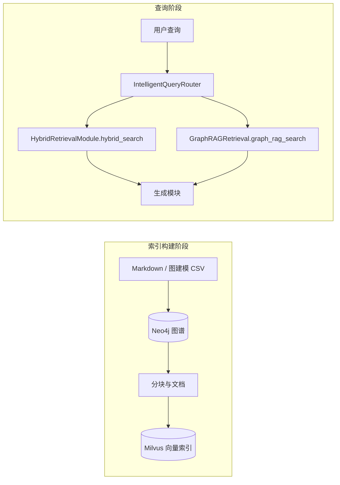

# all-in-rag「菜谱 RAG」整体结构与第九章（C9）重点解析

> 本文档基于仓库内 `all-in-rag/` 的文档（`docs/`）与可运行代码（`code/C8`、`code/C9`、`data/C8`、`data/C9`）整理，供 `rag-fec` 项目对照与改造时参考。  
> 原项目：Datawhale [all-in-rag](https://github.com/datawhalechina/all-in-rag)（教程 + 双实战：菜谱 RAG 与 C9 图 RAG 优化）。

---

## 1. 项目在教程中的位置

- **定位**：RAG 全栈教程，从数据加载、分块、嵌入、向量库、混合检索、生成、评估，到**项目实战**。
- **与「菜谱」强相关的实战**：
  - **第八章（C8）项目实战一（基础）**：「尝尝咸淡」——基于 [HowToCook](https://github.com/Anduin2017/HowToCook) 风格 Markdown 菜谱的**传统 RAG**（父子分块 + Milvus 等）。
  - **第九章（C9）项目实战一优化（选修）**：在同一套菜谱场景上，引入 **Neo4j 知识图谱 + 图检索 + 智能查询路由**，与 C8 的**向量/混合检索管线**组合使用。

---

## 2. 教程内容骨架（与菜谱线的关系）

| 部分 | 章节 | 与菜谱 RAG 的关系 |
|------|------|-------------------|
| 基础 | 第 1–2 章 | RAG 概念、数据加载、分块（C8 直接用到结构分块与父子块思想） |
| 索引 | 第 3 章 | 嵌入、向量库、Milvus（C8/C9 共用 Milvus 思路） |
| 检索 | 第 4 章 | 混合检索、查询构建等（C9 的「传统侧」在工程上更复杂） |
| 生成与评估 | 第 5–6 章 | 格式化生成、评估 |
| 拓展 | 第 7 章 | 知识图谱与 RAG 概念铺垫 |
| **实战一** | **第 8 章** | **菜谱 RAG 完整闭环（data/C8 + code/C8）** |
| **实战一优化** | **第 9 章** | **菜谱 + 图 + 路由（data/C9 + code/C9）** |

侧边栏与总 README 中「项目展示」链到社区 fork（如 What-to-eat-today），属于前端与体验优化，不改变上述核心架构。

---

## 3. 第八章：菜谱传统 RAG（C8）在结构上的角色

- **数据**：`data/C8/cook/...` 下大量结构化 Markdown 菜谱（及部分配图）。
- **核心工程权衡**（文档明确写出）：
  - 纯按标题分块可能丢失「操作 vs 原料」的上下文；
  - 采用 **父子块**：**小块检索、大块（父文档）生成**，兼顾命中率与完整性。
- **系统**：单机流水线：`main.py` + `rag_modules/`（数据准备、索引、检索、生成），依赖 Milvus + LLM（如 Kimi）。

C9 **不是替换 C8**，而是在**同一业务域**上增加图存储与图检索能力，并与 C8 延续下来的「传统混合检索」模块**共用接口层**（见第 6 节）。

---

## 4. 第九章：图 RAG 系统分层结构

### 4.1 运行时组件（逻辑视图）

### 4.2 数据与存储

| 要素 | 路径/说明 |
|------|-----------|
| 图数据 CSV + Cypher | `data/C9/cypher/`（`nodes.csv`、`relationships.csv`、`neo4j_import.cypher`） |
| Neo4j 编排 | `data/C9/docker-compose.yml`（文档约定账号口令等） |
| 图谱建模 | 菜谱 Recipe、食材 Ingredient、步骤 CookingStep，以及分类、难度、烹饪方法/工具等实体与关系（见 `docs/chapter9/02_graph_data_modeling.md`） |
| 向量索引 | 仍依赖 Milvus；嵌入与集合构建见 `docs/chapter9/03_index_construction.md` 与 `code/C9` 索引模块 |

### 4.3 代码入口与模块（`code/C9/`）

- **`main.py`**：`AdvancedGraphRAGSystem`——初始化数据模块、索引模块、**传统混合检索**、**图 RAG 检索**、**智能查询路由器**、生成模块；负责加载/重建知识库与用户交互循环。
- **`rag_modules/hybrid_retrieval.py`**：**传统侧**统一检索入口 `hybrid_search`（详见下一节）。
- **`rag_modules/graph_rag_retrieval.py`**：Neo4j + 查询意图分类（如多跳、子图、实体关系等），对外 `graph_rag_search`。
- **`rag_modules/intelligent_query_router.py`**：LLM 查询分析 + 规则降级 + 三种策略分发与 **`_combined_search`**。
- 其余：`graph_data_preparation.py`、`graph_indexing.py`、Milvus 封装、生成模块等与文档章节一一对应。

---

## 5. C9 第四章文档主题：智能查询路由与三种检索策略

官方文档：`docs/chapter9/04_intelligent_query_routing.md`。

### 5.1 路由输入输出（概念）

- **输入**：自然语言问句（菜谱场景示例丰富：简单菜名、推荐、替代食材、多约束推荐等）。
- **中间结构**：`QueryAnalysis`——复杂度、关系密集度、是否推理、实体数、推荐策略与置信度等（主要由 **LLM JSON** 产出；失败则 **关键词规则降级**）。
- **输出**：`SearchStrategy` 三选一：
  - `HYBRID_TRADITIONAL`：仅传统混合检索；
  - `GRAPH_RAG`：仅图 RAG；
  - `COMBINED`：两路各采一部分再合并。

### 5.2 决策与容错（与代码一致）

- **执行**：`route_query()` 按策略调用 `traditional_retrieval.hybrid_search` 或 `graph_rag_retrieval.graph_rag_search` 或 `_combined_search`。
- **容错**：任一路由执行异常时 **降级为** `hybrid_search`（传统检索作为全局保底）。
- **统计**：维护各策略调用计数，便于 `stats` 类命令展示。

---

## 6. 重点：图 RAG 与传统检索如何「共用」？

此处「共用」有两层含义：

1. **共用同一套下游**：两路检索结果都转成 LangChain `Document` 列表，进入同一套生成模块（第八章已有类似整合，C9 文档写明生成不再赘述）。
2. **在 COMBINED 策略下显式并行调用两路**：传统侧固定走 `HybridRetrievalModule`，图侧固定走 `GraphRAGRetrieval`。

### 6.1 传统侧：`hybrid_search`（单一真相）

**代码事实**（`code/C9/rag_modules/hybrid_retrieval.py`）：

- **三路召回**：  
  - **图键值双层检索** `dual_level_retrieval`（实体级 + 主题级，依赖 Neo4j + `GraphIndexingModule` 构建的键值索引）；  
  - **向量检索**（Milvus，含一跳邻居扩展等增强逻辑）；  
  - **BM25**（jieba 分词 + 烹饪场景停用词）。  
- **融合方式**：三路结果用 **RRF（Reciprocal Rank Fusion）** 合并（常量 `_RRF_K = 60`），而非简单的双层轮询。

因此：**第九章第四节文档中的部分示意图/伪代码强调「双层 + 向量」的 Round-robin**，与**当前仓库 C9 实现中的「三路 + RRF」**不完全一致；以 `hybrid_retrieval.py` 为准做工程复现时更可靠。

### 6.2 图侧：`graph_rag_search`

- 先做 **查询意图理解**（LLM/规则），映射到 `QueryType`（如 MULTI_HOP、SUBGRAPH、ENTITY_RELATION 等）。
- 再执行 **多跳遍历 / 子图抽取 / 路径推理** 等，并将图结果序列化为 `Document`，最后做图相关性排序截断 top-k。

### 6.3 COMBINED：`traditional_k` + `graph_k` + Round-robin 合并

**代码事实**（`intelligent_query_router.py` 中 `_combined_search`）：

- `traditional_k = max(1, top_k // 2)`，`graph_k = top_k - traditional_k`。
- 分别调用：  
  `traditional_retrieval.hybrid_search(query, traditional_k)`  
  `graph_rag_retrieval.graph_rag_search(query, graph_k)`
- **合并**：按索引 **Round-robin 交替**从两列表取文档（实现里**先图后传统**），用正文前 100 字符的 hash 做近似去重，并标注 `search_source`。
- **语义**：在「中等复杂」查询上同时保留 **语义/关键词侧（含图谱键值与向量、BM25）** 与 **显式图推理侧** 的多样性，避免只依赖单一路径。

### 6.4 小结表

| 策略 | 传统检索 | 图 RAG | 融合方式 |
|------|-----------|--------|-----------|
| HYBRID_TRADITIONAL | `hybrid_search`（三路 RRF） | 不使用 | — |
| GRAPH_RAG | 不使用 | `graph_rag_search` | — |
| COMBINED | `hybrid_search`（半份额） | `graph_rag_search`（半份额） | Round-robin + 去重 |
| 失败降级 | `hybrid_search` | — | — |

---

## 7. 官方对 C9 成熟度的说明（避免过度预期）

`docs/chapter9/04_intelligent_query_routing.md` 文末写明：**本章项目并不完善，主要用于理解 GraphRAG 流程与架构**，鼓励读者在前序章节基础上自行优化；并引用社区增强前端项目作为参考。

---

## 8. 对 `rag-fec` 的可迁移讨论点（供你后续提需求）

以下不涉及具体改代码，仅列出与 all-in-rag C9 **对齐或取舍**时常见的决策点：

- **领域从菜谱换为文献（FEC 等）**：图 schema、实体/关系抽取、双层键值索引字段、停用词与分词是否仍用 jieba 中文策略。
- **是否保留「LLM 路由」**：成本、延迟与稳定性 vs. 纯规则/浅层分类器。
- **传统侧融合**：是否采用 RRF 三路，或改为 Dense-only、或引入你在 `rag-fec` 中已有的解析管线（如 MinerU Markdown 分块）。
- **图与向量是否同源**：all-in-rag 从 Markdown → LLM/Agent → CSV → Neo4j；学术文献可能更适合引用网络、章节层级、公式表结构等不同建模。
- **降级策略**：C9 默认「异常 → 传统混合」；你的系统是否还需要「传统失败 → 全文关键词」等更多层。

---

## 9. 文档与代码对照索引

| 主题 | 文档 | 代码 |
|------|------|------|
| C9 总架构 | `docs/chapter9/01_graph_rag_architecture.md` | `code/C9/main.py`、`config.py` |
| 图建模与 Neo4j | `docs/chapter9/02_graph_data_modeling.md` | `graph_data_preparation.py`、`data/C9/cypher/` |
| Milvus 索引 | `docs/chapter9/03_index_construction.md` | C9 索引相关 `rag_modules/` |
| 路由与三种检索 | `docs/chapter9/04_intelligent_query_routing.md` | `intelligent_query_router.py`、`hybrid_retrieval.py`、`graph_rag_retrieval.py` |
| C8 菜谱基线 | `docs/chapter8/*.md` | `code/C8/`、`data/C8/` |

---

*生成说明：传统混合检索实现以 `code/C9/rag_modules/hybrid_retrieval.py` 为准；若仅阅读第九章第四节 Markdown，请注意其与当前仓库中 RRF 三路实现可能不一致。*
